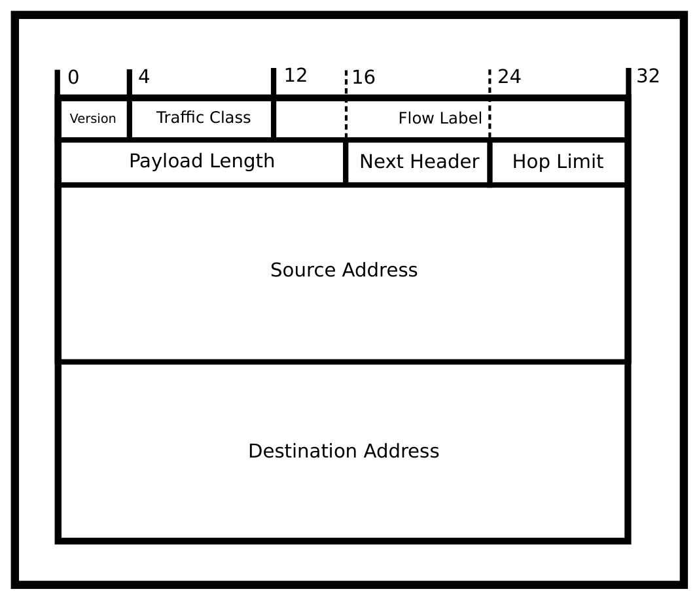
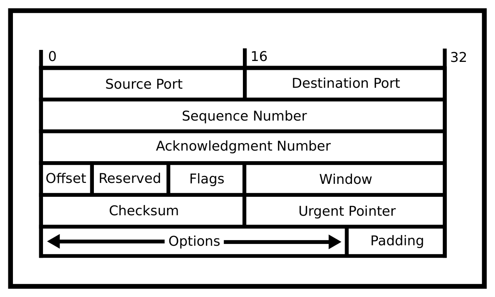

# Chương 11. Lập trình mạng (Networking)

> Bản dịch tiếng Việt từ *System Programming Coursebook* (University of Illinois, CS 241) — B. Venkatesh, L. Angrave et al. Tài liệu gốc được phát hành theo giấy phép [CC BY 4.0](https://creativecommons.org/licenses/by/4.0/); bản dịch giữ nguyên giấy phép này. Nguồn: https://github.com/illinois-cs241/coursebook

> Web như tôi từng hình dung, chúng ta vẫn chưa được thấy nó. Tương lai vẫn còn lớn hơn quá khứ rất nhiều.
>
> — Tim Berners-Lee

Trong 10–20 năm qua, mạng máy tính (networking) được xem là ứng dụng quan trọng bậc nhất của máy tính. Ngày nay hầu hết chúng ta không chịu nổi một nơi không có WiFi hay bất kỳ kết nối nào, vì vậy với tư cách lập trình viên, điều cốt yếu là bạn phải hiểu về mạng và cách lập trình để giao tiếp qua mạng. Nghe có vẻ phức tạp, nhưng POSIX đã định nghĩa những chuẩn rất tốt giúp việc kết nối với thế giới bên ngoài trở nên dễ dàng. POSIX cũng cho phép bạn nhìn sâu xuống bên dưới và tối ưu từng chi tiết nhỏ của mỗi kết nối để viết ra những chương trình có hiệu năng rất cao.

Như một bổ sung mà bạn sẽ đọc kỹ hơn ở chương sau, chúng tôi sẽ nghiêm ngặt về ký hiệu kích thước. Điều đó có nghĩa là khi chúng tôi dùng các tiền tố SI như Kilo-, Mega-, v.v., thì luôn luôn là lũy thừa của 10. Một kilobyte là một nghìn byte, một megabyte là một nghìn kilobyte, và cứ thế. Nếu cần nói đến 1024 byte, chúng tôi sẽ dùng thuật ngữ chính xác hơn là Kibibyte. Mibibyte và Gibibyte lần lượt là các từ tương ứng với Megabyte và Gigabyte. Chúng tôi phân biệt như vậy để chắc chắn rằng mình không bị sai lệch mất 24. Lý do của cách gọi sai lệch này sẽ được giải thích trong chương về hệ thống tệp.

## 11.1 Mô hình OSI (The OSI Model)

Mô hình 7 tầng Open Source Interconnection (mô hình OSI) là một chuỗi các phân đoạn định nghĩa chuẩn cho cả hạ tầng lẫn giao thức của các hình thức truyền thông vô tuyến, trong trường hợp của chúng ta là Internet. Mô hình 7 tầng như sau:

1. Tầng 1: Tầng vật lý (Physical Layer). Đây là những sóng thực sự mang các baud đi qua dây dẫn. Nói thêm, không phải bit đi qua dây, vì trong hầu hết các môi trường truyền dẫn bạn có thể thay đổi hai đặc tính của sóng – biên độ và tần số – và thu được nhiều bit hơn trên mỗi chu kỳ đồng hồ.

2. Tầng 2: Tầng liên kết (Link Layer). Đây là cách mỗi tác nhân phản ứng với những sự kiện nhất định (phát hiện lỗi, kênh nhiễu, v.v.). Ethernet và WiFi nằm ở tầng này.

3. Tầng 3: Tầng mạng (Network Layer). Đây là trái tim của Internet. Hai giao thức bên dưới xử lý việc truyền thông giữa hai máy tính được kết nối trực tiếp với nhau. Tầng này xử lý việc định tuyến các gói tin (packet) từ đầu cuối này đến đầu cuối khác.

4. Tầng 4: Tầng giao vận (Transport Layer). Tầng này quy định cách các lát dữ liệu được nhận. Ba tầng bên dưới không đảm bảo gì về thứ tự các gói tin được nhận và điều gì xảy ra khi một gói tin bị mất. Bằng các giao thức khác nhau, tầng này có thể làm được điều đó.

5. Tầng 5: Tầng phiên (Session Layer). Tầng này đảm bảo rằng nếu một kết nối ở các tầng trước bị rớt, một kết nối mới ở các tầng dưới có thể được thiết lập lại, và với người dùng cuối thì trông như chưa có gì xảy ra.

6. Tầng 6: Tầng trình diễn (Presentation Layer). Tầng này xử lý mã hóa, nén và chuyển đổi dữ liệu. Ví dụ, tính khả chuyển giữa các hệ điều hành khác nhau như chuyển ký tự xuống dòng sang kiểu xuống dòng của Windows.

7. Tầng 7: Tầng ứng dụng (Application Layer). Hyper Text Transfer Protocol và File Transfer Protocol đều được định nghĩa ở tầng này. Đây thường là nơi chúng ta định nghĩa các giao thức trên Internet. Là lập trình viên, chúng ta chỉ đi xuống thấp hơn khi nghĩ rằng mình có thể tạo ra những thuật toán phù hợp với nhu cầu của mình hơn tất cả những gì bên dưới.

Cuốn sách này sẽ không đề cập sâu về mạng. Chúng tôi sẽ tập trung vào một số khía cạnh của các tầng 3, 4 và 7 vì đó là những điều thiết yếu phải biết nếu bạn định làm gì đó với Internet – mà đến một lúc nào đó trong sự nghiệp, chắc chắn bạn sẽ làm. Thêm một định nghĩa nữa: một giao thức (protocol) là một tập các đặc tả do Internet Engineering Task Force đưa ra, quy định cách những người hiện thực giao thức đó phải làm cho chương trình hoặc mạch điện của mình hành xử trong những tình huống cụ thể.

## 11.2 Tầng 3: Giao thức Internet (Layer 3: The Internet Protocol)

Sau đây là phần giới thiệu ngắn về giao thức Internet (Internet Protocol – IP), cách chủ yếu để gửi các datagram thông tin từ máy này sang máy khác. "IP4", hay chính xác hơn là Internet Protocol Version 4, là phiên bản 4 của Internet Protocol, mô tả cách gửi một gói tin (packet) thông tin qua mạng từ máy này sang máy khác. Ngay cả vào năm 2018, IPv4 vẫn thống trị lưu lượng Internet, nhưng Google báo cáo rằng hiện có 24 quốc gia cung cấp 15% lưu lượng của họ qua IPv6 [2]. Một hạn chế đáng kể của IPv4 là địa chỉ nguồn và đích bị giới hạn ở 32 bit. IPv4 được thiết kế vào thời mà ý tưởng 4 tỷ thiết bị cùng kết nối vào một mạng là điều không tưởng, hoặc ít nhất là không đáng để làm kích thước gói tin lớn hơn. Các địa chỉ thường được viết dưới dạng một dãy bốn octet phân cách bởi dấu chấm, ví dụ "255.255.255.0".

Mỗi datagram IPv4 có một header nhỏ – thường là 20 byte – chứa địa chỉ nguồn và địa chỉ đích. Về mặt khái niệm, địa chỉ nguồn và đích có thể được chia làm hai phần: các bit cao là số hiệu mạng (network number) và các bit thấp biểu diễn số hiệu host (host number) cụ thể trên mạng đó.

Một giao thức gói tin mới hơn, Internet Protocol Version 6, giải quyết nhiều hạn chế của IPv4, như làm cho bảng định tuyến đơn giản hơn và dùng địa chỉ 128 bit. Tuy nhiên, tính đến năm 2018, tương đối ít lưu lượng web dựa trên IPv6 [2]. Chúng ta viết địa chỉ IPv6 dưới dạng một dãy tám nhóm bốn chữ số thập lục phân, ví dụ "1F45:0000:0000:0000:0000:0000:0000:0000". Vì cách viết đó khá cồng kềnh, ta có thể lược bỏ các số không: "1F45::". Một máy có thể có đồng thời cả địa chỉ IPv6 và địa chỉ IPv4.

Có những địa chỉ IP đặc biệt. Một địa chỉ như vậy trong IPv4 là 127.0.0.1, trong IPv6 là 0:0:0:0:0:0:0:1 hay ::1, còn được gọi là localhost. Các gói tin gửi tới 127.0.0.1 sẽ không bao giờ rời khỏi máy; địa chỉ này được quy định là chính máy đó. Còn có rất nhiều địa chỉ đặc biệt khác được ký hiệu bằng việc một số octet nhất định bằng không hoặc bằng 255, giá trị tối đa. Bạn không cần biết hết mọi thuật ngữ, chỉ cần nhớ rằng số địa chỉ IP thực sự mà một máy có thể có trên phạm vi toàn cầu qua Internet nhỏ hơn số địa chỉ "thô". Cuốn sách này đề cập cách IP xử lý việc định tuyến, phân mảnh và tái hợp các giao thức tầng trên. Tiếp theo là một phần bàn thêm sâu hơn.

### 11.2.1 Chuyện gì với IPv6? (What's the deal with IPv6?)



*Hình 11.1: Cách phân chia datagram IPv6*

Một trong những tính năng lớn của IPv6 là không gian địa chỉ. Thế giới đã cạn địa chỉ IP từ lâu và vẫn đang dùng các mẹo để lách qua điều đó. Với IPv6, có đủ địa chỉ nội bộ và bên ngoài đến mức ngay cả khi ta phát hiện ra các nền văn minh ngoài hành tinh, có lẽ cũng không hết được. Lợi ích khác là các địa chỉ này được cho thuê chứ không phải mua đứt, nghĩa là nếu có điều gì đó thay đổi mạnh mẽ, chẳng hạn trong Internet vạn vật (Internet of Things), và cần thay đổi sơ đồ đánh địa chỉ theo khối, thì có thể làm được.

Một tính năng lớn khác là bảo mật thông qua IPsec. IPv4 được thiết kế mà hầu như không tính đến bảo mật. Vì vậy, giờ đây có một cơ chế trao đổi khóa tương tự TLS ở các tầng cao hơn cho phép bạn mã hóa việc truyền thông.

Một tính năng nữa là việc xử lý được đơn giản hóa. Để Internet nhanh, header IPv4 và IPv6 được kiểm tra bằng phần cứng. Điều đó có nghĩa là mọi tùy chọn của header đều được xử lý trong mạch điện ngay khi chúng đến. Vấn đề là khi đặc tả IPv4 phình to ra với vô số header, phần cứng phải ngày càng tiên tiến hơn để hỗ trợ các header đó. IPv6 sắp xếp lại các header để gói tin có thể bị loại bỏ và được định tuyến với ít chu kỳ phần cứng hơn. Với Internet, mỗi chu kỳ đều đáng giá khi phải định tuyến lưu lượng của cả thế giới.

### 11.2.2 Địa chỉ của tôi là gì? (What's My Address?)

Để lấy một danh sách liên kết các địa chỉ IP của máy hiện tại, hãy dùng `getifaddrs`; hàm này trả về một danh sách liên kết gồm các địa chỉ IPv4 và IPv6, cùng với các giao diện (interface) khác. Ta có thể duyệt từng mục và dùng `getnameinfo` để in ra địa chỉ IP của host. Struct `ifaddrs` có chứa họ địa chỉ (family) nhưng không chứa kích thước của struct. Do đó ta phải tự xác định kích thước struct dựa trên family.

```c
(family == AF_INET) ? sizeof(struct sockaddr_in) : sizeof(struct sockaddr_in6)
```

Mã đầy đủ được trình bày dưới đây.

```c
int required_family = AF_INET; // Change to AF_INET6 for IPv6
struct ifaddrs *myaddrs, *ifa;
getifaddrs(&myaddrs);
char host[256], port[256];

for (ifa = myaddrs; ifa != NULL; ifa = ifa->ifa_next) {
  int family = ifa->ifa_addr->sa_family;
  if (family == required_family && ifa->ifa_addr) {
    int ret = getnameinfo(ifa->ifa_addr,
    (family == AF_INET) ? sizeof(struct sockaddr_in) :
    sizeof(struct sockaddr_in6),
    host, sizeof(host), port, sizeof(port)
    , NI_NUMERICHOST | NI_NUMERICSERV)
    if (0 == ret) {
      puts(host);
    }
  }
}
```

Để lấy địa chỉ IP của bạn từ dòng lệnh, hãy dùng `ifconfig` hoặc `ipconfig` của Windows.

Tuy nhiên, lệnh này sinh ra rất nhiều output cho mỗi giao diện, vì vậy ta có thể lọc output bằng `grep`.

```bash
ifconfig | grep inet
```

Output ví dụ:

```text
inet6 fe80::1%lo0 prefixlen 64 scopeid 0x1
inet 127.0.0.1 netmask 0xff000000
inet6 ::1 prefixlen 128
inet6 fe80::7256:81ff:fe9a:9141%en1 prefixlen 64 scopeid 0x5
inet 192.168.1.100 netmask 0xffffff00 broadcast 192.168.1.255
```

Để lấy địa chỉ IP của một website ở xa, hàm `getaddrinfo` có thể chuyển một tên miền dễ đọc với con người (ví dụ www.illinois.edu) thành địa chỉ IPv4 và IPv6. Nó sẽ trả về một danh sách liên kết các struct `addrinfo`:

```c
struct addrinfo {
  int             ai_flags;
  int             ai_family;
  int             ai_socktype;
  int             ai_protocol;
  socklen_t       ai_addrlen;
  struct sockaddr *ai_addr;
  char          *ai_canonname;
  struct addrinfo *ai_next;
};
```

Ví dụ, giả sử bạn muốn tìm địa chỉ IPv4 dạng số của một web server tại www.bbc.com. Ta làm việc này qua hai giai đoạn. Thứ nhất, dùng `getaddrinfo` để dựng một danh sách liên kết các kết nối khả dĩ. Thứ hai, dùng `getnameinfo` để chuyển địa chỉ nhị phân của một trong số đó sang dạng đọc được.

```c
#include <stdio.h>
#include <stdlib.h>
#include <sys/types.h>
#include <sys/socket.h>
#include <netdb.h>

struct addrinfo hints, *infoptr; // So no need to use memset global variables

int main() {
  hints.ai_family = AF_INET; // AF_INET means IPv4 only addresses

  // Get the machine addresses
  int result = getaddrinfo("www.bbc.com", NULL, &hints, &infoptr);
  if (result) {
    fprintf(stderr, "getaddrinfo: %s\n", gai_strerror(result));
    exit(1);
  }

  struct addrinfo *p;
  char host[256];

  for(p = infoptr; p != NULL; p = p->ai_next) {
    // Get the name for all returned addresses
    getnameinfo(p->ai_addr, p->ai_addrlen, host, sizeof(host),
        NULL, 0, NI_NUMERICHOST);
    puts(host);
  }

  freeaddrinfo(infoptr);
  return 0;
}
```

Output có thể có.

```text
212.58.244.70
212.58.244.71
```

Ta có thể chỉ định cả IPv4 lẫn IPv6 bằng `AF_UNSPEC`. Chỉ cần thay thuộc tính `ai_family` trong đoạn mã trên bằng dòng sau.

```c
hints.ai_family = AF_UNSPEC
```

Nếu bạn thắc mắc máy tính ánh xạ hostname sang địa chỉ như thế nào, chúng ta sẽ nói về điều đó ở Tầng 7. Bật mí trước: đó là một dịch vụ gọi là Domain Name Service. Trước khi chuyển sang mục tiếp theo, cần lưu ý rằng một website có thể có nhiều địa chỉ IP. Điều này có thể là để sử dụng máy móc hiệu quả. Nếu Google hay Facebook chỉ có một server duy nhất định tuyến mọi yêu cầu đến sang các máy tính khác, họ sẽ phải chi khoản tiền khổng lồ cho máy tính hoặc trung tâm dữ liệu đó. Thay vào đó, họ có thể cấp cho các khu vực khác nhau những địa chỉ IP khác nhau và để một máy tính lựa chọn. Truy cập một website qua địa chỉ IP không được ưu tiên cũng không có gì xấu. Trang có thể chỉ tải chậm hơn.

## 11.3 Tầng 4: TCP và Client (Layer 4: TCP and Client)



*Hình 11.2: Phần thêm: Đặc tả header TCP*

Hầu hết các dịch vụ trên Internet ngày nay dùng Transport Control Protocol vì nó che giấu một cách hiệu quả sự phức tạp ở mức gói tin của các tầng thấp hơn của Internet. TCP hay Transport Control Protocol là một giao thức hướng kết nối (connection-based) được xây dựng trên IPv4 và IPv6, do đó có thể được mô tả là "TCP/IP" hay "TCP over IP". TCP tạo ra một ống dẫn giữa hai máy và trừu tượng hóa đi bản chất gói tin ở mức thấp của Internet. Nhờ vậy, trong hầu hết các điều kiện, các byte gửi qua một kết nối TCP sẽ được chuyển đến và không bị hỏng. Tuy nhiên, mã hiệu năng cao và mã dễ gặp lỗi thậm chí sẽ không giả định điều đó!

TCP có nhiều tính năng khiến nó khác biệt với giao thức giao vận còn lại là UDP.

1. Port. Với IP, bạn chỉ được phép gửi gói tin đến một máy. Nếu muốn một máy xử lý nhiều luồng dữ liệu, bạn phải tự làm thủ công với IP. TCP cấp cho lập trình viên một tập các socket ảo. Client chỉ định socket mà bạn muốn gói tin được gửi đến, và giao thức TCP đảm bảo rằng các ứng dụng đang chờ gói tin trên port đó sẽ nhận được nó. Một process có thể lắng nghe gói tin đến trên một port cụ thể. Tuy nhiên, chỉ các process có quyền (root) mới được lắng nghe trên các port nhỏ hơn 1024. Bất kỳ process nào cũng có thể lắng nghe trên các port từ 1024 trở lên. Một port hay dùng là port số 80. Nó được dùng cho các yêu cầu HTTP hay trang web không mã hóa. Ví dụ, nếu một trình duyệt web kết nối tới http://www.bbc.com/ thì nó sẽ kết nối tới port 80.

2. Gói tin có thể bị mất do lỗi mạng hoặc tắc nghẽn. Vì vậy chúng cần được truyền lại. Đồng thời, việc truyền lại không được làm cho thêm nhiều gói tin khác bị mất. Điều này cần cân bằng giữa việc làm ngập mạng và tốc độ.

3. Gói tin đến không đúng thứ tự. Gói tin có thể được định tuyến thuận lợi hơn vì nhiều lý do trong IP. Nếu một gói tin gửi sau lại đến trước gói tin khác, giao thức phải phát hiện và sắp xếp lại chúng.

4. Gói tin trùng lặp. Gói tin có thể đến hai lần. Gói tin có thể đến hai lần. Vì vậy, giao thức cần có khả năng phân biệt hai gói tin dựa trên một số thứ tự (sequence number) có thể bị tràn.

5. Sửa lỗi. TCP có một checksum để xử lý lỗi bit. Tuy nhiên điều này hiếm khi được dùng.

6. Điều khiển luồng (Flow Control). Điều khiển luồng được thực hiện ở phía nhận. Việc này có thể được làm để một bên nhận chậm không bị ngập trong gói tin. Các server xử lý 10000 hay 10 triệu kết nối đồng thời có thể cần bảo bên nhận chậm lại nhưng vẫn giữ kết nối do tải. Còn có vấn đề đảm bảo lưu lượng của mạng cục bộ được ổn định.

7. Điều khiển tắc nghẽn (Congestion control). Điều khiển tắc nghẽn được thực hiện ở phía gửi. Điều khiển tắc nghẽn nhằm tránh việc một bên gửi làm ngập mạng với quá nhiều gói tin. Điều này quan trọng để đảm bảo mỗi kết nối TCP được đối xử công bằng. Nghĩa là hai kết nối rời khỏi một máy tính đến Google và YouTube nhận được băng thông và ping như nhau. Người ta có thể dễ dàng định nghĩa một giao thức chiếm hết băng thông và bỏ mặc các giao thức khác, nhưng điều này thường bị coi là độc hại vì nhiều khi giới hạn một máy tính ở một kết nối TCP duy nhất cũng sẽ cho kết quả tương tự.

8. Hướng kết nối / hướng vòng đời. Bạn có thể hình dung một kết nối TCP như một chuỗi byte được gửi qua một ống dẫn. Tuy nhiên, một kết nối TCP có một "vòng đời". TCP xử lý việc thiết lập kết nối thông qua SYN SYN-ACK ACK. Nghĩa là client sẽ gửi một gói SYNchronization (đồng bộ) báo cho TCP biết bắt đầu từ số thứ tự nào. Sau đó bên nhận sẽ gửi một thông điệp SYN-ACK xác nhận số đồng bộ đó. Rồi client sẽ ACKnowledge (xác nhận) bằng một gói tin cuối cùng. Giờ kết nối đã mở cho cả đọc và ghi ở cả hai đầu. TCP sẽ gửi dữ liệu và bên nhận dữ liệu sẽ xác nhận rằng nó đã nhận được một gói tin. Sau đó, thỉnh thoảng nếu không có gói tin nào được gửi, TCP sẽ trao đổi các gói tin độ dài không để chắc chắn rằng kết nối vẫn còn sống. Tại bất kỳ thời điểm nào, client và server đều có thể gửi một gói FIN, nghĩa là bên đó sẽ không truyền nữa. Gói tin này có thể được thay đổi bằng các bit chỉ đóng đầu đọc hoặc đầu ghi của một kết nối cụ thể. Khi tất cả các đầu đều đã đóng thì kết nối kết thúc.

Tuy vậy, TCP không cung cấp nhiều thứ.

1. Bảo mật. Kết nối đến một địa chỉ IP tự nhận là một website nào đó không hề xác minh lời tự nhận ấy (như trong TLS). Bạn có thể đang gửi gói tin đến một máy tính độc hại.

2. Mã hóa. Bất kỳ ai cũng có thể nghe lén TCP thuần. Các gói tin đang truyền là văn bản thuần. Những thứ quan trọng như mật khẩu của bạn có thể dễ dàng bị kẻ theo dõi đọc trộm.

3. Kết nối lại phiên. Nếu một kết nối TCP chết thì phải tạo hoàn toàn một kết nối mới, và việc truyền phải bắt đầu lại từ đầu. Việc này được xử lý bởi một giao thức cao hơn.

4. Phân định các yêu cầu. TCP về bản chất là hướng kết nối. Các ứng dụng giao tiếp qua TCP cần tìm ra một cách riêng để báo cho nhau biết rằng yêu cầu hay phản hồi này đã kết thúc. HTTP phân định header bằng hai ký tự xuống dòng (carriage return) và dùng hoặc một trường độ dài, hoặc cứ tiếp tục lắng nghe cho đến khi kết nối đóng.

### 11.3.1 Lưu ý về thứ tự byte mạng (Note on network orders)

Số nguyên có thể được biểu diễn với byte ít quan trọng nhất đứng trước hoặc byte quan trọng nhất đứng trước. Cách nào cũng hợp lý miễn là bản thân máy nhất quán bên trong. Với truyền thông mạng, ta cần chuẩn hóa theo một định dạng đã thống nhất.

`htons(xyz)` trả về giá trị số nguyên không dấu 16 bit ("short") `xyz` theo thứ tự byte mạng (network byte order). `htonl(xyz)` trả về giá trị số nguyên không dấu 32 bit ("long") `xyz` theo thứ tự byte mạng. Với các số nguyên dài hơn, các máy tính cần tự chỉ định thứ tự.

Các hàm này được đọc là "host to network" (từ host sang mạng). Các hàm ngược lại (`ntohs`, `ntohl`) chuyển các giá trị byte theo thứ tự mạng về thứ tự của host. Vậy thứ tự của host là little-endian hay big-endian? Câu trả lời là – tùy máy của bạn! Nó phụ thuộc vào kiến trúc thực sự của host đang chạy mã. Nếu kiến trúc tình cờ trùng với thứ tự mạng thì các hàm trả về số nguyên y hệt. Với máy x86, thứ tự host và thứ tự mạng khác nhau.

Trừ khi có thỏa thuận khác, mỗi khi bạn đọc hoặc ghi các cấu trúc mạng mức thấp trong C, tức thông tin port và địa chỉ, hãy nhớ dùng các hàm trên để đảm bảo chuyển đổi đúng từ/sang định dạng của máy. Nếu không, giá trị được hiển thị hoặc được chỉ định có thể sai.

Điều này không áp dụng cho các giao thức thỏa thuận trước về endianness. Nếu hai máy tính bị nghẽn CPU vì phải chuyển đổi thông điệp giữa các thứ tự mạng – điều này xảy ra với RPC trong các hệ thống hiệu năng cao – thì có thể đáng để thỏa thuận xem chúng có cùng endianness không để gửi theo thứ tự little-endian.

Tại sao thứ tự mạng được định nghĩa là big-endian? Câu trả lời đơn giản là vì RFC1700 nói vậy [5]. Nếu bạn muốn biết thêm, chúng tôi sẽ trích dẫn bài viết nổi tiếng đã lập luận cho một phiên bản cụ thể [3]. Điều quan trọng nhất là nó là chuẩn. Điều gì xảy ra khi ta không có một chuẩn duy nhất? Ta có 4 loại đầu cắm USB khác nhau (thường, Micro, Mini và USB-C) không tương thích tốt với nhau. Chèn XKCD phù hợp vào đây: Standards.

### 11.3.2 TCP Client

Có ba system call cơ bản để kết nối đến một máy ở xa.

1. `int getaddrinfo(const char *node, const char *service, const struct addrinfo *hints, struct addrinfo **res);`

   Lời gọi `getaddrinfo`, nếu thành công, tạo ra một danh sách liên kết các struct `addrinfo` và đặt con trỏ được truyền vào trỏ tới phần tử đầu tiên.

   Ngoài ra, bạn có thể dùng struct `hints` để chỉ lấy những mục nhất định, như một số giao thức IP nhất định, v.v. Cấu trúc `addrinfo` được truyền vào `getaddrinfo` để định nghĩa loại kết nối bạn muốn. Ví dụ, để chỉ định các giao thức dựa trên stream qua IPv6, bạn có thể dùng đoạn mã sau.

   ```c
   struct addrinfo hints;
   memset(&hints, 0, sizeof(hints));

   hints.ai_family = AF_INET6; // Only want IPv6 (use AF_INET for IPv4)
   hints.ai_socktype = SOCK_STREAM; // Only want stream-based connection
   ```

   Các chế độ khác của "family" là `AF_INET` và `AF_UNSPEC`, lần lượt có nghĩa là IPv4 và không xác định. Điều này có thể hữu ích nếu bạn đang tìm một dịch vụ mà không hoàn toàn chắc nó dùng phiên bản IP nào. Đương nhiên, nếu bạn chỉ định UNSPEC thì bạn sẽ nhận lại phiên bản trong trường tương ứng.

   Xử lý lỗi với `getaddrinfo` hơi khác một chút. Giá trị trả về chính là mã lỗi. Để chuyển thành lỗi đọc được với con người, dùng `gai_strerror` để lấy chuỗi mô tả lỗi ngắn gọn bằng tiếng Anh tương ứng.

   ```c
   int result = getaddrinfo(...);
   if(result) {
     const char *mesg = gai_strerror(result);
     ...
   }
   ```

2. `int socket(int domain, int socket_type, int protocol);`

   Lời gọi `socket` tạo một socket mạng và trả về một descriptor có thể dùng với `read` và `write`. Theo nghĩa đó, nó là phiên bản mạng của `open` mở một file stream – ngoại trừ việc ta chưa kết nối socket với bất cứ thứ gì!

   Socket được tạo với một domain là `AF_INET` cho IPv4 hoặc `AF_INET6` cho IPv6; `socket_type` là dùng UDP, TCP hay một loại socket nào khác; `protocol` là lựa chọn tùy chọn về cấu hình giao thức – với các ví dụ của chúng ta, có thể để là 0 để dùng mặc định. Lời gọi này tạo một đối tượng socket trong kernel mà qua đó ta có thể giao tiếp với thế giới/mạng bên ngoài. Bạn có thể dùng kết quả của `getaddrinfo` để điền các tham số cho socket, hoặc tự cung cấp chúng.

   Lời gọi `socket` trả về một số nguyên – một file descriptor – và với TCP client, bạn có thể dùng nó như một file descriptor thông thường. Bạn có thể dùng `read` và `write` để nhận hoặc gửi gói tin.

   TCP socket tương tự như pipe và thường được dùng trong những tình huống cần IPC. Chúng tôi không nhắc đến nó trong các chương trước vì dùng một thiết bị vốn dành cho mạng chỉ để giao tiếp giữa các process trên một máy đơn lẻ là quá mức cần thiết.

3. `connect(int sockfd, const struct sockaddr *addr, socklen_t addrlen);`

   Cuối cùng, lời gọi `connect` thử kết nối tới máy ở xa. Ta truyền socket descriptor ban đầu cùng với thông tin địa chỉ socket được lưu trong cấu trúc `addrinfo`. Có nhiều loại cấu trúc địa chỉ socket khác nhau có thể cần nhiều bộ nhớ hơn. Vì vậy ngoài việc truyền con trỏ, kích thước của cấu trúc cũng được truyền theo. Để giúp nhận diện lỗi và sai sót, thực hành tốt là kiểm tra giá trị trả về của mọi lời gọi mạng, kể cả `connect`.

   ```c
   // Pull out the socket address info from the addrinfo struct:
   connect(sockfd, p->ai_addr, p->ai_addrlen)
   ```

4. (Tùy chọn) Để dọn dẹp, gọi `freeaddrinfo(struct addrinfo *ai)` trên struct `addrinfo` ở mức đầu tiên.

Có một hàm cũ là `gethostbyname` đã bị khuyến cáo không dùng (deprecated). Đó là cách cũ để chuyển một hostname thành địa chỉ IP. Địa chỉ port vẫn phải được đặt thủ công bằng hàm `htons`. Viết mã hỗ trợ cả IPv4 VÀ IPv6 bằng `getaddrinfo` mới hơn sẽ dễ hơn nhiều.

Đó là tất cả những gì cần thiết để tạo một TCP client đơn giản. Tuy nhiên, truyền thông mạng cung cấp nhiều mức trừu tượng khác nhau cùng nhiều thuộc tính và tùy chọn có thể đặt ở mỗi mức. Ví dụ, chúng ta chưa nói về `setsockopt`, hàm có thể thao tác các tùy chọn của socket. Bạn cũng có thể vọc các giao thức thấp hơn vì kernel cung cấp các primitive phục vụ việc đó. Lưu ý rằng bạn cần là root để tạo một raw socket. Ngoài ra, bạn cần có rất nhiều mã "thiết lập" hay mã khởi đầu, và hãy chuẩn bị tinh thần là các datagram của bạn sẽ bị loại bỏ do sai định dạng. Để biết thêm thông tin, xem hướng dẫn này.

### 11.3.3 Gửi chút dữ liệu (Sending some data)

Khi đã có kết nối thành công, ta có thể đọc hoặc ghi như với bất kỳ file descriptor nào. Hãy nhớ rằng nếu bạn kết nối đến một website, bạn cần tuân theo đặc tả giao thức HTTP để nhận lại được kết quả có ý nghĩa. Có những thư viện làm việc này. Thông thường, bạn không kết nối ở mức socket. Số byte đọc hoặc ghi được có thể nhỏ hơn mong đợi. Vì vậy, điều quan trọng là kiểm tra giá trị trả về của `read` và `write`. Dưới đây là một HTTP client đơn giản gửi một yêu cầu tới một URL hợp chuẩn. Trước hết, ta bắt đầu với phần tẻ nhạt và mã phân tích cú pháp.

```c
typedef struct _host_info {
  char *hostname;
  char *port;
  char *resource;
} host_info;

host_info *get_info(char *uri) {
  // ... Parses the URI/URL
}

void free_info(host_info *info) {
  // ... Frees any info
}

int main(int argc, char *argv[]) {
  if(argc != 2) {
    fprintf(stderr, "Usage: %s http://hostname[:port]/path\n",
        *argv);
    return 1;
  }
  char *uri = argv[1];
  host_info *info = get_info(uri);
  host_info *temp = send_request(info);

  return 0;
}
```

Mã gửi yêu cầu nằm bên dưới. Việc đầu tiên phải làm là kết nối đến một địa chỉ.

```c
struct addrinfo current, *result;
memset(&current, 0, sizeof(struct addrinfo));
current.ai_family = AF_INET;
current.ai_socktype = SOCK_STREAM;

getaddrinfo(info->hostname, info->port, &current, &result);

connect(sock_fd, result->ai_addr, result->ai_addrlen)

freeaddrinfo(result);
```

Đoạn mã tiếp theo gửi yêu cầu. Đây là ý nghĩa của từng header.

1. `"GET %s HTTP/1.0"` Đây là động từ yêu cầu (request verb) được nội suy với đường dẫn. Nghĩa là thực hiện động từ GET trên đường dẫn đó bằng phương thức HTTP/1.0.

2. `"Connection: close"` Có nghĩa là ngay khi yêu cầu kết thúc, hãy đóng kết nối. Dòng này sẽ không được dùng cho bất kỳ kết nối nào khác. Điều này hơi thừa vì HTTP 1.0 không cho phép bạn gửi nhiều yêu cầu, nhưng tốt hơn là nói rõ ràng vì có những công nghệ không tuân chuẩn.

3. `"Accept: */*"` Có nghĩa là client sẵn sàng chấp nhận bất cứ thứ gì.

Một đoạn mã vững chắc hơn cũng sẽ kiểm tra xem `write` có thất bại hay lời gọi có bị ngắt không.

```c
char *buffer;
asprintf(&buffer,
  "GET %s HTTP/1.0\r\n"
  "Connection: close\r\n"
  "Accept: */*\r\n\r\n",
  info->resource);

write(sock_fd, buffer, strlen(buffer));
free(buffer);
```

Đoạn mã cuối cùng là mã điều khiển (driver) gửi yêu cầu. Bạn cứ thoải mái dùng đoạn mã sau nếu muốn mở file descriptor dưới dạng một đối tượng `FILE` để dùng các hàm tiện ích. Chỉ cần cẩn thận đừng quên đặt buffering về không, nếu không bạn có thể đệm đầu vào hai lần, dẫn đến vấn đề về hiệu năng.

```c
void send_request(host_info *info) {
  int sock_fd = socket(AF_INET, SOCK_STREAM, 0);
  // Re-use address is a little overkill here because we are making a
  // Listen only server and we don't expect spoofed requests.
  int optval = 1;
  int retval = setsockopt(sock_fd, SOL_SOCKET, SO_REUSEADDR, &optval,
  sizeof(optval));
  if(retval == -1) {
    perror("setsockopt");
    exit(1);
  }
  // Connect using code snippet

  // Send the get request

  // Open so you can use getline
  FILE *sock_file = fdopen(sock_fd, "r+");
  setvbuf(sock_file, NULL, _IONBF, 0);

  ret = handle_okay(sock_file);
  fclose(sock_file);
  close(sock_fd);
}
```

Ví dụ trên minh họa một yêu cầu tới server bằng HyperText Transfer Protocol. Nói chung, có sáu phần

1. Phương thức. GET, POST, v.v.

2. Tài nguyên. "/" "/index.html" "/image.png"

3. Giao thức "HTTP/1.0"

4. Một dòng mới (`\r\n`). Các yêu cầu luôn có một ký tự carriage return.

5. Bất kỳ tham số điều chỉnh hay tùy chọn nào khác

6. Phần thân thực sự của yêu cầu, được phân định bằng hai dòng mới. Phần thân của yêu cầu hoặc có kích thước được chỉ định, hoặc kéo dài cho đến khi bên nhận đóng kết nối.

Dòng phản hồi đầu tiên của server mô tả phiên bản HTTP được dùng và yêu cầu có thành công hay không bằng một mã phản hồi 3 chữ số.

```text
HTTP/1.1 200 OK
```

Nếu client yêu cầu một đường dẫn không tồn tại, ví dụ `GET /nosuchfile.html HTTP/1.0`, thì dòng đầu tiên chứa mã phản hồi là mã 404 nổi tiếng.

```text
HTTP/1.1 404 Not Found
```

Để biết thêm thông tin, RFC 7231 có các đặc tả mới nhất về phương thức HTTP phổ biến nhất hiện nay [4].

## 11.4 Tầng 4: TCP Server (Layer 4: TCP Server)

Bốn system call cần thiết để tạo một TCP server tối thiểu là `socket`, `bind`, `listen` và `accept`. Mỗi lời gọi có một mục đích cụ thể và nên được gọi gần đúng theo thứ tự trên.

1. `int socket(int domain, int socket_type, int protocol)`

   Để tạo một điểm cuối (endpoint) cho truyền thông mạng. Bản thân một socket mới chỉ lưu các byte. Dù ta đã chỉ định kết nối dựa trên gói tin hay dựa trên stream, nó vẫn chưa gắn với một giao diện mạng hay port cụ thể nào. Thay vào đó, `socket` trả về một network descriptor có thể dùng với các lời gọi `bind`, `listen` và `accept` sau đó.

   Một điểm cần lưu ý là các socket này phải được khai báo là thụ động (passive). Các server socket thụ động chờ một host khác kết nối đến. Thay vì chủ động kết nối, chúng chờ các kết nối đến. Ngoài ra, server socket vẫn mở khi phía bên kia ngắt kết nối. Thay vào đó, client giao tiếp với một socket chủ động (active) riêng biệt trên server, dành riêng cho kết nối đó.

   Vì một kết nối TCP được định nghĩa bởi địa chỉ và port của bên gửi cùng với địa chỉ và port của bên nhận, nên với một port server cụ thể có thể có một socket server thụ động nhưng nhiều socket chủ động. Một socket cho mỗi kết nối hiện đang mở. Hệ điều hành của server duy trì một bảng tra cứu liên kết một bộ (tuple) duy nhất với các socket chủ động để các gói tin đến có thể được định tuyến chính xác đến đúng socket.

2. `int bind(int sockfd, const struct sockaddr *addr, socklen_t addrlen);`

   Lời gọi `bind` liên kết một socket trừu tượng với một giao diện mạng và port thực sự. Có thể gọi `bind` trên một TCP client. Thông tin port mà `bind` sử dụng có thể được đặt thủ công (nhiều ví dụ mã C cũ chỉ hỗ trợ IPv4 làm vậy), hoặc được tạo bằng `getaddrinfo`.

   Theo mặc định, một port chỉ được giải phóng sau một khoảng thời gian kể từ khi server socket bị đóng. Thay vì được giải phóng ngay, port đi vào trạng thái "TIMED-WAIT". Điều này có thể gây nhầm lẫn đáng kể trong quá trình phát triển vì thời gian chờ đó có thể khiến mã mạng hợp lệ trông như bị lỗi.

   Để có thể tái sử dụng port ngay lập tức, hãy chỉ định `SO_REUSEPORT` trước khi bind vào port.

   ```c
   int optval = 1;
   setsockopt(sfd, SOL_SOCKET, SO_REUSEPORT, &optval, sizeof(optval));

   bind(...);
   ```

   Đây là một cuộc thảo luận nhập môn mở rộng trên stackoverflow về `SO_REUSEPORT`.

3. `int listen(int sockfd, int backlog);`

   Lời gọi `listen` chỉ định kích thước hàng đợi cho số kết nối đến chưa được xử lý. Đó là những kết nối chưa được `accept` gán cho một file descriptor. Giá trị điển hình cho một server hiệu năng cao là 128 hoặc hơn.

4. `int accept(int sockfd, struct sockaddr *addr, socklen_t *addrlen);`

   Khi server socket đã được khởi tạo, server gọi `accept` để chờ các kết nối mới. Khác với `socket`, `bind` và `listen`, lời gọi này sẽ block, trừ khi tùy chọn non-blocking đã được đặt. Nếu không có kết nối mới nào, lời gọi này sẽ block và chỉ trả về khi có một client mới kết nối. TCP socket được trả về gắn với một bộ cụ thể `(client IP, client port, server IP, server port)` và sẽ được dùng cho mọi gói tin TCP đến và đi trong tương lai khớp với bộ này.

   Lưu ý rằng lời gọi `accept` trả về một file descriptor mới. File descriptor này dành riêng cho một client cụ thể. Một lỗi lập trình phổ biến là dùng descriptor của server socket ban đầu cho I/O của server rồi thắc mắc tại sao mã mạng lại thất bại.

   System call `accept` có thể tùy chọn cung cấp thông tin về client ở xa bằng cách truyền vào một struct `sockaddr`. Các giao thức khác nhau có các biến thể khác nhau của `struct sockaddr`, với kích thước khác nhau. Struct đơn giản nhất để dùng là `sockaddr_storage`, đủ lớn để biểu diễn mọi loại `sockaddr` có thể có. Lưu ý rằng C không có mô hình kế thừa nào. Do đó ta cần ép kiểu tường minh struct của mình sang "kiểu cơ sở" `struct sockaddr`.

   ```c
   struct sockaddr_storage clientaddr;
   socklen_t clientaddrsize = sizeof(clientaddr);
   int client_id = accept(passive_socket,
     (struct sockaddr *) &clientaddr,
     &clientaddrsize);
   ```

   Ta đã thấy `getaddrinfo` có thể dựng một danh sách liên kết các mục `addrinfo`, mỗi mục có thể chứa dữ liệu cấu hình socket. Nếu ta muốn chuyển dữ liệu socket thành địa chỉ IP và port thì sao? Đó là lúc dùng `getnameinfo`, hàm có thể chuyển thông tin socket cục bộ hoặc ở xa thành tên miền hoặc IP dạng số. Tương tự, số port có thể được biểu diễn dưới dạng tên dịch vụ. Ví dụ, port 80 thường được dùng làm port nhận kết nối đến cho các yêu cầu HTTP. Trong ví dụ dưới đây, ta yêu cầu phiên bản dạng số của địa chỉ IP client và số port client.

   ```c
   socklen_t clientaddrsize = sizeof(clientaddr);
   int client_id = accept(sock_id, (struct sockaddr *)
       &clientaddr, &clientaddrsize);
   char host[NI_MAXHOST], port[NI_MAXSERV];
   getnameinfo((struct sockaddr *) &clientaddr,
    clientaddrsize, host, sizeof(host), port, sizeof(port),
    NI_NUMERICHOST | NI_NUMERICSERV);
   ```

   Ta có thể dùng các macro `NI_MAXHOST` để chỉ độ dài tối đa của một hostname, và `NI_MAXSERV` để chỉ độ dài tối đa của một port. `NI_NUMERICHOST` lấy hostname dưới dạng địa chỉ IP số, và tương tự với `NI_NUMERICSERV`, mặc dù port thường vốn đã là số. Trang man của Open BSD có thêm thông tin.

5. `int close(int fd)` và `int shutdown(int fd, int how)`

   Dùng lời gọi `shutdown` khi bạn không cần đọc thêm dữ liệu từ socket, không cần ghi thêm dữ liệu, hoặc đã xong cả hai. Khi bạn gọi `shutdown` trên socket ở đầu đọc và/hoặc đầu ghi, thông tin đó cũng được gửi tới đầu bên kia của kết nối. Nếu bạn shutdown socket để không ghi thêm ở phía server, thì một lát sau, một lời gọi `read` đang block có thể trả về 0 để báo rằng không còn byte nào nữa. Tương tự, một lệnh `write` vào một kết nối TCP đã được shutdown đầu đọc sẽ sinh ra `SIGPIPE`.

   Dùng `close` khi process của bạn không cần socket file descriptor nữa.

   Nếu bạn đã `fork` sau khi tạo một socket file descriptor, mọi process đều cần đóng socket trước khi tài nguyên socket có thể được tái sử dụng. Nếu bạn shutdown một socket để không đọc thêm, mọi process đều bị ảnh hưởng vì bạn đã thay đổi socket, chứ không phải file descriptor. Mã được viết tốt sẽ shutdown một socket trước khi gọi `close` nó.

Có một vài điểm dễ mắc lỗi khi tạo server.

- Dùng socket descriptor của server socket thụ động (đã mô tả ở trên)

- Không chỉ định yêu cầu `SOCK_STREAM` cho `getaddrinfo`

- Không thể tái sử dụng một port đang tồn tại.

- Không khởi tạo các mục không dùng của struct

- Lời gọi `bind` sẽ thất bại nếu port hiện đang được dùng. Port thuộc về máy – không phải thuộc về process hay user. Nói cách khác, bạn không thể dùng port 1234 trong khi một process khác đang dùng port đó. Tệ hơn, theo mặc định các port bị "giữ" lại sau khi một process đã kết thúc.

### 11.4.1 Server ví dụ (Example Server)

Một ví dụ server đơn giản hoạt động được trình bày dưới đây. Lưu ý: ví dụ này chưa hoàn chỉnh. Chẳng hạn, socket file descriptor vẫn còn mở và bộ nhớ do `getaddrinfo` tạo ra vẫn còn được cấp phát. Trước hết, ta lấy thông tin địa chỉ cho máy hiện tại.

```c
struct addrinfo hints, *result;
memset(&hints, 0, sizeof(struct addrinfo));
hints.ai_family = AF_INET;
hints.ai_socktype = SOCK_STREAM;
hints.ai_flags = AI_PASSIVE;

int s = getaddrinfo(NULL, "1234", &hints, &result);
if (s != 0) {
  fprintf(stderr, "getaddrinfo: %s\n", gai_strerror(s));
  exit(1);
}
```

Sau đó ta thiết lập socket, bind nó và listen.

```c
int sock_fd = socket(AF_INET, SOCK_STREAM, 0);

// Bind and listen
if (bind(sock_fd, result->ai_addr, result->ai_addrlen) != 0) {
  perror("bind()");
  exit(1);
}

if (listen(sock_fd, 10) != 0) {
  perror("listen()");
  exit(1);
}
```

Cuối cùng ta đã sẵn sàng lắng nghe kết nối, nên ta sẽ thông báo cho người dùng và accept client đầu tiên.

```c
struct sockaddr_in *result_addr = (struct sockaddr_in *) result->ai_addr;
printf("Listening on file descriptor %d, port %d\n", sock_fd,
    ntohs(result_addr->sin_port));

// Waiting for connections like a passive socket
printf("Waiting for connection...\n");
int client_fd = accept(sock_fd, NULL, NULL);
printf("Connection made: client_fd=%d\n", client_fd);
```

Sau đó, ta có thể coi file descriptor mới như một luồng byte, giống như một pipe.

```c
char buffer[1000];
// Could get interrupted
int len = read(client_fd, buffer, sizeof(buffer) - 1);
buffer[len] = '\0';

printf("Read %d chars\n", len);
printf("===\n");
printf("%s\n", buffer);
```

### 11.4.2 Xin lỗi vì làm gián đoạn (Sorry To Interrupt)

Một khái niệm chúng tôi cần làm rõ là bạn phải xử lý ngắt (interrupt) trong mã mạng của mình. Nghĩa là các socket hay các file descriptor đã accept mà bạn đọc hoặc ghi có thể bị ngắt lời gọi – phần lớn thời gian bạn sẽ gặp một hai lần ngắt. Thực ra, bất kỳ system call nào của bạn cũng có thể bị ngắt. Lý do chúng tôi nêu điều này ở đây là vì bạn thường phải chờ mạng, thứ chậm hơn process cả một bậc độ lớn. Tức là xác suất bị ngắt cao hơn.

Bạn sẽ xử lý ngắt như thế nào? Hãy thử một ví dụ nhanh.

```text
while bytes_read isn't count {
  bytes_read += read(fd, buf, count);
  if error is EINTR {
    continue;
  } else {
    break;
  }
}
```

Chúng tôi có thể cam đoan với bạn rằng đoạn mã trên sẽ gặp lỗi. Bạn có thấy tại sao không? Bề ngoài, nó có khởi động lại lời gọi sau một lần đọc hoặc ghi. Nhưng còn gì xảy ra khi lỗi là `EINTR`? Nội dung của buffer có đúng không? Bạn còn phát hiện được vấn đề nào khác?

## 11.5 Tầng 4: UDP (Layer 4: UDP)

UDP là một giao thức không kết nối (connectionless) được xây dựng trên IPv4 và IPv6. Nó rất đơn giản để dùng. Chọn địa chỉ và port đích rồi gửi gói dữ liệu của bạn đi! Tuy nhiên, mạng không đảm bảo gì về việc gói tin có đến nơi hay không. Gói tin có thể bị mất nếu mạng tắc nghẽn. Gói tin có thể bị trùng lặp hoặc đến không đúng thứ tự.

Một trường hợp sử dụng điển hình của UDP là khi việc nhận được dữ liệu mới nhất quan trọng hơn việc nhận được toàn bộ dữ liệu. Ví dụ, một trò chơi có thể gửi liên tục các cập nhật về vị trí người chơi. Một tín hiệu video streaming có thể gửi các cập nhật hình ảnh bằng UDP.

### 11.5.1 Các thuộc tính của UDP (UDP Attributes)

- **Unreliable Datagram Protocol (giao thức datagram không tin cậy)** Gói tin gửi qua UDP có thể bị mất trên đường đến đích. Điều này đặc biệt gây bối rối vì nếu bạn chỉ kiểm thử trên thiết bị loopback – tức localhost hay 127.0.0.1 với hầu hết người dùng – thì gói tin hiếm khi bị mất vì không có gói tin mạng nào thực sự được gửi đi.

- **Đơn giản** Giao thức UDP được cho là ít rườm rà hơn TCP nhiều. Nghĩa là với TCP có rất nhiều tham số cấu hình và rất nhiều trường hợp biên trong hiện thực. UDP thì cứ bắn rồi quên (fire and forget).

- **Phi trạng thái / Giao dịch** Giao thức UDP là phi trạng thái (stateless). Điều này làm giao thức đơn giản hơn và cho phép nó biểu diễn các giao dịch đơn giản như gửi hoặc đáp lại các truy vấn. Chi phí gửi một thông điệp UDP cũng thấp hơn vì không có bắt tay ba bước (three-way handshake).

- **Tự điều khiển luồng / tắc nghẽn** Bạn phải tự quản lý điều khiển luồng và điều khiển tắc nghẽn, điều này là con dao hai lưỡi. Một mặt, bạn có toàn quyền kiểm soát mọi thứ. Mặt khác, TCP đã có hàng thập kỷ tối ưu, nghĩa là giao thức của bạn cho các trường hợp sử dụng của nó phải hiệu quả hơn thế thì mới đáng dùng.

- **Multicast** Đây là điều bạn chỉ có thể làm với UDP. Nghĩa là bạn có thể gửi một thông điệp đến mọi peer kết nối với một router cụ thể mà thuộc về một nhóm cụ thể.

Mô tả đầy đủ và chi tiết có trong RFC gốc [1].

Dù có vẻ như bạn không bao giờ muốn dùng UDP cho những tình huống không muốn mất dữ liệu, rất nhiều giao thức xây dựng việc truyền thông của chúng trên UDP mà vẫn yêu cầu dữ liệu đầy đủ. Hãy xem Trivial File Transfer Protocol, giao thức truyền một file một cách tin cậy qua đường truyền chỉ bằng UDP. Tất nhiên, cần nhiều cấu hình hơn, nhưng việc lựa chọn giữa UDP và TCP liên quan đến nhiều hơn những yếu tố kể trên.

### 11.5.2 UDP Client

UDP client khá linh hoạt; dưới đây là một client đơn giản gửi một gói tin đến server được chỉ định qua dòng lệnh. Lưu ý rằng client này gửi một gói tin và không chờ xác nhận. Nó bắn rồi quên. Ví dụ dưới đây cũng dùng `gethostbyname` vì một số chức năng cũ vẫn hoạt động khá tốt cho việc thiết lập client.

```c
struct sockaddr_in addr;
memset(&addr, 0, sizeof(addr));
addr.sin_family = AF_INET;
addr.sin_port = htons((uint16_t)port);
struct hostent *serv = gethostbyname(hostname);
```

Đoạn mã trên lấy một mục `hostent` khớp với hostname. Dù cách này không khả chuyển, nó vẫn làm được việc. Trước hết là kết nối đến nó và làm cho nó có thể tái sử dụng – giống như một TCP socket. Lưu ý rằng ta truyền `SOCK_DGRAM` thay vì `SOCK_STREAM`.

```c
int sockfd = socket(AF_INET, SOCK_DGRAM, 0);
int optval = 1;
setsockopt(sockfd, SOL_SOCKET, SO_REUSEPORT, &optval, sizeof(optval));
```

Sau đó, ta có thể sao chép struct `hostent` sang struct `sockaddr_in`. Định nghĩa đầy đủ có trong các trang man nên việc sao chép là an toàn.

```c
memcpy(&addr.sin_addr.s_addr, serv->h_addr, serv->h_length);
```

Rồi một phần hữu ích cuối cùng của UDP là ta có thể đặt thời gian chờ (timeout) cho việc nhận gói tin, khác với TCP, vì UDP không hướng kết nối. Đoạn mã để làm điều đó ở dưới đây.

```c
struct timeval tv;
tv.tv_sec = 0;
tv.tv_usec = SOCKET_TIMEOUT;
setsockopt(sockfd, SOL_SOCKET, SO_RCVTIMEO, &tv, sizeof(tv));
```

Giờ thì socket đã được kết nối và sẵn sàng sử dụng. Ta có thể dùng `sendto` để gửi một gói tin. Ta cũng nên kiểm tra giá trị trả về. Lưu ý rằng ta sẽ không nhận được lỗi nếu gói tin không được chuyển đến, vì đó là một phần của giao thức UDP. Tuy nhiên, ta sẽ nhận được mã lỗi cho struct không hợp lệ, địa chỉ sai, v.v.

```c
char *to_send = "Hello!"
int send_ret = sendto(sock_fd, // Socket
   to_send, // Data
   strlen(to_send), // Length of data
   0, // Flags
   (struct sockaddr *)&ipaddr, // Address
   sizeof(ipaddr)); // How long the address is
```

Đoạn mã trên đơn giản là gửi "Hello" qua UDP. Không có khái niệm gì về việc gói tin có đến nơi, có được xử lý hay không, v.v.

### 11.5.3 UDP Server

Có nhiều lời gọi hàm khác nhau để gửi UDP socket. Ta sẽ dùng `getaddrinfo` mới hơn để giúp thiết lập cấu trúc socket. Hãy nhớ rằng UDP là một giao thức đơn giản dựa trên gói tin ("datagram"). Không có kết nối nào cần thiết lập giữa hai host. Trước hết, khởi tạo struct `addrinfo` `hints` để yêu cầu một datagram socket IPv6, thụ động.

```c
memset(&hints, 0, sizeof(hints));
hints.ai_family = AF_INET6;
hints.ai_socktype = SOCK_DGRAM;
hints.ai_flags = AI_PASSIVE;
```

Tiếp theo, dùng `getaddrinfo` để chỉ định số port. Ta không cần chỉ định host vì ta đang tạo một server socket, chứ không gửi gói tin đến một host ở xa. Hãy cẩn thận đừng truyền "localhost" hay bất kỳ tên đồng nghĩa nào khác của địa chỉ loopback. Ta có thể rơi vào tình huống cố lắng nghe thụ động chính mình và dẫn đến lỗi bind.

```c
getaddrinfo(NULL, "300", &hints, &res);

sockfd = socket(res->ai_family, res->ai_socktype, res->ai_protocol);
bind(sockfd, res->ai_addr, res->ai_addrlen);
```

Số port nhỏ hơn 1024, nên chương trình sẽ cần quyền root. Ta cũng có thể chỉ định một tên dịch vụ thay vì giá trị port dạng số.

Cho đến giờ, các lời gọi tương tự như một TCP server. Với dịch vụ dựa trên stream, ta sẽ gọi `listen` và `accept`. Với UDP server của chúng ta, chương trình có thể bắt đầu chờ gói tin đến.

```c
struct sockaddr_storage addr;
int addrlen = sizeof(addr);

// ssize_t recvfrom(int socket, void* buffer, size_t buflen, int flags, struct sockaddr *addr, socklen_t * address_len);

byte_count = recvfrom(sockfd, buf, sizeof(buf), 0, &addr, &addrlen);
```

Struct `addr` sẽ chứa thông tin về bên gửi (nguồn) của gói tin đến. Lưu ý kiểu `sockaddr_storage` đủ lớn để chứa mọi loại địa chỉ socket có thể có – IPv4, IPv6 hay bất kỳ Internet Protocol nào khác. Mã UDP server đầy đủ ở dưới đây.

```c
#include <string.h>
#include <stdio.h>
#include <stdlib.h>
#include <sys/types.h>
#include <sys/socket.h>
#include <netdb.h>
#include <unistd.h>
#include <arpa/inet.h>

int main(int argc, char **argv) {
  struct addrinfo hints, *res;
  memset(&hints, 0, sizeof(hints));
  hints.ai_family = AF_INET6; // INET for IPv4
  hints.ai_socktype = SOCK_DGRAM;
  hints.ai_flags = AI_PASSIVE;

  getaddrinfo(NULL, "300", &hints, &res);

  int sockfd = socket(res->ai_family, res->ai_socktype,
      res->ai_protocol);

  if (bind(sockfd, res->ai_addr, res->ai_addrlen) != 0) {
    perror("bind()");
    exit(1);
  }
  struct sockaddr_storage addr;
  int addrlen = sizeof(addr);

  while(1){
    char buf[1024];
    ssize_t byte_count = recvfrom(sockfd, buf, sizeof(buf), 0,
        &addr, &addrlen);
    buf[byte_count] = '\0';

    printf("Read %d chars\n", byte_count);
    printf("===\n");
    printf("%s\n", buf);
  }

  return 0;
}
```

Lưu ý rằng nếu bạn đọc một phần của gói tin, phần dữ liệu còn lại sẽ bị loại bỏ. Một lời gọi `recvfrom` là một gói tin. Để chắc chắn có đủ chỗ, hãy dùng 64 KiB làm không gian lưu trữ.

## 11.6 Tầng 7: HTTP (Layer 7: HTTP)

Tầng 7 của mô hình OSI xử lý các giao diện ở mức ứng dụng. Nghĩa là bạn có thể bỏ qua mọi thứ bên dưới tầng này và coi Internet như một cách để giao tiếp với một máy tính khác, có thể bảo mật và phiên có thể kết nối lại. Các giao thức tầng 7 phổ biến gồm:

1. HTTP(S) – Hypertext Transfer Protocol. Gửi dữ liệu tùy ý và thực thi các hành động từ xa trên một web server. Chữ S là viết tắt của secure (bảo mật), trong đó kết nối TCP dùng giao thức TLS để đảm bảo việc truyền thông không thể bị kẻ theo dõi đọc dễ dàng.

2. FTP – File Transfer Protocol. Truyền một file từ máy tính này sang máy tính khác

3. TFTP – Trivial File Transfer Protocol. Giống như trên nhưng dùng UDP.

4. DNS – Domain Name Service. Dịch hostname sang địa chỉ IP

5. SMTP – Simple Mail Transfer Protocol. Cho phép gửi email dạng văn bản thuần đến một email server

6. SSH – Secure SHell. Cho phép một máy tính kết nối đến máy tính khác và thực thi lệnh từ xa.

7. Bitcoin – Tiền mã hóa phi tập trung

8. BitTorrent – Giao thức chia sẻ file ngang hàng (peer to peer)

9. NTP – Network Time Protocol. Giao thức này giúp đồng hồ máy tính của bạn được đồng bộ với thế giới bên ngoài

### 11.6.1 Tên tôi là gì? (What's my name?)

Còn nhớ lúc trước ta nói về việc chuyển một website thành địa chỉ IP không? Một hệ thống gọi là "DNS" (Domain Name Service) được sử dụng. Nếu địa chỉ IP không có trong cache của máy, máy sẽ gửi một gói tin UDP đến một DNS server cục bộ. Server này có thể truy vấn các DNS server phía trên khác.

Bản thân DNS nhanh nhưng không an toàn. Các yêu cầu DNS không được mã hóa và dễ bị tấn công "man-in-the-middle" (kẻ đứng giữa). Ví dụ, kết nối Internet của một quán cà phê có thể dễ dàng can thiệp vào các yêu cầu DNS của bạn và trả về những địa chỉ IP khác cho một tên miền cụ thể. Cách người ta thường vượt qua điều này là sau khi có được địa chỉ IP thì kết nối thường được thực hiện qua HTTPS. HTTPS dùng cái gọi là TLS (trước đây gọi là SSL) để bảo mật việc truyền và xác minh rằng hostname được một Certificate Authority (tổ chức chứng thực) công nhận. Các Certificate Authority thường bị hack nên hãy cẩn thận khi đánh đồng ổ khóa xanh với an toàn. Ngay cả với tầng bảo mật bổ sung này, chính phủ Hoa Kỳ gần đây đã đưa ra yêu cầu mọi người nâng cấp DNS lên DNSSec, gồm các công nghệ tập trung vào bảo mật bổ sung để xác minh với xác suất cao rằng một địa chỉ IP thực sự gắn với một hostname.

Gác chuyện lan man sang một bên, tóm tắt thì DNS hoạt động như sau

1. Gửi một gói tin UDP đến DNS server của bạn

2. Nếu DNS server đó đã cache kết quả thì trả về kết quả

3. Nếu không, hỏi các DNS server cấp cao hơn để lấy câu trả lời. Cache lại và gửi kết quả

4. Nếu một trong hai gói tin không được trả lời trong một khoảng thời gian chờ ước đoán, gửi lại yêu cầu.

Nếu bạn muốn biết đầy đủ mọi ngóc ngách, cứ thoải mái xem trang Wikipedia. Về bản chất, có một hệ thống phân cấp các DNS server. Đầu tiên là phân cấp theo dấu chấm. Phân cấp này trước hết phân giải các tên miền cấp cao nhất `.edu`, `.gov`, v.v. Tiếp theo, nó phân giải cấp kế tiếp, tức `illinois.edu`. Sau đó các resolver cục bộ có thể phân giải bất kỳ số lượng URL nào. Ví dụ, DNS server của Illinois xử lý cả `cs.illinois.edu` lẫn `cs241.cs.illinois.edu`. Có giới hạn về số tên miền con bạn có thể có, nhưng cách này thường được dùng để định tuyến yêu cầu đến các server khác nhau nhằm tránh phải mua nhiều server hiệu năng cao để định tuyến yêu cầu.

## 11.7 I/O không chặn (Non-Blocking IO)

Khi bạn gọi `read()`, nếu dữ liệu chưa sẵn sàng, nó sẽ chờ cho đến khi dữ liệu sẵn sàng rồi hàm mới trả về. Khi bạn đọc dữ liệu từ đĩa, độ trễ đó ngắn, nhưng khi bạn đọc từ một kết nối mạng chậm, các yêu cầu mất nhiều thời gian. Và dữ liệu có thể không bao giờ đến, dẫn đến việc đóng kết nối ngoài dự kiến.

POSIX cho phép bạn đặt một flag trên file descriptor sao cho bất kỳ lời gọi `read()` nào trên file descriptor đó sẽ trả về ngay lập tức, dù đã hoàn thành hay chưa. Với file descriptor ở chế độ này, lời gọi `read()` của bạn sẽ khởi động thao tác đọc, và trong khi thao tác đó đang được thực hiện, bạn có thể làm việc hữu ích khác. Đây gọi là chế độ "non-blocking" (không chặn) vì lời gọi `read()` không block.

Để đặt một file descriptor thành non-blocking.

```c
// fd is my file descriptor
int flags = fcntl(fd, F_GETFL, 0);
fcntl(fd, F_SETFL, flags | O_NONBLOCK);
```

Với socket, bạn có thể tạo nó ở chế độ non-blocking bằng cách thêm `SOCK_NONBLOCK` vào đối số thứ hai của `socket()`:

```c
fd = socket(AF_INET, SOCK_STREAM | SOCK_NONBLOCK, 0);
```

Khi một file ở chế độ non-blocking và bạn gọi `read()`, nó sẽ trả về ngay với bất kỳ byte nào đang có sẵn. Giả sử 100 byte đã đến từ server ở đầu bên kia của socket và bạn gọi `read(fd, buf, 150)`. `read` sẽ trả về ngay với giá trị 100, nghĩa là nó đã đọc 100 trong số 150 byte bạn yêu cầu. Giả sử bạn thử đọc phần dữ liệu còn lại bằng lời gọi `read(fd, buf+100, 50)`, nhưng 50 byte cuối vẫn chưa đến. `read()` sẽ trả về -1 và đặt biến lỗi toàn cục `errno` thành `EAGAIN` hoặc `EWOULDBLOCK`. Đó là cách hệ thống báo cho bạn biết dữ liệu chưa sẵn sàng.

`write()` cũng hoạt động ở chế độ non-blocking. Giả sử bạn muốn gửi 40.000 byte đến một server ở xa qua socket. Hệ thống chỉ có thể gửi một số byte nhất định mỗi lần. Ở chế độ non-blocking, `write(fd, buf, 40000)` sẽ trả về số byte nó có thể gửi ngay lập tức, chẳng hạn khoảng 23.000. Nếu bạn gọi `write()` lại ngay lập tức, nó sẽ trả về -1 và đặt `errno` thành `EAGAIN` hoặc `EWOULDBLOCK`. Đó là cách hệ thống báo cho bạn biết nó vẫn đang bận gửi khối dữ liệu trước và chưa sẵn sàng gửi thêm.

Có vài cách để kiểm tra xem I/O của bạn đã đến chưa. Hãy xem cách làm bằng `select` và `epoll`. Giao diện đầu tiên ta có là `select`. Nhiều người trong cộng đồng POSIX không ưa nó nếu có lựa chọn thay thế, và trong hầu hết trường hợp đều có lựa chọn thay thế.

```c
int select(int nfds,
fd_set *readfds,
fd_set *writefds,
fd_set *exceptfds,
struct timeval *timeout);
```

Cho ba tập file descriptor, `select()` sẽ chờ bất kỳ file descriptor nào trong số đó trở nên "sẵn sàng".

1. `readfds` – một file descriptor trong `readfds` là sẵn sàng khi có dữ liệu có thể đọc hoặc đã đến EOF.

2. `writefds` – một file descriptor trong `writefds` là sẵn sàng khi một lời gọi `write()` sẽ thành công.

3. `exceptfds` – tùy hệ thống, không được định nghĩa rõ. Cứ truyền `NULL` cho tham số này.

`select()` trả về tổng số file descriptor sẵn sàng. Nếu không có cái nào sẵn sàng trong khoảng thời gian định bởi `timeout`, nó sẽ trả về 0. Sau khi `select()` trả về, bên gọi cần lặp qua các file descriptor trong `readfds` và/hoặc `writefds` để xem cái nào sẵn sàng. Vì `readfds` và `writefds` vừa là tham số vào vừa là tham số ra, khi `select()` báo rằng có file descriptor sẵn sàng, nó đã ghi đè chúng để chỉ phản ánh các file descriptor sẵn sàng. Trừ khi bên gọi chỉ định gọi `select()` một lần duy nhất, nên lưu một bản sao của `readfds` và `writefds` trước khi gọi. Đây là một đoạn mã đầy đủ.

```c
fd_set readfds, writefds;
FD_ZERO(&readfds);
FD_ZERO(&writefds);
for (int i=0; i < read_fd_count; i++)
FD_SET(my_read_fds[i], &readfds);
for (int i=0; i < write_fd_count; i++)
FD_SET(my_write_fds[i], &writefds);

struct timeval timeout;
timeout.tv_sec = 3;
timeout.tv_usec = 0;

int num_ready = select(FD_SETSIZE, &readfds, &writefds, NULL, &timeout);

if (num_ready < 0) {
  perror("error in select()");
} else if (num_ready == 0) {
  printf("timeout\n");
} else {
  for (int i=0; i < read_fd_count; i++)
  if (FD_ISSET(my_read_fds[i], &readfds))
  printf("fd %d is ready for reading\n", my_read_fds[i]);
  for (int i=0; i < write_fd_count; i++)
  if (FD_ISSET(my_write_fds[i], &writefds))
  printf("fd %d is ready for writing\n", my_write_fds[i]);
}
```

Để biết thêm thông tin, xem tài liệu về `select()`. Vấn đề với `select` và lý do nhiều người không dùng nó hay `poll` là `select` phải duyệt tuyến tính qua từng đối tượng. Nếu tại bất kỳ thời điểm nào trong lúc duyệt, các đối tượng trước đó thay đổi trạng thái, `select` phải bắt đầu lại. Điều này rất kém hiệu quả nếu ta có số lượng lớn file descriptor trong mỗi tập. Có một lựa chọn thay thế, dù không tốt hơn là bao.

### 11.7.1 epoll

`epoll` không thuộc POSIX, nhưng được Linux hỗ trợ. Đó là một cách hiệu quả hơn để chờ nhiều file descriptor. Nó sẽ cho bạn biết chính xác descriptor nào đã sẵn sàng. Nó thậm chí còn cho bạn cách lưu một lượng nhỏ dữ liệu cùng với mỗi descriptor, như một chỉ số mảng hay một con trỏ, giúp bạn dễ truy cập dữ liệu gắn với descriptor đó.

Trước hết, bạn phải tạo một file descriptor đặc biệt bằng `epoll_create()`. Bạn sẽ không đọc hay ghi vào file descriptor này. Bạn sẽ truyền nó cho các hàm `epoll_xxx` khác và gọi `close()` trên nó khi kết thúc.

```c
int epfd = epoll_create(1);
```

Với mỗi file descriptor bạn muốn giám sát bằng epoll, bạn cần thêm nó vào các cấu trúc dữ liệu của epoll bằng `epoll_ctl()` với tùy chọn `EPOLL_CTL_ADD`. Bạn có thể thêm bao nhiêu file descriptor tùy ý.

```c
struct epoll_event event;
event.events = EPOLLOUT; // EPOLLIN==read, EPOLLOUT==write
event.data.ptr = mypointer;
epoll_ctl(epfd, EPOLL_CTL_ADD, mypointer->fd, &event)
```

Để chờ một số file descriptor trở nên sẵn sàng, dùng `epoll_wait()`. Struct `epoll_event` mà nó điền vào sẽ chứa dữ liệu bạn đã cung cấp trong `event.data` khi thêm file descriptor này. Điều này giúp bạn dễ dàng tra cứu dữ liệu gắn với file descriptor đó.

```c
int num_ready = epoll_wait(epfd, &event, 1, timeout_milliseconds);
if (num_ready > 0) {
  MyData *mypointer = (MyData*) event.data.ptr;
  printf("ready to write on %d\n", mypointer->fd);
}
```

Giả sử bạn đang chờ để ghi dữ liệu vào một file descriptor, nhưng giờ bạn muốn chờ để đọc dữ liệu từ nó. Chỉ cần dùng `epoll_ctl()` với tùy chọn `EPOLL_CTL_MOD` để thay đổi loại thao tác bạn đang giám sát.

```c
event.events = EPOLLOUT;
event.data.ptr = mypointer;
epoll_ctl(epfd, EPOLL_CTL_MOD, mypointer->fd, &event);
```

Để hủy đăng ký một file descriptor khỏi epoll trong khi vẫn giữ các descriptor khác hoạt động, dùng `epoll_ctl()` với tùy chọn `EPOLL_CTL_DEL`.

```c
epoll_ctl(epfd, EPOLL_CTL_DEL, mypointer->fd, NULL);
```

Để tắt một thể hiện (instance) epoll, đóng file descriptor của nó.

```c
close(epfd);
```

Ngoài `read()` và `write()` non-blocking, bất kỳ lời gọi `connect()` nào trên một socket non-blocking cũng sẽ là non-blocking. Để chờ kết nối hoàn tất, dùng `select()` hoặc epoll để chờ socket trở nên ghi được. Có những lý do để dùng epoll thay cho select, nhưng do giao diện, có những vấn đề căn bản khi làm vậy.

Bài blog về việc select bị hỏng.

### 11.7.2 Ví dụ epoll (Epoll Example)

Hãy phân tích mã epoll trong trang man. Ta giả định đã có sẵn một TCP server socket `int listen_sock`. Việc đầu tiên phải làm là tạo thiết bị epoll.

```c
epollfd = epoll_create1(0);
if (epollfd == -1) {
  perror("epoll_create1");
  exit(EXIT_FAILURE);
}
```

Bước tiếp theo là thêm listen socket ở chế độ level-triggered (kích hoạt theo mức).

```c
// This file object will be 'read' from (connect is technically a read operation)
ev.events = EPOLLIN;
ev.data.fd = listen_sock;

// Add the socket in with all the other fds. Everything is a file descriptor
if (epoll_ctl(epollfd, EPOLL_CTL_ADD, listen_sock, &ev) == -1) {
  perror("epoll_ctl: listen_sock");
  exit(EXIT_FAILURE);
}
```

Sau đó, trong một vòng lặp, ta chờ và xem epoll có sự kiện nào không.

```c
struct epoll_event ev, events[MAX_EVENTS];
nfds = epoll_wait(epollfd, events, MAX_EVENTS, -1);
if (nfds == -1) {
  perror("epoll_wait");
  exit(EXIT_FAILURE);
}
```

Nếu ta nhận được sự kiện trên một client socket, nghĩa là client có dữ liệu sẵn sàng để đọc, và ta thực hiện thao tác đó. Nếu không, ta cần cập nhật cấu trúc epoll với một client mới.

```c
if (events[n].data.fd == listen_sock) {
  int conn_sock = accept(listen_sock, (struct sockaddr *) &addr,
      &addrlen);
  // Must set to non-blocking
  setnonblocking(conn_sock);

  // We will read from this file, and we only want to return once
  // we have something to read from. We don't want to keep getting
  // reminded if there is still data left (edge triggered)
  ev.events = EPOLLIN | EPOLLET;
  ev.data.fd = conn_sock;
  epoll_ctl(epollfd, EPOLL_CTL_ADD, conn_sock, &ev)
}
```

Hàm trên cũng lược bớt một số kiểm tra lỗi cho ngắn gọn. Lưu ý rằng mã này có hiệu năng tốt vì ta thêm server socket ở chế độ level-triggered và thêm từng client file descriptor ở chế độ edge-triggered (kích hoạt theo sườn). Chế độ edge-triggered đẩy nhiều tính toán hơn về phía ứng dụng – ứng dụng phải tiếp tục đọc hoặc ghi cho đến khi file descriptor hết byte – nhưng nó ngăn ngừa starvation. Một hiện thực hiệu quả hơn cũng sẽ thêm listening socket ở chế độ edge-triggered để dọn sạch cả backlog các kết nối.

Hãy đọc kỹ phần lớn `man 7 epoll` trước khi bắt đầu lập trình. Có rất nhiều bẫy. Một số bẫy phổ biến hơn sẽ được trình bày chi tiết dưới đây.

### 11.7.3 Những bẫy linh tinh của epoll (Assorted Epoll Gotchas)

Có vài vấn đề khi dùng epoll. Ở đây chúng tôi sẽ trình bày chi tiết một số.

1. Có hai chế độ. Level-triggered và edge-triggered. Level-triggered nghĩa là chừng nào file descriptor còn có sự kiện trên nó, nó sẽ được epoll trả về khi gọi hàm ctl. Trong edge-triggered, bên gọi chỉ nhận được file descriptor khi nó chuyển từ không có sự kiện sang có sự kiện. Điều này có nghĩa là nếu bạn quên read, write, accept, v.v. trên file descriptor cho đến khi nhận được `EWOULDBLOCK`, file descriptor đó sẽ bị bỏ rơi.

2. Nếu tại bất kỳ thời điểm nào bạn nhân bản một file descriptor và thêm nó vào epoll, bạn sẽ nhận được sự kiện từ cả file descriptor đó lẫn bản nhân đôi.

3. Bạn có thể thêm một đối tượng epoll vào epoll. Chế độ edge-triggered và level-triggered là như nhau vì ctl sẽ đặt lại trạng thái về không có sự kiện.

4. Tùy điều kiện, bạn có thể nhận được từ epoll một file descriptor đã bị đóng. Đây không phải là lỗi (bug). Lý do điều này xảy ra là epoll làm việc ở mức đối tượng kernel, không phải mức file descriptor. Nếu đối tượng kernel sống lâu hơn và các flag phù hợp được đặt, một process có thể nhận được một file descriptor đã đóng. Điều này cũng có nghĩa là nếu bạn đóng file descriptor, không có cách nào gỡ bỏ đối tượng kernel.

5. Epoll có flag `EPOLLONESHOT`, flag này sẽ gỡ bỏ một file descriptor sau khi nó được trả về trong `epoll_wait`.

6. Epoll dùng chế độ level-triggered có thể bỏ đói (starve) một số file descriptor nhất định vì không biết ứng dụng sẽ đọc bao nhiêu dữ liệu từ mỗi descriptor.

Đọc thêm tại `man 7 epoll` hoặc xem một phiên bản tốt hơn gọi là kqueue trong phần phụ lục.

## 11.8 Gọi thủ tục từ xa (Remote Procedure Calls)

RPC hay Remote Procedure Call (gọi thủ tục từ xa) là ý tưởng rằng ta có thể thực thi một thủ tục trên một máy khác. Trong thực tế, thủ tục đó có thể thực thi trên cùng một máy. Tuy nhiên, nó có thể ở trong một ngữ cảnh khác. Ví dụ, thao tác dưới một user khác với quyền khác và vòng đời khác.

Một ví dụ là bạn có thể gửi một lời gọi thủ tục từ xa đến daemon docker để thay đổi trạng thái của container. Không phải ứng dụng nào cũng cần có quyền truy cập toàn bộ máy hệ thống, nhưng chúng nên có quyền truy cập các container mà chúng đã tạo.

### 11.8.1 Phân tách đặc quyền (Privilege Separation)

Mã từ xa sẽ thực thi dưới một user khác và với đặc quyền khác với bên gọi. Trong thực tế, lời gọi từ xa có thể thực thi với nhiều hoặc ít đặc quyền hơn bên gọi. Về nguyên tắc, điều này có thể được dùng để cải thiện tính bảo mật của hệ thống bằng cách đảm bảo các thành phần hoạt động với đặc quyền tối thiểu. Đáng tiếc là các mối quan tâm bảo mật cần được đánh giá cẩn thận để đảm bảo cơ chế RPC không thể bị lợi dụng để thực hiện các hành động không mong muốn. Ví dụ, một hiện thực RPC có thể ngầm tin tưởng bất kỳ client nào đã kết nối để thực hiện bất kỳ hành động nào, thay vì chỉ một tập con các hành động trên một tập con dữ liệu.

### 11.8.2 Mã stub và Marshaling (Stub Code and Marshaling)

Mã stub là đoạn mã cần thiết để che giấu sự phức tạp của việc thực hiện một lời gọi thủ tục từ xa. Một trong những vai trò của mã stub là marshal (đóng gói) dữ liệu cần thiết thành một định dạng có thể gửi dưới dạng luồng byte đến một server ở xa.

```c
// On the outside, 'getHiscore' looks like a normal function call
// On the inside, the stub code performs all of the work to send and receive data to and from the remote machine.

int getHighScore(char* game) {
  // Marshal the request into a sequence of bytes:
  char* buffer;
  asprintf(&buffer,"getHiscore(%s)!", name);

  // Send down the wire (we do not send the zero byte; the '!' signifies the end of the message)
  write(fd, buffer, strlen(buffer) );

  // Wait for the server to send a response
  ssize_t bytesread = read(fd, buffer, sizeof(buffer));

  // Example: unmarshal the bytes received back from text into an int
  buffer[bytesread] = 0; // Turn the result into a C string

  int score= atoi(buffer);
  free(buffer);
  return score;
}
```

Dùng định dạng chuỗi có thể hơi kém hiệu quả. Một ví dụ tốt về kiểu marshaling này là gRPC hay Google RPC của Golang. Cũng có một phiên bản bằng C nếu bạn muốn xem qua.

Mã stub phía server sẽ nhận yêu cầu, unmarshal (giải gói) yêu cầu thành dữ liệu hợp lệ trong bộ nhớ, gọi hiện thực bên dưới và gửi kết quả về cho bên gọi. Thường thì thư viện bên dưới sẽ làm việc này cho bạn.

Để hiện thực RPC, bạn cần quyết định và ghi lại các quy ước bạn sẽ dùng để tuần tự hóa (serialize) dữ liệu thành một chuỗi byte. Ngay cả một số nguyên đơn giản cũng có vài lựa chọn phổ biến.

1. Có dấu hay không dấu?

2. ASCII, Unicode Text Format 8, hay một bảng mã nào khác?

3. Số byte cố định hay thay đổi tùy theo độ lớn.

4. Định dạng nhị phân little endian hay big endian nếu dùng nhị phân?

Để marshal một struct, hãy quyết định trường nào cần được tuần tự hóa. Có thể không cần gửi tất cả các mục dữ liệu. Ví dụ, một số mục có thể không liên quan đến RPC cụ thể đó hoặc server có thể tính lại từ các mục dữ liệu khác có sẵn.

Để marshal một danh sách liên kết, không cần gửi các con trỏ liên kết, chỉ cần truyền các giá trị. Trong quá trình unmarshal, server có thể tạo lại cấu trúc danh sách liên kết từ chuỗi byte.

Bắt đầu từ nút/đỉnh gốc, một cây đơn giản có thể được duyệt đệ quy để tạo ra phiên bản tuần tự hóa của dữ liệu. Một đồ thị có chu trình thường sẽ cần thêm bộ nhớ để đảm bảo mỗi cạnh và đỉnh được xử lý đúng một lần.

### 11.8.3 Ngôn ngữ mô tả giao diện (Interface Description Language)

Viết mã stub bằng tay thì đau đớn, tẻ nhạt, dễ lỗi, khó bảo trì và khó suy ngược ra giao thức đường truyền (wire protocol) từ mã đã hiện thực. Cách tốt hơn là đặc tả các đối tượng dữ liệu, thông điệp và dịch vụ để tự động sinh mã client và server. Một ví dụ hiện đại về Interface Description Language (ngôn ngữ mô tả giao diện) là các file `.proto` của Google Protocol Buffer.

Dù vậy, Remote Procedure Call vẫn chậm hơn đáng kể (10 đến 100 lần) và phức tạp hơn lời gọi cục bộ. Một RPC phải marshal dữ liệu thành định dạng tương thích với đường truyền. Điều này có thể đòi hỏi nhiều lượt duyệt qua cấu trúc dữ liệu, cấp phát bộ nhớ tạm và biến đổi biểu diễn dữ liệu.

Mã stub RPC vững chắc phải xử lý thông minh các lỗi mạng và vấn đề phiên bản. Ví dụ, một server có thể phải xử lý yêu cầu từ các client vẫn đang chạy phiên bản cũ của mã stub.

Một RPC an toàn sẽ cần hiện thực thêm các kiểm tra bảo mật bao gồm xác thực (authentication) và ủy quyền (authorization), kiểm tra tính hợp lệ của dữ liệu và mã hóa việc truyền thông giữa client và host. Nhiều khi, hệ thống RPC có thể làm việc này hiệu quả cho bạn. Hãy xét trường hợp bạn có cả RPC client và server trên cùng một máy. Khởi động một server thrift hay Google RPC có thể kiểm tra và định tuyến yêu cầu đến một socket cục bộ mà không cần gửi qua mạng.

### 11.8.4 Truyền dữ liệu có cấu trúc (Transferring Structured Data)

Hãy xem xét ba phương pháp truyền dữ liệu dùng 3 định dạng khác nhau – JSON, XML và Google Protocol Buffers. JSON và XML là các giao thức dựa trên văn bản. Ví dụ về thông điệp JSON và XML ở dưới đây.

```xml
<ticket><price currency='dollar'>10</price><vendor>travelocity</vendor></ticket>
```

```json
{ 'currency':'dollar' , 'vendor':'travelocity', 'price':'10' }
```

Google Protocol Buffers là một giao thức nhị phân mã nguồn mở, hiệu quả, đặt trọng tâm vào thông lượng cao với chi phí CPU thấp và sao chép bộ nhớ tối thiểu. Điều này có nghĩa là mã stub client và server bằng nhiều ngôn ngữ có thể được sinh ra từ file đặc tả `.proto` để marshal dữ liệu sang và từ một luồng nhị phân.

Google Protocol Buffers giảm bớt vấn đề phiên bản bằng cách bỏ qua các trường không xác định có trong thông điệp. Xem phần giới thiệu về Protocol Buffers để biết thêm thông tin.

Chuỗi chung là trừu tượng hóa đi logic nghiệp vụ thực sự và các đoạn mã marshaling khác nhau. Nếu ứng dụng của bạn có lúc bị nghẽn CPU vì phân tích XML, JSON hay YAML, hãy chuyển sang protocol buffers!

## 11.9 Chủ đề (Topics)

- IPv4 và IPv6

- TCP và UDP

- Mất gói tin / Hướng kết nối

- Get address info

- DNS

- Các lời gọi của TCP client

- Các lời gọi của TCP server

- shutdown

- recvfrom

- epoll và select

- RPC

## 11.10 Câu hỏi (Questions)

- IPv4 là gì? IPv6 là gì? Chúng khác nhau ở những điểm nào?

- TCP là gì? UDP là gì? Hãy nêu ưu điểm và nhược điểm của cả hai. Tình huống nào nên dùng cái này thay vì cái kia?

- Giao thức nào là không kết nối và giao thức nào là hướng kết nối?

- DNS là gì? DNS đi theo lộ trình nào?

- `socket` làm gì?

- Các lời gọi để thiết lập một TCP client là gì?

- Các lời gọi để thiết lập một TCP server là gì?

- Sự khác nhau giữa shutdown một socket và close nó là gì?

- Khi nào bạn có thể dùng `read` và `write`? Còn `recvfrom` và `sendto` thì sao?

- Ưu điểm của epoll so với select là gì? Còn select so với epoll?

- Remote procedure call là gì? Khi nào nên dùng nó thay vì HTTP hay chạy mã cục bộ?

- Marshaling/unmarshaling là gì? Tại sao HTTP không phải là RPC?

## Tài liệu tham khảo (Bibliography)

[1] User Datagram Protocol. RFC 768, August 1980. URL https://rfc-editor.org/rfc/rfc768.txt.

[2] State of ipv6 deployment 2018, Jun 2018. URL https://www.internetsociety.org/resources/2018/state-of-ipv6-deployment-2018/.

[3] Danny Cohen. On holy wars and a plea for peace, Apr 1980. URL https://www.ietf.org/rfc/ien/ien137.txt.

[4] Roy T. Fielding and Julian Reschke. Hypertext Transfer Protocol (HTTP/1.1): Semantics and Content. RFC 7231, June 2014. URL https://rfc-editor.org/rfc/rfc7231.txt.

[5] J. Reynolds and J. Postel. Assigned numbers. RFC 1700, RFC Editor, October 1994.
