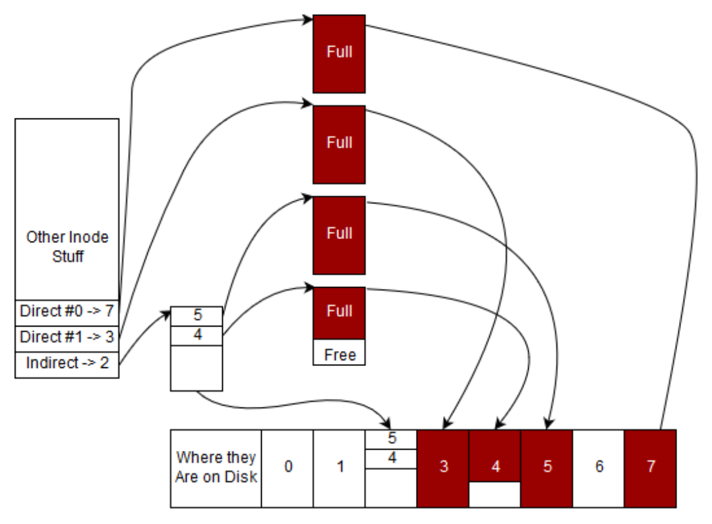

# Chương 12. Hệ thống tệp (Filesystems)

> Bản dịch tiếng Việt từ *System Programming Coursebook* (University of Illinois, CS 241) — B. Venkatesh, L. Angrave et al. Tài liệu gốc được phát hành theo giấy phép [CC BY 4.0](https://creativecommons.org/licenses/by/4.0/); bản dịch giữ nguyên giấy phép này. Nguồn: https://github.com/illinois-cs241/coursebook

> `/home` là nơi trái tim ngự trị. *(ND: chơi chữ từ câu ngạn ngữ "Home is where the heart is")*

Hệ thống tệp (filesystem) quan trọng vì chúng cho phép bạn lưu giữ dữ liệu bền vững sau khi máy tính tắt, bị crash hoặc bị hỏng bộ nhớ. Ngày xưa, việc dùng hệ thống tệp rất tốn kém. Ghi vào hệ thống tệp (FS) đồng nghĩa với ghi lên băng từ rồi đọc lại từ băng đó [1]. Nó chậm, cồng kềnh và dễ gặp lỗi.

Ngày nay hầu hết tệp của chúng ta được lưu trên đĩa – dù không phải tất cả! Đĩa vẫn chậm hơn bộ nhớ ít nhất một bậc độ lớn.

Một vài thuật ngữ trước khi bắt đầu chương này. Một filesystem, như chúng ta sẽ định nghĩa cụ thể hơn ở phần sau, là bất cứ thứ gì thoả mãn API của một hệ thống tệp. Một hệ thống tệp được đặt trên một phương tiện lưu trữ (storage medium), chẳng hạn ổ đĩa cứng, ổ thể rắn, RAM, v.v. Một đĩa (disk) hoặc là ổ đĩa cứng (hard disk drive – HDD) gồm một đĩa kim loại quay và một đầu đọc/ghi có thể "zap" lên mặt đĩa để mã hoá bit 1 hoặc 0, hoặc là ổ thể rắn (solid-state drive – SSD) có thể lật trạng thái một số cổng NAND trên chip hoặc trên ổ rời để lưu bit 1 hoặc 0. Tính đến năm 2019, SSD nhanh hơn HDD tiêu chuẩn một bậc độ lớn. Đây là những nền lưu trữ (backing) điển hình cho một hệ thống tệp. Hệ thống tệp được cài đặt bên trên nền lưu trữ này, nghĩa là chúng ta có thể cài đặt một thứ như EXT, MinixFS, NTFS, FAT32, v.v. trên một ổ cứng bán sẵn trên thị trường. Hệ thống tệp này cho hệ điều hành biết cách tổ chức các bit 1 và 0 để lưu thông tin về tệp cũng như thông tin về thư mục, nhưng ta sẽ nói kỹ hơn ở phần sau. Để khỏi quá câu nệ, ta sẽ nói rằng một hệ thống tệp như EXT hay NTFS cài đặt trực tiếp API của hệ thống tệp (`open`, `close`, v.v.). Thông thường, hệ điều hành sẽ thêm một tầng trừu tượng và yêu cầu hệ thống tệp thoả mãn API của hệ điều hành thay vì thế (hãy hình dung các hàm tưởng tượng `linux_open`, `linux_close`, v.v.). Hai lợi ích là: một hệ thống tệp có thể được cài đặt cho nhiều API hệ điều hành khác nhau, và việc thêm một lời gọi hệ thống tệp mới vào HĐH không đòi hỏi mọi hệ thống tệp bên dưới phải thay đổi API của chúng. Ví dụ, nếu ở phiên bản Linux tiếp theo có một system call mới để tạo bản sao lưu của một tệp, HĐH có thể cài đặt nó bằng API nội bộ thay vì buộc mọi driver hệ thống tệp phải sửa mã của mình.

Mẩu kiến thức nền cuối cùng là một điều quan trọng. Trong chương này, chúng ta sẽ nói về kích thước tệp bằng đơn vị KiB hay Kibibyte theo chuẩn ISO. Họ đơn vị *iB là cách viết tắt cho dung lượng theo luỹ thừa của hai. Điều đó có nghĩa như sau:

*Bảng 12.1: Giá trị Kibibyte*

| Tiền tố | Giá trị byte |
|---|---|
| KiB | 1024 B |
| MiB | 1024 × 1024 B |
| GiB | $1024^3$ B |

Các tiền tố ký hiệu tiêu chuẩn có nghĩa như sau:

*Bảng 12.2: Giá trị Kilobyte*

| Tiền tố | Giá trị byte |
|---|---|
| KB | 1000 B |
| MB | 1000 × 1000 B |
| GB | $1000^3$ B |

Chúng tôi sẽ dùng cách này trong sách và trong chương Mạng để nhất quán và không làm ai bối rối. Rắc rối là ngoài đời thực lại có một quy ước khác. Quy ước đó là khi một tệp được hiển thị trong hệ điều hành, KB đồng nghĩa với KiB. Còn khi nói về mạng máy tính, đĩa CD và các phương tiện lưu trữ khác, KB không giống KiB mà theo định nghĩa ISO / hệ mét ở trên. Đây là một điều kỳ quặc mang tính lịch sử, sinh ra từ cuộc xung đột giữa các nhà phát triển mạng và các nhà phát triển bộ nhớ / lưu trữ. Những người làm về lưu trữ và bộ nhớ thấy rằng nếu một bit chỉ có thể nhận một trong hai trạng thái thì sẽ tự nhiên khi gọi tiền tố Kilo- là 1024 vì nó xấp xỉ 1000. Còn những người làm về mạng phải xử lý bit, xử lý tín hiệu thời gian thực và nhiều yếu tố khác, nên họ chọn theo quy ước đã được chấp nhận sẵn rằng Kilo- nghĩa là 1000 của thứ gì đó [1]. Điều bạn cần biết là nếu thấy KB ngoài đời, nó có thể là 1024 tuỳ ngữ cảnh. Bất cứ khi nào trong lớp học này bạn thấy KB hay bất kỳ đơn vị nào cùng họ trong một câu hỏi về hệ thống tệp, bạn có thể yên tâm suy ra rằng chúng dùng 1024 làm đơn vị cơ sở. Tuy vậy, khi bạn đẩy mã lên môi trường production, hãy nhớ hỏi rõ về sự khác biệt này!

## 12.1 Hệ thống tệp là gì? (What is a filesystem?)

Có lẽ bạn đã từng nghe câu châm ngôn UNIX xưa: "mọi thứ đều là tệp". Trong hầu hết các hệ thống UNIX, các thao tác trên tệp cung cấp một giao diện để trừu tượng hoá nhiều thao tác khác nhau. Socket mạng, thiết bị phần cứng và dữ liệu trên đĩa đều được biểu diễn bằng các đối tượng giống tệp (file-like object). Một đối tượng giống tệp phải tuân theo các quy ước sau:

1. Nó phải hiện diện trước hệ thống tệp.

2. Nó phải hỗ trợ các thao tác hệ thống tệp thông dụng như `open`, `read`, `write`. Tối thiểu, nó phải mở được và đóng được.

Một hệ thống tệp là một cài đặt của giao diện tệp. Trong chương này, chúng ta sẽ khám phá các callback mà một hệ thống tệp cung cấp, một số chức năng điển hình và các chi tiết cài đặt liên quan. Trong môn học này, chúng ta chủ yếu nói về các hệ thống tệp phục vụ việc cho phép người dùng truy cập dữ liệu trên đĩa – thứ không thể thiếu đối với máy tính hiện đại.

Dưới đây là một số đặc điểm chung của hệ thống tệp:

1. Chúng vừa lo việc lưu trữ tệp cục bộ, vừa xử lý các thiết bị đặc biệt cho phép giao tiếp an toàn giữa kernel và không gian người dùng.

2. Chúng xử lý các vấn đề về hỏng hóc, khả năng mở rộng, lập chỉ mục, mã hoá, nén và hiệu năng.

3. Chúng đảm nhiệm sự trừu tượng hoá giữa một tệp chứa dữ liệu và cách chính xác dữ liệu đó được lưu trên đĩa, phân vùng và bảo vệ.

Trước khi đi sâu vào chi tiết của hệ thống tệp, hãy xem một vài ví dụ. Để làm rõ, một mount point (điểm gắn kết) đơn giản là một ánh xạ từ một thư mục tới một hệ thống tệp được biểu diễn trong kernel.

1. **ext4** – Thường được mount tại `/` trên các hệ thống Linux, đây là hệ thống tệp thường cung cấp việc truy cập đĩa như bạn vẫn quen thuộc.

2. **procfs** – Thường được mount tại `/proc`, cung cấp thông tin và khả năng điều khiển các process.

3. **sysfs** – Thường được mount tại `/sys`, một phiên bản hiện đại hơn của `/proc`, cũng cho phép điều khiển nhiều phần cứng khác như socket mạng.

4. **tmpfs** – Được mount tại `/tmp` trên một số hệ thống, một hệ thống tệp trong bộ nhớ để chứa các tệp tạm.

5. **sshfs** – Đồng bộ tệp qua giao thức ssh.

Nó cho bạn biết các system call dựa trên thư mục sẽ được phân giải tới hệ thống tệp nào. Ví dụ, `/` được phân giải bởi hệ thống tệp ext4 trong trường hợp của chúng ta, nhưng `/proc/2` lại được phân giải bởi hệ thống procfs dù nó chứa `/` như một hệ thống con.

Như bạn có thể nhận thấy, một số hệ thống tệp cung cấp giao diện tới những thứ không phải là "tệp". Các hệ thống tệp như procfs thường được gọi là hệ thống tệp ảo (virtual filesystem), vì chúng không cung cấp việc truy cập dữ liệu theo cùng nghĩa với một hệ thống tệp truyền thống. Về mặt kỹ thuật, mọi hệ thống tệp trong kernel đều được biểu diễn bởi các hệ thống tệp ảo, nhưng chúng ta sẽ phân biệt hệ thống tệp ảo là những hệ thống tệp thực sự không lưu gì trên đĩa cứng.

### 12.1.1 API tệp (The File API)

Một hệ thống tệp phải cung cấp các hàm callback cho nhiều hành động khác nhau. Một số trong đó được liệt kê dưới đây:

- `open` – Mở một tệp để thực hiện IO
- `read` – Đọc nội dung một tệp
- `write` – Ghi vào một tệp
- `close` – Đóng một tệp và giải phóng các tài nguyên liên quan
- `chmod` – Sửa đổi quyền của một tệp
- `ioctl` – Tương tác với các tham số thiết bị của các thiết bị ký tự (character device) như terminal

Không phải hệ thống tệp nào cũng hỗ trợ tất cả các hàm callback có thể có. Ví dụ, nhiều hệ thống tệp bỏ qua `ioctl` hoặc `link`. Nhiều hệ thống tệp không seekable (không tua được), nghĩa là chúng chỉ cung cấp truy cập tuần tự. Chương trình không thể di chuyển tới một điểm tuỳ ý trong tệp. Điều này tương tự như các stream seekable. Trong chương này, chúng ta sẽ không xem xét từng callback của hệ thống tệp. Nếu bạn muốn tìm hiểu thêm về giao diện này, hãy thử xem tài liệu về Filesystems at the User Space Level (FUSE).

## 12.2 Lưu trữ dữ liệu trên đĩa (Storing data on disk)

Để hiểu cách một hệ thống tệp tương tác với dữ liệu trên đĩa, có ba thuật ngữ then chốt chúng ta sẽ sử dụng.

1. **disk block** (khối đĩa) – Một disk block là một phần của đĩa được dành riêng để lưu nội dung của một tệp hoặc một thư mục.

2. **inode** – Một inode là một tệp hoặc thư mục. Điều này có nghĩa là inode chứa metadata (siêu dữ liệu) về tệp cũng như các con trỏ tới các disk block để tệp thực sự có thể được ghi vào hay đọc ra.

3. **superblock** – Một superblock chứa metadata về các inode và disk block. Chẳng hạn, một superblock có thể lưu mỗi disk block đầy đến đâu, inode nào đang được dùng, v.v. Các hệ thống tệp hiện đại thực ra có thể chứa nhiều superblock và một kiểu "super-super block" theo dõi những sector nào được quản lý bởi superblock nào. Điều này thường giúp ích cho vấn đề phân mảnh.

Nghe có vẻ choáng ngợp, nhưng đến cuối chương này, chúng ta sẽ hiểu được từng phần của hệ thống tệp.

Để lập luận về dữ liệu trên một dạng lưu trữ nào đó – đĩa quay, ổ thể rắn, băng từ – thông lệ là trước hết coi phương tiện lưu trữ như một tập hợp các block. Một block có thể được hình dung như một vùng liên tục trên đĩa. Dù kích thước của nó đôi khi được quyết định bởi một thuộc tính nào đó của phần cứng bên dưới, nó thường được xác định dựa trên kích thước một trang (page) bộ nhớ của hệ thống đó, để dữ liệu từ đĩa có thể được cache trong bộ nhớ nhằm truy cập nhanh hơn – một tính năng quan trọng của nhiều hệ thống tệp.

Một hệ thống tệp có một block đặc biệt gọi là superblock, lưu metadata về hệ thống tệp như journal (nhật ký ghi lại các thay đổi đối với hệ thống tệp), bảng inode, vị trí của inode đầu tiên trên đĩa, v.v. Điều quan trọng về superblock là nó nằm ở một vị trí đã biết trên đĩa. Nếu không, máy tính của bạn có thể không khởi động được! Hãy nghĩ về một ROM đơn giản được lập trình sẵn trên bo mạch chủ. Nếu bộ xử lý không thể bảo bo mạch chủ bắt đầu đọc và giải mã một disk block để khởi động chuỗi boot, thì bạn đành chịu.

Inode là cấu trúc quan trọng nhất đối với hệ thống tệp của chúng ta vì nó đại diện cho một tệp. Trước khi khám phá sâu về nó, hãy liệt kê những thông tin then chốt cần có để một tệp dùng được.

- Tên
- Kích thước tệp
- Thời điểm tạo, sửa đổi lần cuối, truy cập lần cuối
- Quyền
- Đường dẫn tệp
- Checksum
- Dữ liệu tệp

### 12.2.1 Nội dung tệp (File Contents)

Theo Wikipedia:

> Trong một hệ thống tệp kiểu Unix, một index node (nút chỉ mục), gọi tắt là inode, là một cấu trúc dữ liệu dùng để biểu diễn một đối tượng của hệ thống tệp, có thể là nhiều thứ khác nhau bao gồm tệp hoặc thư mục. Mỗi inode lưu các thuộc tính và (các) vị trí disk block chứa dữ liệu của đối tượng hệ thống tệp đó. Thuộc tính của đối tượng hệ thống tệp có thể gồm metadata về thao tác (ví dụ thời điểm thay đổi, truy cập, sửa đổi), cũng như dữ liệu về chủ sở hữu và quyền (ví dụ group-id, user-id, permissions).

Superblock có thể lưu một mảng các inode, mỗi inode lưu các con trỏ trực tiếp (direct), và có thể vài loại con trỏ gián tiếp (indirect), tới các disk block. Vì các inode được lưu trong superblock, hầu hết hệ thống tệp có giới hạn về số lượng inode có thể tồn tại. Vì mỗi inode ứng với một tệp, đây cũng là giới hạn về số tệp mà hệ thống tệp đó có thể có. Cố vượt qua vấn đề này bằng cách lưu inode ở một nơi khác sẽ làm tăng đáng kể độ phức tạp của hệ thống tệp. Cố cấp phát lại không gian cho bảng inode cũng bất khả thi vì mọi byte theo sau phần cuối của mảng inode sẽ phải dịch chuyển, một thao tác cực kỳ tốn kém. Nói vậy không có nghĩa là hoàn toàn không có giải pháp, dù thường thì không cần tăng số lượng inode vì số inode thường đã đủ lớn.

**Ý tưởng lớn: Hãy quên tên tệp đi. Chính 'inode' mới là tệp.**

Người ta thường nghĩ tên tệp là tệp "thực sự". Không phải vậy! Thay vào đó, hãy coi inode là tệp. Inode giữ các thông tin meta (lần truy cập cuối, quyền sở hữu, kích thước) và trỏ tới các disk block dùng để chứa nội dung tệp. Tuy nhiên, inode thường không lưu tên tệp. Tên tệp thường chỉ được lưu trong các thư mục (xem bên dưới).

Ví dụ, để đọc vài byte đầu của tệp, hãy lần theo con trỏ direct block (khối trực tiếp) đầu tiên tới direct block đầu tiên và đọc vài byte đầu. Ghi cũng theo quy trình tương tự. Nếu chương trình muốn đọc toàn bộ tệp, cứ tiếp tục đọc các direct block cho đến khi số byte đã đọc bằng kích thước tệp. Nếu tổng kích thước tệp nhỏ hơn số direct block nhân với kích thước một block, thì các con trỏ block không dùng đến sẽ không xác định. Tương tự, nếu kích thước tệp không phải là bội của kích thước block, dữ liệu nằm sau byte cuối cùng trong block cuối sẽ là rác.

Nếu một tệp lớn hơn không gian tối đa mà các direct block của nó có thể địa chỉ hoá thì sao? Về điều đó, chúng tôi xin đưa ra một câu châm ngôn mà các lập trình viên xem trọng quá mức.

> "Mọi vấn đề trong khoa học máy tính đều có thể giải quyết bằng cách thêm một tầng gián tiếp nữa." – David Wheeler

Ngoại trừ vấn đề có quá nhiều tầng gián tiếp.

Để giải quyết vấn đề này, chúng ta đưa vào các indirect block (khối gián tiếp). Một single indirect block là một block lưu các con trỏ tới thêm các block dữ liệu. Tương tự, một double indirect block lưu các con trỏ tới các single indirect block, và khái niệm này có thể tổng quát hoá cho số tầng gián tiếp tuỳ ý. Đây là một khái niệm quan trọng: vì các inode được lưu trong superblock, hoặc một cấu trúc nào đó khác ở vị trí đã biết với lượng không gian cố định, sự gián tiếp cho phép tăng theo cấp số mũ lượng không gian mà một inode có thể theo dõi.

Lấy một ví dụ cụ thể, giả sử ta chia đĩa thành các block 4 KiB và muốn địa chỉ hoá tối đa $2^{32}$ block. Kích thước đĩa tối đa là $4\,\text{KiB} \times 2^{32} = 16\,\text{TiB}$ (nhớ rằng $2^{10} = 1024$). Một disk block có thể chứa $\frac{4\,\text{KiB}}{4\,\text{B}}$ con trỏ, tức 1024 con trỏ. Cần con trỏ rộng 4 byte vì ta muốn địa chỉ hoá số block tương đương 32 bit. Mỗi con trỏ tham chiếu tới một disk block 4 KiB, nên bạn có thể tham chiếu tới $1024 \times 4\,\text{KiB} = 4\,\text{MiB}$ dữ liệu. Với cùng cấu hình đĩa đó, một double indirect block lưu 1024 con trỏ tới 1024 bảng gián tiếp. Do đó một double indirect block có thể tham chiếu tới $1024 \times 4\,\text{MiB} = 4\,\text{GiB}$ dữ liệu. Tương tự, một triple indirect block có thể tham chiếu tới 4 TiB dữ liệu. Việc này chậm gấp ba lần khi đọc giữa các block, do số tầng gián tiếp tăng lên. Thời gian đọc thực tế bên trong một block thì không đổi.

### 12.2.2 Cài đặt thư mục (Directory Implementation)

Một thư mục là một ánh xạ từ tên sang số inode. Nó thường là một tệp bình thường, nhưng có một số bit đặc biệt được đặt trong inode của nó và nội dung có một cấu trúc riêng. POSIX cung cấp một tập nhỏ các hàm để đọc tên tệp và số inode của từng mục (entry), mà chúng ta sẽ bàn kỹ hơn ở phần sau của chương này.

Hãy nghĩ xem thư mục trông như thế nào trong hệ thống tệp thực tế. Về lý thuyết, chúng là tệp. Các disk block sẽ chứa các directory entry (mục thư mục) hay dirent. Điều đó có nghĩa là disk block của chúng ta có thể trông như thế này

| inode_num | name |
|---|---|
| 2043567 | hi.txt |
| ... | |

Mỗi directory entry có thể có kích thước cố định, hoặc là một C-string có độ dài thay đổi. Điều đó tuỳ thuộc vào cách hệ thống tệp cụ thể cài đặt nó ở tầng thấp. Để xem ánh xạ từ tên tệp sang số inode trên hệ thống POSIX, từ shell, hãy dùng `ls` với tuỳ chọn `-i`

```text
# ls -i
12983989 dirlist.c              12984068 sandwich.c
```

Sau này bạn sẽ thấy đây là một sự trừu tượng hoá mạnh mẽ. Một tệp có thể mang nhiều tên khác nhau trong một thư mục, hoặc tồn tại trong nhiều thư mục.

### 12.2.3 Quy ước thư mục UNIX (UNIX Directory Conventions)

Trong các hệ thống tệp UNIX tiêu chuẩn, các mục sau được thêm vào một cách đặc biệt khi có yêu cầu đọc thư mục.

1. `.` đại diện cho thư mục hiện tại

2. `..` đại diện cho thư mục cha

3. `~` thường là tên của thư mục home

Trái với trực giác, `...` có thể là tên của một tệp, chứ không phải thư mục ông (grandparent). Chỉ thư mục hiện tại và thư mục cha có bí danh đặc biệt liên quan tới `.` (cụ thể là `.` và `..`). Tuy nhiên, `...` hoàn toàn có thể là tên của một tệp hoặc thư mục trên đĩa (bạn có thể thử với `mkdir ...`). Rắc rối là shell zsh lại diễn giải `...` như một lối tắt tiện lợi tới thư mục ông (nếu nó tồn tại) khi mở rộng các lệnh shell.

Một số thực tế khác về các quy ước liên quan đến tên:

1. Các tệp trên đĩa có tên bắt đầu bằng `.` (dấu chấm) theo quy ước được coi là "ẩn" và sẽ bị các chương trình như `ls` bỏ qua nếu không có cờ bổ sung (`-a`). Đây không phải là một tính năng của hệ thống tệp, và các chương trình có thể chọn phớt lờ điều này.

2. Một số tệp cũng có thể bắt đầu bằng một byte NUL. Đây thường là các abstract UNIX socket và được dùng để tránh làm bừa bộn hệ thống tệp, vì chúng sẽ hầu như bị ẩn đối với bất kỳ chương trình nào không lường trước. Tuy nhiên, chúng vẫn được liệt kê bởi các công cụ hiển thị thông tin chi tiết về socket, nên đây không phải là một tính năng mang lại tính bảo mật.

3. Nếu bạn muốn chọc tức người bên cạnh, hãy tạo một tệp có tên chứa ký tự chuông (bell) của terminal. Mỗi lần tệp đó được liệt kê (ví dụ bằng cách gọi `ls`), sẽ có một tiếng chuông vang lên.

### 12.2.4 API thư mục (Directory API)

Trong khi việc tương tác với một tệp trong C thường được thực hiện bằng cách dùng `open` để mở tệp rồi `read` hoặc `write` để thao tác với tệp trước khi gọi `close` để giải phóng tài nguyên, thư mục có các lời gọi đặc biệt như `opendir`, `closedir` và `readdir`. Không có hàm `writedir` vì thông thường việc đó hàm ý tạo một tệp hoặc một link. Chương trình sẽ dùng thứ gì đó như `open` hoặc `mkdir`.

Để khám phá các hàm này, hãy viết một chương trình tìm kiếm một tệp cụ thể trong nội dung của một thư mục. Đoạn mã dưới đây có một bug, hãy thử tìm ra nó!

```c
int exists(char *directory, char *name) {
  struct dirent *dp;
  DIR *dirp = opendir(directory);
  while ((dp = readdir(dirp)) != NULL) {
    puts(dp->d_name);
    if (!strcmp(dp->d_name, name)) {
      return 1; /* Found */
    }
  }
  closedir(dirp);
  return 0; /* Not Found */
}
```

Bạn tìm ra bug chưa? Nó rò rỉ tài nguyên! Nếu tìm thấy tên tệp khớp thì `closedir` không bao giờ được gọi do hàm return sớm. Mọi file descriptor đã mở và mọi bộ nhớ được `opendir` cấp phát không bao giờ được giải phóng. Điều này có nghĩa là cuối cùng process sẽ cạn tài nguyên và một lời gọi `open` hoặc `opendir` sẽ thất bại.

Cách sửa là đảm bảo chúng ta giải phóng tài nguyên trên mọi đường đi có thể của mã.

Trong đoạn mã trên, điều này có nghĩa là gọi `closedir` trước `return 1`. Quên giải phóng tài nguyên là một bug lập trình C phổ biến vì ngôn ngữ C không có cơ chế hỗ trợ đảm bảo tài nguyên luôn được giải phóng trên mọi đường đi của mã.

Với một thư mục đang mở, sau lời gọi `fork()`, hoặc process cha hoặc process con (XOR – chỉ một trong hai) có thể dùng `readdir()`, `rewinddir()` hay `seekdir()`. Nếu cả cha lẫn con đều dùng các hàm trên, hành vi là không xác định.

Có hai cái bẫy chính và một điều cần cân nhắc. Hàm `readdir` trả về cả "." (thư mục hiện tại) và ".." (thư mục cha). Điều còn lại là chương trình cần loại trừ tường minh các thư mục con khỏi việc tìm kiếm, nếu không việc tìm kiếm có thể mất rất nhiều thời gian.

Với nhiều ứng dụng, hợp lý là kiểm tra thư mục hiện tại trước rồi mới tìm kiếm đệ quy trong các thư mục con. Có thể làm điều này bằng cách lưu kết quả vào một danh sách liên kết, hoặc đặt lại struct thư mục để bắt đầu lại từ đầu.

Đoạn mã sau cố gắng liệt kê đệ quy mọi tệp trong một thư mục. Như một bài tập, hãy thử xác định các bug mà nó mắc phải.

```c
void dirlist(char *path) {
  struct dirent *dp;
  DIR *dirp = opendir(path);
  while ((dp = readdir(dirp)) != NULL) {
    char newpath[strlen(path) + strlen(dp->d_name) + 1];
    sprintf(newpath,"%s/%s", newpath, dp->d_name);
    printf("%s\n", dp->d_name);
    dirlist(newpath);
  }
}

int main(int argc, char **argv) {
  dirlist(argv[1]);
  return 0;
}
```

Bạn đã tìm ra cả 5 bug chưa?

```c
// Check opendir result (perhaps user gave us a path that can not be opened as a directory
if (!dirp) {perror("Could not open directory"); return; }

// +2 as we need space for the / and the terminating 0
char newpath[strlen(path) + strlen(dp->d_name) + 2];

// Correct parameter
sprintf(newpath,"%s/%s", path, dp->d_name);

// Perform stat test (and verify) before recursing
if (0 == stat(newpath,&s) && S_ISDIR(s.st_mode)) dirlist(newpath)

// Resource leak: the directory file handle is not closed after the while loop
closedir(dirp);
```

Một lưu ý cẩn trọng cuối cùng. `readdir` không thread-safe (không an toàn với luồng)! Bạn không nên dùng phiên bản re-entrant của hàm này. Việc đồng bộ hoá hệ thống tệp bên trong một process là quan trọng, vì vậy hãy dùng khoá (lock) xung quanh `readdir`.

Xem trang man của `readdir` để biết thêm chi tiết.

### 12.2.5 Liên kết (Linking)

Link (liên kết) là thứ buộc chúng ta phải mô hình hoá hệ thống tệp như một đồ thị thay vì một cây.

Trong khi mô hình hoá hệ thống tệp như một cây sẽ hàm ý rằng mỗi inode có một thư mục cha duy nhất, link cho phép các inode hiện diện dưới dạng tệp ở nhiều nơi, có thể với những tên khác nhau, dẫn đến một inode có nhiều thư mục cha. Có hai loại link:

1. **Hard Link (liên kết cứng)** – Một hard link đơn giản là một mục trong thư mục gán một tên nào đó cho một số inode vốn đã có một tên và ánh xạ khác, trong cùng thư mục hoặc một thư mục khác. Nếu đã có một tệp trên hệ thống tệp, ta có thể tạo một link khác tới cùng inode đó bằng lệnh `ln`:

   ```bash
   $ ln file1.txt blip.txt
   ```

   Tuy nhiên, `blip.txt` chính là cùng một tệp. Nếu ta sửa blip, tức là ta đang sửa cùng tệp với `file1.txt`! Ta có thể chứng minh điều này bằng cách cho thấy cả hai tên tệp đều tham chiếu tới cùng một inode.

   ```text
   $ ls -i file1.txt blip.txt
   134235 file1.txt
   134235 blip.txt
   ```

   Lời gọi C tương đương là `link`

   ```c
   // Function Prototype
   int link(const char *path1, const char *path2);

   link("file1.txt", "blip.txt");
   ```

   Để đơn giản, các ví dụ trên tạo hard link trong cùng một thư mục. Hard link có thể được tạo ở bất cứ đâu bên trong cùng một hệ thống tệp.

2. **Soft Link (liên kết mềm)** – Loại link thứ hai được gọi là soft link, symbolic link (liên kết tượng trưng) hay symlink. Symbolic link khác ở chỗ nó là một tệp có một bit đặc biệt được đặt và lưu một đường dẫn tới tệp khác. Nói đơn giản, nếu không có bit đặc biệt đó, nó chẳng khác gì một tệp văn bản chứa một đường dẫn tệp bên trong. Lưu ý rằng khi người ta nói chung về link mà không nêu rõ hard hay soft, họ đang nói về hard link.

   Để tạo một symbolic link trong shell, dùng `ln -s`. Để đọc nội dung của link như một tệp, dùng `readlink`. Cả hai được minh hoạ dưới đây.

   ```text
   $ ln -s file1.txt file2.txt
   $ ls -i file1.txt blip.txt
   134235 file1.txt
   134236 file2.txt
   134235 blip.txt
   $ cat file1.txt
   file1!
   $ cat file2.txt
   file1!
   $ cat blip.txt
   file1!
   $ echo edited file2 >> file2.txt # >> is bash syntax for append to file
   $ cat file1.txt
   file1!
   edited file2
   $ cat file2.txt
   I'm file1!
   edited file2
   $ cat blip.txt
   file1!
   edited file2
   $ readlink myfile.txt
   file2.txt
   ```

   Lưu ý rằng `file2.txt` và `file1.txt` có số inode khác nhau, không như hard link `blip.txt`.

   Có một lời gọi thư viện C để tạo symlink, tương tự như `link`.

   ```c
   symlink(const char *target, const char *symlink);
   ```

   Một số ưu điểm của symbolic link là

   - Có thể tham chiếu tới các tệp chưa tồn tại
   - Không như hard link, có thể tham chiếu tới thư mục cũng như tệp thông thường
   - Có thể tham chiếu tới các tệp (và thư mục) nằm ngoài hệ thống tệp hiện tại

   Tuy nhiên, symlink có một nhược điểm then chốt: chúng chậm hơn tệp và thư mục thông thường. Khi nội dung của link được đọc, nó phải được diễn giải như một đường dẫn mới tới tệp đích, dẫn đến thêm một lời gọi `open` và `read` nữa vì tệp thật phải được mở và đọc. Một nhược điểm khác là POSIX cấm hard link tới thư mục, trong khi soft link thì được phép. Lệnh `ln` chỉ cho phép root làm điều này và chỉ khi bạn cung cấp tuỳ chọn `-d`. Tuy nhiên, ngay cả root cũng có thể không thực hiện được vì hầu hết hệ thống tệp ngăn cản điều đó!

Tính toàn vẹn của hệ thống tệp giả định rằng cấu trúc thư mục là một cây không có chu trình, có thể đi tới được từ thư mục gốc. Việc ép buộc hay kiểm chứng ràng buộc này trở nên tốn kém nếu cho phép link tới thư mục. Phá vỡ các giả định này có thể khiến các công cụ kiểm tra toàn vẹn tệp không thể sửa chữa hệ thống tệp. Các tìm kiếm đệ quy có thể không bao giờ kết thúc, và thư mục có thể có nhiều hơn một cha nhưng ".." chỉ có thể tham chiếu tới một cha duy nhất. Tóm lại, một ý tưởng tồi. Soft link thì đơn giản bị bỏ qua, đó là lý do ta có thể dùng chúng để tham chiếu tới thư mục.

Khi bạn xoá một tệp bằng `rm` hoặc `unlink`, bạn đang xoá một tham chiếu tới inode khỏi một thư mục. Tuy nhiên, inode đó có thể vẫn được tham chiếu từ các thư mục khác. Để xác định liệu nội dung tệp có còn cần thiết không, mỗi inode giữ một bộ đếm tham chiếu (reference count) được cập nhật mỗi khi một link mới được tạo hay bị huỷ. Bộ đếm này chỉ theo dõi hard link; symlink được phép tham chiếu tới một tệp không tồn tại nên không được tính.

Một ví dụ ứng dụng của hard link là tạo một cách hiệu quả nhiều bản lưu trữ (archive) của một hệ thống tệp tại các thời điểm khác nhau. Một khi vùng lưu trữ đã có bản sao của một tệp cụ thể, các bản lưu trữ sau có thể dùng lại các tệp lưu trữ này thay vì tạo một tệp trùng lặp. Điều này gọi là sao lưu tăng dần (incremental backup). Phần mềm "Time Machine" của Apple làm như vậy.

### 12.2.6 Đường dẫn (Pathing)

Giờ khi đã có các định nghĩa và đã nói về thư mục, chúng ta gặp khái niệm đường dẫn (path). Một đường dẫn là một chuỗi các thư mục cho ta một "đường đi" trong đồ thị chính là hệ thống tệp. Tuy nhiên, có vài điểm tinh tế. Có thể có một đường dẫn là `a/b/../c/./`. Vì `..` và `.` là các mục đặc biệt trong thư mục, đây là một đường dẫn hợp lệ thực chất tham chiếu tới `a/c`. Hầu hết các hàm hệ thống tệp cho phép truyền vào đường dẫn chưa được rút gọn. Thư viện C cung cấp hàm `realpath` để rút gọn đường dẫn hoặc lấy đường dẫn tuyệt đối. Để rút gọn bằng tay, hãy nhớ rằng `..` nghĩa là 'thư mục cha' và `.` nghĩa là 'thư mục hiện tại'. Dưới đây là một ví dụ minh hoạ việc rút gọn `a/b/../c/.` bằng cách dùng `cd` trong shell để di chuyển trong hệ thống tệp.

1. `cd a` (đang ở `a`)

2. `cd b` (đang ở `a/b`)

3. `cd ..` (đang ở `a`, vì `..` đại diện cho 'thư mục cha')

4. `cd c` (đang ở `a/c`)

5. `cd .` (đang ở `a/c`, vì `.` đại diện cho 'thư mục hiện tại')

Do đó, đường dẫn này có thể rút gọn thành `a/c`.

### 12.2.7 Metadata (Siêu dữ liệu)

Làm sao ta phân biệt được một tệp thông thường và một thư mục? Nhân tiện, còn nhiều thuộc tính khác mà tệp cũng có thể chứa. Ta phân biệt kiểu tệp (file type) – khác với phần mở rộng của tệp như png, svg, pdf – bằng các trường bên trong inode. Làm sao hệ thống biết tệp thuộc kiểu gì?

Thông tin này được lưu bên trong inode. Để truy cập nó, hãy dùng các lời gọi `stat`. Ví dụ, để biết tệp 'notes.txt' của tôi được truy cập lần cuối khi nào.

```c
struct stat s;
stat("notes.txt", &s);
printf("Last accessed %s", ctime(&s.st_atime));
```

Thực ra có ba phiên bản của `stat`;

```c
int stat(const char *path, struct stat *buf);
int fstat(int fd, struct stat *buf);
int lstat(const char *path, struct stat *buf);
```

Ví dụ, một chương trình có thể dùng `fstat` để tìm hiểu metadata của tệp nếu nó đã có một file descriptor gắn với tệp đó.

```c
FILE *file = fopen("notes.txt", "r");
int fd = fileno(file); /* Just for fun - extract the file descriptor from a C FILE struct */
struct stat s;
fstat(fd, & s);
printf("Last accessed %s", ctime(&s.st_atime));
```

`lstat` gần giống `stat` nhưng xử lý symbolic link khác đi. Theo trang man của `stat`.

> `lstat()` giống hệt `stat()`, ngoại trừ nếu pathname là một symbolic link thì nó trả về thông tin về chính link đó, chứ không phải tệp mà link tham chiếu tới.

Các hàm `stat` sử dụng `struct stat`. Theo trang man của `stat`:

```c
struct stat {
  dev_t     st_dev;     /* ID of device containing file */
  ino_t     st_ino;     /* Inode number */
  mode_t    st_mode;    /* File type and mode */
  nlink_t   st_nlink;   /* Number of hard links */
  uid_t     st_uid;     /* User ID of owner */
  gid_t     st_gid;     /* Group ID of owner */
  dev_t     st_rdev;    /* Device ID (if special file) */
  off_t     st_size;    /* Total size, in bytes */
  blksize_t st_blksize; /* Block size for filesystem I/O */
  blkcnt_t  st_blocks;  /* Number of 512B blocks allocated */
  struct timespec st_atim; /* Time of last access */
  struct timespec st_mtim; /* Time of last modification */
  struct timespec st_ctim; /* Time of last status change */
};
```

Trường `st_mode` có thể được dùng để phân biệt tệp thông thường và thư mục. Để làm điều này, hãy dùng các macro `S_ISDIR` và `S_ISREG`.

```c
struct stat s;
if (0 == stat(name, &s)) {
  printf("%s ", name);
  if (S_ISDIR( s.st_mode)) puts("is a directory");
  if (S_ISREG( s.st_mode)) puts("is a regular file");
} else {
  perror("stat failed - are you sure we can read this file's metadata?");
}
```

## 12.3 Quyền và các bit (Permissions and bits)

Quyền (permission) là một phần then chốt trong cách các hệ thống UNIX cung cấp tính bảo mật cho hệ thống tệp. Bạn có thể đã nhận thấy trường `st_mode` trong `struct stat` chứa nhiều hơn là kiểu tệp. Nó còn chứa mode – một mô tả chi tiết những gì một người dùng có thể và không thể làm với một tệp nhất định. Thường có ba bộ quyền cho bất kỳ tệp nào: quyền cho user (chủ sở hữu), cho group (nhóm) và cho other (mọi người dùng không thuộc hai loại trên). Với mỗi loại trong ba loại này, ta cần theo dõi liệu người dùng có được phép đọc tệp, ghi vào tệp và thực thi tệp hay không. Vì có ba loại và ba quyền, quyền thường được biểu diễn bằng một số bát phân (octal) 3 chữ số. Với mỗi chữ số, bit cao nhất ứng với quyền đọc, bit giữa ứng với quyền ghi và bit cuối ứng với quyền thực thi. Chúng luôn được trình bày theo thứ tự User, Group, Other (UGO). Dưới đây là một số ví dụ thông dụng. Đây là quy ước các bit:

1. `r` nghĩa là nhóm người đó có thể đọc

2. `w` nghĩa là nhóm người đó có thể ghi

3. `x` nghĩa là nhóm người đó có thể thực thi

*Bảng 12.3: Bảng quyền*

| Mã octal | User | Group | Others |
|---|---|---|---|
| 755 | rwx | r-x | r-x |
| 644 | rw- | r-- | r-- |

Đáng lưu ý là các bit rwx có ý nghĩa hơi khác đối với thư mục. Quyền ghi trên một thư mục cho phép chương trình tạo hoặc xoá tệp hay thư mục bên trong nó. Bạn có thể hình dung điều này như có quyền ghi lên các ánh xạ directory entry (dirent). Quyền đọc trên một thư mục cho phép chương trình liệt kê nội dung thư mục. Đây là quyền đọc lên ánh xạ directory entry (dirent). Quyền thực thi cho phép chương trình đi vào thư mục bằng `cd`. Không có bit thực thi, mọi nỗ lực tạo hay xoá tệp hoặc thư mục sẽ thất bại vì bạn không thể truy cập chúng. Tuy nhiên, bạn vẫn có thể liệt kê nội dung của thư mục.

Có vài tiện ích dòng lệnh để tương tác với mode của tệp. `mknod` thay đổi kiểu của tệp. `chmod` nhận một con số và một tệp rồi thay đổi các bit quyền. Tuy nhiên, trước khi có thể bàn chi tiết về `chmod`, chúng ta cũng cần hiểu về user ID (uid) và group ID (gid).

### 12.3.1 User ID / Group ID

Mọi người dùng trong hệ thống UNIX đều có một user ID. Đây là một con số duy nhất có thể định danh một người dùng. Tương tự, người dùng có thể được thêm vào các tập hợp gọi là group (nhóm), và mỗi group cũng có một số định danh duy nhất. Group có nhiều công dụng trên hệ thống UNIX. Chúng có thể được gán các capability – một cách mô tả mức độ kiểm soát mà một người dùng có đối với hệ thống. Ví dụ, một group bạn có thể đã gặp là group sudoers, một tập các người dùng tin cậy được phép dùng lệnh `sudo` để tạm thời có được đặc quyền cao hơn. Chúng ta sẽ nói thêm về cách `sudo` hoạt động trong chương này. Mọi tệp, khi được tạo, đều có một chủ sở hữu (owner) – người tạo ra tệp. User ID (uid) của chủ sở hữu này có thể tìm thấy trong trường `st_uid` của một `struct stat` qua lời gọi `stat`. Tương tự, group ID (gid) cũng được thiết lập.

Mọi process có thể xác định uid và gid của mình bằng `getuid` và `getgid`. Khi một process cố mở một tệp với một mode cụ thể, uid và gid của nó được so sánh với uid và gid của tệp. Nếu uid khớp, yêu cầu mở tệp của process sẽ được đối chiếu với các bit ở trường user trong quyền của tệp. Nếu gid khớp, yêu cầu của process sẽ được đối chiếu với trường group của quyền. Nếu không ID nào khớp, trường other sẽ được áp dụng.

### 12.3.2 Đọc / Thay đổi quyền tệp (Reading / Changing file permissions)

Trước khi bàn về cách thay đổi các bit quyền, chúng ta nên biết cách đọc chúng. Trong C, có thể dùng họ lời gọi thư viện `stat`. Để đọc các bit quyền từ dòng lệnh, dùng `ls -l`. Lưu ý, quyền sẽ được xuất ra theo định dạng 'trwxrwxrwx'. Ký tự đầu tiên cho biết kiểu tệp. Các giá trị có thể có của ký tự đầu bao gồm nhưng không giới hạn ở:

1. (`-`) tệp thông thường

2. (`d`) thư mục

3. (`c`) tệp thiết bị ký tự (character device)

4. (`l`) symbolic link

5. (`p`) named pipe (còn gọi là FIFO)

6. (`b`) thiết bị khối (block device)

7. (`s`) socket

Hoặc dùng chương trình `stat`, chương trình này trình bày mọi thông tin mà ta có thể lấy được từ lời gọi thư viện `stat`.

Để thay đổi các bit quyền, có một system call: `int chmod(const char *path, mode_t mode);`. Để đơn giản hoá các ví dụ, chúng ta sẽ dùng tiện ích dòng lệnh cùng tên `chmod`, viết tắt của "change mode" (đổi mode). Có hai cách thông dụng để dùng `chmod`: với một giá trị octal hoặc với một chuỗi ký hiệu.

```bash
$ chmod 644 file1
$ chmod 755 file2
$ chmod 700 file3
$ chmod ugo-w file4
$ chmod o-rx file4
```

Các chữ số cơ số 8 ('octal') mô tả quyền cho từng vai trò: người dùng sở hữu tệp, group và tất cả những người khác. Số octal là tổng của ba giá trị gán cho ba loại quyền: đọc (4), ghi (2), thực thi (1)

Ví dụ: `chmod 755 myfile`

1. r + w + x = chữ số; user có 4+2+1, toàn quyền

2. group có 4+0+1, quyền đọc và thực thi

3. mọi người dùng khác có 4+0+1, quyền đọc và thực thi

### 12.3.3 Hiểu về 'umask' (Understanding the 'umask')

umask trừ đi (giảm bớt) các bit quyền khỏi 777 và được dùng khi tệp mới và thư mục mới được tạo bởi `open`, `mkdir`, v.v. Theo mặc định, umask được đặt là 022 (octal), nghĩa là quyền của group và other sẽ chỉ còn đọc được (bị bỏ quyền ghi). Mỗi process có một giá trị umask hiện hành. Khi fork, process con kế thừa giá trị umask của process cha.

Ví dụ, đặt umask thành 077 trong shell đảm bảo rằng các tệp và thư mục được tạo sau đó sẽ chỉ có người dùng hiện tại truy cập được,

```bash
$ umask 077
$ mkdir secretdir
```

Lấy một ví dụ bằng mã, giả sử một tệp mới được tạo bằng `open()` với các bit mode 666 (bit ghi và đọc cho user, group và other):

```c
open("myfile", O_CREAT, S_IRUSR | S_IWUSR | S_IRGRP | S_IWGRP | S_IROTH | S_IWOTH);
```

Nếu umask là 022 (octal), thì quyền của tệp được tạo sẽ là `0666 & ~022`, tức là

```c
S_IRUSR | S_IWUSR | S_IRGRP | S_IROTH
```

### 12.3.4 Bit 'setuid' (The 'setuid' bit)

Bạn có thể đã nhận thấy một bit bổ sung mà các tệp có quyền thực thi có thể được đặt. Bit này là bit setuid. Nó cho biết rằng khi chạy, chương trình sẽ đặt uid của người dùng thành uid của chủ sở hữu tệp. Tương tự, có một bit setgid đặt gid của người thực thi thành gid của chủ sở hữu. Ví dụ kinh điển của một chương trình có bit setuid là `sudo`.

`sudo` thường là một chương trình thuộc sở hữu của người dùng root – người dùng có mọi capability. Bằng cách dùng `sudo`, một người dùng vốn không có đặc quyền có thể truy cập hầu hết các phần của hệ thống. Điều này hữu ích để chạy các chương trình có thể cần đặc quyền cao hơn, chẳng hạn dùng `chown` để đổi chủ sở hữu của một tệp, hoặc dùng `mount` để gắn kết hay gỡ gắn kết hệ thống tệp (một thao tác chúng ta sẽ bàn ở phần sau của chương này). Đây là một số ví dụ:

```text
$ sudo mount /dev/sda2 /stuff/mydisk
$ sudo adduser fred
$ ls -l /usr/bin/sudo
-r-s--x--x 1 root wheel 327920 Oct 24 09:04 /usr/bin/sudo
```

Khi thực thi một process có bit setuid, vẫn có thể xác định uid gốc của người dùng bằng `getuid`. Tác dụng thực sự của bit setuid là đặt effective user ID (euid – ID người dùng hiệu lực), có thể xác định bằng `geteuid`. Hành vi của `getuid` và `geteuid` được mô tả dưới đây.

- `getuid` trả về real user id (uid thực; bằng 0 nếu đăng nhập với tư cách root)

- `geteuid` trả về effective user id (uid hiệu lực; bằng 0 nếu đang hành động với tư cách root, ví dụ do cờ setuid được đặt trên một chương trình)

Các hàm này cho phép ta viết một chương trình chỉ có thể được chạy bởi người dùng có đặc quyền bằng cách kiểm tra `geteuid`, hoặc đi xa hơn một bước và đảm bảo rằng người dùng duy nhất có thể chạy mã là root bằng cách dùng `getuid`.

### 12.3.5 Bit 'sticky' (The 'sticky' bit)

Sticky bit như chúng ta dùng ngày nay phục vụ một mục đích khác so với khi mới được giới thiệu. Sticky bit từng là một bit có thể đặt trên một tệp thực thi, cho phép đoạn text (text segment) của chương trình vẫn nằm trong swap ngay cả sau khi chương trình kết thúc. Điều này khiến các lần thực thi sau của cùng chương trình nhanh hơn. Ngày nay, hành vi này không còn được hỗ trợ và sticky bit chỉ có ý nghĩa khi được đặt trên một thư mục.

Khi sticky bit của một thư mục được đặt, chỉ chủ sở hữu của tệp, chủ sở hữu của thư mục và người dùng root mới có thể đổi tên hoặc xoá tệp. Điều này hữu ích khi nhiều người dùng có quyền ghi vào một thư mục chung. Một ứng dụng phổ biến của sticky bit là cho thư mục `/tmp` dùng chung và ghi được, nơi tệp của nhiều người dùng có thể được lưu, nhưng người dùng không nên truy cập được tệp của người dùng khác.

Để đặt sticky bit, dùng `chmod +t`.

```text
aneesh$ mkdir sticky
aneesh$ chmod +t sticky
aneesh$ ls -l
drwxr-xr-x 7 aneesh aneesh 4096 Nov 1 14:19 .
drwxr-xr-x 53 aneesh aneesh 4096 Nov 1 14:19 ..
drwxr-xr-t 2 aneesh aneesh 4096 Nov 1 14:19 sticky
aneesh$ su newuser
newuser$ rm -rf sticky
rm: cannot remove 'sticky': Permission denied
newuser$ exit
aneesh$ rm -rf sticky
aneesh$ ls -l
drwxr-xr-x 7 aneesh aneesh 4096 Nov 1 14:19 .
drwxr-xr-x 53 aneesh aneesh 4096 Nov 1 14:19 ..
```

Lưu ý rằng trong ví dụ trên, tên người dùng được thêm vào đầu dấu nhắc, và lệnh `su` được dùng để chuyển người dùng.

## 12.4 Hệ thống tệp ảo và các hệ thống tệp khác (Virtual filesystems and other filesystems)

Các hệ thống POSIX, như Linux và Mac OS X (dựa trên BSD), bao gồm nhiều hệ thống tệp ảo được mount (sẵn dùng) như một phần của hệ thống tệp. Các tệp bên trong những hệ thống tệp ảo này có thể được sinh ra động hoặc lưu trong RAM. Linux cung cấp 3 hệ thống tệp ảo chính.

*Bảng 12.4: Danh sách hệ thống tệp ảo*

| Thiết bị | Công dụng |
|---|---|
| `/dev` | Danh sách các thiết bị vật lý và ảo (ví dụ card mạng, cdrom, bộ sinh số ngẫu nhiên) |
| `/proc` | Danh sách các tài nguyên được mỗi process sử dụng và (theo truyền thống) một tập thông tin hệ thống |
| `/sys` | Danh sách có tổ chức các thực thể nội bộ của kernel |

Nếu muốn một luồng liên tục các số 0, ta có thể chạy `cat /dev/zero`.

Một ví dụ khác là tệp `/dev/null`, một nơi tuyệt vời để chứa các bit mà bạn không bao giờ cần đọc lại. Các byte gửi tới `/dev/null/` không bao giờ được lưu mà đơn giản bị vứt bỏ. Một cách dùng phổ biến của `/dev/null` là để vứt bỏ standard output. Ví dụ,

```bash
$ ls . >/dev/null
```

### 12.4.1 Quản lý tệp và hệ thống tệp (Managing files and filesystems)

Với vô số thao tác mà hệ thống tệp cung cấp cho bạn, hãy khám phá một số công cụ và kỹ thuật có thể dùng để quản lý tệp và hệ thống tệp.

Một ví dụ là tạo một thư mục an toàn. Giả sử bạn tạo thư mục riêng trong `/tmp` rồi đặt quyền sao cho chỉ bạn dùng được thư mục đó (xem bên dưới). Như vậy có an toàn không?

```bash
$ mkdir /tmp/mystuff
$ chmod 700 /tmp/mystuff
```

Có một khoảng thời gian sơ hở giữa lúc thư mục được tạo và lúc quyền của nó được thay đổi. Điều này dẫn đến nhiều lỗ hổng dựa trên race condition (tình huống đua).

Một người dùng khác thay thế `mystuff` bằng một hard link tới một tệp hoặc thư mục có sẵn thuộc sở hữu của người dùng thứ hai đó, khi ấy họ sẽ có thể đọc và kiểm soát nội dung của thư mục `mystuff`. Ôi không – bí mật của chúng ta không còn là bí mật nữa!

Tuy nhiên trong ví dụ cụ thể này, thư mục `/tmp` có sticky bit được đặt, nên chỉ chủ sở hữu mới có thể xoá thư mục `mystuff`, và kịch bản tấn công đơn giản mô tả ở trên là bất khả thi. Điều này không có nghĩa là tạo thư mục rồi sau đó mới làm cho thư mục riêng tư là an toàn! Một phiên bản tốt hơn là tạo thư mục một cách nguyên tử với quyền đúng ngay từ đầu.

```bash
$ mkdir -m 700 /tmp/mystuff
```

### 12.4.2 Lấy dữ liệu ngẫu nhiên (Obtaining Random Data)

`/dev/random` là một tệp chứa một bộ sinh số ngẫu nhiên mà entropy được xác định từ nhiễu môi trường. Random sẽ block/chờ cho đến khi thu thập đủ entropy từ môi trường.

`/dev/urandom` giống random, nhưng khác ở chỗ nó cho phép lặp lại (ngưỡng entropy thấp hơn), do đó sẽ không block.

Có thể hình dung cả hai như những luồng ký tự mà chương trình có thể đọc từ đó, thay vì những tệp có điểm đầu và điểm cuối. Nhân nói về một ngộ nhận: hầu hết thời gian ta nên dùng `/dev/urandom`. Trường hợp sử dụng cụ thể duy nhất của `/dev/random` là khi ta cần dữ liệu an toàn về mặt mật mã lúc khởi động và hệ thống nên block. Ngoài ra, có các lý do sau.

1. Theo thực nghiệm, cả hai đều sinh ra các số trông đủ ngẫu nhiên.

2. `/dev/random` có thể block vào một thời điểm bất tiện. Nếu ta lập trình một dịch vụ cần khả năng mở rộng cao và dựa vào `/dev/random`, kẻ tấn công có thể làm cạn kiệt entropy pool một cách chắc chắn và khiến dịch vụ bị block.

3. Các tác giả trang man nêu ra một cuộc tấn công giả định trong đó kẻ tấn công làm cạn entropy pool rồi đoán các bit seed, nhưng cuộc tấn công đó vẫn chưa được hiện thực hoá.

4. Một số hệ điều hành không có `/dev/random` thực sự, như MacOS.

5. Các chuyên gia bảo mật sẽ nói về Computational Security (an toàn tính toán) so với Information Theoretic Security (an toàn lý thuyết thông tin), xem thêm trong bài viết Urandom Myths. Hầu hết mã hoá là an toàn về mặt tính toán, nghĩa là `/dev/urandom` cũng vậy.

### 12.4.3 Sao chép tệp (Copying Files)

Hãy dùng lệnh `dd` đa năng. Ví dụ, lệnh sau sao chép 1 MiB dữ liệu từ tệp `/dev/urandom` sang tệp `/dev/null`. Dữ liệu được sao chép dưới dạng 1024 block với kích thước block 1024 byte.

```bash
$ dd if=/dev/urandom of=/dev/null bs=1k count=1024
```

Cả tệp đầu vào và đầu ra trong ví dụ trên đều là ảo – chúng không tồn tại trên đĩa. Điều này có nghĩa là tốc độ truyền không bị ảnh hưởng bởi sức mạnh phần cứng.

`dd` cũng thường được dùng để tạo bản sao của một đĩa hoặc toàn bộ hệ thống tệp nhằm tạo các image có thể ghi lên đĩa khác hoặc để phân phối dữ liệu cho người dùng khác.

### 12.4.4 Cập nhật thời gian sửa đổi (Updating Modification Time)

Chương trình `touch` tạo một tệp nếu nó chưa tồn tại và đồng thời cập nhật thời gian sửa đổi lần cuối của tệp thành thời điểm hiện tại. Ví dụ, ta có thể tạo một tệp riêng tư mới với thời gian hiện tại:

```text
$ umask 077     # all future new files will mask out all r,w,x bits for group and other access
$ touch file123 # create a file if it non-existant, and update its modified time
$ stat file123
  File: `file123'
  Size: 0          Blocks: 0        IO Block: 65536 regular empty file
Device: 21h/33d Inode: 226148 Links: 1
Access: (0600/-rw-------) Uid: (395606/ angrave) Gid: (61019/ ews)
Access: 2014-11-12 13:42:06.000000000 -0600
Modify: 2014-11-12 13:42:06.001787000 -0600
Change: 2014-11-12 13:42:06.001787000 -0600
```

Một ví dụ ứng dụng của `touch` là buộc `make` biên dịch lại một tệp không thay đổi sau khi sửa các tuỳ chọn trình biên dịch trong makefile. Hãy nhớ rằng `make` rất 'lười' – nó sẽ so sánh thời gian sửa đổi của tệp nguồn với tệp đầu ra tương ứng để xem tệp có cần biên dịch lại không.

```bash
$ touch myprogram.c # force my source file to be recompiled
$ make
```

### 12.4.5 Quản lý hệ thống tệp (Managing Filesystems)

Để quản lý các hệ thống tệp trên máy của bạn, dùng `mount`. Dùng `mount` không có tuỳ chọn nào sẽ sinh ra một danh sách (mỗi hệ thống tệp một dòng) các hệ thống tệp đã mount, bao gồm hệ thống tệp mạng, ảo và cục bộ (dựa trên đĩa quay / SSD). Đây là một output điển hình của `mount`

```text
$ mount
/dev/mapper/cs241--server_sys-root on / type ext4 (rw)
proc on /proc type proc (rw)
sysfs on /sys type sysfs (rw)
devpts on /dev/pts type devpts (rw,gid=5,mode=620)
tmpfs on /dev/shm type tmpfs (rw,rootcontext="system_u:object_r:tmpfs_t:s0")
/dev/sda1 on /boot type ext3 (rw)
/dev/mapper/cs241--server_sys-srv on /srv type ext4 (rw)
/dev/mapper/cs241--server_sys-tmp on /tmp type ext4 (rw)
/dev/mapper/cs241--server_sys-var on /var type ext4 (rw)rw,bind)
/srv/software/Mathematica-8.0 on /software/Mathematica-8.0 type none (rw,bind)
engr-ews-homes.engr.illinois.edu:/fs1-homes/angrave/linux on /home/angrave type nfs (rw,soft,intr,tcp,noacl,acregmin=30,vers=3,sec=sys,sloppy,addr=128.174.252.10)
```

Lưu ý rằng mỗi dòng bao gồm kiểu hệ thống tệp, nguồn của hệ thống tệp và mount point. Để rút gọn output này, ta có thể pipe nó vào `grep` và chỉ xem những dòng khớp với một biểu thức chính quy.

```text
>mount | grep proc # only see lines that contain 'proc'
proc on /proc type proc (rw)
none on /proc/sys/fs/binfmt_misc type binfmt_misc (rw)
```

#### Gắn kết hệ thống tệp (Filesystem Mounting)

Giả sử bạn đã tải về một disk image Linux có thể boot từ trang tải xuống của Arch Linux

```bash
$ wget $URL
```

Trước khi đưa hệ thống tệp lên CD, ta có thể mount tệp này như một hệ thống tệp và khám phá nội dung của nó. Lưu ý: `mount` cần quyền root, nên hãy chạy nó bằng `sudo`

```bash
$ mkdir arch
$ sudo mount -o loop archlinux-2015.04.01-dual.iso ./arch
$ cd arch
```

Trước lệnh `mount`, thư mục `arch` vừa mới tạo và hiển nhiên là rỗng. Sau khi mount, nội dung của `arch/` sẽ được lấy từ các tệp và thư mục lưu trong hệ thống tệp nằm bên trong tệp `archlinux-2014.11.01-dual.iso`. Tuỳ chọn `loop` là bắt buộc vì ta muốn mount một tệp thông thường, chứ không phải một thiết bị khối như đĩa vật lý.

Tuỳ chọn `loop` bọc tệp gốc thành một thiết bị khối. Trong ví dụ này, bên dưới ta sẽ thấy hệ thống tệp được cung cấp qua `/dev/loop0`. Ta có thể kiểm tra kiểu hệ thống tệp và các tuỳ chọn mount bằng cách chạy lệnh `mount` không tham số. Ta sẽ pipe output vào `grep` để chỉ thấy (các) dòng output liên quan có chứa 'arch'.

```text
$ mount | grep arch
/home/demo/archlinux-2014.11.01-dual.iso on /home/demo/arch type iso9660 (rw,loop=/dev/loop0)
```

Hệ thống tệp iso9660 là một hệ thống tệp chỉ đọc, ban đầu được thiết kế cho phương tiện lưu trữ quang (tức CD-ROM). Cố thay đổi nội dung của hệ thống tệp sẽ thất bại

```text
$ touch arch/nocando
touch: cannot touch `/home/demo/arch/nocando': Read-only file system
```

## 12.5 IO ánh xạ bộ nhớ (Memory Mapped IO)

Trong khi ta thường nghĩ về việc đọc và ghi tệp như một thao tác diễn ra qua các lời gọi `read` và `write`, có một lựa chọn khác: ánh xạ một tệp vào bộ nhớ bằng `mmap`. `mmap` cũng có thể được dùng cho IPC, và bạn có thể xem thêm về `mmap` như một system call cho phép dùng shared memory (bộ nhớ chia sẻ) trong chương IPC. Trong chương này, chúng ta sẽ khám phá ngắn gọn `mmap` như một thao tác của hệ thống tệp.

`mmap` nhận một tệp và ánh xạ nội dung của nó vào bộ nhớ. Điều này cho phép người dùng coi toàn bộ tệp như một buffer trong bộ nhớ để có ngữ nghĩa dễ dàng hơn khi lập trình, và tránh phải đọc tệp một cách tường minh theo từng khúc rời rạc.

Không phải mọi hệ thống tệp đều hỗ trợ dùng `mmap` cho IO. Những hệ thống hỗ trợ thì có hành vi khác nhau. Một số đơn giản cài đặt `mmap` như một lớp bọc quanh `read` và `write`. Số khác thêm các tối ưu hoá bằng cách tận dụng page cache của kernel. Tất nhiên, tối ưu hoá như vậy cũng có thể được dùng trong cài đặt của `read` và `write`, nên thường thì dùng `mmap` cho hiệu năng giống hệt.

`mmap` được dùng để thực hiện một số thao tác như nạp thư viện và process vào bộ nhớ. Nếu nhiều chương trình chỉ cần quyền đọc trên cùng một tệp, thì cùng một vùng bộ nhớ vật lý có thể được chia sẻ giữa nhiều process. Điều này được dùng cho các thư viện thông dụng như thư viện chuẩn C.

Quy trình ánh xạ một tệp vào bộ nhớ như sau.

1. `mmap` cần một file descriptor, nên ta cần mở tệp trước

2. Ta seek tới kích thước mong muốn và ghi một byte để đảm bảo tệp có đủ độ dài

3. Khi xong, gọi `munmap` để gỡ ánh xạ tệp khỏi bộ nhớ.

Đây là một ví dụ nhanh.

```c
#include <stdio.h>
#include <stdlib.h>
#include <sys/types.h>
#include <sys/stat.h>
#include <sys/mman.h>
#include <fcntl.h>
#include <unistd.h>
#include <errno.h>
#include <string.h>


int fail(char *filename, int linenumber) {
  fprintf(stderr, "%s:%d %s\n", filename, linenumber, strerror(errno));
  exit(1);
  return 0; /*Make compiler happy */
}
#define QUIT fail(__FILE__, __LINE__ )

int main() {
  // We want a file big enough to hold 10 integers
  int size = sizeof(int) * 10;

  int fd = open("data", O_RDWR | O_CREAT | O_TRUNC, 0600); //6 = read+write for me!

  lseek(fd, size, SEEK_SET);
  write(fd, "A", 1);

  void *addr = mmap(0, size, PROT_READ | PROT_WRITE, MAP_SHARED, fd, 0);
  printf("Mapped at %p\n", addr);
  if (addr == (void*) -1 ) QUIT;

  int *array = addr;
  array[0] = 0x12345678;
  array[1] = 0xdeadc0de;

  munmap(addr,size);
  return 0;

}
```

Người đọc cẩn thận có thể nhận thấy các số nguyên của chúng ta được ghi theo định dạng byte thấp trước (least-significant-byte) vì đó là endianness của CPU mà ta chạy ví dụ này. Ta cũng đã cấp phát một tệp dư một byte! Các tuỳ chọn `PROT_READ | PROT_WRITE` chỉ định chế độ bảo vệ bộ nhớ ảo. Tuỳ chọn `PROT_EXEC` (không dùng ở đây) có thể được đặt để cho phép CPU thực thi các lệnh trong vùng bộ nhớ đó.

## 12.6 Hệ thống tệp đơn đĩa tin cậy (Reliable Single Disk Filesystems)

Hầu hết hệ thống tệp cache một lượng đáng kể dữ liệu đĩa trong bộ nhớ vật lý. Về mặt này, Linux rất cực đoan. Toàn bộ bộ nhớ chưa dùng được sử dụng làm một disk cache khổng lồ. Disk cache có thể ảnh hưởng đáng kể tới hiệu năng tổng thể của hệ thống vì I/O đĩa rất chậm. Điều này đặc biệt đúng với các yêu cầu truy cập ngẫu nhiên trên đĩa quay, nơi độ trễ đọc-ghi của đĩa bị chi phối bởi thời gian seek cần để di chuyển đầu đọc-ghi tới đúng vị trí.

Để hiệu quả, kernel cache các disk block mới được dùng gần đây. Với việc ghi, ta phải chọn một sự đánh đổi giữa hiệu năng và độ tin cậy. Các thao tác ghi đĩa cũng có thể được cache ("write-back cache") trong đó các disk block đã sửa đổi được lưu trong bộ nhớ cho đến khi bị đẩy ra (evict). Hoặc có thể dùng chính sách 'write-through cache' trong đó các thao tác ghi được gửi ngay xuống đĩa. Cách sau an toàn hơn vì các thay đổi của hệ thống tệp nhanh chóng được lưu xuống phương tiện bền vững, nhưng chậm hơn write-back cache. Nếu các thao tác ghi được cache thì chúng có thể được trì hoãn và lập lịch hiệu quả dựa trên vị trí vật lý của từng disk block. Lưu ý, đây là mô tả đã giản lược vì ổ thể rắn (SSD) có thể được dùng làm write-back cache thứ cấp.

Cả ổ thể rắn (SSD) lẫn đĩa quay đều có hiệu năng tốt hơn khi đọc hoặc ghi dữ liệu tuần tự. Do đó, hệ điều hành thường có thể dùng chiến lược đọc trước (read-ahead) để khấu hao chi phí yêu cầu đọc và yêu cầu nhiều disk block liên tiếp trong mỗi lần. Bằng cách phát yêu cầu I/O cho disk block kế tiếp trước khi ứng dụng người dùng cần tới nó, độ trễ I/O đĩa biểu kiến có thể được giảm bớt.

Nếu dữ liệu của bạn quan trọng và cần được ép ghi xuống đĩa, hãy gọi `sync` để yêu cầu các thay đổi của hệ thống tệp được ghi (flush) xuống đĩa. Tuy nhiên, hệ điều hành có thể phớt lờ yêu cầu này. Ngay cả khi dữ liệu đã bị đẩy khỏi các buffer của kernel, firmware của đĩa có thể dùng một cache nội bộ trên đĩa hoặc có thể chưa hoàn tất việc thay đổi phương tiện vật lý. Lưu ý, bạn cũng có thể yêu cầu mọi thay đổi gắn với một file descriptor cụ thể được flush xuống đĩa bằng `fsync(int fd)`. Có một cuộc tranh luận nảy lửa về việc lời gọi này vô dụng, khởi xướng bởi nhóm PostgreSQL: https://lwn.net/Articles/752063/

Nếu hệ điều hành của bạn hỏng giữa chừng một thao tác, hầu hết hệ thống tệp hiện đại thực hiện một thứ gọi là journaling (ghi nhật ký) để đối phó. Điều hệ thống tệp làm là trước khi hoàn tất một thao tác có thể tốn kém, nó ghi lại những gì sắp làm vào một journal. Trong trường hợp crash hay hỏng hóc, ta có thể lần theo journal để xem những tệp nào bị hỏng và sửa chúng. Đây là một cách cứu vãn đĩa cứng trong những trường hợp có dữ liệu quan trọng mà không có bản sao lưu rõ ràng nào.

Dù điều đó khó xảy ra với máy tính của bạn, lập trình cho các trung tâm dữ liệu có nghĩa là cứ vài giây lại có đĩa hỏng. Hỏng hóc đĩa được đo bằng "Mean-Time-To-Failure (MTTF – thời gian trung bình tới khi hỏng)". Với các mảng đĩa lớn, thời gian hỏng trung bình có thể ngắn đến ngạc nhiên. Nếu MTTF(một đĩa) = 30.000 giờ, thì MTTF(1000 đĩa) = 30000/1000 = 30 giờ, tức khoảng một ngày rưỡi! Đó còn là với giả định rằng các hỏng hóc giữa các đĩa là độc lập với nhau, mà thường thì không phải vậy.

### 12.6.1 RAID – Redundant Array of Inexpensive Disks (Mảng dự phòng các đĩa giá rẻ)

Một cách bảo vệ trước điều này là lưu dữ liệu hai lần! Đây là nguyên lý chính của mảng đĩa "RAID-1". Bằng cách nhân đôi các thao tác ghi lên một đĩa bằng các thao tác ghi lên một đĩa dự phòng khác, có đúng hai bản sao của dữ liệu. Nếu một đĩa hỏng, đĩa còn lại đóng vai trò bản sao duy nhất cho đến khi có thể nhân bản lại. Đọc dữ liệu nhanh hơn vì dữ liệu có thể được yêu cầu từ bất kỳ đĩa nào trong hai đĩa, nhưng ghi có thể chậm gấp đôi vì giờ đây phải phát hai lệnh ghi cho mỗi lần ghi disk block. So với dùng một đĩa, chi phí lưu trữ trên mỗi byte đã tăng gấp đôi.

Một sơ đồ RAID phổ biến khác là RAID-0, nghĩa là một tệp có thể được chia ra giữa hai đĩa, nhưng nếu bất kỳ đĩa nào hỏng thì các tệp không thể khôi phục. Cách này có lợi ích là giảm một nửa thời gian ghi vì một phần của tệp có thể đang được ghi lên đĩa cứng một và phần khác lên đĩa cứng hai.

Cũng phổ biến là kết hợp các hệ thống này. Nếu bạn có nhiều đĩa cứng, hãy cân nhắc RAID-10. Đây là khi bạn có hai hệ thống RAID-1, nhưng các hệ thống này được nối với nhau theo kiểu RAID-0. Điều này có nghĩa là bạn có được tốc độ xấp xỉ như cũ sau khi bù trừ các phần chậm đi, nhưng giờ đây bất kỳ một đĩa nào cũng có thể hỏng và bạn có thể khôi phục đĩa đó. Nếu hai đĩa từ hai phân vùng RAID đối diện cùng hỏng, vẫn có cơ hội khôi phục dù ta thường không trông cậy vào điều đó.

### 12.6.2 Các mức RAID cao hơn (Higher Levels of RAID)

RAID-3 dùng mã chẵn lẻ (parity) thay vì sao gương (mirror) dữ liệu. Cứ mỗi N bit được ghi, ta sẽ ghi thêm một bit, 'bit parity', đảm bảo tổng số bit 1 được ghi là chẵn. Bit parity được ghi lên một đĩa bổ sung. Nếu bất kỳ đĩa nào, kể cả đĩa parity, bị mất, nội dung của nó vẫn có thể được tính toán lại từ nội dung của các đĩa còn lại.

Một nhược điểm của RAID-3 là mỗi khi một disk block được ghi, block parity cũng luôn phải được ghi. Điều này có nghĩa là thực tế có một nút thắt cổ chai ở một đĩa riêng. Trong thực tiễn, điều này dễ gây hỏng hóc hơn vì một đĩa bị dùng 100% thời gian, và một khi đĩa đó hỏng thì các đĩa khác cũng dễ hỏng hơn.

Hỏng một đĩa thì khôi phục được vì có đủ dữ liệu để dựng lại mảng từ các đĩa còn lại. Mất dữ liệu sẽ xảy ra khi hai đĩa không dùng được vì không còn đủ dữ liệu để dựng lại mảng. Ta có thể tính xác suất hỏng hai đĩa dựa trên thời gian sửa chữa, bao gồm cả thời gian lắp đĩa mới và thời gian cần để dựng lại toàn bộ nội dung của mảng.

MTTF = mean time to failure (thời gian trung bình tới khi hỏng)

MTTR = mean time to repair (thời gian trung bình để sửa chữa)

N = số đĩa ban đầu

$$p = \frac{\text{MTTR}}{\text{MTTF}_{\text{một đĩa}} \,/\, (N-1)}$$

Dùng các con số điển hình (MTTR = 1 ngày, MTTF = 1000 ngày, N-1 = 9, p = 0.009)

Có 1% khả năng một ổ đĩa khác sẽ hỏng trong quá trình dựng lại (lúc đó bạn nên cầu mong mình vẫn còn một bản sao lưu truy cập được của dữ liệu gốc). Trong thực tế, xác suất hỏng lần hai trong quá trình sửa chữa có lẽ còn cao hơn vì việc dựng lại mảng rất nặng về I/O (và chồng thêm lên hoạt động yêu cầu I/O bình thường). Tải I/O cao hơn này cũng sẽ gây căng thẳng cho mảng đĩa.

RAID-5 tương tự RAID-3 ngoại trừ block kiểm tra (thông tin parity) được gán cho các đĩa khác nhau đối với các block khác nhau. Block kiểm tra được 'xoay vòng' qua mảng đĩa. RAID-5 cho hiệu năng đọc và ghi tốt hơn RAID-3 vì không còn nút thắt cổ chai ở đĩa parity duy nhất. Nhược điểm duy nhất là bạn cần nhiều đĩa hơn để có cấu hình này, và phải dùng các thuật toán phức tạp hơn.

Hỏng hóc là chuyện thường. Google báo cáo 2–10% đĩa hỏng mỗi năm. Nhân con số đó với hơn 60.000 đĩa trong một nhà kho duy nhất. Các dịch vụ phải sống sót qua hỏng hóc của một đĩa, một rack máy chủ, hay cả một trung tâm dữ liệu.

### 12.6.3 Giải pháp (Solutions)

Dự phòng đơn giản (2 hoặc 3 bản sao của mỗi tệp), ví dụ Google GFS (2001). Dự phòng hiệu quả hơn (tương tự RAID 3++), ví dụ hệ thống tệp Google Colossus (~2010): sao chép tuỳ biến được, bao gồm mã Reed-Solomon với độ dự phòng 1,5 lần.

## 12.7 Mô hình hệ thống tệp đơn giản (Simple Filesystem Model)

Các nhà phát triển phần mềm lúc nào cũng cần cài đặt hệ thống tệp. Nếu điều đó làm bạn ngạc nhiên, chúng tôi khuyến khích bạn xem qua Hadoop, GlusterFS, Qumulo, v.v. Hệ thống tệp là lĩnh vực nghiên cứu nóng tính đến năm 2018 vì người ta nhận ra rằng các mô hình phần mềm mà chúng ta đã nghĩ ra không tận dụng hết phần cứng hiện tại. Thêm vào đó, phần cứng dùng để lưu trữ thông tin ngày càng tốt hơn. Vì thế, một ngày nào đó có thể chính bạn sẽ thiết kế một hệ thống tệp. Trong mục này, chúng ta sẽ xem qua một hệ thống tệp giả định và "đi từng bước" qua một số ví dụ về cách mọi thứ hoạt động.

Vậy hệ thống tệp giả định của chúng ta trông như thế nào? Ta sẽ dựa trên minixfs, một hệ thống tệp đơn giản tình cờ là hệ thống tệp đầu tiên mà Linux chạy trên đó. Nó được bố trí tuần tự trên đĩa, và phần đầu tiên là superblock. Superblock lưu metadata quan trọng về toàn bộ hệ thống tệp. Vì ta muốn có thể đọc block này trước khi biết bất cứ điều gì khác về dữ liệu trên đĩa, nó cần nằm ở một vị trí đã biết, nên đầu đĩa là lựa chọn tốt. Sau superblock, ta giữ một bản đồ (map) ghi những inode nào đang được dùng. Bit thứ n được bật nếu inode thứ n – với 0 là inode gốc (root) – đang được dùng. Tương tự, ta lưu một bản đồ ghi những data block nào đã được dùng. Cuối cùng, ta có một mảng các inode, theo sau là phần còn lại của đĩa – được ngầm phân chia thành các data block. Một data block có thể giống hệt data block kế tiếp từ góc nhìn của các thành phần phần cứng của đĩa. Nghĩ về đĩa như một mảng các data block đơn giản là cách để ta có thể mô tả các tệp nằm ở đâu trên đĩa.

Dưới đây là một ví dụ về hình dạng của một inode mô tả một tệp. Lưu ý rằng để đơn giản, chúng tôi đã vẽ các mũi tên ánh xạ số data block trong inode tới vị trí của chúng trên đĩa. Chúng không hẳn là con trỏ mà là các chỉ số vào một mảng.



*Hình 12.1: Ví dụ một tệp đang lấp đầy các block*

Ta sẽ giả định một data block là 4 KiB.

Lưu ý rằng một tệp sẽ lấp đầy hoàn toàn từng data block của nó trước khi yêu cầu thêm một data block nữa. Ta sẽ gọi tính chất này là tệp *compact* (chặt). Tệp trình bày ở trên thú vị vì nó dùng hết các direct block của mình, dùng trọn một mục trong indirect block và dùng một phần của một mục indirect khác.

Các tiểu mục sau đây đều sẽ tham chiếu tới tệp trình bày ở trên.

### 12.7.1 Kích thước tệp so với không gian trên đĩa (File Size vs Space on Disk)

Kích thước tệp của chúng ta phải được lưu trong inode. Hệ thống tệp không biết nội dung thực sự bên trong một tệp – dữ liệu đó được coi là của người dùng và chỉ nên được người dùng thao tác. Tuy nhiên, ta có thể tính cận trên và cận dưới của kích thước tệp chỉ bằng cách xem tệp dùng bao nhiêu block.

Có hai direct block đầy, cùng nhau lưu $2 \times \text{sizeof}(\text{data\_block}) = 2 \times 4\,\text{KiB} = 8\,\text{KiB}$.

Có hai block đã dùng được indirect block tham chiếu, có thể lưu tối đa 8 KiB như đã tính ở trên.

Giờ ta có thể cộng các giá trị này để có cận trên của kích thước tệp là 16 KiB.

Còn cận dưới thì sao? Ta biết rằng phải dùng hai direct block, một block được indirect block tham chiếu và ít nhất 1 byte của block thứ hai được indirect block tham chiếu. Với thông tin này, ta tính được cận dưới là $2 \times 4\,\text{KiB} + 4\,\text{KiB} + 1 = 12\,\text{KiB} + 1\,\text{B}$.

Lưu ý rằng các phép tính của ta đến giờ là để xác định người dùng đang lưu bao nhiêu dữ liệu trên đĩa. Còn chi phí phụ trội (overhead) của việc lưu dữ liệu này phát sinh khi dùng hệ thống tệp thì sao? Bạn sẽ thấy ta dùng một indirect block để lưu số disk block của các block được dùng ngoài hai direct block. Khi làm các phép tính ở trên, ta đã bỏ qua block này. Thay vào đó, nó sẽ được tính là overhead của tệp, và do đó tổng overhead của việc lưu tệp này trên đĩa là $\text{sizeof}(\text{indirect\_block}) = 4\,\text{KiB}$.

Nghĩ về overhead, một phép tính liên quan có thể là xác định mức sử dụng đĩa tối đa/tối thiểu trên mỗi tệp trong hệ thống tệp này.

Hiển nhiên một tệp kích thước 0 không có data block nào gắn với nó và không chiếm chỗ trên đĩa (bỏ qua không gian cần cho inode vì chúng nằm trong một mảng kích thước cố định ở đâu đó trên đĩa). Còn mức sử dụng đĩa của tệp không rỗng nhỏ nhất thì sao? Tức là, xét một tệp kích thước 1 B. Lưu ý rằng khi người dùng ghi byte đầu tiên, một data block sẽ được cấp phát. Vì mỗi data block là 4 KiB, ta thấy 4 KiB là mức sử dụng đĩa tối thiểu cho một tệp không rỗng. Ở đây, ta quan sát thấy kích thước tệp chỉ là 1 B, dù 4 KiB đĩa được sử dụng – có sự phân biệt giữa kích thước tệp và mức sử dụng đĩa do overhead!

Tìm mức tối đa phức tạp hơn một chút. Như đã thấy ở đầu chương, một hệ thống tệp có cấu trúc này có thể chứa 1024 số data block trong một indirect block. Điều này hàm ý kích thước tệp tối đa có thể là $2 \times 4\,\text{KiB} + 1024 \times 4\,\text{KiB} = 4\,\text{MiB} + 8\,\text{KiB}$ (sau khi tính cả các direct block). Tuy nhiên, trên đĩa ta còn lưu cả chính indirect block. Điều này có nghĩa là thêm 4 KiB overhead sẽ được dùng cho indirect block, nên tổng mức sử dụng đĩa sẽ là $4\,\text{MiB} + 12\,\text{KiB}$.

Lưu ý rằng khi chỉ dùng direct block, việc lấp đầy hoàn toàn một direct block hàm ý kích thước tệp và mức sử dụng đĩa của ta là một! Dù có vẻ như ta luôn muốn kịch bản lý tưởng này, nó đặt ra một giới hạn ngặt nghèo cho kích thước tệp tối đa. Cố khắc phục bằng cách tăng số direct block có vẻ hứa hẹn, nhưng lưu ý rằng điều này đòi hỏi tăng kích thước inode và giảm lượng không gian có sẵn để lưu dữ liệu người dùng – một sự đánh đổi bạn sẽ phải tự đánh giá. Cách khác, luôn cố chia dữ liệu thành các khúc không bao giờ dùng indirect block có thể làm cạn kiệt nguồn inode hạn chế sẵn có.

### 12.7.2 Thực hiện đọc (Performing Reads)

Thực hiện đọc thường khá dễ trong hệ thống tệp của chúng ta vì các tệp là compact. Giả sử ta muốn đọc toàn bộ tệp cụ thể này. Ta bắt đầu bằng cách đi tới struct direct của inode và tìm số data block trực tiếp đầu tiên. Trong trường hợp của ta, đó là #7. Sau đó ta tìm data block thứ 7 tính từ đầu của tất cả các data block. Rồi ta đọc toàn bộ các byte đó. Ta làm tương tự cho tất cả các nút direct. Sau đó làm gì? Ta đi tới indirect block và đọc indirect block. Ta biết rằng mỗi 4 byte của indirect block hoặc là một giá trị canh (sentinel, -1) hoặc là số của một data block khác. Trong ví dụ cụ thể này, bốn byte đầu tiên cho ra số nguyên 5, nghĩa là dữ liệu của ta tiếp tục ở data block thứ 5 tính từ đầu. Ta làm tương tự cho data block #4 và dừng lại sau đó vì đã vượt quá kích thước ghi trong inode.

Giờ hãy nghĩ về các trường hợp biên. Một chương trình sẽ bắt đầu đọc từ một offset tuỳ ý n byte như thế nào, biết rằng kích thước block là 4 KiB? Nên có bao nhiêu indirect block nếu hệ thống tệp là đúng đắn? (Gợi ý: hãy nghĩ tới việc dùng kích thước ghi trong inode)

### 12.7.3 Thực hiện ghi (Performing Writes)

#### Ghi vào tệp (Writing to files)

Thực hiện ghi chia làm hai loại: ghi vào tệp và ghi vào thư mục. Trước hết ta tập trung vào tệp và giả sử ta đang ghi một byte vào KiB thứ 6 của tệp. Để thực hiện ghi vào một tệp tại một offset cụ thể, trước tiên hệ thống tệp phải đi tới data block bắt đầu tại offset đó. Với ví dụ cụ thể này, ta sẽ phải đi tới mục thứ 2, tức chỉ số 1, trong inode để thực hiện ghi. Ta lại lấy số này từ inode, đi tới gốc của các data block, đi tới data block thứ 5 và thực hiện ghi tại offset 2 KiB tính từ block này, vì ta đã bỏ qua bốn kibibyte đầu của tệp ở block 7. Ta thực hiện ghi rồi vui vẻ đi tiếp.

Một số câu hỏi để suy ngẫm.

- Chương trình sẽ thực hiện một thao tác ghi vượt qua ranh giới data block như thế nào?

- Chương trình sẽ thực hiện một thao tác ghi như thế nào khi việc cộng thêm offset sẽ kéo dài độ dài của tệp?

- Chương trình sẽ thực hiện một thao tác ghi như thế nào khi offset lớn hơn độ dài của tệp ban đầu?

#### Ghi vào thư mục (Writing to directories)

Thực hiện ghi vào một thư mục hàm ý cần thêm một inode vào thư mục. Giả sử ví dụ ở trên là một thư mục. Ta biết rằng mỗi lần ta thêm nhiều nhất một directory entry. Nghĩa là ta phải có đủ chỗ cho một directory entry trong các data block của mình. May mắn là data block cuối cùng của ta có đủ chỗ trống. Điều này có nghĩa ta cần tìm số của data block cuối cùng như đã làm ở trên, đi tới nơi dữ liệu kết thúc, và ghi một directory entry. Đừng quên cập nhật kích thước của thư mục để lần tạo tiếp theo không ghi đè lên tệp của bạn!

Thêm vài câu hỏi:

- Chương trình sẽ thực hiện ghi như thế nào khi data block cuối cùng đã đầy?

- Còn khi tất cả direct block đã được lấp đầy và inode chưa có indirect block thì sao?

- Còn khi mục indirect đầu tiên (#4) đã đầy thì sao?

### 12.7.4 Thêm thao tác xoá (Adding Deletes)

Nếu inode là một tệp, hãy gỡ directory entry trong thư mục cha bằng cách đánh dấu nó không hợp lệ (có thể cho nó trỏ tới inode -1) và bỏ qua nó khi đọc. Hệ thống tệp giảm bộ đếm hard link của inode, và nếu bộ đếm về không, giải phóng inode trong bản đồ inode và giải phóng tất cả các data block liên quan để hệ thống tệp thu hồi chúng. Trong nhiều hệ điều hành, một số trường trong inode bị ghi đè.

Nếu inode là một thư mục, hệ thống tệp kiểm tra xem nó có rỗng không. Nếu không, kernel rất có thể sẽ báo lỗi.

Hãy nhớ xem phụ lục về các hệ thống tệp hiện đại và tiên tiến.

## 12.8 Chủ đề (Topics)

- Superblock
- Data Block (khối dữ liệu)
- Inode
- Đường dẫn tương đối (Relative Path)
- Metadata của tệp (File Metadata)
- Hard link và soft link
- Các bit quyền (Permission Bits)
- Các bit mode (Mode bits)
- Làm việc với thư mục (Working with Directories)
- Hệ thống tệp ảo (Virtual File System)
- Hệ thống tệp tin cậy (Reliable File Systems)
- RAID

## 12.9 Câu hỏi (Questions)

- Tệp có thể lớn tới đâu trên một hệ thống tệp có 15 direct block, 2 double indirect, 3 triple indirect, block 4kb và mục (entry) 4 byte? (Giả sử có đủ block – vô hạn)

- Superblock là gì? Inode? Data block?

- Ta rút gọn `/./proc/../dev/./random/` như thế nào?

- Trong ext2, cái gì được lưu trong inode, và cái gì được lưu trong directory entry?

- `/sys`, `/proc`, `/dev/random` và `/dev/urandom` là gì?

- Các bit quyền là gì?

- Dùng `chmod` để đặt quyền đọc/ghi/thực thi cho user/group/owner như thế nào?

- Lệnh `dd` làm gì?

- Khác biệt giữa hard link và symbolic link là gì? Tệp có cần tồn tại không?

- `ls -l` hiển thị kích thước của mỗi tệp trong một thư mục. Kích thước được lưu trong thư mục hay trong inode của tệp?

## Tài liệu tham khảo (Bibliography)

[1] International. URL https://www.iec.ch/si/binary.htm.
