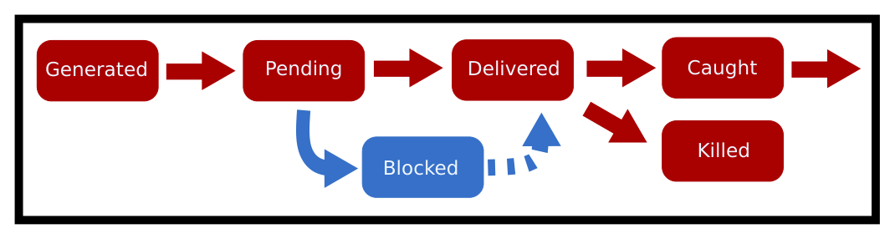

# Chương 13. Tín hiệu (Signals)

> Bản dịch tiếng Việt từ *System Programming Coursebook* (University of Illinois, CS 241) — B. Venkatesh, L. Angrave et al. Tài liệu gốc được phát hành theo giấy phép [CC BY 4.0](https://creativecommons.org/licenses/by/4.0/); bản dịch giữ nguyên giấy phép này. Nguồn: https://github.com/illinois-cs241/coursebook

> *Đó là một tín hiệu, Jerry, đó là một tín hiệu! [búng tay lần nữa] Tín hiệu!*
>
> — George Costanza (Seinfeld)

Signal (tín hiệu) là một cách thuận tiện để chuyển những thông tin có độ ưu tiên thấp, và để người dùng tương tác với chương trình của mình khi các cách khác không còn hoạt động (ví dụ khi standard input bị "đóng băng"). Chúng cho phép một chương trình dọn dẹp hoặc thực hiện một hành động nào đó khi có sự kiện xảy ra. Đôi khi, một chương trình có thể chọn bỏ qua các sự kiện — điều này cũng được hỗ trợ. Viết một chương trình dùng signal cho đúng cách là việc khá khó, do cách mà signal được xử lý. Vì vậy, signal thường chỉ dùng cho việc kết thúc và dọn dẹp. Hiếm khi chúng được dùng trong logic lập trình.

Với những bạn có nền tảng về kiến trúc máy tính: các interrupt (ngắt) được nói đến ở đây không phải là ngắt do phần cứng sinh ra. Những ngắt phần cứng đó hầu như luôn được kernel (nhân hệ điều hành) xử lý, vì chúng đòi hỏi mức đặc quyền cao hơn. Thay vào đó, chúng ta đang nói về các ngắt phần mềm do kernel sinh ra — dù chúng có thể là phản ứng trước một sự kiện phần cứng, chẳng hạn `SIGSEGV`.

Chương này sẽ trình bày cách đọc thông tin từ một process (tiến trình) đã kết thúc hoặc đã nhận signal. Sau đó, nó đi sâu vào signal là gì, kernel xử lý một signal như thế nào, và những cách khác nhau mà process có thể xử lý signal, cả khi có lẫn khi không có thread (luồng).

## 13.1 Tìm hiểu sâu về tín hiệu (The Deep Dive of Signals)

Một signal cho phép một process gửi một sự kiện hay thông điệp tới một process khác. Nếu process kia muốn chấp nhận signal đó, nó có thể làm vậy, và sau đó, với hầu hết các signal, quyết định sẽ làm gì với signal ấy.

Trước hết, một chút thuật ngữ. **Signal disposition** (cách xử lý tín hiệu) là một thuộc tính của từng process, quyết định một signal được xử lý ra sao sau khi nó được chuyển giao (delivered). Hãy hình dung nó như một bảng gồm các cặp signal–hành động. Phần thảo luận đầy đủ nằm trong trang man. Các hành động gồm:

1. `TERM`: kết thúc process
2. `IGN`: bỏ qua
3. `CORE`: tạo một core dump
4. `STOP`: dừng process
5. `CONT`: cho process chạy tiếp
6. Thực thi một hàm tùy chỉnh.

**Signal mask** (mặt nạ tín hiệu) quyết định một signal cụ thể có được chuyển giao hay không. Quy trình tổng thể mà kernel gửi một signal như sau:

1. Nếu chưa có signal nào tới, process có thể cài đặt các signal handler (hàm xử lý tín hiệu) của riêng mình. Việc này báo cho kernel biết rằng khi process nhận signal X thì nó phải nhảy tới hàm Y.
2. Một signal vừa được tạo ra thì ở trạng thái "generated" (đã sinh ra).
3. Khoảng thời gian từ lúc signal được sinh ra tới lúc kernel có thể áp dụng các quy tắc của mask được gọi là trạng thái pending (đang chờ).
4. Sau đó kernel kiểm tra signal mask của process. Nếu mask cho biết mọi thread trong process đều đang chặn signal đó, thì signal hiện đang bị chặn (blocked) và không có gì xảy ra cho tới khi có một thread bỏ chặn nó.
5. Nếu có một thread nào đó có thể chấp nhận signal, kernel sẽ thực thi hành động ghi trong bảng disposition. Nếu hành động đó là hành động mặc định, thì không thread nào cần phải bị tạm dừng.
6. Ngược lại, kernel chuyển giao (deliver) signal bằng cách dừng bất cứ việc gì mà một thread cụ thể đang làm, và cho thread đó nhảy tới signal handler. Lúc này signal đang ở pha delivered (đã chuyển giao). Các signal khác vẫn có thể được sinh ra vào lúc này, nhưng chúng không thể được chuyển giao cho tới khi signal handler chạy xong — đó là lúc pha delivered kết thúc.
7. Cuối cùng, chúng ta coi một signal là đã được bắt (caught) nếu process vẫn còn nguyên vẹn sau khi signal được chuyển giao.

Dưới dạng lưu đồ:



*Hình 13.1: Sơ đồ vòng đời của signal*

Dưới đây là một số signal phổ biến mà bạn sẽ hay thấy được nhắc tới.

*Bảng 13.1: Các signal POSIX*

| Tên (Name) | Số hiệu khả chuyển (Portable Number) | Hành động mặc định (Default Action) | Cách dùng thông thường (Usual Use) |
|---|---|---|---|
| `SIGINT` | 2 | Terminate (Can be caught) | Dừng một process một cách nhẹ nhàng |
| `SIGQUIT` | 3 | Terminate (Can be caught) | Dừng một process một cách mạnh tay |
| `SIGTERM` | 15 | Terminate Process | Dừng một process còn mạnh tay hơn nữa |
| `SIGSTOP` | N/A | Stop Process (Cannot be caught) | Tạm dừng (suspend) một process |
| `SIGCONT` | N/A | Continues a process | Chạy tiếp sau khi bị dừng |
| `SIGKILL` | 9 | Terminate Process (Cannot be caught) | Bạn muốn process biến mất hẳn |

Một trong những giai thoại ưa thích của chúng tôi là: đừng bao giờ dùng `kill -9`, vì vô số lý do. Dưới đây là trích đoạn từ bài *Useless Use of Kill -9* (liên kết tới bản lưu trữ):

> Không không không. Đừng dùng `kill -9`.
> Nó không cho process cơ hội để dọn dẹp một cách sạch sẽ:
> 1) đóng các kết nối socket
> 2) dọn dẹp các file tạm
> 3) báo cho các process con biết rằng nó sắp biến mất
> 4) khôi phục lại các thiết lập của terminal
> và vân vân, vân vân, vân vân.
> Thông thường, hãy gửi 15, chờ một hai giây, nếu không được thì gửi 2, nếu vẫn không được thì gửi 1. Nếu vẫn không ăn thua, HÃY XÓA FILE THỰC THI ĐI vì chương trình đó cư xử quá tệ!
> Đừng dùng `kill -9`. Đừng lôi cả cái máy gặt đập liên hợp ra chỉ để tỉa một chậu hoa.

Chúng tôi vẫn giữ `kill -9` ở đó cho những tình huống cực đoan, khi process nhất định phải biến mất.

## 13.2 Gửi tín hiệu (Sending Signals)

Signal có thể được sinh ra theo nhiều cách.

1. Người dùng có thể gửi một signal. Ví dụ, bạn đang ở terminal và nhấn CTRL-C. Bạn cũng có thể dùng lệnh dựng sẵn `kill` để gửi bất kỳ signal nào.
2. Hệ thống có thể gửi một sự kiện. Ví dụ, nếu một process truy cập vào một trang (page) mà nó không được phép, phần cứng sinh ra một ngắt và ngắt này được kernel đón bắt (intercept). Kernel tìm ra process gây ra chuyện đó và gửi cho nó signal `SIGSEGV`. Còn có những sự kiện kernel khác như một process con được tạo ra, hay một process cần được chạy tiếp.
3. Cuối cùng, một process khác có thể gửi thông điệp. Cách này có thể dùng cho việc trao đổi sự kiện ít quan trọng giữa các process. Nếu bạn đang dựa vào signal làm động lực chính cho chương trình của mình, bạn nên xem xét lại thiết kế ứng dụng. Có rất nhiều nhược điểm khi dùng POSIX/Real-Time signal cho giao tiếp bất đồng bộ. Cách tốt nhất để xử lý giao tiếp liên tiến trình là dùng, ừm, chính các phương pháp giao tiếp liên tiến trình (interprocess communication) được thiết kế riêng cho tác vụ của bạn.

Bạn hoặc một process khác có thể tạm dừng một process đang chạy bằng cách gửi cho nó signal `SIGSTOP`. Nếu thành công, nó sẽ "đóng băng" process đó. Process sẽ không được cấp thêm thời gian CPU nữa. Để cho phép process tiếp tục thực thi, hãy gửi cho nó signal `SIGCONT`. Ví dụ, sau đây là một chương trình in chậm rãi mỗi giây một dấu chấm, tối đa 59 dấu chấm.

```c
#include <unistd.h>
#include <stdio.h>
int main() {
  printf("My pid is %d\n", getpid() );
  int i = 60;
  while(--i) {
    write(1, ".",1);
    sleep(1);
  }
  write(1, "Done!",5);
  return 0;
}
```

Trước tiên chúng ta sẽ khởi chạy process ở chế độ nền (chú ý dấu `&` ở cuối). Sau đó, gửi cho nó một signal từ process shell bằng lệnh `kill`.

```bash
$ ./program &
My pid is 403
...
$ kill -SIGSTOP 403
$ kill -SIGCONT 403
...
```

Trong C, một chương trình có thể gửi signal tới process con bằng lời gọi POSIX `kill`:

```c
kill(child, SIGUSR1); // Send a user-defined signal
kill(child, SIGSTOP); // Stop the child process (the child cannot prevent this)
kill(child, SIGTERM); // Terminate the child process (the child can prevent this)
kill(child, SIGINT); // The equivalent to CTRL-C (by default closes the process)
```

Như đã thấy ở trên, trong shell cũng có sẵn lệnh `kill`. Một lệnh khác là `killall` hoạt động y hệt, nhưng thay vì tra theo pid, nó cố khớp theo tên của process. `ps` là một tiện ích quan trọng có thể giúp bạn tìm pid của một process.

```bash
# First let's use ps and grep to find the process we want to send a signal to
$ ps au | grep myprogram
angrave 4409 0.0 0.0 2434892     512 s004 R+    2:42PM 0:00.00 myprogram 1 2 3

#Send SIGINT signal to process 4409 (The equivalent of `CTRL-C`)
$ kill -SIGINT 4409

# Send SIGKILL (terminate the process)
$ kill -SIGKILL 4409
$ kill -9 4409

# Use kill all instead to kill a process by executable name
$ killall -l firefox
```

Để gửi một signal tới chính process đang chạy, hãy dùng `raise` hoặc `kill` với `getpid()`.

```c
raise(int sig); // Send a signal to myself!
kill(getpid(), int sig); // Same as above
```

Với các process không phải root, signal chỉ có thể được gửi tới các process của cùng một người dùng. Bạn không thể `SIGKILL` bất kỳ process nào tùy ý! Xem `man -s2 kill` để biết thêm chi tiết.

## 13.3 Xử lý tín hiệu (Handling Signals)

Có những giới hạn nghiêm ngặt đối với mã lệnh có thể thực thi bên trong một signal handler. Hầu hết các hàm thư viện và system call (lời gọi hệ thống) đều là async-signal-unsafe (không an toàn với tín hiệu bất đồng bộ), nghĩa là không được dùng chúng bên trong một signal handler vì chúng không re-entrant (tái nhập được). Tính an toàn re-entrant có nghĩa là: hàm của bạn có thể bị đóng băng tại bất kỳ điểm nào rồi được thực thi lại từ đầu — bạn có đảm bảo được rằng hàm của mình sẽ không hỏng không? Hãy xét đoạn mã sau:

```c
int func(const char *str) {
  static char buffer[200];
  strncpy(buffer, str, 199);
  # Here is where we get paused
  printf("%s\n", buffer)
}
```

1. Chúng ta thực thi (`func("Hello")`)
2. Chuỗi được sao chép hoàn toàn vào buffer (`strcmp(buffer, "Hello") == 0`)
3. Một signal được chuyển giao và trạng thái của hàm bị đóng băng; chúng ta cũng ngừng nhận bất kỳ signal mới nào cho tới khi handler chạy xong (chúng ta làm vậy cho tiện)
4. Chúng ta thực thi `func("World")`
5. Bây giờ (`strcmp(buffer, "World") == 0`) và buffer được in ra là "World".
6. Chúng ta quay lại hàm bị ngắt và giờ in buffer thêm một lần nữa: "World" thay vì "Hello" như lời gọi hàm ban đầu dự định.

Việc đảm bảo các hàm của bạn an toàn cho signal handler không thể giải quyết chỉ bằng cách loại bỏ các buffer dùng chung. Bạn còn phải nghĩ tới đa luồng và đồng bộ hóa — chuyện gì xảy ra khi tôi khóa một mutex hai lần? Bạn cũng phải chắc chắn rằng mỗi lời gọi hàm đều an toàn re-entrant. Giả sử chương trình gốc của bạn bị ngắt trong lúc đang thực thi mã thư viện của `malloc`. Các cấu trúc bộ nhớ mà `malloc` sử dụng sẽ ở trạng thái không nhất quán. Gọi `printf` — vốn dùng `malloc` — như một phần của signal handler là không an toàn và sẽ dẫn tới undefined behavior (hành vi không xác định). Một cách an toàn để tránh hành vi này là đặt một biến rồi để chương trình tiếp tục hoạt động. Mẫu thiết kế này cũng giúp chúng ta thiết kế các chương trình có thể nhận signal hai lần mà vẫn hoạt động đúng.

```c
int pleaseStop ; // See notes on why "volatile sig_atomic_t" is better

void handle_sigint(int signal) {
  pleaseStop = 1;
}

int main() {
  signal(SIGINT, handle_sigint);
  pleaseStop = 0;
  while (!pleaseStop) {
    /* application logic here */
  }
  /* clean up code here */
}
```

Đoạn mã trên có vẻ đúng trên giấy. Tuy nhiên, chúng ta cần cung cấp một gợi ý cho compiler (trình biên dịch) và cho nhân CPU sẽ thực thi vòng lặp trong `main()`. Chúng ta cần ngăn compiler tối ưu hóa. Biểu thức `pleaseStop` không hề bị thay đổi trong thân vòng lặp, nên một số compiler sẽ tối ưu nó thành `true` *(TODO: cần trích dẫn nguồn)*. Thứ hai, chúng ta cần đảm bảo giá trị của `pleaseStop` không bị cache trong một thanh ghi CPU, mà luôn được đọc từ và ghi vào bộ nhớ chính. Kiểu `sig_atomic_t` ngụ ý rằng toàn bộ các bit của biến có thể được đọc hoặc sửa như một phép toán nguyên tử (atomic) — một thao tác đơn lẻ không thể bị ngắt. Không thể xảy ra chuyện đọc được một giá trị gồm một số bit mới lẫn một số bit cũ.

Bằng cách khai báo `pleaseStop` với kiểu đúng là `volatile sig_atomic_t`, chúng ta có thể viết mã khả chuyển, trong đó vòng lặp chính sẽ thoát sau khi signal handler trả về. Kiểu `sig_atomic_t` có thể lớn bằng một `int` trên hầu hết các nền tảng hiện đại, nhưng trên các hệ thống nhúng nó có thể nhỏ như một `char` và chỉ biểu diễn được các giá trị trong khoảng (-127 đến 127).

```c
volatile sig_atomic_t pleaseStop;
```

Hai ví dụ về mẫu này có thể tìm thấy trong COMP, một máy tính 4-bit 1Hz chạy trên terminal [3]. Hai cờ boolean được dùng: một để đánh dấu việc `SIGINT` (CTRL-C) đã được chuyển giao, nhằm tắt chương trình một cách êm đẹp; cờ kia để đánh dấu signal `SIGWINCH` nhằm phát hiện việc thay đổi kích thước terminal và vẽ lại toàn bộ màn hình.

Bạn cũng có thể chọn xử lý các signal đang chờ (pending) theo cách bất đồng bộ hoặc đồng bộ. Để cài đặt một signal handler xử lý signal bất đồng bộ, hãy dùng `sigaction`. Để bắt một signal pending theo cách đồng bộ, hãy dùng `sigwait` — hàm này chặn (block) cho tới khi có signal được chuyển giao — hoặc `signalfd`, cũng chặn và cung cấp một file descriptor (bộ mô tả tệp) mà ta có thể `read()` để lấy các signal đang chờ.

### 13.3.1 Sigaction

Bạn nên dùng `sigaction` thay cho `signal` vì nó có ngữ nghĩa được định nghĩa rõ ràng hơn. `signal` trên các hệ điều hành khác nhau lại làm những việc khác nhau — điều này rất tệ. `sigaction` khả chuyển hơn và được định nghĩa tốt hơn cho thread. Bạn có thể dùng system call `sigaction` để đặt handler và disposition hiện tại cho một signal, hoặc đọc signal handler hiện tại của một signal cụ thể.

```c
int sigaction(int signum, const struct sigaction *act, struct sigaction *oldact);
```

Struct `sigaction` bao gồm hai hàm callback (chúng ta sẽ chỉ xét phiên bản 'handler'), một signal mask và một trường flags:

```c
struct sigaction {
  void    (*sa_handler)(int);
  void    (*sa_sigaction)(int, siginfo_t *, void *);
  sigset_t sa_mask;
  int       sa_flags;
};
```

Giả sử bạn gặp phải mã cũ (legacy) dùng `signal`. Đoạn mã sau cài `myhandler` làm handler cho `SIGALRM`.

```c
signal(SIGALRM, myhandler);
```

Đoạn mã `sigaction` tương đương là:

```c
struct sigaction sa;
sa.sa_handler = myhandler;
sigemptyset(&sa.sa_mask);
sa.sa_flags = 0;
sigaction(SIGALRM, &sa, NULL)
```

Tuy nhiên, thông thường chúng ta cũng có thể đặt thêm mask và trường flags. Mask là một signal mask tạm thời được dùng trong lúc signal handler thực thi. Nếu thread đang phục vụ signal bị ngắt giữa chừng một system call, cờ `SA_RESTART` sẽ tự động khởi động lại một số system call mà nếu không có nó thì sẽ trả về sớm với lỗi `EINTR`. Điều này có nghĩa là chúng ta có thể đơn giản hóa phần còn lại của mã đôi chút, vì có thể không cần vòng lặp khởi động lại nữa.

```c
sigfillset(&sa.sa_mask);
sa.sa_flags = SA_RESTART; /* Restart functions if interrupted by handler */
```

Thường thì tốt hơn là để mã của bạn tự kiểm tra lỗi và tự khởi động lại, do tính chất "có chọn lọc" của cờ này.

## 13.4 Chặn tín hiệu (Blocking Signals)

Để chặn signal, hãy dùng `sigprocmask`! Với `sigprocmask`, bạn có thể đặt mask mới, thêm các signal mới cần chặn vào mask của process, và bỏ chặn các signal hiện đang bị chặn. Bạn cũng có thể xác định mask hiện có (và dùng nó về sau) bằng cách truyền một giá trị khác null cho `oldset`.

```c
int sigprocmask(int how, const sigset_t *set, sigset_t *oldset);
```

Từ trang man của `sigprocmask` trên Linux, đây là các giá trị có thể có của `how` *(TODO: cần trích dẫn nguồn)*:

- `SIG_BLOCK`. Tập các signal bị chặn là hợp của tập hiện tại và đối số `set`.
- `SIG_UNBLOCK`. Các signal trong `set` được loại khỏi tập các signal đang bị chặn. Được phép thử bỏ chặn một signal vốn không bị chặn.
- `SIG_SETMASK`. Tập các signal bị chặn được đặt thành đối số `set`.

Kiểu sigset hoạt động như một tập hợp. Một lỗi phổ biến là quên khởi tạo tập signal trước khi thêm vào tập.

```c
sigset_t set, oldset;
sigaddset(&set, SIGINT); // Ooops!
sigprocmask(SIG_SETMASK, &set, &oldset)
```

Mã đúng sẽ khởi tạo tập ở trạng thái toàn bật hoặc toàn tắt. Ví dụ,

```c
sigfillset(&set); // all signals
sigprocmask(SIG_SETMASK, &set, NULL); // Block all the signals which can be blocked

sigemptyset(&set); // no signals
sigprocmask(SIG_SETMASK, &set, NULL); // set the mask to be empty again
```

Nếu bạn chặn một signal bằng `sigprocmask` hoặc `pthread_sigmask`, thì handler đã đăng ký bằng `sigaction` sẽ không được chuyển giao, trừ khi bạn chờ nó một cách tường minh bằng `sigwait` *(TODO: cần trích dẫn nguồn)*.

### 13.4.1 Sigwait

`sigwait` có thể được dùng để đọc từng signal pending một. `sigwait` được dùng để chờ signal một cách đồng bộ, thay vì xử lý chúng trong một callback. Cách dùng điển hình của `sigwait` trong một chương trình đa luồng được trình bày dưới đây. Hãy để ý rằng signal mask của thread được đặt trước tiên (và sẽ được các thread mới kế thừa). Mask này ngăn signal được chuyển giao, nên chúng sẽ nằm ở trạng thái pending cho tới khi `sigwait` được gọi. Cũng để ý rằng cùng một biến tập `sigset_t` đó được `sigwait` sử dụng — nhưng thay vì đặt tập các signal bị chặn, nó được dùng làm tập các signal mà `sigwait` có thể bắt và trả về.

Một ưu điểm của việc viết một thread xử lý signal riêng (như ví dụ dưới đây) thay vì một hàm callback là giờ đây bạn có thể dùng nhiều hàm thư viện C và hàm hệ thống hơn một cách an toàn.

Dựa trên mã sigmask [2]:

```c
static sigset_t signal_mask; /* signals to block */

int main(int argc, char *argv[]) {
  pthread_t sig_thr_id; /* signal handler thread ID */
  sigemptyset (&signal_mask);
  sigaddset (&signal_mask, SIGINT);
  sigaddset (&signal_mask, SIGTERM);
  pthread_sigmask (SIG_BLOCK, &signal_mask, NULL);

  /* New threads will inherit this thread's mask */
  pthread_create (&sig_thr_id, NULL, signal_thread, NULL);

  /* APPLICATION CODE */
  ...
}

void *signal_thread(void *arg) {
  int sig_caught;

  /* Use the same mask as the set of signals that we'd like to know about! */
  sigwait(&signal_mask, &sig_caught);
  switch (sig_caught) {
    case SIGINT:
    ...
    break;
    case SIGTERM:
    ...
    break;
    default:
    fprintf (stderr, "\nUnexpected signal %d\n", sig_caught);
    break;
  }
}
```

## 13.5 Tín hiệu trong tiến trình con và luồng (Signals in Child Processes and Threads)

Đây là phần ôn lại từ chương về process. Sau khi fork, process con kế thừa một bản sao các signal disposition của process cha và một bản sao signal mask của process cha. Nếu bạn đã cài một handler cho `SIGINT` trước khi fork, thì process con cũng sẽ gọi handler đó nếu có `SIGINT` được chuyển giao tới process con. Nếu `SIGINT` bị chặn ở process cha, nó cũng sẽ bị chặn ở process con. Lưu ý rằng các signal pending không được kế thừa sang process con khi fork. Còn sau exec, chỉ có signal mask và các signal pending được mang theo [1]. Các signal handler được đặt lại về hành động ban đầu, vì mã của handler cũ có thể đã biến mất cùng với process cũ.

Mỗi thread có mask của riêng nó. Một thread mới kế thừa một bản sao mask của thread đã gọi tạo nó. Lúc khởi tạo, mask của thread gọi hoàn toàn giống với mask của process. Nhưng sau khi một thread mới được tạo ra, signal mask "của process" trở thành một vùng mờ. Thay vào đó, kernel thích coi process như một tập hợp các thread, mỗi thread có thể thiết lập một signal mask và nhận signal. Để bắt đầu đặt mask của bạn, bạn có thể dùng:

```c
pthread_sigmask(...); // set my mask to block delivery of some signals
pthread_create(...); // new thread will start with a copy of the same mask
```

Việc chặn signal trong chương trình đa luồng tương tự như trong chương trình đơn luồng, với phép chuyển đổi sau:

1. Dùng `pthread_sigmask` thay cho `sigprocmask`
2. Chặn một signal trong tất cả các thread để ngăn nó được chuyển giao một cách bất đồng bộ

Cách dễ nhất để đảm bảo một signal bị chặn trong mọi thread là đặt signal mask trong thread chính trước khi các thread mới được tạo.

```c
sigemptyset(&set);
sigaddset(&set, SIGQUIT);
sigaddset(&set, SIGINT);
pthread_sigmask(SIG_BLOCK, &set, NULL);

// this thread and the new thread will block SIGQUIT and SIGINT
pthread_create(&thread_id, NULL, myfunc, funcparam);
```

Giống như đã thấy với `sigprocmask`, `pthread_sigmask` cũng có tham số 'how' định nghĩa cách tập signal sẽ được sử dụng:

```text
pthread_sigmask(SIG_SETMASK, &set, NULL) - replace the thread's mask with given signal set
pthread_sigmask(SIG_BLOCK, &set, NULL) - add the signal set to the thread's mask
pthread_sigmask(SIG_UNBLOCK, &set, NULL) - remove the signal set from the thread's mask
```

Khi đó, một signal có thể được chuyển giao tới bất kỳ thread nào sẵn sàng chấp nhận signal ấy. Nếu có hai thread trở lên có thể nhận signal, thì thread nào bị ngắt là tùy ý! Một thực hành phổ biến là có một thread có thể nhận mọi signal, hoặc nếu có một signal nào đó đòi hỏi logic đặc biệt, thì có nhiều thread cho nhiều signal. Dù các chương trình bên ngoài không thể gửi signal tới một thread cụ thể, bạn có thể làm việc đó từ bên trong bằng `pthread_kill(pthread_t thread, int sig)`. Trong ví dụ dưới đây, thread mới được tạo đang thực thi `func` sẽ bị ngắt bởi `SIGINT`.

```c
pthread_create(&tid, NULL, func, args);
pthread_kill(tid, SIGINT);
pthread_kill(pthread_self(), SIGKILL); // send SIGKILL to myself
```

Xin cảnh báo: `pthread_kill(threadid, SIGKILL)` sẽ giết toàn bộ process. Dù từng thread riêng lẻ có thể đặt signal mask, signal disposition là của cả process chứ không phải của từng thread. Điều này có nghĩa là `sigaction` có thể được gọi từ bất kỳ thread nào, vì bạn sẽ đặt signal handler cho tất cả các thread trong process.

Các trang man của Linux thảo luận về các system call liên quan tới signal ở mục (section) 2. Còn có một bài viết dài hơn ở mục 7 (dù không có trên OSX/BSD):

```bash
man -s7 signal
```

## 13.6 Chủ đề (Topics)

- Signal
- Tính an toàn của signal handler (Signal Handler Safety)
- Signal disposition
- Các trạng thái của signal (Signal States)
- Signal pending khi fork/exec
- Signal disposition khi fork/exec
- Phát (raise) signal trong C
- Phát signal trong một chương trình đa luồng

## 13.7 Câu hỏi (Questions)

- Signal là gì?
- Signal được phục vụ như thế nào trên UNIX? (Bonus: Còn trên Windows thì sao?)
- Một hàm "an toàn cho signal handler" nghĩa là gì? Còn "reentrant" thì sao?
- Signal disposition của một process là gì? Nó khác gì với mask?
- Hàm nào thay đổi signal disposition trong một chương trình đơn luồng? Còn trong chương trình đa luồng?
- Một số nhược điểm của việc dùng signal là gì?
- Có những cách nào để bắt một signal theo kiểu bất đồng bộ và đồng bộ?
- Điều gì xảy ra với các signal pending sau khi fork? Sau exec? Còn signal mask của tôi thì sao? Còn signal disposition?
- Kernel trải qua quy trình nào từ lúc signal được tạo ra cho tới lúc chuyển giao/chặn?

## Tài liệu tham khảo (Bibliography)

[1] Executing a file. URL https://www.gnu.org/software/libc/manual/html_node/Executing-a-File.html#Executing-a-File.

[2] pthreads sigmask. URL.

[3] Jure Šorn. gto76/comp-cpp, Jun 2015. URL https://github.com/gto76/comp-cpp/blob/1bf9a77eaf8f57f7358a316e5/src/output.c *(ND: URL bị cắt ngắn trong bản PDF gốc)*.
