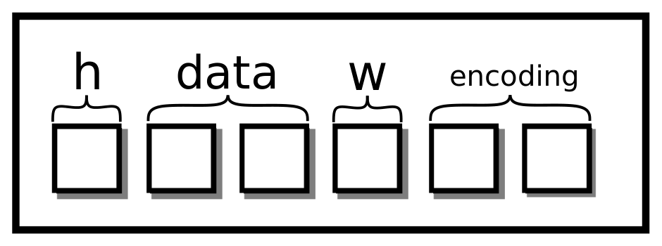
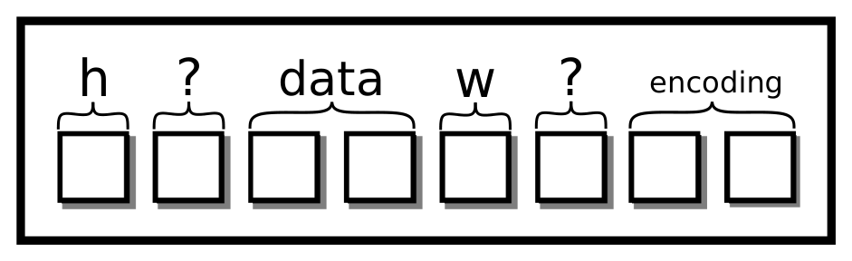
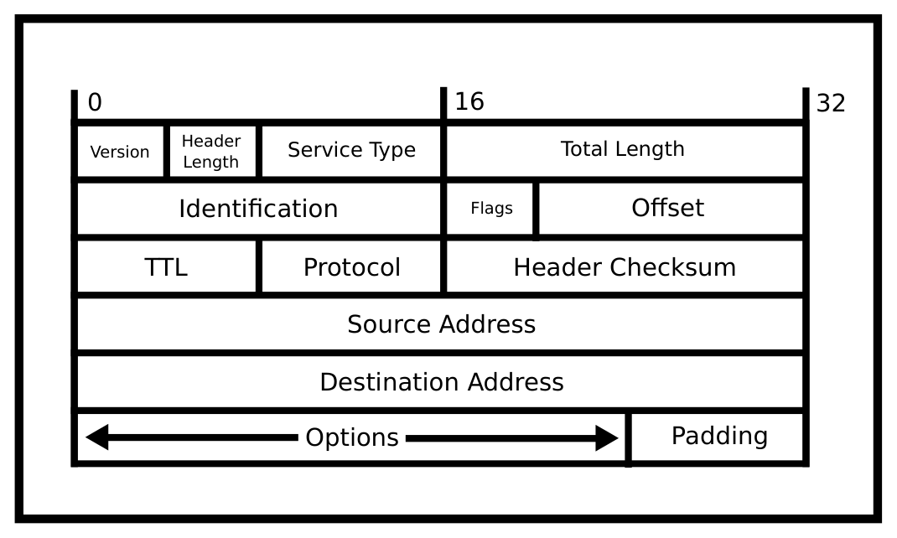

# Chương 17. Phụ lục (Appendix)

> Bản dịch tiếng Việt từ *System Programming Coursebook* (University of Illinois, CS 241) — B. Venkatesh, L. Angrave et al. Tài liệu gốc được phát hành theo giấy phép [CC BY 4.0](https://creativecommons.org/licenses/by/4.0/); bản dịch giữ nguyên giấy phép này. Nguồn: https://github.com/illinois-cs241/coursebook

## 17.1 Shell

Shell thực ra chính là cách bạn sẽ tương tác với hệ thống. Trước khi có các hệ điều hành thân thiện với người dùng, khi máy tính khởi động lên, tất cả những gì bạn có trong tay chỉ là một shell. Điều đó có nghĩa là mọi lệnh và mọi thao tác soạn thảo đều phải được thực hiện theo cách này. Ngày nay, máy tính của chúng ta khởi động vào chế độ desktop, nhưng ta vẫn có thể truy cập shell thông qua một terminal.

```text
(Stuff) $
```

Nó đã sẵn sàng cho lệnh tiếp theo của bạn! Bạn có thể gõ rất nhiều tiện ích Unix như `ls`, `echo Hello` và shell sẽ thực thi chúng rồi trả kết quả cho bạn. Một số trong đó là cái gọi là shell-builtin (lệnh tích hợp sẵn trong shell), nghĩa là mã của chúng nằm ngay trong chính chương trình shell. Một số khác là các chương trình đã biên dịch mà bạn chạy. Shell chỉ tìm trong một biến đặc biệt gọi là path, biến này chứa một danh sách các đường dẫn phân cách bằng dấu hai chấm để tìm một file thực thi có tên như bạn gõ; dưới đây là một path ví dụ.

```bash
$ echo $PATH
/usr/local/sbin:/usr/local/bin:/usr/sbin:
/usr/bin:/sbin:/bin:/usr/games:/usr/local/games
```

Vậy nên khi shell thực thi `ls`, nó tìm qua tất cả các thư mục đó, thấy `/bin/ls` và thực thi file đó.

```bash
$ ls
...
$ /bin/ls
```

Bạn luôn có thể gọi bằng đường dẫn đầy đủ. Đó cũng chính là lý do tại sao ở các lớp học trước, nếu muốn chạy thứ gì đó trên terminal bạn phải gõ `./exe`, bởi vì thông thường thư mục bạn đang làm việc không nằm trong biến `PATH`. Dấu `.` được khai triển thành thư mục hiện tại, và shell của bạn thực thi `<current_dir>/exe`, vốn là một lệnh hợp lệ.

### 17.1.1 Mẹo và thủ thuật với shell (Shell tricks and tips)

- Phím mũi tên lên sẽ lấy lại lệnh gần nhất của bạn
- `ctrl-r` sẽ tìm kiếm trong các lệnh bạn đã chạy trước đó
- `ctrl-c` sẽ ngắt process của shell
- `!!` sẽ thực thi lệnh cuối cùng
- `!<num>` lùi lại ngần ấy lệnh và chạy lệnh đó
- `!<prefix>` chạy lệnh cuối cùng có tiền tố đó
- `!$` là đối số cuối cùng của lệnh trước
- `!*` là toàn bộ các đối số của lệnh trước
- `^pat^sub` lấy lệnh cuối cùng và thay thế mẫu `pat` bằng chuỗi thay thế `sub`
- `cd -` đi tới thư mục trước đó
- `pushd <dir>` đẩy thư mục hiện tại vào một stack rồi `cd`
- `popd` `cd` tới thư mục nằm ở đỉnh stack

### 17.1.2 Terminal là gì? (What's a terminal?)

Terminal là một ứng dụng hiển thị đầu ra của shell. Bạn có thể dùng terminal mặc định, một terminal kiểu quake, terminator — lựa chọn là vô tận!

### 17.1.3 Các tiện ích thông dụng (Common Utilities)

1. `cat` nối (concatenate) nhiều file lại với nhau. Nó thường được dùng để in nội dung của một file ra terminal, nhưng công dụng nguyên thuỷ của nó là nối file.

```bash
$ cat file.txt
...
$ cat shakespeare.txt shakespeare.txt > two_shakes.txt
```

2. `diff` cho bạn biết sự khác biệt giữa hai file. Nếu không có gì được in ra thì giá trị trả về là không, nghĩa là hai file giống nhau từng byte một. Ngược lại, phần khác biệt dựa trên dãy con chung dài nhất (longest common subsequence) sẽ được in ra

```text
$ cat prog.txt
hello
world
$ cat adele.txt
hello
it's me
$ diff prog.txt prog.txt
$ diff shakespeare.txt shakespeare.txt
2c2
< world
---
> it's me
```

3. `grep` cho bạn biết những dòng nào trong một file hoặc trong standard input khớp với một mẫu POSIX.

```bash
$ grep it adele.txt
it's me
```

4. `ls` cho bạn biết những file nào đang nằm trong thư mục hiện tại.

5. `cd` đây là một shell builtin, nhưng nó chuyển sang một thư mục tương đối hoặc tuyệt đối

```bash
$ cd /usr
$ cd lib/
$ cd -
$ pwd
/usr/
```

6. `man` lệnh yêu thích của mọi lập trình viên hệ thống, cho bạn biết thêm về tất cả các hàm yêu thích của bạn!

7. `make` thực thi các chương trình theo một makefile.

### 17.1.4 Cú pháp (Syntactic)

Shell có nhiều tiện ích hữu ích, chẳng hạn lưu đầu ra vào một file bằng cách chuyển hướng (redirection) `>`. Cách này ghi đè file từ đầu. Nếu bạn chỉ muốn nối thêm vào file, bạn có thể dùng `>>`. Unix cũng cho phép hoán đổi file descriptor (bộ mô tả tệp). Nghĩa là bạn có thể lấy đầu ra đang đi tới một file descriptor và làm cho nó trông như đang đi ra từ một file descriptor khác. Trường hợp phổ biến nhất là `2>&1`, nghĩa là lấy stderr và làm cho nó trông như đang đi ra từ standard out. Điều này quan trọng bởi vì khi bạn dùng `>` và `>>`, chúng chỉ ghi standard output của chương trình. Dưới đây là một số ví dụ.

```bash
$ ./program > output.txt # To overwrite
$ ./program >> output.txt # To append
$ ./program 2>&1 > output_all.txt # stderr & stdout
$ ./program 2>&1 > /dev/null # don't care about any output
```

Toán tử pipe (ống dẫn) có một lịch sử rất thú vị. Triết lý UNIX là viết các chương trình nhỏ và xâu chuỗi chúng lại để làm những việc mới mẻ, thú vị. Ngày xưa, dung lượng đĩa cứng hạn chế và thời gian ghi rất chậm. Brian Kernighan muốn giữ triết lý đó nhưng bỏ đi các file trung gian chiếm dung lượng ổ cứng. Thế là pipe của UNIX ra đời. Một pipe lấy stdout của chương trình bên trái nó và đưa vào stdin của chương trình bên phải nó. Hãy xem lệnh `tee`. Nó có thể được dùng thay cho các toán tử chuyển hướng bởi vì `tee` sẽ vừa ghi vào file vừa xuất ra standard out. Nó còn có thêm lợi ích là không nhất thiết phải là lệnh cuối cùng trong chuỗi. Nghĩa là bạn có thể ghi lại một kết quả trung gian rồi tiếp tục pipe.

```bash
$ ./program | tee output.txt # Overwrite
$ ./program | tee -a output.txt # Append
$ head output.txt | wc | head -n 1 # Multi pipes
$ ((head output.txt) | wc) | head -n 1 # Same as above
$ ./program | tee intermediate.txt | wc
```

Các toán tử `&&` và `||` là những toán tử thực thi lệnh một cách tuần tự. `&&` chỉ thực thi một lệnh nếu lệnh trước đó thành công, còn `||` luôn thực thi lệnh kế tiếp.

```bash
$ false && echo "Hello!"
$ true && echo "Hello!"
$ false || echo "Hello!"
```

### 17.1.5 Biến môi trường là gì? (What are environment variables?)

Mỗi process có một từ điển các biến môi trường của riêng nó, được sao chép sang cho process con. Nghĩa là nếu process cha thay đổi biến môi trường của mình thì thay đổi đó sẽ không được chuyển sang process con, và ngược lại. Điều này quan trọng trong bộ ba fork-exec-wait nếu bạn muốn exec một chương trình với các biến môi trường khác với process cha của bạn (hoặc bất kỳ process nào khác).

Ví dụ, bạn có thể viết một chương trình C lặp qua tất cả các múi giờ và thực thi lệnh `date` để in ra ngày giờ ở mọi địa phương. Biến môi trường được dùng cho đủ loại chương trình, vì vậy việc sửa đổi chúng là quan trọng.

### Đóng gói struct (Struct packing)

Struct có thể cần đến một thứ gọi là [padding](http://www.catb.org/esr/structure-packing/) (đệm) (xem tutorial). Chúng tôi không yêu cầu bạn phải đóng gói struct trong khoá học này, chỉ cần biết rằng trình biên dịch thực hiện việc đó. Lý do là vào thời kỳ đầu (và thậm chí cả bây giờ), việc nạp một địa chỉ trong bộ nhớ diễn ra theo các khối 32-bit hoặc 64-bit. Điều này cũng có nghĩa là các địa chỉ được yêu cầu phải là bội số của kích thước khối.

```c
struct picture{
  int height;
  pixel** data;
  int width;
  char* encoding;
}
```

Bạn nghĩ rằng struct picture trông như thế này. Mỗi ô là bốn byte.



*Hình 17.1: Struct sáu ô*

Tuy nhiên, với việc đóng gói struct, về mặt khái niệm nó sẽ trông như thế này:

```c
struct picture{
  int height;
  char slop1[4];
  pixel** data;
  int width;
  char slop2[4];
  char* encoding;
}
```

Về mặt hình ảnh, ta sẽ thêm hai ô nữa vào sơ đồ



*Hình 17.2: Struct tám ô, hai ô là phần đệm thừa (slop)*

Kiểu padding này rất phổ biến trên hệ thống 64-bit. Trong những trường hợp khác, bộ xử lý hỗ trợ truy cập không căn chỉnh (unaligned access), cho phép trình biên dịch đóng gói struct. Điều đó nghĩa là gì? Ta có thể cho một biến bắt đầu tại một vị trí không phải là biên 64-bit. Bộ xử lý sẽ tự lo phần còn lại. Để bật tính năng này, hãy đặt một attribute.

```c
struct __attribute__((packed, aligned(4))) picture{
  int height;
  pixel** data;
  int width;
  char* encoding;
}
```

Giờ hình của chúng ta sẽ trông giống struct gọn gàng như trong hình 17.1. Nhưng lúc này, mỗi lần bộ xử lý cần truy cập `data` hoặc `encoding`, cần tới hai lần truy cập bộ nhớ. Một giải pháp thay thế khả dĩ là sắp xếp lại thứ tự các trường trong struct.

```c
struct picture{
  int height;
  int width;
  pixel** data;
  char* encoding;
}
```

## 17.2 Stack Smashing

Mỗi thread sử dụng một vùng nhớ stack. Stack "lớn dần xuống dưới" — nếu một hàm gọi một hàm khác, stack được mở rộng về phía các địa chỉ bộ nhớ nhỏ hơn. Bộ nhớ stack bao gồm các biến tự động (tạm thời) không phải static, các giá trị tham số và địa chỉ trả về (return address). Nếu một buffer quá nhỏ so với dữ liệu nào đó (ví dụ các giá trị nhập từ người dùng), thì có khả năng thực sự là các biến khác trên stack và thậm chí cả địa chỉ trả về sẽ bị ghi đè. Bố cục chính xác của nội dung stack và thứ tự các biến tự động phụ thuộc vào kiến trúc và trình biên dịch. Với một chút công sức điều tra, ta có thể học được cách cố ý phá stack (smash the stack) trên một kiến trúc cụ thể.

Ví dụ dưới đây minh hoạ cách địa chỉ trả về được lưu trên stack. Với một kiến trúc 32-bit cụ thể là máy [Live Linux Machine](http://cs-education.github.io/sys/), chúng tôi xác định được rằng địa chỉ trả về được lưu tại một địa chỉ cao hơn địa chỉ của biến tự động hai con trỏ (8 byte). Đoạn mã cố tình thay đổi giá trị trên stack để khi hàm `input` trả về, thay vì tiếp tục chạy bên trong hàm `main`, nó nhảy sang hàm khai thác (exploit).

```c
// Overwrites the return address on the following machine:
// http://cs-education.github.io/sys/
#include <stdio.h>
#include <stdlib.h>
#include <unistd.h>

void breakout() {
  puts("Welcome. Have a shell...");
  system("/bin/sh");
}
void input() {
  void *p;
  printf("Address of stack variable: %p\n", &p);
  printf("Something that looks like a return address on stack: %p\n", *((&p)+2));
  // Let's change it to point to the start of our sneaky function.
  *((&p)+2) = breakout;
}
int main() {
  printf("main() code starts at %p\n",main);

  input();
  while (1) {
    puts("Hello");
    sleep(1);
  }

  return 0;
}
```

Có [rất nhiều](https://en.wikipedia.org/wiki/Stack_buffer_overflow) cách mà máy tính thường dùng để vượt qua vấn đề này.

## 17.3 Biên dịch và liên kết (Compiling and Linking)

Đây là cái nhìn tổng quan ở mức cao từ lúc bạn biên dịch chương trình cho tới lúc bạn chạy chương trình. Chúng ta thường thấy rằng biên dịch chương trình là việc dễ dàng. Bạn chạy chương trình qua một IDE hoặc một terminal, và nó cứ thế hoạt động.

```bash
$ cat main.c
#include <stdio.h>

int main() {
    printf("Hello World!\n");
    return 0;
}
$ gcc main.c -o main
$ ./main
Hello World!
$
```

Dưới đây là các giai đoạn đại khái của quá trình biên dịch với gcc.

1. Tiền xử lý (Preprocessing): Bộ tiền xử lý khai triển tất cả các chỉ thị tiền xử lý.

2. Phân tích cú pháp (Parsing): Trình biên dịch phân tích cú pháp file văn bản để tìm các khai báo hàm, khai báo biến, v.v.

3. Sinh mã assembly (Assembly Generation): Trình biên dịch sau đó sinh mã assembly cho tất cả các hàm, sau một số bước tối ưu hoá nếu được bật.

4. Hợp dịch (Assembling): Trình hợp dịch (assembler) biến mã assembly thành các số 0 và 1 rồi tạo ra một object file. Object file này ánh xạ các tên tới các đoạn mã.

5. Liên kết tĩnh (Static Linking): Trình liên kết sau đó lấy một loạt object và thư viện tĩnh rồi phân giải các tham chiếu tới biến và hàm từ object file này sang object file khác. Trình liên kết tìm hàm main và đặt nó làm điểm vào (entry point) của chương trình. Trình liên kết cũng nhận ra khi một hàm được dự định liên kết động. Trình biên dịch cũng tạo một section trong file thực thi để báo cho hệ điều hành biết rằng các hàm này cần được cấp địa chỉ ngay trước khi chạy.

6. Liên kết động (Dynamic Linking): Khi chương trình chuẩn bị được thực thi, hệ điều hành xem chương trình cần những thư viện nào và liên kết các hàm đó tới thư viện động.

7. Chương trình được chạy.

Các môn học sau sẽ dạy bạn về phân tích cú pháp và assembly — tiền xử lý là một phần mở rộng của phân tích cú pháp. Tuy nhiên hầu hết các môn học sẽ không dạy bạn về hai kiểu liên kết khác nhau. Liên kết tĩnh một thư viện tương tự như gộp các object file lại với nhau. Để tạo một thư viện tĩnh, trình biên dịch gộp các object file khác nhau để tạo ra một file thực thi. Một thư viện tĩnh theo đúng nghĩa đen là một kho lưu trữ (archive) các object file. Các thư viện này hữu ích khi bạn muốn file thực thi của mình an toàn — bạn biết tất cả mã được đưa vào file thực thi — và khả chuyển — toàn bộ mã được đóng gói cùng file thực thi, nghĩa là không cần cài đặt thêm gì.

Kiểu còn lại là thư viện động. Thông thường, các thư viện động được cài đặt ở phạm vi người dùng hoặc toàn hệ thống và hầu hết các chương trình đều có thể truy cập. Các hàm của thư viện động được điền vào ngay trước khi chúng được chạy. Cách này có một số lợi ích.

- Dấu chân mã (code footprint) nhỏ hơn cho các thư viện phổ biến như thư viện chuẩn C
- Liên kết muộn (late binding) nghĩa là mã tổng quát hơn và ít phụ thuộc vào hành vi cụ thể hơn.
- Sự tách biệt nghĩa là thư viện chia sẻ có thể được cập nhật trong khi file thực thi vẫn giữ nguyên.

Cũng có một số nhược điểm.

- Toàn bộ mã không còn được đóng gói trong chương trình của bạn. Điều này có nghĩa là người dùng phải cài đặt thêm thứ gì đó.
- Có thể có các lỗi bảo mật trong mã bên ngoài dẫn tới các khai thác bảo mật trong chương trình của bạn.
- Linux tiêu chuẩn cho phép bạn "thay thế" các thư viện động, dẫn tới khả năng bị tấn công bằng kỹ nghệ xã hội (social engineering).
- Điều này làm tăng độ phức tạp cho ứng dụng của bạn. Hai file nhị phân giống hệt nhau nhưng với các thư viện chia sẻ khác nhau có thể cho ra kết quả khác nhau.

### Giải thích về vấn đề Fork-FILE (Explanation of the Fork-FILE Problem)

Để phân tích [tài liệu POSIX](http://pubs.opengroup.org/onlinepubs/9699919799.2008edition/functions/V2_chap02.html), ta sẽ phải đi sâu vào thuật ngữ. Câu đặt ra kỳ vọng là câu sau

> Kết quả của các lời gọi hàm liên quan tới bất kỳ một handle nào (gọi là "active handle" — handle đang hoạt động) được định nghĩa ở nơi khác trong tập này của POSIX.1-2008, nhưng nếu có hai handle trở lên được sử dụng, và bất kỳ handle nào trong số đó là một stream, thì ứng dụng phải đảm bảo rằng các hành động của chúng được phối hợp như mô tả dưới đây. Nếu không làm vậy, kết quả là không xác định.

Điều này có nghĩa là nếu ta không tuân theo POSIX từng chữ một khi dùng hai file descriptor cùng tham chiếu tới một description xuyên qua các process, ta sẽ gặp hành vi không xác định (undefined behavior). Nói cho chính xác về mặt kỹ thuật, file descriptor đó phải có một "vị trí" (position), nghĩa là nó cần có điểm đầu và điểm cuối như một file, chứ không phải là một luồng byte tuỳ ý. POSIX sau đó đưa ra ý niệm về active handle, trong đó một handle có thể là một file descriptor hoặc một con trỏ `FILE*`. Các file handle không hề có cờ nào tên là "active" cả. Một file descriptor "active" là file descriptor hiện đang được dùng để đọc, ghi và các thao tác khác (chẳng hạn như `exit`). Chuẩn nói rằng trước khi fork, ứng dụng hoặc mã của bạn phải thực hiện một loạt bước để chuẩn bị trạng thái của file. Nói một cách đơn giản hoá, descriptor cần được đóng, được flush, hoặc được đọc cho tới hết — các chi tiết gai góc sẽ được giải thích sau.

> Để một handle trở thành active handle, ứng dụng phải đảm bảo rằng các hành động dưới đây được thực hiện giữa lần sử dụng cuối cùng của handle này (active handle hiện tại) và lần sử dụng đầu tiên của handle thứ hai (active handle tương lai). Handle thứ hai khi đó trở thành active handle. Mọi hoạt động của ứng dụng ảnh hưởng tới file offset trên handle thứ nhất phải bị tạm dừng cho tới khi nó lại trở thành active file handle. (Nếu một hàm stream có hàm nền tảng là một hàm ảnh hưởng tới file offset, thì hàm stream đó cũng được coi là ảnh hưởng tới file offset.)

Tóm lại, nếu hai file descriptor cùng được sử dụng một cách tích cực thì hành vi là không xác định. Lưu ý còn lại là sau khi fork, mã thư viện phải chuẩn bị file descriptor như thể process kia có thể làm cho file trở thành active bất kỳ lúc nào. Điểm cuối cùng liên quan tới cách một process chuẩn bị file descriptor trong trường hợp của chúng ta.

> Nếu stream được mở với một chế độ cho phép đọc và open file description nền tảng tham chiếu tới một thiết bị có khả năng seek, thì ứng dụng phải hoặc thực hiện một lệnh `fflush()`, hoặc stream phải được đóng.

Tài liệu nói rằng process con cần thực hiện `fflush` hoặc đóng stream, bởi vì file descriptor cần được chuẩn bị phòng khi process cha cần làm cho nó trở thành active. glibc rơi vào tình huống không có lối thoát nếu nó đóng một file descriptor mà process cha có thể kỳ vọng vẫn đang mở, vì vậy nó sẽ chọn `fflush` khi exit, bởi vì theo thuật ngữ POSIX, exit được tính là truy cập một file. Điều đó có nghĩa là với process cha của chúng ta, điều khoản sau đây được kích hoạt.

> Nếu bất kỳ active handle nào trước đó đã được dùng bởi một hàm thay đổi file offset một cách tường minh, ngoại trừ như yêu cầu ở trên đối với handle thứ nhất, thì ứng dụng phải thực hiện `lseek()` hoặc `fseek()` (tuỳ theo loại handle) tới một vị trí thích hợp.

Vì process con gọi `fflush` còn process cha không chuẩn bị gì, hệ điều hành sẽ quyết định file được đặt lại về đâu. Các hệ thống file khác nhau sẽ làm những việc khác nhau, và đều được chuẩn cho phép. Hệ điều hành có thể xem thời gian sửa đổi và kết luận rằng file chưa thay đổi nên không cần đặt lại gì cả, hoặc có thể kết luận rằng exit biểu thị một thay đổi và cần tua file về đầu.

## 17.4 Giải thuật Chủ ngân hàng (Banker's Algorithm)

Ta có thể bắt đầu với giải thuật Banker cho một loại tài nguyên duy nhất. Hãy xét một chủ ngân hàng có một lượng tiền hữu hạn. Với lượng tiền hữu hạn đó, cô ấy muốn cho vay và cuối cùng lấy lại được tiền của mình. Giả sử ta có một tập gồm $n$ người, mỗi người có một lượng cố định hay một hạn mức $a_i$ ($i$ là process thứ $i$) mà họ cần có được trước khi có thể làm bất kỳ việc gì. Chủ ngân hàng theo dõi số tiền cô đã đưa cho mỗi người, $l_i$. Cô luôn duy trì một lượng tiền $p$ bên mình. Để yêu cầu tiền, mọi người làm như sau: Xét trạng thái của hệ thống $(A = \{a_1, a_2, ...\}, L_t = \{l_{t,1}, l_{t,2}, ...\}, p)$ tại thời điểm $t$. Một tiền điều kiện là ta có $p \ge \min(A)$, tức là ta có đủ tiền để đáp ứng ít nhất một người. Ngoài ra, mỗi người sẽ làm việc trong một khoảng thời gian hữu hạn rồi trả lại tiền cho ta.

- Một người $j$ yêu cầu $m$ từ tôi
  - nếu $m \ge p$, họ bị từ chối.
  - nếu $m + l_j > a_i$ họ bị từ chối
  - Giả vờ rằng ta đang ở một trạng thái mới $(A, L_{t+1} = \{.., l_{t+1,j} = l_{t,j} + m, ...\}, p - m)$ trong đó process được cấp tài nguyên.
- nếu lúc này người $j$ hoặc đã được thoả mãn ($l_{t+1,j} == a_j$) hoặc $\min(a_i - l_{t+1,i}) \le p$. Nói cách khác, ta có đủ tiền để đáp ứng một người khác nữa. Nếu một trong hai điều đó đúng, coi giao dịch là an toàn và đưa tiền cho họ.

Tại sao cách này hoạt động? Ở thời điểm bắt đầu, ta đang ở một trạng thái an toàn — được định nghĩa là ta có đủ tiền để đáp ứng ít nhất một người. Mỗi "khoản vay" trong số này đều dẫn đến một trạng thái an toàn. Nếu ta đã cạn kiệt dự trữ, thì có một người đang làm việc và sẽ trả lại cho ta số tiền lớn hơn hoặc bằng "khoản vay" trước đó, do đó đưa ta trở lại trạng thái an toàn. Vì ta luôn có thể thực hiện thêm một bước nữa, hệ thống không bao giờ có thể deadlock. Tuy nhiên, không có gì đảm bảo hệ thống sẽ không livelock. Nếu process mà ta hy vọng sẽ yêu cầu thứ gì đó lại không bao giờ yêu cầu, thì không có việc gì được thực hiện — nhưng không phải do deadlock. Phép so sánh này mở rộng được cho các bậc cao hơn, nhưng đòi hỏi rằng hoặc một process có thể làm toàn bộ công việc của nó, hoặc tồn tại một process mà tổ hợp tài nguyên của nó có thể được thoả mãn; điều này làm cho giải thuật hơi rắc rối hơn một chút (thêm một vòng lặp for) nhưng không có gì quá tệ. Có một số nhược điểm đáng chú ý.

- Chương trình trước hết cần biết mỗi process cần bao nhiêu của từng loại tài nguyên. Rất nhiều khi điều đó là bất khả thi, hoặc process yêu cầu sai lượng vì lập trình viên không lường trước được.
- Hệ thống có thể livelock.
- Ta biết rằng trong hầu hết các hệ thống, tài nguyên rất đa dạng, ví dụ pipe và socket. Điều này có thể khiến thời gian chạy của giải thuật trở nên chậm với các hệ thống có hàng triệu tài nguyên.
- Ngoài ra, giải thuật này không thể theo dõi các tài nguyên đến rồi đi. Một process có thể xoá một tài nguyên như một tác dụng phụ, hoặc tạo ra một tài nguyên. Giải thuật giả định một sự cấp phát tĩnh và rằng mỗi process thực hiện một thao tác không phá huỷ.

## 17.5 Nĩa sạch/Nĩa bẩn (Giải pháp Chandy/Misra) (Clean/Dirty Forks (Chandy/Misra Solution))

Có nhiều giải pháp nâng cao hơn nữa. Một giải pháp như vậy là của Chandy và Misra. Đây không phải là một giải pháp thực sự cho bài toán các triết gia ăn tối (dining philosophers), bởi vì nó đòi hỏi các triết gia phải có thể nói chuyện với nhau. Đó là một giải pháp đảm bảo tính công bằng theo một ý niệm nào đó về công bằng. Về bản chất, nó định nghĩa một chuỗi các vòng (round), và một triết gia phải ăn trong một vòng nhất định trước khi chuyển sang vòng tiếp theo.

Chúng tôi sẽ không trình bày chi tiết chứng minh ở đây vì nó hơi phức tạp hơn, nhưng bạn cứ thoải mái đọc thêm.

## 17.6 Mô hình Actor (Actor Model)

Mô hình actor là một hình thức đồng bộ hoá khác, không liên quan gì tới việc thương lượng khoá hay chờ đợi. Ý tưởng rất đơn giản. Mỗi actor có thể hoặc thực hiện công việc, tạo thêm actor, gửi thông điệp, hoặc phản hồi thông điệp. Bất cứ khi nào một actor cần thứ gì đó từ một actor khác, nó gửi một thông điệp. Quan trọng nhất, một actor chỉ chịu trách nhiệm về một việc duy nhất. Nếu ta cài đặt một ứng dụng thực tế, ta có thể có một actor xử lý cơ sở dữ liệu, một actor xử lý các kết nối đến, một actor phục vụ các kết nối, v.v. Các actor này sẽ truyền thông điệp cho nhau, kiểu như "có một kết nối mới" từ actor kết nối đến gửi tới actor phục vụ. Actor phục vụ có thể gửi một thông điệp yêu cầu dữ liệu tới actor cơ sở dữ liệu và một thông điệp phản hồi dữ liệu sẽ được gửi về.

Mặc dù đây có vẻ là giải pháp hoàn hảo, vẫn có những nhược điểm. Thứ nhất là bản thân thư viện giao tiếp cần được đồng bộ hoá. Nếu bạn chưa có sẵn một framework làm việc này — như Message Passing Interface hay MPI dùng cho tính toán hiệu năng cao — thì framework đó sẽ phải được xây dựng, và rất có thể sẽ tốn công sức tương đương để xây dựng hiệu quả so với đồng bộ hoá trực tiếp. Ngoài ra, các thông điệp giờ đây phải gánh thêm chi phí phụ trội cho việc tuần tự hoá (serialize) và giải tuần tự hoá (deserialize), hoặc ít nhất là như vậy. Và nhược điểm cuối cùng là một actor có thể mất một khoảng thời gian dài tuỳ ý để phản hồi một thông điệp, làm nảy sinh nhu cầu về các actor "bóng" (shadow actor) phục vụ cùng một công việc.

Như đã đề cập, có những framework như [Message Passing Interface](https://en.wikipedia.org/wiki/Message_Passing_Interface) phần nào dựa trên mô hình actor và cho phép các hệ thống phân tán trong tính toán hiệu năng cao hoạt động hiệu quả, nhưng kết quả có thể khác nhau tuỳ trường hợp. Nếu bạn muốn đọc thêm về mô hình này, hãy xem qua trang Wikipedia được liệt kê dưới đây. [Đọc thêm về mô hình actor](https://en.wikipedia.org/wiki/Actor_model)

## 17.7 Include và các chỉ thị điều kiện (Includes and conditionals)

Chỉ thị tiền xử lý còn lại là chỉ thị `#include` và các chỉ thị điều kiện. Chỉ thị include được giải thích qua ví dụ.

```c
// foo.h
int bar();
```

Đây là file bar.c của chúng ta khi chưa tiền xử lý.

```c
#include "foo.h"

int bar() {
}
```

Sau khi tiền xử lý, trình biên dịch thấy thế này

```c
// foo.c unpreprocessed
int bar();

int bar() {

}
```

Công cụ còn lại là `#ifdef`. Nếu một macro được định nghĩa hoặc có giá trị "đúng" (truthy), nhánh đó sẽ được chọn.

```c
int main() {
  #ifdef __GNUC__
  return 1;
  #else
  return 0;
  #endif
}
```

Dùng gcc, trình biên dịch của bạn sẽ tiền xử lý mã nguồn thành như sau.

```c
int main() {
  return 1;
}
```

Dùng clang, trình biên dịch của bạn sẽ tiền xử lý thành thế này.

```c
int main() {
  return 0;
}
```

### 17.7.1 Lập lịch thread (Thread Scheduling)

Có vài cách để chia nhỏ công việc. Đây là những cách phổ biến trong framework OpenMP.

- **static scheduling** (lập lịch tĩnh) chia bài toán thành các khối có kích thước cố định (định trước) và cho mỗi thread làm việc trên từng khối. Cách này hiệu quả khi mỗi bài toán con mất khoảng thời gian tương đương nhau, bởi vì không có chi phí phụ trội nào. Tất cả những gì bạn cần làm là viết một vòng lặp và giao hàm map cho từng mảng con.
- **dynamic scheduling** (lập lịch động) khi một bài toán mới xuất hiện thì cho một thread phục vụ nó. Cách này hữu ích khi bạn không biết việc lập lịch sẽ mất bao lâu
- **guided scheduling** (lập lịch có hướng dẫn) Đây là sự pha trộn của hai cách trên, với sự pha trộn của cả lợi ích lẫn đánh đổi. Bạn bắt đầu với lập lịch tĩnh và chuyển dần sang lập lịch động nếu cần
- **runtime scheduling** (lập lịch lúc chạy) Bạn hoàn toàn không biết các bài toán sẽ mất bao lâu. Thay vì tự quyết định, hãy để chương trình quyết định phải làm gì!

Tuy nhiên không cần phải ghi nhớ bất kỳ thủ tục lập lịch nào. OpenMP là một chuẩn thay thế cho pthreads. Ví dụ, đây là cách song song hoá một vòng lặp for

```c
#pragma omp parallel for
for (int i = 0; i < n; i++) {
  // Do stuff
}

// Specify the scheduling as follows
// #pragma omp parallel for scheduling(static)
```

Lập lịch tĩnh sẽ chia bài toán thành các khối có kích thước cố định. Lập lịch động sẽ giao một công việc khi vòng lặp kết thúc. Lập lịch có hướng dẫn là lập lịch động theo khối. Lập lịch lúc chạy thì là cả một mớ bòng bong.

## 17.8 threads.h

Chúng ta có rất nhiều thư viện threading được thảo luận trong phần bổ sung. Chúng ta có POSIX threads tiêu chuẩn, OpenMP threads, và chúng ta cũng có một thư viện threading C11 mới được tích hợp ngay trong chuẩn. Thư viện này cung cấp chức năng bị hạn chế.

Tại sao lại dùng chức năng bị hạn chế? Mấu chốt nằm ở cái tên. Vì đây là thư viện chuẩn của C, nó phải được cài đặt trên mọi hệ điều hành tuân thủ chuẩn, tức là gần như tất cả. Điều này có nghĩa là có tính khả chuyển hạng nhất khi dùng thread.

Chúng tôi sẽ không lải nhải về các hàm. Dù sao thì hầu hết chúng chỉ là đổi tên của các hàm pthread. Nếu bạn hỏi tại sao chúng tôi không dạy những hàm này, thì có vài lý do

1. Chúng khá mới. Mặc dù chuẩn ra đời vào khoảng năm 2011, POSIX threads đã tồn tại từ rất lâu rồi. Rất nhiều điểm kỳ quặc của chúng đã được khắc phục.

2. Bạn mất đi tính biểu đạt. Đây là một khái niệm chúng ta sẽ nói tới trong các chương sau, nhưng khi bạn làm cho thứ gì đó khả chuyển, bạn mất đi phần nào tính biểu đạt đối với phần cứng chủ. Điều đó có nghĩa là thư viện threads.h khá sơ sài. Khó đặt CPU affinity. Khó lập lịch các thread cùng nhau. Khó xem xét các phần bên trong một cách hiệu quả vì lý do hiệu năng.

3. Rất nhiều mã kế thừa (legacy) đã được viết với POSIX threads trong đầu. Các thư viện khác như OpenMP, CUDA, MPI sẽ dùng hoặc POSIX process hoặc POSIX thread, với một bản port miễn cưỡng sang Windows.

## 17.9 Các hệ thống file hiện đại (Modern Filesystems)

Trong khi API của hầu hết các hệ thống file trên POSIX đã giữ nguyên qua nhiều năm, bản thân các hệ thống file thực tế lại cung cấp rất nhiều khía cạnh quan trọng.

- **Toàn vẹn dữ liệu (Data Integrity).** Các hệ thống file dùng journaling (ghi nhật ký) và đôi khi cả checksum để đảm bảo dữ liệu được ghi là hợp lệ. Journaling là một phát minh đơn giản, trong đó hệ thống file ghi một thao tác vào một nhật ký (journal). Nếu hệ thống file bị sập trước khi thao tác hoàn tất, nó có thể tiếp tục thao tác khi khởi động lại bằng cách dùng phần nhật ký chưa hoàn chỉnh.
- **Bộ nhớ đệm (Caching).** Linux làm rất tốt việc cache các thao tác hệ thống file như tìm inode. Điều này làm cho các thao tác đĩa dường như gần như tức thì. Nếu bạn muốn thấy một hệ thống chậm, hãy nhìn Windows với FAT/NTFS. Các thao tác đĩa cần được ứng dụng tự cache, nếu không nó sẽ ngốn hết CPU.
- **Tốc độ (Speed).** Trên các máy dùng đĩa quay, dữ liệu nằm về phía rìa của đĩa kim loại sẽ quay nhanh hơn (vận tốc góc ở xa tâm hơn). Các chương trình đã lợi dụng điều này để giảm thời gian nạp các file lớn như phim trong một phần mềm biên tập video. SSD không gặp vấn đề này vì không có đĩa quay, nhưng chúng sẽ tách ra một phần dung lượng để dùng làm "vùng swap" cho các file.
- **Song song (Parallelism).** Các hệ thống file với nhiều đầu đọc (đối với đĩa cứng vật lý) hoặc nhiều bộ điều khiển (đối với SSD) có thể tận dụng tính song song bằng cách ghép kênh (multiplexing) khe PCIe với dữ liệu, luôn phục vụ một phần dữ liệu cho ứng dụng bất cứ khi nào có thể.
- **Mã hoá (Encryption).** Dữ liệu có thể được mã hoá bằng một hoặc nhiều khoá. Một ví dụ điển hình là hệ thống file APFS của Apple.
- **Dự phòng (Redundancy).** Đôi khi dữ liệu có thể được nhân bản ra các block để đảm bảo dữ liệu luôn sẵn sàng.
- **Sao lưu hiệu quả (Efficient Backups).** Nhiều người trong chúng ta có dữ liệu không thể lưu trên đám mây vì lý do này hay lý do khác. Sẽ rất hữu ích nếu khi một hệ thống file được dùng làm phương tiện sao lưu hoặc là nguồn của bản sao lưu, nó có thể tính toán hiệu quả những gì đã thay đổi, nén file và đồng bộ với ổ đĩa ngoài.
- **Toàn vẹn và khả năng khởi động (Integrity and Bootability).** Hệ thống file cần có khả năng chống chịu việc lật bit (bit flipping). Hầu hết bạn đọc cài hệ điều hành trên cùng phân vùng với hệ thống file mà họ dùng để làm các việc khác. Hệ thống file cần đảm bảo rằng một lần đọc hay ghi lạc chỗ không phá huỷ boot sector — điều đó có nghĩa là máy tính của bạn không thể khởi động lại được nữa.
- **Phân mảnh (Fragmentation).** Giống như một bộ cấp phát bộ nhớ, việc cấp phát không gian cho một file dẫn tới cả phân mảnh trong lẫn phân mảnh ngoài. Lợi ích về cache tương tự cũng xảy ra khi các block đĩa của cùng một file nằm cạnh nhau. Hệ thống file cần hoạt động tốt dưới mức sử dụng có độ phân mảnh thấp, cao và mọi mức có thể.
- **Phân tán (Distributed).** Đôi khi, hệ thống file cần có khả năng chịu lỗi ở mức từng máy. Hadoop và các hệ thống file phân tán khác cho phép bạn làm điều đó.

### 17.9.1 Các hệ thống file tiên tiến (Cutting Edge File systems)

Ngày nay có vài phần cứng hệ thống file thực sự tiên tiến. Thứ chúng tôi muốn đề cập ngắn gọn là StoreMI của AMD. Chúng tôi không cố bán chipset AMD, nhưng bộ tính năng của StoreMI xứng đáng được nhắc tới.

StoreMI là một vi điều khiển phần cứng phân tích cách hệ điều hành truy cập file và di chuyển các file/block để tăng tốc thời gian nạp. Một cách dùng phổ biến có thể hình dung là có một SSD nhanh nhưng dung lượng nhỏ và một HDD chậm hơn nhưng dung lượng lớn. Để làm cho mọi file có vẻ như đều nằm trên SSD, StoreMI khớp mẫu truy cập file. Nếu bạn đang khởi động Windows, Windows thường truy cập nhiều file theo cùng một thứ tự. StoreMI ghi nhận điều đó, và khi vi điều khiển nhận thấy quá trình khởi động đang bắt đầu, nó sẽ chuyển các file từ ổ HDD sang SSD trước khi hệ điều hành yêu cầu chúng. Đến lúc hệ điều hành cần, chúng đã nằm sẵn trên SSD. StoreMI cũng làm như vậy với các ứng dụng khác. Công nghệ này vẫn còn nhiều điều đáng mong đợi, nhưng nó là một giao điểm thú vị giữa dữ liệu và khớp mẫu với hệ thống file.

## 17.10 Lập lịch trong Linux (Linux Scheduling)

Tính đến tháng 2 năm 2016, Linux mặc định dùng Completely Fair Scheduler cho lập lịch CPU và Budget Fair Scheduling "BFQ" cho lập lịch I/O. Việc lập lịch phù hợp có thể tác động đáng kể tới thông lượng (throughput) và độ trễ (latency). Độ trễ quan trọng đối với các ứng dụng tương tác và thời gian thực mềm như phát trực tuyến âm thanh và video. Xem thảo luận và các benchmark so sánh [ở đây](https://lkml.org/lkml/2014/5/27/314) để biết thêm thông tin.

Đây là cách CFS lập lịch

- CPU tạo một cây đỏ-đen (Red-Black tree) với thời gian chạy ảo của các process (runtime / nice_value) và cờ công bằng cho process ngủ (sleeper fairness flag) — nếu process đang chờ thứ gì đó, hãy cho nó CPU khi nó chờ xong.
- Giá trị nice là cách kernel gán ưu tiên cho một số process nhất định, giá trị nice càng thấp thì ưu tiên càng cao.
- Kernel chọn process có giá trị thấp nhất theo thước đo này và lập lịch cho process đó chạy tiếp theo, lấy nó ra khỏi hàng đợi. Vì cây đỏ-đen là cây tự cân bằng, thao tác này được đảm bảo là $O(\log(n))$ (chọn process nhỏ nhất cũng có cùng thời gian chạy)

Mặc dù được gọi là Fair Scheduler (bộ lập lịch công bằng), nó có kha khá vấn đề.

- Các nhóm process được lập lịch có thể có tải mất cân bằng, nên bộ lập lịch chỉ phân phối tải một cách đại khái. Khi một CPU khác rảnh, nó chỉ có thể nhìn vào tải trung bình của một nhóm lập lịch chứ không phải từng core riêng lẻ. Do đó CPU rảnh có thể không lấy công việc từ một CPU đang quá tải, miễn là mức trung bình vẫn ổn.
- Nếu một nhóm process đang chạy trên các core không kề nhau thì có một lỗi. Nếu hai core cách nhau hơn một "hop", giải thuật cân bằng tải thậm chí sẽ không xét tới core đó. Nghĩa là nếu một CPU rảnh và một CPU đang làm nhiều việc hơn cách xa hơn một hop, nó sẽ không lấy công việc (có thể đã được vá).
- Sau khi một thread đi ngủ trên một tập con các core, khi thức dậy nó chỉ có thể được lập lịch trên các core mà nó đã ngủ. Nếu các core đó giờ đang bận, thread sẽ phải chờ chúng, bỏ lỡ cơ hội dùng các core rảnh khác.
- Để đọc thêm về các vấn đề của Fair Scheduler, hãy đọc [ở đây](https://blog.acolyer.org/2016/04/26/the-linux-scheduler-a-decade-of-wasted-cores).

### 17.10.1 Cài đặt mutex bằng phần mềm (Implementing Software Mutex)

Có. Với một chút tìm kiếm, ta có thể thấy nó được dùng trong thực tế ngày nay cho một số bộ xử lý di động đơn giản cụ thể. Giải thuật Peterson được dùng để cài đặt các khoá cấp thấp của Linux Kernel cho bộ xử lý di động Tegra (một bộ xử lý ARM system-on-chip kèm nhân GPU của Nvidia). [Liên kết tới mã nguồn khoá](https://android.googlesource.com/kernel/tegra.git/+/android-tegra-3.10/arch/arm/mach-tegra/sleep.S#58)

Nói chung ngày nay, CPU và trình biên dịch C có thể sắp xếp lại thứ tự các lệnh CPU hoặc dùng các giá trị cache cục bộ riêng của từng nhân CPU vốn đã cũ (stale) nếu một nhân khác cập nhật các biến chia sẻ. Do đó, một cài đặt đơn giản chuyển từ mã giả sang C là quá ngây thơ đối với hầu hết các nền tảng. Cảnh báo, phía trước có rồng! Hãy coi đây là một chủ đề nâng cao và gai góc, nhưng (tiết lộ trước) có một kết thúc có hậu. Xét đoạn mã sau,

```c
while(flag2) { /* busy loop - go around again */
```

Một trình biên dịch hiệu quả sẽ suy ra rằng biến `flag2` không bao giờ bị thay đổi bên trong vòng lặp, nên phép kiểm tra đó có thể được tối ưu thành `while(true)`. Việc dùng `volatile` phần nào ngăn được các tối ưu hoá kiểu này của trình biên dịch.

Giả sử ta đã giải quyết chuyện này bằng cách bảo trình biên dịch đừng tối ưu. Các lệnh độc lập vẫn có thể bị sắp xếp lại bởi trình biên dịch tối ưu hoá, hoặc lúc chạy bởi tối ưu hoá thực thi không theo thứ tự (out-of-order execution) của CPU.

Một thách thức liên quan là các nhân CPU có bộ nhớ cache dữ liệu để lưu các giá trị bộ nhớ chính mới được đọc hoặc sửa đổi gần đây. Các giá trị đã sửa đổi có thể không được ghi lại vào bộ nhớ chính hoặc đọc lại từ bộ nhớ ngay lập tức. Do đó những thay đổi dữ liệu, chẳng hạn trạng thái của biến flag và biến turn trong ví dụ trên, có thể không được chia sẻ giữa hai nhân CPU.

Nhưng có một kết thúc có hậu. Phần cứng hiện đại giải quyết các vấn đề này bằng "memory fence" (hàng rào bộ nhớ), còn được gọi là memory barrier (rào chắn bộ nhớ). Nó ngăn các lệnh bị sắp xếp lại ra trước hoặc sau rào chắn. Có mất mát về hiệu năng, nhưng đó là điều cần thiết để chương trình đúng!

Ngoài ra, có các lệnh CPU để đảm bảo bộ nhớ chính và cache của CPU ở trạng thái hợp lý và nhất quán (coherent). Các nguyên thuỷ đồng bộ hoá cấp cao hơn, như `pthread_mutex_lock`, sẽ gọi các lệnh CPU này như một phần của cài đặt của chúng. Do đó, trong thực tế, bao quanh vùng găng bằng các lời gọi khoá và mở khoá mutex là đủ để bỏ qua các vấn đề cấp thấp này.

Để đọc thêm, chúng tôi gợi ý bài viết web sau thảo luận về việc cài đặt giải thuật Peterson trên bộ xử lý x86, và tài liệu của Linux về memory barrier.

1. [Memory Fences](http://bartoszmilewski.com/2008/11/05/who-ordered-memory-fences-on-an-x86/)

2. [Memory Barriers](https://www.kernel.org/doc/Documentation/memory-barriers.txt)

## 17.11 Câu chuyện kỳ lạ về những lần thức dậy giả (The Curious Case of Spurious Wakeups)

Biến điều kiện (condition variable) cần một mutex vì vài lý do. Một lý do đơn giản là cần mutex để đồng bộ hoá các thay đổi của biến điều kiện giữa các thread. Hãy tưởng tượng một biến điều kiện phải tự cung cấp cơ chế đồng bộ hoá nội bộ để đảm bảo các cấu trúc dữ liệu của nó hoạt động đúng. Thường thì ta đã dùng một mutex để đồng bộ hoá các phần khác trong mã, vậy tại sao lại nhân đôi chi phí của việc dùng biến điều kiện. Một ví dụ khác liên quan tới các hệ thống ưu tiên cao. Hãy xem xét một đoạn mã.

```c
// Thread 1
while (answer < 42) pthread_cond_wait(cv);
```

```c
// Thread 2
answer = 42
pthread_cond_signal(cv);
```

*Bảng 17.1: Signal khi không có mutex*

| Thread 1 | Thread 2 |
|---|---|
| `while(answer < 42)` | |
| | `answer++` |
| | `pthread_cond_signal(cv)` |
| `pthread_cond_wait(cv)` | |

Vấn đề ở đây là lập trình viên kỳ vọng signal sẽ đánh thức thread đang chờ. Vì các lệnh được phép đan xen khi không có mutex, điều này gây ra một kiểu đan xen khiến người thiết kế ứng dụng bối rối. Lưu ý rằng về mặt kỹ thuật, API của biến điều kiện vẫn được thoả mãn. Lời gọi wait xảy-ra-sau (happens-after) lời gọi signal, và signal chỉ được yêu cầu giải phóng tối đa một thread mà lời gọi wait của nó đã xảy-ra-trước (happened-before).

Một vấn đề khác là nhu cầu thoả mãn các mối quan tâm về lập lịch thời gian thực, mà ở đây chúng tôi chỉ phác thảo. Trong một ứng dụng nhạy cảm về thời gian, thread đang chờ có ưu tiên cao nhất phải được phép tiếp tục trước. Để thoả mãn yêu cầu này, mutex cũng phải được khoá trước khi gọi `pthread_cond_signal` hoặc `pthread_cond_broadcast`. Cho những ai tò mò, [đây là một thảo luận dài hơn mang tính lịch sử](https://groups.google.com/forum/?hl=ky#!msg/comp.programming.threads/wEUgPq541v8/ZByyyS8acqMJ).

## 17.12 Ví dụ về chờ trên biến điều kiện (Condition Wait Example)

Lời gọi `pthread_cond_wait` thực hiện ba hành động:

1. Mở khoá mutex. Mutex phải đang được khoá.

2. Ngủ cho tới khi `pthread_cond_signal` được gọi trên cùng biến điều kiện đó.

3. Trước khi trả về, khoá mutex lại.

Biến điều kiện luôn được dùng cùng với một khoá mutex. Trước khi gọi wait, khoá mutex phải được khoá, và wait phải được bọc trong một vòng lặp.

```c
pthread_cond_t cv;
pthread_mutex_t m;
int count;

// Initialize
pthread_cond_init(&cv, NULL);
pthread_mutex_init(&m, NULL);
count = 0;

// Thread 1
pthread_mutex_lock(&m);
while (count < 10) {
  pthread_cond_wait(&cv, &m);
  /* Remember that cond_wait unlocks the mutex before blocking (waiting)! */
  /* After unlocking, other threads can claim the mutex. */
  /* When this thread is later woken it will */
  /* re-lock the mutex before returning */
}
pthread_mutex_unlock(&m);

//later clean up with pthread_cond_destroy(&cv); and mutex_destroy


// Thread 2:
while (1) {
  pthread_mutex_lock(&m);
  count++;
  pthread_cond_signal(&cv);
  /* Even though the other thread is woken up it cannot not return */
  /* from pthread_cond_wait until we have unlocked the mutex. This is */
  /* a good thing! In fact, it is usually the best practice to call */
  /* cond_signal or cond_broadcast before unlocking the mutex */
  pthread_mutex_unlock(&m);
}
```

Đây là một ví dụ khá ngây thơ, nhưng nó cho thấy ta có thể bảo các thread thức dậy theo một cách chuẩn hoá. Trong phần tiếp theo, chúng ta sẽ dùng chúng để cài đặt các cấu trúc dữ liệu blocking hiệu quả.

## 17.13 Cài đặt biến điều kiện chỉ bằng mutex (Implementing CVs with Mutexes Alone)

Cài đặt một biến điều kiện chỉ bằng mutex không hề tầm thường. Đây là phác thảo cách ta có thể làm.

```c
typedef struct cv_node_ {
  pthread_mutex_t *dynamic;
  int is_awoken;
  struct cv_node_ *next;
} cv_node;

typedef struct {
  cv_node_ *head
} cond_t

void cond_init(cond_t *cv) {
  cv->head = NULL;
  cv->dynamic = NULL;
}

void cond_destroy(cond_t *cv) {
  // Nothing to see here
  // Though may be useful for the future to put pieces
}

static int remove_from_list(cond_t *cv, cv_node *ptr) {
  // Function assumes mutex is locked
  // Some sanity checking
  if (ptr == NULL) {
    return
  }

  // Special case head
  if (ptr == cv->head) {
    cv->head = cv->head->next;
    return;
  }

  // Otherwise find the node previous
  for (cv_node *prev = cv->head; prev->next; prev = prev->next) {
    // If we've found it, patch it through
    if (prev->next == ptr) {
      prev->next = prev->next->next;
      return;
    }
    // Otherwise keep walking
    prev = prev->next;
  }

  // We couldn't find the node, invalid call

}
```

Đó là toàn bộ phần định nghĩa nhàm chán. Phần thú vị nằm ở dưới đây.

```c
void cond_wait(cond_t *cv, pthread_mutex_t *m) {
  // See note (dynamic) below
  if (cv->dynamic == NULL) {
    cv->dynamic = m
  } else if (cv->dynamic != m) {
    // Error can't wait with a different mutex!
    abort();
  }
  // mutex is locked so we have the critical section right now
  // Create linked list node _on the stack_
  cv_node my_node;
  my_node.is_awoken = 0;
  my_node.next = cv->head;
  cv->head = my_node.next;
  pthread_mutex_unlock(m);

  // May do some cache busting here
  while(my_node == 0) {
    pthread_yield();
  }

  pthread_mutex_lock(m);
  remove_from_list(cv, &my_node);

  // The dynamic binding is over
  if (cv->head == NULL) {
    cv->dynamic = NULL;
  }
}

void cond_signal(cond_t *cv) {
  for (cv_node *iter = cv->head; iter; iter = iter->next) {
    // Signal makes sure one thread that has not woken up
    // is woken up
    if (iter->is_awoken == 0) {
      // DON'T remove from the linked list here
      // There is no mutual exclusion, so we could
      // have a race condition
      iter->is_awoken = 1;
      return;
    }
  }

  // No more threads to free! No-op
}

void cond_broadcast(cond_t *cv) {
  for (cv_node *iter = cv->head; iter; iter = iter->next) {
    // Wake everyone up!
    iter->is_awoken = 1;
  }
}
```

Vậy cách này hoạt động thế nào? Thay vì cấp phát bộ nhớ — việc có thể dẫn tới deadlock — ta giữ các cấu trúc dữ liệu, tức các nút của danh sách liên kết, trên stack của từng thread. Danh sách liên kết trong hàm wait được tạo trong khi thread đang giữ khoá mutex; điều này quan trọng vì ta có thể gặp race condition khi chèn và xoá. Một cài đặt vững chắc hơn sẽ có một mutex cho mỗi biến điều kiện.

Ghi chú về (dynamic) là gì? Trong các trang man của pthread, wait tạo ra một ràng buộc lúc chạy (runtime binding) với một mutex. Điều này có nghĩa là sau lời gọi đầu tiên, một mutex được gắn với một biến điều kiện chừng nào vẫn còn một thread đang chờ trên biến điều kiện đó. Mỗi thread mới đi vào phải dùng cùng mutex đó, và mutex phải đang được khoá. Do đó, phần đầu và phần cuối của wait (mọi thứ ngoài vòng lặp while) là loại trừ lẫn nhau. Sau khi thread cuối cùng rời đi, tức là khi head bằng NULL, ràng buộc bị mất.

Các hàm signal và broadcast chỉ đơn thuần báo cho một thread hoặc tất cả các thread (tương ứng) rằng chúng nên thức dậy. Nó không sửa đổi danh sách liên kết vì không có mutex nào để ngăn hỏng dữ liệu nếu hai thread cùng gọi signal hoặc broadcast

Giờ tới một điểm nâng cao. Bạn có thấy broadcast có thể gây ra một lần thức dậy giả (spurious wakeup) trong trường hợp này không? Xét chuỗi sự kiện sau.

1. Một số lượng hơn 2 thread bắt đầu chờ

2. Một thread khác gọi broadcast.

3. Thread gọi broadcast đó bị dừng lại trước khi nó đánh thức bất kỳ thread nào.

4. Một thread khác gọi wait trên biến điều kiện và tự thêm mình vào hàng đợi.

5. Broadcast duyệt qua và giải phóng tất cả các thread.

Không có gì đảm bảo về thời điểm broadcast được gọi và thời điểm các thread được thêm vào trong một mutex hiệu năng cao. Các cách ngăn hành vi này là đưa vào dấu thời gian Lamport (Lamport timestamp) hoặc yêu cầu broadcast phải được gọi khi đang giữ mutex tương ứng. Bằng cách đó, thứ xảy-ra-trước lời gọi broadcast sẽ không được signal sau đó. Lập luận tương tự cũng được đưa ra cho signal.

Bạn có nhận thấy điều gì khác nữa không? Đây là lý do chúng tôi yêu cầu bạn signal hoặc broadcast trước khi mở khoá. Nếu bạn broadcast sau khi mở khoá, thời gian mà broadcast mất có thể là vô hạn!

1. Broadcast được gọi trên một hàng đợi các thread đang chờ

2. Thread đầu tiên được giải phóng, thread broadcast bị đóng băng. Vì mutex đã được mở khoá, nó khoá mutex và tiếp tục.

3. Nó tiếp tục lâu tới mức nó gọi broadcast một lần nữa.

4. Với cài đặt biến điều kiện của chúng ta, chuyện này sẽ kết thúc. Nếu bạn có một cài đặt nối thêm vào đuôi danh sách và duyệt từ đầu tới đuôi, chuyện này có thể lặp lại vô hạn lần.

Trong các hệ thống hiệu năng cao, ta muốn đảm bảo rằng mỗi thread gọi wait không bị một thread khác gọi wait vượt mặt. Với API hiện tại, ta không thể đảm bảo điều đó. Ta sẽ phải yêu cầu người dùng truyền vào một mutex hoặc dùng một mutex toàn cục. Thay vào đó, chúng tôi bảo các lập trình viên luôn signal hoặc broadcast trước khi mở khoá.

## 17.14 Các mô hình đồng bộ hoá bậc cao (Higher Order Models of Synchronization)

Khi dùng atomic, bạn cần chỉ định đúng mô hình đồng bộ hoá để đảm bảo chương trình hoạt động đúng. Bạn có thể đọc thêm về chúng trên [wiki của gcc](https://gcc.gnu.org/wiki/Atomic/GCCMM/AtomicSync). Các ví dụ dưới đây được phỏng theo từ đó.

### 17.14.1 Nhất quán tuần tự (Sequentially Consistent)

Nhất quán tuần tự là mô hình đơn giản nhất, ít gây lỗi nhất và tốn kém nhất. Mô hình này nói rằng với bất kỳ thay đổi nào xảy ra, mọi thay đổi trước nó sẽ được đồng bộ hoá giữa tất cả các thread.

| Thread 1 | Thread 2 |
|---|---|
| `1.0 atomic_store(x, 1)` | |
| `1.1 y = 10` | `2.1 if (atomic_load(x) == 0)` |
| `1.2 atomic_store(x, 0);` | `2.2    y != 10 && abort();` |

Chương trình sẽ không bao giờ thoát. Bởi vì hoặc lệnh store xảy ra trước câu lệnh if trong thread 2 và khi đó `y == 10`, hoặc lệnh store xảy ra sau và `x` không bằng 0.

### 17.14.2 Nới lỏng (Relaxed)

Relaxed là một thứ tự bộ nhớ đơn giản cho phép nhiều tối ưu hoá hơn. Nghĩa là chỉ một thao tác cụ thể cần là nguyên tử. Có thể có các lần đọc và ghi cũ (stale), nhưng sau khi đã đọc được giá trị mới, nó sẽ không trở lại giá trị cũ.

| Thread 1 | Thread 2 |
|---|---|
| `atomic_store(x, 1);` | `printf("%d\n", x) // 1` |
| `atomic_store(x, 0);` | `printf("%d\n", x) // could be 1 or 0` |
| | `printf("%d\n", x) // could be 1 or 0` |

Nhưng điều đó có nghĩa là các lần load và store trước đó không cần ảnh hưởng tới các thread khác. Trong ví dụ trước, mã giờ đây có thể thất bại.

### 17.14.3 Acquire/Release

Thứ tự của các biến atomic không cần nhất quán — nghĩa là nếu biến atomic y được gán bằng 10 rồi biến atomic x được gán bằng 0, thì các thay đổi này không cần lan truyền, và một thread có thể đọc được giá trị cũ. Tuy nhiên các biến không-atomic phải được cập nhật trong tất cả các thread.

### 17.14.4 Consume

Hãy tưởng tượng giống như trên, ngoại trừ việc các biến không-atomic không cần được cập nhật trong tất cả các thread. Mô hình này được đưa ra để có thể có một mô hình Acquire/Release/Consume mà không trộn lẫn với Relaxed, bởi vì Consume tương tự như Relaxed.

## 17.15 Mô hình Actor và Goroutine (Actor Model and Goroutines)

Có rất nhiều phương pháp lập trình đồng thời khác ngoài những gì được mô tả trong cuốn sách này. POSIX thread là cấu trúc thread mịn nhất, cho phép kiểm soát chặt chẽ các thread và CPU. Các ngôn ngữ khác có các trừu tượng riêng của chúng. Chúng ta sẽ nói về ngôn ngữ Go, một ngôn ngữ tương tự C về sự đơn giản và thiết kế — go hay golang. Để có phần giới thiệu 5 phút, hãy đọc [hướng dẫn "learn x in y"](https://learnxinyminutes.com/docs/go/) cho Go. Đây là cách ta tạo một "thread" trong Go.

```go
func hello(out) {
    fmt.Println(out);
}

func main() {
    to_print := "Hello World!"
    go hello(to_print)
}
```

Thực ra thao tác này tạo ra cái gọi là goroutine. Goroutine có thể được coi như một thread nhẹ. Bên trong, nó là một worker pool gồm các thread thực thi các lệnh của tất cả các goroutine đang chạy. Khi một goroutine cần dừng lại, nó bị đóng băng và được "chuyển ngữ cảnh" sang một thread khác. Chuyển ngữ cảnh được để trong ngoặc kép vì việc này được thực hiện ở mức runtime, khác với chuyển ngữ cảnh thật sự được thực hiện ở mức hệ điều hành.

Lợi thế của gofunc khá hiển nhiên. Không có mã lặp đi lặp lại (boilerplate), không cần join, không có ép kiểu `void *` kỳ quặc.

Ta vẫn có thể dùng mutex trong Go để đạt được kết quả cuối cùng. Xét ví dụ đếm như trước.

```go
var counter = 0;
var mut sync.Mutex;
var wg sync.WaitGroup;

func plus() {
  mut.Lock()
  counter += 1
  mut.Unlock()
  wg.Done()
}

func main() {
  num := 10
  wg.Add(num);
  for i := 0; i < num; i++ {
    go plus()
  }

  wg.Wait()
  fmt.Printf("%d\n", counter);

}
```

Nhưng như vậy thật nhàm chán và dễ gây lỗi. Thay vào đó, hãy dùng mô hình actor. Ta chỉ định hai actor. Một là actor chính sẽ thực hiện tập lệnh chính. Actor còn lại sẽ là bộ đếm. Bộ đếm chịu trách nhiệm cộng số vào một biến nội bộ. Ta sẽ gửi thông điệp giữa các thread khi muốn cộng và xem giá trị.

```go
const (
  addRequest = iota;
  outputRequest = iota;
)

func counterActor(requestChannel chan int, outputChannel chan int) {
  counter := 0

  for {
    req := <- requestChannel;
    if req == addRequest {
      counter += 1
    } else if req == outputRequest {
      outputChannel <- counter
    }
  }
}

func main() {
  // Set up the actor
  requestChannel := make(chan int)
  outputChannel := make(chan int)
  go counterActor(requestChannel, outputChannel)

  num := 10
  for i := 0; i < num; i++ {
    requestChannel <- addRequest
  }
  requestChannel <- outputRequest
  new_count := <- outputChannel
  fmt.Printf("%d\n", new_count);
}
```

Mặc dù có thêm chút mã lặp đi lặp lại, ta không còn mutex nữa! Nếu muốn mở rộng thao tác này và làm những việc khác như tăng thêm một số, hoặc ghi vào file, ta có thể để actor cụ thể đó lo liệu. Sự phân tách trách nhiệm này rất quan trọng để đảm bảo thiết kế của bạn mở rộng tốt. Thậm chí còn có các thư viện xử lý toàn bộ mã lặp đi lặp lại nữa.

## 17.16 Lập lịch dưới góc nhìn khái niệm (Scheduling Conceptually)

Mục này có thể hữu ích cho những ai thích phân tích các giải thuật này bằng toán học

Nếu đồng nghiệp hỏi bạn nên dùng giải thuật lập lịch nào, có thể bạn không có công cụ để phân tích từng giải thuật. Vậy nên, hãy suy nghĩ về các giải thuật lập lịch ở mức cao và phân tích chúng theo các loại thời gian. Chúng ta sẽ đánh giá trong bối cảnh thời gian của process là ngẫu nhiên, nghĩa là mỗi process mất một khoảng thời gian ngẫu nhiên nhưng hữu hạn để hoàn thành.

Nhắc lại một chút, đây là các thuật ngữ.

*Bảng 17.2: Các biến trong lập lịch*

| Khái niệm | Ý nghĩa |
|---|---|
| Start time (thời điểm bắt đầu) | Thời điểm bộ lập lịch bắt đầu làm việc lần đầu |
| End time (thời điểm kết thúc) | Khi bộ lập lịch hoàn thành process |
| Arrival time (thời điểm đến) | Khi công việc lần đầu đến bộ lập lịch |
| Run time (thời gian chạy) | Process mất bao lâu để chạy nếu không có preemption |

Và đây là các thước đo ta đang cố tối ưu.

*Bảng 17.3: Các thước đo hiệu quả của lập lịch*

| Thước đo | Công thức |
|---|---|
| Response Time (thời gian phản hồi) | Start time trừ Arrival time |
| Turnaround time (thời gian hoàn thành) | End time trừ Arrival time |
| Wait time (thời gian chờ) | End time trừ Arrival time trừ Run time |

Các trường hợp sử dụng khác nhau sẽ được thảo luận sau. Gọi lượng thời gian tối đa mà một process chạy là $S$. Ta cũng giả định rằng có một số hữu hạn process đang chạy tại bất kỳ thời điểm nào, $c$. Đây là một số khái niệm từ lý thuyết hàng đợi (queueing theory) mà bạn cần biết; chúng sẽ giúp đơn giản hoá các lý thuyết.

1. Lý thuyết hàng đợi có một biến ngẫu nhiên điều khiển thời gian giữa hai lần đến (interarrival time) — tức thời gian giữa hai process khác nhau đến. Ta sẽ không đặt tên biến ngẫu nhiên này, nhưng ta giả định rằng (1) nó có trung bình là $\lambda$ và (2) nó phân phối theo biến ngẫu nhiên Poisson. Nghĩa là xác suất nhận được một process sau $t$ đơn vị thời gian kể từ khi nhận được process khác là $\lambda^t \cdot \frac{\exp(-\lambda)}{t!}$, trong đó $t!$ có thể được xấp xỉ bằng hàm gamma khi làm việc với các giá trị thực.

2. Ta sẽ ký hiệu thời gian phục vụ là $S$, và suy ra thời gian chờ $W$ và thời gian phản hồi $R$; cụ thể hơn là kỳ vọng của tất cả các biến này, $E[S]$; suy ra thời gian hoàn thành chỉ đơn giản là $S + W$. Cho rõ ràng, ta đưa vào thêm một biến $N$ là số người hiện có trong hàng đợi. Một kết quả nổi tiếng trong lý thuyết hàng đợi là Định luật Little (Little's Law), phát biểu rằng $E[N] = \lambda E[W]$, nghĩa là số người đang chờ bằng tốc độ đến nhân với thời gian chờ kỳ vọng (giả sử hàng đợi ở trạng thái ổn định).

3. Ta sẽ không đưa ra nhiều giả định về việc mỗi process mất bao lâu để chạy, ngoại trừ việc nó sẽ mất một khoảng thời gian hữu hạn — nếu không thì gần như không thể đánh giá được. Ta sẽ ký hiệu hai biến: $\frac{1}{\mu}$ là trung bình của thời gian chờ, và hệ số biến thiên $C$ được định nghĩa là $C^2 = \frac{var(S)}{E[S]^2}$ để giúp ta kiểm soát các process mất nhiều thời gian để hoàn thành. Một lưu ý quan trọng là khi $C > 1$ ta nói rằng thời gian chạy của các process là biến thiên (variadic). Ta sẽ lưu ý dưới đây rằng điều này làm thời gian chờ và thời gian phản hồi của FCFS tăng vọt theo bậc hai.

4. $\rho = \lambda\mu < 1$. Nếu không, hàng đợi của ta sẽ trở nên dài vô hạn

5. Ta giả định rằng chỉ có một bộ xử lý. Trong lý thuyết hàng đợi, đây được gọi là hàng đợi M/G/1.

6. Ta sẽ để thời gian phục vụ ở dạng kỳ vọng $S$, nếu không ta có thể rơi vào những đơn giản hoá quá mức trong đại số. Hơn nữa, sẽ dễ so sánh các kỷ luật hàng đợi khác nhau hơn khi có một thừa số chung là thời gian phục vụ.

### 17.16.1 Đến trước phục vụ trước (First Come First Served)

Tất cả các kết quả đều lấy từ các bài giảng của Jorma Virtamo về chủ đề này.

1. Đầu tiên là thời gian chờ kỳ vọng.

$$E[W] = \frac{(1 + C^2)}{2} \cdot \frac{\rho}{(1 - \rho)} \cdot E[S]$$

Công thức này nói lên điều gì? Khi $\rho \to 1$, hay tốc độ đến trung bình của công việc bằng tốc độ xử lý trung bình, thì thời gian chờ trở nên dài. Ngoài ra, khi phương sai của công việc tăng, thời gian chờ cũng tăng.

2. Tiếp theo là thời gian phản hồi kỳ vọng

$$E[R] = E[N] \cdot E[S] = \lambda \cdot E[W] \cdot E[S]$$

Thời gian phản hồi rất đơn giản để tính: nó là số người kỳ vọng đứng trước process trong hàng đợi nhân với thời gian kỳ vọng để phục vụ mỗi process đó. Từ Định luật Little ở trên, ta có thể thay thế vào đây. Vì ta đã biết giá trị của thời gian chờ, ta cũng có thể suy luận về thời gian phản hồi.

3. Một thảo luận về các kết quả cho thấy điều thú vị được Conway và cộng sự phát hiện. Bất kỳ kỷ luật lập lịch nào không preemptive và không xét tới thời gian chạy của process hay độ ưu tiên đều sẽ có cùng thời gian chờ, thời gian phản hồi và thời gian hoàn thành. Ta sẽ thường dùng điều này làm mốc so sánh.

### 17.16.2 Round Robin hay Chia sẻ bộ xử lý (Round Robin or Processor Sharing)

Rất khó phân tích Round Robin theo nghĩa xác suất vì nó phụ thuộc quá nhiều vào trạng thái. Công việc tiếp theo mà bộ lập lịch lập lịch đòi hỏi nó phải nhớ các công việc trước đó. Những người phát triển lý thuyết hàng đợi đã đưa ra giả định rằng lát thời gian (time quanta) xấp xỉ bằng không — bỏ qua chuyển ngữ cảnh và những thứ tương tự. Điều này dẫn tới chia sẻ bộ xử lý (processor sharing). Nhiều tác vụ khác nhau có thể được xử lý cùng lúc nhưng chịu một sự chậm lại. Tất cả các chứng minh này được phỏng theo cuốn sách của Harchol-Balter. Chúng tôi rất khuyến khích bạn tìm đọc cuốn sách đó nếu quan tâm. Các chứng minh khá trực quan với những người không có nền tảng về lý thuyết hàng đợi.

1. Trước khi nhảy tới câu trả lời, hãy suy luận về nó. Với trừu tượng mới tìm được, về cơ bản ta có một hàng đợi FCFS trong đó ta sẽ xử lý mỗi công việc chậm hơn trước một chút. Vì ta luôn đang xử lý một công việc nào đó

$$E[W] = 0$$

Tuy nhiên, dưới một phân tích không chặt chẽ về chia sẻ bộ xử lý, số lần bộ lập lịch phải chờ được xấp xỉ tốt nhất bằng số lần bộ lập lịch cần chờ. Bạn sẽ cần $\frac{E[S]}{Q}$ chu kỳ phục vụ, trong đó $Q$ là lát thời gian, và bạn sẽ cần khoảng $E[N] \cdot Q$ thời gian giữa các chu kỳ đó. Dẫn tới thời gian trung bình là

$$E[W] = E[S] \cdot E[N]$$

Lý do chứng minh này không chặt chẽ là ta không thể giả định rằng trung bình sẽ luôn có $E[N] \cdot Q$ thời gian giữa các chu kỳ, bởi vì điều đó phụ thuộc vào trạng thái của hệ thống. Nghĩa là ta cần tính đến nhiều biến thiên khác nhau trong độ trễ xử lý. Ta cũng không thể dùng Định luật Little trong trường hợp này vì không có trạng thái ổn định thực sự nào của hệ thống. Nếu không, ta sẽ có thể chứng minh được một số điều kỳ quặc.

Điều thú vị là ta không phải lo về hiệu ứng đoàn xe (convoy effect) hay bất kỳ process mới nào đi vào. Tổng thời gian chờ vẫn bị chặn bởi số người trong hàng đợi. Với những bạn quen thuộc với các bất đẳng thức đuôi (tail inequalities): vì các process đến theo phân phối Poisson, xác suất ta nhận được nhiều process giảm theo hàm mũ nhờ các chặn Chernoff (mọi lần đến đều độc lập với các lần đến khác). Nói đại khái, ta có thể giả định phương sai thấp về số lượng process. Chừng nào thời gian phục vụ trung bình là hợp lý, thời gian chờ cũng sẽ hợp lý.

2. Thời gian phản hồi kỳ vọng là

$$E[R] = 0$$

Dưới chia sẻ bộ xử lý chặt chẽ, nó bằng 0 vì mọi công việc đều đang được xử lý. Trong thực tế, thời gian phản hồi là

$$E[R] = E[N] \cdot Q$$

Trong đó $Q$ là lát thời gian. Dùng Định luật Little một lần nữa, ta có thể thấy rằng

$$E[R] = \lambda E[W] \cdot Q$$

3. Một biến khác là lượng thời gian phục vụ; gọi thời gian phục vụ cho chia sẻ bộ xử lý là $S_{PS}$. Mức chậm lại là $E[S_{PS}] = \frac{E[S]}{1-\rho}$. Điều này có nghĩa là khi tốc độ đến trung bình bằng thời gian xử lý trung bình, các công việc sẽ mất thời gian tiệm cận vô hạn để hoàn thành. Trong phân tích không chặt chẽ về chia sẻ bộ xử lý, ta giả định rằng

$$E[S_{RR}] = E[S] + Q \cdot \varepsilon, \quad \varepsilon > 0$$

$\varepsilon$ là lượng thời gian mà một lần chuyển ngữ cảnh mất.

4. Điều đó tự nhiên dẫn tới sự so sánh: cái nào tốt hơn? Thời gian phản hồi xấp xỉ như nhau khi so sánh các phiên bản không chặt chẽ, thời gian chờ cũng xấp xỉ như nhau, nhưng hãy để ý rằng không có gì về sự biến thiên của các công việc được đưa vào. Đó là vì RR không phải đối phó với hiệu ứng đoàn xe và các biến thiên liên quan; nếu không thì FCFS nhanh hơn theo nghĩa chặt chẽ. Các công việc cũng mất nhiều thời gian hơn để hoàn thành, nhưng thời gian hoàn thành tổng thể lại thấp hơn dưới tải có phương sai cao.

### 17.16.3 Ưu tiên không preemptive (Non Preemptive Priority)

Ta sẽ đưa vào ký hiệu rằng có $k$ mức ưu tiên khác nhau và $\rho_i > 0$ là đóng góp tải trung bình của mức ưu tiên $i$. Ta bị ràng buộc bởi $\sum_{i=0}^{k} \rho_i = \rho$. Ta cũng sẽ ký hiệu $\rho(x) = \sum_{i=0}^{x} \rho_i$ là đóng góp tải của tất cả các process có ưu tiên cao hơn và bằng $x$. Phần ký hiệu cuối cùng là ta sẽ giả định rằng xác suất nhận được một process có ưu tiên $i$ là $p_i$ và đương nhiên $\sum_{j=0}^{k} p_j = 1$

1. Nếu $E[W_i]$ là thời gian chờ cho mức ưu tiên $i$,

$$E[W_x] = \frac{(1 + C)}{2} \cdot \frac{\rho}{(1 - \rho(x)) \cdot (1 - \rho(x-1))} \cdot E[S_i]$$

Suy dẫn đầy đủ, như thường lệ, nằm trong sách. Một bất đẳng thức hữu ích hơn là

$$E[W_x] \le \frac{1 + C}{2} \cdot \frac{\rho}{(1 - \rho(x))^2} \cdot E[S_i]$$

bởi vì việc thêm $\rho_x$ chỉ có thể làm tăng tổng, giảm mẫu số hoặc tăng toàn bộ hàm. Điều này có nghĩa là nếu một process có ưu tiên 0, thì nó chỉ cần chờ các process $P_0$ khác, mà sẽ có khoảng $\rho C/(1 - \rho_0)$ process $P_0$ đã đến trước để được xử lý theo thứ tự FCFS. Rồi mức ưu tiên tiếp theo phải chờ tất cả những process kia, và cứ thế tiếp tục.

Thời gian chờ kỳ vọng tổng thể giờ là

$$E[W] = \sum_{i=0}^{k} E[W_i] \cdot p_i$$

Giờ ta đã có một nồi súp ký hiệu, hãy tách ra các số hạng quan trọng.

$$\sum_{i=0}^{k} \frac{p_i}{(1 - \rho(i))^2}$$

Ta so sánh nó với mô hình của FCFS là

$$\frac{1}{1 - \rho}$$

Nói bằng lời — bạn có thể tự kiểm chứng bằng cách thử nghiệm với các phân phối — nếu hệ thống có nhiều process ưu tiên thấp không đóng góp nhiều vào tải trung bình, thời gian chờ trung bình của bạn sẽ thấp hơn nhiều.

2. Thời gian phản hồi trung bình cho mỗi process là

$$E[R_i] = \sum_{j=0}^{i} E[N_j] \cdot E[S_j]$$

Công thức nói rằng bộ lập lịch cần chờ tất cả các công việc có ưu tiên cao hơn và bằng đi qua trước khi một process có thể đi. Hãy tưởng tượng một chuỗi các hàng đợi FCFS mà một process phải chờ tới lượt mình. Dùng Định luật Little cho các công việc "màu" khác nhau và công thức trên, ta có thể đơn giản hoá thành

$$E[R_i] = \sum_{j=0}^{i} \lambda_j E[W_j] \cdot E[S_j]$$

Và ta có thể tìm thời gian phản hồi trung bình bằng cách xem xét phân phối của các công việc

$$E[R] = \sum_{i=0}^{k} p_i \left[ \sum_{j=0}^{k} \lambda_j E[W_j] \cdot E[S_j] \right]$$

Nghĩa là ta bị ràng buộc với thời gian chờ và thời gian phục vụ của tất cả các process khác. Nếu phân tích phương trình này, ta lại thấy rằng nếu có nhiều công việc ưu tiên cao không đóng góp nhiều vào tải, thì toàn bộ tổng giảm xuống. Ta sẽ không đưa ra quá nhiều giả định về thời gian phục vụ của một công việc vì điều đó sẽ can thiệp vào phân tích của ta từ FCFS, nơi ta để nó ở dạng một biểu thức.

3. Về so sánh với FCFS trong trường hợp trung bình, nó thường tốt hơn với giả định ta có một phân phối xác suất trơn — tức là xác suất nhận được đúng một mức ưu tiên cụ thể nào đó là bằng không. Trong tất cả các công thức, ta vẫn còn một phần khối lượng xác suất để đặt lên các process ưu tiên thấp hơn, kéo kỳ vọng xuống. Phát biểu này không đúng với mọi phân phối trơn, nhưng với hầu hết các phân phối được làm trơn trong thực tế (vốn có xu hướng trơn) thì đúng.

4. Đó còn chưa kể tới khái niệm tiện ích (utility). Tiện ích nghĩa là nếu ta thu được một lượng "hạnh phúc" khi một số công việc nhất định hoàn thành, thì ưu tiên và ưu tiên preemptive tối đa hoá điều đó trong khi vẫn cân bằng các thước đo hiệu quả khác.

### 17.16.4 Công việc ngắn nhất trước (Shortest Job First)

Đây là một phép quy dẫn tuyệt vời về bài toán ưu tiên. Thay vì có các mức ưu tiên rời rạc, ta đưa vào một process cần $S_t$ thời gian để được phục vụ. $T$ là lượng thời gian tối đa một process có thể chạy; các process của ta không thể chạy dài vô hạn. Điều đó có nghĩa là các định nghĩa sau đúng, thay thế cho các định nghĩa trước đó trong phần ưu tiên

1. Gọi

$$\rho(x) = \int_0^x \rho_u \, du$$

là đóng góp tải trung bình tính tới điểm này.

2. 

$$\int_0^k p_u \, du = 1$$

Ràng buộc xác suất.

3. V.v., thay tất cả các tổng ở trên bằng tích phân

4. Điểm khác biệt duy nhất về ký hiệu là ta không cần đưa ra bất kỳ giả định nào về thời gian phục vụ của các công việc, vì chúng được ký hiệu bằng chỉ số dưới của thời gian phục vụ; mọi phân tích khác đều giống nhau.

5. Điều này có nghĩa là nếu bạn muốn thời gian chờ trung bình thấp so với FCFS, phân phối của bạn cần lệch phải (right-skewed).

### 17.16.5 Ưu tiên preemptive (Preemptive Priority)

Ta sẽ mô tả phiên bản preemptive của ưu tiên và của SJF trong cùng một mục vì về cơ bản chúng giống nhau, như đã chỉ ra ở trên. Ta sẽ dùng cùng ký hiệu như trước. Ta cũng sẽ đưa thêm một số hạng $C_i$ biểu thị độ biến thiên trong một lớp cụ thể

$$C_i = \frac{var(S_i)}{E[S_i]}$$

1. Thời gian phản hồi. Xin cảnh báo trước, cái này sẽ không đẹp đâu.

$$E[R_i] = \frac{\sum_{j=0}^{i} \frac{(1 + C_j)}{2}}{(1 - \rho(x)) \cdot (1 - \rho(x-1))} \cdot E[S_i]$$

Nếu trông quen thì đúng là vậy. Đây là thời gian chờ trung bình trong trường hợp không preemptive với một thay đổi nhỏ. Thay vì dùng phương sai của toàn bộ phân phối, ta xem xét phương sai của từng công việc đi vào. Toàn bộ thời gian phản hồi là

$$E[R] = \sum_{i=0}^{k} p_i \cdot E[R_i]$$

Nếu các công việc ưu tiên thấp đi vào với phương sai thời gian phục vụ cao hơn, điều đó có nghĩa là thời gian phản hồi trung bình của ta có thể giảm xuống, trừ khi chúng chiếm phần lớn các công việc đi vào. Hãy nghĩ về các trường hợp cực đoan. Nếu 99% công việc là ưu tiên cao và phần còn lại chiếm phần trăm kia, thì các công việc còn lại sẽ thường xuyên bị ngắt, nhưng các công việc ưu tiên cao chiếm phần lớn nên kỳ vọng vẫn thấp. Trường hợp cực đoan còn lại là nếu một phần trăm công việc là ưu tiên cao và chúng đến với phương sai thấp. Điều đó có nghĩa là khả năng hệ thống nhận được một công việc ưu tiên cao mất nhiều thời gian là thấp, do đó làm thời gian phản hồi trung bình thấp hơn. Ta chỉ gặp rắc rối khi các công việc ưu tiên cao chiếm một lượng không đáng bỏ qua và chúng có phương sai cao về thời gian phục vụ. Điều này kéo thời gian phản hồi cũng như thời gian chờ đi xuống.

2. Thời gian chờ

$$E[W_i] = E[R_i] + \frac{E[S_i]}{1 - \rho(i)}$$

Lấy kỳ vọng trên tất cả các process ta được

$$E[W] = \sum_{i=0}^{k} p_i \left( E[R_i] + \frac{E[S_i]}{1 - \rho(i)} \right)$$

Ta có thể đơn giản hoá thành

$$E[W] = E[R] + \sum_{i=0}^{k} \frac{E[S_i] p_i}{(1 - \rho(i))}$$

Ta chịu cùng chi phí về thời gian phản hồi, rồi phải chịu thêm một chi phí bổ sung dựa trên xác suất các công việc ưu tiên thấp hơn đi vào và đẩy công việc này ra. Đó là cái ta gọi là thời gian bị ngắt trung bình (average interruption time). Nó tuân theo các quy luật như trước. Vì ta có một tổng dạng kim tự tháp, biến thiên, nếu có nhiều công việc với thời gian phục vụ nhỏ thì thời gian chờ giảm cho cả hai phần cộng. Có thể chứng minh bằng giải tích rằng cách này tốt hơn với một số phân phối xác suất nhất định. Ví dụ, hãy thử với phân phối đều so với FCFS hoặc phiên bản không preemptive. Điều gì xảy ra? Như thường lệ, chứng minh dành cho bạn đọc.

3. Thời gian hoàn thành vẫn là công thức $E[T] = E[S] + E[W]$. Nghĩa là với một phân phối công việc có thời gian chờ thấp như mô tả ở trên, ta sẽ có thời gian hoàn thành thấp — ta không thể kiểm soát phân phối của thời gian phục vụ.

### 17.16.6 Công việc ngắn nhất trước có preemptive (Preemptive Shortest Job First)

Đáng tiếc, ta không thể dùng cùng mẹo như trước vì một điểm vô cùng bé không có phương sai được kiểm soát. Dù vậy, hãy hình dung các so sánh tương tự như ở mục trước.

## 17.17 Bổ sung về mạng (Networking Extra)

### 17.17.1 Đặc tả IPv4 chi tiết (In-depth IPv4 Specification)

Internet Protocol xử lý việc định tuyến, phân mảnh và tái hợp các mảnh. Các datagram được định dạng như sau



*Hình 17.3: Cấu trúc phân chia của IP Datagram*

1. Octet đầu tiên là số phiên bản, 4 hoặc 6

2. Octet tiếp theo là độ dài header. Mặc dù có vẻ như header có kích thước cố định, bạn có thể đưa vào các tham số tuỳ chọn để bổ sung cho đường đi được chọn hoặc các chỉ dẫn khác.

3. Hai octet tiếp theo chỉ định tổng độ dài của datagram. Nghĩa là bao gồm header, dữ liệu, footer và phần đệm. Giá trị này tính theo bội số của octet, nghĩa là giá trị 20 có nghĩa là 20 octet.

4. Hai octet tiếp theo là số định danh (Identification). IP xử lý việc lấy các gói tin quá lớn để gửi qua đường truyền vật lý và chia nhỏ chúng. Do đó, số này xác định mảnh này ban đầu thuộc về datagram nào.

5. Octet tiếp theo là các cờ bit khác nhau có thể được đặt.

6. Một octet rưỡi tiếp theo là số thứ tự mảnh. Nếu gói tin này đã bị phân mảnh, đây là số thứ tự mà mảnh này đại diện

7. Octet tiếp theo là thời gian sống (time to live). Đây là số "hop" (lần đi qua một đường truyền) mà một gói tin được phép đi. Giá trị này được đặt vì các giao thức định tuyến khác nhau có thể khiến gói tin đi vòng vòng, và gói tin phải bị loại bỏ tại một thời điểm nào đó.

8. Octet tiếp theo là số hiệu giao thức. Mặc dù các giao thức giữa các tầng khác nhau của mô hình OSI được cho là các hộp đen, giá trị này được đưa vào để phần cứng có thể nhìn vào giao thức bên dưới một cách hiệu quả. Lấy ví dụ IP over IP (vâng, bạn có thể làm vậy!). ISP của bạn bọc các gói IPv4 gửi từ máy tính của bạn tới ISP trong một tầng IP khác và gửi gói tin đi để chuyển tới website. Trên chiều ngược lại, gói tin được "mở bọc" và datagram IP gốc được gửi tới máy tính của bạn. Việc này được thực hiện vì chúng ta đã cạn kiệt địa chỉ IP; nó thêm chi phí phụ trội nhưng là một giải pháp cần thiết. Các giao thức phổ biến khác là TCP, UDP, v.v.

9. Hai octet tiếp theo là checksum internet. Đây là một CRC được tính toán để đảm bảo phát hiện được nhiều loại lỗi bit khác nhau.

10. Địa chỉ nguồn là thứ mọi người thường gọi là địa chỉ IP. Không có sự xác minh nào cho trường này, nên một host có thể giả vờ là bất kỳ địa chỉ IP nào có thể

11. Địa chỉ đích là nơi bạn muốn gói tin được gửi tới. Đích rất quan trọng đối với quá trình định tuyến.

12. Các tuỳ chọn bổ sung: Chứa hàng loạt tuỳ chọn bổ sung, phần này có kích thước biến đổi.

13. Footer: Một chút đệm để đảm bảo dữ liệu của bạn là bội số của 4 octet.

14. Sau đó: Dữ liệu của bạn! Toàn bộ dữ liệu của các giao thức bậc cao hơn được đặt ngay sau header.

### 17.17.2 Định tuyến (Routing)

Định tuyến trong Internet Protocol là một giao điểm tuyệt vời giữa lý thuyết và ứng dụng. Ta có thể hình dung toàn bộ Internet như một tập các đồ thị. Hầu hết các peer được kết nối tới cái ta gọi là "điểm peering" — đó là các bộ định tuyến WiFi và cổng Ethernet mà ta thấy ở nhà, ở nơi làm việc và ở nơi công cộng. Các điểm peering này sau đó được kết nối tới một mạng có dây gồm các router, switch và server tự định tuyến lẫn nhau. Ở mức cao, có hai loại định tuyến

1. Các giao thức định tuyến nội bộ (Internal Routing Protocols). Các giao thức nội bộ là định tuyến được thiết kế cho bên trong mạng của một ISP. Các giao thức này được thiết kế để nhanh và tin cậy nhau nhiều hơn vì tất cả máy tính, switch và router đều thuộc về một ISP. Giao tiếp giữa hai router.

2. Các giao thức định tuyến ngoại bộ (External Routing Protocols). Đây thường là giao thức giữa ISP với ISP. Một số router được chỉ định là router biên (border router). Các router này nói chuyện với router của các ISP khác có chính sách khác nhau về việc chấp nhận hay nhận gói tin. Nếu một ISP xấu cố đổ toàn bộ lưu lượng mạng vào ISP của bạn, các router này sẽ xử lý chuyện đó. Các giao thức này cũng đảm nhiệm việc thu thập thông tin về thế giới bên ngoài cho từng router. Trong hầu hết các giao thức định tuyến dùng link state hay OSPF, một router nhất thiết phải tính đường đi ngắn nhất tới đích. Nghĩa là nó cần thông tin về các router "ngoại" vốn được phổ biến theo các giao thức này.

Hai loại giao thức này phải tương tác tốt với nhau để đảm bảo gói tin phần lớn được chuyển tới nơi. Ngoài ra, các ISP cần đối xử tử tế với nhau. Về lý thuyết, một ISP có thể gánh tải nhỏ hơn bằng cách chuyển tiếp mọi gói tin sang một ISP khác. Nếu ai cũng làm vậy thì không gói tin nào được chuyển đi cả, và khách hàng sẽ chẳng vui chút nào. Hai giao thức này cần công bằng để kết quả hoạt động được

Nếu bạn muốn đọc thêm về chuyện này, hãy xem trang Wikipedia về định tuyến tại đây: [Routing](https://en.wikipedia.org/wiki/Routing).

### 17.17.3 Phân mảnh/Tái hợp (Fragmentation/Reassembly)

Các tầng thấp hơn như WiFi và Ethernet có kích thước truyền tối đa. Lý do là

1. Một host không nên chiếm dụng đường truyền quá lâu

2. Nếu xảy ra lỗi, ta muốn có một dạng "thanh tiến trình" cho biết giao tiếp đã đi được bao xa, thay vì phải truyền lại toàn bộ luồng.

3. Có các giới hạn vật lý; giữ cho một chùm laser trong hệ quang hoạt động liên tục có thể gây lỗi bit.

Nếu Internet Protocol nhận được một gói tin quá lớn so với kích thước tối đa, nó phải chia nhỏ gói tin đó. TCP tính toán cần bao nhiêu datagram để dựng một gói tin và đảm bảo rằng tất cả chúng được truyền đi và được tái dựng ở phía nhận cuối cùng. Lý do ta hầu như không dùng tính năng này là nếu bất kỳ mảnh nào bị mất, toàn bộ gói tin bị mất. Nghĩa là, giả sử mỗi mảnh bị mất với một xác suất độc lập, thì xác suất gửi thành công một gói tin giảm theo hàm mũ khi kích thước gói tin tăng.

Do đó, TCP cắt các gói tin của nó sao cho vừa trong một IP datagram. Trường hợp duy nhất tính năng này được áp dụng là khi gửi các gói UDP quá lớn, nhưng hầu hết những người dùng UDP cũng tối ưu và đặt cùng kích thước gói tin như vậy.

### 17.17.4 IP Multicast

Một tính năng ít người biết là dùng giao thức IP, ta có thể gửi một datagram tới tất cả các thiết bị kết nối với một router, gọi là multicast. Multicast cũng có thể được cấu hình theo nhóm, nên ta có thể chia nhỏ hiệu quả tất cả các router được kết nối và gửi một mẩu thông tin tới tất cả chúng một cách hiệu quả. Để truy cập tính năng này ở một giao thức cao hơn, bạn cần dùng UDP và chỉ định thêm vài tuỳ chọn. Lưu ý rằng việc này sẽ gây áp lực không cần thiết lên mạng, nên một loạt multicast có thể làm ngập mạng rất nhanh.

### 17.17.5 kqueue

Khi nói đến IO hướng sự kiện (Event-Driven IO), điều quan trọng nhất là phải nhanh. Một system call thừa cũng bị coi là chậm. OpenBSD và FreeBSD có một mô hình IO bất đồng bộ có thể nói là tốt hơn, từ mô hình kqueue. Kqueue là một system call chỉ có trên các hệ BSD và MacOS. Nó cho phép bạn sửa đổi các sự kiện của file descriptor và đọc các file descriptor tất cả trong một lời gọi duy nhất, dưới một giao diện thống nhất. Vậy lợi ích là gì?

1. Không còn phân biệt giữa file descriptor và các đối tượng kernel. Trong phần epoll, ta đã phải thảo luận sự phân biệt này, nếu không bạn có thể thắc mắc tại sao các file descriptor đã đóng lại được trả về từ epoll. Ở đây không có vấn đề đó.

2. Bao nhiêu lần bạn gọi epoll để đọc các file descriptor, nhận được một server socket, rồi cần thêm một file descriptor khác? Trong một server hiệu năng cao, điều này dễ dàng xảy ra hàng nghìn lần mỗi giây. Do đó, có một system call duy nhất để đăng ký và lấy sự kiện tiết kiệm được chi phí của một system call.

3. System call thống nhất cho mọi loại. kqueue theo đúng nghĩa nhất là không phân biệt loại descriptor bên dưới. Ta có thể thêm file, socket, pipe vào nó và nhận được hiệu năng đầy đủ hoặc gần đầy đủ. Bạn cũng có thể thêm những thứ tương tự vào epoll, nhưng toàn bộ hệ sinh thái của Linux với IO file bất đồng bộ đã bị rối tung với aio, nghĩa là vì không có giao diện thống nhất, bạn gặp phải các trường hợp biên kỳ quặc.

## 17.18 Một số trang man (Assorted Man Pages)

### 17.18.1 Malloc

```text
Copyright (c) 1993 by Thomas Koenig (ig25@rz.uni-karlsruhe.de)
%%%LICENSE_START(VERBATIM)
Permission is granted to make and distribute verbatim copies of this
manual provided the copyright notice and this permission notice are
preserved on all copies.

Permission is granted to copy and distribute modified versions of this
manual under the conditions for verbatim copying, provided that the
entire resulting derived work is distributed under the terms of a.
permission notice identical to this one.

Since the Linux kernel and libraries are constantly changing, this
manual page may be incorrect or out-of-date. The author(s) assume no
responsibility for errors or omissions, or for damages resulting from
the use of the information contained herein. The author(s) may not
have taken the same level of care in the production of this manual,
which is licensed free of charge, as they might when working
professionally.

Formatted or processed versions of this manual, if unaccompanied by
the source, must acknowledge the copyright and authors of this work.
%%%LICENSE_END
```

```text
MALLOC(3)            Linux Programmer's Manual                MALLOC(3)
```

**NAME**

malloc, free, calloc, realloc - cấp phát và giải phóng bộ nhớ động

**SYNOPSIS**

```c
#include <stdlib.h>

void *malloc(size_t size);
void free(void *ptr);
void *calloc(size_t nmemb, size_t size);
void *realloc(void *ptr, size_t size);
void *reallocarray(void *ptr, size_t nmemb, size_t size);
```

Yêu cầu về Feature Test Macro cho glibc (xem `feature_test_macros(7)`):

```text
reallocarray():
    _GNU_SOURCE
```

**DESCRIPTION**

Hàm `malloc()` cấp phát `size` byte và trả về một con trỏ tới vùng nhớ đã cấp phát. Vùng nhớ không được khởi tạo. Nếu `size` bằng 0, `malloc()` trả về hoặc NULL, hoặc một giá trị con trỏ duy nhất mà sau này có thể được truyền thành công cho `free()`.

Hàm `free()` giải phóng vùng nhớ được trỏ bởi `ptr`, vùng nhớ này phải được trả về từ một lời gọi `malloc()`, `calloc()` hoặc `realloc()` trước đó. Nếu không, hoặc nếu `free(ptr)` đã được gọi trước đó rồi, hành vi không xác định sẽ xảy ra. Nếu `ptr` là NULL, không thao tác nào được thực hiện.

Hàm `calloc()` cấp phát bộ nhớ cho một mảng gồm `nmemb` phần tử, mỗi phần tử `size` byte, và trả về một con trỏ tới vùng nhớ đã cấp phát. Vùng nhớ được đặt về không. Nếu `nmemb` hoặc `size` bằng 0, `calloc()` trả về hoặc NULL, hoặc một giá trị con trỏ duy nhất mà sau này có thể được truyền thành công cho `free()`.

Hàm `realloc()` thay đổi kích thước khối nhớ được trỏ bởi `ptr` thành `size` byte. Nội dung sẽ không thay đổi trong phạm vi từ đầu vùng nhớ tới giá trị nhỏ hơn giữa kích thước cũ và kích thước mới. Nếu kích thước mới lớn hơn kích thước cũ, phần bộ nhớ thêm vào sẽ không được khởi tạo. Nếu `ptr` là NULL, lời gọi tương đương với `malloc(size)`, với mọi giá trị của `size`; nếu `size` bằng không và `ptr` khác NULL, lời gọi tương đương với `free(ptr)`. Trừ khi `ptr` là NULL, nó phải được trả về từ một lời gọi `malloc()`, `calloc()` hoặc `realloc()` trước đó. Nếu vùng nhớ được trỏ tới bị di chuyển, một lệnh `free(ptr)` sẽ được thực hiện.

Hàm `reallocarray()` thay đổi kích thước khối nhớ được trỏ bởi `ptr` sao cho đủ lớn cho một mảng gồm `nmemb` phần tử, mỗi phần tử `size` byte. Nó tương đương với lời gọi

```c
realloc(ptr, nmemb * size);
```

Tuy nhiên, khác với lời gọi `realloc()` đó, `reallocarray()` thất bại một cách an toàn trong trường hợp phép nhân bị tràn. Nếu xảy ra tràn như vậy, `reallocarray()` trả về NULL, đặt `errno` thành `ENOMEM`, và giữ nguyên khối nhớ ban đầu.

**RETURN VALUE**

Các hàm `malloc()` và `calloc()` trả về một con trỏ tới vùng nhớ đã cấp phát, được căn chỉnh phù hợp cho mọi kiểu dựng sẵn. Khi lỗi, các hàm này trả về NULL. NULL cũng có thể được trả về bởi một lời gọi `malloc()` thành công với `size` bằng không, hoặc bởi một lời gọi `calloc()` thành công với `nmemb` hoặc `size` bằng không.

Hàm `free()` không trả về giá trị nào.

Hàm `realloc()` trả về một con trỏ tới vùng nhớ mới cấp phát, được căn chỉnh phù hợp cho mọi kiểu dựng sẵn và có thể khác với `ptr`, hoặc NULL nếu yêu cầu thất bại. Nếu `size` bằng 0, hoặc NULL hoặc một con trỏ phù hợp để truyền cho `free()` được trả về. Nếu `realloc()` thất bại, khối nhớ ban đầu được giữ nguyên; nó không bị giải phóng hay di chuyển.

Khi thành công, hàm `reallocarray()` trả về một con trỏ tới vùng nhớ mới cấp phát. Khi thất bại, nó trả về NULL và khối nhớ ban đầu được giữ nguyên.

**ERRORS**

`calloc()`, `malloc()`, `realloc()` và `reallocarray()` có thể thất bại với lỗi sau:

`ENOMEM` Hết bộ nhớ. Có thể ứng dụng đã chạm giới hạn `RLIMIT_AS` hoặc `RLIMIT_DATA` được mô tả trong `getrlimit(2)`.

**ATTRIBUTES**

Để biết giải thích về các thuật ngữ dùng trong mục này, xem `attributes(7)`.

| Interface | Attribute | Value |
|---|---|---|
| `malloc()`, `free()`, `calloc()`, `realloc()` | Thread safety | MT-Safe |

**CONFORMING TO**

`malloc()`, `free()`, `calloc()`, `realloc()`: POSIX.1-2001, POSIX.1-2008, C89, C99.

`reallocarray()` là một phần mở rộng không chuẩn, xuất hiện lần đầu trong OpenBSD 5.6 và FreeBSD 11.0.

**NOTES**

Mặc định, Linux tuân theo chiến lược cấp phát bộ nhớ lạc quan. Nghĩa là khi `malloc()` trả về khác NULL, không có gì đảm bảo rằng bộ nhớ thực sự có sẵn. Trong trường hợp hoá ra hệ thống hết bộ nhớ, một hoặc nhiều process sẽ bị OOM killer giết. Để biết thêm thông tin, xem mô tả về `/proc/sys/vm/overcommit_memory` và `/proc/sys/vm/oom_adj` trong `proc(5)`, và file mã nguồn kernel Linux `Documentation/vm/overcommit-accounting`.

Thông thường, `malloc()` cấp phát bộ nhớ từ heap và điều chỉnh kích thước heap khi cần bằng `sbrk(2)`. Khi cấp phát các khối nhớ lớn hơn `MMAP_THRESHOLD` byte, cài đặt `malloc()` của glibc cấp phát bộ nhớ dưới dạng một ánh xạ ẩn danh riêng (private anonymous mapping) bằng `mmap(2)`. `MMAP_THRESHOLD` mặc định là 128 kB, nhưng có thể điều chỉnh bằng `mallopt(3)`. Trước Linux 4.7, các cấp phát thực hiện bằng `mmap(2)` không bị ảnh hưởng bởi giới hạn tài nguyên `RLIMIT_DATA`; từ Linux 4.7, giới hạn này cũng được áp dụng cho các cấp phát thực hiện bằng `mmap(2)`.

Để tránh hỏng dữ liệu trong các ứng dụng đa luồng, các mutex được dùng bên trong để bảo vệ các cấu trúc dữ liệu quản lý bộ nhớ mà các hàm này sử dụng. Trong một ứng dụng đa luồng mà các thread cấp phát và giải phóng bộ nhớ đồng thời, có thể xảy ra tranh chấp trên các mutex này. Để xử lý việc cấp phát bộ nhớ trong ứng dụng đa luồng một cách có khả năng mở rộng, glibc tạo thêm các arena cấp phát bộ nhớ nếu phát hiện tranh chấp mutex. Mỗi arena là một vùng bộ nhớ lớn được hệ thống cấp phát bên trong (bằng `brk(2)` hoặc `mmap(2)`) và được quản lý bằng các mutex riêng của nó.

SUSv2 yêu cầu `malloc()`, `calloc()` và `realloc()` đặt `errno` thành `ENOMEM` khi thất bại. Glibc giả định rằng điều này được thực hiện (và các phiên bản glibc của các hàm này làm vậy); nếu bạn dùng một cài đặt malloc riêng không đặt `errno`, thì một số hàm thư viện có thể thất bại mà không có lý do nào trong `errno`.

Các sự cố (crash) trong `malloc()`, `calloc()`, `realloc()` hay `free()` gần như luôn liên quan tới hỏng heap, chẳng hạn ghi tràn một chunk đã cấp phát hoặc giải phóng cùng một con trỏ hai lần.

Cài đặt `malloc()` có thể được tinh chỉnh qua các biến môi trường; xem `mallopt(3)` để biết chi tiết.

**SEE ALSO**

`valgrind(1)`, `brk(2)`, `mmap(2)`, `alloca(3)`, `malloc_get_state(3)`, `malloc_info(3)`, `malloc_trim(3)`, `malloc_usable_size(3)`, `mallopt(3)`, `mcheck(3)`, `mtrace(3)`, `posix_memalign(3)`

## 17.19 Truyện cười lập trình hệ thống (System Programming Jokes)

`0x43 0x61 0x74 0xe0 0xf9 0xbf 0x5f 0xff 0x7f 0x00`

Cảnh báo: Các tác giả không chịu trách nhiệm cho bất kỳ sự chết tế bào thần kinh nào gây ra bởi những "truyện cười" này. — Cho phép rên rỉ.

### 17.19.1 Truyện cười về bóng đèn (Light bulb jokes)

Hỏi: Cần bao nhiêu lập trình viên hệ thống để thay một bóng đèn?

Đáp: Chỉ một thôi, nhưng họ cứ thay đi thay lại cho tới khi nó trả về không.

Đáp: Không cần ai cả, họ thích một socket trống hơn.

Đáp: À, bạn bắt đầu với một người, nhưng thực ra người đó chỉ wait cho một tiến trình con làm hết mọi việc.

### 17.19.2 Truyện cười "rên rỉ" (Groaners)

Tại sao em bé lập trình viên hệ thống lại thích cái chăn sặc sỡ mới của mình? Vì nó được dệt nhiều sợi (multithreaded).

Tại sao các chương trình của bạn lại mịn màng và mềm mại thế? Tôi chỉ dùng chương trình có mật độ sợi (thread-count) từ 400 trở lên.

Các process shell hư của sinh viên đi về đâu khi chết? Địa ngục Fork (Forking Hell).

Tại sao lập trình viên C bừa bộn thế? Họ chất mọi thứ vào một đống (heap) to.

### 17.19.3 Lập trình viên hệ thống (Định nghĩa) (System Programmer (Definition))

Một lập trình viên hệ thống là...

Người biết sleepsort là một ý tưởng tồi nhưng vẫn mơ có cớ để dùng nó.

Người không bao giờ để mã của mình deadlock... nhưng khi nó deadlock, nó gây ra nhiều rắc rối hơn tất cả mọi người khác cộng lại.

Người tin rằng zombie có thật.

Người không tin process của mình chạy đúng nếu chưa kiểm thử với cùng dữ liệu, kernel, trình biên dịch, RAM, kích thước hệ thống file, định dạng hệ thống file, hãng đĩa, số core, tải CPU, thời tiết, từ thông, hướng đặt máy, bụi tiên, cung hoàng đạo, màu tường, độ bóng và độ phản xạ của tường, bo mạch chủ, độ rung, ánh sáng, pin dự phòng, thời điểm trong ngày, nhiệt độ, độ ẩm, vị trí mặt trăng, vị trí tương đối mặt trời–mặt trăng...

Một chương trình hệ thống...

Tiến hoá cho tới khi nó có thể gửi email.

Tiến hoá cho tới khi nó có khả năng tạo ra, kết nối và giết các chương trình khác và tiêu thụ mọi tài nguyên CPU, bộ nhớ, mạng, ... có thể trên mọi thiết bị có thể, nhưng chọn không làm vậy. Hôm nay thì chưa.
