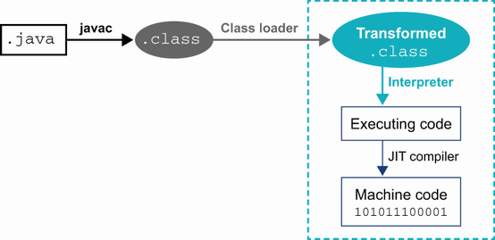
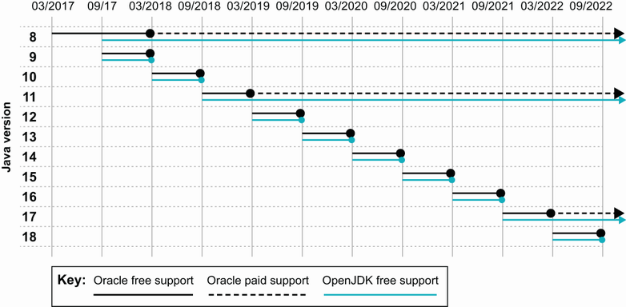
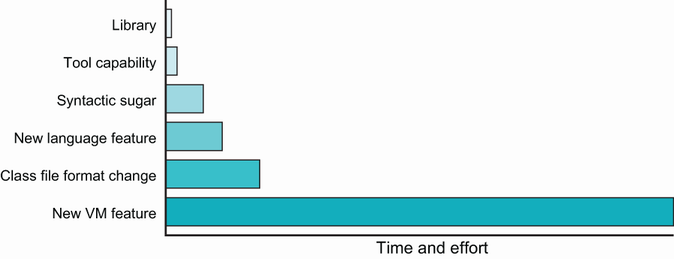
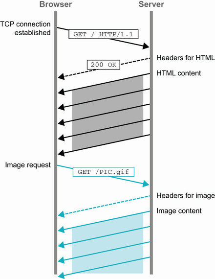
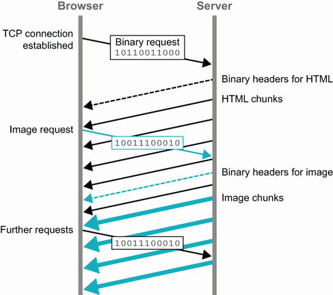
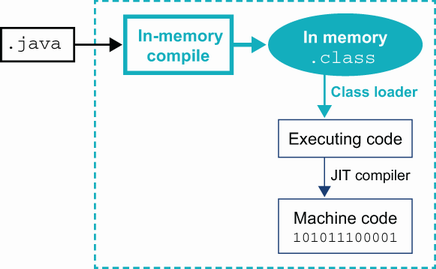

# 1. Giới thiệu về Java hiện đại

> *The Well-Grounded Java Developer, Second Edition* — Chương 1
> Bản dịch tiếng Việt

**Chương này bao gồm:**

- Java với tư cách một *platform* (nền tảng) và một *language* (ngôn ngữ)
- Mô hình phát hành (release model) mới của Java
- Suy diễn kiểu nâng cao (Enhanced Type inference — `var`)
- Các tính năng *incubating* và *preview*
- Thay đổi ngôn ngữ
- Những thay đổi nhỏ của ngôn ngữ trong Java 11

---

Chào mừng bạn đến với Java năm 2022. Đây là một thời điểm đầy hứng khởi. Java 17 — bản phát hành Long-Term-Support (LTS) mới nhất — đã ra mắt vào tháng 9 năm 2021, và những đội ngũ tiên phong, mạo hiểm nhất đang bắt đầu chuyển sang nó.

Tại thời điểm viết cuốn sách này, ngoại trừ một vài người tiên phong, các ứng dụng Java gần như chia đều giữa việc chạy trên Java 11 (phát hành tháng 9 năm 2018) và Java 8 (2014) vốn cũ hơn nhiều. Java 11 mang lại rất nhiều điểm đáng giá, đặc biệt với các đội triển khai trên cloud, nhưng một số nơi vẫn còn chậm chạp trong việc áp dụng nó.

Vì vậy, trong phần đầu của cuốn sách này, chúng ta sẽ dành thời gian giới thiệu một số tính năng mới đã xuất hiện trong Java 11 và 17. Hy vọng rằng phần thảo luận này sẽ giúp thuyết phục một số đội ngũ và nhà quản lý — những người còn e ngại nâng cấp từ Java 8 — rằng mọi thứ ở các phiên bản mới hơn đang tốt hơn bao giờ hết.

Trọng tâm của chương này sẽ là Java 11, bởi vì a) đó là phiên bản LTS có thị phần lớn nhất, và b) chưa có mức độ áp dụng Java 17 nào đáng kể. Tuy nhiên, trong chương 3, chúng tôi sẽ giới thiệu các tính năng mới trong Java 17 để đưa bạn cập nhật hoàn toàn.

Hãy bắt đầu bằng việc thảo luận về tính hai mặt *ngôn ngữ đối lại nền tảng* (language-versus-platform) nằm ở trung tâm của Java hiện đại. Đây là một điểm cực kỳ quan trọng mà chúng ta sẽ quay lại nhiều lần xuyên suốt cuốn sách, nên việc nắm bắt nó ngay từ đầu là điều thiết yếu.

## 1.1 Ngôn ngữ và nền tảng

Thuật ngữ *Java* có thể chỉ một trong nhiều khái niệm liên quan. Cụ thể, nó có thể mang nghĩa là ngôn ngữ lập trình mà con người đọc được, hoặc "Java platform" với phạm vi rộng hơn nhiều.

Đáng ngạc nhiên là các tác giả khác nhau đôi khi đưa ra những định nghĩa hơi khác nhau về thế nào là một *language* và một *platform*. Điều này có thể dẫn đến sự thiếu rõ ràng và đôi chút nhầm lẫn về sự khác biệt giữa hai khái niệm, cũng như về việc thành phần nào cung cấp các tính năng lập trình mà mã ứng dụng sử dụng.

Hãy làm rõ sự phân biệt đó ngay bây giờ, bởi nó đi thẳng vào cốt lõi của rất nhiều chủ đề trong cuốn sách này. Đây là các định nghĩa của chúng tôi:

- **Java language (ngôn ngữ Java)** — Ngôn ngữ Java là ngôn ngữ hướng đối tượng, định kiểu tĩnh (statically typed) mà chúng tôi đã châm biếm nhẹ trong phần "About this book". Hy vọng rằng nó đã rất quen thuộc với bạn. Một điểm hiển nhiên về mã nguồn viết bằng ngôn ngữ Java là con người đọc được (hoặc ít nhất là nên như vậy!).
- **Java platform (nền tảng Java)** — Platform là phần mềm cung cấp môi trường thực thi (runtime environment). Đó là JVM — thứ liên kết (link) và thực thi mã của bạn dưới dạng các *class file* (không đọc được bởi con người). Nó không trực tiếp thông dịch các tệp mã nguồn Java mà yêu cầu chúng phải được chuyển đổi thành class file trước.

Một trong những lý do lớn dẫn đến thành công của Java với tư cách một hệ thống phần mềm là nó là một *chuẩn* (standard). Điều này có nghĩa là nó có các đặc tả (specification) mô tả cách nó phải hoạt động. Việc chuẩn hóa cho phép các nhà cung cấp và nhóm dự án khác nhau tạo ra những bản hiện thực (implementation) mà về lý thuyết đều hoạt động giống nhau. Các đặc tả không đảm bảo rằng các bản hiện thực khác nhau sẽ chạy tốt đến đâu khi xử lý cùng một tác vụ, nhưng chúng có thể đảm bảo về tính đúng đắn của kết quả.

Có nhiều đặc tả riêng biệt chi phối hệ thống Java — quan trọng nhất là *Java Language Specification* (JLS) và *JVM Specification* (VMSpec). Sự tách biệt này được xem trọng rất nghiêm túc trong Java hiện đại; trên thực tế, VMSpec không còn tham chiếu trực tiếp đến JLS nữa. Chúng ta sẽ nói thêm về sự khác biệt giữa hai đặc tả này ở phần sau của cuốn sách.

> **NOTE** Ngày nay, JVM thực sự là một môi trường khá tổng quát và không phụ thuộc ngôn ngữ (language-agnostic) để chạy các chương trình. Đây là một lý do cho việc tách biệt các đặc tả.

Một câu hỏi hiển nhiên khi bạn đối diện với tính hai mặt vừa mô tả là: "Mối liên kết giữa chúng là gì?" Nếu giờ chúng đã tách biệt, vậy chúng kết hợp lại với nhau ra sao để tạo nên hệ thống Java?

Mối liên kết giữa ngôn ngữ và nền tảng chính là định nghĩa dùng chung về *định dạng class file* (các tệp `.class`). Việc nghiên cứu nghiêm túc định nghĩa class file sẽ mang lại nhiều lợi ích cho bạn (và chúng tôi cung cấp phần đó trong chương 4) — thực tế, đó là một trong những cách để một lập trình viên Java giỏi bắt đầu trở nên xuất sắc. Trong hình 1.1, bạn có thể thấy toàn bộ quy trình mà mã Java được tạo ra và sử dụng.



**Hình 1.1** Mã nguồn Java được chuyển đổi thành các tệp `.class`, sau đó được thao tác (manipulate) tại thời điểm load trước khi được biên dịch JIT.

Như bạn thấy trong hình, mã Java khởi đầu vòng đời dưới dạng mã nguồn Java mà con người đọc được, sau đó được `javac` biên dịch thành tệp `.class` và được nạp vào một JVM. Việc các class bị thao tác và thay đổi trong quá trình nạp là chuyện thường gặp. Nhiều framework Java phổ biến nhất biến đổi các class ngay khi chúng được nạp để tiêm vào hành vi động (dynamic behavior) như *instrumentation* hoặc các cơ chế tra cứu thay thế cho việc nạp class.

> **NOTE** Class loading là một tính năng thiết yếu của nền tảng Java, và chúng ta sẽ tìm hiểu nhiều hơn về nó trong chương 4.

**Java là ngôn ngữ biên dịch hay thông dịch?** Hình dung tiêu chuẩn về Java là một ngôn ngữ được biên dịch thành các tệp `.class` trước khi chạy trên một JVM. Nếu bị hỏi dồn, nhiều lập trình viên cũng có thể giải thích rằng bytecode ban đầu được JVM thông dịch, nhưng sẽ trải qua biên dịch just-in-time (JIT) ở một thời điểm nào đó sau này. Tuy nhiên, đến đây thì hiểu biết của nhiều người sụp đổ thành một quan niệm mơ hồ rằng bytecode về cơ bản là mã máy cho một CPU tưởng tượng hoặc đơn giản hóa.

Trên thực tế, bytecode của JVM giống một "trạm trung chuyển" nằm giữa mã nguồn con người đọc được và mã máy. Theo thuật ngữ kỹ thuật của lý thuyết trình biên dịch, bytecode thực sự là một dạng *intermediate language* (IL — ngôn ngữ trung gian) chứ không phải mã máy thật sự. Điều này có nghĩa quá trình biến mã nguồn Java thành bytecode không thực sự là *compilation* theo nghĩa mà một lập trình viên C++ hay Go hiểu, và `javac` không phải là một compiler theo cùng nghĩa với `gcc` — nó thực chất là một *trình sinh class file* cho mã nguồn Java. Compiler thực sự trong hệ sinh thái Java là JIT compiler, như bạn thấy trong hình 1.1.

Một số người mô tả hệ thống Java là "được biên dịch động" (dynamically compiled). Cách nói này nhấn mạnh rằng quá trình biên dịch có ý nghĩa là biên dịch JIT tại runtime, chứ không phải việc tạo ra class file trong quá trình build.

> **NOTE** Sự tồn tại của trình biên dịch mã nguồn `javac` khiến nhiều lập trình viên nghĩ về Java như một ngôn ngữ tĩnh, được biên dịch. Một trong những bí mật lớn là ở runtime, môi trường Java thực sự rất động — chỉ là nó bị giấu hơi sâu bên dưới bề mặt.

Vậy nên câu trả lời thực sự cho "Java được biên dịch hay thông dịch?" là "cả hai". Với sự phân biệt giữa ngôn ngữ và nền tảng đã rõ ràng hơn, hãy chuyển sang nói về mô hình phát hành mới của Java.

## 1.2 Mô hình phát hành mới của Java

Java không phải lúc nào cũng là ngôn ngữ mã nguồn mở, nhưng sau một thông báo tại hội nghị JavaOne năm 2006, mã nguồn của chính Java (trừ một vài phần mà Sun không sở hữu mã nguồn) đã được phát hành dưới giấy phép GPLv2+CE (https://openjdk.java.net/legal/gplv2+ce.html).

Việc này diễn ra vào khoảng thời điểm phát hành Java 6, nên Java 7 là phiên bản Java đầu tiên được phát triển dưới giấy phép phần mềm mã nguồn mở (OSS). Trọng tâm chính cho việc phát triển mã nguồn mở của nền tảng Java kể từ đó là dự án OpenJDK (https://openjdk.java.net), và điều đó vẫn tiếp diễn đến ngày nay.

Rất nhiều thảo luận của dự án diễn ra trên các mailing list bao phủ các khía cạnh của toàn bộ codebase. Có những danh sách "thường trực" như *core-libs* (thư viện lõi), cũng như những danh sách mang tính nhất thời hơn được lập ra như một phần của các dự án OpenJDK cụ thể, chẳng hạn *lambda-dev* (lambda), rồi trở nên không còn hoạt động khi một dự án cụ thể đã hoàn tất. Nhìn chung, các danh sách này là diễn đàn phù hợp để thảo luận về các tính năng tương lai khả dĩ, cho phép lập trình viên từ cộng đồng rộng lớn hơn tham gia vào quá trình tạo ra các phiên bản Java mới.

> **NOTE** Sun Microsystems đã bị Oracle mua lại ngay trước khi Java 7 được phát hành. Do đó, tất cả các bản phát hành Java của Oracle đều dựa trên codebase mã nguồn mở.

Các bản phát hành mã nguồn mở của Java đã ổn định theo một chu kỳ phát hành *dựa trên tính năng* (feature-driven), trong đó một tính năng chủ đạo duy nhất về cơ bản định nghĩa cả bản phát hành (ví dụ: lambda trong Java 8 hoặc module trong Java 9).

Tuy nhiên, với việc phát hành Java 9, mô hình phát hành đã thay đổi. Từ Java 10 trở đi, Oracle quyết định Java sẽ được phát hành theo mô hình dựa trên thời gian một cách nghiêm ngặt. Điều này có nghĩa OpenJDK hiện dùng mô hình phát triển *mainline*, bao gồm những điểm sau:

- Tính năng mới được phát triển trên một nhánh (branch) và chỉ được merge khi đã hoàn thiện mã (code complete).
- Các bản phát hành có thể diễn ra theo nhịp thời gian nghiêm ngặt.
- Các tính năng trễ hạn không làm chậm bản phát hành mà được giữ lại cho bản kế tiếp.
- Đầu nhánh trunk hiện tại luôn phải ở trạng thái sẵn sàng phát hành (về lý thuyết).
- Nếu cần, một bản vá khẩn cấp có thể được chuẩn bị và đẩy ra bất cứ lúc nào.
- Các dự án OpenJDK riêng biệt được dùng để khám phá và nghiên cứu các định hướng tương lai, dài hạn hơn.

Một phiên bản Java mới được phát hành mỗi sáu tháng ("feature release"). Các nhà cung cấp khác nhau (Oracle, Eclipse Adoptium, Amazon, Azul, v.v.) có thể chọn biến bất kỳ bản phát hành nào trong số đó thành bản Long-Term Support (LTS). Tuy nhiên, trên thực tế, tất cả các nhà cung cấp đều theo cách cứ ba năm lại có một bản phát hành được đặt tên là LTS.

> **NOTE** Tính đến cuối năm 2021, các cuộc thảo luận đang diễn ra nhằm rút ngắn khoảng cách LTS từ ba năm xuống hai năm. Rất có thể chúng ta sẽ thấy phiên bản LTS tiếp theo là Java 21 vào năm 2023 thay vì Java 23 vào năm 2024.

Bản LTS đầu tiên là Java 11, với Java 8 được đưa vào tập LTS một cách hồi tố. Ý định của Oracle là để cộng đồng Java nâng cấp thường xuyên và tiếp nhận các feature release ngay khi chúng xuất hiện. Tuy nhiên, trên thực tế, cộng đồng (và đặc biệt là khách hàng doanh nghiệp) đã tỏ ra kháng cự mô hình này, thay vào đó ưa thích nâng cấp từ bản LTS này sang bản LTS kế tiếp.

Cách tiếp cận này, dĩ nhiên, hạn chế việc tiếp nhận các tính năng Java mới và kìm hãm đổi mới. Tuy nhiên, thực tế của phần mềm doanh nghiệp là như vậy, và nhiều người vẫn xem việc nâng cấp phiên bản Java là một công việc lớn.



**Hình 1.2** Mốc thời gian của các bản phát hành gần đây và trong tương lai

Điều này có nghĩa là mặc dù lộ trình phát hành trong hình 1.2 có một bản phát hành lớn mỗi sáu tháng, những bản duy nhất có mức sử dụng đáng kể lại là các phiên bản LTS — Java 17 (vừa phát hành vào tháng 9 năm 2021), Java 11 (phát hành tháng 9 năm 2018), và bản tiền-module là Java 8, vốn đã hơn bảy năm tuổi. Java 8 và Java 11 có thị phần xấp xỉ ngang nhau, với Java 11 gần đây đã vượt 50% và đang tăng tốc nhanh chóng. Mức độ áp dụng Java 17 được kỳ vọng sẽ nhanh hơn nhiều so với chuyển dịch từ Java 8 sang Java 11, bởi những rào cản khó khăn nhất do hệ thống module và các hạn chế bảo mật gây ra đã được vượt qua trong lần migration trước đó.

Thay đổi đáng kể khác trong mô hình phát hành mới là Oracle đã thay đổi giấy phép cho bản phân phối của họ. Mặc dù JDK của Oracle được build từ mã nguồn OpenJDK, bản binary lại không được cấp phép theo giấy phép OSS. Thay vào đó, JDK của Oracle là phần mềm độc quyền, và kể từ JDK 11, Oracle chỉ cung cấp hỗ trợ và cập nhật trong sáu tháng cho mỗi phiên bản. Điều này có nghĩa nhiều người từng dựa vào các bản cập nhật miễn phí của Oracle giờ phải đối mặt với một lựa chọn:

- Trả tiền cho Oracle để có hỗ trợ và cập nhật, hoặc
- Dùng một bản phân phối khác tạo ra các binary mã nguồn mở.

Các nhà cung cấp JDK thay thế bao gồm Eclipse Adoptium (trước đây là AdoptOpenJDK), Alibaba (Dragonwell), Amazon (Corretto), Azul Systems (Zulu), IBM, Microsoft, Red Hat và SAP.

> **NOTE** Hai trong số các tác giả (Martijn và Ben) đã góp phần sáng lập dự án AdoptOpenJDK, dự án này đã phát triển thành dự án cộng đồng trung lập với nhà cung cấp Eclipse Adoptium nhằm build và phát hành một bản phân phối binary Java chất lượng cao, miễn phí và mã nguồn mở. Xem adoptium.net để biết thêm chi tiết.

Với những thay đổi về cấp phép và với rất nhiều nhà cung cấp, việc chọn đúng bản Java cho bạn và đội ngũ của bạn là một lựa chọn cần được cân nhắc kỹ. May mắn thay, những người dẫn dắt trong hệ sinh thái Java đã viết một số hướng dẫn rất chi tiết, và phụ lục A chắt lọc chúng lại cho bạn.

Mặc dù mô hình phát hành Java đã chuyển sang dùng các bản phát hành theo thời gian, phần lớn các đội vẫn đang chạy trên JDK 8 hoặc 11. Các bản LTS này đang được cộng đồng (bao gồm các nhà cung cấp lớn) duy trì và vẫn nhận được các bản cập nhật bảo mật cùng bản sửa lỗi đều đặn. Những thay đổi được thực hiện trên các phiên bản LTS có phạm vi nhỏ một cách có chủ ý và mang tính "cập nhật dọn dẹp" (housekeeping updates). Ngoài bảo mật và các bản sửa lỗi nhỏ, chỉ một tập tối thiểu các thay đổi được cho phép. Chúng bao gồm những sửa đổi cần thiết để đảm bảo các bản LTS tiếp tục hoạt động đúng trong suốt vòng đời dự kiến. Điều này bao gồm những thứ như:

- Bổ sung Niên hiệu Nhật Bản mới (Japanese Era)
- Cập nhật cơ sở dữ liệu múi giờ (time zone database)
- TLS 1.3
- Bổ sung Shenandoah, một GC có độ trễ tạm dừng thấp (low-pause) cho các workload lớn, hiện đại

Một thay đổi cần thiết khác là các build script cho macOS cần được cập nhật để làm việc với phiên bản gần đây của công cụ Xcode của Apple, để chúng tiếp tục hoạt động trên các bản phát hành mới của hệ điều hành Apple.

Trong các dự án duy trì JDK 8 và 11 (đôi khi gọi là các dự án "updates"), vẫn còn một chút phạm vi cho việc backport các tính năng mới, nhưng là tối thiểu. Ví dụ, một trong các quy tắc dẫn đường là các tính năng mới được port không được thay đổi ngữ nghĩa chương trình. Ví dụ về các thay đổi được cho phép có thể gồm hỗ trợ TLS 1.3 hoặc backport Java Flight Recorder về Java 8u272.

Giờ khi chúng ta đã dựng bối cảnh bằng cách làm rõ khác biệt giữa ngôn ngữ và nền tảng, cùng giải thích mô hình phát hành mới, hãy gặp gỡ tính năng kỹ thuật đầu tiên của Java hiện đại. Tính năng mới mà chúng ta sắp gặp là thứ mà các lập trình viên đã yêu cầu gần như từ bản phát hành đầu tiên của Java — một cách để giảm bớt lượng gõ phím mà việc viết chương trình Java dường như đòi hỏi.

## 1.3 Suy diễn kiểu nâng cao (từ khóa `var`)

Java trong lịch sử đã mang tiếng là một ngôn ngữ dài dòng. Tuy nhiên, ở các phiên bản gần đây, ngôn ngữ đã tiến hóa để tận dụng ngày càng nhiều *type inference* (suy diễn kiểu). Tính năng này của trình biên dịch mã nguồn cho phép compiler tự động suy ra một phần thông tin kiểu trong chương trình. Nhờ đó, nó không cần được chỉ định mọi thứ một cách tường minh.

> **NOTE** Mục tiêu của type inference là giảm nội dung boilerplate, loại bỏ trùng lặp và cho phép mã ngắn gọn, dễ đọc hơn.

Xu hướng này bắt đầu từ Java 5, khi *generic method* được giới thiệu. Generic method cho phép một dạng suy diễn kiểu rất hạn chế đối với các đối số kiểu generic, sao cho thay vì phải cung cấp tường minh kiểu chính xác cần thiết, như thế này:

```java
List<Integer> empty = Collections.<Integer>emptyList();
```

tham số kiểu generic có thể được bỏ qua ở vế phải, như sau:

```java
List<Integer> empty = Collections.emptyList();
```

Cách viết lời gọi tới một generic method này quen thuộc đến mức nhiều lập trình viên sẽ chật vật để nhớ dạng có đối số kiểu tường minh. Đây là điều tốt — nó có nghĩa type inference đang làm đúng việc của nó và loại bỏ nội dung boilerplate thừa thãi để ý nghĩa của mã trở nên rõ ràng.

Cải tiến đáng kể tiếp theo cho type inference trong Java đến cùng phiên bản 7, vốn giới thiệu một thay đổi khi làm việc với generic. Trước Java 7, thường thấy mã như thế này:

```java
Map<Integer, Map<String, String>> usersLists =
                        new HashMap<Integer, Map<String, String>>();
```

Đó là một cách cực kỳ dài dòng để khai báo rằng bạn có một số người dùng, được định danh bằng userid (một số nguyên), và mỗi người dùng có một tập thuộc tính (mô hình hóa dưới dạng map từ string sang string) riêng cho người đó.

Thực tế, gần một nửa mã nguồn là các ký tự lặp lại, và chúng chẳng nói lên điều gì. Vì vậy, từ Java 7 trở đi, chúng ta có thể viết:

```java
Map<Integer, Map<String, String>> usersLists = new HashMap<>();
```

và để compiler suy ra thông tin kiểu ở vế phải. Compiler đang tính ra kiểu đúng cho biểu thức ở vế phải — nó không đơn thuần thay thế đoạn văn bản định nghĩa kiểu đầy đủ.

> **NOTE** Bởi vì phần khai báo kiểu rút gọn trông giống một viên kim cương, dạng này được gọi là "diamond syntax".

Trong Java 8, nhiều type inference hơn được thêm vào để hỗ trợ việc giới thiệu biểu thức lambda, như ví dụ sau, nơi thuật toán suy diễn kiểu có thể kết luận kiểu của `s` là `String`:

```java
Function<String, Integer> lengthFn = s -> s.length();
```

Trong Java hiện đại, type inference đã tiến thêm một bước với sự xuất hiện của *Local Variable Type Inference* (LVTI), còn được biết đến là `var`. Tính năng này được thêm vào Java 10 và cho phép lập trình viên suy diễn kiểu của *biến*, thay vì kiểu của *giá trị*, như thế này:

```java
var names = new ArrayList<String>();
```

Điều này được hiện thực bằng cách biến `var` thành một tên kiểu "ma thuật" được dành riêng (reserved) chứ không phải một từ khóa của ngôn ngữ. Về lý thuyết, lập trình viên vẫn có thể dùng `var` làm tên của một biến, phương thức hoặc package.

> **NOTE** Một tác dụng phụ quan trọng của việc dùng `var` một cách phù hợp là miền nghiệp vụ (domain) của mã bạn lại một lần nữa được đưa lên hàng đầu (thay vì thông tin kiểu). Nhưng sức mạnh lớn đi kèm trách nhiệm lớn! Hãy đảm bảo bạn đặt tên biến cẩn thận để giúp những người đọc mã của bạn trong tương lai.

Mặt khác, mã trước đây dùng `var` làm tên của một kiểu sẽ phải được biên dịch lại. Tuy nhiên, hầu như mọi lập trình viên Java đều tuân theo quy ước rằng tên kiểu nên bắt đầu bằng chữ hoa, nên số lượng các kiểu có sẵn tên là `var` chắc chắn cực kỳ nhỏ. Điều này có nghĩa việc viết mã như trong listing sau là hoàn toàn hợp lệ.

**Listing 1.1 Mã tồi**

```java
package var;

public class Var {
  private static Var var = null;

    public static Var var() {
      return var;
    }

    public static void var(Var var) {
      Var.var = var;
    }
}
```

Và rồi gọi nó như thế này:

```java
var var = var();
if (var == null) {
    var(new Var());
}
```

Tuy nhiên, chỉ vì một thứ hợp lệ, không có nghĩa nó hợp lý. Viết mã như listing trên sẽ không giúp bạn có thêm bạn bè nào và không nên vượt qua được code review!

Ý định của `var` là giảm sự dài dòng trong mã Java và tạo cảm giác quen thuộc cho lập trình viên đến với Java từ các ngôn ngữ khác. Nó *không* giới thiệu định kiểu động (dynamic typing), và mọi biến Java vẫn luôn có kiểu tĩnh ở mọi thời điểm — bạn chỉ là không cần viết chúng ra tường minh trong mọi trường hợp.

Type inference trong Java mang tính cục bộ, và trong trường hợp `var`, thuật toán chỉ xem xét phần khai báo của biến cục bộ. Điều này có nghĩa nó không thể dùng cho field, tham số phương thức hay kiểu trả về. Compiler áp dụng một dạng giải ràng buộc (constraint solving) để xác định xem có tồn tại kiểu nào thỏa mãn mọi yêu cầu của mã như đã viết hay không.

> **NOTE** `var` được hiện thực hoàn toàn trong trình biên dịch mã nguồn (`javac`) và không có bất kỳ ảnh hưởng nào tới runtime hay hiệu năng.

Ví dụ, trong khai báo của `lengthFn` ở đoạn mã trước, bộ giải ràng buộc có thể suy ra rằng kiểu của tham số phương thức `s` phải tương thích với `String` — kiểu được cung cấp tường minh làm tham số cho `Function`. Trong Java, dĩ nhiên, kiểu string là `final`, nên compiler có thể kết luận kiểu của `s` chính xác là `String`.

Để compiler có thể suy ra kiểu, lập trình viên phải cung cấp đủ thông tin để các phương trình ràng buộc có thể giải được. Ví dụ, mã như thế này:

```java
var fn = s -> s.length();
```

không có đủ thông tin kiểu để compiler suy ra kiểu của `fn`, và do đó sẽ không biên dịch được. Một trường hợp quan trọng của điều này là:

```java
var n = null;
```

vốn không thể được compiler phân giải, bởi giá trị `null` có thể được gán cho một biến thuộc bất kỳ kiểu tham chiếu nào, nên không có thông tin nào về việc `n` có thể là kiểu gì. Chúng ta nói rằng hệ phương trình ràng buộc kiểu mà bộ suy diễn cần giải là "thiếu xác định" (underdetermined) trong trường hợp này — một thuật ngữ toán học liên hệ số phương trình cần giải với số biến.

Bạn có thể hình dung một cơ chế suy diễn kiểu vượt ra ngoài phần khai báo ban đầu của biến cục bộ và xem xét thêm mã để đưa ra quyết định suy diễn, như thế này:

```java
var n = null;
String.format(n);
```

Một thuật toán suy diễn phức tạp hơn (hoặc một con người) có lẽ có thể kết luận kiểu của `n` thực ra là `String`, bởi phương thức `format()` nhận một string làm đối số đầu tiên.

Điều này nghe có vẻ hấp dẫn, nhưng cũng như mọi thứ khác trong phần mềm, nó là một sự đánh đổi. Phức tạp hơn nghĩa là thời gian biên dịch lâu hơn và có nhiều cách hơn để việc suy diễn thất bại. Điều này lại có nghĩa lập trình viên phải phát triển một trực giác phức tạp hơn để dùng đúng cách suy diễn kiểu phi cục bộ.

Các ngôn ngữ khác có thể chọn những đánh đổi khác, nhưng Java thì rõ ràng: chỉ phần khai báo được dùng để suy diễn kiểu. Local variable type inference nhằm mục đích là một kỹ thuật hữu ích để giảm văn bản boilerplate và sự dài dòng. Tuy nhiên, nó chỉ nên được dùng ở nơi cần thiết để làm mã rõ ràng hơn, chứ không phải như một cây búa tạ dùng bất cứ khi nào có thể (antipattern "Golden Hammer").

Sau đây là một số hướng dẫn nhanh về thời điểm nên dùng LVTI:

- Trong các initializer đơn giản, nếu vế phải là lời gọi tới một constructor hoặc static factory method
- Nếu việc loại bỏ kiểu tường minh xóa đi thông tin lặp lại hoặc dư thừa
- Nếu các biến có tên đã cho biết kiểu của chúng
- Nếu phạm vi và cách sử dụng của biến cục bộ ngắn gọn và đơn giản

Một tập đầy đủ các quy tắc kinh nghiệm áp dụng được cung cấp bởi Stuart Marks, một trong những nhà phát triển cốt lõi của ngôn ngữ Java, trong hướng dẫn phong cách của ông về việc dùng LVTI tại http://mng.bz/RvPK.

Để kết thúc phần này, hãy xem một cách dùng `var` khác, nâng cao hơn — các kiểu gọi là *nondenotable* (không thể gọi tên). Đây là những kiểu hợp lệ trong Java, nhưng chúng không thể xuất hiện với vai trò kiểu của một biến. Thay vào đó, chúng phải được suy diễn ra như kiểu của biểu thức đang được gán. Hãy xem một ví dụ đơn giản dùng môi trường tương tác `jshell`, xuất hiện từ Java 9:

```
jshell> var duck = new Object() {
    ...>          void quack() {
    ...>              System.out.println("Quack!");
    ...>          }
    ...> }
duck ==> $0@5910e440

jshell> duck.quack();
Quack!
```

Biến `duck` có một kiểu bất thường — về bản chất nó là `Object` nhưng được mở rộng với một phương thức tên `quack()`. Mặc dù đối tượng có thể kêu quạc quạc như một con vịt, kiểu của nó không có tên, nên chúng ta không thể dùng kiểu đó làm tham số phương thức hay kiểu trả về.

Với LVTI, chúng ta có thể dùng nó làm kiểu được suy diễn cho một biến cục bộ. Điều này cho phép ta dùng kiểu đó bên trong một phương thức. Dĩ nhiên, kiểu này không thể dùng bên ngoài phạm vi cục bộ chật hẹp ấy, nên tính hữu dụng tổng thể của tính năng ngôn ngữ này là hạn chế. Nó mang tính tò mò hiếu kỳ nhiều hơn là gì khác.

Bất chấp những giới hạn này, đây quả thực là một thoáng nhìn về cách Java tiếp cận một tính năng có mặt ở một số ngôn ngữ khác — đôi khi được gọi là *structural typing* trong các ngôn ngữ định kiểu tĩnh và *duck typing* trong các ngôn ngữ định kiểu động (đặc biệt là Python).

## 1.4 Thay đổi ngôn ngữ và nền tảng

Chúng tôi cho rằng việc giải thích "tại sao" của thay đổi ngôn ngữ cũng thiết yếu như "cái gì". Trong quá trình phát triển các phiên bản Java mới, thường có rất nhiều sự quan tâm dành cho các tính năng ngôn ngữ mới, nhưng cộng đồng không phải lúc nào cũng hiểu cần bao nhiêu công sức để đưa các thay đổi được thiết kế trọn vẹn và sẵn sàng cho thực tế.

Bạn cũng có thể đã nhận thấy rằng trong một runtime trưởng thành như Java, các tính năng ngôn ngữ có xu hướng tiến hóa từ các ngôn ngữ hoặc thư viện khác, tìm đường vào các framework phổ biến, rồi chỉ sau đó mới được thêm vào chính ngôn ngữ hoặc runtime. Chúng tôi hy vọng làm sáng tỏ đôi chút về mảng này và hy vọng xua tan một vài lầm tưởng trên đường đi. Nhưng nếu bạn không mấy quan tâm đến cách Java tiến hóa, cứ thoải mái nhảy tới mục 1.5 và đi thẳng vào các thay đổi ngôn ngữ.

Có một đường cong công sức liên quan đến việc thay đổi ngôn ngữ Java — một số cách hiện thực khả dĩ đòi hỏi ít nỗ lực kỹ thuật hơn những cách khác. Trong hình 1.3, chúng tôi đã cố gắng biểu diễn các lộ trình khác nhau và cho thấy công sức tương đối cần thiết cho mỗi lộ trình.



**Hình 1.3** Công sức tương đối liên quan đến việc hiện thực chức năng mới theo những cách khác nhau

Nhìn chung, tốt hơn là chọn lộ trình đòi hỏi ít công sức nhất. Điều này có nghĩa nếu có thể hiện thực một tính năng mới dưới dạng một thư viện, thì thường bạn nên làm vậy. Nhưng không phải tính năng nào cũng dễ, hoặc thậm chí khả thi, để hiện thực trong một thư viện hay một khả năng của IDE. Một số tính năng phải được hiện thực sâu hơn bên trong nền tảng. Đây là cách một số tính năng gần đây khớp vào thang độ phức tạp của chúng tôi cho các tính năng ngôn ngữ mới:

- **Thay đổi thư viện** — Collections factory methods (Java 9)
- **Đường cú pháp (Syntactic sugar)** — Dấu gạch dưới trong số (Java 7)
- **Tính năng ngôn ngữ mới nhỏ** — try-with-resources (Java 7)
- **Thay đổi định dạng class file** — Annotations (Java 5)
- **Tính năng JVM mới** — Nestmates (Java 11)
- **Tính năng mới lớn** — Lambda Expressions (Java 8)

Hãy xem xét kỹ cách các thay đổi trên khắp thang độ phức tạp được thực hiện.

### 1.4.1 Rắc chút đường

Một cụm từ đôi khi được dùng để mô tả một tính năng ngôn ngữ là "syntactic sugar" (đường cú pháp). Nghĩa là, dạng syntactic sugar được cung cấp bởi nó dễ làm việc hơn cho con người, dù chức năng đó đã tồn tại sẵn trong ngôn ngữ.

Theo quy tắc kinh nghiệm, một tính năng được gọi là syntactic sugar sẽ bị loại khỏi biểu diễn chương trình của compiler từ rất sớm trong quá trình biên dịch — người ta nói nó đã được "desugar" thành biểu diễn cơ bản của cùng tính năng đó.

Điều này khiến các thay đổi kiểu syntactic sugar dễ hiện thực hơn, bởi chúng thường chỉ đòi hỏi một lượng công việc tương đối nhỏ và chỉ liên quan đến các thay đổi trong compiler (`javac` trong trường hợp của Java).

Một câu hỏi hoàn toàn có thể được đặt ra ở đây là: "Thế nào là một thay đổi nhỏ đối với đặc tả?" Một trong những thay đổi đơn giản nhất trong Java 7 gồm việc thêm một từ duy nhất — "String" — vào mục 14.11 của JLS, cho phép dùng string trong câu lệnh `switch`. Bạn thực sự không thể có một thay đổi nào nhỏ hơn thế, vậy mà ngay cả thay đổi này cũng chạm tới nhiều khía cạnh khác của đặc tả. Bất kỳ sửa đổi nào cũng tạo ra hệ quả, và những hệ quả đó phải được truy đuổi xuyên suốt toàn bộ thiết kế của ngôn ngữ.

### 1.4.2 Thay đổi ngôn ngữ

Toàn bộ tập hành động phải được thực hiện (hoặc ít nhất là được khảo sát) cho bất kỳ thay đổi nào như sau:

- Cập nhật JLS.
- Hiện thực một prototype trong trình biên dịch mã nguồn.
- Thêm hỗ trợ thư viện thiết yếu cho thay đổi.
- Viết test và ví dụ.
- Cập nhật tài liệu.

Ngoài ra, nếu thay đổi chạm tới JVM hoặc các khía cạnh nền tảng, phải thực hiện thêm những việc sau:

- Cập nhật VMSpec.
- Hiện thực các thay đổi JVM.
- Thêm hỗ trợ trong class file và các công cụ JVM.
- Cân nhắc tác động lên reflection.
- Cân nhắc tác động lên serialization.
- Suy nghĩ về mọi ảnh hưởng tới các thành phần mã native, chẳng hạn Java Native Interface (JNI).

Đây không phải là một khối lượng công việc nhỏ, và đó là *sau khi* tác động của thay đổi lên toàn bộ đặc tả ngôn ngữ đã được cân nhắc!

Một mảng "rối rắm" khi nói đến việc thực hiện thay đổi là hệ thống kiểu (type system). Không phải vì hệ thống kiểu của Java tệ. Thay vào đó, các ngôn ngữ có hệ thống kiểu tĩnh phong phú thường có rất nhiều điểm tương tác khả dĩ giữa các phần khác nhau của hệ thống kiểu đó. Việc thay đổi chúng dễ tạo ra những bất ngờ không mong muốn.

### 1.4.3 JSR và JEP

Có hai cơ chế chính được dùng để thực hiện thay đổi đối với nền tảng Java. Cơ chế thứ nhất là *Java Specification Request* (JSR), được quy định bởi *Java Community Process* (JCP). Cơ chế này được dùng để xác định các API chuẩn — cả thư viện bên ngoài lẫn các API nền tảng nội bộ quan trọng.

Trong lịch sử, đây là cách duy nhất để thay đổi nền tảng Java và được dùng tốt nhất để hệ thống hóa sự đồng thuận về công nghệ đã trưởng thành. Tuy nhiên, những năm gần đây, mong muốn triển khai thay đổi nhanh hơn (và theo đơn vị nhỏ hơn) đã dẫn tới sự phát triển của *JDK Enhancement Proposal* (JEP) như một lựa chọn thay thế nhẹ hơn. Các JSR nền tảng (còn gọi là JSR "umbrella") giờ được tạo thành từ các JEP nhắm tới phiên bản Java kế tiếp. Quy trình JSR được dùng để trao thêm các bảo vệ về sở hữu trí tuệ cho toàn bộ hệ sinh thái.

Khi thảo luận về các tính năng Java mới, thường sẽ hữu ích khi nhắc tới một tính năng sắp ra hoặc mới ra bằng số JEP của nó. Danh sách đầy đủ tất cả các JEP, bao gồm cả những JEP đã được bàn giao hoặc rút lại, có thể tìm thấy tại https://openjdk.java.net/jeps/0.

### 1.4.4 Tính năng incubating và preview

Trong mô hình phát hành mới, Java có hai cơ chế để thử nghiệm một tính năng được đề xuất trước khi hoàn thiện nó ở một bản phát hành sau. Mục tiêu của các cơ chế này là mang lại tính năng tốt hơn bằng cách thu thập phản hồi từ một nhóm người dùng rộng lớn hơn nhiều và có khả năng thay đổi hoặc rút lại tính năng trước khi nó trở thành một phần vĩnh viễn của Java.

**Tính năng incubating** là các API mới và bản hiện thực của chúng, ở dạng đơn giản nhất về cơ bản chỉ là một API mới được giao dưới dạng một module độc lập (chúng ta sẽ gặp chi tiết về Java module trong chương 2). Tên của module được chọn sao cho làm rõ rằng API này là tạm thời và sẽ thay đổi khi tính năng được hoàn thiện.

> **NOTE** Điều này có nghĩa bất kỳ mã nào dựa vào một phiên bản chưa hoàn thiện của tính năng incubating sẽ phải thay đổi khi tính năng đó trở thành chính thức.

Một ví dụ rất dễ thấy về tính năng incubating là hỗ trợ mới cho phiên bản 2 của giao thức HTTP, thường được gọi là HTTP/2. Trong Java 9, nó được giao dưới dạng module incubator `jdk.incubator.http`. Cách đặt tên module này, cùng việc dùng namespace `jdk.incubator` thay vì `java`, đánh dấu rõ ràng tính năng là phi tiêu chuẩn và có thể thay đổi. Tính năng được chuẩn hóa trong Java 11 khi nó được chuyển sang module `java.net.http` trong phần `java` của namespace.

> **NOTE** Chúng ta sẽ gặp một tính năng incubating khác trong chương 18 khi thảo luận về Foreign Access API, một phần của dự án OpenJDK có mã tên Panama.

Lợi thế chính của cách tiếp cận này là một tính năng incubating có thể được cô lập vào một namespace duy nhất. Lập trình viên có thể nhanh chóng dùng thử tính năng và thậm chí dùng nó trong mã production, miễn là họ sẵn lòng sửa một chút mã, biên dịch lại và liên kết lại khi tính năng được chuẩn hóa.

**Tính năng preview** là cơ chế còn lại mà các phiên bản Java gần đây cung cấp để giao các tính năng chưa hoàn thiện. Chúng xâm lấn hơn so với tính năng incubating, bởi chúng được hiện thực như một phần của chính ngôn ngữ, ở mức sâu hơn. Các tính năng này có thể cần hỗ trợ từ:

- Trình biên dịch `javac`
- Định dạng bytecode
- Class file và class loading

Chúng chỉ khả dụng nếu các flag cụ thể được truyền cho compiler và runtime. Cố dùng tính năng preview mà không bật flag là một lỗi, cả ở compile time lẫn runtime.

Điều này khiến chúng phức tạp hơn nhiều để xử lý (so với tính năng incubating). Kết quả là các tính năng preview thực sự không thể dùng trong production. Một lý do là chúng được biểu diễn bởi một phiên bản định dạng class file chưa được hoàn thiện và có thể sẽ không bao giờ được hỗ trợ bởi bất kỳ phiên bản Java production nào.

Điều này có nghĩa các tính năng preview chỉ phù hợp cho thử nghiệm, kiểm thử của lập trình viên và việc làm quen. Đáng tiếc, trong hầu hết mọi triển khai, chỉ những tính năng đã hoàn thiện hoàn toàn mới có thể dùng trong mã dành cho production.

Java 11 không chứa tính năng preview nào (mặc dù phiên bản preview đầu tiên của switch expression đã đến trong Java 12), nên khó đưa ra một ví dụ tốt trong mục này. Tuy vậy, chúng ta sẽ đào sâu hơn vào các phiên bản preview trong chương 3 khi thảo luận về Java 17.

## 1.5 Những thay đổi nhỏ trong Java 11

Kể từ Java 8, một lượng tương đối lớn các tính năng nhỏ mới đã xuất hiện qua các bản phát hành liên tiếp. Hãy dạo nhanh qua một số tính năng quan trọng nhất — mặc dù đây hoàn toàn không phải là tất cả các thay đổi.

### 1.5.1 Collections factories (JEP 213)

Một cải tiến thường được yêu cầu là mở rộng Java để hỗ trợ một cách đơn giản khai báo *collection literal* — một tập hợp đối tượng "ngốc nghếch" (chẳng hạn một list hoặc một map). Điều này nghe hấp dẫn bởi nhiều ngôn ngữ khác hỗ trợ một dạng nào đó của việc này, và bản thân Java xưa nay luôn có array literal, như minh họa dưới đây:

```
jshell> int[] numbers = {1, 2, 3};
numbers ==> int[3] { 1, 2, 3 }
```

Tuy nhiên, dù nhìn qua có vẻ hấp dẫn, việc thêm tính năng này ở mức ngôn ngữ có một số nhược điểm đáng kể. Ví dụ, mặc dù `ArrayList`, `HashMap` và `HashSet` là những bản hiện thực quen thuộc nhất với lập trình viên, một nguyên tắc thiết kế chủ đạo của Java Collections là chúng được biểu diễn dưới dạng interface, không phải class. Các bản hiện thực khác cũng tồn tại và được dùng rộng rãi.

Điều này có nghĩa việc có một cú pháp mới gắn chặt trực tiếp với các bản hiện thực cụ thể sẽ đi ngược lại ý đồ thiết kế, dù chúng có phổ biến đến đâu. Thay vào đó, quyết định thiết kế là thêm các factory method đơn giản vào các interface liên quan, khai thác việc Java 8 đã bổ sung khả năng có static method trên interface. Mã kết quả trông như sau:

```java
Set<String> set = Set.of("a", "b", "c");

var list = List.of("x", "y");
```

Mặc dù cách này dài dòng hơn một chút so với việc thêm hỗ trợ ở mức ngôn ngữ, chi phí phức tạp về mặt hiện thực lại thấp hơn đáng kể. Các phương thức mới này được hiện thực dưới dạng một tập các nạp chồng (overload) như sau:

```java
List<E> List<E>.<E>of()
List<E> List<E>.<E>of(E e1)
List<E> List<E>.<E>of(E e1, E e2)
List<E> List<E>.<E>of(E e1, E e2, E e3)
List<E> List<E>.<E>of(E e1, E e2, E e3, E e4)
List<E> List<E>.<E>of(E e1, E e2, E e3, E e4, E e5)
List<E> List<E>.<E>of(E e1, E e2, E e3, E e4, E e5, E e6)
List<E> List<E>.<E>of(E e1, E e2, E e3, E e4, E e5, E e6, E e7)
List<E> List<E>.<E>of(E e1, E e2, E e3, E e4, E e5, E e6, E e7, E e8)
List<E> List<E>.<E>of(E e1, E e2, E e3, E e4, E e5, E e6, E e7, E e8,
  E e9)
List<E> List<E>.<E>of(E e1, E e2, E e3, E e4, E e5, E e6, E e7, E e8,
  E e9, E e10)
List<E> List<E>.<E>of(E... elements)
```

Các trường hợp thông dụng (tới 10 phần tử) được cung cấp, cùng với một dạng varargs cho trường hợp sử dụng ít gặp là cần hơn 10 phần tử trong collection.

Với map, tình hình phức tạp hơn một chút, bởi map có hai tham số generic (kiểu key và kiểu value), nên mặc dù các trường hợp đơn giản có thể viết như sau:

```java
var m1 = Map.of(k1, v1);
var m2 = Map.of(k1, v1, k2, v2);
```

lại không có cách đơn giản nào để viết dạng tương đương varargs cho map. Thay vào đó, một factory method khác, `ofEntries()`, được dùng kết hợp với một static helper method, `entry()`, để cung cấp thứ tương đương với dạng varargs, như sau:

```java
Map.ofEntries(
    entry(k1, v1),
    entry(k2, v2),
    // ...
    entry(kn, vn));
```

Một điểm cuối cùng mà lập trình viên nên biết: các factory method tạo ra các thể hiện của kiểu bất biến (immutable), như sau:

```
jshell> var ints = List.of(2, 3, 5, 7);
ints ==> [2, 3, 5, 7]

jshell> ints.getClass();
$2 ==> class java.util.ImmutableCollections$ListN
```

Các class này là những bản hiện thực mới của các interface Java Collections vốn bất biến — chúng không phải là các class khả biến quen thuộc (như `ArrayList` và `HashMap`). Việc cố sửa đổi các thể hiện của những kiểu này sẽ dẫn tới một exception được ném ra.

### 1.5.2 Loại bỏ các module enterprise (JEP 320)

Theo thời gian, Java Standard Edition (còn gọi là Java SE) đã có thêm một vài module vốn thực sự thuộc về Java Enterprise Edition (Java EE), chẳng hạn:

- JAXB
- JAX-WS
- CORBA
- JTA

Trong Java 9, các package sau — vốn hiện thực những công nghệ này — đã được chuyển vào các module phi cốt lõi và bị đánh dấu deprecated để loại bỏ:

- `java.activation` (JAF)
- `java.corba` (CORBA)
- `java.transaction` (JTA)
- `java.xml.bind` (JAXB)
- `java.xml.ws` (JAX-WS, cùng một số công nghệ liên quan)
- `java.xml.ws.annotation` (Common Annotations)

Là một phần của nỗ lực tinh gọn nền tảng, trong Java 11 các module này đã bị loại bỏ. Ba module liên quan sau, dùng cho công cụ và gom nhóm, cũng đã bị loại khỏi bản phân phối SE cốt lõi:

- `java.se.ee` (module gom nhóm cho sáu module ở trên)
- `jdk.xml.ws` (công cụ cho JAX-WS)
- `jdk.xml.bind` (công cụ cho JAXB)

Các dự án xây dựng trên Java 11 trở lên mà muốn dùng những khả năng này giờ cần đưa vào một phụ thuộc bên ngoài tường minh. Điều này có nghĩa một số chương trình từng dựa vào các API này build sạch sẽ dưới Java 8 nhưng cần sửa đổi build script để build được dưới Java 11. Chúng ta sẽ khảo sát vấn đề cụ thể này đầy đủ hơn trong chương 11.

### 1.5.3 HTTP/2 (Java 11)

Trong thời hiện đại, một phiên bản mới của chuẩn HTTP đã được phát hành — HTTP/2. Chúng ta sẽ xem xét lý do vì sao cuối cùng đặc tả HTTP 1.1 lão làng (có từ năm 1997!) lại được cập nhật. Sau đó chúng ta sẽ thấy cách Java 11 cho phép lập trình viên vững nền tảng tiếp cận các tính năng và hiệu năng mới của HTTP/2.

Như bạn có thể đoán với một công nghệ từ năm 1997, HTTP 1.1 đã bộc lộ tuổi tác, đặc biệt là quanh vấn đề hiệu năng trong các ứng dụng web hiện đại. Những hạn chế bao gồm các vấn đề như:

- Head-of-line blocking (chặn đầu hàng đợi)
- Hạn chế số kết nối tới một site
- Chi phí hiệu năng của các HTTP control header

HTTP/2 là một bản cập nhật ở tầng vận chuyển (transport-level) của giao thức, tập trung vào việc khắc phục những vấn đề hiệu năng cốt lõi kiểu này — những thứ không còn phù hợp với cách web thực sự vận hành ngày nay. Với trọng tâm hiệu năng đặt vào cách các byte lưu chuyển giữa client và server, HTTP/2 thực ra không thay đổi nhiều khái niệm HTTP quen thuộc — request/response, header, status code, response body — tất cả những thứ này vẫn giữ nguyên ngữ nghĩa trong HTTP/2 so với HTTP 1.1.

**Head-of-line blocking**

Giao tiếp trong HTTP diễn ra qua các socket TCP. Mặc dù HTTP 1.1 mặc định tái sử dụng từng socket để tránh lặp lại chi phí thiết lập không cần thiết, giao thức lại quy định rằng các request phải được trả về theo thứ tự, ngay cả khi nhiều request dùng chung một socket (được biết đến là *pipelining*; xem hình 1.4). Điều này có nghĩa một phản hồi chậm từ server sẽ chặn các request kế tiếp, vốn về lý thuyết có thể đã được trả về sớm hơn. Những tác động này dễ thấy ở những nơi như việc render của trình duyệt bị đình trệ khi tải tài nguyên. Cùng hành vi *mỗi kết nối chỉ một phản hồi tại một thời điểm* ấy cũng có thể giới hạn các ứng dụng JVM khi giao tiếp với các dịch vụ dựa trên HTTP.



**Hình 1.4** Truyền tải HTTP 1.1

HTTP/2 được thiết kế từ đầu để *multiplex* (ghép kênh) các request trên cùng một kết nối, như minh họa trong hình 1.5. Nhiều luồng (stream) giữa client và server luôn được hỗ trợ. Nó thậm chí cho phép nhận riêng biệt phần header và phần body của một request duy nhất.



**Hình 1.5** Truyền tải HTTP/2

Điều này thay đổi tận gốc những giả định mà hàng thập kỷ HTTP 1.1 đã biến thành bản năng thứ hai với nhiều lập trình viên. Chẳng hạn, từ lâu người ta chấp nhận rằng việc trả về nhiều tài nguyên nhỏ trên một website có hiệu năng kém hơn việc gộp thành các gói lớn hơn. JavaScript, CSS và hình ảnh đều có các kỹ thuật và công cụ phổ biến để nhồi nhiều tệp nhỏ lại với nhau nhằm trả về hiệu quả hơn. Trong HTTP/2, các phản hồi được ghép kênh nghĩa là tài nguyên của bạn không bị chặn sau các request chậm khác, và các phản hồi nhỏ hơn có thể được cache chính xác hơn, mang lại trải nghiệm tổng thể tốt hơn.

**Kết nối bị hạn chế**

Đặc tả HTTP 1.1 khuyến nghị giới hạn ở hai kết nối tới một server tại một thời điểm. Điều này được liệt kê là *should* chứ không phải *must*, và các trình duyệt web hiện đại thường cho phép từ sáu đến tám kết nối cho mỗi domain. Giới hạn tải xuống đồng thời từ một site này thường khiến lập trình viên phải phục vụ site từ nhiều domain hoặc hiện thực kiểu gộp gói đã nói ở trên.

HTTP/2 giải quyết tình huống này: mỗi kết nối về cơ bản có thể được dùng để tạo bao nhiêu request đồng thời tùy ý. Trình duyệt chỉ mở một kết nối tới một domain nhất định nhưng có thể thực hiện nhiều request qua cùng kết nối đó cùng lúc.

Trong các ứng dụng JVM của chúng ta, nơi có thể ta đã dùng pool các kết nối HTTP 1.1 để cho phép nhiều hoạt động đồng thời hơn, HTTP/2 cho ta thêm một cách có sẵn để vắt ra nhiều request hơn.

**Hiệu năng của HTTP header**

Một tính năng quan trọng của HTTP là khả năng gửi header kèm theo request. Header là một phần thiết yếu trong cách bản thân giao thức HTTP là phi trạng thái (stateless), nhưng ứng dụng của chúng ta vẫn có thể duy trì trạng thái giữa các request (chẳng hạn việc người dùng của bạn đã đăng nhập).

Mặc dù phần body của payload HTTP 1.1 có thể được nén nếu client và server thống nhất được thuật toán (thường là gzip), header lại không tham gia. Khi các ứng dụng web ngày càng phong phú tạo ra ngày càng nhiều request, việc lặp lại các header ngày càng lớn có thể là một vấn đề, đặc biệt với các website lớn.

HTTP/2 giải quyết vấn đề này bằng một định dạng nhị phân mới cho header. Là người dùng giao thức, bạn không phải nghĩ nhiều về điều này — nó đơn giản được tích hợp sẵn vào cách header được truyền giữa client và server.

**TLS cho mọi thứ**

Năm 1997, HTTP 1.1 bước vào một internet rất khác so với ngày nay. Thương mại trên internet chỉ mới bắt đầu cất cánh, và bảo mật không phải lúc nào cũng là mối quan tâm hàng đầu trong các thiết kế giao thức thời kỳ đầu. Các hệ thống máy tính khi đó cũng đủ chậm để khiến những thực hành như mã hóa thường quá đắt đỏ.

HTTP/2 được chính thức chấp nhận năm 2015 vào một thế giới ý thức về bảo mật hơn nhiều. Thêm nữa, nhu cầu tính toán cho việc mã hóa phổ quát các request web qua TLS (được biết đến ở các phiên bản trước là SSL) đã đủ thấp để loại bỏ hầu hết tranh cãi về việc có nên mã hóa hay không. Vì vậy, trên thực tế, HTTP/2 chỉ được hỗ trợ cùng mã hóa TLS (về lý thuyết giao thức có cho phép truyền dạng cleartext, nhưng không bản hiện thực lớn nào cung cấp điều đó).

Điều này có tác động về mặt vận hành khi triển khai HTTP/2, bởi nó cần một chứng chỉ với vòng đời có hết hạn và gia hạn. Với doanh nghiệp, việc này làm tăng nhu cầu quản lý chứng chỉ. Let's Encrypt (https://www.letsencrypt.org) và các lựa chọn tư nhân khác đã phát triển để đáp ứng nhu cầu này.

**Những cân nhắc khác**

Mặc dù tương lai đang nghiêng về việc tiếp nhận HTTP/2, việc triển khai nó trên khắp web lại không nhanh. Ngoài yêu cầu mã hóa vốn ảnh hưởng cả tới việc phát triển cục bộ, sự chậm trễ này có thể do những điểm gai góc và độ phức tạp bổ sung sau:

- HTTP/2 chỉ ở dạng nhị phân; làm việc với một định dạng "mờ đục" là điều thách thức.
- Các sản phẩm ở tầng HTTP như load balancer, firewall và công cụ debug cần được cập nhật để hỗ trợ HTTP/2.
- Lợi ích hiệu năng chủ yếu nhắm tới việc dùng HTTP dựa trên trình duyệt. Các dịch vụ backend làm việc qua HTTP có thể thấy ít lợi ích hơn khi cập nhật.

**HTTP/2 trong Java 11**

Sự xuất hiện của một phiên bản HTTP mới sau ngần ấy năm đã thúc đẩy JEP 110 giới thiệu một API hoàn toàn mới. Trong JDK, nó thay thế (nhưng không loại bỏ) `HttpURLConnection`, đồng thời hướng tới việc đưa một HTTP API dùng được "sẵn trong hộp", bởi nhiều lập trình viên đã phải với tới các thư viện bên ngoài để đáp ứng nhu cầu liên quan đến HTTP.

API tương thích HTTP/2 và web socket này lần đầu đến với Java 9 dưới dạng tính năng Incubating. JEP 321 chuyển nó tới ngôi nhà vĩnh viễn trong Java 11 dưới `java.net.http`. API mới hỗ trợ cả HTTP 1.1 lẫn HTTP/2 và có thể quay về HTTP 1.1 khi server được gọi không hỗ trợ HTTP/2.

Tương tác với API mới bắt đầu từ các kiểu `HttpRequest` và `HttpClient`. Chúng được khởi tạo qua builder, thiết lập cấu hình trước khi phát ra lời gọi HTTP thực sự, như sau:

```java
var client = HttpClient.newBuilder().build();                           ❶

var uri = new URI("https://google.com");
var request = HttpRequest.newBuilder(uri).build();                      ❷

var response = client.send(                                             ❸
     request,
     HttpResponse.BodyHandlers.ofString(                                ❹
            Charset.defaultCharset()));

System.out.println(response.body());
```

❶ Tạo một thể hiện `HttpClient` mà ta có thể dùng để thực hiện các request

❷ Tạo một request cụ thể tới Google bằng một thể hiện `HttpRequest`

❸ Thực hiện request HTTP một cách đồng bộ và lưu phản hồi. Dòng này chặn cho tới khi toàn bộ request hoàn tất.

❹ Phương thức `send` cần một handler để biết phải làm gì với response body. Ở đây chúng ta dùng một handler chuẩn để trả về body dưới dạng `String`.

Đoạn này minh họa cách dùng đồng bộ của API. Sau khi build request và client, chúng ta phát lời gọi HTTP bằng phương thức `send`. Chúng ta sẽ không nhận lại đối tượng response cho tới khi toàn bộ lời gọi HTTP hoàn tất, khá giống các HTTP API cũ hơn trong JDK.

Tham số đầu tiên là request mà chúng ta đã thiết lập, nhưng tham số thứ hai đáng để xem kỹ hơn. Thay vì luôn kỳ vọng trả về một kiểu duy nhất, phương thức `send` mong chúng ta cung cấp một bản hiện thực của interface `HttpResponse.BodyHandler<T>` để chỉ cho nó cách xử lý phản hồi. `HttpResponse.BodyHandlers` cung cấp một số handler cơ bản hữu ích để nhận phản hồi của bạn dưới dạng mảng byte, dưới dạng string, hoặc dưới dạng tệp. Nhưng việc tùy biến hành vi này chỉ cách một bản hiện thực `BodyHandler` mà thôi. Toàn bộ phần "đường ống" này dựa trên các cơ chế publisher và subscriber của `java.util.concurrent.Flow`, một dạng lập trình được gọi là *reactive streams*.

Một trong những lợi ích đáng kể nhất của HTTP/2 là khả năng multiplexing tích hợp sẵn. Chỉ dùng `send` đồng bộ thì thực sự không tận dụng được những lợi ích đó, nên không có gì ngạc nhiên khi `HttpClient` cũng hỗ trợ phương thức `sendAsync`. `sendAsync` trả về một `CompletableFuture` bao quanh `HttpResponse`, cung cấp một tập khả năng phong phú có thể quen thuộc từ các phần khác của nền tảng, như minh họa dưới đây:

```java
var client = HttpClient.newBuilder().build();

var uri = new URI("https://google.com");
var request = HttpRequest.newBuilder(uri).build();                          ❶

var handler = HttpResponse.BodyHandlers.ofString();
CompletableFuture.allOf(                                                    ❷
     client.sendAsync(request, handler)                                     ❸
          .thenAccept((resp) ->                                             ❹
                        System.out.println(resp.body()),
     client.sendAsync(request, handler)                                     ❺
          .thenAccept((resp) ->                                             ❺
                             System.out.println(resp.body()),               ❺
     client.sendAsync(request, handler)                                     ❺
          .thenAccept((resp) ->
                        System.out.println(resp.body())
).join();
```

❶ Tạo client và request như trước

❷ Dùng `CompletableFuture.allOf` để chờ tất cả các request kết thúc

❸ `sendAsync` khởi động một request HTTP nhưng trả về một future và không chặn.

❹ Khi future hoàn tất, chúng ta dùng `thenAccept` để nhận phản hồi.

❺ Chúng ta có thể tái sử dụng cùng một client để thực hiện nhiều request đồng thời.

Ở đây chúng ta lại thiết lập một request và client, nhưng sau đó lặp lại lời gọi bất đồng bộ ba lần riêng biệt. `CompletableFuture.allOf` kết hợp ba future này, để chúng ta có thể chờ tất cả kết thúc chỉ với một `join` duy nhất.

Đây mới chỉ chạm nhẹ vào hai điểm vào chính của API này. Nó cung cấp vô số tính năng và khả năng tùy biến, từ cấu hình timeout và TLS, cho tới các tính năng bất đồng bộ nâng cao như nhận HTTP/2 server push qua `HttpResponse.PushPromiseHandler`.

Được xây dựng trên nền future và reactive stream, HTTP API mới trong JDK cung cấp một lựa chọn thay thế hấp dẫn cho các thư viện lớn vốn thống trị hệ sinh thái trong không gian HTTP. Được thiết kế với lập trình bất đồng bộ hiện đại đặt lên hàng đầu, `java.net.http` đặt Java vào một vị thế tuyệt vời cho bất cứ hướng nào mà web tiến hóa tới trong tương lai.

### 1.5.4 Chương trình mã nguồn một tệp (JEP 330)

Cách thông thường để thực thi chương trình Java là biên dịch mã nguồn thành class file rồi khởi động một tiến trình máy ảo đóng vai trò container thực thi để thông dịch bytecode của class đó.

Điều này rất khác so với các ngôn ngữ như Python, Ruby và Perl, nơi mã nguồn của chương trình được thông dịch trực tiếp. Môi trường Unix có lịch sử lâu dài với các loại ngôn ngữ kịch bản này, nhưng Java xưa nay không được xếp vào nhóm đó.

Với sự xuất hiện của JEP 330, Java 11 cung cấp một cách mới để thực thi chương trình. Mã nguồn có thể được biên dịch trong bộ nhớ rồi được trình thông dịch thực thi mà không bao giờ tạo ra tệp `.class` trên đĩa, như minh họa trong hình 1.6.



**Hình 1.6** Thực thi tệp đơn

Điều này mang lại trải nghiệm người dùng giống Python và các ngôn ngữ kịch bản khác.

Tính năng có một số hạn chế, bao gồm:

- Nó bị giới hạn ở mã nằm trong một tệp nguồn duy nhất.
- Nó không thể biên dịch thêm các tệp nguồn khác trong cùng một lần chạy.
- Nó có thể chứa bất kỳ số lượng class nào trong tệp nguồn.
- Class đầu tiên được khai báo trong tệp nguồn phải là điểm vào (entry point).
- Nó phải định nghĩa phương thức `main` trong class điểm vào.

Tính năng cũng dùng flag `--source` để chỉ ra chế độ tương thích mã nguồn — về cơ bản là mức ngôn ngữ của script.

Các quy ước đặt tên tệp của Java phải được tuân thủ để thực thi, nên tên class phải khớp với tên tệp. Tuy nhiên, phần mở rộng `.java` không nên được dùng, bởi điều này có thể gây nhầm lẫn cho trình khởi chạy (launcher).

Những script Java kiểu này cũng có thể chứa một dòng shebang, như sau:

```java
#!/usr/bin/java --source 11

public final class HTTP2Check {
       public static void main(String[] args) {
           if (args.length < 1) {
                     usage();
              }
              // implementation of our HTTP callers...                  ❶
       }
}
```

❶ Mã đầy đủ cho `HTTP2Check` được cung cấp trong tài nguyên của dự án.

Dòng shebang cung cấp các tham số cần thiết để tệp có thể được đánh dấu là thực thi được và được gọi trực tiếp, như thế này:

```
$ ./HTTP2Check https://www.google.com
https://www.google.com: HTTP_2
```

Mặc dù tính năng này không mang lại trải nghiệm đầy đủ của ngôn ngữ kịch bản cho Java, nó có thể là một cách hữu ích để viết những công cụ đơn giản, hữu dụng theo truyền thống Unix mà không đưa thêm một ngôn ngữ lập trình khác vào cuộc chơi.

## Tóm tắt

- Ngôn ngữ Java và nền tảng Java là hai thành phần tách biệt (dù liên hệ chặt chẽ) của hệ sinh thái Java. Nền tảng hỗ trợ nhiều ngôn ngữ vượt ra ngoài chỉ mỗi Java.
- Sau Java 8, nền tảng Java đã áp dụng một quy trình phát hành theo thời gian mới. Các phiên bản mới xuất hiện mỗi sáu tháng và một bản Long-Term-Support (LTS) ra mắt mỗi hai hoặc ba năm.
- Các phiên bản LTS hiện tại là 11 và 17, với Java 8 vẫn còn được hỗ trợ ở thời điểm hiện tại.
- Với trọng tâm là tương thích ngược, việc thay đổi Java thường có thể rất khó khăn. Những thay đổi chỉ giới hạn ở thư viện hoặc compiler thường đơn giản hơn nhiều so với những thay đổi đòi hỏi cập nhật cả trong máy ảo.
- Java 11 giới thiệu nhiều tính năng hữu ích đáng để nâng cấp:
  - Từ khóa `var` giúp tinh gọn việc định nghĩa biến
  - Các factory method giúp đơn giản hóa việc tạo list, map và các collection khác
  - Một bản hiện thực `HttpClient` mới với hỗ trợ HTTP/2 đầy đủ
  - Các chương trình tệp đơn có thể chạy trực tiếp mà không cần biên dịch thành class file
