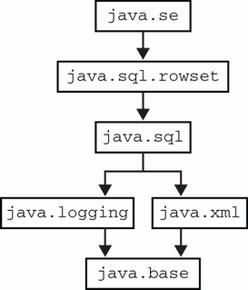

# 2. Java modules

> *The Well-Grounded Java Developer, Second Edition* — Chương 2
> Bản dịch tiếng Việt

**Chương này bao gồm:**

- Các platform module của Java
- Những thay đổi trong ngữ nghĩa kiểm soát truy cập (access control)
- Viết ứng dụng dạng modular
- Multi-release JAR

---

Như đã đề cập ở chương 1, các phiên bản Java, tính đến và bao gồm cả Java 9, được phát hành theo một kế hoạch dựa trên tính năng, thường với một khả năng lớn mới định nghĩa hoặc gắn liền mạnh mẽ với bản phát hành đó.

Với Java 9, tính năng này là *Java Platform Modules* (còn được biết đến là JPMS, Jigsaw, hoặc đơn giản là "modules"). Đây là một cải tiến và thay đổi lớn đối với nền tảng Java, đã được thảo luận trong nhiều năm — ban đầu nó được hình dung là có thể được giao như một phần của Java 7, hồi 2009/2010.

Trong chương này, chúng tôi sẽ giải thích lý do vì sao cần có module, cũng như cú pháp mới dùng để diễn đạt các khái niệm modularity và cách dùng chúng trong ứng dụng của bạn. Điều này sẽ giúp bạn dùng được các module của JDK và của bên thứ ba trong bản build của mình, cũng như đóng gói ứng dụng hoặc thư viện dưới dạng module.

> **NOTE** Module đại diện cho một cách mới để đóng gói và triển khai mã của bạn, và việc áp dụng chúng sẽ làm ứng dụng của bạn tốt hơn. Tuy nhiên, nếu bạn chỉ muốn bắt đầu dùng các tính năng Java hiện đại (11 hoặc 17), bạn không cần phải áp dụng module ngay lập tức trừ khi bạn muốn.

Sự xuất hiện của module có những hàm ý sâu sắc đối với kiến trúc ứng dụng, và module mang lại nhiều lợi ích cho các dự án hiện đại vốn quan tâm đến những khía cạnh như process footprint (dấu chân tiến trình), chi phí khởi động và thời gian warmup. Module cũng có thể giúp giải quyết vấn đề gọi là *JAR Hell*, thứ có thể hành hạ các ứng dụng Java có phụ thuộc phức tạp. Hãy làm quen với chúng.

## 2.1 Dựng bối cảnh

Module là một khái niệm hoàn toàn mới trong ngôn ngữ Java (kể từ Java 9). Nó là một đơn vị triển khai ứng dụng và phụ thuộc, mang ý nghĩa ngữ nghĩa đối với runtime. Điều này khác với các khái niệm hiện có trong Java vì những lý do sau:

- Tệp JAR là vô hình đối với runtime — về cơ bản chúng chỉ là các thư mục được nén chứa class file.
- Package thực chất chỉ là namespace để nhóm các class lại với nhau phục vụ kiểm soát truy cập.
- Phụ thuộc chỉ được định nghĩa ở mức class.
- Kiểm soát truy cập và reflection kết hợp lại theo cách tạo ra một hệ thống về cơ bản là mở, không có ranh giới đơn vị triển khai rõ ràng và với mức cưỡng chế tối thiểu.

Mặt khác, module:

- Định nghĩa thông tin phụ thuộc giữa các module, để mọi loại vấn đề phân giải (resolution) và liên kết (linkage) có thể được phát hiện tại thời điểm biên dịch hoặc khi ứng dụng khởi động
- Cung cấp đóng gói (encapsulation) đúng nghĩa, để các package và class nội bộ có thể được bảo vệ khỏi những người dùng phiền phức muốn nghịch ngợm với chúng
- Là một đơn vị triển khai đúng nghĩa với metadata mà một runtime Java hiện đại có thể hiểu và tiêu thụ, và được biểu diễn trong hệ thống kiểu của Java (ví dụ, qua reflection)

> **NOTE** Trước khi có module, trong ngôn ngữ lõi và môi trường runtime, không tồn tại metadata phụ thuộc tổng hợp. Thay vào đó, nó chỉ được định nghĩa trong các hệ thống build như Maven hoặc trong các hệ thống module của bên thứ ba (chẳng hạn OSGI hay JBoss modules) mà JVM không biết cũng không quan tâm.

Java platform module đại diện cho một bản hiện thực của một khái niệm còn thiếu trong thế giới Java như nó tồn tại ở phiên bản 8.

> **NOTE** Java module thường được đóng gói dưới dạng các tệp JAR đặc biệt, nhưng chúng không bị ràng buộc vào định dạng đó (chúng ta sẽ thấy các định dạng khả dĩ khác ở phần sau).

Mục tiêu của hệ thống module là làm cho các đơn vị triển khai (module) độc lập với nhau nhất có thể. Ý tưởng là các module có thể được nạp và liên kết riêng rẽ, mặc dù trên thực tế, các ứng dụng thực tế rất có thể sẽ phụ thuộc vào một nhóm module cung cấp các khả năng liên quan (chẳng hạn bảo mật).

### 2.1.1 Project Jigsaw

Dự án bên trong OpenJDK để giao tính năng module được biết đến là *Project Jigsaw*. Nó nhắm tới việc giao một giải pháp modularity đầy đủ tính năng với những mục tiêu sau:

- Module hóa mã nguồn nền tảng JDK
- Giảm process footprint
- Cải thiện thời gian khởi động ứng dụng
- Có module khả dụng cho cả JDK lẫn mã ứng dụng
- Cho phép đóng gói nghiêm ngặt thực sự lần đầu tiên trong Java
- Thêm các chế độ kiểm soát truy cập mới, trước đây bất khả thi, vào ngôn ngữ Java

Những mục tiêu này, đến lượt nó, được thúc đẩy bởi các mục tiêu khác sau đây, vốn tập trung sát hơn vào JDK và Java runtime:

- Chấm dứt một runtime JAR nguyên khối duy nhất (`rt.jar`)
- Đóng gói và bảo vệ đúng cách các phần nội bộ của JDK
- Cho phép thực hiện những thay đổi nội bộ lớn (bao gồm cả những thay đổi sẽ phá vỡ việc sử dụng trái phép từ bên ngoài JDK)
- Giới thiệu module như những "super package"

Các mục tiêu thứ cấp này có thể cần giải thích thêm một chút bởi chúng gắn chặt hơn với các khía cạnh nội bộ và hiện thực của nền tảng.

**Java runtime dạng modular, không nguyên khối**

Định dạng JAR cũ về cơ bản chỉ là một tệp zip chứa các class. Nó có từ những ngày đầu tiên của nền tảng và hoàn toàn không được tối ưu cho class và ứng dụng Java. Từ bỏ định dạng JAR cho các class nền tảng có thể giúp ích ở nhiều mảng — ví dụ, cho phép hiệu năng khởi động tốt hơn nhiều.

Module cung cấp hai định dạng mới — JMOD và JIMAGE — được dùng ở những thời điểm khác nhau (thời điểm biên dịch/liên kết và thời điểm chạy, tương ứng) trong vòng đời chương trình.

Định dạng JMOD phần nào tương tự định dạng JAR hiện có, nhưng đã được sửa đổi để cho phép đưa mã native vào như một phần của một tệp duy nhất (thay vì phải giao một tệp shared object riêng như cách làm ở Java 8). Với hầu hết nhu cầu của lập trình viên, bao gồm việc publish module lên Maven, tốt hơn là đóng gói module của bạn dưới dạng modular JAR thay vì JMOD.

Định dạng JIMAGE được dùng để biểu diễn một Java runtime image. Cho tới Java 8, chỉ tồn tại hai runtime image khả dĩ (JDK và JRE), nhưng đây phần lớn là một tai nạn lịch sử. Oracle đã giới thiệu Server JRE cùng Java 8 (cũng như Compact Profiles) như một bước đệm hướng tới modularity đầy đủ. Các image này về cơ bản loại bỏ một số khả năng (ví dụ, các framework GUI) để cung cấp footprint nhỏ hơn, hướng riêng tới nhu cầu của ứng dụng phía server.

Một ứng dụng modular có đủ metadata để tập phụ thuộc chính xác có thể được biết trước khi chương trình khởi động. Điều này dẫn tới khả năng chỉ những gì cần thiết mới phải được nạp, hiệu quả hơn nhiều. Thậm chí có thể đi xa hơn và định nghĩa một runtime image tùy chỉnh có thể được giao cùng ứng dụng, không chứa một bản cài đặt Java đầy đủ, đa dụng mà chỉ chứa những gì ứng dụng cần. Chúng ta sẽ gặp khả năng cuối cùng này ở cuối chương khi làm quen với công cụ `jlink`.

Còn bây giờ, hãy gặp công cụ `jimage` có sẵn để hiển thị chi tiết về một Java runtime image. Ví dụ, với một runtime Java 15 đầy đủ (tức là những gì từng nằm trong một JDK), xem đoạn mã mẫu sau:

```
$ jimage info $JAVA_HOME/lib/modules
 Major Version: 1
 Minor Version: 0
 Flags:          0
 Resource Count: 32780
 Table Length:   32780
 Offsets Size:   131120
 Redirects Size: 131120
 Locations Size: 680101
 Strings Size:   746471
 Index Size:     1688840
```

hoặc

```
$ jimage list $JAVA_HOME/lib/modules
jimage: /Library/Java/JavaVirtualMachines/java15/Contents/Home/lib/modules

Module: java.base
    META-INF/services/java.nio.file.spi.FileSystemProvider
    apple/security/AppleProvider$1.class
    apple/security/AppleProvider$ProviderService.class
    apple/security/AppleProvider.class
    apple/security/KeychainStore$CertKeychainItemPair.class
    apple/security/KeychainStore$KeyEntry.class
    apple/security/KeychainStore$TrustedCertEntry.class
    apple/security/KeychainStore.class
    com/sun/crypto/provider/AESCipher$AES128_CBC_NoPadding.class
    ... rất, rất nhiều dòng kết quả nữa
```

Việc rời xa `rt.jar` cho phép hiệu năng khởi động tốt hơn và tối ưu chỉ cho những gì một ứng dụng cần. Các định dạng mới được thiết kế để "mờ đục" đối với lập trình viên và phụ thuộc vào bản hiện thực. Không còn khả năng chỉ cần giải nén `rt.jar` để lấy lại thư viện class của JDK. Tuy nhiên, đây mới chỉ là một bước trong việc làm cho phần nội bộ của nền tảng ít dễ tiếp cận hơn với lập trình viên Java, vốn là một trong những mục tiêu của hệ thống module.

**Đóng gói phần nội bộ**

Hợp đồng giữa nền tảng Java và người dùng của nó luôn được dự định là một hợp đồng API — rằng tính tương thích ngược sẽ được duy trì ở mức interface, chứ không phải ở các chi tiết của bản hiện thực.

Tuy nhiên, các lập trình viên Java đã không giữ đúng phần cam kết của mình và, theo thời gian, có xu hướng sử dụng những phần của bản hiện thực nền tảng vốn không bao giờ được dự định cho tiêu dùng công khai.

Điều này gây vấn đề, bởi các nhà phát triển nền tảng OpenJDK muốn có tự do sửa đổi bản hiện thực của JVM và các class nền tảng nhằm chống lỗi thời và hiện đại hóa chúng — để cung cấp tính năng mới và hiệu năng tốt hơn mà không phải lo phá vỡ ứng dụng của người dùng.

Một trở ngại lớn đối với việc thực hiện các thay đổi phá vỡ tương thích ở phần nội bộ của nền tảng là cách tiếp cận kiểm soát truy cập của Java như nó tồn tại ở Java 8. Java chỉ định nghĩa `public`, `private`, `protected` và package-private làm các mức kiểm soát truy cập, và những modifier này chỉ được áp dụng ở mức class và nhỏ hơn.

Chúng ta có thể lách những hạn chế này theo vô số cách (chẳng hạn reflection hoặc tạo thêm class trong các package liên quan), và không có cách nào chống được kẻ nghiệp dư (hay chống được cả chuyên gia) để bảo vệ hoàn toàn phần nội bộ.

Việc dùng các cách lách để truy cập phần nội bộ trong lịch sử thường vì những lý do chính đáng. Tuy nhiên, khi nền tảng trưởng thành, một cách chính thức để truy cập gần như toàn bộ chức năng mong muốn đã được bổ sung. Do đó, phần nội bộ không được bảo vệ đại diện cho một khoản nợ đối với nền tảng trong tương lai mà không có lợi ích tương ứng — và modularity là một cách để loại bỏ vấn đề di sản đó.

Tóm lại, Project Jigsaw là một cách để giải quyết nhiều vấn đề cùng lúc — chủ yếu là giảm kích thước runtime, cải thiện thời gian khởi động và dọn dẹp các phụ thuộc giữa các package nội bộ. Đây là những vấn đề khó (hoặc không thể) xử lý một cách tăng dần. Cơ hội cho những cải thiện "phi cục bộ" kiểu này không đến thường xuyên, đặc biệt trong các nền tảng phần mềm trưởng thành, nên đội Jigsaw muốn tận dụng hoàn cảnh của mình.

**JVM giờ đã modular**

Để thấy điều này, hãy xem chương trình rất đơn giản sau:

```java
public class StackTraceDemo {
    public static void main(String[] args) {
        var i = Integer.parseInt("Fail");
    }
}
```

Biên dịch và chạy mã này tạo ra một runtime exception, như sau:

```
$ java StackTraceDemo
Exception in thread "main" java.lang.NumberFormatException:
  For input string: "Fail"
    at java.base/java.lang.NumberFormatException.forInputString(
    NumberFormatException.java:65)
    at java.base/java.lang.Integer.parseInt(Integer.java:652)
    at java.base/java.lang.Integer.parseInt(Integer.java:770)
    at StackTraceDemo.main(StackTraceDemo.java:3)
```

Tuy nhiên, ta có thể thấy rõ định dạng của stack trace đã thay đổi đôi chút so với dạng dùng trong Java 8. Cụ thể, các stack frame giờ được định danh kèm theo tên module (`java.base`) bên cạnh tên package, tên class và số dòng. Điều này cho thấy rõ bản chất modular của nền tảng là bao trùm và hiện diện ngay cả với chương trình đơn giản nhất.

### 2.1.2 Đồ thị module (module graph)

Chìa khóa của toàn bộ modularity là *module graph* — một biểu diễn về cách các module phụ thuộc lẫn nhau. Module khai báo các phụ thuộc của mình một cách tường minh qua một số cú pháp mới, và những phụ thuộc đó là các đảm bảo chắc chắn mà compiler và runtime có thể dựa vào. Một khái niệm rất quan trọng là module graph phải là một đồ thị có hướng không chu trình (directed acyclic graph — DAG), nên theo thuật ngữ toán học, không thể có bất kỳ phụ thuộc vòng nào.

> **NOTE** Cần nhận thức rằng trong các môi trường Java hiện đại, mọi ứng dụng đều chạy trên nền JRE modular; không tồn tại "chế độ modular" và "chế độ classpath cũ".

Mặc dù không phải lập trình viên nào cũng cần trở thành chuyên gia về hệ thống module, hợp lý khi một lập trình viên Java vững nền tảng sẽ hưởng lợi từ kiến thức thực dụng về một hệ thống con mới đã thay đổi cách mọi chương trình được thực thi trên JVM. Hãy xem cái nhìn đầu tiên về hệ thống module, minh họa trong hình 2.1, như cách hầu hết lập trình viên gặp nó.



**Hình 2.1** Các module hệ thống của JDK (cái nhìn đơn giản hóa)

Trong hình 2.1, chúng ta thấy một cái nhìn đơn giản hóa về một số module chính trong JDK. Lưu ý rằng module `java.base` luôn là phụ thuộc của mọi module. Khi vẽ hình module graph, phụ thuộc ngầm định vào `java.base` thường bị loại bỏ chỉ để giảm rối mắt.

Tập ranh giới module sạch sẽ và tương đối đơn giản mà ta thấy trong hình 2.1 cần được đối chiếu với trạng thái của JDK ở Java 8. Đáng tiếc, trước khi có module, đơn vị mã cấp cao nhất của Java là *package* — và Java 8 có gần 1.000 package trong runtime chuẩn. Điều này về cơ bản là không thể vẽ ra được, và các phụ thuộc trong đồ thị sẽ phức tạp đến mức con người không thể hiểu nổi.

Việc lấy JDK tiền-module và tái định hình nó thành dạng được định nghĩa rõ ràng mà chúng ta thấy ngày nay không hề dễ đạt được, và con đường tới việc giao modularity cho JDK rất dài. Java 9 được phát hành tháng 9 năm 2017, nhưng việc phát triển tính năng này đã bắt đầu vài năm trước đó cùng chuyến tàu phát hành Java 8. Cụ thể, có một số mục tiêu con là những bước đầu tiên cần thiết cho việc giao module, bao gồm:

- Module hóa bố cục mã nguồn trong JDK (JEP 201)
- Module hóa cấu trúc của các runtime image (JEP 220)
- Gỡ rối các phụ thuộc hiện thực phức tạp giữa các package của JDK

Mặc dù tính năng module hoàn chỉnh mãi tới Java 9 mới ra mắt, phần lớn công việc dọn dẹp đã được tiến hành như một phần của Java 8 và thậm chí cho phép một tính năng gọi là *compact profiles* (chúng ta sẽ gặp ở cuối chương này) được giao như một phần của bản phát hành đó.

### 2.1.3 Bảo vệ phần nội bộ

Một trong những vấn đề lớn mà module cần giải quyết là việc các framework Java của người dùng bị gắn kết quá mức (overcoupling) với các chi tiết hiện thực nội bộ. Ví dụ, đoạn mã Java 8 sau kế thừa một class nội bộ để lấy quyền truy cập vào một URL canonicalizer ở mức thấp.

Đoạn mã sau chỉ nhằm mục đích minh họa, để chúng ta có một ví dụ cụ thể nhằm thảo luận về module và kiểm soát truy cập — mã của bạn không bao giờ nên truy cập trực tiếp các class nội bộ:

```java
import sun.net.URLCanonicalizer;

public class MyURLHandler extends URLCanonicalizer {

     public boolean isSimple(String url) {
         return isSimpleHostName(url);
     }
}
```

URL canonicalizer là một đoạn mã nhận một URL ở một trong các dạng được chuẩn URL cho phép và chuyển nó về dạng chuẩn tắc (canonical). Ý đồ là các canonical URL có thể đóng vai trò nguồn chân lý duy nhất cho vị trí của nội dung có thể được truy cập qua nhiều URL khác nhau. Nếu ta thử biên dịch nó bằng Java 8, `javac` cảnh báo rằng chúng ta đang truy cập một API nội bộ, như sau:

```
$ javac MyURLHandler.java
MyURLHandler.java:1: warning: URLCanonicalizer is internal proprietary
  and may be removed in a future release

import sun.net.URLCanonicalizer;
              ^
MyURLHandler.java:3: warning: URLCanonicalizer is internal proprietary
  and may be removed in a future release

public class MyURLHandler extends URLCanonicalizer {
                                  ^
2 warnings
```

Tuy nhiên, theo mặc định, compiler vẫn cho phép truy cập, và kết quả là một class người dùng gắn chặt với bản hiện thực nội bộ của JDK. Mối liên kết này mong manh và sẽ đứt gãy nếu mã được gọi bị di chuyển hoặc bị thay thế.

Nếu đủ nhiều lập trình viên lạm dụng sự cởi mở này, điều đó sẽ dẫn tới tình huống mà việc thay đổi phần nội bộ trở nên khó khăn hoặc bất khả thi, bởi làm vậy sẽ phá vỡ các thư viện và ứng dụng đã triển khai.

> **NOTE** Class `URLCanonicalizer` cần được gọi từ nhiều package khác nhau, không chỉ package của chính nó, nên nó phải là một class `public` — nó không thể là package-private — nghĩa là ai cũng truy cập được.

Giải pháp cho vấn đề rất tổng quát này là thực hiện một thay đổi một lần đối với mô hình kiểm soát truy cập của Java. Thay đổi này áp dụng cho cả mã người dùng gọi JDK lẫn ứng dụng gọi các thư viện bên thứ ba.

### 2.1.4 Ngữ nghĩa kiểm soát truy cập mới

Module thêm một khái niệm mới vào mô hình kiểm soát truy cập của Java: ý tưởng *export* một package. Trong Java 8 và trước đó, mã trong bất kỳ package nào cũng có thể gọi các phương thức public trên bất kỳ class public nào trong bất kỳ package nào. Điều này đôi khi được gọi là "shotgun privacy" (quyền riêng tư kiểu súng săn), theo một câu nói nổi tiếng về một ngôn ngữ lập trình khác:

> *Perl không si mê việc cưỡng chế quyền riêng tư. Nó thà bạn tránh xa phòng khách của nó vì bạn không được mời, chứ không phải vì nó có một khẩu súng săn.*
>
> — Larry Wall

Tuy nhiên, với Java, shotgun privacy đại diện cho một vấn đề lớn. Ngày càng nhiều thư viện dùng các API nội bộ để cung cấp những khả năng khó hoặc không thể cung cấp bằng cách khác, và điều này đe dọa gây hại cho sức khỏe dài hạn của nền tảng.

Tính đến Java 8, không có cách nào cưỡng chế kiểm soát truy cập trên toàn bộ một package. Điều này có nghĩa đội JDK không thể định nghĩa một API công khai và biết chắc rằng các client của API đó không thể phá vỡ nó hoặc liên kết trực tiếp tới bản hiện thực nội bộ.

Quy ước rằng bất kỳ thứ gì trong package bắt đầu bằng `java` hoặc `javax` là API công khai và mọi thứ khác chỉ là nội bộ chỉ đơn thuần là — một quy ước. Không VM hay cơ chế class loading nào cưỡng chế điều đó, như chúng ta đã thấy.

Tuy nhiên, với module, điều này thay đổi. Từ khóa `exports` đã được giới thiệu để chỉ ra những package nào được xem là API công khai của một module. Trong JDK modular, package `sun.net` không được export, nên đoạn mã URL canonicalizer Java 8 trước đó sẽ không biên dịch được. Đây là điều xảy ra khi ta thử với Java 11:

```
$ javac src/ch02/MyURLHandler.java
src/ch02/MyURLHandler.java:3: error: package sun.net is not visible
import sun.net.URLCanonicalizer;
          ^
  (package sun.net is declared in module java.base, which does not export
     it to the unnamed module)
src/ch02/MyURLHandler.java:8: error: cannot find symbol
        return isSimpleHostName(url);
               ^
  symbol:   method isSimpleHostName(String)
  location: class MyURLHandler
2 errors
```

Lưu ý rằng dạng của thông báo lỗi nói rõ ràng rằng package `sun.net` giờ không còn nhìn thấy được — compiler thậm chí không thấy được symbol. Đây là một thay đổi cơ bản trong cách kiểm soát truy cập của Java hoạt động. Chỉ các phương thức trên những package được export mới truy cập được. Không còn chuyện một phương thức public trên một class public tự động nhìn thấy được với mọi mã ở mọi nơi.

Tuy nhiên, thay đổi này có thể không lộ rõ với nhiều lập trình viên. Nếu bạn là một lập trình viên Java chơi đúng luật, bạn sẽ không bao giờ gọi trực tiếp một API trong package nội bộ. Nhưng bạn có thể dùng một thư viện hoặc framework có làm vậy, nên hiểu điều gì thực sự đã thay đổi và tránh FUD là điều tốt.

> **NOTE** Đóng gói đúng nghĩa không miễn phí, và Java tiền-module thực sự là một hệ thống rất mở. Có lẽ chỉ là tự nhiên khi đối mặt với hệ thống có cấu trúc chặt chẽ hơn mà module cung cấp, nhiều lập trình viên Java thấy một số biện pháp bảo vệ bổ sung gò bó hoặc bực bội. Hãy làm quen với cú pháp mã hóa những ngữ nghĩa mới này của Java module.

## 2.2 Cú pháp module cơ bản

Một Java platform module được định nghĩa như một đơn vị khái niệm, là tập hợp các package và class được khai báo và nạp như một thực thể duy nhất. Mỗi module phải khai báo một tệp mới, gọi là *module descriptor*, được biểu diễn dưới dạng tệp `module-info.java`, chứa những thứ sau:

- Tên module
- Các phụ thuộc của module
- API công khai (các package được export)
- Quyền truy cập qua reflection
- Các service được cung cấp
- Các service được tiêu thụ

Tệp này phải được đặt ở vị trí phù hợp trong cây thư mục mã nguồn. Ví dụ, trong bố cục kiểu Maven, tên module đầy đủ `wgjd.discovery` xuất hiện ngay sau `src/main/java` và chứa `module-info.java` cùng gốc package, như minh họa dưới đây:

```
src
    └── main
           └── java
                  └── wgjd.discovery
                          ├── wgjd
                          │   └── discovery
                          │      ├── internal
                          │      │     ├── AttachOutput.java
                          │      │     └── PlainAttachOutput.java
                          │      ├── VMIntrospector.java
                          │      └── Discovery.java
                          └── module-info.java
```

Điều này dĩ nhiên hơi khác so với các dự án Java phi modular, vốn thường lấy `src/main/java` làm gốc của các thư mục package. Tuy nhiên, cấu trúc phân cấp quen thuộc của package dưới gốc module vẫn nhìn thấy được.

> **NOTE** Khi một dự án modular được build, module descriptor sẽ được biên dịch thành một class file, `module-info.class`, nhưng tệp đó (bất chấp tên gọi) thực ra khá khác với loại class file thông thường mà ta thấy trong nền tảng Java.

Trong chương này, chúng ta sẽ đề cập tới các directive cơ bản của descriptor nhưng sẽ không đào sâu vào mọi khả năng mà module cung cấp. Cụ thể, chúng ta sẽ không thảo luận về khía cạnh *services* của module.

Một ví dụ đơn giản về module descriptor trông như sau:

```java
module wgjd.discovery {
  exports wgjd.discovery;

    requires java.instrument;
    requires jdk.attach;
    requires jdk.internal.jvmstat;
}
```

Đoạn này chứa ba từ khóa mới — `module`, `exports` và `requires` — trong một cú pháp mà hầu hết lập trình viên Java đều thấy gợi ý rõ ràng. Từ khóa `module` chỉ đơn giản khai báo phạm vi mở đầu của khai báo.

> **NOTE** Tên `module-info.java` gợi nhớ `package-info.java`, và chúng phần nào có liên hệ. Bởi package không thực sự nhìn thấy được với runtime, cần một cách lách (hack?) để cung cấp một điểm móc cho metadata annotation áp dụng cho cả package. Cách lách đó là `package-info.java`. Trong thế giới modular, nhiều metadata hơn hẳn có thể được gắn với một module, nên một tên tương tự đã được chọn.

Cú pháp mới thực chất gồm các *restricted keyword* (từ khóa hạn chế), được mô tả trong Java Language Specification như sau:

> *Có thêm mười chuỗi ký tự là restricted keyword: `open`, `module`, `requires`, `transitive`, `exports`, `opens`, `to`, `uses`, `provides`, và `with`. Các chuỗi ký tự này chỉ được tokenize thành từ khóa ở nơi chúng xuất hiện như terminal trong các production `ModuleDeclaration` và `ModuleDirective`.*

Nói đơn giản hơn, điều này có nghĩa các từ khóa mới này sẽ chỉ xuất hiện trong descriptor cho metadata của module và không được xử lý như từ khóa trong mã nguồn Java nói chung. Tuy nhiên, thực hành tốt là tránh dùng những từ này làm định danh Java, ngay cả khi về mặt kỹ thuật là hợp lệ. Đây cũng chính là tình huống chúng ta đã thấy với `var` ở chương 1, và chúng tôi sẽ dùng ngôn ngữ lỏng lẻo hơn mà gọi chúng là "từ khóa" xuyên suốt phần còn lại của cuốn sách.

### 2.2.1 Export và require

Từ khóa `exports` mong đợi một đối số, đó là tên package. Trong ví dụ của chúng ta:

```java
exports wgjd.discovery;
```

nghĩa là module discovery ví dụ của chúng ta export package `wgjd.discovery`, nhưng vì descriptor không nhắc tới package nào khác, `wgjd.discovery.internal` không được export và thông thường không khả dụng với mã bên ngoài module discovery.

Có thể có nhiều dòng `exports` trong một module descriptor và thực tế điều đó khá thường gặp. Cũng có thể kiểm soát chi tiết bằng cú pháp `exports ... to ...`, chỉ ra rằng chỉ một số module bên ngoài nhất định mới có thể truy cập một package cụ thể từ module này.

> **NOTE** Một module đơn lẻ export một hoặc nhiều package tạo nên API công khai của module, và đó là những package duy nhất mà mã trong các module khác có thể truy cập, trừ khi dùng một cách ghi đè (ví dụ, một switch dòng lệnh).

Từ khóa `requires` khai báo một phụ thuộc của module hiện tại và luôn cần một đối số, đó là *tên module*, chứ không phải tên package. Module `java.base` chứa các package và class nền tảng nhất của Java runtime. Chúng ta có thể dùng lệnh `jmod` để xem, như sau:

```
$ jmod describe $JAVA_HOME/jmods/java.base.jmod
java.base@11.0.3
exports java.io
exports java.lang
exports java.lang.annotation
exports java.lang.invoke
exports java.lang.module
exports java.lang.ref
exports java.lang.reflect
exports java.math
exports java.net
exports java.net.spi
exports java.nio
// ... rất, rất nhiều dòng kết quả nữa
```

Những package này được mọi chương trình Java dùng đến, nên `java.base` luôn là một phụ thuộc ngầm định của mọi module, do đó không cần được khai báo tường minh trong `module-info.java`. Điều này khá giống cách `java.lang` là một import ngầm định vào mọi class Java.

Một số quy tắc và quy ước cơ bản cho tên module như sau:

- Module sống trong một namespace toàn cục.
- Tên module phải là duy nhất.
- Dùng quy ước chuẩn `com.company.project` nếu phù hợp.

Một khái niệm module cơ bản quan trọng là *transitivity* (tính bắc cầu). Hãy xem kỹ hơn khái niệm này, bởi nó xuất hiện không chỉ trong ngữ cảnh module mà còn trong các phụ thuộc thư viện quen thuộc hơn của Java (tức là tệp JAR) mà chúng ta sẽ gặp ở chương 11.

### 2.2.2 Tính bắc cầu (transitivity)

Transitivity là một thuật ngữ máy tính rất tổng quát, hoàn toàn không đặc thù cho Java, mô tả tình huống xảy ra khi một đơn vị mã cần các đơn vị khác để hoạt động đúng, và bản thân những đơn vị đó lại có thể cần các đơn vị khác nữa. Mã gốc của chúng ta thậm chí có thể không bao giờ nhắc tới những đơn vị mã "cách một bước" này, nhưng chúng vẫn phải hiện diện, nếu không ứng dụng của chúng ta sẽ không hoạt động.

Để hiểu tại sao lại như vậy — và tại sao điều đó quan trọng — hãy xét hai module `A` và `B`, trong đó `A` requires `B`. Có hai trường hợp khác nhau khả dĩ:

- `A` không export bất kỳ phương thức nào nhắc trực tiếp tới kiểu từ `B`.
- `A` đưa các kiểu từ `B` vào như một phần API của nó.

Trong trường hợp `A` export các phương thức trả về kiểu được định nghĩa trong `B`, điều này sẽ dẫn tới hệ quả là `A` không dùng được trừ khi các client của `A` (những module `requires A`) cũng `requires B`. Đây là một gánh nặng khá không cần thiết đối với client của `A`.

Hệ thống module cung cấp cú pháp đơn giản để giải quyết điều này: `requires transitive`. Nếu một module `A` require một module khác một cách bắc cầu, thì mọi mã phụ thuộc vào `A` cũng sẽ, một cách ngầm định, nhận luôn các phụ thuộc bắc cầu đó.

Mặc dù việc dùng `requires transitive` là không thể tránh khỏi trong một số trường hợp, nói chung, khi viết module, tối thiểu hóa việc dùng transitivity được xem là thực hành tốt nhất. Chúng ta sẽ nói thêm về phụ thuộc bắc cầu khi thảo luận về các công cụ build ở chương 11.

## 2.3 Nạp module

Nếu lần đầu bạn gặp Java class loading là khi chúng tôi nhắc sơ qua ở chương 1 và bạn không có kinh nghiệm nào khác về nó, đừng lo. Điều quan trọng nhất cần biết ngay lúc này là tồn tại bốn loại module sau, một số trong đó có hành vi hơi khác khi được nạp:

- Platform module
- Application module
- Automatic module
- Unnamed module

Mặt khác, nếu bạn đã quen với class loading, bạn nên biết rằng sự xuất hiện của module đã thay đổi một số chi tiết trong cách class loading vận hành.

Một JVM hiện đại có các class loader nhận biết module, và cách các class của JRE được nạp khá khác so với Java 8. Một khái niệm then chốt là *module path*, một chuỗi các đường dẫn tới module (hoặc tới thư mục chứa module). Nó tương tự nhưng tách biệt với classpath truyền thống của Java.

> **NOTE** Chúng ta sẽ gặp class loading một cách đầy đủ ở chương 4 và giới thiệu cách làm hiện đại cho cả độc giả mới lẫn có kinh nghiệm.

Các nguyên tắc nền tảng của cách tiếp cận modular đối với class loading như sau:

- Module được phân giải từ module path, không phải từ classpath kiểu cũ.
- Khi khởi động, JVM phân giải một đồ thị module, đồ thị này phải không có chu trình.
- Một module là gốc của đồ thị và là nơi việc thực thi bắt đầu. Nó chứa class có phương thức `main` sẽ là điểm vào.

Các phụ thuộc đã được module hóa được gọi là *application module* và được đặt trên module path. Các phụ thuộc chưa module hóa được đặt trên classpath quen thuộc, và được thu nạp vào hệ thống module qua một cơ chế migration.

Việc phân giải module dùng duyệt theo chiều sâu, và vì đồ thị phải không có chu trình, thuật toán phân giải sẽ kết thúc (và trong thời gian tuyến tính). Hãy đào sâu hơn một chút vào từng loại trong bốn loại module.

### 2.3.1 Platform module

Đây là các module từ chính JDK modular. Chúng vốn đã là một phần của runtime nguyên khối (`rt.jar`) trong Java 8 (hoặc có thể là các JAR phụ trợ, chẳng hạn `tools.jar`). Chúng ta có thể lấy danh sách các platform module khả dụng bằng flag `--list-modules`, như sau:

```
$ java --list-modules
java.base@11.0.6
java.compiler@11.0.6
...
java.xml@11.0.6
java.xml.crypto@11.0.6
jdk.accessibility@11.0.6
...
jdk.unsupported@11.0.6
...
```

Lệnh này sẽ cung cấp danh sách đầy đủ, thay vì tập một phần mà chúng ta đã thấy trong hình 2.1.

> **NOTE** Danh sách module chính xác và tên của chúng phụ thuộc vào phiên bản Java đang dùng. Ví dụ, trên bản hiện thực GraalVM của Oracle, một số module bổ sung như `com.oracle.graal.graal_enterprise`, `org.graalvm.js.scriptengine` và `org.graalvm.sdk` có thể hiện diện.

Các platform module sử dụng rất nhiều cơ chế export có điều kiện (qualified exporting), trong đó một số package chỉ được export cho một danh sách module xác định và không được cung cấp rộng rãi.

Module quan trọng nhất trong bản phân phối là `java.base`, luôn là phụ thuộc ngầm định của mọi module khác. Nó chứa `java.lang`, `java.util`, `java.io` và nhiều package cơ bản khác. Module này về cơ bản tương ứng với Java runtime nhỏ nhất khả dĩ mà một ứng dụng có thể cần và vẫn chạy được.

Ở đầu kia của phổ là các *aggregator module*, vốn không chứa mã nào nhưng đóng vai trò cơ chế đường tắt để cho phép ứng dụng kéo vào một tập phụ thuộc rất rộng một cách bắc cầu. Ví dụ, module `java.se` kéo vào toàn bộ nền tảng Java SE.

### 2.3.2 Application module

Những loại module này là các phụ thuộc đã được module hóa của một ứng dụng, hoặc chính ứng dụng đó. Loại module này đôi khi cũng được gọi là *library module*.

> **NOTE** Không có sự phân biệt kỹ thuật nào giữa platform module và application module — khác biệt hoàn toàn mang tính triết lý — và ở việc class loader nào được dùng để nạp chúng, như chúng ta sẽ thảo luận ở chương 4.

Các thư viện bên thứ ba mà ứng dụng phụ thuộc sẽ là application module. Ví dụ, các thư viện Jackson để thao tác JSON đã được module hóa từ phiên bản 2.10 và được tính là application module (còn gọi là library module).

Application module thường sẽ phụ thuộc vào cả platform module lẫn các application module khác. Nên cố gắng ràng buộc phụ thuộc của những module này càng chặt càng tốt và tránh, chẳng hạn, `requires java.se`.

### 2.3.3 Automatic module

Một đặc điểm thiết kế có chủ ý của hệ thống module là bạn không thể tham chiếu classpath từ trong một module. Hạn chế này có vẻ tiềm ẩn vấn đề — điều gì xảy ra nếu một module cần phụ thuộc vào mã chưa được module hóa?

Giải pháp là chuyển tệp JAR phi modular lên module path (và loại nó khỏi classpath). Khi làm vậy, JAR đó trở thành một *automatic module*. Hệ thống module sẽ tự động sinh một tên cho module của bạn, được dẫn xuất từ tên của JAR.

Một automatic module export mọi package mà nó chứa, và tự động phụ thuộc vào mọi module khác trên module path. Automatic module không có thông tin phụ thuộc module đúng nghĩa, bởi chúng không khai báo tường minh phụ thuộc của mình cũng không quảng bá API của mình. Điều này có nghĩa chúng không phải là công dân hạng nhất trong hệ thống module và không cung cấp cùng mức đảm bảo như những Java module thực thụ.

Có thể khai báo tường minh một tên, bằng cách thêm mục `Automatic-Module-Name` vào tệp `MANIFEST.MF` trong JAR. Việc này thường được làm như một bước trung gian khi migrate sang Java module, bởi nó cho phép lập trình viên đặt trước một tên module và bắt đầu thu được một phần lợi ích của việc tương tác với mã modular.

Ví dụ, thư viện Apache Commons Lang chưa được module hóa hoàn toàn, nhưng nó cung cấp `org.apache.commons.lang3` làm tên automatic module. Các module khác khi đó có thể khai báo rằng chúng phụ thuộc vào automatic module này, ngay cả khi những người bảo trì nó chưa hoàn tất việc chuyển đổi sang modularity đầy đủ.

### 2.3.4 Unnamed module

Tất cả các class và JAR trên classpath được thêm vào một module duy nhất, đó là *unnamed module*, hay `UNNAMED`. Việc này được làm để tương thích ngược nhưng với cái giá là hệ thống module không hiệu quả như nó có thể, trong suốt thời gian còn mã nằm trong unnamed module.

Với trường hợp các ứng dụng hoàn toàn phi modular (ví dụ, ứng dụng Java 8 đang chạy trên runtime Java 11), nội dung của classpath được đổ vào unnamed module, và module gốc được lấy là `java.se`.

Mã modular không thể phụ thuộc vào unnamed module, nên trên thực tế, module không thể phụ thuộc vào bất kỳ thứ gì trên classpath. Automatic module thường được dùng để giúp giải quyết tình huống này. Về mặt hình thức, unnamed module phụ thuộc vào mọi module trong JDK và trên module path, bởi nó đang tái tạo hành vi tiền-module.

## 2.4 Xây dựng ứng dụng modular đầu tiên

Hãy xây dựng một ví dụ đầu tiên về ứng dụng modular. Để làm điều này, chúng ta cần dựng một module graph (mà dĩ nhiên là một DAG). Đồ thị phải có một module gốc, trong trường hợp của chúng ta là module chứa class điểm vào của ứng dụng. Module graph của ứng dụng là bao đóng bắc cầu của mọi phụ thuộc modular của module gốc.

Với ví dụ của chúng ta, chúng ta sẽ chuyển thể công cụ kiểm tra site qua HTTP đã tạo ở cuối chương 1 thành một ứng dụng modular. Các tệp sẽ được bố trí như sau:

```
.
└── wgjd.sitecheck
     ├── wgjd
     │    └── sitecheck
     │          ├── concurrent
     │          │   └── ParallelHTTPChecker.java
     │          ├── internal
     │          │   └── TrustEveryone.java
     │          ├── HTTPChecker.java
     │          └── SiteCheck.java
     └── module-info.java
```

Chúng ta tách một số mối quan tâm nhất định (ví dụ, provider `TrustEveryone`) thành các class riêng thay vì biểu diễn chúng dưới dạng static inner class, như phải làm khi toàn bộ mã cần nằm trong một tệp duy nhất. Chúng ta cũng đã thiết lập các package riêng và sẽ không export tất cả chúng. Tệp module rất giống tệp ta đã gặp trước đó, như dưới đây:

```java
module wgjd.sitecheck {
  requires java.net.http;
  exports wgjd.sitecheck;
  exports wgjd.sitecheck.concurrent;
}
```

Lưu ý phụ thuộc vào module `java.net.http`. Để khảo sát điều gì xảy ra khi thiếu một phụ thuộc, hãy chú thích (comment out) phụ thuộc vào module HTTP và thử biên dịch dự án bằng `javac` như sau:

```
$ javac -d out wgjd.sitecheck/module-info.java \
    wgjd.sitecheck/wgjd/sitecheck/*.java \
    wgjd.sitecheck/wgjd/sitecheck/*/*.java
wgjd.sitecheck/wgjd/sitecheck/SiteCheck.java:8: error:
  package java.net.http is not visible
import java.net.http.*;
               ^
  (package java.net.http is declared in module java.net.http, but
      module wgjd.sitecheck does not read it)
wgjd.sitecheck/wgjd/sitecheck/concurrent/ParallelHTTPChecker.java:4:
  error: package java.net.http is not visible
import java.net.http.*;
               ^

// Một vài lỗi tương tự
```

Thất bại này cho thấy các vấn đề đơn giản với module có thể rất dễ giải quyết. Hệ thống module đã phát hiện module bị thiếu và đang cố giúp bằng cách gợi ý giải pháp: thêm module thiếu vào làm phụ thuộc. Nếu ta thực hiện thay đổi đó, thì đúng như kỳ vọng, module build được mà không phàn nàn gì. Tuy nhiên, những vấn đề phức tạp hơn có thể đòi hỏi thay đổi ở bước biên dịch hoặc can thiệp thủ công qua một switch để điều khiển hệ thống module.

### 2.4.1 Các switch dòng lệnh cho module

Khi biên dịch một module, có một số switch dòng lệnh có thể dùng để điều khiển các khía cạnh modular của quá trình biên dịch (và, sau đó, của quá trình thực thi). Những switch thường gặp nhất trong số đó là:

- `--list-modules` — In danh sách tất cả module
- `--module-path` — Chỉ định một hoặc nhiều thư mục chứa module của bạn
- `--add-reads` — Thêm một `requires` bổ sung vào quá trình phân giải
- `--add-exports` — Thêm một `exports` bổ sung vào quá trình biên dịch
- `--add-opens` — Bật truy cập qua reflection tới mọi kiểu tại runtime
- `--add-modules` — Thêm danh sách module vào tập mặc định
- `--illegal-access=permit|warn|deny` — Thay đổi quy tắc truy cập qua reflection

Chúng ta đã gặp phần lớn các khái niệm này rồi — ngoại trừ các bổ ngữ liên quan tới reflection, sẽ được thảo luận chi tiết ở mục 2.4.3.

Hãy xem một trong những switch này trong thực tế. Điều này sẽ minh họa một vấn đề thường gặp với việc đóng gói module và đóng vai trò ví dụ về một vấn đề thực tế mà nhiều lập trình viên có thể gặp khi bắt đầu dùng module với mã của chính mình.

Khi bắt đầu làm việc với module, đôi khi chúng ta thấy cần phải phá vỡ đóng gói. Ví dụ, một ứng dụng được port từ Java 8 có thể đang mong truy cập một package nội bộ không còn được export nữa.

Chẳng hạn, hãy xét một dự án có cấu trúc đơn giản dùng Attach API để kết nối động tới các JVM khác đang chạy trên một máy và báo cáo một số thông tin cơ bản về chúng. Nó được bố trí trên đĩa như sau, đúng như ta đã thấy ở ví dụ trước:

```
.
└── wgjd.discovery
       ├── wgjd
       │     └── discovery
       │             ├── internal
       │             │   └── AttachOutput.java
       │             ├── Discovery.java
       │             └── VMIntrospector.java
       └── module-info.java
```

Biên dịch dự án cho ra loạt lỗi sau:

```
$ javac -d out/wgjd.discovery wgjd.discovery/module-info.java \
  wgjd.discovery/wgjd/discovery/*.java \
  wgjd.discovery/wgjd/discovery/internal/*

wgjd.discovery/wgjd/discovery/VMIntrospector.java:4: error: package
  sun.jvmstat.monitor is not visible
import sun.jvmstat.monitor.MonitorException;
                  ^
  (package sun.jvmstat.monitor is declared in module jdk.internal.jvmstat,
    which does not export it to module wgjd.discovery)
wgjd.discovery/wgjd/discovery/VMIntrospector.java:5: error: package
  sun.jvmstat.monitor is not visible
import sun.jvmstat.monitor.MonitoredHost;
                  ^
  (package sun.jvmstat.monitor is declared in module jdk.internal.jvmstat,
    which does not export it to module wgjd.discovery)
```

Những vấn đề này gây ra bởi một đoạn mã trong dự án có dùng các API nội bộ, như sau:

```java
public class VMIntrospector implements Consumer<VirtualMachineDescriptor> {

     @Override
     public void accept(VirtualMachineDescriptor vmd) {
         var isAttachable = false;
         var vmVersion = "";
         try {
             var vmId = new VmIdentifier(vmd.id());
               var monitoredHost = MonitoredHost.getMonitoredHost(vmId);
               var monitoredVm = monitoredHost.getMonitoredVm(vmId, -1);
               try {
                   isAttachable = MonitoredVmUtil.isAttachable(monitoredVm);
                   vmVersion = MonitoredVmUtil.vmVersion(monitoredVm);
               } finally {
                     monitoredHost.detach(monitoredVm);
               }
          } catch (URISyntaxException | MonitorException e) {
              e.printStackTrace();
          }

          System.out.println(
                  vmd.id() + '\t' + vmd.displayName() + '\t' + vmVersion +
                       '\t' + isAttachable);
          }
     }
```

Mặc dù các class như `VirtualMachineDescriptor` là một phần của interface được export của module `jdk.attach` (bởi class này nằm trong package được export `com.sun.tools.attach`), các class khác mà chúng ta phụ thuộc (chẳng hạn `MonitoredVmUtil` trong `sun.jvmstat.monitor`) lại không truy cập được. May mắn thay, các công cụ cung cấp một cách để nới lỏng ranh giới module và cho phép truy cập tới một package không được export.

Để đạt được điều này, chúng ta cần thêm một switch — `--add-exports` — để ép truy cập vào phần nội bộ của module `jdk.internal.jvmstat`, điều này có nghĩa chúng ta chắc chắn đang phá vỡ đóng gói khi làm vậy. Dòng lệnh biên dịch kết quả trông như sau:

```
$ javac -d out/wgjd.discovery \
  --add-exports=jdk.internal.jvmstat/sun.jvmstat.monitor=wgjd.discovery \
    wgjd.discovery/module-info.java \
    wgjd.discovery/wgjd/discovery/*.java \
    wgjd.discovery/wgjd/discovery/internal/*
```

Cú pháp của `--add-exports` là chúng ta phải cung cấp tên module và tên package mà ta cần truy cập, cùng module nào đang được cấp quyền truy cập đó.

### 2.4.2 Thực thi một ứng dụng modular

Cho tới khi module xuất hiện, chỉ tồn tại hai cách sau để khởi động một ứng dụng Java:

```
java -cp classes wgjd.Hello
java -jar my-app.jar
```

Cả hai đều nên quen thuộc với lập trình viên Java: khởi chạy một class và khởi chạy main class từ bên trong một tệp JAR. Trong Java hiện đại, hai cách khởi chạy chương trình nữa đã được bổ sung. Chúng ta đã gặp cách mới để khởi chạy chương trình mã nguồn một tệp ở mục 1.5.4, và giờ chúng ta sẽ gặp chế độ thứ tư: khởi chạy main class của một module. Cú pháp như sau:

```
java --module-path mods -m my.module/my.module.Main
```

Tuy nhiên, cũng như khi biên dịch, chúng ta có thể cần thêm các switch dòng lệnh. Ví dụ, từ ví dụ introspection ở trên:

```
$ java --module-path out -m wgjd.discovery/wgjd.discovery.Discovery
Exception in thread "main" java.lang.IllegalAccessError:
  class wgjd.discovery.VMIntrospector (in module wgjd.discovery) cannot
     access class sun.jvmstat.monitor.MonitorException (in module
       jdk.internal.jvmstat) because module jdk.internal.jvmstat does not
         export sun.jvmstat.monitor to module wgjd.discovery
     at wgjd.discovery/wgjd.discovery.VMIntrospector.accept(
     VMIntrospector.java:19)
     at wgjd.discovery/wgjd.discovery.Discovery.main(Discovery.java:26)
```

Để ngăn lỗi này, chúng ta phải cung cấp switch phá vỡ đóng gói cho cả lần thực thi chương trình thực tế, như sau:

```
$ java --module-path out \
  --add-exports=jdk.internal.jvmstat/sun.jvmstat.monitor=wgjd.discovery \
  -m wgjd.discovery/wgjd.discovery.Discovery

Java processes:
PID    Display Name           VM Version         Attachable
53407  wgjd.discovery/wgjd.discovery.Discovery   15-ea+24-1168   true
```

Nếu hệ thống runtime không tìm thấy module gốc mà ta yêu cầu, ta sẽ thấy một exception như thế này:

```
$ java --module-path mods -m wgjd.hello/wgjd.hello.HelloWorld
Error occurred during initialization of boot layer
java.lang.module.FindException: Module wgjd.hello not found
```

Ngay cả thông báo lỗi đơn giản này cũng cho thấy chúng ta có những khía cạnh mới trong JDK, bao gồm:

- Các package, kể cả `java.lang.module`
- Các exception, kể cả `FindException`

Điều này một lần nữa cho thấy hệ thống module thực sự đã trở thành một phần không thể tách rời trong việc thực thi mọi chương trình Java, ngay cả khi điều đó không phải lúc nào cũng lộ rõ ngay.

Ở mục tiếp theo, chúng ta sẽ giới thiệu ngắn gọn tương tác giữa module và reflection. Chúng tôi giả định bạn đã quen với reflection, nhưng nếu chưa, cứ thoải mái bỏ qua mục này và quay lại sau khi đã đọc chương 4, nơi có phần giới thiệu về class loading và reflection.

### 2.4.3 Module và reflection

Trong Java 8, lập trình viên có thể dùng reflection để truy cập gần như mọi thứ trong runtime. Thậm chí còn có cách để bỏ qua các kiểm tra kiểm soát truy cập trong Java và, chẳng hạn, gọi các phương thức private trên class khác qua cái gọi là "setAccessible() hack".

Như chúng ta đã thấy, module thay đổi các quy tắc kiểm soát truy cập. Điều này cũng áp dụng cho reflection — ý đồ là theo mặc định, chỉ những package được export mới nên được truy cập qua reflection.

Tuy nhiên, những người tạo ra hệ thống module nhận ra rằng đôi khi lập trình viên muốn cấp quyền truy cập qua reflection (nhưng không phải truy cập trực tiếp) tới một số package nhất định. Điều này đòi hỏi một cấp phép tường minh và có thể đạt được bằng cách dùng từ khóa `opens` để cấp quyền chỉ-reflection tới một package vốn là nội bộ. Lập trình viên cũng có thể chỉ định quyền truy cập chi tiết bằng cú pháp `opens ... to ...` để cho phép một tập package có tên được mở cho reflection tới các module cụ thể, chứ không phải rộng rãi hơn.

Phần thảo luận trên có vẻ hàm ý rằng những chiêu trò reflection kiểu này giờ đã bị loại bỏ. Sự thật phức tạp hơn một chút và được giải thích tốt nhất qua thảo luận về switch dòng lệnh `--illegal-access`. Switch này có ba thiết lập — `permit|warn|deny` — và được dùng để kiểm soát mức nghiêm ngặt của các kiểm tra đối với reflection.

Ý đồ của hệ thống module luôn là theo thời gian, toàn bộ hệ sinh thái Java nên tiến tới đóng gói đúng nghĩa, bao gồm cả reflection, và tại một thời điểm nào đó, switch sẽ mặc định là `deny` (và cuối cùng sẽ bị loại bỏ). Thay đổi này dĩ nhiên không thể diễn ra chỉ sau một đêm — nếu switch reflection đột nhiên được đặt thành `deny`, những mảng lớn của hệ sinh thái Java sẽ đổ vỡ và không ai chịu nâng cấp.

Tuy nhiên, với việc phát hành Java 17, đã bốn năm kể từ khi Java 9 ra mắt và cảnh báo này lần đầu xuất hiện. Chắc chắn đây là đủ thời gian và đủ cảnh báo công bằng. Theo đó, quyết định được đưa ra ở Java 16 là đổi tùy chọn mặc định của `--illegal-access` thành `deny` và loại bỏ hoàn toàn tác dụng của tùy chọn này trong Java 17.

> **NOTE** Thay đổi này về ngữ nghĩa đóng gói đối với reflection là một lý do khiến một ứng dụng migrate thẳng từ 8 lên 17 có thể gặp nhiều đau đầu hơn ứng dụng thực hiện hai chặng nâng cấp (8 lên 11 rồi 11 lên 17).

Vẫn có thể dùng tùy chọn dòng lệnh `--add-opens`, hoặc thuộc tính manifest JAR `Add-Opens`, để mở các package cụ thể. Cách dùng này có thể cần thiết cho những thư viện hoặc framework cụ thể vốn luôn dùng reflection và chưa module hóa hoàn toàn. Tuy nhiên, tùy chọn "vũ lực" để bật lại quyền truy cập trên toàn cục đã bị loại bỏ trong Java 17.

Một khái niệm hữu ích bổ sung giúp quá trình chuyển đổi này là *open module*. Khai báo đơn giản này được dùng để cho phép truy cập reflection hoàn toàn mở — nó mở mọi package của module cho reflection nhưng không cho truy cập tại thời điểm biên dịch. Điều này mang lại khả năng tương thích đơn giản với mã và framework hiện có nhưng là một dạng đóng gói lỏng lẻo hơn. Vì lý do này, open module tốt nhất nên tránh hoặc chỉ dùng như một hình thức chuyển tiếp khi migrate sang bản build modular. Ở chương 17, chúng ta sẽ thảo luận trường hợp cụ thể của `Unsafe`, một ví dụ tuyệt vời để chỉ ra một số vấn đề với reflection trong thế giới modular.

## 2.5 Thiết kế kiến trúc cho module

Module đại diện cho một cách hoàn toàn mới để đóng gói và triển khai mã. Các đội cần áp dụng một số thực hành mới để tận dụng tối đa chức năng mới và những lợi ích kiến trúc. Tuy nhiên, tin tốt là không cần bắt đầu làm việc đó ngay lập tức chỉ để bắt đầu dùng Java hiện đại. Các phương pháp truyền thống, kiểu cũ dùng classpath và tệp JAR sẽ tiếp tục hoạt động cho tới khi các đội sẵn sàng áp dụng module một cách toàn tâm.

Thực tế, Mark Reinhold (kiến trúc sư trưởng về Java tại Oracle) đã nói thế này về "nhu cầu" ứng dụng phải áp dụng modularity:

> *Không có nhu cầu phải chuyển sang module.*
>
> *Chưa bao giờ có nhu cầu phải chuyển sang module.*
>
> *Java 9 và các bản phát hành sau hỗ trợ các tệp JAR truyền thống trên class path truyền thống, thông qua khái niệm unnamed module, và nhiều khả năng sẽ làm vậy cho tới khi vũ trụ chết nhiệt.*
>
> *Việc có bắt đầu dùng module hay không hoàn toàn tùy thuộc vào bạn.*
>
> *Nếu bạn bảo trì một dự án di sản lớn không thay đổi nhiều, thì có lẽ không đáng bỏ công sức.*
>
> — Mark Reinhold, https://stackoverflow.com/a/62959016

Trong một thế giới lý tưởng, module sẽ là mặc định cho mọi ứng dụng làm mới, nhưng điều này đang tỏ ra phức tạp trên thực tế, nên như một lựa chọn thay thế, khi migrate, hãy theo quy trình như sau:

1. Nâng cấp lên Java 11 (chỉ dùng classpath).
2. Đặt một automatic module name.
3. Giới thiệu một module nguyên khối gồm toàn bộ mã.
4. Tách thành các module riêng lẻ khi cần.

Thông thường, ở bước 3, quá nhiều mã hiện thực bị phơi bày. Điều này có nghĩa khá thường xuyên, một phần công việc của bước 4 là tạo thêm các package để chứa mã nội bộ và mã hiện thực, rồi refactor mã vào đó.

Nếu bạn vẫn đang dùng Java 8 và chưa sẵn sàng migrate sang bản build modular, bạn vẫn có thể làm những việc sau để chuẩn bị mã của mình cho việc migration:

- Giới thiệu một automatic module name trong `MANIFEST.MF`.
- Loại bỏ split package khỏi các artifact triển khai của bạn.
- Dùng `jdeps` và Compact Profiles để giảm footprint của các phụ thuộc không cần thiết.

Về điểm đầu tiên, việc dùng automatic module name tường minh (như đã thảo luận ở đầu chương) sẽ giúp quá trình chuyển đổi dễ dàng hơn. Automatic module name sẽ bị mọi phiên bản Java không hỗ trợ module bỏ qua nhưng vẫn cho phép bạn đặt trước một tên ổn định cho thư viện của mình và chuyển một phần mã ra khỏi unnamed module. Nó cũng có lợi thế là những người tiêu thụ thư viện của bạn được chuẩn bị cho quá trình chuyển đổi sang module, bởi bạn đã quảng bá trước tên mà module sẽ dùng. Hãy xem kỹ hơn hai khuyến nghị cụ thể còn lại.

### 2.5.1 Split package

Một vấn đề thường gặp mà lập trình viên gặp phải khi bắt đầu dùng module là *split package* — khi hai hay nhiều JAR riêng biệt chứa các class thuộc cùng một package. Trong ứng dụng phi modular, split package không phải vấn đề bởi cả tệp JAR lẫn package đều không có ý nghĩa đặc biệt nào với runtime. Tuy nhiên, trong thế giới modular, một package chỉ được thuộc về một module duy nhất và không thể bị chia tách.

Nếu một ứng dụng hiện có được nâng cấp để dùng module và có các phụ thuộc chứa split package, điều này sẽ phải được khắc phục — không có cách nào lách được. Với mã mà đội kiểm soát, đây là công việc bổ sung nhưng không quá khó. Một kỹ thuật là có một artifact cụ thể (thường dùng hậu tố `-all`) được hệ thống build sinh ra bên cạnh các phiên bản phi modular, với một JAR duy nhất chứa mọi phần của split package.

Với các phụ thuộc bên ngoài, việc khắc phục có thể phức tạp hơn. Có thể cần đóng gói lại mã nguồn mở của bên thứ ba vào một JAR có thể được tiêu thụ như một automatic module.

### 2.5.2 Java 8 Compact Profiles

Compact Profiles là một tính năng của Java 8. Chúng là các môi trường runtime được giảm kích thước, phải hiện thực cả đặc tả JVM lẫn đặc tả ngôn ngữ Java. Chúng được giới thiệu trong Java 8 như một bước đệm hữu ích cho câu chuyện modularity sẽ đến ở Java 9.

Một Compact Profile phải bao gồm mọi class và package được nhắc tới tường minh trong đặc tả ngôn ngữ Java. Profile là danh sách các package, và chúng thường giống hệt package cùng tên trong nền tảng Java SE đầy đủ. Rất ít ngoại lệ tồn tại, nhưng chúng được nêu rõ.

Một trong những trường hợp sử dụng chính của profile là làm nền tảng cho ứng dụng server hoặc môi trường khác, nơi việc triển khai các khả năng không cần thiết là điều không mong muốn. Ví dụ, trong lịch sử, một số lượng lớn lỗ hổng bảo mật gắn với các tính năng GUI của Java, đặc biệt trong Swing và AWT. Bằng cách chọn không triển khai các package hiện thực những tính năng đó trong các ứng dụng không cần chúng, chúng ta có thể có thêm một chút bảo mật, đặc biệt với, chẳng hạn, các ứng dụng server.

> **NOTE** Đã có thời Oracle giao một JRE rút gọn ("Server JRE") đóng vai trò rất giống Compact 1.

Compact 1 là tập package nhỏ nhất mà trên đó việc triển khai một ứng dụng là khả thi. Nó chứa 50 package, từ những cái rất quen thuộc:

- `java.io`
- `java.lang`
- `java.math`
- `java.net`
- `java.text`
- `java.util`

tới một số package có lẽ bất ngờ hơn nhưng vẫn cung cấp các class thiết yếu cho ứng dụng hiện đại:

- `java.util.concurrent.atomic`
- `java.util.function`
- `javax.crypto.interfaces`
- `javax.net.ssl`
- `javax.security.auth.x500`

Compact 2 lớn hơn đáng kể, chứa các package như những cái cần cho XML, SQL, RMI và bảo mật. Compact 3 còn lớn hơn nữa và về cơ bản gồm toàn bộ JRE, trừ các thành phần windowing và GUI — tương tự module `java.se`.

> **NOTE** Mọi profile đều giao bao đóng bắc cầu của các kiểu được `Object` tham chiếu tới và mọi kiểu được nhắc tới trong đặc tả ngôn ngữ.

Profile Compact 1 gần nhất với một runtime tối thiểu, nên ở một số khía cạnh nó giống một dạng nguyên mẫu của module `java.base`. Lý tưởng nhất, nếu ứng dụng hoặc thư viện của bạn có thể chạy chỉ với Compact 1 làm phụ thuộc, thì nên như vậy.

Để giúp xác định liệu ứng dụng của bạn có thể chạy với Compact 1 hay profile khác không, JDK cung cấp `jdeps`. Đây là một công cụ phân tích tĩnh đi kèm Java 8 và 11 để khảo sát phụ thuộc của các package hoặc class. Công cụ này có thể dùng theo nhiều cách khác nhau, từ xác định ứng dụng cần chạy dưới profile nào, tới xác định mã của lập trình viên có gọi vào các API nội bộ, không tài liệu hóa của JDK (chẳng hạn các class `sun.misc`), cho tới giúp truy vết các phụ thuộc bắc cầu. Nó có thể rất hữu ích cho việc migrate từ Java 8 lên 11 và hoạt động với cả JAR lẫn module. Ở dạng đơn giản nhất, `jdeps` nhận một class hoặc package và cung cấp danh sách ngắn gọn các package là phụ thuộc. Ví dụ, với ví dụ discovery:

```
$ jdeps Discovery.class
Discovery.class -> java.base
Discovery.class -> jdk.attach
Discovery.class -> not found
   wgjd.discovery      -> com.sun.tools.attach        jdk.attach
   wgjd.discovery      -> java.io                     java.base
   wgjd.discovery      -> java.lang                   java.base
   wgjd.discovery      -> java.util                   java.base
   wgjd.discovery      -> wgjd.discovery.internal     not found
```

Switch `-P` hiển thị profile nào là cần thiết để một class (hoặc package) chạy được, mặc dù dĩ nhiên điều này chỉ hoạt động với runtime Java 8.

Hãy chuyển sang xem nhanh một kỹ thuật migration khác mà lập trình viên Java vững nền tảng nên biết — việc dùng multi-release JAR.

### 2.5.3 Multi-release JAR

Khả năng mới này cho phép xây dựng một tệp JAR có thể chứa các thư viện và thành phần hoạt động được trên cả Java 8 lẫn các JVM hiện đại, modular. Ví dụ, bạn có thể phụ thuộc vào các class thư viện chỉ có ở phiên bản sau nhưng vẫn chạy được trên phiên bản cũ hơn bằng cách dùng cách tiếp cận fallback và stub.

Để tạo multi-release JAR, mục sau phải được đưa vào tệp manifest của JAR:

```
Multi-Release: true
```

Mục này chỉ có ý nghĩa với các JVM từ phiên bản 9 trở lên, nên nếu JAR được dùng trên VM Java 8 (hoặc cũ hơn), bản chất multi-release sẽ bị bỏ qua.

Các class nhắm tới phiên bản sau Java 8 được gọi là *variant code* và được lưu trong một thư mục đặc biệt trong `META-INF` bên trong JAR, như sau:

```
META-INF/versions/<số phiên bản>
```

Cơ chế hoạt động bằng cách ghi đè trên từng class. Java phiên bản 9 trở lên sẽ tìm một class có tên hoàn toàn giống trong các thư mục `versions` như trong gốc nội dung chính. Nếu tìm thấy, phiên bản ghi đè được dùng thay cho class ở gốc nội dung.

> **NOTE** Các tệp class Java được đóng dấu số phiên bản của trình biên dịch Java đã tạo ra chúng — class file version number — và mã tạo ở bản Java sau sẽ không chạy được trên JVM cũ hơn.

Vị trí `META-INF/versions` bị Java 8 và cũ hơn bỏ qua, nên điều này cung cấp một mẹo khéo léo để né tránh việc một phần mã chứa trong multi-release JAR có class file version quá cao để chạy trên Java 8.

Tuy nhiên, điều này có nghĩa API của class ở gốc nội dung và mọi variant ghi đè phải giống nhau, bởi chúng sẽ được liên kết theo đúng cùng một cách trong cả hai trường hợp.

**Ví dụ: Xây dựng một multi-release JAR**

Hãy xem việc cung cấp một khả năng ví dụ: lấy process ID của JVM đang chạy. Đáng tiếc, việc này khá cồng kềnh trên các phiên bản Java trước 9 và đòi hỏi một số chiêu trò mức thấp trong package `java.lang.management`.

Java 11 có cung cấp một API để lấy PID từ Process API, nên chúng ta muốn thiết lập một multi-release JAR đơn giản dùng API đơn giản hơn khi nó khả dụng và chỉ quay về cách tiếp cận dựa trên JMX khi cần thiết.

Class chính trông như sau:

```java
public class Main {
        public static void main(String[] args) {
            System.out.println(GetPID.getPid());
        }
}
```

Lưu ý rằng khả năng có bản hiện thực phụ thuộc phiên bản đã được cô lập vào một class riêng, `GetPID`. Phiên bản Java 8 của mã khá dài dòng, như dưới đây:

```java
public class GetPID {
  public static long getPid() {
        System.out.println("Java 8 version...");                         ❶
        // ManagementFactory.getRuntimeMXBean().getName() trả về tên biểu
        // diễn JVM đang chạy. Trên JVM của Sun và Oracle, tên này có
        // định dạng <pid>@<hostname>.

        final var jvmName = ManagementFactory.getRuntimeMXBean().getName();
        final var index = jvmName.indexOf('@');
        if (index < 1) {
            return 0;
        }

        try {
            return Long.parseLong(jvmName.substring(0, index));
        } catch (NumberFormatException e) {
            return 0;
        }
    }
}
```

❶ Chúng ta thêm dòng này để có thể thấy đây là phiên bản Java 8.

Cách này buộc chúng ta phải phân tích một chuỗi từ một phương thức JMX — và ngay cả khi đó, giải pháp của chúng ta cũng không đảm bảo khả chuyển giữa các bản hiện thực JVM. Ngược lại, Java 9 trở lên cung cấp một phương thức chuẩn đơn giản hơn nhiều trong API, như đoạn mã sau:

```java
public class GetPID {
        public static long getPid() {
            // Dùng ProcessHandle API, mới trong Java 9 ...
            var ph = ProcessHandle.current();
            return ph.pid();
        }
}
```

Bởi class `ProcessHandle` nằm trong package `java.lang`, chúng ta thậm chí không cần câu lệnh `import`.

Giờ chúng ta cần sắp xếp multi-release JAR sao cho mã Java 11 được đưa vào JAR và được dùng ưu tiên hơn phiên bản fallback, nếu JVM có phiên bản đủ cao. Một bố cục mã phù hợp trông như sau:

```
.
└── src
      ├── main
      │    └── java
      │         └── wgjd2ed
      │               ├── Main.java
      │               └── GetPID.java
      └── versions
             └── 11
                   └── java
                          └── wgjd2ed
                                └── GetPID.java
```

Phần chính của codebase cần được biên dịch bằng Java 8, sau đó mã sau-Java-8 được biên dịch với một phiên bản Java khác, trước khi được đóng gói vào multi-release JAR "bằng tay" (tức là dùng trực tiếp công cụ dòng lệnh `jar`).

> **NOTE** Bố cục mã này dùng quy ước mà các công cụ build Maven và Gradle tuân theo, chúng ta sẽ gặp đầy đủ ở chương 11.

Hãy biên dịch mã từ dòng lệnh dùng `javac` của phiên bản JDK nhưng nhắm đầu ra tới Java 8 qua flag `--release`:

```
$ javac --release 8 -d out src/main/java/wgjd2ed/*.java
```

Tiếp theo, chúng ta build mã nhắm tới Java 11 với một thư mục đầu ra riêng cho variant code là `out-11`:

```
$ javac --release 11 -d out-11 versions/11/java/wgjd2ed/GetPID.java
```

Chúng ta cũng cần một tệp `MANIFEST.MF`, nhưng có thể dùng công cụ `jar` (của Java 11) để tự động dựng những gì cần, như sau:

```
$ jar --create --release 11 \
        --file pid.jar --main-class=wgjd2ed.Main \
        -C out/ . \
        -C out-11/ .
```

Lệnh này tạo một multi-release JAR, đồng thời cũng chạy được (với `Main` là class điểm vào). Chạy JAR cho kết quả sau trên Java 11:

```
$ java -version
openjdk version "11.0.3" 2019-04-16
OpenJDK Runtime Environment AdoptOpenJDK (build 11.0.3+7)
OpenJDK 64-Bit Server VM AdoptOpenJDK (build 11.0.3+7, mixed mode)

$ java -jar pid.jar
13855
```

và trên Java 8:

```
$ java -version
openjdk version "1.8.0_212"
OpenJDK Runtime Environment (AdoptOpenJDK)(build 1.8.0_212-b03)
OpenJDK 64-Bit Server VM (AdoptOpenJDK)(build 25.212-b03, mixed mode)

$ java -jar pid.jar
Java 8 version...
13860
```

Lưu ý dòng banner phụ mà chúng ta thêm vào phiên bản Java 8 để bạn có thể phân biệt hai trường hợp và chắc chắn rằng hai class khác nhau thực sự đang được chạy. Với các trường hợp sử dụng thực tế của multi-release JAR, chúng ta sẽ muốn mã hoặc hoạt động y hệt trong cả hai trường hợp (nếu chúng ta đang "shim" một khả năng ngược về Java 8), hoặc thất bại theo cách nhẹ nhàng, dự đoán được nếu chạy trên JVM không hỗ trợ một khả năng nào đó.

Một mẫu kiến trúc quan trọng mà chúng tôi khuyến nghị tuân theo là cô lập mã đặc thù theo phiên bản JDK vào một package hoặc nhóm package, tùy vào mức độ rộng lớn của khả năng đó.

Một số hướng dẫn và nguyên tắc cơ bản cho dự án như sau:

- Codebase chính phải build được bằng Java 8.
- Phần Java 11 phải được build bằng Java 11.
- Phần Java 11 phải nằm ở một gốc mã riêng, cô lập khỏi bản build chính.
- Kết quả cuối cùng nên là một JAR duy nhất.
- Giữ cấu hình build đơn giản nhất có thể.
- Cân nhắc làm cho multi-release JAR cũng modular luôn.

Điểm cuối cùng đặc biệt quan trọng, và điều này tiếp tục đúng với các dự án phức tạp hơn, vốn không tránh khỏi sẽ cần một công cụ build đúng nghĩa, thay vì chỉ `javac` và `jar`.

## 2.6 Vượt ra ngoài module

Để kết thúc chương, hãy xem nhanh những gì nằm ngoài module. Nhớ lại rằng toàn bộ mục đích của module là đưa một trừu tượng còn thiếu vào ngôn ngữ Java: ý tưởng về các đơn vị triển khai với những đảm bảo về phụ thuộc mà trình biên dịch mã nguồn và runtime có thể dựa vào.

Ý tưởng về thông tin phụ thuộc modular đáng tin cậy này có nhiều ứng dụng trong thế giới hiện đại của phần mềm triển khai được. Trong Java, module đã được tiếp nhận chậm nhưng đều đặn khi công cụ và hệ sinh thái dần hỗ trợ chúng đầy đủ và những lợi ích chúng mang lại được hiểu rõ hơn.

Hãy kết thúc chương này bằng việc gặp một khả năng mới được thêm vào nền tảng cùng với module — *JLink*. Đây là khả năng đóng gói một Java runtime rút gọn cùng với ứng dụng. Nó mang lại những lợi ích sau cho các ứng dụng sử dụng nó:

- Đóng gói ứng dụng và JVM vào một thư mục duy nhất, tự chứa (self-contained).
- Giảm footprint và tổng kích thước tải xuống của gói ứng dụng + JRE.
- Giảm chi phí hỗ trợ, bởi không cần debug các tương tác giữa ứng dụng Java và JVM cài đặt trên máy chủ.

Các thư mục tự chứa mà `jlink` tạo ra có thể dễ dàng được đóng gói thành artifact triển khai được (chẳng hạn `.rpm` hoặc `.deb` cho Linux, `.dmg` cho Mac, hay `.msi` cho Windows), mang lại trải nghiệm cài đặt đơn giản cho các ứng dụng Java hiện đại.

Ở một số khía cạnh, công nghệ Compact Profiles trong Java 8 cung cấp một phiên bản sơ khai của JLink, nhưng phiên bản đến cùng module hữu ích và toàn diện hơn nhiều. Làm ví dụ, chúng ta sẽ tái sử dụng ví dụ discovery ở đầu chương. Nó có một `module-info.java` đơn giản:

```java
module wgjd.discovery {
   exports wgjd.discovery;

   requires java.instrument;
   requires java.logging;
   requires jdk.attach;
   requires jdk.internal.jvmstat;
}
```

Nó có thể được build thành một JLink bundle qua một lệnh như thế này:

```
$ jlink --module-path $JAVA_HOME/jmods/:out --output bundle/ \
    --add-modules wgjd.discovery
```

Trong ví dụ đơn giản của chúng ta, chúng ta đã tạo ra một JLink bundle có thể được giao dưới dạng tarball hoặc đóng gói thành một gói Linux (chẳng hạn `.deb` hoặc `.rpm`). Chúng ta thực sự có thể tiến thêm một bước và dùng biên dịch tĩnh để chuyển bundle như vậy thành một tệp thực thi native, nhưng một thảo luận đầy đủ về điều này nằm ngoài phạm vi cuốn sách.

Chúng tôi nên nói một lời cảnh báo: JLink là một công nghệ tuyệt vời, nhưng nó có một số hạn chế quan trọng mà bạn nên biết:

- Nó chỉ hoạt động với ứng dụng có các phụ thuộc đã module hóa hoàn toàn.
- Nó không hoạt động với mã phi modular.
- Ngay cả automatic module cũng không đủ.

Lý do là để chắc chắn tuyệt đối rằng mọi phần cần thiết của JRE được đưa vào bundle, JLink dựa vào thông tin khai báo mạnh mẽ trong module graph và do đó cần một `module-info.class` cho mỗi phụ thuộc. Không có thông tin này, việc xây dựng một JRE rút gọn rất có khả năng là không an toàn.

Đáng tiếc, trong thế giới thực, nhiều thư viện mà ứng dụng phụ thuộc vẫn chưa được module hóa hoàn toàn. Điều này làm giảm mạnh tính hữu dụng của JLink. Để giải quyết vấn đề này, các nhà làm công cụ đã phát triển plugin để đóng gói lại và tổng hợp ra các module "thực" từ những thư viện chưa module hóa. Chúng ta sẽ thảo luận chúng ở chương 11. Tuy nhiên, để dùng các công cụ này cần dùng một hệ thống build. Điều này có nghĩa chúng ta sẽ hoãn các ví dụ thực tế về JLink tới sau này, khi gặp các công cụ build ở chương 11.

## Tóm tắt

- Module là một khái niệm mới trong Java. Chúng nhóm các package và cung cấp metadata về cả đơn vị, các phụ thuộc của nó và các interface công khai của nó. Những ràng buộc này sau đó được compiler và runtime cưỡng chế.
- Module không phải là một cấu trúc triển khai (ví dụ, một định dạng tệp khác). Các thư viện và ứng dụng đã module hóa vẫn có thể được phân phối qua tệp JAR và tải xuống bởi các công cụ build tiêu chuẩn.
- Chuyển sang module đòi hỏi thay đổi trong cách chúng ta phát triển ứng dụng Java.
  - Cú pháp mới trong tệp `module-info.java` kiểm soát cách class và phương thức được phơi bày trong hệ thống module.
  - Class loading nhận biết được các hạn chế mà một module định nghĩa và xử lý việc nạp mã phi modular.
  - Build với module đòi hỏi các flag dòng lệnh mới và một thay đổi trong bố cục chuẩn của dự án Java.
- Module mang lại một số lợi ích để đổi lại công sức này.
  - Nhờ các kiểm soát chi tiết hơn, module là một cách về cơ bản tốt hơn để thiết kế kiến trúc ứng dụng cho triển khai hiện đại và khả năng bảo trì trong tương lai.
  - Module là chìa khóa để giảm footprint, đặc biệt trong container.
  - Module mở đường cho các khả năng mới khác (chẳng hạn biên dịch tĩnh).
- Migrate sang module có thể đầy thách thức, đặc biệt với các ứng dụng nguyên khối di sản. Ngay cả ba năm sau khi runtime modular đầu tiên ra mắt, mức độ áp dụng vẫn chắp vá và chưa hoàn chỉnh.
- Các công cụ như multi-release JAR và Compact Profiles có thể giúp chuẩn bị các dự án Java 8 hiện có để tích hợp với hệ sinh thái modular, ngay cả khi chúng chưa thể chuyển đổi ngay lúc này.
