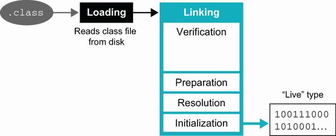
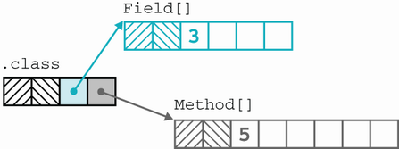
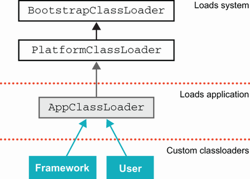
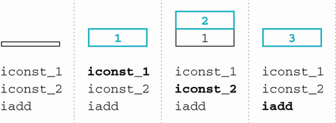

# 4. Class file và bytecode

> *The Well-Grounded Java Developer, Second Edition* — Chương 4
> Bản dịch tiếng Việt

**Chương này bao gồm:**

- Class loading
- Reflection
- Giải phẫu class file
- JVM bytecode và vì sao nó quan trọng

---

Một cách đã được kiểm chứng để trở thành lập trình viên Java vững nền tảng hơn là nâng cao hiểu biết của bạn về cách nền tảng vận hành. Làm quen với các tính năng cốt lõi như class loading và bản chất của JVM bytecode có thể giúp ích rất nhiều cho mục tiêu này.

Hãy xét các kịch bản sau mà một lập trình viên Java kỳ cựu có thể gặp: Tưởng tượng bạn có một ứng dụng dùng nhiều kỹ thuật dependency injection (DI) như Spring, và nó phát sinh vấn đề khi khởi động rồi thất bại với một thông báo lỗi khó hiểu. Nếu vấn đề không chỉ là lỗi cấu hình đơn giản, bạn có thể cần hiểu framework DI được hiện thực ra sao để truy vết vấn đề. Điều này nghĩa là hiểu về class loading.

Hoặc giả sử một nhà cung cấp mà bạn đang làm việc cùng phá sản. Bạn còn lại một bản mã đã biên dịch cuối cùng, không có mã nguồn, và tài liệu chắp vá. Làm sao bạn khám phá mã đã biên dịch và xem nó chứa gì?

Mọi ứng dụng, trừ những cái đơn giản nhất, đều có thể thất bại với `ClassNotFoundException` hoặc `NoClassDefFoundError`, nhưng nhiều lập trình viên không biết chúng là gì, khác nhau ra sao, hay thậm chí vì sao chúng xảy ra.

Chương này tập trung vào những khía cạnh của nền tảng nằm bên dưới các mối quan tâm đó. Chúng ta cũng sẽ thảo luận một số tính năng nâng cao hơn, nhưng chúng dành cho những ai thích đào sâu và có thể bỏ qua nếu bạn đang vội.

Chúng ta sẽ bắt đầu với tổng quan về class loading — quá trình mà JVM định vị và kích hoạt một kiểu mới để dùng trong chương trình đang chạy. Trung tâm của phần thảo luận đó là các đối tượng `Class` biểu diễn các kiểu trong JVM. Tiếp theo, chúng ta sẽ xem những khái niệm này xây dựng nên tính năng ngôn ngữ quan trọng gọi là *reflection* (hay Core Reflection) như thế nào.

Sau đó, chúng ta sẽ thảo luận các công cụ để khảo sát và mổ xẻ class file. Chúng ta sẽ dùng `javap`, vốn đi kèm JDK, làm công cụ tham chiếu. Sau bài học giải phẫu class file này, chúng ta sẽ chuyển sang bytecode. Chúng ta sẽ đề cập tới các họ opcode chính của JVM và xem runtime vận hành ở mức thấp ra sao.

Hãy bắt đầu bằng việc thảo luận class loading — quá trình mà các class mới được đưa vào một tiến trình JVM đang chạy. Trong mục này, trước tiên chúng ta sẽ thảo luận những điều cơ bản của class loading "cổ điển", như cách nó được thực hiện trong Java 8 và trước đó. Ở phần sau của chương, chúng ta sẽ nói về việc sự xuất hiện của JVM modular đưa vào một số thay đổi (nhỏ) đối với class loading như thế nào.

## 4.1 Class loading và các đối tượng Class

Một tệp `.class` định nghĩa một kiểu cho JVM, đầy đủ với field, method, thông tin kế thừa, annotation và metadata khác. Định dạng class file được các chuẩn mô tả kỹ, và bất kỳ ngôn ngữ nào muốn chạy trên JVM đều phải tuân thủ nó.

> **NOTE** Một class là đơn vị cơ bản của mã chương trình mà nền tảng Java sẽ hiểu, chấp nhận và thực thi.

Từ góc nhìn của lập trình viên Java mới bắt đầu, phần lớn cơ chế class loading bị ẩn khỏi tầm nhìn. Lập trình viên cung cấp hoặc một tệp JAR thực thi được hoặc tên của class ứng dụng chính (phải có mặt trên classpath), và JVM tìm rồi thực thi class đó.

Mọi phụ thuộc của ứng dụng (ví dụ, các thư viện ngoài JDK) cũng phải nằm trên classpath, và JVM cũng tìm và nạp chúng. Tuy nhiên, các đặc tả Java không nói việc này cần được thực hiện khi ứng dụng khởi động hay muộn hơn, khi cần.

> **NOTE** API mà hệ thống class loading của Java trình ra cho người dùng khá đơn giản — nhiều phần phức tạp bị ẩn đi một cách có chủ ý, và chúng ta sẽ thảo luận phần API khả dụng cho lập trình viên ở phần sau của chương.

Hãy bắt đầu với một ví dụ rất đơn giản:

```java
Class<?> clazz = Class.forName("MyClass");
```

Đoạn mã này sẽ nạp một class, `MyClass`, vào trạng thái thực thi hiện tại. Từ góc nhìn của JVM, để đạt được điều này, một số bước phải được thực hiện. Thứ nhất, một class file tương ứng với tên `MyClass` phải được tìm thấy, và sau đó class mà nó chứa phải được phân giải (resolve). Các bước này được thực hiện trong mã native — trong HotSpot, phương thức native được gọi là `JVM_DefineClass()`.

Quá trình thực tế, ở mức cao, là mã native dựng biểu diễn nội bộ của JVM (được gọi là *klass* và không phải là một đối tượng Java — chúng ta sẽ gặp nó đầy đủ ở chương 17). Sau đó, nếu klass có thể được trích xuất thành công từ class file, JVM dựng một "gương" (mirror) Java của klass, được trả về cho mã Java dưới dạng một đối tượng `Class`.

Sau đó, đối tượng `Class` biểu diễn kiểu này khả dụng với hệ thống đang chạy, và các thể hiện mới của nó có thể được tạo. Trong ví dụ trước, `clazz` rốt cuộc giữ đối tượng `Class` tương ứng với kiểu `MyClass`. Nó không thể giữ klass, bởi klass là một đối tượng nội bộ của JVM chứ không phải đối tượng Java.

> **NOTE** Cùng quy trình đó được dùng cho class ứng dụng chính, mọi phụ thuộc của nó, và mọi class khác có thể cần đến sau khi chương trình đã khởi động.

Trong mục này, chúng ta sẽ đề cập tới các bước từ góc nhìn của JVM chi tiết hơn một chút và giới thiệu về *class loader*, những đối tượng kiểm soát toàn bộ quá trình này.

### 4.1.1 Loading và linking

Một cách nhìn JVM là xem nó như một container thực thi. Theo góc nhìn này, mục đích của JVM là tiêu thụ class file và thực thi bytecode chúng chứa. Để đạt được điều đó, JVM phải lấy nội dung của class file dưới dạng một luồng byte, chuyển nó sang dạng dùng được, và thêm nó vào trạng thái đang chạy. Về cơ bản đây là quá trình chúng tôi đang mô tả ở đây.

Quá trình phần nào phức tạp này có thể được chia theo nhiều cách, nhưng chúng tôi gọi nó là *loading* và *linking*.

> **NOTE** Phần thảo luận của chúng tôi về loading và linking đề cập tới một số chi tiết đặc thù cho mã HotSpot, nhưng các bản hiện thực khác cũng nên làm những việc tương tự.

Bước đầu tiên là thu nhận luồng byte tạo nên class file. Quá trình này bắt đầu với một mảng byte thường được đọc từ hệ thống tệp (nhưng các lựa chọn khác chắc chắn khả thi).

Khi đã có luồng, nó phải được phân tích cú pháp để kiểm tra rằng nó chứa cấu trúc class file hợp lệ (điều này đôi khi được gọi là *format checking*). Nếu đúng vậy, một klass ứng viên được tạo. Trong pha này, khi klass ứng viên đang được điền vào, một số kiểm tra cơ bản được thực hiện (ví dụ, class đang được nạp có thực sự truy cập được superclass mà nó khai báo không? Nó có cố ghi đè phương thức `final` nào không?).

Tuy nhiên, ở cuối quá trình loading, cấu trúc dữ liệu tương ứng với class vẫn chưa dùng được bởi mã khác, và cụ thể, chúng ta chưa có một klass hoạt động đầy đủ.

Để đến được đó, class giờ phải được *link* rồi *initialize* trước khi có thể dùng. Về mặt logic, bước này chia thành ba pha con: *verification* (kiểm chứng), *preparation* (chuẩn bị) và *resolution* (phân giải). Tuy nhiên, trong một bản hiện thực thực tế, mã có thể không được tách bạch rõ ràng, nên nếu bạn định đọc mã nguồn, bạn nên biết rằng mô tả ở đây là mô tả ở mức cao hoặc mang tính khái niệm về quá trình và không có tương ứng chính xác với mã hiện thực thực tế.

Với điều này trong đầu, verification có thể hiểu là pha xác nhận rằng class tuân thủ các yêu cầu của đặc tả Java và sẽ không gây lỗi runtime hay vấn đề khác cho hệ thống đang chạy. Quan hệ này giữa các pha của linking có thể thấy trong hình 4.1.



**Hình 4.1** Loading và linking (với các pha con của linking)

Hãy gặp lần lượt từng pha.

**Verification**

Verification là một quá trình khá phức tạp, gồm nhiều mối quan tâm độc lập. Ví dụ, JVM cần kiểm tra rằng thông tin ký hiệu chứa trong constant pool (thảo luận chi tiết ở mục 4.3.3) là tự nhất quán và tuân theo các quy tắc hành vi cơ bản cho hằng.

Một mối quan tâm lớn khác, và có lẽ là phần phức tạp nhất của verification, là kiểm tra bytecode của các phương thức. Điều này bao gồm việc đảm bảo bytecode hành xử đúng mực và không cố lách các kiểm soát môi trường của JVM.

Một số kiểm tra chính được thực hiện như sau:

- Đảm bảo bytecode không cố thao tác stack theo những cách không được phép hoặc xấu xa.
- Đảm bảo mọi lệnh rẽ nhánh (ví dụ, từ một `if` hoặc một vòng lặp) đều có lệnh đích hợp lệ.
- Kiểm tra các phương thức được gọi với đúng số lượng tham số có kiểu tĩnh chính xác.
- Kiểm tra các biến cục bộ chỉ được gán giá trị có kiểu phù hợp.
- Kiểm tra mỗi exception có thể bị ném đều có handler `catch` hợp lệ.

Các kiểm tra này được thực hiện vì nhiều lý do, kể cả hiệu năng. Chúng cho phép bỏ qua các kiểm tra tại runtime, do đó khiến mã được thông dịch chạy nhanh hơn. Một số kiểm tra cũng có thể đơn giản hóa việc biên dịch bytecode thành mã máy tại runtime (biên dịch just-in-time, chúng ta sẽ đề cập ở chương 6).

**Preparation**

Chuẩn bị class bao gồm cấp phát bộ nhớ và đưa các biến tĩnh trong class vào trạng thái sẵn sàng được khởi tạo, nhưng nó không khởi tạo biến hay thực thi bất kỳ bytecode JVM nào.

**Resolution**

Resolution là phần của linking nơi JVM kiểm tra rằng supertype của class đang được link (và mọi interface mà nó hiện thực) đã được link, và nếu chưa, thì chúng sẽ được link trước khi việc link class này tiếp tục. Điều này có thể dẫn tới một quá trình linking đệ quy cho bất kỳ kiểu mới nào chưa từng gặp trước đó.

> **NOTE** Một cụm từ then chốt liên quan tới khía cạnh này của class loading là *bao đóng bắc cầu của các kiểu* (transitive closure of types). Không chỉ những kiểu mà một class kế thừa trực tiếp, mà cả mọi kiểu được tham chiếu gián tiếp đều phải được link.

Khi mọi kiểu bổ sung cần nạp đã được định vị và phân giải, JVM có thể khởi tạo class mà nó vốn được yêu cầu nạp ban đầu.

**Initialization**

Trong pha cuối cùng này, mọi biến tĩnh được khởi tạo và mọi khối khởi tạo tĩnh được chạy. Đây là điểm quan trọng bởi chỉ đến bây giờ JVM mới thực sự chạy bytecode từ class vừa được nạp.

Khi bước này hoàn tất, class đã được nạp đầy đủ và sẵn sàng hoạt động. Class khả dụng với runtime và các thể hiện mới của nó có thể được tạo. Bất kỳ thao tác class loading nào sau đó tham chiếu tới class này giờ sẽ thấy rằng nó đã được nạp và khả dụng.

### 4.1.2 Đối tượng Class

Kết quả cuối cùng của quá trình linking và loading là một đối tượng `Class`, biểu diễn kiểu vừa được nạp và link. Giờ nó hoạt động đầy đủ trong JVM, mặc dù vì lý do hiệu năng, một số khía cạnh của đối tượng `Class` chỉ được khởi tạo khi cần.

> **NOTE** Các đối tượng `Class` là những đối tượng Java thông thường. Chúng sống trong Java heap, giống mọi đối tượng khác.

Mã của bạn giờ có thể tiếp tục dùng kiểu mới và tạo các thể hiện mới. Ngoài ra, đối tượng `Class` của một kiểu cung cấp một số phương thức hữu ích, chẳng hạn `getSuperclass()`, trả về đối tượng `Class` tương ứng với supertype.

Các đối tượng `Class` có thể được dùng với Reflection API để truy cập gián tiếp tới method, field, constructor, v.v. Một đối tượng `Class` có tham chiếu tới các đối tượng `Method`, `Field` và nhiều đối tượng khác tương ứng với các thành viên của class. Những đối tượng này có thể được dùng trong Reflection API để cung cấp truy cập gián tiếp tới các khả năng của class, như ta sẽ thấy ở phần sau của chương này. Bạn có thể thấy cấu trúc mức cao của điều này trong hình 4.2.



**Hình 4.2** Đối tượng `Class` và các tham chiếu `Method`

Cho tới giờ, chúng ta chưa thảo luận chính xác phần nào của runtime chịu trách nhiệm định vị và link luồng byte sẽ trở thành class mới được nạp. Việc này được xử lý bởi *class loader* — các subclass của lớp trừu tượng `ClassLoader`, và đó là chủ đề tiếp theo của chúng ta.

## 4.2 Class loader

Java về cơ bản là một hệ thống hướng đối tượng với runtime động. Một khía cạnh của điều này là các kiểu của Java "sống" tại runtime, và hệ thống kiểu của một nền tảng Java đang chạy có thể được sửa đổi — cụ thể, bằng cách thêm các kiểu mới. Các kiểu tạo nên một chương trình Java mở cho việc mở rộng bởi những kiểu chưa biết tại runtime (trừ khi chúng là `final` hoặc là một trong những sealed class mới). Khả năng class loading được trình ra cho người dùng. Class loader chỉ là những class Java kế thừa `ClassLoader` — bản thân chúng là các kiểu Java.

> **NOTE** Trong các môi trường Java hiện đại, mọi class loader đều là modular. Việc nạp class luôn được thực hiện trong ngữ cảnh của một module.

Class `ClassLoader` có một số phương thức native, kể cả các khía cạnh loading và linking chịu trách nhiệm phân tích mức thấp class file, nhưng class loader của người dùng không thể ghi đè khía cạnh này của class loading. Không thể viết một class loader bằng mã native.

Nền tảng đi kèm các class loader điển hình sau, được dùng để làm những việc khác nhau trong quá trình khởi động và vận hành bình thường của nền tảng:

- **`BootstrapClassLoader`** (hay primordial class loader) — Được khởi tạo rất sớm trong quá trình khởi động JVM, nên thường tốt nhất là nghĩ về nó như một phần của chính JVM. Nó thường được dùng để nạp hệ thống cơ bản tuyệt đối — về cơ bản là `java.base`.
- **`PlatformClassLoader`** — Sau khi hệ thống tối thiểu được bootstrap, platform class loader nạp phần còn lại của các platform module mà ứng dụng phụ thuộc. Class loader này là giao diện chính để truy cập bất kỳ class nền tảng nào, bất kể nó thực sự được nạp bởi loader này hay bởi bootstrap. Nó là một thể hiện của một class nội bộ.
- **`AppClassLoader`** — Application class loader — đây là class loader được dùng rộng rãi nhất. Nó nạp các class ứng dụng và làm phần lớn công việc trong hầu hết môi trường Java hiện đại. Trong một JVM modular, application class loader không còn là thể hiện của `URLClassLoader` (như trong Java 8 và trước đó) mà thay vào đó là thể hiện của một class nội bộ.

Hãy xem các class loader mới này hoạt động, bằng cách thêm một chút mã vào đầu phương thức `main` trong `SiteCheck` từ module `wgjd.sitecheck` ở chương 2:

```java
...
var clThis = SiteCheck.class.getClassLoader();
System.out.println(clThis);
var clObj = Object.class.getClassLoader();
System.out.println(clObj);
var clHttp = HttpClient.class.getClassLoader();
System.out.println(clHttp);
....
```

Chúng ta biên dịch lại nó như sau:

```
$ javac -d out wgjd.sitecheck/module-info.java \
           wgjd.sitecheck/wgjd/sitecheck/*.java \
           wgjd.sitecheck/wgjd/sitecheck/*/*.java
```

và chạy nó như thế này:

```
$ java -cp out wgjd.sitecheck.SiteCheck http://github.com/well-grounded-java
```

Lưu ý việc dùng cú pháp "starting module" thay vì một class khởi đầu tường minh.

Lệnh này tạo ra kết quả sau:

```
jdk.internal.loader.ClassLoaders$AppClassLoader@277050dc
null
jdk.internal.loader.ClassLoaders$PlatformClassLoader@12bb4df8
http://github.com/well-grounded-java: HTTP_1_1
```

Class loader của `Object` (nằm trong `java.base`) báo cáo là `null`. Đây là một tính năng bảo mật — bootstrap class loader không thực hiện verification nào và cung cấp quyền truy cập bảo mật đầy đủ cho mọi class nó nạp. Vì lý do đó, việc có class loader này được biểu diễn và khả dụng bên trong Java runtime là vô nghĩa — quá nhiều tiềm năng cho lỗi hoặc lạm dụng.

Ngoài vai trò cốt lõi, class loader cũng thường được dùng để nạp *resource* (các tệp không phải class, chẳng hạn hình ảnh hay tệp cấu hình) từ tệp JAR hoặc các vị trí khác trên classpath. Điều này thường thấy trong một mẫu kết hợp với try-with-resources để tạo ra mã như sau:

```java
try (var is = TestMain.class.getResourceAsStream("/resource.csv");
     var br = new BufferedReader(new InputStreamReader(is));) {
     // ...
}
// Phần xử lý exception được lược bỏ
```

Class loader cung cấp cơ chế này ở vài dạng khác nhau, trả về hoặc một `URL` hoặc một `InputStream`.

### 4.2.1 Class loading tùy chỉnh

Các môi trường phức tạp hơn thường có một số class loader tùy chỉnh bổ sung — những class kế thừa `java.lang.ClassLoader` (trực tiếp hoặc gián tiếp). Điều này khả thi bởi class loader class không phải `final`, và thực tế lập trình viên được khuyến khích viết class loader riêng phù hợp với nhu cầu cá nhân.

Class loader tùy chỉnh được biểu diễn dưới dạng kiểu Java, nên chúng cần được nạp bởi một class loader, thường được gọi là *parent class loader* của chúng. Điều này không nên bị nhầm với kế thừa class và parent class. Thay vào đó, các class loader liên hệ với nhau qua một dạng ủy nhiệm (delegation).

Trong hình 4.3, bạn có thể thấy hệ thống phân cấp ủy nhiệm của class loader và cách các loader khác nhau liên hệ với nhau. Trong một số trường hợp đặc biệt, một class loader tùy chỉnh có thể có một class loader khác làm parent, nhưng trường hợp thông thường là loader đã nạp nó.



**Hình 4.3** Hệ thống phân cấp class loader

Chìa khóa của cơ chế tùy chỉnh nằm ở các phương thức `loadClass()` và `findClass()`, được định nghĩa trên `ClassLoader`. Điểm vào chính là `loadClass()` và dạng đơn giản hóa của mã liên quan trong `ClassLoader` như sau:

```java
protected Class<?> loadClass(String name, boolean resolve)
        throws ClassNotFoundException
    {
             synchronized (getClassLoadingLock(name)) {
                 // Đầu tiên, kiểm tra xem class đã được nạp chưa
                 Class<?> c = findLoadedClass(name);
                 if (c == null) {
                          // ...
                          try {
                              if (parent != null) {
                                   c = parent.loadClass(name, false);
                               } else {
                                   c = findBootstrapClassOrNull(name);
                              }
                          } catch (ClassNotFoundException e) {
                              // ClassNotFoundException được ném nếu class không
                              // tìm thấy từ parent class loader khác null
                          }

                          if (c == null) {
                               // Nếu vẫn không tìm thấy, gọi findClass để
                               // tìm class.
                               // ...
                               c = findClass(name);

                               // ...
                       }
                }
                // ...

                return c;
          }
     }
```

Về cơ bản, cơ chế `loadClass()` xem xét class đã được nạp chưa rồi hỏi parent class loader của nó. Nếu việc nạp class đó thất bại (lưu ý khối try-catch bao quanh lời gọi `parent.loadClass(name, false)`), thì quá trình nạp ủy nhiệm cho `findClass()`. Định nghĩa của `findClass()` trong `java.lang.ClassLoader` rất đơn giản — nó chỉ ném một `ClassNotFoundException`.

Đến đây, hãy quay lại một câu hỏi chúng tôi đặt ra ở đầu chương và khám phá một số kiểu exception và error có thể gặp trong quá trình class loading.

**Các exception khi class loading**

Ý nghĩa của `ClassNotFoundException` tương đối đơn giản: class loader đã cố nạp class được chỉ định nhưng không thể. Nghĩa là, class không được JVM biết đến tại thời điểm việc nạp được yêu cầu, và JVM không tìm được nó.

Tiếp theo là `NoClassDefFoundError`. Lưu ý rằng đây là một *error* chứ không phải exception. Error này chỉ ra rằng JVM *có* biết về sự tồn tại của class được yêu cầu nhưng không tìm thấy định nghĩa cho nó trong metadata nội bộ của mình. Hãy xem nhanh một ví dụ:

```java
public class ExampleNoClassDef {

      public static class BadInit {
          private static int thisIsFine = 1 / 0;
      }

      public static void main(String[] args) {
          try {
               var init = new BadInit();
           } catch (Throwable t) {
                 System.out.println(t);
           }
           var init2 = new BadInit();
           System.out.println(init2.thisIsFine);
      }
}
```

Khi chạy, chúng ta nhận kết quả như sau:

```
$ java ExampleNoClassDef
java.lang.ExceptionInInitializerError
Exception in thread "main" java.lang.NoClassDefFoundError: Could
  not initialize class ExampleNoClassDef$BadInit
    at ExampleNoClassDef.main(ExampleNoClassDef.java:13)
```

Điều này cho thấy JVM đã cố nạp class `BadInit` nhưng thất bại. Tuy vậy, chương trình bắt exception và cố tiếp tục. Tuy nhiên, khi class được gặp lần thứ hai, bảng metadata nội bộ của JVM cho thấy class đã từng được gặp nhưng một class hợp lệ đã không được nạp.

JVM về cơ bản hiện thực *negative caching* cho một lần thử nạp class thất bại — việc nạp không được thử lại, và thay vào đó một error (`NoClassDefFoundError`) được ném ra.

Một error phổ biến khác là `UnsupportedClassVersionError`, được kích hoạt khi một thao tác class loading cố nạp một class file được biên dịch bởi phiên bản trình biên dịch mã nguồn Java cao hơn phiên bản mà runtime hỗ trợ. Ví dụ, xét một class được biên dịch bằng Java 11 mà ta cố chạy trên Java 8, như sau:

```
$ java ScratchImpl
Error: A JNI error has occurred please check your installation and try again
Exception in thread "main" java.lang.UnsupportedClassVersionError:
  ScratchImpl has been compiled by a more recent version of the Java
    Runtime (class file version 55.0), this version of the Java Runtime
    only recognizes class file versions up to 52.0
     at java.lang.ClassLoader.defineClass1(Native Method)
     at java.lang.ClassLoader.defineClass(ClassLoader.java:763)
     at java.security.SecureClassLoader.defineClass(SecureClassLoader.java:142)
     at java.net.URLClassLoader.defineClass(URLClassLoader.java:468)
     at java.net.URLClassLoader.access$100(URLClassLoader.java:74)
     at java.net.URLClassLoader$1.run(URLClassLoader.java:369)
     at java.net.URLClassLoader$1.run(URLClassLoader.java:363)
     at java.security.AccessController.doPrivileged(Native Method)
     at java.net.URLClassLoader.findClass(URLClassLoader.java:362)
     at java.lang.ClassLoader.loadClass(ClassLoader.java:424)
     at sun.misc.Launcher$AppClassLoader.loadClass(Launcher.java:349)
     at java.lang.ClassLoader.loadClass(ClassLoader.java:357)
     at sun.launcher.LauncherHelper.checkAndLoadMain(LauncherHelper.java:495)
```

Bytecode định dạng Java 11 có thể chứa các tính năng không được runtime hỗ trợ, nên tiếp tục cố nạp nó là không an toàn. Lưu ý rằng bởi đây là runtime Java 8, nó không có các mục modular trong stack trace.

Cuối cùng, chúng ta cũng nên nhắc tới `LinkageError`, class cơ sở của một hệ phân cấp chứa `NoClassDefFoundError`, `VerifyError` và `UnsatisfiedLinkError`, cùng vài khả năng khác.

**Class loader tùy chỉnh đầu tiên**

Dạng đơn giản nhất của class loading tùy chỉnh chỉ đơn thuần là kế thừa `ClassLoader` và ghi đè `findClass()`. Điều này cho phép chúng ta tái sử dụng logic `loadClass()` đã thảo luận trước đó và giảm độ phức tạp trong class loader của mình.

Ví dụ đầu tiên của chúng ta là `SadClassLoader`, thể hiện trong đoạn mã tiếp theo. Nó thực ra không làm gì cả, nhưng nó đảm bảo rằng bạn biết về mặt kỹ thuật nó đã tham gia vào quá trình và nó chúc bạn mọi điều tốt lành:

```java
public class LoadSomeClasses {

      public static class SadClassloader extends ClassLoader {
          public SadClassloader() {
              super(SadClassloader.class.getClassLoader());
           }

           public Class<?> findClass(String name) throws
             ClassNotFoundException {
               System.out.println("I am very concerned that I
                 couldn't find the class");
               throw new ClassNotFoundException(name);
           }
      }

      public static void main(String[] args) {
          if (args.length > 0) {
              var loader = new SadClassloader();
                 for (var name : args) {
                     System.out.println(name +" ::");
                     try {
                         var clazz = loader.loadClass(name);
                         System.out.println(clazz);
                     } catch (ClassNotFoundException x) {
                         x.printStackTrace();
                        }
                 }
           }
      }
}
```

Trong ví dụ này, chúng ta thiết lập một class loader rất đơn giản và một chút mã dùng nó để cố nạp các class có thể đã hoặc chưa được nạp.

> **NOTE** Một quy ước phổ biến cho class loader tùy chỉnh là cung cấp một constructor không tham số gọi constructor của superclass và cung cấp loader đã nạp nó làm đối số (để trở thành parent).

Nhiều class loader tùy chỉnh không phức tạp hơn ví dụ của chúng ta là bao — chúng chỉ ghi đè `findClass()` để cung cấp khả năng cụ thể cần thiết. Điều này có thể bao gồm, chẳng hạn, tìm class qua mạng. Trong một trường hợp đáng nhớ, một class loader tùy chỉnh nạp class bằng cách kết nối tới cơ sở dữ liệu qua JDBC và truy cập một cột nhị phân được mã hóa để lấy các byte cần dùng. Việc này nhằm thỏa mãn yêu cầu mã hóa dữ liệu tại chỗ (encryption-at-rest) cho mã rất nhạy cảm trong một môi trường bị quản lý chặt.

Tuy nhiên, có thể làm nhiều hơn là chỉ ghi đè `findClass()`. Ví dụ, `loadClass()` không phải `final` nên có thể được ghi đè, và thực tế một số class loader tùy chỉnh có ghi đè nó chính xác để thay đổi logic tổng quát mà ta đã gặp.

Cuối cùng, chúng ta cũng có phương thức `defineClass()` được định nghĩa trên `ClassLoader`. Phương thức này là chìa khóa của class loading bởi nó là phương thức người dùng truy cập được, thực hiện quá trình "loading và linking" đã mô tả ở đầu chương. Nó nhận một mảng byte và biến chúng thành một đối tượng class. Đây là cơ chế chính được dùng để nạp các class mới tại runtime vốn không có mặt trên classpath.

Lời gọi `defineClass()` sẽ chỉ hoạt động nếu nó được truyền một buffer byte đúng định dạng class file của JVM. Nếu không, việc nạp sẽ thất bại vì hoặc bước loading hoặc bước verification sẽ thất bại.

> **NOTE** Phương thức này có thể được dùng cho các kỹ thuật nâng cao như nạp các class được sinh ra tại runtime và không có biểu diễn mã nguồn. Kỹ thuật này là cách cơ chế biểu thức lambda hoạt động trong Java. Chúng ta sẽ nói thêm về chủ đề này ở chương 17.

Phương thức `defineClass()` vừa `protected` vừa `final` và được định nghĩa trên `java.lang.ClassLoader`, nên nó chỉ có thể được truy cập bởi các subclass của `ClassLoader`. Do đó, class loader tùy chỉnh luôn có quyền truy cập chức năng cơ bản của `defineClass()` nhưng không thể can thiệp vào verification hay logic class loading mức thấp khác. Điểm cuối này quan trọng: việc không thể thay đổi thuật toán verification là một tính năng an toàn rất hữu ích — một class loader tùy chỉnh viết kém không thể làm tổn hại bảo mật nền tảng cơ bản mà JVM cung cấp.

Trong trường hợp máy ảo HotSpot (bản hiện thực JVM phổ biến nhất cho đến nay), `defineClass()` ủy nhiệm cho phương thức native `defineClass1()`, thực hiện một số kiểm tra cơ bản rồi gọi một hàm C tên là `JVM_DefineClassWithSource()`.

Hàm này là một điểm vào JVM, và nó cung cấp lối vào mã C của HotSpot. HotSpot dùng C `SystemDictionary` để nạp class mới qua phương thức C++ `ClassFileParser::parseClassFile()`. Mã này thực sự chạy phần lớn quá trình linking, đặc biệt là thuật toán verification.

Khi class loading hoàn tất, bytecode của các phương thức được đặt vào các đối tượng metadata của HotSpot đại diện cho các phương thức đó (chúng được gọi là *methodOops*). Rồi chúng khả dụng cho trình thông dịch bytecode sử dụng. Về mặt khái niệm, điều này có thể được nghĩ như một cache phương thức, mặc dù bytecode thực sự được các methodOops giữ vì lý do hiệu năng.

Chúng ta đã gặp `SadClassloader`. Giờ hãy xem thêm vài ví dụ về class loader tùy chỉnh, bắt đầu bằng việc xem class loading có thể được dùng để hiện thực dependency injection ra sao.

**Ví dụ: Một framework dependency injection**

Chúng tôi muốn nhấn mạnh hai khái niệm chính sau, rất liên quan tới DI:

- Các đơn vị chức năng trong một hệ thống có những phụ thuộc và thông tin cấu hình mà chúng dựa vào để hoạt động đúng.
- Nhiều hệ thống đối tượng có những phụ thuộc khó hoặc vụng về khi diễn đạt trong mã.

Bức tranh bạn nên có là các class chứa hành vi, cùng cấu hình và phụ thuộc nằm bên ngoài các đối tượng. Phần sau này là thứ thường được gọi là *runtime wiring* (đấu nối tại thời điểm chạy) của các đối tượng. Trong ví dụ này, chúng ta sẽ thảo luận cách một framework DI giả định có thể dùng class loader để hiện thực runtime wiring.

> **NOTE** Cách tiếp cận chúng tôi dùng giống một phiên bản đơn giản hóa của bản hiện thực gốc của framework Spring. Tuy nhiên, các framework DI hiện đại trong production có độ phức tạp cao hơn đáng kể. Ví dụ của chúng tôi chỉ nhằm mục đích minh họa.

Hãy bắt đầu bằng việc xem chúng ta khởi động một ứng dụng dưới framework DI tưởng tượng của mình thế nào, như sau:

```
java -cp <CLASSPATH> org.wgjd.DIMain /path/to/config.xml
```

Class `DIMain` là class điểm vào cho framework DI. Nó sẽ đọc tệp cấu hình, tạo hệ thống các đối tượng, và liên kết chúng lại với nhau ("đấu nối" chúng). Lưu ý rằng class `DIMain` không phải class ứng dụng — nó đến từ framework và hoàn toàn tổng quát.

Chúng ta cũng thấy `CLASSPATH` cho ứng dụng phải chứa ba thứ: a) các tệp JAR cho framework DI, b) các class ứng dụng được nhắc tới trong tệp `config.xml`, và c) mọi phụ thuộc khác (không phải DI) mà ứng dụng có. Hãy xem một tệp cấu hình ví dụ, như sau:

```xml
<beans>

 <bean id="dao" class="app.ch04.PaymentsDAO">
  <constructor-arg index="0" value="jdbc:postgresql://db.wgjd.org/payments"/>
  <constructor-arg index="1" value="org.postgresql.Driver"/>
 </bean>

  <bean id="service" class="app.ch04.PaymentService">
    <constructor-arg index="0" ref="dao"/>
  </bean>

</beans>
```

Framework DI dùng tệp cấu hình để xác định cần dựng những đối tượng nào. Ví dụ này cần tạo các bean `dao` và `service`, và framework sẽ cần gọi constructor cho mỗi bean, với các đối số được chỉ định.

Class loading diễn ra ở hai pha riêng biệt. Pha đầu tiên (do application class loader xử lý) nạp class `DIMain` và mọi class framework mà nó tham chiếu. Rồi `DIMain` bắt đầu chạy và nhận vị trí của tệp cấu hình như một tham số của `main()`.

Tại thời điểm này, framework đã lên và chạy trong JVM, nhưng các class người dùng được chỉ định trong `config.xml` vẫn chưa được đụng tới. Thực tế, cho tới khi `DIMain` khảo sát tệp cấu hình, framework không có cách nào biết cần nạp những class nào.

Để dựng lên cấu hình ứng dụng được chỉ định trong `config.xml`, cần một pha class loading thứ hai. Trong ví dụ của chúng ta, pha này dùng một class loader tùy chỉnh.

Đầu tiên, tệp `config.xml` được kiểm tra tính nhất quán và đảm bảo không có lỗi. Rồi, nếu mọi thứ ổn, class loader tùy chỉnh cố nạp các kiểu từ `CLASSPATH`. Nếu bất kỳ cái nào thất bại, toàn bộ quá trình bị hủy, gây ra lỗi runtime.

Nếu thành công, framework DI có thể tiếp tục khởi tạo các đối tượng cần thiết theo đúng thứ tự (với các tham số constructor của chúng). Cuối cùng, nếu tất cả hoàn tất đúng, application context đã sẵn sàng và có thể bắt đầu chạy.

Đáng nhắc lại rằng ví dụ này là giả định và mang tính minh họa. Hoàn toàn có thể xây dựng một framework DI đơn giản hoạt động theo cách được mô tả ở đây. Tuy nhiên, bản hiện thực thực tế của các hệ thống DI thật phức tạp hơn nhiều trên thực tế. Hãy chuyển sang xem một ví dụ khác.

**Ví dụ: Một instrumenting class loader**

Hãy xét một class loader thay đổi bytecode của các class để thêm thông tin instrumentation bổ sung khi chúng được nạp. Khi các test case được chạy trên mã đã biến đổi, mã instrumentation ghi lại những phương thức và nhánh mã nào thực sự được các test case kiểm thử. Từ đó, lập trình viên có thể thấy các unit test cho một class kỹ lưỡng đến đâu.

Cách tiếp cận này là nền tảng của công cụ đo độ phủ kiểm thử EMMA, vẫn còn có sẵn tại http://emma.sourceforge.net/, mặc dù giờ nó khá lỗi thời và không được cập nhật cho các phiên bản Java hiện đại. Bất chấp điều đó, khá thường gặp các framework và mã khác dùng class loader chuyên biệt biến đổi bytecode khi nó được nạp.

> **NOTE** Kỹ thuật sửa đổi bytecode khi nó được nạp cũng thấy trong cách tiếp cận *java agent*, được dùng cho giám sát hiệu năng, observability và các mục tiêu khác bởi các công cụ như New Relic.

Chúng ta đã lướt qua vài trường hợp sử dụng của class loading tùy chỉnh. Nhiều mảng khác của không gian công nghệ Java cũng là những người dùng lớn của class loader và các kỹ thuật liên quan. Một số ví dụ nổi tiếng nhất như sau:

- Kiến trúc plugin
- Framework (dù của nhà cung cấp hay tự phát triển)
- Lấy class file từ những vị trí bất thường (không phải hệ thống tệp hay URL)
- Java EE
- Bất kỳ hoàn cảnh nào mà mã mới, chưa biết có thể cần được thêm vào sau khi tiến trình JVM đã bắt đầu chạy

Hãy chuyển sang thảo luận cách hệ thống module ảnh hưởng tới class loading và sửa đổi bức tranh cổ điển mà chúng ta vừa giải thích.

### 4.2.2 Module và class loading

Hệ thống module được thiết kế để vận hành ở một mức khác với class loading, vốn là cơ chế tương đối mức thấp trong nền tảng. Module nói về các phụ thuộc quy mô lớn giữa các đơn vị chương trình, còn class loading nói về quy mô nhỏ. Tuy nhiên, quan trọng là hiểu hai cơ chế giao nhau ra sao và những thay đổi đối với việc khởi động chương trình do sự xuất hiện của module gây ra.

Nhớ lại rằng khi chạy trên một JVM modular, để thực thi một chương trình, runtime sẽ tính toán một module graph và cố thỏa mãn nó như bước đầu tiên. Điều này được gọi là *module resolution*, và nó dẫn xuất bao đóng bắc cầu của module gốc và các phụ thuộc của nó.

Trong quá trình này, các kiểm tra bổ sung được thực hiện (ví dụ, không có module trùng tên, không có split package). Sự tồn tại của module graph nghĩa là ít vấn đề class-loading tại runtime hơn được kỳ vọng, bởi các JAR thiếu trên module path giờ có thể được phát hiện trước khi tiến trình thậm chí khởi động đầy đủ.

Ngoài điều này ra, hệ thống module không thay đổi class loading nhiều trong hầu hết trường hợp. Có một số khả năng nâng cao (chẳng hạn nạp động các bản hiện thực modular của service provider interface bằng reflection), nhưng những cái đó khó có khả năng được hầu hết lập trình viên gặp thường xuyên.

## 4.3 Khảo sát class file

Class file là các khối nhị phân, nên chúng không dễ làm việc trực tiếp. Nhưng có nhiều hoàn cảnh mà bạn sẽ thấy việc điều tra một class file là cần thiết.

Tưởng tượng ứng dụng của bạn cần thêm một số phương thức được đặt là public để cho phép giám sát runtime tốt hơn (chẳng hạn qua JMX). Việc biên dịch lại và triển khai lại có vẻ hoàn tất suôn sẻ, nhưng khi kiểm tra management API, các phương thức lại không có ở đó. Các bước build lại và triển khai lại bổ sung không có tác dụng.

Để debug vấn đề triển khai này, bạn có thể cần kiểm tra rằng `javac` đã tạo ra class file mà bạn nghĩ là nó tạo ra. Hoặc bạn có thể cần điều tra một class mà bạn không có mã nguồn và nơi bạn nghi ngờ tài liệu là sai.

Với những nhiệm vụ này và tương tự, bạn phải dùng các công cụ để khảo sát nội dung của class file. May mắn thay, JVM tiêu chuẩn của Oracle đi kèm một công cụ gọi là `javap`, rất tiện để nhìn vào bên trong và dịch ngược (disassemble) class file.

Chúng ta sẽ bắt đầu bằng việc giới thiệu `javap` và một số switch cơ bản mà nó cung cấp để khảo sát các khía cạnh của class file. Rồi chúng ta sẽ thảo luận một số biểu diễn cho tên phương thức và kiểu mà JVM dùng nội bộ. Chúng ta sẽ chuyển sang xem *constant pool* — "hộp đồ hữu ích" của JVM — đóng vai trò quan trọng trong việc hiểu bytecode hoạt động ra sao.

### 4.3.1 Giới thiệu `javap`

Từ việc xem một class khai báo những phương thức nào cho tới việc in ra bytecode, `javap` có thể được dùng cho vô số nhiệm vụ hữu ích. Hãy khảo sát dạng dùng `javap` đơn giản nhất, áp dụng cho ví dụ class-loading ở đầu chương:

```
$ javap LoadSomeClasses.class
Compiled from "LoadSomeClasses.java"
public class LoadSomeClasses {
  public LoadSomeClasses();
  public static void main(java.lang.String[]);
}
```

Inner class đã được biên dịch ra thành một class riêng, nên chúng ta cũng cần xem class đó:

```
$ javap LoadSomeClasses\$SadClassloader.class
Compiled from "LoadSomeClasses.java"
public class LoadSomeClasses$SadClassloader extends java.lang.ClassLoader {
  public LoadSomeClasses$SadClassloader();
  public java.lang.Class<?> findClass(java.lang.String) throws
    java.lang.ClassNotFoundException;
}
```

Theo mặc định, `javap` hiển thị các phương thức có mức hiển thị public, protected và default (package-protected). Switch `-p` cũng hiển thị các phương thức và field private.

### 4.3.2 Dạng nội bộ cho chữ ký phương thức

JVM dùng một dạng hơi khác cho chữ ký phương thức trong nội bộ so với dạng con người đọc được mà `javap` hiển thị. Khi chúng ta đào sâu hơn vào JVM, bạn sẽ thấy những tên nội bộ này thường xuyên hơn. Nếu bạn muốn tiếp tục, bạn có thể nhảy tới trước, nhưng hãy nhớ rằng mục này ở đây — bạn có thể cần tham chiếu tới nó từ các mục và chương sau.

Ở dạng rút gọn, tên kiểu được nén lại. Ví dụ, `int` được biểu diễn bằng `I`. Các dạng rút gọn này đôi khi được gọi là *type descriptor*. Danh sách đầy đủ được cung cấp trong bảng 4.1 (và bao gồm `void`, không phải một kiểu nhưng có xuất hiện trong chữ ký phương thức).

**Bảng 4.1 Type descriptor**

| Descriptor | Kiểu |
| --- | --- |
| `B` | Byte |
| `C` | Char (một ký tự Unicode 16-bit) |
| `D` | Double |
| `F` | Float |
| `I` | Int |
| `J` | Long |
| `L<tên kiểu>;` | Kiểu tham chiếu (chẳng hạn `Ljava/lang/String;` cho một string) |
| `S` | Short |
| `V` | Void |
| `Z` | Boolean |
| `[` | Mảng của (Array-of) |

Trong một số trường hợp, type descriptor có thể dài hơn tên kiểu xuất hiện trong mã nguồn (ví dụ, `Ljava/lang/Object;` dài hơn `Object`), nhưng type descriptor luôn được định danh đầy đủ (fully qualified) nên chúng có thể được phân giải trực tiếp.

`javap` cung cấp một switch hữu ích, `-s`, sẽ xuất ra type descriptor của các chữ ký cho bạn, để bạn không phải tự tra bảng. Bạn có thể dùng một lời gọi `javap` nâng cao hơn chút để hiển thị chữ ký cho một số phương thức đã xem trước đó, như sau:

```
$ javap -s LoadSomeClasses.class
Compiled from "LoadSomeClasses.java"
public class LoadSomeClasses {
  public LoadSomeClasses();
    descriptor: ()V

   public static void main(java.lang.String[]);
        descriptor: ([Ljava/lang/String;)V
   }
```

và cho inner class:

```
$ javap -s LoadSomeClasses\$SadClassloader.class
Compiled from "LoadSomeClasses.java"
public class LoadSomeClasses$SadClassloader extends java.lang.ClassLoader {
  public LoadSomeClasses$SadClassloader();
    descriptor: ()V

    public java.lang.Class<?> findClass(java.lang.String) throws
      java.lang.ClassNotFoundException;
      descriptor: (Ljava/lang/String;)Ljava/lang/Class;
}
```

Như bạn thấy, mỗi kiểu trong một chữ ký phương thức được biểu diễn bằng một type descriptor.

Ở mục tiếp theo, chúng ta sẽ thấy một cách dùng khác của type descriptor. Đó là trong một phần rất quan trọng của class file — constant pool.

### 4.3.3 Constant pool

Constant pool là một vùng cung cấp những lối tắt tiện lợi tới các phần tử (hằng) khác của class file. Nếu bạn đã nghiên cứu các ngôn ngữ như C hay Perl, vốn dùng bảng ký hiệu (symbol table) một cách tường minh, bạn có thể nghĩ về constant pool như một khái niệm JVM phần nào tương tự.

Hãy dùng một ví dụ rất đơn giản trong listing tiếp theo để minh họa constant pool, để chúng ta không bị ngập trong chi tiết. Listing tiếp theo cho thấy một class "sân chơi" (playpen) hay "nháp" (scratchpad) đơn giản. Nó cung cấp cách nhanh chóng thử nghiệm một tính năng cú pháp Java hoặc thư viện, bằng cách viết một lượng nhỏ mã trong `run()`.

**Listing 4.1 Class playpen mẫu**

```java
package wgjd.ch04;

public class ScratchImpl {

     private static ScratchImpl inst = null;

     private ScratchImpl() {

     }

     private void run() {
     }

     public static void main(String[] args) {
         inst = new ScratchImpl();
         inst.run();
     }
}
```

Để xem thông tin trong constant pool, bạn có thể dùng `javap -v`. Lệnh này in ra rất nhiều thông tin bổ sung — nhiều hơn hẳn chỉ constant pool — nhưng hãy tập trung vào các mục constant pool cho playpen, như sau:

```
#1 = Class #2 // wgjd/ch04/ScratchImpl

#2 = Utf8 wgjd/ch04/ScratchImpl

#3 = Class #4 // java/lang/Object

#4 = Utf8 java/lang/Object

#5 = Utf8 inst

#6 = Utf8 Lwgjd/ch04/ScratchImpl;

#7 = Utf8 <clinit>

#8 = Utf8 ()V

#9 = Utf8 Code

#10 = Fieldref #1.#11 // wgjd/ch04/ScratchImpl.inst:Lwgjd/ch04/ScratchImpl;

#11 = NameAndType #5:#6 // instance:Lwgjd/ch04/ScratchImpl;

#12 = Utf8 LineNumberTable

#13 = Utf8 LocalVariableTable

#14 = Utf8 <init>

#15 = Methodref #3.#16 // java/lang/Object."<init>":()V

#16 = NameAndType #14:#8 // "<init>":()V

#17 = Utf8 this

#18 = Utf8 run

#19 = Utf8 ([Ljava/lang/String;)V

#20 = Methodref #1.#21 // wgjd/ch04/ScratchImpl.run:()V

#21 = NameAndType #18:#8 // run:()V

#22 = Utf8 args

#23 = Utf8 [Ljava/lang/String;

#24 = Utf8 main

#25 = Methodref #1.#16 // wgjd/ch04/ScratchImpl."<init>":()V

#26 = Methodref #1.#27 // wgjd/ch04/ScratchImpl.run:([Ljava/lang/String;)V

#27 = NameAndType #18:#19 // run:([Ljava/lang/String;)V

#28 = Utf8 SourceFile

#29 = Utf8 ScratchImpl.java
```

Như bạn thấy, các mục constant pool đều có kiểu. Chúng cũng tham chiếu lẫn nhau, nên ví dụ, một mục kiểu `Class` sẽ tham chiếu tới một mục kiểu `Utf8`. Một mục `Utf8` nghĩa là một chuỗi, nên mục `Utf8` mà một mục `Class` chỉ tới sẽ là tên của class.

Bảng 4.2 cho thấy tập các khả năng cho mục trong constant pool. Các mục từ constant pool đôi khi được thảo luận với tiền tố `CONSTANT_`, chẳng hạn `CONSTANT_Class`. Điều này để làm rõ rằng chúng không phải kiểu Java, trong những tình huống chúng có thể bị nhầm lẫn.

**Bảng 4.2 Các mục constant pool**

| Tên | Mô tả |
| --- | --- |
| `Class` | Một hằng class. Trỏ tới tên của class (dưới dạng một mục `Utf8`). |
| `Fieldref` | Định nghĩa một field. Trỏ tới `Class` và `NameAndType` của field này. |
| `Methodref` | Định nghĩa một phương thức. Trỏ tới `Class` và `NameAndType` của nó. |
| `InterfaceMethodref` | Định nghĩa một phương thức interface. Trỏ tới `Class` và `NameAndType` của nó. |
| `String` | Một hằng string. Trỏ tới mục `Utf8` giữ các ký tự. |
| `Integer` | Một hằng số nguyên (4 byte). |
| `Float` | Một hằng dấu phẩy động (4 byte). |
| `Long` | Một hằng long (8 byte). |
| `Double` | Một hằng dấu phẩy động độ chính xác kép (8 byte). |
| `NameAndType` | Mô tả một cặp tên và kiểu. Phần kiểu trỏ tới `Utf8` giữ type descriptor cho kiểu đó. |
| `Utf8` | Một luồng byte biểu diễn các ký tự mã hóa `Utf8`. |
| `InvokeDynamic` | Một phần của cơ chế `invokedynamic` — xem chương 17. |
| `MethodHandle` | Một phần của cơ chế `invokedynamic` — xem chương 17. |
| `MethodType` | Một phần của cơ chế `invokedynamic` — xem chương 17. |

Dùng bảng này, bạn có thể xem một ví dụ phân giải hằng từ constant pool của playpen. Xét `Fieldref` ở mục #10. Để phân giải một field, bạn cần một tên, một kiểu, và một class nơi nó cư trú: #10 có giá trị #1.#11, nghĩa là hằng #11 từ class #1. Dễ kiểm tra rằng #1 quả thực là một hằng kiểu `Class`, và #11 là một `NameAndType`. #1 tham chiếu tới chính class Java `ScratchImpl`, và #11 tham chiếu tới #5:#6 — một biến tên `inst` kiểu `ScratchImpl`. Vậy nên tổng thể, #10 tham chiếu tới biến tĩnh `inst` trong chính class `ScratchImpl` (điều bạn có lẽ đã đoán được từ kết quả ở trên).

Trong bước verification của class loading, có một bước kiểm tra rằng thông tin tĩnh trong class file là nhất quán. Ví dụ trên cho thấy loại kiểm tra tính toàn vẹn mà runtime sẽ thực hiện khi nạp một class mới.

Chúng ta đã thảo luận một số giải phẫu cơ bản của class file. Hãy chuyển sang chủ đề tiếp theo, nơi ta sẽ đào sâu vào thế giới bytecode. Hiểu cách mã nguồn được biến thành bytecode sẽ giúp bạn hiểu rõ hơn mã của bạn sẽ chạy ra sao. Đến lượt nó, điều này sẽ dẫn tới nhiều hiểu biết hơn về khả năng của nền tảng khi chúng ta đến chương 6 và xa hơn.

## 4.4 Bytecode

Bytecode cho tới giờ là một nhân vật phần nào ở hậu trường trong phần thảo luận của chúng ta. Hãy bắt đầu bằng việc xem lại những gì ta đã biết về nó:

- Bytecode là biểu diễn trung gian của một chương trình, nằm giữa mã nguồn con người đọc được và mã máy.
- Bytecode được `javac` tạo ra từ các tệp mã nguồn Java.
- Một số tính năng ngôn ngữ mức cao đã được biên dịch loại bỏ và không xuất hiện trong bytecode. Ví dụ, các cấu trúc lặp của Java (`for`, `while`, và tương tự) đã biến mất, được biến thành các lệnh rẽ nhánh bytecode.
- Mỗi opcode được biểu diễn bằng một byte duy nhất (do đó có tên *bytecode*).
- Bytecode là một biểu diễn trừu tượng, không phải "mã máy cho một CPU tưởng tượng".
- Bytecode có thể được biên dịch tiếp thành mã máy, thường là "just in time".

Khi giải thích bytecode, có thể xuất hiện một chút vấn đề "con gà và quả trứng". Để hiểu đầy đủ chuyện gì đang xảy ra, bạn cần hiểu cả bytecode lẫn môi trường runtime mà nó thực thi trong đó. Đây là một phụ thuộc khá vòng, nên để giải quyết, chúng ta sẽ bắt đầu bằng cách nhảy vào xem một ví dụ tương đối đơn giản. Ngay cả khi bạn không hiểu mọi thứ trong ví dụ này ở lần đọc đầu, bạn có thể quay lại sau khi đã đọc thêm về bytecode ở các mục sau.

Sau ví dụ, chúng ta sẽ cung cấp bối cảnh về môi trường runtime, rồi liệt kê các opcode của JVM, bao gồm bytecode cho số học, gọi phương thức, các dạng rút gọn, v.v. Cuối cùng, chúng ta sẽ kết thúc bằng một ví dụ khác, dựa trên nối chuỗi. Hãy bắt đầu bằng việc xem cách bạn có thể khảo sát bytecode từ một tệp `.class`.

### 4.4.1 Dịch ngược một class

Dùng `javap` với switch `-c`, bạn có thể dịch ngược (disassemble) các class. Trong ví dụ của chúng ta, chúng ta sẽ dùng class `ScratchImpl` đã gặp trước đó. Trọng tâm chính sẽ là khảo sát bytecode tạo nên các phương thức. Chúng ta cũng sẽ dùng switch `-p` để thấy được bytecode từ các phương thức private.

Hãy làm từng phần một — có rất nhiều thông tin trong mỗi phần kết quả của `javap`, và rất dễ bị choáng ngợp. Đầu tiên là phần header. Không có gì quá bất ngờ hay thú vị ở đây, như dưới đây:

```
$ javap -c -p wgjd/ch04/ScratchImpl.class

Compiled from "ScratchImpl.java"

public class wgjd.ch04.ScratchImpl extends java.lang.Object {
  private static wgjd.ch04.ScratchImpl inst;
```

Tiếp theo là khối tĩnh. Đây là nơi việc khởi tạo biến được đặt, nên đoạn này biểu diễn việc khởi tạo `inst` thành `null`. Độc giả tinh mắt có thể đoán rằng `putstatic` có thể là một bytecode đặt một giá trị vào một field tĩnh:

```
static {};

Code:
  0: aconst_null
  1: putstatic #10 // Field inst:Lwgjd/ch04/ScratchImpl;
  4: return
```

Các con số trong đoạn mã trên biểu diễn offset vào luồng bytecode tính từ đầu phương thức. Vậy byte 1 là opcode `putstatic`, và byte 2 và 3 biểu diễn một chỉ mục 16-bit vào constant pool. Trong trường hợp này, chỉ mục 16-bit là giá trị 10, nghĩa là giá trị (ở đây là `null`) sẽ được lưu vào field được chỉ ra bởi mục constant pool #10. Byte 4 tính từ đầu luồng bytecode là opcode `return` — kết thúc khối mã.

Tiếp theo là constructor:

```
private wgjd.ch04.ScratchImpl();

Code:
   0: aload_0
   1: invokespecial #15 // Method java/lang/Object."<init>":()V
   4: return
```

Nhớ rằng trong Java, constructor void sẽ luôn ngầm gọi constructor của superclass. Ở đây bạn có thể thấy điều này trong bytecode — đó là lệnh `invokespecial`. Nói chung, mọi lời gọi phương thức sẽ được biến thành một trong năm lệnh `invoke` của JVM, mà chúng ta sẽ gặp ở mục 4.4.7.

Lời gọi constructor cần một đích, được cung cấp bởi lệnh `aload_0`. Lệnh này nạp một tham chiếu (một Address) và dùng dạng rút gọn (chúng ta sẽ gặp đầy đủ ở mục 4.4.9) để nạp biến cục bộ thứ 0, chính là `this`, đối tượng hiện tại.

Về cơ bản không có mã nào trong phương thức `run()`, bởi đây chỉ là một class scratchpad để thử nghiệm mã. Phương thức này trả về ngay cho caller và không truyền lại giá trị nào (điều này đúng, bởi phương thức trả về `void`):

```
private void run();

Code:
   0: return
```

Trong phương thức `main`, chúng ta khởi tạo `inst` và làm một chút việc tạo đối tượng. Điều này minh họa một số mẫu bytecode cơ bản rất phổ biến mà chúng ta có thể học cách nhận diện:

```
public static void main(java.lang.String[]);

Code:
  0: new #1 // class wgjd/ch04/ScratchImpl
   3: dup
   4: invokespecial #21 // Method "<init>":()V
```

Mẫu ba lệnh bytecode này — `new`, `dup`, và `invokespecial` của một phương thức tên `<init>` — luôn biểu diễn việc tạo một thể hiện mới.

Opcode `new` cấp phát bộ nhớ cho một thể hiện mới và đặt một tham chiếu tới nó lên đỉnh stack. Opcode `dup` nhân đôi tham chiếu đang ở đỉnh stack (nên giờ có hai bản sao). Để hoàn tất việc tạo đối tượng đầy đủ, chúng ta cần gọi thân constructor. Phương thức `<init>` chứa mã cho thân constructor, nên chúng ta gọi khối mã đó bằng `invokespecial`.

Khi các phương thức được gọi, tham chiếu tới đối tượng nhận (nếu có) được tiêu thụ từ stack, cùng với mọi đối số của phương thức. Đây là lý do chúng ta cần thực hiện `dup` trước — nếu không, đối tượng vừa cấp phát sẽ bị tiêu thụ mất tham chiếu duy nhất bởi lệnh `invoke` và sẽ không truy cập được sau điểm này.

Hãy xem các bytecode còn lại cho phương thức `main`:

```
  7: putstatic #10 // Field inst:Lwgjd/ch04/ScratchImpl;
 10: getstatic #10 // Field inst:Lwgjd/ch04/ScratchImpl;
 13: invokevirtual #22 // Method run:()V
 16: return
```

Lệnh 7 lưu địa chỉ của thể hiện singleton vừa được tạo. Lệnh 10 đặt nó trở lại đỉnh stack, để lệnh 13 có thể gọi một phương thức trên nó. Việc này được thực hiện bằng opcode `invokevirtual`, thực hiện cơ chế điều phối (dispatch) "tiêu chuẩn" của Java cho các phương thức instance.

> **NOTE** Nói chung, bytecode do `javac` tạo ra là một biểu diễn đơn giản — nó không được tối ưu cao. Chiến lược tổng thể là các trình biên dịch just-in-time (JIT) làm rất nhiều việc tối ưu, nên sẽ hữu ích nếu chúng có một điểm khởi đầu tương đối trơn và đơn giản. Câu nói "Bytecode should be dumb" mô tả cảm nhận chung của những người hiện thực JVM đối với bytecode được sinh ra từ các ngôn ngữ nguồn.

Opcode `invokevirtual` bao gồm việc kiểm tra các phép ghi đè phương thức trong hệ phân cấp kế thừa của đối tượng. Bạn có thể nhận thấy điều này hơi lạ, bởi các phương thức private không thể bị ghi đè. Bạn có thể đoán rằng trình biên dịch mã nguồn thực ra có thể phát ra `invokespecial` thay vì `invokevirtual` cho các phương thức private. Thực tế điều này từng đúng và chỉ được thay đổi ở các phiên bản Java gần đây. Để biết chi tiết, xem mục về nestmates ở chương 17.

Hãy chuyển sang thảo luận môi trường runtime mà bytecode cần. Sau đó, chúng ta sẽ giới thiệu các bảng dùng để mô tả các họ lệnh bytecode chính — load/store, số học, kiểm soát thực thi, gọi phương thức, và các thao tác nền tảng. Rồi chúng ta sẽ thảo luận các dạng rút gọn khả dĩ của opcode, trước khi chuyển sang một ví dụ khác.

### 4.4.2 Môi trường runtime

Hiểu hoạt động của cỗ máy stack mà JVM dùng là then chốt để hiểu bytecode. Một trong những cách rõ ràng nhất mà JVM khác với một CPU phần cứng (như chip x64 hay ARM) là JVM không có thanh ghi (register) của bộ xử lý mà thay vào đó dùng một stack cho mọi phép tính và thao tác. Điều này được gọi là *evaluation stack* (chính thức được gọi là *operand stack* trong đặc tả VM, và chúng tôi sẽ dùng hai thuật ngữ này thay thế cho nhau).

Evaluation stack là cục bộ với một phương thức, và khi một phương thức được gọi, một evaluation stack mới được tạo. Dĩ nhiên, JVM cũng có một *call stack* cho mỗi luồng Java, ghi lại những phương thức nào đã được thực thi (và tạo nên cơ sở của stack trace trong Java). Quan trọng là giữ rõ sự phân biệt giữa call stack theo luồng và evaluation stack theo phương thức.

Hình 4.4 cho thấy evaluation stack có thể được dùng thế nào để thực hiện phép cộng trên hai hằng `int`. Chúng tôi hiển thị bytecode JVM tương đương bên dưới mỗi bước — chúng ta sẽ gặp bytecode này ở phần sau của chương, nên đừng lo nếu nó chưa hoàn toàn có nghĩa ngay lúc này.



**Hình 4.4** Dùng stack cho các phép tính số

Như chúng ta đã thảo luận ở đầu chương, khi một class được link vào môi trường đang chạy, bytecode của nó sẽ được kiểm tra, và phần lớn việc verification đó quy về phân tích mẫu các kiểu trên stack.

> **NOTE** Các thao tác trên giá trị trên stack chỉ hoạt động nếu các giá trị trên stack có kiểu đúng. Những điều không xác định hoặc tồi tệ có thể xảy ra nếu, chẳng hạn, ta đẩy một tham chiếu tới một đối tượng lên stack rồi cố xử lý nó như một `int` và làm số học trên nó.

Pha verification của class loading thực hiện các kiểm tra rộng khắp để đảm bảo các phương thức trong class vừa nạp không cố lạm dụng stack. Điều này ngăn một class dị dạng (hoặc cố ý xấu xa) không bao giờ được hệ thống chấp nhận và gây vấn đề.

Khi một phương thức chạy, nó cần một vùng bộ nhớ để dùng làm evaluation stack, cho việc tính toán các giá trị mới. Ngoài ra, mọi luồng đang chạy đều cần một call stack ghi lại những phương thức nào đang được thực thi (stack sẽ được báo cáo bởi một stack trace). Hai stack này sẽ tương tác trong một số trường hợp. Hãy xét đoạn mã sau:

```java
var numPets = 3 + petRecords.getNumberOfPets("Ben");
```

Để tính biểu thức này, JVM đặt `3` lên operand stack. Rồi nó cần gọi một phương thức để tính Ben có bao nhiêu thú cưng. Để làm vậy, nó đẩy đối tượng nhận (đối tượng mà phương thức được gọi trên đó — `petRecords`, trong ví dụ này) lên evaluation stack, theo sau là mọi đối số lời gọi.

Rồi phương thức `getNumberOfPets()` được gọi bằng một trong các opcode `invoke`, khiến quyền điều khiển chuyển sang phương thức được gọi và phương thức vừa vào xuất hiện trong call stack. Nhưng, khi JVM vào phương thức mới, nó bắt đầu dùng một operand stack mới, nên các giá trị đã có trên operand stack của caller không thể ảnh hưởng tới kết quả được tính trong phương thức được gọi.

Khi `getNumberOfPets()` hoàn tất, giá trị trả về được đặt lên operand stack của caller, như một phần của quá trình `getNumberOfPets()` bị loại khỏi call stack. Rồi phép cộng lấy hai giá trị và cộng chúng.

Giờ hãy chuyển sang khảo sát bytecode. Đây là một chủ đề lớn, với rất nhiều trường hợp đặc biệt, nên chúng tôi sẽ trình bày tổng quan các đặc điểm chính thay vì xử lý đầy đủ.

### 4.4.3 Giới thiệu về opcode

JVM bytecode gồm một chuỗi mã thao tác (operation code — opcode), có thể kèm một số đối số theo sau mỗi lệnh. Opcode kỳ vọng thấy stack ở một trạng thái nhất định và biến đổi stack, sao cho các đối số bị loại bỏ và kết quả được đặt vào đó.

Mỗi opcode được biểu thị bằng một giá trị một byte, nên tồn tại tối đa 255 opcode khả dĩ. Hiện tại, chỉ khoảng 200 được dùng. Số này quá nhiều để chúng tôi liệt kê hết (nhưng danh sách đầy đủ có thể tìm thấy tại http://mng.bz/aJaX). May mắn thay, hầu hết opcode thuộc về một trong số các họ cơ bản cung cấp chức năng tương tự. Chúng tôi sẽ thảo luận từng họ để giúp bạn có cảm nhận về chúng. Một số thao tác không khớp gọn gàng vào họ nào, nhưng chúng thường ít gặp hơn.

> **NOTE** JVM không phải môi trường runtime thuần hướng đối tượng. Nó có kiến thức về các kiểu nguyên thủy (primitive). Điều này lộ ra ở một số họ opcode — một số kiểu opcode cơ bản (như `store` và `add`) buộc phải có một số biến thể khác nhau tùy vào kiểu nguyên thủy chúng tác động lên.

Các bảng opcode có bốn cột sau:

- **Name (Tên)** — Đây là tên tổng quát cho loại opcode. Trong nhiều trường hợp, vài opcode liên quan làm những việc tương tự.
- **Args (Đối số)** — Các đối số mà opcode nhận. Các đối số bắt đầu bằng `i` là các byte (không dấu) được dùng để tạo chỉ mục tra cứu trong constant pool hoặc bảng biến cục bộ.

> **NOTE** Để tạo chỉ mục dài hơn, các byte được ghép lại, sao cho `i1, i2` nghĩa là "tạo một chỉ mục 16-bit từ hai byte này" qua dịch bit và cộng: `((i1 << 8) + i2)`

Nếu một đối số được hiển thị trong ngoặc, điều đó có nghĩa không phải mọi dạng của opcode đều dùng nó.

- **Stack layout (Bố cục stack)** — Cho thấy trạng thái của stack trước và sau khi opcode thực thi. Các phần tử trong ngoặc chỉ ra rằng không phải mọi dạng của opcode dùng chúng hoặc các phần tử là tùy chọn (chẳng hạn với các opcode gọi phương thức).
- **Description (Mô tả)** — Opcode làm gì.

Hãy xem một ví dụ về một dòng từ bảng 4.3 bằng cách khảo sát mục cho opcode `getfield`. Opcode này được dùng để đọc một giá trị từ một field của một đối tượng.

| `getfield` | `i1, i2` | `[obj] -> [val]` | Lấy field ở chỉ mục constant pool được chỉ định từ đối tượng trên đỉnh stack. |
| --- | --- | --- | --- |

Cột đầu tiên cho tên của opcode — `getfield`. Cột tiếp theo nói rằng có hai đối số theo sau opcode trong luồng bytecode. Các đối số này được ghép lại để tạo một giá trị 16-bit được tra cứu trong constant pool để xem field nào được cần (nhớ rằng chỉ mục constant pool luôn là 16-bit). Cột bố cục stack cho thấy tham chiếu tới đối tượng được thay thế bằng giá trị của field.

Mẫu loại bỏ thể hiện đối tượng như một phần của thao tác này chỉ là một cách làm cho bytecode gọn gàng, không cần nhiều thao tác dọn dẹp tẻ nhạt và phải nhớ loại bỏ những thể hiện đối tượng mà bạn đã dùng xong.

### 4.4.4 Opcode load và store

Họ opcode load và store liên quan tới việc nạp giá trị lên stack hoặc lấy chúng ra. Bảng 4.3 cho thấy các thao tác chính trong họ load/store.

**Bảng 4.3 Opcode load và store**

| Tên | Args | Bố cục stack | Mô tả |
| --- | --- | --- | --- |
| `load` | `(i1)` | `[] -> [val]` | Nạp một giá trị (nguyên thủy hoặc tham chiếu) từ một biến cục bộ lên stack. Có dạng rút gọn và biến thể theo kiểu. |
| `ldc` | `i1` | `[] -> [val]` | Nạp một hằng từ pool lên stack. Có biến thể theo kiểu và dạng wide. |
| `store` | `(i1)` | `[val] -> []` | Lưu một giá trị (nguyên thủy hoặc tham chiếu) vào một biến cục bộ, loại nó khỏi stack trong quá trình đó. Có dạng rút gọn và biến thể theo kiểu. |
| `dup` | | `[val] -> [val, val]` | Nhân đôi giá trị trên đỉnh stack. Có các dạng biến thể. |
| `getfield` | `i1, i2` | `[obj] -> [val]` | Lấy field ở chỉ mục constant pool được chỉ định từ đối tượng trên đỉnh stack. |
| `putfield` | `i1, i2` | `[obj, val] -> []` | Đặt giá trị vào field của đối tượng ở chỉ mục constant pool được chỉ định. |
| `getstatic` | `i1, i2` | `[] -> [val]` | Lấy giá trị của field tĩnh ở chỉ mục constant pool được chỉ định. |
| `putstatic` | `i1, i2` | `[val] -> []` | Đặt giá trị vào field tĩnh ở chỉ mục constant pool được chỉ định. |

Như đã lưu ý ở trên, tồn tại một số dạng khác nhau của lệnh load và store. Ví dụ, opcode `dload` nạp một `double` lên stack từ một biến cục bộ, và opcode `astore` lấy một tham chiếu đối tượng khỏi stack và đưa vào một biến cục bộ.

Hãy làm một ví dụ nhanh về `getfield` và `putfield`. Class đơn giản này:

```java
public class Scratch {
    private int i;

      public Scratch() {
           i = 0;
      }

      public int getI() {
          return i;
      }

      public void setI(int i) {
          this.i = i;
      }
}
```

sẽ dịch ngược getter và setter thành:

```
public int getI();
    Code:
       0: aload_0
       1: getfield      #7      // Field i:I
       4: ireturn

    public void setI(int);
      Code:
         0: aload_0
         1: iload_1
          2: putfield    #7      // Field i:I
          5: return
```

cho thấy stack được dùng thế nào để giữ các biến tạm trước khi chuyển chúng vào vùng lưu trữ heap.

### 4.4.5 Opcode số học

Các opcode này thực hiện phép toán số học trên stack. Chúng lấy đối số từ đỉnh stack và thực hiện phép tính cần thiết trên chúng. Các đối số (luôn là kiểu nguyên thủy) phải luôn khớp chính xác, nhưng nền tảng cung cấp vô số opcode để ép một kiểu nguyên thủy sang kiểu khác. Bảng 4.4 cho thấy các thao tác số học cơ bản.

**Bảng 4.4 Opcode số học**

| Tên | Args | Bố cục stack | Mô tả |
| --- | --- | --- | --- |
| `add` | | `[val1, val2] -> [res]` | Cộng hai giá trị (phải cùng kiểu nguyên thủy) từ đỉnh stack và lưu kết quả lên stack. Có dạng rút gọn và biến thể theo kiểu. |
| `sub` | | `[val1, val2] -> [res]` | Trừ hai giá trị (cùng kiểu nguyên thủy) từ đỉnh stack. Có dạng rút gọn và biến thể theo kiểu. |
| `div` | | `[val1, val2] -> [res]` | Chia hai giá trị (cùng kiểu nguyên thủy) từ đỉnh stack. Có dạng rút gọn và biến thể theo kiểu. |
| `mul` | | `[val1, val2] -> [res]` | Nhân hai giá trị (cùng kiểu nguyên thủy) từ đỉnh stack. Có dạng rút gọn và biến thể theo kiểu. |
| `(cast)` | | `[value] -> [res]` | Ép một giá trị từ kiểu nguyên thủy này sang kiểu khác. Có các dạng tương ứng với mỗi phép ép kiểu khả dĩ. |

Các opcode ép kiểu có tên rất ngắn, chẳng hạn `i2d` cho phép ép `int` sang `double`. Cụ thể, từ *cast* không xuất hiện trong tên, đó là lý do nó nằm trong ngoặc trong bảng.

### 4.4.6 Opcode kiểm soát luồng thực thi

Như đã đề cập ở trên, các cấu trúc điều khiển của ngôn ngữ mức cao không hiện diện trong JVM bytecode. Thay vào đó, kiểm soát luồng được xử lý bởi một số ít nguyên thủy, thể hiện trong bảng 4.5.

**Bảng 4.5 Opcode kiểm soát thực thi**

| Tên | Args | Bố cục stack | Mô tả |
| --- | --- | --- | --- |
| `if` | `b1, b2` | `[val1, val2] -> []` hoặc `[val1] -> []` | Nếu điều kiện cụ thể khớp, nhảy tới branch offset được chỉ định. |
| `goto` | `b1, b2` | `[] -> []` | Nhảy vô điều kiện tới branch offset. Có dạng wide. |
| `tableswitch` | {tùy trường hợp} | `[index] -> []` | Dùng để hiện thực `switch`. |
| `lookupswitch` | {tùy trường hợp} | `[key] -> []` | Dùng để hiện thực `switch`. |

Giống các byte chỉ mục dùng để tra cứu hằng, các đối số `b1, b2` được dùng để dựng một vị trí bytecode trong phương thức này để nhảy tới. Chúng không thể dùng để nhảy ra ngoài phương thức — điều này được kiểm tra tại thời điểm class loading và sẽ khiến class không qua được verification.

Họ opcode `if` lớn hơn bạn có thể mong đợi một chút — nó có hơn 15 lệnh để xử lý các khả năng khác nhau ở mã nguồn (ví dụ, so sánh số, so sánh bằng tham chiếu).

> **NOTE** Họ opcode `if` cũng chứa hai lệnh đã deprecated, `jsr` và `ret`, không còn được `javac` tạo ra và là bất hợp lệ trong các phiên bản Java hiện đại.

Dạng wide của lệnh `goto` (`goto_w`) nhận 4 byte đối số và dựng một offset, có thể lớn hơn 64 KB. Điều này không thường cần thiết bởi nó chỉ áp dụng cho những phương thức rất, rất lớn (và những phương thức như vậy có các vấn đề khác, chẳng hạn quá lớn để được JIT biên dịch). Cũng có `ldc_w`, có thể dùng để địa chỉ hóa các constant pool rất lớn.

### 4.4.7 Opcode gọi phương thức

Các opcode gọi phương thức gồm bốn opcode để xử lý việc gọi phương thức tổng quát, cộng với opcode bất thường `invokedynamic`, được thêm vào ở Java 7. Chúng ta sẽ thảo luận trường hợp đặc biệt này chi tiết hơn ở chương 17. Năm opcode gọi phương thức được thể hiện trong bảng 4.6.

**Bảng 4.6 Opcode gọi phương thức**

| Tên | Args | Bố cục stack | Mô tả |
| --- | --- | --- | --- |
| `invokestatic` | `i1, i2` | `[(val1, ...)] -> []` | Gọi một phương thức tĩnh. |
| `invokevirtual` | `i1, i2` | `[obj, (val1, ...)] -> []` | Gọi một phương thức instance "thông thường". |
| `invokeinterface` | `i1, i2, count, 0` | `[obj, (val1, ...)] -> []` | Gọi một phương thức interface. |
| `invokespecial` | `i1, i2` | `[obj, (val1, ...)] -> []` | Gọi một phương thức instance "đặc biệt", chẳng hạn constructor. |
| `invokedynamic` | `i1, i2, 0, 0` | `[val1, ...] -> []` | Gọi động; xem chương 17. |

Dễ nhất là thấy khác biệt giữa các opcode này qua một ví dụ mở rộng, như sau:

```java
long time = System.currentTimeMillis();

// Việc gõ kiểu tường minh này là có chủ đích... đọc tiếp
HashMap<String, String> hm = new HashMap<>();
hm.put("now", "bar");

Map<String, String> m = hm;
m.put("foo", "baz");
```

Hãy dùng `javap -c` để xem bytecode cho đoạn này:

```
Code:
         0: invokestatic #2 // Method java/lang/System.currentTimeMillis:()J
         3: lstore_1
         4: new           #3 // class java/util/HashMap
         7: dup
         8: invokespecial #4 // Method java/util/HashMap."<init>":()V
        11: astore_3
        12: aload_3
        13: ldc           #5 // String now
        15: ldc           #6 // String bar
        17: invokevirtual #7 // Method java/util/HashMap.put:(
                                    //Ljava/lang/Object;Ljava/lang/Object;)
                                    //Ljava/lang/Object;
        20: pop
        21: aload_3
        22: astore        4
        24: aload         4
        26: ldc           #8 // String foo
        28: ldc           #9 // String baz
        30: invokeinterface #10, 3 // InterfaceMethod java/util/Map.put:(
                                    //Ljava/lang/Object;Ljava/lang/Object;)
                                    //Ljava/lang/Object;
        35: pop
```

Như đã thảo luận ở trên, các lời gọi phương thức Java thực sự được biến thành một trong nhiều bytecode `invoke*` khả dĩ. Hãy xem kỹ hơn:

```
         0: invokestatic  #2 // Method java/lang/System.currentTimeMillis:()J
         3: lstore_1
```

Lời gọi tĩnh tới `System.currentTimeMillis()` được biến thành một `invokestatic` xuất hiện ở vị trí 0 trong bytecode. Phương thức này không nhận tham số nào, nên không cần nạp gì lên evaluation stack trước khi lời gọi được điều phối.

Tiếp theo, hai byte `00 02` xuất hiện trong luồng byte. Chúng được kết hợp thành một số 16-bit dùng làm offset vào constant pool.

Trình dịch ngược hữu ích đưa vào một chú thích cho người dùng biết offset #2 tương ứng với phương thức nào. Trong trường hợp này, đúng như kỳ vọng, đó là phương thức `System.currentTimeMillis()`.

Khi trả về, kết quả của lời gọi được đặt lên stack, và tại offset 3, chúng ta thấy opcode `lstore_1` đơn lẻ, không đối số, lưu giá trị trả về này vào biến cục bộ 1.

Dĩ nhiên, người đọc có thể thấy rằng biến `time` không bao giờ được dùng lại. Tuy nhiên, một trong những mục tiêu thiết kế của `javac` là biểu diễn nội dung của mã nguồn Java trung thực nhất có thể, dù nó có hợp lý hay không. Do đó, giá trị trả về của `System.currentTimeMillis()` được lưu, mặc dù nó không được dùng sau điểm này trong chương trình.

Đây là "dumb bytecode" trong thực tế: nhớ rằng từ góc nhìn của nền tảng, định dạng class file là định dạng đầu vào cho trình biên dịch thực sự quan trọng — trình biên dịch JIT:

```
         4: new           #3 // class java/util/HashMap
         7: dup
         8: invokespecial #4 // Method java/util/HashMap."<init>":()V
        11: astore_3
        12: aload_3
        13: ldc           #5 // String now
        15: ldc           #6 // String bar
        17: invokevirtual #7 // Method java/util/HashMap.put:(
                            //Ljava/lang/Object;Ljava/lang/Object;)
                            //Ljava/lang/Object;
        20: pop
```

Bytecode từ 4 tới 10 tạo một thể hiện `HashMap` mới, trước khi lệnh 11 lưu một bản sao của nó vào một biến cục bộ. Tiếp theo, các lệnh 12 tới 16 thiết lập stack với đối tượng `HashMap` và các đối số cho lời gọi `put()`. Việc gọi thực sự phương thức `put()` được thực hiện bởi các lệnh 17 tới 19.

Opcode `invoke` được dùng lần này là `invokevirtual` bởi kiểu tĩnh của biến cục bộ được khai báo là `HashMap` — một kiểu class. Chúng ta sẽ thấy điều gì xảy ra nếu biến cục bộ được khai báo là `Map` ngay sau đây.

Một lời gọi phương thức instance khác với lời gọi phương thức tĩnh bởi lời gọi tĩnh không có một thể hiện mà phương thức được gọi trên đó (đôi khi gọi là *receiver object*).

> **NOTE** Trong bytecode, một lời gọi instance phải được thiết lập bằng cách đặt receiver và mọi đối số lời gọi lên evaluation stack rồi phát ra lệnh `invoke`.

Trong trường hợp này, giá trị trả về từ `put()` không được dùng, nên lệnh 20 loại bỏ nó, như sau:

```
        21: aload_3
        22: astore        4
        24: aload         4
        26: ldc           #8 // String foo
        28: ldc           #9 // String baz
        30: invokeinterface #10, 3 //InterfaceMethod java/util/Map.put:(
                                    //Ljava/lang/Object;Ljava/lang/Object;)
                                    //Ljava/lang/Object;
        35: pop
```

Chuỗi byte từ 21 tới 25 thoạt nhìn có vẻ khá lạ. Thể hiện `HashMap` mà chúng ta tạo ở 4 và lưu vào biến cục bộ 3 ở lệnh 11 giờ được nạp lại lên stack, và một bản sao của tham chiếu được lưu vào biến cục bộ 4. Quá trình này loại nó khỏi stack, nên nó phải được nạp lại (từ biến 4) trước khi dùng. Việc xáo trộn này xảy ra bởi trong mã Java gốc, chúng ta đã tạo thêm một biến cục bộ (kiểu `Map` thay vì `HashMap`), dù nó luôn tham chiếu tới cùng đối tượng như biến ban đầu. Đây là một ví dụ nữa về việc bytecode bám sát nhất có thể mã nguồn gốc.

Sau việc xáo trộn stack và biến, các giá trị sẽ được đặt vào map được nạp ở lệnh 26 tới 29. Với stack đã được chuẩn bị với receiver và các đối số, lời gọi `put()` được điều phối ở lệnh 30. Lần này, opcode là `invokeinterface`, dù chính xác cùng một phương thức thực sự được gọi. Đó là bởi biến cục bộ Java có kiểu `Map` — một kiểu interface. Một lần nữa, giá trị trả về từ `put()` bị loại bỏ, qua lệnh `pop` ở lệnh 35.

Bên cạnh việc biết lời gọi phương thức Java nào biến thành thao tác nào, bạn cũng nên chú ý một vài điểm gợn khác về các opcode gọi phương thức. Thứ nhất là `invokeinterface` có thêm tham số. Chúng hiện diện vì lý do lịch sử và tương thích ngược và không được dùng ngày nay. Hai số 0 thêm vào `invokedynamic` hiện diện vì lý do tương thích tiến (forward compatibility).

Điểm quan trọng khác là sự phân biệt giữa lời gọi phương thức instance thông thường và "đặc biệt". Một lời gọi thông thường là *virtual*, nghĩa là phương thức chính xác sẽ được gọi được tra cứu tại runtime dùng các quy tắc ghi đè phương thức tiêu chuẩn của Java.

Tuy nhiên, tồn tại vài trường hợp đặc biệt, bao gồm lời gọi tới phương thức của superclass. Trong những trường hợp này, bạn không muốn các quy tắc ghi đè được kích hoạt, nên bạn cần một opcode gọi khác để xử lý trường hợp này. Đó là lý do tập opcode cần một opcode để gọi phương thức mà không có cơ chế ghi đè — `invokespecial` — thay vào đó chỉ ra chính xác phương thức nào sẽ được gọi.

### 4.4.8 Opcode thao tác nền tảng

Họ opcode thao tác nền tảng bao gồm opcode `new`, để cấp phát thể hiện đối tượng mới, và các opcode liên quan tới luồng, chẳng hạn `monitorenter` và `monitorexit`. Chi tiết của họ này có thể thấy trong bảng 4.7.

**Bảng 4.7 Opcode nền tảng**

| Tên | Args | Bố cục stack | Mô tả |
| --- | --- | --- | --- |
| `new` | `i1, i2` | `[] -> [obj]` | Cấp phát bộ nhớ cho một đối tượng mới, thuộc kiểu được chỉ định bởi hằng ở chỉ mục được chỉ định. |
| `monitorenter` | | `[obj] -> []` | Khóa một đối tượng. Xem chương 5. |
| `monitorexit` | | `[obj] -> []` | Mở khóa một đối tượng. Xem chương 5. |

Các opcode nền tảng được dùng để kiểm soát một số khía cạnh của vòng đời đối tượng, chẳng hạn tạo đối tượng mới và khóa chúng. Quan trọng là lưu ý rằng opcode `new` chỉ cấp phát *vùng lưu trữ*. Quan niệm mức cao về việc dựng đối tượng cũng bao gồm chạy mã bên trong constructor.

Ở mức bytecode, constructor được biến thành một phương thức với tên đặc biệt — `<init>`. Phương thức này không thể được gọi từ mã Java của người dùng, nhưng nó có thể được gọi bởi bytecode. Điều này dẫn tới mẫu bytecode đặc trưng tương ứng trực tiếp với việc tạo đối tượng — một `new` theo sau bởi một `dup` theo sau bởi một `invokespecial` để gọi phương thức `<init>`, như chúng ta đã thấy ở trên.

Các bytecode `monitorenter` và `monitorexit` tương ứng với điểm bắt đầu và kết thúc của một khối `synchronized`.

### 4.4.9 Các dạng opcode rút gọn

Nhiều opcode có dạng rút gọn để tiết kiệm vài byte chỗ này chỗ kia. Mẫu chung là một số biến cục bộ nhất định sẽ được truy cập thường xuyên hơn nhiều so với những biến khác, nên hợp lý khi có một opcode đặc biệt nghĩa là "thực hiện thao tác tổng quát trực tiếp trên biến cục bộ" thay vì phải chỉ định biến cục bộ như một đối số. Điều này sinh ra các opcode như `aload_0` và `dstore_2` trong họ load/store, ngắn hơn 1 byte so với chuỗi byte tương đương `aload 00` hoặc `dstore 02`.

> **NOTE** Tiết kiệm một byte nghe có vẻ không nhiều, nhưng nó cộng dồn trên toàn bộ class. Trường hợp sử dụng ban đầu của Java là applet, thường được tải xuống qua modem quay số, ở tốc độ 28,8 kilobit mỗi giây. Với băng thông tốc độ đó, tiết kiệm byte ở mọi nơi có thể là điều quan trọng.

Để trở thành một lập trình viên Java thực sự vững nền tảng, bạn nên chạy `javap` trên một số class của chính mình và học cách nhận diện các mẫu bytecode phổ biến. Còn bây giờ, với phần giới thiệu ngắn gọn về bytecode này trong tay, hãy chuyển sang chủ đề tiếp theo — reflection.

## 4.5 Reflection

Một trong những kỹ thuật then chốt mà lập trình viên Java vững nền tảng nên nắm vững là *reflection*. Đây là một khả năng cực kỳ mạnh mẽ, nhưng nhiều lập trình viên vật lộn với nó lúc đầu vì nó có vẻ xa lạ với cách hầu hết lập trình viên Java nghĩ về mã.

Reflection là khả năng truy vấn hoặc nội quan (introspect) các đối tượng và khám phá (cùng sử dụng) khả năng của chúng tại runtime. Nó có thể được nghĩ tới như nhiều thứ khác nhau, tùy ngữ cảnh:

- Một API của ngôn ngữ lập trình
- Một phong cách hoặc kỹ thuật lập trình
- Một cơ chế runtime cho phép kỹ thuật đó
- Một thuộc tính của hệ thống kiểu của ngôn ngữ

Reflection trong một hệ thống hướng đối tượng về cơ bản là ý tưởng rằng môi trường lập trình có thể biểu diễn các kiểu và phương thức của chương trình như những đối tượng. Điều này chỉ khả thi trong các ngôn ngữ có runtime hỗ trợ nó, và nó là một khía cạnh động một cách căn bản của ngôn ngữ.

Khi dùng phong cách lập trình reflection, có thể thao tác các đối tượng mà hoàn toàn không dùng kiểu tĩnh của chúng. Điều này có vẻ như một bước lùi, nhưng nếu chúng ta có thể làm việc với đối tượng mà không cần biết kiểu tĩnh của chúng, thì có nghĩa chúng ta có thể xây dựng thư viện, framework và công cụ làm việc được với bất kỳ kiểu nào — kể cả những kiểu thậm chí chưa tồn tại khi mã của chúng ta được viết.

Khi Java còn là một ngôn ngữ non trẻ, reflection là một trong những đổi mới công nghệ then chốt mà nó mang vào dòng chính. Mặc dù các ngôn ngữ khác (đáng chú ý là Smalltalk) đã giới thiệu nó sớm hơn nhiều, nó không phải phần phổ biến của nhiều ngôn ngữ vào thời điểm Java ra mắt.

### 4.5.1 Giới thiệu reflection

Mô tả trừu tượng về reflection thường có vẻ khó hiểu hoặc khó nắm bắt. Hãy xem vài ví dụ đơn giản trong JShell để cố có cái nhìn cụ thể hơn về reflection là gì:

```
jshell> Object o = new Object();
o ==> java.lang.Object@a67c67e

jshell> Class<?> clz = o.getClass();
clz ==> class java.lang.Object
```

Đây là cái nhìn đầu tiên của chúng ta về reflection — một đối tượng class cho kiểu `Object`. Thực tế, kiểu thực của `clz` là `Class<Object>`, nhưng khi chúng ta lấy một đối tượng class từ class loading hoặc `getClass()`, ta phải xử lý nó dùng kiểu chưa biết `?` trong generics, như sau:

```
jshell> Class<Object> clz = Object.class;
clz ==> class java.lang.Object

jshell> Class<Object> clz = o.getClass();
| Error:
| incompatible types: java.lang.Class<capture#1 of ? extends
  java.lang.Object> cannot be converted to java.lang.Class<java.lang.Object>
| Class<Object> clz = o.getClass();
|                      ^----------^
```

Đó là bởi reflection là một cơ chế động, tại runtime, và kiểu thực `Class<Object>` không được trình biên dịch mã nguồn biết đến. Quá trình này đưa vào độ phức tạp bổ sung không thể giảm bớt khi làm việc với reflection, bởi chúng ta không thể trông cậy vào hệ thống kiểu của Java giúp mình nhiều. Mặt khác, bản chất động này chính là điểm mấu chốt của reflection — nếu chúng ta không biết một thứ có kiểu gì tại thời điểm biên dịch và phải xử lý nó theo cách rất tổng quát, ta có thể khai thác sự linh hoạt này để xây dựng một hệ thống mở, mở rộng được.

> **NOTE** Reflection tạo ra một hệ thống về cơ bản là mở, và như chúng ta đã thấy ở chương 2, điều này có thể xung đột với các hệ thống được đóng gói chặt hơn mà Java module cố mang tới nền tảng.

Nhiều framework và công cụ phát triển quen thuộc dựa rất nhiều vào reflection để đạt được khả năng của mình, chẳng hạn debugger và trình duyệt mã. Kiến trúc plugin, môi trường tương tác và REPL cũng dùng reflection rộng rãi. Thực tế, bản thân JShell không thể được xây dựng trong một ngôn ngữ không có hệ thống con reflection. Hãy khai thác điều này và dùng JShell để khám phá một số tính năng then chốt của reflection, như sau:

```
jshell> class Pet {
   ...>   public void feed() {
   ...>     System.out.println("Feed the pet");
   ...>   }
   ...> }
| created class Pet

jshell> var clz = Pet.class;
clz ==> class Pet
```

Giờ chúng ta có một đối tượng biểu diễn kiểu class của `Pet` mà ta có thể dùng để làm những hành động khác, chẳng hạn tạo một thể hiện mới, như sau:

```
jshell> Object o = clz.newInstance();
o ==> Pet@66480dd7
```

Vấn đề chúng ta gặp là `newInstance()` trả về `Object`, không phải một kiểu hữu ích lắm. Dĩ nhiên, chúng ta có thể ép `o` trở lại `Pet`, nhưng điều này đòi hỏi chúng ta biết trước mình đang làm việc với kiểu nào, khá là đi ngược lại điểm mấu chốt của bản chất động của reflection. Vậy hãy thử thứ khác:

```
jshell> import java.lang.reflect.Method;

jshell> Method m = clz.getMethod("feed", new Class[0]);
m ==> public void Pet.feed()
```

Giờ chúng ta có một đối tượng biểu diễn phương thức `feed()`, nhưng nó biểu diễn dưới dạng metadata trừu tượng — nó không gắn với thể hiện cụ thể nào.

Điều tự nhiên cần làm với một đối tượng biểu diễn một phương thức là gọi nó. Class `java.lang.reflect.Method` định nghĩa một phương thức `invoke()` có tác dụng gọi phương thức mà đối tượng `Method` đó biểu diễn.

> **NOTE** Khi làm việc trong JShell, chúng ta tránh được rất nhiều mã xử lý exception. Khi viết mã Java thông thường dùng reflection, bạn sẽ phải xử lý các kiểu exception khả dĩ theo cách này hay cách khác.

Để lời gọi này thành công, chúng ta phải cung cấp đúng số lượng và kiểu đối số. Danh sách đối số này phải bao gồm đối tượng nhận mà phương thức đang được gọi lên đó qua reflection (giả sử phương thức là phương thức instance). Trong ví dụ đơn giản của chúng ta, nó trông như sau:

```
jshell> Object ret = m.invoke(o);
Feed the pet
ret ==> null                                   ❶
```

❶ Lời gọi trả về `null` bởi phương thức `feed()` thực chất là `void`.

Bên cạnh các đối tượng `Method`, reflection cũng cung cấp các đối tượng biểu diễn các khái niệm nền tảng khác trong hệ thống kiểu và ngôn ngữ Java, chẳng hạn field, annotation và constructor. Các class này nằm trong package `java.lang.reflect`, và một số trong đó (chẳng hạn `Constructor`) là các kiểu generic.

Hệ thống con reflection cũng phải được nâng cấp để xử lý module. Cũng như class và method có thể được xử lý qua reflection, cần có một API reflection để làm việc với module. Class then chốt là, có lẽ không bất ngờ, `java.lang.Module`, và chúng ta có thể truy cập trực tiếp từ một đối tượng `Class` như sau:

```java
var module = String.class.getModule();
var descriptor = module.getDescriptor();
```

Descriptor của một module có kiểu `ModuleDescriptor` và cung cấp một khung nhìn chỉ đọc về metadata của module — về cơ bản tương đương nội dung của `module-info.class`.

Các khả năng động, chẳng hạn khám phá module, cũng khả thi trong API reflection mới. Điều này đạt được qua các interface như `ModuleFinder`, nhưng một mô tả chi tiết về cách làm việc với hệ thống module qua reflection nằm ngoài phạm vi cuốn sách này — độc giả quan tâm nên tham khảo chương 12 trong cuốn sách của Nicolai Parlog, *The Java Module System* (Manning, 2019), http://mng.bz/gwGG.

### 4.5.2 Kết hợp class loading và reflection

Hãy xem một ví dụ kết hợp class loading và reflection. Chúng ta sẽ không cần một class loader đầy đủ tuân theo các giao thức `findClass()` và `loadClass()` thông thường. Thay vào đó, chúng ta chỉ kế thừa `ClassLoader` để có quyền truy cập phương thức `protected defineClass()`.

Phương thức `main` nhận một danh sách tên tệp, và nếu chúng là class Java, nó dùng reflection để truy cập lần lượt từng phương thức và phát hiện xem nó có phải phương thức native hay không, như sau:

```java
public class NativeMethodChecker {

     public static class EasyLoader extends ClassLoader {
         public EasyLoader() {
             super(EasyLoader.class.getClassLoader());
         }

          public Class<?> loadFromDisk(String fName) throws IOException {
              var b = Files.readAllBytes(Path.of(fName));
              return defineClass(null, b, 0, b.length);
          }
     }

        public static void main(String[] args) {
            if (args.length > 0) {
                var loader = new EasyLoader();
                for (var file : args) {
                    System.out.println(file +" ::");
                    try {
                        var clazz = loader.loadFromDisk(file);
                        for (var m : clazz.getMethods()) {
                            if (Modifier.isNative(m.getModifiers())) {
                                System.out.println(m.getName());
                            }
                        }
                    } catch (IOException | ClassFormatError x) {
                           System.out.println("Not a class file");
                       }
                 }
             }
        }
}
```

Những ví dụ kiểu này có thể thú vị để khám phá bản chất động của nền tảng Java và học cách Reflection API hoạt động. Tuy nhiên, quan trọng là lập trình viên Java vững nền tảng phải ý thức được những hạn chế và đôi khi là bực bội có thể xảy ra khi làm việc với reflection.

### 4.5.3 Các vấn đề với reflection

Reflection API đã là một phần của nền tảng Java từ phiên bản 1.1 (1996), và trong 25 năm kể từ khi xuất hiện, một số vấn đề và điểm yếu đã lộ ra. Một số bất tiện như sau:

- Đây là một API rất cũ với các kiểu mảng ở khắp nơi (nó có trước Java Collections).
- Việc xác định overload nào của phương thức cần gọi thật đau đớn.
- API có hai phương thức khác nhau, `getMethod()` và `getDeclaredMethod()`, để truy cập phương thức qua reflection.
- API cung cấp phương thức `setAccessible()`, có thể dùng để bỏ qua kiểm soát truy cập.
- Xử lý exception phức tạp với các lời gọi reflection — checked exception được nâng lên thành runtime exception.
- Boxing và unboxing là cần thiết để thực hiện lời gọi reflection truyền hoặc trả về kiểu nguyên thủy.
- Các kiểu nguyên thủy cần các đối tượng class giữ chỗ, ví dụ `int.class`, vốn thực ra có kiểu `Class<Integer>`.
- Các phương thức `void` đòi hỏi giới thiệu kiểu `java.lang.Void`.

Bên cạnh nhiều góc cạnh vụng về trong API, Java Reflection luôn chịu hiệu năng kém vì nhiều lý do, kể cả sự không thân thiện với trình biên dịch JIT của JVM.

> **NOTE** Giải quyết vấn đề hiệu năng của lời gọi reflection là một trong những lý do chính cho việc bổ sung Method Handles API, chúng ta sẽ gặp ở chương 17.

Có một vấn đề cuối cùng với reflection, có lẽ mang tính triết học hơn (hoặc là một antipattern): lập trình viên thường gặp reflection như một trong những kỹ thuật thực sự nâng cao đầu tiên mà họ gặp khi lên trình trong Java. Kết quả là, nó có thể bị lạm dụng, hoặc trở thành kỹ thuật Golden Hammer — được dùng để hiện thực những hệ thống linh hoạt quá mức hoặc phô bày một mini-framework nội bộ vốn thực sự không cần thiết (đôi khi gọi là antipattern Inner Framework). Những hệ thống như vậy thường rất cấu hình được nhưng với cái giá là mã hóa mô hình miền vào cấu hình thay vì trực tiếp trong các kiểu của miền.

Reflection là một kỹ thuật tuyệt vời và là thứ mà lập trình viên Java vững nền tảng nên có trong hộp công cụ của mình, nhưng nó không phù hợp với mọi tình huống, và hầu hết lập trình viên sẽ chỉ cần dùng nó một cách tiết chế.

## Tóm tắt

- Định dạng class file và class loading là trung tâm của hoạt động JVM. Chúng thiết yếu với bất kỳ ngôn ngữ nào muốn chạy trên VM.
- Các pha khác nhau của class loading cho phép cả tính năng bảo mật lẫn hiệu năng tại runtime.
- JVM bytecode được tổ chức thành các họ với chức năng liên quan.
- Dùng `javap` để dịch ngược class file có thể giúp bạn hiểu tầng thấp hơn.
- Reflection là một tính năng lớn và cực kỳ mạnh mẽ.
