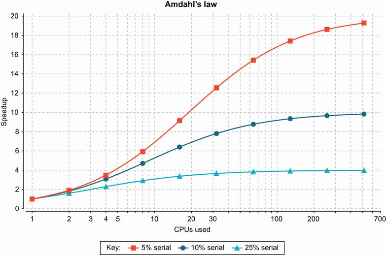
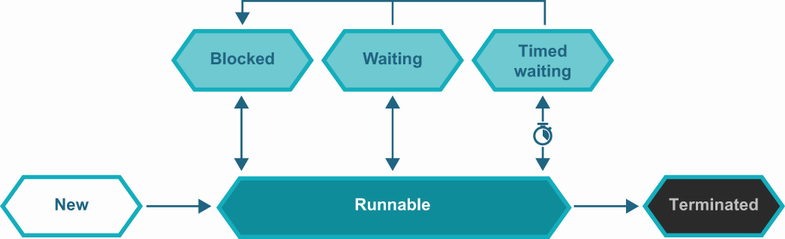
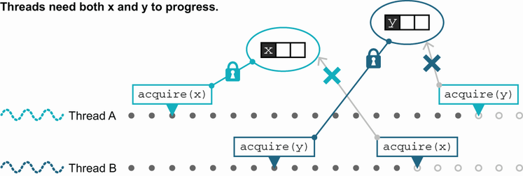
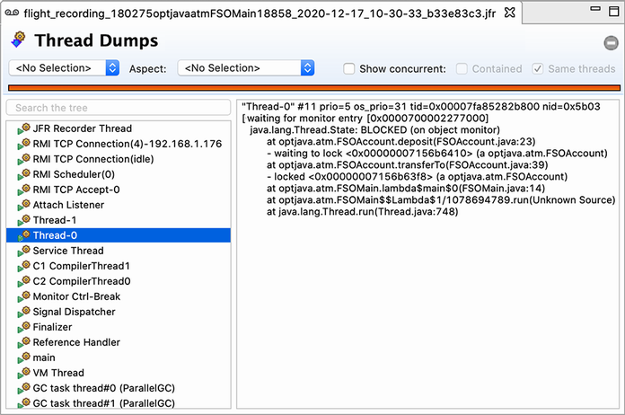
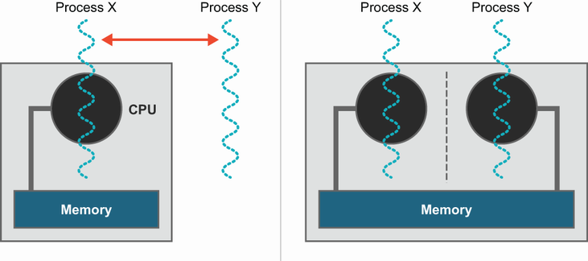
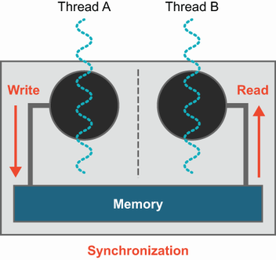
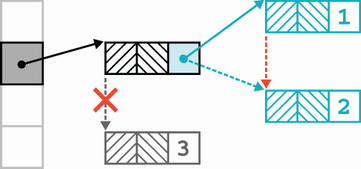
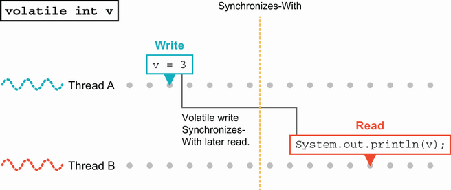
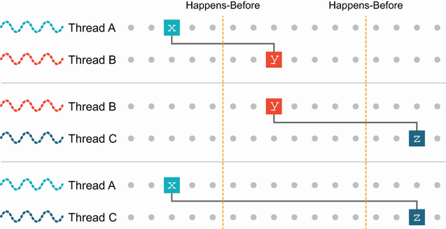

# 5. Nền tảng lập trình đồng thời trong Java

> *The Well-Grounded Java Developer, Second Edition* — Chương 5
> Bản dịch tiếng Việt

**Chương này bao gồm:**

- Lý thuyết concurrency (lập trình đồng thời)
- Block-structured concurrency
- Synchronization (đồng bộ hóa)
- Java Memory Model (JMM)
- Hỗ trợ concurrency trong bytecode

---

Java có hai API concurrency phần lớn tách biệt nhau: API cũ hơn, thường được gọi là *block-structured concurrency* hoặc *synchronization-based concurrency* hay thậm chí "classic concurrency", và API mới hơn, thường được gọi theo tên package Java của nó, `java.util.concurrent`.

Trong cuốn sách này, chúng ta sẽ nói về cả hai cách tiếp cận. Trong chương này, chúng ta bắt đầu hành trình bằng cách xem cách tiếp cận đầu tiên. Sau đó, ở chương tiếp theo, chúng ta sẽ giới thiệu `java.util.concurrent`. Xa hơn nữa, chúng ta sẽ quay lại chủ đề concurrency ở chương 16, "Advanced Concurrent Programming", thảo luận các kỹ thuật nâng cao, concurrency trong các ngôn ngữ JVM không phải Java, và sự tương tác giữa concurrency và lập trình hàm.

Hãy bắt đầu và làm quen với cách tiếp cận cổ điển đối với concurrency. Đây là API duy nhất khả dụng cho tới Java 5. Như bạn có thể đoán từ tên gọi thay thế "synchronization-based concurrency", đây là API ở mức ngôn ngữ được xây dựng sẵn trong nền tảng và phụ thuộc vào các từ khóa `synchronized` và `volatile`.

Đây là một API mức thấp và có thể hơi khó làm việc, nhưng rất đáng để hiểu. Nó cung cấp nền tảng vững chắc cho các chương sau trong sách giải thích những loại và khía cạnh khác của concurrency.

Thực tế, việc suy luận đúng đắn về các dạng concurrency khác là rất khó nếu không có ít nhất kiến thức thực dụng về API và khái niệm mức thấp mà chúng tôi sẽ giới thiệu trong chương này. Khi gặp các chủ đề liên quan, chúng tôi cũng sẽ giới thiệu đủ lý thuyết để soi sáng những góc nhìn khác về concurrency mà ta sẽ thảo luận ở phần sau của sách, kể cả khi gặp concurrency trong các ngôn ngữ không phải Java.

Để hiểu cách tiếp cận của Java đối với lập trình đồng thời, chúng ta sẽ bắt đầu bằng việc nói về một lượng nhỏ lý thuyết. Sau đó, chúng ta sẽ thảo luận tác động mà các "lực thiết kế" (design forces) có trong việc thiết kế và hiện thực hệ thống. Chúng ta sẽ nói về hai lực quan trọng nhất, *safety* và *liveness*, và nhắc tới một số lực khác.

Một mục quan trọng (và dài nhất trong chương) là chi tiết về block-structured concurrency và khám phá API luồng (threading) mức thấp. Chúng ta sẽ kết thúc chương này bằng việc thảo luận Java Memory Model (JMM), rồi dùng các kỹ thuật bytecode đã học ở chương 4 để hiểu nguồn gốc thực sự của một số phức tạp phổ biến trong lập trình đồng thời với Java.

## 5.1 Nhập môn lý thuyết concurrency

Hãy bắt đầu hành trình vào concurrency bằng một câu chuyện cảnh báo trước khi gặp một chút lý thuyết cơ bản.

### 5.1.1 Nhưng tôi đã biết về `Thread` rồi

Đây là một trong những sai lầm phổ biến nhất (và tiềm ẩn chết người nhất) mà một lập trình viên có thể mắc: cho rằng việc quen thuộc với `Thread`, `Runnable` và các nguyên thủy cơ bản ở mức ngôn ngữ của cơ chế concurrency trong Java là đủ để trở thành một người phát triển mã đồng thời có năng lực. Thực tế, chủ đề concurrency là một chủ đề lớn, và phát triển đa luồng tốt là điều khó khăn, tiếp tục gây vấn đề ngay cả với những lập trình viên giỏi nhất có nhiều năm kinh nghiệm.

Cũng đúng rằng lĩnh vực concurrency đang trải qua một lượng lớn nghiên cứu tích cực ở hiện tại — điều này đã diễn ra ít nhất 5–10 năm qua và không có dấu hiệu chậm lại. Những đổi mới này có khả năng tác động tới Java và các ngôn ngữ khác mà bạn sẽ dùng trong sự nghiệp.

Ở ấn bản đầu của cuốn sách này, chúng tôi đưa ra nhận định: "Nếu phải chọn một lĩnh vực nền tảng của điện toán có khả năng thay đổi triệt để về mặt thực hành ngành trong năm năm tới, đó sẽ là concurrency." Không chỉ lịch sử đã chứng minh nhận định này, chúng tôi còn thấy thoải mái khi tiếp tục dự đoán này — năm năm tới sẽ tiếp tục nhấn mạnh vào các cách tiếp cận khác nhau đối với concurrency, giờ đã là một phần của cảnh quan lập trình.

Vì vậy, thay vì cố trở thành hướng dẫn dứt khoát cho mọi khía cạnh của lập trình đồng thời, mục tiêu của chương này là giúp bạn nhận thức được các cơ chế nền tảng bên dưới giải thích vì sao concurrency của Java hoạt động theo cách nó hoạt động. Chúng tôi cũng sẽ đề cập đủ lý thuyết concurrency tổng quát để cho bạn từ vựng hiểu các vấn đề liên quan và dạy bạn về cả sự cần thiết lẫn khó khăn trong việc làm concurrency cho đúng. Đầu tiên, chúng ta sẽ thảo luận điều mà mọi lập trình viên Java vững nền tảng nên biết về phần cứng và một trong những giới hạn lý thuyết quan trọng nhất của concurrency.

### 5.1.2 Phần cứng

Hãy bắt đầu với một số sự thật cơ bản về concurrency và đa luồng:

- Lập trình đồng thời về cơ bản là về hiệu năng.
- Về cơ bản không có lý do chính đáng nào để hiện thực một thuật toán đồng thời nếu hệ thống bạn đang chạy có đủ hiệu năng để một thuật toán tuần tự hoạt động được.
- Các hệ thống máy tính hiện đại có nhiều lõi xử lý — ngay cả điện thoại di động ngày nay cũng có hai hoặc bốn lõi.
- Mọi chương trình Java đều là đa luồng, kể cả những chương trình chỉ có một luồng ứng dụng duy nhất.

Điểm cuối này đúng bởi bản thân JVM là một binary đa luồng có thể dùng nhiều lõi (ví dụ, cho biên dịch JIT hoặc thu gom rác). Ngoài ra, thư viện chuẩn cũng bao gồm các API dùng concurrency do runtime quản lý để hiện thực các thuật toán đa luồng cho một số tác vụ thực thi.

> **NOTE** Hoàn toàn có khả năng một ứng dụng Java sẽ chạy nhanh hơn chỉ nhờ nâng cấp JVM mà nó chạy trên đó, do các cải thiện hiệu năng trong runtime.

Một thảo luận đầy đủ hơn về phần cứng diễn ra ở chương 7, nhưng những sự thật cơ bản này quá nền tảng và quá liên quan tới lập trình đồng thời nên chúng tôi muốn giới thiệu ngay.

Giờ hãy làm quen với định luật Amdahl, đặt theo tên một nhà khoa học máy tính đời đầu của IBM, Gene Amdahl, đôi khi được gọi là "cha đẻ của mainframe".

### 5.1.3 Định luật Amdahl

Đây là một mô hình đơn giản, thô ráp để suy luận về hiệu quả của việc chia sẻ công việc trên nhiều đơn vị thực thi. Trong mô hình này, các đơn vị thực thi là trừu tượng, nên bạn có thể nghĩ về chúng như các luồng, nhưng chúng cũng có thể là tiến trình, hoặc bất kỳ thực thể nào có khả năng thực hiện công việc.

> **NOTE** Không có phần thiết lập hay hệ quả nào của định luật Amdahl phụ thuộc vào chi tiết công việc được làm thế nào, bản chất chính xác của các đơn vị thực thi, hay cách các hệ thống điện toán được hiện thực.

Tiền đề cơ bản là chúng ta có một tác vụ duy nhất có thể chia nhỏ thành các đơn vị nhỏ hơn để xử lý. Điều này cho phép chúng ta dùng nhiều đơn vị thực thi để rút ngắn thời gian hoàn thành công việc.

Vậy, nếu chúng ta có N bộ xử lý (hoặc luồng để làm việc), ta có thể ngây thơ kỳ vọng thời gian trôi qua là T1 / N (nếu T1 là thời gian công việc sẽ mất trên một bộ xử lý duy nhất). Trong mô hình này, chúng ta có thể hoàn thành công việc nhanh tùy ý chỉ bằng cách thêm đơn vị thực thi, qua đó tăng N.

Tuy nhiên, việc chia nhỏ công việc không miễn phí! Có một chi phí phụ trội (hy vọng là nhỏ) liên quan tới việc chia nhỏ và tái kết hợp tác vụ. Hãy giả sử chi phí giao tiếp này (đôi khi gọi là *phần tuần tự* của phép tính) chiếm vài phần trăm, và ta có thể biểu diễn nó bằng một số `s` (0 < s < 1). Vậy, giá trị điển hình cho `s` có thể là 0,05 (hay 5%, tùy cách bạn muốn diễn đạt). Điều này nghĩa là tác vụ sẽ luôn mất ít nhất `s * T1` để hoàn thành — bất kể ta ném bao nhiêu đơn vị xử lý vào nó.

Dĩ nhiên điều này giả định `s` không phụ thuộc vào `N`, nhưng trên thực tế, việc chia nhỏ công việc mà `s` biểu diễn có thể trở nên phức tạp hơn và cần nhiều thời gian hơn khi `N` tăng. Cực kỳ khó hình dung một kiến trúc hệ thống mà `s` giảm khi `N` tăng. Nên giả định đơn giản "`s` là hằng số" thường được hiểu là kịch bản tốt nhất.

Vậy, cách dễ nhất để nghĩ về định luật Amdahl là: nếu `s` nằm giữa 0 và 1, thì tăng tốc tối đa có thể đạt được là `1 / s`. Kết quả này phần nào đáng buồn — nó có nghĩa nếu chi phí giao tiếp chỉ là 2%, tăng tốc tối đa từng có thể đạt được (kể cả với hàng nghìn bộ xử lý chạy hết công suất) là 50 lần.

Định luật Amdahl có một công thức phức tạp hơn chút, được biểu diễn như sau:

```
T(N) = s + (1/N) * (T1 - s)
```

Điều này có thể thấy trực quan trong hình 5.1. Lưu ý rằng trục x là thang logarit — sự hội tụ về `1 / s` sẽ rất khó thấy trong biểu diễn thang tuyến tính.



**Hình 5.1** Định luật Amdahl

Sau khi đã dựng bối cảnh với phần cứng và một mô hình concurrency đầu tiên rất đơn giản, hãy đi sâu vào chi tiết cách Java xử lý luồng.

### 5.1.4 Giải thích mô hình luồng của Java

Mô hình luồng của Java dựa trên hai khái niệm nền tảng sau:

- Trạng thái khả biến, được chia sẻ, mặc định nhìn thấy được (shared, visible-by-default mutable state)
- Lập lịch luồng theo kiểu preemptive bởi hệ điều hành

Hãy xét những khía cạnh quan trọng nhất sau của các ý tưởng này:

- Các đối tượng có thể dễ dàng được chia sẻ giữa mọi luồng trong một tiến trình.
- Các đối tượng có thể bị thay đổi ("mutate") bởi bất kỳ luồng nào có tham chiếu tới chúng.
- Bộ lập lịch luồng (hệ điều hành) có thể hoán đổi luồng vào và ra khỏi lõi vào bất kỳ lúc nào, gần như là vậy.
- Các phương thức phải có thể bị hoán đổi ra trong khi chúng đang chạy (nếu không, một phương thức có vòng lặp vô hạn sẽ chiếm CPU mãi mãi). Tuy nhiên, điều này gây rủi ro về một lần hoán đổi luồng khó lường, để lại một phương thức "làm dở dang" và một đối tượng ở trạng thái không nhất quán.
- Các đối tượng có thể được khóa để bảo vệ dữ liệu dễ tổn thương.

Điểm cuối cùng là tuyệt đối quan trọng — nếu không có nó, có rủi ro rất lớn là các thay đổi thực hiện ở một luồng không được nhìn thấy đúng ở các luồng khác. Trong Java, khả năng khóa đối tượng được cung cấp bởi từ khóa `synchronized` trong ngôn ngữ lõi.

> **NOTE** Về mặt kỹ thuật, Java cung cấp *monitor* trên mỗi đối tượng của nó, kết hợp một khóa (hay loại trừ tương hỗ — mutual exclusion) với khả năng chờ một điều kiện nhất định trở thành đúng.

Concurrency dựa trên luồng-và-khóa của Java rất mức thấp và thường khó làm việc. Để đối phó, một tập thư viện concurrency, gọi là `java.util.concurrent` theo package Java nơi các class mới sống, đã được giới thiệu trong Java 5. Nó cung cấp một bộ công cụ để viết mã đồng thời mà nhiều lập trình viên thấy dễ dùng hơn các nguyên thủy block-structured concurrency cổ điển. Chúng ta sẽ thảo luận `java.util.concurrent` ở chương tiếp theo và giờ sẽ tập trung vào API mức ngôn ngữ.

### 5.1.5 Những bài học rút ra

Java là ngôn ngữ lập trình dòng chính đầu tiên có hỗ trợ tích hợp cho lập trình đa luồng. Đây là một bước tiến lớn vào thời điểm đó, nhưng giờ, 15 năm sau, chúng ta đã học được nhiều hơn về cách viết mã đồng thời.

Hóa ra một số quyết định thiết kế ban đầu của Java khá khó làm việc với hầu hết lập trình viên. Điều này đáng tiếc, bởi xu hướng ngày càng tăng trong phần cứng là hướng tới các bộ xử lý nhiều lõi, và cách tốt duy nhất để tận dụng những lõi đó là bằng mã đồng thời. Chúng ta sẽ thảo luận một số khó khăn của mã đồng thời trong chương này. Chủ đề bộ xử lý hiện đại tự nhiên đòi hỏi lập trình đồng thời được đề cập khá chi tiết ở chương 7 khi chúng ta thảo luận về hiệu năng.

Khi lập trình viên trở nên có kinh nghiệm hơn với việc viết mã đồng thời, họ thấy mình liên tục đụng phải những mối quan tâm lặp lại quan trọng đối với hệ thống của họ. Chúng tôi gọi những mối quan tâm này là *design forces* (lực thiết kế). Đó là các khái niệm mức cao tồn tại (và thường xung đột) trong thiết kế các hệ thống OO đồng thời thực tế. Chúng ta sẽ dành chút thời gian xem xét một số lực quan trọng nhất trong vài mục tới.

## 5.2 Các khái niệm thiết kế

Các design force quan trọng nhất, liệt kê dưới đây, đã được Doug Lea ghi lại khi ông thực hiện công trình mang tính bước ngoặt tạo ra `java.util.concurrent`:

- Safety (còn gọi là concurrent type safety)
- Liveness
- Performance (hiệu năng)
- Reusability (khả năng tái sử dụng)

Hãy xem từng lực này.

### 5.2.1 Safety và concurrent type safety

*Safety* là về việc đảm bảo các thể hiện đối tượng vẫn tự nhất quán, bất kể có thao tác nào khác đang diễn ra cùng lúc. Nếu một hệ thống đối tượng có tính chất này, nó được gọi là *safe* hoặc *concurrently typesafe*.

Như bạn có thể đoán từ tên gọi, một cách nghĩ về concurrency là như một mở rộng của các khái niệm thông thường về mô hình hóa đối tượng và type safety. Trong mã không đồng thời, bạn muốn đảm bảo rằng bất kể bạn gọi phương thức public nào trên một đối tượng, nó vẫn ở trạng thái được định nghĩa rõ ràng và nhất quán ở cuối phương thức. Cách thông thường để làm điều này là giữ toàn bộ trạng thái của đối tượng ở dạng private và phơi bày một API công khai gồm các phương thức chỉ thay đổi trạng thái của đối tượng theo cách hợp lý với miền thiết kế.

Concurrent type safety là cùng khái niệm cơ bản với type safety cho một đối tượng, nhưng áp dụng vào thế giới phức tạp hơn nhiều nơi các luồng khác có khả năng đang thao tác trên cùng đối tượng trên các lõi CPU khác nhau cùng lúc. Ví dụ, hãy xét class đơn giản này:

```java
public class StringStack {
    private String[] values = new String[16];
    private int current = 0;

     public boolean push(String s) {
         // Phần xử lý exception được lược bỏ
         if (current < values.length) {
             values[current] = s;
             current = current + 1;
           }
           return false;
     }

     public String pop() {
         if (current < 1) {
             return null;
         }
         current = current - 1;
           return values[current];
     }
}
```

Khi được dùng bởi mã client đơn luồng, đoạn này ổn. Tuy nhiên, việc lập lịch luồng preemptive có thể gây vấn đề. Ví dụ, một context switch giữa các luồng thực thi có thể xảy ra ở điểm này trong mã:

```java
public boolean push(String s) {
        if (current < values.length) {
            values[current] = s;
            // .... context switch ở đây                  ❶
                current = current + 1;
           }
           return false;
     }
```

❶ Đối tượng bị bỏ lại ở trạng thái không nhất quán và không đúng.

Nếu đối tượng sau đó được nhìn từ một luồng khác, một phần trạng thái (`values`) sẽ đã được cập nhật nhưng phần kia (`current`) thì chưa. Khám phá và giải quyết vấn đề này là chủ đề chính của chương này.

Nói chung, một chiến lược cho safety là không bao giờ trả về từ một phương thức không phải private khi đang ở trạng thái không nhất quán, và không bao giờ gọi bất kỳ phương thức không phải private nào (và chắc chắn không phải phương thức trên đối tượng khác) khi đang ở trạng thái không nhất quán. Nếu thực hành này được kết hợp với một cách bảo vệ đối tượng (chẳng hạn một khóa đồng bộ hoặc critical section) trong lúc nó không nhất quán, hệ thống có thể được đảm bảo là safe.

### 5.2.2 Liveness

Một hệ thống *live* là hệ thống trong đó mọi hoạt động được thử cuối cùng đều hoặc tiến triển hoặc thất bại. Một hệ thống không live về cơ bản là bị kẹt — nó sẽ không tiến tới thành công cũng không thất bại.

Từ khóa trong định nghĩa là *cuối cùng* — có sự phân biệt giữa một thất bại tạm thời trong việc tiến triển (không quá tệ nếu tách riêng, dù không lý tưởng) và một thất bại vĩnh viễn. Thất bại tạm thời có thể do một số vấn đề nền tảng, chẳng hạn:

- Khóa hoặc chờ để lấy khóa
- Chờ đầu vào (chẳng hạn I/O mạng)
- Thất bại tạm thời của một tài nguyên
- Không đủ thời gian CPU để chạy luồng

Thất bại vĩnh viễn có thể do một số nguyên nhân. Một số nguyên nhân phổ biến nhất như sau:

- Deadlock
- Vấn đề tài nguyên không khôi phục được (chẳng hạn khi network filesystem [NFS] biến mất)
- Bỏ lỡ tín hiệu (missed signal)

Chúng ta sẽ thảo luận việc khóa và vài vấn đề khác trong số này ở phần sau của chương, dù bạn có thể đã quen với một số hoặc tất cả chúng.

### 5.2.3 Performance

Hiệu năng của một hệ thống có thể được định lượng theo nhiều cách khác nhau. Ở chương 7, chúng ta sẽ nói về phân tích hiệu năng và các kỹ thuật tinh chỉnh, và sẽ giới thiệu một số chỉ số khác bạn nên biết. Còn bây giờ, hãy nghĩ về hiệu năng như một thước đo lượng công việc mà một hệ thống có thể làm với một lượng tài nguyên nhất định.

### 5.2.4 Reusability

Khả năng tái sử dụng tạo thành design force thứ tư, bởi nó thực sự không được các cân nhắc khác bao phủ. Một hệ thống đồng thời được thiết kế để dễ tái sử dụng đôi khi rất đáng mong muốn, mặc dù điều này không phải lúc nào cũng dễ hiện thực. Một cách tiếp cận là dùng một hộp công cụ có thể tái sử dụng (như `java.util.concurrent`) và xây dựng mã ứng dụng không tái sử dụng được lên trên nó.

### 5.2.5 Các lực xung đột như thế nào và vì sao?

Các design force thường đối lập nhau, và sự căng thẳng này có thể được xem như một lý do trung tâm khiến việc thiết kế các hệ thống đồng thời tốt là khó khăn, như các điểm sau giải thích:

- Safety đối lập với liveness — safety là về đảm bảo những điều xấu không xảy ra, trong khi liveness đòi hỏi phải có tiến triển.
- Các hệ thống có thể tái sử dụng có xu hướng phơi bày phần nội bộ, điều có thể gây vấn đề với safety.
- Một hệ thống safe được viết một cách ngây thơ thường sẽ không mấy hiệu năng, bởi nó thường phải dùng khóa nhiều để cung cấp đảm bảo safety.

Sự cân bằng mà bạn rốt cuộc nên cố đạt được là mã đủ linh hoạt để hữu ích cho một phạm vi vấn đề rộng, đủ đóng để an toàn, và vẫn khá live và hiệu năng. Đây là một yêu cầu khá cao, nhưng may mắn thay, một số kỹ thuật thực tiễn có thể giúp ích. Đây là một số kỹ thuật phổ biến nhất theo thứ tự hữu dụng ước chừng:

1. Hạn chế giao tiếp bên ngoài của mỗi hệ thống con nhiều nhất có thể. Che giấu dữ liệu là công cụ mạnh mẽ hỗ trợ safety.
2. Làm cho cấu trúc nội bộ của mỗi hệ thống con càng tất định càng tốt. Ví dụ, thiết kế sẵn kiến thức tĩnh về các luồng và đối tượng trong mỗi hệ thống con, ngay cả khi các hệ thống con sẽ tương tác theo cách đồng thời, phi tất định.
3. Áp dụng các cách tiếp cận dựa trên chính sách mà ứng dụng client phải tuân thủ. Kỹ thuật này mạnh mẽ nhưng dựa vào sự hợp tác của ứng dụng người dùng, và có thể khó debug nếu một ứng dụng hành xử tệ không tuân thủ quy tắc.
4. Tài liệu hóa hành vi được yêu cầu. Đây là lựa chọn yếu nhất, nhưng đôi khi cần thiết nếu mã sẽ được triển khai trong bối cảnh rất tổng quát.

Lập trình viên nên biết mỗi cơ chế safety khả dĩ này và nên dùng kỹ thuật mạnh nhất có thể, đồng thời ý thức rằng trong một số hoàn cảnh, chỉ những cơ chế yếu hơn mới khả thi.

### 5.2.6 Các nguồn phụ trội

Nhiều khía cạnh của một hệ thống đồng thời có thể góp phần vào chi phí phụ trội cố hữu:

- Monitor (tức là khóa và biến điều kiện)
- Số lượng context switch
- Số lượng luồng
- Lập lịch
- Tính cục bộ của bộ nhớ (locality of memory)
- Thiết kế thuật toán

Điều này nên tạo thành cơ sở của một danh sách kiểm tra trong đầu bạn. Khi phát triển mã đồng thời, bạn nên đảm bảo mình đã nghĩ tới mọi thứ trong danh sách này.

Đặc biệt, cái cuối cùng — thiết kế thuật toán — là mảng mà lập trình viên có thể thực sự tạo khác biệt cho mình, bởi học về thiết kế thuật toán sẽ làm bạn thành lập trình viên tốt hơn ở bất kỳ ngôn ngữ nào.

Hai giáo trình tiêu chuẩn (được các tác giả đánh giá rất cao) là *Introduction to Algorithms* của Cormen và cộng sự (MIT, 2009) — đừng bị lừa bởi tựa đề; đây là một công trình nghiêm túc — và *The Algorithm Design Manual* (ấn bản 3), của Skiena (Springer-Verlag, 2020). Với cả thuật toán đơn luồng lẫn đồng thời, những cuốn sách này là lựa chọn tuyệt vời để đọc thêm.

Chúng tôi sẽ nhắc tới nhiều nguồn phụ trội này trong chương này và các chương sau (đặc biệt chương 7, về hiệu năng), nhưng giờ hãy chuyển sang chủ đề tiếp theo: xem lại concurrency "cổ điển" của Java và nhìn kỹ vì sao lập trình với nó có thể khó khăn.

## 5.3 Block-structured concurrency (trước Java 5)

Phần lớn nội dung về concurrency trong Java của chúng tôi là thảo luận các lựa chọn thay thế cho cách tiếp cận concurrency ở mức ngôn ngữ, hay dựa trên block-synchronization, hay *intrinsic*. Nhưng để tận dụng tối đa phần thảo luận về các lựa chọn thay thế, quan trọng là nắm vững điều gì tốt và xấu về góc nhìn cổ điển đối với concurrency.

Vì mục đích đó, trong phần còn lại của chương này, chúng ta sẽ thảo luận cách ban đầu, khá mức thấp để giải quyết lập trình đa luồng dùng các từ khóa concurrency của Java — `synchronized`, `volatile`, v.v. Phần thảo luận này sẽ diễn ra trong bối cảnh các design force và hướng tới những gì sẽ đến sau.

Tiếp theo đó, chúng ta sẽ xem xét ngắn gọn vòng đời của một luồng rồi thảo luận các kỹ thuật (và cạm bẫy) phổ biến của mã đồng thời, chẳng hạn fully synchronized object, deadlock, từ khóa `volatile`, và tính bất biến. Hãy bắt đầu với tổng quan về synchronization.

### 5.3.1 Synchronization và khóa

Như bạn có lẽ đã biết, từ khóa `synchronized` có thể áp dụng cho một khối hoặc một phương thức. Nó chỉ ra rằng trước khi vào khối hoặc phương thức đó, một luồng phải lấy được khóa thích hợp. Ví dụ, hãy nghĩ về một phương thức rút tiền từ tài khoản ngân hàng, như sau:

```java
public synchronized boolean withdraw(int amount) {          ❶
    // Kiểm tra amount > 0, ném exception nếu không
        if (balance >= amount) {
            balance = balance - amount;
            return true;
        }

        return false;
}
```

❶ Chỉ một luồng có thể thử rút tiền từ tài khoản này tại một thời điểm.

Phương thức phải lấy khóa thuộc về thể hiện đối tượng (hoặc khóa thuộc về đối tượng `Class` với các phương thức `static synchronized`). Với một khối, lập trình viên nên chỉ ra khóa của đối tượng nào cần được lấy.

Chỉ một luồng có thể đang tiến triển qua bất kỳ khối hay phương thức `synchronized` nào của một đối tượng tại một thời điểm; nếu các luồng khác cố vào, chúng bị JVM đình chỉ. Điều này đúng bất kể luồng kia đang cố vào cùng một khối `synchronized` hay một khối khác trên cùng đối tượng. Trong lý thuyết concurrency, loại cấu trúc này đôi khi được gọi là *critical section*, nhưng thuật ngữ này phổ biến hơn trong C++ so với Java.

> **NOTE** Bạn có bao giờ tự hỏi vì sao từ khóa Java dùng cho critical section lại là `synchronized`? Sao không phải "critical" hay "locked"? *Cái gì* đang được đồng bộ? Chúng ta sẽ quay lại điều này ở mục 5.3.5, nhưng nếu bạn không biết hoặc chưa từng nghĩ về nó, bạn có thể muốn dành vài phút suy ngẫm trước khi tiếp tục.

Hãy xem một số sự thật cơ bản về synchronization và khóa trong Java. Hy vọng bạn đã nắm hầu hết (hoặc tất cả) chúng trong tầm tay:

- Chỉ đối tượng — không phải kiểu nguyên thủy — mới có thể bị khóa.
- Khóa một mảng đối tượng không khóa từng đối tượng riêng lẻ.
- Một phương thức `synchronized` có thể được xem là tương đương với một khối `synchronized (this) { ... }` bao phủ toàn bộ phương thức (nhưng lưu ý rằng chúng được biểu diễn khác nhau trong bytecode).
- Một phương thức `static synchronized` khóa đối tượng `Class`, bởi không có đối tượng thể hiện để khóa.
- Nếu bạn cần khóa một đối tượng `Class`, hãy cân nhắc kỹ xem bạn cần làm vậy một cách tường minh hay bằng cách dùng `getClass()`, bởi hành vi của hai cách tiếp cận sẽ khác nhau trong một subclass.
- Synchronization trong một inner class độc lập với outer class (để hiểu tại sao lại vậy, hãy nhớ inner class được hiện thực ra sao).
- `synchronized` không tạo thành một phần của chữ ký phương thức, nên nó không thể xuất hiện trên một khai báo phương thức trong interface.
- Các phương thức không đồng bộ không nhìn vào hay quan tâm tới trạng thái của bất kỳ khóa nào, và chúng có thể tiến triển trong khi các phương thức `synchronized` đang chạy.
- Khóa của Java là *reentrant* — một luồng đang giữ khóa mà gặp một điểm đồng bộ cho cùng khóa đó (chẳng hạn một phương thức `synchronized` gọi một phương thức `synchronized` khác trên cùng đối tượng) sẽ được phép tiếp tục.

> **NOTE** Các cơ chế khóa không reentrant có tồn tại trong các ngôn ngữ khác (và có thể được tổng hợp trong Java — xem chi tiết Javadoc của `ReentrantLock` trong `java.util.concurrent.locks` nếu bạn muốn biết chi tiết rùng rợn), nhưng chúng nói chung là đau đớn để xử lý, và tốt nhất nên tránh trừ khi bạn thực sự biết mình đang làm gì.

Vậy là đủ phần ôn lại về synchronization của Java. Giờ hãy chuyển sang thảo luận các trạng thái mà một luồng đi qua trong vòng đời của nó.

### 5.3.2 Mô hình trạng thái của một luồng

Trong hình 5.2, bạn thấy mô hình trạng thái cho một luồng Java. Nó chi phối cách một luồng Java tiến triển qua vòng đời của mình.



**Hình 5.2** Mô hình trạng thái của một luồng Java

Java có một enum tên `Thread.State`, tương ứng với các trạng thái trong mô hình trạng thái trên và là một lớp phủ lên góc nhìn của hệ điều hành về trạng thái luồng.

> **NOTE** Mỗi hệ điều hành có phiên bản luồng của riêng mình, và chúng có thể khác nhau ở các chi tiết chính xác. Trong hầu hết trường hợp, các hệ điều hành hiện đại có bản hiện thực luồng và lập lịch khá tương tự, nhưng điều này không phải lúc nào cũng đúng (ví dụ, Solaris hay Windows XP).

Một đối tượng luồng Java ban đầu được tạo ở trạng thái `NEW`. Tại thời điểm này, một luồng của hệ điều hành chưa tồn tại (và có thể sẽ không bao giờ tồn tại). Để tạo luồng thực thi, `Thread.start()` phải được gọi. Điều này báo cho hệ điều hành thực sự tạo một luồng.

Bộ lập lịch sẽ đặt luồng mới vào hàng đợi chạy (run queue) và, tại một thời điểm sau đó, sẽ tìm một lõi cho nó chạy trên đó (có thể có một khoảng thời gian chờ nếu máy đang tải nặng). Từ đó, luồng có thể tiếp tục bằng cách tiêu thụ phần thời gian được cấp và được đặt lại vào run queue để chờ thêm lát thời gian bộ xử lý. Đây là hành động của việc lập lịch luồng cưỡng bức mà chúng tôi đã đề cập ở mục 5.1.1.

Xuyên suốt quá trình lập lịch này — được đặt lên một lõi, chạy, và được đặt lại vào run queue — đối tượng `Thread` của Java vẫn ở trạng thái `RUNNABLE`. Bên cạnh hành động lập lịch này, bản thân luồng có thể chỉ ra rằng nó không thể dùng lõi vào lúc này. Điều này có thể đạt được theo hai cách khác nhau:

1. Mã chương trình chỉ ra bằng cách gọi `Thread.sleep()` rằng luồng nên chờ một khoảng thời gian cố định trước khi tiếp tục.
2. Luồng nhận ra rằng nó phải chờ tới khi một điều kiện bên ngoài được thỏa mãn và gọi `Object.wait()`.

Trong cả hai trường hợp, luồng ngay lập tức bị hệ điều hành gỡ khỏi lõi. Tuy nhiên, hành vi sau điểm đó là khác nhau trong mỗi trường hợp.

Trong trường hợp thứ nhất, luồng đang xin ngủ trong một khoảng thời gian xác định. Luồng Java chuyển sang trạng thái `TIMED_WAITING`, và hệ điều hành đặt một bộ đếm thời gian. Khi nó hết hạn, luồng đang ngủ được đánh thức và sẵn sàng chạy lại và được đặt lại vào run queue.

Trường hợp thứ hai hơi khác. Nó dùng khía cạnh điều kiện của monitor theo-từng-đối-tượng của Java. Luồng sẽ chuyển sang `WAITING` và sẽ chờ vô thời hạn. Nó thường sẽ không thức dậy cho tới khi hệ điều hành báo hiệu rằng điều kiện có thể đã được thỏa mãn — thường là bởi một luồng khác gọi `Object.notify()` trên đối tượng hiện tại.

Bên cạnh hai khả năng nằm trong tầm kiểm soát của luồng này, một luồng có thể chuyển sang trạng thái `BLOCKED` bởi nó đang chờ I/O hoặc chờ lấy một khóa do luồng khác giữ. Cuối cùng, nếu luồng hệ điều hành tương ứng với một `Thread` Java đã ngừng thực thi, thì đối tượng luồng đó sẽ chuyển sang trạng thái `TERMINATED`. Hãy chuyển sang nói về một cách nổi tiếng để giải quyết vấn đề synchronization: ý tưởng về fully synchronized object.

### 5.3.3 Fully synchronized object

Ở đầu chương này, chúng tôi đã giới thiệu khái niệm concurrent type safety và nhắc tới một chiến lược để đạt được điều này. Hãy xem một mô tả đầy đủ hơn về chiến lược này, thường được gọi là *fully synchronized objects*. Nếu mọi quy tắc sau được tuân thủ, class được biết là thread-safe và cũng sẽ live.

Một class fully synchronized là class thỏa mãn mọi điều kiện sau:

- Mọi field luôn được khởi tạo về trạng thái nhất quán trong mọi constructor.
- Không có field public.
- Các thể hiện đối tượng được đảm bảo nhất quán sau khi trả về từ bất kỳ phương thức không private nào (giả sử trạng thái đã nhất quán khi phương thức được gọi).
- Mọi phương thức đều chứng minh được là kết thúc trong thời gian có giới hạn.
- Mọi phương thức đều `synchronized`.
- Không phương thức nào gọi phương thức của thể hiện khác khi đang ở trạng thái không nhất quán.
- Không phương thức nào gọi bất kỳ phương thức không private nào trên thể hiện hiện tại khi đang ở trạng thái không nhất quán.

Listing 5.1 cho thấy một ví dụ về class như vậy từ backend của một hệ thống ngân hàng. Class `FSOAccount` mô hình hóa một tài khoản. Tiền tố `FSO` ở đó để chỉ rõ rằng bản hiện thực này dùng fully synchronized object.

Tình huống này cung cấp gửi tiền, rút tiền và truy vấn số dư — một xung đột kinh điển giữa thao tác đọc và ghi — nên synchronization được dùng để ngăn sự không nhất quán.

**Listing 5.1 Một class fully synchronized**

```java
public class FSOAccount {
     private double balance;                                     ❶

     public FSOAccount(double openingBalance) {
         // Kiểm tra openingBalance > 0, ném exception nếu không
           balance = openingBalance;                              ❷
     }

     public synchronized boolean withdraw(int amount) {           ❸
         // Kiểm tra amount > 0, ném exception nếu không
           if (balance >= amount) {
               balance = balance - amount;
                  return true;
           }

           return false;
     }

     public synchronized void deposit(int amount) {               ❸
           // Kiểm tra amount > 0, ném exception nếu không
           balance = balance + amount;
     }

     public synchronized double getBalance() {                    ❸
           return balance;
     }
}
```

❶ Không có field public

❷ Mọi field đều được khởi tạo trong constructor.

❸ Mọi phương thức đều `synchronized`.

Thoạt nhìn điều này có vẻ tuyệt vời — class vừa safe vừa live. Vấn đề nằm ở hiệu năng. Chỉ vì một thứ safe và live không có nghĩa nó nhất thiết sẽ rất nhanh. Bạn phải dùng `synchronized` để điều phối mọi truy cập (cả get lẫn put) tới `balance`, và việc khóa đó rốt cuộc sẽ làm bạn chậm lại. Đây là một vấn đề trung tâm của cách xử lý concurrency này.

Ngoài các vấn đề hiệu năng, mã trong listing 5.1 khá mong manh. Bạn có thể thấy rằng bạn không bao giờ động vào `balance` bên ngoài một phương thức `synchronized`, nhưng điều này chỉ có thể kiểm tra bằng mắt nhờ lượng mã nhỏ trong cuộc chơi.

Trong các hệ thống thực, lớn hơn, kiểu kiểm tra thủ công này sẽ không khả thi do lượng mã. Quá dễ để lỗi lọt vào các codebase lớn hơn dùng cách tiếp cận này, đó là một lý do nữa khiến cộng đồng Java bắt đầu tìm kiếm những cách tiếp cận vững chắc hơn.

### 5.3.4 Deadlock

Một vấn đề kinh điển khác của concurrency (và không chỉ riêng cách Java tiếp cận nó) là *deadlock*. Hãy xét listing 5.2, một dạng mở rộng nhẹ của ví dụ trước. Ở phiên bản này, bên cạnh mô hình hóa số dư tài khoản, chúng ta cũng có phương thức `transferTo()` có thể chuyển tiền từ tài khoản này sang tài khoản khác.

> **NOTE** Đây là một nỗ lực ngây thơ để xây dựng một hệ thống giao dịch đa luồng. Nó được thiết kế để minh họa deadlock — bạn không nên dùng nó làm cơ sở cho mã thực tế.

Trong listing tiếp theo, hãy thêm một phương thức để chuyển tiền giữa hai đối tượng `FSOAccount`, như sau.

**Listing 5.2 Một ví dụ gây deadlock**

```java
public synchronized boolean transferTo(FSOAccount other, int amount) {
        // Kiểm tra amount > 0, ném exception nếu không
           // Mô phỏng một số kiểm tra khác cần diễn ra
           try {
               Thread.sleep(10);
           } catch (InterruptedException e) {
                Thread.currentThread().interrupt();
           }
           if (balance >= amount) {
                balance = balance - amount;
                other.deposit(amount);
                return true;
           }

           return false;
     }
```

Giờ hãy thực sự đưa vào một chút concurrency trong một class main:

```java
public class FSOMain {
     private static final int MAX_TRANSFERS = 1_000;

     public static void main(String[] args) throws InterruptedException {
      FSOAccount a = new FSOAccount(10_000);
      FSOAccount b = new FSOAccount(10_000);
      Thread tA = new Thread(() -> {
          for (int i = 0; i < MAX_TRANSFERS; i = i + 1) {
                boolean ok = a.transferTo(b, 1);
                if (!ok) {
                      System.out.println("Thread A failed at "+ i);
                }
            }
      });
      Thread tB = new Thread(() -> {
            for (int i = 0; i < MAX_TRANSFERS; i = i + 1) {
                boolean ok = b.transferTo(a, 1);
                if (!ok) {
                    System.out.println("Thread B failed at "+ i);
                }
            }
      });
      tA.start();
      tB.start();
      tA.join();
      tB.join();

      System.out.println("End: "+ a.getBalance() + " : "+ b.getBalance());
    }
}
```

Thoạt nhìn, mã này trông hợp lý. Bạn có hai giao dịch được thực hiện bởi các luồng riêng biệt. Đây không có vẻ là một thiết kế quá kỳ quặc — chỉ là các luồng gửi tiền giữa hai tài khoản — và mọi phương thức đều `synchronized`.

Lưu ý rằng chúng tôi đã đưa vào một khoảng ngủ nhỏ trong phương thức `transferTo()`. Điều này để cho bộ lập lịch luồng chạy cả hai luồng và dẫn tới khả năng deadlock.

> **NOTE** Khoảng ngủ này nhằm mục đích minh họa, không phải vì đó là thứ bạn thực sự làm khi viết mã chuyển tiền ngân hàng. Nó ở đó để mô phỏng mã thực tế sẽ có trong thực tiễn — một độ trễ do lời gọi tới cơ sở dữ liệu hoặc một kiểm tra ủy quyền.

Nếu bạn chạy mã này, bạn thường sẽ thấy một ví dụ về deadlock — cả hai luồng sẽ chạy một lúc rồi cuối cùng bị kẹt. Lý do là mỗi luồng cần luồng kia nhả khóa mà nó đang giữ trước khi phương thức transfer có thể tiến triển. Điều này có thể thấy trong hình 5.3.



**Hình 5.3** Các luồng bị deadlock

Một cách nhìn khác về điều này có thể thấy trong hình 5.4, nơi chúng tôi hiển thị khung nhìn Thread Dump từ công cụ JDK Mission Control (chúng ta sẽ nói thêm về công cụ này ở chương 7 và sẽ chỉ bạn cách tìm khung nhìn hữu ích này khi đó).



**Hình 5.4** Các luồng bị deadlock

Hai luồng đã được tạo với tên Thread-0 và Thread-1, và chúng ta thấy Thread-0 đã khóa một tham chiếu và đang `BLOCKED`, chờ để khóa cái kia. Thread dump tương ứng cho Thread-1 sẽ cho thấy cấu hình khóa ngược lại, do đó gây deadlock.

> **NOTE** Xét theo cách tiếp cận fully synchronized object, deadlock này xảy ra do vi phạm nguyên tắc "thời gian có giới hạn". Khi mã gọi `other.deposit()`, chúng ta không thể đảm bảo mã sẽ chạy bao lâu, bởi Java Memory Model không cho chúng ta đảm bảo nào về thời điểm một monitor bị chặn sẽ được nhả.

Để đối phó với deadlock, một kỹ thuật là luôn lấy khóa theo cùng thứ tự ở mọi luồng. Trong ví dụ trên, luồng đầu tiên khởi động lấy chúng theo thứ tự `A`, `B`, trong khi luồng thứ hai lấy chúng theo thứ tự `B`, `A`. Nếu cả hai luồng đều khăng khăng lấy chúng theo thứ tự `A`, `B`, deadlock sẽ được tránh, bởi luồng thứ hai sẽ bị chặn không chạy được chút nào cho tới khi luồng thứ nhất hoàn tất và nhả khóa. Ở phần sau của chương, chúng tôi sẽ cho thấy một cách đơn giản để sắp xếp cho mọi khóa được lấy theo cùng thứ tự và một cách để kiểm chứng rằng điều này quả thực được thỏa mãn.

Tiếp theo, chúng ta sẽ quay lại một câu đố đã đặt ra trước đó: vì sao từ khóa Java cho critical section lại được đặt tên là `synchronized`. Điều này sẽ dẫn chúng ta tới thảo luận về từ khóa `volatile`.

### 5.3.5 Vì sao lại là `synchronized`?

Một mô hình khái niệm đơn giản của lập trình đồng thời là chia sẻ thời gian của một CPU — tức là các luồng hoán đổi vào và ra khỏi một lõi duy nhất. Góc nhìn cổ điển này được thể hiện trong hình 5.5.



**Hình 5.5** Cách nghĩ đơn lõi (trái) và đa lõi (phải) về concurrency và luồng

Tuy nhiên, đây không còn là bức tranh chính xác về phần cứng hiện đại từ nhiều năm nay. Hai mươi năm trước, một lập trình viên có thể làm việc hàng năm trời mà không gặp một hệ thống có nhiều hơn một hoặc nhiều nhất là hai lõi xử lý. Điều đó không còn đúng nữa.

Ngày nay, bất cứ thứ gì to bằng hoặc lớn hơn điện thoại di động đều có nhiều lõi, nên mô hình tư duy cũng nên khác, bao hàm nhiều luồng cùng chạy trên các lõi khác nhau tại cùng một khoảnh khắc vật lý (và có khả năng thao tác trên dữ liệu chia sẻ). Bạn có thể thấy điều này trong hình 5.5. Vì hiệu quả, mỗi luồng đang chạy đồng thời có thể có bản sao cache riêng của dữ liệu đang được thao tác.

> **NOTE** Chúng tôi vẫn sẽ trình bày các mô hình thực thi lý thuyết nơi máy tính giả định của chúng ta chỉ có một lõi. Điều này thuần túy để bạn thấy rằng các vấn đề concurrency phi tất định mà chúng ta đang thảo luận là cố hữu chứ không phải do các khía cạnh cụ thể của thiết kế phần cứng gây ra.

Với bức tranh này trong đầu, hãy quay lại câu hỏi về việc chọn từ khóa dùng để biểu thị một đoạn bị khóa hoặc một phương thức.

Chúng tôi đã hỏi ở trên: *cái gì* đang được đồng bộ trong mã ở listing 5.1? Câu trả lời là: biểu diễn bộ nhớ trong các luồng khác nhau của đối tượng đang bị khóa. Nghĩa là, sau khi phương thức (hoặc khối) synchronized hoàn tất, mọi thay đổi đã thực hiện đối với đối tượng bị khóa được đẩy (flush) trở lại bộ nhớ chính trước khi khóa được nhả, như minh họa trong hình 5.6.



**Hình 5.6** Một thay đổi đối với đối tượng lan truyền giữa các luồng qua bộ nhớ chính.

Ngoài ra, khi một khối synchronized được vào, sau khi khóa đã được lấy, mọi thay đổi đối với đối tượng bị khóa được đọc vào từ bộ nhớ chính, nên luồng giữ khóa được đồng bộ với góc nhìn của bộ nhớ chính về đối tượng trước khi mã trong đoạn bị khóa bắt đầu thực thi.

### 5.3.6 Từ khóa `volatile`

Java đã có từ khóa `volatile` từ thuở sơ khai (Java 1.0), và nó được dùng như một cách đơn giản để xử lý việc truy cập đồng thời tới các field của đối tượng, bao gồm cả kiểu nguyên thủy. Các quy tắc sau chi phối một field `volatile`:

- Giá trị mà một luồng thấy luôn được đọc lại từ bộ nhớ chính trước khi dùng.
- Bất kỳ giá trị nào được một luồng ghi luôn được đẩy tới bộ nhớ chính trước khi lệnh bytecode hoàn tất.

Điều này đôi khi được mô tả là "giống một khối synchronized tí hon" quanh thao tác đơn lẻ, nhưng cách nói này gây hiểu nhầm bởi `volatile` không liên quan tới bất kỳ việc khóa nào. Hành động của `synchronized` là dùng một khóa loại trừ tương hỗ trên một đối tượng để đảm bảo chỉ một luồng có thể thực thi một phương thức synchronized trên đối tượng đó. Các phương thức synchronized có thể chứa nhiều thao tác đọc và ghi trên đối tượng, và chúng sẽ được thực thi như một đơn vị không thể chia cắt (từ góc nhìn của các luồng khác) bởi kết quả của phương thức thực thi trên đối tượng không được nhìn thấy cho tới khi phương thức thoát và đối tượng được đẩy trở lại bộ nhớ chính.

Điểm mấu chốt về `volatile` là nó chỉ cho phép một thao tác trên vị trí bộ nhớ, thao tác này sẽ được đẩy ngay lập tức tới bộ nhớ. Điều này nghĩa là hoặc một lần đọc đơn, hoặc một lần ghi đơn, chứ không nhiều hơn thế. Chúng ta đã thấy hai loại thao tác này trong hình 5.6.

Một biến `volatile` chỉ nên được dùng để mô hình hóa một biến khi các phép ghi vào biến không phụ thuộc vào trạng thái hiện tại (trạng thái đọc được) của biến. Đây là hệ quả của việc `volatile` chỉ đảm bảo một thao tác đơn lẻ.

Ví dụ, các toán tử `++` và `--` không an toàn để dùng trên một `volatile`, bởi chúng tương đương với `v = v + 1` hoặc `v = v - 1`. Ví dụ tăng dần là một ví dụ kinh điển về cập nhật phụ thuộc trạng thái.

Với những trường hợp mà trạng thái hiện tại quan trọng, bạn phải luôn đưa vào một khóa để hoàn toàn an toàn. Vậy nên, `volatile` cho phép lập trình viên viết mã đơn giản hóa trong một số trường hợp, nhưng với cái giá là các lần flush thêm ở mỗi lần truy cập. Cũng lưu ý rằng bởi cơ chế volatile không đưa vào khóa nào, bạn không thể deadlock khi dùng volatile — chỉ với synchronization. Ở phần sau của chương, chúng ta sẽ gặp một số ứng dụng khác của `volatile` và thảo luận cơ chế này chi tiết hơn.

### 5.3.7 Trạng thái và phương thức của luồng

Một đối tượng `java.lang.Thread` chính là như vậy: một đối tượng Java sống trong heap và chứa metadata về một luồng của hệ điều hành mà hoặc đang tồn tại, đã từng tồn tại, hoặc có khả năng sẽ tồn tại trong tương lai.

Java định nghĩa các trạng thái sau cho một đối tượng luồng, tương ứng với trạng thái luồng của hệ điều hành trên các hệ điều hành dòng chính. Chúng liên hệ chặt chẽ với mô hình trạng thái ta đã thấy trong hình 5.2:

- **`NEW`** — Đối tượng `Thread` đã được tạo, nhưng luồng thực tế của hệ điều hành thì chưa.
- **`RUNNABLE`** — Luồng khả dụng để chạy. Hệ điều hành chịu trách nhiệm lập lịch cho nó.
- **`BLOCKED`** — Luồng không đang chạy; nó cần lấy một khóa hoặc đang ở trong một system call.
- **`WAITING`** — Luồng không đang chạy; nó đã gọi `Object.wait()` hoặc `Thread.join()`.
- **`TIMED_WAITING`** — Luồng không đang chạy; nó đã gọi `Thread.sleep()`.
- **`TERMINATED`** — Luồng không đang chạy; nó đã hoàn tất thực thi.

Mọi luồng bắt đầu ở trạng thái `NEW` và kết thúc ở trạng thái `TERMINATED`, dù phương thức `run()` của luồng thoát bình thường hay ném exception.

> **NOTE** Mô hình trạng thái luồng của Java không phân biệt giữa việc một luồng `RUNNABLE` có thực sự đang thực thi vật lý tại chính khoảnh khắc đó hay đang chờ (trong run queue).

Việc tạo luồng thực tế được thực hiện bởi phương thức `start()`, gọi vào mã native để thực sự thực hiện các system call liên quan (ví dụ, `clone()` trên Linux) nhằm tạo luồng và bắt đầu thực thi mã trong phương thức `run()` của luồng.

API `Thread` chuẩn trong Java chia thành ba nhóm phương thức. Thay vì đưa vào rất nhiều mô tả Javadoc boilerplate cho từng phương thức, chúng tôi sẽ chỉ liệt kê chúng và để độc giả tham khảo tài liệu API để biết chi tiết.

Nhóm đầu tiên là các phương thức để đọc metadata về luồng:

- `getId()`
- `getName()`
- `getState()`
- `getPriority()`
- `isAlive()`
- `isDaemon()`
- `isInterrupted()`

Một số metadata này (chẳng hạn ID luồng lấy từ `getId()`) sẽ cố định suốt vòng đời của luồng. Một số, chẳng hạn trạng thái luồng và trạng thái interrupted, sẽ tự nhiên thay đổi khi luồng chạy, và một số (ví dụ, tên và trạng thái daemon) có thể được lập trình viên đặt. Điều này dẫn chúng ta tới nhóm phương thức thứ hai:

- `setDaemon()`
- `setName()`
- `setPriority()`
- `setUncaughtExceptionHandler()`

Thường tốt hơn là lập trình viên cấu hình mọi thuộc tính phù hợp cho luồng trước khi khởi động chúng.

Cuối cùng, tập các phương thức điều khiển luồng sau được dùng để khởi động luồng mới và tương tác với các luồng đang chạy khác:

- `start()`
- `interrupt()`
- `join()`

Lưu ý rằng `Thread.sleep()` không xuất hiện trong danh sách này, bởi nó là phương thức tĩnh chỉ nhắm vào luồng hiện tại.

> **NOTE** Một số phương thức luồng có timeout (ví dụ, `Thread.join()` với tham số timeout) thực ra có thể khiến luồng được đặt vào `TIMED_WAITING` thay vì `WAITING`.

Hãy xem một ví dụ về cách dùng các phương thức luồng trong vòng đời điển hình của một ứng dụng đa luồng đơn giản:

```java
Runnable r = () -> {
     var start = System.currentTimeMillis();
     try {
         Thread.sleep(1000);
     } catch (InterruptedException e) {
           e.printStackTrace();
     }
     var thisThread = Thread.currentThread();
     System.out.println(thisThread.getName() +
           " slept for "+ (System.currentTimeMillis() - start));
};

var t = new Thread(r);                       ❶
t.setName("Worker");
t.start();                                   ❷
Thread.sleep(100);
t.join();                                    ❸
System.out.println("Exiting");
```

❶ Đối tượng metadata của luồng được tạo.

❷ Hệ điều hành tạo một luồng thực tế.

❸ Luồng main tạm dừng và chờ worker thoát trước khi tiếp tục.

Đây là thứ khá đơn giản: luồng main tạo worker, khởi động nó, rồi chờ ít nhất 100 ms (để cho bộ lập lịch cơ hội chạy) trước khi tới lời gọi `join()`, khiến nó tạm dừng cho tới khi luồng worker thoát. Trong khi đó, luồng worker hoàn tất giấc ngủ, thức dậy và in ra thông báo.

> **NOTE** Thời gian trôi qua cho giấc ngủ rất có thể sẽ không chính xác là 1000 ms. Bộ lập lịch của hệ điều hành là phi tất định, nên đảm bảo tốt nhất được đưa ra là hệ điều hành sẽ *cố* đảm bảo luồng ngủ đúng khoảng thời gian yêu cầu, trừ khi bị đánh thức. Tuy nhiên, lập trình đa luồng thường là về việc xử lý những hoàn cảnh bất ngờ, như chúng ta sẽ thấy ở mục tiếp theo.

**Ngắt luồng (interrupting threads)**

Khi làm việc với luồng, tương đối phổ biến là muốn ngắt an toàn công việc mà một luồng đang làm, và các phương thức được cung cấp cho việc đó trên đối tượng `Thread`. Tuy nhiên, chúng có thể không hành xử như ta kỳ vọng ban đầu. Hãy chạy đoạn mã sau tạo một luồng, đang làm việc chăm chỉ, rồi cố ngắt nó:

```java
var t = new Thread(() -> { while (true); });                  ❶
t.start();                                                    ❶

t.interrupt();                                                ❷
t.join();                                                     ❸
```

❶ Tạo và khởi động một luồng mới sẽ chạy mãi mãi

❷ Yêu cầu luồng tự ngắt (tức là ngừng thực thi)

❸ Chờ trong luồng main để luồng kia hoàn tất

Nếu bạn chạy mã này, bạn có thể ngạc nhiên khi thấy `join()` của chúng ta sẽ chặn mãi mãi. Điều đang xảy ra ở đây là việc ngắt luồng là *opt-in* — các phương thức được gọi trong một luồng phải tường minh kiểm tra trạng thái interrupt và phản hồi nó, và vòng `while` ngây thơ của chúng ta không bao giờ thực hiện kiểm tra như vậy. Chúng ta có thể sửa điều này trong vòng lặp bằng cách thực hiện kiểm tra như kỳ vọng, như sau:

```java
var t = new Thread(() -> { while (!Thread.interrupted()); });             ❶
t.start();                                                                ❶

t.interrupt();
t.join();
```

❶ Kiểm tra trạng thái interrupt của luồng hiện tại thay vì lặp trên `true`

Giờ vòng lặp của chúng ta sẽ thoát khi được yêu cầu, và `join()` không còn chặn mãi mãi.

Việc các phương thức trong JDK có tính chặn — dù trên IO, chờ khóa, hay các kịch bản khác — kiểm tra trạng thái interrupt của luồng là phổ biến. Quy ước là những phương thức này sẽ ném `InterruptedException`, một checked exception. Điều này giải thích vì sao, chẳng hạn, `Thread.sleep()` đòi hỏi bạn thêm `InterruptedException` vào chữ ký phương thức hoặc xử lý nó.

Hãy sửa đổi ví dụ ở mục trước để thấy `Thread.sleep()` hành xử ra sao khi bị ngắt:

```java
Runnable r = () -> {
     var start = System.currentTimeMillis();
     try {
           Thread.sleep(1000);
     } catch (InterruptedException e) {              ❶
           e.printStackTrace();
     }
     var thisThread = Thread.currentThread();
     System.out.println(thisThread.getName() +
           " slept for "+ (System.currentTimeMillis() - start));
     if (thisThread.isInterrupted()) {
         System.out.println("Thread "+ thisThread.getName() +" interrupted");
     }
};

var t = new Thread(r);
t.setName("Worker");
t.start();                                           ❷
Thread.sleep(100);
t.interrupt();                                       ❸
t.join();
System.out.println("Exiting");
```

❶ `Runnable` của chúng ta phải xử lý checked exception `InterruptedException`. Khi chúng ta ngắt, nó in stack, rồi việc thực thi tiếp tục từ đây.

❷ Tạo luồng worker

❸ Luồng main ngắt worker và đánh thức nó.

Khi chạy mã này, chúng ta thấy kết quả như sau:

```
java.lang.InterruptedException: sleep interrupted
    at java.base/java.lang.Thread.sleep(Native Method)
     at examples.LifecycleWithInterrupt.lambda$main$0
         (LifecycleWithInterrupt.java:9)
     at java.base/java.lang.Thread.run(Thread.java:832)
Worker slept for 101
Exiting
```

Nếu nhìn kỹ, bạn sẽ thấy thông báo `"Thread Worker interrupted"` không xuất hiện. Điều này tiết lộ một sự thật thích đáng về việc xử lý interrupt trong mã của chúng ta: các phép kiểm tra trạng thái interrupt của luồng thực ra *reset* trạng thái đó. Mã ném `InterruptedException` tiêu chuẩn đã xóa interrupt đó, bởi nó được xem là "đã xử lý" khi exception được ném.

> **NOTE** Chúng ta có hai phương thức sau để kiểm tra trạng thái interrupt: một `Thread.interrupted()` tĩnh, ngầm nhìn vào luồng hiện tại, và một `isInterrupted()` ở mức thể hiện trên một đối tượng luồng. Phiên bản tĩnh xóa trạng thái sau khi kiểm tra và là thứ được kỳ vọng dùng trước khi ném `InterruptedException`. Phương thức thể hiện, ngược lại, không thay đổi trạng thái.

Nếu chúng ta muốn giữ lại thông tin rằng luồng của mình đã bị ngắt, ta phải tự xử lý điều đó trực tiếp. Với ví dụ đơn giản của chúng ta, nơi ta chỉ cần trạng thái sau đó trong mã của luồng, đại loại thế này sẽ hoạt động:

```java
Runnable r = () -> {
     var start = System.currentTimeMillis();
     var wasInterrupted = false;                           ❶
     try {
         Thread.sleep(1000);
     } catch (InterruptedException e) {
          wasInterrupted = true;                           ❷
          e.printStackTrace();
     }
     var thisThread = Thread.currentThread();
     System.out.println(thisThread.getName() +
          " slept for "+ (System.currentTimeMillis() - start));
     if (wasInterrupted) {
         System.out.println("Thread "+ thisThread.getName() +" interrupted");
     }
};

var t = new Thread(r);
t.setName("Worker");
t.start();
Thread.sleep(100);
t.interrupt();
t.join();
System.out.println("Exiting");
```

❶ Thiết lập trạng thái để ghi nhận một lần ngắt khả dĩ

❷ Ghi nhận việc bị ngắt

Trong các tình huống phức tạp hơn, bạn có thể muốn đảm bảo `InterruptedException` được ném lại cho caller, ném một exception tùy chỉnh nào đó, thực hiện logic tùy chỉnh của riêng bạn, hoặc thậm chí khôi phục trạng thái interrupt lên luồng đang xét. Tất cả đều khả thi, tùy nhu cầu cụ thể của bạn.

**Làm việc với exception và luồng**

Một vấn đề khác cho lập trình đa luồng là xử lý thế nào các exception có thể bị ném từ bên trong một luồng. Ví dụ, giả sử chúng ta đang thực thi một `Runnable` có nguồn gốc không rõ. Nếu nó ném một exception và chết, thì mã khác có thể không biết. May mắn thay, Thread API cung cấp khả năng thêm uncaught exception handler vào một luồng trước khi khởi động nó, như ví dụ này:

```java
var badThread = new Thread(() -> {
     throw new UnsupportedOperationException(); });

// Đặt tên trước khi khởi động luồng
badThread.setName("An Exceptional Thread");

// Đặt handler
badThread.setUncaughtExceptionHandler((t, e) -> {
     System.err.printf("Thread %d '%s' has thrown exception " +
                           "%s at line %d of %s",
                t.getId(),
                t.getName(),
                e.toString(),
                e.getStackTrace()[0].getLineNumber(),
                e.getStackTrace()[0].getFileName()); });

badThread.start();
```

Handler là một thể hiện của `UncaughtExceptionHandler`, một functional interface, được định nghĩa như sau:

```java
public interface UncaughtExceptionHandler {
     void uncaughtException(Thread t, Throwable e);
}
```

Phương thức này cung cấp một callback đơn giản để cho phép mã điều khiển luồng hành động dựa trên exception quan sát được — ví dụ, một thread pool có thể khởi động lại một luồng đã thoát theo cách này để duy trì kích thước pool.

> **NOTE** Mọi exception được ném bởi `uncaughtException()` sẽ bị JVM bỏ qua.

Trước khi tiếp tục, chúng ta cần thảo luận một số phương thức điều khiển khác của `Thread` đã bị deprecated và không nên được lập trình viên ứng dụng dùng.

**Các phương thức luồng đã deprecated**

Java là ngôn ngữ dòng chính đầu tiên hỗ trợ lập trình đa luồng ngay từ đầu. Tuy nhiên, lợi thế "người đi đầu" này có mặt tối — nhiều vấn đề cố hữu tồn tại với lập trình đồng thời lần đầu được gặp bởi các lập trình viên làm việc trong Java.

Một khía cạnh của điều này là sự thật đáng tiếc rằng một số phương thức trong Thread API ban đầu đơn giản là không an toàn và không phù hợp để dùng, cụ thể là `Thread.stop()`. Phương thức này về cơ bản không thể dùng an toàn — nó giết một luồng khác mà không cảnh báo gì và không có cách nào để luồng bị giết đảm bảo rằng mọi đối tượng bị khóa được đưa về trạng thái an toàn.

Việc deprecate `stop()` diễn ra ngay sau khi nó được dùng tích cực trong Java thời kỳ đầu, bởi việc dừng một luồng khác đòi hỏi tiêm một exception vào quá trình thực thi của luồng kia. Tuy nhiên, không thể biết chính xác luồng kia đang ở đâu trong quá trình thực thi. Có thể luồng bị giết giữa một khối `finally` mà lập trình viên giả định sẽ chạy đầy đủ, và chương trình bị bỏ lại ở trạng thái hỏng.

Cơ chế là một unchecked exception `ThreadDeath` được kích hoạt trên luồng bị giết. Việc mã bảo vệ trước exception như vậy bằng các khối `try` là không khả thi (cũng như không thể bảo vệ đáng tin cậy trước một `OutOfMemoryError`), nên exception ngay lập tức bắt đầu tháo dỡ stack của luồng bị giết, và mọi monitor bị mở khóa. Điều này ngay lập tức khiến các đối tượng có khả năng bị hỏng trở nên nhìn thấy được với các luồng khác, nên `stop()` đơn giản là không an toàn để dùng.

Bên cạnh các vấn đề khá nổi tiếng với `stop()`, vài phương thức khác cũng có vấn đề nghiêm trọng. Ví dụ, `suspend()` không khiến bất kỳ monitor nào được nhả, nên bất kỳ luồng nào cố truy cập mã `synchronized` bị khóa bởi luồng đã bị đình chỉ sẽ chặn vĩnh viễn, trừ khi luồng bị đình chỉ được kích hoạt lại. Đây là một mối nguy lớn về liveness, nên `suspend()` và `resume()` không bao giờ nên được dùng. Phương thức `destroy()` chưa bao giờ được hiện thực, nhưng nó sẽ chịu cùng các vấn đề nếu đã được hiện thực.

> **NOTE** Những phương thức luồng nguy hiểm này đã bị deprecated từ Java 1.2 — hơn 20 năm trước — và gần đây đã được đánh dấu để loại bỏ (sẽ là một thay đổi phá vỡ tương thích, để bạn hình dung mức độ nghiêm trọng mà điều này được nhìn nhận).

Giải pháp thực sự cho vấn đề điều khiển luồng một cách đáng tin cậy từ các luồng khác được minh họa tốt nhất bởi mẫu Volatile Shutdown mà chúng ta sẽ gặp ở phần sau của chương. Giờ hãy chuyển sang một trong những kỹ thuật hữu ích nhất khi xử lý dữ liệu phải được chia sẻ an toàn trong lập trình theo phong cách đồng thời.

### 5.3.8 Tính bất biến (Immutability)

Một kỹ thuật có giá trị lớn là dùng các đối tượng bất biến (immutable). Đây là những đối tượng hoặc không có trạng thái hoặc chỉ có các field `final` (do đó phải được điền vào trong constructor của đối tượng). Chúng luôn safe và live, bởi trạng thái của chúng không thể bị thay đổi, nên chúng không bao giờ có thể ở trạng thái không nhất quán.

Một vấn đề là mọi giá trị cần để khởi tạo một đối tượng cụ thể phải được truyền vào constructor. Điều này có thể dẫn tới các lời gọi constructor cồng kềnh, với nhiều tham số. Kết quả là nhiều lập trình viên dùng factory method thay thế. Điều này có thể đơn giản như dùng một phương thức tĩnh trên class, thay vì một constructor, để tạo các đối tượng mới. Constructor thường được đặt là protected hoặc private, để các static factory method là cách duy nhất để khởi tạo. Ví dụ, hãy xét một class deposit đơn giản mà ta có thể thấy trong một hệ thống ngân hàng, như sau:

```java
public final class Deposit {
     private final double amount;
     private final LocalDate date;
     private final Account payee;

     private Deposit(double amount, LocalDate date, Account payee) {
           this.amount = amount;
           this.date = date;
           this.payee = payee;
     }

     public static Deposit of(double amount, LocalDate date, Account payee) {
           return new Deposit(amount, date, payee);
     }

     public static Deposit of(double amount, Account payee) {
           return new Deposit(amount, LocalDate.now(), payee);
     }
```

Đoạn này có các field của class, một constructor private, và hai factory method, một trong đó là phương thức tiện lợi để tạo deposit cho hôm nay. Tiếp theo là các accessor method cho các field:

```java
     public double amount() {
           return amount;
     }

     public LocalDate date() {
           return date;
     }

     public Account payee() {
           return payee;
     }
```

Lưu ý rằng trong ví dụ của chúng ta, chúng được trình bày theo phong cách record, nơi tên của accessor method khớp với tên field. Điều này trái ngược với phong cách bean, khi các phương thức getter có tiền tố `get` và phương thức setter (cho mọi field không `final`) có tiền tố `set`.

Các đối tượng bất biến hiển nhiên không thể thay đổi, vậy điều gì xảy ra khi chúng ta muốn thay đổi một trong số chúng? Ví dụ, rất phổ biến là nếu một deposit hoặc giao dịch khác không thể diễn ra vào một ngày cụ thể, giao dịch đó được "cuộn" (roll) sang ngày hôm sau. Chúng ta có thể đạt được điều này bằng cách có một phương thức thể hiện trên kiểu đó trả về một đối tượng gần như giống hệt, nhưng có một số field được sửa đổi, như sau:

```java
     public Deposit roll() {
           // Ghi sự kiện audit cho việc cuộn ngày
           return new Deposit(amount, date.plusDays(1), payee);
     }

     public Deposit amend(double newAmount) {
           // Ghi sự kiện audit cho việc sửa số tiền
           return new Deposit(newAmount, date, payee);
     }
```

Một vấn đề mà các đối tượng bất biến có thể gặp là chúng có thể cần rất nhiều tham số truyền vào factory method. Điều này không phải lúc nào cũng tiện, đặc biệt khi bạn có thể cần tích lũy trạng thái từ nhiều nguồn trước khi tạo một đối tượng bất biến mới.

Để giải quyết điều này, chúng ta có thể dùng mẫu Builder. Đây là sự kết hợp của hai cấu trúc: một static inner class hiện thực một interface builder generic, và một constructor private cho chính class bất biến.

Static inner class là builder cho class bất biến, và nó cung cấp cách duy nhất để lập trình viên có được các thể hiện mới của kiểu bất biến. Một bản hiện thực rất phổ biến là class `Builder` có chính xác các field giống class bất biến nhưng cho phép thay đổi các field. Listing này cho thấy cách bạn có thể dùng điều này để mô hình hóa một góc nhìn phức tạp hơn về một deposit.

**Listing 5.3 Đối tượng bất biến và builder**

```java
     public static class DepositBuilder implements Builder<Deposit> {
         private double amount;
          private LocalDate date;
          private Account payee;

          public DepositBuilder amount(double amount) {
                this.amount = amount;
                return this;
          }

          public DepositBuilder date(LocalDate date) {
                this.date = date;
                return this;
          }

          public DepositBuilder payee(Account payee) {
                this.payee = payee;
                return this;
          }

          @Override
          public Deposit build() {
                return new Deposit(amount, date, payee);
          }
     }
```

Builder là một interface generic cấp cao nhất, thường được định nghĩa như sau:

```java
public interface Builder<T> {
     T build();
}
```

Chúng ta nên lưu ý vài điều về builder. Trước hết, nó là một kiểu gọi là SAM ("single abstract method"), và về mặt kỹ thuật, nó có thể được dùng làm kiểu đích cho một biểu thức lambda. Tuy nhiên, mục đích của builder là tạo ra các thể hiện bất biến — nó là về việc thu thập trạng thái, không phải biểu diễn một hàm hay callback. Điều này nghĩa là mặc dù builder *có thể* được dùng như một functional interface, trên thực tế, sẽ không bao giờ hữu ích khi làm vậy.

Vì lý do này, chúng tôi không trang trí interface bằng annotation `@FunctionalInterface` — một ví dụ tốt nữa về "chỉ vì bạn có thể làm điều gì đó, không có nghĩa bạn nên làm".

Thứ hai, chúng ta cũng nên nhận thấy rằng builder không thread-safe. Thiết kế ngầm giả định rằng người dùng biết không nên chia sẻ builder giữa các luồng. Thay vào đó, cách dùng đúng của Builder API là một luồng dùng một builder để tổng hợp mọi trạng thái cần thiết rồi tạo ra một đối tượng bất biến có thể dễ dàng chia sẻ với các luồng khác.

> **NOTE** Nếu bạn thấy mình muốn chia sẻ một builder giữa các luồng, hãy dừng lại một chút và xem xét lại thiết kế của bạn cùng việc miền của bạn có cần refactor không.

Tính bất biến là một mẫu rất phổ biến (không chỉ trong Java, mà cả ở các ngôn ngữ khác, đặc biệt là ngôn ngữ hàm) và có khả năng áp dụng rộng rãi.

Một điểm cuối về đối tượng bất biến: từ khóa `final` chỉ áp dụng cho đối tượng được trỏ tới trực tiếp. Như bạn thấy trong hình 5.7, tham chiếu tới đối tượng chính không thể được gán để trỏ tới object 3, nhưng bên trong đối tượng, tham chiếu tới object 1 có thể được cập nhật để trỏ tới object 2. Một cách nói khác là một tham chiếu `final` có thể trỏ tới một đối tượng có các field không `final`. Điều này đôi khi được gọi là *shallow immutability* (bất biến nông).



**Hình 5.7** Bất biến của giá trị so với tham chiếu

Một cách nhìn khác về điều này là hoàn toàn có thể viết như sau:

```java
final var numbers = new LinkedList<Integer>();
```

Trong câu lệnh này, tham chiếu `numbers` và các đối tượng integer chứa trong danh sách là bất biến. Tuy nhiên, bản thân đối tượng danh sách vẫn khả biến, bởi các đối tượng integer vẫn có thể được thêm vào, xóa đi và thay thế trong danh sách.

Tính bất biến là một kỹ thuật rất mạnh mẽ, và bạn nên dùng nó bất cứ khi nào khả thi. Tuy nhiên, đôi khi đơn giản là không thể phát triển hiệu quả chỉ với đối tượng bất biến, bởi mỗi thay đổi đối với trạng thái của một đối tượng đòi hỏi phải tạo ra một đối tượng mới. Nên đôi khi chúng ta vẫn phải xử lý các đối tượng khả biến.

Ở mục tiếp theo, chúng ta sẽ thảo luận các chi tiết thường bị hiểu nhầm của Java Memory Model (JMM). Nhiều lập trình viên Java biết về JMM và đã viết mã theo hiểu biết riêng của mình mà chưa bao giờ được giới thiệu chính thức về nó. Nếu điều đó nghe giống bạn, hiểu biết mới này sẽ xây dựng trên nhận thức không chính thức của bạn và đặt nó lên nền tảng vững chắc. JMM là chủ đề khá nâng cao, nên bạn có thể bỏ qua nếu đang vội chuyển sang chương tiếp theo.

## 5.4 Java Memory Model (JMM)

JMM được mô tả ở mục 17.4 của Java Language Specification (JLS). Đây là một phần chính thức của đặc tả, và nó mô tả JMM theo các *synchronization action* và một số khái niệm khá toán học, ví dụ, thứ tự bộ phận (partial order) cho các thao tác.

Điều này tuyệt vời từ góc nhìn của các nhà lý thuyết ngôn ngữ và những người hiện thực đặc tả Java (nhà làm compiler và JVM), nhưng tệ hơn với các nhà phát triển ứng dụng cần hiểu chi tiết cách mã đa luồng của họ sẽ thực thi.

Thay vì lặp lại các chi tiết hình thức, chúng tôi sẽ liệt kê các quy tắc quan trọng nhất ở đây theo hai khái niệm cơ bản: quan hệ *Synchronizes-With* và *Happens-Before* giữa các khối mã:

- **Happens-Before** — Quan hệ này chỉ ra rằng một khối mã hoàn tất hoàn toàn trước khi khối kia có thể bắt đầu.
- **Synchronizes-With** — Một hành động sẽ đồng bộ góc nhìn của nó về một đối tượng với bộ nhớ chính trước khi tiếp tục.

Nếu bạn đã nghiên cứu các cách tiếp cận hình thức đối với lập trình OO, bạn có thể đã nghe các cách diễn đạt Has-A và Is-A dùng để mô tả các khối xây dựng của hướng đối tượng. Một số lập trình viên thấy hữu ích khi nghĩ về Happens-Before và Synchronizes-With như những khối xây dựng khái niệm cơ bản tương tự, nhưng để hiểu concurrency của Java thay vì OO. Tuy nhiên, chúng tôi nên nhấn mạnh rằng không có mối liên hệ kỹ thuật trực tiếp nào giữa hai tập khái niệm. Trong hình 5.8, bạn thấy một ví dụ về một phép ghi volatile mà Synchronizes-With một phép đọc sau đó (cho `println()`).

JMM có các quy tắc chính sau:

- Một thao tác unlock trên một monitor Synchronizes-With các thao tác lock sau đó.
- Một phép ghi vào một biến volatile Synchronizes-With các phép đọc sau đó từ biến đó.
- Nếu một hành động A Synchronizes-With hành động B, thì A Happens-Before B.
- Nếu A đến trước B theo thứ tự chương trình, trong cùng một luồng, thì A Happens-Before B.



**Hình 5.8** Một ví dụ Synchronizes-With

Phát biểu tổng quát của hai quy tắc đầu là "releases happen before acquires" (các phép nhả xảy ra trước các phép lấy). Nói cách khác, các khóa mà một luồng giữ khi ghi được nhả trước khi các khóa đó có thể được các thao tác khác (bao gồm cả đọc) lấy. Ví dụ, các quy tắc đảm bảo rằng nếu một luồng ghi một giá trị vào một biến volatile, thì bất kỳ luồng nào sau đó đọc biến đó sẽ thấy giá trị đã được ghi (giả sử không có phép ghi nào khác diễn ra).

Các quy tắc bổ sung, thực sự là về hành vi hợp lý, như sau:

- Việc hoàn tất một constructor Happens-Before finalizer cho đối tượng đó bắt đầu chạy (một đối tượng phải được dựng đầy đủ trước khi có thể được finalize).
- Một hành động khởi động một luồng Synchronizes-With hành động đầu tiên của luồng mới.
- `Thread.join()` Synchronizes-With hành động cuối cùng (và mọi hành động khác) trong luồng đang được join.
- Nếu X Happens-Before Y và Y Happens-Before Z, thì X Happens-Before Z (tính bắc cầu).

Những quy tắc đơn giản này định nghĩa toàn bộ góc nhìn của nền tảng về cách bộ nhớ và synchronization hoạt động. Hình 5.9 minh họa quy tắc bắc cầu.



**Hình 5.9** Tính bắc cầu của Happens-Before

> **NOTE** Trên thực tế, các quy tắc này là những đảm bảo *tối thiểu* mà JMM đưa ra. JVM thực có thể hành xử tốt hơn nhiều trên thực tế so với những gì các đảm bảo này gợi ý. Đây có thể là một cạm bẫy lớn cho lập trình viên bởi rất dễ để cảm giác an toàn giả tạo do hành vi của một JVM cụ thể hóa ra chỉ là một điều kỳ quặc che giấu một lỗi concurrency bên dưới.

Từ những đảm bảo tối thiểu này, dễ thấy vì sao tính bất biến là một khái niệm quan trọng trong lập trình đồng thời với Java. Nếu các đối tượng không thể bị thay đổi, thì không có vấn đề nào liên quan tới việc đảm bảo các thay đổi được nhìn thấy bởi mọi luồng.

## 5.5 Hiểu concurrency thông qua bytecode

Hãy thảo luận concurrency qua lăng kính của một ví dụ kinh điển: tài khoản ngân hàng. Giả sử tài khoản của một khách hàng trông như sau và việc rút tiền cùng gửi tiền khả thi bằng cách gọi các phương thức. Chúng tôi cung cấp cả bản hiện thực có synchronized lẫn không synchronized cho các phương thức chính:

```java
public class Account {
      private double balance;

      public Account(int openingBalance) {
          balance = openingBalance;
      }

      public boolean rawWithdraw(int amount) {
             // Kiểm tra amount > 0, ném exception nếu không
             if (balance >= amount) {
                    balance = balance - amount;
                    return true;
             }
             return false;
      }

    public void rawDeposit(int amount) {
        // Kiểm tra amount > 0, ném exception nếu không
         balance = balance + amount;
    }

    public double getRawBalance() {
         return balance;
    }

    public boolean safeWithdraw(final int amount) {
        // Kiểm tra amount > 0, ném exception nếu không
         synchronized (this) {
                if (balance >= amount) {
                    balance = balance - amount;
                    return true;
                }
         }
         return false;
    }

    public void safeDeposit(final int amount) {
         // Kiểm tra amount > 0, ném exception nếu không
         synchronized (this) {
             balance = balance + amount;
         }
    }

    public double getSafeBalance() {
        synchronized (this) {
                return balance;
         }
    }
}
```

Tập phương thức này sẽ cho phép chúng ta khám phá nhiều vấn đề concurrency phổ biến trong Java.

> **NOTE** Có một lý do chúng tôi dùng dạng khối của synchronization ở giai đoạn này, thay vì modifier `synchronized` cho phương thức — chúng tôi sẽ giải thích vì sao ở phần sau của chương.

Chúng ta cũng có thể giả định rằng, nếu cần, class có các phương thức trợ giúp hai đối số trông như sau:

```java
     public boolean withdraw(int amount, boolean safe) {
          if (safe) {
              return safeWithdraw(amount);
          } else {
                 return rawWithdraw(amount);
                 }
          }
```

Hãy bắt đầu bằng việc gặp một trong những vấn đề nền tảng mà các hệ thống đa luồng thể hiện, đòi hỏi chúng ta đưa vào một loại cơ chế bảo vệ nào đó.

### 5.5.1 Lost Update

Để minh họa vấn đề phổ biến này (hay antipattern), gọi là *Lost Update* (cập nhật bị mất), hãy xem bytecode cho phương thức `rawDeposit()`:

```
public void rawDeposit(int);
     Code:
          0: aload_0
          1: aload_0
          2: getfield    #2   // Field balance:D          ❶
          5: iload_1
          6: i2d
          7: dadd                                         ❷
          8: putfield    #2   // Field balance:D          ❸
         11: return
```

❶ Đọc balance từ đối tượng

❷ Cộng số tiền gửi

❸ Ghi balance mới vào đối tượng

Hãy đưa vào hai luồng thực thi, gọi là `A` và `B`. Chúng ta có thể tưởng tượng hai lần gửi tiền được thực hiện trên cùng một tài khoản cùng lúc. Bằng cách thêm tiền tố nhãn luồng vào lệnh, chúng ta có thể thấy từng lệnh bytecode thực thi trên các luồng khác nhau, nhưng cả hai đều tác động lên cùng một đối tượng.

> **NOTE** Nhớ rằng một số lệnh bytecode có tham số theo sau chúng trong luồng, khiến việc đánh số lệnh thỉnh thoảng bị "nhảy".

Lost Update là vấn đề rằng, do việc lập lịch phi tất định của các luồng ứng dụng, có thể kết thúc với một chuỗi bytecode đọc và ghi như thế này:

```
A0: aload_0
         A1: aload_0
         A2: getfield   #2     // Field balance:D              ❶
         A5: iload_1
         A6: i2d
         A7: dadd

// ....                 Context switch A -> B

       B0: aload_0
       B1: aload_0
       B2: getfield     #2    // Field balance:D         ❷
       B5: iload_1
       B6: i2d
       B7: dadd
       B8: putfield     #2    // Field balance:D         ❸
     B11: return

// ....                 Context switch B -> A

 A8: putfield     #2   // Field balance:D               ❹
A11: return
```

❶ Luồng A đọc một giá trị từ balance.

❷ Luồng B đọc cùng giá trị từ balance như A đã đọc.

❸ Luồng B ghi một giá trị mới trở lại balance.

❹ Luồng A ghi đè balance — cập nhật của B bị mất.

Balance được cập nhật được tính bởi mỗi luồng bằng cách dùng evaluation stack. Opcode `dadd` là điểm mà balance được cập nhật được đặt lên stack, nhưng nhớ rằng mỗi lời gọi phương thức có evaluation stack riêng tư của mình. Vậy nên, tại điểm `B7` trong luồng trên có hai bản sao của balance được cập nhật: một trong evaluation stack của A và một trong của B. Hai thao tác `putfield` tại `B8` và `A8` sau đó thực thi, nhưng `A8` ghi đè giá trị được đặt tại `B8`. Điều này dẫn tới tình huống cả hai lần gửi đều có vẻ thành công, nhưng chỉ một trong số chúng thực sự xuất hiện.

Số dư tài khoản sẽ ghi nhận một lần gửi, nhưng mã vẫn khiến tiền biến mất khỏi tài khoản, bởi field balance được đọc hai lần (với `getfield`), rồi được ghi và ghi đè (bởi hai thao tác `putfield`). Ví dụ, trong đoạn mã như thế này:

```java
Account acc = new Account(0);
Thread tA = new Thread(() -> acc.rawDeposit(70));
Thread tB = new Thread(() -> acc.rawDeposit(50));
tA.start();
tB.start();
tA.join();
tB.join();
System.out.println(acc.getRawBalance());
```

có thể số dư cuối cùng là 50 hoặc 70 — nhưng với cả hai luồng đều "thành công" gửi tiền. Mã đã nộp vào 120 nhưng đã mất một phần — một ví dụ kinh điển về mã đa luồng không đúng.

Hãy cẩn thận với dạng đơn giản của mã hiển thị ở đây. Toàn bộ phạm vi các khả năng phi tất định có thể không lộ ra trong một ví dụ đơn giản như vậy. Đừng bị lừa bởi điều này — khi mã này được kết hợp vào một chương trình lớn, sự không đúng đắn chắc chắn sẽ xuất hiện. Giả định rằng mã của bạn ổn vì nó "quá đơn giản" hoặc cố lừa gạt mô hình concurrency sẽ không tránh khỏi kết thúc tồi tệ.

> **NOTE** Có một ví dụ (`AtmLoop`) cho thấy hiệu ứng này trong kho mã nguồn, nhưng nó dựa vào một class chúng ta chưa gặp (`AtomicInteger`) nên chúng tôi sẽ không hiển thị đầy đủ ở đây. Vậy nên, nếu bạn cần được thuyết phục, hãy khảo sát xem ví dụ đó hành xử ra sao.

Nói chung, các mẫu truy cập như:

```
A: getfield
B: getfield
B: putfield
A: putfield
```

hoặc

```
A: getfield
B: getfield
A: putfield
B: putfield
```

sẽ gây vấn đề cho các đối tượng account của chúng ta.

Nhớ rằng hệ điều hành thực sự gây ra việc lập lịch phi tất định của các luồng, nên loại đan xen này luôn có thể xảy ra, và các đối tượng Java sống trong heap, nên các luồng đang thao tác trên dữ liệu khả biến, được chia sẻ.

Cái chúng ta thực sự cần là đưa vào một cơ chế để bằng cách nào đó ngăn điều này và đảm bảo thứ tự luôn có dạng sau:

```
...
A: getfield
A: putfield
...
B: getfield
B: putfield
...
```

Cơ chế này là *synchronization*, và đó là chủ đề tiếp theo của chúng ta.

### 5.5.2 Synchronization trong bytecode

Ở chương 4, chúng tôi đã giới thiệu bytecode của JVM và gặp ngắn gọn `monitorenter` và `monitorexit`. Một khối `synchronized` được biến thành các opcode này (chúng ta sẽ nói về phương thức `synchronized` sau một chút). Hãy xem chúng hoạt động qua một ví dụ ta đã thấy trước đó (chúng tôi tái hiện mã Java để tiện theo dõi):

```java
     public boolean safeWithdraw(final int amount) {
          // Kiểm tra amount > 0, ném exception nếu không
          synchronized (this) {
              if (balance >= amount) {
                     balance = balance - amount;
                     return true;
               }
          }
          return false;
     }
```

Đoạn này được biến thành 40 byte bytecode JVM:

```
public boolean safeWithdraw(int);
      Code:
         0: aload_0
          1: dup
          2: astore_2
          3: monitorenter                             ❶
          4: aload_0
          5: getfield     #2      // Field balance:D
          8: iload_1
           9: i2d
          10: dcmpl
          11: iflt         29                         ❷
          14: aload_0
          15: aload_0
          16: getfield     #2      // Field balance:D
          19: iload_1
          20: i2d
          21: dsub
          22: putfield     #2      // Field balance:D ❸
          25: iconst_1
          26: aload_2
          27: monitorexit                             ❹
          28: ireturn                                 ❺
          29: aload_2
          30: monitorexit                             ❹
          31: goto         39
          34: astore_3
          35: aload_2
          36: monitorexit                             ❹
          37: aload_3
          38: athrow
          39: iconst_0
          40: ireturn                                 ❺
```

❶ Bắt đầu khối synchronized

❷ Câu lệnh `if` kiểm tra balance

❸ Ghi giá trị mới vào field balance

❹ Kết thúc khối synchronized

❺ Trả về từ phương thức

Độc giả tinh mắt có thể phát hiện vài điều kỳ lạ trong bytecode. Trước hết, hãy xem các đường đi của mã. Nếu kiểm tra balance thành công, thì bytecode 0–28 được thực thi mà không nhảy. Nếu thất bại, bytecode 0–11 thực thi, rồi nhảy tới 29–31 và nhảy tới 39–40.

Thoạt nhìn, không có tình huống nào dẫn tới bytecode 34–38 được thực thi. Sự bất nhất tưởng chừng này thực ra được giải thích bởi việc xử lý exception — một số lệnh bytecode (bao gồm `monitorenter`) có thể ném exception, nên cần có một đường mã xử lý exception.

Câu đố thứ hai là kiểu trả về của phương thức. Trong mã Java, nó được khai báo là `boolean`, nhưng chúng ta thấy các lệnh return là `ireturn`, biến thể integer của opcode return. Thực tế, không tồn tại các dạng biến thể của lệnh cho byte, short, char hay boolean. Những kiểu này được thay bằng int trong quá trình biên dịch. Đây là một dạng *type erasure*, một trong những khía cạnh bị hiểu nhầm của hệ thống kiểu của Java (đặc biệt vì nó thường được áp dụng cho trường hợp generics và tham số kiểu).

Tổng thể, chuỗi bytecode trên phức tạp hơn trường hợp không synchronized nhưng nên có thể theo dõi được: chúng ta nạp đối tượng cần khóa lên evaluation stack rồi thực thi `monitorenter` để lấy khóa. Hãy giả sử nỗ lực khóa thành công.

Giờ, nếu bất kỳ luồng nào khác cố thực thi `monitorenter` trên cùng đối tượng, luồng đó sẽ chặn, và lệnh `monitorenter` thứ hai sẽ không hoàn tất cho tới khi luồng đang giữ khóa thực thi `monitorexit` và nhả khóa. Đây là cách chúng ta xử lý Lost Update — các lệnh monitor cưỡng chế thứ tự sau:

```
...
A: monitorenter
A: getfield
A: putfield
A: monitorexit
...
B: monitorenter
B: getfield
B: putfield
B: monitorexit
...
```

Điều này cung cấp quan hệ Happens-Before giữa các khối synchronized: kết thúc của một khối synchronized Happens-Before phần bắt đầu của bất kỳ khối synchronized nào khác trên cùng đối tượng, và điều này được JMM đảm bảo.

Chúng ta cũng nên lưu ý rằng trình biên dịch mã nguồn Java đảm bảo mọi đường đi mã qua một phương thức chứa `monitorenter` sẽ dẫn tới một `monitorexit` được thực thi trước khi phương thức kết thúc. Không chỉ vậy, tại thời điểm class loading, bộ verifier class file sẽ từ chối bất kỳ class nào cố lách quy tắc này.

Giờ chúng ta có thể thấy cơ sở cho tuyên bố rằng "synchronization là một cơ chế hợp tác trong Java". Hãy xem điều gì xảy ra khi luồng A gọi `safeWithdraw()` và luồng B gọi `rawDeposit()`:

```java
     public boolean safeWithdraw(final int amount) {
         // Kiểm tra amount > 0, ném exception nếu không
         synchronized (this) {
                if (balance >= amount) {
                    balance = balance - amount;
                     return true;
                }
          }
          return false;
     }
```

Chúng tôi tái hiện mã Java một lần nữa để dễ so sánh:

```
public boolean safeWithdraw(int);
    Code:
         0: aload_0
         1: dup
         2: astore_2
         3: monitorenter
         4: aload_0
         5: getfield     #2   // Field balance:D
         8: iload_1
         9: i2d
         10: dcmpl
         11: iflt        29
         14: aload_0
         15: aload_0
         16: getfield    #2   // Field balance:D
         19: iload_1
         20: i2d
         21: dsub
         22: putfield    #2   // Field balance:D
         25: iconst_1
         26: aload_2
         27: monitorexit
         28: ireturn
```

Mã gửi tiền rất đơn giản: chỉ một lần đọc field, một phép toán số học, và một lần ghi trở lại cùng field, như sau:

```java
public void rawDeposit(int amount) {
        // Kiểm tra amount > 0, ném exception nếu không
          balance = balance + amount;
     }
```

Bytecode trông phức tạp hơn nhưng thực ra không:

```
public void rawDeposit(int);
    Code:
         0: aload_0
         1: aload_0
         2: getfield     #2   // Field balance:D
         5: iload_1
         6: i2d
          7: dadd
          8: putfield    #2   // Field balance:D
         11: return
```

> **NOTE** Mã cho `rawDeposit()` không chứa bất kỳ lệnh monitor nào — và không có `monitorenter`, khóa sẽ không bao giờ được kiểm tra.

Một thứ tự như thế này, giữa hai luồng `A` và `B`, hoàn toàn khả thi, như sau:

```
// ...
 A3: monitorenter
// ...

A14: aload_0
A15: aload_0
A16: getfield    #2   // Field balance:D

// ... Context switch A -> B

 B0: aload_0
 B1: aload_0
 B2: getfield    #2   // Field balance:D
 B5: iload_1
 B6: i2d
 B7: dadd
 B8: putfield    #2   // Field balance:D           ❶

// ... Context switch B -> A

B11: return
A19: iload_1
A20: i2d
A21: dsub
A22: putfield    #2   // Field balance:D           ❷
A25: iconst_1
A26: aload_2
A27: monitorexit
A28: ireturn
```

❶ Ghi vào balance (qua phương thức không synchronized)

❷ Lần ghi thứ hai vào balance (qua synchronized)

Đây chỉ là người bạn cũ Lost Update của chúng ta, nhưng giờ nó xảy ra khi một trong các phương thức dùng synchronization và một thì không. Số tiền gửi đã bị mất — tin tốt cho ngân hàng, nhưng không tốt lắm cho khách hàng. Kết luận không thể tránh khỏi là: để có được các bảo vệ mà synchronization cung cấp, *mọi* phương thức đều phải dùng nó đúng cách.

### 5.5.3 Phương thức `synchronized`

Cho tới giờ, chúng ta đã nói về trường hợp khối `synchronized`, nhưng còn trường hợp phương thức `synchronized` thì sao? Chúng ta có thể đoán rằng compiler sẽ chèn các bytecode monitor tổng hợp, nhưng thực ra không phải vậy, như ta thấy nếu đổi các phương thức safe của mình thành như sau:

```java
     public synchronized boolean safeWithdraw(final int amount) {
          // Kiểm tra amount > 0, ném exception nếu không
          if (balance >= amount) {
              balance = balance - amount;
               return true;
          }
          return false;
     }

     // và các phương thức khác...
```

Thay vì hiện diện trong chuỗi bytecode, modifier `synchronized` cho phương thức thực ra hiện diện trong các flag của phương thức, dưới dạng `ACC_SYNCHRONIZED`. Chúng ta thấy điều này bằng cách biên dịch lại phương thức và nhận ra các lệnh monitor đã biến mất, như sau:

```
     public synchronized boolean safeWithdraw(int);
     Code:
        0: aload_0
        1: getfield     #2   // Field balance:D
         4: iload_1
         5: i2d
          6: dcmpl
          7: iflt        23
         10: aload_0
         // ... không có lệnh monitor
```

Khi thực thi một lệnh `invoke`, một trong những điều đầu tiên trình thông dịch bytecode kiểm tra là xem phương thức có `synchronized` hay không. Nếu có, thì trình thông dịch đi theo một đường mã khác — trước tiên là cố lấy khóa thích hợp. Nếu phương thức không có `ACC_SYNCHRONIZED`, thì không kiểm tra nào như vậy được thực hiện.

Điều này nghĩa là, đúng như chúng ta có thể kỳ vọng, một phương thức không synchronized có thể thực thi cùng lúc với một phương thức synchronized bởi chỉ một trong hai thực hiện kiểm tra khóa.

### 5.5.4 Đọc không đồng bộ (unsynchronized reads)

Một lỗi rất phổ biến của người mới với concurrency trong Java là giả định rằng "chỉ những phương thức ghi dữ liệu mới cần synchronized; đọc thì an toàn". Điều này *hoàn toàn không đúng*, như chúng tôi sẽ chứng minh.

Cảm giác an toàn giả này về việc đọc đôi khi xảy ra bởi ví dụ mã đang được suy luận hơi quá đơn giản. Điều gì xảy ra khi chúng ta đưa vào một khoản phí ATM nhỏ trong ví dụ — chẳng hạn, 1% số tiền rút?

```java
private final double atmFeePercent = 0.01;

public boolean safeWithdraw(final int amount, final boolean withFee) {
     // Kiểm tra amount > 0, ném exception nếu không
     synchronized (this) {
         if (balance >= amount) {
               balance = balance - amount;
               if (withFee) {
                    balance = balance - amount * atmFeePercent;
               }
               return true;
          }
     }
     return false;
}
```

Bytecode cho phương thức này giờ phức tạp hơn một chút:

```
public boolean safeWithdraw(int, boolean);
    Code:
       0: aload_0
        1: dup
        2: astore_3
        3: monitorenter
        4: aload_0
        5: getfield     #2   // Field balance:D
         8: iload_1
         9: i2d
        10: dcmpl
        11: iflt         49                              ❶
        14: aload_0
        15: aload_0
        16: getfield     #2   // Field balance:D
        19: iload_1
        20: i2d
        21: dsub
        22: putfield     #2   // Field balance:D          ❷
        25: iload_2
        26: ifeq         45
        29: aload_0
        30: aload_0
        31: getfield     #2   // Field balance:D
        34: iload_1
        35: i2d
        36: aload_0
        37: getfield     #5   // Field atmFeePercent:D
        40: dmul
        41: dsub
        42: putfield     #2   // Field balance:D          ❸
        45: iconst_1
        46: aload_3
       47: monitorexit
       48: ireturn
       49: aload_3
       50: monitorexit
       51: goto          61
       54: astore        4
       56: aload_3
       57: monitorexit
       58: aload         4
       60: athrow
       61: iconst_0
       62: ireturn
```

❶ So sánh balance với amount

❷ Số dư tài khoản được cập nhật.

❸ Phí được áp dụng và balance được cập nhật lần nữa.

Lưu ý rằng giờ có hai lệnh `putfield`, bởi `safeWithdraw()` nhận một tham số `boolean` xác định có nên tính phí hay không. Việc có hai lần cập nhật riêng biệt là điều làm dấy lên khả năng có lỗi concurrency.

Mã để đọc raw balance rất đơn giản:

```
public double getRawBalance();
    Code:
         0: aload_0
         1: getfield     #2      // Field balance:D
         4: dreturn
```

Tuy nhiên, đoạn này có thể bị đan xen với mã withdraw-với-phí như sau:

```
A14: aload_0
A15: aload_0
A16: getfield     #2    // Field balance:D
A19: iload_1
A20: i2d
A21: dsub
A22: putfield     #2    // Field balance:D      ❶
A25: iload_2
A26: ifeq         45
A29: aload_0
A30: aload_0
A31: getfield     #2    // Field balance:D

// ... Context switch A -> B
       B0: aload_0
       B1: getfield     #2   // Field balance:D          ❷
       B4: dreturn

      // ... Context switch B -> A

      A34: iload_1
      A35: i2d
      A36: aload_0
      A37: getfield     #5   // Field atmFeePercent:D
      A40: dmul
      A41: dsub
      A42: putfield     #2   // Field balance:D
```

❶ Balance được ghi với số tiền (nhưng chưa trừ phí)

❷ Balance được đọc trong khi lần rút đầy đủ vẫn đang được xử lý

Với một lần đọc không đồng bộ, có khả năng xảy ra *nonrepeatable read* — một giá trị không thực sự tương ứng với trạng thái thực nào của hệ thống. Nếu bạn quen với cơ sở dữ liệu SQL, điều này có thể gợi nhớ tới việc thực hiện một lần đọc giữa chừng một giao dịch cơ sở dữ liệu.

> **NOTE** Bạn có thể bị cám dỗ nghĩ "Tôi biết bytecode mà" và tối ưu mã của mình dựa trên đó. Bạn nên cưỡng lại cám dỗ này vì nhiều lý do. Ví dụ, điều gì xảy ra khi bạn bàn giao mã của mình và nó được bảo trì bởi các lập trình viên khác không hiểu bối cảnh hoặc hệ quả của những thay đổi mã tưởng như vô hại?

Kết luận: không có điều khoản miễn trừ nào cho "chỉ đọc thôi mà". Nếu dù chỉ một đường đi mã không dùng synchronization đúng cách, mã kết quả không thread-safe và do đó là không đúng trong môi trường đa luồng. Hãy chuyển sang xem deadlock thể hiện thế nào trong bytecode.

### 5.5.5 Xem lại deadlock

Giả sử ngân hàng muốn thêm khả năng chuyển tiền giữa các tài khoản vào mã của chúng ta. Phiên bản ban đầu của mã này có thể trông như sau:

```java
     public boolean naiveSafeTransferTo(Account other, int amount) {
          // Kiểm tra amount > 0, ném exception nếu không
          synchronized (this) {
              if (balance >= amount) {
                     balance = balance - amount;
                     synchronized (other) {
                          other.rawDeposit(amount);
                     }
                     return true;
              }
        }
        return false;
   }
```

Đoạn này tạo ra một listing bytecode khá dài, nên chúng tôi đã rút ngắn bằng cách bỏ chuỗi giờ đã quen thuộc để kiểm tra balance có hỗ trợ được việc rút không và một số khối xử lý exception tổng hợp.

> **NOTE** Giờ có hai đối tượng account, và mỗi cái có một khóa. Để an toàn, chúng ta cần điều phối truy cập tới cả hai khóa — khóa thuộc về `this` và khóa thuộc về `other`.

Chúng ta sẽ cần xử lý hai cặp lệnh monitor, với mỗi cặp xử lý khóa của một đối tượng khác nhau:

```
public boolean naiveSafeTransferTo(Account, int);
    Code:
       0: aload_0
         1: dup
         2: astore_3
         3: monitorenter                                 ❶

         // Bỏ bytecode kiểm tra balance thông thường

         14: aload_0
         15: aload_0
         16: getfield    #2   // Field balance:D
         19: iload_2
         20: i2d
         21: dsub
         22: putfield    #2   // Field balance:D
         25: aload_1
         26: dup
         27: astore      4
         29: monitorenter                                ❷
         30: aload_1
         31: iload_2
         32: invokevirtual #6 // Method rawDeposit:(I)V
         35: aload       4
         37: monitorexit                                 ❸
         38: goto        49

         // Bỏ mã xử lý exception

         49: iconst_1
         50: aload_3
         51: monitorexit                                 ❹
         52: ireturn
        // Bỏ mã xử lý exception
```

❶ Lấy khóa trên đối tượng `this`

❷ Lấy khóa trên đối tượng `other`

❸ Nhả khóa trên đối tượng `other`

❹ Nhả khóa trên đối tượng `this`

Hãy tưởng tượng hai luồng đang cố chuyển tiền giữa cùng hai tài khoản — gọi các luồng là `A` và `B`. Hãy giả sử thêm rằng các luồng đang thực thi giao dịch được gán nhãn theo tài khoản gửi, nên luồng `A` đang cố gửi tiền từ đối tượng `A` sang đối tượng `B` và ngược lại:

```
A0: aload_0
A1: dup
A2: astore_3
A3: monitorenter                                   ❶

// Bỏ bytecode kiểm tra balance thông thường

B0: aload_0
B1: dup
B2: astore_3
B3: monitorenter                                   ❷

// Bỏ bytecode kiểm tra balance thông thường

B14: aload_0
B15: aload_0
B16: getfield    #2   // Field balance:D
B19: iload_2
B20: i2d
B21: dsub
B22: putfield    #2   // Field balance:D
B25: aload_1
B26: dup
B27: astore      4
B29: ...                                           ❸
A14: aload_0
A15: aload_0
A16: getfield    #2   // Field balance:D
A19: iload_2
A20: i2d
A21: dsub
A22: putfield    #2   // Field balance:D
A25: aload_1
A26: dup
A27: astore      4
A29: ...                                           ❹
```

❶ Khóa được lấy trên đối tượng account A (bởi luồng A)

❷ Khóa được lấy trên đối tượng account B (bởi luồng B)

❸ Luồng B cố lấy khóa trên đối tượng A. Nó thất bại và chặn.

❹ Luồng A cố lấy khóa trên đối tượng B. Nó thất bại và chặn.

Sau khi thực thi chuỗi này, không luồng nào có thể tiến triển. Tệ hơn nữa, chỉ luồng A có thể nhả khóa trên đối tượng `A`, và chỉ luồng B có thể nhả khóa trên đối tượng `B`, nên hai luồng này bị chặn vĩnh viễn bởi cơ chế synchronization, và các lời gọi phương thức này sẽ không bao giờ hoàn tất. Bằng cách xem antipattern deadlock ở mức bytecode, chúng ta thấy rõ điều gì thực sự gây ra nó.

### 5.5.6 Xem lại việc giải quyết deadlock

Để giải quyết vấn đề này, như đã thảo luận ở trên, chúng ta cần đảm bảo các khóa luôn được lấy theo cùng thứ tự bởi mọi luồng. Một cách để làm điều này là tạo một thứ tự trên các luồng — chẳng hạn, bằng cách đưa vào một số tài khoản duy nhất và hiện thực quy tắc: "lấy khóa tương ứng với ID tài khoản nhỏ nhất trước".

> **NOTE** Với những đối tượng không có ID kiểu số, chúng ta sẽ cần làm khác đi, nhưng nguyên tắc chung về việc dùng một thứ tự toàn phần rõ ràng vẫn áp dụng.

Cách này tạo ra thêm chút phức tạp, và để làm hoàn toàn đúng, chúng ta cần một đảm bảo rằng các ID tài khoản không bị tái sử dụng. Chúng ta có thể làm điều này bằng cách đưa vào một field `static int` giữ ID tài khoản tiếp theo sẽ được cấp phát, và cập nhật nó chỉ trong một phương thức synchronized, như sau:

```java
     private static int nextAccountId = 1;

     private final int accountId;

     private static synchronized int getAndIncrementNextAccountId() {
         int result = nextAccountId;
         nextAccountId = nextAccountId + 1;
          return result;
     }

     public Account(int openingBalance) {
         balance = openingBalance;
         atmFeePercent = 0.01;
         accountId = getAndIncrementNextAccountId();
     }

     public int getAccountId() {
         return accountId;
     }
```

Chúng ta không cần synchronize phương thức `getAccountId()` bởi field là `final` và không thể thay đổi, như minh họa dưới đây:

```java
     public boolean safeTransferTo(final Account other, final int amount) {
          // Kiểm tra amount > 0, ném exception nếu không
          if (accountId == other.getAccountId()) {
              // Không thể chuyển tới tài khoản của chính mình
                return false;
          }

          if (accountId < other.getAccountId()) {
              synchronized (this) {
                     if (balance >= amount) {
                         balance = balance - amount;
                         synchronized (other) {
                                other.rawDeposit(amount);
                          }
                          return true;
                     }
                }
              return false;
          } else {
                synchronized (other) {
                    synchronized (this) {
                        if (balance >= amount) {
                                balance = balance - amount;
                                other.rawDeposit(amount);
                                return true;
                          }
                     }
                }
                return false;
          }
     }
```

Mã Java kết quả dĩ nhiên hơi bất đối xứng.

> **NOTE** Việc tránh giữ bất kỳ khóa nào lâu hơn cần thiết làm rõ những phần nào của mã thực sự cần khóa.

Mã trên tạo ra một listing bytecode rất dài, nhưng hãy chia nhỏ theo từng phần. Trước hết, chúng ta kiểm tra thứ tự của các ID tài khoản:

```
// Bỏ phần kiểm tra balance và bằng nhau của account
13: aload_0
14: getfield       #8     // Field accountId:I
17: aload_1
18: invokevirtual #10     // Method getAccountId:()I
21: if_icmpge     91
```

Nếu A < B (đúng như vậy), thì chúng ta chuyển tới lệnh 24; nếu không, chúng ta nhảy tới 91, như sau:

```
24: aload_0
25: dup
26: astore_3
27: monitorenter                                       ❶
28: aload_0
29: getfield       #3     // Field balance:D
32: iload_2
33: i2d
34: dcmpl
35: iflt          77                                   ❷
```

❶ Bắt đầu của `synchronized (this) {`

❷ Nếu không đủ tiền, thoát ra offset 77 (xa hơn phía dưới)

Hãy theo nhánh mà tài khoản gửi có đủ tiền để tiếp tục, nên quyền điều khiển rơi xuống bytecode 38, là điểm bắt đầu của câu lệnh `balance = balance - amount;` trong mã Java:

```
38: aload_0
39: aload_0
40: getfield       #3     // Field balance:D
43: iload_2
44: i2d
45: dsub
46: putfield       #3     // Field balance:D
49: aload_1
50: dup
51: astore         4
53: monitorenter                                        ❶
54: aload_1
55: iload_2
56: invokevirtual #9      // Method rawDeposit:(I)V
59: aload          4
61: monitorexit                                         ❷
62: goto          73
// Bỏ mã xử lý exception
73: iconst_1
74: aload_3
75: monitorexit                                          ❸
76: ireturn
```

❶ Bắt đầu của `synchronized (other) {`

❷ Kết thúc của `synchronized (other) {`

❸ Kết thúc của `synchronized (this) {`

Để đầy đủ, hãy hiển thị đường mã dùng trong trường hợp số dư không đủ ở tài khoản gửi. Chúng ta về cơ bản chỉ mở khóa monitor trên `this` và trả về:

```
77: aload_3
78: monitorexit                            ❶
79: goto     89
// Bỏ mã xử lý exception
89: iconst_0
90: ireturn
```

❶ Kết thúc của `synchronized (this) {`

Lưu ý rằng một số lệnh (chẳng hạn lệnh `invoke` và lệnh monitor) có thể ném exception, nên chúng ta, như thường lệ, bỏ qua các bytecode handler cho những exception đó. Phần còn lại của phương thức trông như sau:

```
91: aload_1
// ...
// Rất tương tự, nhưng cho nhánh còn lại
```

Hãy xem điều gì xảy ra với hai luồng, nhớ rằng ID tài khoản của A < B.

Giờ chúng ta có thêm một phức tạp: các biến cục bộ (dùng trong các lệnh như `aload_0`) khác nhau giữa hai luồng. Để làm rõ sự phân biệt này, chúng tôi sẽ hơi "bóp méo" bytecode bằng cách gán nhãn biến cục bộ kèm luồng, nên chúng tôi sẽ viết `aload_A0` và `aload_A1` cho rõ:

```
A24: aload_A0
A25: dup
A26: astore_A3
A27: monitorenter                                  ❶

// Bỏ phần kiểm tra balance

A38: aload_A0
A39: aload_A0
A40: getfield     #3     // Field balance:D

// ....               Context switch A -> B

B91: aload_B1
B92: dup
B93: astore_B3
B94: monitorenter                                  ❷

// ....               Context switch B -> A

A43: iload_A2
A44: i2d
A45: dsub
A46: putfield     #3     // Field balance:D
A49: aload_A1
A50: dup
A51: astore       A4
A53: monitorenter                                  ❸
A54: aload_A1
A55: iload_A2
A56: invokevirtual #9    // Method rawDeposit:(I)V
A59: aload        A4
A61: monitorexit                                   ❹
A62: goto         73

// Bỏ mã xử lý exception

A73: iconst_A1
A74: aload_A3
A75: monitorexit                                   ❺

// ....               Context switch A -> B

B95: aload_B0
B96: dup
B97: astore       B4
B99: monitorenter
// ...
B132: ireturn

// ....               Context switch B -> A

A76: ireturn
```

❶ Khóa được lấy trên đối tượng A bởi luồng A

❷ Khóa được thử trên đối tượng A bởi luồng B: chặn

❸ Khóa được lấy trên đối tượng B bởi luồng A

❹ Khóa được nhả trên đối tượng B bởi luồng A

❺ Khóa được nhả trên đối tượng A bởi luồng A: luồng B có thể tiếp tục

Đây, không nghi ngờ gì, là một listing phức tạp. Nhận thức then chốt là `A0 == B1`, nên việc khóa hai đối tượng này sẽ luôn tạo ra một lời gọi bị chặn ở luồng thứ hai. Bất biến A < B đảm bảo rằng luồng B được đưa xuống nhánh thay thế.

### 5.5.7 Truy cập volatile

`volatile` trông thế nào trong bytecode? Hãy xem một mẫu quan trọng — *Volatile Shutdown* — để giúp trả lời câu hỏi này.

Mẫu Volatile Shutdown giúp giải quyết vấn đề giao tiếp liên luồng mà chúng ta đã chạm tới ở trên khi gặp phương thức nguy hiểm và đã deprecated `stop()`. Hãy xét một class đơn giản chịu trách nhiệm làm một số công việc. Trong trường hợp đơn giản nhất, chúng ta sẽ giả sử công việc đến theo các đơn vị rời rạc, với trạng thái "hoàn tất" được định nghĩa rõ cho mỗi đơn vị, như sau:

```java
public class TaskManager implements Runnable {
     private volatile boolean shutdown = false;

     public void shutdown() {
         shutdown = true;
     }

     @Override
     public void run() {
         while (!shutdown) {
             // làm việc gì đó - ví dụ, xử lý một đơn vị công việc
           }
     }
}
```

Ý đồ của mẫu này hy vọng là rõ ràng. Toàn bộ thời gian cờ `shutdown` là `false`, các đơn vị công việc sẽ tiếp tục được xử lý. Nếu nó chuyển thành `true`, thì `TaskManager` sẽ, sau khi hoàn tất đơn vị công việc hiện tại, thoát khỏi vòng `while` và luồng sẽ thoát sạch sẽ, trong một "graceful shutdown".

Điểm tinh tế hơn được dẫn xuất từ Java Memory Model: bất kỳ phép ghi nào vào một biến volatile Happens-Before mọi phép đọc sau đó của biến đó. Ngay khi một luồng khác gọi `shutdown()` trên đối tượng `TaskManager`, cờ được đổi thành `true` và hiệu ứng của thay đổi đó được đảm bảo nhìn thấy được ở lần đọc cờ tiếp theo — trước khi đơn vị công việc tiếp theo được chấp nhận.

Mẫu Volatile Shutdown tạo ra bytecode như sau:

```
public class TaskManager implements java.lang.Runnable {
  private volatile boolean shutdown;

    public TaskManager();
     Code:
        0: aload_0
        1: invokespecial #1        // Method java/lang/Object."<init>":()V
         4: aload_0
         5: iconst_0
         6: putfield      #2       // Field shutdown:Z
         9: return

    public void shutdown();
      Code:
         0: aload_0
         1: iconst_1
         2: putfield      #2       // Field shutdown:Z
         5: return

    public void run();
     Code:
        0: aload_0
         1: getfield      #2       // Field shutdown:Z
         4: ifne          10
         7: goto          0
        10: return
}
```

Nếu bạn nhìn kỹ, bạn có thể thấy bản chất volatile của `shutdown` không xuất hiện ở đâu ngoài định nghĩa field. Không có manh mối bổ sung nào trên các opcode — và nó được truy cập bằng các opcode `getfield` và `putfield` tiêu chuẩn.

> **NOTE** `volatile` là một chế độ truy cập phần cứng và tạo ra một lệnh CPU nói rằng hãy bỏ qua phần cứng cache mà thay vào đó đọc hoặc ghi trực tiếp từ bộ nhớ chính.

Khác biệt duy nhất nằm ở cách `putfield` và `getfield` hành xử — bản hiện thực của trình thông dịch bytecode sẽ có các đường mã riêng cho field volatile và field tiêu chuẩn.

Thực tế, bất kỳ mẩu bộ nhớ vật lý nào cũng có thể được truy cập theo cách volatile, và — như chúng ta sẽ thấy sau — đây không phải chế độ truy cập duy nhất khả dĩ. Trường hợp volatile chỉ đơn thuần là một trường hợp phổ biến của ngữ nghĩa truy cập mà James Gosling và các nhà thiết kế ban đầu của Java chọn mã hóa vào lõi ngôn ngữ, bằng cách biến nó thành một từ khóa có thể áp dụng cho field.

Concurrency là một trong những tính năng quan trọng nhất của nền tảng Java, và một lập trình viên giỏi sẽ ngày càng cần hiểu biết vững chắc về nó. Chúng ta đã xem lại các nền móng của concurrency trong Java và các design force xuất hiện trong hệ thống đa luồng. Chúng ta đã thảo luận Java Memory Model và các chi tiết mức thấp về cách nền tảng hiện thực concurrency.

Chương này không nhằm là một phát biểu đầy đủ về mọi thứ bạn cần biết về concurrency — nó đủ để bạn bắt đầu và cho bạn cảm nhận về những gì bạn cần học thêm, cũng như ngăn bạn trở nên nguy hiểm khi viết mã đồng thời. Nhưng bạn sẽ cần biết nhiều hơn những gì chúng tôi có thể đề cập ở đây nếu bạn muốn trở thành một nhà phát triển mã đa luồng thực sự hạng nhất. Có một số cuốn sách xuất sắc chỉ nói về concurrency trong Java. Một trong những cuốn hay nhất là *Java Concurrency in Practice* của Brian Goetz và cộng sự (Addison-Wesley Professional, 2006).

## Tóm tắt

- Luồng của Java là một trừu tượng mức thấp.
- Đa luồng hiện diện ngay cả trong bytecode của Java.
- Java Memory Model rất linh hoạt nhưng đưa ra các đảm bảo tối thiểu.
- Synchronization là một cơ chế hợp tác — mọi luồng đều phải tham gia để đạt được safety.
- Không bao giờ dùng `Thread.stop()` hoặc `Thread.suspend()`.
