# 6. Thư viện concurrency của JDK

> *The Well-Grounded Java Developer, Second Edition* — Chương 6
> Bản dịch tiếng Việt

**Chương này bao gồm:**

- Các class Atomic
- Các class Lock
- Cấu trúc dữ liệu concurrent
- `BlockingQueue`
- `Future` và `CompletableFuture`
- Executor

---

Trong chương này, chúng ta sẽ đề cập tới những gì mọi lập trình viên vững nền tảng nên biết về `java.util.concurrent` và cách dùng hộp công cụ gồm các khối xây dựng concurrency mà nó cung cấp. Mục tiêu là tới cuối chương, bạn sẽ sẵn sàng bắt đầu áp dụng những thư viện và kỹ thuật concurrency này trong mã của mình.

## 6.1 Các khối xây dựng cho ứng dụng đồng thời hiện đại

Như chúng ta đã thấy ở chương trước, Java đã hỗ trợ concurrency từ những ngày đầu. Tuy nhiên, với sự ra đời của Java 5 (bản thân nó đã hơn 15 năm trước), một cách nghĩ mới về concurrency trong Java đã xuất hiện. Điều này được dẫn dắt bởi package `java.util.concurrent`, chứa một hộp công cụ mới phong phú để làm việc với mã đa luồng.

> **NOTE** Hộp công cụ này đã được nâng cao qua các phiên bản Java sau, nhưng các class và package được giới thiệu cùng Java 5 vẫn hoạt động theo cùng cách, và chúng vẫn rất giá trị với lập trình viên đang làm việc.

Nếu bạn (vẫn!) có mã đa luồng hiện hữu chỉ dựa hoàn toàn vào các cách tiếp cận cũ hơn (trước Java 5), bạn nên cân nhắc refactor nó để dùng `java.util.concurrent`. Theo kinh nghiệm của chúng tôi, mã của bạn sẽ được cải thiện nếu bạn nỗ lực có ý thức để port nó sang các API mới hơn — sự rõ ràng và đáng tin cậy lớn hơn sẽ rất xứng đáng với công sức bỏ ra để migrate trong gần như mọi trường hợp.

Chúng ta sẽ dạo một vòng qua một số class chủ đạo trong `java.util.concurrent` và các package liên quan, chẳng hạn package `atomic` và `locks`. Chúng tôi sẽ giúp bạn bắt đầu dùng các class này và xem các ví dụ về trường hợp sử dụng của chúng.

Bạn cũng nên đọc Javadoc của chúng và cố xây dựng sự quen thuộc với các package như một tổng thể. Hầu hết lập trình viên thấy rằng mức trừu tượng cao hơn mà chúng cung cấp làm cho lập trình đồng thời dễ dàng hơn nhiều.

## 6.2 Các class Atomic

Package `java.util.concurrent.atomic` chứa vài class có tên bắt đầu bằng `Atomic`, ví dụ `AtomicBoolean`, `AtomicInteger`, `AtomicLong` và `AtomicReference`. Các class này là một trong những ví dụ đơn giản nhất về một *nguyên thủy concurrency* — một class có thể dùng để xây dựng các ứng dụng đồng thời khả dụng và an toàn.

> **WARNING** Các class atomic không kế thừa từ những class có tên tương tự, nên `AtomicBoolean` không thể dùng thay cho `Boolean`, và một `AtomicInteger` không phải là một `Integer` (nhưng nó có kế thừa `Number`).

Điểm mấu chốt của một atomic là cung cấp các biến khả biến thread-safe. Mỗi trong bốn class cung cấp truy cập tới một biến duy nhất thuộc kiểu tương ứng.

> **NOTE** Bản hiện thực của các atomic được viết để tận dụng các tính năng của bộ xử lý hiện đại, nên chúng có thể là nonblocking (lock-free) nếu có hỗ trợ từ phần cứng và hệ điều hành, điều sẽ đúng với gần như mọi hệ thống hiện đại.

Truy cập được cung cấp là lock-free trên gần như mọi phần cứng hiện đại, nên các atomic hành xử theo cách tương tự một field `volatile`. Tuy nhiên, chúng được bọc trong một Class API đi xa hơn những gì khả thi với volatile. API này bao gồm các phương thức atomic (nghĩa là được-ăn-cả-ngã-về-không) cho các thao tác phù hợp — bao gồm các cập nhật phụ thuộc trạng thái (điều không thể làm với biến volatile nếu không dùng khóa). Kết quả cuối cùng là atomic có thể là một cách rất đơn giản để lập trình viên tránh race condition trên dữ liệu chia sẻ.

> **NOTE** Nếu bạn tò mò về cách các atomic được hiện thực, chúng tôi sẽ thảo luận chi tiết ở chương 17, khi nói về nội bộ và class `sun.misc.Unsafe`.

Một trường hợp sử dụng phổ biến của atomic là hiện thực thứ gì đó tương tự số thứ tự (sequence number), như bạn có thể thấy được cung cấp bởi một cơ sở dữ liệu SQL. Khả năng này được truy cập bằng cách dùng các phương thức như `getAndIncrement()` trên class `AtomicInteger` hoặc `AtomicLong`. Hãy xem cách chúng ta viết lại ví dụ `Account` từ chương 5 để dùng một atomic:

```java
private static AtomicInteger nextAccountId = new AtomicInteger(1);

private final int accountId;
private double balance;

public Account(int openingBalance) {
    balance = openingBalance;
    accountId = nextAccountId.getAndIncrement();
}
```

Khi mỗi đối tượng được tạo, chúng ta gọi `getAndIncrement()` trên thể hiện tĩnh của `AtomicInteger`, trả về cho ta một giá trị `int` và tăng biến khả biến đó một cách atomic. Tính atomic này đảm bảo rằng không thể có hai đối tượng chia sẻ cùng một `accountId`, chính là tính chất chúng ta muốn (giống một số thứ tự của cơ sở dữ liệu).

> **NOTE** Chúng ta có thể thêm bổ ngữ `final` vào atomic, nhưng điều đó không cần thiết bởi field là `static` và class không cung cấp cách nào để thay đổi field.

Với một ví dụ khác, đây là cách chúng ta viết lại ví dụ volatile shutdown để dùng một `AtomicBoolean`:

```java
public class TaskManager implements Runnable {
       private final AtomicBoolean shutdown = new AtomicBoolean(false);

       public void shutdown() {
           shutdown.set(true);
       }

       @Override
       public void run() {
           while (!shutdown.get()) {
                // làm việc gì đó - ví dụ, xử lý một đơn vị công việc
           }
       }
}
```

Bên cạnh những ví dụ này, `AtomicReference` cũng được dùng để hiện thực các thay đổi atomic nhưng đối với đối tượng. Mẫu chung là một trạng thái đã sửa đổi (có thể bất biến) được dựng một cách lạc quan và sau đó có thể được "hoán vào" bằng thao tác Compare-and-Swap (CAS) trên một `AtomicReference`.

Tiếp theo, hãy khảo sát cách `java.util.concurrent` mô hình hóa phần cốt lõi của cách tiếp cận synchronization cổ điển — interface `Lock`.

## 6.3 Các class Lock

Cách tiếp cận block-structured đối với synchronization dựa trên một khái niệm đơn giản về khóa là gì. Cách tiếp cận này có một số thiếu sót, như sau:

- Chỉ tồn tại một loại khóa.
- Nó áp dụng như nhau cho mọi thao tác synchronized trên đối tượng bị khóa.
- Khóa được lấy ở đầu khối hoặc phương thức synchronized.
- Khóa được nhả ở cuối khối hoặc phương thức.
- Hoặc là khóa được lấy hoặc luồng bị chặn vô thời hạn — không kết cục nào khác khả dĩ.

Nếu chúng ta định thiết kế lại việc hỗ trợ khóa, ta có thể thay đổi vài thứ theo hướng tốt hơn:

- Thêm các loại khóa khác nhau (chẳng hạn khóa reader/writer).
- Không giới hạn khóa vào các khối (cho phép lock ở một phương thức và unlock ở phương thức khác).
- Nếu một luồng không thể lấy khóa (ví dụ, nếu luồng khác đang giữ khóa), cho phép luồng đó rút lui hoặc tiếp tục hoặc làm việc khác — một `tryLock()`.
- Cho phép một luồng thử lấy khóa và bỏ cuộc sau một khoảng thời gian nhất định.

Chìa khóa để hiện thực hóa mọi khả năng này là interface `Lock` trong `java.util.concurrent.locks`. Interface này đi kèm các bản hiện thực sau:

- **`ReentrantLock`** — Về cơ bản tương đương với khóa quen thuộc dùng trong các khối `synchronized` của Java nhưng linh hoạt hơn.
- **`ReentrantReadWriteLock`** — Có thể cho hiệu năng tốt hơn trong những trường hợp có nhiều reader nhưng ít writer.

> **NOTE** Các bản hiện thực khác cũng tồn tại, cả trong JDK lẫn do bên thứ ba viết, nhưng đây là hai cái phổ biến nhất.

Interface `Lock` có thể được dùng để tái tạo hoàn toàn mọi chức năng mà block-structured concurrency cung cấp. Ví dụ, listing 6.1 cho thấy ví dụ từ chương 5 về cách tránh deadlock được viết lại để dùng `ReentrantLock`.

Chúng ta cần thêm một đối tượng lock làm field cho class, bởi ta sẽ không còn dựa vào khóa nội tại (intrinsic) trên đối tượng. Chúng ta cũng cần duy trì nguyên tắc rằng khóa luôn được lấy theo cùng thứ tự. Trong ví dụ của chúng ta, giao thức đơn giản mà ta duy trì là khóa trên đối tượng có ID tài khoản nhỏ nhất được lấy trước.

**Listing 6.1 Viết lại ví dụ deadlock để dùng `ReentrantLock`**

```java
private final Lock lock = new ReentrantLock();

public boolean transferTo(SafeAccount other, int amount) {
    // Chúng ta cũng cần mã kiểm tra amount > 0, ném exception nếu không
     // ...

     if (accountId == other.getAccountId()) {
         // Không thể chuyển tới tài khoản của chính mình
           return false;
     }

     var firstLock = accountId < other.getAccountId() ?
             lock : other.lock;
     var secondLock = firstLock == lock ? other.lock : lock;

     firstLock.lock();                         ❶
     try {
           secondLock.lock();                  ❷
           try {
                if (balance >= amount) {
                    balance = balance - amount;
                     other.deposit(amount);
                     return true;
                }
                return false;
           } finally {
                secondLock.unlock();
           }
     } finally {
         firstLock.unlock();
     }
}
```

❶ Đối tượng `firstLock` có ID tài khoản thấp hơn.

❷ Đối tượng `secondLock` có ID tài khoản cao hơn.

Mẫu gồm một lời gọi `lock()` ban đầu kết hợp với một khối `try ... finally`, trong đó khóa được nhả ở `finally`, là một bổ sung tuyệt vời cho hộp công cụ của bạn.

> **NOTE** Các lock, cũng như phần lớn `java.util.concurrent`, dựa vào một class tên `AbstractQueuedSynchronizer` để hiện thực chức năng của mình.

Mẫu này hoạt động rất tốt nếu bạn đang tái tạo một tình huống tương tự tình huống mà bạn sẽ dùng block-structured concurrency. Mặt khác, nếu bạn cần truyền các đối tượng `Lock` đi (chẳng hạn bằng cách trả về nó từ một phương thức), bạn không thể dùng mẫu này.

### 6.3.1 Đối tượng Condition

Một khía cạnh khác của API mà `java.util.concurrent` cung cấp là các đối tượng *condition*. Những đối tượng này đóng cùng vai trò trong API như `wait()` và `notify()` trong API nội tại ban đầu nhưng linh hoạt hơn. Chúng cung cấp khả năng cho các luồng chờ vô thời hạn một điều kiện nào đó và được đánh thức khi điều kiện đó trở thành đúng.

Tuy nhiên, không giống API nội tại (nơi monitor của đối tượng chỉ có một điều kiện duy nhất để báo hiệu), interface `Lock` cho phép lập trình viên tạo bao nhiêu đối tượng condition tùy thích. Điều này cho phép tách bạch các mối quan tâm — ví dụ, khóa có thể có nhiều nhóm phương thức rời rạc dùng các condition riêng biệt.

Một đối tượng condition (hiện thực interface `Condition`) được tạo bằng cách gọi phương thức `newCondition()` trên một đối tượng lock (một đối tượng hiện thực interface `Lock`). Bên cạnh đối tượng condition, API còn cung cấp một số latch và barrier như các nguyên thủy concurrency có thể hữu ích trong một số hoàn cảnh.

## 6.4 CountDownLatch

`CountDownLatch` là một nguyên thủy concurrency đơn giản cung cấp một *rào cản đồng thuận* (consensus barrier) — nó cho phép nhiều luồng đạt tới một điểm phối hợp và chờ tới khi rào cản được mở. Điều này đạt được bằng cách cung cấp một giá trị `int` (`count`) khi dựng một thể hiện `CountDownLatch` mới. Sau điểm đó, hai phương thức được dùng để điều khiển latch: `countDown()` và `await()`. Phương thức trước giảm count đi 1, và phương thức sau khiến luồng gọi bị chặn tới khi count đạt 0 (nó không làm gì nếu count đã là 0 hoặc nhỏ hơn). Trong listing sau, latch được mỗi `Runnable` dùng để chỉ ra khi nào nó đã hoàn tất công việc được giao.

**Listing 6.2 Dùng latch để báo hiệu giữa các luồng**

```java
public static class Counter implements Runnable {
      private final CountDownLatch latch;
      private final int value;
      private final AtomicInteger count;

      public Counter(CountDownLatch l, int v, AtomicInteger c) {
          this.latch = l;
          this.value = v;
          this.count = c;
      }

      @Override
      public void run() {
          try {
              Thread.sleep(100);
          } catch (InterruptedException e) {
                 Thread.currentThread().interrupt();
            }
            count.addAndGet(value);           ❶
            latch.countDown();                ❷
      }
}
```

❶ Cập nhật giá trị count một cách atomic

❷ Giảm latch

Lưu ý rằng phương thức `countDown()` là nonblocking, nên khi latch đã được giảm, luồng chạy mã `Counter` sẽ thoát.

Chúng ta cũng cần một chút mã điều khiển, như sau (phần exception được lược bỏ):

```java
var latch = new CountDownLatch(5);
var count = new AtomicInteger();
for (int i = 0; i < 5; i = i + 1) {
    var r = new Counter(latch, i, count);
     new Thread(r).start();
}

latch.await();
System.out.println("Total: "+ count.get());
```

Trong mã này, latch được thiết lập với một giá trị quorum (trong hình 6.1, giá trị là 2). Tiếp theo, cùng số luồng được tạo và khởi tạo, để việc xử lý có thể bắt đầu. Luồng main `await` latch và chặn tới khi nó được mở. Mỗi luồng worker sẽ thực hiện một giấc ngủ rồi `countDown()` khi đã xong. Luồng main sẽ không tiếp tục cho tới khi cả hai luồng hoàn tất xử lý. Tình huống này được thể hiện trong hình 6.1.

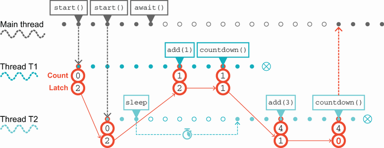

**Hình 6.1** Dùng một `CountDownLatch`

Để đưa ra một ví dụ khác về trường hợp sử dụng tốt cho `CountDownLatch`, hãy xét một ứng dụng cần nạp trước dữ liệu tham chiếu vào nhiều cache trước khi server sẵn sàng nhận request đến. Chúng ta có thể dễ dàng đạt được điều này bằng cách dùng một latch chia sẻ, mà mỗi luồng nạp cache giữ một tham chiếu tới.

Khi mỗi cache nạp xong, `Runnable` đang nạp nó giảm latch và thoát. Khi mọi cache đã được nạp, luồng main (vốn đang chờ latch mở) có thể tiếp tục và sẵn sàng đánh dấu dịch vụ là đã lên và bắt đầu xử lý request.

Class tiếp theo chúng ta thảo luận là một trong những class hữu ích nhất trong bộ công cụ của lập trình viên đa luồng: `ConcurrentHashMap`.

## 6.5 ConcurrentHashMap

Class `ConcurrentHashMap` cung cấp một phiên bản concurrent của `HashMap` tiêu chuẩn. Nói chung, map là một cấu trúc dữ liệu rất hữu ích (và phổ biến) để xây dựng ứng dụng đồng thời. Điều này ít nhất một phần là do hình dạng của cấu trúc dữ liệu bên dưới. Hãy xem kỹ hơn `HashMap` cơ bản để hiểu tại sao.

### 6.5.1 Hiểu một HashMap đơn giản hóa

Như bạn thấy từ hình 6.2, `HashMap` cổ điển của Java dùng một hàm (hàm băm — hash function) để xác định nó sẽ lưu cặp key-value vào bucket nào. Đây là nơi phần "hash" trong tên class đến từ.

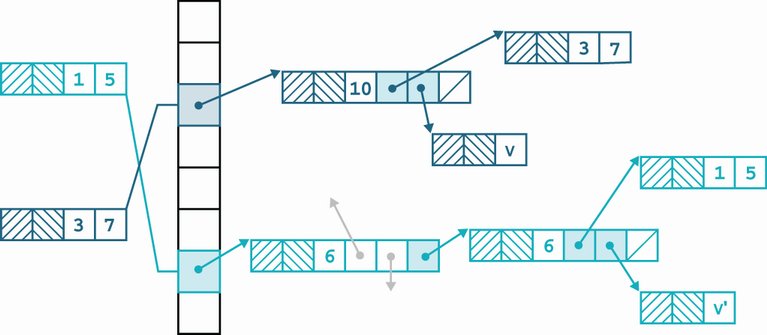

**Hình 6.2** Góc nhìn cổ điển về một `HashMap`

Cặp key-value thực ra được lưu trong một danh sách liên kết (gọi là *hash chain*) bắt đầu từ bucket tương ứng với chỉ mục thu được bằng cách băm key.

Trong dự án GitHub đi kèm cuốn sách này là một bản hiện thực đơn giản hóa của `Map<String, String>` — class `Dictionary`. Class này thực ra dựa trên dạng `HashMap` được giao như một phần của Java 7.

> **NOTE** Các phiên bản Java hiện đại giao một bản hiện thực `HashMap` phức tạp hơn đáng kể, nên trong phần giải thích này, chúng tôi tập trung vào một phiên bản đơn giản hơn nơi các khái niệm thiết kế dễ thấy hơn.

Class cơ bản chỉ có hai field: cấu trúc dữ liệu chính và field `size`, cache kích thước của map vì lý do hiệu năng, như sau:

```java
public class Dictionary implements Map<String, String> {
    private Node[] table = new Node[8];
    private int size;

      @Override
      public int size() {
          return size;
      }

      @Override
      public boolean isEmpty() {
             return size == 0;
      }
```

Chúng dựa vào một class trợ giúp, gọi là `Node`, biểu diễn một cặp key-value và hiện thực interface `Map.Entry` như sau:

```java
static class Node implements Map.Entry<String,String> {
     final int hash;
     final String key;
     String value;
     Node next;

     Node(int hash, String key, String value, Node next) {
         this.hash = hash;
         this.key = key;
          this.value = value;
          this.next = next;
     }

     public final String getKey()        { return key; }
     public final String getValue()      { return value; }
     public final String toString() { return key + "=" + value; }

     public final int hashCode() {
         return Objects.hashCode(key) ^ Objects.hashCode(value);
     }

     public final String setValue(String newValue) {
         String oldValue = value;
         value = newValue;
          return oldValue;
     }

     public final boolean equals(Object o) {
          if (o == this)
              return true;
          if (o instanceof Node) {
               Node e = (Node)o;
               if (Objects.equals(key, e.getKey()) &&
                       Objects.equals(value, e.getValue()))
                   return true;
          }
          return false;
     }
}
```

Để tìm một giá trị trong map, chúng ta dùng phương thức `get()`, dựa vào vài phương thức trợ giúp, `hash()` và `indexFor()` như sau:

```java
@Override
public String get(Object key) {
     if (key == null)
         return null;
     int hash = hash(key);
     for (Node e = table[indexFor(hash, table.length)];
          e != null;
             e = e.next) {
            Object k = e.key;
            if (e.hash == hash && (k == key || key.equals(k)))
                return e.value;
      }
      return null;
}

static final int hash(Object key) {
     int h = key.hashCode();
     return h ^ (h >>> 16);                            ❶
}

static int indexFor(int h, int length) {
    return h & (length - 1);                           ❷
}
```

❶ Một thao tác bitwise để đảm bảo giá trị hash là dương

❷ Một thao tác bitwise để đảm bảo chỉ mục nằm trong kích thước của bảng

Trước hết, phương thức `get()` xử lý trường hợp `null` khó chịu. Sau đó, chúng ta dùng hash code của đối tượng key để dựng một chỉ mục vào mảng `table`. Một giả định bất thành văn nói rằng kích thước của `table` là lũy thừa của hai, nên thao tác của `indexFor()` về cơ bản là một phép modulo, đảm bảo giá trị trả về là một chỉ mục hợp lệ vào `table`.

> **NOTE** Đây là một ví dụ kinh điển về tình huống mà trí óc con người có thể xác định rằng một exception (trong trường hợp này, `ArrayIndexOutOfBoundsException`) sẽ không bao giờ bị ném, nhưng compiler thì không thể.

Giờ khi đã có chỉ mục vào `table`, chúng ta dùng nó để chọn hash chain liên quan cho thao tác tra cứu. Chúng ta bắt đầu ở đầu và đi dọc hash chain. Ở mỗi bước, ta đánh giá xem đã tìm thấy đối tượng key hay chưa, như sau:

```java
if (e.hash == hash && ((k = e.key) == key || key.equals(k)))
     return e.value;
```

Nếu đã tìm thấy, thì chúng ta trả về giá trị tương ứng. Chúng ta lưu key và value dưới dạng cặp (thực sự là các thể hiện `Node`) để cho phép cách tiếp cận này.

Phương thức `put()` phần nào tương tự mã trên:

```java
@Override
public String put(String key, String value) {
     if (key == null)
         return null;

     int hash = hash(key.hashCode());
     int i = indexFor(hash, table.length);
     for (Node e = table[i]; e != null; e = e.next) {
         Object k = e.key;
          if (e.hash == hash && (k == key || key.equals(k))) {
                String oldValue = e.value;
                e.value = value;
                return oldValue;
          }
     }

     Node e = table[i];
     table[i] = new Node(hash, key, value, e);

     return null;
}
```

Phiên bản cấu trúc dữ liệu băm này không phải chất lượng production 100%, nhưng nó nhằm minh họa hành vi cơ bản và cách tiếp cận vấn đề, để trường hợp concurrent có thể được hiểu.

### 6.5.2 Hạn chế của Dictionary

Trước khi tiếp tục tới trường hợp concurrent, chúng tôi nên đề cập rằng một số phương thức từ `Map` không được bản hiện thực đồ chơi `Dictionary` của chúng ta hỗ trợ. Cụ thể, `putAll()`, `keySet()`, `values()` hay `entrySet()` (cần được định nghĩa, bởi class hiện thực `Map`) sẽ chỉ đơn giản ném `new UnsupportedOperationException()`.

Chúng tôi không hỗ trợ các phương thức này thuần túy và duy nhất vì độ phức tạp. Như chúng ta sẽ thấy nhiều lần trong cuốn sách, các interface Java Collections rất lớn và giàu tính năng. Điều này tốt cho người dùng cuối, bởi họ có nhiều sức mạnh, nhưng nó nghĩa là người hiện thực phải cung cấp nhiều phương thức hơn.

Cụ thể, các phương thức như `keySet()` đòi hỏi một bản hiện thực của `Map` phải cung cấp các thể hiện của `Set`, và điều này thường dẫn tới nhu cầu viết cả một bản hiện thực của interface `Set` dưới dạng inner class. Đó là quá nhiều phức tạp bổ sung cho các ví dụ của chúng tôi, nên chúng tôi đơn giản là không hỗ trợ những phương thức đó trong bản hiện thực đồ chơi của mình.

> **NOTE** Như chúng ta sẽ thấy ở phần sau của sách, thiết kế nguyên khối, phức tạp, mệnh lệnh của các interface Collections đặt ra nhiều vấn đề khi chúng ta bắt đầu nghĩ về lập trình hàm một cách chi tiết.

Class `Dictionary` đơn giản hoạt động tốt, trong giới hạn của nó. Tuy nhiên, nó không phòng vệ trước hai kịch bản sau:

- Nhu cầu thay đổi kích thước `table` khi số phần tử lưu trữ tăng lên
- Phòng vệ trước các key hiện thực một dạng `hashCode()` bệnh hoạn

Cái đầu tiên là một hạn chế nghiêm trọng. Một điểm chính của cấu trúc dữ liệu băm là giảm độ phức tạp kỳ vọng của các thao tác từ `O(N)` xuống `O(log N)`, ví dụ, cho việc lấy giá trị. Nếu bảng không được thay đổi kích thước khi số phần tử giữ trong map tăng lên, lợi ích về độ phức tạp này bị mất. Một bản hiện thực thực sự sẽ phải xử lý nhu cầu thay đổi kích thước bảng khi map lớn lên.

### 6.5.3 Các cách tiếp cận một Dictionary concurrent

Ở trạng thái hiện tại, `Dictionary` hiển nhiên không thread-safe. Hãy xét hai luồng — một cố xóa một key nhất định và cái kia cố cập nhật giá trị gắn với nó. Tùy vào thứ tự các thao tác, hoàn toàn có thể cả việc xóa lẫn cập nhật đều báo cáo rằng chúng thành công trong khi thực tế chỉ một trong hai thành công. Để giải quyết điều này, chúng ta có hai cách khá hiển nhiên (dù ngây thơ) để làm cho `Dictionary` (và, mở rộng ra, các bản hiện thực `Map` nói chung của Java) trở nên concurrent.

Trước hết là cách tiếp cận đồng bộ hóa hoàn toàn, mà chúng ta đã gặp ở chương 5. Kết luận không khó đoán: cách tiếp cận này không khả thi với hầu hết hệ thống thực tế do chi phí hiệu năng. Tuy nhiên, đáng để lạc đề một chút xem chúng ta có thể hiện thực nó ra sao.

Chúng ta có hai cách dễ dàng để đạt được thread safety đơn giản ở đây. Cách thứ nhất là sao chép class `Dictionary` — gọi nó là `ThreadSafeDictionary` — rồi làm mọi phương thức của nó `synchronized`. Cách này hoạt động nhưng bao gồm rất nhiều mã trùng lặp, cắt-dán.

Cách khác, chúng ta có thể dùng một wrapper synchronized để cung cấp việc ủy nhiệm (delegation), hay chuyển tiếp (forwarding), tới một đối tượng bên dưới thực sự chứa dictionary. Đây là cách chúng ta làm điều đó:

```java
public final class SynchronizedDictionary extends Dictionary {
     private final Dictionary d;

     private SynchronizedDictionary(Dictionary delegate) {
           d = delegate;
     }

    public static SynchronizedDictionary of(Dictionary delegate) {
        return new SynchronizedDictionary(delegate);
    }

    @Override
    public synchronized int size() {
        return d.size();
    }

    @Override
    public synchronized boolean isEmpty() {
        return d.isEmpty();
    }

    // ... các phương thức khác

}
```

Ví dụ này có một số vấn đề, quan trọng nhất là đối tượng `d` đã tồn tại sẵn và không được synchronized. Điều này là tự đặt mình vào thế thất bại — mã khác có thể sửa đổi `d` bên ngoài một khối hoặc phương thức synchronized, và chúng ta lại rơi vào chính tình huống đã thảo luận ở chương trước. Đây không phải cách tiếp cận đúng cho cấu trúc dữ liệu concurrent.

Chúng tôi nên đề cập rằng thực tế JDK có cung cấp đúng một bản hiện thực như vậy — phương thức `synchronizedMap()` cung cấp trong class `Collections`. Nó hoạt động cũng vậy và được dùng rộng rãi cũng vậy, như bạn có thể đoán.

Cách tiếp cận thứ hai là viện đến tính bất biến. Như chúng tôi sẽ nói, và nói đi nói lại, Java Collections là các interface lớn và phức tạp. Một cách điều này biểu hiện là giả định về tính khả biến được nướng vào xuyên suốt các collections. Không theo nghĩa nào nó là một mối quan tâm tách rời được mà một số bản hiện thực có thể chọn, hoặc không, để diễn đạt — mọi bản hiện thực của `Map` và `List` đều phải hiện thực các phương thức thay đổi.

Do sự bó buộc này, có vẻ như chúng ta không có cách nào mô hình hóa một cấu trúc dữ liệu trong Java vừa bất biến vừa tuân theo các API Java Collections — nếu nó tuân theo API, class cũng phải cung cấp một bản hiện thực của phương thức thay đổi. Tuy nhiên, tồn tại một cửa sau cực kỳ không thỏa đáng. Một bản hiện thực của một interface luôn có thể ném `UnsupportedOperationException` nếu nó không hiện thực một phương thức nhất định. Từ góc nhìn thiết kế ngôn ngữ, điều này dĩ nhiên là tồi tệ. Một hợp đồng interface nên đúng là như vậy — một hợp đồng. Đáng tiếc, cơ chế và quy ước này có trước Java 8 (và sự xuất hiện của default method) và do đó biểu diễn một nỗ lực mã hóa sự khác biệt giữa phương thức "bắt buộc" và phương thức "tùy chọn", vào thời điểm mà không có sự phân biệt nào như vậy thực sự tồn tại trong ngôn ngữ Java.

Đó là một cơ chế và thực hành tồi (đặc biệt bởi `UnsupportedOperationException` là một runtime exception), nhưng chúng ta có thể dùng nó đại loại như sau:

```java
public final class ImmutableDictionary extends Dictionary {
    private final Dictionary d;

     private ImmutableDictionary(Dictionary delegate) {
          d = delegate;
     }

     public static ImmutableDictionary of(Dictionary delegate) {
          return new ImmutableDictionary(delegate);
     }

     @Override
     public int size() {
          return d.size();
     }

     @Override
     public String get(Object key) {
          return d.get(key);
     }

     @Override
     public String put(String key, String value) {
          throw new UnsupportedOperationException();
     }

     // các phương thức thay đổi khác cũng ném UnsupportedOperationException

}
```

Có thể lập luận rằng đây phần nào là vi phạm các nguyên tắc hướng đối tượng — kỳ vọng từ người dùng là đây là một bản hiện thực hợp lệ của `Map<String, String>`, vậy mà nếu người dùng cố thay đổi một thể hiện, một unchecked exception bị ném. Điều này có thể được xem một cách chính đáng là mối nguy về an toàn.

> **NOTE** Đây về cơ bản là sự thỏa hiệp mà `Map.of()` phải chấp nhận: nó cần hiện thực đầy đủ interface và do đó phải viện đến việc ném exception khi các phương thức thay đổi được gọi.

Đây cũng không phải vấn đề duy nhất với cách tiếp cận này. Một nhược điểm khác là điều này dĩ nhiên chịu cùng khiếm khuyết cơ bản như ta đã thấy với trường hợp synchronized — một đối tượng khả biến vẫn tồn tại và có thể được tham chiếu (và bị thay đổi) qua con đường đó, vi phạm tiêu chí cơ bản mà chúng ta đang cố đạt được. Hãy khép lại những nỗ lực này và tìm kiếm thứ gì tốt hơn.

### 6.5.4 Dùng ConcurrentHashMap

Sau khi đã cho thấy một bản hiện thực map đơn giản và thảo luận các cách tiếp cận mà ta có thể dùng để làm nó concurrent, đã đến lúc gặp `ConcurrentHashMap`. Ở một số khía cạnh, đây là phần dễ: nó là một class cực kỳ dễ dùng và trong hầu hết trường hợp là bản thay thế thả-vào (drop-in) cho `HashMap`.

Điểm mấu chốt về `ConcurrentHashMap` là an toàn khi nhiều luồng cập nhật nó cùng lúc. Để hiểu vì sao chúng ta cần điều này, hãy xem điều gì xảy ra khi có hai luồng thêm mục vào một `HashMap` đồng thời (phần xử lý exception được lược bỏ):

```java
var map = new HashMap<String, String>();
var SIZE = 10_000;

Runnable r1 = () -> {
    for (int i = 0; i < SIZE; i = i + 1) {
          map.put("t1" + i, "0");
     }
     System.out.println("Thread 1 done");
};
Runnable r2 = () -> {
    for (int i = 0; i < SIZE; i = i + 1) {
          map.put("t2" + i, "0");
     }
     System.out.println("Thread 2 done");
};
Thread t1 = new Thread(r1);
Thread t2 = new Thread(r2);
t1.start();
t2.start();

t1.join();
t2.join();
System.out.println("Count: "+ map.size());
```

Nếu chạy mã này, chúng ta sẽ thấy một biểu hiện khác của người bạn cũ, antipattern Lost Update — giá trị đầu ra cho `Count` sẽ nhỏ hơn `2 * SIZE`. Tuy nhiên, trong trường hợp truy cập đồng thời một map, tình hình thực ra tệ hơn nhiều, nhiều lắm.

Hành vi nguy hiểm nhất của `HashMap` dưới việc sửa đổi đồng thời không phải lúc nào cũng biểu hiện ở kích thước nhỏ. Tuy nhiên, nếu ta tăng giá trị `SIZE`, cuối cùng nó sẽ tự biểu hiện.

Nếu chúng ta tăng `SIZE` lên, chẳng hạn, `1_000_000`, thì ta có khả năng thấy hành vi đó. Một trong các luồng đang cập nhật `map` sẽ không hoàn tất. Đúng vậy — một trong các luồng có thể (và sẽ) bị kẹt trong một vòng lặp vô hạn thực sự. Điều này khiến `HashMap` hoàn toàn không an toàn để dùng trong ứng dụng đa luồng (và điều tương tự cũng đúng với class `Dictionary` ví dụ của chúng ta).

Mặt khác, nếu chúng ta thay `HashMap` bằng `ConcurrentHashMap`, thì ta thấy phiên bản concurrent hành xử đúng đắn — không vòng lặp vô hạn và không có trường hợp Lost Update nào. Nó cũng có tính chất hay là, dù bạn làm gì với nó, các thao tác map sẽ không bao giờ ném `ConcurrentModificationException`.

Hãy xem rất ngắn gọn cách điều này đạt được. Hóa ra hình 6.2, cho thấy bản hiện thực của `Dictionary`, cũng chỉ đường tới một sự tổng quát hóa đa luồng hữu ích của `Map` tốt hơn nhiều so với hai nỗ lực trước của chúng ta. Nó dựa trên nhận thức sau: thay vì cần khóa toàn bộ cấu trúc khi thực hiện một thay đổi, chỉ cần khóa hash chain (hay bucket) đang bị thay đổi hoặc đọc.

Chúng ta thấy điều này hoạt động ra sao trong hình 6.3. Bản hiện thực đã chuyển khóa xuống các hash chain riêng lẻ. Kỹ thuật này gọi là *lock striping*, và nó cho phép nhiều luồng truy cập map, miễn là chúng đang thao tác trên các chain khác nhau.

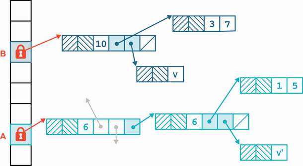

**Hình 6.3** Lock striping

Dĩ nhiên, nếu hai luồng cần thao tác trên cùng một chain, chúng vẫn sẽ loại trừ nhau, nhưng nói chung, cách này cung cấp thông lượng tốt hơn so với synchronize toàn bộ map.

> **NOTE** Nhớ rằng khi số phần tử trong map tăng, bảng bucket sẽ thay đổi kích thước, nghĩa là càng nhiều phần tử được thêm vào một `ConcurrentHashMap`, nó sẽ càng có khả năng xử lý nhiều luồng hơn một cách hiệu quả.

`ConcurrentHashMap` đạt được hành vi này, nhưng có thêm một số chi tiết mức thấp mà hầu hết lập trình viên không cần lo lắng quá nhiều. Thực tế, bản hiện thực của `ConcurrentHashMap` đã thay đổi đáng kể ở Java 8, và giờ nó phức tạp hơn thiết kế chúng tôi đã mô tả ở đây.

Việc dùng `ConcurrentHashMap` có thể gần như quá đơn giản. Trong nhiều trường hợp, nếu bạn có chương trình đa luồng và cần chia sẻ dữ liệu, thì cứ dùng một `Map`, và để bản hiện thực là `ConcurrentHashMap`. Thực tế, nếu có bất kỳ khả năng nào một `Map` cần được nhiều hơn một luồng sửa đổi, bạn nên luôn dùng bản hiện thực concurrent. Nó có dùng nhiều tài nguyên hơn đáng kể so với một `HashMap` thường và sẽ có thông lượng kém hơn do việc synchronize một số thao tác. Tuy nhiên, như chúng ta sẽ thảo luận ở chương 7, những bất tiện đó chẳng là gì so với khả năng một race condition dẫn tới Lost Update hoặc một vòng lặp vô hạn.

Cuối cùng, chúng ta cũng nên lưu ý rằng `ConcurrentHashMap` thực sự hiện thực interface `ConcurrentMap`, kế thừa `Map`. Ban đầu nó chứa các phương thức mới sau để cung cấp việc sửa đổi thread-safe:

- `putIfAbsent()` — Thêm cặp key-value vào `HashMap` nếu key chưa có mặt.
- `remove()` — Xóa an toàn cặp key-value nếu key có mặt.
- `replace()` — Bản hiện thực cung cấp hai dạng khác nhau của phương thức này để thay thế an toàn trong `HashMap`.

Tuy nhiên, với Java 8, một số phương thức này đã được đưa ngược vào interface `Map` dưới dạng default method, ví dụ:

```java
default V putIfAbsent(K key, V value) {
        V v = get(key);
          if (v == null) {
               v = put(key, value);
          }

          return v;
     }
```

Khoảng cách giữa `ConcurrentHashMap` và `Map` đã thu hẹp phần nào ở các phiên bản Java gần đây, nhưng đừng quên rằng bất chấp điều này, `HashMap` vẫn không thread-safe. Nếu bạn muốn chia sẻ dữ liệu an toàn giữa các luồng, bạn nên dùng `ConcurrentHashMap`.

Tổng thể, `ConcurrentHashMap` là một trong những class hữu ích nhất trong `java.util.concurrent`. Nó cung cấp thêm an toàn đa luồng và hiệu năng cao hơn so với synchronization, và nó không có nhược điểm nghiêm trọng nào trong sử dụng thông thường. Đối tác của nó cho `List` là `CopyOnWriteArrayList`, mà chúng ta sẽ thảo luận tiếp theo.

## 6.6 CopyOnWriteArrayList

Dĩ nhiên chúng ta có thể áp dụng hai mẫu concurrency không thỏa đáng đã thấy ở mục trước cho `List` nữa. Các list được synchronize hoàn toàn và bất biến (nhưng với các phương thức thay đổi ném runtime exception) cũng dễ viết như với map, và chúng hoạt động không tốt hơn gì so với với map.

Chúng ta có thể làm tốt hơn không? Đáng tiếc, bản chất tuyến tính của list không giúp ích ở đây. Ngay cả trong trường hợp linked list, nhiều luồng cố sửa đổi list làm dấy lên khả năng tranh chấp, ví dụ, trong các workload có tỷ lệ lớn thao tác append.

Một lựa chọn thay thế tồn tại là class `CopyOnWriteArrayList`. Như tên gợi ý, kiểu này là bản thay thế cho class `ArrayList` tiêu chuẩn đã được làm thread-safe bằng cách thêm ngữ nghĩa copy-on-write. Điều này nghĩa là bất kỳ thao tác nào thay đổi list sẽ tạo một bản sao mới của mảng đứng sau list (như thể hiện trong hình 6.4). Điều này cũng nghĩa là bất kỳ iterator nào được tạo không phải lo về các sửa đổi mà chúng không kỳ vọng.

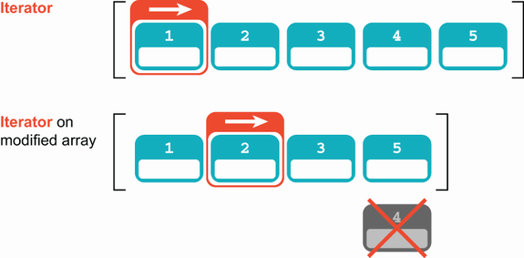

**Hình 6.4** Mảng copy-on-write

Các iterator được đảm bảo không ném `ConcurrentModificationException` và sẽ không phản ánh bất kỳ thao tác thêm, xóa hay thay đổi nào đối với list kể từ khi iterator được tạo — ngoại trừ, dĩ nhiên, (như thường lệ trong Java) các phần tử của list vẫn có thể thay đổi. Chỉ có list là không thể.

Bản hiện thực này thường quá đắt đỏ cho sử dụng chung nhưng có thể là lựa chọn tốt khi các thao tác duyệt nhiều hơn hẳn các thao tác thay đổi, và khi lập trình viên không muốn đau đầu với synchronization, nhưng vẫn muốn loại trừ khả năng các luồng can thiệp lẫn nhau.

Hãy xem nhanh cách ý tưởng cốt lõi được hiện thực. Các phương thức then chốt là `iterator()`, luôn trả về một đối tượng `COWIterator` mới:

```java
public Iterator<E> iterator() {
      return new COWIterator<E>(getArray(), 0);
}
```

và `add()`, `remove()` cùng các phương thức thay đổi khác. Các phương thức thay đổi luôn thay mảng ủy nhiệm bằng một bản sao mới, đã nhân bản và sửa đổi của mảng. Việc bảo vệ mảng phải được làm trong một khối synchronized, nên class `CopyOnWriteArrayList` có một khóa nội bộ chỉ được dùng làm monitor (và lưu ý chú thích trên nó), như sau:

```java
/**
 * The lock protecting all mutators. (We have a mild preference
 * for builtin monitors over ReentrantLock when either will do.)
 */
final transient Object lock = new Object();

private transient volatile Object[] array;
```

Rồi, các thao tác như `add()` có thể được bảo vệ như sau:

```java
 public boolean add(E e) {
      synchronized (lock) {
          Object[] es = getArray();
          int len = es.length;
          es = Arrays.copyOf(es, len + 1);
          es[len] = e;
          setArray(es);
          return true;
    }
}
```

Điều này khiến `CopyOnWriteArrayList` kém hiệu quả hơn `ArrayList` cho các thao tác chung, vì nhiều lý do:

- Synchronization của các thao tác thay đổi.
- Lưu trữ volatile (tức là `array`).
- `ArrayList` chỉ cấp phát bộ nhớ khi cần thay đổi kích thước mảng bên dưới; `CopyOnWriteArrayList` cấp phát và sao chép ở mỗi lần thay đổi.

Việc tạo iterator lưu một tham chiếu tới mảng như nó tồn tại tại thời điểm đó. Các sửa đổi tiếp theo đối với list khiến một bản sao mới được tạo, nên iterator sẽ trỏ tới một phiên bản quá khứ của mảng, như sau:

```java
static final class COWIterator<E> implements ListIterator<E> {
    /** Snapshot of the array */
    private final Object[] snapshot;
    /** Index of element to be returned by subsequent call to next */
    private int cursor;

    COWIterator(Object[] es, int initialCursor) {
         cursor = initialCursor;
         snapshot = es;
    }
    // ...
}
```

Lưu ý rằng `COWIterator` hiện thực `ListIterator` và do đó, theo hợp đồng interface, phải hỗ trợ các phương thức thay đổi list, nhưng để đơn giản, mọi phương thức thay đổi đều ném `UnsupportedOperationException`.

Cách tiếp cận mà `CopyOnWriteArrayList` áp dụng với dữ liệu chia sẻ có thể hữu ích khi một snapshot dữ liệu nhanh, nhất quán (có thể đôi khi khác nhau giữa các reader) quan trọng hơn synchronization hoàn hảo. Điều này thấy khá thường xuyên trong các kịch bản liên quan tới dữ liệu không tối quan trọng, và cách tiếp cận copy-on-write tránh được cú đánh hiệu năng gắn với synchronization.

Hãy xem một ví dụ về copy-on-write trong thực tế ở listing tiếp theo.

**Listing 6.3 Ví dụ copy-on-write**

```java
var ls = new CopyOnWriteArrayList(List.of(1, 2, 3));
var it = ls.iterator();
ls.add(4);
var modifiedIt = ls.iterator();
while (it.hasNext()) {
      System.out.println("Original: "+ it.next());
}
while (modifiedIt.hasNext()) {
      System.out.println("Modified: "+ modifiedIt.next());
}
```

Mã này được thiết kế riêng để minh họa hành vi của một `Iterator` dưới ngữ nghĩa copy-on-write. Nó tạo ra kết quả như sau:

```
Original: 1
Original: 2
Original: 3
Modified: 1
Modified: 2
Modified: 3
Modified: 4
```

Nói chung, việc dùng class `CopyOnWriteArrayList` đòi hỏi suy nghĩ nhiều hơn một chút so với dùng `ConcurrentHashMap`, vốn về cơ bản là bản thay thế concurrent thả-vào cho `HashMap`, vì các vấn đề hiệu năng — tính chất copy-on-write nghĩa là nếu list bị thay đổi, toàn bộ mảng phải được sao chép. Nếu các thay đổi đối với list là phổ biến, so với truy cập đọc, cách tiếp cận này sẽ không nhất thiết cho hiệu năng cao.

Nói chung, `CopyOnWriteArrayList` đưa ra những đánh đổi khác với `synchronizedList()`. Cái sau synchronize trên mọi thao tác, nên các phép đọc từ các luồng khác nhau có thể chặn lẫn nhau, điều không đúng với một cấu trúc dữ liệu COW. Mặt khác, `CopyOnWriteArrayList` sao chép mảng đứng sau ở mỗi lần thay đổi, trong khi phiên bản synchronized chỉ làm vậy khi mảng đứng sau đầy (cùng hành vi với `ArrayList`). Tuy nhiên, như chúng tôi sẽ nói đi nói lại ở chương 7, việc suy luận về mã từ các nguyên tắc đầu tiên là cực kỳ khó — cách duy nhất để có được mã chạy tốt một cách đáng tin cậy là kiểm thử, kiểm thử lại, và đo kết quả.

Sau này, ở chương 15, chúng ta sẽ gặp khái niệm *persistent data structure*, một cách khác để tiếp cận việc xử lý dữ liệu concurrent. Ngôn ngữ lập trình Clojure dùng rất nhiều persistent data structure, và `CopyOnWriteArrayList` (cùng `CopyOnWriteArraySet`) là một ví dụ hiện thực của chúng.

Hãy tiếp tục. Khối xây dựng phổ biến quan trọng tiếp theo của mã đồng thời trong `java.util.concurrent` là `Queue`. Nó được dùng để chuyển giao các phần tử công việc giữa các luồng, và được dùng làm cơ sở cho nhiều thiết kế đa luồng linh hoạt và đáng tin cậy.

## 6.7 Blocking queue

Queue là một trừu tượng tuyệt vời cho lập trình đồng thời. Queue cung cấp một cách đơn giản và đáng tin cậy để phân phối tài nguyên xử lý cho các đơn vị công việc (hoặc để gán đơn vị công việc cho tài nguyên xử lý, tùy cách bạn muốn nhìn nhận).

Một số mẫu trong lập trình Java đa luồng dựa nhiều vào các bản hiện thực thread-safe của `Queue`, nên quan trọng là bạn hiểu nó đầy đủ. Interface `Queue` cơ bản nằm trong `java.util`, bởi nó có thể là một mẫu quan trọng ngay cả trong lập trình đơn luồng, nhưng chúng ta sẽ tập trung vào các trường hợp sử dụng đa luồng.

Một trường hợp sử dụng rất phổ biến, và là cái chúng ta sẽ tập trung vào, là dùng một queue để chuyển các đơn vị công việc giữa các luồng. Mẫu này thường lý tưởng phù hợp cho phần mở rộng concurrent đơn giản nhất của `Queue` — `BlockingQueue`.

`BlockingQueue` là một queue có hai tính chất đặc biệt bổ sung sau:

- Khi cố `put()` vào queue, nó sẽ khiến luồng đang put phải chờ tới khi có chỗ trống nếu queue đầy.
- Khi cố `take()` từ queue, nó sẽ khiến luồng đang take bị chặn nếu queue rỗng.

Hai tính chất này rất hữu ích bởi nếu một luồng (hoặc pool luồng) vượt xa khả năng theo kịp của luồng kia, luồng nhanh hơn bị buộc phải chờ, qua đó điều hòa toàn bộ hệ thống. Điều này được minh họa trong hình 6.5.

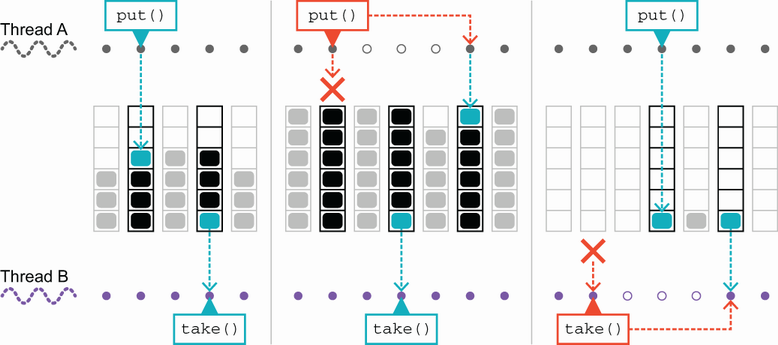

**Hình 6.5** `BlockingQueue`

Java đi kèm hai bản hiện thực cơ bản của interface `BlockingQueue`: `LinkedBlockingQueue` và `ArrayBlockingQueue`. Chúng có tính chất hơi khác nhau; ví dụ, bản hiện thực mảng rất hiệu quả khi biết chính xác giới hạn cho kích thước queue, trong khi bản hiện thực liên kết có thể nhanh hơn một chút trong một số hoàn cảnh.

Tuy nhiên, khác biệt thực sự giữa các bản hiện thực nằm ở ngữ nghĩa hàm ý. Mặc dù biến thể liên kết có thể được dựng với giới hạn kích thước, nó thường được tạo mà không có giới hạn, dẫn tới một đối tượng có kích thước queue là `Integer.MAX_VALUE`. Điều này về cơ bản là vô hạn — một ứng dụng thực sẽ không bao giờ có thể phục hồi từ tình trạng tồn đọng hơn hai tỷ mục trong một trong các queue của nó.

Vậy nên, mặc dù về lý thuyết phương thức `put()` trên `LinkedBlockingQueue` có thể chặn, trên thực tế nó không bao giờ chặn. Điều này nghĩa là các luồng đang ghi vào queue có thể tiến hành với tốc độ không giới hạn.

Ngược lại, `ArrayBlockingQueue` có kích thước cố định cho queue — kích thước của mảng đứng sau nó. Nếu các luồng producer đặt đối tượng vào queue nhanh hơn tốc độ chúng được các receiver xử lý, thì tại một điểm nào đó queue sẽ đầy hoàn toàn, các nỗ lực gọi `put()` tiếp theo sẽ chặn, và các luồng producer sẽ bị buộc phải giảm tốc độ tạo tác vụ.

Tính chất này của `ArrayBlockingQueue` là một dạng của cái gọi là *back pressure* (áp lực ngược), một khía cạnh quan trọng của việc kỹ thuật hóa các hệ thống đồng thời và phân tán.

Hãy xem `BlockingQueue` trong thực tế qua một ví dụ: thay đổi ví dụ account để dùng queue và luồng. Mục tiêu của ví dụ sẽ là loại bỏ nhu cầu khóa cả hai đối tượng account. Kiến trúc cơ bản của ứng dụng được thể hiện trong hình 6.6.

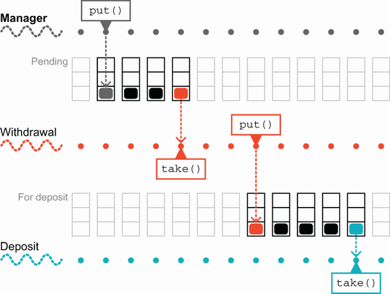

**Hình 6.6** Xử lý account với queue

Chúng ta bắt đầu bằng việc giới thiệu một class `AccountManager` với các field sau, như trong listing tiếp theo.

**Listing 6.4 Class `AccountManager`**

```java
public class AccountManager {
      private ConcurrentHashMap<Integer, Account> accounts =
          new ConcurrentHashMap<>();
      private volatile boolean shutdown = false;

      private BlockingQueue<TransferTask> pending =
          new LinkedBlockingQueue<>();
      private BlockingQueue<TransferTask> forDeposit =
            new LinkedBlockingQueue<>();
      private BlockingQueue<TransferTask> failed =
            new LinkedBlockingQueue<>();

      private Thread withdrawals;
      private Thread deposits;
```

Các blocking queue chứa các đối tượng `TransferTask`, là các vật mang dữ liệu đơn giản biểu thị việc chuyển tiền cần thực hiện, như sau:

```java
public class TransferTask {
      private final Account sender;
      private final Account receiver;
      private final int amount;

      public TransferTask(Account sender, Account receiver, int amount) {
         this.sender = sender;
         this.receiver = receiver;
         this.amount = amount;
    }

    public Account sender() {
         return sender;
    }

    public int amount() {
         return amount;
    }

    public Account receiver() {
         return receiver;
    }

    // Các phương thức khác được lược bỏ
}
```

Không có ngữ nghĩa bổ sung nào cho việc chuyển tiền — class chỉ là một kiểu mang dữ liệu ngờ nghệch.

> **NOTE** Kiểu `TransferTask` rất đơn giản và, trong Java 17, có thể được viết dưới dạng kiểu record (mà chúng ta đã gặp ở chương 3).

Class `AccountManager` cung cấp chức năng để tạo account và để submit các transfer task, như minh họa dưới đây:

```java
public Account createAccount(int balance) {
     var out = new Account(balance);
     accounts.put(out.getAccountId(), out);
     return out;
}

public boolean submit(TransferTask transfer) {
     if (shutdown) {
             return false;
     }
     return pending.add(transfer);
}
```

Công việc thực sự của `AccountManager` được xử lý bởi hai luồng quản lý các transfer task giữa các queue. Hãy xem thao tác rút tiền trước:

```java
public void init() {
     Runnable withdraw = () -> {
           boolean interrupted = false;
           while (!interrupted || !pending.isEmpty()) {
                try {
                    var task = pending.take();
                     var sender = task.sender();
                     if (sender.withdraw(task.amount())) {
                           forDeposit.add(task);
                     } else {
                         failed.add(task);
                     }
                } catch (InterruptedException e) {
                     interrupted = true;
                }
           }
           deposits.interrupt();
      };
```

Thao tác gửi tiền được định nghĩa tương tự, rồi chúng ta khởi tạo account manager với các tác vụ:

```java
     Runnable deposit = () -> {
           boolean interrupted = false;
           while (!interrupted || !forDeposit.isEmpty()) {
                try {
                     var task = forDeposit.take();
                     var receiver = task.receiver();
                     receiver.deposit(task.amount());
                } catch (InterruptedException e) {
                     interrupted = true;
                }
           }
      };

      init(withdraw, deposit);
}
```

Overload package-private của phương thức `init()` được dùng để khởi động các luồng nền. Nó tồn tại như một phương thức riêng để cho phép kiểm thử dễ hơn, như sau:

```java
void init(Runnable withdraw, Runnable deposit) {
      withdrawals = new Thread(withdraw);
      deposits = new Thread(deposit);
      withdrawals.start();
      deposits.start();
}
```

Chúng ta cần một chút mã để điều khiển việc này:

```java
var manager = new AccountManager();
manager.init();
var acc1 = manager.createAccount(1000);
var acc2 = manager.createAccount(20_000);

var transfer = new TransferTask(acc1, acc2, 100);
manager.submit(transfer);                                     ❶
Thread.sleep(5000);                                           ❷
System.out.println(acc1);
System.out.println(acc2);
manager.shutdown();
manager.await();
```

❶ Submit việc chuyển từ `acc1` sang `acc2`

❷ Ngủ để có thời gian cho việc chuyển tiền thực thi

Đoạn này tạo ra kết quả như sau:

```
Account{accountId=1, balance=900.0,
       lock=java.util.concurrent.locks.ReentrantLock@58372a00[Unlocked]}
Account{accountId=2, balance=20100.0,
       lock=java.util.concurrent.locks.ReentrantLock@4dd8dc3[Unlocked]}
```

Tuy nhiên, mã như đã viết không thực thi một cách sạch sẽ, bất chấp các lời gọi `shutdown()` và `await()`, do bản chất chặn của các lời gọi được dùng. Hãy xem hình 6.7 để hiểu tại sao.

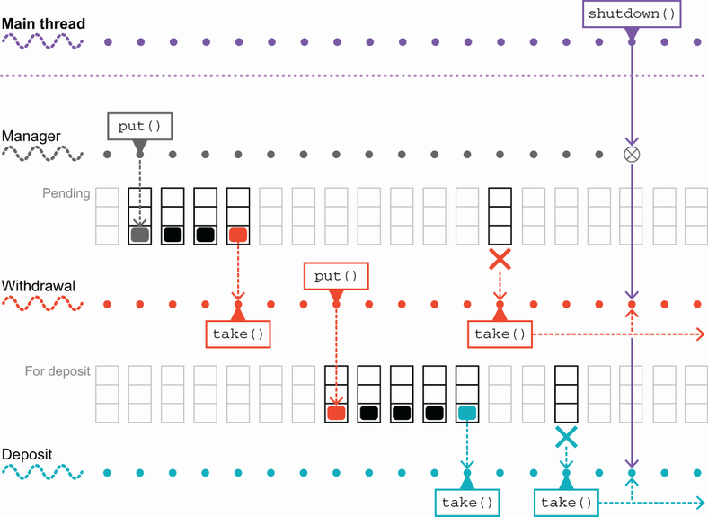

**Hình 6.7** Một chuỗi shutdown không đúng

Khi mã main gọi `shutdown()`, cờ boolean volatile được lật thành true, nên mọi lần đọc boolean sau đó sẽ thấy giá trị là true. Đáng tiếc, cả luồng rút tiền lẫn gửi tiền đều bị chặn trong các lời gọi `take()` bởi các queue rỗng. Nếu bằng cách nào đó một đối tượng được đặt vào queue `pending`, thì luồng rút tiền sẽ xử lý nó rồi đặt đối tượng vào queue `forDeposit` (giả sử việc rút thành công). Luồng rút tiền lúc này sẽ thoát khỏi vòng `while`, và luồng sẽ kết thúc bình thường.

Đến lượt nó, luồng gửi tiền giờ sẽ thấy đối tượng trong queue `forDeposit` và sẽ thức dậy, lấy nó, xử lý nó, rồi thoát khỏi vòng `while` của chính nó và cũng kết thúc bình thường. Tuy nhiên, quá trình kết thúc sạch sẽ này phụ thuộc vào việc vẫn còn tác vụ trong queue. Trong trường hợp biên là queue rỗng, các luồng sẽ ngồi trong các lời gọi `take()` chặn của chúng mãi mãi. Để giải quyết vấn đề này, hãy khám phá đầy đủ phạm vi các phương thức mà bản hiện thực blocking queue cung cấp.

### 6.7.1 Dùng API của BlockingQueue

Interface `BlockingQueue` thực ra cung cấp ba chiến lược riêng biệt để tương tác với nó. Để hiểu khác biệt giữa các chiến lược, hãy xét các hành vi khả dĩ mà một API có thể thể hiện trong kịch bản sau: một luồng cố chèn một mục vào queue bị giới hạn dung lượng mà hiện không thể chứa mục đó (tức là queue đầy).

Về mặt logic, chúng ta có ba khả năng sau. Lời gọi chèn có thể:

- Chặn tới khi có chỗ trống trong queue
- Trả về một giá trị (có lẽ là Boolean `false`) chỉ ra thất bại
- Ném một exception

Ba khả năng tương tự dĩ nhiên cũng xảy ra trong tình huống ngược lại (cố lấy một mục từ queue rỗng). Khả năng đầu tiên được hiện thực bởi các phương thức `take()` và `put()` mà chúng ta đã gặp.

> **NOTE** Khả năng thứ hai và thứ ba là các lựa chọn được interface `Queue` cung cấp, vốn là super interface của `BlockingQueue`.

Lựa chọn thứ hai cung cấp một API nonblocking trả về các giá trị đặc biệt và được biểu hiện trong các phương thức `offer()` và `poll()`. Nếu việc chèn vào queue không thể hoàn tất, thì `offer()` thất bại nhanh và trả về `false`. Lập trình viên phải kiểm tra mã trả về và hành động phù hợp.

Tương tự, `poll()` ngay lập tức trả về `null` khi thất bại lấy từ queue. Có vẻ hơi lạ khi có một API nonblocking trên một class được đặt tên rõ ràng là `BlockingQueue`, nhưng nó thực sự hữu ích (và cũng bắt buộc như hệ quả của quan hệ kế thừa giữa `BlockingQueue` và `Queue`).

Thực tế, `BlockingQueue` cung cấp thêm một overload của các phương thức nonblocking. Các phương thức này cung cấp khả năng poll hoặc offer với timeout, để cho phép luồng gặp vấn đề rút lui khỏi tương tác với queue và làm việc khác thay thế.

Chúng ta có thể sửa đổi `AccountManager` trong listing 6.4 để dùng các API nonblocking với timeout, như sau:

```java
Runnable withdraw = () -> {
      LOOP:
      while (!shutdown) {
          try {
              var task = pending.poll(5,                 ❶
                                      TimeUnit.SECONDS);
              if (task == null) {
                   continue LOOP;                        ❷
              }
              var sender = task.sender();
              if (sender.withdraw(task.amount())) {
                   forDeposit.put(task);
              } else {
                   failed.put(task);
              }
          } catch (InterruptedException e) {
              // Log ở mức critical và chuyển sang mục tiếp theo
          }
      }
      // Xả queue pending sang failed hoặc log
};
```

❶ Nếu bộ đếm thời gian hết hạn, `poll()` trả về `null`.

❷ Dùng tường minh một nhãn vòng lặp Java để làm rõ cái gì đang được `continue`.

Những sửa đổi tương tự cũng nên được thực hiện cho luồng gửi tiền.

Điều này giải quyết vấn đề shutdown mà chúng tôi đã nêu ở mục con trước, bởi giờ các luồng không thể chặn mãi mãi trong các phương thức lấy. Thay vào đó, nếu không có đối tượng nào tới trước timeout, thì poll vẫn sẽ trả về và cung cấp giá trị `null`. Phép kiểm tra sau đó tiếp tục vòng lặp, nhưng các đảm bảo về khả năng nhìn thấy của Boolean volatile đảm bảo rằng điều kiện vòng `while` giờ được thỏa mãn và vòng lặp được thoát và luồng shutdown sạch sẽ. Điều này nghĩa là tổng thể, khi phương thức `shutdown()` đã được gọi, `AccountManager` sẽ shutdown trong thời gian có giới hạn, chính là hành vi chúng ta muốn.

Để kết thúc phần thảo luận về API của `BlockingQueue`, chúng ta nên xem cách tiếp cận thứ ba đã đề cập ở trên: các phương thức ném exception nếu thao tác queue không thể hoàn tất ngay. Các phương thức này, `add()` và `remove()`, thẳng thắn mà nói là có vấn đề vì nhiều lý do, không kém phần quan trọng là các exception chúng ném khi thất bại (`IllegalStateException` và `NoSuchElementException` tương ứng) là runtime exception nên không cần được xử lý tường minh.

Tuy nhiên, các vấn đề với API ném exception còn sâu xa hơn thế. Một nguyên tắc chung trong Java nói rằng exception được dùng để xử lý những hoàn cảnh ngoại lệ, tức là những hoàn cảnh mà một chương trình thường không xem là một phần của vận hành bình thường. Tuy nhiên, tình huống một queue rỗng là một hoàn cảnh hoàn toàn khả dĩ. Nên việc ném exception để đáp lại nó là vi phạm nguyên tắc đôi khi được diễn đạt là "Đừng dùng exception để kiểm soát luồng điều khiển".

Exception nói chung khá đắt đỏ khi dùng, do việc dựng stack trace khi exception được khởi tạo và việc tháo dỡ stack trong lúc ném. Thực hành tốt là không tạo một exception trừ khi nó sắp được ném ngay. Vì những lý do này, chúng tôi khuyến nghị không dùng dạng ném exception của các API `BlockingQueue`.

### 6.7.2 Dùng WorkUnit

Các interface `Queue` đều là generic: chúng là `Queue<E>`, `BlockingQueue<E>`, v.v. Mặc dù có vẻ lạ, đôi khi khôn ngoan khi khai thác điều này và đưa vào một class container nhân tạo để bọc các mục công việc.

Ví dụ, nếu bạn có một class tên `MyAwesomeClass` biểu diễn các đơn vị công việc mà bạn muốn xử lý trong một ứng dụng đa luồng, thì thay vì có:

```java
BlockingQueue<MyAwesomeClass>
```

có thể tốt hơn khi có:

```java
BlockingQueue<WorkUnit<MyAwesomeClass>>
```

trong đó `WorkUnit` (hoặc `QueueObject`, hay bất cứ tên gì bạn muốn gọi class container) là một class đóng gói có thể trông như thế này:

```java
public class WorkUnit<T> {
    private final T workUnit;

      public T getWork() {
             return workUnit;
      }

      public WorkUnit(T workUnit) {
             this.workUnit = workUnit;
      }

      // ... các phương thức khác được lược bỏ
}
```

Lý do làm điều này là mức gián tiếp này cung cấp một chỗ để thêm metadata bổ sung mà không ảnh hưởng tới tính toàn vẹn khái niệm của kiểu được chứa (`MyAwesomeClass`, trong ví dụ này). Trong hình 6.8, chúng ta thấy wrapper metadata bên ngoài hoạt động ra sao.

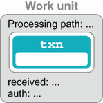

**Hình 6.8** Dùng một work unit như một wrapper metadata

Điều này hữu ích đến bất ngờ. Các trường hợp sử dụng nơi metadata bổ sung có ích thì rất nhiều. Đây là vài ví dụ:

- Kiểm thử (chẳng hạn hiển thị lịch sử thay đổi của một đối tượng)
- Chỉ số hiệu năng (chẳng hạn thời điểm tới hoặc chất lượng dịch vụ)
- Thông tin hệ thống runtime (chẳng hạn thể hiện `MyAwesomeClass` này đã được định tuyến ra sao)

Việc thêm mức gián tiếp này sau khi mọi thứ đã xong có thể khó hơn nhiều. Nếu sau này bạn phát hiện cần thêm metadata trong một số hoàn cảnh nhất định, đó có thể là một công việc refactor lớn để thêm vào thứ đáng lẽ chỉ là một thay đổi đơn giản trong class `WorkUnit`. Hãy chuyển sang thảo luận về future, một cách biểu diễn chỗ giữ chỗ cho một tác vụ đang tiến hành (thường trên luồng khác) trong Java.

## 6.8 Future

Interface `Future` trong `java.util.concurrent` là một biểu diễn đơn giản của một tác vụ bất đồng bộ: nó là một kiểu giữ kết quả từ một tác vụ có thể chưa hoàn tất nhưng có thể sẽ hoàn tất vào một thời điểm nào đó trong tương lai. Các phương thức chính trên một `Future` như sau:

- `get()` — Lấy kết quả. Nếu kết quả chưa sẵn sàng, sẽ chặn tới khi có.
- `isDone()` — Cho phép caller xác định xem việc tính toán đã kết thúc chưa. Nó là nonblocking.
- `cancel()` — Cho phép hủy việc tính toán trước khi hoàn tất.

Cũng có một phiên bản `get()` nhận timeout, sẽ không chặn mãi mãi, theo cách tương tự các phương thức `BlockingQueue` với timeout mà ta đã gặp ở trên. Listing tiếp theo cho thấy một cách dùng mẫu của `Future` trong một trình tìm số nguyên tố.

**Listing 6.5 Tìm số nguyên tố dùng `Future`**

```java
Future<Long> fut = getNthPrime(1_000_000_000);
try {
         long result = fut.get(1, TimeUnit.MINUTES);
         System.out.println("Found it: " + result);
} catch (TimeoutException tox) {
         // Hết thời gian - tốt hơn nên hủy tác vụ
         System.err.println("Task timed out, cancelling");
         fut.cancel(true);
} catch (InterruptedException e) {
    fut.cancel(true);
         throw e;
} catch (ExecutionException e) {
         fut.cancel(true);
         e.getCause().printStackTrace();
}
```

Trong đoạn này, bạn nên hình dung rằng `getNthPrime()` trả về một `Future` đang thực thi trên một luồng nền nào đó (hoặc thậm chí trên nhiều luồng) — có lẽ trên một trong các framework executor mà chúng ta sẽ thảo luận ở phần sau của chương.

Luồng chạy đoạn mã này vào một get-với-timeout và chặn tới 60 giây để chờ phản hồi. Nếu không nhận được phản hồi, thì luồng lặp lại và vào một lần chờ chặn nữa. Ngay cả trên phần cứng hiện đại, phép tính này có thể chạy lâu, nên rốt cuộc bạn có thể cần dùng phương thức `cancel()` (mặc dù mã như đã viết không cung cấp cơ chế nào để hủy yêu cầu của chúng ta).

Làm ví dụ thứ hai, hãy xét I/O nonblocking. Hình 6.9 cho thấy `Future` trong thực tế cho phép chúng ta dùng một luồng nền cho I/O.

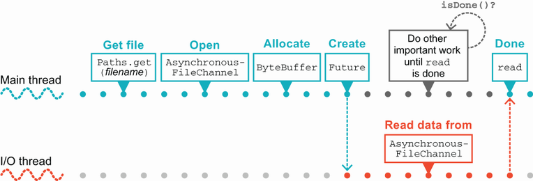

**Hình 6.9** Dùng `Future` trong Java

API này đã có một thời gian — nó được giới thiệu ở Java 7 — và nó cho phép người dùng làm concurrency nonblocking như thế này:

```java
try {
       Path file = Paths.get("/Users/karianna/foobar.txt");

       var channel = AsynchronousFileChannel.open(file);                 ❶

       var buffer = ByteBuffer.allocate(1_000_000);                      ❷
       Future<Integer> result = channel.read(buffer, 0);                 ❷

       BusinessProcess.doSomethingElse();                                ❸

       var bytesRead = result.get();                                     ❹
       System.out.println("Bytes read [" + bytesRead + "]");
} catch (IOException | ExecutionException | InterruptedException e) {
    e.printStackTrace();
}
```

❶ Mở tệp một cách bất đồng bộ

❷ Yêu cầu đọc tới một triệu byte

❸ Làm việc gì đó khác

❹ Lấy kết quả khi sẵn sàng

Cấu trúc này cho phép luồng main `doSomethingElse()` trong khi thao tác I/O đang tiến hành trên một luồng khác — một luồng do Java runtime quản lý. Đây là một cách tiếp cận hữu ích, nhưng nó đòi hỏi hỗ trợ trong thư viện cung cấp khả năng đó. Điều này có thể khá hạn chế — và nếu chúng ta muốn tạo các luồng công việc bất đồng bộ của riêng mình thì sao?

### 6.8.1 CompletableFuture

Kiểu `Future` của Java được định nghĩa là một interface, chứ không phải một class cụ thể. Bất kỳ API nào muốn dùng phong cách dựa trên `Future` đều phải cung cấp một bản hiện thực cụ thể của `Future`.

Việc này có thể là thách thức với một số lập trình viên khi viết và biểu diễn một khoảng trống rõ ràng trong bộ công cụ, nên từ Java 8 trở đi, một cách tiếp cận mới với future đã được đưa vào JDK — một bản hiện thực cụ thể của `Future` nâng cao khả năng và ở một số khía cạnh tương tự hơn với future ở các ngôn ngữ khác (ví dụ, Kotlin và Scala).

Class này gọi là `CompletableFuture` — nó là một kiểu cụ thể hiện thực interface `Future` và cung cấp thêm chức năng, được dự định như một khối xây dựng đơn giản để xây dựng các ứng dụng bất đồng bộ. Ý tưởng trung tâm là chúng ta có thể tạo các thể hiện của kiểu `CompletableFuture<T>` (nó generic theo kiểu giá trị sẽ được trả về), và đối tượng được tạo biểu diễn `Future` ở trạng thái chưa hoàn tất (hay "chưa được thực hiện" — unfulfilled).

Sau đó, bất kỳ luồng nào có tham chiếu tới `Future` có thể hoàn tất đều có thể gọi `complete()` trên nó và cung cấp một giá trị — điều này *hoàn tất* (hay "thực hiện") future. Giá trị đã hoàn tất ngay lập tức nhìn thấy được với mọi luồng đang chặn ở lời gọi `get()`. Sau khi hoàn tất, mọi lời gọi `complete()` tiếp theo bị bỏ qua.

`CompletableFuture` không thể khiến các luồng khác nhau thấy các giá trị khác nhau. `Future` hoặc chưa hoàn tất hoặc đã hoàn tất, và nếu đã hoàn tất, giá trị nó giữ là giá trị do luồng đầu tiên gọi `complete()` cung cấp.

Đây hiển nhiên không phải tính bất biến — trạng thái của `CompletableFuture` *có* thay đổi theo thời gian. Tuy nhiên, nó chỉ thay đổi một lần — từ chưa hoàn tất sang đã hoàn tất. Không có khả năng một trạng thái không nhất quán bị các luồng khác nhau nhìn thấy.

> **NOTE** `CompletableFuture` của Java tương tự một *promise*, như thấy ở các ngôn ngữ khác (chẳng hạn JavaScript), đó là lý do chúng tôi nêu thuật ngữ thay thế "thực hiện một promise" bên cạnh "hoàn tất một future".

Hãy xem một ví dụ và hiện thực `getNthPrime()` mà ta đã gặp ở trên:

```java
public static Future<Long> getNthPrime(int n) {
    var numF = new CompletableFuture<Long>();                     ❶

        new Thread( () -> {                                       ❷
           long num = NumberService.findPrime(n);                 ❸
           numF.complete(num);
        } ).start();

        return numF;
}
```

❶ Tạo completable Future ở trạng thái chưa hoàn tất

❷ Tạo và khởi động một luồng mới sẽ hoàn tất `Future`

❸ Việc tính toán số nguyên tố thực tế

Phương thức `getNthPrime()` tạo một `CompletableFuture` "rỗng" và trả về đối tượng container này cho caller của nó. Để điều khiển việc này, chúng ta cần một chút mã gọi `getNthPrime()` — ví dụ, mã trong listing 6.5.

Một cách nghĩ về `CompletableFuture` là bằng phép loại suy với các hệ thống client/server. Interface `Future` chỉ cung cấp một phương thức truy vấn — `isDone()` — và một `get()` chặn. Đây là đóng vai trò client. Một thể hiện của `CompletableFuture` đóng vai trò phía server — nó cung cấp toàn quyền kiểm soát việc thực thi và hoàn tất mã đang thực hiện future và cung cấp giá trị.

Trong ví dụ, `getNthPrime()` đánh giá lời gọi tới number service trong một luồng riêng. Khi lời gọi này trả về, chúng ta hoàn tất future một cách tường minh.

Một cách hơi ngắn gọn hơn để đạt cùng hiệu quả là dùng phương thức `CompletableFuture.supplyAsync()`, truyền vào một đối tượng `Callable<T>` biểu diễn tác vụ cần thực thi. Lời gọi này dùng một thread pool phạm vi ứng dụng do thư viện concurrency quản lý, như sau:

```java
public static Future<Long> getNthPrime(int n) {
        return CompletableFuture.supplyAsync(
           () -> NumberService.findPrime(n));
}
```

Điều này kết thúc chuyến tham quan ban đầu của chúng ta về các cấu trúc dữ liệu concurrent, một số khối xây dựng chính cung cấp nguyên liệu thô để phát triển các ứng dụng đa luồng vững chắc.

> **NOTE** Chúng tôi sẽ nói thêm về `CompletableFuture` ở phần sau của sách, cụ thể trong các chương thảo luận concurrency nâng cao và sự tương tác với lập trình hàm.

Tiếp theo, chúng tôi sẽ giới thiệu các executor và threadpool cung cấp cách xử lý việc thực thi ở mức cao hơn và tiện lợi hơn so với API thô dựa trên `Thread`.

## 6.9 Tác vụ và thực thi

Class `java.lang.Thread` đã tồn tại từ Java 1.0 — một trong những điểm bàn luận ban đầu của ngôn ngữ Java là hỗ trợ đa luồng tích hợp, ở mức ngôn ngữ. Nó mạnh mẽ và diễn đạt concurrency ở dạng gần với hỗ trợ của hệ điều hành bên dưới. Tuy nhiên, nó về cơ bản là một API mức thấp để xử lý concurrency.

Bản chất mức thấp này khiến nhiều lập trình viên khó làm việc đúng đắn hoặc hiệu quả. Các ngôn ngữ khác ra đời sau Java đã học từ kinh nghiệm của Java với luồng và xây dựng trên chúng để cung cấp các cách tiếp cận thay thế. Một số cách tiếp cận đó, đến lượt mình, đã ảnh hưởng tới thiết kế của `java.util.concurrent` và các đổi mới sau này trong concurrency của Java.

Trong trường hợp này, mục tiêu trước mắt của chúng ta là có các tác vụ (hay đơn vị công việc) có thể được thực thi mà không cần tạo mới một luồng cho mỗi tác vụ. Rốt cuộc, điều này nghĩa là các tác vụ phải được mô hình hóa như mã có thể được *gọi* thay vì được biểu diễn trực tiếp như một luồng.

Rồi, các tác vụ này có thể được lập lịch trên một tài nguyên chia sẻ — một pool luồng — thực thi một tác vụ tới khi hoàn tất rồi chuyển sang tác vụ tiếp theo. Hãy xem cách chúng ta mô hình hóa những tác vụ này.

### 6.9.1 Mô hình hóa tác vụ

Trong mục này, chúng ta sẽ xem hai cách khác nhau để mô hình hóa tác vụ: interface `Callable` và class `FutureTask`. Chúng ta cũng có thể cân nhắc `Runnable`, nhưng nó không phải lúc nào cũng hữu ích, bởi phương thức `run()` không trả về giá trị, và do đó, nó chỉ có thể thực hiện công việc qua tác dụng phụ.

Một khía cạnh khác của việc mô hình hóa tác vụ là quan trọng nhưng có thể không rõ ràng — quan niệm rằng nếu chúng ta giả sử dung lượng luồng của mình là hữu hạn, các tác vụ chắc chắn phải hoàn tất trong thời gian có giới hạn.

Nếu chúng ta có khả năng gặp một vòng lặp vô hạn, một số tác vụ có thể "đánh cắp" một luồng executor khỏi pool, và điều này sẽ giảm dung lượng tổng thể cho mọi tác vụ từ đó về sau. Theo thời gian, điều này cuối cùng có thể dẫn tới cạn kiệt tài nguyên thread pool và không công việc nào tiếp theo khả thi. Kết quả là, chúng ta phải cẩn thận rằng mọi tác vụ ta dựng đều thực sự tuân theo nguyên tắc "kết thúc trong thời gian hữu hạn".

**Interface `Callable`**

Interface `Callable` biểu diễn một trừu tượng rất phổ biến. Nó biểu diễn một đoạn mã có thể được gọi và trả về một kết quả. Dù là một ý tưởng thẳng thắn, đây thực ra là một khái niệm tinh tế và mạnh mẽ có thể dẫn tới một số mẫu cực kỳ hữu ích.

Một cách dùng điển hình của `Callable` là biểu thức lambda (hoặc một bản hiện thực ẩn danh). Dòng cuối của đoạn mã này đặt `s` thành giá trị của `out.toString()`:

```java
var out = getSampleObject();
Callable<String> cb = () -> out.toString();

String s = cb.call();
```

Hãy nghĩ về một `Callable` như một lời gọi trì hoãn của phương thức duy nhất, `call()`, mà lambda cung cấp.

**Class `FutureTask`**

Class `FutureTask` là một bản hiện thực thường dùng của interface `Future`, đồng thời cũng hiện thực `Runnable`. Như chúng ta sẽ thấy, điều này nghĩa là một `FutureTask` có thể được đưa vào các executor. API của `FutureTask` về cơ bản là API của `Future` và `Runnable` kết hợp: `get()`, `cancel()`, `isDone()`, `isCancelled()` và `run()`, mặc dù cái cuối cùng — cái thực sự làm việc — sẽ được executor gọi, chứ không phải trực tiếp bởi mã client.

Hai constructor tiện lợi cho `FutureTask` được cung cấp: một nhận một `Callable` và một nhận một `Runnable` (dùng `Executors.callable()` để chuyển `Runnable` thành `Callable`). Điều này gợi ý một cách tiếp cận linh hoạt với tác vụ, cho phép một công việc được viết như một `Callable` rồi bọc vào một `FutureTask` sau đó có thể được lập lịch (và hủy, nếu cần) trên một executor, nhờ bản chất `Runnable` của `FutureTask`.

Class này cung cấp một mô hình trạng thái đơn giản cho tác vụ và việc quản lý một tác vụ qua mô hình đó. Các chuyển đổi trạng thái khả dĩ được thể hiện trong hình 6.10.

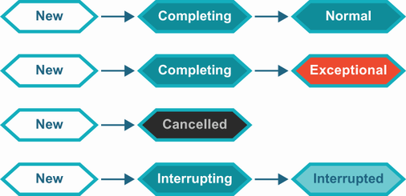

**Hình 6.10** Mô hình trạng thái cho tác vụ

Điều này đủ cho một phạm vi rộng các khả năng thực thi thông thường. Hãy gặp các executor tiêu chuẩn mà JDK cung cấp.

### 6.9.2 Executor

Một vài interface tiêu chuẩn được dùng để mô tả các threadpool hiện diện trong JDK. Cái đầu tiên là `Executor`, rất đơn giản và được định nghĩa như sau:

```java
public interface Executor {

       /**
        * Executes the given command at some time in the future. The command
        * may execute in a new thread, in a pooled thread, or in the calling
        * thread, at the discretion of the {@code Executor} implementation.
        *
        * @param command the runnable task
        * @throws RejectedExecutionException if this task cannot be
        * accepted for execution
        * @throws NullPointerException if command is null
        */
       void execute(Runnable command);
}
```

Bạn nên lưu ý rằng mặc dù interface này chỉ có một phương thức abstract duy nhất (tức là nó là một kiểu SAM), nó không được gắn thẻ annotation `@FunctionalInterface`. Nó vẫn có thể dùng làm kiểu đích cho một biểu thức lambda, nhưng nó không nhằm để dùng trong lập trình hàm.

Thực tế, `Executor` không được dùng rộng rãi — phổ biến hơn nhiều là interface `ExecutorService` kế thừa `Executor` và thêm `submit()` cùng vài phương thức vòng đời, chẳng hạn `shutdown()`.

Để giúp lập trình viên khởi tạo và làm việc với một số threadpool tiêu chuẩn, JDK cung cấp class `Executors`, là một tập các phương thức trợ giúp tĩnh (chủ yếu là factory). Bốn phương thức thường dùng nhất như sau:

```
newSingleThreadExecutor()
newFixedThreadPool(int nThreads)
newCachedThreadPool()
newScheduledThreadPool(int corePoolSize)
```

Hãy xem lần lượt từng cái. Ở phần sau của sách, chúng ta sẽ đào sâu vào một số khả năng khác, phức tạp hơn, cũng được cung cấp.

### 6.9.3 Single-threaded executor

Đơn giản nhất trong các executor là single-threaded executor. Đây về cơ bản là sự kết hợp được đóng gói của một luồng duy nhất và một hàng đợi tác vụ (là một blocking queue).

Mã client đặt một tác vụ thực thi được vào queue qua `submit()`. Luồng thực thi duy nhất sau đó lấy các tác vụ từng cái một và chạy mỗi cái tới hoàn tất trước khi lấy tác vụ tiếp theo.

> **NOTE** Các executor không được hiện thực dưới dạng những kiểu riêng biệt mà thay vào đó biểu diễn các lựa chọn tham số khác nhau khi dựng một threadpool bên dưới.

Mọi tác vụ được submit trong khi luồng thực thi bận sẽ được xếp hàng tới khi luồng khả dụng. Bởi executor này được đứng sau bởi một luồng duy nhất, nếu điều kiện "kết thúc trong thời gian hữu hạn" đã đề cập bị vi phạm, điều đó nghĩa là không công việc nào được submit sau đó sẽ chạy.

> **NOTE** Phiên bản executor này thường hữu ích cho kiểm thử bởi nó có thể được làm cho tất định hơn các dạng khác.

Đây là một ví dụ rất đơn giản về cách dùng single-threaded executor:

```java
var pool = Executors.newSingleThreadExecutor();
Runnable hello = () -> System.out.println("Hello world");
pool.submit(hello);
```

Lời gọi `submit()` chuyển giao tác vụ runnable bằng cách đặt nó vào hàng đợi công việc của executor. Việc submit công việc đó là nonblocking (trừ khi hàng đợi công việc đầy).

Tuy nhiên, vẫn phải cẩn thận — ví dụ, nếu luồng main thoát ngay lập tức, công việc đã submit có thể chưa có thời gian được luồng pool nhặt lên và có thể không chạy. Thay vì thoát ngay, khôn ngoan là gọi phương thức `shutdown()` trên executor trước.

Chi tiết có thể tìm thấy trong class `ThreadPoolExecutor`, nhưng về cơ bản phương thức này bắt đầu một quá trình shutdown có trật tự, trong đó các tác vụ đã submit trước đó được thực thi nhưng không tác vụ mới nào được chấp nhận. Điều này giải quyết hiệu quả các vấn đề chúng ta đã thấy ở listing 6.4 về việc xả các queue giao dịch đang chờ.

> **NOTE** Sự kết hợp của một tác vụ lặp vô hạn và một yêu cầu shutdown có trật tự sẽ tương tác tồi tệ, dẫn tới một threadpool không bao giờ shutdown.

Dĩ nhiên, nếu single-threaded executor là tất cả những gì cần thiết, sẽ không cần phải phát triển hiểu biết sâu về lập trình đồng thời và các thách thức của nó. Vậy nên, chúng ta cũng nên xem các lựa chọn thay thế dùng nhiều luồng executor.

### 6.9.4 Fixed-thread pool

Fixed-thread pool, lấy được qua một trong các biến thể của `Executors.newFixedThreadPool()`, về cơ bản là sự tổng quát hóa nhiều luồng của single-threaded executor. Tại thời điểm tạo, người dùng cung cấp một số lượng luồng tường minh, và pool được tạo với số luồng đó.

Những luồng này sẽ được tái sử dụng để chạy nhiều tác vụ, cái này sau cái kia. Thiết kế ngăn người dùng phải trả chi phí tạo luồng. Cũng như với biến thể đơn luồng, nếu mọi luồng đang được dùng, các tác vụ mới được lưu trong một blocking queue tới khi có luồng rảnh.

Phiên bản threadpool này đặc biệt hữu ích nếu luồng công việc ổn định và đã biết và nếu mọi công việc được submit có kích thước xấp xỉ nhau, xét về thời lượng tính toán. Một lần nữa, nó dễ tạo nhất từ phương thức factory phù hợp, như sau:

```java
var pool = Executors.newFixedThreadPool(2);
```

Lệnh này sẽ tạo một thread pool tường minh được đứng sau bởi hai luồng executor. Hai luồng sẽ thay phiên nhận tác vụ từ queue theo cách phi tất định. Ngay cả khi có một thứ tự thời gian nghiêm ngặt về thời điểm các tác vụ được submit, không có đảm bảo nào về việc luồng nào sẽ xử lý một tác vụ nhất định.

Một hệ quả của điều này là trong tình huống như thể hiện trong hình 6.11, các tác vụ trong queue hạ nguồn không thể được tin cậy là có thứ tự thời gian chính xác, ngay cả khi các tác vụ trong queue thượng nguồn có.

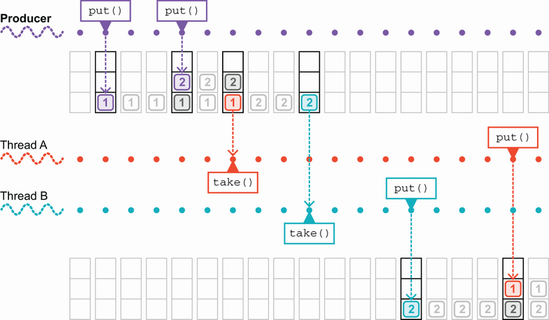

**Hình 6.11** Một threadpool và hai queue

Fixed threadpool có công dụng của nó, nhưng nó không phải lựa chọn duy nhất. Một điều là, nếu các luồng executor trong đó chết, chúng không được thay thế. Nếu tồn tại khả năng các công việc được submit ném runtime exception, điều này có thể dẫn tới threadpool bị bỏ đói. Hãy xem một lựa chọn thay thế khác, đưa ra các đánh đổi khác nhưng có thể tránh khả năng này.

### 6.9.5 Cached thread pool

Fixed threadpool thường được dùng khi mẫu hoạt động của workload đã biết và khá ổn định. Tuy nhiên, nếu công việc đến không đều hoặc bùng nổ theo đợt, thì một pool có số luồng cố định có khả năng là dưới tối ưu.

`CachedThreadPool` là một pool không giới hạn, sẽ tái sử dụng luồng nếu chúng khả dụng nhưng nếu không sẽ tạo luồng mới khi cần để xử lý các tác vụ đến, như sau:

```java
var pool = Executors.newCachedThreadPool();
```

Các luồng được giữ trong cache nhàn rỗi trong 60 giây, và nếu chúng vẫn có mặt vào cuối khoảng đó, chúng sẽ bị loại khỏi cache và hủy.

Dĩ nhiên vẫn rất quan trọng rằng các tác vụ thực sự kết thúc. Nếu không, thì threadpool theo thời gian sẽ tạo ngày càng nhiều luồng và tiêu thụ ngày càng nhiều tài nguyên của máy và cuối cùng sập hoặc trở nên không phản hồi.

Nói chung, sự đánh đổi giữa fixed-size thread pool và cached thread pool phần lớn là về việc tái sử dụng luồng so với tạo và hủy luồng để đạt các hiệu ứng khác nhau. Thiết kế của `CachedThreadPool` nên cho hiệu năng tốt hơn với các tác vụ bất đồng bộ nhỏ so với hiệu năng đạt được từ các pool kích thước cố định. Tuy nhiên, như luôn luôn, nếu hiệu ứng được cho là đáng kể, phải thực hiện kiểm thử hiệu năng đúng đắn.

### 6.9.6 ScheduledThreadPoolExecutor

Ví dụ cuối cùng về một executor mà chúng ta sẽ xem hơi khác một chút. Đó là `ScheduledThreadPoolExecutor`, đôi khi được gọi là STPE, như sau:

```java
ScheduledExecutorService pool = Executors.newScheduledThreadPool(4);
```

Lưu ý rằng kiểu trả về, mà chúng tôi đã nêu rõ ở đây, là `ScheduledExecutorService`. Điều này khác với các phương thức factory khác, trả về `ExecutorService`.

> **NOTE** `ScheduledThreadPoolExecutor` là một lựa chọn executor có khả năng đến bất ngờ và có thể dùng trong nhiều hoàn cảnh.

Scheduled service kế thừa executor service thông thường và thêm một lượng nhỏ khả năng mới: `schedule()`, chạy một tác vụ một lần sau một độ trễ xác định, và hai phương thức để lập lịch các tác vụ định kỳ (tức là lặp lại) — `scheduleAtFixedRate()` và `scheduleWithFixedDelay()`.

Hành vi của hai phương thức này hơi khác nhau. `scheduleAtFixedRate()` sẽ kích hoạt một bản sao mới của tác vụ theo lịch cố định (và nó sẽ làm vậy bất kể các bản sao trước đã hoàn tất hay chưa), trong khi `scheduleWithFixedDelay()` sẽ chỉ kích hoạt một bản sao mới của tác vụ sau khi thể hiện trước đã hoàn tất và độ trễ xác định đã trôi qua.

Ngoài `ScheduledThreadPoolExecutor`, mọi pool khác chúng ta đã gặp đều thu được bằng cách chọn các lựa chọn tham số hơi khác nhau cho class `ThreadPoolExecutor` khá tổng quát. Ví dụ, hãy xem định nghĩa sau của `Executors.newFixedThreadPool()`:

```java
public static ExecutorService newFixedThreadPool(int nThreads) {
     return new ThreadPoolExecutor(nThreads, nThreads,
                                           0L, TimeUnit.MILLISECONDS,
                                           new LinkedBlockingQueue<Runnable>());
}
```

Đây dĩ nhiên là mục đích của các phương thức trợ giúp: cung cấp cách tiện lợi để truy cập một số lựa chọn tiêu chuẩn cho threadpool mà không cần dấn thân vào toàn bộ độ phức tạp của `ThreadPoolExecutor`. Ngoài JDK, còn tồn tại nhiều ví dụ khác về executor và các threadpool liên quan, chẳng hạn class `org.apache.catalina.Executor` từ web server Tomcat.

## Tóm tắt

- Các class `java.util.concurrent` nên là bộ công cụ ưu tiên của bạn cho mọi mã Java đa luồng mới:
  - Atomic integer
  - Cấu trúc dữ liệu concurrent, đặc biệt là `ConcurrentHashMap`
  - Blocking queue và latch
  - Threadpool và executor
- Các class này có thể được dùng để hiện thực các kỹ thuật lập trình đồng thời an toàn bao gồm:
  - Giải quyết sự thiếu linh hoạt của khóa `synchronized`
  - Dùng blocking queue để chuyển giao tác vụ
  - Dùng latch để đạt đồng thuận giữa một nhóm luồng
  - Phân chia việc thực thi thành các đơn vị công việc
  - Kiểm soát công việc, bao gồm shutdown an toàn
