# 7. Hiểu về hiệu năng Java

> *The Well-Grounded Java Developer, Second Edition* — Chương 7
> Bản dịch tiếng Việt

**Chương này bao gồm:**

- Vì sao hiệu năng quan trọng
- Bộ thu gom rác G1
- Biên dịch just-in-time (JIT)
- JFR — JDK Flight Recorder

---

Hiệu năng kém giết chết ứng dụng — nó tệ cho khách hàng của bạn và cho danh tiếng ứng dụng của bạn. Trừ khi bạn có một thị trường hoàn toàn độc quyền, khách hàng của bạn sẽ bỏ phiếu bằng đôi chân — họ đã ra khỏi cửa, hướng tới đối thủ cạnh tranh. Để ngăn hiệu năng kém làm hại dự án của bạn, bạn cần hiểu về phân tích hiệu năng và cách làm cho nó có ích cho bạn.

Phân tích và tinh chỉnh hiệu năng là một chủ đề khổng lồ, và quá nhiều cách xử lý tập trung vào những thứ sai lầm. Vậy nên, chúng ta sẽ bắt đầu bằng cách nói cho bạn bí mật lớn của việc tinh chỉnh hiệu năng. Đây rồi — bí mật lớn nhất duy nhất của việc tinh chỉnh hiệu năng: **Bạn phải đo lường. Bạn không thể tinh chỉnh đúng cách mà không đo lường.**

Và đây là lý do: bộ não con người gần như luôn sai khi đoán phần nào của hệ thống là chậm. Não của tất cả mọi người. Của bạn, của tôi, của James Gosling — chúng ta đều chịu ảnh hưởng của những thiên kiến tiềm thức và có xu hướng thấy những mẫu hình có thể không tồn tại. Thực tế, câu trả lời cho câu hỏi "Phần nào trong mã Java của tôi cần tối ưu?" khá thường xuyên là "Chẳng phần nào cả."

Hãy xét một ứng dụng web thương mại điện tử điển hình (dù khá bảo thủ), cung cấp dịch vụ cho một nhóm khách hàng đã đăng ký. Nó có một cơ sở dữ liệu SQL, các web server đứng trước các dịch vụ Java, và một cấu hình mạng khá tiêu chuẩn kết nối tất cả. Rất thường xuyên, các phần không phải Java của hệ thống (cơ sở dữ liệu, hệ thống tệp, mạng) mới là nút thắt cổ chai thực sự, nhưng nếu không đo lường, lập trình viên Java sẽ không bao giờ biết điều đó. Thay vì tìm và sửa vấn đề thật, lập trình viên có thể lãng phí thời gian vào việc vi tối ưu các khía cạnh mã vốn không thực sự góp phần vào vấn đề.

Những câu hỏi nền tảng mà bạn muốn có thể trả lời là:

- Nếu bạn có một đợt khuyến mãi và đột nhiên có gấp 10 lần số khách hàng, hệ thống có đủ bộ nhớ để đối phó không?
- Thời gian phản hồi trung bình mà khách hàng thấy từ ứng dụng của bạn là bao nhiêu?
- Con số đó so với đối thủ cạnh tranh thì thế nào?

Lưu ý rằng mọi câu hỏi ví dụ này đều về những khía cạnh của hệ thống có liên quan trực tiếp tới khách hàng — người dùng hệ thống của bạn. Không có gì ở đây về những chủ đề như:

- Lambda và stream có nhanh hơn vòng lặp `for` không?
- Phương thức thường (virtual method) có nhanh hơn phương thức interface không?
- Bản hiện thực nhanh nhất của `hashCode()` là gì?

Kỹ sư hiệu năng thiếu kinh nghiệm thường phạm sai lầm khi giả định rằng hiệu năng mà người dùng thấy được phụ thuộc mạnh mẽ, hoặc tương quan chặt chẽ, với các khía cạnh vi hiệu năng mà nhóm câu hỏi thứ hai đề cập.

Giả định này — về cơ bản là một quan điểm quy giản (reductionist) — thực ra không đúng trên thực tế. Thay vào đó, độ phức tạp của các hệ thống phần mềm hiện đại khiến hiệu năng tổng thể trở thành một *thuộc tính nổi lên* (emergent property) của hệ thống và mọi tầng của nó. Các hiệu ứng vi mô cụ thể gần như không thể cô lập được, và microbenchmarking có tính hữu dụng rất hạn chế với hầu hết lập trình viên ứng dụng.

Thay vào đó, để tinh chỉnh hiệu năng, bạn phải thoát khỏi cõi đoán mò về cái gì làm hệ thống chậm — và *chậm* nghĩa là "ảnh hưởng tới trải nghiệm của khách hàng". Bạn phải bắt đầu *biết*, và cách duy nhất để biết chắc là đo lường.

Bạn cũng cần hiểu tinh chỉnh hiệu năng *không* phải là gì. Nó không phải là:

- Một tập hợp mẹo vặt và thủ thuật
- Nước sốt bí mật
- Bụi tiên mà bạn rắc lên ở cuối dự án

Hãy đặc biệt cẩn thận với cách tiếp cận "mẹo và thủ thuật". Sự thật là JVM là một môi trường rất tinh vi và được tinh chỉnh cao, và không có ngữ cảnh phù hợp, hầu hết những mẹo này là vô dụng (và có thể thực sự có hại). Chúng cũng lỗi thời rất nhanh khi JVM ngày càng thông minh hơn trong việc tối ưu mã.

Phân tích hiệu năng thực sự là một loại khoa học thực nghiệm. Bạn có thể nghĩ về mã của mình như một loại thí nghiệm khoa học có đầu vào và tạo ra "đầu ra" — các chỉ số hiệu năng cho thấy hệ thống thực hiện công việc được yêu cầu hiệu quả đến đâu. Công việc của kỹ sư hiệu năng là nghiên cứu các đầu ra này và tìm kiếm mẫu hình. Điều này khiến tinh chỉnh hiệu năng trở thành một nhánh của thống kê ứng dụng, chứ không phải một tập hợp những chuyện kể của các bà và văn hóa dân gian ứng dụng.

Chương này ở đây để giúp bạn bắt đầu. Đây là phần giới thiệu về thực hành tinh chỉnh hiệu năng Java. Nhưng đây là một chủ đề lớn, và chúng tôi chỉ có chỗ để cung cấp cho bạn một nhập môn về một số lý thuyết thiết yếu và vài biển chỉ đường. Chúng tôi sẽ cố trả lời những câu hỏi nền tảng nhất sau:

- Vì sao hiệu năng quan trọng?
- Vì sao phân tích hiệu năng lại khó?
- Những khía cạnh nào của JVM khiến việc tinh chỉnh nó có thể phức tạp?
- Nên nghĩ về và tiếp cận việc tinh chỉnh hiệu năng ra sao?
- Những nguyên nhân nền tảng phổ biến nhất của sự chậm chạp là gì?

Chúng tôi cũng sẽ giới thiệu cho bạn hai hệ thống con sau trong JVM, quan trọng nhất khi nói tới các vấn đề liên quan tới hiệu năng:

- Hệ thống con thu gom rác (garbage collection)
- Trình biên dịch JIT

Điều này sẽ đủ để bạn bắt đầu và giúp bạn áp dụng kiến thức (thừa nhận là hơi nặng lý thuyết) này vào các vấn đề thực sự bạn gặp trong mã của mình. Hãy bắt đầu bằng việc xem nhanh một số từ vựng nền tảng cho phép bạn diễn đạt và khung hóa các vấn đề và mục tiêu hiệu năng của mình.

## 7.1 Thuật ngữ hiệu năng: Một số định nghĩa cơ bản

Để tận dụng tối đa các thảo luận trong chương này, chúng ta cần hình thức hóa một số quan niệm về hiệu năng mà bạn có thể đã biết. Chúng ta sẽ bắt đầu bằng việc định nghĩa một số thuật ngữ quan trọng sau trong từ vựng của kỹ sư hiệu năng:

- Latency (độ trễ)
- Throughput (thông lượng)
- Utilization (mức sử dụng)
- Efficiency (hiệu quả)
- Capacity (dung lượng)
- Scalability (khả năng mở rộng)
- Degradation (suy giảm)

Một số thuật ngữ này được Doug Lea thảo luận trong ngữ cảnh mã đa luồng, nhưng chúng ta đang xét một ngữ cảnh rộng hơn nhiều ở đây. Khi nói về hiệu năng, chúng ta có thể muốn nói bất cứ thứ gì từ một tiến trình đa luồng đơn lẻ cho tới cả một cụm dịch vụ được host trên cloud.

### 7.1.1 Latency

*Latency* là thời gian đầu-cuối cần để xử lý một đơn vị công việc duy nhất ở một mức tải công việc nhất định. Khá thường xuyên, latency chỉ được nêu cho tải công việc "bình thường", nhưng một thước đo hiệu năng thường hữu ích là đồ thị hiển thị latency như một hàm của tải công việc tăng dần.

Đồ thị trong hình 7.1 cho thấy sự suy giảm đột ngột, phi tuyến của một chỉ số hiệu năng (ví dụ, latency) khi tải công việc tăng. Điều này thường được gọi là *performance elbow* (khuỷu tay hiệu năng, hay "gậy hockey").

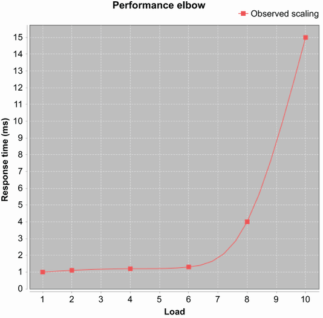

**Hình 7.1** Một performance elbow

### 7.1.2 Throughput

*Throughput* là số đơn vị công việc mà một hệ thống có thể thực hiện trong một khoảng thời gian với các tài nguyên nhất định. Một con số thường được nêu là số giao dịch mỗi giây trên một nền tảng tham chiếu nào đó (ví dụ, một thương hiệu server cụ thể với phần cứng, hệ điều hành và ngăn xếp phần mềm xác định).

### 7.1.3 Utilization

*Utilization* biểu diễn phần trăm tài nguyên khả dụng đang được dùng để xử lý các đơn vị công việc, thay vì các tác vụ dọn dẹp (hoặc chỉ đơn thuần nhàn rỗi). Người ta thường nói một server, chẳng hạn, được sử dụng 10%. Điều này chỉ phần trăm CPU đang xử lý các đơn vị công việc trong thời gian xử lý bình thường. Lưu ý rằng khác biệt có thể rất lớn giữa mức sử dụng của các tài nguyên khác nhau, chẳng hạn CPU và bộ nhớ.

### 7.1.4 Efficiency

*Efficiency* của một hệ thống bằng throughput chia cho tài nguyên đã dùng. Một hệ thống cần nhiều tài nguyên hơn để tạo ra cùng throughput thì kém hiệu quả hơn.

Ví dụ, hãy xét việc so sánh hai giải pháp cụm. Nếu giải pháp A cần gấp đôi số server so với giải pháp B cho cùng throughput, nó chỉ hiệu quả bằng một nửa.

Nhớ rằng tài nguyên cũng có thể được xét theo góc độ chi phí — nếu giải pháp A tốn gấp đôi (hoặc cần gấp đôi nhân sự để vận hành môi trường production) so với giải pháp B, thì nó chỉ hiệu quả bằng một nửa.

### 7.1.5 Capacity

*Capacity* là số đơn vị công việc (chẳng hạn giao dịch) có thể đang được xử lý trong hệ thống tại bất kỳ thời điểm nào. Nghĩa là, đó là lượng xử lý đồng thời khả dụng ở một latency hoặc throughput xác định.

### 7.1.6 Scalability

Khi tài nguyên được thêm vào một hệ thống, throughput (hoặc latency) sẽ thay đổi. Sự thay đổi throughput hoặc latency này chính là *scalability* của hệ thống.

Nếu giải pháp A tăng gấp đôi throughput khi số server khả dụng trong một pool tăng gấp đôi, nó đang mở rộng theo cách tuyến tính hoàn hảo. Mở rộng tuyến tính hoàn hảo là rất, rất khó đạt được trong hầu hết hoàn cảnh — nhớ định luật Amdahl.

Bạn cũng nên lưu ý rằng scalability của một hệ thống phụ thuộc vào nhiều yếu tố, và nó không phải hằng số. Một hệ thống có thể mở rộng gần tuyến tính tới một điểm nào đó rồi bắt đầu suy giảm tệ hại. Đó là một loại performance elbow khác.

### 7.1.7 Degradation

Nếu bạn thêm nhiều đơn vị công việc hơn, hoặc nhiều client cho hệ thống mạng, mà không thêm tài nguyên, bạn thường sẽ thấy một thay đổi trong latency hoặc throughput quan sát được. Thay đổi này là *degradation* của hệ thống dưới tải bổ sung.

Trong hoàn cảnh bình thường, degradation sẽ là tiêu cực. Nghĩa là, thêm đơn vị công việc vào một hệ thống sẽ gây tác động tiêu cực lên hiệu năng (chẳng hạn khiến latency xử lý tăng). Nhưng có một số hoàn cảnh mà degradation có thể là tích cực. Ví dụ, nếu tải bổ sung khiến một phần nào đó của hệ thống vượt qua một ngưỡng và chuyển sang chế độ hiệu năng cao, điều này có thể khiến hệ thống làm việc hiệu quả hơn và giảm thời gian xử lý, mặc dù thực tế có nhiều việc hơn phải làm. JVM là một hệ thống runtime rất động, và nhiều phần của nó có thể góp phần vào loại hiệu ứng này.

Các thuật ngữ trên là những chỉ báo hiệu năng được dùng thường xuyên nhất. Những cái khác thỉnh thoảng cũng quan trọng, nhưng đây là các thống kê hệ thống cơ bản thường được dùng để dẫn dắt việc tinh chỉnh hiệu năng. Ở mục tiếp theo, chúng ta sẽ trình bày một cách tiếp cận đặt nền tảng trên sự chú ý sát sao tới các con số này và mang tính định lượng nhất có thể.

## 7.2 Một cách tiếp cận thực dụng với phân tích hiệu năng

Nhiều lập trình viên, khi tiếp cận nhiệm vụ phân tích hiệu năng, không bắt đầu với một bức tranh rõ ràng về điều họ muốn đạt được qua việc phân tích. Một cảm giác mơ hồ rằng mã "đáng lẽ phải chạy nhanh hơn" thường là tất cả những gì lập trình viên hoặc nhà quản lý có khi công việc bắt đầu.

Nhưng điều này hoàn toàn ngược. Để tinh chỉnh hiệu năng thực sự hiệu quả, bạn nên nghĩ về một số lĩnh vực then chốt trước khi bắt đầu bất kỳ loại công việc kỹ thuật nào. Bạn nên biết những điều sau:

- Những khía cạnh quan sát được nào của mã bạn đang đo
- Cách đo những thứ quan sát được đó
- Mục tiêu cho những thứ quan sát được là gì
- Bạn sẽ nhận ra khi nào bạn đã xong việc tinh chỉnh hiệu năng bằng cách nào
- Chi phí tối đa chấp nhận được là bao nhiêu (xét theo thời gian lập trình viên đầu tư và độ phức tạp bổ sung trong mã) cho việc tinh chỉnh hiệu năng
- Điều gì không được hy sinh khi bạn tối ưu

Quan trọng nhất, như chúng tôi sẽ nói nhiều lần trong chương này, bạn phải đo lường. Không đo lường ít nhất một thứ quan sát được, bạn không đang làm phân tích hiệu năng.

Cũng rất phổ biến khi bạn bắt đầu đo mã của mình và phát hiện rằng thời gian không được tiêu tốn ở nơi bạn nghĩ. Một chỉ mục cơ sở dữ liệu bị thiếu hoặc các khóa hệ thống tệp bị tranh chấp có thể là gốc rễ của rất nhiều vấn đề hiệu năng. Khi nghĩ về việc tối ưu mã của bạn, bạn nên luôn nhớ rằng có khả năng mã không phải là vấn đề. Để định lượng vấn đề nằm ở đâu, điều đầu tiên bạn cần biết là bạn đang đo cái gì.

### 7.2.1 Biết bạn đang đo cái gì

Trong tinh chỉnh hiệu năng, bạn luôn phải đo một thứ gì đó. Nếu bạn không đo một thứ quan sát được, bạn không đang tinh chỉnh hiệu năng. Ngồi và nhìn chằm chằm vào mã, hy vọng một cách nhanh hơn để giải quyết vấn đề sẽ đến với bạn, không phải là phân tích hiệu năng.

> **TIP** Để trở thành kỹ sư hiệu năng giỏi, bạn nên hiểu các thuật ngữ như *mean* (trung bình), *median* (trung vị), *mode* (mốt), *variance* (phương sai), *percentile* (phân vị), *standard deviation* (độ lệch chuẩn), *sample size* (cỡ mẫu), và *normal distribution* (phân phối chuẩn). Nếu bạn chưa quen với những khái niệm này, bạn nên bắt đầu bằng một tìm kiếm web nhanh và đọc thêm nếu cần. Chương 5 của cuốn *Data Science Bookcamp* của Leonard Apeltsin (Manning, 2021, http://mng.bz/e7Oq) là một chỗ tốt để bắt đầu.

Khi thực hiện phân tích hiệu năng, quan trọng là biết chính xác thứ nào trong các quan sát mà chúng tôi mô tả ở mục trước là quan trọng với bạn. Bạn nên luôn gắn các phép đo, mục tiêu và kết luận của mình với một hoặc nhiều thứ quan sát được cơ bản mà chúng tôi đã giới thiệu. Một số thứ quan sát được điển hình là mục tiêu tốt cho việc tinh chỉnh hiệu năng như sau:

- Thời gian trung bình để phương thức `handleRequest()` chạy (sau khi warmup)
- Phân vị thứ 90 của latency đầu-cuối của hệ thống với 10 client đồng thời
- Sự suy giảm thời gian phản hồi khi bạn tăng từ 1 tới 1.000 người dùng đồng thời

Tất cả những cái này biểu diễn các đại lượng mà kỹ sư có thể muốn đo và có khả năng muốn tinh chỉnh. Để có được những con số chính xác và hữu ích, kiến thức cơ bản về thống kê là thiết yếu.

Biết bạn đang đo gì và có niềm tin rằng các con số của bạn là chính xác là bước đầu tiên. Nhưng những mục tiêu mơ hồ hoặc mở thường không tạo ra kết quả tốt, và tinh chỉnh hiệu năng không phải ngoại lệ. Thay vào đó, các mục tiêu hiệu năng của bạn nên là cái đôi khi gọi là *SMART objectives* (specific, measurable, agreed, relevant, time-boxed — cụ thể, đo được, được đồng thuận, liên quan, và giới hạn thời gian).

### 7.2.2 Biết cách thực hiện phép đo

Chúng ta thực sự chỉ có hai cách sau để xác định chính xác một phương thức hay đoạn mã Java khác mất bao lâu để chạy:

- Đo trực tiếp, bằng cách chèn mã đo vào class nguồn.
- Biến đổi class cần đo tại thời điểm class loading.

Hai cách tiếp cận này lần lượt được gọi là *manual instrumentation* và *automatic instrumentation*. Mọi kỹ thuật đo hiệu năng thường dùng đều dựa vào một (hoặc cả hai) kỹ thuật này.

> **NOTE** Cũng có JVM Tool Interface (JVMTI), có thể dùng để tạo các công cụ hiệu năng rất tinh vi, nhưng nó có nhược điểm, đáng chú ý là nó đòi hỏi dùng mã native, ảnh hưởng tới cả độ phức tạp lẫn độ an toàn của công cụ viết bằng nó.

**Đo trực tiếp**

Đo trực tiếp là kỹ thuật dễ hiểu nhất, nhưng nó cũng xâm lấn. Ở dạng đơn giản nhất, nó trông như sau:

```java
long t0 = System.currentTimeMillis();
methodToBeMeasured();
long t1 = System.currentTimeMillis();

long elapsed = t1 - t0;
System.out.println("methodToBeMeasured took "+ elapsed +" millis");
```

Đoạn này sẽ tạo ra một dòng đầu ra cho ta cái nhìn chính xác tới mili-giây về `methodToBeMeasured()` mất bao lâu để chạy. Phần bất tiện là mã như thế này phải được thêm khắp codebase, và khi số phép đo tăng lên, sẽ khó tránh khỏi bị ngập trong dữ liệu.

Còn có những vấn đề khác nữa — ví dụ, điều gì xảy ra nếu `methodToBeMeasured()` chạy dưới một mili-giây? Như chúng ta sẽ thấy ở phần sau của chương này, cũng có các hiệu ứng khởi động lạnh cần lo: biên dịch JIT nghĩa là các lần chạy sau của phương thức rất có thể sẽ nhanh hơn các lần chạy trước.

Cũng có những vấn đề tinh tế hơn: lời gọi `currentTimeMillis()` cần một lời gọi tới một phương thức native và một system call để đọc đồng hồ hệ thống. Điều này không chỉ tốn thời gian mà còn có thể xả (flush) mã khỏi các pipeline thực thi, dẫn tới suy giảm hiệu năng bổ sung mà sẽ không xảy ra nếu mã đo không có ở đó.

**Automatic instrumentation qua class loading**

Ở chương 1 và 4, chúng ta đã thảo luận cách các class được lắp ráp thành một chương trình đang thực thi. Một trong những bước then chốt thường bị bỏ qua là việc biến đổi bytecode khi nó được nạp. Điều này cực kỳ mạnh mẽ, và nó nằm ở trung tâm của nhiều kỹ thuật hiện đại trong nền tảng Java.

Một ví dụ về nó là việc automatic instrumentation các phương thức. Trong cách tiếp cận này, `methodToBeMeasured()` được nạp bởi một class loader đặc biệt thêm bytecode vào đầu và cuối phương thức để ghi lại các thời điểm phương thức được vào và ra. Các thời gian này thường được ghi vào một cấu trúc dữ liệu chia sẻ, được các luồng khác truy cập. Những luồng này hành động trên dữ liệu, thường là ghi đầu ra ra tệp log hoặc liên hệ với một server trên mạng xử lý dữ liệu thô.

Kỹ thuật này nằm ở trung tâm của nhiều công cụ giám sát hiệu năng Java cấp chuyên nghiệp (chẳng hạn New Relic), nhưng các công cụ mã nguồn mở được bảo trì tích cực lấp đầy cùng ngách này thì hiếm hoi. Tình hình này giờ có thể đang thay đổi với sự trỗi dậy của các thư viện và chuẩn OpenTelemetry OSS cùng dự án con auto-instrumentation cho Java của nó.

> **NOTE** Như chúng ta sẽ thảo luận sau, các phương thức Java khởi đầu ở chế độ thông dịch, rồi chuyển sang chế độ biên dịch. Để có con số hiệu năng thực sự, bạn phải loại bỏ các thời gian tạo ra khi ở chế độ thông dịch, bởi chúng có thể làm lệch kết quả nghiêm trọng. Sau này chúng ta sẽ thảo luận chi tiết hơn cách bạn có thể biết khi nào một phương thức đã chuyển sang chế độ biên dịch.

Dùng một hoặc cả hai kỹ thuật này sẽ cho phép bạn tạo ra các con số về việc một phương thức nhất định thực thi nhanh đến đâu. Câu hỏi tiếp theo là, bạn muốn các con số trông thế nào khi bạn đã tinh chỉnh xong?

### 7.2.3 Biết mục tiêu hiệu năng của bạn là gì

Không gì làm tập trung tâm trí bằng một mục tiêu rõ ràng, nên quan trọng ngang với việc biết đo cái gì là biết và truyền đạt mục tiêu cuối cùng của việc tinh chỉnh. Trong hầu hết trường hợp, đây nên là một mục tiêu đơn giản và được phát biểu chính xác, chẳng hạn:

- Giảm 20% latency đầu-cuối phân vị 90 ở 10 người dùng đồng thời
- Giảm 40% latency trung bình của `handleRequest()`

Trong các trường hợp phức tạp hơn, mục tiêu có thể là đạt vài chỉ tiêu hiệu năng liên quan cùng lúc. Bạn nên ý thức rằng càng nhiều thứ quan sát được riêng biệt bạn đo và cố tinh chỉnh, bài tập hiệu năng càng có thể trở nên phức tạp. Tối ưu cho một mục tiêu hiệu năng có thể tác động tiêu cực lên mục tiêu khác.

Đôi khi cần làm một số phân tích ban đầu, chẳng hạn xác định các phương thức quan trọng là gì, trước khi đặt mục tiêu, chẳng hạn làm chúng chạy nhanh hơn. Điều này ổn, nhưng sau lần khám phá ban đầu, hầu như luôn tốt hơn là dừng lại và phát biểu mục tiêu của bạn trước khi cố đạt được chúng. Quá thường xuyên lập trình viên cứ cắm đầu phân tích mà không dừng lại làm rõ mục tiêu của mình.

### 7.2.4 Biết khi nào nên dừng

Về lý thuyết, biết khi nào đến lúc dừng tối ưu thì dễ — bạn xong khi đã đạt mục tiêu. Tuy nhiên trên thực tế, rất dễ bị cuốn vào việc tinh chỉnh hiệu năng. Nếu mọi thứ diễn ra tốt, cám dỗ tiếp tục đẩy để làm còn tốt hơn có thể rất mạnh. Ngược lại, nếu bạn đang vật lộn để đạt mục tiêu, khó mà kìm được việc thử các chiến lược khác nhau nhằm chạm tới đích.

Biết khi nào dừng bao gồm nhận thức về mục tiêu của bạn nhưng cũng cả cảm nhận về việc chúng đáng giá bao nhiêu. Đạt 90% quãng đường tới mục tiêu hiệu năng thường có thể là đủ, và thời gian của kỹ sư có lẽ được dùng tốt hơn ở nơi khác.

Một cân nhắc quan trọng khác là bao nhiêu công sức đang được bỏ vào các đường mã hiếm dùng. Tối ưu mã chiếm 1% hoặc ít hơn thời gian chạy của chương trình hầu như luôn là lãng phí thời gian, vậy mà một số lượng đáng ngạc nhiên lập trình viên sẽ tham gia vào hành vi này.

Đây là một tập hướng dẫn rất đơn giản để biết nên tối ưu cái gì. Bạn có thể cần điều chỉnh chúng cho hoàn cảnh cụ thể của mình, nhưng chúng hoạt động tốt cho một phạm vi rộng các tình huống:

- Tối ưu cái quan trọng, không phải cái dễ tối ưu.
- Đánh vào các phương thức quan trọng nhất (thường là được gọi nhiều nhất) trước.
- Hái quả ở cành thấp khi gặp, nhưng ý thức về việc mã đó được gọi thường xuyên đến đâu.

Ở cuối, hãy làm thêm một vòng đo lường nữa. Nếu bạn chưa đạt mục tiêu hiệu năng, hãy đánh giá lại. Xem bạn còn cách mục tiêu bao xa, và liệu những cải thiện bạn đã đạt có tác động mong muốn lên hiệu năng tổng thể không.

### 7.2.5 Biết chi phí của việc đạt hiệu năng cao hơn

Mọi điều chỉnh hiệu năng đều có nhãn giá gắn kèm, chẳng hạn:

- Có thời gian bỏ ra để làm phân tích và phát triển một cải tiến (và đáng nhớ rằng chi phí thời gian lập trình viên hầu như luôn là khoản chi lớn nhất trong bất kỳ dự án phần mềm nào).
- Có độ phức tạp kỹ thuật bổ sung mà bản sửa có thể đã đưa vào. (Có những cải thiện hiệu năng cũng đơn giản hóa mã, nhưng chúng không phải đa số trường hợp.)
- Các luồng bổ sung có thể đã được đưa vào để thực hiện các tác vụ phụ trợ nhằm cho phép các luồng xử lý chính chạy nhanh hơn, và những luồng này có thể có tác động không lường trước lên toàn hệ thống ở tải cao hơn.

Bất kể nhãn giá là gì, hãy chú ý tới nó, và cố xác định nó trước khi bạn kết thúc một vòng tối ưu.

Thường sẽ hữu ích khi có ý niệm nào đó về chi phí tối đa chấp nhận được cho hiệu năng cao hơn. Điều này có thể được đặt như một ràng buộc thời gian cho các lập trình viên đang tinh chỉnh, hoặc như số lượng class hay dòng mã bổ sung. Ví dụ, một lập trình viên có thể quyết định không nên dành quá một tuần để tối ưu, hoặc các class được tối ưu không nên phình quá 100% (gấp đôi kích thước ban đầu).

### 7.2.6 Biết những nguy hiểm của tối ưu quá sớm

Một trong những câu trích dẫn nổi tiếng nhất về tối ưu là của Donald Knuth ("Structured Programming with go to Statements," *Computing Surveys*, 6, no. 4 [December 1974]):

> *Lập trình viên lãng phí lượng thời gian khổng lồ để nghĩ về, hoặc lo lắng về, tốc độ của những phần không quan trọng trong chương trình của họ, và những nỗ lực vì hiệu quả này thực sự có tác động tiêu cực mạnh mẽ ... tối ưu quá sớm là gốc rễ của mọi tội lỗi.*

Phát biểu này đã được tranh luận rộng rãi trong cộng đồng, và trong nhiều trường hợp, chỉ phần thứ hai được nhớ tới. Điều này đáng tiếc vì nhiều lý do:

- Ở phần đầu của câu trích, Knuth đang ngầm nhắc chúng ta về nhu cầu đo lường, mà không có nó, chúng ta không thể xác định những phần quan trọng của chương trình.
- Chúng ta cần nhớ một lần nữa rằng có thể không phải mã gây ra latency — có thể là thứ khác trong môi trường.
- Trong câu trích đầy đủ, dễ thấy Knuth đang nói về việc tối ưu tạo thành một nỗ lực có ý thức, tập trung.
- Dạng ngắn hơn của câu trích dẫn tới việc câu này được dùng như một cái cớ khá tiện lợi cho những lựa chọn thiết kế hoặc thực thi kém.

Một số tối ưu, đặc biệt là những cái sau, thực sự là một phần của phong cách tốt:

- Đừng cấp phát một đối tượng bạn không cần.
- Loại bỏ một thông điệp log debug nếu bạn sẽ không bao giờ cần nó.

Trong đoạn mã sau, chúng tôi đã thêm một kiểm tra xem đối tượng logging có làm gì với thông điệp log debug không. Loại kiểm tra này gọi là *loggability guard*. Nếu hệ thống con logging không được thiết lập cho log debug, mã này sẽ không bao giờ dựng thông điệp log, tiết kiệm chi phí lời gọi `currentTimeMillis()` và việc dựng đối tượng `StringBuilder` dùng cho thông điệp log:

```java
if (log.isDebugEnabled()) {
      log.debug("Useless log at: "+ System.currentTimeMillis());
}
```

Nhưng nếu thông điệp log debug thực sự vô dụng, chúng ta có thể tiết kiệm vài chu kỳ xử lý (chi phí của loggability guard) bằng cách loại bỏ toàn bộ đoạn mã. Chi phí này là tầm thường và sẽ chìm trong nhiễu của phần còn lại của hồ sơ hiệu năng, nhưng nếu nó thực sự không cần thiết, hãy bỏ nó đi.

Một khía cạnh của tinh chỉnh hiệu năng là viết mã tốt, chạy tốt ngay từ đầu. Có nhận thức tốt hơn về nền tảng và cách nó hành xử bên dưới (ví dụ, hiểu các phép cấp phát đối tượng ngầm định đến từ việc nối hai chuỗi) và nghĩ về các khía cạnh hiệu năng khi bạn làm việc dẫn tới mã tốt hơn.

Giờ chúng ta có một số từ vựng cơ bản để khung hóa các vấn đề và mục tiêu hiệu năng và một cách tiếp cận phác thảo về cách xử lý vấn đề. Nhưng chúng ta vẫn chưa giải thích vì sao đây là vấn đề của kỹ sư phần mềm và nhu cầu này đến từ đâu. Để hiểu điều này, chúng ta cần đào ngắn gọn vào thế giới phần cứng.

## 7.3 Điều gì đã sai? Vì sao chúng ta phải quan tâm?

Trong vài năm tươi đẹp cho tới giữa những năm 2000, có vẻ như hiệu năng không thực sự là mối bận tâm. Tốc độ xung nhịp cứ tăng và tăng, và có vẻ tất cả những gì kỹ sư phần mềm phải làm là chờ vài tháng, và tốc độ CPU cải thiện sẽ nâng cấp cả mã viết tệ.

Vậy thì mọi thứ đã sai đi thế nào? Vì sao tốc độ xung nhịp không còn cải thiện nhiều nữa? Đáng lo hơn, vì sao một máy tính với chip 3 GHz có vẻ không nhanh hơn nhiều so với chip 2 GHz? Xu hướng khiến kỹ sư phần mềm khắp ngành phải quan tâm tới hiệu năng đến từ đâu?

Trong mục này, chúng ta sẽ nói về các lực đẩy xu hướng này, và vì sao ngay cả những nhà phát triển phần mềm thuần túy nhất cũng cần quan tâm một chút tới phần cứng. Chúng tôi sẽ dựng bối cảnh cho các chủ đề ở phần còn lại của chương và cung cấp cho bạn các khái niệm cần thiết để thực sự hiểu biên dịch JIT và một số ví dụ chuyên sâu của chúng tôi.

Bạn có thể đã nghe thuật ngữ "định luật Moore" được nhắc tới. Nhiều lập trình viên biết rằng nó liên quan gì đó tới tốc độ máy tính trở nên nhanh hơn nhưng mơ hồ về chi tiết. Hãy bắt đầu bằng việc giải thích chính xác nó nghĩa là gì và hệ quả của việc nó có thể sắp kết thúc trong tương lai gần.

### 7.3.1 Định luật Moore

Định luật Moore được đặt theo tên Gordon Moore, một trong những người sáng lập Intel. Đây là một trong những cách phát biểu phổ biến nhất của định luật này: *Số transistor tối đa trên một chip mà việc sản xuất còn kinh tế xấp xỉ gấp đôi sau mỗi hai năm.*

Định luật này, thực ra là một quan sát về xu hướng trong bộ xử lý máy tính (CPU), dựa trên một bài báo ông viết năm 1965, trong đó ông ban đầu dự báo cho 10 năm — tức là tới 1975. Việc nó tồn tại lâu đến vậy thực sự đáng chú ý.

Trong hình 7.2 chúng tôi đã vẽ một số CPU thực từ các dòng khác nhau (chủ yếu là dòng Intel x86) từ 1980 cho tới Apple Silicon mới nhất (2021) (dữ liệu đồ thị lấy từ Wikipedia, đã chỉnh sửa nhẹ cho rõ ràng). Đồ thị cho thấy số transistor của các chip theo ngày phát hành của chúng.

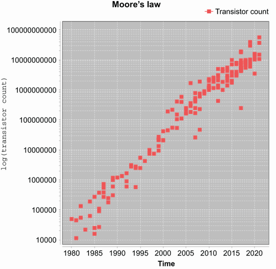

**Hình 7.2** Đồ thị log-tuyến tính của số transistor theo thời gian

Đây là đồ thị log-tuyến tính, nên mỗi bước tăng trên trục y gấp 10 lần bước trước. Như bạn thấy, đường này về cơ bản thẳng và mất khoảng sáu hoặc bảy năm để vượt mỗi mức dọc. Điều này chứng minh định luật Moore, bởi mất sáu hoặc bảy năm để tăng gấp mười cũng chính là xấp xỉ gấp đôi sau mỗi hai năm.

Nhớ rằng trục y trên đồ thị là thang log — điều này nghĩa là một chip Intel dòng chính sản xuất năm 2005 có khoảng 100 triệu transistor. Đây là gấp 100 lần một chip sản xuất năm 1990.

Quan trọng là lưu ý rằng định luật Moore nói cụ thể về *số transistor*. Đây là điểm cơ bản phải được hiểu để nắm được vì sao chỉ mình định luật Moore không đủ để kỹ sư phần mềm tiếp tục nhận được bữa trưa miễn phí từ các kỹ sư phần cứng (xem Herb Sutter, "The Free Lunch Is Over: A Fundamental Turn Toward Concurrency in Software," *Dr. Dobb's Journal* 30 [2005]: 202–210).

Định luật Moore là một chỉ dẫn tốt cho quá khứ, nhưng nó được phát biểu theo số transistor, vốn không thực sự là chỉ dẫn tốt cho hiệu năng mà lập trình viên nên kỳ vọng từ mã của mình. Thực tế, như ta sẽ thấy, phức tạp hơn.

> **NOTE** Số transistor không giống tốc độ xung nhịp, và ngay cả ý tưởng vẫn còn phổ biến rằng tốc độ xung nhịp cao hơn nghĩa là hiệu năng tốt hơn cũng là một sự đơn giản hóa thô thiển.

Sự thật là hiệu năng thực tế phụ thuộc vào nhiều yếu tố, tất cả đều quan trọng. Tuy nhiên, nếu phải chọn chỉ một, thì sẽ là điều này: dữ liệu liên quan tới các lệnh tiếp theo có thể được định vị nhanh đến đâu? Đây là một khái niệm quan trọng tới mức chúng ta nên xem xét kỹ lưỡng.

### 7.3.2 Hiểu hệ phân cấp độ trễ bộ nhớ

Bộ xử lý máy tính cần dữ liệu để làm việc. Nếu dữ liệu cần xử lý không khả dụng, thì không quan trọng CPU chạy nhanh đến đâu — nó chỉ phải chờ, thực hiện no-operation (NOP) và về cơ bản đình trệ tới khi dữ liệu khả dụng.

Điều này nghĩa là hai câu hỏi nền tảng nhất khi giải quyết latency là "Bản sao gần nhất của dữ liệu mà lõi CPU cần làm việc trên đó ở đâu?" và "Sẽ mất bao lâu để đưa nó tới nơi lõi có thể dùng?" Các khả năng chính như sau (trong kiến trúc gọi là Von-Neumann, dạng được dùng phổ biến nhất):

- **Thanh ghi (Register)** — Một vị trí bộ nhớ nằm trên CPU và sẵn sàng dùng ngay. Đây là phần bộ nhớ mà các lệnh thao tác trực tiếp lên.
- **Bộ nhớ chính (Main memory)** — Thường là DRAM. Thời gian truy cập vào khoảng 50 ns (nhưng xem phần sau về chi tiết cách cache của bộ xử lý được dùng để tránh latency này).
- **Ổ đĩa thể rắn (SSD)** — Mất 0,1 ms hoặc ít hơn để truy cập, nhưng chúng vẫn thường đắt hơn so với ổ cứng truyền thống.
- **Ổ cứng (Hard disk)** — Mất khoảng 5 ms để truy cập đĩa và nạp dữ liệu cần thiết vào bộ nhớ chính.

Định luật Moore đã mô tả sự tăng trưởng theo cấp số nhân của số transistor, và điều này cũng có lợi cho bộ nhớ — tốc độ truy cập bộ nhớ cũng tăng theo cấp số nhân. Nhưng số mũ cho hai cái này không giống nhau. Tốc độ bộ nhớ đã cải thiện chậm hơn so với việc CPU thêm transistor, nghĩa là có rủi ro các lõi xử lý sẽ nhàn rỗi do không có dữ liệu liên quan trong tay để xử lý.

Để giải quyết vấn đề này, các *cache* — lượng nhỏ bộ nhớ nhanh hơn (SRAM, thay vì DRAM) — đã được đưa vào giữa thanh ghi và bộ nhớ chính. Bộ nhớ nhanh hơn này tốn nhiều tiền hơn DRAM, cả về mặt tiền bạc lẫn ngân sách transistor, đó là lý do máy tính không đơn giản là dùng SRAM cho toàn bộ bộ nhớ.

Các cache được gọi là L1 và L2 (một số máy cũng có L3), với con số chỉ ra cache gần lõi về mặt vật lý đến đâu (cache gần hơn sẽ nhanh hơn). Chúng ta sẽ nói thêm về cache ở mục 7.6 (về biên dịch JIT) và cho thấy một ví dụ về tầm quan trọng của các hiệu ứng cache L1 với mã đang chạy. Hình 7.3 cho thấy cache L1 và L2 nhanh hơn bộ nhớ chính đến mức nào.

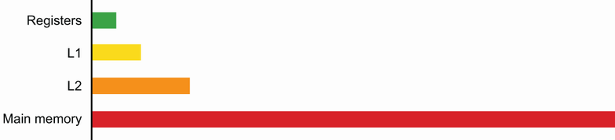

**Hình 7.3** Thời gian truy cập tương đối (theo chu kỳ xung nhịp) cho thanh ghi, cache bộ xử lý và bộ nhớ chính

Bên cạnh việc thêm cache, một kỹ thuật khác được dùng rộng rãi trong những năm 1990 và đầu 2000 là thêm các tính năng bộ xử lý ngày càng phức tạp để cố lách latency của bộ nhớ. Các kỹ thuật phần cứng tinh vi, chẳng hạn instruction-level parallelism (ILP) và chip multithreading (CMT), được dùng để cố giữ CPU thao tác trên dữ liệu, ngay cả trước khoảng cách ngày càng rộng giữa khả năng CPU và latency bộ nhớ.

Những kỹ thuật này rốt cuộc tiêu tốn một phần trăm lớn ngân sách transistor của CPU, và tác động của chúng lên hiệu năng thực chịu quy luật lợi ích giảm dần. Xu hướng này dẫn tới quan điểm rằng tương lai của thiết kế CPU nằm ở các chip nhiều lõi. Bộ xử lý hiện đại về cơ bản đều đa lõi — thực tế, đây là một trong những hệ quả bậc hai của định luật Moore: số lõi đã tăng như một cách tận dụng số transistor khả dụng.

Tương lai của hiệu năng gắn chặt với concurrency — một trong những cách chính để làm một hệ thống có hiệu năng tổng thể tốt hơn là tận dụng nhiều lõi hơn. Bằng cách đó, ngay cả khi một lõi đang chờ dữ liệu, các lõi khác vẫn có thể tiến triển (nhưng nhớ tác động của định luật Amdahl, mà chúng tôi đã giới thiệu ở chương 5). Mối liên hệ này quan trọng tới mức chúng tôi sẽ nói lại lần nữa:

- Về cơ bản mọi CPU hiện đại đều đa lõi.
- Hiệu năng và concurrency gắn liền với nhau như những mối quan tâm.

Chúng ta mới chỉ chạm bề mặt thế giới kiến trúc máy tính khi nó liên quan tới phần mềm và lập trình Java. Độc giả quan tâm muốn biết thêm nên tham khảo một cuốn sách chuyên ngành, chẳng hạn *Computer Architecture: A Quantitative Approach*, ấn bản 6, của Hennessy và cộng sự (Morgan Kaufmann, December 2017).

Những mối quan tâm phần cứng này không đặc thù cho lập trình viên Java, nhưng bản chất được quản lý của JVM đưa vào một số phức tạp bổ sung. Hãy chuyển sang xem chúng ở mục tiếp theo.

## 7.4 Vì sao tinh chỉnh hiệu năng Java lại khó?

Tinh chỉnh hiệu năng trên JVM (hoặc, thực ra, bất kỳ runtime được quản lý nào khác) vốn dĩ khó hơn so với mã chạy không được quản lý. Trong một hệ thống được quản lý, toàn bộ điểm mấu chốt là cho phép runtime nắm một phần kiểm soát môi trường, để lập trình viên không phải đối phó với mọi chi tiết. Điều này khiến lập trình viên năng suất hơn nhiều về tổng thể, nhưng nó có nghĩa một phần kiểm soát phải bị từ bỏ.

Sự chuyển trọng tâm này khiến hệ thống như một tổng thể khó suy luận hơn bởi runtime được quản lý là một hộp mờ đối với lập trình viên. Lựa chọn thay thế là từ bỏ mọi lợi thế mà runtime được quản lý mang lại, buộc lập trình viên của, chẳng hạn, C/C++, phải tự làm gần như mọi thứ. Trong trường hợp này, hệ điều hành chỉ cung cấp các dịch vụ tối thiểu, chẳng hạn lập lịch luồng sơ khai, vốn hầu như luôn là một cam kết thời gian tổng thể cao hơn nhiều so với công sức bổ sung cần cho việc tinh chỉnh hiệu năng.

Một số khía cạnh quan trọng nhất của nền tảng Java góp phần làm việc tinh chỉnh khó khăn như sau:

- Lập lịch luồng
- Thu gom rác (GC)
- Biên dịch just-in-time (JIT)

Những khía cạnh này có thể tương tác theo những cách tinh tế. Ví dụ, hệ thống con biên dịch dùng bộ đếm thời gian để quyết định biên dịch phương thức nào. Tập phương thức là ứng viên cho việc biên dịch có thể bị ảnh hưởng bởi các mối quan tâm như lập lịch và GC. Các phương thức được biên dịch có thể khác nhau giữa các lần chạy.

Như bạn đã thấy xuyên suốt mục này, đo lường chính xác là chìa khóa cho các quá trình ra quyết định của phân tích hiệu năng. Do đó, hiểu chi tiết (và giới hạn) của cách thời gian được xử lý trong nền tảng Java là rất hữu ích nếu bạn muốn nghiêm túc về tinh chỉnh hiệu năng.

### 7.4.1 Vai trò của thời gian trong tinh chỉnh hiệu năng

Tinh chỉnh hiệu năng đòi hỏi bạn hiểu cách diễn giải các phép đo ghi lại trong quá trình thực thi mã, nghĩa là bạn cũng cần hiểu các giới hạn cố hữu trong bất kỳ phép đo thời gian nào trên nền tảng.

**Độ chính xác (Precision)**

Các đại lượng thời gian thường được nêu tới đơn vị gần nhất trên một thang nào đó. Đây được gọi là *precision* của phép đo. Ví dụ, thời gian thường được đo với độ chính xác tới mili-giây. Một phép đo thời gian là *precise* nếu các phép đo lặp lại cho một dải hẹp quanh cùng một giá trị.

Precision là thước đo lượng nhiễu ngẫu nhiên chứa trong một phép đo nhất định. Chúng ta sẽ giả sử các phép đo thực hiện trên một đoạn mã cụ thể được phân phối chuẩn. Trong trường hợp đó, cách phổ biến để nêu precision là nêu độ rộng của khoảng tin cậy 95%.

**Độ đúng (Accuracy)**

*Accuracy* của một phép đo (trong trường hợp của chúng ta, về thời gian) là khả năng thu được một giá trị gần với giá trị thực. Trên thực tế, bạn thường sẽ không biết giá trị thực, nên accuracy có thể khó xác định hơn precision.

Accuracy đo sai số hệ thống trong một phép đo. Có thể có các phép đo accurate mà không precise lắm (nên số đọc cơ bản là đúng, nhưng có nhiễu môi trường ngẫu nhiên). Cũng có thể có kết quả precise mà không accurate.

**Hiểu các phép đo**

Một khoảng được nêu với độ chính xác nano-giây là 5945 ns mà đến từ một bộ đếm thời gian accurate tới 1 μs thực sự nằm đâu đó giữa 3945–7945 ns (với xác suất 95%). Hãy cảnh giác với các con số hiệu năng có vẻ quá chính xác; luôn kiểm tra precision và accuracy của phép đo.

**Độ hạt (Granularity)**

Độ hạt thực sự của hệ thống là độ hạt của tần số của bộ đếm nhanh nhất — có khả năng là bộ đếm ngắt, trong khoảng 10 ns. Điều này đôi khi được gọi là *distinguishability*, khoảng ngắn nhất giữa hai sự kiện có thể chắc chắn nói là đã xảy ra "gần nhau nhưng vào những thời điểm khác nhau".

Khi chúng ta đi qua các tầng hệ điều hành, JVM và mã thư viện, việc phân giải những thời gian cực ngắn này trở nên về cơ bản là bất khả thi. Trong hầu hết hoàn cảnh, những thời gian rất ngắn này không khả dụng với lập trình viên ứng dụng.

**Đo thời gian phân tán qua mạng**

Phần lớn thảo luận về tinh chỉnh hiệu năng của chúng tôi xoay quanh các hệ thống nơi mọi xử lý diễn ra trên một máy chủ duy nhất. Nhưng bạn nên biết rằng một số vấn đề đặc biệt có thể phát sinh khi tinh chỉnh hiệu năng các hệ thống trải rộng qua mạng. Đồng bộ hóa và tính thời gian qua mạng còn xa mới dễ, và không chỉ qua internet — ngay cả mạng Ethernet cũng sẽ có những vấn đề này.

Một thảo luận đầy đủ về đo thời gian phân tán qua mạng nằm ngoài phạm vi cuốn sách này, nhưng bạn nên biết rằng nói chung, khó thu được thời gian chính xác cho các luồng công việc trải rộng qua nhiều máy. Thêm nữa, ngay cả các giao thức tiêu chuẩn như NTP cũng có thể quá thiếu chính xác cho công việc đòi hỏi độ chính xác cao.

Hãy tóm tắt lại những điểm quan trọng nhất về hệ thống thời gian của Java:

- Hầu hết hệ thống có vài đồng hồ khác nhau bên trong.
- Thời gian mili-giây là an toàn và đáng tin cậy.
- Thời gian độ chính xác cao hơn cần xử lý cẩn thận để tránh trôi (drift).
- Bạn cần ý thức về precision và accuracy của các phép đo thời gian.

Trước khi chuyển sang thảo luận thu gom rác, hãy xem một ví dụ chúng tôi đã nhắc tới ở trên — tác động của cache bộ nhớ lên hiệu năng mã.

### 7.4.2 Hiểu về cache miss

Với nhiều đoạn mã thông lượng cao, một trong các yếu tố chính làm giảm hiệu năng là số lượng *cache miss* L1 liên quan tới việc thực thi mã ứng dụng. Listing 7.1 chạy qua một mảng 2 MiB và in thời gian cần để thực thi một trong hai vòng lặp. Vòng đầu tiên tăng 1 ở mỗi 16 mục của một `int[]`. Hầu như luôn có 64 byte trong một cache line L1 (và một `int` Java rộng 4 byte), nên điều này nghĩa là chạm vào mỗi cache line một lần.

Lưu ý rằng trước khi có được kết quả chính xác, chúng ta cần warm up mã, để JVM sẽ biên dịch các phương thức bạn quan tâm. Chúng ta sẽ nói về JIT warmup chi tiết hơn ở phần sau của chương.

**Listing 7.1 Hiểu về cache miss**

```java
public class Caching {
    private final int ARR_SIZE = 2 * 1024 * 1024;
    private final int[] testData = new int[ARR_SIZE];

     private void touchEveryItem() {
         for (int i = 0; i < testData.length; i = i + 1) {
              testData[i] = testData[i] + 1;                     ❶
         }
    }

    private void touchEveryLine() {
        for (int i = 0; i < testData.length; i = i + 16) {
            testData[i] = testData[i] + 1;                       ❷
         }
    }

    private void run() {
        for (int i = 0; i < 10_000; i = i + 1) {                 ❸
            touchEveryLine();
              touchEveryItem();
         }
         System.out.println("Line            Item");
         for (int i = 0; i < 100; i = i + 1) {
             long t0 = System.nanoTime();
             touchEveryLine();
             long t1 = System.nanoTime();
              touchEveryItem();
              long t2 = System.nanoTime();
              long el1 = t1 - t0;
              long el2 = t2 - t1;
              System.out.println("Line: "+ el1 +" ns ; Item: "+ el2);
         }
    }

    public static void main(String[] args) {
         Caching c = new Caching();
         c.run();
    }
}
```

❶ Chạm vào mọi mục

❷ Chạm vào mỗi cache line

❸ Warm up mã

Hàm thứ hai, `touchEveryItem()`, tăng mọi byte trong mảng, nên nó làm gấp 16 lần công việc so với `touchEveryLine()`. Nhưng đây là một số kết quả mẫu từ một laptop điển hình:

```
Line: 487481 ns ; Item: 452421
Line: 425039 ns ; Item: 428397
Line: 415447 ns ; Item: 395332
Line: 372815 ns ; Item: 397519
Line: 366305 ns ; Item: 375376
Line: 332249 ns ; Item: 330512
```

Kết quả của mã này cho thấy `touchEveryItem()` không mất gấp 16 lần thời gian để chạy so với `touchEveryLine()`. Chính thời gian chuyển dữ liệu — nạp từ bộ nhớ chính vào cache CPU — mới chi phối hồ sơ hiệu năng tổng thể. `touchEveryLine()` và `touchEveryItem()` có cùng số lần đọc cache line, và thời gian chuyển dữ liệu vượt xa các chu kỳ dùng để thực sự sửa đổi dữ liệu.

> **NOTE** Điều này minh họa một điểm then chốt: chúng ta cần phát triển ít nhất một hiểu biết thực dụng (hay mô hình tư duy) về cách CPU thực sự tiêu tốn thời gian của nó.

Chủ đề tiếp theo của chúng ta là thảo luận về hệ thống con thu gom rác của nền tảng. Đây là một trong những mảnh quan trọng nhất của bức tranh hiệu năng, và nó có các phần điều chỉnh được có thể là công cụ rất quan trọng cho lập trình viên đang làm phân tích hiệu năng.

## 7.5 Thu gom rác (Garbage collection)

Quản lý bộ nhớ tự động là một trong những phần quan trọng nhất của nền tảng Java. Trước khi có các nền tảng được quản lý như Java và .NET, lập trình viên có thể kỳ vọng dành một phần trăm đáng kể sự nghiệp của mình để săn lùng lỗi gây ra bởi việc xử lý bộ nhớ không hoàn hảo.

Tuy nhiên, những năm gần đây, các kỹ thuật cấp phát tự động đã trở nên tiên tiến và đáng tin cậy đến mức chúng trở thành một phần của đồ đạc trong nhà — một số lượng lớn lập trình viên Java không biết các khả năng quản lý bộ nhớ của nền tảng hoạt động ra sao, những tùy chọn nào khả dụng với lập trình viên, và cách tối ưu trong khuôn khổ ràng buộc của framework.

Đây là dấu hiệu cho thấy cách tiếp cận của Java đã thành công đến mức nào. Hầu hết lập trình viên không biết chi tiết về hệ thống bộ nhớ và GC bởi thường họ đơn giản là không cần biết. JVM có thể làm khá tốt việc xử lý bộ nhớ cho hầu hết ứng dụng mà không cần bất kỳ tinh chỉnh đặc biệt nào.

Vậy, bạn có thể làm gì khi ở trong tình huống mà bạn *thực sự* cần tinh chỉnh chút ít? Trước hết, bạn cần hiểu JVM thực sự làm gì để quản lý bộ nhớ cho bạn. Nên, trong mục này chúng ta sẽ đề cập tới lý thuyết cơ bản, bao gồm:

- Bộ nhớ được xử lý thế nào cho một tiến trình Java đang chạy
- Nền tảng của mark-and-sweep collection
- Bộ thu gom Garbage First (G1), là bộ thu gom mặc định của Java từ Java 9

Hãy bắt đầu với những điều cơ bản.

### 7.5.1 Cơ bản

Tiến trình Java tiêu chuẩn có cả stack lẫn heap. Stack là nơi các biến cục bộ được lưu. Các biến cục bộ giữ kiểu nguyên thủy lưu trực tiếp giá trị nguyên thủy trong stack.

> **NOTE** Kiểu nguyên thủy giữ các mẫu bit sẽ được diễn giải theo kiểu của chúng, nên hai byte `00000000 01100001` sẽ được diễn giải là `a` nếu kiểu là `char` hoặc `97` nếu kiểu là `short`.

Mặt khác, các biến cục bộ thuộc kiểu tham chiếu sẽ trỏ tới một vị trí trong heap của Java, là nơi các đối tượng thực sự được tạo. Hình 7.4 cho thấy nơi lưu trữ cho các biến thuộc nhiều kiểu khác nhau nằm ở đâu.

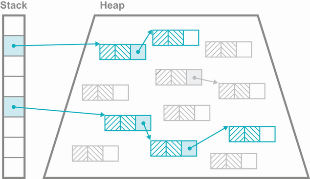

**Hình 7.4** Biến trong stack và heap

Lưu ý rằng các field nguyên thủy của một đối tượng vẫn được cấp phát tại các địa chỉ trong heap. Khi một chương trình Java chạy, các đối tượng mới được tạo trong heap, và quan hệ giữa các đối tượng thay đổi (khi các field được cập nhật). Cuối cùng, heap sẽ hết chỗ để tạo đối tượng mới. Tuy nhiên, nhiều đối tượng đã được tạo sẽ không còn cần thiết nữa (ví dụ, các đối tượng tạm được tạo trong một phương thức và không được truyền cho phương thức khác, hoặc trả về cho caller).

Do đó, không gian trong heap có thể được thu hồi, và chương trình có thể tiếp tục chạy. Cơ chế mà nền tảng phục hồi và tái sử dụng bộ nhớ heap không còn được mã ứng dụng dùng nữa được gọi là *garbage collection* (thu gom rác).

### 7.5.2 Mark and sweep

Một ví dụ tuyệt vời về thuật toán thu gom rác đơn giản là *mark and sweep*, và thực tế nó là thuật toán được phát triển đầu tiên (trong LISP 1.5, phát hành năm 1965).

> **NOTE** Có tồn tại các kỹ thuật quản lý bộ nhớ tự động khác, chẳng hạn cách tiếp cận đếm tham chiếu (reference-counting) được dùng bởi các ngôn ngữ như Perl, có thể lập luận là đơn giản hơn (ít nhất là bề ngoài), nhưng chúng không thực sự là thu gom rác (theo Guy L. Steele "Multiprocessing Compactifying Garbage Collection," *Communications of the ACM* 18, no. 9 [September 1975]).

Ở dạng đơn giản nhất, thuật toán mark-and-sweep tạm dừng mọi luồng chương trình đang chạy và bắt đầu từ tập các đối tượng được biết là "sống" — các đối tượng có một tham chiếu trong bất kỳ stack frame nào (dù tham chiếu đó là nội dung của một biến cục bộ, tham số phương thức, biến tạm, hay khả năng hiếm hơn nào đó) của bất kỳ luồng người dùng nào. Rồi nó đi qua cây tham chiếu từ các đối tượng sống, đánh dấu là sống bất kỳ đối tượng nào tìm thấy trên đường. Khi việc này hoàn tất, mọi thứ còn lại là rác và có thể được thu gom (sweep). Lưu ý rằng bộ nhớ được sweep được trả về cho JVM, không nhất thiết cho hệ điều hành.

**Còn về việc tạm dừng phi tất định?**

Một trong những chỉ trích thường nhắm vào Java (và các môi trường khác như .NET) là dạng thu gom rác mark-and-sweep không tránh khỏi dẫn tới Stop-the-World (thường gọi tắt là STW). Đây là những trạng thái mà mọi luồng người dùng phải bị dừng ngắn, và điều này gây ra những khoảng tạm dừng kéo dài một khoảng thời gian phi tất định.

Vấn đề này thường bị thổi phồng. Với phần mềm server, rất ít ứng dụng phải quan tâm tới thời gian tạm dừng thể hiện bởi các bộ thu gom rác của các phiên bản Java hiện đại. Ví dụ, ở Java 11 trở lên, bộ thu gom rác mặc định là một bộ thu gom concurrent làm hầu hết công việc của mình song song với các luồng ứng dụng và tối thiểu hóa thời gian tạm dừng.

> **NOTE** Lập trình viên đôi khi nghĩ ra những kế hoạch cầu kỳ để tránh một lần tạm dừng, hoặc một lần thu gom toàn bộ bộ nhớ. Trong hầu hết trường hợp, những cái này nên được tránh bởi chúng thường gây hại nhiều hơn lợi.

Nền tảng Java cung cấp một số cải tiến cho cách tiếp cận mark-and-sweep cơ bản. Một trong những cải tiến đơn giản nhất là bổ sung *generational GC*. Trong cách tiếp cận này, heap không phải một vùng bộ nhớ đồng nhất — một số vùng bộ nhớ heap khác nhau tham gia vào vòng đời của một đối tượng Java.

Tùy vào một đối tượng sống bao lâu, nó có thể được chuyển từ vùng này sang vùng khác trong các lần thu gom. Các tham chiếu tới nó có thể trỏ tới nhiều vùng bộ nhớ khác nhau trong suốt vòng đời của đối tượng (như minh họa trong hình 7.5).

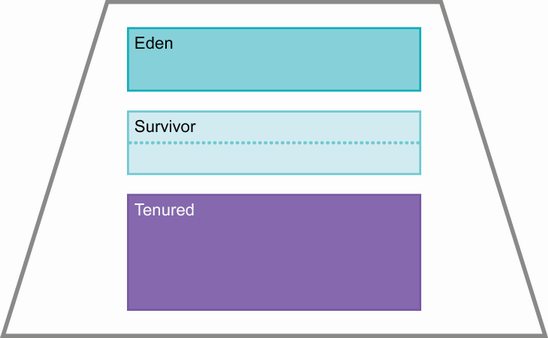

**Hình 7.5** Các vùng bộ nhớ

Lý do cho sự sắp xếp này (và việc di chuyển đối tượng) là phân tích các hệ thống đang chạy cho thấy các đối tượng có xu hướng hoặc có đời sống ngắn ngủi hoặc rất trường thọ. Các vùng bộ nhớ heap khác nhau được thiết kế để cho phép nền tảng khai thác tính chất này, bằng cách tách các đối tượng trường thọ khỏi phần còn lại.

Lưu ý rằng hình 7.5 là một sơ đồ đơn giản của heap được thiết kế để minh họa khái niệm về các vùng theo thế hệ. Thực tế của một heap Java thực phức tạp hơn một chút và phụ thuộc vào bộ thu gom đang dùng, như chúng tôi sẽ giải thích ở phần sau của chương.

### 7.5.3 Các vùng bộ nhớ

JVM có các vùng bộ nhớ khác nhau sau, được dùng để lưu đối tượng trong vòng đời tự nhiên của chúng:

- **Eden** — Eden là vùng của heap nơi mọi đối tượng ban đầu được cấp phát, và với nhiều đối tượng, đây sẽ là phần bộ nhớ duy nhất mà chúng từng cư trú.
- **Survivor** — Các không gian này là nơi các đối tượng sống sót qua một chu kỳ thu gom rác (do đó có tên gọi) được chuyển tới. Ban đầu chúng được chuyển từ Eden, nhưng chúng cũng có thể di chuyển giữa các survivor space trong các lần GC tiếp theo.
- **Tenured** — Không gian tenured (còn gọi là *old generation*) là nơi các đối tượng sống sót được cho là "đủ già" được chuyển tới (thoát khỏi các survivor space). Bộ nhớ tenured không được thu gom trong các lần thu gom young.

Như đã lưu ý, các vùng bộ nhớ này cũng tham gia vào các lần thu gom theo những cách khác nhau. Ví dụ, các survivor space thực sự ở đó như một cơ chế hứng bắt, để các đối tượng đời sống ngắn được tạo ngay trước một lần thu gom được xử lý đúng cách.

Nếu các survivor space không tồn tại, thì những đối tượng mới tạo gần đây (nhưng đời sống ngắn) sẽ bị GC đánh dấu là "sống" và sẽ được thăng cấp vào Tenured. Rồi chúng sẽ chết ngay lập tức nhưng tiếp tục chiếm chỗ trong Tenured cho tới lần Tenured được thu gom tiếp theo. Lần thu gom tiếp theo này cũng sẽ xảy ra sớm hơn cần thiết do việc thăng cấp không đúng cách những đối tượng thực ra có đời sống ngắn. Từ góc độ lý thuyết, giả thuyết thế hệ (generational hypothesis) cũng dẫn chúng ta tới ý tưởng rằng có hai loại thu gom: young và full.

### 7.5.4 Young collection

Một young collection cố dọn dẹp các không gian "young" (Eden và survivor). Quá trình này tương đối đơn giản, như mô tả dưới đây:

- Mọi đối tượng young sống tìm thấy trong pha đánh dấu được di chuyển.
- Các đối tượng đủ già (những cái đã sống sót qua đủ số lần chạy GC trước đó) đi vào Tenured.
- Mọi đối tượng young, sống khác đi vào một survivor space trống.
- Ở cuối, Eden và mọi survivor space vừa được giải phóng sẵn sàng bị ghi đè và tái sử dụng, bởi chúng không chứa gì ngoài rác.

Một young collection được kích hoạt khi Eden đầy. Lưu ý rằng pha đánh dấu phải duyệt toàn bộ đồ thị đối tượng sống. Nếu một đối tượng young có tham chiếu tới một đối tượng Tenured, các tham chiếu do đối tượng Tenured giữ vẫn phải được quét và đánh dấu. Nếu không, có thể phát sinh tình huống một đối tượng Tenured giữ tham chiếu tới một đối tượng trong Eden, nhưng không gì khác giữ. Nếu pha mark không duyệt đầy đủ, đối tượng Eden này sẽ không bao giờ được thấy và sẽ không được xử lý đúng cách. Trên thực tế, một số thủ thuật hiệu năng (ví dụ, card table) được dùng để giảm chi phí tiềm tàng cao của một lần duyệt đánh dấu đầy đủ.

### 7.5.5 Full collection

Khi một young collection không thể thăng cấp một đối tượng lên Tenured (do thiếu chỗ), một full collection được kích hoạt. Tùy vào bộ thu gom được dùng, điều này có thể bao gồm việc di chuyển các đối tượng trong old generation. Việc này được làm để đảm bảo old generation có đủ chỗ để cấp phát một đối tượng lớn nếu cần. Điều này gọi là *compacting* (nén chặt).

### 7.5.6 Safepoint

Thu gom rác không thể diễn ra mà không có ít nhất một lần tạm dừng ngắn của mọi luồng ứng dụng. Tuy nhiên, các luồng không thể bị dừng ở bất kỳ thời điểm tùy ý nào cho GC, bởi mã ứng dụng có thể sửa đổi nội dung của heap. Thay vào đó, có những thời điểm đặc biệt nhất định mà JVM có thể chắc chắn rằng heap đang ở trạng thái nhất quán và GC có thể diễn ra — đây gọi là *safepoint*.

Một trong những ví dụ đơn giản nhất về safepoint là "giữa các lệnh bytecode". Trình thông dịch JVM thực thi một bytecode tại một thời điểm, rồi lặp lại để lấy bytecode tiếp theo từ luồng. Ngay trước khi lặp, luồng thông dịch đó phải đã hoàn tất mọi sửa đổi đối với heap (ví dụ, từ một `putfield`), nên nếu luồng dừng ở đó, nó là "an toàn". Khi tất cả các luồng ứng dụng đạt tới một safepoint, thì việc thu gom rác có thể diễn ra.

Đây là một ví dụ đơn giản về safepoint, nhưng còn những cái khác. Một thảo luận đầy đủ hơn về safepoint, và cách chúng ảnh hưởng tới một số kỹ thuật của trình biên dịch JIT, có thể tìm thấy ở đây: http://mng.bz/Oo8a. Hãy chuyển từ thảo luận lý thuyết sang gặp một số thuật toán thu gom rác trong JVM.

### 7.5.7 G1: Bộ thu gom mặc định của Java

G1 là một bộ thu gom tương đối mới cho nền tảng Java. Nó đạt chất lượng production ở Java 8u40 và được đặt làm bộ thu gom mặc định với Java 9 (năm 2017). Nó ban đầu được dự định là một bộ thu gom độ trễ thấp nhưng trên thực tế đã tiến hóa thành một bộ thu gom đa dụng (do đó có vị thế mặc định).

Nó không chỉ là một bộ thu gom rác theo thế hệ, mà còn được *khu vực hóa* (regionalized), nghĩa là heap Java của G1 chia heap thành các vùng có kích thước bằng nhau (chẳng hạn 1, 2 hay 4 MB mỗi vùng). Các thế hệ vẫn tồn tại, nhưng giờ chúng không còn nhất thiết liền kề nhau trong bộ nhớ. Sự sắp xếp mới của các vùng kích thước bằng nhau trong heap được minh họa trong hình 7.6.

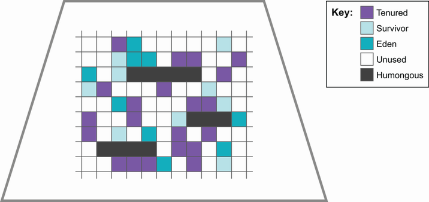

**Hình 7.6** Cách G1 chia heap

Việc khu vực hóa được đưa vào để hỗ trợ ý tưởng về tính dự đoán được của các lần tạm dừng GC. Các bộ thu gom cũ hơn (chẳng hạn Parallel) chịu vấn đề là một khi chu kỳ GC đã bắt đầu, nó cần chạy tới hoàn tất, bất kể mất bao lâu (tức là chúng theo kiểu được-ăn-cả-ngã-về-không).

G1 cung cấp một chiến lược thu gom không dẫn tới thời gian tạm dừng dài hơn với heap lớn hơn. Nó được thiết kế để tránh hành vi được-ăn-cả-ngã-về-không, và một khái niệm then chốt cho điều này là *pause goal* (mục tiêu tạm dừng). Đây là khoảng thời gian chương trình có thể tạm dừng cho GC trước khi tiếp tục thực thi. G1 sẽ làm mọi thứ có thể để đạt mục tiêu tạm dừng của bạn, trong giới hạn hợp lý. Trong một lần tạm dừng, các đối tượng sống sót được di tản sang một vùng khác (giống như đối tượng Eden được chuyển tới survivor space), và vùng đó được đưa lại vào danh sách các vùng trống.

Young collection trong G1 hoàn toàn là STW và sẽ chạy tới hoàn tất. Điều này tránh race condition giữa các luồng thu gom và cấp phát (có thể xảy ra nếu young collection chạy đồng thời với các luồng ứng dụng).

> **NOTE** Giả thuyết thế hệ là chỉ một phần nhỏ các đối tượng gặp phải trong một young collection còn sống. Nên, thời gian cần cho một young collection nên rất nhỏ, và ít hơn nhiều so với pause goal.

Việc thu gom các đối tượng old có tính chất khác với young collection — thứ nhất, bởi một khi các đối tượng đã đạt tới old generation, chúng có xu hướng sống một khoảng thời gian đáng kể. Thứ hai, không gian cấp cho old generation có xu hướng lớn hơn nhiều so với young generation.

G1 theo dõi các đối tượng được chuyển sang old generation, và khi đủ không gian old đã được lấp đầy (được kiểm soát bởi `InitiatingHeapOccupancyPercent` hay IHOP, mặc định là 45%), một old collection được bắt đầu. Đây là một concurrent collection, bởi nó chạy (trong mức có thể) đồng thời với các luồng ứng dụng.

Phần đầu của old collection này là một pha đánh dấu concurrent. Nó dựa trên một thuật toán được Dijkstra và Lamport mô tả lần đầu năm 1978 (xem https://dl.acm.org/doi/10.1145/359642.359655). Khi việc này hoàn tất, thì một young collection được kích hoạt ngay lập tức. Tiếp theo là một *mixed collection*, thu gom các vùng old dựa trên lượng rác chúng chứa (có thể suy ra từ các thống kê thu thập trong lần concurrent mark). Các đối tượng sống sót từ các vùng old được di tản vào các vùng old mới (và được nén chặt).

Bản chất của chiến lược thu gom G1 cũng cho phép nền tảng thu thập thống kê về việc một vùng đơn lẻ mất bao lâu (trung bình) để thu gom. Đây là cách pause goal được hiện thực — G1 sẽ chỉ thu gom bao nhiêu vùng mà nó có thời gian (mặc dù có thể vượt quá nếu vùng cuối cùng mất nhiều thời gian hơn dự kiến để thu gom).

Có khả năng việc thu gom toàn bộ old generation không thể hoàn tất trong một chu kỳ GC duy nhất. Trong trường hợp này, G1 chỉ thu gom một tập vùng rồi hoàn tất lần thu gom, giải phóng các lõi CPU đang được dùng cho GC. Miễn là, qua một khoảng thời gian kéo dài, việc tạo các đối tượng trường thọ không vượt quá khả năng của GC trong việc thu hồi chúng, mọi thứ sẽ ổn.

Trong trường hợp việc cấp phát vượt quá việc thu hồi trong một khoảng thời gian kéo dài, thì, như một nỗ lực cuối cùng, GC sẽ thực hiện một full collection STW và dọn dẹp cùng nén chặt hoàn toàn old generation. Trên thực tế, hành vi này không thấy trừ khi ứng dụng đang vật lộn nghiêm trọng.

Một điểm nữa đáng nhắc: có thể cấp phát các đối tượng lớn hơn một vùng đơn lẻ. Trên thực tế, điều này nghĩa là một mảng lớn (thường là byte hoặc các kiểu nguyên thủy khác).

> **NOTE** Có thể tạo một cách nhân tạo một class có nhiều field tới mức một thể hiện đối tượng đơn lẻ lớn hơn 1 MB, nhưng điều này sẽ không bao giờ được làm trong một hệ thống thực tế.

Những đối tượng như vậy cần một loại vùng đặc biệt — *humongous region*. Chúng cần xử lý đặc biệt bởi GC bởi không gian cấp cho các mảng lớn phải liền kề trong bộ nhớ. Nếu đủ số vùng trống nằm kề nhau, chúng có thể được chuyển thành một humongous region duy nhất và mảng có thể được cấp phát.

Nếu không có chỗ nào trong bộ nhớ mà mảng có thể được cấp phát (ngay cả sau một young collection), thì bộ nhớ được nói là bị *phân mảnh* (fragmented). GC phải thực hiện một lần thu gom hoàn toàn STW và nén chặt để cố giải phóng đủ chỗ cho việc cấp phát.

G1 đã khẳng định là một bộ thu gom rất hiệu quả trên nhiều loại workload và loại ứng dụng khác nhau. Tuy nhiên, với một số workload (ví dụ, những workload cần thông lượng thuần túy hoặc vẫn đang chạy trên Java 8), thì một bộ thu gom khác, chẳng hạn Parallel, có thể hữu ích.

### 7.5.8 Bộ thu gom Parallel

Bộ thu gom Parallel là mặc định cho tới Java 8, và nó vẫn có thể được dùng như lựa chọn thay thế cho G1 ngày nay. Cái tên *Parallel* cần một chút giải thích, bởi *concurrent* và *parallel* đều được dùng để mô tả các tính chất của thuật toán GC. Chúng nghe như thể chúng có cùng nghĩa, nhưng thực tế chúng có hai nghĩa hoàn toàn khác nhau, như mô tả dưới đây:

- **Concurrent** — Các luồng GC có thể chạy cùng lúc với các luồng ứng dụng.
- **Parallel** — Thuật toán GC là đa luồng và có thể dùng nhiều lõi.

Các thuật ngữ này hoàn toàn không tương đương. Thay vào đó, tốt hơn là nghĩ về chúng như những cái đối lập với hai thuật ngữ GC khác — *concurrent* là đối lập của *STW*, và *parallel* là đối lập của *đơn luồng*.

Ở một số bộ thu gom (bao gồm Parallel), heap không được khu vực hóa. Thay vào đó, các thế hệ là các vùng bộ nhớ liền kề, có khoảng trống để lớn lên và co lại khi cần. Trong cấu hình heap này có hai survivor space. Chúng đôi khi được gọi là From và To, và một trong các survivor space luôn trống trừ khi một lần thu gom đang diễn ra.

> **NOTE** Các phiên bản Java rất cũ cũng có một không gian gọi là PermGen (hay Permanent Generation). Đây là nơi bộ nhớ được cấp cho các cấu trúc nội bộ của JVM, chẳng hạn định nghĩa của class và phương thức. PermGen đã bị loại bỏ ở Java 8, nên nếu bạn tìm thấy tài liệu nào nhắc tới nó, thì chúng đã cũ và có khả năng lỗi thời.

Parallel là một bộ thu gom rất hiệu quả — hiệu quả nhất khả dụng trong Java dòng chính — nhưng nó đi kèm một nhược điểm: nó không có khả năng pause goal thực sự và các old collection (vốn là STW) phải chạy tới hoàn tất, bất kể mất bao lâu.

Một số lập trình viên đôi khi đặt câu hỏi về hành vi độ phức tạp (hay "big-O") của các thuật toán GC. Tuy nhiên, đây không thực sự là câu hỏi hữu ích để hỏi. Thuật toán GC rất tổng quát, và chúng được yêu cầu hành xử chấp nhận được trên toàn bộ dải các workload khả dĩ. Chỉ tập trung vào hành vi tiệm cận của chúng không hữu ích lắm, và chắc chắn không phải một đại diện phù hợp cho hiệu năng trường hợp chung của chúng.

Thu gom rác luôn là về các đánh đổi, và những đánh đổi mà G1 thực hiện rất tốt cho hầu hết workload (tốt tới mức nhiều lập trình viên có thể đơn giản là bỏ qua chúng). Tuy nhiên, các đánh đổi luôn tồn tại, dù lập trình viên có ý thức về chúng hay không. Một số ứng dụng không thể bỏ qua các đánh đổi và phải chọn quan tâm tới chi tiết của hệ thống con GC, hoặc bằng cách đổi thuật toán thu gom hoặc bằng cách tinh chỉnh dùng các tham số GC.

### 7.5.9 Tham số cấu hình GC

JVM đi kèm một số lượng khổng lồ các tham số hữu ích (ít nhất một trăm) có thể dùng để tùy chỉnh nhiều khía cạnh của hành vi runtime của JVM. Trong mục này, chúng ta sẽ thảo luận một số switch cơ bản liên quan tới thu gom rác.

Nếu một switch bắt đầu bằng `-X:`, nó là phi tiêu chuẩn và có thể không khả chuyển giữa các bản hiện thực JVM (chẳng hạn HotSpot hay Eclipse OpenJ9). Nếu nó bắt đầu bằng `-XX:`, nó là switch mở rộng và không được khuyến nghị cho dùng tùy tiện. Nhiều switch liên quan tới hiệu năng là switch mở rộng.

Một số switch có tác dụng Boolean và nhận một `+` hoặc `-` phía trước để bật hoặc tắt. Các switch khác nhận một tham số, chẳng hạn `-XX:CompileThreshold=20000` (sẽ đặt số lần một phương thức cần được gọi trước khi được xem xét cho biên dịch JIT thành 20000). Bảng 7.1 liệt kê các switch GC cơ bản và hiển thị giá trị mặc định (nếu có) của switch.

**Bảng 7.1 Các switch thu gom rác cơ bản**

| Switch | Tác dụng |
| --- | --- |
| `-Xms<size in MB>m` | Kích thước ban đầu của heap (mặc định 1/64 bộ nhớ vật lý) |
| `-Xmx<size in MB>m` | Kích thước tối đa của heap (mặc định 1/4 bộ nhớ vật lý) |
| `-Xmn<size in MB>m` | Kích thước của young generation trong heap |
| `-XX:-DisableExplicitGC` | Ngăn các lời gọi `System.gc()` có bất kỳ tác dụng nào |

Một kỹ thuật đáng tiếc là phổ biến là đặt kích thước `-Xms` bằng với `-Xmx`. Điều này khi đó nghĩa là tiến trình sẽ chạy với đúng kích thước heap đó và sẽ không thay đổi kích thước trong lúc thực thi. Bề ngoài, điều này có vẻ hợp lý, và nó cho lập trình viên ảo giác về sự kiểm soát. Tuy nhiên, trên thực tế, cách tiếp cận này là một antipattern. Các GC hiện đại có thuật toán định cỡ động tốt, và việc ràng buộc chúng một cách nhân tạo hầu như luôn gây hại nhiều hơn lợi.

> **NOTE** Năm 2022, thực hành tốt nhất cho hầu hết workload, khi không có bằng chứng nào khác, là đặt `Xmx` và hoàn toàn không đặt `Xms`.

Cũng đáng lưu ý hành vi của JVM trong container. Với Java 11 và 17, "bộ nhớ vật lý" nghĩa là giới hạn container, nên kích thước heap tối đa phải nằm gọn trong bất kỳ giới hạn container nào và còn chỗ cho bộ nhớ không phải Java heap cùng mọi tiến trình khác ngoài JVM. Các phiên bản Java 8 đời đầu không nhất thiết tôn trọng giới hạn container, nên lời khuyên là luôn nâng cấp lên Java 11 nếu bạn đang chạy ứng dụng của mình trong container. Với bộ thu gom G1, hai thiết lập khác có thể hữu ích trong các bài tập tinh chỉnh — chúng được thể hiện trong bảng 7.2.

**Bảng 7.2 Các flag cho bộ thu gom G1**

| Switch | Tác dụng |
| --- | --- |
| `-XX:MaxGCPauseMillis=50` | Chỉ cho G1 rằng nó nên cố không tạm dừng quá 50 ms trong một lần thu gom |
| `-XX:GCPauseIntervalMillis=200` | Chỉ cho G1 rằng nó nên cố chạy ít nhất 200 ms giữa các lần thu gom |

Các switch có thể được kết hợp, chẳng hạn để đặt mục tiêu tạm dừng tối đa 50 ms với các lần tạm dừng xảy ra cách nhau không gần hơn 200 ms. Dĩ nhiên, có giới hạn về việc hệ thống GC có thể bị đẩy mạnh đến đâu. Phải có đủ thời gian tạm dừng để đổ rác. Một pause goal 1 ms trên 100 năm chắc chắn sẽ không đạt được hay được tôn trọng.

Ở mục tiếp theo, chúng ta sẽ xem biên dịch JIT. Với nhiều chương trình, đây là một yếu tố đóng góp chính vào việc tạo ra mã có hiệu năng tốt. Chúng ta sẽ xem một số điều cơ bản của biên dịch JIT, và ở cuối mục, chúng tôi sẽ giải thích cách bật logging của biên dịch JIT để cho phép bạn biết phương thức nào của mình đang được biên dịch.

## 7.6 Biên dịch JIT với HotSpot

Như chúng ta đã thảo luận ở chương 1, nền tảng Java có lẽ được nghĩ tới tốt nhất như "được biên dịch động". Một số class ứng dụng và framework trải qua thêm việc biên dịch tại runtime để biến đổi chúng thành mã máy có thể được thực thi trực tiếp.

Quá trình này gọi là biên dịch just-in-time (JIT), hay chỉ *JITing*, và nó thường diễn ra trên từng phương thức một. Hiểu quá trình này thường là chìa khóa để xác định các phần quan trọng của bất kỳ codebase cỡ lớn nào.

Hãy xem một số sự thật cơ bản tốt về biên dịch JIT:

- Hầu như mọi JVM hiện đại đều có một trình biên dịch JIT nào đó.
- Các JVM thuần thông dịch rất chậm khi so sánh.
- Các phương thức đã biên dịch chạy nhanh hơn rất, rất nhiều so với mã thông dịch.
- Hợp lý khi biên dịch các phương thức được dùng nhiều nhất trước.
- Khi làm biên dịch JIT, luôn quan trọng khi hái quả ở cành thấp trước.

Điểm cuối này nghĩa là chúng ta nên xem mã đã biên dịch trước, bởi trong hoàn cảnh bình thường, bất kỳ phương thức nào vẫn ở trạng thái thông dịch đều chưa chạy nhiều bằng phương thức đã được biên dịch. (Thỉnh thoảng một phương thức sẽ thất bại biên dịch, nhưng điều này khá hiếm.)

Các phương thức khởi đầu bằng việc được thông dịch từ biểu diễn bytecode của chúng, với JVM theo dõi một phương thức đã được gọi bao nhiêu lần (và một số thống kê khác). Khi đạt tới một giá trị ngưỡng, nếu phương thức đủ điều kiện, một luồng JVM sẽ biên dịch bytecode thành mã máy ở nền. Nếu biên dịch thành công, mọi lời gọi tiếp theo tới phương thức sẽ dùng dạng đã biên dịch, trừ khi có gì đó xảy ra làm nó vô hiệu hoặc gây ra deoptimization.

Tùy vào bản chất chính xác của mã trong một phương thức, một phương thức đã biên dịch có thể nhanh hơn rất nhiều so với cùng phương thức đó ở chế độ thông dịch. Con số "nhanh hơn tới 100 lần" đôi khi được đưa ra, nhưng đây là một quy tắc kinh nghiệm cực kỳ thô. Bản chất của biên dịch JIT thay đổi mã được thực thi nhiều đến mức bất kỳ con số đơn lẻ nào cũng gây hiểu nhầm. Hiểu phương thức nào là quan trọng trong một chương trình, và phương thức quan trọng nào đang được biên dịch, khá thường xuyên là một kỹ thuật chính trong việc cải thiện hiệu năng.

### 7.6.1 Vì sao lại có biên dịch động?

Một câu hỏi đôi khi được hỏi là, vì sao nền tảng Java bận tâm tới biên dịch động? Vì sao không biên dịch tất cả từ trước (như C++)? Câu trả lời đầu tiên thường là việc có các artifact độc lập nền tảng (tệp `.jar` và `.class`) làm đơn vị triển khai cơ bản đỡ đau đầu hơn nhiều so với việc cố xử lý một binary đã biên dịch khác nhau cho mỗi nền tảng nhắm tới.

Một câu trả lời thay thế, và tham vọng hơn, là các ngôn ngữ dùng biên dịch động có nhiều thông tin hơn khả dụng cho trình biên dịch của chúng. Cụ thể, các ngôn ngữ biên dịch ahead-of-time (AOT) không có quyền truy cập bất kỳ thông tin runtime nào, chẳng hạn tính khả dụng của một số lệnh nhất định hoặc các chi tiết phần cứng khác, hay bất kỳ thống kê nào về cách mã đang chạy. Điều này mở ra khả năng hấp dẫn rằng một ngôn ngữ biên dịch động như Java thực sự có thể chạy nhanh hơn các ngôn ngữ biên dịch AOT.

> **NOTE** Biên dịch AOT trực tiếp bytecode Java thành mã máy (hay "static Java") là một lĩnh vực nghiên cứu sôi động trong cộng đồng Java nhưng đáng tiếc nằm ngoài phạm vi cuốn sách này.

Với phần còn lại của thảo luận về cơ chế JITing, chúng tôi sẽ nói cụ thể về JVM tên HotSpot. Nhiều thảo luận tổng quát sẽ áp dụng cho các VM khác, nhưng các chi tiết cụ thể có thể khác nhau rất nhiều.

Chúng ta sẽ bắt đầu bằng việc giới thiệu các trình biên dịch JIT khác nhau đi kèm HotSpot rồi giải thích hai trong số các tối ưu mạnh mẽ nhất khả dụng từ HotSpot — *inlining* và *monomorphic dispatch*. Chúng ta sẽ kết thúc mục này bằng việc cho thấy cách bật logging biên dịch phương thức, để bạn có thể thấy chính xác phương thức nào đang được biên dịch. Hãy bắt đầu bằng việc giới thiệu HotSpot.

### 7.6.2 Giới thiệu về HotSpot

HotSpot là JVM mà Oracle có được khi mua Sun Microsystems (họ đã sở hữu một JVM tên JRockit, ban đầu do BEA Systems phát triển). HotSpot là JVM tạo thành cơ sở của OpenJDK. Nó có khả năng chạy ở hai chế độ riêng biệt: client và server.

Ngày xưa, chế độ có thể được chọn bằng cách chỉ định switch `-client` hoặc `-server` cho JVM khi khởi động. Mỗi chế độ này có các ứng dụng khác nhau mà chúng được ưa chuộng.

**C1 (hay client compiler)**

Trình biên dịch C1 ban đầu được dự định để dùng trong các ứng dụng GUI. Đây là lĩnh vực mà tính nhất quán của vận hành được coi trọng, nên C1 (đôi khi gọi là client compiler) có xu hướng đưa ra các quyết định bảo thủ hơn khi biên dịch. Nó không thể tạm dừng bất ngờ trong lúc rút lại một quyết định tối ưu hóa hóa ra là sai hoặc dựa trên giả định lỗi. Nó có ngưỡng biên dịch khá thấp — một phương thức phải được thực thi 1500 lần trước khi đủ điều kiện được biên dịch — nên nó có thời gian warmup tương đối ngắn.

**C2 (hay server compiler)**

Ngược lại, server compiler (C2) đưa ra các giả định táo bạo khi biên dịch. Để đảm bảo mã được chạy luôn đúng, C2 thêm một kiểm tra runtime nhanh (thường gọi là *guard condition*) rằng giả định nó đưa ra là hợp lệ. Nếu không, nó rút lại việc biên dịch táo bạo và thường thử cái khác. Cách tiếp cận táo bạo này có thể cho hiệu năng tốt hơn nhiều so với client compiler khá e ngại rủi ro.

C2 có ngưỡng inlining cao hơn nhiều so với C1. Theo mặc định, một phương thức không đủ điều kiện cho biên dịch C2 cho tới khi nó đạt 10.000 lần gọi, hàm ý thời gian warmup dài hơn nhiều.

**Real-time Java**

Trong lịch sử, một dạng Java đã được phát triển gọi là *real-time Java*, và một số lập trình viên thắc mắc vì sao mã cần hiệu năng cao lại không đơn giản dùng nền tảng này (là một JVM riêng, không phải một tùy chọn của HotSpot). Câu trả lời là một hệ thống real-time không, bất chấp lầm tưởng phổ biến, nhất thiết là hệ thống nhanh nhất.

Lập trình real-time thực sự là về những đảm bảo có thể được đưa ra. Theo thuật ngữ thống kê, một hệ thống real-time tìm cách giảm phương sai của thời gian cần để thực hiện một số thao tác và sẵn sàng hy sinh một lượng latency trung bình nhất định để làm vậy. Hiệu năng tổng thể có thể bị hy sinh chút ít để đạt được sự chạy nhất quán hơn. Các đội tìm kiếm hiệu năng cao hơn thường tìm kiếm latency trung bình thấp hơn, ngay cả với cái giá là phương sai cao hơn, nên các tối ưu táo bạo của server compiler đặc biệt phù hợp.

Trong các JVM hiện đại, cả client và server compiler đều được dùng — client compiler được dùng sớm, và các tối ưu cấp server nâng cao được dùng sau khi ứng dụng đã warm up. Việc dùng kép này gọi là *tiered compilation*. Chủ đề tiếp theo của chúng ta là một chủ đề được mọi trình biên dịch JIT sử dụng rộng rãi.

### 7.6.3 Inline phương thức

*Inlining* là một trong những kỹ thuật mạnh mẽ nhất mà HotSpot có trong tay. Nó hoạt động bằng cách loại bỏ lời gọi tới phương thức được inline và thay vào đó đặt mã của phương thức được gọi vào bên trong caller.

Một trong những lợi thế của nền tảng là compiler có thể đưa ra quyết định inline dựa trên các thống kê runtime tử tế về việc phương thức được gọi thường xuyên đến đâu và các yếu tố khác (ví dụ, liệu nó có làm phương thức caller quá lớn và có khả năng ảnh hưởng tới code cache không). Trình biên dịch của HotSpot có thể đưa ra những quyết định thông minh hơn nhiều về inlining so với các trình biên dịch ahead-of-time.

**Còn về các phương thức accessor?**

Một số lập trình viên giả định sai rằng một phương thức accessor (một getter public truy cập một biến thành viên private) không thể được HotSpot inline. Lý luận của họ là bởi biến là private, lời gọi phương thức không thể được tối ưu bỏ đi, bởi việc truy cập nó bị cấm bên ngoài class. Điều này là sai.

HotSpot có thể và sẽ bỏ qua kiểm soát truy cập khi biên dịch phương thức thành mã máy và sẽ thay thế một phương thức accessor bằng truy cập trực tiếp tới field private. Điều này không làm tổn hại mô hình bảo mật của Java, bởi mọi kiểm soát truy cập đã được kiểm tra khi class được nạp hoặc link.

Việc inline phương thức là hoàn toàn tự động, và trong gần như mọi hoàn cảnh, các giá trị tham số mặc định là ổn. Có các switch để kiểm soát kích thước phương thức nào sẽ được inline và một phương thức cần được gọi thường xuyên đến đâu trước khi trở thành ứng viên.

Những switch này chủ yếu hữu ích cho lập trình viên tò mò để hiểu tốt hơn cách phần inlining của phần nội bộ hoạt động. Chúng không thường hữu ích cho mã production và nên được xem là một biện pháp cuối cùng như một kỹ thuật hiệu năng, bởi chúng rất có thể có các tác động khó lường khác lên hiệu năng của hệ thống runtime.

### 7.6.4 Biên dịch động và monomorphic call

Một ví dụ về loại tối ưu táo bạo này là *monomorphic call*. Đây là một tối ưu dựa trên quan sát rằng, trong hầu hết hoàn cảnh, một lời gọi phương thức trên một đối tượng, như thế này:

```java
MyActualClassNotInterface obj = getInstance();

obj.callMyMethod();
```

sẽ chỉ được gọi bởi một loại đối tượng. Một cách nói khác là call site `obj.callMyMethod()` sẽ hầu như không bao giờ gặp cả một class và subclass của nó. Trong trường hợp này, việc tra cứu phương thức Java có thể được thay bằng một lời gọi trực tiếp tới mã đã biên dịch tương ứng với `callMyMethod()`.

> **NOTE** Monomorphic dispatch cung cấp một ví dụ về việc JVM lập hồ sơ runtime, cho phép nền tảng thực hiện các tối ưu mà một ngôn ngữ AOT như C++ đơn giản là không thể.

Không có lý do kỹ thuật nào khiến phương thức `getInstance()` không thể trả về một đối tượng kiểu `MyActualClassNotInterface` trong một số hoàn cảnh và một đối tượng thuộc subclass nào đó trong các hoàn cảnh khác. Để phòng vệ trước khả năng điều này xảy ra, `getInstance()` sẽ không được đưa ra cho tối ưu monomorphic trừ khi chính xác cùng một kiểu đã được thấy tại call site mỗi lần, cho tới khi đạt ngưỡng biên dịch. Một kiểm tra runtime để kiểm tra kiểu của `obj` cũng được chèn vào mã đã biên dịch cho các lời gọi tương lai. Nếu kỳ vọng này từng bị vi phạm, runtime rút lại tối ưu mà chương trình không hề nhận ra hoặc từng làm gì sai.

Đây là một tối ưu khá táo bạo và chỉ được server compiler thực hiện. Client compiler không làm điều này.

### 7.6.5 Đọc log biên dịch

Hãy xem một ví dụ để minh họa cách bạn có thể dùng các thông điệp log do trình biên dịch JIT xuất ra. Danh mục sao Hipparcos liệt kê chi tiết về các ngôi sao có thể quan sát từ Trái Đất. Ứng dụng ví dụ của chúng ta xử lý danh mục để tạo bản đồ sao của các sao có thể thấy vào một đêm nhất định, ở một địa điểm nhất định.

Hãy xem một số kết quả ví dụ cho thấy phương thức nào đang được biên dịch khi chúng ta chạy ứng dụng bản đồ sao. Flag JVM then chốt chúng ta đang dùng là `-XX:+PrintCompilation`. Đây là một trong các switch mở rộng chúng tôi đã thảo luận ngắn gọn ở trên. Thêm switch này vào dòng lệnh dùng để khởi động JVM bảo các luồng biên dịch JIT thêm thông điệp vào log tiêu chuẩn. Những thông điệp này chỉ ra khi nào các phương thức đã vượt ngưỡng biên dịch và được chuyển thành mã máy như sau:

```
1 java.lang.String::hashCode (64 bytes)
2 java.math.BigInteger::mulAdd (81 bytes)
3 java.math.BigInteger::multiplyToLen (219 bytes)
4 java.math.BigInteger::addOne (77 bytes)
5 java.math.BigInteger::squareToLen (172 bytes)
6 java.math.BigInteger::primitiveLeftShift (79 bytes)
7 java.math.BigInteger::montReduce (99 bytes)
8 sun.security.provider.SHA::implCompress (491 bytes)
9 java.lang.String::charAt (33 bytes)
1% ! sun.nio.cs.SingleByteDecoder::decodeArrayLoop @ 129 (308 bytes)
...
39 sun.misc.FloatingDecimal::doubleValue (1289 bytes)
40 org.camelot.hipparcos.DelimitedLine::getNextString (5 bytes)
41 ! org.camelot.hipparcos.Star::parseStar (301 bytes)
...
2% ! org.camelot.CamelotStarter::populateStarStore @ 25 (106 bytes)
65 s java.lang.StringBuffer::append (8 bytes)
```

Đây là kết quả khá điển hình từ `PrintCompilation`. Những dòng này chỉ ra phương thức nào đã được xem là đủ "nóng" để được biên dịch. Như bạn có thể mong đợi, các phương thức đầu tiên được biên dịch có khả năng là các phương thức nền tảng (chẳng hạn `String::hashCode()`). Theo thời gian, các phương thức ứng dụng (chẳng hạn phương thức `org.camelot.hipparcos.Star::parseStar()`, dùng trong ví dụ để phân tích một bản ghi từ danh mục thiên văn) cũng sẽ được biên dịch.

Các dòng đầu ra có một con số, chỉ ra thứ tự các phương thức được biên dịch trong lần chạy này. Lưu ý rằng thứ tự này có thể thay đổi nhẹ giữa các lần chạy do bản chất động của nền tảng. Một số trường khác như sau:

- `s` — Chỉ ra phương thức là `synchronized`
- `!` — Chỉ ra phương thức có exception handler
- `%` — On-stack replacement (OSR)

OSR nghĩa là phương thức đã được biên dịch và thay thế phiên bản thông dịch trong mã đang chạy. Lưu ý rằng các phương thức OSR có cơ chế đánh số riêng, bắt đầu từ 1.

**Coi chừng zombie**

Khi xem các log kết quả mẫu trên mã chạy dùng server compiler (C2), thỉnh thoảng bạn sẽ thấy các dòng như "made not entrant" và "made zombie". Những dòng này nghĩa là một phương thức cụ thể, vốn đã được biên dịch, giờ đã bị vô hiệu, thường do một thao tác class loading.

### 7.6.6 Deoptimization

HotSpot có khả năng *deoptimize* mã dựa trên một giả định hóa ra là không đúng. Trong nhiều trường hợp, nó sau đó cân nhắc lại và thử một tối ưu thay thế. Do đó, cùng một phương thức có thể bị deoptimize và biên dịch lại vài lần.

Theo thời gian, bạn sẽ thấy số phương thức đã biên dịch ổn định lại. Mã đạt tới trạng thái ổn định, đã biên dịch và phần lớn ở lại đó. Chi tiết chính xác về phương thức nào được biên dịch có thể phụ thuộc vào phiên bản JVM và nền tảng hệ điều hành chính xác đang dùng. Sai lầm khi giả định rằng mọi nền tảng sẽ tạo ra cùng tập phương thức được biên dịch và rằng mã đã biên dịch cho một phương thức nhất định sẽ xấp xỉ cùng kích thước trên các nền tảng. Cũng như rất nhiều thứ khác trong không gian hiệu năng, điều này nên được đo, và kết quả có thể gây ngạc nhiên. Ngay cả một phương thức Java trông khá vô hại cũng đã được chứng minh có khác biệt gấp năm lần giữa Mac và Linux xét theo mã máy được sinh ra bởi biên dịch JIT.

Đo lường luôn cần thiết. May mắn thay, các JVM hiện đại đi kèm một số công cụ tuyệt vời để tạo điều kiện cho phân tích hiệu năng chuyên sâu. Hãy xem chúng.

## 7.7 JDK Flight Recorder

Trong lịch sử, các công cụ Flight Recorder và Mission Control (thường gọi là JFR và JMC) được Oracle có được như một phần của việc mua lại BEA Systems hồi 2008. Hai thành phần làm việc cùng nhau — JFR là một engine lập hồ sơ dựa trên sự kiện, chi phí thấp với backend hiệu năng cao để ghi sự kiện ở định dạng nhị phân, trong khi JMC là một công cụ GUI để khảo sát một tệp dữ liệu do JFR tạo ra từ telemetry của một JVM đơn lẻ.

Các công cụ này ban đầu là một phần của bộ công cụ cho JVM JRockit của BEA và được chuyển sang phiên bản thương mại của Oracle JDK như một phần của quá trình hợp nhất JRockit với HotSpot. Sau khi phát hành JDK 9, Oracle thay đổi mô hình phát hành của Java và thông báo rằng JFR và JMC sẽ trở thành công cụ mã nguồn mở. JFR được đóng góp cho OpenJDK và được giao trong JDK 11 dưới dạng JEP 328. JMC được tách ra thành một dự án mã nguồn mở độc lập và tồn tại ngày nay như một bản tải xuống riêng.

> **NOTE** Java 14 giới thiệu một tính năng mới cho JFR: khả năng JFR tạo ra một luồng sự kiện liên tục. Thay đổi này cung cấp một API callback để cho phép các sự kiện được xử lý ngay lập tức, thay vì bằng cách phân tích một tệp sau khi mọi việc đã xong.

Tuy nhiên, một vấn đề là bởi JFR và JMC chỉ mới trở thành công cụ mã nguồn mở gần đây, nhiều lập trình viên Java không biết về những khả năng đáng kể của chúng. Hãy nhân cơ hội này giới thiệu JMC và JFR từ đầu.

### 7.7.1 Flight Recorder

JFR lần đầu khả dụng dưới dạng mã nguồn mở như một phần của OpenJDK 11, nên để dùng nó, bạn cần chạy phiên bản đó (hoặc mới hơn). Công nghệ này cũng được backport về OpenJDK 8 và khả dụng cho các phiên bản 8u262 trở lên.

Có nhiều cách để tạo một bản ghi JFR, nhưng chúng ta sẽ xem hai cách cụ thể: dùng các đối số dòng lệnh khi khởi động một JVM và dùng `jcmd`.

Trước hết, hãy xem chúng ta cần switch dòng lệnh nào để khởi động JFR tại thời điểm tiến trình bắt đầu. Switch then chốt như sau:

```
-XX:StartFlightRecording:<options>
```

Việc này có thể được làm hoặc như một tệp dump một lần hoặc một ring buffer liên tục, và một số lượng lớn tùy chọn dòng lệnh riêng lẻ kiểm soát dữ liệu nào đang được thu thập.

Thêm nữa, JFR có thể thu thập hơn một trăm chỉ số khả dĩ khác nhau. Hầu hết trong số này có tác động rất thấp, nhưng một số có gây ra chi phí phụ trội. Quản lý cấu hình của tất cả các chỉ số này riêng lẻ sẽ là một nhiệm vụ khổng lồ.

Thay vào đó, để đơn giản hóa quá trình, JFR dùng các tệp cấu hình lập hồ sơ. Đây là các tệp XML đơn giản chứa cấu hình cho từng chỉ số và liệu nó có nên được thu thập hay không. Bản tải JDK tiêu chuẩn chứa hai tệp cơ bản: `default.jfc` và `profile.jfc`.

Mức ghi mặc định được thiết kế để có chi phí cực thấp và dùng được bởi về cơ bản mọi tiến trình Java production. Cấu hình `profile.jfc` chứa thông tin chi tiết hơn, nhưng điều này dĩ nhiên đi kèm chi phí runtime cao hơn.

> **NOTE** Bên cạnh hai tệp được cung cấp, có thể tạo một tệp cấu hình tùy chỉnh chỉ chứa các điểm dữ liệu mong muốn. Công cụ JMC có một trình quản lý template cho phép tạo các tệp này dễ dàng.

Bên cạnh tệp settings, các tùy chọn khác có thể được truyền vào bao gồm tên tệp để lưu dữ liệu ghi được và giữ bao nhiêu dữ liệu (xét theo tuổi của các điểm dữ liệu). Ví dụ, một dòng lệnh JFR tổng thể có thể trông như thế này (đưa trên một dòng duy nhất):

```
-XX:StartFlightRecording:disk=true,filename=svc/sandbox/service.jfr,
                         maxage=12h,settings=profile
```

> **NOTE** Khi JFR là một phần của bản build thương mại, nó được mở khóa bằng switch `-XX:+UnlockCommercialFeatures`. Tuy nhiên, Oracle JDK 11+ phát ra cảnh báo khi tùy chọn `-XX:+UnlockCommercialFeatures` được dùng. Đó là bởi mọi tính năng thương mại đã được mở mã nguồn, và bởi flag này chưa bao giờ là một phần của OpenJDK, việc tiếp tục dùng nó là vô nghĩa. Trong các bản build OpenJDK, dùng flag tính năng thương mại dẫn tới một lỗi.

Một trong những tính năng tuyệt vời của JFR là nó không cần được cấu hình tại thời điểm tiến trình khởi động. Thay vào đó, nó có thể được điều khiển từ dòng lệnh dùng lệnh `jcmd`, như sau:

```
$ jcmd <pid> JFR.start name=Recording1 settings=default
$ jcmd <pid> JFR.dump filename=recording.jfr
$ jcmd <pid> JFR.stop
```

JFR cũng cung cấp một JMX API để điều khiển các bản ghi JFR. Tuy nhiên, bất kể JFR được kích hoạt thế nào, kết quả cuối cùng là như nhau — một tệp duy nhất cho mỗi lần lập hồ sơ cho mỗi JVM. Tệp này chứa rất nhiều dữ liệu nhị phân và không đọc được bởi con người, nên chúng ta cần một loại công cụ nào đó để trích xuất và trực quan hóa dữ liệu.

### 7.7.2 Mission Control

JDK Mission Control (JMC) là một công cụ đồ họa dùng để hiển thị dữ liệu chứa trong các tệp đầu ra của JFR. Nó được khởi động từ lệnh `jmc`. Chương trình này từng được đóng gói kèm bản tải Oracle JDK nhưng giờ khả dụng riêng từ https://jdk.java.net/jmc/.

Màn hình khởi động của Mission Control có thể thấy trong hình 7.7. Sau khi nạp tệp, JMC thực hiện một số phân tích tự động trên nó để xác định bất kỳ vấn đề rõ ràng nào có mặt trong lần chạy được ghi.

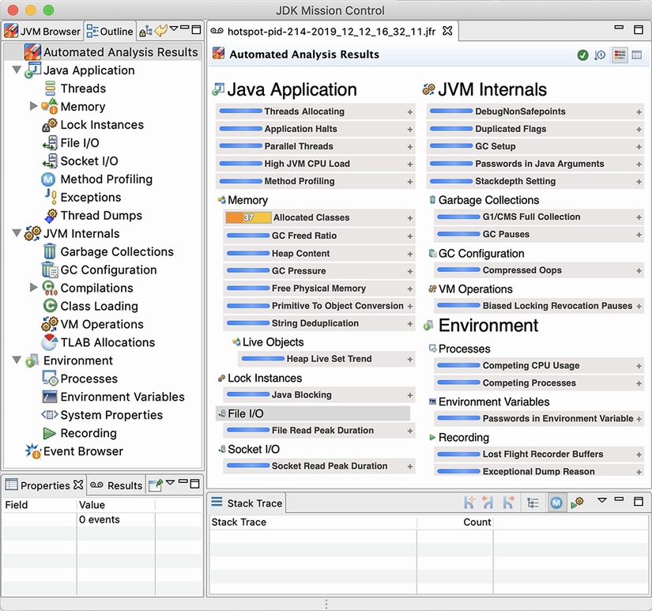

**Hình 7.7** Màn hình khởi động JMC

> **NOTE** Để lập hồ sơ, Flight Recorder dĩ nhiên phải được bật trên ứng dụng đích. Bên cạnh việc dùng một tệp đã tạo trước đó, cũng có thể gắn nó một cách động sau khi ứng dụng đã khởi động. Với tùy chọn sau, JMC cung cấp một tab ở bên trái của bảng trên cùng bên trái có nhãn JVM Browser để gắn nó động vào các ứng dụng cục bộ.

Một trong những màn hình đầu tiên gặp trong JMC là màn hình telemetry tổng quan, hiển thị một dashboard mức cao về sức khỏe tổng thể của JVM. Điều này có thể thấy trong hình 7.8.

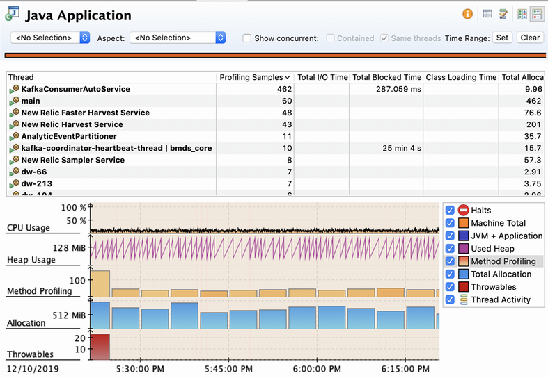

**Hình 7.8** Dashboard JMC

Các hệ thống con chính của JVM đều có màn hình riêng để cho phép phân tích chuyên sâu. Ví dụ, thu gom rác có một màn hình tổng quan hiển thị các sự kiện GC trong suốt vòng đời của tệp JFR. Hiển thị "Longest Pause" ở dưới cùng cho phép người dùng thấy nơi bất kỳ sự kiện GC dài bất thường nào đã xảy ra trên dòng thời gian, như thể hiện trong hình 7.9.

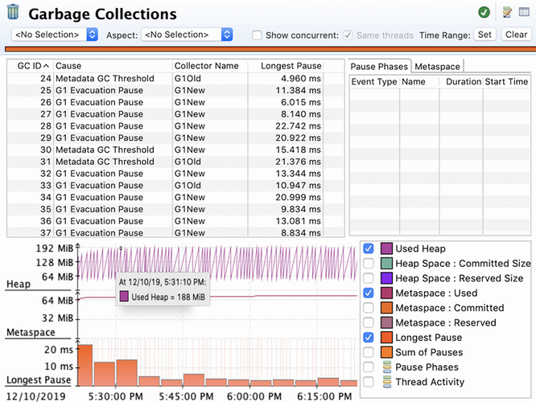

**Hình 7.9** Thu gom rác trong JMC

Trong cấu hình profile chi tiết, cũng có thể thấy các sự kiện riêng lẻ nơi các buffer cấp phát mới (TLAB) được trao cho các luồng ứng dụng. Chúng ta có thể thấy một cái nhìn chính xác hơn nhiều về việc cấp phát trong tiến trình. Khung nhìn trông như thể hiện trong hình 7.10. Khung nhìn này cho phép lập trình viên dễ dàng thấy luồng nào đang cấp phát nhiều bộ nhớ nhất — trong ví dụ này, đó là một luồng đang tiêu thụ dữ liệu từ các topic Apache Kafka.

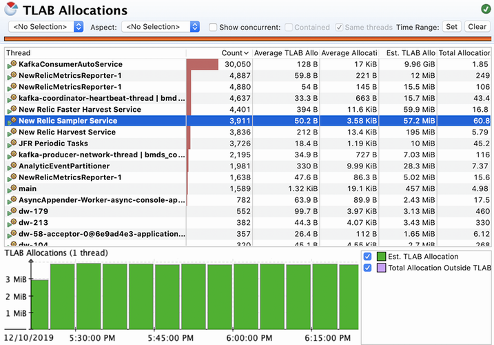

**Hình 7.10** Cấp phát TLAB trong JMC

Hệ thống con chính khác của JVM là trình biên dịch JIT, và JMC cho phép chúng ta đào sâu vào chi tiết cách compiler đang làm việc, như ta thấy trong hình 7.11.

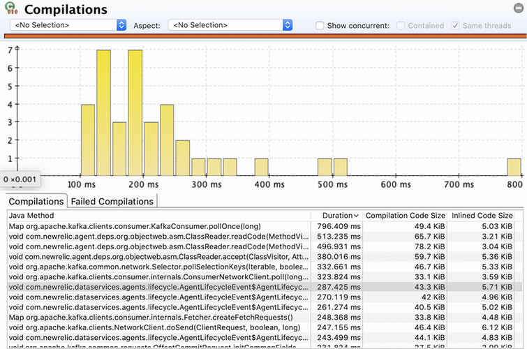

**Hình 7.11** Biên dịch JIT trong JMC

Một tài nguyên then chốt là bộ nhớ khả dụng trong code cache của trình biên dịch JIT. Đây là vùng bộ nhớ nơi phiên bản đã biên dịch của các phương thức được lưu. Việc sử dụng code cache có thể được trực quan hóa trong JMC — một ví dụ được thể hiện trong hình 7.12.

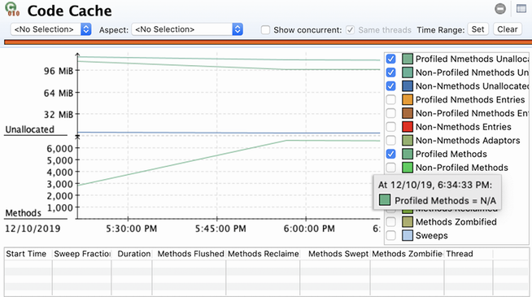

**Hình 7.12** JIT code cache trong JMC

Với các tiến trình có nhiều phương thức được biên dịch, vùng bộ nhớ này có thể cạn kiệt, khiến tiến trình không đạt hiệu năng đỉnh.

JMC cũng bao gồm một trình lập hồ sơ ở mức phương thức, hoạt động theo cách rất giống cái tìm thấy trong VisualVM hoặc các công cụ thương mại như JProfiler hay YourKit. Hình 7.13 cho thấy một kết quả điển hình.

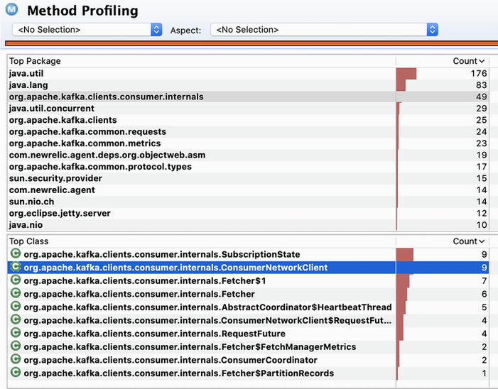

**Hình 7.13** Lập hồ sơ phương thức trong JMC

Một trong các màn hình nâng cao hơn trong JMC là khung nhìn VM Operations, hiển thị một số thao tác nội bộ mà JVM thực hiện và chúng mất bao lâu. Đây không phải khung nhìn mà chúng ta kỳ vọng cần cho mọi phân tích, nhưng nó có khả năng hữu ích để phát hiện một số loại vấn đề ít gặp hơn. Chúng ta có thể thấy một cách dùng điển hình trong hình 7.14.

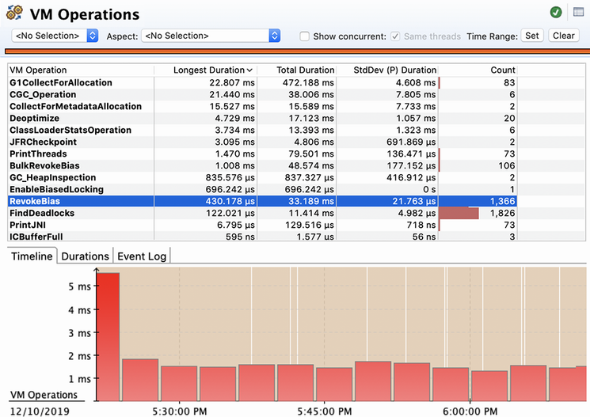

**Hình 7.14** Các thao tác JVM trong JMC

JMC có thể dùng để chẩn đoán một JVM đơn lẻ, và đây là một khả năng tuyệt vời để có. Tuy nhiên, trường hợp sử dụng này không mở rộng được tới việc khảo sát cả một cụm (hay toàn bộ ứng dụng). Thêm nữa, các hệ thống hiện đại thường cần một giải pháp giám sát, hay observability, bên cạnh khả năng chuyên sâu.

Mô hình JFR cổ điển với một tệp ghi (và một tệp cho một JVM) không làm việc này dễ dàng. Nó không phù hợp cho luồng dữ liệu telemetry được giao qua mạng tới một nhà cung cấp SaaS hoặc công cụ nội bộ. Một số nhà cung cấp (ví dụ, New Relic và DataDog) có cung cấp khả năng JFR, nhưng việc dùng các kỹ thuật này vẫn còn phần nào là ngách hẹp.

May mắn thay, JFR Streaming API được giới thiệu cùng Java 14 cung cấp một khối xây dựng tuyệt vời cho trường hợp sử dụng observability cũng như phân tích chuyên sâu. Tuy nhiên, cộng đồng nói chung có xu hướng không áp dụng các bản phát hành Java không phải LTS. Điều này nghĩa là có khả năng chỉ với sự xuất hiện của Java 17 (là LTS) chúng ta mới thấy việc áp dụng rộng rãi một phiên bản Java hỗ trợ dạng streaming của JFR.

Tinh chỉnh hiệu năng không phải là ngồi nhìn chằm chằm vào mã của bạn và cầu nguyện được khai sáng hoặc áp dụng các bản sửa nhanh đóng hộp. Thay vào đó, nó là về đo lường tỉ mỉ, chú ý tới chi tiết, và kiên nhẫn. Nó là về việc bền bỉ giảm các nguồn sai số trong các bài kiểm tra của bạn, để những nguồn thật sự của vấn đề hiệu năng lộ ra.

Trong chương này, chúng tôi chỉ có thể đưa ra một giới thiệu ngắn gọn về một chủ đề phong phú và đa dạng. Còn rất nhiều điều để khám phá, và độc giả quan tâm nên tham khảo một cuốn sách chuyên biệt, chẳng hạn *Optimizing Java* của Ben Evans, James Gough và Chris Newland (O'Reilly Media, May 2018).

## Tóm tắt

- JVM là một môi trường runtime cực kỳ mạnh mẽ và tinh vi.
- Bản chất của JVM đôi khi có thể khiến việc tối ưu mã bên trong nó trở nên thách thức.
- Bạn phải đo lường để có ý niệm chính xác về việc vấn đề thực sự nằm ở đâu.
- Hãy đặc biệt chú ý tới hệ thống con thu gom rác và trình biên dịch JIT.
- Các công cụ giám sát và công cụ khác thực sự có thể giúp ích.
- Hãy học cách đọc log và các chỉ báo khác của nền tảng — không phải lúc nào công cụ cũng có sẵn.
