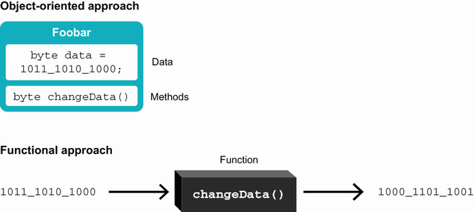
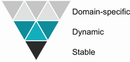
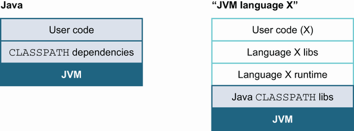
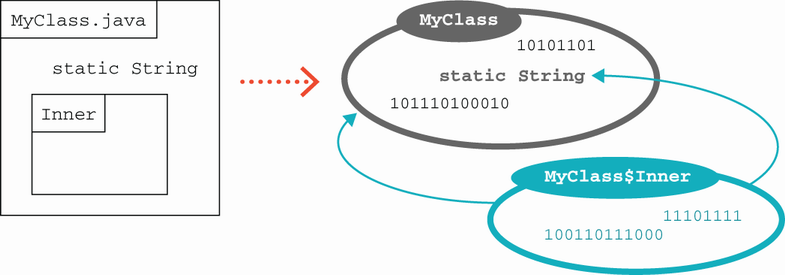

# 8. Các ngôn ngữ JVM thay thế

> *The Well-Grounded Java Developer, Second Edition* — Chương 8
> Bản dịch tiếng Việt

**Chương này bao gồm:**

- Phân loại ngôn ngữ (language zoology)
- Vì sao bạn nên dùng các ngôn ngữ JVM thay thế
- Tiêu chí lựa chọn ngôn ngữ thay thế
- Cách JVM xử lý các ngôn ngữ thay thế

---

Nếu bạn đã dùng Java cho bất kỳ khối lượng công việc đáng kể nào, bạn có lẽ đã nhận thấy nó có thể hơi dài dòng và vụng về vào những lúc nào đó. Bạn thậm chí có thể đã thấy mình ước mọi thứ khác đi — dễ dàng hơn bằng cách nào đó.

May mắn thay, như bạn đã thấy trong vài chương gần đây, JVM thật tuyệt vời — tuyệt vời tới mức, thực tế, nó cung cấp một ngôi nhà tự nhiên cho các ngôn ngữ lập trình ngoài Java. Trong chương này, chúng tôi sẽ cho bạn thấy vì sao và cách bạn có thể muốn bắt đầu pha trộn một ngôn ngữ lập trình JVM khác vào dự án của mình.

Trong chương này, chúng ta sẽ đề cập tới các cách mô tả các loại ngôn ngữ khác nhau (chẳng hạn định kiểu tĩnh so với động), vì sao bạn có thể muốn dùng ngôn ngữ thay thế, và những tiêu chí nào cần tìm khi chọn chúng. Bạn cũng sẽ được giới thiệu hai ngôn ngữ (Kotlin và Clojure) mà chúng tôi sẽ đề cập sâu hơn trong phần còn lại của cuốn sách.

## 8.1 Phân loại ngôn ngữ

Các ngôn ngữ lập trình có nhiều hương vị và cách phân loại khác nhau. Một cách nói khác là một dải rộng các phong cách và cách tiếp cận lập trình được thể hiện trong các ngôn ngữ khác nhau. Việc nắm vững những phong cách khác nhau này thường dễ hơn khi bạn hiểu cách phân loại sự khác biệt giữa các ngôn ngữ.

> **NOTE** Các phân loại này là công cụ hỗ trợ suy nghĩ về sự đa dạng của các ngôn ngữ. Một số phân chia này rõ ràng hơn những cái khác, nhưng không cơ chế phân loại nào là hoàn hảo. Những người khác nhau có ý tưởng khác nhau về cách phân loại nên được bố trí.

Những năm gần đây, có xu hướng các ngôn ngữ thêm tính năng từ khắp phổ khả năng. Thường sẽ hữu ích khi nghĩ về một ngôn ngữ nhất định như "ít mang tính hàm hơn" một ngôn ngữ khác, hay "định kiểu động nhưng với định kiểu tĩnh tùy chọn khi cần".

Các phân loại chúng ta sẽ đề cập là "thông dịch so với biên dịch", "động so với tĩnh", "mệnh lệnh so với hàm", và các bản hiện thực lại của một ngôn ngữ so với bản gốc. Nhìn chung, các phân loại này là công cụ để suy nghĩ về không gian, chứ không phải các sơ đồ học thuật đầy đủ và chính xác.

Ví dụ, chúng ta có thể nói Java là một ngôn ngữ mệnh lệnh, định kiểu tĩnh, biên dịch tại runtime với một số tính năng hàm. Nó nhấn mạnh sự an toàn, độ rõ ràng của mã, tương thích ngược và hiệu năng, và nó sẵn sàng chấp nhận một mức độ dài dòng và nghi thức nhất định (chẳng hạn trong việc triển khai) để đạt được những mục tiêu đó.

> **NOTE** Các ngôn ngữ khác nhau có thể có ưu tiên khác nhau; ví dụ, các ngôn ngữ định kiểu động có thể nhấn mạnh tốc độ triển khai.

Hãy bắt đầu với phân loại thông dịch so với biên dịch.

### 8.1.1 Ngôn ngữ thông dịch vs. biên dịch

Ngôn ngữ *thông dịch* (interpreted) là ngôn ngữ mà mỗi bước của mã nguồn được thực thi nguyên trạng, thay vì toàn bộ chương trình được biến đổi thành mã máy trước khi việc thực thi bắt đầu. Điều này tương phản với ngôn ngữ *biên dịch* (compiled), là ngôn ngữ dùng một trình biên dịch để chuyển mã nguồn con người đọc được sang dạng nhị phân như một nhiệm vụ ban đầu.

Sự phân biệt này đã trở nên ít rõ ràng hơn gần đây. Đầu những năm 90, ranh giới khá rõ: C/C++, FORTRAN và bạn bè của chúng là ngôn ngữ biên dịch, còn Perl và Python là ngôn ngữ thông dịch. Nhưng như chúng tôi đã ám chỉ ở chương 1, Java có đặc điểm của cả ngôn ngữ biên dịch lẫn thông dịch. Việc dùng bytecode càng làm vấn đề mờ mịt thêm. Bytecode chắc chắn không phải con người đọc được, nhưng nó cũng không phải mã máy.

Với các ngôn ngữ JVM mà chúng ta sẽ nghiên cứu trong phần này của sách, sự phân biệt chúng ta sẽ đưa ra là liệu ngôn ngữ có tạo ra một class file từ mã nguồn và thực thi cái đó — hay không. Trong trường hợp sau, một trình thông dịch (có lẽ viết bằng Java) được dùng để thực thi mã nguồn, từng dòng một. Một số ngôn ngữ cung cấp cả trình biên dịch lẫn trình thông dịch, và một số cung cấp một trình thông dịch cùng một trình biên dịch just-in-time (JIT) sẽ phát ra bytecode JVM.

### 8.1.2 Định kiểu động vs. tĩnh

Trong các ngôn ngữ có định kiểu động, một biến có thể chứa các kiểu khác nhau ở những thời điểm khác nhau trong quá trình thực thi chương trình. Làm ví dụ, hãy xem một đoạn mã đơn giản trong một ngôn ngữ động nổi tiếng, JavaScript. Ví dụ này hy vọng dễ hiểu, ngay cả khi bạn không biết ngôn ngữ này chi tiết:

```javascript
var answer = 40;
answer = answer + 2;
answer = "What is the answer? " + answer;
```

Từ khóa `var` dùng ở đây tạo ra một biến mới. Trong hệ thống kiểu động của JavaScript, biến này có thể chứa một giá trị thuộc bất kỳ kiểu nào. Biến này khởi đầu được đặt bằng `40`, dĩ nhiên là một giá trị số. Rồi chúng ta cộng `2` vào nó, cho `42`. Rồi chúng ta đổi hướng một chút và làm cho `answer` giữ một giá trị chuỗi. Đây là một kỹ thuật phổ biến trong ngôn ngữ động, và nó không gây lỗi cú pháp nào.

Trình thông dịch JavaScript cũng có thể phân biệt giữa hai cách dùng toán tử `+`. Cách dùng `+` đầu tiên là phép cộng số — cộng `2` vào `40` — trong khi ở dòng tiếp theo, trình thông dịch nhận ra từ ngữ cảnh rằng lập trình viên có ý là nối chuỗi.

Hãy thử mẹo này lần nữa trong Java dùng JShell:

```
jshell> var answer = 40;
answer ==> 40

jshell> answer = answer + 2;
answer ==> 42

jshell> answer = "What is the answer? " + answer;
|   Error:
|   incompatible types: java.lang.String cannot be converted to int
|   answer = "What is the answer? " + answer;
|            ^-----------------------------^
```

Bùm. Mặc dù chính xác cùng mã nguồn trông hợp lệ ở cả hai ngôn ngữ, hệ thống kiểu tĩnh của Java ngăn dòng cuối hoạt động. Từ khóa `var` của Java làm nhiều hơn là chỉ đơn giản tạo biến `answer`. Như chúng ta đã học ở mục 1.3, `var` của Java cũng suy ra kiểu của biến mới này từ vế phải của biểu thức. Chúng ta không phải chỉ định kiểu của `answer` một cách tường minh, nhưng hệ thống kiểu tĩnh của Java gán một kiểu không bao giờ thay đổi sau đó.

> **NOTE** Điểm mấu chốt ở đây là định kiểu động theo dõi thông tin kiểu cùng *giá trị* mà biến chứa (ví dụ, một số hay một chuỗi), trong khi định kiểu tĩnh theo dõi kiểu cùng *định nghĩa biến*.

Định kiểu tĩnh có thể phù hợp tốt với ngôn ngữ biên dịch bởi thông tin kiểu hoàn toàn là về các biến, không phải các giá trị trong chúng. Điều này cho phép suy luận về các vi phạm hệ thống kiểu tiềm tàng tại thời điểm biên dịch, trước khi mã thậm chí có cơ hội chạy.

Các ngôn ngữ định kiểu động mang thông tin kiểu trên các giá trị được giữ trong biến. Điều này cung cấp rất nhiều linh hoạt nhưng có nghĩa các vi phạm kiểu (ví dụ, "Tôi tưởng đây là một số, nhưng nó là chuỗi") xảy ra trong lúc thực thi. Điều này có thể dẫn tới nhiều lỗi runtime hơn, vốn có thể khó hơn và tốn kém hơn để debug so với lỗi biên dịch.

### 8.1.3 Ngôn ngữ mệnh lệnh vs. hàm

Java là ví dụ kinh điển của ngôn ngữ *mệnh lệnh* (imperative). Ngôn ngữ mệnh lệnh có thể được nghĩ tới như những ngôn ngữ mô hình hóa trạng thái đang chạy của một chương trình như dữ liệu khả biến và phát ra một danh sách lệnh biến đổi trạng thái đang chạy đó. Trạng thái chương trình do đó là khái niệm giữ vị trí trung tâm trong ngôn ngữ mệnh lệnh.

Có hai kiểu con chính của ngôn ngữ mệnh lệnh. Các ngôn ngữ *thủ tục* (procedural), chẳng hạn BASIC và FORTRAN, xử lý mã và dữ liệu như hoàn toàn tách biệt và có một mô hình đơn giản mã-thao-tác-trên-dữ-liệu. Kiểu con còn lại là ngôn ngữ *hướng đối tượng* (OO), nơi dữ liệu và mã (dưới dạng phương thức) được gói lại với nhau thành các đối tượng. Trạng thái chương trình trong một hệ thống hướng đối tượng là trạng thái của mọi đối tượng trong chương trình. Trong ngôn ngữ OO, cấu trúc bổ sung được áp đặt ở mức độ nhiều hay ít bởi metadata (chẳng hạn thông tin class). Tuy nhiên, sự khác biệt giữa các kiểu con này có thể không phải lúc nào cũng rõ ràng. C++, chẳng hạn, được thiết kế tường minh để hỗ trợ cả mã OO lẫn thủ tục, và một số biến thể BASIC sau này cũng có tính năng hướng đối tượng.

Các ngôn ngữ *hàm* (functional) có quan điểm rằng bản thân việc tính toán là khái niệm quan trọng nhất. Các hàm thao tác trên giá trị, như trong ngôn ngữ thủ tục, nhưng thay vì thay đổi đầu vào của chúng, các hàm được xem như hành động giống hàm toán học và trả về giá trị mới. Việc kết hợp các hàm riêng biệt lại với nhau theo những cách mới lạ cũng là nền tảng trong mô hình này.

Như minh họa trong hình 8.1, các hàm được xem như "cỗ máy xử lý nhỏ" nhận vào giá trị và xuất ra giá trị mới. Chúng không có trạng thái riêng nào, và không thực sự hợp lý khi gói chúng lại với bất kỳ trạng thái bên ngoài nào. Quan điểm lấy đối tượng làm trung tâm về thế giới phần nào mâu thuẫn với quan điểm tự nhiên của ngôn ngữ hàm.



**Hình 8.1** Ngôn ngữ mệnh lệnh và hàm

Một tính năng then chốt của ngôn ngữ hàm là *first-class functions* (hàm hạng nhất) — khả năng xử lý một hàm như một giá trị, gán nó cho biến, truyền nó cho các hàm khác, và thậm chí trả về hàm từ các hàm khác.

Đây là ví dụ tuyệt vời về phổ tính năng chúng ta đã thảo luận ở trên, bởi Java 8 đã thêm cú pháp biểu thức lambda, cho phép lập trình viên Java xử lý hàm như giá trị. Tuy nhiên, là một bổ sung gần đây, tính năng này không được dùng ở mọi nơi nó có thể trong nền tảng, và các kỹ thuật cũ hơn để có được hành vi tương tự, chẳng hạn interface `Runnable` và `Callable`, vẫn còn được dùng.

Trong hai chương tiếp theo chúng ta sẽ học về các ngôn ngữ khác nhau, và trọng tâm then chốt sẽ là cách chúng hỗ trợ các cách tiếp cận lập trình hàm. Với Kotlin, chúng ta sẽ thấy ngay cả một ngôn ngữ mệnh lệnh cũng có thể được thiết kế để hỗ trợ mượt mà các ý tưởng hàm. Rồi chúng ta sẽ xem Clojure, một ngôn ngữ hàm thuần túy hơn nhiều không còn xoay quanh hướng đối tượng chút nào.

### 8.1.4 Hiện thực lại vs. bản gốc

Một phân biệt quan trọng khác giữa các ngôn ngữ JVM là sự chia thành những ngôn ngữ là bản hiện thực lại của các ngôn ngữ hiện có so với những ngôn ngữ được viết riêng để nhắm tới JVM. Nói chung, các ngôn ngữ được viết riêng để nhắm tới JVM cung cấp sự ràng buộc chặt chẽ hơn nhiều giữa hệ thống kiểu của chúng và các kiểu native của JVM.

Ba ngôn ngữ sau là các bản hiện thực lại trên JVM của các ngôn ngữ hiện có:

- **JRuby** là bản hiện thực lại trên JVM của ngôn ngữ lập trình Ruby. Ruby là ngôn ngữ OO định kiểu động với một số tính năng hàm. Về cơ bản nó được thông dịch trên JVM, nhưng các phiên bản gần đây đã bao gồm một trình biên dịch JIT tại runtime để tạo bytecode JVM trong điều kiện thuận lợi.
- **Jython** được Jim Hugunin khởi xướng năm 1997 như một cách để dùng các thư viện Java hiệu năng cao từ Python. Nó là bản hiện thực lại của Python trên JVM, nên nó là một ngôn ngữ động, chủ yếu OO. Nó vận hành bằng cách sinh bytecode Python nội bộ, rồi dịch nó sang bytecode JVM. Đáng buồn là dự án đã ít hoạt động từ 2015 và chỉ hỗ trợ Python 2.7, không phải Python 3 hiện tại.
- **Rhino** ban đầu được Netscape và sau đó là dự án Mozilla phát triển. Nó cung cấp một bản hiện thực của JavaScript trên JVM và được giao kèm cho tới JDK.
  - JDK 8 bao gồm một engine JavaScript mới, Nashorn (cái tên "Nashorn" là một trò chơi chữ — đó là từ tiếng Đức cho "Rhino"), nhưng tốc độ thay đổi ngày càng tăng của ngôn ngữ JavaScript đã buộc nó bị deprecated ở JDK 11 và bị loại bỏ ở JDK 15. Mặc dù không bản hiện thực JavaScript nào sẽ đi kèm trực tiếp với các JDK tương lai, cả hai vẫn có thể tìm thấy độc lập. (Rhino từ Mozilla (https://github.com/mozilla/rhino) và Nashorn (https://openjdk.java.net/projects/nashorn/) như một dự án OpenJDK độc lập, dự định tiếp tục tồn tại và sẽ được hỗ trợ trên các JDK tương lai.)

> **NOTE** **Ngôn ngữ JVM sớm nhất?** Ngôn ngữ JVM không phải Java sớm nhất khó xác định chính xác. Chắc chắn Kawa, một bản hiện thực của Lisp, có từ khoảng 1997. Trong những năm kể từ đó, chúng ta đã thấy sự bùng nổ của các ngôn ngữ, tới mức gần như không thể theo dõi hết.

Một ước đoán hợp lý tại thời điểm viết là ít nhất 200 ngôn ngữ nhắm tới JVM. Không phải tất cả đều có thể được xem là còn hoạt động hoặc được dùng rộng rãi (và một số thực sự rất ngách), nhưng con số lớn cho thấy JVM là một nền tảng rất sôi động cho việc phát triển và hiện thực ngôn ngữ.

> **NOTE** Trong các phiên bản đặc tả ngôn ngữ và VM ra mắt cùng Java 7, mọi tham chiếu trực tiếp tới ngôn ngữ Java đã bị loại khỏi đặc tả VM. Java giờ đơn giản là một ngôn ngữ trong số nhiều ngôn ngữ chạy trên JVM — nó không còn hưởng vị thế đặc quyền.

Mảnh công nghệ then chốt cho phép rất nhiều ngôn ngữ khác nhau nhắm tới JVM là định dạng class file, như chúng ta đã thảo luận ở chương 4. Bất kỳ ngôn ngữ nào có thể tạo ra class file đều được xem là một ngôn ngữ biên dịch trên JVM.

Hãy chuyển sang thảo luận cách lập trình đa ngôn ngữ (polyglot programming) trở thành một lĩnh vực quan tâm với lập trình viên Java. Chúng tôi sẽ giải thích các khái niệm cơ bản và vì sao cùng cách chọn một ngôn ngữ JVM thay thế cho dự án của bạn.

## 8.2 Lập trình đa ngôn ngữ trên JVM

Cụm từ *polyglot programming on the JVM* được đặt ra để mô tả các dự án dùng một hoặc nhiều ngôn ngữ JVM không phải Java bên cạnh một lõi mã Java. Một cách phổ biến để nghĩ về lập trình đa ngôn ngữ là như một dạng tách bạch mối quan tâm. Như bạn thấy trong hình 8.2, có khả năng tồn tại ba tầng nơi các công nghệ không phải Java có thể đóng vai trò hữu ích. Sơ đồ này đôi khi được gọi là *kim tự tháp lập trình đa ngôn ngữ*, và ban đầu nó xuất phát từ công trình của Ola Bini (https://olabini.com/blog/tag/polyglot/).



**Hình 8.2** Kim tự tháp lập trình đa ngôn ngữ

Trong kim tự tháp, các phụ thuộc chạy theo một hướng — tầng ổn định tương đối độc lập, tầng động dùng tầng ổn định, và mã đặc thù miền có thể kéo vào từ cả hai tầng bên dưới nó.

Việc định nghĩa các tầng này trong một hệ thống nhất định không phải lúc nào cũng dễ; có những vùng xám, và không phải mọi hệ thống đều khớp hoàn hảo. Tuy nhiên, đó là một công cụ hữu ích để xác định các đường nối nơi các phần khác nhau của hệ thống có nhu cầu khác nhau và có thể hưởng lợi từ các ngôn ngữ khác nhau.

**Tầng ổn định (stable layer)** chứa các API và trừu tượng cốt lõi cho hệ thống của bạn. An toàn kiểu, kiểm thử kỹ lưỡng và hiệu năng đều tối quan trọng.

**Tầng động (dynamic layer)** dùng các trừu tượng của tầng ổn định để tạo ra một hệ thống hoạt động. Điều này có thể bao gồm mã như cách một hệ thống phơi bày chính nó qua HTTP hoặc tương tác với các hệ thống backend khác. Các vấn đề như thời gian biên dịch và tính linh hoạt có thể khiến đáng cân nhắc một ngôn ngữ khác ở tầng động.

**Tầng đặc thù miền (domain-specific layer)** xử lý các mối quan tâm đặc thù ứng dụng chẳng hạn trình bày, tùy biến quy tắc và xử lý, hay CI/CD. Mã này hoàn toàn về các khía cạnh cụ thể của miền ứng dụng và có thể hưởng lợi từ các lựa chọn ngôn ngữ vốn sẽ gây gò bó ở các tầng khác.

> **NOTE** Lập trình đa ngôn ngữ có ý nghĩa bởi các mảnh mã khác nhau có tuổi thọ khác nhau. Một engine tính toán rủi ro trong ngân hàng có thể tồn tại năm năm trở lên. Các trang JSP cho một website có thể tồn tại vài tháng. Mã có đời sống ngắn nhất cho một startup có thể sống chỉ vài ngày. Mã sống càng lâu, nó càng gần tầng ổn định của kim tự tháp. Xem bảng 8.1.

**Bảng 8.1 Ba tầng của kim tự tháp lập trình đa ngôn ngữ**

| Tên | Mô tả | Ví dụ |
| --- | --- | --- |
| Domain-specific | Ngôn ngữ đặc thù miền. Gắn chặt với một phần cụ thể của miền ứng dụng | Apache Camel, DSL, Drools, web templating |
| Dynamic | Phát triển chức năng nhanh, năng suất, linh hoạt | Clojure, Groovy, JRuby |
| Stable | Chức năng cốt lõi, ổn định, được kiểm thử kỹ, hiệu năng tốt | Java, Kotlin, Scala |

Như bạn thấy, có những mẫu hình xuất hiện trong các tầng — các ngôn ngữ định kiểu tĩnh có xu hướng nghiêng về các tác vụ ở tầng ổn định. Ngược lại, các công nghệ nhắm tới mục đích cụ thể hơn có xu hướng phù hợp tốt với các vai trò ở đỉnh kim tự tháp.

Hãy đào sâu hơn một chút để xem vì sao Java không phải lựa chọn tốt nhất cho mọi thứ trong kim tự tháp. Chúng ta sẽ bắt đầu bằng việc thảo luận vì sao bạn nên cân nhắc một ngôn ngữ không phải Java, rồi đề cập một số tiêu chí chính cần xem xét khi chọn một ngôn ngữ không phải Java cho dự án của bạn.

### 8.2.1 Vì sao dùng ngôn ngữ không phải Java?

Bản chất của Java như một ngôn ngữ đa dụng, định kiểu tĩnh, biên dịch cung cấp nhiều lợi thế. Những phẩm chất này khiến nó là lựa chọn tuyệt vời để hiện thực chức năng ở tầng ổn định. Nhưng chính những thuộc tính này trở thành gánh nặng ở các tầng trên của kim tự tháp, như mô tả dưới đây:

- Việc biên dịch lại rất nhọc nhằn.
- Định kiểu tĩnh có thể thiếu linh hoạt.
- Triển khai là một quá trình nặng nề.
- Cú pháp của Java có thể cứng nhắc và không phù hợp tự nhiên cho việc tạo DSL.

Thời gian biên dịch lại và build lại của một dự án Java thường đạt tới mốc 90 giây tới hai phút. Đây là khoảng đủ dài để phá vỡ nghiêm trọng dòng chảy của lập trình viên, và nó không phù hợp cho việc phát triển mã có thể chỉ sống trong production vài tuần.

**Cú pháp cứng nhắc của Java**

Ngôn ngữ Java có ngữ pháp rất cứng nhắc. Các thành phần ngôn ngữ nền tảng là các từ khóa được cung cấp. Bạn không thể "bịa ra cú pháp mới" hoặc tạo bất kỳ dạng nào có thể bị nhầm với một từ khóa.

Lập trình viên có thể tạo class mới, và khả năng của các class đó gồm việc lưu trạng thái trong field và gọi phương thức trên class hoặc đối tượng. Tuy nhiên, đây là giới hạn — lập trình viên không thể tạo bất cứ thứ gì giống một cấu trúc điều khiển. Nói cách khác, việc truy cập field sẽ luôn trông như sau:

```java
anObject.someField
AClass.someStaticField
```

Và một lời gọi phương thức sẽ luôn trông như thế này:

```java
anObject.someMethod(params)
AClass.someStaticMethod(params)
```

Trong Java, các tham số phương thức không bao giờ là tùy chọn (khác với ở một số ngôn ngữ khác, chẳng hạn Kotlin), nên ngay cả sự phân biệt giữa truy cập field và lời gọi phương thức cũng không thể bị làm mờ. Ví dụ, chúng ta không thể tạo các cấu trúc trông giống từ khóa. Chẳng hạn, chúng ta muốn có thể tạo một `when` trông như thế này:

```java
when(value) {
  // hành động cần thực hiện
}
```

Nhưng điều tốt nhất chúng ta có thể làm là đại loại như thế này:

```java
import static when.When.when;

...

when(value, () -> {
  // hành động cần thực hiện
});
```

Sự thiếu cú pháp có thể định nghĩa lại này cũng lộ ra khi cố dùng Java để tạo DSL. Chúng ta sẽ thấy các ngôn ngữ không phải Java của chúng ta xử lý vấn đề này ra sao trong hai chương tới.

Tổng thể, một giải pháp thực dụng là phát huy điểm mạnh của Java. Tận dụng API phong phú và hỗ trợ thư viện của nó để làm việc nặng cho ứng dụng ở tầng ổn định.

Ngay cả trong tầng ổn định, bạn có thể thấy có những lý do khiến một ngôn ngữ khác Java có thể đáng mong muốn, chẳng hạn:

- Sự dài dòng của Java có thể gây khó chịu cho một số lập trình viên, và nó có thể che giấu một số lớp lỗi nhất định.
- Mặc dù Java ngày càng hỗ trợ lập trình hàm, vẫn còn những giới hạn về sự dễ dàng khi áp dụng một số mẫu.
- Các ngôn ngữ khác trình bày những lựa chọn thay thế cho concurrency không có trong Java (coroutine trong Kotlin, agent trong Clojure).

> **NOTE** Ngay cả khi bạn chọn một ngôn ngữ khác để dùng ở tầng ổn định vì các tính năng nó hỗ trợ, bạn không nên vứt bỏ mã đang hoạt động chỉ để viết lại cho các ngôn ngữ khớp nhau. Hãy cân nhắc dùng ngôn ngữ mới cho các tính năng mới hoặc cho các khu vực rủi ro thấp mà chúng ta sẽ nói về việc xác định ở phần sau của chương này.

Đến đây, bạn có thể tự hỏi: Loại thách thức lập trình nào phù hợp trong các tầng này? Tôi nên chọn ngôn ngữ nào? Một lập trình viên Java vững nền tảng biết rằng không có viên đạn bạc, nhưng chúng ta có các tiêu chí để cân nhắc khi đánh giá lựa chọn của mình.

### 8.2.2 Các ngôn ngữ đang lên

Với phần còn lại của cuốn sách, chúng tôi đã chọn hai ngôn ngữ mà chúng tôi thấy có tiềm năng lớn về tuổi thọ và ảnh hưởng. Đây là hai trong số các ngôn ngữ trên JVM (Kotlin và Clojure) đã có thị phần tâm trí vững chắc trong giới lập trình viên đa ngôn ngữ. Vì sao các ngôn ngữ này đang có đà? Hãy xem từng cái.

**Kotlin**

Kotlin là một ngôn ngữ mệnh lệnh, định kiểu tĩnh, OO từ JetBrains (nhà sản xuất IntelliJ IDEA). Nó nhắm tới giải quyết những phàn nàn phổ biến nhất về Java, đồng thời giữ một môi trường phát triển quen thuộc. Kotlin là ngôn ngữ biên dịch và có mức độ tương thích cao vượt ra ngoài những điều cơ bản mà việc chỉ chạy trên JVM cung cấp.

Các tính năng then chốt trong Kotlin gồm cú pháp ngắn gọn, an toàn null, khả năng tương tác cực mạnh với mã Java, và coroutine — một cơ chế concurrency thay thế cho mô hình luồng truyền thống của Java. Một số tính năng từ Kotlin đã tìm đường trở lại Java trong các bản phát hành gần đây, xác nhận giá trị mà những thay đổi đó mang lại cho lập trình viên.

Mặc dù đã khẳng định mình là một lựa chọn ngôn ngữ JVM then chốt ở nhiều lĩnh vực, Kotlin đã cho thấy thành công đặc biệt ở mảng di động, với nền tảng Android chọn nó làm ngôn ngữ được khuyến nghị năm 2019. Kotlin cũng được hỗ trợ cho scripting build Gradle ở cùng mức với Groovy. Nó cũng được nhiều framework khác đón nhận, chẳng hạn Spring. Dải rộng các cải thiện về tiện lợi và an toàn cho lập trình viên đáng cân nhắc bất kể JVM của bạn đang chạy ở đâu. Chương 9 cung cấp một giới thiệu về Kotlin.

Kotlin sẽ được dùng ở chương 11 làm ngôn ngữ scripting chính cho các bản build Gradle. Chúng ta cũng sẽ quay lại nó để minh họa một số cách tiếp cận độc đáo với lập trình hàm ở chương 15 và lập trình đồng thời (coroutine) ở chương 16.

**Clojure**

Clojure, do Rich Hickey thiết kế, là một ngôn ngữ thuộc họ Lisp. Nó thừa hưởng nhiều đặc điểm cú pháp (và rất nhiều dấu ngoặc đơn) từ di sản đó. Nó là ngôn ngữ hàm, định kiểu động, như thường thấy ở các Lisp. Nó là ngôn ngữ biên dịch nhưng thường phân phối mã ở dạng nguồn vì các lý do chúng ta sẽ thấy sau. Nó cũng thêm một số lượng đáng kể các tính năng mới (đặc biệt trong lĩnh vực concurrency) vào lõi Lisp của mình.

Các Lisp thường được xem là ngôn ngữ chỉ dành cho chuyên gia. Clojure phần nào dễ học hơn các Lisp khác, tuy vậy nó vẫn cung cấp cho lập trình viên sức mạnh đáng gờm (và cũng rất phù hợp với phong cách phát triển hướng kiểm thử). Nhưng nó có khả năng vẫn ở ngoài dòng chính, chủ yếu được dùng bởi những người đam mê và cho các công việc chuyên biệt (ví dụ, một số ứng dụng tài chính thấy sự kết hợp tính năng của nó rất hấp dẫn).

Clojure được nghĩ tới tốt nhất như nằm ở tầng động nhưng, nhờ hỗ trợ concurrency và các tính năng khác, có thể được xem là có khả năng thực hiện nhiều vai trò của một ngôn ngữ tầng ổn định. Chương 10 cung cấp một giới thiệu về Clojure.

Chúng ta sẽ dùng Clojure rộng rãi khi học thêm về lập trình hàm vượt ra ngoài những gì Java có thể làm ở chương 15. Nó cũng sẽ xuất hiện khi giới thiệu mô hình actor, một lựa chọn thay thế mạnh mẽ trong lập trình đồng thời ở chương 16.

### 8.2.3 Những ngôn ngữ chúng tôi có thể chọn nhưng đã không chọn

Như đã lưu ý ở trên, có vô số ngôn ngữ mà chúng ta có thể xem xét. Đây là chút thông tin thêm về vài ứng viên khác mà bạn có thể thực tế tự xem xét sâu hơn.

**Groovy**

Ngôn ngữ Groovy được James Strachan phát minh năm 2003. Nó là ngôn ngữ động, biên dịch với cú pháp rất giống Java nhưng linh hoạt hơn. Nó được dùng rộng rãi cho scripting và kiểm thử. Nó là ngôn ngữ ban đầu được công cụ build Gradle dùng và được dùng để cấu hình Jenkins, một công cụ CI/CD cực kỳ phổ biến. Nó thường là ngôn ngữ không phải Java đầu tiên mà lập trình viên hoặc đội ngũ khảo sát trên JVM. Groovy có thể được xem là nằm ở tầng động và cũng nổi tiếng là tuyệt vời cho việc xây dựng DSL.

Chúng tôi chọn không đề cập Groovy chi tiết hơn bởi nó đã suy giảm thị phần tâm trí trong các trường hợp sử dụng tạo mẫu và ứng dụng trước các framework và ngôn ngữ khác đang cải thiện.

**Scala**

Scala là một ngôn ngữ OO cũng hỗ trợ nhiều khía cạnh của lập trình hàm. Nó truy nguồn gốc về 2003, khi Martin Odersky bắt đầu làm việc trên nó trong môi trường học thuật, sau các dự án trước đó của ông liên quan tới generics trong Java. Nó là ngôn ngữ định kiểu tĩnh, biên dịch như Java, và nó thực hiện một lượng lớn suy diễn kiểu, nên nó thường có cảm giác của một ngôn ngữ động.

Scala đã học được rất nhiều từ Java, và thiết kế ngôn ngữ của nó "sửa" vài phiền toái phổ biến với Java. Tuy nhiên, Scala rốt cuộc có một tập tính năng rất lớn, và một hệ thống kiểu tiên tiến hơn nhiều so với Java.

Nó có thể phức tạp để lập trình và không dễ để học kỹ lưỡng. Vì vậy chúng tôi đã chọn tập trung vào Kotlin cho những lập trình viên chỉ muốn cải thiện trạng thái của ngôn ngữ Java.

**GraalVM**

Oracle Labs đã tạo ra GraalVM (https://www.graalvm.org/), mà họ mô tả là một máy ảo và nền tảng đa ngôn ngữ, một phần dẫn xuất từ codebase Java và JVM. Bản phát hành hiện tại bao gồm khả năng chạy Java và các ngôn ngữ JVM khác (dưới dạng bytecode) cũng như hỗ trợ JavaScript và LLVM bitcode (biểu diễn trung gian từ trình biên dịch LLVM phổ biến), với hỗ trợ beta cho Ruby, Python, R và WASM.

Nền tảng tổng thể gồm các thành phần sau:

- Java HotSpot VM
- Một môi trường runtime JavaScript Node.js
- LLVM runtime để thực thi LLVM bitcode
- Graal — một trình biên dịch JIT viết bằng Java
- Truffle — một bộ công cụ và API để xây dựng trình thông dịch ngôn ngữ
- SubstrateVM — một container thực thi nhẹ cho native image

Trong một dự án GraalVM, các ngôn ngữ có thể được cầu nối với nhau rất tự do, và mục tiêu là cho phép các thành phần được hiện thực bằng các công nghệ khác nhau được kết hợp và dùng trong một tiến trình ứng dụng duy nhất. Đây là một cách tiếp cận rất khác với lập trình đa ngôn ngữ, nhưng nó đủ gần với chủ đề quan tâm để chúng tôi muốn ít nhất đề cập tới.

**Các ngôn ngữ không phải JVM**

Chương này tập trung vào các ngôn ngữ thay thế chạy trên JVM. Tuy nhiên, đáng thừa nhận rằng đôi khi lập trình viên đa ngôn ngữ có thể có lý do để một phần hệ thống của họ cần rời bỏ JVM hoàn toàn.

Ví dụ về các công nghệ có hỗ trợ rộng hơn ngoài JVM như sau:

- Mã hệ thống native (C, Go, hay Rust)
- Học máy (Python)
- Chạy trong trình duyệt web của người dùng (JavaScript)

Mặc dù các cách tiếp cận dựa trên JVM tồn tại cho nhiều thứ trong số này, đáng để đánh giá sự trưởng thành của các lựa chọn thay thế và thành phần của đội ngũ trước khi cố giữ mọi dòng mã hoàn toàn trên JVM.

Giờ khi chúng ta đã phác thảo một số lựa chọn khả dĩ, hãy thảo luận các vấn đề nên dẫn dắt quyết định của bạn về việc chọn ngôn ngữ nào.

## 8.3 Cách chọn một ngôn ngữ không phải Java cho dự án của bạn

Khi bạn đã quyết định thử nghiệm với các ngôn ngữ không phải Java trong dự án của mình, bạn cần xác định phần nào của dự án tự nhiên khớp vào tầng ổn định, động, hay đặc thù miền. Bảng 8.2 nêu bật các tác vụ có thể phù hợp cho mỗi tầng.

**Bảng 8.2 Các mảng dự án phù hợp cho tầng đặc thù miền, động và ổn định**

| Tên | Ví dụ miền vấn đề |
| --- | --- |
| **Domain-specific**<br>Các mảng đặc thù miền thường hưởng lợi từ khả năng đọc hiểu bởi các chuyên gia có thể không biết Java. Công cụ vòng đời phần mềm cũng thường có ngôn ngữ và cấu hình đặc thù miền. | Build, tích hợp liên tục, triển khai liên tục<br>Dev-ops<br>Mô hình hóa quy tắc nghiệp vụ |
| **Dynamic**<br>Các tầng động của hệ thống có thể hưởng lợi từ sự linh hoạt và tốc độ phát triển lớn hơn có ở các ngôn ngữ khác. Điều này có thể đặc biệt đúng với công cụ hướng nội bộ (kiểm thử và quản trị). | Phát triển web nhanh<br>Tạo mẫu<br>Console quản trị và người dùng tương tác<br>Scripting<br>Kiểm thử |
| **Stable**<br>Mã tầng ổn định diễn đạt các trừu tượng cốt lõi của hệ thống. An toàn kiểu và kiểm thử nghiêm ngặt hơn xứng đáng với chi phí phát triển bổ sung. | Mã đồng thời<br>Container ứng dụng<br>Chức năng nghiệp vụ cốt lõi |

Như bạn thấy, tồn tại một dải rộng các trường hợp sử dụng cho ngôn ngữ thay thế. Nhưng xác định một tác vụ có thể giải quyết bằng ngôn ngữ thay thế mới chỉ là bắt đầu. Tiếp theo bạn cần đánh giá liệu việc dùng ngôn ngữ thay thế có phù hợp không. Đây là một số tiêu chí hữu ích mà chúng tôi tính đến khi cân nhắc ngăn xếp công nghệ:

- Mảng dự án có rủi ro thấp không?
- Ngôn ngữ tương tác với Java dễ dàng đến đâu?
- Có hỗ trợ công cụ nào (ví dụ, hỗ trợ IDE) cho ngôn ngữ này?
- Đường cong học tập cho ngôn ngữ này dốc đến đâu?
- Tuyển lập trình viên có kinh nghiệm với ngôn ngữ này dễ đến đâu?

Hãy đi sâu vào từng mảng này để bạn có ý niệm về các loại câu hỏi bạn cần đặt ra.

### 8.3.1 Mảng dự án có rủi ro thấp không?

Giả sử bạn có một engine quy tắc xử lý thanh toán cốt lõi xử lý hàng triệu giao dịch mỗi ngày. Đây là một mảnh phần mềm Java ổn định đã tồn tại hơn bảy năm, nhưng không có nhiều test và có nhiều góc tối trong mã. Lõi của engine xử lý thanh toán rõ ràng là một mảng rủi ro cao để đưa một ngôn ngữ mới vào, đặc biệt khi nó đang chạy thành công và thiếu độ phủ test cùng những lập trình viên hiểu nó đầy đủ.

Nhưng một hệ thống còn nhiều thứ hơn phần xử lý cốt lõi của nó. Ví dụ, đây là một tình huống mà các test tốt hơn rõ ràng sẽ giúp ích. Kotlin có một số lựa chọn tốt, gồm framework Spek (https://www.spekframework.org/) và Kotest (https://kotest.io), tận dụng ngôn ngữ để cho phép các đặc tả rõ ràng, dễ đọc mà không cần boilerplate JUnit điển hình. Hoặc có lẽ engine quy tắc của bạn sẽ hưởng lợi từ property testing, nơi các test được viết để kiểm chứng các điều kiện trên đầu vào được sinh ra, và `test.check` của Clojure (https://clojure.org/guides/test_check_beginner) sẽ là một công cụ giá trị trong hỗn hợp.

Hoặc giả sử bạn cần xây dựng một web console để người dùng vận hành có thể quản trị một số dữ liệu tĩnh không quan trọng đằng sau hệ thống xử lý thanh toán. Các thành viên đội phát triển đã biết Struts và JSF nhưng không cảm thấy nhiệt tình với công nghệ nào cả. Đây là một mảng rủi ro thấp khác để thử một ngôn ngữ và ngăn xếp công nghệ mới. Spring Boot với Kotlin sẽ là một lựa chọn hiển nhiên.

Bằng cách tập trung vào một dự án thí điểm hạn chế ở mảng rủi ro thấp, luôn có lựa chọn kết thúc dự án và port sang một công nghệ giao hàng khác mà không quá nhiều gián đoạn nếu ngăn xếp công nghệ mới không phù hợp.

### 8.3.2 Ngôn ngữ có tương tác tốt với Java không?

Bạn không muốn mất đi giá trị của toàn bộ mã Java tuyệt vời mà bạn đã viết! Đây là một trong những lý do chính khiến các tổ chức do dự đưa ngôn ngữ lập trình mới vào ngăn xếp công nghệ của mình. Nhưng với các ngôn ngữ thay thế chạy trên JVM, bạn có thể lật ngược điều này, để nó trở thành việc tối đa hóa giá trị hiện có trong codebase của bạn chứ không phải vứt bỏ mã đang hoạt động.

Các ngôn ngữ thay thế trên JVM có thể tương tác sạch sẽ với Java và dĩ nhiên có thể được triển khai trên một môi trường có sẵn. Điều này đặc biệt quan trọng để tránh ảnh hưởng tới bất kỳ ai sở hữu việc triển khai, dù là đội quản lý production hay những người DevOps trong chính đội của bạn. Bằng cách dùng một ngôn ngữ JVM không phải Java như một phần hệ thống của mình, bạn giữ lại chuyên môn vận hành của tổ chức, có thể giúp giảm bớt lo lắng và giảm rủi ro quanh việc hỗ trợ giải pháp mới.

> **NOTE** DSL thường được xây dựng bằng một ngôn ngữ tầng động (hoặc, trong một số trường hợp, tầng ổn định), nên nhiều DSL chạy trên JVM thông qua các ngôn ngữ mà chúng được xây dựng bằng.

Một số ngôn ngữ tương tác với Java dễ hơn những ngôn ngữ khác. Chúng tôi thấy rằng hầu hết các lựa chọn thay thế JVM phổ biến (chẳng hạn Kotlin, Clojure, JRuby, Groovy và Scala) đều có khả năng tương tác tốt với Java (và với một số ngôn ngữ, việc tích hợp là xuất sắc, gần như hoàn toàn liền mạch). Nếu bạn là một nơi thực sự thận trọng, việc chạy vài thí nghiệm trước và chắc chắn rằng bạn hiểu việc tích hợp có thể hoạt động thế nào cho mình là nhanh và dễ.

Hãy lấy Kotlin làm ví dụ. Bạn có thể import trực tiếp các package Java vào mã của nó qua câu lệnh `import` quen thuộc. Từ đây bạn có thể dễ dàng viết một script Kotlin nhỏ, hoặc thậm chí dùng shell Kotlin tương tác, để chọc vào các đối tượng mô hình Java của bạn và xem các bề mặt tương tác sẽ trông thế nào. Chúng tôi sẽ nói cụ thể về khả năng tương tác Java trong các chương về ngôn ngữ sắp tới.

### 8.3.3 Có công cụ và hỗ trợ test tốt cho ngôn ngữ không?

Hầu hết lập trình viên đánh giá thấp lượng thời gian họ tiết kiệm được khi đã thoải mái trong môi trường của mình. Các IDE mạnh mẽ cùng công cụ build và test giúp họ nhanh chóng tạo ra phần mềm chất lượng cao. Lập trình viên Java đã hưởng lợi từ hỗ trợ công cụ tuyệt vời trong nhiều năm, nên quan trọng là nhớ rằng các ngôn ngữ khác có thể không ở cùng mức độ trưởng thành.

Một số ngôn ngữ (chẳng hạn Kotlin) đã có hỗ trợ IDE lâu dài cho việc biên dịch, kiểm thử và triển khai kết quả cuối. Các ngôn ngữ khác có thể có công cụ chưa trưởng thành đầy đủ.

Một vấn đề liên quan là khi một ngôn ngữ thay thế đã phát triển một công cụ mạnh mẽ cho việc dùng riêng của nó (chẳng hạn công cụ build Leiningen tuyệt vời của Clojure), công cụ đó có thể không thích ứng tốt để xử lý các ngôn ngữ khác. Do đó, đội ngũ sẽ cần suy nghĩ cẩn thận về cách chia một dự án, đặc biệt cho việc triển khai các thành phần riêng biệt nhưng liên quan.

### 8.3.4 Ngôn ngữ khó học đến đâu?

Luôn mất thời gian để học một ngôn ngữ mới, và thời gian đó chỉ tăng lên nếu mô hình của ngôn ngữ không phải là cái đội phát triển của bạn quen thuộc. Hầu hết đội phát triển Java sẽ thoải mái tiếp cận một ngôn ngữ mới nếu nó hướng đối tượng với cú pháp giống C (chẳng hạn Kotlin).

Nó trở nên khó hơn với lập trình viên Java khi họ đi xa hơn khỏi mô hình này. Ở cực đoan của các ngôn ngữ thay thế phổ biến, một ngôn ngữ như Clojure có thể mang lại những lợi ích cực kỳ mạnh mẽ, nhưng nó cũng có thể đại diện cho một yêu cầu đào tạo lại đáng kể cho đội phát triển khi họ học bản chất hàm và cú pháp Lisp của Clojure.

Một lựa chọn thay thế là xem các ngôn ngữ JVM là bản hiện thực lại của các ngôn ngữ hiện có. Ruby và Python là các ngôn ngữ đã được thiết lập vững chắc, với nhiều tài liệu sẵn có để lập trình viên tự học. Các hóa thân JVM của những ngôn ngữ này có thể cung cấp một điểm ngọt cho đội của bạn bắt đầu làm việc với một ngôn ngữ không phải Java dễ học.

### 8.3.5 Có nhiều lập trình viên dùng ngôn ngữ này không?

Các tổ chức phải thực dụng; họ không phải lúc nào cũng tuyển được top 2% (bất chấp quảng cáo của họ có thể nói gì), và các đội phát triển của họ sẽ thay đổi trong suốt một năm. Một số ngôn ngữ, chẳng hạn Kotlin hay Scala, đang trở nên đủ vững chắc để có một nguồn lập trình viên để tuyển. Nhưng một ngôn ngữ như Clojure có thể gây nhiều khó khăn hơn. Các nhà quản lý có thể phản đối việc dùng thứ gì đó khác thường vì lo ngại tạo ra một codebase không bảo trì được mà họ sẽ khó tuyển người.

> **NOTE** Một cảnh báo về các ngôn ngữ được hiện thực lại: nhiều package và ứng dụng hiện có viết bằng Ruby, chẳng hạn, chỉ được kiểm thử với bản hiện thực gốc dựa trên C. Có thể có vấn đề khi cố dùng chúng trên nền JVM. Khi ra quyết định nền tảng, bạn nên tính thêm thời gian kiểm thử nếu bạn định tận dụng cả một ngăn xếp viết bằng ngôn ngữ được hiện thực lại.

Một lần nữa, các ngôn ngữ được hiện thực lại (JRuby, Jython, v.v.) có thể giúp ích ở đây. Ít lập trình viên có JRuby trong CV, nhưng bởi đó chỉ là Ruby trên JVM, thực ra có một nguồn lớn lập trình viên để tuyển — một lập trình viên Ruby quen với phiên bản C có thể học các khác biệt do việc chạy trên JVM gây ra rất dễ dàng.

Giờ chúng ta có một tập câu hỏi để hỏi khi chọn một ngôn ngữ thay thế và tổng quan về một số lựa chọn khả dụng. Đến đây, đáng để hiểu sâu hơn cách JVM hỗ trợ nhiều ngôn ngữ. Cái nhìn này tiết lộ gốc rễ của một số lựa chọn thiết kế và hạn chế trong các ngôn ngữ thay thế trên JVM.

## 8.4 Cách JVM hỗ trợ các ngôn ngữ thay thế

Một ngôn ngữ có thể chạy trên JVM theo hai cách khả dĩ:

- Có một trình biên dịch mã nguồn phát ra class file. Kotlin và Clojure đều hoạt động theo cách này.
- Có một trình thông dịch được hiện thực bằng bytecode JVM. JRuby được hiện thực theo cách này.

Trong cả hai trường hợp, thường có một môi trường runtime cung cấp hỗ trợ đặc thù ngôn ngữ cho việc thực thi chương trình. Hình 8.3 cho thấy ngăn xếp môi trường runtime cho Java và cho một ngôn ngữ không phải Java điển hình.



**Hình 8.3** Hỗ trợ runtime cho ngôn ngữ không phải Java

Các hệ thống hỗ trợ runtime này khác nhau về độ phức tạp, tùy vào mức độ "dắt tay chỉ việc" mà một ngôn ngữ không phải Java nhất định cần tại runtime. Trong hầu hết mọi trường hợp, runtime sẽ được hiện thực dưới dạng một tập JAR hoặc module mà một chương trình đang thực thi cần có trên classpath của mình. Trong trường hợp thông dịch, trình thông dịch sẽ bootstrap khi việc thực thi chương trình bắt đầu rồi đọc vào tệp nguồn cần thực thi.

### 8.4.1 Hiệu năng

Một câu hỏi lập trình viên thường hỏi về các ngôn ngữ khác nhau là: Chúng có hiệu năng thế nào so với nhau? Mặc dù bề ngoài hấp dẫn, câu hỏi này không đơn giản để trả lời và thực ra không thực sự có nhiều ý nghĩa.

Như chúng ta đã thấy ở chương 7, lập trình viên vững nền tảng biết rằng hiệu năng được dẫn dắt bởi đo lường. Việc đo lường được thực hiện trên các chương trình cụ thể, không phải trên khái niệm trừu tượng về một ngôn ngữ lập trình. Hãy xem bất kỳ tuyên bố nào rằng ngôn ngữ X "có hiệu năng tốt hơn" Y mà không kèm dữ liệu đáng tin cậy là đáng ngờ.

Tuy nhiên, trên thực tế, một số đặc điểm hiệu năng tổng thể của một ngôn ngữ JVM có thể được xác định đại khái bởi cách ngôn ngữ được hiện thực. Một ngôn ngữ biên dịch chỉ là bytecode tại runtime và sẽ được JIT-biên dịch theo cùng cách như Java. Một ngôn ngữ thông dịch sẽ có hành vi hiệu năng rất khác bởi mã được JIT-biên dịch là *trình thông dịch*, chứ không phải bản thân chương trình.

> **NOTE** Một số ngôn ngữ (ví dụ, JRuby) có chiến lược lai — chúng có một trình thông dịch cho script nhưng cũng có thể biên dịch động từng phương thức nguồn thành bytecode JVM, sau đó có thể được các trình biên dịch JIT của JVM biên dịch thành mã máy.

Trong cuốn sách này, trọng tâm của chúng tôi là các ngôn ngữ biên dịch. Các ngôn ngữ thông dịch — chẳng hạn Rhino — được nhắc tới cho đầy đủ, nhưng chúng tôi sẽ không dành quá nhiều thời gian cho chúng. Do đó, chúng tôi kỳ vọng hiệu năng sẽ đại khái tương tự giữa các ngôn ngữ mà chúng tôi đang xem xét. Để có câu trả lời chi tiết hơn, bạn nên tiến hành phân tích chi tiết một chương trình hoặc workload cụ thể.

Trong phần còn lại của mục này, chúng ta sẽ thảo luận nhu cầu hỗ trợ runtime cho các ngôn ngữ thay thế (ngay cả với ngôn ngữ biên dịch) rồi nói về *compiler fiction* — các tính năng đặc thù ngôn ngữ được compiler tổng hợp ra và có thể không xuất hiện trong bytecode mức thấp.

### 8.4.2 Môi trường runtime cho ngôn ngữ không phải Java

Một cách đơn giản để đo độ phức tạp của môi trường runtime mà một ngôn ngữ cụ thể cần là xem kích thước các tệp JAR cung cấp bản hiện thực của runtime. Dùng cái này làm thước đo, chúng ta thấy Clojure là một runtime tương đối nhẹ, trong khi JRuby là ngôn ngữ cần nhiều hỗ trợ hơn.

Đây không phải bài kiểm tra hoàn toàn công bằng, bởi một số ngôn ngữ đóng gói các thư viện chuẩn lớn hơn nhiều và chức năng bổ sung vào bản phân phối chuẩn của chúng so với những ngôn ngữ khác. Tuy nhiên, nó có thể là một quy tắc kinh nghiệm hữu ích (dù thô).

Nói chung, mục đích của môi trường runtime là giúp hệ thống kiểu và các khía cạnh khác của ngôn ngữ không phải Java đạt được ngữ nghĩa mong muốn. Các ngôn ngữ thay thế không phải lúc nào cũng có cùng góc nhìn như Java về các khái niệm lập trình cơ bản.

Ví dụ, cách tiếp cận OO của Java không được mọi ngôn ngữ khác chia sẻ. Trong Java, mọi đối tượng là thể hiện của một class cụ thể đều có chính xác cùng một tập phương thức trên chúng, và tập đó được cố định tại thời điểm biên dịch. Trong Ruby, ngược lại, một thể hiện đối tượng riêng lẻ có thể có các phương thức bổ sung được gắn vào nó tại runtime vốn không được biết khi class được định nghĩa và không nhất thiết được định nghĩa trên các thể hiện khác của cùng class.

> **NOTE** Bytecode `invokedynamic` thực ra ban đầu được thêm vào JVM để tạo điều kiện cho việc hiện thực hiệu quả những loại tính năng ngôn ngữ này.

Khả năng thêm phương thức một cách động này (được gọi hơi gây nhầm lẫn là "open classes") cần được bản hiện thực JRuby tái tạo. Điều này chỉ khả thi với một số hỗ trợ nâng cao từ runtime JRuby.

### 8.4.3 Compiler fiction

Một số tính năng ngôn ngữ được môi trường lập trình và ngôn ngữ mức cao tổng hợp ra và không hiện diện trong bản hiện thực JVM bên dưới. Chúng được gọi là *compiler fiction* (hư cấu của trình biên dịch).

> **NOTE** Sẽ hữu ích khi có chút kiến thức về cách những tính năng này được hiện thực; nếu không, bạn có thể thấy mã của mình chạy chậm hoặc, trong một số trường hợp, thậm chí làm sập tiến trình. Đôi khi môi trường phải làm rất nhiều việc để tổng hợp một tính năng cụ thể.

Các ví dụ khác trong Java bao gồm checked exception và inner class (luôn được chuyển thành các class cấp cao nhất với các phương thức truy cập được tổng hợp đặc biệt nếu cần, như thể hiện trong hình 8.4). Nếu bạn từng nhìn vào bên trong một tệp JAR (dùng `jar tvf`) và thấy một loạt class có `$` trong tên, đó là các inner class được giải nén và chuyển thành class "thường".



**Hình 8.4** Inner class như một compiler fiction

Các ngôn ngữ thay thế cũng có compiler fiction. Trong một số trường hợp, những compiler fiction này thậm chí tạo thành phần cốt lõi trong chức năng của ngôn ngữ.

Ở mục 8.2, chúng tôi đã giới thiệu khái niệm then chốt về first-class function trong lập trình hàm — rằng các hàm nên là giá trị có thể đưa vào biến. Mọi ngôn ngữ không phải Java trong phần 3 của cuốn sách này đều hỗ trợ tính năng này từ lâu trước khi Java thêm biểu thức lambda. Chúng làm điều đó thế nào khi JVM chỉ xử lý class như đơn vị mã và chức năng nhỏ nhất?

Giải pháp ban đầu cho sự chênh lệch giữa mã nguồn và bytecode JVM là nhớ rằng đối tượng chỉ là các bó dữ liệu cùng phương thức để thao tác trên dữ liệu đó. Hãy tưởng tượng một đối tượng không có trạng thái và chỉ có một phương thức — ví dụ, một bản hiện thực ẩn danh đơn giản của `Callable` trong Java. Sẽ hoàn toàn không bất thường khi đặt đối tượng như vậy vào một biến, truyền nó đi, rồi gọi phương thức `call()` của nó sau này, như thế này:

```java
Callable<String> myFn = new Callable<String>() {
    @Override
     public String call() {
         return "The result";
     }
};

System.out.println(myFn.call());
```

> **NOTE** Biến `myFn` trong ví dụ này là một kiểu ẩn danh, nên nó sẽ xuất hiện sau khi biên dịch dưới dạng gì đó như `NameOfEnclosingClass$1.class`. Các số class bắt đầu từ 1 và tăng lên cho mỗi kiểu ẩn danh mà compiler gặp. Nếu chúng được tạo động, và có rất nhiều (như đôi khi xảy ra ở các ngôn ngữ như JRuby), điều này có thể gây áp lực lên vùng bộ nhớ ngoài heap nơi các định nghĩa class được lưu.

Biểu thức lambda của Java thực ra không dùng cách tiếp cận kiểu ẩn danh này mà thay vào đó được xây dựng trên một tính năng JVM tổng quát gọi là `invokedynamic`, mà chúng ta sẽ thảo luận chi tiết ở chương 17. Các ngôn ngữ thay thế cũng đang chuyển từ các bản hiện thực chuyên biệt của mình sang dùng `invokedynamic`. Đó là một trường hợp thú vị về compiler fiction ảnh hưởng tới sự phát triển của thực tế nền tảng.

Làm ví dụ khác, ở chương tiếp theo chúng ta sẽ gặp *data class* của Kotlin — một tính năng ngôn ngữ giúp giảm lượng gõ phím và nghi thức cần thiết khi khai báo một class "chỉ là một bó field ngờ nghệch". Trong Kotlin như nó tồn tại ngày nay, đây là một compiler fiction, nhưng Java 17 đã thêm một tính năng gọi là record, cuối cùng có thể cung cấp một cơ sở thay thế để Kotlin xây dựng data class lên trên.

## Tóm tắt

- Các ngôn ngữ thay thế trên JVM đã đi một chặng đường dài để cung cấp giải pháp tốt hơn Java cho một số vấn đề nhất định.
- Các ngôn ngữ có thể được phân loại theo nhiều cách (tĩnh so với động, mệnh lệnh so với hàm, và biên dịch so với thông dịch), điều này có thể hỗ trợ việc chọn đúng ngôn ngữ cho đúng nhiệm vụ.
- Lập trình đa ngôn ngữ thường được chia thành ba tầng: ổn định, động và đặc thù miền. Java và Kotlin là tốt nhất cho tầng ổn định của việc phát triển phần mềm. Clojure có thể phù hợp hơn cho các tác vụ ở lĩnh vực động hoặc đặc thù miền.
- Chức năng nghiệp vụ cốt lõi của một ứng dụng production hiện có hầu như không bao giờ là nơi đúng để giới thiệu một ngôn ngữ mới. Hãy chọn một mảng rủi ro thấp cho lần triển khai đầu tiên của một ngôn ngữ thay thế.
- Các đội ngũ và dự án có những đặc điểm riêng sẽ tác động tới lựa chọn ngôn ngữ. Không có câu trả lời đúng phổ quát ở đây.
