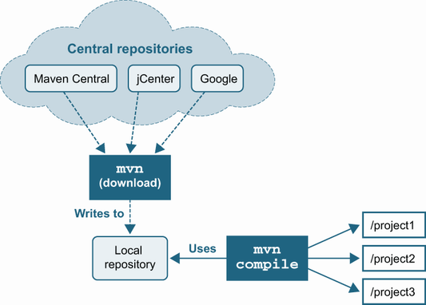
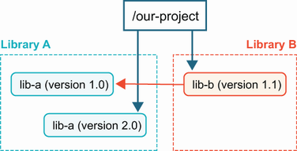
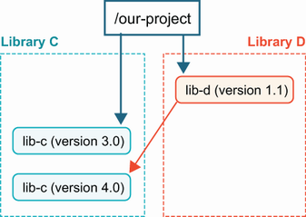
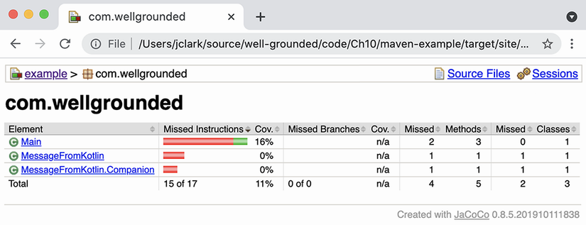
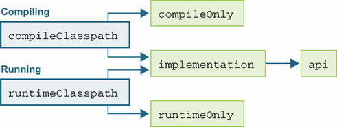

# 11. Build với Gradle và Maven

> *The Well-Grounded Java Developer, Second Edition* — Chương 11
> Bản dịch tiếng Việt

**Chương này bao gồm:**

- Vì sao công cụ build quan trọng với lập trình viên vững nền tảng
- Maven
- Gradle

---

JDK đi kèm một trình biên dịch để biến mã nguồn Java thành class file, như chúng ta đã thấy ở chương 4. Bất chấp điều đó, ít dự án ở bất kỳ quy mô nào chỉ dựa vào `javac`. Hãy bắt đầu bằng việc xem vì sao một lập trình viên vững nền tảng nên đầu tư vào sự quen thuộc với tầng công cụ này.

## 11.1 Vì sao công cụ build quan trọng với lập trình viên vững nền tảng

Công cụ build là chuẩn mực vì những lý do sau:

- Tự động hóa các thao tác tẻ nhạt
- Quản lý phụ thuộc
- Đảm bảo tính nhất quán giữa các lập trình viên

Mặc dù có nhiều lựa chọn, hai lựa chọn thống trị cảnh quan ngày nay: Maven và Gradle. Hiểu những gì các công cụ này nhắm tới giải quyết, đào sâu bên dưới bề mặt cách chúng hoàn thành công việc, và hiểu khác biệt giữa chúng — cùng cách mở rộng chúng — sẽ đem lại lợi ích cho lập trình viên vững nền tảng.

### 11.1.1 Tự động hóa các thao tác tẻ nhạt

`javac` có thể biến bất kỳ tệp nguồn Java nào thành class file, nhưng việc build một dự án Java điển hình còn nhiều hơn thế. Chỉ riêng việc liệt kê đúng tất cả các tệp cho compiler cũng có thể tẻ nhạt trong một dự án lớn nếu làm thủ công. Công cụ build cung cấp giá trị mặc định để tìm mã và cho phép bạn dễ dàng cấu hình nếu bạn có bố cục phi tiêu chuẩn.

Bố cục quy ước được Maven phổ biến hóa, và cũng được Gradle dùng mặc định, trông như sau:

```
.
└── src
     ├── main                                            ❶
     │     └── java                                      ❷
     │          └── com                                  ❸
     │               └── wellgrounded
     │                    └── Main.java
     └── test
           └── java
                └── com
                      └── wellgrounded
                           └── MainTest.java
```

❶ `main` và `test` tách mã production khỏi mã test của chúng ta.

❷ Nhiều ngôn ngữ dễ dàng cùng tồn tại trong một dự án với cấu trúc này.

❸ Cấu trúc thư mục sâu hơn thường phản chiếu hệ phân cấp package của bạn.

Như bạn thấy, việc kiểm thử được nướng sâu vào bố cục mã của chúng ta. Java đã đi một chặng đường dài kể từ thời người ta thường hỏi liệu họ có thực sự cần viết test cho mã của mình không. Các công cụ build đã là phần then chốt trong việc làm cho kiểm thử khả dụng theo cách nhất quán ở mọi nơi.

> **NOTE** Bạn có lẽ đã biết cách unit test trong Java với JUnit hoặc thư viện khác. Chúng ta sẽ thảo luận các dạng kiểm thử khác ở chương 14.

Mặc dù việc biên dịch thành class file là khởi đầu tồn tại của một chương trình Java, nói chung, đó không phải điểm cuối. May mắn thay, công cụ build cũng cung cấp hỗ trợ đóng gói class file của bạn thành JAR hoặc định dạng khác để phân phối dễ hơn.

### 11.1.2 Quản lý phụ thuộc

Vào những ngày đầu của Java, nếu bạn muốn dùng một thư viện, bạn phải tìm JAR của nó ở đâu đó, tải tệp về, và đưa nó vào classpath cho ứng dụng của bạn. Điều này gây ra vài vấn đề — cụ thể, việc thiếu một nguồn trung tâm, có thẩm quyền cho mọi thư viện nghĩa là đôi khi cần một cuộc săn kho báu để tìm JAR cho các phụ thuộc ít phổ biến.

Điều đó rõ ràng không lý tưởng, nên Maven (cùng các dự án khác) đã cho hệ sinh thái Java các repository nơi công cụ có thể tìm và cài đặt phụ thuộc cho chúng ta. Maven Central tới nay vẫn là một trong những registry được dùng phổ biến nhất cho các phụ thuộc Java trên internet. Những cái khác cũng tồn tại — registry công khai như những cái do Google host hoặc chia sẻ trên GitHub, và các cài đặt riêng tư qua các sản phẩm như Artifactory.

Việc tải xuống tất cả mã đó cũng có thể tốn thời gian, nên các công cụ build đã chuẩn hóa vài cách để giảm bớt đau đớn bằng cách chia sẻ artifact giữa các dự án. Với một repository cục bộ để cache, nếu một dự án thứ hai cần cùng thư viện, bạn không cần tải nó lại, như thể hiện trong hình 11.1. Cách này dĩ nhiên cũng tiết kiệm dung lượng đĩa, nhưng nguồn artifact duy nhất mới là thắng lợi thực sự ở đây.



**Hình 11.1** Repository cục bộ của Maven không chỉ giúp tìm phụ thuộc trực tuyến mà còn quản lý chúng hiệu quả ở cục bộ

> **NOTE** Bạn có thể tự hỏi module khớp vào đâu trong cảnh quan phụ thuộc này. Các thư viện đã module hóa được giao dưới dạng tệp JAR với việc bổ sung tệp `module-info.class`, như ta đã thấy ở chương 2. Một JAR đã module hóa có thể được tải xuống từ các repository tiêu chuẩn. Khác biệt thực sự xuất hiện khi bạn bắt đầu biên dịch và chạy với module, chứ không phải ở việc đóng gói và phân phối.

Tuy nhiên, ngoài việc cung cấp một nơi trung tâm để tìm và tải phụ thuộc, các registry đã mở cửa cho việc quản lý tốt hơn các phụ thuộc bắc cầu. Trong Java, chúng ta thường thấy tình huống này khi một thư viện mà dự án của ta dùng lại phụ thuộc vào một thư viện khác. Chúng ta thực ra đã gặp phụ thuộc bắc cầu của module ở chương 2, nhưng vấn đề tồn tại từ lâu trước Java module. Thực tế, trước module, vấn đề còn tệ hơn đáng kể.

Nhớ rằng tệp JAR chỉ là một tệp nén — chúng không có metadata nào mô tả các phụ thuộc của JAR. Điều này nghĩa là các phụ thuộc của một JAR chỉ là hợp của mọi phụ thuộc của mọi class trong JAR đó.

Tệ hơn nữa, định dạng class file không mô tả phiên bản nào của một class là cần thiết để thỏa mãn phụ thuộc — tất cả những gì ta có là một mô tả ký hiệu về tên class hoặc phương thức mà class cần để link (như ta đã thấy ở chương 4). Điều này hàm ý hai điều sau:

1. Cần một nguồn thông tin phụ thuộc bên ngoài.
2. Khi dự án lớn lên, đồ thị phụ thuộc bắc cầu sẽ ngày càng phức tạp.

Với sự bùng nổ của các thư viện và framework mã nguồn mở hỗ trợ lập trình viên, cây phụ thuộc bắc cầu điển hình trong một dự án thực tế chỉ ngày càng lớn hơn.

Một tin tốt tiềm năng là tình hình cho hệ sinh thái JVM phần nào tốt hơn so với, chẳng hạn, JavaScript. JavaScript thiếu một thư viện runtime trung tâm phong phú được đảm bảo luôn hiện diện, nên rất nhiều khả năng cơ bản phải được quản lý như phụ thuộc bên ngoài. Điều này gây ra các vấn đề như nhiều thư viện không tương thích mà mỗi cái cung cấp một phiên bản của một tính năng chung, và một hệ sinh thái mong manh nơi sai lầm và tấn công thù địch có thể có tác động không cân xứng lên cộng đồng (ví dụ, sự cố "left-pad" từ 2016 [xem http://mng.bz/5Q64]).

Java, ngược lại, có một thư viện runtime (JRE) chứa rất nhiều class thường cần, và cái này khả dụng trong mọi môi trường Java. Tuy nhiên, một ứng dụng production thực sẽ cần các khả năng vượt ra ngoài những gì có trong JRE và hầu như luôn có quá nhiều tầng phụ thuộc để quản lý thủ công một cách thoải mái. Giải pháp duy nhất là tự động hóa.

**Một xung đột nổi lên**

Việc tự động hóa này là một điều tuyệt vời cho lập trình viên xây dựng trên hệ sinh thái mã nguồn mở phong phú, nhưng việc nâng cấp phụ thuộc cũng thường lộ ra vấn đề. Chẳng hạn, hình 11.2 cho thấy một cây phụ thuộc có thể đặt chúng ta vào rắc rối.



**Hình 11.2** Các phụ thuộc bắc cầu xung đột

Chúng ta đã yêu cầu tường minh phiên bản 2.0 của `lib-a`, nhưng phụ thuộc `lib-b` của ta lại yêu cầu phiên bản cũ hơn 1.0. Đây được gọi là *dependency conflict* (xung đột phụ thuộc), và tùy vào cách nó được giải quyết, nó có thể gây ra nhiều vấn đề khác.

Loại đổ vỡ nào có thể dẫn tới từ các phiên bản thư viện không khớp? Điều này phụ thuộc vào bản chất của các thay đổi giữa các phiên bản. Các thay đổi rơi vào vài loại, như sau:

1. API ổn định nơi chỉ hành vi thay đổi giữa các phiên bản
2. API được thêm nơi class hoặc phương thức mới xuất hiện giữa các phiên bản
3. API thay đổi nơi chữ ký phương thức hoặc interface được kế thừa thay đổi giữa các phiên bản
4. API bị loại bỏ nơi class hoặc phương thức bị loại bỏ giữa các phiên bản

Trong trường hợp a) hoặc b), bạn thậm chí có thể không nhận ra công cụ build đã chọn phiên bản nào của phụ thuộc. Trường hợp phổ biến nhất của c) là thay đổi chữ ký của một phương thức giữa các phiên bản thư viện. Trong ví dụ trước của chúng ta, nếu `lib-a` 2.0 thay đổi chữ ký của một phương thức mà `lib-b` dựa vào, khi `lib-b` cố gọi phương thức đó, nó sẽ nhận một exception `NoSuchMethodError`.

Các phương thức bị loại bỏ ở trường hợp d) sẽ dẫn tới cùng loại `NoSuchMethodError`. Điều này bao gồm việc "đổi tên" một phương thức, ở mức bytecode không khác gì việc loại bỏ một phương thức và thêm một cái mới tình cờ có cùng bản hiện thực.

Các class cũng dễ gặp d) khi bị xóa hoặc đổi tên và sẽ gây `NoClassDefFoundError`. Cũng có khả năng việc loại bỏ interface khỏi một class có thể khiến bạn gặp một `ClassCastException` xấu xí.

Danh sách các vấn đề với phụ thuộc bắc cầu xung đột này hoàn toàn không đầy đủ. Tất cả quy về việc điều gì thực sự thay đổi giữa hai phiên bản của cùng một package.

Thực tế, việc truyền đạt về bản chất của các thay đổi giữa các phiên bản là vấn đề chung ở nhiều ngôn ngữ. Một trong những cách tiếp cận được áp dụng rộng rãi nhất để xử lý vấn đề này là *semantic versioning* (xem https://semver.org/). Semantic versioning cho chúng ta một từ vựng để phát biểu yêu cầu của các phụ thuộc bắc cầu, đến lượt nó cho phép máy móc giúp ta sắp xếp chúng.

Khi dùng semantic versioning, hãy nhớ:

- Phiên bản MAJOR tăng (1.x -> 2.x) khi có thay đổi phá vỡ API của bạn, như trường hợp c) và d) ở trên.
- Phiên bản MINOR tăng (1.1 -> 1.2) khi có bổ sung tương thích ngược như trường hợp b).
- PATCH tăng khi sửa lỗi (1.1.0 -> 1.1.1).

Dù không hoàn hảo, nó ít nhất cho ta một kỳ vọng về mức độ thay đổi đi kèm với một bản cập nhật phiên bản và được dùng rộng rãi trong mã nguồn mở.

Sau khi đã nếm trải vì sao quản lý phụ thuộc không dễ, hãy yên tâm rằng cả Maven lẫn Gradle đều cung cấp công cụ để giúp đỡ. Ở phần sau của chương, chúng ta sẽ xem chi tiết mỗi công cụ cung cấp gì để gỡ rối vấn đề khi bạn gặp xung đột phụ thuộc.

### 11.1.3 Đảm bảo tính nhất quán giữa các lập trình viên

Khi dự án lớn lên về khối lượng mã và số lập trình viên tham gia, chúng thường trở nên phức tạp hơn và khó làm việc hơn. Tuy nhiên, công cụ build của bạn có thể giảm bớt đau đớn này. Các tính năng tích hợp như đảm bảo mọi người đang biên dịch và chạy cùng các test là một khởi đầu. Nhưng chúng ta cũng nên cân nhắc nhiều bổ sung vượt ra ngoài những điều cơ bản.

Test là tốt, nhưng bạn chắc chắn đến đâu rằng toàn bộ mã của bạn được kiểm thử? Các công cụ code coverage là then chốt để phát hiện mã nào được test của bạn chạm tới và mã nào thì không. Mặc dù các tranh luận xoay quanh internet về mục tiêu đúng cho code coverage, đầu ra ở mức dòng mà công cụ coverage cung cấp có thể cứu bạn khỏi việc bỏ sót một test cho cái điều kiện đặc biệt thêm vào.

Java với tư cách một ngôn ngữ cũng rất phù hợp với nhiều công cụ phân tích tĩnh. Từ việc phát hiện các mẫu phổ biến (tức là ghi đè `equals` mà không ghi đè `hashCode`) tới đánh hơi các biến không dùng, phân tích tĩnh cho phép máy tính kiểm chứng các khía cạnh của mã hợp lệ nhưng sẽ cắn bạn ở production.

Ngoài lĩnh vực đúng đắn, còn có các công cụ về phong cách và định dạng. Bạn từng cãi nhau với ai đó về việc dấu ngoặc nhọn nên đặt ở đâu trong một câu lệnh chưa? Cách thụt lề mã? Đồng ý một lần về một tập quy tắc, ngay cả khi chúng không hoàn toàn hợp khẩu vị bạn, cho phép bạn mãi mãi sau đó tập trung trong dự án vào công việc thực tế thay vì bới lông tìm vết về việc mã trông thế nào.

Cuối cùng và chắc chắn không kém quan trọng, công cụ build của bạn là một điểm trung tâm then chốt để cung cấp chức năng tùy chỉnh. Có các lệnh thiết lập hoặc vận hành đặc biệt nào mọi người cần chạy định kỳ cho dự án của bạn không? Các bước kiểm chứng dự án nên chạy sau build nhưng trước khi triển khai? Tất cả những cái này đều tuyệt vời để cân nhắc đấu nối vào công cụ build sao cho chúng khả dụng với mọi người làm việc với mã. Cả Maven lẫn Gradle đều cung cấp nhiều cách để mở rộng chúng cho logic và nhu cầu của riêng bạn.

Hy vọng giờ bạn đã tin rằng công cụ build không chỉ là thứ để thiết lập một lần trong dự án mà đáng để đầu tư hiểu biết. Hãy bắt đầu bằng việc xem một trong những công cụ phổ biến nhất: Maven.

## 11.2 Maven

Đầu lịch sử Java, framework Ant là công cụ build mặc định. Với các task được mô tả bằng XML, nó cho phép một cách viết script build thiên về Java hơn so với các công cụ như Make. Nhưng Ant thiếu cấu trúc về cách cấu hình build của bạn — các bước là gì, chúng liên hệ ra sao, phụ thuộc được quản lý thế nào. Maven giải quyết nhiều khoảng trống này với khái niệm về *build lifecycle* chuẩn hóa và cách tiếp cận nhất quán để xử lý phụ thuộc.

### 11.2.1 Build lifecycle

Maven là một công cụ có quan điểm. Một trong những mảng lớn nhất nơi các quan điểm này lộ ra là các build lifecycle của nó. Thay vì người dùng định nghĩa task riêng và xác định thứ tự, Maven có một lifecycle mặc định bao gồm các bước thông thường, gọi là *phase*, mà bạn kỳ vọng trong một build. Dù không đầy đủ, các phase sau nắm bắt các điểm chính trong lifecycle mặc định:

- **Validate** — Kiểm tra cấu hình dự án đúng và có thể build
- **Compile** — Biên dịch mã nguồn
- **Test** — Chạy unit test
- **Package** — Sinh các artifact chẳng hạn tệp JAR
- **Verify** — Chạy integration test
- **Install** — Cài package vào repository cục bộ
- **Deploy** — Làm kết quả package khả dụng với người khác, thường chạy từ môi trường CI

Nhiều khả năng những cái này ánh xạ tới hầu hết các bước bạn sẽ đi từ mã nguồn tới một ứng dụng hoặc thư viện đã triển khai. Đây là điểm cộng lớn của cách tiếp cận có quan điểm của Maven — mọi dự án Maven sẽ chia sẻ cùng lifecycle này. Kiến thức của bạn về cách chạy build có tính di động hơn trước đây.

Các phase được định nghĩa rõ trong Maven, nhưng mọi dự án cần điều gì đó đặc biệt trong chi tiết. Trong mô hình của Maven, nhiều plugin gắn *goal* vào các phase này. Một goal là một tác vụ cụ thể, với bản hiện thực về cách thực thi nó.

Ngoài lifecycle mặc định, Maven cũng bao gồm lifecycle *clean* và *site*. Lifecycle clean nhằm dọn dẹp (ví dụ, loại bỏ kết quả build trung gian), trong khi lifecycle site nhằm sinh tài liệu.

Chúng ta sẽ xem kỹ hơn việc móc vào một lifecycle ở phần sau khi thảo luận mở rộng Maven, nhưng nếu bạn thực sự cần định nghĩa lại vũ trụ, Maven có hỗ trợ viết các lifecycle hoàn toàn tùy chỉnh. Tuy nhiên, đây là chủ đề rất nâng cao và nằm ngoài phạm vi cuốn sách này.

### 11.2.2 Giới thiệu lệnh/POM

Maven là một dự án của Apache Software Foundation và là mã nguồn mở. Hướng dẫn cài đặt có thể tìm thấy trên website dự án tại https://maven.apache.org/install.html.

Thông thường, Maven được cài đặt toàn cục trên máy trạm của lập trình viên, và nó hoạt động trên bất kỳ JVM không quá cổ nào (JDK 7 trở lên). Khi đã cài, gọi nó cho ta kết quả sau:

```
~: mvn

   [INFO] Scanning for projects...
   [INFO] ------------------------------------------------------------
   [INFO] BUILD FAILURE
   [INFO] ------------------------------------------------------------
   [INFO] Total time: 0.066 s
   [INFO] Finished at: 2020-07-05T21:28:22+02:00
   [INFO] ------------------------------------------------------------
   [ERROR] No goals have been specified for this build. You must specify a
   valid lifecycle phase or a goal in the format <plugin-prefix>:<goal> or
   <plugin-group-id>:<plugin-artifact-id>[:<plugin-version>]:<goal>.
   Available lifecycle phases are: validate, initialize, ....
```

Đặc biệt đáng chú ý là thông điệp `No goals have been specified for this build`. Điều này chỉ ra Maven không biết gì về dự án của chúng ta. Chúng ta cung cấp thông tin đó trong tệp `pom.xml`, là trung tâm vũ trụ của một dự án Maven.

> **NOTE** POM là viết tắt của Project Object Model.

Mặc dù một tệp `pom.xml` đầy đủ có thể dài và phức tạp đến đáng sợ, bạn có thể bắt đầu với ít hơn nhiều. Ví dụ, một tệp `pom.xml` gần như tối thiểu trông như sau:

```xml
<project>
  <modelVersion>4.0.0</modelVersion>
  <groupId>com.wellgrounded</groupId>                         ❶
  <artifactId>example</artifactId>                            ❶
  <version>1.0-SNAPSHOT</version>
  <name>example</name>

   <properties>
     <maven.compiler.source>11</maven.compiler.source>        ❷
     <maven.compiler.target>11</maven.compiler.target>
   </properties>
</project>
```

❶ Định danh dự án của chúng ta

❷ Các plugin Maven mặc định về Java 1.6. Chúng ta hiển nhiên muốn phiên bản mới hơn.

Tệp `pom.xml` của chúng ta khai báo hai trường đặc biệt quan trọng: `groupId` và `artifactId`. Các trường này kết hợp với một `version` để tạo thành *tọa độ GAV* (group, artifact, version), định danh duy nhất, toàn cục một bản phát hành cụ thể của package của bạn. `groupId` thường chỉ định công ty, tổ chức, hay dự án mã nguồn mở chịu trách nhiệm cho thư viện, trong khi `artifactId` là tên cho thư viện cụ thể. Tọa độ GAV thường được diễn đạt với mỗi phần phân tách bằng dấu hai chấm (`:`), chẳng hạn `org.apache.commons:collections4:4.4` hay `com.google.guava:guava:30.1-jre`.

Những tọa độ này quan trọng không chỉ để cấu hình dự án cục bộ của bạn. Tọa độ đóng vai trò địa chỉ cho các phụ thuộc, để công cụ build của ta có thể tìm chúng. Các mục sau sẽ đào sâu vào cơ chế cách chúng ta diễn đạt những phụ thuộc đó chi tiết hơn.

Cũng như Maven chuẩn hóa build lifecycle, nó cũng phổ biến hóa bố cục chuẩn ta đã thấy ở mục 11.1.1 và thể hiện dưới đây. Nếu bạn theo các quy ước này, bạn không phải nói gì với Maven về dự án của mình để nó có thể biên dịch:

```
.
├── pom.xml
└── src
        ├── main
        │   └── java
        │        └── com
        │            └── wellgrounded
        │                  └── Main.java
        └── test
            └── java
                   └── com
                         └── wellgrounded
                                └── MainTest.java
```

Chú ý các cấu trúc song song — `src/main/java` và `src/test/java` — với cùng thư mục ánh xạ tới hệ phân cấp package của chúng ta. Quy ước này giữ mã test tách khỏi mã ứng dụng chính, đơn giản hóa quá trình đóng gói mã chính để triển khai, loại trừ mã test mà người dùng của một package thường sẽ không muốn hay dùng.

Các thư mục tiêu chuẩn khác cũng tồn tại ngoài hai cái này. Chẳng hạn, `src/main/resources` là vị trí điển hình cho các tệp không phải mã bổ sung cần đưa vào JAR. Xem tài liệu tại http://mng.bz/6XoG để có danh sách đầy đủ bố cục chuẩn Maven.

Khi bạn đang làm quen với Maven, tốt nhất nên bám sát các quy ước, bố cục chuẩn và các mặc định khác mà Maven cung cấp. Như đã đề cập, đó là công cụ có quan điểm, nên tốt hơn là ở trong các rào chắn nó cung cấp trong lúc bạn đang học. Lập trình viên Maven có kinh nghiệm có thể (và có) đi ra ngoài quy ước và phá luật, nhưng đừng cố chạy trước khi biết đi.

### 11.2.3 Build

Chúng ta đã thấy ở trên rằng chỉ chạy `mvn` trên dòng lệnh cảnh báo rằng ta cần chọn một lifecycle phase hoặc goal để thực sự hành động. Thường thì chúng ta sẽ muốn chạy một phase, có thể bao gồm nhiều goal.

Nơi đơn giản nhất để bắt đầu là biên dịch mã bằng cách yêu cầu phase `compile` như sau:

```
~: mvn compile

   [INFO] Scanning for projects...
   [INFO]
   [INFO] -------------------< com.wellgrounded:example >---------------
   [INFO] Building example 1.0-SNAPSHOT
   [INFO] -----------------------------[ jar ]--------------------------
   [INFO]
   [INFO] -- maven-resources-plugin:2.6:resources (default-resources) --   ❶
   [INFO] Using 'UTF-8' to copy filtered resources.
   [INFO] Copying 0 resource
   [INFO]
   [INFO] ----- maven-compiler-plugin:3.1:compile (default-compile) ----   ❷
   [INFO] Changes detected - recompiling the module!
   [INFO] Compiling 1 source file to ./maven-example/target/classes
   [INFO] ------------------------------------------------------------
   [INFO] BUILD SUCCESS
   [INFO] ------------------------------------------------------------
   [INFO] Total time: 0.940 s
   [INFO] Finished at: 2020-07-05T21:46:25+02:00
   [INFO] ------------------------------------------------------------
```

❶ Mặc dù chúng ta không có resource trong dự án, `maven-resources-plugin` từ lifecycle mặc định vẫn kiểm tra cho ta.

❷ Việc biên dịch thực tế được `maven-compiler-plugin` cung cấp.

Maven mặc định đầu ra vào thư mục `target`. Sau `mvn compile`, chúng ta có thể tìm class file dưới `target/classes`. Xem xét kỹ sẽ tiết lộ chúng ta chỉ build mã dưới thư mục `main`. Nếu muốn biên dịch test, bạn có thể dùng phase `test-compile`.

Lifecycle mặc định bao gồm nhiều hơn chỉ việc biên dịch. Chẳng hạn, `mvn package` cho dự án trước sẽ tạo ra một tệp JAR tại `target/example-1.0-SNAPSHOT.jar`.

Mặc dù chúng ta có thể dùng JAR này như một thư viện, nếu ta thử chạy nó qua `java -jar target/example-1.0-SNAPSHOT.jar`, ta sẽ thấy Java than phiền rằng nó không tìm thấy main class. Để xem cách chúng ta bắt đầu phát triển bản build Maven, hãy thay đổi để JAR tạo ra là một ứng dụng chạy được.

### 11.2.4 Kiểm soát manifest

JAR mà Maven tạo ra từ `mvn package` thiếu một manifest để nói cho JVM biết tìm phương thức `main` ở đâu khi khởi động. May mắn thay, Maven đi kèm một plugin để dựng JAR biết cách viết manifest. Plugin phơi bày cấu hình qua `pom.xml` của chúng ta sau phần tử `properties` và vẫn bên trong phần tử `project` như sau:

```xml
<build>
  <plugins>
    <plugin>
      <groupId>org.apache.maven.plugins</groupId>
      <artifactId>maven-jar-plugin</artifactId>                  ❶
      <version>2.4</version>
      <configuration>                                            ❷
         <archive>
           <manifest>                                            ❸
             <addClasspath>true</addClasspath>
             <mainClass>com.wellgrounded.Main</mainClass>
             <Automatic-Module-Name>
               com.wellgrounded
             </Automatic-Module-Name>                            ❹
           </manifest>
         </archive>
      </configuration>
    </plugin>
  </plugins>
</build>
```

❶ `maven-jar-plugin` là tên plugin. Bạn có thể dễ dàng nhận ra nó trong kết quả khi chạy lệnh `mvn package`.

❷ Mỗi plugin có phần tử `configuration` chuyên biệt riêng với các phần tử con và thuộc tính khác nhau được hỗ trợ.

❸ `<manifest>` cấu hình nội dung manifest của JAR kết quả.

❹ Cấu hình tên automatic module của chúng ta

Việc thêm mục này thiết lập main class để trình khởi chạy `java` biết cách thực thi trực tiếp JAR. Chúng ta cũng đã thêm một automatic module name — đây là để làm công dân tốt trong thế giới modular. Như đã thảo luận ở chương 2, ngay cả khi mã ta đang viết không modular (như trong trường hợp này), vẫn hợp lý khi cung cấp một automatic module name tường minh để các ứng dụng modular có thể dùng mã của ta dễ hơn.

Mẫu đặt cấu hình dưới một phần tử `plugin` này rất tiêu chuẩn trong Maven. Để đơn giản hóa, hầu hết plugin mặc định sẽ tử tế cảnh báo nếu bạn dùng một thuộc tính cấu hình không được hỗ trợ hoặc không mong đợi, mặc dù chi tiết có thể khác nhau theo plugin.

### 11.2.5 Thêm một ngôn ngữ khác

Như đã thảo luận ở chương 8, một lợi thế của JVM như một nền tảng là khả năng dùng nhiều ngôn ngữ trong cùng một dự án. Điều này có thể hữu ích khi một ngôn ngữ cụ thể có tiện ích tốt hơn cho một phần nhất định của ứng dụng, hoặc thậm chí để cho phép chuyển đổi dần một ứng dụng từ ngôn ngữ này sang ngôn ngữ khác.

Hãy xem cách chúng ta cấu hình dự án Maven đơn giản của mình để build một số class từ Kotlin thay vì Java. Bố cục chuẩn của chúng ta may mắn đã sẵn sàng cho việc thêm ngôn ngữ dễ dàng, như sau:

```
.
├── pom.xml
└── src
      ├── main
      │    ├── java
      │    │     └── com
      │    │         └── wellgrounded
      │    │               └── Main.java
      │    └── kotlin                                     ❶
      │          └── com
      │               └── wellgrounded                    ❷
      │                    └── MessageFromKotlin.kt
      └── test
               └── java
                    └── com
                           └── wellgrounded
                                 └── MainTest.java
```

❶ Chúng ta giữ mã Kotlin trong thư mục con riêng để dễ nói đường dẫn nào dùng compiler nào để tạo class file.

❷ Các package có thể trộn lẫn giữa các ngôn ngữ, bởi các class file kết quả không có kiến thức trực tiếp về việc chúng được sinh ra từ ngôn ngữ nào.

Không như Java, Maven mặc định không biết cách biên dịch Kotlin nên chúng ta cần thêm `kotlin-maven-plugin` vào `pom.xml`. Chúng tôi khuyến nghị tham khảo tài liệu Kotlin tại https://kotlinlang.org/docs/maven.html để biết cách dùng cập nhật nhất, nhưng chúng tôi sẽ minh họa ở đây để bạn biết mong đợi gì.

Nếu một dự án hoàn toàn viết bằng Kotlin, việc biên dịch chỉ cần thêm plugin và gắn nó vào goal `compile` như sau:

```xml
<build>
  <plugins>
    <plugin>
      <groupId>org.jetbrains.kotlin</groupId>
      <artifactId>kotlin-maven-plugin</artifactId>
      <version>1.6.10</version>                        ❶
      <executions>
         <execution>
           <id>compile</id>
           <goals>                                     ❷
             <goal>compile</goal>
           </goals>
         </execution>
         <execution>
           <id>test-compile</id>
           <goals>                                     ❷
             <goal>test-compile</goal>
           </goals>
         </execution>
      </executions>
    </plugin>
  </plugins>
</build>
```

❶ Phiên bản Kotlin hiện tại, tính đến khi chương này được viết.

❷ Thêm plugin này vào các goal để biên dịch mã main và test.

Tình hình phức tạp hơn khi trộn Kotlin và Java. `maven-compiler-plugin` mặc định của Maven, vốn biên dịch Java cho ta, cần được ghi đè để Kotlin biên dịch trước, như sau, nếu không mã Java của chúng ta sẽ không dùng được các class Kotlin:

```xml
<build>
  <plugins>
    <plugin>                                                              ❶
      <groupId>org.jetbrains.kotlin</groupId>
      <artifactId>kotlin-maven-plugin</artifactId>
      <version>1.6.10</version>
     <executions>
       <execution>
         <id>compile</id>
         <goals>
           <goal>compile</goal>
         </goals>
         <configuration>
           <sourceDirs>                                                   ❷
             <sourceDir>${project.basedir}/src/main/kotlin</sourceDir>
             <sourceDir>${project.basedir}/src/main/java</sourceDir>
           </sourceDirs>
         </configuration>
       </execution>
       <execution>
         <id>test-compile</id>
         <goals>
           <goal>test-compile</goal>
         </goals>
         <configuration>
           <sourceDirs>
             <sourceDir>${project.basedir}/src/test/kotlin</sourceDir>
             <sourceDir>${project.basedir}/src/test/java</sourceDir>
           </sourceDirs>
         </configuration>
       </execution>
     </executions>
   </plugin>
   <plugin>
     <groupId>org.apache.maven.plugins</groupId>
     <artifactId>maven-compiler-plugin</artifactId>
     <version>3.8.1</version>
     <executions>
       <execution>                                                        ❸
         <id>default-compile</id>
         <phase>none</phase>
       </execution>
       <execution>
         <id>default-testCompile</id>
         <phase>none</phase>
       </execution>
       <execution>                                                        ❹
         <id>java-compile</id>
         <phase>compile</phase>
         <goals>
           <goal>compile</goal>
         </goals>
       </execution>
       <execution>
         <id>java-test-compile</id>
         <phase>test-compile</phase>
         <goals>
           <goal>testCompile</goal>
         </goals>
       </execution>
     </executions>
   </plugin>
  </plugins>
</build>
```

❶ Thêm `kotlin-maven-plugin` gần như trước, giờ đảm bảo nó biết cả đường dẫn Java lẫn Kotlin

❷ Trình biên dịch Kotlin cần biết cả vị trí mã Kotlin lẫn Java của chúng ta.

❸ Tắt các mặc định của `maven-compiler-plugin` cho việc build Java bởi chúng ép nó chạy trước

❹ Áp dụng lại `maven-compiler-plugin` vào các phase `compile` và `test-compile`. Những cái này giờ sẽ được thêm sau `kotlin-maven-plugin`.

> **NOTE** Các ghi đè trên có thể trở nên phức tạp khi dùng các tính năng Maven như parent project, nơi các định nghĩa POM bổ sung có thể xung đột. Chúng ta sẽ thấy một số chiến thuật sớm thôi để debug khi những vấn đề này phát sinh.

Dự án của bạn sẽ cần một phụ thuộc vào ít nhất thư viện chuẩn Kotlin, nên chúng ta thêm nó tường minh như sau:

```xml
<dependencies>
    <dependency>
        <groupId>org.jetbrains.kotlin</groupId>
        <artifactId>kotlin-stdlib</artifactId>
        <version>1.6.10</version>
    </dependency>
</dependencies>
```

Với cái này tại chỗ, dự án đa ngôn ngữ của chúng ta build và chạy như trước.

### 11.2.6 Kiểm thử

Khi mã của bạn build được, bước tiếp theo thông minh là kiểm thử nó. Maven tích hợp việc kiểm thử sâu vào lifecycle của nó. Thực tế, trong khi việc biên dịch mã chính chỉ là một phase duy nhất, Maven hỗ trợ hai phase kiểm thử riêng biệt ngay từ đầu: `test` và `integration-test`. `test` được dùng cho unit testing điển hình, trong khi phase `integration-test` chạy sau khi dựng các artifact chẳng hạn JAR, với ý định thực hiện kiểm chứng đầu-cuối trên đầu ra cuối cùng của bạn.

> **NOTE** Integration test cũng có thể chạy bằng JUnit bởi, bất chấp cái tên, JUnit là một test runner rất có năng lực cho nhiều thứ hơn chỉ unit testing. Đừng rơi vào bẫy nghĩ rằng bất kỳ test nào được JUnit thực thi đều tự động là unit test! Chúng ta sẽ khảo sát các loại test khác nhau chi tiết ở chương 13.

Hầu như mọi dự án đều hưởng lợi từ một chút kiểm thử. Như bạn có thể mong đợi từ lập trường có quan điểm của Maven, việc kiểm thử diễn ra (theo mặc định) dùng framework gần như phổ biến JUnit. Các framework khác chỉ cách một plugin.

Mặc dù các plugin tiêu chuẩn biết cách chạy JUnit, chúng ta vẫn phải khai báo thư viện như một phụ thuộc để Maven biết cách biên dịch test của ta. Bạn có thể thêm một thư viện với đoạn như sau dưới phần tử `<project>`:

```xml
<dependencies>
  <dependency>
    <groupId>org.junit.jupiter</groupId>
    <artifactId>junit-jupiter-api</artifactId>
    <version>5.8.1</version>
    <scope>test</scope>                                    ❶
  </dependency>
  <dependency>
    <groupId>org.junit.jupiter</groupId>
    <artifactId>junit-jupiter-engine</artifactId>
    <version>5.8.1</version>
    <scope>test</scope>                                    ❶
  </dependency>
</dependencies>
```

❶ `<scope>` chỉ ra thư viện này chỉ cần cho phase `test-compile`.

Với cái đó tại chỗ, chúng ta có thể thử chạy unit test. Tùy vào phiên bản Maven của bạn, ngay cả các phiên bản mới nhất cũng có thể cho ta kết quả kỳ lạ này:

```
~:mvn test

    [INFO] Scanning for projects...
    [INFO]
    [INFO] -------------------< com.wellgrounded:example >---------------
    [INFO] Building example 1.0-SNAPSHOT
    [INFO] --------------------------------[ jar ]-----------------------
    [INFO]
    [INFO] .....
    [INFO]
    [INFO] -- maven-surefire-plugin:2.12.4:test (default-test) @ example  ❶
    [INFO] Surefire report dir: ./target/surefire-reports

    -------------------------------------------------------
     T E S T S
    -------------------------------------------------------
    Running com.wellgrounded.MainTest
    Tests run: 0, Failures: 0, Errors: 0, Skipped: 0, Time elapsed: 0.001  ❷

    Results :

    Tests run: 0, Failures: 0, Errors: 0, Skipped: 0

    [INFO] ------------------------------------------------
    [INFO] BUILD SUCCESS
    [INFO] ------------------------------------------------
    [INFO] Total time: 5.605 s
    [INFO] Finished at: 2021-11-29T09:41:06+01:00
    [INFO] ------------------------------------------------
```

❶ Mặc định của Maven để chạy test JUnit là `maven-surefire-plugin`.

❷ Không test nào được chạy? Thế thì không đúng rồi!

Vì lý do tương thích, plugin `maven-surefire-plugin` được cài đặt mặc định, ngay cả ở Maven 3.8.4 gần đây, không biết về JUnit 5. Chúng ta sẽ đào sâu hơn vào những vấn đề chuyển đổi này ở chương 13, nhưng trong lúc chờ, hãy chỉ nâng phiên bản plugin lên cái gì đó mới hơn, như sau:

```xml
<plugin>
  <groupId>org.apache.maven.plugins</groupId>
  <artifactId>maven-surefire-plugin</artifactId>
  <version>3.0.0-M5</version>                       ❶
</plugin>
```

❶ Chuyển sang sau 2.12, các plugin hiểu JUnit 5 trực tiếp.

Với cái đó tại chỗ, chúng ta thấy kết quả yên tâm hơn sau đây:

```
~:mvn test

   [INFO] .....

   -------------------------------------------------------
    T E S T S
   -------------------------------------------------------
   Running com.wellgrounded.MainTest
   Tests run: 1, Failures: 0, Errors: 0, Skipped: 0, Time elapsed: 0.04

   Results :

   Tests run: 1, Failures: 0, Errors: 0, Skipped: 0

   [INFO] ------------------------------------------------
   [INFO] BUILD SUCCESS
   [INFO] ------------------------------------------------
   [INFO] Total time: 1.010 s
   [INFO] Finished at: 2020-07-06T15:45:22+02:00
   [INFO] ------------------------------------------------
```

Theo mặc định, plugin Surefire chạy mọi unit test ở vị trí chuẩn, `src/test/*`, trong phase `test`. Nếu chúng ta muốn tận dụng phase `integration-test`, khuyến nghị dùng một plugin riêng, chẳng hạn `maven-failsafe-plugin`. Failsafe được bảo trì bởi cùng những người làm `maven-surefire-plugin` và nhắm cụ thể vào trường hợp integration testing. Chúng ta thêm plugin vào phần `<build><plugins>` mà ta đã dùng trước đó để cấu hình manifest như sau:

```xml
<plugin>
  <groupId>org.apache.maven.plugins</groupId>
  <artifactId>maven-failsafe-plugin</artifactId>
  <version>3.0.0-M5</version>
  <executions>
    <execution>
      <goals>
         <goal>integration-test</goal>
         <goal>verify</goal>
      </goals>
    </execution>
  </executions>
</plugin>
```

Failsafe coi các mẫu tên tệp sau là integration test, mặc dù nó có thể được cấu hình lại:

- `**/IT*.java`
- `**/*IT.java`
- `**/*ITCase.java`

Bởi nó là một phần của cùng bộ plugin, Surefire cũng biết về quy ước này và loại trừ những test này khỏi phase `test`.

Khuyến nghị chạy integration test qua `mvn verify`, như sau, thay vì `mvn integration-test`. `verify` bao gồm `post-integration-test`, là vị trí điển hình để các plugin gắn công việc dọn dẹp sau test nếu cần:

```
~: mvn verify

   [INFO] ... phần kết quả biên dịch bị lược bỏ cho ngắn ...

   [INFO] --- maven-failsafe-plugin:3.0.0-M5:integration-test @ example
   [INFO]
   [INFO] -------------------------------------------------------
   [INFO] T E S T S
   [INFO] -------------------------------------------------------
   [INFO] Running com.wellgrounded.LongRunningIT
   [INFO] Tests run: 1, Failures: 0, Errors: 0, Skipped: 0,
   [INFO] Time elapsed: 0.032 s - in com.wellgrounded.LongRunningIT
   [INFO]
   [INFO] Results:
   [INFO]
   [INFO] Tests run: 1, Failures: 0, Errors: 0, Skipped: 0
   [INFO]
   [INFO]
   [INFO] --- maven-failsafe-plugin:3.0.0-M5:verify (default) @ example
   [INFO] ------------------------------------------------------------
   [INFO] BUILD SUCCESS
   [INFO] ------------------------------------------------------------
```

### 11.2.7 Quản lý phụ thuộc

Một tính năng then chốt mà Maven mang vào hệ sinh thái là định dạng chuẩn để diễn đạt thông tin quản lý phụ thuộc qua tệp `pom.xml`. Maven cũng thiết lập một repository trung tâm cho thư viện. Maven có thể duyệt qua `pom.xml` của bạn và các tệp `pom.xml` từ các phụ thuộc của bạn để xác định toàn bộ tập phụ thuộc bắc cầu mà ứng dụng của bạn cần.

Quá trình duyệt cây và tìm mọi thư viện cần thiết được gọi là *dependency resolution* (phân giải phụ thuộc). Dù tối quan trọng để quản lý ứng dụng hiện đại, quá trình này có những cạnh sắc của nó.

Để xem vấn đề phát sinh ở đâu, hãy xem lại thiết lập dự án ta đã thấy ở mục 11.1.2. Nhớ rằng các phụ thuộc của dự án đã tạo ra một cây trông như thể hiện trong hình 11.3.


**Hình 11.3** Các phụ thuộc bắc cầu xung đột nơi một phụ thuộc yêu cầu phiên bản cũ hơn

Ở đây chúng ta đã yêu cầu tường minh phiên bản 2.0 của `lib-a`, nhưng phụ thuộc `lib-b` của ta yêu cầu phiên bản cũ hơn 1.0. Thuật toán phân giải phụ thuộc của Maven ưu tiên phiên bản thư viện gần gốc nhất. Kết quả cuối cùng của cấu hình thể hiện trong hình 11.3 là chúng ta sẽ dùng `lib-a` 2.0 trong ứng dụng của mình. Như đã phác thảo ở mục 11.1.2, điều này có thể hoạt động tốt hoặc hỏng thảm hại.

Một kịch bản phổ biến khác cũng có thể gây vấn đề là khi điều ngược lại xảy ra và phụ thuộc gần gốc nhất lại cũ hơn cái được kỳ vọng như một phụ thuộc bắc cầu, như minh họa trong hình 11.4.



**Hình 11.4** Các phụ thuộc bắc cầu xung đột nơi một phụ thuộc yêu cầu phiên bản mới hơn

Trong trường hợp này, hoàn toàn có thể `lib-d` đang dựa vào một API trong `lib-c` vốn không tồn tại ở phiên bản 3.0, nên việc thêm phụ thuộc vào `lib-d` cho một dự án đã dùng `lib-c` sẽ dẫn tới runtime exception.

> **NOTE** Với những khả năng đó, chúng tôi khuyến nghị bất kỳ package nào mã của bạn tương tác trực tiếp đều nên được khai báo tường minh trong `pom.xml` của bạn. Nếu bạn không làm vậy, và thay vào đó dựa vào phụ thuộc bắc cầu, việc cập nhật phụ thuộc trực tiếp của bạn có thể dẫn tới việc build bị hỏng bất ngờ.

Trước khi chúng ta có thể giải quyết vấn đề phụ thuộc, quan trọng là biết các phụ thuộc của mình là gì. Maven đã lo cho ta với lệnh `mvn dependency:tree`, như sau:

```
~:mvn dependency:tree
  [INFO] Scanning for projects...
  [INFO]
  [INFO] -------------------< com.wellgrounded:example >---------------
  [INFO] Building example 1.0-SNAPSHOT
  [INFO] -----------------------------[ jar ]--------------------------
  [INFO]
  [INFO] -- maven-dependency-plugin:2.8:tree (default-cli) @ example --
  [INFO] com.wellgrounded:example:jar:1.0-SNAPSHOT
  [INFO] +- org.junit.jupiter:junit-jupiter-api:jar:5.8.1:test
  [INFO] |  +- org.opentest4j:opentest4j:jar:1.2.0:test
  [INFO] |  +- org.junit.platform:junit-platform-commons:jar:1.8.1:test
  [INFO] |  \- org.apiguardian:apiguardian-api:jar:1.1.2:test
  [INFO] \- org.junit.jupiter:junit-jupiter-engine:jar:5.8.1:test
  [INFO]    \- org.junit.platform:junit-platform-engine:jar:1.8.1:test
  [INFO] ------------------------------------------------------------
  [INFO] BUILD SUCCESS
  [INFO] ------------------------------------------------------------
  [INFO] Total time: 0.790 s
  [INFO] Finished at: 2020-08-13T23:02:10+02:00
  [INFO] ------------------------------------------------------------
```

Cây từ lệnh này cho ta thấy các phụ thuộc trực tiếp vào JUnit từ tệp `pom.xml` ở mức lồng đầu tiên, theo sau là các phụ thuộc bắc cầu của chính JUnit.

JUnit đi kèm một tập phụ thuộc mỏng, nên để khám phá sâu hơn các vấn đề phụ thuộc bắc cầu, hãy tưởng tượng rằng đội của chúng ta muốn dùng hai thư viện nội bộ tại công ty để có hỗ trợ làm các assertion tùy chỉnh. Cả hai đều được build dùng thư viện `assertj`, nhưng đáng tiếc là ở các phiên bản khác nhau, như sau:

```
  [INFO] com.wellgrounded:example:jar:1.0-SNAPSHOT
  [INFO] +- org.junit.jupiter:junit-jupiter-api:jar:5.8.1:test
  [INFO] |  +- org.opentest4j:opentest4j:jar:1.2.0:test
  [INFO] |  +- org.junit.platform:junit-platform-commons:jar:1.8.1:test
  [INFO] |  \- org.apiguardian:apiguardian-api:jar:1.1.2:test
  [INFO] +- org.junit.jupiter:junit-jupiter-engine:jar:5.8.1:test
  [INFO] |  \- org.junit.platform:junit-platform-engine:jar:1.8.1:test
  [INFO] +- com.wellgrounded:first-test-helper:1.0.0:test
  [INFO] |  \- org.assertj:assertj-core:3.21.0:test                    ❶
  [INFO] \- com.wellgrounded:second-test-helper:2.0.0:test
  [INFO]    \- org.assertj:assertj-core:2.9.1:test                     ❷
```

❶ Thư viện helper đầu tiên của chúng ta mang `assertj-core` với phiên bản 3.21.0.

❷ Thư viện helper thứ hai muốn `assertj-core` với phiên bản 2.9.1.

Cách tiếp cận tốt nhất có thể là tìm các phiên bản mới hơn của phụ thuộc mà tất cả đều đồng thuận về phụ thuộc của chúng. Với các thư viện nội bộ, đây hiển nhiên là khả thi. Ngay cả trong thế giới mã nguồn mở rộng lớn hơn, điều này cũng thường khả thi. Dù vậy, đôi khi các thư viện mất người bảo trì và trở nên lỗi thời, nên hoàn toàn có thể mắc kẹt trong tình huống khó có được bản cập nhật mong muốn.

Điều này khiến chúng ta phải tìm cách khác để đối phó với xung đột. Hai cách tiếp cận chính xuất hiện nếu chúng ta không tìm được giải pháp tự nhiên. Lưu ý rằng cả hai giải pháp này đều đòi hỏi tìm một phiên bản tương thích nào đó thỏa mãn các phụ thuộc của bạn.

Nếu một trong các phụ thuộc của bạn chỉ định một phiên bản mà mọi người có thể đồng thuận, nhưng nó không được thuật toán phân giải của Maven chọn, bạn có thể bảo Maven loại trừ các phần của cây khi phân giải. Nếu cả hai thư viện helper của chúng ta có thể hoạt động tốt với `assertj-core` mới hơn, chúng ta có thể bỏ qua cái cũ do thư viện thứ hai mang lại, như sau:

```xml
<dependencies>
  <dependency>
    <groupId>com.wellgrounded</groupId>
    <artifactId>second-test-helper</artifactId>
    <version>2.0.0</version>
    <scope>test</scope>
    <exclusions>                                       ❶
      <exclusion>
        <groupId>org.assertj</groupId>
        <artifactId>assertj-core</artifactId>
      </exclusion>
    </exclusions>
  </dependency>
  <dependency>
    <groupId>com.wellgrounded</groupId>                ❷
    <artifactId>first-test-helper</artifactId>
    <version>1.0.0</version>
    <scope>test</scope>
  </dependency>
</dependencies>
```

❶ Loại trừ phiên bản lỗi thời của `assertj-core` từ `second-test-helper`

❷ Để phụ thuộc bắc cầu từ `first-test-helper` diễn ra bình thường

Trong trường hợp xấu nhất, có lẽ không thư viện nào diễn đạt phiên bản tương thích. Để xử lý điều này, chúng ta chỉ định phiên bản chính xác như một phụ thuộc trực tiếp trong dự án của mình, như trong đoạn mã sau. Theo quy tắc phân giải của nó, Maven sẽ chọn phiên bản đó bởi nó gần gốc dự án hơn. Mặc dù điều này thuyết phục công cụ làm điều ta muốn, chúng ta đang chấp nhận rủi ro lỗi runtime từ việc trộn các phiên bản thư viện, nên quan trọng là kiểm thử kỹ lưỡng các tương tác:

```xml
<dependencies>
    <dependency>
        <groupId>com.wellgrounded</groupId>
        <artifactId>second-test-helper</artifactId>         ❶
        <version>2.0.0</version>
        <scope>test</scope>
     </dependency>
     <dependency>
        <groupId>com.wellgrounded</groupId>
        <artifactId>first-test-helper</artifactId>          ❷
        <version>1.0.0</version>
        <scope>test</scope>
     </dependency>
     <dependency>
        <groupId>org.assertj</groupId>
        <artifactId>assertj-core</artifactId>
        <version>3.1.0</version>                            ❸
        <scope>test</scope>
    </dependency>
</dependencies>
```

❶ Các phụ thuộc của chúng ta sẽ yêu cầu `assertj-core` ở phiên bản khác.

❷ Các phụ thuộc của chúng ta sẽ yêu cầu `assertj-core` ở phiên bản khác.

❸ Nhưng chúng ta ép phân giải `assertj-core` về đúng phiên bản ta muốn.

Cuối cùng, đáng lưu ý rằng `maven-enforcer-plugin` có thể được cấu hình để làm hỏng build nếu tìm thấy bất kỳ phụ thuộc không khớp nào, để chúng ta có thể tránh dựa vào hành vi runtime tồi tệ để phát hiện vấn đề. (Xem http://mng.bz/o2WN.) Các lỗi build này sau đó có thể được xử lý dùng các kỹ thuật ta đã thảo luận ở trên.

### 11.2.8 Rà soát

Quá trình build của chúng ta là chỗ tuyệt vời để móc thêm công cụ và kiểm tra. Một mẩu thông tin then chốt là *code coverage*, cho chúng ta biết phần nào của mã được test thực thi.

Một lựa chọn hàng đầu cho code coverage trong hệ sinh thái Java là JaCoCo (http://mng.bz/nNjv). JaCoCo có thể được cấu hình để cưỡng chế các mức coverage nhất định trong lúc kiểm thử và sẽ xuất ra các báo cáo cho bạn biết cái gì được và không được phủ.

Bật JaCoCo chỉ cần thêm một plugin vào phần `<build><plugins>` của tệp `pom.xml`. Nó không tự bật theo mặc định, nên bạn phải nói cho nó biết khi nào nên thực thi. Trong ví dụ này chúng ta đã gắn nó vào phase `test` như sau:

```xml
<build>
  <plugins>
      <plugin>
        <groupId>org.jacoco</groupId>
          <artifactId>jacoco-maven-plugin</artifactId>
          <version>0.8.5</version>
          <executions>
            <execution>                           ❶
                <goals>
                  <goal>prepare-agent</goal>
               </goals>
             </execution>
             <execution>                          ❷
               <id>report</id>
                <phase>test</phase>
                <goals>
                  <goal>report</goal>
                </goals>
            </execution>
          </executions>
     </plugin>
  </plugins>
</build>
```

❶ JaCoCo cần bắt đầu chạy sớm trong quá trình. Cái này thêm nó vào phase `initialize`.

❷ Bảo JaCoCo báo cáo trong phase `test`

Lệnh này tạo ra báo cáo về mọi class của bạn trong `target/site/jacoco` theo mặc định, như thể hiện trong hình 11.5, với phiên bản HTML đầy đủ tại `index.html` để khám phá.



**Hình 11.5** Trang báo cáo coverage của JaCoCo

### 11.2.9 Vượt qua Java 8

Ở chương 1, chúng tôi đã lưu ý loạt module sau vốn thuộc về Java Enterprise Edition nhưng hiện diện trong JDK cốt lõi. Chúng bị deprecated ở JDK 9 và bị loại bỏ ở JDK 11 nhưng vẫn khả dụng dưới dạng thư viện bên ngoài:

- `java.activation` (JAF)
- `java.corba` (CORBA)
- `java.transaction` (JTA)
- `java.xml.bind` (JAXB)
- `java.xml.ws` (JAX-WS, cùng một số công nghệ liên quan)
- `java.xml.ws.annotation` (Common Annotations)

Nếu dự án của bạn dựa vào bất kỳ module nào trong số này, build của bạn có thể hỏng khi chuyển sang JDK mới hơn. May mắn thay, vài bổ sung phụ thuộc đơn giản trong `pom.xml` của bạn, như sau, giải quyết vấn đề:

```xml
<dependencies>
  <dependency>
     <groupId>com.sun.activation</groupId>                    ❶
     <artifactId>jakarta.activation</artifactId>
     <version>1.2.2</version>
   </dependency>
   <dependency>
     <groupId>org.glassfish.corba</groupId>                   ❷
     <artifactId>glassfish-corba-omgapi</artifactId>
     <version>4.2.1</version>
   </dependency>
   <dependency>
     <groupId>javax.transaction</groupId>                     ❸
     <artifactId>javax.transaction-api</artifactId>
     <version>1.3</version>
   </dependency>
   <dependency>
     <groupId>jakarta.xml.bind</groupId>                      ❹
     <artifactId>jakarta.xml.bind-api</artifactId>
     <version>2.3.3</version>
   </dependency>
   <dependency>
     <groupId>jakarta.xml.ws</groupId>                        ❺
     <artifactId>jakarta.xml.ws-api</artifactId>
     <version>2.3.3</version>
   </dependency>
   <dependency>
     <groupId>jakarta.annotation</groupId>                    ❻
     <artifactId>jakarta.annotation-api</artifactId>
     <version>1.3.5</version>
  </dependency>
</dependencies>
```

❶ `java.activation` (JAF) ❷ `java.corba` (CORBA) ❸ `java.transaction` (JTA) ❹ `java.xml.bind` (JAXB) ❺ `java.xml.ws` (JAX-WS) ❻ `java.xml.ws.annotation` (Common Annotations)

### 11.2.10 Multirelease JAR trong Maven

Một tính năng đến ở JDK 9 là khả năng đóng gói các JAR nhắm tới mã khác nhau cho các JDK khác nhau. Điều này cho phép chúng ta tận dụng các tính năng mới trong nền tảng, đồng thời vẫn hỗ trợ client của mã ta trên các phiên bản cũ hơn.

Ở chương 2, chúng ta đã khảo sát tính năng này và tự tay tạo định dạng JAR cụ thể cần thiết để bật khả năng này. Bố cục đặt các thư mục theo phiên bản dưới `META-INF/versions` trong JAR, nơi JVM từ 9 trở lên sẽ kiểm tra các phiên bản mới hơn của một class nhất định trong lúc nạp, như sau:

```
.
├── META-INF
│   ├── MANIFEST.MF
│   └── versions
│         └── 11
│              └── wgjd2ed
│                    └── GetPID.class
└── wgjd2ed
      ├── GetPID.class
      └── Main.class
```

Trong cấu trúc này, các class trong `wgjd2ed` sẽ có class file version biểu diễn JVM cũ nhất mà JAR có thể được dùng cùng. (Trong ví dụ sau của chúng ta, đây sẽ là JDK 8.) Tuy nhiên, các class dưới `META-INF/versions/11` có thể được biên dịch bằng JDK mới hơn và có class file version mới hơn. Bởi các JDK cũ hơn bỏ qua thư mục `META-INF/versions` (và những cái từ 9 trở lên hiểu chúng được phép dùng phiên bản nào), chúng ta có thể trộn mã mới hơn trong một JAR mà mọi thứ vẫn hoạt động trên một JVM cũ hơn. Đây chính xác là loại quy trình tẻ nhạt mà Maven được xây dựng để tự động hóa.

Mặc dù định dạng đầu ra trong JAR là tất cả những gì thực sự quan trọng để bật tính năng multirelease, chúng ta sẽ bắt chước cấu trúc trong bố cục mã cho rõ ràng. Như thể hiện dưới đây, mã trong `src` là chức năng cơ sở sẽ được mọi JDK thấy theo mặc định. Mã dưới `versions` thay thế tùy chọn các class cụ thể bằng bản hiện thực khác:

```
.
├── pom.xml
├── src
│    └── main
│         └── java
│             └── wgjd2ed
│                    └── GetPID.java
│                    └── Main.java
└── versions
     └── 11
           └── src
                  └── wgjd2ed
                         └── GetPID.java
```

Mặc định của Maven sẽ tìm và biên dịch mã trong `src/main`, nhưng chúng ta có hai phức tạp cần giải quyết:

- Maven cũng cần tìm mã trong thư mục `versions`.
- Hơn nữa, Maven cần biên dịch nguồn đó nhắm tới một JDK khác với dự án chính.

Cả hai mục tiêu này có thể đạt được bằng cách cấu hình `maven-compiler-plugin` vốn build class file Java của chúng ta. Chúng ta đưa vào hai bước `<execution>` riêng biệt trong đoạn mã sau — một để biên dịch mã cơ sở nhắm tới JDK 8, rồi một lượt thứ hai để biên dịch mã theo phiên bản nhắm tới JDK 11.

> **NOTE** Chúng ta phải biên dịch dùng phiên bản JDK ít nhất mới bằng phiên bản mới nhất bạn nhắm tới. Tuy nhiên, chúng ta sẽ tường minh chỉ dẫn một số bước build nhắm tới phiên bản thấp hơn khả năng của compiler.

```xml
<plugins>
  <plugin>
    <groupId>org.apache.maven.plugins</groupId>
    <artifactId>maven-compiler-plugin</artifactId>
    <version>3.8.1</version>
    <executions>
      <execution>
        <id>compile-java-8</id>                     ❶
         <goals>
           <goal>compile</goal>
         </goals>
         <configuration>
           <source>1.8</source>                     ❷
           <target>1.8</target>
         </configuration>
      </execution>
      <execution>
         <id>compile-java-11</id>                   ❸
         <phase>compile</phase>
         <goals>
           <goal>compile</goal>
         </goals>
         <configuration>
            <compileSourceRoots>                    ❹
              <compileSourceRoot>
                ${project.basedir}/versions/11/src
              </compileSourceRoot>
            </compileSourceRoots>
            <release>11</release>                   ❺
            <multiReleaseOutput>                    ❺
              true
            </multiReleaseOutput>
         </configuration>
      </execution>
    </executions>
  </plugin>
</plugins>
```

❶ Bước execution để biên dịch cho JDK 8

❷ Chúng ta sẽ biên dịch bằng JDK 11, nên nhắm đầu ra của bước này tới JDK 8.

❸ Bước execution thứ hai nhắm tới JDK 11

❹ Cho Maven biết vị trí thay thế của chúng ta cho mã đặc thù phiên bản

❺ Đặt `release` và `multiReleaseOutput` cho Maven biết mã theo phiên bản này dành cho JDK nào và yêu cầu nó đặt các class ở đúng vị trí multirelease trong đầu ra.

Việc này giúp JAR của chúng ta được build và đóng gói với đúng bố cục. Còn một bước nữa, đó là đánh dấu manifest là multirelease. Cái này được cấu hình trong `maven-jar-plugin`, như sau, gần chỗ chúng ta làm JAR ứng dụng chạy được ở mục 11.2.4:

```xml
<plugin>
   <groupId>org.apache.maven.plugins</groupId>
   <artifactId>maven-jar-plugin</artifactId>
   <version>3.2.0</version>
   <configuration>
     <archive>
        <manifest>
          <addClasspath>true</addClasspath>
          <mainClass>wgjd2ed.Main</mainClass>
        </manifest>
        <manifestEntries>                       ❶
          <Multi-Release>true</Multi-Release>
        </manifestEntries>
      </archive>
  </configuration>
</plugin>
```

❶ Thuộc tính để đánh dấu JAR là multirelease

Với cái đó chúng ta có thể thực thi mã của mình trên các JDK khác nhau và thấy nó hành xử như mong đợi. Trong trường hợp ứng dụng mẫu của chúng ta, bản hiện thực cơ sở cho JDK 8 sẽ xuất thêm một thông điệp phiên bản, như minh họa dưới đây, để chúng ta thấy nó đang hoạt động:

```
~:mvn clean compile package
[INFO] Scanning for projects...
[INFO]
[INFO] ----------------< wgjd2ed:maven-multi-release >-----------------
[INFO] Building maven-multi-release 1.0-SNAPSHOT
[INFO] ----------------------------[ jar ]-----------------------------
[INFO]
[INFO] .... Rất nhiều bước bổ sung
[INFO]
[INFO] - maven-jar-plugin:3.2.0:jar (default-jar) @ maven-multi-release
[INFO] Building jar: ~/target/maven-multi-release-1.0-SNAPSHOT.jar
[INFO] ----------------------------------------------------------------
[INFO] BUILD SUCCESS
[INFO] ----------------------------------------------------------------
[INFO] Total time: 1.813 s
[INFO] Finished at: 2021-03-05T09:39:16+01:00
[INFO] ----------------------------------------------------------------

~:java -version
openjdk version "11.0.6" 2020-01-14
OpenJDK Runtime Environment AdoptOpenJDK (build 11.0.6+10)
OpenJDK 64-Bit Server VM AdoptOpenJDK (build 11.0.6+10, mixed mode)

~:java -jar target/maven-multi-release-1.0-SNAPSHOT.jar
75891

# Đổi phiên bản JDK bằng cách bạn thích....

~:java -version
openjdk version "1.8.0_265"
OpenJDK Runtime Environment (AdoptOpenJDK)(build 1.8.0_265-b01)
OpenJDK 64-Bit Server VM (AdoptOpenJDK)(build 25.265-b01, mixed mode)

~:java -jar target/maven-multi-release-1.0-SNAPSHOT.jar
Java 8 version...
76087
```

Con đường dùng các tính năng mới trong JDK mà không bỏ rơi client cũ hơn đã sẵn sàng!

### 11.2.11 Maven và module

Ở chương 2, chúng ta đã khảo sát hệ thống module mới của JDK chi tiết. Hãy xem nó ảnh hưởng thế nào tới việc viết script build. Chúng ta sẽ bắt đầu xem một thư viện đơn giản phơi bày một trong các package của nó công khai trong khi giấu cái kia.

**Một thư viện modular**

Các dự án modular khác một chút về bố cục mã so với chuẩn Maven nghiêm ngặt. Thư mục `main` thay vào đó phản ánh tên của module, như sau:

```
.
├── pom.xml
└── src
        └── com.wellgrounded.modlib                    ❶
               └── java
                    └── com
                          └── wellgrounded
                                 ├── hidden
                                 │    └── CantTouchThis.java    ❷
                                 └── visible
                                        └── UseThis.java        ❸
```

❶ Thư mục mã modular của chúng ta

❷ Một class chúng ta định giữ riêng tư

❸ Một class chúng ta định chia sẻ công khai qua module

Sau khi thực hiện thay đổi đó, chúng ta phải báo cho Maven biết vị trí mới này để tìm mã nguồn cần biên dịch như sau:

```xml
<build>
  <sourceDirectory>src/com.wellgrounded.modlib/java</sourceDirectory>
</build>
```

Mảnh cuối cùng để làm thư viện của chúng ta thành modular là thêm một `module-info.java` ở gốc mã (cạnh thư mục `com`). Nó sẽ đặt tên module và khai báo những gì chúng ta cho phép truy cập, như sau:

```java
module com.wellgrounded.modlib {
     exports com.wellgrounded.modlib.visible;
}
```

Mọi thứ khác về thư viện đơn giản này vẫn như cũ, và nếu chúng ta `mvn package`, ta sẽ có một tệp JAR trong `target`. Trước khi tiếp tục, chúng ta cũng có thể đưa thư viện này vào cache Maven cục bộ qua `mvn install`.

> **NOTE** Hệ thống module của JDK là về kiểm soát truy cập tại thời điểm build và chạy, không phải về đóng gói. Một thư viện modular có thể được chia sẻ dưới dạng tệp JAR cũ bình thường, chỉ với `module-info.class` bổ sung để nói cho các ứng dụng modular biết cách tương tác với nó.

Giờ khi chúng ta có một thư viện modular, hãy xây dựng một ứng dụng modular để tiêu thụ nó.

**Một ứng dụng modular**

Ứng dụng modular của chúng ta có bố cục tương tự cái ta dùng cho thư viện, như sau:

```
.
├── pom.xml
└── src
       └── com.wellgrounded.modapp
             └── java
                     ├── com
                     │    └── wellgrounded
                     │         └── Main.java
                     └── module-info.java
```

`module-info.java` cho ứng dụng khai báo tên của chúng ta, và nói rằng chúng ta cần package được thư viện export như sau:

```java
module com.wellgrounded.modapp {
    requires com.wellgrounded.modlib;
}
```

Tuy nhiên, bản thân điều này không nói cho Maven biết tìm JAR thư viện của chúng ta ở đâu, nên chúng ta đưa nó vào như một `<dependency>` bình thường như sau:

```xml
<dependencies>
    <dependency>
        <groupId>com.wellgrounded</groupId>      ❶
        <artifactId>modlib</artifactId>
        <version>2.0</version>
    </dependency>
</dependencies>
```

❶ Thư viện của chúng ta từ mục trước, đã cài vào repository Maven cục bộ

Khi biên dịch và sau đó chạy, quan trọng là phụ thuộc này được đặt trên module path thay vì classpath. Maven làm điều đó thế nào? May mắn thay, các phiên bản gần đây của `maven-compiler-plugin` đủ thông minh để nhận thấy rằng 1) ứng dụng của chúng ta có `module-info.java`, nên nó modular; và 2) phụ thuộc bao gồm `module-info.class`, nên nó cũng là một module. Miễn là bạn đang dùng phiên bản `maven-compiler-plugin` gần đây (3.8 hoạt động rất tốt tại thời điểm viết), Maven tự xử lý cho bạn.

Mã ứng dụng của chúng ta hoàn toàn là Java bình thường, và chúng ta có thể dùng chức năng của thư viện modular như dự định, như sau:

```java
package com.wellgrounded.modapp;

import com.wellgrounded.modlib.visible.UseThis;          ❶

public class Main {
    public static void main(String[] args) {
      System.out.println(UseThis.getMessage());          ❷
    }
}
```

❶ `import` từ module, giống mọi package khác.

❷ Dùng class từ module của chúng ta để lấy một thông điệp

Bạn có thể nhớ rằng chúng ta có một package khác trong thư viện mà ta không cấp quyền truy cập. Điều gì xảy ra nếu chúng ta sửa ứng dụng để cố kéo nó vào, như sau:

```java
package com.wellgrounded.modapp;

import com.wellgrounded.modlib.visible.UseThis;
import com.wellgrounded.modlib.hidden.CantTouchThis;         ❶

public class Main {
    public static void main(String[] args) {
      System.out.println(UseThis.getMessage());
    }
}
```

❶ `com.wellgrounded.modlib.hidden` không được liệt kê trong `exports` của thư viện.

Biên dịch cái này sẽ cho chúng ta lỗi ngay lập tức:

```
[INFO] - maven-compiler-plugin:3.8.1:compile @ modapp ---
    [INFO] Changes detected - recompiling the module!
    [INFO] Compiling 2 source files to /mod-app/target/classes
    [INFO] -------------------------------------------------------------
    [ERROR] COMPILATION ERROR :
    [INFO] -------------------------------------------------------------
    [ERROR]
        src/com.wellgrounded.modapp/java/com/wellgrounded/Main.java:[4,31]
          package com.wellgrounded.modlib.hidden is not visible (package
         com.wellgrounded.modlib.hidden is declared in module
         com.wellgrounded.modlib, which does not export it)

    [INFO] 1 error
    [INFO] ------------------------------------------------------------
    [INFO] BUILD FAILURE
    [INFO] ------------------------------------------------------------
```

`javac` và hệ thống module thậm chí không cho phép ta thử chạm vào những thứ không được export!

Công cụ của Maven đã đi một chặng đường dài kể từ khi module ra mắt ở JDK 9. Mọi kịch bản tiêu chuẩn đều được bao phủ tốt với lượng cấu hình bổ sung tối thiểu.

Tuy nhiên, trước khi đi tiếp, hãy lạc đề một chút. Xuyên suốt mục này, `module-info.class` thường là tín hiệu cho Maven rằng nó nên bắt đầu áp dụng các quy tắc modular. Nhưng module là tính năng opt-in trong JDK để bảo toàn tương thích với lượng lớn mã tiền-module ngoài kia.

Điều gì xảy ra nếu chúng ta build cùng ứng dụng dùng thư viện modular của mình, nhưng ứng dụng không tự đánh dấu là dùng module bằng cách bao gồm tệp `module-info.java`? Trong trường hợp đó, thư viện — dù nó modular — sẽ được đưa vào qua classpath. Điều này đặt nó vào unnamed module cùng mã của chính ứng dụng, và mọi hạn chế truy cập chúng ta định nghĩa trong thư viện thực sự bị bỏ qua. Một ứng dụng mẫu được đưa vào phần bổ sung bên cạnh cái modular, dùng thư viện của chúng ta qua classpath để bạn thấy rõ hơn cách việc chọn tham gia hay không tham gia module hoạt động.

Với đó, chuyến tham quan các tính năng mặc định của Maven đã xong. Nhưng chúng ta làm gì nếu cần mở rộng hệ thống vượt ra ngoài mảng plugin rộng lớn (phải thừa nhận) mà ta có thể tìm thấy trực tuyến?

### 11.2.12 Viết plugin Maven

Ngay cả các mặc định cơ bản nhất trong Maven cũng được cung cấp dưới dạng plugin, và không có lý do gì bạn không thể viết một cái, khi chúng ta cần làm nhiều hơn. Như đã thấy, việc tham chiếu một plugin rất giống việc kéo vào một thư viện phụ thuộc. Không có gì ngạc nhiên khi chúng ta hiện thực plugin Maven dưới dạng các tệp JAR riêng.

Với ví dụ của chúng ta, bắt đầu với một tệp `pom.xml`. Phần lớn boilerplate tương tự như trước với vài bổ sung nhỏ, như sau:

```xml
<project>
   <modelVersion>4.0.0</modelVersion>

   <name>A Well-Grounded Maven Plugin</name>
   <groupId>com.wellgrounded</groupId>
   <artifactId>wellgrounded-maven-plugin</artifactId>
   <packaging>maven-plugin</packaging>                        ❶
   <version>1.0-SNAPSHOT</version>                            ❷

   <properties>
     <project.build.sourceEncoding>UTF-8</project.build.sourceEncoding>
     <maven.compiler.source>11</maven.compiler.source>
     <maven.compiler.target>11</maven.compiler.target>
   </properties>

   <dependencies>                                             ❸
     <dependency>
        <groupId>org.apache.maven</groupId>
        <artifactId>maven-plugin-api</artifactId>
       <version>3.0</version>
     </dependency>

     <dependency>
        <groupId>org.apache.maven.plugin-tools</groupId>
        <artifactId>maven-plugin-annotations</artifactId>
        <version>3.4</version>
        <scope>provided</scope>
     </dependency>
   </dependencies>
</project>
```

❶ Cho Maven biết chúng ta định build một package plugin

❷ `-SNAPSHOT` là hậu tố điển hình được thêm vào các phiên bản chưa phát hành của thư viện. Cái này xuất hiện khi kéo thư viện vào bởi bạn phải chỉ định đầy đủ chuỗi `1.0-SNAPSHOT`, chẳng hạn, khi yêu cầu phụ thuộc.

❸ Các phụ thuộc API Maven mà bản hiện thực của chúng ta sẽ cần

Điều đó giúp chúng ta sẵn sàng bắt đầu thêm mã. Đặt một tệp Java ở vị trí bố cục chuẩn, chúng ta hiện thực cái gọi là *Mojo* — về cơ bản là một goal Maven, như sau:

```java
package com.wellgrounded;

import org.apache.maven.plugin.AbstractMojo;
import org.apache.maven.plugin.MojoExecutionException;
import org.apache.maven.plugins.annotations.Mojo;

@Mojo(name = "wellgrounded")
public class WellGroundedMojo extends AbstractMojo
{
     public void execute() throws MojoExecutionException
     {
           getLog().info("Extending Maven for fun and profit.");
     }
}
```

Class của chúng ta kế thừa `AbstractMojo` và cho Maven biết qua annotation `@Mojo` tên goal của ta là gì. Thân phương thức lo bất kỳ công việc nào chúng ta muốn. Trong trường hợp này, chúng ta chỉ log một chút văn bản, nhưng bạn có toàn bộ ngôn ngữ Java và hệ sinh thái khả dụng ở điểm này để hiện thực goal của mình.

Để kiểm thử plugin trong dự án khác, chúng ta cần `mvn install` nó, sẽ đặt JAR của ta vào repository cache cục bộ. Khi đã ở đó, chúng ta có thể kéo plugin của mình vào dự án khác giống mọi plugin "thật" khác đã thấy trong chương này, như sau:

```xml
<build>
  <plugins>
      <plugin>
        <groupId>com.wellgrounded</groupId>                ❶
       <artifactId>wellgrounded-maven-plugin</artifactId>
       <version>1.0-SNAPSHOT</version>
       <executions>
         <execution>                                       ❷
            <phase>compile</phase>
           <goals>
             <goal>wellgrounded</goal>
           </goals>
         </execution>
      </executions>
    </plugin>
</plugins>
</build>
```

❶ Tham chiếu tới tọa độ plugin của chúng ta bằng `groupId` và `artifactId`

❷ Gắn goal của chúng ta vào phase `compile`

Với cái đó tại chỗ, chúng ta thấy plugin của mình hoạt động khi biên dịch, như sau:

```
~: mvn compile
  [INFO] Scanning for projects...
  [INFO]
  [INFO] ------------------< com.wellgrounded:example >--------------
  [INFO] Building example 1.0-SNAPSHOT
  [INFO] ----------------------------[ jar ]-------------------------
  [INFO]
  [INFO] - maven-resources-plugin:2.6:resources (default-resources) -
  [INFO] Using 'UTF-8' encoding to copy filtered resources.
  [INFO] skip non existing resourceDirectory /src/main/resources
  [INFO]
  [INFO] --- maven-compiler-plugin:3.1:compile (default-compile) ---
  [INFO] Nothing to compile - all classes are up to date
  [INFO]
  [INFO] --- wellgrounded-maven-plugin:1.0-SNAPSHOT:wellgrounded ---   ❶
  [INFO] Extending Maven for fun and profit.
  [INFO] ------------------------------------------------------------
  [INFO] BUILD SUCCESS
  [INFO] ------------------------------------------------------------
  [INFO] Total time: 0.872 s
  [INFO] Finished at: 2020-08-16T22:26:20+02:00
  [INFO] ------------------------------------------------------------
```

❶ Plugin của chúng ta chạy như một phần của phase `compile`

Đáng lưu ý rằng nếu chúng ta chỉ đưa plugin vào mà không có phần tử `<executions>`, ta sẽ không thấy plugin của mình xuất hiện ở đâu trong dự án. Các plugin tùy chỉnh phải khai báo phase mong muốn trong lifecycle qua tệp `pom.xml`.

Khả năng nhìn vào lifecycle và biết goal nào gắn với phase nào có thể khó, nhưng may mắn có một plugin để giúp việc đó. `buildplan-maven-plugin` mang lại sự rõ ràng cho các task hiện tại của bạn.

Mặc dù nó có thể được đưa vào `pom.xml` như mọi plugin khác, một lựa chọn hữu ích để tránh lặp lại là đặt nó vào tệp `~/.m2/settings.xml` của người dùng, như sau. Các tệp `settings.xml` tương tự tệp `pom.xml` trong Maven, nhưng chúng không gắn với dự án cụ thể nào:

```xml
<settings xmlns="http://maven.apache.org/SETTINGS/1.0.0"
  xmlns:xsi="http://www.w3.org/2001/XMLSchema-instance"
  xsi:schemaLocation="http://maven.apache.org/SETTINGS/1.0.0
                      https://maven.apache.org/xsd/settings-1.0.0.xsd">
  <pluginGroups>
    <pluginGroup>fr.jcgay.maven.plugins</pluginGroup>
  </pluginGroups>
</settings>
```

Khi đã ở đó, bạn có thể gọi nó trong bất kỳ dự án nào build bằng Maven như sau:

```
~: mvn buildplan:list

  [INFO] Scanning for projects...
  [INFO]
  [INFO] --------------------< com.wellgrounded:example >--------------
  [INFO] Building example 1.0-SNAPSHOT
  [INFO] ------------------------------[ jar ]-------------------------
  [INFO]
  [INFO] ---- buildplan-maven-plugin:1.3:list (default-cli) @ example -
  [INFO] Build Plan for example:
  ---------------------------------------------------------------------
  PLUGIN                | PHASE            | ID                | GOAL
  ---------------------------------------------------------------------
  jacoco-maven-plugin   | initialize       | default           | prep-agent
  maven-compiler-plugin | compile          | default-compile   | compile
  maven-compiler-plugin | test-compile     | default-testCompile| testCompile
  maven-surefire-plugin | test             | default-test      | test
  jacoco-maven-plugin   | test             | report            | report
  maven-jar-plugin      | package          | default-jar       | jar
  maven-failsafe-plugin | integration-test | default           | int-test
  maven-failsafe-plugin | verify           | default           | verify
  maven-install-plugin  | install          | default-install   | install
  maven-deploy-plugin   | deploy           | default-deploy    | deploy
  [INFO] --------------------------------------------------------------
  [INFO] BUILD SUCCESS
  [INFO] --------------------------------------------------------------
  [INFO] Total time: 0.461 s
  [INFO] Finished at: 2020-08-30T15:54:30+02:00
  [INFO] --------------------------------------------------------------
```

> **NOTE** Nếu bạn không muốn thêm plugin vào `pom.xml` hay `settings.xml`, bạn chỉ cần yêu cầu Maven chạy một lệnh dùng tên plugin đầy đủ! Trong ví dụ trước, chúng ta chỉ cần nói `mvn fr.jcgay.maven.plugins:buildplan-maven-plugin:list` và Maven sẽ tải plugin về và chạy nó một lần. Điều này tuyệt vời cho các tác vụ ít gặp hoặc để thử nghiệm. Tài liệu của Maven về việc viết plugin (xem http://mng.bz/v6dx) rất kỹ lưỡng và được bảo trì tốt, nên hãy xem khi bắt đầu hiện thực plugin của riêng bạn.

Maven vẫn nằm trong số các công cụ build phổ biến nhất cho Java và đã có ảnh hưởng rất lớn. Tuy nhiên, không phải ai cũng yêu lập trường có quan điểm mạnh mẽ của nó. Gradle là lựa chọn thay thế phổ biến nhất, nên hãy xem nó xử lý cùng không gian vấn đề ra sao.

## 11.3 Gradle

Gradle xuất hiện sau Maven và tương thích với phần lớn hạ tầng quản lý phụ thuộc mà Maven đi tiên phong. Nó hỗ trợ bố cục thư mục chuẩn quen thuộc và cung cấp một build lifecycle mặc định cho các dự án JVM, nhưng không như Maven, mọi tính năng này đều có thể tùy chỉnh hoàn toàn.

Thay vì XML, Gradle dùng một ngôn ngữ đặc thù miền (DSL) khai báo trên nền một ngôn ngữ lập trình thực sự (Kotlin hoặc Groovy). Điều này thường cho ra logic build ngắn gọn cho các trường hợp đơn giản và rất nhiều linh hoạt khi mọi thứ trở nên phức tạp hơn.

Gradle cũng bao gồm một số tính năng hiệu năng để tránh công việc không cần thiết và xử lý các task một cách tăng dần. Điều này thường cho các bản build nhanh hơn và khả năng mở rộng cao hơn. Hãy làm quen bằng cách xem cách chạy các lệnh Gradle.

### 11.3.1 Cài đặt Gradle

Gradle có thể được cài từ website của nó (https://gradle.org/install). Các phiên bản gần đây chỉ cần JVM phiên bản 8 trở lên. Khi đã cài, bạn có thể chạy nó ở dòng lệnh, và nó sẽ mặc định hiển thị trợ giúp, như sau:

```
~: gradle

   > Task :help

   Welcome to Gradle 7.3.3.

   To run a build, run gradlew <task> ...

   To see a list of available tasks, run gradlew tasks

   To see more detail about a task, run gradlew help --task <task>

   To see a list of command-line options, run gradlew --help

   For more detail on using Gradle, see
      https://docs.gradle.org/7.3.3/userguide/command_line_interface.html

   For troubleshooting, visit https://help.gradle.org

   BUILD SUCCESSFUL in 606ms
   1 actionable task: 1 executed
```

Điều này giúp dễ bắt đầu, nhưng có một phiên bản Gradle toàn cục duy nhất thì không lý tưởng. Một lập trình viên thường build nhiều dự án khác nhau mà mỗi cái có thể có phiên bản Gradle khác nhau.

Để xử lý điều này, Gradle giới thiệu ý tưởng *wrapper*. Task `gradle wrapper` sẽ nắm bắt một phiên bản Gradle cụ thể vào dự án của bạn ở cục bộ. Cái này sau đó được truy cập qua lệnh `./gradlew` hoặc `gradlew.bat`. Được coi là thực hành tốt khi dùng các wrapper `gradlew` để tránh không tương thích phiên bản, nên bạn có thể thấy mình hiếm khi thực sự chạy trực tiếp `gradle`.

> **NOTE** Khuyến nghị bạn đưa các kết quả `gradle` và `gradlew*` của wrapper vào quản lý mã nguồn nhưng loại trừ cache cục bộ `.gradle`.

Với các wrapper được commit, bất kỳ ai tải dự án của bạn về đều có được công cụ build đúng phiên bản mà không cần cài thêm gì.

### 11.3.2 Task

Khái niệm then chốt của Gradle là *task*. Một task định nghĩa một phần công việc có thể được gọi. Task có thể phụ thuộc vào task khác, được cấu hình qua script, và được thêm qua hệ thống plugin của Gradle. Chúng giống các goal của Maven nhưng về mặt khái niệm giống hàm hơn. Chúng có đầu vào và đầu ra được định nghĩa rõ và có thể được kết hợp và nối chuỗi. Trong khi goal của Maven phải gắn với một phase nhất định của build lifecycle, task Gradle có thể được gọi và dùng theo bất kỳ cách nào tiện cho bạn.

Gradle cung cấp các tính năng nội quan tuyệt vời. Then chốt trong số đó là meta-task `./gradlew tasks`, liệt kê các task hiện khả dụng trong dự án của bạn. Trước cả khi bạn khai báo bất cứ thứ gì, chạy `tasks` sẽ trình bày danh sách task sau:

```
~: ./gradlew tasks

   > Task :tasks
   ------------------------------------------------------------
   Tasks runnable from root project
   ------------------------------------------------------------

   Build Setup tasks
   -----------------
   init - Initializes a new Gradle build.
   wrapper - Generates Gradle wrapper files.

   Help tasks
    ----------
   buildEnvironment - Displays all buildscript dependencies in root project
   components - Displays the components produced by root project.
   dependencies - Displays all dependencies declared in root project.
   dependencyInsight - Displays insight for dependency in root project
   dependentComponents - Displays dependent components in root project
   help - Displays a help message.
   model - Displays the configuration model of root project. [incubating]
   outgoingVariants - Displays the outgoing variants of root project.
   projects - Displays the sub-projects of root project.
   properties - Displays the properties of root project.
   tasks - Displays the tasks runnable from root project.
```

Cung cấp flag `--dry-run` cho bất kỳ task nào sẽ hiển thị các task mà Gradle sẽ chạy, mà không thực hiện hành động. Điều này hữu ích để hiểu luồng hệ thống build của bạn hoặc debug các plugin hay task tùy chỉnh hành xử sai.

### 11.3.3 Có gì trong một script?

Trái tim của một bản build Gradle là *buildscript* của nó. Đây là khác biệt then chốt giữa Gradle và Maven — không chỉ định dạng khác mà cả triết lý cũng khác. Tệp POM của Maven dựa trên XML, trong khi ở Gradle, buildscript là một script thực thi được viết bằng ngôn ngữ lập trình — cái thường được gọi là ngôn ngữ đặc thù miền hay DSL. Các phiên bản Gradle hiện đại hỗ trợ cả Groovy lẫn Kotlin.

**Groovy vs. Kotlin**

Cách tiếp cận DSL của Gradle khởi đầu với Groovy. Như chúng ta đã học khi gặp nó ngắn gọn ở chương 8, Groovy là ngôn ngữ động trên JVM, và nó phù hợp tốt với mục tiêu linh hoạt và viết script build ngắn gọn. Tuy nhiên, kể từ Gradle 5.0, một lựa chọn khác đã khả dụng: Kotlin, mà chúng ta đã đề cập chi tiết ở chương 9.

> **NOTE** Buildscript Kotlin dùng phần mở rộng `.gradle.kts` thay vì `.gradle`.

Điều này rất hợp lý bởi Kotlin giờ là ngôn ngữ thống trị cho phát triển Android, nơi Gradle là công cụ build chính thức của nền tảng. Chia sẻ cùng ngôn ngữ trên mọi phần của dự án có thể là một yếu tố đơn giản hóa tuyệt vời.

Với mục đích của chúng ta, Kotlin cũng giống Java hơn Groovy. Việc thu hẹp khoảng cách ngôn ngữ này nghĩa là nếu bạn mới với hệ sinh thái Gradle, có thể hợp lý khi viết buildscript bằng Kotlin nếu bạn đang code Java.

Groovy vẫn là lựa chọn nổi bật và rất khả thi, nhưng chúng tôi sẽ đặt cược gấp đôi vào kinh nghiệm Kotlin của mình và dùng nó cho mọi ví dụ tiếp theo. Bất cứ điều gì chúng tôi trình bày trong chương này đều có thể diễn đạt tương tự trong buildscript Groovy với hành vi Gradle giống hệt. Tài liệu Gradle cho thấy cả hai DSL cho mọi ví dụ của nó.

### 11.3.4 Dùng plugin

Gradle dùng plugin để định nghĩa mọi thứ về các task chúng ta dùng. Như đã thấy ở trên, liệt kê task trong một dự án Gradle trống không nói gì về việc build, test hay deploy. Tất cả đến từ plugin.

Nhiều plugin đi kèm chính Gradle, nên dùng chúng chỉ cần một khai báo trong `build.gradle.kts` của bạn. Một cái then chốt là plugin `base`, như sau:

```kotlin
plugins {
     base
}
```

Nhìn vào các task của chúng ta sau khi thêm plugin `base` tiết lộ một số task build lifecycle phổ biến mà ta có thể mong đợi, như sau:

```
~:./gradlew tasks

   > Task :tasks

   ------------------------------------------------------------
   Tasks runnable from root project
   ------------------------------------------------------------

   Build tasks
   -----------
   assemble - Assembles the outputs of this project.
   build - Assembles and tests this project.
   clean - Deletes the build directory.

   ... Các task khác bị lược bỏ cho ngắn

   Verification tasks
   ------------------
   check - Runs all checks.

   ...

   BUILD SUCCESSFUL in 640ms
   1 actionable task: 1 executed
```

Với cái đó tại chỗ, hãy bắt đầu build một dự án Gradle cho mã của chúng ta.

### 11.3.5 Build

Mặc dù Gradle cho phép tùy chỉnh thỏa thích, nó mặc định mong đợi cùng bố cục mã mà Maven đã thiết lập và phổ biến hóa. Với nhiều (có lẽ thậm chí hầu hết) dự án, không hợp lý khi thay đổi bố cục này, mặc dù có thể làm vậy.

Hãy bắt đầu với một thư viện Java cơ bản. Để làm điều này, chúng ta tạo cây nguồn sau:

```
.
├── build.gradle.kts
├── gradle
│    └── wrapper
│           ├── gradle-wrapper.jar               ❶
│           └── gradle-wrapper.properties        ❶
├── gradlew                                      ❶
├── gradlew.bat                                  ❶
├── settings.gradle.kts
└── src
          └── main
              └── java
                     └── com
                           └── wellgrounded
                                 └── AwesomeLib.java
```

❶ Các tệp này được lệnh Gradle wrapper tạo tự động.

Plugin `base` không biết gì về Java, nên chúng ta cần một plugin nhận thức nhiều hơn. Với trường hợp sử dụng JAR Java thuần của chúng ta, ta sẽ dùng plugin `java-library` của Gradle, như sau. Plugin này xây dựng trên mọi phần cần thiết từ `base` — trên thực tế, bạn sẽ hiếm khi thấy plugin `base` một mình trong một bản build Gradle. Đó là bởi plugin có thể áp dụng các plugin khác để xây dựng lên trên, như composition trong lập trình hướng đối tượng:

```kotlin
plugins {
    `java-library`        ❶
}
```

❶ Dấu backtick (không phải dấu nháy đơn) được dùng quanh tên plugin khi chúng chứa ký tự đặc biệt như `-` ở đây.

Điều này cho ra một tập task đang lớn dần trong phần build của chúng ta, như sau:

```
Build tasks
    -----------
    assemble - Assembles the outputs of this project.
    build - Assembles and tests this project.
    buildDependents - Assembles and tests this project and dependent projects
    buildNeeded - Assembles and tests this project and dependent projects
    classes - Assembles main classes.
    clean - Deletes the build directory.
    jar - Assembles a jar archive containing the main classes.
    testClasses - Assembles test classes.
```

Trong thuật ngữ của Gradle, `assemble` là task sẽ biên dịch và đóng gói một tệp JAR. Một lần chạy thử cho thấy mọi bước, một số trong đó danh sách task mặc định không hiển thị:

```
./gradlew assemble --dry-run
    :compileJava SKIPPED
    :processResources SKIPPED
    :classes SKIPPED
    :jar SKIPPED
    :assemble SKIPPED
```

Chạy `./gradlew assemble` sinh đầu ra trong thư mục `build` như sau:

```
.
└── build
       ├── classes
       │      └── java
       │         └── main
       │              └── com
       │                      └── wellgrounded
       │                         └── Main.class
       └── libs
               └── wellgrounded.jar
```

**Tạo một ứng dụng**

Một JAR thuần là khởi đầu tốt, nhưng cuối cùng bạn muốn chạy một ứng dụng. Điều này cần nhiều cấu hình hơn, nhưng một lần nữa các mảnh ghép đã có sẵn mặc định.

Chúng ta sẽ đổi plugin và nói cho Gradle biết main class cho ứng dụng của mình là gì. Chúng ta cũng thấy vài tính năng hay mà Kotlin mang lại chỉ trong đoạn ngắn này:

```kotlin
plugins {                                                       ❶
    application                                                 ❷
}

application {
    mainClass.set("wgjd.Main")
}

tasks.jar {                                                     ❸
    manifest {
        attributes("Main-Class" to application.mainClass)        ❹
    }
}
```

❶ Dấu ngoặc đơn tùy chọn của Kotlin khi đối số cuối là một lambda

❷ Plugin biết cách biên dịch và chạy một ứng dụng Java

❸ Task để lắp ráp một JAR với manifest đã sửa đổi

❹ Kotlin dùng cú pháp `to` để khai báo một hash map tại chỗ (hay hash literal).

Build với `./gradlew build` cho chúng ta cùng đầu ra JAR như trước, nhưng nếu ta thực thi `java -jar build/libs/wellgrounded.jar`, chương trình test của chúng ta sẽ chạy. Cách khác, plugin `application` cũng hỗ trợ `./gradlew run` để trực tiếp nạp và thực thi main class cho bạn.

> **NOTE** Plugin `application` chỉ yêu cầu `mainClass` được đặt, nhưng loại trừ cấu hình `tasks.jar` sẽ cho ra một JAR mà `./gradlew run` biết cách khởi động nhưng `java -jar` thì không. Chắc chắn không khuyến nghị!

Giờ chúng ta có các mảnh cần thiết để khảo sát một tính năng then chốt khác của Gradle: khả năng tránh công việc và giảm thời gian build.

### 11.3.6 Tránh công việc

Để chạy build nhanh nhất có thể, Gradle cố tránh lặp lại công việc không cần thiết. Một chiến lược cho việc này là *incremental build*. Mỗi task trong Gradle khai báo đầu vào và đầu ra của mình. Gradle dùng thông tin này để kiểm tra xem có gì thay đổi kể từ lần build trước không. Nếu không có thay đổi, Gradle bỏ qua task và tái sử dụng đầu ra của nó từ bản build trước.

> **NOTE** Bạn không nên thường xuyên chạy `clean` khi dùng Gradle, bởi Gradle sẽ đảm bảo rằng công việc cần thiết — và chỉ công việc cần thiết — được làm để tạo ra kết quả build.

Chúng ta thấy điều này với bản build ứng dụng bằng cách xem thời gian build sau một lần chạy đầy đủ (buộc clean) và lần chạy thứ hai, như sau:

```
~: ./gradlew clean build

  BUILD SUCCESSFUL in 2s
  13 actionable tasks: 13 executed

  ~: ./gradlew build

  BUILD SUCCESSFUL in 804ms
  12 actionable tasks: 12 up-to-date
```

Incremental build chỉ có thể tái sử dụng đầu ra từ lần thực thi cuối của một task ở cùng vị trí trên máy tính này. Gradle còn làm tốt hơn: *Build Cache* cho phép tái sử dụng đầu ra task từ bất kỳ bản build trước nào — hoặc thậm chí một bản build chạy ở nơi khác.

Tính năng này có thể được bật trong dự án của bạn qua một property với flag dòng lệnh `--build-cache`. Chúng ta thấy rằng ngay cả bản build clean sau đây cũng nhanh hơn bởi nó có thể tái sử dụng đầu ra được cache từ lần thực thi trước:

```
~: ./gradlew clean build --build-cache

  BUILD SUCCESSFUL in 2s
  13 actionable tasks: 13 executed

  ~: ./gradlew clean build --build-cache

  BUILD SUCCESSFUL in 1s
  13 actionable tasks: 6 executed, 7 from cache
```

Hiệu năng là tính năng then chốt của Gradle trong việc giữ thời gian build dự án của bạn thấp ngay cả khi kích thước mã tăng lên. Còn tồn tại các khả năng khác mà chúng tôi không có thời gian đề cập, chẳng hạn biên dịch Java tăng dần, Gradle Daemon, và thực thi task và test song song.

Không ai là một hòn đảo. Tương tự, ít ứng dụng nào đi xa được mà không kéo vào các thư viện phụ thuộc khác. Đây là chủ đề lớn trong Gradle và là điểm khác biệt đáng kể so với Maven.

### 11.3.7 Phụ thuộc trong Gradle

Để bắt đầu đưa vào phụ thuộc, trước tiên chúng ta phải nói cho Gradle biết nó có thể tải từ repository nào. Có các hàm dựng sẵn cho `mavenCentral` (thể hiện dưới đây) và `google`. Bạn có thể dùng các API chi tiết hơn để cấu hình repository khác, kể cả các instance riêng của bạn:

```kotlin
repositories {
    mavenCentral()
}
```

Chúng ta sau đó có thể đưa vào các phụ thuộc qua định dạng tọa độ chuẩn mà Maven phổ biến hóa. Cũng như Maven có phần tử `<scope>` để kiểm soát nơi một phụ thuộc nhất định được dùng, Gradle diễn đạt điều này qua *dependency configuration*. Mỗi configuration theo dõi một tập phụ thuộc cụ thể. Các plugin của bạn định nghĩa configuration nào khả dụng, và bạn thêm vào danh sách của một configuration bằng một lời gọi hàm. Ví dụ, để kéo thư viện SLF4J (http://www.slf4j.org/) giúp việc logging, chúng ta sẽ dùng các configuration sau:

```kotlin
dependencies {
        implementation("org.slf4j:slf4j-api:1.7.30")
        runtimeOnly("org.slf4j:slf4j-simple:1.7.30")
    }
```

Trong ví dụ này, mã của chúng ta trực tiếp gọi class và phương thức trong `slf4j-api`, nên nó được đưa vào qua configuration `implementation`. Điều này làm nó khả dụng trong lúc biên dịch và chạy ứng dụng. Tuy nhiên, ứng dụng của chúng ta không bao giờ nên gọi trực tiếp phương thức trong `slf4j-simple` — việc đó được làm hoàn toàn qua `slf4j-api` — nên yêu cầu `slf4j-simple` là `runtimeOnly` đảm bảo mã đó không khả dụng trong lúc biên dịch, ngăn ta lạm dụng thư viện. Điều này đạt cùng mục đích với phần tử `<scope>` với phụ thuộc trong Maven.

Sự phân biệt giữa các phụ thuộc chúng ta dùng trực tiếp và những cái chỉ cần trong classpath tại runtime không phải cách duy nhất để phân biệt khác nhau giữa các phụ thuộc. Đặc biệt với tác giả thư viện, cũng có sự phân biệt giữa các thư viện chúng ta dùng và những cái là một phần của API công khai của ta. Nếu một phụ thuộc là một phần của API công khai của dự án, chúng ta có thể đánh dấu nó bằng `api`. Trong ví dụ sau, chúng ta khai báo rằng Guava là một phần của API công khai của dự án:

```kotlin
dependencies {
  api("com.google.guava:guava:31.0.1-jre")
}
```

Các configuration có thể kế thừa lẫn nhau, giống việc dẫn xuất từ một base class. Gradle áp dụng tính năng này ở nhiều mảng. Ví dụ khi tạo classpath, Gradle dùng `compileClasspath` và `runtimeClasspath`, kế thừa `implementation` và `runtimeOnly`. Bạn không nên trực tiếp thêm vào các configuration `*Classpath` — các phụ thuộc chúng ta thêm vào các configuration cơ sở của chúng xây dựng nên configuration classpath kết quả, như thể hiện trong hình 11.6.



**Hình 11.6** Hệ phân cấp các configuration của Gradle

Bảng 11.1 cho thấy một số configuration chính khả dụng khi dùng plugin Java đi kèm Gradle, cùng chỉ dẫn về việc mỗi cái kế thừa từ configuration nào khác. Danh sách đầy đủ có trong tài liệu plugin Java tại http://mng.bz/445B.

> **NOTE** Phiên bản 7 của Gradle đã loại bỏ một số configuration bị deprecated từ lâu, chẳng hạn `compile` và `runtime`. Nếu bạn đọc quanh internet, bạn vẫn có thể thấy tham chiếu tới những cái này nhưng nên chuyển sang các lựa chọn mới hơn, `implementation` (hoặc `api`) và `runtimeOnly`.

**Bảng 11.1 Các dependency configuration Gradle điển hình**

| Tên | Mục đích | Kế thừa |
| --- | --- | --- |
| `api` | Các phụ thuộc chính là một phần của API công khai, bên ngoài của dự án | |
| `implementation` | Các phụ thuộc chính dùng trong lúc biên dịch và chạy | |
| `compileOnly` | Các phụ thuộc chỉ cần trong lúc biên dịch | |
| `compileClasspath` | Configuration Gradle dùng để tra cứu classpath biên dịch | `compileOnly`, `implementation` |
| `runtimeOnly` | Các phụ thuộc chỉ cần lúc runtime | |
| `runtimeClasspath` | Configuration Gradle dùng để tra cứu classpath runtime | `runtimeOnly`, `implementation` |
| `testImplementation` | Các phụ thuộc dùng trong lúc biên dịch và chạy test | `implementation` |
| `testCompileOnly` | Các phụ thuộc chỉ cần trong lúc biên dịch test | |
| `testCompileClasspath` | Configuration Gradle dùng để tra cứu classpath biên dịch test | `testCompileOnly`, `testImplementation` |
| `testRuntimeOnly` | Các phụ thuộc chỉ cần lúc runtime | `runtimeOnly` |
| `testRuntimeClasspath` | Configuration Gradle dùng để tra cứu classpath runtime test | `testRuntimeOnly`, `testImplementation` |
| `archives` | Danh sách các JAR đầu ra từ dự án của chúng ta | |

Như Maven, Gradle dùng thông tin package để tạo cây phụ thuộc bắc cầu. Tuy nhiên, thuật toán mặc định của Gradle để xử lý xung đột phiên bản khác với cách tiếp cận "gần-gốc-nhất-thắng" của Maven. Khi phân giải, Gradle duyệt toàn bộ cây phụ thuộc để xác định mọi phiên bản được yêu cầu cho một package bất kỳ. Từ tập đầy đủ các phiên bản được yêu cầu, Gradle sau đó sẽ mặc định chọn phiên bản cao nhất khả dụng.

Cách tiếp cận này tránh một số hành vi bất ngờ trong cách tiếp cận của Maven — chẳng hạn, thay đổi thứ tự/độ sâu của package có thể dẫn tới phân giải khác nhau. Gradle cũng có thể dùng thông tin bổ sung chẳng hạn *rich version constraint* để tùy chỉnh quá trình phân giải. Hơn nữa, nếu Gradle không thể thỏa mãn các ràng buộc đã định nghĩa, nó sẽ làm hỏng build với một thông điệp rõ ràng thay vì chọn một phiên bản có thể gây vấn đề.

Với điều đó, Gradle cung cấp các API phong phú để ghi đè và kiểm soát hành vi phân giải của nó. Nó cũng có các công cụ nội quan vững chắc tích hợp sẵn để vén màn khi có gì đó sai. Một lệnh then chốt khi các vấn đề phụ thuộc bắc cầu ngóc đầu dậy là `./gradlew dependencies`, như sau:

```
~: ./gradlew dependencies

testImplementation - Implementation only dependencies for compilation
\--- org.junit.jupiter:junit-jupiter-api:5.8.1 (n)

... Các configuration khác bị bỏ qua cho ngắn

testRuntimeClasspath - Runtime classpath of compilation 'test'
+--- org.junit.jupiter:junit-jupiter-api:5.8.1
|      +--- org.junit:junit-bom:5.8.1
|      |      +--- org.junit.jupiter:junit-jupiter-api:5.8.1 (c)
|      |      +--- org.junit.jupiter:junit-jupiter-engine:5.8.1 (c)
|      |      +--- org.junit.platform:junit-platform-commons:1.8.1 (c)
|      |      \--- org.junit.platform:junit-platform-engine:1.8.1 (c)
|      +--- org.opentest4j:opentest4j:1.2.0
|      \--- org.junit.platform:junit-platform-commons:1.8.1
|             \--- org.junit:junit-bom:5.8.1 (*)
\--- org.junit.jupiter:junit-jupiter-engine:5.8.1
       +--- org.junit:junit-bom:5.8.1 (*)
       +--- org.junit.platform:junit-platform-engine:1.8.1
       |      +--- org.junit:junit-bom:5.8.1 (*)
       |      +--- org.opentest4j:opentest4j:1.2.0
       |      \--- org.junit.platform:junit-platform-commons:1.8.1 (*)
       \--- org.junit.jupiter:junit-jupiter-api:5.8.1 (*)

testRuntimeOnly - Runtime only dependencies for compilation 'test'
\--- org.junit.jupiter:junit-jupiter-engine:5.8.1 (n)
```

Trong một dự án lớn, đầu ra này có thể quá tải, nên `dependencyInsight` cho phép bạn tập trung vào phụ thuộc cụ thể bạn quan tâm như sau:

```
~: ./gradlew dependencyInsight \
            --configuration testRuntimeClasspath \
            --dependency junit-jupiter-api

> Task :dependencyInsight
org.junit.jupiter:junit-jupiter-api:5.8.1 (by constraint)
    variant "runtimeElements" [
       org.gradle.category                = library
       org.gradle.dependency.bundling     = external
       org.gradle.jvm.version             = 8 (compatible with: 11)
       org.gradle.libraryelements         = jar
       org.gradle.usage                   = java-runtime
       org.jetbrains.kotlin.localToProject = public (not requested)
       org.jetbrains.kotlin.platform.type = jvm
       org.gradle.status                  = release (not requested)
    ]

org.junit.jupiter:junit-jupiter-api:5.8.1
+--- testRuntimeClasspath
+--- org.junit:junit-bom:5.8.1
|       +--- org.junit.platform:junit-platform-engine:1.8.1
|       |     +--- org.junit:junit-bom:5.8.1 (*)
|       |     \--- org.junit.jupiter:junit-jupiter-engine:5.8.1
|       |          +--- testRuntimeClasspath
|       |          \--- org.junit:junit-bom:5.8.1 (*)
|       +--- org.junit.platform:junit-platform-commons:1.8.1
|       |     +--- org.junit.platform:junit-platform-engine:1.8.1 (*)
|       |     +--- org.junit:junit-bom:5.8.1 (*)
|       |     \--- org.junit.jupiter:junit-jupiter-api:5.8.1 (*)
|       +--- org.junit.jupiter:junit-jupiter-engine:5.8.1 (*)
|    \--- org.junit.jupiter:junit-jupiter-api:5.8.1 (*)
\--- org.junit.jupiter:junit-jupiter-engine:5.8.1 (*)

(*) - dependencies omitted (listed previously)
```

Xung đột phụ thuộc có thể khó giải quyết. Cách tiếp cận tốt nhất, nếu có thể, là dùng các công cụ phụ thuộc trong Gradle để tìm điểm không khớp và nâng cấp lên các phiên bản tương thích lẫn nhau. Ôi, ước gì được sống trong một thế giới mà điều đó luôn khả thi!

Hãy xem lại ví dụ trước đó nơi hai phiên bản của một thư viện helper nội bộ mang `assertj` vào ở các phiên bản major không tương thích. Trong trường hợp đó, `first-test-helper` phụ thuộc vào `assertj-core` 3.21.0, trong khi `second-test-helper` muốn 2.9.1.

`constraints` của Gradle cung cấp một cơ chế để thông báo cho quá trình phân giải cách chúng ta muốn nó chọn phiên bản, như sau:

```kotlin
dependencies {
    testImplementation("org.junit.jupiter:junit-jupiter-api:5.8.1")
    testRuntimeOnly("org.junit.jupiter:junit-jupiter-engine:5.8.1")

    testImplementation(
            "com.wellgrounded:first-test-helper:1.0.0")          ❶
    testImplementation(
            "com.wellgrounded:second-test-helper:2.0.0")         ❶

    constraints {
        testImplementation(
            "org.assertj:assertj-core:3.1.0") {                  ❷
              because("Newer incompatible because...")           ❸
        }
    }
}
```

❶ Mọi phụ thuộc chỉ yêu cầu cái chúng muốn như trước.

❷ Gradle sẽ tôn trọng ràng buộc này hoặc làm hỏng việc phân giải.

❸ Thực hành tốt là dùng `because` để tài liệu hóa vì sao chúng ta can thiệp, bởi công cụ của Gradle có thể dùng văn bản đó, so với comment trong script vốn chỉ hữu ích cho người đọc.

Nếu bạn thực sự cần chính xác, bạn có thể đặt một phiên bản dùng `strictly`, sẽ ghi đè mọi phân giải khác, như sau:

```kotlin
dependencies {
  testImplementation("org.junit.jupiter:junit-jupiter-api:5.8.1")
    testRuntimeOnly("org.junit.jupiter:junit-jupiter-engine:5.8.1")

    testImplementation(
      "com.wellgrounded:first-test-helper:1.0.0")                ❶
    testImplementation(
        "com.wellgrounded:second-test-helper:2.0.0")             ❶

    testImplementation("org.assertj:assertj-core") {
        version {
            strictly("3.1.0")                                    ❷
        }
     }
}
```

❶ Mọi phụ thuộc chỉ yêu cầu cái chúng muốn như trước.

❷ Ép phiên bản 3.1.0. Cái này sẽ không khớp 3.1 hay bất kỳ phiên bản liên quan nào khác.

Nếu các cơ chế này không đủ hoặc một thư viện đơn giản là có lỗi trong danh sách phụ thuộc của nó, bạn cũng có thể yêu cầu Gradle bỏ qua một group hoặc artifact nhất định qua `exclude` như sau:

```kotlin
dependencies {
  testImplementation("org.junit.jupiter:junit-jupiter-api:5.8.1")
    testRuntimeOnly("org.junit.jupiter:junit-jupiter-engine:5.8.1")

    testImplementation(
      "com.wellgrounded:first-test-helper:1.0.0")               ❶
    testImplementation(
        "com.wellgrounded:second-test-helper:2.0.0") {          ❷
        exclude(group = "org.assertj")
    }
}
```

❶ Phụ thuộc từ `first-test-helper` sẽ được chọn.

❷ Gradle sẽ bỏ qua các phụ thuộc `org.assertj` từ helper thứ hai.

Tuy nhiên, đây là lựa chọn quyết liệt hơn, và như viết ở đây chỉ áp dụng cho phụ thuộc mà chúng ta áp `exclude` lên. Nếu chúng ta có thể tìm được giải pháp dùng `constraints`, ta sẽ tốt hơn về lâu dài.

Như đã đề cập ở các mục trước, việc ép phiên bản phụ thuộc thủ công là biện pháp cuối cùng và đáng được chú ý đặc biệt để đảm bảo bạn không nhận runtime exception. Một bộ test vững chắc có thể là then chốt để tiết kiệm thời gian khi đảm bảo hỗn hợp thư viện của bạn hoạt động trơn tru với nhau.

### 11.3.8 Thêm Kotlin

Như đã thảo luận ở cả chương 8 lẫn phần Maven của chương này, khả năng thêm một ngôn ngữ khác vào dự án là lợi ích to lớn của việc chạy trên JVM.

Thêm Kotlin cho thấy lợi ích của cách tiếp cận script của Gradle so với cấu hình dựa trên XML tĩnh hơn của Maven. Theo bố cục đa ngôn ngữ chuẩn từ mã gốc của chúng ta cho ra:

```
.
├── build.gradle.kts
├── gradle
│       └── wrapper
│             ├── gradle-wrapper.jar
│             └── gradle-wrapper.properties
├── gradlew
├── gradlew.bat
├── settings.gradle.kts
└── src
          ├── main
          │    ├── java
          │    │     └── com
          │    │         └── wellgrounded
          │    │               └── Main.java
          │    └── kotlin                            ❶
          │          └── com
          │              └── wellgrounded
          │                    └── kotlin
          │                        └── MessageFromKotlin.kt
          └── test
                   └── java
                        └── com
                               └── wellgrounded
                                    └── MainTest.java
```

❶ Mã Kotlin bổ sung của chúng ta xuất hiện dưới các thư mục con `kotlin`.

Chúng ta bật hỗ trợ Kotlin qua một plugin Gradle trong `build.gradle.kts` như sau:

```kotlin
plugins {
   application
   id("org.jetbrains.kotlin.jvm") version "1.6.10"
}
```

Và thế thôi. Nhờ tính linh hoạt của Gradle, plugin có thể thay đổi thứ tự build và thêm các phụ thuộc `kotlin-stdlib` cần thiết mà chúng ta không phải thực hiện thêm bước nào.

### 11.3.9 Kiểm thử

Task `assemble` mà chúng ta thảo luận đầu tiên sẽ biên dịch và đóng gói mã chính, nhưng chúng ta cũng cần biên dịch và chạy test. Task `build` được cấu hình mặc định cho đúng việc đó, như sau:

```
./gradlew build --dry-run
    :compileJava SKIPPED
    :processResources SKIPPED
    :classes SKIPPED
    :jar SKIPPED
    :assemble SKIPPED
    :compileTestJava SKIPPED
    :processTestResources SKIPPED
    :testClasses SKIPPED
    :test SKIPPED
    :check SKIPPED
    :build SKIPPED
```

Chúng ta sẽ thêm một test case dùng các vị trí chuẩn như sau:

```
src
    └── test
           └── java
                └── com
                       └── wellgrounded
                             └── MainTest.java
```

Tiếp theo, chúng ta cần thêm framework test vào đúng dependency configuration để làm nó khả dụng với mã của mình. Chúng ta cũng cho Gradle biết nó nên dùng JUnit khi chạy các task test, như sau:

```kotlin
dependencies {
    ....
    testImplementation("org.junit.jupiter:junit-jupiter-api:5.8.1")
    testRuntimeOnly("org.junit.jupiter:junit-jupiter-engine:5.8.1")
}

tasks.named<Test>("test") {
    useJUnitPlatform()
}
```

Configuration `testImplementation` làm `org.junit.jupiter` khả dụng khi build và thực thi mã test — nhưng không phải mã chính. Khi tiếp theo chúng ta chạy `./gradlew build`, bạn sẽ thấy nó tải thư viện vào cache cục bộ nếu chưa có ở đó.

Danh sách đầy đủ với stack trace, kể cả một báo cáo dựa trên HTML, được sinh ra dưới `build/reports/test`.

### 11.3.10 Tự động hóa phân tích tĩnh

Build là chỗ tuyệt vời để thêm chức năng bảo vệ dự án của bạn. Một loại kiểm tra vượt ra ngoài unit testing là phân tích tĩnh. Có vài công cụ trong loại này, nhưng SpotBugs (https://spotbugs.github.io/) (kế thừa FindBugs) là một cái dễ để bắt đầu. Lưu ý rằng hầu hết các công cụ này đều có plugin cho Maven cũng như Gradle, nên cách xử lý thể hiện ở đây chỉ để cho bạn nếm thử các khả năng:

```kotlin
plugins {
    application
    id("com.github.spotbugs") version "4.3.0"
}
```

Nếu chúng ta cố ý đưa vào một vấn đề trong mã (ví dụ, hiện thực `equals` trên một class mà không cũng ghi đè `hashCode`), một `./gradlew check` điển hình sẽ cho ta biết có vấn đề, như minh họa dưới đây:

```
~:./gradlew check

    > Task :spotbugsTest FAILED

    FAILURE: Build failed with an exception.

    * What went wrong:
    Execution failed for task ':spotbugsTest'.
    > A failure occurred while executing SpotBugsRunnerForWorker
         > Verification failed: SpotBugs violation found:
           2. SpotBugs report can be found in build/reports/spotbugs/test.xml

    * Try:
    Run with --stacktrace option to get the stack trace.
    Run with --info or --debug option to get more log output.
    Run with --scan to get full insights.

    * Get more help at https://help.gradle.org

    BUILD FAILED in 1s
    5 actionable tasks: 3 executed, 2 up-to-date
```

Cũng như với các thất bại unit test, các tệp báo cáo nằm dưới `build/reports/spotbugs`. Ngay từ đầu, SpotBugs có thể chỉ sinh một tệp XML, dù tốt cho máy tính nhưng ít hữu ích với hầu hết mọi người. Chúng ta có thể cấu hình plugin để phát ra HTML cho ta như sau:

```kotlin
tasks.withType<com.github.spotbugs.snom.SpotBugsTask>()          ❶
  .configureEach {                                               ❷
       reports.create("html") {                                  ❸
           isEnabled = true
           setStylesheet("fancy-hist.xsl")
       }
}
```

❶ `tasks.withType` tra cứu task cho chúng ta theo cách an toàn kiểu.

❷ `configureEach` chạy khối như thể chúng ta đã viết `tasks.spotbugsMain { }` rồi `tasks.spotbugsTest { }` với cùng mã.

❸ Phần cấu hình còn lại được lấy từ README của dự án trên GitHub (http://mng.bz/Qvdm).

### 11.3.11 Vượt qua Java 8

Ở chương 1, chúng tôi đã lưu ý loạt module sau vốn thuộc về Java Enterprise Edition nhưng hiện diện trong JDK cốt lõi. Chúng bị deprecated ở JDK 9 và loại bỏ ở JDK 11 nhưng vẫn khả dụng dưới dạng thư viện bên ngoài:

- `java.activation` (JAF)
- `java.corba` (CORBA)
- `java.transaction` (JTA)
- `java.xml.bind` (JAXB)
- `java.xml.ws` (JAX-WS, cùng một số công nghệ liên quan)
- `java.xml.ws.annotation` (Common Annotations)

Nếu dự án của bạn dựa vào bất kỳ module nào trong số này, build của bạn có thể hỏng khi chuyển sang JDK mới hơn. May mắn thay, bạn có thể thêm các phụ thuộc đơn giản sau trong `build.gradle.kts` để giải quyết vấn đề:

```kotlin
dependencies {
      implementation("com.sun.activation:jakarta.activation:1.2.2")
      implementation("org.glassfish.corba:glassfish-corba-omgapi:4.2.1")
      implementation("javax.transaction:javax.transaction-api:1.3")
      implementation("jakarta.xml.bind:jakarta.xml.bind-api:2.3.3")
      implementation("jakarta.xml.ws:jakarta.xml.ws-api:2.3.3")
      implementation("jakarta.annotation:jakarta.annotation-api:1.3.5")
}
```

### 11.3.12 Dùng Gradle với module

Như Maven, Gradle hỗ trợ hệ thống module của JDK đầy đủ. Hãy phân tích chúng ta cần thay đổi gì để dùng các dự án modular với Gradle.

**Một thư viện modular**

Một thư viện modular thường có hai khác biệt cấu trúc chính: đổi từ dùng `main` sang tên module trong thư mục dưới `src`, và thêm tệp `module-info.java` ở gốc module, như sau:

```
.
├── build.gradle.kts
├── gradle
│       └── wrapper
│             ├── gradle-wrapper.jar
│             └── gradle-wrapper.properties
├── gradlew
├── gradlew.bat
├── settings.gradle.kts
└── src
            └── com.wellgrounded.modlib               ❶
                └── java
                      ├── com
                      │    wellgrounded
                      │    ├── hidden                 ❷
                      │    │    └── CantTouchThis.java
                      │    └── visible                ❸
                      │         └── UseThis.java
                      └── module-info.java            ❹
```

❶ Tên thư mục khớp với module của chúng ta

❷ Chúng ta định giữ package này ẩn.

❸ Package này sẽ được export để dùng bên ngoài module.

❹ Các khai báo `module-info.java` cho module này

Gradle không tự động tìm vị trí nguồn đã thay đổi của chúng ta, nên chúng ta cần cho nó một gợi ý trong `build.gradle.kts` về nơi cần tìm như sau:

```kotlin
sourceSets {
    main {
        java {
          setSrcDirs(listOf("src/com.wellgrounded.modlib/java"))
        }
    }
}
```

Tệp `module-info.java` chứa các khai báo điển hình mà chúng ta đã thấy minh họa ở đầu chương này và ở chương 2. Chúng ta sẽ đặt tên module và chọn một, nhưng không phải cả hai, package để export như sau:

```java
module com.wellgrounded.modlib {
     exports com.wellgrounded.modlib.visible;
}
```

Đó là tất cả những gì cần để làm thư viện của chúng ta tiêu thụ được như một module. Tiếp theo chúng ta sẽ dùng thư viện từ một ứng dụng modular.

**Một ứng dụng modular**

Khi chúng ta bắt đầu kiểm thử ứng dụng modular dưới Maven, cách đơn giản nhất để chia sẻ thư viện đã tạo với ứng dụng là cài nó vào repository Maven cục bộ. Điều này cũng được hỗ trợ từ Gradle qua plugin `maven-publish`, nhưng chúng ta có một lựa chọn khác đáng hiểu cơ chế.

Ứng dụng modular của chúng ta có bố cục chuẩn như sau. Để dễ kiểm thử, chúng ta sẽ đảm bảo các thư mục cấp cao nằm cạnh nhau:

```
mod-lib                                          ❶
└── ...

mod-app
├── build.gradle.kts
├── gradle
│    └── wrapper
│           ├── gradle-wrapper.jar
│           └── gradle-wrapper.properties
├── gradlew
├── gradlew.bat
├── settings.gradle.kts
└── src
       └── com.wellgrounded.modapp               ❷
              └── java
                     ├── com
                     │    └── wellgrounded
                     │         └── Main.java
                     └── module-info.java        ❸
```

❶ Mã nguồn thư viện `mod-lib` ở cùng mức với ứng dụng `mod-app` của chúng ta.

❷ Tên thư mục khớp với tên module.

❸ Chúng ta dùng `module-info.java` để khai báo đây là ứng dụng đã module hóa.

Tệp `module-info.java` của chúng ta cho biết tên và yêu cầu module, như sau:

```java
module com.wellgrounded.modapp {                ❶
        requires com.wellgrounded.modlib;       ❷
}
```

❶ Tên module của chúng ta

❷ Yêu cầu của chúng ta với các package được export của thư viện

Để kiểm thử thư viện cục bộ, thay vì cài đặt nó, chúng ta sẽ tham chiếu nó cục bộ ở thời điểm này, như trong đoạn mã tiếp theo. Điều này có thể đạt được bằng cách dùng hàm `files` ở vị trí mà trước đây ta sẽ đưa tọa độ GAV cho phụ thuộc. Cách này hiển nhiên sẽ không hoạt động khi chúng ta sẵn sàng bắt đầu chia sẻ và triển khai, nhưng đây là bước nhanh để bắt đầu kiểm thử cục bộ:

```kotlin
dependencies {
    implementation(files("../mod-lib/build/libs/gradle-mod-lib.jar"))
}
```

Tiếp theo, các phiên bản Gradle hiện tại cần một gợi ý rằng chúng ta muốn nó đánh hơi ra phụ thuộc nào là modular để đặt chúng đúng vào module path thay vì classpath như sau. Điều này cuối cùng có thể trở thành mặc định, nhưng tại thời điểm viết (Gradle 7.3) nó vẫn là opt-in:

```kotlin
java {
    modularity.inferModulePath.set(true)
}
```

Cuối cùng và tầm thường nhất, như với thư viện, chúng ta cần cho Gradle biết về vị trí tệp phi chuẩn Maven của mình như sau:

```kotlin
sourceSets {
    main {
        java {
          setSrcDirs(listOf("src/com.wellgrounded.modapp/java"))
        }
    }
}
```

Với tất cả những cái này tại chỗ, `./gradlew build run` cho kết quả như mong đợi. Nếu chúng ta cố dùng một package từ thư viện không được export, chúng ta đối mặt với lỗi ngay tại thời điểm biên dịch như sau:

```
> Task :compileJava FAILED
/mod-app/src/com.wellgrounded.modapp/java/com/wellgrounded/Main.java:4:
error: package com.wellgrounded.modlib.hidden is not visible

import com.wellgrounded.modlib.hidden.CantTouchThis;
                                 ^
     (package com.wellgrounded.modlib.hidden is declared in module
     com.wellgrounded.modlib, which does not export it)
1 error
```

**JLink**

Một khả năng chúng ta đã thấy ở chương 2 mà module mở khóa là khả năng tạo một môi trường tinh gọn để ứng dụng hoạt động, chỉ với các phụ thuộc nó cần. Điều này khả thi bởi hệ thống module cho chúng ta các đảm bảo cụ thể về việc mã của ta dùng module nào, nên công cụ có thể dựng tập module tối thiểu cần thiết.

> **NOTE** JLink chỉ có thể làm việc với các ứng dụng đã module hóa hoàn toàn. Nếu một ứng dụng vẫn nạp một số mã qua classpath, JLink không thể thành công trong việc tạo một image an toàn, hoàn chỉnh.

Tính năng này rõ ràng nhất qua công cụ `jlink`. Với một ứng dụng modular, JLink có thể tạo ra một image JVM hoạt động đầy đủ có thể chạy mà không phụ thuộc vào một JVM cài trên hệ thống.

Hãy xem lại ứng dụng từ chương 2 mà chúng ta đã minh họa JLink để xem cách các plugin Gradle tinh gọn việc quản lý. Ứng dụng mẫu, có trong phần bổ sung, dùng các class JDK để gắn vào mọi tiến trình JVM đang chạy trên một máy và hiển thị nhiều thông tin về chúng.

Trong ứng dụng modular mà chúng ta sắp đóng gói, một điểm quan trọng cần xem lại là các khai báo `module-info.java` của chính ứng dụng. Như sau, chúng cho ta biết JLink sẽ cần kéo gì vào image tùy chỉnh của nó để build của ta hoạt động:

```java
module wgjd.discovery {
     exports wgjd.discovery;

     requires java.instrument;
     requires java.logging;
     requires jdk.attach;
     requires jdk.internal.jvmstat;       ❶
}
```

❶ Cờ đỏ: lưu ý package `jdk.internal` mà chúng ta đang thò tay vào!

Trước khi chúng ta thậm chí bắt đầu với JLink, việc chuyển từ biên dịch thủ công sang bản build Gradle cần thêm chút cấu hình. Chúng ta cần áp dụng cùng các thay đổi modular đã giải thích ở mục trước như một khởi đầu. Nhưng ngay cả khi những cái đó đã tại chỗ, chúng ta không thể biên dịch thành công:

```
~:./gradlew build

> Task :compileJava FAILED
/gradle-jlink/src/wgjd.discovery/wgjd/discovery/VMIntrospector.java:4:
error: package sun.jvmstat.monitor is not visible
  import sun.jvmstat.monitor.MonitorException;
                    ^
  (package sun.jvmstat.monitor is declared in module jdk.internal.jvmstat,
    which does not export it to module wgjd.discovery)

... các lỗi tương tự cho các import khác

4 errors

FAILURE: Build failed with an exception.
```

Hệ thống module đang cho chúng ta biết rằng ta đang phá luật khi cố dùng các class trong `jdk.internal.jvmstat`. Module của chúng ta, `wgjd.discovery`, không nằm trong danh sách module được phép của `jdk.internal.jvmstat`. Hiểu các quy tắc và rủi ro ta đang chấp nhận, chúng ta có thể dùng `--add-exports` để ép module của mình vào danh sách. Việc này được làm qua một flag compiler, và trông như sau trong cấu hình Gradle của chúng ta:

```kotlin
tasks.withType<JavaCompile> {
  options.compilerArgs = listOf(
        "--add-exports",
        "jdk.internal.jvmstat/sun.jvmstat.monitor=wgjd.discovery")
}
```

Với cái đó, chúng ta có bản biên dịch sạch và có thể chuyển sang dùng JLink để đóng gói nó. Plugin có thị phần tâm trí lớn nhất ngày nay là `org.beryx.jlink`, được biết trong tài liệu là "The Badass JLink Plugin" (https://badass-jlink-plugin.beryx.org). Chúng ta thêm nó vào dự án Gradle bằng một dòng plugin:

```kotlin
plugins {
     id("org.beryx.jlink") version("2.23.3")      ❶
}
```

❶ Plugin này tự động áp dụng `application` cho chúng ta, nên chúng ta không cần lặp lại khai báo đó.

Sau khi thêm cái đó, chúng ta sẽ thấy một task `jlink` trong danh sách, có thể chạy ngay. Kết quả sẽ xuất hiện trong thư mục `build/image` như sau:

```
build/image/
├── bin
│     ├── gradle-jlink
│     ├── gradle-jlink.bat
│     ├── java
│     └── keytool
├── conf
│     └── ... nhiều tệp cấu hình
├── include
│     └── ... các header cần thiết
├── legal
│     └── ... thông tin giấy phép và pháp lý cho mọi module được đưa vào
├── lib
│     └── ... các tệp thư viện và phụ thuộc cho image của chúng ta
└── release
```

`build/image/bin/java` là JVM tùy chỉnh của chúng ta chỉ với các phụ thuộc module của ứng dụng khả dụng cho nó. Bạn có thể chạy nó giống như chạy lệnh `java` bình thường từ terminal như sau:

```
~:build/image/bin/java -version
openjdk version "11.0.6" 2020-01-14
OpenJDK Runtime Environment AdoptOpenJDK (build 11.0.6+10)
OpenJDK 64-Bit Server VM AdoptOpenJDK (build 11.0.6+10, mixed mode)
```

Chúng ta có thể truyền module cho `build/image/bin/java` để khởi động, nhưng plugin đã gọn gàng sinh ra một script khởi động tại `build/image/bin/gradle-jlink` (đặt tên theo dự án của ta và thể hiện dưới đây) mà chúng ta có thể dùng thay thế. Nhưng không phải mọi thứ đều ổn với image vừa được đúc của chúng ta:

```
~:build/image/bin/gradle-jlink

Java processes:
PID        Display Name       VM Version        Attachable
Exception in thread "main" java.lang.IllegalAccessError:
 class wgjd.discovery.VMIntrospector (in module wgjd.discovery) cannot
    access class sun.jvmstat.monitor.MonitorException (in module
    jdk.internal.jvmstat) because module jdk.internal.jvmstat does not
   export sun.jvmstat.monitor to module wgjd.discovery
 wgjd.discovery/wgjd.discovery.VMIntrospector.accept(VMIntrospector.java:19)
 wgjd.discovery/wgjd.discovery.Discovery.main(Discovery.java:26)
```

Đây không phải thông điệp lỗi hoàn toàn xa lạ — nó là một hương vị khác của cùng vấn đề truy cập chúng ta đã giải quyết bằng tùy chọn compiler ở trên. Rõ ràng chúng ta cần thông báo cho việc khởi động ứng dụng về nhu cầu gian lận module của mình nữa. May mắn thay, plugin có cấu hình rộng rãi cho các tham số vừa để chạy `jlink` vừa cho các script kết quả được tạo cho ta, như sau:

```kotlin
jlink {
    launcher{
        jvmArgs = listOf(
                    "--add-exports",
                     "jdk.internal.jvmstat/sun.jvmstat.monitor=wgjd.discovery")
    }
}
```

Với bổ sung đó, script khởi động làm mọi thứ chạy như sau:

```
~:build/image/bin/gradle-jlink
Java processes:
PID    Display Name    VM Version    Attachable
833 wgjd.discovery/wgjd.discovery.Discovery     11.0.6+10     true
276 org.jetbrains.jps.cmdline.Launcher /Applications/IntelliJ IDEA CE.app
```

Đáng lưu ý rằng image chúng ta sinh ở đây mặc định nhắm tới cùng hệ điều hành mà JLink đang chạy, như minh họa trong đoạn mã tiếp theo. Tuy nhiên, điều đó không bắt buộc — hỗ trợ đa nền tảng khả dụng. Yêu cầu chính là bạn phải có các tệp từ bản cài đặt JDK của nền tảng đích. Chúng dễ dàng có được từ các nguồn như website Eclipse Adoptium tại https://adoptium.net/:

```kotlin
jlink {
  targetPlatform("local",
                   System.getProperty("java.home"))          ❶
    targetPlatform("linux-x64",
                   "/linux_jdk-11.0.10+9")                   ❷

    launcher{
        jvmArgs = listOf(
                    "--add-exports",
                    "jdk.internal.jvmstat/sun.jvmstat.monitor=wgjd.discovery")
    }
}
```

❶ Build một image dựa trên bất kỳ JDK cục bộ nào

❷ Build một image trỏ tới một JDK Linux mà chúng ta đã tải về

Khi bạn bắt đầu nhắm tới các nền tảng cụ thể, plugin sẽ đặt thêm các thư mục trong kết quả `build/image`. Hiển nhiên, bạn sẽ phải mang các kết quả đó tới một hệ thống tương ứng để kiểm thử chúng.

Một rào cản cuối cùng có thể xuất hiện khi cố dùng JLink là các hạn chế của nó quanh các module được đặt tên tự động. Mặc dù tính năng chỉ cần thêm một tên vào manifest JAR và có được khả năng cơ bản tham gia thế giới modular là tuyệt vời cho việc migration, JLink đáng buồn là không hỗ trợ nó.

Tuy nhiên, The Badass JLink Plugin đã lo cho bạn. Nó sẽ đóng gói lại bất kỳ module được đặt tên tự động nào thành một module đúng nghĩa mà JLink có thể tiêu thụ. Tài liệu (tại http://mng.bz/XZ2Y) trình bày đầy đủ tính năng này, có thể là khác biệt giữa việc JLink hoạt động hay không, tùy vào các phụ thuộc của ứng dụng bạn.

### 11.3.13 Tùy chỉnh

Một trong những điểm mạnh lớn nhất của Gradle là tính linh hoạt mở của nó. Không kéo plugin vào, nó thậm chí không có khái niệm về build lifecycle. Bạn có thể thêm task và cấu hình lại các task hiện có với ít hạn chế. Không cần giữ một thư mục `scripts` trong dự án với các công cụ lung tung — nhu cầu tùy chỉnh của bạn có thể được tích hợp thẳng vào công cụ build và test hàng ngày.

**Task tùy chỉnh**

Việc định nghĩa một task tùy chỉnh có thể được làm trực tiếp trong tệp `build.gradle.kts` như sau:

```kotlin
tasks.register("wellgrounded") {
    println("configuring")
    doLast {
        println("Hello from Gradle")
    }
}
```

Chạy cái này sẽ tạo ra kết quả sau:

```
~: ./gradlew wellgrounded
  configuring...

   > Task :wellgrounded
   Hello from Gradle
```

Dòng `println("configuring")` chạy trong lúc thiết lập task, nhưng nội dung của khối `doLast` diễn ra khi task thực sự chạy. Chúng ta có thể xác nhận điều này bằng cách chạy thử task như sau:

```
~: ./gradlew wellgrounded --dry-run
   configuring...
   :wellgrounded SKIPPED
```

Task có thể được cấu hình để phụ thuộc vào task khác, như sau:

```kotlin
tasks.register("wellgrounded") {
  println("configuring...")
    dependsOn("assemble")
    doLast {
        println("Hello from Gradle")
    }
}
```

Kỹ thuật này áp dụng tốt như nhau cho các task bạn không viết — bạn có thể tra cứu chúng và thêm task của mình như một phụ thuộc như sau:

```kotlin
tasks {
  named<Task>("help") {
        dependsOn("wellgrounded")
    }
}
```

```
~: ./gradlew help
   configuring...

   > Task :wellgrounded
   Hello from Gradle

   > Task :help

   Welcome to Gradle 7.3.3.

   To run a build, run gradlew <task> ...

   To see a list of available tasks, run gradlew tasks

   To see more detail about a task, run gradlew help --task <task>

   To see a list of command-line options, run gradlew --help

   For more detail on using Gradle, see
      https://docs.gradle.org/7.3.3/userguide/command_line_interface.html

   For troubleshooting, visit https://help.gradle.org
```

Việc có thể viết task tùy chỉnh trực tiếp trong tệp build là cực kỳ mạnh mẽ. Tuy nhiên, đặt chúng trong `build.gradle.kts` có vài hạn chế khá nghiêm trọng: chúng không thể dễ dàng chia sẻ giữa các dự án, và không dễ viết test tự động cho chúng. Plugin Gradle được xây dựng để giải quyết đúng những vấn đề đó.

**Tạo plugin tùy chỉnh**

Plugin Gradle được hiện thực dưới dạng mã JVM. Chúng có thể được cung cấp trực tiếp trong dự án của bạn dưới dạng tệp nguồn, hoặc được kéo vào qua thư viện. Nhiều plugin được viết bằng Groovy, ngôn ngữ script ban đầu được Gradle hỗ trợ, nhưng bạn có thể làm điều đó ở bất kỳ ngôn ngữ JVM nào. Để có tương thích lớn nhất và tối thiểu hóa vấn đề với các thành ngữ ngôn ngữ cụ thể, nếu bạn định chia sẻ plugin của mình, viết nó bằng Java là ý tưởng tốt.

Plugin có thể được code trực tiếp trong buildscript của bạn, và chúng tôi sẽ minh họa các API chính dùng kỹ thuật đó. Khi bạn sẵn sàng chia sẻ, bạn có thể kéo mã vào một dự án riêng. Đây là tương đương với task `wellgrounded` trước đó của chúng ta:

```kotlin
class WellgroundedPlugin : Plugin<Project> {                ❶
  override fun apply(project: Project) {
        project.task("wellgrounded") {                      ❷
            doLast {
                  println("Hello from Gradle")
             }
         }
     }
}

apply<WellgroundedPlugin>()                                 ❸
```

❶ Dẫn xuất từ `Plugin`

❷ Dùng API mức project quen thuộc và hiện thực task

❸ Dùng `apply` để thực sự dùng plugin — nó không tự động được gọi như định nghĩa task trước đó của chúng ta.

Ngoài việc chia sẻ, viết task dưới dạng plugin cho phép chúng ta nhiều khả năng tùy chỉnh cấu hình hơn. Đối tượng Gradle tiêu chuẩn biểu diễn `Project` của chúng ta có một chỗ cụ thể nơi các cấu hình plugin sống dưới property `extensions`. Chúng ta có thể thêm vào các extension này với đối tượng `Extension` của riêng mình như sau:

```kotlin
open class WellgroundedExtensions {
     var count: Int = 1
}

class WellgroundedPlugin : Plugin<Project> {
     override fun apply(proj: Project) {
       val extensions = proj.extensions
         val ext = extensions.create<WellgroundedExtensions>("wellgrounded")
         proj.task("wellgrounded") {
             doLast {
               repeat(ext.count) {
                     println("Hello from Gradle")
                 }
             }
         }
     }
}

apply<WellgroundedPlugin>()

configure<WellgroundedExtensions> {
     count = 4
}
```

Toàn bộ sức mạnh của ngôn ngữ lập trình của chúng ta khả dụng trong plugin.

Nếu bạn tách một plugin ra thư viện khác, bạn có thể đưa nó vào build qua cùng cơ chế ta đã thấy ở trên cho việc đưa vào plugin SpotBugs, như sau:

```kotlin
plugins {
  id("com.wellgrounded.gradle") version "1000.0"
}

apply<WellgroundedPlugin>()

configure<WellgroundedExtensions> {
    count = 4
}
```

## Tóm tắt

- Công cụ build là trung tâm của cách phần mềm Java được xây dựng trong thế giới thực. Chúng tự động hóa các thao tác tẻ nhạt, giúp quản lý phụ thuộc, đảm bảo lập trình viên làm việc một cách nhất quán, và quan trọng là đảm bảo rằng cùng một dự án được build trên các máy khác nhau cho ra cùng kết quả.
- Maven và Gradle là hai công cụ build phổ biến nhất trong hệ sinh thái Java, và hầu hết tác vụ đều có thể hoàn thành ở một trong hai.
  - Maven áp dụng cách tiếp cận cấu hình qua XML kết hợp với plugin viết bằng mã JVM.
  - Gradle cung cấp một ngôn ngữ build khai báo dùng một ngôn ngữ lập trình thực sự (Kotlin hoặc Groovy), cho ra logic build ngắn gọn cho các trường hợp đơn giản và linh hoạt cho các trường hợp phức tạp.
- Xử lý các phụ thuộc xung đột là chủ đề lớn dù bạn dùng công cụ build nào. Cả Maven lẫn Gradle đều cho bạn cách xử lý các phiên bản thư viện xung đột. Gradle cung cấp một số tính năng nâng cao hơn để xử lý các vấn đề quản lý phụ thuộc phổ biến.
- Gradle cung cấp các tính năng tránh công việc chẳng hạn incremental build, cho ra bản build nhanh hơn.
- Module, như đã thấy ở chương 2, cần một số thay đổi trong việc viết script build và bố cục mã nguồn của chúng ta, nhưng những cái này được công cụ hỗ trợ tốt.
