# 12. Chạy Java trong container

> *The Well-Grounded Java Developer, Second Edition* — Chương 12
> Bản dịch tiếng Việt

**Chương này bao gồm:**

- Vì sao phát triển hướng container quan trọng với lập trình viên Java vững nền tảng
- Khác biệt giữa OS, VM, container và orchestration
- Docker
- Kubernetes
- Hướng dẫn thực tiễn về chạy workload Java trong container
- Hiệu năng và observability trong container

---

Container Docker (https://www.docker.com/) đã trở thành chuẩn thực tế để đóng gói ứng dụng Java cho việc triển khai, và Kubernetes (https://kubernetes.io/) (k8s) là lựa chọn phổ biến nhất để điều phối (orchestrate) các container đó. Đặc biệt nếu bạn triển khai lên bất kỳ nhà cung cấp cloud lớn nào, bạn sẽ cần biết về những công nghệ này và, quan trọng hơn, cách Java hành xử với chúng.

> **NOTE** Mặc dù các công nghệ container và điều phối container khác cũng tồn tại, Docker và Kubernetes lần lượt thống trị thị trường container và orchestration.

## 12.1 Vì sao container quan trọng với lập trình viên vững nền tảng

Để hiểu rõ hơn container là gì và vì sao chúng quan trọng với lập trình viên Java vững nền tảng, chúng ta sẽ xem những điều sau:

- Hệ điều hành host so với máy ảo so với container
- Lợi ích của container
- Nhược điểm của container

### 12.1.1 Hệ điều hành host vs. máy ảo vs. container

Kể từ những ngày đầu của điện toán, chúng ta đã đưa vào các tầng trừu tượng giữa phần mềm và phần cứng mà nó chạy trên đó. Container là một bước tự nhiên nữa trong tiến trình này. Hãy dạo nhanh qua các tầng này để xem container khớp vào đâu.

**Bare metal**

Hãy bắt đầu bằng việc quay lại tận gốc — một máy bare metal không cài hệ điều hành host nào. Máy bare metal này biểu diễn một tập tài nguyên hữu hạn cho bất kỳ phần mềm nào có thể được cài lên nó, bao gồm CPU, RAM, ổ cứng, mạng, v.v.

> **NOTE** Khái niệm tài nguyên hữu hạn này là điều tối quan trọng cần giữ trong đầu. Quá thường xuyên, lập trình viên bị lừa nghĩ rằng container bằng cách nào đó cho họ tài nguyên vô hạn kỳ diệu!

Hãy luôn nhớ rằng bên dưới hệ điều hành host, máy ảo, hay container là một mảnh bare metal với tài nguyên hữu hạn.

**Hệ điều hành host hoặc hypervisor Type 1**

Trong các trung tâm dữ liệu hiện đại, các máy bare metal có hoặc một hệ điều hành host (ví dụ, Linux) hoặc một hypervisor Type 1 (ví dụ, VMWare ESXi, Microsoft Hyper-V) cài trên chúng. *Hypervisor* là thuật ngữ cho phần mềm cho phép tạo và quản lý máy ảo. Hypervisor có thể tồn tại ở nhiều tầng của ngăn xếp. Một hypervisor Type 1 được cài trên bare metal và đóng vai trò một hệ điều hành nhẹ, dành phần lớn tài nguyên của máy cho các máy ảo mà nó chạy.

Dù chạy hệ điều hành truyền thống hay hypervisor, tầng đầu tiên này thường nhẹ và không làm gì nhiều hơn việc trông coi các đảm bảo bảo mật và cho phép các trừu tượng ở mức cao hơn được cài lên trên. Dù vậy, hệ điều hành host có cần một chút CPU, RAM và mạng để chạy.

**Hypervisor Type 2**

Nếu bare metal của chúng ta có một hệ điều hành truyền thống như Linux được cài, thì tầng tiếp theo lên thường là một hypervisor Type 2. Dù là Type 1 hay Type 2, hypervisor chịu trách nhiệm quản lý tài nguyên của phần cứng bên dưới cho các máy ảo (VM) với hệ điều hành khách (guest OS).

Ví dụ, một máy bare metal với 32 GB RAM và CPU 16 lõi với hệ điều hành host Linux có thể chạy một hypervisor Type 2, đến lượt nó host bốn VM, mỗi cái chạy một hệ điều hành khách Linux với thứ có vẻ là 8 GB RAM và 4 lõi CPU mỗi cái. Các hypervisor hiện đại thường không chiếm nhiều tài nguyên bên dưới để tự chạy. Nếu một hypervisor Type 1 được dùng trực tiếp trên bare metal của chúng ta, nó sẵn sàng chạy tầng tiếp theo, máy ảo, mà không cần can thiệp thêm.

**Máy ảo**

Mỗi VM là hoàn toàn tự chứa. Với người dùng, nó có CPU, RAM, tài nguyên mạng và đĩa riêng. Khi bạn đăng nhập vào một server trong môi trường production, nhiều khả năng bạn đang đăng nhập vào một VM chứ không phải server bare metal.

VM tự chứa cũng có hệ điều hành riêng, gọi là *guest operating system*. Trước đây, VM phải trả một cái giá về hiệu năng để cung cấp môi trường cô lập này, nhưng những tiến bộ trong công nghệ đã loại bỏ nhiều vấn đề đó qua các năm.

Nhớ điều chúng tôi nói về tài nguyên hữu hạn? Mỗi máy ảo chỉ là vậy — ảo. Khi hypervisor không được cấu hình đúng, hoặc các máy ảo được cấp nhiều tài nguyên hơn thực tế vật lý, hoặc không dành riêng cho bạn (rất phổ biến trong môi trường cloud), bạn có thể gặp hiệu năng khó lường.

**Container engine**

Trước công nghệ container engine hiện đại, thường thấy việc chạy một container engine trên nền hệ điều hành khách. Container engine này sau đó có thể chạy nhiều container.

Tầng này minh họa một trong những khác biệt chính giữa VM và container, bởi một trong những trách nhiệm then chốt của container engine là chia sẻ truy cập tới một kernel hệ điều hành duy nhất giữa các container mà nó chạy. Thiết lập này nhẹ hơn nhiều so với mô hình VM, nơi mỗi instance có bản sao đầy đủ của hệ điều hành riêng. Tuy nhiên, lợi thế này đòi hỏi rất nhiều hỗ trợ từ nhiều phần khác nhau của chính kernel Linux.

**Container**

Cuối cùng chúng ta đến với container. Bạn có thể nghĩ về một container như một môi trường cô lập, được xây dựng tùy chỉnh để chạy một ứng dụng. Container có một hệ thống tệp và chạy ít nhất một tiến trình. Mặc dù các tiến trình trong container đó đều có thể giao tiếp với kernel, nhiều giới hạn được áp đặt để giữ container tách biệt với phần còn lại của thế giới, bao gồm giới hạn về bộ nhớ, CPU, mạng (mức dùng và khả năng nhìn thấy), và đĩa.

Bên trong container, bạn chạy ứng dụng Java, kho dữ liệu, hoặc các dịch vụ khác mà bạn cần. Hãy xem tất cả các tầng trừu tượng đó.

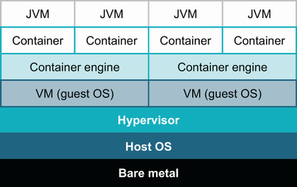

**Hình 12.1** Môi trường đích cho ứng dụng Java

Trong hình 12.1, hệ điều hành host là tầng trừu tượng dưới cùng. Hypervisor là tầng tiếp theo, theo sau là container engine, container, và ứng dụng Java. Có vẻ hơi quá đáng phải không? Trong các môi trường container thuần túy hơn, đúng vậy, nên trong vài năm qua, bạn sẽ thấy các máy host container chuyên dụng, thể hiện trong hình 12.2, loại bỏ tầng hypervisor và hệ điều hành khách.

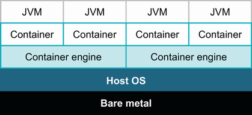

**Hình 12.2** Môi trường đích cho ứng dụng Java trên container engine chuyên dụng

Vậy tốt hơn nhiều! Dù vậy, hầu hết lập trình viên không chắc môi trường đích của họ trông thế nào. Điều rút ra ở đây là hãy chắc chắn kiểm tra với quản trị viên hệ thống để hiểu chính xác môi trường đích của bạn trông thế nào và bao nhiêu tài nguyên hữu hạn của bare metal đó đang được cấp phát ở mỗi tầng.

Bất chấp mọi phức tạp trong các tầng trừu tượng này, với tư cách lập trình viên Java, bạn sẽ chủ yếu tập trung vào container như một đích triển khai, và cách làm việc này có một số lợi ích quan trọng.

### 12.1.2 Lợi ích của container

Với mọi bộ phận chuyển động bổ sung cần để chạy container, vì sao chúng lại trở thành chuẩn mới cho triển khai? Một trong những lợi ích then chốt là khả năng của container trong việc áp đặt giới hạn, cô lập từng tiến trình đang chạy khỏi nhau. Trước đây, nếu bạn triển khai hai ứng dụng Java trên cùng một host, có xác suất cao chúng có thể can thiệp vào hiệu năng của nhau — chiếm quá nhiều thời gian CPU hoặc ngốn nhiều hơn phần bộ nhớ công bằng của chúng. Các biện pháp giảm nhẹ có tồn tại, nhưng những ý tưởng này được nướng vào các tầng nền tảng của container. Thực tế, việc có các giới hạn ta có thể tin cậy, trên thực tế, cho phép chúng ta dùng tài nguyên tính toán triệt để hơn, chạy nhiều phần mềm hơn trên một host so với cảm giác an toàn trước khi có container.

Sự cô lập này then chốt đến mức trong phần còn lại của chương chúng tôi sẽ minh họa quan hệ giữa container, host và tiến trình bằng cách hiển thị hình lồng nhau thay vì xếp chồng. Cả hai cách hình dung quan hệ đều hợp lệ, nên đừng ngạc nhiên khi thấy cả hai ngoài thực tế, tùy ngữ cảnh.

Container cũng mở ra một thế giới đóng gói nhất quán hơn cho việc triển khai. Cách bạn sao chép các bit của ứng dụng vào môi trường triển khai, cách bạn quản lý các phụ thuộc hệ điều hành, và thậm chí cách bạn quản lý việc khởi động tiến trình từng là chuyện ai muốn làm sao thì làm. Container cung cấp câu trả lời cho tất cả điều đó, khiến một đống công cụ khổng lồ và script tùy chỉnh trở nên không cần thiết. Chúng cũng cung cấp cách nhiệt giữa môi trường triển khai và nội dung container. Container engine của chúng ta không phải quan tâm cách ta bố trí phần bên trong container — nó chỉ cần biết cách tự khởi động khi được yêu cầu. Việc đóng gói container image là ví dụ then chốt của Infrastructure as a Service (IaaS), với một mô tả khai báo, được quản lý mã nguồn về các tầng trong hệ thống, vốn từng đòi hỏi việc dựng cẩn thận theo kiểu mệnh lệnh.

Một lợi ích cuối cùng xây dựng trên việc đóng gói nhất quán đó — hệ sinh thái đã phát triển quanh container. Ngày nay hầu như bất kỳ phần mềm đáng kể nào bạn muốn chạy đều đã được đóng gói trong container sẵn trên Docker Hub hoặc nơi khác. Các README dài dằng dặc về hướng dẫn cài đặt hay các script cài tùy chỉnh giờ không cần thiết nữa.

Nhưng không thể toàn ưu điểm được, đúng không? Nhược điểm của việc chạy trong container là gì?

### 12.1.3 Nhược điểm của container

Hóa ra điểm đầu tiên chúng ta liệt kê là lợi ích của container — sự cô lập tích hợp sẵn — lại thực sự là một trong những khó khăn khi dùng chúng. Công việc của container là giữ thế giới bên trong container tách khỏi thế giới bên ngoài, và thế giới bên ngoài đó bao gồm cả bạn, lập trình viên. Nhiều kỹ thuật và công cụ bạn thường dùng ngoài container có thể cần xử lý và cấu hình đặc biệt khi chuyển sang container.

Điều này đặc biệt đúng khi cố đưa container vào quy trình phát triển cục bộ của bạn. Build lâu hơn và thời gian bỏ ra để xáo trộn các image container khổng lồ có thể không phải lúc nào cũng đáng.

Và mặc dù container đưa vào một giao diện nhất quán cho cách chúng ta đóng gói và khởi động ứng dụng, việc triển khai thực tế không phải lúc nào cũng đơn giản. Ví dụ, một ứng dụng mong đợi truy cập đầy đủ vào đĩa trên host có thể cần cấu hình để làm các tệp cần thiết nhìn thấy được với container. Nếu một tập tiến trình giao tiếp với nhau, việc tách chúng thành các container sẽ cần cấu hình tường minh về cách chúng có thể truy cập nhau. Nắm bắt và áp dụng loại cấu hình này là một nhiệm vụ then chốt của các orchestrator như Kubernetes. Tuy nhiên, hãy lưu ý rằng Kubernetes, mà chúng ta sẽ khảo sát ngắn gọn trong chương này, là chủ đề đủ để lấp đầy nhiều cuốn sách, và hệ sinh thái tiếp tục phát triển nhanh chóng.

Mặc dù container đang trở nên hoàn toàn dòng chính, lập trình viên vững nền tảng biết cách khảo sát các đánh đổi để tìm sự cân bằng đúng cho hệ thống của mình. Hãy bắt đầu xem cách dùng các công cụ này, để chúng ta có cảm nhận về chỗ chúng khớp vào.

## 12.2 Nền tảng Docker

Mặc dù nhiều công nghệ cấu thành container đã tồn tại từ trước, Docker đã đưa vào công cụ và trừu tượng tiện lợi đưa việc container hóa vào dòng chính. Hãy xem hai mảnh chức năng trung tâm mà Docker cho chúng ta — build image và chạy container — và xem chúng ta tương tác với chúng thế nào với tư cách lập trình viên Java trong thực tế.

### 12.2.1 Build Docker image

Một container Docker được khởi chạy từ một *image*. Một image về cơ bản là một snapshot nắm bắt mọi phụ thuộc hệ thống tệp cần để chạy một phần mềm. Một image bao gồm các thư viện native, runtime ngôn ngữ, công cụ, và quan trọng nhất, một phiên bản cụ thể của phần mềm bạn cần chạy.

`Dockerfile` là định dạng điển hình để nắm bắt tập các bước để build một image. Image đơn giản nhất có thể, một image hoàn toàn rỗng, trông như sau:

```dockerfile
FROM scratch
```

Chúng ta build image dùng lệnh `docker build` như sau:

```
$ docker build .

[+] Building 0.1s (3/3) FINISHED
 => [internal] load build definition Dockerfile                      0.0s
 => => transferring dockerfile: 55B                                  0.0s
 => [internal] load .dockerignore                                    0.0s
 => => transferring context: 2B                                      0.0s
 => exporting to image                                               0.0s
 => writing image sha256:71de1148337f4d1845be0...                    0.0s   ❶

Use 'docker scan' to run Snyk tests against images to find vulnerabilities
and learn how to fix them
```

❶ ID sha256 `71de114...` định danh duy nhất image kết quả. Chúng ta sẽ thấy cách đặt cho nó một cái tên thân thiện hơn ngay sau đây.

Dĩ nhiên, một image rỗng không mấy hữu dụng. Trên thực tế, có nhiều base image với phần mềm hữu ích đã được cài sẵn. Nguồn mặc định của các base image này là Docker Hub (https://hub.docker.com/). Chúng ta sẽ nói thêm sau về việc chọn base image Java đúng, nhưng bây giờ, hãy bắt đầu build một image dựa trên phiên bản Eclipse Temurin của OpenJDK do Adoptium cung cấp. Chúng ta sẽ chọn cụ thể image `eclipse-temurin:11` như sau, chứa phiên bản Java 11 mới nhất:

```dockerfile
FROM eclipse-temurin:11
RUN java -version
```

Theo mặc định, các phiên bản Docker gần đây sẽ ẩn động đầu ra khi build trong terminal tương tác. Chúng ta sẽ dùng `--progress plain` ở đây để có bức tranh rõ hơn về những gì đang xảy ra:

```
$ docker build --progress plain .

=1 [internal] load build definition from Dockerfile                    ❶
=1 sha256:261a2389333859f063c39502b306e984de49700a9...
=1 transferring dockerfile: 36B done
=1 DONE 0.0s

=2 [internal] load .dockerignore
=2 sha256:909e36a5a9cd7cc4e95e7926f84f982542233925d...
=2 transferring context: 2B done
=2 DONE 0.0s

=3 [internal] load docker.io/library/eclipse-temurin:11                ❷
=3 sha256:6a73b62137bbf64760945abf21baf23bf909644cf...
=3 DONE 0.5s

=4 [1/2] FROM docker.io/library/eclipse-temurin:11...
=4 sha256:f225b618d7ad96bd25e0182d6e89aa8e77643f42f...
=4 CACHED

=5 [2/2] RUN java -version                                             ❸
=5 sha256:556476b43b8626a27892422f8688979c4ba1e6029...
=5 0.38 openjdk version "11.0.13" 2021-10-19
=5 0.38 OpenJDK Runtime Environment Temurin-11.0.13+8 (build 11.0.13+8)
=5 0.38 OpenJDK 64-Bit Server VM Temurin-11.0.13+8 (build 11.0.13+8)
=5 DONE 0.4s

=6 exporting to image
=6 sha256:e8c613e07b0b7ff33893b694f7759a10d42e180f2...
=6 exporting layers 0.0s done
=6 writing image sha256:9796a789e295989cec550f... done
=6 DONE 0.0s

Use 'docker scan' to run Snyk tests against images to find vulnerabilities
and learn how to fix them
```

❶ Các bước nội bộ Docker thực hiện khi chuẩn bị build image của chúng ta

❷ Lấy base image chúng ta yêu cầu

❸ Lệnh `RUN` của chúng ta được thực thi trong lúc build, và ta thấy đầu ra của nó.

Bạn có thể lưu ý rằng mã này mất nhiều thời gian hơn để chạy, ít nhất lần đầu, bởi Docker phải tải base image liên quan từ Docker Hub. Lệnh `RUN` chúng ta thêm vào đưa vào một bước mới của riêng ta lên trên base image đó. `RUN` có thể thực thi bất kỳ lệnh hợp lệ nào trong môi trường container. Nếu lệnh thay đổi hệ thống tệp, những thay đổi đó được ghi lại như một phần của image cuối cùng. Ví dụ này thực ra không thay đổi hệ thống tệp, nhưng `RUN` thường được dùng để tải tệp (ví dụ, qua `curl`), cài các gói hệ điều hành bằng trình quản lý gói tiêu chuẩn, hoặc thực hiện các sửa đổi cục bộ khác.

Chúng ta thấy một phần quan trọng khác của việc build Docker image nếu chạy lại cùng lệnh build mà không động vào `Dockerfile` như sau:

```
$ docker build --progress plain .

=1-4 bị loại bỏ cho ngắn...

=5 [2/2] RUN java -version
=5 sha256:556476b43b8626a27892422f8688979c4ba1e602907a09d62a39a2
=5 CACHED                                                              ❶

=6 exporting to image
=6 sha256:e8c613e07b0b7ff33893b694f7759a10d42e180f2b4dc349fb57dc
=6 exporting layers done
=6 writing image sha256:9796a789e295989cec5550fb3c17bc6c1d9c0867 done
=6 DONE 0.0s
```

❶ Docker thông báo cho chúng ta khi nó bỏ qua một bước vì kết quả đã được cache.

Mỗi lệnh dẫn đầu (như `FROM` và `RUN`) trong `Dockerfile` tạo ra cái gọi là một *layer* (tầng). Bởi những lệnh này thường tốn thời gian, các layer đó được cache, và Docker cố hết sức để tránh công việc không cần thiết.

Giờ khi container của chúng ta có môi trường Java, chúng ta có thể chạy mã của mình ở đó. Chúng ta sẽ tạo một tệp Java đơn giản bên cạnh `Dockerfile` trong `HelloDocker.java`. Để giữ mọi thứ dễ bắt đầu, chúng ta sẽ dùng thực thi tệp đơn của Java để chạy nó thay vì dựng một bản build đầy đủ. Mã cơ bản trông như sau:

```java
public class HelloDocker {
  public static void main(String[] args) {
    System.out.println("Hello Docker!");
  }
}
```

Chúng ta sau đó có thể chỉ dẫn bản build Docker đưa tệp này vào image và đặt lệnh mặc định cho các container chạy image này như sau:

```dockerfile
FROM eclipse-temurin:11
RUN java -version

COPY HelloDocker.java .                     ❶

CMD ["java", "HelloDocker.java"]            ❷
```

❶ Sao chép tệp của chúng ta vào thư mục làm việc hiện tại mà Docker đã đặt

❷ Đặt lệnh mặc định cho image. Lưu ý mỗi đối số dòng lệnh nằm trong chuỗi riêng của nó.

`COPY` (và lệnh `ADD` phức tạp hơn) lấy tệp từ môi trường build cục bộ và đặt chúng vào container. `ADD` đặc biệt có rất nhiều tùy chọn, kể cả lấy từ nguồn từ xa và tự giải nén tệp TAR, nhưng nói chung, bạn sẽ tốt hơn với một `COPY` đơn giản khi có thể.

`CMD` chỉ chúng ta tới giai đoạn tiếp theo trong vòng đời của image. Chúng ta không build những image này cho vui — chúng ta muốn chạy phần mềm mình đang cấu hình trong đó. Như đã đề cập, mỗi image có một danh tính SHA256 duy nhất, nhưng những cái đó cồng kềnh khi làm việc và thay đổi mỗi lần bạn build. Trước khi chạy image, hãy gắn thẻ (tag) cho image bằng một cái tên dễ hơn, như sau:

```
$ docker build -t hello .

... Các bước build trước bị loại bỏ cho ngắn

=8 exporting to image
=8 sha256:e8c613e07b0b7ff33893b694f7759a10d42e...
=8 exporting layers done
=8 writing image sha256:666fdc7613189865b9a5f2... done                  ❶
=8 naming to docker.io/library/hello done                               ❷
=8 DONE 0.0s
```

❶ Danh tính SHA256 của image

❷ Tag chúng ta đã áp cho image cuối cùng

Image `hello` của chúng ta chỉ khả dụng cục bộ ở điểm này, nhưng chúng ta đã thấy qua dòng `FROM` rằng image có thể được chia sẻ. Điều này được thực hiện qua cái gọi là *container registry*. Khi chúng ta yêu cầu base image `eclipse-temurin:11`, Docker mặc định tìm image đó trên Docker Hub (https://hub.docker.com/). Các container registry khác cũng tồn tại, và thực tế, chúng có thể chạy nội bộ để host các image ứng dụng của bạn.

Bạn có thể đẩy và kéo image lần lượt qua lệnh `docker push` và `docker pull`, như sau. Nếu làm việc với registry không mặc định, tên đó được đưa trước tên image và tag:

```
$ docker pull k8s.gcr.io/echoserver:1.4     ❶
1.4: Pulling from echoserver
6d9e6e7d968b: Pull complete
...
7abee76f69c0: Pull complete
Digest: sha256:5d99aa1120524c801bc8c1a7077e8f5ec122ba16b6dda1a...
Status: Image is up to date for k8s.gcr.io/echoserver:1.4
k8s.gcr.io/echoserver:1.4
```

❶ `k8s.gcr.io` là domain registry, `echoserver` là tên image, và `1.4` là tag.

Nếu registry yêu cầu xác thực, bạn có thể phải dùng `docker login` trước khi tiếp tục. Tuy nhiên, các image công khai trên Docker Hub không cần bước đó.

Còn nhiều điều nữa để build Docker image tốt, và chúng ta sẽ quay lại một số chủ đề đó sau. Nhưng trước tiên, hãy xem cách biến những image này thành các container đang chạy.

### 12.2.2 Chạy container Docker

Với mọi sự cường điệu và thảo luận bạn nghe quanh Docker và container, ý tưởng trung tâm đơn giản là có thể thực thi một tiến trình được định nghĩa rõ trong một môi trường được kiểm soát chặt. Môi trường phần lớn được định nghĩa bởi image mà chúng ta dựng. Docker cho phép chúng ta chạy một container bằng lệnh `docker run`, như sau:

```
$ docker run hello
Hello Docker!
```

Trong lệnh này, Docker tạo một hệ thống tệp mới dựa trên image của chúng ta, áp dụng các giới hạn và kiểm soát (chẳng hạn CPU và bộ nhớ), rồi khởi động tiến trình mặc định được `CMD` định nghĩa. Chương trình của chúng ta xuất một thông điệp rồi thoát, nhưng nó cũng có thể dễ dàng khởi động một server và tiếp tục chạy vô thời hạn.

Trong hình 12.3, chúng ta thấy tiến trình `java` mà ta liệt kê trong `CMD` cho image. Nhớ rằng host thể hiện ở đây thực tế có thể ẩn nhiều tầng bổ sung trước khi bạn đến máy bare metal.

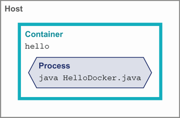

**Hình 12.3** Chạy một container cơ bản

`CMD` chỉ định nghĩa lệnh *mặc định* để khởi động container. Chúng ta có thể yêu cầu Docker chạy image với bất kỳ lệnh thay thế nào ta muốn. Chúng tôi đã đề cập ở trên rằng container có một thư mục làm việc, giống các terminal tương tác của bạn. Chúng ta có thể hỏi container đường dẫn đó là gì bằng lệnh `pwd` như sau:

```
$ docker run hello pwd
/
```

Như hình 12.4 cho thấy, khi chúng ta chạy một lệnh thay thế để khởi động container, tiến trình `CMD` mặc định không thấy đâu cả.

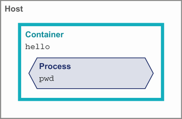

**Hình 12.4** Chạy một lệnh thay thế trong container

Chúng ta có thể ghi cấu hình vào image qua các tệp, nhưng thường mong muốn cho phép định nghĩa chúng tại runtime. Một trong những nguyên tắc từ Twelve-Factor App (https://12factor.net/), một tập ý tưởng có ảnh hưởng về việc chạy phần mềm như container, là định nghĩa cấu hình qua môi trường để cùng một tài nguyên đã build (trong trường hợp của chúng ta, image) có thể được triển khai tới các đích mới mà không đổi mã.

Như thể hiện trong đoạn mã sau, chúng ta có thể thay đổi biến môi trường trong container khi khởi động nó dùng flag `-e`, có thể được truyền nhiều lần. Trong mã ứng dụng, các biến này có thể được đọc bằng các cách tiêu chuẩn chẳng hạn phương thức `System.getenv()`:

```
$ docker run -e MY_VAR=here -e OTHER_VAR=there hello env       ❶
PATH=/opt/java/openjdk/bin:/usr/local/sbin:/usr/local/bin:...
HOSTNAME=f25762652561
MY_VAR=here                                                    ❷
OTHER_VAR=there                                                ❷
LANG=en_US.UTF-8
LANGUAGE=en_US:en
LC_ALL=en_US.UTF-8
JAVA_VERSION=jdk-11.0.13+8
JAVA_HOME=/opt/java/openjdk
HOME=/root
```

❶ Chạy lệnh `env` tiêu chuẩn để xem môi trường container của chúng ta

❷ Danh sách biến môi trường đầy đủ của chúng ta

Hãy thảo luận một kỹ thuật cuối cùng trước khi xem các cách tiếp cận thực tế hơn để build ứng dụng Java trong container: chạy một image một cách tương tác. Chúng ta đã thấy việc đổi lệnh mặc định để chạy trong container. Chúng ta có thể dùng chính khả năng đó để khởi động một shell chẳng hạn `bash` trong container để debug thêm. Điều này cần thêm flag cho `docker run` — cụ thể `-i`, để STDIN được gắn cho đầu vào của ta tới được container, và `-t`, để container khởi động một TTY tương tác cho chúng ta, như sau:

```
$ docker run -it hello bash
root@b770c2ac829c: ls *.java              ❶
HelloDocker.java
root@b770c2ac829c:
```

❶ Nhập lệnh shell một cách tương tác để kiểm tra container

Điều này cho phép chúng ta thấy thế giới đúng như các ứng dụng đã triển khai sẽ thấy trong container.

Việc sao chép một ứng dụng hello world tệp đơn vào container thì tốt rồi, nhưng giờ hãy xem các cách tiếp cận thực tế hơn để dùng Docker và Java cùng nhau.

## 12.3 Phát triển ứng dụng Java với Docker

Trong mục này, chúng ta sẽ giải quyết nhiều cân nhắc thực tiễn cho việc phát triển ứng dụng Java với Docker. Chúng ta sẽ bắt đầu bằng việc xem sâu hơn một chút các base image JVM và cách build image. Từ đó, chúng ta sẽ đào sâu vào nhiều cân nhắc về việc cấu hình, chạy và debug container. Container của chúng ta phải lấy JVM từ đâu đó, điều dẫn chúng ta tới chủ đề chọn base image.

### 12.3.1 Chọn base image

Không có câu trả lời duy nhất cho base image "đúng" để chạy ứng dụng JVM của bạn. Xác định image nào phù hợp với bạn cần cân nhắc những điều sau:

- Tôi muốn nhà cung cấp nào?
- Tôi muốn hệ điều hành nào bên trong container?
- Tôi cần chạy trên kiến trúc hệ thống nào?

Việc chọn nhà cung cấp cũng bao gồm một số yếu tố có thể ảnh hưởng tới lựa chọn của bạn (chúng ta đã thảo luận ngắn gọn ở chương 1), bao gồm:

- Tính khả dụng của hỗ trợ và hợp đồng
- Chính sách và độ kịp thời của cập nhật bảo mật
- Các cân nhắc đặc biệt cho triển khai cloud — Microsoft Build of OpenJDK cho Azure, Amazon Corretto cho AWS

Các bản build đặc thù nhà cung cấp cloud, dù dựa trên OpenJDK, có thể bao gồm các cải tiến hiệu năng và khác có lợi trong cloud của nhà cung cấp đó. Chúng cũng có thể có lợi ích bổ sung về hỗ trợ và tần suất phát hành.

Hầu hết nhà cung cấp cung cấp hỗ trợ trên nhiều hệ điều hành trong container của họ. Thường thấy Debian, Ubuntu, hay Alpine, cùng một số biến thể Linux khác. Việc chọn hệ điều hành phần lớn quyết định trình quản lý gói nào được dùng để cài các phụ thuộc native và công cụ bổ sung nào khả dụng trong container. Nếu yêu cầu của bạn không quyết định một hệ điều hành cụ thể, giữ ở các lựa chọn dòng chính hơn như Debian/Ubuntu thường tránh được khó khăn trong việc tìm và cập nhật gói.

> **NOTE** Đặc biệt cẩn thận với Alpine Linux. Cho tới rất gần đây, không có image chính thức cho Java trên Alpine. Bạn nên kiểm tra với nhà cung cấp Java của mình và chắc chắn rằng họ cung cấp image cho Alpine.

Nếu bạn cần chạy trên một hệ điều hành mà nhà cung cấp không trực tiếp giao, đừng tuyệt vọng. Trong những trường hợp này, bạn có thể tự build một image dùng trình quản lý gói điển hình của hệ thống để cài JDK thủ công. Hãy nhớ, base image và các bản build Docker chỉ là về việc đưa đúng các bit vào hệ thống tệp của container. Thường có nhiều hơn một cách để đạt được kết quả cuối cùng bạn muốn.

Một lưu ý cuối là về kiến trúc hệ thống cho image. Việc chạy trên chip dựa trên ARM ngày càng phổ biến, đặc biệt trong cloud. Mặc dù điều này có lợi thế về hiệu năng, hãy lưu ý rằng bạn sẽ cần các image được build riêng cho kiến trúc đó. Nếu bạn cần chạy trên nhiều kiến trúc, bạn có thể phải build và publish nhiều image, nhưng công cụ Docker đã hỗ trợ điều này tốt.

### 12.3.2 Build một image với Gradle

Như đã thấy ở chương 11, bất kỳ dự án Java cỡ lớn nào cũng hưởng lợi từ việc dùng một công cụ build nhất quán. Với mục đích minh họa, chúng ta sẽ đi qua cách dựng một image dựa trên bản build Gradle, nhưng một phiên bản Maven tương tự có trong tài nguyên.

Ở mức tối thiểu, image của chúng ta cần chứa mọi JAR (hoặc class file) của ứng dụng và mọi phụ thuộc cho classpath. Với ví dụ của chúng ta, ứng dụng phụ thuộc vào `org.apache.commons:commons-lang3`, như sau:

```kotlin
plugins {
  application
  java
}

application {
  mainClass.set("com.wellgrounded.Main")
}

tasks.jar {
  manifest {
    attributes("Main-Class" to application.mainClass)
  }
}

repositories {
  mavenCentral()
}

dependencies {
  implementation("org.apache.commons:commons-lang3:3.12.0")
}
```

Chúng ta cần một lệnh hơi khác so với `build` hay `assemble` thông thường, nhưng mặc định của Gradle có cái ta cần gói gọn qua `installDist`, như sau:

```
$ ./gradlew installDist
```

Kết quả build đơn giản hóa từ lệnh này như sau:

```
build
└── install
        └── docker-gradle
             ├── bin
             │   ├── docker-gradle
             │   └── docker-gradle.bat
             └── lib
                     ├── commons-lang3-3.12.0.jar
                     └── docker-gradle.jar
```

Chúng ta có thể chỉ lấy các tệp JAR và chạy từ chúng trong container, nhưng Gradle đã tạo một số script trợ giúp để khởi động ứng dụng. Hãy tận dụng chúng:

```dockerfile
FROM eclipse-temurin:17-jdk

RUN mkdir /opt/app                                   ❶
WORKDIR /opt/app/bin                                 ❷

COPY build/install/docker-gradle /opt/app/           ❸
CMD ["./docker-gradle"]                              ❹
```

❶ Đảm bảo thư mục tồn tại để chúng ta sao chép kết quả vào

❷ Script khởi động của Gradle mong đợi thư mục làm việc là `bin`, nên đặt cái đó làm vị trí mặc định để Docker khởi động.

❸ Sao chép toàn bộ cây kết quả cài đặt vào container

❹ Lệnh mặc định để chạy giờ là script khởi động từ Gradle.

Bạn có thể tìm hiểu thêm về start script của Gradle trong tài liệu cho plugin Application (xem http://mng.bz/yvxJ).

Cách tiếp cận này giả định rằng chúng ta có một JDK phù hợp cài cục bộ để build với Gradle trước khi sao chép kết quả vào image. Tiếp theo, chúng ta sẽ xem cách gói gọn toàn bộ việc đó trong Docker.

### 12.3.3 Chạy build trong Docker

Một lời hứa then chốt của container là khả năng tạo một môi trường cô lập, lặp lại được cho phần mềm chạy trong đó. Đây là lợi thế lớn cho việc triển khai dịch vụ, nhưng nó không dừng ở đó. Một vấn đề kinh điển với nhiều dự án là thiết lập môi trường cục bộ cho phát triển. Nếu bạn từng cày qua một README với bước này rồi bước khác cài đặt, đảm bảo bạn có đúng phiên bản của mọi thứ, bạn biết nỗi đau này. Container có thể giúp chúng ta thoát khỏi điều đó. Hãy khảo sát cách chúng ta thay đổi bản build để tận dụng sự cô lập đó.

`Dockerfile` của chúng ta cho tới nay chỉ liên quan tới một image kết quả duy nhất mà ta đang cố dựng. Nhưng Docker cho phép chúng ta định nghĩa nhiều image trong cùng tệp và, quan trọng nhất, sao chép giữa chúng. Với khả năng này, chúng ta có thể dựng một image để build ứng dụng — hoàn toàn tách khỏi bất kỳ JDK nào hệ thống cục bộ có — rồi sao chép kết quả vào image triển khai. Điều này có lợi thế cho cả bảo mật lẫn kích thước image.

Quá trình này được gọi là *multistage build*, và bạn thấy nó hoạt động khi một `Dockerfile` có nhiều câu lệnh `FROM`. Các dòng `FROM` chỉ là giai đoạn trung gian của bản build cũng bao gồm từ khóa `AS` để đặt tên chúng cho việc dùng sau này trong `Dockerfile`, trong khi image kết quả chính của chúng ta được để như trước, như sau:

```dockerfile
FROM eclipse-temurin:17-jdk AS build                       ❶

RUN mkdir /project                                         ❷
WORKDIR /project

COPY . .                                                   ❸

RUN ./gradlew clean installDist                            ❹

FROM eclipse-temurin:17-jre                                ❺

RUN mkdir /opt/app

COPY --from=build \                                        ❻
      /project/build/install/docker-gradle-multi \
      /opt/app/

WORKDIR /opt/app/bin
CMD ["./docker-gradle-multi"]
```

❶ Container của chúng ta để chạy việc biên dịch, tên là `build`

❷ Tạo một vị trí cho mã nguồn và đặt nó làm thư mục làm việc mặc định

❸ Sao chép toàn bộ dự án vào container

❹ Build ứng dụng (trong trường hợp này là phiên bản Gradle) như trước, cục bộ

❺ Image triển khai của chúng ta giờ chỉ cần dùng JRE, nhỏ hơn nhiều.

❻ `COPY --from=build` lấy tệp từ image build của chúng ta thay vì hệ thống tệp cục bộ.

Giờ môi trường tích hợp liên tục của chúng ta chỉ cần Docker, không cần JDK được cài, để có thể build ứng dụng cho triển khai. Như hình 12.5 cho thấy, mọi thành phần cần thiết cho bản build vẫn hoàn toàn nằm trong các container.

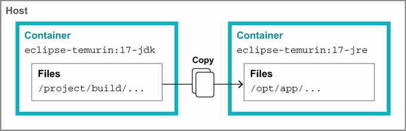

**Hình 12.5** Multistage build trong Docker

Đáng nêu ra rằng đây là gần với thiết lập tối thiểu cho loại build này, nhưng nó có một số nhược điểm quanh thời gian build. Như đã đề cập, mỗi lệnh Docker tạo một layer được cache, nhưng các cache đó có thể bị vô hiệu không cần thiết nếu chúng ta không cẩn thận.

Một nguồn phá cache như vậy trong `Dockerfile` hiện tại là chỗ chúng ta sao chép toàn bộ thư mục dự án vào container. Bất kỳ thay đổi tệp nào, dù nhỏ đến đâu, sẽ vô hiệu dòng `COPY . .`, và chúng ta phải chạy lại mọi thứ sau đó từ đầu. Tuy nhiên, có thể một số tệp cục bộ không quan trọng với bản build — chẳng hạn, lịch sử git, tệp IDE, và đầu ra build cục bộ thực sự không cần vào image build container. May mắn thay, chúng ta có thể loại trừ các tệp đó khỏi sự cân nhắc của Docker bằng cách đặt một tệp `.dockerignore` cạnh `Dockerfile`. Định dạng đơn giản và có thể quen thuộc nếu bạn từng làm với tệp `.gitignore`. Như đoạn mã sau cho thấy, mỗi dòng diễn đạt một mẫu (cho phép wildcard shell tiêu chuẩn) mà Docker nên bỏ qua khi tìm tệp để sao chép:

```
.git
.idea/
*.iml
*.class

# Bỏ qua các thư mục build
out/
build/
target/
.gradle/
```

Một vấn đề tinh tế hơn thứ hai là với Gradle wrapper. Nếu chúng ta xem đầu ra khi chạy bản build, ta sẽ thấy nó dành một lúc lúc khởi động để tải bản phân phối đúng. Bởi các container của chúng ta khởi động mà không có bất kỳ cache cục bộ nào của Gradle, việc tải này lặp lại mỗi lần ta chạy.

Tránh sự lặp lại này cần tách một lần thực thi Gradle đầu tiên thành một tập layer riêng diễn ra trước khi sao chép toàn bộ dự án vào container, như sau. Chúng ta muốn chỉ sao chép tối thiểu cần cho Gradle chạy việc tải của nó, nên cache của layer này chỉ hỏng nếu chúng ta thay đổi Gradle wrapper (ví dụ, cập nhật phiên bản):

```dockerfile
COPY ./gradle ./gradle                       ❶
COPY ./gradlew* ./settings.gradle* .         ❶
RUN ./gradlew                                ❷

COPY . .                                     ❸

RUN ./gradlew clean installDist
```

❶ Sao chép vừa đủ cấu hình Gradle để chạy

❷ Chạy `./gradlew` một mình buộc việc tải bản phân phối, giờ được cache trong layer riêng.

❸ Bản build của chúng ta tiếp tục như trước, với `COPY` có khả năng được làm mới mỗi lần (giả sử mã của ta thay đổi).

Đây mới chỉ là khởi đầu của các loại tối ưu có thể áp dụng trong việc dựng container image của bạn. Điều then chốt cần rút ra là cân nhắc cẩn thận cái gì thuộc về mỗi layer. Nếu các phần của hệ thống bạn sẽ thay đổi ở tốc độ khác nhau, cho chúng các layer riêng có thể có lợi.

Chúng tôi đã trình bày một cách tiếp cận khá thô để build Docker image. Như bạn có thể mong đợi, có vô số plugin cho cả Maven lẫn Gradle nếu bạn muốn gói gọn chức năng này và không tự viết `Dockerfile`. Thậm chí có các lựa chọn như Jib (https://github.com/GoogleContainerTools/jib), tránh dùng công cụ Docker hoàn toàn. Tất cả những cái này đều hữu ích, nhưng lập trình viên vững nền tảng được hỗ trợ bởi việc hiểu sâu hơn cách container được build, ngay cả khi họ được giúp đỡ hàng ngày.

### 12.3.4 Port và host

Cùng với việc cung cấp cho ứng dụng một hệ thống tệp cô lập riêng, container cũng làm điều tương tự cho mạng. Với ứng dụng mẫu, hãy tưởng tượng chúng ta thêm mã để chạy một HTTP server tiêu chuẩn, ví dụ, cái cơ bản cung cấp trong JDK tại `com.sun.net.httpserver.HttpServer`. Nếu chúng ta `docker run` container, ta sẽ thấy không có cách nào gọi endpoint HTTP đó.

Để giải quyết điều này, chúng ta cần yêu cầu Docker làm một port khả dụng cho ta. Chúng ta có thể làm điều này trực tiếp bằng cách thêm vào lệnh run như sau:

```
$ docker run -p 8080:8080 hello
```

`-p` nhận một cặp port phân tách bởi dấu `:`. Giá trị đầu tiên là port chúng ta muốn khả dụng bên ngoài container. Giá trị thứ hai là port mà phần mềm bên trong container đang lắng nghe. Nếu chúng ta sang một terminal khác (hoặc trình duyệt web) ta thấy nó hoạt động, như sau và trong hình 12.6:

```
$ curl http://localhost:8080/hello
Hello from HttpServer
```

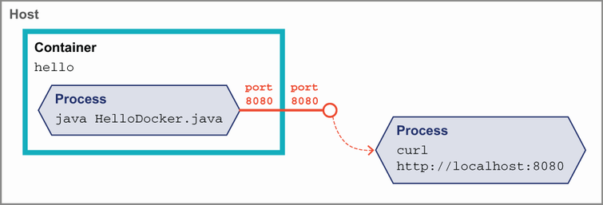

**Hình 12.6** Phơi bày một port trong Docker

Như bạn có thể mong đợi từ định dạng và hình 12.6, hai giá trị port này không phải khớp nhau. Nếu chúng ta chạy với dòng lệnh này:

```
$ docker run -p 9000:8080 hello           ❶
```

❶ Port 9000 sẽ nhìn thấy được bên ngoài container, kết nối tới port 8080 trên tiến trình bên trong container.

chúng ta sẽ thấy phản hồi tốt trên port 9000, trong khi 8080 không còn truy cập được, như sau:

```
$ curl http://localhost:9000/hello
Hello from HttpServer

$ curl http://localhost:8080/hello
curl: (7) Failed to connect to localhost port 8080: Connection refused
```

Việc phơi bày port là phần nền tảng trong cách container được triển khai đến mức `Dockerfile` cho phép chúng ta ghi chú các port mà image được kỳ vọng cung cấp, như sau:

```dockerfile
EXPOSE 8080
```

Nếu chúng ta đặt cái này, `docker build` lại, và chạy mà không có switch port, bạn có thể ngạc nhiên khi thấy Docker không mặc định làm các port `EXPOSE` khả dụng. Tuy nhiên, nếu bạn cung cấp switch `-P` một mình (lưu ý chữ hoa và không có đối số), Docker sẽ ràng buộc mỗi port `EXPOSE` trong image của ta với một port ngẫu nhiên, hay *ephemeral*. Bởi chúng ta không thể đoán port nào được gán, ta cần một lệnh mới để xem và tìm port ephemeral. Việc này được làm với `docker ps` như sau:

```
$ docker run -P hello

... Ở terminal khác, một số cột bị cắt...
$ docker ps
CONTAINER ID    IMAGE    COMMAND              PORTS
94d7f125caad    hello    "./docker-gradle"    0.0.0.0:55031->8080/tcp
```

Giá trị `0.0.0.0:55031->8080/tcp` cho chúng ta biết port 55031 bên ngoài container được ràng buộc với port 8080 bên trong.

Chuyện port ephemeral này thoạt nhìn có vẻ phiền toái, đặc biệt khi kiểm thử, bởi port cứ thay đổi. Nhưng nó thực sự là tính năng tối quan trọng khi chạy container trong production. Hãy tưởng tượng bạn có một host mà bạn muốn dùng hết công suất để chạy nhiều container Java khác nhau. Mỗi ứng dụng đó có thể muốn chạy dùng cùng một port, nhưng host chỉ có thể gán port đó một lần. Mặc dù nó đòi hỏi phối hợp bổ sung ở các phần khác của hệ thống, việc gán port ephemeral cho phép các container giữ góc nhìn đơn giản hơn về thế giới — "Tôi chạy trên 8080" — trong khi vẫn cùng tồn tại trong một môi trường rộng hơn, phức tạp hơn.

Điều đó giúp chúng ta sẵn sàng nói chuyện với ứng dụng khi chạy nó trong container cục bộ. Nhưng còn hướng ngược lại — khi container của chúng ta cần vươn ra tới một dịch vụ khác như cơ sở dữ liệu?

Khi chạy trong production, thực hành tốt là cấu hình tường minh vị trí các dịch vụ và dùng load balancing và DNS bình thường để tới chúng. Những cái này có thể được tiêm vào container qua biến môi trường hoặc các hệ thống service discovery khác, nhưng điều then chốt là bạn không giả định tài nguyên nằm ở đâu so với container của mình.

Nhưng điều này khó hơn nhiều khi làm việc cục bộ, bởi thiết lập lập trình viên bình thường sẽ không có cùng loại hạ tầng đó. Nếu bạn dùng Docker for Mac hoặc Docker for Windows, bạn có thể dùng tên `host.docker.internal` bên trong container, tự động trỏ tới máy host của bạn. Docker for Linux có thể đặt cùng thứ đó khi khởi động container với flag `--add-host host.docker.internal:host-gateway`. Trong những trường hợp này, nếu ứng dụng của bạn được thiết lập để nhận vị trí như vậy qua biến môi trường, bạn có thể trỏ container tới hostname đó.

Nếu cái này không hoạt động cho môi trường của bạn, một địa chỉ IP cho host tồn tại bên trong container. Các lệnh như `sudo ip addr show` có thể cho bạn gợi ý về vị trí, nhưng cách này nhanh chóng trở nên tẻ nhạt.

Container có rất nhiều tùy chọn mạng nằm ngoài phạm vi cuốn sách này, nhưng một số trong đó có thể giúp chúng ta với chính vấn đề này được dùng bởi một công cụ gọi là Docker Compose. Hãy xem container có thể giúp chúng ta giải quyết vấn đề truy cập tài nguyên bên ngoài ở cục bộ như thế nào.

### 12.3.5 Phát triển cục bộ với Docker Compose

Cũng như danh sách cài đặt đáng sợ cho một dự án mới, thường ứng dụng cũng cần nhiều dịch vụ khác tại runtime. Có lẽ bạn có một cơ sở dữ liệu, một cache, một kho NoSQL, hoặc thậm chí các ứng dụng tùy chỉnh khác, tất cả phải chạy để ứng dụng của bạn hoạt động cục bộ.

Docker Compose là công cụ để khai báo và chạy các tập container. Nó cho phép chúng ta nắm bắt chính xác tập dịch vụ và khởi động chúng cùng nhau. Nó cũng quản lý việc lưu trạng thái cho các container này để ta có thể dừng và khởi động lại mà không phải làm mọi thứ từ đầu.

Nếu điều này nghe giống các công cụ orchestration như Kubernetes, bạn không sai. Có sự chồng lấn trong các khía cạnh quản lý container của cả hai công cụ. Tuy nhiên, Docker Compose nhắm tới chạy trên một máy đơn, loại nó khỏi lựa chọn hợp lý cho nhiều môi trường production.

> **NOTE** Docker Compose ban đầu là công cụ riêng, nhưng nó đã được tích hợp như một lệnh khác trong chính `docker`. Nếu bạn thấy thông tin trên internet gợi ý chạy `docker-compose`, ngày nay bạn chỉ cần thay `-` bằng dấu cách.

Theo mặc định chúng ta mô tả cấu hình trong một tệp gọi là `docker-compose.yml`. Để bắt đầu, hãy nói cho Docker Compose biết về ứng dụng của chúng ta như sau:

```yaml
version: "3.9"        ❶
services:
   app:               ❷
     build: .         ❸
        ports:
          - "8080:8080"    ❹
```

❶ Phiên bản tệp Docker Compose

❷ Khai báo một dịch vụ để chạy tên là `app`

❸ Chỉ dẫn Docker Compose chạy một `docker build` điển hình trong thư mục hiện tại để sinh image cho dịch vụ này

❹ Khai báo port, giống như trên `docker run` thủ công của chúng ta trước đó

Chúng ta chạy cái này ở dòng lệnh với `docker compose up`. Lệnh này sẽ hiển thị đầu ra build quen thuộc khi khởi động, rồi một số đầu ra mới khi nó khởi động container của chúng ta, như sau:

```
[+] Running 2/2
 - Network docker-gradle_default        Created                0.1s
 - Container docker-gradle-app-1        Created                0.1s
Attaching to docker-gradle-app-1
docker-gradle-app-1 | (Howdy,Docker)
```

`docker-compose.yml` của chúng ta có thể chứa nhiều dịch vụ, như ta sẽ thấy ngay sau đây. Đầu ra từ mỗi cái được thêm tiền tố một tên để phân biệt chúng, theo mặc định dựa trên thư mục hiện tại và tên dịch vụ, nên của chúng ta là `docker-gradle-app-1`.

Giả sử ứng dụng của chúng ta cần một instance Redis. Chúng ta thêm nó như một key mới gọi là `redis` dưới key `services` như sau:

```yaml
version: "3.9"
services:
  app:
     build: .
     ports:
      - "8080:8080"
  redis:
     image: "redis:alpine"          ❶
```

❶ Image `redis:alpine` từ Docker Hub

Giờ khi chạy, Docker Compose sẽ kéo image `redis:alpine` và khởi động nó cùng container ứng dụng của chúng ta. Hình 12.7 và đoạn mã tiếp theo minh họa các container này chạy trong quan hệ với nhau:

```
[+] Running 7/7
 - redis Pulled                                          5.0s
    - 59bf1c3509f3 Pull complete                         1.2s
    - 719adce26c52 Pull complete                         1.2s
[+] Running 2/2
 - Container docker-gradle-redis-1        Created        0.2s
 - Container docker-gradle-app-1          Created        0.0s
Attaching to docker-gradle-app-1, docker-gradle-redis-1
docker-gradle-redis-1  | # oO0Oo Redis is starting...          ❶
docker-gradle-redis-1  | # Redis version=6.2.6, ...            ❶
docker-gradle-redis-1  | * monotonic clock: POSIX ...          ❶
docker-gradle-redis-1  | # Warning: no config file...          ❶
docker-gradle-redis-1  | * Running mode=standalone, ...        ❶
docker-gradle-redis-1  | # Server initialized                  ❶
docker-gradle-redis-1  | * Ready to accept connections         ❶
docker-gradle-app-1    | (Howdy,Docker)                        ❷
```

❶ Đầu ra container Redis

❷ Đầu ra container ứng dụng của chúng ta

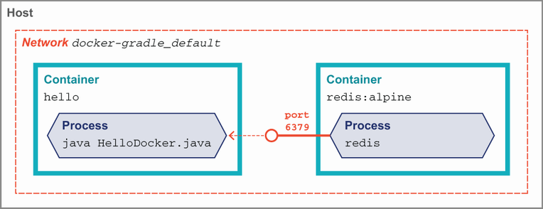

**Hình 12.7** Các container Docker Compose đang chạy

Điều này đã tiện lợi rồi — chúng ta có thể có phiên bản chính xác của cơ sở dữ liệu và các dịch vụ bên ngoài khác cục bộ mà không cần cài thủ công. Nhưng Docker Compose mang lại một tính năng hữu ích khác để tránh nhiều vật lộn về mạng mà ta đã thấy trước đó. Trong lúc khởi động ban đầu, có một thông điệp đọc là `Network docker-gradle_default Created`. Nó cho chúng ta biết Docker Compose đã tạo một namespace mạng mới, riêng biệt `docker-gradle_default`. Mạng này được chia sẻ giữa mọi dịch vụ mà Docker Compose đã khởi động cho chúng ta. Tốt hơn nữa, mỗi tên dịch vụ ta viết ra trong `docker-compose.yml` — `app` và `redis` — xuất hiện như một hostname thật bên trong mọi container.

Nếu chúng ta đã thiết kế ứng dụng theo nguyên tắc Twelve-factor và truyền vị trí Redis qua biến môi trường, ta có thể cấu hình điều này hoàn toàn trong `docker-compose.yml`, như sau:

```yaml
version: "3.9"
services:
  app:
       build: .
       ports:
         - "8080:8080"
       environment:
        REDIS_URL: redis://redis:6379        ❶
    redis:
       image: "redis:alpine"
```

❶ `redis` đầu tiên là scheme URL, và `redis` thứ hai là hostname.

Đây mới chỉ chạm bề mặt của Docker Compose. Mọi tùy chọn phổ biến để kiểm soát `docker run` đều có thể đặt trong `docker-compose.yml`, và đó là cách tuyệt vời để làm mượt việc bắt đầu phát triển cục bộ.

### 12.3.6 Debug trong Docker

Khi phần mềm của chúng ta không hành xử đúng, đôi khi ta cần nhìn vào bên trong các ranh giới mà container thiết lập. Ở trên chúng ta đã gặp `docker ps` để xác định port mà container phơi bày. Tuy nhiên, `docker ps` cung cấp cho chúng ta nhiều thông tin hơn thế. Cụ thể, theo mặc định, một container được cho một cái tên tiện lợi, sinh ngẫu nhiên, mà nó có thể được tham chiếu bằng, như sau:

```
$ docker ps
CONTAINER ID    IMAGE     COMMAND            ...  PORTS      NAMES
c103de6e6634    hello     "./docker-gradle"  ...  8080/tcp   vigilant_austin
```

Container này có thể được tham chiếu là `vigilant_austin`. Nếu bạn muốn tránh việc tên thay đổi mỗi lần container chạy, bạn có thể kiểm soát điều này với tham số `--name container-name` trên `docker run`. Bạn sẽ muốn kết hợp cái đó với `--rm` để loại bỏ container khi nó thoát; nếu không, tên sẽ không khả dụng để tái sử dụng lần thứ hai bạn chạy.

Việc có tên container cho phép chúng ta thực hiện các bước debug khác. Với `docker exec`, chúng ta có thể thực thi lệnh trong container đang chạy. Như đã thấy với `docker run -it` trước đó, chúng ta thậm chí có thể có một shell tương tác bên trong container, như sau, giả sử nó có `bash` hoặc thứ tương tự được cài:

```
$ docker run --name hello-container --rm hello

# Ở terminal khác khởi động một shell trong container
$ docker exec -it hello-container bash

root@18a5f04bb4c8: ps aux
USER PID %CPU %MEM COMMAND
root   1 1.6 1.9 /opt/java/openjdk/bin/java -cp /opt/app/lib/docker-g
root    37   0.1   0.1 bash
root    47   0.0   0.1 ps aux
```

Quan trọng cần nhớ rằng `exec` không khởi động một container mới — nó gắn vào một container đang tồn tại. Hình 12.8 cho thấy các tiến trình cùng tồn tại trong một container duy nhất.

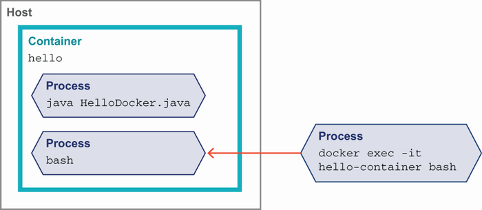

**Hình 12.8** `docker exec` vào một container

Tuy nhiên, chúng ta không bị giới hạn chỉ ở các lệnh Unix cơ bản. Chẳng hạn, chúng ta có thể dùng `jps` và `jcmd` để kiểm tra các JVM đang chạy trong container như sau:

```
root@18a5f04bb4c8: jps
1 Main
148 Jps

root@18a5f04bb4c8: jcmd 1 VM.version
1:
OpenJDK 64-Bit Server VM version 17.0.1+12
JDK 17.0.1
```

Ở chương 7, chúng ta đã khám phá khả năng nhìn sâu mà công cụ JFR (JDK Flight Recorder) cho phép. Với một shell vào container đang chạy, chúng ta có thể thu thập dữ liệu JFR với vài lệnh đơn giản. Nếu nó chưa chạy, chúng ta bảo JFR bắt đầu ghi như sau:

```
root@4f146639fcfc: jcmd 1 JFR.start
1:
Started recording 1. No limit specified, using maxsize=250MB as default
```

Sau khi để ứng dụng thu thập dữ liệu một lúc, chúng ta lưu bản ghi hiện tại vào một tệp trong container như sau:

```
root@4f146639fcfc: jcmd 1 JFR.dump name=1 filename=./capture.jfr
1:
Dumped recording "1", 293.3 kB written to:
```

Để kiểm tra tệp offline, chúng ta cần sao chép nó ra khỏi container. Trở lại hệ thống host, chúng ta có thể làm điều này với lệnh `docker cp`, như trong đoạn mã tiếp theo. Một lần nữa, tên container của chúng ta hữu ích để chỉ định nơi lấy tệp từ đó:

```
$ docker cp hello-container:/opt/app/bin/capture.jfr .      ❶
```

❶ Tham số đầu tiên cho `cp` là nguồn tệp, và cái thứ hai là đích. Nó được chỉ định với định dạng `container-name:path`. Tham số thứ hai là cục bộ, nên chúng ta không cần tên container và chỉ dùng đường dẫn.

`capture.jfr` giờ khả dụng trên hệ thống cục bộ của bạn để mở qua JDK Mission Control (JMC).

Bởi Docker phơi bày một API, các lệnh `docker` của bạn có thể được trỏ tới một host từ xa thay vì môi trường cục bộ. Xem tài liệu Docker tại https://docs.docker.com/ để biết chi tiết cách cấu hình điều đó.

Mọi shell và tùy chọn dòng lệnh này tốt cho việc tiếp cận mức thấp những gì đang xảy ra trong container. Nhưng nếu chúng ta chỉ muốn một breakpoint trong IDE cho ứng dụng Java trong một container cục bộ? May mắn thay, các tiện ích debug từ xa của JDK có mọi mảnh ghép chúng ta cần để cấu hình điều này, như sau:

```
docker run --rm \
  -p 8090:8090 \
     -e JAVA_TOOL_OPTIONS=\
     '-agentlib:jdwp=transport=dt_socket,server=y,suspend=n,address=*:8090' \
     --name hello-container \
     hello
```

Bên cạnh đầu ra bình thường khi ứng dụng khởi động, bạn sẽ thấy một thông điệp như sau chỉ ra port debug từ xa khả dụng:

```
Listening for transport dt_socket at address: 8090
```

Từ đây bạn có thể dùng tính năng IDE để debug một Remote JVM, trỏ tới port 8090. Mọi thứ sẽ hành xử giống như debug ứng dụng trên môi trường cục bộ, nhưng tất cả từ thế giới ấm cúng, có ranh giới của container.

### 12.3.7 Logging với Docker

Như đã thấy nhiều lần, sự tách biệt mà container đưa vào khỏi môi trường host đòi hỏi thay đổi tư duy. Một hòn đá vấp phổ biến là logging. Dù bạn dùng một trong các framework logging phổ biến hay chỉ đơn giản ghi ra `System.out`, thường một dịch vụ tạo ra đầu ra khi chạy. Chúng ta không muốn mất truy cập tới thông tin này chỉ vì đã chuyển vào container.

Bạn có thể áp dụng cách tiếp cận thủ công với các kỹ thuật ta đã thấy trong chương này. Chỉ cần ghi log ra đĩa như trước. Khi bạn cần kiểm tra chúng, bạn có thể dùng `docker exec` hoặc `docker cp` để truy cập tệp như sau:

```
// Khởi động container
$ docker run --rm --name hello-container hello

// Ở shell khác, sao chép tệp về cục bộ
// Giả sử log ở /log/application.log
$ docker cp hello-container:/log/application.log .

// Hoặc thay vào đó, tail tệp liên tục
$ docker exec hello-container tail -f /log/application.log
```

Tuy nhiên, điều này đưa vào một chút ma sát trong việc lấy thông tin — và tiềm năng mất dữ liệu nếu container bị loại bỏ hoàn toàn sớm.

Một thực hành phổ biến — có hay không có container — là chuyển tiếp log từ ứng dụng tới một vị trí trung tâm. Đích của việc chuyển tiếp này có thể chỉ là kho lưu trữ tập trung, một dịch vụ lập chỉ mục chẳng hạn Elasticsearch, hoặc thậm chí một nhà cung cấp logging hoàn toàn bên ngoài.

Tuy nhiên, nếu chúng ta cố giữ thực hành đơn giản là ghi ra tệp cục bộ trong container, chúng ta phải trả lời câu hỏi ứng dụng chuyển tiếp log chạy ở đâu. Đặt nó trong container tiêu thụ thêm bộ nhớ và tài nguyên mà ta cần tính đến, và nói chung khuyến nghị tránh có nhiều thứ trong một container duy nhất. Container cho phép mount một volume để tệp log có thể được chia sẻ giữa container và host, nhưng điều này cần cấu hình và không phải lúc nào cũng hiệu năng tốt.

Một lựa chọn tốt hơn là dựa vào việc Docker nắm bắt bất cứ thứ gì container ghi ra các luồng đầu ra điển hình, STDOUT và STDERR. Trên host, các luồng này được lưu vào các vị trí tệp nổi tiếng cho mọi container đang chạy. Điều này đơn giản hóa cấu hình bởi chúng ta có thể cài chuyển tiếp log một lần trên host và chỉ cần bảo các container riêng lẻ ghi ra STDOUT thay vì tệp. Nó cũng tương thích với các thư viện logging hiện có chẳng hạn `log4j2`, vốn có appender để ghi ra CONSOLE đúng cho mục đích này.

Loại thiết lập hạ tầng này quanh cách chạy container và nắm bắt log của chúng là một ví dụ về các vấn đề đi kèm việc mở rộng container vượt ra ngoài một host duy nhất. Cung cấp một cách hệ thống để giải quyết những câu hỏi như vậy là một trong những lợi ích then chốt của chủ đề tiếp theo: Kubernetes.

## 12.4 Kubernetes

Phần giới thiệu Docker này thực sự chỉ chạm bề mặt của việc cấu hình và tùy chỉnh container. Trong môi trường production thực, bạn có thể cần nhiều instance của container. Quản lý các đội quân container lớn chỉ bằng lệnh `docker` nhanh chóng vượt tầm kiểm soát, và không hiếm khi một môi trường production có hàng trăm container riêng biệt. Bạn cần tự động hóa các tác vụ này. Thuật ngữ chung cho việc tự động hóa như vậy là *orchestrator*, và mặc dù có nhiều lựa chọn trong lĩnh vực này, Kubernetes là giải pháp thống trị.

Kubernetes (thường gọi là K8s) là dự án mã nguồn mở ban đầu dẫn xuất từ công trình nội bộ của Google về điều phối container. Về cốt lõi, nó cung cấp các công cụ tiêu chuẩn, hướng API để mô tả trạng thái mong muốn cho một hệ thống và rồi đảm bảo trạng thái đó được duy trì theo thời gian.

Kubernetes mô hình hóa hệ thống của bạn như một tập các đối tượng thuộc các loại khác nhau. Một tập *controller* chạy liên tục, theo dõi trạng thái thực tế của hệ thống và áp dụng thay đổi (chẳng hạn tạo container mới nếu cái cũ chết) để trạng thái mong muốn và thực tế của hệ thống khớp nhau.

Một xử lý đầy đủ về Kubernetes vượt xa phạm vi cuốn sách này, nhưng để nếm thử cách nó hoạt động, hãy xem các loại đối tượng cơ bản nhất và cách chúng ta dùng chúng với các kỹ năng container đã có.

- **Cluster** — Một bản cài đặt Kubernetes duy nhất trên bất cứ thứ gì từ một máy đơn tới hàng trăm node
- **Node** — Một máy đơn (ảo hoặc vật lý) trong cluster
- **Pod** — Một đơn vị triển khai được gồm một (hoặc nhiều) container
- **Deployment** — Cách khai báo để triển khai một pod
- **Service** — Một đối tượng phơi bày các container trong cluster cho người gọi

Để đi qua các ý tưởng này và minh họa, chúng ta sẽ dùng `minikube`, một môi trường phát triển cục bộ từ chính dự án Kubernetes. Xem hướng dẫn liên kết để có hướng dẫn cài đặt hiện tại trên hệ điều hành của bạn (https://minikube.sigs.k8s.io/docs/start/).

Khi đã cài, chúng ta có thể khởi động một cluster cục bộ với lệnh `minikube start`, như sau. Lưu ý điều này có thể mất vài phút lần đầu để tải mọi image cần thiết:

```
$ minikube start

  minikube v1.25.2 on Darwin 11.6.2
   Using the docker driver based on existing profile
   Starting control plane node minikube in cluster minikube
   Pulling base image ...
   Downloading Kubernetes v1.23.1 preload ...
   > preloaded-images-k8s-v17-v1...: 504.44 MiB / 504.44 MiB   100.00%
   Restarting existing docker container for "minikube" ...
   Preparing Kubernetes v1.23.1 on Docker 20.10.12 ...
   * kubelet.housekeeping-interval=5m
   Verifying Kubernetes components...
   * Using image kubernetesui/dashboard:v2.3.1
   * Using image kubernetesui/metrics-scraper:v1.0.7
   * Using image gcr.io/k8s-minikube/storage-provisioner:v5
   Enabled addons: storage-provisioner, default-storageclass, dashboard

   Done! kubectl is now configured to use "minikube" cluster and "default"
   namespace by default
```

Cluster Kubernetes của chúng ta giờ đang chạy cục bộ. Chúng ta có thể dừng cluster với lệnh `minikube stop` hoặc, nếu đã hoàn toàn xong thử nghiệm, xóa nó với `minikube delete`.

Mặc dù Kubernetes cung cấp REST API để các hệ thống tương tác, có một wrapper tiện lợi phù hợp hơn cho con người tiêu thụ qua lệnh `kubectl`. Chúng ta có thể dùng cái này để xem, tạo và sửa các đối tượng trong cluster. Chẳng hạn, `minikube` lo việc tạo đối tượng node cho chúng ta theo mặc định, nhưng ta có thể `kubectl describe node` để xem nó đã thiết lập gì thay mặt ta. Danh sách này chỉ nêu bật vài phần của đầu ra bởi nó cung cấp rất nhiều chi tiết:

```
$ kubectl describe node

Name:                 minikube
Roles:                control-plane,master
Labels:               kubernetes.io/arch=amd64
                      kubernetes.io/hostname=minikube
                      kubernetes.io/os=linux
Addresses:
   InternalIP:   192.168.49.2
   Hostname:     minikube

Non-terminated Pods:   (12 in total)                        ❶
   Namespace           Name
   ---------           ----
   kube-system         coredns-64897985d-n8fzv
   kube-system         etcd-minikube
   kube-system         kube-apiserver-minikube
   kube-system         kube-controller-manager-minikube
   kube-system         kube-proxy-4zvll
   kube-system         kube-scheduler-minikube
   kube-system         storage-provisioner
   kubernetes-dashboard dashboard-metrics-scraper-58549894f-bcjh4
   kubernetes-dashboard kubernetes-dashboard-ccd587f44-mq8zv

Events:                                                     ❷
  Type    Reason                    Message
  ----    ------                    -------
  Normal Starting                Starting kubelet.
  Normal NodeHasSufficientMemory Node status is: NodeHasSufficientMemory
  Normal NodeHasNoDiskPressure   Node status is: NodeHasNoDiskPressure
  Normal NodeHasSufficientPID    Node status is: NodeHasSufficientPID
```

❶ Bản thân Kubernetes chạy trong các pod trên node, liệt kê ở đây.

❷ Event có thể hữu ích khi debug nếu vấn đề bất ngờ xảy ra trong một node.

Với `minikube` cung cấp cluster và node, chúng ta sẵn sàng chạy một số phần mềm. Để giữ mọi thứ đơn giản, chúng ta sẽ dùng image `k8s.gcr.io/echoserver:1.4`, như tên gợi ý chỉ vọng lại thông tin về các request HTTP gửi tới nó.

> **NOTE** `minikube` hỗ trợ làm việc với image cục bộ, nhưng nó chạy một Docker daemon riêng, nên việc quản lý image trở nên phức tạp hơn một chút. Tham khảo README tại https://github.com/kubernetes/minikube nếu bạn muốn làm nhiều phát triển cục bộ hơn dùng `minikube`. Chúng tôi sẽ bám vào các image đã publish trong ví dụ để giữ đơn giản.

Mục tiêu đầu tiên của chúng ta là có một pod trên cluster chạy container `echoserver`. Chúng ta làm điều đó bằng cách yêu cầu `kubectl` tạo một deployment, như trong đoạn mã tiếp theo. Đối tượng deployment cho cluster Kubernetes biết trạng thái mong muốn là có pod của chúng ta chạy. Vòng lặp điều khiển của Kubernetes nhận thấy trạng thái mong muốn không khớp thực tế và khởi động pod cho chúng ta để giải quyết điều đó:

```
$ kubectl create deployment echoes --image=k8s.gcr.io/echoserver:1.4
deployment.apps/echoes created
```

Chúng ta có thể kiểm tra cluster để thấy deployment tồn tại dùng lệnh `kubectl get` tiêu chuẩn, như sau. Lệnh này hoạt động với bất kỳ loại đối tượng nào trong hệ thống:

```
$ kubectl get deployments
NAME     READY   UP-TO-DATE   AVAILABLE   AGE
echoes   1/1     1            1           55s
```

Nếu chúng ta tìm pod, ta cũng sẽ sớm thấy rằng cluster đã căn chỉnh trạng thái thực tế với những gì deployment yêu cầu, như sau. Hình 12.9 cho cái nhìn trực quan về trạng thái một pod mà chúng ta đã đạt tới.

```
$ kubectl get pods
NAME                      READY   STATUS    RESTARTS   AGE
echoes-7989cff4bc-7m4df   1/1     Running   0          78s
```

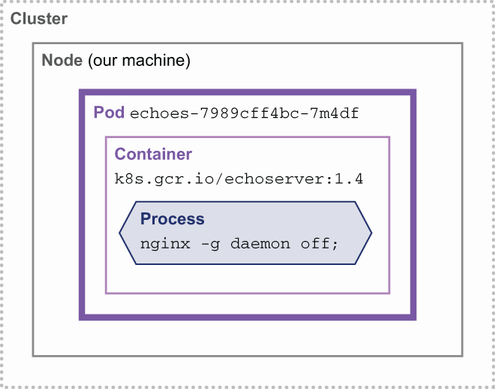

**Hình 12.9** Cluster Kubernetes với một pod đang chạy

Lệnh `kubectl create deployment` là cách dễ để bắt đầu, nhưng các đối số của nó chỉ chạm bề mặt những gì Kubernetes có thể cấu hình. Biểu diễn tự nhiên của một đối tượng Kubernetes được đưa ra bằng YAML, và chúng ta có thể truy cập bức tranh đầy đủ qua `kubectl edit deployment echoes`, như trong đoạn mã tiếp theo. Lệnh này sẽ mở trình soạn thảo mặc định của bạn với YAML hiện tại của đối tượng. Nếu bạn thay đổi tệp, chúng được áp dụng khi trình soạn thảo thoát. Chúng tôi sẽ không thảo luận mọi tùy chọn này, nên hãy tham khảo tài liệu tại http://mng.bz/M5m2 để biết thêm:

```yaml
apiVersion: apps/v1
kind: Deployment
metadata:
   annotations:
     deployment.kubernetes.io/revision: "1"
   creationTimestamp: "2022-02-01T08:26:32Z"
   generation: 1
   labels:
     app: echoes
  name: echoes                                    ❶
  namespace: default
  resourceVersion: "1310"
  uid: e8b775f6-243e-46c1-9275-dadaecf2db3b
spec:                                             ❷
  progressDeadlineSeconds: 600
  replicas: 1                                     ❸
  revisionHistoryLimit: 10
  selector:
    matchLabels:
      app: echoes
  strategy:
    rollingUpdate:
      maxSurge: 25%
      maxUnavailable: 25%
    type: RollingUpdate
  template:
    metadata:
      creationTimestamp: null
      labels:
        app: echoes
    spec:
      containers:
      - image: k8s.gcr.io/echoserver:1.4          ❹
        imagePullPolicy: IfNotPresent
        name: echoserver
        resources: {}
        terminationMessagePath: /dev/termination-log
        terminationMessagePolicy: File
      dnsPolicy: ClusterFirst
      restartPolicy: Always
      schedulerName: default-scheduler
      securityContext: {}
      terminationGracePeriodSeconds: 30
status:                                           ❺
  availableReplicas: 1
  conditions:
  - lastTransitionTime: "2022-02-01T08:26:33Z"
    lastUpdateTime: "2022-02-01T08:26:33Z"
    message: Deployment has minimum availability.
    reason: MinimumReplicasAvailable
    status: "True"
    type: Available
  observedGeneration: 1
  readyReplicas: 1
  replicas: 1
  updatedReplicas: 1
```

❶ Tên `echoes` chúng ta đặt cho deployment

❷ `spec` mô tả trạng thái mong muốn của deployment.

❸ Một giá trị quan trọng chúng ta sẽ thảo luận ngay xác định số pod ta muốn chạy

❹ Image chúng ta yêu cầu cho pod chạy

❺ `status` cho chúng ta biết những gì hiện đang quan sát được về trạng thái deployment. Lưu ý nó cũng có `replicas`, cho biết bao nhiêu cái được thấy đang chạy.

Điều gì xảy ra nếu chúng ta đổi giá trị `spec` của `replicas: 1` thành `3`? Kubernetes sẽ thấy sự không khớp giữa trạng thái deployment và những gì thực sự trên cluster và khởi động container mới thay mặt chúng ta, như sau. Hình 12.10 cho thấy kết quả sau khi các container có cơ hội khởi động.

```
$ kubectl get pods
NAME                      READY   STATUS    RESTARTS   AGE
echoes-7989cff4bc-7m4df   1/1     Running   0          7m38s
echoes-7989cff4bc-7qn47   1/1     Running   0          8s
echoes-7989cff4bc-cmngm   1/1     Running   0          8s
```

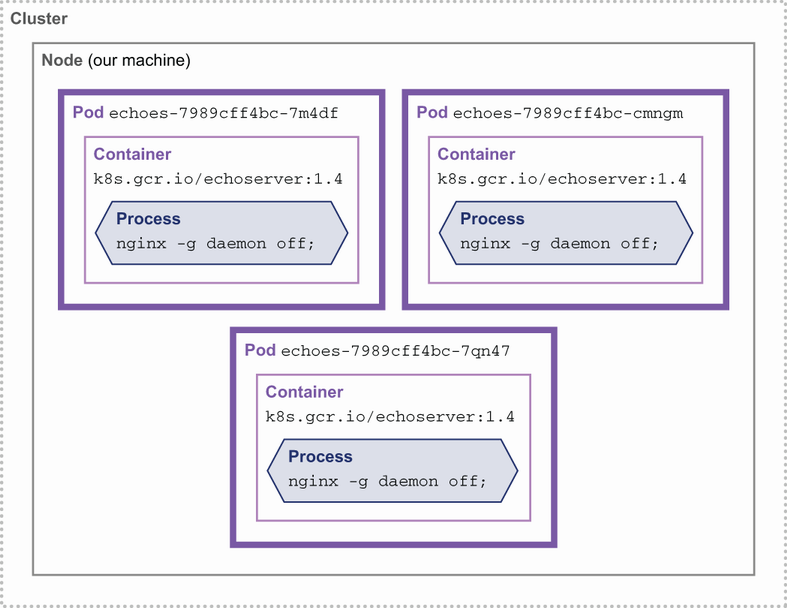

**Hình 12.10** Cluster Kubernetes với nhiều pod đang chạy

Trên thực tế, bạn có lẽ sẽ không sửa tay tệp YAML trên một cluster Kubernetes production, nhưng mọi công cụ xây dựng trên cái này — hệ thống CI/CD, các manifest Kubernetes được sinh hoặc quản lý mã nguồn — chỉ là những trợ thủ tạo ra YAML và lời gọi API đúng cho chúng ta.

Trên hệ thống cục bộ, các mẹo tương tự chúng ta đã dùng trước đó với `docker ps` và `docker exec` sẽ hoạt động để cho phép ta xem kỹ hơn các container đang chạy. Khi biết tên container, `kubectl` có một lệnh gọn hơn một chút cho phép chúng ta khởi động một shell bên trong pod, như sau:

```
$ kubectl exec echoes-7989cff4bc-7m4df -- bash
root@echoes-7989cff4bc-7m4df: uname -a
Linux echoes-7989cff4bc-7m4df 5.10.76-linuxkit #1 SMP \
  Mon Nov 8 10:21:19 2021 x86_64 x86_64 x86_64 GNU/Linux
```

Cần một bước cuối cùng để làm deployment này hữu dụng hơn. Theo mặc định chúng ta hoàn toàn không thể nói chuyện với các pod trong cluster. Nếu chúng ta xem `docker ps` cho các container, bạn sẽ thấy không port nào được phơi bày.

Kubernetes giải quyết điều này qua trừu tượng *service*, là một giao diện tổng quát để làm việc với nhiều load balancing và định tuyến traffic vào cluster. Chi tiết ở đây nhanh chóng vượt ra ngoài phạm vi giới thiệu này, nhưng chúng ta sẽ thiết lập cái đơn giản nhất, gọi là `NodePort`, với `kubectl expose`, như sau:

```
$ kubectl expose deployment echoes --type=NodePort --port=8080
service/echoes exposed
```

Như thấy trong hình 12.11, lệnh này tạo một đối tượng mới trong cluster biểu diễn `NodePort` của chúng ta.

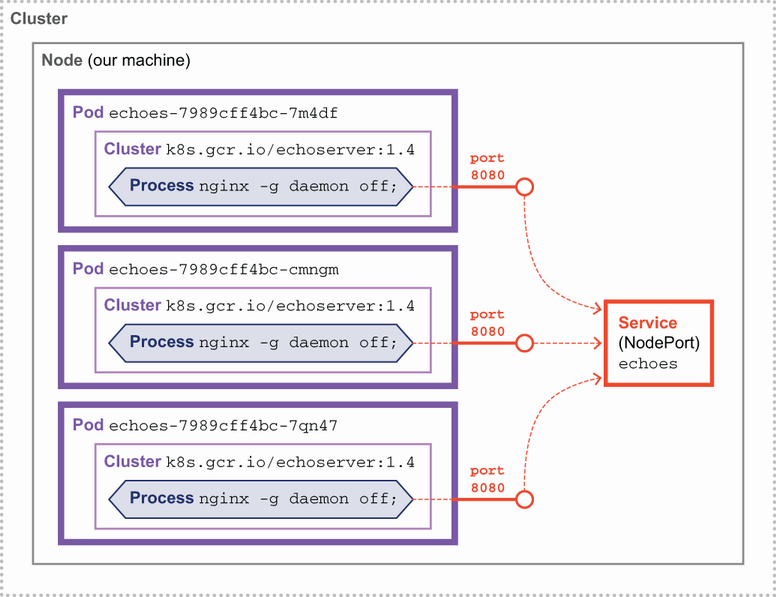

**Hình 12.11** NodePort và service trong cluster Kubernetes

Xem các service, chúng ta thấy một `NodePort` được cấu hình trong cluster, như sau:

```
$ kubectl get services
NAME         TYPE        CLUSTER-IP       EXTERNAL-IP   PORT(S)
echoes       NodePort    10.108.182.100   <none>        8080:31980/TCP
kubernetes   ClusterIP   10.96.0.1        <none>        443/TCP
```

Về mặt nội bộ, điều này nghĩa là port 8080 khả dụng trên mọi node trong cluster và sẽ chuyển tiếp traffic tới pod của chúng ta. Giờ khi chúng ta có cách để traffic tới được pod, ta vẫn cần lộ điều này ra ngoài cluster để có thể gọi nó. `kubectl` hỗ trợ điều này với tính năng port-forwarding như sau:

```
$ kubectl port-forward service/echoes 7080:8080
Forwarding from 127.0.0.1:7080 -> 8080
Forwarding from [::1]:7080 -> 8080
Handling connection for 7080
```

Với việc chuyển tiếp này chạy trong một terminal, chúng ta có thể truy cập `127.0.0.1:7080` trong trình duyệt, và ta sẽ thấy request được vọng lại. Hình 12.12 cho thấy luồng traffic qua các thành phần tới pod.

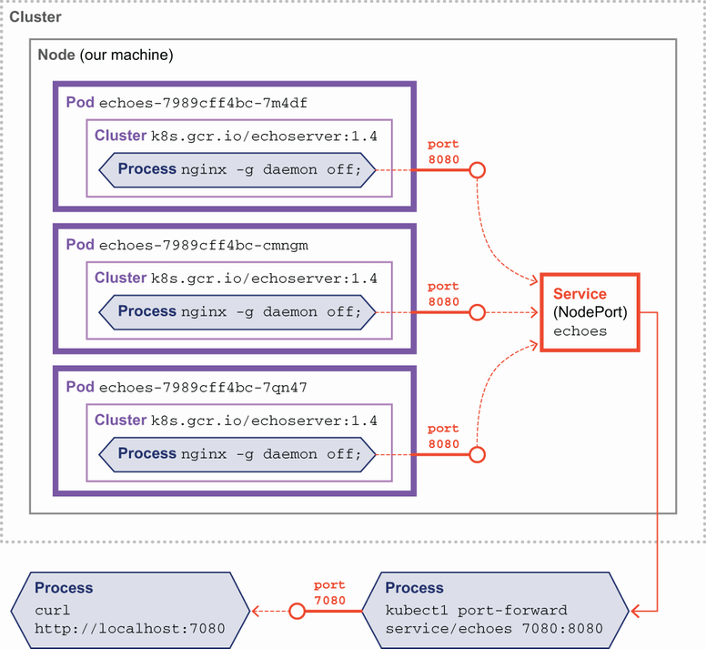

**Hình 12.12** Port-forwarding vào cluster Kubernetes

Kubernetes là một bước nhảy lớn về độ phức tạp so với chỉ chạy container Docker cục bộ, nhưng nó cũng cung cấp giải pháp cho những khó khăn khi chạy container ở quy mô lớn. Dù có chạy trên Kubernetes hay không, chúng ta hầu như luôn quan tâm tới hiệu năng của dịch vụ. Hãy khảo sát cách quản lý việc các container chạy tốt đến đâu trong production.

## 12.5 Observability và hiệu năng

Công nghệ Java ban đầu được thiết kế cho một thế giới nơi JVM chạy trên bare metal trong các trung tâm dữ liệu, và nơi lập trình viên có thể vẫn tương đối cách ly khỏi (hoặc thậm chí không biết về) chi tiết của môi trường triển khai. Tuy nhiên, thế giới đang thay đổi ở mức nền tảng. Các triển khai cloud native — đặc biệt là container — đã ở đây và đang được áp dụng nhanh chóng (nhưng ở tốc độ khác nhau qua các phần khác nhau của ngành).

Container đặt ra một số thách thức riêng cho việc hiểu chi tiết những gì đang xảy ra trong một ứng dụng hiện đại. Ví dụ, không phổ biến khi container chạy các dịch vụ như ssh daemon, khiến không thể đăng nhập vào container để quan sát chuyện gì đang xảy ra. Thay vào đó, mọi dữ liệu về sức khỏe ứng dụng phải được xuất ra khỏi container.

Thực hành DevOps gọi là *observability* nảy sinh từ vài luồng riêng biệt của thực hành phát triển hiện đại, bao gồm cả không gian application performance monitoring (APM) lẫn nhu cầu nhìn thấy vào các hệ thống được điều phối, chẳng hạn Kubernetes. Nó nhắm tới cung cấp những hiểu biết chi tiết cao về hành vi hệ thống cùng ngữ cảnh phong phú. Các kỹ thuật nó cung cấp rất hữu ích, nếu không nói là thiết yếu, để hiểu và tinh chỉnh hiệu năng của ứng dụng Java trong container.

### 12.5.1 Observability

Tổng thể, observability là một tập khái niệm khá đơn giản:

1. Instrument hệ thống và ứng dụng để thu thập dữ liệu liên quan
2. Gửi dữ liệu này tới một hệ thống có thể lưu trữ và phân tích nó (bao gồm khả năng truy vấn)
3. Cung cấp trực quan hóa và hiểu biết về hệ thống như một tổng thể

Khả năng truy vấn và trực quan hóa là chìa khóa cho sức mạnh của observability. Nó đã được mô tả là khả năng "Có câu trả lời cho những câu hỏi mà bạn không biết là mình sẽ cần hỏi" — và điều này chỉ khả thi qua việc thu thập đủ dữ liệu để mô hình hóa chính xác trạng thái nội bộ của hệ thống.

> **NOTE** Lý thuyết đằng sau Observability đến từ lý thuyết điều khiển hệ thống — về cơ bản là câu hỏi: "Trạng thái nội bộ của một hệ thống có thể được suy ra từ bên ngoài tốt đến đâu?"

Rốt cuộc, mục tiêu là có thể thu được các hiểu biết có thể hành động từ, và về, toàn bộ hệ thống. Điều này nên thay thế những góc nhìn manh mún chỉ dựa trên một hoặc hai mảnh của hệ thống tổng thể.

Vậy nên, dù việc giải quyết sự cố là trường hợp sử dụng rõ ràng phù hợp với observability — dù sao đó cũng là nơi thực hành này bắt nguồn — cũng đúng rằng miền ứng dụng tiềm năng lớn hơn nhiều. Nếu dữ liệu đúng được thu thập, các bên liên quan đến observability rộng hơn nhiều so với chỉ các kỹ sư độ tin cậy phần mềm (SRE), hỗ trợ production, và những người DevOps.

Observability đặc biệt liên quan tới các ứng dụng container hóa, bởi những triển khai này thường phức tạp hơn ứng dụng on-premise truyền thống. Thường có nhiều dịch vụ và thành phần hơn trong ứng dụng triển khai trên cloud, với topology phức tạp hơn cũng như tốc độ thay đổi nhanh hơn nhiều (được thúc đẩy bởi các thực hành như continuous deployment).

Điều này cũng kết hợp với sự phổ biến ngày càng tăng của các công nghệ Cloud native mới có hành vi vận hành mới. Điều này bao gồm Kubernetes, cũng như các triển khai Function as a Service, chẳng hạn AWS Lambda. Thế giới mới này khiến việc phân tích nguyên nhân gốc và giải quyết sự cố có khả năng khó hơn nhiều.

Dữ liệu observability thường được khái niệm hóa theo "ba trụ cột". Đây là mô hình tư duy đơn giản (một số người sẽ tranh luận là quá đơn giản) nhưng hữu ích cho lập trình viên mới với observability. Các trụ cột như sau:

- **Distributed trace** — Bản ghi của một lần gọi dịch vụ, tương ứng với một request duy nhất từ người dùng
- **Metric** — Các giá trị đo hoạt động cụ thể trong một khoảng thời gian
- **Log** — Các bản ghi bất biến của các sự kiện rời rạc xảy ra theo thời gian (có thể là văn bản thuần, có cấu trúc, hoặc nhị phân)

Các thư viện cốt lõi và thành phần instrumentation đều là mã nguồn mở, và hầu hết được quản lý qua các tổ chức ngành như Cloud Native Compute Foundation (CNCF).

**OpenTelemetry**

Dự án OpenTelemetry (https://opentelemetry.io/), một dự án lớn trong CNCF, là một tập chuẩn, định dạng, thư viện client và các thành phần phần mềm liên quan để cung cấp observability. Các chuẩn này tường minh là đa nền tảng và không ràng buộc với bất kỳ ngăn xếp công nghệ cụ thể nào.

Nó cung cấp một framework tích hợp với hệ điều hành và các sản phẩm thương mại và có thể thu thập dữ liệu observability từ ứng dụng viết bằng nhiều ngôn ngữ. Bởi các bản hiện thực là mã nguồn mở, chúng ở các mức độ trưởng thành kỹ thuật khác nhau, tùy vào sự quan tâm mà OpenTelemetry thu hút ở cộng đồng ngôn ngữ cụ thể.

OpenTelemetry đến từ việc sáp nhập hai dự án mã nguồn mở trước đó, OpenTracing và OpenCensus. Mặc dù OpenTelemetry vẫn đang trưởng thành, nó đang có đà và ngày càng nhiều ứng dụng và đội ngũ đang khảo sát và hiện thực nó. Con số này có vẻ sẽ tăng đáng kể trong 2022 và 2023.

Từ góc nhìn của chúng tôi, bản hiện thực Java/JVM là một trong những cái trưởng thành nhất khả dụng và có một số lợi thế so với APM/monitoring truyền thống. Cụ thể, việc dùng một chuẩn mở cung cấp:

- Giảm mạnh việc bị khóa vào nhà cung cấp
- Giao thức truyền có đặc tả mở
- Các thành phần client mã nguồn mở
- Các mẫu kiến trúc chuẩn hóa
- Số lượng và chất lượng ngày càng tăng của các thành phần backend mã nguồn mở

OpenTelemetry có vài dự án con tạo nên chuẩn như một tổng thể, và chúng không đều ở cùng mức trưởng thành xét theo vòng đời tổng thể.

Đặc tả Distributed Tracing ở v1.0 và đang được triển khai tích cực vào các hệ thống production. Nó thay thế OpenTracing hoàn toàn, và dự án OpenTracing đã chính thức được lưu trữ. Dự án Jaeger, một trong những backend distributed tracing phổ biến nhất, cũng đã ngừng các thư viện client của mình và sẽ mặc định theo giao thức OpenTelemetry trong tương lai.

Dự án OpenTelemetry Metrics không tiên tiến bằng nhưng đã đạt v1.0 và general availability (GA). Tại thời điểm viết, giao thức ổn định, và API ở trạng thái đóng băng tính năng.

Cuối cùng, đặc tả Logging vẫn ở dạng bản thảo và không được kỳ vọng đạt v1.0 cho tới cuối 2022. Vẫn được thừa nhận là còn một lượng công việc nhất định phải làm với đặc tả.

Tổng thể, OpenTelemetry như một tổng thể sẽ được xem là v1.0/GA khi chuẩn Metrics đạt v1.0 bên cạnh Tracing.

Các thư viện Java cho OpenTelemetry có thể được triển khai vào ứng dụng của bạn dùng hoặc phương pháp thủ công (nơi lập trình viên phải chủ động chọn phần nào của ứng dụng cần được instrument) hoặc dùng automatic instrumentation (dùng một Java agent). Các thành phần Java cho OpenTelemetry có thể tìm thấy trên GitHub và nằm trong vài dự án, bao gồm http://mng.bz/aJyJ.

Một thảo luận đầy đủ về cách hiện thực một giải pháp observability đầy đủ (dù dựa trên OpenTelemetry hay ngăn xếp khác) nằm ngoài phạm vi cuốn sách này, nhưng lập trình viên Java vững nền tảng nên khám phá lĩnh vực này một cách kỹ lưỡng.

Liên quan tới observability là một số tinh tế về hiệu năng mà các kỹ sư không chuyên về Java/VM có thể không biết. Hãy xem kỹ hơn.

### 12.5.2 Hiệu năng trong container

Nhiều lập trình viên, khi migrate ứng dụng Java vào container, sẽ cố dùng container nhỏ nhất có thể. Điều này có vẻ hợp lý, bởi các ứng dụng dựa trên cloud thường bị tính phí theo lượng RAM và CPU chúng dùng.

Tuy nhiên, JVM là một nền tảng rất động, và một số tham số quan trọng được JVM tự động xác định tại thời điểm khởi động, dựa trên các thuộc tính quan sát được của máy mà JVM đang chạy trên đó.

Các thuộc tính này bao gồm loại và số lượng CPU cùng bộ nhớ vật lý. Hành vi của ứng dụng đang chạy có thể và sẽ khác nhau khi chạy trên các máy có kích thước khác nhau — và điều này bao gồm cả container. Một số thuộc tính động này như sau:

- JVM Intrinsics, một kỹ thuật JIT có thể dùng các tính năng CPU rất cụ thể (ví dụ, hỗ trợ vector)
- Định cỡ các threadpool nội bộ (chẳng hạn "common pool")
- Số luồng dùng cho GC

Chỉ từ danh sách này, chúng ta thấy rằng việc chọn sai kích thước container image có thể gây vấn đề liên quan tới GC hoặc các thao tác luồng chung. Tuy nhiên, vấn đề về cơ bản sâu hơn thế.

Các phiên bản Java hiện tại, kể cả Java 17, thực hiện một số kiểm tra động và quyết định GC nào dùng một cách "ergonomic" (tự động), nếu một GC không được chỉ định tường minh trên dòng lệnh. Nếu bạn không chỉ định collector, thì logic như sau:

- Nếu máy là "server class", chọn G1 (Parallel với Java 8).
- Nếu máy không phải "server class", thì chọn Serial.

Định nghĩa thực dụng của máy server class là: >= hai CPU vật lý và >= 2 GB bộ nhớ.

Điều này nghĩa là nếu một ứng dụng Java chạy trên máy có vẻ có ít hơn hai CPU và 2 GB bộ nhớ, thì trừ khi một thuật toán collector cụ thể được chọn tường minh, thuật toán Serial sẽ được dùng. Đây thường không phải điều các đội muốn — và dẫn tới thực hành tốt nhất sau:

> **TIP** Luôn chạy ứng dụng Java trong container với ít nhất hai CPU và 2 GB bộ nhớ.

Cũng quan trọng cần nhận ra rằng vòng đời ứng dụng Java truyền thống gồm một số pha: bootstrap, class loading dồn dập, warmup (với biên dịch JIT), rồi một trạng thái ổn định trường thọ (kéo dài nhiều ngày hoặc nhiều tuần) với tương đối ít class loading và JIT. Mô hình này bị thách thức bởi các triển khai cloud nơi container có thể sống trong khoảng thời gian ngắn hơn nhiều và kích thước cluster có thể được điều chỉnh lại một cách động.

Trong thế giới mới này, Java phải đảm bảo nó vẫn cạnh tranh trên vài trục then chốt, bao gồm:

- Footprint
- Density (mật độ)
- Thời gian khởi động

May mắn thay, có công việc và nghiên cứu đang diễn ra để đảm bảo nền tảng tiếp tục tối ưu cho những đặc tính này — chúng ta sẽ nghe thêm về nó ở chương 18.

## Tóm tắt

- Container đã thay đổi triệt để cách chúng ta đóng gói và triển khai ứng dụng, và đòi hỏi một số kỹ thuật và ý tưởng mới.
- Container biểu diễn một tầng trừu tượng nữa lên trên hệ điều hành cổ điển, hypervisor và VM mà chúng ta đã thấy trước đây.
- Docker là công cụ phổ biến nhất để build, publish và chạy container image.
- Chúng ta chỉ định một container image qua `Dockerfile`. Image kết quả chứa ứng dụng của chúng ta và một môi trường hoàn chỉnh để nó chạy, bao gồm JVM, các phụ thuộc native, và công cụ bổ sung.
- Container đặc biệt đưa vào một tầng bổ sung cho mạng. Ở dạng cơ bản nhất, chúng ta phải quản lý các port mà container phơi bày để chúng truy cập được với thế giới bên ngoài.
- Chạy đội quân container ở quy mô lớn là quá nhiều thứ để theo dõi, nên các orchestrator được dùng để làm điều đó một cách hệ thống. Lựa chọn phổ biến nhất cho việc này là Kubernetes.
- Kubernetes cung cấp một API phong phú, mở rộng được để khai báo trạng thái mong muốn của hệ thống và đưa nó vào cuộc sống tại runtime. Nó truy cập được qua dòng lệnh và một REST API với hệ sinh thái khổng lồ các công cụ hỗ trợ quanh nó.
- Một tính năng then chốt của container là cưỡng chế các ràng buộc quanh tài nguyên. Những giới hạn về bộ nhớ và CPU này có thể có hàm ý về hiệu năng cho ứng dụng của bạn chạy trong container.
