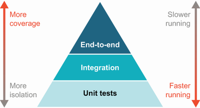

# 13. Nền tảng kiểm thử

> *The Well-Grounded Java Developer, Second Edition* — Chương 13
> Bản dịch tiếng Việt

**Chương này bao gồm:**

- Vì sao chúng ta kiểm thử
- Chúng ta kiểm thử thế nào
- Test-driven development
- Test double
- Từ JUnit 4 lên 5

---

Những năm gần đây trong lập trình đã chứng kiến sự chấp nhận ngày càng tăng của kiểm thử tự động như một phần được kỳ vọng của quy trình phát triển. Test được chạy cả cục bộ bởi lập trình viên lẫn trong môi trường build và tích hợp liên tục để đảm bảo hệ thống hành xử đúng. Cùng với đó là sự bùng nổ của nhiều công cụ, cách tiếp cận và triết lý khác nhau.

Cũng như với bất kỳ công nghệ nào, không có viên đạn bạc — không cách tiếp cận kiểm thử nào bao phủ mọi tình huống có thể. Với điều đó, quan trọng là hiểu *vì sao* bạn kiểm thử để có thể xác định tốt nhất *cách* kiểm thử.

## 13.1 Vì sao chúng ta kiểm thử

Thực tế, từ *test* che giấu vô số lý do khả dĩ khiến chúng ta khảo sát hành vi mã của mình. Một danh sách không đầy đủ (và đôi khi chồng lấn) để cân nhắc như sau:

- Xác nhận logic của một phương thức riêng lẻ là đúng
- Xác nhận tương tác giữa hai đối tượng trong mã của bạn
- Xác nhận một thư viện hoặc phụ thuộc bên ngoài khác hành xử như mong đợi
- Xác nhận dữ liệu được tạo ra hoặc tiêu thụ bởi một phần hệ thống là hợp lệ
- Xác nhận một hệ thống hoạt động đúng với một thành phần bên ngoài (chẳng hạn cơ sở dữ liệu)
- Xác nhận hành vi đầu-cuối của hệ thống thỏa mãn các kịch bản nghiệp vụ quan trọng
- Tài liệu hóa các giả định cho những người bảo trì sau này (bởi test không bị lệch pha theo cách mà comment và tài liệu có thể)
- Ảnh hưởng tới thiết kế hệ thống bằng cách phơi bày sự gắn kết chặt và trách nhiệm của đối tượng
- Tự động hóa các checklist sau phát hành mà con người sẽ phải thực hiện
- Tìm các trường hợp biên bất ngờ trong mã qua đầu vào ngẫu nhiên

Ngay cả danh sách ngắn các động cơ kiểm thử này cũng cho thấy ý tưởng đơn giản "kiểm thử mã của bạn" không nhất thiết đơn giản như vậy. Nên, khi tiếp cận việc kiểm thử, chúng ta cần tự hỏi những câu sau:

- Động cơ của tôi khi kiểm thử đoạn mã này là gì?
- Kỹ thuật nào cho phép tôi thỏa mãn mục tiêu đó chính xác và sạch sẽ nhất?

## 13.2 Chúng ta kiểm thử thế nào

Một trong những công cụ phổ biến nhất khi thảo luận các loại kiểm thử khác nhau là *Testing Pyramid* (Kim tự tháp kiểm thử), thể hiện trong hình 13.1. Ban đầu từ cuốn sách *Succeeding with Agile* của Mike Cohn (Addison-Wesley Professional, 2009), kim tự tháp diễn đạt một cách cân bằng chi phí của các loại kiểm thử khác nhau để tối đa hóa sự hỗ trợ chúng mang lại.



**Hình 13.1** Kim tự tháp kiểm thử

Mặc dù các tranh luận vẫn dữ dội trên internet về ranh giới chính xác giữa các loại kiểm thử này, các ý tưởng trung tâm khá hữu ích.

> **NOTE** Những loại test này không được định nghĩa bởi công cụ bạn dùng — bạn không viết unit test chỉ vì bạn đang dùng JUnit, và dùng một thư viện đặc tả không đảm bảo bạn thực sự đang tạo ra các acceptance test dùng được mà các bên liên quan sẽ hưởng lợi. Những loại test này là về cái chúng ta muốn kiểm chứng và chứng minh.

**Unit test** tạo thành đáy của kim tự tháp. Đây là các test tập trung kiểm chứng một khía cạnh của hệ thống. Tuy nhiên, chúng ta nghĩa là gì với "một khía cạnh"? Phần dễ nhất là cách mã đang được test liên hệ với các phụ thuộc bên ngoài. Nếu test của bạn gọi cơ sở dữ liệu trước khi làm một chút logic trên kết quả, đó không còn là "một" thứ bạn đang test — bạn giờ đang test cả việc lấy dữ liệu lẫn việc logic của bạn hoạt động. Các phụ thuộc bên ngoài như vậy cũng thường bao gồm dịch vụ mạng hoặc tệp.

Một cách tiếp cận phổ biến để tránh vi phạm sự tập trung đơn nhất đó là dùng *test double* — ví dụ, để unit test của chúng ta nói chuyện với một đối tượng giả thay vì cơ sở dữ liệu thật. Chúng ta sẽ thảo luận điều này chi tiết ở mục tiếp theo, nhưng ý tưởng cơ bản là việc giả mạo này có nhiều hương vị và chúng ta cần cân nhắc nhiều thứ cần thiết nếu muốn làm tốt.

Unit test hấp dẫn vì nhiều lý do, do đó có vị trí truyền thống là phân đoạn lớn nhất trong kim tự tháp kiểm thử. Những lý do này bao gồm:

- **Nhanh** — Nếu một test không có phụ thuộc bên ngoài, nó không nên mất lâu để thực thi.
- **Tập trung** — Bằng cách chỉ nói về một "đơn vị" mã, thường rõ ràng hơn test đang diễn đạt gì so với các test lớn hơn, nhiều thiết lập hơn.
- **Thất bại đáng tin cậy** — Tối thiểu hóa phụ thuộc bên ngoài, đặc biệt phụ thuộc vào trạng thái bên ngoài, giúp unit test tất định hơn.

Tất cả nghe tuyệt vời, vậy vì sao chúng ta không chỉ viết unit test suốt? Sự thật là unit test có những giới hạn ngăn chúng hữu ích ở mọi quy mô mà ta cần kiểm thử. Các vấn đề bao gồm:

- **Gắn kết chặt** — Bởi unit test theo định nghĩa liên hệ chặt với bản hiện thực, chúng cũng dễ ràng buộc quá chặt với những lựa chọn hiện thực đó. Không hiếm khi cả một bộ unit test bị vô hiệu khi bản hiện thực bên dưới thay đổi.
- **Bỏ lỡ các tương tác có ý nghĩa** — Mặc dù hấp dẫn khi nghĩ về mã của chúng ta như một đội quân đối tượng mỗi cái lo việc của mình, thực tế công việc thực sự của một chương trình bao gồm tương tác giữa những mảnh phụ thuộc đó, mà unit test sẽ bỏ lỡ.
- **Tập trung hướng nội** — Thường mục tiêu của kiểm thử là cho thấy người dùng cuối của phần mềm có được kết quả đúng. Hiếm khi tính đúng đắn của một phương thức đơn lẻ thực sự chuyển thành người dùng hạnh phúc.

**Integration test**, bước tiếp theo lên kim tự tháp, thoát khỏi ràng buộc của unit test về việc nói chuyện với phụ thuộc. Integration test vượt qua những ranh giới đó và thực tế có thể tập trung vào việc đảm bảo các mảnh khác nhau của hệ thống tích hợp liền mạch.

Cũng như unit test, integration test cũng có thể chọn lọc chỉ một phần hệ thống để kiểm chứng. Một số phụ thuộc, chẳng hạn dịch vụ bên ngoài, vẫn có thể được thay bằng test double, trong khi những cái khác, chẳng hạn cơ sở dữ liệu, nằm trong phạm vi kiểm thử. Điều then chốt là các test vươn ra ngoài một "đơn vị" mã duy nhất trong phạm vi của chúng.

Ranh giới chính xác giữa unit test và integration test có thể mờ nhạt. Tuy nhiên, đây là một số ví dụ rõ ràng bước qua ranh giới vào lãnh thổ integration testing:

- Bạn cần một instance cơ sở dữ liệu và gọi tới mã truy cập dữ liệu.
- Bạn khởi động một HTTP server đặc biệt trong tiến trình và test các request với nó.
- Bạn thực sự gọi tới một dịch vụ khác (dù có phải môi trường kiểm thử hay không).

Integration test đi kèm nhiều tính chất hay, chẳng hạn:

- **Độ phủ rộng hơn** — Một integration test nhất thiết làm việc với nhiều mã của bạn và mã của các thư viện bạn phụ thuộc hơn.
- **Nhiều kiểm chứng hơn** — Một số loại lỗi có thể chỉ phát hiện được khi dùng phụ thuộc thật. Chẳng hạn, một lỗi cú pháp trong câu lệnh SQL sẽ khó tìm nếu không gọi một cơ sở dữ liệu thực.

Dĩ nhiên, không lựa chọn nào không có đánh đổi. Integration test có thể là nguồn đau đớn đáng kể nếu không được quản lý đúng vì những lý do như:

- **Test chậm** — Đi tới một cơ sở dữ liệu thật thay vì đọc một giá trị từ bộ nhớ chậm hơn rất nhiều. Nhân điều đó với hàng trăm hoặc hàng nghìn test, và bạn có thể thấy mình đang chờ... rất nhiều.
- **Kết quả phi tất định** — Phụ thuộc bên ngoài tăng khả năng trạng thái quan trọng có thể thay đổi giữa các lần chạy test. Chẳng hạn, các bản ghi còn sót trong cơ sở dữ liệu có thể làm thay đổi những gì trả về từ một câu lệnh SQL.
- **Niềm tin sai lầm** — Integration test đôi khi dùng các phụ thuộc khác biệt tinh vi so với hệ thống chính. Chẳng hạn, nếu cơ sở dữ liệu test là phiên bản khác với production, integration test có thể gợi ý sai rằng mọi thứ ổn trong khi không phải vậy.

Dù có mọi khó khăn đó, integration testing là phần tối quan trọng của cảnh quan kiểm thử.

**End-to-end test** đẩy vượt ra ngoài integration test với mục tiêu tái tạo trải nghiệm người dùng đầy đủ của một hệ thống. Điều này có thể nghĩa là điều khiển bằng chương trình một trình duyệt web hoặc ứng dụng khác, hoặc kiểm chứng một instance được triển khai đầy đủ của một dịch vụ trong môi trường kiểm thử. End-to-end testing mang lại những lợi thế sau khó tái tạo ở các mức thấp hơn của hệ thống:

- **Trải nghiệm người dùng "thật"** — Một end-to-end test tốt gần với những gì người dùng thấy. Điều này cho phép chúng ta kiểm chứng kỳ vọng mức cao của người dùng trực tiếp.
- **Môi trường "thật"** — Nhiều end-to-end test chạy trên môi trường test, staging, hoặc thậm chí production. Điều này kiểm chứng rằng mã của chúng ta hoạt động bên ngoài môi trường build thoải mái, được quản lý cẩn thận.
- **UI khả dụng** — Nhiều cách tiếp cận end-to-end testing, chẳng hạn những cái điều khiển trình duyệt web, có thể thấy các khía cạnh của hệ thống (ví dụ, nút có được render không, để có thể nhấp) mà có thể khó kiểm chứng ở nơi khác.

Nhưng sự thực tế lớn hơn trong end-to-end test đi kèm danh sách khó khăn khắc nghiệt sau:

- **Kiểm thử còn chậm hơn** — Trong khi nhiều unit test chạy gần như tức thì và ngay cả integration test thường dưới một giây, một end-to-end test điều khiển trình duyệt web để đi qua một site sẽ nhất thiết mất lâu hơn nhiều.
- **Test không ổn định (flaky)** — Trong lịch sử, các công cụ cho end-to-end testing, đặc biệt là của UI, dễ không ổn định, đòi hỏi thử lại và timeout dài để tránh thất bại không cần thiết.
- **Test mong manh** — Bởi end-to-end test sống ở đỉnh kim tự tháp, thay đổi ở bất kỳ mức nào bên dưới đều có thể gây thất bại. Những thay đổi văn bản có vẻ vô hại có thể vô tình phá vỡ các test trải rộng này.
- **Debug khó hơn** — Bởi end-to-end testing thường đưa vào một tầng nữa điều khiển các test, việc tìm ra cái gì sai thường là một việc cực nhọc.

Với kim tự tháp này trong tay, bạn có thể bị cám dỗ hỏi: "Tỷ lệ test đúng giữa các tầng là gì?" Sự thật là không có câu trả lời duy nhất. Nhu cầu của mọi dự án và hệ thống đều khác nhau. Nhưng kim tự tháp có thể giúp hướng dẫn bạn về điểm cộng và trừ của cách bạn chọn kiểm chứng từng mẩu chức năng trong hệ thống.

Mặc dù chắc chắn không phải cách duy nhất, lập trình viên vững nền tảng có thể thấy rằng test-driven development giúp giữ các mức kiểm thử khác nhau này rõ ràng khi hệ thống tiến hóa.

## 13.3 Test-driven development

Test-driven development (TDD) đã là một phần của ngành phát triển phần mềm khá lâu. Tiền đề cơ bản của nó là bạn viết test *trong lúc* hiện thực thay vì sau đó, và các test đó ảnh hưởng tới thiết kế mã của bạn. Một cách tiếp cận thường được khuyến nghị với TDD, gọi là *test first*, là thực sự viết một test thất bại *trước khi* cung cấp bản hiện thực, rồi refactor khi cần. Ví dụ, để viết bản hiện thực nối hai đối tượng string (`"foo"` và `"bar"`), bạn sẽ viết test trước (test rằng kết quả phải bằng `"foobar"`) để đảm bảo rằng bạn biết bản hiện thực của mình là đúng. Mặc dù nhiều lập trình viên có viết test, thường thì họ viết chúng *sau* bản hiện thực và mất đi một số lợi ích chính của TDD.

Bất chấp sự phổ biến bề ngoài, nhiều lập trình viên không hiểu *vì sao* họ nên làm TDD. Câu hỏi với nhiều lập trình viên vẫn là: "Vì sao viết mã hướng test? Lợi ích là gì?"

Chúng tôi tin rằng loại bỏ nỗi sợ và sự bất định là lý do vượt trội khiến bạn nên viết mã hướng test. Kent Beck (đồng sáng chế framework kiểm thử JUnit) cũng tổng kết điều này rất hay trong cuốn sách *Test-Driven Development: By Example* (Addison-Wesley Professional, 2002):

> *Nỗi sợ khiến bạn dè dặt.*
> *Nỗi sợ khiến bạn muốn giao tiếp ít hơn.*
> *Nỗi sợ khiến bạn né tránh phản hồi.*
> *Nỗi sợ khiến bạn cáu kỉnh.*

TDD lấy đi nỗi sợ, biến lập trình viên Java vững nền tảng thành một lập trình viên tự tin, giao tiếp tốt, tiếp thu và hạnh phúc hơn. Nói cách khác, TDD giúp bạn thoát khỏi tư duy dẫn tới những phát biểu như:

- Khi bắt đầu một mảng công việc mới: "Tôi không biết bắt đầu từ đâu, nên tôi sẽ cứ hack đại."
- Khi thay đổi mã hiện có: "Tôi không biết mã hiện có sẽ hành xử thế nào, nên trong thâm tâm tôi quá sợ để thay đổi nó."

TDD mang lại nhiều lợi ích khác không phải lúc nào cũng hiển nhiên ngay, chẳng hạn:

- **Mã sạch hơn** — Bạn chỉ viết mã mình cần.
- **Thiết kế tốt hơn** — Một số lập trình viên gọi TDD là *test-driven design*.
- **API tốt hơn** — Các test của bạn đóng vai một client bổ sung cho bản hiện thực, phơi bày những điểm gồ ghề sớm.
- **Linh hoạt hơn** — TDD khuyến khích code theo interface.
- **Tài liệu qua test** — Bởi bạn không viết mã mà không có test, mọi thứ đều có ví dụ sử dụng trong test.
- **Phản hồi nhanh** — Bạn biết về lỗi ngay bây giờ, không phải ở production.

Một rào cản với lập trình viên mới bắt đầu là TDD đôi khi có thể bị xem là kỹ thuật không được lập trình viên "bình thường" dùng. Cảm nhận có thể là chỉ những người thực hành của một "Nhà thờ Agile" tưởng tượng nào đó hoặc phong trào bí truyền khác mới dùng TDD, và rằng mọi nguyên tắc TDD phải được tuân theo nghiêm ngặt để có được lợi ích. Cảm nhận này hoàn toàn sai, như chúng tôi sẽ chứng minh. TDD là kỹ thuật cho mọi lập trình viên.

### 13.3.1 TDD tóm gọn

TDD dễ nhất ở mức unit testing, và nếu bạn chưa quen với TDD, đây là chỗ tốt để bắt đầu. Chúng ta sẽ bắt đầu ở đó, nhưng tiếp tục cho thấy TDD hoạt động thế nào, đặc biệt ở ranh giới giữa unit và integration testing.

> **NOTE** Đối phó với mã hiện có mà có rất ít hoặc không có test có thể là nhiệm vụ đáng sợ. Gần như không thể điền hết mọi test một cách hồi tố. Thay vào đó, bạn đơn giản nên thêm test cho mỗi mẩu chức năng mới bạn thêm vào. Xem cuốn sách xuất sắc của Michael Feathers *Working Effectively with Legacy Code* (Prentice Hall, 2004) để được trợ giúp thêm.

Chúng ta sẽ bắt đầu với phần trình bày ngắn gọn về tiền đề red-green-refactor đằng sau TDD, dùng JUnit để test-drive mã tính doanh thu bán vé kịch. Nếu framework JUnit xa lạ, chúng tôi khuyến nghị hướng dẫn người dùng trực tuyến (xem https://junit.org/junit5/docs/current/user-guide) hoặc, để biết chi tiết hơn, *JUnit in Action* của Cătălin Tudose (Manning, 2020; http://mng.bz/gwOR). Hãy bắt đầu với một ví dụ hoạt động của ba bước cơ bản của TDD — vòng lặp red-green-refactor — bằng cách tính doanh thu khi bán vé kịch.

### 13.3.2 Một ví dụ TDD với một trường hợp sử dụng

Nếu bạn là người thực hành TDD có kinh nghiệm, bạn có thể muốn bỏ qua ví dụ nhỏ này, mặc dù chúng tôi sẽ đưa ra các hiểu biết có thể mới. Giả sử bạn được yêu cầu viết một phương thức vững chắc để tính doanh thu sinh ra từ việc bán một số vé kịch. Các quy tắc nghiệp vụ ban đầu từ kế toán của công ty nhà hát rất đơn giản, như sau:

- Giá cơ sở của một vé là $30.
- Tổng doanh thu = số vé bán * giá.
- Nhà hát có 100 ghế.

Bởi nhà hát không có phần mềm bán hàng tốt lắm, người dùng hiện phải nhập thủ công số vé đã bán.

Nếu bạn đã thực hành TDD, bạn sẽ quen với ba bước cơ bản của TDD: red, green, refactor. Nếu bạn mới với TDD hoặc đang tìm một chút ôn lại, hãy xem định nghĩa của Kent Beck về các bước đó, từ *Test-Driven Development: By Example*:

- **Red** — Viết một test nhỏ không hoạt động (test thất bại).
- **Green** — Làm test đó pass nhanh nhất có thể (test thành công).
- **Refactor** — Loại bỏ sự trùng lặp (test thành công đã tinh chỉnh).

Để cho bạn ý tưởng về bản hiện thực `TicketRevenue` mà chúng ta đang cố đạt tới, đây là một chút mã giả bạn có thể có trong đầu:

```
estimateRevenue(int numberOfTicketsSold)
  if (numberOfTicketsSold nhỏ hơn 0 HOẶC lớn hơn 100)
    Xử lý lỗi và thoát
  else
    revenue = 30 * numberOfTicketsSold;
    return revenue;
  endif
```

Lưu ý rằng quan trọng là bạn đừng nghĩ quá sâu về điều này. Các test rốt cuộc sẽ dẫn dắt thiết kế và một phần bản hiện thực của bạn.

**Viết một test thất bại (red)**

Điểm mấu chốt ở bước này là bắt đầu với một test thất bại. Thực tế, test thậm chí sẽ không biên dịch được, bởi bạn còn chưa viết class `TicketRevenue`!

Sau một buổi họp bảng trắng ngắn với kế toán, bạn nhận ra mình sẽ muốn viết test cho năm trường hợp: số vé bán âm, `0`, `1`, `2–100`, và `> 100`.

> **NOTE** Một quy tắc kinh nghiệm tốt khi viết test (đặc biệt liên quan tới số) là nghĩ về trường hợp zero/null, trường hợp một, và trường hợp nhiều (N). Một bước xa hơn là nghĩ về các ràng buộc khác trên N, chẳng hạn số âm hoặc số vượt giới hạn tối đa.

Để bắt đầu, bạn quyết định viết một test bao phủ doanh thu nhận được từ việc bán một vé. Test JUnit của bạn sẽ tương tự mã sau (nhớ rằng chúng ta không viết một test hoàn hảo, pass được ở giai đoạn này):

```java
import org.junit.jupiter.api.BeforeEach;
import org.junit.jupiter.api.Test;

import java.math.BigDecimal;

import static org.junit.jupiter.api.Assertions.*;

public class TicketRevenueTest {
  private TicketRevenue venueRevenue;

    @BeforeEach
    public void setUp() {
      venueRevenue = new TicketRevenue();
    }

    @Test
    public void oneTicketSoldIsThirtyInRevenue() {              ❶
      var expectedRevenue = new BigDecimal("30");
        assertEquals(expectedRevenue, venueRevenue.estimateTotalRevenue(1));
    }
}
```

❶ Trường hợp bán một vé

Như bạn thấy từ mã, test khá rõ ràng mong đợi doanh thu từ một lần bán vé bằng 30.

Nhưng như hiện tại, test này sẽ không biên dịch được, bởi bạn chưa viết class `TicketRevenue` với phương thức `estimateTotalRevenue(int numberOfTicketsSold)`. Để làm lỗi biên dịch biến mất để bạn có thể chạy test, bạn có thể thêm một bản hiện thực bất kỳ để test biên dịch được, như sau:

```java
public class TicketRevenue {
  public BigDecimal estimateTotalRevenue(int i) {
    return BigDecimal.ZERO;
  }
}
```

Bạn cũng có thể thấy hơi lạ khi test trích ra một field `venueRevenue` khả biến trong khi lời khuyên chung của chúng tôi là ưu tiên tính bất biến. Lý do đằng sau điều này là field chia sẻ cho phép chúng ta diễn đạt một thiết lập chung giữa các trường hợp test khác nhau (sắp tới). Các test của chúng ta không cần cùng mức bảo vệ như mã production, và sự rõ ràng tăng lên khi làm nổi bật những phần giống nhau giữa mọi trường hợp test là một thắng lợi tổng thể.

Giờ khi test biên dịch được, bạn có thể chạy nó từ IDE ưa thích hoặc dòng lệnh. Với test ở dòng lệnh, các lựa chọn điển hình Gradle và Maven đều cung cấp cách dễ để chạy test (`gradle test` hoặc `mvn test`).

> **NOTE** Các IDE cũng có cách riêng để chạy test JUnit, nhưng nói chung, tất cả đều cho phép bạn nhấp chuột phải vào class test để có tùy chọn Run Test. Khi bạn làm vậy, IDE sẽ hiển thị một cửa sổ hoặc phần thông báo rằng test của bạn đã thất bại, bởi giá trị kỳ vọng 30 không được trả về bởi lời gọi `estimateTotalRevenue(1)`; thay vào đó, `0` được trả về.

Giờ khi bạn có một test thất bại, bước tiếp theo là làm test pass (thành xanh).

**Viết một test thành công (green)**

Điểm mấu chốt ở bước này là làm test pass, nhưng bản hiện thực không phải hoàn hảo. Bằng cách cung cấp cho class `TicketRevenue` một bản hiện thực tốt hơn của `estimateTotalRevenue()` (bản hiện thực không chỉ trả về 0), bạn sẽ làm test pass (thành xanh).

Nhớ rằng, ở giai đoạn này, bạn đang cố làm test pass mà không nhất thiết viết mã hoàn hảo. Giải pháp ban đầu của bạn có thể trông như sau:

```java
import java.math.BigDecimal;

public class TicketRevenue {
  public BigDecimal estimateTotalRevenue(int numberOfTicketsSold) {
    BigDecimal totalRevenue = BigDecimal.ZERO;
    if (numberOfTicketsSold == 1) {
      totalRevenue = new BigDecimal("30");     ❶
    }

        return totalRevenue;
    }
}
```

❶ Một bản hiện thực làm test pass

Khi giờ bạn chạy test, nó sẽ pass, và trong hầu hết IDE, điều đó được chỉ báo bằng một thanh xanh hoặc dấu tick. Ngay cả dòng lệnh cũng cho ta một thông điệp xanh thân thiện để báo mọi thứ ổn với mã.

Câu hỏi tiếp theo là, bạn có nên nói "Tôi xong rồi!" và chuyển sang mẩu công việc tiếp theo? Câu trả lời vang dội ở đây nên là "Không!" Như chúng tôi, bạn sẽ ngứa ngáy muốn dọn dẹp listing mã trên, nên hãy làm ngay bây giờ.

**Refactor test**

Điểm mấu chốt của bước này là xem bản hiện thực nhanh mà bạn viết để pass test và đảm bảo rằng bạn đang theo thực hành được chấp nhận. Rõ ràng mã không sạch và gọn như nó có thể. Bạn chắc chắn có thể refactor nó và cải thiện cuộc sống cho bản thân và người khác trong tương lai.

Nhớ rằng, giờ khi bạn có một test pass, bạn có thể refactor mà không sợ. Không có khả năng mất dấu logic nghiệp vụ bạn đã hiện thực tới nay.

> **TIP** Một lợi ích khác mà bạn đã cho bản thân và đội ngũ rộng hơn bằng cách viết test pass ban đầu là quy trình phát triển tổng thể nhanh hơn. Phần còn lại của đội có thể ngay lập tức lấy phiên bản mã đầu tiên này và bắt đầu test nó cùng codebase lớn hơn (cho integration test và xa hơn).

Trong ví dụ này, bạn không muốn dùng magic number — bạn muốn đảm bảo rằng giá vé 30 là một khái niệm có tên trong mã — nên chúng ta viết mã sau:

```java
import java.math.BigDecimal;

public class TicketRevenue {

    private final static int TICKET_PRICE = 30;      ❶

    public BigDecimal estimateTotalRevenue(int numberOfTicketsSold) {
      BigDecimal totalRevenue = BigDecimal.ZERO;

        if (numberOfTicketsSold == 1) {
          totalRevenue = new BigDecimal(TICKET_PRICE *      ❷
                                        numberOfTicketsSold);
        }

        return totalRevenue;
    }
}
```

❶ Không có magic number

❷ Phép tính đã refactor

Việc refactor đã cải thiện mã, nhưng rõ ràng nó chưa bao phủ mọi trường hợp sử dụng tiềm năng (ví dụ, âm, `0`, `2–100`, và `> 100` vé bán).

Thay vì cố đoán bản hiện thực nên trông thế nào cho các trường hợp khác, bạn nên để các test tiếp theo dẫn dắt thiết kế và bản hiện thực. Mục tiếp theo theo test-driven design bằng cách đưa bạn qua nhiều trường hợp sử dụng hơn trong ví dụ doanh thu vé này.

**Một ví dụ TDD với nhiều trường hợp sử dụng**

Một phong cách TDD cụ thể sẽ tiếp tục thêm một test mỗi lần cho các trường hợp test âm, `0`, `2–100`, và `> 100` vé bán. Nhưng hoàn toàn hợp lệ khi viết một tập trường hợp test trước, đặc biệt nếu chúng liên quan tới test ban đầu.

Lưu ý rằng vẫn rất quan trọng phải theo vòng đời red-green-refactor ở đây. Sau khi thêm mọi trường hợp sử dụng này, bạn có thể kết thúc với một class test có các test thất bại (red) như sau:

```java
import org.junit.jupiter.api.BeforeEach;
import org.junit.jupiter.api.Test;

import java.math.BigDecimal;

import static org.junit.jupiter.api.Assertions.*;

public class TicketRevenueTest {

    private TicketRevenue venueRevenue;
    private BigDecimal expectedRevenue;

    @BeforeEach
    public void setUp() {
      venueRevenue = new TicketRevenue();
    }

    @Test
    public void failIfLessThanZeroTicketsAreSold() {          ❶
      assertThrows(IllegalArgumentException.class,
                   () -> venueRevenue.estimateTotalRevenue(-1));
    }

    @Test
    public void zeroSalesEqualsZeroRevenue() {                ❷
      assertEquals(BigDecimal.ZERO, venueRevenue.estimateTotalRevenue(0));
    }

    @Test
    public void oneTicketSoldIsThirtyInRevenue() {            ❸
      expectedRevenue = new BigDecimal("30");
      assertEquals(expectedRevenue, venueRevenue.estimateTotalRevenue(1));
    }

    @Test
    public void tenTicketsSoldIsThreeHundredInRevenue() {     ❹
      expectedRevenue = new BigDecimal("300");
      assertEquals(expectedRevenue, venueRevenue.estimateTotalRevenue(10));
    }

    @Test
    public void failIfMoreThanOneHundredTicketsAreSold() {    ❺
      assertThrows(IllegalArgumentException.class,
                   () -> venueRevenue.estimateTotalRevenue(101));
    }
}
```

❶ Trường hợp bán số âm ❷ Trường hợp bán 0 ❸ Trường hợp bán 1 ❹ Trường hợp bán N ❺ Trường hợp bán > 100

Bản hiện thực cơ bản ban đầu để pass mọi test đó (green) sẽ trông như sau:

```java
import java.math.BigDecimal;

public class TicketRevenue {
  public BigDecimal estimateTotalRevenue(int numberOfTicketsSold)
    throws IllegalArgumentException {

        if (numberOfTicketsSold < 0) {
          throw new IllegalArgumentException(          ❶
                      "Must be > -1");
        }

        if (numberOfTicketsSold == 0) {
          return BigDecimal.ZERO;
        }

        if (numberOfTicketsSold == 1) {
          return new BigDecimal("30");
        }

        if (numberOfTicketsSold == 101) {
          throw new IllegalArgumentException(          ❷
                      "Must be < 101");
        }

        return new BigDecimal(30 * numberOfTicketsSold);   ❸
    }
}
```

❶ Các trường hợp ngoại lệ ❷ Các trường hợp ngoại lệ ❸ Trường hợp bán N

Với bản hiện thực vừa hoàn tất, giờ bạn có các test pass.

Một lần nữa, bằng cách theo vòng đời TDD, bạn sẽ refactor bản hiện thực đó. Ví dụ, bạn có thể kết hợp các trường hợp `numberOfTicketsSold` không hợp lệ (< 0 hoặc > 100) vào một câu lệnh `if` và dùng một công thức (`TICKET_PRICE * numberOfTicketsSold`) để trả về doanh thu cho mọi giá trị hợp lệ khác của `numberOfTicketsSold`. Mã sau nên tương tự cái bạn nghĩ ra:

```java
import java.math.BigDecimal;

public class TicketRevenue {

    private final static int TICKET_PRICE = 30;

    public BigDecimal estimateTotalRevenue(int numberOfTicketsSold)
      throws IllegalArgumentException {

        if (numberOfTicketsSold < 0 || numberOfTicketsSold > 100) {
          throw new IllegalArgumentException(              ❶
                        "# Tix sold must == 1..100");
        }

        return new BigDecimal(TICKET_PRICE *               ❷
                              numberOfTicketsSold);
    }
}
```

❶ Trường hợp ngoại lệ

❷ Mọi trường hợp khác

Class `TicketRevenue` giờ gọn hơn nhiều mà vẫn pass mọi test! Bạn đã hoàn tất chu kỳ red-green-refactor đầy đủ và có thể tự tin chuyển sang mẩu logic nghiệp vụ tiếp theo. Cách khác, bạn có thể bắt đầu chu kỳ lại, nếu bạn (hoặc kế toán) phát hiện trường hợp biên nào bị bỏ sót, chẳng hạn có giá vé thay đổi.

## 13.4 Test double

Khi bạn tiếp tục viết mã theo phong cách TDD, bạn sẽ nhanh chóng gặp tình huống mã của mình tham chiếu tới một phụ thuộc (thường là bên thứ ba) hoặc hệ thống con nào đó. Trong tình huống này, bạn sẽ thường muốn đảm bảo rằng mã đang được test được cô lập khỏi phụ thuộc đó để đảm bảo bạn chỉ viết mã test cho chính cái bạn đang xây dựng. Bạn cũng sẽ muốn các test chạy nhanh nhất có thể, đặc biệt nếu bạn nhắm tới viết unit test thay vì integration test. Việc gọi một phụ thuộc bên thứ ba hoặc hệ thống con, chẳng hạn cơ sở dữ liệu, có thể mất rất nhiều thời gian, nghĩa là bạn mất lợi ích phản hồi nhanh của TDD. Test double là giải pháp cho vấn đề này.

Trong mục này, bạn sẽ học cách một test double có thể giúp bạn cô lập hiệu quả các phụ thuộc và hệ thống con. Bạn sẽ làm qua các ví dụ dùng bốn loại test double (dummy, stub, fake và mock). Chúng ta cũng sẽ xem một số hiểm nguy và khó khăn mà test double mang lại bên cạnh lợi ích.

Chúng tôi thích lời giải thích đơn giản của Gerard Meszaros về test double trong cuốn *xUnit Test Patterns* (Addison-Wesley Professional, 2007), nên chúng tôi sẽ vui vẻ trích dẫn ông ở đây: "Một Test Double (hãy nghĩ tới Stunt Double — diễn viên đóng thế) là thuật ngữ chung cho bất kỳ loại đối tượng giả vờ nào được dùng thay cho một đối tượng thật vì mục đích kiểm thử."

Meszaros định nghĩa bốn loại test double, được phác thảo trong bảng 13.1.

**Bảng 13.1 Bốn loại test double**

| Loại | Mô tả |
| --- | --- |
| **Dummy** | Một đối tượng được truyền quanh nhưng không bao giờ được dùng; thường dùng để lấp đầy danh sách tham số của một phương thức |
| **Stub** | Một đối tượng luôn trả về cùng một phản hồi đóng hộp; cũng có thể giữ một chút trạng thái dummy |
| **Fake** | Một bản hiện thực thực sự hoạt động (không phải chất lượng hoặc cấu hình production) có thể thay thế bản hiện thực thật |
| **Mock** | Một đối tượng biểu diễn một chuỗi kỳ vọng và cung cấp các phản hồi đóng hộp |

Bốn loại test double dễ hiểu hơn nhiều khi bạn làm qua các ví dụ mã dùng chúng. Hãy làm điều đó ngay bây giờ, bắt đầu với dummy object.

### 13.4.1 Dummy object

Dummy object là loại dễ dùng nhất trong bốn loại test double. Nhớ rằng, nó được thiết kế để giúp lấp đầy danh sách tham số hoặc thỏa mãn một số yêu cầu field bắt buộc nơi bạn biết đối tượng sẽ không bao giờ được dùng. Trong nhiều trường hợp, bạn thậm chí có thể truyền vào một đối tượng rỗng (hoặc thậm chí `null`, mặc dù điều này không đảm bảo an toàn).

Hãy quay lại kịch bản vé kịch. Có ước tính doanh thu đến từ một kiosk duy nhất thì tốt rồi, nhưng chủ nhà hát bắt đầu nghĩ lớn hơn. Cần mô hình hóa tốt hơn số vé bán và doanh thu kỳ vọng, và bạn nghe những lời xì xào về nhiều yêu cầu và phức tạp hơn đang tới.

Bạn được yêu cầu theo dõi số vé bán, và cho phép giá giảm 10% cho một số vé. Có vẻ bạn sẽ cần một class `Ticket` cung cấp phương thức giá đã giảm. Bạn bắt đầu chu kỳ TDD quen thuộc với một test thất bại, tập trung vào phương thức `getDiscountPrice()` mới. Bạn cũng biết sẽ cần vài constructor: một cho vé giá thường, và một nơi mệnh giá vé có thể thay đổi. Đối tượng `Ticket` rốt cuộc sẽ mong đợi hai đối số sau:

- Tên khách hàng — Một `String` sẽ hoàn toàn không được tham chiếu trong test này
- Giá thường — Một `BigDecimal` sẽ được dùng trong test này

Bạn khá chắc rằng tên khách hàng sẽ không được tham chiếu trong phương thức `getDiscountPrice()`. Điều này nghĩa là bạn có thể truyền cho constructor một dummy object (trong trường hợp này, chuỗi tùy ý `"Riley"`), như trong mã sau:

```java
import org.junit.jupiter.api.Test;

import java.math.BigDecimal;

import static org.junit.jupiter.api.Assertions.*;

public class TicketTest {

    private static String dummyName = "Riley";              ❶

    @Test
    public void tenPercentDiscount() {
      Ticket ticket = new Ticket(dummyName,                 ❷
                                  new BigDecimal("10"));

        assertEquals(new BigDecimal("9.0"), ticket.getDiscountPrice());
    }
}
```

❶ Tạo một dummy object

❷ Truyền vào một dummy object

Như bạn thấy, khái niệm dummy object là tầm thường.

Để làm khái niệm cực kỳ rõ ràng, mã trong đoạn sau có một bản hiện thực một phần của class `Ticket`:

```java
import java.math.BigDecimal;

public class Ticket {
     public static final int BASIC_TICKET_PRICE = 30;                ❶
     private static final BigDecimal DISCOUNT_RATE =                 ❷
                                         new BigDecimal("0.9");

     private final BigDecimal price;
     private final String clientName;

     public Ticket(String clientName) {
       this.clientName = clientName;
       price = new BigDecimal(BASIC_TICKET_PRICE);
     }

     public Ticket(String clientName, BigDecimal price) {
       this.clientName = clientName;
       this.price = price;
     }

     public BigDecimal getPrice() {
       return price;
     }

     public BigDecimal getDiscountPrice() {
       return price.multiply(DISCOUNT_RATE);
     }
}
```

❶ Giá mặc định

❷ Mức giảm giá mặc định

Một số lập trình viên bị nhầm lẫn bởi dummy object — họ tìm kiếm sự phức tạp không tồn tại. Dummy object rất thẳng thắn: chúng là bất kỳ đối tượng cũ nào được dùng để tránh `NullPointerException` và để mã chạy được.

Hãy chuyển sang loại test double tiếp theo. Bước tiếp theo lên (về độ phức tạp) là stub object.

### 13.4.2 Stub object

Bạn thường dùng stub object khi muốn thay một bản hiện thực thật bằng một đối tượng sẽ trả về cùng phản hồi mỗi lần. Hãy quay lại ví dụ định giá vé kịch để thấy điều này trong thực tế.

Bạn vừa trở về từ một kỳ nghỉ xứng đáng sau khi hiện thực class `Ticket`, và điều đầu tiên trong hộp thư là báo cáo lỗi nói rằng test `tenPercentDiscount()` của bạn giờ thất bại không liên tục. Khi xem vào codebase, bạn thấy class `Ticket` giờ đang dùng một class cụ thể `HttpPrice` hiện thực một interface `Price` mới được giới thiệu. Như tên gợi ý, `HttpPrice` liên hệ với một website bên ngoài và có thể trả về các giá trị khác nhau — hoặc thất bại — vào bất kỳ lúc nào.

Điều này khiến test thất bại, nhưng hơn nữa đã làm ô nhiễm mục đích của test. Nhớ rằng, tất cả những gì bạn muốn là unit test việc tính giảm giá 10%!

> **NOTE** Gọi tới một site định giá bên thứ ba chắc chắn không phải trách nhiệm của test này. Các integration test riêng nên bao phủ class `HttpPrice` và `HttpPricingService` bên thứ ba của nó.

Để đưa test về điểm nhất quán, ổn định, chúng ta sẽ thay class `HttpPrice` bằng một stub. Trước hết, hãy xem trạng thái hiện tại của mã, như trong ba đoạn mã sau:

```java
import org.junit.jupiter.api.Test;

import java.math.BigDecimal;

import static org.junit.jupiter.api.Assertions.*;

public class TicketTest {

    private static String dummyName = "Riley";

    @Test
    public void tenPercentDiscount() {
      Price price = new HttpPrice();                    ❶
      Ticket ticket = new Ticket(dummyName, price);     ❷
      assertEquals(new BigDecimal("9.0"),               ❸
                    ticket.getDiscountPrice());
    }
}
```

❶ `HttpPrice` hiện thực `Price`.

❷ Tạo `Ticket`

❸ Test có thể thất bại.

Đoạn tiếp theo cho thấy bản hiện thực mới của `Ticket`:

```java
import java.math.BigDecimal;

public class Ticket {
  private final String clientName;
  private final Price priceSource;
  private final BigDecimal discountRate;
    private BigDecimal faceValue = null;

    public Ticket(String clientName,
                  Price price,
                  BigDecimal discountRate) {            ❶
      this.clientName = clientName;
      this.priceSource = price;
      this.discountRate = discountRate;
    }

    public BigDecimal getPrice() {
      if (faceValue == null) {
        faceValue = priceSource.getInitialPrice();      ❷
      }

        return faceValue;
    }

    public BigDecimal getDiscountPrice() {
      return faceValue.multiply(discountRate);          ❸
    }
}
```

❶ Constructor đã thay đổi

❷ Lời gọi `getInitialPrice` mới

❸ Phép tính không đổi

Cung cấp bản hiện thực đầy đủ của class `HttpPrice` sẽ đưa chúng ta đi quá xa, nên hãy giả sử nó gọi tới một class khác, `HttpPricingService`, như sau:

```java
import java.math.BigDecimal;

public interface Price {
  BigDecimal getInitialPrice();
}

public class HttpPrice implements Price {
  @Override
  public BigDecimal getInitialPrice() {
    return HttpPricingService.getInitialPrice();       ❶
  }
}
```

❶ Trả về kết quả ngẫu nhiên

Giờ khi đã khảo sát thiệt hại, hãy nghĩ về cái chúng ta định test. Mục tiêu của chúng ta là cho thấy phép nhân trong phương thức `getDiscountPrice()` của class `Ticket` hoạt động như mong đợi. Không cần website bên ngoài nào để chứng minh điều đó.

Interface `Price` cho chúng ta đường nối cần thiết để thay instance `HttpPrice` nhạy cảm bằng một bản hiện thực `StubPrice` nhất quán, như sau:

```java
import org.junit.jupiter.api.Test;

import java.math.BigDecimal;

import static org.junit.jupiter.api.Assertions.*;

public class TicketTest {
  @Test
  public void tenPercentDiscount() {
    Price price = new StubPrice();                 ❶
    Ticket ticket = new Ticket(price);             ❷
    assertEquals(new BigDecimal("9.0"),            ❸
                  ticket.getDiscountPrice());
  }
}
```

❶ Stub `StubPrice`

❷ Tạo một `Ticket`

❸ Kiểm tra giá

Class `StubPrice` là một class nhỏ đơn giản luôn trả về giá ban đầu là 10, như sau:

```java
import java.math.BigDecimal;

public class StubPrice implements Price {
    @Override
    public BigDecimal getInitialPrice() {
        return new BigDecimal("10");           ❶
    }
}
```

❶ Trả về một giá nhất quán

Phù! Giờ test lại pass, và cũng quan trọng không kém, bạn có thể xem xét refactor phần còn lại của chi tiết hiện thực mà không sợ.

Stub là loại test double hữu ích, nhưng đôi khi mong muốn có stub thực hiện một số công việc thực gần với hệ thống production hơn. Cho việc đó, bạn dùng fake object làm test double.

### 13.4.3 Fake object

Một fake object có thể được xem như một stub nâng cao gần như làm cùng công việc với mã production của bạn, nhưng đi vài đường tắt để thỏa mãn yêu cầu kiểm thử. Fake đặc biệt hữu ích khi bạn muốn mã chạy trên thứ gì đó rất gần với hệ thống con hoặc phụ thuộc bên thứ ba thực mà bạn sẽ dùng trong bản hiện thực thật.

Với ứng dụng vé của chúng ta, hãy tưởng tượng rằng tầng cơ sở dữ liệu cung cấp cho ta một interface đơn giản để làm việc với vé, như sau:

```java
package com.wellgrounded;

public interface TicketDatabase {
    Ticket findById(int id);
      Ticket findByName(String name);
      int count();

      void insert(Ticket ticket);
      void delete(int id);
}
```

Class quản lý một buổi diễn riêng lẻ cần làm việc với interface cơ sở dữ liệu này và quản lý các tính năng như kiểm tra chúng ta không bán quá số ghế, như sau:

```java
package com.wellgrounded;

import java.math.BigDecimal;

public class Show {
    private TicketDatabase db;
      private int capacity;

      public Show(TicketDatabase db, int capacity) {
          this.db = db;
          this.capacity = capacity;
      }

      public void addTicket(String name, BigDecimal amount) {
          if (db.count() < capacity) {
              var ticket = new Ticket(name, amount);
              db.insert(ticket);
          } else {
              throw new RuntimeException("Oversold");
          }
    }
}
```

Chúng ta muốn unit test `addTicket` mà không dựa vào một instance đầy đủ của cơ sở dữ liệu quan hệ. Một test như vậy có thể trông như sau:

```java
package com.wellgrounded;

import org.junit.jupiter.api.Test;
import java.math.BigDecimal;
import static org.junit.jupiter.api.Assertions.*;

public class ShowTest {
     @Test
     public void plentyOfSpace() {
           var db = new FakeTicketDatabase();          ❶
           var show = new Show(db, 5);

           var name = "New One";
           show.addTicket(name, BigDecimal.ONE);

           var mine = db.findByName(name);
           assertEquals(name, mine.getName());
           assertEquals(BigDecimal.ONE, mine.getAmount());
     }
}
```

❶ `FakeTicketDatabase` chưa tồn tại, nhưng theo tinh thần TDD, chúng ta sẽ viết mã ta muốn pass.

Mặc dù có thể hoàn thành điều này qua stub, nó sẽ có nhược điểm lớn. Chúng ta sẽ phải stub các phương thức `count` và `insert` trên cơ sở dữ liệu, vốn thậm chí không nhìn thấy được trong test, làm nó lộn xộn với các chi tiết mức thấp và làm phân tán khỏi mục đích thực sự. Nhưng khó khăn còn sâu hơn — mỗi test phải đảm bảo quan hệ giữa `count` và số lời gọi `insert` được căn chỉnh. Tệ hơn nữa, lời gọi cuối tới `findByName`, vốn nhằm đảm bảo dữ liệu được lưu, cũng cần được stub. Nhưng chính việc stub đó nghĩa là assertion trở nên vô dụng — nó sẽ pass dù mã hiện thực của chúng ta có đúng hay không! Stub thiếu khả năng cho phép ta kiểm chứng chính xác tập hành động liên quan chặt chẽ này.

Fake object cung cấp một lựa chọn thay thế bằng cách có một bản hiện thực thực nhưng đơn giản hóa. Interface được cung cấp, như sau, dễ phục vụ với một wrapper quanh một `HashMap` đơn giản:

```java
package com.wellgrounded;

import java.util.HashMap;

class FakeTicketDatabase implements TicketDatabase {
     private HashMap<Integer, Ticket> tickets =           ❶
                                       new HashMap<>();
     private Integer nextId = 1;                          ❷

     @Override
     public Ticket findByName(String name) {
          var found = tickets.values()
                  .stream()
                     .filter(ticket -> ticket.getName().equals(name))
                     .findFirst();
          return found.orElse(null);
     }

     @Override
     public int count() {
         return tickets.size();
     }

     @Override
     public void insert(Ticket ticket) {
          tickets.put(nextId, ticket);
          nextId++;
     }

     // Các phương thức còn lại có trong tài nguyên
}
```

❶ Map của chúng ta thay thế cơ sở dữ liệu trong suốt vòng đời của unit test.

❷ Chúng ta phải tái tạo các tính năng như ID tự tăng của cơ sở dữ liệu.

Fake object, đặc biệt khi được chia sẻ xuyên suốt dự án với các interface mạnh, có thể là giải pháp hay để hỗ trợ unit test. Chúng không phù hợp ở mọi nơi — nếu interface cơ sở dữ liệu cho phép chúng ta truyền mệnh đề SQL để lọc thêm, điều này nhanh chóng vượt quá khả năng xử lý của fake — nhưng chúng là công cụ hữu ích để có. Chỉ cần để mắt rằng bản hiện thực không trở nên quá lớn hoặc phức tạp, bởi mỗi dòng mã ta viết là một nguồn lỗi tiềm năng.

### 13.4.4 Mock object

Mock object liên quan tới test double loại stub mà bạn đã gặp, nhưng stub object thường là những con thú khá ngu ngốc. Ví dụ, stub thường giả các phương thức để luôn cho cùng kết quả. Điều này không cung cấp cách nào để mô hình hóa hành vi phụ thuộc trạng thái.

Làm ví dụ: bạn đang cố theo TDD, và bạn đang viết một hệ thống phân tích văn bản. Một trong các unit test chỉ dẫn các class phân tích văn bản đếm số lần xuất hiện của cụm từ "Java11" cho một bài blog cụ thể. Nhưng bởi bài blog là tài nguyên bên thứ ba, có một số kịch bản thất bại khả dĩ ít liên quan tới thuật toán đếm bạn đang viết. Nói cách khác, mã đang được test không được cô lập, và gọi tài nguyên bên thứ ba có thể tốn thời gian. Đây là một số kịch bản thất bại phổ biến:

- Mã của bạn có thể không ra được internet để truy vấn bài blog, do hạn chế firewall trong tổ chức.
- Bài blog có thể đã được chuyển mà không có redirect.
- Bài blog có thể được sửa để tăng hoặc giảm số lần "Java11" xuất hiện.

Dùng stub, test này gần như không thể viết được, và sẽ cực kỳ dài dòng cho mỗi trường hợp test. Mock object bước vào. Đây là loại test double đặc biệt, bạn có thể nghĩ về nó như một *stub lập trình được*. Dùng mock object rất đơn giản: khi bạn chuẩn bị mock để dùng, bạn nói cho nó chuỗi lời gọi cần mong đợi và nó nên phản hồi mỗi cái ra sao.

Hãy xem điều này trong thực tế qua một ví dụ đơn giản cho trường hợp vé kịch. Chúng ta sẽ dùng thư viện mocking phổ biến, Mockito (https://site.mockito.org). Đoạn sau cho thấy cách dùng nó:

```java
import org.junit.jupiter.api.Test;
import java.math.BigDecimal;
import static org.junit.jupiter.api.Assertions.*;
import static org.mockito.Mockito.*;

public class TicketTest {
    @Test
    public void tenPercentDiscount() {
        Price price = mock(Price.class);            ❶

        when(price.getInitialPrice())
          .thenReturn(new BigDecimal("10"));        ❷

        Ticket ticket = new Ticket(price, new BigDecimal("0.9"));
        assertEquals(new BigDecimal("9.0"), ticket.getDiscountPrice());

        verify(price).getInitialPrice();
    }
}
```

❶ Tạo một mock

❷ Lập trình mock cho việc kiểm thử

Để tạo một mock object, bạn gọi phương thức tĩnh `mock()` với đối tượng class của kiểu bạn muốn mock. Rồi bạn "ghi" hành vi bạn muốn mock thể hiện bằng cách gọi phương thức `when()` để chỉ ra phương thức nào cần ghi, và `thenReturn()` để chỉ định kết quả kỳ vọng. Cuối cùng, bạn kiểm chứng rằng bạn đã gọi các phương thức mong đợi trên đối tượng được mock. Điều này đảm bảo rằng bạn không đến kết quả đúng qua một con đường sai.

Việc kiểm chứng này nắm bắt khác biệt lớn giữa stub và mock. Với stub, trọng tâm chính của bạn là trả về giá trị đóng hộp. Với mock, ý định là kiểm chứng hành vi, chẳng hạn các lời gọi chính xác thực sự được thực hiện. Trên thực tế, phương thức `mock()` giàu tính năng của Mockito có thể dễ dàng dùng để tạo stub nếu chúng ta bỏ qua việc kiểm chứng, nhưng quan trọng là bạn với tư cách lập trình viên phải nhận thức về cái mình đang định test.

Bạn có thể dùng mock giống một đối tượng thông thường và truyền nó cho lời gọi constructor `Ticket` mà không cần nghi thức gì thêm. Điều này khiến mock object trở thành công cụ rất mạnh cho TDD. Một số người thực hành không thực sự dùng các loại test double khác, thích làm gần như mọi thứ với mock. Nhưng như với nhiều công cụ mạnh, mocking đi kèm các cạnh sắc cần lưu ý.

### 13.4.5 Vấn đề với mocking

Một trong những khó khăn lớn nhất với test double chính xác là chúng *giả*, nên hành vi của chúng có thể lệch khỏi hệ thống production thực tế. Đáng tiếc, điều này có thể xảy ra trong khi vẫn để bạn với cảm giác ấm áp, an ủi rằng các test đã bao phủ đầy đủ — cho tới khi thực tế cắn.

Những khác biệt hành vi này có thể đến ở nhiều hương vị. Những cái phổ biến bao gồm:

- Khác biệt về payload trả về, đặc biệt với các đối tượng lồng nhau phức tạp
- Khác biệt serialization/deserialization từ dữ liệu test
- Thứ tự các mục trong collection
- Phản hồi với điều kiện lỗi — hoặc không ném, hoặc ném kiểu exception khác

Mặc dù không có giải pháp bao trùm, những vấn đề này thường có thể được phát hiện khi chúng ta bước lên một mức tới integration test. Một lần nữa, nếu chúng ta giữ vững trong đầu điều mình đang test trong mỗi tập test, ta có thể tập trung unit test vào logic cục bộ và dùng integration testing ở nơi khác để bao phủ tương tác với phụ thuộc.

Thiết kế vững chắc của các interface cũng giúp test double. Thay vì một class dịch vụ trả về chuỗi nội dung thô từ một lời gọi HTTP, trả về một đối tượng cụ thể cho test double ít chỗ để biến động hơn. Có các subclass chính xác cho các exception mà class của bạn ném ra, bọc các kiểu exception nguyên thủy hơn, không chỉ làm mã của bạn diễn cảm hơn mà còn dễ mock chính xác hơn.

Mocking, nếu dùng ở mọi nơi, cũng có thể dẫn tới các test bắt chước mã production quá sát. Khi điều này xảy ra, mỗi dòng trong mã thực tế của bạn có một dòng phản chiếu trong cấu hình test, phát biểu lại chính xác lời gọi kỳ vọng. Những test như vậy cực kỳ mong manh, thường dẫn tới hàng loạt thay đổi có vẻ không liên quan khi thay đổi mã.

Sự mong manh này khi mocking mở rộng xuống mức các đối số riêng lẻ. Mặc dù các framework làm dễ dàng việc cực kỳ chính xác về giá trị được truyền, hãy cân nhắc liệu test của bạn có thực sự cần kiểm chứng đối số đó không. Như đã thấy với dummy object, với một số trường hợp test, một giá trị nhất định có thể không quan trọng. Các framework mocking cung cấp cơ chế cho phép hiệu quả các phát biểu như "bất kỳ số nguyên nào", và nếu giá trị không quan trọng, các phát biểu như vậy vừa làm rõ điều test của bạn quan tâm vừa cho phép mã production tiến hóa dễ hơn. Hãy cho các test của bạn chỗ để thở!

Test cũng có thể phơi bày vấn đề khi chúng đòi hỏi lượng lớn thiết lập phức tạp trước khi chạy. Mocking, đặc biệt khi kết hợp với dependency injection, có thể làm dễ chất đống phụ thuộc trong một class mà không mấy để ý. Nếu thiết lập test của bạn dài hơn mã cần để thực thi và kiểm chứng kết quả, đó là gợi ý các class của bạn có thể quá phức tạp và chín muồi cho việc refactor. Thiết lập test cũng là cách tuyệt vời để để ý các vi phạm Định luật Demeter, gợi ý rằng đối tượng chỉ nên biết về hàng xóm trực tiếp của mình. Nếu thiết lập test của bạn cần loay hoay với các đối tượng cách nhiều tầng khỏi chính nó, các đối tượng của bạn có thể đang vươn quá xa ra ngoài bản thân chúng.

Test double là công cụ giá trị cho lập trình viên vững nền tảng. Chúng tôi đã minh họa một chút JUnit trong thảo luận tới nay, nhưng chưa khám phá nó sâu. Hãy xem kỹ hơn một chút và nhân cơ hội xem có gì mới với JUnit 5, phiên bản major gần nhất.

## 13.5 Từ JUnit 4 lên 5

JUnit là bản hiện thực dựa trên JVM của phong cách framework kiểm thử xUnit, ban đầu do Kent Beck và Erich Gamma phát triển. Hương vị unit testing này đã chứng tỏ đa năng và dễ dùng, đặt JUnit vào số các thư viện được dùng phổ biến nhất trong hệ sinh thái JVM.

Lịch sử dài và việc dùng rộng rãi này cũng mang lại nhiều ràng buộc. JUnit 4, phát hành lần đầu năm 2006, không thể dùng các tính năng như biểu thức lambda mà không phá vỡ tương thích. Năm 2017, JUnit 5 được phát hành, tận dụng cơ hội từ thay đổi phiên bản major để đưa vào những thay đổi đáng kể.

> **NOTE** Chương tiếp theo sẽ dành nhiều thời gian cho các công cụ và kỹ thuật khác, nhưng lập trình viên Java vững nền tảng gần như chắc chắn sẽ gặp mã JUnit đáng để chuyển sang phiên bản hiện đại nhất.

Một trong những thay đổi lớn nhất với JUnit 5 là việc đóng gói. Trong khi các phiên bản trước là nguyên khối, chứa cả API để viết test lẫn hỗ trợ để chạy và báo cáo về các test đó, JUnit 5 chia nhỏ mọi thứ thành các package tập trung hơn. JUnit 5 cũng bỏ phụ thuộc bên ngoài vào Hamcrest vốn đi kèm JUnit 4.

JUnit 5 sống trong một package hoàn toàn mới — `org.junit.jupiter` — nghĩa là cả hai phiên bản có thể cùng tồn tại trong lúc migration. Chúng ta sẽ xem kỹ hơn cơ chế của điều đó ngay sau đây.

Hai phụ thuộc chính của JUnit 5 như sau:

- `org.junit.jupiter.junit-jupiter-api` — Cái này được tham chiếu từ mã kiểm thử của bạn để cung cấp mọi annotation và helper cần thiết để viết test.
- `org.junit.jupiter.junit-jupiter-engine` — Đây là engine mặc định để chạy test JUnit 5. Nó chỉ cần như phụ thuộc runtime, không phải compile-time, và có thể được bổ sung hoặc hoán đổi cho các test runner khác.

Trong Gradle, điều đó sẽ trông như sau, cùng một gợi ý để bảo Gradle dùng các bit JUnit mới khi chạy test:

```kotlin
dependencies {
    testImplementation("org.junit.jupiter:junit-jupiter-api:5.7.1")
    testRuntimeOnly("org.junit.jupiter:junit-jupiter-engine:5.7.1")
}

tasks.named<Test>("test") {
  useJUnitPlatform()
}
```

Tương đương cho Maven sẽ như sau. Các plugin Maven `surefire` và `failsafe` biết cách làm việc tự động với JUnit 5, miễn là bạn có phiên bản đủ mới (2.22 trở lên được khuyến nghị):

```xml
<project>
  <dependencies>
     <dependency>
       <groupId>org.junit.jupiter</groupId>
        <artifactId>junit-jupiter-api</artifactId>
        <version>5.7.1</version>
       <scope>test</scope>
     </dependency>
     <dependency>
       <groupId>org.junit.jupiter</groupId>
        <artifactId>junit-jupiter-engine</artifactId>
        <version>5.7.1</version>
       <scope>test</scope>
     </dependency>
  </dependencies>
</project>
```

Nếu bạn thêm những cái này vào một dự án JUnit 4 và chỉ đơn giản chạy test, bạn sẽ thấy một kết cục lạ — bộ test có khả năng sẽ pass — nhưng nếu bạn xem kỹ hơn các báo cáo, không test nào thực sự chạy! Đó là bởi annotation thực tế để đánh dấu trường hợp test đã thay đổi với JUnit 5.

> **NOTE** JUnit 5 mang annotation `@Test` riêng trong package `org.junit.jupiter.api`. Nó sẽ không nhận diện các test hiện có được đánh dấu bằng phiên bản `@Test` cũ hơn của `org.junit` theo mặc định!

Có hai con đường để đi từ điểm này. Con đường thứ nhất là đổi mỗi chỗ bạn import annotation cũ để dùng phiên bản mới. Từng class một, bộ test của bạn sẽ bắt đầu chạy dưới JUnit 5. Những chuyển đổi này có thể cần công việc khác mà chúng ta sẽ thảo luận ngay.

Một lựa chọn thay thế là kéo vào một phụ thuộc runtime bổ sung `junit-vintage-engine`. Package này dùng khả năng phong phú hơn của JUnit 5 để cắm các runner và class hỗ trợ khác nhau nhằm cho phép tương thích ngược với test JUnit 4 (và thậm chí 3).

Trong Gradle:

```kotlin
dependencies {
  testImplementation("org.junit.jupiter:junit-jupiter-api:5.7.1")
    testRuntimeOnly("org.junit.jupiter:junit-jupiter-engine:5.7.1")

    testRuntimeOnly("org.junit.vintage:junit-vintage-engine:5.7.1")
}
```

Trong Maven:

```xml
<project>
  <dependencies>
     <dependency>                                     ❶
       <groupId>junit</groupId>
       <artifactId>junit</artifactId>
       <version>4.13</version>
       <scope>test</scope>
     </dependency>
     <dependency>
       <groupId>org.junit.vintage</groupId>
       <artifactId>junit-vintage-engine</artifactId>
       <version>5.7.1</version>
       <scope>test</scope>
     </dependency>
     <dependency>                                     ❷
       <groupId>org.junit.jupiter</groupId>
       <artifactId>junit-jupiter-api</artifactId>
       <version>5.7.1</version>
       <scope>test</scope>
     </dependency>
     <dependency>
       <groupId>org.junit.jupiter</groupId>
       <artifactId>junit-jupiter-engine</artifactId>
       <version>5.7.1</version>
       <scope>test</scope>
     </dependency>
  </dependencies>
</project>
```

❶ Hỗ trợ chạy test JUnit 4 song song với JUnit 5

❷ Các phụ thuộc JUnit 5 chính, `api` và `engine`

Hỗ trợ này có thể cho phép chuyển đổi dễ hơn bởi bạn có thể bật JUnit 5, rồi chuyển đổi từng test theo thời gian, thay vì đòi hỏi mọi thứ phải chuyển cùng lúc. Tuy nhiên, đáng lưu ý rằng hỗ trợ vintage có một số giới hạn, được tài liệu hóa tốt trong hướng dẫn người dùng JUnit tại http://mng.bz/5Q61.

Cùng với việc đóng gói mới, nhiều class đã được đổi tên để làm chúng rõ ràng và chính xác hơn về cách dùng, như sau:

- `@Before` đổi thành `@BeforeEach`.
- `@After` đổi thành `@AfterEach`.
- `@BeforeClass` đổi thành `@BeforeAll`.
- `@AfterClass` đổi thành `@AfterAll`.
- `@Category` đổi thành `@Tag`.
- `@Ignored` đổi thành `@Disabled` (hoặc có thể được xử lý bằng `ExecutionCondition` trong mô hình extension mới).
- `@RunWith`, `@Rule` và `@ClassRule` được thay bởi mô hình extension mới.

Như vài điểm cuối ám chỉ, một tính năng lớn của JUnit 5 là một mô hình extension mới bao phủ nhiều tính năng riêng biệt ở các phiên bản JUnit trước. Những tính năng này cho phép bạn chia sẻ hành vi giữa các class — các bước như thiết lập test, dọn dẹp, và đặt kỳ vọng — nhưng không khớp với nhau một cách gắn kết.

Làm ví dụ, đây là một test JUnit 4 cơ bản cần khởi động một server trước khi các test có thể chạy. Nó dùng class `ExternalResource`, cùng annotation `@Rule` để yêu cầu nó được gọi ở đúng điểm trong vòng đời:

```java
package com.wellgrounded;

import org.junit.Rule;
import org.junit.Test;
import org.junit.rules.ExpectedException;
import org.junit.rules.ExternalResource;

import static org.junit.Assert.*;

public class PasswordCheckerTest {
      private PasswordChecker checker = new PasswordChecker();

      @Rule                                                     ❶
      public ExternalResource passwordServer =
                                        new ExternalResource() {  ❷
           @Override
           protected void before() throws Throwable {
               super.before();
                checker.reset();
                checker.start();
           }

           @Override
           protected void after() {
                super.after();
                checker.stop();
           }
      };

      @Test
      public void ok() {
          assertTrue(checker.isOk("abcd1234!"));
      }
}
```

❶ `@Rule` yêu cầu cái này được áp dụng trước/sau mỗi test.

❷ `ExternalResource` được JUnit cung cấp riêng cho các kịch bản setup/teardown tùy chỉnh như vậy.

Các override của chúng ta trên `ExternalResource` có thể dễ dàng được kéo vào một vị trí khác và chia sẻ giữa các test.

JUnit 5 thay vào đó chia nhỏ vòng đời kiểm thử thành các interface nhỏ hơn mà bạn hiện thực. Các extension này sau đó có thể được áp dụng ở mức class hoặc phương thức test, như sau:

```java
package com.wellgrounded;

import org.junit.jupiter.api.extension.AfterEachCallback;
import org.junit.jupiter.api.extension.BeforeEachCallback;
import org.junit.jupiter.api.extension.ExtensionContext;

public class PasswordCheckerExtension
     implements AfterEachCallback, BeforeEachCallback {          ❶

     private PasswordChecker checker;

     PasswordCheckerExtension(PasswordChecker checker) {         ❷
         this.checker = checker;
     }

     @Override
     public void beforeEach(ExtensionContext context) {          ❸
          checker.reset();
          checker.start();
     }

     @Override
     public void afterEach(ExtensionContext context) {
          checker.stop();
     }
}
```

❶ Chúng ta hiện thực `AfterEachCallback` và `BeforeEachCallback` để được gọi như trước cho mỗi phương thức test. `AfterAllCallback` và `BeforeAllCallback` cũng tồn tại để thay chức năng `@ClassRule`.

❷ Bởi extension của chúng ta làm việc với một field trên class test, ta cần truyền cái đó khi khởi tạo.

❸ Các callback tiếp tục như trước để làm công việc setup/teardown.

Với class này trong tay, chúng ta có thể áp dụng nó trong test như sau:

```java
package com.wellgrounded;

import org.junit.jupiter.api.Test;
import org.junit.jupiter.api.extension.RegisterExtension;

import static org.junit.Assert.*;

public class PasswordCheckerTest {
    private static PasswordChecker checker = new PasswordChecker();

     @RegisterExtension                                        ❶
     static PasswordCheckerExtension ext =                     ❷
               new PasswordCheckerExtension(checker);

     @Test
     public void ok() {
         assertTrue(checker.isOk("abcd1234!"));
     }
}
```

❶ `@RegisterExtension` cho phép chúng ta khởi tạo extension cho test.

❷ Field trên class test phải là public để hoạt động với `@RegisterExtension`.

Nếu một extension không cần tham số khi khởi tạo, nó cũng có thể được áp dụng cho định nghĩa class hoặc phương thức dùng `@ExtendWith`, như sau:

```java
@ExtendWith(CustomConfigurationExtension.class)
public class PasswordCheckerTest {
     // ....
}
```

Việc JUnit 5 chuyển sang yêu cầu các phiên bản JDK gần đây hơn cũng dọn dẹp một số góc nơi rule từng là cách tiếp cận tiêu chuẩn. Kiểm tra xem một phương thức test có ném exception không có thể có hai dạng sau trong JUnit 4 và trước đó:

```java
package com.wellgrounded;

import org.junit.Rule;
import org.junit.Test;
import org.junit.rules.ExpectedException;

import static org.junit.Assert.*;

public class PasswordCheckerTest {
     private PasswordChecker checker = new PasswordChecker();

     @Rule
     public ExpectedException ex = ExpectedException.none();

     @Test
     public void nullThrows() {
           ex.expect(IllegalArgumentException.class);        ❶
           checker.isOk(null);
     }

     @Test(expected = IllegalArgumentException.class)        ❷
     public void alsoThrows() {
           checker.isOk(null);
     }
}
```

❶ Kiểm tra exception dựa trên rule trên một phương thức test

❷ Cấu hình annotation `@Test` về exception kỳ vọng

Biểu thức lambda mở ra một cách mới để diễn đạt điều này trông giống các assertion điển hình của chúng ta, như sau:

```java
package com.wellgrounded;

import org.junit.jupiter.api.Test;

import static org.junit.Assert.*;

public class PasswordCheckerTest {
     private static PasswordChecker checker = new PasswordChecker();

     @Test
     public void nullThrows() {
           assertThrows(IllegalArgumentException.class, () -> {
               checker.isOk(null);
           });
     }
}
```

`assertThrows` được ưa thích hơn đối số `expected` cũ trên annotation test hoặc rule `ExpectedException` vì vài lý do. Thứ nhất, assertion trực tiếp hơn, nằm đúng chỗ mã ta đang thực sự test thay vì sớm hơn trong phương thức. Ngoài ra, `assertThrows` trả về exception mà chúng ta không cần dựng khung `try`/`catch`, nên ta có thể dễ dàng làm các assertion điển hình về những gì đã xảy ra mà không cần đường ống đặc biệt. Mặc dù di sản của JUnit 4 trong hệ sinh thái nghĩa là nó sẽ vẫn tồn tại — và được bảo trì — trong thời gian dài, nếu bạn đang dùng JUnit, đáng xem phiên bản mới cung cấp gì.

Tuy nhiên, thư viện kiểm thử chỉ là một phần của bức tranh, đặc biệt khi chúng ta viết integration test. Chương tiếp theo sẽ đào sâu vào một số công cụ hữu ích trong việc tiếp cận những phiền toái lâu đời của việc kiểm thử với phụ thuộc bên ngoài.

## Tóm tắt

- Chúng ta đã thảo luận động cơ và các loại kiểm thử, và việc biết câu trả lời cho việc mình đang test cái gì để quyết định cách tiếp cận là tối quan trọng.
- Chúng ta đã đi qua test-driven development, thấy nó cho phép ta tiến hóa một thiết kế với sự tự tin theo cách từng bước.
- Chúng ta đã khảo sát nhiều loại test double, chúng hữu ích cho việc gì, và quan trọng hơn, chúng sẽ gây rắc rối ở đâu nếu bị lạm dụng.
- Sau nhiều năm, một phiên bản JUnit mới đã ra đời giải quyết các vấn đề thiết kế lâu đời, thường là ràng buộc từ các JDK đã deprecated từ lâu. Chúng ta đã xem ngắn gọn việc chuyển sang phiên bản mới nhất này cho những điều cơ bản của việc kiểm thử.
