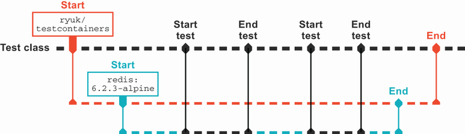
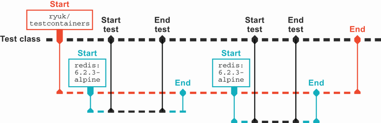

# 14. Kiểm thử vượt ra ngoài JUnit

> *The Well-Grounded Java Developer, Second Edition* — Chương 14
> Bản dịch tiếng Việt

**Chương này bao gồm:**

- Integration testing với Testcontainers
- Kiểm thử theo phong cách đặc tả (specification-style) với Spek và Kotlin
- Property-based testing với Clojure

---

Ở chương trước, chúng ta đã xem các nguyên tắc chung dẫn dắt việc kiểm thử. Giờ chúng ta sẽ đi sâu hơn vào các cách tiếp cận cụ thể để cải thiện việc kiểm thử cho những tình huống khác nhau. Dù mục tiêu là kiểm thử sạch hơn các phụ thuộc, giao tiếp tốt hơn trong mã kiểm thử, hay thậm chí khám phá các trường hợp biên mà ta chưa cân nhắc, hệ sinh thái JVM cung cấp nhiều công cụ để giúp đỡ, và chúng tôi sẽ chỉ nêu bật vài cái. Hãy bắt đầu với cuộc vật lộn muôn thuở: làm sao đối phó hiệu quả với các phụ thuộc bên ngoài khi viết integration test.

## 14.1 Integration testing với Testcontainers

Khi chúng ta đi lên kim tự tháp từ các unit test cô lập, ta gặp nhiều chướng ngại. Để integration test với một cơ sở dữ liệu thật đòi hỏi chúng ta phải có một cơ sở dữ liệu thật để dùng! Có được lợi ích của việc kiểm thử thực tế đó hàm ý sự gia tăng khổng lồ về độ phức tạp thiết lập. Tính có trạng thái của các hệ thống bên ngoài này cũng tăng khả năng test của chúng ta thất bại, không phải vì vấn đề với mã mà vì trạng thái không mong muốn còn sót giữa các test.

Qua các năm, điều này đã được giải quyết theo nhiều cách, từ cơ sở dữ liệu trong bộ nhớ tới các framework chạy test hoàn toàn trong transaction tự dọn dẹp sau đó. Nhưng những giải pháp này thường mang tới trường hợp biên và khó khăn riêng.

Công nghệ container hóa, như đã thảo luận ở chương 12, cung cấp một cách tiếp cận mới thú vị cho vấn đề. Bởi container là ephemeral (thoáng qua), chúng rất phù hợp để khởi động cho một lần chạy test. Bởi chúng đóng gói các cơ sở dữ liệu thật và các dịch vụ khác mà ta muốn tương tác, chúng tránh được những chênh lệch tinh vi mà các cơ sở dữ liệu trong bộ nhớ thay thế dễ mắc phải.

### 14.1.1 Cài đặt testcontainers

Một trong những cách đơn giản nhất để tận dụng container trong kiểm thử là qua thư viện `testcontainers` (xem https://www.testcontainers.org/). Nó cung cấp một API để điều khiển container trực tiếp từ mã test, với nhiều module hỗ trợ cho các phụ thuộc phổ biến. Chức năng cốt lõi được cung cấp qua JAR `org.testcontainers.testcontainers` trong Maven:

```xml
<dependency>
  <groupId>org.testcontainers</groupId>
  <artifactId>testcontainers</artifactId>
  <version>1.15.3</version>
  <scope>test</scope>
</dependency>
```

hoặc Gradle:

```
testImplementation "org.testcontainers:testcontainers:1.15.3"
```

### 14.1.2 Một ví dụ với Redis

Nếu bạn nhớ, chúng ta đã để ứng dụng nhà hát tải giá xuống từ một dịch vụ HTTP. Chúng ta muốn đưa vào một cache cho các giá trị đó. Mặc dù caching đúng đắn là cả một chủ đề riêng, hãy tưởng tượng chúng ta quyết định externalize cache thay vì chỉ đặt giá trị trong bộ nhớ. Một kho dữ liệu điển hình cho việc này là Redis (https://redis.io/). Redis phơi bày truy cập cực nhanh để get, set và delete các cặp key-value, cùng các cấu trúc dữ liệu phức tạp hơn.

Interface `Price` mà chúng ta đã giới thiệu cho việc tra cứu dữ liệu từ dịch vụ HTTP, như sau, cho chúng ta sự linh hoạt để thêm caching như một mối quan tâm riêng:

```java
package com.wellgrounded;

import redis.clients.jedis.Jedis;

import java.math.BigDecimal;

public class CachedPrice implements Price {
    private final Price priceLookup;
    private final Jedis cacheClient;

     private static final String priceKey = "price";        ❶

     CachedPrice(Price priceLookup, Jedis cacheClient) {    ❷
         this.priceLookup = priceLookup;
         this.cacheClient = cacheClient;
     }

     @Override
     public BigDecimal getInitialPrice() {
         String cachedPrice = cacheClient.get(priceKey);    ❸
         if (cachedPrice != null) {
             return new BigDecimal(cachedPrice);
         }

          BigDecimal price =
              priceLookup.getInitialPrice();                ❹
          cacheClient.set(priceKey,
                          price.toPlainString());           ❺
          return price;
     }
}
```

❶ Tên key mà chúng ta sẽ cache giá trong Redis

❷ Chúng ta dùng thư viện Jedis (https://github.com/redis/jedis) để truy cập Redis.

❸ Kiểm tra xem cache đã có giá này chưa

❹ Nếu chưa có giá, dùng lookup được cung cấp

❺ Cache giá trị vừa lấy được

Đến đây đáng dừng lại để cân nhắc khía cạnh nào của hệ thống chúng ta muốn test. Điểm chính của class `CachedPrice` là tương tác giữa Redis và việc tra cứu giá bên dưới. Cách chúng ta làm việc với Redis là then chốt, và Testcontainers cho phép ta test với thứ thật như sau:

```java
package com.wellgrounded;

import org.junit.jupiter.api.Test;
import org.testcontainers.containers.GenericContainer;
import org.testcontainers.junit.jupiter.*;
import org.testcontainers.utility.DockerImageName;
import redis.clients.jedis.*;

import java.math.BigDecimal;

import static org.junit.jupiter.api.Assertions.assertEquals;

@Testcontainers
public class CachedPriceTest {
    private static final DockerImageName imageName =
                    DockerImageName.parse("redis:6.2.3-alpine");

     @Container
     public static GenericContainer redis = new GenericContainer(imageName)
             .withExposedPorts(6379);

     // Các test theo sau...
}
```

Trong phần đầu này của test, chúng ta thấy dạng đấu nối cơ bản nhất với Testcontainers. Chúng ta áp annotation `@Testcontainers` cho cả class test, cho thư viện biết rằng nó nên theo dõi các container ta cần trong lúc thực thi test. Field được đánh dấu `@Container` sau đó yêu cầu container image cụ thể `"redis:6.2.3-alpine"` khởi động, dùng port Redis tiêu chuẩn, 6379.

Khi class test này thực thi, như thể hiện trong hình 14.1, Testcontainers khởi động container ta đã yêu cầu. Testcontainers sẽ chờ một timeout mặc định (60 giây) để port ánh xạ đầu tiên khả dụng, nên chúng ta có thể tự tin container đã sẵn sàng để nói chuyện. Field `redis` sau đó cho phép chúng ta lấy thông tin như hostname và port để dùng sau trong test.



**Hình 14.1** Thực thi Testcontainers

Với Redis container hóa đang chạy, chúng ta có thể bắt tay vào các test thực tế. Bởi điểm then chốt là tương tác giữa Redis và việc tra cứu — không phải cách tra cứu giá bên dưới thực sự được hiện thực — chúng ta có thể tái sử dụng `StubPrice` trước đó, luôn trả về 10 để đơn giản hóa việc kiểm thử, như sau:

```java
@Test
public void cached() {
    var jedis = getJedisConnection();
    jedis.set("price", "20");                            ❶

         CachedPrice price =
             new CachedPrice(new StubPrice(), jedis);    ❷
         BigDecimal result = price.getInitialPrice();

      assertEquals(new BigDecimal("20"), result);        ❸
}

@Test
public void noCache() {
    var jedis = getJedisConnection();
    jedis.del("price");                                  ❹

      CachedPrice price = new CachedPrice(new StubPrice(), jedis);
      BigDecimal result = price.getInitialPrice();

      assertEquals(new BigDecimal("10"), result);
}

private Jedis getJedisConnection() {                     ❺
    HostAndPort hostAndPort = new HostAndPort(
                                     redis.getHost(),
                                     redis.getFirstMappedPort());
    return new Jedis(hostAndPort);
}
```

❶ Đặt một giá khác với giá stub của chúng ta trong Redis

❷ Truyền `StubPrice` làm lookup, sẽ trả về 10, không phải 20

❸ Khẳng định rằng chúng ta nhận được giá trị đã cache

❹ Loại bỏ mọi giá trị đã cache trước đó trong Redis bằng lời gọi `del`

❺ Phương thức trợ giúp để thiết lập instance Jedis của chúng ta

Quan trọng cần lưu ý cách phương thức `getJedisConnection` dùng cấu hình từ Testcontainers để kết nối tới Redis. Mặc dù bạn có thể quan sát thấy `redis.getHost()` là một giá trị phổ biến, chẳng hạn `localhost`, điều này không nhất thiết được đảm bảo trong mọi môi trường. Tốt hơn là hỏi Testcontainers các giá trị đó và bảo vệ chúng ta khỏi những thay đổi bất ngờ với các giá trị đó trong tương lai.

Mặc dù việc tự động khởi động container ở đây khá tiện, đáng để hiểu cách kiểm soát nó trực tiếp hơn. Điều này đặc biệt đúng nếu container của bạn cần thời gian để khởi động, như chúng ta sẽ thấy với các ví dụ sau như cơ sở dữ liệu quan hệ với schema bắt buộc.

Annotation `@Container` nhận ra khi nó được áp lên một field static so với một field instance, như thể hiện trong hình 14.2. Khi áp lên một field static, container sẽ được khởi động một lần cho suốt thời gian thực thi của class test. Nếu bạn để field ở mức instance, thì mỗi test riêng lẻ sẽ khởi động và dừng container.



**Hình 14.2** Field và `@Container`

Điều này chỉ tới một cách tiềm năng khác để quản lý vòng đời container: nếu chúng ta muốn chạy container chỉ một lần cho cả bộ test thì sao? Để làm điều này, chúng ta phải bỏ lại annotation `@Container` và dùng API trực tiếp do chính đối tượng `GenericContainer` phơi bày, như sau:

```java
private static final DockerImageName imageName =
        DockerImageName.parse("redis:6.2.3-alpine");

public static GenericContainer redis = new GenericContainer(imageName)
        .withExposedPorts(6379);

@BeforeAll
public void setUp() {
    redis.start();               ❶
}
```

❶ `start` có thể được gọi an toàn nhiều lần trên một instance — nó chỉ khởi động container một lần cho mỗi đối tượng.

Chúng ta không cần cung cấp một `tearDown` để dừng container một cách tường minh, bởi thư viện `testcontainers` lo việc đó tự động cho ta.

Mặc dù ví dụ trước gọi `start` cho mỗi test, đối tượng `redis` có thể chuyển tới một vị trí nơi nó được chia sẻ an toàn giữa nhiều class test.

### 14.1.3 Thu thập log container

Nếu bạn chạy các test này ở dòng lệnh hoặc trong IDE, bạn có thể nhận thấy rằng theo mặc định không có đầu ra nào từ container. Với trường hợp Redis đơn giản, đây không phải vấn đề, nhưng các thiết lập phức tạp hơn hoặc việc debug có thể khiến bạn ước có nhiều tầm nhìn hơn vào các container đó. Để hỗ trợ, Testcontainers cho phép truy cập STDOUT và STDERR từ các container nó khởi động.

Hỗ trợ này dựa trên interface `Consumer<>` của JDK, và một số bản hiện thực đi kèm thư viện. Bạn có thể kết nối tới các nhà cung cấp logging tiêu chuẩn hoặc, như chúng tôi sẽ minh họa, lấy trực tiếp log thô.

Bạn có thể thấy bất tiện khi log container tuôn vào đầu ra chính, nhưng cũng phiền khi phải làm gì đó tùy chỉnh khi bạn *muốn* chúng. Một giải pháp là đấu nối hỗ trợ để luôn ghi chúng vào một vị trí riêng, chẳng hạn một tệp trong đầu ra build, như sau:

```java
@Container                                               ❶
public static GenericContainer redis =
    new GenericContainer(imageName)
        .withExposedPorts(6379);

public static ToStringConsumer consumer =                ❷
                                new ToStringConsumer();

@BeforeAll
public static void setUp() {
    redis.followOutput(consumer,
                       OutputType.STDOUT,
                       OutputType.STDERR);               ❸
}

@AfterAll
public static void tearDown() throws IOException {
    Path log = Path.of("./build/tc.log");                ❹
    byte[] bytes = consumer.toUtf8String().getBytes();
    Files.write(log, bytes,
                StandardOpenOption.CREATE);              ❺
}
```

❶ Chúng ta lại dùng annotation `@Container` cho việc khởi động bởi nó quá dễ.

❷ Instance consumer sẽ thu thập log trong suốt lần chạy test.

❸ Gắn consumer vào container, yêu cầu cả STDOUT và STDERR

❹ Ghi vào vị trí thuận tiện

❺ Dùng `java.nio.Files` để ghi nội dung tệp dễ dàng

### 14.1.4 Một ví dụ với Postgres

Redis là ví dụ dễ nhờ việc thiếu phụ thuộc, bản chất tạm thời của dữ liệu thường lưu ở đó, và thời gian khởi động nhanh của container. Nhưng còn điểm mắc kẹt trong integration testing truyền thống: cơ sở dữ liệu quan hệ? Thường dữ liệu chúng ta đặt vào kho quan hệ là quan trọng nhất với chức năng thực sự của ứng dụng, nhưng kiểm thử nó đầy rẫy dữ liệu cũ, mocking vụng về và dương tính giả.

Testcontainers hỗ trợ nhiều kho dữ liệu khác nhau. Chúng được đóng gói trong các module riêng, phải được kéo vào. Chúng tôi sẽ minh họa dùng Postgres, nhưng trên website Testcontainers (https://www.testcontainers.org/modules/databases/), bạn sẽ tìm thấy danh sách dài các lựa chọn khác.

Chúng ta đưa module Postgres vào như một phụ thuộc test và cả driver Postgres chính để có thể kết nối tới cơ sở dữ liệu mới, trong Maven:

```xml
<dependency>
  <groupId>org.postgresql</groupId>
  <artifactId>postgresql</artifactId>
  <version>42.2.1</version>
</dependency>
<dependency>
  <groupId>org.testcontainers</groupId>
  <artifactId>postgresql</artifactId>
  <version>1.15.3</version>
  <scope>test</scope>
</dependency>
```

hoặc Gradle:

```kotlin
implementation("org.postgresql:postgresql:42.2.1")
testImplementation("org.testcontainers:postgresql:1.15.3")
```

Quan trọng là phiên bản này khớp với thư viện `org.testcontainers:testcontainers` cơ sở bạn đang dùng.

Một class cụ thể bọc việc truy cập container Postgres của chúng ta. Nó có các helper để cấu hình thông tin như tên cơ sở dữ liệu và thông tin đăng nhập, như sau:

```java
public static DockerImageName imageName =
            DockerImageName.parse("postgres:9.6.12");

@Container
public static PostgreSQLContainer postgres =
    new PostgreSQLContainer<>(imageName)
        .withDatabaseName("theater_db")
        .withUsername("theater")
        .withPassword("password");
```

Mọi cân nhắc quản lý vòng đời tương tự đều áp dụng ở đây, với thêm nếp nhăn là cơ sở dữ liệu quan hệ cần schema được áp dụng trước khi dùng được. Nhiều dự án migration cơ sở dữ liệu phổ biến có thể chạy từ mã, nhưng chúng tôi sẽ minh họa chỉ dùng JDBC trực tiếp để cho thấy không có gì kỳ diệu đang diễn ra.

Trước hết, chúng ta cần một kết nối tới instance container. Dùng các class JDBC, chúng ta thiết lập nó với các tham số từ đối tượng Testcontainer `postgres` như sau:

```java
private static Connection getConnection() throws SQLException {
    String url = String.format(
            "jdbc:postgresql://%s:%s/%s",
            postgres.getHost(),
            postgres.getFirstMappedPort(),
            postgres.getDatabaseName());

      return DriverManager.getConnection(url,
                                          postgres.getUsername(),
                                          postgres.getPassword());
}
```

> **NOTE** Testcontainers có một tính năng nơi bạn có thể sửa đổi connection string, và nó sẽ tự động khởi động container cho cơ sở dữ liệu của bạn. Mặc dù tiện, nó ít trực tiếp hơn để minh họa. Tuy nhiên, điều này có thể đặc biệt giá trị khi tích hợp Testcontainers vào một bộ test hiện có.

Với kết nối, chúng ta muốn đảm bảo schema tại chỗ trước khi bất kỳ test nào chạy. Trong phạm vi một class test, chúng ta sẽ làm điều này với `@BeforeAll` như sau:

```java
@BeforeAll
public static void setup() throws SQLException, IOException {
    var path = Path.of("src/main/resources/init.sql");
    var sql = Files.readString(path);                 ❶
    try (Connection conn = getConnection()) {
        conn.createStatement().execute(sql);          ❷
    }
}
```

❶ Với ví dụ của chúng ta, một tệp SQL chứa các định nghĩa schema.

❷ Áp dụng SQL

Với schema tại chỗ, các test giờ có thể chạy trên cơ sở dữ liệu Postgres đầy đủ, trống rỗng này như sau:

```java
@Test
public void emptyDatabase() throws SQLException {
    try (Connection conn = getConnection()) {
        Statement st = conn.createStatement();
            ResultSet result = st.executeQuery("SELECT * FROM prices");
            assertEquals(0, result.getFetchSize());
     }
}
```

Nếu bạn có các trừu tượng khác như DAO (data access object), repository, hay cách khác để đọc từ cơ sở dữ liệu, chúng đều nên hoạt động tốt với kết nối tới container.

### 14.1.5 Một ví dụ cho end-to-end testing với Selenium

Việc chuyển sang dùng tài nguyên bên ngoài trong container phù hợp tự nhiên với integration testing. Các kỹ thuật tương tự cũng áp dụng với end-to-end testing. Mặc dù phụ thuộc vào hệ thống chính xác của bạn, thường một end-to-end test sẽ muốn điều khiển một trình duyệt để đảm bảo một ứng dụng web đang chạy như mong đợi.

Trong lịch sử, việc điều khiển trình duyệt web từ mã là một đề xuất nhạy cảm. Các kỹ thuật vẫn mong manh và chậm, nhưng Testcontainers lấy đi nỗi đau cài đặt và cấu hình bằng cách cho phép bạn khởi động một trình duyệt trong container và điều khiển nó từ xa ở đó.

Như với ví dụ Postgres, chúng ta sẽ cần kéo phụ thuộc vào. Trong trường hợp này, có một module để Testcontainers hỗ trợ cùng các thư viện cần cho test điều khiển từ xa instance trình duyệt, trong Maven:

```xml
<dependency>
  <groupId>org.testcontainers</groupId>
  <artifactId>selenium</artifactId>
  <version>1.15.3</version>
  <scope>test</scope>
</dependency>
<dependency>
  <groupId>org.seleniumhq.selenium</groupId>
  <artifactId>selenium-remote-driver</artifactId>
  <version>3.141.59</version>
  <scope>test</scope>
</dependency>
<dependency>
  <groupId>org.seleniumhq.selenium</groupId>
  <artifactId>selenium-chrome-driver</artifactId>
  <version>3.141.59</version>
  <scope>test</scope>
</dependency>
```

hoặc Gradle:

```kotlin
testImplementation("org.testcontainers:selenium:1.15.3")
testImplementation(
  "org.seleniumhq.selenium:selenium-remote-driver:3.141.59")
testImplementation(                                            ❶
  "org.seleniumhq.selenium:selenium-chrome-driver:3.141.59")
```

❶ Hỗ trợ cho các trình duyệt web khác cũng tồn tại trong các package có tên tương tự.

Các class cụ thể cấu hình các instance trình duyệt. Chúng ta sẽ truyền `ChromeOptions` ở đây để chỉ ra rằng ta đang khởi động trình duyệt cụ thể đó:

```java
@Container
public static BrowserWebDriverContainer<?> chrome =
    new BrowserWebDriverContainer<>()
        .withCapabilities(new ChromeOptions());
```

Với instance này, chúng ta giờ có thể viết test truy cập trang web và kiểm tra kết quả như sau:

```java
@Test
public void checkTheSiteOut() {
    var url = "https://github.com/well-grounded-java";
    RemoteWebDriver driver = chrome.getWebDriver();
    driver.get(url);                                     ❶

      WebElement title =
                  driver.findElementByTagName("h1");     ❷
      assertEquals("well-grounded-java", title.getText());
}
```

❶ Điều hướng tới tổ chức GitHub `well-grounded-java`

❷ Khi trang tải xong, kiểm tra nội dung `<h1>` đầu tiên

Ví dụ đơn giản này đã cho thấy loại mong manh mà end-to-end testing dễ mắc. Điều gì xảy ra nếu GitHub thiết kế lại và quyết định thêm một `<h1>` khác trong trang? Điều gì nếu họ thay đổi văn bản tiêu đề theo cách tinh vi nào đó? Nếu bạn đang test ứng dụng của chính mình, điều này có thể ít là vấn đề hơn, nhưng sự gắn kết chặt với phần trình bày vẫn là vấn đề.

Chạy bên trong một container, nếu mọi thứ không như ta mong đợi, có thể khó hiểu tại sao. May mắn thay, chúng ta có thể có phản hồi trực quan theo vài cách.

Trước hết, chúng ta có thể chụp màn hình ở các điểm thời gian cụ thể như sau:

```java
@Test
public void checkTheSiteOut() {
    RemoteWebDriver driver = chrome.getWebDriver();
    driver.get("https://github.com/well-grounded-java");

    File screen = driver.getScreenshotAs(OutputType.FILE);
}
```

Tệp trả về là tạm thời và sẽ bị loại bỏ ở cuối test, nhưng bạn có thể sao chép nó đi nơi khác trong mã sau khi nó được tạo.

Việc thấy nhiều hơn chỉ một thời điểm là đủ phổ biến. Bạn cũng có thể chỉ cần yêu cầu ghi lại video của phiên làm việc một cách tự động như sau:

```java
private static final File tmpDirectory = new File("build");

@Container
public static BrowserWebDriverContainer<?> chrome =
    new BrowserWebDriverContainer<>()
        .withCapabilities(new ChromeOptions())
        .withRecordingMode(RECORD_ALL,
                            tmpDirectory,
                            VncRecordingFormat.MP4);
```

Như chúng ta đã làm với log container, điều này sẽ tạo bản ghi trong đầu ra build bất cứ khi nào test được chạy. Mọi thứ chúng ta cần để debug đã sẵn sàng, ngay ở đó, nếu rắc rối phát sinh.

Đây mới chỉ chạm bề mặt những gì Testcontainers cho phép bạn hoàn thành. Giờ hãy xem việc bỏ lại JUnit để viết test theo một dạng khác, có khả năng dễ đọc hơn.

## 14.2 Kiểm thử theo phong cách đặc tả với Spek và Kotlin

Cách JUnit dùng phương thức, class và annotation rất tự nhiên với lập trình viên Java. Nhưng dù chúng ta có nhận thức hay không, nó định hình cách ta diễn đạt và nhóm các test. Mặc dù không bắt buộc, chúng ta thường kết thúc với một class test ánh xạ tới class production và các cụm phương thức test lỏng lẻo cho mỗi phương thức hiện thực.

Một ý tưởng thay thế là cái gọi là viết *đặc tả* (specification). Điều này nảy sinh từ các framework như RSpec và Cucumber, và thay vì tập trung vào cách mã của chúng ta được định hình, nó nhắm tới hỗ trợ việc chỉ định hệ thống hoạt động thế nào ở mức cao hơn, gần với cách con người sẽ thảo luận yêu cầu.

Một ví dụ về loại kiểm thử này khả dụng trong Kotlin qua framework Spek (xem https://www.spekframework.org/). Như chúng ta sẽ thấy, nhiều tính năng dựng sẵn của Kotlin cho phép một tổ chức và cảm giác rất khác trong đặc tả của chúng ta.

Cài đặt Spek theo quy trình điển hình cho phụ thuộc. Spek tập trung hoàn toàn vào cách chúng ta cấu trúc đặc tả và dựa vào hệ sinh thái cho chức năng như assertion và chạy test. Để đơn giản ở đây, chúng tôi sẽ minh họa với assertion và test runner từ JUnit 5, nhưng bạn không bắt buộc phải dùng chúng nếu có thư viện khác ưa thích.

Trong Maven, `maven-surefire-plugin` từ mục 11.2.6 chỉ cần được thông báo về các tệp đặc tả, mà chúng ta sẽ đánh dấu bằng cách bao gồm `Spek` trong tên tệp, như sau. Chúng ta cũng sẽ cần hỗ trợ Kotlin mô tả ở mục 11.2.5 (không lặp lại ở đây cho ngắn):

```xml
<build>
  <plugins>
    <plugin>
      <artifactId>maven-surefire-plugin</artifactId>
      <version>2.22.2</version>
      <configuration>
         <includes>
           <include>**/*Spek*.*</include>            ❶
         </includes>
      </configuration>
    </plugin>
  </plugins>
</build>

<dependencies>
  <dependency>
    <groupId>org.junit.jupiter</groupId>
    <artifactId>junit-jupiter-api</artifactId>       ❷
    <version>5.7.1</version>
    <scope>test</scope>
  </dependency>
  <dependency>
      <groupId>org.spekframework.spek2</groupId>
      <artifactId>spek-dsl-jvm</artifactId>
      <version>2.0.15</version>
      <scope>test</scope>
    </dependency>
    <dependency>
      <groupId>org.spekframework.spek2</groupId>
      <artifactId>spek-runner-junit5</artifactId>    ❸
      <version>2.0.15</version>
      <scope>test</scope>
    </dependency>
  </dependencies>
```

❶ Vì quy ước tệp tùy chỉnh của chúng ta, ta phải nói cho Maven biết cần chạy gì.

❷ Dùng API assertion của JUnit

❸ Dùng tích hợp của Spek với test runner JUnit

Trong Gradle, chúng ta cắm vào task `test` tiêu chuẩn và thông báo cho nền tảng JUnit về engine của Spek, như trong đoạn mã tiếp theo. Bạn có thể thấy các test ở dòng lệnh sẽ thấy đặc tả của chúng ta mà không cần dòng `engine`, nhưng các hệ thống khác như IDE có thể bỏ lỡ chúng:

```kotlin
dependencies {
  testImplementation(
      "org.junit.jupiter:junit-jupiter-api:5.7.1")       ❶

    testImplementation("org.spekframework.spek2:spek-dsl-jvm:2.0.15")
    testRuntimeOnly(
        "org.spekframework.spek2:spek-runner-junit5:2.0.15")   ❷
}

tasks.named<Test>("test") {                                    ❸
  useJUnitPlatform() {
    includeEngines("spek2")                                    ❹
  }
}
```

❶ Dùng API assertion của JUnit

❷ Dùng tích hợp của Spek với test runner JUnit

❸ Tra cứu task `test`, thông báo nó thuộc kiểu `Test` để chúng ta truy cập được `useJUnitPlatform` và các phương thức theo sau

❹ Thông báo cho JUnit về engine của chúng ta để tích hợp IDE tốt hơn

Giờ chúng ta có thể bắt tay vào viết đặc tả đầu tiên. Để khảo sát điều này, chúng ta sẽ lấy việc kiểm thử trước đó đã làm với class `InMemoryCachedPrice` và xem Spek thay đổi cấu trúc và luồng kiểm thử ra sao:

```kotlin
import org.spekframework.spek2.Spek
import org.junit.jupiter.api.Assertions.assertEquals
import java.math.BigDecimal

object InMemoryCachedPriceSpek : Spek({
    group("empty cache") {
        test("gets default value") {
            val stubbedPrice = StubPrice()
            val cachedPrice = InMemoryCachedPrice(stubbedPrice)

                assertEquals(BigDecimal(10), cachedPrice.initialPrice)
            }

            test("gets same value when called again") {
                val stubbedPrice = StubPrice()
                val cachedPrice = InMemoryCachedPrice(stubbedPrice)

                val first = cachedPrice.initialPrice
                val second = cachedPrice.initialPrice
                assertTrue(first === second)                    ❶
            }
        }
})
```

❶ `===` là toán tử của Kotlin cho phép so sánh tham chiếu, nên cái này kiểm tra rằng chúng ta có chính xác cùng đối tượng giữa các lời gọi, không chỉ giá trị giống nhau.

Đặc tả đầu tiên của chúng ta nêu rõ hành vi quanh một cache rỗng. Chúng ta thấy nhiều tính năng Kotlin đang hoạt động. Trước hết, đặc tả được khai báo là một `object` singleton thay vì một class. Điều này giúp làm rõ các vấn đề vòng đời test thỉnh thoảng xảy ra trong JUnit, tùy vào việc test runner dựng một instance test cho mỗi class hay cho mỗi phương thức test riêng lẻ.

Đặc tả chính được khai báo trong một biểu thức lambda, truyền như tham số cho class `Spek`. Trong lambda này, hai hàm quan trọng khả dụng: `group` và `test`. Mỗi cái được cho một mô tả `String` đầy đủ. Không cần camel-case, gạch dưới hay mẹo khác để làm mô tả dễ đọc. `group` nhằm để bạn gộp các lời gọi `test` liên quan lại với nhau. Các cấu trúc `group` cũng có thể lồng nhau nếu muốn.

Nếu việc định dạng lại này là tất cả những gì kiểm thử theo phong cách đặc tả mang lại, nó sẽ không mấy thuyết phục. Tuy nhiên, việc nhóm không chỉ là đặt tên, bởi chúng ta có thể khai báo các *fixture* chia sẻ thiết lập qua nhiều test, như sau:

```kotlin
object InMemoryCachedPriceSpek : Spek({
    group("empty cache") {
        lateinit var stubbedPrice : Price
        lateinit var cachedPrice : InMemoryCachedPrice

           beforeEachTest {
             stubbedPrice = StubPrice()
             cachedPrice = InMemoryCachedPrice(stubbedPrice)
           }

           test("gets default value") {
               assertEquals(BigDecimal(10), cachedPrice.initialPrice)
           }

           test("gets same value when called again") {
               val first = cachedPrice.initialPrice
               val second = cachedPrice.initialPrice
               assertTrue(first === second)
           }
     }
})
```

Trong group "empty cache", chúng ta khai báo hai fixture: một `stubbedPrice` để dùng khi thiết lập cache và instance `cachedPrice` mà ta sẽ test. Bất kỳ lời gọi `test` nào là thành viên của group này đều có cái nhìn giống hệt về các fixture này.

Mẫu được khuyến nghị cho fixture là dùng `lateinit` và khởi tạo chúng trong `beforeEachTest`. Nhu cầu khởi tạo muộn này thực ra phản ánh việc Spek chạy đặc tả của chúng ta ở hai pha: *discovery* rồi *execution*.

Trong pha discovery, lambda cấp cao nhất cho đặc tả được chạy. Các lambda `group` được đánh giá ngay, nhưng lời gọi `test` chưa được thực hiện; thay vào đó, chúng được ghi nhận để thực thi sau. Sau khi mọi group của đặc tả đã được đánh giá, các lambda `test` được thực thi. Sự tách biệt này, như sau, cho phép kiểm soát chặt hơn ngữ cảnh của mỗi group trước khi mỗi test riêng lẻ chạy:

```kotlin
object InMemoryCachedPriceSpek : Spek({
    group("empty cache") {                                  ❶
        lateinit var stubPrice : Price                      ❶
        lateinit var cachedPrice : InMemoryCachedPrice      ❶

          beforeEachTest {                                  ❷
            stubPrice = StubPrice()                         ❷
            cachedPrice = InMemoryCachedPrice(stubPrice)    ❷
          }                                                 ❷

          test("gets default value") {                      ❷
              assertEquals(BigDecimal(10),                  ❷
                            cachedPrice.initialPrice)       ❷
          }                                                 ❷

          test("gets same value when called again") {       ❷
              val first = cachedPrice.initialPrice          ❷
              val second = cachedPrice.initialPrice         ❷
              assertTrue(first === second)                  ❷
          }
     }
})
```

❶ Chạy trong pha discovery

❷ Chạy trong pha execution

Việc dùng `lateinit` hơi vụng về, nên Spek gói nó lại dùng delegated property của Kotlin. Mỗi fixture có thể được theo sau bằng một lời gọi `by memoized` và một lambda để cung cấp giá trị.

> **NOTE** *memoized* (không phải *memorized*!) là thuật ngữ cho một giá trị được tính một lần và cache để dùng sau.

Đừng dùng những cái này cho kết quả của các hành động bạn đang test — những cái đó nên được làm trong chính các lambda `test`, như sau:

```kotlin
object InMemoryCachedPriceSpek : Spek({
    val stubbedPrice : Price by memoized { StubPrice() }

     group("empty cache") {
         val cachedPrice by memoized { InMemoryCachedPrice(stubbedPrice) }

          test("gets default value") {
              assertEquals(BigDecimal(10), cachedPrice.initialPrice)
          }

          test("gets same value when called again") {
              val first = cachedPrice.initialPrice
              val second = cachedPrice.initialPrice
              assertTrue(first === second)
          }
     }
})
```

Pha discovery diễn ra qua việc thực thi thuần túy mã Kotlin cho phép tham số hóa đơn giản hơn nhiều so với JUnit. Thay vì cần thêm annotation và tra cứu dựa trên reflection, chúng ta chỉ cần lặp và lặp lại lời gọi `test` như sau:

```kotlin
object InMemoryCachedPriceSpek : Spek({
    group("parameterized example") {
        listOf(1, 2, 3).forEach {
            test("testing $it") {                     ❶
                assertNotEquals(it, 0)
            }
        }
    }
})
```

❶ Việc dùng `it` mỗi lần qua vòng lặp cho chúng ta các test `testing 1`, `testing 2`, và `testing 3`.

Với những ai đã gặp kiểm thử theo phong cách đặc tả ở hệ sinh thái khác, chẳng hạn RSpec trong Ruby hay Jasmine trong JavaScript, bạn có thể thay các phương thức `group` và `test` bằng `describe` và `it` để có luồng tường thuật còn tự nhiên hơn, như sau:

```kotlin
object InMemoryCachedPriceSpek : Spek({
    val stubbedPrice : Price by memoized { StubPrice() }

     describe("empty cache") {
         val cachedPrice by memoized { InMemoryCachedPrice(stubbedPrice) }

           it("gets default value") {
               assertEquals(BigDecimal(10), cachedPrice.initialPrice)
           }

           it("gets same value when called again") {
               val first = cachedPrice.initialPrice
               val second = cachedPrice.initialPrice
               assertEquals(true, first === second)
           }
     }
})
```

Một định dạng phổ biến khác để viết đặc tả là cú pháp Gherkin (https://cucumber.io/docs/gherkin/reference/), được công cụ kiểm thử Cucumber phổ biến hóa. Cú pháp này khai báo đặc tả của chúng ta theo một chuỗi phát biểu given-when-then: *cho* thiết lập này, *khi* hành động này xảy ra, *thì* chúng ta thấy những hệ quả này. Việc cưỡng chế cấu trúc này thường làm đặc tả dễ đọc hơn như ngôn ngữ tự nhiên, không chỉ là mã.

Phát biểu lại một test trước theo phong cách Gherkin có thể trông như thế này: *Cho* một cache rỗng, *khi* tính giá, *thì* chúng ta tra cứu giá trị mặc định. Đây là cách nó chuyển sang hỗ trợ Gherkin của Spek:

```kotlin
object InMemoryCachedPriceSpekGherkin : Spek({
    Feature("caching") {
        val stubbedPrice by memoized { StubPrice() }

           lateinit var cachedPrice : Price
           lateinit var result : BigDecimal

           Scenario("empty cache") {
               Given("an empty cache") {
                   cachedPrice = InMemoryCachedPrice(stubbedPrice)
               }

                When("calculating") {
                    result = cachedPrice.initialPrice
                }

                Then("it looks up the default value") {
                    assertEquals(BigDecimal(10), result)
                }
           }
     }
})
```

Bạn sẽ nhận thấy điều này cũng mang lại việc nhóm bổ sung từ Cucumber bằng cách chia đặc tả theo `Feature` và `Scenario` trước khi chúng ta áp dụng tổ chức given-when-then.

Đặc tả cho chúng ta một cách khác để sắp xếp mã kiểm thử nhằm giao tiếp tốt hơn với người đọc sau này. Nhưng chúng vẫn đòi hỏi ta viết ra mọi trường hợp bằng tay. Clojure trình bày một số khả năng khác để khám phá cách chúng ta chọn dữ liệu kiểm thử.

## 14.3 Property-based testing với Clojure

Không như Java và Kotlin, Clojure đi kèm một framework kiểm thử trong thư viện chuẩn, `clojure.test`. Mặc dù chúng tôi sẽ không đề cập thư viện này sâu, hãy làm quen với những điều cơ bản trước khi thăm các phần khác, kỳ lạ hơn của hệ sinh thái kiểm thử Clojure.

### 14.3.1 clojure.test

Chúng ta sẽ chạy test qua REPL Clojure, giống như đã làm xuyên suốt chương 10. Nếu bạn bỏ qua chương đó hoặc đã lâu rồi, giờ là lúc tốt để ôn lại những điều cơ bản của Clojure nếu bất kỳ test nào khó theo dõi.

Mặc dù đi kèm trực tiếp với Clojure, `clojure.test` không được tự động bundle với mã của chúng ta. Chúng ta cần yêu cầu thư viện qua `require`. Nhập lệnh sau trong REPL làm mọi hàm trong `clojure.test` khả dụng với tiền tố `test` mà ta khai báo qua `:as`:

```clojure
user=> (require '[clojure.test :as test])
nil
user=> (test/is (= 1 1))
true
```

Cách khác, chúng ta có thể chọn các hàm cụ thể qua `:refer` để dùng không cần tiền tố như sau:

```clojure
user=> (require '[clojure.test :refer [is]])
nil
user=> (is (= 1 1))
true
```

Hàm `is` biểu diễn cơ sở của các assertion trong `clojure.test`. Khi assertion pass, chúng ta thấy hàm trả về `true`. Còn khi nó thất bại?

```clojure
user=> (is (= 1 2))

FAIL in () (NO_SOURCE_FILE:1)
expected: (= 1 2)
  actual: (not (= 1 2))
false
```

Bất kỳ vị từ nào cũng có thể dùng với `is`. Ví dụ, đây là cách chúng ta xác nhận rằng một hàm sẽ ném một exception ta mong đợi:

```clojure
user=> (defn oops [] (throw (RuntimeException. "Oops")))    ❶
#'user/oops

user=> (is (thrown? RuntimeException (oops)))
#error {                                                    ❷
 :cause "Oops"
 :via
 [{:type java.lang.RuntimeException
   :message "Oops"
    :at [user$oops invokeStatic "NO_SOURCE_FILE" 1]}]
    ...                                                     ❸
```

❶ Một hàm luôn ném `RuntimeException`

❷ Chúng ta nhận giá trị `#error`, không phải thông điệp FAIL. Điều này chỉ ra assertion đã pass.

❸ Lỗi cũng chứa stack trace đầy đủ, được lược bỏ ở đây cho gọn.

Với các assertion, chúng ta giờ sẵn sàng bắt đầu dựng test. Phương pháp chính cho việc này là hàm `deftest`, như sau:

```clojure
user=> (require '[clojure.test :refer [deftest]])
nil
user=> (deftest one-is-one (is (= 1 1)))
#'user/one-is-one
```

Sau khi định nghĩa test, giờ chúng ta cần thực thi nó. Chúng ta có thể làm điều này qua hàm `run-tests`, sẽ tìm mọi test đã định nghĩa trong namespace hiện tại. Với REPL, một namespace mặc định gọi là `user` tồn tại tự động, và đó là nơi `deftest` đặt test của chúng ta, như sau:

```clojure
user=> (require '[clojure.test :refer [run-tests]])
nil
user=> (run-tests)

Testing user

Ran 1 tests containing 1 assertions.
0 failures, 0 errors.
{:test 1, :pass 1, :fail 0, :error 0, :type :summary}
```

Hiển nhiên việc viết và chạy test trong REPL tốt cho việc học nhưng không hỗ trợ được cho bất kỳ việc dùng dài hạn nào trong dự án. Cuối cùng đáng để thiết lập một test runner, mặc dù không như thế giới Java nơi JUnit là kẻ dẫn đầu nổi bật, có vài lựa chọn cạnh tranh tồn tại trong Clojure. Vài cái để cân nhắc như sau:

- **Leiningen** (https://leiningen.org/) là công cụ build Clojure phổ biến bao gồm hỗ trợ kiểm thử, giống Maven và Gradle.
- **Cognitect Labs test-runner** (https://github.com/cognitect-labs/test-runner) là một test runner đơn giản xây dựng thuần trên hỗ trợ phụ thuộc native của Clojure.
- **Kaocha** (https://github.com/lambdaisland/kaocha) là một test runner đầy đủ tính năng với trọng tâm vào thiết kế modular cho quy trình kiểm thử.

Dù vậy, chúng ta sẽ tiếp tục trong REPL và giờ xem một khả năng thú vị đi kèm Clojure: đặc tả dữ liệu.

### 14.3.2 clojure.spec

Mặc dù việc tích hợp của Clojure với JVM nghĩa là bạn có thể làm việc tự nhiên với class và đối tượng, lập trình hàm không ghép hành vi chặt với dữ liệu như vậy. Thường có các hàm thao tác trên cấu trúc dữ liệu tạo từ các nguyên thủy cơ bản, đặc biệt với map thực hiện hành vi mang dữ liệu mà chúng ta gắn với class trong lập trình hướng đối tượng.

Điều này khiến việc có các tiện ích tốt hơn để test hình dạng và nội dung của cấu trúc dữ liệu dựng sẵn trở nên hấp dẫn. Cái đó được cung cấp trong thư viện chuẩn với `clojure.spec`. Cũng như với `clojure.test`, chúng ta cần `require` thư viện để truy cập nó, như sau:

```clojure
user=> (require '[clojure.spec.alpha :as spec])
nil
```

> **NOTE** Mặc dù `clojure.spec` dùng thuật ngữ "specification", đây là cách dùng thuật ngữ hoàn toàn khác so với đặc tả mà chúng ta đã thấy với Spek trong Kotlin. `clojure.spec` định nghĩa đặc tả cho *dữ liệu* thay vì cho *hành vi*.

Với thư viện đó khả dụng, chúng ta có thể bắt đầu đưa ra phát biểu về các giá trị khác nhau với hàm `valid?`. Nó thực thi hàm vị từ chúng ta truyền vào trên giá trị và cho ta một Boolean, như sau:

```clojure
user=> (spec/valid? even? 10)
true
user=> (spec/valid? even? 13)
false
```

Hàm `conform` cung cấp mức kiểm tra tiếp theo, như trong đoạn mã sau. Nếu giá trị qua được vị từ, chúng ta nhận lại giá trị đó. Nếu không, kết quả trả về là keyword `:clojure.spec.alpha/invalid`:

```clojure
user=> (spec/conform even? 10)
10
user=> (spec/conform even? 13)
:clojure.spec.alpha/invalid
```

Chúng ta có thể kết hợp các kiểm tra khác nhau dùng hàm `and`. Có thể làm điều này trực tiếp bằng cách viết hàm vị từ riêng, nhưng dùng phiên bản từ `clojure.spec`, minh họa trong đoạn tiếp theo, nghĩa là thư viện hiểu tổ hợp chúng ta đang tạo. Chúng ta sẽ thấy ngay điều đó cho chúng ta nhiều thông tin hơn thế nào:

```clojure
user=> (spec/conform (spec/and int? even?) 10)
10
user=> (spec/conform (spec/and int? even?) 13)
:clojure.spec.alpha/invalid
user=> (spec/conform (spec/and int? even?) "not int")
:clojure.spec.alpha/invalid
```

Sau khi thấy `and`, có lẽ không ngạc nhiên khi có một hàm `or`. Nhưng câu chuyện phức tạp lên nếu chúng ta cố dùng `or` giống như đã làm với `and`, như sau:

```clojure
user=> (spec/conform (spec/or int? string?) 10)
Unexpected error (AssertionError) macroexpanding spec/or at (REPL:1:15)
Assert failed: spec/or expects k1 p1 k2 p2..., where ks are keywords
(c/and (even? (count key-pred-forms)) (every? keyword? keys))
```

Thông điệp lỗi này cho chúng ta biết `or` mong đợi bao gồm các keyword giữa các vị từ mà ta truyền vào. Điều này có vẻ là yêu cầu lạ cho một hàm Boolean đơn giản. Tuy nhiên, lý do trở nên rõ hơn khi chúng ta xem kỹ kết quả từ `conform` khi được cho điều kiện `or` ở đây:

```clojure
user=> (spec/conform (spec/or :a-number int? :a-string string?) "hello")
[:a-string "hello"]
user=> (spec/conform (spec/or :a-number int? :a-string string?) 10)
[:a-number 10]
user=> (spec/conform (spec/or :a-number int? :a-string string?) nil)
:clojure.spec.alpha/invalid
```

Thư viện cho chúng ta biết không chỉ rằng giá trị khớp đặc tả — nó cho ta biết *nhánh nào* của điều kiện `or` đã thỏa mãn spec. Đặc tả của chúng ta mang lại nhiều hơn tính hợp lệ đơn giản có/không. Chúng ta đang biết được *vì sao* giá trị pass cùng lúc.

Việc lặp lại đặc tả đang trở nên tẻ nhạt, và trong một ứng dụng thực, sự lặp lại như vậy là code smell rõ ràng. `clojure.spec` cho phép đăng ký đặc tả với một keyword có namespace. Rồi chúng ta chỉ gọi `conform` với keyword như sau:

```clojure
user=> (spec/def :well/even (spec/and int? even?))
:well/even
user=> (spec/conform :well/even 10)
10
user=> (spec/conform :well/even 11)
:clojure.spec.alpha/invalid
```

REPL Clojure đi kèm một hàm `doc` tiện lợi, tích hợp tốt với đặc tả của chúng ta. Khi được đưa một keyword đã đăng ký, chúng ta có một phiên bản spec được định dạng gọn gàng như sau:

```clojure
user=> (doc :well/even)
  -------------------------
  :well/even
  Spec
    (and int? even?)
```

Mặc dù `conform` cung cấp phản hồi về cách một lần khớp thành công diễn ra, keyword `:clojure.spec.alpha/invalid` khá mờ đục về thất bại. Hàm `explain` dựa vào kiến thức sâu hơn mà spec đã có để cho chúng ta biết vì sao một giá trị nhất định thất bại, như sau:

```clojure
user=> (spec/explain :well/even 10)
Success!
nil
user=> (spec/explain :well/even 11)
11 - failed: even? spec: :well/even
nil
user=> (spec/explain :well/even "")
"" - failed: int? spec: :well/even
nil
```

Giờ khi chúng ta đã định nghĩa các đặc tả tái sử dụng được cho giá trị, ta có thể áp dụng chúng trực tiếp trong unit test như sau:

```clojure
(deftest its-even
      (is (spec/valid? :well/even 4)))

(deftest its-not-even
    (is (not (spec/valid? :well/even 5))))
```

Cho tới điểm này các đặc tả của chúng ta tập trung vào kiểm tra giá trị riêng lẻ. Tuy nhiên, khi làm việc với map, có một câu hỏi bổ sung: hình dạng của dữ liệu được cung cấp có khớp kỳ vọng của chúng ta không? Chúng ta kiểm chứng điều này với hàm `keys`.

Hãy tưởng tượng một phần của hệ thống vé kịch đang được viết bằng Clojure. Chúng ta muốn xác nhận mọi vé nhận được có `id` và `amount`. Tùy chọn, chúng ta cho phép `notes`. Chúng ta có thể định nghĩa một đặc tả cho điều này như sau:

```clojure
user=> (spec/def :well/ticket (spec/keys
                                :req [:ticket/id :ticket/amount]
                                         :opt [:ticket/notes]))
:well/ticket
```

Lưu ý rằng các key ở đây đều có namespace `:ticket`. Đây được xem là hình thức tốt cho key của map Clojure, bởi nó cho phép chúng ta duy trì phân biệt giữa, chẳng hạn, `amount` mà một vé có giá và `amount` số ghế khả dụng trong một địa điểm. Nếu bạn cần dùng key không có namespace, các hàm khác nhau như `req` cung cấp phiên bản thay thế bằng cách thêm hậu tố `-un`, chẳng hạn `req-un`.

Gọi `conform` trên một map sẽ kiểm chứng sự hiện diện của các key chúng ta nêu. Nó cũng cho phép các key không được chỉ định bên cạnh các key bắt buộc, như minh họa sau:

```clojure
user=> (spec/conform :well/ticket
                      {:ticket/id 1
                            :ticket/amount 100
                            :ticket/notes "Noted"})
#:ticket{:id 1, :amount 100, :notes "Noted"}

user=> (spec/conform :well/ticket
                      {:ticket/id 1
                            :ticket/amount 100
                            :ticket/other-stuff true})
#:ticket{:id 1, :amount 100, :other-stuff true}

user=> (spec/conform :well/ticket {:ticket/id 1})
:clojure.spec.alpha/invalid
```

Tuy nhiên, việc đặt namespace cho key rõ ràng cho thấy giá trị của nó ở cách nó hoạt động liền mạch với việc kiểm tra giá trị trước đó. Nếu một tên key có spec đã đăng ký, thì giá trị đó sẽ được kiểm chứng khi chúng ta `conform`, như sau:

```clojure
user=> (spec/def :ticket/amount int?)
:ticket/amount

user=> (spec/conform :well/ticket
                      {:ticket/id 1 :ticket/amount 100})
#:ticket{:id 1, :amount 100}

user=> (spec/conform :well/ticket {:ticket/id 1 :ticket/amount "100"})
:clojure.spec.alpha/invalid
```

`clojure.spec` cung cấp một tập khả năng phong phú để kiểm chứng dữ liệu. Nhưng trọng tâm của Clojure về cách chúng ta tương tác với dữ liệu không dừng ở đó.

### 14.3.3 test.check

Khi viết test, rất nhiều thời gian của chúng ta được dành để chọn dữ liệu tốt nhằm kiểm chứng mã. Dù là dựng ra các đối tượng đại diện hay tìm các giá trị ở biên của việc kiểm tra hợp lệ, nhiều năng lượng đi vào cuộc tìm kiếm cái gì để test.

*Property-based testing* lật ngược quan hệ này. Thay vì dựng các ví dụ để thực thi, chúng ta định nghĩa các *thuộc tính* nên đúng cho các hàm rồi đưa vào dữ liệu ngẫu nhiên để đảm bảo những thuộc tính đó là đúng.

> **NOTE** Phần lớn sự chú ý gần đây quanh property-based testing được ghi công cho thư viện Haskell, QuickCheck (https://hackage.haskell.org/package/QuickCheck). Các ngôn ngữ khác có tương đương, chẳng hạn Hypothesis (https://hypothesis.readthedocs.io/en/latest/) trong Python. Trong Clojure, cái này được cung cấp bởi thư viện `test.check`.

Mô hình kiểm thử này là thay đổi đáng kể so với unit testing truyền thống mà hầu hết mọi người đã trải nghiệm. Trong loại kiểm thử ta đã thấy tới nay, bạn kỳ vọng kết quả tất định 100%. Bất kỳ sự chập chờn nào khi chạy test là dấu hiệu của một test viết kém và nên được diệt trừ.

Vì sao property-based testing khác — không chỉ cho phép mà còn dựa vào dữ liệu ngẫu nhiên? Một điều là, mặc dù đầu vào được ngẫu nhiên hóa, thất bại không chỉ ra một test lỗi — nó tiết lộ rằng hiểu biết của chúng ta về hệ thống, như được diễn đạt bởi các thuộc tính ta đã định nghĩa, là sai. Trên thực tế, property-based test tìm ra các trường hợp biên mà dữ liệu chọn thủ công của chúng ta có thể đã bỏ lỡ.

Đây cũng không phải lập luận để từ bỏ hoàn toàn unit test truyền thống. Hợp lý khi bổ sung kiểm thử điển hình bằng property-based test, đặc biệt ở những mảng mà dữ liệu đến có nhiều biến động có thể làm ta vấp.

Không như `clojure.test` và `clojure.spec`, `test.check` là một package riêng, không nằm trong thư viện chuẩn của Clojure. Để dùng nó trong REPL, chúng ta sẽ phải nói cho Clojure biết về phụ thuộc này. Cách đơn giản nhất là đặt một tệp gọi là `deps.edn` trong cùng thư mục nơi ta chạy `clj`. Tệp đó chỉ dẫn Clojure tải thư viện từ repository Maven như sau:

```clojure
{
    :deps { org.clojure/test.check {:mvn/version "1.1.0"}}
}
```

Bạn sẽ cần khởi động lại REPL `clj` sau khi tạo tệp `deps.edn`. Bạn nên thấy các thông điệp lần đầu khởi động REPL chỉ ra nó đang tải các JAR cần thiết.

Property-based testing có hai phần lớn: cách bạn định nghĩa thuộc tính để kiểm tra về mã, và cách bạn sinh dữ liệu ngẫu nhiên để test chúng. Hãy bắt đầu bằng việc cấu hình generator cho dữ liệu, có thể giúp truyền cảm hứng cho các thuộc tính chúng ta có thể kiểm tra.

`test.check` cung cấp hỗ trợ chính cho việc tạo dữ liệu ngẫu nhiên trong package `generators`. Chúng ta sẽ kéo cả package vào và đặt bí danh `gen` để gõ ít hơn một chút như sau:

```clojure
user=> (require '[clojure.test.check.generators :as gen])
nil
```

Hai hàm chính đóng vai điểm vào cho việc sinh dữ liệu ngẫu nhiên: `generate` và `sample`. `generate` lấy một giá trị duy nhất, và `sample` lấy một tập giá trị. Mỗi hàm này cần một generator, trong đó nhiều cái dựng sẵn. Chẳng hạn, ở đây chúng ta có thể mô phỏng tung đồng xu bằng cách sinh giá trị Boolean ngẫu nhiên:

```clojure
user=> (gen/generate gen/boolean)
false

user=> (gen/sample gen/boolean)
(true false true false false false true true false false)

user=> (gen/sample gen/boolean 5)
(true true true true true)
```

Các generator cơ bản do `test.check` cung cấp bao phủ phần lớn những gì bạn cần cho kiểu nguyên thủy trong Clojure. Đây là một mẫu cách dùng chúng. Bạn có thể xem tài liệu tại http://mng.bz/6XoD để biết chi tiết và các tham số tùy chọn bổ sung mà một số generator này nhận:

```clojure
user=> (gen/sample gen/nat)                          ❶
(0 1 0 2 3 5 5 7 4 5)

user=> (gen/sample gen/small-integer)                ❷
(0 -1 1 1 2 4 0 5 -7 -8)

user=> (gen/sample gen/large-integer)                ❸
(-1 0 -1 -3 3 -1 -8 9 26 -249)

user=> (gen/sample (gen/choose 10 20))               ❹
(11 20 17 16 11 16 14 19 14 13)

user=> (gen/sample gen/any)                          ❺
(#{} (true) (-3.0) () (Xs/B 553N -4460N) {} #{-3 W_/R? :? \} () #{} [])

user=> (gen/sample gen/string)                       ❻
("" "" "" "ØI_" "" "rý" "ƒHODÄ" "fÿí'ß" "ü<Ò29eXÔ" "‚ÅÆk0®<")

user=> (gen/sample gen/string-alphanumeric)          ❼
("" "" "3" "G" "pB9" "e2" "oRt98" "l8" "T61T75k4" "b8505NXt")

user=> (gen/sample (gen/elements [:a :b :c]))        ❽
(:b :c :b :a :c :b :a :c :a :b)

user=> (gen/sample (gen/list gen/nat))               ❾
(() (1) (1) (0 2 1) (0 3) (3 3) (1) (1 6 5 1 2 4 4) (4 7 3 4 7 0) (3 2))
```

❶ Số nguyên nhỏ, tự nhiên (không âm)

❷ Số nguyên nhỏ, kể cả số âm

❸ Số nguyên lớn hơn, kể cả số âm

❹ Chọn từ khoảng số nguyên được cung cấp

❺ Bất kỳ giá trị Clojure nào

❻ Bất kỳ chuỗi Clojure hợp lệ nào

❼ Bất kỳ chuỗi ký tự chữ và số nào

❽ Chọn từ một danh sách phần tử

❾ Tạo danh sách dựa trên generator được cung cấp

Các generator này có thể hữu ích cho loại kiểm thử gọi là *fuzzing*. Thực hành fuzzing, thường dùng trong lĩnh vực bảo mật, ném dữ liệu đa dạng, và đặc biệt là không hợp lệ, vào hệ thống để xem nó đổ vỡ ở đâu. Thường các ví dụ chúng ta test không đủ giàu trí tưởng tượng, đặc biệt khi nói tới đầu vào từ thế giới bên ngoài. Generator cho chúng ta cách dễ để tăng cường việc kiểm thử với dữ liệu ta sẽ không nghĩ ra.

Hãy tưởng tượng ứng dụng vé của chúng ta cho phép nhập văn bản mở cho ghi chú nhưng muốn cố trích xuất từ khóa. Nếu ứng dụng hướng internet, chúng ta không bao giờ muốn hàm đó ném exception bất ngờ. Chúng ta có thể fuzz nó như sau:

```clojure
user=> (defn validate-input [s]
; tưởng tượng bản hiện thực ở đây không bao giờ nên ném
)
#'user/validate-input

user=> (deftest never-throws
              (doall (map (gen/sample gen/string)          ❶
                           validate-input)))

user=> (run-tests)

Testing user

Ran 1 tests containing 0 assertions.
0 failures, 0 errors.
{:test 1, :pass 0, :fail 0, :error 0, :type :summary}
```

❶ `doall` đảm bảo Clojure không bỏ qua `map` một cách lười biếng vì giá trị trả về của nó không được dùng.

Fuzzing có thể là bước đầu hữu ích, nhưng hiển nhiên có những thuộc tính thú vị hơn cho các hàm của chúng ta so với "không sập bất ngờ".

Quay lại hệ thống vé kịch, các chủ sở hữu giờ quan tâm tới một tính năng mới nơi mọi người có thể đấu giá vé. Một thuật toán phức tạp đã được mua từ một công ty tư vấn học máy để tối đa hóa số người sẽ mua trong một tập giá đấu nhất định. Thuật toán đảm bảo rằng nó sẽ không đưa ra giá ngoài phạm vi các giá đấu được cung cấp.

Chúng ta chưa nhận được mã, nhưng muốn sẵn sàng kiểm tra các tuyên bố của họ khi nó đến. Cho tới lúc đó, chúng ta đã cung cấp một bản hiện thực stub, như sau, cho một danh sách giá đấu, sẽ chọn ngẫu nhiên một cái:

```clojure
user=> (defn bid-price [prices] (rand-nth prices))
#'user/bid-price
user=> (bid-price [1 2 3])
1
user=> (bid-price [1 2 3])
3
```

Hãy khảo sát cách chúng ta dùng `test.check` để định nghĩa các thuộc tính về hàm đấu giá. Bên cạnh các generator đã kéo vào ở trên, chúng ta sẽ cần `require` các hàm trong cả `clojure.test.check` lẫn `clojure.test.check.properties`, như sau:

```clojure
user=> (require '[clojure.test.check :as tc])
nil

user=> (require '[clojure.test.check.properties :as prop])
nil
```

Thuộc tính đầu tiên chúng ta sẽ tìm cách kiểm tra — và quan trọng nhất với chủ nhà hát! — là chúng ta sẽ không bao giờ trả về một giá đấu nhỏ hơn cái ai đó đã đề nghị:

```clojure
user=> (def bigger-than-minimum
  (prop/for-all [prices (gen/not-empty (gen/list gen/nat))]
    (<= (apply min prices) (bid-price prices))))
#'user/bigger-than-minimum
```

Có rất nhiều thứ diễn ra trong đoạn nhỏ này, nên hãy phân tích nó. Trước hết, `def bigger-than-minimum` của chúng ta đang đặt tên cho thuộc tính để tham chiếu sau này. Quan trọng cần nhớ rằng đây chỉ *định nghĩa* thuộc tính, chưa thực sự kiểm tra nó.

Dòng tiếp theo khai báo `prop/for-all`, là cách chúng ta phát biểu một thuộc tính muốn kiểm tra. Nó được theo sau bởi một danh sách xác định cách chúng ta sẽ sinh dữ liệu và ràng buộc các giá trị đó vào đâu: `[prices (gen/not-empty (gen/list gen/nat))]`. `prices` nhận từng giá trị được sinh ra lần lượt từ phát biểu generator theo sau nó. Trong trường hợp này chúng ta đang yêu cầu một danh sách số nguyên tự nhiên (không âm) không rỗng.

Dòng cuối cùng cuối cùng cũng diễn đạt logic thực tế của thuộc tính. `(<= (apply min prices) (bid-price prices))` tìm giá trị nhỏ nhất trong danh sách được sinh, gọi hàm đấu giá trên chính danh sách đó, và đảm bảo giá đấu không nhỏ hơn giá trị nhỏ nhất.

Với đó, chúng ta giờ có thể yêu cầu `test.check` chạy một tập giá trị được sinh trên thuộc tính như sau. Hàm `quick-check` cần một số lần lặp để thử và một thuộc tính để kiểm tra:

```clojure
user=> (tc/quick-check 100 bigger-than-minimum)
{:result true, :pass? true, :num-tests 100,
 :time-elapsed-ms 13, :seed 1631172881794}
```

Thuộc tính của chúng ta đã pass! Điều kiện còn lại được yêu cầu — rằng chúng ta không đưa ra giá lớn hơn cái ai đó đã đấu — là một mở rộng dễ từ những gì ta đã viết, như sau:

```clojure
user=> (def smaller-than-maximum
   (prop/for-all [prices (gen/not-empty (gen/list gen/nat))]
     (>= (apply max prices) (bid-price prices))))
#'user/smaller-than-maximum

user=> (tc/quick-check 100 smaller-than-maximum)
{:result true, :pass? true, :num-tests 100,
 :time-elapsed-ms 13, :seed 1631173295156}
```

Mặc dù thật hay khi các thuộc tính pass, hãy phá chúng và xem điều gì xảy ra. Một cách dễ để làm điều đó là lén tăng một chút trong hàm đấu giá và kiểm tra lại thuộc tính, như sau:

```clojure
user=> (defn bid-price [prices] (+ (rand-nth prices) 2))
#'user/bid-price

user=> (tc/quick-check 100 smaller-than-maximum)
{:shrunk {:total-nodes-visited 3, :depth 1, :pass? false, :result false,
:result-data nil, :time-shrinking-ms 1, :smallest [(0)]},
:failed-after-ms 5, :num-tests 1, :seed 1631173486892, :fail [(2)] }
```

Giờ, cái này trông khác! Kiểm tra của chúng ta đã thất bại như hy vọng, và chúng ta có mọi thông tin cần biết về trường hợp thất bại ở đây. Cụ thể, key `:smallest [(0)]` chỉ ra giá trị thất bại chính xác thấy được trong lần chạy. Chúng ta đã thấy `:seed` trong các kết quả trước. Nếu muốn chạy lại thuộc tính với các giá trị sinh ra giống hệt, ta có thể truyền seed đó vào lời gọi như sau:

```clojure
user=> (tc/quick-check 100 smaller-than-maximum
        :seed 1631173486892)                             ❶
{:shrunk {:total-nodes-visited 3, :depth 1, :pass? false, :result false,
:result-data nil, :time-shrinking-ms 1, :smallest [(0)]},
:failed-after-ms 5, :num-tests 1, :seed 1631173486892, :fail [(2)] }
```

❶ Truyền vào cùng giá trị seed như trước để có cùng thất bại

Một điểm đáng quan tâm trong phản hồi là key `:shrunk`. Khi `test.check` tìm thấy một thất bại, nó không chỉ dừng và báo cáo. Nó đi qua một quá trình *shrinking* — tạo các hoán vị nhỏ hơn từ dữ liệu sinh ra bị thất bại để tìm một trường hợp tối thiểu. Điều này cực kỳ hữu ích, đặc biệt với dữ liệu ngẫu nhiên phức tạp hơn. Có đầu vào nhỏ nhất, đơn giản nhất sẽ thất bại là trợ giúp lớn cho việc debug.

`test.check` tích hợp với thư viện `clojure.test` cơ sở. Hàm `defspec` vừa định nghĩa một test (như `deftest`) vừa định nghĩa một thuộc tính đồng thời, như sau:

```clojure
user=> (require '[clojure.test.check.clojure-test :refer [defspec]])
nil

user=> (defspec smaller-than-maximum
  (prop/for-all [prices (gen/not-empty (gen/list gen/nat))]
    (>= (apply max prices) (bid-price prices))))
#'user/smaller-than-maximum

user=> (run-tests)
Testing user
{:result true, :num-tests 100, :seed 1631516389835,
 :time-elapsed-ms 36, :test-var "smaller-than-maximum"}

Ran 1 tests containing 1 assertions.
0 failures, 0 errors.
{:test 1, :pass 1, :fail 0, :error 0, :type :summary}
```

Khía cạnh khó nhất của property-based testing thường không phải viết mã mà là xác định chính các thuộc tính. Mặc dù ví dụ vé của chúng ta và nhiều thuật toán cơ bản, như sắp xếp, tự nhiên dẫn tới các thuộc tính hiển nhiên, nhiều kịch bản thực tế không rõ ràng như vậy.

Đây là một số ý tưởng về nơi tìm thuộc tính trong hệ thống của bạn:

- **Kiểm tra hợp lệ và ranh giới** — Nếu một hàm có điều kiện bạn sẽ kiểm chứng tại runtime, chẳng hạn giới hạn của một giá trị, độ dài của danh sách, hay nội dung của chuỗi, đây là vị trí chín muồi để định nghĩa một thuộc tính.
- **Round-tripping dữ liệu** — Một thao tác phổ biến trong nhiều hệ thống là biến đổi dữ liệu giữa các định dạng khác nhau. Có thể chúng ta nhận một loại dữ liệu trên web request và cần chuyển nó sang hình dạng khác trước khi lưu vào cơ sở dữ liệu. Với những trường hợp này, chúng ta có thể định nghĩa thuộc tính cho thấy một giá trị sẽ round-trip thành công qua các phép chuyển đổi và về dạng ban đầu mà không mất mát.
- **Oracle** — Đôi khi chúng ta viết thay thế cho chức năng hiện có. Điều này có thể vì hiệu năng, dễ đọc hơn, hoặc vô số lý do khác. Nếu chúng ta có một đường thay thế mà ta xem là câu trả lời "đúng", nó có thể là nguồn thuộc tính phong phú để so sánh, dù chỉ trong quá trình phát triển các bản thay thế.

### 14.3.4 clojure.spec và test.check

`test.check` cung cấp một tập generator phong phú cho các nguyên thủy trong Clojure, nhưng chúng ta hầu như luôn kết thúc làm việc với các cấu trúc phong phú hơn. Viết ra các generator chính xác cho những hình dạng phức tạp hơn có thể tẻ nhạt và khó khăn.

May mắn thay, `clojure.spec` giúp thu hẹp khoảng cách này. `clojure.spec` cho phép chúng ta mô tả các cấu trúc dữ liệu mức cao hơn một cách tổng quát, và nó có thể tự động biến chúng thành các generator tương thích `test.check` mà sẽ lộn xộn nếu định nghĩa bằng tay.

Để ôn lại, đây là các định nghĩa cho cấu trúc vé của chúng ta — cả yêu cầu map lẫn ràng buộc về giá trị:

```clojure
user=> (spec/def :well/ticket (spec/keys
                                :req [:ticket/id :ticket/amount]
                                          :opt [:ticket/notes]))
:well/ticket

user=> (spec/def :ticket/amount int?)
:ticket/amount

user=> (spec/def :ticket/id int?)
:ticket/id

user=> (spec/def :ticket/notes string?)
:ticket/notes
```

Hàm `gen` trong `clojure.spec.alpha` sẽ chuyển một spec thành một generator. Chúng ta sau đó có thể truyền generator đó cho cùng các phương thức hàm `test.check` đã dùng trước để tạo dữ liệu ngẫu nhiên như sau:

```clojure
user=> (gen/generate (spec/gen :well/ticket))
#:ticket{:notes "fZBvSkOAWERawpNz", :id -3, :amount 233194633}
```

Vé ngẫu nhiên này đã tiết lộ những góc mà chúng ta có thể chưa cân nhắc trong spec: Chúng ta có thực sự muốn ID âm không? Chúng ta có nên cưỡng chế một khoảng cho `amount` của vé không? Có vẻ chúng ta còn nhiều việc đặc tả và kiểm thử phải làm!

## Tóm tắt

- Kiểm thử không phải một-cỡ-vừa-tất-cả. Các kỹ thuật khác nhau có điểm mạnh khác nhau. Mã test là chỗ tuyệt vời để trộn và ghép các thư viện và ngôn ngữ nhằm tăng cường những điểm mạnh đó.
- Các ngôn ngữ khác, như Kotlin và Clojure, có thể mở ra các phong cách kiểm thử khó thực hiện hơn trong Java.
- Integration testing — tương tác với kho dữ liệu và các dịch vụ khác — có thể khó tính và dễ lỗi. Testcontainers cung cấp tích hợp mượt mà để tiếp cận những phụ thuộc bên ngoài này, tận dụng kiến thức chúng ta có về container từ chương 12.
- Cách chúng ta viết đặc tả ảnh hưởng tới cách ta nghĩ về hệ thống. Spek trong Kotlin, và các framework kiểm thử theo phong cách đặc tả tương tự ở nơi khác, cung cấp một lựa chọn thay thế cho loại test tập trung vào mã kiểu JUnit. Chúng ta đã thấy nó có thể nâng cấp việc giao tiếp trong kiểm thử ra sao.
- Cuối cùng, chúng ta đã có một cách tiếp cận hoàn toàn khác với kiểm thử so với "viết một ví dụ và kiểm tra kết quả" bằng property-based testing trong Clojure. Từ việc sinh dữ liệu ngẫu nhiên, định nghĩa các thuộc tính toàn cục của hệ thống, cho tới việc thu nhỏ thất bại về đầu vào nhỏ nhất có thể, property-based testing mở ra những con đường mới để đảm bảo chất lượng hệ thống.
