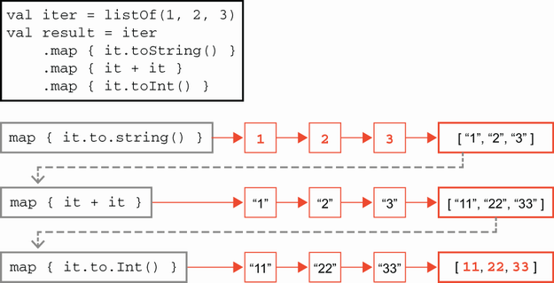
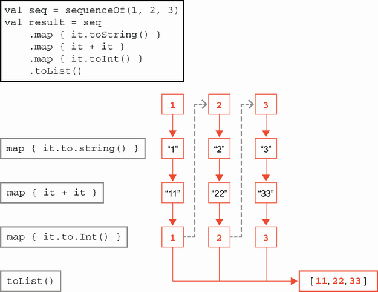
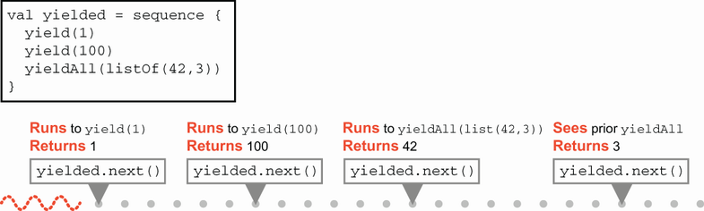

# 15. Lập trình hàm nâng cao

> *The Well-Grounded Java Developer, Second Edition* — Chương 15
> Bản dịch tiếng Việt

**Chương này bao gồm:**

- Các khái niệm lập trình hàm
- Giới hạn của lập trình hàm trong Java
- Lập trình hàm nâng cao với Kotlin
- Lập trình hàm nâng cao với Clojure

---

Chúng ta đã gặp các khái niệm lập trình hàm ở phần trước của cuốn sách, nhưng trong chương này chúng tôi muốn gom các sợi chỉ lại và nâng nó lên. Có rất nhiều bàn tán về lập trình hàm trong ngành, nhưng nó vẫn là một khái niệm khá thiếu định nghĩa rõ ràng. Điểm duy nhất được đồng thuận là trong một ngôn ngữ lập trình hàm (FP), mã có thể được biểu diễn như một mục dữ liệu hạng nhất, tức là nên có thể biểu diễn một mẩu tính toán trì hoãn như một giá trị có thể gán cho biến.

Định nghĩa này dĩ nhiên rộng đến mức nực cười — với mọi mục đích thực tiễn, mọi ngôn ngữ dòng chính (với rất ít ngoại lệ) trong 30 năm qua đều thỏa mãn định nghĩa này. Nên, khi các nhóm lập trình viên khác nhau thảo luận về FP, họ đang nói về những thứ khác nhau. Mỗi bộ lạc có một hiểu biết ngầm khác nhau về những tính chất ngôn ngữ nào khác cũng được ngầm hiểu là bao gồm trong thuật ngữ "FP".

Nói cách khác — cũng như với OO — không có định nghĩa được đồng thuận cơ bản về "ngôn ngữ lập trình hàm" là gì. Cách khác, nếu mọi thứ đều là ngôn ngữ FP, thì chẳng có gì là cả.

Lập trình viên vững nền tảng nên hình dung các ngôn ngữ lập trình trên một trục (hoặc, tốt hơn nữa, như một điểm trong không gian đa chiều của các đặc tính ngôn ngữ khả dĩ). Các ngôn ngữ đơn giản là *mang tính hàm nhiều hay ít hơn* các ngôn ngữ khác — không có một thang tuyệt đối nào để cân đo chúng. Hãy làm quen với một số khái niệm trong hộp công cụ chung của các ngôn ngữ lập trình hàm vượt ra ngoài quan niệm hơi nông cạn "mã là dữ liệu".

## 15.1 Giới thiệu các khái niệm lập trình hàm

Trong phần sau, chúng ta sẽ thường nói về *hàm*, nhưng cả ngôn ngữ Java lẫn JVM đều không có thứ như vậy — mọi mã thực thi được đều phải diễn đạt như một *phương thức*, được định nghĩa, liên kết và nạp trong một class. Tuy nhiên, các ngôn ngữ khác, không phải JVM, có quan niệm khác về mã thực thi, nên khi chúng tôi nói *hàm* trong chương này, nên hiểu là một mẩu mã thực thi được tương ứng đại khái với một phương thức Java.

### 15.1.1 Hàm thuần khiết (pure function)

Một *pure function* là hàm không thay đổi trạng thái của bất kỳ thực thể nào khác. Nó đôi khi được nói là *không có tác dụng phụ* (side-effect free), nghĩa là hàm hành xử như một ý niệm về hàm toán học: nó nhận đối số, không ảnh hưởng tới chúng theo bất kỳ cách nào, và trả về kết quả chỉ phụ thuộc vào các giá trị đã được truyền vào.

Liên quan tới khái niệm thuần khiết là ý tưởng *referential transparency* (trong suốt tham chiếu). Cái này được đặt tên hơi đáng tiếc — nó không liên quan gì tới tham chiếu như lập trình viên Java hiểu. Thay vào đó, nó nghĩa là một lời gọi hàm có thể được thay bằng kết quả của bất kỳ lời gọi trước nào tới cùng hàm với cùng đối số.

Hiển nhiên mọi pure function đều referentially transparent, nhưng cũng có thể tồn tại các hàm không thuần khiết mà vẫn referentially transparent. Để cho phép một hàm không thuần khiết được xem như vậy sẽ đòi hỏi một chứng minh hình thức dựa trên phân tích mã. Tính thuần khiết là về *mã*, còn tính bất biến là về *dữ liệu*, và đó là khái niệm FP tiếp theo chúng ta sẽ xem.

### 15.1.2 Tính bất biến (Immutability)

Tính bất biến nghĩa là sau khi một đối tượng đã được tạo, trạng thái của nó không thể bị thay đổi. Mặc định trong Java là các đối tượng khả biến. Từ khóa `final` được dùng theo nhiều cách trong Java, nhưng cái liên quan ở đây là ngăn việc sửa đổi field sau khi tạo. Các ngôn ngữ khác có thể ưu tiên tính bất biến và chỉ ra ưu tiên đó theo nhiều cách — chẳng hạn Rust, đòi hỏi lập trình viên tường minh làm biến khả biến với modifier `mut`.

Tính bất biến làm mã dễ suy luận hơn: các đối tượng có mô hình trạng thái tầm thường, đơn giản vì chúng được dựng ở trạng thái duy nhất mà chúng sẽ từng tồn tại. Trong số các lợi ích khác, điều này nghĩa là chúng có thể được sao chép và chia sẻ an toàn, ngay cả giữa các luồng.

> **NOTE** Chúng ta có thể hỏi liệu có cách tiếp cận "gần như bất biến" nào với dữ liệu vẫn duy trì một số (hoặc hầu hết) tính chất hấp dẫn của tính bất biến không. Thực tế, class `CompletableFuture` của Java mà ta đã gặp là một ví dụ như vậy. Chúng tôi sẽ nói thêm về điều này ở chương tiếp theo.

Một hệ quả là, bởi các đối tượng bất biến không thể bị thay đổi, cách duy nhất để thay đổi trạng thái được diễn đạt trong một hệ thống là bắt đầu từ một giá trị bất biến và dựng một giá trị bất biến hoàn toàn mới gần như giống hệt nhưng với một số field bị thay đổi — có thể bằng cách dùng *wither* (hay các phương thức `with*()`).

Ví dụ, API `java.time` dùng dữ liệu bất biến rất nhiều, và các thể hiện mới có thể được tạo bằng cách dùng wither như sau:

```java
LocalDate ld = LocalDate.of(1984, Month.APRIL, 13);
LocalDate dec = ld.withMonth(12);
System.out.println(dec);
```

Cách tiếp cận bất biến có hệ quả — cụ thể là tác động có khả năng lớn lên hệ thống con bộ nhớ, bởi các thành phần của giá trị cũ phải được sao chép như một phần của việc tạo giá trị đã sửa đổi. Điều này nghĩa là việc thay đổi tại chỗ thường rẻ hơn nhiều xét từ góc độ hiệu năng.

### 15.1.3 Hàm bậc cao (Higher-order function)

Hàm bậc cao thực ra là một khái niệm rất đơn giản, được mô tả bởi nhận thức sau: nếu một hàm có thể được biểu diễn như một mục dữ liệu, thì nó nên có thể được xử lý như thể nó là bất kỳ giá trị nào khác.

Chúng ta có thể định nghĩa hàm bậc cao là một giá trị hàm làm một hoặc cả hai điều sau:

- Nhận một giá trị hàm làm tham số
- Trả về một giá trị hàm

Ví dụ, hãy xét một phương thức tĩnh nhận một `String` Java và sinh ra một đối tượng hàm từ nó, như sau:

```java
public static Function<String, String> makePrefixer(String prefix) {
    return s -> prefix +": "+ s;
}
```

Điều này cung cấp một cách thẳng thắn để tạo đối tượng hàm. Giờ hãy kết hợp nó với một phương thức tĩnh khác, như sau, lần này nhận một đối tượng hàm làm đầu vào:

```java
public static String doubleApplier(String input,
                                    Function<String, String> f) {
    return f.apply(f.apply(input));
}
```

Điều này cho chúng ta ví dụ đơn giản sau:

```java
var f = makePrefixer("NaNa");                     ❶
System.out.println(doubleApplier("Batman", f));   ❷
```

❶ Tạo một đối tượng hàm

❷ Truyền đối tượng hàm như tham số cho phương thức khác

Tuy nhiên, đây chưa phải toàn bộ câu chuyện với Java, như chúng ta sẽ thấy ở mục sau.

### 15.1.4 Đệ quy (Recursion)

Một hàm đệ quy là hàm tự gọi chính nó ở ít nhất một số đường mã qua hàm. Điều này dẫn tới một trong những trò đùa cổ nhất trong lập trình: "để hiểu đệ quy, trước tiên người ta phải hiểu đệ quy."

Tuy nhiên, để chính xác hơn, chúng ta có thể viết như sau: để hiểu đệ quy, trước tiên người ta phải hiểu

1. đệ quy, và
2. rằng trong một hệ thống hiện thực được về mặt vật lý, mọi chuỗi lời gọi đệ quy cuối cùng phải kết thúc và trả về một giá trị.

Điểm thứ hai quan trọng: các ngôn ngữ lập trình dùng call stack để cho phép hàm gọi hàm khác, và điều này chiếm chỗ trong bộ nhớ. Do đó, đệ quy có vấn đề là các lời gọi đệ quy sâu có thể dùng hết quá nhiều bộ nhớ và sập.

Xét theo khoa học máy tính lý thuyết, đệ quy thú vị và quan trọng vì nhiều lý do khác nhau. Một trong những cái quan trọng nhất là đệ quy có thể dùng làm cơ sở để khám phá lý thuyết tính toán và các ý tưởng như Turing completeness, đại khái là ý tưởng rằng mọi hệ thống tính toán không tầm thường đều có cùng khả năng lý thuyết để thực hiện phép tính.

### 15.1.5 Closure

Một *closure* thường được định nghĩa là một biểu thức lambda "bắt" (capture) một số trạng thái từ ngữ cảnh xung quanh. Tuy nhiên, để định nghĩa này có nghĩa, chúng ta cần giải thích ý nghĩa của khái niệm bắt.

Khi chúng ta tạo một giá trị và gán (hay ràng buộc) nó vào một biến cục bộ, biến sẽ tồn tại và có thể được dùng cho tới một điểm nào đó sau trong mã. Điểm sau này rất có thể là cuối hàm hoặc khối nơi biến được khai báo. Vùng mã nơi biến tồn tại và có thể được dùng là *phạm vi* (scope) của biến.

Khi chúng ta tạo một giá trị hàm, các biến cục bộ khai báo trong thân hàm sẽ vẫn trong phạm vi trong lúc gọi giá trị hàm, việc này sẽ xảy ra muộn hơn điểm mà giá trị hàm được khai báo. Nếu, trong khai báo giá trị hàm, chúng ta nhắc tới một biến (hoặc trạng thái khác, chẳng hạn một field) được khai báo ngoài phạm vi của thân hàm, thì giá trị hàm được nói là đã *đóng lên* (closed over) trạng thái đó, và giá trị hàm được gọi là một *closure*.

Khi closure sau đó được gọi, nó có toàn quyền truy cập các biến đã bắt, ngay cả khi lời gọi diễn ra ở phạm vi khác với phạm vi nơi việc bắt được khai báo.

Ví dụ, trong Java:

```java
public static Function<Integer, Integer> closure() {
    var atomic = new AtomicInteger(0);
    return i -> atomic.addAndGet(i);
}
```

Phương thức tĩnh này là một hàm bậc cao trả về một Java closure bởi nó trả về một biểu thức lambda tham chiếu `atomic`, vốn được khai báo như biến cục bộ trong phương thức, tức là trong phạm vi nơi lambda được khai báo. Closure trả về từ `closure()` có thể được gọi nhiều lần, và nó sẽ tích lũy trạng thái ở mỗi lần gọi.

### 15.1.6 Tính lười (Laziness)

Chúng tôi đã đề cập ngắn gọn khái niệm laziness ở chương 10. Về cơ bản, *lazy evaluation* cho phép việc tính giá trị của một biểu thức được trì hoãn cho tới khi giá trị thực sự được yêu cầu. Ngược lại, việc đánh giá ngay lập tức một biểu thức được gọi là *eager evaluation* (hay *strict evaluation*).

Ý tưởng của laziness đơn giản: nếu bạn không cần làm việc, đừng làm! Nghe đơn giản nhưng có hệ quả sâu sắc tới cách bạn viết chương trình và chúng hoạt động ra sao. Phần then chốt của độ phức tạp bổ sung này là chương trình của bạn cần theo dõi công việc nào đã và chưa hoàn tất.

Không phải mọi ngôn ngữ đều hỗ trợ lazy evaluation, và nhiều lập trình viên có thể chỉ mới gặp eager evaluation ở điểm này trong hành trình — và điều đó hoàn toàn ổn.

Ví dụ, không có hỗ trợ tổng quát ở mức ngôn ngữ cho laziness trong Java, nên khó đưa ra ví dụ rõ ràng về tính năng này. Chúng ta sẽ phải chờ tới khi nói về Kotlin để làm nó cụ thể.

Tuy nhiên, mặc dù laziness không nhất thiết là khái niệm tự nhiên với lập trình viên Java, laziness là kỹ thuật cực kỳ hữu ích và mạnh mẽ trong FP. Thực tế, với một số ngôn ngữ FP như Haskell, lazy evaluation là mặc định.

### 15.1.7 Currying và partial application

Currying, đáng tiếc, không liên quan gì tới món cà ri. Thay vào đó, nó là kỹ thuật lập trình đặt theo tên Haskell Curry (người cũng đặt tên cho ngôn ngữ lập trình Haskell). Để giải thích nó, hãy bắt đầu với một ví dụ cụ thể.

Hãy xét một hàm thuần khiết, đánh giá sớm, nhận hai đối số. Nếu chúng ta cung cấp cả hai đối số, ta sẽ có một giá trị, và lời gọi hàm có thể được thay ở mọi nơi bằng giá trị kết quả (đây là referential transparency). Nhưng điều gì xảy ra nếu chúng ta cung cấp không phải cả hai mà chỉ một trong hai đối số?

Trực giác, chúng ta có thể nghĩ về điều này như việc tạo một hàm mới, nhưng chỉ cần một đối số duy nhất để tính kết quả. Hàm mới này gọi là *curried function* (hay *partially-applied function*). Java không có hỗ trợ trực tiếp cho currying, nên chúng ta lại hoãn việc đưa ra ví dụ cụ thể tới phần sau của chương.

Nhìn xa hơn, một số ngôn ngữ lập trình hỗ trợ khái niệm hàm có nhiều danh sách đối số (hoặc có cú pháp cho phép lập trình viên giả lập chúng). Trong trường hợp này, một cách khác để nghĩ về currying là như một phép biến đổi hàm. Theo ký hiệu toán học, chúng ta đang dịch một hàm nhiều đối số được gọi là `f(a, b)` thành một hàm gọi được là `(g(a))(b)`, trong đó `g(a)` là hàm được áp dụng một phần.

Như giờ đã rõ, các ngôn ngữ khác nhau chúng ta gặp tới nay có mức hỗ trợ khác nhau cho lập trình hàm — ví dụ, Clojure có hỗ trợ rất tốt cho nhiều khái niệm ta đã thảo luận ở mục này. Java, ngược lại, là câu chuyện rất khác, như chúng ta sẽ thấy ở mục tiếp theo.

## 15.2 Giới hạn của Java như một ngôn ngữ FP

Hãy bắt đầu với tin tốt, ở mức nó là vậy: Java chắc chắn vượt qua ngưỡng khá thấp "biểu diễn mã như dữ liệu" qua các kiểu trong `java.util.function` và cũng qua hỗ trợ nội quan rộng rãi mà runtime cung cấp (chẳng hạn Reflection và Method Handles).

> **NOTE** Việc dùng inner class để mô phỏng đối tượng hàm như một kỹ thuật có trước Java 8 và đã hiện diện trong các thư viện như Google Guava, nên nói nghiêm ngặt, khả năng biểu diễn mã như dữ liệu của Java không gắn với phiên bản đó.

Từ phiên bản 8, ngôn ngữ Java đi xa hơn mức tối thiểu một chút với việc giới thiệu stream và, cùng với chúng, một miền thao tác lười bị hạn chế nặng. Tuy nhiên, bất chấp sự xuất hiện của stream, Java không phải một môi trường hàm tự nhiên. Một phần điều này là do lịch sử của nền tảng và những quyết định thiết kế — giờ đã hàng thập kỷ tuổi.

> **NOTE** Đáng nhớ rằng Java là ngôn ngữ mệnh lệnh 25 tuổi đã được lặp cải tiến rộng rãi. Một số API của nó phù hợp với FP, dữ liệu bất biến, v.v., và một số thì không. Đây là thực tế của việc làm việc trong một ngôn ngữ đã sống sót, và phát triển mạnh, mà vẫn giữ tương thích ngược.

Nên, tổng thể, Java có lẽ được mô tả tốt nhất như một "ngôn ngữ lập trình hơi mang tính hàm". Nó có các tính năng cơ bản cần để hỗ trợ FP và cung cấp cho lập trình viên quyền truy cập các mẫu cơ bản như filter-map-reduce qua Streams API, nhưng hầu hết các tính năng hàm nâng cao hoặc không hoàn chỉnh hoặc thiếu hoàn toàn. Hãy xem chi tiết.

### 15.2.1 Pure function

Như đã thấy ở chương 4, bytecode của Java làm nhiều loại việc khác nhau, bao gồm số học, thao tác stack, kiểm soát luồng, và đặc biệt là gọi phương thức cùng lưu trữ và lấy dữ liệu. Với lập trình viên vững nền tảng đã hiểu bytecode JVM, điều này nghĩa là chúng ta có thể diễn đạt tính thuần khiết của phương thức bằng cách nghĩ về tác dụng của bytecode. Cụ thể, một phương thức thuần khiết trong ngôn ngữ JVM là phương thức:

- Không sửa đổi trạng thái đối tượng hoặc tĩnh (không chứa `putfield` hay `putstatic`)
- Không phụ thuộc vào trạng thái đối tượng khả biến bên ngoài hoặc trạng thái tĩnh
- Không gọi bất kỳ phương thức không thuần khiết nào

Đây là một tập điều kiện khá hạn chế và nhấn mạnh khó khăn của việc dùng JVM làm cơ sở cho lập trình hàm thuần khiết.

Cũng có câu hỏi về ngữ nghĩa — tức là ý đồ — của các interface khác nhau hiện diện trong JDK. Ví dụ, `Callable` (trong `java.util.concurrent`) và `Supplier` (trong `java.util.function`) về cơ bản đều làm cùng việc: chúng thực hiện một số tính toán và trả về một giá trị, như sau:

```java
@FunctionalInterface
public interface Callable<V> {
    V call() throws Exception;
}

@FunctionalInterface
public interface Supplier<T> {
    T get();
}
```

Cả hai đều là `@FunctionalInterface` và đều thường được dùng làm kiểu đích cho lambda. Chữ ký của các interface giống nhau, ngoài cách tiếp cận khác nhau với việc xử lý exception.

Tuy nhiên, chúng có thể được xem là có vai trò khác nhau: `Callable` hàm ý lượng công việc có khả năng không tầm thường trong mã được gọi để tạo giá trị sẽ được trả về. Mặt khác, cái tên `Supplier` có vẻ hàm ý ít công việc hơn — có lẽ chỉ trả về một giá trị đã cache.

### 15.2.2 Tính khả biến

Java là ngôn ngữ khả biến — tính khả biến được nướng vào thiết kế của nó từ những ngày đầu. Một phần đây là tai nạn lịch sử — các máy cuối những năm 1990 (thời Java ra đời) rất hạn chế (theo chuẩn hiện đại) về bộ nhớ. Một mô hình dữ liệu bất biến sẽ tăng áp lực rất lớn lên hệ thống con quản lý bộ nhớ, và gây ra các sự kiện GC thường xuyên hơn nhiều, dẫn tới thông lượng tệ hơn nhiều.

Do đó, thiết kế của Java ưu ái việc thay đổi hơn việc tạo bản sao đã sửa đổi. Nên việc thay đổi tại chỗ có thể được xem là lựa chọn thiết kế do các đánh đổi hiệu năng từ 25 năm trước.

Tuy nhiên, tình hình còn tệ hơn thế. Java tham chiếu mọi dữ liệu phức hợp bằng tham chiếu, và từ khóa `final` áp dụng cho *tham chiếu*, không phải cho dữ liệu. Chẳng hạn, khi áp dụng cho field, field chỉ có thể được gán một lần.

Điều này nghĩa là ngay cả khi một đối tượng có mọi field `final`, trạng thái phức hợp vẫn có thể khả biến bởi đối tượng có thể giữ một tham chiếu `final` tới đối tượng khác có một số field không `final`. Điều này dẫn tới vấn đề *shallow immutability*, như đã thảo luận ở chương 5.

> **NOTE** Với lập trình viên C++: Java không có khái niệm `const`, mặc dù nó có `const` như một từ khóa (không dùng).

Ví dụ, đây là phiên bản hơi được nâng cao của class `Deposit` bất biến mà ta đã gặp ở chương 5:

```java
public final class Deposit implements Comparable<Deposit> {
    private final double amount;
    private final LocalDate date;
    private final Account payee;

     private Deposit(double amount, LocalDate date, Account payee) {
         this.amount = amount;
         this.date = date;
           this.payee = payee;
     }

     @Override
     public int compareTo(Deposit other) {
         return Comparator.nullsFirst(LocalDate::compareTo)
                          .compare(this.date, other.date);
     }

     // các phương thức được lược bỏ
}
```

Tính bất biến của class này dựa trên giả định rằng `Account` và mọi phụ thuộc bắc cầu của nó cũng bất biến. Điều này nghĩa là có giới hạn cho những gì có thể làm — về cơ bản mô hình dữ liệu của Java và JVM không thân thiện tự nhiên với tính bất biến.

Trong bytecode, chúng ta thấy tính `final` của field xuất hiện như một mẩu metadata của field như sau:

```
$ javap -c -p out/production/resources/ch13/Deposit.class
Compiled from "Deposit.java"
public final class ch13.Deposit
    implements java.lang.Comparable<ch13.Deposit> {
      private final double amount;

      private final java.time.LocalDate date;

      private final ch13.Account payee;

    // ...
    }
```

Cố dùng cách tiếp cận bất biến với trạng thái trong Java giống như tát nước khỏi một con thuyền thủng. Mọi tham chiếu đều phải được kiểm tra tính khả biến, và nếu chỉ một cái bị bỏ sót, thì toàn bộ đồ thị đối tượng là khả biến.

Tệ hơn nữa, reflection và các hệ thống con khác của JVM cũng cung cấp cách lách tính bất biến, như sau:

```java
var account = new Account(100);
var deposit = Deposit.of(42.0, LocalDate.now(), account);
try {
    Field f = Deposit.class.getDeclaredField("amount");
    f.setAccessible(true);
    f.setDouble(deposit, 21.0);
    System.out.println("Value: "+ deposit.amount());
} catch (NoSuchFieldException e) {
    e.printStackTrace();
} catch (IllegalAccessException e) {
    e.printStackTrace();
}
```

Gộp lại, tất cả điều này nghĩa là cả Java lẫn JVM đều không phải môi trường cung cấp hỗ trợ đặc biệt nào cho việc lập trình với dữ liệu bất biến. Các ngôn ngữ như Clojure, có yêu cầu mạnh hơn, rốt cuộc phải làm rất nhiều việc trong runtime đặc thù ngôn ngữ của mình.

### 15.2.3 Hàm bậc cao

Khái niệm hàm bậc cao không nên gây ngạc nhiên cho lập trình viên Java. Chúng ta đã thấy ví dụ về một phương thức tĩnh, `makePrefixer()`, nhận vào chuỗi prefix và trả về một đối tượng hàm. Hãy viết lại mã và đổi static factory thành một đối tượng hàm khác như sau:

```java
Function<String, Function<String, String>> prefixer =
                                           prefix -> s -> prefix +": "+ s;
```

Điều này thoạt nhìn có thể hơi khó đọc, nên hãy đưa vào vài mẩu cú pháp bổ sung mà ta không thực sự cần, để làm rõ chuyện gì đang diễn ra:

```java
Function<String, Function<String, String>> prefixer = prefix -> {
    return s -> prefix +": "+ s;
};
```

Trong góc nhìn mở rộng này, chúng ta thấy `prefix` là đối số của hàm và giá trị trả về là một lambda (thực ra là một Java closure) hiện thực `Function<String, String>`.

Chú ý sự xuất hiện của kiểu hàm `Function<String, Function<String, String>>` — nó có hai tham số kiểu định nghĩa kiểu đầu vào và đầu ra. Tham số kiểu thứ hai (đầu ra) chỉ là một kiểu khác — trong trường hợp này, nó là một kiểu hàm khác. Đây là một cách nhận diện kiểu hàm bậc cao trong Java: một `Function` (hoặc kiểu hàm khác) có `Function` là một trong các tham số kiểu của nó.

Cuối cùng, chúng tôi nên chỉ ra rằng cú pháp ngôn ngữ có quan trọng — xét cho cùng, đối tượng hàm có thể được tạo như bản hiện thực ẩn danh, như sau:

```java
public class PrefixerOld
    implements Function<String, Function<String, String>> {

        @Override
        public Function<String, String> apply(String prefix) {
            return new Function<String, String>() {
                @Override
                 public String apply(String s) {
                     return prefix +": "+ s;
                 }
            };
        }
}
```

Mã này thậm chí đã hợp lệ từ tận Java 5, nếu kiểu `Function` tồn tại hồi đó (và từ tận Java 1.1, nếu chúng ta bỏ annotation và generics). Nhưng nó là một cái gai trong mắt. Rất khó thấy cấu trúc, đó là lý do nhiều lập trình viên nghĩ lập trình hàm chỉ đến với Java 8.

### 15.2.4 Đệ quy

Trình biên dịch `javac` cung cấp một phép dịch thẳng thắn từ mã nguồn Java sang bytecode. Như chúng ta thấy ở đây, điều này áp dụng cho các lời gọi đệ quy:

```java
public static long simpleFactorial(long n) {
    if (n <= 0) {
         return 1;
     } else {
          return n * simpleFactorial(n - 1);
     }
}
```

biên dịch thành bytecode sau:

```
public static long simpleFactorial(long);
        Code:
            0: lload_0
            1: lconst_0
            2: lcmp
            3: ifgt          8
            6: lconst_1
            7: lreturn
            8: lload_0
            9: lload_0
            10: lconst_1
            11: lsub
            12: invokestatic #37   // Method simpleFactorial:(J)J
            15: lmul
            16: lreturn
```

Điều này dĩ nhiên có một số giới hạn lớn. Trong trường hợp này, thực hiện lời gọi như `simpleFactorial(100000)` sẽ dẫn tới `StackOverflowError` vì lời gọi `invokestatic` ở byte 12, sẽ khiến một frame thông dịch bổ sung được đặt lên stack cho mỗi lời gọi đệ quy.

> **NOTE** Một phương thức đệ quy là phương thức tự gọi chính nó. Một phương thức *tail-recursive* là phương thức mà lời tự gọi là điều cuối cùng phương thức làm.

Hãy cố tìm cách xem liệu lời gọi đệ quy có thể được tránh không. Một cách tiếp cận là viết lại mã factorial thành dạng tail-recursive, mà trong Java chúng ta có thể làm dễ nhất với một phương thức trợ giúp private, như sau:

```java
public static long tailrecFactorial(long n) {
     if (n <= 0) {
         return 1;
     }
     return helpFact(n, 1);
}

private static long helpFact(long i, long j) {
     if (i == 0) {
         return j;
     }
     return helpFact(i - 1, i * j);
}
```

Phương thức điểm vào, `tailrecFactorial()`, không làm đệ quy nào; nó chỉ thiết lập lời gọi tail-recursive và giấu chi tiết của chữ ký phức tạp hơn khỏi người dùng. Bytecode cho phương thức về cơ bản là tầm thường, nhưng hãy đưa nó vào cho đầy đủ:

```
public static long tailrecFactorial(long);
     Code:
        0: lload_0
          1: lconst_0
          2: lcmp
          3: ifgt             8
          6: lconst_1
          7: lreturn
          8: lload_0
          9: lconst_1
         10: invokestatic     #49    // Method helpFact:(JJ)J
         13: lreturn
```

Như bạn thấy, không có vòng lặp nào và chỉ một `if` rẽ nhánh duy nhất ở bytecode 3. Hành động thực sự (và đệ quy) diễn ra trong `helpFact()`. Cái này vẫn được `javac` biên dịch thành bytecode chứa một lời gọi đệ quy, như ta thấy:

```
private static long helpFact(long, long);
     Code:
        0: lload_0
          1: lconst_0
          2: lcmp
          3: ifne             8
          6: lload_2                                   ❶
          7: lreturn                                   ❷
          8: lload_0
          9: lconst_1
         10: lsub
         11: lload_0
         12: lload_2
         13: lmul
         14: invokestatic     #49  // Method helpFact:(JJ)J   ❸
         17: lreturn
```

❶ Long là 8 byte, nên chúng cần hai ô biến cục bộ mỗi cái

❷ Trả về từ đường `i == 0`

❸ Lời gọi tail-recursive

Tuy nhiên, ở dạng này, chúng ta giờ thấy có hai đường qua phương thức này. Đường đơn giản `i == 0` bắt đầu ở bytecode 0, rơi qua điều kiện `if` ở 3 và trả về `j` ở bytecode 7. Trường hợp tổng quát hơn là 0 tới 3, rồi 8 tới 14, kích hoạt một lời gọi đệ quy.

Nên, trên đường duy nhất có lời gọi phương thức, lời gọi là đệ quy và luôn là điều cuối cùng xảy ra trước `return` — tức là lời gọi ở *vị trí đuôi*. Tuy nhiên, nó có thể được biên dịch thành bytecode sau thay thế, tránh được lời gọi:

```
private static long helpFact(long, long);
     Code:
        0: lload_0
          1: lconst_0
          2: lcmp
          3: ifne             8
          6: lload_2                  ❶
          7: lreturn                  ❷
          8: lload_0
          9: lconst_1
         10: lsub
         11: lload_0
         12: lload_2
         13: lmul
         14: lstore_2                 ❸
         15: lstore_0                 ❸
         16: goto             0       ❹
```

❶ Long là 8 byte, nên chúng cần hai ô biến cục bộ mỗi cái

❷ Trả về từ đường `i == 0`

❸ Đặt lại các biến cục bộ

❹ Nhảy về đầu phương thức

Giờ là tin xấu: `javac` không thực hiện thao tác này tự động, bất chấp việc nó khả thi. Đây là một ví dụ nữa về cách compiler cố dịch mã nguồn Java sang bytecode càng chính xác càng tốt.

> **NOTE** Trong dự án Resources đi kèm cuốn sách này có một ví dụ về cách dùng thư viện ASM để sinh một class hiện thực chuỗi bytecode trên, bởi `javac` sẽ không phát ra nó từ mã đệ quy.

Cho đầy đủ, chúng tôi nên nói rằng trên thực tế, việc hiện thực hàm factorial xử lý `long` bằng lời gọi đệ quy thay vì ghi đè frame thực ra sẽ không gây vấn đề, bởi factorial tăng nhanh đến mức nó sẽ tràn không gian khả dụng trong một `long` từ lâu trước khi bất kỳ giới hạn kích thước stack nào bị chạm tới, như sau:

```
$ java TailRecFactorial 20
2432902008176640000

$ jshell
jshell> 2432902008176640000L + 0.0
$1 ==> 2.43290200817664E18

jshell> Long.MAX_VALUE + 0.0
$2 ==> 9.223372036854776E18
```

Nên `factorial(21)` đã lớn hơn `long` dương lớn nhất mà JVM có thể diễn đạt. Tuy nhiên, mặc dù ví dụ tầm thường cụ thể này khá an toàn, nó không thay đổi sự thật khó khăn rằng mọi thuật toán đệ quy trong Java đều có khả năng dễ bị stack overflow.

Khiếm khuyết cụ thể này là của *ngôn ngữ* Java — không phải của JVM. Các ngôn ngữ khác trên JVM có thể, và có, xử lý điều này khác đi, ví dụ bằng cách dùng annotation hoặc từ khóa. Chúng ta sẽ thấy ví dụ về điều này khi thảo luận cách Kotlin và Clojure xử lý đệ quy ở phần sau của chương.

### 15.2.5 Closure

Như đã thấy, một closure về cơ bản là một biểu thức lambda bắt một số trạng thái nhìn thấy được từ phạm vi nơi lambda được khai báo, như sau:

```java
int i = 42;
Function<String, String> f = s -> s + i;
// i = 37;
System.out.println(f.apply("Hello "));
```

Khi chạy, nó tạo ra, như mong đợi: `Hello 42`. Tuy nhiên, nếu chúng ta bỏ chú thích dòng gán lại giá trị `i`, thì điều khác xảy ra: mã ngừng biên dịch được hoàn toàn.

Để hiểu vì sao điều này xảy ra, hãy xem bytecode mà mã được biên dịch thành. Như ta sẽ thấy ở chương 17, thân biểu thức lambda trong Java được biến thành các phương thức tĩnh private. Trong trường hợp này, thân lambda biến thành:

```
private static java.lang.String lambda$main$0(int, java.lang.String);
    Code:
            0: aload_1
            1: iload_0
            2: invokedynamic #32, 0 // InvokeDynamic #1:makeConcatWithConstants
                                     // (Ljava/lang/String;I)Ljava/lang/String;
            7: areturn
```

Manh mối nằm ở chữ ký của `lambda$main$0()`. Nó nhận *hai* tham số, không phải một. Tham số đầu là giá trị của `i` được truyền vào — là 42 tại thời điểm closure được tạo (cái thứ hai là tham số `String` mà lambda nhận khi thực thi). Java closure chứa *bản sao của giá trị*, là các mẫu bit (dù là nguyên thủy hay tham chiếu đối tượng) chứ không phải biến.

> **NOTE** Java nghiêm ngặt là ngôn ngữ pass-by-value — không có cách nào trong ngôn ngữ lõi để pass-by-reference hay pass-by-name.

Để thấy tác dụng của các thay đổi với trạng thái đã bắt bên ngoài phạm vi thân closure (hoặc để tác động tới những thứ ở phạm vi khác), trạng thái được bắt phải là một đối tượng khả biến, như sau:

```java
var i = new AtomicInteger(42);
Function<String, String> f = s -> s + i.get();
i.set(37);                                       ❶
// i = new AtomicInteger(37);                    ❷
System.out.println(f.apply("Hello "));
```

❶ Gán lại giá trị cho trạng thái đối tượng khả biến thì hoạt động.

❷ Cái này sẽ không biên dịch được.

Thực tế, trong các phiên bản Java trước, chỉ các biến được đánh dấu tường minh là `final` mới có thể có giá trị được Java closure bắt. Tuy nhiên, từ Java 8 trở đi, hạn chế đó được đổi thành các biến *effectively final* — các biến được dùng như thể chúng là final, ngay cả khi chúng không thực sự có từ khóa gắn vào khai báo.

Đây thực ra là triệu chứng của một vấn đề sâu hơn. JVM có một heap chia sẻ, các biến cục bộ riêng của phương thức, và một evaluation stack riêng của phương thức, và thế là hết. So với các ngôn ngữ khác, cả JVM lẫn ngôn ngữ Java đều không có khái niệm về *environment* hay *symbol table*, hay khả năng truyền tham chiếu tới một mục trong đó.

Các ngôn ngữ không phải Java trên JVM mà *có* những khái niệm đó buộc phải hỗ trợ chúng trong runtime ngôn ngữ của mình bởi JVM không cung cấp hỗ trợ nội tại nào cho chúng. Do đó, một số nhà lý thuyết ngôn ngữ lập trình đi tới kết luận rằng những gì Java cung cấp thực ra không phải closure thực sự, vì mức gián tiếp bổ sung cần thiết. Lập trình viên Java phải thay đổi trạng thái của một giá trị đối tượng, thay vì có thể thay đổi trực tiếp biến được bắt.

### 15.2.6 Laziness

Java không cung cấp hỗ trợ hạng nhất cho lazy evaluation trong ngôn ngữ lõi cho các giá trị thông thường. Tuy nhiên, một nơi thú vị mà chúng ta thấy lazy evaluation được dùng là trong Java Streams API. Phụ lục B có phần ôn lại các khía cạnh của stream, nếu bạn cần.

> **NOTE** Laziness có đóng vai trò ở một số phần của JVM và môi trường lập trình của nó (ví dụ, các khía cạnh của class loading là lười).

Gọi `stream()` trên một collection Java tạo ra một đối tượng `Stream`, thực ra là biểu diễn lười của một tập hợp các phần tử. Một số stream cũng có thể được biểu diễn như một collection Java; tuy nhiên, stream tổng quát hơn và không phải mọi stream đều biểu diễn được như một collection.

Hãy xem lại một pipeline `filter()` và `map()` điển hình của Java:

```
                stream()      filter()     map()        collect()
Collection -> Stream -> Stream -> Stream -> Collection
```

Phương thức `stream()` trả về một đối tượng `Stream`. Các phương thức `map()` và `filter()` (như hầu hết thao tác trên `Stream`) là lười. Ở đầu kia của pipeline, chúng ta có thao tác `collect()`, thực thể hóa nội dung của `Stream` còn lại trở lại thành một `Collection`. Phương thức kết thúc này là *eager*, nên pipeline hoàn chỉnh hành xử như sau:

```
              lazy      lazy      lazy      eager
Collection -> Stream -> Stream -> Stream -> Collection
```

Ngoài việc thực thể hóa trở lại thành collection, nền tảng có toàn quyền kiểm soát việc đánh giá bao nhiêu stream. Điều này mở cửa cho một loạt tối ưu không có ở các cách tiếp cận thuần eager.

Đôi khi có thể hữu ích khi nghĩ về chế độ lười, hàm của Java stream như tương tự với du hành siêu không gian trong phim khoa học viễn tưởng. Gọi `stream()` tương đương với việc nhảy từ "không gian bình thường" vào một cõi siêu không gian nơi các quy tắc khác đi (hàm và lười, thay vì OO và eager).

Ở cuối pipeline thao tác, một thao tác stream kết thúc nhảy chúng ta trở lại từ thế giới hàm lười vào "không gian bình thường", hoặc bằng cách thực thể hóa lại stream thành `Collection` (ví dụ, qua `toList()`) hoặc bằng cách tổng hợp stream, qua `reduce()` hay thao tác khác.

Việc dùng lazy evaluation đòi hỏi nhiều cẩn thận hơn từ lập trình viên, nhưng gánh nặng này phần lớn rơi lên người viết thư viện, chẳng hạn các nhà phát triển JDK. Tuy nhiên, lập trình viên Java nên ý thức và tôn trọng các quy tắc của một số khía cạnh về bản chất lười của stream. Ví dụ, các bản hiện thực của một số interface `java.util.function` (ví dụ, `Predicate`, `Function`) không nên thay đổi trạng thái nội bộ hoặc gây tác dụng phụ. Vi phạm giả định này có thể gây vấn đề lớn nếu lập trình viên viết các bản hiện thực hoặc lambda làm vậy.

Một khía cạnh quan trọng khác của stream là bản thân các đối tượng stream (các thể hiện của `Stream` được thấy như đối tượng trung gian trong pipeline lời gọi stream) là *dùng một lần*. Khi chúng đã được duyệt qua, chúng nên được xem là không hợp lệ. Nói cách khác, lập trình viên không nên cố lưu hoặc tái sử dụng một đối tượng stream, bởi kết quả của việc đó gần như chắc chắn sai và các nỗ lực có thể ném lỗi.

> **NOTE** Đặt một đối tượng stream vào biến tạm hầu như luôn là code smell, mặc dù làm vậy trong quá trình phát triển khi debug một vấn đề generics phức tạp với stream là chấp nhận được, miễn là việc dùng stream tạm được loại bỏ khi mã hoàn tất.

Một khía cạnh khác của tính lười của stream là khả năng mô hình hóa dữ liệu tổng quát hơn collection. Ví dụ, có thể dựng một stream vô hạn bằng cách dùng `Stream.generate()` kết hợp với một hàm sinh. Hãy xem:

```java
public class DaySupplier implements Supplier<LocalDate> {
      private LocalDate current = LocalDate.now().plusDays(1);

      @Override
      public LocalDate get() {
          var tmp = current;
           current = current.plusDays(1);
           return tmp;
      }
}

final var tomorrow = new DaySupplier();
Stream.generate(() -> tomorrow.get())
      .limit(10)
      .forEach(System.out::println);
```

Đoạn này tạo ra một stream các ngày vô hạn (hoặc lớn tùy ý, nếu bạn thích). Điều này sẽ không thể biểu diễn như một collection mà không hết chỗ, qua đó cho thấy stream tổng quát hơn.

Ví dụ này cũng cho thấy các hạn chế của Java, chẳng hạn pass by value, giới hạn không gian thiết kế phần nào. Class `LocalDate` là bất biến, nên chúng ta buộc phải có một class chứa field khả biến `current` rồi thay đổi `current` trong phương thức `get()` để cung cấp một phương thức có trạng thái có thể sinh một chuỗi đối tượng `LocalDate`.

Trong một ngôn ngữ hỗ trợ pass by reference, kiểu `DaySupplier` sẽ không cần thiết, bởi `current` có thể là một biến cục bộ khai báo trong cùng phạm vi với `tomorrow`, mà khi đó có thể là một lambda.

### 15.2.7 Currying và partial application

Chúng ta đã biết Java không có hỗ trợ ở mức ngôn ngữ cho currying, nhưng có thể xem nhanh cách thứ gì đó có thể được thêm vào. Ví dụ, đây là khai báo cho interface `BiFunction` trong `java.util.function`:

```java
@FunctionalInterface
public interface BiFunction<T, U, R> {
    R apply(T t, U u);

     default <V> BiFunction<T, U, V> andThen(
                                     Function<? super R, ? extends V> after) {
           Objects.requireNonNull(after);
           return (T t, U u) -> after.apply(apply(t, u));
     }
}
```

Chú ý cách tính năng default method của interface được dùng để định nghĩa `andThen()` — một phương thức bổ sung, vượt ra ngoài phương thức `apply()` tiêu chuẩn cho `BiFunction`. Cùng kỹ thuật này có thể đã được dùng để cung cấp một chút hỗ trợ cho currying, ví dụ bằng cách định nghĩa hai default method mới như sau:

```java
default Function<U, R> curryLeft(T t) {
       return u -> this.apply(t, u);
}

default Function<T, R> curryRight(U u) {
    return t -> this.apply(t, u);
}
```

Chúng định nghĩa hai cách để tạo đối tượng `Function` Java, tức là các hàm một đối số từ `BiFunction` gốc. Chú ý rằng chúng được hiện thực như closure. Chúng ta đơn giản bắt giá trị được cung cấp và lưu nó cho sau này, khi thực sự áp dụng hàm. Chúng ta khi đó có thể dùng các default method bổ sung này như sau:

```java
BiFunction<Integer, LocalDate, String> bif =
                                       (i, d) -> "Count for "+ d + " = "+ i;

Function<LocalDate, String> withCount = bif.curryLeft(42);
Function<Integer, String> forToday = bif.curryRight(LocalDate.now());
```

Tuy nhiên, cú pháp phần nào vụng về: nó cần hai phương thức khác nhau cho hai lần curry khả dĩ, và chúng phải có tên khác nhau do type erasure. Ngay cả sau tất cả điều đó, tính năng kết quả có thể lập luận là chỉ hữu dụng hạn chế, nên cách tiếp cận này chưa bao giờ được hiện thực, và như đã thảo luận, Java không hỗ trợ currying sẵn.

### 15.2.8 Hệ thống kiểu và collection của Java

Để kết thúc câu chuyện đáng tiếc về mối duyên chưa mấy tốt đẹp của Java với lập trình hàm, hãy nói về hệ thống kiểu và collection của Java. Ba vấn đề chính sau với những phần này của ngôn ngữ Java góp phần vào sự phù hợp phần nào kém với phong cách lập trình hàm:

- Hệ thống kiểu không đơn gốc (non-single-rooted)
- `void`
- Thiết kế của Java Collections

Trước hết, Java có hệ thống kiểu không đơn gốc (tức là không có supertype chung của `Object` và `int`). Điều này khiến không thể viết `List<int>` trong Java và, kết quả là, dẫn tới autoboxing cùng các vấn đề đi kèm.

> **NOTE** Nhiều lập trình viên than phiền về việc xóa tham số kiểu của các kiểu generic trong lúc biên dịch, nhưng thực tế, thường chính hệ thống kiểu không đơn gốc mới thực sự gây vấn đề với generics trong collection.

Java có một vấn đề khác, gắn với hệ thống kiểu không đơn gốc: `void`. Từ khóa này chỉ ra rằng một phương thức không trả về giá trị (hoặc, nhìn cách khác, rằng evaluation stack của phương thức trống khi phương thức trả về). Do đó từ khóa mang ngữ nghĩa rằng dù phương thức làm gì, nó hành động thuần túy bằng tác dụng phụ — đó là đối lập của "thuần khiết" theo nghĩa nào đó.

Sự tồn tại của `void` nghĩa là Java có cả câu lệnh lẫn biểu thức và rằng không thể hiện thực nguyên tắc thiết kế "mọi thứ đều là biểu thức", điều mà một số truyền thống lập trình hàm rất quan tâm.

> **NOTE** Ở chương 18, chúng ta sẽ thảo luận Project Valhalla, cung cấp cơ hội cho các nhà thiết kế ngôn ngữ Java xem xét lại bản chất không đơn gốc của hệ thống kiểu Java (trong số các mục tiêu khác).

Một vấn đề khác liên quan tới hình dạng và bản chất của các interface Java Collections. Chúng được thêm vào ngôn ngữ Java ở phiên bản 1.2 (còn gọi là Java 2), phát hành tháng 12 năm 1998. Chúng không được thiết kế với lập trình hàm trong đầu.

Một vấn đề lớn khi làm FP với Java Collections là giả định về tính khả biến được tích hợp ở khắp nơi. Các interface Collections lớn và tường minh chứa các phương thức như những cái sau từ `List<E>`:

```java
boolean add(E e)
E remove(int index)
```

Đây là các phương thức thay đổi — chữ ký của chúng hàm ý rằng chính đối tượng `Collection` đã bị sửa đổi tại chỗ.

Các phương thức tương ứng trên một list bất biến sẽ có chữ ký như `List<E> add(E e)` trả về một bản sao mới, đã sửa đổi của list. Trường hợp `remove()` sẽ khó hiện thực, bởi Java không có khả năng trả về nhiều giá trị từ một phương thức.

> **NOTE** Vấn đề thực sự là `remove()` được phân tách sai cho FP, một trường hợp rất giống `Iterator` mà chúng ta đã thảo luận ở mục 10.4.

Do đó tất cả điều này hàm ý rằng bất kỳ bản hiện thực nào của Collections đều được ngầm kỳ vọng là khả biến. Có tồn tại cái hack kinh khủng là dùng `UnsupportedOperationException`, mà chúng ta đã thảo luận ở mục 6.5.3, nhưng đây không phải thứ mà lập trình viên Java vững nền tảng nên dùng.

Các ngôn ngữ khác, không phải Java, tách khái niệm kiểu collection khỏi tính khả biến, ví dụ bằng cách biểu diễn chúng như các interface khác nhau (hoặc trait khác nhau ở các ngôn ngữ hỗ trợ khái niệm đó). Điều này cho phép các bản hiện thực chỉ định liệu chúng có khả biến hay không ở mức kiểu, bằng cách chọn hiện thực — hoặc không — các interface riêng biệt.

Ẩn sau tất cả điều này là một trong những đức tính chính và nguyên tắc thiết kế quan trọng nhất của Java — tương thích ngược. Điều này khiến việc thay đổi một số khía cạnh để làm ngôn ngữ mang tính hàm hơn trở nên khó khăn hoặc bất khả thi. Ví dụ, trong trường hợp Collections, thay vì cố thêm các phương thức hàm bổ sung trực tiếp lên các interface Collections, một sự đoạn tuyệt sạch sẽ đã được thực hiện và `Stream` được giới thiệu, đóng vai một kiểu container mới không có ngữ nghĩa ngầm của Collections.

Dĩ nhiên, chỉ việc giới thiệu một kiểu container và API mới không làm gì để thay đổi hàng triệu triệu dòng mã hiện có dùng collection. Nó cũng không giúp gì cho trường hợp phổ biến khi một API đã được diễn đạt theo kiểu collection.

> **NOTE** Vấn đề này không riêng có với sự chia rẽ stream/collection. Ví dụ, Java Reflection được giới thiệu ở Java 1.1 và có trước sự xuất hiện của Collections. Kết quả là API này khó dùng đến bực mình, bởi nó dựa vào mảng làm container phần tử.

Mục này đã cho thấy một số sự thật khá đáng buồn về tình trạng hỗ trợ lập trình hàm trong Java. Thông điệp rút ra là các mẫu hàm đơn giản (chẳng hạn filter-map-reduce) là khả dụng. Chúng rất hữu ích cho đủ loại ứng dụng cũng như tổng quát hóa tốt sang ứng dụng đồng thời (và thậm chí phân tán), nhưng chúng gần như là giới hạn của những gì Java có thể làm. Hãy chuyển sang xem các ngôn ngữ không phải Java và xem tin có khá hơn không.

## 15.3 FP với Kotlin

Chúng tôi đã minh họa cách Java hiện đại xử lý một số mẫu cơ bản, phổ biến trong mô hình lập trình hàm. Có lẽ không bất ngờ khi Kotlin mang lại sự ngắn gọn và vài ý tưởng bổ sung cho những người thiên về hàm.

Mục này sẽ chạm các điểm cao, nhưng hãy xem *Functional Programming in Kotlin* của Marco Vermeulen, Rúnar Bjarnason và Paul Chiusano (Manning, 2021, http://mng.bz/o2Wr) nếu bạn muốn đi sâu hơn nữa.

### 15.3.1 Hàm thuần khiết và hàm bậc cao

Ở mục 9.2.4, chúng tôi đã giới thiệu các hàm của Kotlin. Trong Kotlin, hàm là một phần của hệ thống kiểu, diễn đạt bằng cú pháp như `(Int) -> Int`, trong đó nội dung danh sách trong ngoặc là các kiểu đối số và bên phải mũi tên là kiểu trả về.

Bằng cách dùng ký hiệu này, chúng ta có thể dễ dàng viết chữ ký cho các hàm nhận hàm khác làm đối số hoặc trả về một hàm — tức là hàm bậc cao. Kotlin tự nhiên khuyến khích việc dùng các hàm bậc cao như vậy. Phần lớn API quanh việc làm việc với collection chẳng hạn `map` và `filter` thực ra được xây dựng trên các hàm bậc cao này, đúng như ta thấy trong các API Java (và Clojure) cung cấp tính năng ngôn ngữ tương đương.

Nhưng hàm bậc cao không bị giới hạn ở collection và stream. Chẳng hạn, đây là một hàm lập trình hàm kinh điển gọi là `compose`. `compose` sẽ trả về một hàm gọi từng hàm được truyền làm đối số cho nó:

```kotlin
fun compose(callFirst: (Int) -> Int,
              callSecond: (Int) -> Int): (Int) -> Int {
    return { callSecond(callFirst(it)) }              ❶
}

val c = compose({ it * 2 }, { it + 10 })              ❷
c(10)                                                 ❸
```

❶ `compose` trả về một hàm, nên `callFirst` và `callSecond` không được gọi khi dòng này thực thi.

❷ Chúng ta truyền hai lambda, dùng shorthand `it` mô tả ở chương 9 để tránh liệt kê tường minh đối số duy nhất cho lambda.

❸ Chúng ta gọi và chạy hàm do `compose` trả về, trả về 30.

Kotlin cung cấp một số cách để lấy handle tới một hàm, tùy nhu cầu của bạn. Bạn có thể khai báo biểu thức lambda như đã thấy ở trên (và với nhiều hương vị và tính năng khác đã thảo luận ở chương 9). Cách khác, chúng ta có thể tham chiếu tới một hàm có tên qua cú pháp `::` như sau:

```kotlin
fun double(x: Int): Int {
  return x * 2
}

val c = compose(::double, { it + 10 })
c(10)                                             ❶
```

❶ Cùng kết quả với ví dụ trước

`::` biết nhiều hơn chỉ các hàm cấp cao nhất. Nó cũng có thể tham chiếu tới một hàm thuộc về một instance đối tượng cụ thể như sau:

```kotlin
data class Multiply(var factor: Int) {
    fun apply(x: Int): Int = x * factor
}

val m = Multiply(2)
val c = compose(m::apply, { it + 10 })            ❶
c(10)
```

❶ Tham chiếu phương thức `apply` trên class `Multiply` ràng buộc cụ thể với instance `m` của chúng ta.

Đáng buồn, giống Java, Kotlin không cung cấp cách dựng sẵn nào để đảm bảo tính thuần khiết của một hàm nhất định. Mặc dù việc định nghĩa hàm ở cấp cao nhất (ngoài mọi class) và dùng `val` để đảm bảo dữ liệu bất biến có thể đưa bạn đi xa, chúng không đảm bảo referential transparency của các hàm.

### 15.3.2 Closure

Một khía cạnh của biểu thức lambda có thể không hiển nhiên trên bề mặt là cách chúng tương tác với mã xung quanh. Chẳng hạn, mã sau hoạt động, mặc dù `local` không được khai báo trong lambda:

```kotlin
var local = 0
val lambda = { println(local) }
lambda()                              ❶
```

❶ In ra `0`

Điều này được gọi là *closure* (như trong, lambda đóng lên các giá trị nó có thể thấy). Quan trọng là, và không như Java, nó không chỉ là *giá trị* của các biến mà lambda có thể truy cập — bên dưới, nó thực sự giữ một tham chiếu tới chính các biến, như sau:

```kotlin
var local = 0
val lambda = { println(local) }
lambda()                              ❶

local = 10
lambda()                              ❷
```

❶ In ra `0`

❷ In ra `10`, giá trị cập nhật của `local` tại thời điểm `lambda` được gọi

Closure lên biến này vẫn còn ngay cả khi bản thân các biến đáng lẽ đã ra khỏi phạm vi. Ở đây chúng ta trả về một lambda từ một hàm, giữ tham chiếu tới một biến mà bình thường sẽ không truy cập được:

```kotlin
fun makeLambda(): () -> Unit {
    val inFunction = "I'm from makeLambda"       ❶
    return { println(inFunction) }
}

val lambda = makeLambda()
lambda()                                         ❷
```

❶ Bởi biểu thức lambda của chúng ta đóng lên `inFunction`, nó vẫn khả dụng ở đây — nhưng chỉ bên trong lambda.

❷ `inFunction` bình thường sẽ ra khỏi phạm vi khi `makeLambda` xong.

> **NOTE** Lambda mang tham chiếu ra ngoài phạm vi điển hình có thể là nguồn rò rỉ đối tượng bất ngờ!

Vị trí khai báo của một biểu thức lambda xác định nó có thể bắt gì trong closure. Chẳng hạn, nếu khai báo trong một class, thì lambda có thể đóng lên các property trong đối tượng như sau:

```kotlin
class ClosedForBusiness {
    private val amount = 100
    val check = { println(amount) }         ❶
}

fun getTheCheck(): () -> Unit {
    val closed = ClosedForBusiness()
    return closed.check                     ❷
}

val check = getTheCheck()
check()                                     ❸
```

❶ Một lambda lưu vào `check` đóng lên property private `amount`.

❷ Hàm này trả về lambda đó, giữ tham chiếu tới `amount`. Điều này giữ instance `closed` sống trong khi bình thường nó sẽ không tồn tại sau khi hàm hoàn tất.

❸ In ra `100` khi được gọi. Khi biến `check` ra khỏi phạm vi, instance `closed` cuối cùng cũng sẽ đủ điều kiện cho thu gom rác.

Closure với hàm bậc cao cung cấp cơ sở phong phú để xây dựng hàm mới từ hàm cũ.

### 15.3.3 Currying và partial application

Câu chuyện currying cho Kotlin rất giống trong Java. Hãy xem một ví dụ:

```kotlin
fun add(x: Int, y: Int): Int {
    return x + y
}

fun partialAdd(x: Int): (Int) -> Int {
    return { add(x, it) }
}

val addOne = partialAdd(1)
println(addOne(1))
println(addOne(2))

val addTen = partialAdd(10)
println(addTen(1))
println(addTen(2))
```

Đây thực sự chỉ là một mẹo cú pháp hoạt động bởi toán tử `()` desugar thành lời gọi phương thức `apply()`. Ở mức bytecode, cái này thực sự giống hệt ví dụ Java. Chúng ta có thể hình dung một cú pháp trợ giúp để tự động tạo curry, có lẽ đại loại như:

```kotlin
val addOne: (Int) -> Int = add(1, _)
println(addOne(10))
```

Tuy nhiên, ngôn ngữ lõi không trực tiếp hỗ trợ điều này. Nhiều thư viện bên thứ ba có thể cung cấp khả năng tương tự, hơi dài dòng hơn, thường qua một extension method.

### 15.3.4 Tính bất biến

Mục 15.1.2 đã đóng khung tính bất biến như kỹ thuật then chốt để thành công trong lập trình hàm. Nếu một hàm thuần khiết trả về dữ liệu được cho là giống hệt với một đầu vào nhất định, việc cho phép đối tượng thay đổi sau đó phá vỡ các đảm bảo mà tính thuần khiết mang lại.

Một tính năng chính của Kotlin hỗ trợ hành trình tìm tính bất biến là khai báo `val`. `val` đảm bảo một property chỉ có thể được ghi trong lúc dựng đối tượng, giống `final` của Java. Thực tế, `val` hiệu quả giống hệt tổ hợp `final var` của Java, nhưng cũng áp dụng được cho property và ít vụng về hơn nhiều khi viết.

Chương 9 đề cập nhiều vị trí nơi Kotlin hỗ trợ dùng `val`/`var`, nhưng để thành công trong lập trình hàm, khuyến nghị đón nhận tính bất biến và ưu tiên `val` hơn `var`. Hỗ trợ property dựng sẵn của Kotlin cũng quét sạch boilerplate getter cần trong Java, như sau:

```kotlin
class Point(val x: Int, val y: Int)

val point = Point(10, 20)
println(point.x)
// point.x = 20 // Sẽ không biên dịch được vì x là bất biến!
```

Tuy nhiên, một trở ngại lớn với đối tượng bất biến là khó khăn khi bạn thực sự muốn thay đổi thứ gì đó. Để giữ tính bất biến, chúng ta phải tạo instance hoàn toàn mới, nhưng điều này có thể tẻ nhạt và dễ lỗi. Trong Java, việc này thường được giải quyết bằng static factory method, builder object, hoặc wither method để giảm nhiễu.

Cấu trúc `data class` của Kotlin cho chúng ta một lựa chọn thay thế hay cho những cách tiếp cận đó. Bên cạnh constructor và các thao tác so sánh bằng đã đề cập ở mục 9.3.1, một `data class` cũng có phương thức `copy`. Kết hợp `copy` với named argument của Kotlin, bạn có thể sinh instance mới mong muốn, chỉ viết ra những thay đổi bạn thực sự muốn, như sau:

```kotlin
data class Point(val x: Int, val y: Int)

val point = Point(10, 20)
val offsetPoint = point.copy(x = 100)
```

`copy` đi kèm vài lưu ý quan trọng. Thứ nhất, nó là một bản sao nông. Nếu một trong các field là một đối tượng, chúng ta sao chép *tham chiếu* tới đối tượng đó, không phải toàn bộ đối tượng. Như trong Java, nếu bất kỳ mắt xích nào trong chuỗi đối tượng cho phép thay đổi, thì các đảm bảo của chúng ta bị phá vỡ. Để có tính bất biến thực sự, mọi đối tượng liên quan cần cùng chơi, nhưng ngôn ngữ sẽ không cưỡng chế điều đó cho bạn.

Một điểm thận trọng khác là `copy` được sinh chỉ từ constructor của class. Nếu chúng ta bẻ cong quy tắc và đặt field `var` ở nơi khác trên đối tượng, `copy` không biết về các field bổ sung này, và chúng chỉ nhận giá trị mặc định trong mọi bản sao, như sau:

```kotlin
data class Point(val x: Int, val y: Int) {
    var shown: Boolean = false
}

val point = Point(10, 20)
point.shown = true

val newPoint = point.copy(x = 100)
println(newPoint.shown)                    ❶
```

❶ Xuất ra `false`, bởi các field không thuộc constructor không được `copy` động tới

Nhưng chúng ta sẽ không bao giờ để một field khả biến lẻn vào các đối tượng bất biến đẹp đẽ ngay từ đầu, đúng không?

Kiểm soát tính khả biến của đối tượng là bước đầu quan trọng, nhưng hầu hết mã không tầm thường sẽ liên quan tới collection các đối tượng, không chỉ instance riêng lẻ. Chúng ta đã thấy ở chương 9 rằng các hàm của Kotlin để dựng collection (ví dụ, `listOf`, `mapOf`) trả về các interface như `kotlin.collections.List` và `kotlin.collections.Map`, mà không như đối tác trong `java.util`, là chỉ đọc. Đáng buồn, mặc dù đây là khởi đầu tốt, nó không cho ta các đảm bảo ta muốn.

Chúng ta không thể tin cậy tính bất biến của các đối tượng này bởi các interface khả biến kế thừa các hương vị chỉ đọc. Bất cứ đâu bạn có thể truyền một `List`, bạn có thể truyền một `MutableList` như sau:

```kotlin
fun takesList(list: List<String>) {
    println(list.size)
}

val mutable = mutableListOf("Oh", "hi")
takesList(mutable)

mutable.add("there")
takesList(mutable)
```

`takesList` nhận cùng đối tượng ở cả hai lần gọi, nhưng kết quả lời gọi khác nhau. Tính thuần khiết chức năng của chúng ta bị đập tan!

> **NOTE** Các helper chỉ đọc như `listOf` dùng collection JDK bên dưới và trả về các đối tượng chỉ đọc. Chẳng hạn, `listOf` mặc định về một bản hiện thực list dựa trên mảng không thể thêm vào. Chỉ là hỗn hợp của các interface khả biến của Kotlin với các interface chỉ đọc tiêu chuẩn làm hỏng bữa tiệc.

Việc hiện thực các collection này qua các class JDK cũng để lại một số cạnh sắc nếu bạn ép kiểu giữa các interface. Mục tiêu của Kotlin về tương tác sạch với Java Collections nghĩa là kết quả từ `listOf()` có thể được ép sang cả các interface khả biến của Kotlin lẫn `java.util.List<T>` cổ điển nơi chúng ta có thể cố sửa đổi collection! Mã sau biên dịch không lời phàn nàn nhưng thất bại tại runtime:

```kotlin
fun takesMutableList(muted: MutableList<Int>) {
  muted.add(4)
}

val list = listOf(1,2,3)
takesMutableList(list as MutableList<Int>)         ❶
```

❶ Lời gọi này sẽ ném `java.lang.UnsupportedOperationException`.

Sự thiếu tính bất biến thực sự này trở nên có vấn đề đặc biệt khi chúng ta nói về concurrency. Như đã thấy ở chương 6, làm cho collection khả biến an toàn giữa nhiều luồng tốn khá nhiều công sức. Tuy nhiên, nếu chúng ta có một instance collection thực sự bất biến, nó có thể được phân phối tự do giữa các luồng thực thi khác nhau, yên tâm rằng mọi người đều có bức tranh giống hệt về thế giới.

Mặc dù Kotlin không có chúng trong thư viện chuẩn, thư viện `kotlinx.collections.immutable` (xem http://mng.bz/nNjg) cung cấp nhiều cấu trúc dữ liệu bất biến và persistent. Các thư viện thường gặp như Guava và Apache Commons cũng có nhiều lựa chọn tương tự.

Việc một collection là *persistent* nghĩa là gì? Như đã thảo luận nhiều lần, tính bất biến nghĩa là khi bạn cần "thay đổi" một đối tượng, bạn thay vào đó tạo một instance mới của nó. Với các collection lớn, điều này có thể thực sự kém hiệu quả. Persistent collection dựa vào tính bất biến để giảm chi phí sửa đổi đó — chúng được xây dựng để chia sẻ an toàn các phần bất biến của kho lưu trữ nội bộ. Mặc dù bạn vẫn tạo một đối tượng mới để tạo ra bất kỳ thay đổi nào, các đối tượng mới đó có thể nhỏ hơn nhiều so với một bản sao đầy đủ, như sau:

```kotlin
import kotlinx.collections.immutable.persistentListOf

val pers = persistentListOf(1, 2, 3)
val added = pers.add(4)
println(pers)                          ❶
println(added)                         ❷
```

❶ In ra `[1, 2, 3]`

❷ In ra `[1, 2, 3, 4]`

Lõi của thư viện hiện thực hai nhóm interface điển hình là `ImmutableList` và `PersistentList`. Các cặp tương ứng cũng tồn tại cho map, set và collection tổng quát. `ImmutableList` kế thừa `List`, nhưng không như interface cơ sở, nó đảm bảo mọi instance đều bất biến. `ImmutableList` khi đó có thể được dùng ở bất kỳ vị trí nào bạn truyền list và muốn cưỡng chế tính bất biến. `PersistentList` xây dựng trên `ImmutableList` để cung cấp cho chúng ta các phương thức "sửa đổi và trả về".

Thư viện cũng bao gồm các extension quen thuộc sau để chuyển các collection khác thành phiên bản persistent:

```kotlin
val mutable = mutableListOf(1,2,3)
val immutable = mutable.toImmutableList()
val persistent = mutable.toPersistentList()
```

Ở điểm này, bạn có thể tự hỏi vì sao chúng ta không đổi mọi `listOf` thành `persistentListOf` "cho chắc". Nhưng đây không phải bản hiện thực mặc định vì một lý do. Mặc dù cấu trúc dữ liệu persistent giảm chi phí sao chép, chúng vẫn không thể chạm tới tốc độ của cấu trúc dữ liệu khả biến cổ điển. Sao chép ít hơn không có nghĩa là không sao chép! Cái này tốn bao nhiêu?

Như chương 7 hy vọng đã thuyết phục bạn, cách duy nhất để biết là đo trong chính trường hợp sử dụng của bạn. Nhưng nếu bạn cần truy cập đồng thời một collection qua các luồng, đáng để so sánh các cấu trúc persistent này hoạt động thế nào so với việc sao chép tiêu chuẩn hơn kèm synchronization. Giờ khi chúng ta đã có bộ công cụ của Kotlin để làm dữ liệu bất biến trong tay, hãy xem một tính năng nó mang tới thế giới hàm đệ quy.

### 15.3.5 Tail recursion

Ở mục 15.2.4, chúng ta đã khảo sát hàm đệ quy trong Java. Chúng có giới hạn lớn bởi mỗi lời gọi hàm đệ quy kế tiếp thêm một stack frame, cuối cùng làm cạn không gian khả dụng. Kotlin có cùng giới hạn với đệ quy cơ bản, như ta thấy từ việc dịch hàm `simpleFactorial` sang Kotlin (chú ý việc dùng biểu thức `if` của Kotlin làm giá trị trả về):

```kotlin
fun simpleFactorial(n: Long): Long {
    return if (n <= 0) {
      1
    } else {
        n * simpleFactorial(n - 1)
    }
}
```

Cái này cho ra bytecode sau, tương đương với những gì `javac` phát ra cho hàm Java của chúng ta:

```
public final long simpleFactorial(long);
        Code:
           0: lload_1
           1: lconst_0
           2: lcmp
           3: ifgt           10
           6: lconst_1
           7: goto           22
          10: lload_1
          11: aload_0
          12: checkcast      #2      // class Factorial
          15: lload_1
          16: lconst_1
          17: lsub
          18: invokevirtual #19      // Method simpleFactorial:(J)J
          21: lmul
          22: lreturn
```

Ngoài một chút kiểm chứng bổ sung (byte 12) và việc dùng `goto` thay vì nhiều lệnh `lreturn`, cái này về cơ bản là giống nhau. Lời gọi đệ quy ở byte 18 nơi chúng ta `invokevirtual` trên `simpleFactorial` cuối cùng sẽ nổ stack, như sau:

```
java.lang.StackOverflowError
        at Factorial.simpleFactorial(factorial.kts:32)
        at Factorial.simpleFactorial(factorial.kts:32)
      at Factorial.simpleFactorial(factorial.kts:32)
    ...
```

Mặc dù vấn đề này không thể tránh trong trường hợp tổng quát, Kotlin có thể giúp chúng ta nếu hàm là tail-recursive. Nhớ rằng hàm tail-recursive là hàm mà đệ quy là thao tác cuối cùng trong toàn bộ hàm. Ở trên, chúng tôi đã cho thấy ở mức bytecode chúng ta có thể reset trạng thái và `goto` đầu hàm thay vì thêm một stack frame. Điều này biến lời gọi đệ quy thành một vòng lặp, không có nguy cơ tràn stack. Java không cho chúng ta cách nào làm điều này, nhưng Kotlin thì có.

> **NOTE** Mọi hàm đệ quy đều có thể được viết lại thành tail-recursive. Nó có thể cần thêm tham số, biến và mẹo để làm phép biến đổi, nhưng luôn khả thi. Với việc hàm tail-recursive có thể được biến thành vòng lặp đơn giản, điều này cho thấy mọi hàm đệ quy cũng có thể được hiện thực lặp chỉ dùng cấu trúc vòng lặp.

Đưa lời gọi đệ quy factorial vào vị trí cuối cùng cần một chút xáo trộn. Như trong Java, chúng ta chia hàm để giữ dạng một đối số đẹp cho người dùng và đặt hàm đệ quy phức tạp hơn — giờ cần nhiều đối số — vào một hàm riêng như sau:

```kotlin
fun tailrecFactorial(n: Long): Long {
     return if (n <= 0) {
       1
     } else {
         helpFact(n, 1)
     }
}

tailrec fun helpFact(i: Long, j: Long): Long {          ❶
     return if (i == 0L) {
       j
     } else {
         helpFact(i - 1, i * j)
     }
}
```

❶ Helper của chúng ta được đánh dấu `tailrec` để Kotlin biết cần tìm tail recursion.

Hàm điểm vào `tailrecFactorial` không giấu bất ngờ nào trong bytecode. Nó làm kiểm tra khoảng ban đầu rồi bàn giao cho helper tail-recursive như sau:

```
public final long tailrecFactorial(long);
    Code:
            0: lload_1
            1: lconst_0
            2: lcmp
            3: ifgt           10
            6: lconst_1
            7: goto           19
           10: aload_0
           11: checkcast      #2       // class Factorial
           14: lload_1
           15: lconst_1
           16: invokevirtual  #10      // Method helpFact:(JJ)J
           19: lreturn
```

Byte 0–3 kiểm tra để trả về sớm được hiện thực bởi byte 6–7. Nếu chúng ta cần thực hiện lời gọi đệ quy, thì nó nạp các giá trị cần để `invokevirtual` cho `helpFact` ở byte 16.

Khác biệt quan trọng mà từ khóa `tailrec` đưa vào lộ ra trong bytecode cho `helpFact`, như sau:

```
public final long helpFact(long, long);
    Code:
          0: lload_1
          1: lconst_0
          2: lcmp
          3: ifne            10
          6: lload_3
          7: goto            26
         10: aload_0
         11: checkcast       #2       // class Factorial
         14: pop
         15: lload_1
         16: lconst_1
         17: lsub
         18: lload_1
         19: lload_3
         20: lmul
         21: lstore_3
         22: lstore_1
         23: goto            0
         26: lreturn
```

Phần lớn phương thức này đang làm các kiểm tra logic và số học của factorial, nhưng điểm then chốt là ở byte 23. Thay vì `invokevirtual` cho `helpFact` để đệ quy, chúng ta chỉ đơn giản `goto 0` và bắt đầu lại hàm. Không có lệnh `invoke` nào hiện diện, chúng ta không có nguy cơ tràn stack, đó là tin tuyệt vời. Ai bảo `goto` luôn nguy hiểm?

Tail recursion là giải pháp thanh lịch khi hàm của bạn có thể viết lại ở dạng thích hợp. Nhưng nếu bạn yêu cầu nó cho một hàm không tail-recursive thì sao, như sau:

```kotlin
tailrec fun simpleFactorial(n: Long): Long {         ❶
  return if (n <= 0) {
     1
     } else {
         n * simpleFactorial(n - 1)
     }
}
```

❶ Yêu cầu `tailrec` không phù hợp khi lời gọi cuối không phải chính chúng ta — trong trường hợp này, thao tác cuối là `*` trên kết quả của lời gọi đệ quy.

Kotlin phát hiện vấn đề và cảnh báo rằng nó không thể biến đổi bytecode để tận dụng tail recursion, chỉ thẳng cho chúng ta lời gọi không-ở-cuối sai của mình:

```
factorial.kts:28:1: warning: a function is marked as tail-recursive
                                        but no tail calls are found

tailrec fun simpleFactorial(n: Long): Long {
^
factorial.kts:32:9: warning: recursive call is not a tail call
        n * simpleFactorial(n - 1)
            ^
```

Việc phát ra cảnh báo không phải hành vi đặc biệt mạnh cho compiler bởi có khả năng sau khi một bản hiện thực tail-recursive được tạo, nó có thể sau đó bị sửa đổi tinh vi để không còn tail-recursive. Trừ khi quy trình build đánh dấu cảnh báo, mã này có thể lọt ra production và gây `StackOverflowError` tại runtime. Có thể lập luận rằng sẽ tốt hơn nếu việc khai báo hàm không tail-recursive là `tailrec` gây lỗi biên dịch, như ở một số ngôn ngữ khác (ví dụ, Scala).

### 15.3.6 Lazy evaluation

Như đã đề cập ở đầu chương, nhiều ngôn ngữ hàm (chẳng hạn Haskell) dựa nhiều vào lazy evaluation. Là một ngôn ngữ trên JVM, Kotlin không đặt lazy evaluation vào trung tâm mô hình thực thi lõi. Nhưng nó mang lại hỗ trợ hạng nhất cho laziness ở nơi bạn muốn qua interface `Lazy<T>`. Nó cung cấp một cấu trúc tiêu chuẩn cho khi bạn muốn trì hoãn — hoặc có khả năng bỏ qua hoàn toàn — một chút xử lý.

Thường bạn không tự hiện thực `Lazy<T>`, mà thay vào đó dùng hàm `lazy()` để dựng instance. Ở dạng đơn giản nhất, `lazy()` nhận một lambda, kiểu trả về của nó xác định kiểu `T` của interface trả về. Lambda không được thực thi cho tới khi `value` được yêu cầu tường minh. Chúng ta cũng có thể kiểm tra xem đã tính giá trị chưa như sau:

```kotlin
val lazing = lazy {
    42
}

println("init? ${lazing.isInitialized()}")     ❶
println("value = ${lazing.value}")             ❷
println("init? ${lazing.isInitialized()}")     ❸
```

❶ Kiểm tra xem đã khởi tạo chưa; sẽ báo `false`

❷ Truy cập `value` sẽ ép lambda thực thi và lưu kết quả.

❸ Kiểm tra xem đã khởi tạo chưa; sẽ báo `true`

Mong muốn hoãn tính toán không cần thiết có thể chồng lấn với nhu cầu thực thi qua nhiều luồng. Khi điều đó xảy ra, `lazy()` nhận một enum `LazyThreadSafetyMode` để giúp kiểm soát việc đó diễn ra thế nào. Các giá trị enum là `SYNCHRONIZED` (mặc định cho `lazy()`), `PUBLICATION`, và `NONE`, mô tả ở đây:

- `SYNCHRONIZED` dùng chính instance `Lazy<T>` để synchronize việc thực thi lambda khởi tạo.
- `PUBLICATION` thay vào đó cho phép nhiều lần thực thi đồng thời lambda khởi tạo nhưng chỉ lưu giá trị đầu tiên thấy được.
- `NONE` bỏ qua synchronization, với hành vi không xác định nếu truy cập đồng thời.

> **NOTE** `LazyThreadSafetyMode.NONE` chỉ nên dùng nếu bạn đã 1) đo được rằng synchronization trong các instance lazy là vấn đề hiệu năng thực sự và 2) bằng cách nào đó có thể đảm bảo bạn sẽ không bao giờ truy cập đối tượng từ nhiều luồng. Các lựa chọn khác, `SYNCHRONIZED` và `PUBLICATION`, có thể được chọn giữa dựa trên việc trường hợp sử dụng của bạn có nhạy cảm với việc lambda khởi tạo chạy nhiều lần đồng thời hay không.

Interface `Lazy<T>` được thiết kế để làm việc với một tính năng Kotlin nâng cao khác gọi là *delegated property*. Khi định nghĩa một property trên class, thay vì cung cấp giá trị hoặc getter/setter tùy chỉnh, bạn có thể cung cấp một đối tượng với từ khóa `by`. Đối tượng đó phải có bản hiện thực của `getValue()` và (với property `var`) `setValue()`. `Lazy<T>` khớp đặc tả này, như sau, nên chúng ta có thể dễ dàng hoãn việc khởi tạo property trong class mà không lặp lại boilerplate hay đi chệch khỏi cú pháp Kotlin tự nhiên:

```kotlin
class Procrastinator {
    val theWork: String by lazy {
             println("Ok, I'm doing it...")     ❶
             "It's done finally"
         }
}

val me = Procrastinator()

println(me.theWork)                             ❷
println(me.theWork)                             ❸
println(me.theWork)                             ❸
```

❶ Thông điệp chẩn đoán để dễ chứng minh mọi thứ hoạt động

❷ Lời gọi đầu tiên tới `theWork` sẽ chạy lambda và in thông điệp làm việc.

❸ Các lời gọi tiếp theo tới `theWork`, như thấy ở hai dòng kết, sẽ chỉ trả về cùng giá trị đã tính.

Giống tính bất biến, laziness tuyệt vời cho đối tượng của chúng ta nhưng để lại thắc mắc về collection và lặp. Tiếp theo chúng ta sẽ xem cách Kotlin cho phép ta kiểm soát tốt hơn luồng thực thi khi stream qua collection với interface `Sequence<T>`.

### 15.3.7 Sequence

Mặc dù các hàm collection của Kotlin thường tiện lợi, chúng giả định rằng chúng ta sẽ áp dụng hàm một cách eager cho toàn bộ collection. Một collection trung gian được tạo cho mỗi bước trong chuỗi hàm, như sau — có khả năng lãng phí nếu chúng ta không thực sự cần toàn bộ kết quả:

```kotlin
val iter = listOf(1, 2, 3)
val result = iter
        .map { println("1@ $it"); it.toString() }     ❶
        .map { println("2@ $it"); it + it }           ❷
        .map { println("3@ $it"); it.toInt() }        ❸
```

❶ Sinh một collection trung gian với `["1", "2", "3"]`

❷ Sinh một collection trung gian với `["11", "22", "33"]`

❸ Sinh kết quả cuối `[11, 22, 33]`

Nếu chúng ta theo dõi việc thực thi qua hình 15.1, ta thấy mỗi bước trong chuỗi lời gọi `map` diễn ra trên toàn bộ list trước khi `map` tiếp theo chạy.



**Hình 15.1** Lặp tiêu chuẩn qua collection

Điều này cho kết quả sau:

```
1@ 1
1@ 2
1@ 3
2@ 1
2@ 2
2@ 3
3@ 11
3@ 22
3@ 33
```

Ngoài khả năng lãng phí tài nguyên, cũng có các trường hợp sử dụng nơi đầu vào của chúng ta có khả năng vô hạn. Nếu chúng ta muốn tiếp tục ánh xạ này qua nhiều số nhất có thể cho tới khi người dùng bảo dừng thì sao? Chúng ta không thể tạo list trước và xử lý toàn bộ từng bước.

Để xử lý điều này, Kotlin có *sequence*. Ở lõi của sequence là interface `Sequence<T>`, trông tương tự `Iterable<T>` nhưng bên dưới cho chúng ta cả một tập khả năng mới.

Chúng ta có thể tạo một sequence mới dùng hàm `sequenceOf()` rồi bắt đầu áp dụng các hàm giống collection ta quen thuộc. Trong ví dụ sau, chúng ta đã biến list thành sequence và giữ các lệnh in chẩn đoán để thấy chuyện gì đang xảy ra:

```kotlin
val seq = sequenceOf(1, 2, 3)
val result = seq
       .map { println("1@ $it"); it.toString() }
       .map { println("2@ $it"); it + it }         ❶
       .map { println("3@ $it"); it.toInt() }
```

❶ Lưu ý `+` ở đây là nối chuỗi, không phải cộng số.

Khi chạy chương trình ngắn này chúng ta sẽ thấy không có gì được in. Tính năng chính của sequence là chúng *lười* trong việc đánh giá. Không gì trong chương trình này thực sự cần kết quả trả về của các lời gọi `map`, nên Kotlin đơn giản không chạy chúng! Tuy nhiên, nếu chúng ta biến sequence thành list dùng mã sau, chương trình sẽ bị ép đánh giá mọi thứ và ta có thể thấy luồng điều khiển của sequence chạy ra sao:

```kotlin
val seq = sequenceOf(1, 2, 3)
val result = seq
    .map { println("1@ $it"); it.toString() }
       .map { println("2@ $it"); it + it }
       .map { println("3@ $it"); it.toInt() }
       .toList()
```

Chúng ta thấy trong hình 15.2 rằng mỗi phần tử của sequence đi qua chuỗi `map` riêng lẻ, đầu tiên là `1`, rồi `2`, và cứ thế, trước khi phần tử tiếp theo được xử lý.



**Hình 15.2** Thực thi sequence

Điều này sẽ có kết quả sau:

```
1@ 1
2@ 1
3@ 11
1@ 2
2@ 2
3@ 22
1@ 3
2@ 3
3@ 33
```

Điều này thú vị, nhưng trên các list tương đối nhỏ, tĩnh, có lẽ không thuyết phục lắm — việc đo đạc đúng đắn là xứng đáng, nhưng công việc sổ sách mà sequence đòi hỏi rất có thể át đi lợi ích từ việc không cấp phát collection trung gian. Sức mạnh của sequence trở nên rõ hơn với các cách tạo sequence thay thế.

Điểm dừng đầu tiên của chúng ta là hàm `asSequence()`. Không bất ngờ, nó sẽ biến những thứ iterable thành sequence. Tuy nhiên, hàm này làm việc với nhiều thứ hơn chỉ list và collection bạn có thể mong đợi, và có thể được gọi trên các *range*.

Chúng ta đã gặp range số của Kotlin ở mục 9.2.6 nơi chúng được dùng để kiểm tra bao hàm với biểu thức `when`. Nhưng range cũng có thể được lặp qua. Chúng ta có thể kết hợp cái này với `asSequence()` để tạo các danh sách số dài mà không cần gõ phiền phức hay cấp phát quá mức, như sau:

```kotlin
(0..1000000000)                   ❶
     .asSequence()
     .map { it * 2 }
```

❶ Range chỉ theo dõi điểm đầu và cuối, nên chúng ta không tạo một tỷ phần tử.

Nhưng nếu ngay cả bản chất lớn-nhưng-vẫn-có-giới-hạn của range cảm thấy quá hạn chế? `generateSequence()` từ `kotlin.sequences` trong thư viện chuẩn đã lo cho bạn. Hàm này tạo một đối tượng sequence tổng quát mới với một giá trị khởi đầu tùy chọn. Mỗi lần nó cần phần tử tiếp theo, nó chạy lambda được cung cấp, truyền vào giá trị trước, như sau:

```kotlin
generateSequence(0) { it + 2 }          ❶
```

❶ Một sequence vô hạn các số chẵn

Một `Iterable<T>` vô hạn sẽ không thể nối chuỗi phương thức bởi lời gọi đầu tiên trên nó sẽ không bao giờ trả về. `Sequence<T>` sẽ chỉ lấy cái nó cần và để phần còn lại cho sau. Cái này kết hợp tốt với hàm `take()`, nơi chúng ta có thể yêu cầu một số phần tử cụ thể được lấy như một sequence mới, có giới hạn như sau:

```kotlin
generateSequence(0) { it + 2 }
    .take(3)                          ❶
      .forEach { println(it) }        ❷
```

❶ Tạo một sequence với ba phần tử đầu

❷ Ép đánh giá qua sequence và in ra những gì nhận được

`forEach()` trên sequence là cái được gọi là *terminal*, bởi nó kết thúc tính lười của sequence và đánh giá mọi thứ nó có. Chúng ta đã thấy một terminal khác là `toList()`, nhất thiết bước qua mọi phần tử để dựng một list.

Kotlin cung cấp lựa chọn khác để tạo sequence nếu, vì lý do nào đó, khó làm việc chỉ từ phần tử trước trong sequence. Cặp `sequence()` với `yield()` cho phép chúng ta dựng sequence hoàn toàn tùy ý như sau:

```kotlin
val yielded = sequence {
  yield(1)
  yield(100)
    yieldAll(listOf(42, 3))          ❶
}
```

❶ `yieldAll()` nhận một iterable cùng kiểu chúng ta đang yield và sẽ yield từng phần tử lần lượt khi được yêu cầu.

Như chúng ta mong đợi với sequence, lambda được thực thi lười để xác định phần tử tiếp theo. Tuy nhiên, điểm độc đáo ở đây là với mỗi lời gọi lấy phần tử tiếp theo, lambda chỉ chạy tới `yield` tiếp theo rồi tạm dừng. Một yêu cầu tiếp theo cho phần tử khác sẽ tiếp tục lambda ở chỗ nó đã tạm dừng và chạy tới `yield` tiếp theo, như thể hiện trong hình 15.3.



**Hình 15.3** Góc nhìn dòng thời gian của việc thực thi `yield`

`yield` dùng một tính năng Kotlin gọi là *suspend function*. Như tên gợi ý, đây là các hàm mà Kotlin nhận ra các điểm trong việc thực thi mã có thể dừng và tiếp tục. Trong trường hợp này, Kotlin thấy rằng mỗi lần chúng ta `yield` một giá trị, việc thực thi lambda sequence nên tạm dừng cho tới khi giá trị tiếp theo được yêu cầu. Mặc dù mã của chúng ta trông như một lambda đơn giản, trình biên dịch Kotlin thực sự đang làm rất nhiều việc bổ sung cho ta ở hậu trường.

Suspend function liên quan sâu sắc tới mô hình concurrency thay thế của Kotlin, *coroutine*, mà chúng tôi đã giới thiệu ở mục 9.4 và sẽ thảo luận chi tiết hơn ở chương 16. Tuy nhiên, một điểm thú vị đáng lưu ý là một tính năng chúng ta thường xét dưới góc độ concurrency cũng mở khóa những cách lập trình hàm độc đáo.

## 15.4 FP với Clojure

Chúng ta đã gặp những điều cơ bản của lập trình hàm trong Clojure ở chương 10 với các form như `(map)`. Chúng ta cũng đã được giới thiệu sớm các khái niệm như tính bất biến và hàm bậc cao bởi những ý tưởng và khả năng đó rất gần với lõi của mô hình lập trình Clojure.

Nên, trong mục này, thay vì giới thiệu cách Clojure tiếp cận các tính năng chúng ta đã thảo luận cho Java và Kotlin, chúng ta sẽ đi xa hơn những nền tảng đó và cho thấy một số tính năng hàm nâng cao hơn của Clojure hoạt động thế nào, bắt đầu bằng một lưu ý về list comprehension.

### 15.4.1 Comprehension

Một ý tưởng quan trọng trong lập trình hàm là khái niệm *comprehension*, trong đó từ này nghĩa là một "mô tả hoàn chỉnh" của một tập hợp hay cấu trúc dữ liệu khác. Khái niệm này bắt nguồn từ toán học, nơi chúng ta thường thấy ký hiệu lý thuyết tập hợp dùng để mô tả tập hợp, như sau:

```
{ x ∈ ℕ : (x / 2) ∈ ℕ }
```

Trong ký hiệu này, `∈` nghĩa là "là một phần tử của", `ℕ` là tập vô hạn mọi số tự nhiên (hay số đếm), là các số chúng ta dùng để đếm đối tượng (nên 1, 2, 3, v.v.), và `:` định nghĩa một điều kiện hay hạn chế.

Nên comprehension này đang mô tả một tập các số đếm có một tính chất đặc biệt: mọi số trong tập, khi chia cho hai, cho ra một số cũng là số đếm. Dĩ nhiên, chúng ta đã biết tập này dưới cái tên khác — nó là tập các số chẵn.

Điểm then chốt là chúng ta không chỉ định tập số chẵn bằng cách liệt kê các phần tử (điều đó sẽ bất khả thi — có vô số phần tử). Thay vào đó, chúng ta định nghĩa "số chẵn" bằng cách bắt đầu từ số tự nhiên và chỉ định một điều kiện bổ sung phải đúng cho mỗi phần tử được đưa vào tập mới.

Nếu điều đó nghe hơi giống việc dùng các kỹ thuật hàm, chẳng hạn `filter`, thì đúng vậy — chúng là các khái niệm liên quan rất chặt. Tuy nhiên, các ngôn ngữ hàm thường cung cấp cả comprehension lẫn filter-map bởi mỗi cách tiếp cận hóa ra dễ dùng hơn về mặt khái niệm trong các hoàn cảnh khác nhau.

Clojure hiện thực list comprehension dùng form `(for)` để trả về một list (hoặc một iterator, trong một số trường hợp). Đây là lý do khi gặp vòng lặp Clojure ở chương 10, chúng tôi không giới thiệu `(for)` — nó không thực sự là vòng lặp. Hãy xem nó hoạt động:

```clojure
user=> (for [x [1 2 3]] (* x x))
(1 4 9)
```

Form `(for)` nhận hai đối số: một vector đối số, và một form biểu diễn các giá trị cần yield như một phần của danh sách tổng thể mà `(for)` sẽ trả về.

Vector đối số chứa một cặp (hoặc nhiều cặp) phần tử: một biến tạm sẽ được dùng trong định nghĩa các giá trị được yield và một seq để cung cấp đầu vào. Chúng ta có thể nghĩ về biến tạm như được dùng để ràng buộc lần lượt từng giá trị. Dĩ nhiên cái này có thể dễ dàng viết như một `map`:

```clojure
user=> (map #(* % %) [1 2 3])
(1 4 9)
```

Vậy, chúng ta sẽ muốn dùng `(for)` ở đâu? Nó phát huy khi chúng ta có các cấu trúc phức tạp hơn để dựng lên, ví dụ:

```clojure
(for [num [1 2 3]
       ch [:a :b :c]]
   (str num ch))
("1:a" "1:b" "1:c" "2:a" "2:b" "2:c" "3:a" "3:b" "3:c")
```

Chúng ta cũng có thể làm điều này với `map`, nhưng việc dựng có khả năng phức tạp và cồng kềnh hơn, trong khi với `(for)` nó rõ ràng và thẳng thắn. Để có hiệu ứng của filter, chúng ta cũng có thể dùng một bổ ngữ bổ sung trên `(for)` đóng vai một hạn chế, như sau:

```clojure
user=> (for [x (range 8) :when (even? x)] x)
(0 2 4 6)
```

Hãy chuyển sang xem cách Clojure hiện thực laziness, đặc biệt khi áp dụng cho sequence.

### 15.4.2 Lazy sequence

Trong Clojure, laziness thường thấy nhất khi làm việc với sequence hơn là lazy evaluation của một giá trị đơn lẻ. Với sequence, laziness nghĩa là thay vì có danh sách hoàn chỉnh mọi giá trị trong một sequence, các giá trị có thể được lấy khi chúng được yêu cầu (chẳng hạn bằng cách gọi một hàm sinh chúng theo yêu cầu).

Trong Java Collections, ý tưởng như vậy sẽ đòi hỏi thứ gì đó như một bản hiện thực tùy chỉnh của `List`, và sẽ không có cách tiện lợi nào để viết nó mà không có lượng lớn mã boilerplate. Tuy nhiên, dùng một bản hiện thực của `ISeq` sẽ cho phép chúng ta viết đại loại như thế này:

```java
public class SquareSeq implements ISeq {
     private final int current;

     private SquareSeq(int current) {
         this.current = current;
     }

     public static SquareSeq of(int start) {
          if (start < 0) {
              return new SquareSeq(-start);
          }
          return new SquareSeq(start);
     }

     @Override
     public Object first() {
          return Integer.valueOf(current * current);
     }

     @Override
     public ISeq rest() {
          return new SquareSeq(current + 1);
     }
}
```

Không có lưu trữ giá trị nào, và thay vào đó, mỗi phần tử mới của sequence được sinh theo yêu cầu. Điều này cho phép chúng ta mô hình hóa các sequence vô hạn. Hoặc xét ví dụ này:

```java
public class IntGeneratorSeq implements ISeq {
  private final int current;
    private final Function<Integer, Integer> generator;

    private IntGeneratorSeq(int seed,
                             Function<Integer, Integer> generator) {
        this.current = seed;
        this.generator = generator;
    }

    public static IntGeneratorSeq of(int seed,
                                     Function<Integer, Integer> generator) {
        return new IntGeneratorSeq(seed, generator);
    }

    @Override
    public Object first() {
        return generator.apply(current);
    }

    @Override
    public ISeq rest() {
        return new IntGeneratorSeq(generator.apply(current), generator);
    }
}
```

Đoạn mã này dùng kết quả của việc áp dụng hàm để cung cấp seed cho sequence tiếp theo. Điều này ổn, miễn là hàm sinh là thuần khiết, nhưng dĩ nhiên, không gì đảm bảo điều đó trong Java. Hãy tiếp tục và xem một số macro Clojure mạnh mẽ được thiết kế để giúp bạn tạo lazy seq chỉ với một chút nỗ lực.

Hãy xét cách bạn có thể biểu diễn một sequence lười, có khả năng vô hạn. Một lựa chọn hiển nhiên là dùng một hàm để sinh các mục trong sequence. Hàm nên làm hai việc:

- Trả về mục tiếp theo trong một sequence
- Nhận một số đối số cố định, hữu hạn

Các nhà toán học sẽ nói rằng một hàm như vậy định nghĩa một *hệ thức truy hồi* (recurrence relation), và lý thuyết về các hệ thức đó ngay lập tức gợi ý rằng đệ quy là cách phù hợp để tiến hành.

Hãy tưởng tượng bạn có một máy mà không có ràng buộc về không gian stack và các ràng buộc khác, và giả sử bạn có thể thiết lập hai luồng thực thi: một sẽ chuẩn bị sequence vô hạn, và cái kia sẽ dùng nó. Khi đó bạn có thể dùng đệ quy để định nghĩa lazy seq trong luồng sinh với đại loại như đoạn mã giả sau:

```clojure
(defn infinite-seq <vec-args>
  (let [new-val (seq-fn <vec-args>)]
     (cons new-val (infinite-seq <new-vec-args>))     ❶
  ))
```

❶ Cái này thực ra không hoạt động, bởi lời gọi đệ quy tới `(infinite-seq)` làm nổ stack.

Giải pháp là thêm một cấu trúc bảo Clojure tối ưu bỏ đệ quy và chỉ tiến hành khi cần: macro `(lazy-seq)`. Hãy xem một ví dụ nhanh trong listing tiếp theo định nghĩa lazy sequence `k`, `k+1`, `k+2`, ... cho một số `k` nào đó.

**Listing 15.1 Ví dụ lazy sequence**

```clojure
(defn next-big-n [n] (let [new-val (+ 1 n)]
  (lazy-seq                                       ❶
    (cons new-val (next-big-n new-val))           ❷
  )))

(defn natural-k [k]
  (concat [k] (next-big-n k)))                    ❸

1:57 user=> (take 10 (natural-k 3))
(3 4 5 6 7 8 9 10 11 12)
```

❶ Dấu hiệu `lazy-seq`

❷ Đệ quy vô hạn

❸ `concat` ràng buộc đệ quy.

Các điểm then chốt là form `(lazy-seq)`, đánh dấu điểm nơi đệ quy vô hạn có thể xảy ra, và form `(concat)`, xử lý nó an toàn. Bạn khi đó có thể dùng form `(take)` để kéo số phần tử cần thiết từ lazy sequence. Lazy sequence là tính năng cực kỳ mạnh mẽ, và với thực hành, bạn sẽ thấy chúng là công cụ rất hữu ích trong kho vũ khí Clojure của mình.

### 15.4.3 Currying trong Clojure

Việc curry hàm trong Clojure có thêm độ phức tạp so với các ngôn ngữ khác. Điều này do việc nhiều form Clojure là *variadic*, như đã thảo luận ở chương 10.

Hàm variadic là một phức tạp bởi chúng đặt ra câu hỏi như: "Người dùng có ý curry dạng hai đối số hay đánh giá dạng một đối số?" — đặc biệt bởi Clojure dùng eager evaluation cho hàm.

Giải pháp là form `(partial)`, mà nhân tiện, là một hàm Clojure thực thụ, không phải macro. Hãy xem nó hoạt động:

```clojure
user=> (filter (partial = :b) [:a :b :c :b :d])
(:b :b)
```

Hàm `=` nhận 1 hoặc nhiều đối số, nên `(= :b)` sẽ được đánh giá eager thành `true`, nhưng việc dùng `(partial)` biến nó thành một hàm được curry. Việc dùng nó trong lời gọi `(filter)` khiến nó được nhận diện là hàm một đối số (hiệu quả là overload một đối số), và rồi nó được dùng để test từng phần tử trong vector theo sau.

> **NOTE** `(partial)` tự nó sẽ chỉ curry tham số đầu tiên của một form. Nếu chúng ta muốn curry tham số khác, chúng ta cần kết hợp `(partial)` với form khác — một form hoán vị danh sách đối số trước khi áp dụng hàm.

Clojure cho đến nay là mang tính hàm nhất trong ba ngôn ngữ chúng ta đã xem, và nếu phần trình bày ở đây đã kích thích khẩu vị của bạn, bạn còn rất nhiều thứ để khám phá. Những gì chúng tôi đề cập tới nay mới chỉ là khởi đầu, nhưng nó giúp chứng minh rằng chính JVM có thể là ngôi nhà tốt cho lập trình hàm — chính ngôn ngữ Java mới là thứ cản trở việc lập trình theo phong cách hàm.

Trong chương này, chúng ta đã đào sâu vào lập trình hàm hơn nhiều so với chỉ mô hình filter-map-reduce truyền thống của Java Streams. Chúng ta phần lớn làm vậy bằng cách bước ra ngoài Java sang các ngôn ngữ JVM khác.

Dĩ nhiên có thể đi xa hơn thế nữa. Hai trường phái lập trình hàm chính tồn tại: trường phái định kiểu động, đại diện bởi Clojure (và các ngôn ngữ như Erlang ngoài JVM), và trường phái định kiểu tĩnh, bao gồm Kotlin nhưng có lẽ được đại diện tốt hơn bởi Scala (và Haskell cho các ngôn ngữ không phải JVM).

Tuy nhiên, một trong những đức tính thiết kế chính của Java — tương thích ngược — cũng có thể được xem là điểm yếu tiềm tàng. Mã Java được biên dịch cho phiên bản 1.0 (hơn 25 năm trước) vẫn sẽ chạy mà không cần sửa đổi trên các JVM hiện đại. Tuy nhiên, thành tựu đáng chú ý này không đến mà không có nhãn giá. Các API của Java và thậm chí thiết kế của bytecode và JVM phải sống với các quyết định thiết kế khó hoặc không thể thay đổi bây giờ và không đặc biệt thân thiện với FP. Đây là một lý do chính khiến các lập trình viên muốn dùng phong cách hàm thường thấy mình chuyển sang các ngôn ngữ JVM không phải Java.

## Tóm tắt

- Filter-map-reduce là điểm khởi đầu, không phải điểm kết thúc, của lập trình hàm.
- Java không phải ngôn ngữ đặc biệt phù hợp với phong cách hàm, bởi nó thiếu các tính năng dựng sẵn như lazy evaluation, currying, và tối ưu tail-recursion.
- Các ngôn ngữ khác trên JVM có thể làm tốt hơn trong việc hỗ trợ FP, với các tính năng như `Lazy<T>` của Kotlin và lazy sequence của Clojure.
- Vẫn tồn tại các vấn đề ở mức JVM, chẳng hạn tính khả biến mặc định của dữ liệu, mà việc thay đổi lựa chọn ngôn ngữ lập trình không thể sửa một cách căn bản.
