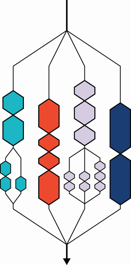
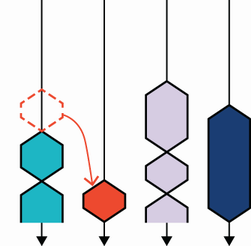
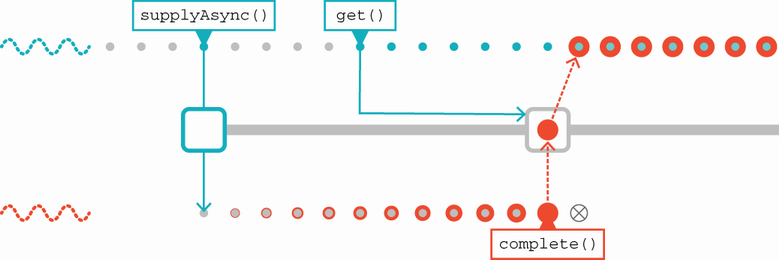
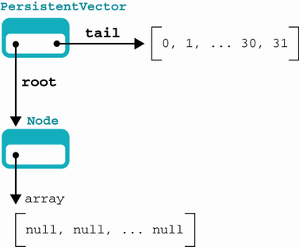
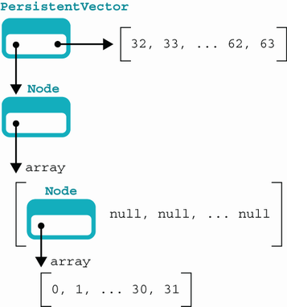
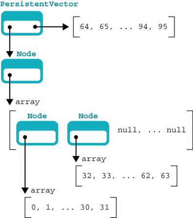
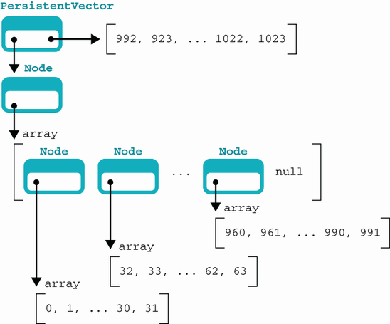
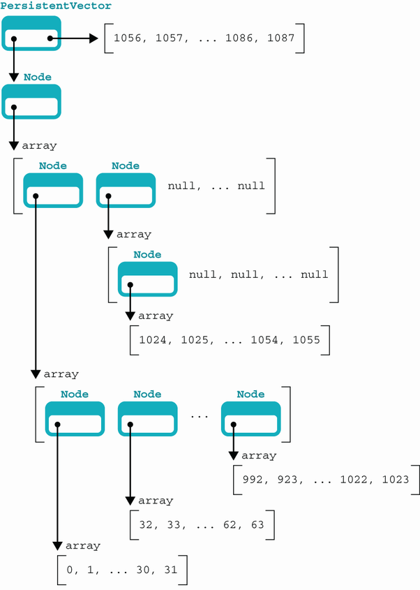
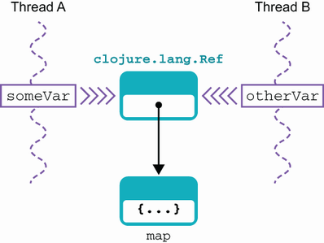

# 16. Lập trình đồng thời nâng cao

> *The Well-Grounded Java Developer, Second Edition* — Chương 16
> Bản dịch tiếng Việt

**Chương này bao gồm:**

- Fork/Join API
- Thuật toán work-stealing
- Concurrency và lập trình hàm
- Nhìn vào bên trong coroutine của Kotlin
- Concurrency trong Clojure
- Software transactional memory
- Agent

---

Trong chương này, chúng ta sẽ gộp lại vài chủ đề từ các chương trước. Cụ thể, chúng ta sẽ đan xen các khái niệm lập trình hàm từ các chương trước với thư viện concurrency của Java từ chương 6. Các ngôn ngữ không phải Java cũng được đưa vào, với một số khía cạnh concurrency mới lạ của cả Kotlin lẫn Clojure xuất hiện ở phần sau của chương.

> **NOTE** Các khái niệm trong chương này, chẳng hạn coroutine và agent (hay actor), cũng ngày càng là một phần của cảnh quan concurrency Java.

Chúng ta sẽ bắt đầu với một thứ hơi kỳ lạ: Java Fork/Join API. Framework này cho phép một lớp bài toán đồng thời nhất định được xử lý hiệu quả hơn so với các executor ta đã thấy ở chương 6.

## 16.1 Framework Fork/Join

Như đã thảo luận ở chương 7, tốc độ bộ xử lý (hay đúng hơn, số transistor trên CPU) đã tăng rất nhiều trong những năm gần đây. Hiệu năng I/O không có cải thiện đáng chú ý như vậy, và kết quả cuối cùng là việc chờ I/O giờ là tình huống phổ biến. Điều này gợi ý rằng chúng ta có thể tận dụng tốt hơn khả năng xử lý bên trong máy tính. Framework Fork/Join (F/J) là một nỗ lực làm đúng điều đó.

F/J hoàn toàn là về việc lập lịch tự động các tác vụ trên một thread pool vô hình với người dùng. Để làm điều này, các tác vụ phải có thể được chia nhỏ theo cách người dùng chỉ định. Trong nhiều ứng dụng, F/J có khái niệm về tác vụ "nhỏ" và "lớn" rất tự nhiên với framework.

Hãy xem nhanh một số sự thật chính và nền tảng liên quan tới F/J:

- Framework giới thiệu một loại executor service mới, gọi là `ForkJoinPool`.
- `ForkJoinPool` xử lý một đơn vị concurrency (`ForkJoinTask`) "nhỏ hơn" một `Thread`.
- `ForkJoinTask` có thể được `ForkJoinPool` lập lịch theo cách nhẹ hơn.
- F/J dùng hai loại tác vụ sau (cả hai đều biểu diễn dưới dạng instance của `ForkJoinTask`):
  - Tác vụ "nhỏ" là những cái có thể thực hiện ngay mà không tiêu tốn quá nhiều thời gian bộ xử lý.
  - Tác vụ "lớn" là những cái cần được chia nhỏ (có thể nhiều lần) trước khi có thể thực hiện trực tiếp.
- Framework cung cấp các phương thức cơ bản để hỗ trợ việc chia nhỏ tác vụ lớn.
- Framework có lập lịch và lập lịch lại tự động.

Một tính năng then chốt của framework là các tác vụ nhẹ này rất có thể sẽ sinh ra các instance `ForkJoinTask` khác, sẽ được lập lịch trên cùng thread pool đã thực thi tác vụ cha. Mẫu này đôi khi gọi là *divide and conquer* (chia để trị).

Chúng ta sẽ bắt đầu với ví dụ đơn giản về việc dùng framework F/J, rồi chạm ngắn gọn tới đặc điểm của các bài toán phù hợp với loại cách tiếp cận xử lý song song này. Chúng ta sau đó sẽ thảo luận tính năng gọi là "work-stealing" như dùng trong F/J và sự liên quan của nó trong ngữ cảnh rộng hơn. Cách tốt nhất để bắt đầu với F/J là qua một ví dụ.

### 16.1.1 Một ví dụ F/J đơn giản

Làm ví dụ đơn giản về những gì framework F/J có thể làm, hãy xét trường hợp sau: chúng ta có một số đối tượng giao dịch được tạo ở nhiều thời điểm khác nhau. Class chúng ta dùng để biểu diễn chúng là `Transaction`, như sau, là một tiến hóa của class `TransferTask` mà ta đã gặp ở chương 5 và 6:

```java
public class Transaction implements Comparable<Transaction> {
    private final Account sender;
    private final Account receiver;
    private final int amount;
    private final long id;
    private final LocalDateTime time;

     private static final AtomicLong counter = new AtomicLong(1);

     Transaction(Account sender, Account receiver,
                 int amount, LocalDateTime time) {
         this.sender = sender;
         this.receiver = receiver;
         this.amount = amount;
         this.id = counter.getAndIncrement();
         this.time = time;
     }

     public static Transaction of(Account sender, Account receiver,
                                  int amount) {
         return new Transaction(sender, receiver,
                                amount, LocalDateTime.now());
     }

     @Override
     public int compareTo(Transaction other) {
         return Comparator.nullsFirst(LocalDateTime::compareTo)
                          .compare(this.time, other.time);
     }

     // Getter và các phương thức khác (equals, hashcode, v.v.) được lược bỏ
}
```

Chúng ta muốn có một danh sách giao dịch, sắp xếp theo thời gian. Để đạt được điều này, chúng ta sẽ dùng F/J như một phép sắp xếp đa luồng — thực ra là một biến thể của thuật toán MergeSort.

Ví dụ của chúng ta dùng `RecursiveAction`, một subclass chuyên biệt của `ForkJoinTask`. Nó đơn giản hơn `ForkJoinTask` tổng quát bởi nó tường minh về việc không có kết quả tổng thể (các giao dịch sẽ được sắp xếp lại tại chỗ), và nó nhấn mạnh bản chất đệ quy của các tác vụ.

Class `TransactionSorter` cung cấp một cách sắp thứ tự danh sách cập nhật dùng phương thức `compareTo()` trên đối tượng `Transaction`. Phương thức `compute()` (bạn phải hiện thực nó bởi nó abstract trong superclass `RecursiveAction`) về cơ bản sắp thứ tự một mảng giao dịch theo thời gian tạo, như trong listing tiếp theo.

**Listing 16.1 Sắp xếp với một `RecursiveAction`**

```java
public class TransactionSorter extends RecursiveAction {
    private static final int SMALL_ENOUGH = 32;      ❶
    private final Transaction[] transactions;
    private final int start, end;
    private final Transaction[] result;

     public TransactionSorter(List<Transaction> transactions) {
         this(transactions.toArray(new Transaction[0]),
              0, transactions.size());
     }

     public TransactionSorter(Transaction[] transactions) {
         this(transactions, 0, transactions.length);
     }

     public TransactionSorter(Transaction[] txns, int start, int end) {
         this.start = start;
         this.end = end;
         this.transactions = txns;
         this.result = new Transaction[this.transactions.length];
     }

     /**
      * Phương thức này hiện thực một Mergesort đơn giản. Vui lòng tham khảo
      * giáo trình phù hợp nếu bạn quan tâm tới chi tiết hiện thực.
      */
     private void merge(TransactionSorter left, TransactionSorter right) {
         int i = 0;
         int lCount = 0;
         int rCount = 0;

         while (lCount < left.size() && rCount < right.size()) {
             int comp = left.result[lCount].compareTo(right.result[rCount]);
             result[i++] = (comp < 0)
                     ? left.result[lCount++]
                     : right.result[rCount++];
         }

         while (lCount < left.size()) {
             result[i++] = left.result[lCount++];
         }

         while (rCount < right.size()) {
             result[i++] = right.result[rCount++];
         }
     }

     public int size() {
         return end - start;
     }

     public Transaction[] getResult() {
         return result;
     }

     @Override
     protected void compute() {                       ❷
         if (size() < SMALL_ENOUGH) {
             System.arraycopy(transactions, start, result, 0, size());
             Arrays.sort(result, 0, size());
         } else {
             int mid = size() / 2;
             TransactionSorter left =
                  new TransactionSorter(transactions, start, start + mid);
             TransactionSorter right =
                  new TransactionSorter(transactions, start + mid, end);
             invokeAll(left, right);

              merge(left, right);
         }
     }
}
```

❶ 32 hoặc ít hơn thì sắp xếp tuần tự

❷ Phương thức được định nghĩa trong `RecursiveAction`

Để dùng sorter, bạn có thể điều khiển nó với đoạn mã như sau, sẽ sinh một số giao dịch và xáo trộn chúng trước khi truyền cho sorter. Đầu ra là các cập nhật đã được sắp xếp lại:

```java
var transactions = new ArrayList<Transaction>();
var accs = new Account[] {
              new Account(1000),
              new Account(1000)};

for (var i = 0; i < 256; i = i + 1) {
  transactions.add(Transaction.of(accs[i % 2], accs[(i + 1) % 2], 1));
  Thread.sleep(1);
}
Collections.shuffle(transactions);

var sorter = new TransactionSorter(transactions);
var pool = new ForkJoinPool(4);

pool.invoke(sorter);

for (var txn : sorter.getResult()) {
  System.out.println(txn);
}
```

Lời hứa của F/J có vẻ hấp dẫn, nhưng trên thực tế, không phải bài toán nào cũng dễ quy về dạng đơn giản như MergeSort đa luồng ta vừa thảo luận.

Đây là ví dụ về antipattern *Easy Cases Are Easy*, trong đó lập trình viên có thể bị quyến rũ bởi một công nghệ có vẻ đơn giản cho phép hoàn thành một nhiệm vụ dễ với rất ít nỗ lực nhưng che giấu việc công nghệ đó không mở rộng hay tổng quát hóa tốt cho các trường hợp khó hơn. Chúng ta nên nói gì đó về các loại bài toán có khả năng xử lý được bằng F/J, và những bài toán mà cách tiếp cận khác có lẽ tốt hơn.

### 16.1.2 Song song hóa bài toán cho F/J

Đây là một số ví dụ về bài toán phù hợp tốt với cách tiếp cận F/J:

- Mô phỏng chuyển động của số lượng lớn đối tượng đơn giản (ví dụ, hiệu ứng hạt)
- Phân tích tệp log
- Các thao tác dữ liệu nơi một đại lượng được tính từ đầu vào tổng hợp (ví dụ, các thao tác map-reduce)

Một cách nhìn khác là nói rằng một bài toán tốt cho F/J là bài toán có thể chia nhỏ, như thể hiện trong hình 16.1.



**Hình 16.1** Fork và join

Một cách thực tế để xác định liệu một bài toán có khả năng quy tốt hay không là áp dụng checklist sau cho bài toán và các tác vụ con:

- Các tác vụ con của bài toán có thể làm việc mà không cần hợp tác hay đồng bộ hóa tường minh giữa các tác vụ con không?
- Các tác vụ con có tính một giá trị nào đó từ dữ liệu mà không thay đổi nó không (tức là chúng có phải hàm thuần khiết không)?
- Chia để trị có tự nhiên với các tác vụ con không?

Nếu câu trả lời cho các câu hỏi trên là "Có!" hoặc "Hầu hết, nhưng có trường hợp biên", bài toán của bạn rất có thể phù hợp với cách tiếp cận F/J. Mặt khác, nếu câu trả lời cho những câu đó là "Có thể" hoặc "Không hẳn", bạn rất có thể thấy F/J hoạt động kém, và một cách tiếp cận khác có thể tốt hơn.

Thiết kế thuật toán đa luồng tốt là khó, và F/J không hoạt động trong mọi hoàn cảnh. Nó rất hữu ích trong miền áp dụng riêng của nó, nhưng cuối cùng, bạn phải quyết định liệu bài toán của mình có phù hợp trong framework không. Nếu không, bạn phải sẵn sàng phát triển giải pháp riêng, có lẽ nghĩa là xây dựng trên hộp công cụ tuyệt vời `java.util.concurrent`.

### 16.1.3 Thuật toán work-stealing

`ForkJoinTask` là superclass của `RecursiveAction`. Nó là class generic theo kiểu trả về của một action (nên `RecursiveAction` kế thừa `ForkJoinTask<Void>`). Điều này khiến `ForkJoinTask` rất phù hợp cho các cách tiếp cận map-reduce nấu chảy một tập dữ liệu và hoặc trả về kết quả hoặc hành động qua tác dụng phụ (như trường hợp của `RecursiveAction`).

Các đối tượng kiểu `ForkJoinTask` được lập lịch trên một `ForkJoinPool`, là loại executor service mới được thiết kế riêng cho các tác vụ nhẹ này. Service duy trì một danh sách tác vụ cho mỗi luồng, và nếu một tác vụ hoàn tất, service có thể gán lại tác vụ từ một luồng đang đầy tải sang một luồng rảnh. Chúng ta thấy điều này xảy ra trong hình 16.2.



**Hình 16.2** Work-stealing: Khi luồng thứ hai hoàn tất tác vụ, service gán lại một tác vụ từ luồng thứ nhất vẫn đang bận sang luồng thứ hai.

Không có thuật toán work-stealing này, các vấn đề lập lịch có thể phát sinh liên quan tới hai kích thước tác vụ. Nói chung, hai kích thước tác vụ có thể mất khoảng thời gian rất khác nhau để chạy.

Ví dụ, một luồng có thể có run queue chỉ gồm các tác vụ nhỏ, trong khi một luồng khác có thể chỉ có tác vụ lớn. Nếu tác vụ nhỏ chạy nhanh gấp năm lần tác vụ lớn, luồng chỉ có tác vụ nhỏ rất có thể thấy mình nhàn rỗi trước khi luồng tác vụ lớn hoàn tất.

> **WARNING** Work-stealing phụ thuộc vào giả định rằng các tác vụ độc lập với nhau. Nếu giả định này không hợp lệ, kết quả tính toán có thể khác nhau giữa các lần chạy.

Work-stealing đã được hiện thực chính xác để lách vấn đề này và cho phép mọi luồng trong pool được dùng suốt vòng đời của công việc F/J. Nó hoàn toàn tự động, và bạn không cần làm gì cụ thể để gặt hái lợi ích của work-stealing. Đây là ví dụ nữa về việc môi trường runtime làm nhiều hơn để giúp lập trình viên quản lý concurrency, thay vì biến nó thành nhiệm vụ thủ công. Tài liệu cũng nói rõ: `ForkJoinPool` cũng có thể phù hợp để dùng với các tác vụ kiểu sự kiện không bao giờ được join.

> **NOTE** `ForkJoinPool` cũng được dùng trong các thư viện Java/JVM phổ biến, chẳng hạn hệ thống Akka về concurrency dựa trên actor trong Scala và Java.

Để tương tác với `ForkJoinPool`, class phơi bày các phương thức chính sau:

- `execute()` — Bắt đầu một lần thực thi bất đồng bộ
- `invoke()` — Bắt đầu thực thi và chờ kết quả
- `submit()` — Bắt đầu thực thi và trả về một future cho kết quả

Kể từ Java 8, runtime bao gồm một *common pool*, được truy cập qua `ForkJoinPool.commonPool()`. Cái này chủ yếu được cung cấp cho khả năng work-stealing — không có nhiều kỳ vọng rằng nhiều chương trình sẽ dùng nó cho phân rã đệ quy.

Common pool có một số thuộc tính cấu hình được có thể đặt để kiểm soát những thứ như mức song song (tức là dùng bao nhiêu luồng) và class thread factory dùng để tạo luồng mới cho common pool.

## 16.2 Concurrency và lập trình hàm

Ở chương 5, chúng ta đã gặp khái niệm đối tượng bất biến và cho thấy chúng cực kỳ hữu ích cho lập trình đồng thời bởi chúng né tránh vấn đề trạng thái khả biến chia sẻ, vốn nằm ở trung tâm của rất nhiều vấn đề concurrency. Nên, chúng ta có thể đoán rằng các kỹ thuật hàm tận dụng tính bất biến là công cụ quan trọng để xây dựng ứng dụng đồng thời. Điều này đúng, nhưng một mở rộng nhỏ của tính bất biến cũng liên quan tới lập trình đồng thời.

### 16.2.1 Xem lại CompletableFuture

Ở chương 6, chúng ta đã gặp class `CompletableFuture`. Kiểu này không bất biến, nhưng nó có một mô hình trạng thái rất đơn giản, mô tả như sau:

- Nó bắt đầu ở trạng thái chưa hoàn tất.
- Mọi nỗ lực `get()` một giá trị từ nó sẽ chặn.
- Ở một thời điểm sau, một sự kiện publication xảy ra.
- Điều này đặt giá trị và truyền nó cho mọi luồng đang chặn ở `get()`.
- Giá trị được công bố giờ là bất biến.

Hình 16.3 cho thấy future và sự kiện publication.



**Hình 16.3** Event publication đặt giá trị và truyền nó cho mọi luồng đang chặn ở `get()`.

Một điểm mạnh lớn của `CompletableFuture` là có thể kết hợp các hàm với kết quả, và kết quả sẽ được đánh giá lười, tức là hàm sẽ không được thực thi cho tới khi giá trị đến.

Việc kết hợp hàm này có thể diễn ra hoặc đồng bộ hoặc bất đồng bộ. Điều này có lẽ dễ thấy nhất qua việc chạy vài ví dụ. Hãy tái sử dụng ý tưởng `NumberService` từ chương 6 và dùng một bản hiện thực giả cho nó, ví dụ:

```java
public class NumberService {
    public static long findPrime(int n) {
        try {
            Thread.sleep(5_000);
        } catch (InterruptedException e) {
            throw new CancellationException("interrupted");
        }
        return 42L;
    }
}
```

Cái này hiển nhiên không thực sự tính số nguyên tố, nhưng đủ tốt để minh họa hành vi luồng, là mục tiêu của chúng ta. Chúng ta cần một chút mã để điều khiển, như sau:

```java
var n = 1000;
var future =
  CompletableFuture.supplyAsync(() -> {                     ❶
  System.out.println("Starting on: "+ Thread.currentThread().getName());
  return NumberService.findPrime(n);
});
var f2 = future.thenApply(l -> {                            ❷
  System.out.println("Applying on: "+ Thread.currentThread().getName());
  return l * 2;
});
var f3 = future.thenApplyAsync(l -> {                       ❸
  System.out.println("Async on: "+ Thread.currentThread().getName());
  return l * 3;
});

try {
  System.out.println("F2: "+ f2.get());
  System.out.println("F3: "+ f3.get());
} catch (InterruptedException | ExecutionException e) {
  e.printStackTrace();
}
```

❶ Cung cấp phép tính để chạy bất đồng bộ

❷ Cung cấp hàm để áp dụng lên kết quả của phép tính bất đồng bộ

❸ Cung cấp một hàm khác để áp dụng bất đồng bộ lên kết quả

Khi chạy mã này, chúng ta nhận kết quả như sau:

```
Starting up on thread: ForkJoinPool.commonPool-worker-19
Applying on thread: ForkJoinPool.commonPool-worker-19
Applying async on thread: ForkJoinPool.commonPool-worker-5
F2: 84
F3: 126
```

Future `f2`, dùng `thenApply()`, thực thi trên cùng luồng với `future`, trong khi `f3` (dùng `thenApplyAsync()`) thực thi trên một luồng khác trong pool.

Bạn có thể nhận thấy rằng, theo mặc định, việc thực thi mã `CompletableFuture` đều dùng common pool. Pool này xuất hiện với tên `ForkJoinPool.commonPool`, như thấy trong đầu ra trên.

Trong một số hoàn cảnh, lập trình viên có thể muốn dùng một thread pool thay thế. Ví dụ, common pool không cấu hình được về số luồng tối đa có thể dùng, và điều này có thể không chấp nhận được với một số workload. May mắn thay, các phương thức factory của `CompletableFuture`, chẳng hạn `supplyAsync()`, đi kèm các overload nhận một đối số `Executor` tường minh. Điều này cho phép future chạy trên một threadpool cụ thể thay thế.

Bên cạnh phương thức `thenApply()`, `CompletableFuture` cũng cung cấp `thenCompose()`. Một số lập trình viên thấy khác biệt giữa hai cái này khó hiểu, nên hãy dành chút thời gian giải thích.

Nhớ rằng `thenApply()` nhận làm đối số một `Function` ánh xạ `T -> U`. Hàm này được áp dụng đồng bộ trên bất kỳ luồng nào mà `CompletableFuture` đang chạy sau khi future gốc hoàn tất.

Mặt khác, `thenCompose()` nhận một `Function` ánh xạ `T -> CompletableFuture<U>` (kiểu trả về thực tế là `CompletionStage<U>` thay vì `CompletableFuture<U>`, nhưng hãy lướt qua chi tiết đó bây giờ). Đây hiệu quả là một hàm bất đồng bộ (và nó có thể chạy trên luồng khác). Hãy xem một ví dụ cụ thể:

```java
Function<Long, CompletableFuture<Long>> f = l ->
  CompletableFuture.supplyAsync(() -> {
      System.out.println("Applying on thread: " +
                          Thread.currentThread().getName());
      return l * 2;
  });
```

Chúng ta có thể truyền hàm này cho `thenApply()`, nhưng kết quả sẽ là `CompletableFuture<CompletableFuture<Long>>`. Thay vào đó, `thenCompose()` làm phẳng kết quả trở lại thành `CompletableFuture<Long>`. Điều này tương tự cách phương thức `flatMap()` hoạt động trong Java Streams API — nó áp dụng một hàm trả về `Stream<T>` lên một đối tượng stream, nhưng thay vì trả về `Stream<Stream<T>>`, các stream riêng được làm phẳng và nối lại thành một stream duy nhất.

`CompletableFuture` cũng hỗ trợ `join()`, về cơ bản hoạt động như một thread join nhưng trả về một giá trị. Cũng có thể "nối lại" các future bằng cách có mã dự định chạy sau khi một trong hai (hoặc cả hai) hoàn tất. Ví dụ:

```java
var n = 1000;
var future = CompletableFuture.supplyAsync(() -> {
    System.out.println("Starting up: "+ Thread.currentThread().getName());
    return NumberService.findPrime(n);
});

var future2 = CompletableFuture.supplyAsync(() -> {
        System.out.println("Starting up: "+ Thread.currentThread().getName());
        return NumberService.findPrime(n);
});

Runnable dontKnow = () -> System.out.println("One of the futures finished");
future.runAfterEither(future2, dontKnow);
```

Giờ chúng ta muốn gộp thảo luận về lập trình hàm ở chương trước với các ý tưởng ở đây.

Nếu các hàm chúng ta muốn áp dụng lên kết quả của một `CompletableFuture` là thuần khiết và không phụ thuộc vào gì ngoài giá trị đầu vào, hành động áp dụng hàm lên future giống với việc áp dụng hàm lên kết quả. Nói cách khác: nếu future được nghĩ như một kiểu container, giữ một giá trị, thì container là "trong suốt" với hàm được áp dụng lên giá trị khi nó đã đến.

Cụ thể, hai trong số các lợi ích chính của referential transparency (ví dụ, dùng hàm thuần khiết) như sau:

- Memoization
- Tính khả chuyển (Transportability)

Cái đầu nghĩa là mọi lời gọi hàm thuần khiết có thể được thay bằng một giá trị đã tính — chúng ta không phải chạy lại lời gọi hàm với cùng đối số, bởi ta đã biết câu trả lời. Thứ hai, dĩ nhiên, nếu chúng ta đang tính một hàm thuần khiết, thì không quan trọng nó diễn ra trên luồng nào, nên việc chúng ta cung cấp một hàm để áp dụng đồng bộ hay bất đồng bộ sẽ không ảnh hưởng kết quả.

> **NOTE** Java, như đã thảo luận, là ngôn ngữ khá không thuần khiết, nên nhiều lợi ích này chỉ áp dụng nếu lập trình viên cẩn thận dùng hàm thuần khiết và dữ liệu bất biến xuyên suốt.

Trong lúc thảo luận lập trình hàm đồng thời, có vẻ thích hợp để nói gì đó về parallel stream, một mảng của Streams API mà nhiều lập trình viên hiểu nhầm.

### 16.2.2 Parallel stream

Ở chương 5, chúng ta đã gặp định luật Amdahl, một trong những kết quả nền tảng về concurrency khi nó liên quan tới song song hóa dữ liệu. Đây là cách tiếp cận concurrency mà chúng ta thường muốn dùng khi có lượng lớn dữ liệu khá giống nhau và tất cả phải được xử lý theo cách ít nhiều giống nhau. Nói chung, cách tiếp cận song song hóa dữ liệu hữu ích nếu tất cả những điều sau đúng:

- Bạn có nhiều dữ liệu để xử lý theo cùng cách (hoặc rất tương tự).
- Thứ tự không quan trọng.
- Các mục độc lập với nhau.
- Bạn có thể cho thấy một bước xử lý cụ thể là nút thắt cổ chai.

Parallel stream là một loại song song hóa dữ liệu mà nhiều lập trình viên Java khá hào hứng khi chúng được đưa vào Java 8. Tuy nhiên, như ta sẽ thấy, thực tế hóa ra khá khác so với hy vọng ban đầu. API, thể hiện ở đây, có vẻ đủ đơn giản:

```java
// Chỉ cần thay stream() bằng parallelStream()
List<String> origins = musicians
      .parallelStream()
      .filter(artist -> artist.getName().startsWith("The"))
      .map(artist -> artist.getNationality())
      .collect(toList());
```

Bên dưới, công việc được phân phối dùng framework F/J và dùng thuật toán work-stealing để trải phép tính qua nhiều lõi. Những điều sau có vẻ quá tốt để là thật:

- Công việc được framework quản lý.
- API nhắm tới tường minh nhưng không xâm lấn.
- Phân phối theo dữ liệu.
- `parallelStream()` cho phép lập trình viên lật giữa tuần tự và song song.
- "Tăng tốc miễn phí."

Thực tế, nó *quá tốt để là thật*. Vấn đề đầu tiên và rõ ràng nhất là định luật Amdahl. Để chia một tác vụ tuần tự thành một tập khối có thể thực thi song song đòi hỏi công việc — tức là thời gian tính toán. Càng nhiều chi phí chuẩn bị và giao tiếp, càng ít lợi ích mà nhiều bộ xử lý mang lại — đây là bản chất của định luật Amdahl.

Không có cách tổng quát nào để dễ dàng và đáng tin cậy ước lượng chi phí tương đối của việc chia so với chi phí thao tác tuyến tính. Framework đẩy chi phí nhận thức về việc quyết định liệu song song hóa có thực sự đáng giá trở lại cho lập trình viên. Điều này đã nghe như "song song hóa tự động" không phải niết bàn được hứa hẹn. Thay vào đó, người dùng cuối phải ý thức sắc bén về nhiều chi tiết lý tưởng ra nên được trừu tượng hóa đi.

Chỉ lấy một ví dụ: công việc chia và tái kết hợp phải diễn ra trên một thread pool trong JVM. Càng nhiều luồng mà JVM tạo, chúng càng cạnh tranh thời gian CPU. Streams API không, tiên nghiệm, biết bao nhiêu instance parallel stream khác tồn tại trong tiến trình hiện tại. Điều này dẫn tới hai chiến lược khả dĩ, đều khó nuốt như nhau:

- Tạo một thread pool mới, chuyên dụng cho mỗi lần gọi parallel stream.
- Tạo một instance thread pool duy nhất (riêng cho JVM), và làm mọi lần gọi parallel stream dùng nó.

Lựa chọn đầu dẫn tới việc tạo luồng có khả năng không giới hạn, cuối cùng sẽ làm đói hoặc sập JVM. Vì lý do này, trong Java 8, có một thread pool chia sẻ duy nhất đứng sau parallel stream: `ForkJoinPool.commonPool()`. Lựa chọn này dẫn tới tranh chấp tiềm tàng trên một tài nguyên chia sẻ (mà, như đã thấy ở chương 7, là gốc rễ thực sự của rất nhiều vấn đề hiệu năng).

Có một cách lách: nếu bạn thực thi một parallel stream như một tác vụ trên một `ForkJoinPool`, nó sẽ thực thi ở đó và không dùng common pool, như sau:

```java
// Dùng một pool tùy chỉnh
var forkJoinPool = new ForkJoinPool(4);
List<String> origins2 = forkJoinPool.submit(() -> musicians
    .parallelStream()
    .filter(artist -> artist.getName().startsWith("The"))
    .map(artist -> artist.getNationality())
    .collect(toList())).get();
forkJoinPool.shutdown();
```

Lưu ý rằng `forkJoinPool` phải được shutdown tường minh, nếu không nó sẽ tồn tại trong bộ nhớ chờ tác vụ mới và do đó rò rỉ bộ nhớ và luồng.

Nói chung, lời khuyên tốt nhất có thể đưa ra về parallel stream là đừng áp dụng song song hóa một cách mù quáng. Thay vào đó, hãy thực sự cho thấy bạn có trường hợp sử dụng cho nó. Như luôn luôn, việc này được làm bằng cách đo lường và bằng cách cho thấy các thao tác stream quả thực là nút thắt cổ chai trước, trước khi thử xem parallel stream có giúp không.

Đáng tiếc, không có lớp bài toán tổng quát nào mà parallel stream có thể được kỳ vọng giúp ích. Mỗi trường hợp phải được khảo sát và kiểm thử từ các nguyên tắc đầu tiên. Chỉ khi đó bạn mới có thể thử áp dụng song song hóa cho stream và chứng minh bằng dữ liệu rằng có thể đạt được cải thiện đáng giá.

## 16.3 Nhìn vào bên trong coroutine của Kotlin

Như đã giới thiệu ở chương 9, Kotlin cung cấp một lựa chọn thay thế cho mô hình `Thread` cho concurrency với *coroutine*. Coroutine có thể được nghĩ tới như "luồng nhẹ" mà không có hình phạt tài nguyên của luồng hệ điều hành đầy đủ. Điều này có phần giống Fork/Join của Java. Kotlin cung cấp phương tiện thực thi thay thế này thế nào? Một hiểu biết sâu hơn về những gì đang diễn ra bên dưới bề mặt là chính đáng.

### 16.3.1 Coroutine hoạt động thế nào

Hãy bắt đầu từ ví dụ đã sửa đổi sau của cái ta thấy ở chương 9:

```kotlin
package com.wgjd

import kotlinx.coroutines.GlobalScope
import kotlinx.coroutines.delay
import kotlinx.coroutines.launch

fun main() {
  GlobalScope.launch {
    delay(1000)
    sus()
  }

    Thread.sleep(2000)
}

suspend fun sus() {
  println("Totally sus...")
}
```

Ở đây chúng ta dùng `GlobalScope.launch` để khởi động một coroutine mới. Scope được dùng để diễn đạt cách một coroutine nên chạy, và chúng ta sẽ xem chúng cẩn thận hơn ở mục tiếp theo.

Coroutine chúng ta tạo ở đây sẽ chờ một giây dùng hàm `delay`, rồi gọi hàm của chúng ta, `sus`. Cuối cùng, chúng ta `Thread.sleep` 2 giây để đảm bảo coroutine có thời gian hoàn tất trước khi cả chương trình thoát.

Một phần của việc coroutine khác luồng ở chỗ việc thực thi của chúng có thể được tạm dừng ở các điểm cụ thể. Kotlin làm sao biết chỗ nào có thể tạm dừng? Điều đó đến từ từ khóa `suspend` chúng ta đặt trên hàm `sus` (và cũng trên hàm `delay` do thư viện cung cấp). Hàm `suspend` đánh dấu các khối mã mà Kotlin xử lý như đơn vị thực thi.

Với các hàm `suspend` đánh dấu các mẩu mã trong coroutine giữa các chỗ chúng ta có thể tạm dừng, Kotlin có thể tạo một máy trạng thái để quản lý việc thực thi coroutine. Tiến trình qua máy trạng thái đó được mã sinh ra của chúng ta theo dõi, với các khối được định nghĩa bằng `suspend` cung cấp các bước cho máy đó.

Hãy dịch coroutine của chúng ta thành một máy trạng thái như sau:

```kotlin
GlobalScope.launch {
  delay(1000)
  sus()
}
```

Các bước trong coroutine như sau và được minh họa trong hình 16.4:

- Tạo instance coroutine mới bằng cách gọi `launch`.
- Thực thi qua `delay`.
- Quyền điều khiển trả về Kotlin, sẽ chờ 1 giây được yêu cầu.
- Tiếp tục sau `delay` và thực thi qua `sus`.
- Trả quyền điều khiển lại cho Kotlin, lần này không cần tạm dừng.
- Tiếp tục sau `sus`, và hoàn tất coroutine.


**Hình 16.4** Máy trạng thái coroutine

Việc phân tích thành các bước này làm rõ vì sao coroutine đôi khi được mô tả là "đa nhiệm hợp tác" (cooperative multitasking). Mã giữa các lời gọi tới hàm `suspend` được thực thi đồng bộ, với các điểm suspend cung cấp cơ hội duy nhất để tạm dừng và thực thi các bước coroutine khác. Hãy tưởng tượng giữa `delay` và `sus` chúng ta vào một vòng lặp vô hạn. Vòng lặp đó sẽ chặn bất kỳ luồng nào nó đang thực thi trên đó mãi mãi.

Máy trạng thái này không chỉ là một ý tưởng — Kotlin trực tiếp sinh mã làm điều này, và chúng ta có thể khảo sát nó. Hãy xem đầu ra từ hàm trước để thấy nó được dịch ra sao. (Lưu ý, một số chi tiết nhỏ bị loại bỏ cho ngắn gọn và rõ ràng.)

Kết quả biên dịch từ ứng dụng cơ bản có nhiều class file hơn ta có thể mong đợi. Ví dụ, đây là kết quả đầu ra dưới thư mục `build` của Gradle:

```
build
└── classes
        └── kotlin
                └── main
                        └── com
                                  └── wgjd
                                 ├── MainKt$main$1.class
                                 └── MainKt.class
```

Chúng ta đã gặp `MainKt.class` ở chương 9. Kotlin trong suốt tạo một class chứa cho các hàm cấp cao nhất, bởi JVM không hỗ trợ native các hàm tự do và phải đặt mọi mã phương thức vào một class nào đó.

Tuy nhiên, bên cạnh đó, chúng ta có một class mới: `MainKt$main$1.class`. Dịch ngược class file đó tiết lộ rằng Kotlin đã làm công việc tương tự tạo class "bí mật" cho coroutine, giống như nó đã làm cho các hàm cấp cao nhất. Class được sinh này biểu diễn một lần thực thi coroutine. Như ta thấy tiếp theo, class được sinh này là hỗn hợp của mã của chúng ta và phần đường ống để chạy những gì ta đã viết như một coroutine:

```java
final class com.wgjd.MainKt$main$1
    extends kotlin.coroutines.jvm.internal.SuspendLambda    ❶
    implements kotlin.jvm.functions.Function2<              ❷
        kotlinx.coroutines.CoroutineScope,
        kotlin.coroutines.Continuation<? super kotlin.Unit>,
        java.lang.Object> {
```

❶ Class được sinh của chúng ta lấy chức năng từ `SuspendLambda` của Kotlin.

❷ Class được sinh của chúng ta hiện thực một interface cụ thể mà mã gọi sẽ dùng để gọi coroutine.

Nếu chúng ta xem mã sinh ra từ hàm `main` trong `MainKt.class`, ta thấy Kotlin tạo một instance của coroutine rồi gọi nó:

```
Compiled from "Main.kt"
public final class com.wgjd.MainKt {

  public static final void main();
    Code:
       0: getstatic     #41 // Field                                    ❶
                             // kotlinx/coroutines/GlobalScope.INSTANCE
                             // Lkotlinx/coroutines/GlobalScope;
       3: checkcast     #43 // class kotlinx/coroutines/CoroutineScope
       6: aconst_null
       7: aconst_null
       8: new           #45 // class com/wgjd/MainKt$main$1             ❷
      11: dup
      12: aconst_null
      13: invokespecial #49 // Method com/wgjd/MainKt$main$1."<init>"
                             // (Lkotlin/coroutines/Continuation;)V
      16: checkcast     #51 // class kotlin/jvm/functions/Function2
      19: iconst_3
      20: aconst_null
      21: invokestatic  #57 // Method kotlinx/coroutines/              ❸
                            // BuildersKt.launch$default:...
      24: pop
      25: ldc2_w        #58 // long 2000l
      28: invokestatic  #65 // Method java/lang/Thread.sleep:(J)V
      31: return
```

❶ Lấy instance `GlobalScope` để dùng khi khởi động coroutine

❷ Tạo và khởi tạo một instance mới của class coroutine được sinh

❸ Gọi phương thức `launch`, cung cấp cho nó scope và instance coroutine. Cụ thể, instance coroutine được truyền như tham số `Function2`.

Mã trong phương thức `launch` khi đó sẽ bắt đầu gọi các phương thức trên instance coroutine được sinh, chạy máy trạng thái của chúng ta. Hãy xem bytecode hiện thực máy trạng thái đó. Trước hết, instance coroutine có hai field riêng biệt. Chúng theo dõi scope coroutine và vị trí hiện tại trong máy trạng thái:

```java
final class com.wgjd.MainKt$main$1
    extends kotlin.coroutines.jvm.internal.SuspendLambda
    implements kotlin.jvm.functions.Function2<
        kotlinx.coroutines.CoroutineScope,
        kotlin.coroutines.Continuation<? super kotlin.Unit>,
        java.lang.Object> {

  java.lang.Object L$0;             ❶

  int label;                        ❷
```

❶ `CoroutineScope` cho lần thực thi hiện tại

❷ Giá trị `int` biểu diễn bước hiện tại của máy trạng thái

Khi máy trạng thái chạy, trái tim của nó là một phương thức quyết định bước tiếp theo dựa trên các field này. Kotlin sinh một phương thức gọi là `invokeSuspend` đúng cho mục đích đó. `invokeSuspend` rốt cuộc là hỗn hợp của mã của chúng ta và máy trạng thái theo dõi tiến trình. Trong vòng đời của coroutine, Kotlin sẽ lặp lại việc gọi `invokeSuspend` bất cứ khi nào coroutine sẵn sàng cho bước thực thi tiếp theo.

Đoạn mã tiếp theo cho chúng ta thấy phần đầu của `invokeSuspend`, cùng bước đầu tiên từ máy trạng thái (từ khi coroutine bắt đầu cho tới khi chúng ta gọi `delay`):

```
public final java.lang.Object invokeSuspend(java.lang.Object);
    Code:
       0: invokestatic #36 // Method kotlin/coroutines/intrinsics/
                             // IntrinsicsKt.getCOROUTINE_SUSPENDED:
                             // ()Ljava/lang/Object;
       3: astore_3
       4: aload_0
       5: getfield      #40 // Field label:I
       8: tableswitch   {    // 0 to 2                            ❶
                     0: 36
                     1: 69
                     2: 104
               default: 122
          }
      36: aload_1                                                ❷
      37: invokestatic #46 // Method kotlin/ResultKt.throwOnFailure:
                             // (Ljava/lang/Object;)V
      40: aload_0
      41: getfield      #48 // Field p$:Lkotlinx/coroutines/CoroutineScope;
      44: astore_2
      45: ldc2_w        #49 // long 1000l
      48: aload_0
      49: aload_0
      50: aload_2
      51: putfield      #52 // Field L$0:Ljava/lang/Object;
      54: aload_0
      55: iconst_1
      56: putfield      #40 // Field label:I
      59: invokestatic #58 // Method kotlinx/coroutines/DelayKt.delay:
                             // (JLkotlin/coroutines/Continuation;)
                             // Ljava/lang/Object;
      62: dup
      63: aload_3
      64: if_acmpne     82
      67: aload_3
      68: areturn
      69: aload_0                                                ❸
      70: getfield      #52 // Field L$0:Ljava/lang/Object;
      73: checkcast     #60 // class kotlinx/coroutines/CoroutineScope

        // Các bước tiếp theo bị loại bỏ cho ngắn.
        // Xem tài nguyên để có listing đầy đủ
```

❶ Xác định bước tiếp theo trong máy trạng thái

❷ Phần đầu của bước thứ nhất (tới lời gọi `delay`)

❸ Phần đầu của bước thứ hai (tới lời gọi `sus`), sẽ xảy ra khi `invokeSuspend` được gọi lại

Sau khi thu thập thông tin về coroutine hiện tại, byte 5 nạp bước chúng ta đang thực thi tiếp theo từ field `label`. Rồi ở byte 8, nó dùng một opcode chúng ta chưa gặp, `tableswitch`. Opcode này nhìn giá trị trên stack và nhảy dựa trên các giá trị được định nghĩa. Bởi đây là lần đầu qua `invokeSuspend`, `label` của chúng ta có giá trị 0, và ta tiến tới byte 36. Chúng ta thực thi tuyến tính từ đó. Ở byte 55 và 56, chúng ta cập nhật label trạng thái thành 1 và tiến tới bước tiếp theo. Chúng ta gọi `delay` ở byte 59 rồi `areturn` từ `invokeSuspend` ở byte 68.

Ở điểm này mã của Kotlin được trao quyền điều khiển, và nó quyết định khi nào chạy bước tiếp theo của coroutine. Khi nó xác định thời điểm đúng, nó sẽ gọi `invokeSuspend` trên cùng instance coroutine. Label trạng thái của chúng ta sẽ được đặt là 1, và chúng ta nhảy tới trước để thực thi mã cho bước thứ hai, sau `delay` nhưng trước lời gọi `sus`.

Mặc dù không thực sự cần thiết phải xuống tới mức bytecode cho việc dùng coroutine hàng ngày, hiểu cơ chế là có giá trị. Lập trình viên vững nền tảng cũng không nên hài lòng khi một tính năng có vẻ quá kỳ diệu. Rốt cuộc, tất cả chỉ là mã thực thi từng lệnh một, và chúng ta có công cụ để hiểu nó.

Việc khảo sát này cũng có thể trả lời một số câu hỏi từ mục 15.3.7 nơi chúng ta thấy hàm `yield` dùng để định nghĩa một sequence Kotlin. Chúng tôi đã hơi lướt qua ở điểm đó về cách lambda định nghĩa sequence có thể "tạm dừng" việc thực thi. Thực tế, cái này dùng cùng cơ chế máy trạng thái được sinh dựa trên hàm `suspend`. Mỗi lời gọi kế tiếp tới `invokeSuspend` lấy mục tiếp theo trong sequence.

### 16.3.2 Scoping và dispatching coroutine

Mặc dù coroutine cung cấp một trừu tượng khác với mô hình luồng hệ điều hành tiêu chuẩn, dưới bề mặt mã của chúng ta vẫn thực thi trong một luồng nào đó. Cách công việc đó được phân phối và điều phối bởi coroutine của Kotlin được quản lý bởi *coroutine scope* và *dispatcher*.

Hãy sửa ví dụ để nhìn xem mỗi bước của coroutine thực sự thực thi ở đâu:

```kotlin
package com.wgjd

import kotlinx.coroutines.GlobalScope
import kotlinx.coroutines.delay
import kotlinx.coroutines.launch

fun main() {
    GlobalScope.launch {
      println("On thread ${Thread.currentThread().name}")
        delay(500)

        println("On thread ${Thread.currentThread().name}")
        delay(500)

        println("On thread ${Thread.currentThread().name}")
    }

    Thread.sleep(2000)
}
```

Kết quả không tất định nhưng sẽ trông đại loại như sau:

```
On thread DefaultDispatcher-worker-1
On thread DefaultDispatcher-worker-2
On thread DefaultDispatcher-worker-1
```

Tên luồng cung cấp hai mẩu thông tin thú vị: tên của một dispatcher (`DefaultDispatcher`) và một số chỉ ra chúng ta đang dùng luồng nào từ pool khả dụng. Khi chúng ta yêu cầu một scope cụ thể — trong trường hợp của ta, `GlobalScope`, kéo dài toàn bộ vòng đời ứng dụng — một phần cái chúng ta chọn là *dispatcher*, xác định cách công việc thực sự được lập lịch.

Giả sử chúng ta muốn kiểm soát nhiều hơn cách việc dispatch đó diễn ra. Thay vì dùng `GlobalScope`, chúng ta có thể tạo instance `CoroutineScope` riêng, như sau. Thông thường, một scope gắn với một đối tượng khác trong hệ thống với vòng đời cụ thể riêng. Các scope tùy chỉnh của chúng ta cần một context khi dựng, và các phương thức factory hàm tiêu chuẩn phần lớn được xác định bởi cách chúng cấu hình việc dispatching:

```kotlin
val context: CoroutineContext = newFixedThreadPoolContext(3, "New-Pool")

CoroutineScope(context).launch {
    println("On thread ${Thread.currentThread().name}")
    delay(500)

    println("On thread ${Thread.currentThread().name}")
    delay(500)

    println("On thread ${Thread.currentThread().name}")
}
```

Kết quả không quá bất ngờ cho thấy chúng ta đang thực thi trên một tập luồng hoàn toàn riêng so với trước:

```
On thread New-Pool-1
On thread New-Pool-2
On thread New-Pool-1
```

> **NOTE** Đáng chú ý bởi `newFixedThreadPoolContext` và các hàm liên quan khác được đánh dấu là obsolete, nhưng bản thay thế của chúng chưa khả dụng tại thời điểm viết. Hãy xem tài liệu coroutine Kotlin tại https://kotlin.github.io/kotlinx.coroutines để có thực hành cập nhật nhất.

Các class context gói gọn nhiều hơn chỉ một dispatcher cho coroutine. Ví dụ về thông tin bổ sung chúng ta có thể cung cấp là một tên cho coroutine (cải thiện trải nghiệm debug trong IDE, đặc biệt khi nhiều coroutine chia sẻ dispatcher) và một error handler tổng quát. Các phần tử được thêm vào đối tượng context hiện có dùng hàm `plus`, như sau:

```kotlin
val context: CoroutineContext = newFixedThreadPoolContext(3, "New-Pool")
    .plus(CoroutineExceptionHandler { _, thrown ->
        println(thrown.message + "!!!!") })
    .plus(CoroutineName("Our Coroutine"))

CoroutineScope(context).launch {
  throw RuntimeException("Failed")
}
```

Bên cạnh việc tự động hủy coroutine khi exception được ném, `CoroutineExceptionHandler` của chúng ta sẽ chạy và in "Failed!!!!". Bạn có thể muốn cân nhắc một chiến lược xử lý lỗi kỹ lưỡng hơn cho ứng dụng production, nhưng coroutine cung cấp các điểm móc cần thiết.

Không hiếm khi muốn thực thi các bước khác nhau song song rồi cần kết quả từ các giai đoạn đó trước khi tiếp tục. Trong một coroutine, điều này được hỗ trợ bởi hàm `async`, như sau, trả về một `Deferred<T>` — hiệu quả là một `Job` coroutine cũng cho phép chờ và lấy giá trị:

```kotlin
GlobalScope.launch {
      val result: Deferred<Int> = async {
        10;
      }

      println("Got ${result.await()}")           ❶
  }
```

❶ Không bất ngờ, in ra `Got 10`

Ở mục 9.5, chúng ta đã thấy rằng theo mặc định, coroutine sẽ hủy toàn bộ hệ phân cấp coroutine khi có lỗi như sau:

```kotlin
val failed = GlobalScope.launch {
    launch { throw RuntimeException("Failing...") }
}

Thread.sleep(2000)                                  ❶

println("Cancelled ${failed.isCancelled}")          ❷
```

❶ Cho thời gian để hoàn tất thực thi

❷ In ra `Cancelled true`

Khi bạn muốn nó, hành vi này cực kỳ mạnh mẽ. Tuy nhiên, nó có thể không phải lúc nào cũng mong muốn. Nếu một số coroutine con có thể thất bại an toàn, chúng ta có thể bọc chúng với `supervisorScope` như sau. Cái này hành xử như một wrapper coroutine điển hình, nhưng không lan truyền lên các lệnh hủy:

```kotlin
val supervised = GlobalScope.launch {
  supervisorScope {
        launch { throw RuntimeException("Failing...") }
    }
}

Thread.sleep(2000)                                  ❶

println("Cancelled ${supervised.isCancelled}")      ❷
```

❶ Một lần nữa, cần thời gian để hoàn tất

❷ In ra `Cancelled false`, chỉ ra supervisor của chúng ta cho phép coroutine con thất bại mà không hủy cha

Coroutine cung cấp cho chúng ta nhiều lựa chọn về cách xử lý việc thực thi đồng thời. Tuy nhiên, chúng còn xa mới là cách duy nhất để nghĩ về thế giới. Hãy xem Clojure mang gì tới bàn.

## 16.4 Clojure đồng thời

Mô hình trạng thái của Java về cơ bản dựa trên ý tưởng đối tượng khả biến. Như đã thấy ở chương 5, điều này dẫn trực tiếp tới vấn đề an toàn trong mã đồng thời. Chúng ta cần đưa vào các chiến lược khóa khá phức tạp để ngăn các luồng khác thấy trạng thái đối tượng trung gian (hay không nhất quán) trong khi một luồng nhất định đang làm việc thay đổi trạng thái đối tượng. Những chiến lược này khó nghĩ ra, khó debug, và còn khó kiểm thử hơn.

Clojure có góc nhìn khác, và các trừu tượng của nó cho concurrency không mức thấp như Java ở một số khía cạnh. Ví dụ, việc dùng thread pool được Clojure runtime quản lý (và lập trình viên có ít hoặc không có quyền kiểm soát) có thể có vẻ lạ. Nhưng sức mạnh có được đến từ việc cho phép nền tảng (trong trường hợp này, runtime Clojure) làm công việc sổ sách cho bạn, giải phóng tâm trí cho các nhiệm vụ quan trọng hơn nhiều, chẳng hạn thiết kế tổng thể.

Tổng thể, triết lý dẫn dắt Clojure là cô lập các luồng khỏi nhau theo mặc định, đi một chặng đường dài để làm ngôn ngữ an toàn kiểu đồng thời theo mặc định. Bằng cách giả định nền tảng "không gì cần được chia sẻ" và có các giá trị bất biến, Clojure né tránh rất nhiều vấn đề của Java và thay vào đó có thể tập trung vào cách chia sẻ trạng thái an toàn cho lập trình đồng thời.

> **NOTE** Để giúp thúc đẩy an toàn, runtime của Clojure cung cấp các cơ chế để điều phối giữa các luồng, và rất khuyến nghị bạn dùng các cơ chế này thay vì cố dùng các thành ngữ Java hoặc tự tạo cấu trúc concurrency của riêng mình.

Hãy xem cái đầu tiên trong các khối xây dựng này: persistent data structure.

### 16.4.1 Persistent data structure

Một *persistent data structure* là cấu trúc bảo tồn các phiên bản trước khi nó bị sửa đổi. Kết quả là, chúng thread safe, bởi các thao tác trên chúng không thay đổi cấu trúc như các reader hiện có thấy và thay vào đó luôn cho ra một đối tượng cập nhật mới.

Mọi collection của Clojure đều persistent và cho phép tạo hiệu quả các bản sao đã sửa đổi, bằng cách dùng *structural sharing* (chia sẻ cấu trúc). Các collection vốn dĩ thread safe và được thiết kế để hiệu quả.

Quan trọng cần lưu ý rằng các persistent collection của Clojure không cho phép thay đổi hay xóa phần tử tại chỗ. Chúng sẽ ném `UnsupportedOperationException` nếu chương trình của bạn gọi các phương thức đó của các interface Java Collections (chẳng hạn `List` hay `Map`). Thay vào đó, kỳ vọng là các persistent collection sẽ được xây dựng lên dùng các thao tác như `(cons)` và `(conj)`, theo truyền thống Lisp.

Mọi collection đều hỗ trợ các phương thức cơ bản sau:

- `count` lấy kích thước của collection.
- `cons` và `conj` thêm vào collection.
- `seq` lấy một sequence có thể đi qua collection.

Do đó mọi hàm sequence đều có thể được dùng với bất kỳ collection nào, qua hỗ trợ cho `seq`. Hãy xem một ví dụ — `PersistentVector` của Clojure — bắt đầu với một chút mã Java cho thấy vector được xây dựng lên bằng cách lặp lại việc thêm phần tử mới với `(cons)`:

```java
var aList = new ArrayList<PersistentVector>();
var vector = PersistentVector.EMPTY;
for (int i=0; i < 32; i = i + 1) {
      vector = vector.cons(i);
      aList.add(vector);
}
System.out.println(aList);
```

Cái này sẽ xuất ra đại loại như:

```
[[0], [0 1], [0 1 2], [0 1 2 3],

...

[0 1 2 3 4 5 6 7 8 9 10 11 12 13 14 15 16 17 18 19 20 21 22 23 24 25 26 27
 28 29 30 31]]
```

cho thấy có thể giữ lại mỗi phiên bản trước của persistent vector, nếu bạn cần. Điều này cũng nghĩa là có thể truyền vector giữa các luồng và để mỗi luồng sửa đổi nó mà không ảnh hưởng các luồng khác.

Hãy xem nhanh cách cấu trúc dữ liệu này được hiện thực. Nhớ rằng các cấu trúc dữ liệu dựa trên mảng (chẳng hạn vector) ở các ngôn ngữ khác thường được hiện thực bằng một khối bộ nhớ liên tục duy nhất. Bản hiện thực này khiến các thao tác chỉ mục, chẳng hạn tra cứu, nhanh, nhưng với các thao tác như tạo bản sao đã thay đổi của vector (trong khi giữ bản gốc), chúng ta phải sao chép toàn bộ mảng nền.

`PersistentVector` của Clojure rất khác. Thay vào đó, Clojure lưu các phần tử cho vector theo khối 32 phần tử. Ý tưởng chung là nếu một phần tử được thêm, chỉ đuôi hiện tại gồm 32 phần tử cần được sao chép. Nếu một vector có hơn 32 phần tử được thêm vào, một cấu trúc gọi là *node* được tạo chứa một mảng 32 phần tử, bản thân chúng là tham chiếu tới các node chứa mảng đầy đủ 32 phần tử.

> **NOTE** `PersistentVector` là một trong các trừu tượng cốt lõi của Clojure, và nó được dùng rộng rãi tới mức thực sự được hiện thực bằng Java (không phải Clojure), bởi nó cần để bootstrap runtime ngôn ngữ Clojure cơ bản.

Định nghĩa class trông như sau (hơi đơn giản hóa cho rõ):

```java
public class PersistentVector extends APersistentVector
                                         implements IObj, ... {

     // ...

     public final PersistentVector.Node root;
     public final Object[] tail;
     private final int cnt;

     // ...

     public static final PersistentVector EMPTY;
     public static final PersistentVector.Node EMPTY_NODE;

    // ...
}
```

với inner class `PersistentVector.Node` định nghĩa như sau:

```java
public static class Node implements Serializable {
        public final transient AtomicReference<Thread> edit;
           public final Object[] array;

           public Node(AtomicReference<Thread> edit, Object[] array) {
               this.edit = edit;
                 this.array = array;
           }

           Node(AtomicReference<Thread> edit) {
               this.edit = edit;
                 this.array = new Object[32];
           }
}
```

Lưu ý rằng field `array` chỉ là một `Object[]`. Đây là một khía cạnh của bản chất định kiểu động của Clojure — không có generics ở đây.

Thêm nữa, Clojure dùng field public final thường xuyên trong phần lõi và không phải lúc nào cũng định nghĩa phương thức accessor. Do đó chúng ta có thể nhìn vào bên trong cấu trúc dữ liệu và xem các node hoạt động ra sao. Ví dụ:

```java
var vector = PersistentVector.EMPTY;
for (int i = 0; i < 32; i = i + 1) {
    vector = vector.cons(i);
}
System.out.println(Arrays.toString(vector.tail));
System.out.println(Arrays.toString(vector.root.array));
System.out.println("----------------");
for (int i=32; i < 64; i = i + 1) {
    vector = vector.cons(i);
}
System.out.println(Arrays.toString(vector.tail));
System.out.println(Arrays.toString(vector.root.array));
var earlier = (PersistentVector.Node)(vector.root.array[0]);
System.out.println("Earlier: "+ Arrays.toString(earlier.array));
```

tạo ra kết quả như sau:

```
[0, 1, 2, 3, ... 31]
[null, null, null, null, ... null]
----------------
[32, 33, 34, 35,          ...   63]
[clojure.lang.PersistentVector$Node@783e6358, null, null, null, ... null]
Full Tail: [0, 1, 2, 3, ... 31]
```

Sau khi 64 phần tử được thêm, `tail` là `[32, ... 63]`, và `root.array` chứa một `PersistentVector.Node` duy nhất chứa các phần tử `[0, ... 31]` làm field `array` của nó. Nên, ở dạng hình ảnh, với 0–32 phần tử, vector trông như hình 16.5.



**Hình 16.5** Một persistent vector với 32 phần tử

Với số phần tử nhiều hơn 32 và ít hơn 64, cấu trúc sẽ trông như hình 16.6.



**Hình 16.6** Một persistent vector với 64 phần tử

Và với 64 tới 96 phần tử, nó sẽ trông như trong hình 16.7 và cứ thế.



**Hình 16.7** Một persistent vector với 96 phần tử

Bạn có thể, một cách chính đáng, hỏi điều gì xảy ra khi mọi ô mảng của node đầy. Điều này xảy ra khi vector chứa 32 + (32 * 32) — hay 1.056 — phần tử. Độc giả có thể mong đợi con số này là 1.024, nhưng chúng ta cũng có `tail`, chứa 32 phần tử — hiệu quả là "hiệu ứng lệch một". Một `PersistentVector` đầy với một mức `Node` có thể thấy trong hình 16.8.



**Hình 16.8** Một persistent vector với 1.056 phần tử

Nếu chúng ta tiếp tục thêm phần tử, cấu trúc cây mọc thêm một mức nữa, như thể hiện trong hình 16.9.



**Hình 16.9** Một persistent vector với nhiều phần tử

Để thấy điều này trong mã, chúng ta có thể chạy đoạn mã như sau:

```java
var vector = PersistentVector.EMPTY;
for (int i = 0; i < 1088; i = i + 1) {
      vector = vector.cons(i);
}
System.out.println(Arrays.toString(vector.tail));
System.out.println(Arrays.toString(vector.root.array));
System.out.println();

var v0 = (PersistentVector.Node) (vector.root.array[0]);
var v1 = (PersistentVector.Node) (vector.root.array[1]);
System.out.println("r.a[0] : " + Arrays.toString(v0.array));
System.out.println("r.a[1] : " + Arrays.toString(v1.array));
System.out.println();

var v0A0 = (PersistentVector.Node)(((PersistentVector.Node)v0).array[0]);
var v0A31 = (PersistentVector.Node)(((PersistentVector.Node)v0).array[31]);
var v1A0 = (PersistentVector.Node)(((PersistentVector.Node)v1).array[0]);
System.out.println("r.a[0].a[0] : " + Arrays.toString(v0A0.array));
System.out.println("r.a[0].a[31] : " + Arrays.toString(v0A31.array));
System.out.println("r.a[1].array[0] : " + Arrays.toString(v1A0.array));
```

Cái này tạo ra kết quả như sau:

```
[1056, 1057, 1058, 1059, ... 1087]
[clojure.lang.PersistentVector$Node@2344fc66,
clojure.lang.PersistentVector$Node@458ad742, null, null, ... null]

r.a[0] : [clojure.lang.PersistentVector$Node@735f7ae5,
             clojure.lang.PersistentVector$Node@180bc464, ... ,
             clojure.lang.PersistentVector$Node@617c74e5]
r.a[1] : [clojure.lang.PersistentVector$Node@6ea12c19, null, ... , null]

r.a[0].a[0] : [0, 1, ... , 31]
r.a[0].a[31] : [992, 993, ... , 1023]
r.a[1].a[0] : [1024, 1025, ... , 1055]
```

Chú ý cách trong ví dụ này, field `array` của `v0` và `v1` không còn chứa các phần tử `Integer` mà giờ chứa các đối tượng `Node`. Đây là lý do field `array` được định kiểu là `Object[]`, để cho phép loại định kiểu động này.

> **NOTE** Nếu chúng ta tiếp tục thêm phần tử, ta sẽ xây dựng một cấu trúc nhiều mức, và điều này cho phép `PersistentVector` xử lý vector với kích thước bất kỳ (dù với chi phí gián tiếp tăng dần cho các vector lớn hơn).

Tuy nhiên, cấu trúc dữ liệu không phải thứ duy nhất Clojure cần để là một ngôn ngữ đồng thời thành công. Ví dụ, khái niệm về mô hình concurrency và việc thực thi là tuyệt đối thiết yếu. May mắn thay, Clojure đã lo cho bạn!

Thực tế, Clojure dùng vài phương pháp để cung cấp các loại mô hình concurrency khác nhau: future và pcall, ref, và agent. Hãy xem từng cái, bắt đầu với một trong những cái đơn giản nhất.

### 16.4.2 Future và pcall

Chúng ta nên bắt đầu bằng việc làm rõ rằng bạn luôn có thể khởi động luồng mới bằng cách khai thác sự ràng buộc chặt của Clojure với Java. Bất cứ điều gì bạn có thể làm trong Java, bạn cũng có thể làm trong Clojure, và bạn có thể viết mã Java đồng thời rất dễ trong Clojure.

Tuy nhiên, một số trừu tượng của Java có dạng được dọn dẹp trong Clojure. Ví dụ, Clojure cung cấp một cách tiếp cận rất sạch cho khái niệm `Future` mà chúng ta đã gặp trong Java ở chương 6. Listing sau cho thấy một ví dụ đơn giản.

**Listing 16.2 Future trong Clojure**

```clojure
user=> (def simple-future
   (future (do
         (println "Line 0")
           (Thread/sleep 10000)
           (println "Line 1")
           (Thread/sleep 10000)
           (println "Line 2"))))

#'user/simple-future
Line 0                                     ❶
user=> (future-done? simple-future)
user=> false
Line 1
user=> @simple-future                      ❷
Line 2
nil
user=>
```

❶ Bắt đầu thực thi ngay

❷ Chặn khi dereference

Trong listing này, bạn thiết lập một `Future` với `(future)`. Ngay khi cái này được tạo, nó bắt đầu chạy trên một luồng nền, đó là lý do bạn thấy in ra dòng 0 (và sau đó dòng 1) trên REPL Clojure — mã đã bắt đầu chạy trên luồng khác.

Bạn khi đó có thể test xem mã đã hoàn tất chưa dùng `(future-done?)`, là lời gọi nonblocking (giống `isDone()` trong Java). Tuy nhiên, nỗ lực dereference future khiến luồng gọi bị chặn tới khi hàm hoàn tất.

Đây hiệu quả là một wrapper Clojure mỏng trên một Java Future, với cú pháp hơi sạch hơn. Clojure cũng cung cấp các form trợ giúp có thể rất hữu ích cho lập trình viên đồng thời. Một hàm đơn giản là `(pcalls)`, nhận một số lượng biến đổi các hàm không đối số và thực thi chúng song song.

> **NOTE** `(pcalls)` phần nào tương tự phương thức trợ giúp `ExecutorService.invokeAll()` của Java.

Các lời gọi được thực thi trên một threadpool do runtime quản lý và sẽ trả về một lazy seq các kết quả. Cố truy cập bất kỳ phần tử nào của seq chưa hoàn tất sẽ khiến luồng truy cập bị chặn.

Listing 16.3 thiết lập một hàm một đối số gọi là `(wait-with-for)`. Cái này dùng form loop tương tự cái được giới thiệu ở mục 10.2.5. Từ đó, bạn tạo một số hàm không đối số — `(wait-1)`, `(wait-2)`, v.v. — mà bạn có thể đưa cho `(pcalls)`.

**Listing 16.3 Lời gọi song song trong Clojure**

```clojure
user=> (defn wait-with-for [limit]
  (let [counter 1]
     (loop [ctr counter]
       (Thread/sleep 500)
       (println (str "Ctr=" ctr))
     (if (< ctr limit)
       (recur (inc ctr))
     ctr))))
#'user/wait-with-for

user=> (defn wait-1 [] (wait-with-for 1))
#'user/wait-1

user=> (defn wait-2 [] (wait-with-for 2))
#'user/wait-2

user=> (defn wait-3 [] (wait-with-for 3))
#'user/wait-3

user=> (def wait-seq (pcalls wait-1 wait-2 wait-3))
#'user/wait-seq
Ctr=1
Ctr=1
Ctr=1
Ctr=2
Ctr=2
Ctr=3

user=> (first wait-seq)
1
user=> (first (next wait-seq))
2
```

Với giá trị thread sleep chỉ 500 ms, các hàm wait hoàn tất rất nhanh. Bằng cách nghịch với timeout (chẳng hạn kéo dài nó thành 10 giây), dễ kiểm chứng rằng lazy sequence gọi là `wait-seq` do `(pcalls)` trả về có hành vi chặn đã mô tả.

Việc truy cập các cấu trúc đa luồng đơn giản này ổn cho trường hợp bạn không cần chia sẻ trạng thái, nhưng trong nhiều ứng dụng, các luồng xử lý khác nhau cần giao tiếp trong lúc chạy. Clojure có vài mô hình để xử lý điều này, nên hãy xem một trong số đó tiếp theo: trạng thái chia sẻ được form `(ref)` cho phép, xử lý trong một transaction.

### 16.4.3 Software transactional memory

Cách đầu tiên, và hiển nhiên nhất, để chia sẻ trạng thái là *không* chia sẻ. Thực tế, cấu trúc Clojure chúng ta đã dùng tới nay, `var`, không thực sự chia sẻ được. Nếu hai luồng khác nhau thừa hưởng cùng tên cho một `var` và ràng buộc lại nó trong luồng, thì các ràng buộc lại đó chỉ nhìn thấy được trong các luồng riêng đó và không bao giờ có thể được các luồng khác chia sẻ.

Đây là do thiết kế, và Clojure cung cấp một cách thay thế để chia sẻ trạng thái giữa các luồng: *ref*. Khái niệm này dựa vào một mô hình do runtime cung cấp cho các thay đổi trạng thái cần được nhiều luồng thấy. Mô hình hiệu quả đưa vào một mức gián tiếp bổ sung giữa một symbol và một giá trị — tức là, một symbol được ràng buộc với một *tham chiếu tới* một giá trị, thay vì trực tiếp tới một giá trị.

Hệ thống về cơ bản mang tính giao dịch, và các thay đổi với giá trị bên dưới được runtime Clojure điều phối. Điều này được minh họa trong hình 16.10.



**Hình 16.10** Software transactional memory

Sự gián tiếp này nghĩa là trước khi một ref có thể bị thay đổi hoặc cập nhật, nó phải được đặt trong một transaction. Khi transaction hoàn tất, hoặc tất cả hoặc không cập nhật nào có hiệu lực, và điều này có tương tự rõ ràng với một transaction trong cơ sở dữ liệu.

Điều này có thể có vẻ hơi trừu tượng, nên hãy quay lại một ví dụ trước, các class `Account` chúng ta đã thảo luận ở chương 5 và 6. Nhớ rằng, để tránh các vấn đề concurrency như lost update, trong Java bạn buộc phải bảo vệ mọi mẩu dữ liệu nhạy cảm bằng khóa, như sau:

```java
// ...

private final Lock lock = new ReentrantLock();
private int balance;

public boolean withdraw(final int amount) {
       // Mã lược bỏ - kiểm tra amount > 0, ném nếu không

       lock.lock();
       try {
           if (balance >= amount) {
               balance = balance - amount;
                 return true;
           }
       } finally {
           lock.unlock();
       }
       return false;
}

// ...
```

Hãy xem cách bạn có thể cố viết thứ gì đó tương tự trong Clojure. Tuy nhiên, chính ở đây chúng ta gặp một vấn đề khái niệm.

Trong Java, mặc định là dùng trạng thái khả biến, và đó là trường hợp trong mã trên. Phương thức `withdraw()` nhận một tham số duy nhất, `amount`, và một trong ba điều sau xảy ra:

- `amount` nhỏ hơn hoặc bằng không — Một `IllegalArgumentException` được ném, bởi đây không phải lần rút hợp lệ.
- Việc rút thành công — Balance được cập nhật, và `true` được trả về.
- Việc rút thất bại (không đủ tiền) — Balance không được cập nhật, và `false` được trả về.

Bỏ qua trường hợp không hợp lệ, hai khía cạnh riêng biệt đang xảy ra ở đây: cập nhật trạng thái khả biến và báo hiệu qua mã trả về xem thao tác có thành công hay không.

Trong lập trình hàm, thay vì cập nhật trạng thái khả biến, chúng ta thường sẽ trả về một giá trị mới chứa trạng thái đã cập nhật. Tuy nhiên, nếu việc rút thất bại, làm sao người dùng mã biết balance đã được cập nhật hay chưa? Chúng ta có thể hình dung đổi mã trả về thành một cặp mã trả về và có thể một giá trị đã cập nhật, nhưng điều này phần nào vụng về.

Thay vào đó, hãy bắt đầu với một phiên bản đơn luồng hơi khác thể hiện trong listing tiếp theo. Ngữ nghĩa ở đây là form `(debit)` thao tác trên một map (biểu diễn một account) và trả về một map mới nếu việc rút thành công — và ném nếu thất bại.

**Listing 16.4 Mô hình account đơn giản trong Clojure**

```clojure
(defn make-new-acc [account-name opening-balance]
  {:name account-name :bal opening-balance})

(defn debit [account amount]
      (let [balance (:bal account) my-name (:name account)]
        (if (<= amount 0)
         (throw (AssertionError. "Withdrawal amount cannot be < 0")))
       (if (> balance amount)
         (make-new-acc my-name (- balance amount))
         (throw (AssertionError. "Withdrawal amount cannot exceed balance")))
       ))

(debit (make-new-acc "Ben" 5000) 1000)
```

Chú ý mã này gọn thế nào so với phiên bản Java. Phải thừa nhận, cái này vẫn đơn luồng, nhưng nó ít mã hơn nhiều so với những gì cần cho Java. Chạy mã sẽ cho bạn kết quả mong đợi: bạn kết thúc với một map có balance 4000.

Bất chấp sự đơn giản tương đối, điều này không hoàn toàn thỏa đáng — chúng ta thực sự đang giải một bài toán khác với ngữ nghĩa khác. Hãy xem liệu chúng ta có thể giải quyết một số vấn đề bằng cách tổng quát hóa lên phiên bản đồng thời không.

Để làm mã này đồng thời, chúng ta cần đưa vào các ref của Clojure. Chúng được tạo với form `(ref)` và là đối tượng JVM kiểu `clojure.lang.Ref`. Thường chúng được thiết lập với một map Clojure để giữ trạng thái.

Chúng ta cũng sẽ cần form `(dosync)`, thiết lập một transaction. Trong transaction này, chúng ta cũng sẽ dùng form `(alter)`, có thể dùng để sửa đổi nội dung của một ref. Hãy xem cách dùng ref cho cách tiếp cận đa luồng này với cấu trúc account của chúng ta, như sau.

**Listing 16.5 Xử lý account đa luồng**

```clojure
user=> (defn safe-debit [ref-account amount]
   (dosync
     (alter ref-account debit amount)
    ref-account))
#'user/safe-debit

user=> (def my-acc (make-new-acc "Ben" 5000))
#'user/my-acc

user=> (def r-my-acc (ref my-acc))
#'user/r-my-acc

user=> (safe-debit r-my-acc 1000)
#object[clojure.lang.Ref 0x6b1e7ad3 {:status :ready,
                                     :val {:name "Ben", :bal 4000}}]
```

Như đã lưu ý, form `(alter)` tác động lên một ref bằng cách áp dụng một hàm với các đối số. Giá trị được tác động là giá trị cục bộ nhìn thấy được với luồng này trong transaction. Cái này gọi là *in-transaction value*. Giá trị trả về là giá trị mới của ref sau khi hàm alter trả về. Giá trị này không nhìn thấy được ngoài luồng đang alter cho tới khi bạn thoát khối transaction định nghĩa bởi `(dosync)`.

Các transaction khác có thể đang tiến hành cùng lúc với transaction này. Nếu vậy, hệ thống STM của Clojure sẽ theo dõi điều đó và sẽ chỉ cho phép một transaction commit nếu nó nhất quán với các transaction khác đã commit kể từ khi nó bắt đầu. Nếu không nhất quán, nó sẽ bị rollback và có thể được thử lại với góc nhìn cập nhật về thế giới.

Hành vi thử lại này có thể gây vấn đề nếu transaction làm bất cứ điều gì tạo ra tác dụng phụ (chẳng hạn tệp log hoặc đầu ra khác). Việc giữ các phần giao dịch đơn giản và thuần khiết nhất có thể theo nghĩa lập trình hàm (tức là không tác dụng phụ) là tùy thuộc vào bạn.

Với một số cách tiếp cận đa luồng, hành vi giao dịch lạc quan này có thể có vẻ là cách tiếp cận khá nặng nề. Một số ứng dụng đồng thời chỉ cần giao tiếp giữa các luồng thỉnh thoảng và theo cách khá bất đối xứng. May mắn thay, Clojure cung cấp một cơ chế concurrency khác kiểu bắn-và-quên hơn nhiều, và đó là chủ đề của mục tiếp theo.

### 16.4.4 Agent

*Agent* là một nguyên thủy concurrency khác của Clojure. Thay vì dùng trạng thái chia sẻ, một agent Clojure là một đối tượng thực thi bất đồng bộ, hướng thông điệp. Chúng tương tự khái niệm *actor* ở các ngôn ngữ khác (chẳng hạn Scala và Erlang).

Một agent là một ngữ cảnh thực thi có thể nhận thông điệp (ở dạng hàm) gửi tới nó từ luồng khác (hoặc cùng luồng). Agent mới được khai báo với hàm `(agent)` và thông điệp có thể được gửi tới chúng dùng `(send)`.

> *"Chúng phải đi bằng người chuyển hàng," cô nghĩ; "và sẽ buồn cười thế nào khi gửi quà cho chính bàn chân mình! Và địa chỉ sẽ trông kỳ lạ làm sao!"*
>
> — Lewis Carroll

Bản thân các agent không phải luồng mà là các đối tượng thực thi được "nhỏ hơn" một luồng. Chúng được lập lịch trên một threadpool do runtime Clojure quản lý (threadpool thường không truy cập trực tiếp được với lập trình viên).

> **NOTE** Agent Clojure có khả năng sống lâu, không như đối tượng task cho threadpool Java, thường có vòng đời có giới hạn.

Runtime cũng đảm bảo rằng các giá trị của agent nhìn từ bên ngoài là cô lập và atomic. Điều này nghĩa là mã người dùng sẽ chỉ thấy giá trị của agent ở trạng thái trước hoặc sau.

> **NOTE** Chúng ta sẽ gặp một ví dụ khác về đối tượng thực thi nhỏ hơn một luồng ở chương 18.

Listing sau cho thấy một ví dụ đơn giản về agent, tương tự ví dụ chúng ta dùng để thảo luận future.

**Listing 16.6 Agent trong Clojure**

```clojure
user=> (defn wait-and-log [coll str-to-add]
  (do (Thread/sleep 10000)
     (let [my-coll (conj coll str-to-add)]
       (Thread/sleep 10000)
      (conj my-coll str-to-add))))
#'user/wait-and-log

user=> (def str-coll (agent []))
#'user/str-coll

user=> (send str-coll wait-and-log "foo")
#object[clojure.lang.Agent 0x38499e48 {:status :ready, :val []}]

user=> @str-coll
[]

// Chờ để thông điệp được xử lý

user=> @str-coll
["foo" "foo"]
```

Lời gọi `(send)` điều phối một lời gọi `(wait-and-log)` tới agent, và bằng cách dùng REPL để dereference nó, bạn thấy rằng, như đã hứa, bạn không bao giờ có thể thấy trạng thái trung gian của agent — chỉ trạng thái cuối xuất hiện (nơi chuỗi `"foo"` đã được thêm hai lần).

Có thể có vẻ lạ rằng trong cách tiếp cận agent, chúng ta gửi thông điệp tới một agent được lập lịch trên một luồng trong threadpool do Clojure quản lý, khi cả hai luồng đã chia sẻ một không gian địa chỉ. Nhưng một trong những chủ đề trong concurrency mà bạn giờ đã gặp vài lần là trừu tượng bổ sung có thể là điều tốt nếu nó cho phép cách dùng đơn giản và rõ ràng hơn.

Không đâu sự cộng hưởng này rõ hơn ở việc Clojure ủy nhiệm nhiều khía cạnh mức thấp của việc quản lý luồng và kiểm soát concurrency cho runtime. Điều này giải phóng lập trình viên để tập trung vào thiết kế đa luồng tốt và các mối quan tâm mức cao hơn. Điều này tương tự cách các tiện ích thu gom rác của Java cho phép bạn giải phóng bản thân khỏi chi tiết quản lý bộ nhớ.

## Tóm tắt

- Mỗi ngôn ngữ đã mở rộng các khái niệm cốt lõi về thực thi theo cách riêng.
- Java đã đưa vào các tác vụ phân rã được và work-stealing qua thư viện Fork/Join; Kotlin dùng các thủ thuật compiler nâng cao để tạo ra một phiên bản coroutine; và Clojure xây dựng sẵn một dạng mô hình actor dùng khái niệm agent.
- Cách xử lý trạng thái khác nhau giữa ba ngôn ngữ và là then chốt cho lập trình đồng thời.
- Trong Java, tính khả biến là mặc định, với một số cải tiến chẳng hạn `CompletableFuture`.
- Kotlin nhấn mạnh hơn vào tính bất biến nhưng vẫn về cơ bản rút ra từ cùng thế giới quan về trạng thái khả biến chia sẻ.
- Clojure đặt tính bất biến làm trung tâm, qua software transactional memory, nhưng với cái giá là mô hình lập trình ít quen thuộc hơn và tích hợp kém chặt hơn với Java Collections.
