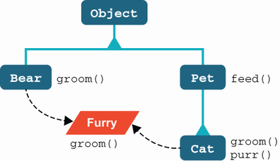
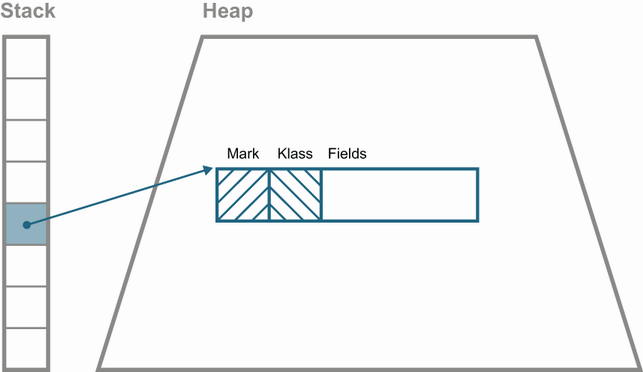
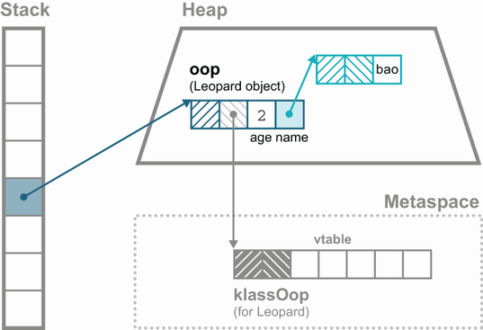
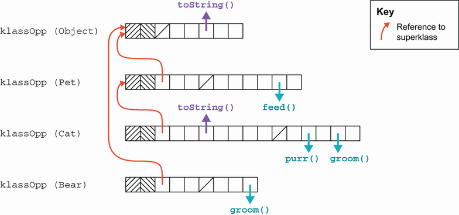
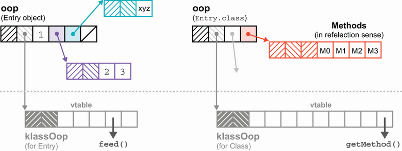
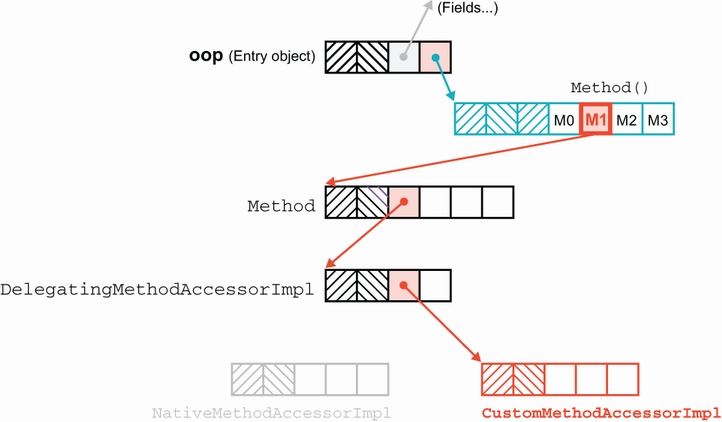

# 17. Nội tại hiện đại của JVM (Modern internals)

> *The Well-Grounded Java Developer, Second Edition* — Chương 17
> Bản dịch tiếng Việt

**Chương này bao gồm:**

- Giới thiệu về nội tại (internals) của JVM
- Nội tại của reflection
- Method handles
- Invokedynamic
- Những thay đổi nội tại gần đây
- Unsafe

---

Máy ảo Java (JVM) là một môi trường runtime cực kỳ tinh vi, suốt nhiều thập kỷ luôn ưu tiên tính ổn định và chất lượng kỹ thuật ở mức production. Vì những lý do đó, rất nhiều lập trình viên Java chưa bao giờ cần phải chọc ngoáy vào phần nội tại, đơn giản vì hầu hết thời gian điều đó là không cần thiết.

Ngược lại, chương này dành cho những người tò mò — những người muốn biết nhiều hơn, muốn vén màn để xem một vài chi tiết về cách JVM được hiện thực hóa. Hãy bắt đầu với việc gọi phương thức (method invocation).

## 17.1 Giới thiệu nội tại JVM: Gọi phương thức

Để bắt đầu, hãy xét một ví dụ đơn giản, được định nghĩa bởi các lớp `Pet`, `Cat`, `Bear` và interface `Furry`. Ta có thể thấy nó trong hình 17.1.



**Hình 17.1** Cây phân cấp kế thừa đơn giản

Ta cũng có thể giả định rằng còn tồn tại các lớp con khác của `Pet` (ví dụ `Dog` và `Fish`) nhưng không được vẽ trong sơ đồ để cho gọn. Ta sẽ dùng ví dụ này để giải thích chi tiết cách các opcode `invoke` khác nhau hoạt động, bắt đầu với `invokevirtual`.

### 17.1.1 Gọi phương thức virtual

Kiểu gọi phương thức phổ biến nhất là gọi một instance method trên một đối tượng của một lớp cụ thể (hoặc một lớp con) bằng bytecode `invokevirtual`. Điều này được gọi là *dispatch* (tức là lời gọi) của một virtual method (hay gọi tắt là *virtual dispatch*), nghĩa là phương thức chính xác được gọi sẽ được xác định tại runtime chứ không phải tại compile time, bằng cách nhìn vào kiểu thực tế của đối tượng lúc chạy. Khi JVM thực thi đoạn mã sau:

```java
Pet p = getPet();
p.feed();
```

thì cài đặt của `feed()` thực sự được gọi sẽ được xác định tại thời điểm phương thức cần được thực thi.

Các cài đặt có thể khác nhau tùy vào việc `p` đang giữ một `Cat` hay một `Dog` (hoặc một `Pet`, giả sử lớp cha không phải abstract). Cũng có khả năng `getPet()` trả về các đối tượng thuộc những kiểu con khác nhau của `Pet` tại những thời điểm khác nhau trong quá trình chương trình chạy. Điều đó không quan trọng — cài đặt cần gọi sẽ được tra cứu lại mỗi lần phương thức được thực thi. Dù đây là cả một "bức tường chữ", mô tả này chỉ đơn giản là cách các phương thức Java vẫn luôn hoạt động kể từ khi bạn học ngôn ngữ này lần đầu tiên.

Bên trong, để làm được điều đó, JVM lưu một bảng (theo từng lớp) chứa các định nghĩa phương thức tương ứng với kiểu đó, gọi là *vtable* (đây chính là thứ mà lập trình viên C++ gọi là virtual function table). Bảng này được lưu bên trong một vùng nhớ đặc biệt của JVM, gọi là *metaspace*, chứa metadata mà VM cần đến.

> **NOTE** Trong Java 7 và các phiên bản trước đó, metadata này nằm ở một vùng của Java heap gọi là *permgen*.

Để thấy vtable được dùng như thế nào, ta cần xem qua metadata của JVM cho một lớp. Trong Java, mọi đối tượng đều nằm trong Java heap và chỉ được thao tác thông qua tham chiếu. HotSpot dùng thuật ngữ chung là *oop* (viết tắt của "ordinary object pointer") để chỉ các cấu trúc dữ liệu nội bộ khác nhau nằm trong heap.

Mỗi đối tượng Java đều phải có một *object header*, chứa hai loại metadata sau:

- Metadata riêng cho từng instance cụ thể của một lớp ("mark word")
- Metadata được chia sẻ bởi mọi instance của một lớp ("klass word")

Để tiết kiệm không gian, chỉ một bản sao của metadata theo lớp được lưu trữ, và mỗi đối tượng thuộc lớp đó giữ một con trỏ tới nó — đó chính là klass word. Trong hình 17.2, ta thấy biểu diễn của một tham chiếu Java, được giữ trong một biến cục bộ, trỏ tới điểm bắt đầu của object header trong heap.



**Hình 17.2** Object header và bố cục đối tượng Java

Một *klass* là biểu diễn nội bộ của JVM cho một lớp Java tại runtime, được lưu trong metaspace. Nó chứa toàn bộ thông tin mà JVM cần để làm việc với lớp đó lúc chạy (ví dụ định nghĩa phương thức và bố cục trường).

Một phần thông tin từ klass được cung cấp cho lập trình viên Java thông qua đối tượng `Class<?>` tương ứng với kiểu đó, nhưng klass và `Class` là hai khái niệm tách biệt. Cụ thể, klass chứa những thông tin cố tình được giữ ngoài tầm với của mã ứng dụng thông thường.

> **NOTE** Cách viết "klass" là hoàn toàn có chủ đích, vì nó phân biệt cấu trúc dữ liệu nội bộ với các cách dùng khác của từ "class" trong tài liệu viết — nhưng đáng tiếc là không phân biệt được khi nói. Bạn cũng có thể thấy các từ "clazz" hoặc "clz" — chúng thường đặt tên cho một biến Java chứa một đối tượng `Class`.

Giờ ta có thể giải thích virtual dispatch (được hiện thực bởi bytecode `invokevirtual`) theo các cấu trúc nội bộ của JVM, chẳng hạn klass và đặc biệt là vtable của nó. Khi JVM gặp một lệnh `invokevirtual` cần thực thi, nó lấy (pop) đối tượng receiver và mọi đối số của phương thức ra khỏi evaluation stack của phương thức hiện tại.

> **NOTE** Đối tượng *receiver* là đối tượng mà instance method đang được gọi trên đó.

Bố cục object header của JVM bắt đầu bằng mark word, ngay sau đó là klass word. Vậy nên, để định vị phương thức cần thực thi, JVM đi theo con trỏ vào metaspace, tại đó nó tra cứu vtable của klass để biết chính xác đoạn mã nào cần được thực thi. Quá trình này được minh họa ở hình 17.3.



**Hình 17.3** Định vị một cài đặt phương thức

Nếu klass không có định nghĩa cho phương thức đó, JVM đi theo con trỏ tới klass tương ứng với lớp cha trực tiếp và thử lại. Quá trình này chính là nền tảng của cơ chế method overriding trong JVM.

Để việc này hiệu quả, các vtable được bố trí theo một cách rất cụ thể. Mỗi klass sắp xếp vtable của nó sao cho những phương thức xuất hiện đầu tiên là các phương thức mà kiểu cha định nghĩa. Các phương thức này được sắp xếp đúng theo thứ tự mà kiểu cha đã dùng. Những phương thức mới của kiểu này, không được khai báo bởi kiểu cha, sẽ nằm ở cuối vtable.

Khi một lớp con ghi đè (override) một phương thức, phương thức đó sẽ nằm ở cùng offset trong vtable với cài đặt bị ghi đè. Điều này khiến việc tra cứu các phương thức bị ghi đè trở nên cực kỳ đơn giản, vì offset của chúng trong vtable trùng với offset ở lớp cha. Trong hình 17.4, ta thấy bố cục vtable cho một số lớp trong ví dụ của mình.



**Hình 17.4** Cấu trúc vtable

Vậy nên, nếu ta gọi `Cat::feed`, JVM sẽ không tìm thấy bản ghi đè trong lớp `Cat` và sẽ đi theo con trỏ superclass tới klass của `Pet`. Lớp này *có* một cài đặt cho `feed()`, nên đây chính là đoạn mã sẽ được gọi.

> **NOTE** Cấu trúc vtable này — và cách hiện thực overriding hiệu quả — hoạt động tốt bởi vì Java chỉ hỗ trợ đơn kế thừa (single inheritance) cho lớp. Chỉ có duy nhất một lớp cha trực tiếp của bất kỳ kiểu nào (ngoại trừ `Object`, vốn không có lớp cha).

### 17.1.2 Gọi phương thức của interface

Với `invokeinterface`, tình huống phức tạp hơn một chút. Ví dụ, hãy để ý rằng phương thức `groom()` không nhất thiết xuất hiện ở cùng một vị trí trong vtable của mọi cài đặt của `Furry`. Offset khác nhau của `Cat::groom` và `Bear::groom` là do cây phân cấp kế thừa của chúng khác nhau. Kết quả cuối cùng là cần thêm một bước tra cứu nữa khi một phương thức được gọi trên một đối tượng mà tại compile time ta chỉ biết kiểu interface của nó.

> **NOTE** Mặc dù việc tra cứu cho một lời gọi interface tốn thêm chút công sức, bạn không nên cố tối ưu vi mô bằng cách tránh dùng interface. Hãy nhớ rằng JVM có trình biên dịch JIT, và về cơ bản nó sẽ triệt tiêu khác biệt hiệu năng giữa hai trường hợp.

Hãy xem một ví dụ. Xét đoạn mã sau:

```java
Cat tom = new Cat();
Bear pooh = new Bear();
Furry f;

tom.groom();
pooh.groom();
f = tom;
f.groom();
f = pooh;
f.groom();
```

Đoạn này sinh ra bytecode như sau:

```
 0: new             #2   // class ch15/Cat
 3: dup
 4: invokespecial   #3   // Method ch15/Cat."<init>":()V
 7: astore_1
 8: new             #4   // class ch15/Bear
11: dup
12: invokespecial   #5   // Method ch15/Bear."<init>":()V
15: astore_2
16: aload_1
17: invokevirtual   #6   // Method ch15/Cat.groom:()V
20: aload_2
21: invokevirtual   #7   // Method ch15/Bear.groom:()V
24: aload_1
25: astore_3
26: aload_3
27: invokeinterface #8,  1  // InterfaceMethod
                            // ch15/Furry.groom:()V
32: aload_2
33: astore_3
34: aload_3
35: invokeinterface #8,  1  // InterfaceMethod
                            // ch15/Furry.groom:()V
```

Hai lời gọi ở vị trí 27 và 35 trông có vẻ giống hệt nhau trong mã Java, nhưng thực tế sẽ gọi các phương thức khác nhau, vì nội dung runtime của `f` là khác nhau. Lời gọi ở 27 thực sự sẽ gọi `Cat::groom`, còn lời gọi ở 35 sẽ gọi `Bear::groom`.

### 17.1.3 Gọi các phương thức "special"

Với nền tảng về `invokevirtual` và `invokeinterface`, hành vi của `invokespecial` giờ đã dễ hiểu. Nếu một phương thức được gọi bằng `invokespecial`, nó **không** trải qua quá trình tra cứu virtual. Thay vào đó, JVM sẽ chỉ tìm đúng ở vị trí chính xác trong đúng vtable đó cho phương thức được yêu cầu.

`invokespecial` được dùng cho hai trường hợp: lời gọi tới phương thức của lớp cha, và lời gọi tới thân constructor (được chuyển thành một phương thức tên là `<init>` trong bytecode). Trong cả hai trường hợp này, tra cứu virtual và khả năng overriding đều bị loại trừ một cách tường minh.

Ta nên đề cập thêm hai trường hợp biên khác mà thoạt nhìn có vẻ gợi ý việc dùng `invokespecial` (còn được gọi là *exact dispatch*). Trường hợp đầu tiên là các phương thức `private` — chúng không thể bị ghi đè, và phương thức chính xác cần gọi đã được biết khi lớp được biên dịch, nên có vẻ như chúng nên được gọi qua `invokespecial`. Tuy nhiên, tình huống này phức tạp hơn vẻ ngoài của nó. Hãy xem một ví dụ minh họa:

```java
public class ExamplePrivate {

    public void entry() {
        callThePrivate();
    }

    private void callThePrivate() {
        System.out.println("Private method");
    }
}
```

Hãy biên dịch nó bằng Java 8 trước. Dịch ngược bằng `javap` cho ra kết quả sau:

```
$ javap -c ch15/ExamplePrivate.class
Compiled from "ExamplePrivate.java"
public class ch15.ExamplePrivate {
  public ch15.ExamplePrivate();
    Code:
       0: aload_0
       1: invokespecial #1   // Method java/lang/Object."<init>":()V
       4: return

  public void entry();
    Code:
       0: aload_0
       1: invokespecial #2   // Method callThePrivate:()V
       4: return
}
```

Lưu ý rằng `javap` được gọi mà không có tùy chọn `-p`, nên phần dịch ngược của phương thức private không xuất hiện. Cho đến đây thì ổn — phương thức private quả thực được gọi qua `invokespecial`. Tuy nhiên, nếu ta biên dịch lại bằng Java 11 và nhìn kỹ, ta sẽ thấy một kết quả khác:

```
$ javap -c ch15/ExamplePrivate.class
Compiled from "ExamplePrivate.java"
public class ch15.ExamplePrivate {
  public ch15.ExamplePrivate();
    Code:
       0: aload_0
       1: invokespecial #1 // Method java/lang/Object."<init>":()V
       4: return

  public void entry();
    Code:
       0: aload_0
       1: invokevirtual #2 // Method callThePrivate:()V          ❶
       4: return
}
```

❶ Bây giờ đây là `invokevirtual`.

Như ta thấy, các lời gọi tới phương thức private được xử lý khác đi trong Java hiện đại, điều mà ta sẽ giải thích ở mục 17.5.3 khi bàn về *nestmates*.

### 17.1.4 Phương thức final

Trường hợp biên còn lại là việc dùng phương thức `final`. Thoạt nhìn, có vẻ như lời gọi tới phương thức `final` cũng sẽ được chuyển thành lệnh `invokespecial` — dù sao thì chúng cũng không thể bị ghi đè và cài đặt cần gọi đã biết tại compile time. Tuy nhiên, Java Language Specification có quy định về trường hợp này:

> Việc thay đổi một phương thức đang được khai báo `final` thành không còn `final` nữa không phá vỡ tính tương thích với các binary đã tồn tại từ trước.

Giả sử mã trong một lớp có lời gọi tới một phương thức `final` ở lớp khác, và lời gọi đó đã được biên dịch thành `invokespecial`. Sau đó, nếu lớp chứa phương thức `final` được sửa để phương thức đó không còn `final` nữa (và biên dịch lại), thì nó có thể bị ghi đè trong một lớp con.

Bây giờ giả sử một instance của lớp con đó được truyền vào phương thức gọi ở lớp thứ nhất. Lệnh `invokespecial` sẽ được thực thi, và lúc này cài đặt *sai* của phương thức sẽ được gọi. Đây là vi phạm các quy tắc hướng đối tượng của Java (nói chính xác, nó vi phạm Liskov Substitution Principle). Vì lý do đó, các lời gọi tới phương thức `final` phải được biên dịch thành lệnh `invokevirtual`.

> **NOTE** Trên thực tế, HotSpot chứa các tối ưu cho phép phát hiện trường hợp phương thức `final` và thực thi cực kỳ hiệu quả.

Ta đã giới thiệu những kiến thức cơ bản về nội tại của HotSpot thông qua lăng kính của virtual method dispatch. Đến đây, có lẽ sẽ thú vị nếu bạn đọc lại phần về biên dịch JIT ở chương 7 — đặc biệt là các mục về monomorphic dispatch và inlining. Bạn có thể sẽ hiểu sâu hơn về những kỹ thuật đó khi đã thấy một vài chi tiết về cách chúng được hiện thực.

## 17.2 Nội tại của reflection

Ta đã gặp reflection ở chương 4 như một cách để thao tác đối tượng và gọi phương thức một cách động lúc runtime. Giờ đây, khi đã biết về vtable, ta có thể đào sâu thêm một chút và xem reflection được JVM hiện thực như thế nào.

Nhớ lại rằng ta có thể lấy một đối tượng `java.lang.reflect.Method` từ một đối tượng class rồi gọi nó, như sau (lược bỏ phần xử lý ngoại lệ):

```java
Class<?> clazz = // ... some class
Method m = clazz.getMethod("toString");
Object ret = m.invoke(this);
System.out.println(ret);
```

Nhưng đối tượng `Method` này biểu diễn cái gì? Thực chất nó là "khả năng gọi một phương thức cụ thể một cách động lúc runtime". Bản chất động của lời gọi có nghĩa là trong mã đã biên dịch, ta chỉ thấy một `invokevirtual` của phương thức `invoke()` trên `Method`, như sau:

```
 0: ldc           #7   // ... some class
 2: astore_1
 3: aload_1
 4: ldc           #24  // String toString
 6: iconst_0                                                  ❶
 7: anewarray     #26  // class java/lang/Class               ❶
10: invokevirtual #28  // Method java/lang/                   ❶
                       // Class.getMethod:
                       // (Ljava/lang/String;[Ljava/lang/Class;)
                       // Ljava/lang/reflect/Method;
13: astore_2
14: aload_2
15: aload_0
16: iconst_0                                                  ❷
17: anewarray     #2   // class java/lang/Object              ❷
20: invokevirtual #32  // Method java/lang/reflect/           ❷
                       // Method.invoke:
                       // (Ljava/lang/Object;[Ljava/lang/Object;)
                       // Ljava/lang/Object;
23: astore_3
```

❶ Lời gọi `getMethod()` là variadic và được truyền vào một mảng `Class` có kích thước 0.

❷ Lời gọi `invoke()` được truyền vào một mảng `Object` có kích thước 0 (chính là các đối số).

Lưu ý rằng không có bytecode nào tham chiếu tới `toString()` qua một method descriptor (chẳng hạn `java/lang/Object.toString:()Ljava/lang/String;`) — mà chỉ tham chiếu qua chuỗi `toString`.

Bây giờ, hãy nhớ rằng các đối tượng class (ví dụ `String.class`) chỉ là những đối tượng Java bình thường — chúng có các thuộc tính của đối tượng Java thông thường và được biểu diễn bằng oop. Một đối tượng class chứa một đối tượng `Method` cho mỗi phương thức của lớp đó, và các đối tượng method này, một lần nữa, cũng chỉ là những đối tượng Java thông thường.

> **NOTE** Các đối tượng `Method` được tạo một cách lazy sau khi lớp được nạp. Đôi khi bạn có thể thấy dấu vết của hiệu ứng này trong trình debug của IDE.

Vậy JVM thực sự hiện thực reflection như thế nào? Hãy xem một chút mã nguồn của lớp `Method` và một số trường của nó:

```java
private Class<?>             clazz;                       ❶
private int                  slot;                        ❷
// This is guaranteed to be interned by the VM in the 1.4
// reflection implementation
private String               name;
private Class<?>             returnType;
private Class<?>[]           parameterTypes;
private Class<?>[]           exceptionTypes;
private int                  modifiers;
// Generics and annotations support
private transient String     signature;
// generic info repository; lazily initialized
private transient MethodRepository genericInfo;
private byte[]               annotations;
private byte[]               parameterAnnotations;
private byte[]               annotationDefault;
private volatile MethodAccessor methodAccessor;           ❸
```

❶ Lớp mà phương thức này thuộc về

❷ Offset trong vtable nơi phương thức này nằm

❸ Đối tượng ủy nhiệm (delegate) thực hiện lời gọi

Ta đã biết rằng trong Java, gọi một instance method bao gồm việc tra cứu nó trong một vtable. Vậy nên, về mặt khái niệm, ta muốn khai thác tính đối ngẫu (duality) giữa vtable và mảng các đối tượng `Method` do đối tượng `Class` nắm giữ. Ta có thể thấy tính đối ngẫu này ở hình 17.5, nơi mảng các đối tượng `Method` do `Entry.class` nắm giữ là đối ngẫu với vtable trên klassOop của `Entry`.



**Hình 17.5** Nội tại của reflection

Hãy xem `Method` dùng tính đối ngẫu này để hiện thực reflection như thế nào. Chìa khóa hóa ra chính là đối tượng `MethodAccessor`.

> **NOTE** Một phần mã dưới đây đã được đơn giản hóa và dựa trên một phiên bản Java cũ hơn, nhằm giúp dễ hiểu cơ chế. Mã production hiện đang được phát hành trong Java 11 trở lên phức tạp hơn.

Phương thức `invoke()` trên `Method` trông đại khái như sau:

```java
public Object invoke(Object obj, Object... args)
    throws IllegalAccessException, IllegalArgumentException,
           InvocationTargetException {

    if (!override) {                                            ❶
      if (!Reflection.quickCheckMemberAccess(clazz, modifiers)) {
        Class<?> caller = Reflection.getCallerClass();
        checkAccess(caller, clazz, obj, modifiers);
      }
    }
    MethodAccessor ma = methodAccessor;                         ❷
    if (ma == null) {
      ma = acquireMethodAccessor();
    }
    return ma.invoke(obj, args);                                ❸
}
```

❶ Thực hiện kiểm tra truy cập bảo mật (nếu không gọi `setAccessible()`)

❷ Đọc accessor theo ngữ nghĩa volatile

❸ Ủy nhiệm cho `MethodAccessor`

Tại lần gọi phản chiếu đầu tiên của phương thức này, `acquireMethodAccessor()` tạo ra một instance của `DelegatingMethodAccessorImpl`, đối tượng này giữ một tham chiếu tới một `NativeMethodAccessorImpl`. Đây là các lớp được định nghĩa trong `sun.reflect` và cả hai đều hiện thực `MethodAccessor`. Lưu ý rằng chúng không thuộc API của module `java.base` và không thể được gọi trực tiếp.

Đây là toàn bộ `DelegatingMethodAccessorImpl`:

```java
class DelegatingMethodAccessorImpl extends MethodAccessorImpl {
  private MethodAccessorImpl delegate;

  DelegatingMethodAccessorImpl(MethodAccessorImpl delegate) {
    setDelegate(delegate);
  }

  public Object invoke(Object obj, Object[] args)
        throws IllegalArgumentException, InvocationTargetException {
    return delegate.invoke(obj, args);
  }

  void setDelegate(MethodAccessorImpl delegate) {
    this.delegate = delegate;
  }
}
```

và đây là `NativeMethodAccessorImpl`:

```java
class NativeMethodAccessorImpl extends MethodAccessorImpl {
  private Method method;
  private DelegatingMethodAccessorImpl parent;
  private int numInvocations;

  // ...

  public Object invoke(Object obj, Object[] args)
          throws IllegalArgumentException, InvocationTargetException {

      if (++numInvocations >
            ReflectionFactory.inflationThreshold()) {           ❶
        MethodAccessorImpl acc = (MethodAccessorImpl)
            new MethodAccessorGenerator()
              .generateMethod(method.getDeclaringClass(),
                              method.getName(),
                              method.getParameterTypes(),
                              method.getReturnType(),
                              method.getExceptionTypes(),
                              method.getModifiers());           ❷
          parent.setDelegate(acc);                              ❸
      }

      return invoke0(method, obj, args);                        ❹
  }

  private static native Object invoke0(Method m, Object obj, Object[] args);
  // ...
}
```

❶ Được đi vào sau khi đạt ngưỡng số lần gọi

❷ Dùng `MethodAccessorGenerator` để tạo ra một lớp tùy biến hiện thực lời gọi phản chiếu

❸ Thay thế đối tượng hiện tại (đang làm delegate) bằng một instance của lớp tùy biến mới

❹ Nếu chưa chạm ngưỡng, tiếp tục dùng lời gọi native

Kỹ thuật này — dùng một accessor ủy nhiệm có thể được "vá" bằng accessor bytecode được sinh động — được minh họa ở hình 17.6. Lưu ý rằng lớp accessor tùy biến là lớp con của `MethodAccessorImpl` để phép ép kiểu thành công.



**Hình 17.6** Hiện thực reflection

Vài lời về hiệu năng: cơ chế này là sự đánh đổi giữa hai nguồn gây chậm khác nhau. Một mặt, native accessor dùng lời gọi native, vốn chậm hơn lời gọi phương thức Java và không thể được JIT biên dịch. Mặt khác, việc sinh bytecode động trong `MethodAccessorGenerator` cũng có thể chậm, và đây có thể là một đánh đổi tồi mà ta muốn tránh với những phương thức chỉ được gọi bằng reflection đúng một lần. Mẹo này — nạp lazy một đối tượng accessor rồi vá call site một cách động — là thứ ta sẽ gặp lại, dưới một hình thức khác, ở phần sau của chương.

Cũng đáng lưu ý rằng reflection còn triệt tiêu inlining và các kiểu method dispatch chuẩn mà JVM tối ưu rất tốt. Call site cho phương thức của `DelegatingMethodAccessorImpl` được gọi là *megamorphic* (có rất nhiều cài đặt khả dĩ cho phương thức) sau khi bị vá, vì mỗi instance của `Method` có một đối tượng method accessor khác nhau được sinh động. Điều này có nghĩa là một số cơ chế tối ưu chủ chốt của JVM sẽ không hoạt động tốt với các lời gọi phản chiếu.

Vậy nên việc dùng ủy nhiệm và vá thay cho native accessor là một sự thỏa hiệp nhằm cân bằng giữa hiệu năng chấp nhận được cho những phương thức phản chiếu ít khi được gọi, đồng thời vẫn giữ được một phần lợi ích của JIT. Sự thỏa hiệp này, cùng với các vấn đề khác của reflection mà ta đã bàn ở chương 4, đã dẫn tới việc đi tìm một cách tiếp cận tốt hơn cho bài toán gọi động và các đối tượng method nhẹ. Ở mục tiếp theo, ta giới thiệu kết quả đầu tiên của quá trình nghiên cứu đó: Method Handles API.

## 17.3 Method handles

Method Handles API được thêm vào Java từ phiên bản 7. Cốt lõi của API này là package `java.lang.invoke`, và đặc biệt là lớp `MethodHandle`. Các instance của kiểu này biểu diễn khả năng gọi một phương thức và có thể được thực thi trực tiếp, theo cách tương tự như các đối tượng `java.lang.reflect.Method`.

API này được tạo ra như một phần của dự án đưa `invokedynamic` (sẽ bàn ở mục 17.4) vào JVM. Nhưng các đối tượng method handle có những ứng dụng trong framework và cả mã người dùng thông thường, vượt xa các trường hợp dùng cho `invokedynamic`.

Ta sẽ bắt đầu bằng cách giới thiệu công nghệ cơ bản của method handles; sau đó ta sẽ xem một ví dụ mở rộng so sánh chúng với một số lựa chọn thay thế và tổng kết những khác biệt.

### 17.3.1 MethodHandle

`MethodHandle` là gì? Câu trả lời chính thức là: nó là một tham chiếu *có kiểu* tới một phương thức và có thể thực thi trực tiếp. Nói cách khác, một `MethodHandle` là một đối tượng biểu diễn khả năng gọi một phương thức một cách an toàn.

> **NOTE** `MethodHandle` giống với đối tượng `Method` trong `java.lang.reflect` ở nhiều khía cạnh, nhưng API nói chung tốt hơn, đỡ cồng kềnh hơn, và một số khiếm khuyết thiết kế quan trọng đã được sửa.

Có hai khía cạnh khi dùng method handle: lấy được chúng, và sử dụng chúng. Khía cạnh thứ hai — sử dụng — rất dễ. Hãy xem một ví dụ hết sức đơn giản về việc gọi một method handle. Tạm thời, ta cứ giả định rằng có một phương thức trợ giúp static nào đó tên `getTwoArgMH()` trả về một method handle nhận một đối tượng receiver `obj` và một đối số `arg0` rồi trả về `String`.

Lát nữa ta sẽ giải thích cách lấy được method handle khớp với chữ ký đó, nhưng bây giờ hãy cứ giả định là ta có một phương thức trợ giúp tạo sẵn method handle cho mình. Cách dùng sau đây sẽ khiến bạn liên tưởng tới các lời gọi phản chiếu:

```java
MethodHandle mh = getTwoArgMH();                    ❶

try {
  String result = mh.invokeExact(obj, arg0);        ❷
} catch (Throwable e) {
  e.printStackTrace();
}
```

❶ Lấy method handle từ một phương thức trợ giúp

❷ Thực hiện lời gọi, truyền vào một receiver và một đối số

Đoạn này trông giống một lời gọi phản chiếu tới phương thức, như ta đã thấy ở mục 4.5.1 — ta dùng `invokeExact()` trên `MethodHandle` thay vì `invoke()` trên `Method`, nhưng ngoài điểm đó ra thì khá giống nhau. Tuy nhiên, điều này chỉ khả thi khi ta thực sự có được một đối tượng method handle trước đã — vậy làm sao để có nó?

Để lấy handle cho một phương thức, ta cần tra cứu nó thông qua một *lookup context*. Cách thông thường để lấy một context là gọi phương thức trợ giúp static `MethodHandles.lookup()`. Nó sẽ trả về một lookup context dựa trên phương thức đang thực thi. Từ lookup đó, ta có thể lấy method handle bằng cách gọi một trong các phương thức `find*()` như `findVirtual()` hay `findConstructor()`.

Đối tượng lookup context có thể cung cấp method handle cho bất kỳ phương thức nào nhìn thấy được từ ngữ cảnh thực thi nơi lookup được tạo ra. Tuy nhiên, ngoài lookup context cho phương thức, ta còn cần cân nhắc cách biểu diễn *chữ ký* của phương thức mà ta muốn lấy handle.

Nhớ lại interface `Callable` ở chương 6. Nó biểu diễn một khối mã cần được thực thi, điều này khá giống với method handle. Tuy nhiên, một vấn đề của `Callable` là nó chỉ có thể mô hình hóa các phương thức không nhận đối số.

Nếu muốn mô hình hóa mọi kiểu phương thức, ta sẽ phải tạo ra các interface khác, với số lượng tham số kiểu tăng dần. Ta sẽ có một tập interface như sau:

```
Function0<R>
Function1<R, P>
Function2<R, P1, P2>
Function3<R, P1, P2, P3>
...
```

Cách này sẽ rất nhanh chóng dẫn tới việc bùng nổ số lượng interface. Cách tiếp cận này được một số ngôn ngữ ngoài Java áp dụng (ví dụ Scala), nhưng không phải trong Java.

Cũng khá thú vị khi xem cách Clojure làm điều này. Interface `IFn` có các phương thức `invoke` biểu diễn tất cả các arity khác nhau của hàm (bao gồm cả dạng variadic cho các hàm nhận hơn 20 đối số). Ta đã gặp một phiên bản đơn giản hóa của `IFn` ở chương 10.

Tuy nhiên, Clojure là ngôn ngữ định kiểu động, nên mọi phương thức `invoke` đều nhận `Object` cho mọi tham số và cũng trả về `Object` — điều này loại bỏ toàn bộ độ phức tạp của việc xử lý generics. Các form của Clojure cũng có thể được viết variadic một cách rất tự nhiên — Clojure sẽ ném ra ngoại lệ lúc runtime nếu một form được gọi với sai arity. Java không dùng cách nào trong hai cách đó.

Thay vào đó, method handles của Java hiện thực một cách tiếp cận có thể mô hình hóa *bất kỳ* chữ ký phương thức nào mà không cần sinh ra vô số lớp nhỏ. Điều này được thực hiện nhờ lớp mới `MethodType`.

### 17.3.2 MethodType

`MethodType` là một đối tượng bất biến (immutable) biểu diễn chữ ký kiểu của một phương thức. Mọi method handle đều có một instance `MethodType` bao gồm kiểu trả về và các kiểu đối số. Nhưng nó *không* bao gồm tên phương thức hay kiểu receiver — kiểu mà instance method được gọi trên đó.

Một cách đơn giản để tạo instance `MethodType` mới là dùng các factory method trong lớp `MethodType`. Đây là vài ví dụ:

```java
var mtToString = MethodType.methodType(String.class);
var mtSetter = MethodType.methodType(void.class, Object.class);
var mtStringComparator = MethodType.methodType(int.class,
                                    String.class, String.class);
```

Đây là các instance `MethodType` biểu diễn chữ ký kiểu của `toString()`, một phương thức setter (cho một thành viên kiểu `Object`), và phương thức `compareTo()` được định nghĩa bởi một `Comparator<String>`. Trường hợp tổng quát cũng theo cùng mẫu, với kiểu trả về được truyền vào trước, theo sau là kiểu của các đối số (tất cả đều dưới dạng đối tượng `Class`), như sau:

```java
MethodType.methodType(RetType.class, Arg0Type.class, Arg1Type.class, ...);
```

Như bạn thấy, các chữ ký phương thức khác nhau giờ đây có thể được biểu diễn bằng các đối tượng instance bình thường, không cần định nghĩa một kiểu mới cho mỗi chữ ký. Cách này cũng cung cấp một con đường đơn giản để đảm bảo an toàn kiểu ở mức tối đa có thể. Nếu bạn muốn biết một method handle ứng viên có thể được gọi với một tập đối số nhất định hay không, bạn có thể khảo sát `MethodType` thuộc về handle đó.

> **NOTE** Việc truyền quanh một đối tượng `MethodType` duy nhất tiện lợi hơn nhiều so với mảng `Class[]` cồng kềnh mà reflection buộc bạn phải dùng.

Giờ khi bạn đã thấy các đối tượng `MethodType` giải quyết vấn đề bùng nổ interface như thế nào, hãy xem cách tạo method handle trỏ tới các phương thức thuộc các kiểu của ta.

### 17.3.3 Tra cứu method handle

Hãy xem cách lấy một method handle trỏ tới phương thức `toString()` trên lớp hiện tại. Lưu ý rằng ta muốn `mtToString` khớp chính xác với chữ ký của `toString()` — nó có kiểu trả về là `String` và không nhận đối số. Instance `MethodType` tương ứng phải là `MethodType.methodType(String.class)`, như sau:

```java
public MethodHandle getToStringMH() {
  MethodHandle mh;
  var mt = MethodType.methodType(String.class);
  var lk = MethodHandles.lookup();                              ❶

  try {
    mh = lk.findVirtual(getClass(), "toString", mt);            ❷
  } catch (NoSuchMethodException | IllegalAccessException mhx) {
    throw (AssertionError)new AssertionError().initCause(mhx);
  }

  return mh;
}
```

❶ Lấy lookup context

❷ Tra cứu handle từ context

Để lấy một method handle từ đối tượng lookup, bạn cần cung cấp lớp chứa phương thức bạn muốn, tên phương thức, và một `MethodType` biểu diễn chữ ký phù hợp. Method type là cần thiết để xử lý các phương thức nạp chồng (overload).

Việc dùng lookup context để tìm phương thức trên lớp hiện tại rất phổ biến, nhưng thực tế bạn có thể dùng context này để lấy handle cho phương thức thuộc bất kỳ kiểu nào, kể cả các kiểu của JDK. Dĩ nhiên, nếu bạn lấy handle từ một lớp ở package hoặc module khác, lookup context sẽ chỉ nhìn thấy được những phương thức bạn có quyền truy cập (ví dụ các phương thức public trên các lớp public trong package đã export). Đây là một khía cạnh quan trọng của method handles API: **kiểm soát truy cập cho một method handle được kiểm tra khi phương thức được *tìm thấy*, chứ không phải khi handle được *thực thi*.**

Một khi đã lấy được method handle, gọi nó luôn an toàn, vì không còn kiểm tra kiểm soát truy cập nào nữa. Một method handle có thể được tạo trong một ngữ cảnh nơi truy cập được cho phép, rồi truyền sang một ngữ cảnh khác nơi truy cập không được phép, và nó vẫn sẽ thực thi được. Đây là một khác biệt quan trọng so với reflection.

> **NOTE** Kiểm soát truy cập khi gọi method handle không thể bị lách qua, không giống các lời gọi phản chiếu. Không có thứ gì tương đương với "mánh" `setAccessible()` của reflection mà ta đã gặp ở chương 4.

Giờ khi đã có một method handle, việc tự nhiên cần làm với nó là thực thi. API cung cấp hai cách chính để làm điều đó: các phương thức `invokeExact()` và `invoke()`.

Phương thức `invokeExact()` yêu cầu kiểu của các đối số phải khớp *chính xác* với những gì phương thức bên dưới mong đợi. Phương thức `invoke()` thực hiện một số phép biến đổi để cố gắng làm cho các kiểu khớp nhau nếu chúng chưa hoàn toàn đúng (ví dụ boxing hoặc unboxing khi cần).

Sau phần giới thiệu này, ta sẽ chuyển sang một ví dụ dài hơn về cách method handle có thể được dùng để thay thế các kỹ thuật khác, chẳng hạn reflection và các inner class nhỏ được dùng để proxy khả năng gọi.

### 17.3.4 Reflection vs. proxy vs. method handle

Nếu bạn từng làm việc với một codebase chứa nhiều reflection, hẳn bạn đã quá quen với một số nỗi đau mà mã phản chiếu mang lại. Trong mục nhỏ này, chúng tôi muốn cho bạn thấy method handle có thể thay thế rất nhiều đoạn boilerplate phản chiếu và làm cho cuộc sống lập trình của bạn dễ chịu hơn một chút.

Để chỉ ra khác biệt giữa method handle và các kỹ thuật khác, chúng tôi cung cấp ba cách để truy cập phương thức private `callThePrivate()` từ bên ngoài lớp. Có hai kỹ thuật tiêu chuẩn: reflection và dùng một inner class đóng vai trò proxy. Ta có thể so sánh chúng với cách tiếp cận hiện đại dựa trên `MethodHandle`. Ví dụ về ba lựa chọn này xuất hiện trong listing sau.

**Listing 17.1 Cung cấp quyền truy cập theo ba cách**

```java
public class ExamplePrivate {
    // Some state ...

    public void entry() {
        callThePrivate();
    }

    private void callThePrivate() {                             ❶
        System.out.println("Private method");
    }

    public Method makeReflective() {
        Method meth = null;

        try {
            Class<?>[] argTypes = new Class[] { Void.class };
            meth = ExamplePrivate.class
                       .getDeclaredMethod("callThePrivate", argTypes);
            meth.setAccessible(true);
        } catch (IllegalArgumentException |
                    NoSuchMethodException |
                    SecurityException e) {
            throw (AssertionError)new AssertionError().initCause(e);
        }

        return meth;
    }

    public static class Proxy {
        private Proxy() {}

        public static void invoke(ExamplePrivate priv) {
            priv.callThePrivate();
        }
    }

    public MethodHandle makeMh() {
        MethodHandle mh;
        var desc = MethodType.methodType(void.class);           ❷

        try {
            mh = MethodHandles.lookup()
                     .findVirtual(ExamplePrivate.class,         ❸
                         "callThePrivate", desc);
        } catch (NoSuchMethodException | IllegalAccessException e) {
            throw (AssertionError)new AssertionError().initCause(e);
        }

        return mh;
    }
}
```

❶ Phương thức private mà ta muốn cung cấp quyền truy cập

❷ Tạo `MethodType` — ở đây ta có thể dùng kiểu chính xác thay vì phải boxing.

❸ Tra cứu `MethodHandle`

Lớp ví dụ cung cấp ba khả năng khác nhau để truy cập phương thức private `callThePrivate()`. Trên thực tế, thường chỉ một trong ba khả năng này được cung cấp — chúng tôi chỉ trình bày cả ba để bàn về sự khác biệt giữa chúng. Trên thực tế, với vai trò là người dùng của một API, bạn không cần bận tâm cách tiếp cận nào được sử dụng.

Trong bảng 17.1, bạn thấy rằng ưu điểm chính của reflection là sự quen thuộc. Proxy có thể dễ hiểu hơn với các trường hợp dùng đơn giản, nhưng chúng tôi tin rằng method handle là sự kết hợp tốt nhất của cả hai thế giới. Chúng tôi mạnh mẽ khuyến nghị dùng chúng trong mọi ứng dụng mới.

**Bảng 17.1 So sánh các công nghệ truy cập phương thức gián tiếp của Java**

| Đặc điểm | Reflection | Inner class/lambda | Method handle |
|---|---|---|---|
| **Kiểm soát truy cập** | Phải dùng `setAccessible()`. Có thể bị cấm bởi một security manager đang hoạt động. | Inner class có thể truy cập các phương thức bị hạn chế. | Truy cập đầy đủ tới mọi phương thức được phép từ ngữ cảnh hiện tại. Không gặp vấn đề với security manager. |
| **Kỷ luật kiểu** | Không có. Ngoại lệ xấu xí khi không khớp. | Tĩnh. Có thể quá nghiêm ngặt. Có thể cần nhiều metaspace cho tất cả các proxy. | An toàn kiểu tại runtime. Không tiêu tốn nhiều metaspace (nếu có). |
| **Hiệu năng** | Chậm so với các lựa chọn khác. | Nhanh như bất kỳ lời gọi phương thức nào khác. | Hướng tới việc nhanh ngang các lời gọi phương thức khác. |

Một tính năng bổ sung mà method handle cung cấp là khả năng xác định lớp hiện tại từ một ngữ cảnh static. Nếu bạn từng viết mã logging (chẳng hạn cho log4j) trông như thế này:

```java
Logger lgr = LoggerFactory.getLogger(MyClass.class);
```

thì bạn biết rằng đoạn mã này rất mong manh. Nếu nó bị refactor để chuyển sang lớp cha hoặc lớp con, việc ghi tên lớp một cách tường minh sẽ gây ra vấn đề. Tuy nhiên với method handle, bạn có thể viết:

```java
Logger lgr = LoggerFactory.getLogger(MethodHandles.lookup().lookupClass());
```

Trong đoạn mã này, biểu thức `lookupClass()` có thể được xem như tương đương với `getClass()`, nhưng dùng được trong ngữ cảnh static. Điều này đặc biệt hữu ích trong các tình huống như làm việc với các framework logging, vốn thường có một logger cho mỗi lớp.

> **NOTE** Method Handles đã chứng tỏ là một API rất thành công. Thành công đến mức trong Java 18 (nhưng không phải ở 11 hay 17), công nghệ hiện thực reflection đã được đổi sang dựa trên nó, thay cho cách hiện thực mà ta gặp ở mục trước.

Với công nghệ method handle trong bộ đồ nghề của bạn, và được trang bị kiến thức làm việc về bytecode từ chương 4, hãy đi sâu vào chi tiết của opcode `invokedynamic`. Nó được giới thiệu trong Java 7 và (cho tới nay) là opcode duy nhất từng được thêm vào tập lệnh của JVM. Trường hợp sử dụng ban đầu của `invokedynamic` là giúp các ngôn ngữ ngoài Java tận dụng tối đa JVM như một nền tảng, nhưng nó đã trở thành một tác nhân thay đổi lớn bên trong chính nền tảng này, như ta sẽ thấy.

## 17.4 Invokedynamic

Mục này bàn về một trong những tính năng mới tinh vi nhất về mặt kỹ thuật của Java hiện đại. Nhưng dù cực kỳ mạnh mẽ, đây không phải là tính năng mà mọi lập trình viên đều sẽ dùng trực tiếp. Thay vào đó, hiện tại tính năng này chủ yếu dành cho người phát triển framework và những người hiện thực các ngôn ngữ ngoài Java.

Vì vậy, bạn hoàn toàn có thể bỏ qua mục này khi đọc lần đầu. Để tận dụng tốt nhất nội dung ở đây, bạn cần đã đọc và hiểu phần thảo luận về việc thực thi các lệnh `invoke` ở đầu chương — sẽ rất hữu ích khi biết những quy tắc mà ta sắp phá vỡ.

Ta sẽ trình bày chi tiết cách `invokedynamic` hoạt động và xem một số ví dụ về việc dịch ngược một call site có dùng bytecode mới này. Lưu ý rằng không nhất thiết phải hiểu tường tận điều này mới dùng được các ngôn ngữ và framework tận dụng `invokedynamic`, nhưng đây là chương về nội tại, nên ta sẽ đi vào chi tiết.

Như bạn có thể đoán từ cái tên, `invokedynamic` là một loại lệnh gọi mới, tức là nó được dùng để gọi phương thức. Nó được dùng để báo cho JVM biết rằng phải hoãn việc xác định phương thức nào sẽ được gọi cho tới runtime.

Điều này nghe có vẻ không có gì to tát — dù sao thì `invokevirtual` và `invokeinterface` cũng đều quyết định tại runtime cài đặt nào sẽ được gọi. Tuy nhiên, việc chọn đích cho các opcode đó phải tuân theo ràng buộc của quy tắc kế thừa và hệ thống kiểu của ngôn ngữ Java, nên ít nhất một phần thông tin về đích lời gọi đã được biết tại compile time.

Ngược lại, `invokedynamic` được tạo ra để nới lỏng những ràng buộc đó, và nó làm vậy bằng cách gọi một phương thức trợ giúp (gọi là *bootstrap method*, hay BSM) để quyết định phương thức nào nên được gọi.

> **NOTE** Phương thức đích (call target) cho một `invokedynamic` site hoàn toàn không cần phải nằm trong quy tắc phân cấp kế thừa của Java — đó là lựa chọn do người dùng định nghĩa.

Để cho phép sự linh hoạt này, các opcode `invokedynamic` tham chiếu tới một phần đặc biệt trong constant pool của lớp, chứa các mục mở rộng nhằm hỗ trợ bản chất động của lời gọi — chính là các BSM. Chúng là thành phần then chốt của `invokedynamic`, và mọi call site `invokedynamic` đều có một mục constant pool tương ứng cho một BSM.

BSM nhận thông tin về call site và liên kết (link) lời gọi động đó. Một BSM nhận ít nhất ba đối số và trả về một đối tượng `CallSite`. Các đối số tiêu chuẩn có kiểu như sau:

- `MethodHandles.Lookup` — Một đối tượng lookup trên lớp chứa call site
- `String` — Tên được nhắc đến trong `NameAndType`
- `MethodType` — Type descriptor đã được phân giải của `NameAndType`

Theo sau các đối số này là bất kỳ đối số bổ sung nào mà BSM cần. Trong tài liệu, chúng được gọi là *additional static arguments*. Call site được trả về nắm giữ một `MethodHandle`, đây chính là hiệu quả của việc gọi call site và sẽ được thực thi như lời gọi thực sự của `invokedynamic`.

> **NOTE** Để cho phép liên kết một BSM với một call site `invokedynamic` cụ thể, một loại mục constant pool mới, cũng được gọi là `InvokeDynamic`, đã được thêm vào định dạng class file.

Call site của lệnh `invokedynamic` được nói là *"unlaced"* (chưa được xỏ dây) tại thời điểm nạp lớp. Điều này có nghĩa là chưa có phương thức đích nào được gắn với call site, và sẽ không có cho tới khi call site được chạm tới (tức là khi JVM cố gắng liên kết, rồi thực thi, đúng lệnh `invokedynamic` đó).

Tại thời điểm đó, BSM sẽ được gọi để xác định phương thức nào thực sự cần được gọi. BSM luôn trả về một đối tượng `CallSite` (chứa một `MethodHandle`), và nó sẽ được "xỏ dây" (laced) vào call site. Khi `CallSite` đã được liên kết, lời gọi phương thức thực sự mới có thể diễn ra — lời gọi đó nhắm tới `MethodHandle` mà `CallSite` đang giữ.

Trong trường hợp đơn giản nhất, khi một `ConstantCallSite` được dùng, một khi việc tra cứu đã được thực hiện một lần thì nó sẽ không lặp lại. Thay vào đó, đích của call site sẽ được gọi trực tiếp trong tất cả các lần gọi về sau mà không cần thêm công việc nào. Nó hoạt động theo cách tương tự như một `CompletableFuture<CallSite>`. Trên thực tế, điều này có nghĩa là call site giờ đã ổn định và do đó thân thiện với các hệ thống con khác của JVM, chẳng hạn trình biên dịch JIT. Những lựa chọn phức tạp hơn, như `MutableCallSite` (hay thậm chí `VolatileCallSite`), cũng khả thi, và chúng cho phép khả năng liên kết lại một call site để nó trỏ tới một phương thức đích khác theo thời gian.

Một call site không hằng có thể có nhiều method handle khác nhau làm đích của nó trong suốt vòng đời của chương trình. Thực tế, khả năng thay đổi phương thức được gọi tại một call site cụ thể là một kỹ thuật có thể rất quan trọng đối với các ngôn ngữ ngoài Java.

Ví dụ, trong JavaScript hay Ruby, một đối tượng riêng lẻ thuộc một kiểu cụ thể có thể có các phương thức được định nghĩa trên nó mà không có ở các instance khác của cùng lớp. Điều này là không thể trong Java — lớp định nghĩa một tập phương thức được dùng để dựng vtable khi lớp được nạp, và mọi instance đều dùng chung một vtable. Việc dùng `invokedynamic` với các call site có thể thay đổi cho phép hiện thực tính năng "ngoài Java" này một cách hiệu quả.

Ta cũng cần lưu ý rằng bạn không thể khiến `javac` phát ra `invokedynamic` từ một lời gọi phương thức thông thường — một lời gọi phương thức Java luôn được chuyển thành một trong bốn opcode `invoke` "thông thường" mà ta đã gặp ở chương 4. Thay vào đó, các framework và thư viện Java (bao gồm cả những thứ trong JDK) dùng `invokedynamic` cho nhiều mục đích khác nhau. Lambda là một ví dụ điển hình cho một trong các mục đích đó. Hãy xem xét kỹ hơn.

### 17.4.1 Hiện thực biểu thức lambda

Lambda đã trở nên phổ biến khắp nơi trong lập trình Java, nhưng nhiều lập trình viên Java không thực sự biết chúng được hiện thực như thế nào. Hãy cùng tìm hiểu, bắt đầu bằng ví dụ đơn giản sau:

```java
public class LambdaExample {
    private static final String HELLO = "Hello World!";

    public static void main(String[] args) throws Exception {
        Runnable r = () -> System.out.println(HELLO);
        Thread t = new Thread(r);
        t.start();
        t.join();
    }
}
```

Bạn có thể đoán rằng lambda chỉ đơn thuần là đường cú pháp (syntactic sugar) cho một cài đặt anonymous của `Runnable`. Tuy nhiên, nếu ta biên dịch lớp trên, ta sẽ thấy chỉ có duy nhất một file `LambdaExample.class` được sinh ra — không có class file thứ hai (nơi lẽ ra inner class sẽ nằm, như đã bàn ở chương 8). Vậy nên câu chuyện còn nhiều điều hơn thế, như ta sắp thấy.

Thay vào đó, nếu ta dịch ngược, ta sẽ thấy thân lambda thực ra đã được biên dịch thành một phương thức private static xuất hiện trong lớp chính:

```
private static void lambda$main$0();
    Code:
       0: getstatic     #7    // Field
                              // java/lang/System.out:Ljava/io/PrintStream;
       3: ldc           #9    // String Hello World!
       5: invokevirtual #10   // Method java/io/PrintStream.println:
                              // (Ljava/lang/String;)V
       8: return
```

và phương thức `main` trông như thế này:

```
public static void main(java.lang.String[]) throws java.lang.Exception
    Code:
       0: invokedynamic #2,  0   // InvokeDynamic #0:run:
                                 // ()Ljava/lang/Runnable;
       5: astore_1
       6: new           #3       // class java/lang/Thread
       9: dup
      10: aload_1
      11: invokespecial #4       // Method java/lang/Thread."<init>"
                                 // :(Ljava/lang/Runnable;)V
      14: astore_2
      15: aload_2
      16: invokevirtual #5       // Method java/lang/Thread.start:()V
      19: aload_2
      20: invokevirtual #6       // Method java/lang/Thread.join:()V
      23: return
```

`invokedynamic` ở đây đóng vai trò như một lời gọi tới một dạng factory method bất thường. Lời gọi này trả về một instance của một kiểu nào đó hiện thực `Runnable`. Kiểu chính xác không được ghi rõ trong bytecode, và về cơ bản điều đó không quan trọng. Thực tế, kiểu được trả về đó *không tồn tại* tại compile time và sẽ được tạo theo yêu cầu lúc runtime.

Ta biết rằng các site `invokedynamic` luôn có bootstrap method đi kèm. Với ví dụ `Runnable` đơn giản của ta, có duy nhất một BSM ở phần tương ứng của class file, như sau:

```
BootstrapMethods:
  0: #28 REF_invokeStatic java/lang/invoke/LambdaMetafactory.metafactory:
         (Ljava/lang/invoke/MethodHandles$Lookup;Ljava/lang/String;
          Ljava/lang/invoke/MethodType;Ljava/lang/invoke/MethodType;
          Ljava/lang/invoke/MethodHandle;Ljava/lang/invoke/MethodType;)
          Ljava/lang/invoke/CallSite;
     Method arguments:
       #29 ()V
       #30 REF_invokeStatic LambdaExample.lambda$main$0:()V
       #29 ()V
```

Đoạn này hơi khó đọc, nên hãy giải mã nó. Bootstrap method cho call site này là mục `#28` trong constant pool — một mục kiểu `MethodHandle`. Nó trỏ tới một static factory method `LambdaMetafactory.metafactory()` trong package `java.lang.invoke`. Phương thức `metafactory` nhận khá nhiều đối số, nhưng phần lớn được cung cấp bởi các static argument bổ sung thuộc về BSM (các mục `#29` và `#30`).

Một biểu thức lambda sinh ra ba static argument được truyền cho BSM: chữ ký của lambda, method handle cho đích gọi cuối cùng thực sự của lambda (tức là thân lambda), và dạng đã xóa kiểu (erased form) của chữ ký.

Hãy lần theo mã vào `java.lang.invoke` và xem nền tảng dùng các metafactory để tạo động các lớp thực sự hiện thực kiểu đích cho biểu thức lambda của chúng ta như thế nào. BSM (tức là lời gọi tới phương thức `metafactory`) trả về một đối tượng call site, như thường lệ. Khi lệnh `invokedynamic` được thực thi, method handle chứa trong call site sẽ trả về một instance của một lớp hiện thực kiểu đích của lambda.

> **NOTE** Nếu lệnh `invokedynamic` không bao giờ được thực thi, thì lớp được tạo động cũng sẽ không bao giờ được tạo ra.

Mã nguồn của phương thức `metafactory` khá đơn giản, như sau:

```java
public static CallSite metafactory(MethodHandles.Lookup caller,
                                   String invokedName,
                                   MethodType invokedType,
                                   MethodType samMethodType,
                                   MethodHandle implMethod,
                                   MethodType instantiatedMethodType)
              throws LambdaConversionException {
    AbstractValidatingLambdaMetafactory mf;
    mf = new InnerClassLambdaMetafactory(caller, invokedType,
                                         invokedName, samMethodType,
                                         implMethod,
                                         instantiatedMethodType,
                                         false, EMPTY_CLASS_ARRAY,
                                         EMPTY_MT_ARRAY);
    mf.validateMetafactoryArgs();
    return mf.buildCallSite();
}
```

Đối tượng lookup tương ứng với ngữ cảnh nơi lệnh `invokedynamic` nằm. Trong trường hợp của ta, đó chính là lớp nơi lambda được định nghĩa, nên lookup context sẽ có đúng quyền để truy cập phương thức private mà thân lambda đã được biên dịch thành.

Tên và kiểu được gọi (invoked name và invoked type) do JVM cung cấp và là chi tiết hiện thực. Ba tham số cuối cùng là các static argument bổ sung từ BSM.

Trong cách hiện thực lambda hiện tại, metafactory ủy nhiệm cho đoạn mã sử dụng một bản sao nội bộ (shaded) của thư viện bytecode ASM để "quay" ra một inner class hiện thực kiểu đích. Điều này có thể thay đổi trong tương lai.

Cuối cùng, cần lưu ý rằng hoàn toàn có thể tạo một lớp tùy biến dùng `invokedynamic` để làm điều gì đó đặc biệt, nhưng để dựng một lớp như vậy, bạn sẽ phải dùng một thư viện thao tác bytecode để tạo ra file `.class` có chứa lệnh `invokedynamic`. Một lựa chọn tốt cho việc này là thư viện ASM (xem http://asm.ow2.org/). Chúng tôi đã nhắc tới thư viện này vài lần, và nó là một thư viện ở mức công nghiệp, được dùng trong rất nhiều framework Java nổi tiếng (bao gồm cả chính JDK, như đã đề cập). Đến đây kết thúc phần thảo luận về `invokedynamic`, và đã đến lúc chuyển sang bàn về một số thay đổi nhỏ hơn, nhưng vẫn rất đáng kể, đối với phần nội tại.

## 17.5 Những thay đổi nội tại nhỏ

Đôi khi những thay đổi nhỏ lại có tác động lớn đến một ngôn ngữ. Trong mục này, ta sẽ gặp ba thay đổi nội tại nhỏ trong phần hiện thực, hoặc là giúp cải thiện hiệu năng, hoặc là chỉnh sửa một mảnh "rác cũ" của nền tảng. Hãy bắt đầu bằng chuyện chuỗi (string).

### 17.5.1 Nối chuỗi (String concatenation)

Hãy nhớ rằng trong Java, các instance của `String` về cơ bản là bất biến. Vậy chuyện gì xảy ra khi bạn nối hai chuỗi với toán tử `+`? JVM phải tạo một đối tượng `String` mới, nhưng ở đây có nhiều thứ diễn ra hơn vẻ ngoài của nó.

Xét một lớp đơn giản với phương thức `main()` như sau:

```java
public static void main(String[] args) {
    String str = "foo";
    if (args.length > 0) {
        str = args[0];
    }
    System.out.println("this is my string: " + str);
}
```

Bytecode Java 8 tương ứng với phương thức tương đối đơn giản này như sau:

```
public static void main(java.lang.String[]);
Code:
   0: ldc #17                  // String foo
   2: astore_2
   3: aload_1
   4: arraylength
   5: ifle 12                                                  ❶
   8: aload_1
   9: iconst_0
  10: aaload
  11: astore_2
  12: getstatic #19            // Field java/lang/System.out:   ❷
                               // Ljava/io/PrintStream;
  15: new #25                  // class java/lang/StringBuilder ❸
  18: dup
  19: ldc #27                  // String this is my string:
  21: invokespecial #29        // Method java/lang/
                               // StringBuilder."<init>"
                               // :(Ljava/lang/String;)V
  24: aload_2
  25: invokevirtual #32        // Method java/lang/StringBuilder.append
                               // (Ljava/lang/String;)Ljava/lang/StringBuilder;
  28: invokevirtual #36        // Method java/lang/             ❹
                               // StringBuilder.toString:
                               // ()Ljava/lang/String;
  31: invokevirtual #40        // Method java/io/               ❺
                               // PrintStream.println:
                               // (Ljava/lang/String;)V
  34: return
```

❶ Nếu mảng rỗng, nhảy tới lệnh 12.

❷ Nạp `System.out` lên stack

❸ Chuẩn bị `StringBuilder`

❹ Tạo một chuỗi từ `StringBuilder`

❺ In chuỗi ra

Có vài điều đáng chú ý trong bytecode này. Đặc biệt, sự xuất hiện của `StringBuilder` có thể hơi bất ngờ — ta yêu cầu nối một vài chuỗi, nhưng bytecode lại cho ta biết rằng thực chất ta đang tạo thêm đối tượng rồi gọi `append()`, sau đó `toString()` trên chúng.

Các lệnh 15–23 cho thấy mẫu tạo đối tượng (`new`, `dup`, `invokespecial`) cho đối tượng `StringBuilder` tạm thời, nhưng trong trường hợp này quá trình dựng còn bao gồm một `ldc` (load constant) sau `dup`. Biến thể này của mẫu cho biết bạn đang gọi một constructor không phải void — cụ thể là `StringBuilder(String)`.

Lý do đằng sau tất cả những điều này là chuỗi của Java (về cơ bản) là bất biến. Ta không thể sửa nội dung chuỗi bằng cách nối vào nó, nên thay vào đó ta phải tạo một đối tượng mới, và `StringBuilder` chỉ là một cách tiện lợi để làm điều đó.

Tuy nhiên, hình dạng bytecode ở Java 11 lại hoàn toàn khác:

```
public static void main(java.lang.String[]);
Code:
   0: ldc           #2       // String foo
   2: astore_1
   3: aload_0
   4: arraylength
   5: ifle          12
   8: aload_0
   9: iconst_0
  10: aaload
  11: astore_1
  12: getstatic     #3       // Field java/lang/System.out:
                             // Ljava/io/PrintStream;
  15: aload_1
  16: invokedynamic #4,  0   // InvokeDynamic #0:makeConcatWithConstants
                             // (Ljava/lang/String;)Ljava/lang/String;
  21: invokevirtual #5       // Method java/io/PrintStream.println:
                             // (Ljava/lang/String;)V
  24: return
```

12 lệnh đầu tiên giống hệt trường hợp Java 8, nhưng sau đó mọi thứ bắt đầu thay đổi. Một thay đổi rõ ràng là biến tạm `StringBuilder` đã hoàn toàn biến mất. Thay vào đó, có một `invokedynamic` ở lệnh 16. Điều này, dĩ nhiên, đòi hỏi một bootstrap method:

```
BootstrapMethods:
  0: #23 REF_invokeStatic java/lang/invoke/StringConcatFactory.
      makeConcatWithConstants:(Ljava/lang/invoke/MethodHandles$Lookup;
      Ljava/lang/String;Ljava/lang/invoke/MethodType;
      Ljava/lang/String;[Ljava/lang/Object;)Ljava/lang/invoke/CallSite;
     Method arguments:
       #24 this is my string: \u0001
```

Đây là một lời gọi động tới static factory method `makeConcatWithConstants()` nằm trên lớp `StringConcatFactory` trong package `java.lang.invoke`. Factory method này nhận vào một chuỗi — chính là "công thức" nối (concatenation recipe) cho tập đối số cụ thể này — và tạo ra một `CallSite` được liên kết với một phương thức đã được tùy biến cho trường hợp cụ thể đó.

Nói chung, đây là bộ máy nằm sâu bên trong mã hiện thực của JVM. Hầu hết mã Java thông thường sẽ không bao giờ gọi trực tiếp các phương thức này mà thay vào đó dựa vào mã JDK cùng các thư viện/framework gọi tới nó.

> **NOTE** Static argument truyền cho bootstrap method bao gồm ký tự `\u0001` (Unicode code point 0001), biểu diễn một đối số thông thường sẽ được nội suy vào công thức nối chuỗi.

Các call site `invokedynamic` có thể được tái sử dụng, và các lớp hiện thực có thể được tạo động khi cần. Các cài đặt cũng có quyền truy cập tới những API riêng tư — chẳng hạn các constructor `String` không sao chép (zero-copy) — vốn không thể được phơi ra như một phần của `StringBuilder`.

### 17.5.2 Compact strings

Khi mới học Java, bạn được giới thiệu về các kiểu nguyên thủy, và bạn học rằng một `char` chiếm hai byte trong Java. Không khó để đoán rằng ở bên dưới, một chuỗi Java được hiện thực bằng một `char[]` để giữ từng ký tự của chuỗi.

Tuy nhiên, điều này không hoàn toàn đúng. Đúng là ở Java 8 trở về trước, nội dung của một `String` được biểu diễn bằng `char[]`. Tuy nhiên, cách biểu diễn này gây ra một sự kém hiệu quả có thể không hiển nhiên, nên hãy đào sâu một chút.

Kiểu `char` hai byte của Java (biểu diễn một ký tự UTF-16) là lãng phí đối với bất kỳ chuỗi nào chỉ chứa ký tự thuộc các ngôn ngữ Tây Âu, bởi byte đầu tiên của mỗi `char` luôn bằng 0 với các chuỗi đó. Điều này lãng phí gần 50% dung lượng lưu trữ của chuỗi đối với những ngôn ngữ ấy, mà chúng lại rất phổ biến.

Để giải quyết vấn đề này, Java 9 giới thiệu một tối ưu hiệu năng: nó cho phép chọn (hiện tại là) một trong hai cách biểu diễn cho từng chuỗi. Mỗi chuỗi có thể được mã hóa hoặc là Latin-1 (cho các ngôn ngữ Tây Âu) hoặc là UTF-16 (cách biểu diễn ban đầu).

> **NOTE** Latin-1 còn được biết đến qua số hiệu tiêu chuẩn của nó, ISO-8859-1. Đừng nhầm nó với ISO-8851, vốn là tiêu chuẩn quốc tế để xác định hàm lượng ẩm trong bơ.

Bên trong, cách biểu diễn của một chuỗi đã đổi thành `byte[]`, với một chuỗi gồm *n* ký tự được biểu diễn bằng *n* byte nếu chuỗi là Latin-1, hoặc *n* × 2 byte nếu không phải. Mã trong `java.lang.String` trông như sau:

```java
private final byte[] value;

/**
 * The identifier of the encoding used to encode the bytes in
 * {@code value}. The supported values in this implementation are
 *
 * LATIN1
 * UTF16
 *
 * @implNote This field is trusted by the VM, and is a subject to
 * constant folding if String instance is constant. Overwriting this
 * field after construction will cause problems.
 */
private final byte coder;

static final byte LATIN1 = 0;
static final byte UTF16 = 1;
```

Tùy vào bản chất của workload, điều này có thể tiết kiệm đáng kể trong trường hợp Latin-1 phổ biến. Mặt khác, các ứng dụng chủ yếu xử lý văn bản thuộc, ví dụ, một trong các ngôn ngữ CJKV (Trung, Nhật, Hàn và Việt) sẽ không thấy được bất kỳ khoản tiết kiệm không gian nào từ thay đổi nội bộ này.

Trong thực tế, các ứng dụng dùng ngôn ngữ phương Tây có thể thấy mức tiết kiệm heap tới 30% hoặc thậm chí 40% khi chuyển từ Java 8 sang 11, chỉ riêng nhờ thay đổi này. Heap nhỏ hơn nghĩa là container nhỏ hơn, và điều đó có thể chuyển thành khoản tiết kiệm thấy được trong chi phí điện toán đám mây cho ứng dụng của bạn.

Để kết lại phần thảo luận này, một ghi chú nhanh về tác động hiệu năng của thay đổi: nó là một ví dụ tuyệt vời cho lý do vì sao ta phải coi hiệu năng như một môn khoa học thực nghiệm và đo từ trên xuống. Việc giới thiệu hai cách biểu diễn `String` khác nhau đúng là khiến nhiều mã hơn được thực thi, vì các thao tác chuỗi giờ cần có hai cài đặt riêng biệt — một cho Latin-1 và một cho UTF-16 — nên mã phải kiểm tra `coder` và rẽ nhánh dựa trên kết quả.

Tuy nhiên, câu hỏi hiệu năng then chốt là: "Đoạn mã thêm vào đó có quan trọng không?" — nghĩa là, lợi ích có lớn hơn cái giá của "thuế phức tạp" bổ sung này không? Lợi ích của thay đổi bao gồm:

- Kích thước heap nhỏ hơn
- Thời gian GC có tiềm năng nhanh hơn
- Tính cục bộ cache (cache locality) tốt hơn cho chuỗi Latin-1

Ta cũng có thể đặt câu hỏi rằng các thao tác so sánh và rẽ nhánh bổ sung thực sự ảnh hưởng bao nhiêu đến lượng mã được thực thi — hãy nhớ rằng trình biên dịch JIT thực hiện rất nhiều tối ưu không hiển nhiên và có thể tận dụng khoảng thời gian chờ do cache miss, nên các lệnh thêm vào mà compact strings cần có thể thực chất gần như miễn phí.

> **NOTE** Nói chung, "đếm số lệnh được thực thi" không phải là cách tốt để lập luận về hiệu năng Java.

Bức tranh gồm những lực đối nghịch và những đánh đổi mà tác động của chúng chỉ có thể xác định được bằng cách đo các đại lượng quan sát được ở quy mô lớn chính xác là mô hình hiệu năng mà ta đã bàn ở chương 7. Trong trường hợp cụ thể này, heap nhỏ hơn có thể chuyển hóa trực tiếp thành chi phí hosting đám mây giảm, vì có thể dùng container nhỏ hơn.

### 17.5.3 Nestmates

Nestmates được đặc tả trong JEP 181: Nest-Based Access Control, và thay đổi này về cơ bản sửa chữa một "mánh hiện thực" có từ tận Java 1.1 liên quan đến inner class. Hãy xem một ví dụ và những thay đổi trong bytecode đã được thực hiện để hỗ trợ nestmates:

```java
public class Outer {
    private int i = 0;

    public class Inner {
        public int i() {
            return i;
        }
    }
}
```

Nếu ta biên dịch đoạn mã này, ta sẽ có hai class file riêng biệt, dù biên dịch bằng Java 8 hay Java 17. Tuy nhiên, bytecode trong mỗi trường hợp là khác nhau. Ta có thể dùng `javap` để xem sự khác biệt giữa hai trường hợp. Đây là Java 8:

```
Compiled from "Outer.java"
public class Outer {
    private int i;

    public Outer();
      Code:
         0: aload_0
         1: invokespecial #2    // Method java/lang/Object."<init>":()V
         4: aload_0
         5: iconst_0
         6: putfield      #1    // Field i:I
         9: return

    static int access$000(Outer);                              ❶
      Code:
         0: aload_0
         1: getfield      #1    // Field i:I
         4: ireturn
}
```

❶ Trình biên dịch đã chèn phương thức "bridge" này.

cùng với class file riêng cho inner class:

```
Compiled from "Outer.java"
public class Outer$Inner {
    final Outer this$0;

    public Outer$Inner(Outer);
      Code:
         0: aload_0
         1: aload_1
         2: putfield      #1   // Field this$0:LOuter;
         5: aload_0
         6: invokespecial #2   // Method java/lang/Object."<init>":()V
         9: return

    public int i();
      Code:
         0: aload_0
         1: getfield      #1   // Field this$0:LOuter;
         4: invokestatic  #3   // Method                       ❶
                               // Outer.access$000:(LOuter;)I
         7: ireturn
}
```

❶ Phương thức bridge được dùng ở đây

Hãy chú ý cách phương thức truy cập tổng hợp (synthetic access method, hay bridge method) `access$000()` đã được thêm vào lớp ngoài để cung cấp quyền truy cập ở mức package-private tới trường private mà ta truy cập trong inner class. Bây giờ hãy xem điều gì xảy ra với bytecode nếu ta biên dịch lại mã nguồn dưới Java 17 (hoặc 11):

```
Compiled from "Outer.java"
public class Outer {
  private int i;

    public Outer();
      Code:
         0: aload_0
         1: invokespecial #2    // Method java/lang/Object."<init>":()V
         4: aload_0
         5: iconst_0
         6: putfield      #1    // Field i:I
         9: return
}
```

Accessor tổng hợp đã hoàn toàn biến mất. Thay vào đó, hãy nhìn vào inner class:

```
Compiled from "Outer.java"
public class Outer$Inner {
    final Outer this$0;

    public Outer$Inner(Outer);
      Code:
         0: aload_0
         1: aload_1
         2: putfield      #1   // Field this$0:LOuter;
         5: aload_0
         6: invokespecial #2   // Method java/lang/Object."<init>":()V
         9: return

    public int i();
      Code:
         0: aload_0
         1: getfield      #1   // Field this$0:LOuter;
         4: getfield      #3   // Field Outer.i:I
         7: ireturn
}
```

Đây giờ đã là truy cập trực tiếp vào một trường private, như thể hiện dưới đây:

```
SourceFile: "Outer.java"
NestMembers:
  Outer$Inner
InnerClasses:
  public #6= #5 of #3;   // Inner=class Outer$Inner of class Outer
```

Java 11 giới thiệu khái niệm *nest*, thực chất là sự tổng quát hóa của khái niệm nested class đã có. Ở các phiên bản Java trước, để chia sẻ cùng một ngữ cảnh kiểm soát truy cập, mã nguồn của một lớp phải nằm về mặt vật lý bên trong mã nguồn của một lớp khác. Trong khái niệm mới, một nhóm class file có thể tạo thành một *nest*, trong đó các *nestmate* chia sẻ một cơ chế kiểm soát truy cập chung và có quyền truy cập trực tiếp (và phản chiếu) không hạn chế lẫn nhau — bao gồm cả các thành viên private.

> **NOTE** Sự xuất hiện của nestmates đã thay đổi tinh tế ý nghĩa của `private`, như ta đã thấy trước đó khi bàn về `invokespecial`.

Thay đổi này quả thực nhỏ, nhưng nó không chỉ loại bỏ một mảnh hiện thực chưa hoàn hảo mà còn cần thiết cho những thay đổi sắp tới trong nền tảng. Hãy rời khỏi các thay đổi nhỏ và bàn về một trong những khía cạnh lớn nhất (và khét tiếng nhất?) của nội tại JVM: lớp `Unsafe`.

## 17.6 Unsafe

Trong nền tảng Java, nếu một tính năng hay hành vi nào đó trông có vẻ "ma thuật", thì thông thường nó được thực hiện bằng một trong ba cơ chế chính: reflection, class loading (bao gồm cả biến đổi bytecode đi kèm), hoặc `Unsafe`.

Một người dùng Java trình độ cao sẽ tìm cách hiểu cả ba kỹ thuật này, ngay cả khi họ chỉ viện đến chúng khi thật cần thiết. Nguyên tắc "chỉ vì bạn *có thể* làm một điều gì đó không có nghĩa là bạn *nên* làm" áp dụng cho các lựa chọn thiết kế phần mềm của ta cũng như ở mọi nơi khác.

Trong ba cơ chế đó, `Unsafe` là thứ tiềm ẩn nguy hiểm nhất (và mạnh nhất), vì nó cung cấp cách làm những việc mà nếu không có nó thì bất khả thi, và chúng phá vỡ những quy tắc đã được thiết lập vững chắc của nền tảng. Ví dụ, `Unsafe` cho phép mã Java làm những việc sau:

- Truy cập trực tiếp các tính năng phần cứng của CPU
- Tạo một đối tượng nhưng không chạy constructor của nó
- Tạo một lớp thực sự vô danh (anonymous) mà không qua quá trình verification thông thường
- Quản lý thủ công bộ nhớ off-heap
- Thực hiện nhiều điều "bất khả thi" khác

Lớp `Unsafe` của Java 8, `sun.misc.Unsafe`, cảnh báo ta về bản chất của nó ngay lập tức — không chỉ qua tên lớp mà còn qua package nơi nó nằm. Package `sun.misc` là một vị trí nội bộ, phụ thuộc hiện thực, và không phải là thứ mà mã Java nên chạm tới trực tiếp.

> **NOTE** Trong Java 9 và các phiên bản sau, sự nguy hiểm của `Unsafe` còn được làm rõ hơn nữa, khi chức năng này được chuyển sang một module tên là `jdk.unsupported`.

Dĩ nhiên, các thư viện Java lẽ ra không nên gắn chặt trực tiếp vào những chi tiết hiện thực kiểu này. Củng cố cho quan điểm đó, thái độ của những người bảo trì nền tảng Java từ lâu vẫn là: người dùng cuối phá vỡ quy tắc và liên kết tới chi tiết nội bộ thì tự chịu rủi ro.

Tuy nhiên, sự thật khó chịu là API này, dù không được hỗ trợ, lại được các tác giả thư viện sử dụng rộng rãi. Nó không phải một tiêu chuẩn chính thức của Java, nhưng đã trở thành một "bãi rác" chứa các tính năng nền tảng phi chuẩn nhưng cần thiết, với mức độ an toàn khác nhau.

Để minh họa, hãy xem một cách dùng kinh điển của `Unsafe`: sử dụng tính năng phần cứng gọi là "compare and swap", hay CAS. Khả năng này có mặt trên hầu như mọi CPU hiện đại, nhưng nổi tiếng là *không* thuộc mô hình bộ nhớ của Java (JMM).

Trong ví dụ này, ta sẽ nhớ lại lớp `Account` đã gặp ở chương 5. Vì lý do kỹ thuật, ta sẽ giả định số dư là `int` thay vì `double` trong mục này. Interface `Account` được định nghĩa như sau:

```java
public interface Account {
    boolean withdraw(int amount);

    void deposit(int amount);

    int getBalance();

    boolean transferTo(Account other, int amount);
}
```

Ta sẽ hiện thực nó theo hai cách khác nhau. Đầu tiên, ta sẽ tuân thủ luật chơi và dùng đồng bộ hóa (synchronization). Hai trong số các phương thức của interface trông như thế này trong `SynchronizedAccount`:

```java
public class SynchronizedAccount implements Account {
    private int balance;

    public SynchronizedAccount(int openingBalance) {
        balance = openingBalance;
    }

    @Override
    public int getBalance() {
        synchronized (this) {
            return balance;
        }
    }

    @Override
    public void deposit(int amount) {
        // Check to see amount > 0, throw if not
        synchronized (this) {
            balance = balance + amount;
        }
    }
```

Bây giờ hãy so sánh với cài đặt nguyên tử (atomic) dùng `Unsafe`, vốn chứa nhiều boilerplate hơn hẳn, do phải truy cập lớp `Unsafe` bằng reflection:

```java
public class AtomicAccount implements Account {
    private static final Unsafe unsafe;                        ❶
    private static final long balanceOffset;                   ❷

    private volatile int balance = 0;                          ❸

    static {
        try {
            Field f = Unsafe.class.getDeclaredField("theUnsafe");
            f.setAccessible(true);
            unsafe = (Unsafe) f.get(null);                     ❹
            balanceOffset = unsafe.objectFieldOffset(          ❺
                                AtomicAccount.class
                                .getDeclaredField("balance"));
        } catch (Exception ex) { throw new Error(ex); }
    }

    public AtomicAccount(int openingBalance) {
        balance = openingBalance;
    }

    @Override
    public double getBalance() {
        return balance;                                        ❻
    }

    @Override
    public void deposit(int amount) {
        // Check to see amount > 0, throw if not
        unsafe.getAndAddInt(this,                              ❼
                            balanceOffset, amount);
    }
    // ...
```

❶ Bản sao của ta cho đối tượng `Unsafe`

❷ Giá trị số của pointer offset cho trường `balance` tính từ đầu đối tượng

❸ Trường `balance` thực sự

❹ Tra cứu đối tượng `Unsafe` bằng reflection

❺ Tính pointer offset

❻ Một phép đọc volatile của `balance` — không có khóa

❼ Cập nhật số dư bằng các thao tác CAS

Trong ví dụ này, ta đang làm vài việc được cho là bất khả thi trong Java. Thứ nhất, ta đang tính một pointer offset (vị trí mà giá trị của trường nằm, tính tương đối so với điểm bắt đầu của các đối tượng `AtomicAccount`). Không có chuỗi lệnh bytecode JVM nào cung cấp được điều này — chỉ mã native truy cập trực tiếp vào cấu trúc dữ liệu nội bộ của JVM mới làm được. Phương thức `objectFieldOffset()` trên đối tượng `Unsafe` cho phép ta làm điều đó.

Thứ hai, ta đang thực hiện một phép cộng nguyên tử, không khóa (lock-free) lên số dư. Điều này là không thể theo các điều khoản của JMM, vì `volatile` chỉ cho ta một thao tác duy nhất (một phép đọc hoặc một phép ghi), trong khi phép cộng đòi hỏi cả đọc lẫn ghi. Hãy xem mã trong phương thức `getAndAddInt()` của `Unsafe` để thấy cách nó được thực hiện:

```java
public final int getAndAddInt(Object o, long offset, int delta) {
    int v;
    do {
        v = getIntVolatile(o, offset);                          ❶
    } while (!compareAndSetInt(o, offset, v, v + delta));       ❷
    return v;
}
```

❶ Truy cập volatile theo cách lập trình được

❷ Một thao tác CAS ở mức thấp

Trong đoạn mã này, ta đang *chọn* chế độ truy cập bộ nhớ (ở đây là `volatile`) thay vì để nó bị quyết định bởi cách biến được khai báo. Ta cũng truy cập bộ nhớ trực tiếp qua pointer offset, chứ không qua gián tiếp trường — một hành động khác nữa vốn bất khả thi trong Java thông thường.

> **NOTE** Cài đặt trong JDK 11+ dùng một đối tượng "internal `Unsafe`" vì lý do đóng gói — đây chính là đoạn mã được trình bày ở trên.

Ngữ nghĩa của phương thức CAS như sau: trên một đối tượng `o` có một trường tại một offset nhất định tính từ đầu object header, thực hiện như một thao tác CPU đơn lẻ:

1. So sánh trạng thái hiện tại của vị trí bộ nhớ (bốn byte) với một `int v`.
2. Nếu giá trị của `v` khớp, cập nhật nó thành `v + delta`.
3. Trả về `true` nếu việc thay thế thành công; trả về `false` nếu thất bại.

Việc thay thế có thể thất bại vì một luồng đang chạy trên CPU khác đã cập nhật vị trí bộ nhớ đó trong khoảng giữa phép đọc volatile và phép CAS. Trong trường hợp này, phương thức `compareAndSetInt()` trả về `false`, và vòng lặp `do-while` đưa ta quay lại để thử lần nữa.

Vậy nên, các thao tác kiểu này là lock-free chứ không phải loop-free. Những trường bị tranh chấp cao, bị nhiều luồng thao tác cùng lúc, có thể buộc ta phải quay vòng lặp một lúc trước khi phép cộng nguyên tử cuối cùng thành công, nhưng không có khả năng xảy ra Lost Update.

> **NOTE** Nếu ta lần theo mã bên trong JDK, ta sẽ thấy cài đặt này khá gần với những gì JDK thực sự làm cho `AtomicInteger`.

Cho trọn vẹn, hãy xem cả cài đặt của `withdraw()`:

```java
@Override
public boolean withdraw(int amount) {
    // Check to see amount > 0, throw if not
    var currBal = balance;                                     ❶
    var newBal = currBal - amount;
    if (newBal >= 0) {
        if (unsafe.compareAndSwapInt(this,                     ❷
                                     balanceOffset,
                                     currBal, newBal)) {
            return true;
        }
    }
    return false;
}
```

❶ Một phép đọc volatile của `balance`

❷ Cố gắng cập nhật `balance` bằng CAS ở mức thấp

Trường hợp này hơi khác một chút, vì ta dùng trực tiếp API mức thấp cho việc cập nhật số dư. Điều này là cần thiết, bởi ta phải duy trì ràng buộc rằng số dư tài khoản không được âm. Việc này đòi hỏi thêm các thao tác, chẳng hạn phép so sánh trên `newBal`.

Với trường hợp gửi tiền (deposit), ta có thể dùng API mức cao hơn, vốn lặp cho tới khi thành công. Tuy nhiên, đó là vì tiền luôn có thể được gửi vào tài khoản bất kể trạng thái của nó. Nếu ta dùng cùng kỹ thuật đó ở đây, lệnh rút tiền có thể quay vòng vô hạn vì có thể không có đủ tiền trong tài khoản để đáp ứng nó.

Thay vào đó, ta chọn cách thử một lần và cho lệnh rút thất bại nếu thao tác CAS thất bại. Cách này loại bỏ điều kiện tranh chấp (race condition) giữa hai thao tác rút tiền cùng cố gắng lấy chung một khoản tiền, nhưng có tác dụng phụ là một lệnh rút *đáng lẽ* thành công lại có thể bị thất bại một cách giả tạo do có một lệnh gửi tiền diễn ra trên luồng khác (làm thay đổi số dư sau phép đọc volatile).

> **NOTE** Ta có thể thêm một vòng lặp `for` vào mã rút tiền để giảm khả năng thất bại giả tạo, nhưng nó phải là một vòng lặp hữu hạn chứng minh được.

Trong các benchmark, khác biệt hiệu năng giữa hai cách tiếp cận này là khá đáng kể — cài đặt dùng `Unsafe` nhanh hơn khoảng hai đến ba lần trên phần cứng hiện đại. Tuy nhiên, bạn *không nên* dùng những kỹ thuật kiểu này trong mã ứng dụng của mình. Như đã bàn, rất nhiều (gần như tất cả?) framework hiện đại đã dùng `Unsafe` rồi. Gần như chắc chắn sẽ không có lợi ích hiệu năng nào khi bạn tự viết mã trực tiếp dựa trên `Unsafe` thay vì dùng những gì framework bạn chọn đã cung cấp.

Quan trọng hơn, khi làm vậy bạn đang phá vỡ các quy tắc của đặc tả Java: sử dụng những khả năng nội bộ vốn không nhất thiết tuân theo các quy tắc mà mã người dùng phải tuân theo. Ở mục tiếp theo, ta sẽ bàn về cách các phiên bản Java gần đây đã cố gắng thu hẹp API không được hỗ trợ này và thay thế nó bằng các lựa chọn được hỗ trợ đầy đủ.

## 17.7 Thay thế Unsafe bằng các API được hỗ trợ

Nhớ lại rằng ở chương 2, ta đã gặp Java modules. Cơ chế đóng gói này cung cấp khả năng export nghiêm ngặt và loại bỏ khả năng gọi mã trong các package nội bộ. Điều này ảnh hưởng thế nào tới `Unsafe` và mã sử dụng nó?

Với số lượng framework và thư viện phụ thuộc vào `Unsafe`, chúng sẽ không thể nâng cấp lên các phiên bản Java không cho phép truy cập `Unsafe` bằng reflection.

> **NOTE** Đối tượng `Unsafe` phải được truy cập bằng reflection, vì nền tảng đã ngăn chặn truy cập trực tiếp tới nó đối với mã không thuộc JDK.

Trong Java 11+, hệ thống module cung cấp module `jdk.unsupported`. Nó được khai báo như sau:

```java
module jdk.unsupported {
    exports sun.misc;
    exports sun.reflect;
    exports com.sun.nio.file;

    opens sun.misc;
    opens sun.reflect;
}
```

Đoạn mã này cung cấp quyền truy cập cho bất kỳ ứng dụng nào phụ thuộc tường minh vào module unsupported và — điều then chốt — cũng cung cấp quyền truy cập phản chiếu không hạn chế tới `sun.misc`, package chứa `Unsafe`. Mặc dù điều này giúp đưa `Unsafe` vào một hình thức thân thiện hơn với module, ta hoàn toàn có quyền đặt câu hỏi: quyền truy cập nhân nhượng này nên được duy trì bao lâu?

Đây chỉ là một "tấm vé tạm thời" cho `Unsafe` trong một thời gian ngắn — giải pháp thực sự là đội ngũ nền tảng Java tạo ra các API mới, được hỗ trợ, có thể thay thế những tính năng "an toàn" của `sun.misc.Unsafe`, rồi loại bỏ hoặc đóng module `jdk.unsupported` sau khi các tác giả thư viện Java đã có cơ hội chuyển sang API mới.

> **NOTE** Việc đóng `Unsafe` ảnh hưởng tới tất cả những ai đang dùng một dải rất rộng các framework — không hề phóng đại khi nói rằng về cơ bản mọi ứng dụng không tầm thường trong hệ sinh thái Java đều phụ thuộc gián tiếp vào `Unsafe` theo cách này hay cách khác.

Một trong những API `Unsafe` lớn cần được loại bỏ là các chế độ truy cập bộ nhớ lập trình được, chẳng hạn `getIntVolatile()`. Thứ thay thế là VarHandles API, chủ đề của mục tiếp theo.

### 17.7.1 VarHandles

VarHandles API, được giới thiệu trong Java 9, hướng tới việc mở rộng khái niệm Method Handles để cung cấp chức năng tương tự cho các trường và truy cập bộ nhớ. Nhớ lại rằng, như đã bàn ở chương 5, trong JMM chỉ có hai chế độ truy cập bộ nhớ được cung cấp: truy cập thông thường và volatile ("đọc lại từ bộ nhớ chính, bỏ qua cache của CPU và dừng lại cho tới khi phép đọc hoàn tất"). Không chỉ vậy, ngôn ngữ Java chỉ cung cấp cách diễn đạt các chế độ này ở mức *trường*. Mọi truy cập đều được thực hiện ở chế độ thông thường, trừ khi một trường được khai báo tường minh là `volatile`, và khi đó mọi truy cập tới trường đó đều được thực hiện ở chế độ volatile. Điều gì xảy ra nếu những quy định này là chưa đủ cho các ứng dụng hiện đại?

> **NOTE** `volatile` là một "hư cấu" của ngôn ngữ Java. Bộ nhớ chỉ là bộ nhớ, và không hề có những dãy chip nhớ riêng cho truy cập volatile và không volatile.

Một mục tiêu quan trọng của VarHandles là cho phép những cách truy cập bộ nhớ mới, tức là cung cấp một lựa chọn thay thế được hỗ trợ, và tốt hơn, cho việc dùng `Unsafe`, chẳng hạn các cách khác nhau để thực hiện CAS hoặc truy cập volatile tổng quát.

Để thấy điều này trong thực tế, hãy xem một ví dụ nhanh cho thấy ta có thể tiếp cận việc dùng VarHandles để thay thế `Unsafe` trong lớp account như thế nào:

```java
public class VHAccount implements Account {
    private static final VarHandle vh;
    private volatile int balance = 0;

    static {
        try {
            var l = MethodHandles.lookup();                     ❶
            vh = l.findVarHandle(VHAccount.class,               ❷
                                 "balance", int.class);
        } catch (Exception ex) { throw new Error(ex); }
    }

    @Override
    public void deposit(int amount) {
        // Check to see amount > 0, throw if not
        vh.getAndAdd(this, amount);                             ❸
    }

    // ...
}
```

❶ Tạo một đối tượng `Lookup`

❷ Lấy một `VarHandle` cho `balance`, và cache nó lại

❸ Dùng `VarHandle` để truy cập trường, với ngữ nghĩa bộ nhớ volatile

Đoạn này tương đương về mặt chức năng với phiên bản dùng `Unsafe`, nhưng giờ nó chỉ dùng các API được hỗ trợ đầy đủ.

Việc dùng `MethodHandles.Lookup` là một thay đổi quan trọng. Không giống reflection vốn dựa vào `setAccessible()` để truy cập các trường private, đối tượng lookup có đúng những quyền mà ngữ cảnh gọi có, bao gồm quyền truy cập tới trường private `balance`.

Việc chuyển dịch khỏi reflection và hướng tới method handle cùng field handle có nghĩa là một loạt phương thức từng có trong `Unsafe` ở Java 8 giờ có thể được gỡ khỏi API không được hỗ trợ, bao gồm:

- `compareAndSwapInt()`
- `compareAndSwapLong()`
- `compareAndSwapObject()`

Các phương thức tương đương được tìm thấy trên `VarHandle`, cùng với các phương thức truy cập hữu ích. Cũng có các phương thức get và put cho các kiểu nguyên thủy và cho object, ở cả chế độ truy cập thông thường lẫn volatile, cũng như các phương thức để xây dựng các bộ cộng hiệu quả, chẳng hạn:

- `getAndAddInt()`
- `getAndAddLong()`
- `getAndSetInt()`
- `getAndSetLong()`
- `getAndSetObject()`

Một mục tiêu then chốt khác của VarHandles là cho phép truy cập ở mức thấp tới các chế độ thứ tự bộ nhớ (memory order modes) mới có trong JDK 9 trở lên. Những chế độ rào chắn (barrier) đồng thời mới này cho Java 9 cũng đòi hỏi một số cập nhật khá khiêm tốn cho JMM.

Nhìn chung, đã có tiến bộ rõ rệt trong việc tạo ra các lựa chọn thay thế cho những API "trên thực tế" của `Unsafe`. Ví dụ, ngoài VarHandles, chức năng `getCallerClass()` từ `Unsafe` giờ đã có trong stack-walking API được định nghĩa bởi JEP 259 (xem https://openjdk.java.net/jeps/259). Tuy nhiên, vẫn còn nhiều việc phải làm.

### 17.7.2 Hidden classes

Hidden classes được mô tả trong JEP 371 (xem https://openjdk.java.net/jeps/371). Tính năng nội bộ này được thiết kế cho các tác giả nền tảng và framework. JEP này nhắm tới việc cung cấp một API được hỗ trợ cho một trong những cách dùng `Unsafe` phổ biến nhất: mong muốn tạo ra các lớp ngay lúc chạy mà không thể được dùng trực tiếp bởi các lớp khác (nhưng có thể được thao tác một cách gián tiếp).

Các lớp này đôi khi được gọi là *anonymous classes*, và phương thức tương ứng trong `Unsafe` có tên là `defineAnonymousClass()`. Tuy nhiên, thuật ngữ đó gây nhầm lẫn cho lập trình viên, bởi trong ngữ cảnh mã ứng dụng Java thông thường, nó có nghĩa là một cài đặt lồng nhau của một interface nào đó và khai báo kiểu tĩnh của nó là chính interface đó, như sau:

```java
public class Scratch {
    public void foo() {
        Runnable r = new Runnable() {
            @Override
            public void run() {
                System.out.println("Only way possible before lambdas!");
            }
        };
    }
}
```

Cái này thường được gọi là "một cài đặt anonymous của `Runnable`"; tuy nhiên, các lớp kiểu này không thực sự vô danh — thay vào đó, trình biên dịch sẽ sinh ra một lớp có tên đại loại như `Scratch$1`, đây là một lớp Java thực thụ và dùng được. Mặc dù tên lớp không khả dụng với mã nguồn Java, lớp đó vẫn có thể được tìm thấy bằng cái tên ấy, được truy cập bằng reflection rồi sử dụng như bất kỳ lớp nào khác.

Một hidden class cũng không thực sự vô danh — nó có một cái tên có thể lấy được bằng cách gọi trực tiếp `getName()` trên đối tượng `Class` của nó. Tên này cũng có thể xuất hiện ở vài nơi khác, bao gồm các sự kiện chẩn đoán, JVM Tool Interface (JVMTI), hay JDK Flight Recorder (JFR). Tuy nhiên, hidden class *không thể* được tìm thấy bằng class loader hay bằng bất kỳ cách nào mà lớp thông thường có thể được tìm thấy, kể cả bằng reflection (ví dụ qua `Class.forName()`).

Ý đồ ở đây là hidden class được đặt tên theo cách đặt chúng một cách tường minh vào một không gian tên khác với các lớp thông thường — cái tên có dạng đủ bất thường để trên thực tế khiến lớp đó vô hình với mọi lớp khác.

Cơ chế đặt tên này khai thác một thực tế là trong JVM, các lớp thường có hai dạng tên: *binary name* (`com.acme.Gadget`), được trả về khi gọi `getName()` trên một đối tượng class, và *internal form* (`com/acme/Gadget`). Hidden class được đặt tên theo cách không khớp với mẫu này. Thay vào đó, một cái tên như `com.acme.Gadget/1234` sẽ được trả về khi gọi `getName()` trên đối tượng class của một hidden class. Đây không phải binary name, cũng không phải internal form, và mọi nỗ lực tạo ra một lớp thông thường khớp với cái tên này đều sẽ thất bại. Hãy xem nhanh một ví dụ về cách tạo một hidden class:

```java
var fName = "/Users/ben/projects/books/resources/Ch15/ch15/Concat.class";
var buffy = Files.readAllBytes(Path.of(fName));
var lookup = MethodHandles.lookup();
var hiddenLookup = lookup.defineHiddenClass(buffy, true);
var klazz = hiddenLookup.lookupClass();
System.out.println(klazz.getName());
```

Một lợi thế của cơ chế đặt tên này (và của việc phân biệt hidden class theo cách như vậy) là chúng không cần phải chịu sự soi xét gắt gao thường lệ của cơ chế nạp lớp trong JVM. Điều này phù hợp với thiết kế tổng thể rằng hidden class được dành cho các tác giả framework và những người cần những khả năng vượt ra ngoài các kiểm tra "chống đạn" thông thường áp đặt lên các lớp Java nói chung.

> **NOTE** Hidden classes được đưa ra như một phần của Java 15 và không có sẵn trong Java 11.

Trong ngữ cảnh của `Unsafe`, JEP 371 nhắm tới việc đánh dấu deprecated phương thức `defineAnonymousClass()` của `Unsafe`, với mục tiêu tổng thể là loại bỏ nó trong một bản phát hành tương lai. Đây thuần túy là một thay đổi nội bộ — không có gợi ý nào rằng sự xuất hiện của hidden class sẽ thay đổi ngôn ngữ lập trình Java theo bất kỳ cách nào, ít nhất là ban đầu. Tuy nhiên, phần hiện thực của các lớp như `LambdaMetaFactory`, `StringConcatFactory` và các phương thức "flexible factory" khác rất có thể sẽ được cập nhật để dùng các API mới.

## Tóm tắt

- Java cung cấp các tính năng nội quan (introspection) tại runtime mà những ngôn ngữ như C++ không dễ có được:
  - Reflection
  - Method handles
  - `invokedynamic`
  - `Unsafe`
- Việc gọi phương thức trong JVM dựa trên *vtable* nằm trong *klass* (lưu ở metaspace); mỗi đối tượng có object header gồm mark word và klass word.
- `invokevirtual` tra cứu virtual qua vtable; `invokeinterface` cần thêm bước tra cứu; `invokespecial` là exact dispatch (lớp cha và `<init>`); phương thức `final` vẫn phải dùng `invokevirtual` để giữ tương thích binary.
- Reflection được hiện thực qua `MethodAccessor`: bắt đầu bằng native accessor rồi "thổi phồng" (inflate) thành một lớp accessor được sinh bytecode sau khi vượt ngưỡng số lần gọi — call site trở nên megamorphic và khó tối ưu.
- Method Handles API (`java.lang.invoke`) cung cấp tham chiếu có kiểu, thực thi trực tiếp tới phương thức; `MethodType` biểu diễn chữ ký; kiểm soát truy cập được kiểm tra lúc *tra cứu*, không phải lúc *gọi*.
- `invokedynamic` là opcode duy nhất từng được thêm vào JVM; nó ủy thác việc chọn đích cho một bootstrap method trả về `CallSite`.
- Lambda được hiện thực bằng `invokedynamic` cộng với `LambdaMetafactory`; nối chuỗi trong Java 9+ dùng `StringConcatFactory` thay cho `StringBuilder`.
- Compact strings (Java 9) lưu `String` bằng `byte[]` cùng một `coder` (Latin-1 hoặc UTF-16), tiết kiệm đáng kể heap cho các ngôn ngữ phương Tây.
- Nestmates (JEP 181) loại bỏ các bridge method tổng hợp cho inner class và thay đổi tinh tế ý nghĩa của `private`.
- `Unsafe` mạnh nhưng phá vỡ quy tắc nền tảng; VarHandles (Java 9), stack-walking API (JEP 259) và hidden classes (JEP 371, Java 15) là những API được hỗ trợ dần thay thế nó.
