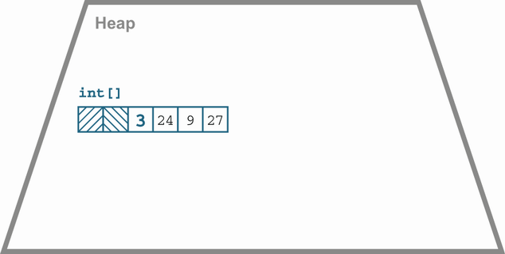
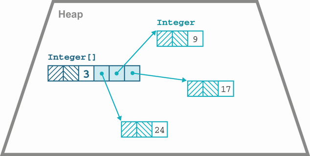
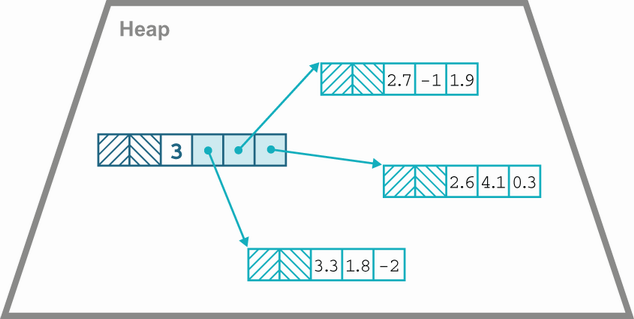
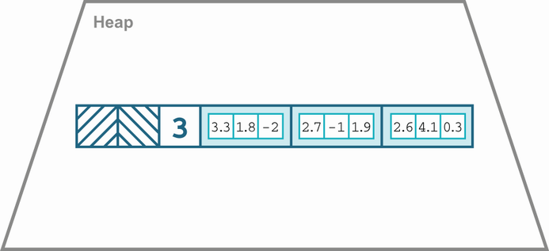

# 18. Java trong tương lai (Future Java)

> *The Well-Grounded Java Developer, Second Edition* — Chương 18
> Bản dịch tiếng Việt

**Chương này bao gồm:**

- Project Amber
- Project Panama
- Project Loom
- Project Valhalla
- Java 18

---

Chương này trình bày những phát triển của ngôn ngữ và nền tảng Java kể từ khi Java 17 được phát hành, bao gồm các cập nhật tương lai còn chưa đến. Những hướng đi mới trong ngôn ngữ và nền tảng Java được điều phối bởi các JEP, nhưng đó là mô tả cách hiện thực của những tính năng cụ thể. Ở mức cao hơn, có một vài dự án lớn, dài hơi bên trong OpenJDK đang hiện thực những thay đổi lớn hiện đang trong quá trình triển khai và sẽ được bàn giao trong những năm tới.

Ta sẽ lần lượt gặp từng dự án, rồi đến Java 18. Hãy bắt đầu với Project Amber, nơi ta sẽ nghe thêm câu chuyện về pattern matching và vì sao đó lại là một tính năng quan trọng đến vậy.

## 18.1 Project Amber

Trong số các dự án lớn hiện tại của OpenJDK, Amber là dự án gần hoàn thành nhất. Nó cũng có lợi thế là tương đối dễ hiểu xét theo công việc hằng ngày của lập trình viên. Trích từ điều lệ (charter) của dự án:

> Mục tiêu của Project Amber là khám phá và ươm tạo những tính năng ngôn ngữ Java nhỏ hơn, hướng tới năng suất...
>
> — Project Amber, https://openjdk.java.net/projects/amber/

Các mục tiêu chính của dự án là:

- Local Variable Type Inference (đã bàn giao)
- Switch Expressions (đã bàn giao)
- Records (đã bàn giao)
- Sealed Types (đã bàn giao)
- Pattern Matching

Như bạn thấy, rất nhiều tính năng trong số này đã được bàn giao tính đến Java 17 — và chúng cũng rất hữu ích!

Mảnh ghép lớn cuối cùng của Amber còn dang dở là Pattern Matching. Như ta đã thấy ở chương 3, nó đang đến theo từng bước, bước đầu tiên là việc dùng type pattern trong `instanceof`. Ta cũng đã gặp phiên bản preview của pattern trong `switch`.

Có thể kỳ vọng một cách hợp lý rằng pattern trong `switch` sẽ đi qua đúng vòng đời mà các tính năng khác của Project Amber đã trải qua: một bản preview thứ nhất, rồi thứ hai, sau đó mới được bàn giao như một tính năng chuẩn.

Nhìn về tương lai, còn nhiều JEP nữa đã được lên kế hoạch. Việc hoàn thiện dạng cơ bản của Pattern Matching không phải là tất cả — còn có những dạng pattern bổ sung cần thêm vào. Điều này cho ta biết rằng, với việc thay đổi nhịp phát hành sang mô hình "LTS mỗi hai năm", bất cứ thứ gì được preview lần đầu ở Java 18 hoặc 19 sẽ có đủ thời gian để tốt nghiệp hoàn toàn cho bản LTS tiếp theo dự kiến là Java 21, vào tháng 9 năm 2023.

Ví dụ, ta đã thấy Sealed Types có thể được dùng hiệu quả đến mức nào trong phiên bản preview hiện tại của Pattern Matching. Không có Sealed Types, ngay cả dạng Pattern Matching mà ta đang có cũng sẽ không hữu ích đến vậy. Tương tự như vậy, một số trường hợp sử dụng quan trọng nhất của Records trong pattern vẫn chưa được bàn giao. Cụ thể, các *deconstruction pattern* sẽ cho phép một Record được tách thành các thành phần của nó như một phần của pattern.

> **NOTE** Nếu bạn từng lập trình bằng Python, JS hay các ngôn ngữ khác, có thể bạn đã quen với *destructuring*. Ý tưởng deconstruction trong Java cũng tương tự nhưng được dẫn dắt bởi hệ thống kiểu định danh (nominal type system) của Java.

Điều này khả thi vì Records được định nghĩa bởi ngữ nghĩa của chúng — một Record theo đúng nghĩa đen không gì khác hơn là tổng của các phần cấu thành. Vậy nên, nếu một Record chỉ có thể được dựng lên bằng cách ghép các thành phần lại với nhau, thì suy ra nó cũng có thể được rã ra thành các thành phần mà không có hệ quả ngữ nghĩa nào.

Tại thời điểm viết sách, tính năng này chưa xuất hiện trong nhánh phát triển chính của JDK, thậm chí cũng chưa có trong các repo JDK riêng của Amber. Tuy nhiên, cú pháp dự kiến sẽ trông như thế này:

```java
FXOrder order = // ...

// WARNING This is preliminary syntax!!!

var isMarket = switch (order) {
    case MarketOrder(int units, CurrencyPair pair, Side side,
                     LocalDateTime sent, boolean allOrNothing) -> true;
    case LimitOrder(int units, CurrencyPair pair, Side side,
                    LocalDateTime sent, double price, int ttl) -> false;
};
```

Lưu ý rằng đoạn mã này ghi kiểu tường minh cho các thành phần của Record. Cũng hợp lý khi kỳ vọng rằng các kiểu này có thể được trình biên dịch suy diễn.

Cũng nên có khả năng rã (deconstruct) cả mảng, bởi mảng cũng đóng vai trò container phần tử mà không có ngữ nghĩa bổ sung nào. Cú pháp cho việc đó có thể trông như sau:

```java
// WARNING This is preliminary syntax!!!

if (o instanceof String[] { String s1, String s2, ... }) {
    System.out.println(s1 + s2);
}
```

Lưu ý rằng trong cả hai ví dụ, ta không khai báo một binding cho chính container phần tử, dù đó là Record hay mảng.

Một điểm phụ đáng nhắc tới ở đây là serialization của Java ảnh hưởng thế nào đến tính năng này. Nói chung, serialization của Java là một vấn đề, vì nó vi phạm một số quy tắc cơ bản về cách đóng gói (encapsulation) được cho là phải hoạt động trong Java.

> Serialization tạo thành một constructor vô hình nhưng public, cùng một tập accessor vô hình nhưng public cho trạng thái nội bộ của bạn.
>
> — Brian Goetz

May thay, cả Records lẫn mảng đều rất đơn giản: chúng chỉ là những vật mang (carrier) trong suốt cho nội dung của mình, nên không cần viện đến những điều kỳ quặc trong chi tiết của cơ chế serialization. Thay vào đó, ta luôn có thể dùng API public và canonical constructor để serialize và deserialize record. Xây dựng trên nền tảng này, thậm chí đã có những đề xuất rất sâu rộng, chẳng hạn loại bỏ một phần hoặc hoàn toàn cơ chế serialization và mở rộng deconstruction sang một số (hay thậm chí tất cả) lớp Java.

Nhìn chung, thông điệp từ Amber là: nếu bạn đã quen với những tính năng này từ các ngôn ngữ lập trình khác thì tuyệt vời. Còn nếu chưa, cũng đừng lo — chúng đang được thiết kế để hòa hợp với ngôn ngữ Java mà bạn đã biết và dễ dàng bắt đầu sử dụng trong mã của bạn.

Dù một số tính năng nhỏ và một số khác lớn hơn, tất cả đều có thể tạo ra tác động tích cực lên mã của bạn vượt xa quy mô của chính những thay đổi đó. Một khi đã bắt đầu dùng chúng, có lẽ bạn sẽ thấy chúng mang lại lợi ích thực sự cho chương trình của mình. Giờ hãy chuyển sang dự án lớn tiếp theo, mật danh Panama.

## 18.2 Project Panama

Theo lời trang chủ dự án, Project Panama là tất cả về việc

> cải thiện và làm giàu các kết nối giữa máy ảo Java và các API "ngoại lai" (không phải Java) được định nghĩa rõ ràng, bao gồm nhiều interface thường được lập trình viên C sử dụng.
>
> — Project Panama, https://openjdk.org/projects/panama/

Cái tên "Panama" xuất phát từ ý tưởng về một eo đất (isthmus) — một dải đất hẹp nối hai khối đất lớn hơn — mà trong phép so sánh này được hiểu là JVM và mã native. Nó bao gồm các JEP trong hai lĩnh vực chính:

- Foreign Function and Memory API
- Vector API

Trong hai lĩnh vực đó, ở mục này ta sẽ chỉ bàn về Foreign API. Vector API chưa sẵn sàng cho một phần trình bày đầy đủ, vì những lý do sẽ được giải thích ở phần sau của chương.

### 18.2.1 Foreign Function and Memory API

Java đã có Java Native Interface (JNI) để gọi vào mã native từ Java 1.1, nhưng từ lâu người ta đã nhận ra nó có những vấn đề lớn sau:

- JNI có rất nhiều thủ tục rườm rà và các artifact phụ.
- JNI thực chất chỉ liên thông tốt với các thư viện viết bằng C và C++.
- JNI không làm bất kỳ điều gì tự động để ánh xạ hệ thống kiểu của Java sang hệ thống kiểu của C.

Khía cạnh artifact phụ được lập trình viên hiểu khá rõ: ngoài API Java của các phương thức native, JNI còn đòi hỏi một file header C (`.h`) dẫn xuất từ API Java và một file hiện thực C, vốn sẽ gọi vào thư viện native. Một số khía cạnh khác thì ít được biết đến hơn, chẳng hạn việc một phương thức native không thể được dùng để gọi một hàm được viết bằng ngôn ngữ sử dụng quy ước gọi (calling convention) khác với quy ước mà JVM được biên dịch theo.

Trong những năm kể từ khi JNI xuất hiện, đã có một số nỗ lực nhằm cung cấp lựa chọn thay thế tốt hơn, chẳng hạn JNA. Tuy nhiên, các ngôn ngữ khác (không thuộc JVM) có hỗ trợ liên thông với mã native tốt hơn hẳn. Ví dụ, danh tiếng của Python như một ngôn ngữ tốt cho machine learning phần lớn phụ thuộc vào sự dễ dàng trong việc đóng gói các thư viện native và làm chúng khả dụng trong mã Python.

Panama Foreign API là một nỗ lực thu hẹp khoảng cách đó, bằng cách hỗ trợ trực tiếp trong Java cho những việc sau:

- Cấp phát bộ nhớ ngoại lai (foreign memory allocation)
- Thao tác bộ nhớ ngoại lai có cấu trúc
- Quản lý vòng đời của các tài nguyên ngoại lai
- Gọi các hàm ngoại lai

API này nằm trong package `jdk.incubator.foreign` thuộc module `jdk.incubator.foreign`. Nó được xây dựng dựa trên MethodHandles và VarHandles mà ta đã gặp ở chương 17.

> **NOTE** Foreign API nằm trong một module incubator ở Java 17. Ta đã bàn về module incubator và ý nghĩa của chúng từ tận chương 1. Để chạy được các ví dụ mã trong mục này, bạn sẽ cần thêm module incubator vào modulepath một cách tường minh.

Phần đầu tiên của API dựa vào các lớp như `MemorySegment`, `MemoryAddress` và `SegmentAllocator`. Chúng cung cấp khả năng cấp phát và xử lý bộ nhớ off-heap. Mục tiêu là cung cấp một lựa chọn tốt hơn so với việc dùng cả ByteBuffer API lẫn `Unsafe`. Foreign API muốn tránh những hạn chế của `ByteBuffer`, chẳng hạn hiệu năng, bị giới hạn ở các segment kích thước 2 GB, và không được thiết kế riêng cho việc dùng off-heap. Đồng thời, nó cũng nên *an toàn hơn* so với việc dùng `Unsafe`, vốn cho phép truy cập bộ nhớ gần như không hạn chế, khiến rất dễ có bug làm sập JVM.

> **NOTE** Trong phần còn lại của mục này, chúng tôi giả định rằng bạn đã quen với các khái niệm của ngôn ngữ C, cũng như việc build chương trình C/C++ từ mã nguồn và hiểu các pha biên dịch, liên kết (linking) của C, v.v.

Hãy xem nó hoạt động. Để bắt đầu, bạn cần tải một bản early-access của Panama từ https://jdk.java.net/panama/. Mặc dù các module incubator đã có trong JDK 17, công cụ quan trọng `jextract` thì không, và ta cần nó cho ví dụ của mình.

Khi đã cài đặt xong bản early-access của Panama, hãy kiểm tra bằng `jextract -h`. Bạn sẽ thấy output như sau:

```
WARNING: Using incubator modules:
         jdk.incubator.jextract, jdk.incubator.foreign
Non-option arguments:
[String] -- header file

Option                                   Description
------                                   -----------
-?, -h, --help                           print help
-C <String>                              pass through argument for clang
-I <String>                              specify include files path
-d <String>                              specify where to place generated files
--dump-includes <String>                 dump included symbols into specified file
--header-class-name <String>             name of the header class
--include-function <String>              name of function to include
--include-macro <String>                 name of constant macro to include
--include-struct <String>                name of struct definition to include
--include-typedef <String>               name of type definition to include
--include-union <String>                 name of union definition to include
--include-var <String>                   name of global variable to include
-l <String>                              specify a library
--source                                 generate java sources
-t, --target-package <String>            target package for specified header file
```

Cho ví dụ của mình, ta sẽ dùng một thư viện PNG đơn giản viết bằng C: LibSPNG (https://libspng.org/).

**Ví dụ: LibSPNG**

Ta sẽ bắt đầu bằng cách dùng công cụ `jextract` để lấy một tập package Java cơ sở mà ta có thể sử dụng. Cú pháp trông như sau:

```
$ jextract --source -t <target Java package> -l <library name> \
    -I <path to /usr/include> <path to header file>
```

Trên Mac, kết quả sẽ đại loại như thế này:

```
$ jextract --source -t org.libspng \
  -I /Applications/Xcode.app/Contents/Developer/Platforms/MacOSX.platform/\
      Developer/SDKs/MacOSX.sdk/usr/include \
  -l spng /Users/ben/projects/libspng/spng/spng.h
```

Lệnh này có thể sinh ra một số cảnh báo, tùy vào chính xác phiên bản file header mà ta sinh mã từ đó, nhưng miễn là nó thành công, nó sẽ tạo ra một cấu trúc thư mục trong thư mục hiện tại. Thư mục đó sẽ chứa rất nhiều lớp Java trong một package tên `org.libspng`, mà lát nữa ta sẽ dùng được từ bên trong chương trình Java của mình.

Ta cũng cần build một shared object để liên kết tới khi chạy chương trình. Cách tốt nhất là làm theo hướng dẫn build của dự án tại http://mng.bz/v6dJ.

Quá trình cài đặt sinh ra `libspng.dylib` cục bộ trong dự án và cài nó vào một vị trí dùng chung của hệ thống. Khi chạy dự án, bạn cần đảm bảo file đó nằm ở đâu đó trong các đường dẫn được liệt kê bởi system property `java.library.path`, hoặc đặt trực tiếp property đó để bao gồm vị trí của bạn. Một thư mục mặc định ví dụ trên Mac là `~/Library/Java/Extensions/`. Với việc sinh mã đã hoàn tất và thư viện đã được cài đặt, ta có thể bắt tay vào lập trình Java.

Mục tiêu của Panama là cung cấp các phương thức static trong Java khớp với tên (và phiên bản Java của các kiểu tham số) của những symbol trong thư viện C mà ta muốn liên kết tới. Vì vậy, các symbol trong mã Java được sinh ra sẽ tuân theo quy ước đặt tên của C và trông không giống tên Java cho lắm.

Với lập trình viên Java, ấn tượng chung là ta đang gọi trực tiếp các hàm C (trong chừng mực có thể). Trên thực tế, có một lượng "phép màu" nhất định của Panama đang diễn ra bên dưới, sử dụng các kỹ thuật như method handle để che giấu độ phức tạp. Trong hoàn cảnh thông thường, hầu hết lập trình viên không cần bận tâm tới chi tiết chính xác về cách Panama hoạt động.

Hãy xem một ví dụ: một chương trình dùng thư viện C để đọc vài dữ liệu cơ bản từ một file PNG. Ta sẽ thiết lập mã này thành một bản build module hóa đúng chuẩn. Module descriptor, `module-info.java`, trông như sau:

```java
module wgjd.png {
  exports wgjd.png;

  requires jdk.incubator.foreign;
}
```

Mã nguồn gồm package `org.libspng`, được sinh tự động từ mã C, và package duy nhất được export là `wgjd.png`. Nó chứa một file duy nhất, mà ta trình bày đầy đủ ở đây vì phần import và những thứ tương tự rất quan trọng để hiểu điều gì đang diễn ra:

```java
package wgjd.png;

import jdk.incubator.foreign.MemoryAddress;                    ❶
import jdk.incubator.foreign.MemorySegment;                    ❶
import jdk.incubator.foreign.SegmentAllocator;                 ❶
import org.libspng.spng_ihdr;

import static jdk.incubator.foreign.CLinker.toCString;
import static jdk.incubator.foreign.ResourceScope.newConfinedScope;
import static org.libspng.spng_h.*;

public class PngReader {
    public static void main(String[] args) {
        if (args.length < 1) {
            System.err.println("Usage: pngreader <fname>");
            System.exit(1);
        }

        try (var scope = newConfinedScope()) {
            var allocator = SegmentAllocator.ofScope(scope);

            MemoryAddress ctx = spng_ctx_new(0);                ❷
            MemorySegment ihdr = allocator.allocate(spng_ihdr.$LAYOUT());

            spng_set_crc_action(ctx, SPNG_CRC_USE(),            ❸
                                     SPNG_CRC_USE());

            int limit = 1024 * 1024 * 64;                       ❹
            spng_set_chunk_limits(ctx, limit, limit);

            var cFname = toCString(args[0], scope);             ❺
            var cMode = toCString("rb", scope);
            var png = fopen(cFname, cMode);                     ❻
            spng_set_png_file(ctx, png);

            int ret = spng_get_ihdr(ctx, ihdr);

            if (ret != 0) {
                System.out.println("spng_get_ihdr() error: " +
                                   spng_strerror(ret));
                System.exit(2);
            }

            final String colorTypeMsg;
            final byte colorType = spng_ihdr.color_type$get(ihdr);

            if (colorType ==
                  SPNG_COLOR_TYPE_GRAYSCALE()) {                ❼
                colorTypeMsg = "grayscale";
            } else if (colorType ==
                  SPNG_COLOR_TYPE_TRUECOLOR()) {
                colorTypeMsg = "truecolor";
            } else if (colorType ==
                  SPNG_COLOR_TYPE_INDEXED()) {
                colorTypeMsg = "indexed color";
            } else if (colorType ==
                  SPNG_COLOR_TYPE_GRAYSCALE_ALPHA()) {
                colorTypeMsg = "grayscale with alpha";
            } else {
                colorTypeMsg = "truecolor with alpha";
            }

            System.out.println("File type: " + colorTypeMsg);
        }
    }
}
```

❶ Các lớp của Panama để làm việc với quản lý bộ nhớ kiểu C

❷ Lớp bọc (wrapper) Java cho một hàm C trong `spng.h`

❸ Lớp bọc Java cho một hằng số C

❹ Đọc dữ liệu theo từng khối 64 MB

❺ Sao chép nội dung của chuỗi Java vào một chuỗi C

❻ Lớp bọc Java cho một hàm của thư viện chuẩn C

❼ Lớp bọc Java cho một hằng số C

Chương trình được build bằng một Gradle build script như sau:

```kotlin
plugins {
  id("org.beryx.jlink") version("2.24.2")
}

repositories {
  mavenCentral()
}

application {
  mainModule.set("wgjd.png")
  mainClass.set("wgjd.png.PngReader")
}

java {
    modularity.inferModulePath.set(true)
}

sourceSets {
  main {
    java {
      setSrcDirs(listOf("src/main/java/org",
                        "src/main/java/wgjd.png"))
    }
  }
}

tasks.withType<JavaCompile> {
  options.compilerArgs = listOf()
}

tasks.jar {
  manifest {
    attributes("Main-Class" to application.mainClassName)
  }
}
```

Và có thể được thực thi như sau:

```
$ java --add-modules jdk.incubator.foreign \
    --enable-native-access=ALL-UNNAMED \
    -jar build/libs/Panama.jar <FILENAME>.png
```

Lệnh này sẽ tạo ra output cung cấp metadata cơ bản về file ảnh của ta.

**Xử lý bộ nhớ native trong Panama**

Một khía cạnh then chốt của việc xử lý bộ nhớ là câu hỏi về vòng đời của bộ nhớ native. C không có bộ thu gom rác, nên toàn bộ bộ nhớ phải được cấp phát và giải phóng thủ công. Điều này, dĩ nhiên, cực kỳ dễ sinh lỗi, đồng thời hoàn toàn không tự nhiên với một lập trình viên Java.

Để giải quyết vấn đề này, Panama cung cấp một số lớp đóng vai trò handle của Java cho các thao tác quản lý bộ nhớ của C. Điểm mấu chốt là lớp `ResourceScope`, có thể được dùng để dọn dẹp một cách xác định (deterministic). Việc này được xử lý theo cách Java thông thường, qua `try`-with-resources. Ví dụ, đoạn mã trước đó dùng một vòng đời có phạm vi từ vựng (lexically scoped) cho việc xử lý bộ nhớ native:

```java
try (var scope = newConfinedScope()) {
    var allocator = SegmentAllocator.ofScope(scope);

    // ...

}
```

Đối tượng allocator là một instance của một cài đặt của interface `SegmentAllocator`. Nó được tạo từ scope thông qua một factory method, và đến lượt mình, ta có thể tạo các đối tượng `MemorySegment` từ allocator.

Các đối tượng hiện thực interface `MemorySegment` biểu diễn những khối bộ nhớ liên tục. Thông thường, chúng được hậu thuẫn bởi các khối bộ nhớ native, nhưng cũng có thể hậu thuẫn memory segment bằng các mảng nằm trên heap. Điều này tương tự trường hợp của `ByteBuffer` trong Java NIO API.

> **NOTE** Panama API cũng chứa `MemoryAddress`, thực chất là một lớp bọc Java trên một con trỏ C (được biểu diễn dưới dạng giá trị `long`).

Khi scope được tự động đóng, allocator sẽ được gọi lại để giải phóng một cách xác định và trả lại mọi tài nguyên mà nó đang nắm giữ. Đây chính là cách mẫu Resource Acquisition Is Initialization (hay RAII), vốn được hiện thực trong Java bằng `try`-with-resources, được đưa vào mã native. Các đối tượng scope và allocator giữ tham chiếu tới tài nguyên native và tự động giải phóng chúng khi khối TWR kết thúc.

Ngoài ra, việc này cũng có thể được xử lý một cách ngầm định, với bộ nhớ native được dọn dẹp khi đối tượng `MemorySegment` bị thu gom rác. Điều này, dĩ nhiên, có nghĩa là việc dọn dẹp diễn ra không xác định, tùy vào lúc GC chạy. Nói chung, nên dùng scope tường minh, đặc biệt nếu bạn chưa quen với những cạm bẫy tiềm tàng khi xử lý bộ nhớ off-heap.

Tại thời điểm viết sách, `jextract` chỉ hiểu các file header C. Điều này có nghĩa là, hiện tại, để dùng nó từ các ngôn ngữ native khác (ví dụ Rust), bạn phải sinh một header C trước. Lý tưởng nhất là có một công cụ tự động sinh ra chúng, hoạt động giống công cụ `rust-bindgen` nhưng theo chiều ngược lại.

Rộng hơn, theo thời gian, `jextract` có thể sẽ hỗ trợ thêm nhiều ngôn ngữ khác nói chung. Công cụ này dựa trên LLVM, vốn đã độc lập với ngôn ngữ, nên về lý thuyết nó có thể mở rộng cho bất kỳ ngôn ngữ nào mà LLVM biết và có thể xử lý quy ước gọi hàm của C.

Foreign API sắp có bản phát hành thứ hai với trạng thái Incubating (xem lại chương 1 để biết mô tả về các tính năng Incubating và Preview) như một phần của Java 18. Người ta hy vọng nó sẽ trở thành tính năng cuối cùng, được chuẩn hóa, như một phần của Java 19 vào tháng 9 năm 2022.

Vector API thì chưa tiến xa được như vậy, chủ yếu vì các nhà thiết kế API đã quyết định rằng họ muốn chờ tới khi các khả năng của Project Valhalla (xem phần sau của chương này) sẵn sàng. Do đó API này sẽ không rời khỏi trạng thái Incubating cho tới khi Valhalla có mặt như một tính năng chuẩn.

## 18.3 Project Loom

Theo lời của chính dự án, Project Loom của OpenJDK là về

> tính đồng thời nhẹ, dễ dùng, thông lượng cao và các mô hình lập trình mới trên nền tảng Java.
>
> — Project Loom, https://wiki.openjdk.org/display/loom/Main

Vì sao cần cách tiếp cận mới này với tính đồng thời? Hãy xét Java từ một góc nhìn lịch sử hơn.

Một cách thú vị để nghĩ về Java là coi nó như một ngôn ngữ và nền tảng của cuối thập niên 1990, đã đặt một số cược chiến lược, có chính kiến về hướng tiến hóa của phần mềm. Những canh bạc đó, nhìn từ góc độ năm 2022, phần lớn đã thành công (nhờ may mắn hay nhờ phán đoán thì dĩ nhiên vẫn còn là chuyện để tranh luận).

Ví dụ, hãy xét đến luồng (thread). Java là nền tảng lập trình chính thống đầu tiên đưa thread vào lõi ngôn ngữ. Trước khi có thread, công nghệ tiên tiến nhất là dùng nhiều tiến trình và đủ loại cơ chế không mấy thỏa đáng (bộ nhớ chia sẻ Unix, có ai muốn thử không?) để giao tiếp giữa chúng.

Ở mức hệ điều hành, thread là các đơn vị thực thi được lập lịch độc lập, thuộc về một tiến trình. Mỗi thread có một bộ đếm lệnh thực thi và một call stack, nhưng chia sẻ heap với mọi thread khác trong cùng tiến trình.

Không chỉ vậy, Java heap chỉ là một tập con liên tục của heap tiến trình (ít nhất là trong hiện thực HotSpot — các JVM khác có thể khác), nên mô hình bộ nhớ của thread ở mức OS chuyển sang miền ngôn ngữ Java một cách rất tự nhiên.

Khái niệm thread dẫn tới một cách tự nhiên tới khái niệm chuyển ngữ cảnh nhẹ (lightweight context switch). Việc chuyển đổi giữa hai thread trong cùng một tiến trình rẻ hơn so với trường hợp khác. Điều này chủ yếu vì các bảng ánh xạ chuyển địa chỉ bộ nhớ ảo sang địa chỉ vật lý phần lớn là giống nhau đối với các thread trong cùng tiến trình.

> **NOTE** Tạo một thread cũng rẻ hơn tạo một tiến trình. Mức độ chính xác của điều này phụ thuộc vào chi tiết của hệ điều hành đang xét.

Trong trường hợp của ta, đặc tả Java không bắt buộc bất kỳ ánh xạ cụ thể nào giữa Java thread và thread của hệ điều hành (OS) (giả sử hệ điều hành chủ thậm chí có một khái niệm thread phù hợp, điều không phải lúc nào cũng đúng). Thực tế, ở các phiên bản Java rất sớm, các thread của JVM được ghép kênh lên các thread của OS (còn gọi là platform thread) theo mô hình được gọi là *green threads* hay *M:1 threads* (vì hiện thực thực chất chỉ dùng một platform thread duy nhất).

Tuy nhiên, cách làm này đã lụi tàn vào khoảng thời Java 1.2/1.3 (và sớm hơn một chút trên Sun Solaris OS), và các phiên bản Java hiện đại chạy trên các hệ điều hành chính thống thay vào đó hiện thực quy tắc: một Java thread == đúng một thread hệ điều hành. Gọi `Thread.start()` sẽ gọi system call tạo thread (ví dụ `clone()` trên Linux) và thực sự tạo ra một OS thread mới.

Mục tiêu chính của Project Loom thuộc OpenJDK là cho phép các đối tượng `Thread` mới có thể thực thi mã nhưng không tương ứng với các OS thread riêng biệt — hay nói cách khác, tạo ra một mô hình thực thi trong đó một đối tượng biểu diễn ngữ cảnh thực thi không nhất thiết phải là thứ mà hệ điều hành cần lập lịch.

Vậy nên ở một số khía cạnh, Loom là sự trở lại với một thứ gì đó tương tự green threads. Tuy nhiên, thế giới đã thay đổi rất nhiều trong những năm qua, và đôi khi trong ngành máy tính, có những ý tưởng đi trước thời đại.

Ví dụ, ta có thể xem Enterprise Java Beans (EJB) như một dạng môi trường ảo hóa/hạn chế đã quá tham vọng khi cố ảo hóa mất môi trường đi. Liệu chúng có thể được xem như một dạng nguyên mẫu của những ý tưởng mà sau này được ưa chuộng trong các hệ thống PaaS hiện đại — và ở mức độ thấp hơn là trong Docker/K8s?

Vậy, nếu Loom là sự trở lại (một phần) với ý tưởng green threads, thì một cách tiếp cận nó có thể là qua câu hỏi: "điều gì đã thay đổi trong môi trường khiến việc quay lại một ý tưởng cũ, vốn từng bị coi là không hữu ích, trở nên thú vị?"

Để khám phá câu hỏi này một chút, hãy xem một ví dụ. Cụ thể, hãy thử làm sập JVM bằng cách tạo quá nhiều thread. Bạn *không nên* chạy mã trong ví dụ này trừ khi đã chuẩn bị tinh thần cho khả năng bị crash:

```java
//
// Do not actually run this code... it may crash your JVM or laptop
//
public class CrashTheVM {
    private static void looper(int count) {
        var tid = Thread.currentThread().getId();
        if (count > 500) {
            return;
        }
        try {
            Thread.sleep(10);
            if (count % 100 == 0) {
                System.out.println("Thread id: "+ tid +" : "+ count);
            }
        } catch (InterruptedException e) {
            e.printStackTrace();
        }
        looper(count + 1);
    }

    public static Thread makeThread(Runnable r) {
        return new Thread(r);
    }

    public static void main(String[] args) {
        var threads = new ArrayList<Thread>();
        for (int i = 0; i < 20_000; i = i + 1) {
            var t = makeThread(() -> looper(1));
            t.start();
            threads.add(t);
            if (i % 1_000 == 0) {
                System.out.println(i + " thread started");
            }
        }
        // Join all the threads
        threads.forEach(t -> {
            try {
                t.join();
            } catch (InterruptedException e) {
                e.printStackTrace();
            }
        });
    }
}
```

Đoạn mã khởi động 20.000 thread và làm một lượng xử lý tối thiểu trong mỗi thread — hoặc cố gắng làm vậy. Trên thực tế, nó thường sẽ chết hoặc khóa cứng máy từ rất lâu trước khi đạt tới trạng thái ổn định đó.

> **NOTE** Có thể khiến ví dụ chạy tới hết nếu máy hoặc OS bị bóp băng thông và không thể tạo thread đủ nhanh để gây ra tình trạng cạn kiệt tài nguyên.

Mặc dù rõ ràng đây không phải một ví dụ hoàn toàn đại diện, nó nhằm chỉ ra điều sẽ xảy ra với, chẳng hạn, một môi trường phục vụ web với một thread cho mỗi kết nối. Việc kỳ vọng một web server hiệu năng cao hiện đại xử lý 20.000 kết nối đồng thời là hoàn toàn hợp lý, vậy mà ví dụ này cho thấy rõ sự thất bại của kiến trúc thread-per-connection cho trường hợp đó.

> **NOTE** Một cách khác để nghĩ về Loom là: một chương trình Java hiện đại có thể cần theo dõi nhiều ngữ cảnh thực thi hơn hẳn số thread mà nó có thể tạo ra.

Một bài học rút ra khác có thể là: thread tiềm ẩn chi phí lớn hơn nhiều so với ta nghĩ và là một nút thắt cổ chai về khả năng mở rộng cho các ứng dụng JVM hiện đại. Các lập trình viên đã cố giải quyết vấn đề này suốt nhiều năm, hoặc bằng cách thuần hóa chi phí của thread, hoặc bằng cách dùng một cách biểu diễn ngữ cảnh thực thi không phải là thread.

Một cách để cố đạt được điều đó là cách tiếp cận SEDA (Staged Event Driven Architecture) — nói nôm na, một hệ thống trong đó một đối tượng miền được di chuyển từ A tới Z dọc theo một pipeline nhiều tầng, với nhiều phép biến đổi khác nhau diễn ra dọc đường. Cách này có thể được hiện thực trong hệ thống phân tán bằng một hệ thống messaging, hoặc trong một tiến trình duy nhất, bằng blocking queue và một thread pool cho mỗi tầng.

Ở mỗi bước, việc xử lý đối tượng miền được mô tả bằng một đối tượng Java chứa mã hiện thực phép biến đổi của bước đó. Để việc này hoạt động đúng, đoạn mã phải được đảm bảo là sẽ kết thúc — không có vòng lặp vô hạn — và framework không thể cưỡng chế điều này.

Cách tiếp cận này có một số khiếm khuyết đáng chú ý — không kém phần quan trọng là mức độ kỷ luật mà lập trình viên cần có để sử dụng kiến trúc này hiệu quả. Hãy xem một lựa chọn thay thế tốt hơn.

### 18.3.1 Virtual threads

Project Loom nhắm tới việc mang lại trải nghiệm tốt hơn cho các ứng dụng quy mô lớn ngày nay bằng cách thêm các cấu trúc mới sau vào JVM:

- Virtual threads
- Delimited continuations
- Tail-call elimination

Khía cạnh then chốt của việc này là virtual thread. Chúng được thiết kế để với lập trình viên trông "chỉ như thread bình thường". Tuy nhiên, chúng được quản lý bởi Java runtime và không phải là những lớp bọc mỏng, một-đối-một trên OS thread. Thay vào đó, chúng được hiện thực trong không gian người dùng (user space) bởi Java runtime. Những lợi thế lớn mà virtual thread hướng tới bao gồm:

- Việc tạo và block chúng rất rẻ.
- Có thể dùng các bộ lập lịch thực thi chuẩn của Java (threadpool).
- Không cần cấu trúc dữ liệu ở mức OS cho stack.

Việc loại bỏ sự tham gia của hệ điều hành vào vòng đời của một virtual thread chính là điều gỡ bỏ nút thắt cổ chai về khả năng mở rộng. Các ứng dụng JVM của ta có thể xử lý hàng triệu, thậm chí hàng tỉ đối tượng — vậy tại sao ta lại bị giới hạn chỉ ở vài nghìn đối tượng được OS lập lịch (một cách để nghĩ về thread là như vậy)? Phá vỡ giới hạn này và mở khóa những phong cách lập trình đồng thời mới là mục tiêu chính của Project Loom.

Hãy xem virtual thread hoạt động. Hãy tải một bản beta của Loom (https://jdk.java.net/loom/), và khởi động `jshell` (với chế độ Preview bật để kích hoạt các tính năng Loom) như sau:

```
$ jshell --enable-preview
| Welcome to JShell -- Version 18-loom
| For an introduction type: /help intro

jshell> Thread.startVirtualThread(() -> {
   ...>     System.out.println("Hello World");
   ...> });
Hello World
$1 ==> VirtualThread[<unnamed>,<no carrier thread>]

jshell>
```

Ta thấy ngay cấu trúc virtual thread trong output. Ta cũng đang dùng một phương thức static mới `startVirtualThread()` để khởi chạy lambda trong một ngữ cảnh thực thi mới, chính là một virtual thread. Đơn giản!

Quy tắc chung phải là: các codebase hiện có phải tiếp tục chạy đúng theo cách chúng đã chạy trước khi Loom xuất hiện. Hay nói cách khác, việc dùng virtual thread phải là *opt-in*. Ta phải đưa ra giả định thận trọng rằng mọi mã Java hiện có thực sự cần lớp bọc nhẹ trên OS thread, thứ cho tới nay vẫn là lựa chọn duy nhất.

Sự xuất hiện của virtual thread mở ra những chân trời mới theo những cách khác nữa. Cho đến nay, ngôn ngữ Java cung cấp hai cách chính để tạo thread mới:

- Kế thừa `java.lang.Thread` và gọi phương thức `start()` được kế thừa.
- Tạo một instance của `Runnable`, truyền nó vào constructor của `Thread`, rồi khởi động đối tượng thu được.

Nếu khái niệm thread sắp thay đổi, thì việc xem xét lại các phương pháp ta dùng để tạo thread cũng là hợp lý. Ta đã gặp phương thức static factory mới cho virtual thread kiểu "bắn rồi quên" (fire-and-forget), nhưng API thread hiện có cũng cần được cải thiện theo vài cách khác.

### 18.3.2 Thread builders

Một khái niệm mới quan trọng là lớp `Thread.Builder`, được thêm vào như một inner class của `Thread`. Hai factory method mới đã được thêm vào `Thread` để truy cập các builder cho platform thread và virtual thread, như sau:

```
jshell> var tb = Thread.ofPlatform();
tb ==> java.lang.ThreadBuilders$PlatformThreadBuilder@312b1dae

jshell> var tb = Thread.ofVirtual();
tb ==> java.lang.ThreadBuilders$VirtualThreadBuilder@506e1b77
```

Hãy xem builder hoạt động bằng cách thay phương thức `makeThread()` trong ví dụ của ta bằng đoạn mã này:

```java
// Loom-specific code
public static Thread makeThread(Runnable r) {
    return Thread.ofVirtual().unstarted(r);
}
```

Đoạn này gọi phương thức `ofVirtual()` để tạo tường minh một virtual thread sẽ thực thi `Runnable` của ta. Dĩ nhiên ta cũng có thể dùng factory method `ofPlatform()` thay thế, và sẽ thu được một đối tượng thread truyền thống, được OS lập lịch. Nhưng như vậy thì còn gì vui?

Nếu ta thay bằng phiên bản virtual của `makeThread()` rồi biên dịch lại ví dụ với một phiên bản Java hỗ trợ Loom, ta có thể chạy mã thu được. Lần này, chương trình chạy tới hết mà không gặp vấn đề gì. Đây là ví dụ tốt cho triết lý của Loom trong thực tế — khoanh vùng thay đổi mà ứng dụng cần thực hiện chỉ tại những vị trí mã tạo ra thread.

Một cách mà thư viện thread mới khuyến khích lập trình viên rời bỏ các mô thức cũ là: các lớp con của `Thread` không thể là virtual. Do đó, mã kế thừa `Thread` sẽ tiếp tục được tạo bằng OS thread truyền thống.

> **NOTE** Theo thời gian, khi virtual thread trở nên phổ biến hơn và lập trình viên thôi bận tâm về khác biệt giữa virtual thread và OS thread, điều này sẽ làm nản lòng việc dùng cơ chế kế thừa, vì nó luôn tạo ra thread được OS lập lịch.

Ý định là bảo vệ mã hiện có vốn dùng lớp con của `Thread` và tuân theo nguyên tắc ít gây bất ngờ nhất (principle of least surprise).

Nhiều phần khác của thư viện thread cũng cần được nâng cấp để hỗ trợ Loom tốt hơn. Ví dụ, `ThreadBuilder` cũng có thể dựng các instance `ThreadFactory` để truyền cho nhiều `Executor` khác nhau, như sau:

```
jshell> var tb = Thread.ofVirtual();
tb ==> java.lang.ThreadBuilders$VirtualThreadBuilder@312b1dae

jshell> var tf = tb.factory();
tf ==> java.lang.ThreadBuilders$VirtualThreadFactory@506e1b77

jshell> var tb = Thread.ofPlatform();
tb ==> java.lang.ThreadBuilders$PlatformThreadBuilder@1ddc4ec2

jshell> var tf = tb.factory();
tf ==> java.lang.ThreadBuilders$PlatformThreadFactory@b1bc7ed
```

Virtual thread cần được gắn vào một OS thread thực sự để thực thi. Những OS thread mà virtual thread chạy trên đó được gọi là *carrier thread*. Ta đã thấy carrier thread trong output của `jshell` ở một trong các ví dụ trước. Tuy nhiên, trong suốt vòng đời của mình, một virtual thread có thể chạy trên nhiều carrier thread khác nhau. Điều này phần nào gợi nhớ cách các thread thông thường sẽ thực thi trên các lõi CPU vật lý khác nhau theo thời gian — cả hai đều là ví dụ về lập lịch thực thi.

### 18.3.3 Lập trình với virtual threads

Sự xuất hiện của virtual thread đi kèm với một sự thay đổi tư duy. Những lập trình viên đã viết ứng dụng đồng thời bằng Java như hiện nay đã quen với việc phải đối phó (một cách có ý thức hoặc vô thức) với những giới hạn mở rộng vốn có của thread.

Ta đã quen với việc tạo các đối tượng tác vụ, thường dựa trên `Runnable` hay `Callable`, rồi giao chúng cho các executor được hậu thuẫn bởi thread pool — vốn tồn tại để bảo tồn nguồn tài nguyên thread quý giá. Sẽ ra sao nếu tất cả những điều đó đột nhiên khác đi?

Về bản chất, Project Loom cố giải quyết giới hạn mở rộng của thread bằng cách giới thiệu một khái niệm thread mới rẻ hơn các khái niệm hiện có và không ánh xạ trực tiếp sang OS thread. Tuy nhiên, khả năng mới này vẫn trông và hành xử như một thread theo cách các lập trình viên Java vốn đã hiểu.

Thay vì bắt buộc lập trình viên học một phong cách lập trình hoàn toàn mới (như continuation-passing style, hay cách tiếp cận Promise/Future, hay callback), runtime của Loom giữ nguyên mô hình lập trình mà ta đã biết từ thread ngày nay cho virtual thread; virtual thread *là* thread, ít nhất là dưới góc nhìn của lập trình viên.

Virtual thread là *preemptive* vì mã người dùng không cần nhường quyền (yield) một cách tường minh. Các điểm lập lịch tùy thuộc vào bộ lập lịch virtual và JDK. Người dùng không được đưa ra giả định nào về thời điểm chúng xảy ra, vì đó thuần túy là chi tiết hiện thực. Tuy nhiên, hiểu những kiến thức cơ bản về lý thuyết hệ điều hành làm nền cho việc lập lịch sẽ giúp ta trân trọng sự khác biệt của virtual thread.

Khi hệ điều hành lập lịch các platform thread, nó cấp một lát thời gian (timeslice) CPU cho một thread. Khi hết lát thời gian, một ngắt phần cứng được sinh ra, và kernel có thể giành lại quyền điều khiển, gỡ bỏ platform thread (thread người dùng) đang thực thi, và thay bằng một thread khác.

> **NOTE** Cơ chế này là cách Unix (và nhiều hệ điều hành khác) có thể hiện thực việc chia sẻ thời gian của bộ xử lý giữa các tác vụ khác nhau — thậm chí từ nhiều thập kỷ trước, ở thời máy tính chỉ có một lõi xử lý.

Tuy nhiên, virtual thread được xử lý khác với platform thread. Không bộ lập lịch hiện có nào cho virtual thread dùng timeslice để giành quyền ưu tiên (preempt) các virtual thread.

> **NOTE** Việc dùng timeslice để preempt virtual thread là khả thi, và VM vốn đã có khả năng giành quyền điều khiển các Java thread đang thực thi — chẳng hạn nó làm vậy tại các safepoint của JVM.

Thay vào đó, virtual thread tự động nhường (yield) carrier thread của mình khi một lời gọi blocking (chẳng hạn I/O) được thực hiện. Việc này do thư viện và runtime xử lý, không nằm dưới sự điều khiển tường minh của lập trình viên.

Vì thế, thay vì buộc lập trình viên quản lý việc nhường quyền một cách tường minh, hay dựa vào sự phức tạp của các thao tác không chặn hoặc dựa trên callback, Loom cho phép lập trình viên Java viết mã theo phong cách tuần tự trên thread truyền thống. Điều này còn có lợi ích bổ sung như cho phép debugger và profiler hoạt động theo cách thông thường. Những người làm công cụ và kỹ sư runtime cần làm thêm chút việc để hỗ trợ virtual thread, nhưng như vậy vẫn tốt hơn là đẩy thêm gánh nặng nhận thức lên lập trình viên Java cuối. Đặc biệt, cách tiếp cận này khác với cách `async`/`await` được một số ngôn ngữ lập trình khác áp dụng.

Những người thiết kế Loom kỳ vọng rằng, vì virtual thread không bao giờ *cần* được gộp pool, nên chúng *không nên* được gộp pool, và thay vào đó mô hình là tạo virtual thread một cách không giới hạn. Vì mục đích này, một executor không chặn giới hạn đã được thêm vào. Có thể truy cập nó qua một factory method mới, `Executors.newVirtualThreadPerTaskExecutor()`. Bộ lập lịch mặc định cho virtual thread là bộ lập lịch work-stealing được giới thiệu trong `ForkJoinPool`.

> **NOTE** Thật thú vị khi khía cạnh work-stealing của Fork/Join lại trở nên quan trọng hơn nhiều so với việc phân rã đệ quy các tác vụ.

Thiết kế của Loom như hiện nay dựa trên giả định rằng lập trình viên hiểu được chi phí tính toán sẽ hiện diện trên các thread khác nhau trong ứng dụng của mình. Nói đơn giản, nếu một lượng khổng lồ thread đều cần rất nhiều thời gian CPU liên tục, thì ứng dụng của bạn đang gặp khủng hoảng tài nguyên mà việc lập lịch khéo léo cũng không giúp được. Ngược lại, nếu chỉ vài thread được kỳ vọng sẽ bị giới hạn bởi CPU (CPU-bound), thì nên đặt chúng vào một pool riêng và cấp phát platform thread cho chúng.

Virtual thread cũng được kỳ vọng hoạt động tốt trong trường hợp có nhiều thread chỉ thỉnh thoảng mới bị giới hạn bởi CPU. Ý định là bộ lập lịch work-stealing sẽ làm mượt mức sử dụng CPU và mã thực tế cuối cùng sẽ gọi tới một thao tác đi qua điểm nhường quyền (chẳng hạn I/O chặn).

### 18.3.4 Khi nào Project Loom sẽ đến?

Việc phát triển Loom đang diễn ra trong một repo riêng, không phải trên nhánh chính của JDK. Các bản binary early-access đã có sẵn, nhưng vẫn còn một số điểm thô ráp — crash vẫn xảy ra nhưng đang trở nên ít phổ biến hơn. API cơ bản đang định hình, nhưng gần như chắc chắn là chưa hoàn toàn chốt.

JEP 425 (https://openjdk.java.net/jeps/425) đã được nộp để tích hợp virtual thread như một tính năng Preview, nhưng tại thời điểm viết sách, JEP này chưa được nhắm tới bản phát hành nào. Có thể giả định hợp lý rằng nếu nó không được đưa vào dạng Preview trong Java 19, thì phiên bản cuối cùng của tính năng này sẽ không có mặt như một phần của Java 21 (vốn nhiều khả năng là bản LTS tiếp theo của Java). Vẫn còn rất nhiều việc phải làm với các API đang được xây dựng trên nền virtual thread, chẳng hạn structured concurrency và các tính năng nâng cao khác.

Một câu hỏi then chốt mà lập trình viên luôn đặt ra là về hiệu năng, nhưng điều này luôn khó trả lời trong giai đoạn đầu phát triển một công nghệ mới. Với Loom, ta chưa đến điểm có thể đưa ra so sánh có ý nghĩa và hiệu năng hiện tại không được cho là thực sự phản ánh phiên bản cuối cùng.

Cũng như với các dự án dài hơi khác trong OpenJDK, câu trả lời thực sự là: nó sẽ sẵn sàng khi nó sẵn sàng. Hiện tại, đã có đủ nguyên mẫu để bắt đầu thử nghiệm và nếm trải hương vị đầu tiên của việc phát triển Java trong tương lai sẽ như thế nào. Hãy chuyển sự chú ý sang dự án cuối cùng trong bốn dự án lớn của OpenJDK mà ta đang bàn: Valhalla.

## 18.4 Project Valhalla

> Đưa hành vi bố trí bộ nhớ của JVM về đúng với mô hình chi phí của phần cứng hiện đại.
>
> — Brian Goetz

Để hiểu mô hình bố trí bộ nhớ hiện tại của Java chạm giới hạn và bắt đầu đổ vỡ ở đâu, hãy bắt đầu bằng một ví dụ. Trong hình 18.1, ta thấy một mảng các `int` nguyên thủy. Vì đây là các giá trị kiểu nguyên thủy chứ không phải đối tượng, chúng được bố trí ở các vị trí bộ nhớ liền kề nhau.



**Hình 18.1** Mảng các `int` nguyên thủy

Để thấy sự khác biệt với mảng đối tượng, hãy đối chiếu điều này với trường hợp số nguyên đã được boxing. Một mảng các đối tượng `Integer` sẽ là một mảng các tham chiếu, như trong hình 18.2.



**Hình 18.2** Mảng các đối tượng `Integer`

Vì mỗi `Integer` là một đối tượng, nó buộc phải có một object header, như ta đã giải thích ở chương trước. Đôi khi ta nói rằng mỗi đối tượng buộc phải trả "thuế header" đi kèm với việc là một đối tượng Java.

Suốt hơn 20 năm, mẫu bố trí bộ nhớ này là cách nền tảng Java vận hành. Nó có ưu điểm là đơn giản nhưng đi kèm đánh đổi về hiệu năng: làm việc với mảng đối tượng kéo theo những phép truy xuất gián tiếp qua con trỏ không thể tránh khỏi cùng các cache miss đi kèm.

Ví dụ, hãy xét một lớp biểu diễn một điểm trong không gian ba chiều, kiểu `Point3D`. Nó thực chất chỉ gồm ba tọa độ không gian và, tính đến Java 17, có thể được biểu diễn như một kiểu đối tượng với ba trường (hoặc một record tương đương) như sau:

```java
public final class Point3D {
    private final double x;
    private final double y;
    private final double z;

    public Point3D(double a, double b, double c) {
        x = a;
        y = b;
        z = c;
    }

    // Additional methods, e.g getters, toString() etc.
}
```

Trong HotSpot, một mảng các đối tượng point này được bố trí trong bộ nhớ như trong hình 18.3.



**Hình 18.3** Một mảng các `Point3D`

Khi xử lý mảng này, mỗi phần tử được truy cập qua một bước gián tiếp bổ sung để lấy tọa độ của từng điểm. Điều này gây ra một cache miss cho mỗi điểm trong mảng, làm suy giảm hiệu năng mà chẳng vì lý do chính đáng nào.

Với những lập trình viên rất quan tâm tới hiệu năng, khả năng định nghĩa các kiểu có thể được bố trí trong bộ nhớ hiệu quả hơn sẽ rất hữu ích. Ta cũng nên lưu ý rằng định danh đối tượng (object identity) không mang lại lợi ích thực sự nào cho lập trình viên khi làm việc với các giá trị `Point3D`, bởi hai điểm nên bằng nhau khi và chỉ khi tất cả các trường của chúng bằng nhau.

Ví dụ này minh họa hai khái niệm lập trình tách biệt sau, cả hai đều được mở khóa nhờ việc loại bỏ định danh đối tượng:

- **Heap flattening** — Loại bỏ bước gián tiếp qua con trỏ cho các đối tượng không định danh, dẫn tới mật độ bộ nhớ cao hơn
- **Scalarization** — Khả năng tách một đối tượng không định danh thành các trường và tái tạo lại nó ở nơi khác nếu cần

Hai tính chất riêng biệt này hóa ra sẽ có hệ quả tới mô hình người dùng của các đối tượng không định danh.

> **NOTE** Hóa ra scalarization — khả năng của VM trong việc tách và tái tạo các value object tùy ý — lại hữu ích một cách đáng ngạc nhiên. JVM chứa một kỹ thuật JIT gọi là *escape analysis*, vốn được hưởng lợi rất nhiều từ sự tự do trong việc tách một value object thành các trường riêng lẻ và cho chúng chảy qua mã một cách độc lập.

Ghi nhớ những tính chất đó, ta cũng có thể tiếp cận Valhalla từ câu hỏi: "liệu ta có thể tránh phải trả thuế header không?" Nói chung, câu trả lời là có, với điều kiện:

- Các đối tượng không cần khái niệm định danh.
- Lớp là `final`, để mọi đích của lời gọi phương thức đều được biết tại thời điểm nạp lớp.

Về cơ bản, tính chất thứ nhất loại bỏ nhu cầu về mark word của header, và tính chất thứ hai giảm mạnh nhu cầu về klass word (xem chương 4 và 17 để biết thêm về klass word).

Klass word vẫn cần thiết khi đối tượng nằm trên heap, trừ khi nó đã bị flatten thành một trường instance trong một đối tượng khác hoặc flatten thành một phần tử của mảng, bởi bố cục trường của đối tượng có thể cần được mô tả — ví dụ để GC có thể duyệt đồ thị đối tượng. Tuy nhiên, khi các đối tượng đã được scalarize, ta có thể bỏ header đi.

Do đó, từ góc nhìn của lập trình viên, một trong những kết quả chính của Valhalla là sự xuất hiện của một dạng giá trị mới trong hệ sinh thái Java, gọi là *value object*, tức là instance của các *value class*. Những kiểu mới này được hiểu là các kiểu (thường là) nhỏ, bất biến, không có định danh.

> **NOTE** Value class đã được gọi bằng nhiều tên khác nhau trong quá trình phát triển, bao gồm *primitive classes* và *inline types*. Đặt tên là việc khó, đặc biệt trong một ngôn ngữ trưởng thành vốn đã dùng hết nhiều cái tên phổ biến cho các khái niệm ngôn ngữ.

Ví dụ về các trường hợp sử dụng value class bao gồm:

- Các dạng số mới, chẳng hạn unsigned byte, số nguyên 128 bit và số thực nửa độ chính xác (half-precision float)
- Số phức, màu sắc, vector và các giá trị số nhiều chiều khác
- Số kèm đơn vị: kích thước, nhiệt độ, vận tốc, dòng tiền, v.v.
- Map entry, hàng dữ liệu (database row), và các kiểu dùng cho trả về nhiều giá trị
- Con trỏ duyệt (cursor) bất biến, mảng con, stream trung gian và các trừu tượng hóa dạng "khung nhìn" của cấu trúc dữ liệu khác

Cũng có khả năng một số kiểu hiện có được chỉnh sửa và tiến hóa để được biểu diễn thành value class. Ví dụ, `Optional` và phần lớn `java.time` là những ứng viên hiển nhiên có thể trở thành value class trong một bản phát hành tương lai nếu điều đó tỏ ra khả thi.

> **NOTE** Records về bản chất không liên quan tới value class, nhưng rất có khả năng một số Record sẽ là các tập hợp không cần định danh, nên khái niệm *value record* có thể sẽ rất hữu ích.

Nếu dạng giá trị mới này có thể được hiện thực trên JVM, thì với các lớp như những điểm không gian mà ta đang bàn, một bố cục bộ nhớ đã được flatten như trong hình 18.4 sẽ hiệu quả hơn nhiều.



**Hình 18.4** Mảng các inline point

Bố cục bộ nhớ này gần giống với thứ mà một lập trình viên C sẽ nhận ra là mảng các `struct`, nhưng không phơi bày toàn bộ những nguy hiểm của việc truy cập bộ nhớ ở mức thấp. Bố cục flatten không chỉ giảm dấu chân bộ nhớ mà còn giảm tải cho các bộ thu gom rác.

### 18.4.1 Thay đổi mô hình ngôn ngữ

Thay đổi lớn nhất cần thực hiện là sửa đổi khái niệm `java.lang.Object` như một lớp cha phổ quát, bởi nó có những phương thức như `wait()` và `notify()` vốn gắn liền một cách nội tại với định danh đối tượng. Không có object header thì không có mark word để lưu monitor của đối tượng và không có gì để chờ (`wait`) trên đó. Đối tượng cũng không thực sự có một vòng đời được định nghĩa rõ ràng, bởi nó có thể được sao chép tự do và các bản sao thu được là không thể phân biệt. Thay vào đó, hai interface mới được định nghĩa trong `java.lang`: `IdentityObject` và `ValueObject`. JEP 401 (xem https://openjdk.org/jeps/401) mô tả value object một cách chi tiết, nhưng về cơ bản mọi value class đều ngầm hiện thực `ValueObject`.

Mọi identity class sẽ ngầm hiện thực `IdentityObject`, và mọi lớp cụ thể (concrete class) đã tồn tại từ trước đều được mặc định chọn vào nhóm identity class. Các interface hiện có và (phần lớn) các lớp abstract không mở rộng interface mới nào trong hai interface trên. Người thiết kế API có thể muốn cập nhật interface của mình để mở rộng `IdentityObject` một cách tường minh nếu các khả năng của chúng không tương thích với ngữ nghĩa mới.

Value class là `final` và không được `abstract`. Chúng không được (trực tiếp hay gián tiếp) hiện thực `IdentityObject`. Có thể dùng phép kiểm tra `instanceof` để xác định một đối tượng có phải là value object hay không.

> **NOTE** Cũng như việc không thể `wait()` hay `notify()` trên value object, sẽ không thể có phương thức hoặc khối `synchronized`, bởi value object không có monitor.

Bản thân lớp `Object` sẽ trải qua một sự tái định vị tinh tế, bởi nó sẽ không hiện thực `IdentityObject` lẫn `ValueObject` và sẽ trở nên giống một lớp abstract hoặc một interface hơn. Đoạn mã như thế này:

```java
var o = new Object();
```

cũng sẽ thay đổi ý nghĩa — người ta dự kiến `o` sẽ chứa một instance của một lớp con vô danh nào đó của `Object`, mà vì lý do tương thích ngược sẽ được hiểu là một identity class.

Mặc dù các mục tiêu ban đầu của value class có vẻ rõ ràng, hóa ra nó lại có một số hệ quả sâu rộng. Để dự án thành công, cần phải xem xét những kết luận logic của việc đưa vào một dạng giá trị thứ ba.

### 18.4.2 Hệ quả của value object

Phép gán value object có ngữ nghĩa khá hiển nhiên: các bit được sao chép, giống như với kiểu nguyên thủy (phép gán tham chiếu cũng sao chép các bit, nhưng trong trường hợp đó ta có hai tham chiếu tới cùng một vị trí heap). Tuy nhiên, điều gì xảy ra nếu ta cần dựng một value object không hoàn toàn giống bản gốc mà là một bản sao đã được sửa đổi?

Nhớ rằng value object là bất biến — chúng chỉ có các trường `final`. Điều này nghĩa là trạng thái của chúng không thể bị thay đổi bằng các thao tác `putfield`. Thay vào đó, cần một cơ chế khác để tạo ra một value object có trạng thái khác với bản gốc. Để làm được điều đó, sẽ cần một số bytecode mới, như sau:

- `aconst_init`
- `withfield`

Lệnh `withfield` mới về cơ bản đóng vai trò tương đương ở mức bytecode với việc dùng các phương thức *wither* (mà ta đã bàn ở chương 15).

Lệnh mới còn lại, `aconst_init`, cung cấp giá trị mặc định cho một instance của value class. Hãy xem kỹ hơn vì sao điều này là cần thiết.

Trong Java cho tới nay, cả kiểu nguyên thủy lẫn tham chiếu đối tượng đều được hiểu là có một giá trị mặc định tương ứng với "toàn bộ bit bằng 0", với `null` được hiểu là ý nghĩa của các bit 0 đối với tham chiếu. Tuy nhiên, khi ta thử mở rộng ngữ nghĩa này để xử lý value object, ta thấy có hai vấn đề liên quan:

- Một số value class không có lựa chọn tốt cho giá trị mặc định.
- Khả năng xảy ra *value tearing* (giá trị bị "rách").

Vấn đề không-có-mặc-định-tốt thực chất quy về mong muốn có thể nói rằng value object đó chưa thực sự là một giá trị, nhưng Java đã có sẵn cách để làm điều đó: `null`. Hơn nữa, người dùng vốn đã quen với việc xử lý null pointer exception (NPE) khi họ có một giá trị chưa được khởi tạo.

Vấn đề thứ hai, tearing, thực chất là một vấn đề cũ dưới lớp áo mới. Ở các phiên bản Java cũ hơn, chạy trên phần cứng 32 bit từng có một số vấn đề tiềm ẩn tinh vi khi xử lý các giá trị 64 bit (như `long`). Cụ thể, việc ghi vào `long` được thực hiện bằng hai phép ghi riêng biệt (32 bit), và một luồng đang đọc có thể quan sát được trạng thái mà chỉ một trong hai phép ghi 32 bit đã hoàn tất. Điều này cho phép luồng đọc quan sát được một giá trị "bị rách" của `long` — một giá trị không phải trạng thái trước cũng không phải trạng thái sau.

Value type có khả năng làm tái xuất hiện vấn đề này. Nếu các giá trị có thể được scalarize, thì làm sao ta đảm bảo được tính nguyên tử của các phép ghi?

Giải pháp là nhận ra rằng value class không đại diện cho một mà là *hai* dạng dữ liệu mới. Nếu ta muốn tránh tearing, ta cần dùng một tham chiếu. Đây là ý tưởng đã được thiết lập vững chắc rằng việc dùng một lớp gián tiếp cho phép ta cập nhật giá trị mà không làm rách chúng.

Ngoài ra, hãy xét việc một số lớp không có giá trị mặc định hợp lý nào tương ứng với các bit 0. Ví dụ, giá trị mặc định của `LocalDate` sẽ là gì sau khi nó chuyển thành value class? Có người sẽ lập luận rằng các bit 0 nên được diễn giải là độ lệch bằng 0 so với epoch (tức 1/1/1970), nhưng điều này có vẻ cực kỳ dễ sinh lỗi.

Điều này dẫn ta tới khái niệm *tham chiếu không định danh* (identity-free reference) — về cơ bản là những đối tượng mà ta đã gỡ bỏ định danh. Ở mức thấp, chúng vẫn cho phép các tối ưu về quy ước gọi trong JIT (ví dụ truyền giá trị đã được scalarize) và scalarization trong mã JIT, nhưng từ bỏ những cải thiện về bộ nhớ trên heap. Những đối tượng này luôn được xử lý qua tham chiếu, giống như các identity object, và chúng có một giá trị mặc định đơn giản là `null`. Việc đặt một giá trị mặc định không tầm thường cho đối tượng khi đó sẽ được xử lý bởi các constructor hoặc factory method, đúng như lẽ ra phải vậy.

Bên cạnh đó, cho các trường hợp sử dụng nâng cao, còn có *primitive value type*. Chúng hành xử giống các "nguyên thủy thực sự" có sẵn hơn, và cho phép flatten trên heap cũng như scalarization như với value object. Tuy nhiên, những lợi ích bổ sung đi kèm chi phí — yêu cầu chấp nhận các bit 0 làm giá trị mặc định, cũng như khả năng tearing dưới những cập nhật có thể có tranh chấp dữ liệu (data race).

> **NOTE** Ý định là primitive value type chỉ thực sự dành cho các giá trị nhỏ (64–128 bit hoặc ít hơn trên phần cứng ngày nay) và sẽ cần thêm sự cẩn trọng khi lập trình với chúng.

Tearing quả thực khiến người dùng đối mặt với các vấn đề bảo mật tiềm tàng, dù cũng dễ nói rằng đó chỉ là vấn đề với các chương trình "tồi" có data race. Dù sao đi nữa, đây là một dạng bug đồng thời mới và sẽ cần khóa (locking) để phòng vệ đúng cách.

Một khía cạnh khác của primitive value class là runtime cần biết cách bố trí chúng trong bộ nhớ. Vì lý do đó, không thể tạo một trường thuộc primitive value class mà tham chiếu (trực tiếp hoặc gián tiếp) tới chính lớp khai báo. Nói cách khác, instance của primitive value class không thể chứa cấu trúc dữ liệu có chu trình gồm các primitive value class — chúng phải có bố cục kích thước cố định, để có thể được flatten trên heap. Nhìn chung, kỳ vọng là hầu hết người dùng sẽ muốn dùng value object không định danh, còn các primitive mở rộng sẽ được dùng hiếm hơn nhiều.

Để khép lại mục này, hãy xem một khía cạnh khác về cách value class được biểu diễn trong bytecode. Nhớ lại rằng từ tận chương 4, ta đã gặp khái niệm type descriptor. Các kiểu tham chiếu có định danh được ký hiệu trong bytecode bằng L-type descriptor, chẳng hạn `Ljava/lang/String;` cho một chuỗi.

Để mô tả giá trị của primitive class, một kiểu cơ sở mới đang được thêm vào: Q-type descriptor. Một descriptor bắt đầu bằng `Q` có cùng cấu trúc với L-descriptor (ví dụ `QPoint3D;` cho một primitive class `Point3D`). Cả giá trị Q lẫn L đều được thao tác bởi cùng một tập bytecode, tức là những lệnh bắt đầu bằng `a`, chẳng hạn `aload` hay `astore`.

Các giá trị được tham chiếu qua Q-descriptor (đôi khi gọi là đối tượng "trần" — *bare* object) có những khác biệt lớn sau so với tham chiếu tới value object:

- Tham chiếu tới value object, giống như mọi tham chiếu đối tượng, có thể là `null`, trong khi giá trị trần thì không.
- Các phép load và store tham chiếu là nguyên tử với nhau, trong khi load và store của các giá trị trần đủ lớn có thể bị tearing, như trường hợp của `long` và `double` trên hiện thực 32 bit.
- Đồ thị đối tượng không được có chu trình nếu liên kết qua đường dẫn gồm các Q-descriptor: một lớp `C` không thể tham chiếu `QC;` trong bố cục của nó, dù trực tiếp hay gián tiếp.
- Vì lý do kỹ thuật, JVM buộc phải nạp các lớp được nêu tên trong Q-descriptor sớm hơn nhiều so với các lớp được nêu tên bởi L-descriptor.

Về cơ bản, những tính chất này là cách mã hóa ở mức bytecode của một số tính chất của value object và primitive object mà ta đã gặp.

Còn một mảnh ghép cuối cùng ta nên xem xét ngắn gọn trước khi rời khỏi Valhalla: nhu cầu xem xét lại chủ đề generic type. Điều này nảy sinh khá tự nhiên như một hệ quả của việc giới thiệu value object và primitive object.

### 18.4.3 Nhìn lại generics

Nếu Java sẽ có value class, câu hỏi tự nhiên đặt ra là liệu value class có thể được dùng trong generic type hay không, chẳng hạn làm giá trị cho một tham số kiểu. Nếu không, điều đó dường như sẽ giới hạn rất nhiều tính hữu dụng của tính năng này. Do đó, thiết kế ở mức cao luôn bao gồm giả định rằng value class rốt cuộc sẽ hợp lệ như là giá trị của tham số kiểu trong một dạng generics được nâng cao.

May thay, vai trò của `Object` đã thay đổi một cách tinh tế trong Valhalla — nó đã được sửa đổi hồi tố để trở thành lớp cha của cả value object lẫn identity object. Điều này cho phép ta đưa value object vào phạm vi của generics hiện có. Tuy nhiên, việc tích hợp các kiểu nguyên thủy vào mô hình này cũng là điều đáng mong muốn.

Ý định dài hạn là có thể mở rộng generics — cho phép trừu tượng hóa trên mọi kiểu, bao gồm value class và các kiểu nguyên thủy hiện có (và cả `void`). Để dự án này thành công, ta cần có khả năng tiến hóa các thư viện hiện có một cách tương thích — đặc biệt là các thư viện JDK — để tận dụng đầy đủ những tính năng này.

Một phần công việc này cũng sẽ bao gồm việc cập nhật các value type cơ bản (`int`, `boolean`, v.v.) để trở thành primitive value class, sao cho các giá trị nguyên thủy cơ bản trở thành primitive object. Điều này cũng có nghĩa là các lớp wrapper sẽ được tái sử dụng cho phù hợp với mô hình primitive class.

Việc mở rộng generics này sẽ tạo ra một dạng chuyên biệt hóa generic (generic specialization) cho các kiểu nguyên thủy. Nó mang vào những khía cạnh của một hệ thống lập trình generic tương tự như ở các ngôn ngữ khác, chẳng hạn template trong C++. Tại thời điểm viết sách, phần việc về generics vẫn đang ở giai đoạn sớm, và mọi JEP liên quan đến nó vẫn đang ở trạng thái Draft.

## 18.5 Java 18

Bản chất của bất kỳ văn bản nào cố gắng hướng về tương lai là nó chắc chắn sẽ lỗi thời vào lúc được đọc. Tại thời điểm viết sách, Java 17 đã được bàn giao, và Java 18 được bàn giao vào tháng 3 năm 2022. Các JEP sau đây được nhắm tới Java 18 và tạo nên nội dung của bản phát hành mới:

- JEP 400 UTF-8 by Default
- JEP 408 Simple Web Server
- JEP 413 Code Snippets in Java API Documentation
- JEP 416 Reimplement Core Reflection with Method Handles
- JEP 417 Vector API (Third Incubator)
- JEP 418 Internet-Address Resolution SPI
- JEP 419 Foreign Function and Memory API (Second Incubator)
- JEP 420 Pattern Matching for switch (Second Preview)
- JEP 421 Deprecate Finalization for Removal

Trong số này, các thay đổi về UTF-8, các thay đổi với Core Reflection, và việc đánh dấu deprecated cho finalization là những thay đổi nội bộ giúp dọn dẹp và đơn giản hóa phần nội tại để có thể xây tiếp trong các bản phát hành tương lai. Các cập nhật của Vector API và Foreign API là cột mốc tiếp theo trên hành trình tới Panama, và bước lặp tiếp theo của Pattern Matching là bước kế tiếp cho Amber. Java 18 không chứa JEP nào bàn giao bất kỳ phần nào của Loom hay Valhalla. Chưa có gì được xác nhận tại thời điểm viết sách, nhưng có tin đồn rằng phiên bản đầu tiên của Loom sẽ được bàn giao như một tính năng Preview trong Java 19 (dự kiến vào tháng 9 năm 2022).

## Tóm tắt

Một trong những nguyên tắc thiết kế ban đầu của Java là ngôn ngữ nên tiến hóa một cách thận trọng — rằng một tính năng ngôn ngữ không nên được hiện thực cho tới khi tác động rộng hơn lên toàn bộ ngôn ngữ được hiểu đầy đủ. Các ngôn ngữ khác có thể, và thực sự, di chuyển nhanh hơn Java, điều đôi khi dẫn tới những lời phàn nàn từ lập trình viên rằng "Java cần tiến hóa nhanh hơn". Tuy nhiên, mặt trái của điều này là các ngôn ngữ khác có thể "tiến nhanh rồi ăn năn dài lâu". Một thiết kế có khiếm khuyết, một khi đã tích hợp vào ngôn ngữ, về cơ bản sẽ ở đó mãi mãi.

Cách tiếp cận của Java, ngược lại, là tiến hành một cách bảo thủ — đảm bảo rằng một tính năng được hiểu rõ, bao gồm mọi hệ quả của nó, trước khi cam kết với nó. Hãy để các ngôn ngữ khác khai phá vùng đất mới (hoặc, người hoài nghi có thể nói, là những người đầu tiên "vượt qua chiến hào") rồi xem có thể rút ra kết luận gì từ thử nghiệm của họ.

Thực tế, kiểu ảnh hưởng này — sự vay mượn qua lại các khái niệm ngôn ngữ — là một đặc điểm phổ biến của việc thiết kế ngôn ngữ. Nó cũng là một ví dụ tuyệt vời cho ý tưởng đôi khi được diễn đạt là "Great artists steal" (Nghệ sĩ vĩ đại thì ăn cắp). Câu này thường được gán cho Steve Jobs, nhưng ông không phải người sáng tạo ra nó — ông chỉ đơn thuần vay mượn (hoặc ăn cắp) nó từ những nhà tư tưởng khác.

Trên thực tế, ý tưởng này dường như đã được phát minh nhiều lần, nhưng một trong những dạng gốc có thể truy nguyên chắc chắn là câu này:

> Một trong những phép thử chắc chắn nhất là cách một nhà thơ vay mượn. Nhà thơ non tay thì bắt chước; nhà thơ chín muồi thì ăn cắp; nhà thơ tồi làm hỏng thứ họ lấy, còn nhà thơ giỏi biến nó thành thứ tốt hơn, hoặc ít nhất là thứ khác đi.
>
> — T. S. Eliot

Quan điểm của Eliot áp dụng cho các nhà thiết kế ngôn ngữ cũng dễ dàng như với các nhà thơ. Những ngôn ngữ lập trình thực sự vĩ đại (và những nhà thiết kế ngôn ngữ vĩ đại) vay mượn (hoặc ăn cắp) của nhau một cách thoải mái. Những ý tưởng hay được diễn đạt lần đầu ở một ngôn ngữ sẽ không mãi bị giam ở đó — thực tế, đó là một trong những cách ta biết ý tưởng đó vốn là ý tưởng hay.

Trong chương cuối này, ta đã gặp bốn dự án lớn đang diễn ra trong OpenJDK. Gộp lại, chúng nhắm tới việc mang lại một phiên bản Java tương lai khác biệt hoàn toàn. Một số dự án rất tham vọng, số khác khiêm tốn hơn. Tất cả sẽ được bàn giao như một phần của nhịp phát hành thường kỳ của Java. Java mà ta viết sau một năm, hay ba năm nữa, rất có thể sẽ trông khá khác so với những gì ta viết hôm nay.

Những khía cạnh lớn mà ta có thể đoán sẽ được định hình lại bao gồm:

- **Sự hợp nhất của lập trình hướng đối tượng và lập trình hàm** — Amber giới thiệu các tính năng ngôn ngữ mới làm hội tụ hai mô hình này.
- **Threading** — Loom sẽ giới thiệu một mô hình mới cho các thread có tham gia I/O.
- **Bố trí bộ nhớ** — Valhalla giải quyết nhiều vấn đề cùng lúc, cải thiện mật độ bộ nhớ đồng thời mở rộng generics.
- **Liên thông native tốt hơn** — Panama giúp gỡ bỏ một số vấn đề thiết kế của JNI và các công nghệ native khác.
- **Việc dọn dẹp nội tại liên tục** — Một loạt JEP nhằm từ từ loại bỏ những khía cạnh của nền tảng không còn cần thiết.

Hình hài cuối cùng của Java tương lai vẫn còn phải chờ xác định — tương lai tới giờ vẫn chưa được viết ra. Tuy nhiên, điều chắc chắn là sau hơn 25 năm, Java vẫn là một thế lực đáng gờm. Nó đã sống sót qua nhiều bước chuyển lớn trong thế giới phần mềm — một thành tích đáng tự hào, và là điềm lành cho tương lai.
