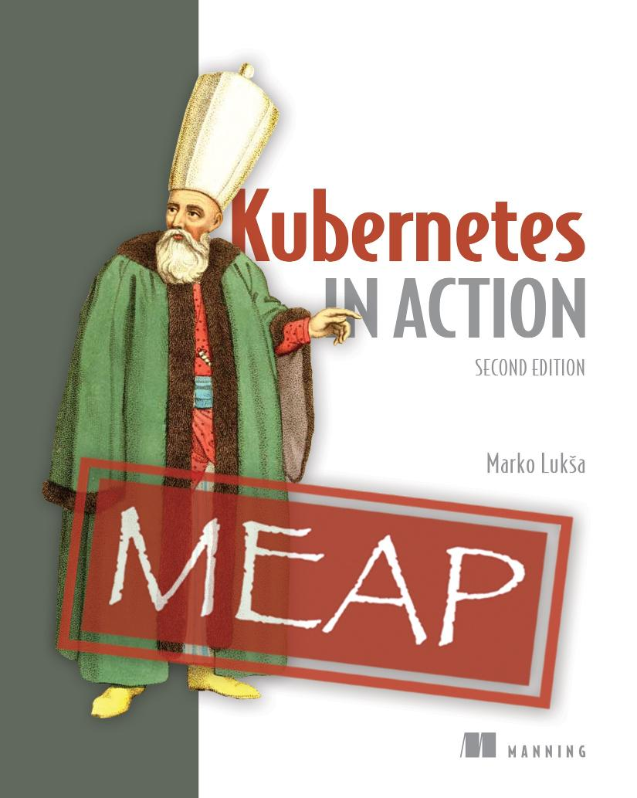

---

# Kubernetes in Action, Ấn bản thứ hai MEAP V15

1. Bản quyền 2023 Manning Publications
2. Chào mừng
3. 1 Giới thiệu Kubernetes
4. [2 Tìm hiểu về container](02-tim-hieu-ve-container.md)
5. [3 Triển khai ứng dụng đầu tiên của bạn](03-trien-khai-ung-dung-dau-tien-cua-ban.md)
6. [4 Giới thiệu các đối tượng API của Kubernetes](04-gioi-thieu-cac-doi-tuong-api-cua-kubernetes.md)
7. [5 Chạy các workload trong Pod](05-chay-cac-workload-trong-pod.md)
8. [6 Quản lý vòng đời của Pod](06-quan-ly-vong-doi-cua-pod.md)
9. [7 Gắn kết các volume lưu trữ vào Pod](07-gan-ket-cac-volume-luu-tru-vao-pod.md)
10. [8 Lưu trữ dữ liệu trong PersistentVolume](08-luu-tru-du-lieu-trong-persistentvolume.md)
11. [9 Cấu hình ứng dụng qua ConfigMap, Secret và Downward API](09-cau-hinh-ung-dung-qua-configmap-secret-va-downward-api.md)
12. [10 Tổ chức các đối tượng bằng Namespace và Label](10-to-chuc-cac-doi-tuong-bang-namespace-va-label.md)
13. [11 Cung cấp quyền truy cập Pod qua Service](11-cung-cap-quyen-truy-cap-pod-qua-service.md)
14. [12 Công khai Dịch vụ ra Ngoài bằng Ingress](12-cong-khai-dich-vu-ra-ngoai-bang-ingress.md)
15. [13 Nhân bản Pod bằng ReplicaSet](13-nhan-ban-pod-bang-replicaset.md)
16. [14 Quản lý Pod bằng Deployment](14-quan-ly-pod-bang-deployment.md)
17. [15 Triển khai các workload có trạng thái bằng StatefulSet](15-trien-khai-cac-workload-co-trang-thai-bang-statefulset.md)
18. [16 Triển khai các tác nhân node và daemon bằng DaemonSet](16-trien-khai-cac-tac-nhan-node-va-daemon-bang-daemonset.md)
19. [17 Chạy các khối công việc hữu hạn bằng Job và CronJob](17-chay-cac-khoi-cong-viec-huu-han-bang-job-va-cronjob.md)

---

Phiên bản MEAP

Chương trình Tiếp cận Sớm của Manning

Kubernetes in Action

Ấn bản thứ hai

Phiên bản 15

## Bản quyền 2023 Manning Publications

©Manning Publications Co. Chúng tôi luôn hoan nghênh mọi ý kiến đóng góp của độc giả về bất kỳ nội dung nào trong bản thảo này - ngoại trừ lỗi đánh máy và các sai sót đơn giản khác.

Những lỗi nhỏ đó sẽ được các biên tập viên và người hiệu đính xử lý triệt để trong quá trình sản xuất sách.

<https://livebook.manning.com/book/kubernetes-in-action-second-edition/discussion>

Để biết thêm thông tin về cuốn sách này cũng như các ấn phẩm khác của Manning, vui lòng truy cập

<https://manning.com>

## Chào mừng

Cảm ơn bạn đã mua phiên bản MEAP của cuốn sách *Kubernetes in Action, Ấn bản thứ hai*.

Trong khuôn khổ công việc của tôi tại Red Hat, tôi bắt đầu sử dụng Kubernetes từ năm 2014, thậm chí trước cả khi phiên bản 1.0 được phát hành. Đó thực sự là một khoảng thời gian vô cùng thú vị. Khi ấy, không nhiều người hoạt động trong ngành công nghiệp phần mềm biết đến Kubernetes, và một cộng đồng thực thụ vẫn chưa hề tồn tại. Hầu như không có bài viết chia sẻ nào trên blog, tài liệu hướng dẫn thì vẫn còn rất sơ sài, và bản thân Kubernetes lúc bấy giờ cũng còn đầy rẫy lỗi. Xâu chuỗi tất cả những điều đó lại, bạn có thể hình dung việc làm việc với Kubernetes khó khăn đến nhường nào.

Vào năm 2015, tôi được nhà xuất bản Manning ngỏ lời viết ấn bản đầu tiên cho cuốn sách này. Cuốn sách vốn dĩ dự kiến chỉ dày 300 trang đã phình to lên hơn 600 trang ắp đầy thông tin. Quá trình viết sách đã thôi thúc tôi phải nghiên cứu sâu cả những mảng của Kubernetes mà bình thường tôi sẽ không mảy may đào sâu. Tôi đã dồn phần lớn những gì mình đúc kết được vào cuốn sách này. Dựa trên những đánh giá và phản hồi nhận được, độc giả thực sự yêu thích một cuốn sách chi tiết như vậy.

Kế hoạch cho ấn bản thứ hai này là bổ sung thêm nhiều thông tin hơn nữa, đồng thời tái cấu trúc lại một số nội dung hiện có. Các bài tập thực hành trong sách sẽ dẫn dắt bạn đi từ việc triển khai một ứng dụng đơn giản — ban đầu chỉ sử dụng các tính năng cơ bản của Kubernetes — cho đến một ứng dụng hoàn chỉnh, tích hợp dần các tính năng nâng cao khi chúng được giới thiệu qua từng chương.

Cuốn sách được chia làm năm phần. Ở phần đầu tiên, sau khi giới thiệu về Kubernetes và container, bạn sẽ triển khai ứng dụng theo cách đơn giản nhất. Trong phần thứ hai, bạn sẽ tìm hiểu các khái niệm cốt lõi dùng để mô tả và triển khai ứng dụng. Tiếp sau đó, chúng ta sẽ cùng khám phá cơ chế hoạt động bên trong của các thành phần cấu thành nên Kubernetes. Điều này sẽ tạo một nền tảng vững chắc để bạn bước sang phần khó khăn nhất: cách quản trị Kubernetes trong môi trường production thực tế. Ở phần cuối cùng, bạn sẽ được tìm hiểu về các thực hành tốt nhất (best practices) và cách mở rộng Kubernetes.

Tôi hy vọng các bạn sẽ thích ấn bản thứ hai này hơn cả ấn bản đầu tiên, và nếu đây là lần đầu tiên bạn đọc cuốn sách này, những phản hồi của bạn lại càng trở nên vô cùng quý giá. Nếu có bất kỳ phần nào trong sách khiến bạn cảm thấy khó hiểu, xin vui lòng gửi câu hỏi, nhận xét hoặc đề xuất của mình lên diễn đàn liveBook.

Cảm ơn bạn đã đồng hành và giúp tôi hoàn thiện cuốn sách này một cách tốt nhất có thể.

—Marko Lukša

##### Nội dung trong cuốn sách này

- Bản quyền 2023 Manning Publications
- Chào mừng
- Tóm tắt nội dung
- 1 Giới thiệu về Kubernetes
- [2 Tìm hiểu về container](02-tim-hieu-ve-container.md)
- [3 Triển khai ứng dụng đầu tiên của bạn](03-trien-khai-ung-dung-dau-tien-cua-ban.md)
- [4 Giới thiệu các đối tượng API của Kubernetes](04-gioi-thieu-cac-doi-tuong-api-cua-kubernetes.md)
- [5 Chạy các workload trong Pod](05-chay-cac-workload-trong-pod.md)
- [6 Quản lý vòng đời của Pod](06-quan-ly-vong-doi-cua-pod.md)
- [7 Gắn kết các volume lưu trữ vào Pod](07-gan-ket-cac-volume-luu-tru-vao-pod.md)
- [8 Lưu trữ dữ liệu trong PersistentVolume](08-luu-tru-du-lieu-trong-persistentvolume.md)
- [9 Cấu hình ứng dụng qua ConfigMap, Secret và Downward API](09-cau-hinh-ung-dung-qua-configmap-secret-va-downward-api.md)
- [10 Tổ chức các đối tượng bằng Namespace và Label](10-to-chuc-cac-doi-tuong-bang-namespace-va-label.md)
- [11 Cung cấp quyền truy cập Pod qua Service](11-cung-cap-quyen-truy-cap-pod-qua-service.md)
- [12 Công khai Dịch vụ ra Ngoài bằng Ingress](12-cong-khai-dich-vu-ra-ngoai-bang-ingress.md)
- [13 Nhân bản Pod bằng ReplicaSet](13-nhan-ban-pod-bang-replicaset.md)
- [14 Quản lý Pod bằng Deployment](14-quan-ly-pod-bang-deployment.md)
- [15 Triển khai các workload có trạng thái bằng StatefulSet](15-trien-khai-cac-workload-co-trang-thai-bang-statefulset.md)
- [16 Triển khai các tác nhân node và daemon bằng DaemonSet](16-trien-khai-cac-tac-nhan-node-va-daemon-bang-daemonset.md)
- [17 Chạy các khối công việc hữu hạn bằng Job và CronJob](17-chay-cac-khoi-cong-viec-huu-han-bang-job-va-cronjob.md)

---

[Mục lục](README.md) · [Chương 2 →](02-tim-hieu-ve-container.md)
