# 2 Tìm hiểu về container

### Nội dung chính của chương này

- Hiểu rõ bản chất của container
- Sự khác biệt giữa container và máy ảo
- Tạo, chạy và chia sẻ container image bằng Docker
- Các tính năng của Linux kernel giúp hiện thực hóa container

Kubernetes chủ yếu quản lý các ứng dụng chạy trong container — vì vậy, trước khi bắt đầu khám phá Kubernetes, bạn cần trang bị cho mình một sự hiểu biết thấu đáo về container. Chương này sẽ giải thích những kiến thức cơ bản về Linux container mà một người dùng Kubernetes điển hình cần phải nắm vững.

## 2.1 Giới thiệu về container

Trong Chương 1, bạn đã biết việc các microservice khác nhau cùng hoạt động trên một hệ điều hành có thể đòi hỏi các phiên bản thư viện liên kết động (dynamic library) khác nhau — thậm chí xung đột nhau — hoặc có những yêu cầu khác biệt về môi trường.

Khi hệ thống chỉ gồm một số ít ứng dụng, việc cấp phát riêng một máy ảo (virtual machine - VM) cho từng ứng dụng và chạy chúng trên các hệ điều hành độc lập là điều hoàn toàn khả thi. Tuy nhiên, khi các microservice ngày càng được chia nhỏ và số lượng của chúng tăng lên chóng mặt, bạn sẽ không thể kham nổi chi phí cấp phát VM riêng cho từng dịch vụ nếu muốn tối ưu hóa chi phí phần cứng và tránh lãng phí tài nguyên.

Đây không chỉ đơn thuần là câu chuyện lãng phí tài nguyên phần cứng. Mỗi máy ảo thường đòi hỏi phải được cấu hình và quản lý một cách riêng biệt; điều này đồng nghĩa với việc vận hành số lượng lớn VM sẽ kéo theo nhu cầu nhân sự tăng cao, đồng thời đòi hỏi một hệ thống tự động hóa tốt hơn và thường phức tạp hơn nhiều. Sự chuyển dịch sang kiến trúc microservice — nơi hệ thống bao gồm hàng trăm thực thể ứng dụng được triển khai — đã đặt ra yêu cầu cấp thiết về một giải pháp thay thế cho máy ảo. Và container chính là giải pháp thay thế đó.

### 2.1.1 So sánh container với máy ảo

Thay vì sử dụng máy ảo để cô lập môi trường cho từng microservice (hay các tiến trình phần mềm nói chung), hầu hết các đội ngũ phát triển và vận hành hiện nay đều ưu tiên sử dụng container. Chúng cho phép bạn chạy nhiều dịch vụ trên cùng một máy chủ vật lý mà vẫn đảm bảo chúng được cô lập hoàn toàn với nhau. Ý tưởng này tương tự như máy ảo, nhưng với mức hao phí tài nguyên (overhead) thấp hơn rất nhiều.

Khác với máy ảo — vốn chạy một hệ điều hành riêng biệt với hàng loạt tiến trình hệ thống đi kèm — một tiến trình chạy trong container sẽ thực thi trực tiếp ngay trên hệ điều hành của máy chủ hiện tại. Nhờ chỉ có duy nhất một hệ điều hành, hệ thống sẽ không có các tiến trình hệ thống bị trùng lặp. Mặc dù tất cả các tiến trình ứng dụng đều chạy trên cùng một hệ điều hành, môi trường của chúng vẫn được cô lập, dù mức độ cô lập này không thể triệt để bằng việc chạy trên các VM riêng biệt. Đối với tiến trình bên trong container, sự cô lập này khiến nó có cảm giác như thể không có bất kỳ tiến trình nào khác đang tồn tại trên máy tính. Bạn sẽ tìm hiểu cơ chế hoạt động của điều này trong các phần tiếp theo, nhưng trước hết, hãy cùng đi sâu phân tích sự khác biệt giữa container và máy ảo.

#### So sánh hao phí tài nguyên của container và máy ảo

So với máy ảo, container nhẹ hơn rất nhiều vì chúng không đòi hỏi một vùng tài nguyên riêng biệt hay bất kỳ tiến trình bổ sung nào ở cấp độ hệ điều hành. Trong khi mỗi máy ảo thường chạy một tập hợp các tiến trình hệ thống riêng — đòi hỏi thêm tài nguyên tính toán ngoài phần tài nguyên mà chính ứng dụng của người dùng tiêu thụ — thì container không có gì khác ngoài một tiến trình được cô lập chạy trên hệ điều hành máy chủ sẵn có, và chỉ tiêu tốn đúng lượng tài nguyên mà bản thân ứng dụng cần. Chúng hầu như không gây ra bất kỳ hao phí tài nguyên đáng kể nào.

Hình 2.1 minh họa hai máy chủ vật lý (bare metal), một máy chạy hai máy ảo và máy còn lại chạy các container. Máy chạy container có không gian cho các container bổ sung vì nó chỉ chạy duy nhất một hệ điều hành, trong khi máy đầu tiên phải chạy tới ba hệ điều hành — một hệ điều hành máy chủ (host OS) và hai hệ điều hành khách (guest OS).

##### Hình 2.1 Sử dụng máy ảo để cô lập các nhóm ứng dụng so với việc cô lập từng ứng dụng riêng lẻ bằng container

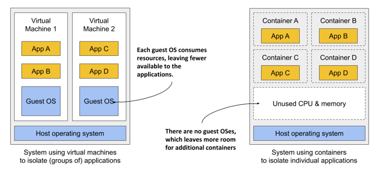

Do hao phí tài nguyên của máy ảo lớn, bạn thường phải gộp nhiều ứng dụng vào chung một VM. Bạn khó lòng đủ khả năng phân bổ hẳn một VM riêng cho từng ứng dụng. Nhưng container thì không hề gây ra hao phí này, nghĩa là bạn hoàn toàn có thể tạo một container riêng biệt cho từng ứng dụng. Trên thực tế, bạn không bao giờ nên chạy nhiều ứng dụng trong cùng một container, vì điều đó sẽ khiến việc quản lý các tiến trình bên trong trở nên phức tạp hơn rất nhiều. Hơn nữa, mọi phần mềm xử lý container hiện nay, bao gồm cả chính Kubernetes, đều được thiết kế dựa trên tiền đề là chỉ có một ứng dụng duy nhất chạy trong một container. Tuy nhiên, như bạn sẽ được tìm hiểu trong chương tới, Kubernetes cung cấp một giải pháp giúp bạn chạy các ứng dụng có liên quan cùng nhau, nhưng vẫn giữ chúng trong các container độc lập.

#### So sánh thời gian khởi động của container và máy ảo

Bên cạnh việc giảm thiểu hao phí tài nguyên khi vận hành, container còn giúp khởi động ứng dụng nhanh hơn, bởi hệ thống chỉ cần khởi chạy chính tiến trình của ứng dụng đó. Không cần phải khởi động bất kỳ tiến trình hệ thống bổ sung nào trước, như cách chúng ta vẫn làm khi boot một máy ảo mới.

#### So sánh mức độ cô lập của container và máy ảo

Chắc hẳn bạn sẽ đồng ý rằng container vượt trội hơn hẳn về mặt tối ưu hóa tài nguyên, song chúng cũng có một nhược điểm. Khi bạn chạy ứng dụng trong máy ảo, mỗi VM sẽ vận hành một hệ điều hành và một kernel (nhân) riêng. Nằm bên dưới các VM này là hypervisor [^1] (và có thể kèm theo một hệ điều hành bổ sung), có nhiệm vụ chia nhỏ các tài nguyên phần cứng vật lý thành các tập hợp tài nguyên ảo để hệ điều hành trên từng VM sử dụng. Như Hình 2.2 minh họa, các ứng dụng chạy trong các VM này sẽ thực hiện các lời gọi hệ thống (*sys-calls*) đến kernel của hệ điều hành khách (guest OS) trong VM. Sau đó, các chỉ thị máy mà kernel thực thi trên CPU ảo sẽ được chuyển tiếp đến CPU vật lý của máy chủ thông qua hypervisor.

##### Hình 2.2 Cách ứng dụng khai thác phần cứng khi chạy trong máy ảo so với khi chạy trong container

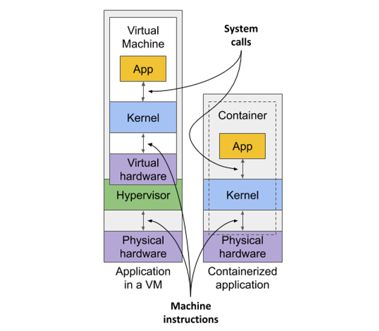

##### Lưu ý

Có hai loại hypervisor tồn tại. Hypervisor Loại 1 (Type 1) không yêu cầu hệ điều hành máy chủ (host OS) để hoạt động, trong khi loại 2 (Type 2) thì có.

Ngược lại, tất cả các container đều thực hiện các lời gọi hệ thống trực tiếp lên một kernel duy nhất đang chạy trên hệ điều hành máy chủ. Kernel duy nhất này là thành phần độc nhất thực thi các chỉ thị trên CPU của máy chủ. CPU không cần phải xử lý bất kỳ cơ chế ảo hóa nào như đối với máy ảo.

Hãy quan sát hình dưới đây để thấy sự khác biệt giữa việc chạy ba ứng dụng trực tiếp trên máy chủ vật lý (bare metal), chạy chúng trong hai máy ảo độc lập, hoặc chạy chúng trong ba container riêng biệt.

##### Hình 2.3 Sự khác biệt giữa việc chạy ứng dụng trên máy chủ vật lý, trong máy ảo và trong container

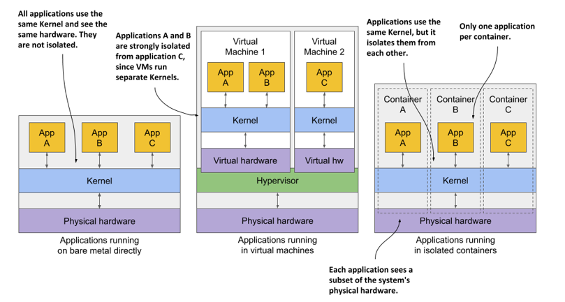

Trong trường hợp thứ nhất, cả ba ứng dụng đều dùng chung một kernel và hoàn toàn không được cô lập. Ở trường hợp thứ hai, ứng dụng A và B chạy chung một VM và dùng chung kernel, trong khi ứng dụng C được cô lập hoàn toàn với hai ứng dụng còn lại vì sở hữu một kernel riêng; nó chỉ chia sẻ chung phần cứng với hai ứng dụng đầu.

Trường hợp thứ ba minh họa cùng ba ứng dụng đó nhưng chạy trong các container. Dù tất cả đều dùng chung một kernel, chúng vẫn được cô lập với nhau và hoàn toàn không hề biết đến sự tồn tại của các ứng dụng còn lại. Sự cô lập này do chính kernel đảm nhiệm. Mỗi ứng dụng chỉ nhìn thấy một phần của phần cứng vật lý và tự xem mình là tiến trình duy nhất đang chạy trên hệ điều hành, dù thực tế tất cả đều đang chạy trên cùng một hệ điều hành.

#### Hiểu rõ các ảnh hưởng về mặt an ninh từ sự cô lập của container

Ưu thế lớn nhất của việc sử dụng máy ảo so với container là mức độ cô lập triệt để mà chúng mang lại, bởi mỗi máy ảo sở hữu một Linux kernel riêng, trong khi các container lại dùng chung một kernel. Điều này rõ ràng có thể tiềm ẩn những rủi ro về mặt an ninh bảo mật. Nếu kernel xuất hiện lỗ hổng, một ứng dụng trong một container có thể lợi dụng nó để đọc vùng nhớ của các ứng dụng ở các container khác. Nếu các ứng dụng chạy trên các VM khác nhau và do đó chỉ chia sẻ phần cứng, khả năng xảy ra các cuộc tấn công kiểu này sẽ thấp hơn rất nhiều. Tất nhiên, sự cô lập tuyệt đối chỉ có thể đạt được bằng cách chạy ứng dụng trên các máy vật lý tách biệt.

Bên cạnh đó, các container chia sẻ chung không gian bộ nhớ, trong khi mỗi máy ảo lại sử dụng một phân vùng bộ nhớ riêng biệt của mình. Do đó, nếu bạn không giới hạn dung lượng bộ nhớ mà một container được phép sử dụng, nó có thể khiến các container khác bị cạn kiệt bộ nhớ hoặc khiến dữ liệu của chúng bị ghi tạm thời (swap) ra đĩa cứng.

##### Lưu ý

Điều này không thể xảy ra trong Kubernetes, vì nó bắt buộc phải tắt tính năng swap trên tất cả các node.

#### Hiểu rõ cơ chế nền tảng tạo nên container và máy ảo

Trong khi máy ảo được hiện thực hóa nhờ sự hỗ trợ ảo hóa từ CPU và phần mềm ảo hóa trên máy chủ, thì container lại được hiện thực hóa bởi chính Linux kernel. Bạn sẽ được tìm hiểu sâu hơn về các công nghệ container ở phần sau khi có cơ hội tự tay thực hành. Để làm được điều đó, bạn cần cài đặt Docker, vì vậy hãy cùng tìm hiểu xem Docker đóng vai trò gì trong câu chuyện container này.

### 2.1.2 Giới thiệu về nền tảng container Docker

Mặc dù các công nghệ container đã tồn tại từ lâu, chúng chỉ thực sự trở nên phổ biến rộng rãi nhờ sự trỗi dậy của Docker. Docker là hệ thống container đầu tiên giúp chúng có khả năng di chuyển linh hoạt (portable) giữa các máy tính khác nhau một cách dễ dàng. Nó đã đơn giản hóa quy trình đóng gói ứng dụng cùng toàn bộ thư viện và các tệp phụ thuộc (dependencies) — thậm chí là cả hệ thống tệp của hệ điều hành — thành một gói ứng dụng di động, đơn giản để có thể triển khai trên bất kỳ máy tính nào có cài đặt Docker.

#### Giới thiệu về container, image và registry

Docker là một nền tảng dùng để đóng gói, phân phối và vận hành ứng dụng. Như đã đề cập trước đó, nó cho phép bạn đóng gói ứng dụng cùng với toàn bộ môi trường hoạt động của nó. Đó có thể chỉ là một vài thư viện liên kết động mà ứng dụng yêu cầu, hoặc toàn bộ các tệp thường đi kèm với một hệ điều hành. Docker cho phép bạn phân phối gói này thông qua một kho lưu trữ công cộng đến bất kỳ máy tính nào khác có hỗ trợ Docker.

##### Hình 2.4 Ba khái niệm cốt lõi của Docker bao gồm image, registry và container

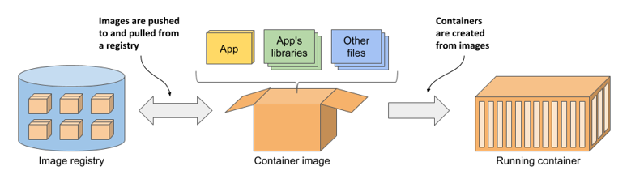

Hình 2.4 mô tả ba khái niệm chính của Docker xuất hiện trong quy trình tôi vừa nêu. Dưới đây là định nghĩa cụ thể cho từng khái niệm:

- *Images* (Ảnh)—Một container image là thực thể chứa ứng dụng và môi trường của nó được đóng gói lại, tương tự như một tệp zip hay tarball. Nó chứa toàn bộ hệ thống tệp mà ứng dụng sẽ sử dụng cùng với các siêu dữ liệu (metadata) bổ sung, chẳng hạn như đường dẫn đến tệp thực thi sẽ chạy khi image được kích hoạt, các cổng (port) mà ứng dụng lắng nghe, và các thông tin khác về chính image đó.
- *Registries* (Kho chứa)—Một registry là một kho lưu trữ các container image, cho phép chia sẻ và trao đổi các image giữa những người dùng và các máy tính khác nhau. Sau khi xây dựng (build) xong image, bạn có thể chạy nó ngay trên máy tính của mình, hoặc *push* (tải lên) image đó lên một registry và sau đó *pull* (tải về) về một máy tính khác. Một số registry được mở công khai (public), cho phép bất kỳ ai cũng có thể tải về, trong khi số khác là riêng tư (private) và chỉ những cá nhân, tổ chức hoặc máy tính có thông tin xác thực phù hợp mới truy cập được.
- *Containers* (Bộ chứa)—Một container được khởi tạo từ một container image. Một container đang chạy thực chất là một tiến trình bình thường hoạt động trên hệ điều hành máy chủ, nhưng môi trường của nó được cô lập hoàn toàn với máy chủ cũng như với môi trường của các tiến trình khác. Hệ thống tệp của container bắt nguồn từ chính container image, song các hệ thống tệp bổ sung cũng có thể được gắn (mount) thêm vào bên trong container. Container thường bị giới hạn tài nguyên, nghĩa là nó chỉ có thể truy cập và sử dụng một lượng tài nguyên nhất định (như CPU và bộ nhớ) đã được phân bổ trước đó.

#### Xây dựng, phân phối và vận hành một container image

Để hiểu rõ mối quan hệ tương hỗ giữa container, image và registry, hãy cùng xem xét cách xây dựng một container image, phân phối nó qua một registry và tạo ra một container đang hoạt động từ image đó. Ba quy trình này được minh họa chi tiết từ Hình 2.5 đến Hình 2.7.

##### Hình 2.5 Xây dựng một container image

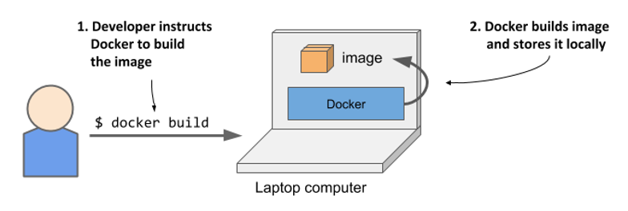

Như mô tả ở Hình 2.5, trước hết nhà phát triển sẽ xây dựng một image, sau đó đẩy (push) nó lên một registry như trong Hình 2.6. Lúc này, bất kỳ ai có quyền truy cập vào registry đều có thể sử dụng image đó.

##### Hình 2.6 Tải một container image lên registry

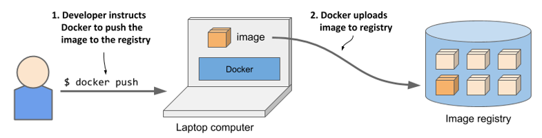

Như hình tiếp theo minh họa, một người khác giờ đây có thể tải (pull) image đó về bất kỳ máy tính nào có cài đặt Docker và khởi chạy nó. Docker sẽ tạo ra một container cô lập dựa trên image và gọi tệp thực thi được chỉ định sẵn trong đó.

##### Hình 2.7 Chạy container trên một máy tính khác

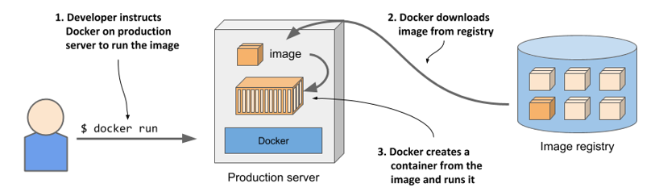

Việc vận hành ứng dụng trên bất kỳ máy tính nào trở nên khả thi là nhờ môi trường của ứng dụng đã được tách biệt hoàn toàn khỏi môi trường của máy chủ.

#### Hiểu về môi trường mà ứng dụng nhìn thấy

Khi bạn chạy một ứng dụng trong container, nó sẽ chỉ nhìn thấy chính xác nội dung hệ thống tệp mà bạn đã đóng gói bên trong container image, cùng với bất kỳ hệ thống tệp bổ sung nào mà bạn gắn vào container. Ứng dụng sẽ tiếp cận những tệp tin y hệt nhau dù nó đang chạy trên máy tính cá nhân của bạn hay trên một máy chủ production thực tế, ngay cả khi máy chủ đó sử dụng một bản phân phối Linux (distribution) hoàn toàn khác biệt. Ứng dụng thường không có quyền truy cập vào các tệp tin trên hệ điều hành máy chủ, vì vậy việc máy chủ có một tập hợp các thư viện đã cài đặt khác biệt hoàn toàn so với máy tính phát triển của bạn cũng không gây ảnh hưởng gì.

Ví dụ, nếu bạn đóng gói ứng dụng của mình cùng các tệp tin của toàn bộ hệ điều hành Red Hat Enterprise Linux (RHEL) rồi chạy nó, ứng dụng sẽ luôn nghĩ rằng nó đang hoạt động bên trong môi trường RHEL, bất kể bạn đang chạy nó trên máy tính dùng hệ điều hành Fedora hay Debian. Bản phân phối Linux được cài đặt trên máy chủ lúc này không còn quan trọng nữa. Điều nhất có thể gây ảnh hưởng là phiên bản kernel và các module kernel được nạp vào. Ở phần sau, tôi sẽ giải thích lý do tại sao.

Điều này tương tự như việc tạo ra một VM image bằng cách khởi tạo một VM mới, cài đặt hệ điều hành cùng ứng dụng của bạn vào đó, rồi phân phối toàn bộ VM image để người khác chạy trên các máy chủ khác nhau. Docker cũng mang lại hiệu quả tương tự, nhưng thay vì sử dụng máy ảo để cô lập ứng dụng, nó sử dụng các công nghệ Linux container để đạt được mức độ cô lập (gần như) tương đương.

#### Hiểu về các lớp (layer) của image

Khác với các máy ảo image vốn là một khối dữ liệu khổng lồ chứa toàn bộ hệ thống tệp cần thiết cho hệ điều hành cài đặt trong VM, container image lại được cấu thành từ nhiều lớp (layer) và thường có dung lượng nhỏ hơn rất nhiều. Các lớp này có thể được chia sẻ và tái sử dụng trên nhiều image khác nhau. Điều này đồng nghĩa với việc bạn chỉ cần tải về một vài lớp nhất định của một image mới nếu các lớp còn lại đã có sẵn trên máy chủ (do được tải về trước đó như một phần của một image khác dùng chung các lớp này).

Cơ chế phân lớp này giúp việc phân phối image trở nên vô cùng hiệu quả, đồng thời giảm thiểu đáng kể dung lượng lưu trữ cần thiết cho các image. Docker chỉ lưu trữ mỗi lớp duy nhất một lần. Như bạn có thể thấy trong hình dưới đây, hai container được tạo từ hai image khác nhau nhưng có chung các lớp sẽ dùng chung các tệp tin này.

##### Hình 2.8 Các container có thể chia sẻ các lớp image với nhau

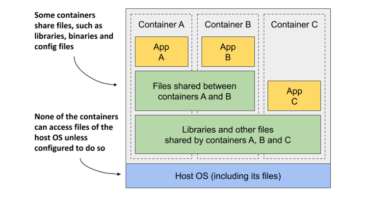

Hình minh họa cho thấy container A và B chia sẻ chung một lớp image, nghĩa là ứng dụng A và B cùng đọc một số tệp tin giống nhau. Ngoài ra, chúng cũng chia sẻ lớp nền tảng bên dưới với container C. Tuy nhiên, nếu cả ba container đều có quyền truy cập vào cùng một tệp tin, làm thế nào chúng có thể cô lập hoàn toàn với nhau? Liệu những thay đổi mà ứng dụng A thực hiện đối với một tệp nằm trong lớp dùng chung có hiển thị với ứng dụng B hay không? Câu trả lời là không. Đây là lý do tại sao.

Các hệ thống tệp được cô lập nhờ vào cơ chế sao chép khi ghi — Copy-on-Write (CoW). Hệ thống tệp của một container bao gồm các lớp chỉ đọc (read-only) lấy từ container image và một lớp đọc/ghi (read/write) bổ sung được xếp chồng lên trên cùng. Khi một ứng dụng chạy trong container A thay đổi một tệp nằm trong một lớp chỉ đọc, toàn bộ tệp đó sẽ được sao chép vào lớp đọc/ghi của riêng container đó và nội dung tệp sẽ được sửa đổi tại đây. Vì mỗi container sở hữu một lớp ghi riêng biệt, những thay đổi đối với các tệp dùng chung sẽ không hiển thị ở bất kỳ container nào khác.

Khi bạn xóa một tệp, nó chỉ được đánh dấu là đã xóa trong lớp đọc/ghi, nhưng thực tế tệp đó vẫn tồn tại trong một hoặc nhiều lớp bên dưới. Hệ quả là việc xóa tệp không bao giờ làm giảm dung lượng thực tế của image.

##### CẢNH BÁO

Ngay cả những thao tác tưởng chừng như vô hại như thay đổi quyền truy cập (permissions) hoặc quyền sở hữu (ownership) của một tệp cũng sẽ dẫn đến việc một bản sao mới của toàn bộ tệp đó được tạo ra trong lớp đọc/ghi. Nếu bạn thực hiện thao tác này trên một tệp dung lượng lớn hoặc trên quá nhiều tệp, kích thước của image có thể phình to một cách đáng kể.

#### Hiểu về những giới hạn di động của container image

Về mặt lý thuyết, một container image dựa trên Docker có thể chạy trên bất kỳ máy tính Linux nào có cài đặt Docker, nhưng vẫn tồn tại một lưu ý nhỏ, đó là các container không có kernel riêng. Nếu một ứng dụng chạy trong container đòi hỏi một phiên bản kernel cụ thể, nó có thể không hoạt động được trên mọi máy tính. Nếu một máy tính đang chạy một phiên bản Linux kernel khác hoặc không nạp các module kernel cần thiết, ứng dụng sẽ không thể hoạt động. Kịch bản này được minh họa trong hình dưới đây.

##### Hình 2.9 Nếu container yêu cầu các tính năng hoặc module kernel cụ thể, nó có thể không chạy được ở mọi nơi

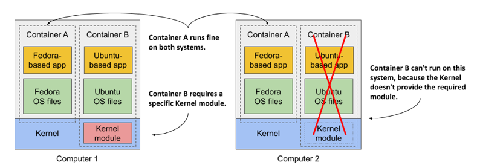

Container B yêu cầu một module kernel cụ thể để hoạt động bình thường. Module này đã được nạp sẵn trong kernel của máy tính thứ nhất, nhưng lại chưa được nạp ở máy tính thứ hai. Bạn vẫn có thể khởi chạy container image trên máy tính thứ hai, nhưng nó sẽ bị lỗi ngay khi cố gắng sử dụng module còn thiếu này.

Và vấn đề không chỉ dừng lại ở kernel hay các module đi kèm. Có một điều hiển nhiên là một ứng dụng đóng gói dưới dạng container được xây dựng cho một kiến trúc phần cứng cụ thể sẽ chỉ có thể chạy trên các máy tính có cùng kiến trúc đó. Bạn không thể đưa một ứng dụng được biên dịch cho kiến trúc CPU x86 vào một container rồi kỳ vọng nó sẽ chạy mượt mà trên một máy tính chạy chip ARM, chỉ vì máy tính đó có cài đặt Docker. Đối với trường hợp này, bạn sẽ cần đến một máy ảo để giả lập kiến trúc x86.

### 2.1.3 Cài đặt Docker và chạy container Hello World

Đến đây, bạn chắc hẳn đã có một sự hiểu biết cơ bản về container, vì vậy hãy cùng sử dụng Docker để vận hành thử một container. Bạn sẽ tiến hành cài đặt Docker và chạy thử một container Hello World.

#### Cài đặt Docker

Lý tưởng nhất là bạn nên cài đặt Docker trực tiếp trên một máy tính Linux, nhờ đó bạn sẽ không phải đối mặt với sự phức tạp phát sinh khi chạy container bên trong một máy ảo hoạt động trên hệ điều hành máy chủ. Tuy nhiên, nếu bạn đang sử dụng macOS hoặc Windows và chưa biết cách thiết lập một máy ảo Linux, ứng dụng Docker Desktop sẽ tự động thiết lập giúp bạn. Công cụ giao diện dòng lệnh Docker (Docker CLI) mà bạn dùng để chạy các container sẽ được cài đặt trực tiếp trên hệ điều hành máy chủ của bạn, nhưng Docker daemon [^2] sẽ hoạt động bên trong máy ảo, tương tự như tất cả các container mà nó tạo ra.

Nền tảng Docker bao gồm rất nhiều thành phần khác nhau, nhưng bạn chỉ cần cài đặt Docker Engine là đã có thể chạy các container. Nếu bạn đang sử dụng macOS hoặc Windows, hãy cài đặt Docker Desktop. Để biết thêm chi tiết, vui lòng làm theo hướng dẫn tại <http://docs.docker.com/install>.

##### Lưu ý

Docker Desktop cho Windows hỗ trợ chạy cả container của Windows lẫn Linux. Hãy chắc chắn rằng bạn đã cấu hình công cụ này để sử dụng Linux container, vì tất cả các ví dụ thực hành trong cuốn sách này đều mặc định chạy trên môi trường Linux container.

#### Chạy container Hello World

Sau khi hoàn tất quá trình cài đặt, bạn sẽ sử dụng công cụ Docker CLI để thực thi các lệnh Docker. Hãy cùng thử tải về (pull) và vận hành một image có sẵn từ Docker Hub — đây là một registry công cộng chứa các container image được cấu hình sẵn cho rất nhiều gói phần mềm nổi tiếng. Một trong số đó là image `busybox`, thứ mà bạn sẽ sử dụng để thực thi một lệnh in văn bản đơn giản `echo "Hello world"` trong container đầu tiên của mình.

Nếu bạn chưa quen thuộc với `busybox`, thì đây là một tệp thực thi duy nhất tích hợp rất nhiều công cụ dòng lệnh tiêu chuẩn của UNIX, chẳng hạn như `echo`, `ls`, `gzip`, v.v. Thay vì dùng image `busybox`, bạn cũng có thể sử dụng bất kỳ container image của một hệ điều hành hoàn chỉnh nào khác như Fedora, Ubuntu, hoặc bất kỳ image nào chứa tệp thực thi `echo`.

Một khi đã cài đặt Docker, bạn không cần phải tải xuống hay cài đặt thêm bất kỳ thứ gì khác để chạy được image `busybox`. Bạn có thể thực hiện mọi thao tác chỉ với một lệnh `docker run` duy nhất bằng cách chỉ định rõ image cần tải xuống cùng với lệnh muốn thực thi bên trong nó. Để chạy container Hello World, cú pháp lệnh và kết quả trả về như sau:

```bash
$ docker run busybox echo "Hello World"
Unable to find image 'busybox:latest' locally    #A Không tìm thấy image cục bộ, Docker tiến hành tải về
latest: Pulling from library/busybox    #A Tải xuống từ thư viện/busybox
7c9d20b9b6cd: Pull complete    #A Quá trình tải hoàn tất
Digest: sha256:fe301db49df08c384001ed752dff6d52b4...    #A Mã băm kiểm tra (Digest)
Status: Downloaded newer image for busybox:latest    #A Đã tải xuống bản mới hơn
Hello World    #B Kết quả in ra màn hình
```

Với một câu lệnh duy nhất này, bạn đã chỉ dẫn cho Docker biết cần tạo container từ image nào và chạy lệnh nào bên trong container đó. Điều này trông có vẻ không quá ấn tượng, nhưng hãy nhớ rằng toàn bộ "ứng dụng" đã được tải về và thực thi chỉ bằng một lệnh duy nhất mà bạn không cần phải tự tay cài đặt ứng dụng hay bất kỳ thành phần phụ thuộc nào của nó.

Trong ví dụ này, ứng dụng chỉ là một tệp thực thi đơn lẻ, nhưng nó hoàn toàn có thể là một hệ thống ứng dụng phức tạp với hàng tá thư viện và các tệp tin đi kèm. Toàn bộ quy trình thiết lập và vận hành ứng dụng khi đó cũng sẽ diễn ra hoàn toàn tương tự. Một điều không hiển hiện rõ ràng trước mắt là ứng dụng đã chạy bên trong một container và hoàn toàn cô lập với các tiến trình khác trên máy tính. Bạn sẽ thấy rõ tính đúng đắn của điều này trong các bài tập thực hành tiếp theo của chương.

#### Hiểu về những gì diễn ra khi bạn chạy một container

Hình 2.10 minh họa chính xác những gì xảy ra khi bạn thực thi lệnh `docker run`.

##### Hình 2.10 Chạy lệnh echo "Hello world" trong một container được tạo từ busybox container image

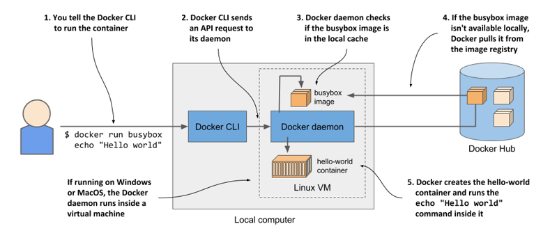

Công cụ Docker CLI gửi chỉ thị yêu cầu khởi chạy container đến Docker daemon. Tiếp theo, daemon sẽ kiểm tra xem image `busybox` đã có sẵn trong bộ nhớ đệm image cục bộ (local image cache) hay chưa. Nếu chưa có, daemon sẽ tiến hành tải nó về từ registry Docker Hub.

Sau khi tải thành công image về máy tính của bạn, Docker daemon tạo ra một container từ image đó và thực thi lệnh `echo` bên trong nó. Câu lệnh này in chuỗi ký tự ra luồng đầu ra tiêu chuẩn (standard output), sau đó tiến trình sẽ kết thúc và container dừng lại.

Nếu máy tính cục bộ của bạn chạy hệ điều hành Linux, cả công cụ Docker CLI và daemon đều hoạt động trên chính hệ điều hành này. Nếu máy tính chạy macOS hoặc Windows, daemon cùng các container sẽ hoạt động bên trong máy ảo Linux.

#### Chạy các image khác

Quy trình chạy các container image có sẵn khác cũng hoàn toàn tương tự như việc chạy image `busybox`. Trên thực tế, thao tác này thường đơn giản hơn nhiều, bởi bạn thường không cần chỉ định cụ thể lệnh nào cần thực thi như câu lệnh `echo` trong ví dụ trước. Lệnh cần chạy thường đã được định nghĩa sẵn ngay bên trong chính image đó, tuy nhiên bạn vẫn có thể ghi đè (override) nó khi khởi chạy.

Ví dụ, nếu muốn chạy hệ thống lưu trữ dữ liệu Redis, bạn có thể tìm tên image của nó trên trang <http://hub.docker.com> hoặc các registry công cộng khác. Với Redis, một trong số các image phổ biến tên là `redis:alpine`, bạn có thể chạy nó như sau:

```shell
$ docker run redis:alpine
```

Để dừng và thoát khỏi container, hãy nhấn tổ hợp phím Control-C.

##### Lưu ý

Nếu bạn muốn chạy một image từ một registry khác, bạn phải chỉ định rõ tên registry đó đi kèm với tên image. Chẳng hạn, để chạy một image từ registry Quay.io (một registry công cộng phổ biến khác), bạn hãy thực thi lệnh sau: `docker run quay.io/some/image`.

#### Tìm hiểu về tag của image

Nếu đã từng tìm kiếm image Redis trên Docker Hub, bạn sẽ nhận thấy có rất nhiều *tag* của image mà bạn có thể lựa chọn. Đối với Redis, chúng ta có các tag như `latest`, `buster`, `alpine`, hay cả những tag chi tiết như `5.0.7-buster`, `5.0.7-alpine`, v.v.

Docker cho phép bạn lưu trữ nhiều phiên bản hoặc biến thể khác nhau của cùng một image dưới một tên gọi chung. Mỗi biến thể sẽ được định danh bằng một tag duy nhất. Nếu bạn gọi đến một image mà không chỉ định rõ tag, Docker sẽ mặc định hiểu rằng bạn đang muốn sử dụng tag đặc biệt: `latest`. Khi tải lên một phiên bản mới của image, tác giả thường gắn nhãn cho nó bằng cả số phiên bản thực tế lẫn tag `latest`. Khi muốn chạy phiên bản mới nhất của một image, bạn hãy sử dụng tag `latest` thay vì phải chỉ định một số phiên bản cụ thể.

##### Lưu ý

Lệnh `docker run` chỉ tiến hành tải image về nếu nó chưa từng được tải về máy trước đó. Việc sử dụng tag `latest` đảm bảo bạn sẽ nhận được phiên bản mới nhất trong lần đầu tiên khởi chạy image. Kể từ thời điểm đó trở đi, hệ thống sẽ sử dụng bản image đã được lưu trong bộ nhớ đệm cục bộ.

Ngay cả với một phiên bản duy nhất, một image thường cũng có nhiều biến thể khác nhau. Ví dụ với Redis, tôi đã đề cập đến hai biến thể `5.0.7-buster` và `5.0.7-alpine`. Cả hai đều chứa cùng một phiên bản Redis, nhưng khác biệt ở image nền tảng (base image) dùng để xây dựng nên chúng.

Biến thể `5.0.7-buster` được xây dựng trên nền hệ điều hành Debian phiên bản "Buster", trong khi `5.0.7-alpine` lại dựa trên base image Alpine Linux — một bản phân phối siêu tối giản chỉ nặng khoảng 5MB, vốn chỉ chứa một số ít các công cụ nhị phân thiết yếu so với một bản phân phối Linux thông thường.

Để chạy một phiên bản hoặc một biến thể cụ thể của image, hãy ghi rõ tag đi kèm trong tên image. Ví dụ, để chạy biến thể `5.0.7-alpine`, bạn thực thi lệnh sau:

```shell
$ docker run redis:5.0.7-alpine
```

Ngày nay, bạn hầu như có thể tìm thấy container image cho mọi ứng dụng phổ biến. Bạn hoàn toàn có thể sử dụng Docker để vận hành những image đó chỉ với một dòng lệnh `docker run` cực kỳ đơn giản.

### 2.1.4 Giới thiệu về Sáng kiến Open Container Initiative và các giải pháp thay thế Docker

Docker là nền tảng container đầu tiên giúp container hóa trở thành một xu hướng chủ đạo. Tôi hy vọng đã giúp bạn hiểu rõ rằng bản thân Docker không phải là thành phần trực tiếp thực hiện việc cô lập các tiến trình. Sự cô lập thực tế của các container diễn ra ở cấp độ Linux kernel nhờ vào các cơ chế mà nó cung cấp. Docker chỉ là công cụ khai thác các cơ chế này để giúp việc vận hành container trở nên vô cùng đơn giản. Nhưng nó chắc chắn không phải là công cụ duy nhất.

#### Giới thiệu về Open Container Initiative (OCI)

Sau sự thành công của Docker, Sáng kiến Open Container (Open Container Initiative - OCI) đã ra đời nhằm thiết lập các tiêu chuẩn chung cho toàn ngành công nghiệp xoay quanh định dạng và runtime (môi trường thực thi) của container. Docker là một thành viên của sáng kiến này, cùng với nhiều công nghệ container runtime khác và hàng loạt tổ chức quan tâm đến lĩnh vực này.

Các thành viên OCI đã cùng xây dựng nên *Tài liệu Đặc tả Định dạng Image OCI (OCI Image Format Specification)* — quy định định dạng chuẩn cho các container image, và *Tài liệu Đặc tả Container Runtime OCI (OCI Runtime Specification)* — định nghĩa giao diện tiêu chuẩn cho các container runtime, nhằm mục đích chuẩn hóa quy trình tạo, cấu hình và thực thi các container.

#### Giới thiệu về Giao diện Container Runtime Interface (CRI) và giải pháp CRI-O

Cuốn sách này tập trung vào việc sử dụng Docker làm container runtime cho Kubernetes, vì ban đầu đây là giải pháp duy nhất được Kubernetes hỗ trợ và cho đến nay nó vẫn là giải pháp được sử dụng rộng rãi nhất. Tuy nhiên, Kubernetes giờ đây đã hỗ trợ rất nhiều container runtime khác nhau thông qua giao diện Container Runtime Interface (CRI).

Một phiên bản triển khai tiêu biểu của CRI là CRI-O — một giải pháp thay thế gọn nhẹ cho Docker, cho phép bạn tận dụng bất kỳ container runtime nào tuân thủ tiêu chuẩn OCI để hoạt động cùng Kubernetes. Các ví dụ về runtime tuân thủ OCI bao gồm *rkt* (phát âm là Rocket), *runC*, và *Kata Containers*.

## 2.2 Triển khai Kiada — Ứng dụng mẫu của Kubernetes in Action

Giờ đây, khi đã thiết lập xong môi trường Docker hoạt động ổn định, bạn có thể bắt tay vào xây dựng một ứng dụng phức tạp hơn. Bạn sẽ xây dựng một ứng dụng phát triển trên kiến trúc microservices mang tên *Kiada* — viết tắt của cụm từ "Kubernetes in Action Demo Application".

Trong chương này, bạn sẽ sử dụng Docker để vận hành ứng dụng. Trong chương kế tiếp cũng như các chương còn lại của cuốn sách, chúng ta sẽ chạy ứng dụng này trực tiếp trên Kubernetes. Xuyên suốt hành trình khám phá cuốn sách này, bạn sẽ mở rộng dần ứng dụng qua từng bước, đồng thời tìm hiểu các tính năng riêng lẻ của Kubernetes giúp giải quyết những bài toán điển hình khi vận hành ứng dụng thực tế.

### 2.2.1 Giới thiệu về Bộ ứng dụng Kiada Suite

Ứng dụng mẫu Kiada là một ứng dụng chạy trên nền tảng web, có chức năng hiển thị các câu trích dẫn hay trích từ chính cuốn sách này, đưa ra các câu hỏi trắc nghiệm liên quan đến Kubernetes để giúp bạn tự đánh giá tiến trình học tập của mình, đồng thời cung cấp danh sách các liên kết dẫn đến các trang web bên ngoài liên quan đến Kubernetes hoặc cuốn sách này. Nó cũng in ra thông tin về container đã tiếp nhận và xử lý yêu cầu gửi đến từ trình duyệt. Bạn sẽ sớm hiểu được tại sao thông tin này lại vô cùng quan trọng.

#### Giao diện và cơ chế vận hành của ứng dụng

Hình ảnh chụp màn hình của ứng dụng web được trình bày trong hình dưới đây.

##### Hình 2.11 Ảnh chụp màn hình ứng dụng mẫu Kubernetes in Action (Kiada)

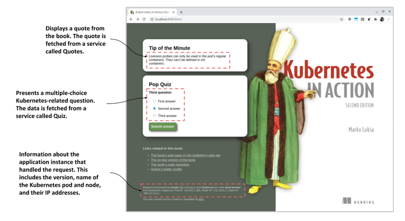

Kiến trúc của ứng dụng Kiada được minh họa ở hình tiếp theo. Nội dung mã nguồn HTML được phân phối bởi một ứng dụng web chạy trên máy chủ Node.js. Sau đó, mã nguồn JavaScript chạy phía client (trình duyệt) sẽ truy xuất câu trích dẫn và câu hỏi trắc nghiệm từ hai dịch vụ RESTful là Quote và Quiz. Ứng dụng Node.js cùng các dịch vụ đi kèm này sẽ cấu thành nên bộ ứng dụng hoàn chỉnh mang tên *Kiada Suite*.

##### Hình 2.12 Kiến trúc và cơ chế vận hành của Kiada Suite

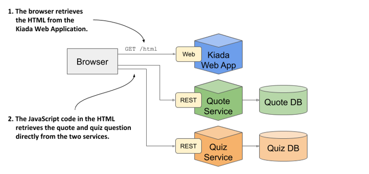

Trình duyệt web sẽ kết nối trực tiếp đến ba dịch vụ khác nhau. Nếu đã quen thuộc với kiến trúc microservices, bạn có thể thắc mắc tại sao hệ thống này lại không hề có một API gateway nào. Thiết kế này là hoàn toàn có chủ đích, nhằm giúp tôi dễ dàng mô phỏng các vấn đề và giải pháp đi kèm khi triển khai nhiều dịch vụ khác nhau trên Kubernetes (những dịch vụ có thể không nhất thiết phải nằm chung sau một API gateway). Tuy nhiên, Chương 11 cũng sẽ hướng dẫn chi tiết cách thức tích hợp các API gateway thuần Kubernetes (Kubernetes-native) vào hệ thống.

#### Giao diện và cơ chế vận hành của phiên bản văn bản thuần (plain-text)

Bạn sẽ dành phần lớn thời gian để tương tác với Kubernetes thông qua giao diện dòng lệnh (terminal). Do đó, chắc hẳn bạn sẽ không muốn phải liên tục chuyển đổi qua lại giữa terminal và trình duyệt web khi thực hiện các bài tập. Vì lý do này, ứng dụng đã được thiết kế để hỗ trợ thêm chế độ hiển thị văn bản thuần (plain-text).

Chế độ văn bản thuần cho phép bạn tương tác trực tiếp với ứng dụng từ terminal bằng các công cụ như `curl`. Khi đó, phản hồi từ ứng dụng sẽ có dạng như sau:

```
==== MẸO NHỎ MỖI PHÚT
Liveness probe chỉ có thể được sử dụng trong các container thông thường của pod. 
Chúng không thể được định nghĩa bên trong các init container.
 
==== TRẮC NGHIỆM NHANH
Câu hỏi thứ ba
0) Câu trả lời thứ nhất
1) Câu trả lời thứ hai
2) Câu trả lời thứ ba
 
Hãy gửi câu trả lời của bạn tới đường dẫn /question/0/answers/<chỉ_mục_của_câu_trả_lời> bằng phương thức POST.
 
==== THÔNG TIN YÊU CẦU
Yêu cầu được xử lý bởi Kubia 1.0 chạy trong pod "kiada-ssl" trên node "kind-worker".
Pod hostname: kiada-ssl; IP của Pod: 10.244.2.188; IP của Node: 172.18.0.2; IP của Client: 127.0.0.1
```

Bạn có thể truy cập phiên bản HTML thông qua URI `/html`, trong khi phiên bản văn bản thuần nằm ở đường dẫn `/text`. Nếu client gửi yêu cầu đến đường dẫn gốc `/`, ứng dụng sẽ tự động phân tích header `Accept` của yêu cầu đó để dự đoán xem đối tượng gửi yêu cầu là một trình duyệt web có giao diện đồ họa (khi đó nó sẽ chuyển hướng truy cập đến `/html`) hay là một công cụ dòng lệnh như `curl` (khi đó nó sẽ phản hồi bằng văn bản thuần).

Trong chế độ hoạt động này, chính ứng dụng Node.js sẽ là thành phần đứng ra gọi dịch vụ Quote và Quiz, như được minh họa trong hình tiếp theo.

##### Hình 2.13 Cơ chế vận hành khi client yêu cầu phiên bản văn bản thuần

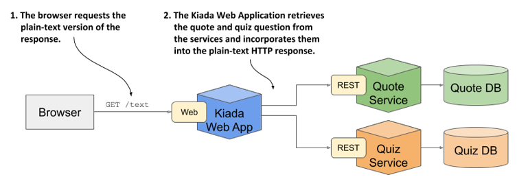

Đứng từ góc độ mạng (networking), mô hình vận hành này khác biệt rất lớn so với mô hình trước đó. Trong trường hợp này, các dịch vụ Quote và Quiz được gọi trực tiếp từ bên trong cụm (cluster), trong khi ở mô hình trước, chúng được gọi trực tiếp từ trình duyệt của người dùng. Để hỗ trợ cả hai chế độ hoạt động này, các dịch vụ bắt buộc phải được công khai ở cả phạm vi nội bộ lẫn môi trường bên ngoài.

##### Lưu ý

Phiên bản sơ khai đầu tiên của ứng dụng sẽ chưa kết nối tới bất kỳ dịch vụ nào. Bạn sẽ tự tay xây dựng và tích hợp các dịch vụ này trong các chương sau.

### 2.2.2 Xây dựng ứng dụng

Sau khi đã nắm được bức tranh tổng quan, giờ là lúc chúng ta bắt tay vào xây dựng ứng dụng. Thay vì nhảy ngay vào một phiên bản đồ sộ hoàn chỉnh, chúng ta sẽ đi từng bước chậm rãi và hoàn thiện ứng dụng một cách tuần tự theo tiến trình của cuốn sách.

---

#### Giới thiệu phiên bản đầu tiên của ứng dụng

Trong chương này, phiên bản đầu tiên của ứng dụng mà bạn khởi chạy tuy đã hỗ trợ cả chế độ hiển thị HTML và văn bản thuần (plain-text), nhưng sẽ chưa hiển thị danh ngôn (quote) hay câu đố nhanh (pop quiz). Thay vào đó, ứng dụng chỉ đơn thuần hiển thị thông tin về chính nó và yêu cầu truy cập (request). Thông tin này bao gồm phiên bản ứng dụng, hostname mạng của máy chủ đã xử lý yêu cầu từ client, và địa chỉ IP của client. Dưới đây là phản hồi dạng văn bản thuần mà ứng dụng sẽ gửi về:

Kiada version 0.1. Request processed by "\<server-hostname>". Client IP: \<client-IP>

Mã nguồn của ứng dụng đã có sẵn trong kho lưu trữ mã nguồn của cuốn sách trên GitHub. Bạn có thể tìm thấy mã nguồn của phiên bản đầu tiên này trong thư mục `Chapter02/kiada-0.1`. Mã nguồn JavaScript nằm trong tệp `app.js`, còn các tài nguyên HTML và tài nguyên khác nằm trong thư mục con `html`. Bản mẫu (template) cho phản hồi HTML nằm ở tệp `index.html`, còn phản hồi dạng văn bản thuần nằm ở tệp `index.txt`.

Lúc này, bạn có thể tải về và cài đặt Node.js trên máy cục bộ để chạy thử ứng dụng trực tiếp trên máy tính của mình, nhưng việc đó là không cần thiết. Vì đã cài đặt Docker, phương án dễ dàng hơn là đóng gói ứng dụng thành một container image và chạy nó bên trong một container. Bằng cách này, bạn không cần phải cài đặt thêm bất kỳ công cụ nào, và có thể chạy chính image đó trên bất kỳ máy chủ nào hỗ trợ Docker mà không cần cấu hình thêm gì ở đó cả.

#### Tạo Dockerfile cho container image

Để đóng gói ứng dụng vào một image, bạn cần một tệp có tên là `Dockerfile`. Tệp này chứa danh sách các chỉ thị mà Docker sẽ thực hiện tuần tự khi xây dựng (build) image. Đoạn mã dưới đây hiển thị nội dung của tệp này, bạn có thể tìm thấy tại thư mục Chapter02/kiada-0.1/Dockerfile.

##### Mã nguồn 2.1 Một Dockerfile tối giản để xây dựng container image cho ứng dụng

```dockerfile
FROM node:16    #A
COPY app.js /app.js    #B
COPY html/ /html    #C
ENTRYPOINT ["node", "app.js"]    #D
```

Dòng `FROM` định nghĩa container image mà bạn sẽ dùng làm điểm khởi đầu (image nền mà bạn sẽ xây dựng đè lên). Image nền được sử dụng trong đoạn mã trên là image container `node` với thẻ (tag) `12`. Ở dòng thứ hai, tệp `app.js` được sao chép từ thư mục cục bộ của bạn vào thư mục gốc của image. Tương tự, dòng thứ ba sao chép thư mục `html` vào image. Cuối cùng, dòng cuối cùng chỉ định lệnh mà Docker sẽ thực thi khi bạn khởi chạy container. Trong đoạn mã trên, lệnh đó là `node` `app.js`.

##### Lựa chọn image nền (base image)

Có thể bạn sẽ thắc mắc tại sao lại sử dụng chính xác image này làm nền. Vì ứng dụng của bạn chạy trên nền Node.js, bạn cần image của mình chứa tệp thực thi `node` để có thể chạy được ứng dụng. Bạn có thể dùng bất kỳ image nào chứa sẵn tệp thực thi này, hoặc thậm chí sử dụng một image nền của một bản phân phối Linux như `fedora` hay `ubuntu` rồi cài đặt Node.js vào container trong quá trình xây dựng image. Tuy nhiên, vì image `node` đã tích hợp sẵn mọi thứ cần thiết để chạy các ứng dụng Node.js, việc xây dựng image lại từ đầu là không cần thiết và tốn công sức. Mặc dù vậy, ở một số tổ chức, việc sử dụng một image nền cụ thể được phê duyệt sẵn rồi cài thêm phần mềm vào đó trong quá trình build lại là quy định bắt buộc.

#### Xây dựng container image

Để xây dựng image, bạn chỉ cần tệp `Dockerfile`, tệp `app.js` và các tệp trong thư mục `html`. Với lệnh sau đây, bạn sẽ tiến hành xây dựng image và gắn tag cho nó là `kiada:latest`:

```shell
$ docker build -t kiada:latest .
Sending build context to Docker daemon  3.072kB
Step 1/4 : FROM node:16    #A
12: Pulling from library/node
092586df9206: Pull complete    #B
ef599477fae0: Pull complete    #B
...     #B
89e674ac3af7: Pull complete    #B
08df71ec9bb0: Pull complete    #B
Digest: sha256:a919d679dd773a56acce15afa0f436055c9b9f20e1f28b4469a4bee69e0...
Status: Downloaded newer image for node:16
 ---> e498dabfee1c    #C
Step 2/4 : COPY app.js /app.js    #D
 ---> 28d67701d6d9    #D
Step 3/4 : COPY html/ /html    #E
 ---> 1d4de446f0f0    #E
Step 4/4 : ENTRYPOINT ["node", "app.js"]    #F
 ---> Running in a01d42eda116    #F
Removing intermediate container a01d42eda116    #F
 ---> b0ecc49d7a1d    #F
Successfully built b0ecc49d7a1d    #G
Successfully tagged kiada:latest    #G
```

Tùy chọn `-t` dùng để chỉ định tên và tag mong muốn cho image, và dấu chấm ở cuối dòng lệnh xác định rằng Dockerfile cùng các thành phần (artifact) cần thiết để xây dựng image đều nằm trong thư mục hiện tại. Đây được gọi là ngữ cảnh xây dựng (build context).

Khi quá trình build hoàn tất, image mới tạo sẽ xuất hiện trong kho lưu trữ image cục bộ trên máy tính của bạn. Bạn có thể kiểm tra bằng cách liệt kê các image cục bộ bằng lệnh sau:

```shell
$ docker images
REPOSITORY   TAG      IMAGE ID           CREATED             VIRTUAL SIZE
kiada        latest   b0ecc49d7a1d       1 minute ago        908 MB
...
```

#### Tìm hiểu cơ chế xây dựng image

Sơ đồ dưới đây minh họa những gì diễn ra trong suốt quá trình xây dựng image. Bạn yêu cầu Docker xây dựng một image có tên là `kiada` dựa trên nội dung của thư mục hiện tại. Docker sẽ đọc tệp `Dockerfile` trong thư mục đó và tiến hành build image dựa trên các chỉ thị có trong tệp.

##### Hình 2.14 Xây dựng một container image mới bằng Dockerfile

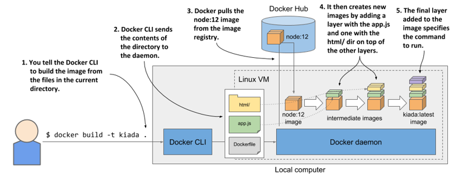

Bản thân quá trình xây dựng không do công cụ `docker` CLI thực hiện. Thay vào đó, toàn bộ nội dung của thư mục sẽ được tải lên Docker daemon và chính daemon này mới là bên xây dựng image. Như bạn đã biết, công cụ CLI và daemon không nhất thiết phải nằm trên cùng một máy tính. Nếu bạn sử dụng Docker trên một hệ điều hành không phải Linux như macOS hoặc Windows, client sẽ nằm ở hệ điều hành host của bạn, nhưng daemon lại chạy bên trong một máy ảo Linux (VM). Thậm chí, daemon này cũng có thể chạy trên một máy tính từ xa.

##### Mẹo

Không nên đưa các tệp không cần thiết vào thư mục xây dựng, vì chúng sẽ làm chậm quá trình build—đặc biệt là khi Docker daemon nằm trên một hệ thống từ xa.

Để xây dựng image, trước tiên Docker sẽ tải (pull) image nền (`node:16`) từ kho chứa public (trong trường hợp này là Docker Hub), trừ khi image đó đã được lưu sẵn ở máy cục bộ. Sau đó, nó tạo một container tạm thời từ image này và thực thi chỉ thị tiếp theo trong Dockerfile. Trạng thái cuối cùng của container này sẽ tạo ra một image mới với ID riêng của nó. Quá trình xây dựng tiếp tục bằng cách xử lý các chỉ thị còn lại trong Dockerfile. Mỗi chỉ thị như vậy lại tạo ra một image mới. Cuối cùng, image hoàn thiện sẽ được gắn tag mà bạn đã chỉ định qua flag `-t` trong lệnh `docker build`.

#### Tìm hiểu các tầng (layer) của image

Cách đây vài trang, bạn đã biết rằng các image được cấu thành từ nhiều tầng (layer). Người ta thường nghĩ rằng mỗi image chỉ gồm các tầng của image nền và duy nhất một tầng mới chồng lên trên cùng, nhưng thực tế không phải vậy. Khi xây dựng một image, một layer mới sẽ được tạo ra cho mỗi chỉ thị riêng biệt trong Dockerfile.

Trong quá trình xây dựng image `kiada`, sau khi tải xuống tất cả các layer của image nền, Docker sẽ tạo ra một layer mới và thêm tệp `app.js` vào đó. Tiếp theo, nó xếp thêm một layer nữa chứa các tệp từ thư mục `html`, và cuối cùng tạo ra layer trên cùng để chỉ định lệnh sẽ chạy khi container khởi động. Layer cuối cùng này sau đó được gắn tag là `kiada:latest`.

Bạn có thể xem các layer của một image cùng với kích thước của chúng bằng cách chạy lệnh `docker history`. Lệnh và kết quả đầu ra của nó được hiển thị dưới đây (lưu ý rằng các layer trên cùng sẽ được in ra trước):

```shell
$ docker history kiada:latest
IMAGE         CREATED     CREATED BY                            SIZE 
b0ecc49d7a1d  7 min ago   /bin/sh -c #(nop) ENTRYPOINT ["n...   0B    #A
1d4de446f0f0  7 min ago   /bin/sh -c #(nop) COPY dir:6ecee...   534kB    #A
28d67701d6d9  7 min ago   /bin/sh -c #(nop) COPY file:2ed5...   2.8kB    #A
e498dabfee1c  2 days ago  /bin/sh -c #(nop) CMD ["node"]        0B    #B
<missing>     2 days ago  /bin/sh -c #(nop) ENTRYPOINT ["d...   0B    #B
<missing>     2 days ago  /bin/sh -c #(nop) COPY file:2387...   116B    #B
<missing>     2 days ago  /bin/sh -c set -ex && for key in...   5.4MB    #B
<missing>     2 days ago  /bin/sh -c #(nop)  ENV YARN_VERS...   0B    #B
<missing>     2 days ago  /bin/sh -c ARCH= && dpkgArch="$(...   67MB    #B
<missing>     2 days ago  /bin/sh -c #(nop)  ENV NODE_VERS...   0B    #B
<missing>     3 weeks ago /bin/sh -c groupadd --gid 1000 n...   333kB    #B
<missing>     3 weeks ago /bin/sh -c set -ex;  apt-get upd...   562MB    #B
<missing>     3 weeks ago /bin/sh -c apt-get update && apt...   142MB    #B
<missing>     3 weeks ago /bin/sh -c set -ex;  if ! comman...   7.8MB    #B
<missing>     3 weeks ago /bin/sh -c apt-get update && apt...   23.2MB    #B
<missing>     3 weeks ago /bin/sh -c #(nop)  CMD ["bash"]       0B    #B
<missing>     3 weeks ago /bin/sh -c #(nop) ADD file:9788b...   101MB    #B
```

Hầu hết các layer bạn thấy đều bắt nguồn từ image `node:16` (chúng cũng bao gồm các layer của chính image nền của image đó). Ba layer trên cùng tương ứng với các chỉ thị `COPY` và `ENTRYPOINT` trong Dockerfile.

Như bạn có thể thấy ở cột `CREATED BY`, mỗi layer được tạo ra bằng cách thực thi một lệnh trong container. Ngoài việc thêm tệp bằng chỉ thị `COPY`, bạn cũng có thể sử dụng các chỉ thị khác trong Dockerfile. Ví dụ, chỉ thị `RUN` sẽ thực thi một lệnh bên trong container trong quá trình build. Trong danh sách trên, bạn sẽ tìm thấy một layer nơi lệnh `apt-get update` cùng một số lệnh `apt-get` bổ sung được thực thi. `apt-get` là một phần của trình quản lý gói của Ubuntu, dùng để cài đặt các gói phần mềm. Lệnh hiển thị trong danh sách sẽ cài đặt một số gói lên hệ thống tệp của image.

Để tìm hiểu về `RUN` và các chỉ thị khác mà bạn có thể sử dụng trong Dockerfile, hãy tham khảo tài liệu hướng dẫn Dockerfile tại <https://docs.docker.com/engine/reference/builder/>.

##### Mẹo

Mỗi chỉ thị sẽ tạo ra một layer mới. Như tôi đã đề cập trước đó, khi bạn xóa một tệp, nó chỉ được đánh dấu là đã xóa ở layer mới chứ không hề bị gỡ bỏ khỏi các layer bên dưới. Do đó, việc xóa tệp bằng một chỉ thị tiếp theo sẽ không làm giảm dung lượng của image. Nếu sử dụng chỉ thị `RUN`, hãy đảm bảo rằng lệnh được thực thi sẽ dọn dẹp sạch sẽ toàn bộ các tệp tạm thời do nó tạo ra trước khi kết thúc tiến trình.

### 2.2.3 Chạy container

Sau khi image đã được xây dựng và sẵn sàng, bạn có thể chạy container bằng lệnh sau:

```shell
$ docker run --name kiada-container -p 1234:8080 -d kiada
9d62e8a9c37e056a82bb1efad57789e947df58669f94adc2006c087a03c54e02
```

Lệnh này yêu cầu Docker chạy một container mới có tên là `kiada-container` từ image `kiada`. Container này được tách khỏi console (flag `-d`) và chạy ngầm (background). Cổng `1234` trên máy tính host sẽ được ánh xạ tới cổng `8080` trong container (chỉ định bởi tùy chọn `-p` `1234:8080`), nhờ đó bạn có thể truy cập ứng dụng tại địa chỉ <http://localhost:1234>.

Sơ đồ dưới đây sẽ giúp bạn hình dung cách các thành phần liên kết với nhau. Lưu ý rằng máy ảo Linux chỉ tồn tại nếu bạn sử dụng macOS hoặc Windows. Nếu bạn sử dụng trực tiếp hệ điều hành Linux, sẽ không có máy ảo nào cả và ô biểu thị cổng `1234` sẽ nằm ngay rìa ngoài của máy tính cục bộ.

##### Hình 2.15 Hình dung trực quan về container đang chạy của bạn

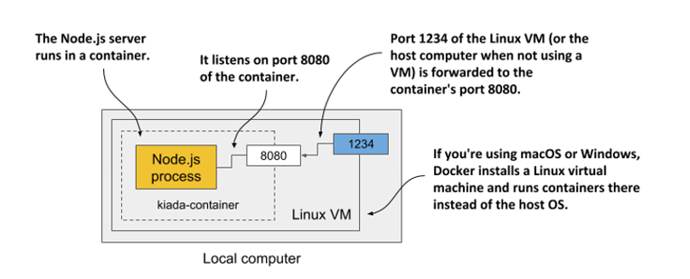

#### Truy cập ứng dụng của bạn

Bây giờ, hãy truy cập ứng dụng tại địa chỉ <http://localhost:1234> bằng công cụ `curl` hoặc trình duyệt web của bạn:

```shell
$ curl localhost:1234
Kiada version 0.1. Request processed by "44d76963e8e1". Client IP: ::ffff:172.17.0.1
```

##### LƯU Ý

Nếu Docker Daemon chạy trên một máy khác, bạn phải thay thế `localhost` bằng IP của máy đó. Bạn có thể tra cứu IP này trong biến môi trường `DOCKER_HOST`.

Nếu mọi việc diễn ra suôn sẻ, bạn sẽ thấy phản hồi do ứng dụng gửi về. Trong trường hợp của tôi, nó trả về `44d76963e8e1` làm hostname. Còn trên máy của bạn, bạn sẽ thấy một chuỗi ký tự thập lục phân khác. Đó chính là ID của container. Bạn cũng sẽ thấy ID này hiển thị khi liệt kê các container đang chạy ở bước tiếp theo.

#### Liệt kê tất cả các container đang chạy

Để liệt kê tất cả các container đang chạy trên máy tính của bạn, hãy thực thi lệnh sau. Kết quả đầu ra đã được căn chỉnh lại để dễ đọc hơn—hai dòng cuối của kết quả là phần tiếp nối của hai dòng đầu.

```shell
$ docker ps
CONTAINER ID    IMAGE           COMMAND          CREATED        ...
44d76963e8e1    kiada:latest    "node app.js"    6 minutes ago  ...

...  STATUS          PORTS                     NAMES
...  Up 6 minutes    0.0.0.0:1234->8080/tcp    kiada-container
```

Đối với mỗi container, Docker sẽ in ra ID, tên, image được sử dụng, và lệnh mà nó thực thi. Lệnh này cũng hiển thị thời điểm container được tạo, trạng thái hiện tại, và những cổng nào trên máy host được ánh xạ vào container.

#### Lấy thêm thông tin chi tiết về container

Lệnh `docker` `ps` chỉ hiển thị những thông tin cơ bản nhất của container. Để xem thông tin chi tiết hơn, bạn có thể sử dụng lệnh `docker` `inspect`:

```shell
$ docker inspect kiada-container
```

Docker sẽ trả về một tài liệu định dạng JSON rất dài chứa vô vàn thông tin về container, chẳng hạn như trạng thái hoạt động, cấu hình, thiết lập mạng và cả địa chỉ IP của nó.

#### Kiểm tra nhật ký hoạt động (log) của ứng dụng

Docker tự động ghi lại và lưu trữ mọi thứ mà ứng dụng ghi ra luồng đầu ra chuẩn (standard output) và luồng lỗi chuẩn (standard error). Đây thường là những nơi ứng dụng ghi lại log hoạt động của mình. Bạn có thể sử dụng lệnh `docker logs` để xem các nội dung này:

```shell
$ docker logs kiada-container
Kiada - Kubernetes in Action Demo Application

Kiada 0.1 starting...
Local hostname is 44d76963e8e1
Listening on port 8080
Received request for / from ::ffff:172.17.0.1
```

Bây giờ bạn đã nắm vững các lệnh cơ bản để thực thi và kiểm tra một ứng dụng bên trong container. Tiếp theo, chúng ta sẽ tìm hiểu cách phân phối nó.

### 2.2.4 Phân phối container image

Image bạn vừa xây dựng hiện chỉ có sẵn ở máy cục bộ. Để chạy nó trên các máy tính khác, trước tiên bạn phải đẩy (push) nó lên một registry lưu trữ image bên ngoài. Chúng ta sẽ đẩy nó lên registry công cộng Docker Hub để không cần phải tự thiết lập một registry riêng. Bạn cũng có thể sử dụng các registry khác, chẳng hạn như Quay.io (như đã đề cập trước đó) hoặc Google Container Registry.

Trước khi tiến hành push image, bạn phải gắn lại tag cho nó theo đúng quy chuẩn đặt tên image của Docker Hub. Tên image phải bao gồm ID Docker Hub của bạn, vốn được tạo khi bạn đăng ký tài khoản tại <http://hub.docker.com>. Tôi sẽ sử dụng ID của riêng mình (`luksa`) trong các ví dụ sau, vì vậy hãy nhớ thay thế nó bằng ID của bạn khi tự thực hành các lệnh này.

#### Gắn thêm tag cho image

Sau khi đã có ID, bạn đã sẵn sàng để thêm một tag mới cho image của mình. Tên hiện tại của nó là `kiada` và bây giờ bạn sẽ gắn thêm tag `yourid/kiada:0.1` (thay thế `yourid` bằng ID Docker Hub thực tế của bạn). Đây là lệnh tôi đã sử dụng:

```shell
$ docker tag kiada luksa/kiada:0.1
```

Chạy lại lệnh `docker images` để xác nhận rằng image của bạn giờ đây đã có hai tên gọi khác nhau:

```shell
$ docker images
REPOSITORY     TAG       IMAGE ID        CREATED              VIRTUAL SIZE
luksa/kiada    0.1       b0ecc49d7a1d    About an hour ago    908 MB
kiada          latest    b0ecc49d7a1d    About an hour ago    908 MB
node           12        e498dabfee1c    3 days ago           908 MB
...
```

Như bạn thấy, cả `kiada` và `luksa/kiada:0.1` đều trỏ chung đến một ID image duy nhất. Điều này có nghĩa là chúng không phải hai image riêng biệt, mà chỉ là một image duy nhất dưới hai tên gọi khác nhau mà thôi.

#### Đẩy (push) image lên Docker Hub

Trước khi có thể đẩy image lên Docker Hub, bạn phải đăng nhập bằng tài khoản người dùng của mình thông qua lệnh `docker` `login` như sau:

```shell
$ docker login -u yourid docker.io
```

Lệnh này sẽ yêu cầu bạn nhập mật khẩu Docker Hub. Sau khi đăng nhập thành công, hãy push image `yourid/kiada:0.1` lên Docker Hub bằng lệnh dưới đây:

```shell
$ docker push yourid/kiada:0.1
```

#### Chạy image trên các host khác

Khi quá trình push lên Docker Hub hoàn tất, image này sẽ ở chế độ công khai cho tất cả mọi người. Lúc này, bạn có thể chạy image trên bất kỳ máy chủ nào hỗ trợ Docker bằng cách thực thi lệnh sau:

```shell
$ docker run --name kiada-container -p 1234:8080 -d luksa/kiada:0.1
```

Nếu container chạy ổn định trên máy tính của bạn, nó cũng sẽ chạy tốt trên bất kỳ máy tính Linux nào khác, miễn là tệp thực thi Node.js không yêu cầu bất kỳ tính năng đặc biệt nào của nhân hệ điều hành (thực tế là không cần).

### 2.2.5 Dừng và xóa container

Nếu bạn đã chạy container trên một máy chủ khác, bây giờ bạn có thể tắt nó đi, vì chúng ta chỉ cần duy trì một container duy nhất trên máy tính cục bộ để phục vụ cho các bài thực hành tiếp theo.

#### Dừng container

Yêu cầu Docker dừng container bằng lệnh sau:

```shell
$ docker stop kiada-container
```

Lệnh này sẽ gửi một tín hiệu kết thúc (termination signal) đến tiến trình chính trong container để nó thực hiện quy trình tắt tuần tự một cách an toàn (gracefully). Nếu tiến trình không phản hồi tín hiệu này hoặc không tắt kịp thời, Docker sẽ cưỡng bức dừng (kill) nó. Khi tiến trình cấp cao nhất trong container dừng lại, không còn tiến trình nào khác chạy trong đó nữa, đồng nghĩa với việc container đã được dừng.

#### Xóa container

Container hiện không còn chạy nữa nhưng nó vẫn tồn tại trên hệ thống. Docker giữ lại nó đề phòng trường hợp bạn muốn khởi động lại nó sau này. Bạn có thể xem các container đã dừng bằng cách chạy lệnh `docker` `ps` `-a`. Tùy chọn `-a` sẽ hiển thị tất cả các container—bao gồm cả những container đang chạy và đã dừng. Để thực hành, bạn có thể khởi động lại container bằng lệnh `docker start kiada-container`.

Bạn có thể xóa container trên máy chủ kia một cách an toàn vì không còn cần đến nó nữa. Để xóa, hãy chạy lệnh `docker` `rm` dưới đây:

```shell
$ docker rm kiada-container
```

Lệnh này sẽ xóa bỏ hoàn toàn container. Mọi nội dung bên trong nó sẽ bị gỡ sạch và nó không thể khởi động lại được nữa. Tuy nhiên, image của nó vẫn được lưu lại. Nếu bạn muốn tạo lại container này, hệ thống sẽ không cần phải tải lại image từ đầu. Nếu muốn xóa cả image này, hãy sử dụng lệnh `docker rmi`:

```shell
$ docker rmi kiada:latest
```

Ngoài ra, bạn có thể dọn dẹp toàn bộ các image không sử dụng bằng lệnh `docker image prune`.

## 2.3 Tìm hiểu sâu về container

Bạn nên duy trì container chạy trên máy tính cục bộ của mình để sử dụng cho các bài tập tiếp theo, nơi chúng ta sẽ nghiên cứu cách container thực hiện cô lập tiến trình mà không cần sử dụng máy ảo. Có được khả năng này là nhờ một số tính năng cốt lõi của nhân (kernel) Linux, và đã đến lúc chúng ta cùng đi sâu tìm hiểu chúng.

### 2.3.1 Sử dụng Namespace để tùy biến môi trường của tiến trình

Tính năng đầu tiên mang tên *Linux Namespaces* đảm bảo rằng mỗi tiến trình có một góc nhìn riêng biệt về hệ thống. Điều này có nghĩa là một tiến trình chạy trong container sẽ chỉ nhìn thấy một số tệp, tiến trình và giao diện mạng nhất định trên hệ thống, đồng thời nhận diện một hostname hệ thống khác, giống như thể nó đang chạy trên một máy ảo riêng biệt vậy.

Ban đầu, toàn bộ tài nguyên hệ thống có sẵn trong hệ điều hành Linux, chẳng hạn như hệ thống tệp, ID tiến trình, ID người dùng, giao diện mạng và nhiều thứ khác, đều nằm chung trong một ngăn chứa duy nhất mà mọi tiến trình đều có thể nhìn thấy và sử dụng. Tuy nhiên, Kernel cho phép bạn tạo ra các ngăn chứa bổ sung gọi là các namespace và di chuyển tài nguyên vào đó để quản lý theo các nhóm nhỏ hơn. Nhờ vậy, bạn có thể thiết lập sao cho mỗi nhóm tài nguyên chỉ hiển thị đối với một tiến trình hoặc một nhóm tiến trình nhất định. Khi tạo một tiến trình mới, bạn có thể chỉ định namespace mà nó sẽ sử dụng. Tiến trình đó sẽ chỉ nhìn thấy các tài nguyên nằm trong namespace được chỉ định và hoàn toàn không thấy gì trong các namespace khác.

#### Giới thiệu các loại namespace hiện có

Nói một cách cụ thể hơn, hệ thống không chỉ có một loại namespace duy nhất. Trên thực tế có nhiều loại khác nhau—mỗi loại tương ứng với một loại tài nguyên hệ thống. Do đó, một tiến trình không chỉ sử dụng một namespace mà là một tổ hợp các namespace cho từng loại tài nguyên.

Hiện tại có các loại namespace sau:

- **Mount namespace (mnt):** Cô lập các điểm gắn kết (hệ thống tệp).
- **Process ID namespace (pid):** Cô lập các ID tiến trình.
- **Network namespace (net):** Cô lập các thiết bị mạng, ngăn xếp mạng, cổng mạng, v.v.
- **Inter-process communication namespace (ipc):** Cô lập việc giao tiếp giữa các tiến trình (bao gồm cô lập hàng đợi thông điệp, bộ nhớ chia sẻ, v.v.).
- **UNIX Time-sharing System namespace (UTS):** Cô lập hostname hệ thống và tên miền NIS (Network Information Service).
- **User ID namespace (user):** Cô lập ID người dùng và ID nhóm.
- **Time namespace:** Cho phép mỗi container có một độ lệch giờ riêng đối với đồng hồ hệ thống.
- **Cgroup namespace:** Cô lập thư mục gốc của các Control Group. Bạn sẽ tìm hiểu về cgroups ở phần sau của chương này.

#### Sử dụng network namespace để cấp một tập hợp giao diện mạng riêng biệt cho tiến trình

Network namespace mà tiến trình đang chạy sẽ quyết định những giao diện mạng nào tiến trình đó có thể nhìn thấy. Mỗi giao diện mạng chỉ thuộc về duy nhất một namespace nhưng có thể dịch chuyển từ namespace này sang namespace khác. Nếu mỗi container sử dụng một network namespace riêng, mỗi container sẽ chỉ nhìn thấy tập hợp các giao diện mạng của chính nó.

Hãy quan sát sơ đồ dưới đây để có cái nhìn tổng quan hơn về cách network namespace được sử dụng để thiết lập một container. Giả sử bạn muốn chạy một tiến trình được đóng gói trong container và cung cấp cho nó một bộ giao diện mạng chuyên dụng mà chỉ tiến trình đó mới có quyền sử dụng.

##### Hình 2.16 Network namespace giới hạn các giao diện mạng mà tiến trình có thể sử dụng

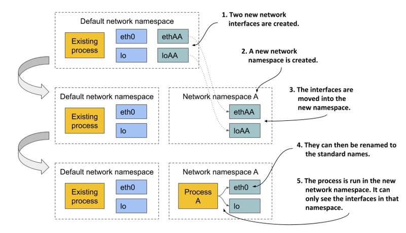

Ban đầu, chỉ có duy nhất một network namespace mặc định tồn tại. Tiếp theo, bạn tạo ra hai giao diện mạng mới cho container cùng một network namespace mới. Các giao diện này sau đó có thể được di chuyển từ namespace mặc định sang namespace mới vừa tạo. Khi đã nằm trong namespace mới, chúng có thể được đổi tên tùy ý, vì tên giao diện chỉ cần là duy nhất trong phạm vi của từng namespace. Cuối cùng, tiến trình có thể được khởi chạy trong network namespace này, cho phép nó chỉ nhìn thấy hai giao diện mạng đã được thiết lập riêng cho nó.

Nếu chỉ nhìn vào các giao diện mạng hiện có, tiến trình sẽ không thể phân biệt được liệu nó đang nằm trong một container, một máy ảo, hay một hệ điều hành đang chạy trực tiếp trên phần cứng vật lý.

#### Sử dụng UTS namespace để cấp hostname riêng biệt cho tiến trình

Một ví dụ khác về việc tạo cảm giác tiến trình đang chạy trên một máy chủ độc lập là sử dụng UTS namespace. Namespace này quyết định hostname và tên miền mà tiến trình chạy bên trong nhìn thấy. Bằng cách gán hai UTS namespace khác nhau cho hai tiến trình khác nhau, bạn có thể khiến chúng nhìn thấy các hostname hệ thống hoàn toàn khác biệt. Đối với hai tiến trình này, chúng sẽ tự hiểu là mình đang chạy trên hai máy tính độc lập.

#### Hiểu cách các namespace cô lập tiến trình với nhau

Bằng cách tạo ra một phiên bản namespace riêng biệt cho tất cả các loại namespace hiện có và gán nó cho một tiến trình, bạn có thể khiến tiến trình đó tin rằng nó đang vận hành trong một hệ điều hành độc lập của riêng mình. Lý do cốt lõi là mỗi tiến trình giờ đây sở hữu một môi trường hoàn toàn riêng biệt. Một tiến trình chỉ có thể nhìn thấy và sử dụng tài nguyên trong các namespace của chính nó, tuyệt đối không thể can thiệp vào các namespace khác. Ngược lại, các tiến trình khác cũng không thể chạm vào tài nguyên của nó. Đây chính là cách container cô lập môi trường hoạt động của các tiến trình chạy bên trong chúng.

#### Chia sẻ namespace giữa nhiều tiến trình

Trong chương kế tiếp, bạn sẽ biết rằng không phải lúc nào chúng ta cũng muốn cô lập hoàn toàn các container với nhau. Các container có liên quan mật thiết đôi khi cần chia sẻ một số tài nguyên nhất định. Sơ đồ dưới đây minh họa một ví dụ về hai tiến trình dùng chung giao diện mạng, hostname và tên miền hệ thống, nhưng lại sở hữu hệ thống tệp riêng biệt.

##### Hình 2.17 Mỗi tiến trình được liên kết với nhiều loại namespace, một vài trong số đó có thể được chia sẻ.

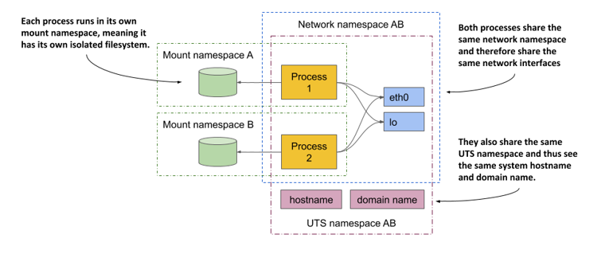

Trước tiên, hãy tập trung vào các thiết bị mạng được chia sẻ. Cả hai tiến trình đều nhìn thấy và sử dụng chung hai thiết bị (`eth0` và `lo`) vì chúng cùng chia sẻ một network namespace. Điều này cho phép chúng liên kết (bind) vào cùng một địa chỉ IP và giao tiếp với nhau qua thiết bị loopback, hoàn toàn giống như khi chúng đang chạy trên một máy tính thông thường không sử dụng container. Hai tiến trình này cũng dùng chung một UTS namespace nên sẽ nhìn thấy cùng một hostname hệ thống. Ngược lại, mỗi tiến trình lại có mount namespace riêng, đồng nghĩa với việc chúng sở hữu hệ thống tệp tách biệt hoàn toàn.

Tóm lại, các tiến trình có thể chia sẻ một số tài nguyên nhất định trong khi vẫn giữ cô lập các tài nguyên khác. Điều này hoàn toàn khả thi nhờ sự phân tách giữa các *loại* namespace khác nhau. Mỗi tiến trình sẽ liên kết với một namespace tương ứng cho từng loại tài nguyên.

Nhìn nhận từ tất cả những khía cạnh này, câu hỏi đặt ra là: Rốt cuộc container là gì? Một tiến trình chạy "trong container" không thực sự nằm bên trong một rào chắn vật lý kín kẽ nào đó giống như máy ảo. Đó chỉ đơn thuần là một tiến trình được gán cho một tập hợp các namespace (mỗi loại một namespace). Một số namespace được chia sẻ với các tiến trình khác, trong khi số khác thì không. Điều này có nghĩa là ranh giới giữa các tiến trình không phải lúc nào cũng nằm trên cùng một đường kẻ phân chia thẳng tắp thống nhất.

Trong chương sau, bạn sẽ học cách gỡ lỗi (debug) cho một container bằng cách chạy một tiến trình mới trực tiếp trên hệ điều hành host, nhưng sử dụng chung network namespace của một container đang chạy, trong khi sử dụng các namespace mặc định của host cho tất cả các tài nguyên còn lại. Phương pháp này cho phép bạn kiểm tra và sửa lỗi hệ thống mạng của container bằng các công cụ sẵn có trên host mà bản thân container có thể không trang bị.

### 2.3.2 Khám phá môi trường của một container đang chạy

Nếu bạn muốn tận mắt chứng kiến môi trường bên trong container trông như thế nào thì sao? Hostname của hệ thống là gì, địa chỉ IP cục bộ ra sao, những tệp thực thi và thư viện nào có sẵn trên hệ thống tệp, v.v.?

Để khám phá các yếu tố này trên một máy ảo, thông thường bạn sẽ kết nối từ xa qua giao thức SSH và sử dụng giao diện dòng lệnh (shell) để thực thi các câu lệnh. Với container, bạn cũng có thể chạy trực tiếp một shell ngay bên trong nó.

##### Lưu ý

Tệp thực thi của shell phải có sẵn trong hệ thống tệp của container. Điều này không phải lúc nào cũng đúng với các container chạy trong môi trường production thực tế.

#### Chạy shell bên trong một container đang hoạt động

Image Node.js làm nền cho ứng dụng của bạn có cung cấp sẵn bash shell, nghĩa là bạn có thể khởi chạy nó trong container bằng lệnh sau:

```shell
$ docker exec -it kiada-container bash
root@44d76963e8e1:/#    #A
```

Lệnh này khởi chạy `bash` như một tiến trình bổ sung bên trong container `kiada-container` đang chạy. Tiến trình này sử dụng chung các Linux namespace với tiến trình chính của container (máy chủ Node.js đang chạy). Nhờ đó, bạn có thể khám phá container từ bên trong và quan sát cách Node.js cũng như ứng dụng của bạn nhìn nhận hệ thống khi hoạt động trong container. Tùy chọn `-it` là viết tắt của hai tùy chọn:

- `-i` yêu cầu Docker chạy lệnh ở chế độ tương tác (interactive).
- `-t` yêu cầu Docker cấp một terminal ảo (pseudo TTY) để bạn có thể tương tác với shell một cách bình thường.

Bạn cần cả hai tùy chọn này để có thể sử dụng shell theo cách thông thường. Nếu bỏ qua tùy chọn thứ nhất, bạn sẽ không thể thực thi bất kỳ lệnh nào; còn nếu thiếu tùy chọn thứ hai, dấu nhắc lệnh (command prompt) sẽ không xuất hiện và một số lệnh có thể báo lỗi do biến môi trường `TERM` chưa được thiết lập.

#### Liệt kê các tiến trình đang chạy trong container

Hãy liệt kê các tiến trình đang chạy trong container bằng cách thực thi lệnh `ps aux` ngay trong shell vừa khởi chạy bên trong container:

```shell
root@44d76963e8e1:/# ps aux
USER  PID %CPU %MEM    VSZ   RSS TTY STAT START TIME COMMAND
root    1  0.0  0.1 676380 16504 ?   Sl   12:31 0:00 node app.js
root   10  0.0  0.0  20216  1924 ?   Ss   12:31 0:00 bash
root   19  0.0  0.0  17492  1136 ?   R+   12:38 0:00 ps aux
```

Danh sách trên chỉ hiển thị đúng ba tiến trình. Đây là những tiến trình duy nhất đang hoạt động trong container. Bạn hoàn toàn không nhìn thấy các tiến trình khác đang chạy trên hệ điều hành host hay trong các container lân cận, bởi vì container này đang vận hành trong một Process ID namespace hoàn toàn độc lập.

#### Quan sát các tiến trình của container từ danh sách tiến trình của máy host

Nếu bạn mở một cửa sổ terminal khác và liệt kê các tiến trình trên chính hệ điều hành host, bạn *sẽ* nhìn thấy các tiến trình đang chạy bên trong container. Điều này xác nhận rằng các tiến trình trong container thực chất chính là những tiến trình thông thường chạy trên hệ điều hành host. Dưới đây là lệnh và kết quả đầu ra:

```shell
$ ps aux | grep app.js
USER  PID %CPU %MEM    VSZ   RSS TTY STAT START TIME COMMAND
root  382  0.0  0.1 676380 16504 ?   Sl   12:31 0:00 node app.js
```

##### LƯU Ý

Nếu bạn sử dụng macOS hoặc Windows, bạn phải liệt kê các tiến trình bên trong máy ảo (VM) chạy Docker daemon, vì đó mới là nơi các container thực sự hoạt động. Trong Docker Desktop, bạn có thể truy cập vào máy ảo này bằng lệnh `wsl -d docker-desktop` hoặc bằng lệnh `docker run --net=host --ipc=host --uts=host --pid=host -it --security-opt=seccomp=unconfined --privileged --rm -v /:/host alpine chroot /host`.

Nếu tinh ý, bạn có thể nhận thấy rằng ID tiến trình (PID) bên trong container khác biệt so với PID hiển thị trên máy host. Do container sử dụng Process ID namespace riêng, nó sở hữu một cây tiến trình độc lập với chuỗi đánh số ID riêng biệt. Như sơ đồ tiếp theo minh họa, cây tiến trình này thực chất là một nhánh con thuộc cây tiến trình tổng thể của máy host. Do đó, mỗi tiến trình sẽ có song song hai ID khác nhau.

##### Hình 2.18 PID namespace khiến một nhánh cây tiến trình hiển thị như một cây tiến trình độc lập với chuỗi đánh số riêng

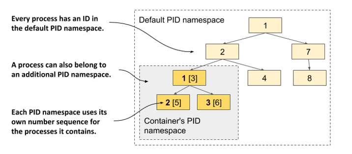

#### Tìm hiểu sự cô lập hệ thống tệp của container với máy host và các container khác

Tương tự như cây tiến trình được cô lập, mỗi container cũng sở hữu một hệ thống tệp hoàn toàn biệt lập. Nếu bạn liệt kê nội dung thư mục gốc của container, hệ thống sẽ chỉ hiển thị các tệp nằm trong chính container đó. Nhóm này bao gồm các tệp từ container image và các tệp được sinh ra trong quá trình container vận hành, chẳng hạn như tệp log. Danh sách dưới đây hiển thị các tệp nằm trong thư mục gốc của container `kiada`:

```shell
root@44d76963e8e1:/# ls /
app.js  boot  etc   lib    media  opt   root  sbin  sys  usr
bin     dev   home  lib64  mnt    proc  run   srv   tmp  var
```

Nó chứa tệp `app.js` và các thư mục hệ thống khác vốn là một phần của image nền `node:16`. Bạn có thể thoải mái duyệt qua hệ thống tệp của container. Bạn sẽ nhận thấy rằng hoàn toàn không có cách nào để truy cập hay nhìn thấy các tệp trên hệ thống tệp của máy host. Điều này vô cùng tuyệt vời, vì nó ngăn chặn kẻ tấn công lợi dụng các lỗ hổng bảo mật trên máy chủ Node.js để truy cập trái phép vào các tệp tin của máy host.

Để rời khỏi container, hãy thoát khỏi shell bằng cách chạy lệnh `exit` hoặc nhấn tổ hợp phím Control-D, bạn sẽ ngay lập tức được đưa trở lại terminal của máy host (tương tự như việc đăng xuất khỏi một phiên kết nối `ssh`).

##### Mẹo

Việc truy cập vào một container đang chạy như thế này cực kỳ hữu ích khi bạn cần debug một ứng dụng chạy trong container. Khi xảy ra sự cố, việc đầu tiên bạn muốn kiểm tra chính là trạng thái thực tế của hệ thống dưới góc nhìn của ứng dụng bên trong container.

### 2.3.3 Giới hạn tài nguyên sử dụng của tiến trình bằng Linux Control Groups

Linux Namespaces cho phép các tiến trình chỉ truy cập được vào một số tài nguyên nhất định của máy host, nhưng chúng không thể giới hạn lượng tài nguyên mà mỗi tiến trình có thể tiêu thụ. Ví dụ, bạn có thể dùng namespace để giới hạn một tiến trình chỉ được truy cập vào một giao diện mạng cụ thể, nhưng không thể giới hạn băng thông mạng mà tiến trình đó sử dụng. Tương tự, bạn không thể dùng namespace để giới hạn thời gian CPU hoặc bộ nhớ khả dụng cho một tiến trình. Việc giới hạn này là cần thiết để ngăn chặn tình trạng một tiến trình chiếm dụng toàn bộ thời gian CPU, gây ảnh hưởng đến sự vận hành của các tiến trình hệ thống quan trọng khác. Để làm được điều đó, chúng ta cần một tính năng khác của nhân Linux.

#### Giới thiệu về cgroups

Tính năng thứ hai của nhân Linux giúp hiện thực hóa container được gọi là *Linux Control Groups (cgroups)*. Tính năng này đảm nhận vai trò giới hạn, đo lường lượng sử dụng và cô lập các tài nguyên hệ thống như CPU, bộ nhớ, dung lượng ổ đĩa hoặc băng thông mạng. Khi áp dụng cgroups, một tiến trình hoặc nhóm tiến trình chỉ có thể sử dụng đúng lượng CPU, bộ nhớ và băng thông mạng được phân bổ. Nhờ vậy, các tiến trình không thể chiếm dụng tài nguyên đã được dự phòng cho các tiến trình khác.

Ở giai đoạn này, bạn chưa cần đi sâu vào chi tiết cách Control Groups vận hành, nhưng việc biết cách yêu cầu Docker giới hạn lượng CPU và bộ nhớ cho một container là vô cùng hữu ích.

#### Giới hạn mức sử dụng CPU của container

Nếu bạn không thiết lập bất kỳ giới hạn nào, container sẽ có quyền truy cập không hạn chế vào toàn bộ các lõi CPU trên máy host. Bạn có thể chỉ định chính xác những lõi CPU nào container được phép sử dụng thông qua tùy chọn `--cpuset-cpus` của Docker. Ví dụ, để chỉ cho phép container sử dụng lõi số một và hai, bạn có thể chạy container với tùy chọn sau:

```shell
$ docker run --cpuset-cpus="1,2" ...
```

Bạn cũng có thể giới hạn tổng thời gian CPU khả dụng bằng các tùy chọn `--cpus`, `--cpu-period`, `--cpu-quota` và `--cpu-shares`. Ví dụ, để giới hạn container chỉ được phép sử dụng tối đa một nửa hiệu năng của một lõi CPU, hãy chạy container như sau:

```shell
$ docker run --cpus="0.5" ...
```

#### Giới hạn mức sử dụng bộ nhớ của container

Tương tự như CPU, một container có thể ngốn sạch toàn bộ bộ nhớ hệ thống khả dụng giống như bất kỳ tiến trình thông thường nào, nhưng bạn hoàn toàn có thể kiểm soát việc này. Docker cung cấp các tùy chọn sau để giới hạn dung lượng RAM và không gian swap của container: `--memory`, `--memory-reservation`, `--kernel-memory`, `--memory-swap` và `--memory-swappiness`.

Ví dụ, để giới hạn dung lượng bộ nhớ tối đa khả dụng trong container là 100MB, hãy chạy container như sau (ký tự `m` viết tắt của megabyte):

```shell
$ docker run --memory="100m" ...
```

Về bản chất, các tùy chọn này của Docker chỉ đóng vai trò cấu hình các thông số cgroups cho tiến trình. Chính nhân Linux mới là bên trực tiếp đảm nhận việc giới hạn tài nguyên cấp phát cho tiến trình đó. Bạn có thể tham khảo tài liệu của Docker để tìm hiểu thêm về các tùy chọn giới hạn bộ nhớ và CPU khác.

### 2.3.4 Tăng cường khả năng cô lập giữa các container

Linux Namespaces và Cgroups giúp chia tách môi trường của các container và ngăn chặn tình trạng một container chiếm dụng hết tài nguyên tính toán của các container khác. Tuy nhiên, các tiến trình trong những container này vẫn dùng chung một nhân (kernel) hệ thống, do đó chúng ta chưa thể khẳng định chúng được cô lập hoàn toàn. Một container bị tấn công hoặc chứa mã độc có thể thực hiện các lời gọi hệ thống (system call) độc hại gây ảnh hưởng đến các container lân cận.

Hãy tưởng tượng một node Kubernetes đang chạy nhiều container. Mỗi container có thiết bị mạng và hệ thống tệp riêng, đồng thời chỉ có thể tiêu thụ một lượng CPU và bộ nhớ giới hạn. Thoạt nhìn, một chương trình độc hại trong một container không thể gây hại cho các container khác. Nhưng điều gì sẽ xảy ra nếu chương trình đó thay đổi đồng hồ hệ thống — thứ được dùng chung bởi tất cả container?

Tùy thuộc vào từng ứng dụng, việc thay đổi thời gian có thể không phải là vấn đề quá nghiêm trọng, nhưng việc cho phép các chương trình thực hiện bất kỳ lời gọi hệ thống nào tới nhân hệ điều hành sẽ giúp chúng làm được hầu như mọi thứ. Các lời gọi hệ thống (sys-call) cho phép chúng can thiệp vào bộ nhớ của nhân, thêm hoặc bớt các module nhân, cùng nhiều hành vi can thiệp sâu khác mà một container thông thường không được phép thực hiện.

Điều này dẫn chúng ta đến bộ công nghệ thứ ba giúp hiện thực hóa container. Việc giải thích cặn kẽ về chúng nằm ngoài phạm vi của cuốn sách này, vì vậy bạn có thể tham khảo thêm các tài liệu chuyên sâu về container hoặc các công nghệ bảo mật container. Phần này chỉ cung cấp một cái nhìn sơ lược về các công nghệ này.

#### Cấp toàn quyền hệ thống cho container

Nhân hệ điều hành cung cấp một tập hợp các *lời gọi hệ thống (sys-call)* để các chương trình tương tác với hệ điều hành và phần cứng bên dưới. Chúng bao gồm các lệnh tạo tiến trình, thao tác với tệp và thiết bị, thiết lập các kênh giao tiếp giữa các ứng dụng, v.v.

Một số lời gọi hệ thống này là an toàn và khả dụng cho mọi tiến trình, nhưng số khác lại được bảo mật nghiêm ngặt và chỉ dành riêng cho các tiến trình có đặc quyền cao. Nếu nhìn vào ví dụ trước, các ứng dụng chạy trên node Kubernetes chỉ nên được phép truy cập vào các tệp cục bộ của chúng, chứ không được phép thay đổi đồng hồ hệ thống hay can thiệp vào nhân hệ điều hành gây ảnh hưởng xấu đến các container khác.

Hầu hết các container nên hoạt động mà không có đặc quyền cao. Chỉ những chương trình thực sự đáng tin cậy và thực sự cần đến các quyền hạn bổ sung mới nên được chạy trong các container đặc quyền (privileged).

##### Lưu ý

Trong Docker, bạn có thể tạo một container đặc quyền bằng cách sử dụng flag `--privileged`.

#### Sử dụng Capabilities để cấp một nhóm đặc quyền nhỏ cho container

Nếu một ứng dụng chỉ cần thực hiện một số lời gọi hệ thống yêu cầu đặc quyền cao, việc tạo ra một container có toàn quyền đặc quyền là điều không tối ưu. May mắn thay, nhân Linux chia các đặc quyền thành các đơn vị nhỏ gọi là *capabilities*. Một số ví dụ về capabilities bao gồm:

- `CAP_NET_ADMIN` cho phép tiến trình thực hiện các hoạt động liên quan đến cấu hình mạng,
- `CAP_NET_BIND_SERVICE` cho phép tiến trình liên kết với các cổng mạng nhỏ hơn 1024,
- `CAP_SYS_TIME` cho phép tiến trình thay đổi đồng hồ hệ thống, v.v.

Các capability này có thể được thêm vào hoặc loại bỏ (*dropped*) khỏi container khi bạn khởi tạo nó. Mỗi capability đại diện cho một nhóm quyền hạn cụ thể cấp cho các tiến trình bên trong container. Docker và Kubernetes mặc định loại bỏ tất cả các capability ngoại trừ những quyền cơ bản mà các ứng dụng thông thường cần đến, nhưng người dùng vẫn có thể chủ động cấu hình thêm bớt các capability nếu được cấp quyền thực hiện.

##### Lưu ý

Hãy luôn tuân thủ *nguyên tắc đặc quyền tối thiểu (principle of least privilege)* khi chạy các container. Đừng cấp cho chúng bất kỳ quyền hạn nào mà chúng không thực sự cần. Điều này sẽ ngăn chặn những kẻ tấn công lợi dụng chúng để xâm nhập vào hệ điều hành của bạn.

#### Sử dụng cấu hình seccomp để lọc từng lời gọi hệ thống

Nếu cần kiểm soát chặt chẽ hơn nữa các lời gọi hệ thống mà một chương trình có thể thực hiện, bạn có thể sử dụng *seccomp* (Secure Computing Mode). Bạn có thể tạo một cấu hình seccomp tùy chỉnh bằng cách tạo một tệp JSON liệt kê danh sách các lời gọi hệ thống mà container sử dụng cấu hình này được phép thực hiện. Sau đó, bạn cung cấp tệp này cho Docker khi khởi tạo container.

#### Tăng cường bảo mật container bằng AppArmor và SELinux

Và như thể những công nghệ được thảo luận từ đầu đến nay vẫn chưa đủ, các container còn có thể được bảo mật bằng hai cơ chế kiểm soát truy cập bắt buộc (MAC) bổ sung: SELinux (Security-Enhanced Linux) và AppArmor (Application Armor).

Với SELinux, bạn gán nhãn cho các tệp tin và tài nguyên hệ thống, cũng như cho người dùng và tiến trình. Một người dùng hoặc tiến trình chỉ có thể truy cập một tệp tin hay tài nguyên nếu nhãn của tất cả các chủ thể (subject) và đối tượng (object) liên quan khớp với một bộ chính sách được thiết lập. AppArmor cũng hoạt động tương tự nhưng sử dụng đường dẫn tệp tin thay vì nhãn, đồng thời tập trung vào các tiến trình thay vì người dùng.

Cả SELinux và AppArmor đều giúp nâng cao đáng kể tính bảo mật của hệ điều hành, nhưng bạn cũng đừng quá lo lắng nếu cảm thấy bị ngợp trước vô vàn cơ chế bảo mật này. Mục đích của phần này chỉ là làm sáng tỏ mọi yếu tố liên quan đến việc cô lập container một cách triệt để, còn ở thời điểm hiện tại, chỉ cần nắm được những khái niệm cơ bản về *namespaces* là đã quá đủ.

## 2.4 Tổng kết

Nếu bạn là người mới làm quen với container trước khi đọc chương này, giờ đây bạn đã hiểu chúng là gì, tại sao chúng ta lại sử dụng chúng, và những tính năng nào của nhân Linux giúp hiện thực hóa chúng. Nếu trước đây bạn đã từng sử dụng container, tôi hy vọng chương này đã giúp giải tỏa những thắc mắc của bạn về cách hoạt động của chúng, và giờ đây bạn đã hiểu rằng container thực chất không có gì khác ngoài các tiến trình hệ điều hành thông thường được nhân Linux cô lập khỏi các tiến trình khác.

Sau khi đọc xong chương này, bạn cần nắm được rằng:

- Container thực chất là các tiến trình thông thường, nhưng được cô lập với nhau và với các tiến trình khác đang chạy trên hệ điều hành máy chủ (host OS).
- Container nhẹ hơn nhiều so với máy ảo (VM), nhưng vì dùng chung nhân Linux nên mức độ cô lập của chúng không thể triệt để bằng máy ảo.
- Docker là nền tảng container đầu tiên giúp phổ biến hóa công nghệ container và cũng là runtime container đầu tiên được Kubernetes hỗ trợ. Giờ đây, các runtime khác cũng được hỗ trợ thông qua Giao diện Runtime Container (CRI - Container Runtime Interface).
- Một container image chứa ứng dụng của người dùng và tất cả các phụ thuộc (dependencies) của nó. Image này được phân phối qua một kho chứa container (container registry) và được dùng để tạo ra các container đang chạy.
- Có thể tải xuống và thực thi các container chỉ bằng một lệnh `docker run` duy nhất.
- Docker xây dựng image từ một `Dockerfile` chứa các lệnh mà Docker cần thực hiện trong quá trình build. Các image được cấu thành từ nhiều lớp (layer) có thể chia sẻ giữa nhiều image khác nhau. Mỗi lớp chỉ cần được truyền tải và lưu trữ một lần duy nhất.
- Container được cô lập nhờ các tính năng của nhân Linux như Namespaces, Control groups, Capabilities, seccomp, AppArmor và/hoặc SELinux. Trong đó, Namespaces đảm bảo container chỉ nhìn thấy một phần tài nguyên sẵn có trên máy chủ, Control groups giới hạn lượng tài nguyên mà nó có thể sử dụng, còn các tính năng khác giúp tăng cường khả năng cô lập giữa các container.

Sau khi đã kiểm tra kỹ lưỡng các container trên boong tàu này, giờ đây bạn đã sẵn sàng kéo neo và dong buồm tiến vào chương tiếp theo, nơi chúng ta sẽ học cách vận hành các container bằng Kubernetes.

---

[^1]: *Chú thích của công cụ dịch: Hypervisor (phần mềm giám sát máy ảo) là một chương trình phần mềm hoặc phần cứng cho phép tạo và chạy các máy ảo, quản lý việc phân bổ tài nguyên từ máy vật lý đến các máy ảo.*

[^2]: *Chú thích của công cụ dịch: Daemon là một tiến trình nền chạy liên tục trong hệ điều hành để xử lý các yêu cầu hệ thống hoặc dịch vụ. Ở đây, Docker daemon chịu trách nhiệm quản lý trực tiếp các thực thể Docker như image, container, network và volume.*

---

[← Mở đầu](00-mo-dau.md) · [Mục lục](README.md) · [Chương 3 →](03-trien-khai-ung-dung-dau-tien-cua-ban.md)
