# 3 Triển khai ứng dụng đầu tiên của bạn

### Chương này bao gồm các nội dung chính:

- Chạy một cụm (cluster) Kubernetes cục bộ ngay trên máy tính xách tay của bạn
- Thiết lập một cụm trên Google Kubernetes Engine
- Thiết lập một cụm trên Amazon Elastic Kubernetes Service
- Thiết lập và sử dụng công cụ dòng lệnh `kubectl`
- Triển khai một ứng dụng trên Kubernetes và đưa nó tiếp cận người dùng toàn cầu
- Mở rộng quy mô ứng dụng theo chiều ngang (Horizontal scaling)

Mục tiêu của chương này là hướng dẫn bạn cách vận hành một cụm (cluster) Kubernetes phát triển dạng đơn nút (single-node) cục bộ hoặc thiết lập một cụm đa nút (multi-node) được quản lý hoàn chỉnh trên đám mây. Khi cụm đã hoạt động, bạn sẽ dùng nó để chạy container mà chúng ta đã tạo ở chương trước.

##### Lưu ý

Bạn sẽ tìm thấy các tệp mã nguồn của chương này tại <https://github.com/luksa/kubernetes-in-action-2nd-edition/tree/master/Chapter03>

## 3.1 Triển khai một cụm Kubernetes

Việc thiết lập một cụm Kubernetes đa nút hoàn chỉnh không phải là một nhiệm vụ đơn giản, nhất là khi bạn chưa có kinh nghiệm về quản trị hệ thống Linux và mạng. Một hệ thống Kubernetes chuẩn chỉnh sẽ trải rộng trên nhiều máy ảo hoặc máy vật lý, đòi hỏi cấu hình mạng phức tạp để tất cả các container trong cụm có thể thông suốt liên lạc với nhau.

Bạn có thể cài đặt Kubernetes ngay trên máy tính xách tay cá nhân, trên hạ tầng nội bộ của tổ chức, hoặc trên các máy ảo thuê từ các nhà cung cấp dịch vụ đám mây (Google Compute Engine, Amazon EC2, Microsoft Azure, v.v.). Ngoài ra, hầu hết các nhà cung cấp dịch vụ đám mây hiện nay đều cung cấp các dịch vụ Kubernetes được quản lý (managed services), giúp bạn trút bỏ được gánh nặng tự cài đặt và vận hành. Dưới đây là cái nhìn tổng quan về dịch vụ của các ông lớn điện toán đám mây:

- Google cung cấp GKE - Google Kubernetes Engine,
- Amazon có EKS - Amazon Elastic Kubernetes Service,
- Microsoft có AKS – Azure Kubernetes Service,
- IBM có IBM Cloud Kubernetes Service,
- Alibaba cung cấp Alibaba Cloud Container Service.

Việc cài đặt và quản lý Kubernetes khó hơn rất nhiều so với việc chỉ sử dụng nó, đặc biệt là khi bạn chưa thực sự hiểu rõ về kiến trúc cũng như cách thức vận hành của hệ thống. Vì lẽ đó, chúng ta sẽ bắt đầu bằng những cách đơn giản nhất để có được một cụm Kubernetes hoạt động ổn định. Bạn sẽ tìm hiểu một số phương pháp chạy cụm Kubernetes đơn nút trên máy tính cá nhân và cách sử dụng một cụm được quản lý trên Google Kubernetes Engine (GKE).

Lựa chọn thứ ba, liên quan đến việc cài đặt một cụm bằng công cụ `kubeadm`, được giải thích chi tiết trong Phụ lục B. Bài hướng dẫn tại đó sẽ chỉ cho bạn cách thiết lập một cụm Kubernetes ba nút bằng máy ảo. Tuy nhiên, bạn chỉ nên thử sức với phương pháp này sau khi đã thực sự quen thuộc với cách sử dụng Kubernetes. Ngoài ra còn có nhiều lựa chọn khác, nhưng chúng nằm ngoài phạm vi của cuốn sách này. Bạn có thể tham khảo trang web <https://kubernetes.io> để biết thêm chi tiết.

Nếu bạn đã được cấp quyền truy cập vào một cụm có sẵn do người khác triển khai, bạn có thể bỏ qua phần này và đi thẳng đến phần 3.2 để tìm hiểu cách tương tác với các cụm Kubernetes.

### 3.1.1 Sử dụng cụm Kubernetes tích hợp sẵn trong Docker Desktop

Nếu bạn đang sử dụng macOS hoặc Windows, rất có thể bạn đã cài đặt Docker Desktop để thực hiện các bài tập ở chương trước. Công cụ này tích hợp sẵn một cụm Kubernetes đơn nút mà bạn có thể kích hoạt thông qua hộp thoại cài đặt (Settings). Đây có lẽ là con đường ngắn nhất để bạn bắt đầu hành trình khám phá Kubernetes của mình, nhưng hãy lưu ý rằng phiên bản Kubernetes đi kèm có thể không phải là phiên bản mới nhất so với các lựa chọn thay thế được trình bày ở các phần tiếp theo.

##### Lưu ý

Mặc dù về mặt kỹ thuật, hệ thống Kubernetes đơn nút do Docker Desktop cung cấp không hẳn là một cụm thực sự, nhưng nó vẫn đủ để chúng ta khám phá hầu hết các chủ đề trong cuốn sách này. Khi có bài tập nào bắt buộc phải dùng cụm đa nút, tôi sẽ lưu ý rõ.

#### Kích hoạt Kubernetes trong Docker Desktop

Giả định rằng Docker Desktop đã được cài đặt trên máy tính của bạn, bạn có thể khởi động cụm Kubernetes bằng cách nhấp vào biểu tượng chú cá voi ở khay hệ thống và mở hộp thoại Settings. Hãy chuyển đến tab *Kubernetes* và đảm bảo hộp kiểm *Enable Kubernetes* đã được tích chọn. Các thành phần cấu thành nên Control Plane (Mặt phẳng điều khiển) sẽ chạy dưới dạng các container Docker, nhưng chúng sẽ không hiển thị trong danh sách container đang chạy khi bạn gõ lệnh `docker ps`. Để hiển thị chúng, hãy tích chọn ô *Show system containers*.

##### Lưu ý

Quá trình cài đặt cụm ban đầu sẽ mất vài phút, vì hệ thống cần tải xuống toàn bộ container image của các thành phần Kubernetes.

##### Hình 3.1 Hộp thoại Settings của Docker Desktop trên Windows

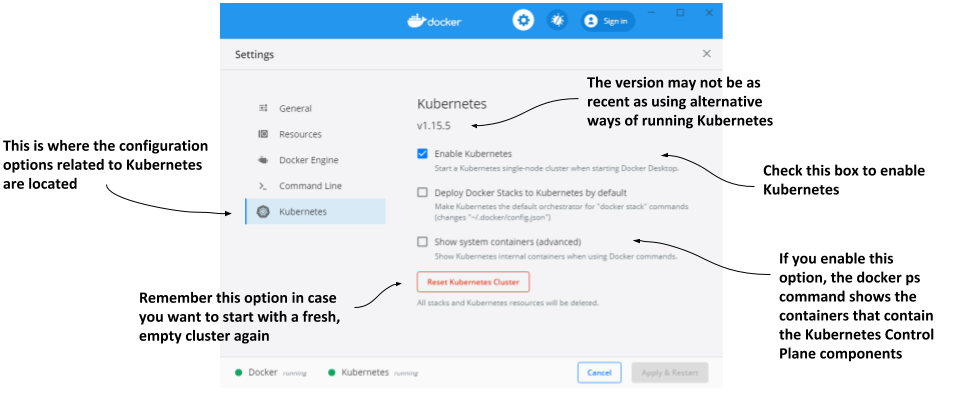

Hãy ghi nhớ nút *Reset Kubernetes Cluster* phòng khi bạn muốn đặt lại cụm về trạng thái ban đầu để xóa bỏ toàn bộ các đối tượng đã triển khai trong đó.

#### Trực quan hóa hệ thống

Để hiểu rõ các thành phần khác nhau cấu thành nên cụm Kubernetes chạy ở đâu trong Docker Desktop, hãy quan sát hình dưới đây.

##### Hình 3.2 Kubernetes đang chạy trong Docker Desktop

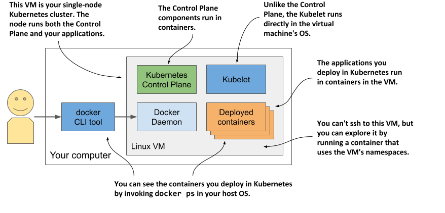

Docker Desktop thiết lập một máy ảo Linux đóng vai trò là máy chủ chạy Docker Daemon cùng tất cả các container. Máy ảo này cũng chạy Kubelet – tác nhân (agent) Kubernetes chịu trách nhiệm quản lý nút. Các thành phần của Control Plane chạy trong các container, và các ứng dụng bạn triển khai cũng vậy.

Để liệt kê các container đang chạy, bạn không cần phải đăng nhập vào máy ảo, vì công cụ dòng lệnh (CLI) Docker có sẵn trên hệ điều hành máy chủ sẽ hiển thị chúng.

#### Khám phá bên trong máy ảo

Tại thời điểm viết cuốn sách này, Docker Desktop chưa cung cấp lệnh nào để trực tiếp đăng nhập vào máy ảo nếu bạn muốn khám phá nó từ bên trong. Tuy nhiên, bạn có thể chạy một container đặc biệt được cấu hình để sử dụng các namespace của máy ảo nhằm chạy một shell từ xa. Cách này gần như tương đương với việc sử dụng SSH để truy cập vào một máy chủ từ xa. Để chạy container này, hãy thực thi lệnh sau:

```shell
$ docker run --net=host --ipc=host --uts=host --pid=host --privileged \
  --security-opt=seccomp=unconfined -it --rm -v /:/host alpine chroot /host
```

Lệnh dài này cần được giải thích như sau:

- Container được tạo ra từ image `alpine`.
- Các cờ `--net`, `--ipc`, `--uts` và `--pid` khiến container sử dụng các namespace của máy chủ thay vì bị cô lập trong môi trường sandbox riêng, trong khi các cờ `--privileged` và `--security-opt` cấp cho container quyền truy cập không giới hạn vào tất cả các lời gọi hệ thống (system calls).
- Cờ `-it` chạy container ở chế độ tương tác (interactive) và cờ `--rm` đảm bảo container sẽ tự động bị xóa sau khi dừng hoạt động.
- Cờ `-v` gắn kết (mount) thư mục gốc của máy chủ vào thư mục `/host` bên trong container. Lệnh `chroot /host` sau đó sẽ biến thư mục này thành thư mục gốc của container.

Sau khi chạy lệnh trên, bạn sẽ truy cập vào một môi trường shell tương đương với việc kết nối SSH vào máy ảo. Hãy sử dụng shell này để khám phá máy ảo — thử liệt kê các tiến trình bằng lệnh `ps aux` hoặc kiểm tra các giao diện mạng bằng lệnh `ip addr`.

### 3.1.2 Chạy một cụm cục bộ bằng Minikube

Một cách khác để tạo cụm Kubernetes là sử dụng *Minikube*, một công cụ do cộng đồng Kubernetes duy trì và phát triển. Phiên bản Kubernetes mà Minikube triển khai thường mới hơn phiên bản đi kèm với Docker Desktop. Cụm này chỉ gồm một nút duy nhất, rất phù hợp cho việc thử nghiệm Kubernetes và phát triển ứng dụng cục bộ. Thông thường, nó chạy Kubernetes bên trong một máy ảo Linux, nhưng nếu máy tính của bạn sử dụng hệ điều hành Linux, nó cũng có thể triển khai Kubernetes trực tiếp trên hệ điều hành máy chủ thông qua Docker.

##### Lưu ý

Nếu bạn cấu hình Minikube sử dụng máy ảo, bạn sẽ không cần đến Docker nhưng cần một trình ảo hóa (hypervisor) như VirtualBox. Trong trường hợp ngược lại, bạn cần Docker nhưng không cần trình ảo hóa.

#### Cài đặt Minikube

Minikube hỗ trợ cả macOS, Linux và Windows. Nó chỉ là một tệp thực thi nhị phân duy nhất, bạn có thể tìm thấy tệp này trong kho chứa Minikube trên GitHub (<http://github.com/kubernetes/minikube>). Cách tốt nhất là làm theo hướng dẫn cài đặt mới nhất được công bố tại đó, nhưng nhìn chung, các bước cài đặt cơ bản như sau.

Trên macOS, bạn có thể cài đặt bằng trình quản lý gói Brew; trên Windows, có một trình cài đặt sẵn để tải về; còn trên Linux, bạn có thể tải về gói `.deb` hoặc `.rpm`, hoặc chỉ đơn giản là tải xuống tệp nhị phân rồi cấp quyền thực thi cho nó bằng lệnh sau:

```shell
$ curl -LO https://storage.googleapis.com/minikube/releases/latest/minikube-linux-amd64 && \
  sudo install minikube-linux-amd64 /usr/local/bin/minikube
```

Để biết thêm chi tiết cho riêng hệ điều hành của bạn, vui lòng tham khảo hướng dẫn cài đặt trực tuyến.

#### Khởi động cụm Kubernetes bằng Minikube

Sau khi Minikube được cài đặt, hãy khởi động cụm Kubernetes theo các bước dưới đây:

```shell
$ minikube start
minikube v1.11.0 on Fedora 31
Using the virtualbox driver based on user configuration
Downloading VM boot image ...
> minikube-v1.11.0.iso.sha256: 65 B / 65 B [-------------] 100.00% ? p/s 0s
> minikube-v1.11.0.iso: 174.99 MiB / 174.99 MiB [] 100.00% 50.16 MiB p/s 4s
> Starting control plane node minikube in cluster minikube
> Downloading Kubernetes v1.18.3 preload ...
> preloaded-images-k8s-v3-v1.18.3-docker-overlay2-amd64.tar.lz4: 526.01 MiB
> Creating virtualbox VM (CPUs=2, Memory=6000MB, Disk=20000MB) ...
> Preparing Kubernetes v1.18.3 on Docker 19.03.8 ...
> Verifying Kubernetes components...
> Enabled addons: default-storageclass, storage-provisioner
> Done! kubectl is now configured to use "minikube"
```

Quá trình này có thể mất vài phút, vì hệ thống cần tải xuống image của máy ảo cũng như các container image của các thành phần Kubernetes.

##### Gợi ý

Nếu sử dụng Linux, bạn có thể giảm bớt tài nguyên tiêu thụ bằng cách tạo cụm Minikube không cần máy ảo thông qua lệnh: `minikube start --vm-driver none`

#### Kiểm tra trạng thái của Minikube

Sau khi lệnh `minikube start` hoàn tất, bạn có thể kiểm tra trạng thái của cụm bằng cách chạy lệnh `minikube status`:

```shell
$ minikube status
host: Running
kubelet: Running
apiserver: Running
kubeconfig: Configured
```

Kết quả hiển thị cho thấy máy chủ Kubernetes (máy ảo chứa Kubernetes) đang chạy, cùng với Kubelet (tác nhân quản lý nút) và API server của Kubernetes. Dòng cuối cùng cho biết công cụ dòng lệnh `kubectl` (CLI) đã được cấu hình để kết nối với cụm Kubernetes do Minikube khởi tạo. Lưu ý rằng Minikube không tự động cài đặt công cụ CLI này mà chỉ tạo tệp cấu hình cho nó. Cách cài đặt công cụ CLI sẽ được giải thích ở mục 3.2.

#### Trực quan hóa hệ thống

Kiến trúc của hệ thống này, được minh họa trong hình tiếp theo, về cơ bản hoàn toàn giống với mô hình trên Docker Desktop.

##### Hình 3.3 Chạy cụm Kubernetes đơn nút bằng Minikube

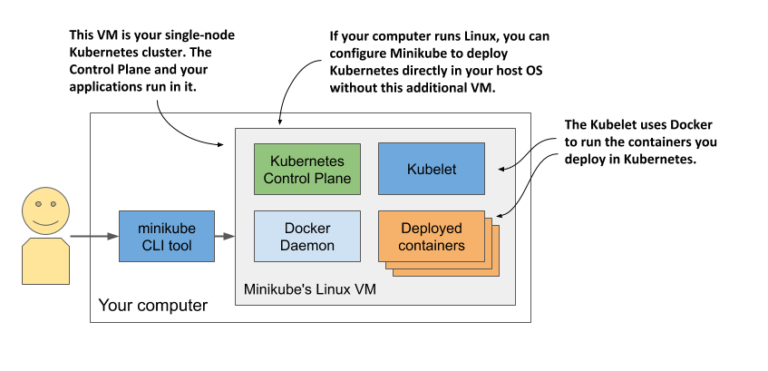

Các thành phần của Control Plane chạy trong các container bên trong máy ảo, hoặc chạy trực tiếp trên hệ điều hành máy chủ của bạn nếu bạn sử dụng tùy chọn `--vm-driver none` khi tạo cụm. Kubelet chạy trực tiếp trên hệ điều hành của máy ảo hoặc máy chủ, chịu trách nhiệm vận hành các ứng dụng bạn triển khai trong cụm thông qua Docker Daemon.

Bạn có thể chạy lệnh `minikube ssh` để đăng nhập vào máy ảo Minikube và khám phá bên trong. Ví dụ: bạn có thể kiểm tra xem những gì đang chạy trong máy ảo bằng lệnh `ps aux` để liệt kê các tiến trình, hoặc `docker ps` để liệt kê các container đang chạy.

##### Gợi ý

Nếu muốn liệt kê các container bằng chính công cụ dòng lệnh `docker` cục bộ trên máy chủ (tương tự như với Docker Desktop), bạn hãy chạy lệnh sau: `eval $(minikube docker-env)`

### 3.1.3 Chạy cụm cục bộ bằng kind (Kubernetes in Docker)

Một giải pháp thay thế cho Minikube, dù chưa thực sự hoàn thiện bằng, là *kind* (Kubernetes-in-Docker). Thay vì chạy Kubernetes trong máy ảo hoặc trực tiếp trên máy chủ, *kind* chạy mỗi nút của cụm Kubernetes bên trong một container. Điểm khác biệt lớn so với Minikube là *kind* có thể tạo ra các cụm đa nút bằng cách khởi chạy nhiều container đại diện cho các nút đó. Các container ứng dụng thực tế mà bạn triển khai lên Kubernetes sau đó sẽ chạy bên trong các container nút này. Hệ thống được mô tả trong hình dưới đây.

##### Hình 3.4 Chạy cụm Kubernetes đa nút bằng kind

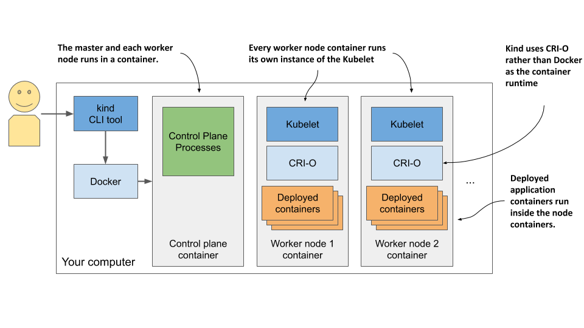

Ở chương trước, tôi đã đề cập rằng một tiến trình chạy trong container thực chất vẫn đang chạy trực tiếp trên hệ điều hành máy chủ. Điều này đồng nghĩa với việc khi bạn chạy Kubernetes bằng *kind*, toàn bộ các thành phần của Kubernetes đều chạy trên chính hệ điều hành máy chủ của bạn. Các ứng dụng bạn triển khai lên cụm Kubernetes đó cũng hoạt động ngay trên máy chủ.

Đặc điểm này biến *kind* thành một công cụ hoàn hảo cho việc phát triển và thử nghiệm, vì mọi thứ đều chạy cục bộ và bạn có thể gỡ lỗi (debug) các tiến trình đang chạy dễ dàng như khi chạy chúng ngoài container. Tôi thường ưu tiên phương pháp này khi phát triển ứng dụng trên Kubernetes, bởi nó cho phép tôi thực hiện những kỹ thuật nâng cao như chạy các công cụ phân tích lưu lượng mạng như Wireshark, hoặc thậm chí là mở trình duyệt web ngay bên trong các container chạy ứng dụng của mình. Tôi sử dụng một công cụ có tên là `nsenter` để có thể đưa các công cụ phân tích này vào mạng hoặc các namespace khác của container.

Nếu bạn là người mới bắt đầu với Kubernetes, lựa chọn an toàn nhất vẫn là khởi đầu với Minikube; nhưng nếu bạn muốn trải nghiệm điều mới mẻ, dưới đây là cách bắt đầu với *kind*.

#### Cài đặt kind

Tương tự như Minikube, *kind* cũng chỉ bao gồm một tệp thực thi nhị phân duy nhất. Để cài đặt, bạn hãy tham khảo hướng dẫn tại <https://kind.sigs.k8s.io/docs/user/quick-start/>. Trên macOS và Linux, các lệnh cài đặt cụ thể như sau:

```shell
$ curl -Lo ./kind https://kind.sigs.k8s.io/dl/v0.11.1/kind-$(uname)-amd64
$ chmod +x ./kind 
$ mv ./kind /some-dir-in-your-PATH/kind
```

Hãy kiểm tra tài liệu trực tuyến để biết phiên bản mới nhất là gì và sử dụng nó thay thế cho bản v0.7.0 trong ví dụ trên. Đồng thời, hãy thay thế `/some-dir-in-your-PATH/` bằng đường dẫn thư mục thực tế nằm trong biến môi trường PATH của bạn.

##### Lưu ý

Hệ thống của bạn bắt buộc phải cài đặt Docker để sử dụng *kind*.

#### Khởi động cụm Kubernetes bằng kind

Khởi động một cụm mới với *kind* cũng dễ dàng như với Minikube. Hãy thực thi lệnh sau:

```shell
$ kind create cluster
```

Tương tự như Minikube, *kind* sẽ tự động cấu hình `kubectl` để kết nối tới cụm vừa được tạo.

#### Khởi động cụm đa nút bằng kind

Mặc định, *kind* sẽ khởi chạy một cụm đơn nút. Nếu bạn muốn chạy một cụm với nhiều nút thợ (worker node), trước tiên bạn cần tạo một tệp cấu hình. Đoạn mã dưới đây thể hiện nội dung của tệp này (`Chapter03/kind-multi-node.yaml`).

##### Đoạn mã 3.1 Tệp cấu hình để chạy cụm ba nút bằng công cụ kind

```yaml
kind: Cluster
apiVersion: kind.sigs.k8s.io/v1alpha3
nodes:
- role: control-plane
- role: worker
- role: worker
```

Sau khi đã chuẩn bị xong tệp cấu hình, hãy tạo cụm bằng lệnh sau:

```shell
$ kind create cluster --config kind-multi-node.yaml
```

#### Liệt kê các nút thợ

Tại thời điểm viết cuốn sách này, *kind* chưa cung cấp lệnh riêng để kiểm tra trạng thái của cụm, nhưng bạn có thể liệt kê các nút trong cụm bằng lệnh `kind get nodes`:

```shell
$ kind get nodes
kind-worker2
kind-worker
kind-control-plane
```

Vì mỗi nút hoạt động như một container, bạn cũng có thể xem danh sách các nút này bằng cách liệt kê các container đang chạy thông qua lệnh `docker ps`:

```shell
$ docker ps
CONTAINER ID    IMAGE                   ...    NAMES
45d0f712eac0    kindest/node:v1.18.2    ...    kind-worker2
d1e88e98e3ae    kindest/node:v1.18.2    ...    kind-worker
4b7751144ca4    kindest/node:v1.18.2    ...    kind-control-plane
```

#### Đăng nhập vào các nút trong cụm do kind khởi tạo

Khác với Minikube (nơi bạn dùng lệnh `minikube ssh` để đăng nhập vào nút nhằm kiểm tra các tiến trình bên trong), đối với *kind*, bạn sẽ sử dụng lệnh `docker exec`. Ví dụ, để truy cập vào nút có tên `kind-control-plane`, hãy chạy:

```shell
$ docker exec -it kind-control-plane bash
```

Thay vì sử dụng Docker để chạy các container, các nút do *kind* tạo ra lại sử dụng runtime container CRI-O — một giải pháp thay thế gọn nhẹ cho Docker mà tôi đã đề cập ở chương trước. Công cụ dòng lệnh `crictl` được dùng để tương tác với CRI-O, với cách sử dụng rất giống với công cụ `docker`. Sau khi đăng nhập vào nút, hãy liệt kê các container đang chạy trong đó bằng lệnh `crictl ps` thay vì `docker ps`. Dưới đây là ví dụ về lệnh này và kết quả trả về:

```shell
root@kind-control-plane:/# crictl ps
CONTAINER ID    IMAGE           CREATED      STATE     NAME
c7f44d171fb72   eb516548c180f   15 min ago   Running   coredns        ...
cce9c0261854c   eb516548c180f   15 min ago   Running   coredns        ...
e6522aae66fcc   d428039608992   16 min ago   Running   kube-proxy     ...
6b2dc4bbfee0c   ef97cccdfdb50   16 min ago   Running   kindnet-cni    ...
c3e66dfe44deb   be321f2ded3f3   16 min ago   Running   kube-apiserver ...
```

### 3.1.4 Tạo cụm được quản lý với Google Kubernetes Engine

Nếu muốn sử dụng một cụm Kubernetes đa nút hoàn chỉnh và thực tế thay vì một cụm cục bộ trên máy cá nhân, bạn có thể lựa chọn một cụm được quản lý (managed cluster), chẳng hạn như dịch vụ do Google Kubernetes Engine (GKE) cung cấp. Bằng cách này, bạn sẽ không phải tự tay thiết lập thủ công từng nút và cấu hình mạng phức tạp — những công việc vốn dĩ quá khó khăn đối với người mới bắt đầu làm quen với Kubernetes. Việc sử dụng một giải pháp được quản lý như GKE sẽ đảm bảo bạn không gặp phải tình trạng cụm bị cấu hình sai sót.

#### Thiết lập Google Cloud và cài đặt tệp nhị phân gcloud client

Trước khi có thể thiết lập một cụm Kubernetes mới, bạn phải chuẩn bị môi trường GKE của mình. Quy trình này có thể thay đổi trong tương lai, vì vậy tôi chỉ đưa ra một vài hướng dẫn khái quát ở đây. Để xem hướng dẫn đầy đủ, vui lòng tham khảo <https://cloud.google.com/container-engine/docs/before-you-begin>.

Nhìn chung, toàn bộ quy trình bao gồm các bước:

1. Đăng ký tài khoản Google nếu bạn chưa có.
2. Tạo một dự án (project) trong giao diện Google Cloud Platform Console.
3. Kích hoạt tính năng thanh toán (billing). Bước này yêu cầu thông tin thẻ tín dụng của bạn, nhưng Google cung cấp chương trình dùng thử miễn phí 12 tháng với 300 USD tiền khuyến mại. Họ cũng sẽ không tự động trừ tiền sau khi thời gian dùng thử kết thúc.
4. Tải xuống và cài đặt Google Cloud SDK, trong đó bao gồm công cụ `gcloud`.
5. Khởi tạo cụm bằng công cụ dòng lệnh `gcloud`.

##### Lưu ý

Một số thao tác (chẳng hạn như ở bước 2) có thể mất vài phút để hoàn thành, vì vậy hãy kiên nhẫn và tự thưởng cho mình một tách cà phê trong lúc chờ đợi.

#### Tạo cụm Kubernetes GKE với ba nút

Trước khi tạo cụm, bạn phải quyết định sẽ đặt cụm ở vùng địa lý (region) và phân khu (zone) nào. Hãy tham khảo <https://cloud.google.com/compute/docs/regions-zones> để xem danh sách các địa điểm khả dụng. Trong các ví dụ dưới đây, tôi sử dụng vùng `europe-west3` đặt tại Frankfurt, Đức. Vùng này có ba phân khu khác nhau — tôi sẽ chọn phân khu `europe-west3-c`. Bạn có thể thiết lập phân khu mặc định cho mọi thao tác với `gcloud` bằng lệnh sau:

```shell
$ gcloud config set compute/zone europe-west3-c
```

Hãy tạo cụm Kubernetes theo cú pháp sau:

```shell
$ gcloud container clusters create kiada --num-nodes 3
Creating cluster kiada in europe-west3-c... 
...
kubeconfig entry generated for kiada.
NAME   LOCAT.   MASTER_VER  MASTER_IP   MACH_TYPE     ... NODES STATUS
kiada  eu-w3-c  1.13.11...  5.24.21.22  n1-standard-1 ... 3     RUNNING
```

##### Lưu ý

Tôi đang tạo cả ba nút thợ (worker node) trong cùng một phân khu, nhưng bạn cũng có thể phân bổ chúng trải rộng khắp các phân khu trong vùng bằng cách đặt cấu hình `compute/zone` thành tên của toàn bộ vùng thay vì một phân khu cụ thể. Nếu làm vậy, hãy lưu ý rằng `--num-nodes` sẽ là số lượng nút *trên mỗi phân khu*. Ví dụ, nếu vùng đó có ba phân khu và bạn chỉ muốn tổng cộng ba nút, bạn phải đặt `--num-nodes` là `1`.

Giờ đây, bạn đã có một cụm Kubernetes đang hoạt động với ba nút thợ. Mỗi nút là một máy ảo được cung cấp bởi nền tảng hạ tầng như một dịch vụ (IaaS) Google Compute Engine (GCE). Bạn có thể liệt kê các máy ảo GCE này bằng lệnh sau:

```shell
$ gcloud compute instances list
NAME      ZONE        MACHINE_TYPE   INTERNAL_IP  EXTERNAL_IP     STATUS
...-ctlk  eu-west3-c  n1-standard-1  10.156.0.16  34.89.238.55    RUNNING
...-gj1f  eu-west3-c  n1-standard-1  10.156.0.14  35.242.223.97   RUNNING
...-r01z  eu-west3-c  n1-standard-1  10.156.0.15  35.198.191.189  RUNNING
```

##### Gợi ý

Mỗi máy ảo hoạt động đều phát sinh chi phí. Để tiết kiệm ngân sách, bạn có thể giảm số lượng nút xuống còn một nút, hoặc thậm chí đưa về không khi không có nhu cầu sử dụng. Chi tiết sẽ được trình bày ở phần tiếp theo.

Hệ thống được minh họa trong hình dưới đây. Hãy lưu ý rằng chỉ các nút thợ mới chạy trên các máy ảo GCE. Control plane được vận hành ở một nơi khác — bạn không thể truy cập trực tiếp vào các máy chủ chứa nó.

##### Hình 3.5 Cụm Kubernetes của bạn trên Google Kubernetes Engine

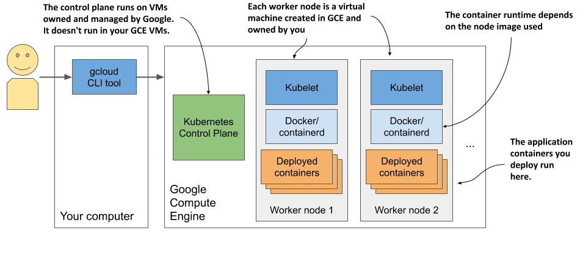

#### Thay đổi số lượng nút (Scaling)

Google cho phép bạn dễ dàng tăng hoặc giảm số lượng nút trong cụm của mình. Đối với hầu hết các bài tập trong cuốn sách này, bạn có thể thu nhỏ cụm xuống chỉ còn một nút để tiết kiệm chi phí. Bạn thậm chí có thể giảm số nút về bằng không để cụm hoàn toàn không phát sinh chi phí.

Để thu nhỏ cụm về không nút, hãy sử dụng lệnh sau:

```shell
$ gcloud container clusters resize kiada --size 0
```

Điều tuyệt vời của việc thu nhỏ về không nút là không có đối tượng nào bạn đã tạo trong cụm Kubernetes bị xóa đi, kể cả các ứng dụng đã triển khai. Dĩ nhiên, khi đưa số nút về không, các ứng dụng sẽ không có tài nguyên để hoạt động nên chúng tạm thời ngừng chạy. Nhưng ngay khi bạn tăng số lượng nút trở lại, chúng sẽ lập tức được triển khai lại. Và ngay cả khi không có nút thợ nào hoạt động, bạn vẫn có thể tương tác bình thường với Kubernetes API (vẫn có thể tạo, cập nhật và xóa các đối tượng).

#### Kiểm tra một nút thợ GKE

Nếu tò mò muốn biết những gì đang chạy trên các nút của mình, bạn có thể đăng nhập vào chúng bằng lệnh sau (hãy chọn một trong các tên nút từ kết quả của lệnh trước đó):

```shell
$ gcloud compute ssh gke-kiada-default-pool-9bba9b18-4glf
```

Khi đã đăng nhập thành công vào nút, bạn có thể thử liệt kê tất cả các container đang chạy bằng lệnh `docker ps`. Vì chưa triển khai bất kỳ ứng dụng nào nên bạn sẽ chỉ nhìn thấy các container hệ thống của Kubernetes. Hiện tại chưa cần bận tâm chúng là gì, chúng ta sẽ cùng tìm hiểu ở các chương sau.

### 3.1.5 Tạo cụm bằng Amazon Elastic Kubernetes Service

Nếu muốn sử dụng nền tảng của Amazon thay vì Google để triển khai cụm Kubernetes trên đám mây, bạn có thể thử nghiệm dịch vụ Amazon Elastic Kubernetes Service (EKS). Hãy cùng điểm qua các bước cơ bản.

Trước hết, bạn cần cài đặt công cụ dòng lệnh `eksctl` bằng cách làm theo hướng dẫn tại <https://docs.aws.amazon.com/eks/latest/userguide/getting-started-eksctl.html>.

#### Tạo cụm Kubernetes EKS

Việc khởi tạo một cụm Kubernetes EKS bằng `eksctl` không có nhiều khác biệt so với quy trình trên GKE. Tất cả những gì bạn cần làm là chạy lệnh sau:

```shell
$ eksctl create cluster --name kiada --region eu-central-1 --nodes 3 --ssh-access
```

Lệnh này sẽ tạo ra một cụm ba nút tại vùng `eu-central-1`. Bạn có thể tra cứu danh sách các vùng khả dụng tại <https://aws.amazon.com/about-aws/global-infrastructure/regional-product-services/>.

#### Kiểm tra một nút thợ EKS

Nếu muốn kiểm tra các thành phần đang chạy trên các nút đó, bạn có thể kết nối với chúng qua giao thức SSH. Cờ `--ssh-access` được sử dụng trong lệnh tạo cụm trước đó sẽ đảm bảo khóa công khai (SSH public key) của bạn được nhập sẵn vào nút.

Tương tự như với GKE và Minikube, một khi đã đăng nhập vào nút, bạn có thể thử liệt kê các container đang chạy bằng lệnh `docker ps`. Bạn sẽ thấy các container hệ thống tương tự như ở những cụm chúng ta đã tìm hiểu trước đó.

### 3.1.6 Triển khai cụm đa nút từ con số không (From scratch)

Cho đến khi hiểu sâu sắc hơn về Kubernetes, tôi thực sự khuyên bạn không nên thử cài đặt một cụm đa nút từ con số không. Nếu bạn là một quản trị viên hệ thống giàu kinh nghiệm, công việc này có lẽ sẽ không gây ra quá nhiều trở ngại, nhưng đa số mọi người nên bắt đầu bằng một trong các phương pháp dễ dàng đã trình bày ở trên. Việc quản trị một cụm Kubernetes đúng nghĩa cực kỳ phức tạp, và riêng khâu cài đặt thôi đã là một thử thách không thể coi thường.

Nếu vẫn muốn dấn thân thử thách, bạn có thể bắt đầu với các hướng dẫn trong Phụ lục B, nơi giải thích cách tạo các máy ảo bằng VirtualBox và cài đặt Kubernetes bằng công cụ `kubeadm`. Bạn cũng có thể áp dụng các hướng dẫn đó để cài đặt Kubernetes trên các máy vật lý của mình hoặc trên các máy ảo chạy trên đám mây.

Sau khi đã triển khai thành công một hoặc hai cụm bằng `kubeadm`, bạn có thể thử thiết lập hoàn toàn thủ công bằng cách làm theo bài hướng dẫn nổi tiếng *Kubernetes the Hard Way* của Kelsey Hightower tại <https://github.com/kelseyhightower/Kubernetes-the-hard-way>. Mặc dù có thể bạn sẽ vấp phải nhiều lỗi trong quá trình thực hiện, nhưng việc tự tìm cách khắc phục chúng sẽ mang lại những trải nghiệm học hỏi vô cùng giá trị.

## 3.2 Tương tác với Kubernetes

Như vậy, bạn đã biết qua một số phương pháp để triển khai một cụm Kubernetes. Giờ là lúc chúng ta học cách sử dụng cụm đó. Để tương tác với Kubernetes, bạn sẽ sử dụng một công cụ dòng lệnh có tên là `kubectl`, thường được phát âm là *kube-control*, *kube-C-T-L* hoặc *kube-cuddle*.

Như hình minh họa dưới đây, công cụ này sẽ giao tiếp với Kubernetes API server — một thành phần thuộc Kubernetes Control Plane. Sau đó, Control Plane sẽ kích hoạt các thành phần khác thực hiện các tác vụ cần thiết dựa trên những thay đổi mà bạn đã gửi qua API.

##### Hình 3.6 Cách bạn tương tác với cụm Kubernetes

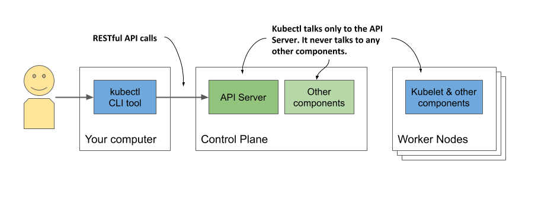

### 3.2.1 Thiết lập kubectl - công cụ dòng lệnh client của Kubernetes

`kubectl` là một tệp thực thi duy nhất mà bạn cần tải xuống máy tính và đưa vào biến môi trường PATH của hệ thống. Nó sẽ nạp thông tin cấu hình từ một tệp cấu hình có tên là *kubeconfig*. Để sử dụng `kubectl`, bạn vừa phải cài đặt nó, vừa phải chuẩn bị sẵn tệp *kubeconfig* để `kubectl` biết được nó cần phải kết nối tới cụm nào.

#### Tải xuống và cài đặt kubectl

Bạn có thể tải xuống và cài đặt phiên bản ổn định (stable) mới nhất dành cho Linux bằng các lệnh sau:

```shell
$ curl -LO "https://dl.k8s.io/release/$(curl -L -s https://dl.k8s.io/release/stable.txt)/bin/linux/amd64/kubectl"
$ chmod +x kubectl 
$ sudo mv kubectl /usr/local/bin/
```

Để cài đặt `kubectl` trên macOS, bạn có thể chạy lệnh tương tự nhưng thay thế từ `linux` trong đường dẫn URL thành `darwin`, hoặc cài đặt trực tiếp qua trình quản lý gói Homebrew bằng lệnh `brew install kubectl`.

Trên Windows, hãy tải về tệp `kubectl.exe` từ đường dẫn <https://storage.googleapis.com/kubernetes-release/release/v1.18.2/bin/windows/amd64/kubectl.exe>. Để tải phiên bản mới nhất, trước tiên hãy truy cập <https://storage.googleapis.com/kubernetes-release/release/stable.txt> để xem phiên bản ổn định hiện tại là gì, sau đó thay thế số phiên bản trong URL đầu tiên bằng phiên bản đó. Để kiểm tra xem mình đã cài đặt đúng chưa, hãy chạy lệnh `kubectl --help`. Lưu ý rằng tại thời điểm này, `kubectl` có thể chưa được cấu hình để kết nối tới cụm Kubernetes của bạn, nghĩa là hầu hết các lệnh có thể sẽ chưa hoạt động.

##### Gợi ý

Bạn luôn có thể thêm hậu tố `--help` vào sau bất kỳ lệnh `kubectl` nào để xem thêm thông tin hướng dẫn chi tiết.

#### Thiết lập tên viết tắt (alias) cho kubectl

Bạn sẽ phải sử dụng `kubectl` rất thường xuyên. Việc gõ đầy đủ tên lệnh này mỗi lần sẽ cực kỳ tốn thời gian, nhưng bạn có thể tăng tốc thao tác bằng cách thiết lập một bí danh (alias) và tính năng tự động hoàn thành bằng phím Tab (tab completion).

Hầu hết những người sử dụng Kubernetes đều cấu hình chữ `k` làm bí danh cho `kubectl`. Nếu bạn chưa từng sử dụng tính năng gán bí danh, dưới đây là cách thiết lập trên Linux và macOS. Hãy thêm dòng sau vào tệp `~/.bashrc` hoặc tệp cấu hình tương đương của bạn:

alias k=kubectl

Trên Windows, nếu sử dụng Command Prompt (cmd), bạn hãy định nghĩa bí danh bằng cách chạy lệnh `doskey k=kubectl $*`. Nếu sử dụng PowerShell, hãy thực thi lệnh `set-alias -name k -value kubectl`.

##### Lưu ý

Có thể bạn sẽ không cần tự tạo bí danh nếu đã sử dụng công cụ `gcloud` để thiết lập cụm, vì nó tự động cài đặt sẵn tệp nhị phân `k` song song với `kubectl`.

#### Cấu hình tính năng tự động hoàn thành (tab completion) cho kubectl

Ngay cả khi đã có bí danh ngắn gọn là `k`, bạn vẫn sẽ phải gõ phím khá nhiều. May mắn thay, lệnh `kubectl` có thể xuất ra mã hỗ trợ tự động hoàn thành (auto-completion) cho cả môi trường shell bash lẫn zsh. Tính năng này không chỉ tự động hoàn thành tên lệnh mà còn hoàn thành được cả tên của các đối tượng trong cụm. Ví dụ, sau này bạn sẽ học cách xem thông tin chi tiết của một nút cụ thể trong cụm bằng lệnh sau:

```shell
$ kubectl describe node gke-kiada-default-pool-9bba9b18-4glf
```

Đó là một chuỗi ký tự rất dài mà bạn sẽ phải lặp đi lặp lại liên tục. Với tính năng tự động hoàn thành bằng phím Tab, mọi thứ trở nên đơn giản hơn nhiều. Bạn chỉ cần nhấn phím `TAB` sau khi gõ vài ký tự đầu tiên của mỗi thành phần lệnh:

```shell
$ kubectl desc<TAB> no<TAB> gke-ku<TAB>
```

Để kích hoạt tính năng tự động hoàn thành trong shell bash, trước tiên bạn cần cài đặt gói bổ trợ có tên là `bash-completion`, sau đó chạy lệnh sau (bạn cũng có thể thêm dòng này vào tệp `~/.bashrc` hoặc tệp cấu hình tương đương):

```shell
$ source <(kubectl completion bash)
```

##### Lưu ý

Lệnh này giúp kích hoạt tính năng tự động hoàn thành trong shell bash. Bạn cũng có thể áp dụng cho các môi trường shell khác. Tại thời điểm viết sách, các tùy chọn được hỗ trợ bao gồm `bash`, `zsh`, `fish` và `powershell`.

Tuy nhiên, cấu hình trên chỉ có tác dụng khi bạn gõ đầy đủ tên lệnh `kubectl`. Nó sẽ không hoạt động khi bạn sử dụng bí danh `k`. Để kích hoạt tính năng tự động hoàn thành cho cả bí danh này, bạn cần thực thi thêm lệnh sau:

```shell
$ complete -o default -F __start_kubectl k
```

### 3.2.2 Cấu hình kubectl để sử dụng một cụm Kubernetes cụ thể

Tệp cấu hình kubeconfig thường được đặt tại đường dẫn `~/.kube/config`. Nếu bạn triển khai cụm của mình bằng Docker Desktop, Minikube hoặc GKE, tệp này đã được tạo tự động cho bạn. Trong trường hợp bạn được cấp quyền truy cập vào một cụm có sẵn, bạn sẽ nhận được tệp này từ quản trị viên. Các công cụ khác, chẳng hạn như *kind*, có thể ghi tệp cấu hình này ra một vị trí khác. Thay vì di chuyển tệp về vị trí mặc định, bạn cũng có thể chỉ đường dẫn cho `kubectl` bằng cách thiết lập biến môi trường `KUBECONFIG` như sau:

```shell
$ export KUBECONFIG=/path/to/custom/kubeconfig
```

Để tìm hiểu sâu hơn về cách quản lý cấu hình của kubectl và cách tự tạo một tệp cấu hình từ con số không, vui lòng tham khảo Phụ lục A.

##### Lưu ý

Nếu muốn làm việc với nhiều cụm Kubernetes khác nhau (ví dụ: cả Minikube và GKE), vui lòng tham khảo Phụ lục A để biết cách chuyển đổi qua lại giữa các ngữ cảnh (context) của `kubectl`.

### 3.2.3 Sử dụng kubectl

Sau khi đã hoàn tất việc cài đặt và cấu hình, giờ đây bạn đã có thể bắt đầu sử dụng `kubectl` để tương tác với cụm của mình.

#### Xác minh xem cụm đã hoạt động chưa và kubectl có thể kết nối được không

Để xác minh cụm của bạn đang hoạt động bình thường, hãy sử dụng lệnh `kubectl cluster-info`:

```shell
$ kubectl cluster-info
Kubernetes master is running at https://192.168.99.101:8443
KubeDNS is running at https://192.168.99.101:8443/api/v1/namespaces/...
```

Kết quả này cho thấy API server đang hoạt động và phản hồi các yêu cầu một cách bình thường. Đầu ra hiển thị danh sách các đường dẫn URL của các dịch vụ hệ thống khác nhau đang chạy trong cụm của bạn. Ví dụ trên cho thấy, bên cạnh API server, dịch vụ KubeDNS (chịu trách nhiệm phân giải tên miền nội bộ trong cụm) cũng là một dịch vụ cốt lõi đang vận hành.

#### Liệt kê các nút trong cụm

Bây giờ, hãy sử dụng lệnh `kubectl get nodes` để liệt kê tất cả các nút trong cụm của bạn. Dưới đây là kết quả thu được khi chạy lệnh này trên một cụm được tạo bởi *kind*:

```shell
$ kubectl get nodes
NAME            STATUS  ROLES   AGE   VERSION
control-plane   Ready   <none>  12m   v1.18.2
kind-worker     Ready   <none>  12m   v1.18.2
kind-worker2    Ready   <none>  12m   v1.18.2
```

Mọi thành phần trong Kubernetes đều được đại diện dưới dạng một đối tượng (object) và có thể được truy vấn cũng như thao tác thông qua một API dạng RESTful. Lệnh `kubectl get` sẽ lấy về danh sách các đối tượng thuộc loại được chỉ định từ API. Bạn sẽ sử dụng lệnh này rất thường xuyên, nhưng nó chỉ hiển thị thông tin tóm tắt cơ bản về các đối tượng được liệt kê.

#### Truy xuất thông tin chi tiết của một đối tượng

Để xem thông tin chi tiết hơn về một đối tượng, bạn sử dụng lệnh `kubectl describe`, lệnh này sẽ hiển thị nhiều thông tin chuyên sâu hơn:

```shell
$ kubectl describe node gke-kiada-85f6-node-0rrx
```

Tôi xin phép lược bớt kết quả thực tế của lệnh `describe` vì nó rất rộng và sẽ hoàn toàn rối mắt nếu trình bày trong cuốn sách này. Nếu tự mình chạy thử lệnh này, bạn sẽ thấy nó hiển thị trạng thái hiện tại của nút, thông tin chi tiết về mức độ sử dụng CPU và bộ nhớ (RAM), thông tin hệ thống, các container đang chạy trên nút, cùng nhiều thông số quan trọng khác.

Nếu bạn chạy lệnh `kubectl describe` mà không chỉ định rõ tên tài nguyên cụ thể, thông tin chi tiết của toàn bộ các nút trong cụm sẽ được in ra.

##### Gợi ý

Việc thực thi lệnh `describe` mà không kèm theo tên đối tượng cụ thể sẽ rất hữu dụng khi hệ thống chỉ tồn tại duy nhất một đối tượng thuộc loại đó. Bạn sẽ không cần phải gõ hoặc sao chép/dán tên của đối tượng.

Bạn sẽ được tiếp cận và làm quen với vô số lệnh `kubectl` hữu ích khác xuyên suốt cuốn sách này.

### 3.2.4 Tương tác với Kubernetes qua giao diện Web Dashboard

Nếu bạn ưa thích sử dụng các giao diện đồ họa trên web hơn, bạn sẽ rất vui khi biết rằng Kubernetes cũng đi kèm với một giao diện quản trị web (dashboard) rất trực quan. Tuy nhiên, cần lưu ý rằng các tính năng trên dashboard này thường đi sau khá xa so với công cụ dòng lệnh `kubectl` — vốn là công cụ tương tác chính yếu và mạnh mẽ nhất với Kubernetes.

Mặc dù vậy, dashboard vẫn cung cấp một cái nhìn trực quan về các tài nguyên khác nhau trong mối liên kết hệ thống, giúp bạn dễ dàng nắm bắt được các loại tài nguyên chính trong Kubernetes và mối quan hệ giữa chúng. Giao diện này cũng cho phép chỉnh sửa trực tiếp các đối tượng đã triển khai và hiển thị các lệnh `kubectl` tương đương cho mỗi hành động — một tính năng cực kỳ hữu ích mà người mới bắt đầu chắc chắn sẽ đánh giá cao.

Hình 3.7 hiển thị giao diện dashboard với hai khối lượng công việc (workloads) đã được triển khai trong cụm.

##### Hình 3.7 Ảnh chụp màn hình giao diện web dashboard của Kubernetes

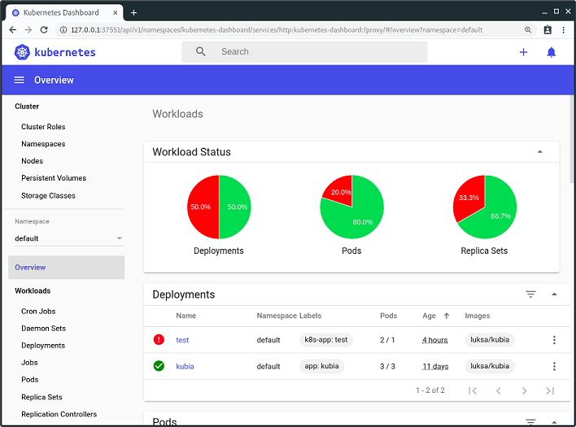

Mặc dù chúng ta không sử dụng giao diện dashboard này trong các bài thực hành của sách, bạn vẫn luôn có thể mở nó lên để nhanh chóng quan sát một cách trực quan các đối tượng đã triển khai trong cụm sau khi khởi tạo chúng bằng `kubectl`.

#### Truy cập dashboard trong Docker Desktop

Rất tiếc là Docker Desktop không cài đặt sẵn giao diện dashboard của Kubernetes theo mặc định. Việc truy cập giao diện này cũng không hề đơn giản, nhưng dưới đây là các bước thực hiện. Trước hết, bạn cần cài đặt nó bằng lệnh sau:

```shell
$ kubectl apply -f https://raw.githubusercontent.com/kubernetes/dashboard/v2.0.0-rc5/aio/deploy/recommended.yaml
```

Hãy tham khảo <https://github.com/kubernetes/dashboard> để tìm số phiên bản mới nhất. Sau khi cài đặt dashboard, lệnh tiếp theo bạn cần chạy là:

```shell
$ kubectl proxy
```

Lệnh này sẽ chạy một proxy cục bộ kết nối tới API server, cho phép bạn truy cập các dịch vụ thông qua proxy đó. Hãy giữ cho tiến trình proxy này tiếp tục chạy, rồi dùng trình duyệt để mở dashboard theo đường dẫn sau:

<http://localhost:8001/api/v1/namespaces/kubernetes-dashboard/services/https:kubernetes-dashboard:/proxy/>

Một trang xác thực sẽ hiện ra. Tiếp theo, bạn phải chạy lệnh sau để lấy token xác thực (authentication token).

```shell
PS C:\> kubectl -n kubernetes-dashboard describe secret $(kubectl -n kubernetes-dashboard get secret | sls admin-user | ForEach-Object { $_ -Split '\s+' } | Select -First 1)
```

##### Lưu ý

Lệnh này phải được chạy trong Windows PowerShell.

Hãy tìm đoạn token nằm dưới mục `kubernetes-dashboard-token-xyz` rồi dán vào trường nhập token trên trang xác thực hiển thị trong trình duyệt. Sau khi hoàn thành, bạn đã có thể bắt đầu sử dụng dashboard. Khi không dùng nữa, hãy kết thúc tiến trình `kubectl proxy` bằng tổ hợp phím `Control-C`.

#### Truy cập dashboard khi sử dụng Minikube

Nếu đang sử dụng Minikube, việc truy cập dashboard sẽ dễ dàng hơn nhiều. Hãy chạy lệnh sau và giao diện dashboard sẽ tự động mở trên trình duyệt mặc định của bạn:

```shell
$ minikube dashboard
```

#### Truy cập dashboard khi chạy Kubernetes ở môi trường khác

Google Kubernetes Engine (GKE) hiện không còn hỗ trợ truy cập vào Dashboard Kubernetes mã nguồn mở nữa, thay vào đó họ cung cấp một giao diện điều khiển (console) trên web riêng. Điều này cũng tương tự với các nhà cung cấp dịch vụ đám mây khác. Để biết cách truy cập dashboard, vui lòng tham khảo tài liệu hướng dẫn của nhà cung cấp tương ứng.

Nếu cụm (cluster) của bạn chạy trên hạ tầng riêng của mình, bạn có thể triển khai dashboard bằng cách làm theo hướng dẫn tại <https://kubernetes.io/docs/tasks/access-application-cluster/web-ui-dashboard>.

## 3.3 Chạy ứng dụng đầu tiên trên Kubernetes

Bây giờ là lúc chúng ta thực sự triển khai một thứ gì đó lên cụm của bạn. Thông thường, để triển khai một ứng dụng, bạn sẽ chuẩn bị một tệp JSON hoặc YAML mô tả tất cả các thành phần cấu thành ứng dụng đó, rồi áp dụng (apply) tệp này vào cụm. Đây được gọi là phương pháp tiếp cận khai báo (declarative approach).

Vì đây có thể là lần đầu tiên bạn triển khai một ứng dụng lên Kubernetes, chúng ta hãy chọn một cách dễ dàng hơn. Chúng ta sẽ sử dụng các lệnh mệnh lệnh (imperative commands) đơn giản, chỉ gồm một dòng duy nhất để triển khai ứng dụng.

### 3.3.1 Triển khai ứng dụng

Cách thức mệnh lệnh để triển khai một ứng dụng là sử dụng lệnh `kubectl create deployment`. Đúng như tên gọi, lệnh này sẽ tạo ra một đối tượng *Deployment*, đại diện cho một ứng dụng được triển khai trong cụm. Bằng cách sử dụng lệnh mệnh lệnh này, bạn không cần phải nắm rõ cấu trúc phức tạp của đối tượng Deployment giống như khi viết các tệp cấu hình (manifest) dạng YAML hoặc JSON.

#### Tạo một Deployment

Ở chương trước, bạn đã tạo ra một ứng dụng Node.js có tên là Kiada, đóng gói nó thành một container image và đẩy lên Docker Hub để dễ dàng phân phối tới bất kỳ máy tính nào.

##### Lưu ý

Nếu đã bỏ qua chương hai vì đã quen thuộc với Docker và container, bạn nên quay lại đọc phần 2.2.1 mô tả ứng dụng mà chúng ta sẽ triển khai tại đây cũng như trong suốt phần còn lại của cuốn sách này.

Hãy cùng triển khai ứng dụng Kiada lên cụm Kubernetes của bạn. Dưới đây là lệnh thực hiện việc đó:

```shell
$ kubectl create deployment kiada --image=luksa/kiada:0.1
deployment.apps/kiada created
```

Trong lệnh này, bạn chỉ định ba điều:

- Bạn muốn tạo một đối tượng `deployment`.
- Bạn muốn đối tượng đó có tên là `kiada`.
- Bạn muốn deployment này sử dụng container image `luksa/kiada:0.1`.

Theo mặc định, image sẽ được tải về từ Docker Hub, nhưng bạn cũng có thể chỉ định kho chứa image (image registry) ngay trong tên image (ví dụ: `quay.io/luksa/kiada:0.1`).

##### Lưu ý

Hãy đảm bảo rằng image này được lưu trữ trong một kho chứa công khai (public registry) và có thể được tải về mà không cần xác thực quyền truy cập. Bạn sẽ được tìm hiểu cách cung cấp thông tin xác thực để tải các image riêng tư (private image) ở chương 8.

Đối tượng Deployment hiện đã được lưu trữ trong Kubernetes API. Sự tồn tại của đối tượng này báo cho Kubernetes biết rằng container `luksa/kiada:0.1` phải được chạy trong cụm của bạn. Bạn vừa tuyên bố trạng thái *mong muốn* (desired state) của mình. Giờ đây, Kubernetes phải đảm bảo sao cho trạng thái *thực tế* (actual state) phản ánh đúng mong muốn đó của bạn.

#### Liệt kê các deployment

Việc tương tác với Kubernetes chủ yếu xoay quanh việc tạo và thao tác các đối tượng thông qua API của nó. Kubernetes lưu trữ các đối tượng này rồi thực hiện các thao tác để hiện thực hóa chúng. Ví dụ, khi bạn tạo một đối tượng Deployment, Kubernetes sẽ chạy ứng dụng đó. Sau đó, Kubernetes cập nhật liên tục cho bạn về trạng thái hiện tại của ứng dụng bằng cách ghi thông tin trạng thái vào chính đối tượng Deployment đó. Bạn có thể xem trạng thái này bằng cách đọc ngược lại đối tượng. Một cách để làm việc này là liệt kê tất cả các đối tượng Deployment như sau:

```shell
$ kubectl get deployments
NAME    READY   UP-TO-DATE   AVAILABLE   AGE
kiada   0/1     1            0           6s
```

Lệnh `kubectl get deployments` liệt kê tất cả các đối tượng Deployment hiện có trong cụm. Hiện tại cụm của bạn chỉ có duy nhất một Deployment. Nó chạy một thực thể (instance) ứng dụng của bạn như hiển thị trong cột `UP-TO-DATE`, nhưng cột `AVAILABLE` lại cho thấy ứng dụng này vẫn chưa sẵn sàng để sử dụng. Nguyên nhân là do container chưa sẵn sàng, như thể hiện trong cột `READY`. Bạn có thể thấy tỷ lệ container sẵn sàng đang là 0 trên tổng số 1.

Bạn có thể tự hỏi liệu có thể yêu cầu Kubernetes liệt kê tất cả các container đang chạy bằng lệnh `kubectl get containers` hay không. Chúng ta hãy thử xem.

```shell
$ kubectl get containers
error: the server doesn't have a resource type "containers"
```

Lệnh này thất bại vì Kubernetes không có loại đối tượng nào tên là "Container". Điều này nghe có vẻ kỳ lạ vì mục đích chính của Kubernetes là chạy các container, nhưng thực tế lại có một điểm mấu chốt: container không phải là đơn vị triển khai nhỏ nhất trong Kubernetes. Vậy thì đơn vị đó là gì?

#### Giới thiệu về Pod

Trong Kubernetes, thay vì triển khai các container riêng lẻ, bạn sẽ triển khai các nhóm container được đặt cùng nhau – gọi là các *pod*. Khái niệm này tương tự như một đàn cá voi (pod of whales) hay một quả đậu (pea pod).

Pod là một nhóm gồm một hoặc nhiều container có liên quan chặt chẽ với nhau (giống như những hạt đậu trong cùng một vỏ) chạy cùng nhau trên một nút thợ (worker node) và cần chia sẻ một số không gian tên Linux (Linux namespaces) nhất định, nhờ đó chúng có thể tương tác với nhau chặt chẽ hơn so với các pod khác.

Trong chương trước, tôi đã đưa ra một ví dụ về việc hai tiến trình sử dụng chung các không gian tên (namespaces). Bằng cách chia sẻ không gian tên mạng (network namespace), cả hai tiến trình đều dùng chung các giao diện mạng, chung địa chỉ IP và không gian cổng (port). Khi chia sẻ không gian tên UTS (UTS namespace), cả hai đều thấy cùng một tên máy (hostname) của hệ thống. Đây chính xác là những gì xảy ra khi bạn chạy các container trong cùng một pod. Chúng sử dụng chung không gian tên mạng và không gian tên UTS, cùng các không gian tên khác tùy thuộc vào cấu hình (spec) của pod đó.

##### Hình 3.8 Mối quan hệ giữa container, pod và nút thợ (worker node)

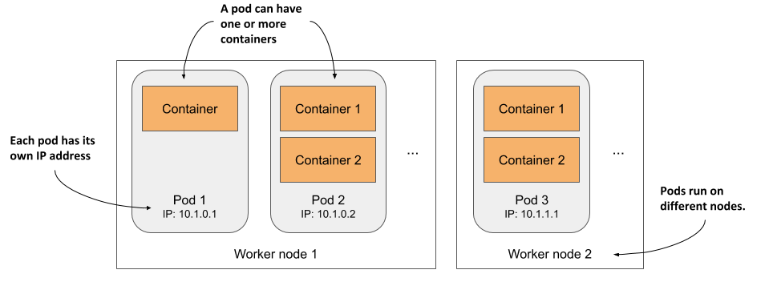

Như minh họa trong Hình 3.8, bạn có thể coi mỗi pod như một máy tính logic riêng biệt chứa một ứng dụng. Ứng dụng này có thể bao gồm một tiến trình duy nhất chạy trong một container, hoặc một tiến trình ứng dụng chính đi kèm các tiến trình phụ trợ khác, mỗi tiến trình chạy trong một container riêng. Các pod được phân bổ trên tất cả các nút thợ của cụm.

Mỗi pod đều có địa chỉ IP, tên máy, các tiến trình, giao diện mạng và các tài nguyên riêng của mình. Các container nằm trong cùng một pod sẽ luôn nghĩ rằng chúng là những container duy nhất đang chạy trên máy tính đó. Chúng không thể nhìn thấy các tiến trình của bất kỳ pod nào khác, ngay cả khi các pod đó nằm trên cùng một nút (node).

#### Liệt kê các pod

Vì container không phải là đối tượng cấp cao nhất trong Kubernetes nên bạn không thể liệt kê chúng. Nhưng bạn có thể liệt kê các pod. Kết quả đầu ra dưới đây của lệnh `kubectl get pods` cho thấy, việc tạo đối tượng Deployment đã đồng thời triển khai một pod:

```shell
$ kubectl get pods
NAME                     READY     STATUS    RESTARTS   AGE
kiada-9d785b578-p449x    0/1       Pending   0          1m    #A
```

Đây là pod chứa container đang chạy ứng dụng của bạn. Nói chính xác hơn, vì trạng thái vẫn là `Pending` (Đang chờ) nên ứng dụng, hay đúng hơn là container này, vẫn chưa thực sự hoạt động. Điều này cũng được thể hiện rõ ở cột `READY`, cho biết pod này có một container duy nhất nhưng chưa sẵn sàng.

Nguyên nhân khiến pod ở trạng thái chờ là do nút thợ được phân bổ để chạy pod này phải tải xuống container image trước rồi mới có thể khởi chạy nó. Khi quá trình tải hoàn tất, container của pod sẽ được tạo và pod sẽ chuyển sang trạng thái `Running` (Đang chạy).

Nếu Kubernetes không thể tải image từ kho chứa (registry), lệnh `kubectl get pods` sẽ hiển thị lỗi này trong cột `STATUS`. Nếu bạn đang sử dụng image tự tạo của riêng mình, hãy đảm bảo rằng nó đã được đặt ở chế độ công khai (public) trên Docker Hub. Hãy thử tải image này một cách thủ công bằng lệnh `docker pull` trên một máy tính khác để kiểm tra.

Nếu có một sự cố khác khiến pod của bạn không chạy được, hoặc đơn giản là bạn muốn xem thêm thông tin chi tiết về nó, bạn cũng có thể sử dụng lệnh `kubectl describe pod`, tương tự như cách bạn đã dùng trước đó để xem chi tiết của một nút thợ. Lệnh này sẽ hiển thị mọi vấn đề phát sinh với pod (nếu có). Hãy quan sát phần sự kiện (events) được liệt kê ở dưới cùng của kết quả đầu ra. Đối với một pod đang chạy bình thường, thông tin hiển thị sẽ gần giống như sau:

Type    Reason     Age   From                    Message

---

```
Normal  Scheduled  25s   default-scheduler       Successfully assigned 
                                                 default/kiada-9d785b578-p449x 
                                                 to kind-worker2
Normal  Pulling    23s   kubelet, kind-worker2   Pulling image "luksa/kiada:0.1"
Normal  Pulled     21s   kubelet, kind-worker2   Successfully pulled image 
Normal  Created    21s   kubelet, kind-worker2   Created container kiada
Normal  Started    21s   kubelet, kind-worker2   Started container kiada
```

#### Tìm hiểu những gì diễn ra ở hậu trường

Để giúp bạn dễ hình dung những gì đã diễn ra khi tạo Deployment, hãy xem Hình 3.9.

##### Hình 3.9 Quá trình tạo đối tượng Deployment dẫn đến việc khởi chạy container ứng dụng

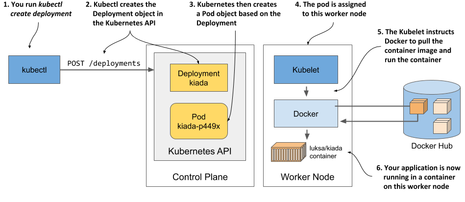

Khi bạn chạy lệnh `kubectl create`, lệnh này đã gửi một yêu cầu HTTP đến máy chủ API Kubernetes (Kubernetes API server) để tạo một đối tượng Deployment mới trong cụm. Sau đó, Kubernetes tạo tiếp một đối tượng Pod mới, rồi đối tượng này được phân bổ hay *lập lịch* (scheduled) cho một trong các nút thợ. Bộ vận hành Kubernetes trên nút thợ đó (được gọi là Kubelet) sẽ nhận biết được đối tượng Pod mới tạo, thấy rằng pod này được lập lịch chạy trên chính nút của mình, và chỉ thị cho Docker tải image tương ứng từ registry, tạo container từ image đó rồi thực thi.

##### ĐỊNH NGHĨA

Thuật ngữ lập lịch (scheduling) dùng để chỉ việc phân bổ một pod cho một nút (node) cụ thể. Pod sẽ chạy ngay lập tức chứ không phải chờ đến một thời điểm nào đó trong tương lai. Giống như cách bộ lập lịch CPU trong hệ điều hành chọn CPU để chạy một tiến trình, bộ lập lịch trong Kubernetes sẽ quyết định nút thợ nào đảm nhận việc chạy từng container. Khác với tiến trình của hệ điều hành, một khi pod đã được phân bổ cho một nút, nó sẽ chỉ chạy trên nút đó. Ngay cả khi gặp sự cố, thực thể pod này cũng không bao giờ được di chuyển sang nút khác (không giống như tiến trình CPU), nhưng một thực thể pod mới có thể được tạo ra để thay thế nó.

Tùy thuộc vào công cụ bạn dùng để chạy cụm Kubernetes, số lượng nút thợ trong cụm sẽ khác nhau. Sơ đồ chỉ hiển thị duy nhất nút thợ mà pod được lập lịch chạy. Trong một cụm có nhiều nút (multi-node cluster), không có nút thợ nào khác tham gia vào tiến trình này.

### 3.3.2 Công khai ứng dụng của bạn ra thế giới bên ngoài

Ứng dụng của bạn hiện đã hoạt động, câu hỏi tiếp theo cần giải quyết là làm thế nào để truy cập được nó. Như tôi đã đề cập, mỗi pod được cấp một địa chỉ IP riêng, nhưng đây là địa chỉ nội bộ trong cụm và không thể truy cập từ bên ngoài. Để bên ngoài có thể truy cập được pod này, bạn cần *công khai* (expose) nó bằng cách tạo một đối tượng Service.

Có một vài loại đối tượng Service khác nhau, và bạn sẽ quyết định loại dịch vụ nào mình cần sử dụng. Một số loại chỉ công khai pod trong nội bộ cụm, trong khi số khác lại công khai chúng ra bên ngoài. Một service có kiểu LoadBalancer sẽ chuẩn bị một bộ cân bằng tải bên ngoài (external load balancer), giúp chúng ta có thể truy cập service thông qua một địa chỉ IP công khai. Đây chính là loại service mà bạn sẽ khởi tạo sau đây.

#### Tạo một Service

Cách đơn giản nhất để tạo service là sử dụng lệnh mệnh lệnh sau:

```shell
$ kubectl expose deployment kiada --type=LoadBalancer --port 8080
service/kiada exposed
```

Lệnh `create deployment` bạn chạy trước đó đã tạo ra một đối tượng Deployment, còn lệnh `expose deployment` này sẽ tạo ra một đối tượng Service. Việc chạy lệnh trên sẽ báo cho Kubernetes biết rằng:

- Bạn muốn công khai tất cả các pod thuộc Deployment kiada dưới dạng một service mới.
- Bạn muốn các pod này có thể truy cập được từ bên ngoài cụm thông qua một bộ cân bằng tải.
- Ứng dụng lắng nghe trên cổng 8080, vì vậy bạn muốn truy cập ứng dụng qua cổng đó.

Bạn đã không chỉ định tên cho đối tượng Service, vì thế nó sẽ tự động lấy tên của Deployment làm tên của mình.

#### Liệt kê các service

Các service cũng là các đối tượng API, tương tự như Pod, Deployment, Node hay hầu hết mọi thứ khác trong Kubernetes, do đó bạn có thể liệt kê chúng bằng cách chạy lệnh `kubectl get services` (hoặc viết tắt là `kubectl get svc`):

```shell
$ kubectl get svc
NAME         TYPE          CLUSTER-IP     EXTERNAL-IP   PORT(S)         AGE
kubernetes   ClusterIP     10.19.240.1    <none>        443/TCP         34m
kiada        LoadBalancer  10.19.243.17   <pending>     8080:30838/TCP  4s
```

##### Lưu ý

Hãy chú ý việc sử dụng từ viết tắt `svc` thay cho `services`. Hầu hết các loại tài nguyên đều có một tên viết tắt mà bạn có thể dùng thay cho tên đầy đủ của đối tượng (ví dụ: `po` là viết tắt của `pods`, `no` của `nodes` và `deploy` của `deployments`).

Danh sách này hiển thị hai dịch vụ kèm theo loại, địa chỉ IP và các cổng mà chúng công khai. Hiện tại hãy tạm bỏ qua dịch vụ `kubernetes` và quan sát kỹ dịch vụ `kiada`. Nó vẫn chưa có địa chỉ IP ngoài (EXTERNAL-IP). Việc dịch vụ này có nhận được địa chỉ IP hay không sẽ phụ thuộc vào cách bạn triển khai cụm của mình.

##### Liệt kê các loại đối tượng được hỗ trợ bằng lệnh kubectl api-resources

Bạn đã sử dụng lệnh `kubectl get` để liệt kê nhiều thành phần khác nhau trong cụm của mình: từ Node, Deployment, Pod cho đến bây giờ là Service. Đây đều là các loại đối tượng trong Kubernetes. Bạn có thể hiển thị danh sách tất cả các loại đối tượng được hỗ trợ bằng cách chạy lệnh `kubectl api-resources`. Danh sách này cũng cung cấp tên viết tắt của từng loại đối tượng và một số thông tin cần thiết khác phục vụ cho việc định nghĩa các đối tượng trong tệp cấu hình JSON/YAML mà bạn sẽ được học ở các chương tiếp theo.

#### Tìm hiểu về dịch vụ cân bằng tải (load balancer services)

Mặc dù Kubernetes cho phép bạn tạo ra các dịch vụ kiểu LoadBalancer, bản thân nó lại không cung cấp sẵn bộ cân bằng tải này. Nếu cụm của bạn được triển khai trên đám mây, Kubernetes có thể yêu cầu hạ tầng đám mây khởi tạo một bộ cân bằng tải và cấu hình bộ cân bằng tải đó để chuyển tiếp lưu lượng truy cập vào cụm của bạn. Hạ tầng đám mây sau đó sẽ gửi lại địa chỉ IP của bộ cân bằng tải cho Kubernetes, và địa chỉ này sẽ trở thành địa chỉ bên ngoài (external IP) cho dịch vụ của bạn.

Quy trình tạo đối tượng Service, khởi tạo bộ cân bằng tải và cách thức chuyển tiếp các kết nối vào cụm được mô tả trong hình tiếp theo dưới đây.

##### Hình 3.10 Diễn biến khi bạn tạo một đối tượng Service kiểu LoadBalancer

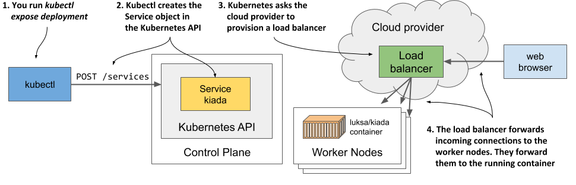

Việc chuẩn bị bộ cân bằng tải thường mất một chút thời gian, vì vậy hãy đợi thêm vài giây rồi kiểm tra lại xem địa chỉ IP đã được cấp phát hay chưa. Lần này, thay vì liệt kê tất cả các dịch vụ, bạn chỉ hiển thị riêng dịch vụ `kiada` như sau:

```shell
$ kubectl get svc kiada
NAME        TYPE          CLUSTER-IP    EXTERNAL-IP    PORT(S)         AGE
kiada       LoadBalancer  10.19.243.17  35.246.179.22  8080:30838/TCP  82s
```

Địa chỉ IP bên ngoài hiện đã xuất hiện. Điều này đồng nghĩa với việc bộ cân bằng tải đã sẵn sàng chuyển tiếp các yêu cầu của người dùng trên toàn thế giới tới ứng dụng của bạn.

##### Lưu ý

Nếu bạn triển khai cụm bằng Docker Desktop, địa chỉ IP của bộ cân bằng tải sẽ hiển thị là `localhost`, ám chỉ chính máy tính chạy Windows hoặc macOS của bạn chứ không phải là máy ảo chạy Kubernetes và ứng dụng. Nếu bạn dùng Minikube để tạo cụm, sẽ không có bộ cân bằng tải nào được khởi tạo, nhưng bạn vẫn có thể truy cập dịch vụ theo một cách khác. Tôi sẽ giải thích chi tiết hơn ở phần sau.

#### Truy cập ứng dụng thông qua bộ cân bằng tải

Bây giờ bạn đã có thể gửi các yêu cầu đến ứng dụng của mình thông qua địa chỉ IP và cổng bên ngoài của dịch vụ:

```shell
$ curl 35.246.179.22:8080
Kiada version 0.1. Request processed by "kiada-9d785b578-p449x". Client IP: ::ffff:1.2.3.4
```

##### Lưu ý

Nếu sử dụng Docker Desktop, bạn có thể truy cập dịch vụ tại địa chỉ `localhost:8080` ngay từ hệ điều hành máy chủ của mình. Hãy sử dụng lệnh curl hoặc trình duyệt để kiểm tra.

Xin chúc mừng! Nếu sử dụng Google Kubernetes Engine, bạn đã xuất bản thành công ứng dụng của mình tới người dùng trên toàn thế giới. Bất kỳ ai biết địa chỉ IP và cổng này đều có thể truy cập được ứng dụng. Nếu không tính các bước thiết lập cụm lúc đầu, bạn chỉ cần đúng hai lệnh đơn giản để triển khai ứng dụng:

- `kubectl create deployment` và
- `kubectl expose deployment`.

#### Truy cập ứng dụng khi không có sẵn bộ cân bằng tải

Không phải cụm Kubernetes nào cũng hỗ trợ cơ chế cung cấp bộ cân bằng tải. Cụm do Minikube tạo ra là một ví dụ điển hình. Nếu bạn tạo một dịch vụ kiểu LoadBalancer trên đó, bản thân dịch vụ vẫn hoạt động nhưng sẽ không có bộ cân bằng tải thực tế nào được dựng lên. Lệnh kubectl sẽ luôn hiển thị trạng thái của địa chỉ IP ngoài là `<pending>` và bạn bắt buộc phải dùng phương thức khác để truy cập dịch vụ này.

Có rất nhiều cách thức khác nhau để truy cập các dịch vụ. Thậm chí bạn có thể bỏ qua bước đi qua dịch vụ và truy cập trực tiếp vào từng pod riêng lẻ, song cách này chủ yếu dùng để phục vụ quá trình chẩn đoán lỗi (troubleshooting). Bạn sẽ học cách làm việc này ở chương 5. Trước mắt, hãy cùng tìm hiểu cách dễ nhất để truy cập dịch vụ của bạn trong trường hợp không có sẵn bộ cân bằng tải.

Minikube có thể chỉ ra địa chỉ truy cập dịch vụ nếu bạn chạy lệnh sau:

```shell
$ minikube service kiada --url
http://192.168.99.102:30838
```

Lệnh này sẽ in ra đường dẫn URL của dịch vụ. Bây giờ bạn có thể trỏ lệnh `curl` hoặc trình duyệt của mình tới URL đó để truy cập ứng dụng:

```shell
$ curl http://192.168.99.102:30838
Kiada version 0.1. Request processed by "kiada-9d785b578-p449x". Client IP: ::ffff:172.17.0.1
```

##### Mẹo

Nếu bỏ qua tham số `--url` khi chạy lệnh `minikube service`, trình duyệt của bạn sẽ tự động mở và tải đường dẫn dịch vụ đó.

Bạn có thể tự hỏi địa chỉ IP và cổng này từ đâu ra. Đây chính là địa chỉ IP của máy ảo Minikube. Bạn có thể kiểm chứng điều này bằng cách thực thi lệnh `minikube ip`. Máy ảo Minikube này cũng đóng vai trò là nút thợ duy nhất của bạn. Còn cổng `30838` được gọi là *cổng trên nút* (node port). Đây là cổng trên nút thợ có nhiệm vụ chuyển tiếp các kết nối đến dịch vụ của bạn. Có thể bạn đã để ý thấy cổng này xuất hiện trong danh sách cổng của dịch vụ khi chạy lệnh `kubectl get svc`:

```shell
$ kubectl get svc kiada
NAME        TYPE          CLUSTER-IP    EXTERNAL-IP    PORT(S)         AGE
kiada       LoadBalancer  10.19.243.17  <pending>      8080:30838/TCP  82s
```

Dịch vụ của bạn có thể truy cập được thông qua số cổng này trên tất cả các nút thợ, bất kể bạn đang sử dụng Minikube hay bất kỳ cụm Kubernetes nào khác.

##### Lưu ý

Nếu bạn dùng Docker Desktop, máy ảo chạy Kubernetes sẽ không thể truy cập được từ hệ điều hành máy chủ thông qua IP của máy ảo. Bạn chỉ có thể truy cập dịch vụ qua cổng trên nút (node port) từ bên trong máy ảo bằng cách đăng nhập vào máy ảo thông qua container đặc biệt như mô tả ở phần 3.1.1.

Nếu biết IP của ít nhất một nút thợ, bạn sẽ có thể truy cập được dịch vụ của mình thông qua tổ hợp `IP:cổng` này, miễn là các quy tắc tường lửa không chặn quyền truy cập vào cổng đó.

Hình tiếp theo cho thấy cách các máy khách bên ngoài truy cập ứng dụng thông qua các cổng trên nút (node ports).

##### Hình 3.11 Định tuyến kết nối thông qua cổng trên nút (node port) của dịch vụ

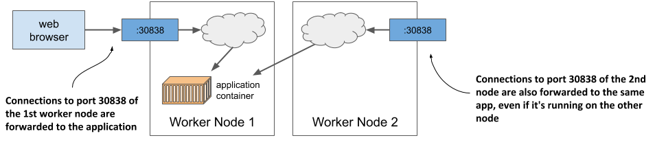

Để liên kết điều này với những gì tôi đã đề cập ở trước về việc bộ cân bằng tải chuyển tiếp kết nối đến các nút và các nút sau đó chuyển tiếp chúng đến các container: các cổng trên nút chính xác là nơi bộ cân bằng tải gửi các yêu cầu đến. Sau đó, Kubernetes đảm bảo các yêu cầu này được chuyển tiếp đến ứng dụng đang chạy bên trong container. Bạn sẽ được tìm hiểu chi tiết cơ chế hoạt động này ở chương 10, khi chúng ta đi sâu hơn vào phần dịch vụ (services). Từ giờ cho tới lúc đó, đừng quá bận tâm suy nghĩ về nó. Thay vào đó, hãy cùng thao tác thêm một chút với cụm của chúng ta để xem Kubernetes còn làm được những gì nữa nhé.

### 3.3.3 Cân bằng tải mở rộng ứng dụng theo chiều ngang (Horizontal Scaling)

Hiện tại bạn đang có một ứng dụng hoạt động đại diện bởi một Deployment và được công khai ra thế giới thông qua một đối tượng Service. Giờ là lúc chúng ta tạo ra thêm một số "phép màu" khác.

Một trong những lợi ích lớn nhất của việc chạy ứng dụng trong container là khả năng mở rộng quy mô triển khai vô cùng dễ dàng. Hiện tại bạn chỉ đang chạy một thực thể duy nhất của ứng dụng. Hãy tưởng tượng số lượng người dùng ứng dụng của bạn đột ngột tăng vọt. Thực thể duy nhất kia không còn đủ sức gánh vác tải lượng này nữa. Bạn cần phải chạy thêm các thực thể khác để phân tán tải lượng và phục vụ người dùng. Điều này được gọi là *mở rộng quy mô theo chiều ngang* (scaling out). Với Kubernetes, việc này cực kỳ đơn giản.

#### Tăng số lượng thực thể ứng dụng đang chạy

Để triển khai ứng dụng, bạn đã tạo một đối tượng Deployment. Theo mặc định, nó chạy một thực thể duy nhất của ứng dụng. Để chạy thêm các thực thể khác, bạn chỉ cần thay đổi quy mô (scale) đối tượng Deployment bằng lệnh sau:

```shell
$ kubectl scale deployment kiada --replicas=3
deployment.apps/kiada scaled
```

Bạn vừa thông báo cho Kubernetes rằng mình muốn chạy ba bản sao chuẩn xác (hay còn gọi là *replicas*) cho pod của mình. Hãy lưu ý là bạn không hề ra lệnh cho Kubernetes phải làm như thế nào. Bạn không bảo nó "hãy tạo thêm hai pod nữa". Bạn chỉ thiết lập số lượng bản sao mong muốn mới, và để Kubernetes tự tính toán xem cần thực hiện hành động nào để đạt được trạng thái mong muốn mới đó.

Đây là một trong những nguyên lý cốt lõi nhất của Kubernetes. Thay vì can thiệp trực tiếp vào việc Kubernetes phải làm gì, bạn chỉ cần thiết lập một trạng thái mong muốn mới cho hệ thống và để Kubernetes tự tìm cách hiện thực hóa nó. Để thực hiện điều này, nó sẽ kiểm tra trạng thái hiện tại, so sánh với trạng thái mong muốn, chỉ ra các điểm khác biệt và quyết định những việc cần làm để điều hòa (reconcile) chúng.

#### Quan sát kết quả sau khi mở rộng quy mô

Mặc dù lệnh `kubectl scale deployment` trông có vẻ mang tính mệnh lệnh vì dường như nó yêu cầu Kubernetes trực tiếp thay đổi quy mô ứng dụng, nhưng thực chất những gì lệnh này làm là chỉnh sửa đối tượng Deployment được chỉ định. Như bạn sẽ thấy ở chương sau, bạn hoàn toàn có thể tự tay chỉnh sửa đối tượng này thay vì sử dụng lệnh mệnh lệnh. Hãy xem lại đối tượng Deployment để thấy lệnh thay đổi quy mô đã tác động tới nó như thế nào:

```shell
$ kubectl get deploy
NAME    READY   UP-TO-DATE   AVAILABLE   AGE
kiada   3/3     3            3           18m
```

Ba thực thể hiện đã được cập nhật, sẵn sàng hoạt động, và cả ba container đều ở trạng thái sẵn sàng. Điểm này có thể không hiển thị rõ từ kết quả lệnh, nhưng thực tế ba container này không thuộc cùng một thực thể pod. Chúng ta có ba pod riêng biệt, mỗi pod chứa một container. Bạn có thể kiểm chứng điều này bằng cách liệt kê các pod:

```shell
$ kubectl get pods
NAME                    READY   STATUS    RESTARTS   AGE
kiada-9d785b578-58vhc   1/1     Running   0          17s
kiada-9d785b578-jmnj8   1/1     Running   0          17s
kiada-9d785b578-p449x   1/1     Running   0          18m
```

Như bạn thấy, hiện đang có ba pod hoạt động. Cột `READY` hiển thị mỗi pod chứa một container duy nhất và tất cả các container này đều đã sẵn sàng. Trạng thái của mọi pod đều là `Running`.

#### Hiển thị nút vật lý/máy chủ của pod khi liệt kê

Nếu bạn sử dụng một cụm chỉ có một nút duy nhất, tất cả các pod của bạn sẽ chạy trên nút đó. Nhưng trong một cụm có nhiều nút, ba pod này sẽ được phân bổ rải rác khắp cụm. Để xem các pod được lập lịch chạy trên nút nào, bạn có thể sử dụng thêm tùy chọn `-o` `wide` để hiển thị danh sách pod chi tiết hơn:

```shell
$ kubectl get pods -o wide
NAME                   ...  IP          NODE 
kiada-9d785b578-58vhc  ...  10.244.1.5  kind-worker    #A
kiada-9d785b578-jmnj8  ...  10.244.2.4  kind-worker2    #B
kiada-9d785b578-p449x  ...  10.244.2.3  kind-worker2    #B
```

##### Lưu ý

Bạn cũng có thể sử dụng tùy chọn xuất rộng `-o wide` này để xem thêm thông tin bổ sung khi liệt kê các loại đối tượng khác.

Kết quả chi tiết cho thấy một pod được lập lịch chạy trên một nút, trong khi hai pod còn lại đều được phân bổ trên một nút khác. Bộ lập lịch (Scheduler) thường sẽ phân phối các pod một cách đồng đều, nhưng việc này cũng tùy thuộc vào cách nó được cấu hình. Bạn sẽ được tìm hiểu sâu hơn về cơ chế lập lịch ở chương 21.

##### Nút máy chủ chạy pod có thực sự quan trọng?

Bất kể chạy trên nút nào, mọi thực thể ứng dụng của bạn đều hoạt động trong một môi trường hệ điều hành giống hệt nhau, bởi chúng đều chạy từ các container được tạo ra từ cùng một container image. Như bạn đã biết ở chương trước, thứ duy nhất có thể có sự khác biệt là nhân hệ điều hành (OS kernel), nhưng điều này chỉ xảy ra khi các nút khác nhau sử dụng các phiên bản nhân khác nhau hoặc nạp các mô-đun nhân khác nhau.

Ngoài ra, mỗi pod sẽ có địa chỉ IP riêng và có thể giao tiếp bình thường với bất kỳ pod nào khác – không quan trọng pod kia nằm cùng trên một nút thợ, ở một nút khác trên cùng một tủ rack máy chủ, hay thậm chí ở một trung tâm dữ liệu hoàn toàn khác.

Cho đến lúc này, bạn vẫn chưa thiết lập bất kỳ yêu cầu tài nguyên nào cho các pod, nhưng nếu bạn làm vậy, mỗi pod sẽ được cấp phát đúng lượng tài nguyên tính toán mà nó yêu cầu. Đối với pod, việc nút nào cung cấp những tài nguyên đó không quan trọng, miễn là các yêu cầu của nó được đáp ứng đầy đủ.

Do đó, bạn không cần bận tâm xem pod được lập lịch chạy ở đâu. Đó cũng là lý do tại sao lệnh mặc định `kubectl get pods` không hiển thị thông tin về các nút thợ của các pod được liệt kê. Trong thế giới của Kubernetes, điều đó thực sự không quá quan trọng.

Như bạn có thể thấy, việc thay đổi quy mô ứng dụng vô cùng dễ dàng. Khi ứng dụng của bạn đã đi vào hoạt động thực tế (production) và phát sinh nhu cầu mở rộng quy mô, bạn có thể bổ sung thêm các thực thể khác chỉ bằng một lệnh duy nhất mà không cần phải tự cài đặt, cấu hình và chạy các bản sao một cách thủ công.

##### Lưu ý

Bản thân ứng dụng phải hỗ trợ việc mở rộng quy mô theo chiều ngang. Kubernetes không tự động hô biến ứng dụng của bạn trở nên dễ mở rộng quy mô; nó chỉ đơn giản hóa tối đa việc tạo ra các bản sao cho ứng dụng đó.

#### Quan sát lưu lượng yêu cầu phân bổ tới cả ba pod khi sử dụng service

Hiện tại nhiều thực thể ứng dụng của bạn đang cùng chạy, hãy xem chuyện gì xảy ra khi bạn gửi yêu cầu tới URL của dịch vụ một lần nữa. Liệu phản hồi có luôn luôn trả về từ cùng một thực thể hay không? Câu trả lời nằm ở dưới đây:

```shell
$ curl 35.246.179.22:8080
Kiada version 0.1. Request processed by "kiada-9d785b578-58vhc". Client IP: ::ffff:1.2.3.4    #A
$ curl 35.246.179.22:8080
Kiada version 0.1. Request processed by "kiada-9d785b578-p449x". Client IP: ::ffff:1.2.3.4    #B
$ curl 35.246.179.22:8080
Kiada version 0.1. Request processed by "kiada-9d785b578-jmnj8". Client IP: ::ffff:1.2.3.4    #C
$ curl 35.246.179.22:8080
Kiada version 0.1. Request processed by "kiada-9d785b578-p449x". Client IP: ::ffff:1.2.3.4    #D
```

Nếu quan sát kỹ các phản hồi, bạn sẽ thấy chúng khớp với tên của từng pod khác nhau. Mỗi yêu cầu sẽ đến một pod khác nhau theo thứ tự ngẫu nhiên. Đây chính là chức năng của các service trong Kubernetes khi có nhiều hơn một thực thể pod đứng sau chúng. Chúng đóng vai trò là những bộ cân bằng tải đặt phía trước các pod. Hãy cùng trực quan hóa hệ thống này qua hình minh họa sau.

##### Hình 3.12 Cân bằng tải trên nhiều pod cùng đứng sau một dịch vụ

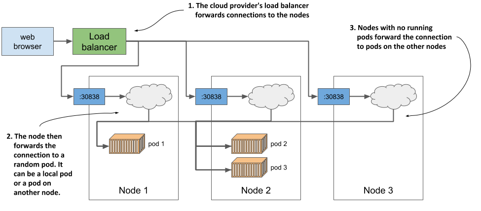

Như hình vẽ minh họa, bạn tránh nhầm lẫn cơ chế cân bằng tải này (do chính dịch vụ Kubernetes cung cấp) với bộ cân bằng tải bổ sung do hạ tầng cung cấp khi chạy trên GKE hoặc các cụm đám mây khác. Kể cả khi bạn sử dụng Minikube và không có bộ cân bằng tải bên ngoài nào, các yêu cầu của bạn vẫn được phân phối đều tới ba pod bởi chính dịch vụ đó. Nếu bạn dùng GKE, thực tế có tới *hai* bộ cân bằng tải cùng hoạt động. Sơ đồ cho thấy bộ cân bằng tải của hạ tầng đảm nhận việc phân phối các yêu cầu đến các nút, và sau đó dịch vụ sẽ tiếp tục phân phối các yêu cầu đó tới các pod.

Tôi biết điều này hiện tại có thể hơi khó hiểu, nhưng mọi thứ sẽ sáng tỏ ở chương 10.

### 3.3.4 Hiểu về ứng dụng đã triển khai

Để khép lại chương này, hãy cùng điểm lại các thành phần cấu thành hệ thống của bạn. Có hai góc nhìn để quan sát hệ thống – góc nhìn logic (logical view) và góc nhìn vật lý (physical view). Bạn vừa được thấy góc nhìn vật lý trong Hình 3.12. Có ba container đang hoạt động được triển khai trên ba nút thợ (hoặc một nút thợ duy nhất nếu dùng Minikube). Nếu chạy Kubernetes trên đám mây, hạ tầng đám mây cũng đã tạo sẵn một bộ cân bằng tải cho bạn. Docker Desktop cũng tạo một dạng bộ cân bằng tải cục bộ tương tự. Minikube không tạo bộ cân bằng tải, nhưng bạn có thể truy cập trực tiếp vào dịch vụ của mình thông qua cổng trên nút (node port).

Mặc dù góc nhìn vật lý của hệ thống sẽ có sự khác biệt giữa các cụm khác nhau, góc nhìn logic lại luôn đồng nhất, bất kể bạn đang sử dụng một cụm phát triển nhỏ hay một cụm vận hành thực tế quy mô lớn với hàng ngàn nút. Nếu không phải là người trực tiếp quản trị cụm, bạn thậm chí không cần bận tâm đến góc nhìn vật lý này. Miễn là mọi thứ hoạt động đúng như mong đợi, góc nhìn logic là tất cả những gì bạn cần quan tâm. Chúng ta hãy cùng xem xét kỹ hơn góc nhìn này.

#### Tìm hiểu về các đối tượng API đại diện cho ứng dụng

Góc nhìn logic bao gồm các đối tượng mà bạn đã tạo ra trong Kubernetes API – có thể là trực tiếp hoặc gián tiếp. Hình dưới đây mô tả mối quan hệ qua lại giữa các đối tượng này.

##### Hình 3.13 Ứng dụng sau khi triển khai gồm có một Deployment, nhiều Pod và một Service.

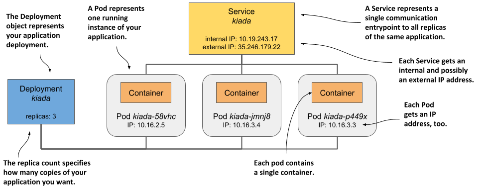

Các đối tượng này cụ thể như sau:

- Đối tượng Deployment do bạn tạo ra,
- Các đối tượng Pod được tạo tự động dựa trên Deployment đó, và
- Đối tượng Service do bạn tạo thủ công.

Có những đối tượng trung gian khác nằm giữa ba đối tượng kể trên, nhưng bạn chưa cần phải tìm hiểu chúng ngay lúc này. Bạn sẽ được học về chúng ở các chương kế tiếp.

Bạn còn nhớ khi tôi giải thích ở Chương 1 rằng Kubernetes trừu tượng hóa hạ tầng không? Góc nhìn logic của ứng dụng này chính là một ví dụ tuyệt vời cho điều đó. Ở đây không có khái niệm về các nút (nodes), không có cấu trúc liên kết mạng (network topology) phức tạp, cũng không có các bộ cân bằng tải vật lý. Chỉ đơn thuần là một góc nhìn tối giản chứa ứng dụng của bạn cùng các đối tượng hỗ trợ đi kèm. Chúng ta hãy xem các đối tượng này kết hợp với nhau như thế nào và đóng vai trò gì trong mô hình nhỏ của bạn.

Đối tượng Deployment đại diện cho quá trình triển khai ứng dụng. Nó chỉ rõ container image nào chứa ứng dụng của bạn và số lượng bản sao (replicas) ứng dụng mà Kubernetes cần duy trì. Mỗi bản sao được đại diện bởi một đối tượng Pod. Đối tượng Service đóng vai trò là một điểm đầu mối giao tiếp duy nhất dẫn tới các bản sao này.

#### Tìm hiểu về các pod

Bộ phận thiết yếu và quan trọng nhất trong hệ thống của bạn chính là các pod. Mỗi định nghĩa pod chứa một hoặc nhiều container cấu thành nên pod đó. Khi khởi tạo một pod, Kubernetes sẽ chạy tất cả các container được khai báo trong cấu hình của nó. Miễn là đối tượng Pod còn tồn tại, Kubernetes sẽ làm mọi cách để đảm bảo các container bên trong tiếp tục chạy ổn định. Nó chỉ dừng hoạt động của chúng khi đối tượng Pod bị xóa đi.

#### Tìm hiểu vai trò của Deployment

Khi bạn tạo đối tượng Deployment lần đầu tiên, chỉ có một đối tượng Pod duy nhất được khởi tạo. Nhưng khi bạn tăng số lượng bản sao mong muốn trong cấu hình Deployment, Kubernetes sẽ tạo thêm các bản sao tương ứng. Kubernetes luôn tự động đảm bảo số lượng pod thực tế khớp với số lượng mong muốn.

Nếu một hoặc nhiều pod bị mất hoặc rơi vào trạng thái không xác định, Kubernetes sẽ thay thế chúng để đưa số lượng pod thực tế trở lại đúng với số lượng bản sao mong muốn ban đầu. Một pod biến mất khi có ai đó hoặc tiến trình nào đó chủ động xóa nó, trong khi trạng thái không xác định xảy ra khi nút thợ chạy pod đó ngừng báo cáo trạng thái do lỗi mạng hoặc hỏng hóc phần cứng.

Nói một cách chính xác, một Deployment thực chất không làm gì khác ngoài việc tạo ra một số lượng đối tượng Pod nhất định. Bạn có thể tự hỏi liệu mình có thể tạo trực tiếp các Pod thay vì thông qua Deployment hay không. Hoàn toàn có thể, nhưng nếu muốn chạy nhiều bản sao, bạn sẽ phải tạo thủ công từng pod một và đảm bảo đặt cho mỗi pod một cái tên duy nhất không trùng lặp. Đồng thời, bạn cũng phải liên tục giám sát các pod này để thay thế kịp thời nếu chúng đột ngột biến mất hoặc nút thợ chạy chúng gặp sự cố. Đó chính là lý do vì sao trong thực tế chúng ta hầu như không bao giờ tạo trực tiếp các pod mà luôn thông qua một Deployment.

#### Tìm hiểu lý do tại sao bạn cần một service

Thành phần thứ ba trong hệ thống là đối tượng Service. Bằng cách khởi tạo nó, bạn thông báo với Kubernetes rằng bạn cần một đầu mối giao tiếp duy nhất để kết nối tới các pod của mình. Service cung cấp một địa chỉ IP duy nhất để giao tiếp với các pod, không quan trọng hiện tại bạn đang có bao nhiêu bản sao được triển khai. Nếu service có nhiều pod đứng sau, nó sẽ hoạt động như một bộ cân bằng tải. Nhưng ngay cả khi chỉ có duy nhất một pod, bạn vẫn nên công khai nó thông qua một service. Để hiểu lý do tại sao, bạn cần nắm được một đặc tính quan trọng của pod.

Các pod mang tính chất tạm thời (ephemeral) và có thể biến mất bất kỳ lúc nào. Điều này có thể xảy ra khi nút máy chủ chạy pod bị hỏng, khi ai đó vô tình xóa nhầm pod, hoặc khi pod bị trục xuất (evicted) khỏi một nút khỏe mạnh để nhường chỗ cho các pod khác quan trọng hơn. Như đã giải thích ở phần trước, khi các pod được quản lý bởi một Deployment, một pod bị mất sẽ lập tức được thay thế bằng một pod mới. Pod mới này không đồng nhất với pod cũ đã bị thay thế; nó là một pod hoàn toàn mới với một địa chỉ IP mới.

Nếu không sử dụng service và cấu hình trực tiếp cho máy khách (client) kết nối vào địa chỉ IP của pod ban đầu, bạn sẽ phải cấu hình lại toàn bộ các máy khách này để kết nối tới địa chỉ IP của pod mới. Nhưng điều này là không cần thiết nếu bạn sử dụng một service. Khác với pod, service không mang tính chất tạm thời. Khi bạn tạo một service, nó sẽ được gán một địa chỉ IP tĩnh không bao giờ thay đổi trong suốt vòng đời của service đó.

Thay vì kết nối trực tiếp đến pod, các máy khách nên kết nối đến địa chỉ IP của service. Điều này đảm bảo các kết nối luôn được định tuyến tới một pod khỏe mạnh, ngay cả khi danh sách các pod phía sau dịch vụ liên tục thay đổi. Đồng thời, cơ chế này cũng đảm bảo tải lượng được phân phối đồng đều đến tất cả các pod khi bạn quyết định mở rộng quy mô triển khai theo chiều ngang.

## 3.4 Tóm tắt

Trong chương thực hành này, bạn đã học được rằng:

- Hầu như tất cả các nhà cung cấp dịch vụ đám mây đều cung cấp giải pháp Kubernetes được quản lý (managed Kubernetes). Họ sẽ gánh vác phần công việc bảo trì cụm Kubernetes phức tạp, trong khi việc của bạn chỉ là sử dụng API của nó để triển khai các ứng dụng của mình.
- Bạn cũng có thể tự cài đặt Kubernetes trên đám mây, nhưng điều này thường không phải là một ý tưởng hay cho đến khi bạn đã hoàn toàn làm chủ mọi khía cạnh quản trị Kubernetes.
- Bạn có thể cài đặt Kubernetes cục bộ ngay trên máy tính cá nhân của mình bằng các công cụ như Docker Desktop hoặc Minikube (chạy Kubernetes trong một máy ảo Linux), hoặc công cụ kind (chạy các nút master và nút thợ dưới dạng các container Docker, và chạy các container ứng dụng bên trong các container đó).
- Công cụ dòng lệnh `kubectl` là phương thức phổ biến nhất để tương tác với Kubernetes. Giao diện dashboard trên nền web cũng tồn tại nhưng thường không ổn định và cập nhật chậm hơn so với công cụ CLI.
- Để làm việc nhanh hơn với `kubectl`, bạn nên thiết lập một tên viết tắt (alias) ngắn gọn và bật tính năng tự động hoàn thành (shell completion).
- Một ứng dụng có thể được triển khai bằng lệnh `kubectl create deployment`, sau đó được công khai tới người dùng bằng lệnh `kubectl expose deployment`. Việc mở rộng quy mô theo chiều ngang cũng vô cùng đơn giản: lệnh `kubectl scale deployment` sẽ chỉ thị cho Kubernetes bổ sung thêm các bản sao mới hoặc gỡ bỏ bớt các bản sao hiện có để đạt được số lượng bản sao chính xác mà bạn yêu cầu.
- Đơn vị triển khai cơ bản không phải là container, mà là pod – thực thể có thể chứa một hoặc nhiều container liên quan với nhau.
- Deployment, Service, Pod và Node đều là các đối tượng/tài nguyên trong Kubernetes. Bạn có thể liệt kê chúng bằng lệnh `kubectl get` và kiểm tra chi tiết bằng lệnh `kubectl describe`.
- Đối tượng Deployment đảm nhận việc triển khai số lượng Pod mong muốn, trong khi đối tượng Service giúp người dùng truy cập được chúng dưới một địa chỉ IP duy nhất và ổn định.
- Bản thân mỗi service đều cung cấp khả năng cân bằng tải nội bộ trong cụm, nhưng nếu bạn đặt kiểu của service là `LoadBalancer`, Kubernetes sẽ yêu cầu hạ tầng đám mây đang chạy cụm cấp thêm một bộ cân bằng tải ngoài để đưa ứng dụng của bạn ra một địa chỉ công khai mà mọi người đều có thể truy cập.

Chúng ta vừa hoàn thành chuyến tham quan đầu tiên quanh vịnh. Giờ là lúc bạn cần học cách tự chèo lái để có thể tự tin ra khơi. Phần tiếp theo của cuốn sách sẽ tập trung vào các đối tượng Kubernetes khác nhau, cùng cách thức và thời điểm sử dụng chúng. Chúng ta sẽ bắt đầu với đối tượng quan trọng nhất – Pod.

---

[← Chương 2](02-tim-hieu-ve-container.md) · [Mục lục](README.md) · [Chương 4 →](04-gioi-thieu-cac-doi-tuong-api-cua-kubernetes.md)
