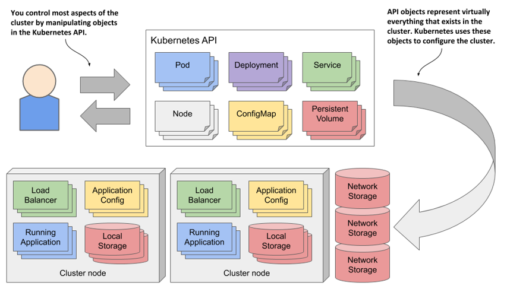
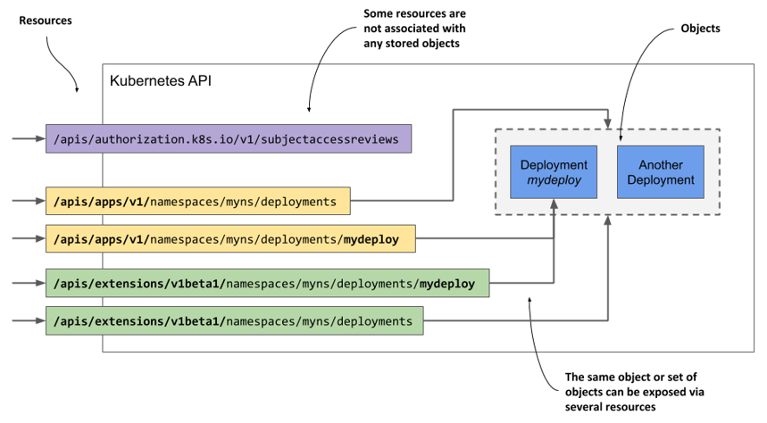
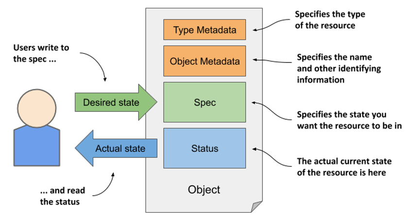
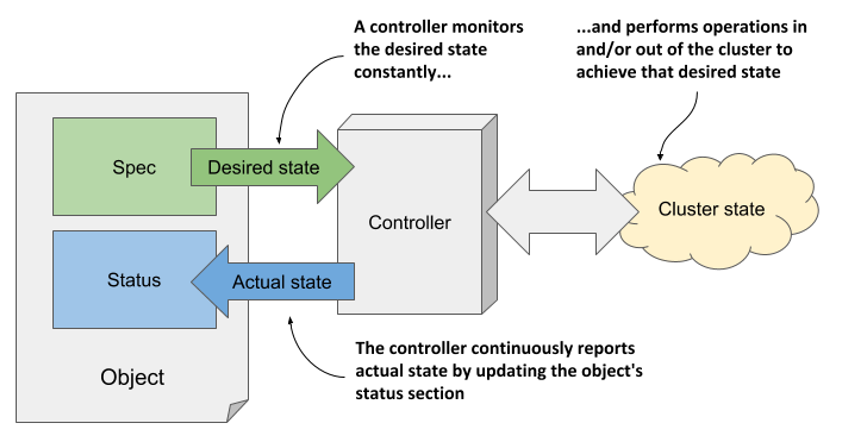
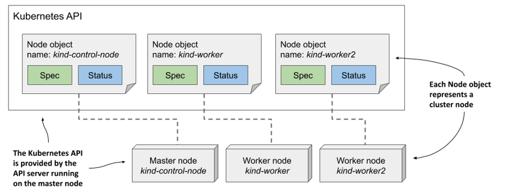
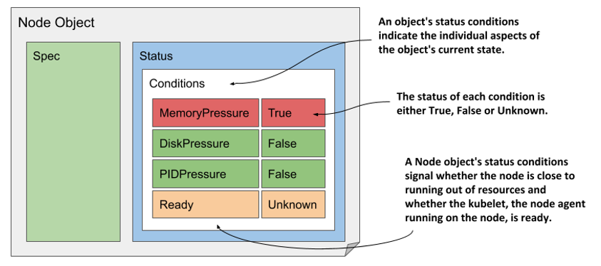
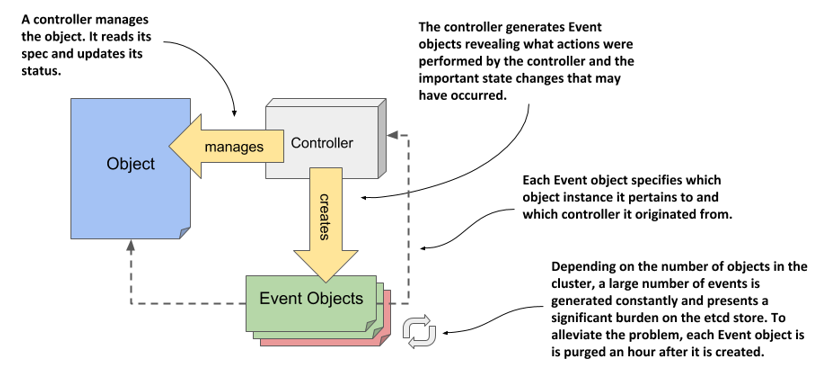

# 4 Giới thiệu các đối tượng API của Kubernetes

### Nội dung chương này gồm

- Quản lý cụm Kubernetes và các ứng dụng chạy trên đó thông qua API
- Hiểu rõ cấu trúc của các đối tượng API trong Kubernetes
- Lấy và đọc hiểu tệp cấu hình YAML hoặc JSON (manifest) của đối tượng
- Kiểm tra trạng thái của các nút trong cụm thông qua đối tượng Node
- Theo dõi các sự kiện của cụm thông qua đối tượng Event

Chương trước đã giới thiệu ba đối tượng cơ bản cấu thành nên một ứng dụng được triển khai hoàn chỉnh. Bạn đã tạo một đối tượng Deployment để khởi chạy nhiều đối tượng Pod đại diện cho các thực thể (instance) ứng dụng, sau đó công khai chúng ra bên ngoài bằng cách tạo một đối tượng Service để thiết lập một bộ cân bằng tải (load balancer) phía trước.

Các chương trong phần hai của cuốn sách này sẽ giải thích chi tiết về các đối tượng kể trên cùng một số loại đối tượng khác. Trong chương này, các đặc tính chung của đối tượng Kubernetes sẽ được trình bày thông qua ví dụ trực quan về đối tượng Node và Event.

## 4.1 Làm quen với Kubernetes API

Trong một cụm Kubernetes, cả người dùng lẫn các thành phần của hệ thống đều tương tác với cụm bằng cách thao tác với các đối tượng thông qua Kubernetes API, như mô tả trong Hình 4.1.

Các đối tượng này đại diện cho cấu hình của toàn bộ cụm. Chúng bao gồm các ứng dụng đang chạy, cấu hình của ứng dụng, các bộ cân bằng tải giúp phân phối lưu lượng truy cập nội bộ hoặc ra bên ngoài, các máy chủ vật lý/máy ảo bên dưới, không gian lưu trữ được ứng dụng sử dụng, quyền bảo mật của người dùng và ứng dụng, cùng nhiều chi tiết hạ tầng khác.

##### Hình 4.1 Cấu hình cụm Kubernetes bằng cách thao tác với các đối tượng trong Kubernetes API



### 4.1.1 Giới thiệu về API

Kubernetes API là điểm tương tác trung tâm với cụm, vì vậy phần lớn nội dung cuốn sách này sẽ tập trung giải thích cơ chế hoạt động của nó. Các đối tượng API quan trọng nhất sẽ được mô tả chi tiết ở các chương sau, còn dưới đây là phần giới thiệu căn bản về API này.

#### Tìm hiểu về phong cách kiến trúc của API

Kubernetes API là một RESTful API dựa trên giao thức HTTP, trong đó trạng thái của hệ thống được thể hiện qua các *tài nguyên* (resources). Bạn có thể thực hiện các thao tác CRUD (Create - Tạo, Read - Đọc, Update - Cập nhật, Delete - Xóa) trên các tài nguyên này bằng các phương thức HTTP tiêu chuẩn như `POST`, `GET`, `PUT`/`PATCH` hoặc `DELETE`.

##### Định nghĩa

REST là viết tắt của Representational State Transfer (Chuyển trạng thái mang tính đại diện), một phong cách kiến trúc dùng để thiết kế các dịch vụ web không lưu trạng thái (stateless), giúp tăng khả năng tương tác giữa các hệ thống máy tính, do Roy Thomas Fielding đề xuất trong luận án tiến sĩ của mình [^1]. Để tìm hiểu thêm, bạn có thể đọc bản luận án tại <https://www.ics.uci.edu/~fielding/pubs/dissertation/top.htm>.

Chính các tài nguyên (hay đối tượng) này là thực thể đại diện cho cấu hình của cụm. Do đó, các quản trị viên hệ thống và kỹ sư triển khai ứng dụng sẽ tác động đến cấu hình cụm thông qua việc thao tác với các đối tượng này.

Trong cộng đồng Kubernetes, hai thuật ngữ "tài nguyên" (resource) và "đối tượng" (object) thường được dùng thay thế cho nhau, nhưng giữa chúng vẫn có những khác biệt nhỏ cần được làm rõ.

#### Hiểu rõ sự khác biệt giữa tài nguyên và đối tượng

Khái niệm cốt lõi trong các RESTful API là tài nguyên (resource), và mỗi tài nguyên được định danh duy nhất bằng một URI (Uniform Resource Identifier). Ví dụ, trong Kubernetes API, việc triển khai ứng dụng được đại diện bởi tài nguyên có tên là `deployments`.

Tập hợp tất cả các deployment trong cụm là một tài nguyên REST được công khai tại đường dẫn `/api/v1/deployments`. Khi bạn sử dụng phương thức `GET` để gửi một yêu cầu HTTP đến URI này, bạn sẽ nhận được phản hồi liệt kê danh sách tất cả các thực thể deployment hiện có trong cụm.

Mỗi thực thể deployment riêng lẻ cũng có một URI duy nhất để người dùng thao tác. Khi đó, bản thân thực thể đó được xem như một tài nguyên REST độc lập. Bạn có thể truy xuất thông tin của nó bằng cách gửi yêu cầu `GET` đến URI của tài nguyên, hoặc chỉnh sửa nó bằng yêu cầu `PUT`.

##### Hình 4.2 Một đối tượng duy nhất có thể được truy cập qua hai hoặc nhiều tài nguyên



Như vậy, một đối tượng có thể được truy cập thông qua nhiều tài nguyên khác nhau. Như minh họa ở Hình 4.2, đối tượng Deployment có tên `mydeploy` vừa được trả về như một phần tử trong danh sách khi bạn truy vấn tài nguyên tập hợp `deployments`, vừa có thể được truy vấn trực tiếp dưới dạng một đối tượng đơn lẻ qua URI của chính nó.

Hơn nữa, một đối tượng cụ thể cũng có thể được truy cập thông qua nhiều tài nguyên khác nhau nếu loại đối tượng đó tồn tại nhiều phiên bản API (API versions). Cho đến phiên bản Kubernetes 1.15, API cung cấp hai cách hiển thị khác nhau cho đối tượng Deployment. Bên cạnh phiên bản `apps/v1` tại đường dẫn `/apis/apps/v1/deployments`, API còn hỗ trợ một phiên bản cũ hơn là `extensions/v1beta1` tại `/apis/extensions/v1beta1/deployments`. Hai tài nguyên này không đại diện cho hai nhóm đối tượng Deployment khác nhau, mà chỉ là hai cách biểu diễn của cùng một nhóm đối tượng, với một vài khác biệt nhỏ trong cấu trúc (schema). Bạn hoàn toàn có thể tạo một đối tượng Deployment qua URI thứ nhất, rồi đọc lại thông tin của nó qua URI thứ hai.

Trong một số trường hợp, tài nguyên không hề đại diện cho bất kỳ đối tượng cụ thể nào trong hệ thống. Một ví dụ điển hình là cách Kubernetes API cho phép các client kiểm tra xem một chủ thể (người dùng hoặc dịch vụ) có quyền thực hiện một thao tác API nào đó hay không. Quá trình này được thực hiện bằng cách gửi một yêu cầu `POST` đến tài nguyên `/apis/authorization.k8s.io/v1/subjectaccessreviews`. Phản hồi trả về sẽ cho biết chủ thể đó có được phép thực hiện thao tác nêu trong nội dung yêu cầu (request body) hay không. Điểm mấu chốt ở đây là yêu cầu `POST` này không hề tạo ra bất kỳ đối tượng nào lưu lại trong hệ thống.

Các ví dụ trên cho thấy tài nguyên và đối tượng không hoàn toàn đồng nhất. Nếu đã quen thuộc với các hệ quản trị cơ sở dữ liệu quan hệ, bạn có thể hình dung tài nguyên giống như các khung nhìn (view), còn đối tượng giống như các bảng (table). Tài nguyên chính là những "lăng kính" giúp chúng ta tương tác với các đối tượng bên dưới.

##### Ghi chú

Vì thuật ngữ "tài nguyên" (resource) còn được dùng để chỉ các tài nguyên tính toán như CPU và bộ nhớ, nên để tránh nhầm lẫn, cuốn sách này sẽ dùng thuật ngữ "đối tượng" (object) khi nói về các tài nguyên API.

#### Hiểu cách biểu diễn đối tượng

Khi bạn gửi yêu cầu `GET` tới một tài nguyên, máy chủ Kubernetes API sẽ trả về đối tượng dưới dạng văn bản có cấu trúc. Định dạng dữ liệu mặc định là JSON, nhưng bạn cũng có thể yêu cầu máy chủ trả về định dạng YAML. Tương tự, khi bạn cập nhật đối tượng bằng yêu cầu `POST` hoặc `PUT`, bạn cũng cần khai báo trạng thái mới bằng định dạng JSON hoặc YAML.

Các trường thông tin cụ thể trong tệp cấu hình (manifest) của đối tượng sẽ tùy thuộc vào loại đối tượng đó, nhưng cấu trúc tổng thể và rất nhiều trường cơ bản đều được dùng chung cho mọi đối tượng API trong Kubernetes. Chúng ta sẽ cùng tìm hiểu về cấu trúc này ngay sau đây.

### 4.1.2 Cấu trúc của một tệp cấu hình đối tượng

Trước khi đi sâu vào tệp cấu hình chi tiết của một đối tượng Kubernetes, tôi sẽ giải thích các phần chính của nó. Điều này sẽ giúp bạn dễ dàng định vị thông tin trong một tệp cấu hình đôi khi dài tới hàng trăm dòng.

#### Các phần chính của một đối tượng

Hầu hết các tệp cấu hình đối tượng API của Kubernetes đều gồm bốn phần sau:

- *Type Metadata* (Siêu dữ liệu về kiểu): Chứa thông tin về kiểu của đối tượng được mô tả trong tệp cấu hình này. Phần này xác định loại đối tượng, nhóm API chứa loại đối tượng đó và phiên bản API tương ứng.
- *Object Metadata* (Siêu dữ liệu của đối tượng): Lưu giữ các thông tin cơ bản về chính thực thể đối tượng đó, bao gồm tên, thời gian tạo, chủ sở hữu và các thông tin định danh khác. Các trường trong phần Object Metadata hoàn toàn giống nhau đối với mọi loại đối tượng.
- *Spec* (Thông số kỹ thuật): Là phần bạn dùng để khai báo trạng thái mong muốn (desired state) của đối tượng. Các trường trong phần này sẽ khác nhau tùy theo từng loại đối tượng. Đối với Pod, phần này sẽ định nghĩa các container, phân vùng lưu trữ (volume) và các thông tin vận hành liên quan.
- *Status* (Trạng thái thực tế): Chứa trạng thái thực tế hiện tại (actual state) của đối tượng do hệ thống ghi nhận. Đối với Pod, nó cho biết tình trạng của Pod, trạng thái của từng container bên trong, địa chỉ IP, Node mà Pod đang chạy, cùng các thông tin phản ánh những gì đang diễn ra với Pod đó.

Sơ đồ trực quan về cấu trúc bốn phần của một tệp cấu hình đối tượng được thể hiện trong hình dưới đây.

##### Hình 4.3 Các phần chính của một đối tượng API Kubernetes.



##### Ghi chú

Mặc dù hình vẽ mô tả người dùng là bên ghi vào phần Spec và đọc từ phần Status, nhưng trên thực tế, máy chủ API luôn trả về toàn bộ đối tượng khi bạn thực hiện yêu cầu GET; và khi muốn cập nhật đối tượng, bạn cũng phải gửi toàn bộ đối tượng đó trong yêu cầu PUT.

Chúng ta sẽ cùng xem ví dụ cụ thể để biết các trường nào xuất hiện trong các phần này, nhưng trước hết hãy cùng tìm hiểu kỹ hơn về phần Spec và Status - hai phần cốt lõi tạo nên "phần xác" của một đối tượng.

#### Hiểu về phần Spec và Status

Như bạn thấy trong hình trên, hai phần quan trọng nhất của một đối tượng là Spec và Status. Bạn dùng Spec để định nghĩa trạng thái mong muốn và đọc trạng thái thực tế từ phần Status. Như vậy, bạn là người viết Spec và đọc Status. Vậy thì thành phần nào sẽ đọc Spec và viết Status?

Hệ thống điều khiển (Kubernetes Control Plane) chạy một số thành phần gọi là *bộ điều khiển* (controllers) chịu trách nhiệm quản lý các đối tượng do bạn tạo ra. Mỗi bộ điều khiển thường chỉ quản lý một loại đối tượng nhất định. Ví dụ, *Deployment controller* sẽ quản lý các đối tượng Deployment.

Như minh họa ở Hình 4.4, nhiệm vụ của bộ điều khiển là đọc trạng thái mong muốn từ phần Spec của đối tượng, thực hiện các hành động cần thiết để đưa hệ thống đạt được trạng thái đó, rồi báo cáo lại trạng thái thực tế bằng cách ghi vào phần Status của đối tượng.

##### Hình 4.4 Cách một bộ điều khiển quản lý một đối tượng



Về cơ bản, bạn ra lệnh cho Kubernetes bằng cách tạo và cập nhật các đối tượng API. Ngược lại, các bộ điều khiển của Kubernetes sử dụng chính các đối tượng API đó để báo cáo cho bạn biết chúng đã làm được những gì và tiến độ công việc hiện ra sao.

Bạn sẽ được tìm hiểu sâu hơn về từng bộ điều khiển cụ thể và vai trò của chúng trong Chương 13. Hiện tại, bạn chỉ cần ghi nhớ rằng hầu hết các loại đối tượng đều đi kèm một bộ điều khiển tương ứng, và bộ điều khiển chính là thực thể đọc Spec và viết Status cho đối tượng đó.

##### Không phải đối tượng nào cũng có phần Spec và Status

Mọi đối tượng API của Kubernetes đều có hai phần siêu dữ liệu (metadata), nhưng không phải đối tượng nào cũng có phần Spec và Status. Những đối tượng không có hai phần này thường chỉ chứa dữ liệu tĩnh và không có bộ điều khiển đi kèm, vì vậy hệ thống không cần phải phân biệt giữa trạng thái mong muốn và trạng thái thực tế.

Một ví dụ điển hình là đối tượng Event. Đối tượng này được tạo ra bởi các bộ điều khiển khác nhau nhằm cung cấp thêm thông tin về những gì đang xảy ra với đối tượng mà bộ điều khiển đó đang quản lý. Đối tượng Event sẽ được giải thích kỹ hơn ở phần 4.3.

Giờ đây bạn đã nắm được cấu trúc tổng quan của một đối tượng, phần tiếp theo sẽ đi sâu phân tích từng trường thông tin cụ thể.

## 4.2 Khảo sát các thuộc tính chi tiết của đối tượng

Để khảo sát cận cảnh các đối tượng API của Kubernetes, chúng ta cần một ví dụ cụ thể. Hãy cùng xem xét đối tượng Node. Đây là một đối tượng rất dễ hình dung vì nó đại diện cho một thành phần quen thuộc - một chiếc máy tính trong cụm.

Cụm Kubernetes của tôi (được khởi tạo bằng công cụ `kind`) có ba nút (node) - một nút master (nút điều khiển) và hai nút worker (nút thợ). Chúng được đại diện bởi ba đối tượng Node trong API. Tôi có thể truy vấn API và liệt kê các đối tượng này bằng lệnh `kubectl get nodes`:

```shell
$ kubectl get nodes
NAME                 STATUS   ROLES    AGE    VERSION
kind-control-plane   Ready    master   1h     v1.18.2
kind-worker          Ready    <none>   1h     v1.18.2
kind-worker2         Ready    <none>   1h     v1.18.2
```

Hình dưới đây mô tả ba đối tượng Node cùng các máy chủ vật lý/máy ảo thực tế cấu thành nên cụm. Mỗi thực thể đối tượng Node đại diện cho một máy chủ. Trong mỗi thực thể, phần Spec chứa một phần cấu hình của máy chủ đó, còn phần Status chứa trạng thái hoạt động thực tế của nó.

##### Hình 4.5 Các nút trong cụm được đại diện bởi các đối tượng Node



##### Ghi chú

Đối tượng Node có một chút khác biệt so với các đối tượng khác vì chúng thường được tạo ra bởi Kubelet (tiến trình đại lý chạy trên từng nút) chứ không phải do người dùng tạo trực tiếp. Khi bạn thêm một máy chủ vào cụm, Kubelet sẽ đăng ký nút đó bằng cách tạo một đối tượng Node tương ứng. Sau đó, người dùng có thể chỉnh sửa một số trường trong phần Spec nếu cần.

### 4.2.1 Khám phá tệp cấu hình đầy đủ của một đối tượng Node

Hãy cùng xem xét kỹ lưỡng một trong các đối tượng Node. Bạn hãy liệt kê tất cả các đối tượng Node trong cụm của mình bằng lệnh `kubectl get nodes` và chọn ra một nút muốn kiểm tra. Sau đó, chạy lệnh `kubectl get node <node-name> -o yaml` (thay thế `<node-name>` bằng tên nút bạn chọn), ví dụ như dưới đây:

```shell
$ kubectl get node kind-control-plane -o yaml
apiVersion: v1            #A
kind: Node                #A
metadata:                                                             #B
  annotations: ...
  creationTimestamp: "2020-05-03T15:09:17Z" 
  labels: ... 
  name: kind-control-plane                                          #C
  resourceVersion: "3220054"
  selfLink: /api/v1/nodes/kind-control-plane
  uid: 16dc1e0b-8d34-4cfb-8ade-3b0e91ec838b
spec:                                                                 #D
  podCIDR: 10.244.0.0/24                                              #E
  podCIDRs:                                                           #E
- 10.244.0.0/24                                                     #E
  taints:
- effect: NoSchedule
key: node-role.kubernetes.io/master
status:                                                               #F
  addresses:                                                          #G
- address: 172.18.0.2                                               #G
type: InternalIP                                                  #G
- address: kind-control-plane                                       #G
type: Hostname                                                    #G
  allocatable: ...
  capacity:                                                           #H
cpu: "8"                                                          #H
ephemeral-storage: 401520944Ki                                    #H
hugepages-1Gi: "0"                                                #H
hugepages-2Mi: "0"                                                #H
memory: 32720824Ki                                                #H
pods: "110"                                                       #H
  conditions:
- lastHeartbeatTime: "2020-05-17T12:28:41Z"
lastTransitionTime: "2020-05-03T15:09:17Z"
message: kubelet has sufficient memory available
reason: KubeletHasSufficientMemory
status: "False"
type: MemoryPressure
...
  daemonEndpoints:
kubeletEndpoint:
  Port: 10250
  images:                                                             #I
- names:                                                            #I
  - k8s.gcr.io/etcd:3.4.3-0                                         #I
sizeBytes: 289997247                                              #I
...                                                               #I
nodeInfo:                                                           #J
architecture: amd64                                               #J
bootID: 233a359f-5897-4860-863d-06546130e1ff                      #J
containerRuntimeVersion: containerd://1.3.3-14-g449e9269          #J
kernelVersion: 5.5.10-200.fc31.x86_64                             #J
kubeProxyVersion: v1.18.2                                         #J
kubeletVersion: v1.18.2                                           #J
machineID: 74b74e389bb246e99abdf731d145142d                       #J
operatingSystem: linux                                            #J
osImage: Ubuntu 19.10                                             #J
systemUUID: 8749f818-8269-4a02-bdc2-84bf5fa21700                  #J
```

##### Ghi chú

Sử dụng tùy chọn `-o json` để hiển thị đối tượng dưới định dạng JSON thay vì YAML.

Trong tệp cấu hình YAML này, bốn phần chính của đối tượng và các thuộc tính quan trọng của nút đã được chú thích để bạn dễ dàng phân biệt các trường thông tin. Một số dòng đã được lược bớt để tệp cấu hình gọn gàng hơn.

##### Truy cập trực tiếp vào API

Có thể bạn muốn thử truy cập trực tiếp vào API thay vì thông qua lệnh kubectl. Như đã giải thích, Kubernetes API hoạt động trên nền tảng web, vì vậy bạn có thể dùng trình duyệt hoặc lệnh curl để thao tác với API. Tuy nhiên, máy chủ API sử dụng giao thức bảo mật TLS và thường yêu cầu chứng chỉ client hoặc token để xác thực. Thật may là kubectl cung cấp một proxy đặc biệt giúp xử lý việc này, cho phép bạn giao tiếp với API qua proxy bằng giao thức HTTP thông thường.

Để khởi chạy proxy, hãy thực hiện lệnh sau:

```shell
$ kubectl proxy
Starting to serve on 127.0.0.1:8001
```

Giờ đây, bạn có thể truy cập API qua HTTP tại địa chỉ 127.0.0.1:8001. Ví dụ, để lấy thông tin của đối tượng Node, hãy mở URL <http://127.0.0.1:8001/api/v1/nodes/kind-control-plane> (hãy thay thế kind-control-plane bằng tên một nút trong cụm của bạn).

Bây giờ, chúng ta sẽ đi sâu vào phân tích các trường trong bốn phần chính này.

#### Các trường trong phần Type Metadata

Như bạn thấy, tệp cấu hình bắt đầu bằng hai trường `apiVersion` và `kind`. Chúng xác định phiên bản API và loại của đối tượng được khai báo. Phiên bản API chính là cấu trúc (schema) được dùng để mô tả đối tượng này. Như đã đề cập, một loại đối tượng có thể đi kèm với nhiều cấu trúc mô tả khác nhau, trong đó mỗi cấu trúc lại dùng các trường khác nhau để mô tả đối tượng. Dẫu vậy, thông thường mỗi loại đối tượng chỉ sử dụng một cấu trúc duy nhất.

Trường `apiVersion` trong tệp cấu hình trên có giá trị là `v1`, nhưng ở các chương sau bạn sẽ thấy trường `apiVersion` của các loại đối tượng khác còn chứa cả thông tin nhóm chứ không chỉ có số phiên bản. Ví dụ, với đối tượng Deployment, `apiVersion` sẽ là `apps/v1`. Ban đầu trường này chỉ dùng để xác định phiên bản API, nhưng hiện tại nó còn được dùng để chỉ định nhóm API (API group) chứa tài nguyên đó. Đối tượng Node thuộc nhóm API cốt lõi (core API group), và theo quy ước nhóm này sẽ được lược bỏ trong trường `apiVersion`.

Loại đối tượng được định nghĩa trong tệp cấu hình được xác định bởi trường `kind`. Trong tệp cấu hình trên, giá trị của trường này là `Node`. Ở các chương trước, bạn đã tạo các đối tượng có kiểu `Deployment`, `Service` và `Pod`.

#### Các trường trong phần Object Metadata

Phần `metadata` chứa siêu dữ liệu của riêng thực thể đối tượng này. Nó chứa trường `name` (tên của thực thể), cùng các thuộc tính bổ sung như `labels` (nhãn) và `annotations` (chú thích) sẽ được giải thích ở Chương 9. Ngoài ra còn có các trường như `resourceVersion`, `managedFields` và một số trường cấp thấp khác sẽ được phân tích sâu hơn ở Chương 12.

#### Các trường trong phần Spec

Tiếp theo là phần `spec`, phần này được thiết kế riêng cho từng loại đối tượng. Đối với đối tượng Node, phần này khá ngắn so với các loại đối tượng khác. Trường `podCIDR` xác định dải IP cấp phát cho các Pod chạy trên nút này. Các Pod được khởi chạy tại đây sẽ được gán các IP nằm trong dải đó. Trường `taints` (vết hoen) chưa quan trọng ở thời điểm này, chúng ta sẽ tìm hiểu về nó ở Chương 18.

Thông thường, phần spec của một đối tượng sẽ chứa rất nhiều trường thông tin khác nhau để bạn thiết lập cấu hình cho đối tượng đó.

#### Các trường trong phần Status

Phần `status` cũng khác nhau tùy theo từng loại đối tượng, nhưng mục đích của nó luôn thống nhất: chứa trạng thái được ghi nhận gần nhất của thực thể mà đối tượng đại diện. Đối với đối tượng Node, phần status cho biết địa chỉ IP, tên máy chủ (hostname), năng lực cung cấp tài nguyên tính toán, các điều kiện hiện tại của nút, các image container đã được tải về và lưu tạm (cache) ở local, cùng thông tin về hệ điều hành và phiên bản của các thành phần Kubernetes đang chạy trên nút đó.

### 4.2.2 Tìm hiểu ý nghĩa từng trường của đối tượng

Để tìm hiểu kỹ hơn về từng trường cụ thể trong tệp cấu hình, bạn có thể tham khảo tài liệu hướng dẫn API tại địa chỉ <http://kubernetes.io/docs/reference/> hoặc sử dụng lệnh `kubectl explain` theo hướng dẫn dưới đây.

#### Sử dụng lệnh kubectl explain để tra cứu các trường của đối tượng API

Công cụ kubectl có một tính năng rất hữu ích cho phép bạn tra cứu trực tiếp định nghĩa của từng trường cho mỗi loại đối tượng từ dòng lệnh. Thông thường, bạn sẽ bắt đầu bằng việc yêu cầu hiển thị mô tả cơ bản của loại đối tượng bằng lệnh `kubectl explain <kind>`, ví dụ như sau:

```shell
$ kubectl explain nodes
KIND:     Node
VERSION:  v1

DESCRIPTION:
     Node is a worker node in Kubernetes. Each node will have a unique
     identifier in the cache (i.e. in etcd).

FIELDS:
   apiVersion   <string>
     APIVersion defines the versioned schema of this representation of an
     object. Servers should convert recognized schemas to the latest... 

   kind <string>
     Kind is a string value representing the REST resource this object
     represents. Servers may infer this from the endpoint the client...

   metadata     <Object>
     Standard object's metadata. More info: ...

   spec <Object>
     Spec defines the behavior of a node...

   status       <Object>
     Most recently observed status of the node. Populated by the system.
     Read-only. More info: ...
```

Lệnh này sẽ in ra phần giải thích về đối tượng và liệt kê các trường ở cấp cao nhất mà đối tượng đó có thể chứa.

#### Đi sâu vào cấu trúc chi tiết của đối tượng API

Từ đó, bạn có thể đi sâu hơn để tìm hiểu các trường con bên dưới một trường cụ thể. Ví dụ, bạn có thể dùng lệnh sau để tra cứu trường `spec` của nút:

```shell
$ kubectl explain node.spec
KIND:     Node
VERSION:  v1
```

RESOURCE: spec \<Object>

```
DESCRIPTION:
     Spec defines the behavior of a node.
```

```
 NodeSpec describes the attributes that a node is created with.
```

```
FIELDS:
   configSource <Object>
     If specified, the source to get node configuration from The
     DynamicKubeletConfig feature gate must be enabled for the Kubelet...

   externalID   <string>
     Deprecated. Not all kubelets will set this field... 

   podCIDR      <string>
     PodCIDR represents the pod IP range assigned to the node.
```

Hãy lưu ý phiên bản API được chỉ ra ở trên cùng. Như đã giải thích, một loại đối tượng có thể tồn tại nhiều phiên bản khác nhau. Các phiên bản khác nhau có thể có các trường hoặc giá trị mặc định khác nhau. Nếu bạn muốn hiển thị thông tin của một phiên bản khác, hãy chỉ định phiên bản đó bằng tùy chọn `--api-version`.

##### Ghi chú

Nếu bạn muốn xem toàn bộ cấu trúc phân cấp của một đối tượng (danh sách đầy đủ các trường mà không kèm theo mô tả chi tiết), hãy thử chạy lệnh `kubectl explain pods --recursive`.

### 4.2.3 Tìm hiểu các điều kiện trạng thái của đối tượng

Tập hợp các trường trong cả hai phần `spec` và `status` của mỗi loại đối tượng là khác nhau, nhưng trường `conditions` (các điều kiện) lại xuất hiện ở rất nhiều đối tượng. Trường này cung cấp một danh sách các trạng thái hiện tại của đối tượng. Chúng cực kỳ hữu ích khi bạn cần tìm lỗi và khắc phục sự cố, vì vậy hãy cùng phân tích chúng kỹ hơn. Vì chúng ta đang lấy đối tượng Node làm ví dụ, phần này cũng sẽ hướng dẫn bạn cách dễ dàng nhận diện các sự cố xảy ra với một nút trong cụm.

#### Giới thiệu các điều kiện trạng thái của nút

Chúng ta hãy in lại tệp cấu hình YAML của một đối tượng Node, nhưng lần này chỉ tập trung vào trường `conditions` nằm trong phần `status` của đối tượng. Lệnh thực hiện và kết quả trả về như sau:

```shell
$ kubectl get node kind-control-plane -o yaml
...
status:
  ...
  conditions:
- lastHeartbeatTime: "2020-05-17T13:03:42Z"
lastTransitionTime: "2020-05-03T15:09:17Z"
message: kubelet has sufficient memory available
reason: KubeletHasSufficientMemory
status: "False"                                         #A
type: MemoryPressure                                    #A
- lastHeartbeatTime: "2020-05-17T13:03:42Z"
lastTransitionTime: "2020-05-03T15:09:17Z"
message: kubelet has no disk pressure
reason: KubeletHasNoDiskPressure
status: "False"                                         #B
type: DiskPressure                                      #B
- lastHeartbeatTime: "2020-05-17T13:03:42Z"
lastTransitionTime: "2020-05-03T15:09:17Z"
message: kubelet has sufficient PID available
reason: KubeletHasSufficientPID
status: "False"                                         #C
type: PIDPressure                                       #C
- lastHeartbeatTime: "2020-05-17T13:03:42Z"
lastTransitionTime: "2020-05-03T15:10:15Z"
message: kubelet is posting ready status
reason: KubeletReady
status: "True"                              #D
type: Ready                                 #D
```

##### Mẹo

Công cụ `jq` sẽ rất tiện lợi nếu bạn chỉ muốn lọc ra một phần cấu trúc của đối tượng. Ví dụ, để hiển thị các điều kiện trạng thái của nút, bạn có thể chạy lệnh `kubectl get node <name> -o json | jq .status.conditions`. Công cụ tương đương dành cho định dạng YAML là `yq`.

Có bốn điều kiện giúp phản ánh trạng thái của nút. Mỗi điều kiện gồm hai trường `type` (kiểu) và `status` (trạng thái), trong đó trạng thái có thể nhận các giá trị `True`, `False` hoặc `Unknown`, như mô tả trong Hình 4.6. Một điều kiện cũng có thể chỉ ra trường `reason` (lý do dưới dạng mã máy) của lần chuyển trạng thái gần nhất và trường `message` (thông điệp thân thiện với người dùng) mô tả chi tiết về sự thay đổi đó. Trường `lastTransitionTime` ghi nhận thời điểm trạng thái của điều kiện thay đổi, còn trường `lastHeartbeatTime` cho biết thời gian gần nhất bộ điều khiển nhận được cập nhật về điều kiện này.

##### Hình 4.6 Các điều kiện trạng thái thể hiện tình trạng của một đối tượng Node



Mặc dù nằm ở cuối danh sách, điều kiện `Ready` (Sẵn sàng) có lẽ là quan trọng nhất, vì nó cho biết nút đó đã sẵn sàng tiếp nhận các công việc mới (các Pod mới) hay chưa. Các điều kiện còn lại (`MemoryPressure` - Áp lực bộ nhớ, `DiskPressure` - Áp lực đĩa cứng và `PIDPressure` - Áp lực tiến trình) cảnh báo xem nút có đang rơi vào tình trạng cạn kiệt tài nguyên hay không. Hãy nhớ kiểm tra các điều kiện này nếu nút bắt đầu hoạt động bất thường – ví dụ: khi các ứng dụng chạy trên đó bị thiếu hụt tài nguyên và/hoặc bị sập.

#### Hiểu về các điều kiện ở các loại đối tượng khác

Danh sách điều kiện tương tự như trên đối tượng Node cũng được áp dụng cho nhiều loại đối tượng khác. Những điều kiện vừa phân tích là minh chứng rõ ràng giải thích tại sao trạng thái của hầu hết các đối tượng lại được biểu diễn bằng nhiều điều kiện độc lập thay vì chỉ một trường duy nhất.

##### Ghi chú

Các điều kiện thường có tính chất độc lập (orthogonal), nghĩa là chúng phản ánh các khía cạnh không liên quan trực tiếp đến nhau của đối tượng.

Nếu trạng thái của đối tượng chỉ được biểu diễn bằng một trường duy nhất, việc mở rộng thêm các giá trị mới sau này sẽ rất khó khăn, bởi nó đòi hỏi phải cập nhật lại tất cả các client đang theo dõi và thực hiện hành động dựa trên trường trạng thái đó. Một số loại đối tượng ban đầu từng sử dụng một trường duy nhất như vậy, và số ít vẫn duy trì, nhưng hiện nay phần lớn đã chuyển sang dùng một danh sách các điều kiện.

Vì mục tiêu của chương này là giới thiệu các đặc tính chung của đối tượng API trong Kubernetes, nên chúng ta chỉ tập trung vào trường `conditions`. Tuy nhiên, đó chưa phải là trường duy nhất trong phần status của đối tượng Node. Để tìm hiểu các trường khác, bạn hãy dùng lệnh `kubectl explain` như đã hướng dẫn ở phần trước. Những trường thông tin nào chưa thực sự dễ hiểu lúc này sẽ được làm sáng tỏ khi bạn đọc tiếp các chương còn lại trong phần này của cuốn sách.

##### Ghi chú

Để thực hành, bạn có thể dùng lệnh `kubectl get <kind> <name> -o yaml` để khám phá các đối tượng khác mà bạn đã tạo từ đầu đến giờ (các deployment, service và pod).

### 4.2.4 Kiểm tra đối tượng bằng lệnh kubectl describe

Để giúp bạn có cái nhìn chuẩn xác về cấu trúc toàn vẹn của các đối tượng API trong Kubernetes, việc hiển thị toàn bộ tệp cấu hình YAML của đối tượng là điều cần thiết. Dẫu bản thân tôi thường xuyên sử dụng cách này để kiểm tra đối tượng, nhưng có một cách thân thiện hơn nhiều với người dùng, đó là lệnh `kubectl describe`. Lệnh này thường hiển thị cùng một lượng thông tin nhưng dưới dạng dễ đọc hơn, thậm chí đôi khi còn cung cấp thêm nhiều thông tin hữu ích khác.

#### Đọc hiểu kết quả lệnh kubectl describe đối với đối tượng Node

Hãy thử chạy lệnh `kubectl describe` trên một đối tượng Node. Để nội dung thêm phần phong phú, chúng ta sẽ kiểm tra một trong các nút worker thay vì nút master. Dưới đây là lệnh thực hiện và kết quả trả về:

```shell
$ kubectl describe node kind-worker-2
Name:               kind-worker2
Roles:              <none>
Labels:             beta.kubernetes.io/arch=amd64
                    beta.kubernetes.io/os=linux
                    kubernetes.io/arch=amd64
                    kubernetes.io/hostname=kind-worker2
                    kubernetes.io/os=linux
Annotations:        kubeadm.alpha.kubernetes.io/cri-socket: /run/contain...
                    node.alpha.kubernetes.io/ttl: 0
                    volumes.kubernetes.io/controller-managed-attach-deta...
CreationTimestamp:  Sun, 03 May 2020 17:09:48 +0200
Taints:             <none>
Unschedulable:      false
Lease:
  HolderIdentity:  kind-worker2
  AcquireTime:     <unset>
  RenewTime:       Sun, 17 May 2020 16:15:03 +0200
Conditions:
  Type             Status  ...  Reason                       Message
----

  MemoryPressure   False   ...  KubeletHasSufficientMemory   ...
  DiskPressure     False   ...  KubeletHasNoDiskPressure     ...
  PIDPressure      False   ...  KubeletHasSufficientPID      ...
  Ready            True    ...  KubeletReady                 ...
Addresses:
  InternalIP:  172.18.0.4
  Hostname:    kind-worker2
Capacity:
  cpu:                8
  ephemeral-storage:  401520944Ki
  hugepages-1Gi:      0
  hugepages-2Mi:      0
  memory:             32720824Ki
  pods:               110
Allocatable:
  ...
System Info:
  ...
PodCIDR:                      10.244.1.0/24
PodCIDRs:                     10.244.1.0/24
Non-terminated Pods:          (2 in total)
  Namespace     Name               CPU Requests  CPU Limits  ...  AGE
  ---------     ----               ------------  ----------  ...  ---
  kube-system   kindnet-4xmjh      100m (1%)     100m (1%)   ...  13d
  kube-system   kube-proxy-dgkfm   0 (0%)        0 (0%)      ...  13d
Allocated resources:
  (Total limits may be over 100 percent, i.e., overcommitted.)
  Resource           Requests   Limits
----

  cpu                100m (1%)  100m (1%)
  memory             50Mi (0%)  50Mi (0%)
  ephemeral-storage  0 (0%)     0 (0%)
  hugepages-1Gi      0 (0%)     0 (0%)
  hugepages-2Mi      0 (0%)     0 (0%)
Events:
  Type    Reason                   Age    From                      Message
----

  Normal  Starting                 3m50s  kubelet, kind-worker2     ...
  Normal  NodeAllocatableEnforced  3m50s  kubelet, kind-worker2     ...
  Normal  NodeHasSufficientMemory  3m50s  kubelet, kind-worker2     ...
  Normal  NodeHasNoDiskPressure    3m50s  kubelet, kind-worker2     ...
  Normal  NodeHasSufficientPID     3m50s  kubelet, kind-worker2     ...
  Normal  Starting                 3m49s  kube-proxy, kind-worker2  ...
```

Như bạn thấy, lệnh `kubectl describe` hiển thị toàn bộ thông tin mà chúng ta đã thấy trong tệp cấu hình YAML của đối tượng Node trước đó, nhưng được trình bày mạch lạc và dễ đọc hơn nhiều. Bạn có thể thấy rõ tên, địa chỉ IP, hostname, các điều kiện trạng thái cũng như năng lực tài nguyên hiện có của nút.

#### Kiểm tra các đối tượng khác liên quan đến Node

Bên cạnh thông tin được lưu trực tiếp trong chính đối tượng Node, lệnh `kubectl describe` còn hiển thị danh sách các Pod đang chạy trên nút đó cùng tổng lượng tài nguyên tính toán được phân bổ cho chúng. Phía dưới cùng là danh sách các sự kiện (events) liên quan đến nút này.

Những thông tin bổ sung này không nằm trong bản thân đối tượng Node mà được công cụ kubectl thu thập từ các đối tượng API khác. Ví dụ, danh sách các Pod đang chạy trên nút được lấy bằng cách truy vấn các đối tượng Pod thông qua tài nguyên `pods`.

Nếu tự chạy lệnh `describe`, có thể bạn sẽ không thấy sự kiện nào hiển thị. Điều này là do hệ thống chỉ hiển thị các sự kiện mới xảy ra gần đây. Đối với các đối tượng Node, trừ khi nút gặp sự cố về tài nguyên, bạn sẽ chỉ thấy các sự kiện nếu nút đó vừa mới khởi động (hoặc khởi động lại) gần đây.

Hầu như mọi loại đối tượng API đều có các sự kiện đi kèm. Vì chúng là công cụ cực kỳ quan trọng giúp dò lỗi và khắc phục sự cố trong cụm, chúng ta cần tìm hiểu kỹ hơn về chúng trước khi chuyển sang khám phá các đối tượng khác.

## 4.3 Theo dõi các sự kiện của cụm qua đối tượng Event

Khi các bộ điều khiển thực hiện nhiệm vụ điều hòa trạng thái thực tế của đối tượng sao cho khớp với trạng thái mong muốn (được định nghĩa trong trường `spec` của đối tượng), chúng sẽ sinh ra các sự kiện (events) để ghi nhận những việc mình đã làm. Có hai loại sự kiện: Normal (Bình thường) và Warning (Cảnh báo). Các sự kiện cảnh báo thường được bộ điều khiển tạo ra khi gặp phải sự cố ngăn cản việc điều hòa trạng thái đối tượng. Bằng cách theo dõi loại sự kiện này, bạn có thể nhanh chóng phát hiện các vấn đề mà cụm của mình đang gặp phải.

### 4.3.1 Giới thiệu đối tượng Event

Giống như mọi thành phần khác trong Kubernetes, các sự kiện được đại diện bởi các đối tượng Event, được tạo ra và đọc thông qua Kubernetes API. Như minh họa trong hình dưới đây, chúng chứa thông tin về những gì đã xảy ra với đối tượng và nguồn phát sinh ra sự kiện đó. Khác với các đối tượng thông thường, mỗi đối tượng Event sẽ tự động bị xóa sau khi tạo một giờ để giảm tải cho etcd – hệ thống lưu trữ dữ liệu cho các đối tượng API của Kubernetes.

##### Hình 4.7 Mối quan hệ giữa các đối tượng Event, bộ điều khiển và các đối tượng API khác.



##### Ghi chú

Khoảng thời gian lưu trữ các sự kiện này có thể được cấu hình thông qua các tùy chọn dòng lệnh của máy chủ API (API server).

#### Liệt kê các sự kiện bằng lệnh kubectl get events

Các sự kiện được hiển thị bởi lệnh `kubectl describe` chỉ liên quan trực tiếp đến đối tượng mà bạn truyền vào làm tham số cho lệnh. Do đặc thù riêng và thực tế là một đối tượng có thể tạo ra rất nhiều sự kiện trong khoảng thời gian ngắn, các sự kiện này không được lưu trực tiếp bên trong bản thân đối tượng đó. Bạn sẽ không tìm thấy chúng trong tệp cấu hình YAML của đối tượng, bởi chúng tồn tại độc lập, tương tự như các Node hay các đối tượng khác mà bạn đã thấy từ đầu đến giờ.

##### Ghi chú

Nếu bạn muốn thực hành các bài tập trong phần này trên cụm của mình, bạn có thể cần phải khởi động lại một trong các nút để đảm bảo có các sự kiện mới phát sinh và vẫn còn lưu trữ trong etcd. Nếu không thể làm việc này, bạn cũng không cần quá bận tâm, hãy tạm bỏ qua phần thực hành này vì chúng ta sẽ cùng tạo và kiểm tra các sự kiện trong các bài tập ở chương tiếp theo.

Vì các Event là những đối tượng độc lập, bạn có thể liệt kê chúng bằng lệnh `kubectl get events`:

```shell
$ kubectl get ev
LAST 
SEEN  TYPE    REASON                   OBJECT             MESSAGE
48s   Normal  Starting                 node/kind-worker2  Starting kubelet.
48s   Normal  NodeAllocatableEnforced  node/kind-worker2  Updated Node A...
48s   Normal  NodeHasSufficientMemory  node/kind-worker2  Node kind-work... 
48s   Normal  NodeHasNoDiskPressure    node/kind-worker2  Node kind-work...
48s   Normal  NodeHasSufficientPID     node/kind-worker2  Node kind-work... 
47s   Normal  Starting                 node/kind-worker2  Starting kube-...
```

##### Ghi chú

Lệnh trên sử dụng tên viết tắt `ev` thay cho `events`.

Bạn sẽ nhận thấy một số sự kiện hiển thị trong danh sách trùng khớp với các điều kiện trạng thái của Node. Điều này rất thường gặp, nhưng bên cạnh đó bạn cũng sẽ thấy các sự kiện khác bổ sung thêm. Hai sự kiện có lý do (`REASON`) là `Starting` là những ví dụ điển hình. Trong trường hợp cụ thể này, chúng báo hiệu rằng các thành phần Kubelet và Kube Proxy đã được khởi chạy trên nút. Bạn chưa cần bận tâm về các thành phần này ở thời điểm hiện tại. Chúng sẽ được giải thích chi tiết trong phần thứ ba của cuốn sách.

#### Tìm hiểu các thông tin bên trong một đối tượng Event

Tương tự như các đối tượng khác, lệnh `kubectl get` chỉ hiển thị những dữ liệu quan trọng nhất của đối tượng. Để hiển thị thêm các thông tin bổ sung, bạn có thể kích hoạt các cột phụ bằng cách thực thi lệnh với tùy chọn `-o wide`:

```
$ kubectl get ev -o wide
```

Kết quả đầu ra của lệnh này cực kỳ dài nên không được liệt kê trực tiếp trong sách. Thay vào đó, ý nghĩa của các thông tin hiển thị sẽ được giải thích chi tiết trong bảng dưới đây.

##### Bảng 4.1 Các thuộc tính của đối tượng Event

| Thuộc tính | Mô tả |
| :--- | :--- |
| **Name** | Tên của thực thể đối tượng Event này. Chỉ hữu ích khi bạn muốn truy xuất chính xác đối tượng đó từ API. |
| **Type** | Loại sự kiện. Giá trị có thể là `Normal` (Bình thường) hoặc `Warning` (Cảnh báo). |
| **Reason** | Mô tả ngắn gọn bằng ngôn ngữ máy về nguyên nhân xảy ra sự kiện. |
| **Source** | Thành phần đã báo cáo sự kiện này. Thường là một bộ điều khiển (controller). |
| **Object** | Thực thể đối tượng mà sự kiện này tham chiếu đến. Ví dụ: `node/xyz`. |
| **Sub-object** | Đối tượng con mà sự kiện tham chiếu đến. Ví dụ: container cụ thể nào trong pod. |
| **Message** | Mô tả chi tiết về sự kiện bằng ngôn ngữ tự nhiên để người dùng dễ đọc. |
| **First seen** | Thời điểm đầu tiên sự kiện này xuất hiện. Hãy lưu ý rằng mỗi đối tượng Event sẽ bị xóa sau một khoảng thời gian, vì vậy đây có thể không phải là lần đầu tiên sự kiện thực sự xảy ra trong hệ thống. |
| **Last seen** | Các sự kiện thường xảy ra lặp đi lặp lại. Trường này cho biết thời điểm gần nhất sự kiện này xuất hiện. |
| **Count** | Số lần sự kiện này đã lặp lại. |

##### Gợi ý

Trong quá trình thực hiện các bài tập xuyên suốt cuốn sách này, bạn nên chạy lệnh `kubectl get events` mỗi khi thay đổi cấu trúc của một đối tượng nào đó. Thói quen này sẽ giúp bạn hiểu rõ những gì đang thực sự diễn ra bên dưới hệ thống.

#### Chỉ hiển thị các sự kiện cảnh báo

Khác với lệnh `kubectl describe` vốn chỉ hiển thị các sự kiện liên quan trực tiếp đến đối tượng mà bạn đang truy vấn, lệnh `kubectl get events` sẽ hiển thị toàn bộ các sự kiện trong hệ thống. Điều này rất hữu ích khi bạn muốn rà soát xem có sự cố đáng ngại nào đang xảy ra hay không. Nhờ đó, bạn có thể bỏ qua các sự kiện loại `Normal` để tập trung hoàn toàn vào các sự kiện loại `Warning`.

API của Kubernetes cung cấp một cơ chế lọc đối tượng gọi là *field selectors* (bộ lọc trường). Cơ chế này chỉ trả về những đối tượng có giá trị của trường chỉ định khớp với giá trị của bộ lọc. Bạn có thể tận dụng tính năng này để chỉ lọc ra các sự kiện thuộc loại `Warning`. Lệnh `kubectl get` cho phép bạn khai báo bộ lọc trường thông qua tùy chọn `--field-selector`. Để liệt kê duy nhất các sự kiện cảnh báo, hãy thực thi lệnh sau:

```
$ kubectl get ev --field-selector type=Warning
No resources found in default namespace.
```

Nếu lệnh không trả về bất kỳ sự kiện nào như trường hợp trên, điều đó có nghĩa là không có cảnh báo nào được ghi nhận trong cụm của bạn trong thời gian gần đây.

Có thể bạn sẽ thắc mắc làm thế nào tôi biết chính xác tên trường cần dùng trong bộ lọc, cũng như giá trị chuẩn xác của nó (chẳng hạn như liệu chữ cái đầu có phải viết thường hay không). Xin ngả mũ thán phục nếu bạn đoán rằng các thông tin này được cung cấp bởi lệnh `kubectl explain events`. Vì các sự kiện cũng là những đối tượng API thông thường, bạn hoàn toàn có thể dùng lệnh này để tra cứu tài liệu về cấu trúc của đối tượng Event. Tại đó, bạn sẽ biết được trường `type` chỉ chấp nhận hai giá trị: `Normal` hoặc `Warning`.

### 4.3.2 Khảo sát cấu trúc YAML của đối tượng Event

Để kiểm tra các sự kiện trong cụm, hai lệnh `kubectl describe` và `kubectl get events` thường là đã quá đủ. Khác với các đối tượng khác, có lẽ bạn sẽ chẳng bao giờ cần phải hiển thị toàn bộ cấu trúc YAML của một đối tượng Event. Tuy nhiên, tôi muốn nhân cơ hội này chỉ ra một điểm khá khó chịu trong các bản manifest của đối tượng Kubernetes mà API trả về.

#### Đối tượng Event không có phần spec và status

Nếu sử dụng lệnh `kubectl explain` để khám phá cấu trúc của đối tượng Event, bạn sẽ nhận ra nó không hề có các phần `spec` hay `status`. Đáng tiếc là điều này đồng nghĩa với việc các trường thông tin của nó không được sắp xếp và phân nhóm ngăn nắp như trong đối tượng Node.

Hãy quan sát đoạn mã YAML dưới đây và thử xem bạn có thể dễ dàng tìm thấy các trường như `kind`, `metadata` hay các trường khác hay không.

```yaml
apiVersion: v1                                                      #A
count: 1
eventTime: null
firstTimestamp: "2020-05-17T18:16:40Z"
involvedObject:
  kind: Node
  name: kind-worker2
  uid: kind-worker2
kind: Event                                                         #B
lastTimestamp: "2020-05-17T18:16:40Z"
message: Starting kubelet.
metadata:                                                           #C
  creationTimestamp: "2020-05-17T18:16:40Z"
  name: kind-worker2.160fe38fc0bc3703                               #D
  namespace: default
  resourceVersion: "3528471"
  selfLink: /api/v1/namespaces/default/events/kind-worker2.160f...
  uid: da97e812-d89e-4890-9663-091fd1ec5e2d
reason: Starting
reportingComponent: ""
reportingInstance: ""
source:
  component: kubelet
  host: kind-worker2
type: Normal
```

Chắc chắn bạn sẽ đồng ý rằng bản manifest YAML ở trên cực kỳ lộn xộn. Các trường được liệt kê theo thứ tự bảng chữ cái thay vì được gom nhóm thành các khối chức năng mạch lạc. Cách sắp xếp này khiến chúng ta rất khó đọc. Sự hỗn độn này giải thích vì sao nhiều người rất ghét phải làm việc với các bản manifest dạng YAML hoặc JSON của Kubernetes, bởi cả hai định dạng này đều gặp phải cùng một vấn đề nêu trên.

Ngược lại, bản manifest YAML của đối tượng Node ở phần trước lại tương đối dễ đọc, bởi các trường ở cấp cao nhất (top-level fields) được sắp xếp đúng theo mong đợi của chúng ta: `apiVersion`, `kind`, `metadata`, `spec` và `status`. Tuy nhiên, sự ngăn nắp này thực chất chỉ là một sự tình cờ may mắn khi thứ tự bảng chữ cái của năm trường này vô tình trùng khớp với logic đọc thông thường. Còn các trường con nằm bên trong chúng vẫn chịu chung số phận khi bị sắp xếp một cách máy móc theo thứ tự chữ cái từ A đến Z.

Mặc dù YAML vốn được thiết kế để con người dễ đọc, nhưng cách sắp xếp trường theo thứ tự bảng chữ cái của Kubernetes đã vô tình phá hỏng ưu điểm này. Rất may là hầu hết các đối tượng đều có hai phần `spec` và `status`, nhờ đó ít nhất các trường cấp cao nhất của chúng vẫn giữ được cấu trúc rõ ràng. Với các trường còn lại, bạn sẽ phải học cách chấp nhận đặc điểm bất tiện này khi làm việc với các bản manifest trong Kubernetes.

## 4.4 Tóm tắt

Trong chương này, bạn đã nắm được các kiến thức sau:

- Kubernetes cung cấp một API chuẩn RESTful để tương tác với cụm. Các đối tượng API được ánh xạ trực tiếp tới các thành phần thực tế cấu tạo nên cụm, bao gồm ứng dụng, bộ cân bằng tải, các node, phân vùng lưu trữ và nhiều thành phần khác.
- Một thực thể đối tượng có thể được biểu diễn qua nhiều tài nguyên (resource). Một loại đối tượng duy nhất có thể được truy cập thông qua nhiều tài nguyên khác nhau, bản chất chúng chỉ là những cách biểu diễn khác nhau của cùng một thực thể.
- Các đối tượng API của Kubernetes được định nghĩa bằng các tệp manifest dạng YAML hoặc JSON. Bạn tạo ra đối tượng bằng cách gửi tệp manifest này tới API. Trạng thái của đối tượng được lưu trữ ngay trong chính nó và có thể truy xuất bằng cách gửi một yêu cầu `GET` tới API.
- Mọi đối tượng API của Kubernetes đều chứa các phần Type Metadata (Thông tin loại đối tượng) và Object Metadata (Thông tin cấu hình đối tượng), và hầu hết đều có thêm hai phần `spec` và `status`. Một số ít loại đối tượng không có hai phần này vì chúng chỉ chứa các dữ liệu tĩnh.
- Các bộ điều khiển (controller) thổi hồn vào các đối tượng bằng cách liên tục theo dõi các thay đổi trong phần `spec` của chúng, cập nhật trạng thái của cụm và báo cáo trạng thái hiện tại qua trường `status` của đối tượng.
- Trong quá trình quản lý các đối tượng API của Kubernetes, các bộ điều khiển sẽ phát ra các sự kiện (event) để công khai các hành động mà chúng đã thực hiện. Tương tự như mọi thứ khác, các sự kiện này được biểu diễn dưới dạng các đối tượng Event và có thể truy xuất thông qua API. Chúng cho biết những gì đang xảy ra với một Node hoặc các đối tượng khác, hiển thị các diễn biến gần đây và cung cấp manh mối giải thích nguyên nhân gây ra sự cố.
- Lệnh `kubectl explain` là công cụ nhanh chóng giúp bạn tra cứu tài liệu về một loại đối tượng cụ thể cùng các trường của nó ngay trên giao diện dòng lệnh.
- Trạng thái (`status`) trong một đối tượng Node chứa các thông tin về địa chỉ IP, hostname, dung lượng tài nguyên, các điều kiện sức khỏe (conditions), các ảnh container đã được lưu trong bộ nhớ đệm (cached) cùng các thông số khác của node. Các pod đang chạy trên node không nằm trong trạng thái của node, nhưng lệnh `kubectl describe node` có thể lấy được thông tin này từ tài nguyên `pods`.
- Nhiều loại đối tượng sử dụng các điều kiện trạng thái (status conditions) để báo cáo sức khỏe của thành phần mà đối tượng đó đại diện. Đối với node, các điều kiện này là `MemoryPressure`, `DiskPressure` và `PIDPressure`. Mỗi điều kiện sẽ nhận giá trị `True` (Đúng), `False` (Sai) hoặc `Unknown` (Không xác định), đi kèm với các trường `reason` (nguyên nhân) và `message` (thông điệp) để giải thích chi tiết lý do dẫn đến trạng thái đó.

Giờ đây, bạn đã quen thuộc với cấu trúc chung của các đối tượng API trong Kubernetes. Trong chương tiếp theo, chúng ta sẽ cùng tìm hiểu về đối tượng Pod – viên gạch nền móng biểu diễn một thực thể đang chạy của ứng dụng.

---

[^1]: *Chú thích của công cụ dịch: Roy Thomas Fielding là một nhà khoa học máy tính người Mỹ, một trong những tác giả chính của đặc tả HTTP và là người đề xuất kiến trúc REST nổi tiếng.*

---

[← Chương 3](03-trien-khai-ung-dung-dau-tien-cua-ban.md) · [Mục lục](README.md) · [Chương 5 →](05-chay-cac-workload-trong-pod.md)
