# 5 Chạy các workload trong Pod

### Nội dung chính của chương này

- Hiểu rõ cách thức và thời điểm cần nhóm các container lại với nhau
- Khởi chạy một ứng dụng bằng cách tạo đối tượng Pod từ tệp YAML
- Giao tiếp với ứng dụng, xem nhật ký (log) và khám phá môi trường hoạt động của nó
- Thêm container sidecar để mở rộng chức năng cho container chính của pod
- Khởi tạo pod bằng cách chạy các container khởi tạo (init containers) khi pod bắt đầu khởi động

Để giúp bạn ôn lại kiến thức, hãy cùng quan sát sơ đồ dưới đây mô tả ba loại đối tượng bạn đã tạo ở Chương 3 nhằm triển khai một ứng dụng tối giản trên Kubernetes. Hình 5.1 minh họa mối quan hệ giữa chúng và vai trò của từng đối tượng trong hệ thống.

##### Hình 5.1 Ba loại đối tượng cơ bản cấu thành một ứng dụng được triển khai

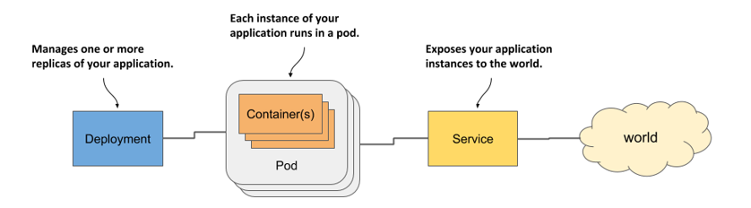

Đến đây, bạn đã có những hiểu biết cơ bản về cách các đối tượng này được phơi bày qua Kubernetes API. Trong chương này và các chương tiếp theo, chúng ta sẽ đi sâu vào chi tiết của từng đối tượng, cùng với nhiều đối tượng khác thường được dùng để triển khai một ứng dụng hoàn chỉnh. Hãy bắt đầu với đối tượng Pod, bởi nó đại diện cho khái niệm trung tâm và quan trọng nhất trong Kubernetes — một thực thể đang chạy của ứng dụng.

##### Ghi chú

Bạn có thể tìm thấy các tệp mã nguồn cho chương này tại địa chỉ: <https://github.com/luksa/kubernetes-in-action-2nd-edition/tree/master/Chapter05>

## 5.1 Tìm hiểu về pod

Bạn đã biết rằng một pod là một nhóm các container được đặt cùng nhau (co-located) và là viên gạch xây dựng cơ bản nhất trong Kubernetes. Thay vì triển khai riêng lẻ từng container, bạn sẽ triển khai và quản lý một nhóm container như một đơn vị thống nhất — chính là pod. Mặc dù một pod có thể chứa nhiều container, nhưng việc một pod chỉ chứa một container duy nhất cũng là điều rất phổ biến. Khi một pod có nhiều container, tất cả các container đó sẽ cùng chạy trên một worker node duy nhất — một thực thể pod không bao giờ bị chia cắt để chạy trên nhiều node khác nhau. Hình 5.2 sẽ giúp bạn dễ hình dung thông tin này.

##### Hình 5.2 Tất cả các container của một pod đều chạy trên cùng một node. Một pod không bao giờ nằm trải rộng trên nhiều node khác nhau.

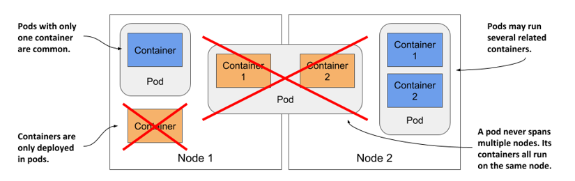

### 5.1.1 Tại sao chúng ta cần pod?

Hãy cùng thảo luận về lý do tại sao chúng ta cần chạy nhiều container cùng nhau, thay vì chạy nhiều tiến trình bên trong cùng một container.

#### Tại sao một container không nên chứa nhiều tiến trình?

Hãy tưởng tượng một ứng dụng gồm nhiều tiến trình giao tiếp với nhau qua cơ chế *IPC* (Inter-Process Communication - Giao tiếp liên tiến trình) hoặc qua các tệp chia sẻ, đòi hỏi chúng phải chạy trên cùng một máy tính. Trong Chương 2, bạn đã biết rằng mỗi container hoạt động giống như một máy tính hoặc máy ảo độc lập. Một máy tính thông thường chạy nhiều tiến trình, và container cũng có thể làm được điều đó. Bạn hoàn toàn có thể chạy tất cả các tiến trình cấu thành ứng dụng trong duy nhất một container, nhưng điều đó sẽ khiến việc quản lý container trở nên vô cùng phức tạp.

Các container được *thiết kế* chuyên biệt để chỉ chạy một tiến trình duy nhất (không tính các tiến trình con do nó sinh ra). Cả các công cụ container lẫn Kubernetes đều được phát triển xoay quanh triết lý này. Ví dụ, một tiến trình chạy trong container được kỳ vọng sẽ ghi nhật ký (log) của nó ra đầu ra tiêu chuẩn (standard output). Các lệnh của Docker và Kubernetes dùng để hiển thị log chỉ thu thập những gì được ghi nhận từ đầu ra tiêu chuẩn này. Nếu chỉ có một tiến trình chạy trong container, nó là thực thể duy nhất ghi log. Nhưng nếu bạn chạy nhiều tiến trình trong đó, tất cả chúng sẽ cùng ghi vào một đầu ra duy nhất. Kết quả là log của các tiến trình sẽ bị trộn lẫn vào nhau, khiến bạn rất khó phân biệt dòng log nào là của tiến trình nào.

Một dấu hiệu khác cho thấy container chỉ nên chạy một tiến trình duy nhất là việc container runtime (trình chạy container) chỉ khởi động lại container khi tiến trình gốc (root process) của container đó bị chết. Nó hoàn toàn không quan tâm đến các tiến trình con do tiến trình gốc này tạo ra. Nếu tiến trình gốc sinh ra các tiến trình con, bản thân nó phải tự chịu trách nhiệm duy trì sự sống cho các tiến trình con đó.

Để tận dụng tối đa các tính năng ưu việt mà container runtime cung cấp, bạn nên cân nhắc chỉ chạy một tiến trình duy nhất trong mỗi container.

#### Cách một pod kết hợp nhiều container

Vì không nên chạy nhiều tiến trình trong cùng một container, rõ ràng chúng ta cần một cấu trúc ở cấp độ cao hơn để cho phép chạy các tiến trình có liên quan chặt chẽ với nhau cùng nhau, ngay cả khi chúng được chia tách vào các container riêng biệt. Các tiến trình này phải có khả năng giao tiếp với nhau giống như các tiến trình trên một máy tính thông thường. Đó chính là lý do vì sao khái niệm pod ra đời.

Với pod, bạn có thể chạy các tiến trình liên quan mật thiết với nhau bên cạnh nhau, mang lại cho chúng một môi trường (gần như) tương đồng như khi chạy chung trong một container duy nhất. Các tiến trình này vẫn có sự cô lập nhất định nhưng không hoàn toàn — chúng chia sẻ với nhau một số tài nguyên hệ thống. Giải pháp này giúp bạn vẹn cả đôi đường: vừa tận dụng được mọi tính năng cô lập của container, vừa cho phép các tiến trình phối hợp nhịp nhàng với nhau. Một pod giúp quản lý các container có mối liên hệ khăng khít này như một thực thể thống nhất.

Trong Chương 2, bạn đã biết rằng một container sử dụng tập hợp các namespace Linux của riêng nó, nhưng nó cũng có thể chia sẻ một số namespace với các container khác. Việc chia sẻ namespace này chính là cách Kubernetes và container runtime kết hợp các container lại thành một pod.

Như được minh họa trong hình 5.3, tất cả các container trong một pod đều chia sẻ chung một Network namespace, do đó chúng dùng chung các giao diện mạng (network interfaces), địa chỉ IP và không gian cổng (port space) của namespace đó.

##### Hình 5.3 Các container trong một pod chia sẻ chung các giao diện mạng

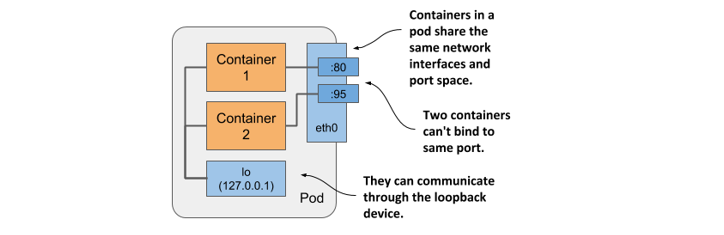

Do dùng chung không gian cổng, các tiến trình chạy trong các container của cùng một pod không thể liên kết (bind) với cùng một số cổng. Ngược lại, các tiến trình ở các pod khác nhau sẽ có giao diện mạng và không gian cổng riêng biệt, nhờ đó tránh được tình trạng xung đột cổng giữa các pod.

Tất cả các container trong một pod cũng sử dụng chung một hostname của hệ thống vì chúng chia sẻ UTS namespace, và có thể giao tiếp với nhau qua các cơ chế IPC thông thường nhờ chia sẻ IPC namespace. Ngoài ra, bạn cũng có thể cấu hình để một pod dùng chung một PID namespace cho tất cả các container của nó, giúp chúng chia sẻ chung một cây tiến trình (process tree), tuy nhiên bạn phải chủ động kích hoạt tính năng này cho từng pod cụ thể.

##### Ghi chú

Khi các container của cùng một pod sử dụng các PID namespace riêng biệt, chúng không thể nhìn thấy nhau hoặc gửi các tín hiệu tiến trình như `SIGTERM` hoặc `SIGINT` cho nhau.

Chính việc chia sẻ một số namespace nhất định này đã mang lại cho các tiến trình đang chạy trong pod cảm giác như thể chúng đang chạy cùng nhau trên một thực thể duy nhất, mặc dù thực tế chúng hoạt động trong các container riêng biệt.

Ngược lại, mỗi container luôn sở hữu một Mount namespace riêng để có hệ thống tệp độc lập. Tuy nhiên, khi hai container bắt đầu cần chia sẻ một phần hệ thống tệp với nhau, bạn có thể thêm một *volume* (phân vùng lưu trữ) vào pod và mount (gắn) volume đó vào cả hai container. Khi đó, dù hai container vẫn sử dụng hai Mount namespace riêng biệt, chúng vẫn có thể truy cập chung vào cùng một phân vùng lưu trữ đã được mount. Bạn sẽ được tìm hiểu kỹ hơn về volume trong Chương 7.

### 5.1.2 Cách tổ chức các container vào pod

Bạn có thể coi mỗi pod giống như một máy tính độc lập. Khác với các máy ảo thường chạy nhiều ứng dụng cùng lúc, thông thường bạn chỉ nên chạy một ứng dụng duy nhất trong mỗi pod. Bạn không bao giờ cần phải nhồi nhét nhiều ứng dụng vào một pod, bởi bản thân pod hầu như không làm tiêu hao thêm tài nguyên hệ thống. Bạn có thể tạo bao nhiêu pod tùy thích, vì vậy thay vì gom tất cả các ứng dụng vào một pod, bạn nên phân chia chúng sao cho mỗi pod chỉ chạy các tiến trình ứng dụng có liên quan chặt chẽ với nhau.

Hãy để tôi minh họa điều này bằng một ví dụ thực tế cụ thể.

#### Tách biệt các tầng ứng dụng thành nhiều pod khác nhau

Hãy tưởng tượng một hệ thống đơn giản gồm một máy chủ web ở tầng front-end và một cơ sở dữ liệu ở tầng back-end. Như đã giải thích, máy chủ front-end và cơ sở dữ liệu không nên chạy chung trong một container, vì mọi tính năng của container đều được thiết kế xoay quanh nguyên tắc một container chỉ chạy một tiến trình duy nhất. Vậy nếu không chạy chung một container, liệu có nên đặt chúng vào hai container riêng biệt nhưng nằm chung trong một pod hay không?

Mặc dù không có rào cản kỹ thuật nào ngăn bạn chạy cả máy chủ front-end và cơ sở dữ liệu trong cùng một pod, nhưng đây không phải là một giải pháp tối ưu. Tất cả các container trong một pod luôn phải chạy cùng nhau trên một node, nhưng liệu máy chủ web và cơ sở dữ liệu có nhất thiết phải chạy trên cùng một máy tính vật lý hay không? Câu trả lời rõ ràng là không, vì chúng hoàn toàn có thể giao tiếp dễ dàng qua mạng. Do đó, bạn không nên đặt chúng vào chung một pod.

Nếu cả front-end và back-end đều nằm trong cùng một pod, cả hai sẽ cùng chạy trên một node của cụm. Giả sử bạn có một cụm gồm hai node nhưng chỉ tạo duy nhất một pod này, bạn sẽ chỉ sử dụng một worker node duy nhất và bỏ phí tài nguyên tính toán sẵn có trên node thứ hai. Điều này dẫn đến sự lãng phí tài nguyên CPU, bộ nhớ, dung lượng đĩa và băng thông mạng. Việc tách các container thành hai pod riêng biệt sẽ cho phép Kubernetes linh hoạt đặt pod front-end trên một node và pod back-end trên node còn lại, từ đó tối ưu hóa hiệu suất sử dụng phần cứng của bạn.

#### Tách biệt thành các pod riêng để cho phép mở rộng độc lập

Một lý do quan trọng khác để không gộp chung các thành phần vào một pod liên quan đến khả năng mở rộng ngang (horizontal scaling). Pod không chỉ là đơn vị triển khai cơ bản mà còn là đơn vị mở rộng cơ bản trong Kubernetes. Trong Chương 2, khi bạn thực hiện mở rộng đối tượng Deployment, Kubernetes đã tạo ra thêm các pod mới — tức là các bản sao (replica) bổ sung của ứng dụng. Kubernetes không nhân bản các container bên trong một pod, mà nó nhân bản toàn bộ pod đó.

Các thành phần front-end thường có yêu cầu mở rộng rất khác so với các thành phần back-end, vì vậy chúng ta thường muốn mở rộng chúng một cách độc lập. Nếu pod của bạn chứa cả container front-end lẫn back-end, khi Kubernetes tiến hành nhân bản pod, bạn sẽ vô tình tạo ra nhiều thực thể cho cả hai thành phần này, và đây không phải lúc nào cũng là điều mong muốn. Các thành phần back-end có lưu trạng thái (stateful) như cơ sở dữ liệu thường rất khó mở rộng — ít nhất là không dễ dàng như các thành phần front-end không lưu trạng thái (stateless). Nếu một container cần được mở rộng độc lập với các thành phần khác, đó là một dấu hiệu rõ ràng cho thấy nó phải được triển khai trong một pod riêng biệt.

Hình dưới đây minh họa cho những gì vừa được giải thích.

##### Hình 5.4 Tách biệt các tầng ứng dụng thành các pod riêng lẻ

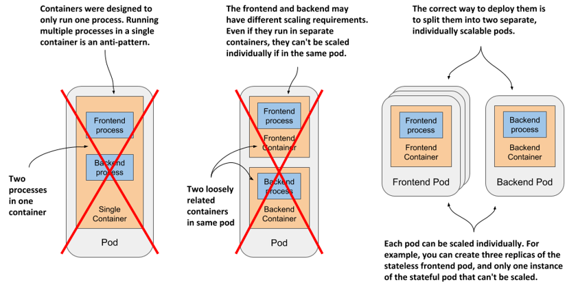

Việc tách biệt các tầng ứng dụng thành nhiều pod khác nhau là hướng tiếp cận hoàn toàn chính xác. Vậy thì, khi nào chúng ta mới thực sự cần chạy nhiều container trong cùng một pod?

#### Giới thiệu về container sidecar

Việc đặt nhiều container trong một pod chỉ thực sự phù hợp khi ứng dụng của bạn gồm một tiến trình chính (primary process) và một hoặc nhiều tiến trình phụ trợ khác có nhiệm vụ bổ sung, hoàn thiện hoạt động cho tiến trình chính đó. Container chạy tiến trình bổ trợ này được gọi là *container sidecar* (thùng xe bên hông), vì nó tương tự như chiếc thùng phụ gắn bên cạnh xe máy, giúp xe hoạt động ổn định hơn và có thể chở thêm một hành khách. Nhưng khác với xe máy, một pod có thể sở hữu nhiều sidecar, như được minh họa trong hình 5.5.

##### Hình 5.5 Một pod chứa một container chính và các container sidecar phụ trợ

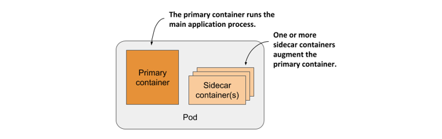

Khái niệm "tiến trình phụ trợ" nghe có vẻ hơi trừu tượng, vì vậy tôi sẽ đưa ra một vài ví dụ thực tế. Trong Chương 2, bạn đã triển khai các pod chỉ có một container chạy ứng dụng Node.js. Ứng dụng Node.js này chỉ hỗ trợ giao thức HTTP. Để tích hợp thêm giao thức bảo mật HTTPS, chúng ta có thể viết thêm mã nguồn JavaScript trực tiếp vào ứng dụng, nhưng cũng có một cách khác mà không cần chỉnh sửa bất kỳ dòng mã nguồn hiện tại nào — đó là thêm một container phụ trợ vào pod đóng vai trò như một reverse proxy (proxy ngược). Proxy này sẽ tiếp nhận các lưu lượng truy cập HTTPS, chuyển đổi chúng thành HTTP thông thường rồi chuyển tiếp tới container Node.js. Trong kịch bản này, container Node.js đóng vai trò là container chính, còn container chạy proxy chính là container sidecar. Hình 5.6 minh họa trực quan cho ví dụ này.

##### Hình 5.6 Container sidecar thực hiện nhiệm vụ chuyển đổi lưu lượng truy cập từ HTTPS sang HTTP

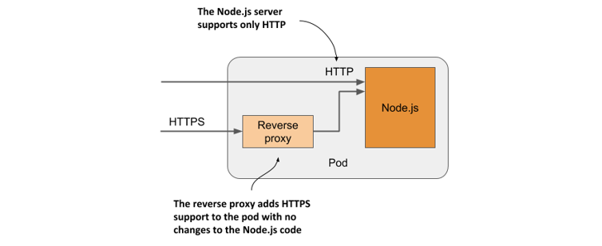

##### Ghi chú

Bạn sẽ trực tiếp tạo pod này trong mục 5.4.

Một ví dụ khác được minh họa trong hình 5.7: một pod có container chính chạy máy chủ web làm nhiệm vụ phân phối các tệp tin từ thư mục gốc của trang web (webroot). Container còn lại trong pod đóng vai trò như một tác nhân (agent) định kỳ tải nội dung mới từ một nguồn bên ngoài về và lưu vào thư mục gốc của máy chủ web. Như đã đề cập ở trước, hai container có thể chia sẻ tệp tin với nhau bằng cách dùng chung một volume. Khi đó, thư mục webroot sẽ được đặt ngay trên volume dùng chung này.

##### Hình 5.7 Container sidecar cập nhật nội dung cho container máy chủ web thông qua một volume dùng chung

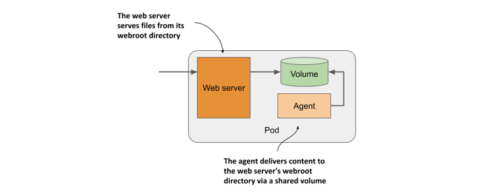

##### Ghi chú

Bạn sẽ tạo pod này trong Chương 7.

Một số ví dụ phổ biến khác về container sidecar bao gồm các công cụ dọn dẹp và thu gom log (log rotators/collectors), các bộ xử lý dữ liệu (data processors), hay các bộ chuyển đổi giao thức truyền thông (communication adapters).

Khác với việc trực tiếp thay đổi mã nguồn hiện có của ứng dụng, việc bổ sung thêm một sidecar sẽ làm tăng nhu cầu tài nguyên của pod vì hệ thống phải chạy thêm một tiến trình mới. Tuy nhiên, hãy nhớ rằng việc can thiệp vào mã nguồn của các ứng dụng cũ (legacy) đôi khi cực kỳ khó khăn. Nguyên nhân có thể do cấu trúc code quá phức tạp để chỉnh sửa, việc thiết lập môi trường biên dịch gặp nhiều trở ngại, hoặc thậm chí mã nguồn gốc đã không còn nữa. Do đó, việc mở rộng tính năng của ứng dụng bằng cách chạy thêm một tiến trình phụ trợ bên cạnh đôi khi lại là một giải pháp kinh tế và nhanh chóng hơn nhiều.

#### Làm thế nào để quyết định nên tách hay gộp các container vào pod?

Khi phân vân giữa việc áp dụng mô hình sidecar để đặt các container chung một pod hay tách chúng ra các pod riêng biệt, bạn hãy tự trả lời các câu hỏi sau:

- Các container này có bắt buộc phải chạy trên cùng một máy chủ vật lý hay không?
- Tôi có muốn quản lý, cập nhật và triển khai chúng như một đơn vị thống nhất hay không?
- Chúng có cấu thành một thực thể gắn kết không thể tách rời, thay vì là các thành phần hoạt động độc lập?
- Chúng có bắt buộc phải được mở rộng quy mô (scale) cùng nhau hay không?
- Một node duy nhất có đủ khả năng đáp ứng tổng nhu cầu tài nguyên của tất cả các container này cộng lại hay không?

Nếu câu trả lời cho tất cả các câu hỏi trên là có, hãy đặt chúng vào chung một pod. Như một nguyên tắc bất di bất dịch: hãy luôn ưu tiên đặt các container ở các pod riêng biệt, trừ khi có một lý do kỹ thuật bắt buộc chúng phải chia sẻ chung một môi trường pod.

## 5.2 Tạo pod từ tệp YAML hoặc JSON

Với những kiến thức đã tích lũy được từ các phần trước, giờ đây bạn đã sẵn sàng bắt tay vào việc tạo các pod. Trong Chương 3, bạn đã tạo ra chúng bằng lệnh trực tiếp (imperative command) `kubectl create`, nhưng trong thực tế, các pod cũng như các đối tượng Kubernetes khác thường được khởi tạo bằng cách biên soạn một tệp manifest dạng JSON hoặc YAML rồi gửi tới Kubernetes API, như chúng ta đã tìm hiểu ở chương trước.

##### Ghi chú

Quyết định sử dụng YAML hay JSON để định nghĩa các đối tượng là hoàn toàn ở bạn. Hầu hết mọi người đều ưa chuộng YAML hơn vì định dạng này thân thiện với con người hơn và cho phép viết thêm các dòng chú thích (comment) trực tiếp vào file định nghĩa.

Bằng việc sử dụng các tệp YAML để định nghĩa cấu trúc ứng dụng, bạn sẽ không cần đến các đoạn mã kịch bản shell (shell scripts) phức tạp để lặp lại quy trình triển khai, đồng thời dễ dàng lưu lại lịch sử của mọi thay đổi bằng cách lưu trữ các tệp này trong hệ thống quản lý phiên bản (VCS) tương tự như cách quản lý mã nguồn thông thường.

Trong thực tế, toàn bộ các tệp manifest ứng dụng phục vụ cho các bài tập trong cuốn sách này đều được lưu trữ trên hệ thống quản lý phiên bản. Bạn có thể dễ dàng tải chúng về từ GitHub tại địa chỉ: <https://github.com/luksa/kubernetes-in-action-2nd-edition>.

### 5.2.1 Soạn thảo tệp manifest YAML cho pod

Ở chương trước, bạn đã biết cách truy xuất và khảo sát cấu trúc YAML của các đối tượng API hiện có. Bây giờ, bạn sẽ tự tay xây dựng một tệp manifest hoàn chỉnh từ những dòng đầu tiên.

Hãy bắt đầu bằng việc tạo một tệp tin có tên là `pod.kiada.yaml` tại bất kỳ thư mục nào trên máy tính của bạn. Bạn cũng có thể tìm thấy tệp tin sẵn có này trong thư mục `Chapter05/` thuộc kho mã nguồn đi kèm của cuốn sách. Đoạn mã dưới đây thể hiện nội dung chi tiết của tệp tin này.

##### Đoạn mã 5.1 Tệp manifest cơ bản cấu hình cho một pod

```yaml
apiVersion: v1    #A
kind: Pod    #B
metadata:     
  name: kiada    #C
spec: 
  containers: 
  - name: kiada    #D
    image: luksa/kiada:0.1    #E
    ports: 
    - containerPort: 8080    #F
```

Chắc chắn bạn sẽ thấy bản manifest của pod này dễ hiểu hơn nhiều so với cấu trúc khổng lồ của đối tượng Node mà chúng ta đã khảo sát ở chương trước. Tuy nhiên, một khi bạn gửi bản manifest này lên API và truy xuất ngược lại, độ dài của nó cũng sẽ tăng lên đáng kể.

Bản manifest trong đoạn mã 5.1 ngắn gọn như vậy là vì nó chưa chứa đầy đủ tất cả các trường thông tin mà một đối tượng Pod tự động nhận được sau khi được tạo ra thông qua API. Ví dụ, bạn có thể thấy phần `metadata` chỉ chứa duy nhất một trường và phần `status` thì hoàn toàn vắng mặt. Khi bạn chính thức tạo đối tượng từ tệp này, hệ thống sẽ tự động bổ sung chúng. Chúng ta sẽ cùng kiểm chứng điều đó ngay sau đây.

Trước khi tiến hành tạo đối tượng, hãy cùng phân tích chi tiết tệp manifest này. Nó sử dụng phiên bản API `v1` của Kubernetes để mô tả đối tượng. Loại đối tượng được khai báo là `Pod` với tên định danh là `kiada`. Pod này chứa một container duy nhất cũng được đặt tên là `kiada`, sử dụng ảnh container `luksa/kiada:0.1`. Định nghĩa của pod cũng chỉ rõ rằng ứng dụng bên trong container sẽ lắng nghe các kết nối ở cổng `8080`.

##### Ghi ý

Bất cứ khi nào bạn muốn nhanh chóng tạo ra một tệp manifest cho pod từ con số không, bạn có thể thực thi lệnh sau để tạo file thô và chỉnh sửa thêm các trường theo nhu cầu: `kubectl run kiada --image=luksa/kiada:0.1 --dry-run=client -o yaml > mypod.yaml`. Tùy chọn `--dry-run=client` sẽ yêu cầu kubectl chỉ xuất ra cấu trúc định nghĩa dạng YAML mà không thực sự gửi yêu cầu tạo đối tượng lên API.

Các trường trong tệp YAML đều rất rõ ràng và dễ hiểu. Tuy nhiên, nếu muốn tìm hiểu sâu hơn về từng trường hoặc muốn biết có thể bổ sung thêm những trường thông tin nào khác, bạn hãy nhớ sử dụng lệnh `kubectl explain pods`.

### 5.2.2 Tạo đối tượng Pod từ tệp YAML

Sau khi đã chuẩn bị xong tệp manifest cho pod, bạn có thể tiến hành tạo đối tượng bằng cách gửi tệp này tới Kubernetes API.

#### Tạo đối tượng bằng cách áp dụng tệp manifest vào cụm

Khi gửi bản manifest lên API, bạn đang yêu cầu Kubernetes áp dụng cấu hình trong file vào cụm. Đó là lý do vì sao lệnh con của `kubectl` đảm nhận nhiệm vụ này được gọi là `apply` (áp dụng). Hãy chạy lệnh này để tạo pod:

```
$ kubectl apply -f pod.kiada.yaml
pod "kiada" created
```

#### Cập nhật đối tượng bằng cách sửa đổi và áp dụng lại tệp manifest

Lệnh `kubectl apply` được sử dụng linh hoạt cho cả việc tạo mới lẫn cập nhật các đối tượng hiện có. Nếu sau này bạn muốn thay đổi cấu hình của pod, bạn chỉ việc chỉnh sửa tệp `pod.kiada.yaml` và chạy lại lệnh `apply` một lần nữa. Một số trường thông tin của pod là không thể thay đổi (immutable) sau khi tạo, vì vậy quá trình cập nhật có thể thất bại. Trong trường hợp đó, bạn chỉ cần xóa pod đi và tạo lại. Bạn sẽ được hướng dẫn chi tiết cách xóa các pod và các đối tượng khác ở phần cuối của chương này.

##### Truy xuất toàn bộ cấu hình manifest của một pod đang chạy

Đối tượng pod hiện đã trở thành một phần cấu hình trong cụm của bạn. Giờ đây, bạn có thể đọc ngược lại cấu hình đầy đủ của nó từ API bằng cách chạy lệnh sau:

```
$ kubectl get po kiada -o yaml
```

Khi chạy lệnh này, bạn sẽ thấy cấu hình manifest đã phình to hơn rất nhiều so với tệp `pod.kiada.yaml` ban đầu. Phần `metadata` đã có thêm rất nhiều thông tin, đối tượng đã xuất hiện thêm phần `status`, và phần `spec` cũng được bổ sung thêm nhiều trường mới. Bạn có thể dùng lệnh `kubectl explain` để tra cứu ý nghĩa của các trường mới này, tuy nhiên phần lớn chúng sẽ được giải thích cặn kẽ ngay trong chương này và các chương tiếp theo.

### 5.2.3 Kiểm tra trạng thái của pod vừa tạo

Hãy cùng sử dụng các lệnh `kubectl` cơ bản để kiểm tra tình trạng hoạt động của pod trước khi chúng ta tiến hành tương tác trực tiếp với ứng dụng bên trong nó.

#### Kiểm tra nhanh trạng thái hoạt động của pod

Đối tượng Pod của bạn đã được khởi tạo thành công, nhưng làm thế nào để chắc chắn rằng container bên trong nó thực sự đang chạy? Bạn có thể dùng lệnh `kubectl get` để xem thông tin tóm tắt về pod:

```
$ kubectl get pod kiada
NAME     READY   STATUS    RESTARTS   AGE
kiada    1/1     Running   0          32s
```

Kết quả cho thấy pod đang ở trạng thái `Running` (Đang chạy), nhưng không có thêm thông tin chi tiết nào khác. Để xem nhiều thông tin hơn, bạn có thể thử chạy lệnh `kubectl get pod -o wide` hoặc lệnh `kubectl describe` mà chúng ta đã học ở chương trước.

#### Sử dụng kubectl describe để xem chi tiết thông tin pod

Để hiển thị cái nhìn chi tiết và toàn diện hơn về pod, hãy sử dụng lệnh `kubectl describe`:

```
$ kubectl describe pod kiada
Name:         kiada
Namespace:    default
Priority:     0
Node:         worker2/172.18.0.4
Start Time:   Mon, 27 Jan 2020 12:53:28 +0100
...
```

Đoạn trích trên không hiển thị toàn bộ kết quả trả về, nhưng nếu bạn tự mình chạy lệnh này, bạn sẽ thấy hầu như tất cả các thông tin chi tiết tương tự như khi in ra toàn bộ cấu hình manifest của đối tượng bằng lệnh `kubectl get -o yaml`.

#### Kiểm tra các sự kiện để nắm bắt những gì diễn ra bên dưới hệ thống

Tương tự như ở chương trước khi bạn sử dụng lệnh `describe node` để kiểm tra đối tượng Node, lệnh `describe pod` cũng hiển thị danh sách các sự kiện liên quan đến pod ở ngay phần cuối của kết quả đầu ra.

Nếu bạn còn nhớ, các sự kiện này không phải là một phần thuộc tính nằm trong bản thân đối tượng, mà là các đối tượng độc lập. Hãy in chúng ra để hiểu rõ hơn về những gì đã diễn ra khi bạn thực hiện lệnh tạo pod. Dưới đây là danh sách các sự kiện được ghi nhận ngay sau khi pod được khởi tạo:

```
$ kubectl get events
LAST SEEN   TYPE     REASON      OBJECT      MESSAGE
<unknown>   Normal   Scheduled   pod/kiada   Successfully assigned default/
                                             kiada to kind-worker2
5m          Normal   Pulling     pod/kiada   Pulling image luksa/kiada:0.1
5m          Normal   Pulled      pod/kiada   Successfully pulled image
5m          Normal   Created     pod/kiada   Created container kiada
5m          Normal   Started     pod/kiada   Started container kiada
```

Các sự kiện này được sắp xếp theo thứ tự thời gian, với sự kiện mới nhất nằm ở dưới cùng. Bạn có thể thấy tiến trình diễn ra như sau: đầu tiên pod được chỉ định (schedule) vào một trong các worker node, tiếp theo ảnh container được tải về (pull), sau đó container được khởi tạo (create) và cuối cùng là chính thức kích hoạt (start).

Không có sự kiện cảnh báo (warning) nào xuất hiện, điều đó chứng tỏ mọi thứ đang hoạt động hoàn toàn trơn tru. Nếu cụm của bạn gặp phải lỗi ở bước này, hãy đọc kỹ mục 5.4 để tìm hiểu cách chẩn đoán và khắc phục sự cố lỗi pod.

## 5.3 Tương tác với ứng dụng và pod

Container của bạn hiện đã đi vào hoạt động. Trong phần này, bạn sẽ học cách giao tiếp với ứng dụng, kiểm tra log hoạt động, và thực thi các lệnh trực tiếp bên trong container để khám phá môi trường chạy của ứng dụng. Hãy cùng kiểm chứng xem ứng dụng bên trong container có phản hồi chính xác các yêu cầu của chúng ta hay không.

### 5.3.1 Gửi yêu cầu tới ứng dụng chạy trong pod

Trong Chương 2, bạn đã sử dụng lệnh `kubectl expose` để tạo ra một Service nhằm cấu hình bộ cân bằng tải (load balancer), giúp bạn có thể giao tiếp với ứng dụng chạy trong các pod. Bây giờ, chúng ta sẽ tiếp cận theo một cách khác. Trong quá trình phát triển, kiểm thử và dò lỗi (debugging), bạn thường sẽ muốn kết nối trực tiếp tới một pod cụ thể, thay vì đi qua một dịch vụ trung gian phân phối kết nối ngẫu nhiên tới các pod khác nhau.

Bạn đã biết rằng mỗi pod được cấp phát một địa chỉ IP riêng biệt và mọi pod khác trong cụm đều có thể truy cập được địa chỉ này. Địa chỉ IP này là địa chỉ nội bộ trong cụm. Bạn không thể truy cập trực tiếp nó từ máy tính cá nhân của mình, ngoại trừ một số trường hợp đặc biệt khi Kubernetes được cấu hình theo cách riêng — chẳng hạn như khi sử dụng công cụ kind hoặc Minikube trực tiếp trên máy vật lý mà không qua máy ảo.

Nhìn chung, để kết nối tới các pod, bạn phải áp dụng một trong các phương pháp được hướng dẫn ở các mục dưới đây. Trước tiên, hãy cùng xác định địa chỉ IP của pod.

#### Xác định địa chỉ IP của pod

Bạn có thể tìm thấy địa chỉ IP của pod bằng cách truy xuất toàn bộ cấu hình YAML của nó và tìm kiếm trường `podIP` nằm trong phần `status`. Ngoài ra, bạn cũng có thể xem thông tin này qua lệnh `kubectl describe`. Tuy nhiên, cách nhanh nhất và tiện lợi nhất là chạy lệnh `kubectl get` kèm theo tùy chọn hiển thị rộng `-o wide`:

```
$ kubectl get pod kiada -o wide
NAME    READY   STATUS    RESTARTS   AGE   IP           NODE     ...
kiada   1/1     Running   0          35m   10.244.2.4   worker2  ...
```

Dựa vào cột `IP` trong kết quả trả về, địa chỉ IP của pod của tôi là `10.244.2.4`. Bây giờ, tôi cần xác định số cổng (port) mà ứng dụng đang lắng nghe.

#### Xác định số cổng ứng dụng đang sử dụng

Nếu tôi không phải là người viết ra ứng dụng này, việc tìm xem ứng dụng đang lắng nghe ở cổng nào sẽ tương đối khó khăn. Tôi có thể phải kiểm tra mã nguồn hoặc tệp `Dockerfile` của ảnh container, vì cổng kết nối thường được định nghĩa ở đó, nhưng không phải lúc nào tôi cũng có quyền truy cập vào các tài nguyên này. Vậy nếu một người khác tạo ra pod này, làm thế nào để tôi biết nó đang mở cổng nào?

Rất may là bạn có thể khai báo danh sách các cổng kết nối ngay trong tệp định nghĩa pod. Việc khai báo này không phải là bắt buộc, nhưng là một thói quen tốt nên làm. Hãy xem khung thông tin bên lề dưới đây để biết thêm chi tiết.

##### Tại sao nên khai báo các cổng container trong định nghĩa pod?

Việc khai báo các cổng trong định nghĩa pod thuần túy mang tính chất cung cấp thông tin. Việc bạn bỏ qua không khai báo hoàn toàn không ảnh hưởng đến khả năng kết nối của các máy khách tới cổng của pod. Chỉ cần container của bạn mở cổng kết nối và liên kết thành công với địa chỉ IP của nó, bất kỳ ai cũng có thể kết nối tới cổng đó, ngay cả khi cổng đó không được khai báo trong phần cấu hình `spec` của pod hoặc thậm chí khi bạn khai báo sai số cổng.

Mặc dù vậy, việc luôn khai báo rõ ràng các cổng là một thói quen rất tốt, giúp bất kỳ ai có quyền truy cập vào cụm của bạn đều có thể dễ dàng nhận biết các cổng mà pod đang mở. Việc định nghĩa cổng một cách tường minh còn cho phép bạn đặt tên cho từng cổng, điều này cực kỳ hữu ích khi bạn tiến hành cấu hình dịch vụ (Service) để chia sẻ pod ra bên ngoài.

Bản manifest của pod cho biết container đang sử dụng cổng `8080`, vì vậy giờ đây bạn đã có đầy đủ thông tin cần thiết để giao tiếp với ứng dụng.

#### Kết nối tới pod từ các worker node

Mô hình mạng của Kubernetes quy định rằng mọi pod đều có thể được truy cập từ bất kỳ pod nào khác, và mỗi *node* trong cụm đều có khả năng kết nối tới mọi pod nằm trên bất kỳ node nào khác.

Nhờ đặc điểm này, một cách đơn giản để giao tiếp với pod là đăng nhập trực tiếp vào một trong các worker node và thực hiện kết nối tới pod từ đó. Cách thức đăng nhập vào node sẽ phụ thuộc vào công cụ bạn đã sử dụng để triển khai cụm. Nếu bạn dùng công cụ kind, hãy chạy lệnh `docker exec -it kind-worker bash`; nếu dùng Minikube, hãy chạy `minikube ssh`. Trên môi trường GKE, hãy dùng lệnh `gcloud compute ssh`. Với các loại cụm khác, hãy tham khảo tài liệu hướng dẫn tương ứng của chúng.

Sau khi đã đăng nhập thành công vào node, bạn có thể dùng lệnh `curl` kết hợp với địa chỉ IP và cổng của pod để truy cập ứng dụng. Địa chỉ IP của pod của tôi là `10.244.2.4` và cổng là `8080`, vì vậy tôi thực thi lệnh sau:

```
$ curl 10.244.2.4:8080
Kiada version 0.1. Request processed by "kiada". Client IP: ::ffff:10.244.2.1
```

Thông thường, bạn sẽ ít khi sử dụng phương pháp này để tương tác với các pod trong công việc hằng ngày. Tuy nhiên, nó sẽ là một công cụ cứu cánh đắc lực khi hệ thống gặp sự cố kết nối mạng và bạn muốn cô lập nguyên nhân bằng cách kiểm tra trên tuyến đường truyền ngắn nhất có thể. Trong tình huống đó, việc đăng nhập thẳng vào node chứa pod và chạy lệnh `curl` tại chỗ là giải pháp tối ưu. Do kết nối giữa node và pod diễn ra hoàn toàn trong nội bộ máy chủ, phương pháp này luôn có tỷ lệ thành công cao nhất.

#### Kết nối từ một pod kiểm thử tạm thời

Cách thứ hai để kiểm tra khả năng kết nối của ứng dụng là chạy lệnh `curl` bên trong một pod khác được bạn tạo ra riêng cho mục đích này. Phương pháp này giúp giả lập và kiểm tra xem các pod khác trong hệ thống có thể kết nối tới pod mục tiêu hay không. Ngay cả khi hạ tầng mạng hoạt động hoàn hảo, việc kết nối vẫn có thể bị chặn. Trong Chương 24, bạn sẽ được học cách thắt chặt an ninh mạng bằng cách cô lập các pod với nhau. Trong một hệ thống bảo mật như vậy, một pod chỉ có thể giao tiếp với các pod khác nằm trong danh sách được phép.

Để chạy lệnh `curl` trong một pod kiểm thử tạm thời (one-off pod), hãy thực thi lệnh sau:

```
$ kubectl run --image=curlimages/curl -it --restart=Never --rm client-pod curl 10.244.2.4:8080
Kiada version 0.1. Request processed by "kiada". Client IP: ::ffff:10.244.2.5
pod "client-pod" deleted
```

Lệnh này sẽ khởi chạy một pod chứa một container duy nhất được tạo từ ảnh `curlimages/curl`. Bạn hoàn toàn có thể sử dụng bất kỳ ảnh container nào khác có sẵn công cụ `curl`. Tùy chọn `-it` sẽ gắn luồng nhập/xuất tiêu chuẩn (standard input/output) của console của bạn trực tiếp vào container; tùy chọn `--restart=Never` đảm bảo pod sẽ chuyển sang trạng thái hoàn thành (`Completed`) và dừng lại ngay khi lệnh `curl` và container của nó kết thúc; còn tùy chọn `--rm` sẽ tự động dọn dẹp và xóa bỏ pod này sau khi hoàn tất. Tên của pod được đặt là `client-pod` và lệnh được thực thi bên trong container của nó là `curl 10.244.2.4:8080`.

##### Ghi chú

Bạn cũng có thể thay đổi cấu trúc lệnh để khởi chạy một shell `bash` trong pod kiểm thử, sau đó chủ động gõ lệnh `curl` từ giao diện dòng lệnh đó.

Việc tạo một pod tạm thời để kiểm tra kết nối cực kỳ hữu ích khi bạn muốn xác minh chính xác khả năng giao tiếp giữa các pod với nhau (pod-to-pod connectivity). Còn nếu bạn chỉ muốn nhanh chóng kiểm tra xem pod của mình có phản hồi các yêu cầu hay không, bạn có thể áp dụng phương pháp tiện lợi được hướng dẫn trong mục tiếp theo.

#### Kết nối tới pod thông qua cơ chế chuyển tiếp cổng của kubectl

Trong quá trình phát triển, cách đơn giản nhất để giao tiếp với các ứng dụng đang chạy bên trong Pod là sử dụng lệnh `kubectl port-forward`. Lệnh này cho phép bạn kết nối với một Pod cụ thể thông qua một proxy liên kết trực tiếp với cổng mạng trên máy tính cá nhân, như minh họa trong hình dưới đây.

##### Hình 5.8 Kết nối tới một Pod thông qua proxy chuyển tiếp cổng của kubectl

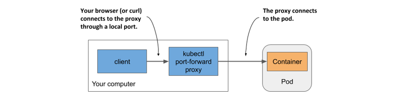

Để thiết lập đường truyền kết nối với một Pod, bạn thậm chí không cần phải tra cứu địa chỉ IP của nó, bởi chỉ cần chỉ định tên Pod và số cổng là đủ. Lệnh sau đây sẽ khởi chạy một proxy để chuyển tiếp cổng cục bộ `8080` trên máy tính của bạn tới cổng `8080` của Pod `kiada`:

```sh
$ kubectl port-forward kiada 8080
... Forwarding from 127.0.0.1:8080 -> 8080
... Forwarding from [::1]:8080 -> 8080
```

Hiện tại, proxy đang chờ các kết nối đến. Hãy chạy lệnh `curl` sau đây trong một cửa sổ terminal khác:

```sh
$ curl localhost:8080
Kiada version 0.1. Request processed by "kiada". Client IP: ::ffff:127.0.0.1
```

Như bạn có thể thấy, `curl` đã kết nối thành công tới proxy cục bộ và nhận được phản hồi từ Pod. Mặc dù lệnh `port-forward` là phương pháp đơn giản nhất để giao tiếp với một Pod cụ thể trong quá trình phát triển và gỡ lỗi, nhưng đây lại là phương pháp phức tạp nhất xét về cơ chế vận hành bên dưới. Luồng truyền thông phải đi qua nhiều thành phần khác nhau; do đó, nếu bất kỳ mắt xích nào trên đường truyền này bị lỗi, bạn sẽ không thể kết nối tới Pod, ngay cả khi bản thân Pod đó vẫn có thể truy cập được thông qua các kênh liên lạc thông thường.

##### Lưu ý

Lệnh `kubectl port-forward` cũng có thể chuyển tiếp các kết nối tới các Service thay vì chỉ các Pod, cùng với nhiều tính năng hữu ích khác. Hãy chạy lệnh `kubectl port-forward --help` để tìm hiểu thêm.

Hình 5.9 mô tả cách các gói tin mạng truyền từ tiến trình `curl` đến ứng dụng của bạn và ngược lại.

##### Hình 5.9 Đường truyền kết nối dài dằng dặc giữa lệnh curl và container khi sử dụng cơ chế chuyển tiếp cổng

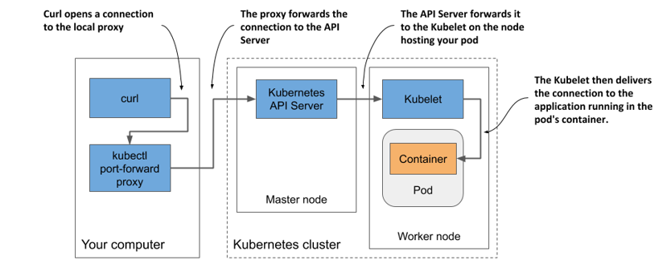

Đúng như những gì hình vẽ thể hiện, tiến trình `curl` kết nối tới proxy, proxy này kết nối tới API server, API server tiếp tục kết nối tới Kubelet trên node đang chạy Pod, và cuối cùng Kubelet kết nối vào container thông qua thiết bị loopback của Pod (nói cách khác là qua địa chỉ localhost). Chắc chắn bạn cũng sẽ đồng ý rằng đường truyền kết nối này dài một cách bất thường.

##### Lưu ý

Ứng dụng trong container phải được ràng buộc (bind) với một cổng trên thiết bị loopback để Kubelet có thể tiếp cận được. Nếu ứng dụng chỉ lắng nghe trên giao diện mạng `eth0` của Pod, bạn sẽ không thể kết nối tới nó bằng lệnh `kubectl port-forward`.

### 5.3.2 Viewing application logs

Ứng dụng Node.js của bạn ghi nhật ký (log) trực tiếp vào luồng xuất chuẩn (standard output stream). Thay vì ghi nhật ký ra file, các ứng dụng được container hóa thường xuất log ra luồng xuất chuẩn (*stdout*) và luồng lỗi chuẩn (*stderr*). Cơ chế này cho phép container runtime chặn thu đầu ra, lưu trữ chúng tại một vị trí thống nhất (thường là `/var/log/containers`) và cung cấp quyền truy cập nhật ký mà không cần quan tâm mỗi ứng dụng lưu trữ các file log của mình ở đâu.

Khi chạy một ứng dụng trong container bằng Docker, bạn có thể hiển thị nhật ký của nó bằng lệnh `docker logs <container-id>`. Còn khi chạy ứng dụng trong Kubernetes, dù bạn vẫn có thể đăng nhập vào node đang host Pod đó rồi hiển thị log bằng lệnh `docker logs`, nhưng Kubernetes cung cấp một phương thức đơn giản hơn nhiều thông qua lệnh `kubectl logs`.

#### Truy xuất nhật ký của Pod bằng kubectl logs

Để xem nhật ký của Pod (cụ thể hơn là nhật ký của container), hãy chạy lệnh sau:

```sh
$ kubectl logs kiada
Kiada - Kubernetes in Action Demo Application
---------------------------------------------
Kiada 0.1 starting...
Local hostname is kiada
Listening on port 8080
Received request for / from ::ffff:10.244.2.1    #A
Received request for / from ::ffff:10.244.2.5    #B
Received request for / from ::ffff:127.0.0.1     #C
```

#### Theo dõi luồng nhật ký theo thời gian thực bằng kubectl logs -f

Nếu muốn theo dõi luồng nhật ký ứng dụng theo thời gian thực để quan sát từng yêu cầu gửi đến, bạn có thể chạy lệnh với tùy chọn `--follow` (hoặc viết tắt là `-f`):

```sh
$ kubectl logs kiada -f
```

Bây giờ, hãy gửi thêm một vài yêu cầu tới ứng dụng và quan sát nhật ký. Hãy nhấn tổ hợp phím `Ctrl+C` để dừng việc theo dõi luồng nhật ký khi hoàn tất.

#### Hiển thị nhãn thời gian cho từng dòng nhật ký

Có thể bạn đã nhận ra chúng ta quên đưa mốc thời gian vào câu lệnh ghi nhật ký của ứng dụng. Nhật ký không có mốc thời gian sẽ bị hạn chế rất nhiều khả năng sử dụng. May mắn thay, container runtime luôn đính kèm nhãn thời gian hiện tại vào mỗi dòng log do ứng dụng tạo ra. Bạn có thể hiển thị các nhãn thời gian này bằng cách sử dụng tùy chọn `--timestamps=true` như sau:

```sh
$ kubectl logs kiada --timestamps=true
2020-02-01T09:44:40.954641934Z Kiada - Kubernetes in Action Demo Application
2020-02-01T09:44:40.954843234Z ---------------------------------------------
2020-02-01T09:44:40.955032432Z Kiada 0.1 starting...
2020-02-01T09:44:40.955123432Z Local hostname is kiada
2020-02-01T09:50:04.978043089Z Received request for / from ...
2020-02-01T09:50:33.640897378Z Received request for / from ...
2020-02-01T09:50:44.781473256Z Received request for / from ...
```

##### Mẹo

Bạn có thể hiển thị nhãn thời gian chỉ bằng cách gõ `--timestamps` mà không cần điền giá trị. Đối với các tùy chọn kiểu Boolean (đúng/sai), việc chỉ chỉ định tên tùy chọn sẽ tự động thiết lập giá trị của nó thành `true`. Quy tắc này áp dụng cho mọi tùy chọn của kubectl nhận giá trị Boolean và mặc định là `false`.

#### Hiển thị các nhật ký gần đây

Tính năng trước đó rất tuyệt vời khi bạn chạy các ứng dụng của bên thứ ba không tích hợp nhãn thời gian trong kết quả đầu ra của nhật ký. Tuy nhiên, việc mỗi dòng log đều được gắn nhãn thời gian còn mang lại một lợi ích khác: lọc các dòng nhật ký theo thời gian. Kubectl cung cấp hai cách để thực hiện việc này.

Tùy chọn thứ nhất là khi bạn chỉ muốn hiển thị nhật ký trong vài giây, vài phút hoặc vài giờ qua. Ví dụ, để xem nhật ký được tạo ra trong hai phút qua, hãy chạy:

```sh
$ kubectl logs kiada --since=2m
```

Tài chọn thứ hai là hiển thị nhật ký được tạo ra sau một ngày giờ cụ thể bằng cách sử dụng tùy chọn `--since-time`. Định dạng thời gian cần sử dụng là RFC3339. Ví dụ, lệnh sau được dùng để in ra các nhật ký được tạo sau ngày 01 tháng 02 năm 2020 lúc 9:50 sáng (giờ UTC):

```sh
$ kubectl logs kiada --since-time=2020-02-01T09:50:00Z
```

#### Hiển thị một số dòng cuối cùng của nhật ký

Thay vì dùng thời gian để giới hạn đầu ra, bạn cũng có thể chỉ định số dòng cuối cùng của nhật ký muốn hiển thị. Để hiển thị mười dòng cuối cùng, hãy thử:

```sh
$ kubectl logs kiada --tail=10
```

##### Lưu ý

Các tùy chọn của kubectl nhận giá trị có thể được chỉ định bằng dấu bằng (`=`) hoặc bằng một khoảng trắng. Thay vì `--tail=10`, bạn cũng có thể gõ `--tail 10`.

#### Tìm hiểu về tính khả dụng của nhật ký Pod

Kubernetes duy trì một file nhật ký riêng cho từng container. Chúng thường được lưu trữ trong thư mục `/var/log/containers` trên node chạy container đó. Mỗi container sẽ có một file riêng biệt được tạo ra. Nếu container bị khởi động lại, nhật ký của nó sẽ được ghi vào một file mới. Do đó, nếu container khởi động lại trong khi bạn đang theo dõi luồng log bằng lệnh `kubectl logs -f`, lệnh này sẽ bị ngắt và bạn sẽ cần phải chạy lại lệnh để theo dõi luồng nhật ký của container mới.

Lệnh `kubectl logs` chỉ hiển thị nhật ký của container hiện tại. Để xem nhật ký từ container trước đó (trước khi khởi động lại), hãy sử dụng tùy chọn `--previous` (hoặc `-p`).

##### Lưu ý

Tùy thuộc vào cấu hình cluster của bạn, các file nhật ký cũng có thể được xoay vòng (rotated) khi chúng đạt đến một kích thước nhất định. Trong trường hợp này, `kubectl logs` sẽ chỉ hiển thị file nhật ký hiện hành. Khi đang theo dõi luồng log trực tiếp, bạn phải khởi động lại lệnh để chuyển sang file mới khi file nhật ký bị xoay vòng.

Khi bạn xóa một Pod, tất cả các file nhật ký của nó cũng bị xóa sạch. Để lưu trữ nhật ký của Pod vĩnh viễn, bạn cần thiết lập một hệ thống thu thập nhật ký tập trung trên toàn bộ cluster. Chương 23 sẽ hướng dẫn cách thực hiện việc này.

#### Còn những ứng dụng ghi nhật ký ra file thì sao?

Nếu ứng dụng của bạn ghi nhật ký ra một file thay vì xuất ra stdout, có thể bạn sẽ thắc mắc làm thế nào để truy cập file đó. Lý tưởng nhất là bạn cấu hình hệ thống nhật ký tập trung để thu thập và hiển thị chúng ở một nơi duy nhất. Tuy nhiên, đôi khi bạn chỉ muốn đơn giản hóa mọi việc và sẵn sàng truy cập log bằng phương pháp thủ công. Trong hai phần tiếp theo, bạn sẽ học cách sao chép file nhật ký cùng các file khác từ container về máy tính của mình (và ngược lại), cũng như cách thực thi lệnh bên trong các container đang hoạt động. Bạn có thể sử dụng bất kỳ phương pháp nào trong số này để hiển thị file log hoặc bất kỳ file nào khác bên trong container.

### 5.3.3 Copying files to and from containers

Đôi khi, bạn có thể muốn thêm một file vào một container đang chạy hoặc lấy một file từ đó ra. Việc sửa đổi file trực tiếp trong các container đang hoạt động không phải là điều thông thường bạn nên làm – ít nhất là trên môi trường production – nhưng nó lại cực kỳ hữu ích trong quá trình phát triển.

Kubectl cung cấp lệnh `cp` để sao chép các file hoặc thư mục từ máy tính cục bộ vào một container của bất kỳ Pod nào, hoặc ngược lại từ container về máy tính của bạn. Ví dụ, nếu bạn muốn sửa đổi file HTML mà Pod `kiada` đang phục vụ, bạn có thể sử dụng lệnh sau để sao chép nó về hệ thống file cục bộ:

```sh
$ kubectl cp kiada:html/index.html /tmp/index.html
```

Lệnh này sao chép file `/html/index.html` từ Pod có tên `kiada` về file `/tmp/index.html` trên máy tính của bạn. Giờ đây bạn có thể chỉnh sửa file này ngay tại local. Sau khi đã hài lòng với các thay đổi, hãy sao chép ngược file đó trở lại container bằng lệnh sau:

```sh
$ kubectl cp /tmp/index.html kiada:html/
```

Việc tải lại trang (refresh) **trên** trình duyệt lúc này sẽ hiển thị những thay đổi mà bạn vừa thực hiện.

##### Lưu ý

Lệnh `kubectl cp` yêu cầu phải có sẵn công cụ `tar` bên trong container của bạn, tuy nhiên yêu cầu này có thể sẽ thay đổi trong tương lai.

### 5.3.4 Executing commands in running containers

Khi gỡ lỗi một ứng dụng đang chạy trong container, việc kiểm tra container và môi trường của nó từ bên trong đôi khi là vô cùng cần thiết. Kubectl cũng hỗ trợ tính năng này. Bạn có thể thực thi bất kỳ file thực thi (binary) nào có sẵn trong hệ thống file của container bằng lệnh `kubectl exec`.

#### Gọi một lệnh đơn lẻ trong container

Ví dụ, bạn có thể liệt kê các tiến trình đang chạy trong container của Pod `kiada` bằng cách thực thi lệnh dưới đây:

```sh
$ kubectl exec kiada -- ps aux
USER  PID %CPU %MEM    VSZ   RSS TTY STAT START TIME COMMAND
root    1  0.0  1.3 812860 27356 ?   Ssl  11:54 0:00 node app.js #A
root  120  0.0  0.1  17500  2128 ?   Rs   12:22 0:00 ps aux      #B
```

Đây là lệnh tương đương trong Kubernetes của lệnh Docker mà bạn đã dùng để khám phá các tiến trình trong một container đang hoạt động ở Chương 2. Lệnh này cho phép bạn chạy một lệnh từ xa trong bất kỳ Pod nào mà không cần đăng nhập vào node host Pod đó. Nếu bạn từng dùng `ssh` để thực thi các lệnh trên một hệ thống từ xa, bạn sẽ thấy `kubectl exec` không có nhiều khác biệt.

Ở mục 5.3.1, bạn đã thực thi lệnh `curl` trong một Pod client tạm thời để gửi yêu cầu đến ứng dụng, nhưng bạn cũng có thể chạy lệnh đó trực tiếp ngay bên trong Pod `kiada`:

```sh
$ kubectl exec kiada -- curl -s localhost:8080
Kiada version 0.1. Request processed by "kiada". Client IP: ::1
```

##### Tại sao lại sử dụng dấu gạch ngang kép trong lệnh kubectl exec?

Dấu gạch ngang kép (`--`) trong câu lệnh đóng vai trò phân tách các đối số của kubectl khỏi lệnh cần thực thi bên trong container. Việc sử dụng dấu gạch ngang kép này không bắt buộc nếu lệnh thực thi không chứa bất kỳ đối số nào bắt đầu bằng dấu gạch ngang. Nếu bạn bỏ qua dấu gạch ngang kép trong ví dụ trước, tùy chọn `-s` sẽ bị hiểu nhầm là một tùy chọn của lệnh `kubectl exec` và dẫn đến lỗi gây hiểu lầm sau:

```sh
$ kubectl exec kiada curl -s localhost:8080
The connection to the server localhost:8080 was refused – did you specify the right host or port?
```

Điều này thoạt nhìn giống như máy chủ Node.js đang từ chối kết nối, nhưng vấn đề thực chất nằm ở chỗ khác. Lệnh curl chưa bao giờ được thực thi. Lỗi này do chính `kubectl` báo cáo khi nó cố gắng kết nối với Kubernetes API server tại địa chỉ `localhost:8080` (đây không phải là nơi đặt API server). Nếu chạy lệnh `kubectl options`, bạn sẽ thấy tùy chọn `-s` có thể được dùng để chỉ định địa chỉ và cổng của Kubernetes API server. Thay vì truyền tùy chọn đó cho curl, kubectl đã tự nhận nó làm tùy chọn của riêng mình. Việc thêm dấu gạch ngang kép sẽ ngăn chặn sự nhầm lẫn này.

May mắn thay, để ngăn chặn những kịch bản như vậy, các phiên bản mới hơn của kubectl đã được thiết lập để trả về lỗi nếu bạn quên dấu gạch ngang kép.

#### Khởi chạy một shell tương tác trong container

Hai ví dụ trước đã minh họa cách thực thi một lệnh đơn lẻ trong container. Khi lệnh đó hoàn thành, bạn sẽ được đưa trở lại shell của mình. Nếu muốn chạy liên tiếp nhiều lệnh trong container, bạn có thể khởi chạy một trình shell tương tác bên trong container đó như sau:

```sh
$ kubectl exec -it kiada -- bash
root@kiada:/#         #A
```

Tham số `-it` là viết tắt của hai tùy chọn: `-i` và `-t`. Chúng biểu thị rằng bạn muốn thực thi lệnh `bash` một cách tương tác bằng cách truyền luồng nhập chuẩn vào container và định dạng nó như một thiết bị đầu cuối ảo (TTY).

Giờ đây bạn có thể khám phá bên trong container bằng cách thực thi các lệnh trực tiếp trong shell. Ví dụ, bạn có thể xem các file trong container bằng lệnh `ls -la`, xem các giao diện mạng của nó bằng `ip link`, hoặc kiểm tra kết nối mạng bằng `ping`. Bạn có thể chạy bất kỳ công cụ nào có sẵn trong container.

#### Không phải container nào cũng cho phép chạy shell

Container image của ứng dụng của bạn chứa nhiều công cụ gỡ lỗi quan trọng, nhưng điều này không phải lúc nào cũng đúng với mọi container image khác. Nhằm giữ cho kích thước image ở mức tối thiểu và tăng cường tính bảo mật cho container, hầu hết các container được sử dụng trên môi trường production đều không chứa bất kỳ file thực thi nào khác ngoài các file cần thiết cho tiến trình chính của container. Cách tiếp cận này làm giảm đáng kể bề mặt tấn công (attack surface), nhưng đồng thời cũng đồng nghĩa với việc bạn không thể khởi chạy shell hay các công cụ khác trong các container đang chạy trên production. Rất may, một tính năng mới của Kubernetes mang tên *ephemeral containers* (container tạm thời) cho phép bạn gỡ lỗi các container đang chạy bằng cách gắn thêm một container gỡ lỗi vào chúng.

##### Lưu ý dành cho độc giả MEAP

Ephemeral container hiện mới chỉ là một tính năng ở giai đoạn thử nghiệm sơ khởi (alpha), nghĩa là chúng có thể thay đổi hoặc thậm chí bị loại bỏ hoàn toàn bất kỳ lúc nào. Đây cũng là lý do tại sao chúng chưa được giải thích sâu trong cuốn sách này. Nếu tính năng này được nâng cấp lên giai đoạn beta trước khi sách được phát hành chính thức, một chương mục giải thích về chúng sẽ được bổ sung sau.

### 5.3.5 Attaching to a running container

Lệnh `kubectl attach` là một cách khác để tương tác với một container đang chạy. Lệnh này sẽ tự kết nối vào các luồng nhập chuẩn, xuất chuẩn và lỗi chuẩn của tiến trình chính đang chạy trong container. Thông thường, bạn chỉ sử dụng lệnh này để tương tác với các ứng dụng có đọc dữ liệu từ luồng nhập chuẩn.

#### Sử dụng kubectl attach để xem dữ liệu ứng dụng in ra luồng xuất chuẩn

Nếu ứng dụng không đọc dữ liệu từ luồng nhập chuẩn, lệnh `kubectl attach` về cơ bản không khác gì một phương thức thay thế để theo dõi luồng log của ứng dụng, bởi các nhật ký này thường được ghi vào luồng xuất chuẩn và luồng lỗi chuẩn, và lệnh `attach` sẽ stream chúng tương tự như cách lệnh `kubectl logs -f` hoạt động.

Hãy kết nối tới Pod `kiada` của bạn bằng cách chạy lệnh sau:

```sh
$ kubectl attach kiada
Defaulting container name to kiada.
Use 'kubectl describe pod/kiada -n default' to see all of the containers in this pod.
If you don't see a command prompt, try pressing enter.
```

Lúc này, khi bạn gửi các yêu cầu HTTP mới tới ứng dụng bằng lệnh `curl` ở một terminal khác, bạn sẽ thấy các dòng log mà ứng dụng ghi vào luồng xuất chuẩn cũng được in ra đồng thời trên màn hình terminal đang chạy lệnh `kubectl attach`.

#### Sử dụng kubectl attach để ghi vào luồng nhập chuẩn của ứng dụng

Ứng dụng Kiada phiên bản 0.1 không đọc dữ liệu từ luồng nhập chuẩn, nhưng bạn sẽ tìm thấy mã nguồn của phiên bản 0.2 (có hỗ trợ tính năng này) trong kho lưu trữ mã nguồn đi kèm sách. Phiên bản này cho phép bạn thiết lập một thông báo trạng thái bằng cách ghi trực tiếp vào luồng nhập chuẩn của ứng dụng. Thông báo trạng thái này sau đó sẽ được đính kèm trong phản hồi của ứng dụng. Hãy triển khai phiên bản ứng dụng này trong một Pod mới và sử dụng lệnh `kubectl attach` để thiết lập thông báo trạng thái.

Bạn có thể tìm thấy các tài nguyên cần thiết để xây dựng image trong thư mục `kiada-0.2/`. Bạn cũng có thể sử dụng trực tiếp image đã được build sẵn là `docker.io/luksa/kiada:0.2`. File khai báo (manifest) của Pod nằm trong file `Chapter05/pod.kiada-stdin.yaml` và được trình bày trong danh sách dưới đây. File này chứa thêm một dòng cấu hình so với manifest trước đó (dòng này được bôi đậm trong phần mã nguồn).

##### Danh sách 5.2 Kích hoạt luồng nhập chuẩn cho một container

```yaml
apiVersion: v1
kind: Pod
metadata:
  name: kiada-stdin    #A
spec:
  containers:
  - name: kiada
    image: luksa/kiada:0.2    #B
    stdin: true    #C
    ports:
    - containerPort: 8080
```

Như bạn có thể thấy trong đoạn mã, nếu ứng dụng chạy trong Pod muốn đọc dữ liệu từ luồng nhập chuẩn, bạn phải khai báo điều này trong manifest của Pod bằng cách thiết lập trường `stdin` trong phần định nghĩa container thành `true`. Cấu hình này chỉ thị cho Kubernetes phân bổ một vùng đệm (buffer) cho luồng nhập chuẩn, nếu không ứng dụng sẽ luôn nhận được tín hiệu kết thúc file `EOF` mỗi khi cố gắng đọc dữ liệu từ luồng này.

Hãy tạo Pod từ file manifest này bằng lệnh `kubectl apply`:

```sh
$ kubectl apply -f pod.kiada-stdin.yaml
pod/kiada-stdin created
```

Để kết nối được với ứng dụng, hãy sử dụng lại lệnh `kubectl port-forward`. Tuy nhiên, vì cổng cục bộ `8080` vẫn đang bị chiếm dụng bởi lệnh `port-forward` đã chạy trước đó, bạn phải tắt tiến trình cũ đi hoặc chọn một cổng cục bộ khác để chuyển tiếp tới Pod mới. Bạn có thể thực hiện như sau:

```sh
$ kubectl port-forward kiada-stdin 8888:8080
Forwarding from 127.0.0.1:8888 -> 8080
Forwarding from [::1]:8888 -> 8080
```

Đối số `8888:8080` trên dòng lệnh chỉ thị hệ thống chuyển tiếp cổng cục bộ `8888` tới cổng `8080` của Pod.

Lúc này bạn có thể truy cập ứng dụng tại địa chỉ <http://localhost:8888>:

```sh
$ curl localhost:8888
Kiada version 0.2. Request processed by "kiada-stdin". Client IP: ::ffff:127.0.0.1
```

Hãy thiết lập thông báo trạng thái bằng cách sử dụng `kubectl attach` để ghi dữ liệu vào luồng nhập chuẩn của ứng dụng. Chạy lệnh sau:

```sh
$ kubectl attach -i kiada-stdin
```

Lưu ý việc sử dụng tùy chọn bổ sung `-i` trong câu lệnh. Tùy chọn này hướng dẫn `kubectl` truyền luồng nhập chuẩn của nó vào container.

##### Lưu ý

Giống như lệnh `kubectl exec`, `kubectl attach` cũng hỗ trợ tùy chọn `--tty` hoặc `-t`, biểu thị rằng luồng nhập chuẩn là một thiết bị đầu cuối ảo (TTY). Tuy nhiên, container phải được cấu hình để phân bổ thiết bị đầu cuối thông qua trường `tty` trong phần định nghĩa container.

Bây giờ bạn có thể nhập thông báo trạng thái vào terminal và nhấn phím ENTER. Ví dụ, hãy gõ dòng tin nhắn sau:

```
This is my custom status message.
```

Ứng dụng sẽ in thông báo mới ra luồng xuất chuẩn:

```
Status message set to: This is my custom status message.
```

Để kiểm tra xem ứng dụng đã tích hợp thông điệp này vào các phản hồi cho yêu cầu HTTP hay chưa, hãy thực thi lại lệnh `curl` hoặc tải lại trang trên trình duyệt web của bạn:

```sh
$ curl localhost:8888
Kiada version 0.2. Request processed by "kiada-stdin". Client IP: ::ffff:127.0.0.1
This is my custom status message.    #A
```

Bạn có thể thay đổi thông báo trạng thái này bất kỳ lúc nào bằng cách nhập một dòng khác trong terminal đang chạy lệnh `kubectl attach`. Để thoát khỏi lệnh `attach`, hãy nhấn tổ hợp phím `Ctrl+C` hoặc phím tương đương.

##### Lưu ý

Một trường bổ sung khác trong phần định nghĩa container là `stdinOnce` quyết định liệu kênh nhập chuẩn có bị đóng hẳn hay không khi phiên attach kết thúc. Giá trị mặc định của nó là `false`, cho phép bạn sử dụng luồng nhập chuẩn trong mọi phiên làm việc với `kubectl attach`. Nếu thiết lập thành `true`, luồng nhập chuẩn sẽ chỉ mở duy nhất trong phiên làm việc đầu tiên.

## 5.4 Running multiple containers in a pod

Ứng dụng Kiada mà bạn đã triển khai ở mục 5.2 hiện mới chỉ hỗ trợ giao thức HTTP. Hãy cùng bổ sung tính năng hỗ trợ TLS để ứng dụng có thể phục vụ cả các máy khách kết nối qua HTTPS. Bạn hoàn toàn có thể làm điều này bằng cách thêm code vào file `app.js`, nhưng vẫn còn một giải pháp khác đơn giản hơn nhiều giúp bạn không cần phải đụng chạm gì đến mã nguồn hiện tại.

Bạn có thể chạy một reverse proxy song song với ứng dụng Node.js bên trong một sidecar container, như đã được giải thích ở mục 5.1.2, và để nó thay mặt ứng dụng xử lý các yêu cầu HTTPS. Một gói phần mềm cực kỳ phổ biến có thể đảm nhận vai trò này là *Envoy*. Envoy proxy là một proxy dịch vụ mã nguồn mở có hiệu năng cực cao, ban đầu được phát triển bởi Lyft và sau đó được trao tặng lại cho Tổ chức Điện toán Đám mây Bản địa (Cloud Native Computing Foundation - CNCF). Hãy cùng thêm nó vào Pod của bạn.

### 5.4.1 Extending the Kiada Node.js application using the Envoy proxy

Hãy để tôi giải thích ngắn gọn về kiến trúc mới của ứng dụng. Như minh họa trong hình tiếp theo, Pod giờ đây sẽ chứa hai container – bao gồm container chạy Node.js và một container mới chạy Envoy. Container Node.js vẫn tiếp tục xử lý trực tiếp các yêu cầu HTTP thông thường, trong khi các yêu cầu HTTPS sẽ được đảm nhận bởi Envoy. Đối với mỗi yêu cầu HTTPS gửi đến, Envoy sẽ tạo ra một yêu cầu HTTP mới và chuyển tiếp nó tới ứng dụng Node.js thông qua thiết bị loopback cục bộ (qua địa chỉ IP localhost).

##### Hình 5.10 Sơ đồ chi tiết về các container và giao diện mạng của Pod

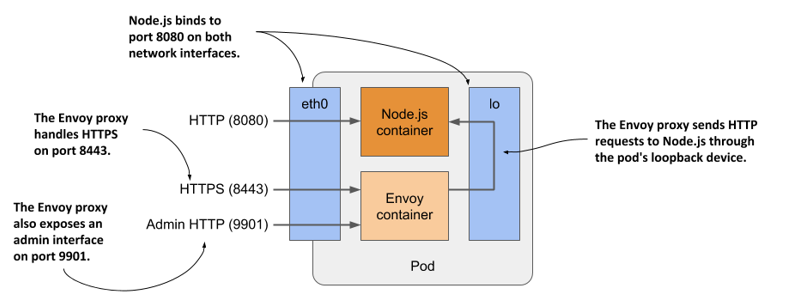

Envoy cũng cung cấp một giao diện quản trị dựa trên web, công cụ này sẽ tỏ ra vô cùng hữu ích trong một số bài thực hành ở chương tiếp theo.

Rõ ràng là nếu bạn tự tích hợp khả năng hỗ trợ TLS ngay trong chính ứng dụng Node.js, ứng dụng sẽ tiêu tốn ít tài nguyên tính toán hơn và có độ trễ thấp hơn do không cần đi qua một bước trung chuyển mạng (network hop) bổ sung. Tuy nhiên, việc tích hợp Envoy proxy lại là một giải pháp nhanh chóng và dễ dàng hơn. Nó cũng cung cấp một điểm khởi đầu tuyệt vời giúp bạn dễ dàng bổ sung nhiều tính năng mạnh mẽ khác của Envoy – những thứ mà có lẽ bạn sẽ chẳng bao giờ tự viết trực tiếp vào mã nguồn ứng dụng của mình. Hãy tham khảo tài liệu của Envoy proxy tại trang chủ <https://envoyproxy.io> để tìm hiểu thêm.

### 5.4.2 Adding Envoy proxy to the pod

Bạn sẽ tạo một Pod mới có chứa hai container. Chúng ta đã có sẵn container Node.js, giờ ta cần thêm một container chạy Envoy nữa.

#### Tạo container image cho Envoy

Đội ngũ phát triển proxy này đã phát hành container image chính thức của Envoy trên Docker Hub. Bạn có thể sử dụng trực tiếp image này, nhưng khi đó bạn sẽ phải tìm cách cung cấp các file cấu hình, chứng chỉ số và khóa riêng tư (private key) cho tiến trình Envoy chạy trong container. Bạn sẽ được học cách làm điều này ở Chương 7. Còn hiện tại, chúng ta sẽ sử dụng một image được chuẩn bị sẵn đã tích hợp đầy đủ cả ba file này.

Tôi đã xây dựng sẵn image này và đẩy lên địa chỉ `docker.io/luksa/kiada-ssl-proxy:0.1`, nhưng nếu muốn tự tay đóng gói, bạn có thể tìm thấy các file liên quan trong thư mục `kiada-ssl-proxy-image` thuộc kho lưu trữ mã nguồn của sách.

Thư mục đó chứa file `Dockerfile`, cùng với khóa riêng tư và chứng chỉ số mà proxy sẽ sử dụng để phục vụ giao thức HTTPS. Nó cũng bao gồm file cấu hình `envoy.conf`. Trong file cấu hình đó, bạn sẽ thấy proxy được thiết lập để lắng nghe trên cổng `8443`, đảm nhận việc giải mã TLS (terminate TLS), và chuyển tiếp các yêu cầu đến cổng `8080` trên `localhost` (nơi ứng dụng Node.js đang lắng nghe). Thêm vào đó, proxy cũng được cấu hình để cung cấp giao diện quản trị trên cổng `9901` như đã đề cập ở trên.

#### Tạo manifest cho Pod

Sau khi build xong image, bạn cần tạo file manifest cho Pod mới. Đoạn mã dưới đây thể hiện nội dung của file manifest `pod.kiada-ssl.yaml`.

##### Danh sách 5.3 Manifest của Pod kiada-ssl

```yaml
apiVersion: v1
kind: Pod
metadata:
  name: kiada-ssl                                
spec:
  containers:
  - name: kiada                                  #A
    image: luksa/kiada:0.2                       #A
    ports:                                       #A
    - name: http                                 #A
      containerPort: 8080                        #A
  - name: envoy                                  #B
    image: luksa/kiada-ssl-proxy:0.1             #B
    ports:                                       #B
    - name: https                                #B
      containerPort: 8443                        #B
    - name: admin                                #B
      containerPort: 9901                        #B
```

Tên của Pod này là `kiada-ssl`. Nó chứa hai container: `kiada` và `envoy`. File manifest này chỉ phức tạp hơn một chút so với manifest ở mục 5.2.1. Điểm mới duy nhất là việc bổ sung tên cho các cổng (port names), nhằm giúp người đọc manifest dễ dàng nhận diện và hiểu rõ vai trò của từng số cổng.

#### Tạo Pod

Hãy tạo Pod từ file manifest bằng cách chạy lệnh `kubectl apply -f pod.kiada-ssl.yaml`. Sau đó, sử dụng các lệnh `kubectl get` và `kubectl describe` để xác nhận rằng các container của Pod đã được khởi chạy thành công.

### 5.4.3 Interacting with the two-container pod

Sau khi Pod khởi động, bạn có thể bắt đầu tương tác với ứng dụng bên trong Pod, kiểm tra nhật ký của nó và khám phá các container từ bên trong.

#### Giao tiếp với ứng dụng

Tương tự như trước, bạn có thể sử dụng lệnh `kubectl port-forward` để thiết lập kết nối tới ứng dụng trong Pod. Vì ứng dụng này mở (expose) ba cổng khác nhau, bạn có thể kích hoạt chuyển tiếp cho cả ba cổng này như sau:

```sh
$ kubectl port-forward kiada-ssl 8080 8443 9901
Forwarding from 127.0.0.1:8080 -> 8080
Forwarding from [::1]:8080 -> 8080
Forwarding from 127.0.0.1:8443 -> 8443
Forwarding from [::1]:8443 -> 8443
Forwarding from 127.0.0.1:9901 -> 9901
Forwarding from [::1]:9901 -> 9901
```

Đầu tiên, hãy xác nhận rằng bạn có thể kết nối với ứng dụng qua giao thức HTTP bằng cách mở URL <http://localhost:8080> trên trình duyệt hoặc sử dụng công cụ `curl`:

```sh
$ curl localhost:8080
Kiada version 0.2. Request processed by "kiada-ssl". Client IP: ::ffff:127.0.0.1
```

Nếu bước trên thành công, bạn cũng có thể thử truy cập ứng dụng qua giao thức mã hóa HTTPS tại địa chỉ <https://localhost:8443>. Bạn có thể thực hiện kiểm tra này với `curl` như sau:

```sh
$ curl https://localhost:8443 --insecure
Kiada version 0.2. Request processed by "kiada-ssl". Client IP: ::ffff:127.0.0.1
```

Thành công mỹ mãn! Envoy proxy đã hoàn thành xuất sắc nhiệm vụ của mình. Ứng dụng của bạn giờ đây đã hỗ trợ HTTPS nhờ vào việc sử dụng một sidecar container.

##### Tại sao lại sử dụng tùy chọn --insecure?

Có hai lý do khiến chúng ta phải sử dụng tùy chọn `--insecure` khi truy cập dịch vụ này. Thứ nhất, chứng chỉ số mà Envoy proxy sử dụng là chứng chỉ tự ký (self-signed) và được cấp phát cho tên miền `example.com`. Thứ hai, bạn đang truy cập dịch vụ thông qua `localhost` (nơi tiến trình `kubectl proxy` cục bộ đang lắng nghe). Do đó, tên máy chủ (hostname) truy cập không trùng khớp với tên ghi trên chứng chỉ của máy chủ.

Để giải quyết sự không tương thích này, bạn có thể chỉ thị cho curl gửi yêu cầu đến tên miền `example.com`, nhưng điều hướng phân giải nó về địa chỉ IP `127.0.0.1` bằng cờ `--resolve`. Thao tác này đảm bảo rằng chứng chỉ sẽ khớp với URL được yêu cầu. Dẫu vậy, vì chứng chỉ của máy chủ là tự ký, curl vẫn sẽ từ chối công nhận tính hợp lệ của nó. Bạn có thể khắc phục hoàn toàn vấn đề này bằng cách chỉ rõ cho curl biết file chứng chỉ cần dùng để xác thực máy chủ thông qua cờ `--cacert`. Khi đó, câu lệnh hoàn chỉnh sẽ như sau:

```sh
$ curl https://example.com:8443 --resolve example.com:8443:127.0.0.1 --cacert kiada-ssl-proxy-0.1/example-com.crt
```

Cách làm trên yêu cầu gõ một câu lệnh khá dài dòng. Đó là lý do tại sao tôi ưu tiên sử dụng tùy chọn đơn giản `--insecure` hoặc phiên bản viết tắt `-k` của nó.

#### Hiển thị nhật ký của các Pod chứa nhiều container

Pod `kiada-ssl` chứa hai container khác nhau, vì vậy nếu muốn hiển thị nhật ký, bạn bắt buộc phải chỉ định rõ tên của container bằng tùy chọn `--container` hoặc `-c`. Ví dụ, để xem nhật ký của container `kiada`, hãy chạy lệnh sau:

```sh
$ kubectl logs kiada-ssl -c kiada
```

Envoy proxy chạy trong container có tên `envoy`, do đó bạn có thể xem log của nó như sau:

```sh
$ kubectl logs kiada-ssl -c envoy
```

Ngoài ra, bạn cũng có thể hiển thị nhật ký của tất cả các container cùng lúc bằng tùy chọn `--all-containers`:

```sh
$ kubectl logs kiada-ssl --all-containers
```

Bạn cũng có thể kết hợp các lệnh này với các tùy chọn lọc log nâng cao đã được giải thích ở mục 5.3.2.

#### Thực thi lệnh trong các container của Pod đa container

Nếu muốn khởi chạy shell hoặc bất kỳ lệnh nào khác trong một container cụ thể của Pod bằng lệnh `kubectl exec`, bạn cũng cần chỉ định tên container bằng tùy chọn `--container` hoặc `-c`. Ví dụ, để chạy một shell bên trong container `envoy`, hãy thực thi lệnh sau:

```sh
$ kubectl exec -it kiada-ssl -c envoy -- bash
```

##### Lưu ý

Nếu bạn không cung cấp tên container cụ thể, lệnh `kubectl exec` sẽ mặc định áp dụng lên container đầu tiên được khai báo trong file manifest của Pod.

## 5.5 Running additional containers at pod startup

Khi một Pod chứa nhiều container, tất cả các container đó sẽ được khởi chạy song song cùng lúc. Kubernetes hiện tại chưa cung cấp cơ chế trực tiếp để định nghĩa sự phụ thuộc giữa các container (nhằm đảm bảo container này phải khởi chạy thành công trước container kia). Tuy nhiên, Kubernetes cho phép bạn chạy một chuỗi các container phụ để thiết lập các bước khởi tạo cho Pod trước khi các container chính thức bắt đầu hoạt động. Loại container đặc biệt này sẽ được giải thích chi tiết trong phần dưới đây.

### 5.5.1 Introducing init containers

Trong file manifest của Pod, bạn có thể chỉ định một danh sách các container phụ sẽ chạy ngay khi khởi động Pod và phải hoàn thành trước khi các container thông thường của Pod bắt đầu hoạt động. Những container này có nhiệm vụ chuẩn bị môi trường khởi tạo cho Pod và được gọi một cách rất trực quan là *init container* (container khởi tạo). Như hình minh họa dưới đây, chúng chạy tuần tự từng cái một và tất cả đều phải kết thúc thành công trước khi các container chính của Pod được phép khởi chạy.

##### Hình 5.11 Sơ đồ tiến trình thời gian khởi chạy của các init container và container thông thường trong Pod

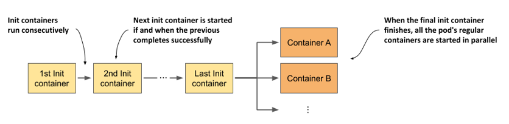

Các init container sở hữu các thuộc tính tương tự như các container thông thường của Pod, điểm khác biệt duy nhất là chúng không chạy song song – tại một thời điểm chỉ có duy nhất một init container được thực thi.

#### Tìm hiểu vai trò và khả năng của init container

Các init container thường được bổ sung vào Pod để thực hiện các nhiệm vụ sau:

- Khởi tạo các file trong volume được sử dụng bởi các container chính của Pod. Công việc này bao gồm việc lấy chứng chỉ và khóa riêng tư từ các kho lưu trữ bảo mật để cung cấp cho container chính, tạo file cấu hình, tải xuống dữ liệu, v.v.
- Thiết lập hệ thống mạng của Pod. Vì toàn bộ container trong cùng một Pod dùng chung không gian mạng (network namespace), bao gồm cả các giao diện mạng và cấu hình mạng, nên bất kỳ thay đổi nào do một init container thực hiện cũng sẽ có hiệu lực trực tiếp lên container chính.
- Trì hoãn việc khởi động các container chính của Pod cho đến khi đáp ứng một điều kiện tiên quyết nào đó. Ví dụ, nếu container chính phụ thuộc vào một dịch vụ ngoại vi khác và yêu cầu dịch vụ đó phải khả dụng trước khi nó khởi chạy, một init container có thể chạy chặn (block) cho đến khi dịch vụ kia sẵn sàng.
- Thông báo cho một dịch vụ bên ngoài biết Pod chuẩn bị khởi chạy. Trong một số trường hợp đặc biệt khi hệ thống bên ngoài cần được thông báo mỗi khi một instance mới của ứng dụng được khởi chạy, một init container có thể được dùng để gửi đi thông báo này.

Bạn hoàn toàn có thể thực hiện những tác vụ này trực tiếp trong container chính, tuy nhiên việc tách biệt chúng ra một init container riêng thường là lựa chọn tối ưu hơn và mang lại nhiều lợi thế vượt trội. Hãy cùng tìm hiểu nguyên nhân tại sao.

#### Khi nào việc chuyển mã nguồn khởi tạo sang init container là hợp lý?

Việc sử dụng một init container để xử lý các tác vụ khởi tạo giúp bạn không cần phải đóng gói (rebuild) lại container image chính, đồng thời cho phép tái sử dụng một init container image duy nhất cho nhiều ứng dụng khác nhau. Điều này đặc biệt hữu ích khi bạn muốn tích hợp cùng một đoạn mã khởi tạo đặc thù của hạ tầng vào tất cả các Pod trong hệ thống. Bên cạnh đó, việc sử dụng init container cũng đảm bảo quá trình khởi tạo này hoàn tất tuyệt đối trước khi bất kỳ container chính nào (có thể là nhiều container) được khởi chạy.

Một lý do quan trọng khác liên quan đến vấn đề bảo mật. Bằng cách di chuyển các công cụ hoặc dữ liệu nhạy cảm (những thứ có thể bị kẻ tấn công khai thác để xâm nhập cluster) từ container chính sang một init container, bạn sẽ thu hẹp đáng kể bề mặt tấn công của Pod.

Ví dụ, hãy tưởng tượng một kịch bản trong đó Pod bắt buộc phải đăng ký thông tin với một hệ thống bên ngoài. Để làm được điều này, Pod cần sở hữu một mã khóa bảo mật (secret token) để xác thực. Nếu quy trình đăng ký này được thực hiện bởi container chính, mã khóa bảo mật này buộc phải lưu trữ trong hệ thống file của nó. Khi đó, nếu ứng dụng chạy trong container chính tồn tại một lỗ hổng bảo mật cho phép kẻ tấn công đọc các file tùy ý trên hệ thống, chúng có thể dễ dàng đánh cắp mã khóa này. Ngược lại, nếu thực hiện đăng ký thông qua một init container, mã khóa bảo mật sẽ chỉ cần hiện diện trong hệ thống file của init container – một môi trường ngắn hạn mà kẻ tấn công cực kỳ khó tiếp cận và khai thác.

### 5.5.2 Adding init containers to a pod

Trong file manifest của Pod, các init container được định nghĩa trong trường `initContainers` thuộc phần `spec`, tương tự như cách các container thông thường được khai báo trong trường `containers`.

#### Định nghĩa các init container trong file manifest của Pod

Hãy cùng xem xét ví dụ về việc thêm hai init container vào Pod `kiada`. Init container thứ nhất đóng vai trò giả lập một tiến trình khởi tạo. Nó sẽ chạy trong vòng 5 giây và đồng thời in ra một vài dòng văn bản trên luồng xuất chuẩn.

Init container thứ hai thực hiện nhiệm vụ kiểm tra kết nối mạng bằng cách sử dụng lệnh `ping` để kiểm tra xem một địa chỉ IP cụ thể có thể truy cập được từ bên trong Pod hay không. Địa chỉ IP này có thể cấu hình được thông qua đối số dòng lệnh và có giá trị mặc định là `1.1.1.1`.

##### Lưu ý

Một init container kiểm tra tính khả dụng của các địa chỉ IP cụ thể có thể được sử dụng để chặn không cho ứng dụng khởi chạy cho đến khi các dịch vụ mà nó phụ thuộc vào hoạt động bình thường.

Bạn có thể tìm thấy các file `Dockerfile` và các tài nguyên liên quan cho cả hai image trong kho lưu trữ mã nguồn của sách nếu muốn tự xây dựng chúng. Ngoài ra, bạn cũng có thể sử dụng trực tiếp các image do tôi xây dựng sẵn.

File manifest của Pod chứa hai init container này là `pod.kiada-init.yaml`. Nội dung chi tiết của nó được trình bày trong danh sách cấu hình dưới đây.

##### Danh sách 5.4 Định nghĩa các init container trong file manifest của Pod

```yaml
apiVersion: v1
kind: Pod
metadata:
  name: kiada-init
spec:
  initContainers:                                      #A
  - name: init-demo                                    #B
    image: luksa/init-demo:0.1                         #B
  - name: network-check                                #C
    image: luksa/network-connectivity-checker:0.1      #C
  containers:                                          #D
  - name: kiada                                        #D
    image: luksa/kiada:0.2                             #D
    stdin: true                                        #D
    ports:                                             #D
    - name: http                                       #D
      containerPort: 8080                              #D
  - name: envoy                                        #D
    image: luksa/kiada-ssl-proxy:0.1                   #D
    ports:                                             #D
    - name: https                                      #D
      containerPort: 8443                              #D
    - name: admin                                      #D
      containerPort: 9901                              #D
```

Như bạn thấy, việc định nghĩa một init container vô cùng đơn giản. Bạn chỉ cần chỉ định duy nhất các trường `name` (tên) và `image` (hình ảnh container) cho mỗi container là đủ.

##### Lưu ý

Tên của các container phải là duy nhất trong toàn bộ danh sách tập hợp cả các init container và các container thông thường của Pod.

#### Triển khai Pod có sử dụng init container

Trước khi bạn tạo Pod từ file manifest, hãy chạy lệnh sau trong một cửa sổ terminal riêng biệt để có thể theo dõi sự thay đổi trạng thái của Pod khi các init container và container thông thường lần lượt khởi động:

```sh
$ kubectl get pods -w
```

Bạn cũng sẽ muốn theo dõi các sự kiện (events) trong một cửa sổ terminal khác bằng cách sử dụng lệnh dưới đây:

```sh
$ kubectl get events -w
```

Khi đã sẵn sàng, hãy tạo Pod bằng cách thực thi lệnh apply:

```sh
$ kubectl apply -f pod.kiada-init.yaml
```

#### Kiểm tra quá trình khởi động của Pod có init container

Khi Pod bắt đầu khởi động, hãy kiểm tra các sự kiện được hiển thị từ lệnh `kubectl get events -w`:

```
TYPE     REASON      MESSAGE
Normal   Scheduled   Successfully assigned pod to worker2
Normal   Pulling     Pulling image "luksa/init-demo:0.1"       #A
Normal   Pulled      Successfully pulled image                 #A
Normal   Created     Created container init-demo               #A
Normal   Started     Started container init-demo               #A
Normal   Pulling     Pulling image "luksa/network-connec...    #B
Normal   Pulled      Successfully pulled image                 #B
Normal   Created     Created container network-check           #B
Normal   Started     Started container network-check           #B
Normal   Pulled      Container image "luksa/kiada:0.1"         #C
                     already present on machine                #C
Normal   Created     Created container kiada                   #C
Normal   Started     Started container kiada                   #C
Normal   Pulled      Container image "luksa/kiada-ssl-         #C
                     proxy:0.1" already present on machine     #C
Normal   Created     Created container envoy                   #C
Normal   Started     Started container envoy                   #C
```

Danh sách trên hiển thị thứ tự khởi chạy của các container. Container `init-demo` được khởi động đầu tiên. Sau khi container này hoàn thành, container `network-check` sẽ được kích hoạt, và khi nó kết thúc, hai container chính là `kiada` và `envoy` mới bắt đầu chạy.

Bây giờ, hãy quan sát các bước chuyển trạng thái của pod ở cửa sổ terminal còn lại. Kết quả hiển thị sẽ có dạng như sau:

```
NAME         READY   STATUS            RESTARTS   AGE
kiada-init   0/2     Pending           0          0s
kiada-init   0/2     Pending           0          0s
kiada-init   0/2     Init:0/2          0          0s          #A
kiada-init   0/2     Init:0/2          0          1s          #A
kiada-init   0/2     Init:1/2          0          6s          #B
kiada-init   0/2     PodInitializing   0          7s          #C
kiada-init   2/2     Running           0          8s          #D
```

Như kết quả hiển thị, trong quá trình các container khởi tạo (init container) hoạt động, trạng thái của pod sẽ biểu diễn số lượng container khởi tạo đã hoàn thành trên tổng số lượng. Khi tất cả các container khởi tạo hoàn tất, trạng thái của pod sẽ chuyển sang `PodInitializing`. Tại thời điểm này, các image của các container chính sẽ được tải về (pull). Sau khi các container này khởi chạy thành công, trạng thái sẽ chuyển thành `Running`.

### 5.5.3 Kiểm tra các container khởi tạo

Tương tự như các container thông thường, bạn có thể thực thi các lệnh bổ sung bên trong một container khởi tạo đang chạy bằng lệnh `kubectl exec` và hiển thị log của nó bằng lệnh `kubectl logs`.

#### Hiển thị log của container khởi tạo

Đầu ra tiêu chuẩn (stdout) và đầu ra lỗi (stderr) do mỗi container khởi tạo ghi lại đều được Kubernetes thu thập tương tự như với các container thông thường. Bạn có thể hiển thị log của một container khởi tạo bằng lệnh `kubectl logs`, kèm theo tùy chọn `-c` để chỉ định tên container. Lệnh này có thể thực hiện khi container đang chạy hoặc sau khi nó đã kết thúc. Để xem log của container `network-check` trong pod `kiada-init`, hãy chạy lệnh sau:

```
$ kubectl logs kiada-init -c network-check
Checking network connectivity to 1.1.1.1 ...
Host appears to be reachable
```

Log hiển thị cho thấy container khởi tạo `network-check` đã chạy thành công mà không gặp lỗi nào. Trong chương tiếp theo, chúng ta sẽ tìm hiểu điều gì xảy ra khi một container khởi tạo gặp lỗi.

#### Truy cập vào một container khởi tạo đang chạy

Bạn có thể sử dụng lệnh `kubectl exec` để mở một shell hoặc thực thi một lệnh khác bên trong container khởi tạo, tương tự như với các container thông thường. Tuy nhiên, bạn chỉ có thể thực hiện việc này trước khi container khởi tạo đó kết thúc. Nếu muốn tự mình trải nghiệm, hãy tạo một pod từ tệp `pod.kiada-init-slow.yaml`—tệp này sẽ thiết lập cho container `init-demo` chạy trong vòng 60 giây. Khi pod bắt đầu khởi chạy, hãy mở một shell trong container bằng lệnh sau:

```
$ kubectl exec -it kiada-init-slow -c init-demo -- sh
```

Bạn có thể sử dụng shell này để khám phá cấu trúc bên trong container, nhưng chỉ trong một khoảng thời gian ngắn. Khi tiến trình chính của container kết thúc sau 60 giây, tiến trình shell này cũng sẽ tự động bị đóng.

Thông thường, người ta chỉ truy cập vào một container khởi tạo đang chạy khi nó không thể hoàn thành đúng hạn và bạn muốn tìm ra nguyên nhân. Trong điều kiện hoạt động bình thường, container khởi tạo sẽ kết thúc trước khi bạn kịp gõ xong lệnh `kubectl exec`.

## 5.6 Xóa pod và các đối tượng khác

Nếu đã thực hành các bài tập trong chương này và Chương 2, hiện tại cụm (cluster) của bạn đang có sẵn một vài pod và các đối tượng khác. Để khép lại chương này, bạn sẽ học các cách khác nhau để xóa chúng. Việc xóa một pod sẽ chấm dứt các container của nó và loại bỏ chúng khỏi node. Xóa một đối tượng Deployment sẽ kéo theo việc xóa các pod do nó quản lý, trong khi xóa một Service kiểu LoadBalancer sẽ giải phóng (deprovision) bộ cân bằng tải nếu trước đó bộ cân bằng tải này đã được cấp phát.

### 5.6.1 Xóa pod bằng tên

Cách đơn giản nhất để xóa một đối tượng là xóa bằng tên của nó.

#### Xóa một pod duy nhất

Sử dụng lệnh sau để loại bỏ pod `kiada` ra khỏi cụm của bạn:

```
$ kubectl delete po kiada
pod "kiada" deleted
```

Bằng việc xóa một pod, bạn đang khai báo rằng mình không còn nhu cầu duy trì pod hoặc các container của nó nữa. Kubelet sẽ tắt các container của pod, dọn dẹp toàn bộ tài nguyên liên quan (chẳng hạn như các tệp log) và thông báo cho API server sau khi quá trình này hoàn tất. Sau đó, đối tượng Pod sẽ chính thức bị xóa bỏ.

##### Mẹo

Theo mặc định, lệnh `kubectl delete` sẽ đợi cho đến khi đối tượng hoàn toàn không còn tồn tại. Để bỏ qua thời gian chờ này, hãy chạy lệnh với tùy chọn `--wait=false`.

Trong khi pod đang trong quá trình tắt, trạng thái của nó sẽ chuyển sang `Terminating`:

```
$ kubectl get po kiada
NAME    READY   STATUS        RESTARTS   AGE
kiada   1/1     Terminating   0          35m
```

Hiểu rõ cơ chế tắt của các container là điều tối quan trọng nếu bạn muốn ứng dụng của mình mang lại trải nghiệm tốt cho người dùng (client). Nội dung này sẽ được giải thích kỹ lưỡng trong chương tiếp theo, nơi chúng ta đi sâu vào vòng đời của pod và các container của nó.

##### Lưu ý

Nếu đã quen thuộc với Docker, bạn có thể thắc mắc liệu mình có thể tạm dừng một pod rồi khởi động lại sau đó như đối với các container Docker hay không. Câu trả lời là không. Với Kubernetes, bạn chỉ có thể xóa hoàn toàn một pod và tạo lại nó sau đó.

#### Xóa nhiều pod bằng một lệnh duy nhất

Bạn cũng có thể xóa nhiều pod cùng một lúc bằng một lệnh duy nhất. Nếu đang chạy cả hai pod `kiada-init` và `kiada-init-slow`, bạn có thể xóa cả hai bằng cách chỉ định tên của chúng cách nhau bởi một khoảng trắng như sau:

```
$ kubectl delete po kiada-init kiada-init-slow
pod "kiada-init" deleted
pod "kiada-init-slow" deleted
```

### 5.6.2 Xóa các đối tượng được định nghĩa trong tệp manifest

Bất cứ khi nào tạo các đối tượng từ một tệp cấu hình, bạn cũng có thể xóa chúng bằng cách truyền tệp đó vào lệnh `delete` thay vì chỉ định tên của pod.

#### Xóa các đối tượng bằng cách chỉ định tệp manifest

Bạn có thể xóa pod `kiada-ssl` (được tạo từ tệp `pod.kiada-ssl.yaml`) bằng lệnh sau:

```
$ kubectl delete -f pod.kiada-ssl.yaml
pod "kiada-ssl" deleted
```

Trong trường hợp này, tệp cấu hình chỉ chứa một đối tượng pod duy nhất, nhưng trong thực tế, bạn sẽ thường gặp các tệp chứa nhiều đối tượng thuộc các loại khác nhau đại diện cho toàn bộ một ứng dụng hoàn chỉnh. Điều này giúp việc triển khai và gỡ bỏ ứng dụng trở nên cực kỳ đơn giản, chỉ tương đương với việc chạy lần lượt lệnh `kubectl apply -f app.yaml` và `kubectl delete -f app.yaml`.

#### Xóa các đối tượng từ nhiều tệp manifest

Đôi khi, một ứng dụng được định nghĩa trong nhiều tệp manifest khác nhau. Bạn có thể chỉ định nhiều tệp bằng cách phân tách chúng bằng dấu phẩy. Ví dụ:

```
$ kubectl delete -f pod.kiada.yaml,pod.kiada-ssl.yaml
```

##### Lưu ý

Bạn cũng có thể áp dụng (apply) nhiều tệp cùng lúc bằng cú pháp này (ví dụ: `kubectl apply -f pod.kiada.yaml,pod.kiada-ssl.yaml`).

Trong suốt nhiều năm làm việc với Kubernetes, tôi thực sự chưa bao giờ dùng cách này. Thay vào đó, tôi thường triển khai toàn bộ các tệp manifest từ một thư mục bằng cách chỉ định tên thư mục đó thay vì liệt kê từng tệp riêng lẻ. Ví dụ, bạn có thể triển khai lại tất cả các pod đã tạo trong chương này bằng cách chạy lệnh sau tại thư mục gốc chứa mã nguồn của cuốn sách:

```
$ kubectl apply -f Chapter05/
```

Lệnh này sẽ áp dụng cho tất cả các tệp trong thư mục có phần mở rộng hợp lệ (như `.yaml`, `.json`, v.v.). Sau đó, bạn có thể xóa các pod này bằng phương pháp tương tự:

```
$ kubectl delete -f Chapter05/
```

##### Lưu ý

Nếu các tệp manifest của bạn được lưu trữ trong các thư mục con, bạn phải sử dụng thêm cờ `--recursive` (hoặc `-R`).

### 5.6.3 Xóa toàn bộ pod

Đến đây, bạn đã xóa hầu hết các pod ngoại trừ `kiada-stdin` và các pod được tạo từ Chương 3 bằng lệnh `kubectl create deployment`. Tùy thuộc vào cách bạn đã cấu hình scale cho deployment đó, một số pod này vẫn đang chạy:

```
$ kubectl get pods
NAME                    READY   STATUS    RESTARTS   AGE
kiada-stdin             1/1     Running   0          10m
kiada-9d785b578-58vhc   1/1     Running   0          1d
kiada-9d785b578-jmnj8   1/1     Running   0          1d
```

Thay vì xóa từng pod theo tên, chúng ta có thể xóa toàn bộ chúng bằng tùy chọn `--all`:

```
$ kubectl delete po --all
pod "kiada-stdin" deleted
pod "kiada-9d785b578-58vhc" deleted
pod "kiada-9d785b578-jmnj8" deleted
```

Bây giờ, hãy kiểm tra lại để chắc chắn rằng không còn pod nào tồn tại bằng cách chạy lại lệnh `kubectl get pods`:

```
$ kubectl get po
NAME                    READY   STATUS    RESTARTS   AGE
kiada-9d785b578-cc6tk   1/1     Running   0          13s
kiada-9d785b578-h4gml   1/1     Running   0          13s
```

Thật bất ngờ! Vẫn còn hai pod đang chạy. Nếu nhìn kỹ vào tên của chúng, bạn sẽ thấy đây không phải là hai pod bạn vừa xóa. Cột `AGE` cũng cho thấy đây là những pod *mới*. Bạn có thể thử xóa chúng đi, nhưng sẽ nhận ra rằng dù có xóa bao nhiêu lần đi chăng nữa, các pod mới vẫn sẽ tự động được tạo ra để thay thế.

Nguyên nhân khiến các pod này liên tục tự động sinh ra là do đối tượng Deployment. Bộ điều khiển (controller) chịu trách nhiệm vận hành các đối tượng Deployment phải luôn đảm bảo số lượng pod thực tế khớp với số lượng bản sao (replica) mong muốn được chỉ định trong đối tượng đó. Khi bạn xóa một pod thuộc quyền quản lý của Deployment, bộ điều khiển sẽ lập tức tạo ra một pod khác để thay thế.

Để xóa các pod này, bạn phải thực hiện scale số lượng bản sao của Deployment về bằng 0 hoặc xóa hoàn toàn đối tượng Deployment đó. Hành động này sẽ khai báo rằng bạn không còn muốn duy trì deployment này hay các pod của nó trong cụm nữa.

### 5.6.4 Xóa các đối tượng bằng từ khóa “all”

Bạn có thể xóa sạch mọi thứ đã tạo từ trước đến nay—bao gồm deployment, các pod của nó và service—bằng lệnh sau:

```
$ kubectl delete all --all
pod "kiada-9d785b578-cc6tk" deleted
pod "kiada-9d785b578-h4gml" deleted
service "kubernetes" deleted
service "kiada" deleted
deployment.apps "kiada" deleted
replicaset.apps "kiada-9d785b578" deleted
```

Từ khóa `all` đầu tiên trong lệnh cho biết bạn muốn xóa các đối tượng thuộc mọi loại. Tùy chọn `--all` biểu thị rằng bạn muốn xóa toàn bộ các phiên bản (instance) của từng loại đối tượng đó. Bạn đã sử dụng tùy chọn này ở phần trước khi cố gắng xóa toàn bộ các pod.

Khi thực hiện xóa đối tượng, `kubectl` sẽ in ra loại và tên của từng đối tượng bị xóa. Trong danh sách trên, bạn có thể thấy lệnh này không chỉ xóa các pod, deployment và service, mà còn xóa cả một đối tượng được gọi là replica set. Chúng ta sẽ tìm hiểu về đối tượng này trong Chương 11 khi đi sâu nghiên cứu về deployment.

Có thể bạn sẽ nhận thấy lệnh xóa này cũng đã xóa cả service mặc định `kubernetes`. Đừng lo lắng về điều đó, vì service này sẽ tự động được tạo lại chỉ sau vài giây.

Một số đối tượng nhất định sẽ không bị xóa khi sử dụng phương pháp này, bởi từ khóa `all` không bao gồm tất cả các loại đối tượng. Đây là một cơ chế phòng ngừa nhằm tránh việc bạn vô tình xóa mất các đối tượng chứa thông tin quan trọng. Đối tượng kiểu Event (Sự kiện) chính là một ví dụ điển hình.

##### Lưu ý

Bạn có thể chỉ định nhiều loại đối tượng trong lệnh `delete`. Ví dụ, bạn có thể dùng lệnh `kubectl delete events,all --all` để xóa các event cùng với tất cả các loại đối tượng nằm trong nhóm `all`.

## 5.7 Tóm tắt chương

Trong chương này, bạn đã học được:

- Pod chạy một hoặc nhiều container dưới dạng một nhóm được đặt cùng nhau (co-located). Chúng là đơn vị cơ bản để triển khai và mở rộng quy mô theo chiều ngang (horizontal scaling). Một container thông thường chỉ chạy một tiến trình duy nhất. Các container sidecar đóng vai trò bổ trợ cho container chính trong pod.
- Các container chỉ nên được đặt chung trong một pod nếu chúng bắt buộc phải chạy cùng nhau. Một tiến trình frontend và một tiến trình backend nên chạy ở các pod riêng biệt. Việc này cho phép chúng ta mở rộng quy mô một cách độc lập cho từng thành phần.
- Khi một pod khởi động, các container khởi tạo của nó sẽ chạy tuần tự. Khi container khởi tạo cuối cùng hoàn thành, các container chính của pod mới bắt đầu được khởi chạy. Bạn có thể sử dụng container khởi tạo để cấu hình cho pod từ bên trong, trì hoãn việc khởi động các container chính cho đến khi một điều kiện tiên quyết được đáp ứng, hoặc thông báo cho một dịch vụ bên ngoài rằng pod chuẩn bị hoạt động.
- Công cụ `kubectl` được sử dụng để tạo pod, xem log, sao chép tệp tin đi và đến các container, thực thi lệnh bên trong container và thiết lập kết nối giao tiếp với từng pod riêng lẻ trong quá trình phát triển.

Trong chương tiếp theo, bạn sẽ được tìm hiểu chi tiết về vòng đời của pod và các container bên trong nó.

---

[← Chương 4](04-gioi-thieu-cac-doi-tuong-api-cua-kubernetes.md) · [Mục lục](README.md) · [Chương 6 →](06-quan-ly-vong-doi-cua-pod.md)
