# 6 Quản lý vòng đời của Pod

### Nội dung chính của chương này

- Kiểm tra trạng thái của pod
- Giữ cho các container luôn hoạt động ổn định bằng đầu dò liveness (liveness probe)
- Sử dụng các hook vòng đời (lifecycle hook) để thực hiện các hành động khi container khởi động và tắt
- Tìm hiểu toàn bộ vòng đời của pod và các container bên trong nó

Sau khi đọc xong chương trước, bạn đã có thể triển khai, kiểm tra và kết nối với các pod chứa một hoặc nhiều container. Trong chương này, bạn sẽ có được cái nhìn sâu sắc hơn nhiều về cơ chế vận hành của pod và các container của nó.

##### Lưu ý

Bạn có thể tìm thấy các tệp mã nguồn cho chương này tại <https://github.com/luksa/kubernetes-in-action-2nd-edition/tree/master/Chapter06>

## 6.1 Tìm hiểu trạng thái của pod

Sau khi bạn tạo một đối tượng pod và đối tượng này đi vào hoạt động, bạn có thể kiểm tra những gì đang diễn ra với pod bằng cách truy vấn thông tin đối tượng từ API. Như đã tìm hiểu ở Chương 4, tệp manifest của đối tượng pod, cũng như manifest của hầu hết các loại đối tượng khác, luôn chứa một phần cung cấp trạng thái (status) của đối tượng đó. Phần `status` của một pod chứa các thông tin sau:

- Địa chỉ IP của pod và của worker node đang chạy pod đó
- Thời điểm khởi động của pod
- Lớp chất lượng dịch vụ (QoS - Quality of Service) của pod
- Pha (phase) hiện tại của pod
- Các điều kiện (condition) của pod
- Trạng thái (state) của từng container riêng lẻ trong pod

Địa chỉ IP và thời gian bắt đầu là những thông tin khá trực quan không cần giải thích thêm, còn lớp QoS hiện chưa thực sự cần thiết—chúng ta sẽ tìm hiểu về nó trong Chương 19. Tuy nhiên, việc nắm vững pha, các điều kiện của pod cũng như trạng thái của các container là vô cùng quan trọng để hiểu được vòng đời của pod.

### 6.1.1 Tìm hiểu về pha của pod (pod phase)

Tại bất kỳ thời điểm nào trong vòng đời, pod cũng sẽ nằm trong một trong năm pha được mô tả trong hình dưới đây.

##### Hình 6.1 Các pha của một pod trong Kubernetes

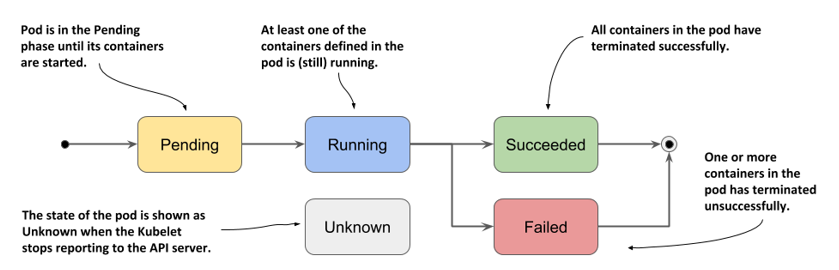

Ý nghĩa của từng pha được giải thích chi tiết trong bảng dưới đây.

##### Bảng 6.1 Danh sách các pha của pod

| Pha của Pod (Pod Phase) | Mô tả |
| :--- | :--- |
| Pending | Đây là pha khởi đầu ngay sau khi bạn tạo đối tượng Pod. Pod sẽ duy trì ở pha này cho đến khi được lên lịch (schedule) chạy trên một node và các image của các container được tải về cũng như khởi chạy thành công. |
| Running | Ít nhất một trong số các container của pod đang hoạt động. |
| Succeeded | Đối với các pod không có mục đích chạy vô thời hạn, chúng sẽ được đánh dấu là `Succeeded` sau khi tất cả các container bên trong hoàn thành nhiệm vụ thành công. |
| Failed | Khi một pod không được cấu hình để chạy vô thời hạn và có nhất một container của nó kết thúc thất bại (gặp lỗi), pod sẽ được đánh dấu là `Failed`. |
| Unknown | Trạng thái của pod không thể xác định được vì Kubelet đã ngừng báo cáo hoặc mất kết nối với API server. Khả năng cao là worker node đã bị lỗi hoặc mất kết nối mạng. |

Pha của pod cung cấp một bản tóm tắt nhanh về những gì đang xảy ra với nó. Hãy cùng triển khai lại pod `kiada` và kiểm tra pha của nó. Tạo pod bằng cách áp dụng tệp manifest vào cụm của bạn một lần nữa, tương tự như trong chương trước (bạn có thể tìm thấy tệp này tại `Chapter06/pod.kiada.yaml`):

```
$ kubectl apply -f pod.kiada.yaml
```

#### Hiển thị pha của một pod

Pha của pod là một trong các trường nằm trong phần `status` của đối tượng pod. Bạn có thể xem thông tin này bằng cách hiển thị manifest của nó và tùy chọn lọc kết quả bằng lệnh grep để tìm kiếm trường mong muốn:

```
$ kubectl get po kiada -o yaml | grep phase
phase: Running
```

##### Mẹo

Bạn còn nhớ công cụ `jq` chứ? Bạn có thể sử dụng nó để in trực tiếp giá trị của trường `phase` như sau: `kubectl get po kiada -o json | jq .status.phase`

Bạn cũng có thể xem pha của pod bằng cách sử dụng lệnh `kubectl describe`. Trạng thái của pod sẽ được hiển thị ở gần phía đầu kết quả đầu ra.

```
$ kubectl describe po kiada
Name:         kiada
Namespace:    default
...
Status:       Running
...
```

Mặc dù cột `STATUS` hiển thị bởi lệnh `kubectl get pods` trông có vẻ như đang chỉ ra pha của pod, nhưng điều này chỉ đúng đối với các pod đang ở trạng thái khỏe mạnh:

```
$ kubectl get po kiada
NAME    READY   STATUS    RESTARTS   AGE
kiada   1/1     Running   0          40m
```

Đối với các pod không khỏe mạnh, cột `STATUS` sẽ chỉ rõ vấn đề mà pod đang gặp phải. Bạn sẽ được thấy rõ điều này ở phần sau của chương.

### 6.1.2 Tìm hiểu về các điều kiện của pod (pod condition)

Pha của pod chưa nói lên được nhiều điều về tình trạng chi tiết của nó. Bạn có thể tìm hiểu sâu hơn bằng cách xem danh sách các điều kiện (condition) của pod, tương tự như những gì chúng ta đã làm với đối tượng node ở Chương 4. Các điều kiện của pod cho biết liệu pod đã đạt đến một trạng thái nhất định nào đó hay chưa, và lý do đằng sau là gì.

Khác với pha, một pod có thể có nhiều điều kiện khác nhau cùng một lúc. Tại thời điểm viết cuốn sách này, có bốn *loại* điều kiện được định nghĩa. Chúng được giải thích chi tiết trong bảng dưới đây.

##### Bảng 6.2 Danh sách các điều kiện của pod

| Điều kiện của Pod (Pod Condition) | Mô tả |
| :--- | :--- |
| PodScheduled | Cho biết liệu pod đã được lên lịch (schedule) chạy trên một node hay chưa. |
| Initialized | Toàn bộ các container khởi tạo (init container) của pod đã hoàn thành thành công. |
| ContainersReady | Tất cả các container trong pod đều báo cáo rằng chúng đã sẵn sàng. Đây là điều kiện cần nhưng chưa đủ để toàn bộ pod được coi là sẵn sàng. |
| Ready | Pod đã sẵn sàng cung cấp dịch vụ cho các client. Toàn bộ các container trong pod cũng như các cổng sẵn sàng (readiness gate) của pod đều đang báo cáo trạng thái sẵn sàng. Lưu ý: Cơ chế này sẽ được giải thích kỹ hơn ở Chương 10. |

Mỗi điều kiện có thể ở trạng thái được đáp ứng hoặc không. Như mô tả trong hình dưới đây, các điều kiện `PodScheduled` và `Initialized` ban đầu ở trạng thái chưa được đáp ứng, nhưng sẽ nhanh chóng được đáp ứng và duy trì như vậy suốt vòng đời của pod. Ngược lại, các điều kiện `Ready` và `ContainersReady` có thể thay đổi liên tục nhiều lần trong suốt thời gian tồn tại của pod.

##### Hình 6.2 Sự chuyển đổi của các điều kiện của pod trong suốt vòng đời của nó

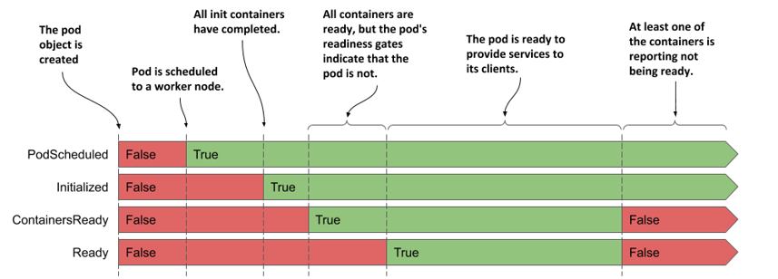

Bạn còn nhớ các điều kiện xuất hiện trong một đối tượng node chứ? Đó là `MemoryPressure`, `DiskPressure`, `PIDPressure` và `Ready`. Có thể thấy, mỗi loại đối tượng có một tập hợp các loại điều kiện riêng, nhưng nhiều đối tượng đều sở hữu điều kiện `Ready` chung—thường dùng để cho biết liệu mọi thứ liên quan đến đối tượng đó có đang hoạt động bình thường hay không.

#### Kiểm tra các điều kiện của pod

Để xem các điều kiện của một pod, bạn có thể sử dụng lệnh `kubectl describe` như dưới đây:

```
$ kubectl describe po kiada
...
Conditions:
  Type              Status
  Initialized       True    #A
  Ready             True    #B
  ContainersReady   True    #B
  PodScheduled      True    #C
...
```

Lệnh `kubectl describe` chỉ hiển thị thông tin dạng đúng (`True`) hoặc sai (`False`) cho mỗi điều kiện. Để tìm hiểu lý do tại sao một điều kiện ở trạng thái `False`, bạn phải tra cứu trường `status.conditions` trong tệp cấu hình (manifest) của pod như sau:

```
$ kubectl get po kiada -o json | jq .status.conditions
[
  {
    "lastProbeTime": null,
    "lastTransitionTime": "2020-02-02T11:42:59Z",
    "status": "True",
    "type": "Initialized"
  },
  ...
```

Mỗi điều kiện đều có một trường `status` biểu thị giá trị `True`, `False` hoặc `Unknown`. Trong trường hợp của pod `kiada`, trạng thái của tất cả các điều kiện đều là `True`, nghĩa là toàn bộ điều kiện đã được đáp ứng. Ngoài ra, điều kiện cũng có thể chứa trường `reason` (chỉ định lý do dưới dạng nhãn chuẩn hóa thân thiện với máy móc về lần thay đổi trạng thái gần nhất) và trường `message` (giải thích chi tiết về sự thay đổi đó). Trường `lastTransitionTime` cho biết thời điểm sự thay đổi diễn ra, trong khi `lastProbeTime` hiển thị thời điểm điều kiện này được kiểm tra lần cuối.

### 6.1.3 Tìm hiểu về trạng thái của container (container status)

Nằm trong thông tin trạng thái của pod còn có trạng thái chi tiết của từng container bên trong nó. Việc kiểm tra trạng thái này sẽ giúp bạn hiểu rõ hơn về hoạt động của từng container riêng lẻ.

Phần thông tin trạng thái này bao gồm nhiều trường. Trường `state` biểu thị trạng thái hiện tại của container, trong khi trường `lastState` hiển thị trạng thái của container trước đó sau khi nó đã kết thúc. Trạng thái của container cũng chỉ ra ID nội bộ của container (`containerID`), tên image (`image`) và ID của image (`imageID`) mà container đang chạy, liệu container đã sẵn sàng (`ready`) hay chưa, và số lần nó đã được khởi động lại (`restartCount`).

#### Tìm hiểu về các trạng thái của container

Thành phần quan trọng nhất trong thông tin trạng thái của một container là trạng thái hoạt động hiện thời (`state`) của nó. Một container có thể nằm trong một trong các trạng thái được mô tả trong hình dưới đây.

##### Hình 6.3 Các trạng thái có thể có của một container

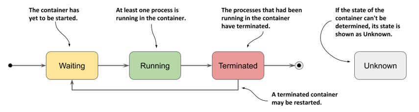

Các trạng thái riêng lẻ được giải thích chi tiết trong bảng dưới đây.

##### Bảng 6.3 Các trạng thái có thể có của container

| Trạng thái container (Container State) | Mô tả |
| :--- | :--- |
| Waiting | Container đang đợi để được khởi động. Các trường `reason` và `message` sẽ cho biết lý do tại sao container ở trạng thái này. |
| Running | Container đã được tạo và các tiến trình bên trong nó đang hoạt động bình thường. Trường `startedAt` hiển thị mốc thời gian container được khởi chạy. |
| Terminated | Các tiến trình từng chạy trong container đã kết thúc. Các trường `startedAt` và `finishedAt` cho biết thời điểm container bắt đầu và kết thúc. Mã thoát (exit code) khi tiến trình chính kết thúc sẽ được lưu trong trường `exitCode`. |
| Unknown | Trạng thái của container không thể xác định được. |

#### Hiển thị trạng thái các container của pod

Danh sách pod hiển thị qua lệnh `kubectl get pods` chỉ cho thấy tổng số lượng container trong mỗi pod và có bao nhiêu container trong số đó đã sẵn sàng. Để xem trạng thái chi tiết của từng container, bạn có thể sử dụng lệnh `kubectl describe`:

```
$ kubectl describe po kiada
...
Containers:
  kiada:
    Container ID:   docker://c64944a684d57faacfced0be1af44686...
    Image:          luksa/kiada:0.1
    Image ID:       docker-pullable://luksa/kiada@sha256:3f28...
    Port:           8080/TCP
    Host Port:      0/TCP
    State:          Running    #A
      Started:      Sun, 02 Feb 2020 12:43:03 +0100    #A
    Ready:          True    #B
    Restart Count:  0    #C
    Environment:    <none>
...
```

Hãy tập trung vào các dòng được đánh dấu trong danh sách, vì chúng cho biết liệu container có đang khỏe mạnh hay không. Container `kiada` hiện đang ở trạng thái `Running` và đã báo `Ready`. Số lần khởi động lại của nó là 0.

##### Mẹo

Bạn cũng có thể hiển thị trạng thái của (các) container bằng `jq` như sau: `kubectl get po kiada -o json | jq .status.containerStatuses`

#### Kiểm tra trạng thái của container khởi tạo

Trong chương trước, bạn đã biết rằng ngoài các container thông thường, một pod còn có thể sở hữu các container khởi tạo chạy lúc pod bắt đầu khởi chạy. Tương tự như các container thông thường, trạng thái của các container khởi tạo này cũng được hiển thị trong phần `status` của tệp manifest của pod, cụ thể là nằm trong trường `initContainerStatuses`.

##### Kiểm tra trạng thái của pod kiada-init

Như một bài tập bổ sung tự thực hành, bạn hãy tạo pod `kiada-init` từ chương trước rồi kiểm tra pha, các điều kiện cũng như trạng thái của hai container thông thường và hai container khởi tạo của nó. Hãy sử dụng lệnh `kubectl describe` và lệnh `kubectl get po kiada-init -o json | jq .status` để tìm kiếm thông tin này trong phần định nghĩa đối tượng.

## 6.2 Giữ cho các container luôn hoạt động ổn định

Các pod bạn tạo ra trong chương trước đều đã chạy trơn tru không gặp sự cố nào. Nhưng chuyện gì sẽ xảy ra nếu một trong các container ngừng hoạt động? Hoặc nếu tất cả container trong một pod đều bị tắt? Làm thế nào để duy trì tính ổn định của các pod và giữ cho các container của chúng luôn chạy? Đó chính là trọng tâm của phần này.

### 6.2.1 Tìm hiểu cơ chế tự động khởi động lại container (auto-restart)

Khi một pod được lên lịch chạy trên một node, Kubelet trên node đó sẽ khởi động các container và duy trì chúng hoạt động liên tục cho đến khi đối tượng pod bị xóa bỏ. Nếu tiến trình chính bên trong container bị chấm dứt vì bất kỳ lý do nào, Kubelet sẽ tự động khởi động lại container đó. Khi xảy ra lỗi khiến ứng dụng của bạn bị crash, Kubernetes sẽ tự động khởi động lại nó. Nhờ đó, ngay cả khi không có bất kỳ cấu hình đặc biệt nào bên trong bản thân ứng dụng, việc chạy nó trên Kubernetes cũng tự động mang lại khả năng tự phục hồi (self-healing). Hãy cùng xem cơ chế này hoạt động trên thực tế.

#### Quan sát quá trình xử lý khi container gặp lỗi

Trong chương trước, bạn đã tạo pod `kiada-ssl` chứa container Node.js và container Envoy. Hãy tạo lại pod này và kích hoạt kết nối giao tiếp với nó bằng cách chạy hai lệnh sau:

```
$ kubectl apply -f pod.kiada-ssl.yaml
$ kubectl port-forward kiada-ssl 8080 8443 9901
```

Bây giờ, chúng ta sẽ chủ động làm cho container Envoy bị dừng để xem Kubernetes xử lý tình huống này như thế nào. Hãy chạy lệnh sau trong một cửa sổ terminal riêng biệt để quan sát sự thay đổi trạng thái của pod khi một trong các container của nó bị dừng hoạt động:

```
$ kubectl get pods -w
```

Bạn cũng nên theo dõi các sự kiện (event) ở một terminal khác bằng cách chạy lệnh:

```
$ kubectl get events -w
```

Bạn có thể giả lập lỗi crash của tiến trình chính bằng cách gửi tín hiệu `KILL` cho nó. Tuy nhiên, bạn không thể làm việc này từ bên trong container vì Linux Kernel không cho phép bạn tắt tiến trình gốc (tiến trình có PID bằng 1). Để làm vậy, bạn sẽ phải kết nối SSH vào node máy chủ chạy pod và tắt tiến trình từ đó. Thật may mắn là giao diện quản trị của Envoy cho phép chúng ta dừng tiến trình này thông qua HTTP API của nó.

Để chấm dứt container `envoy`, hãy mở đường dẫn <http://localhost:9901> trên trình duyệt và nhấp vào nút *quitquitquit*, hoặc bạn có thể chạy lệnh `curl` sau ở một cửa sổ terminal khác:

```
$ curl -X POST http://localhost:9901/quitquitquit
OK
```

Để quan sát những gì xảy ra với container và pod chứa nó, hãy kiểm tra kết quả đầu ra của lệnh `kubectl get pods -w` bạn đã chạy trước đó. Kết quả sẽ trông như sau:

```
$ kubectl get po -w
NAME           READY   STATUS     RESTARTS   AGE
kiada-ssl      2/2     Running    0          1s
kiada-ssl      1/2     NotReady   0          9m33s
kiada-ssl      2/2     Running    1          9m34s
```

Kết quả hiển thị cho thấy trạng thái (`STATUS`) của pod chuyển đổi từ `Running` sang `NotReady`, đồng thời cột `READY` chỉ ra rằng chỉ có một trong hai container là đang sẵn sàng. Ngay sau đó, Kubernetes tiến hành khởi động lại container này và trạng thái của pod quay trở lại là `Running`. Cột `RESTARTS` báo hiệu đã có một container được khởi động lại.

##### Lưu ý

Nếu một trong các container của pod gặp lỗi, các container còn lại vẫn tiếp tục hoạt động bình thường.

Bây giờ, hãy kiểm tra đầu ra của lệnh `kubectl get events -w` mà bạn đã chạy trước đó. Dưới đây là lệnh và kết quả của nó:

```
$ kubectl get ev -w
LAST SEEN   TYPE      REASON      OBJECT           MESSAGE
0s          Normal    Pulled      pod/kiada-ssl    Container image already
                                                   present on machine
0s          Normal    Created     pod/kiada-ssl    Created container envoy
0s          Normal    Started     pod/kiada-ssl    Started container envoy
```

Các sự kiện cho thấy container `envoy` mới đã được khởi chạy. Bây giờ bạn sẽ có thể truy cập lại vào ứng dụng qua giao thức HTTPS. Hãy kiểm chứng lại bằng trình duyệt hoặc lệnh `curl`.

Các sự kiện hiển thị ở trên cũng hé lộ một chi tiết quan trọng về cách thức Kubernetes thực hiện khởi động lại một container. Sự kiện thứ hai cho thấy toàn bộ container `envoy` đã được tạo mới. Thực tế, Kubernetes không bao giờ khởi động lại một container hiện có, mà thay vào đó sẽ hủy bỏ nó và tạo ra một container hoàn toàn mới. Dẫu vậy, chúng ta vẫn quen gọi hành động này là *khởi động lại* container.

##### Lưu ý

Mọi dữ liệu do tiến trình ghi vào hệ thống tệp (filesystem) của container cũ đều sẽ bị mất khi container được tạo mới. Hành vi này đôi khi không phải là mong muốn của bạn. Để lưu trữ dữ liệu bền vững (persist data), bạn buộc phải bổ sung một volume lưu trữ cho pod, cơ chế này sẽ được giải thích trong chương tiếp theo.

##### Lưu ý

Nếu trong pod có định nghĩa các container khởi tạo, và một trong các container thông thường của pod bị khởi động lại, các container khởi tạo đó sẽ không chạy lại từ đầu.

#### Cấu hình chính sách khởi động lại (restart policy) của pod

Theo mặc định, Kubernetes sẽ khởi động lại container bất kể tiến trình bên trong kết thúc với mã thoát (exit code) bằng 0 hay khác 0—nói cách khác, dù container hoàn thành nhiệm vụ thành công hay gặp lỗi. Hành vi này có thể được tùy chỉnh bằng cách thiết lập trường `restartPolicy` trong phần mô tả kỹ thuật `spec` của pod.

Kubernetes hỗ trợ ba chính sách khởi động lại. Chúng được mô tả chi tiết trong hình dưới đây.

##### Hình 6.4 Chính sách restartPolicy của pod xác định liệu các container có được khởi động lại hay không

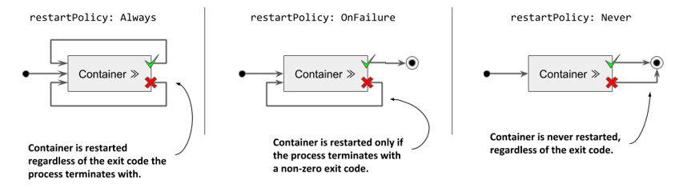

Bảng dưới đây mô tả chi tiết về ba chính sách khởi động lại này.

##### Bảng 6.4 Các chính sách khởi động lại của pod

| Chính sách khởi động lại (Restart Policy) | Mô tả |
| :--- | :--- |
| Always | Container sẽ được khởi động lại bất kể tiến trình kết thúc với mã thoát nào. Đây là chính sách khởi động lại mặc định. |
| OnFailure | Container chỉ được khởi động lại nếu tiến trình kết thúc với mã thoát khác 0 (theo quy ước thông thường biểu thị trạng thái lỗi). |
| Never | Container không bao giờ được khởi động lại—ngay cả khi nó gặp lỗi kết thúc thất bại. |

##### Lưu ý

Một điểm đáng ngạc nhiên là chính sách khởi động lại được cấu hình ở cấp độ pod và áp dụng chung cho tất cả các container bên trong nó. Bạn không thể cấu hình riêng biệt chính sách này cho từng container.

#### Tìm hiểu về khoảng thời gian trễ trước khi một container được khởi động lại

Nếu bạn gọi đến endpoint `/quitquitquit` của Envoy nhiều lần, bạn sẽ nhận thấy rằng thời gian chờ để khởi động lại container sau khi dừng hoạt động ngày càng kéo dài hơn. Trạng thái của pod khi đó sẽ hiển thị là `NotReady` hoặc `CrashLoopBackOff`. Dưới đây là ý nghĩa của cơ chế này.

Như được mô tả ở hình dưới đây, ở lần đầu tiên container dừng hoạt động, nó sẽ được khởi động lại ngay lập tức. Tuy nhiên, ở lần tiếp theo, Kubernetes sẽ chờ 10 giây trước khi thử khởi động lại. Khoảng thời gian trễ này sau đó sẽ được nhân đôi thành 20, 40, 80 và lên tới 160 giây cho mỗi lần dừng hoạt động kế tiếp. Kể từ thời điểm đó, thời gian chờ tối đa được cố định ở mức 5 phút. Cơ chế tăng gấp đôi thời gian trễ giữa các lần thử này được gọi là thuật toán giảm tải theo số mũ (exponential back-off).

##### Hình 6.5 Cơ chế exponential back-off giữa các lần khởi động lại container

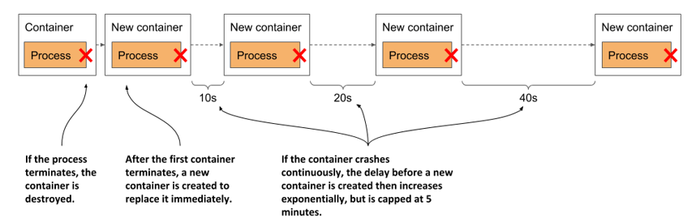

Do đó, trong trường hợp xấu nhất, một container có thể phải đợi tới tối đa 5 phút trước khi có thể được phép khởi động lại.

##### Lưu ý

Thời gian trễ này sẽ được reset về 0 khi container hoạt động liên tục và ổn định trong vòng 10 phút. Nếu sau đó container cần phải khởi động lại, nó sẽ được khởi động lại ngay lập tức.

Bạn hãy kiểm tra trạng thái của container trong tệp manifest của pod như sau:

```
$ kubectl get po kiada-ssl -o json | jq .status.containerStatuses
...
"state": {
  "waiting": {
    "message": "back-off 40s restarting failed container=envoy ...",
    "reason": "CrashLoopBackOff"
```

Như bạn thấy ở kết quả đầu ra, khi container đang trong thời gian chờ để khởi động lại, trạng thái của nó sẽ là `Waiting`, và lý do (`reason`) ghi nhận là `CrashLoopBackOff`. Trường `message` sẽ thông báo chính xác còn bao nhiêu lâu nữa thì container mới được khởi động lại.

##### Lưu ý

Khi bạn ra lệnh kết thúc Envoy, tiến trình của nó dừng lại với mã thoát (exit code) bằng 0, nghĩa là nó không thực sự bị lỗi crash. Do đó, trạng thái `CrashLoopBackOff` trong trường hợp này có thể gây hiểu nhầm.

### 6.2.2 Kiểm tra sức khỏe của container bằng đầu dò liveness (liveness probe)

Trong phần trước, bạn đã biết rằng Kubernetes bảo vệ tính ổn định của ứng dụng bằng cách khởi động lại nó khi tiến trình bị kết thúc. Nhưng thực tế, ứng dụng đôi khi rơi vào trạng thái ngừng phản hồi (unresponsive) mà không hề tự tắt. Chẳng hạn, một ứng dụng Java bị lỗi rò rỉ bộ nhớ (memory leak) cuối cùng sẽ liên tục ném ra các lỗi `OutOfMemoryError`, nhưng tiến trình JVM của nó thì vẫn tiếp tục chạy. Lý tưởng nhất là Kubernetes phải phát hiện được những loại lỗi này để chủ động khởi động lại container.

Mặc dù bản thân ứng dụng có thể tự bắt các lỗi này để chủ động dừng lại ngay lập tức, nhưng nếu ứng dụng ngừng phản hồi do rơi vào một vòng lặp vô hạn hay trạng thái bế tắc (deadlock) thì sao? Sẽ thế nào nếu ứng dụng không thể tự phát hiện ra trạng thái đó? Để đảm bảo ứng dụng luôn được khởi động lại kịp thời trong những tình huống như vậy, chúng ta cần phải kiểm tra tình trạng của nó từ bên ngoài.

#### Giới thiệu về đầu dò liveness (liveness probe)

Bạn có thể cấu hình Kubernetes kiểm tra xem một ứng dụng có còn hoạt động hay không bằng cách định nghĩa một *đầu dò liveness* (liveness probe). Bạn có thể thiết lập đầu dò này cho từng container riêng lẻ trong pod. Kubernetes sẽ định kỳ kích hoạt đầu dò này để truy vấn ứng dụng xem nó có đang hoạt động tốt hay không. Nếu ứng dụng không phản hồi, xảy ra lỗi, hoặc trả về phản hồi không đạt yêu cầu, container đó sẽ bị coi là không khỏe mạnh (unhealthy) và bị chấm dứt. Sau đó, container sẽ được khởi động lại nếu chính sách khởi động lại cho phép.

##### Lưu ý

Đầu dò liveness chỉ có thể áp dụng cho các container thông thường của pod. Bạn không thể định nghĩa chúng trong các container khởi tạo (init container).

#### Các loại đầu dò liveness

Kubernetes có thể kiểm tra một container thông qua một trong ba cơ chế sau:

- Một *đầu dò HTTP GET* sẽ gửi một yêu cầu GET đến địa chỉ IP của container, theo cổng mạng (port) và đường dẫn (path) do bạn chỉ định. Nếu đầu dò nhận được phản hồi, và mã phản hồi không phải là mã lỗi (nói cách khác, mã phản hồi HTTP nằm trong khoảng `2xx` hoặc `3xx`), thì lượt kiểm tra được coi là thành công. Nếu máy chủ trả về mã lỗi, hoặc không phản hồi trong khoảng thời gian quy định, đầu dò sẽ được tính là thất bại.
- Một *đầu dò TCP Socket* sẽ cố gắng thiết lập một kết nối TCP đến cổng mạng được chỉ định của container. Nếu kết nối được thiết lập thành công, đầu dò được coi là thành công. Nếu kết nối không thể thiết lập trong khoảng thời gian quy định, đầu dò được tính là thất bại.
- Một *đầu dò Exec* sẽ thực thi một lệnh bên trong container và kiểm tra mã thoát khi lệnh đó kết thúc. Nếu mã thoát bằng 0, đầu dò sẽ thành công. Mã thoát khác 0 được tính là một lần thất bại. Đầu dò cũng sẽ bị coi là thất bại nếu lệnh không thể hoàn thành trong khoảng thời gian quy định.

##### Lưu ý

Bên cạnh đầu dò liveness, một container cũng có thể sở hữu một *đầu dò khởi động* (startup probe), được thảo luận ở phần 6.2.6, và một *đầu dò mức độ sẵn sàng* (readiness probe), được giải thích chi tiết trong Chương 10.

### 6.2.3 Tạo đầu dò liveness kiểu HTTP GET

Hãy cùng xem xét cách thêm đầu dò liveness cho từng container trong pod `kiada-ssl`. Vì cả hai container đều chạy các ứng dụng có khả năng xử lý HTTP, việc sử dụng một đầu dò HTTP GET cho mỗi container là hoàn toàn hợp lý. Trong khi ứng dụng Node.js không cung cấp bất kỳ endpoint nào để kiểm tra sức khỏe một cách tường minh, thì máy chủ proxy Envoy lại hỗ trợ sẵn tính năng này. Trong các ứng dụng thực tế, bạn sẽ thường xuyên gặp phải cả hai trường hợp này.

#### Định nghĩa các đầu dò liveness trong tệp manifest của pod

Đoạn mã cấu hình dưới đây hiển thị tệp manifest đã được cập nhật của pod, trong đó định nghĩa đầu dò liveness cho cả hai container với các mức độ cấu hình chi tiết khác nhau (tệp `pod.kiada-liveness.yaml`).

##### Danh sách 6.1 Thêm đầu dò liveness vào một pod

```yaml
apiVersion: v1
kind: Pod
metadata:
  name: kiada-liveness
spec:
  containers:
  - name: kiada
    image: luksa/kiada:0.1
    ports:
    - name: http
      containerPort: 8080
    livenessProbe:    #A
      httpGet:    #A
        path: /    #A
        port: 8080    #A
  - name: envoy
    image: luksa/kiada-ssl-proxy:0.1
    ports:
    - name: https
      containerPort: 8443
    - name: admin
      containerPort: 9901
    livenessProbe:    #B
      httpGet:    #B
        path: /ready    #B
        port: admin    #B
      initialDelaySeconds: 10    #B
      periodSeconds: 5    #B
      timeoutSeconds: 2    #B
      failureThreshold: 3    #B
```

Các đầu dò liveness này sẽ được giải thích chi tiết trong hai phần tiếp theo.

#### Định nghĩa đầu dò liveness với cấu hình tối thiểu

Đầu dò liveness dành cho container `kiada` là phiên bản tối giản nhất của một đầu dò dành cho các ứng dụng dựa trên giao thức HTTP. Đầu dò này chỉ đơn thuần gửi một yêu cầu HTTP `GET` đến đường dẫn `/` tại cổng `8080` để kiểm tra xem container có khả năng xử lý các yêu cầu hay không. Nếu ứng dụng phản hồi với mã trạng thái HTTP nằm trong khoảng từ `200` đến `399`, ứng dụng được coi là hoạt động bình thường.

Đầu dò này không khai báo thêm bất kỳ trường cấu hình nào khác, do đó các thiết lập mặc định sẽ được áp dụng. Yêu cầu kiểm tra đầu tiên sẽ được gửi đi sau khi container khởi động được 10 giây và lặp lại định kỳ mỗi 5 giây. Nếu ứng dụng không phản hồi trong vòng 2 giây, lượt kiểm tra đó bị coi là thất bại. Nếu lỗi xảy ra liên tiếp 3 lần, container sẽ bị coi là không khỏe mạnh và bị chấm dứt hoạt động.

#### Tìm hiểu các tùy chọn cấu hình của đầu dò liveness

Giao diện quản trị của proxy Envoy cung cấp một endpoint đặc biệt là `/ready` để hiển thị trạng thái sức khỏe của chính nó. Thay vì nhắm vào cổng `8443` (cổng mà Envoy dùng để chuyển tiếp các yêu cầu HTTPS đến Node.js), đầu dò liveness của container `envoy` sẽ hướng tới endpoint đặc biệt này thông qua cổng `admin`—tức là cổng có số hiệu `9901`.

##### Lưu ý

Như bạn thấy trong cấu hình đầu dò liveness của container `envoy`, bạn có thể chỉ định cổng đích của đầu dò bằng tên thay vì dùng số hiệu cổng trực tiếp.

Cấu hình đầu dò liveness của container `envoy` cũng chứa các trường bổ sung khác. Những tùy chọn này được giải thích trực quan nhất trong hình dưới đây.

##### Hình 6.6 Cấu hình và nguyên lý hoạt động của một đầu dò liveness

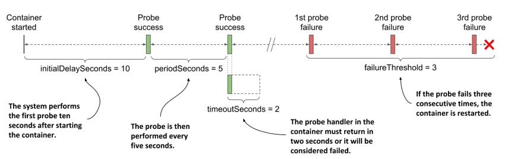

Tham số `initialDelaySeconds` quyết định khoảng thời gian Kubernetes trì hoãn việc kích hoạt đầu dò đầu tiên sau khi khởi động container. Trường `periodSeconds` quy định khoảng thời gian giãn cách giữa hai lần thăm dò liên tiếp, trong khi `timeoutSeconds` xác định thời gian chờ phản hồi tối đa trước khi lượt dò đó bị coi là thất bại. Cuối cùng, trường `failureThreshold` quy định số lần thất bại liên tiếp của đầu dò để Kubernetes kết luận một container không còn hoạt động ổn định và tiến hành khởi động lại nó.

### 6.2.4 Observing the liveness probe in action

Để chứng kiến Kubernetes khởi động lại một container khi đầu dò liveness của nó thất bại, hãy tạo pod từ tệp manifest `pod.kiada-liveness.yaml` bằng lệnh `kubectl apply`, sau đó chạy `kubectl port-forward` để thiết lập kết nối với pod. Bạn cần dừng lệnh `kubectl port-forward` đang chạy từ bài tập trước đó. Hãy xác nhận rằng pod đang hoạt động bình thường và phản hồi các yêu cầu HTTP.

#### Observing a successful liveness probe

Các đầu dò liveness của các container trong pod sẽ bắt đầu kích hoạt ngay sau khi từng container khởi động. Vì tiến trình trong cả hai container đều hoạt động bình thường, các đầu dò sẽ liên tục báo cáo trạng thái thành công. Do đây là trạng thái hoạt động tiêu chuẩn, việc đầu dò thành công sẽ không được hiển thị trực tiếp trong trạng thái (status) hay sự kiện (events) của pod.

Dấu vết duy nhất cho thấy Kubernetes đang thực thi đầu dò nằm trong nhật ký (log) của container. Ứng dụng Node.js trong container `kiada` sẽ in một dòng ra đầu ra chuẩn (standard output) mỗi khi xử lý một yêu cầu HTTP. Các yêu cầu từ đầu dò liveness cũng nằm trong số này, do đó bạn có thể hiển thị chúng bằng lệnh sau:

```
$ kubectl logs kiada-liveness -c kiada -f
```

Đầu dò liveness của container `envoy` được cấu hình để gửi các yêu cầu HTTP tới giao diện quản trị của Envoy. Giao diện này không ghi nhật ký các yêu cầu HTTP ra đầu ra chuẩn, mà ghi vào tệp `/tmp/envoy.admin.log` trong hệ thống tệp của container. Để xem nội dung tệp nhật ký này, hãy sử dụng lệnh sau:

```
$ kubectl exec kiada-liveness -c envoy -- tail -f /tmp/envoy.admin.log
```

#### Observing the liveness probe fail

Đầu dò hoạt động thành công thì không có gì đặc biệt, vì vậy hãy thử làm cho đầu dò liveness của Envoy thất bại. Để theo dõi những gì diễn ra ở hậu trường, hãy bắt đầu theo dõi các sự kiện bằng cách chạy lệnh sau trong một cửa sổ terminal riêng biệt:

```
$ kubectl get events -w
```

Thông qua giao diện quản trị của Envoy, bạn có thể cấu hình endpoint kiểm tra sức khỏe (health check) của nó ở trạng thái thành công hoặc thất bại. Để giả lập trạng thái thất bại, hãy mở URL <http://localhost:9901> trên trình duyệt và nhấp vào nút *healthcheck/fail*, hoặc sử dụng lệnh `curl` sau:

```
$ curl -X POST localhost:9901/healthcheck/fail
```

Ngay sau khi chạy lệnh, hãy quan sát các sự kiện hiển thị ở cửa sổ terminal còn lại. Khi đầu dò thất bại, một sự kiện loại `Warning` (Cảnh báo) sẽ được ghi nhận, cho biết chi tiết lỗi và mã trạng thái HTTP trả về:

```
Warning  Unhealthy  Liveness probe failed: HTTP probe failed with code 503
```

Vì ngưỡng thất bại (`failureThreshold`) của đầu dò được đặt là 3, một lần thất bại duy nhất chưa đủ để kết luận container không khỏe mạnh, do đó nó vẫn tiếp tục hoạt động. Bạn có thể khôi phục trạng thái thành công cho đầu dò liveness bằng cách nhấp vào nút *healthcheck/ok* trong giao diện quản trị của Envoy, hoặc dùng `curl` như sau:

```
$ curl -X POST localhost:9901/healthcheck/ok
```

Nếu thao tác đủ nhanh, container sẽ không bị khởi động lại.

#### Observing the liveness probe reach the failure threshold

Nếu bạn để đầu dò liveness thất bại liên tục nhiều lần, lệnh `kubectl get events -w` sẽ hiển thị các sự kiện sau (lưu ý rằng một số cột đã được lược bỏ để phù hợp với độ rộng của trang sách):

```
$ kubectl get events -w
TYPE     REASON     MESSAGE
Warning  Unhealthy  Liveness probe failed: HTTP probe failed with code 503    #A
Warning  Unhealthy  Liveness probe failed: HTTP probe failed with code 503    #A
Warning  Unhealthy  Liveness probe failed: HTTP probe failed with code 503    #A
Normal   Killing    Container envoy failed liveness probe, will be restarted    #B
Normal   Pulled     Container image already present on machine
Normal   Created    Created container envoy
Normal   Started    Started container envoy
```

Hãy nhớ rằng ngưỡng thất bại của đầu dò được cấu hình là 3, do đó khi đầu dò thất bại ba lần liên tiếp, container sẽ bị dừng và khởi động lại. Điều này được thể hiện rõ qua các sự kiện trong danh sách trên.

Lệnh `kubectl get pods` sẽ hiển thị thông tin cho thấy container đã được khởi động lại:

```
$ kubectl get po kiada-liveness
NAME             READY   STATUS    RESTARTS   AGE
kiada-liveness   2/2     Running   1          5m
```

Cột `RESTARTS` cho thấy đã có một lượt khởi động lại container diễn ra trong pod.

#### Understanding how a container that fails its liveness probe is restarted

Nếu bạn thắc mắc liệu tiến trình chính trong container đã được dừng một cách êm ái (gracefully) hay bị ép buộc chấm dứt (killed forcibly), bạn có thể kiểm tra trạng thái của pod bằng cách truy xuất toàn bộ tệp manifest thông qua lệnh `kubectl get` hoặc sử dụng `kubectl describe`:

```
$ kubectl describe po kiada-liveness
Name:           kiada-liveness
...
Containers:
  ...
  envoy:
    ...
    State:          Running    #A
      Started:      Sun, 31 May 2020 21:33:13 +0200    #A
    Last State:     Terminated    #B
      Reason:       Completed    #B
      Exit Code:    0    #B
      Started:      Sun, 31 May 2020 21:16:43 +0200    #B
      Finished:     Sun, 31 May 2020 21:33:13 +0200    #B
    ...
```

Mã thoát (exit code) bằng 0 hiển thị trong danh sách cho thấy tiến trình ứng dụng đã tự kết thúc một cách êm ái. Nếu bị ép buộc chấm dứt, mã thoát sẽ là 137.

##### Note

Mã thoát `128+n` cho biết tiến trình đã kết thúc do nhận tín hiệu `n` từ bên ngoài. Mã thoát `137` tương ứng với `128+9`, trong đó `9` đại diện cho tín hiệu `KILL` (ép buộc chấm dứt). Bạn sẽ thấy mã thoát này bất cứ khi nào container bị ép tắt. Mã thoát `143` tương ứng với `128+15`, trong đó `15` là tín hiệu `TERM` (yêu cầu chấm dứt). Bạn thường sẽ thấy mã thoát này khi container chạy một chương trình shell đã kết thúc một cách êm ái.

Hãy kiểm tra nhật ký của Envoy để xác nhận rằng nó đã nhận được tín hiệu `TERM` và tự kết thúc. Bạn phải sử dụng lệnh `kubectl logs` đi kèm tùy chọn `--container` hoặc dạng viết tắt `-c` để chỉ định container cần xem thông tin.

Đồng thời, vì container cũ đã được thay thế bằng một container mới sau khi khởi động lại, bạn phải yêu cầu xem nhật ký của container trước đó bằng cách sử dụng cờ `--previous` hoặc `-p`. Dưới đây là lệnh cần dùng và bốn dòng cuối cùng trong kết quả trả về của nó:

```
$ kubectl logs kiada-liveness -c envoy -p
...
...[warning][main] [source/server/server.cc:493] caught SIGTERM
...[info][main] [source/server/server.cc:613] shutting down server instance
...[info][main] [source/server/server.cc:560] main dispatch loop exited
...[info][main] [source/server/server.cc:606] exiting
```

Nhật ký đã xác nhận rằng Kubernetes đã gửi tín hiệu `TERM` tới tiến trình, cho phép nó tắt một cách êm ái. Nếu tiến trình không tự kết thúc, Kubernetes sẽ buộc phải ép hủy nó.

Sau khi container được khởi động lại, endpoint kiểm tra sức khỏe của nó sẽ phản hồi lại bằng trạng thái HTTP `200 OK`, báo hiệu container đã hoạt động bình thường trở lại.

### 6.2.5 Using the exec and the tcpSocket liveness probe types

Đối với các ứng dụng không cung cấp endpoint kiểm tra sức khỏe qua HTTP, bạn nên sử dụng đầu dò liveness loại `tcpSocket` hoặc `exec`.

#### Adding a tcpSocket liveness probe

Đối với các ứng dụng chấp nhận kết nối TCP không phải HTTP, ta có thể cấu hình đầu dò liveness loại `tcpSocket`. Kubernetes sẽ cố gắng thiết lập một kết nối socket tới cổng TCP đó; nếu kết nối thành công, đầu dò được coi là thành công, ngược lại sẽ bị tính là thất bại.

Dưới đây là một ví dụ về cấu hình đầu dò liveness loại `tcpSocket`:

```yaml
livenessProbe:
      tcpSocket:    #A
        port: 1234    #A
      periodSeconds: 2    #B
      failureThreshold: 1    #C  
```

Đầu dò trong cấu hình trên được thiết lập để kiểm tra xem cổng mạng `1234` của container có đang mở hay không. Việc thử kết nối sẽ được thực hiện sau mỗi hai giây, và chỉ cần một lần kết nối thất bại là đủ để Kubernetes kết luận container không khỏe mạnh.

#### Adding an exec liveness probe

Những ứng dụng không chấp nhận kết nối TCP có thể cung cấp một câu lệnh riêng để tự kiểm tra trạng thái. Đối với các ứng dụng này, đầu dò liveness loại `exec` sẽ được sử dụng. Như minh họa trong hình tiếp theo, câu lệnh này được thực thi ngay bên trong container, do đó tệp thực thi của lệnh phải có sẵn trên hệ thống tệp của container.

##### Figure 6.7 The exec liveness probe runs the command inside the container

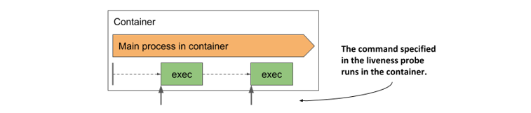

Dưới đây là ví dụ về một đầu dò chạy lệnh `/usr/bin/healthcheck` sau mỗi hai giây để xác định xem ứng dụng trong container có còn hoạt động hay không:

```yaml
livenessProbe:
      exec:
        command:    #A
        - /usr/bin/healthcheck    #A
      periodSeconds: 2    #B
      timeoutSeconds: 1    #C
      failureThreshold: 1    #D
```

Nếu câu lệnh trả về mã thoát bằng 0, container được coi là khỏe mạnh. Nếu lệnh trả về mã thoát khác 0 hoặc không hoàn thành trong vòng một giây (như quy định trong trường `timeoutSeconds`), container sẽ bị chấm dứt hoạt động ngay lập tức do trường `failureThreshold` được cấu hình bằng 1 — nghĩa là chỉ cần một lần dò thất bại duy nhất là đủ để kết luận container gặp sự cố.

### 6.2.6 Using a startup probe when an application is slow to start

Các thiết lập mặc định của đầu dò liveness thường dành cho ứng dụng khoảng 20 đến 30 giây để bắt đầu phản hồi các yêu cầu thăm dò. Nếu ứng dụng mất nhiều thời gian khởi động hơn mức đó, nó sẽ bị khởi động lại và tiến trình khởi động phải bắt đầu lại từ đầu. Nếu lượt khởi động thứ hai cũng kéo dài tương tự, nó lại tiếp tục bị khởi động lại. Cứ như thế, container sẽ không bao giờ đạt đến trạng thái đầu dò liveness thành công và bị rơi vào vòng lặp khởi động lại vô tận.

Để ngăn chặn tình trạng này, bạn có thể tăng cấu hình các trường `initialDelaySeconds`, `periodSeconds` hoặc `failureThreshold` nhằm bù đắp cho thời gian khởi động kéo dài của ứng dụng. Tuy nhiên, việc này sẽ gây ảnh hưởng tiêu cực đến hoạt động bình thường của hệ thống. Tích số của `periodSeconds` `*` `failureThreshold` càng lớn thì thời gian để phát hiện và khởi động lại ứng dụng khi nó gặp sự cố trong quá trình vận hành thực tế sẽ càng lâu. Đối với những ứng dụng mất tới vài phút để khởi động, việc tăng các tham số này quá cao để tránh bị khởi động lại sớm không phải là một giải pháp khả thi.

#### Introducing startup probes

Để giải quyết sự khác biệt lớn về nhu cầu thời gian giữa giai đoạn khởi động ban đầu và giai đoạn vận hành ổn định của ứng dụng, Kubernetes cung cấp thêm giải pháp là *đầu dò startup* (startup probe).

Khi một container được cấu hình đầu dò startup, chỉ có đầu dò này được kích hoạt khi container bắt đầu chạy. Đầu dò startup có thể được thiết lập rộng rãi để thích ứng với thời gian khởi động chậm của ứng dụng. Khi đầu dò startup báo cáo thành công, Kubernetes mới chuyển sang sử dụng đầu dò liveness — vốn được cấu hình chặt chẽ hơn để nhanh chóng phát hiện các sự cố phát sinh sau đó.

#### Adding a startup probe to a pod’s manifest

Giả sử ứng dụng Node.js Kiada cần hơn một phút để hoàn tất quá trình khởi động (warm up), nhưng bạn lại muốn nó phải được khởi động lại trong vòng 10 giây nếu gặp sự cố trong quá trình vận hành bình thường. Cấu hình mẫu dưới đây sẽ chỉ ra cách thiết lập kết hợp cả đầu dò startup và đầu dò liveness (bạn có thể tìm thấy tệp này tại `pod.kiada-startup-probe.yaml`).

##### Listing 6.2 Using a combination of a startup and a liveness probe

```yaml
...
  containers:
  - name: kiada
    image: luksa/kiada:0.1
    ports:
    - name: http
      containerPort: 8080
    startupProbe:
      httpGet:
        path: /    #A
        port: http    #A
      periodSeconds: 10    #B
      failureThreshold:  12    #B
    livenessProbe:
      httpGet:
        path: /    #A
        port: http    #A
      periodSeconds: 5    #C
      failureThreshold: 2    #C
```

Với cấu hình trên, khi container khởi động, ứng dụng sẽ có tối đa 120 giây để bắt đầu phản hồi các yêu cầu. Kubernetes sẽ thực hiện kiểm tra đầu dò startup sau mỗi 10 giây và cho phép thử tối đa 12 lần.

Như minh họa trong hình bên dưới, khác với đầu dò liveness, việc đầu dò startup thất bại ở những lần đầu là hoàn toàn bình thường. Sự thất bại này chỉ đơn thuần cho biết ứng dụng chưa hoàn tất quá trình khởi chạy. Khi đầu dò startup báo cáo thành công, tức là ứng dụng đã sẵn sàng, Kubernetes sẽ chuyển giao nhiệm vụ giám sát cho đầu dò liveness. Đầu dò liveness sau đó sẽ chạy với chu kỳ ngắn hơn, giúp phát hiện nhanh chóng các sự cố treo hoặc không phản hồi của ứng dụng.

##### Figure 6.8 Fast detection of application health problems using a combination of startup and liveness probe

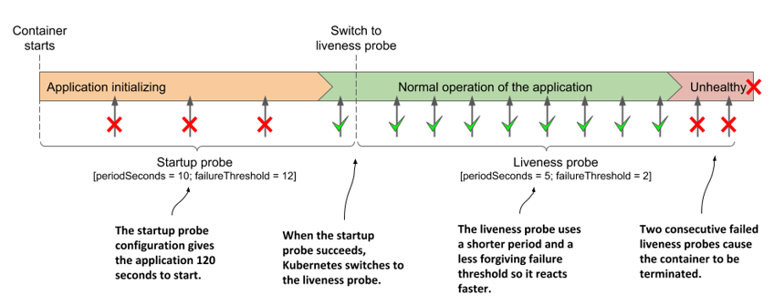

##### Note

Nếu đầu dò startup liên tục thất bại và đạt tới ngưỡng `failureThreshold`, container sẽ bị chấm dứt hoạt động tương tự như khi đầu dò liveness thất bại.

Thông thường, các đầu dò startup và liveness được cấu hình để gọi chung một endpoint HTTP, nhưng bạn hoàn toàn có thể sử dụng các endpoint khác nhau nếu cần. Bạn cũng có thể thiết lập đầu dò startup dưới dạng đầu dò `exec` hoặc `tcpSocket` thay vì dùng `httpGet`.

### 6.2.7 Creating effective liveness probe handlers

Bạn nên định nghĩa đầu dò liveness cho tất cả các pod của mình. Nếu không có đầu dò này, Kubernetes sẽ không có cách nào biết được ứng dụng của bạn còn hoạt động hay không, ngoại trừ việc kiểm tra xem tiến trình của ứng dụng đã kết thúc hay chưa.

#### Causing unnecessary restarts with badly implemented liveness probe handlers

Khi xây dựng trình xử lý (handler) cho đầu dò liveness, dù dưới dạng một endpoint HTTP trong ứng dụng hay một câu lệnh thực thi bổ sung, bạn cần cực kỳ cẩn thận để đảm bảo tính chính xác. Nếu một đầu dò được thiết kế kém phản hồi trạng thái lỗi trong khi ứng dụng vẫn khỏe mạnh, container sẽ bị khởi động lại một cách vô lý. Nhiều lập trình viên Kubernetes đã phải trả giá đắt cho bài học này. Trong trường hợp bạn có thể đảm bảo rằng tiến trình ứng dụng sẽ tự động thoát khi gặp sự cố nghiêm trọng, việc không định nghĩa đầu dò liveness đôi khi lại là lựa chọn an toàn hơn.

#### What a liveness probe should check

Đầu dò liveness dành cho container `kiada` không được cấu hình để gọi đến một endpoint kiểm tra sức khỏe chuyên biệt, mà chỉ kiểm tra xem máy chủ Node.js có phản hồi các yêu cầu HTTP cơ bản gửi đến URI gốc (`/`) hay không. Cách tiếp cận này nghe có vẻ quá đơn giản, nhưng ngay cả một đầu dò tối giản như vậy cũng mang lại hiệu quả kỳ diệu. Nó sẽ tự động kích hoạt khởi động lại container nếu máy chủ ngừng phản hồi các yêu cầu HTTP — vốn là nhiệm vụ cốt lõi của nó. Nếu không có đầu dò này, pod có thể rơi vào trạng thái tê liệt hoàn toàn mà không phản hồi bất kỳ yêu cầu nào, buộc người quản trị phải can thiệp thủ công để khởi động lại. Một đầu dò liveness đơn giản vẫn tốt hơn là không có gì.

Để việc kiểm tra trạng thái đạt hiệu quả cao hơn, các ứng dụng web thường cung cấp một endpoint kiểm tra sức khỏe chuyên dụng, chẳng hạn như `/healthz`. Khi endpoint này được gọi, ứng dụng sẽ thực hiện một loạt các kiểm tra nội bộ đối với tất cả thành phần cốt lõi bên trong để đảm bảo không có thành phần nào bị ngưng trệ hoặc hoạt động sai lệch.

##### Tip

Hãy đảm bảo rằng endpoint HTTP `/healthz` không yêu cầu xác thực, nếu không đầu dò sẽ luôn thất bại và khiến container rơi vào vòng lặp khởi động lại liên tục.

Hãy chắc chắn rằng ứng dụng chỉ kiểm tra hoạt động của các thành phần nội bộ bên trong nó, tuyệt đối tránh kiểm tra các yếu tố chịu ảnh hưởng bởi tác nhân bên ngoài. Ví dụ, endpoint kiểm tra sức khỏe của một dịch vụ frontend không bao giờ được báo lỗi chỉ vì nó không thể kết nối tới dịch vụ backend. Khi backend gặp sự cố, việc khởi động lại frontend sẽ không giải quyết được vấn đề. Lúc này, đầu dò liveness của frontend vẫn tiếp tục thất bại sau khi khởi động lại, dẫn đến việc container bị khởi động lại liên tục cho đến khi backend được khắc phục. Nếu nhiều dịch vụ có sự phụ thuộc lẫn nhau theo cách này, sự cố ở một dịch vụ duy nhất có thể châm ngòi cho một chuỗi lỗi dây chuyền (cascading failures) trên toàn bộ hệ thống.

#### Keeping probes light

Trình xử lý được gọi bởi đầu dò liveness không nên tiêu tốn quá nhiều tài nguyên tính toán và phải hoàn thành trong thời gian ngắn nhất có thể. Theo mặc định, các đầu dò được thực thi với tần suất khá dày và chỉ được cấp một giây để hoàn tất.

Việc sử dụng một trình xử lý ngốn nhiều CPU hoặc bộ nhớ có thể ảnh hưởng nghiêm trọng đến tiến trình chính của container. Ở các chương sau của cuốn sách, bạn sẽ học cách giới hạn lượng CPU và bộ nhớ tổng thể cấp phát cho một container. Tài nguyên CPU và bộ nhớ tiêu hao bởi hoạt động của trình xử lý đầu dò cũng được tính vào hạn ngạch (resource quota) của container đó, do đó một trình xử lý nặng nề sẽ trực tiếp làm giảm lượng tài nguyên phân phối cho tiến trình chính của ứng dụng.

##### Tip

Khi chạy ứng dụng Java trong container, bạn nên ưu tiên sử dụng đầu dò HTTP GET thay vì đầu dò liveness loại exec vốn đòi hỏi phải khởi chạy cả một máy ảo JVM mới. Điều này cũng áp dụng tương tự đối với các câu lệnh yêu cầu tài nguyên tính toán lớn.

#### Avoiding retry loops in your probe handlers

Bạn đã biết rằng ngưỡng thất bại của đầu dò có thể tùy chỉnh được. Vì vậy, thay vị tự viết thêm vòng lặp thử lại (retry loop) bên trong trình xử lý của đầu dò, hãy giữ cho mã nguồn đơn giản và cấu hình trường `failureThreshold` lên giá trị cao hơn. Điều này giúp đầu dò phải thất bại liên tiếp nhiều lần trước khi ứng dụng bị coi là không khỏe mạnh. Việc tự triển khai cơ chế thử lại trong trình xử lý vừa gây lãng phí công sức, vừa tạo thêm một điểm có nguy cơ phát sinh lỗi trong hệ thống.

## 6.3 Executing actions at container start-up and shutdown

Ở chương trước, bạn đã biết cách sử dụng các init container để chạy các container phụ trợ tại thời điểm bắt đầu vòng đời của pod. Ngoài ra, bạn cũng có thể muốn chạy các tiến trình bổ sung mỗi khi một container khởi chạy hoặc ngay trước khi nó dừng lại. Bạn có thể đạt được điều này bằng cách bổ sung các *lifecycle hook* (móc nối vòng đời) vào container. Hiện tại Kubernetes đang hỗ trợ hai loại hook sau:

- Hook *Post-start*, được thực thi ngay khi container khởi động, và
- Hook *Pre-stop*, được thực thi ngay trước khi container dừng.

Các lifecycle hook này được cấu hình riêng cho từng container, khác với các init container vốn được định nghĩa ở cấp độ pod. Hình dưới đây sẽ giúp bạn hình dung trực quan cách các lifecycle hook phối hợp trong vòng đời của một container.

##### Figure 6.9 How the post-start and pre-stop hook fit into the container’s lifecycle

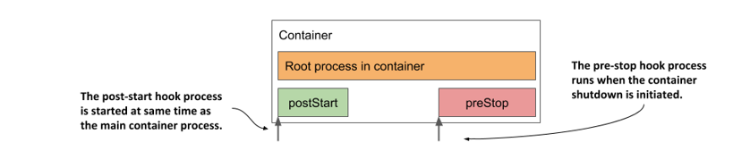

Tương tự như đầu dò liveness, các lifecycle hook có thể được dùng để:

- thực thi một câu lệnh bên trong container, hoặc
- gửi một yêu cầu HTTP GET tới ứng dụng đang chạy trong container.

##### Note

Tương tự như đầu dò liveness, các lifecycle hook chỉ áp dụng được cho các container thông thường chứ không áp dụng cho init container. Ngoài ra, khác với các đầu dò, các lifecycle hook không hỗ trợ trình xử lý loại `tcpSocket`.

Hãy cùng đi sâu vào chi tiết từng loại hook để xem bạn có thể ứng dụng chúng vào những việc gì.

### 6.3.1 Using post-start hooks to perform actions when the container starts

Hook lifecycle post-start được kích hoạt ngay sau khi container được tạo. Bạn có thể sử dụng hook loại `exec` để thực thi một tiến trình phụ trợ song song với tiến trình chính, hoặc sử dụng hook loại `httpGet` để gửi yêu cầu HTTP tới ứng dụng đang chạy trong container nhằm thực hiện các thủ tục khởi tạo hoặc khởi động trước (warm-up).

Nếu bạn là người phát triển ứng dụng, bạn hoàn toàn có thể tích hợp trực tiếp các thao tác này vào mã nguồn của ứng dụng. Tuy nhiên, nếu bạn cần bổ sung tính năng này vào một ứng dụng có sẵn mà bạn không sở hữu mã nguồn, việc đó sẽ rất khó khăn. Hook post-start mang lại một giải pháp thế thân đơn giản giúp bạn thực hiện điều này mà không cần can thiệp vào mã nguồn ứng dụng hay đóng gói lại container image.

Hãy cùng xem xét một ví dụ thực tế về cách sử dụng hook post-start trong một dịch vụ mới mà bạn sẽ xây dựng dưới đây.

#### Introducing the Quote service

Như bạn đã biết ở mục 2.2.1, phiên bản hoàn chỉnh của bộ ứng dụng thử nghiệm "Kubernetes in Action" (Kiada Suite) sẽ bao gồm các dịch vụ Quote (Trích dẫn) và Quiz (Trắc nghiệm) bên cạnh ứng dụng Node.js gốc. Dữ liệu từ hai dịch vụ này sẽ được dùng để hiển thị ngẫu nhiên các câu trích dẫn trong sách cũng như các câu hỏi trắc nghiệm nhanh giúp bạn củng cố kiến thức về Kubernetes. Để bạn dễ hình dung, hình dưới đây minh họa ba thành phần cấu thành nên bộ ứng dụng Kiada Suite.

##### Figure 6.10 The Kubernetes in Action Demo Application Suite

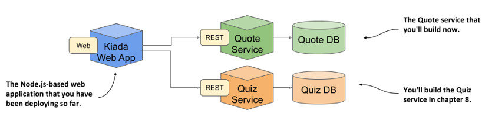

Trong những ngày đầu tôi tiếp xúc với hệ điều hành Unix vào những năm 1990, một trong những điều khiến tôi thích thú nhất là thông điệp ngẫu nhiên và đôi khi hài hước mà lệnh `fortune` [^1] hiển thị mỗi khi tôi đăng nhập vào máy chủ Sun Ultra của trường trung học. Ngày nay, bạn sẽ hiếm khi thấy lệnh `fortune` được cài đặt sẵn trên các hệ thống Unix/Linux, nhưng bạn vẫn có thể cài đặt và chạy nó mỗi khi rảnh rỗi. Dưới đây là một ví dụ về những gì nó có thể hiển thị:

```
$ fortune
Dinner is ready when the smoke alarm goes off.
```

Lệnh này lấy các câu trích dẫn từ các tệp đi kèm với chương trình, nhưng bạn cũng có thể sử dụng các tệp dữ liệu của riêng mình. Vậy tại sao chúng ta không dùng chính `fortune` để xây dựng dịch vụ Quote? Thay vì sử dụng dữ liệu mặc định, tôi sẽ cung cấp một tệp chứa các câu trích dẫn từ chính cuốn sách này.

Tuy nhiên có một trở ngại nhỏ: lệnh `fortune` chỉ in kết quả ra đầu ra chuẩn chứ không thể phân phối các câu trích dẫn qua giao thức HTTP. Nhưng đây không phải là một bài toán khó giải. Chúng ta có thể kết hợp chương trình `fortune` với một máy chủ web như Nginx để đạt được kết quả mong muốn.

#### Using a post-start container lifecycle hook to run a command in the container

Trong phiên bản đầu tiên của dịch vụ này, container sẽ chạy lệnh `fortune` ngay khi khởi động. Kết quả đầu ra sẽ được chuyển hướng (redirect) vào một tệp nằm trong thư mục gốc của Nginx (web-root) để máy chủ này có thể phân phối nó. Mặc dù cách này đồng nghĩa với việc mỗi yêu cầu gửi đến đều nhận lại cùng một câu trích dẫn duy nhất, nhưng đây là một điểm khởi đầu hoàn hảo. Bạn sẽ cải tiến dịch vụ này qua từng bước ở các phần sau.

Máy chủ web Nginx đã có sẵn dưới dạng container image, vì vậy chúng ta sẽ sử dụng nó. Do lệnh `fortune` không có sẵn trong image gốc này, thông thường bạn sẽ phải xây dựng một image mới lấy Nginx làm nền tảng và cài đặt thêm gói `fortune`. Tuy nhiên, tạm thời chúng ta sẽ thực hiện theo cách đơn giản hơn thế.

Thay vì xây dựng một image hoàn toàn mới, bạn sẽ sử dụng hook post-start để cài đặt gói phần mềm `fortune`, tải tệp chứa các câu trích dẫn của cuốn sách này, sau đó chạy lệnh `fortune` và ghi kết quả của nó vào một tệp mà Nginx có thể đọc được. Cơ chế hoạt động của pod `quote-poststart` được minh họa trong hình dưới đây.

##### Figure 6.11 The operation of the quote-poststart pod

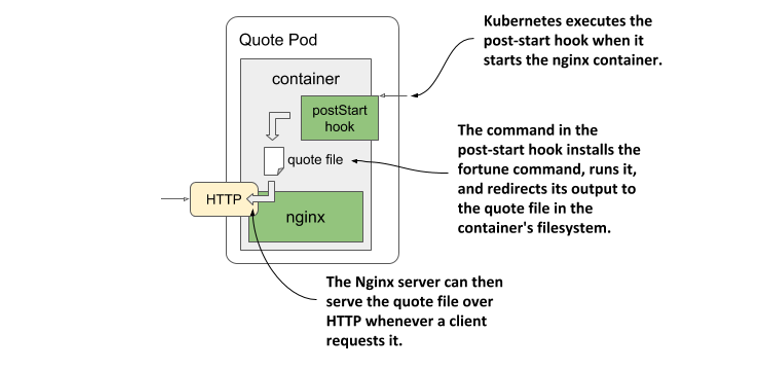

Cấu hình dưới đây chỉ ra cách định nghĩa hook này (nằm trong tệp `pod.quote-poststart.yaml`).

##### Listing 6.3 Pod with a post-start lifecycle hook

```yaml
apiVersion: v1
kind: Pod
metadata:
  name: quote-poststart    #A
spec:
  containers:
  - name: nginx    #B
    image: nginx:alpine    #B
    ports:    #C
    - name: http    #C
      containerPort: 80    #C
    lifecycle:    #D
      postStart:    #D
        exec:    #D
          command:    #D
          - sh    #E
          - -c    #F
          - |    #G
            apk add fortune && \\    #H
            curl -O https://luksa.github.io/kiada/book-quotes.txt && \\    #H
            curl -O https://luksa.github.io/kiada/book-quotes.txt.dat && \\    #H
            fortune book-quotes.txt > /usr/share/nginx/html/quote    #H
```

Đoạn mã YAML trên khá phức tạp, vì vậy hãy cùng phân tích chi tiết. Trước tiên là những phần đơn giản: pod được đặt tên là `quote-poststart` và chứa một container duy nhất dựa trên image `nginx:alpine`. Container này chỉ mở một cổng mạng duy nhất. Một hook lifecycle `postStart` cũng được định nghĩa cho container để chỉ định câu lệnh sẽ chạy khi container khởi động. Phần phức tạp nhất chính là định nghĩa của câu lệnh này, nhưng tôi sẽ giải thích cụ thể cho bạn.

Đây thực chất là một danh sách các câu lệnh được truyền dưới dạng đối số cho lệnh `sh`. Sở dĩ phải làm như vậy là vì bạn không thể định nghĩa nhiều câu lệnh độc lập trong một lifecycle hook. Giải pháp là gọi một chương trình shell làm lệnh chính và để shell đó chạy chuỗi danh sách các câu lệnh bằng cách khai báo chúng trong chuỗi lệnh:

```
sh -c "the command string"
```

Trong cấu hình trên, đối số thứ ba (chuỗi lệnh) khá dài, nên nó cần được viết trên nhiều dòng để đảm bảo tính dễ đọc cho tệp YAML. Các chuỗi ký tự nhiều dòng trong YAML có thể được định nghĩa bằng cách sử dụng ký tự đường ống (`|`) và viết các dòng tiếp theo với lề thụt đầu dòng thẳng hàng. Chuỗi lệnh trong danh sách trên có dạng cụ thể như sau:

```
apk add fortune && \\
curl -O https://luksa.github.io/kiada/book-quotes.txt && \\
curl -O https://luksa.github.io/kiada/book-quotes.txt.dat && \\
fortune book-quotes.txt > /usr/share/nginx/html/quote
```

Như bạn có thể thấy, chuỗi lệnh này bao gồm bốn lệnh thành phần. Dưới đây là chức năng của từng lệnh:

1. Lệnh `apk add fortune` khởi chạy công cụ quản lý gói của Alpine Linux (được tích hợp sẵn trong image nền của `nginx:alpine`) để cài đặt gói `fortune` vào container.
2. Lệnh `curl` đầu tiên tải tệp `book-quotes.txt` về.
3. Lệnh `curl` thứ hai tải tệp `book-quotes.txt.dat` về.
4. Lệnh `fortune` chọn ngẫu nhiên một câu trích dẫn từ tệp `book-quotes.txt` và in ra đầu ra chuẩn. Kết quả đầu ra này được chuyển hướng vào tệp `/usr/share/nginx/html/quote`.

Lệnh trong hook lifecycle này chạy song song với tiến trình chính của container. Cái tên `postStart` thực chất dễ gây hiểu lầm, bởi vì hook này không được thực thi sau khi tiến trình chính đã hoàn tất khởi động, mà được gọi ngay khi container được tạo — tức là gần như cùng lúc với thời điểm tiến trình chính bắt đầu khởi chạy.

Khi hook `postStart` trong ví dụ này hoàn thành, câu trích dẫn do lệnh `fortune` tạo ra sẽ được lưu trữ trong tệp `/usr/share/nginx/html/quote` và sẵn sàng để Nginx phân phối.

Hãy sử dụng lệnh `kubectl apply` để tạo pod từ tệp `pod.quote-poststart.yaml`. Sau đó, bạn có thể dùng `curl` hoặc trình duyệt để lấy câu trích dẫn tại URI `/quote` trên cổng `80` của pod `quote-poststart`. Bạn đã học cách sử dụng lệnh `kubectl port-forward` để mở một đường truyền (tunnel) tới container ở chương trước, nhưng hãy tham khảo thêm phần lưu ý bên dưới vì có một số trở ngại kỹ thuật cần lưu ý.

##### Accessing the quote-poststart pod

Để lấy câu trích dẫn từ pod `quote-poststart`, trước tiên bạn phải chạy lệnh `kubectl port-forward`. Lệnh này có thể thất bại như ví dụ dưới đây:

```
$ kubectl port-forward quote-poststart 80
Unable to listen on port 80: Listeners failed to create with the following errors: [unable to create listener: Error listen tcp4 127.0.0.1:80: bind: permission denied unable to create listener: Error listen tcp6 [::1]:80: bind: permission denied]
error: unable to listen on any of the requested ports: [{80 80}]
```

Lệnh trên sẽ thất bại nếu hệ điều hành của bạn không cho phép các tiến trình thông thường liên kết (bind) với các cổng có số hiệu từ 0 đến 1023. Để khắc phục lỗi này, bạn phải sử dụng một số hiệu cổng cục bộ cao hơn như sau:

```
$ kubectl port-forward quote-poststart 1080:80
```

Đối số cuối cùng yêu cầu `kubectl` sử dụng cổng `1080` trên máy cục bộ và chuyển tiếp lưu lượng đến cổng `80` của pod. Giờ đây, bạn có thể truy cập dịch vụ Quote tại địa chỉ <http://localhost:1080/quote>.

Nếu mọi thứ hoạt động đúng như mong đợi, máy chủ Nginx sẽ trả về một câu trích dẫn ngẫu nhiên từ chính cuốn sách này như ví dụ dưới đây:

```
$ curl localhost:1080/quote
The same as with liveness probes, lifecycle hooks can only be applied to regular containers and 
not to init containers. Unlike probes, lifecycle hooks do not support tcpSocket handlers.
```

Phiên bản đầu tiên của dịch vụ Quote hiện đã hoàn thành, và bạn sẽ cải tiến nó ở chương tiếp theo. Bây giờ, trước khi chuyển sang phần mới, hãy cùng tìm hiểu các lưu ý quan trọng khi sử dụng hook post-start.

#### Understanding how a post-start hook affects the container

Mặc dù hook post-start chạy bất đồng bộ với tiến trình chính của container, nó vẫn ảnh hưởng đến container theo hai cách sau đây.

Thứ nhất, container sẽ được giữ ở trạng thái `Waiting` với lý do `ContainerCreating` cho đến khi quá trình thực thi hook hoàn tất. Lúc này trạng thái chung của pod là `Pending`. Nếu bạn chạy lệnh `kubectl logs` tại thời điểm này, hệ thống sẽ từ chối hiển thị nhật ký dù trên thực tế container đã đang chạy. Lệnh `kubectl port-forward` cũng sẽ từ chối chuyển tiếp cổng đến pod.

Nếu bạn muốn tự mình kiểm chứng điều này, hãy triển khai tệp cấu hình pod `pod.quote-poststart-slow.yaml`. Tệp này định nghĩa một hook post-start mất tới 60 giây để hoàn thành. Ngay sau khi pod được tạo, hãy kiểm tra trạng thái của nó và hiển thị nhật ký bằng lệnh sau:

```
$ kubectl logs quote-poststart-slow
Error from server (BadRequest): container "nginx" in pod "quote-poststart-slow" is waiting to start: ContainerCreating
```

Thông báo lỗi trả về ngụ ý rằng container chưa được khởi động, nhưng thực tế không phải vậy. Để chứng minh điều đó, hãy sử dụng lệnh sau để liệt kê các tiến trình đang chạy bên trong container:

```
$ kubectl exec quote-poststart-slow -- ps x
PID   USER     TIME  COMMAND
  1 root      0:00 nginx: master process nginx -g daemon off;          #A
  7 root      0:00 sh -c apk add fortune && \\ sleep 60 && \\ curl...    #B
 13 nginx     0:00 nginx: worker process                               #A
...                                                                    #A
 20 nginx     0:00 nginx: worker process                               #A
 21 root      0:00 sleep 60                                            #B
 22 root      0:00 ps x
```

Cách thứ hai mà một hook post-start có thể ảnh hưởng đến container là khi câu lệnh trong hook không thể thực thi hoặc trả về một mã thoát khác 0. Nếu kịch bản này xảy ra, toàn bộ container sẽ bị khởi động lại. Để xem một ví dụ về hook post-start gặp lỗi, hãy triển khai tệp manifest `pod.quote-poststart-fail.yaml`.

Nếu bạn theo dõi trạng thái của pod bằng lệnh `kubectl get pods -w`, bạn sẽ thấy trạng thái hiển thị như sau:

```
quote-poststart-fail   0/1     PostStartHookError: command 'sh -c echo 'Emulating a post-start hook failure'; exit 1' exited with 1:
```

Kết quả này hiển thị rõ câu lệnh đã thực thi và mã kết thúc của nó. Khi kiểm tra các sự kiện (events) của pod, bạn sẽ thấy một sự kiện cảnh báo `FailedPostStartHook` cho biết mã thoát cùng với nội dung mà câu lệnh đã in ra đầu ra chuẩn hoặc đầu ra lỗi. Đây là thông tin sự kiện đó:

```
Warning  FailedPostStartHook  Exec lifecycle hook ([sh -c ...]) for Container "nginx" in Pod "quote-poststart-fail_default(...)" failed - error: command '...' exited with 1: , message: "Emulating a post-start hook failure\\n"
```

Thông báo tương tự cũng được ghi lại trong trường `containerStatuses` thuộc phần `status` của pod, nhưng chỉ tồn tại trong thời gian ngắn vì ngay sau đó trạng thái của container sẽ chuyển sang `CrashLoopBackOff`.

##### Tip

Vì trạng thái của pod có thể thay đổi rất nhanh, việc chỉ kiểm tra trạng thái tức thời có thể không cung cấp đầy đủ thông tin bạn cần. Thay vì kiểm tra trạng thái tại một thời điểm nhất định, việc xem xét lịch sử sự kiện (events) của pod thường là cách tốt hơn để có được bức tranh toàn cảnh.

#### Capturing the output produced by the process invoked via a post-start hook

Như bạn vừa biết, đầu ra của câu lệnh trong hook post-start chỉ có thể kiểm tra được khi nó gặp lỗi. Trong trường hợp câu lệnh chạy thành công, kết quả đầu ra của nó sẽ không được lưu lại ở bất kỳ đâu. Để theo dõi thông tin này, câu lệnh của bạn bắt buộc phải ghi dữ liệu ra một tệp nhật ký thay vì in ra đầu ra chuẩn hoặc đầu ra lỗi. Sau đó, bạn có thể xem nội dung tệp đó bằng lệnh dưới đây:

```
$ kubectl exec my-pod -- cat logfile.txt
```

#### Using an HTTP GET post-start hook

Ở ví dụ trước, bạn đã cấu hình hook post-start để thực thi một câu lệnh bên trong container. Ngoài ra, bạn cũng có thể yêu cầu Kubernetes gửi một yêu cầu HTTP GET khi bắt đầu chạy container bằng cách sử dụng hook post-start loại `httpGet`.

##### Note

Bạn không thể khai báo đồng thời cả hai loại hook post-start `exec` và `httpGet` cho cùng một container. Chúng là hai tùy chọn loại trừ lẫn nhau.

Bạn có thể cấu hình hook lifecycle này để gửi yêu cầu tới một tiến trình đang chạy ngay trong chính container đó, hoặc một container khác cùng nằm trong pod, hay thậm chí tới một máy chủ hoàn toàn khác bên ngoài.

Chẳng hạn, bạn có thể sử dụng hook post-start `httpGet` để thông báo cho một dịch vụ khác biết về sự hiện diện của pod của bạn. Cấu hình dưới đây là một ví dụ về cách định nghĩa hook post-start để làm việc này. Bạn có thể tìm thấy cấu hình này trong tệp `pod.poststart-httpget.yaml`.

##### Listing 6.4 Using an httpGet post-start hook to warm up a web server

```yaml
lifecycle:    #A
      postStart:    #A
        httpGet:    #A
          host: myservice.example.com    #B
          port: 80    #B
          path: /container-started    #C
```

Ví dụ trong cấu hình trên thể hiện một hook post-start `httpGet` sẽ gọi tới URL sau khi container khởi chạy: `http://myservice.example.com/container-started`.

Bên cạnh các trường `host`, `port` và `path` hiển thị trong cấu hình, bạn cũng có thể chỉ định giao thức `scheme` (`HTTP` hoặc `HTTPS`) cùng với các tiêu đề `httpHeaders` đi kèm trong yêu cầu. Trường `host` mặc định sẽ nhận giá trị là địa chỉ IP của pod. Tuyệt đối không đặt giá trị này là `localhost` trừ khi bạn muốn gửi yêu cầu trực tiếp đến chính máy chủ (node) vật lý đang chạy pod đó. Lý do là vì yêu cầu này được phát đi từ node máy chủ chứ không phải từ bên trong container.

Tương tự như các hook post-start dạng câu lệnh, hook post-start HTTP GET cũng được thực thi đồng thời với tiến trình chính của container. Đặc điểm hoạt động song song này chính là lý do khiến loại hook lifecycle này chỉ phù hợp với một số kịch bản sử dụng rất hạn chế.

Nếu bạn cấu hình hook gửi yêu cầu đến chính container chứa nó, rắc rối lớn sẽ xảy ra nếu tiến trình chính của container chưa sẵn sàng tiếp nhận các kết nối. Lúc đó, hook post-start sẽ thất bại, kéo theo việc container bị khởi động lại. Ở lượt chạy tiếp theo, kịch bản tương tự lại diễn ra. Kết quả là container của bạn sẽ bị rơi vào vòng lặp khởi động lại vô tận.

Để tự mình chứng kiến lỗi này, bạn hãy thử tạo pod được định nghĩa trong tệp `pod.poststart-httpget-slow.yaml`. Trong cấu hình này, tôi đã thiết lập để container chờ một giây trước khi khởi chạy máy chủ web. Việc này đảm bảo rằng hook post-start không bao giờ có thể thành công. Tuy nhiên, sự cố tương tự hoàn toàn có thể xảy ra ngay cả khi không có khoảng dừng nhân tạo này. Sẽ không có gì đảm bảo máy chủ web luôn khởi động đủ nhanh trong mọi tình huống. Nó có thể chạy rất nhanh trên máy tính cá nhân của bạn hoặc trên một máy chủ nhàn rỗi, nhưng trên một hệ thống production đang chịu tải lớn, container có thể sẽ không bao giờ khởi chạy thành công.

##### Warning

Việc sử dụng hook post-start loại HTTP GET có thể khiến container rơi vào vòng lặp khởi động lại vô tận. Tuyệt đối không cấu hình loại hook lifecycle này hướng mục tiêu tới chính container chứa nó hoặc bất kỳ container nào khác trong cùng một pod.

Một vấn đề khác đối với hook post-start loại HTTP GET là Kubernetes sẽ không coi hook đó là thất bại nếu máy chủ HTTP phản hồi bằng các mã lỗi như `404 Not Found`. Vì thế, hãy chắc chắn rằng bạn đã khai báo đúng đường dẫn URI trong cấu hình hook HTTP GET, nếu không bạn có thể sẽ không nhận ra việc hook post-start này hoạt động không đúng đích.

### 6.3.2 Using pre-stop hooks to run a process just before the container terminates

Bên cạnh khả năng thực thi câu lệnh hoặc gửi yêu cầu HTTP lúc khởi động container, Kubernetes còn cho phép định nghĩa một hook *pre-stop* (móc nối trước khi dừng) trong các container.

Hook pre-stop được thực thi ngay trước khi container bị dừng hẳn. Để kết thúc một tiến trình, hệ thống thường gửi tín hiệu `TERM` tới tiến trình đó nhằm yêu cầu ứng dụng hoàn tất các công việc dở dang và tự đóng lại. Quy trình đối với container cũng diễn ra tương tự. Mỗi khi một container cần được dừng hoặc khởi động lại, tín hiệu `TERM` sẽ được gửi tới tiến trình chính trong container. Tuy nhiên, trước khi điều này diễn ra, Kubernetes sẽ ưu tiên thực thi hook pre-stop nếu nó được cấu hình cho container. Tình hiệu `TERM` sẽ chỉ được phát đi sau khi hook pre-stop hoàn tất, trừ trường hợp chính hoạt động của trình xử lý hook pre-stop đã làm tiến trình tự kết thúc trước đó.

##### Note

Một khi quy trình dừng container đã được bắt đầu, đầu dò liveness cũng như các loại đầu dò khác sẽ không được kích hoạt nữa.

Bạn có thể tận dụng hook pre-stop để thiết lập quy trình tắt êm ái cho container hoặc thực hiện các tác vụ dọn dẹp phụ trợ mà không cần phải viết thêm mã nguồn vào ứng dụng chính. Tương tự như hook post-start, bạn có thể chọn chạy một câu lệnh trực tiếp trong container hoặc gửi một yêu cầu HTTP tới ứng dụng đang chạy bên trong nó.

#### Using a pre-stop lifecycle hook to shut down a container gracefully

Máy chủ web Nginx được sử dụng trong pod quote phản hồi tín hiệu `TERM` bằng cách lập tức ngắt toàn bộ kết nối đang mở và đóng tiến trình ngay lập tức. Đây là một hành vi không mong muốn, bởi vì các yêu cầu từ phía máy khách đang được xử lý dở dang vào thời điểm đó sẽ bị hủy bỏ giữa chừng.

Rất may, bạn có thể yêu cầu Nginx tắt một cách êm ái bằng cách chạy lệnh `nginx -s quit`. Khi thực thi lệnh này, máy chủ sẽ ngừng chấp nhận các kết nối mới, kiên nhẫn chờ cho đến khi toàn bộ yêu cầu đang xử lý dở dang (in-flight requests) hoàn tất rồi mới chính thức dừng hoạt động.

Khi vận hành Nginx trong một pod Kubernetes, bạn có thể sử dụng hook lifecycle pre-stop để kích hoạt câu lệnh này, đảm bảo pod được dừng một cách an toàn và êm ái nhất. Cấu hình dưới đây chỉ ra cách định nghĩa hook pre-stop này (bạn có thể tìm thấy tệp này tại `pod.quote-prestop.yaml`).

##### Listing 6.5 Defining a pre-stop hook for Nginx

```yaml
lifecycle:    #A
      preStop:    #A
        exec:    #B
          command:    #B
          - nginx    #C
          - -s    #C
          - quit    #C
```

Mỗi khi một container sử dụng pre-stop hook này bị chấm dứt, lệnh `nginx -s quit` sẽ được thực thi bên trong container trước khi tiến trình chính của container nhận được tín hiệu `TERM`.

Khác với post-start hook, container vẫn sẽ bị chấm dứt bất kể kết quả của pre-stop hook ra sao — việc thực thi lệnh thất bại hoặc trả về mã thoát khác không (non-zero exit code) đều không thể ngăn container bị dừng lại. Nếu pre-stop hook thất bại, bạn sẽ thấy một sự kiện cảnh báo `FailedPreStopHook` xuất hiện trong danh sách sự kiện của pod, nhưng nếu chỉ giám sát trạng thái (status) của pod, bạn sẽ không nhận được bất kỳ dấu hiệu cảnh báo nào về sự cố này.

##### Gợi ý

Nếu việc thực thi thành công pre-stop hook đóng vai trò quyết định đến sự vận hành ổn định của hệ thống, hãy đảm bảo rằng nó luôn chạy thành công. Tôi từng gặp những trường hợp pre-stop hook không hề hoạt động, nhưng các kỹ sư thậm chí còn không hề hay biết.

Tương tự như post-start hook, bạn cũng có thể cấu hình pre-stop hook để gửi một yêu cầu HTTP GET đến ứng dụng của mình thay vì thực thi các câu lệnh. Cách cấu hình pre-stop hook dạng HTTP GET hoàn toàn giống với post-start hook. Để biết thêm thông tin chi tiết, hãy tham khảo mục 6.3.1.

##### Tại sao ứng dụng của tôi không nhận được tín hiệu TERM?

Nhiều nhà phát triển thường mắc sai lầm khi định nghĩa pre-stop hook chỉ để gửi tín hiệu `TERM` đến ứng dụng của họ. Họ làm điều này khi phát hiện ra ứng dụng không bao giờ nhận được tín hiệu `TERM`. Tuy nhiên, nguyên nhân gốc rễ thường không phải vì tín hiệu không được gửi đi, mà là do nó đã bị một thành phần nào đó bên trong container "nuốt" mất. Tình trạng này thường xảy ra khi bạn sử dụng chỉ thị `ENTRYPOINT` hoặc `CMD` dưới dạng *shell* (shell form) trong Dockerfile. Hai chỉ thị này tồn tại dưới hai dạng cấu trúc khác nhau.

Dạng *exec* là: `ENTRYPOINT ["/myexecutable", "1st-arg", "2nd-arg"]`

Dạng *shell* là: `ENTRYPOINT /myexecutable 1st-arg 2nd-arg`

Khi bạn sử dụng dạng exec, tệp thực thi sẽ được gọi trực tiếp. Tiến trình mà nó khởi chạy sẽ trở thành tiến trình gốc (root process) của container. Trong khi đó, nếu bạn sử dụng dạng shell, một tiến trình shell sẽ chạy dưới dạng tiến trình gốc, và tiến trình shell này sẽ chạy tệp thực thi dưới dạng tiến trình con của nó. Trong trường hợp này, chính tiến trình shell mới là bên nhận được tín hiệu `TERM`. Ngặt nỗi, nó lại không chuyển tiếp tín hiệu này xuống cho tiến trình con.

Trong những trường hợp như vậy, thay vì thêm một pre-stop hook để gửi tín hiệu `TERM` đến ứng dụng, giải pháp đúng đắn là chuyển sang sử dụng dạng exec của chỉ thị `ENTRYPOINT` hoặc `CMD`.

Lưu ý rằng vấn đề tương tự cũng sẽ xảy ra nếu bạn sử dụng một shell script trong container để khởi chạy ứng dụng. Khi đó, bạn buộc phải tìm cách đánh chặn và chuyển tiếp các tín hiệu đến ứng dụng, hoặc sử dụng lệnh shell `exec` để chạy ứng dụng ngay trong kịch bản script của mình.

Pre-stop hook chỉ được kích hoạt khi container có yêu cầu chấm dứt — có thể là do nó thất bại khi kiểm tra liveness probe hoặc do toàn bộ pod chuẩn bị tắt. Chúng sẽ không được gọi nếu tiến trình chạy trong container tự động kết thúc.

#### Hiểu rằng các lifecycle hook tác động đến container chứ không phải pod

Lưu ý cuối cùng về post-start hook và pre-stop hook: tôi muốn nhấn mạnh rằng các lifecycle hook này áp dụng cho từng container riêng lẻ chứ không phải cho toàn bộ pod. Bạn không nên dùng pre-stop hook để thực hiện một hành động cần thiết khi toàn bộ pod tắt, bởi vì pre-stop hook sẽ chạy mỗi khi một container cần chấm dứt. Việc này có thể diễn ra nhiều lần trong suốt vòng đời của pod, chứ không chỉ riêng lúc pod ngừng hoạt động.

## 6.4 Hiểu về vòng đời của pod

Từ đầu chương đến giờ, bạn đã tìm hiểu kỹ về cách thức vận hành của các container trong một pod. Bây giờ, chúng ta hãy cùng nhìn lại bức tranh toàn cảnh về toàn bộ vòng đời của một pod cùng các container bên trong nó.

Khi bạn tạo một đối tượng pod, Kubernetes sẽ lập lịch để đưa nó đến một worker node, nơi node này sẽ đảm nhận việc chạy các container của pod. Vòng đời của pod được chia làm ba giai đoạn như trong hình dưới đây:

##### Hình 6.12 Ba giai đoạn trong vòng đời của một pod

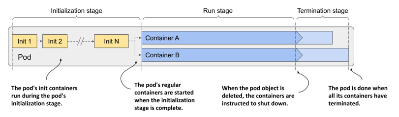

Ba giai đoạn trong vòng đời của một pod gồm có:

1. Giai đoạn khởi tạo (initialization stage): các init container của pod sẽ chạy trong giai đoạn này.
2. Giai đoạn hoạt động (run stage): các container chính (regular containers) của pod sẽ chạy trong giai đoạn này.
3. Giai đoạn chấm dứt (termination stage): các container của pod sẽ bị dừng hoạt động.

Hãy cùng xem chi tiết những gì xảy ra trong từng giai đoạn này.

### 6.4.1 Tìm hiểu giai đoạn khởi tạo

Như bạn đã biết, các init container của pod luôn là những thành phần chạy đầu tiên. Chúng chạy tuần tự theo đúng thứ tự được khai báo trong trường `initContainers` thuộc phần `spec` của pod. Hãy để tôi giải thích chi tiết quy trình diễn ra sau đó.

#### Kéo ảnh container (container image)

Trước khi mỗi init container khởi động, ảnh container của nó sẽ được kéo về worker node. Trường `imagePullPolicy` trong phần định nghĩa container tại đặc tả pod sẽ quyết định xem ảnh sẽ được kéo về mỗi lần khởi động, chỉ kéo lần đầu tiên, hay không bao giờ kéo.

##### Bảng 6.5 Danh sách các chính sách kéo ảnh (image-pull policies)

| Chính sách kéo ảnh | Mô tả |
| :--- | :--- |
| Không chỉ định | Nếu không được khai báo rõ ràng, chính sách này sẽ mặc định là `Always` nếu ảnh sử dụng tag `:latest`. Đối với các tag ảnh khác, chính sách mặc định sẽ là `IfNotPresent`. |
| Always | Ảnh sẽ được kéo về mỗi khi container khởi động hoặc tái khởi động. Nếu ảnh được lưu trong bộ nhớ đệm cục bộ trùng khớp với ảnh trên registry, hệ thống sẽ không tải lại nữa, nhưng vẫn cần phải kết nối với registry để kiểm tra thông tin. |
| Never | Ảnh container sẽ không bao giờ được kéo từ registry về. Nó bắt buộc phải có sẵn trên worker node từ trước. Ảnh này có thể đã được lưu cục bộ khi một container khác dùng chung ảnh được triển khai, hoặc tự build ngay trên node, hoặc đơn giản là được tải xuống bằng một phương thức khác. |
| IfNotPresent | Ảnh chỉ được kéo về nếu chưa có sẵn trên worker node. Điều này đảm bảo ảnh chỉ được tải xuống trong lần đầu tiên hệ thống cần đến nó. |

Chính sách kéo ảnh cũng được áp dụng mỗi khi container tái khởi động, vì vậy chúng ta cần xem xét kỹ hơn cơ chế này. Hãy quan sát hình dưới đây để hiểu rõ hành vi của ba chính sách này.

##### Hình 6.13 Khái quát về ba chính sách kéo ảnh khác nhau

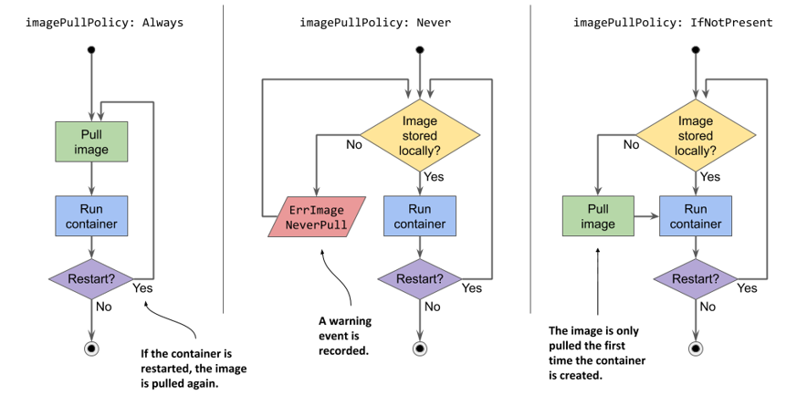

##### Cảnh báo

Nếu `imagePullPolicy` được thiết lập là `Always` và registry lưu trữ ảnh bị ngoại tuyến (offline), container sẽ không thể chạy ngay cả khi ảnh đó đã có sẵn ở máy cục bộ. Do đó, một registry không hoạt động có thể khiến ứng dụng của bạn không thể khởi động hoặc tái khởi động được.

#### Khởi chạy các container

Ngay khi ảnh container đầu tiên được tải xuống node, container đó sẽ được khởi chạy. Sau khi init container đầu tiên hoàn thành nhiệm vụ, hệ thống sẽ tiếp tục kéo ảnh của init container tiếp theo và khởi chạy nó. Quy trình này lặp đi lặp lại tuần tự cho đến khi toàn bộ các init container chạy thành công. Những container bị lỗi có thể sẽ được khởi động lại, như mô tả trong hình dưới đây.

##### Hình 6.14 Tất cả các init container phải chạy hoàn tất trước khi các container chính có thể khởi động

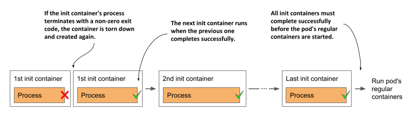

#### Khởi động lại các init container bị lỗi

Nếu một init container kết thúc với một lỗi và chính sách tái khởi động (`restartPolicy`) của pod được thiết lập là `Always` hoặc `OnFailure`, init container bị lỗi đó sẽ được khởi động lại. Nếu chính sách là `Never`, các init container phía sau cùng với các container chính của pod sẽ không bao giờ được khởi chạy. Trạng thái của pod sẽ hiển thị là `Init:Error` vô thời hạn. Lúc này, bạn buộc phải xóa và tạo lại đối tượng pod để khởi động lại ứng dụng. Để tự mình kiểm chứng điều này, hãy triển khai tệp cấu hình `pod.kiada-init-fail-norestart.yaml`.

##### Lưu ý

Nếu container cần khởi động lại và `imagePullPolicy` được đặt là `Always`, ảnh container sẽ được kéo lại một lần nữa. Nếu container bị dừng do lỗi và bạn đẩy (push) một ảnh mới sửa được lỗi đó lên với cùng một tag, bạn không cần phải tạo lại pod, vì ảnh container cập nhật sẽ được kéo về trước khi container tái khởi động.

#### Chạy lại các init container của pod

Thông thường, các init container chỉ thực thi đúng một lần duy nhất. Ngay cả khi một trong các container chính của pod bị chấm dứt sau đó, các init container cũng sẽ không chạy lại. Tuy nhiên, trong một số trường hợp ngoại lệ, chẳng hạn như khi Kubernetes buộc phải khởi động lại toàn bộ pod, các init container có thể sẽ được thực thi lại từ đầu. Điều này có nghĩa là các thao tác do init container thực hiện bắt buộc phải có tính lũy đẳng (idempotent)[^2].

### 6.4.2 Tìm hiểu giai đoạn hoạt động

Khi tất cả các init container đã hoàn thành tốt nhiệm vụ của mình, các container chính của pod sẽ được tạo ra đồng thời. Về mặt lý thuyết, vòng đời của từng container sẽ độc lập với các container khác trong pod, nhưng thực tế lại không hoàn toàn như vậy. Hãy xem phần đóng khung bên dưới để biết thêm chi tiết.

##### Post-start hook của một container sẽ chặn quá trình tạo container tiếp theo

Kubelet không khởi chạy tất cả các container của pod cùng một lúc. Nó tạo và khởi động các container một cách đồng bộ theo đúng thứ tự được định nghĩa trong trường `spec` của pod. Nếu một container có cấu hình post-start hook, hook này sẽ chạy không đồng bộ với tiến trình chính của container, nhưng trình xử lý post-start hook này sẽ chặn (block) việc tạo và khởi động các container tiếp theo.

Đây là một chi tiết trong thiết kế triển khai và có thể sẽ thay đổi trong tương lai.

Ngược lại, quá trình chấm dứt các container lại được thực hiện song song. Một pre-stop hook chạy lâu tuy có làm chậm quá trình tắt của chính container chứa nó, nhưng nó không hề gây nghẽn quá trình tắt của các container khác. Các pre-stop hook của mọi container đều được kích hoạt cùng một thời điểm.

Quy trình dưới đây diễn ra độc lập đối với từng container. Đầu tiên, ảnh container được kéo về, và container được khởi chạy. Khi container kết thúc, nó sẽ được khởi động lại nếu chính sách tái khởi động của pod cho phép. Container sẽ tiếp tục chạy như vậy cho đến khi quy trình chấm dứt pod được kích hoạt. Phần giải thích chi tiết hơn về quy trình này sẽ được trình bày ngay sau đây.

#### Kéo ảnh container

Trước khi container được tạo, ảnh của nó sẽ được kéo về từ registry theo đúng cấu hình `imagePullPolicy` của pod. Khi ảnh đã được tải về thành công, container sẽ được khởi tạo.

##### Lưu ý

Ngay cả khi không thể kéo được ảnh của một container, các container khác trong pod vẫn sẽ được khởi chạy bình thường.

##### Cảnh báo

Các container không nhất thiết phải khởi động vào cùng một thời điểm. Nếu quá trình kéo ảnh mất nhiều thời gian, một container có thể sẽ khởi động muộn hơn rất nhiều so với các container khác đã chạy từ trước. Hãy lưu ý điều này nếu các container của bạn có sự phụ thuộc lẫn nhau.

#### Khởi chạy container

Container chính thức hoạt động khi tiến trình chính của nó bắt đầu chạy. Nếu container có cấu hình post-start hook, hook này sẽ được gọi song song với tiến trình chính của container. Post-start hook chạy không đồng bộ và phải thực hiện thành công thì container mới được tiếp tục duy trì trạng thái hoạt động.

Đồng thời với tiến trình chính và tiến trình post-start hook (nếu có), startup probe (nếu được cấu hình cho container) cũng sẽ bắt đầu hoạt động. Khi startup probe vượt qua thành công, hoặc nếu container không cấu hình startup probe, liveness probe sẽ bắt đầu được kích hoạt.

#### Chấm dứt và khởi động lại container khi gặp sự cố

Nếu startup probe hoặc liveness probe thất bại liên tiếp vượt quá ngưỡng cấu hình cho phép, container sẽ bị chấm dứt. Tương tự như đối với các init container, trường `restartPolicy` của pod sẽ quyết định xem container đó có được khởi động lại hay không.

Có một điểm có thể khiến bạn ngạc nhiên: nếu chính sách tái khởi động được đặt là `Never` và startup hook thất bại, trạng thái của pod vẫn sẽ hiển thị là `Completed` dù cho post-start hook đã gặp sự cố. Bạn có thể tự mình kiểm chứng điều này bằng cách tạo pod được định nghĩa trong tệp `pod.quote-poststart-fail-norestart.yaml`.

#### Giới thiệu về khoảng thời gian chờ tắt container (termination grace period)

Khi một container bắt buộc phải dừng hoạt động, hệ thống sẽ gọi pre-stop hook của container đó để ứng dụng có thể tiến hành tắt một cách êm ái (graceful shutdown). Khi pre-stop hook hoàn thành, hoặc nếu container không có cấu hình pre-stop hook, tín hiệu `TERM` sẽ được gửi đến tiến trình chính của container. Đây là một tín hiệu thông báo cho ứng dụng biết rằng nó cần phải chuẩn bị đóng lại.

Ứng dụng sẽ được cấp một khoảng thời gian nhất định để tự đóng. Khoảng thời gian này có thể cấu hình được thông qua trường `terminationGracePeriodSeconds` trong phần `spec` của pod, với giá trị mặc định là 30 giây. Đồng hồ đếm ngược sẽ bắt đầu chạy ngay khi pre-stop hook được gọi, hoặc khi tín hiệu `TERM` được gửi đi nếu không cấu hình hook. Nếu tiến trình vẫn tiếp tục chạy chây ì sau khi khoảng thời gian chờ này kết thúc, hệ thống sẽ cưỡng chế dừng nó bằng tín hiệu `KILL`. Đến đây, container chính thức bị chấm dứt.

Hình dưới đây minh họa quy trình chấm dứt một container.

##### Hình 6.15 Quy trình chấm dứt một container

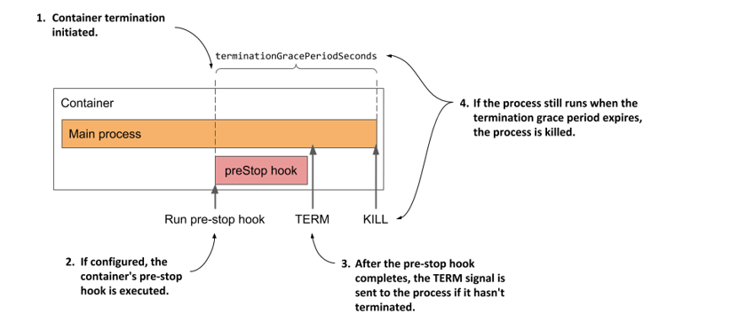

Sau khi container bị chấm dứt, nó sẽ được khởi động lại nếu chính sách tái khởi động của pod cho phép. Nếu không, container sẽ giữ nguyên trạng thái `Terminated`, trong khi các container khác vẫn tiếp tục chạy cho đến khi toàn bộ pod bị tắt hoặc bản thân chúng cũng gặp lỗi tương tự.

### 6.4.3 Tìm hiểu giai đoạn chấm dứt

Các container của pod sẽ tiếp tục hoạt động cho đến khi bạn chủ động xóa đối tượng pod đó đi. Khi hành động xóa xảy ra, quy trình chấm dứt toàn bộ các container trong pod sẽ được kích hoạt và trạng thái của pod chuyển sang `Terminating`.

#### Giới thiệu về khoảng thời gian chờ xóa pod (deletion grace period)

Quy trình dừng hoạt động của từng container khi tắt pod cũng diễn ra tương tự như khi container bị dừng do liveness probe thất bại, chỉ khác ở chỗ: thay vì dùng khoảng thời gian chờ tắt container, hệ thống sẽ dùng *khoảng thời gian chờ xóa pod* (deletion grace period) để quyết định xem các container có bao nhiêu thời gian để tự đóng lại.

Khoảng thời gian chờ này được định nghĩa trong trường `metadata.deletionGracePeriodSeconds` của pod, trường này sẽ được khởi tạo ngay khi bạn thực hiện thao tác xóa pod. Theo mặc định, nó sẽ lấy giá trị từ trường `spec.terminationGracePeriodSeconds`, nhưng bạn hoàn toàn có thể chỉ định một con số khác thông qua lệnh xóa của `kubectl`. Chúng ta sẽ tìm hiểu cách thực hiện việc này ở phần sau.

#### Tìm hiểu cách các container của pod bị chấm dứt

Như mô tả trong hình tiếp theo, các container của pod sẽ được chấm dứt một cách đồng thời. Đối với mỗi container, pre-stop hook sẽ được gọi trước, sau đó tín hiệu `TERM` được gửi đến tiến trình chính của container, và cuối cùng tiến trình này sẽ bị cưỡng chế dừng bằng tín hiệu `KILL` nếu khoảng thời gian chờ xóa pod kết thúc trước khi tiến trình tự động dừng lại. Sau khi tất cả các container trong pod đã ngừng hoạt động hoàn toàn, đối tượng pod sẽ bị xóa bỏ.

##### Hình 6.16 Quy trình chấm dứt bên trong một pod

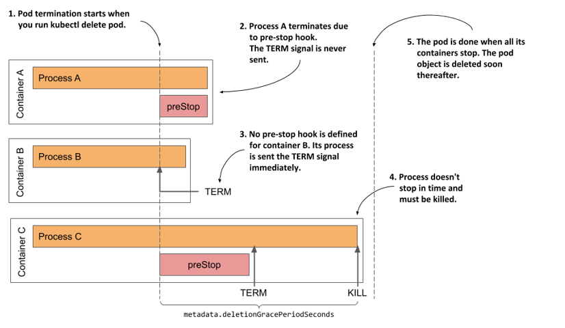

#### Quan sát quá trình tắt chậm chạp của một pod

Hãy cùng quan sát giai đoạn cuối cùng này trong vòng đời của một pod trên chính một trong những pod bạn đã tạo trước đó. Nếu pod `kiada-ssl` không còn chạy trong cluster của bạn, vui lòng tạo lại nó. Bây giờ, hãy xóa pod bằng cách chạy lệnh `kubectl delete pod kiada-ssl`.

Quá trình xóa pod mất một khoảng thời gian lâu đến đáng ngạc nhiên đúng không? Tôi đếm được ít nhất là 30 giây. Điều này vừa không bình thường vừa không thể chấp nhận được, vì vậy chúng ta cần phải khắc phục nó.

Dựa vào những kiến thức đã học trong chương này, có thể bạn đã lờ mờ đoán được nguyên nhân khiến pod mất nhiều thời gian đến vậy để tắt hoàn toàn. Nếu chưa, hãy để tôi hỗ trợ bạn phân tích tình huống này.

Pod `kiada-ssl` có hai container. Cả hai đều phải dừng lại trước khi đối tượng pod có thể bị xóa bỏ hoàn toàn. Cả hai container đều không cấu hình pre-stop hook, vì vậy đáng lẽ chúng phải nhận được tín hiệu `TERM` ngay lập tức khi bạn thực hiện lệnh xóa pod. Con số 30 giây mà tôi đề cập ở trên hoàn toàn trùng khớp với giá trị mặc định của khoảng thời gian chờ tắt container (termination grace period). Do đó, có vẻ như một trong hai container, hoặc cả hai, đã không hề dừng lại khi nhận được tín hiệu `TERM`, và chỉ bị cưỡng chế tắt bằng tín hiệu `KILL` sau khi thời gian chờ kết thúc.

#### Thay đổi khoảng thời gian chờ tắt container

Bạn có thể thử đặt giá trị của trường `terminationGracePeriodSeconds` thấp hơn để xem pod có tắt nhanh hơn không. File manifest dưới đây hướng dẫn cách thiết lập trường này trong cấu hình pod (file `pod.kiada-ssl-shortgraceperiod.yaml`).

##### Listing 6.6 Thiết lập giá trị terminationGracePeriodSeconds nhỏ hơn để pod tắt nhanh hơn

```yaml
apiVersion: v1
kind: Pod
metadata:
  name: kiada-ssl-shortgraceperiod
spec:
  terminationGracePeriodSeconds: 5    #A
  containers:
  ...
```

Trong đoạn mã cấu hình trên, trường `terminationGracePeriodSeconds` của pod được đặt là `5`. Nếu bạn tạo rồi tiến hành xóa pod này, bạn sẽ thấy các container của nó bị chấm dứt trong vòng 5 giây kể từ khi nhận được tín hiệu `TERM`.

##### Gợi ý

Việc giảm khoảng thời gian chờ tắt container là điều hiếm khi cần thiết. Tuy nhiên, bạn nên kéo dài khoảng thời gian này nếu ứng dụng của bạn thường đòi hỏi nhiều thời gian hơn để có thể tắt một cách êm ái và an toàn.

#### Chỉ định khoảng thời gian chờ xóa khi thực hiện lệnh xóa pod

Bất cứ khi nào bạn xóa một pod, trường `terminationGracePeriodSeconds` của pod đó sẽ quyết định thời gian tối đa để hệ thống chờ nó tắt. Tuy nhiên, bạn có thể ghi đè (override) giá trị này khi chạy lệnh `kubectl delete` bằng cách sử dụng tùy chọn dòng lệnh `--grace-period`.

Ví dụ: để cho phép pod có tối đa 10 giây để tắt, bạn chạy lệnh sau:

```shell
$ kubectl delete po kiada-ssl --grace-period 10
```

##### Lưu ý

Nếu bạn đặt khoảng thời gian chờ này bằng không (0), các pre-stop hook của pod sẽ không được thực thi.

#### Khắc phục hành vi tắt của ứng dụng Kiada

Dựa vào việc rút ngắn thời gian chờ giúp pod tắt nhanh hơn, rõ ràng là có ít nhất một trong hai container đã không tự đóng lại sau khi nhận được tín hiệu `TERM`. Để xác định chính xác là container nào, hãy tạo lại pod, sau đó chạy các lệnh sau để theo dõi luồng log của từng container trước khi tiến hành xóa pod một lần nữa:

```shell
$ kubectl logs kiada-ssl -c kiada -f
$ kubectl logs kiada-ssl -c envoy -f
```

Kết quả log cho thấy Envoy proxy đã bắt được tín hiệu và lập tức tắt ngay, trong khi ứng dụng Node.js lại hoàn toàn im lặng trước tín hiệu này. Để khắc phục điều đó, bạn cần bổ sung đoạn mã trong listing dưới đây vào cuối tệp `app.js` của mình. Bạn có thể tìm thấy tệp đã được cập nhật tại thư mục `Chapter06/kiada-0.3/app.js`.

##### Listing 6.7 Xử lý tín hiệu TERM trong ứng dụng kiada

```javascript
process.on('SIGTERM', function () {
  console.log("Received SIGTERM. Server shutting down...");
  server.close(function () {
    process.exit(0);
  });
});
```

Sau khi hoàn tất chỉnh sửa mã nguồn, hãy build một ảnh container mới với tag `:0.3`, đẩy nó lên registry cá nhân và triển khai một pod mới sử dụng ảnh này. Bạn cũng có thể sử dụng trực tiếp ảnh `docker.io/luksa/kiada:0.3` do tôi đã build sẵn. Để tạo pod, hãy áp dụng file manifest `pod.kiada-ssl-0.3.yaml`.

Nếu tiến hành xóa pod mới này, bạn sẽ thấy nó tắt nhanh hơn đáng kể. Qua log của container `kiada`, bạn có thể thấy rõ nó bắt đầu quá trình đóng ứng dụng ngay khi nhận được tín hiệu `TERM`.

##### GỢI Ý

Đừng quên đảm bảo rằng các init container của bạn cũng có khả năng xử lý tín hiệu `TERM`, nhờ đó chúng có thể tắt ngay lập tức nếu bạn thực hiện xóa pod khi nó vẫn đang trong giai đoạn khởi tạo.

### 6.4.4 Mô hình hóa toàn bộ vòng đời các container của pod

Để khép lại chương này về những gì diễn ra bên trong một pod, tôi xin đưa ra một cái nhìn tổng quan cuối cùng về toàn bộ tiến trình xảy ra trong suốt vòng đời của pod. Hai hình ảnh dưới đây sẽ tóm tắt lại tất cả những gì đã được giải thích trong chương này. Quá trình khởi tạo của pod được mô tả trong hình tiếp theo.

##### Hình 6.17 Tổng quan chi tiết về giai đoạn khởi tạo của pod

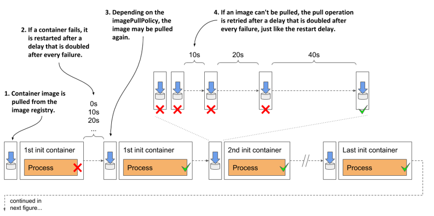

Khi quá trình khởi tạo hoàn tất, các container chính của pod bắt đầu bước vào giai đoạn hoạt động bình thường như mô tả ở hình dưới đây.

##### Hình 6.18 Tổng quan chi tiết về giai đoạn hoạt động bình thường của pod

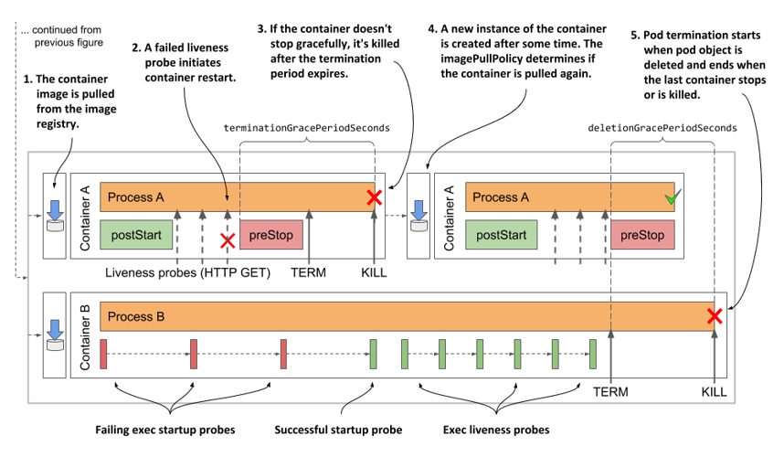

## 6.5 Tóm tắt

Trong chương này, bạn đã được tìm hiểu các nội dung sau:

- Trạng thái (status) của pod chứa các thông tin về giai đoạn (phase) của pod, các điều kiện trạng thái (conditions) và tình trạng cụ thể của từng container bên trong nó. Bạn có thể kiểm tra trạng thái này bằng cách chạy lệnh `kubectl describe` hoặc lấy toàn bộ manifest của pod bằng lệnh `kubectl get -o yaml`.
- Tùy thuộc vào chính sách tái khởi động của pod, các container của nó có thể được khởi động lại sau khi bị chấm dứt. Tuy nhiên, trên thực tế, một container cũ không bao giờ thực sự được khởi động lại. Thay vào đó, nó sẽ bị hủy bỏ hoàn toàn và một container mới tinh sẽ được tạo ra để thế chỗ.
- Nếu một container liên tục bị chấm dứt, một khoảng thời gian trễ tăng dần theo cấp số nhân (backoff delay) sẽ được chèn vào trước mỗi lần tái khởi động. Sẽ không có khoảng trễ cho lần restart đầu tiên, sau đó thời gian trễ sẽ là 10 giây và nhân đôi trước mỗi lần khởi động lại tiếp theo. Khoảng trễ tối đa là 5 phút và sẽ được reset về 0 khi container đã hoạt động ổn định trong một khoảng thời gian dài ít nhất là gấp đôi thời gian trễ này.
- Cơ chế trễ tăng theo cấp số nhân này cũng được áp dụng sau mỗi lần tải ảnh container thất bại.
- Việc bổ sung một liveness probe vào container đảm bảo rằng container đó sẽ được khởi động lại ngay khi nó rơi vào trạng thái mất phản hồi. Liveness probe kiểm tra sức khỏe của ứng dụng thông qua một yêu cầu HTTP GET, bằng cách thực thi một câu lệnh trong container, hoặc mở một kết nối TCP đến một cổng mạng của container.
- Nếu ứng dụng cần nhiều thời gian để khởi động, bạn có thể định nghĩa một startup probe với các thiết lập dung sai dễ chịu hơn so với liveness probe để tránh việc container bị khởi động lại quá sớm khi chưa kịp chạy xong.
- Bạn có thể cấu hình các lifecycle hook cho từng container chính của pod. Post-start hook được gọi khi container bắt đầu chạy, trong khi pre-stop hook được gọi khi container chuẩn bị tắt. Một lifecycle hook có thể được cấu hình để gửi một yêu cầu HTTP GET hoặc thực thi một câu lệnh bên trong container.
- Nếu container có cấu hình pre-stop hook và container đó bắt buộc phải dừng, hook này sẽ được gọi trước tiên. Tín hiệu `TERM` sau đó mới được gửi đến tiến trình chính của container. Nếu tiến trình không tự dừng lại trong khoảng thời gian `terminationGracePeriodSeconds` kể từ khi bắt đầu quy trình chấm dứt, nó sẽ bị cưỡng chế tắt bằng tín hiệu `KILL`.
- Khi bạn xóa một đối tượng pod, toàn bộ các container của nó sẽ được chấm dứt một cách đồng thời. Trường `deletionGracePeriodSeconds` của pod chính là khoảng thời gian tối đa cho phép các container tự tắt. Theo mặc định, nó lấy giá trị từ khoảng thời gian chờ tắt container (termination grace period), nhưng bạn có thể ghi đè giá trị này bằng lệnh `kubectl delete`.
- Nếu quá trình tắt một pod mất nhiều thời gian, rất có khả năng một trong những tiến trình chạy bên trong nó đã không xử lý tín hiệu `TERM`. Việc bổ sung một trình xử lý tín hiệu `TERM` trong mã nguồn là giải pháp tối ưu và đúng đắn hơn nhiều so với việc chỉ đơn thuần rút ngắn thời gian chờ tắt container hoặc thời gian chờ xóa pod.

Giờ đây bạn đã nắm vững toàn bộ cơ chế hoạt động của container bên trong pod. Trong chương tiếp theo, chúng ta sẽ tìm hiểu về một thành phần cực kỳ quan trọng khác của pod — các volume lưu trữ (storage volumes).

---

[^1]: *Chú thích của công cụ dịch: Lệnh `fortune` là một chương trình tiện ích trên các hệ thống tương tự Unix, chuyên hiển thị ngẫu nhiên các câu trích dẫn, châm ngôn hoặc thông điệp hài hước từ một cơ sở dữ liệu có sẵn.*

[^2]: *Chú thích của công cụ dịch: Tính lũy đẳng (Idempotence) là đặc tính của một thao tác mà khi thực hiện nhiều lần vẫn mang lại kết quả giống hệt như khi thực hiện một lần duy nhất, không gây ra tác dụng phụ hoặc làm sai lệch dữ liệu.*

---

[← Chương 5](05-chay-cac-workload-trong-pod.md) · [Mục lục](README.md) · [Chương 7 →](07-gan-ket-cac-volume-luu-tru-vao-pod.md)
