# 7 Gắn kết các volume lưu trữ vào Pod

### Chương này sẽ bao gồm

- Lưu trữ tệp tin bền vững qua các lần tái khởi động container
- Chia sẻ tệp tin giữa các container trong cùng một pod
- Chia sẻ tệp tin giữa các pod khác nhau
- Gắn kết các ổ đĩa lưu trữ mạng (network storage) vào pod
- Truy cập hệ thống tệp của host node từ bên trong một pod

Hai chương trước đã tập trung sâu vào các container của pod, nhưng chúng mới chỉ là một nửa trong số những gì một pod thường chứa đựng. Đi kèm với các container thông thường là các volume lưu trữ (storage volumes), cho phép container của pod có thể ghi dữ liệu bền vững trong suốt vòng đời của pod hoặc lâu hơn thế, hoặc chia sẻ tệp tin với các container khác trong cùng một pod. Đây chính là trọng tâm của chương này.

##### Lưu ý

Bạn có thể tìm thấy các tệp mã nguồn của chương này tại địa chỉ <https://github.com/luksa/kubernetes-in-action-2nd-edition/tree/master/Chapter07>

## 7.1 Giới thiệu về volume

Một pod giống như một máy tính logic nhỏ chạy một ứng dụng duy nhất. Ứng dụng này có thể bao gồm một hoặc nhiều container chạy các tiến trình ứng dụng. Các tiến trình này chia sẻ tài nguyên tính toán như CPU, RAM, giao tiếp mạng, v.v. Trên một máy tính thông thường, các tiến trình sử dụng chung một hệ thống tệp, nhưng điều này lại không đúng với container. Thay vào đó, mỗi container sở hữu một hệ thống tệp độc lập, cô lập do chính ảnh container cung cấp.

Khi một container khởi động, các tệp tin trong hệ thống tệp của nó chính là những tệp đã được thêm vào ảnh container trong quá trình build. Tiến trình chạy trong container sau đó có thể chỉnh sửa các tệp này hoặc tạo ra các tệp mới. Tuy nhiên, khi container bị chấm dứt và khởi động lại, mọi thay đổi mà nó đã thực hiện trên các tệp tin sẽ bị mất sạch, bởi vì như đã giải thích ở chương trước, container cũ không thực sự được tái khởi động mà bị thay thế hoàn toàn bằng một container mới tinh. Do đó, khi một ứng dụng container hóa được khởi động lại, nó không thể tiếp tục công việc từ thời điểm nó dừng trước đó. Mặc dù điều này có thể chấp nhận được đối với một số loại ứng dụng, nhưng các ứng dụng khác lại yêu cầu toàn bộ hệ thống tệp hoặc ít nhất một phần của nó phải được bảo toàn sau khi khởi động lại.

Mục tiêu này được hiện thực hóa bằng cách thêm một *volume* vào pod và *mount* (gắn) nó vào container.

##### Định nghĩa

*Gắn kết* (Mounting) là hành động liên kết hệ thống tệp của một thiết bị lưu trữ hoặc volume vào một vị trí cụ thể trong cấu trúc cây thư mục của hệ điều hành, như mô tả trong hình 7.1. Nội dung của volume đó sau đó sẽ hiển thị và có thể truy cập được tại vị trí gắn kết này.

##### Hình 7.1 Gắn kết một hệ thống tệp vào cấu trúc cây thư mục

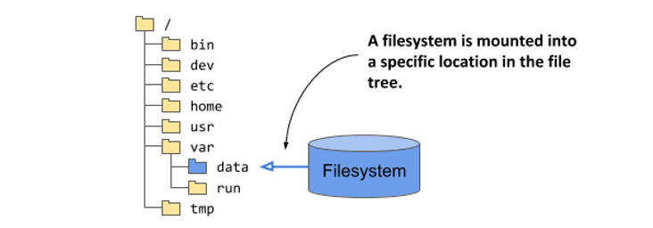

### 7.1.1 Chứng minh sự cần thiết của volume

Trong chương này, bạn sẽ xây dựng một dịch vụ mới đòi hỏi dữ liệu của nó phải được lưu trữ bền vững (persist). Để làm được điều này, pod chạy dịch vụ đó sẽ cần phải chứa một volume. Nhưng trước khi đi vào chi tiết, hãy để tôi giới thiệu qua về dịch vụ này và giúp bạn tự mình trải nghiệm lý do vì sao nó không thể hoạt động ổn định nếu thiếu đi một volume.

#### Giới thiệu dịch vụ Quiz (Quiz service)

Mục tiêu của 14 chương đầu tiên trong cuốn sách này là giúp bạn nắm vững các khái niệm cốt lõi của Kubernetes thông qua việc triển khai Bộ ứng dụng mẫu "Kubernetes in Action" (Kubernetes in Action Demo Application Suite). Bạn chắc hẳn đã quen thuộc với ba thành phần tạo nên bộ ứng dụng này. Nếu chưa, hình dưới đây sẽ giúp bạn ôn lại nhanh.

##### Hình 7.2 Cách dịch vụ Quiz ăn khớp vào kiến trúc của Bộ ứng dụng Kiada

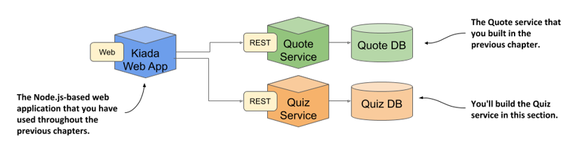

Bạn đã xây dựng phiên bản đầu tiên của ứng dụng web Kiada và dịch vụ Quote. Bây giờ, bạn sẽ tiến hành tạo dịch vụ Quiz. Dịch vụ này sẽ cung cấp các câu hỏi trắc nghiệm để ứng dụng web Kiada hiển thị, đồng thời lưu trữ các câu trả lời của bạn cho những câu hỏi đó.

Dịch vụ Quiz bao gồm một frontend RESTful API và một cơ sở dữ liệu MongoDB làm backend. Ban đầu, bạn sẽ chạy hai thành phần này trong các container riêng biệt của cùng một pod, như mô tả trong hình dưới đây.

##### Hình 7.3 Quiz API và cơ sở dữ liệu MongoDB chạy trong cùng một pod

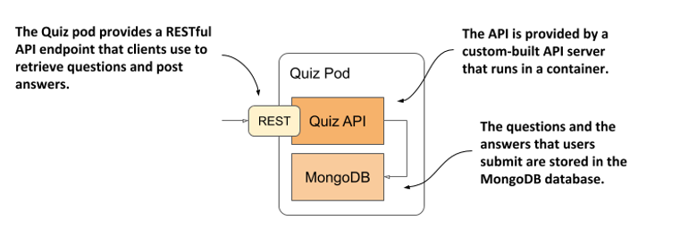

Như tôi đã giải thích trong phần giới thiệu về pod ở chương 5, việc tạo các pod gộp chung như thế này không phải là một ý tưởng hay, vì nó không cho phép các container có thể co giãn (scale) độc lập. Lý do chúng ta tạm thời sử dụng một pod duy nhất ở đây là vì bạn chưa được học cách thức chính thống để giúp các pod giao tiếp với nhau. Bạn sẽ được tìm hiểu điều đó ở chương 11. Đó cũng là thời điểm chúng ta tách hai container này ra thành các pod độc lập.

#### Xây dựng container Quiz API

Mã nguồn và các tài nguyên để build ảnh container cho thành phần Quiz API nằm trong thư mục `Chapter07/quiz-api-0.1/`. Mã nguồn được viết bằng ngôn ngữ Go và được build ngay trong một container. Điều này có thể cần được giải thích rõ hơn đối với một số độc giả. Thay vì bạn phải cài đặt môi trường Go trên máy tính cá nhân để biên dịch file nhị phân (binary) từ mã nguồn Go, bạn sẽ build nó trực tiếp trong một container đã được tích hợp sẵn môi trường Go. Kết quả thu được là một file thực thi nhị phân `quiz-api` được ghi vào thư mục `Chapter07/quiz-api-0.1/app/bin/`.

File này sau đó sẽ được đóng gói vào ảnh container `quiz-api:0.1` thông qua một lệnh `docker build` riêng biệt. Nếu muốn, bạn có thể tự mình build file nhị phân và ảnh container này, nhưng bạn cũng có thể sử dụng trực tiếp ảnh container mà tôi đã build sẵn. Nó có sẵn tại địa chỉ `docker.io/luksa/quiz-api:0.1`.

#### Chạy dịch vụ Quiz trong một pod không cấu hình volume

Đoạn cấu hình dưới đây hiển thị file manifest YAML của pod `quiz`. Bạn có thể tìm thấy nó trong tệp `Chapter07/pod.quiz.novolume.yaml`.

##### Listing 7.1 Pod Quiz không cấu hình volume

```yaml
apiVersion: v1
kind: Pod
metadata:
  name: quiz
spec:    #A
  containers:
  - name: quiz-api    #B
    image: luksa/quiz-api:0.1    #B
    ports:
    - name: http    #C
      containerPort: 8080    #C
  - name: mongo    #C
    image: mongo    #C
```

File cấu hình trên cho thấy có hai container được định nghĩa trong pod. Container `quiz-api` chạy thành phần Quiz API đã giải thích ở trên, và container `mongo` chạy cơ sở dữ liệu MongoDB mà thành phần API sử dụng để lưu trữ dữ liệu.

Hãy tạo pod từ file cấu hình này và sử dụng lệnh `kubectl port-forward` để mở một tunnel kết nối đến cổng 8080 của pod, giúp bạn có thể tương tác với Quiz API. Để lấy một câu hỏi ngẫu nhiên, hãy gửi một yêu cầu GET đến đường dẫn `/questions/random` như sau:

```shell
$ curl localhost:8080/questions/random
ERROR: Question random not found
```

Cơ sở dữ liệu hiện tại vẫn đang trống rỗng. Bạn cần phải thêm câu hỏi vào đó.

#### Thêm câu hỏi vào cơ sở dữ liệu

Bản thân Quiz API không cung cấp sẵn phương thức để thêm câu hỏi vào cơ sở dữ liệu, do đó bạn sẽ phải chèn câu hỏi trực tiếp. Bạn có thể thực hiện việc này thông qua mongo shell có sẵn trong container `mongo`. Hãy sử dụng lệnh `kubectl exec` để khởi chạy shell này như sau:

```shell
$ kubectl exec -it quiz -c mongo -- mongo
MongoDB shell version v4.4.2
connecting to: mongodb://127.0.0.1:27017/...
Implicit session: session { "id" : UUID("42671520-0cf7-...") }
MongoDB server version: 4.4.2
Welcome to the MongoDB shell.
...
```

Quiz API sẽ đọc dữ liệu câu hỏi từ collection `questions` trong database `kiada`. Để thêm một câu hỏi vào collection đó, hãy gõ hai câu lệnh sau (được in đậm):

```javascript
> use kiada
switched to db kiada
> db.questions.insert({
... id: 1,
... text: "What does k8s mean?",
... answers: ["Kates", "Kubernetes", "Kooba Dooba Doo!"],
... correctAnswerIndex: 1})
WriteResult({ "nInserted" : 1 })
```

##### Lưu ý

Thay vì phải gõ thủ công toàn bộ các câu lệnh này, bạn chỉ cần chạy script shell `Chapter07/insert-question.sh` trên máy tính cá nhân của mình để chèn câu hỏi một cách nhanh chóng.

Bạn có thể tùy ý thêm các câu hỏi khác nếu muốn. Khi hoàn tất, hãy thoát khỏi shell bằng cách nhấn tổ hợp phím Control-D hoặc gõ lệnh `exit`.

#### Đọc câu hỏi từ cơ sở dữ liệu và Quiz API

Để xác nhận rằng câu hỏi bạn vừa chèn đã được lưu trữ thành công trong cơ sở dữ liệu, hãy chạy lệnh sau:

```javascript
> db.questions.find()
{ "_id" : ObjectId("5fc249ac18d1e29fed666ab7"), "id" : 1, "text" : "What does k8s mean?",
"answers" : [ "Kates", "Kubernetes", "Kooba Dooba Doo!" ], "correctAnswerIndex" : 1 }
```

Bây giờ, hãy thử truy xuất một câu hỏi ngẫu nhiên thông qua Quiz API:

```shell
$ curl localhost:8080/questions/random
{"id":1,"text":"What does k8s mean?","correctAnswerIndex":1,
"answers":["Kates","Kubernetes","Kooba Dooba Doo!"]}
```

Tuyệt vời. Có vẻ như pod quiz đã cung cấp đúng dịch vụ mà bộ ứng dụng Kiada Suite yêu cầu. Nhưng liệu trạng thái này có được duy trì mãi mãi?

#### Khởi động lại cơ sở dữ liệu MongoDB

Bởi vì cơ sở dữ liệu MongoDB ghi các tệp tin của nó trực tiếp vào hệ thống tệp của container, chúng sẽ bị xóa sạch mỗi khi container này bị khởi động lại. Bạn có thể kiểm chứng điều này bằng cách yêu cầu cơ sở dữ liệu tắt đi bằng lệnh sau:

```shell
$ kubectl exec -it quiz -c mongo -- mongo admin --eval "db.shutdownServer()"
```

Khi cơ sở dữ liệu tắt, container sẽ dừng lại, và Kubernetes sẽ lập tức khởi tạo một container mới để thay thế. Vì đây là một container hoàn toàn mới với hệ thống tệp mới tinh, nó sẽ không còn chứa câu hỏi mà bạn đã nhập trước đó nữa. Bạn có thể xác nhận điều này bằng lệnh dưới đây:

```shell
$ kubectl exec -it quiz -c mongo -- mongo kiada --quiet --eval "db.questions.count()"
0    #A
```

Hãy nhớ rằng pod `quiz` lúc này vẫn là chính cái pod từ trước đến nay. Container `quiz-api` vẫn hoạt động bình thường suốt thời gian qua. Chỉ có duy nhất container `mongo` bị tái khởi động. Nói một cách chính xác nhất, nó đã được tạo lại chứ không phải khởi động lại. Bạn là người đã chủ động tắt MongoDB để thử nghiệm, nhưng điều này hoàn toàn có thể xảy ra ngoài ý muốn vì bất kỳ lý do nào khác. Chắc chắn bạn sẽ đồng ý rằng việc dữ liệu bị mất sạch chỉ sau một lần khởi động lại đơn giản là điều không thể chấp nhận được.

Để đảm bảo dữ liệu được lưu trữ bền vững, nó bắt buộc phải được lưu ở bên ngoài container — cụ thể là trong một volume.

### 7.1.2 Cách thức hoạt động của volume bên trong pod

Tương tự như container, bản thân volume không phải là tài nguyên cấp cao (như pod hay node), mà là một thành phần nằm bên trong pod và chia sẻ chung vòng đời với pod đó. Như mô tả ở hình dưới đây, một volume được định nghĩa ở cấp độ pod và sau đó được gắn (mount) vào một vị trí mong muốn bên trong container.

##### Hình 7.4 Các volume được định nghĩa ở cấp độ pod và được mount vào các container của pod đó

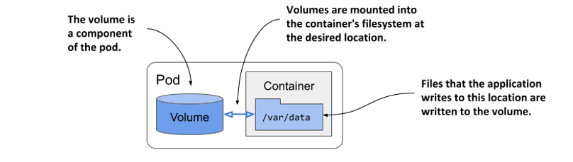

Vòng đời của một volume gắn liền với vòng đời của toàn bộ pod và hoàn toàn độc lập với vòng đời của container được gắn kết với nó. Nhờ đặc điểm này, volume cũng được sử dụng để duy trì dữ liệu bền vững qua các lần khởi động lại container.

#### Lưu trữ tệp tin bền vững qua các lần tái khởi động container

Tất cả các volume trong một pod đều được khởi tạo khi pod được thiết lập — trước khi bất kỳ container nào của nó được khởi chạy. Chúng chỉ bị tháo dỡ khi toàn bộ pod ngừng hoạt động.

Mỗi khi một container được khởi chạy hoặc khởi động lại, các volume được cấu hình cho container đó sẽ được gắn (mount) trực tiếp vào hệ thống tệp của container. Ứng dụng chạy trong container có thể đọc dữ liệu từ volume và ghi dữ liệu vào đó nếu volume và điểm gắn kết (mount point) được cấu hình cho phép ghi.

Lý do phổ biến nhất để bổ sung một volume vào pod là nhằm bảo toàn dữ liệu qua các lần khởi động lại container. Nếu không có volume nào được mount vào container, toàn bộ hệ thống tệp của container đó chỉ mang tính chất tạm thời (ephemeral). Vì mỗi lần khởi động lại thực chất là thay thế bằng một container mới, hệ thống tệp của nó cũng được dựng lại hoàn toàn từ ảnh container ban đầu. Hệ quả là, toàn bộ các tệp tin được ứng dụng ghi ra trước đó đều biến mất.

Ngược lại, nếu ứng dụng thực hiện ghi dữ liệu vào một volume được mount bên trong container như hình dưới đây, tiến trình ứng dụng trong container mới vẫn có thể truy cập vào chính phần dữ liệu đó sau khi container được khởi động lại.

##### Hình 7.5 Volume đảm bảo một phần hệ thống tệp của container được bảo toàn qua các lần tái khởi động

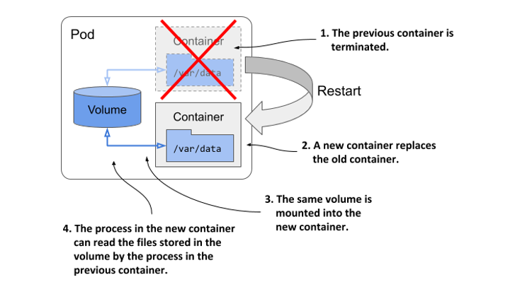

Việc quyết định tệp tin nào cần được giữ lại khi khởi động lại hoàn toàn phụ thuộc vào người phát triển ứng dụng. Thông thường, bạn sẽ muốn bảo toàn các dữ liệu thể hiện trạng thái (state) của ứng dụng, nhưng lại không muốn giữ lại các tệp bộ nhớ đệm cục bộ (local cache), vì điều này giúp container có thể khởi động lại trong trạng thái "sạch sẽ" nhất. Việc bắt đầu lại từ đầu mỗi lần khởi động lại có thể giúp ứng dụng tự phục hồi khi bộ nhớ đệm cục bộ bị hỏng gây crash ứng dụng. Nếu cứ cố chấp khởi động lại container và tái sử dụng chính các tệp tin bị hỏng đó, ứng dụng có thể rơi vào một vòng lặp crash vô hạn (endless crash loop).

##### Gợi ý

Trước khi mount một volume vào container để bảo toàn dữ liệu qua các lần tái khởi động, hãy cân nhắc kỹ xem điều này sẽ ảnh hưởng như thế nào đến khả năng tự phục hồi (self-healing) của container đó.

#### Mount nhiều volume trong một container

Một pod có thể sở hữu nhiều volume và mỗi container có thể mount không hoặc nhiều volume này tại các thư mục khác nhau, như mô tả trong hình dưới đây.

##### Hình 7.6 Một pod có thể chứa nhiều volume và một container cũng có thể mount nhiều volume cùng lúc

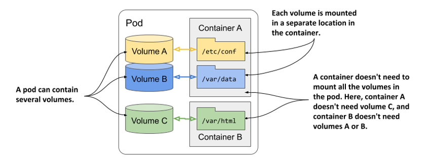

Lý do bạn muốn mount nhiều volume vào cùng một container là vì các volume này có thể phục vụ cho các mục đích khác nhau, thuộc các loại khác nhau với những đặc tính hiệu năng riêng biệt.

Trong các pod có nhiều hơn một container, một số volume có thể được mount vào container này nhưng lại không được mount vào container khác. Điều này đặc biệt hữu ích khi một volume chứa các thông tin nhạy cảm chỉ nên được truy cập bởi một số container nhất định trong hệ thống.

#### Chia sẻ tệp tin giữa nhiều container khác nhau

Một volume có thể được mount vào nhiều container cùng lúc để các ứng dụng chạy trong các container này có thể chia sẻ tệp tin với nhau. Như đã thảo luận ở chương 5, một pod có thể kết hợp một container ứng dụng chính với các container phụ trợ (sidecar container) để mở rộng hành vi của ứng dụng chính. Trong một số trường hợp, các container này bắt buộc phải đọc hoặc ghi chung một số tệp tin.

Ví dụ, bạn có thể tạo một pod kết hợp một web server chạy trong một container với một tác nhân tạo nội dung (content-producing agent) chạy trong một container khác. Container tạo nội dung sẽ sinh ra các nội dung tĩnh, sau đó web server sẽ đảm nhận việc phân phối các nội dung này đến người dùng. Mỗi container trong số chúng chỉ thực hiện một nhiệm vụ đơn lẻ và không có nhiều giá trị nếu chạy độc lập. Tuy nhiên, như mô tả ở hình tiếp theo, nếu bạn thêm một volume vào pod và mount nó vào cả hai container, bạn đã biến các container này thành một hệ thống hoàn chỉnh, cung cấp một dịch vụ có giá trị và mang lại hiệu quả vượt trội hơn hẳn so với việc chạy riêng lẻ.

##### Hình 7.7 Một volume có thể được gắn (mount) vào nhiều container cùng lúc

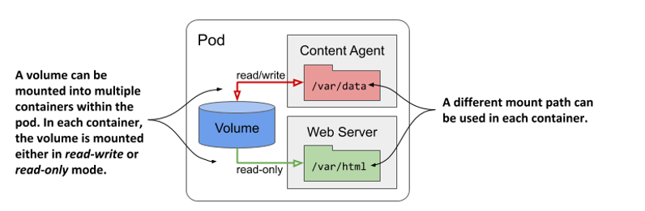

Cùng một volume có thể được mount tại các thư mục khác nhau trong mỗi container, tùy thuộc vào nhu cầu riêng của chính container đó. Nếu tác nhân tạo nội dung thực hiện ghi tệp vào thư mục `/var/data`, việc mount volume tại vị trí đó là hoàn toàn hợp lý. Trong khi đó, do web server yêu cầu nội dung phải nằm ở thư mục `/var/html`, container chạy web server sẽ mount chính volume đó tại thư mục này.

Trong hình vẽ, bạn cũng sẽ nhận thấy cấu hình mount volume của từng container có thể được thiết lập là đọc/ghi (read/write) hoặc chỉ đọc (read-only). Vì tác nhân tạo nội dung cần ghi dữ liệu vào volume trong khi web server chỉ cần đọc từ đó, hai điểm mount này được cấu hình khác nhau. Nhìn từ góc độ bảo mật, việc ngăn chặn web server ghi dữ liệu vào volume là một giải pháp cực kỳ khuyến khích, bởi vì nếu phần mềm web server tồn tại lỗ hổng cho phép kẻ tấn công ghi các tệp tin tùy ý vào hệ thống tệp và thực thi chúng, cấu hình chỉ đọc này sẽ giúp ngăn chặn nguy cơ hệ thống bị xâm nhập hoàn toàn.

Những ví dụ khác về việc sử dụng một volume duy nhất cho hai container bao gồm trường hợp một sidecar container chạy công cụ xử lý hoặc xoay vòng log của web server, hoặc khi một init container tạo các tệp cấu hình cho container ứng dụng chính.

#### Bảo toàn dữ liệu qua các vòng đời của pod

Tuy một volume luôn gắn liền với vòng đời của pod và chỉ tồn tại chừng nào pod đó còn hoạt động, nhưng tùy thuộc vào loại volume, các tệp tin lưu trong đó vẫn có thể được bảo toàn nguyên vẹn sau khi cả pod lẫn volume biến mất, để rồi sau đó lại được gắn vào một volume mới.

Như minh họa trong hình dưới đây, một volume của pod có thể được ánh xạ tới bộ lưu trữ bền vững bên ngoài pod. Trong trường hợp này, thư mục đại diện cho volume không còn là thư mục cục bộ thông thường — vốn chỉ lưu trữ dữ liệu tạm thời theo vòng đời của pod — mà là một điểm gắn kết dẫn tới một volume lưu trữ ngoài (thường là bộ lưu trữ gắn mạng - NAS) đã tồn tại sẵn và có vòng đời độc lập hoàn toàn với pod. Nhờ vậy, dữ liệu lưu trong volume sẽ được bảo toàn bền vững và ứng dụng vẫn có thể truy cập được ngay cả khi pod cũ bị thay thế bằng một pod mới chạy trên một worker node hoàn toàn khác.

##### Hình 7.8 Các volume của Pod cũng có thể ánh xạ tới các volume lưu trữ bền vững qua các lần khởi động lại pod

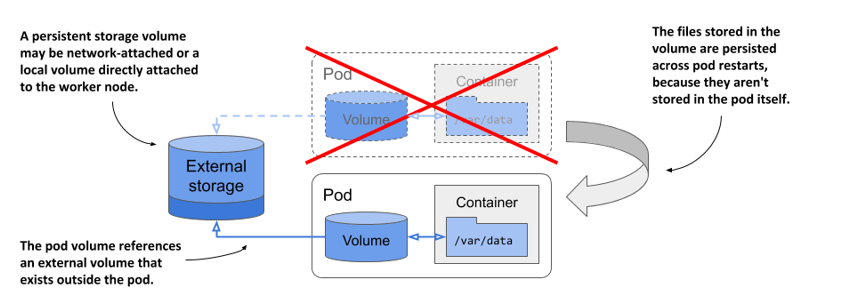

Nếu pod bị xóa và một pod mới được tạo ra để thay thế, chính volume lưu trữ gắn mạng này sẽ được kết nối với instance pod mới, cho phép pod mới tiếp tục truy cập vào phần dữ liệu mà pod trước đó đã lưu lại.

#### Chia sẻ dữ liệu giữa các pod

Tùy thuộc vào công nghệ của bộ lưu trữ ngoài, một volume có thể được kết nối đồng thời với nhiều pod, cho phép các pod này chia sẻ dữ liệu với nhau. Hình dưới đây minh họa kịch bản ba pod khác nhau cùng định nghĩa một volume ánh xạ tới chung một volume lưu trữ bền vững ở bên ngoài.

##### Hình 7.9 Sử dụng các volume để chia sẻ dữ liệu giữa các pod

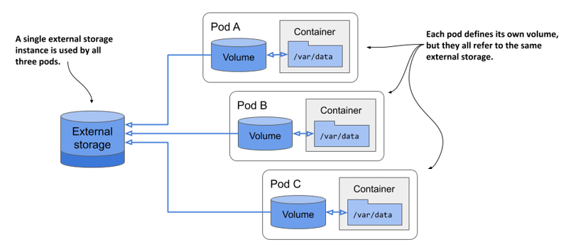

Ở trường hợp đơn giản nhất, volume lưu trữ bền vững này có thể chỉ là một thư mục cục bộ thông thường trên hệ thống tệp của worker node, và cả ba pod đều có các volume ánh xạ về thư mục đó. Chỉ cần cả ba pod cùng chạy trên một node, chúng đã có thể chia sẻ tệp tin với nhau thông qua thư mục chung này.

Nếu bộ lưu trữ bền vững là một volume lưu trữ gắn mạng, các pod vẫn có thể sử dụng chung ngay cả khi chúng được triển khai trên các node khác nhau. Tuy nhiên, điều này còn tùy thuộc vào việc công nghệ lưu trữ bên dưới có hỗ trợ kết nối đồng thời một volume mạng tới nhiều máy tính hay không.

Trong khi các công nghệ như Network File System (NFS) cho phép bạn gắn volume ở chế độ đọc/ghi (read/write) trên nhiều máy tính cùng lúc, thì các công nghệ phổ biến khác trong môi trường đám mây — chẳng hạn như Google Compute Engine Persistent Disk — lại chỉ cho phép sử dụng volume ở chế độ đọc/ghi trên một node duy nhất trong cụm, hoặc ở chế độ chỉ đọc (read-only) trên nhiều node.

#### Giới thiệu các loại volume hỗ trợ

Khi thêm một volume vào pod, bạn phải chỉ rõ loại volume đó. Kubernetes hỗ trợ rất nhiều loại volume khác nhau. Một số loại mang tính tổng quát, trong khi số khác lại gắn liền với các công nghệ lưu trữ cụ thể bên dưới. Dưới đây là danh sách (chưa đầy đủ) các loại volume được hỗ trợ:

- `emptyDir`—Một thư mục đơn giản cho phép pod lưu trữ dữ liệu trong suốt vòng đời của nó. Thư mục này được tạo ra ngay trước khi pod khởi động và ban đầu sẽ trống rỗng — đúng như tên gọi của nó. Volume `gitRepo` (hiện đã bị khai tử) cũng hoạt động tương tự, nhưng được khởi tạo bằng cách clone một kho lưu trữ Git. Thay vì dùng `gitRepo`, bạn nên sử dụng volume `emptyDir` và khởi tạo nó bằng một init container.
- `hostPath`—Được dùng để gắn (mount) các tệp tin từ hệ thống tệp của chính worker node vào trong pod.
- `nfs`—Một thư mục chia sẻ NFS được gắn vào trong pod.
- `gcePersistentDisk` (Google Compute Engine Persistent Disk), `awsElasticBlockStore` (Amazon Web Services Elastic Block Store), `azureFile` (Microsoft Azure File Service), `azureDisk` (Microsoft Azure Data Disk)—Được dùng để gắn các bộ lưu trữ đặc thù của từng nhà cung cấp dịch vụ đám mây.
- `cephfs`, `cinder`, `fc,` `flexVolume`, `flocker`, `glusterfs`, `iscsi`, `portworxVolume,` `quobyte`, `rbd`, `scaleIO,` `storageos`, `photonPersistentDisk,` `vsphereVolume`—Được dùng để gắn các loại lưu trữ mạng khác.
- `configMap`, `secret`, `downwardAPI,` và `projected`—Các loại volume đặc biệt được dùng để hiển thị thông tin về pod và các đối tượng Kubernetes khác dưới dạng tệp tin. Chúng thường được dùng để cấu hình ứng dụng chạy trong pod. Bạn sẽ được tìm hiểu kỹ hơn về chúng ở chương 9.
- `persistentVolumeClaim`—Một phương thức linh hoạt (portable) để tích hợp bộ lưu trữ ngoài vào pod. Thay vì trỏ trực tiếp đến một volume lưu trữ ngoài, loại volume này sẽ trỏ đến một đối tượng `PersistentVolumeClaim`, đối tượng này lại trỏ đến một `PersistentVolume`, và cuối cùng mới tham chiếu đến bộ lưu trữ thực tế. Loại volume này cần một phần giải thích riêng biệt mà bạn sẽ tìm thấy ở chương tiếp theo.
- `csi`—Một cơ chế cắm (pluggable) để thêm bộ lưu trữ thông qua Giao diện Lưu trữ Container (Container Storage Interface - CSI). Loại volume này cho phép bất kỳ ai cũng có thể tự phát triển driver lưu trữ của riêng mình và tham chiếu nó trong định nghĩa volume `csi`. Trong quá trình thiết lập pod, driver CSI sẽ được gọi để gắn kết volume vào pod.

Mỗi loại volume này phục vụ cho những mục đích khác nhau. Các phần tiếp theo sẽ đề cập đến những loại volume tiêu biểu nhất để giúp bạn có được cái nhìn tổng quan về hệ thống volume.

## 7.2 Sử dụng volume emptyDir

Loại volume đơn giản nhất là `emptyDir`. Đúng như tên gọi, một volume thuộc loại này khi bắt đầu chỉ là một thư mục rỗng. Khi gắn volume này vào một container, các tệp tin được ứng dụng ghi vào đường dẫn mount sẽ được bảo toàn trong suốt thời gian tồn tại của pod.

Loại volume này thường được dùng trong các pod chỉ có một container khi cần bảo tồn dữ liệu qua các lần khởi động lại container. Nó cũng hữu ích khi hệ thống tệp của container được thiết lập ở chế độ chỉ đọc (read-only), nhưng bạn vẫn muốn một phần thư mục có quyền ghi (writable). Đối với các pod có từ hai container trở lên, volume `emptyDir` được dùng để chia sẻ dữ liệu giữa các container đó.

### 7.2.1 Bảo toàn tệp tin qua các lần khởi động lại container

Hãy thử thêm một volume `emptyDir` vào pod `quiz` ở phần 7.1.1 để đảm bảo dữ liệu không bị mất khi container MongoDB khởi động lại.

#### Thêm volume emptyDir vào pod

Chúng ta sẽ sửa đổi định nghĩa của pod `quiz` để tiến trình MongoDB ghi tệp dữ liệu trực tiếp vào volume, thay vì ghi vào hệ thống tệp dễ mất mát (perishable) của container. Hình dưới đây sẽ minh họa cấu trúc trực quan của pod này.

##### Hình 7.10 Pod quiz với volume emptyDir để lưu trữ các tệp dữ liệu của MongoDB

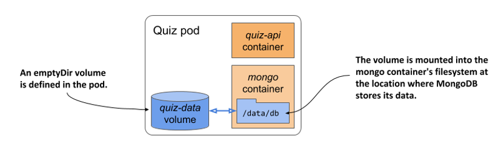

Để thực hiện việc này, chúng ta cần thực hiện hai thay đổi trong tệp cấu hình (manifest) của pod:

1. Khai báo thêm một volume `emptyDir` trong pod.
2. Gắn (mount) volume đó vào container.

Đoạn mã dưới đây hiển thị tệp manifest mới của pod với hai thay đổi này được in đậm. Bạn có thể tìm thấy tệp manifest này trong file `pod.quiz.emptydir.yaml`.

##### Listing 7.2 Pod quiz với volume emptyDir cho container mongo

```yaml
apiVersion: v1
kind: Pod
metadata:
  name: quiz
spec:
  volumes:    #A
  - name: quiz-data    #A
    emptyDir: {}    #A
  containers:
  - name: quiz-api
    image: luksa/quiz-api:0.1
    ports:
    - name: http
      containerPort: 8080
  - name: mongo
    image: mongo
    volumeMounts:    #B
    - name: quiz-data    #B
      mountPath: /data/db    #B
```

Đoạn mã trên cho thấy một volume `emptyDir` có tên `quiz-data` được định nghĩa trong mảng `spec.volumes` của tệp manifest, và được gắn vào hệ thống tệp của container `mongo` tại thư mục `/data/db`. Hai phần tiếp theo sẽ giải thích chi tiết hơn về cách định nghĩa volume và cấu hình gắn kết volume (volume mount).

#### Cấu hình volume emptyDir

Nhìn chung, mỗi định nghĩa volume phải bao gồm tên (`name`) và loại volume, được xác định bởi tên của trường lồng nhau (ví dụ: `emptyDir`, `gcePersistentDisk`, `nfs`, v.v.). Trường này thường chứa một vài trường con để bạn cấu hình chi tiết cho volume. Các trường con cần thiết lập sẽ tùy thuộc vào loại volume được chọn.

Ví dụ, loại volume `emptyDir` hỗ trợ hai trường để cấu hình. Ý nghĩa của chúng được giải thích trong bảng dưới đây.

##### Bảng 7.1 Các tùy chọn cấu hình cho volume emptyDir

| Trường | Mô tả |
| :--- | :--- |
| `medium` | Loại phương tiện lưu trữ sử dụng cho thư mục. Nếu để trống, hệ thống sẽ dùng phương tiện mặc định của node host (thư mục được tạo trên một trong các đĩa cứng của node). Lựa chọn duy nhất còn lại là `Memory`, giúp volume sử dụng hệ thống tệp bộ nhớ ảo `tmpfs` — nơi các tệp tin được lưu trực tiếp trên RAM thay vì đĩa cứng. |
| `sizeLimit` | Tổng dung lượng lưu trữ cục bộ tối đa được phép dùng cho thư mục, dù là trên đĩa hay trên bộ nhớ trong. Ví dụ: để giới hạn dung lượng tối đa là 10 mebibyte, bạn thiết lập trường này là `10Mi`. |

##### Ghi chú

Trường `emptyDir` trong định nghĩa volume ở trên không thiết lập thuộc tính nào trong hai thuộc tính này. Cặp dấu ngoặc nhọn `{}` được thêm vào chỉ để thể hiện rõ ràng điều đó, nhưng bạn hoàn toàn có thể lược bỏ chúng.

#### Gắn volume vào container

Khai báo volume trong pod mới chỉ là một nửa công đoạn để container có thể sử dụng được nó. Bạn còn phải gắn (mount) volume này vào bên trong container. Việc này được thực hiện bằng cách tham chiếu đến tên của volume trong mảng `volumeMounts` ở phần định nghĩa container.

Bên cạnh `name`, định nghĩa mount volume bắt buộc phải có `mountPath` — tức là đường dẫn bên trong container nơi volume sẽ được gắn vào. Trong Listing 7.2, volume được mount tại `/data/db` vì đây là nơi MongoDB lưu trữ các tệp dữ liệu của nó. Bằng cách này, dữ liệu sẽ được ghi thẳng vào volume thay vì hệ thống tệp tạm thời (ephemeral) của container.

Danh sách đầy đủ các trường được hỗ trợ trong định nghĩa mount volume được trình bày ở bảng dưới đây.

##### Bảng 7.2 Các tùy chọn cấu hình cho việc mount volume

| Trường | Mô tả |
| :--- | :--- |
| `name` | Tên của volume cần gắn. Tên này phải trùng khớp với một trong các volume đã định nghĩa trong pod. |
| `mountPath` | Đường dẫn bên trong container nơi gắn volume. |
| `readOnly` | Có gắn volume ở chế độ chỉ đọc hay không. Mặc định là `false`. |
| `mountPropagation` | Xác định điều gì sẽ xảy ra nếu có các volume hệ thống tệp bổ sung được gắn bên trong volume này.<br><br>Mặc định là `None`, nghĩa là container sẽ không nhận được bất kỳ mount nào được gắn từ phía máy host, và ngược lại máy host cũng không nhận được các mount từ phía container.<br><br>`HostToContainer` nghĩa là container sẽ nhận được tất cả các mount được máy host gắn vào volume này, nhưng không có chiều ngược lại.<br><br>`Bidirectional` nghĩa là container sẽ nhận được các mount từ máy host và máy host cũng nhận được các mount được thêm từ container. |
| `subPath` | Mặc định là `""`, nghĩa là toàn bộ volume sẽ được gắn vào container. Khi được đặt thành một chuỗi ký tự khác rỗng, chỉ có thư mục con được chỉ định (`subPath`) trong volume mới được gắn vào container. |
| `subPathExpr` | Tương tự như `subPath` nhưng cho phép tham chiếu đến các biến môi trường bằng cú pháp `$(TÊN_BIẾN_MÔI_TRƯỜNG)`. Chỉ áp dụng cho các biến môi trường được định nghĩa rõ ràng trong phần khai báo container. Các biến ngầm định như `HOSTNAME` sẽ không được phân giải. Bạn sẽ học cách chỉ định các biến môi trường ở chương 9. |

Trong hầu hết các trường hợp, bạn chỉ cần chỉ định `name`, `mountPath` và tùy chọn `readOnly`. Tùy chọn `mountPropagation` chỉ được dùng trong các tình huống nâng cao khi có các mount bổ sung được thêm vào cây thư mục của volume sau đó, từ phía host hoặc từ phía container. Các tùy chọn `subPath` và `subPathExpr` sẽ rất hữu ích khi bạn muốn dùng chung một volume duy nhất nhưng lại chia thành nhiều thư mục khác nhau để gắn vào các container khác nhau, thay vì phải khai báo nhiều volume.

Tùy chọn `subPathExpr` cũng được sử dụng khi một volume được chia sẻ giữa nhiều replica của pod. Trong chương 9, bạn sẽ tìm hiểu cách dùng Downward API để truyền tên của pod vào một biến môi trường. Bằng cách tham chiếu biến này trong `subPathExpr`, bạn có thể cấu hình để mỗi replica tự động sử dụng một thư mục con riêng biệt dựa theo tên của nó.

#### Tìm hiểu về vòng đời của volume emptyDir

Nếu thay thế pod `quiz` cũ bằng pod trong Listing 7.2 rồi thêm câu hỏi vào cơ sở dữ liệu, bạn sẽ thấy rằng dữ liệu vẫn được bảo toàn nguyên vẹn, dù cho container có bị khởi động lại bao nhiêu lần đi chăng nữa. Điều này là nhờ vòng đời của volume được gắn liền với vòng đời của pod.

Để kiểm chứng điều này, hãy thêm câu hỏi vào cơ sở dữ liệu MongoDB tương tự như cách bạn đã làm ở phần 7.1.1. Tôi khuyên bạn nên sử dụng script shell trong tệp `Chapter07/insert-question.sh` để đỡ phải gõ lại toàn bộ nội dung JSON của câu hỏi. Sau khi thêm câu hỏi thành công, hãy đếm số lượng bản ghi trong cơ sở dữ liệu bằng lệnh sau:

```bash
$ kubectl exec -it quiz -c mongo -- mongo kiada --quiet --eval "db.questions.count()"
1    #A
```

Bây giờ, hãy tắt server MongoDB:

```bash
$ kubectl exec -it quiz -c mongo -- mongo admin --eval "db.shutdownServer()"
```

Kiểm tra xem container `mongo` đã được khởi động lại chưa:

```bash
$ kubectl get po quiz
NAME   READY   STATUS    RESTARTS   AGE
quiz   2/2     Running   1          10m    #A
```

Sau khi container khởi động lại, hãy kiểm tra lại số lượng câu hỏi trong cơ sở dữ liệu:

```bash
$ kubectl exec -it quiz -c mongo -- mongo kiada --quiet --eval "db.questions.count()"
1    #A
```

Việc khởi động lại container giờ đây không còn làm mất dữ liệu nữa, bởi vì các tệp tin không còn nằm trên hệ thống tệp của container nữa mà đã được lưu trữ an toàn trong volume. Nhưng chính xác thì chúng được lưu ở đâu? Hãy cùng tìm hiểu.

#### Tìm hiểu nơi lưu trữ tệp tin của volume emptyDir

Như minh họa trong hình dưới đây, các tệp tin trong volume `emptyDir` thực chất được lưu trữ trong một thư mục trên hệ thống tệp của node host. Đó đơn thuần chỉ là một thư mục tệp thông thường, được gắn vào container tại vị trí mong muốn.

##### Hình 7.11 emptyDir thực chất là một thư mục tệp thông thường trên hệ thống tệp của node được gắn vào bên trong container

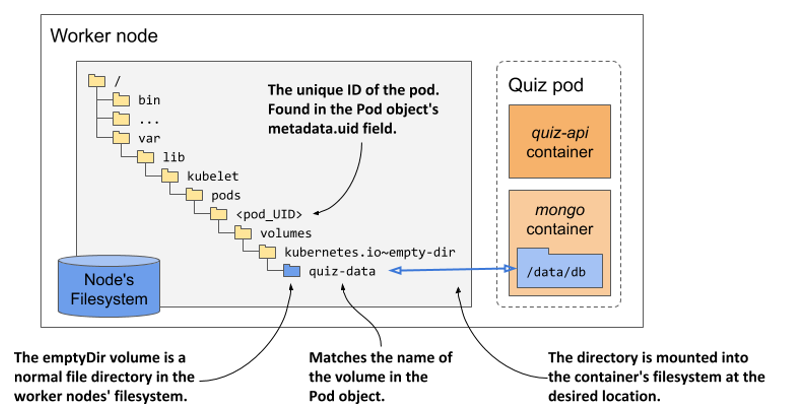

Thư mục này thường nằm ở đường dẫn sau trên hệ thống tệp của node:

`/var/lib/kubelet/pods/<pod_UID>/volumes/kubernetes.io~empty-dir/<volume_name>`

Trong đó, `pod_UID` là ID duy nhất của pod mà bạn có thể tìm thấy trong phần `metadata` của đối tượng Pod. Nếu muốn tự mình kiểm tra thư mục này, hãy chạy lệnh sau để lấy `pod_UID`:

```bash
$ kubectl get po quiz -o json | jq .metadata.uid
"4f49f452-2a9a-4f70-8df3-31a227d020a1"
```

Còn `volume_name` chính là tên của volume được khai báo trong manifest của pod — đối với pod `quiz`, tên của nó là `quiz-data`.

Để tìm tên của node đang chạy pod, bạn có thể dùng lệnh `kubectl get po quiz -o wide` hoặc chạy lệnh thay thế sau:

```bash
$ kubectl get po quiz -o json | jq .spec.nodeName
```

Giờ bạn đã có đầy đủ thông tin cần thiết. Hãy thử đăng nhập vào node và kiểm tra nội dung thư mục này. Bạn sẽ thấy các tệp tin ở đây hoàn toàn trùng khớp với các tệp tin trong thư mục `/data/db` của container `mongo`.

Nếu bạn xóa pod, thư mục này cũng sẽ bị xóa sạch. Điều đó có nghĩa là dữ liệu lại bị mất một lần nữa. Ở phần 7.3, bạn sẽ được tìm hiểu cách lưu trữ dữ liệu bền vững đúng nghĩa bằng các volume lưu trữ ngoài.

#### Khởi tạo volume emptyDir trên bộ nhớ RAM

Volume `emptyDir` trong ví dụ trước tạo ra một thư mục vật lý trên ổ cứng của worker node đang chạy pod, vì vậy hiệu năng của nó phụ thuộc vào loại ổ cứng được lắp trên node đó. Nếu muốn các thao tác đọc/ghi (I/O) trên volume đạt tốc độ tối đa, bạn có thể chỉ định Kubernetes tạo volume bằng hệ thống tệp *tmpfs* để lưu trữ các tệp trực tiếp trên bộ nhớ RAM. Để làm việc này, hãy thiết lập trường `medium` của `emptyDir` thành `Memory` như trong đoạn mã dưới đây:

```yaml
volumes:
  - name: content
    emptyDir:
      medium: Memory    #A
```

Khởi tạo volume `emptyDir` trên bộ nhớ RAM cũng là một giải pháp bảo mật tuyệt vời khi lưu trữ dữ liệu nhạy cảm. Do dữ liệu không được ghi xuống đĩa cứng, nguy cơ rò rỉ thông tin hoặc dữ liệu bị lưu lại lâu hơn ý muốn sẽ được giảm thiểu tối đa. Như bạn sẽ thấy trong chương 9, Kubernetes cũng áp dụng chính cơ chế lưu trữ trên RAM này khi truyền dữ liệu từ đối tượng thuộc loại *Secret* vào bên trong container.

#### Giới hạn dung lượng cho volume emptyDir

Bạn có thể giới hạn dung lượng của volume `emptyDir` bằng cách thiết lập trường `sizeLimit`. Việc cấu hình trường này cực kỳ quan trọng đối với các volume lưu trữ trên bộ nhớ RAM, đặc biệt là khi tổng dung lượng bộ nhớ sử dụng của pod bị ràng buộc bởi các cơ chế giới hạn tài nguyên (*resource limits*). Chủ đề này sẽ được phân tích chi tiết trong chương 20.

Tiếp theo, hãy cùng tìm hiểu cách sử dụng volume `emptyDir` để chia sẻ tệp tin giữa các container trong cùng một pod.

### 7.2.2 Khởi tạo dữ liệu cho volume emptyDir bằng init container

Mỗi khi khởi tạo pod `quiz` ở phần trước, cơ sở dữ liệu MongoDB đều trống trơn và bạn phải tự tay thêm các câu hỏi. Hãy cải tiến pod này để nó tự động nạp dữ liệu vào cơ sở dữ liệu ngay khi vừa khởi động.

Có rất nhiều cách để thực hiện việc này. Bạn có thể chạy container MongoDB ở máy cục bộ, nạp dữ liệu vào, rồi đóng gói (commit) trạng thái của container thành một image mới và dùng nó cho pod. Tuy nhiên, nếu làm vậy, bạn sẽ phải lặp lại toàn bộ quy trình này mỗi khi có một phiên bản mới của image MongoDB được phát hành.

May mắn thay, image MongoDB có sẵn một cơ chế để nạp dữ liệu vào cơ sở dữ liệu trong lần đầu khởi chạy. Khi khởi động, nếu thấy cơ sở dữ liệu trống, nó sẽ tự động thực thi bất kỳ tệp tin `.js` hay `.sh` nào tìm thấy trong thư mục `/docker-entrypoint-initdb.d`. Công việc của chúng ta chỉ là đưa các tệp tin cần thiết vào thư mục đó. Bạn cũng có thể build một image MongoDB mới chứa sẵn tệp tin này, nhưng cách này vẫn sẽ gặp phải hạn chế đã nêu ở trên. Một giải pháp thay thế tốt hơn là dùng một volume để đưa tệp tin đó vào đúng vị trí trên hệ thống tệp của container MongoDB. Nhưng làm cách nào để đưa tệp tin vào volume ngay từ đầu?

Kubernetes từng cung cấp một loại volume đặc biệt được khởi tạo bằng cách clone một kho lưu trữ Git — đó là volume `gitRepo`. Thế nhưng loại volume này hiện đã bị khai tử (deprecated). Giải pháp thay thế được khuyến nghị là sử dụng một volume `emptyDir` và khởi tạo nó bằng một init container chạy lệnh `git clone`. Tuy nhiên, cách tiếp cận này yêu cầu pod phải kết nối mạng để tải dữ liệu về.

Một phương pháp khác mang tính tổng quát hơn để nạp dữ liệu vào volume `emptyDir` là đóng gói sẵn dữ liệu vào một container image, sau đó copy chúng từ container vào volume khi pod khởi chạy. Cách này giúp loại bỏ hoàn toàn sự phụ thuộc vào các hệ thống bên ngoài, giúp pod hoạt động ổn định bất kể trạng thái kết nối mạng ra sao.

Để dễ hình dung về mô hình hoạt động này, mời bạn tham khảo hình dưới đây.

##### Hình 7.12 Sử dụng init container để khởi tạo dữ liệu cho volume emptyDir

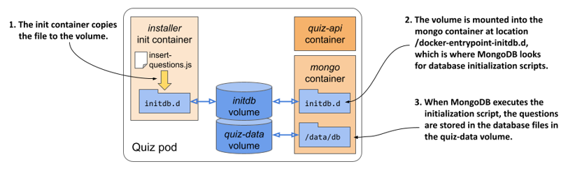

Khi pod khởi chạy, đầu tiên các volume sẽ được thiết lập, kế đến là sự xuất hiện của init container. Volume `initdb` sẽ được gắn vào init container này. Container image chứa sẵn tệp tin `insert-questions.js`, và khi khởi chạy, container sẽ tiến hành copy tệp này vào volume. Khi quá trình sao chép hoàn tất, init container sẽ kết thúc nhiệm vụ, nhường chỗ cho các container chính của pod khởi động. Volume `initdb` lúc này được gắn vào container `mongo` ngay tại vị trí mà MongoDB tìm kiếm các script khởi tạo cơ sở dữ liệu. Trong lần đầu khởi chạy, MongoDB sẽ thực thi script `insert-questions.js` này để tự động nạp các câu hỏi vào cơ sở dữ liệu. Tương tự như phiên bản pod trước đó, các tệp dữ liệu của cơ sở dữ liệu vẫn được lưu trữ tại volume `quiz-data` để đảm bảo dữ liệu không bị mất đi khi container khởi động lại.

Bạn có thể tìm thấy tệp `insert-questions.js` và tệp `Dockerfile` cần thiết để build image cho init container trong kho lưu trữ mã nguồn của cuốn sách. Đoạn mã dưới đây minh họa một phần nội dung của tệp `insert-questions.js`.

##### Listing 7.3 Nội dung của file insert-questions.js

```javascript
db.getSiblingDB("kiada").questions.insertMany(    #A
[{    #B
    "id": 1,    #B
    "text": "What is kubectl?",    #B
    ...    #B
```

Dockerfile cho container image được hiển thị ở đoạn mã tiếp theo.

##### Listing 7.4 Dockerfile cho container image quiz-initdb-script-installer:0.1

```dockerfile
FROM busybox
COPY insert-questions.js /    #A
CMD cp /insert-questions.js /initdb.d/ \    #B
    && echo "Successfully copied insert-questions.js to /initdb.d" \    #B
    || echo "Error copying insert-questions.js to /initdb.d"    #B
```

Bạn có thể sử dụng hai tệp tin này để tự build image hoặc sử dụng trực tiếp image tôi đã build sẵn tại địa chỉ `docker.io/luksa/quiz-initdb-script-installer:0.1`.

Sau khi đã có container image, hãy chỉnh sửa tệp manifest của pod ở phần trước sao cho khớp với nội dung trong đoạn mã dưới đây (tệp kết quả là `pod.quiz.emptydir.init.yaml`). Những dòng cần bổ sung được in đậm.

##### Listing 7.5 Sử dụng init container để khởi tạo volume emptyDir

```yaml
apiVersion: v1
kind: Pod
metadata:
  name: quiz
spec:
  volumes:
  - name: initdb    #A
    emptyDir: {}    #A
  - name: quiz-data
    emptyDir: {}
  initContainers:
  - name: installer    #B
    image: luksa/quiz-initdb-script-installer:0.1    #B
    volumeMounts:    #B
    - name: initdb    #B
      mountPath: /initdb.d    #B
  containers:
  - name: quiz-api
    image: luksa/quiz-api:0.1
    ports:
    - name: http
      containerPort: 8080
  - name: mongo
    image: mongo
    volumeMounts:
    - name: quiz-data
      mountPath: /data/db
    - name: initdb    #C
      mountPath: /docker-entrypoint-initdb.d/    #C
      readOnly: true    #C
```

Đoạn mã trên cho thấy volume `initdb` được gắn vào init container. Sau khi container này hoàn tất việc sao chép tệp `insert-questions.js` vào volume, nó sẽ tự tắt để nhường quyền khởi động cho hai container `mongo` và `quiz-api`. Do volume `initdb` được gắn vào thư mục `/docker-entrypoint-initdb.d` bên trong container `mongo`, MongoDB sẽ thực thi tệp `.js` này để tự động nạp dữ liệu câu hỏi vào cơ sở dữ liệu.

Bạn có thể xóa pod `quiz` cũ và triển khai phiên bản mới này. Bạn sẽ thấy rằng cơ sở dữ liệu luôn được nạp sẵn dữ liệu mỗi khi pod được triển khai.

### 7.2.3 Chia sẻ tệp tin giữa các container

Như bạn đã thấy ở phần trước, một volume `emptyDir` có thể được khởi tạo bằng một init container rồi sau đó được sử dụng bởi một trong các container chính của pod. Thú vị hơn, một volume còn có thể được sử dụng đồng thời bởi nhiều container chính khác nhau. Vì container `quiz-api` và `mongo` trong pod `quiz` không có nhu cầu chia sẻ tệp tin, chúng ta sẽ cùng phân tích một ví dụ khác để hiểu rõ cách các container chia sẻ volume.

Bạn còn nhớ pod `quote` (trích dẫn) ở chương trước không? Đó là pod sử dụng một hook post-start để chạy lệnh `fortune`. Lệnh này ghi một câu trích dẫn từ cuốn sách này vào một tệp tin, sau đó tệp này được Nginx web server phân phối. Hiện tại, pod `quote` chỉ hiển thị duy nhất một câu trích dẫn trong suốt vòng đời của nó, điều này có vẻ hơi đơn điệu. Hãy cùng xây dựng một phiên bản mới, nơi câu trích dẫn sẽ được cập nhật mới sau mỗi 60 giây.

Chúng ta vẫn giữ Nginx làm nhiệm vụ web server, nhưng sẽ thay thế hook post-start bằng một container chuyên biệt chạy lệnh `fortune` định kỳ để cập nhật tệp tin lưu trữ trích dẫn. Hãy đặt tên cho container này là `quote-writer`. Web server Nginx vẫn sẽ nằm trong container `nginx`.

Như mô tả trong hình dưới đây, pod giờ đây sẽ có hai container thay vì một. Để container `nginx` có thể đọc được tệp tin do container `quote-writer` tạo ra, chúng ta cần định nghĩa một volume dùng chung trong pod và gắn nó vào cả hai container.

##### Hình 7.13 Phiên bản mới của Quote service sử dụng hai container và một volume dùng chung

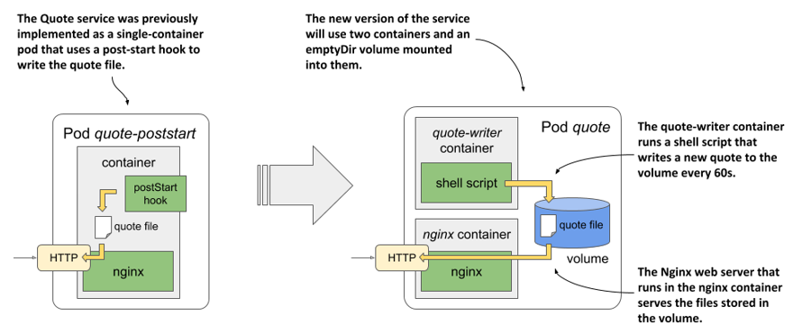

#### Tạo pod gồm hai container và sử dụng chung volume

Image cho container `quote-writer` đã có sẵn tại địa chỉ `docker.io/luksa/quote-writer:0.1`, nhưng bạn cũng có thể tự build từ các tệp trong thư mục `Chapter07/quote-writer-0.1`. Container `nginx` sẽ tiếp tục sử dụng image `nginx:alpine` hiện có.

Tệp manifest của pod `quote` mới được trình bày trong đoạn mã dưới đây. Bạn có thể tìm thấy nó trong file `pod.quote.yaml`.

##### Listing 7.6 Một pod có hai container chia sẻ chung một volume

```yaml
apiVersion: v1
kind: Pod
metadata:
  name: quote
spec:
  volumes:    #A
  - name: shared    #A
    emptyDir: {}    #A
  containers:
  - name: quote-writer    #B
    image: luksa/quote-writer:0.1    #B
    volumeMounts:    #C
    - name: shared    #C
      mountPath: /var/local/output    #C
  - name: nginx    #D
    image: nginx:alpine    #D
    volumeMounts:    #E
    - name: shared    #E
      mountPath: /usr/share/nginx/html    #E
      readOnly: true    #E
    ports:
    - name: http
      containerPort: 80
```

Pod này bao gồm hai container và một volume duy nhất. Volume này được gắn vào cả hai container nhưng ở các đường dẫn khác nhau. Lý do là vì container `quote-writer` ghi tệp tin `quote` vào thư mục `/var/local/output`, trong khi container `nginx` lại phân phối các tệp tin từ thư mục `/usr/share/nginx/html`.

##### Ghi chú

Do cả hai container khởi động cùng lúc, có thể xảy ra một khoảng thời gian ngắn Nginx đã chạy nhưng câu trích dẫn chưa kịp tạo ra. Để tránh tình trạng này, một giải pháp khả thi là tạo câu trích dẫn ban đầu bằng một init container, như đã giải thích ở phần 7.2.3.

#### Khởi chạy pod

Khi bạn tạo pod từ tệp manifest, hai container sẽ khởi chạy và hoạt động liên tục cho đến khi pod bị xóa. Container `quote-writer` sẽ ghi một câu trích dẫn mới vào tệp tin sau mỗi 60 giây, còn container `nginx` sẽ phân phối tệp này ra ngoài. Sau khi tạo pod thành công, hãy sử dụng lệnh `kubectl port-forward` để thiết lập một đường truyền kết nối (tunnel) tới pod:

```bash
$ kubectl port-forward quote 1080:80
```

Hãy mở một cửa sổ terminal khác và kiểm tra xem server có trả về một câu trích dẫn mới sau mỗi 60 giây hay không bằng cách chạy lệnh sau vài lần:

```bash
$ curl localhost:1080/quote
```

Ngoài ra, bạn cũng có thể xem trực tiếp nội dung tệp tin bằng một trong hai lệnh dưới đây:

```bash
$ kubectl exec quote -c quote-writer -- cat /var/local/output/quote
$ kubectl exec quote -c nginx -- cat /usr/share/nginx/html/quote
```

Như bạn thấy, một lệnh sẽ in ra nội dung tệp tin từ bên trong container `quote-writer`, trong khi lệnh còn lại in ra nội dung từ bên trong container `nginx`. Do cả hai đường dẫn đều trỏ tới cùng một tệp `quote` nằm trên volume dùng chung, kết quả đầu ra của hai lệnh hoàn toàn giống hệt nhau.

## 7.3 Sử dụng bộ lưu trữ ngoài trong pod

Volume `emptyDir` là một thư mục riêng biệt được tạo ra dành riêng cho pod khai báo nó. Khi pod bị xóa, volume và toàn bộ dữ liệu bên trong cũng biến mất theo. Ngược lại, các loại volume khác không tạo ra thư mục mới mà tiến hành gắn (mount) một thư mục ngoài đã tồn tại sẵn vào hệ thống tệp của container. Dữ liệu trên loại volume này có thể tồn tại qua nhiều vòng đời của cùng một pod, thậm chí được chia sẻ giữa nhiều pod khác nhau. Đây chính là các loại volume mà chúng ta sẽ khám phá tiếp theo.

Để tìm hiểu cách sử dụng bộ lưu trữ ngoài trong pod, chúng ta sẽ tạo một pod chạy hệ quản trị cơ sở dữ liệu hướng tài liệu MongoDB. Nhằm đảm bảo dữ liệu trong database được lưu trữ bền vững, chúng ta sẽ thêm một volume vào pod và gắn nó vào container tại đúng thư mục nơi MongoDB ghi các tệp dữ liệu của mình.

Điểm phức tạp ở bài thực hành này là loại volume bền vững khả dụng trong cụm (cluster) của bạn sẽ phụ thuộc hoàn toàn vào môi trường vận hành cụm đó. Như đã giới thiệu ở phần đầu cuốn sách, Kubernetes có thể tái điều phối (reschedule) một pod sang một node khác bất cứ lúc nào. Để đảm bảo pod `quiz` vẫn có thể truy cập được dữ liệu của mình, nó cần phải sử dụng bộ lưu trữ gắn mạng (network-attached storage) thay vì ổ đĩa cục bộ của node worker.

Tốt nhất là bạn nên sử dụng một cụm Kubernetes thực tế như GKE cho các bài thực hành tiếp theo. Đáng tiếc là các cụm được dựng bằng Minikube hoặc kind không hỗ trợ sẵn bất kỳ loại volume lưu trữ mạng nào. Vì vậy, nếu đang dùng các công cụ này, bạn sẽ buộc phải sử dụng bộ lưu trữ cục bộ của node thông qua loại volume có tên là `hostPath` — loại volume mà chúng ta sẽ tìm hiểu chi tiết ở phần 7.4.

### 7.3.1 Sử dụng Google Compute Engine Persistent Disk làm volume

Nếu sử dụng Google Kubernetes Engine để thực hành các bài tập trong sách này, các node trong cụm của bạn sẽ chạy trên Google Compute Engine (GCE). Trên GCE, bộ lưu trữ bền vững được cung cấp thông qua GCE Persistent Disk. Kubernetes hỗ trợ gắn chúng vào pod thông qua loại volume `gcePersistentDisk`.

##### Ghi chú

Để áp dụng bài thực hành này cho các nhà cung cấp dịch vụ đám mây khác, hãy sử dụng loại volume tương ứng được hỗ trợ bởi nhà cung cấp đó. Hãy tham khảo tài liệu hướng dẫn của họ để biết cách khởi tạo volume lưu trữ và cách gắn nó vào pod.

#### Tạo một GCE Persistent Disk

Trước khi có thể sử dụng volume GCE Persistent Disk trong pod, bạn phải tiến hành khởi tạo ổ đĩa này. Nó bắt buộc phải nằm cùng phân vùng (zone) với cụm Kubernetes của bạn. Nếu không nhớ cụm của mình được tạo ở zone nào, bạn có thể kiểm tra bằng cách liệt kê danh sách các cụm Kubernetes qua lệnh `gcloud` dưới đây:

```bash
$ gcloud container clusters list
NAME    ZONE             MASTER_VERSION   MASTER_IP        ...
kiada   europe-west3-c   1.14.10-gke.42   104.155.84.137   ...
```

Như trong trường hợp của tôi, kết quả trả về cho thấy cụm đang nằm ở zone `europe-west3-c`, do đó tôi phải tạo GCE Persistent Disk tại zone này. Hãy chạy lệnh sau để tạo ổ đĩa trong đúng zone:

```bash
$ gcloud compute disks create --size=10GiB --zone=europe-west3-c quiz-data
WARNING: You have selected a disk size of under [200GB]. This may result in poor I/O performance. 
For more information, see: https://developers.google.com/compute/docs/disks#pdperformance.
Created [https://www.googleapis.com/.../zones/europe-west3-c/disks/quiz-data].
NAME       ZONE            SIZE_GB  TYPE         STATUS
quiz-data  europe-west3-c  10       pd-standard  READY
```

Lệnh này sẽ khởi tạo một ổ đĩa GCE Persistent Disk có tên là `quiz-data` với dung lượng 10GiB. Bạn hoàn toàn có thể bỏ qua cảnh báo về dung lượng đĩa, vì nó không ảnh hưởng đến các bài thực hành sắp tới. Bạn cũng có thể thấy cảnh báo đĩa chưa được định dạng, hãy cứ bỏ qua vì hệ thống sẽ tự động định dạng khi ổ đĩa được gắn vào pod.

#### Tạo pod với volume gcePersistentDisk

Sau khi đã thiết lập xong bộ lưu trữ vật lý, bạn có thể đưa nó vào khai báo volume trong pod `quiz`. Chúng ta sẽ tạo pod từ tệp YAML trong đoạn mã dưới đây (file `pod.quiz.gcepd.yaml`). Những dòng được tô đậm là điểm khác biệt duy nhất so với tệp `pod.quiz.emptydir.yaml` đã triển khai ở phần 7.2.1.

##### Listing 7.7 Sử dụng volume gcePersistentDisk trong pod quiz

```yaml
apiVersion: v1
kind: Pod
metadata:
  name: quiz
spec:
  volumes:
  - name: quiz-data
    gcePersistentDisk:    #A
      pdName: quiz-data     #B
      fsType: ext4     #C
  containers:
  - name: quiz-api
    image: luksa/quiz-api:0.1
    ports:
    - name: http
      containerPort: 8080
  - name: mongo
    image: mongo
    volumeMounts:
    - name: quiz-data
      mountPath: /data/db
```

##### Ghi chú

Nếu khởi tạo cụm bằng Minikube hoặc kind, bạn sẽ không thể sử dụng GCE Persistent Disk. Thay vào đó, hãy dùng tệp `pod.quiz.hostpath.yaml` vốn sử dụng volume `hostPath` để thay thế. Loại volume này sử dụng bộ lưu trữ cục bộ của node thay vì lưu trữ mạng, do đó bạn phải đảm bảo pod luôn được triển khai lên cùng một node. Với Minikube, điều này luôn đúng vì nó là cụm một node duy nhất. Tuy nhiên, nếu dùng kind, hãy tạo pod từ tệp `pod.quiz.hostpath.kind.yaml` để đảm bảo pod luôn được triển khai vào đúng node đó.

Cấu trúc của pod được mô tả trực quan trong hình dưới đây. Nó chứa một volume duy nhất tham chiếu đến ổ đĩa GCE Persistent Disk mà bạn đã tạo trước đó. Volume này được gắn vào container `mongo` tại thư mục `/data/db`, đảm bảo MongoDB sẽ ghi các tệp tin của nó trực tiếp lên ổ đĩa bền vững này.

##### Hình 7.14 Một ổ đĩa GCE Persistent Disk được tham chiếu trong volume của pod và được gắn vào container mongo

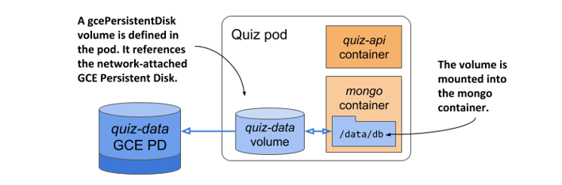

#### Xác minh tính bền vững của dữ liệu trên GCE Persistent Disk

Sử dụng script shell trong tệp `Chapter07/insert-question.sh` để thêm câu hỏi vào cơ sở dữ liệu MongoDB. Hãy xác nhận rằng dữ liệu đã được lưu thành công bằng lệnh sau:

```bash
$ kubectl exec -it quiz -c mongo -- mongo kiada --quiet --eval "db.questions.count()"
1    #A
```

Tuyệt vời, cơ sở dữ liệu đã có dữ liệu. Các tệp dữ liệu của MongoDB được lưu ở thư mục `/data/db` — vốn là nơi bạn đã gắn ổ đĩa GCE Persistent Disk. Do đó, các tệp dữ liệu này chắc chắn đã được ghi trực tiếp lên ổ đĩa bền vững này.

Bây giờ bạn có thể yên tâm xóa pod `quiz` này đi và tạo lại:

```bash
$ kubectl delete pod quiz
pod "quiz" deleted
$ kubectl apply -f pod.quiz.gcepd.yaml
pod "quiz" created
```

Vì pod mới là một bản sao giống hệt pod trước đó, nó sẽ trỏ đến đúng ổ đĩa GCE Persistent Disk cũ. Container `mongo` sẽ đọc được các tệp tin đã ghi trước đó, ngay cả khi pod mới được điều phối sang một node khác.

##### Mẹo

Bạn có thể kiểm tra xem pod được điều phối tới node nào bằng cách chạy lệnh `kubectl get po -o wide`.

##### Ghi chú

Nếu sử dụng cụm được dựng bằng kind, pod sẽ luôn được điều phối về cùng một node.

Sau khi pod khởi động xong, hãy kiểm tra lại số lượng câu hỏi trong cơ sở dữ liệu:

```bash
$ kubectl exec -it quiz -c mongo -- mongo kiada --quiet --eval "db.questions.count()"
1    #A
```

Đúng như mong đợi, dữ liệu vẫn còn đó dù bạn đã xóa và tạo lại pod. Điều này chứng minh rằng bạn có thể sử dụng GCE Persistent Disk để lưu trữ dữ liệu bền vững qua nhiều thế hệ pod khác nhau. Nói một cách chính xác nhất thì đây không phải là cùng một pod, mà là hai pod khác nhau có volume cùng trỏ về một volume lưu trữ bền vững bên dưới.

Có thể bạn sẽ thắc mắc liệu có thể dùng chung một ổ đĩa bền vững cho hai hay nhiều pod cùng một lúc hay không. Câu trả lời cho vấn đề này tương đối phức tạp vì nó đòi hỏi sự hiểu biết về cách các volume ngoài được gắn vào pod như thế nào. Tôi sẽ giải thích chi tiết trong phần 7.3.3. Trước đó, tôi cần hướng dẫn cách sử dụng bộ lưu trữ ngoài khi cụm của bạn không chạy trên hạ tầng của Google.

### 7.3.2 Sử dụng các loại volume bền vững khác

Trong bài thực hành trước, tôi đã hướng dẫn cách thêm bộ lưu trữ bền vững vào một pod chạy trên Google Kubernetes Engine. Nếu cụm của bạn chạy ở một nơi khác, bạn nên sử dụng bất kỳ loại volume nào được hỗ trợ bởi hạ tầng bên dưới đó.

Ví dụ, nếu cụm Kubernetes chạy trên AWS EC2 của Amazon, bạn có thể sử dụng volume `awsElasticBlockStore`. Nếu chạy trên Microsoft Azure, bạn có thể dùng volume `azureFile` hoặc `azureDisk`. Tôi sẽ không đi sâu vào chi tiết cách cấu hình của từng loại này vì về mặt bản chất chúng hoàn toàn tương tự như ví dụ trước: Đầu tiên bạn cần tạo bộ lưu trữ vật lý bên dưới, sau đó thiết lập các trường tương ứng trong định nghĩa volume.

#### Sử dụng volume AWS Elastic Block Store

Chẳng hạn, nếu muốn sử dụng volume AWS Elastic Block Store thay cho GCE Persistent Disk, bạn chỉ cần thay đổi phần khai báo volume như trong đoạn mã dưới đây (file `pod.quiz.aws.yaml`).

##### Listing 7.8 Sử dụng volume awsElasticBlockStore trong pod quiz

```yaml
apiVersion: v1
kind: Pod
metadata:
  name: quiz 
spec:
  volumes:                       
  - name: quiz-data           
    awsElasticBlockStore:    #A
      volumeID: quiz-data    #B
      fsType: ext4    #C
  containers:
  - ...
```

#### Sử dụng volume NFS

Trong trường hợp cụm Kubernetes được chạy trên các máy chủ tự dựng của riêng bạn (on-premises), bạn sẽ có rất nhiều lựa chọn khác để kết nối bộ lưu trữ ngoài với pod. Ví dụ, để gắn một thư mục chia sẻ qua NFS, bạn cần chỉ định địa chỉ của máy chủ NFS và đường dẫn thư mục được chia sẻ như trong đoạn mã dưới đây (file `pod.quiz.nfs.yaml`).

##### Listing 7.9 Sử dụng volume nfs trong pod quiz

```yaml
...
  volumes:                       
  - name: quiz-data           
    nfs:    #A
      server: 1.2.3.4    #B
      path: /some/path    #C
...
```

##### Ghi chú

Mặc dù Kubernetes hỗ trợ loại volume `nfs`, nhưng hệ điều hành chạy trên các node worker được tạo bởi Minikube hoặc kind có thể sẽ không hỗ trợ sẵn việc gắn (mount) các volume NFS này.

#### Sử dụng các công nghệ lưu trữ khác

Các tùy chọn được hỗ trợ khác bao gồm `iscsi` để gắn tài nguyên đĩa iSCSI, `glusterfs` cho việc gắn GlusterFS, `rbd` cho thiết bị lưu trữ khối RADOS (RADOS Block Device), cùng với `flexVolume`, `cinder`, `cephfs`, `flocker`, `fc` (Fibre Channel), và nhiều công nghệ khác. Bạn không cần phải hiểu tường tận tất cả các công nghệ này. Chúng được liệt kê ở đây chủ yếu để minh họa rằng Kubernetes có khả năng tương thích vô cùng mạnh mẽ với nhiều giải pháp lưu trữ đa dạng, cho phép bạn linh hoạt lựa chọn công nghệ sẵn có trong môi trường của mình hoặc công nghệ mà bạn ưa thích.

Để biết chi tiết về các thuộc tính cần thiết lập cho từng loại volume này, bạn có thể tham khảo định nghĩa trong tài liệu Kubernetes API hoặc tra cứu thông tin bằng cách chạy lệnh `kubectl explain pod.spec.volumes`. Nếu đã quen thuộc với một công nghệ lưu trữ cụ thể, bạn có thể sử dụng lệnh `explain` để dễ dàng tìm ra cách cấu hình đúng loại volume mong muốn (ví dụ: với iSCSI, bạn có thể xem các tùy chọn cấu hình bằng cách chạy lệnh `kubectl explain pod.spec.volumes.iscsi`).

#### Tại sao Kubernetes lại bắt buộc nhà phát triển phần mềm phải hiểu về hệ thống lưu trữ cấp thấp?

Nếu là một nhà phát triển phần mềm chứ không phải quản trị viên hệ thống, bạn có thể tự hỏi liệu mình có thực sự cần biết tất cả những thông tin cấp thấp này về các volume lưu trữ hay không? Với tư cách là một lập trình viên, liệu bạn có phải bận tâm đến các chi tiết kỹ thuật lưu trữ liên quan đến hạ tầng khi viết định nghĩa pod, hay việc này nên để cho quản trị viên cụm xử lý?

Ngay từ đầu cuốn sách này, tôi đã giải thích rằng Kubernetes giúp trừu tượng hóa hạ tầng bên dưới. Việc cấu hình các volume lưu trữ như đã giải thích ở trên rõ ràng là mâu thuẫn với điều đó. Hơn nữa, việc đưa các thông tin liên quan đến hạ tầng—chẳng hạn như hostname của máy chủ NFS—trực tiếp vào manifest của pod đồng nghĩa với việc manifest này sẽ bị ràng buộc chặt chẽ với cụm Kubernetes cụ thể đó. Bạn không thể dùng nguyên manifest đó mà không sửa đổi để triển khai pod ở một cụm khác.

May mắn thay, Kubernetes cung cấp một cách khác để thêm bộ nhớ ngoài vào pod của bạn. Cách này phân chia trách nhiệm cấu hình và sử dụng volume lưu trữ ngoài thành hai phần. Phần cấp thấp do quản trị viên cụm quản lý, trong khi nhà phát triển phần mềm chỉ cần chỉ ra các yêu cầu lưu trữ cấp cao cho ứng dụng của họ. Sau đó, Kubernetes sẽ kết nối hai phần này lại với nhau.

Bạn sẽ được tìm hiểu kỹ hơn về điều này trong chương tiếp theo, nhưng trước tiên bạn cần nắm được những kiến thức cơ bản về volume của pod. Bạn đã học được hầu hết các kiến thức đó rồi, tuy nhiên tôi vẫn cần giải thích thêm một số chi tiết nữa.

### 7.3.3 Tìm hiểu cơ chế mount các volume ngoài

Để hiểu được những hạn chế khi sử dụng volume ngoài trong pod—dù pod đó tham chiếu trực tiếp hay gián tiếp đến volume như sẽ được giải thích ở chương sau—bạn cần lưu ý những cảnh báo liên quan đến cách thức các volume lưu trữ mạng thực sự được gắn vào pod.

Hãy quay lại vấn đề sử dụng cùng một volume lưu trữ mạng cho nhiều pod cùng lúc. Điều gì sẽ xảy ra nếu bạn tạo một pod thứ hai và trỏ nó tới cùng một GCE Persistent Disk [^1]?

Tôi đã chuẩn bị sẵn một file manifest cho pod MongoDB thứ hai sử dụng cùng một GCE Persistent Disk. Bạn có thể tìm thấy manifest này trong file `pod.quiz2.gcepd.yaml`. Nếu dùng nó để tạo pod thứ hai, bạn sẽ thấy nó không bao giờ chạy được mà cứ kẹt mãi ở trạng thái `ContainerCreating`:

```
$ kubectl get po
NAME       READY   STATUS              RESTARTS   AGE
quiz       2/2     Running             0          10m
quiz2      0/2     ContainerCreating   0          2m
```

##### Lưu ý

Nếu cụm GKE [^2] của bạn chỉ có một node worker duy nhất và trạng thái của pod là `Pending`, nguyên nhân có thể là do không còn đủ CPU chưa phân bổ trên node để tiếp nhận pod này. Hãy thay đổi quy mô cụm lên ít nhất hai node bằng lệnh `gcloud container clusters resize <tên-cụm> --size <số-lượng-node>`.

Bạn có thể tìm hiểu lý do bằng lệnh `kubectl describe pod quiz2`. Ở ngay dưới cùng, bạn sẽ thấy một sự kiện `FailedAttachVolume` được tạo ra bởi bộ điều khiển `attachdetach-controller`. Sự kiện này chứa thông báo lỗi như sau:

```
AttachVolume.Attach failed for volume "quiz-data" : googleapi: Error 400: 
RESOURCE_IN_USE_BY_ANOTHER_RESOURCE -    #A
The disk resource    
'projects/kiada/zones/europe-west3-c/disks/quiz-data' is already being used by 
'projects/kiada/zones/europe-west3-c/instances/gke-kiada-default-pool-xyz-1b27'    #B
```

Thông báo này chỉ ra rằng node đang chạy pod `quiz2` không thể gắn (attach) volume ngoài vì nó đã bị một node khác sử dụng. Nếu kiểm tra xem hai pod này được điều phối (schedule) đến đâu, bạn sẽ thấy chúng không nằm trên cùng một node:

```
$ kubectl get po -o wide
NAME    READY   STATUS            ... NODE
quiz    2/2     Running           ... gke-kiada-default-pool-xyz-1b27
quiz2   0/2     ContainerCreating ... gke-kiada-default-pool-xyz-gqbj
```

Pod `quiz` đang chạy trên node `xyz-1b27`, trong khi `quiz2` lại nằm trên node `xyz-gqbj`. Theo lẽ thường trong các môi trường điện toán đám mây, bạn không thể mount cùng một GCE Persistent Disk trên nhiều host cùng lúc ở chế độ đọc-ghi (read/write). Bạn chỉ có thể mount nó trên nhiều host nếu sử dụng chế độ chỉ đọc (read-only).

Điều thú vị là thông báo lỗi không nói rằng đĩa ảo này đang bị pod `quiz` sử dụng, mà là bị node đang chạy pod đó chiếm giữ. Đây là một chi tiết thường bị bỏ qua về cách thức các volume ngoài được mount vào pod.

##### Mẹo

Sử dụng lệnh sau để xem những volume mạng nào đang được gắn vào một node: `kubectl get node <tên-node> -o json | jq .status.volumesAttached`.

Như hình minh họa dưới đây, một volume mạng sẽ được mount bởi node vật chủ, sau đó pod mới được cấp quyền truy cập vào điểm mount (mount point) đó. Công nghệ lưu trữ bên dưới có thể không cho phép gắn một volume vào nhiều node cùng lúc ở chế độ đọc-ghi, nhưng nhiều pod nằm trên *cùng một node* thì hoàn toàn *có thể* cùng sử dụng volume đó ở chế độ đọc-ghi.

##### Hình 7.15 Các volume mạng được mount bởi node vật chủ và sau đó được hiển thị trong các pod

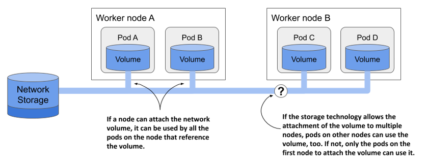

Với hầu hết các công nghệ lưu trữ trên đám mây, bạn thường có thể sử dụng cùng một volume mạng trên nhiều node đồng thời nếu mount chúng ở chế độ chỉ đọc. Ví dụ, các pod được điều phối đến các node khác nhau có thể dùng chung một GCE Persistent Disk nếu nó được mount ở chế độ chỉ đọc, như trong đoạn code dưới đây.

##### Đoạn code 7.10 Mount GCE Persistent Disk ở chế độ chỉ đọc

```yaml
kind: Pod
spec:
  volumes:
  - name: my-volume
    gcePersistentDisk:
      pdName: my-volume
      fsType: ext4 
      readOnly: true     #A
```

Việc cân nhắc hạn chế này của bộ nhớ mạng là rất quan trọng khi thiết kế kiến trúc cho ứng dụng phân tán của bạn. Các bản sao (replica) của cùng một pod thường không thể sử dụng chung một volume mạng ở chế độ đọc-ghi. Rất may là Kubernetes cũng giải quyết ổn thỏa cả vấn đề này. Trong chương 13, bạn sẽ được học cách triển khai các ứng dụng có trạng thái (stateful application), nơi mỗi thực thể pod sẽ có một volume lưu trữ mạng riêng biệt.

Đến đây, chúng ta đã hoàn thành việc thử nghiệm với hai pod quiz này, vì vậy bạn có thể xóa chúng đi. Tuy nhiên, đừng vội xóa GCE Persistent Disk bên dưới. Bạn sẽ cần dùng lại nó trong chương tiếp theo.

## 7.4 Truy cập các file trên hệ thống tệp của node worker

Hầu hết các pod không cần quan tâm chúng đang chạy trên node vật chủ nào và cũng không nên truy cập vào bất kỳ file nào trên hệ thống tệp của node đó. Các pod ở cấp hệ thống là một ngoại lệ. Chúng có thể cần đọc các file của node hoặc sử dụng hệ thống tệp của node để truy cập các thiết bị của node hoặc các thành phần khác thông qua hệ thống tệp. Kubernetes cho phép điều này thông qua loại volume `hostPath`. Tôi đã đề cập đến nó ở phần trước, nhưng đây mới là nơi bạn sẽ tìm hiểu khi nào thì thực sự nên sử dụng nó.

### 7.4.1 Giới thiệu về volume hostPath

Một volume `hostPath` trỏ đến một file hoặc thư mục cụ thể trong hệ thống tệp của node vật chủ, như mô tả trong hình dưới đây. Các pod chạy trên cùng một node và sử dụng cùng một đường dẫn trong volume `hostPath` của chúng sẽ có quyền truy cập vào cùng các file đó, trong khi các pod trên các node khác thì không.

##### Hình 7.16 Một volume `hostPath` mount một file hoặc thư mục từ hệ thống tệp của node worker vào trong container.

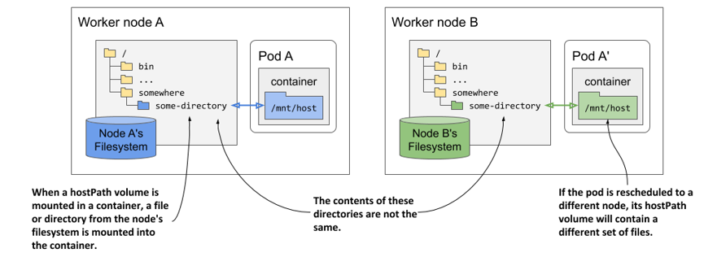

Volume `hostPath` không phải là nơi lý tưởng để lưu trữ dữ liệu của cơ sở dữ liệu, trừ khi bạn đảm bảo chắc chắn rằng pod chạy cơ sở dữ liệu đó luôn luôn chạy trên cùng một node. Vì nội dung của volume được lưu trữ trên hệ thống tệp của một node cụ thể, pod cơ sở dữ liệu sẽ không thể truy cập dữ liệu nếu nó bị điều phối sang một node khác.

Thông thường, volume `hostPath` được sử dụng trong trường hợp pod cần đọc hoặc ghi các file trong hệ thống tệp của node mà các tiến trình chạy trên node đó đọc hoặc tạo ra, chẳng hạn như log của hệ thống.

Loại volume `hostPath` là một trong những loại volume nguy hiểm nhất trong Kubernetes và thường chỉ được dành riêng cho các pod có đặc quyền (privileged pod). Nếu cho phép sử dụng volume `hostPath` một cách bừa bãi, người dùng cụm có thể làm bất cứ điều gì họ muốn trên node. Ví dụ, họ có thể dùng nó để mount file socket của Docker (thường là `/var/run/docker.sock`) vào container của mình, rồi chạy Docker client bên trong container để thực thi bất kỳ lệnh nào trên node vật chủ với quyền root. Bạn sẽ được học cách ngăn chặn điều này ở chương 24.

### 7.4.2 Sử dụng volume hostPath

Để chứng minh mức độ nguy hiểm của volume `hostPath`, chúng ta hãy triển khai một pod cho phép bạn khám phá toàn bộ hệ thống tệp của node vật chủ từ ngay bên trong pod. Manifest của pod được hiển thị trong đoạn code dưới đây.

##### Đoạn code 7.11 Sử dụng volume hostPath để giành quyền truy cập vào hệ thống tệp của node vật chủ

```yaml
apiVersion: v1
kind: Pod
metadata:
  name: node-explorer
spec:
  volumes:
  - name: host-root                      #A
    hostPath:                            #A
      path: /                            #A
  containers:
  - name: node-explorer
    image: alpine
    command: ["sleep", "9999999999"]
    volumeMounts:                        #B
    - name: host-root                    #B
      mountPath: /host                   #B
```

Như bạn thấy trong đoạn code, volume `hostPath` bắt buộc phải chỉ định đường dẫn (`path`) trên host mà nó muốn mount. Volume trong ví dụ này sẽ trỏ đến thư mục gốc (`/`) trên hệ thống tệp của node, cung cấp quyền truy cập vào toàn bộ hệ thống tệp của node mà pod đó được điều phối đến.

Sau khi tạo pod từ manifest này bằng lệnh `kubectl apply`, hãy khởi chạy một shell trong pod bằng lệnh sau:

```
$ kubectl exec -it node-explorer -- sh
```

Bây giờ bạn có thể di chuyển đến thư mục gốc của hệ thống tệp trên node bằng cách chạy lệnh:

```
/ # cd /host
```

Từ đây, bạn có thể tự do khám phá các file trên node vật chủ. Do container và lệnh shell đang chạy dưới quyền root, bạn có thể sửa đổi bất kỳ file nào trên node worker. Hãy cẩn thận để không làm hỏng hệ thống.

##### Lưu ý

Nếu cụm của bạn có nhiều hơn một node worker, pod sẽ chạy trên một node được chọn ngẫu nhiên. Nếu muốn triển khai pod trên một node cụ thể, hãy chỉnh sửa file `node-explorer.specific-node.pod.yaml` (nằm trong kho lưu trữ mã nguồn của sách) và thiết lập trường `.spec.nodeName` thành tên của node bạn muốn chạy pod. Bạn sẽ tìm hiểu về cách điều phối pod đến một node hoặc một tập hợp các node cụ thể trong các chương sau.

Bây giờ, hãy tưởng tượng bạn là một kẻ tấn công đã giành được quyền truy cập vào Kubernetes API và có thể triển khai loại pod này trong một cụm đang chạy thực tế (production). Thật đáng tiếc là tại thời điểm viết cuốn sách này, Kubernetes không hề ngăn cản người dùng thông thường sử dụng volume `hostPath` trong pod của họ, và do đó hệ thống hoàn toàn mất an toàn. Như đã đề cập, bạn sẽ được học cách bảo vệ cụm trước kiểu tấn công này ở chương 24.

#### Chỉ định kiểu (type) cho volume hostPath

Trong ví dụ trước, bạn mới chỉ chỉ định đường dẫn cho volume `hostPath`, nhưng bạn cũng có thể chỉ định kiểu (`type`) để đảm bảo rằng đường dẫn đó đại diện đúng cho những gì tiến trình trong container mong đợi (một file, một thư mục, hay thứ gì khác).

Bảng dưới đây giải thích các kiểu `hostPath` được hỗ trợ:

##### Bảng 7.3 Các kiểu volume hostPath được hỗ trợ

| Kiểu | Mô tả |
| :--- | :--- |
| `<empty>` | Kubernetes không thực hiện bất kỳ kiểm tra nào trước khi mount volume. |
| `Directory` | Kubernetes kiểm tra xem thư mục có tồn tại tại đường dẫn được chỉ định hay không. Bạn sử dụng kiểu này nếu muốn mount một thư mục có sẵn vào pod và muốn ngăn pod chạy nếu thư mục đó không tồn tại. |
| `DirectoryOrCreate` | Tương tự như `Directory`, nhưng nếu không có gì tồn tại tại đường dẫn được chỉ định, một thư mục trống sẽ được tạo ra. |
| `File` | Đường dẫn được chỉ định bắt buộc phải là một file. |
| `FileOrCreate` | Tương tự như `File`, nhưng nếu không có gì tồn tại tại đường dẫn được chỉ định, một file trống sẽ được tạo ra. |
| `BlockDevice` | Đường dẫn được chỉ định bắt buộc phải là một thiết bị khối (block device). |
| `CharDevice` | Đường dẫn được chỉ định bắt buộc phải là một thiết bị ký tự (character device). |
| `Socket` | Đường dẫn được chỉ định bắt buộc phải là một socket UNIX. |

Nếu đường dẫn được chỉ định không khớp với kiểu đã khai báo, các container của pod sẽ không thể chạy. Các sự kiện của pod sẽ giải thích lý do tại sao quá trình kiểm tra kiểu hostPath thất bại.

##### Lưu ý

Khi kiểu là `FileOrCreate` hoặc `DirectoryOrCreate` và Kubernetes cần tạo mới file/thư mục, quyền truy cập của chúng sẽ được thiết lập tương ứng là `644` (`rw-r--r--`) và `755` (`rwxr-xr-x`). Trong cả hai trường hợp, file/thư mục được tạo ra sẽ thuộc sở hữu của user và group chạy Kubelet.

## 7.5 Tóm tắt

Chương này đã giải thích những kiến thức cơ bản về việc thêm volume vào pod, nhưng đó mới chỉ là sự khởi đầu. Bạn sẽ được tìm hiểu sâu hơn về chủ đề này trong chương tiếp theo. Cho đến nay, bạn đã học được những nội dung sau:

- Pod bao gồm các container và các volume. Mỗi volume có thể được mount vào vị trí mong muốn trong hệ thống tệp của container.
- Các volume được sử dụng để lưu trữ dữ liệu bền vững qua các lần khởi động lại container, chia sẻ dữ liệu giữa các container trong cùng một pod, và thậm chí chia sẻ dữ liệu giữa các pod với nhau.
- Có rất nhiều loại volume tồn tại. Một số loại có tính tổng quát và có thể sử dụng trong bất kỳ cụm nào không phụ thuộc vào môi trường, trong khi những loại khác, chẳng hạn như `gcePersistentDisk`, chỉ có thể sử dụng nếu cụm chạy trên hạ tầng của một nhà cung cấp đám mây cụ thể.
- Volume `emptyDir` được sử dụng để lưu trữ dữ liệu trong suốt vòng đời của pod. Nó bắt đầu như một thư mục trống ngay trước khi các container của pod khởi chạy và bị xóa sạch khi pod kết thúc.
- Volume `gitRepo` là một loại volume đã bị khai tử (deprecated), được khởi tạo bằng cách clone một kho lưu trữ Git. Thay vào đó, bạn có thể sử dụng volume `emptyDir` kết hợp với một init container để khởi tạo dữ liệu từ Git hoặc bất kỳ nguồn nào khác.
- Các volume mạng thường được mount bởi node vật chủ và sau đó được hiển thị cho (các) pod trên node đó.
- Tùy thuộc vào công nghệ lưu trữ bên dưới, bạn có thể hoặc không thể mount một volume lưu trữ mạng ở chế độ đọc-ghi trên nhiều node cùng một lúc.
- Việc sử dụng một loại volume đặc thù của nhà cung cấp trong manifest của pod sẽ khiến manifest đó bị ràng buộc chặt chẽ với một cụm Kubernetes cụ thể. Manifest này buộc phải được chỉnh sửa trước khi có thể sử dụng ở cụm khác. Chương 8 sẽ hướng dẫn cách khắc phục vấn đề này.
- Volume `hostPath` cho phép một pod truy cập vào bất kỳ đường dẫn nào trên hệ thống tệp của node worker. Loại volume này rất nguy hiểm vì nó cho phép người dùng thay đổi cấu hình của node worker và chạy bất kỳ tiến trình nào họ muốn trên node đó.

Trong chương tiếp theo, bạn sẽ được học cách tách biệt công nghệ lưu trữ bên dưới ra khỏi manifest của pod, giúp manifest có khả năng di động sang bất kỳ cụm Kubernetes nào khác.

---

[^1]: *Chú thích của công cụ dịch: GCE Persistent Disk (Google Compute Engine Persistent Disk) là dịch vụ lưu trữ khối (block storage) bền vững, có độ tin cậy cao do Google Cloud Platform cung cấp.*

[^2]: *Chú thích của công cụ dịch: GKE (Google Kubernetes Engine) là dịch vụ quản lý container Kubernetes do Google Cloud Platform cung cấp.*

---

[← Chương 6](06-quan-ly-vong-doi-cua-pod.md) · [Mục lục](README.md) · [Chương 8 →](08-luu-tru-du-lieu-trong-persistentvolume.md)
