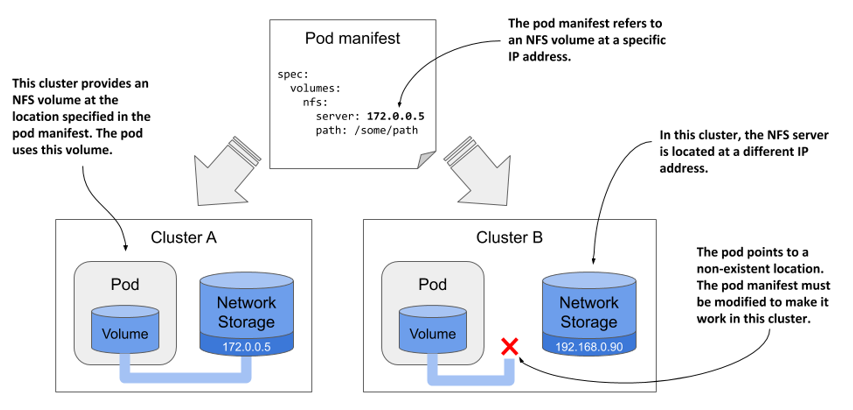
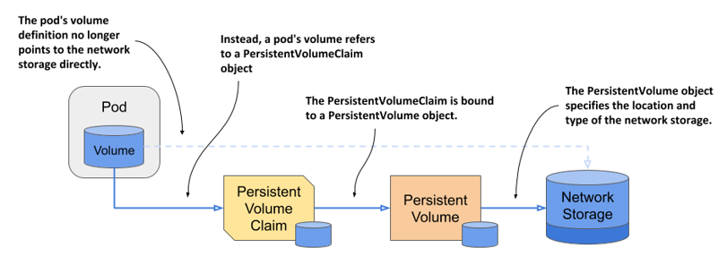
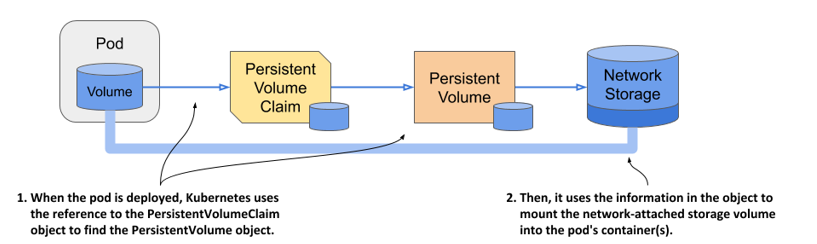
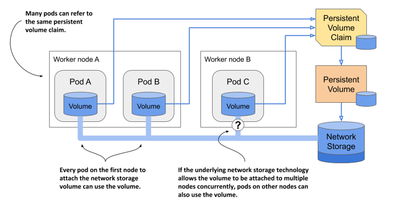
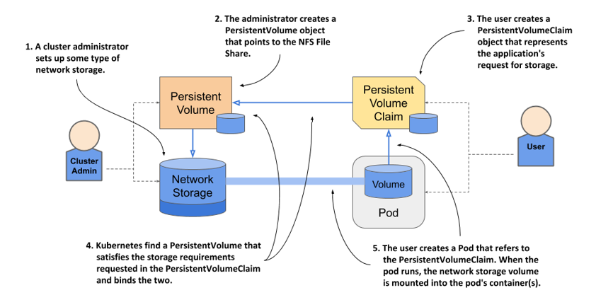
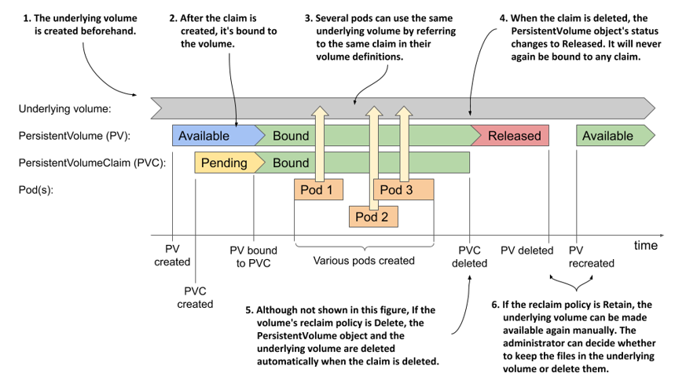
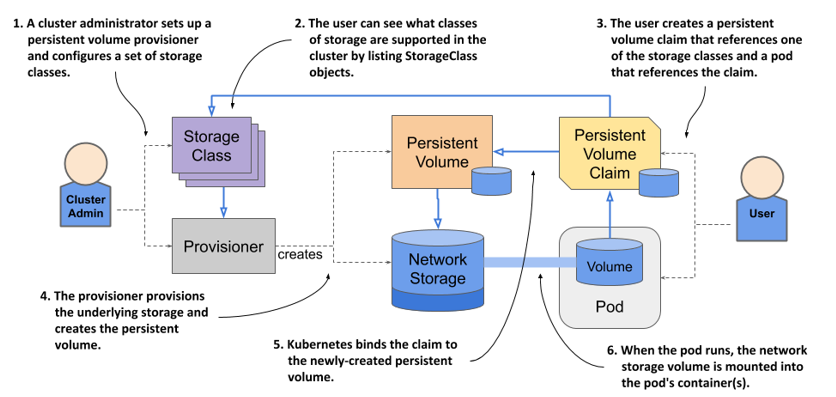
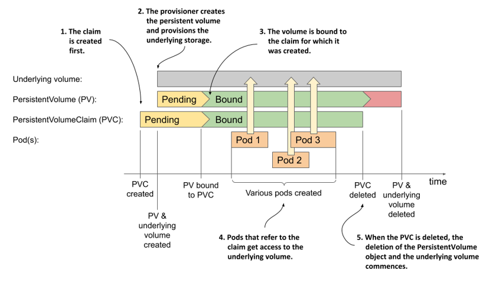

# 8 Lưu trữ dữ liệu trong PersistentVolume

### Chương này bao gồm các nội dung

- Sử dụng các đối tượng PersistentVolume để đại diện cho bộ nhớ lưu trữ vĩnh viễn
- Yêu cầu cấp phát volume vĩnh viễn bằng các đối tượng PersistentVolumeClaim
- Cấp phát động (dynamic provisioning) các volume vĩnh viễn
- Sử dụng bộ nhớ lưu trữ vĩnh viễn cục bộ của node (node-local)

Chương trước đã hướng dẫn bạn cách mount một volume lưu trữ mạng vào pod. Tuy nhiên, trải nghiệm đó chưa thực sự lý tưởng vì bạn buộc phải hiểu rõ môi trường mà cụm của mình đang chạy để biết nên thêm loại volume nào vào pod. Ví dụ, nếu cụm chạy trên hạ tầng của Google, bạn phải định nghĩa một volume `gcePersistentDisk` trong manifest của pod. Bạn không thể dùng chính manifest đó để chạy ứng dụng trên Amazon vì môi trường của họ không hỗ trợ GCE Persistent Disk. Để manifest tương thích với Amazon, người ta phải sửa đổi định nghĩa volume trong cấu hình trước khi triển khai pod.

Bạn có thể còn nhớ ở chương 1, Kubernetes được kỳ vọng sẽ chuẩn hóa việc triển khai ứng dụng giữa các nhà cung cấp đám mây. Việc sử dụng các loại volume lưu trữ đặc thù của nhà cung cấp trong manifest của pod rõ ràng đi ngược lại cam kết này.

May mắn thay, có một cách tốt hơn để thêm bộ nhớ lưu trữ vĩnh viễn vào pod của bạn. Đó là cách mà bạn không cần phải tham chiếu đến một công nghệ lưu trữ cụ thể nào bên trong pod. Chương này sẽ giải thích phương pháp cải tiến đó.

##### Lưu ý

Bạn có thể tìm thấy các file mã nguồn của chương này tại <https://github.com/luksa/kubernetes-in-action-2nd-edition/tree/master/Chapter08>

## 8.1 Tách biệt pod khỏi công nghệ lưu trữ bên dưới

Lý tưởng nhất là một nhà phát triển triển khai ứng dụng trên Kubernetes không cần phải biết cụm cung cấp công nghệ lưu trữ nào, giống như việc họ không cần biết đặc tính của các máy chủ vật lý dùng để chạy pod vậy. Các chi tiết về hạ tầng nên để những người vận hành cụm xử lý.

Vì lý do này, khi triển khai một ứng dụng lên Kubernetes, bạn thường không tham chiếu trực tiếp đến bộ nhớ ngoài trong manifest của pod giống như cách đã làm ở chương trước. Thay vào đó, bạn sẽ sử dụng một cách tiếp cận gián tiếp như giải thích trong phần tiếp theo.

Một trong những ví dụ ở chương trước cho thấy cách sử dụng chia sẻ file NFS trong một pod. Định nghĩa volume trong manifest của pod chứa địa chỉ IP của máy chủ NFS và đường dẫn thư mục được chia sẻ bởi máy chủ đó. Điều này ràng buộc định nghĩa pod vào một cụm cụ thể và ngăn không cho nó được sử dụng ở nơi khác.

Như minh họa trong hình dưới đây, nếu bạn triển khai pod này sang một cụm khác, thông thường bạn sẽ cần thay đổi ít nhất là địa chỉ IP của máy chủ NFS. Điều này có nghĩa là định nghĩa pod không thể di động linh hoạt giữa các cụm. Nó phải bị sửa đổi mỗi khi bạn triển khai trên một cụm Kubernetes mới.

##### Hình 8.1 Manifest của pod chứa thông tin volume đặc thù của hạ tầng sẽ không thể di động sang các cụm khác



### 8.1.1 Giới thiệu về PersistentVolume và PersistentVolumeClaim

Để giúp các manifest của pod có thể di động qua các môi trường cụm khác nhau, thông tin đặc thù của môi trường về volume lưu trữ thực tế được chuyển sang một đối tượng PersistentVolume, như trong hình dưới đây. Một đối tượng PersistentVolumeClaim sẽ kết nối pod với đối tượng PersistentVolume này.

##### Hình 8.2 Sử dụng PersistentVolume và PersistentVolumeClaim để gắn bộ nhớ lưu trữ mạng vào pod



Hai đối tượng này sẽ được giải thích ngay sau đây.

#### Giới thiệu về PersistentVolume

Đúng như tên gọi, đối tượng PersistentVolume đại diện cho một volume lưu trữ được sử dụng để lưu trữ bền vững dữ liệu ứng dụng. Như trong hình trước, đối tượng PersistentVolume lưu trữ thông tin về hệ thống lưu trữ bên dưới và tách biệt thông tin này ra khỏi pod.

Khi thông tin đặc thù của hạ tầng không còn nằm trong manifest của pod, chúng ta có thể dùng chính cấu hình đó để triển khai pod ở các cụm khác nhau. Tất nhiên, lúc này mỗi cụm phải có sẵn một đối tượng PersistentVolume chứa thông tin này. Bạn có thể thấy cách tiếp cận này có vẻ chẳng giải quyết được gì, vì suy cho cùng chúng ta chỉ chuyển thông tin từ đối tượng này sang đối tượng khác, nhưng lát nữa bạn sẽ thấy cách làm mới này mở ra những khả năng chưa từng có trước đây.

#### Giới thiệu về PersistentVolumeClaim

Đúng như tên gọi, đối tượng PersistentVolumeClaim đại diện cho yêu cầu của người dùng đối với volume lưu trữ vĩnh viễn. Vì vòng đời của nó không gắn liền với pod, nó cho phép quyền sở hữu volume vĩnh viễn được tách biệt hoàn toàn khỏi pod. Trước khi có thể sử dụng một volume vĩnh viễn trong pod của mình, người dùng phải yêu cầu cấp phát nó bằng cách tạo ra một đối tượng PersistentVolumeClaim. Sau khi yêu cầu thành công, người dùng có toàn quyền sử dụng volume này trong các pod của họ. Họ có thể xóa pod bất kỳ lúc nào mà không sợ mất quyền sở hữu đối với volume vĩnh viễn đó. Khi không còn cần đến volume nữa, người dùng sẽ giải phóng nó bằng cách xóa đối tượng PersistentVolumeClaim.

#### Sử dụng PersistentVolumeClaim trong một pod

Để sử dụng volume vĩnh viễn trong một pod, bạn chỉ cần tham chiếu đến tên của PersistentVolumeClaim mà volume đó được liên kết (bind).

Ví dụ, nếu bạn tạo một PersistentVolumeClaim được liên kết với một PersistentVolume đại diện cho chia sẻ file NFS, bạn có thể gắn chia sẻ file NFS đó vào pod của mình bằng cách thêm một định nghĩa volume trỏ đến đối tượng PersistentVolumeClaim. Định nghĩa volume trong manifest của pod giờ đây chỉ cần chứa tên của PersistentVolumeClaim chứ không cần bất kỳ thông tin đặc thù hạ tầng nào, chẳng hạn như địa chỉ IP của máy chủ NFS.

Như hình dưới đây minh họa, khi pod này được điều phối đến một node worker, Kubernetes sẽ tìm PersistentVolume được liên kết với claim được tham chiếu trong pod, rồi sử dụng thông tin trong đối tượng PersistentVolume để mount volume lưu trữ mạng vào container của pod.

##### Hình 8.3 Mount một PersistentVolume vào (các) container của pod



#### Sử dụng chung một claim trong nhiều pod

Nhiều pod có thể sử dụng chung một volume lưu trữ nếu chúng cùng tham chiếu đến một PersistentVolumeClaim và qua đó bắc cầu đến cùng một PersistentVolume, như trong hình dưới đây.

##### Hình 8.4 Sử dụng chung một PersistentVolumeClaim trong nhiều pod



Việc các pod này bắt buộc phải chạy trên cùng một node của cụm hay có thể truy cập bộ nhớ bên dưới từ các node khác nhau phụ thuộc vào công nghệ cung cấp bộ nhớ đó. Nếu công nghệ lưu trữ bên dưới hỗ trợ gắn bộ nhớ vào nhiều node đồng thời, các pod trên các node khác nhau có thể sử dụng chung. Nếu không, tất cả các pod buộc phải được điều phối đến node đã gắn volume lưu trữ đó đầu tiên.

### 8.1.2 Hiểu được lợi ích của việc sử dụng PersistentVolume và PersistentVolumeClaim

Một hệ thống bắt bạn phải sử dụng thêm hai đối tượng trung gian chỉ để pod dùng được một volume lưu trữ rõ ràng là phức tạp hơn cách tiếp cận trực tiếp được giải thích ở chương trước. Vậy tại sao cách tiếp cận mới này lại tốt hơn?

Lợi ích lớn nhất của việc sử dụng PersistentVolume và PersistentVolumeClaim là các chi tiết đặc thù của hạ tầng giờ đây đã được tách biệt hoàn toàn khỏi ứng dụng (đại diện bởi pod). Các quản trị viên cụm—những người hiểu rõ trung tâm dữ liệu hơn ai hết—có thể tạo ra các đối tượng PersistentVolume với đầy đủ các chi tiết kỹ thuật cấp thấp liên quan đến hạ tầng, trong khi các nhà phát triển phần mềm chỉ cần tập trung vào việc mô tả ứng dụng và nhu cầu của họ thông qua các đối tượng Pod và PersistentVolumeClaim.

##### Hình 8.5 Các PersistentVolume được quản trị viên cụm cấp phát trước và được các pod sử dụng thông qua các PersistentVolumeClaim.



Thay với việc nhà phát triển phải thêm một volume đặc thù công nghệ vào pod của họ, quản trị viên cụm sẽ thiết lập bộ nhớ bên dưới rồi đăng ký nó với Kubernetes bằng cách tạo ra một đối tượng PersistentVolume thông qua Kubernetes API.

Khi một người dùng cụm cần bộ nhớ vĩnh viễn cho một trong các pod của họ, trước tiên họ sẽ tạo một đối tượng PersistentVolumeClaim. Trong đó, họ có thể tham chiếu trực tiếp đến một PersistentVolume cụ thể theo tên, hoặc chỉ ra dung lượng tối thiểu và chế độ truy cập (access mode) mà ứng dụng yêu cầu, rồi để Kubernetes tự tìm kiếm một PersistentVolume đáp ứng các tiêu chí đó. Trong cả hai trường hợp, PersistentVolume sau đó sẽ được liên kết với claim và cấp quyền truy cập độc quyền. Claim này sau đó có thể được tham chiếu trong định nghĩa volume của một hoặc nhiều pod. Khi pod chạy, volume lưu trữ được cấu hình trong đối tượng PersistentVolume sẽ được gắn vào node worker và mount vào các container của pod.

Điều quan trọng cần hiểu là nhà phát triển ứng dụng có thể tạo các manifest cho đối tượng Pod và PersistentVolumeClaim mà không cần biết bất kỳ thông tin gì về hạ tầng nơi ứng dụng sẽ chạy. Tương tự, quản trị viên cụm có thể chuẩn bị sẵn một tập hợp các volume lưu trữ với nhiều kích cỡ khác nhau mà không cần biết nhiều về các ứng dụng sẽ sử dụng chúng.

Hơn nữa, nhờ sử dụng tính năng cấp phát động (dynamic provisioning) các volume vĩnh viễn (sẽ được thảo luận ở phần sau của chương này), quản trị viên thậm chí không cần phải tạo trước các volume một cách thủ công. Nếu một bộ cấp phát volume tự động (volume provisioner) được cài đặt trong cụm, volume lưu trữ vật lý và đối tượng PersistentVolume tương ứng sẽ được tạo ra theo yêu cầu (on-demand) cho mỗi đối tượng PersistentVolumeClaim mà người dùng tạo ra.

## 8.2 Tạo PersistentVolume và PersistentVolumeClaim

Giờ đây, khi đã nắm được những khái niệm cơ bản về PersistentVolume, PersistentVolumeClaim và mối quan hệ của chúng với các pod, hãy quay lại với pod quiz ở chương trước. Bạn có thể còn nhớ pod này chứa một volume `gcePersistentDisk`. Bạn sẽ chỉnh sửa manifest của pod đó để nó sử dụng GCE Persistent Disk thông qua một đối tượng PersistentVolume.

Như đã giải thích, thường có hai nhóm người dùng Kubernetes khác nhau tham gia vào việc cấp phát và sử dụng các volume vĩnh viễn. Trong các bài thực hành dưới đây, trước tiên bạn sẽ đóng vai quản trị viên cụm để tạo ra một số PersistentVolume. Một trong số đó sẽ trỏ đến GCE Persistent Disk hiện có. Sau đó, bạn sẽ chuyển sang vai trò người dùng thông thường để tạo một PersistentVolumeClaim nhằm giành quyền sở hữu volume đó và sử dụng nó trong pod quiz.

### 8.2.1 Tạo một đối tượng PersistentVolume

Hãy tưởng tượng bạn là quản trị viên cụm. Nhóm phát triển đã yêu cầu bạn cung cấp hai volume vĩnh viễn cho các ứng dụng của họ. Một cái sẽ được dùng để lưu trữ các file dữ liệu của MongoDB trong pod quiz, và cái còn lại dành cho mục đích khác.

Nếu bạn sử dụng Google Kubernetes Engine (GKE) để chạy các ví dụ này, bạn sẽ tạo các PersistentVolume trỏ đến GCE Persistent Disk (GCE PD). Đối với các file dữ liệu của quiz, bạn có thể sử dụng GCE PD mà bạn đã cấp phát ở chương trước.

##### Lưu ý

Nếu bạn sử dụng một nhà cung cấp đám mây khác, hãy tham khảo tài liệu của nhà cung cấp đó để biết cách tạo volume vật lý trong môi trường của họ. Nếu sử dụng Minikube, kind hoặc bất kỳ loại cụm nào khác, bạn không cần phải tạo volume ngoài vì bạn sẽ sử dụng một PersistentVolume trỏ đến một thư mục cục bộ trên node worker.

#### Tạo PersistentVolume với bộ nhớ bên dưới là GCE Persistent Disk

Nếu bạn chưa thiết lập GCE Persistent Disk `quiz-data` từ chương trước, hãy tạo lại nó bằng lệnh `gcloud compute disks create quiz-data`. Sau khi ổ đĩa được tạo, bạn phải tạo một file manifest cho đối tượng PersistentVolume, như trong đoạn code dưới đây. Bạn sẽ tìm thấy file này tại `Chapter08/pv.quiz-data.gcepd.yaml`.

##### Đoạn code 8.1 Manifest của một PersistentVolume tham chiếu đến GCE Persistent Disk

```yaml
apiVersion: v1
kind: PersistentVolume
metadata:
  name: quiz-data    #A
spec:
  capacity:    #B
    storage: 1Gi    #B
  accessModes:    #C
  - ReadWriteOnce    #C
  - ReadOnlyMany    #C
  gcePersistentDisk:    #D
    pdName: quiz-data    #D
    fsType: ext4    #D
```

Phần `spec` trong một đối tượng PersistentVolume xác định dung lượng lưu trữ của volume, các chế độ truy cập hỗ trợ và công nghệ lưu trữ bên dưới được sử dụng, cùng với tất cả thông tin cần thiết để sử dụng bộ nhớ đó. Trong trường hợp của GCE Persistent Disk, thông tin này bao gồm tên của tài nguyên PD trong Google Compute Engine, loại hệ thống tệp (filesystem type), tên phân vùng trong volume, v.v.

Bây giờ, hãy tạo một GCE Persistent Disk khác có tên là `other-data` và một đối tượng PersistentVolume đi kèm. Tạo một file mới từ manifest ở đoạn code 8.1 và thực hiện các thay đổi cần thiết. Bạn sẽ tìm thấy manifest kết quả trong file `pv.other-data.gcepd.yaml`.

#### Tạo các PersistentVolume được hỗ trợ bởi các công nghệ lưu trữ khác

Nếu cụm Kubernetes của bạn chạy trên một nhà cung cấp đám mây khác, bạn có thể dễ dàng thay đổi manifest của PersistentVolume để sử dụng một công nghệ khác thay vì GCE Persistent Disk, tương tự như cách bạn đã tham chiếu trực tiếp volume trong manifest của pod ở chương trước.

Nếu bạn đã sử dụng Minikube hoặc công cụ kind để khởi dựng cụm của mình, bạn có thể tạo một PersistentVolume sử dụng thư mục cục bộ trên node worker thay vì lưu trữ mạng bằng cách sử dụng trường `hostPath` trong manifest của PersistentVolume. Manifest cho PersistentVolume `quiz-data` được hiển thị trong đoạn code dưới đây (`pv.quiz-data.hostpath.yaml`). Manifest cho PersistentVolume `other-data` nằm trong file `pv.other-data.hostpath.yaml`.

##### Đoạn code 8.2 Một PersistentVolume sử dụng thư mục cục bộ

```yaml
apiVersion: v1
kind: PersistentVolume
metadata:
  name: quiz-data
spec:
  capacity:
    storage: 1Gi
  accessModes:
  - ReadWriteOnce
  - ReadOnlyMany
  hostPath:    #A
    path: /var/quiz-data    #A
```

Bạn sẽ nhận thấy rằng hai manifest của PersistentVolume trong đoạn code này và đoạn code trước đó chỉ khác nhau ở phần chỉ định phương thức lưu trữ bên dưới. PersistentVolume dựa trên hostPath sẽ lưu trữ dữ liệu trong thư mục `/var/quiz-data` trên hệ thống tệp của node worker.

##### Lưu ý

Để liệt kê tất cả các công nghệ được hỗ trợ khác mà bạn có thể sử dụng trong một PersistentVolume, hãy chạy lệnh `kubectl explain pv.spec`. Sau đó, bạn có thể đi sâu hơn để xem các tùy chọn cấu hình riêng lẻ cho từng công nghệ. Ví dụ, đối với GCE Persistent Disk, hãy chạy lệnh `kubectl explain pv.spec.gcePersistentDisk`.

Tôi sẽ không làm bạn mệt mỏi với các chi tiết cấu hình PersistentVolume cho từng công nghệ lưu trữ có sẵn, nhưng tôi cần phải giải thích các trường `capacity` (dung lượng) và `accessModes` (chế độ truy cập) mà bạn bắt buộc phải thiết lập trong mỗi PersistentVolume.

#### Chỉ định dung lượng của volume

Trường `capacity` của volume cho biết kích thước của volume lưu trữ bên dưới. Mỗi PersistentVolume bắt buộc phải chỉ rõ dung lượng của nó để Kubernetes có thể xác định xem một PersistentVolume cụ thể có đáp ứng được các yêu cầu nêu trong PersistentVolumeClaim trước khi thực hiện liên kết (bind) chúng hay không.

#### Chỉ định các chế độ truy cập của volume

Mỗi PersistentVolume phải chỉ định một danh sách các chế độ truy cập (`accessModes`) mà nó hỗ trợ. Tùy thuộc vào công nghệ bên dưới, một PersistentVolume có thể hoặc không thể được mount bởi nhiều node worker cùng lúc ở chế độ đọc-ghi hoặc chỉ đọc. Kubernetes sẽ kiểm tra các chế độ truy cập của PersistentVolume để xác định xem nó có đáp ứng yêu cầu của claim hay không.

##### Lưu ý

Chế độ truy cập xác định số lượng *node* (chứ không phải số lượng pod) có thể gắn volume tại một thời điểm. Ngay cả khi một volume chỉ có thể gắn vào một node duy nhất, nó vẫn có thể được mount vào nhiều pod nếu tất cả các pod đó cùng chạy trên node duy nhất này.

Có ba chế độ truy cập tồn tại. Chúng được giải thích trong bảng dưới đây cùng với dạng viết tắt được hiển thị bởi `kubectl`.

##### Bảng 8.1 Các chế độ truy cập của PersistentVolume

| Chế độ truy cập | Viết tắt | Mô tả |
| :--- | :--- | :--- |
| `ReadWriteOnce` | RWO | Volume có thể được mount bởi một node worker duy nhất ở chế độ đọc-ghi. Khi đã được mount vào node đó, các node khác không thể mount volume này nữa. |
| `ReadOnlyMany` | ROX | Volume có thể được mount đồng thời trên nhiều node worker ở chế độ chỉ đọc. |
| `ReadWriteMany` | RWX | Volume có thể được mount ở chế độ đọc-ghi trên nhiều node worker cùng một lúc. |

##### Lưu ý

Tùy chọn `ReadOnlyOnce` không tồn tại. Nếu bạn sử dụng một volume `ReadWriteOnce` trong một pod không có nhu cầu ghi dữ liệu, bạn hoàn toàn có thể mount volume đó ở chế độ chỉ đọc.

#### Sử dụng các PersistentVolume như các thiết bị khối (block device)

Một ứng dụng thông thường sẽ sử dụng các PersistentVolume có hệ thống tệp đã được định dạng. Tuy nhiên, một PersistentVolume cũng có thể được cấu hình để ứng dụng có thể truy cập trực tiếp vào thiết bị khối bên dưới mà không cần thông qua hệ thống tệp. Điều này được cấu hình trên đối tượng PersistentVolume bằng trường `spec.volumeMode`. Các giá trị hỗ trợ cho trường này được giải thích trong bảng tiếp theo.

##### Bảng 8.2 Cấu hình chế độ volume cho PersistentVolume

| Chế độ Volume | Mô tả |
| :--- | :--- |
| `Filesystem` | Khi PersistentVolume được mount vào một container, nó được gắn vào một thư mục trong cây thư mục của container đó. Nếu bộ nhớ bên dưới là một thiết bị khối chưa được định dạng, Kubernetes sẽ định dạng thiết bị bằng hệ thống tệp được chỉ định trong định nghĩa volume (ví dụ: trong trường `gcePersistentDisk.fsType`) trước khi mount nó vào container. Đây là chế độ mặc định của volume. |
| `Block` | Khi một pod sử dụng một PersistentVolume ở chế độ này, volume đó sẽ được cung cấp cho ứng dụng trong container dưới dạng một thiết bị khối thô (raw block device - không có hệ thống tệp). Điều này cho phép ứng dụng đọc và ghi dữ liệu mà không tốn chi phí overhead của hệ thống tệp. Chế độ này thường được sử dụng bởi các loại ứng dụng đặc biệt, chẳng hạn như các hệ quản trị cơ sở dữ liệu. |

Các manifest của PersistentVolume `quiz-data` và `other-data` không chỉ định trường `volumeMode`, điều đó có nghĩa là chế độ mặc định sẽ được sử dụng, cụ thể là `Filesystem`.

#### Tạo và kiểm tra PersistentVolume

Bây giờ bạn có thể tạo các đối tượng PersistentVolume bằng cách gửi manifest tới Kubernetes API thông qua lệnh quen thuộc `kubectl apply`. Sau đó, sử dụng lệnh `kubectl get` để liệt kê các PersistentVolume trong cụm của bạn:

```
$ kubectl get pv
NAME         CAPACITY    ACCESS MODES   ...   STATUS      CLAIM    ...   AGE
other-data   10Gi        RWO,ROX        ...   Available            ...   3m 
quiz-data    10Gi        RWO,ROX        ...   Available            ...   3m
```

##### Mẹo

Sử dụng `pv` làm tên viết tắt cho PersistentVolume.

Cột `STATUS` cho biết cả hai PersistentVolume đều ở trạng thái `Available`. Đây là điều dễ hiểu vì chúng chưa được liên kết với bất kỳ PersistentVolumeClaim nào, thể hiện qua cột `CLAIM` đang để trống. Dung lượng volume và các chế độ truy cập cũng được hiển thị dưới dạng viết tắt như đã giải thích ở Bảng 8.1.

Công nghệ lưu trữ bên dưới được sử dụng bởi PersistentVolume không được hiển thị bởi lệnh `kubectl get pv` vì nó ít quan trọng hơn. Điều quan trọng là mỗi PersistentVolume đại diện cho một lượng không gian lưu trữ nhất định có sẵn trong cụm mà các ứng dụng có thể truy cập với các chế độ được chỉ định. Công nghệ và các tham số khác được cấu hình trong mỗi PersistentVolume là các chi tiết triển khai nội bộ vốn không mấy thu hút sự quan tâm của người dùng triển khai ứng dụng. Nếu ai đó cần xem các chi tiết này, họ có thể sử dụng lệnh `kubectl describe` hoặc in định nghĩa đầy đủ của đối tượng PersistentVolume bằng lệnh sau:

```
$ kubectl get pv quiz-data -o yaml
```

### 8.2.2 Yêu cầu cấp phát một PersistentVolume

Cụm của bạn hiện đã có hai PersistentVolume. Trước khi có thể sử dụng volume `quiz-data` trong pod quiz, bạn cần phải yêu cầu cấp phát (claim) nó. Phần này sẽ hướng dẫn bạn cách thực hiện việc đó.

#### Tạo một đối tượng PersistentVolumeClaim

Để yêu cầu cấp phát một volume vĩnh viễn, bạn tạo ra một đối tượng PersistentVolumeClaim và chỉ ra các yêu cầu mà volume vĩnh viễn đó phải đáp ứng. Các yêu cầu này bao gồm dung lượng tối thiểu của volume và các chế độ truy cập cần thiết, thường do chính ứng dụng sẽ sử dụng volume quyết định. Vì lý do đó, các PersistentVolumeClaim nên được tạo ra bởi tác giả của ứng dụng chứ không phải bởi quản trị viên cụm. Vì vậy, lúc này hãy tháo chiếc mũ quản trị viên của bạn ra và đội chiếc mũ nhà phát triển vào.

##### Mẹo

Là một nhà phát triển ứng dụng, bạn không bao giờ nên đưa định nghĩa PersistentVolume vào trong các manifest ứng dụng của mình. Thay vào đó, bạn nên sử dụng các PersistentVolumeClaim vì chúng thể hiện rõ ràng các yêu cầu lưu trữ của ứng dụng.

Để tạo đối tượng PersistentVolumeClaim, hãy tạo một file manifest với nội dung như dưới đây. Bạn cũng có thể tìm thấy file này tại `pvc.quiz-data.static.yaml`.

##### Đoạn code 8.3 Manifest của một đối tượng PersistentVolumeClaim

```yaml
apiVersion: v1
kind: PersistentVolumeClaim
metadata:
  name: quiz-data    #A
spec:
  resources:
    requests:    #B
      storage: 1Gi    #B
  accessModes:    #C
  - ReadWriteOnce    #C
  storageClassName: ""    #D
  volumeName: quiz-data    #E
```

Đối tượng PersistentVolumeClaim được định nghĩa trong đoạn code yêu cầu một volume có dung lượng tối thiểu là `1GiB` và có thể được mount trên một node duy nhất ở chế độ đọc-ghi. Trường `storageClassName` được sử dụng cho việc cấp phát động (dynamic provisioning) các volume vĩnh viễn mà bạn sẽ được học ở phần sau của chương này. Trường này bắt buộc phải được thiết lập thành một chuỗi rỗng nếu bạn muốn Kubernetes liên kết một PersistentVolume đã được cấp phát trước đó (pre-provisioned) với claim này, thay vì cấp phát mới hoàn toàn.

---

Trong bài thực hành này, bạn muốn yêu cầu cấp phát persistent volume `quiz-data`, vì vậy bạn phải chỉ định điều này trong trường `volumeName`. Trong cluster của bạn hiện có hai persistent volume phù hợp. Nếu bạn không chỉ định trường này, Kubernetes có thể sẽ ràng buộc yêu cầu của bạn với persistent volume `other-data`.

Nếu quản trị viên cluster tạo ra một loạt các persistent volume với những cái tên chung chung, và bạn không bận tâm mình sẽ nhận được volume nào, bạn có thể bỏ qua trường `volumeName`. Trong trường hợp đó, Kubernetes sẽ chọn ngẫu nhiên một trong các persistent volume có dung lượng và chế độ truy cập (access mode) phù hợp với yêu cầu.

##### Note

Giống như persistent volume, các yêu cầu cấp phát (claim) cũng có thể chỉ định chế độ `volumeMode` mong muốn. Như bạn đã biết ở phần 8.2.1, chế độ này có thể là `Filesystem` (Hệ thống tập tin) hoặc `Block` (Khối thiết bị). Nếu để trống, hệ thống sẽ mặc định chọn `Filesystem`. Khi Kubernetes kiểm tra xem một volume có thể đáp ứng yêu cầu hay không, trường `volumeMode` của cả yêu cầu lẫn volume đều được đưa ra xem xét.

Để tạo đối tượng PersistentVolumeClaim, hãy áp dụng file manifest của nó bằng lệnh `kubectl apply`. Sau khi đối tượng được tạo, Kubernetes sẽ sớm ràng buộc một volume vào yêu cầu đó. Nếu yêu cầu chỉ định đích danh một persistent volume cụ thể bằng tên, đó sẽ là volume được ràng buộc, miễn là nó cũng đáp ứng các yêu cầu khác. Yêu cầu của bạn cần 1GiB dung lượng đĩa và chế độ truy cập `ReadWriteOnce`. Persistent volume `quiz-data` mà bạn tạo trước đó đáp ứng cả hai yêu cầu này, nhờ đó nó có thể được ràng buộc vào claim.

#### Listing persistent volume claims

Nếu mọi việc suôn sẻ, yêu cầu của bạn giờ đây sẽ được ràng buộc với persistent volume `quiz-data`. Hãy sử dụng lệnh `kubectl get` để kiểm tra xem có đúng như vậy không:

```
$ kubectl get pvc
NAME        STATUS   VOLUME      CAPACITY   ACCESS MODES   STORAGECLASS   AGE 
quiz-data   Bound    quiz-data   10Gi       RWO,ROX                       2m    #A
```

##### Tip

Sử dụng `pvc` làm tên viết tắt cho `persistentvolumeclaim`.

Kết quả trả về từ lệnh `kubectl` cho thấy yêu cầu hiện đã được ràng buộc với persistent volume của bạn. Nó cũng hiển thị dung lượng và chế độ truy cập của volume này. Mặc dù yêu cầu chỉ đòi hỏi 1GiB, nhưng nó lại có sẵn tới 10GiB dung lượng lưu trữ, bởi đó là dung lượng thực tế của volume. Tương tự, dù yêu cầu chỉ đòi hỏi chế độ truy cập `ReadWriteOnce`, nó vẫn được ràng buộc vào một volume hỗ trợ cả hai chế độ truy cập là `ReadWriteOnce` (`RWO`) và `ReadOnlyMany` (`ROX`).

Nếu tạm thời đóng vai trò là quản trị viên cluster và liệt kê các persistent volume trong cluster, bạn sẽ thấy trạng thái của nó giờ đây cũng được hiển thị là `Bound`:

```
$ kubectl get pv
NAME        CAPACITY   ACCESS MODES   ...   STATUS   CLAIM               ...
quiz-data   10Gi       RWO,ROX        ...   Bound    default/quiz-data   ...
```

Bất kỳ quản trị viên cluster nào cũng có thể thấy rõ mỗi persistent volume đang được ràng buộc với yêu cầu nào. Trong trường hợp của bạn, volume này được ràng buộc với yêu cầu `default/quiz-data`.

##### Note

Bạn có thể thắc mắc từ `default` trong tên của yêu cầu có nghĩa là gì. Đó chính là *namespace* (không gian tên) nơi đối tượng PersistentVolumeClaim tọa lạc. Các namespace giúp tổ chức các đối tượng thành các tập hợp tách biệt nhau. Bạn sẽ được tìm hiểu về chúng trong chương 10.

Bằng cách yêu cầu cấp phát persistent volume này, bạn và các pod của bạn giờ đây có quyền sử dụng độc quyền volume đó. Không ai khác có thể yêu cầu cấp phát nó cho đến khi bạn giải phóng nó bằng cách xóa đối tượng PersistentVolumeClaim.

### 8.2.3 Using a claim and volume in a single pod

Trong phần này, bạn sẽ tìm hiểu tường tận cách sử dụng một persistent volume trong một pod đơn lẻ tại một thời điểm.

#### Using a persistent volume in pod

Để sử dụng một persistent volume trong một pod, bạn định nghĩa một volume bên trong pod đó và tham chiếu đến đối tượng PersistentVolumeClaim. Để thử nghiệm điều này, hãy chỉnh sửa pod quiz từ chương trước và cấu hình cho nó sử dụng claim `quiz-data`. Các thay đổi trong manifest của pod được in đậm trong danh sách mã nguồn tiếp theo. Bạn có thể tìm thấy file này tại đường dẫn `pod.quiz.pvc.yaml`.

##### Listing 8.4 A pod using a persistentVolumeClaim volume

```yaml
apiVersion: v1
kind: Pod
metadata:
  name: quiz
spec:
  volumes:
  - name: quiz-data
    persistentVolumeClaim:    #A
      claimName: quiz-data    #A
  containers:
  - name: quiz-api
    image: luksa/quiz-api:0.1
    ports:
    - name: http
      containerPort: 8080
  - name: mongo
    image: mongo
    volumeMounts:    #B
    - name: quiz-data    #B
      mountPath: /data/db    #B
```

Như bạn có thể thấy trong cấu hình, chúng ta không định nghĩa volume dưới dạng `gcePersistentDisk`, `awsElasticBlockStore`, `nfs` hay `hostPath`, mà định nghĩa nó dưới dạng một volume kiểu `persistentVolumeClaim`. Pod sẽ sử dụng bất kỳ persistent volume nào được ràng buộc với claim `quiz-data`. Trong trường hợp của bạn, đó sẽ là persistent volume `quiz-data`.

Hãy tạo và kiểm tra pod này ngay lúc này. Trước khi pod khởi động, volume GCE PD sẽ được gắn (attach) vào node và mount vào (các) container của pod. Nếu bạn sử dụng GKE và đã cấu hình persistent volume để sử dụng GCE Persistent Disk từ chương trước (vốn đã có sẵn dữ liệu), bạn sẽ có thể lấy lại các câu hỏi trắc nghiệm đã lưu trước đó bằng cách chạy lệnh sau:

```
$ kubectl exec -it quiz -c mongo -- mongo kiada --quiet --eval "db.questions.find()"
{ "_id" : ObjectId("5fc3a4890bc9170520b22452"), "id" : 1, "text" : "What does k8s mean?", 
"answers" : [ "Kates", "Kubernetes", "Kooba Dooba Doo!" ], "correctAnswerIndex" : 1 }
```

Nếu đĩa GCE PD của bạn chưa có dữ liệu, hãy thêm dữ liệu ngay bằng cách chạy đoạn script shell `Chapter08/insert-question.sh`.

#### Re-using the claim in a new pod instance

Khi bạn xóa một pod đang sử dụng persistent volume thông qua một persistent volume claim, volume lưu trữ bên dưới sẽ được gỡ khỏi (detach) worker node (với giả định đó là pod duy nhất trên node đó đang sử dụng volume này). Đối tượng persistent volume vẫn được giữ ràng buộc với claim. Nếu bạn tạo một pod khác tham chiếu đến claim này, pod mới sẽ có quyền truy cập vào volume cùng các file bên trong nó.

Hãy thử xóa pod quiz và tạo lại nó. Nếu bạn chạy truy vấn `db.questions.find()` trong thực thể pod mới này, bạn sẽ thấy nó trả về cùng một dữ liệu như pod trước đó. Nếu persistent volume sử dụng bộ lưu trữ gắn qua mạng như GCE Persistent Disks, pod sẽ nhìn thấy cùng một dữ liệu bất kể nó được lập lịch chạy trên node nào. Tuy nhiên, nếu bạn sử dụng một cluster được cấu hình bằng `kind` và buộc phải sử dụng persistent volume dựa trên `hostPath`, điều này sẽ không đúng. Để truy cập cùng một dữ liệu, bạn phải đảm bảo rằng thực thể pod mới được lập lịch chạy trên đúng node mà thực thể cũ từng chạy, vì dữ liệu được lưu trữ trực tiếp trong hệ thống tập tin của node đó.

#### Releasing a persistent volume

Khi không còn định triển khai các pod sử dụng claim này nữa, bạn có thể xóa nó đi. Hành động này sẽ giải phóng (release) persistent volume. Bạn có thể tự hỏi liệu mình có thể tạo lại claim và truy cập vào cùng volume cũng như dữ liệu đó hay không. Hãy cùng tìm hiểu xem sao. Hãy xóa pod và claim theo các lệnh sau để xem điều gì xảy ra:

```
$ kubectl delete pod quiz
pod "quiz" deleted
 
$ kubectl delete pvc quiz-data
persistentvolumeclaim "quiz-data" deleted
```

Bây giờ, hãy kiểm tra trạng thái của persistent volume:

```
$ kubectl get pv quiz-data
NAME        ...   RECLAIM POLICY   STATUS     CLAIM               ...
quiz-data   ...   Retain           Released   default/quiz-data   ...
```

Cột `STATUS` hiển thị trạng thái của volume là `Released` chứ không phải `Available` như lúc ban đầu. Cột `CLAIM` vẫn hiển thị claim `quiz-data` mà nó từng ràng buộc trước đó, ngay cả khi claim này không còn tồn tại nữa. Bạn sẽ hiểu lý do tại sao chỉ trong chốc lát.

#### Binding to a released persistent volume

Điều gì xảy ra nếu bạn tạo lại claim một lần nữa? Liệu persistent volume có tự động ràng buộc với claim để có thể tái sử dụng trong một pod hay không? Hãy chạy các lệnh sau để kiểm tra xem có đúng như vậy không.

```
$ kubectl apply -f pvc.quiz-data.static.yaml
persistentvolumeclaim/quiz-data created
 
$ kubectl get pvc
NAME        STATUS   VOLUME   CAPACITY   ACCESSMODES   STORAGECLASS   AGE
quiz-data   Pending                                                   13s    #A
```

Claim này không hề được ràng buộc với volume và trạng thái của nó bị kẹt ở `Pending`. Khi bạn tạo claim này lần đầu tiên, nó được ràng buộc ngay lập tức với persistent volume, vậy tại sao bây giờ lại không được?

Nguyên nhân là do volume này đã từng được sử dụng và có thể chứa dữ liệu nhạy cảm cần phải được xóa sạch trước khi một người dùng khác yêu cầu cấp phát nó. Đây cũng là lý do tại sao trạng thái của volume là `Released` chứ không phải `Available`, và tại sao tên của claim cũ vẫn hiển thị trên persistent volume — điều này giúp quản trị viên cluster biết liệu dữ liệu có thể được xóa bỏ một cách an toàn hay không.

#### Making a released persistent volume available for re-use

Để làm cho volume sẵn sàng sử dụng trở lại, bạn phải xóa và tạo lại đối tượng PersistentVolume. Nhưng liệu việc này có làm mất dữ liệu được lưu trữ trong volume hay không?

Hãy tưởng tượng nếu bạn lỡ tay xóa mất pod và claim, gây gián đoạn dịch vụ cho ứng dụng Kiada. Bạn cần khôi phục dịch vụ càng nhanh càng tốt với toàn bộ dữ liệu nguyên vẹn. Nếu bạn lo sợ rằng việc xóa đối tượng PersistentVolume sẽ làm mất dữ liệu, thì dù nghe có vẻ đáng sợ, hành động này thực chất lại hoàn toàn an toàn.

Với một persistent volume được cấp phát tĩnh (pre-provisioned) như trong trường hợp này, việc xóa đối tượng này cũng tương tự như việc xóa một con trỏ dữ liệu. Đối tượng PersistentVolume chỉ đơn thuần *trỏ* đến một GCE Persistent Disk chứ bản thân nó không lưu trữ dữ liệu. Nếu bạn xóa và tạo lại đối tượng, bạn chỉ tạo ra một con trỏ mới trỏ đến cùng một đĩa GCE PD đó, và do đó dữ liệu vẫn hoàn toàn nguyên vẹn. Bạn sẽ xác nhận được điều này trong bài tập tiếp theo dưới đây.

```
$ kubectl delete pv quiz-data
persistentvolume "quiz-data" deleted
 
$ kubectl apply -f pv.quiz-data.gcepd.yaml
persistentvolume/quiz-data created 
 
$ kubectl get pv quiz-data
NAME        ...   RECLAIM POLICY   STATUS      CLAIM   ...
quiz-data   ...   Retain           Available           ...
```

##### Note

Một cách khác để làm cho một persistent volume sẵn sàng sử dụng lại là chỉnh sửa trực tiếp đối tượng PersistentVolume và xóa trường `claimRef` khỏi phần `spec`.

Persistent volume giờ đây đã hiển thị trạng thái `Available` trở lại. Xin nhắc lại là bạn đã tạo một yêu cầu cấp phát (claim) cho volume này trước đó. Kubernetes vẫn đang chờ đợi một volume phù hợp để ràng buộc vào claim đó. Đúng như bạn mong đợi, volume bạn vừa tạo sẽ được ràng buộc với claim này trong vòng vài giây. Hãy liệt kê lại các volume để xác nhận:

```
$ kubectl get pv quiz-data
NAME        ...   RECLAIM POLICY   STATUS      CLAIM               ...
quiz-data   ...   Retain           Bound       default/quiz-data   ...    #A
```

Kết quả đầu ra cho thấy persistent volume đã được ràng buộc lại với claim. Nếu bây giờ bạn triển khai pod quiz và truy vấn lại cơ sở dữ liệu bằng lệnh sau, bạn sẽ thấy dữ liệu trong đĩa GCE Persistent Disk bên dưới không hề bị mất:

```
$ kubectl exec -it quiz -c mongo -- mongo kiada --quiet --eval "db.questions.find()"
{ "_id" : ObjectId("5fc3a4890bc9170520b22452"), "id" : 1, "text" : "What does k8s mean?", 
"answers" : [ "Kates", "Kubernetes", "Kooba Dooba Doo!" ], "correctAnswerIndex" : 1 }
```

#### Configuring the reclaim policy on persistent volumes

Điều gì xảy ra với một persistent volume khi nó được giải phóng sẽ do chính sách thu hồi (reclaim policy) của volume đó quyết định. Khi bạn sử dụng lệnh `kubectl get pv` để liệt kê các persistent volume, bạn có thể đã nhận ra rằng chính sách của volume `quiz-data` là `Retain`. Chính sách này được cấu hình bằng trường `.spec.persistentVolumeReclaimPolicy` trong đối tượng PersistentVolume.

Trường này có thể nhận một trong ba giá trị được giải thích trong bảng dưới đây.

##### Table 8.3 Persistent volume reclaim policies

| Chính sách thu hồi | Mô tả |
| :--- | :--- |
| **Retain** | Khi persistent volume được giải phóng (xảy ra khi bạn xóa claim đang ràng buộc với nó), Kubernetes sẽ *giữ lại* (retain) volume đó. Quản trị viên cluster phải thu hồi volume bằng tay. Đây là chính sách mặc định cho các persistent volume được tạo thủ công. |
| **Delete** | Đối tượng PersistentVolume và bộ lưu trữ vật lý bên dưới sẽ tự động bị xóa ngay sau khi được giải phóng. Đây là chính sách mặc định cho các persistent volume được cấp phát động (dynamically provisioned), loại volume sẽ được thảo luận trong phần tiếp theo. |
| **Recycle** | Tùy chọn này đã bị loại bỏ (deprecated) và không nên sử dụng vì nó có thể không còn được hỗ trợ bởi plugin volume bên dưới. Chính sách này thường sẽ xóa toàn bộ các file trên volume và làm cho persistent volume sẵn sàng sử dụng lại mà không cần phải xóa và tạo lại đối tượng. |

##### Tip

Bạn có thể thay đổi chính sách thu hồi của một PersistentVolume hiện có bất kỳ lúc nào. Nếu ban đầu nó được đặt là `Delete`, nhưng bạn không muốn mất dữ liệu khi xóa claim, hãy đổi chính sách của volume thành `Retain` trước khi thực hiện việc xóa.

##### Warning

Nếu một persistent volume đang ở trạng thái `Released` và bạn đổi chính sách thu hồi của nó từ `Retain` sang `Delete`, đối tượng PersistentVolume và bộ lưu trữ vật lý bên dưới sẽ bị xóa ngay lập tức. Tuy nhiên, nếu bạn chủ động xóa đối tượng này bằng tay, bộ lưu trữ vật lý bên dưới vẫn sẽ được giữ nguyên vẹn.

#### Deleting a persistent volume while it’s bound

Chúng ta đã hoàn thành việc thử nghiệm với pod `quiz`, persistent volume claim `quiz-data` và persistent volume `quiz-data`, vì vậy bây giờ bạn sẽ tiến hành xóa chúng đi. Bạn sẽ học hỏi thêm được một điều thú vị nữa trong quá trình này.

Đã bao giờ bạn tự hỏi điều gì xảy ra nếu quản trị viên cluster xóa một persistent volume khi nó đang được sử dụng (khi nó đang được ràng buộc với một claim) chưa? Hãy cùng tìm hiểu xem sao. Hãy xóa persistent volume bằng lệnh sau:

```
$ kubectl delete pv quiz-data
persistentvolume "quiz-data" deleted    #A
```

Lệnh này yêu cầu Kubernetes API xóa đối tượng PersistentVolume và sau đó đợi các bộ điều khiển (controller) của Kubernetes hoàn tất quá trình này. Nhưng quá trình này không thể hoàn tất cho đến khi bạn giải phóng persistent volume khỏi claim bằng cách xóa đối tượng PersistentVolumeClaim.

Bạn có thể dừng việc chờ đợi bằng cách nhấn tổ hợp phím Control-C. Tuy nhiên, hành động này không hủy bỏ lệnh xóa, vì quá trình xóa đã được tiến hành rồi. Bạn có thể xác nhận điều này qua lệnh sau:

```
$ kubectl get pv quiz-data
NAME        CAPACITY   ACCESS MODES   STATUS        CLAIM               ...
quiz-data   10Gi       RWO,ROX        Terminating   default/quiz-data   ...    #A
```

Như bạn thấy, trạng thái của persistent volume hiển thị là `Terminating` (Đang chấm dứt). Nhưng nó vẫn đang được ràng buộc với persistent volume claim. Bạn cần phải xóa claim này để quá trình xóa volume có thể hoàn tất hoàn toàn.

#### Deleting a persistent volume claim while a pod is using it

Yêu cầu (claim) này vẫn đang được sử dụng bởi pod quiz, nhưng chúng ta hãy cứ thử xóa nó xem sao:

```
$ kubectl delete pvc quiz-data
persistentvolumeclaim "quiz-data" deleted    #A
```

Tương tự như lệnh `kubectl delete pv`, lệnh này cũng không hoàn tất ngay lập tức mà phải chờ quá trình xóa claim kết thúc. Bạn có thể ngắt lệnh này giữa chừng, nhưng điều đó không làm hủy bỏ việc xóa, như bạn có thể thấy qua lệnh kiểm tra dưới đây:

```
$ kubectl get pvc quiz-data
NAME        STATUS        VOLUME      CAPACITY   ACCESS MODES   STORAGECLASS   AGE
quiz-data   Terminating   quiz-data   10Gi       RWO,ROX                       15m    #A
```

Việc xóa claim đã bị chặn lại bởi pod đang sử dụng nó. Không có gì ngạc nhiên khi việc xóa một persistent volume hay một persistent volume claim không gây ra tác động tức thì nào lên pod đang sử dụng chúng. Ứng dụng chạy trong pod vẫn tiếp tục hoạt động bình thường. Kubernetes không bao giờ đột ngột hủy bỏ các pod chỉ vì quản trị viên cluster muốn lấy lại dung lượng đĩa của họ.

Để cho phép quá trình chấm dứt persistent volume claim và persistent volume được hoàn tất, hãy xóa pod quiz bằng lệnh `kubectl delete po quiz`.

#### Deleting the underlying storage

Như bạn đã biết ở phần trước, việc xóa đối tượng persistent volume không đồng nghĩa với việc xóa bộ lưu trữ vật lý bên dưới, chẳng hạn như đĩa GCE Persistent Disk `quiz-data` nếu bạn dùng Google Kubernetes Engine, hay thư mục `/var/quiz-data` trên worker node nếu bạn sử dụng Minikube hoặc kind.

Giờ đây bạn không còn cần đến các file dữ liệu này nữa và có thể xóa chúng đi một cách an toàn. Nếu bạn sử dụng Minikube hoặc kind, bạn không cần phải xóa thư mục dữ liệu vì nó không tốn chi phí gì cả. Tuy nhiên, với đĩa GCE Persistent Disk thì có. Bạn có thể xóa nó bằng lệnh sau:

```
$ gcloud compute disks delete quiz-data
```

Có thể bạn vẫn nhớ rằng chúng ta còn tạo một đĩa GCE Persistent Disk khác tên là `other-data`. Đừng vội xóa đĩa đó lúc này. Bạn sẽ cần dùng nó cho bài tập ở phần tiếp theo.

### 8.2.4 Using a claim and volume in multiple pods

Cho đến nay, bạn mới chỉ sử dụng persistent volume trong một thực thể pod duy nhất tại một thời điểm. Bạn đã sử dụng persistent volume ở chế độ truy cập được gọi là ReadWriteOnce `(RWO)` vì nó được gắn vào một node duy nhất và cho phép cả hai thao tác đọc và ghi. Bạn có thể nhớ rằng còn có hai chế độ khác là ReadWriteMany (`RWX`) và ReadOnlyMany (`ROX`). Các chế độ truy cập của volume cho biết liệu nó có thể được gắn đồng thời vào một hay nhiều node trong cluster hay không, và liệu nó chỉ có thể đọc hay còn có thể ghi dữ liệu được nữa.

Chế độ ReadWriteOnce không có nghĩa là chỉ một pod duy nhất được phép sử dụng nó, mà là chỉ một *node* duy nhất được phép gắn (attach) volume đó. Vì đây là điểm gây nhầm lẫn cho rất nhiều người dùng, chúng ta cần xem xét nó một cách kỹ lưỡng hơn.

#### Binding a claim to a randomly selected persistent volume

Bài thực hành này yêu cầu sử dụng một cluster GKE. Hãy đảm bảo rằng cluster của bạn có ít nhất hai node. Đầu tiên, hãy tạo một persistent volume claim cho persistent volume `other-data` mà bạn đã tạo trước đó. Bạn sẽ tìm thấy manifest trong file `pvc.other-data.yaml` được hiển thị dưới đây.

##### Listing 8.5 A persistent volume claim requesting both ReadWriteOnce and ReadOnlyMany access

```yaml
apiVersion: v1
kind: PersistentVolumeClaim
metadata:
  name: other-data
spec:
  resources:
    requests:
      storage: 1Gi
  accessModes:    #A
  - ReadWriteOnce    #A
  - ReadOnlyMany    #A
  storageClassName: ""    #B
```

Bạn sẽ nhận thấy rằng không giống như phần trước, persistent volume claim này không chỉ định cụ thể trường `volumeName`. Điều này có nghĩa là persistent volume cho claim này sẽ được chọn ngẫu nhiên trong số tất cả các volume có thể cung cấp tối thiểu 1Gi dung lượng và hỗ trợ cả hai chế độ truy cập `ReadWriteOnce` và `ReadOnlyMany`.

Cluster của bạn hiện tại chỉ nên chứa duy nhất persistent volume `other-data`. Vì nó hoàn toàn khớp với các yêu cầu trong claim, nên đây chính là volume sẽ được ràng buộc với nó.

#### Using a ReadWriteOnce volume in multiple pods

Persistent volume được ràng buộc với claim hỗ trợ cả hai chế độ truy cập `ReadWriteOnce` và `ReadOnlyMany`. Trước tiên, bạn sẽ sử dụng nó ở chế độ `ReadWriteOnce` vì bạn sẽ triển khai các pod thực hiện thao tác ghi vào đó.

Bạn sẽ tạo ra nhiều bản sao của một pod ghi dữ liệu (data-writer pod) từ một file manifest duy nhất. Cấu hình manifest được hiển thị dưới đây và bạn có thể tìm thấy nó trong file `pod.data-writer.yaml`.

##### Listing 8.6 A pod that writes a file to a shared persistent volume

```yaml
apiVersion: v1
kind: Pod
metadata:
  generateName: data-writer-    #A
spec:
  volumes:
  - name: other-data
    persistentVolumeClaim:    #B
      claimName: other-data    #B
  containers:
  - name: writer
    image: busybox
    command:
    - sh
    - -c
    - |
      echo "Một pod ghi đã ghi dòng này." > /other-data/${HOSTNAME} &&    #C
      echo "Tôi có thể ghi vào /other-data/${HOSTNAME}." ;    #C
      sleep 9999    #C
    volumeMounts:
    - name: other-data
      mountPath: /other-data
    resources:    #D
      requests:    #D
        cpu: 1m    #D
```

Sử dụng lệnh sau để tạo pod từ file manifest này:

```
$ kubectl create -f pod.data-writer.yaml    #A
pod/data-writer-6mbjg created    #B
```

Lưu ý rằng lần này bạn không sử dụng lệnh `kubectl apply`. Do manifest của pod sử dụng trường `generateName` thay vì chỉ định rõ tên pod nên lệnh `kubectl apply` sẽ không hoạt động. Bạn bắt buộc phải dùng lệnh `kubectl create` — lệnh này tuy tương tự nhưng chỉ được dùng để tạo mới chứ không dùng để cập nhật đối tượng.

Hãy lặp lại lệnh này vài lần để tạo ra số lượng pod ghi nhiều gấp hai đến ba lần số lượng node trong cluster, nhằm đảm bảo có ít nhất hai pod được lập lịch chạy trên mỗi node. Hãy xác nhận điều này bằng cách liệt kê các pod với tùy chọn `-o wide` và kiểm tra cột `NODE`:

```
$ kubectl get pods -o wide
NAME                READY   STATUS              RESTARTS   AGE   IP           NODE 
data-writer-6mbjg   1/1     Running             0          5m    10.0.10.21   gkdp-r6j4    #A
data-writer-97t9j   0/1     ContainerCreating   0          5m    <none>       gkdp-mcbg    #B
data-writer-d9f2f   1/1     Running             0          5m    10.0.10.23   gkdp-r6j4    #A
data-writer-dfd8h   0/1     ContainerCreating   0          5m    <none>       gkdp-mcbg    #B
data-writer-f867j   1/1     Running             0          5m    10.0.10.17   gkdp-r6j4    #A
```

##### Note

Tôi đã rút ngắn tên các node để bạn dễ quan sát.

Nếu tất cả các pod của bạn đều nằm trên cùng một node, hãy tạo thêm một vài pod nữa. Sau đó, hãy nhìn vào cột `STATUS` của các pod này. Bạn sẽ nhận thấy rằng tất cả các pod được lập lịch trên node đầu tiên đều chạy bình thường, trong khi các pod trên node còn lại đều bị kẹt ở trạng thái `ContainerCreating`. Ngay cả khi đợi vài phút thì tình hình cũng không có gì thay đổi. Những pod đó sẽ không bao giờ có thể chạy được.

Nếu bạn sử dụng lệnh `kubectl describe` để hiển thị các sự kiện liên quan đến một trong các pod này, bạn sẽ thấy nó không thể chạy được là do persistent volume không thể gắn vào node mà pod đang nằm trên đó:

```
$ kubectl describe po data-writer-97t9j
...
  Warning  FailedAttachVolume   ...   attachdetach-controller  AttachVolume.Attach failed 
for volume "other-data" : googleapi: Error 400: RESOURCE_IN_USE_BY_ANOTHER_RESOURCE -    #A
The disk resource 'projects/.../disks/other-data' is already being used by    #A
'projects/.../instances/gkdp-r6j4'    #A
```

Nguyên nhân volume không thể gắn được là do nó đã được gắn vào node đầu tiên ở chế độ đọc-ghi. Volume này hỗ trợ `ReadWriteOnce` và `ReadOnlyMany` nhưng không hỗ trợ `ReadWriteMany`. Điều này nghĩa là chỉ có duy nhất một node được phép gắn volume ở chế độ đọc-ghi tại một thời điểm. Khi node thứ hai cố gắng thực hiện điều tương tự, thao tác đó lập tức thất bại.

Tất cả các pod trên node thứ nhất đều chạy rất tốt. Hãy kiểm tra log của chúng để xác nhận rằng chúng đều có thể ghi file vào volume. Đây là log của một trong số các pod đó:

```
$ kubectl logs other-data-writer-6mbjg
Tôi có thể ghi vào /other-data/other-data-writer-6mbjg.
```

Bạn sẽ thấy rằng tất cả các pod trên node đầu tiên đã ghi file thành công vào volume. Bạn không cần đến chế độ `ReadWriteMany` để cho phép nhiều pod cùng ghi vào volume nếu như chúng nằm trên cùng một node. Như đã giải thích trước đó, từ "Once" trong `ReadWriteOnce` là để chỉ các node, chứ không phải các pod.

#### Using a combination of read-write and read-only pods with a ReadWriteOnce and ReadOnlyMany volume

Bây giờ, bạn sẽ triển khai một nhóm các pod đọc dữ liệu (data-reader pods) bên cạnh các pod ghi dữ liệu. Chúng sẽ sử dụng persistent volume ở chế độ chỉ đọc. Danh sách dưới đây hiển thị manifest của các pod đọc dữ liệu này. Bạn có thể tìm thấy nó trong file `pod.data-reader.yaml`.

##### Listing 8.7 A pod that mounts a shared persistent volume in read-only mode

```yaml
apiVersion: v1
kind: Pod
metadata:
  generateName: data-reader-
spec:
  volumes:
  - name: other-data
    persistentVolumeClaim:
      claimName: other-data    #A
      readOnly: true    #B
  containers:
  - name: reader
    image: busybox
    imagePullPolicy: Always
    command:
    - sh
    - -c
    - |
      echo "Các file trong persistent volume và nội dung của chúng:" ;    #C
      grep ^ /other-data/* ;    #C
      sleep 9999    #C
    volumeMounts:
    - name: other-data
      mountPath: /other-data
    ...
```

Hãy sử dụng lệnh `kubectl create` để tạo số lượng pod đọc dữ liệu cần thiết nhằm đảm bảo mỗi node chạy ít nhất hai thực thể. Chạy lệnh `kubectl get po -o wide` để xem có bao nhiêu pod nằm trên mỗi node.

Tương tự như trước, bạn sẽ nhận thấy rằng chỉ có những pod đọc được lập lịch trên node đầu tiên là đang hoạt động. Các pod trên node thứ hai vẫn bị kẹt ở trạng thái `ContainerCreating`, giống hệt các pod ghi. Dưới đây là danh sách chỉ gồm các pod đọc (các pod ghi vẫn ở đó nhưng đã được ẩn đi):

```
$ kubectl get pods -o wide | grep reader
NAME                READY   STATUS              RESTARTS   AGE   IP           NODE 
data-reader-6594s   1/1     Running             0          2m    10.0.10.25   gkdp-r6j4    #A
data-reader-lqwkv   1/1     Running             0          2m    10.0.10.24   gkdp-r6j4    #A
data-reader-mr5mk   0/1     ContainerCreating   0          2m    <none>       gkdp-mcbg    #B
data-reader-npk24   1/1     Running             0          2m    10.0.10.27   gkdp-r6j4    #A
data-reader-qbpt5   0/1     ContainerCreating   0          2m    <none>       gkdp-mcbg    #B
```

Các pod này sử dụng volume ở chế độ chỉ đọc. Chế độ truy cập của claim (và của volume) là cả `ReadWriteOnce` (`RWO`) lẫn `ReadOnlyMany` (`ROX`), như bạn có thể thấy bằng cách chạy lệnh `kubectl get pvc`:

```
$ kubectl get pvc other-data
NAME         STATUS   VOLUME       CAPACITY   ACCESS MODES   STORAGECLASS   AGE
other-data   Bound    other-data   10Gi       RWO,ROX                       23h
```

Nếu claim hỗ trợ chế độ truy cập `ReadOnlyMany`, tại sao cả hai node lại không thể cùng gắn volume và chạy các pod đọc? Nguyên nhân chính là do các pod ghi gây ra. Node đầu tiên đã gắn persistent volume ở chế độ đọc-ghi. Điều này ngăn cản các node khác gắn volume này, ngay cả khi chỉ gắn ở chế độ chỉ đọc.

Bạn tự hỏi điều gì sẽ xảy ra nếu xóa toàn bộ các pod ghi? Liệu việc đó có cho phép node thứ hai gắn volume ở chế độ chỉ đọc và chạy các pod của nó không? Hãy xóa từng pod ghi một hoặc sử dụng lệnh sau để xóa tất cả chúng nếu bạn sử dụng shell hỗ trợ cú pháp này:

```
$ kubectl delete $(kubectl get po -o name | grep writer)
```

Bây giờ hãy liệt kê lại các pod một lần nữa. Trạng thái của các pod đọc nằm trên node thứ hai vẫn là `ContainerCreating`. Cho dù bạn có đợi bao lâu đi chăng nữa, các pod trên node đó cũng không bao giờ có thể chạy được. Bạn có đoán được lý do tại sao không?

Đó là vì volume vẫn đang được sử dụng bởi các pod đọc trên node thứ nhất. Volume được gắn ở chế độ đọc-ghi vì đó là chế độ được yêu cầu bởi các pod ghi mà bạn đã triển khai trước tiên. Kubernetes không thể gỡ gắn (detach) volume hoặc thay đổi chế độ gắn của nó khi nó đang được sử dụng bởi các pod khác.

Trong phần tiếp theo, bạn sẽ thấy điều gì xảy ra nếu triển khai các pod đọc mà không triển khai các pod ghi trước đó. Trước khi tiếp tục, hãy xóa toàn bộ các pod bằng lệnh sau:

```
$ kubectl delete po --all
```

Hãy đợi Kubernetes một lát để gỡ gắn volume khỏi node. Sau đó chuyển sang bài tập tiếp theo.

#### Using a ReadOnlyMany volume in multiple pods

Hãy tạo lại một vài pod đọc bằng cách chạy lệnh `kubectl create -f pod.data-reader.yaml` nhiều lần. Lần này, tất cả các pod đều chạy bình thường, ngay cả khi chúng nằm trên các node khác nhau:

```
$ kubectl get pods -o wide
NAME                READY   STATUS    RESTARTS   AGE   IP           NODE
data-reader-9xs5q   1/1     Running   0          27s   10.0.10.34   gkdp-r6j4
data-reader-b9b25   1/1     Running   0          29s   10.0.10.32   gkdp-r6j4
data-reader-cbnp2   1/1     Running   0          16s   10.0.9.12    gkdp-mcbg
data-reader-fjx6t   1/1     Running   0          21s   10.0.9.11    gkdp-mcbg
```

Tất cả các pod này đều chỉ định trường `readOnly: true` trong phần định nghĩa volume `persistentVolumeClaim`. Điều này khiến node chạy pod đầu tiên gắn persistent volume ở chế độ chỉ đọc. Điều tương tự cũng diễn ra trên node thứ hai. Cả hai đều có thể gắn volume này vì chúng đều gắn ở chế độ chỉ đọc và bản thân persistent volume có hỗ trợ `ReadOnlyMany`.

Chế độ truy cập `ReadOnlyMany` không cần phải giải thích thêm. Nếu không có pod nào mount volume ở chế độ đọc-ghi, thì bất kỳ số lượng pod nào cũng có thể sử dụng volume này, ngay cả trên nhiều node khác nhau.

Bạn có đoán được điều gì xảy ra nếu bây giờ bạn triển khai một pod ghi không? Liệu nó có thể ghi dữ liệu vào volume được không? Hãy tạo pod đó và kiểm tra trạng thái của nó. Đây là những gì bạn sẽ thấy:

```
$ kubectl get po -o wide
NAME                READY   STATUS    RESTARTS   AGE     IP           NODE 
...
data-writer-dj6w5   1/1     Running   0          3m33s   10.0.10.38   gkdp-r6j4
```

Pod này được hiển thị là `Running`. Điều này có làm bạn ngạc nhiên không? Bản thân tôi cũng đã rất ngạc nhiên. Tôi từng nghĩ nó sẽ bị kẹt ở trạng thái `ContainerCreating` vì node không thể mount volume ở chế độ đọc-ghi khi nó đã được mount ở chế độ chỉ đọc trước đó. Phải chăng điều này có nghĩa là node đã có thể nâng cấp điểm mount từ chỉ đọc lên đọc-ghi mà không cần phải gỡ gắn volume?

Hãy kiểm tra log của pod để xem liệu nó có thể ghi vào volume hay không:

```
$ kubectl logs data-writer-dj6w5
sh: can't create /other-data/data-writer-dj6w5: Read-only file system
```

À, câu trả lời đây rồi. Pod không thể ghi vào volume vì đó là hệ thống tập tin chỉ đọc (read-only). Pod vẫn được khởi động dù cho volume không được mount ở chế độ đọc-ghi đúng như pod yêu cầu. Đây có thể là một lỗi hệ thống (bug). Nếu tự mình thử nghiệm và thấy pod không chạy được, bạn sẽ hiểu rằng lỗi này đã được khắc phục sau khi cuốn sách này được xuất bản.

Bây giờ bạn có thể xóa toàn bộ các pod, persistent volume claim và đĩa GCE Persistent Disk bên dưới, vì chúng ta đã hoàn tất việc sử dụng chúng.

#### Using a ReadWriteMany volume in multiple pods

Các đĩa GCE Persistent Disk không hỗ trợ chế độ truy cập `ReadWriteMany`. Tuy nhiên, các volume lưu trữ gắn mạng có sẵn trong các môi trường điện toán đám mây khác lại có hỗ trợ chế độ này. Đúng như tên gọi của chế độ `ReadWriteMany`, các volume hỗ trợ chế độ này có thể được gắn đồng thời vào nhiều node trong cluster, và vẫn cho phép thực hiện cả hai thao tác đọc và ghi trên volume.

Vì chế độ này không có bất kỳ hạn chế nào về số lượng node hay pod có thể sử dụng persistent volume ở cả chế độ đọc-ghi lẫn chỉ đọc, nên nó không cần phải giải thích thêm. Nếu bạn vẫn muốn thử nghiệm với chúng, tôi khuyên bạn nên triển khai các pod ghi và đọc giống như trong bài tập trước, nhưng lần này hãy sử dụng chế độ truy cập `ReadWriteMany` trong cả định nghĩa của persistent volume lẫn persistent volume claim.

### 8.2.5 Understanding the lifecycle of manually provisioned persistent volumes

Bạn đã sử dụng cùng một đĩa GCE Persistent Disk xuyên suốt nhiều bài tập trong chương này, nhưng bạn đã tạo ra nhiều volume, claim và pod khác nhau cùng sử dụng đĩa GCE PD đó. Để hiểu rõ vòng đời của bốn đối tượng này, hãy quan sát sơ đồ dưới đây.

##### Figure 8.6 The lifecycle of statically provisioned persistent volumes, claims and the pods that use them



Khi sử dụng các persistent volume được cấp phát thủ công, vòng đời của volume lưu trữ vật lý bên dưới không hề bị ràng buộc vào vòng đời của đối tượng PersistentVolume. Mỗi khi bạn tạo đối tượng này, trạng thái ban đầu của nó sẽ là `Available`. Khi một đối tượng PersistentVolumeClaim xuất hiện, persistent volume sẽ được ràng buộc với nó nếu nó đáp ứng được các yêu cầu đặt ra trong claim. Cho đến khi claim được ràng buộc với volume, nó sẽ giữ trạng thái `Pending`; sau đó cả volume và claim sẽ được hiển thị là `Bound`.

Tại thời điểm này, một hoặc nhiều pod có thể sử dụng volume bằng cách tham chiếu đến claim. Khi mỗi pod chạy, volume bên dưới sẽ được mount vào các container của pod đó. Sau khi tất cả các pod đã hoàn tất việc sử dụng claim, đối tượng PersistentVolumeClaim có thể được xóa đi.

Khi claim bị xóa, chính sách thu hồi của volume sẽ quyết định điều gì xảy ra với đối tượng PersistentVolume và volume vật lý bên dưới. Nếu chính sách là `Delete`, cả đối tượng lẫn volume bên dưới đều bị xóa. Nếu chính sách là `Retain`, đối tượng PersistentVolume và volume bên dưới sẽ được bảo toàn. Trạng thái của đối tượng chuyển sang `Released` và đối tượng không thể được ràng buộc lại cho đến khi thực hiện thêm các bước xử lý để đưa nó trở lại trạng thái `Available`.

Nếu bạn xóa đối tượng PersistentVolume bằng tay, volume bên dưới và các file trong đó vẫn hoàn toàn nguyên vẹn. Chúng có thể được truy cập lại bằng cách tạo một đối tượng PersistentVolume mới tham chiếu đến cùng volume bên dưới đó.

##### Note

Chuỗi sự kiện được mô tả trong phần này áp dụng cho việc sử dụng các volume được cấp phát tĩnh, vốn đã tồn tại trước khi các claim được tạo ra. Khi các persistent volume được cấp phát động (như được mô tả ở phần tiếp theo), tình huống sẽ khác đi. Hãy đón xem một sơ đồ tương tự ở cuối phần tiếp theo.

## 8.3 Dynamic provisioning of persistent volumes

Từ đầu chương đến giờ, bạn đã thấy cách các lập trình viên yêu cầu cấp phát các persistent volume được chuẩn bị sẵn làm nơi lưu trữ dữ liệu lâu bền cho pod của họ mà không cần bận tâm đến chi tiết của công nghệ lưu trữ bên dưới. Tuy nhiên, quản trị viên cluster vẫn phải chuẩn bị trước các volume vật lý và tạo đối tượng PersistentVolume cho từng volume này. Sau đó, mỗi khi volume được ràng buộc rồi giải phóng, quản trị viên lại phải tự tay xóa dữ liệu trên volume và tạo lại đối tượng.

Để đảm bảo cluster hoạt động trơn tru, quản trị viên có thể cần phải chuẩn bị sẵn hàng chục, thậm chí hàng trăm persistent volume, và liên tục theo dõi số lượng volume khả dụng để đảm bảo cluster không bao giờ rơi vào tình trạng thiếu hụt. Tất cả những công việc thủ công này hoàn toàn đi ngược lại ý tưởng cốt lõi của Kubernetes: tự động hóa việc quản lý các cluster quy mô lớn. Đúng như bạn mong đợi, có một cách tốt hơn nhiều để quản lý các volume, đó là *cấp phát động các persistent volume* (dynamic provisioning of persistent volumes).

Với phương thức cấp phát động, thay vì phải chuẩn bị trước các persistent volume (bằng tay), quản trị viên cluster sẽ triển khai một bộ cấp phát persistent volume (persistent volume provisioner) để tự động hóa quy trình cấp phát tức thời (just-in-time), như được mô tả trong sơ đồ dưới đây.

##### Figure 8.7 Dynamic provisioning of persistent volumes



Trái ngược với việc cấp phát tĩnh, thứ tự xuất hiện của claim và volume trong cấp phát động được đảo ngược hoàn toàn. Khi người dùng tạo một persistent volume claim, bộ cấp phát động sẽ tự động chuẩn bị bộ lưu trữ vật lý bên dưới và tạo đối tượng PersistentVolume cho riêng claim cụ thể đó. Hai đối tượng sau đó sẽ được tự động ràng buộc với nhau.

Nếu Kubernetes cluster của bạn được quản lý bởi một nhà cung cấp dịch vụ đám mây, rất có thể nó đã được cấu hình sẵn một bộ cấp phát persistent volume động. Nếu bạn tự vận hành Kubernetes tại chỗ (on-premises), bạn sẽ cần phải tự triển khai một bộ cấp phát tùy biến, tuy nhiên việc này nằm ngoài phạm vi của chương này. Các cluster được dựng bằng Minikube hoặc kind thông thường cũng được tích hợp sẵn một bộ cấp phát động.

### 8.3.1 Introducing the StorageClass object

Định nghĩa persistent volume claim mà bạn tạo ở phần trước chỉ định dung lượng tối thiểu và các chế độ truy cập bắt buộc của volume, nhưng nó cũng chứa một trường tên là `storageClassName` mà chúng ta chưa thảo luận tới.

Một Kubernetes cluster có thể chạy nhiều bộ cấp phát persistent volume khác nhau, và một bộ cấp phát đơn lẻ có thể hỗ trợ nhiều loại volume lưu trữ khác nhau. Khi tạo một claim, bạn sử dụng trường `storageClassName` để chỉ rõ loại lưu trữ (storage class) mà mình mong muốn.

#### Listing storage classes

Các loại lưu trữ sẵn có trong cluster được đại diện bởi các đối tượng API *StorageClass*. Bạn có thể liệt kê chúng bằng lệnh `kubectl get sc`. Trong một cluster GKE, kết quả trả về như sau:

```
$ kubectl get sc
NAME                 PROVISIONER            AGE
standard (default)   kubernetes.io/gce-pd   1d    #A
```

##### Note

Tên viết tắt của `storageclass` là `sc`.

Trong một cluster được cấu hình bằng `kind`, kết quả cũng tương tự:

```
$ kubectl get sc
NAME                 PROVISIONER             RECLAIMPOLICY   ...
standard (default)   rancher.io/local-path   Delete          ...    #A
```

Các cluster được tạo bằng Minikube cũng cung cấp một storage class có tên tương tự:

```
$ kubectl get sc
NAME                 PROVISIONER                RECLAIMPOLICY   VOLUMEBINDINGMODE   ...   
standard (default)   k8s.io/minikube-hostpath   Delete          Immediate           ...   
```

Trong nhiều cluster, giống như ba ví dụ trên, chỉ có duy nhất một storage class tên là `standard` được cấu hình. Nó cũng được đánh dấu là mặc định (default), nghĩa là đây là class sẽ được sử dụng để cấp phát persistent volume khi yêu cầu cấp phát không chỉ định rõ storage class.

##### Note

Hãy nhớ rằng việc bỏ qua trường `storageClassName` sẽ khiến hệ thống sử dụng storage class mặc định, trong khi việc thiết lập rõ ràng trường này thành `""` sẽ vô hiệu hóa tính năng cấp phát động và yêu cầu hệ thống chọn một persistent volume có sẵn để ràng buộc với claim.

#### Inspecting the default storage class

Hãy cùng làm quen với loại đối tượng StorageClass bằng cách kiểm tra định nghĩa YAML của class `standard` mặc định bằng lệnh `kubectl get`. Trên GKE, bạn sẽ thấy định nghĩa như sau:

```shell
$ kubectl get sc standard -o yaml    #A
allowVolumeExpansion: true
apiVersion: storage.k8s.io/v1
kind: StorageClass
metadata:
  annotations:
    storageclass.kubernetes.io/is-default-class: "true"    #B
  name: standard
  ...
parameters:    #C
  type: pd-standard    #C
provisioner: kubernetes.io/gce-pd    #D
reclaimPolicy: Delete    #E
volumeBindingMode: Immediate    #F
```

Định nghĩa storage class trong một cluster được khởi tạo bằng kind cũng không có nhiều điểm khác biệt. Những điểm khác biệt chính được làm nổi bật bằng chữ in đậm:

```shell
$ kubectl get sc standard -o yaml    #A
apiVersion: storage.k8s.io/v1
kind: StorageClass
metadata:
  annotations:
    storageclass.kubernetes.io/is-default-class: "true"    #B
  name: standard
  ...
provisioner: rancher.io/local-path                         #C
reclaimPolicy: Delete
volumeBindingMode: WaitForFirstConsumer                    #D
```

Trong các cluster được tạo bằng Minikube, storage class tiêu chuẩn (standard) có cấu trúc như sau:

```shell
$ kubectl get sc standard -o yaml    #A
apiVersion: storage.k8s.io/v1
kind: StorageClass
metadata:
  annotations:
    storageclass.kubernetes.io/is-default-class: "true"    #B
  name: standard    #A
  ...
provisioner: k8s.io/minikube-hostpath    #C
reclaimPolicy: Delete    #D
volumeBindingMode: Immediate    #E
```

##### Lưu ý

Bạn sẽ nhận thấy các đối tượng StorageClass không hề có phân mục `spec` hay `status`. Điều này là do đối tượng này chỉ chứa các thông tin tĩnh. Vì các trường của đối tượng không được sắp xếp thành hai phần rõ rệt đó, tệp cấu hình YAML có thể sẽ khó đọc hơn. Vấn đề này càng phức tạp hơn do các trường trong tài liệu YAML thường được sắp xếp tự động theo thứ tự bảng chữ cái, đồng nghĩa với việc một số trường có thể xuất hiện phía trên cả các trường `apiVersion`, `kind` hoặc `metadata`. Hãy cẩn thận để tránh bỏ sót chúng.

Nếu quan sát kỹ phần đầu của các định nghĩa storage class, bạn sẽ thấy tất cả chúng đều bao gồm một annotation (chú giải) để đánh dấu đó là storage class mặc định.

##### Lưu ý

Bạn sẽ được tìm hiểu chi tiết về annotation của đối tượng trong chương 10.

Theo cấu hình trong định nghĩa storage class của GKE, khi bạn tạo một PersistentVolumeClaim tham chiếu đến class `standard` trên GKE, bộ cấp phát `kubernetes.io/gce-pd` sẽ được gọi để khởi tạo PersistentVolume. Trong các cluster chạy bằng kind, bộ cấp phát này là `rancher.io/local-path`, còn trong Minikube là `k8s.io/minikube-hostpath`. Storage class mặc định của GKE cũng chỉ định một tham số được truyền trực tiếp vào bộ cấp phát.

Bất kể sử dụng bộ cấp phát nào, chính sách thu hồi (reclaim policy) của volume sẽ tuân theo giá trị được chỉ định trong storage class, vốn là `Delete` trong tất cả các ví dụ trên. Như bạn đã biết, điều này có nghĩa là volume sẽ bị xóa khi bạn giải phóng nó bằng cách xóa claim tương ứng.

Trường cuối cùng trong định nghĩa storage class là `volumeBindingMode` (chế độ liên kết volume). Cả GKE và Minikube đều sử dụng chế độ liên kết `Immediate` (ngay lập tức), trong khi kind lại sử dụng `WaitForFirstConsumer` (đợi consumer đầu tiên). Bạn sẽ tìm hiểu sự khác biệt giữa hai chế độ này ở phần sau của chương.

Các đối tượng StorageClass còn hỗ trợ một số trường khác không được hiển thị trong danh sách trên. Bạn có thể sử dụng lệnh `kubectl explain` để tra cứu chúng. Chúng ta sẽ cùng tìm hiểu một số trường tiêu biểu trong các phần tiếp theo.

Tóm lại, một đối tượng StorageClass đại diện cho một phân loại lưu trữ có thể được cấp phát động. Như minh họa trong hình dưới đây, mỗi storage class sẽ chỉ định bộ cấp phát nào cần sử dụng cùng các tham số đi kèm khi khởi tạo volume. Người dùng sẽ tự quyết định xem nên áp dụng storage class nào cho từng PersistentVolumeClaim của mình.

##### Hình 8.8 Mối quan hệ giữa các storage class, persistent volume claim và các bộ cấp phát volume động

> *(Hình minh họa `SILA_IMG_105` không có trong tài liệu HTML gốc)*

### 8.3.2 Cấp phát động bằng cách sử dụng storage class mặc định

Trước đó, bạn đã sử dụng một PersistentVolume được cấp phát tĩnh cho pod quiz. Giờ đây, bạn sẽ sử dụng phương thức cấp phát động để đạt được kết quả tương tự nhưng tốn ít công sức thủ công hơn rất nhiều. Và quan trọng nhất là bạn có thể sử dụng cùng một tệp cấu hình pod bất kể bạn chạy cluster trên GKE, Minikube, kind hay bất kỳ công cụ nào khác, miễn là trong cluster tồn tại một storage class mặc định.

#### Tạo claim bằng cơ chế cấp phát động

Để cấp phát động một PersistentVolume bằng cách sử dụng storage class ở phần trước, bạn có thể tạo một đối tượng PersistentVolumeClaim với trường `storageClassName` được đặt là `standard` hoặc bỏ qua hoàn toàn trường này.

Hãy áp dụng cách tiếp cận thứ hai, vì nó giúp tối giản hóa tệp cấu hình đến mức tối đa. Bạn có thể tìm thấy tệp cấu hình này trong file `pvc.quiz-data-default.yaml` với nội dung được trình bày ở phần bên dưới.

##### Danh sách 8.8 Định nghĩa PVC tối giản sử dụng storage class mặc định

```yaml
apiVersion: v1
kind: PersistentVolumeClaim
metadata:
  name: quiz-data-default
spec:    #A
  resources:    #B    
    requests:    #B
      storage: 1Gi    #B
  accessModes:    #C
  - ReadWriteOnce    #C
```

Tệp cấu hình PersistentVolumeClaim này chỉ chứa yêu cầu về dung lượng lưu trữ và chế độ truy cập mong muốn mà không có trường `storageClassName`, do đó storage class mặc định sẽ được áp dụng.

Sau khi tạo claim bằng lệnh `kubectl apply`, bạn có thể kiểm tra xem nó đang sử dụng storage class nào bằng cách truy vấn với lệnh `kubectl get`. Dưới đây là kết quả hiển thị nếu bạn sử dụng GKE:

```
$ kubectl get pvc quiz-data-default
NAME                STATUS   VOLUME             CAPACITY   ACCESS MODES   STORAGECLASS   AGE
quiz-data-default   Bound    pvc-ab623265-...   1Gi        RWO            standard       3m
```

Đúng như mong đợi và được hiển thị trong cột `STORAGECLASS`, claim bạn vừa tạo đang sử dụng storage class `standard`.

Trên GKE và Minikube, PersistentVolume được tạo ngay lập tức và liên kết trực tiếp với claim. Tuy nhiên, nếu bạn tạo cùng một claim đó trong một cluster được khởi tạo bằng kind, mọi chuyện lại không diễn ra như vậy:

```
$ kubectl get pvc quiz-data-default
NAME                STATUS    VOLUME   CAPACITY   ACCESS MODES   STORAGECLASS   AGE
quiz-data-default   Pending                                      standard       3m
```

Trong một cluster chạy bằng kind, và có thể cả ở một số cluster khác, PersistentVolumeClaim bạn vừa tạo không được liên kết ngay lập tức và trạng thái của nó ở mức `Pending` (Đang chờ).

Trong các phần trước, bạn đã biết rằng tình trạng này xảy ra khi không có PersistentVolume nào khớp với yêu cầu của claim, có thể là do volume đó chưa tồn tại hoặc không sẵn sàng để liên kết. Tuy nhiên, hiện tại bạn đang sử dụng cơ chế cấp phát động, nghĩa là volume đáng lẽ phải được khởi tạo ngay sau khi bạn tạo claim, và được dành riêng cho chính claim này. Liệu có phải claim của bạn đang ở trạng thái chờ vì cluster cần thêm thời gian để cấp phát volume?

Không phải vậy, nguyên nhân thực sự nằm ở chỗ khác. Claim của bạn sẽ tiếp tục duy trì ở trạng thái `Pending` cho đến khi bạn tạo một pod sử dụng chính claim này. Tôi sẽ giải thích lý do cụ thể ở phần sau. Bây giờ, hãy cứ tiến hành tạo pod trước đã.

#### Sử dụng PersistentVolumeClaim trong pod

Hãy tạo một tệp cấu hình pod mới từ file `pod.quiz.pvc.yaml` đã chuẩn bị trước đó. Thay đổi tên pod thành `quiz-default` và đặt giá trị của trường `claimName` thành `quiz-data-default`. Bạn có thể tìm thấy tệp cấu hình hoàn chỉnh trong file `pod.quiz-default.yaml`. Hãy sử dụng tệp này để khởi tạo pod.

Nếu sử dụng một cluster được cấu hình bằng kind, trạng thái của PersistentVolumeClaim sẽ chuyển sang `Bound` (Đã liên kết) chỉ vài giây sau khi pod được tạo:

```
$ kubectl get pvc quiz-data-default
NAME                STATUS   VOLUME             CAPACITY   ACCESS   ...
quiz-data-default   Bound    pvc-c71fb2c2-...   1Gi        RWO      ...
```

Điều này ngầm hiểu rằng PersistentVolume đã được khởi tạo thành công. Hãy liệt kê các PersistentVolume để xác nhận (kết quả hiển thị dưới đây đã được định dạng lại để dễ đọc hơn):

```
$ kubectl get pv
NAME              CAPACITY   ACCESS MODES   RECLAIM POLICY   STATUS   ...
pvc-c71fb2c2...   1Gi        RWO            Delete           Bound    ...
 
...   STATUS   CLAIM                       STORAGECLASS   REASON   AGE
...   Bound    default/quiz-data-default   standard                3s
```

Như bạn thấy, vì volume được tạo theo yêu cầu (on-demand), các thuộc tính của nó hoàn toàn khớp với những yêu cầu được chỉ định trong claim và storage class mà nó tham chiếu. Dung lượng volume là `1Gi` và chế độ truy cập là `RWO` (tương đương với `ReadWriteOnce`).

#### Hiểu về thời điểm thực tế một volume cấp phát động được khởi tạo

Tại sao volume trong một cluster chạy bằng kind chỉ được tạo và liên kết với claim sau khi bạn triển khai pod? Trong ví dụ trước đó khi sử dụng một PersistentVolume được cấp phát thủ công từ trước, volume đã liên kết với claim ngay khi bạn vừa tạo claim. Liệu đây có phải là điểm khác biệt giữa cấp phát tĩnh và cấp phát động? Không hẳn, bởi trên cả GKE và Minikube, volume cũng được cấp phát động và liên kết với claim ngay lập tức; điều này chứng tỏ bản thân cơ chế cấp phát động không phải là nguyên nhân duy nhất dẫn đến hành vi này.

Hệ thống hoạt động như vậy là do cách cấu hình của storage class trong cluster khởi tạo bằng kind. Có thể bạn còn nhớ đây là storage class duy nhất thiết lập trường `volumeBindingMode` thành `WaitForFirstConsumer`. Cấu hình này buộc hệ thống phải chờ cho đến khi pod đầu tiên—hay chính là *consumer* (đối tượng sử dụng) của claim—xuất hiện thì mới tiến hành liên kết claim. Trước thời điểm đó, PersistentVolume cũng sẽ không được khởi tạo.

Một số loại volume bắt buộc phải hoạt động theo cơ chế này, bởi hệ thống cần biết chính xác pod được lập lịch chạy ở *đâu* (trên node nào) *trước khi* có thể cấp phát volume. Đây là trường hợp của các bộ cấp phát tạo ra các volume cục bộ trên node (node-local volumes), tương tự như loại bạn thấy trong các cluster tạo bởi công cụ kind. Bạn có thể nhớ lại rằng bộ cấp phát được tham chiếu trong storage class có từ "local" trong tên gọi của nó (`rancher.io/local-path`). Minikube cũng cấp phát một volume cục bộ (bộ cấp phát nó dùng được gọi là `k8s.io/minikube-hostpath`), nhưng vì cluster chỉ có duy nhất một node, hệ thống không cần phải đợi pod được tạo mới xác định được node cần đặt PersistentVolume.

##### Lưu ý

Hãy tham khảo tài liệu hướng dẫn của bộ cấp phát bạn chọn để xác định xem nó có yêu cầu thiết lập chế độ liên kết volume thành `WaitForFirstConsumer` hay không.

Giải pháp thay thế cho `WaitForFirstConsumer` là chế độ liên kết volume `Immediate`. Sự khác biệt giữa hai chế độ này được giải thích trong bảng dưới đây.

##### Bảng 8.4 Các chế độ liên kết volume được hỗ trợ

| Chế độ liên kết volume | Mô tả |
| :--- | :--- |
| `Immediate` | Việc cấp phát và liên kết PersistentVolume diễn ra ngay lập tức sau khi claim được tạo. Vì tại thời điểm này danh tính của consumer sử dụng claim vẫn chưa được xác định, chế độ này chỉ có thể áp dụng cho các volume có khả năng truy cập từ bất kỳ node nào trong cluster. |
| `WaitForFirstConsumer` | Volume chỉ được cấp phát và liên kết với claim khi pod đầu tiên sử dụng claim này được khởi tạo. Chế độ này thường được áp dụng cho các loại volume bị giới hạn bởi cấu trúc liên kết mạng hoặc vị trí vật lý (topology-constrained). |

### 8.3.3 Tạo một storage class và cấp phát các volume thuộc class đó

Như bạn đã thấy ở các phần trước, hầu hết các cluster Kubernetes đều chứa một storage class duy nhất mang tên `standard` nhưng lại sử dụng các bộ cấp phát khác nhau. Một cluster hoàn chỉnh thực tế như trên GKE chắc chắn có thể cung cấp nhiều hơn một loại PersistentVolume duy nhất. Vậy làm thế nào để chúng ta tạo ra các loại volume khác?

#### Kiểm tra chi tiết storage class mặc định trên GKE

Hãy cùng xem xét kỹ hơn storage class mặc định trên GKE. Tôi đã sắp xếp lại thứ tự các trường vì cách sắp xếp mặc định theo bảng chữ cái làm cho định nghĩa YAML trở nên khó hiểu hơn. Định nghĩa của storage class này như sau:

```yaml
apiVersion: storage.k8s.io/v1
kind: StorageClass
metadata:
  name: standard
  annotations:
    storageclass.kubernetes.io/is-default-class: "true"
    ...
provisioner: kubernetes.io/gce-pd    #A
parameters:    #B
  type: pd-standard    #B
volumeBindingMode: Immediate
allowVolumeExpansion: true
reclaimPolicy: Delete
```

Nếu bạn tạo một PersistentVolumeClaim tham chiếu đến storage class này, bộ cấp phát `kubernetes.io/gce-pd` sẽ được gọi để tạo volume. Trong lượt gọi này, bộ cấp phát sẽ tiếp nhận các tham số được định nghĩa trong storage class. Đối với trường hợp của storage class mặc định trên GKE, tham số `type: pd-standard` được truyền sang bộ cấp phát, cho nó biết cần phải tạo loại GCE Persistent Disk (ổ đĩa bền vững GCE) nào.

Bạn hoàn toàn có thể tạo thêm các đối tượng storage class khác và chỉ định một giá trị khác cho tham số `type`. Chúng ta sẽ thực hiện việc này ngay sau đây.

##### Lưu ý

Sự sẵn có của các loại GCE Persistent Disk phụ thuộc vào zone (phân vùng) mà cluster của bạn được triển khai. Để xem danh sách các loại đĩa cho từng zone khả dụng, hãy chạy lệnh `gcloud compute disk-types list`.

#### Tạo một storage class mới để kích hoạt việc sử dụng ổ đĩa bền vững SSD trên GKE

Một trong những loại đĩa được hỗ trợ ở hầu hết các zone trên GCE là loại `pd-ssd`, vốn cấp phát một ổ SSD gắn mạng. Hãy cùng tạo một storage class tên là `fast` và cấu hình để bộ cấp phát tạo ra loại đĩa `pd-ssd` bất cứ khi nào bạn yêu cầu storage class này trong claim của mình. Tệp cấu hình của storage class được trình bày ở phần bên dưới (file `sc.fast.gcepd.yaml`).

##### Danh sách 8.9 Định nghĩa một storage class tùy chỉnh

```yaml
apiVersion: storage.k8s.io/v1           #A
kind: StorageClass                      #A
metadata:
  name: fast                            #B
provisioner: kubernetes.io/gce-pd       #C
parameters:
  type: pd-ssd                          #D
```

##### Lưu ý

Nếu bạn đang sử dụng một nhà cung cấp đám mây khác, hãy tham khảo tài liệu của họ để tìm tên bộ cấp phát và các tham số tương ứng cần truyền vào. Nếu bạn dùng Minikube hoặc kind và muốn chạy thử ví dụ này, hãy thiết lập bộ cấp phát và các tham số với giá trị tương tự như trong storage class mặc định. Đối với bài thực hành này, việc volume được cấp phát có thực sự sử dụng ổ SSD hay không không quá quan trọng.

Hãy tạo đối tượng StorageClass bằng cách áp dụng tệp cấu hình này vào cluster của bạn, sau đó liệt kê các storage class hiện có để xác nhận rằng hệ thống đã nhận diện nhiều hơn một class. Giờ đây bạn đã có thể áp dụng storage class này vào các claim của mình. Chúng ta sẽ khép lại phần cấp phát động này bằng cách tạo một PersistentVolumeClaim cho phép pod Quiz sử dụng ổ đĩa SSD.

#### Yêu cầu cấp phát volume thuộc một storage class cụ thể

Đoạn mã dưới đây hiển thị định nghĩa YAML đã cập nhật của claim `quiz-data`. Claim này yêu cầu sử dụng storage class `fast` mà bạn vừa tạo thay vì sử dụng class mặc định. Bạn có thể tìm thấy tệp cấu hình này trong file `pvc.quiz-data-fast.yaml`.

##### Danh sách 8.10 Một persistent volume claim yêu cầu một storage class cụ thể

```yaml
apiVersion: v1
kind: PersistentVolumeClaim
metadata:
  name: quiz-data-fast
spec:
  storageClassName: fast     #A
  resources:
    requests:
      storage: 1Gi
  accessModes:
    - ReadWriteOnce
```

Thay vì chỉ chỉ định kích thước và chế độ truy cập rồi phó mặc cho hệ thống tự động sử dụng storage class mặc định để cấp phát PersistentVolume, claim này chỉ rõ rằng storage class `fast` phải được áp dụng cho volume. Khi bạn khởi tạo claim, PersistentVolume sẽ được tạo bởi bộ cấp phát được tham chiếu trong storage class này, dựa trên các tham số cấu hình đi kèm.

Bây giờ bạn có thể sử dụng claim này cho một phiên bản mới của pod Quiz. Hãy áp dụng file `pod.quiz-fast.yaml`. Nếu bạn chạy ví dụ này trên GKE, pod sẽ được cấp phát và sử dụng một volume SSD.

##### Lưu ý

Nếu một PersistentVolumeClaim tham chiếu đến một storage class không tồn tại, claim đó sẽ duy trì ở trạng thái `Pending` cho đến khi storage class được tạo ra. Kubernetes sẽ định kỳ cố gắng liên kết claim và tạo ra sự kiện `ProvisioningFailed` (Cấp phát thất bại) mỗi lần thử. Bạn có thể xem sự kiện này bằng cách thực thi lệnh `kubectl describe` trên claim.

### 8.3.4 Thay đổi kích thước persistent volume

Nếu cluster hỗ trợ cơ chế cấp phát động, người dùng có thể tự cấp phát một volume lưu trữ với các thuộc tính và dung lượng được chỉ định trong claim cùng storage class tương ứng. Nếu sau này người dùng cần một storage class khác cho volume của họ, thông thường họ sẽ phải tạo một PersistentVolumeClaim mới tham chiếu đến class đó. Kubernetes không hỗ trợ việc thay đổi tên storage class trên một claim đã tồn tại. Nếu cố tình thực hiện việc này, bạn sẽ nhận được thông báo lỗi sau:

- spec: Forbidden: is immutable after creation except resources.requests for bound claims

Lỗi này chỉ ra rằng phần lớn các thông số cấu hình (specification) của claim là bất biến (immutable) sau khi khởi tạo. Phần duy nhất có thể thay đổi là `spec.resources.requests`, nơi bạn khai báo dung lượng mong muốn cho volume.

Trong các ví dụ MongoDB trước đó, bạn đã yêu cầu dung lượng lưu trữ 1 GiB. Bây giờ hãy tưởng tượng cơ sở dữ liệu của bạn phình to dần và gần chạm ngưỡng này. Liệu có thể mở rộng kích thước volume mà không cần khởi động lại pod và ứng dụng hay không? Chúng ta hãy cùng tìm hiểu.

#### Yêu cầu tăng dung lượng volume trong một PersistentVolumeClaim hiện có

Nếu sử dụng cơ chế cấp phát động, nhìn chung bạn có thể thay đổi kích thước của một PersistentVolume một cách đơn giản bằng cách yêu cầu dung lượng lớn hơn trong claim liên kết với nó. Trong bài thực hành tiếp theo, bạn sẽ tăng kích thước volume bằng cách sửa đổi claim `quiz-data-default` vốn vẫn đang tồn tại trong cluster của bạn.

Để sửa đổi claim, bạn có thể chỉnh sửa trực tiếp tệp cấu hình ban đầu hoặc tạo một bản sao rồi chỉnh sửa nó. Hãy thiết lập trường `spec.resources.requests.storage` thành `10Gi` như trình bày ở phần bên dưới. Bạn có thể tìm thấy tệp cấu hình này trong kho lưu trữ GitHub của cuốn sách (file `pvc.quiz-data-default.10gib.pvc.yaml`).

##### Danh sách 8.11 Yêu cầu tăng kích thước volume

```yaml
apiVersion: v1
kind: PersistentVolumeClaim
metadata:
  name: quiz-data-default     #A 
spec:                        
  resources:                  #B
    requests:                 #B
      storage: 10Gi           #B
  accessModes:               
    - ReadWriteOnce          
```

Khi bạn áp dụng file này bằng lệnh `kubectl apply`, đối tượng PersistentVolumeClaim hiện có sẽ được cập nhật. Hãy sử dụng lệnh `kubectl get pvc` để xem dung lượng volume đã tăng lên hay chưa:

```
$ kubectl get pvc quiz-data-default
NAME                STATUS   VOLUME         CAPACITY   ACCESS MODES   ...
quiz-data-default   Bound    pvc-ed36b...   1Gi        RWO            ...
```

Có thể bạn còn nhớ rằng khi liệt kê các claim, cột `CAPACITY` sẽ hiển thị kích thước thực tế của volume được liên kết chứ không phải yêu cầu dung lượng chỉ định trong claim. Dựa trên kết quả đầu ra này, kích thước của volume vẫn chưa hề thay đổi. Chúng ta hãy cùng tìm hiểu nguyên nhân.

#### Xác định nguyên nhân volume chưa được thay đổi kích thước

Để tìm hiểu tại sao kích thước volume vẫn giữ nguyên bất kể bạn đã thay đổi claim, điều đầu tiên bạn nên làm là kiểm tra chi tiết claim bằng lệnh `kubectl describe`. Nếu bạn nghĩ ngay tới cách này, điều đó chứng tỏ bạn đã nắm bắt rất tốt cách debug các đối tượng trong Kubernetes. Bạn sẽ thấy một trong các điều kiện (conditions) của claim giải thích rất rõ lý do tại sao volume chưa thể mở rộng:

```
$ kubectl describe pvc quiz-data-default
...
Conditions:
  Type                      Status  ... Message
  ----                      ------  ... -------
  FileSystemResizePending   True        Waiting for user to (re-)start a 
                                        pod to finish file system resize of 
                                        volume on node.
```

Để hoàn tất việc thay đổi kích thước PersistentVolume, bạn cần phải xóa và tạo lại pod đang sử dụng claim đó. Sau khi thực hiện xong thao tác này, cả claim và volume sẽ hiển thị kích thước mới:

```
$ kubectl get pvc quiz-data-default
NAME                  STATUS   VOLUME         CAPACITY   ACCESS MODES   ...
quiz-data-default   Bound    pvc-ed36b...   10Gi        RWO           ...
```

#### Cho phép và không cho phép mở rộng volume trong storage class

Ví dụ trên cho thấy người dùng cluster có thể tăng kích thước của PersistentVolume đã liên kết đơn giản bằng cách thay đổi yêu cầu dung lượng lưu trữ trong PersistentVolumeClaim. Tuy nhiên, điều này chỉ khả thi nếu nó được hỗ trợ bởi cả bộ cấp phát lẫn storage class tương ứng.

Khi quản trị viên cluster tạo một storage class, họ có thể sử dụng trường `spec.allowVolumeExpansion` để chỉ định xem các volume thuộc class này có thể thay đổi kích thước hay không. Nếu bạn cố gắng mở rộng một volume không được phép mở rộng, API server sẽ ngay lập tức từ chối thao tác cập nhật trên claim đó.

### 8.3.5 Thấu hiểu những lợi ích của cơ chế cấp phát động

Phần tìm hiểu về cơ chế cấp phát động này hẳn đã thuyết phục được bạn rằng việc tự động hóa cấp phát PersistentVolume đem lại lợi ích to lớn cho cả quản trị viên hệ thống lẫn bất kỳ ai sử dụng cluster để triển khai ứng dụng. Bằng cách thiết lập bộ cấp phát volume động và định cấu hình nhiều storage class với hiệu năng hoặc các tính năng khác nhau, quản trị viên đã trao cho người dùng khả năng tự cấp phát bao nhiêu PersistentVolume tùy ý với mọi chủng loại mong muốn. Mỗi nhà phát triển sẽ tự quyết định xem storage class nào là phù hợp nhất cho từng claim mà họ khởi tạo.

#### Hiểu cách các storage class giúp các claim có tính khả chuyển

Một điểm tuyệt vời khác của storage class là các claim tham chiếu đến chúng thông qua tên gọi. Nếu các storage class được đặt tên một cách phù hợp và nhất quán, chẳng hạn như `standard`, `fast`, v.v., các tệp cấu hình PersistentVolumeClaim sẽ có tính khả chuyển (portable) rất cao giữa các cluster khác nhau.

##### Lưu ý

Hãy nhớ rằng các PersistentVolumeClaim thông thường là một phần trong tệp cấu hình tổng thể của ứng dụng và do chính các nhà phát triển ứng dụng biên soạn.

Nếu bạn đã sử dụng GKE để chạy các ví dụ trước đó, giờ đây bạn có thể thử triển khai chính các tệp cấu hình claim và pod đó trên một cluster không phải GKE, chẳng hạn như cluster được tạo bằng Minikube hoặc kind. Bằng cách này, bạn sẽ tự mình kiểm chứng được tính khả chuyển tuyệt vời nói trên. Điều duy nhất bạn cần đảm bảo là tất cả các cluster của bạn đều sử dụng chung các tên gọi storage class.

### 8.3.6 Thấu hiểu vòng đời của các persistent volume được cấp phát động

Để khép lại phần thảo luận về cơ chế cấp phát động này, hãy cùng nhìn lại một lần nữa vòng đời của volume lưu trữ thực tế bên dưới, đối tượng PersistentVolume, đối tượng PersistentVolumeClaim liên kết với nó, cũng như các pod sử dụng chúng, tương tự như những gì chúng ta đã phân tích ở phần cấp phát tĩnh trước đó.

##### Hình 8.9 Vòng đời của các persistent volume cấp phát động, claim và các pod sử dụng chúng



Khác với các PersistentVolume được cấp phát tĩnh, chuỗi sự kiện trong cơ chế cấp phát động bắt đầu từ việc tạo đối tượng PersistentVolumeClaim. Ngay khi đối tượng này xuất hiện, Kubernetes sẽ chỉ thị cho bộ cấp phát động được định cấu hình trong storage class (được tham chiếu bởi claim này) tiến hành cấp phát một volume tương ứng. Bộ cấp phát sẽ tạo cả không gian lưu trữ thực tế bên dưới (thường là thông qua API của nhà cung cấp dịch vụ đám mây) lẫn đối tượng PersistentVolume trỏ tới volume đó.

Quá trình cấp phát volume bên dưới thường diễn ra theo phương thức bất đồng bộ (asynchronously). Khi tiến trình này hoàn tất, trạng thái của đối tượng PersistentVolume sẽ chuyển sang `Available` (Sẵn sàng); tại thời điểm này, volume sẽ chính thức được liên kết với claim.

Sau đó, người dùng có thể triển khai các pod tham chiếu đến claim để có quyền truy cập vào volume lưu trữ thực tế bên dưới. Khi không còn nhu cầu sử dụng volume nữa, người dùng chỉ cần xóa claim. Thao tác này thông thường sẽ kích hoạt tiến trình xóa cả đối tượng PersistentVolume lẫn volume lưu trữ vật lý bên dưới.

Toàn bộ quy trình này sẽ được lặp lại cho mỗi claim mới mà người dùng tạo ra. Một đối tượng PersistentVolume mới sẽ được tạo riêng cho từng claim, điều này có nghĩa là cluster sẽ không bao giờ lo thiếu các thực thể PV. Dĩ nhiên, bản thân trung tâm dữ liệu (datacentre) vẫn có thể cạn kiệt dung lượng đĩa khả dụng, nhưng ít nhất quản trị viên hệ thống sẽ không còn phải bận tâm về việc thủ công tái chế các đối tượng PersistentVolume cũ nữa.

## 8.4 Các persistent volume cục bộ trên node (Node-local)

Trong các phần trước của chương này, bạn đã sử dụng các persistent volume và claim để cung cấp các volume lưu trữ gắn mạng (network-attached storage) cho các pod của mình. Tuy nhiên, loại hình lưu trữ này lại quá chậm đối với một số ứng dụng đặc thù. Để vận hành một cơ sở dữ liệu ở môi trường production (môi trường vận hành thực tế), bạn có lẽ cần sử dụng một ổ SSD được kết nối trực tiếp vào node nơi cơ sở dữ liệu đó đang chạy.

Trong chương trước, bạn đã biết rằng mình có thể sử dụng một volume `hostPath` trong pod nếu muốn pod truy cập vào một phần hệ thống tệp của máy chủ (host). Bây giờ, bạn sẽ tìm hiểu cách đạt được mục đích tương tự nhưng bằng cách sử dụng các persistent volume. Bạn có thể tự hỏi tại sao tôi lại phải hướng dẫn thêm một phương pháp khác cho cùng một mục tiêu, nhưng thực tế hai cách này hoàn toàn khác biệt.

Có thể bạn còn nhớ rằng khi thêm một volume `hostPath` vào pod, dữ liệu mà pod nhìn thấy sẽ phụ thuộc hoàn toàn vào node mà pod được lập lịch chạy trên đó. Nói cách khác, nếu pod bị xóa và tạo lại, nó có thể được chuyển sang một node khác và không còn quyền truy cập vào cùng một nguồn dữ liệu cũ nữa.

Nếu bạn sử dụng một persistent volume cục bộ (local persistent volume) để thay thế, vấn đề này sẽ được giải quyết triệt để. Bộ lập lịch (scheduler) của Kubernetes sẽ đảm bảo pod luôn được lập lịch chạy đúng trên node có gắn volume cục bộ đó.

##### Lưu ý

Các persistent volume cục bộ cũng vượt trội hơn so với volume `hostPath` vì chúng mang lại tính bảo mật cao hơn nhiều. Như đã giải thích ở chương trước, bạn chắc chắn không muốn cho phép người dùng thông thường tùy ý sử dụng volume `hostPath`. Vì các persistent volume được quản lý trực tiếp bởi quản trị viên cluster, người dùng thông thường không thể lợi dụng chúng để truy cập trái phép vào các đường dẫn bất kỳ trên node chủ.

### 8.4.1 Tạo các persistent volume cục bộ

Hãy tưởng tượng bạn là một quản trị viên hệ thống và bạn vừa kết nối một ổ SSD tốc độ cao trực tiếp vào một trong các node worker. Vì đây là một phân loại lưu trữ hoàn toàn mới trong cluster, việc tạo một đối tượng StorageClass mới đại diện cho nó là một bước đi hoàn toàn hợp lý.

#### Tạo một storage class đại diện cho không gian lưu trữ cục bộ

Hãy tạo một tệp cấu hình storage class mới như trình bày ở phần bên dưới.

##### Danh sách 8.12 Định nghĩa storage class cục bộ

```yaml
apiVersion: storage.k8s.io/v1
kind: StorageClass
metadata:
  name: local                                   #A
provisioner: kubernetes.io/no-provisioner       #B
volumeBindingMode: WaitForFirstConsumer         #C
```

Tại thời điểm viết cuốn sách này, các persistent volume gắn cục bộ vẫn cần phải được cấp phát một cách thủ công, do đó bạn cần thiết lập trường bộ cấp phát (provisioner) như hiển thị trong cấu hình. Vì storage class này đại diện cho các volume gắn cục bộ và chỉ có thể truy cập được từ bên trong chính node kết nối vật lý với chúng, trường `volumeBindingMode` được thiết lập là `WaitForFirstConsumer`, giúp trì hoãn việc liên kết claim cho đến khi pod được lập lịch chạy cụ thể.

#### Gắn đĩa vào một node trong cluster

Tôi giả định rằng bạn đang sử dụng một cluster Kubernetes được tạo bằng công cụ kind để thực hiện bài thực hành này. Hãy cùng mô phỏng việc lắp đặt ổ SSD vào node mang tên `kind-worker`. Bạn hãy chạy lệnh sau để tạo một thư mục rỗng tại đường dẫn `/mnt/ssd1` trên hệ thống tệp của node này:

```
$ docker exec kind-worker mkdir /mnt/ssd1
```

#### Tạo một đối tượng PersistentVolume cho ổ đĩa mới

Sau khi kết nối đĩa vào một trong các node, bạn phải thông báo cho Kubernetes biết rằng node này hiện đang cung cấp một persistent volume cục bộ bằng cách tạo đối tượng PersistentVolume. Tệp cấu hình cho persistent volume này được hiển thị ở phần bên dưới.

##### Danh sách 8.13 Định nghĩa một persistent volume cục bộ

```yaml
kind: PersistentVolume
apiVersion: v1
metadata:
  name: local-ssd-on-kind-worker       #A
spec:
  accessModes:
  - ReadWriteOnce
  storageClassName: local              #B
  capacity:
    storage: 10Gi
  local:                               #C
    path: /mnt/ssd1                    #C
  nodeAffinity:                        #D
    required:                          #D
      nodeSelectorTerms:               #D
      - matchExpressions:              #D
        - key: kubernetes.io/hostname  #D
          operator: In                 #D
          values:                      #D
          - kind-worker                #D 
```

Vì persistent volume này đại diện cho một ổ đĩa cục bộ được gắn vào node `kind-worker`, bạn nên đặt cho nó một cái tên thể hiện rõ thông tin này. Đối tượng này tham chiếu đến storage class `local` mà bạn đã tạo trước đó. Khác với các persistent volume thông thường trước đây, volume này đại diện cho không gian lưu trữ được gắn trực tiếp vào node. Do đó, bạn cần chỉ định cụ thể đây là một volume loại `local`. Trong cấu hình của volume `local`, bạn cũng cần khai báo đường dẫn nơi ổ SSD được mount (`/mnt/ssd1`).

Ở phần cuối của tệp cấu hình, bạn sẽ thấy một vài dòng chỉ định thuộc tính liên kết node (node affinity) của volume. Thuộc tính node affinity của một volume xác định những node nào có quyền truy cập vào volume này.

##### Lưu ý

Bạn sẽ được tìm hiểu sâu hơn về node affinity và selector trong các chương tiếp theo. Mặc dù trông có vẻ phức tạp, định nghĩa node affinity trong tệp cấu hình trên đơn giản là quy định rằng volume này chỉ có thể được truy cập từ các node có `hostname` là `kind-worker`. Rõ ràng, điều này tương ứng với duy nhất một node cụ thể.

Được rồi, với tư cách là quản trị viên cluster, bạn đã hoàn tất mọi công việc cần thiết để cho phép người dùng triển khai các ứng dụng sử dụng các persistent volume gắn cục bộ. Giờ là lúc chúng ta quay trở lại vai trò của một nhà phát triển ứng dụng.

### 8.4.2 Yêu cầu cấp phát và sử dụng các persistent volume cục bộ

Với tư cách là nhà phát triển ứng dụng, giờ đây bạn có thể triển khai pod cùng với PersistentVolumeClaim liên kết của nó.

#### Khởi tạo pod

Cấu hình định nghĩa pod được trình bày ở phần bên dưới.

##### Danh sách 8.14 Pod sử dụng persistent volume gắn cục bộ

```yaml
apiVersion: v1
kind: Pod
metadata:
  name: mongodb-local
spec:
  volumes:
  - name: mongodb-data
    persistentVolumeClaim:
      claimName: quiz-data-local      #A
  containers:
  - image: mongo
    name: mongodb
    volumeMounts:
    - name: mongodb-data
      mountPath: /data/db
```

Không có gì quá bất ngờ trong tệp cấu hình pod này cả. Bạn đã quá quen thuộc với toàn bộ những cấu trúc này rồi.

#### Tạo persistent volume claim cho một volume cục bộ

Tương tự như với pod, việc tạo claim cho một persistent volume cục bộ hoàn toàn không có gì khác biệt so với việc tạo bất kỳ persistent volume claim thông thường nào khác. Tệp cấu hình chi tiết được trình bày ở phần bên dưới.

##### Danh sách 8.15 Persistent volume claim sử dụng storage class cục bộ (local)

```yaml
apiVersion: v1
kind: PersistentVolumeClaim
metadata:
  name: quiz-data-local
spec:
  storageClassName: local               #A
  resources:
    requests:
      storage: 1Gi
  accessModes:
    - ReadWriteOnce
```

Phần này cũng không có gì xa lạ. Tiếp theo, hãy cùng tiến hành khởi tạo hai đối tượng này.

#### Khởi tạo pod và claim

Sau khi soạn thảo xong các tệp cấu hình của pod và claim, bạn có thể tạo hai đối tượng này bằng cách áp dụng (apply) các tệp cấu hình theo bất kỳ thứ tự nào mình muốn. Nếu bạn tạo pod trước, vì pod yêu cầu phải có sẵn claim tương ứng nên nó sẽ duy trì ở trạng thái `Pending` cho đến khi bạn khởi tạo claim.

Sau khi cả pod và claim đều được tạo thành công, chuỗi sự kiện sau đây sẽ diễn ra:

1. Claim được liên kết với PersistentVolume.
2. Bộ lập lịch (scheduler) xác định rằng volume liên kết với claim được sử dụng trong pod chỉ có thể truy cập được từ node `kind-worker`, do đó nó sẽ lập lịch chạy pod này trên node đó.
3. Container của pod được khởi động trên node này, và volume sẽ được mount (gắn) trực tiếp vào trong container.

Giờ đây, bạn có thể sử dụng lại MongoDB shell để thêm dữ liệu vào cơ sở dữ liệu. Sau đó, hãy kiểm tra thư mục `/mnt/ssd1` trên node `kind-worker` để xác nhận xem các tệp tin dữ liệu đã thực sự được lưu trữ ở đó chưa.

#### Tạo lại pod

Nếu bạn xóa và tạo lại pod, bạn sẽ thấy nó luôn luôn được lập lịch chạy trên node `kind-worker`. Kịch bản tương tự cũng xảy ra nếu có nhiều node cùng có khả năng cung cấp persistent volume cục bộ khi bạn triển khai pod lần đầu tiên. Tại thời điểm đó, bộ lập lịch sẽ chọn một trong số các node khả dụng để chạy pod MongoDB của bạn. Khi pod chạy, claim sẽ liên kết với persistent volume trên chính node được chọn đó. Nếu sau này bạn xóa và tạo lại pod, nó sẽ luôn được lập lịch chạy trên cùng một node đó, bởi đây là nơi đặt volume đã liên kết với claim được tham chiếu trong pod.

## 8.5 Tóm tắt

Chương này đã giải thích chi tiết về việc bổ sung không gian lưu trữ bền vững cho các ứng dụng của bạn. Bạn đã nắm được những kiến thức cốt lõi sau:

- Thông tin đặc thù về hạ tầng của các volume lưu trữ không thuộc về tệp cấu hình của pod. Thay vào đó, nó cần được khai báo rõ ràng trong đối tượng PersistentVolume.
- Một đối tượng PersistentVolume đại diện cho một phần dung lượng đĩa khả dụng để cấp phát cho các ứng dụng chạy trong cluster.
- Trước khi ứng dụng có thể sử dụng một PersistentVolume, người triển khai ứng dụng phải yêu cầu cấp phát PersistentVolume đó bằng cách tạo ra một đối tượng PersistentVolumeClaim.
- Một đối tượng PersistentVolumeClaim chỉ định kích thước tối thiểu cùng các yêu cầu kỹ thuật khác mà PersistentVolume đích phải đáp ứng.
- Khi sử dụng các volume được cấp phát tĩnh, Kubernetes sẽ tìm kiếm một PersistentVolume hiện có đáp ứng đúng các yêu cầu đặt ra trong claim và liên kết nó với claim đó.
- Khi cluster cung cấp cơ chế cấp phát động, một PersistentVolume mới sẽ được tạo riêng cho mỗi claim. Volume này được khởi tạo trực tiếp dựa trên các yêu cầu quy định trong claim.
- Quản trị viên cluster tạo các đối tượng StorageClass để xác định các lớp lưu trữ mà người dùng có thể yêu cầu trong claim của mình.
- Người dùng có thể thay đổi kích thước của PersistentVolume đang được ứng dụng sử dụng đơn giản bằng cách sửa đổi dung lượng volume tối thiểu yêu cầu trong claim.
- Các persistent volume cục bộ được sử dụng khi ứng dụng cần truy cập trực tiếp vào các ổ đĩa được gắn vật lý trên các node. Điều này ảnh hưởng trực tiếp đến quá trình lập lịch chạy pod, vì pod bắt buộc phải được xếp vào một trong các node có khả năng cung cấp persistent volume cục bộ đó. Nếu sau này pod bị xóa và tạo lại, nó sẽ luôn được lập lịch chạy trên đúng node ban đầu đó.

Trong chương tiếp theo, bạn sẽ tìm hiểu cách truyền dữ liệu cấu hình vào ứng dụng bằng cách sử dụng các đối số dòng lệnh, các biến môi trường và tệp tin. Bạn cũng sẽ biết cách chỉ định các dữ liệu cấu hình này trực tiếp trong tệp cấu hình pod cũng như các đối tượng API khác của Kubernetes.

---

[← Chương 7](07-gan-ket-cac-volume-luu-tru-vao-pod.md) · [Mục lục](README.md) · [Chương 9 →](09-cau-hinh-ung-dung-qua-configmap-secret-va-downward-api.md)
