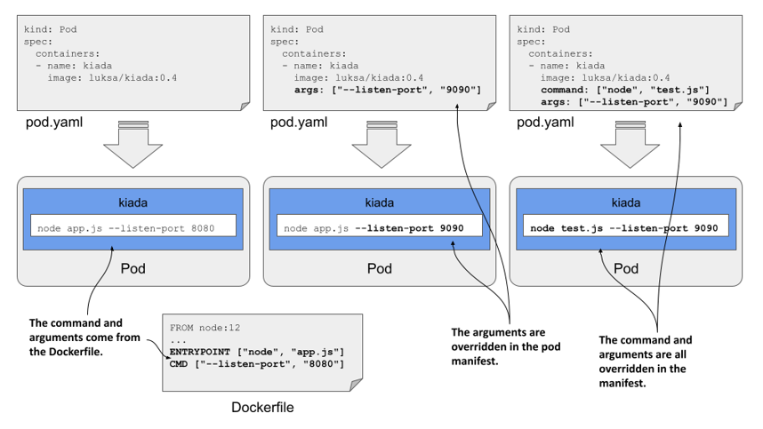
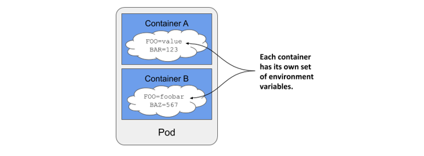
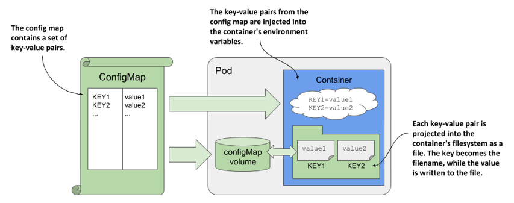
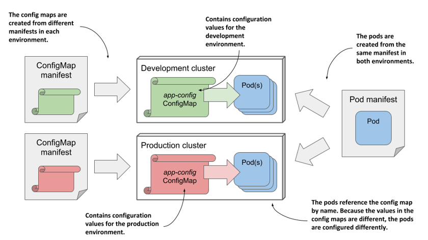
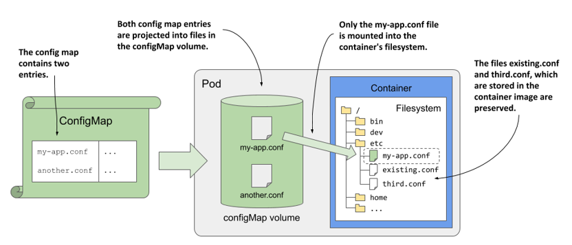
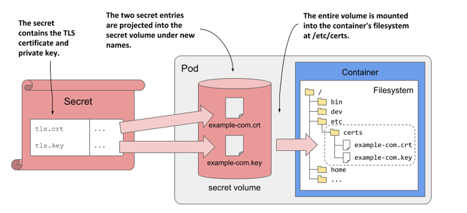
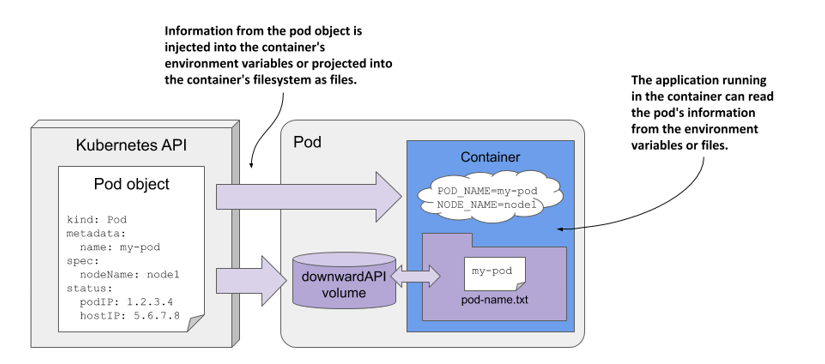
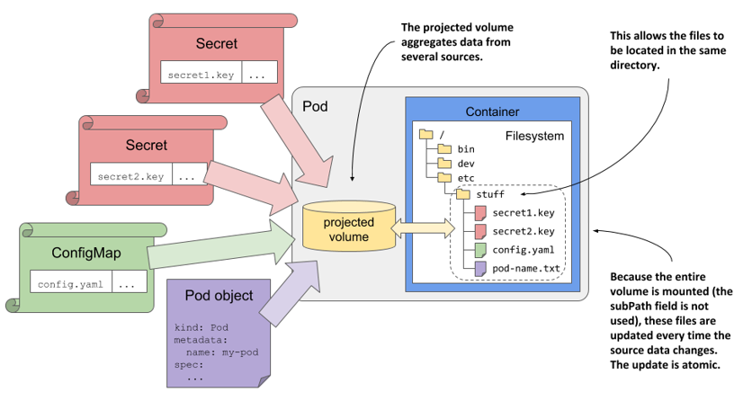

# 9 Cấu hình ứng dụng qua ConfigMap, Secret và Downward API

### Nội dung chính của chương

- Thiết lập lệnh thực thi (command) và các đối số (argument) cho tiến trình chính của container
- Thiết lập các biến môi trường
- Lưu trữ cấu hình trong ConfigMap
- Lưu trữ thông tin nhạy cảm trong Secret
- Sử dụng Downward API để hiển thị siêu dữ liệu (metadata) của pod cho ứng dụng
- Sử dụng các volume loại configMap, secret, downwardAPI và projected volume

Đến đây, bạn đã biết cách sử dụng Kubernetes để vận hành một tiến trình ứng dụng và gắn các file volume vào tiến trình đó. Trong chương này, bạn sẽ học cách cấu hình cho ứng dụng — thông qua việc định nghĩa trực tiếp trong tệp cấu hình pod hoặc bằng cách tham chiếu tới các đối tượng API khác. Bạn cũng sẽ tìm hiểu cách đưa thông tin của chính pod đó vào bên trong ứng dụng đang chạy bên trong nó.

##### Lưu ý

Bạn có thể tìm thấy các tệp mã nguồn cho chương này tại đường dẫn <https://github.com/luksa/kubernetes-in-action-2nd-edition/tree/master/Chapter09>

## 9.1 Thiết lập command, argument và biến môi trường

Tương tự như các ứng dụng thông thường, các ứng dụng chạy trong container cũng có thể được định cấu hình bằng cách sử dụng các đối số dòng lệnh, biến môi trường và tệp tin cấu hình.

Bạn đã biết rằng lệnh được thực thi khi khởi động container thông thường sẽ được định nghĩa trực tiếp trong container image. Lệnh này được cấu hình trong Dockerfile của container bằng chỉ thị `ENTRYPOINT`, trong khi các đối số thường được chỉ định bằng chỉ thị `CMD`. Các biến môi trường cũng có thể được định nghĩa bằng chỉ thị `ENV` trong Dockerfile. Nếu ứng dụng sử dụng các tệp tin cấu hình, chúng ta có thể đưa các tệp tin này vào container image thông qua chỉ thị `COPY`. Bạn đã thấy một vài ví dụ minh họa cho các trường hợp này trong các chương trước.

Hãy lấy ứng dụng kiada làm ví dụ và thực hiện cấu hình cho nó thông qua các đối số dòng lệnh và biến môi trường. Các phiên bản trước của ứng dụng đều mặc định lắng nghe trên cổng 8080. Giờ đây, cổng này có thể tùy chỉnh thông qua đối số dòng lệnh `--listen-port`. Ngoài ra, ứng dụng sẽ đọc thông điệp trạng thái ban đầu từ biến môi trường `INITIAL_STATUS_MESSAGE`. Thay vì chỉ trả về hostname (tên máy), ứng dụng giờ đây cũng sẽ trả về cả tên pod, địa chỉ IP của pod, cũng như tên của node trong cluster mà nó đang chạy. Ứng dụng lấy các thông tin này thông qua các biến môi trường. Bạn có thể tìm thấy phần mã nguồn cập nhật trong kho lưu trữ mã nguồn của cuốn sách. Container image cho phiên bản mới này hiện có sẵn tại địa chỉ docker.io/luksa/kiada:0.4.

Tệp Dockerfile đã được cập nhật, vốn cũng có thể tìm thấy trong kho lưu trữ mã nguồn, được trình bày ở phần bên dưới.

##### Danh sách 9.1 Một ví dụ Dockerfile sử dụng nhiều phương thức cấu hình ứng dụng khác nhau

```dockerfile
FROM node:12
COPY app.js /app.js
COPY html/ /html
 
ENV INITIAL_STATUS_MESSAGE="This is the default status message"    #A
 
ENTRYPOINT ["node", "app.js"]                                      #B
CMD ["--listen-port", "8080"]                                      #C
```

Việc đóng cứng (hardcode) cấu hình vào trong container image cũng tệ hại tương tự như việc đóng cứng nó trực tiếp vào mã nguồn của ứng dụng. Đây là cách làm không tối ưu, bởi bạn sẽ buộc phải build lại image mỗi khi thay đổi cấu hình. Thêm vào đó, bạn tuyệt đối không bao giờ được đưa các dữ liệu cấu hình nhạy cảm như thông tin đăng nhập bảo mật hoặc khóa mã hóa vào bên trong container image, vì bất kỳ ai có quyền truy cập vào image đều có thể dễ dàng giải nén và trích xuất chúng.

Thay vào đó, việc lưu trữ các tệp này trong một volume được mount vào container sẽ an toàn hơn nhiều. Như bạn đã biết ở chương trước, một cách để thực hiện việc này là lưu trữ các tệp trong một persistent volume. Một cách khác là sử dụng volume `emptyDir` và một init container để lấy các tệp từ kho lưu trữ an toàn rồi ghi chúng vào volume đó. Nếu đã đọc các chương trước, chắc hẳn bạn đã biết cách làm việc này; thế nhưng, vẫn còn một giải pháp tối ưu hơn. Trong chương này, bạn sẽ học cách sử dụng các loại volume đặc biệt để đạt được kết quả tương tự mà không cần đến init container. Nhưng trước hết, hãy cùng tìm hiểu cách thay đổi lệnh, đối số và biến môi trường mà không cần phải xây dựng lại container image.

### 9.1.1 Thiết lập lệnh và đối số

Khi tạo một container image, lệnh và các đối số của nó được chỉ định bằng các chỉ thị `ENTRYPOINT` và `CMD` trong Dockerfile. Vì cả hai chỉ thị này đều chấp nhận các giá trị dạng mảng (array), bạn có thể chỉ định cả lệnh lẫn đối số bằng một trong hai chỉ thị, hoặc chia chúng ra cho cả hai. Khi container được thực thi, hai mảng này sẽ được nối lại với nhau để tạo thành câu lệnh hoàn chỉnh.

Kubernetes cung cấp hai trường tương tự như các chỉ thị `ENTRYPOINT` và `CMD` của Docker. Hai trường này lần lượt được gọi là `command` và `args`. Bạn khai báo các trường này trong phần định nghĩa container thuộc pod manifest. Tương tự như trong Docker, hai trường này cũng chấp nhận các giá trị dạng mảng, và lệnh thực thi cuối cùng trong container sẽ được tạo ra bằng cách nối hai mảng này lại với nhau.

##### Hình 9.1 Ghi đè lệnh và đối số trong pod manifest



Thông thường, bạn sẽ dùng chỉ thị `ENTRYPOINT` để chỉ định lệnh gốc, và chỉ thị `CMD` để chỉ định các đối số. Việc này cho phép bạn ghi đè các đối số trong pod manifest mà không cần phải khai báo lại lệnh. Nếu muốn ghi đè lệnh, bạn vẫn có thể thực hiện được, và thậm chí là ghi đè lệnh mà không cần thay đổi các đối số.

Bảng dưới đây trình bày các trường tương đương trong pod manifest cho từng chỉ thị tương ứng trong Dockerfile.

##### Bảng 9.1 Khai báo lệnh và đối số trong Dockerfile so với pod manifest

| Dockerfile | Pod manifest | Mô tả |
| :--- | :--- | :--- |
| `ENTRYPOINT` | `command` | Tệp thực thi chạy trong container. Trường này có thể chứa cả các đối số đi kèm với tệp thực thi. |
| `CMD` | `args` | Các đối số bổ sung được truyền vào lệnh đã khai báo bằng chỉ thị `ENTRYPOINT` hoặc trường `command`. |

Hãy cùng xem qua hai ví dụ về cách thiết lập các trường `command` và `args`.

#### Thiết lập lệnh

Giả sử bạn muốn chạy ứng dụng Kiada với tính năng phân tích hiệu năng (profiling) CPU và bộ nhớ heap được kích hoạt. Với Node.js, bạn có thể bật tính năng profiling bằng cách truyền các đối số `--cpu-prof` và `--heap-prof` vào lệnh `node`. Thay vì phải sửa đổi Dockerfile và build lại image, bạn có thể thực hiện việc này bằng cách điều chỉnh pod manifest như trong danh sách dưới đây.

##### Danh sách 9.2 Định nghĩa container có chỉ định lệnh

```yaml
kind: Pod
spec:
  containers:
  - name: kiada
    image: luksa/kiada:0.4
    command: ["node", "--cpu-prof", "--heap-prof", "app.js"]    #A
```

Khi bạn triển khai pod trong danh sách trên, lệnh `node --cpu-prof --heap-prof app.js` sẽ được thực thi thay vì lệnh mặc định được chỉ định trong Dockerfile là `node app.js`.

Như bạn thấy trong danh sách, trường `command` cũng chấp nhận một mảng các chuỗi biểu diễn câu lệnh cần thực thi, tương tự như chỉ thị tương ứng trong Dockerfile. Cách viết mảng trên một dòng như trong danh sách sẽ rất tiện khi mảng chỉ có vài phần tử, nhưng sẽ trở nên khó đọc khi số lượng phần tử tăng lên. Trong trường hợp đó, bạn nên sử dụng cách viết sau:

```yaml
command:
    - node
    - --cpu-prof
    - --heap-prof
    - app.js
```

##### Mẹo

Những giá trị mà bộ phân tích cú pháp (parser) YAML có thể diễn dịch thành một kiểu dữ liệu khác ngoài chuỗi thì bắt buộc phải được đặt trong dấu ngoặc kép. Nhóm này bao gồm các giá trị số như `1234`, và các giá trị Boolean như `true` và `false`. Một số chuỗi đặc biệt khác cũng cần phải đặt trong dấu ngoặc kép, nếu không chúng sẽ bị hiểu nhầm thành kiểu Boolean hoặc các kiểu dữ liệu khác. Chúng bao gồm các giá trị như `true`, `false`, `yes`, `no`, `on`, `off`, `y`, `n`, `t`, `f`, `null`, cùng một số giá trị tương tự.

#### Thiết lập đối số lệnh

Các đối số dòng lệnh có thể được ghi đè bằng trường `args`, như minh họa trong danh sách dưới đây.

##### Danh sách 9.3 Định nghĩa container có thiết lập trường args

```yaml
kind: Pod
spec:
  containers:
  - name: kiada
    image: luksa/kiada:0.4
    args: ["--listen-port", "9090"]    #A
```

Pod manifest trong danh sách này ghi đè đối số mặc định `--listen-port 8080` được thiết lập trong Dockerfile bằng `--listen-port 9090`. Khi bạn triển khai pod này, lệnh hoàn chỉnh chạy trong container sẽ là `node app.js --listen-port 9090`. Lệnh này là kết quả của việc nối chỉ thị `ENTRYPOINT` trong Dockerfile với trường `args` trong pod manifest.

### 9.1.2 Thiết lập biến môi trường trong container

Các ứng dụng chạy trong container thường được cấu hình thông qua các biến môi trường. Tương tự như lệnh và đối số, bạn có thể thiết lập các biến môi trường riêng cho từng container của pod, như minh họa trong hình 9.2.

##### Hình 9.2 Biến môi trường được thiết lập riêng cho từng container.



##### Lưu ý

Tại thời điểm viết cuốn sách này, các biến môi trường chỉ có thể được thiết lập riêng lẻ cho từng container. Bạn không thể thiết lập một tập hợp các biến môi trường toàn cục cho toàn bộ pod để tất cả các container của nó tự động kế thừa.

Bạn có thể gán cho biến môi trường một giá trị tĩnh (literal), tham chiếu nó đến một biến môi trường khác, hoặc lấy giá trị từ một nguồn bên ngoài. Hãy cùng tìm hiểu cách thực hiện.

#### Thiết lập giá trị tĩnh cho biến môi trường

Phiên bản 0.4 của ứng dụng Kiada hiển thị tên của pod bằng cách đọc từ biến môi trường `POD_NAME`. Ứng dụng này cũng cho phép bạn thiết lập thông điệp trạng thái thông qua biến môi trường `INITIAL_STATUS_MESSAGE`. Hãy cùng thiết lập hai biến này trong pod manifest.

Để thiết lập biến môi trường, bạn có thể thêm chỉ thị `ENV` vào Dockerfile rồi build lại image, nhưng cách nhanh hơn là thêm trường `env` vào phần định nghĩa container trong pod manifest, như tôi đã làm trong danh sách dưới đây (tệp `pod.kiada.env-value.yaml`).

##### Danh sách 9.4 Thiết lập các biến môi trường trong pod manifest

```yaml
kind: Pod
metadata:
  name: kiada
spec:
  containers:
  - name: kiada
    image: luksa/kiada:0.4
    env:                                                      #A
    - name: POD_NAME                                          #B
      value: kiada                                            #B
    - name: INITIAL_STATUS_MESSAGE                            #C
      value: This status message is set in the pod spec.      #C
    ...
```

Như bạn thấy trong danh sách, trường `env` nhận một mảng các giá trị. Mỗi phần tử trong mảng sẽ chỉ định tên của biến môi trường cùng giá trị tương ứng của nó.

##### Lưu ý

Vì giá trị của biến môi trường bắt buộc phải là chuỗi, bạn phải đặt các giá trị không phải là chuỗi vào trong dấu ngoặc kép để tránh việc bộ phân tích cú pháp YAML hiểu sai kiểu dữ liệu. Như đã giải thích ở mục 9.1.1, quy tắc này cũng áp dụng cho các chuỗi như `yes`, `no`, `true`, `false`, v.v.

Khi triển khai pod trong danh sách trên và gửi một yêu cầu HTTP đến ứng dụng, bạn sẽ thấy tên pod và thông điệp trạng thái hiển thị đúng như những gì đã khai báo qua biến môi trường. Bạn cũng có thể chạy lệnh dưới đây để kiểm tra các biến môi trường trong container. Bạn sẽ tìm thấy hai biến môi trường đó trong kết quả đầu ra sau:

```
$ kubectl exec kiada -- env
PATH=/usr/local/sbin:/usr/local/bin:/usr/sbin:/usr/bin:/sbin:/bin    #A
HOSTNAME=kiada                                                       #A
NODE_VERSION=12.19.1                                                 #B
YARN_VERSION=1.22.5                                                  #B
POD_NAME=kiada                                                       #C
INITIAL_STATUS_MESSAGE=This status message is set in the pod spec.   #C
KUBERNETES_SERVICE_HOST=10.96.0.1                                    #D
...                                                                  #D
KUBERNETES_SERVICE_PORT=443                                          #D
```

Như bạn có thể thấy, có một vài biến khác cũng được thiết lập trong container. Chúng đến từ nhiều nguồn khác nhau: một số được định nghĩa sẵn trong container image, số khác do Kubernetes tự động thêm vào, và phần còn lại đến từ những nơi khác. Mặc dù không có cách nào biết chính xác từng biến bắt nguồn từ đâu, bạn sẽ dần quen và nhận biết được một vài trong số chúng. Chẳng hạn, các biến do Kubernetes thêm vào thường liên quan đến đối tượng Service, nội dung này sẽ được trình bày chi tiết ở chương 11. Để xác định nguồn gốc của các biến còn lại, bạn có thể kiểm tra pod manifest và tệp Dockerfile của container image.

#### Sử dụng tham chiếu biến trong giá trị của biến môi trường

Ở ví dụ trước, bạn đã thiết lập một giá trị cố định cho biến môi trường `INITIAL_STATUS_MESSAGE`. Tuy nhiên, bạn cũng có thể tham chiếu đến các biến môi trường khác ngay trong giá trị này bằng cách sử dụng cú pháp `$(VAR_NAME)`.

Ví dụ, bạn có thể tham chiếu đến biến `POD_NAME` ngay bên trong biến thông điệp trạng thái như trong danh sách dưới đây, trích từ một phần của tệp `pod.kiada.env-value-ref.yaml`.

##### Danh sách 9.5 Tham chiếu đến một biến môi trường trong một biến khác

```yaml
env:
- name: POD_NAME
  value: kiada
- name: INITIAL_STATUS_MESSAGE
  value: My name is $(POD_NAME). I run NodeJS version $(NODE_VERSION).   #A
```

Lưu ý rằng một trong hai tham chiếu sẽ trỏ đến biến môi trường `POD_NAME` được định nghĩa ở trên, trong khi tham chiếu còn lại trỏ đến biến `NODE_VERSION` vốn được thiết lập sẵn trong container image (bạn đã thấy biến này khi chạy lệnh `env` trong container ở phần trước). Khi bạn triển khai pod, thông điệp trạng thái mà nó trả về sẽ là:

```
My name is kiada. I run NodeJS version $(NODE_VERSION).
```

Đúng như bạn thấy, tham chiếu đến `NODE_VERSION` đã không được phân giải. Lý do là vì bạn chỉ có thể sử dụng cú pháp `$(VAR_NAME)` để tham chiếu đến các biến được định nghĩa trong *cùng một manifest*. Hơn nữa, biến được tham chiếu phải được định nghĩa *trước* biến sử dụng nó. Vì `NODE_VERSION` được định nghĩa trong Dockerfile của image Node.js chứ không phải trong pod manifest, nên Kubernetes không thể phân giải được biến này.

##### Lưu ý

Nếu một tham chiếu biến không thể phân giải, chuỗi tham chiếu đó sẽ được giữ nguyên không đổi.

##### Lưu ý

Khi bạn muốn một biến chứa chuỗi ký tự thuần túy `$(VAR_NAME)` và không muốn Kubernetes phân giải nó, hãy sử dụng hai dấu đô la liên tiếp, viết là `$$(VAR_NAME)`. Kubernetes sẽ tự động loại bỏ bớt một dấu đô la và bỏ qua bước phân giải biến này.

#### Sử dụng tham chiếu biến trong lệnh và đối số

Không chỉ giới hạn trong việc gán giá trị cho các biến khác, bạn còn có thể tham chiếu đến các biến môi trường được định nghĩa trong manifest ngay tại các trường `command` và `args` đã học ở phần trước. Ví dụ, tệp `pod.kiada.env-value-ref-in-args.yaml` định nghĩa một biến môi trường có tên `LISTEN_PORT` và tham chiếu đến nó trong trường `args`. Danh sách dưới đây hiển thị phần cấu hình liên quan của tệp này.

##### Danh sách 9.6 Tham chiếu đến biến môi trường trong trường args

```yaml
spec:
  containers:
  - name: kiada
    image: luksa/kiada:0.4
    args:
    - --listen-port
    - $(LISTEN_PORT)           #A
    env:
    - name: LISTEN_PORT
      value: "8080"
```

Đây chưa hẳn là một ví dụ thực tế tối ưu, vì không có lý do gì đặc biệt để sử dụng tham chiếu biến thay vì khai báo trực tiếp số cổng. Tuy nhiên, ở phần sau bạn sẽ biết cách lấy giá trị biến môi trường từ một nguồn bên ngoài. Khi đó, bạn có thể áp dụng cách tham chiếu như trong danh sách này để truyền giá trị đó vào lệnh hoặc đối số của container.

#### Tham chiếu đến các biến môi trường không có trong manifest

Tương tự như khi sử dụng tham chiếu trong biến môi trường, bạn chỉ có thể dùng cú pháp `$(VAR_NAME)` trong các trường `command` và `args` để tham chiếu đến các biến được khai báo trực tiếp trong pod manifest. Bạn không thể tham chiếu đến các biến môi trường được định nghĩa sẵn trong container image bằng cách này.

Dù vậy, bạn vẫn có thể áp dụng một cách tiếp cận khác. Nếu chạy câu lệnh thông qua một shell, bạn có thể để chính shell đó phân giải biến. Chẳng hạn, nếu sử dụng bash shell, bạn có thể tham chiếu đến biến bằng cú pháp `$VAR_NAME` hoặc `${VAR_NAME}` thay vì `$(VAR_NAME)`.

Ví dụ, câu lệnh trong danh sách dưới đây in ra chính xác giá trị của biến môi trường `HOSTNAME` dù nó không hề được định nghĩa trong pod manifest mà do hệ điều hành khởi tạo. Bạn có thể tìm thấy ví dụ này trong tệp `pod.env-var-references-in-shell.yaml`.

##### Danh sách 9.7 Tham chiếu đến biến môi trường trong câu lệnh shell

```yaml
containers:
- name: main
  image: alpine
  command:
  - sh   #A
  - -c   #A
  - 'echo "Hostname is $HOSTNAME."; sleep infinity'   #B
```

##### Thiết lập tên miền đủ điều kiện (FQDN) của pod

Sẵn tiện đang nói về hostname của pod, đây cũng là thời điểm thích hợp để giải thích rằng bạn hoàn toàn có thể cấu hình hostname và subdomain của pod ngay trong pod manifest. Theo mặc định, hostname sẽ trùng với tên của pod, nhưng bạn có thể ghi đè giá trị này bằng trường `hostname` trong phần `spec` của pod. Bạn cũng có thể thiết lập trường `subdomain` để tên miền đầy đủ (FQDN) của pod có dạng như sau:

```
<hostname>.<subdomain>.<pod namespace>.svc.<cluster domain>
```

Lưu ý rằng đây chỉ là FQDN nội bộ của pod. Hệ thống DNS sẽ không thể phân giải được tên miền này nếu không có thêm các bước thiết lập bổ sung (sẽ được giải thích ở chương 11). Bạn có thể tìm thấy một ví dụ cấu hình hostname tùy chỉnh cho pod trong tệp `pod.kiada.hostname.yaml`.

## 9.2 Sử dụng config map để tách biệt cấu hình khỏi pod

Ở phần trước, bạn đã biết cách đóng cứng cấu hình trực tiếp vào trong các pod manifest. Mặc dù phương pháp này tốt hơn nhiều so với việc đóng cứng trong container image, nhưng nó vẫn chưa thực sự tối ưu. Bởi lẽ, bạn sẽ cần các phiên bản pod manifest riêng biệt cho từng môi trường triển khai, chẳng hạn như môi trường phát triển (development), kiểm thử (staging), hay vận hành thực tế (production).

Để có thể tái sử dụng cùng một định nghĩa pod trên nhiều môi trường khác nhau, giải pháp tốt nhất là tách biệt phần cấu hình ra khỏi pod manifest. Một cách để thực hiện việc này là chuyển cấu hình vào một đối tượng ConfigMap, sau đó tham chiếu đến nó trong pod manifest. Đây chính là nội dung tiếp theo chúng ta sẽ cùng thực hiện.

### 9.2.1 Giới thiệu về ConfigMap

ConfigMap là một đối tượng API của Kubernetes, có vai trò đơn giản là lưu trữ một danh sách các cặp khóa/giá trị (key/value). Các giá trị này có thể rất đa dạng, từ những chuỗi ký tự ngắn cho đến các khối văn bản có cấu trúc lớn thường thấy trong các tệp cấu hình ứng dụng. Các pod có thể tham chiếu đến một hoặc nhiều cặp khóa/giá trị này trong config map. Một pod có thể sử dụng nhiều config map khác nhau, và ngược lại, nhiều pod cũng có thể chia sẻ chung một config map.

Nhằm giữ cho ứng dụng độc lập với Kubernetes (Kubernetes-agnostic), người ta thường không để ứng dụng trực tiếp đọc đối tượng ConfigMap thông qua REST API của Kubernetes. Thay vào đó, các cặp khóa/giá trị trong config map sẽ được truyền vào container dưới dạng các biến môi trường, hoặc được gắn (mount) dưới dạng các tệp tin vào hệ thống tệp của container thông qua một volume loại `configMap`, như minh họa trong hình dưới đây.

##### Hình 9.3 Pod sử dụng config map thông qua biến môi trường và volume configMap.



Ở phần trước, bạn đã biết cách tham chiếu các biến môi trường trong các đối số dòng lệnh. Bạn có thể áp dụng kỹ thuật này để chuyển một phần tử trong config map (vốn đã được hiển thị dưới dạng biến môi trường) vào làm đối số dòng lệnh.

Dù ứng dụng sử dụng config map theo cách nào, việc lưu trữ cấu hình trong một đối tượng độc lập thay vì đặt trực tiếp trong pod sẽ giúp bạn dễ dàng quản lý cấu hình riêng cho từng môi trường. Bạn chỉ cần duy trì các manifest config map khác nhau và áp dụng chúng vào môi trường đích tương ứng. Vì pod tham chiếu đến config map bằng tên, bạn có thể triển khai cùng một pod manifest trên mọi môi trường của mình mà vẫn đảm bảo cấu hình riêng biệt cho từng nơi bằng cách sử dụng cùng một tên config map, như minh họa trong hình dưới đây.

##### Hình 9.4 Triển khai cùng một pod manifest và các config map manifest khác nhau trên các môi trường khác nhau



### 9.2.2 Tạo đối tượng ConfigMap

Hãy cùng tạo một config map và sử dụng nó trong pod. Dưới đây là một ví dụ đơn giản: config map chứa một phần tử duy nhất dùng để khởi tạo biến môi trường `INITIAL_STATUS_MESSAGE` cho pod `kiada`.

#### Tạo config map bằng lệnh kubectl create configmap

Tương tự như với pod, bạn hoàn toàn có thể tạo đối tượng ConfigMap từ một manifest YAML, nhưng cách nhanh hơn là sử dụng lệnh `kubectl create configmap` như sau:

```
$ kubectl create configmap kiada-config --from-literal status-message="This status message is set in the kiada-config config map"
configmap "kiada-config" created
```

##### Lưu ý

Các khóa (key) trong config map chỉ được phép chứa các ký tự chữ và số, dấu gạch ngang (`-`), dấu gạch dưới (`_`), hoặc dấu chấm (`.`). Các ký tự khác đều không hợp lệ.

Chạy lệnh này sẽ tạo ra một config map có tên `kiada-config` chứa một phần tử duy nhất. Khóa và giá trị của nó được chỉ định qua đối số `--from-literal`.

Bên cạnh `--from-literal`, lệnh `kubectl create configmap` còn hỗ trợ lấy các cặp khóa/giá trị trực tiếp từ các tệp tin. Bảng dưới đây sẽ giải thích các phương thức hỗ trợ này.

##### Bảng 9.2 Các tùy chọn tạo phần tử config map bằng lệnh kubectl create configmap

| Tùy chọn | Mô tả |
| :--- | :--- |
| `--from-literal` | Thêm một cặp khóa và giá trị tĩnh (literal) vào config map. Ví dụ: `--from-literal mykey=myvalue`. |
| `--from-file` | Thêm nội dung của một tệp tin vào config map. Hành vi cụ thể sẽ phụ thuộc vào tham số đi sau tùy chọn `--from-file`:<br><br>- Nếu chỉ chỉ định tên tệp (ví dụ: `--from-file myfile.txt`), tên tệp gốc (base name) sẽ được dùng làm khóa và toàn bộ nội dung tệp sẽ được dùng làm giá trị.<br><br>- Nếu chỉ định dạng `khóa=tệp` (ví dụ: `--from-file mykey=myfile.txt`), nội dung tệp sẽ được lưu trữ dưới khóa đã chỉ định.<br><br>- Nếu tên tệp đại diện cho một thư mục, mỗi tệp nằm trong thư mục đó sẽ được đưa vào dưới dạng một phần tử riêng biệt. Tên của từng tệp sẽ được dùng làm khóa, và nội dung tệp làm giá trị tương ứng. Các thư mục con, liên kết tượng trưng (symbolic link), thiết bị (device), đường ống (pipe) và các tệp có tên không hợp lệ để làm khóa config map sẽ bị bỏ qua. |
| `--from-env-file` | Thêm từng dòng của tệp được chỉ định làm một phần tử riêng biệt (ví dụ: `--from-env-file myfile.env`). Tệp này phải chứa các dòng có định dạng: `key=value` |

Các config map thông thường sẽ chứa nhiều phần tử. Để tạo một config map có nhiều phần tử, bạn có thể truyền nhiều đối số `--from-literal`, `--from-file`, và `--from-env-file`, hoặc kết hợp chúng lại với nhau.

#### Tạo config map từ manifest YAML

Một cách khác là bạn có thể tạo config map từ một tệp manifest YAML. Danh sách dưới đây hiển thị nội dung của tệp manifest tương đương có tên `cm.kiada-config.yaml` được cung cấp trong kho mã nguồn. Bạn có thể tạo config map bằng cách áp dụng tệp này với lệnh `kubectl apply`.

##### Danh sách 9.8 Tệp manifest của một config map

```yaml
apiVersion: v1   #A
kind: ConfigMap   #A
metadata:
  name: kiada-config   #B
data:                             #C
  status-message: This status message is set in the kiada-config config map   #C
```

#### Liệt kê các config map và hiển thị nội dung của chúng

Config map là các đối tượng API của Kubernetes hoạt động song song với pod, node, persistent volume và các đối tượng khác mà bạn đã tìm hiểu từ đầu sách đến nay. Bạn có thể sử dụng nhiều lệnh `kubectl` khác nhau để thực hiện các thao tác CRUD trên chúng. Ví dụ, bạn có thể liệt kê các config map bằng lệnh:

```
$ kubectl get cm
```

##### Lưu ý

Tên viết tắt của `configmaps` là `cm`.

Bạn có thể hiển thị các phần tử trong config map bằng cách yêu cầu `kubectl` in ra manifest YAML của nó:

```
$ kubectl get cm kiada-config -o yaml
```

##### Lưu ý

Vì các trường trong YAML được xuất ra theo thứ tự bảng chữ cái, bạn sẽ tìm thấy trường `data` nằm ở ngay phần đầu của kết quả đầu ra.

##### Mẹo

Để chỉ hiển thị các cặp khóa/giá trị, hãy kết hợp lệnh `kubectl` với công cụ `jq`. Ví dụ: `kubectl get cm kiada-config -o json | jq .data`. Bạn có thể hiển thị giá trị của một phần tử cụ thể như sau: `kubectl... | jq '.data["status-message"]'`.

### 9.2.3 Nhúng các giá trị từ config map vào biến môi trường

Ở phần trước, bạn đã tạo config map `kiada-config`. Bây giờ, hãy cùng sử dụng nó trong pod `kiada`.

#### Nhúng một phần tử đơn lẻ từ config map

Để nhúng một phần tử đơn lẻ của config map vào một biến môi trường, bạn chỉ cần thay thế trường `value` trong định nghĩa biến môi trường bằng trường `valueFrom`, sau đó tham chiếu đến phần tử tương ứng của config map. Danh sách dưới đây hiển thị phần cấu hình liên quan của pod manifest. Bạn có thể tìm thấy toàn bộ manifest này trong tệp `pod.kiada.env-valueFrom.yaml`.

##### Danh sách 9.9 Thiết lập biến môi trường từ một phần tử của config map

```yaml
kind: Pod
...
spec:
  containers:
  - name: kiada
    env:   #A
    - name: INITIAL_STATUS_MESSAGE   #A
      valueFrom:   #B
        configMapKeyRef:   #B
          name: kiada-config   #C
          key: status-message   #D
          optional: true   #E
    volumeMounts:
    - ...
```

Hãy để tôi phân tích chi tiết phần định nghĩa biến môi trường trong danh sách trên. Thay vì chỉ định một giá trị cố định cho biến, bạn khai báo rằng giá trị này sẽ được lấy từ một config map. Tên của config map được chỉ định qua trường `name`, trong khi trường `key` xác định khóa cần lấy trong bản đồ cấu hình đó.

Hãy tạo pod từ manifest này và kiểm tra các biến môi trường của nó bằng lệnh sau:

```
$ kubectl exec kiada -- env
...
INITIAL_STATUS_MESSAGE=This status message is set in the kiada-config config map
...
```

Thông điệp trạng thái này cũng sẽ xuất hiện trong phản hồi của pod khi bạn truy cập qua lệnh `curl` hoặc trình duyệt.

#### Đánh dấu tham chiếu là không bắt buộc (optional)

Trong danh sách trước, tham chiếu đến khóa của config map được đánh dấu là `optional` (tùy chọn) để container vẫn có thể chạy bình thường ngay cả khi thiếu config map hoặc thiếu khóa đó. Nếu rơi vào trường hợp này, biến môi trường tương ứng sẽ đơn giản là không được thiết lập. Bạn có thể đánh dấu tham chiếu là không bắt buộc vì ứng dụng Kiada vẫn có thể hoạt động ổn định mà không cần đến nó. Bạn có thể xóa config map rồi triển khai lại pod để tự mình xác nhận điều này.

##### Lưu ý

Nếu một config map hoặc một khóa được tham chiếu trong định nghĩa container bị thiếu và không được đánh dấu là tùy chọn, pod vẫn sẽ được lên lịch (schedule) hoạt động như bình thường. Các container khác trong pod vẫn khởi chạy bình thường. Riêng container tham chiếu đến khóa config map bị thiếu sẽ chỉ được khởi động ngay sau khi bạn tạo config map có chứa khóa được tham chiếu đó.

#### Nhúng toàn bộ config map

Trường `env` trong định nghĩa container nhận vào một mảng các giá trị, cho phép bạn thiết lập bao nhiêu biến môi trường tùy thích. Tuy nhiên, nếu bạn muốn thiết lập một số lượng lớn các biến, việc khai báo từng biến một sẽ rất tẻ nhạt và dễ xảy ra sai sót. Thật may mắn, bằng cách sử dụng trường `envFrom` thay cho trường `env`, bạn có thể nhúng toàn bộ các phần tử có trong config map mà không cần phải khai báo thủ công từng khóa một.

Điểm hạn chế của cách tiếp cận này là bạn sẽ không thể thay đổi định dạng của khóa khi chuyển thành tên biến môi trường; do đó, các khóa trong config map phải được đặt tên đúng chuẩn ngay từ đầu. Thao tác biến đổi duy nhất bạn có thể làm là thêm một tiền tố (prefix) vào trước mỗi khóa.

Ví dụ, ứng dụng Kiada cần đọc biến môi trường `INITIAL_STATUS_MESSAGE`, nhưng khóa bạn đã dùng trong config map trước đó lại là `status-message`. Bạn bắt buộc phải đổi khóa trong config map sao cho khớp với tên biến môi trường mong muốn nếu muốn ứng dụng đọc được giá trị khi dùng trường `envFrom` để nhúng toàn bộ config map vào pod. Tôi đã thực hiện việc này trong tệp `cm.kiada-config.envFrom.yaml`. Ngoài khóa `INITIAL_STATUS_MESSAGE`, tệp này còn chứa thêm hai khóa khác nhằm minh họa rằng tất cả chúng đều sẽ được nhúng vào môi trường của container.

Hãy thay thế config map hiện tại bằng config map trong tệp này bằng cách chạy lệnh sau:

```
$ kubectl replace -f cm.kiada-config.envFrom.yaml
```

Pod manifest trong tệp `pod.kiada.envFrom.yaml` sử dụng trường `envFrom` để nhúng toàn bộ config map vào pod. Danh sách dưới đây hiển thị phần cấu hình liên quan của manifest này.

##### Danh sách 9.10 Sử dụng envFrom để nhúng toàn bộ config map vào các biến môi trường

```yaml
kind: Pod
...
spec:
  containers:
  - name: kiada
    envFrom:   #A
    - configMapRef:   #B
        name: kiada-config   #B
        optional: true   #C
```

Thay vì phải chỉ định cả tên config map lẫn khóa như ở ví dụ trước, giờ đây bạn chỉ cần khai báo tên của config map. Nếu bạn tạo pod từ manifest này và kiểm tra các biến môi trường của nó, bạn sẽ thấy nó chứa cả biến môi trường `INITIAL_STATUS_MESSAGE` cùng hai khóa còn lại được định nghĩa trong config map.

Tương tự như trước, bạn can có thể đánh dấu tham chiếu config map này là `optional`, cho phép container chạy ngay cả khi config map không tồn tại. Theo mặc định, điều này không được phép; các container tham chiếu đến config map sẽ bị chặn khởi động cho đến khi các config map được tham chiếu thực sự hiện diện.

#### Nhúng nhiều config map

Danh sách 9.10 cho thấy trường `envFrom` chấp nhận một mảng các giá trị, đồng nghĩa với việc bạn có thể kết hợp các phần tử từ nhiều config map khác nhau. Nếu hai config map chứa cùng một khóa, giá trị của config map được khai báo sau sẽ được ưu tiên áp dụng. Bạn cũng có thể kết hợp trường `envFrom` với trường `env` nếu muốn nhúng toàn bộ các phần tử của một config map này cùng với một vài phần tử cụ thể của một config map khác.

##### Lưu ý

Khi một biến môi trường được cấu hình trong trường `env`, nó sẽ có độ ưu tiên cao hơn và ghi đè lên các biến môi trường được thiết lập thông qua trường `envFrom`.

#### Thêm tiền tố cho khóa

Dù bạn nhúng một hay nhiều config map, bạn đều có thể thiết lập một trường `prefix` (tiền tố) không bắt buộc cho mỗi config map. Khi các phần tử của chúng được nhúng vào môi trường của container, tiền tố này sẽ được thêm vào trước mỗi khóa để tạo thành tên biến môi trường hoàn chỉnh.

### 9.2.4 Nhúng các phần tử của config map vào container dưới dạng tệp

Các biến môi trường thường được sử dụng để truyền các giá trị ngắn trên một dòng cho ứng dụng, khi các giá trị nhiều dòng thường được truyền dưới dạng các tệp tin. Các phần tử trong config map cũng có thể chứa các khối dữ liệu lớn hơn, và chúng có thể được ánh xạ vào container thông qua loại volume đặc biệt mang tên `configMap`.

##### Lưu ý

Dung lượng thông tin có thể chứa trong một config map bị giới hạn bởi etcd [^1] - kho lưu trữ dữ liệu nền tảng được dùng để lưu trữ các đối tượng API của Kubernetes. Hiện tại, kích thước tối đa của một config map là khoảng 1 megabyte (MB).

Volume `configMap` giúp các phần tử trong config map khả dụng dưới dạng các tệp tin riêng lẻ. Tiến trình chạy trong container sẽ lấy được giá trị của phần tử bằng cách đọc nội dung của tệp tin này. Cơ chế này thường được sử dụng phổ biến nhất để truyền các tệp cấu hình lớn vào container, nhưng cũng có thể dùng cho các giá trị nhỏ hơn, hoặc kết hợp với các trường `env` hoặc `envFrom` để vừa truyền các phần tử lớn dưới dạng tệp, vừa truyền các phần tử khác dưới dạng biến môi trường.

#### Tạo các phần tử config map từ tệp tin

Trong chương 4, bạn đã triển khai pod `kiada` cùng một sidecar Envoy [^2] làm nhiệm vụ xử lý lưu lượng mạng TLS cho pod. Vì tại thời điểm đó khái niệm volume chưa được giải thích, nên tệp cấu hình, chứng chỉ TLS và khóa riêng tư (private key) mà Envoy sử dụng đều được đóng gói sẵn trực tiếp vào container image. Sẽ tiện lợi hơn rất nhiều nếu các tệp này được lưu trữ trong một config map rồi nhúng vào container. Bằng cách đó, bạn có thể cập nhật cấu hình mà không cần phải build lại image. Tuy nhiên, vì các yêu cầu về mặt bảo mật của những tệp này là khác nhau, chúng ta buộc phải xử lý chúng theo những cách khác nhau. Trước tiên, hãy tập trung vào tệp cấu hình.

Bạn đã biết cách tạo một config map từ một giá trị tĩnh bằng lệnh `kubectl create configmap`. Lần này, thay vì tạo trực tiếp config map trong cluster, bạn sẽ tạo một manifest YAML cho nó để có thể lưu trữ trong hệ thống quản lý phiên bản (như Git) song song với pod manifest của mình.

Thay vì phải tự viết tệp manifest bằng tay, bạn có thể tạo nó bằng chính lệnh `kubectl create` đã dùng để tạo trực tiếp đối tượng trước đó. Lệnh dưới đây sẽ tạo tệp YAML cho một config map có tên `kiada-envoy-config`:

```
$ kubectl create configmap kiada-envoy-config \
      --from-file=envoy.yaml \
      --from-file=dummy.bin \
      --dry-run=client -o yaml > cm.kiada-envoy-config.yaml
```

Config map này sẽ chứa hai phần tử được lấy từ các tệp được chỉ định trong câu lệnh. Một là tệp cấu hình `envoy.yaml`, tệp còn lại chỉ chứa một số dữ liệu ngẫu nhiên nhằm minh họa rằng dữ liệu nhị phân (binary) cũng có thể được lưu trữ trong một config map.

Khi sử dụng tùy chọn `--dry-run`, lệnh này sẽ không thực sự tạo đối tượng trên API server của Kubernetes mà chỉ tạo ra phần định nghĩa của đối tượng đó. Tùy chọn `-o yaml` sẽ in định nghĩa YAML của đối tượng ra đầu ra tiêu chuẩn (standard output), sau đó được điều hướng và ghi vào tệp `cm.kiada-envoy-config.yaml`. Danh sách dưới đây hiển thị nội dung của tệp này.

##### Danh sách 9.11 Manifest của một config map chứa giá trị nhiều dòng

```yaml
apiVersion: v1
binaryData:
  dummy.bin: n2VW39IEkyQ6Jxo+rdo5J06Vi7cz5...   #A
data:
  envoy.yaml: |   #B
    admin:   #B
      access_log_path: /tmp/envoy.admin.log   #B
      address:   #B
        socket_address:   #B
          protocol: TCP   #B
          address: 0.0.0.0    #B
    ...   #B
kind: ConfigMap
metadata:
  creationTimestamp: null
  name: kiada-envoy-config   #C
```

Đúng như bạn thấy trong danh sách, tệp nhị phân sẽ được đặt trong trường `binaryData`, trong khi tệp cấu hình Envoy được đặt trong trường `data` quen thuộc mà bạn đã biết ở các phần trước. Nếu một phần tử config map chứa các chuỗi byte không thuộc chuẩn UTF-8, nó bắt buộc phải được định nghĩa trong trường `binaryData`. Lệnh `kubectl create configmap` sẽ tự động xác định vị trí đặt phần tử cho phù hợp. Các giá trị trong trường này được mã hóa dưới dạng Base64 - đây cũng là cách biểu diễn các giá trị nhị phân tiêu chuẩn trong YAML.

Ngược lại, nội dung của tệp `envoy.yaml` hiển thị rất rõ ràng trong trường `data`. Trong YAML, bạn có thể chỉ định các giá trị nhiều dòng bằng cách sử dụng ký tự đường ống (`|`) kết hợp với việc thụt lề dòng phù hợp. Bạn có thể tham khảo thêm tài liệu đặc tả YAML trên <https://YAML.org> để biết thêm nhiều cách thực hiện việc này.

##### Chú ý dọn sạch khoảng trắng thừa khi tạo config map

Khi tạo các config map từ tệp tin, hãy đảm bảo rằng không có dòng nào trong tệp chứa các khoảng trắng thừa ở cuối dòng (trailing whitespace). Nếu bất kỳ dòng nào kết thúc bằng một khoảng trắng, giá trị của phần tử đó trong manifest sẽ bị định dạng dưới dạng một chuỗi đặt trong dấu ngoặc kép với các ký tự xuống dòng bị chuyển thành ký tự thoát (escaped character như `\n`). Điều này khiến tệp manifest cực kỳ khó đọc và khó chỉnh sửa trực tiếp.

Hãy thử so sánh cách định dạng của hai giá trị trong config map dưới đây:

```
$ kubectl create configmap whitespace-demo \
--from-file=envoy.yaml \
--from-file=envoy-trailingspace.yaml \
--dry-run=client -o yaml
apiVersion: v1
data:
envoy-trailingspace.yaml: "admin: \n access_log_path: /tmp/envoy.admin.log\n #A
\ address:\n socket_address:\n protocol: TCP\n address: 0.0.0.0\n #A
\ port_value: 9901\nstatic_resources:\n listeners:\n - name: listener_0\n... #A
envoy.yaml: | #B
admin: #B
access_log_path: /tmp/envoy.admin.log #B
address: #B
socket_address:... #B
```

Hãy chú ý rằng tệp `envoy-trailingspace.yaml` có chứa một khoảng trắng ở cuối dòng đầu tiên. Lỗi nhỏ này đã khiến phần tử config map bị hiển thị theo một định dạng cực kỳ khó đọc đối với con người. Ngược lại, tệp `envoy.yaml` hoàn toàn không chứa khoảng trắng thừa ở cuối dòng nên được trình bày mượt mà dưới dạng chuỗi nhiều dòng nguyên bản (không bị thoát ký tự), giúp bạn dễ dàng đọc và chỉnh sửa trực tiếp tại chỗ.

Khoan hãy áp dụng tệp manifest config map này vào cluster Kubernetes. Trước hết, chúng ta sẽ tạo một pod tham chiếu đến config map này. Bằng cách đó, bạn có thể quan sát chuyện gì sẽ xảy ra khi một pod trỏ đến một config map chưa hề tồn tại.

#### Sử dụng volume configMap trong pod

Để các phần tử của config map khả dụng dưới dạng các tệp tin trong hệ thống tệp của container, bạn cần định nghĩa một volume loại `configMap` trong pod và gắn (mount) nó vào container, như minh họa trong danh sách dưới đây (trích xuất các phần liên quan của tệp `pod.kiada-ssl.configmap-volume.yaml`).

##### Danh sách 9.12 Định nghĩa một volume configMap trong pod

```yaml
apiVersion: v1
kind: Pod
metadata:
  name: kiada-ssl
spec:
  volumes:
  - name: envoy-config   #A
    configMap:   #A
      name: kiada-envoy-config   #A
  ...
  containers:
  ...
  - name: envoy
    image: luksa/kiada-ssl-proxy:0.1
    volumeMounts:   #B
    - name: envoy-config   #B
      mountPath: /etc/envoy   #B
  ...
```

Nếu đã đọc qua hai chương trước, bạn chắc chắn sẽ hiểu rõ phần định nghĩa của `volume` và `volumeMount` trong danh sách này. Như bạn thấy, đây là một volume loại `configMap` trỏ đến config map `kiada-envoy-config`, và được mount vào container `envoy` tại đường dẫn `/etc/envoy`. Volume này sẽ chứa các tệp `envoy.yaml` và `dummy.bin` tương ứng với các khóa được khai báo trong config map.

Hãy tạo pod từ tệp manifest này và kiểm tra trạng thái của nó. Bạn sẽ thấy kết quả hiển thị như sau:

```
$ kubectl get po
NAME        READY   STATUS              RESTARTS   AGE
kiada-ssl   0/2     ContainerCreating   0          2m
```

Vì volume `configMap` của pod tham chiếu đến một config map không tồn tại, đồng thời tham chiếu này lại không được đánh dấu là không bắt buộc (optional), nên container không thể khởi chạy được.

#### Đánh dấu volume configMap là không bắt buộc (optional)

Ở phần trước, bạn đã biết rằng nếu định nghĩa biến môi trường của một container tham chiếu đến một config map không tồn tại, container đó sẽ bị chặn không cho khởi động cho đến khi bạn tạo config map đó. Bạn cũng biết rằng việc này không hề ảnh hưởng đến tiến trình khởi chạy của các container khác. Vậy còn trường hợp hiện tại, khi config map bị thiếu được tham chiếu trực tiếp trong một volume thì sao?

Vì toàn bộ volume của pod bắt buộc phải được thiết lập hoàn tất trước khi các container của pod có thể khởi chạy, việc tham chiếu đến một config map bị thiếu trong volume sẽ ngăn cản *tất cả* các container trong pod khởi động, chứ không riêng gì container được mount volume đó. Hệ thống sẽ tạo ra một sự kiện (event) để thông báo về sự cố này. Bạn có thể hiển thị sự kiện đó bằng lệnh `kubectl describe pod` hoặc `kubectl get events` như đã được hướng dẫn ở các chương trước.

##### Lưu ý

Bạn có thể đánh dấu một volume `configMap` là không bắt buộc bằng cách thêm dòng `optional: true` vào định nghĩa volume. Nếu một volume được thiết lập là tùy chọn và config map đó không tồn tại, volume sẽ không được tạo ra và container vẫn được khởi chạy bình thường mà không cần mount volume đó.

Để cho phép các container của pod khởi chạy, hãy tạo config map bằng cách áp dụng tệp `cm.kiada-envoy-config.yaml` đã tạo trước đó. Sử dụng lệnh `kubectl apply`. Sau khi thực hiện thao tác này, pod sẽ khởi động bình thường và bạn có thể kiểm chứng xem cả hai phần tử config map đã được hiển thị dưới dạng tệp trong container hay chưa bằng cách liệt kê nội dung thư mục `/etc/envoy` như sau:

```
$ kubectl exec kiada-ssl -c envoy -- ls /etc/envoy
dummy.bin
envoy.yaml
```

#### Chỉ ánh xạ một số phần tử cụ thể của config map

Envoy không cần dùng đến tệp `dummy.bin`, nhưng hãy tưởng tượng rằng tệp này lại cần thiết cho một container hoặc pod khác và bạn không thể xóa nó khỏi config map. Tuy nhiên, việc để tệp tin thừa thãi này xuất hiện trong thư mục `/etc/envoy` là điều không mong muốn, vì vậy chúng ta hãy cùng tìm giải pháp khắc phục.

Thật may mắn, volume configMap cho phép bạn chỉ định rõ ràng những phần tử nào trong config map sẽ được ánh xạ thành tệp tin. Danh sách dưới đây sẽ minh họa cách thực hiện.

##### Danh sách 9.13 Chỉ định các phần tử config map được đưa vào volume configMap

```yaml
volumes:
  - name: envoy-config
    configMap:
      name: kiada-envoy-config
      items:   #A
      - key: envoy.yaml   #B
        path: envoy.yaml   #B
```

Trường `items` dùng để xác định danh sách các phần tử config map sẽ được đưa vào volume. Mỗi mục (item) phải chỉ định rõ khóa (`key`) cần lấy và tên tệp tin tương ứng trong trường `path`. Các phần tử không có tên trong danh sách này sẽ bị loại bỏ khỏi volume. Bằng cách này, bạn có thể duy trì một config map duy nhất cho một pod, trong đó một số phần tử sẽ hiển thị dưới dạng biến môi trường và một số khác hiển thị dưới dạng tệp tin.

#### Thiết lập quyền hạn tệp tin trong volume configMap

Theo mặc định, quyền hạn của tệp tin trong volume `configMap` được thiết lập ở mức `rw-r--r--`, tương ứng với giá trị `0644` trong hệ cơ số bát phân (octal).

##### Lưu ý

Nếu bạn chưa quen thuộc với cơ chế phân quyền tệp tin của Unix, giá trị `0644` trong hệ cơ số bát phân tương đương với `110`,`100`,`100` trong hệ nhị phân, tương ứng với bộ ba quyền hạn `rw-,r--,r--`. Thành phần thứ nhất đại diện cho quyền của chủ sở hữu tệp (owner), thành phần thứ hai đại diện cho nhóm sở hữu (group), và thành phần thứ ba dành cho tất cả những người dùng khác (others). Như vậy, chủ sở hữu có quyền đọc (`r`) và ghi (`w`) tệp nhưng không có quyền thực thi (`-` thay vì `x`), trong khi nhóm sở hữu và những người dùng khác chỉ có quyền đọc mà không thể ghi hay thực thi tệp (`r--`).

Bạn có thể thiết lập quyền truy cập mặc định cho các tệp tin trong một volume `configMap` bằng cách khai báo trường `defaultMode` trong định nghĩa volume. Trong tệp YAML, trường này chấp nhận giá trị ở cả hệ bát phân (octal) lẫn hệ thập phân (decimal). Ví dụ, để thiết lập quyền truy cập thành `rwxr-----`, hãy thêm `defaultMode: 0740` vào định nghĩa volume `configMap`. Để cấu hình quyền cho từng tệp riêng lẻ, bạn hãy thiết lập trường `mode` ngay bên cạnh trường `key` và `path` của tệp đó.

Khi chỉ định quyền truy cập tệp trong các manifest [^3] YAML, hãy chắc chắn rằng bạn không bao giờ quên chữ số 0 ở đầu, vì đây là ký hiệu cho biết giá trị đang ở hệ bát phân. Nếu bỏ sót chữ số 0 này, hệ thống sẽ hiểu đó là giá trị ở hệ thập phân, dẫn đến việc tệp tin bị phân quyền sai lệch so với ý định ban đầu của bạn.

##### Important

Khi sử dụng lệnh `kubectl get -o yaml` để hiển thị định nghĩa YAML của một pod, hãy lưu ý rằng quyền truy cập tệp sẽ được biểu diễn dưới dạng giá trị thập phân. Ví dụ, bạn sẽ thường xuyên bắt gặp giá trị `420`. Đây chính là giá trị thập phân tương đương của mã bát phân `0644` — vốn là quyền truy cập tệp mặc định.

Trước khi chuyển sang phần thiết lập và kiểm tra quyền truy cập tệp trong container, bạn cần biết rằng các tệp nằm trong volume `configMap` thực chất là các liên kết tượng trưng [^4] (phần 9.2.6 sẽ giải thích lý do). Để xem quyền truy cập của tệp thực tế, bạn phải truy theo các liên kết này, bởi bản thân các liên kết tượng trưng không tự mang quyền truy cập và luôn hiển thị mặc định là `rwxrwxrwx`.

### 9.2.5 Updating and deleting config maps

Tương tự như hầu hết các đối tượng API khác trong Kubernetes, bạn có thể cập nhật config map bất kỳ lúc nào bằng cách chỉnh sửa tệp manifest rồi áp dụng lại vào cluster bằng lệnh `kubectl apply`. Ngoài ra còn có một cách nhanh hơn, thường được sử dụng trong quá trình phát triển (development).

#### In-place editing of API objects using kubectl edit

Khi muốn thay đổi nhanh một đối tượng API, chẳng hạn như một ConfigMap, bạn có thể sử dụng lệnh `kubectl edit`. Ví dụ, để chỉnh sửa config map `kiada-envoy-config`, hãy chạy lệnh sau:

```shell
$ kubectl edit configmap kiada-envoy-config
```

Lệnh này sẽ mở manifest của đối tượng bằng trình soạn thảo văn bản mặc định của bạn, cho phép bạn trực tiếp thay đổi cấu hình. Khi bạn đóng trình soạn thảo, kubectl sẽ tự động gửi các thay đổi của bạn tới Kubernetes API server.

##### Configuring kubectl edit to use a different text editor

Bạn có thể chỉ định cho `kubectl` sử dụng trình soạn thảo văn bản yêu thích của mình bằng cách thiết lập biến môi trường `KUBE_EDITOR`. Ví dụ, nếu muốn sử dụng `nano` để chỉnh sửa các tài nguyên Kubernetes, hãy thực thi lệnh sau (hoặc thêm dòng này vào tệp `~/.bashrc` hoặc tệp cấu hình tương đương):

export KUBE\_EDITOR="/usr/bin/nano"

Nếu biến môi trường `KUBE_EDITOR` không được thiết lập, lệnh `kubectl edit` sẽ tự động chuyển sang sử dụng trình soạn thảo mặc định của hệ thống, thường được cấu hình thông qua biến môi trường `EDITOR`.

#### What happens when you modify a config map

Khi bạn cập nhật một config map, các tệp nằm trong volume `configMap` sẽ tự động được cập nhật theo.

##### Note

Có thể mất tới một phút để các tệp trong volume `configMap` được cập nhật sau khi bạn thay đổi config map.

Khác với các tệp tin, các biến môi trường không thể cập nhật khi container đang chạy. Tuy nhiên, nếu container bị khởi động lại vì một lý do nào đó (do bị crash hoặc bị dừng từ bên ngoài vì kiểm tra liveness probe thất bại), Kubernetes sẽ sử dụng các giá trị config map mới khi thiết lập biến môi trường cho container mới. Câu hỏi đặt ra là liệu bạn có thực sự muốn hệ thống hoạt động theo cách đó hay không.

#### Understanding the consequences of updating a config map

Một trong những đặc tính quan trọng nhất của container là tính bất biến (immutability), giúp bạn đảm bảo không có sự khác biệt nào giữa các instance của cùng một container (hoặc pod). Vậy thì, các config map — nguồn cung cấp cấu hình cho các instance này — chẳng phải cũng nên bất biến hay sao?

Hãy cùng suy ngẫm về điều này một lát. Chuyện gì sẽ xảy ra nếu bạn thay đổi một config map được dùng để truyền biến môi trường vào ứng dụng? Hoặc nếu ứng dụng được cấu hình thông qua các tệp cấu hình, nhưng nó lại không tự động tải lại (reload) chúng khi có thay đổi? Những thay đổi bạn thực hiện trên config map sẽ hoàn toàn không ảnh hưởng đến các instance ứng dụng đang chạy này. Tuy nhiên, nếu một vài instance trong số đó bị khởi động lại, hoặc nếu bạn tạo thêm các instance mới, chúng *sẽ* áp dụng cấu hình mới.

Kịch bản tương tự cũng xảy ra ngay cả với các ứng dụng có khả năng tự động tải lại cấu hình. Kubernetes cập nhật các volume `configMap` theo cơ chế bất đồng bộ (asynchronously). Do đó, một số instance ứng dụng có thể nhận ra thay đổi sớm hơn các instance khác. Và vì quá trình cập nhật có thể kéo dài tới hàng chục giây, các tệp cấu hình trong từng instance pod riêng lẻ có thể rơi vào trạng thái không đồng bộ trong một khoảng thời gian khá dài.

Trong cả hai kịch bản, bạn sẽ nhận về các instance có cấu hình khác biệt nhau. Điều này có thể khiến một số bộ phận trong hệ thống hoạt động không đồng nhất với phần còn lại. Bạn cần cân nhắc kỹ yếu tố này trước khi quyết định cho phép thay đổi một config map khi nó đang được các pod chạy thực tế sử dụng.

#### Preventing a config map from being updated

Để ngăn chặn người dùng thay đổi các giá trị trong một config map, bạn có thể đánh dấu config map đó là bất biến (immutable), như minh họa trong đoạn mã dưới đây.

##### Listing 9.14 Khởi tạo một config map bất biến

```yaml
apiVersion: v1
kind: ConfigMap
metadata:
  name: my-immutable-configmap
data:
  mykey: myvalue
  another-key: another-value
immutable: true                   #A
```

Nếu có ai đó cố tình thay đổi các trường `data` hoặc `binaryData` trong một config map bất biến, API server sẽ ngăn chặn hành động đó. Cơ chế này đảm bảo mọi pod đang sử dụng config map này đều hoạt động trên cùng một bộ giá trị cấu hình thống nhất. Nếu muốn chạy một nhóm pod với cấu hình khác, thông thường bạn sẽ tạo một config map mới rồi trỏ các pod đó sang tài nguyên mới này.

Config map bất biến không chỉ ngăn người dùng vô tình sửa đổi cấu hình ứng dụng, mà còn giúp cải thiện hiệu năng của toàn bộ cluster Kubernetes. Khi một config map được đánh dấu là bất biến, các Kubelet trên các worker node sử dụng config map đó sẽ không cần phải nhận thông báo mỗi khi có thay đổi đối với đối tượng ConfigMap nữa. Điều này giúp giảm đáng kể tải cho API server.

#### Deleting a config map

Các đối tượng ConfigMap có thể được xóa bằng lệnh `kubectl delete`. Các pod đang chạy có tham chiếu đến config map đó vẫn tiếp tục hoạt động bình thường mà không bị ảnh hưởng, nhưng chỉ cho đến khi các container của chúng buộc phải khởi động lại. Lúc này, nếu tham chiếu config map trong định nghĩa container không được đánh dấu là tùy chọn (`optional`), container sẽ không thể khởi chạy được nữa.

### 9.2.6 Understanding how configMap volumes work

Trước khi bắt đầu sử dụng volume `configMap` trong các pod của riêng mình, điều quan trọng là bạn phải hiểu rõ nguyên lý hoạt động của chúng, nếu không bạn sẽ mất rất nhiều thời gian để loay hoay giải quyết các rắc rối phát sinh.

Bạn có thể nghĩ rằng khi mount một volume `configMap` vào một thư mục trong container, Kubernetes chỉ đơn thuần là tạo ra một số tệp tin trong thư mục đó, nhưng thực tế lại phức tạp hơn nhiều. Có hai lưu ý quan trọng mà bạn cần ghi nhớ: một là cách thức các volume được mount nói chung, và hai là cách Kubernetes sử dụng các liên kết tượng trưng để đảm bảo quá trình cập nhật tệp diễn ra theo cơ chế nguyên tử (atomic update) [^5].

#### Mounting a volume hides existing files in the file directory

Khi bạn mount bất kỳ volume nào vào một thư mục trong hệ thống tệp của container, các tệp vốn có sẵn trong thư mục đó của container image sẽ không thể truy cập được nữa. Ví dụ, nếu bạn mount một volume `configMap` vào thư mục `/etc` (thư mục chứa các tệp cấu hình hệ thống quan trọng trong hệ điều hành Unix), các ứng dụng chạy trong container sẽ chỉ nhìn thấy các tệp được định nghĩa trong config map đó. Điều này đồng nghĩa với việc toàn bộ các tệp cần thiết khác trong `/etc` sẽ biến mất, có thể khiến ứng dụng không thể khởi chạy. Tuy nhiên, rắc rối này có thể được giải quyết bằng cách sử dụng trường `subPath` khi thực hiện mount volume.

Hãy tưởng tượng bạn có một volume `configMap` chứa tệp `my-app.conf` và bạn muốn đưa tệp này vào thư mục `/etc` mà không làm mất các tệp hiện có trong thư mục đó. Thay vì mount toàn bộ volume vào `/etc`, bạn chỉ mount duy nhất tệp cấu hình đó bằng cách kết hợp hai trường `mountPath` và `subPath`, như minh họa trong đoạn mã sau.

##### Listing 9.15 Mount một tệp riêng lẻ vào container

```yaml
spec:
  containers:
  - name: my-container
    volumeMounts:
    - name: my-volume
      subPath: my-app.conf                 #A
      mountPath: /etc/my-app.conf          #B
```

Để dễ dàng hình dung cơ chế hoạt động của các thiết lập này, bạn hãy quan sát sơ đồ dưới đây.

##### Figure 9.5 Sử dụng subPath để mount một tệp duy nhất từ volume



Thuộc tính `subPath` có thể được sử dụng khi mount bất kỳ loại volume nào, nhưng khi áp dụng với volume `configMap`, bạn cần đặc biệt lưu ý cảnh báo sau:

##### Warning

Nếu sử dụng trường `subPath` để mount các tệp riêng lẻ thay vì mount toàn bộ volume `configMap`, tệp đó sẽ không được cập nhật khi bạn tiến hành chỉnh sửa config map.

Để lách qua hạn chế này, bạn có thể mount toàn bộ volume vào một thư mục khác, sau đó tạo một liên kết tượng trưng (symbolic link) tại vị trí mong muốn để trỏ đến tệp tin nằm trong thư mục kia. Bạn cũng có thể tạo sẵn liên kết tượng trưng này ngay trong container image từ trước.

#### ConfigMap volumes use symbolic links to provide atomic updates

Một số ứng dụng có cơ chế giám sát các thay đổi trên tệp cấu hình và tự động tải lại khi phát hiện thay đổi. Tuy nhiên, nếu ứng dụng sử dụng một tệp có dung lượng lớn hoặc nhiều tệp cấu hình cùng lúc, nó có thể phát hiện ra tệp đã thay đổi trước khi toàn bộ quá trình cập nhật tệp hoàn tất. Nếu ứng dụng đọc phải các tệp mới chỉ được cập nhật một phần, nó có thể hoạt động sai lệch.

Để ngăn chặn tình trạng này, Kubernetes đảm bảo toàn bộ tệp tin trong một volume `configMap` được cập nhật theo cơ chế nguyên tử (atomically) — nghĩa là mọi thay đổi được áp dụng đồng thời và tức thì. Điều này được thực hiện thông qua việc sử dụng các liên kết tượng trưng, như bạn có thể thấy khi liệt kê danh sách tệp tin trong thư mục `/etc/envoy`:

```
$ kubectl exec kiada-ssl -c envoy -- ls -lA /etc/envoy
total 4
drwxr-xr-x   ...  ..2020_11_14_11_47_45.728287366   #A
lrwxrwxrwx   ...  ..data -> ..2020_11_14_11_47_45.728287366   #B
lrwxrwxrwx   ...  envoy.yaml -> ..data/envoy.yaml   #C
```

Như bạn có thể thấy trong danh sách, các entry của config map được ánh xạ thành tệp trong volume thực chất là các liên kết tượng trưng trỏ tới các đường dẫn tệp nằm trong thư mục mang tên `..data`. Bản thân `..data` cũng là một liên kết tượng trưng trỏ tới một thư mục có tên được định dạng rõ ràng theo mốc thời gian (timestamp). Như vậy, các đường dẫn tệp mà ứng dụng đọc sẽ trỏ đến tệp thực tế thông qua hai liên kết tượng trưng nối tiếp nhau.

Cách thiết kế này thoạt nhìn có vẻ rườm rà không cần thiết, nhưng lại là chìa khóa giúp cập nhật toàn bộ các tệp theo cơ chế nguyên tử. Mỗi khi bạn thay đổi config map, Kubernetes sẽ tạo ra một thư mục mới mang mốc thời gian mới, ghi các tệp tin vào đó, rồi cập nhật liên kết tượng trưng `..data` trỏ sang thư mục mới này, giúp thay thế toàn bộ các tệp tin một cách tức thời.

##### Note

Nếu sử dụng `subPath` trong định nghĩa mount volume, cơ chế này sẽ không được áp dụng. Thay vào đó, tệp tin sẽ được ghi trực tiếp vào thư mục đích và sẽ không tự động cập nhật khi bạn sửa đổi config map.

## 9.3 Using Secrets to pass sensitive data to containers

Ở phần trước, bạn đã tìm hiểu cách lưu trữ dữ liệu cấu hình trong các đối tượng ConfigMap và cung cấp chúng cho ứng dụng thông qua các biến môi trường hoặc tệp tin. Bạn có thể nghĩ rằng mình cũng có thể dùng config map để lưu trữ các dữ liệu nhạy cảm như thông tin đăng nhập (credentials) và các khóa mã hóa, nhưng đó không phải là giải pháp tối ưu. Đối với bất kỳ dữ liệu nào cần được bảo mật, Kubernetes cung cấp một loại đối tượng chuyên dụng khác — *Secret*. Chúng ta sẽ tìm hiểu về chúng ngay sau đây.

### 9.3.1 Introducing Secrets

Secret có cơ chế hoạt động cực kỳ giống với config map. Tương tự như config map, chúng chứa các cặp key-value và có thể dùng để truyền biến môi trường cũng như tệp tin vào container. Vậy thì tại sao chúng ta lại cần đến Secret?

Trên thực tế, Kubernetes đã hỗ trợ Secret từ trước cả khi ConfigMap được bổ sung. Ban đầu, Secret không hề thân thiện với người dùng khi cần lưu trữ dữ liệu dưới dạng văn bản thuần túy (plain text). Đó là lý do ConfigMap ra đời. Theo thời gian, cả Secret lẫn ConfigMap đều được phát triển để hỗ trợ cả hai kiểu giá trị này. Các tính năng của hai loại đối tượng này dần hội tụ lại với nhau. Nếu được thiết kế ở thời điểm hiện tại, chúng chắc chắn sẽ được gộp chung thành một loại đối tượng duy nhất. Tuy nhiên, do quá trình phát triển tách biệt và tiệm tiến, giữa chúng vẫn tồn tại một số điểm khác biệt.

#### Differences in fields between config maps and secrets

Cấu trúc của một Secret hơi khác so với một ConfigMap. Bảng dưới đây thể hiện các trường có trong mỗi loại đối tượng.

##### Table 9.3 Sự khác biệt trong cấu trúc của Secret và ConfigMap

| Secret | ConfigMap | Mô tả |
| :--- | :--- | :--- |
| `data` | `binaryData` | Một bản đồ (map) chứa các cặp key-value. Các giá trị được mã hóa dưới dạng chuỗi Base64 [^6]. |
| `stringData` | `data` | Một bản đồ chứa các cặp key-value. Các giá trị là chuỗi văn bản thuần túy. Trường `stringData` trong Secret hoạt động theo cơ chế chỉ ghi (write-only). |
| `immutable` | `immutable` | Giá trị boolean cho biết dữ liệu lưu trữ trong đối tượng có thể được cập nhật hay không. |
| `type` | N/A | Một chuỗi ký tự chỉ định loại Secret. Có thể là bất kỳ chuỗi nào, tuy nhiên một số loại tích hợp sẵn (built-in) sẽ có những yêu cầu đặc thù riêng. |

Như bạn có thể thấy trong bảng, trường `data` của Secret tương ứng với trường `binaryData` của ConfigMap. Nó có thể chứa các giá trị nhị phân dưới dạng chuỗi mã hóa Base64. Trường `stringData` trong Secret tương đương với trường `data` trong ConfigMap và được dùng để lưu trữ các giá trị văn bản thuần túy. Trường `stringData` này của Secret hoạt động theo cơ chế chỉ ghi (write-only). Bạn có thể dùng nó để đưa các giá trị văn bản thuần túy vào Secret mà không cần phải tự mã hóa chúng bằng tay. Khi bạn truy xuất (đọc lại) đối tượng Secret, bất kỳ giá trị nào bạn đã thêm vào `stringData` sẽ xuất hiện trong trường `data` dưới dạng các chuỗi đã được mã hóa Base64.

Cơ chế này khác hẳn so với hành vi của các trường `data` và `binaryData` trong ConfigMap. Với ConfigMap, bất kỳ cặp key-value nào bạn thêm vào một trong hai trường này sẽ giữ nguyên vị trí trong trường đó khi bạn đọc lại đối tượng ConfigMap từ API.

Tương tự như ConfigMap, các Secret cũng có thể được đánh dấu là bất biến bằng cách thiết lập trường `immutable` thành `true`.

Secret sở hữu một trường mà ConfigMap không có. Đó là trường `type`, dùng để xác định kiểu của Secret và chủ yếu phục vụ cho việc xử lý tự động bằng lập trình. Bạn có thể đặt giá trị cho trường `type` này tùy ý, tuy nhiên có một vài kiểu tích hợp sẵn (built-in) mang ngữ nghĩa và quy chuẩn xử lý đặc thù.

#### Understanding built-in secret types

Khi bạn khởi tạo một Secret và gán kiểu của nó theo một trong các kiểu tích hợp sẵn, Secret đó bắt buộc phải đáp ứng toàn bộ các yêu cầu kỹ thuật quy định cho kiểu đó. Lý do là bởi các thành phần khác nhau của hệ thống Kubernetes sẽ dựa vào các kiểu này để tìm kiếm dữ liệu theo đúng định dạng và các key được cấu hình sẵn. Bảng dưới đây sẽ giải thích chi tiết về các kiểu Secret tích hợp sẵn tại thời điểm cuốn sách này được biên soạn.

##### Table 9.4 Các kiểu Secret tích hợp sẵn trong hệ thống

| Kiểu Secret tích hợp | Mô tả |
| :--- | :--- |
| `Opaque` | Kiểu Secret này có thể chứa dữ liệu bí mật được lưu dưới các key tùy ý. Nếu bạn tạo một Secret mà không khai báo trường `type`, một Secret kiểu `Opaque` sẽ mặc định được tạo ra. |
| `bootstrap.kubernetes.io/token` | Kiểu Secret này được dùng cho các token phục vụ quá trình khởi tạo (bootstrap) các node mới trong cluster. |
| `kubernetes.io/basic-auth` | Kiểu Secret này lưu trữ thông tin xác thực cơ bản (basic authentication). Nó bắt buộc phải chứa các key `username` và `password`. |
| `kubernetes.io/dockercfg` | Kiểu Secret này lưu trữ thông tin xác thực để truy cập vào một Docker image registry. Nó phải chứa một key tên là `.dockercfg`, với giá trị là nội dung của tệp cấu hình `~/.dockercfg` được sử dụng bởi các phiên bản Docker cũ. |
| `kubernetes.io/dockerconfigjson` | Tương tự như trên, kiểu Secret này lưu trữ thông tin xác thực để truy cập Docker registry, nhưng sử dụng định dạng tệp cấu hình Docker mới hơn. Secret bắt buộc phải chứa key có tên `.dockerconfigjson` với giá trị là nội dung của tệp `~/.docker/config.json` dùng bởi Docker. |
| `kubernetes.io/service-account-token` | Kiểu Secret này lưu trữ token định danh cho một tài khoản dịch vụ (service account) trong Kubernetes. Bạn sẽ được tìm hiểu về service account và loại token này ở chương 23. |
| `kubernetes.io/ssh-auth` | Kiểu Secret này lưu trữ khóa riêng tư (private key) dùng cho xác thực SSH. Khóa riêng tư này phải được lưu dưới key `ssh-privatekey` trong Secret. |
| `kubernetes.io/tls` | Kiểu Secret này lưu trữ chứng chỉ TLS và khóa riêng tư đi kèm. Chúng phải được lưu trong Secret lần lượt dưới các key `tls.crt` và `tls.key`. |

#### Understanding how Kubernetes stores secrets and config maps

Bên cạnh những khác biệt nhỏ trong tên gọi của các trường hỗ trợ, Kubernetes có cách xử lý rất khác nhau đối với ConfigMap và Secret. Đối với Secret, bạn cần nhớ rằng chúng được quản lý theo những phương thức đặc biệt trong tất cả các thành phần của Kubernetes nhằm bảo mật tối đa. Chẳng hạn, Kubernetes đảm bảo dữ liệu trong Secret chỉ được phân phối tới đúng node đang chạy pod có nhu cầu sử dụng Secret đó. Thêm vào đó, trên bản thân các worker node, các Secret luôn được lưu trữ trực tiếp trên bộ nhớ RAM (in-memory) và không bao giờ được ghi xuống ổ đĩa vật lý. Cơ chế này giúp giảm thiểu tối đa nguy cơ rò rỉ dữ liệu nhạy cảm.

Vì lý do này, một nguyên tắc quan trọng là bạn chỉ được phép lưu trữ dữ liệu nhạy cảm trong Secret chứ không được dùng ConfigMap.

### 9.3.2 Creating a secret

Ở phần 9.2, bạn đã sử dụng một config map để truyền tệp cấu hình vào container sidecar Envoy. Bên cạnh tệp cấu hình này, Envoy còn yêu cầu một chứng chỉ TLS và khóa riêng tư đi kèm. Vì khóa riêng tư là dữ liệu nhạy cảm, nó bắt buộc phải được lưu trữ trong một Secret.

Trong phần này, bạn sẽ tạo một Secret để lưu trữ chứng chỉ cùng khóa riêng tư, sau đó ánh xạ (project) chúng vào hệ thống tệp của container. Khi tệp cấu hình, chứng chỉ và khóa riêng tư đều được cung cấp từ bên ngoài container image, bạn hoàn toàn có thể thay thế image tùy chỉnh `kiada-ssl-proxy` bằng image gốc `envoyproxy/envoy`. Đây là một cải tiến đáng kể, bởi việc loại bỏ các image tự xây dựng (custom image) khỏi hệ thống luôn mang lại lợi ích lớn, giúp bạn bớt đi gánh nặng bảo trì chúng sau này.

Trước tiên, hãy tiến hành tạo Secret. Các tệp tin chứa chứng chỉ và khóa riêng tư đã được cung cấp sẵn trong kho mã nguồn đi kèm của cuốn sách, nhưng bạn cũng có thể tự tạo chúng nếu muốn.

#### Creating a TLS secret

Tương tự như đối với ConfigMap, `kubectl` cũng cung cấp lệnh để khởi tạo các loại Secret khác nhau. Vì bạn đang tạo một Secret phục vụ cho chính ứng dụng của mình chứ không phải cho bản thân hệ thống Kubernetes, nên việc chọn loại Secret là `Opaque` hay `kubernetes.io/tls` (như mô tả ở bảng 9.4) không quá quan trọng về mặt kỹ thuật. Tuy nhiên, do Secret này chứa chứng chỉ TLS và khóa riêng tư, bạn nên sử dụng kiểu tích hợp `kubernetes.io/tls` để chuẩn hóa cấu trúc hệ thống.

Để tạo Secret, hãy chạy lệnh sau:

```
$ kubectl create secret tls kiada-tls \       #A
  --cert example-com.crt \                    #B
  --key example-com.key                       #C
```

Lệnh này yêu cầu `kubectl` khởi tạo một Secret kiểu `tls` mang tên `kiada-tls`. Nội dung chứng chỉ và khóa riêng tư tương ứng sẽ được đọc ra trực tiếp từ hai tệp `example-com.crt` và `example-com.key`.

#### Creating a generic (opaque) secret

Ngoài ra, bạn cũng có thể sử dụng `kubectl` để tạo một Secret chung (generic). Các phần tử bên trong Secret thu được sẽ hoàn toàn tương tự, điểm khác biệt duy nhất chỉ là kiểu (type) của nó. Dưới đây là lệnh để khởi tạo:

```
$ kubectl create secret generic kiada-tls \    #A
    --from-file tls.crt=example-com.crt \      #B
    --from-file tls.key=example-com.key        #C
```

Trong trường hợp này, `kubectl` sẽ tạo ra một Secret loại generic. Nội dung của tệp `example-com.crt` sẽ được lưu dưới key `tls.crt`, trong khi nội dung của tệp `example-com.key` được lưu dưới key `tls.key`.

##### Note

Tương tự như config map, kích thước tối đa của một Secret là khoảng 1MB.

#### Creating secrets from YAML manifests

Lệnh `kubectl create secret` sẽ tạo trực tiếp Secret trong cluster. Trước đó, bạn đã học cách viết một tệp manifest YAML cho config map. Vậy còn với Secret thì sao?

Vì những lý do an toàn bảo mật hiển nhiên, việc viết các manifest YAML chứa Secret rồi lưu trữ chúng trên hệ thống quản lý phiên bản (như Git) — giống như cách bạn làm với config map — hoàn toàn không phải là một ý tưởng hay. Tuy nhiên, nếu bắt buộc phải tạo một manifest dạng YAML thay vì tạo trực tiếp Secret, bạn có thể áp dụng lại thủ thuật sử dụng tham số `kubectl create --dry-run=client -o yaml`.

Giả sử bạn muốn tạo một manifest YAML cho Secret chứa thông tin đăng nhập của người dùng dưới các key `user` và `pass`. Bạn có thể sử dụng lệnh sau để kết xuất mã YAML:

```
$ kubectl create secret generic my-credentials \    #A
   --from-literal user=my-username \                #B
   --from-literal pass=my-password \                #B
   --dry-run=client -o yaml                         #C
apiVersion: v1
data:
  pass: bXktcGFzc3dvcmQ=                            #D
  user: bXktdXNlcm5hbWU=                            #D
kind: Secret
metadata:
  creationTimestamp: null
  name: my-credentials
```

Việc tạo manifest bằng thủ thuật `kubectl create` như trên đơn giản hơn nhiều so với việc viết thủ công từ đầu và phải tự mã hóa các thông tin đăng nhập sang định dạng Base64. Ngoài ra, bạn cũng có thể tránh việc phải mã hóa dữ liệu bằng cách sử dụng trường `stringData` như hướng dẫn tiếp sau đây.

#### Using the stringData field

Vì không phải mọi dữ liệu nhạy cảm đều ở dạng nhị phân, Kubernetes cho phép bạn khai báo thẳng các giá trị văn bản thuần túy trong Secret bằng cách sử dụng trường `stringData` thay vì trường `data`. Đoạn mã dưới đây minh họa cách tạo ra chính xác Secret tương tự như ví dụ trước.

##### Listing 9.16 Thêm các phần tử văn bản thuần túy vào Secret bằng trường stringData

```yaml
apiVersion: v1
kind: Secret
stringData:                  #A
  user: my-username          #B
  pass: my-password          #B
```

Trường `stringData` chỉ hỗ trợ ghi (write-only) và chỉ được dùng khi thiết lập giá trị ban đầu. Nếu bạn tạo Secret này rồi truy xuất lại bằng lệnh `kubectl get -o yaml`, trường `stringData` sẽ không còn xuất hiện nữa. Thay vào đó, toàn bộ các phần tử bạn khai báo trong đó sẽ được hiển thị trong trường `data` dưới dạng các giá trị đã được mã hóa Base64.

##### Tip

Vì các phần tử trong một Secret luôn được hiển thị dưới dạng giá trị mã hóa Base64, việc thao tác với Secret (đặc biệt là khi đọc chúng) không thực sự thân thiện và dễ dàng đối với con người như khi làm việc với ConfigMap. Do đó, hãy ưu tiên sử dụng ConfigMap bất cứ khi nào có thể. Tuy nhiên, tuyệt đối đừng bao giờ đánh đổi tính an toàn bảo mật để lấy sự tiện lợi nhất thời.

Được rồi, bây giờ chúng ta hãy quay lại với TLS Secret đã khởi tạo trước đó và cùng xem cách áp dụng nó vào bên trong một pod thực tế.

### 9.3.3 Using secrets in containers

Như đã giải thích ở trên, bạn có thể sử dụng Secret trong container tương tự như cách dùng ConfigMap — tức là dùng để cấu hình biến môi trường hoặc ánh xạ thành các tệp tin trong hệ thống tệp của container. Hãy cùng tìm hiểu phương án ánh xạ thành tệp tin trước.

#### Using a secret volume to project secret entries into files

Trong các phần trước, bạn đã tạo một Secret mang tên `kiada-tls`. Giờ đây, bạn sẽ ánh xạ hai phần tử bên trong nó thành các tệp tin bằng cách sử dụng một volume kiểu `secret`. Volume `secret` hoạt động tương tự như volume `configMap` mà chúng ta đã dùng trước đó, nhưng nó sẽ trỏ tới một Secret thay vì một ConfigMap.

Để đưa chứng chỉ TLS và khóa riêng tư vào container `envoy` thuộc pod `kiada-ssl`, bạn cần định nghĩa một `volume` mới cùng một khai báo `volumeMount` tương ứng, như trình bày trong đoạn mã dưới đây (trích các phần quan trọng của tệp `pod.kiada-ssl.secret-volume.yaml`).

##### Listing 9.17 Sử dụng volume secret trong một pod

```yaml
apiVersion: v1
kind: Pod
metadata:
  name: kiada-ssl
spec:
  volumes:
  - name: cert-and-key   #A
    secret:   #A
      secretName: kiada-tls   #A
      items:   #B
      - key: tls.crt   #B
        path: example-com.crt   #B
      - key: tls.key   #B
        path: example-com.key   #B
        mode: 0600   #C
  ...
  containers:
  - name: kiada
    ...
  - name: envoy
    image: envoyproxy/envoy:v1.14.1
    volumeMounts:   #D
    - name: cert-and-key   #D
      mountPath: /etc/certs   #D
      readOnly: true   #D
    ...
    ports:
    ...
```

Nếu đã đọc kỹ phần 9.2 về ConfigMap, bạn sẽ thấy các định nghĩa `volume` và `volumeMount` trong đoạn mã này vô cùng quen thuộc và dễ hiểu, bởi chúng chứa các trường hoàn toàn tương đồng. Hai điểm khác biệt duy nhất là: kiểu volume được đổi thành `secret` thay vì `configMap`, và tên của Secret được tham chiếu sẽ được khai báo trong trường `secretName` (trong khi ở định nghĩa volume `configMap`, tên của config map được khai báo trong trường `name`).

##### Note

Tương tự như với volume `configMap`, bạn có thể thiết lập quyền truy cập tệp trên các volume `secret` thông qua các trường `defaultMode` và `mode`. Ngoài ra, bạn có thể đặt trường `optional` thành `true` nếu muốn pod vẫn khởi chạy bình thường ngay cả khi Secret được tham chiếu chưa tồn tại. Nếu bỏ qua trường này, pod sẽ không thể khởi chạy cho đến khi bạn tạo Secret đó.

Do tính chất đặc biệt nhạy cảm của tệp `example-com.key`, trường `mode` đã được dùng để thiết lập quyền truy cập tệp thành `0600` (tương đương `rw-------`). Tệp `example-com.crt` sẽ được áp dụng quyền truy cập mặc định.

Để giúp bạn hình dung rõ nét cấu trúc liên kết giữa pod, volume `secret` và Secret đích cùng các phần tử bên trong, hãy quan sát sơ đồ minh họa sau đây.

##### Figure 9.6 Ánh xạ các phần tử của một Secret vào hệ thống tệp của container thông qua volume secret



#### Reading the files in the secret volume

Sau khi triển khai pod từ đoạn mã trên, bạn có thể chạy lệnh sau để kiểm tra tệp chứng chỉ bên trong volume `secret`:

```
$ kubectl exec kiada-ssl -c envoy -- cat /etc/certs/example-com.crt
-----BEGIN CERTIFICATE-----
MIIFkzCCA3ugAwIBAgIUQhQiuFP7vEplCBG167ICGxg4q0EwDQYJKoZIhvcNAQEL
BQAwWDELMAkGA1UEBhMCWFgxFTATBgNVBAcMDERlZmF1bHQgQ2l0eTEcMBoGA1UE
...
```

Như bạn có thể thấy, khi ánh xạ các phần tử của Secret vào container thông qua volume `secret`, tệp tin được ánh xạ ra sẽ không bị mã hóa Base64. Ứng dụng có thể đọc trực tiếp mà không cần thực hiện bước giải mã. Điều này cũng hoàn toàn đúng trong trường hợp các phần tử của Secret được truyền vào dưới dạng biến môi trường.

##### Note

Các tệp tin trong một volume `secret` được lưu trữ trực tiếp trên hệ thống tệp trong bộ nhớ RAM (tmpfs), nhờ đó giảm thiểu tối đa nguy cơ bị lộ lọt dữ liệu ra ngoài.

#### Injecting secrets into environment variables

Tương tự như ConfigMap, bạn cũng có thể truyền các Secret vào biến môi trường của container. Ví dụ, bạn có thể đưa chứng chỉ TLS vào biến môi trường `TLS_CERT` giống như cách bạn làm khi chứng chỉ đó được lưu trong ConfigMap. Đoạn mã dưới đây sẽ minh họa cách thực hiện.

##### Listing 9.18 Khai báo cặp key-value của Secret dưới dạng biến môi trường

```yaml
containers:
  - name: my-container
    env:
    - name: TLS_CERT
      valueFrom:                  #A
        secretKeyRef:             #A
          name: kiada-tls         #B
          key: tls.crt            #C
```

Cách làm này hoàn toàn tương tự như việc thiết lập biến môi trường `INITIAL_STATUS_MESSAGE`, điểm khác biệt duy nhất là giờ đây bạn đang tham chiếu tới một Secret bằng cách sử dụng trường `secretKeyRef` thay vị `configMapKeyRef`.

Thay vì sử dụng cấu trúc `env.valueFrom`, bạn cũng có thể dùng `envFrom` để truyền toàn bộ Secret cùng lúc thay vì khai báo từng phần tử riêng lẻ (như đã làm ở phần 9.2.3). Khi đó, bạn sẽ thay thế `configMapRef` bằng trường `secretRef`.

#### Should you inject secrets into environment variables?

Như bạn thấy, việc truyền Secret vào các biến môi trường không có gì khác biệt so với ConfigMap. Tuy nhiên, dù Kubernetes hoàn toàn cho phép bạn phơi bày các Secret theo cách này, đây có thể không phải là một ý tưởng hay vì nó tiềm ẩn nhiều rủi ro bảo mật lớn. Các ứng dụng thường có thói quen in toàn bộ biến môi trường ra các báo cáo lỗi (error reports) hoặc ghi chúng vào log hệ thống khi khởi động, điều này vô tình làm rò rỉ các thông tin bí mật nếu bạn truyền chúng qua biến môi trường. Hơn thế nữa, các tiến trình con (child processes) sẽ kế thừa toàn bộ các biến môi trường từ tiến trình cha. Do đó, nếu ứng dụng của bạn gọi một tiến trình con của bên thứ ba, bạn sẽ không thể kiểm soát được dữ liệu nhạy cảm của mình sẽ đi về đâu.

##### Tip

Thay vì truyền Secret vào biến môi trường, hãy ánh xạ chúng vào container dưới dạng các tệp tin thông qua volume `secret`. Cách tiếp cận này sẽ giảm thiểu tối đa nguy cơ các thông tin nhạy cảm vô tình bị phơi bày trước các cuộc tấn công.

## 9.4 Passing pod metadata to the application via the Downward API

Cho đến thời điểm này của chương, bạn đã học cách truyền dữ liệu cấu hình vào ứng dụng của mình. Tuy nhiên, những dữ liệu đó đều ở dạng tĩnh. Các giá trị đã được xác định rõ ràng từ trước khi bạn triển khai pod, và nếu bạn triển khai nhiều instance pod, chúng đều sẽ áp dụng chung một bộ giá trị cấu hình như nhau.

But what about data that isn’t known until the pod is created and scheduled to a cluster node, such as the IP of the pod, the name of the cluster node, or even the name of the pod itself? And what about data that is already specified elsewhere in the pod manifest, such as the amount of CPU and memory that is allocated to the container? Một kỹ sư giỏi chắc chắn sẽ không bao giờ muốn lặp lại chính mình trong mã nguồn.

##### Note

Bạn sẽ được tìm hiểu cách thiết lập giới hạn CPU và bộ nhớ của container ở chương 20.

### 9.4.1 Introducing the Downward API

Trong các chương còn lại của cuốn sách, bạn sẽ được tìm hiểu thêm rất nhiều tùy chọn cấu hình nâng cao khác có thể thiết lập cho pod. Sẽ có những trường hợp bạn cần chuyển chính những thông tin cấu hình này vào trong ứng dụng. Bạn hoàn toàn có thể viết lặp lại các thông tin đó khi khai báo biến môi trường cho container, nhưng giải pháp tối ưu hơn cả là sử dụng tính năng gọi là *Downward API* của Kubernetes, cho phép phơi bày siêu dữ liệu (metadata) của cả pod lẫn container thông qua các biến môi trường hoặc tệp tin.

#### Understanding what the Downward API is

Downward API không phải là một REST endpoint [^7] để ứng dụng của bạn phải gọi trực tiếp đến nhằm lấy dữ liệu. Nó đơn giản chỉ là một cơ chế giúp truyền các giá trị từ các trường `metadata` (siêu dữ liệu), `spec` (định nghĩa kỹ thuật) hoặc `status` (trạng thái) của chính pod đó xuống thẳng bên trong container. Tên gọi "Downward" (hướng xuống) cũng bắt nguồn từ chính nguyên lý này. Hình dưới đây sẽ minh họa cụ thể về Downward API.

##### Figure 9.7 Downward API giúp phơi bày siêu dữ liệu của pod thông qua các biến môi trường hoặc tệp tin.



Như bạn có thể thấy, cơ chế này không có gì khác so với việc thiết lập biến môi trường thông thường hay ánh xạ tệp tin từ ConfigMap và Secret, ngoại trừ việc các giá trị đầu vào được trích xuất trực tiếp từ chính đối tượng pod đó.

#### Understanding how the metadata is injected

Ở phần trước của chương, bạn đã biết cách khởi tạo các biến môi trường từ các nguồn bên ngoài thông qua trường `valueFrom`. Để lấy giá trị từ một config map, bạn sử dụng trường `configMapKeyRef`, còn từ một Secret, bạn dùng `secretKeyRef`. Để thay thế bằng việc dùng Downward API nhằm lấy trực tiếp giá trị từ chính đối tượng pod, bạn sẽ sử dụng một trong hai trường: `fieldRef` hoặc `resourceFieldRef`, tùy thuộc vào loại thông tin bạn muốn truyền vào. Trường `fieldRef` được dùng để tham chiếu đến siêu dữ liệu chung của pod, trong khi trường `resourceFieldRef` được dùng để tham chiếu đến các thông tin giới hạn tài nguyên tính toán của container.

Ngoài ra, bạn cũng có thể ánh xạ siêu dữ liệu của pod thành các tệp tin trong hệ thống tệp của container bằng cách khai báo một volume kiểu `downwardAPI` cho pod, tương tự như cách bạn thêm một volume `configMap` hay `secret`. Bạn sẽ sớm được tìm hiểu cách cấu hình chi tiết, nhưng trước hết hãy cùng xem những loại thông tin nào có thể được truyền qua cơ chế này.

#### Understanding what metadata can be injected

Bạn không thể sử dụng Downward API để truyền mọi trường thông tin tùy ý từ đối tượng pod xuống container. Chỉ có một số trường cụ thể được hỗ trợ. Bảng dưới đây thể hiện các trường bạn có thể truyền qua `fieldRef`, kèm theo khả năng cho phép hiển thị qua biến môi trường, tệp tin hay cả hai.

##### Table 9.5 Các trường Downward API được truyền qua trường fieldRef

| Trường | Mô tả | Cho phép trong env | Cho phép trong volume |
| :--- | :--- | :---: | :---: |
| `metadata.name` | Tên của pod. | Có | Có |
| `metadata.namespace` | Namespace của pod. | Có | Có |
| `metadata.uid` | UID định danh duy nhất của pod. | Có | Có |
| `metadata.labels` | Toàn bộ các label của pod, mỗi label nằm trên một dòng, định dạng là `key="value"`. | Không | Có |
| `metadata.labels['key']` | Giá trị của label được chỉ định cụ thể. | Có | Có |
| `metadata.annotations` | Toàn bộ các annotation của pod, mỗi annotation nằm trên một dòng, định dạng là `key="value"`. | Không | Có |
| `metadata.annotations['key']` | Giá trị của annotation được chỉ định cụ thể. | Có | Có |
| `spec.nodeName` | Tên của worker node mà pod đang chạy trên đó. | Có | Không |
| `spec.serviceAccountName` | Tên của tài khoản dịch vụ (service account) của pod. | Có | Không |
| `status.podIP` | Địa chỉ IP của pod. | Có | Không |
| `status.hostIP` | Địa chỉ IP của worker node. | Có | Không |

Có thể bạn chưa quen thuộc với phần lớn các trường thông tin này, nhưng bạn sẽ được làm quen với chúng trong các chương tiếp theo của cuốn sách. Như đã thấy, một số trường chỉ có thể được truyền vào biến môi trường, trong khi một số khác chỉ cho phép ánh xạ thành tệp tin. Ngoài ra cũng có những trường hỗ trợ đồng thời cả hai hình thức.

Các thông tin liên quan đến giới hạn tài nguyên tính toán của container được truyền vào qua trường `resourceFieldRef`. Tất cả các thông tin này đều hỗ trợ truyền qua biến môi trường hoặc thông qua một volume kiểu `downwardAPI`. Danh sách chi tiết được liệt kê trong bảng dưới đây.

##### Table 9.6 Các trường tài nguyên Downward API được truyền qua trường resourceFieldRef

| Trường tài nguyên | Mô tả | Cho phép trong env | Cho phép trong volume |
| :--- | :--- | :---: | :---: |
| `requests.cpu` | Yêu cầu CPU (CPU request) của container. | Có | Có |
| `requests.memory` | Yêu cầu bộ nhớ (Memory request) của container. | Có | Có |
| `requests.ephemeral-storage` | Yêu cầu lưu trữ tạm thời (Ephemeral storage request) của container. | Có | Có |
| `limits.cpu` | Giới hạn CPU (CPU limit) của container. | Có | Có |
| `limits.memory` | Giới hạn bộ nhớ (Memory limit) của container. | Có | Có |
| `limits.ephemeral-storage` | Giới hạn lưu trữ tạm thời (Ephemeral storage limit) của container. | Có | Có |

Bạn sẽ được tìm hiểu chi tiết về khái niệm yêu cầu (requests) và giới hạn tài nguyên (limits) ở chương 20 — nơi giải thích cách thức kiểm soát và giới hạn tài nguyên tính toán cấp phát cho một container.

Trong kho lưu trữ mã nguồn của cuốn sách có tệp `pod.downward-api-test.yaml`. Tệp này định nghĩa một pod sử dụng Downward API để truyền toàn bộ các trường được hỗ trợ vào cả biến môi trường lẫn tệp tin. Bạn có thể tiến hành triển khai pod này, sau đó kiểm tra log của container để xem trực quan những thông tin gì đã được hệ thống truyền vào.

Một ví dụ thực tế về việc áp dụng Downward API trong ứng dụng Kiada sẽ được trình bày ngay dưới đây.

### 9.4.2 Injecting pod metadata into environment variables

At the beginning of this chapter, a new version of the Kiada application was introduced. The application now includes the pod and node names and their IP addresses in the HTTP response. Bạn sẽ cung cấp các thông tin động này cho ứng dụng thông qua cơ chế Downward API.

#### Injecting pod object fields

Ứng dụng yêu cầu tên pod, IP của pod, cũng như tên node và IP của node phải được truyền vào lần lượt qua các biến môi trường `POD_NAME`, `POD_IP`, `NODE_NAME` và `NODE_IP`. Bạn có thể tìm thấy tệp manifest của pod có cấu hình Downward API để cung cấp các biến này cho container trong tệp `pod.kiada-ssl.downward-api.yaml`. Nội dung của tệp này được thể hiện trong đoạn mã dưới đây.

##### Listing 9.19 Sử dụng Downward API để thiết lập các biến môi trường

```yaml
apiVersion: v1
kind: Pod
metadata:
  name: kiada-ssl
spec:
  ...
  containers:
  - name: kiada
    image: luksa/kiada:0.4
    env:                               #A
    - name: POD_NAME                   #B
      valueFrom:                       #B
        fieldRef:                      #B
          fieldPath: metadata.name     #B
    - name: POD_IP                     #C
      valueFrom:                       #C
        fieldRef:                      #C
          fieldPath: status.podIP      #C
    - name: NODE_NAME                  #D
      valueFrom:                       #D
        fieldRef:                      #D
          fieldPath: spec.nodeName     #D
    - name: NODE_IP                    #E
      valueFrom:                       #E
        fieldRef:                      #E
          fieldPath: status.hostIP     #E
    ports:
    ...
```

Sau khi khởi tạo pod này, bạn có thể kiểm tra log của nó bằng lệnh `kubectl logs`. Ứng dụng sẽ in ra giá trị của các biến môi trường khi bắt đầu khởi chạy. Bạn cũng có thể gửi một yêu cầu truy cập đến ứng dụng và kết quả phản hồi nhận về sẽ có định dạng tương tự như sau:

```
Request processed by Kiada 0.4 running in pod "kiada-ssl" on node "kind-worker". 
Pod hostname: kiada-ssl; Pod IP: 10.244.2.15; Node IP: 172.18.0.4. Client IP: ::ffff:127.0.0.1.
```

Hãy so sánh các giá trị trong phản hồi trên với các giá trị trường cụ thể trong định nghĩa YAML của đối tượng Pod bằng cách chạy lệnh `kubectl get po kiada-ssl -o yaml`. Hoặc bạn có thể đối chiếu chúng với kết quả đầu ra của các lệnh sau:

```
$ kubectl get po kiada-ssl -o wide
NAME    READY   STATUS    RESTARTS   AGE     IP            NODE         ...
kiada   1/1     Running   0          7m41s   10.244.2.15   kind-worker  ... 
 
$ kubectl get node kind-worker -o wide
NAME          STATUS   ROLES    AGE   VERSION   INTERNAL-IP   ...  
kind-worker   Ready    <none>   26h   v1.19.1   172.18.0.4    ...
```

Bạn cũng có thể kiểm tra trực tiếp môi trường bên trong container bằng cách thực thi lệnh `kubectl exec kiada-ssl -- env`.

#### Injecting container resource fields

Ngay cả khi bạn chưa học cách thiết lập giới hạn cho tài nguyên tính toán của container, chúng ta hãy cùng điểm qua nhanh cách thức chuyển giao các ràng buộc tài nguyên này vào ứng dụng khi cần thiết.

Chương 20 giải thích cách thiết lập số lượng lõi CPU và dung lượng bộ nhớ mà một container được phép tiêu thụ. Các thiết lập này được gọi là *giới hạn* (limits) tài nguyên CPU và bộ nhớ. Kubernetes đảm bảo rằng container không thể sử dụng vượt quá lượng tài nguyên đã được phân bổ này.

Một số ứng dụng cần biết chúng được cấp bao nhiêu thời gian chạy CPU và dung lượng bộ nhớ để hoạt động tối ưu trong phạm vi giới hạn cho phép. Đó cũng chính là một công dụng khác của Downward API. Đoạn mã dưới đây hướng dẫn cách hiển thị các giới hạn CPU và bộ nhớ dưới dạng các biến môi trường.

##### Mã nguồn 9.20 Sử dụng Downward API để truyền các giới hạn tài nguyên tính toán của container

```yaml
env:
    - name: MAX_CPU_CORES              #A
      valueFrom:                       #A
        resourceFieldRef:              #A
          resource: limits.cpu         #A
    - name: MAX_MEMORY_KB              #B
      valueFrom:                       #B
        resourceFieldRef:              #B
          resource: limits.memory      #B
          divisor: 1k                  #B
```

Để truyền các trường tài nguyên của container, chúng ta sử dụng trường `resourceFieldRef`. Trường `resource` sẽ chỉ định giá trị tài nguyên được truyền vào.

Mỗi `resourceFieldRef` cũng có thể khai báo thêm một bộ chia (`divisor`) để chỉ định đơn vị sử dụng cho giá trị đó. Trong đoạn mã trên, `divisor` được đặt là `1k`. Điều này có nghĩa là giá trị giới hạn bộ nhớ sẽ được chia cho 1000 rồi mới lưu vào biến môi trường. Do đó, giá trị giới hạn bộ nhớ trong biến môi trường sẽ sử dụng đơn vị là kilobyte. Nếu bạn không chỉ định bộ chia (như trường hợp định nghĩa biến `MAX_CPU_CORES` trong đoạn mã), giá trị mặc định của bộ chia sẽ là 1.

Bộ chia cho các yêu cầu/giới hạn bộ nhớ có thể là `1` (byte), `1k` (kilobyte) hoặc `1Ki` (kibibyte), `1M` (megabyte) hoặc `1Mi` (mebibyte), v.v. Bộ chia mặc định cho CPU là `1` (tương đương với một lõi nguyên vẹn), nhưng bạn cũng có thể đặt thành `1m` (tương đương với một mili-lõi, hay một phần nghìn của lõi).

Vì các biến môi trường được định nghĩa bên trong phần khai báo container, các ràng buộc tài nguyên của chính container bao ngoài đó sẽ được sử dụng theo mặc định. Trong trường hợp một container cần biết giới hạn tài nguyên của một container khác trong cùng pod, bạn có thể chỉ định tên của container đó bằng trường `containerName` bên trong `resourceFieldRef`.

### 9.4.3 Sử dụng volume downwardAPI để cung cấp siêu dữ liệu của pod dưới dạng file

Tương tự như với config map và secret, siêu dữ liệu (metadata) của pod cũng có thể được ánh xạ thành các file trong hệ thống file của container thông qua loại volume `downwardAPI`.

Giả sử bạn muốn hiển thị tên của pod trong file `/pod-metadata/pod-name` bên trong container. Đoạn mã dưới đây mô tả các định nghĩa `volume` và `volumeMount` cần thêm vào pod.

##### Mã nguồn 9.21 Truyền siêu dữ liệu của pod vào hệ thống file của container

```yaml
...
  volumes:                              #A
  - name: pod-meta                      #A
    downwardAPI:                        #A
      items:                            #B
      - path: pod-name.txt              #B
        fieldRef:                       #B
          fieldPath: metadata.name      #B
  containers:
  - name: foo
    ...
    volumeMounts:                       #C
    - name: pod-meta                    #C
      mountPath: /pod-metadata          #C
```

File cấu hình pod (pod manifest) trong đoạn mã trên chứa một volume duy nhất thuộc loại `downwardAPI`. Định nghĩa volume này chứa một file tên là `pod-name.txt`, trong đó nội dung của file là tên của pod được đọc từ trường `metadata.name` của đối tượng pod. Volume này được gắn (mount) vào hệ thống file của container tại đường dẫn `/pod-metadata`.

Tương tự như với các biến môi trường, mỗi mục trong định nghĩa volume `downwardAPI` đều sử dụng `fieldRef` để tham chiếu đến các trường của đối tượng pod, hoặc `resourceFieldRef` để tham chiếu đến các trường tài nguyên của container. Đối với các trường tài nguyên, bạn bắt buộc phải chỉ định trường `containerName` vì volume được định nghĩa ở cấp độ pod và hệ thống sẽ không thể tự biết bạn đang tham chiếu đến tài nguyên của container nào. Giống như với biến môi trường, bạn có thể chỉ định một bộ chia (`divisor`) để chuyển đổi giá trị sang đơn vị mong muốn.

Tương tự như các volume `configMap` và `secret`, bạn có thể thiết lập quyền truy cập file mặc định bằng trường `defaultMode` hoặc thiết lập riêng cho từng file bằng trường `mode` như đã giải thích ở phần trước.

## 9.5 Sử dụng volume tích hợp để gộp nhiều volume làm một

Trong chương này, bạn đã tìm hiểu cách sử dụng ba loại volume đặc biệt để truyền các giá trị từ config map, secret và từ chính đối tượng Pod. Trừ khi sử dụng trường `subPath` trong định nghĩa `volumeMount`, bạn không thể truyền các file từ các nguồn khác nhau này (hoặc thậm chí là nhiều nguồn cùng loại) vào chung một thư mục file. Ví dụ, bạn không thể gộp các key từ các secret khác nhau vào một volume duy nhất rồi gắn chúng vào cùng một thư mục. Dù trường `subPath` cho phép bạn truyền các file riêng lẻ từ nhiều volume khác nhau, đây vẫn chưa phải là giải pháp tối ưu vì nó ngăn các file tự động cập nhật khi các giá trị nguồn thay đổi.

Nếu cần đổ dữ liệu vào một volume duy nhất từ nhiều nguồn khác nhau, bạn có thể sử dụng loại volume tích hợp (`projected` volume).

### 9.5.1 Giới thiệu về loại volume tích hợp (projected volume)

Volume tích hợp cho phép bạn gộp thông tin từ nhiều config map, secret và Downward API vào một volume duy nhất của pod, sau đó bạn có thể gắn volume này vào các container của pod. Chúng hoạt động hoàn toàn giống như các volume `configMap`, `secret` và `downwardAPI` mà bạn đã tìm hiểu ở các phần trước của chương này. Chúng cung cấp các tính năng tương tự và được cấu hình gần như cùng một cách với các loại volume kia.

Hình dưới đây minh họa trực quan về một volume tích hợp.

##### Hình 9.8 Sử dụng một volume tích hợp với nhiều nguồn khác nhau



Ngoài ba loại volume được mô tả ở trên, bạn cũng có thể sử dụng volume tích hợp để cung cấp token tài khoản dịch vụ (service account token) cho ứng dụng của mình. Bạn sẽ tìm hiểu về khái niệm này trong chương 23.

### 9.5.2 Sử dụng volume tích hợp trong pod

Trong bài tập cuối cùng của chương này, bạn sẽ chỉnh sửa pod `kiada-ssl` để sử dụng một volume tích hợp (`projected` volume) duy nhất trong container `envoy`. Ở phiên bản trước của pod, chúng ta đã dùng một volume `configMap` gắn vào `/etc/envoy` để truyền file cấu hình `envoy.yaml` và một volume `secret` gắn vào `/etc/certs` để truyền các file chứng chỉ TLS và private key. Giờ đây, bạn sẽ thay thế hai volume này bằng một volume tích hợp duy nhất. Việc này sẽ cho phép bạn giữ cả ba file trong cùng một thư mục (`/etc/envoy`).

Trước tiên, bạn cần thay đổi đường dẫn chứng chỉ TLS trong file cấu hình `envoy.yaml` bên trong config map `kiada-envoy-config` để chứng chỉ và private key được đọc từ cùng một thư mục. Sau khi chỉnh sửa, các dòng trong config map sẽ trông như thế này:

```yaml
tls_certificates:
                - certificate_chain:
                    filename: "/etc/envoy/example-com.crt"   #A
                  private_key:
                    filename: "/etc/envoy/example-com.key"   #B
```

Bạn có thể tìm thấy file cấu hình pod chứa volume tích hợp trong file `pod.kiada-ssl.projected-volume.yaml`. Các phần quan trọng được trình bày trong đoạn mã tiếp theo.

##### Mã nguồn 9.22 Sử dụng volume tích hợp thay thế cho volume configMap và secret

```yaml
apiVersion: v1
kind: Pod
metadata:
  name: kiada-ssl
spec:
  volumes:
  - name: etc-envoy   #A
    projected:   #A
      sources:   #A
      - configMap:   #B
          name: kiada-envoy-config   #B
      - secret:   #C
          name: kiada-tls   #C
          items:   #C
          - key: tls.crt   #C
            path: example-com.crt   #C
          - key: tls.key   #C
            path: example-com.key   #C
            mode: 0600   #D
  containers:
  - name: kiada
    image: luksa/kiada:1.2
    env:
    ...
  - name: envoy
    image: envoyproxy/envoy:v1.14.1
    volumeMounts:   #E
    - name: etc-envoy   #E
      mountPath: /etc/envoy   #E
      readOnly: true   #E
    ports:
    ...
```

Đoạn mã trên cho thấy một volume tích hợp duy nhất tên là `etc-envoy` được định nghĩa trong pod. Hai nguồn được sử dụng cho volume này: nguồn thứ nhất là config map `kiada-envoy-config` (tất cả các mục trong config map này sẽ trở thành các file trong volume tích hợp); nguồn thứ hai là secret `kiada-tls` (hai mục trong đó sẽ trở thành file trong volume tích hợp — giá trị của key `tls.crt` trở thành file `example-com.crt`, còn giá trị của key `tls.key` trở thành file `example-com.key`). Volume này được gắn ở chế độ chỉ đọc (read-only) vào container `envoy` tại đường dẫn `/etc/envoy`.

Như bạn thấy, các định nghĩa nguồn trong volume tích hợp không khác biệt nhiều so với các volume `configMap` và `secret` mà bạn đã tạo ở các phần trước. Do đó, việc giải thích thêm về volume tích hợp là không cần thiết. Mọi kiến thức bạn đã học về các loại volume khác đều có thể áp dụng cho loại volume mới này.

## 9.6 Tóm tắt

Phần này khép lại chương hướng dẫn về cách truyền dữ liệu cấu hình cho các container. Bạn đã nắm được các ý chính sau:

- Lệnh và các đối số mặc định được định nghĩa trong ảnh container (container image) có thể được ghi đè trong file cấu hình pod.
- Biến môi trường cho từng container cũng có thể được thiết lập trong file cấu hình pod. Giá trị của chúng có thể được viết cứng trong file cấu hình hoặc lấy từ các đối tượng API khác của Kubernetes.
- Config map là các đối tượng API của Kubernetes dùng để lưu trữ dữ liệu cấu hình dưới dạng cặp key/value. Secret là một loại đối tượng tương tự nhưng được dùng để lưu trữ dữ liệu nhạy cảm như thông tin đăng nhập, chứng chỉ và khóa xác thực.
- Các mục của cả config map và secret đều có thể được hiển thị bên trong container dưới dạng biến môi trường hoặc dưới dạng file thông qua các volume `configMap` và `secret`.
- Có thể chỉnh sửa trực tiếp các config map và các đối tượng API khác bằng lệnh `kubectl edit`.
- Downward API cung cấp một cách để hiển thị siêu dữ liệu của pod cho ứng dụng đang chạy bên trong nó. Giống như config map và secret, dữ liệu này có thể được truyền vào các biến môi trường hoặc các file.
- Volume tích hợp (projected volume) có thể được dùng để gộp nhiều volume thuộc các loại khác nhau thành một volume hỗn hợp gắn vào một thư mục duy nhất, thay vì bắt buộc phải gắn từng volume riêng lẻ vào các thư mục riêng của chúng.

Đến đây, bạn đã thấy rằng một ứng dụng được triển khai trong Kubernetes có thể yêu cầu thêm nhiều đối tượng bổ trợ khác. Nếu triển khai nhiều ứng dụng trong cùng một cluster, bạn cần tổ chức chúng sao cho mọi người đều có thể dễ dàng nhận biết vị trí và vai trò của từng đối tượng. Trong chương tiếp theo, bạn sẽ học cách thực hiện việc đó.

---

[^1]: *Chú thích của công cụ dịch: etcd là một kho lưu trữ dữ liệu khóa/giá trị phân tán, nhất quán và có tính sẵn sàng cao, được Kubernetes sử dụng làm cơ sở dữ liệu chính để lưu trữ toàn bộ trạng thái của cluster.*

[^2]: *Chú thích của công cụ dịch: Envoy là một proxy dịch vụ mã nguồn mở hiệu năng cao, thường được sử dụng làm sidecar proxy trong kiến trúc microservices để xử lý các tác vụ như định tuyến, bảo mật (TLS) và giám sát lưu lượng mạng.*

[^3]: *Chú thích của công cụ dịch: Tệp cấu hình viết bằng định dạng YAML hoặc JSON chứa các mô tả chi tiết về trạng thái mong muốn của một tài nguyên Kubernetes.*

[^4]: *Chú thích của công cụ dịch: Một tệp tin đặc biệt đóng vai trò là đường dẫn tắt (shortcut) trỏ đến một tệp hoặc thư mục khác trong hệ thống.*

[^5]: *Chú thích của công cụ dịch: Quá trình cập nhật diễn ra tức thời, đồng bộ và trọn vẹn, đảm bảo không có trạng thái trung gian bị lỗi hay tệp tin bị ghi đè một nửa.*

[^6]: *Chú thích của công cụ dịch: Phương pháp mã hóa chuỗi nhị phân thành các ký tự ASCII, thường được dùng để truyền tải dữ liệu trên các kênh truyền văn bản.*

[^7]: *Chú thích của công cụ dịch: Điểm cuối giao tiếp trong kiến trúc dịch vụ web RESTful, nơi các ứng dụng bên ngoài có thể gửi yêu cầu HTTP để tương tác với dữ liệu.*

---

[← Chương 8](08-luu-tru-du-lieu-trong-persistentvolume.md) · [Mục lục](README.md) · [Chương 10 →](10-to-chuc-cac-doi-tuong-bang-namespace-va-label.md)
