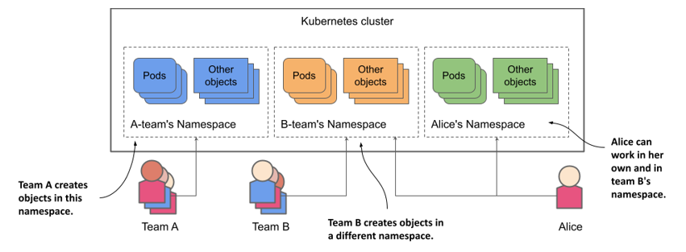
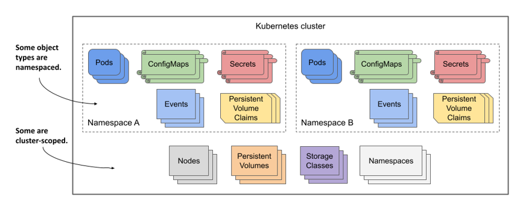
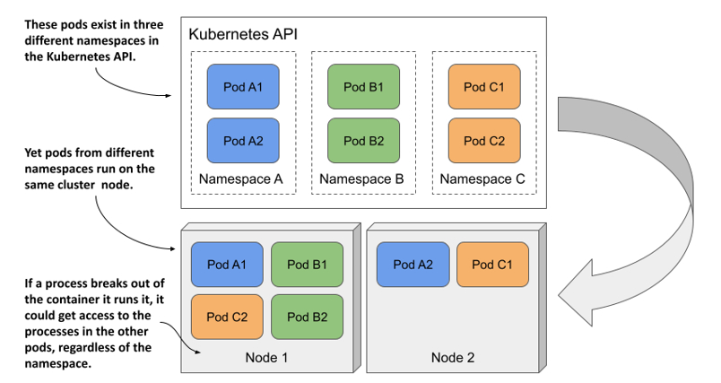
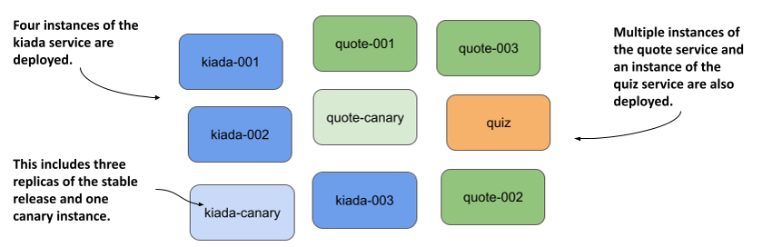
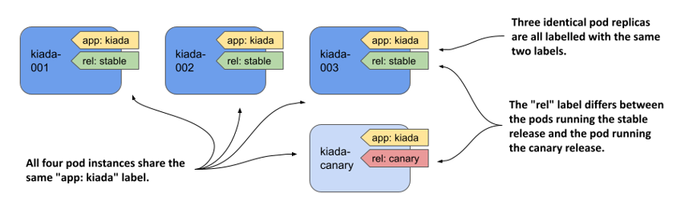
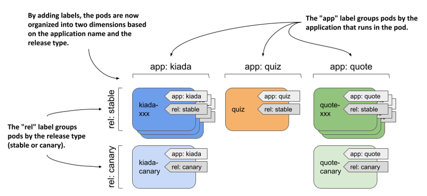
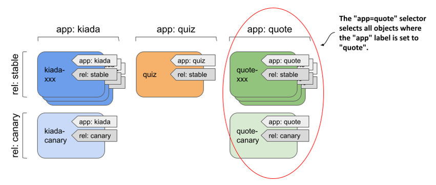
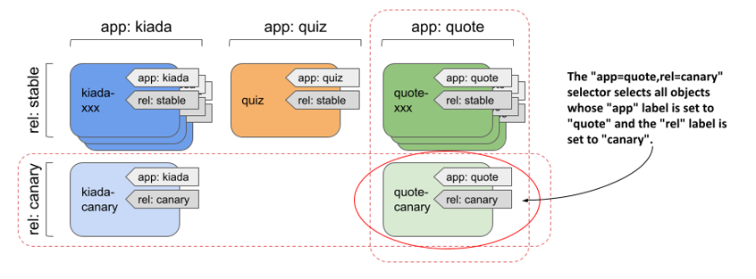
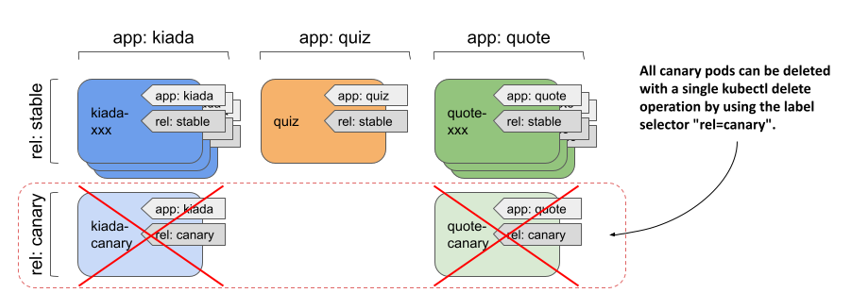

# 10 Tổ chức các đối tượng bằng Namespace và Label

### Nội dung chương này gồm

- Sử dụng namespace để chia nhỏ một cluster vật lý thành các cluster ảo
- Tổ chức các đối tượng bằng label
- Sử dụng label selector để thực hiện các thao tác trên một nhóm đối tượng cụ thể
- Sử dụng label selector để lập lịch chạy các pod trên các node cụ thể
- Sử dụng field selector để lọc các đối tượng dựa trên thuộc tính của chúng
- Chú thích (annotate) các đối tượng bằng thông tin bổ sung không dùng để định danh

Một cluster Kubernetes thường được nhiều đội ngũ cùng sử dụng. Làm thế nào để các đội ngũ này có thể triển khai các đối tượng lên cùng một cluster và tổ chức chúng sao cho đội này không vô tình sửa đổi các đối tượng của đội khác?

Và làm thế nào một đội ngũ lớn với hàng trăm dịch vụ siêu nhỏ (microservice) có thể tổ chức chúng sao cho mỗi thành viên, dù là người mới, đều có thể nhanh chóng nhận biết đối tượng nào thuộc về đâu và vai trò của nó trong hệ thống là gì? Chẳng hạn như biết một config map hay một secret thuộc về ứng dụng nào.

Đây là hai vấn đề hoàn toàn khác nhau. Kubernetes giải quyết vấn đề thứ nhất bằng namespace (không gian tên) của đối tượng, và giải quyết vấn đề thứ hai bằng label (nhãn) của đối tượng. Trong chương này, bạn sẽ tìm hiểu về cả hai giải pháp đó.

##### LƯU Ý

Bạn có thể tìm thấy các file mã nguồn của chương này tại <https://github.com/luksa/kubernetes-in-action-2nd-edition/tree/master/Chapter10>.

## 10.1 Tổ chức các đối tượng vào các Namespace

Hãy tưởng tượng tổ chức của bạn đang vận hành một cluster Kubernetes vật lý duy nhất cho nhiều đội ngũ kỹ thuật cùng sử dụng. Mỗi đội ngũ đều triển khai toàn bộ bộ ứng dụng Kiada để phát triển và thử nghiệm. Bạn muốn mỗi đội chỉ làm việc với bản cài đặt ứng dụng của riêng họ — mỗi đội chỉ muốn thấy các đối tượng do chính họ tạo ra chứ không phải của các đội khác. Mục tiêu này có thể đạt được bằng cách tạo ra các đối tượng trong các namespace Kubernetes riêng biệt.

##### Lưu ý

Namespace trong Kubernetes giúp tổ chức các đối tượng API Kubernetes thành các nhóm không trùng lặp. Chúng không có bất kỳ mối liên hệ nào với namespace của Linux (vốn giúp cô lập các tiến trình chạy trong container này với container khác như bạn đã học ở chương 2).

##### Hình 10.1 Chia một cluster vật lý thành nhiều cluster ảo nhờ sử dụng Namespace Kubernetes



Như minh họa ở hình trên, bạn có thể sử dụng namespace để chia một cluster Kubernetes vật lý duy nhất thành nhiều cluster ảo. Thay vì mọi người cùng tạo đối tượng ở một nơi duy nhất, mỗi đội sẽ được cấp quyền truy cập vào một hoặc nhiều namespace để tạo các đối tượng của mình. Vì namespace cung cấp một phạm vi định danh cho tên đối tượng, các đội khác nhau có thể đặt tên đối tượng trùng nhau miễn là chúng nằm trong các namespace riêng biệt. Một số namespace cũng có thể được chia sẻ giữa các đội hoặc các cá nhân khác nhau.

#### Xác định khi nào cần tổ chức các đối tượng vào các namespace

Sử dụng nhiều namespace cho phép bạn chia nhỏ các hệ thống phức tạp với vô số thành phần thành các nhóm nhỏ hơn do các đội khác nhau quản lý. Chúng cũng có thể được dùng để phân tách các đối tượng trong môi trường đa người thuê (multi-tenant). Ví dụ, bạn có thể tạo một namespace riêng (hoặc một nhóm namespace) cho từng khách hàng và triển khai toàn bộ bộ ứng dụng của khách hàng đó trong phạm vi namespace này.

##### Lưu ý

Hầu hết các loại đối tượng API Kubernetes đều thuộc phạm vi namespace (namespaced), nhưng vẫn có một số ngoại lệ. Pod, ConfigMap, Secret, PersistentVolumeClaim và Event đều là các đối tượng thuộc phạm vi namespace. Ngược lại, Node, PersistentVolume, StorageClass và chính Namespace là các đối tượng không thuộc phạm vi namespace (cluster-scoped). Để kiểm tra xem một tài nguyên thuộc phạm vi namespace hay phạm vi cluster, hãy xem cột `NAMESPACED` khi chạy lệnh `kubectl api-resources`.

Nếu không có namespace, mỗi người dùng trong cluster sẽ phải thêm tiền tố độc nhất vào tên đối tượng của họ để tránh trùng lặp, hoặc mỗi người dùng sẽ phải tự vận hành một cluster Kubernetes riêng biệt.

##### Hình 10.2 Một số loại API Kubernetes thuộc phạm vi namespace, số khác thuộc phạm vi toàn cluster (cluster-scoped).



Như bạn sẽ tìm hiểu trong chương 23, namespace cũng cung cấp phạm vi phân quyền cho người dùng. Một người dùng có thể có quyền quản lý các đối tượng trong một namespace cụ thể nhưng không có quyền ở các namespace khác. Tương tự, hạn ngạch tài nguyên (resource quotas), vốn cũng gắn liền với namespace, sẽ được giải thích chi tiết trong chương 20.

### 10.1.1 Liệt kê các namespace và các đối tượng bên trong chúng

Mỗi cluster Kubernetes khi khởi tạo đều chứa một vài namespace chung mặc định. Hãy cùng xem đó là những namespace nào.

#### Liệt kê các namespace

Vì mỗi namespace được đại diện bởi một đối tượng *Namespace*, bạn có thể hiển thị chúng bằng lệnh `kubectl get` tương tự như bất kỳ đối tượng API Kubernetes nào khác. Để xem các namespace trong cluster của bạn, hãy chạy lệnh sau:

```shell
$ kubectl get namespaces
NAME                 STATUS   AGE
default              Active   1h
kube-node-lease      Active   1h
kube-public          Active   1h
kube-system          Active   1h
local-path-storage   Active   1h
```

##### Lưu ý

Tên viết tắt của `namespace` là `ns`. Bạn cũng có thể liệt kê các namespace bằng lệnh `kubectl get ns`.

Từ trước đến nay, bạn đều làm việc trong namespace `default`. Mỗi khi bạn tạo một đối tượng, nó sẽ được tạo trong namespace đó. Tương tự, khi bạn liệt kê các đối tượng (như pod) bằng lệnh `kubectl get`, lệnh này chỉ hiển thị các đối tượng nằm trong namespace `default`. Bạn có thể tự hỏi liệu có pod nào đang chạy ở các namespace khác hay không. Hãy cùng kiểm tra.

##### Lưu ý

Các namespace có tiền tố `kube-` được dành riêng cho các hệ thống nội bộ của Kubernetes.

#### Liệt kê các đối tượng trong một namespace cụ thể

Để liệt kê các pod trong namespace `kube-system`, hãy chạy lệnh `kubectl get` với tùy chọn `--namespace` như sau:

```shell
$ kubectl get pods --namespace kube-system
NAME                        READY   STATUS    RESTARTS   AGE
coredns-558bd4d5db-4n5zg    1/1     Running   0          1h
coredns-558bd4d5db-tnfws    1/1     Running   0          1h
etcd-kind-control-plane     1/1     Running   0          1h
kindnet-54ks9               1/1     Running   0          1h
...
```

##### Mẹo

Bạn có thể viết ngắn gọn `-n` thay cho `--namespace`.

Bạn sẽ được tìm hiểu sâu hơn về các pod này ở phần sau của cuốn sách. Đừng quá lo lắng nếu các pod hiển thị ở đây không khớp hoàn toàn với các pod trong cluster của bạn. Như tên gọi của namespace đã chỉ ra, đây là các pod hệ thống của Kubernetes. Việc đặt chúng trong một namespace riêng biệt giúp giữ cho mọi thứ luôn ngăn nắp và rõ ràng. Nếu tất cả đều nằm ở namespace mặc định và trộn lẫn với các pod do bạn tự tạo ra, bạn sẽ rất khó phân biệt đối tượng nào thuộc về đâu, và thậm chí có thể vô tình xóa mất các đối tượng hệ thống.

#### Liệt kê các đối tượng trên tất cả các namespace

Thay vì liệt kê đối tượng của từng namespace một cách riêng lẻ, bạn cũng có thể yêu cầu kubectl liệt kê đối tượng trên tất cả các namespace cùng lúc. Lần này, thay vì liệt kê pod, hãy liệt kê tất cả các config map trong cluster:

```shell
$ kubectl get cm --all-namespaces
NAMESPACE            NAME                                 DATA   AGE
default              kiada-envoy-config                   2      1h
default              kube-root-ca.crt                     1      1h
kube-node-lease      kube-root-ca.crt                     1      1h
kube-public          cluster-info                         1      1h
kube-public          kube-root-ca.crt                     1      1h
...
```

##### Mẹo

Bạn cũng có thể gõ `-A` thay cho `--all-namespaces`.

Tùy chọn `--all-namespaces` rất hữu dụng khi bạn muốn xem toàn bộ các đối tượng trong cluster bất kể chúng thuộc namespace nào, hoặc khi bạn không thể nhớ rõ một đối tượng cụ thể đang nằm ở namespace nào.

### 10.1.2 Tạo namespace

Sau khi đã biết về các namespace hiện có trong cluster, bạn sẽ tiến hành tạo thêm hai namespace mới.

#### Tạo namespace bằng lệnh kubectl create namespace

Cách nhanh nhất để tạo một namespace là sử dụng lệnh `kubectl create namespace`. Hãy tạo một namespace tên là `kiada-test1` bằng lệnh sau:

```shell
$ kubectl create namespace kiada-test1
namespace/kiada-test1 created
```

##### Lưu ý

Tên của hầu hết các đối tượng phải tuân thủ quy ước đặt tên cho tên miền phụ DNS (DNS subdomain) được quy định trong tài liệu RFC 1123, tức là chúng chỉ được chứa các ký tự chữ-số viết thường, dấu gạch ngang và dấu chấm, đồng thời phải bắt đầu và kết thúc bằng một ký tự chữ-số. Quy tắc này cũng áp dụng cho namespace, ngoại trừ việc tên namespace không được chứa dấu chấm.

Bạn vừa tạo xong namespace `kiada-test1`. Bây giờ, bạn sẽ tạo một namespace khác bằng một phương pháp khác.

#### Tạo namespace từ file manifest

Như đã đề cập ở trước, các namespace Kubernetes được đại diện bởi các đối tượng Namespace. Do đó, bạn không chỉ có thể liệt kê chúng bằng lệnh `kubectl get` mà còn có thể tạo ra chúng từ một file cấu hình manifest dạng YAML hoặc JSON gửi tới Kubernetes API.

Hãy sử dụng phương pháp này để tạo một namespace khác tên là `kiada-test2`. Đầu tiên, hãy tạo một file tên là `ns.kiada-test.yaml` với nội dung như dưới đây.

##### Mã nguồn 10.1 Định nghĩa YAML của một đối tượng Namespace

```yaml
apiVersion: v1
kind: Namespace   #A
metadata:
  name: kiada-test2   #B
```

Bây giờ, hãy sử dụng lệnh `kubectl apply` để gửi file này lên Kubernetes API:

```shell
$ kubectl apply -f ns.kiada-test.yaml
namespace/kiada-test2 created
```

Thông thường các nhà phát triển (developer) ít khi tạo namespace theo cách này, nhưng các quản trị viên hệ thống (operator) thì có. Ví dụ, nếu bạn muốn chuẩn bị một bộ file manifest cho một loạt ứng dụng sẽ được phân bổ trên nhiều namespace khác nhau, bạn có thể đưa các đối tượng Namespace cần thiết vào thẳng các file manifest đó để có thể triển khai mọi thứ cùng lúc mà không cần phải chạy lệnh `kubectl create` để tạo trước các namespace theo cách thủ công.

Trước khi tiếp tục, bạn nên chạy lại lệnh `kubectl get ns` để liệt kê toàn bộ các namespace nhằm xác nhận rằng cluster hiện đã có hai namespace mới mà bạn vừa tạo.

### 10.1.3 Quản lý các đối tượng trong các namespace khác

Bạn đã tạo thành công hai namespace mới là `kiada-test1` và `kiada-test2`, nhưng như đã đề cập, môi trường làm việc hiện tại của bạn vẫn đang mặc định ở namespace `default`. Nếu bạn tạo một đối tượng (ví dụ như pod) mà không chỉ định rõ namespace, đối tượng đó sẽ tự động được tạo trong namespace `default`.

#### Tạo đối tượng trong một namespace cụ thể

Trong phần 10.1.1, bạn đã biết rằng có thể chỉ định tham số `--namespace` (hoặc tùy chọn ngắn `-n`) để liệt kê các đối tượng trong một namespace cụ thể. Bạn cũng có thể áp dụng tham số này khi triển khai file manifest của đối tượng lên API.

Để tạo pod `kiada-ssl` cùng với config map và secret đi kèm của nó trong namespace `kiada-test1`, hãy chạy lệnh sau:

```shell
$ kubectl apply -f kiada-ssl.yaml -n kiada-test1
pod/kiada-ssl created
configmap/kiada-envoy-config created
secret/kiada-tls created
```

Bây giờ, bạn có thể liệt kê các pod, config map và secret trong namespace `kiada-test1` để xác nhận rằng các đối tượng này đã được tạo ở đó chứ không phải trong namespace `default`:

```shell
$ kubectl -n kiada-test1 get pods
NAME        READY   STATUS    RESTARTS   AGE
kiada-ssl   2/2     Running   0          1m
```

#### Chỉ định namespace trực tiếp trong file manifest của đối tượng

File manifest của đối tượng có thể thiết lập sẵn namespace mục tiêu thông qua trường `namespace` nằm trong phần `metadata` của file. Khi bạn áp dụng file manifest bằng lệnh `kubectl apply`, đối tượng sẽ được tạo ngay trong namespace đã được chỉ định đó mà bạn không cần phải khai báo thêm tùy chọn `--namespace` từ dòng lệnh nữa.

File manifest trong đoạn mã dưới đây chứa ba đối tượng tương tự như trước, nhưng namespace đã được cấu hình trực tiếp bên trong file.

##### Mã nguồn 10.2 Chỉ định namespace trong file manifest của đối tượng

```yaml
apiVersion: v1
kind: Pod
metadata:
  name: kiada-ssl
  namespace: kiada-test2    #A
spec:
  volumes: ...
...
```

Khi bạn áp dụng file manifest này bằng lệnh sau, pod, config map và secret tương ứng sẽ được khởi tạo trong namespace `kiada-test2`:

```shell
$ kubectl apply -f pod.kiada-ssl.kiada-test2-namespace.yaml
pod/kiada-ssl created
configmap/kiada-envoy-config created
secret/kiada-tls created
```

Hãy lưu ý rằng lần này bạn không cần chỉ định thêm tùy chọn `--namespace`. Nếu bạn vẫn cố tình chỉ định, giá trị truyền vào dòng lệnh bắt buộc phải trùng khớp với namespace đã khai báo trong file manifest, nếu không kubectl sẽ báo lỗi như ví dụ dưới đây:

```shell
$ kubectl apply -f kiada-ssl.kiada-test2-namespace.yaml -n kiada-test1
the namespace from the provided object "kiada-test2" does not match the namespace "kiada-test1". You must pass '--namespace=kiada-test2' to perform this operation.
```

#### Thiết lập namespace mặc định mới cho kubectl

Trong hai ví dụ trước, bạn đã học cách tạo và quản lý các đối tượng trong các namespace khác với namespace mặc định hiện tại của kubectl. Bạn sẽ phải sử dụng tùy chọn `--namespace` khá thường xuyên — đặc biệt là khi muốn nhanh chóng kiểm tra xem có những gì đang chạy ở một namespace khác. Tuy nhiên, phần lớn công việc hàng ngày của bạn thường chỉ xoay quanh một namespace cố định tại một thời điểm.

Sau khi tạo một namespace mới, bạn thường sẽ phải chạy liên tiếp rất nhiều lệnh trong đó. Để đơn giản hóa thao tác, bạn có thể yêu cầu kubectl chuyển hẳn sang sử dụng namespace đó làm mặc định. Namespace mặc định này là một thuộc tính nằm trong ngữ cảnh (context) hiện tại của kubectl, được cấu hình bên trong file kubeconfig.

##### Lưu ý

Bạn đã được tìm hiểu về file kubeconfig trong chương 3.

Để chuyển sang một namespace khác, bạn chỉ cần cập nhật ngữ cảnh hiện tại. Ví dụ, để chuyển hẳn sang làm việc trong namespace `kiada-test1`, hãy chạy lệnh sau:

```shell
$ kubectl config set-context --current --namespace kiada-test1
Context "kind-kind" modified.
```

Từ thời điểm này trở đi, mọi lệnh kubectl bạn thực thi đều sẽ mặc định áp dụng trên namespace `kiada-test1`. Chẳng hạn, giờ đây bạn có thể liệt kê các pod trong namespace này chỉ bằng cách gõ đơn giản `kubectl get pods`.

##### MẸO

Để chuyển đổi nhanh giữa các namespace, bạn có thể thiết lập một bí danh (alias) như sau: `alias kns='kubectl config set-context --current --namespace '`. Sau đó, bạn có thể chuyển đổi qua lại giữa các namespace bằng lệnh `kns <tên-namespace>`. Một cách khác là bạn có thể cài đặt thêm plugin hỗ trợ của kubectl có tính năng tương tự tại địa chỉ <https://github.com/ahmetb/kubectx>.

Về cơ bản, việc tạo và quản lý đối tượng trong các namespace khác nhau chỉ có vậy. Tuy nhiên, trước khi kết thúc phần này, tôi cần giải thích rõ về mức độ cô lập thực tế giữa các workload chạy trên các namespace khác nhau trong Kubernetes.

### 10.1.4 Hiểu về sự (thiếu) cô lập giữa các namespace

Cho đến lúc này, bạn đã tạo ra một vài pod ở các namespace khác nhau. Bạn đã biết cách dùng tùy chọn `--all-namespaces` (hoặc viết tắt là `-A`) để liệt kê pod trên toàn bộ các namespace, hãy thử chạy lệnh đó ngay bây giờ:

```shell
$ kubectl get pods -A
NAMESPACE     NAME        READY   STATUS    RESTARTS   AGE
default       kiada-ssl   2/2     Running   0          8h    #A
default       quiz        2/2     Running   0          8h
default       quote       2/2     Running   0          8h
kiada-test1   kiada-ssl   2/2     Running   0          2m    #A
kiada-test2   kiada-ssl   2/2     Running   0          1m    #A
...
```

Trong kết quả trả về của lệnh, bạn sẽ thấy ít nhất hai pod có cùng tên là `kiada-ssl`: một nằm trong namespace `kiada-test1` và cái còn lại nằm trong namespace `kiada-test2`. Bạn cũng có thể có một pod `kiada-ssl` khác nằm ở namespace `default` từ các bài tập ở các chương trước. Trong trường hợp này, hệ thống đang có ba pod trùng tên chạy song song mà không gặp bất kỳ lỗi nào nhờ vào sự phân tách của namespace. Những người dùng khác trên cùng cluster cũng có thể triển khai thêm rất nhiều pod trùng tên như vậy mà không sợ ảnh hưởng lẫn nhau.

#### Hiểu về sự cô lập môi trường thực thi giữa các pod ở các namespace khác nhau

Khi người dùng sử dụng các namespace trên một cluster vật lý duy nhất, họ sẽ có cảm giác như đang sử dụng một cluster ảo của riêng mình. Tuy nhiên, điều này chỉ đúng ở khía cạnh có thể thoải mái tạo các đối tượng mà không sợ bị trùng lặp tên gọi. Các node vật lý của cluster thực chất vẫn được chia sẻ chung bởi tất cả người dùng. Điều này có nghĩa là sự cô lập giữa các pod của họ không hề giống như khi chúng được chạy trên các cluster vật lý khác nhau (và do đó nằm trên các node vật lý hoàn toàn độc lập).

##### Hình 10.3 Các pod từ các namespace khác nhau có thể chạy trên cùng một node của cluster.



Khi hai pod thuộc hai namespace khác nhau được xếp lịch chạy chung trên một node vật lý, cả hai đều sẽ chia sẻ chung nhân hệ điều hành (OS kernel). Dù chúng đã được cô lập với nhau bằng các công nghệ container, một ứng dụng nếu thoát được ra ngoài container của nó hoặc tiêu thụ quá nhiều tài nguyên của node vẫn có thể gây ảnh hưởng xấu đến hoạt động của ứng dụng kia. Namespace của Kubernetes hoàn toàn không có vai trò bảo vệ gì trong tình huống này.

#### Hiểu về sự cô lập mạng giữa các namespace

Nếu không được cấu hình một cách tường minh, mặc định Kubernetes không hề cung cấp sự cô lập về mặt mạng lưới (network isolation) giữa các ứng dụng chạy ở các namespace khác nhau. Một ứng dụng chạy ở namespace này hoàn toàn có thể kết nối và giao tiếp với các ứng dụng chạy ở namespace khác. Tuy nhiên, bạn có thể sử dụng đối tượng NetworkPolicy để cấu hình chi tiết xem ứng dụng nào ở namespace nào được phép kết nối đến ứng dụng nào ở các namespace khác. Bạn sẽ được tìm hiểu kỹ hơn về nội dung này trong chương 25.

#### Có nên dùng namespace để phân tách các môi trường production, staging và development?

Vì namespace không cung cấp sự cô lập triệt để ở cấp độ vật lý và tài nguyên, bạn không nên dùng chúng để chia nhỏ một cluster Kubernetes vật lý duy nhất thành các môi trường production (sản xuất), staging (thử nghiệm) và development (phát triển). Việc vận hành mỗi môi trường trên một cluster vật lý độc lập là phương án an toàn và tối ưu hơn nhiều.

### 10.1.5 Xóa các namespace

Hãy kết thúc phần tìm hiểu về namespace này bằng việc xóa hai namespace mà bạn đã tạo ra. Khi bạn xóa một đối tượng Namespace, toàn bộ các đối tượng nằm bên trong namespace đó cũng sẽ tự động bị xóa theo mà bạn không cần phải xóa chúng trước bằng tay.

Hãy xóa namespace `kiada-test2` bằng lệnh sau:

```shell
$ kubectl delete ns kiada-test2
namespace "kiada-test2" deleted
```

Lệnh này sẽ tạm dừng và chờ cho đến khi mọi thứ trong namespace cũng như chính namespace đó bị xóa hoàn toàn. Tuy nhiên, nếu bạn ngắt lệnh nửa chừng và liệt kê các namespace trước khi quá trình xóa hoàn tất, bạn sẽ thấy trạng thái của namespace đó hiển thị là `Terminating` (Đang chấm dứt):

```shell
$ kubectl get ns
NAME                 STATUS        AGE
default              Active        2h
kiada-test1          Active        2h
kiada-test2          Terminating   2h
...
```

Tôi chỉ ra điều này vì trong thực tế vận hành, chắc chắn sẽ có lúc bạn chạy lệnh xóa và thấy nó bị kẹt mãi không xong. Bạn có thể sẽ ngắt lệnh giữa chừng và kiểm tra danh sách namespace như tôi vừa làm ở trên, rồi tự hỏi tại sao quá trình chấm dứt namespace lại bị kẹt lâu đến thế.

#### Chẩn đoán lý do quá trình xóa namespace bị kẹt

Nói một cách ngắn gọn, nguyên nhân khiến một namespace không thể hoàn thành việc xóa thường là do có một hoặc nhiều đối tượng nằm trong nó không thể bị xóa bỏ. Bạn có thể tự nhủ: "À, mình sẽ liệt kê các đối tượng trong namespace bằng lệnh `kubectl get all` để xem đối tượng nào còn sót lại", nhưng cách này thường không mang lại kết quả gì vì lệnh đó sẽ không trả về bất kỳ đối tượng nào.

##### Lưu ý

Hãy nhớ rằng lệnh `kubectl get all` chỉ liệt kê được một số loại đối tượng phổ biến nhất định. Ví dụ, nó không thể liệt kê các đối tượng secret. Do đó, ngay cả khi lệnh không trả về kết quả gì, điều đó cũng không đồng nghĩa với việc namespace đang hoàn toàn trống rỗng.

Trong hầu hết các trường hợp kẹt xóa namespace mà tôi từng gặp, nguyên nhân thường bắt nguồn từ một đối tượng tùy chỉnh (custom object) và bộ điều khiển tùy chỉnh (custom controller) tương ứng của nó đã gặp lỗi trong việc xử lý yêu cầu xóa đối tượng, dẫn đến việc không thể gỡ bỏ một cơ chế dọn dẹp có tên là finalizer ra khỏi đối tượng đó. Bạn sẽ được tìm hiểu sâu hơn về finalizer trong chương 15, và về các đối tượng cũng như bộ điều khiển tùy chỉnh trong chương 29.

Ở đây, tôi chỉ muốn hướng dẫn bạn cách tìm ra chính xác đối tượng nào đang khiến namespace bị kẹt xóa. Có một gợi ý nhỏ thế này: Các đối tượng Namespace cũng sở hữu một trường `status` (trạng thái). Mặc dù thông thường lệnh `kubectl describe` sẽ hiển thị đầy đủ trạng thái của đối tượng, nhưng tại thời điểm viết cuốn sách này, tính năng đó lại chưa hỗ trợ cho Namespace. Tôi coi đây là một lỗi nhỏ của hệ thống và nhiều khả năng nó sẽ sớm được khắc phục trong tương lai. Cho đến lúc đó, bạn có thể kiểm tra trạng thái chi tiết của namespace bằng lệnh sau:

```shell
$ kubectl get ns kiada-test2 -o yaml
...
status:
  conditions:
  - lastTransitionTime: "2021-10-10T08:35:11Z"
    message: All resources successfully discovered
    reason: ResourcesDiscovered
    status: "False"
    type: NamespaceDeletionDiscoveryFailure
  - lastTransitionTime: "2021-10-10T08:35:11Z"
    message: All legacy kube types successfully parsed
    reason: ParsedGroupVersions
    status: "False"
    type: NamespaceDeletionGroupVersionParsingFailure
  - lastTransitionTime: "2021-10-10T08:35:11Z"    #A
    message: All content successfully deleted, may be waiting on finalization    #A
    reason: ContentDeleted    #A
    status: "False"    #A
    type: NamespaceDeletionContentFailure    #A
  - lastTransitionTime: "2021-10-10T08:35:11Z"    #B
    message: 'Some resources are remaining: pods. has 1 resource instances'    #B
    reason: SomeResourcesRemain    #B
    status: "True"    #B
    type: NamespaceContentRemaining    #B
  - lastTransitionTime: "2021-10-10T08:35:11Z"    #C
    message: 'Some content in the namespace has finalizers remaining:    #C
              xyz.xyz/xyz-finalizer in 1 resource instances'    #C
    reason: SomeFinalizersRemain    #C
    status: "True"    #C
    type: NamespaceFinalizersRemaining    #C
  phase: Terminating
```

Khi bạn xóa namespace `kiada-test2` trong thực tế, bạn sẽ không thấy kết quả đầu ra giống hệt như ví dụ này. Kết quả lệnh trong ví dụ trên chỉ là một tình huống giả định do tôi cố tình tạo ra để minh họa cho bạn thấy chuyện gì sẽ xảy ra khi quá trình xóa bị kẹt. Nếu quan sát kỹ nội dung hiển thị, bạn sẽ nhận thấy toàn bộ các đối tượng trong namespace đều đã được đánh dấu xóa thành công, nhưng vẫn còn một pod bị giữ lại do hệ thống chưa gỡ bỏ finalizer ra khỏi nó. Đừng quá bận tâm về finalizer lúc này, bạn sẽ sớm được tìm hiểu về chúng ở các phần sau.

Trước khi chuyển sang phần tiếp theo, bạn vui lòng xóa nốt cả namespace `kiada-test1` đi nhé.

## 10.2 Tổ chức các pod bằng label

Xuyên suốt cuốn sách này, bạn sẽ xây dựng và triển khai toàn bộ bộ ứng dụng Kiada, bao gồm nhiều dịch vụ khác nhau. Cho đến nay, bạn đã hiện thực hóa thành công dịch vụ Kiada, dịch vụ Quote (trích dẫn) và dịch vụ Quiz (trắc nghiệm). Các dịch vụ này chạy trên ba pod khác nhau. Đi kèm với các pod là các loại đối tượng bổ trợ khác như config map, secret, persistent volume và persistent volume claim.

Có thể dễ dàng hình dung rằng số lượng các đối tượng này sẽ tăng lên nhanh chóng trong các chương tiếp theo. Trước khi mọi thứ vượt khỏi tầm kiểm soát, bạn cần bắt tay vào tổ chức các đối tượng này sao cho chính bạn và những người dùng khác trong cluster có thể dễ dàng nhận biết đối tượng nào thuộc về dịch vụ nào.

Trong các hệ thống thực tế sử dụng kiến trúc microservices, số lượng dịch vụ có thể dễ dàng vượt quá con số 100 hoặc nhiều hơn thế. Một số dịch vụ trong số đó còn được nhân bản (replicate), nghĩa là có nhiều bản sao của cùng một pod được triển khai đồng thời. Ngoài ra, tại một số thời điểm nhất định, nhiều phiên bản khác nhau của cùng một dịch vụ có thể được chạy song song. Điều này dẫn đến việc có tới hàng trăm hoặc thậm chí hàng ngàn pod cùng hoạt động trong hệ thống.

Hãy tưởng tượng bạn cũng bắt đầu nhân bản và chạy đồng thời nhiều phiên bản của các pod trong bộ ứng dụng Kiada của mình. Ví dụ, giả sử bạn đang chạy song song cả bản phát hành ổn định (stable) và bản phát hành canary [^1] của dịch vụ Kiada.

##### Định nghĩa

Bản phát hành canary (canary release) là một mô hình triển khai mà trong đó bạn chạy một phiên bản mới của ứng dụng song song với phiên bản ổn định hiện tại, và chỉ điều hướng một lượng nhỏ yêu cầu truy cập từ người dùng đến phiên bản mới này để theo dõi hoạt động của nó trước khi chính thức cập nhật rộng rãi cho toàn bộ người dùng. Mô hình này giúp ngăn chặn các lỗi phát sinh của phiên bản mới ảnh hưởng đến quá trình trải nghiệm của quá nhiều người dùng.

Bạn vận hành ba bản sao của phiên bản Kiada ổn định và một bản sao của phiên bản canary. Tương tự, bạn chạy ba bản sao của phiên bản Quote ổn định, đi kèm một bản phát hành canary của dịch vụ Quote. Riêng với dịch vụ Quiz, bạn chỉ chạy một phiên bản ổn định duy nhất. Tất cả các pod này được minh họa chi tiết trong hình dưới đây.

##### Hình 10.4 Các pod chưa được tổ chức của bộ ứng dụng Kiada



Ngay cả khi hệ thống mới chỉ có chín pod, việc đọc hiểu sơ đồ thiết kế này đã bắt đầu trở nên khó khăn. Đó là còn chưa kể sơ đồ này chưa hề biểu diễn bất kỳ đối tượng API cần thiết nào khác đi kèm với các pod. Rõ ràng là bạn cần phải tổ chức chúng thành các nhóm nhỏ hơn. Bạn có thể chia ba dịch vụ này vào ba namespace riêng biệt, nhưng đó lại không phải là mục đích thực sự của namespace. Cơ chế phù hợp hơn nhiều cho trường hợp này chính là sử dụng các *label* (nhãn) của đối tượng.

### 10.2.1 Giới thiệu về label

Label là một tính năng vô cùng mạnh mẽ nhưng lại rất đơn giản để tổ chức các đối tượng API trong Kubernetes. Một label chỉ đơn thuần là một cặp key-value (khóa-giá trị) mà bạn gắn vào một đối tượng, giúp bất kỳ người dùng nào trong cluster cũng có thể nhận biết được vai trò của đối tượng đó trong hệ thống. Cả key và value đều là các chuỗi ký tự thông thường mà bạn có thể tự do quy định theo ý muốn. Một đối tượng có thể sở hữu nhiều label khác nhau, nhưng các key của label phải là độc nhất trên đối tượng đó. Thông thường, bạn sẽ gán sẵn các label cho đối tượng ngay khi tạo ra chúng, nhưng bạn cũng hoàn toàn có thể thay đổi các label này về sau.

#### Sử dụng label để cung cấp thông tin bổ sung cho đối tượng

Để thấy rõ những lợi ích tuyệt vời của việc gán label cho đối tượng, hãy quay trở lại ví dụ về các pod được minh họa trong hình 10.4. Các pod này đang chạy ba dịch vụ khác nhau: dịch vụ Kiada, dịch vụ Quote và dịch vụ Quiz. Thêm vào đó, các pod của dịch vụ Kiada và Quote còn chạy các phiên bản khác nhau của cùng một ứng dụng. Có ba thực thể pod chạy phiên bản ổn định và một thực thể pod chạy phiên bản canary.

Để giúp dễ dàng phân biệt ứng dụng và phiên bản đang chạy trong mỗi pod, chúng ta sử dụng các label cho pod. Kubernetes hoàn toàn không can thiệp hay quan tâm đến việc bạn gán những label nào cho đối tượng của mình. Bạn có thể tự do lựa chọn các key và value tùy thích. Trong trường hợp cụ thể này, hai label dưới đây tỏ ra vô cùng hợp lý:

- Label `app` chỉ ra pod này thuộc về ứng dụng nào.
- Label `rel` (viết tắt của release) chỉ ra pod đang chạy phiên bản ổn định (stable) hay phiên bản thử nghiệm (canary) của ứng dụng.

Như bạn có thể thấy ở hình dưới đây, giá trị của label `app` được đặt là `kiada` trên cả ba pod `kiada-xxx` và pod `kiada-canary`, bởi vì tất cả các pod này đều đang chạy ứng dụng Kiada. Trong khi đó, label `rel` sẽ có giá trị khác nhau giữa các pod chạy phiên bản ổn định và pod chạy phiên bản canary.

##### Hình 10.5 Gán nhãn cho các pod bằng label app và rel



Hình vẽ trên chỉ minh họa cho các pod của dịch vụ kiada, nhưng bạn hãy hình dung việc áp dụng hai label tương tự cho tất cả các pod còn lại trong hệ thống. Nhờ có các label này, bất kỳ người dùng nào khi tiếp cận với các pod đều có thể dễ dàng nhận biết ứng dụng và phiên bản nào đang được vận hành bên trong đó.

#### Hiểu cách label giúp giữ các đối tượng luôn ngăn nắp

Nếu bạn vẫn chưa thực sự thấy hết giá trị của việc gán label cho đối tượng, hãy cân nhắc rằng bằng việc thêm hai label `app` và `rel`, bạn đã tổ chức các pod của mình theo hai chiều không gian rõ rệt (chiều ngang theo ứng dụng và chiều dọc theo phiên bản phát hành) như hình minh họa dưới đây.

##### Hình 10.6 Toàn bộ các pod của bộ ứng dụng Kiada được tổ chức theo hai tiêu chí



Điều này nghe có vẻ hơi trừu tượng cho đến khi bạn trực tiếp trải nghiệm cách các label này giúp việc quản lý các pod bằng kubectl trở nên dễ dàng như thế nào, vì vậy hãy bắt tay vào thực hành ngay thôi.

### 10.2.2 Gán label cho các pod

Thư mục mã nguồn đi kèm của cuốn sách đã chứa sẵn một bộ các file manifest của tất cả các pod từ ví dụ trước. Tất cả các pod phiên bản ổn định đều đã được gán sẵn label, riêng các pod phiên bản canary thì chưa. Bạn sẽ tiến hành gán label cho chúng bằng phương pháp thủ công.

#### Thiết lập môi trường thực hành

Để bắt đầu, hãy tạo một namespace mới tên là `kiada` bằng lệnh sau:

```shell
$ kubectl create namespace kiada
namespace/kiada created
```

Cấu hình cho kubectl sử dụng namespace mới này làm mặc định:

```shell
$ kubectl config set-context --current --namespace kiada
Context "kind-kind" modified.
```

Các file manifest được tổ chức thành ba thư mục con bên trong đường dẫn `Chapter10/kiada-suite/`. Thay vì phải áp dụng từng file manifest một cách riêng lẻ, bạn có thể triển khai tất cả chúng cùng lúc bằng lệnh sau:

```shell
$ kubectl apply -f kiada-suite/ --recursive    #A
configmap/kiada-envoy-config created
pod/kiada-001 created
pod/kiada-002 created
pod/kiada-003 created
pod/kiada-canary created
secret/kiada-tls created
pod/quiz created
persistentvolumeclaim/quiz-data created
pod/quote-001 created
pod/quote-002 created
pod/quote-003 created
pod/quote-canary created
```

Thông thường, bạn đã quen với việc áp dụng một file manifest duy nhất, nhưng ở đây bạn sẽ dùng tùy chọn `-f` để chỉ định tên của một thư mục. `kubectl` sẽ áp dụng tất cả các file manifest tìm thấy trong thư mục đó. Tùy chọn `--recursive` sẽ yêu cầu `kubectl` tìm kiếm các file manifest trong tất cả các thư mục con, thay vì chỉ dừng lại ở thư mục được chỉ định.

Như bạn có thể thấy, lệnh này đã tạo ra nhiều đối tượng thuộc các loại khác nhau. Việc sử dụng các nhãn (label) sẽ giúp bạn sắp xếp và quản lý chúng một cách ngăn nắp.

#### Định nghĩa nhãn trong file manifest của đối tượng

Hãy xem xét file cấu hình manifest `kiada-suite/kiada/pod.kiada-001.yaml` trong đoạn mã dưới đây. Hãy chú ý vào phần `metadata`. Bên cạnh trường `name` quen thuộc mà bạn đã bắt gặp nhiều lần, file manifest này còn chứa trường `labels`. Trường này chỉ định hai nhãn: `app` và `rel`.

##### Đoạn mã 10.3 Một pod có gắn nhãn

```yaml
apiVersion: v1
kind: Pod
metadata:
  name: kiada-001
  labels:    #A
    app: kiada    #B
    rel: stable    #C
spec:
  ...
```

Tất cả các loại đối tượng trong Kubernetes đều hỗ trợ nhãn. Dù đối tượng thuộc loại nào, bạn vẫn có thể thêm nhãn vào đó bằng cách khai báo trong cấu trúc bản đồ (map) `metadata.labels`.

#### Hiển thị nhãn của đối tượng

Bạn có thể xem các nhãn của một đối tượng cụ thể bằng cách chạy lệnh `kubectl describe`. Hãy kiểm tra các nhãn của pod `kiada-001` như sau:

```
$ kubectl describe pod kiada-001
Name:         kiada-001
Namespace:    kiada
Priority:     0
Node:         kind-worker2/172.18.0.2
Start Time:   Sun, 10 Oct 2021 21:58:25 +0200
Labels:       app=kiada    #A
              rel=stable    #A
Annotations:  <none>    #B
...
```

Theo mặc định, lệnh `kubectl get pods` không hiển thị các nhãn, nhưng bạn có thể yêu cầu hiển thị chúng bằng tùy chọn `--show-labels`. Hãy kiểm tra nhãn của tất cả các pod trong không gian tên (namespace) như sau:

```
$ kubectl get pods --show-labels
NAME           READY   STATUS    RESTARTS   AGE   LABELS    #A
kiada-canary   2/2     Running   0          12m   <none>    #B
kiada-001      2/2     Running   0          12m   app=kiada,rel=stable   #C
kiada-002      2/2     Running   0          12m   app=kiada,rel=stable   #C
kiada-003      2/2     Running   0          12m   app=kiada,rel=stable   #C
quiz           2/2     Running   0          12m   app=quiz,rel=stable   #D
quote-canary   2/2     Running   0          12m   <none>    #B
quote-001      2/2     Running   0          12m   app=quote,rel=stable   #E
quote-002      2/2     Running   0          12m   app=quote,rel=stable   #E
quote-003      2/2     Running   0          12m   app=quote,rel=stable   #E
```

Thay vì hiển thị toàn bộ các nhãn bằng `--show-labels`, bạn cũng có thể chỉ hiển thị một vài nhãn cụ thể bằng tùy chọn `--label-columns` (hoặc viết tắt là `-L`). Mỗi nhãn được chọn sẽ xuất hiện trong một cột riêng biệt. Hãy liệt kê tất cả các pod cùng với các nhãn `app` và `rel` của chúng như sau:

```
$ kubectl get pods -L app,rel
NAME           READY   STATUS    RESTARTS   AGE   APP     REL
kiada-canary   2/2     Running   0          14m
kiada-001      2/2     Running   0          14m   kiada   stable
kiada-002      2/2     Running   0          14m   kiada   stable
kiada-003      2/2     Running   0          14m   kiada   stable
quiz           2/2     Running   0          14m   quiz    stable
quote-canary   2/2     Running   0          14m
quote-001      2/2     Running   0          14m   quote   stable
quote-002      2/2     Running   0          14m   quote   stable
quote-003      2/2     Running   0          14m   quote   stable
```

Có thể thấy rằng hai pod canary hiện chưa được gán bất kỳ nhãn nào. Chúng ta hãy tiến hành thêm nhãn cho chúng.

#### Thêm nhãn vào một đối tượng sẵn có

Để thêm nhãn vào một đối tượng đã tồn tại, bạn có thể chỉnh sửa file manifest của đối tượng đó, bổ sung các nhãn vào phần `metadata`, rồi áp dụng lại file cấu hình bằng lệnh `kubectl apply`. Bạn cũng có thể trực tiếp sửa định nghĩa đối tượng trên hệ thống API bằng lệnh `kubectl edit`. Dù vậy, phương pháp đơn giản nhất vẫn là sử dụng lệnh `kubectl label`.

Hãy thêm các nhãn `app` và `rel` cho pod `kiada-canary` bằng lệnh dưới đây:

```
$ kubectl label pod kiada-canary app=kiada rel=canary
pod/kiada-canary labeled
```

Bây giờ, hãy thực hiện tương tự cho pod `quote-canary`:

```
$ kubectl label pod quote-canary app=kiada rel=canary
pod/quote-canary labeled
```

Hãy liệt kê các pod và hiển thị nhãn của chúng để xác nhận rằng tất cả các pod hiện đã được gắn nhãn. Nếu lúc gõ lệnh trước đó bạn không nhận ra sai sót, thì có lẽ khi liệt kê danh sách này bạn sẽ phát hiện ra ngay. Nhãn `app` của pod `quote-canary` đã bị đặt sai giá trị (`kiada` thay vì `quote`). Chúng ta hãy sửa lại lỗi này.

#### Thay đổi nhãn của một đối tượng sẵn có

Bạn có thể sử dụng chính lệnh trên để cập nhật các nhãn của đối tượng. Để thay đổi nhãn đã bị đặt sai, hãy chạy lệnh sau:

```
$ kubectl label pod quote-canary app=quote
error: 'app' already has a value (kiada), and --overwrite is false
```

Để tránh việc vô tình thay đổi giá trị của một nhãn đã tồn tại, bạn phải chỉ thị rõ ràng cho `kubectl` ghi đè lên nhãn cũ bằng cách thêm tùy chọn `--overwrite`. Dưới đây là câu lệnh chính xác:

```
$ kubectl label pod quote-canary app=quote --overwrite
pod/quote-canary labeled
```

Hãy liệt kê lại các pod một lần nữa để đảm bảo mọi nhãn đều đã chính xác.

#### Gán nhãn cho tất cả đối tượng cùng loại

Bây giờ, hãy hình dung bạn muốn triển khai thêm một bộ ứng dụng khác trong cùng không gian tên này. Trước khi thực hiện, việc gắn thêm nhãn `suite` cho toàn bộ các pod hiện có sẽ vô cùng hữu ích, giúp bạn phân biệt được pod nào thuộc bộ ứng dụng nào. Hãy chạy lệnh sau để gán nhãn này cho tất cả các pod trong không gian tên:

```
$ kubectl label pod --all suite=kiada-suite
pod/kiada-canary labeled
pod/kiada-001 labeled
...
pod/quote-003 labeled
```

Hãy liệt kê lại các pod với tùy chọn `--show-labels` hoặc `-L suite` để xác nhận rằng tất cả các pod hiện đã có nhãn mới này.

#### Gỡ bỏ nhãn khỏi đối tượng

Thôi được rồi, tôi đùa đấy. Bạn sẽ không thiết lập thêm bộ ứng dụng nào khác cả. Vì vậy, nhãn `suite` lúc này trở nên thừa thãi. Để gỡ bỏ một nhãn khỏi đối tượng, hãy chạy lệnh `kubectl label` kèm theo dấu trừ (`-`) đặt ngay sau khóa (key) của nhãn đó như sau:

```
$ kubectl label pod kiada-canary suite-    #A
pod/kiada-canary labeled
```

Để gỡ bỏ nhãn này khỏi tất cả các pod còn lại, hãy chỉ định `--all` thay vì tên một pod cụ thể:

```
$ kubectl label pod --all suite-
label "suite" not found.    #A
pod/kiada-canary not labeled    #A
pod/kiada-001 labeled
...
pod/quote-003 labeled
```

##### Lưu ý

Nếu bạn đặt giá trị của nhãn thành một chuỗi rỗng, khóa của nhãn đó vẫn sẽ không bị xóa bỏ. Để thực sự xóa nó, bạn bắt buộc phải dùng dấu trừ sau khóa của nhãn.

### 10.2.3 Quy tắc cú pháp của nhãn

Mặc dù bạn có thể gán nhãn cho các đối tượng theo ý muốn, nhưng vẫn có một số hạn chế nhất định áp dụng cho cả khóa lẫn giá trị của nhãn.

#### Khóa nhãn hợp lệ

Trong các ví dụ trước, bạn đã sử dụng các khóa nhãn như `app`, `rel` và `suite`. Những khóa này không có phần tiền tố (prefix) và được coi là nhãn riêng do người dùng tự định nghĩa. Trong khi đó, các khóa nhãn phổ biến do chính Kubernetes tự áp dụng hoặc đọc hiểu thì luôn bắt đầu bằng một tiền tố. Điều này cũng áp dụng cho các nhãn được sử dụng bởi các thành phần Kubernetes nằm ngoài nhân hệ thống (non-core), cũng như các khóa nhãn được thừa nhận rộng rãi khác.

Một ví dụ về khóa nhãn có tiền tố được Kubernetes sử dụng là `kubernetes.io/arch`. Bạn có thể tìm thấy nhãn này trên các đối tượng Node để xác định loại kiến trúc phần cứng mà node đó sử dụng.

```
$ kubectl get node -L kubernetes.io/arch
NAME                 STATUS   ROLES                  AGE   VERSION   ARCH
kind-control-plane   Ready    control-plane,master   31d   v1.21.1   amd64    #A
kind-worker          Ready    <none>                 31d   v1.21.1   amd64    #A
kind-worker2         Ready    <none>                 31d   v1.21.1   amd64    #A
```

Các tiền tố nhãn `kubernetes.io/` và `k8s.io/` được dành riêng cho các thành phần của Kubernetes. Nếu muốn sử dụng tiền tố cho các nhãn của riêng mình, bạn nên dùng tên miền của tổ chức mình để tránh xảy ra xung đột.

Khi chọn khóa cho nhãn, một số hạn chế về cú pháp sẽ được áp dụng cho cả phần tiền tố lẫn phần tên. Bảng dưới đây cung cấp một số ví dụ về các khóa nhãn hợp lệ và không hợp lệ.

##### Bảng 10.1 Các ví dụ về khóa nhãn hợp lệ và không hợp lệ

| Khóa nhãn hợp lệ | Khóa nhãn không hợp lệ |
| :--- | :--- |
| `foo` | `_foo` |
| `foo-bar_baz` | `foo%bar*baz` |
| `example/foo` | `/foo` |
| `example/FOO` | `EXAMPLE/foo` |
| `example.com/foo` | `example..com/foo` |
| `my_example.com/foo` | `my@example.com/foo` |
| `example.com/foo-bar` | `example.com/-foo-bar` |
| `my.example.com/foo` | `a.very.long.prefix.over.253.characters/foo` |

Các quy tắc cú pháp sau đây áp dụng cho phần tiền tố:

- Bắt buộc phải là một tên miền con DNS (chỉ được phép chứa các ký tự chữ-số viết thường, dấu gạch ngang, dấu gạch dưới và dấu chấm).
- Độ dài không được vượt quá 253 ký tự (không tính ký tự gạch chéo `/`).
- Phải kết thúc bằng một ký tự gạch chéo xuôi (`/`).

Theo sau tiền tố phải là tên nhãn, phần này:

- Phải bắt đầu và kết thúc bằng một ký tự chữ-số.
- Có thể chứa các dấu gạch ngang, dấu gạch dưới và dấu chấm.
- Có thể chứa các chữ cái viết hoa.
- Độ dài không được vượt quá 63 ký tự.

#### Giá trị nhãn hợp lệ

Hãy nhớ rằng nhãn được sử dụng để bổ sung thông tin định danh cho các đối tượng. Tương tự như khóa nhãn, có một số quy tắc nhất định bạn phải tuân thủ đối với giá trị của nhãn. Chẳng hạn, giá trị của nhãn không được chứa khoảng trắng hoặc các ký tự đặc biệt. Bảng dưới đây cung cấp một số ví dụ về giá trị nhãn hợp lệ và không hợp lệ.

##### Bảng 10.2 Các ví dụ về giá trị nhãn hợp lệ và không hợp lệ

| Giá trị nhãn hợp lệ | Giá trị nhãn không hợp lệ |
| :--- | :--- |
| `foo` | `_foo` |
| `foo-bar_baz` | `foo%bar*baz` |
| `FOO` | `value.longer.than.63.characters` |
| (để trống) | `value with spaces` |

Một giá trị nhãn:

- Có thể để trống.
- Nếu không trống, phải bắt đầu bằng một ký tự chữ-số.
- Chỉ được phép chứa các ký tự chữ-số, dấu gạch ngang, dấu gạch dưới và dấu chấm.
- Không được chứa khoảng trắng hoặc các ký tự trống khác.
- Độ dài không được vượt quá 63 ký tự.

Nếu cần bổ sung các giá trị không tuân theo những quy tắc này, bạn có thể đưa chúng vào phần chú thích (annotation) thay vì nhãn. Bạn sẽ được tìm hiểu kỹ hơn về chú thích ở phần sau của chương này.

### 10.2.4 Sử dụng các khóa nhãn tiêu chuẩn

Dù bạn luôn có quyền tự chọn các khóa nhãn theo ý mình, nhưng có một số khóa tiêu chuẩn mà bạn nên biết. Một vài khóa trong số này được chính Kubernetes sử dụng để dán nhãn cho các đối tượng hệ thống, trong khi số khác đã trở thành quy chuẩn chung được sử dụng rộng rãi cho các đối tượng do người dùng tạo.

#### Các nhãn phổ biến được sử dụng bởi Kubernetes

Thông thường, Kubernetes không tự động thêm nhãn vào các đối tượng do bạn tạo ra. Tuy nhiên, nó lại sử dụng nhiều nhãn khác nhau cho các đối tượng hệ thống như Node và PersistentVolume, đặc biệt là khi cụm (cluster) của bạn đang chạy trong môi trường đám mây. Bảng dưới đây liệt kê một số nhãn phổ biến mà bạn có thể bắt gặp trên các đối tượng này.

##### Bảng 10.3 Các nhãn phổ biến trên Node và PersistentVolume

| Khóa nhãn | Giá trị ví dụ | Áp dụng cho | Mô tả |
| :--- | :--- | :--- | :--- |
| `kubernetes.io/arch` | `amd64` | Node | Kiến trúc phần cứng của node. |
| `kubernetes.io/os` | `linux` | Node | Hệ điều hành đang chạy trên node. |
| `kubernetes.io/hostname` | `worker-node2` | Node | Tên máy (hostname) của node. |
| `topology.kubernetes.io/region` | `eu-west3` | Node, PersistentVolume | Vùng địa lý (region) nơi đặt node hoặc persistent volume. |
| `topology.kubernetes.io/zone` | `eu-west3-c` | Node, PersistentVolume | Phân khu (zone) nơi đặt node hoặc persistent volume. |
| `node.kubernetes.io/instance-type` | `micro-1` | Node | Loại cấu hình máy (instance type) của node. Thường được thiết lập khi sử dụng hạ tầng do nhà cung cấp đám mây quản lý. |

##### Lưu ý

Bên cạnh tiền tố `kubernetes.io`, bạn cũng có thể bắt gặp một số nhãn này dưới dạng tiền tố cũ hơn là `beta.kubernetes.io`.

Các nhà cung cấp dịch vụ đám mây có thể bổ sung thêm các nhãn riêng cho các node và các đối tượng khác. Ví dụ, Google Kubernetes Engine sẽ thêm các nhãn `cloud.google.com/gke-nodepool` and `cloud.google.com/gke-os-distribution` để cung cấp thêm thông tin chi tiết về từng node. Bạn cũng có thể tìm thấy nhiều nhãn tiêu chuẩn khác trên các loại đối tượng khác.

#### Các nhãn khuyến nghị cho các thành phần ứng dụng được triển khai

Cộng đồng Kubernetes đã thống nhất về một tập hợp các nhãn tiêu chuẩn mà bạn nên thêm vào các đối tượng của mình, giúp người dùng khác cũng như các công cụ bên thứ ba có thể dễ dàng hiểu được cấu trúc hệ thống. Bảng dưới đây liệt kê các nhãn tiêu chuẩn này.

##### Bảng 10.4 Các nhãn khuyến nghị được sử dụng trong cộng đồng Kubernetes

| Nhãn | Ví dụ | Mô tả |
| :--- | :--- | :--- |
| `app.kubernetes.io/name` | `quotes` | Tên của ứng dụng. Nếu ứng dụng bao gồm nhiều thành phần, đây sẽ là tên của toàn bộ ứng dụng chứ không phải của từng thành phần riêng lẻ. |
| `app.kubernetes.io/instance` | `quotes-foo` | Tên của thực thể (instance) ứng dụng này. Nếu bạn tạo nhiều thực thể của cùng một ứng dụng cho các mục đích khác nhau, nhãn này sẽ giúp bạn phân biệt chúng. |
| `app.kubernetes.io/component` | `database` | Vai trò của thành phần này trong kiến trúc tổng thể của ứng dụng. |
| `app.kubernetes.io/part-of` | `kubia-demo` | Tên của bộ ứng dụng (suite) chứa ứng dụng này. |
| `app.kubernetes.io/version` | `1.0.0` | Phiên bản của ứng dụng. |
| `app.kubernetes.io/managed-by` | `quotes-operator` | Công cụ quản lý việc triển khai và cập nhật ứng dụng này. |

Tất cả các đối tượng thuộc cùng một thực thể ứng dụng nên sở hữu chung một bộ nhãn. Chẳng hạn, pod và yêu cầu cấp phát persistent volume (persistent volume claim) được pod đó sử dụng nên có cùng giá trị cho các nhãn được liệt kê ở bảng trên. Bằng cách này, bất kỳ ai sử dụng cụm Kubernetes đều có thể nhận biết được các thành phần nào đi liền với nhau. Hơn nữa, bạn cũng có thể quản lý hàng loạt các thành phần này thông qua các bộ chọn nhãn (label selector), vốn sẽ được giải thích chi tiết trong phần tiếp theo.

## 10.3 Lọc các đối tượng bằng bộ chọn nhãn (label selector)

Những nhãn mà bạn đã thêm vào các pod trong những bài thực hành trước giúp bạn nhận diện từng đối tượng và hiểu được vị trí của chúng trong hệ thống. Cho đến nay, các nhãn này mới chỉ cung cấp thêm thông tin khi bạn liệt kê danh sách đối tượng. Thế nhưng, sức mạnh thực sự của nhãn chỉ thực sự được giải phóng khi bạn sử dụng *bộ chọn nhãn (label selector)* để lọc các đối tượng dựa trên nhãn của chúng.

Bộ chọn nhãn cho phép bạn khoanh vùng một nhóm nhỏ các pod hoặc đối tượng khác có chứa một nhãn cụ thể để thực hiện các thao tác trên nhóm đó. Về bản chất, bộ chọn nhãn là một tiêu chí lọc đối tượng dựa trên việc chúng có sở hữu một khóa nhãn đi kèm giá trị cụ thể nào đó hay không.

Có hai loại bộ chọn nhãn:

- Bộ chọn *dựa trên tính bằng nhau* (equality-based selector), và
- Bộ chọn *dựa trên tập hợp* (set-based selector).

#### Giới thiệu về bộ chọn dựa trên tính bằng nhau

Bộ chọn dựa trên tính bằng nhau có thể lọc các đối tượng dựa vào việc giá trị của một nhãn cụ thể có bằng hoặc khác một giá trị cho trước hay không. Ví dụ, khi áp dụng bộ chọn nhãn `app=quote` cho tất cả các pod trong ví dụ trước, hệ thống sẽ chọn ra toàn bộ các pod của ứng dụng quote (bao gồm cả các thực thể ổn định lẫn thực thể canary), như được minh họa trong hình dưới đây.

##### Hình 10.7 Lọc các đối tượng bằng bộ chọn dựa trên tính bằng nhau



Tương tự, bộ chọn nhãn `app!=quote` sẽ lọc ra toàn bộ các pod ngoại trừ các pod của ứng dụng quote.

#### Giới thiệu về bộ chọn dựa trên tập hợp

Bộ chọn dựa trên tập hợp mạnh mẽ hơn khi cho phép bạn chỉ định:

- Một tập hợp các giá trị mà một nhãn cụ thể bắt buộc phải có; ví dụ: `app in (quiz, quote)`.
- Một tập hợp các giá trị mà một nhãn cụ thể không được phép có; ví dụ: `app notin (kiada)`.
- Sự hiện diện của một khóa nhãn cụ thể trong danh sách nhãn của đối tượng; ví dụ, để chọn các đối tượng có nhãn `app`, bộ chọn chỉ đơn giản là `app`.
- Sự vắng mặt của một khóa nhãn cụ thể; ví dụ, để chọn các đối tượng không có nhãn `app`, bộ chọn sẽ là `!app`.

#### Kết hợp nhiều bộ chọn

Khi thực hiện lọc đối tượng, bạn có thể kết hợp nhiều bộ chọn lại với nhau. Để được chọn ra, một đối tượng phải thỏa mãn đồng thời tất cả các bộ chọn đã chỉ định. Như minh họa trong hình dưới đây, bộ chọn `app=quote,rel=canary` sẽ lọc ra đúng pod `quote-canary`.

##### Hình 10.8 Kết hợp hai bộ chọn nhãn



Bạn không chỉ sử dụng bộ chọn nhãn khi quản lý các đối tượng bằng lệnh `kubectl`, mà bản thân Kubernetes cũng sử dụng chúng trong nội bộ hệ thống khi một đối tượng cần tham chiếu đến một nhóm đối tượng khác. Các kịch bản này sẽ được trình bày trong hai phần tiếp theo.

### 10.3.1 Sử dụng bộ chọn nhãn để quản lý đối tượng bằng kubectl

Nếu đã thực hành theo các bài tập trước trong cuốn sách này, bạn hẳn đã sử dụng lệnh `kubectl get` rất nhiều lần để liệt kê các đối tượng trong cụm của mình. Khi chạy lệnh này mà không chỉ định bộ chọn nhãn, hệ thống sẽ in ra toàn bộ các đối tượng thuộc loại đó. Thật may là trong không gian tên của chúng ta từ đầu đến giờ chỉ có một vài đối tượng, nên danh sách hiển thị chưa bao giờ quá dài. Tuy nhiên, trong các môi trường thực tế, số lượng đối tượng cùng loại trong một không gian tên có thể lên tới hàng trăm. Đó chính là lúc bộ chọn nhãn phát huy vai trò của mình.

#### Lọc danh sách đối tượng bằng bộ chọn nhãn

Chúng ta sẽ sử dụng bộ chọn nhãn để liệt kê các pod đã tạo trong không gian tên `kiada` ở phần trước. Hãy thử nghiệm ví dụ trong Hình 10.7, nơi bộ chọn `app=quote` được dùng để lọc riêng các pod đang chạy ứng dụng quote. Để áp dụng bộ chọn nhãn cho lệnh `kubectl get`, bạn cần chỉ định nó thông qua đối số `--selector` (hoặc dạng viết tắt là `-l`) như sau:

```
$ kubectl get pods -l app=quote
NAME           READY   STATUS    RESTARTS   AGE
quote-canary   2/2     Running   0          2h
quote-001      2/2     Running   0          2h
quote-002      2/2     Running   0          2h
quote-003      2/2     Running   0          2h
```

Chỉ có các pod của ứng dụng quote được hiển thị, còn các pod khác đều bị bỏ qua. Bây giờ, hãy thử một ví dụ khác: liệt kê tất cả các pod canary:

```
$ kubectl get pods -l rel=canary
NAME           READY   STATUS    RESTARTS   AGE
kiada-canary   2/2     Running   0          2h
quote-canary   2/2     Running   0          2h
```

Chúng ta cũng hãy thử lại ví dụ ở Hình 10.8 bằng cách kết hợp hai bộ chọn `app=quote` và `rel=canary`:

```
$ kubectl get pods -l app=quote,rel=canary
NAME           READY   STATUS    RESTARTS   AGE
quote-canary   2/2     Running   0          2h
```

Chỉ duy nhất pod `quote-canary` có các nhãn thỏa mãn đồng thời cả hai bộ chọn, vì vậy chỉ có pod này được hiển thị.

Trong ví dụ tiếp theo, hãy thử sử dụng bộ chọn dựa trên tập hợp. Để hiển thị tất cả các pod của quiz và quote, hãy sử dụng bộ chọn `'app in (quiz, quote)'` như sau:

```
$ kubectl get pods -l 'app in (quiz, quote)' -L app
NAME           READY   STATUS    RESTARTS   AGE   APP
quiz           2/2     Running   0          2h    quiz
quote-canary   2/2     Running   0          2h    quote
quote-001      2/2     Running   0          2h    quote
quote-002      2/2     Running   0          2h    quote
quote-003      2/2     Running   0          2h    quote
```

Bạn cũng sẽ nhận được kết quả tương tự nếu sử dụng bộ chọn dựa trên tính bằng nhau `'app!=kiada'` hoặc bộ chọn dựa trên tập hợp `'app notin (kiada)'`. Tùy chọn `-L app` trong câu lệnh trên giúp hiển thị giá trị của nhãn `app` cho từng pod (hãy quan sát cột `APP` trong kết quả trả về).

Hai bộ chọn duy nhất mà chúng ta chưa thử nghiệm là loại chỉ kiểm tra sự hiện diện (hoặc vắng mặt) của một khóa nhãn cụ thể. Để thử nghiệm chúng, trước tiên hãy gỡ bỏ nhãn `rel` khỏi pod `quiz` bằng lệnh sau:

```
$ kubectl label pod quiz rel-
pod/quiz labeled
```

Bây giờ bạn đã có thể liệt kê các pod không có nhãn `rel` như sau:

```
$ kubectl get pods -l '!rel'
NAME   READY   STATUS    RESTARTS   AGE
quiz   2/2     Running   0          2h
```

##### LƯU Ý

Hãy chắc chắn rằng bạn đã đặt cụm `!rel` trong cặp dấu nháy đơn để tránh việc shell dòng lệnh hiểu nhầm dấu chấm than là một ký tự đặc biệt của hệ thống.

Và để liệt kê tất cả các pod *có* nhãn `rel`, hãy chạy lệnh sau:

```
$ kubectl get pods -l rel
```

Câu lệnh này sẽ hiển thị tất cả các pod ngoại trừ pod `quiz`.

Nếu cụm Kubernetes của bạn đang chạy trên môi trường đám mây và phân bổ trên nhiều vùng địa lý (region) hoặc phân khu (zone), bạn cũng có thể thử liệt kê các node thuộc một loại cụ thể, hoặc các node và persistent volume nằm trong một vùng/phân khu nhất định. Bạn có thể tham khảo Bảng 10.3 để biết chính xác khóa nhãn nào cần đưa vào bộ chọn.

Giờ đây bạn đã thành thạo việc sử dụng bộ chọn nhãn khi liệt kê các đối tượng. Liệu bạn đã đủ tự tin để áp dụng chúng vào việc xóa các đối tượng hay chưa?

#### Xóa các đối tượng bằng bộ chọn nhãn

Hiện tại có hai bản phát hành canary đang hoạt động trong hệ thống của bạn. Tuy nhiên, chúng hoạt động không như kỳ vọng và cần phải bị dừng lại. Bạn có thể chọn cách liệt kê toàn bộ các bản canary rồi xóa thủ công từng cái một. Nhưng có một phương pháp nhanh hơn nhiều: sử dụng bộ chọn nhãn để xóa sạch chúng chỉ bằng một lệnh duy nhất, như mô tả trong hình dưới đây.

##### Hình 10.9 Chọn và xóa toàn bộ các pod canary bằng bộ chọn nhãn `rel=canary`



Hãy xóa các pod canary bằng lệnh dưới đây:

```
$ kubectl delete pods -l rel=canary
pod "kiada-canary" deleted
pod "quote-canary" deleted
```

Kết quả hiển thị cho thấy cả hai pod `kiada-canary` và `quote-canary` đều đã bị xóa. Tuy nhiên, vì lệnh `kubectl delete` không hề yêu cầu bạn xác nhận lại trước khi thực hiện, hãy cực kỳ cẩn trọng khi dùng bộ chọn nhãn để xóa các đối tượng, đặc biệt là trong môi trường production thực tế.

### 10.3.2 Khai thác bộ chọn nhãn bên trong các đối tượng API của Kubernetes

Bạn đã biết cách sử dụng nhãn và bộ chọn nhãn với `kubectl` để sắp xếp và lọc các đối tượng, nhưng các bộ chọn này còn được nhúng trực tiếp ngay bên trong định nghĩa của các đối tượng API của Kubernetes.

Ví dụ, bạn có thể chỉ định một bộ chọn node (node selector) trong mỗi đối tượng Pod để xác định cụ thể pod đó được phép chạy trên những node nào. Trong chương tiếp theo nói về đối tượng Service, bạn sẽ thấy chúng ta cần định nghĩa một bộ chọn pod (pod selector) trong đối tượng này để chỉ ra nhóm pod mục tiêu mà service sẽ chuyển tiếp lưu lượng truy cập đến. Ở các chương sau nữa, bạn sẽ thấy cách các bộ chọn pod được sử dụng bởi các đối tượng như Deployment, ReplicaSet, DaemonSet và StatefulSet để xác định nhóm pod chịu sự quản lý của chúng.

#### Sử dụng bộ chọn nhãn để lập lịch chạy pod trên các node cụ thể

Tất cả các pod bạn tạo ra từ đầu đến giờ đều được phân bổ ngẫu nhiên trên toàn bộ cụm. Thông thường, việc pod được lập lịch chạy trên node nào không quá quan trọng, vì mỗi pod đều nhận được chính xác lượng tài nguyên tính toán (CPU, bộ nhớ, v.v.) mà nó yêu cầu. Ngoài ra, các pod khác vẫn có thể truy cập đến pod này bất kể chúng đang nằm trên những node khác nhau. Tuy vậy, vẫn có những tình huống mà bạn muốn chỉ triển khai một số pod nhất định lên một nhóm node cụ thể.

Một ví dụ điển hình là khi cơ sở hạ tầng phần cứng của bạn không đồng nhất. Nếu một số worker node sử dụng ổ đĩa cơ (HDD) truyền thống trong khi số khác sử dụng ổ SSD, bạn chắc chắn sẽ muốn lập lịch cho các pod yêu cầu lưu trữ có độ trễ thấp chỉ chạy trên các node trang bị ổ SSD.

Một ví dụ khác là khi bạn muốn phân chia luồng công việc: đưa các pod front-end lên một nhóm node và các pod back-end lên nhóm node khác. Hoặc khi bạn cần triển khai các phiên bản ứng dụng riêng biệt cho từng khách hàng và muốn mỗi phiên bản chạy trên các node độc lập nhằm đảm bảo tính bảo mật.

Trong tất cả các trường hợp đó, thay vì chỉ định cứng nhắc một pod phải chạy trên một node duy nhất, bạn nên để Kubernetes tự lựa chọn một node tối ưu trong số tập hợp các node đáp ứng được tiêu chuẩn đề ra. Thông thường, bạn sẽ cấu hình sao cho có nhiều hơn một node thỏa mãn các tiêu chí này, để phòng trường hợp một node gặp sự cố, các pod đang chạy trên đó có thể nhanh chóng được di dời sang các node lành lặn còn lại.

Cơ chế giúp bạn hiện thực hóa điều này chính là nhãn (label) và bộ chọn (selector).

#### Gán nhãn cho các node

Bộ ứng dụng Kiada bao gồm các dịch vụ Kiada, Quiz và Quote. Hãy coi dịch vụ Kiada là front-end, còn Quiz và Quote là các dịch vụ back-end. Giả sử bạn muốn các pod Kiada chỉ được lập lịch chạy trên các node trong cụm được dành riêng cho các tác vụ front-end. Để làm được điều này, trước hết bạn cần gán nhãn nhận diện cho các node đó.

Đầu tiên, hãy liệt kê tất cả các node trong cụm và chọn ra một trong số các worker node. Nếu cụm của bạn chỉ có duy nhất một node, hãy sử dụng chính node đó.

```
$ kubectl get node
NAME                 STATUS   ROLES                  AGE   VERSION
kind-control-plane   Ready    control-plane,master   1d    v1.21.1
kind-worker          Ready    <none>                 1d    v1.21.1
kind-worker2         Ready    <none>                 1d    v1.21.1
```

Trong ví dụ này, tôi chọn node `kind-worker` làm node phục vụ cho các tác vụ front-end. Sau khi chọn xong node, hãy thêm nhãn `node-role=front-end` cho nó bằng lệnh sau:

```
$ kubectl label node kind-worker node-role=front-end
node/kind-worker labeled
```

Bây giờ, hãy liệt kê các node kèm theo một bộ chọn nhãn để xác nhận rằng đây là node front-end duy nhất:

```
$ kubectl get node -l node-role=front-end
NAME          STATUS   ROLES    AGE   VERSION
kind-worker   Ready    <none>   1d    v1.21.1
```

Nếu cụm của bạn có nhiều node, bạn có thể gán nhãn cho nhiều node cùng lúc bằng cách này.

#### Lập lịch chạy pod trên các node có nhãn cụ thể

Để lập lịch cho một pod chạy trên (các) node front-end đã chỉ định, bạn phải bổ sung một bộ chọn node (node selector) vào file manifest của pod trước khi khởi tạo nó. Đoạn mã dưới đây hiển thị nội dung của file cấu hình `pod.kiada-front-end.yaml`. Bộ chọn node này được khai báo trong trường `spec.nodeSelector`.

##### Đoạn mã 3.4 Sử dụng bộ chọn node để lập lịch cho một pod chạy trên một node cụ thể

```yaml
apiVersion: v1
kind: Pod
metadata:
  name: kiada-front-end
spec:
  nodeSelector:    #A
    node-role: front-end    #A
  volumes:
```

Trong trường `nodeSelector`, bạn có thể chỉ định một hoặc nhiều cặp khóa và giá trị nhãn mà node bắt buộc phải thỏa mãn để đủ điều kiện chạy pod này. Lưu ý rằng trường này chỉ hỗ trợ bộ chọn nhãn dựa trên tính bằng nhau. Giá trị của nhãn trên node phải trùng khớp hoàn toàn với giá trị trong bộ chọn. Bạn không thể sử dụng bộ chọn khác biệt (khác bằng) hay bộ chọn dựa trên tập hợp trong trường `nodeSelector`. Mặc dù vậy, bộ chọn dựa trên tập hợp vẫn được hỗ trợ trong các loại đối tượng khác.

Khi bạn tạo pod từ file cấu hình trên bằng lệnh `kubectl apply`, bạn sẽ thấy pod được lập lịch chạy trên (các) node đã được gán nhãn `node-role: front-end`. Bạn có thể xác nhận điều này bằng cách hiển thị thông tin pod với tùy chọn `-o wide` để kiểm tra thông tin node của pod như sau:

```
$ kubectl get pod kiada-front-end -o wide
NAME              READY   STATUS    RESTARTS   AGE   IP            NODE          
kiada-front-end   2/2     Running   0          1m    10.244.2.20   kind-worker   #A
```

Bạn có thể thử xóa đi và tạo lại pod này vài lần để kiểm chứng xem nó có luôn luôn được xếp vào chạy trên (các) node front-end hay không.

##### Lưu ý

Các cơ chế khác tác động đến việc lập lịch chạy pod sẽ được trình bày chi tiết trong Chương 21.

#### Sử dụng bộ chọn nhãn trong yêu cầu cấp phát persistent volume

Trong Chương 8, bạn đã được tìm hiểu về persistent volume và persistent volume claim (yêu cầu cấp phát persistent volume). Một persistent volume thường đại diện cho một phân vùng lưu trữ mạng, còn persistent volume claim cho phép bạn giữ trước một trong số các persistent volume đó để sử dụng cho các pod của mình.

Lúc đó tôi chưa đề cập đến chi tiết này, nhưng thực tế bạn hoàn toàn có thể khai báo một bộ chọn nhãn trong định nghĩa đối tượng PersistentVolumeClaim để chỉ ra những persistent volume nào được phép liên kết (bind). Nếu không có bộ chọn nhãn, bất kỳ persistent volume trống nào đáp ứng đủ dung lượng và chế độ truy cập (access mode) yêu cầu đều có thể được liên kết. Nhưng nếu yêu cầu này có chứa bộ chọn nhãn, Kubernetes sẽ kiểm tra thêm các nhãn của các persistent volume hiện có và chỉ tiến hành liên kết nếu các nhãn đó khớp với bộ chọn của yêu cầu cấp phát.

Khác với bộ chọn node trong đối tượng Pod, bộ chọn nhãn trong đối tượng PersistentVolumeClaim hỗ trợ cả hai loại bộ chọn (dựa trên tính bằng nhau và dựa trên tập hợp) và sử dụng cú pháp hơi khác một chút.

Đoạn mã dưới đây hiển thị định nghĩa của một đối tượng PersistentVolumeClaim sử dụng bộ chọn dựa trên tính bằng nhau nhằm đảm bảo volume được liên kết phải có nhãn `type: ssd`.

##### Đoạn mã 10.4 Định nghĩa PersistentVolumeClaim với bộ chọn dựa trên tính bằng nhau

```yaml
apiVersion: v1
kind: PersistentVolumeClaim
metadata:
  name: ssd-claim
spec:
  selector:    #A
    matchLabels:    #B
      type: ssd    #C
```

Trường `matchLabels` có cách thức hoạt động hoàn toàn giống với trường `nodeSelector` trong đối tượng Pod mà bạn đã tìm hiểu ở phần trước.

Ngoài ra, bạn có thể sử dụng trường `matchExpressions` để định nghĩa một bộ chọn nhãn dựa trên tập hợp với khả năng biểu đạt mạnh mẽ hơn. Đoạn mã dưới đây minh họa một bộ chọn lọc ra các PersistentVolume có nhãn `type` mang giá trị khác với `ssd`, đồng thời nhãn `age` phải mang giá trị là `old` hoặc `very-old`.

##### Đoạn mã 10.5 Sử dụng bộ chọn dựa trên tập hợp trong PersistentVolumeClaim

```yaml
spec:
  selector:
    matchExpressions:    #A
    - key: type    #B
      operator: NotIn    #B
      values:    #B
      - ssd    #B
    - key: age    #C
      operator: In    #C
      values:    #C
      - old    #C
      - very-old    #C
```

Như bạn thấy trong đoạn mã, bạn có thể khai báo nhiều biểu thức `matchExpressions` trong phần `selector`. Để thỏa mãn bộ chọn này, các nhãn của PersistentVolume bắt buộc phải đáp ứng đồng thời tất cả các biểu thức đó.

Với mỗi biểu thức, bạn bắt buộc phải khai báo các trường `key`, `operator` và `values`. Trong đó, `key` là khóa nhãn được áp dụng bộ lọc. Trường `operator` (toán tử) phải nhận một trong các giá trị: `In`, `NotIn`, `Exists` hoặc `DoesNotExist`. Khi sử dụng toán tử `In` hoặc `NotIn`, mảng `values` (các giá trị) không được phép để trống. Tuy nhiên, bạn phải lược bỏ mảng này nếu sử dụng toán tử `Exists` hoặc `DoesNotExist`.

##### Lưu ý

Toán tử `NotIn` cũng sẽ khớp với các đối tượng hoàn toàn không chứa nhãn được chỉ định. Do đó, một PersistentVolumeClaim sử dụng bộ chọn nhãn `type NotIn [ssd], age In [old, very-old]` vẫn có thể liên kết với một PersistentVolume chỉ có nhãn `age: old` dù volume đó không hề có nhãn `type`. Để thay đổi hành vi này, bạn phải bổ sung thêm một biểu thức bộ chọn khác sử dụng toán tử `Exists`.

Để trực tiếp chứng kiến các bộ chọn này hoạt động, trước tiên hãy khởi tạo các persistent volume từ file manifest `persistent-volumes.yaml`. Sau đó, hãy tạo hai yêu cầu cấp phát (claim) trong các file cấu hình `pvc.ssd-claim.yaml` và `pvc.old-non-ssd-claim.yaml`. Bạn có thể tìm thấy các file này trong thư mục `Chapter10/` của kho lưu trữ mã nguồn đi kèm sách.

##### Lọc các đối tượng bằng bộ chọn trường (field selector)

Ban đầu, Kubernetes chỉ cho phép bạn lọc các đối tượng bằng bộ chọn nhãn. Sau đó, nhận thấy nhu cầu thực tế của người dùng muốn lọc đối tượng dựa trên cả các thuộc tính khác nữa — chẳng hạn như lọc các pod theo node mà chúng đang chạy trên đó — tính năng *bộ chọn trường (field selector)* đã ra đời. Khác với bộ chọn nhãn, bộ chọn trường chỉ được sử dụng khi tương tác qua `kubectl` hoặc các công cụ gọi API Kubernetes khác. Không có đối tượng nào trong hệ thống tự động sử dụng bộ chọn trường trong cấu hình nội bộ của nó.

Tập hợp các trường mà bạn có thể dùng trong bộ chọn trường sẽ phụ thuộc vào từng loại đối tượng. Các trường như `metadata.name` và `metadata.namespace` thì luôn luôn được hỗ trợ. Tương tự như bộ chọn nhãn dựa trên tính bằng nhau, bộ chọn trường hỗ trợ các toán tử bằng (`=` hoặc `==`) và khác (`!=`), và bạn cũng có thể kết hợp nhiều bộ chọn trường bằng cách phân tách chúng bằng dấu phẩy.

**Liệt kê các pod đang chạy trên một node cụ thể**

Để làm ví dụ cho việc sử dụng bộ chọn trường, hãy chạy lệnh sau để liệt kê các pod nằm trên node `kind-worker` (nếu cụm của bạn không được dựng bằng công cụ `kind`, bạn cần thay bằng tên node thực tế của mình):

```
$ kubectl get pods --field-selector spec.nodeName=kind-worker
NAME READY STATUS RESTARTS AGE
kiada-front-end 2/2 Running 0 15m
kiada-002 2/2 Running 0 3h
quote-002 2/2 Running 0 3h
```

Thay vì hiển thị toàn bộ các pod trong không gian tên hiện tại, bộ lọc đã giữ lại duy nhất những pod có trường `spec.nodeName` mang giá trị `kind-worker`.

Làm sao để biết được cần phải đưa trường nào vào bộ chọn? Đơn giản nhất là tra cứu tên các trường bằng lệnh `kubectl explain`, kiến thức mà bạn đã được học ở Chương 4. Ví dụ: lệnh `kubectl explain pod.spec` sẽ hiển thị toàn bộ các trường nằm trong phần `spec` của đối tượng Pod. Dù nó không chỉ rõ trường nào được hỗ trợ trong bộ chọn trường, nhưng bạn cứ mạnh dạn thử nghiệm; nếu trường đó không được hỗ trợ, `kubectl` sẽ hiển thị thông báo lỗi để bạn biết.

**Tìm kiếm các pod đang không hoạt động**

Một ví dụ thực tế khác của bộ chọn trường là tìm kiếm các pod hiện đang không hoạt động. Bạn có thể thực hiện điều này bằng cách sử dụng bộ chọn trường `status.phase!=Running` như sau:

```
$ kubectl get pods --field-selector status.phase!=Running
```

Vì tất cả các pod trong không gian tên hiện tại đều đang chạy bình thường, lệnh này sẽ không trả về bất kỳ kết quả nào. Tuy nhiên, nó cực kỳ hữu ích trong thực tế, đặc biệt là khi kết hợp với tùy chọn `--all-namespaces` để quét toàn bộ các pod không hoạt động trên mọi không gian tên trong hệ thống. Câu lệnh đầy đủ sẽ như sau:

```
$ kubectl get pods --field-selector status.phase!=Running --all-namespaces
```

Tùy chọn `--all-namespaces` cũng rất hữu dụng khi bạn sử dụng các trường `metadata.name` hoặc `metadata.namespace` trong bộ chọn trường.

## 10.4 Chú thích đối tượng (annotation)

Việc gán nhãn cho các đối tượng giúp công việc quản lý trở nên dễ dàng hơn nhiều. Trong một số trường hợp, các đối tượng bắt buộc phải có nhãn vì Kubernetes dựa vào chúng để nhận diện nhóm đối tượng liên quan. Thế nhưng, như bạn đã biết trong chương này, bạn không thể tùy tiện lưu bất kỳ dữ liệu nào vào giá trị của nhãn. Ví dụ, độ dài tối đa của một giá trị nhãn chỉ là 63 ký tự, và nó hoàn toàn không được phép chứa khoảng trắng.

Để giải quyết hạn chế này, Kubernetes cung cấp một tính năng tương tự như nhãn — đó là *chú thích đối tượng (annotation)*.

### 10.4.1 Giới thiệu về chú thích đối tượng

Tương tự như nhãn, chú thích (annotation) cũng là các cặp khóa-giá trị, nhưng chúng không mang tính chất định danh đối tượng và không thể dùng làm tiêu chí để lọc. Bù lại, giá trị của một chú thích có thể dài hơn rất nhiều (lên đến 256 KB tại thời điểm viết cuốn sách này) và được phép chứa bất kỳ ký tự nào.

#### Tìm hiểu các chú thích do Kubernetes tự động thêm vào

Các công cụ như `kubectl` cùng các bộ điều khiển (controller) khác nhau hoạt động trong Kubernetes có thể tự động thêm các chú thích vào đối tượng của bạn nếu thông tin đó không thể lưu trữ được ở bất kỳ trường cấu hình sẵn có nào khác.

Chú thích cũng thường xuyên được trưng dụng khi các tính năng mới được đưa vào Kubernetes. Nếu một tính năng yêu cầu thay đổi trực tiếp API của Kubernetes (ví dụ như thêm một trường mới vào cấu trúc lược đồ của đối tượng), thay đổi đó thường sẽ được trì hoãn qua một vài phiên bản phát hành của Kubernetes cho đến khi tính hữu dụng của nó được chứng minh rõ ràng. Suy cho cùng, bất kỳ thay đổi nào tác động đến API đều phải được thực hiện với sự cẩn trọng tối đa, bởi một khi bạn đã thêm một trường vào API, bạn không thể tùy tiện xóa bỏ nó nếu không muốn làm hỏng các hệ thống đang tích hợp.

Việc thay đổi API của Kubernetes đòi hỏi sự cân nhắc kỹ lưỡng và mọi điều chỉnh trước hết đều phải được kiểm chứng qua thực tế. Vì lẽ đó, thay vì vội vã thêm các trường mới vào lược đồ, các nhà phát triển thường sẽ đưa ra một chú thích đối tượng mới trước. Cộng đồng Kubernetes sẽ có cơ hội trải nghiệm tính năng này ngoài thực tế. Sau một vài phiên bản, khi mọi người đều hài lòng với tính năng mới, một trường chính thức mới được thêm vào, còn chú thích ban đầu sẽ bị đánh dấu ngừng hỗ trợ (deprecated). Rồi vài phiên bản sau đó, chú thích đó mới chính thức bị xóa bỏ hoàn toàn.

#### Tự thêm các chú thích của riêng bạn

Tương tự như nhãn, bạn hoàn toàn có thể tự tay thêm các chú thích của riêng mình vào đối tượng. Một ứng dụng tuyệt vời của chú thích là bổ sung mô tả chi tiết cho từng pod hoặc đối tượng khác, giúp bất kỳ ai vận hành cụm đều có thể nhanh chóng nắm bắt được thông tin về đối tượng mà không cần tốn công tra cứu ở nơi khác.

Chẳng hạn, việc lưu trữ tên của người khởi tạo đối tượng cùng thông tin liên lạc của họ trong phần chú thích sẽ giúp việc phối hợp công việc giữa các thành viên vận hành cụm trở nên vô cùng thuận tiện.

Tương tự, bạn có thể dùng chú thích để cung cấp thông tin chi tiết hơn về ứng dụng đang chạy bên trong pod. Ví dụ như đính kèm đường dẫn đến kho mã nguồn Git, mã băm commit Git, mốc thời gian biên dịch (build timestamp), và các thông tin liên quan khác trực tiếp vào pod.

Bạn cũng có thể dùng chú thích để cung cấp các thông tin cần thiết cho một số công cụ quản lý hoặc mở rộng đối tượng. Ví dụ, một chú thích cụ thể được đặt giá trị là `true` có thể là tín hiệu báo cho công cụ biết liệu nó có nên xử lý và tùy biến đối tượng này hay không.

#### Tìm hiểu về khóa và giá trị của chú thích

Các quy tắc áp dụng cho khóa nhãn cũng được áp dụng tương tự đối với khóa chú thích. Để biết thêm thông tin chi tiết, bạn có thể xem lại mục 10.2.3. Ngược lại, giá trị của chú thích không phải tuân theo bất kỳ quy tắc đặc biệt nào. Giá trị chú thích có thể chứa mọi loại ký tự và có độ dài lên tới 256 KB. Nó bắt buộc phải ở định dạng chuỗi (string), nhưng nội dung bên trong có thể là văn bản thuần túy, định dạng YAML, JSON, hoặc thậm chí là một chuỗi mã hóa Base64.

### 10.4.2 Thêm chú thích vào đối tượng

Tương tự như nhãn, chú thích có thể được bổ sung vào các đối tượng hiện có hoặc được khai báo trực tiếp trong file cấu hình manifest dùng để tạo đối tượng. Hãy cùng tìm hiểu cách thêm một chú thích vào một đối tượng đã tồn tại trên hệ thống.

#### Thiết lập chú thích cho đối tượng

Cách đơn giản nhất để thêm chú thích vào một đối tượng sẵn có là sử dụng lệnh `kubectl annotate`. Hãy thử thêm chú thích cho một trong các pod của chúng ta. Bạn hẳn vẫn còn pod mang tên `kiada-front-end` được tạo từ bài thực hành trước trong chương này. Nếu không, bạn có thể chọn bất kỳ pod hoặc đối tượng nào khác trong không gian tên hiện tại. Hãy chạy lệnh sau:

```
$ kubectl annotate pod kiada-front-end created-by='Marko Luksa <marko.luksa@xyz.com>'
pod/kiada-front-end annotated
```

Lệnh này sẽ gán thêm một chú thích mang tên `created-by` với giá trị `'Marko Luksa <marko.luksa@xyz.com>'` cho pod `kiada-front-end`.

#### Khai báo chú thích trong file manifest của đối tượng

Bạn cũng có thể định nghĩa các chú thích ngay trong file cấu hình manifest trước khi tiến hành tạo đối tượng. Đoạn mã dưới đây là một ví dụ minh họa. Bạn có thể tìm thấy file cấu hình này tại đường dẫn `pod.pod-with-annotations.yaml`.

##### Đoạn mã 10.6 Khai báo chú thích trong file manifest của đối tượng

```yaml
apiVersion: v1
kind: Pod
metadata:
  name: pod-with-annotations
  annotations:
    created-by: Marko Luksa <marko.luksa@xyz.com>    #A
    contact-phone: +1 234 567 890   #B
    managed: 'yes'    #C
    revision: '3'    #D   
spec:
  ...  
```

##### Cảnh báo

Hãy chắc chắn rằng bạn đã bọc giá trị chú thích trong cặp dấu ngoặc kép nếu như trình phân tích cú pháp YAML có khả năng hiểu nhầm nó sang một kiểu dữ liệu khác không phải là chuỗi. Nếu bỏ qua điều này, một lỗi rất mơ hồ và khó hiểu sẽ phát sinh khi bạn áp dụng file cấu hình. Ví dụ, nếu giá trị chú thích là một con số như `123` hoặc một giá trị có thể bị diễn dịch thành kiểu logic boolean (như `true`, `false`, hoặc thậm chí là các từ như `yes` và `no`), bạn bắt buộc phải đặt chúng trong dấu ngoặc kép (ví dụ: `"123"`, `"true"`, `"yes"`) để tránh gặp phải lỗi: *“unable to decode yaml ... ReadString: expects “ or n, but found t”*.

Hãy áp dụng file cấu hình từ đoạn mã trên bằng cách thực thi lệnh sau:

```
$ kubectl apply -f pod.pod-with-annotations.yaml
```

### 10.4.3 Kiểm tra các chú thích của đối tượng

Không giống như nhãn, lệnh `kubectl get` không hỗ trợ tùy chọn hiển thị trực tiếp các chú thích trong danh sách đối tượng. Để xem được chú thích của một đối tượng, bạn cần sử dụng lệnh `kubectl describe` hoặc chủ động tra cứu phần chú thích này trong phần định nghĩa định dạng YAML hoặc JSON của đối tượng.

#### Xem chú thích của đối tượng bằng lệnh kubectl describe

Để xem các chú thích của pod `pod-with-annotations` vừa được tạo, hãy sử dụng lệnh `kubectl describe`:

```shell
$ kubectl describe pod pod-with-annotations
Name:         pod-with-annotations
Namespace:    kiada
Priority:     0
Node:         kind-worker/172.18.0.4
Start Time:   Tue, 12 Oct 2021 16:37:50 +0200
Labels:       <none>
Annotations:  contact-phone: +1 234 567 890    #A
              created-by: Marko Luksa marko.luksa@xyz.com    #A
              managed: yes    #A
              revision: 3    #A
Status:       Running

...
```

#### Hiển thị các chú thích của đối tượng trong định nghĩa JSON

Ngoài ra, bạn cũng có thể sử dụng lệnh `jq` để trích xuất các chú thích từ định nghĩa JSON của Pod:

```shell
$ kubectl get pod pod-with-annotations -o json | jq .metadata.annotations
{
  "contact-phone": "+1 234 567 890",
  "created-by": "Marko Luksa marko.luksa@xyz.com",
  "kubectl.kubernetes.io/last-applied-configuration": "..."    #A
  "managed": "yes",
  "revision": "3"
}
```

Bạn sẽ nhận thấy có một chú thích bổ sung trong đối tượng với khóa là `kubectl.kubernetes.io/last-applied-configuration`. Chú thích này không được hiển thị bởi lệnh `kubectl describe` vì nó chỉ được sử dụng nội bộ bởi `kubectl`, và việc hiển thị nó cũng sẽ làm cho kết quả đầu ra quá dài. Trong tương lai, chú thích này có thể bị loại bỏ dần và xóa hẳn. Đừng lo lắng nếu bạn không nhìn thấy nó khi tự mình chạy lệnh này.

### 10.4.4 Cập nhật và xóa bỏ các chú thích

Nếu muốn sử dụng lệnh `kubectl annotate` để thay đổi một chú thích sẵn có, bạn phải chỉ định thêm tùy chọn `--overwrite`, tương tự như khi thay đổi nhãn của một đối tượng. Ví dụ, để thay đổi chú thích `created-by`, câu lệnh đầy đủ sẽ như sau:

```shell
$ kubectl annotate pod kiada-front-end created-by='Humpty Dumpty' --overwrite
```

Để xóa một chú thích khỏi đối tượng, hãy thêm dấu trừ vào cuối khóa chú thích mà bạn muốn loại bỏ:

```shell
$ kubectl annotate pod kiada-front-end created-by-
```

## 10.5 Tóm tắt

Các tính năng của Kubernetes được mô tả trong chương này sẽ giúp bạn tổ chức cụm (cluster) một cách khoa học và giúp hệ thống dễ hiểu hơn. Trong chương này, bạn đã học được rằng:

*   Các đối tượng trong một cụm Kubernetes thường được chia vào nhiều namespace khác nhau. Trong phạm vi một namespace, tên của các đối tượng phải là duy nhất, nhưng bạn hoàn toàn có thể đặt tên giống nhau cho hai đối tượng nếu chúng nằm ở các namespace khác nhau.
*   Namespace cho phép các người dùng và đội ngũ khác nhau sử dụng chung một cụm vật lý như thể họ đang sở hữu các cụm Kubernetes hoàn toàn độc lập.
*   Mỗi đối tượng có thể sở hữu nhiều nhãn (label). Nhãn là các cặp khóa-giá trị (key-value) giúp định danh đối tượng. Bằng cách gán nhãn cho các đối tượng, bạn có thể phân nhóm chúng một cách hiệu quả.
*   Bộ chọn nhãn (label selector) cho phép lọc các đối tượng dựa trên nhãn của chúng. Bạn có thể dễ dàng lọc ra các Pod thuộc về một ứng dụng cụ thể, hoặc theo bất kỳ tiêu chí nào khác nếu trước đó bạn đã gán nhãn phù hợp cho chúng.
*   Bộ chọn trường (field selector) hoạt động tương tự như bộ chọn nhãn, nhưng cho phép bạn lọc các đối tượng dựa trên các trường cụ thể trong tệp cấu hình (manifest) của đối tượng. Ví dụ, bộ chọn trường có thể được sử dụng để liệt kê các Pod đang chạy trên một Node cụ thể. Tuy nhiên, rất tiếc là bạn không thể dùng chúng để lọc theo chú thích (annotation).
*   Thay vì thực hiện thao tác trên từng Pod một cách thủ công, bạn có thể sử dụng bộ chọn nhãn để áp dụng cùng một thao tác lên một nhóm đối tượng khớp với bộ chọn đó.
*   Nhãn và bộ chọn cũng được một số loại đối tượng sử dụng nội bộ. Bạn có thể gán nhãn cho các đối tượng Node và định nghĩa một bộ chọn node (node selector) trong Pod để lên lịch (schedule) cho Pod đó chỉ chạy trên các Node đáp ứng đúng tiêu chí đề ra.
*   Bên cạnh nhãn, bạn cũng có thể thêm các chú thích (annotation) vào đối tượng. Một chú thích có thể chứa lượng dữ liệu lớn hơn nhiều, cho phép chứa cả khoảng trắng lẫn các ký tự đặc biệt vốn bị cấm ở nhãn. Chú thích thường được dùng để bổ sung thông tin cho các công cụ (tool) hoặc cho người quản trị cụm. Chúng cũng được dùng để trì hoãn các thay đổi đối với Kubernetes API.

Trong chương tiếp theo, bạn sẽ học cách điều hướng lưu lượng truy cập (traffic) đến một nhóm các Pod bằng cách sử dụng đối tượng Service.

---

[^1]: *Chú thích của công cụ dịch: Thuật ngữ "canary release" (bản phát hành canary) bắt nguồn từ thực tế lịch sử khi những người thợ mỏ xưa kia thường mang theo một con chim hoàng yến (canary) xuống hầm lò; nếu có khí độc rò rỉ, chim sẽ chết trước, giúp thợ mỏ kịp thời phát hiện nguy hiểm và tháo chạy. Trong phát triển phần mềm, mô hình này nhằm kiểm thử phiên bản mới trên một nhóm nhỏ người dùng trước để hạn chế tối đa rủi ro diện rộng.*

---

[← Chương 9](09-cau-hinh-ung-dung-qua-configmap-secret-va-downward-api.md) · [Mục lục](README.md) · [Chương 11 →](11-cung-cap-quyen-truy-cap-pod-qua-service.md)
