# 11 Cung cấp quyền truy cập Pod qua Service

### Nội dung chính của chương

*   Giao tiếp giữa các Pod
*   Phân phối các kết nối của máy khách (client) trên một nhóm Pod cùng cung cấp một dịch vụ
*   Phát hiện dịch vụ (service discovery) trong cụm thông qua DNS và các biến môi trường
*   Cung cấp quyền truy cập dịch vụ cho các máy khách bên ngoài cụm
*   Sử dụng đầu dò trạng thái sẵn sàng (readiness probe) để thêm hoặc xóa từng Pod ra khỏi Service

Thay vì chỉ chạy một Pod duy nhất để cung cấp một dịch vụ cụ thể, ngày nay người ta thường chạy nhiều bản sao (replica) của Pod đó để phân phối tải lên nhiều Node trong cụm. Tuy nhiên, điều này đồng nghĩa với việc tất cả các bản sao Pod cùng cung cấp một dịch vụ cần phải được truy cập thông qua một địa chỉ duy nhất. Nhờ đó, máy khách có thể sử dụng địa chỉ này thay vì phải theo dõi và kết nối trực tiếp đến từng thực thể Pod riêng lẻ. Trong Kubernetes, bạn thực hiện điều này bằng các đối tượng Service.

Bộ ứng dụng Kiada mà bạn đang xây dựng trong cuốn sách này gồm ba dịch vụ: dịch vụ Kiada, dịch vụ Quiz (Trắc nghiệm) và dịch vụ Quote (Trích dẫn). Cho đến nay, đây vẫn là ba dịch vụ biệt lập mà bạn phải tương tác riêng lẻ, nhưng kế hoạch của chúng ta là kết nối chúng lại với nhau như mô tả trong hình dưới đây.

##### Hình 11.1 Kiến trúc và hoạt động của bộ ứng dụng Kiada.

> *(Hình minh họa `SILA_IMG_124` không có trong tài liệu HTML gốc)*

Dịch vụ Kiada sẽ gọi hai dịch vụ còn lại và tích hợp thông tin nhận được vào phản hồi gửi cho máy khách. Mỗi dịch vụ sẽ được cung cấp bởi nhiều bản sao Pod, vì vậy bạn cần sử dụng các đối tượng Service để công khai chúng.

##### LƯU Ý

Bạn có thể tìm thấy các tệp mã nguồn cho chương này tại <https://github.com/luksa/kubernetes-in-action-2nd-edition/tree/master/Chapter11>.

Trước khi tạo các đối tượng Service, hãy triển khai các Pod và những đối tượng khác bằng cách áp dụng các tệp cấu hình (manifest) trong thư mục `Chapter11/SETUP/` như sau:

```shell
$ kubectl apply -f SETUP/ --recursive
```

Như bạn đã biết ở chương trước, câu lệnh này sẽ áp dụng tất cả các tệp cấu hình trong thư mục được chỉ định và các thư mục con của nó. Sau khi áp dụng các cấu hình này, bạn sẽ có nhiều Pod chạy trong namespace hiện tại của Kubernetes.

##### Tìm hiểu cách thức giao tiếp giữa các Pod

Ở Chương 5, bạn đã biết Pod là gì, khi nào cần kết hợp nhiều container vào một Pod, và các container đó giao tiếp với nhau như thế nào. Nhưng các container nằm ở các Pod khác nhau thì giao tiếp với nhau bằng cách nào?

Mỗi Pod có một giao diện mạng (network interface) riêng với địa chỉ IP riêng. Tất cả các Pod trong cụm được kết nối bởi một mạng riêng (private network) duy nhất với không gian địa chỉ phẳng. Như mô tả trong hình dưới đây, ngay cả khi các Node chứa Pod nằm phân tán về mặt địa lý với nhiều bộ định tuyến (router) ở giữa, các Pod vẫn có thể giao tiếp qua mạng phẳng của riêng chúng mà không cần đến cơ chế *NAT* (Network Address Translation - Biên dịch địa chỉ mạng). Mạng Pod này thường là một mạng điều khiển bằng phần mềm (software-defined network - SDN) được phủ lên trên mạng vật lý thực tế kết nối các Node.

##### Hình 11.2 Các Pod giao tiếp qua mạng máy tính riêng của chúng

> *(Hình minh họa `SILA_IMG_125` không có trong tài liệu HTML gốc)*

Khi một Pod gửi gói tin mạng đến một Pod khác, gói tin đó không hề bị xử lý bởi cả SNAT (Source NAT) lẫn DNAT (Destination NAT). Điều này có nghĩa là IP và cổng nguồn, cũng như IP và cổng đích của các gói tin trao đổi trực tiếp giữa các Pod sẽ không bao giờ bị thay đổi. Nếu Pod gửi biết địa chỉ IP của Pod nhận, nó có thể gửi thẳng gói tin đến đó. Pod nhận sẽ nhìn thấy IP của người gửi chính là IP nguồn của gói tin.

Mặc dù có rất nhiều plugin mạng dành cho Kubernetes, nhưng tất cả chúng đều phải hoạt động theo nguyên lý mô tả ở trên. Do đó, việc giao tiếp giữa hai Pod luôn diễn ra nhất quán, bất kể các Pod đó đang chạy trên cùng một Node hay trên các Node nằm ở các khu vực địa lý khác nhau. Các container trong các Pod có thể giao tiếp với nhau qua mạng phẳng không dùng NAT này, giống như các máy tính trong một mạng nội bộ (LAN) được kết nối chung vào một thiết bị chuyển mạch (switch). Dưới góc nhìn của ứng dụng, cấu trúc mạng vật lý thực tế giữa các Node không còn là điều đáng bận tâm.

## 11.1 Cung cấp quyền truy cập Pod qua Service

Nếu một ứng dụng đang chạy trong một Pod cần kết nối với một ứng dụng khác chạy ở Pod khác, nó cần phải biết địa chỉ của Pod đích. Tuy nhiên, việc này nói dễ hơn làm bởi những lý do sau:

*   Các Pod mang tính *tạm thời* (ephemeral). Một Pod có thể bị xóa bỏ và thay thế bằng một Pod mới bất cứ lúc nào. Điều này xảy ra khi Pod bị trục xuất (evict) khỏi Node để nhường chỗ cho các Pod khác, khi Node gặp sự cố, khi không còn cần đến Pod nữa vì số lượng bản sao ít hơn vẫn đủ sức gánh tải, cùng rất nhiều lý do khác.
*   Một Pod chỉ nhận được địa chỉ IP khi nó được chỉ định vào một Node. Bạn không thể biết trước địa chỉ IP của Pod, do đó không thể cung cấp thông tin này cho các Pod cần kết nối đến nó.
*   Trong cơ chế giãn nở ngang (horizontal scaling), nhiều bản sao Pod cùng cung cấp một dịch vụ giống nhau. Mỗi bản sao này lại có một địa chỉ IP riêng. Nếu một Pod khác cần kết nối với các bản sao này, nó phải có khả năng kết nối thông qua một IP hoặc tên miền DNS duy nhất trỏ đến một bộ cân bằng tải (load balancer) - nơi sẽ phân phối tải đến tất cả các bản sao.

Bên cạnh đó, một số Pod cần phải được công khai cho các máy khách bên ngoài cụm truy cập. Từ trước đến nay, mỗi khi muốn kết nối với một ứng dụng chạy trong Pod, bạn đều sử dụng cơ chế chuyển tiếp cổng (port forwarding) - vốn là phương pháp chỉ dùng cho quá trình phát triển. Cách chuẩn xác để giúp một nhóm Pod có thể được truy cập từ bên ngoài là sử dụng một Kubernetes Service.

### 11.1.1 Giới thiệu về Service

Kubernetes Service là một đối tượng do bạn tạo ra nhằm cung cấp một điểm truy cập duy nhất và ổn định đến một nhóm Pod cùng chạy một dịch vụ. Mỗi Service sở hữu một địa chỉ IP tĩnh, không bao giờ thay đổi trong suốt vòng đời của Service đó. Máy khách sẽ mở kết nối đến địa chỉ IP đó trên một trong các cổng mạng được công khai, và các kết nối này sau đó sẽ được chuyển tiếp đến một trong những Pod đứng sau hỗ trợ cho Service đó. Bằng cách này, máy khách không cần phải biết địa chỉ của từng Pod riêng lẻ, giúp các Pod có thể thoải mái tăng giảm số lượng bản sao hoặc di chuyển từ Node này sang Node khác trong cụm. Service đóng vai trò như một bộ cân bằng tải đứng trước các Pod đó.

#### Hiểu lý do tại sao bạn cần Service

Bộ ứng dụng Kiada là một ví dụ tuyệt vời để giải thích về Service. Nó chứa ba nhóm Pod cung cấp ba dịch vụ khác nhau. Dịch vụ Kiada gọi dịch vụ Quote để lấy một câu trích dẫn từ sách, và gọi dịch vụ Quiz để lấy một câu hỏi trắc nghiệm.

Tôi đã thực hiện các thay đổi cần thiết cho ứng dụng Kiada ở phiên bản 0.5. Bạn có thể tìm thấy mã nguồn cập nhật trong thư mục `Chapter11/` của kho lưu trữ mã nguồn cuốn sách. Bạn sẽ sử dụng phiên bản mới này xuyên suốt chương này. Bạn sẽ học cách cấu hình ứng dụng Kiada để kết nối với hai dịch vụ còn lại, đồng thời công khai nó ra thế giới bên ngoài. Vì cả số lượng Pod trong mỗi dịch vụ lẫn địa chỉ IP của chúng đều có thể thay đổi, bạn sẽ công khai chúng thông qua các đối tượng Service, như mô tả trong hình dưới đây.

##### Hình 11.3 Cung cấp quyền truy cập Pod bằng các đối tượng Service

> *(Hình minh họa `SILA_IMG_126` không có trong tài liệu HTML gốc)*

Bằng việc tạo một Service cho các Pod Kiada và cấu hình để có thể truy cập nó từ bên ngoài cụm, bạn sẽ tạo ra một địa chỉ IP duy nhất, cố định để các máy khách bên ngoài kết nối đến các Pod. Mỗi kết nối sẽ được chuyển tiếp đến một trong những Pod Kiada.

Bằng việc tạo một Service cho các Pod Quote, bạn sẽ tạo ra một địa chỉ IP ổn định để các Pod Kiada có thể tiếp cận các Pod Quote, bất kể số lượng thực thể Pod đứng sau Service là bao nhiêu và vị trí của chúng tại bất kỳ thời điểm nào.

Mặc dù chỉ có một thực thể duy nhất của Pod Quiz, nó vẫn phải được công khai qua một Service, bởi vì địa chỉ IP của Pod này sẽ thay đổi mỗi khi Pod bị xóa và tạo lại. Nếu không có Service, bạn sẽ phải cấu hình lại các Pod Kiada mỗi lần như vậy, hoặc phải bắt các Pod này lấy IP của Pod Quiz từ Kubernetes API. Nếu sử dụng một Service, bạn sẽ không phải làm thế vì địa chỉ IP của nó không bao giờ thay đổi.

#### Tìm hiểu cách các Pod trở thành một phần của Service

Một Service có thể được hỗ trợ bởi nhiều Pod. Khi bạn kết nối tới một Service, kết nối đó sẽ được chuyển đến một trong các Pod đứng sau. Nhưng làm thế nào để xác định những Pod nào thuộc về Service và những Pod nào thì không?

Ở chương trước, bạn đã tìm hiểu về nhãn (label) và bộ chọn nhãn (label selector) cùng cách sử dụng chúng để tổ chức một nhóm đối tượng thành các nhóm nhỏ hơn. Service cũng sử dụng cơ chế tương tự. Như mô tả trong hình tiếp theo, bạn gán nhãn cho các đối tượng Pod và chỉ định bộ chọn nhãn trong đối tượng Service. Những Pod có nhãn khớp với bộ chọn sẽ là một phần của Service đó.

##### Hình 11.4 Bộ chọn nhãn quyết định những Pod nào là một phần của Service.

> *(Hình minh họa `SILA_IMG_127` không có trong tài liệu HTML gốc)*

Bộ chọn nhãn được định nghĩa trong Service `quote` là `app=quote`, nghĩa là nó sẽ chọn tất cả các Pod `quote`, bao gồm cả các thực thể ổn định (stable) lẫn thử nghiệm (canary), vì tất cả chúng đều chứa khóa nhãn `app` với giá trị là `quote`. Các nhãn khác trên Pod đều không quan trọng.

### 11.1.2 Tạo và cập nhật Service

Kubernetes hỗ trợ một vài loại Service: `ClusterIP`, `NodePort`, `LoadBalancer`, và `ExternalName`. Loại `ClusterIP` - loại mà bạn sẽ tìm hiểu đầu tiên - chỉ được sử dụng nội bộ trong cụm. Nếu bạn tạo một đối tượng Service mà không chỉ định loại của nó, thì đó chính là loại Service mặc định mà bạn nhận được. Các Service dành cho Pod Quiz và Pod Quote thuộc loại này vì chúng được sử dụng bởi các Pod Kiada trong cụm. Ngược lại, Service dành cho các Pod Kiada phải có khả năng truy cập từ thế giới bên ngoài, vì vậy loại `ClusterIP` là không đủ đáp ứng.

#### Tạo tệp cấu hình YAML cho Service

Mã nguồn dưới đây định nghĩa tệp cấu hình YAML tối giản cho đối tượng Service `quote`.

##### Mã nguồn 11.1 Tệp cấu hình YAML cho Service quote

```yaml
apiVersion: v1    #A
kind: Service    #A
metadata:
  name: quote    #B
spec:
  type: ClusterIP    #C
  selector:    #D
    app: quote    #D
  ports:    #E
  - name: http    #E
    port: 80    #E
    targetPort: 80    #E
    protocol: TCP    #E
```

##### Lưu ý

Vì đối tượng Service `quote` là một trong những đối tượng cấu thành nên ứng dụng Quote, bạn cũng có thể gán nhãn `app: quote` cho đối tượng này. Tuy nhiên, vì nhãn này không bắt buộc đối với hoạt động của Service nên nó đã được bỏ qua trong ví dụ này.

##### Lưu ý

Nếu bạn tạo một Service có nhiều cổng (port), bạn bắt buộc phải chỉ định tên cho từng cổng. Tốt nhất là bạn nên làm điều tương tự ngay cả đối với các Service chỉ có một cổng duy nhất.

##### Lưu ý

Thay vì chỉ định số cổng trong trường `targetPort`, bạn cũng có thể chỉ định tên của cổng đó như đã định nghĩa trong danh sách cổng của container ở cấu hình Pod. Điều này cho phép Service sử dụng đúng số cổng đích ngay cả khi các Pod đứng sau Service sử dụng các số cổng khác nhau.

Tệp cấu hình định nghĩa một Service `ClusterIP` có tên là `quote`. Service này chấp nhận các kết nối trên cổng `80` và chuyển tiếp mỗi kết nối đến cổng `80` của một Pod được chọn ngẫu nhiên khớp với bộ chọn nhãn `app=quote`, như mô tả trong hình dưới đây.

##### Hình 11.5 Service quote và các Pod mà nó chuyển tiếp lưu lượng truy cập đến

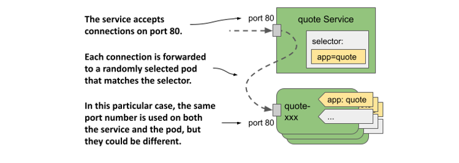

Để tạo Service, hãy áp dụng tệp cấu hình này vào Kubernetes API bằng lệnh `kubectl apply`.

#### Tạo một Service bằng lệnh kubectl expose

Thông thường, bạn tạo các Service tương tự như cách tạo các đối tượng khác, bằng cách áp dụng tệp cấu hình đối tượng bằng lệnh `kubectl apply`. Tuy nhiên, bạn cũng có thể tạo các Service bằng lệnh `kubectl expose`, như đã làm ở Chương 3 của cuốn sách này.

Hãy tạo Service cho Pod Quiz như sau:

```
$ kubectl expose pod quiz --name quiz
service/quiz exposed
```

Câu lệnh này tạo ra một Service có tên `quiz` để công khai Pod `quiz`. Để làm được điều này, hệ thống sẽ kiểm tra các nhãn của Pod và tạo ra một đối tượng Service với bộ chọn nhãn khớp với tất cả các nhãn của Pod đó.

##### Lưu ý

Ở Chương 3, bạn đã sử dụng lệnh `kubectl expose` để công khai một đối tượng Deployment. Trong trường hợp đó, lệnh này đã lấy bộ chọn từ Deployment và sử dụng nó trong đối tượng Service để công khai tất cả các Pod thuộc Deployment đó. Bạn sẽ tìm hiểu về Deployment ở Chương 13.

Hiện tại bạn đã tạo được hai Service. Bạn sẽ học cách kết nối đến chúng ở mục 11.1.3, nhưng trước tiên hãy xem chúng đã được cấu hình chính xác hay chưa.

#### Liệt kê các Service

Khi bạn tạo một Service, nó sẽ được gán một địa chỉ IP nội bộ mà bất kỳ tiến trình công việc (workload) nào đang chạy trong cụm đều có thể sử dụng để kết nối tới các Pod thuộc Service đó. Đây chính là địa chỉ IP cụm (cluster IP) của Service. Bạn có thể xem địa chỉ này bằng cách liệt kê các Service bằng lệnh `kubectl get services`. Nếu muốn xem bộ chọn nhãn của từng Service, hãy sử dụng tùy chọn `-o wide` như sau:

```
$ kubectl get svc -o wide
NAME    TYPE        CLUSTER-IP      EXTERNAL-IP   PORT(S)    AGE   SELECTOR
quiz    ClusterIP   10.96.136.190   <none>        8080/TCP   15s   app=quiz,rel=stable
quote   ClusterIP   10.96.74.151    <none>        80/TCP     23s   app=quote
```

##### Lưu ý

Tên viết tắt của `services` là `svc`.

Kết quả đầu ra của lệnh hiển thị hai Service mà bạn đã tạo. Đối với mỗi Service, thông tin về loại (type), địa chỉ IP, các cổng được mở và bộ chọn nhãn đều được in ra.

##### Lưu ý

Bạn cũng có thể xem thông tin chi tiết của từng Service bằng lệnh `kubectl describe svc`.

Bạn sẽ nhận thấy rằng Service `quiz` sử dụng một bộ chọn nhãn để chọn các Pod có nhãn `app: quiz` và `rel: stable`. Điều này là do đây là các nhãn của Pod `quiz` mà từ đó Service được tạo ra bằng lệnh `kubectl expose`.

Hãy cùng suy ngẫm về điều này. Bạn có thực sự muốn Service `quiz` chỉ bao gồm các Pod phiên bản ổn định (stable) không? Chắc chắn là không. Biết đâu sau này bạn lại quyết định triển khai một bản phát hành canary của dịch vụ quiz chạy song song với phiên bản ổn định thì sao. Trong trường hợp đó, bạn sẽ muốn lưu lượng truy cập được điều hướng đến cả hai Pod.

Một điểm khác mà tôi không thích ở Service `quiz` là số cổng. Vì Service này sử dụng giao thức HTTP, tôi muốn nó sử dụng cổng 80 thay vì 8080. May mắn thay, bạn hoàn toàn có thể thay đổi Service sau khi đã tạo nó.

#### Thay đổi bộ chọn nhãn của Service

Để thay đổi bộ chọn nhãn của một Service, bạn có thể sử dụng lệnh `kubectl set selector`. Để sửa lại bộ chọn của Service `quiz`, hãy chạy lệnh sau:

```
$ kubectl set selector service quiz app=quiz
service/quiz selector updated
```

Hãy liệt kê lại các Service với tùy chọn `-o wide` để xác nhận thay đổi của bộ chọn. Phương pháp thay đổi bộ chọn này rất hữu ích nếu bạn đang triển khai nhiều phiên bản của một ứng dụng và muốn điều hướng máy khách từ phiên bản này sang phiên bản khác.

#### Thay đổi các cổng được công khai bởi Service

Để thay đổi các cổng mà Service chuyển tiếp đến các Pod, bạn có thể chỉnh sửa đối tượng Service bằng lệnh `kubectl edit` hoặc cập nhật tệp cấu hình rồi áp dụng lại vào cụm.

Trước khi tiếp tục, hãy chạy lệnh `kubectl edit svc quiz` và đổi cổng từ `8080` thành `80`, hãy chắc chắn rằng bạn chỉ thay đổi trường `port` và giữ nguyên trường `targetPort` là `8080`, vì đây là cổng mà Pod `quiz` đang lắng nghe.

#### Cấu hình các thuộc tính cơ bản của Service

Bảng dưới đây liệt kê các trường cơ bản mà bạn có thể thiết lập trong đối tượng Service.

##### Bảng 11.1 Các trường trong phần spec của đối tượng Service dùng để cấu hình các thuộc tính cơ bản

| Trường | Kiểu dữ liệu | Mô tả |
| :--- | :--- | :--- |
| `type` | `string` | Chỉ định loại của đối tượng Service này. Các giá trị được phép là `ClusterIP`, `NodePort`, `LoadBalancer` và `ExternalName`. Giá trị mặc định là `ClusterIP`. Sự khác biệt giữa các loại này sẽ được giải thích ở các phần tiếp theo của chương này. |
| `clusterIP` | `string` | Địa chỉ IP nội bộ trong cụm nơi Service sẵn sàng tiếp nhận kết nối. Thông thường, bạn nên để trống trường này và để Kubernetes tự động gán IP. Nếu bạn đặt giá trị là `None`, Service này sẽ trở thành một headless service (Service không đầu). Các Service này sẽ được giải thích ở mục 11.4. |
| `selector` | `map[string]string` | Chỉ định các khóa và giá trị nhãn mà Pod bắt buộc phải có để Service này có thể chuyển tiếp lưu lượng truy cập đến nó. Nếu không thiết lập trường này, bạn sẽ phải tự mình quản lý các điểm cuối (endpoint) của Service. Điều này được giải thích ở mục 11.3. |
| `ports` | `[]Object` | Danh sách các cổng được công khai bởi Service này. Mỗi mục khai báo có thể chỉ định `name`, `protocol`, `appProtocol`, `port`, `nodePort` và `targetPort`. |

Các trường khác sẽ được giải thích trong phần còn lại của chương này.

##### Hỗ trợ cấu hình dual-stack IPv4/IPv6

Kubernetes hỗ trợ cả IPv4 và IPv6. Việc cụm của bạn có hỗ trợ mạng dual-stack hay không phụ thuộc vào việc cổng tính năng (feature gate) `IPv6DualStack` có được kích hoạt cho các thành phần áp dụng trong cụm hay không.

Khi tạo một đối tượng Service, bạn có thể chỉ định xem mình muốn Service này chạy đơn ngăn xếp (single-stack) hay song ngăn xếp (dual-stack) thông qua trường `ipFamilyPolicy`. Giá trị mặc định là `SingleStack`, nghĩa là chỉ có một họ IP duy nhất được gán cho Service, bất kể cụm có được cấu hình mạng đơn ngăn xếp hay song ngăn xếp hay không. Hãy đặt giá trị thành `PreferDualStack` nếu bạn muốn Service nhận cả hai họ IP khi cụm hỗ trợ dual-stack, và nhận một họ IP khi cụm chỉ hỗ trợ mạng single-stack. Nếu Service của bạn bắt buộc phải có cả địa chỉ IPv4 và IPv6, hãy đặt giá trị thành `RequireDualStack`. Việc tạo Service sẽ chỉ thành công trên các cụm hỗ trợ dual-stack.

Sau khi bạn tạo đối tượng Service, mảng `spec.ipFamilies` của nó sẽ cho biết họ IP nào đã được gán. Hai giá trị hợp lệ là `IPv4` và `IPv6`. Bạn cũng có thể tự thiết lập trường này để chỉ định họ IP nào sẽ được gán cho Service trong các cụm cung cấp mạng dual-stack. Trường `ipFamilyPolicy` phải được thiết lập tương ứng, nếu không quá trình khởi tạo sẽ thất bại.

Đối với các Service dual-stack, trường `spec.clusterIP` chỉ chứa một trong các địa chỉ IP, nhưng trường `spec.clusterIPs` sẽ chứa cả địa chỉ IPv4 và IPv6. Thứ tự của các IP trong trường `clusterIPs` tương ứng với thứ tự trong trường `ipFamilies`.

### 11.1.3 Truy cập các Service nội bộ cụm

Các Service thuộc loại `ClusterIP` mà bạn tạo ở phần trước chỉ có thể truy cập được từ bên trong cụm, cụ thể là từ các Pod khác và từ các Node trong cụm. Bạn không thể truy cập chúng trực tiếp từ máy cá nhân của mình. Để kiểm tra xem một Service có thực sự hoạt động hay không, bạn phải đăng nhập vào một trong các Node bằng giao thức `ssh` và kết nối tới Service từ đó, hoặc sử dụng lệnh `kubectl exec` để chạy một lệnh như `curl` bên trong một Pod hiện có và thực hiện kết nối tới Service.

##### Lưu ý

Bạn cũng có thể sử dụng lệnh `kubectl port-forward svc/my-service` để kết nối tới một trong các Pod đứng sau Service. Tuy nhiên, lệnh này không thực sự kết nối tới chính Service đó. Nó chỉ sử dụng đối tượng Service để tìm ra một Pod thích hợp để kết nối. Sau đó, kết nối được thực hiện trực tiếp tới Pod đó, bỏ qua hoàn toàn Service.

#### Kết nối tới Service từ các Pod

Để sử dụng Service từ một Pod, hãy chạy một trình shell trong Pod `quote-001` như sau:

```
$ kubectl exec -it quote-001 -c nginx -- sh
/ #
```

Bây giờ, hãy kiểm tra xem bạn có thể truy cập được hai Service hay không. Hãy sử dụng các địa chỉ IP cụm của các Service hiển thị từ lệnh `kubectl get services`. Trong trường hợp của tôi, Service `quiz` sử dụng IP cụm `10.96.136.190`, trong khi Service `quote` sử dụng IP `10.96.74.151`. Từ bên trong Pod `quote-001`, tôi có thể kết nối tới hai Service này như sau:

```
/ # curl http://10.96.136.190    #A
This is the quiz service running in pod quiz
 
/ # curl http://10.96.74.151    #B
This is the quote service running in pod quote-canary
```

##### Lưu ý

Bạn không cần phải chỉ định cổng trong lệnh `curl`, vì bạn đã đặt cổng của Service là 80, vốn là cổng mặc định của giao thức HTTP.

Nếu bạn lặp lại lệnh cuối cùng này vài lần, bạn sẽ thấy Service chuyển tiếp yêu cầu đến một Pod khác nhau mỗi lần chạy:

```
/ # while true; do curl http://10.96.74.151; done
This is the quote service running in pod quote-canary
This is the quote service running in pod quote-003
This is the quote service running in pod quote-001
...
```

Service hoạt động như một bộ cân bằng tải. Nó phân phối các yêu cầu đến tất cả các Pod đứng sau hỗ trợ nó.

#### Cấu hình độ bám dính phiên trên Service

Bạn có thể cấu hình xem Service nên chuyển tiếp mỗi kết nối mới đến một Pod khác nhau, hay chuyển tiếp tất cả các kết nối từ cùng một máy khách đến duy nhất một Pod cố định. Bạn có thể thiết lập điều này thông qua trường `spec.sessionAffinity` trong đối tượng Service. Hệ thống chỉ hỗ trợ hai loại độ bám dính phiên (session affinity) cho Service: `None` và `ClientIP`.

Loại mặc định là `None`, nghĩa là không có gì đảm bảo mỗi kết nối sẽ được chuyển tiếp đến Pod nào. Tuy nhiên, nếu bạn đặt giá trị thành `ClientIP`, tất cả các kết nối bắt nguồn từ cùng một IP nguồn sẽ luôn được chuyển tiếp đến cùng một Pod. Trong trường `spec.sessionAffinityConfig.clientIP.timeoutSeconds`, bạn có thể chỉ định thời gian duy trì phiên này. Giá trị mặc định là 3 giờ.

Có thể bạn sẽ ngạc nhiên khi biết rằng Kubernetes không cung cấp cơ chế bám dính phiên dựa trên cookie (cookie-based session affinity). Tuy nhiên, hãy lưu ý rằng các Service trong Kubernetes hoạt động ở tầng giao vận (Transport Layer) của mô hình mạng OSI (giao thức UDP và TCP) chứ không phải ở tầng ứng dụng (Application Layer - giao thức HTTP), do đó chúng hoàn toàn không thể hiểu được các cookie HTTP.

#### Phân giải Service thông qua DNS

Các cụm Kubernetes thường chạy một máy chủ DNS nội bộ được cấu hình để tất cả các Pod trong cụm sử dụng. Trong hầu hết các cụm, dịch vụ DNS nội bộ này được cung cấp bởi CoreDNS, trong khi một số cụm khác sử dụng kube-dns. Bạn có thể xem thành phần nào đang được triển khai trong cụm của mình bằng cách liệt kê các Pod trong namespace `kube-system`.

Dù được triển khai bằng giải pháp nào đi nữa, nó vẫn cho phép các Pod phân giải địa chỉ IP cụm của một Service thông qua tên của nó. Bằng cách sử dụng hệ thống DNS của cụm, các Pod có thể kết nối tới Service `quiz` như sau:

```
/ # curl http://quiz    #A
This is the quiz service running in pod quiz
```

Một Pod có thể phân giải bất kỳ Service nào được định nghĩa trong cùng namespace với nó bằng cách chỉ cần trỏ thẳng đến tên của Service trong URL. Nếu một Pod cần kết nối với một Service ở một namespace khác, nó phải thêm tên namespace của đối tượng Service đó vào sau tên Service trong URL. Ví dụ, để kết nối với Service `quiz` trong namespace `kiada`, một Pod có thể sử dụng URL `http://quiz.kiada/` bất kể bản thân Pod đó đang nằm ở namespace nào.

Từ bên trong Pod `quote-001` nơi bạn vừa chạy lệnh shell, bạn cũng có thể kết nối tới Service như sau:

```
/ # curl http://quiz.kiada    #A
This is the quiz service running in pod quiz
```

Một Service có thể được phân giải dưới các tên miền DNS sau:

- `<service-name>`, nếu Service nằm trong cùng một namespace với Pod đang thực hiện truy vấn DNS,
- `<service-name>.<service-namespace>` từ bất kỳ namespace nào, và cả dưới dạng
- `<service-name>.<service-namespace>.svc`, cùng với
- `<service-name>.<service-namespace>.svc.cluster.local`.

##### Lưu ý

Phần hậu tố tên miền mặc định là `cluster.local` nhưng có thể thay đổi ở cấp độ cụm.

Lý do bạn không cần phải chỉ định tên miền phân giải đầy đủ (FQDN - Fully Qualified Domain Name) khi phân giải Service qua DNS là nhờ dòng khai báo `search` trong tệp `/etc/resolv.conf` của Pod. Đối với Pod `quote-001`, nội dung tệp này trông như sau:

```
/ # cat /etc/resolv.conf
search kiada.svc.cluster.local svc.cluster.local cluster.local localdomain
nameserver 10.96.0.10
options ndots:5
```

Khi bạn cố gắng phân giải một Service, các tên miền được chỉ định trong trường `search` sẽ lần lượt được thêm vào sau tên Service cho đến khi tìm thấy kết quả khớp. Nếu bạn thắc mắc địa chỉ IP trong dòng `nameserver` là gì, bạn có thể liệt kê tất cả các Service trong cụm của mình để tìm câu trả lời:

```
$ kubectl get svc -A
NAMESPACE     NAME         TYPE        CLUSTER-IP      EXTERNAL-IP   PORT(S)                  
default       kubernetes   ClusterIP   10.96.0.1       <none>        443/TCP                  
kiada         quiz         ClusterIP   10.96.136.190   <none>        80/TCP                   
kiada         quote        ClusterIP   10.96.74.151    <none>        80/TCP 
kube-system   kube-dns     ClusterIP   10.96.0.10      <none>        53/UDP...    #A
```

Máy chủ phân giải tên miền (nameserver) trong tệp `resolv.conf` của Pod trỏ đến Service `kube-dns` trong namespace `kube-system`. Đây chính là dịch vụ DNS của cụm mà các Pod sử dụng. Hãy thử tự mình tìm hiểu xem Service này chuyển tiếp lưu lượng truy cập đến (các) Pod nào như một bài tập nhỏ.

##### Cấu hình chính sách DNS của Pod

Việc một Pod có sử dụng máy chủ DNS nội bộ hay không có thể được cấu hình bằng trường `dnsPolicy` trong phần `spec` của Pod. Giá trị mặc định là `ClusterFirst`, nghĩa là Pod sẽ ưu tiên sử dụng DNS nội bộ trước, sau đó mới dùng đến DNS được cấu hình cho Node của cụm. Các giá trị hợp lệ khác gồm `Default` (sử dụng DNS được cấu hình cho Node), `None` (Kubernetes không cung cấp cấu hình DNS nào; bạn phải tự cấu hình các thiết lập DNS của Pod bằng trường `dnsConfig` được giải thích ở đoạn tiếp theo), và `ClusterFirstWithHostNet` (dành cho các Pod đặc biệt sử dụng mạng của host thay vì mạng riêng của chúng - điều này sẽ được giải thích sau trong cuốn sách).

Việc thiết lập trường `dnsPolicy` sẽ ảnh hưởng đến cách Kubernetes cấu hình tệp `resolv.conf` của Pod. Bạn có thể tùy biến sâu hơn tệp này thông qua trường `dnsConfig` của Pod. Tệp `pod-with-dns-options.yaml` trong kho lưu trữ mã nguồn của cuốn sách sẽ minh họa cách sử dụng trường này.

#### Phát hiện Service thông qua các biến môi trường

Ngày nay, hầu như mọi cụm Kubernetes đều cung cấp dịch vụ DNS cho cụm. Tuy nhiên, vào thời kỳ đầu thì không được như vậy. Thuở ấy, các Pod tìm kiếm địa chỉ IP của các Service thông qua các biến môi trường. Các biến này vẫn tồn tại cho đến tận ngày nay.

Khi một container được khởi động, Kubernetes sẽ khởi tạo một tập hợp các biến môi trường cho mỗi Service tồn tại trong namespace của Pod đó. Hãy cùng xem các biến môi trường này trông như thế nào bằng cách kiểm tra môi trường của một trong các Pod đang chạy của bạn.

Vì bạn đã tạo các Pod của mình trước các Service, bạn sẽ không thấy bất kỳ biến môi trường nào liên quan đến các Service ngoại trừ các biến dành cho Service `kubernetes`, vốn luôn tồn tại trong namespace `default`.

##### Lưu ý

Service `kubernetes` chuyển tiếp lưu lượng truy cập đến API server. Bạn sẽ sử dụng nó ở Chương 16.

Để xem các biến môi trường của hai Service mà bạn vừa tạo, bạn bắt buộc phải khởi động lại container bằng lệnh sau:

```
$ kubectl exec quote-001 -c nginx -- kill 1
```

Khi container được khởi động lại, các biến môi trường của nó sẽ chứa các mục khai báo cho các Service `quiz` và `quote`. Hãy hiển thị chúng bằng câu lệnh sau:

```
$ kubectl exec -it quote-001 -c nginx -- env | sort
...
QUIZ_PORT_80_TCP_ADDR=10.96.136.190    #A
QUIZ_PORT_80_TCP_PORT=80    #A
QUIZ_PORT_80_TCP_PROTO=tcp    #A
QUIZ_PORT_80_TCP=tcp://10.96.136.190:80    #A
QUIZ_PORT=tcp://10.96.136.190:80    #A
QUIZ_SERVICE_HOST=10.96.136.190    #A
QUIZ_SERVICE_PORT=80    #A
QUOTE_PORT_80_TCP_ADDR=10.96.74.151    #B
QUOTE_PORT_80_TCP_PORT=80    #B
QUOTE_PORT_80_TCP_PROTO=tcp    #B
QUOTE_PORT_80_TCP=tcp://10.96.74.151:80    #B
QUOTE_PORT=tcp://10.96.74.151:80    #B
QUOTE_SERVICE_HOST=10.96.74.151    #B
QUOTE_SERVICE_PORT=80    #B
```

Quả là một số lượng biến môi trường khổng lồ, đúng không? Đối với các Service có nhiều cổng, số lượng biến này thậm chí còn lớn hơn nhiều. Một ứng dụng chạy trong container có thể sử dụng các biến này để tìm địa chỉ IP và (các) cổng của một Service cụ thể.

##### LƯU Ý

Trong tên của các biến môi trường, các dấu gạch ngang trong tên Service được chuyển đổi thành dấu gạch dưới và tất cả các chữ cái đều được viết hoa.

Ngày nay, các ứng dụng thường lấy thông tin này thông qua hệ thống DNS, vì vậy các biến môi trường này không còn hữu dụng như trước nữa. Thậm chí chúng còn có thể gây ra một số rắc rối. Nếu số lượng Service trong một namespace quá lớn, bất kỳ Pod nào bạn tạo ra trong namespace đó đều sẽ thất bại khi khởi động. Container sẽ thoát với mã lỗi (exit code) là 1 và bạn sẽ thấy thông báo lỗi sau trong nhật ký (log) của container:

```
standard_init_linux.go:228: exec user process caused: argument list too long
```

Để ngăn chặn điều này, bạn có thể tắt tính năng tự động thêm thông tin Service vào môi trường bằng cách đặt trường `enableServiceLinks` trong phần `spec` của Pod thành `false`.

#### Tìm hiểu lý do tại sao bạn không thể ping địa chỉ IP của Service

Bạn đã biết cách xác minh xem một Service có đang chuyển tiếp lưu lượng truy cập đến các Pod của mình hay không. Nhưng điều gì sẽ xảy ra nếu nó không hoạt động? Trong trường hợp đó, bạn có thể muốn thử ping địa chỉ IP của Service. Tại sao bạn không thử làm điều đó ngay lúc này? Hãy ping Service `quiz` từ Pod `quote-001` như sau:

```
$ kubectl exec -it quote-001 -c nginx -- ping quiz
PING quiz (10.96.136.190): 56 data bytes
^C
--- quiz ping statistics ---
15 packets transmitted, 0 packets received, 100% packet loss
command terminated with exit code 1
```

Hãy đợi vài giây rồi ngắt tiến trình bằng cách nhấn tổ hợp phím Control-C. Như bạn có thể thấy, địa chỉ IP đã được phân giải chính xác, nhưng không có gói tin nào truyền qua được. Điều này là do địa chỉ IP của Service chỉ là địa chỉ ảo và chỉ có ý nghĩa khi đi kèm với một trong các cổng được định nghĩa trong chính Service đó. Nguyên lý này sẽ được giải thích kỹ hơn ở Chương 18 - chương đi sâu vào cơ chế hoạt động nội bộ của Service. Hiện tại, hãy ghi nhớ rằng bạn không thể ping các Service.

#### Sử dụng các Service bên trong một Pod

Giờ đây, khi đã biết rằng các Service Quiz và Quote hoàn toàn có thể truy cập được từ các Pod, bạn có thể triển khai các Pod Kiada và cấu hình để chúng sử dụng hai Service này. Ứng dụng mong đợi tìm thấy URL của các Service này trong các biến môi trường `QUIZ_URL` và `QUOTE_URL`. Đây không phải là các biến môi trường mà Kubernetes tự động thêm vào, mà là các biến bạn phải thiết lập thủ công để ứng dụng biết nơi tìm thấy hai Service đó. Do đó, trường `env` của container `kiada` phải được cấu hình như trong đoạn mã dưới đây.

##### Mã nguồn 11.2 Cấu hình các URL của Service trong Pod kiada

```yaml
...
    env:
    - name: QUOTE_URL    #A
      value: http://quote/quote    #A
    - name: QUIZ_URL    #B
      value: http://quiz    #B
    - name: POD_NAME
      ....
```

Biến môi trường `QUOTE_URL` được đặt thành `http://quote/quote`. Tên máy chủ (hostname) ở đây chính là tên của Service mà bạn đã tạo ở phần trước. Tương tự, `QUIZ_URL` được đặt thành `http://quiz`, với `quiz` là tên của Service còn lại mà bạn đã tạo.

Hãy triển khai các Pod Kiada bằng cách áp dụng tệp cấu hình `kiada-stable-and-canary.yaml` vào cụm của bạn bằng lệnh `kubectl apply`. Sau đó, hãy chạy lệnh sau để mở một đường truyền (tunnel) tới một trong các Pod bạn vừa tạo:

```
$ kubectl port-forward kiada-001 8080 8443
```

Giờ đây, bạn có thể chạy thử ứng dụng tại địa chỉ <http://localhost:8080> hoặc <https://localhost:8443>. Nếu sử dụng lệnh `curl`, bạn sẽ thấy một phản hồi có nội dung tương tự như sau:

```
$ curl http://localhost:8080
==== TIP OF THE MINUTE
Kubectl options that take a value can be specified with an equal sign or with a space. Instead of -tail=10, you can also type --tail 10.
 
==== POP QUIZ
First question
0) First answer
1) Second answer
2) Third answer
 
Submit your answer to /question/1/answers/<index of answer> using the POST method.
 
==== REQUEST INFO
Request processed by Kubia 1.0 running in pod "kiada-001" on node "kind-worker2".
Pod hostname: kiada-001; Pod IP: 10.244.1.90; Node IP: 172.18.0.2; Client IP: ::ffff:127.0.0.1
 
HTML version of this content is available at /html
```

Nếu bạn mở URL này trong trình duyệt web của mình, bạn sẽ nhận được trang web như hiển thị ở hình dưới đây.

##### Hình 11.6 Giao diện ứng dụng Kiada khi truy cập bằng trình duyệt web

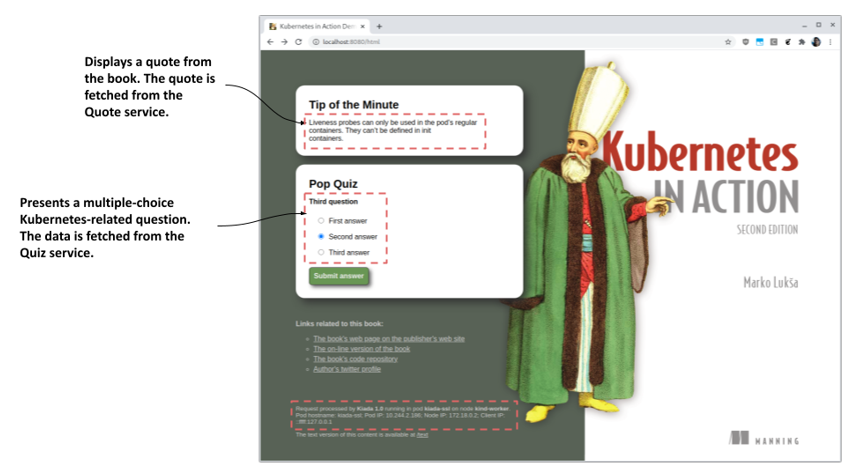

Nếu bạn nhìn thấy câu trích dẫn và câu hỏi trắc nghiệm, điều đó có nghĩa là Pod `kiada-001` đã giao tiếp thành công với các Service `quote` và `quiz`. Nếu kiểm tra nhật ký của các Pod đứng sau hỗ trợ các Service này, bạn sẽ thấy chúng đang tiếp nhận các yêu cầu. Đối với Service `quote` - vốn được hỗ trợ bởi nhiều Pod, bạn sẽ thấy mỗi yêu cầu mới được gửi đến một Pod khác nhau.

## 11.2 Cung cấp quyền truy cập Service từ bên ngoài

Các Service thuộc loại ClusterIP như những Service bạn đã tạo ở phần trước chỉ có thể truy cập được từ bên trong cụm. Vì máy khách bắt buộc phải có khả năng truy cập dịch vụ Kiada từ bên ngoài cụm, như mô tả trong hình tiếp theo, việc chỉ tạo một Service loại ClusterIP sẽ không đủ đáp ứng.

##### Hình 11.7 Cung cấp quyền truy cập Service từ bên ngoài

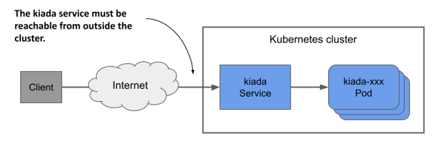

Nếu cần cung cấp quyền truy cập một Service cho thế giới bên ngoài, bạn có thể thực hiện một trong các cách sau:

- gán một địa chỉ IP bổ sung cho một Node và thiết lập địa chỉ đó làm một trong các `externalIPs` của Service,
- đặt loại của Service thành `NodePort` và truy cập Service thông qua (các) cổng của Node đó,
- yêu cầu Kubernetes cấp phát một bộ cân bằng tải bằng cách đặt loại Service thành `LoadBalancer`, hoặc
- công khai Service thông qua một đối tượng Ingress.

Một phương pháp hiếm khi được sử dụng là chỉ định một IP bổ sung trong trường `spec.externalIPs` của đối tượng Service. Bằng cách này, bạn đang yêu cầu Kubernetes xử lý bất kỳ lưu lượng truy cập nào hướng đến địa chỉ IP đó như lưu lượng truy cập cần được xử lý bởi Service. Khi bạn đảm bảo rằng lưu lượng truy cập này truyền đến một Node có IP ngoại vi của Service làm đích đến, Kubernetes sẽ chuyển tiếp nó đến một trong các Pod đứng sau hỗ trợ cho Service.

Một cách phổ biến hơn để công khai một Service ra bên ngoài là đặt loại của nó thành `NodePort`. Kubernetes sẽ cung cấp Service trên một cổng mạng ở tất cả các Node trong cụm (được gọi là cổng Node - hay node port, nguồn gốc tên gọi của loại Service này). Tương tự như các Service `ClusterIP`, Service này cũng nhận được một IP cụm nội bộ, nhưng đồng thời có thể truy cập được thông qua cổng Node trên mỗi Node của cụm. Thông thường, sau đó bạn sẽ thiết lập thêm một bộ cân bằng tải bên ngoài để điều hướng lưu lượng truy cập đến các cổng Node này. Các máy khách có thể kết nối tới dịch vụ của bạn thông qua địa chỉ IP của bộ cân bằng tải đó.

Thay vì sử dụng một Service loại `NodePort` và tự tay thiết lập bộ cân bằng tải, Kubernetes cũng có thể tự động làm việc này cho bạn nếu bạn đặt loại Service thành `LoadBalancer`. Tuy nhiên, không phải tất cả các cụm đều hỗ trợ loại Service này, vì việc cấp phát bộ cân bằng tải phụ thuộc vào hạ tầng mà cụm đang chạy trên đó. Hầu hết các nhà cung cấp dịch vụ đám mây (cloud provider) đều hỗ trợ các Service loại LoadBalancer trong cụm của họ, trong khi các cụm được triển khai trên hạ tầng vật lý riêng (on-premises) sẽ yêu cầu một thành phần bổ sung như MetalLB - một giải pháp triển khai bộ cân bằng tải dành cho các cụm Kubernetes chạy trên phần cứng vật lý (bare-metal).

Phương pháp cuối cùng để công khai một nhóm Pod ra bên ngoài có sự khác biệt rất lớn. Thay vì công khai Service ra bên ngoài thông qua các cổng Node và bộ cân bằng tải, bạn có thể sử dụng một đối tượng Ingress. Cách thức đối tượng này công khai Service phụ thuộc vào bộ điều khiển ingress (ingress controller) nền tảng, nhưng nó cho phép bạn công khai nhiều Service thông qua một địa chỉ IP duy nhất có thể truy cập được từ bên ngoài. Bạn sẽ tìm hiểu kỹ hơn về đối tượng này ở chương tiếp theo.

### 11.2.1 Công khai Pod qua Service NodePort

Một trong những cách giúp các máy khách bên ngoài có thể truy cập vào Pod là công khai chúng thông qua một Service `NodePort`. Khi bạn tạo loại Service này, các Pod khớp với nhãn chọn (selector) của nó sẽ có thể được truy cập thông qua một cổng (port) cụ thể trên tất cả các Node trong cụm, như được minh họa trong hình dưới đây. Vì cổng này được mở trực tiếp trên các Node nên nó được gọi là cổng Node (node port).

##### Hình 11.8 Công khai Pod qua Service NodePort

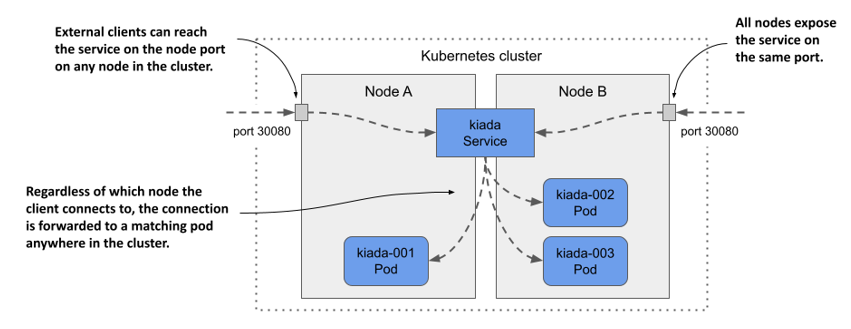

Tương tự như Service `ClusterIP`, người dùng có thể truy cập Service `NodePort` thông qua IP nội bộ của cụm (cluster IP), đồng thời cũng có thể truy cập qua cổng Node trên từng Node của cụm. Trong ví dụ ở hình trên, các Pod có thể được truy cập thông qua cổng `30080`. Như bạn có thể thấy, cổng này được mở trên cả hai Node của cụm.

Việc máy khách kết nối tới Node nào không quan trọng, bởi mọi Node đều sẽ chuyển tiếp kết nối đó đến một Pod thuộc Service, bất kể Pod đó đang chạy trên Node nào. Khi máy khách kết nối tới Node A, một Pod trên Node A hoặc Node B đều có thể nhận kết nối. Điều tương tự cũng diễn ra khi máy khách kết nối tới cổng trên Node B.

#### Tạo Service NodePort

Để công khai các Pod `kiada` qua một Service `NodePort`, bạn hãy tạo Service từ tệp cấu hình (manifest) được trình bày trong danh sách dưới đây.

##### Danh sách 11.3 Service NodePort công khai các Pod kiada trên hai cổng

```yaml
apiVersion: v1
kind: Service
metadata:
  name: kiada
spec:
  type: NodePort    #A
  selector:
    app: kiada
  ports:
  - name: http    #B
    port: 80    #C
    nodePort: 30080    #D
    targetPort: 8080    #E
  - name: https    #F
    port: 443    #F
    nodePort: 30443    #F
    targetPort: 8443    #F
```

So với các Service `ClusterIP` mà bạn đã tạo trước đó, loại Service trong danh sách này là `NodePort`. Khác với các Service trước, Service này công khai hai cổng và định nghĩa rõ số cổng `nodePort` cho từng cổng đó.

##### Lưu ý

Bạn có thể bỏ qua trường `nodePort` để Kubernetes tự động cấp phát số cổng. Điều này giúp tránh xung đột cổng giữa các Service NodePort khác nhau.

Service này chỉ định tới sáu số cổng khác nhau, điều này có thể gây bối rối lúc ban đầu, nhưng hình minh họa dưới đây sẽ giúp bạn dễ hình dung hơn.

##### Hình 11.9 Công khai nhiều cổng bằng Service NodePort

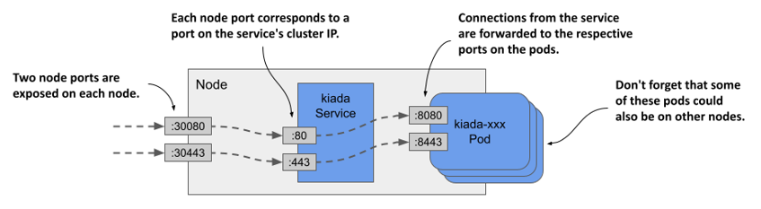

#### Kiểm tra Service NodePort

Sau khi tạo Service, bạn hãy kiểm tra lại bằng lệnh `kubectl get` như sau:

```shell
$ kubectl get svc
NAME    TYPE        CLUSTER-IP      EXTERNAL-IP   PORT(S)                      AGE
kiada   NodePort    10.96.226.212   <none>        80:30080/TCP,443:30443/TCP   1m    #A
quiz    ClusterIP   10.96.173.186   <none>        80/TCP                       3h
quote   ClusterIP   10.96.161.97    <none>        80/TCP                       3h
```

Hãy so sánh cột `TYPE` và `PORT(S)` của các Service mà bạn đã tạo từ đầu đến giờ. Khác với hai Service `ClusterIP`, Service `kiada` thuộc loại `NodePort`, giúp mở các cổng Node `30080` và `30443` bên cạnh các cổng `80` và `443` sẵn có trên IP cụm của Service.

#### Truy cập Service NodePort

Để xác định tất cả các tổ hợp `IP:cổng` có thể dùng để truy cập Service, bạn không chỉ cần biết (các) số cổng Node mà còn cần cả IP của các Node đó. Bạn có thể lấy thông tin này bằng cách chạy lệnh `kubectl get nodes -o wide` và quan sát hai cột `INTERNAL-IP` và `EXTERNAL-IP`. Các cụm chạy trên môi trường đám mây (cloud) thường sẽ được thiết lập IP ngoài (external IP) cho các Node, trong khi các cụm chạy trên phần cứng vật lý (bare metal) có thể chỉ hiển thị IP nội bộ (internal IP) của Node. Bạn sẽ có thể kết nối tới các cổng Node bằng những IP này, miễn là không bị chặn bởi tường lửa.

##### Lưu ý

Để cho phép lưu lượng truy cập đi vào các cổng Node khi sử dụng GKE, hãy chạy lệnh `gcloud compute firewall-rules create gke-allow-nodeports --allow=tcp:30000-32767`. Nếu cụm của bạn đang chạy trên một nhà cung cấp đám mây khác, hãy tham khảo tài liệu hướng dẫn của họ để biết cách cấu hình tường lửa cho phép truy cập vào các cổng Node.

Trong cụm mà tôi khởi tạo bằng công cụ `kind`, IP nội bộ của các Node như sau:

```shell
$ kubectl get nodes -o wide
NAME                 STATUS   ROLES                  ...   INTERNAL-IP   EXTERNAL-IP   
kind-control-plane   Ready    control-plane,master   ...   172.18.0.3    <none> 
kind-worker          Ready    <none>                 ...   172.18.0.4    <none>
kind-worker2         Ready    <none>                 ...   172.18.0.2    <none>
```

Service `kiada` có thể truy cập được trên tất cả các IP này, ngay cả IP của Node đang chạy thành phần điều khiển (control plane) của Kubernetes. Tôi có thể truy cập Service bằng bất kỳ URL nào dưới đây:

- `10.96.226.212:80` trong cụm (đây là IP cụm và cổng nội bộ),
- `172.18.0.3:30080` từ bất kỳ nơi nào có thể kết nối tới Node `kind-control-plane`, vì đây là địa chỉ IP của Node đó; cổng này là một trong các cổng Node của Service `kiada`,
- `172.18.0.4:30080` (địa chỉ IP và cổng Node của Node thứ hai), và
- `172.18.0.2:30080` (địa chỉ IP và cổng Node của Node thứ ba).

Service cũng có thể được truy cập qua HTTPS trên cổng `443` trong cụm và qua cổng Node `30443`. Nếu các Node của tôi có cả IP ngoài, Service cũng sẽ khả dụng qua hai cổng Node trên các IP đó. Nếu bạn đang sử dụng Minikube hoặc một cụm đơn Node (single-node) khác, bạn nên sử dụng IP của chính Node đó.

##### Mẹo

Nếu bạn đang sử dụng Minikube, bạn có thể dễ dàng truy cập các Service `NodePort` của mình qua trình duyệt bằng cách chạy lệnh `minikube` `service` `<tên-service>` `[-n` `<namespace>]`.

Hãy sử dụng `curl` hoặc trình duyệt web để truy cập Service. Chọn một trong các Node và tìm địa chỉ IP của nó. Gửi một yêu cầu HTTP đến cổng `30080` của IP này. Hãy kiểm tra phần cuối của phản hồi để xem Pod nào đã xử lý yêu cầu và Pod đó đang chạy trên Node nào. Ví dụ, dưới đây là phản hồi tôi nhận được cho một trong các yêu cầu của mình:

```shell
$ curl 172.18.0.4:30080
...
==== REQUEST INFO
Request processed by Kubia 1.0 running in pod "kiada-001" on node "kind-worker2".
Pod hostname: kiada-001; Pod IP: 10.244.1.90; Node IP: 172.18.0.2; Client IP: ::ffff:172.18.0.4
```

Lưu ý rằng tôi đã gửi yêu cầu tới địa chỉ `172.18.0.4`, vốn là IP của Node `kind-worker`, nhưng Pod xử lý yêu cầu lại đang chạy trên Node `kind-worker2`. Node đầu tiên đã chuyển tiếp kết nối đến Node thứ hai, đúng như những gì đã được giải thích ở phần giới thiệu về Service NodePort.

Bạn có nhận ra Pod cho rằng yêu cầu xuất phát từ đâu không? Hãy nhìn vào dòng `Client IP` ở cuối phản hồi. Đó không phải là IP của máy tính mà tôi đã dùng để gửi yêu cầu. Có thể bạn đã nhận thấy đó chính là IP của Node mà tôi đã gửi yêu cầu tới. Tôi sẽ giải thích lý do tại sao lại xảy ra điều này và cách bạn có thể ngăn chặn nó trong mục 11.2.3.

Hãy thử gửi yêu cầu đến các Node khác nữa. Bạn sẽ thấy rằng tất cả chúng đều chuyển tiếp yêu cầu đến một Pod `kiada` ngẫu nhiên. Nếu các Node của bạn có thể kết nối từ internet, ứng dụng giờ đây đã có thể tiếp cận người dùng trên toàn thế giới. Bạn có thể sử dụng cơ chế DNS xoay vòng (round robin DNS) để phân phối các kết nối đến các Node, hoặc đặt một bộ cân bằng tải lớp 4 (Layer 4 load balancer) thực thụ phía trước các Node rồi hướng các máy khách kết nối vào đó. Hoặc bạn chỉ cần để Kubernetes tự động xử lý việc này, như sẽ được giải thích trong phần tiếp theo.

### 11.2.2 Công khai Service qua bộ cân bằng tải ngoài

Ở phần trước, bạn đã tạo một Service loại `NodePort`. Một loại Service khác nữa là `LoadBalancer`. Đúng như tên gọi, loại Service này giúp ứng dụng của bạn có thể được truy cập thông qua một bộ cân bằng tải (load balancer). Mặc dù bản thân mọi Service đều hoạt động như một bộ cân bằng tải, việc tạo một Service loại `LoadBalancer` sẽ kích hoạt việc khởi tạo một bộ cân bằng tải thực tế (ở hạ tầng phía dưới).

Như được mô tả trong hình dưới đây, bộ cân bằng tải này đứng trước các Node và xử lý các kết nối đến từ các máy khách. Nó định tuyến từng kết nối đến Service bằng cách chuyển tiếp kết nối đó tới cổng Node trên một trong các Node. Điều này khả thi là vì loại Service `LoadBalancer` vốn là một phần mở rộng của loại `NodePort`, giúp Service có thể được truy cập thông qua các cổng Node này. Bằng cách hướng máy khách kết nối tới bộ cân bằng tải thay vì kết nối trực tiếp vào cổng Node của một Node cụ thể, máy khách sẽ không bao giờ gặp phải tình trạng cố gắng kết nối tới một Node đang gặp sự cố, bởi bộ cân bằng tải chỉ chuyển tiếp lưu lượng đến các Node khỏe mạnh. Ngoài ra, bộ cân bằng tải cũng đảm bảo các kết nối được phân phối đồng đều trên tất cả các Node trong cụm.

##### Hình 11.10 Công khai một Service LoadBalancer

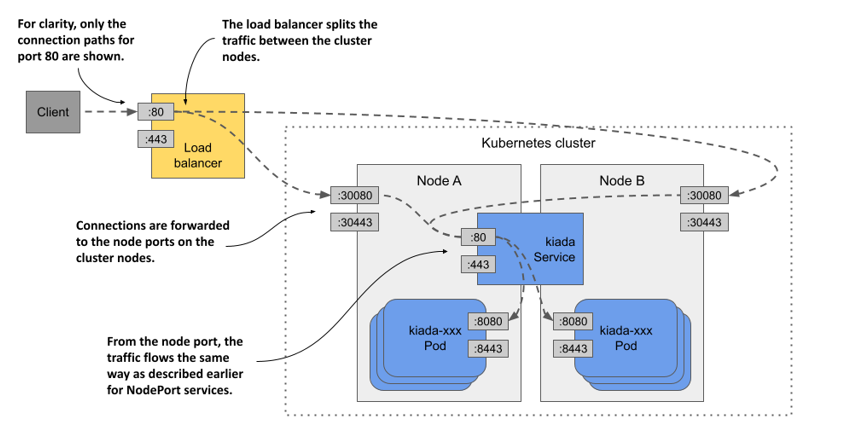

Không phải cụm Kubernetes nào cũng hỗ trợ loại Service này, nhưng nếu cụm của bạn chạy trên môi trường đám mây thì gần như chắc chắn là có. Nếu cụm chạy trên hạ tầng nội bộ (on-premises), cụm sẽ chỉ hỗ trợ Service `LoadBalancer` nếu bạn cài đặt thêm tiện ích mở rộng (add-on). Trong trường hợp cụm không hỗ trợ, bạn vẫn có thể tạo các Service loại này, nhưng khi đó Service sẽ chỉ có thể truy cập được thông qua các cổng Node của nó.

#### Tạo Service LoadBalancer

Tệp cấu hình trong danh sách dưới đây chứa định nghĩa của một Service `LoadBalancer`.

##### Danh sách 11.4 Service loại LoadBalancer

```yaml
apiVersion: v1
kind: Service
metadata:
  name: kiada
spec:
  type: LoadBalancer    #A
  selector:
    app: kiada
  ports:
  - name: http
    port: 80
    nodePort: 30080
    targetPort: 8080
  - name: https
    port: 443
    nodePort: 30443
    targetPort: 8443
```

Tệp cấu hình này chỉ khác biệt duy nhất một dòng so với tệp cấu hình của Service `NodePort` mà bạn đã triển khai trước đó – đó là dòng xác định loại (`type`) Service. Phần nhãn chọn (selector) và các cổng vẫn giữ nguyên như cũ. Các cổng Node chỉ được chỉ định cụ thể để tránh việc Kubernetes tự động lựa chọn ngẫu nhiên. Nếu bạn không bận tâm về số cổng Node, bạn hoàn toàn có thể bỏ qua các trường `nodePort`.

Hãy áp dụng tệp cấu hình bằng lệnh `kubectl apply`. Bạn không cần phải xóa Service `kiada` hiện tại trước khi thực hiện. Việc này giúp đảm bảo IP nội bộ (cluster IP) của Service không bị thay đổi.

#### Kết nối tới Service qua bộ cân bằng tải

Sau khi bạn tạo Service, có thể mất vài phút để hạ tầng đám mây khởi tạo bộ cân bằng tải và cập nhật địa chỉ IP của nó vào đối tượng Service. Địa chỉ IP này sau đó sẽ xuất hiện ở cột địa chỉ IP ngoài (external IP) của Service:

```shell
$ kubectl get svc kiada
NAME    TYPE           CLUSTER-IP      EXTERNAL-IP      PORT(S)                       AGE
kiada   LoadBalancer   10.96.226.212   172.18.255.200   80:30080/TCP,443:30443/TCP    10m
```

Trong trường hợp của tôi, địa chỉ IP của bộ cân bằng tải là `172.18.255.200` và tôi có thể truy cập Service thông qua cổng `80` và `443` của IP này. Cho đến khi bộ cân bằng tải được tạo xong, giá trị `<pending>` sẽ hiển thị ở cột `EXTERNAL-IP` thay vì một địa chỉ IP cụ thể. Trạng thái này có thể do quá trình khởi tạo chưa hoàn tất, hoặc do cụm không hỗ trợ các Service loại `LoadBalancer`.

#### Bổ sung hỗ trợ Service LoadBalancer bằng MetalLB

Nếu cụm của bạn chạy trên môi trường bare metal (phần cứng vật lý), bạn có thể cài đặt MetalLB để hỗ trợ các Service `LoadBalancer`. Bạn có thể tìm thấy công cụ này tại trang <https://metallb.universe.tf>. Nếu bạn tạo cụm bằng công cụ `kind`, bạn có thể cài đặt MetalLB bằng cách chạy kịch bản lệnh `install-metallb-kind.sh` từ kho mã nguồn đi kèm của cuốn sách. Nếu bạn tạo cụm bằng công cụ khác, hãy tham khảo tài liệu hướng dẫn của MetalLB để biết cách cài đặt.

Việc bổ sung hỗ trợ cho các Service `LoadBalancer` là không bắt buộc. Bạn luôn có thể sử dụng trực tiếp các cổng Node bất cứ lúc nào. Bộ cân bằng tải chỉ đóng vai trò như một lớp bổ sung.

#### Tinh chỉnh Service LoadBalancer

Các Service `LoadBalancer` rất dễ tạo, bạn chỉ cần thiết lập trường `type` thành `LoadBalancer`. Tuy nhiên, nếu cần kiểm soát sâu hơn bộ cân bằng tải, bạn có thể cấu hình thông qua các trường bổ sung trong phần `spec` của đối tượng Service được giải thích trong bảng dưới đây.

##### Bảng 11.2 Các trường trong phần spec của Service dùng để cấu hình Service LoadBalancer

| Trường | Kiểu dữ liệu | Mô tả |
| :--- | :--- | :--- |
| `loadBalancerClass` | `string` | Nếu cụm hỗ trợ nhiều phân lớp (class) bộ cân bằng tải khác nhau, bạn có thể chỉ định lớp nào sẽ được sử dụng cho Service này. Các giá trị khả dụng sẽ phụ thuộc vào các bộ điều khiển cân bằng tải (load balancer controller) được cài đặt trong cụm. |
| `loadBalancerIP` | `string` | Nếu được nhà cung cấp đám mây hỗ trợ, trường này có thể được sử dụng để chỉ định địa chỉ IP mong muốn cho bộ cân bằng tải. |
| `loadBalancerSourceRanges` | `[]string` | Giới hạn các IP máy khách được phép truy cập Service thông qua bộ cân bằng tải. Không phải bộ điều khiển cân bằng tải nào cũng hỗ trợ trường này. |
| `allocateLoadBalancerNodePorts` | `boolean` | Xác định xem có cấp phát các cổng Node cho Service loại `LoadBalancer` này hay không. Một số triển khai bộ cân bằng tải có thể chuyển tiếp lưu lượng trực tiếp đến các Pod mà không cần dựa vào cổng Node. |

### 11.2.3 Cấu hình chính sách lưu lượng ngoài cho Service

Bạn đã biết rằng khi một máy khách bên ngoài kết nối tới một Service thông qua cổng Node (dù kết nối trực tiếp hay qua bộ cân bằng tải), kết nối đó có thể được chuyển tiếp đến một Pod nằm trên một Node khác với Node tiếp nhận kết nối ban đầu. Trong trường hợp này, gói tin phải đi thêm một chặng mạng (network hop) bổ sung để tới được Pod mục tiêu, dẫn đến độ trễ tăng lên.

Ngoài ra, như đã đề cập trước đó, khi chuyển tiếp kết nối từ Node này sang Node khác theo cách này, IP nguồn (source IP) phải được thay thế bằng IP của Node tiếp nhận kết nối ban đầu. Việc này làm mờ đi (obscure) địa chỉ IP thực tế của máy khách. Hệ quả là ứng dụng đang chạy trong Pod không thể biết được kết nối xuất phát từ đâu. Ví dụ, một máy chủ web chạy trong Pod sẽ không thể ghi lại IP thực của máy khách trong nhật ký truy cập (access log) của nó.

Lý do Node cần phải thay đổi IP nguồn là để đảm bảo các gói tin phản hồi được gửi ngược lại đúng Node tiếp nhận kết nối ban đầu, từ đó Node đó có thể chuyển trả chúng về cho máy khách.

#### Ưu và nhược điểm của chính sách lưu lượng ngoài mức Local

Cả vấn đề chặng mạng bổ sung lẫn vấn đề mờ IP nguồn đều có thể được giải quyết bằng cách ngăn chặn các Node chuyển tiếp lưu lượng đến các Pod không chạy trên chính Node đó. Điều này được thực hiện bằng cách thiết lập trường `externalTrafficPolicy` trong phần `spec` của đối tượng Service thành `Local`. Bằng cách này, một Node sẽ chỉ chuyển tiếp lưu lượng bên ngoài đến các Pod đang chạy trên chính Node đã tiếp nhận kết nối.

Tuy nhiên, việc thiết lập chính sách lưu lượng ngoài thành `Local` lại dẫn đến những vấn đề khác. Thứ nhất, nếu không có Pod cục bộ (local pod) nào trên Node tiếp nhận kết nối, kết nối đó sẽ bị treo. Do đó, bạn phải đảm bảo rằng bộ cân bằng tải chỉ chuyển tiếp các kết nối đến những Node có ít nhất một Pod như vậy. Việc này được thực hiện thông qua trường `healthCheckNodePort`. Bộ cân bằng tải ngoài sẽ sử dụng cổng Node này để kiểm tra xem một Node có chứa các điểm cuối (endpoint) hoạt động cho Service hay không, từ đó cho phép bộ cân bằng tải chỉ chuyển tiếp lưu lượng đến các Node có Pod tương ứng đang chạy.

Vấn đề thứ hai mà bạn sẽ gặp phải khi thiết lập chính sách lưu lượng ngoài thành `Local` là sự phân bổ lưu lượng không đồng đều giữa các Pod. Nếu các bộ cân bằng tải phân phối lưu lượng đều giữa các Node, nhưng mỗi Node lại chạy số lượng Pod khác nhau, các Pod trên các Node có ít Pod hơn sẽ phải nhận lượng lưu lượng truy cập lớn hơn.

#### So sánh hai chính sách lưu lượng ngoài Cluster và Local

Hãy xem xét trường hợp được trình bày trong hình dưới đây. Có một Pod đang chạy trên Node A và hai Pod trên Node B. Bộ cân bằng tải định tuyến một nửa lưu lượng đến Node A và một nửa còn lại đến Node B.

##### Hình 11.11 Tìm hiểu hai chính sách lưu lượng ngoài dành cho Service NodePort và LoadBalancer

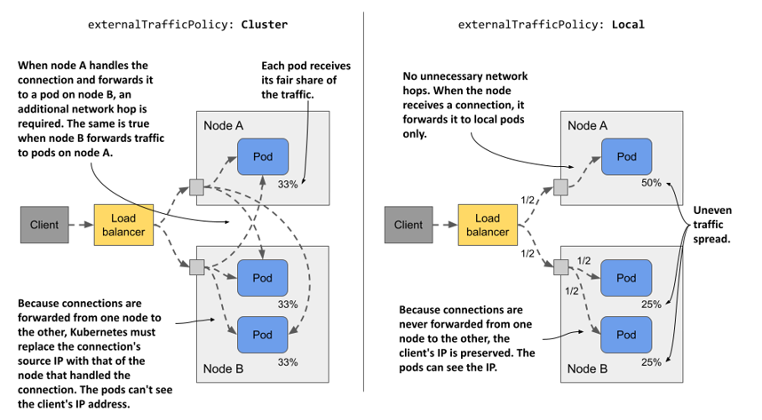

Khi `externalTrafficPolicy` được thiết lập là `Cluster`, mỗi Node sẽ chuyển tiếp lưu lượng tới tất cả các Pod trong hệ thống. Lưu lượng được chia đều giữa các Pod. Điều này đòi hỏi các chặng mạng bổ sung và địa chỉ IP của máy khách sẽ bị mờ đi.

Ngược lại, khi `externalTrafficPolicy` được thiết lập là `Local`, toàn bộ lưu lượng gửi đến Node A sẽ được chuyển tiếp đến Pod duy nhất trên Node đó. Nghĩa là Pod này nhận tới 50% tổng lưu lượng truy cập. Lưu lượng gửi đến Node B sẽ được chia đôi cho hai Pod, mỗi Pod nhận 25% tổng lưu lượng do bộ cân bằng tải xử lý. Phương án này không phát sinh các chặng mạng không cần thiết, và IP nguồn được giữ nguyên là IP của máy khách.

Cũng giống như hầu hết các quyết định kỹ thuật khác, việc lựa chọn chính sách lưu lượng ngoài nào cho từng Service phụ thuộc vào những yếu tố đánh đổi (trade-offs) mà bạn chấp nhận.

## 11.3 Quản lý các Endpoint của Service

Từ đầu đến giờ, bạn đã biết các Service được hỗ trợ phía sau bởi các Pod, nhưng không phải lúc nào cũng như vậy. Các điểm cuối (endpoint) mà một Service chuyển tiếp lưu lượng đến có thể là bất cứ thứ gì sở hữu một địa chỉ IP.

### 11.3.1 Giới thiệu đối tượng Endpoints

Một Service thường được hỗ trợ bởi một tập hợp các Pod có nhãn khớp với nhãn chọn (label selector) định nghĩa trong đối tượng Service. Ngoài nhãn chọn này ra, phần `spec` hay `status` của đối tượng Service không hề chứa danh sách các Pod thuộc về Service đó. Tuy nhiên, nếu bạn sử dụng lệnh `kubectl describe` để kiểm tra Service, bạn sẽ thấy IP của các Pod được liệt kê dưới mục `Endpoints` như sau:

```shell
$ kubectl describe svc kiada
Name:                     kiada
...
Port:                     http  80/TCP
TargetPort:               8080/TCP
NodePort:                 http  30080/TCP
Endpoints:                10.244.1.7:8080,10.244.1.8:8080,10.244.1.9:8080 + 1 more...    #A
...
```

Lệnh `kubectl describe` thu thập dữ liệu này không phải từ chính đối tượng Service, mà từ một đối tượng `Endpoints` có tên trùng với tên của Service đó. Các endpoint của Service `kiada` được chỉ định cụ thể trong đối tượng Endpoints cùng tên `kiada`.

#### Liệt kê các đối tượng Endpoints

Bạn có thể lấy danh sách các đối tượng Endpoints trong namespace hiện tại như sau:

```shell
$ kubectl get endpoints
NAME    ENDPOINTS                                                     AGE
kiada   10.244.1.7:8443,10.244.1.8:8443,10.244.1.9:8443 + 5 more...   25m
quiz    10.244.1.11:8080                                              66m
quote   10.244.1.10:80,10.244.2.10:80,10.244.2.8:80 + 1 more...       66m
```

##### Lưu ý

Tên viết tắt của `endpoints` là `ep`. Ngoài ra, loại đối tượng (object kind) là `Endpoints` (ở dạng số nhiều) chứ không phải `Endpoint`. Việc chạy lệnh `kubectl get endpoint` sẽ thất bại và trả về lỗi.

Như bạn có thể thấy, có ba đối tượng Endpoints trong namespace này, mỗi đối tượng tương ứng với một Service. Mỗi đối tượng Endpoints chứa một danh sách các tổ hợp IP và cổng, đại diện cho các điểm cuối (endpoint) của Service đó.

#### Kiểm tra kỹ hơn một đối tượng Endpoints

Để biết những Pod nào đại diện cho các endpoint này, bạn hãy sử dụng lệnh `kubectl get -o yaml` để lấy tệp cấu hình đầy đủ của đối tượng Endpoints như sau:

```yaml
$ kubectl get ep kiada -o yaml
apiVersion: v1
kind: Endpoints
metadata:
  name: kiada    #A
  namespace: kiada    #A
  ...
subsets:
- addresses:
  - ip: 10.244.1.7    #B
    nodeName: kind-worker    #C
    targetRef:
      kind: Pod
      name: kiada-002    #D
      namespace: kiada    #D
      resourceVersion: "2950"
      uid: 18cea623-0818-4ff1-9fb2-cddcf5d138c3
  ...    #E
  ports:    #F
  - name: https    #F
    port: 8443    #F
    protocol: TCP    #F
  - name: http    #F
    port: 8080    #F
    protocol: TCP    #F
```

Có thể thấy mỗi Pod được liệt kê như một phần tử trong mảng `addresses`. Trong đối tượng Endpoints `kiada`, tất cả các endpoint đều nằm trong cùng một nhóm con (subset) endpoint, vì tất cả chúng đều sử dụng cùng các số cổng giống nhau. Tuy nhiên, nếu giả sử một nhóm Pod sử dụng cổng 8080 và nhóm khác sử dụng cổng 8088, đối tượng Endpoints khi đó sẽ chứa hai nhóm con (subset), mỗi nhóm có các cổng riêng biệt của mình.

#### Tìm hiểu bên quản lý đối tượng Endpoints

Bạn không hề tự tay tạo ra bất kỳ đối tượng nào trong số ba đối tượng Endpoints này. Chúng được tạo ra tự động bởi Kubernetes ngay khi bạn tạo các đối tượng Service tương ứng. Các đối tượng này được quản lý hoàn toàn bởi Kubernetes. Mỗi khi có một Pod mới xuất hiện hoặc biến mất mà khớp với nhãn chọn của Service, Kubernetes sẽ cập nhật đối tượng Endpoints tương ứng để thêm hoặc bớt endpoint liên kết với Pod đó. Bạn cũng có thể tự quản lý các endpoint của Service bằng tay. Bạn sẽ được tìm hiểu cách thực hiện việc này ở phần sau.

### 11.3.2 Giới thiệu đối tượng EndpointSlice

Như bạn có thể hình dung, kích thước của đối tượng Endpoints sẽ trở thành một vấn đề lớn khi một Service chứa số lượng endpoint khổng lồ. Các thành phần điều khiển (control plane) của Kubernetes buộc phải gửi toàn bộ đối tượng này đến tất cả các Node trong cụm mỗi khi có bất kỳ thay đổi nào xảy ra. Trong các cụm có quy mô lớn, việc này gây ra các vấn đề suy giảm hiệu năng rõ rệt. Để giải quyết tình trạng này, đối tượng `EndpointSlice` đã được ra mắt, giúp chia nhỏ các endpoint của một Service đơn lẻ thành nhiều lát cắt (slice) khác nhau.

Trong khi một đối tượng Endpoints chứa nhiều nhóm con (subset) endpoint, thì mỗi EndpointSlice chỉ chứa duy nhất một nhóm con. Nếu hai nhóm Pod công khai Service trên các cổng khác nhau, chúng sẽ xuất hiện trong hai đối tượng EndpointSlice khác nhau. Ngoài ra, một đối tượng EndpointSlice hỗ trợ tối đa 1.000 endpoint, nhưng theo mặc định, Kubernetes chỉ thêm tối đa 100 endpoint vào mỗi lát cắt. Số lượng cổng trong một lát cắt cũng bị giới hạn ở mức 100. Do đó, một Service có hàng trăm endpoint hoặc sở hữu nhiều cổng có thể đi kèm with nhiều đối tượng EndpointSlice liên kết với nó.

Tương tự như Endpoints, các EndpointSlice cũng được tạo ra và quản lý một cách tự động.

#### Liệt kê các đối tượng EndpointSlice

Bên cạnh các đối tượng Endpoints, Kubernetes cũng tự động tạo các đối tượng EndpointSlice cho cả ba Service của bạn. Bạn có thể xem chúng bằng cách chạy lệnh `kubectl get endpointslices` dưới đây:

```shell
$ kubectl get endpointslices
NAME          ADDRESSTYPE   PORTS       ENDPOINTS                                       AGE
kiada-m24zq   IPv4          8080,8443   10.244.1.7,10.244.1.8,10.244.1.9 + 1 more...    80m
quiz-qbckq    IPv4          8080        10.244.1.11                                     79m
quote-5dqhx   IPv4          80          10.244.2.8,10.244.1.10,10.244.2.9 + 1 more...   79m
```

##### Lưu ý

Tại thời điểm viết cuốn sách này, vẫn chưa có tên viết tắt nào dành cho `endpointslices`.

Bạn sẽ nhận thấy rằng khác với các đối tượng Endpoints vốn có tên trùng khớp hoàn toàn với tên của đối tượng Service tương ứng, mỗi đối tượng EndpointSlice lại chứa thêm một hậu tố được tạo ngẫu nhiên đằng sau tên Service. Bằng cách này, nhiều đối tượng EndpointSlice có thể tồn tại đồng thời cho cùng một Service.

#### Liệt kê các EndpointSlice của một Service cụ thể

Để chỉ hiển thị các đối tượng EndpointSlice liên kết với một Service cụ thể, bạn có thể chỉ định một nhãn chọn (label selector) trong lệnh `kubectl get`. Để liệt kê các đối tượng EndpointSlice liên kết với Service `kiada`, hãy sử dụng nhãn chọn `kubernetes.io/service-name=kiada` như sau:

```shell
$ kubectl get endpointslices -l kubernetes.io/service-name=kiada
NAME          ADDRESSTYPE   PORTS       ENDPOINTS                                      AGE
kiada-m24zq   IPv4          8080,8443   10.244.1.7,10.244.1.8,10.244.1.9 + 1 more...   88m
```

#### Kiểm tra một EndpointSlice

Để kiểm tra một đối tượng EndpointSlice chi tiết hơn, bạn hãy sử dụng lệnh `kubectl describe`. Do lệnh `describe` không bắt buộc phải nhập đầy đủ tên đối tượng, và mọi đối tượng EndpointSlice liên kết với một Service đều bắt đầu bằng chính tên của Service đó, bạn có thể xem tất cả các lát cắt bằng cách chỉ cần chỉ định tên của Service, như minh họa ở đây:

```shell
$ kubectl describe endpointslice kiada
Name:         kiada-m24zq
Namespace:    kiada
Labels:       endpointslice.kubernetes.io/managed-by=endpointslice-controller.k8s.io
              kubernetes.io/service-name=kiada
Annotations:  endpoints.kubernetes.io/last-change-trigger-time: 2021-10-30T08:36:21Z
AddressType:  IPv4
Ports:    #A
  Name   Port  Protocol    #A
  ----   ----  --------    #A
  http   8080  TCP    #A
  https  8443  TCP    #A
Endpoints:
  - Addresses:  10.244.1.7    #B
    Conditions:
      Ready:    true
    Hostname:   <unset>
    TargetRef:  Pod/kiada-002    #C
    Topology:   kubernetes.io/hostname=kind-worker    #D
...
```

##### Lưu ý

Nếu có nhiều đối tượng EndpointSlice khớp với tên mà bạn cung cấp cho lệnh `kubectl describe`, lệnh sẽ in ra thông tin của tất cả các đối tượng đó.

Thông tin hiển thị trong kết quả của lệnh `kubectl describe` không có nhiều khác biệt so với thông tin của đối tượng Endpoints mà bạn đã xem trước đó. Đối tượng EndpointSlice chứa danh sách các cổng và địa chỉ endpoint, cũng như thông tin về các Pod đại diện cho các endpoint đó. Thông tin này bao gồm cả dữ liệu cấu trúc liên kết (topology) của Pod, vốn được dùng cho tính năng định tuyến lưu lượng nhận biết cấu trúc liên kết (topology-aware traffic routing). Bạn sẽ tìm hiểu về tính năng này ở phần sau của chương.

### 11.3.3 Quản lý thủ công các Endpoint của Service

Khi bạn tạo một đối tượng Service đi kèm với nhãn chọn, Kubernetes sẽ tự động tạo và quản lý các đối tượng Endpoints cũng như EndpointSlice, đồng thời sử dụng chính nhãn chọn đó để xác định các endpoint cho Service. Tuy nhiên, bạn cũng có thể tự quản lý các endpoint bằng tay bằng cách tạo đối tượng Service không có nhãn chọn. Trong trường hợp này, bạn phải tự mình tạo đối tượng Endpoints tương ứng. Bạn không cần phải tạo đối tượng EndpointSlice vì Kubernetes sẽ tự động ánh xạ (mirror) từ đối tượng Endpoints để tạo ra các EndpointSlice tương ứng.

Thông thường, bạn sẽ quản lý các endpoint của Service theo cách này khi muốn tích hợp một dịch vụ bên ngoài có sẵn vào cụm để các Pod trong cụm có thể truy cập được dưới một tên gọi khác. Bằng cách đó, dịch vụ ngoại vi này có thể dễ dàng được tìm thấy thông qua hệ thống DNS của cụm và các biến môi trường.

#### Tạo Service không có nhãn chọn

Danh sách dưới đây trình bày một ví dụ về tệp cấu hình đối tượng Service không định nghĩa nhãn chọn. Bạn sẽ tiến hành cấu hình thủ công các endpoint cho Service này.

##### Danh sách 11.5 Service không có nhãn chọn Pod

```yaml
apiVersion: v1
kind: Service
metadata:
  name: external-service    #A
spec:    #B
  ports:    #B
  - name: http    #B
    port: 80    #B
```

Tệp cấu hình trong danh sách định nghĩa một Service có tên `external-service` chuyên tiếp nhận các kết nối đi vào ở cổng 80. Như đã giải thích ở phần đầu của chương này, các Pod trong cụm có thể sử dụng Service này thông qua địa chỉ IP cụm (được cấp phát khi tạo Service) hoặc thông qua tên DNS của nó.

#### Tạo đối tượng Endpoints

Nếu một Service không định nghĩa nhãn chọn Pod, đối tượng Endpoints tương ứng sẽ không được tự động khởi tạo. Bạn phải tự tay thực hiện việc này. Danh sách dưới đây trình bày tệp cấu hình của đối tượng Endpoints dành cho Service mà bạn vừa tạo ở phần trước.

##### Danh sách 11.6 Đối tượng Endpoints được tạo thủ công

```yaml
apiVersion: v1
kind: Endpoints
metadata:
  name: external-service    #A
subsets:
- addresses:
  - ip: 1.1.1.1    #B
  - ip: 2.2.2.2    #B
  ports:
  - name: http    #C
    port: 88    #C
```

Đối tượng Endpoints này phải có tên trùng khớp hoàn toàn với tên của Service và chứa danh sách các địa chỉ đích cùng cổng tương ứng. Trong danh sách trên, các địa chỉ IP 1.1.1.1 và 2.2.2.2 đại diện cho các endpoint của Service.

##### Lưu ý

Bạn không cần phải tự tạo đối tượng EndpointSlice. Kubernetes sẽ tự động tạo nó dựa trên đối tượng Endpoints mà bạn cung cấp.

Việc tạo Service cùng đối tượng Endpoints liên kết cho phép các Pod sử dụng dịch vụ này giống hệt như các Service khác được định nghĩa trong cụm. Như được mô tả trong hình dưới đây, lưu lượng truy cập gửi tới IP cụm của Service sẽ được phân phối tới các endpoint của nó. Các endpoint này nằm ngoài cụm, nhưng chúng cũng hoàn toàn có thể là các địa chỉ nội bộ.

##### Hình 11.12 Các Pod sử dụng một Service có hai endpoint bên ngoài.

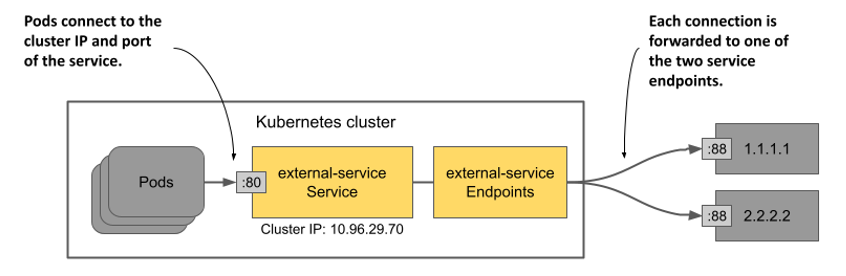

Nếu sau này bạn quyết định di chuyển dịch vụ ngoại vi này vào chạy bên trong các Pod của cụm Kubernetes, bạn chỉ cần bổ sung nhãn chọn (selector) vào đối tượng Service để chuyển hướng lưu lượng tới các Pod đó thay thế cho các endpoint đã cấu hình thủ công. Điều này là do Kubernetes sẽ ngay lập tức tiếp quản việc quản lý đối tượng Endpoints ngay khi bạn bổ sung nhãn chọn vào Service.

Bạn cũng có thể thực hiện quy trình ngược lại: Nếu muốn di dời một dịch vụ hiện có trong cụm ra một môi trường bên ngoài, hãy gỡ bỏ nhãn chọn khỏi đối tượng Service để Kubernetes ngừng cập nhật đối tượng Endpoints liên kết. Kể từ thời điểm đó, bạn có thể tự quản lý các endpoint của Service bằng tay. Bạn không cần phải xóa Service để làm điều này. Việc chỉnh sửa trực tiếp đối tượng Service hiện tại sẽ giúp giữ nguyên địa chỉ IP cụm của Service. Nhờ đó, các máy khách đang sử dụng dịch vụ thậm chí sẽ không hề nhận ra rằng bạn đã chuyển đổi vị trí hạ tầng của dịch vụ đó.

## 11.4 Tìm hiểu các bản ghi DNS dành cho đối tượng Service

Một khía cạnh rất quan trọng của các Service trong Kubernetes là khả năng tra cứu chúng qua hệ thống DNS. Đây là chủ đề xứng đáng được chúng ta đi sâu tìm hiểu kỹ hơn.

Bạn đã biết rằng mỗi Service được cấp phát một địa chỉ IP cụm nội bộ để các Pod có thể phân giải thông qua hệ thống DNS của cụm. Cơ chế này hoạt động được là nhờ mỗi Service đều có một bản ghi `A` trong DNS (hoặc bản ghi `AAAA` đối với mạng IPv6). Tuy nhiên, một Service cũng sẽ nhận được một bản ghi `SRV` cho mỗi cổng mà nó cung cấp.

Chúng ta hãy cùng quan sát kỹ hơn các bản ghi DNS này. Đầu tiên, hãy khởi chạy một Pod dùng một lần (one-off pod) như sau:

```shell
$ kubectl run -it --rm dns-test --image=giantswarm/tiny-tools
/ #
```

Lệnh này khởi chạy một Pod có tên `dns-test` với một container chạy ảnh (image) `giantswarm/tiny-tools`. Ảnh container này có sẵn các công cụ như `host`, `nslookup`, và `dig` để bạn có thể sử dụng nhằm kiểm tra các bản ghi DNS. Khi chạy lệnh `kubectl run`, giao diện dòng lệnh (terminal) của bạn sẽ được kết nối trực tiếp với tiến trình shell đang chạy bên trong container (tùy chọn `-it` đảm nhiệm việc này). Khi bạn thoát khỏi shell, Pod sẽ tự động bị xóa đi (nhờ tùy chọn `--rm`).

### 11.4.1 Kiểm tra các bản ghi A và SRV của Service trong DNS

Bạn bắt đầu bằng việc kiểm tra các bản ghi `A` và `SRV` liên kết với các Service của mình.

#### Tra cứu bản ghi A của Service

Để xác định địa chỉ IP của Service `quote`, bạn hãy chạy lệnh `nslookup` trong shell của container thuộc Pod `dns-test` như sau:

```shell
/ # nslookup quote
Server:         10.96.0.10
Address:        10.96.0.10#53 //
 
Name:   quote.kiada.svc.cluster.local    #A
Address: 10.96.161.97    #B
```

##### Lưu ý

Bạn có thể sử dụng `dig` thay thế cho `nslookup`, nhưng bạn phải sử dụng thêm tùy chọn `+search` hoặc chỉ định tên miền đầy đủ (FQDN) của Service để việc tra cứu DNS thành công (chạy lệnh `dig +search quote` hoặc `dig quote.kiada.svc.cluster.local`).

Bây giờ, hãy tra cứu địa chỉ IP của Service `kiada`. Mặc dù Service này thuộc loại `LoadBalancer` nên sở hữu cả IP cụm nội bộ lẫn IP ngoài (IP của bộ cân bằng tải), DNS sẽ chỉ trả về địa chỉ IP cụm. Điều này hoàn toàn dễ hiểu vì máy chủ DNS này là nội bộ và chỉ được sử dụng trong phạm vi cụm.

#### Tra cứu các bản ghi SRV

Một Service có thể cung cấp một hoặc nhiều cổng. Mỗi cổng sẽ có một bản ghi `SRV` tương ứng trong DNS. Hãy sử dụng lệnh sau để lấy các bản ghi `SRV` của Service `kiada`:

```shell
/ # nslookup -query=SRV kiada
Server:         10.96.0.10
Address:        10.96.0.10#53 // //
 
kiada.kiada.svc.cluster.local   service = 0 50 80 kiada.kiada.svc.cluster.local.    #A
kiada.kiada.svc.cluster.local   service = 0 50 443 kiada.kiada.svc.cluster.local.    #B
```

##### Lưu ý

Tại thời điểm viết cuốn sách này, dịch vụ GKE vẫn chạy kube-dns thay vì CoreDNS. Kube-dns không hỗ trợ đầy đủ tất cả các loại truy vấn DNS được trình bày trong mục này.

Một máy khách thông minh chạy trong Pod có thể tra cứu các bản ghi `SRV` của một Service để biết những cổng nào đang được Service đó cung cấp. Nếu bạn định nghĩa tên cho các cổng này trong đối tượng Service, chúng thậm chí có thể được tra cứu theo tên. Bản ghi `SRV` có định dạng cấu trúc như sau:

`_port-name._port-protocol.service-name.namespace.svc.cluster.local`

Để lấy bản ghi `SRV` cho cổng `http`, hãy chạy lệnh sau:

```shell
/ # nslookup -query=SRV _http._tcp.kiada
Server:         10.96.0.10
Address:        10.96.0.10#53 //
 
_http._tcp.kiada.kiada.svc.cluster.local        service = 0 100 80 kiada.kiada.svc.cluster.local.
```

##### Mẹo

Để liệt kê tất cả các Service cùng các cổng mà chúng công khai trong namespace `kiada`, bạn có thể chạy lệnh `nslookup -query=SRV any.kiada.svc.cluster.local`. Để liệt kê toàn bộ Service trong cụm, hãy sử dụng tên `any.any.svc.cluster.local`.

Bạn có thể sẽ hiếm khi cần phải tra cứu các bản ghi `SRV`, nhưng một số giao thức Internet, chẳng hạn như SIP và XMPP, bắt buộc phải dựa vào chúng để hoạt động.

##### Lưu ý

Vui lòng giữ cho shell trong Pod `dns-test` tiếp tục chạy, vì bạn sẽ cần sử dụng nó trong các bài thực hành ở mục tiếp theo khi tìm hiểu về các Service không đầu (headless service).

### 11.4.2 Sử dụng Headless Service để kết nối trực tiếp đến các Pod

Thông thường, các Service công khai một tập hợp các Pod tại một địa chỉ IP tĩnh, duy nhất. Mỗi kết nối đến địa chỉ IP đó sẽ được chuyển tiếp đến một Pod ngẫu nhiên hoặc một endpoint khác hỗ trợ phía sau Service. Các kết nối đến Service được tự động phân phối đều qua các endpoint của nó. Nhưng chuyện gì sẽ xảy ra nếu bạn muốn chính máy khách thực hiện việc cân bằng tải? Nếu máy khách cần tự quyết định nên kết nối đến Pod cụ thể nào thì sao? Hoặc nếu nó cần kết nối tới mọi Pod đang chạy phía sau Service thì sao? Hoặc nếu bản thân các Pod thuộc một Service cần kết nối trực tiếp với nhau thì sao? Việc kết nối thông qua địa chỉ IP cụm của Service rõ ràng không phải là giải pháp phù hợp cho những trường hợp này. Vậy chúng ta phải làm thế nào?

Thay vì kết nối tới địa chỉ IP của Service, các máy khách có thể lấy danh sách IP của Pod từ API Kubernetes, nhưng tốt hơn hết là giữ cho ứng dụng máy khách độc lập với Kubernetes bằng cách sử dụng các cơ chế tiêu chuẩn như DNS. Rất may, bạn hoàn toàn có thể cấu hình DNS nội bộ của cụm để trả về các địa chỉ IP của Pod thay vì IP cụm của Service bằng cách tạo ra một Service không đầu (*headless* service).

Đối với các headless service, hệ thống DNS của cụm sẽ không chỉ trả về một bản ghi `A` duy nhất trỏ tới IP cụm của Service, mà trả về đồng thời nhiều bản ghi `A`, tương ứng với từng Pod là thành phần của Service đó. Do đó, máy khách có thể truy vấn DNS để lấy địa chỉ IP của toàn bộ Pod trong Service. Có được thông tin này, máy khách có thể chủ động kết nối trực tiếp đến các Pod, như được minh họa trong hình tiếp theo.

##### Hình 11.13 Với headless service, máy khách kết nối trực tiếp tới các Pod

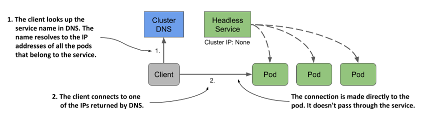

#### Tạo headless service

Để tạo một headless service, bạn chỉ cần thiết lập trường `clusterIP` thành `None`. Hãy tạo một Service khác cho các Pod `quote` nhưng lần này cấu hình nó dưới dạng headless. Danh sách dưới đây trình bày tệp cấu hình của nó:

##### Danh sách 11.7 Một headless service

```yaml
apiVersion: v1
kind: Service
metadata:
  name: quote-headless
spec:
  clusterIP: None    #A
  selector:
    app: quote
  ports:
  - name: http
    port: 80
    targetPort: 80
    protocol: TCP
```

Sau khi tạo Service bằng lệnh `kubectl apply`, bạn có thể kiểm tra lại bằng lệnh `kubectl get`. Bạn sẽ thấy Service này không có địa chỉ IP cụm:

```shell
$ kubectl get svc quote-headless -o wide
NAME             TYPE        CLUSTER-IP   EXTERNAL-IP   PORT(S)   AGE   SELECTOR
quote-headless   ClusterIP   None         <none>        80/TCP    2m    app=quote
```

Do Service không có địa chỉ IP cụm, máy chủ DNS sẽ không thể trả về IP cụm khi bạn cố gắng phân giải tên Service. Thay vào đó, nó sẽ trả về trực tiếp địa chỉ IP của các Pod. Trước khi tiếp tục, hãy liệt kê các IP của những Pod khớp với nhãn chọn của Service như sau:

```shell
$ kubectl get po -l app=quote -o wide
NAME           READY   STATUS    RESTARTS   AGE   IP            NODE
quote-canary   2/2     Running   0          3h    10.244.2.9    kind-worker2
quote-001      2/2     Running   0          3h    10.244.2.10   kind-worker2
quote-002      2/2     Running   0          3h    10.244.2.8    kind-worker2
quote-003      2/2     Running   0          3h    10.244.1.10   kind-worker
```

Hãy lưu ý lại các địa chỉ IP của các Pod này.

#### Tìm hiểu các bản ghi DNS A được trả về cho một headless service

Để xem DNS trả về những gì khi bạn thực hiện phân giải tên Service, hãy chạy lệnh sau trong Pod `dns-test` đã tạo ở phần trước:

```shell
/ # nslookup quote-headless
Server:         10.96.0.10
Address:        10.96.0.10#53 //
 
Name:   quote-headless.kiada.svc.cluster.local
Address: 10.244.2.9    #A
Name:   quote-headless.kiada.svc.cluster.local
Address: 10.244.2.8    #B
Name:   quote-headless.kiada.svc.cluster.local
Address: 10.244.2.10    #C
Name:   quote-headless.kiada.svc.cluster.local
Address: 10.244.1.10    #D
```

Máy chủ DNS trả về đúng địa chỉ IP của bốn Pod khớp với nhãn chọn của Service. Kết quả này hoàn toàn khác so với những gì DNS trả về đối với các Service thông thường (không phải headless), ví dụ như Service `quote`, nơi tên Service được phân giải ra địa chỉ IP cụm của chính nó:

```shell
/ # nslookup quote
Server:         10.96.0.10
Address:        10.96.0.10#53 //
 
Name:   quote.kiada.svc.cluster.local
Address: 10.96.161.97    #A
```

#### Tìm hiểu cách máy khách sử dụng headless service

Các máy khách muốn kết nối trực tiếp đến các Pod thuộc Service có thể thực hiện việc này bằng cách lấy các bản ghi `A` (hoặc `AAAA`) từ DNS. Sau đó, máy khách có thể chủ động kết nối tới một, một vài, hoặc tất cả các địa chỉ IP được trả về.

Những máy khách không tự thực hiện việc tra cứu DNS bằng mã nguồn của mình vẫn có thể sử dụng Service này tương tự như một Service thông thường. Vì máy chủ DNS sẽ tự động xoay vòng danh sách các địa chỉ IP trả về, một máy khách chỉ sử dụng tên miền đầy đủ (FQDN) của Service trong URL kết nối sẽ nhận được một IP Pod khác nhau sau mỗi lần kết nối. Nhờ vậy, các yêu cầu của máy khách vẫn được phân bổ đều trên toàn bộ các Pod.

Bạn có thể thử nghiệm cơ chế này bằng cách gửi nhiều yêu cầu liên tiếp đến Service `quote-headless` bằng lệnh `curl` từ trong Pod `dns-test` như sau:

```shell
/ # while true; do curl http://quote-headless; done
This is the quote service running in pod quote-002
This is the quote service running in pod quote-001
This is the quote service running in pod quote-002
This is the quote service running in pod quote-canary
...
```

Mỗi yêu cầu được xử lý bởi một Pod khác nhau, giống hệt như khi bạn sử dụng Service thông thường. Sự khác biệt nằm ở chỗ: với headless service, bạn sẽ kết nối trực tiếp tới IP của Pod; trong khi với Service thông thường, bạn kết nối tới IP cụm của Service, rồi kết nối đó mới được chuyển tiếp tới một trong các Pod. Bạn có thể kiểm chứng điều này bằng cách chạy lệnh `curl` với tùy chọn `--verbose` để quan sát địa chỉ IP mà nó kết nối tới:

```shell
/ # curl --verbose http://quote-headless   #A
*   Trying 10.244.1.10:80...    #A
* Connected to quote-headless (10.244.1.10) port 80 (#0)
...
 
/ # curl --verbose http://quote     #B
*   Trying 10.96.161.97:80...    #B
* Connected to quote (10.96.161.97) port 80 (#0)
...
```

#### Headless service không có nhãn chọn

Để kết thúc phần tìm hiểu về headless service này, tôi muốn lưu ý thêm rằng các Service có endpoint được cấu hình thủ công (các Service không có nhãn chọn) cũng có thể hoạt động dưới dạng headless. Nếu bạn bỏ qua phần nhãn chọn và thiết lập trường `clusterIP` thành `None`, hệ thống DNS sẽ trả về bản ghi `A`/`AAAA` cho từng endpoint, tương tự như khi các endpoint của Service là Pod. Để tự mình kiểm tra điều này, hãy áp dụng tệp cấu hình trong tệp `svc.external-service-headless.yaml` và chạy lệnh sau bên trong Pod `dns-test`:

```shell
/ # nslookup external-service-headless
```

### 11.4.3 Tạo bí danh CNAME cho một service sẵn có

Trong các phần trước, bạn đã tìm hiểu cách tạo các bản ghi `A` và `AAAA` trong hệ thống DNS của cụm. Để thực hiện điều này, bạn tạo các đối tượng Service để chỉ định một bộ chọn nhãn (label selector) nhằm tìm kiếm các endpoint của service, hoặc tự định nghĩa chúng một cách thủ công bằng các đối tượng Endpoints và EndpointSlice.

Ngoài ra, còn có một cách để thêm các bản ghi `CNAME` vào hệ thống DNS của cụm. Trong Kubernetes, bạn thêm các bản ghi `CNAME` vào DNS bằng cách tạo một đối tượng Service, tương tự như cách bạn làm đối với các bản ghi `A` và `AAAA`.

##### Note

Bản ghi `CNAME` là một bản ghi DNS dùng để ánh xạ một bí danh (alias) tới một tên miền DNS sẵn có thay vì tới một địa chỉ IP.

#### Tạo một service ExternalName

Để tạo một service đóng vai trò là bí danh cho một service sẵn có—dù nằm bên trong hay bên ngoài cụm—bạn tạo một đối tượng Service có trường `type` được thiết lập là `ExternalName`. Danh sách cấu hình dưới đây minh họa một ví dụ về loại service này.

##### Listing 11.8 An `ExternalName`-type service

```yaml
apiVersion: v1
kind: Service
metadata:
  name: time-api
spec:
  type: ExternalName    #A
  externalName: worldtimeapi.org    #B
```

Bên cạnh việc thiết lập trường `type` thành `ExternalName`, manifest của service cũng phải chỉ định tên miền ngoài mà service này sẽ phân giải tới trong trường `externalName`. Các service loại ExternalName không yêu cầu đối tượng Endpoints hay EndpointSlice.

#### Kết nối tới một service ExternalName từ một pod

Sau khi service được tạo, các pod có thể kết nối tới service bên ngoài bằng cách sử dụng tên miền `time-api.<namespace>.svc.cluster.local` (hoặc đơn giản là `time-api` nếu chúng nằm cùng namespace với service) thay vì sử dụng tên miền đầy đủ (FQDN) thực tế của service ngoại vi đó, như ví dụ dưới đây:

```bash
$ kubectl exec -it kiada-001 -c kiada -- curl http://time-api/api/timezone/CET
```

#### Phân giải các service ExternalName trong DNS

Vì các service `ExternalName` được triển khai ở cấp độ DNS (chỉ một bản ghi `CNAME` được tạo cho service đó), các client sẽ không kết nối tới service thông qua cluster IP giống như các service ClusterIP thông thường (non-headless). Thay vào đó, chúng kết nối trực tiếp đến service bên ngoài. Tương tự như headless service, các service `ExternalName` không có cluster IP, như kết quả đầu ra dưới đây cho thấy:

```bash
$ kubectl get svc time-api
NAME       TYPE           CLUSTER-IP   EXTERNAL-IP        PORT(S)   AGE
time-api   ExternalName   <none>       worldtimeapi.org   80/TCP    4m51s    #A
```

Để thực hiện bài tập cuối cùng trong phần DNS này, bạn có thể thử phân giải service `time-api` bên trong pod `dns-test` như sau:

```bash
/ # nslookup time-api
Server:         10.96.0.10
Address:        10.96.0.10#53 //
 
time-api.kiada.svc.cluster.local        canonical name = worldtimeapi.org.    #A
Name:   worldtimeapi.org    #B
Address: 213.188.196.246    #B
Name:   worldtimeapi.org    #B
Address: 2a09:8280:1::3:e    #B
```

Bạn có thể thấy rằng `time-api.kiada.svc.cluster.local` đang trỏ tới `worldtimeapi.org`. Phần tìm hiểu về các bản ghi DNS cho service Kubernetes xin được khép lại tại đây. Giờ đây, bạn có thể thoát khỏi shell trong pod `dns-test` bằng cách gõ `exit` hoặc nhấn tổ hợp phím Control-D. Pod này sẽ tự động bị xóa.

## 11.5 Cấu hình service để định tuyến lưu lượng đến các endpoint ở gần

Khi bạn triển khai các pod, chúng sẽ được phân bổ khắp các node trong cụm. Nếu các node trong cụm trải dài trên các phân vùng khả dụng (availability zone) hoặc vùng địa lý (region) khác nhau và các pod trên các node này trao đổi dữ liệu với nhau, hiệu năng mạng và chi phí lưu lượng truyền tải có thể trở thành một vấn đề đáng ngại. Trong trường hợp này, việc cấu hình để các service chuyển tiếp lưu lượng đến các pod ở gần pod nguồn phát sinh lưu lượng là điều vô cùng hợp lý.

Trong một số trường hợp khác, một pod có thể chỉ cần giao tiếp với các endpoint của service nằm trên cùng một node với nó. Điều này không xuất phát từ lý do hiệu năng hay chi phí, mà bởi chỉ các endpoint cục bộ trên node (node-local) mới có thể cung cấp dịch vụ trong đúng ngữ cảnh phù hợp. Hãy để tôi giải thích rõ hơn ý của mình.

### 11.5.1 Chuyển tiếp lưu lượng chỉ trong phạm vi cùng một node bằng internalTrafficPolicy

Nếu các pod cung cấp một dịch vụ gắn liền với node mà nó đang chạy theo một cách nào đó, bạn phải đảm bảo rằng các pod client chạy trên một node cụ thể chỉ kết nối tới các endpoint nằm trên chính node đó. Bạn có thể đạt được điều này bằng cách tạo một Service có trường `internalTrafficPolicy` được thiết lập là `Local`.

##### Note

Trước đây, bạn đã biết về trường `externalTrafficPolicy` vốn được dùng để ngăn chặn các bước nhảy mạng (network hop) không cần thiết giữa các node khi lưu lượng bên ngoài đi vào cụm. Trường `internalTrafficPolicy` của service cũng tương tự, nhưng phục vụ một mục đích khác.

Như minh họa trong hình dưới đây, nếu service được cấu hình chính sách lưu lượng nội bộ là `Local`, lưu lượng từ các pod trên một node nhất định sẽ chỉ được chuyển tiếp đến các pod nằm trên cùng node đó. Nếu không có endpoint cục bộ nào của service trên node, kết nối sẽ bị lỗi.

##### Figure 11.14 The behavior of a service with internalTrafficPolicy set to Local

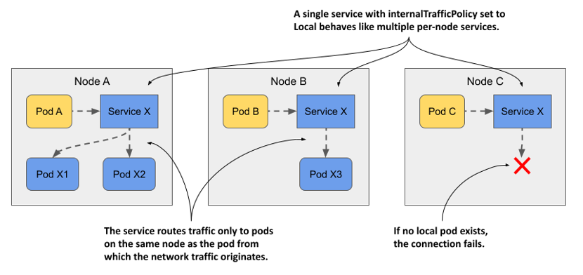

Hãy tưởng tượng một pod hệ thống chạy trên mỗi node của cụm để quản lý việc giao tiếp với một thiết bị được gắn vào node đó. Các pod khác không sử dụng trực tiếp thiết bị này mà giao tiếp thông qua pod hệ thống. Vì địa chỉ IP của pod có thể thay đổi, trong khi IP của service lại ổn định, các pod sẽ kết nối đến pod hệ thống thông qua một Service. Để đảm bảo các pod chỉ kết nối đến pod hệ thống cục bộ chứ không phải các pod hệ thống trên các node khác, service được cấu hình để chỉ chuyển tiếp lưu lượng đến các endpoint cục bộ. Cụm của bạn hiện không có sẵn loại pod như vậy, nhưng bạn có thể sử dụng các pod `quote` để thử nghiệm tính năng này.

#### Tạo một service với chính sách lưu lượng nội bộ cục bộ

Danh sách dưới đây hiển thị manifest của service mang tên `quote-local`, có nhiệm vụ chỉ chuyển tiếp lưu lượng đến các pod chạy trên cùng một node với pod client.

##### Listing 11.9 A service that only forwards traffic to local endpoints

```yaml
apiVersion: v1
kind: Service
metadata:
  name: quote-local
spec:
  internalTrafficPolicy: Local    #A
  selector:
    app: quote
  ports:
  - name: http
    port: 80
    targetPort: 80
    protocol: TCP
```

Như bạn có thể thấy trong manifest, service sẽ chuyển tiếp lưu lượng đến tất cả các pod có nhãn `app: quote`. Tuy nhiên, vì `internalTrafficPolicy` được đặt thành `Local`, nó sẽ không chuyển tiếp lưu lượng đến mọi pod quote trong cụm, mà chỉ đến những pod nằm trên cùng một node với pod client. Hãy tạo service này bằng cách áp dụng manifest bằng lệnh `kubectl apply`.

#### Quan sát cơ chế định tuyến lưu lượng cục bộ trên node

Trước khi có thể quan sát cách service định tuyến lưu lượng, bạn cần xác định vị trí của các pod client cũng như các pod đóng vai trò là endpoint của service. Hãy liệt kê các pod bằng tùy chọn `-o wide` để xem mỗi pod đang chạy trên node nào.

Hãy chọn một trong các pod `kiada` và ghi lại node cụm của nó. Sử dụng lệnh `curl` từ bên trong pod đó để kết nối tới service `quote-local`. Ví dụ, pod `kiada-001` của tôi đang chạy trên node `kind-worker`. Nếu tôi chạy `curl` nhiều lần từ bên trong pod này, toàn bộ các yêu cầu đều được xử lý bởi các pod quote trên cùng một node:

```bash
$ kubectl exec kiada-001 -c kiada -- sh -c "while :; do curl -s quote-local; done"
This is the quote service running in pod quote-002 on node kind-worker    #A
This is the quote service running in pod quote-canary on node kind-worker    #A
This is the quote service running in pod quote-canary on node kind-worker    #A
This is the quote service running in pod quote-002 on node kind-worker    #A
```

Không một yêu cầu nào được chuyển tiếp tới các pod trên (các) node khác. Nếu tôi xóa hai pod trên node `kind-worker`, nỗ lực kết nối tiếp theo sẽ thất bại:

```bash
$ kubectl exec -it kiada-001 -c kiada -- curl http://quote-local
curl: (7) Failed to connect to quote-local port 80: Connection refused
```

Trong phần này, bạn đã học cách chỉ chuyển tiếp lưu lượng đến các endpoint cục bộ trên node khi ngữ nghĩa vận hành của service yêu cầu điều đó. Trong các trường hợp khác, bạn có thể muốn lưu lượng được ưu tiên chuyển tiếp đến các endpoint ở gần pod client trước, và chỉ chuyển tiếp đến các pod ở xa hơn khi thực sự cần thiết. Bạn sẽ tìm hiểu cách thực hiện điều này trong phần tiếp theo.

### 11.5.2 Chỉ dấu nhận biết cấu trúc liên kết (Topology-aware hints)

Hãy tưởng tượng bộ ứng dụng Kiada đang chạy trong một cụm có các node trải dài trên nhiều trung tâm dữ liệu ở các phân vùng (zone) và khu vực (region) khác nhau, như minh họa trong hình dưới đây. Bạn chắc chắn không muốn một pod Kiada đang chạy ở zone này lại đi kết nối với các pod Quote ở một zone khác, trừ khi không có pod Quote nào ở zone cục bộ. Lý tưởng nhất là các kết nối nên được thiết lập trong cùng một zone để giảm thiểu lưu lượng mạng và các chi phí liên quan.

##### Figure 11.15 Routing serviced traffic across availability zones

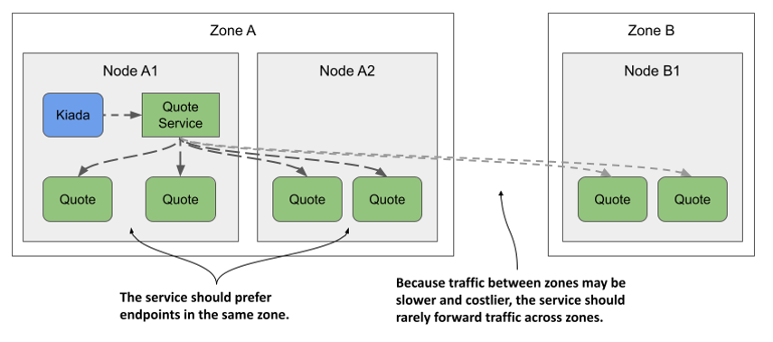

Những gì vừa được mô tả và minh họa trong hình được gọi là *định tuyến lưu lượng nhận biết cấu trúc liên kết* (topology-aware traffic routing). Kubernetes hỗ trợ tính năng này bằng cách thêm các chỉ dấu nhận biết cấu trúc liên kết (topology-aware hint) vào từng endpoint trong đối tượng EndpointSlice.

##### Note

Tại thời điểm viết cuốn sách này, tính năng chỉ dấu nhận biết cấu trúc liên kết mới ở mức độ thử nghiệm (alpha), do đó nó vẫn có thể thay đổi hoặc bị loại bỏ trong tương lai.

Vì tính năng này vẫn đang ở giai đoạn alpha nên nó không được bật theo mặc định. Thay vì hướng dẫn cách thử nghiệm trực tiếp, tôi sẽ chỉ giải thích nguyên lý hoạt động của nó.

#### Tìm hiểu cách tính toán các chỉ dấu nhận biết cấu trúc liên kết

Trước tiên, tất cả các node trong cụm của bạn phải chứa nhãn `kubernetes.io/zone` để chỉ ra mỗi node nằm ở zone nào. Để báo hiệu rằng một service nên sử dụng các chỉ dấu nhận biết cấu trúc liên kết, bạn phải thiết lập annotation `service.kubernetes.io/topology-aware-hints` thành `Auto`. Nếu service có đủ số lượng endpoint, Kubernetes sẽ thêm các chỉ dấu (hint) vào từng endpoint trong (các) đối tượng EndpointSlice. Như bạn có thể thấy trong danh sách cấu hình dưới đây, trường `hints` chỉ định các zone mà từ đó endpoint này sẽ được tiêu thụ.

##### Listing 11.10 EndpointSlice with topology aware hints

```yaml
apiVersion: discovery.k8s.io/v1
kind: EndpointSlice
endpoints:
- addresses:
  - 10.244.2.2
  conditions:
    ready: true
  hints:    #A
    forZones:    #A
    - name: zoneA    #A
  nodeName: kind-worker
  targetRef:
    kind: Pod
    name: quote-002
    namespace: default
    resourceVersion: "944"
    uid: 03343161-971d-403c-89ae-9632e7cd0d8d
  zone: zoneA    #B
...
```

Danh sách trên chỉ hiển thị một endpoint duy nhất. Endpoint này đại diện cho pod `quote-002` đang chạy trên node `kind-worker` thuộc `zoneA`. Do đó, phần `hints` của endpoint này chỉ ra rằng nó sẽ được tiêu thụ bởi các pod nằm trong `zoneA`. Trong trường hợp cụ thể này, chỉ `zoneA` mới nên sử dụng endpoint này, tuy nhiên mảng `forZones` hoàn toàn có thể chứa nhiều zone khác nhau.

Các chỉ dấu này được tính toán bởi bộ điều khiển EndpointSlice (EndpointSlice controller), một thành phần thuộc control plane của Kubernetes. Bộ điều khiển này sẽ phân bổ các endpoint cho từng zone dựa trên số lượng lõi CPU có thể cấp phát trong zone đó. Nếu một zone có số lượng lõi CPU lớn hơn, nó sẽ được phân bổ nhiều endpoint hơn so với một zone có ít lõi CPU hơn. Trong hầu hết các trường hợp, các chỉ dấu này giúp đảm bảo lưu lượng được giữ nguyên trong phạm vi một zone, tuy nhiên để đảm bảo việc phân phối tải đồng đều hơn, quy tắc này không phải lúc nào cũng được áp dụng tuyệt đối.

#### Tìm hiểu nơi sử dụng các chỉ dấu nhận biết cấu trúc liên kết

Mỗi node đảm bảo rằng lưu lượng gửi đến cluster IP của service sẽ được chuyển tiếp đến một trong các endpoint của service đó. Nếu không có chỉ dấu nhận biết cấu trúc liên kết nào trong đối tượng EndpointSlice, tất cả các endpoint—bất kể chúng nằm trên node nào—đều sẽ nhận lưu lượng xuất phát từ một node cụ thể. Tuy nhiên, nếu tất cả các endpoint trong đối tượng EndpointSlice đều chứa các chỉ dấu, mỗi node sẽ chỉ xử lý các endpoint có chứa zone của node đó trong phần chỉ dấu và bỏ qua các endpoint còn lại. Nhờ vậy, lưu lượng xuất phát từ một pod trên node sẽ chỉ được chuyển tiếp đến một số endpoint nhất định.

Hiện tại, bạn không thể can thiệp vào việc định tuyến nhận biết cấu trúc liên kết ngoại trừ việc bật hoặc tắt nó, nhưng điều này có thể sẽ thay đổi trong tương lai.

## 11.6 Quản lý việc đưa pod vào danh sách endpoint của service

Vẫn còn một khía cạnh nữa liên quan đến service và endpoint chưa được đề cập. Bạn đã biết rằng một pod sẽ được coi là một endpoint của service nếu các nhãn (label) của nó khớp với bộ chọn nhãn (label selector) của service đó. Ngay khi một pod mới có nhãn phù hợp xuất hiện, nó sẽ trở thành một phần của service và các kết nối sẽ được chuyển tiếp đến nó. Nhưng điều gì sẽ xảy ra nếu ứng dụng trong pod chưa sẵn sàng tiếp nhận các kết nối ngay lập tức?

Có thể ứng dụng cần thời gian để tải cấu hình hoặc dữ liệu, hoặc cần khởi động làm nóng (warm up) để kết nối đầu tiên của client được xử lý nhanh nhất có thể, tránh những độ trễ không đáng có do ứng dụng vừa mới khởi động. Trong những trường hợp như vậy, bạn sẽ không muốn pod nhận lưu lượng ngay lập tức, đặc biệt là khi các phiên bản pod hiện có vẫn đang dư sức gánh tải. Việc trì hoãn chuyển tiếp các yêu cầu đến một pod mới khởi chạy cho đến khi nó thực sự sẵn sàng là hoàn toàn hợp lý.

### 11.6.1 Giới thiệu về readiness probe

Trong Chương 6, bạn đã học cách giữ cho ứng dụng của mình luôn khỏe mạnh bằng cách cho phép Kubernetes khởi động lại các container không vượt qua được kiểm tra tính hoạt động (liveness probe). Một cơ chế tương tự được gọi là *kiểm tra mức độ sẵn sàng* (readiness probe) cho phép ứng dụng phát tín hiệu báo rằng nó đã sẵn sàng tiếp nhận các kết nối.

Tương tự như liveness probe, Kubelet cũng gọi readiness probe theo chu kỳ để xác định trạng thái sẵn sàng của pod. Nếu kiểm tra thành công, pod được coi là đã sẵn sàng. Ngược lại, nếu thất bại, pod sẽ bị coi là chưa sẵn sàng. Khác với liveness probe, một container không vượt qua được readiness probe sẽ không bị khởi động lại; nó chỉ bị loại bỏ khỏi danh sách endpoint của các service mà nó thuộc về.

Như bạn có thể thấy trong hình dưới đây, nếu một pod thất bại trong đợt kiểm tra mức độ sẵn sàng, service sẽ không chuyển tiếp các kết nối đến pod đó nữa, ngay cả khi các nhãn của nó hoàn toàn trùng khớp với bộ chọn nhãn được định nghĩa trong service.

##### Figure 11.16 Pods that fail the readiness probe are removed from the service

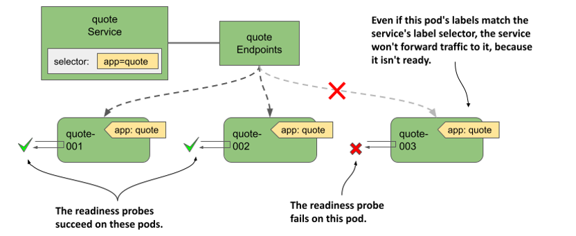

Khái niệm "sẵn sàng" mang tính đặc thù đối với từng ứng dụng. Nhà phát triển ứng dụng sẽ quyết định thế nào là sẵn sàng trong ngữ cảnh phần mềm của họ. Để làm được điều này, họ cung cấp một endpoint để Kubernetes truy vấn xem ứng dụng đã sẵn sàng hay chưa. Tùy thuộc vào loại endpoint, loại readiness probe phù hợp phải được sử dụng.

#### Tìm hiểu các loại readiness probe

Tương tự như liveness probe, Kubernetes hỗ trợ ba loại readiness probe:

- Kiểm tra kiểu `exec` thực thi một tiến trình bên trong container. Mã thoát (exit code) khi tiến trình kết thúc sẽ quyết định container có sẵn sàng hay không.
- Kiểm tra kiểu `httpGet` gửi một yêu cầu `GET` đến container thông qua giao thức HTTP hoặc HTTPS. Mã phản hồi (response code) trả về sẽ xác định trạng thái sẵn sàng của container.
- Kiểm tra kiểu `tcpSocket` mở một kết nối TCP đến một cổng (port) được chỉ định trên container. Nếu kết nối được thiết lập thành công, container được coi là đã sẵn sàng.

#### Cấu hình tần suất thực thi bài kiểm tra

Bạn có thể còn nhớ rằng chúng ta có thể cấu hình thời điểm và tần suất chạy liveness probe cho một container bằng các thuộc tính sau: `initialDelaySeconds`, `periodSeconds`, `failureThreshold`, và `timeoutSeconds`. Các thuộc tính này cũng được áp dụng cho readiness probe, nhưng chúng còn hỗ trợ thêm một thuộc tính nữa là `successThreshold`—quy định số lần kiểm tra phải thành công liên tiếp để container được coi là đã sẵn sàng.

Các thiết lập này được giải thích trực quan nhất bằng hình ảnh. Hình dưới đây minh họa cách từng thuộc tính ảnh hưởng đến việc thực thi readiness probe và trạng thái sẵn sàng của container sau đó.

##### Figure 11.17 Readiness probe execution and resulting readiness status of the container

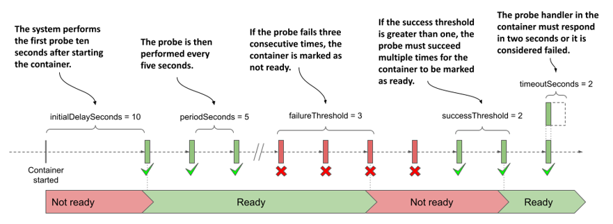

##### Note

Nếu container định nghĩa một startup probe, khoảng thời gian trì hoãn ban đầu (initial delay) của readiness probe sẽ chỉ bắt đầu sau khi startup probe chạy thành công. Các startup probe đã được giải thích kỹ trong Chương 6.

Khi container đã sẵn sàng, pod sẽ trở thành một endpoint của các service có bộ chọn nhãn trùng khớp với nhãn của nó. Khi nó không còn sẵn sàng nữa, nó sẽ bị gỡ bỏ khỏi các service đó.

### 11.6.2 Thêm một readiness probe vào pod

Để tận mắt thấy cách hoạt động của readiness probe, hãy tạo một pod mới với một bài kiểm tra mà bạn có thể chủ động chuyển đổi kết quả từ thành công sang thất bại tùy ý. Đây không phải là một ví dụ thực tế về cách cấu hình readiness probe, nhưng nó giúp bạn quan sát trực quan việc kết quả kiểm tra ảnh hưởng như thế nào đến việc pod có được đưa vào service hay không.

Danh sách dưới đây hiển thị phần cấu hình liên quan trong tệp manifest của pod mang tên `pod.kiada-mock-readiness.yaml`, tệp này có sẵn trong kho lưu trữ mã nguồn của cuốn sách.

##### Listing 11.11 A readiness probe definition in a pod

```yaml
apiVersion: v1
kind: Pod
...
spec:
  containers:
  - name: kiada
    ...
    readinessProbe:    #A
      exec:    #B
        command:    #B
        - ls    #B
        - /var/ready    #B
      initialDelaySeconds: 10    #C
      periodSeconds: 5    #C
      failureThreshold: 3    #C
      successThreshold: 2    #C
      timeoutSeconds: 2    #C
  ...
```

Readiness probe này sẽ định kỳ chạy lệnh `ls /var/ready` bên trong container `kiada`. Lệnh `ls` sẽ trả về mã thoát bằng 0 nếu tệp tin tồn tại, ngược lại sẽ trả về một giá trị khác 0. Vì giá trị 0 được coi là thành công, nên bài kiểm tra sẵn sàng sẽ thành công nếu tệp tin này hiện diện.

Lý do chúng ta định nghĩa một bài kiểm tra sẵn sàng có phần kỳ lạ như thế này là để bạn có thể dễ dàng thay đổi kết quả của nó bằng cách tạo hoặc xóa tệp tin đang được kiểm tra. Khi bạn mới tạo pod, tệp tin này chưa tồn tại, do đó pod sẽ ở trạng thái chưa sẵn sàng. Trước khi tạo pod này, hãy xóa tất cả các pod kiada khác ngoại trừ `kiada-001`. Điều này sẽ giúp bạn dễ dàng quan sát sự thay đổi các endpoint của service hơn.

#### Quan sát trạng thái sẵn sàng của các pod

Sau khi tạo pod từ tệp manifest, hãy kiểm tra trạng thái của nó như sau:

```bash
$ kubectl get po kiada-mock-readiness
NAME                   READY   STATUS    RESTARTS   AGE
kiada-mock-readiness   1/2     Running   0          1m    #A
```

Cột `READY` cho thấy chỉ có một trong số các container của pod là đã sẵn sàng. Đó là container `envoy`, vốn không định nghĩa bất kỳ readiness probe nào. Các container không có cấu hình readiness probe mặc định sẽ được coi là sẵn sàng ngay khi chúng được khởi chạy thành công.

Do không phải tất cả container trong pod đều đã sẵn sàng, pod này sẽ không nhận được lưu lượng truyền tới service. Bạn có thể kiểm tra điều này bằng cách gửi một vài yêu cầu tới service `kiada`. Bạn sẽ nhận thấy toàn bộ yêu cầu đều được xử lý bởi pod `kiada-001`—endpoint hoạt động duy nhất hiện tại của service. Điều này được thể hiện rõ ràng trong các đối tượng Endpoints và EndpointSlice liên kết với service. Chẳng hạn, pod `kiada-mock-readiness` xuất hiện trong mảng `notReadyAddresses` thay vì mảng `addresses` trong đối tượng Endpoints:

```bash
$ kubectl get endpoints kiada -o yaml
apiVersion: v1
kind: Endpoints
metadata:
  name: kiada
  ...
subsets:
- addresses:
  - ...
  notReadyAddresses:    #A
  - ip: 10.244.1.36    #A
    nodeName: kind-worker2    #A
    targetRef:    #A
      kind: Pod    #A
      name: kiada-mock-readiness    #A
      namespace: default    #A
    ...
```

Trong đối tượng EndpointSlice, điều kiện `ready` của endpoint này được đánh dấu là `false`:

```bash
$ kubectl get endpointslices -l kubernetes.io/service-name=kiada -o yaml
apiVersion: v1
items:
- addressType: IPv4
  apiVersion: discovery.k8s.io/v1
  endpoints:
  - addresses:
    - 10.244.1.36
    conditions:    #A
      ready: false    #A
    nodeName: kind-worker2
    targetRef:
      kind: Pod
      name: kiada-mock-readiness
      namespace: default
      …
```

##### Note

Trong một số trường hợp, bạn có thể muốn bỏ qua trạng thái sẵn sàng của các pod. Điển hình như khi bạn muốn tất cả các pod trong một nhóm đều nhận được các bản ghi `A`, `AAAA` và `SRV` ngay cả khi chúng chưa sẵn sàng. Nếu bạn đặt trường `publishNotReadyAddresses` trong phần `spec` của đối tượng Service thành `true`, các pod chưa sẵn sàng vẫn sẽ được đánh dấu là sẵn sàng trong cả đối tượng Endpoints và EndpointSlice. Các thành phần như hệ thống DNS của cụm sẽ đối xử với chúng như các pod đã sẵn sàng.

Để bài kiểm tra sẵn sàng thành công, hãy tạo tệp `/var/ready` bên trong container bằng lệnh sau:

```bash
$ kubectl exec kiada-mock-readiness -c kiada -- touch /var/ready
```

Lệnh `kubectl exec` trên sẽ thực thi lệnh `touch` bên trong container `kiada` của pod `kiada-mock-readiness`. Lệnh `touch` sẽ tạo ra tệp tin được chỉ định. Nhờ đó, readiness probe của container giờ đây sẽ thành công. Toàn bộ container trong pod lúc này sẽ hiển thị là đã sẵn sàng. Hãy xác minh điều này bằng lệnh dưới đây:

```bash
$ kubectl get po kiada-mock-readiness
NAME                   READY   STATUS    RESTARTS   AGE
kiada-mock-readiness   1/2     Running   0          10m
```

Thật đáng ngạc nhiên, pod vẫn chưa ở trạng thái sẵn sàng. Có điều gì đó bất thường ở đây chăng, hay đây là kết quả đã được dự tính trước? Hãy xem xét kỹ hơn về pod này bằng lệnh `kubectl describe`. Trong kết quả đầu ra, bạn sẽ thấy dòng sau:

```
Readiness:   exec [ls /var/ready] delay=10s timeout=2s period=5s #success=2 #failure=3
```

Readiness probe được định nghĩa trong pod được cấu hình để kiểm tra trạng thái của container sau mỗi 5 giây. Tuy nhiên, nó cũng được cấu hình yêu cầu phải có hai lần kiểm tra thành công liên tiếp trước khi chuyển trạng thái của container sang sẵn sàng. Vì vậy, sẽ mất khoảng 10 giây để pod chuyển sang trạng thái sẵn sàng sau khi bạn tạo tệp `/var/ready`.

Khi điều đó xảy ra, pod sẽ trở thành một endpoint hoạt động của service. Bạn có thể xác minh điều này bằng cách kiểm tra các đối tượng Endpoints hoặc EndpointSlice liên quan đến service, hoặc đơn giản là truy cập service vài lần và xem liệu pod `kiada-mock-readiness` có nhận được bất kỳ yêu cầu nào bạn gửi hay không.

Nếu muốn loại bỏ pod khỏi service một lần nữa, hãy chạy lệnh sau để xóa tệp `/var/ready` khỏi container:

```bash
$ kubectl exec kiada-mock-readiness -c kiada -- rm /var/ready
```

Mô hình thử nghiệm (mockup) bài kiểm tra sẵn sàng này chỉ nhằm mục đích minh họa cách thức hoạt động của readiness probe. Trong thực tế, bạn không nên triển khai readiness probe theo cách này. Nếu bạn muốn gỡ bỏ các pod ra khỏi service một cách thủ công, bạn nên thực hiện bằng cách xóa pod hoặc thay đổi nhãn của pod, thay vì tác động vào kết quả của bài kiểm tra sẵn sàng.

##### Tip

Nếu bạn muốn kiểm soát thủ công việc một pod có được đưa vào service hay không, hãy thêm một khóa nhãn (label key) chẳng hạn như `enabled` vào pod và đặt giá trị của nó là `true`. Sau đó, thêm bộ chọn nhãn `enabled=true` vào service của bạn. Khi muốn gỡ pod ra khỏi service, bạn chỉ cần xóa nhãn đó khỏi pod.

### 11.6.3 Triển khai các readiness probe trong môi trường thực tế

Nếu bạn không định nghĩa một bài kiểm tra sẵn sàng trong pod, nó sẽ trở thành một endpoint của service ngay khi được tạo ra. Điều này đồng nghĩa với việc mỗi khi bạn tạo một phiên bản pod mới, các kết nối do service chuyển tiếp đến phiên bản mới này sẽ bị lỗi cho đến khi ứng dụng bên trong pod thực sự sẵn sàng tiếp nhận chúng. Để ngăn chặn kịch bản này xảy ra, bạn nên luôn luôn định nghĩa một bài kiểm tra sẵn sàng cho pod của mình.

Trong phần trước, bạn đã học cách thêm một bài kiểm tra sẵn sàng giả định (mock readiness probe) vào container nhằm kiểm soát thủ công xem pod có làm endpoint của service hay không. Trong thực tế, kết quả của cuộc kiểm tra sẵn sàng phải phản ánh chính xác khả năng tiếp nhận các kết nối của ứng dụng đang chạy bên trong container.

#### Định nghĩa một readiness probe tối giản

Đối với các container chạy một máy chủ HTTP, việc định nghĩa một bài kiểm tra sẵn sàng đơn giản nhằm kiểm tra xem máy chủ có phản hồi yêu cầu `GET /` cơ bản hay không—như đoạn mã dưới đây—vẫn tốt hơn nhiều so với việc không có bất kỳ bài kiểm tra nào.

```yaml
readinessProbe:
  httpGet:    #A
    port: 8080    #A
    path: /    #B
    scheme: HTTP    #B
```

Khi Kubernetes gọi bài kiểm tra sẵn sàng này, nó sẽ gửi một yêu cầu `GET /` đến cổng `8080` của container và kiểm tra mã phản hồi HTTP trả về. Nếu mã phản hồi lớn hơn hoặc bằng `200` và nhỏ hơn `400`, cuộc kiểm tra được coi là thành công và pod được xem là đã sẵn sàng. Nếu mã phản hồi là bất kỳ giá trị nào khác (ví dụ: `404` hoặc `500`) hoặc nỗ lực kết nối thất bại, cuộc kiểm tra sẵn sàng được coi là đã thất bại và pod sẽ bị đánh dấu là chưa sẵn sàng.

Bài kiểm tra đơn giản này đảm bảo rằng pod chỉ trở thành một phần của service khi nó thực sự có khả năng xử lý các yêu cầu HTTP, thay vì được đưa vào ngay thời điểm pod khởi chạy.

#### Định nghĩa một bài kiểm tra sẵn sàng tối ưu hơn

Một bài kiểm tra sẵn sàng đơn giản như phần trước không phải lúc nào cũng đủ tốt. Hãy lấy ví dụ về pod Quote. Bạn có thể nhớ rằng nó chạy hai container. Container `quote-writer` sẽ chọn ngẫu nhiên một câu trích dẫn từ cuốn sách này và ghi vào tệp tin mang tên `quote` nằm trong volume được chia sẻ giữa hai container. Container `nginx` sau đó sẽ phục vụ các tệp tin từ volume dùng chung này. Vì vậy, bản thân câu trích dẫn sẽ khả dụng tại đường dẫn URL `/quote`.

Mục đích của pod Quote rõ ràng là cung cấp một câu trích dẫn ngẫu nhiên từ cuốn sách. Do đó, nó không nên được đánh dấu là sẵn sàng cho đến khi nó thực sự có thể cung cấp câu trích dẫn này. Nếu bạn trỏ readiness probe đến đường dẫn URL `/`, nó vẫn sẽ báo thành công ngay cả khi container `quote-writer` chưa kịp tạo ra tệp `quote`. Vì vậy, bài kiểm tra sẵn sàng trong pod Quote nên được cấu hình giống như đoạn trích dưới đây từ tệp `pod.quote-readiness.yaml`:

```yaml
readinessProbe:
  httpGet: 
    port: 80
    path: /quote    #A
    scheme: HTTP
  failureThreshold: 1   #B
```

Nếu thêm bài kiểm tra sẵn sàng này vào pod Quote, bạn sẽ thấy pod chỉ ở trạng thái sẵn sàng khi tệp `quote` tồn tại. Hãy thử xóa tệp này khỏi pod bằng lệnh sau:

```bash
$ kubectl exec quote-readiness -c quote-writer -- rm /var/local/output/quote
```

Giờ hãy kiểm tra trạng thái sẵn sàng của pod bằng lệnh `kubectl get pod`, bạn sẽ thấy một trong các container không còn sẵn sàng nữa. Khi `quote-writer` tạo lại tệp tin, container sẽ tự động sẵn sàng trở lại. Bạn cũng có thể kiểm tra các endpoint của service `quote` bằng lệnh `kubectl get endpoints quote` để thấy pod bị xóa khỏi danh sách rồi lại được thêm vào sau đó.

#### Triển khai một endpoint kiểm tra sẵn sàng chuyên biệt

Như bạn đã thấy ở ví dụ trước, việc trỏ readiness probe tới một đường dẫn sẵn có của máy chủ HTTP đôi khi là đủ, nhưng thông thường các ứng dụng sẽ cung cấp một endpoint chuyên dụng riêng, chẳng hạn như `/healthz/ready` hoặc `/readyz` để báo cáo trạng thái sẵn sàng của mình. Khi ứng dụng nhận được một yêu cầu tại endpoint này, nó sẽ thực hiện một loạt kiểm tra nội bộ để xác định xem mình đã sẵn sàng hay chưa.

Hãy lấy service Quiz làm ví dụ. Pod Quiz chạy cả một máy chủ HTTP lẫn một container MongoDB. Như bạn thấy trong danh sách mã nguồn dưới đây, máy chủ `quiz-api` triển khai endpoint `/healthz/ready`. Khi nhận được một yêu cầu, nó sẽ kiểm tra xem có thể kết nối thành công tới cơ sở dữ liệu MongoDB trong container kia hay không. Nếu có, nó sẽ phản hồi mã `200 OK`. Nếu không, nó sẽ trả về mã lỗi `500 Internal Server Error`.

##### Listing 11.12: The readiness endpoint in the quiz-api application

```go
func (s *HTTPServer) ListenAndServe(listenAddress string) {
    router := mux.NewRouter()
    router.Methods("GET").Path("/").HandlerFunc(s.handleRoot)
    router.Methods("GET").Path("/healthz/ready").HandlerFunc(s.handleReadiness)    #A
    ...
}
 
func (s *HTTPServer) handleReadiness(res http.ResponseWriter, req *http.Request) {
    conn, err := s.db.Connect()    #B
    if err != nil {    #C
        res.WriteHeader(http.StatusInternalServerError)    #C
        _, _ = fmt.Fprintf(res, "ERROR: %v\n", err.Error())    #C
        return    #C
    }
    defer conn.Close()
 
    res.WriteHeader(http.StatusOK)    #D
    _, _ = res.Write([]byte("Readiness check successful"))    #D
}
```

Readiness probe được định nghĩa trong pod Quiz đảm bảo rằng mọi thành phần mà pod cần để phục vụ dịch vụ đều hiện diện và hoạt động tốt. Khi các thành phần bổ sung được tích hợp vào ứng dụng `quiz-api`, ta có thể viết thêm các kiểm tra khác vào mã nguồn kiểm tra độ sẵn sàng này. Một ví dụ điển hình là việc bổ sung bộ nhớ đệm (cache) nội bộ. Endpoint kiểm tra độ sẵn sàng có thể xác minh xem bộ nhớ đệm đã được làm nóng (warm up) hay chưa, và chỉ khi đó pod mới được mở ra đón nhận các kết nối từ client.

#### Kiểm tra các phụ thuộc bên ngoài trong bài kiểm tra sẵn sàng

Trong pod Quiz, cơ sở dữ liệu MongoDB là một phụ thuộc nội bộ (internal dependency) của container `quiz-api`. Mặt khác, pod Kiada lại phụ thuộc vào các service Quiz và Quote, vốn là các phụ thuộc bên ngoài (external dependency). Vậy readiness probe trong pod Kiada nên kiểm tra điều gì? Liệu nó có nên kiểm tra xem mình có thể kết nối tới các service Quote và Quiz hay không?

Câu trả lời cho vấn đề này vẫn còn nhiều tranh cãi, nhưng mỗi khi bạn đưa các phụ thuộc vào diện kiểm tra của bài kiểm tra độ sẵn sàng, bạn phải cân nhắc điều gì sẽ xảy ra nếu một sự cố tạm thời (transient), chẳng hạn như độ trễ mạng tăng cao đột xuất, khiến bài kiểm tra bị thất bại.

Hãy lưu ý rằng trường `timeoutSeconds` trong định nghĩa readiness probe sẽ giới hạn thời gian phản hồi của bài kiểm tra. Thời gian chờ mặc định chỉ là một giây. Container bắt buộc phải phản hồi lại cuộc kiểm tra sẵn sàng trong khoảng thời gian eo hẹp này.

Nếu pod Kiada gọi hai service còn lại trong bước kiểm tra độ sẵn sàng của mình, nhưng phản hồi từ chúng bị trễ chỉ một chút do sự cố mạng tạm thời, bài kiểm tra sẵn sàng của nó sẽ thất bại và pod sẽ bị gỡ bỏ khỏi danh sách endpoint của service. Nếu kịch bản này xảy ra đồng thời với tất cả các pod Kiada, cụm sẽ không còn bất kỳ pod nào để xử lý các yêu cầu của client. Sự cố gián đoạn mạng có thể chỉ diễn ra trong vỏn vẹn một giây, nhưng các pod có thể phải mất đến hàng chục giây sau mới được đưa trở lại service, tùy thuộc vào cách bạn cấu hình các thuộc tính `periodSeconds` và `successThreshold`.

Khi kiểm tra các phụ thuộc bên ngoài trong readiness probe, bạn cần tính toán kỹ lưỡng điều gì sẽ xảy ra khi gặp các sự cố mạng tạm thời kiểu này. Từ đó, hãy thiết lập chu kỳ (period), thời gian chờ (timeout) và các ngưỡng (threshold) sao cho phù hợp.

##### Tip

Những bài kiểm tra sẵn sàng cố tỏ ra quá "thông minh" đôi khi lại gây ra nhiều rắc rối hơn là giải quyết chúng. Theo nguyên tắc chung, các bài kiểm tra sẵn sàng không nên kiểm tra các phụ thuộc bên ngoài, nhưng hoàn toàn có thể kiểm tra các phụ thuộc nằm trong cùng một pod.

Ứng dụng Kiada cũng tự triển khai một endpoint `/healthz/ready` chuyên biệt, thay vì để readiness probe sử dụng endpoint `/` thông thường để kiểm tra trạng thái. Endpoint này chỉ đơn thuần phản hồi mã trạng thái HTTP `200 OK` cùng với từ `Ready` trong phần thân phản hồi. Cách làm này đảm bảo bài kiểm tra sẵn sàng chỉ kiểm tra xem bản thân ứng dụng có đang phản hồi hay không, mà không cần phải kết nối đến các service Quiz hay Quote. Bạn có thể tìm thấy manifest của pod này trong tệp tin `pod.kiada-readiness.yaml`.

#### Tìm hiểu về bài kiểm tra sẵn sàng trong bối cảnh pod chuẩn bị tắt

Một lưu ý cuối cùng trước khi khép lại chương này. Như bạn đã biết, các bài kiểm tra sẵn sàng quan trọng nhất là khi pod mới khởi động, nhưng chúng cũng đảm bảo rằng pod sẽ được đưa ra khỏi diện phục vụ nếu có sự cố khiến nó không còn sẵn sàng trong quá trình hoạt động bình thường. Nhưng còn khi pod đang chuẩn bị tắt thì sao? Một pod đang trong quá trình tắt (terminating) không nên là một phần của bất kỳ service nào. Liệu bạn có cần phải cân nhắc yếu tố này khi xây dựng readiness probe hay không?

May mắn thay, khi bạn xóa một pod, Kubernetes không chỉ gửi tín hiệu tắt (termination signal) đến các container của pod mà còn chủ động loại bỏ pod đó khỏi tất cả các service. Điều này có nghĩa là bạn không cần phải viết thêm bất kỳ xử lý đặc biệt nào dành cho các pod đang tắt bên trong bài kiểm tra sẵn sàng của mình. Bạn không cần phải cố ép cho bài kiểm tra thất bại khi ứng dụng nhận được tín hiệu tắt.

## 11.7 Tóm tắt

Trong chương này, cuối cùng bạn đã kết nối thành công các pod Kiada với các pod Quiz và Quote. Giờ đây, bạn có thể sử dụng bộ ứng dụng Kiada để kiểm tra các kiến thức đã tích lũy và làm mới trí nhớ của mình bằng những câu trích dẫn từ chính cuốn sách này. Qua chương này, bạn đã hiểu được rằng:

- Các pod giao tiếp với nhau qua một mạng phẳng (flat network), cho phép bất kỳ pod nào cũng có thể kết nối tới các pod khác trong cụm, bất kể cấu trúc liên kết mạng thực tế kết nối các node của cụm là gì.
- Một service trong Kubernetes cho phép hiển thị một nhóm các pod dưới một địa chỉ IP duy nhất. Trong khi IP của các pod có thể thay đổi liên tục, địa chỉ IP của service luôn giữ nguyên không đổi.
- Cluster IP của service có thể truy cập được từ bên trong cụm, còn các service loại NodePort và LoadBalancer cũng cho phép truy cập từ cả bên ngoài cụm.
- Các endpoint của service có thể được xác định tự động bằng bộ chọn nhãn (label selector) trong đối tượng Service, hoặc được cấu hình thủ công. Các endpoint này được lưu trữ trong các đối tượng Endpoints và EndpointSlice.
- Các pod client có thể tìm kiếm service thông qua hệ thống DNS của cụm hoặc các biến môi trường. Tùy thuộc vào loại Service, các bản ghi DNS sau có thể được tạo ra: `A`, `AAAA`, `SRV`, và `CNAME`.
- Các service có thể được cấu hình để chỉ chuyển tiếp lưu lượng bên ngoài đến các pod nằm trên cùng node nhận lưu lượng, hoặc đến các pod ở bất cứ đâu trong cụm. Chúng cũng có thể được cấu hình để chỉ định tuyến lưu lượng nội bộ đến các pod nằm trên cùng một node với pod phát sinh lưu lượng. Cơ chế định tuyến nhận biết cấu trúc liên kết (topology-aware routing) đảm bảo lưu lượng không bị chuyển qua lại giữa các phân vùng khả dụng (availability zone) nếu có một pod cục bộ có thể đáp ứng được dịch vụ được yêu cầu.
- Các pod sẽ không trở thành endpoint của service cho đến khi chúng thực sự sẵn sàng. Bằng cách xây dựng một hàm xử lý readiness probe trong ứng dụng, bạn có thể tự định nghĩa thế nào là trạng thái sẵn sàng trong ngữ cảnh của ứng dụng cụ thể đó.

Trong chương tiếp theo, bạn sẽ học cách sử dụng các đối tượng Ingress để mở cổng truy cập cho nhiều service thông qua một địa chỉ IP duy nhất từ bên ngoài.

---

[← Chương 10](10-to-chuc-cac-doi-tuong-bang-namespace-va-label.md) · [Mục lục](README.md) · [Chương 12 →](12-cong-khai-dich-vu-ra-ngoai-bang-ingress.md)
