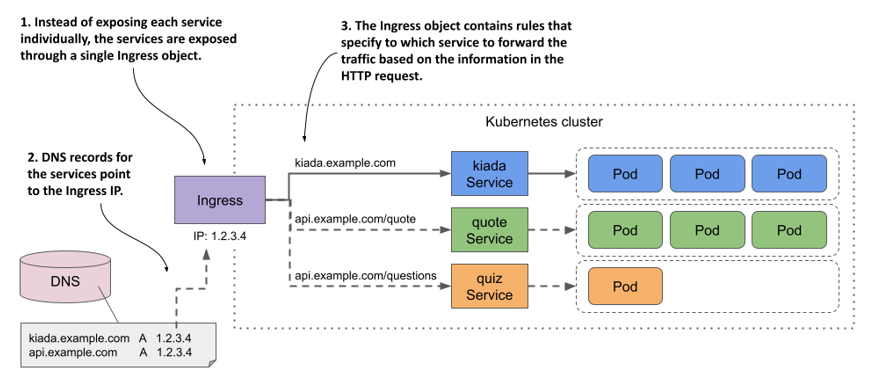
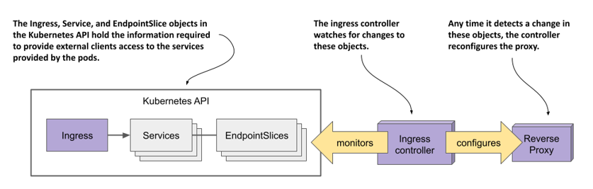
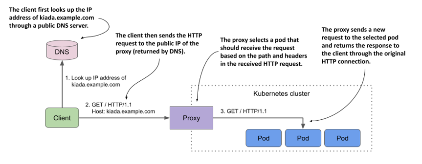
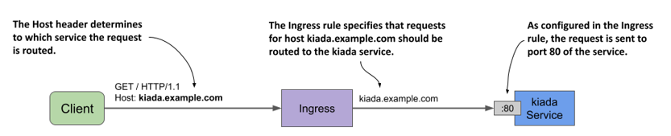
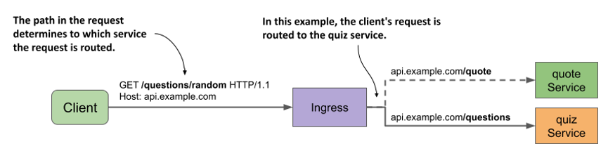
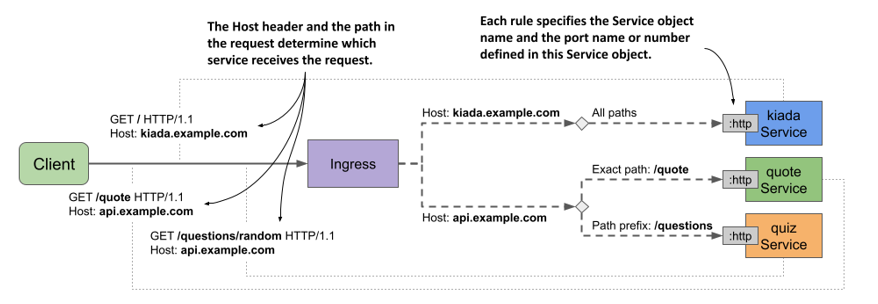
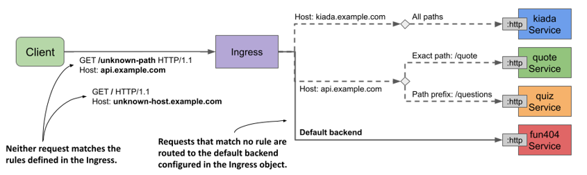
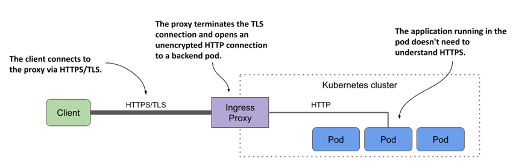
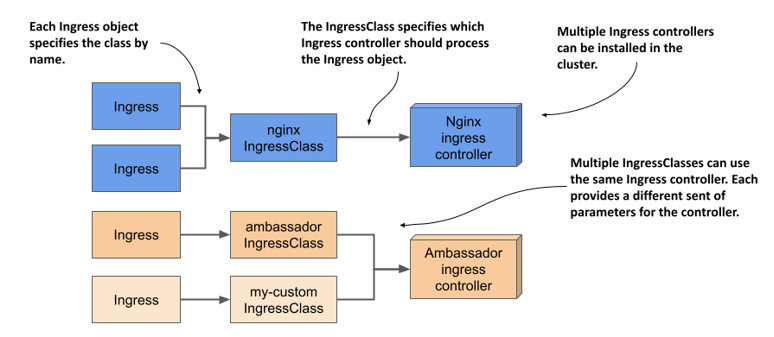

# 12 Công khai Dịch vụ ra Ngoài bằng Ingress

### Chương này bao gồm các nội dung:

- Tạo các đối tượng Ingress
- Triển khai và tìm hiểu cách hoạt động của các bộ điều khiển Ingress (Ingress controller)
- Bảo mật Ingress bằng giao thức TLS
- Bổ sung cấu hình nâng cao cho một Ingress
- Sử dụng IngressClass khi có nhiều bộ điều khiển được cài đặt trong cụm
- Sử dụng Ingress với các backend không phải là Service

Trong chương trước, bạn đã tìm hiểu cách sử dụng đối tượng Service để cung cấp một địa chỉ IP ổn định cho một nhóm các pod. Nếu bạn sử dụng loại service `LoadBalancer`, service đó sẽ được mở ra cho các client bên ngoài cụm thông qua một bộ cân bằng tải (load balancer). Cách tiếp cận này hoàn toàn ổn thỏa nếu bạn chỉ cần công khai một service duy nhất ra bên ngoài, nhưng nó sẽ trở thành một vấn đề lớn khi số lượng service tăng lên, bởi mỗi service sẽ đòi hỏi một địa chỉ IP công cộng (public IP) của riêng mình.

Thật may mắn, bằng cách cung cấp các service này qua một đối tượng *Ingress*, bạn chỉ cần duy nhất một địa chỉ IP. Bên cạnh đó, Ingress còn đem lại nhiều tính năng hữu ích khác như xác thực HTTP (HTTP authentication), duy trì phiên làm việc dựa trên cookie (cookie-based session affinity), viết lại đường dẫn URL (URL rewriting) và nhiều khả năng khác mà các đối tượng Service thông thường không thể đáp ứng.

##### NOTE

Bạn có thể tìm thấy các tệp mã nguồn của chương này tại <https://github.com/luksa/kubernetes-in-action-2nd-edition/tree/master/Chapter12>.

## 12.1 Giới thiệu về Ingress

Trước khi giải thích xem Ingress là gì trong ngữ cảnh của Kubernetes, có lẽ sẽ rất hữu ích đối với những độc giả mà tiếng Anh không phải là ngôn ngữ mẹ đẻ nếu chúng ta cùng định nghĩa xem thuật ngữ *ingress* thực chất có nghĩa là gì.

##### Definition

*Ingress* (danh từ)—Hành động đi vào hoặc lối vào; quyền được đi vào; phương tiện hoặc địa điểm để đi vào; lối dẫn vào.

Trong Kubernetes, một Ingress là giải pháp cho phép các client bên ngoài truy cập vào các dịch vụ của ứng dụng đang chạy trong cụm. Chức năng của Ingress được cấu thành từ ba thành phần sau:

- *Đối tượng API Ingress*, được dùng để định nghĩa và cấu hình một lối vào.
- Một *bộ cân bằng tải lớp 7 (L7 load balancer)* hoặc *proxy ngược (reverse proxy)* có nhiệm vụ định tuyến lưu lượng đến các service ở phía sau (backend).
- *Bộ điều khiển Ingress (ingress controller)*, có vai trò giám sát các đối tượng Ingress trên Kubernetes API, từ đó triển khai và cấu hình bộ cân bằng tải hoặc proxy ngược tương ứng.

##### Note

*L4 và L7 lần lượt ám chỉ lớp 4 (Lớp vận chuyển - Transport Layer; hỗ trợ TCP, UDP) và lớp 7 (Lớp ứng dụng - Application Layer; hỗ trợ HTTP) thuộc Mô hình tương tác giữa các hệ thống mở (Mô hình OSI) [^1].*

##### Note

Khác với proxy xuôi (forward proxy)—vốn có nhiệm vụ định tuyến và sàng lọc lưu lượng đi ra ngoài và thường được đặt cùng vị trí với các client mà nó phục vụ—một proxy ngược (reverse proxy) sẽ xử lý lưu lượng đi vào và định tuyến chúng đến một hoặc nhiều máy chủ backend phía sau. Proxy ngược thường được đặt gần các máy chủ đó.

Trong hầu hết các tài liệu trực tuyến, thuật ngữ *ingress controller* thường được dùng chung để chỉ cả bộ cân bằng tải/proxy ngược lẫn bộ điều khiển thực tế như một thực thể duy nhất, nhưng thực chất chúng là hai thành phần hoàn toàn khác nhau. Vì lý do đó, tôi sẽ đề cập riêng biệt đến từng thành phần trong chương này.

Tôi cũng sẽ sử dụng thuật ngữ *proxy* để chỉ bộ cân bằng tải L7, nhằm giúp bạn tránh nhầm lẫn nó với bộ cân bằng tải L4 vốn chịu trách nhiệm xử lý lưu lượng cho các service loại `LoadBalancer`.

### 12.1.1 Giới thiệu về loại đối tượng Ingress

Khi bạn muốn cung cấp một nhóm các service ra bên ngoài, bạn sẽ tạo một đối tượng Ingress và tham chiếu đến các đối tượng Service trong đó. Kubernetes sử dụng đối tượng Ingress này để cấu hình một bộ cân bằng tải L7 (một proxy ngược HTTP), giúp các client bên ngoài có thể tiếp cận dịch vụ thông qua một điểm truy cập chung duy nhất.

##### Note

Nếu bạn công khai một Service qua Ingress, thông thường bạn có thể giữ nguyên trường `type` của Service là `ClusterIP`. Tuy nhiên, một số triển khai Ingress nhất định lại yêu cầu loại Service phải là `NodePort`. Bạn hãy tham khảo tài liệu hướng dẫn của bộ điều khiển Ingress đang sử dụng để biết trường hợp của mình có rơi vào số đó không.

#### Công khai các service thông qua một đối tượng Ingress

Dù đối tượng Ingress hoàn toàn có thể được dùng để công khai chỉ một Service duy nhất, nhưng thông thường nó được sử dụng kết hợp với nhiều đối tượng Service khác nhau, như minh họa trong hình dưới đây. Hình vẽ này mô tả cách một đối tượng Ingress đơn lẻ mở cổng truy cập cho cả ba dịch vụ trong bộ ứng dụng Kiada tới các client bên ngoài.

##### Figure 12.1 An Ingress forwards external traffic to multiple services



Đối tượng Ingress chứa các quy tắc định tuyến lưu lượng đến ba service dựa trên thông tin có trong yêu cầu HTTP. Các bản ghi DNS công cộng của các service này đều trỏ đến cùng một Ingress. Ingress sẽ tự phân tích yêu cầu từ phía client để xác định xem service nào sẽ nhận yêu cầu đó. Nếu yêu cầu của client chỉ định máy chủ (host) là `kiada.example.com`, Ingress sẽ chuyển tiếp nó tới các pod thuộc service `kiada`. Ngược lại, những yêu cầu chỉ định host là `api.example.com` sẽ được chuyển tiếp tới các service `quote` hoặc `quiz`, tùy thuộc vào đường dẫn (path) nào được yêu cầu.

#### Sử dụng nhiều đối tượng Ingress trong một cụm

Một đối tượng Ingress thường chịu trách nhiệm xử lý lưu lượng cho tất cả các đối tượng Service trong một namespace cụ thể trên Kubernetes, nhưng bạn cũng hoàn toàn có thể sử dụng nhiều đối tượng Ingress khác nhau. Thông thường, mỗi đối tượng Ingress sẽ có một địa chỉ IP riêng biệt, tuy nhiên một số triển khai Ingress lại sử dụng chung một điểm truy cập duy nhất cho tất cả các đối tượng Ingress mà bạn tạo ra trong cụm.

### 12.1.2 Giới thiệu về bộ điều khiển Ingress và proxy ngược

Không phải tất cả các cụm Kubernetes đều hỗ trợ Ingress ngay khi vừa khởi tạo. Chức năng này được cung cấp bởi một thành phần bổ trợ cho cụm (cluster add-on) được gọi là bộ điều khiển Ingress (Ingress controller). Bộ điều khiển này đóng vai trò là cầu nối giữa đối tượng Ingress và cổng vào vật lý thực tế (chính là proxy ngược). Thông thường, bộ điều khiển và proxy chạy dưới dạng hai tiến trình trong cùng một container, hoặc là hai container trong cùng một pod. Đó là lý do tại sao mọi người hay dùng thuật ngữ "ingress controller" để chỉ chung cho cả hai.

---

Đôi khi, bộ điều khiển hoặc proxy nằm bên ngoài cụm (cluster). Chẳng hạn, Google Kubernetes Engine (GKE) cung cấp một bộ điều khiển Ingress riêng, sử dụng bộ cân bằng tải L7 của Google Cloud Platform để mang lại tính năng Ingress cho cụm.

Nếu cụm của bạn được triển khai trên nhiều phân khu khả dụng (availability zone), một đối tượng Ingress duy nhất vẫn có thể xử lý lưu lượng truy cập cho toàn bộ các phân khu đó. Chẳng hạn, nó sẽ chuyển tiếp từng yêu cầu HTTP đến phân khu tối ưu nhất dựa trên vị trí của máy khách (client).

Có rất nhiều bộ điều khiển Ingress khác nhau để bạn lựa chọn. Cộng đồng Kubernetes duy trì một danh sách đầy đủ tại <https://kubernetes.io/docs/concepts/services-networking/ingress-controllers/>. Một số bộ điều khiển phổ biến nhất có thể kể đến như Nginx Ingress Controller, Ambassador, Contour và Traefik. Hầu hết các bộ điều khiển Ingress này sử dụng Nginx, HAProxy hoặc Envoy làm proxy ngược (reverse proxy), nhưng cũng có một số bộ điều khiển tự sử dụng cơ chế proxy riêng của mình.

#### Tìm hiểu vai trò của bộ điều khiển Ingress

Bộ điều khiển Ingress là thành phần phần mềm giúp hiện thực hóa đối tượng Ingress. Như được minh họa trong hình dưới đây, bộ điều khiển này kết nối với API server của Kubernetes để giám sát các đối tượng Ingress, Service, cùng các đối tượng Endpoints hoặc EndpointSlice. Bất cứ khi nào bạn tạo, sửa đổi hoặc xóa các đối tượng này, bộ điều khiển đều sẽ nhận được thông báo. Sau đó, nó sử dụng thông tin từ các đối tượng này để khởi tạo và cấu hình proxy ngược cho Ingress.

##### Hình 12.2 Vai trò của bộ điều khiển Ingress



Khi bạn tạo đối tượng Ingress, bộ điều khiển sẽ đọc phần `spec` của đối tượng đó rồi kết hợp với thông tin từ các đối tượng Service và EndpointSlice mà nó tham chiếu đến. Bộ điều khiển chuyển đổi các thông tin này thành cấu hình cho proxy ngược. Tiếp theo, nó thiết lập một proxy mới chạy cấu hình này, đồng thời thực hiện các bước bổ sung để đảm bảo bên ngoài cụm có thể truy cập được vào proxy đó. Nếu proxy đang chạy trong một Pod bên trong cụm, điều này thường đồng nghĩa với việc một Service loại `LoadBalancer` sẽ được tạo ra để công khai proxy này ra ngoài.

Khi bạn thay đổi đối tượng Ingress, bộ điều khiển sẽ cập nhật cấu hình của proxy. Còn khi bạn xóa đối tượng đó, bộ điều khiển sẽ dừng hoạt động, gỡ bỏ proxy cùng tất cả các đối tượng khác được tạo ra cùng với nó.

#### Tìm hiểu cách proxy chuyển tiếp lưu lượng truy cập đến các dịch vụ

Proxy ngược (hoặc bộ cân bằng tải L7) là thành phần tiếp nhận các yêu cầu HTTP gửi đến và chuyển tiếp chúng đến các dịch vụ. Cấu hình của proxy thường chứa một danh sách các máy chủ ảo (virtual host) và tương ứng với mỗi máy chủ là danh sách địa chỉ IP của các endpoint. Thông tin này được lấy từ các đối tượng Ingress, Service và Endpoints/EndpointSlice. Khi các máy khách kết nối đến proxy, proxy sẽ sử dụng thông tin này để định tuyến yêu cầu đến một endpoint (chẳng hạn như một Pod) dựa trên đường dẫn (path) và các trường tiêu đề (headers) của yêu cầu.

Hình dưới đây minh họa cách máy khách truy cập dịch vụ Kiada thông qua proxy. Trước tiên, máy khách thực hiện truy vấn DNS cho tên miền `kiada.example.com`. Máy chủ DNS sẽ trả về địa chỉ IP công khai của proxy ngược. Sau đó, máy khách gửi một yêu cầu HTTP đến proxy, trong đó trường tiêu đề `Host` chứa giá trị `kiada.example.com`. Proxy sẽ ánh xạ máy chủ này với địa chỉ IP của một trong các Pod Kiada và chuyển tiếp yêu cầu HTTP đến Pod đó. Lưu ý rằng proxy không gửi yêu cầu đến IP của Service mà gửi trực tiếp đến Pod. Đây là cơ chế hoạt động của hầu hết các giải pháp triển khai Ingress hiện nay.

##### Hình 12.3 Truy cập các Pod thông qua một Ingress



### 12.1.3 Cài đặt bộ điều khiển Ingress

Trước khi bắt đầu tạo các đối tượng Ingress, bạn cần đảm bảo rằng cụm của mình đã có một bộ điều khiển Ingress đang chạy. Như bạn đã biết ở phần trước, không phải cụm Kubernetes nào cũng được tích hợp sẵn bộ điều khiển này.

Nếu đang sử dụng một cụm dịch vụ được quản lý (managed cluster) từ các nhà cung cấp dịch vụ đám mây lớn, bộ điều khiển Ingress đã được thiết lập sẵn cho bạn. Trên Google Kubernetes Engine (GKE), bộ điều khiển Ingress mặc định là GLBC (GCE L7 Load Balancer); trên AWS, tính năng Ingress được đảm nhận bởi AWS Load Balancer Controller; còn Azure thì cung cấp AGIC (Application Gateway Ingress Controller). Hãy kiểm tra tài liệu của nhà cung cấp dịch vụ đám mây của bạn để biết họ có cung cấp bộ điều khiển Ingress hay không và bạn có cần phải kích hoạt nó hay không. Ngoài ra, bạn hoàn toàn có thể tự cài đặt bộ điều khiển Ingress theo ý muốn.

Như bạn đã biết, có rất nhiều giải pháp triển khai Ingress khác nhau để lựa chọn. Tất cả chúng đều cung cấp khả năng định tuyến lưu lượng truy cập như đã giải thích ở phần trước, nhưng mỗi giải pháp lại đi kèm với những tính năng bổ sung khác nhau. Trong tất cả các ví dụ của chương này, tôi sử dụng Nginx Ingress Controller. Tôi khuyên bạn cũng nên sử dụng bộ điều khiển này, trừ khi cụm của bạn đã có sẵn một bộ điều khiển khác. Để cài đặt Nginx Ingress Controller vào cụm của mình, hãy tham khảo phần khung thông tin bên lề.

##### Lưu ý

Có hai bản triển khai khác nhau của Nginx Ingress Controller. Một bản do các nhà phát triển dự án Kubernetes duy trì, và bản còn lại do chính những tác giả của Nginx cung cấp. Nếu mới làm quen với Kubernetes, bạn nên bắt đầu với bản đầu tiên. Đó cũng chính là bản tôi sử dụng trong cuốn sách này.

##### Cài đặt Nginx Ingress Controller

Bất kể bạn đang vận hành cụm Kubernetes bằng cách nào, bạn đều có thể cài đặt Nginx Ingress Controller bằng cách làm theo hướng dẫn tại <https://kubernetes.github.io/ingress-nginx/deploy/>.

Nếu tạo cụm bằng công cụ `kind`, bạn có thể cài đặt bộ điều khiển này bằng cách chạy lệnh sau:

```shell
$ kubectl apply -f https://raw.githubusercontent.com/kubernetes/ingress-nginx/main/deploy/static/provider/kind/deploy.yaml
```

Nếu vận hành cụm bằng Minikube, bạn có thể cài đặt bộ điều khiển như sau:

```shell
$ minikube addons enable ingress
```

## 12.2 Tạo và sử dụng các đối tượng Ingress

Phần trước đã giải thích những khái niệm cơ bản về đối tượng và bộ điều khiển Ingress, cũng như cách cài đặt Nginx Ingress Controller. Trong phần này, bạn sẽ học cách sử dụng Ingress để công khai các dịch vụ trong bộ ứng dụng Kiada ra bên ngoài.

Trước khi tạo đối tượng Ingress đầu tiên, bạn phải triển khai các Pod và Service của bộ ứng dụng Kiada. Nếu đã làm theo các bài tập ở chương trước, chúng chắc chắn đã có sẵn trong cụm của bạn. Nếu chưa, bạn có thể thiết lập bằng cách tạo namespace `kiada` rồi áp dụng tất cả các tệp cấu hình (manifest) trong thư mục `Chapter12/SETUP/` bằng lệnh sau:

```shell
$ kubectl apply -f SETUP/ --recursive
```

### 12.2.1 Công khai dịch vụ thông qua một Ingress

Một đối tượng Ingress sẽ tham chiếu đến một hoặc nhiều đối tượng Service. Đối tượng Ingress đầu tiên của bạn sẽ công khai dịch vụ `kiada` mà bạn đã tạo ở chương trước. Trước khi tạo Ingress, hãy cùng ôn lại cấu trúc bằng cách xem qua tệp cấu hình Service trong danh sách dưới đây.

##### Danh sách 12.1 Tệp cấu hình của service kiada

```yaml
apiVersion: v1
kind: Service
metadata:
  name: kiada    #A
spec:
  type: ClusterIP    #B
  selector:
    app: kiada
  ports:
  - name: http    #C
    port: 80    #C
    targetPort: 8080    #C
  - name: https
    port: 443
    targetPort: 8443
```

Service này có loại (`type`) là `ClusterIP` vì bản thân dịch vụ không cần phải cho phép các máy khách bên ngoài cụm truy cập trực tiếp — Ingress sẽ đảm nhận vai trò đó. Mặc dù dịch vụ này mở cả hai cổng `80` và `443`, Ingress sẽ chỉ chuyển tiếp lưu lượng truy cập đến cổng 80.

#### Tạo đối tượng Ingress

Tệp cấu hình của đối tượng Ingress được trình bày trong danh sách bên dưới. Bạn có thể tìm thấy tệp này tại đường dẫn `Chapter12/ing.kiada-example-com.yaml` trong kho mã nguồn của cuốn sách.

##### Danh sách 12.2 Đối tượng Ingress công khai dịch vụ kiada tại địa chỉ kiada.example.com

```yaml
apiVersion: networking.k8s.io/v1
kind: Ingress
metadata:
  name: kiada-example-com    #A
spec:
  rules:
  - host: kiada.example.com    #B
    http:
      paths:
      - path: /    #C
        pathType: Prefix    #C
        backend:    #D
          service:    #D
            name: kiada    #D
            port:    #D
              number: 80    #D
```

Tệp cấu hình trên định nghĩa một đối tượng Ingress có tên là `kiada-example-com`. Mặc dù bạn có thể đặt bất kỳ tên nào tùy ý cho đối tượng này, nhưng tốt nhất tên của nó nên phản ánh máy chủ (host) và/hoặc (các) đường dẫn (path) được chỉ định trong các quy tắc (rule) của Ingress.

##### Cảnh báo

Trên Google Kubernetes Engine (GKE), tên của Ingress không được chứa dấu chấm. Nếu không, bạn sẽ gặp phải thông báo lỗi sau trong phần sự kiện (events) của đối tượng Ingress: `Error syncing to GCP: error running load balancer syncing routine: invalid loadbalancer name`.

Đối tượng Ingress trong danh sách trên định nghĩa một quy tắc duy nhất. Quy tắc này chỉ ra rằng mọi yêu cầu gửi đến máy chủ `kiada.example.com` đều phải được chuyển tiếp đến cổng `80` của dịch vụ `kiada`, bất kể đường dẫn được yêu cầu là gì (được xác định qua các trường `path` và `pathType`). Cơ chế này được minh họa trong hình dưới đây.

##### Hình 12.4 Cách đối tượng Ingress kiada-example-com cấu hình định tuyến lưu lượng truy cập từ bên ngoài



#### Kiểm tra đối tượng Ingress để lấy địa chỉ IP công khai

Sau khi tạo đối tượng Ingress bằng lệnh `kubectl apply`, bạn có thể xem thông tin cơ bản của nó bằng cách liệt kê các đối tượng Ingress trong namespace hiện tại thông qua lệnh `kubectl get ingresses` như sau:

```shell
$ kubectl get ingresses
NAME                CLASS   HOSTS               ADDRESS       PORTS   AGE
kiada-example-com   nginx   kiada.example.com   11.22.33.44   80      30s
```

##### Lưu ý

Bạn có thể sử dụng từ viết tắt `ing` thay cho `ingress`.

Để xem thông tin chi tiết của đối tượng Ingress, hãy sử dụng lệnh `kubectl describe` như sau:

```shell
$ kubectl describe ing kiada-example-com
Name:             kiada-example-com    #A
Namespace:        default    #A
Address:          11.22.33.44    #B
Default backend:  default-http-backend:80 (172.17.0.15:8080)    #C
Rules:    #D
  Host               Path  Backends    #D
  ----               ----  --------    #D
  kiada.example.com    #D
                     /   kiada:80 (172.17.0.4:8080,172.17.0.5:8080,172.17.0.9:8080)    #D
Annotations:         <none>
Events:
  Type    Reason  Age                   From                      Message
```

---

Normal  Sync    5m6s (x2 over 5m28s)  nginx-ingress-controller  Scheduled for sync

Như bạn thấy, lệnh `kubectl describe` liệt kê toàn bộ các quy tắc trong đối tượng Ingress. Với mỗi quy tắc, lệnh này không chỉ hiển thị tên của dịch vụ đích mà còn hiển thị cả các endpoint của dịch vụ đó. Nếu bạn thấy xuất hiện thông báo lỗi liên quan đến backend mặc định (default backend), hãy tạm thời bỏ qua. Chúng ta sẽ khắc phục lỗi này ở phần sau.

Cả hai lệnh `kubectl get` và `kubectl describe` đều hiển thị địa chỉ IP của Ingress. Đây là địa chỉ IP của bộ cân bằng tải L7 hoặc proxy ngược mà máy khách cần gửi yêu cầu đến. Trong kết quả ví dụ trên, địa chỉ IP là `11.22.33.44` và cổng kết nối là `80`.

##### Lưu ý

Địa chỉ IP có thể sẽ không xuất hiện ngay lập tức. Điều này rất thường xảy ra khi cụm của bạn đang chạy trên môi trường đám mây. Nếu địa chỉ không được hiển thị sau vài phút, điều đó có nghĩa là chưa có bộ điều khiển Ingress nào xử lý đối tượng Ingress của bạn. Hãy kiểm tra xem bộ điều khiển đã hoạt động chưa. Vì một cụm có thể chạy nhiều bộ điều khiển Ingress khác nhau, rất có thể tất cả chúng đều bỏ qua đối tượng Ingress của bạn nếu bạn không chỉ rõ bộ điều khiển nào sẽ chịu trách nhiệm xử lý nó. Hãy tham khảo tài liệu hướng dẫn của bộ điều khiển Ingress mà bạn đã chọn để biết liệu bạn có cần thêm chú thích (annotation) `kubernetes.io/ingress.class` hoặc thiết lập trường `spec.ingressClassName` trong đối tượng Ingress hay không. Bạn sẽ được tìm hiểu kỹ hơn về trường này ở phần sau.

Bạn cũng có thể tìm thấy địa chỉ IP này trong trường `status` của đối tượng Ingress như sau:

```shell
$ kubectl get ing kiada -o yaml
...
status:
  loadBalancer:
    ingress:
    - ip: 11.22.33.44    #A
```

##### Lưu ý

Đôi khi địa chỉ hiển thị có thể gây hiểu lầm. Chẳng hạn, nếu bạn sử dụng Minikube và khởi chạy cụm trong một máy ảo (VM), địa chỉ Ingress sẽ hiển thị là `localhost`, nhưng điều này chỉ đúng dưới góc nhìn của chính máy ảo đó. Địa chỉ thực tế của Ingress chính là địa chỉ IP của máy ảo, bạn có thể lấy địa chỉ này bằng lệnh `minikube ip`.

#### Thêm IP của Ingress vào hệ thống DNS

Sau khi thêm một Ingress vào cụm môi trường production (môi trường vận hành thực tế), bước tiếp theo là thêm một bản ghi vào máy chủ DNS của tên miền Internet mà bạn sở hữu. Trong các ví dụ này, chúng ta giả định rằng bạn đang sở hữu tên miền `example.com`. Để cho phép các máy khách bên ngoài truy cập vào dịch vụ của bạn thông qua Ingress, bạn cần cấu hình máy chủ DNS để phân giải tên miền `kiada.example.com` về địa chỉ IP của Ingress là `11.22.33.44`.

Trong một cụm phát triển cục bộ (local development cluster), bạn không cần phải bận tâm đến các máy chủ DNS. Vì bạn chỉ truy cập dịch vụ từ máy tính cá nhân của mình, bạn có thể phân giải địa chỉ bằng các phương pháp khác. Nội dung này sẽ được giải thích ngay sau đây, đi kèm với hướng dẫn chi tiết về cách truy cập dịch vụ thông qua Ingress.

#### Truy cập các dịch vụ thông qua Ingress

Vì các Ingress sử dụng cơ chế máy chủ ảo (virtual hosting) để xác định nơi cần chuyển tiếp yêu cầu, bạn sẽ không nhận được kết quả mong muốn nếu chỉ đơn thuần gửi một yêu cầu HTTP đến địa chỉ IP và cổng của Ingress. Bạn cần phải đảm bảo rằng tiêu đề `Host` trong yêu cầu HTTP khớp với một trong các quy tắc được định nghĩa trong đối tượng Ingress.

Để làm được điều này, bạn phải chỉ định máy khách HTTP gửi yêu cầu đến máy chủ `kiada.example.com`. Tuy nhiên, việc này đòi hỏi phải phân giải được máy chủ đó về IP của Ingress. Nếu sử dụng công cụ `curl`, bạn có thể thực hiện việc này mà không cần cấu hình máy chủ DNS hay tệp `/etc/hosts` cục bộ của hệ thống. Giả sử IP của Ingress là `11.22.33.44`, bạn có thể truy cập dịch vụ `kiada` thông qua Ingress bằng lệnh dưới đây:

```shell
$ curl --resolve kiada.example.com:80:11.22.33.44 http://kiada.example.com -v
* Added kiada.example.com:80:11.22.33.44 to DNS cache    #A
* Hostname kiada.example.com was found in DNS cache    #B
*   Trying 11.22.33.44:80...    #B
* Connected to kiada.example.com (11.22.33.44) port 80 (#0)    #B
> GET / HTTP/1.1
> Host: kiada.example.com    #C
> User-Agent: curl/7.76.1
> Accept: */*
> ...
```

Tùy chọn `--resolve` sẽ thêm tên miền `kiada.example.com` vào bộ nhớ đệm DNS tạm thời. Điều này đảm bảo `kiada.example.com` được phân giải về đúng IP của Ingress. Sau đó, `curl` sẽ mở kết nối đến Ingress và gửi yêu cầu HTTP. Tiêu đề `Host` trong yêu cầu được thiết lập là `kiada.example.com`, giúp Ingress nhận biết để chuyển tiếp yêu cầu đến chính xác dịch vụ đích.

Dĩ nhiên, nếu muốn sử dụng trình duyệt web thay thế, bạn sẽ không thể dùng tùy chọn `--resolve` này. Thay vào đó, bạn có thể thêm dòng cấu hình sau vào tệp `/etc/hosts` trên máy của mình:

11.22.33.44    kiada.example.com    #A

##### Lưu ý

Trên hệ điều hành Windows, tệp hosts thường nằm tại đường dẫn `C:\Windows\System32\Drivers\etc\hosts`.

Giờ đây, bạn có thể truy cập dịch vụ tại địa chỉ <http://kiada.example.com> bằng trình duyệt web hoặc công cụ `curl` mà không cần dùng tùy chọn `--resolve` để ánh xạ tên miền về IP nữa.

### 12.2.2 Định tuyến lưu lượng truy cập Ingress dựa trên đường dẫn

Một đối tượng Ingress có thể chứa nhiều quy tắc khác nhau, nhờ đó ánh xạ nhiều máy chủ và đường dẫn đến nhiều dịch vụ tương ứng. Bạn đã tạo một Ingress cho dịch vụ `kiada`. Bây giờ, bạn sẽ tiếp tục tạo thêm một Ingress cho các dịch vụ `quote` và `quiz`.

Đối tượng Ingress dành cho hai dịch vụ này cho phép truy cập chúng thông qua cùng một máy chủ: `api.example.com`. Đường dẫn trong yêu cầu HTTP sẽ quyết định dịch vụ nào sẽ tiếp nhận yêu cầu đó. Như minh họa trong hình dưới đây, mọi yêu cầu có đường dẫn khớp chính xác với `/quote` sẽ được chuyển tiếp đến dịch vụ `quote`, và tất cả các yêu cầu có đường dẫn bắt đầu bằng `/questions` sẽ được chuyển tiếp đến dịch vụ `quiz`.

##### Hình 12.5 Định tuyến lưu lượng truy cập Ingress dựa trên đường dẫn



Danh sách dưới đây trình bày tệp cấu hình của Ingress này.

##### Danh sách 12.3 Cấu hình Ingress ánh xạ các đường dẫn yêu cầu đến các dịch vụ khác nhau

```yaml
apiVersion: networking.k8s.io/v1
kind: Ingress
metadata:
  name: api-example-com
spec:
  rules:
  - host: api.example.com    #A
    http:
      paths:
      - path: /quote    #B
        pathType: Exact    #B
        backend:    #B
          service:    #B
            name: quote    #B
            port:    #B
              name: http    #B
      - path: /questions    #C
        pathType: Prefix    #C
        backend:    #C
          service:    #C
            name: quiz    #C
            port:    #C
              name: http    #C
```

Trong đối tượng Ingress hiển thị ở danh sách trên, chúng ta định nghĩa một quy tắc duy nhất chứa hai đường dẫn. Quy tắc này sẽ bắt các yêu cầu HTTP gửi đến máy chủ `api.example.com`. Trong quy tắc này, mảng `paths` gồm hai mục cấu hình. Mục thứ nhất khớp với các yêu cầu truy cập đường dẫn `/quote` và chuyển tiếp chúng đến cổng có tên `http` trong đối tượng Service `quote`. Mục thứ hai khớp với tất cả các yêu cầu có thành phần đường dẫn đầu tiên là `/questions` và chuyển tiếp chúng đến cổng `http` của dịch vụ `quiz`.

##### Lưu ý

Theo mặc định, proxy Ingress không thực hiện viết lại URL (URL rewriting). Nếu máy khách yêu cầu đường dẫn `/quote`, proxy cũng sẽ gửi yêu cầu với đường dẫn `/quote` đến dịch vụ backend. Ở một số giải pháp triển khai Ingress, bạn có thể thay đổi hành vi này bằng cách chỉ định một quy tắc viết lại URL trong đối tượng Ingress.

Sau khi tạo đối tượng Ingress từ tệp cấu hình ở danh sách trên, bạn có thể truy cập hai dịch vụ mà nó công khai bằng các lệnh sau (hãy thay thế địa chỉ IP bằng IP thực tế của Ingress của bạn):

```shell
$ curl --resolve api.example.com:80:11.22.33.44 api.example.com/quote    #A
$ curl --resolve api.example.com:80:11.22.33.44 api.example.com/questions/random    #B
```

Nếu muốn truy cập các dịch vụ này bằng trình duyệt web, hãy bổ sung thêm `api.example.com` vào dòng cấu hình mà bạn đã thêm trước đó trong tệp `/etc/hosts`. Dòng đó lúc này sẽ trông như sau:

11.22.33.44    kiada.example.com api.example.com    #A

#### Tìm hiểu cơ chế so khớp đường dẫn

Bạn có nhận thấy sự khác biệt giữa các trường `pathType` trong hai mục cấu hình ở danh sách trên không? Trường `pathType` quy định cách so khớp đường dẫn trong yêu cầu thực tế với các đường dẫn được định nghĩa trong quy tắc Ingress. Ba giá trị được hỗ trợ được tóm tắt trong bảng dưới đây.

##### Bảng 12.1 Các giá trị được hỗ trợ trong trường pathType

| PathType | Mô tả |
| :--- | :--- |
| **Exact** | Đường dẫn URL được yêu cầu phải khớp hoàn toàn với đường dẫn được chỉ định trong quy tắc Ingress. |
| **Prefix** | Đường dẫn URL được yêu cầu phải bắt đầu bằng đường dẫn chỉ định trong quy tắc Ingress, so khớp theo từng thành phần phân tách bởi dấu gạch chéo. |
| **ImplementationSpecific** | Cách so khớp đường dẫn sẽ phụ thuộc hoàn toàn vào cấu hình riêng của từng bộ điều khiển Ingress cụ thể. |

Nếu trong quy tắc Ingress định nghĩa nhiều đường dẫn khác nhau và đường dẫn trong yêu cầu thực tế khớp với nhiều hơn một cấu hình đường dẫn, quyền ưu tiên cao hơn sẽ được dành cho các đường dẫn có kiểu khớp là `Exact`.

#### So khớp đường dẫn với kiểu khớp Exact

Bảng dưới đây trình bày các ví dụ về cách so khớp hoạt động khi trường `pathType` được thiết lập là `Exact`.

##### Bảng 12.2 Các đường dẫn yêu cầu được so khớp khi pathType là Exact

| Đường dẫn trong quy tắc | Khớp với đường dẫn yêu cầu | Không khớp |
| :--- | :--- | :--- |
| `/` | `/` | `/foo`<br>`/bar` |
| `/foo` | `/foo` | `/foo/`<br>`/bar` |
| `/foo/` | `/foo/` | `/foo`<br>`/foo/bar`<br>`/bar` |
| `/FOO` | `/FOO` | `/foo` |

Từ các ví dụ trong bảng, bạn có thể thấy cơ chế so khớp diễn ra hoàn toàn đúng như mong đợi. Nó có phân biệt chữ hoa - chữ thường, và đường dẫn trong yêu cầu gửi đến phải khớp chính xác từng ký tự với đường dẫn (`path`) được cấu hình trong quy tắc Ingress.

#### So khớp đường dẫn với kiểu khớp Prefix

Khi trường `pathType` được thiết lập là `Prefix`, cơ chế hoạt động có thể sẽ hơi khác so với suy nghĩ thông thường của bạn. Hãy cùng xem xét các ví dụ trong bảng dưới đây.

##### Bảng 12.3 Các đường dẫn yêu cầu được so khớp khi pathType là Prefix

| Đường dẫn trong quy tắc | Khớp với đường dẫn yêu cầu | Không khớp |
| :--- | :--- | :--- |
| `/` | Tất cả các đường dẫn; ví dụ:<br>`/`<br>`/foo`<br>`/foo/` | (Không có) |
| `/foo` | `/foo`<br>`/foo/`<br>`/foo/bar` | `/foobar`<br>`/bar` |
| `/foo/` | `/foo`<br>`/foo/`<br>`/foo/bar` | `/foobar`<br>`/bar` |
| `/FOO` | `/FOO` | `/foo` |

Đường dẫn yêu cầu không bị coi như một chuỗi văn bản thông thường để chỉ kiểm tra xem nó có bắt đầu bằng tiền tố được chỉ định hay không. Thay vào đó, cả đường dẫn trong quy tắc lẫn đường dẫn yêu cầu đều được phân tách dựa trên ký tự `/`, sau đó từng thành phần của đường dẫn yêu cầu mới được đem đi so sánh với thành phần tương ứng của tiền tố. Chẳng hạn, với cấu hình đường dẫn `/foo`, nó sẽ khớp với đường dẫn yêu cầu `/foo/bar`, nhưng lại không khớp với `/foobar`. Nó cũng sẽ không khớp với đường dẫn yêu cầu dạng `/fooxyz/bar`.

Khi thực hiện so khớp, việc đường dẫn trong quy tắc hay đường dẫn trong yêu cầu thực tế có kết thúc bằng ký tự gạch chéo `/` hay không đều không quan trọng. Và tương tự như kiểu khớp `Exact`, cơ chế so khớp này cũng phân biệt chữ hoa - chữ thường.

#### So khớp đường dẫn với kiểu khớp ImplementationSpecific

Kiểu khớp `ImplementationSpecific` — đúng như tên gọi của nó — phụ thuộc hoàn toàn vào cấu hình riêng của từng bộ điều khiển Ingress cụ thể. Với kiểu này, mỗi bộ điều khiển có thể tự áp đặt các quy tắc riêng để so khớp đường dẫn yêu cầu. Ví dụ, trên nền tảng GKE, bạn có thể sử dụng các ký tự đại diện (wildcard) trong đường dẫn. Thay vì sử dụng kiểu `Prefix` và thiết lập đường dẫn là `/foo`, bạn có thể đổi sang kiểu `ImplementationSpecific` và đặt đường dẫn là `/foo/*`.

### 12.2.3 Sử dụng nhiều quy tắc trong một đối tượng Ingress

Trong các phần trước, bạn đã tạo ra hai đối tượng Ingress riêng biệt để truy cập các dịch vụ của bộ ứng dụng Kiada. Với phần lớn các giải pháp triển khai Ingress, mỗi đối tượng Ingress sẽ yêu cầu một địa chỉ IP công khai riêng, nghĩa là lúc này bạn đang phải tiêu tốn hai địa chỉ IP công khai. Do việc này có thể làm phát sinh thêm chi phí không đáng có, phương án tốt hơn cả là gộp chung hai đối tượng Ingress này làm một.

#### Tạo một đối tượng Ingress chứa nhiều quy tắc

Vì một đối tượng Ingress có thể chứa nhiều quy tắc khác nhau, việc kết hợp nhiều đối tượng riêng lẻ thành một là vô cùng đơn giản. Tất cả những gì bạn cần làm là tập hợp các quy tắc đó lại và đặt chúng vào chung một đối tượng Ingress duy nhất, giống như hướng dẫn trong danh sách dưới đây. Bạn có thể tìm thấy tệp cấu hình này tại tệp `ing.kiada.yaml`.

##### Danh sách 12.4 Cấu hình Ingress công khai nhiều dịch vụ trên các máy chủ khác nhau

```yaml
apiVersion: networking.k8s.io/v1
kind: Ingress
metadata:
  name: kiada
spec:
  rules:
  - host: kiada.example.com    #A
    http:    #A
      paths:    #A
      - path: /    #A
        pathType: Prefix    #A
        backend:    #A
          service:    #A
            name: kiada    #A
            port:    #A
              name: http    #A
  - host: api.example.com    #B
    http:    #B
      paths:    #B
      - path: /quote    #B
        pathType: Exact    #B
        backend:    #B
          service:    #B
            name: quote    #B
            port:    #B
              name: http    #B
      - path: /questions    #B
        pathType: Prefix    #B
        backend:    #B
          service:    #B
            name: quiz    #B
            port:    #B
              name: http    #B
```

Đối tượng Ingress duy nhất này sẽ xử lý toàn bộ lưu lượng truy cập cho tất cả các dịch vụ trong bộ ứng dụng Kiada mà chỉ cần tiêu tốn một địa chỉ IP công khai duy nhất.

Đối tượng Ingress này sử dụng các máy chủ ảo để định tuyến lưu lượng truy cập đến các dịch vụ backend. Nếu giá trị của tiêu đề `Host` trong yêu cầu là `kiada.example.com`, yêu cầu sẽ được chuyển tiếp đến dịch vụ `kiada`. Còn nếu giá trị tiêu đề là `api.example.com`, yêu cầu sẽ được định tuyến đến một trong hai dịch vụ còn lại, tùy thuộc vào đường dẫn được yêu cầu cụ thể. Mô hình Ingress và các đối tượng Service liên quan được minh họa trong hình tiếp theo.

##### Hình 12.6 Một đối tượng Ingress bao quát toàn bộ các dịch vụ của bộ ứng dụng Kiada



Bạn có thể xóa hai đối tượng Ingress đã tạo trước đó và thay thế chúng bằng đối tượng Ingress duy nhất trong danh sách trên. Tiếp theo, hãy thử truy cập cả ba dịch vụ thông qua Ingress mới này. Do đây là một đối tượng Ingress hoàn toàn mới, địa chỉ IP của nó rất có thể sẽ khác với trước đây. Vì vậy, bạn cần cập nhật lại cấu hình DNS, tệp `/etc/hosts`, hoặc thay đổi tham số của tùy chọn `--resolve` khi chạy lại lệnh `curl`.

#### Sử dụng ký tự đại diện trong trường host

Trường `host` trong các quy tắc Ingress có hỗ trợ sử dụng ký tự đại diện (wildcard). Tính năng này cho phép bạn bắt mọi yêu cầu gửi đến bất kỳ máy chủ nào khớp với định dạng `*.example.com` và chuyển tiếp chúng đến các dịch vụ của mình. Bảng dưới đây minh họa cách hoạt động của cơ chế so khớp bằng ký tự đại diện.

##### Bảng 12.4 Các ví dụ về việc sử dụng ký tự đại diện trong trường host của quy tắc Ingress

| Máy chủ trong quy tắc | Khớp với máy chủ yêu cầu | Không khớp |
| :--- | :--- | :--- |
| `kiada.example.com` | `kiada.example.com` | `example.com`<br>`api.example.com`<br>`foo.kiada.example.com` |
| `*.example.com` | `kiada.example.com`<br>`api.example.com`<br>`foo.example.com` | `example.com`<br>`foo.kiada.example.com` |

Hãy chú ý kỹ ví dụ có chứa ký tự đại diện. Như bạn thấy, `*.example.com` khớp với `kiada.example.com`, nhưng lại không khớp với `foo.kiada.example.com` hay `example.com`. Nguyên nhân là vì ký tự đại diện `*` chỉ đại diện cho một thành phần phân tách duy nhất trong cấu trúc tên miền DNS.

Tương tự như trường hợp của các đường dẫn trong quy tắc định tuyến, một quy tắc có cấu hình máy chủ khớp hoàn toàn với máy chủ trong yêu cầu thực tế sẽ luôn được ưu tiên áp dụng trước so với các quy tắc sử dụng ký tự đại diện.

##### Lưu ý

Bạn cũng có thể bỏ qua hoàn toàn trường `host` để quy tắc đó tự động khớp với bất kỳ máy chủ nào gửi yêu cầu đến.

### 12.2.4 Thiết lập backend mặc định

Nếu yêu cầu của máy khách không khớp với bất kỳ quy tắc nào được định nghĩa trong đối tượng Ingress, hệ thống thông thường sẽ trả về phản hồi lỗi `404 Not Found`. Tuy nhiên, bạn cũng có thể định nghĩa một backend mặc định (default backend) để Ingress chuyển tiếp yêu cầu đến đó khi không có quy tắc nào khác được so khớp thành công. Backend mặc định này đóng vai trò như một quy tắc bao trùm (catch-all) để xử lý mọi trường hợp còn lại.

Hình dưới đây minh họa vai trò của backend mặc định trong mối tương quan với các quy tắc khác của đối tượng Ingress.

##### Hình 12.7 Backend mặc định xử lý các yêu cầu không khớp với bất kỳ quy tắc Ingress nào



Như bạn có thể thấy trong hình vẽ, dịch vụ có tên là `fun404` được chọn làm backend mặc định. Bây giờ chúng ta hãy cùng thêm cấu hình này vào đối tượng Ingress `kiada`.

#### Chỉ định backend mặc định trong đối tượng Ingress

Bạn có khai báo cấu hình backend mặc định này trong trường `spec.defaultBackend`, giống như mô tả trong danh sách dưới đây (tệp cấu hình đầy đủ nằm tại tệp `ing.kiada.defaultBackend.yaml`).

##### Danh sách 12.5 Chỉ định backend mặc định trong đối tượng Ingress

```yaml
apiVersion: networking.k8s.io/v1
kind: Ingress
metadata:
  name: kiada
spec:
  defaultBackend:    #A
    service:    #A
      name: fun404    #A
      port:    #A
        name: http    #A
  rules:
  ...
```

Qua danh sách trên, bạn có thể nhận thấy việc khai báo backend mặc định không có nhiều khác biệt so với việc khai báo backend trong các quy tắc thông thường. Tương tự như cách bạn chỉ định tên và cổng của dịch vụ backend trong từng quy tắc, bạn cũng chỉ định tên (`name`) và cổng (`port`) của dịch vụ backend mặc định bên trong trường `service` nằm dưới mục `spec.defaultBackend`.

#### Tạo Service và Pod cho backend mặc định

Đối tượng Ingress `kiada` đã được cấu hình để chuyển tiếp toàn bộ yêu cầu không khớp với bất kỳ quy tắc nào đến dịch vụ có tên `fun404`. Việc bạn cần làm tiếp theo là tạo dịch vụ này và Pod tương ứng chạy phía sau. Bạn có thể tìm thấy một tệp cấu hình chứa định nghĩa của cả hai đối tượng này tại tệp `all.my-default-backend.yaml`. Chi tiết nội dung tệp được trình bày trong danh sách dưới đây.

##### Danh sách 12.6 Tệp cấu hình đối tượng Pod và Service cho backend mặc định của Ingress

```yaml
apiVersion: v1
kind: Pod
metadata:
  name: fun404    #A
  labels:
    app: fun404    #B
spec:
  containers:
  - name: server
    image: luksa/static-http-server    #C
    args:    #D
    - --listen-port=8080    #D
    - --response-code=404    #D
    - --text=This isn't the URL you're looking for.    #D
    ports:
    - name: http    #E
      containerPort: 8080    #E
---
apiVersion: v1
kind: Service
metadata:
  name: fun404    #F
  labels:
    app: fun404
spec:
  selector:    #G
    app: fun404    #G
  ports:
  - name: http    #H
    port: 80    #H
    targetPort: http    #I
```

Sau khi áp dụng cả hai tệp cấu hình (tệp của đối tượng Ingress cùng với tệp của đối tượng Pod và Service), bạn có thể tiến hành kiểm thử hoạt động của backend mặc định bằng cách gửi một yêu cầu không khớp với bất kỳ quy tắc nào đã khai báo trong Ingress. Ví dụ:

```shell
$ curl api.example.com/unknown-path --resolve api.example.com:80:11.22.33.44    #A
This isn't the URL you're looking for.    #B
```

Đúng như mong đợi, nội dung phản hồi trả về hoàn toàn trùng khớp với thông điệp bạn đã cấu hình trong Pod `fun404`. Tất nhiên, thay vì sử dụng backend mặc định chỉ để hiển thị một trang lỗi `404` tùy chỉnh, bạn hoàn toàn có thể cấu hình để nó tự động chuyển tiếp tất cả các yêu cầu chưa được định nghĩa trước đến một dịch vụ bất kỳ mà bạn muốn mặc định sử dụng.

Thậm chí, bạn có thể tạo một đối tượng Ingress chỉ khai báo một backend mặc định duy nhất mà không có bất kỳ quy tắc định tuyến nào, nhằm chuyển hướng toàn bộ lưu lượng truy cập từ ngoài vào một dịch vụ duy nhất. Nếu bạn thắc mắc tại sao lại phải làm việc này thông qua một đối tượng Ingress thay vì chỉ đơn giản cấu hình loại Service là `LoadBalancer`, câu trả lời là bởi vì các đối tượng Ingress có thể cung cấp thêm các tính năng HTTP nâng cao mà Service thông thường không hỗ trợ. Một ví dụ tiêu biểu là khả năng bảo mật kênh truyền thông giữa máy khách và dịch vụ bằng giao thức bảo mật tầng truyền tải TLS (Transport Layer Security), nội dung này sẽ được giải thích chi tiết ngay sau đây.

## 12.3 Cấu hình TLS cho Ingress

Từ đầu chương đến giờ, bạn mới chỉ sử dụng đối tượng Ingress để cho phép lưu lượng truy cập HTTP thông thường đi từ bên ngoài vào các dịch vụ của mình. Tuy nhiên, trong môi trường thực tế hiện nay, bạn chắc chắn sẽ luôn muốn bảo mật tối thiểu là toàn bộ lưu lượng truy cập từ bên ngoài bằng giao thức mã hóa SSL/TLS.

Có thể bạn còn nhớ rằng dịch vụ `kiada` cung cấp cả hai cổng HTTP và HTTPS. Khi tiến hành tạo Ingress ở phần trước, chúng ta mới chỉ cấu hình để nó chuyển tiếp lưu lượng HTTP đến dịch vụ chứ chưa cấu hình cho HTTPS. Bây giờ, chúng ta sẽ thực hiện cấu hình đó.

Có hai phương pháp để bổ sung tính năng hỗ trợ HTTPS. Bạn có thể cho phép lưu lượng HTTPS truyền thẳng qua (passthrough) proxy Ingress và để cho Pod backend tự xử lý giải mã kết nối TLS, hoặc cấu hình để chính proxy Ingress thực hiện giải mã TLS rồi kết nối đến các Pod backend qua giao thức HTTP không mã hóa thông thường.

### 12.3.1 Cấu hình Ingress sử dụng phương pháp truyền qua TLS (TLS Passthrough)

Có thể bạn sẽ ngạc nhiên khi biết rằng bản thân Kubernetes không cung cấp một phương thức chuẩn hóa chung nào để cấu hình truyền qua TLS (TLS passthrough) bên trong các đối tượng Ingress. Nếu bộ điều khiển Ingress có hỗ trợ tính năng truyền qua TLS, bạn thường có thể kích hoạt nó bằng cách khai báo thêm các chú thích (annotation) vào đối tượng Ingress. Đối với trường hợp của Nginx Ingress Controller, bạn cần thêm chú thích như trình bày trong danh sách bên dưới.

##### Danh sách 12.7 Kích hoạt tính năng truyền qua SSL trong Ingress khi sử dụng Nginx Ingress Controller

```yaml
apiVersion: networking.k8s.io/v1
kind: Ingress
metadata:
  name: kiada-ssl-passthrough
  annotations:
    nginx.ingress.kubernetes.io/ssl-passthrough: "true"    #A
spec:
  ...
```

Tính năng truyền qua SSL (SSL passthrough) trong Nginx Ingress Controller không được kích hoạt theo mặc định. Để sử dụng được tính năng này, bộ điều khiển phải được khởi chạy với cờ tham số `--enable-ssl-passthrough`.

Do đây là một tính năng không chuẩn hóa và phụ thuộc rất nhiều vào bộ điều khiển Ingress cụ thể mà bạn đang vận hành, chúng ta sẽ không đi sâu phân tích thêm về nó. Để tìm hiểu chi tiết cách kích hoạt tính năng truyền qua cho trường hợp cụ thể của bạn, hãy tham khảo tài liệu hướng dẫn đi kèm của bộ điều khiển mà bạn đang sử dụng.

Thay vào đó, chúng ta sẽ tập trung vào phương pháp giải mã và chấm dứt kết nối TLS ngay tại proxy Ingress (TLS termination). Đây là một tính năng chuẩn hóa được hỗ trợ bởi hầu hết các bộ điều khiển Ingress hiện nay, vì thế nó rất xứng đáng để chúng ta tìm hiểu sâu hơn.

### 12.3.2 Giải mã và chấm dứt TLS tại Ingress

Hầu hết, nếu không muốn nói là tất cả các bản triển khai bộ điều khiển Ingress, đều hỗ trợ chấm dứt TLS (TLS termination) ngay tại proxy Ingress. Proxy này sẽ tiếp nhận và giải mã kết nối TLS giữa máy khách và chính nó, sau đó chuyển tiếp yêu cầu HTTP đã được giải mã dưới dạng không mã hóa đến Pod backend, tương tự như mô phỏng trong hình tiếp theo.

##### Hình 12.8 Bảo mật các kết nối đến Ingress bằng giao thức mã hóa TLS



Để thực hiện giải mã và chấm dứt kết nối TLS, proxy Ingress bắt buộc phải có chứng chỉ TLS cùng với một khóa bí mật (private key). Bạn sẽ cung cấp các thông tin này thông qua một đối tượng Secret, sau đó tham chiếu đến nó trong đối tượng Ingress.

#### Tạo một đối tượng Secret chứa thông tin TLS cho Ingress

Đối với Ingress `kiada`, bạn có thể tạo đối tượng Secret bằng tệp cấu hình có sẵn `secret.tls-example-com.yaml` trong kho mã nguồn của cuốn sách, hoặc tự tạo khóa bí mật, chứng chỉ rồi khởi tạo Secret bằng các lệnh sau:

```shell
$ openssl req -x509 -newkey rsa:4096 -keyout example.key -out example.crt \    #A
  -sha256 -days 7300 -nodes \    #A
  -subj '/CN=*.example.com' \    #A
  -addext 'subjectAltName = DNS:*.example.com'    #A

$ kubectl create secret tls tls-example-com --cert=example.crt --key=example.key    #B
secret/tls-example-com created  #B
```

Chứng chỉ và khóa bí mật lúc này đã được lưu trữ an toàn trong đối tượng Secret có tên `tls-example-com` tương ứng dưới các khóa dữ liệu `tls.crt` và `tls.key`.

#### Khai báo Secret TLS vào đối tượng Ingress

Để thêm đối tượng Secret này vào Ingress, bạn có thể chỉnh sửa trực tiếp đối tượng bằng lệnh `kubectl edit` rồi bổ sung các dòng cấu hình được làm nổi bật trong danh sách dưới đây, hoặc áp dụng tệp cấu hình `ing.kiada.tls.yaml` bằng lệnh `kubectl apply`.

##### Danh sách 12.8 Thêm thông tin Secret TLS vào Ingress

```yaml
apiVersion: networking.k8s.io/v1
kind: Ingress
metadata:
  name: kiada
spec:
  tls:    #A
  - secretName: tls-example-com    #B
    hosts:    #C
    - "*.example.com"    #C
  rules:
  ...
```

Như bạn thấy trong danh sách cấu hình, trường `tls` có thể chứa một hoặc nhiều mục khai báo khác nhau. Mỗi mục sẽ chỉ định rõ tên của Secret (`secretName`) nơi lưu cặp chứng chỉ/khóa bí mật TLS, cùng danh sách các máy chủ (`hosts`) mà cặp khóa này sẽ được áp dụng.

##### Cảnh báo

Các máy chủ được khai báo trong trường `tls.hosts` bắt buộc phải trùng khớp với tên miền được đăng ký sử dụng trong chứng chỉ được lưu trữ trong Secret.

#### Truy cập Ingress thông qua giao thức TLS

Sau khi đã cập nhật đối tượng Ingress, bạn có thể thực hiện kiểm tra truy cập vào dịch vụ thông qua giao thức bảo mật HTTPS như sau:

```shell
$ curl https://kiada.example.com --resolve kiada.example.com:443:11.22.33.44 -k -v
* Added kiada.example.com:443:11.22.33.44 to DNS cache
* Hostname kiada.example.com was found in DNS cache
*   Trying 11.22.33.44:443...
* Connected to kiada.example.com (11.22.33.44) port 443 (#0)
...
* Server certificate:    #A
*  subject: CN=*.example.com    #A
*  start date: Dec  5 09:48:10 2021 GMT    #A
*  expire date: Nov 30 09:48:10 2041 GMT    #A
*  issuer: CN=*.example.com    #A
...
> GET / HTTP/2
> Host: kiada.example.com
> ...
```

Kết quả hiển thị từ lệnh trên cho thấy chứng chỉ của máy chủ hoàn toàn trùng khớp với chứng chỉ mà bạn đã cấu hình cho đối tượng Ingress.

Bằng việc khai báo thêm cấu hình Secret TLS vào Ingress, bạn không chỉ bảo mật riêng cho dịch vụ `kiada` mà còn bảo vệ an toàn cho cả hai dịch vụ `quote` và `quiz` — do tất cả chúng đều nằm chung trong một đối tượng Ingress duy nhất. Hãy thử truy cập vào các dịch vụ đó thông qua Ingress bằng giao thức HTTPS. Cần lưu ý rằng bản thân các Pod chạy hai dịch vụ này không hề tự hỗ trợ giao thức HTTPS; chính Ingress đã đảm nhận và xử lý thay vai trò đó cho chúng.

## 12.4 Các tùy chọn cấu hình bổ sung cho Ingress

Tôi hy vọng bạn vẫn nhớ và thường xuyên sử dụng lệnh `kubectl explain` để tra cứu thông tin chi tiết về một loại đối tượng API bất kỳ trong Kubernetes. Nếu chưa quen dùng, đây là một cơ hội tốt để bạn thực hành lệnh này nhằm xem thêm những tham số cấu hình khác được hỗ trợ trong trường `spec` của đối tượng Ingress. Hãy kiểm tra kết quả trả về từ lệnh dưới đây:

```shell
$ kubectl explain ingress.spec
```

Hãy quan sát danh sách các trường thông tin được hiển thị từ lệnh trên. Bạn có thể sẽ bất ngờ khi nhận ra rằng ngoài các trường `defaultBackend`, `rules`, và `tls` đã được giải thích ở các phần trước, chỉ có duy nhất một trường dữ liệu khác được hỗ trợ là `ingressClassName`. Trường này được sử dụng để chỉ định rõ bộ điều khiển Ingress nào sẽ chịu trách nhiệm xử lý đối tượng Ingress đó. Bạn sẽ được tìm hiểu chi tiết hơn về trường này ở phần sau. Hiện tại, tôi muốn bạn lưu tâm đến việc thiếu vắng các tùy chọn cấu hình nâng cao khác mà các proxy HTTP thông thường thường hỗ trợ sẵn.

Lý do bạn không thấy bất kỳ trường cấu hình nào khác cho các tùy chọn nâng cao này là vì việc tích hợp mọi tham số cấu hình khả dụng của tất cả các bản triển khai Ingress khác nhau vào trong lược đồ (schema) chung của đối tượng Ingress gần như là điều bất khả thi. Thay vào đó, các tùy chọn tùy biến riêng biệt này sẽ được cấu hình gián tiếp thông qua các chú thích (annotation) hoặc khai báo trong các đối tượng API Kubernetes tùy chỉnh riêng biệt.

Mỗi bản triển khai bộ điều khiển Ingress sẽ hỗ trợ một danh sách các chú thích hoặc đối tượng đặc thù riêng của mình. Như đã đề cập ở trên, Nginx Ingress Controller sử dụng các chú thích để cấu hình truyền qua TLS. Các chú thích này cũng được tận dụng để cấu hình các tính năng như xác thực HTTP, duy trì phiên (session affinity), viết lại URL, chuyển hướng (redirect), chia sẻ tài nguyên đa nguồn gốc (CORS), và nhiều tính năng khác. Bạn có thể tra cứu toàn bộ danh sách các chú thích được hỗ trợ tại địa chỉ <https://kubernetes.github.io/ingress-nginx/user-guide/nginx-configuration/annotations/>.

Tôi sẽ không đi sâu vào chi tiết từng chú thích này do chúng phụ thuộc hoàn toàn vào từng bản triển khai cụ thể, nhưng tôi muốn chỉ ra cho bạn một ví dụ thực tế về cách sử dụng chúng.

### 12.4.1 Cấu hình Ingress bằng cách sử dụng các chú thích (annotations)

Trong chương trước, bạn đã biết rằng các đối tượng Service trong Kubernetes chỉ hỗ trợ duy trì phiên dựa trên địa chỉ IP của máy khách (client IP-based session affinity). Cơ chế duy trì phiên dựa trên cookie (cookie-based session affinity) không được hỗ trợ ở cấp độ này do các Service chỉ hoạt động ở Tầng 4 (Layer 4) trong mô hình mạng OSI, trong khi cookie lại thuộc về Tầng 7 (HTTP). Tuy nhiên, do các Ingress hoạt động trực tiếp ở Tầng 7, chúng hoàn toàn có khả năng hỗ trợ duy trì phiên dựa trên cookie. Đây chính là trường hợp của Nginx Ingress Controller mà tôi sẽ sử dụng làm ví dụ minh họa dưới đây.

#### Sử dụng các chú thích để kích hoạt tính năng duy trì phiên dựa trên cookie trong Ingress Nginx

Danh sách dưới đây đưa ra một ví dụ về việc sử dụng các chú thích dành riêng cho Nginx Ingress để kích hoạt tính năng duy trì phiên dựa trên cookie và đặt tên cho cookie phiên đó. Tệp cấu hình chi tiết này nằm tại tệp `ing.kiada.nginx-affinity.yaml`.

##### Danh sách 12.9 Sử dụng các chú thích để cấu hình duy trì phiên trong một Ingress Nginx

```yaml
apiVersion: networking.k8s.io/v1
kind: Ingress
metadata:
  name: kiada
  annotations:
    nginx.ingress.kubernetes.io/affinity: cookie    #A
    nginx.ingress.kubernetes.io/session-cookie-name: SESSION_COOKIE    #B
spec:
  ...
```

Trong danh sách cấu hình, bạn có thể thấy xuất hiện hai chú thích là `nginx.ingress.kubernetes.io/affinity` và `nginx.ingress.kubernetes.io/session-cookie-name`. Chú thích đầu tiên được dùng để kích hoạt tính năng duy trì phiên dựa trên cookie, còn chú thích thứ hai dùng để thiết lập tên của cookie đó. Tiền tố (prefix) của các khóa chú thích này chỉ ra rằng chúng được thiết kế riêng cho Nginx Ingress Controller và sẽ hoàn toàn bị bỏ qua bởi các bản triển khai Ingress khác.

#### Kiểm thử hoạt động của tính năng duy trì phiên dựa trên cookie

Để chứng kiến tính năng duy trì phiên hoạt động thực tế, trước tiên hãy áp dụng tệp cấu hình trên, đợi một chút để cấu hình của Nginx được cập nhật hoàn tất, sau đó thực hiện lấy thông tin cookie như sau:

```shell
$ curl -I http://kiada.example.com --resolve kiada.example.com:80:11.22.33.44
HTTP/1.1 200 OK
Date: Mon, 06 Dec 2021 08:58:10 GMT
Content-Type: text/plain
Connection: keep-alive
Set-Cookie: SESSION_COOKIE=1638781091; Path=/; HttpOnly    #A
```

Bây giờ, bạn có thể đính kèm cookie này vào trong yêu cầu của mình bằng cách chỉ định thêm trường tiêu đề `Cookie`:

```shell
$ curl -H "Cookie: SESSION_COOKIE=1638781091" http://kiada.example.com \
  --resolve kiada.example.com:80:11.22.33.44
```

Nếu chạy lệnh này liên tục nhiều lần, bạn sẽ nhận thấy rằng yêu cầu HTTP luôn được chuyển tiếp đến một Pod cố định duy nhất. Điều này chứng minh rằng cơ chế duy trì phiên đang hoạt động cực kỳ chính xác dựa trên cookie đã cấu hình.

### 12.4.2 Cấu hình Ingress bằng các đối tượng API bổ sung

Một số bản triển khai Ingress không sử dụng các chú thích để cấu hình nâng cao cho Ingress, thay vào đó chúng cung cấp các loại đối tượng API tùy chỉnh (custom object) của riêng mình. Trong phần trước, bạn đã tìm hiểu cách sử dụng các chú thích để cấu hình duy trì phiên khi dùng Nginx Ingress Controller. Trong phần này, bạn sẽ học cách thực hiện điều tương tự trên môi trường Google Kubernetes Engine (GKE).

##### Lưu ý

Bạn sẽ được học cách tự định nghĩa và khởi tạo các loại đối tượng tùy chỉnh của riêng mình thông qua đối tượng `CustomResourceDefinition` ở chương 29.

#### Sử dụng loại đối tượng BackendConfig để kích hoạt tính năng duy trì phiên dựa trên cookie trong GKE

Trong các cụm (cluster) chạy trên GKE, bạn có thể tìm thấy một đối tượng tùy chỉnh (custom object) thuộc kiểu BackendConfig trong Kubernetes API. Bạn tạo một thực thể (instance) của đối tượng này và tham chiếu nó bằng tên trong đối tượng Service mà bạn muốn áp dụng cấu hình. Bạn thực hiện tham chiếu đối tượng này bằng cách sử dụng các annotation `cloud.google.com/backend-config`, như được hiển thị trong đoạn mã dưới đây.

##### Listing 12.10 Tham chiếu một BackendConfig trong một đối tượng Service trên GKE

```yaml
apiVersion: v1
kind: Service
metadata:
  name: kiada
  annotations:
    cloud.google.com/backend-config: '{"default": "kiada-backend-config"}'    #A
spec:
```

Bạn có thể sử dụng đối tượng BackendConfig để cấu hình nhiều thứ khác nhau. Vì đối tượng này nằm ngoài phạm vi của cuốn sách này, hãy sử dụng lệnh `kubectl explain backendconfig.spec` để tìm hiểu thêm, hoặc tham khảo tài liệu hướng dẫn của GKE.

Để làm ví dụ nhanh về cách sử dụng các đối tượng tùy chỉnh nhằm cấu hình Ingress, tôi sẽ hướng dẫn bạn cách cấu hình sự bám dính phiên dựa trên cookie (cookie-based session affinity) bằng đối tượng BackendConfig. Bạn có thể xem manifest của đối tượng này trong đoạn mã dưới đây.

##### Listing 12.11 Sử dụng đối tượng BackendConfig đặc thù của GKE để cấu hình session affinity

```yaml
apiVersion: cloud.google.com/v1    #A
kind: BackendConfig    #A
metadata:
  name: kiada-backend-config
spec:
  sessionAffinity:    #B
    affinityType: GENERATED_COOKIE    #B
```

Trong đoạn mã trên, kiểu bám dính phiên (session affinity) được đặt thành `GENERATED_COOKIE`. Vì đối tượng này được tham chiếu trong service `kiada`, bất cứ khi nào client truy cập vào service thông qua ingress, yêu cầu sẽ luôn được định tuyến đến cùng một pod backend.

Trong phần này và phần trước, bạn đã thấy hai cách để thêm cấu hình tùy chỉnh vào một đối tượng Ingress. Vì phương pháp này phụ thuộc vào ingress controller mà bạn đang sử dụng, hãy tham khảo tài liệu của controller đó để biết thêm thông tin chi tiết.

## 12.5 Sử dụng nhiều ingress controller

Vì các bản triển khai ingress khác nhau cung cấp các tính năng bổ sung khác nhau, bạn có thể muốn cài đặt nhiều ingress controller trong một cụm. Trong trường hợp này, mỗi đối tượng Ingress cần phải chỉ rõ ingress controller nào sẽ xử lý nó. Ban đầu, việc này được thực hiện bằng cách chỉ định tên của controller trong annotation `kubernetes.io/ingress.class` của đối tượng Ingress. Phương pháp này hiện đã bị loại bỏ (deprecated), nhưng một số controller vẫn sử dụng nó.

Thay vì sử dụng annotation, cách chuẩn xác để chỉ định controller cần dùng là thông qua các đối tượng IngressClass. Một hoặc nhiều đối tượng IngressClass thường được tạo ra khi bạn cài đặt một ingress controller.

Khi tạo một đối tượng Ingress, bạn chỉ định class của ingress bằng cách điền tên của đối tượng IngressClass vào trường `spec` của đối tượng Ingress. Mỗi IngressClass sẽ chỉ định tên của controller và các tham số tùy chọn khác. Do đó, class mà bạn tham chiếu trong đối tượng Ingress sẽ quyết định proxy ingress nào được cấp phát và được cấu hình như thế nào. Như bạn có thể thấy trong hình tiếp theo, các đối tượng Ingress khác nhau có thể tham chiếu đến các IngressClass khác nhau, và các IngressClass này lại lần lượt tham chiếu đến các ingress controller khác nhau.

##### Figure 12.9 Mối quan hệ giữa Ingress, IngressClass và Ingress controller



### 12.5.1 Giới thiệu về loại đối tượng IngressClass

Nếu Nginx ingress controller đang chạy trong cụm của bạn, một đối tượng IngressClass có tên là `nginx` đã được tạo ra khi bạn cài đặt controller đó. Nếu các ingress controller khác được triển khai trong cụm, bạn cũng có thể tìm thấy các IngressClass khác.

#### Tìm kiếm các IngressClass trong cụm của bạn

Để xem cụm của bạn cung cấp những ingress class nào, bạn có thể liệt kê chúng bằng lệnh `kubectl get`:

```shell
$ kubectl get ingressclasses
NAME    CONTROLLER             PARAMETERS   AGE
nginx   k8s.io/ingress-nginx   <none>       10h    #A
```

Kết quả của lệnh cho thấy một IngressClass duy nhất tên là `nginx` đang tồn tại trong cụm. Các Ingress sử dụng class này sẽ được xử lý bởi controller `k8s.io/ingress-nginx`. Bạn cũng có thể thấy rằng class này không chỉ định bất kỳ tham số controller nào.

#### Kiểm tra manifest YAML của một đối tượng IngressClass

Hãy cùng xem kỹ hơn về đối tượng IngressClass `nginx` bằng cách kiểm tra định nghĩa YAML của nó:

```shell
$ kubectl get ingressclasses nginx -o yaml
apiVersion: networking.k8s.io/v1    #A
kind: IngressClass    #A
metadata:
  name: nginx    #B
spec:
  controller: k8s.io/ingress-nginx    #C
```

Như bạn có thể thấy, đối tượng IngressClass này không chỉ định gì ngoài tên của controller. Sau này, bạn sẽ thấy cách bạn cũng có thể thêm các tham số cho controller vào đối tượng này.

### 12.5.2 Chỉ định IngressClass trong đối tượng Ingress

Khi tạo một đối tượng Ingress, bạn có thể chỉ định class của ingress bằng cách sử dụng trường `ingressClassName` trong phần `spec` của đối tượng Ingress, như trong đoạn mã dưới đây.

##### Listing 12.12 Đối tượng Ingress tham chiếu đến một IngressClass cụ thể

```yaml
apiVersion: networking.k8s.io/v1
kind: Ingress
metadata:
  name: kiada
spec:
  ingressClassName: nginx    #A
  rules:
  ...
```

Đối tượng Ingress trong đoạn mã trên chỉ định rằng class của nó phải là `nginx`. Vì IngressClass này chỉ định `k8s.io/ingress-nginx` làm controller, nên Ingress từ đoạn mã này sẽ được xử lý bởi Nginx ingress controller.

#### Thiết lập IngressClass mặc định

Nếu có nhiều ingress controller được cài đặt trong cụm, sẽ có nhiều đối tượng IngressClass tương ứng. Nếu một đối tượng Ingress không chỉ định class, Kubernetes sẽ áp dụng IngressClass mặc định, được đánh dấu bằng cách đặt annotation `ingressclass.kubernetes.io/is-default-class` thành `"true"`.

### 12.5.3 Thêm tham số vào một IngressClass

Ngoài việc sử dụng IngressClass để chỉ định ingress controller nào sẽ xử lý một đối tượng Ingress cụ thể, IngressClass cũng có thể được sử dụng với một ingress controller duy nhất nếu controller đó có khả năng cung cấp các biến thể (flavor) ingress khác nhau. Điều này được thực hiện bằng cách chỉ định các tham số khác nhau trong mỗi IngressClass.

#### Chỉ định các tham số trong đối tượng IngressClass

Bản thân đối tượng IngressClass không cung cấp bất kỳ trường nào để bạn thiết lập tham số trực tiếp bên trong nó, vì mỗi ingress controller có những đặc thù riêng và sẽ yêu cầu một bộ các trường dữ liệu khác nhau. Thay vào đó, cấu hình tùy chỉnh của một IngressClass thường được lưu trữ trong một loại đối tượng Kubernetes tùy chỉnh riêng biệt, đặc trưng cho từng phiên bản triển khai ingress controller. Bạn tạo một thực thể của loại đối tượng tùy chỉnh này và tham chiếu nó trong đối tượng IngressClass.

Ví dụ, AWS cung cấp một đối tượng với loại `IngressClassParams` trong nhóm API `elbv2.k8s.aws`, phiên bản `v1beta1`. Để cấu hình các tham số trong đối tượng IngressClass, bạn tham chiếu thực thể đối tượng IngressClassParams như hiển thị trong đoạn mã dưới đây.

##### Listing 12.13 Tham chiếu đến một đối tượng tham số tùy chỉnh trong IngressClass

```yaml
apiVersion: networking.k8s.io/v1
kind: IngressClass    #A
metadata:
  name: custom-ingress-class
spec:
  controller: ingress.k8s.aws/alb    #B
  parameters:    #C
    apiGroup: elbv2.k8s.aws    #C
    kind: IngressClassParams    #C
    name: custom-ingress-params    #C
```

Trong đoạn mã trên, thực thể đối tượng IngressClassParams chứa các tham số cho IngressClass này có tên là `custom-ingress-params`. Loại đối tượng (`kind`) và nhóm API (`apiGroup`) cũng được chỉ định rõ ràng.

#### Ví dụ về loại đối tượng API tùy chỉnh được sử dụng để chứa các tham số cho IngressClass

Đoạn mã tiếp theo hiển thị một ví dụ về đối tượng IngressClassParams.

##### Listing 12.14 Manifest của đối tượng IngressClassParams ví dụ

```yaml
apiVersion: elbv2.k8s.aws/v1beta1    #A
kind: IngressClassParams    #A
metadata:
  name: custom-ingress-params    #B
spec:
  scheme: internal    #C
  ipAddressType: dualstack    #C
  tags:    #C
  - key: org    #C
    value: my-org    #C
```

Khi các đối tượng IngressClass và IngressClassParams đã sẵn sàng, người dùng trong cụm có thể tạo các đối tượng Ingress với trường `ingressClassName` được đặt thành `custom-ingress-class`. Các đối tượng này sẽ được xử lý bởi controller `ingress.k8s.aws/alb` (AWS Load Balancer controller). Controller sẽ đọc các tham số từ đối tượng IngressClassParams và sử dụng chúng để cấu hình bộ cân bằng tải (load balancer).

Kubernetes không quan tâm đến nội dung bên trong đối tượng IngressClassParams. Chúng chỉ được sử dụng bởi ingress controller. Vì mỗi bản triển khai sử dụng loại đối tượng của riêng mình, bạn nên tham khảo tài liệu của controller hoặc sử dụng lệnh `kubectl explain` để tìm hiểu thêm về từng loại.

## 12.6 Sử dụng tài nguyên tùy chỉnh thay vì service làm backend

Xuyên suốt chương này, các backend được tham chiếu trong Ingress luôn là các đối tượng Service. Tuy nhiên, một số ingress controller cho phép bạn sử dụng các tài nguyên khác làm backend.

Về mặt lý thuyết, một ingress controller có thể cho phép sử dụng đối tượng Ingress để hiển thị nội dung của một ConfigMap hoặc PersistentVolume ra bên ngoài, nhưng thông thường các controller sử dụng các tài nguyên làm backend để cung cấp tùy chọn cấu hình các quy tắc định tuyến Ingress nâng cao thông qua một tài nguyên tùy chỉnh (custom resource).

### 12.6.1 Sử dụng một đối tượng tùy chỉnh để cấu hình định tuyến Ingress

Citrix ingress controller cung cấp loại đối tượng tùy chỉnh `HTTPRoute`, cho phép bạn cấu hình nơi ingress sẽ định tuyến các yêu cầu HTTP. Như bạn có thể thấy trong manifest dưới đây, bạn không chỉ định một đối tượng Service làm backend, mà thay vào đó bạn chỉ định `kind`, `apiGroup` và `name` của đối tượng `HTTPRoute` chứa các quy tắc định tuyến.

##### Listing 12.15 Ví dụ về đối tượng Ingress sử dụng tài nguyên làm backend

```yaml
apiVersion: networking.k8s.io/v1
kind: Ingress
metadata:
  name: my-ingress
spec:
  ingressClassName: citrix
  rules:
  - host: example.com
    http:
      paths:
      - pathType: ImplementationSpecific
        backend:    #A
          resource:    #A
            apiGroup: citrix.com    #B
            kind: HTTPRoute    #B
            name: my-example-route    #C
```

Đối tượng Ingress trong đoạn mã trên chỉ định một quy tắc duy nhất. Quy tắc này tuyên bố rằng ingress controller nên chuyển tiếp lưu lượng truy cập có đích đến là host `example.com` theo cấu hình được chỉ định trong đối tượng có kiểu `HTTPRoute` (thuộc nhóm API `citrix.com`) mang tên `my-example-route`. Vì đối tượng `HTTPRoute` không phải là một phần của Kubernetes API gốc, nội dung của nó nằm ngoài phạm vi của cuốn sách này, nhưng bạn có thể đoán được rằng nó chứa các quy tắc tương tự như trong đối tượng Ingress nhưng được chỉ định khác đi và đi kèm với nhiều tùy chọn cấu hình bổ sung khác.

Tại thời điểm viết cuốn sách này, các ingress controller hỗ trợ tài nguyên tùy chỉnh làm backend còn khá hiếm, nhưng biết đâu bạn lại muốn tự mình triển khai một cái. Sau khi đọc xong cuốn sách này, bạn sẽ biết cách thực hiện việc đó.

## 12.7 Tóm tắt

Trong chương này, bạn đã học cách tạo các đối tượng Ingress để giúp các client bên ngoài có thể truy cập vào một hoặc nhiều service. Bạn đã biết rằng:

- Một Ingress controller cấu hình một bộ cân bằng tải Layer 7 (L7 load balancer) hoặc reverse proxy dựa trên cấu hình trong đối tượng Ingress.
- Trong khi Service là một lớp trừu tượng hóa cho một nhóm Pod, thì Ingress lại là một lớp trừu tượng hóa cho một nhóm Service.
- Ingress chỉ yêu cầu một địa chỉ IP công khai duy nhất bất kể số lượng service mà nó hiển thị là bao nhiêu, trong khi mỗi service kiểu LoadBalancer yêu cầu một IP công khai của riêng nó.
- Các client bên ngoài phải phân giải được các hostname được chỉ định trong đối tượng Ingress thành địa chỉ IP của proxy ingress. Để làm được điều này, bạn phải thêm các bản ghi cần thiết vào máy chủ DNS chịu trách nhiệm quản lý tên miền của host đó. Ngoài ra, phục vụ cho mục đích phát triển, bạn có thể chỉnh sửa file `/etc/hosts` trên máy cục bộ của mình.
- Ingress hoạt động ở Tầng 7 (Layer 7) của mô hình OSI, do đó nó có thể cung cấp các tính năng liên quan đến HTTP mà các Service hoạt động ở Tầng 4 không thể làm được.
- Proxy Ingress thường chuyển tiếp các yêu cầu HTTP trực tiếp đến pod backend mà không cần đi qua IP của service, tuy nhiên điều này còn tùy thuộc vào cách triển khai ingress cụ thể.
- Đối tượng Ingress chứa các quy tắc chỉ định yêu cầu HTTP mà proxy ingress nhận được sẽ được chuyển tiếp đến service nào, dựa trên host và path trong yêu cầu đó. Mỗi quy tắc có thể chỉ định một host chính xác hoặc một host có ký tự đại diện (wildcard), và một path chính xác hoặc một tiền tố đường dẫn (path prefix).
- Backend mặc định (default backend) là một quy tắc bao quát tất cả (catch-all rule) nhằm xác định service nào sẽ xử lý các yêu cầu không khớp với bất kỳ quy tắc nào khác.
- Ingress có thể được cấu hình để hiển thị các service qua TLS. Proxy Ingress có thể chấm dứt kết nối TLS (terminate TLS connection) và chuyển tiếp yêu cầu HTTP không mã hóa đến pod backend. Một số bản triển khai ingress hỗ trợ chuyển tiếp TLS trực tiếp (TLS passthrough).
- Các tùy chọn cấu hình Ingress đặc thù cho một bản triển khai ingress cụ thể được thiết lập thông qua các annotation của đối tượng Ingress hoặc thông qua các loại đối tượng Kubernetes tùy chỉnh do controller cung cấp.
- Một cụm Kubernetes có thể chạy đồng thời nhiều bản triển khai ingress controller khác nhau. Khi tạo một đối tượng Ingress, bạn chỉ định IngressClass của nó. Đối tượng IngressClass chỉ ra controller nào sẽ xử lý đối tượng Ingress đó. Tùy chọn khác là IngressClass cũng có thể chỉ định các tham số cho controller.

Giờ đây bạn đã hiểu cách hiển thị các nhóm pod ra cả bên trong lẫn bên ngoài cụm. Trong chương tiếp theo, bạn sẽ học cách quản lý các pod này như một đơn vị thống nhất và nhân bản chúng thông qua đối tượng Deployment.

---

[^1]: *Chú thích của công cụ dịch: Mô hình OSI (Open Systems Interconnection) là một mô hình khái niệm định nghĩa và chuẩn hóa các chức năng truyền thông của một hệ thống viễn thông hoặc máy tính dưới dạng 7 tầng phân cấp, từ tầng Vật lý (Physical Layer) lên tới tầng Ứng dụng (Application Layer).*

---

[← Chương 11](11-cung-cap-quyen-truy-cap-pod-qua-service.md) · [Mục lục](README.md) · [Chương 13 →](13-nhan-ban-pod-bang-replicaset.md)
