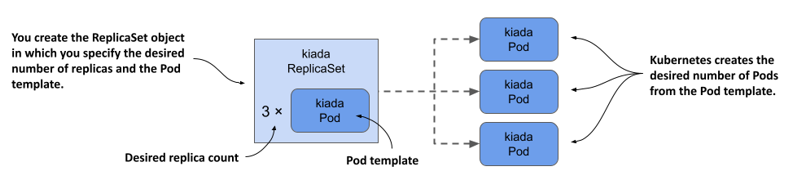
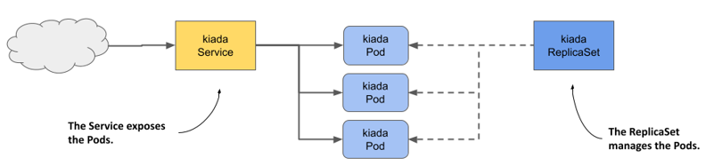
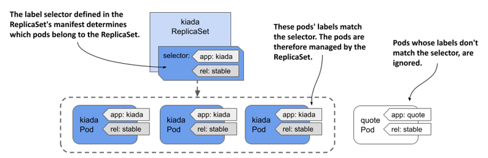
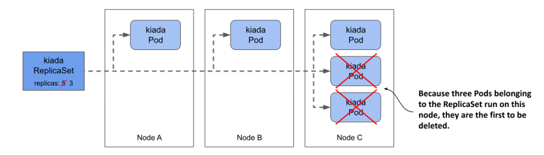
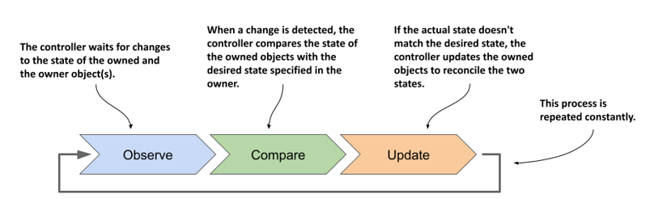
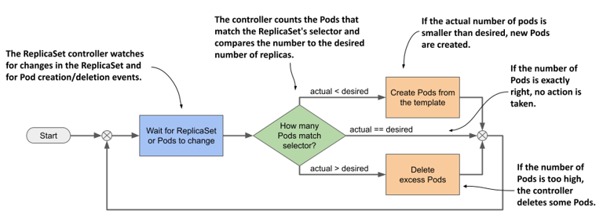
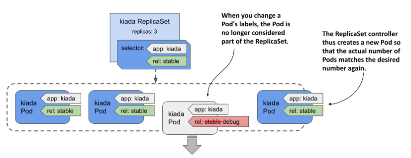

# 13 Nhân bản Pod bằng ReplicaSet

### Chương này bao gồm

- Nhân bản các Pod bằng đối tượng ReplicaSet
- Duy trì các Pod hoạt động bình thường khi các node trong cụm gặp sự cố
- Vòng lặp kiểm soát hòa giải (reconciliation control loop) trong các Kubernetes controller
- Quyền sở hữu đối tượng API và quá trình thu gom rác (garbage collection)

Từ đầu cuốn sách đến nay, bạn đã triển khai các khối lượng công việc (workload) bằng cách trực tiếp tạo ra các đối tượng Pod. Trong một cụm chạy trên môi trường thực tế (production cluster), bạn có thể cần phải triển khai hàng chục hoặc thậm chí hàng trăm bản sao của cùng một Pod, do đó việc tạo và quản lý thủ công các Pod đó sẽ vô cùng khó khăn. Rất may, trong Kubernetes, bạn có thể tự động hóa việc tạo và quản lý các bản sao Pod này bằng đối tượng ReplicaSet.

##### Note

Trước khi ReplicaSet được giới thiệu, chức năng tương tự được cung cấp bởi loại đối tượng ReplicationController (hiện đã bị loại bỏ). ReplicationController hoạt động hoàn toàn giống như một ReplicaSet, vì vậy tất cả những gì được giải thích trong chương này cũng áp dụng cho ReplicationController.

Trước khi bắt đầu, hãy đảm bảo rằng các Pod, Service và các đối tượng khác của bộ ứng dụng Kiada đã hiện diện trong cụm của bạn. Nếu bạn đã thực hành theo các bài tập ở chương trước, chúng đã có sẵn ở đó. Nếu chưa, bạn có thể tạo chúng bằng cách tạo namespace `kiada` và áp dụng tất cả các manifest trong thư mục `Chapter13/SETUP/` bằng lệnh sau:

```shell
$ kubectl apply -f SETUP -R
```

##### NOTE

Bạn có thể tìm thấy các file mã nguồn cho chương này tại <https://github.com/luksa/kubernetes-in-action-2nd-edition/tree/master/Chapter13>.

## 13.1 Giới thiệu về ReplicaSet

Một ReplicaSet đại diện cho một nhóm các bản sao Pod (các bản sao chính xác của một Pod). Thay vì tạo từng Pod một, bạn có thể tạo một đối tượng ReplicaSet, trong đó bạn chỉ định một mẫu Pod (Pod template) và số lượng bản sao mong muốn, sau đó để Kubernetes tự động tạo các Pod đó, như minh họa trong hình dưới đây.

##### Figure 13.1 Tóm tắt về ReplicaSet



ReplicaSet cho phép bạn quản lý các Pod như một đơn vị duy nhất, nhưng chức năng của nó chỉ dừng lại ở đó. Nếu bạn muốn hiển thị các Pod này như một thực thể duy nhất ra bên ngoài, bạn vẫn cần đến một đối tượng Service. Như bạn có thể thấy trong hình tiếp theo, mỗi nhóm Pod cung cấp một dịch vụ cụ thể thường cần cả một ReplicaSet và một đối tượng Service đi kèm.

##### Figure 13.2 Mối quan hệ giữa Service, ReplicaSet và Pod.



Và cũng giống như Service, label selector của ReplicaSet và các nhãn (label) của Pod sẽ quyết định những Pod nào thuộc về ReplicaSet đó. Như được hiển thị trong hình dưới đây, một ReplicaSet chỉ quan tâm đến các Pod khớp với label selector của nó và bỏ qua những Pod còn lại.

##### Figure 13.3 Một ReplicaSet chỉ quan tâm đến các Pod khớp với label selector của nó



Dựa trên những thông tin từ trước đến nay, bạn có thể nghĩ rằng mình chỉ sử dụng ReplicaSet khi muốn tạo nhiều bản sao của một Pod, nhưng thực tế không phải vậy. Ngay cả khi bạn chỉ cần tạo một Pod duy nhất, việc tạo thông qua ReplicaSet vẫn tốt hơn là tạo trực tiếp, bởi vì ReplicaSet đảm bảo rằng Pod đó luôn hoạt động để thực hiện nhiệm vụ của mình.

Hãy tưởng tượng bạn tạo trực tiếp một Pod cho một dịch vụ quan trọng, rồi sau đó node chạy Pod đó gặp sự cố khi bạn không có mặt ở đó. Dịch vụ của bạn sẽ bị ngừng hoạt động cho đến khi bạn tạo lại Pod. Nếu bạn triển khai Pod đó thông qua một ReplicaSet, nó sẽ tự động tạo lại Pod. Rõ ràng, việc tạo Pod thông qua ReplicaSet tốt hơn nhiều so với việc tạo trực tiếp.

Tuy nhiên, dù ReplicaSet có hữu ích đến đâu, chúng vẫn không cung cấp đầy đủ những gì bạn cần để vận hành một khối lượng công việc về lâu dài. Đến một lúc nào đó, bạn sẽ muốn nâng cấp ứng dụng lên phiên bản mới hơn, và đó là lúc ReplicaSet bộc lộ hạn chế. Vì lý do này, các ứng dụng thường không được triển khai trực tiếp qua ReplicaSet, mà thông qua Deployment – đối tượng cho phép bạn cập nhật chúng một cách khai báo (declaratively). Điều này đặt ra câu hỏi: tại sao bạn cần phải tìm hiểu về ReplicaSet nếu bạn không trực tiếp sử dụng chúng? Câu trả lời là vì hầu hết các tính năng mà Deployment cung cấp đều được thực thi bởi các ReplicaSet mà Kubernetes tạo ra bên dưới nó. Deployment đảm nhận việc cập nhật, nhưng mọi việc khác đều do các ReplicaSet bên dưới xử lý. Do đó, việc hiểu rõ chúng làm gì và hoạt động như thế nào là vô cùng quan trọng.

### 13.1.1 Tạo một ReplicaSet

Hãy bắt đầu bằng cách tạo đối tượng ReplicaSet cho service Kiada. Service này hiện đang chạy trong ba Pod mà bạn đã tạo trực tiếp từ ba manifest Pod riêng biệt, bây giờ bạn sẽ thay thế chúng bằng một manifest ReplicaSet duy nhất. Trước khi bắt đầu viết manifest, hãy xem những trường nào bạn cần chỉ định trong phần `spec`.

#### Giới thiệu về spec của ReplicaSet

ReplicaSet là một đối tượng tương đối đơn giản. Bảng dưới đây giải thích ba trường chính mà bạn cần chỉ định trong phần `spec` của ReplicaSet.

##### Table 13.1 Các trường chính trong đặc tả kỹ thuật (spec) của ReplicaSet

| Tên trường | Mô tả |
| :--- | :--- |
| **replicas** | Số lượng bản sao mong muốn. Khi bạn tạo đối tượng ReplicaSet, Kubernetes sẽ tạo ra số lượng Pod tương ứng từ mẫu Pod. Nó duy trì số lượng Pod này cho đến khi bạn xóa ReplicaSet. |
| **selector** | Label selector chứa một bản đồ (map) các nhãn trong trường con `matchLabels` hoặc một danh sách các yêu cầu của bộ chọn nhãn trong trường con `matchExpressions`. Các Pod khớp với bộ chọn nhãn này được coi là một phần của ReplicaSet này. |
| **template** | Mẫu Pod (Pod template) cho các Pod của ReplicaSet. Khi cần tạo một Pod mới, đối tượng sẽ được tạo bằng cách sử dụng mẫu này. |

Các trường `selector` và `template` là bắt buộc, nhưng bạn có thể bỏ qua trường `replicas`. Nếu bạn bỏ qua, một bản sao duy nhất sẽ được tạo mặc định.

#### Tạo manifest cho đối tượng ReplicaSet

Hãy tạo một manifest đối tượng ReplicaSet cho các Pod Kiada. Đoạn mã dưới đây cho thấy cấu trúc của nó. Bạn có thể tìm thấy manifest này trong file `rs.kiada.yaml`.

##### Listing 13.1 Manifest của đối tượng ReplicaSet kiada

```yaml
apiVersion: apps/v1    #A
kind: ReplicaSet    #A
metadata:
  name: kiada    #B
spec:
  replicas: 5    #C
  selector:    #D
    matchLabels:    #D
      app: kiada    #D
      rel: stable    #D
  template:    #E
    metadata:    #E
      labels:    #E
        app: kiada    #E
        rel: stable    #E
    spec:    #E
      containers:    #E
      - name: kiada    #E
        image: luksa/kiada:0.5    #E
        ...    #E
      volumes:    #E
      - ...    #E
```

ReplicaSet là một phần của nhóm API `apps`, phiên bản `v1`. Như đã giải thích trong bảng trước, trường `replicas` chỉ định rằng ReplicaSet này sẽ tạo ra năm bản sao của Pod bằng cách sử dụng mẫu trong trường `template`.

Bạn sẽ nhận thấy rằng các nhãn (`labels`) trong mẫu Pod khớp với các nhãn trong trường `selector`. Nếu không, Kubernetes API sẽ từ chối ReplicaSet vì các Pod được tạo bằng mẫu này sẽ không được tính vào số lượng bản sao mong muốn, điều này dẫn đến việc tạo ra vô số Pod.

Bạn có nhận thấy rằng không có tên Pod nào trong mẫu không? Đó là vì tên Pod được tạo ra từ tên của ReplicaSet.

Phần còn lại của mẫu khớp chính xác với manifest của các Pod kiada mà bạn đã tạo trong các chương trước. Để tạo ReplicaSet, bạn sử dụng lệnh `kubectl apply` quen thuộc:

```shell
$ kubectl apply -f rs.kiada.yaml
replicaset.apps/kiada created
```

### 13.1.2 Kiểm tra ReplicaSet và các Pod của nó

Để hiển thị thông tin cơ bản về ReplicaSet bạn vừa tạo, hãy sử dụng lệnh `kubectl get` như sau:

```shell
$ kubectl get rs kiada
NAME    DESIRED   CURRENT   READY   AGE
kiada   5         5         5       1m
```

##### Note

Tên viết tắt của replicaset là rs.

Kết quả của lệnh hiển thị số lượng bản sao mong muốn (DESIRED), số lượng bản sao hiện tại (CURRENT) và số lượng bản sao được coi là sẵn sàng (READY) theo báo cáo từ các đầu dò mức độ sẵn sàng (readiness probe) của chúng. Thông tin này lần lượt được đọc từ các trường trạng thái `replicas`, `fullyLabeledReplicas` và `readyReplicas` của đối tượng ReplicaSet. Một trường trạng thái khác có tên là `availableReplicas` cho biết có bao nhiêu bản sao khả dụng, nhưng giá trị của nó không được hiển thị bởi lệnh `kubectl get`.

Nếu bạn chạy lệnh `kubectl get replicasets` với tùy chọn `-o wide`, một số thông tin bổ sung rất hữu ích sẽ được hiển thị. Hãy chạy lệnh dưới đây để xem:

```shell
$ kubectl get rs -o wide
NAME    ...   CONTAINERS    IMAGES                                     SELECTOR
kiada ... kiada,envoy luksa/kiada:0.5,envoyproxy/envoy:v1.14.1 app=kiada,rel=stable
```

Bên cạnh các cột đã hiển thị trước đó, kết quả mở rộng này không chỉ cho biết label selector mà còn hiển thị cả tên container và image được sử dụng trong mẫu Pod. Nhận thấy thông tin này quan trọng như thế nào, thật ngạc nhiên là nó không được hiển thị khi liệt kê các Pod bằng lệnh `kubectl get pods`.

##### Tip

Để xem tên container và image, hãy liệt kê các ReplicaSet bằng tùy chọn `-o wide` thay vì cố gắng lấy thông tin này từ các Pod.

Để xem toàn bộ thông tin chi tiết về một ReplicaSet, hãy sử dụng lệnh `kubectl describe`:

```shell
$ kubectl describe rs kiada
```

Kết quả hiển thị label selector được sử dụng trong ReplicaSet, số lượng Pod và trạng thái của chúng, cùng với toàn bộ mẫu được sử dụng để tạo ra các Pod đó.

#### Liệt kê các Pod trong một ReplicaSet

Kubectl không cung cấp cách trực tiếp để liệt kê các Pod trong một ReplicaSet, nhưng bạn có thể lấy label selector của ReplicaSet và sử dụng nó trong lệnh `kubectl get pods` như sau:

```shell
$ kubectl get po -l app=kiada,rel=stable
NAME          READY   STATUS    RESTARTS   AGE
kiada-001     2/2     Running   0          12m    #A
kiada-002     2/2     Running   0          12m    #A
kiada-003     2/2     Running   0          12m    #A
kiada-86wzp   2/2     Running   0          8s    #B
kiada-k9hn2   2/2     Running   0          8s    #B
```

Trước khi tạo ReplicaSet, bạn đã có ba Pod kiada từ các chương trước và giờ bạn có năm Pod, đó là số lượng bản sao mong muốn được xác định trong ReplicaSet. Nhãn của ba Pod hiện có khớp với label selector của ReplicaSet và đã được ReplicaSet nhận làm con (adopt). Hai Pod bổ sung đã được tạo để đảm bảo số lượng Pod trong nhóm khớp với số lượng bản sao mong muốn.

#### Tìm hiểu cách đặt tên cho các Pod trong một ReplicaSet

Như bạn có thể thấy, tên của hai Pod mới chứa năm ký tự chữ và số ngẫu nhiên thay vì tiếp tục chuỗi số mà bạn đã sử dụng trong tên Pod của mình. Việc Kubernetes gán tên ngẫu nhiên cho các đối tượng mà nó tạo ra là điều hết sức bình thường.

Thậm chí còn có một trường `metadata` đặc biệt cho phép bạn tạo các đối tượng mà không cần cung cấp tên đầy đủ. Thay vì trường `name`, bạn chỉ định tiền tố tên trong trường `generateName`. Bạn đã sử dụng trường này lần đầu tiên ở chương 8, khi bạn chạy lệnh `kubectl create` nhiều lần để tạo ra nhiều bản sao của một Pod và cấp cho mỗi bản sao một cái tên duy nhất. Cách tiếp cận tương tự cũng được áp dụng khi Kubernetes tạo các Pod cho một ReplicaSet.

Khi Kubernetes tạo các Pod cho một ReplicaSet, nó sẽ thiết lập trường `generateName` khớp với tên của ReplicaSet. Sau đó, Kubernetes API server sẽ tạo ra tên đầy đủ và đưa vào trường `name`. Để kiểm chứng điều này, hãy chọn một trong hai Pod được tạo thêm và kiểm tra phần metadata của nó như sau:

```shell
$ kubectl get po kiada-86wzp -o yaml
apiVersion: v1
kind: Pod
metadata:
  generateName: kiada-    #A
  labels:
    ...
  name: kiada-86wzp    #B
  ...
```

Trong trường hợp các Pod của ReplicaSet, việc đặt tên ngẫu nhiên cho Pod là hoàn toàn hợp lý vì các Pod này là những bản sao chính xác của nhau và do đó có thể thay thế cho nhau. Cũng không có khái niệm về thứ tự giữa các Pod này, vì vậy việc sử dụng các số thứ tự liên tiếp là không cần thiết. Ngay cả khi tên Pod trông có vẻ hợp lý ở thời điểm hiện tại, hãy tưởng tượng điều gì sẽ xảy ra nếu bạn xóa một số Pod trong số chúng. Nếu bạn xóa chúng không theo thứ tự, các con số sẽ không còn liên tiếp nữa. Tuy nhiên, đối với các khối lượng công việc có trạng thái (stateful workloads), việc đánh số thứ tự các Pod một cách tuần tự lại có ý nghĩa rất lớn. Đó là những gì xảy ra khi bạn sử dụng đối tượng StatefulSet để tạo Pod. Bạn sẽ tìm hiểu thêm về StatefulSet trong chương 16.

#### Hiển thị log của các Pod trong ReplicaSet

Tên ngẫu nhiên của các Pod trong ReplicaSet khiến việc thao tác với chúng trở nên hơi bất tiện. Ví dụ, để xem log của một trong các Pod này, việc gõ tên Pod khi chạy lệnh `kubectl logs` khá là tẻ nhạt. Nếu ReplicaSet chỉ chứa một Pod duy nhất, việc nhập tên đầy đủ có vẻ không cần thiết. May mắn thay, trong trường hợp này, bạn có thể in log của Pod đó như sau:

```shell
$ kubectl logs rs/kiada -c kiada
```

Vì vậy, thay vì chỉ định tên Pod, bạn nhập `rs/kiada`, trong đó `rs` là chữ viết tắt của ReplicaSet và `kiada` là tên của đối tượng ReplicaSet. Tùy chọn `-c kiada` yêu cầu `kubectl` in log của container `kiada`. Bạn chỉ cần sử dụng tùy chọn này nếu Pod có nhiều hơn một container. Nếu ReplicaSet có nhiều Pod, như trong trường hợp của bạn, chỉ log của một trong các Pod sẽ được hiển thị.

Nếu bạn muốn xem log của tất cả các Pod, bạn có thể chạy lệnh `kubectl logs` kết hợp với label selector. Ví dụ, để xem luồng log (stream) của các container `envoy` trong tất cả các Pod `kiada`, hãy chạy lệnh sau:

```shell
$ kubectl logs -l app=kiada -c envoy
```

Để hiển thị log của tất cả các container, hãy sử dụng tùy chọn `--all-containers` thay vì chỉ định tên container cụ thể. Tất nhiên, nếu bạn đang hiển thị log của nhiều Pod hoặc container cùng một lúc, bạn sẽ không thể biết được mỗi dòng log bắt nguồn từ đâu. Hãy sử dụng tùy chọn `--prefix` để chèn thêm tên của Pod và container vào đầu mỗi dòng log như sau:

```shell
$ kubectl logs -l app=kiada --all-containers --prefix
```

Việc xem log từ nhiều Pod cực kỳ hữu ích khi lưu lượng truy cập được phân chia giữa các Pod và bạn muốn xem mọi yêu cầu nhận được, bất kể Pod nào xử lý yêu cầu đó. Ví dụ, hãy thử xem luồng log bằng lệnh sau:

```shell
$ kubectl logs -l app=kiada -c kiada --prefix -f
```

Bây giờ hãy mở ứng dụng trong trình duyệt web của bạn hoặc sử dụng `curl`. Hãy sử dụng service Ingress, LoadBalancer hoặc NodePort như đã được giải thích ở hai chương trước.

### 13.1.3 Tìm hiểu về quyền sở hữu Pod

Kubernetes đã tạo ra hai Pod mới từ mẫu bạn đã chỉ định trong đối tượng ReplicaSet. Chúng thuộc quyền sở hữu và kiểm soát của ReplicaSet, tương tự như ba Pod bạn đã tạo thủ công trước đó. Bạn có thể thấy điều này khi sử dụng lệnh `kubectl describe` để kiểm tra các Pod. Ví dụ, hãy kiểm tra Pod `kiada-001` như sau:

```shell
$ kubectl describe po kiada-001
Name:         kiada-001
Namespace:    kiada
...
Controlled By:  ReplicaSet/kiada    #A
...
```

Lệnh `kubectl describe` lấy thông tin này từ phần `metadata` trong manifest của Pod. Hãy cùng xem kỹ hơn bằng cách chạy lệnh sau:

```shell
$ kubectl get po kiada-001 -o yaml
apiVersion: v1
kind: Pod
metadata:
  labels:
    app: kiada
    rel: stable
  name: kiada-001
  namespace: kiada
  ownerReferences:    #A
  - apiVersion: apps/v1    #A
    blockOwnerDeletion: true    #A
    controller: true    #A
    kind: ReplicaSet    #A
    name: kiada    #A
    uid: 8e19d9b3-bbf1-4830-b0b4-da81dd0e6e22    #A
  resourceVersion: "527511"
  uid: d87afa5c-297d-4ccb-bb0a-9eb48670673f
spec:
  ...
```

Phần `metadata` trong manifest của đối tượng đôi khi chứa trường `ownerReferences`, trường này chứa các tham chiếu đến (những) chủ sở hữu của đối tượng đó. Trường này có thể chứa nhiều chủ sở hữu, nhưng hầu hết các đối tượng chỉ có một chủ sở hữu duy nhất, giống như Pod `kiada-001`. Trong trường hợp của Pod này, ReplicaSet `kiada` là *chủ sở hữu* (owner), và Pod được gọi là *đối tượng phụ thuộc* (dependent).

Kubernetes có một bộ thu gom rác (garbage collector) tự động xóa các đối tượng phụ thuộc khi chủ sở hữu của chúng bị xóa. Nếu một đối tượng có nhiều chủ sở hữu, nó sẽ bị xóa khi tất cả các chủ sở hữu của nó không còn nữa. Nếu bạn xóa đối tượng ReplicaSet sở hữu Pod `kiada-001` và các Pod khác, bộ thu gom rác cũng sẽ xóa các Pod này.

Một tham chiếu chủ sở hữu cũng có thể chỉ ra chủ sở hữu nào là bộ điều khiển (controller) của đối tượng. Pod `kiada-001` được kiểm soát bởi ReplicaSet `kiada`, như được chỉ ra bởi dòng `controller: true` trong manifest. Điều này có nghĩa là bạn không nên tiếp tục kiểm soát trực tiếp ba Pod này nữa, mà phải thông qua đối tượng ReplicaSet.

## 13.2 Cập nhật một ReplicaSet

Trong một ReplicaSet, bạn chỉ định số lượng bản sao mong muốn, một mẫu Pod và một bộ chọn nhãn (label selector). Bộ chọn này là bất biến (immutable), nhưng bạn có thể cập nhật hai thuộc tính còn lại. Bằng cách thay đổi số lượng bản sao mong muốn, bạn sẽ thay đổi quy mô (scale) của ReplicaSet. Hãy xem điều gì xảy ra khi bạn làm điều đó.

### 13.2.1 Thay đổi quy mô (Scaling) một ReplicaSet

Trong ReplicaSet, bạn đã thiết lập số lượng bản sao mong muốn là năm, và đó cũng là số lượng Pod hiện thuộc sở hữu của ReplicaSet. Tuy nhiên, bây giờ bạn có thể cập nhật đối tượng ReplicaSet để thay đổi con số này. Bạn có thể làm điều này bằng cách thay đổi giá trị trong file manifest rồi áp dụng lại, hoặc bằng cách chỉnh sửa trực tiếp đối tượng bằng lệnh `kubectl edit`. Dù vậy, cách dễ nhất để thay đổi quy mô một ReplicaSet là sử dụng lệnh `kubectl scale`.

#### Thay đổi quy mô ReplicaSet bằng lệnh kubectl scale

Hãy tăng số lượng Pod kiada lên sáu. Để làm được điều này, hãy thực thi lệnh sau:

```shell
$ kubectl scale rs kiada --replicas 6
replicaset.apps/kiada scaled
```

Bây giờ hãy kiểm tra lại ReplicaSet để xác nhận rằng nó hiện đã có sáu Pod:

```shell
$ kubectl get rs kiada
NAME    DESIRED   CURRENT   READY   AGE
kiada   6         6         5       10m
```

Các cột chỉ ra rằng ReplicaSet hiện được cấu hình với sáu Pod, và đây cũng là số lượng Pod hiện tại. Một trong các Pod vẫn chưa sẵn sàng, nhưng đó chỉ là vì nó vừa mới được tạo ra. Hãy liệt kê lại các Pod để xác nhận rằng một thực thể Pod bổ sung đã được tạo:

```shell
$ kubectl get po -l app=kiada,rel=stable
NAME          READY   STATUS    RESTARTS   AGE
kiada-001     2/2     Running   0          22m
kiada-002     2/2     Running   0          22m
kiada-003     2/2     Running   0          22m
kiada-86wzp   2/2     Running   0          10m
kiada-dmshr   2/2     Running   0          11s    #A
kiada-k9hn2   2/2     Running   0          10m
```

Đúng như kỳ vọng, một Pod mới đã được tạo ra, nâng tổng số Pod lên con số sáu mong muốn. Nếu ứng dụng này phục vụ người dùng thực tế và bạn cần tăng quy mô lên một trăm Pod hoặc hơn do lưu lượng truy cập tăng đột biến, bạn có thể thực hiện điều đó trong nháy mắt bằng chính lệnh này. Tuy nhiên, cụm của bạn có thể không đủ tài nguyên để gánh vác ngần ấy Pod.

#### Thu nhỏ quy mô (Scaling down)

Tương tự như việc mở rộng quy mô một ReplicaSet, bạn cũng có thể thu nhỏ quy mô của nó bằng chính lệnh đó. Bạn cũng có thể thay đổi quy mô của một ReplicaSet bằng cách chỉnh sửa manifest của nó bằng `kubectl edit`. Hãy thu nhỏ nó xuống còn bốn bản sao bằng phương pháp này. Hãy chạy lệnh sau:

```shell
$ kubectl edit rs kiada
```

Thao tác này sẽ mở manifest của đối tượng ReplicaSet trong trình soạn thảo văn bản của bạn. Hãy tìm trường `replicas` và thay đổi giá trị thành `4`. Lưu file lại và đóng trình soạn thảo để `kubectl` có thể gửi manifest đã cập nhật lên Kubernetes API. Xác minh rằng bạn hiện chỉ còn bốn Pod:

```shell
$ kubectl get pods -l app=kiada,rel=stable
NAME          READY   STATUS        RESTARTS   AGE
kiada-001     2/2     Running       0          28m
kiada-002     2/2     Running       0          28m
kiada-003     2/2     Running       0          28m
kiada-86wzp   0/2     Terminating   0          16m    #A
kiada-dmshr   2/2     Terminating   0          125m    #A
kiada-k9hn2   2/2     Running       0          16m
```

Đúng như dự đoán, hai trong số các Pod đang bị chấm dứt (Terminating) và sẽ biến mất khi các tiến trình trong container của chúng ngừng hoạt động. Nhưng làm thế nào Kubernetes quyết định được Pod nào sẽ bị loại bỏ? Phải gỡ bỏ ngẫu nhiên chăng?

#### Tìm hiểu những Pod nào bị xóa trước khi thu nhỏ quy mô một ReplicaSet

Khi bạn thu nhỏ quy mô một ReplicaSet, Kubernetes tuân theo một số quy tắc được tính toán kỹ lưỡng để quyết định Pod nào sẽ bị xóa trước tiên. Nó xóa các Pod theo thứ tự ưu tiên sau:

1. Các Pod chưa được gán cho một node nào.
2. Các Pod có trạng thái (phase) không xác định.
3. Các Pod chưa sẵn sàng.
4. Các Pod có chi phí xóa (deletion cost) thấp hơn.
5. Các Pod được đặt cùng vị trí (collocated) với số lượng lớn hơn các bản sao liên quan khác.
6. Các Pod có thời gian ở trạng thái sẵn sàng ngắn hơn.
7. Các Pod có số lần khởi động lại container nhiều hơn.
8. Các Pod được tạo muộn hơn các Pod khác.

Những quy tắc này đảm bảo rằng các Pod chưa được lên lịch chạy và các Pod bị lỗi sẽ bị xóa trước, trong khi những Pod đang hoạt động ổn định sẽ được giữ lại. Bạn cũng có thể chủ động can thiệp vào việc Pod nào bị xóa trước bằng cách thiết lập annotation `controller.kubernetes.io/pod-deletion-cost` trên các Pod của mình. Giá trị của annotation này phải là một chuỗi ký tự có thể phân tích cú pháp thành số nguyên 32-bit. Các Pod không có annotation này và các Pod có giá trị thấp hơn sẽ bị xóa trước các Pod có giá trị cao hơn.

Kubernetes cũng cố gắng giữ cho các Pod được phân phối đều trên các node trong cụm. Hình dưới đây minh họa một ví dụ khi ReplicaSet được thu nhỏ quy mô từ năm xuống ba bản sao. Vì node thứ ba đang chạy hai bản sao cùng vị trí – nhiều hơn hai node còn lại – nên các Pod trên node thứ ba sẽ bị xóa trước tiên. Nếu quy tắc này không tồn tại, bạn có thể rơi vào tình huống cả ba bản sao đều nằm tập trung trên một node duy nhất.

##### Figure 13.4 Kubernetes giữ cho các Pod liên quan được phân phối đều trên các node của cụm.



#### Thu nhỏ quy mô về bằng không

Trong một số trường hợp, việc thu nhỏ số lượng bản sao về bằng không là rất hữu ích. Tất cả các Pod do ReplicaSet quản lý sẽ bị xóa sạch, nhưng bản thân đối tượng ReplicaSet vẫn tồn tại và có thể được tăng quy mô trở lại bất cứ lúc nào. Bạn có thể thử nghiệm điều này ngay bây giờ bằng cách chạy các lệnh sau:

```shell
$ kubectl scale rs kiada --replicas 0    #A
replicaset.apps/kiada scaled
 
$ kubectl get po -l app=kiada    #B
No resources found in kiada namespace.    #B
 
$ kubectl scale rs kiada --replicas 2    #C
replicaset.apps/kiada scaled
 
$ kubectl get po -l app=kiada
NAME          READY   STATUS    RESTARTS   AGE    #D
kiada-dl7vz   2/2     Running   0          6s    #D
kiada-dn9fb   2/2     Running   0          6s    #D
```

Như bạn sẽ thấy trong chương tiếp theo, một ReplicaSet được thu nhỏ về bằng không là điều rất thường thấy khi ReplicaSet đó thuộc sở hữu của một đối tượng Deployment.

##### Tip

Nếu bạn cần tạm thời dừng tất cả các thực thể trong khối lượng công việc của mình, hãy đặt số lượng bản sao mong muốn thành 0 thay vì xóa đối tượng ReplicaSet.

### 13.2.2 Cập nhật mẫu Pod

Trong chương tiếp theo, bạn sẽ tìm hiểu về đối tượng Deployment, đối tượng này khác với ReplicaSet ở cách nó xử lý các bản cập nhật mẫu Pod (Pod template). Sự khác biệt này chính là lý do tại sao bạn thường quản lý các Pod bằng Deployment chứ không phải ReplicaSet. Do đó, việc chứng kiến những gì ReplicaSet không thể làm là rất quan trọng.

#### Chỉnh sửa mẫu Pod của một ReplicaSet

Các Pod kiada hiện có các nhãn cho biết tên ứng dụng và loại bản phát hành (liệu đó là bản phát hành ổn định hay thứ gì khác). Sẽ thật tuyệt nếu có một nhãn chỉ ra số phiên bản chính xác, để bạn có thể dễ dàng phân biệt giữa chúng khi chạy các phiên bản khác nhau cùng một lúc.

Để thêm một nhãn vào các Pod mà ReplicaSet tạo ra, bạn phải thêm nhãn đó vào mẫu Pod (Pod template) của nó. Bạn không thể thêm nhãn này bằng lệnh `kubectl label`, vì khi đó nó sẽ được thêm vào chính ReplicaSet chứ không phải vào mẫu Pod. Không có lệnh `kubectl` nào thực hiện trực tiếp việc này, vì vậy bạn phải chỉnh sửa manifest bằng `kubectl edit` như đã làm trước đó. Hãy tìm trường `template` và thêm khóa nhãn `ver` với giá trị `0.5` vào trường `metadata.labels` trong mẫu, như được hiển thị ở đoạn mã dưới đây.

##### Listing 13.2 Thêm nhãn vào mẫu Pod

```yaml
apiVersion: apps/v1
kind: ReplicaSet
metadata:
  ...
spec:
  replicas: 2
  selector:    #A
    matchLabels:    #A
      app: kiada    #A
      rel: stable    #A
  template:
    metadata:
      labels:
        app: kiada
        rel: stable
        ver: '0.5'    #B
    spec:
      ...
```

Đảm bảo bạn thêm nhãn vào đúng vị trí. Đừng thêm nhãn vào phần selector, vì điều này sẽ khiến Kubernetes API từ chối bản cập nhật của bạn do selector là bất biến. Số phiên bản phải được đặt trong dấu nháy đơn, nếu không bộ phân tích cú pháp YAML sẽ hiểu đó là một số thập phân và quá trình cập nhật sẽ thất bại, vì giá trị của nhãn bắt buộc phải là một chuỗi ký tự. Lưu file lại và đóng trình soạn thảo để `kubectl` gửi manifest đã cập nhật lên API server.

##### Note

Bạn có nhận thấy rằng các nhãn trong mẫu Pod và các nhãn trong selector không hoàn toàn giống hệt nhau không? Chúng không nhất thiết phải giống hệt nhau, nhưng các nhãn trong selector bắt buộc phải là một tập hợp con (subset) của các nhãn trong mẫu Pod.

#### Tìm hiểu cách sử dụng mẫu Pod của ReplicaSet

Bạn đã cập nhật mẫu Pod, giờ hãy kiểm tra xem thay đổi này đã được phản ánh lên các Pod hay chưa. Hãy liệt kê các Pod cùng nhãn của chúng như sau:

```shell
$ kubectl get pods -l app=kiada --show-labels
NAME          READY   STATUS    RESTARTS   AGE   LABELS
kiada-dl7vz   2/2     Running   0          10m   app=kiada,rel=stable
kiada-dn9fb   2/2     Running   0          10m   app=kiada,rel=stable
```

Vì các Pod vẫn chỉ mang hai nhãn từ mẫu Pod ban đầu, rõ ràng là Kubernetes đã không cập nhật chúng. Tuy nhiên, nếu bây giờ bạn tăng số lượng bản sao (scale up) của ReplicaSet thêm một đơn vị, Pod mới được tạo ra sẽ chứa nhãn mà bạn vừa thêm vào, như dưới đây:

```
$ kubectl scale rs kiada --replicas 3
replicaset.apps/kiada scaled
 
$ kubectl get pods -l app=kiada --show-labels
NAME          READY   STATUS    RESTARTS   AGE   LABELS
kiada-dl7vz   2/2     Running   0          14m   app=kiada,rel=stable
kiada-dn9fb   2/2     Running   0          14m   app=kiada,rel=stable
kiada-z9dp2   2/2     Running   0          47s   app=kiada,rel=stable,ver=0.5    #A
```

Hãy hình dung mẫu Pod giống như một chiếc khuôn cắt bánh quy mà Kubernetes dùng để dập ra các Pod mới. Khi bạn thay đổi mẫu Pod, thực chất chỉ có chiếc khuôn cắt là thay đổi, và điều đó chỉ ảnh hưởng đến những Pod được tạo ra sau thời điểm ấy.

## 13.3 Tìm hiểu nguyên lý hoạt động của bộ điều khiển ReplicaSet

Trong các phần trước, bạn đã thấy việc thay đổi trường `replicas` và `template` trong đối tượng ReplicaSet thúc đẩy Kubernetes thực hiện các hành động tương ứng với các Pod thuộc quyền quản lý của ReplicaSet đó như thế nào. Thành phần Kubernetes chịu trách nhiệm thực thi các hành động này được gọi là bộ điều khiển (*controller*). Hầu hết các loại đối tượng mà bạn tạo ra thông qua API của cụm đều đi kèm với một bộ điều khiển tương ứng. Ví dụ, trong chương trước, bạn đã tìm hiểu về bộ điều khiển Ingress quản lý các đối tượng Ingress. Ngoài ra còn có bộ điều khiển Endpoints cho các đối tượng Endpoints, bộ điều khiển Namespace cho các đối tượng Namespace, v.v.

Không ngoài dự đoán, ReplicaSet được quản lý bởi bộ điều khiển ReplicaSet. Bất kỳ thay đổi nào bạn thực hiện đối với đối tượng ReplicaSet đều được bộ điều khiển này phát hiện và xử lý. Khi bạn điều chỉnh quy mô (scale) của ReplicaSet, chính bộ điều khiển sẽ đảm nhận việc tạo mới hoặc xóa bỏ các Pod. Mỗi lần thực hiện công việc này, nó cũng đồng thời tạo ra một đối tượng Sự kiện (*Event*) để thông báo cho bạn biết những gì đã diễn ra. Như bạn đã biết ở chương 4, bạn có thể xem các sự kiện liên quan đến một đối tượng ở phần cuối kết quả của lệnh `kubectl describe` như trong đoạn mã dưới đây, hoặc sử dụng lệnh `kubectl get events` để liệt kê cụ thể các đối tượng Sự kiện.

```
$ kubectl describe rs kiada
...
Events:
  Type    Reason            Age   From                   Message
  ----    ------            ----  ----                   -------
  Normal  SuccessfulDelete  34m   replicaset-controller  Deleted pod: kiada-k9hn2    #A
  Normal  SuccessfulCreate  30m   replicaset-controller  Created pod: kiada-dl7vz    #B
  Normal  SuccessfulCreate  30m   replicaset-controller  Created pod: kiada-dn9fb    #B
  Normal  SuccessfulCreate  16m   replicaset-controller  Created pod: kiada-z9dp2    #B
```

Để thực sự hiểu rõ về ReplicaSet, bạn phải nắm được cách thức hoạt động của bộ điều khiển quản lý chúng.

### 13.3.1 Giới thiệu về vòng lặp điều hòa trạng thái

Như minh họa trong hình dưới đây, bộ điều khiển liên tục giám sát trạng thái của cả đối tượng sở hữu (chủ thể) lẫn các đối tượng phụ thuộc. Sau mỗi thay đổi về trạng thái, bộ điều khiển sẽ so sánh trạng thái thực tế của các đối tượng phụ thuộc với trạng thái mong muốn được chỉ định trong đối tượng sở hữu. Nếu có sự khác biệt giữa hai trạng thái này, bộ điều khiển sẽ tiến hành các thay đổi trên (các) đối tượng phụ thuộc để đưa chúng về trạng thái đồng nhất. Đây chính là cơ chế mà chúng ta gọi là vòng lặp điều hòa trạng thái (*reconciliation control loop*) - trái tim vận hành của mọi bộ điều khiển.

##### Hình 13.5 Vòng lặp điều hòa trạng thái của một bộ điều khiển



Vòng lặp điều hòa của bộ điều khiển ReplicaSet bao gồm việc giám sát các đối tượng ReplicaSet và Pod. Mỗi khi có sự thay đổi ở ReplicaSet hoặc Pod, bộ điều khiển sẽ đối chiếu danh sách các Pod liên kết với ReplicaSet đó và đảm bảo số lượng Pod thực tế khớp với số lượng mong muốn được cấu hình trong ReplicaSet. Nếu số lượng Pod thực tế ít hơn số lượng mong muốn, nó sẽ tạo thêm các bản sao mới từ mẫu Pod. Ngược lại, nếu số lượng Pod thực tế vượt quá mức mong muốn, nó sẽ tiến hành xóa bỏ các bản sao thừa. Sơ đồ trong hình tiếp theo sẽ giải thích chi tiết toàn bộ quy trình này.

##### Hình 13.6 Vòng lặp điều hòa của bộ điều khiển ReplicaSet



### 13.3.2 Tìm hiểu cách bộ điều khiển ReplicaSet phản hồi trước các thay đổi của Pod

Bạn đã tận mắt chứng kiến bộ điều khiển phản hồi tức thì ra sao trước những thay đổi ở trường `replicas` của ReplicaSet. Tuy nhiên, đó không phải là con đường duy nhất dẫn đến sự chênh lệch giữa số lượng Pod mong muốn và số lượng thực tế. Sẽ ra sao nếu không một ai chạm vào ReplicaSet, nhưng số lượng Pod thực tế vẫn thay đổi? Nhiệm vụ của bộ điều khiển ReplicaSet là đảm bảo số lượng Pod luôn khớp với con số được chỉ định. Do đó, nó cũng phải vào cuộc trong cả những tình huống như vậy.

#### Xóa một Pod do ReplicaSet quản lý

Hãy cùng xem điều gì sẽ xảy ra nếu bạn xóa một trong các Pod đang chịu sự quản lý của ReplicaSet. Hãy chọn ngẫu nhiên một Pod và xóa nó bằng lệnh `kubectl delete`:

```
$ kubectl delete pod kiada-z9dp2    #A
pod "kiada-z9dp2" deleted
```

Bây giờ, hãy liệt kê lại danh sách các Pod:

```
$ kubectl get pods -l app=kiada
NAME          READY   STATUS    RESTARTS   AGE
kiada-dl7vz   2/2     Running   0          34m
kiada-dn9fb   2/2     Running   0          34m
kiada-rfkqb   2/2     Running   0          47s    #A
```

Pod bạn vừa xóa đã biến mất, nhưng một Pod mới đã lập tức xuất hiện để thế chỗ cho Pod bị thiếu. Số lượng Pod một lần nữa lại khớp với số lượng bản sao mong muốn được thiết lập trong đối tượng ReplicaSet. Một lần nữa, bộ điều khiển ReplicaSet đã phản ứng tức thì và điều hòa trạng thái thực tế về đúng với trạng thái mong muốn.

Ngay cả khi bạn xóa toàn bộ các Pod `kiada`, ba Pod mới cũng sẽ lập tức xuất hiện để tiếp tục phục vụ người dùng của bạn. Bạn có thể kiểm chứng điều này bằng cách chạy lệnh sau:

```
$ kubectl delete pod -l app=kiada
```

#### Tạo một Pod khớp với bộ chọn nhãn của ReplicaSet

Giống như việc bộ điều khiển ReplicaSet tự động tạo thêm Pod mới khi phát hiện số lượng Pod thực tế ít hơn mức cần thiết, nó cũng sẽ xóa bớt Pod đi nếu thấy số lượng vượt quá yêu cầu. Bạn đã thấy điều này xảy ra khi chúng ta giảm số lượng bản sao mong muốn, nhưng chuyện gì sẽ xảy ra nếu bạn tự tay tạo ra một Pod khớp với bộ chọn nhãn của ReplicaSet? Dưới góc nhìn của bộ điều khiển, một trong các Pod hiện tại buộc phải biến mất để duy trì thế cân bằng.

Hãy thử tạo một Pod có tên là `one-kiada-too-many`. Tên của Pod này không khớp với phần tiền tố mà bộ điều khiển thường gán cho các Pod của ReplicaSet, nhưng các nhãn (*labels*) của nó lại hoàn toàn trùng khớp với bộ chọn nhãn (*label selector*) của ReplicaSet. Bạn có thể tìm thấy tệp manifest của Pod này trong tệp `pod.one-kiada-too-many.yaml`. Hãy áp dụng tệp manifest này bằng lệnh `kubectl apply` để tạo Pod, rồi ngay lập tức liệt kê các Pod `kiada` như sau:

```
$ kubectl get po -l app=kiada
NAME                 READY   STATUS        RESTARTS   AGE
kiada-jp4vh          2/2     Running       0          11m
kiada-r4k9f          2/2     Running       0          11m
kiada-shfgj          2/2     Running       0          11m
one-kiada-too-many   0/2     Terminating   0          3s    #A
```

Đúng như dự đoán, bộ điều khiển ReplicaSet đã ra lệnh xóa Pod này ngay khi phát hiện ra nó. Bộ điều khiển thực sự không hề "ưa" việc bạn tự ý tạo ra các Pod trùng khớp với bộ chọn nhãn của một ReplicaSet đang hoạt động. Như bạn đã thấy, tên của Pod hoàn toàn không quan trọng. Thứ quyết định ở đây chỉ là các nhãn của Pod mà thôi.

#### Điều gì xảy ra khi một nút chạy Pod của ReplicaSet gặp sự cố?

Trong các ví dụ trước, bạn đã thấy cách bộ điều khiển ReplicaSet phản ứng khi có ai đó can thiệp vào các Pod của nó. Dù các ví dụ này đã minh họa rất tốt cơ chế hoạt động của bộ điều khiển ReplicaSet, nhưng chúng vẫn chưa thực sự lột tả được lợi ích cốt lõi của việc sử dụng ReplicaSet để vận hành các Pod. Lý do thuyết phục nhất để khởi tạo Pod thông qua một ReplicaSet thay vì tạo trực tiếp là các Pod sẽ tự động được thay thế khi các nút (*node*) trong cụm của bạn gặp sự cố.

##### Cảnh báo

Trong ví dụ tiếp theo, chúng ta sẽ giả lập sự cố trên một nút của cụm. Trong một cụm cấu hình kém, hành động này có thể khiến toàn bộ cụm bị sập. Do đó, bạn chỉ nên thực hiện bài thực hành này nếu sẵn sàng xây dựng lại cụm từ đầu trong trường hợp cần thiết.

Để quan sát chuyện gì xảy ra khi một nút ngừng phản hồi, bạn có thể vô hiệu hóa giao diện mạng của nó. Nếu bạn khởi tạo cụm của mình bằng công cụ `kind`, bạn có thể vô hiệu hóa giao diện mạng của nút `kind-worker2` bằng lệnh sau:

```
$ docker exec kind-worker2 ip link set eth0 down
```

##### Lưu ý

Hãy chọn một nút đang chạy ít nhất một Pod `kiada` của bạn. Hãy liệt kê các Pod với tùy chọn `-o wide` để xem mỗi Pod đang chạy trên nút nào.

##### Lưu ý

Nếu đang sử dụng GKE, bạn có thể đăng nhập vào nút bằng lệnh `gcloud compute ssh` và tắt giao diện mạng của nó bằng lệnh `sudo ifconfig eth0 down`. Phiên kết nối SSH sẽ ngừng phản hồi, vì vậy bạn cần đóng nó bằng cách nhấn phím Enter, theo sau là tổ hợp phím "~." (dấu ngã và dấu chấm, không bao gồm dấu ngoặc kép).

Chẳng bao lâu sau, trạng thái của đối tượng Node đại diện cho nút đó trong cụm sẽ chuyển sang `NotReady`:

```
$ kubectl get node
NAME                 STATUS     ROLES                  AGE    VERSION
kind-control-plane   Ready      control-plane,master   2d3h   v1.21.1
kind-worker          Ready      <none>                 2d3h   v1.21.1
kind-worker2         NotReady   <none>                 2d3h   v1.21.1    #A
```

Trạng thái này cho biết tác nhân Kubelet chạy trên nút đã lâu không liên lạc với API server. Vì đây chưa phải là bằng chứng rõ ràng cho thấy nút đã hoàn toàn "sập" (đó có thể chỉ là một sự cố mạng tạm thời), nên nó chưa lập tức ảnh hưởng đến trạng thái của các Pod đang chạy trên nút đó. Chúng vẫn tiếp tục hiển thị trạng thái `Running`. Tuy nhiên, sau vài phút, Kubernetes nhận ra nút này thực sự đã mất kết nối và sẽ đánh dấu các Pod trên đó để chuẩn bị xóa bỏ.

##### Lưu ý

Khoảng thời gian trễ từ lúc một nút rơi vào trạng thái ngoại tuyến cho đến khi các Pod của nó bị xóa có thể được cấu hình thông qua cơ chế *Taints và Tolerations* (Vết bẩn và Dung thứ), sẽ được giải thích chi tiết trong chương 23.

Một khi các Pod bị đánh dấu để xóa, bộ điều khiển ReplicaSet sẽ khởi tạo các Pod mới để thay thế chúng. Bạn có thể quan sát điều này trong kết quả đầu ra dưới đây.

```
$ kubectl get pods -l app=kiada -o wide
NAME          READY   STATUS        RESTARTS   AGE   IP             NODE
kiada-ffstj   2/2     Running       0          35s   10.244.1.150   kind-worker    #A
kiada-l2r85   2/2     Terminating   0          37m   10.244.2.173   kind-worker2    #B
kiada-n98df   2/2     Terminating   0          37m   10.244.2.174   kind-worker2    #B
kiada-vnc4b   2/2     Running       0          37m   10.244.1.148   kind-worker
kiada-wkpsn   2/2     Running       0          35s   10.244.1.151   kind-worker    #A
```

Như bạn thấy trong kết quả hiển thị, hai Pod trên nút `kind-worker2` được đánh dấu là `Terminating` (Đang chấm dứt) và đã được thay thế bằng hai Pod mới được lập lịch chạy trên nút khỏe mạnh `kind-worker`. Một lần nữa, hệ thống lại đảm bảo có đúng ba bản sao Pod hoạt động như cấu hình trong ReplicaSet.

Hai Pod đang bị xóa sẽ tiếp tục duy trì ở trạng thái `Terminating` cho đến khi nút đó trực tuyến trở lại. Trên thực tế, các container trong những Pod này vẫn đang chạy vì Kubelet trên nút đó không thể giao tiếp với API server, nên hoàn toàn không biết rằng chúng cần phải bị hủy. Dẫu vậy, khi giao diện mạng của nút được khôi phục, Kubelet sẽ lập tức chấm dứt các container này và các đối tượng Pod sẽ chính thức bị xóa bỏ khỏi hệ thống. Các lệnh sau đây sẽ khôi phục giao diện mạng của nút:

```
$ docker exec kind-worker2 ip link set eth0 up
$ docker exec kind-worker2 ip route add default via 172.18.0.1
```

Cụm của bạn có thể đang sử dụng một IP cổng mặc định (gateway IP) khác với `172.18.0.1`. Để tìm địa chỉ này, hãy chạy lệnh sau:

```
$ docker network inspect kind -f '{{ (index .IPAM.Config 0).Gateway }}'
```

##### Lưu ý

Nếu bạn đang sử dụng GKE, bạn phải khởi động lại nút từ xa bằng lệnh `gcloud compute instances reset <tên-nút>`.

#### Trường hợp nào các Pod không được thay thế?

Các phần trước đã chứng minh rằng bộ điều khiển ReplicaSet luôn đảm bảo số lượng Pod khỏe mạnh thực tế khớp với con số quy định trong đối tượng ReplicaSet. Thế nhưng điều này có phải lúc nào cũng đúng? Liệu có khi nào hệ thống rơi vào trạng thái số lượng Pod thì đủ, nhưng chúng lại hoàn toàn mất khả năng cung cấp dịch vụ cho khách hàng không?

Bạn còn nhớ các bộ dò liveness (sống sót) và readiness (sẵn sàng) chứ? Nếu bộ dò liveness của một container thất bại, container đó sẽ bị khởi động lại. Nếu bộ dò thất bại liên tiếp nhiều lần, hệ thống sẽ áp dụng một khoảng thời gian chờ tăng dần (delay) trước khi thử khởi động lại lần nữa. Điều này là do cơ chế trì hoãn tăng lũy tiến (*exponential backoff*) đã được giải thích ở chương 6. Trong thời gian chờ này, container sẽ ngừng hoạt động lâm thời. Tuy nhiên, hệ thống vẫn giả định rằng container cuối cùng sẽ hoạt động bình thường trở lại. Tương tự, nếu container thất bại ở bộ dò readiness thay vì liveness, hệ thống cũng mặc định rằng sự cố rồi sẽ tự khắc phục được.

Vì lý do đó, những Pod có container liên tục bị sập hoặc thất bại khi kiểm tra dò lỗi sẽ không bao giờ tự động bị xóa đi, ngay cả khi bộ điều khiển ReplicaSet dư sức thay thế chúng bằng những Pod mới hoạt động ổn định hơn. Do đó, hãy lưu ý rằng ReplicaSet không hề đảm bảo bạn sẽ luôn có đủ số lượng bản sao *khỏe mạnh* như đã khai báo trong cấu hình.

Bạn có thể tự mình kiểm chứng điều này bằng cách chủ động làm cho bộ dò readiness của một trong các Pod bị thất bại bằng lệnh sau:

```
$ kubectl exec rs/kiada -c kiada -- curl -X POST localhost:9901/healthcheck/fail
```

##### Lưu ý

Nếu bạn chỉ định tên ReplicaSet thay vì tên Pod cụ thể khi chạy lệnh `kubectl exec`, lệnh được yêu cầu sẽ chỉ thực thi trên một trong các Pod thuộc nhóm đó (chứ không phải tất cả), tương tự như cơ chế hoạt động của lệnh `kubectl logs`.

Sau khoảng ba mươi giây, lệnh `kubectl get pods` sẽ hiển thị thông tin cho thấy một trong các container của Pod không còn ở trạng thái sẵn sàng nữa:

```
$ kubectl get pods -l app=kiada
NAME          READY   STATUS    RESTARTS   AGE
kiada-78j7m   1/2     Running   0          21m    #A
kiada-98lmx   2/2     Running   0          21m
kiada-wk99p   2/2     Running   0          21m
```

Pod này không còn nhận bất kỳ lưu lượng truy cập nào từ phía khách hàng nữa, nhưng bộ điều khiển ReplicaSet vẫn không hề xóa hay thay thế nó, mặc dù bộ điều khiển hoàn toàn nhận biết được rằng chỉ có hai trong số ba Pod là sẵn sàng hoạt động, như hiển thị trong trạng thái của ReplicaSet dưới đây:

```
$ kubectl get rs
NAME    DESIRED   CURRENT   READY   AGE
kiada   3         3         2       2h    #A
```

##### QUAN TRỌNG

ReplicaSet chỉ đảm bảo sự hiện diện của đủ số lượng Pod mong muốn. Nó không hề đảm bảo rằng các container bên trong các Pod đó thực sự đang chạy ổn định và sẵn sàng tiếp nhận lưu lượng truy cập.

Nếu tình huống này xảy ra trên một cụm môi trường sản xuất (production) thực tế và các Pod còn lại không thể gánh nổi toàn bộ lưu lượng tải, bạn sẽ phải tự tay xóa bỏ Pod bị lỗi đó. Nhưng nếu bạn muốn tìm hiểu xem chuyện gì đã xảy ra với Pod đó trước khi loại bỏ nó thì sao? Làm cách nào để thay thế nhanh chóng Pod bị lỗi mà không cần xóa nó đi, giúp bạn có thể thong thả gỡ lỗi (debug)?

Bạn có thể tăng quy mô của ReplicaSet thêm một bản sao, nhưng sau đó lại phải giảm quy mô xuống khi đã hoàn tất việc gỡ lỗi. Thật may mắn, có một giải pháp tối ưu hơn thế nhiều. Nó sẽ được bật mí ngay trong phần tiếp theo.

### 13.3.3 Đưa một Pod ra khỏi tầm kiểm soát của ReplicaSet

Bạn đã biết bộ điều khiển ReplicaSet liên tục giám sát để đảm bảo số lượng Pod khớp với bộ chọn nhãn luôn bằng với số lượng bản sao mong muốn. Do đó, nếu bạn "tách" một Pod ra khỏi nhóm các Pod khớp với bộ chọn nhãn đó, bộ điều khiển sẽ lập tức tạo ra một Pod khác để thế chỗ. Để thực hiện điều này, bạn chỉ đơn giản là thay đổi các nhãn của Pod bị lỗi, giống như mô tả trong hình dưới đây.

##### Hình 13.7 Thay đổi nhãn của một Pod để đưa nó ra khỏi ReplicaSet



Bộ điều khiển ReplicaSet sẽ thay thế Pod đó bằng một Pod hoàn toàn mới, và từ thời điểm đó trở đi, nó sẽ không còn bận tâm đến Pod bị lỗi nữa. Bạn có thể thong thả tìm nguyên nhân sự cố của nó trong khi Pod mới đã tiếp quản lưu lượng truy cập một cách trôi chảy.

Hãy cùng thử nghiệm điều này với Pod mà bạn đã làm cho bộ dò readiness thất bại ở phần trước. Để một Pod khớp với bộ chọn nhãn của ReplicaSet, nó bắt buộc phải mang các nhãn `app=kiada` và `rel=stable`. Những Pod thiếu các nhãn này sẽ không được coi là một phần của ReplicaSet. Do đó, để tách Pod bị hỏng ra khỏi ReplicaSet, bạn cần xóa hoặc thay đổi ít nhất một trong hai nhãn này. Một cách đơn giản là đổi giá trị của nhãn `rel` thành `debug` như sau:

```
$ kubectl label po kiada-78j7m rel=debug --overwrite
```

Vì lúc này chỉ còn lại hai Pod khớp với bộ chọn nhãn (thiếu một Pod so với số lượng bản sao mong muốn), bộ điều khiển sẽ lập tức khởi tạo một Pod mới, như hiển thị trong kết quả dưới đây:

```
$ kubectl get pods -l app=kiada -L app,rel
NAME          READY   STATUS    RESTARTS   AGE   APP     REL
kiada-78j7m   1/2     Running   0          60m   kiada   debug   #A
kiada-98lmx   2/2     Running   0          60m   kiada   stable
kiada-wk99p   2/2     Running   0          60m   kiada   stable
kiada-xtxcl   2/2     Running   0          9s    kiada   stable   #B
```

Như bạn có thể thấy từ các giá trị trong cột `APP` và `REL`, hiện có đúng ba Pod khớp với bộ chọn nhãn, trong khi Pod bị hỏng thì không. Pod bị lỗi này giờ đây không còn nằm dưới sự quản lý của ReplicaSet nữa. Vì vậy, khi đã hoàn tất việc kiểm tra, bạn cần phải tự tay xóa nó đi.

##### Lưu ý

Khi bạn loại bỏ một Pod ra khỏi ReplicaSet, tham chiếu dẫn đến đối tượng ReplicaSet cũng sẽ bị xóa khỏi trường `ownerReferences` của Pod đó.

Giờ đây, sau khi đã chứng kiến cách bộ điều khiển ReplicaSet phản hồi trước mọi sự kiện diễn ra ở phần này và các phần trước, bạn đã nắm vững toàn bộ những kiến thức cần thiết về bộ điều khiển này.

## 13.4 Xóa một ReplicaSet

ReplicaSet đại diện cho một nhóm các bản sao Pod được quản lý như một thực thể thống nhất. Bằng cách khởi tạo đối tượng ReplicaSet, bạn khai báo với hệ thống rằng bạn muốn duy trì một số lượng Pod bản sao nhất định dựa trên một mẫu Pod cụ thể trong cụm của mình. Ngược lại, khi bạn xóa đối tượng ReplicaSet, điều đó đồng nghĩa với việc bạn không còn cần các Pod này nữa. Do đó, khi bạn xóa một ReplicaSet, toàn bộ các Pod thuộc quyền quản lý của nó cũng sẽ bị xóa theo. Công việc này được đảm nhận bởi trình thu gom rác (*garbage collector*), như đã giải thích ở phần trước của chương này.

### 13.4.1 Xóa một ReplicaSet cùng toàn bộ các Pod liên quan

Để xóa một ReplicaSet cùng toàn bộ các Pod mà nó kiểm soát, hãy chạy lệnh sau:

```
$ kubectl delete rs kiada
replicaset.apps "kiada" deleted
```

Đúng như dự kiến, các Pod cũng sẽ bị xóa đi:

```
$ kubectl get pods -l app=kiada
NAME          READY   STATUS        RESTARTS   AGE
kiada-2dq4f   0/2     Terminating   0          7m29s
kiada-f5nff   0/2     Terminating   0          7m29s
kiada-khmj5   0/2     Terminating   0          7m29s
```

Tuy nhiên, trong một số trường hợp, bạn lại không hề muốn điều này xảy ra. Vậy làm thế nào để ngăn trình thu gom rác xóa đi các Pod của bạn? Trước khi đi vào giải pháp, hãy tái tạo lại ReplicaSet bằng cách áp dụng lại tệp `rs.kiada.versionLabel.yaml`.

### 13.4.2 Xóa một ReplicaSet nhưng vẫn giữ nguyên các Pod

Ở phần đầu chương này, bạn đã biết rằng bộ chọn nhãn trong một ReplicaSet là bất biến. Nếu muốn thay đổi bộ chọn nhãn, bạn bắt buộc phải xóa đối tượng ReplicaSet cũ và tạo một đối tượng mới. Tuy nhiên, trong quá trình này, chắc chắn bạn không muốn các Pod bị xóa sạch, vì điều đó sẽ khiến dịch vụ của bạn bị gián đoạn hoàn toàn. Thật may mắn, bạn có thể yêu cầu Kubernetes biến các Pod này thành "mồ côi" (*orphan*) thay vì xóa bỏ chúng.

Để giữ lại các Pod khi xóa đối tượng ReplicaSet, hãy sử dụng lệnh sau:

```
$ kubectl delete rs kiada --cascade=orphan    #A
replicaset.apps "kiada" deleted
```

Bây giờ, nếu bạn liệt kê danh sách các Pod, bạn sẽ thấy chúng vẫn được giữ nguyên vẹn. Khi kiểm tra tệp manifest của chúng, bạn sẽ nhận ra đối tượng ReplicaSet đã được gỡ bỏ khỏi trường `ownerReferences`. Những Pod này hiện đã rơi vào trạng thái "mồ côi", nhưng nếu bạn tạo một ReplicaSet mới có cùng bộ chọn nhãn, nó sẽ lập tức nhận lại và tiếp quản các Pod này dưới trướng của mình. Hãy áp dụng lại tệp `rs.kiada.versionLabel.yaml` một lần nữa để tự mình trải nghiệm điều này.

## 13.5 Tóm tắt

Trong chương này, bạn đã học được rằng:

- Một ReplicaSet đại diện cho một nhóm các Pod giống hệt nhau được quản lý như một thực thể thống nhất. Trong ReplicaSet, bạn khai báo một mẫu Pod, số lượng bản sao mong muốn và một bộ chọn nhãn.
- Hầu hết các loại đối tượng API trong Kubernetes đều đi kèm với một bộ điều khiển tương ứng để xử lý các đối tượng thuộc loại đó. Trong mỗi bộ điều khiển, một vòng lặp điều hòa trạng thái hoạt động liên tục để đưa trạng thái thực tế về trùng khớp với trạng thái mong muốn.
- Bộ điều khiển ReplicaSet đảm bảo số lượng Pod thực tế luôn khớp với số lượng mong muốn được chỉ định trong ReplicaSet. Khi hai con số này có sự chênh lệch, bộ điều khiển sẽ lập tức điều hòa chúng bằng cách khởi tạo hoặc xóa bớt các đối tượng Pod.
- Bạn can thiệp thay đổi số lượng bản sao mong muốn bất cứ lúc nào và bộ điều khiển sẽ thực hiện các bước cần thiết để đáp ứng yêu cầu đó. Tuy nhiên, khi bạn cập nhật mẫu Pod, bộ điều khiển sẽ không tự động cập nhật các Pod hiện có.
- Các Pod được tạo bởi một ReplicaSet sẽ thuộc quyền sở hữu của ReplicaSet đó. Nếu bạn xóa đối tượng sở hữu, các đối tượng phụ thuộc cũng sẽ bị xóa theo bởi trình thu gom rác, trừ khi bạn yêu cầu `kubectl` chuyển chúng sang trạng thái mồ côi.

Trong chương tiếp theo, bạn sẽ thay thế ReplicaSet bằng một đối tượng Deployment.

---

[← Chương 12](12-cong-khai-dich-vu-ra-ngoai-bang-ingress.md) · [Mục lục](README.md) · [Chương 14 →](14-quan-ly-pod-bang-deployment.md)
