# 14 Quản lý Pod bằng Deployment

### Nội dung chính của chương này

- Triển khai các ứng dụng không lưu trạng thái (*stateless workloads*) bằng đối tượng Deployment
- Thay đổi quy mô của Deployment theo chiều ngang (*horizontal scaling*)
- Cập nhật ứng dụng theo phương thức khai báo (*declaratively*)
- Ngăn chặn quá trình triển khai (*rollout*) các ứng dụng bị lỗi
- Áp dụng các chiến lược triển khai (*deployment strategies*) khác nhau

Trong chương trước, bạn đã học cách triển khai các Pod thông qua ReplicaSet. Tuy nhiên, trong thực tế, các ứng dụng rất hiếm khi được triển khai theo cách này bởi vì ReplicaSet không cung cấp các tính năng cần thiết để cập nhật các Pod một cách dễ dàng. Khả năng này được đảm nhận bởi loại đối tượng Deployment. Đến cuối chương này, mỗi dịch vụ trong số ba dịch vụ của bộ ứng dụng Kiada sẽ sở hữu một đối tượng Deployment của riêng mình.

Trước khi bắt đầu, hãy đảm bảo rằng các Pod, Service và các đối tượng khác của bộ ứng dụng Kiada đã hiện diện trong cụm của bạn. Nếu bạn đã thực hiện các bài thực hành trong chương trước, chúng chắc chắn đã sẵn sàng ở đó. Nếu chưa, bạn có thể tạo mới chúng bằng cách tạo không gian tên (*namespace*) `kiada` và áp dụng toàn bộ các tệp manifest trong thư mục `Chapter14/SETUP/` bằng lệnh sau:

```
$ kubectl apply -f SETUP -R
```

##### LƯU Ý

Bạn có thể tìm thấy các tệp mã nguồn cho chương này tại <https://github.com/luksa/kubernetes-in-action-2nd-edition/tree/master/Chapter14>.

## 14.1 Giới thiệu về Deployment

Khi triển khai một ứng dụng lên Kubernetes, bạn thường thực hiện thông qua việc tạo ra một đối tượng Deployment. Bản thân đối tượng Deployment không trực tiếp quản lý các đối tượng Pod, mà nó quản lý chúng thông qua một đối tượng ReplicaSet trung gian được tự động tạo ra đồng thời khi bạn khởi tạo Deployment. Như minh họa ở hình tiếp theo, đối tượng Deployment sẽ kiểm soát ReplicaSet, rồi đến lượt ReplicaSet kiểm soát từng Pod riêng lẻ.

##### Hình 14.1 Mối quan hệ giữa Deployment, ReplicaSet và các Pod.

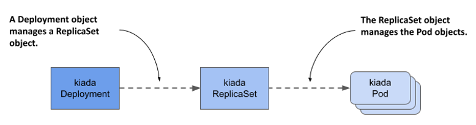

Deployment cho phép bạn cập nhật ứng dụng theo phương thức khai báo (*declarative*). Điều này có nghĩa là thay vì phải tự tay thực hiện một chuỗi các thao tác thủ công phức tạp nhằm thay thế một nhóm Pod cũ bằng các Pod mới chạy phiên bản cập nhật, bạn chỉ cần điều chỉnh cấu hình trong đối tượng Deployment và để cho Kubernetes tự động hóa toàn bộ quá trình cập nhật đó.

Tương tự như ReplicaSet, trong một Deployment, bạn cũng sẽ khai báo một mẫu Pod, số lượng bản sao mong muốn và một bộ chọn nhãn. Các Pod được khởi tạo dựa trên Deployment này là các bản sao hoàn toàn giống hệt nhau và có thể thay thế cho nhau dễ dàng. Vì đặc điểm này cùng nhiều lý do khác, Deployment chủ yếu được sử dụng cho các ứng dụng không lưu trạng thái (*stateless workloads*), tuy nhiên bạn cũng có thể dùng chúng để vận hành một phiên bản duy nhất (*single instance*) của một ứng dụng có lưu trạng thái (*stateful workload*). Dẫu vậy, do hệ thống không có sẵn cơ chế ngăn cản người dùng mở rộng quy mô (scale) của Deployment lên nhiều bản sao, bản thân ứng dụng phải tự đảm bảo rằng chỉ có duy nhất một thực thể hoạt động độc quyền ngay cả khi có nhiều bản sao đang chạy đồng thời.

##### Lưu ý

Để vận hành các ứng dụng có lưu trạng thái chạy trên nhiều bản sao, đối tượng *StatefulSet* sẽ là sự lựa chọn tối ưu hơn. Bạn sẽ được tìm hiểu chi tiết về chúng trong chương tiếp theo.

### 14.1.1 Khởi tạo một Deployment

Trong phần này, bạn sẽ tiến hành thay thế ReplicaSet `kiada` bằng một Deployment. Hãy thực hiện xóa ReplicaSet nhưng giữ lại các Pod như sau:

```
$ kubectl delete rs kiada --cascade=orphan
```

Hãy cùng xem những thông tin nào bạn cần khai báo trong phần `spec` của một Deployment và cấu trúc đó có điểm gì khác biệt so với ReplicaSet.

#### Giới thiệu về spec của Deployment

Phần cấu hình `spec` của đối tượng Deployment không có quá nhiều khác biệt so với cấu hình của một ReplicaSet. Như bạn thấy trong bảng dưới đây, các trường thông tin cốt lõi đều hoàn toàn trùng khớp với ReplicaSet, ngoại trừ việc có thêm một trường bổ sung.

##### Bảng 14.1 Các trường thông tin cốt lõi trong phần spec của Deployment

| Tên trường | Mô tả |
| :--- | :--- |
| replicas | Số lượng bản sao mong muốn. Khi bạn tạo đối tượng Deployment, Kubernetes sẽ khởi tạo số lượng Pod tương ứng dựa trên mẫu Pod. Hệ thống sẽ luôn duy trì số lượng Pod này cho đến khi bạn xóa Deployment. |
| selector | Bộ chọn nhãn, có thể chứa một nhóm các nhãn trong trường con `matchLabels` hoặc danh sách các yêu cầu của bộ chọn nhãn trong trường con `matchExpressions`. Các Pod trùng khớp với bộ chọn nhãn này sẽ được coi là một phần của Deployment này. |
| template | Mẫu Pod dùng cho các Pod của Deployment. Khi cần tạo mới một Pod, đối tượng đó sẽ được khởi tạo dựa trên mẫu này. |
| strategy | Chiến lược cập nhật xác định cách thức các Pod trong Deployment này được thế chỗ khi bạn tiến hành cập nhật mẫu Pod. |

Các trường `replicas`, `selector` và `template` đảm nhận vai trò hoàn toàn tương tự như trong đối tượng ReplicaSet. Đối với trường bổ sung `strategy`, bạn có thể thiết lập cấu hình chiến lược cập nhật sẽ được áp dụng mỗi khi bạn tiến hành thay đổi và cập nhật Deployment này.

#### Khởi tạo tệp manifest của Deployment từ con số không

Khi cần viết một tệp manifest mới cho Deployment, hầu hết chúng ta đều có thói quen sao chép từ một tệp cấu hình có sẵn rồi chỉnh sửa lại. Tuy nhiên, trong trường hợp không có sẵn tệp mẫu nào trong tay, bạn vẫn có một mẹo cực kỳ thông minh để tạo tệp manifest này từ con số không.

Có thể bạn vẫn còn nhớ lần đầu tiên chúng ta tạo ra một Deployment ở chương 3 của cuốn sách này. Đây là lệnh mà bạn đã sử dụng khi đó:

```
$ kubectl create deployment kiada --image=luksa/kiada:0.1
```

Tuy nhiên, lệnh này sẽ trực tiếp khởi tạo đối tượng trên hệ thống chứ không tạo ra tệp manifest, nên chưa hoàn toàn đáp ứng được nhu cầu của bạn. Mặc dù vậy, như đã học ở chương 5, bạn có thể truyền thêm các tùy chọn `--dry-run=client` và `-o yaml` vào lệnh `kubectl create` khi muốn tạo ra một tệp cấu hình mẫu của đối tượng mà không cần gửi yêu cầu thực tế lên API server. Vì vậy, để nhanh chóng tạo ra một bản nháp thô cho tệp manifest của Deployment, bạn có thể chạy lệnh sau:

```
$ kubectl create deployment my-app --image=my-image --dry-run=client -o yaml > deploy.yaml
```

Sau đó, bạn có thể chỉnh sửa tệp manifest này để hoàn thiện các thiết lập cuối cùng, ví dụ như bổ sung thêm container, cấu hình volume hoặc thay đổi định nghĩa của container hiện tại. Tuy nhiên, vì bạn đã có sẵn tệp manifest của ReplicaSet `kiada`, cách nhanh nhất lúc này là biến đổi trực tiếp tệp đó thành manifest của Deployment.

#### Khởi tạo tệp manifest của đối tượng Deployment

Việc tạo một tệp manifest cho Deployment sẽ vô cùng đơn giản nếu bạn đã có sẵn manifest của ReplicaSet. Chẳng hạn, bạn chỉ cần sao chép tệp `rs.kiada.versionLabel.yaml` thành tệp mới tên là `deploy.kiada.yaml`, sau đó mở tệp ra chỉnh sửa trường `kind` từ `ReplicaSet` thành `Deployment`. Nhân tiện, bạn cũng hãy đổi số lượng bản sao (replicas) từ hai lên ba. Cấu hình manifest của Deployment sau khi sửa đổi sẽ trông giống như trong đoạn mã dưới đây.

##### Đoạn mã 14.1 Tệp manifest của đối tượng Deployment kiada

```yaml
apiVersion: apps/v1
kind: Deployment    #A
metadata:
  name: kiada
spec:
  replicas: 3    #B
  selector:    #C
    matchLabels:    #C
      app: kiada    #C
      rel: stable    #C
  template:    #D
    metadata:    #D
      labels:    #D
        app: kiada    #D
        rel: stable    #D
        ver: '0.5'    #D
    spec:    #D
      ...    #D
```

#### Khởi tạo và kiểm tra đối tượng Deployment

Để khởi tạo đối tượng Deployment từ tệp manifest, hãy chạy lệnh `kubectl apply`. Bạn có thể sử dụng các lệnh quen thuộc như `kubectl get deployment` và `kubectl describe deployment` để tra cứu thông tin về Deployment vừa tạo. Ví dụ:

```
$ kubectl get deploy kiada
NAME    READY   UP-TO-DATE   AVAILABLE   AGE
kiada   3/3     3            3           25s
```

##### Lưu ý

Tên viết tắt của `deployment` là `deploy`.

Thông tin về số lượng Pod được hiển thị bởi lệnh `kubectl get` thực tế được trích xuất từ các trường `readyReplicas`, `replicas`, `updatedReplicas` và `availableReplicas` nằm trong phần `status` của đối tượng Deployment. Bạn có thể sử dụng tùy chọn `-o yaml` để xem toàn bộ thông tin trạng thái chi tiết này.

##### Lưu ý

Sử dụng tùy chọn hiển thị rộng (`-o wide`) kèm lệnh `kubectl get deploy` để xem chi tiết bộ chọn nhãn cùng tên và hình ảnh (image) của các container được khai báo trong mẫu Pod.

Nếu bạn chỉ muốn kiểm tra xem quá trình triển khai (*rollout*) Deployment đã hoàn tất thành công hay chưa, bạn có thể thực hiện lệnh sau:

```
$ kubectl rollout status deployment kiada
Waiting for deployment "kiada" rollout to finish: 0 of 3 updated replicas are available...
Waiting for deployment "kiada" rollout to finish: 1 of 3 updated replicas are available...
Waiting for deployment "kiada" rollout to finish: 2 of 3 updated replicas are available...
deployment "kiada" successfully rolled out
```

Nếu chạy lệnh này ngay sau khi vừa tạo Deployment, bạn có thể theo dõi trực quan tiến trình khởi tạo của các Pod. Dựa trên kết quả hiển thị của lệnh, Deployment đã hoàn tất việc triển khai thành công cả ba bản sao Pod.

Bây giờ, hãy liệt kê các Pod thuộc về Deployment này. Vì nó sử dụng chung một bộ chọn nhãn với ReplicaSet ở chương trước, chắc hẳn bạn đang mong chờ hệ thống sẽ hiển thị đúng ba Pod, đúng không? Để kiểm tra, hãy liệt kê các Pod có bộ chọn nhãn `app=kiada,rel=stable` như sau:

```
$ kubectl get pods -l app=kiada,rel=stable
NAME                     READY   STATUS    RESTARTS   AGE
kiada-4t87s              2/2     Running   0          16h    #A
kiada-5lg8b              2/2     Running   0          16h    #A
kiada-7bffb9bf96-4knb6   2/2     Running   0          6m    #B
kiada-7bffb9bf96-7g2md   2/2     Running   0          6m    #B
kiada-7bffb9bf96-qf4t7   2/2     Running   0          6m    #B
```

Thật bất ngờ, có đến năm Pod trùng khớp với bộ chọn nhãn. Hai Pod đầu tiên chính là những Pod được tạo ra bởi đối tượng ReplicaSet từ chương trước, trong khi ba Pod phía sau lại do Deployment vừa tạo ra. Mặc dù bộ chọn nhãn trong cấu hình Deployment hoàn toàn khớp với hai Pod có sẵn, nhưng chúng lại không hề được "nhận lại" như chúng ta lầm tưởng. Tại sao lại xảy ra hiện tượng kỳ lạ này?

Ở phần đầu của chương này, tôi đã giải thích rằng Deployment không trực tiếp quản lý các Pod mà ủy quyền nhiệm vụ này cho một đối tượng ReplicaSet trung gian nằm bên dưới. Hãy cùng xem qua đối tượng ReplicaSet này:

```
$ kubectl get rs
NAME               DESIRED   CURRENT   READY   AGE
kiada-7bffb9bf96   3         3         3       17m
```

Bạn sẽ nhận thấy tên của ReplicaSet không đơn thuần là `kiada` nữa, mà nó còn chứa một hậu tố gồm cả chữ và số (`-7bffb9bf96`) có vẻ như được tạo ngẫu nhiên tương tự như cách đặt tên cho các Pod. Hãy cùng khám phá xem hậu tố này đại diện cho điều gì. Bạn hãy kiểm tra kỹ hơn về đối tượng ReplicaSet này bằng lệnh sau:

```
$ kubectl describe rs kiada    #A
Name:           kiada-7bffb9bf96
Namespace:      kiada
Selector:       app=kiada,pod-template-hash=7bffb9bf96,rel=stable    #B
Labels:         app=kiada
                pod-template-hash=7bffb9bf96    #C
                rel=stable
                ver=0.5
Annotations:    deployment.kubernetes.io/desired-replicas: 3
                deployment.kubernetes.io/max-replicas: 4
                deployment.kubernetes.io/revision: 1
Controlled By:  Deployment/kiada    #D
Replicas:       3 current / 3 desired
Pods Status:    3 Running / 0 Waiting / 0 Succeeded / 0 Failed
Pod Template:
  Labels:  app=kiada
           pod-template-hash=7bffb9bf96    #C
           rel=stable
           ver=0.5
  Containers:
    ...
```

Dòng thông tin `Controlled By` cho thấy ReplicaSet này được khởi tạo, sở hữu và kiểm soát trực tiếp bởi Deployment `kiada`. Bạn cũng sẽ nhận thấy rằng mẫu Pod, bộ chọn nhãn và chính bản thân ReplicaSet đều có thêm một khóa nhãn bổ sung mang tên `pod-template-hash` mà bạn chưa từng khai báo trong đối tượng Deployment. Giá trị của nhãn này khớp hoàn toàn với phần hậu tố ở cuối tên của ReplicaSet. Sự xuất hiện của chiếc nhãn bổ sung này chính là lý do khiến hai Pod sẵn có từ trước không bị ReplicaSet này nhận quyền quản lý. Hãy liệt kê các Pod cùng với toàn bộ nhãn của chúng để thấy sự khác biệt rõ rệt:

```
 kubectl get pods -l app=kiada,rel=stable --show-labels
NAME                    ...  LABELS
kiada-4t87s             ...  app=kiada,rel=stable,ver=0.5    #A
kiada-5lg8b             ...  app=kiada,rel=stable,ver=0.5    #A
kiada-7bffb9bf96-4knb6  ...  app=kiada,pod-template-hash=7bffb9bf96,rel=stable,ver=0.5   #B
kiada-7bffb9bf96-7g2md  ...  app=kiada,pod-template-hash=7bffb9bf96,rel=stable,ver=0.5   #B
kiada-7bffb9bf96-qf4t7  ...  app=kiada,pod-template-hash=7bffb9bf96,rel=stable,ver=0.5   #B
```

Như minh họa trong hình tiếp theo, khi ReplicaSet được khởi tạo, bộ điều khiển của nó không tìm thấy bất kỳ Pod nào có sẵn trùng khớp hoàn toàn với bộ chọn nhãn mở rộng này, do đó nó đã tự động tạo thêm ba Pod mới. Nếu trước khi khởi tạo Deployment, bạn chủ động gán thêm nhãn này vào hai Pod có sẵn kia, chúng đã lập tức được ReplicaSet tiếp quản thành công.

##### Hình 14.2 Bộ chọn nhãn trong Deployment và ReplicaSet, cùng các nhãn tương ứng trên các Pod.

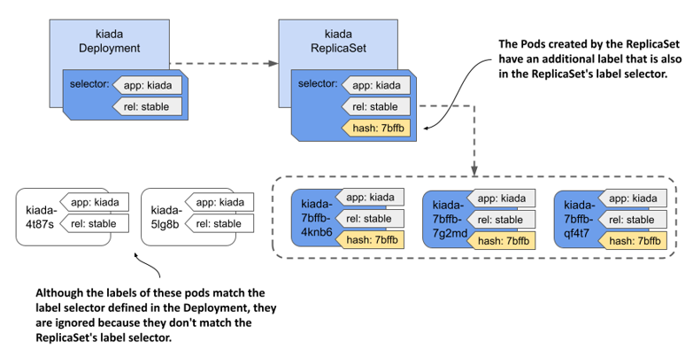

Giá trị của nhãn `pod-template-hash` hoàn toàn không phải là một chuỗi ký tự ngẫu nhiên, mà nó được tính toán tự động dựa trên toàn bộ nội dung cấu hình của mẫu Pod. Bởi vì giá trị băm (*hash*) này cũng được sử dụng để cấu thành nên tên của ReplicaSet, nên tên của ReplicaSet sẽ phụ thuộc trực tiếp vào nội dung mẫu Pod của bạn. Điều này kéo theo một hệ quả là cứ mỗi khi bạn thay đổi cấu hình trong mẫu Pod, một đối tượng ReplicaSet mới sẽ được tạo ra. Bạn sẽ tìm hiểu sâu hơn về cơ chế này trong phần 14.2 khi nói về việc cập nhật Deployment.

Giờ đây, bạn đã có thể dọn dẹp bằng cách xóa bỏ hai Pod `kiada` cũ không thuộc về quyền kiểm soát của Deployment. Để thực hiện, hãy sử dụng lệnh `kubectl delete` kết hợp với một bộ lọc chọn ra các Pod có nhãn `app=kiada` và `rel=stable` nhưng đồng thời *không* mang nhãn `pod-template-hash`. Cú pháp lệnh đầy đủ sẽ như sau:

```
$ kubectl delete po -l 'app=kiada,rel=stable,!pod-template-hash'
```

##### Khắc phục sự cố Deployment không khởi tạo được bất kỳ Pod nào

Trong một vài tình huống đặc thù, sau khi bạn khởi tạo đối tượng Deployment, hệ thống lại không xuất hiện bất kỳ Pod mới nào. Việc chẩn đoán và xử lý lỗi này thực ra vô cùng đơn giản nếu bạn biết tìm kiếm đúng chỗ. Để tự mình trải nghiệm, hãy áp dụng thử tệp manifest `deploy.where-are-the-pods.yaml`. Thao tác này sẽ khởi tạo một Deployment mang tên `where-are-the-pods`. Bạn sẽ thấy rằng tuyệt nhiên không có một Pod nào được sinh ra, mặc dù số lượng bản sao yêu cầu trong cấu hình là ba. Để tìm nguyên nhân, bạn có thể kiểm tra chi tiết đối tượng Deployment này bằng lệnh `kubectl describe`. Phần sự kiện (*events*) của Deployment có thể không cung cấp thông tin nào giá trị, nhưng phần Điều kiện (*Conditions*) của nó thì ngược lại:

```
$ kubectl describe deploy where-are-the-pods
...
Conditions:
Type Status Reason
---- ------ ------
Progressing True NewReplicaSetCreated
Available False MinimumReplicasUnavailable
ReplicaFailure True FailedCreate #A
```

Điều kiện `ReplicaFailure` (Khởi tạo bản sao thất bại) đang hiển thị là `True`, báo hiệu hệ thống đã gặp lỗi. Lý do lỗi hiển thị là `FailedCreate` (Khởi tạo thất bại) - một thông tin khá chung chung. Tuy nhiên, nếu bạn kiểm tra kỹ hơn các điều kiện trong phần `status` của tệp cấu hình YAML của Deployment, bạn sẽ phát hiện trường `message` của điều kiện `ReplicaFailure` đã chỉ rõ nguyên nhân chính xác của sự cố. Hoặc một cách khác, bạn có thể trực tiếp kiểm tra ReplicaSet và các sự kiện của nó để đọc thông báo lỗi tương tự như dưới đây:

```
$ kubectl describe rs where-are-the-pods-67cbc77f88
...
Events:
Type Reason Age From Message
---- ------ ---- ---- -------
Warning FailedCreate 61s (x18 over 11m) replicaset-controller Error creating: pods "where-are-the-pods-67cbc77f88-" is forbidden: error looking up service account default/missing-service-account: serviceaccount "missing-service-account" not found
```

Có rất nhiều nguyên nhân có thể khiến bộ điều khiển ReplicaSet không thể khởi tạo thành công một Pod, nhưng thông thường chúng sẽ liên quan mật thiết đến vấn đề phân quyền người dùng. Trong ví dụ cụ thể này, bộ điều khiển ReplicaSet thất bại trong việc tạo Pod do thiếu mất một tài khoản dịch vụ (*service account*). Bạn sẽ được tìm hiểu sâu hơn về tài khoản dịch vụ trong chương 25. Bài học cốt lõi rút ra từ bài thực hành này là: nếu các Pod không xuất hiện sau khi bạn tạo mới (hoặc cập nhật) một Deployment, nơi đầu tiên bạn cần rà soát chính là đối tượng ReplicaSet nằm bên dưới.

### 14.1.2 Thay đổi quy mô của Deployment

Việc thay đổi quy mô của một Deployment hoàn toàn tương tự như đối với một ReplicaSet. Khi bạn thực hiện điều chỉnh quy mô của Deployment, bộ điều khiển Deployment thực chất không làm gì khác ngoài việc thay đổi quy mô của đối tượng ReplicaSet nằm bên dưới, rồi nhường lại toàn bộ phần việc còn lại cho bộ điều khiển ReplicaSet tự xử lý, giống như mô tả trong hình sau.

##### Hình 14.3 Thay đổi quy mô của một Deployment

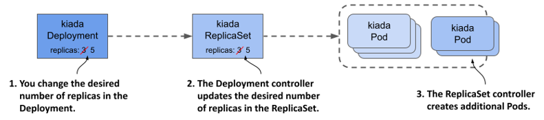

#### Thay đổi quy mô của một Deployment

Bạn có thể điều chỉnh quy mô của một Deployment bằng cách chỉnh sửa trực tiếp đối tượng với lệnh `kubectl edit` để đổi giá trị trường `replicas`, bằng cách thay đổi giá trị này trực tiếp trong tệp manifest rồi áp dụng lại, hoặc nhanh nhất là sử dụng trực tiếp lệnh `kubectl scale`. Ví dụ, để tăng số bản sao của Deployment `kiada` lên 5, hãy chạy lệnh sau:

```
$ kubectl scale deploy kiada --replicas 5
deployment.apps/kiada scaled
```

Bây giờ, nếu bạn hiển thị danh sách các Pod, bạn sẽ thấy xuất hiện đúng năm Pod `kiada` đang hoạt động. Khi tiến hành kiểm tra các sự kiện liên quan đến Deployment bằng lệnh `kubectl describe`, bạn sẽ thấy bộ điều khiển Deployment đã thực hiện thay đổi quy mô của ReplicaSet tương ứng.

```
$ kubectl describe deploy kiada
...
Events:
  Type    Reason             Age   From                   Message
  ----    ------             ----  ----                   -------
  Normal  ScalingReplicaSet  4s    deployment-controller  Scaled up replica set kiada-
                                                          7bffb9bf96 to 5
```

Nếu tiếp tục kiểm tra các sự kiện của ReplicaSet bằng lệnh `kubectl describe rs kiada`, bạn sẽ thấy rõ ràng chính bộ điều khiển ReplicaSet mới là tác nhân trực tiếp khởi tạo nên các Pod mới này.

Tất cả những gì bạn đã tìm hiểu về cách hoạt động của ReplicaSet khi thay đổi quy mô, cũng như cách bộ điều khiển ReplicaSet duy trì số lượng Pod thực tế luôn khớp với số lượng mong muốn, đều được áp dụng hoàn toàn tương tự đối với các Pod được triển khai thông qua đối tượng Deployment.

#### Thay đổi quy mô một ReplicaSet do Deployment sở hữu

Có thể bạn sẽ thắc mắc điều gì xảy ra khi thay đổi quy mô một đối tượng ReplicaSet do Deployment sở hữu và kiểm soát. Hãy cùng tìm hiểu qua thực tế. Trước tiên, hãy theo dõi các đối tượng ReplicaSet bằng cách chạy lệnh sau:

```shell
$ kubectl get rs -w
```

Giờ hãy thay đổi quy mô của ReplicaSet `kiada-7bffb9bf96` bằng cách chạy lệnh sau trong một cửa sổ terminal khác:

```shell
$ kubectl scale rs kiada-7bffb9bf96 --replicas 7
replicaset.apps/kiada-7bffb9bf96 scaled
```

Nếu quan sát kết quả của lệnh đầu tiên, bạn sẽ thấy số lượng bản sao mong muốn tăng lên bảy nhưng ngay sau đó lại bị kéo về năm. Điều này xảy ra do bộ điều khiển Deployment (Deployment controller) phát hiện số lượng bản sao mong muốn trong ReplicaSet không còn khớp với cấu hình trong đối tượng Deployment, và nó sẽ tự động hoàn tác thay đổi đó.

##### Quan trọng

Nếu bạn thực hiện các thay đổi đối với một đối tượng do một đối tượng khác sở hữu, hãy chuẩn bị tinh thần rằng những thay đổi đó sẽ bị bộ điều khiển quản lý đối tượng cha hoàn tác.

Tùy thuộc vào việc bộ điều khiển ReplicaSet có kịp nhận thấy thay đổi trước khi bộ điều khiển Deployment hoàn tác nó hay không, hệ thống có thể đã tạo ra hai Pod mới. Tuy nhiên, ngay khi bộ điều khiển Deployment đặt lại số lượng bản sao mong muốn về năm, bộ điều khiển ReplicaSet sẽ lập tức xóa các Pod dư thừa này đi.

Đúng như bạn dự đoán, bộ điều khiển Deployment sẽ hoàn tác mọi thay đổi bạn thực hiện trên ReplicaSet, chứ không riêng gì việc thay đổi quy mô. Ngay cả khi bạn xóa hẳn đối tượng ReplicaSet, bộ điều khiển Deployment cũng sẽ tự động tạo lại một đối tượng mới. Bạn có thể tự mình thử nghiệm điều này ngay lúc này.

#### Vô tình thay đổi quy mô một Deployment

Để khép lại phần thảo luận về thay đổi quy mô Deployment, tôi muốn lưu ý bạn về một tình huống mà bạn có thể vô tình thay đổi quy mô của Deployment ngoài ý muốn.

Trong tệp cấu hình (manifest) Deployment mà bạn đã áp dụng vào cụm, số lượng bản sao mong muốn ban đầu là ba. Sau đó, bạn nâng con số này lên năm bằng lệnh `kubectl scale`. Hãy tưởng tượng bạn cũng làm điều tương tự trên một cụm môi trường production thực tế, chẳng hạn như khi cần năm bản sao để gánh toàn bộ lưu lượng truy cập đang đổ về ứng dụng.

Tiếp đó, bạn phát hiện mình đã quên thêm các nhãn (label) `app` và `rel` vào đối tượng Deployment. Dù đã thêm chúng vào mẫu Pod (Pod template) bên trong Deployment, bạn lại bỏ sót ở chính đối tượng Deployment. Việc này không gây ảnh hưởng đến hoạt động của Deployment, nhưng vì muốn mọi đối tượng trong hệ thống đều được gắn nhãn gọn gàng, bạn quyết định bổ sung chúng ngay. Thay vì dùng lệnh `kubectl label`, bạn muốn sửa trực tiếp vào tệp manifest gốc rồi áp dụng lại (reapply). Bằng cách này, khi dùng tệp cấu hình đó để tạo Deployment trong tương lai, các nhãn mong muốn sẽ được thiết lập sẵn.

Để xem điều gì sẽ xảy ra trong trường hợp này, hãy áp dụng tệp manifest `deploy.kiada.labelled.yaml`. Điểm khác biệt duy nhất so với tệp manifest `deploy.kiada.yaml` ban đầu là các nhãn được bổ sung cho Deployment. Nếu liệt kê các Pod sau khi áp dụng manifest này, bạn sẽ thấy mình không còn năm Pod như trước nữa. Hai Pod trong số đó đã bị xóa:

```shell
$ kubectl get pods -l app=kiada
NAME                    READY   STATUS        RESTARTS   AGE
kiada-7bffb9bf96-4knb6   2/2     Running       0          46m
kiada-7bffb9bf96-7g2md   2/2     Running       0          46m
kiada-7bffb9bf96-lkgmx   2/2     Terminating   0          5m     #A
kiada-7bffb9bf96-qf4t7   2/2     Running       0          46m
kiada-7bffb9bf96-z6skm   2/2     Terminating   0          5m     #A
```

Để tìm hiểu nguyên nhân tại sao hai Pod bị gỡ bỏ, hãy kiểm tra đối tượng Deployment:

```shell
$ kubectl get deploy
NAME    READY   UP-TO-DATE   AVAILABLE   AGE
kiada   3/3     3            3           46m
```

Deployment hiện chỉ được cấu hình với ba bản sao, thay vì năm bản sao như trước khi bạn áp dụng tệp manifest. Rõ ràng bạn không hề có ý định thay đổi số lượng bản sao mà chỉ muốn thêm nhãn cho đối tượng Deployment. Vậy chuyện gì đã xảy ra?

Nguyên nhân khiến việc áp dụng manifest làm thay đổi số lượng bản sao mong muốn là do trường `replicas` trong tệp cấu hình đó đang được đặt là `3`. Có thể bạn nghĩ rằng chỉ cần xóa bỏ hoàn toàn trường này khỏi tệp cấu hình cập nhật là có thể tránh được rắc rối, nhưng thực tế việc đó chỉ làm cho tình hình tồi tệ hơn. Hãy thử áp dụng tệp manifest `deploy.kiada.noReplicas.yaml` (tệp không chứa trường `replicas`) để xem kết quả ra sao.

Nếu áp dụng tệp tin này, bạn sẽ chỉ còn lại duy nhất một bản sao (replica). Đó là bởi vì Kubernetes API sẽ tự động đặt giá trị mặc định là `1` khi trường `replicas` bị bỏ trống. Ngay cả khi bạn chủ động đặt giá trị này thành `null`, kết quả vẫn sẽ tương tự.

Hãy tưởng tượng tình huống này xảy ra trên cụm production khi ứng dụng đang chịu tải cực kỳ lớn, đòi hỏi hàng chục hoặc hàng trăm bản sao hoạt động liên tục. Khi đó, một thao tác cập nhật tưởng chừng như vô hại như ví dụ trên sẽ gây ra sự cố gián đoạn dịch vụ cực kỳ nghiêm trọng.

Bạn có thể phòng tránh lỗi này bằng cách bỏ qua trường `replicas` trong tệp manifest gốc khi khởi tạo đối tượng Deployment. Nếu lỡ quên mất điều này, bạn vẫn có thể khắc phục đối tượng Deployment hiện tại bằng cách chạy lệnh sau:

```shell
$ kubectl apply edit-last-applied deploy kiada
```

Lệnh này sẽ mở nội dung của annotation `kubectl.kubernetes.io/last-applied-configuration` thuộc đối tượng Deployment trong một trình soạn thảo văn bản, cho phép bạn xóa bỏ trường `replicas`. Khi bạn lưu tệp và đóng trình soạn thảo, annotation trong đối tượng Deployment sẽ được cập nhật. Kể từ thời điểm đó, việc cập nhật Deployment bằng lệnh `kubectl apply` sẽ không còn ghi đè lên số lượng bản sao mong muốn nữa, miễn là bạn không khai báo trường `replicas` trong file manifest mới.

##### Lưu ý

Khi bạn chạy lệnh `kubectl apply`, giá trị của annotation `kubectl.kubernetes.io/last-applied-configuration` sẽ được sử dụng để tính toán các thay đổi cần áp dụng lên đối tượng API.

##### Mẹo

Để tránh việc vô tình thay đổi quy mô Deployment mỗi khi áp dụng lại tệp manifest, hãy bỏ qua trường `replicas` trong tệp cấu hình khi bạn khởi tạo đối tượng. Ban đầu hệ thống sẽ chỉ tạo ra một bản sao duy nhất, nhưng bạn có thể dễ dàng thay đổi quy mô Deployment sau đó sao cho phù hợp với nhu cầu sử dụng.

### 14.1.3 Xóa một Deployment

Trước khi đi sâu vào tính năng cập nhật Deployment—khía cạnh quan trọng và đắc lực nhất của đối tượng này—chúng ta hãy cùng lướt nhanh qua những gì xảy ra khi xóa một Deployment. Với những kiến thức đã học từ phần xóa ReplicaSet, chắc hẳn bạn đã đoán được rằng khi xóa một đối tượng Deployment, các đối tượng ReplicaSet và Pod bên dưới cũng sẽ bị xóa theo.

#### Giữ lại ReplicaSet và các Pod khi xóa Deployment

Nếu muốn giữ lại các Pod, bạn có thể chạy lệnh `kubectl delete` với tùy chọn `--cascade=orphan`, tương tự như cách làm với ReplicaSet. Khi áp dụng phương pháp này cho một Deployment, bạn sẽ thấy nó không chỉ giữ lại các Pod mà còn bảo toàn cả các đối tượng ReplicaSet. Các Pod này vẫn sẽ thuộc quyền sở hữu và được kiểm soát bởi ReplicaSet tương ứng.

#### Tiếp nhận ReplicaSet và các Pod sẵn có

Nếu bạn khởi tạo lại Deployment, nó sẽ tự động tiếp nhận (adopt) đối tượng ReplicaSet sẵn có, với điều kiện bạn không thay đổi mẫu Pod (Pod template) của Deployment trong khoảng thời gian đó. Cơ chế này hoạt động được là nhờ bộ điều khiển Deployment tìm thấy một ReplicaSet hiện có có tên trùng khớp với tên của ReplicaSet mà lẽ ra bộ điều khiển phải tạo mới.

## 14.2 Cập nhật một Deployment

Ở phần trước khi tìm hiểu về những kiến thức cơ bản của Deployment, có thể bạn chưa thấy rõ ưu thế vượt trội của nó so với ReplicaSet. Điểm khác biệt mang tính quyết định này chỉ xuất hiện khi bạn thực hiện cập nhật mẫu Pod (Pod template) trong cấu hình Deployment. Như bạn đã biết, hành động này không mang lại hiệu quả tức thì đối với ReplicaSet; mẫu Pod mới cập nhật chỉ được áp dụng khi bộ điều khiển ReplicaSet tạo thêm Pod mới. Ngược lại, khi bạn cập nhật mẫu Pod trong một Deployment, các Pod hiện tại sẽ lập tức được thay thế bằng phiên bản mới.

Các Pod `kiada` hiện tại đang chạy phiên bản 0.5 của ứng dụng, và bây giờ bạn sẽ tiến hành cập nhật chúng lên phiên bản 0.6. Bạn có thể tìm thấy các tệp nguồn của phiên bản mới này trong thư mục `Chapter14/kiada-0.6`. Bạn có thể tự build container image từ mã nguồn hoặc sử dụng trực tiếp image `luksa/kiada:0.6` do tôi chuẩn bị sẵn.

#### Giới thiệu các chiến lược cập nhật hiện có

Khi bạn cập nhật mẫu Pod để sử dụng container image mới, bộ điều khiển Deployment sẽ dừng các Pod cũ đang chạy và thay thế chúng bằng các Pod mới. Cách thức thay thế các Pod này phụ thuộc vào chiến lược cập nhật (update strategy) được cấu hình trong Deployment. Tại thời điểm viết cuốn sách này, Kubernetes hỗ trợ hai chiến lược được mô tả trong bảng dưới đây.

##### Bảng 14.2 Các chiến lược cập nhật được hỗ trợ bởi Deployment

| Loại chiến lược | Mô tả |
| :--- | :--- |
| Recreate (Tạo lại) | Với chiến lược `Recreate`, toàn bộ các Pod cũ sẽ bị xóa cùng một lúc. Sau khi tất cả các container cũ đã dừng hẳn, các Pod mới mới được đồng loạt khởi tạo. Trong một khoảng thời gian ngắn—khi các Pod cũ đang bị hủy và các Pod mới chưa sẵn sàng—dịch vụ sẽ tạm thời bị gián đoạn. Hãy sử dụng chiến lược này nếu ứng dụng của bạn không cho phép chạy song song phiên bản cũ và mới, đồng thời thời gian ngừng hoạt động (downtime) của dịch vụ không phải là vấn đề lớn. |
| RollingUpdate (Cập nhật cuốn chiếu) | Chiến lược `RollingUpdate` tiến hành gỡ bỏ dần các Pod cũ và thay thế chúng bằng các Pod mới một cách cuốn chiếu. Khi một Pod bị gỡ bỏ, Kubernetes sẽ đợi cho đến khi Pod mới thay thế sẵn sàng hoạt động rồi mới tiếp tục gỡ bỏ Pod tiếp theo. Nhờ đó, dịch vụ được cung cấp bởi các Pod vẫn liên tục hoạt động trong suốt quá trình nâng cấp. Đây là chiến lược mặc định của Deployment. |

Hình dưới đây minh họa sự khác biệt giữa hai chiến lược này, mô tả tiến trình thay thế các Pod theo thời gian đối với từng chiến lược cụ thể.

##### Hình 14.4 Sự khác biệt giữa chiến lược Recreate và RollingUpdate

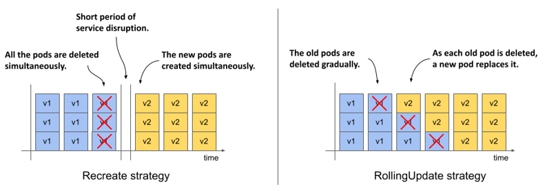

Chiến lược `Recreate` không có thêm tùy chọn cấu hình nào, trong khi chiến lược `RollingUpdate` cho phép bạn tinh chỉnh số lượng Pod được Kubernetes thay thế trong mỗi lượt. Chúng ta sẽ tìm hiểu sâu hơn về nội dung này ở phần sau.

### 14.2.1 Chiến lược Recreate

Chiến lược `Recreate` đơn giản hơn nhiều so với `RollingUpdate`, do đó tôi sẽ trình bày chiến lược này trước. Vì ban đầu bạn không chỉ định rõ chiến lược trong đối tượng Deployment nên hệ thống tự động áp dụng mặc định là `RollingUpdate`. Do đó, bạn cần phải thay đổi cấu hình này trước khi bắt đầu tiến trình cập nhật.

#### Cấu hình Deployment sử dụng chiến lược Recreate

Để cấu hình một Deployment sử dụng chiến lược cập nhật Recreate, bạn phải bổ sung các dòng được đánh dấu trong đoạn mã cấu hình dưới đây vào file manifest của Deployment. Bạn có thể tìm thấy file cấu hình hoàn chỉnh này tại đường dẫn `deploy.kiada.recreate.yaml`.

##### Đoạn mã 14.2 Kích hoạt chiến lược cập nhật Recreate trong Deployment

```yaml
...
spec:
  strategy:    #A
    type: Recreate    #A
  replicas: 3
  ...
```

Bạn có thể chèn thêm các dòng này vào cấu hình đối tượng Deployment bằng cách trực tiếp chỉnh sửa với lệnh `kubectl edit` hoặc áp dụng tệp manifest đã cập nhật thông qua lệnh `kubectl apply`. Do thay đổi này không tác động đến mẫu Pod (Pod template) nên nó sẽ không kích hoạt một tiến trình cập nhật mới. Việc thay đổi các nhãn (label), chú thích (annotation) hoặc số lượng bản sao mong muốn của Deployment cũng không kích hoạt tiến trình này.

#### Cập nhật container image bằng lệnh kubectl set image

Để nâng cấp các Pod lên phiên bản mới của container image Kiada, bạn cần cập nhật trường `image` trong phần định nghĩa container `kiada` nằm trong mẫu Pod. Bạn có thể làm việc này bằng cách cập nhật file manifest thông qua `kubectl edit` hoặc `kubectl apply`. Tuy nhiên, với nhu cầu thay đổi image đơn giản, bạn có thể sử dụng nhanh lệnh `kubectl set image`. Lệnh này cho phép bạn thay đổi tên image của bất kỳ container nào thuộc bất kỳ đối tượng API nào có chứa container, bao gồm Deployment, ReplicaSet và thậm chí là cả đối tượng Pod. Ví dụ, bạn có thể dùng lệnh dưới đây để cập nhật container `kiada` trong Deployment `kiada` sang phiên bản `0.6` của container image `luksa/kiada`:

```shell
$ kubectl set image deployment kiada kiada=luksa/kiada:0.6
```

Tuy nhiên, do mẫu Pod trong Deployment của bạn còn khai báo phiên bản ứng dụng trong phần nhãn (label) của Pod, việc chỉ thay đổi image mà không cập nhật giá trị nhãn tương ứng sẽ dẫn đến sự không nhất quán về thông tin.

#### Cập nhật container image và nhãn bằng lệnh kubectl patch

Để thay đổi đồng thời tên image và giá trị nhãn, bạn có thể sử dụng lệnh `kubectl patch`. Lệnh này cho phép cập nhật nhiều trường cấu hình cùng lúc mà không cần chỉnh sửa thủ công hay áp dụng lại toàn bộ tệp manifest. Để cập nhật cả tên image và giá trị nhãn, bạn chạy lệnh sau:

```shell
$ kubectl patch deploy kiada --patch '{"spec": {"template": {"metadata": {"labels": {"ver": "0.6"}}, "spec": {"containers": [{"name": "kiada", "image": "luksa/kiada:0.6"}]}}}}'
```

Lệnh này có vẻ tương đối khó đọc đối với bạn vì phần nội dung vá (patch) được biểu diễn dưới dạng một chuỗi JSON trên một dòng duy nhất. Trong chuỗi này là một phần nhỏ của manifest Deployment chỉ chứa các trường bạn muốn thay đổi. Nếu bạn viết đoạn vá này dưới dạng chuỗi YAML nhiều dòng, cấu trúc của nó sẽ rõ ràng hơn rất nhiều. Cú pháp hoàn chỉnh khi đó sẽ như sau:

```yaml
$ kubectl patch deploy kiada --patch '    #A
spec:    #B
  template:    #B
    metadata:    #B
      labels:    #B
        ver: "0.6"    #B
    spec:    #B
      containers:    #B
      - name: kiada    #B
        image: luksa/kiada:0.6'    #B
```

##### Lưu ý

Bạn cũng có thể ghi phần cấu hình manifest nhỏ này ra một tệp riêng biệt và sử dụng tùy chọn `--patch-file` thay cho `--patch`.

Bây giờ hãy chạy một trong các lệnh `kubectl patch` ở trên để cập nhật Deployment, hoặc áp dụng tệp manifest `deploy.kiada.0.6.recreate.yaml` để đạt được kết quả tương tự.

#### Quan sát các thay đổi trạng thái của Pod trong quá trình cập nhật

Ngay sau khi cập nhật Deployment, hãy liên tục chạy lệnh sau để theo dõi những gì đang diễn ra với các Pod:

```shell
$ kubectl get po -l app=kiada -L ver
```

Lệnh này sẽ liệt kê các Pod `kiada` và hiển thị giá trị nhãn phiên bản của chúng trong cột `VER`. Bạn sẽ nhận thấy rằng trạng thái của tất cả các Pod này đều đồng loạt chuyển sang `Terminating` (Đang chấm dứt) cùng một lúc như dưới đây:

```
NAME                     READY   STATUS        RESTARTS   AGE     VER
kiada-7bffb9bf96-7w92k   0/2     Terminating   0          3m38s   0.5
kiada-7bffb9bf96-h8wnv   0/2     Terminating   0          3m38s   0.5
kiada-7bffb9bf96-xgb6d   0/2     Terminating   0          3m38s   0.5
```

Các Pod cũ sẽ sớm biến mất, nhưng ngay lập tức được thay thế bằng các Pod chạy phiên bản mới:

```
NAME                     READY   STATUS              RESTARTS   AGE   VER
kiada-5d5c5f9d76-5pghx   0/2     ContainerCreating   0          1s    0.6    #A
kiada-5d5c5f9d76-qfkts   0/2     ContainerCreating   0          1s    0.6    #A
kiada-5d5c5f9d76-vkdrl   0/2     ContainerCreating   0          1s    0.6    #A
```

Sau vài giây, tất cả các Pod mới đều sẵn sàng hoạt động. Toàn bộ tiến trình diễn ra rất nhanh, nhưng bạn có thể lặp lại nó bao nhiêu lần tùy ý. Hãy khôi phục lại Deployment bằng cách áp dụng phiên bản manifest trước đó từ tệp `deploy.kiada.recreate.yaml`, đợi cho các Pod được thay thế hoàn toàn, sau đó nâng cấp lên phiên bản 0.6 bằng cách áp dụng lại tệp `deploy.kiada.0.6.recreate.yaml`.

#### Tìm hiểu ảnh hưởng của chiến lược cập nhật Recreate đến tính khả dụng của dịch vụ

Bên cạnh việc theo dõi danh sách Pod, bạn hãy thử truy cập dịch vụ thông qua Ingress bằng trình duyệt web như đã hướng dẫn ở chương 12 ngay trong lúc quá trình cập nhật đang diễn ra.

Bạn sẽ nhận thấy có một khoảng thời gian ngắn proxy của Ingress trả về mã trạng thái `503 Service Temporarily Unavailable`. Nếu cố gắng truy cập trực tiếp vào dịch vụ bằng địa chỉ IP nội bộ của cụm (internal cluster IP) trong thời điểm này, bạn sẽ thấy kết nối bị từ chối hoàn toàn.

#### Tìm hiểu mối quan hệ giữa một Deployment và các ReplicaSet của nó

Khi liệt kê các Pod, bạn sẽ thấy tên của các Pod chạy phiên bản 0.5 khác hẳn tên của các Pod chạy phiên bản 0.6. Tên của các Pod cũ bắt đầu bằng chuỗi `kiada-7bffb9bf96`, trong khi các Pod mới bắt đầu bằng `kiada-5d5c5f9d76`. Như đã biết, các Pod do một ReplicaSet tạo ra sẽ được đặt tên dựa theo tên của chính ReplicaSet đó. Sự thay đổi tên này cho thấy các Pod mới hiện thuộc về một ReplicaSet hoàn toàn khác. Hãy liệt kê các ReplicaSet để kiểm chứng điều này:

```
$ kubectl get rs -L ver
NAME               DESIRED   CURRENT   READY   AGE   VER
kiada-5d5c5f9d76   3         3         3       13m   0.6    #A
kiada-7bffb9bf96   0         0         0       16m   0.5    #B
```

##### Lưu ý

Các nhãn bạn khai báo trong mẫu Pod của Deployment cũng sẽ được áp dụng cho đối tượng ReplicaSet. Do đó, nếu bạn thêm một nhãn biểu thị số phiên bản của ứng dụng, bạn có thể xem được thông tin phiên bản này ngay khi liệt kê các ReplicaSet. Nhờ vậy, bạn có thể dễ dàng phân biệt giữa các ReplicaSet khác nhau thay vì phải đoán mò dựa vào các chuỗi ký tự ngẫu nhiên trong tên của chúng.

Khi bạn khởi tạo Deployment ban đầu, chỉ có một ReplicaSet duy nhất được tạo ra và tất cả các Pod đều thuộc về nó. Khi bạn thực hiện cập nhật Deployment, một ReplicaSet mới sẽ được tạo ra. Kể từ lúc này, toàn bộ các Pod của Deployment này sẽ chịu sự kiểm soát của ReplicaSet mới, như mô tả trong hình vẽ dưới đây.

##### Hình 14.5 Quá trình cập nhật một Deployment

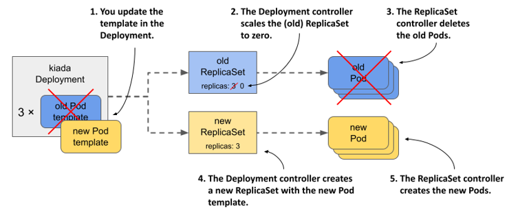

#### Tìm hiểu cách các Pod của Deployment chuyển giao từ ReplicaSet này sang ReplicaSet khác

Nếu theo dõi sát các đối tượng ReplicaSet ngay khi kích hoạt cập nhật, bạn sẽ thấy tiến trình diễn ra như sau. Ban đầu, chỉ có ReplicaSet cũ tồn tại:

```
NAME               DESIRED   CURRENT   READY   AGE   VER
kiada-7bffb9bf96   3         3         3       16m   0.5    #A
```

Bộ điều khiển Deployment tiến hành giảm quy mô (scale down) ReplicaSet cũ về mức không bản sao, khiến bộ điều khiển ReplicaSet xóa toàn bộ các Pod hiện có:

```
NAME               DESIRED   CURRENT   READY   AGE   VER
kiada-7bffb9bf96   0         0         0       16m   0.5    #A
```

Kế tiếp, bộ điều khiển Deployment tạo ra ReplicaSet mới và cấu hình nó chạy với ba bản sao.

```
NAME               DESIRED   CURRENT   READY   AGE   VER
kiada-5d5c5f9d76   3         0         0       0s    0.6   #A
kiada-7bffb9bf96   0         0         0       16m   0.5   #B
```

Bộ điều khiển ReplicaSet sẽ tiến hành tạo ra ba Pod mới, tương ứng với số lượng hiển thị trong cột `CURRENT`. Khi các container trong các Pod này khởi động thành công và bắt đầu tiếp nhận các kết nối đầu tiên, giá trị hiển thị ở cột `READY` cũng sẽ chuyển thành ba.

```
NAME               DESIRED   CURRENT   READY   AGE   VER
kiada-5d5c5f9d76   3         3         0       1s    0.6   #A
kiada-7bffb9bf96   0         0         0       16m   0.5
```

##### Lưu ý

Bạn có thể theo dõi chi tiết các hành động mà bộ điều khiển Deployment và bộ điều khiển ReplicaSet đã thực hiện bằng cách xem các sự kiện (event) liên quan đến đối tượng Deployment cùng hai đối tượng ReplicaSet nói trên.

Quá trình cập nhật đến đây là hoàn tất. Nếu truy cập dịch vụ Kiada từ trình duyệt web, bạn sẽ thấy phiên bản mới đã được cập nhật. Ở góc dưới bên phải giao diện, bạn sẽ thấy bốn ô hiển thị phiên bản của Pod đã xử lý yêu cầu từ trình duyệt cho từng loại tài nguyên bao gồm HTML, CSS, JavaScript và file ảnh chính. Các ô thông tin này sẽ cực kỳ hữu ích khi chúng ta tiến hành thử nghiệm cập nhật cuốn chiếu (rolling update) lên phiên bản 0.7 ở phần tiếp theo.

### 14.2.2 Chiến lược RollingUpdate

Tình trạng gián đoạn dịch vụ khi sử dụng chiến lược `Recreate` thường là điều không thể chấp nhận được trong môi trường thực tế. Đó là lý do tại sao chiến lược mặc định của Deployment là `RollingUpdate`. Khi áp dụng chiến lược này, các Pod sẽ được thay thế một cách tuần tự và êm ái bằng cách giảm quy mô của ReplicaSet cũ, đồng thời tăng quy mô của ReplicaSet mới với số lượng bản sao tương ứng. Nhờ vậy, đối tượng Service không bao giờ rơi vào tình trạng thiếu Pod để chuyển tiếp lưu lượng truy cập.

##### Hình 14.6 Quá trình diễn biến của các ReplicaSet, Pod và Service trong một đợt cập nhật cuốn chiếu (rolling update).

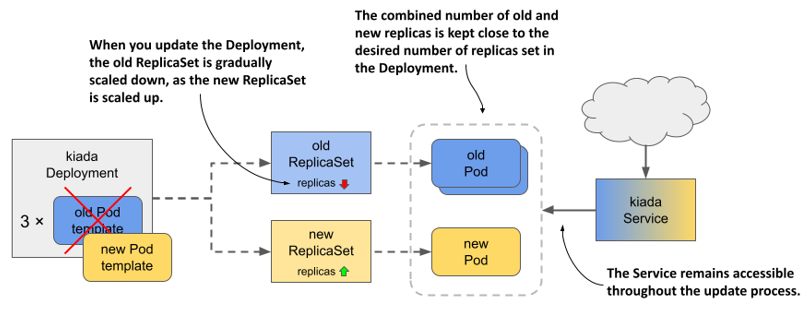

#### Cấu hình Deployment sử dụng chiến lược RollingUpdate

Để cấu hình Deployment sử dụng chiến lược cập nhật `RollingUpdate`, bạn cần thiết lập trường `strategy` của nó như trong đoạn mã dưới đây. Bạn có thể tìm thấy file cấu hình manifest này tại tệp `deploy.kiada.0.7.rollingUpdate.yaml`.

##### Đoạn mã 14.3 Kích hoạt chiến lược cập nhật Recreate trong Deployment

```yaml
apiVersion: apps/v1
kind: Deployment
metadata:
  name: kiada
spec:
  strategy:
    type: RollingUpdate    #A
    rollingUpdate:    #B
      maxSurge: 0    #B
      maxUnavailable: 1    #B
  minReadySeconds: 10
  replicas: 3
  selector:
    ...
```

Trong phần `strategy`, trường `type` thiết lập chiến lược là `RollingUpdate`, còn các tham số `maxSurge` và `maxUnavailable` trong phần phụ `rollingUpdate` quy định cách thức tiến hành cập nhật. Bạn hoàn toàn có thể bỏ qua toàn bộ phần cấu hình phụ này và chỉ khai báo trường `type`. Tuy nhiên, do các giá trị mặc định của `maxSurge` và `maxUnavailable` tương đối phức tạp và khó giải giải thích trực quan, chúng ta sẽ tạm thời đặt các giá trị cụ thể như trong đoạn mã để dễ dàng theo dõi tiến trình cập nhật hơn. Hiện tại bạn chưa cần bận tâm về hai tham số này, chúng ta sẽ cùng phân tích chi tiết ở phần sau.

Có thể bạn đã nhận thấy phần `spec` của Deployment trong đoạn mã còn chứa trường `minReadySeconds`. Mặc dù trường này không trực tiếp thuộc về cấu hình chiến lược cập nhật, nó lại ảnh hưởng đến tốc độ diễn tiến của quá trình cập nhật. Bằng cách thiết lập giá trị này là 10 (giây), bạn sẽ có thể quan sát tiến trình cập nhật cuốn chiếu một cách rõ ràng và thong thả hơn. Chúng ta sẽ cùng tìm hiểu chức năng của thuộc tính này ở phần cuối chương.

#### Cập nhật tên image trong tệp manifest

Ngoài việc cấu hình `strategy` và `minReadySeconds` trong manifest của Deployment, chúng ta hãy thay đổi luôn tên image thành `luksa/kiada:0.7` và cập nhật lại nhãn phiên bản (version label). Như vậy, khi bạn áp dụng tệp cấu hình này, hệ thống sẽ ngay lập tức kích hoạt tiến trình cập nhật. Việc này nhằm chứng minh rằng bạn hoàn toàn có thể thay đổi chiến lược cập nhật và kích hoạt cập nhật đồng thời chỉ trong một câu lệnh `kubectl apply` duy nhất, thay vì phải thay đổi chiến lược từ trước đó.

#### Kích hoạt cập nhật và quan sát quá trình triển khai phiên bản mới

Để bắt đầu quá trình cập nhật cuốn chiếu, hãy áp dụng tệp manifest `deploy.kiada.0.7.rollingUpdate.yaml`. Bạn có thể theo dõi tiến độ triển khai bằng lệnh `kubectl rollout status`, tuy nhiên kết quả hiển thị của lệnh này khá ngắn gọn như dưới đây:

```shell
$ kubectl rollout status deploy kiada
Waiting for deploy "kiada" rollout to finish: 1 out of 3 new replicas have been updated...
Waiting for deploy "kiada" rollout to finish: 2 out of 3 new replicas have been updated...
Waiting for deploy "kiada" rollout to finish: 2 of 3 updated replicas are available...
deployment "kiada" successfully rolled out
```

Để hiểu rõ chính xác cách bộ điều khiển Deployment thực hiện cập nhật, tốt nhất là quan sát sự thay đổi trạng thái của các đối tượng ReplicaSet bên dưới. Ban đầu, ReplicaSet phiên bản 0.6 đang chạy toàn bộ ba Pod. ReplicaSet cho phiên bản 0.7 vẫn chưa được tạo ra. ReplicaSet của phiên bản 0.5 trước đó vẫn còn tồn tại trong hệ thống, nhưng chúng ta tạm thời bỏ qua vì nó không tham gia vào đợt cập nhật này. Trạng thái ban đầu của ReplicaSet phiên bản 0.6 như sau:

```
NAME               DESIRED   CURRENT   READY   AGE   VER
kiada-5d5c5f9d76   3         3         3       53m   0.6   #A
```

Khi quá trình cập nhật bắt đầu, ReplicaSet chạy phiên bản 0.6 sẽ bị giảm quy mô đi một Pod, đồng thời ReplicaSet cho phiên bản 0.7 được tạo ra và cấu hình chạy với một bản sao duy nhất:

```
NAME               DESIRED   CURRENT   READY   AGE   VER
kiada-58df67c6f6   1         1         0       2s    0.7    #A
kiada-5d5c5f9d76   2         2         2       53m   0.6    #B
```

Do ReplicaSet cũ bị giảm quy mô, bộ điều khiển ReplicaSet đã đánh dấu một trong các Pod cũ để chuẩn bị xóa. Pod này hiện đang chuyển sang trạng thái kết thúc (terminating) và không còn được coi là sẵn sàng (ready), để lại hai Pod cũ còn lại gánh vác toàn bộ lưu lượng truy cập của dịch vụ. Pod thuộc về ReplicaSet mới thì chỉ vừa mới khởi động nên cũng chưa sẵn sàng. Bộ điều khiển Deployment sẽ tạm dừng để đợi cho đến khi Pod mới này sẵn sàng rồi mới tiếp tục tiến trình cập nhật. Khi Pod mới đã sẵn sàng, trạng thái của các ReplicaSet sẽ như sau:

```
NAME               DESIRED   CURRENT   READY   AGE   VER
kiada-58df67c6f6   1         1         1       6s    0.7    #A
kiada-5d5c5f9d76   2         2         2       53m   0.6
```

Tại thời điểm này, lưu lượng truy cập lại được gánh vác bởi ba Pod, trong đó có hai Pod chạy phiên bản 0.6 và một Pod chạy phiên bản 0.7. Vì bạn đã thiết lập `minReadySeconds` là 10 nên bộ điều khiển Deployment sẽ kiên nhẫn đợi đủ thời gian đó trước khi tiếp tục các bước cập nhật tiếp theo. Sau đó, nó sẽ giảm quy mô ReplicaSet cũ đi một bản sao, đồng thời tăng quy mô của ReplicaSet mới lên một bản sao. Các ReplicaSet lúc này có trạng thái như sau:

```
NAME               DESIRED   CURRENT   READY   AGE   VER
kiada-58df67c6f6   2         2         1       16s   0.7    #A
kiada-5d5c5f9d76   1         1         1       53m   0.6    #B
```

Lưu lượng tải của dịch vụ hiện do một Pod cũ và một Pod mới gánh vác. Pod mới thứ hai vẫn đang khởi động nên chưa nhận lưu lượng truy cập. Đúng mười giây sau khi Pod mới này chuyển sang trạng thái sẵn sàng, bộ điều khiển Deployment sẽ thực hiện những thay đổi cuối cùng lên hai ReplicaSet. Một lần nữa, ReplicaSet cũ lại bị giảm quy mô đi một đơn vị, đưa số lượng bản sao mong muốn về mức không. ReplicaSet mới được tăng quy mô để đạt số lượng bản sao mong muốn là ba, như hiển thị dưới đây:

```
NAME               DESIRED   CURRENT   READY   AGE   VER
kiada-58df67c6f6   3         3         2       29s   0.7    #A
kiada-5d5c5f9d76   0         0         0       54m   0.6    #B
```

Pod cũ cuối cùng còn sót lại sẽ bị hủy bỏ và dừng tiếp nhận lưu lượng truy cập. Toàn bộ lưu lượng từ phía máy khách lúc này đã do phiên bản mới của ứng dụng đảm nhận. Khi Pod mới thứ ba sẵn sàng hoạt động, quá trình cập nhật cuốn chiếu chính thức hoàn tất.

Trong suốt toàn bộ quá trình cập nhật, dịch vụ không hề bị gián đoạn dù chỉ một giây, vì luôn có ít nhất hai bản sao hoạt động để xử lý lưu lượng truy cập. Bạn có thể tự mình kiểm chứng điều này bằng cách khôi phục về phiên bản cũ rồi thực hiện cập nhật lại. Để làm điều đó, hãy áp dụng lại tệp manifest `deploy.kiada.0.6.recreate.yaml`. Do tệp này sử dụng chiến lược `Recreate`, tất cả các Pod hiện tại sẽ bị xóa ngay lập tức và sau đó các Pod phiên bản 0.6 sẽ đồng loạt khởi động lại cùng một lúc.

Trước khi kích hoạt lại quá trình cập nhật lên phiên bản 0.7, hãy chạy lệnh sau để theo dõi tiến trình cập nhật dưới góc nhìn của phía máy khách (client):

```bash
$ kubectl run -it --rm --restart=Never kiada-client --image curlimages/curl -- sh -c \
  'while true; do curl -s http://kiada | grep "Request processed by"; done'
```

Khi thực hiện lệnh này, bạn sẽ khởi tạo một Pod trung gian có tên `kiada-client` sử dụng công cụ `curl` để gửi yêu cầu liên tục đến dịch vụ `kiada`. Thay vì in ra toàn bộ nội dung phản hồi từ máy chủ, lệnh này được lọc để chỉ hiển thị dòng chứa số phiên bản, tên Pod và tên node xử lý.

Trong khi client đang gửi các yêu cầu liên tục đến dịch vụ, hãy kích hoạt một đợt cập nhật khác bằng cách áp dụng lại tệp manifest `deploy.kiada.0.7.rollingUpdate.yaml`. Hãy quan sát kết quả trả về của lệnh `curl` thay đổi như thế nào trong suốt quá trình cập nhật cuốn chiếu. Dưới đây là tóm tắt diễn biến:

```
Request processed by Kiada 0.6 running in pod "kiada-5d5c5f9d76-qfx9p" ...    #A
Request processed by Kiada 0.6 running in pod "kiada-5d5c5f9d76-22zr7" ...    #A
...
Request processed by Kiada 0.6 running in pod "kiada-5d5c5f9d76-22zr7" ...    #B
Request processed by Kiada 0.7 running in pod "kiada-58df67c6f6-468bd" ...    #B
Request processed by Kiada 0.6 running in pod "kiada-5d5c5f9d76-6wb87" ...    #B
Request processed by Kiada 0.7 running in pod "kiada-58df67c6f6-468bd" ...    #B
Request processed by Kiada 0.7 running in pod "kiada-58df67c6f6-468bd" ...    #B
...
Request processed by Kiada 0.7 running in pod "kiada-58df67c6f6-468bd" ...    #C
Request processed by Kiada 0.7 running in pod "kiada-58df67c6f6-fjnpf" ...    #C
Request processed by Kiada 0.7 running in pod "kiada-58df67c6f6-lssdp" ...    #C
```

Trong quá trình cập nhật cuốn chiếu, một số yêu cầu của client sẽ được xử lý bởi các Pod chạy phiên bản 0.6, khi số khác lại được điều hướng đến các Pod mới chạy phiên bản 0.7. Khi số lượng Pod mới chiếm tỷ trọng ngày càng lớn, số lượng phản hồi trả về từ phiên bản ứng dụng mới cũng tăng dần lên. Khi đợt cập nhật kết thúc hoàn toàn, toàn bộ phản hồi sẽ chỉ còn đến từ phiên bản mới.

### 14.2.3 Cấu hình số lượng Pod được thay thế trong mỗi lượt

Trong đợt cập nhật cuốn chiếu ở phần trước, các Pod được thay thế tuần tự từng cái một. Bạn có thể thay đổi cơ chế này bằng cách tinh chỉnh các tham số cấu hình của chiến lược cập nhật cuốn chiếu.

#### Giới thiệu hai tùy chọn cấu hình maxSurge và maxUnavailable

Hai tham số ảnh hưởng trực tiếp đến tốc độ thay thế các Pod trong quá trình cập nhật cuốn chiếu là `maxSurge` và `maxUnavailable`, như tôi đã đề cập ngắn gọn khi giới thiệu về chiến lược `RollingUpdate`. Bạn có thể khai báo các tham số này trong phần cấu hình phụ `rollingUpdate` thuộc trường `strategy` của Deployment, như ví dụ trong đoạn mã dưới đây.

##### Đoạn mã 14.4 Khai báo các tham số cho chiến lược `rollingUpdate`

```yaml
spec:
  strategy:
    type: RollingUpdate
    rollingUpdate:
      maxSurge: 0    #A
      maxUnavailable: 1    #A
```

Bảng dưới đây giải thích chi tiết vai trò và ảnh hưởng của từng tham số này.

##### Bảng 14.3 Thông tin chi tiết về các tùy chọn cấu hình maxSurge và maxUnavailable

| Thuộc tính | Mô tả |
| :--- | :--- |
| `maxSurge` | Số lượng Pod tối đa vượt quá số lượng bản sao mong muốn mà Deployment được phép khởi tạo thêm trong quá trình cập nhật cuốn chiếu. Giá trị này có thể là một số nguyên tuyệt đối hoặc tỷ lệ phần trăm so với số lượng bản sao mong muốn. |
| `maxUnavailable` | Số lượng Pod tối đa (so với số lượng bản sao mong muốn) được phép rơi vào trạng thái không khả dụng (unavailable) trong quá trình cập nhật cuốn chiếu. Giá trị này có thể là một số nguyên tuyệt đối hoặc tỷ lệ phần trăm so với số lượng bản sao mong muốn. |

Điểm mấu chốt cần lưu ý đối với hai tham số này là giá trị của chúng luôn được tính toán tương đối dựa trên số lượng bản sao mong muốn. Ví dụ, nếu số lượng bản sao mong muốn được cấu hình là ba, tham số `maxUnavailable` được đặt là một, và số lượng Pod hiện tại trong hệ thống đang là năm, thì số lượng Pod tối thiểu bắt buộc phải duy trì ở trạng thái khả dụng là hai chứ không phải bốn.

Hãy cùng xem xét hai tham số này ảnh hưởng thế nào đến cách bộ điều khiển Deployment tiến hành cập nhật. Cách tốt nhất để làm rõ cơ chế này là đi qua từng trường hợp kết hợp cụ thể dưới đây.

#### maxSurge=0, maxUnavailable=1

Trong đợt cập nhật cuốn chiếu ở phần trước, số lượng bản sao mong muốn là ba, `maxSurge` bằng không và `maxUnavailable` bằng một. Hình dưới đây mô tả tiến trình thay thế các Pod theo thời gian trong trường hợp này.

##### Hình 14.7 Tiến trình thay thế các Pod khi maxSurge bằng 0 và maxUnavailable bằng 1

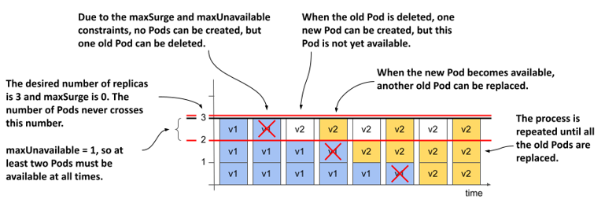

Do cấu hình `maxSurge` bằng `0`, bộ điều khiển Deployment hoàn toàn không được phép tạo thêm Pod vượt quá số lượng bản sao mong muốn. Nhờ đó, tổng số Pod thuộc quản lý của Deployment tại mọi thời điểm không bao giờ vượt quá con số 3. Đồng thời, do `maxUnavailable` được đặt là `1`, bộ điều khiển Deployment buộc phải duy trì tối thiểu hai bản sao ở trạng thái khả dụng, do đó nó chỉ có thể tiến hành xóa từng Pod cũ một tại mỗi thời điểm. Hệ thống sẽ không được phép xóa Pod tiếp theo cho đến khi Pod mới (được tạo ra để thay thế cho Pod vừa xóa) chuyển sang trạng thái sẵn sàng hoạt động.

#### maxSurge=1, maxUnavailable=0

Chuyện gì sẽ xảy ra nếu chúng ta đảo ngược giá trị của hai tham số này, tức là đặt `maxSurge` bằng `1` và `maxUnavailable` bằng `0`? Với số lượng bản sao mong muốn là ba, hệ thống bắt buộc phải duy trì tối thiểu ba bản sao khả dụng liên tục trong suốt tiến trình cập nhật. Và vì `maxSurge` bằng `1`, tổng số Pod hiện hữu trong toàn hệ thống tại mọi thời điểm sẽ không được phép vượt quá bốn. Hình vẽ dưới đây mô tả chi tiết tiến trình này diễn ra:

##### Hình 14.8 Tiến trình thay thế các Pod khi maxSurge bằng 1 và maxUnavailable bằng 0

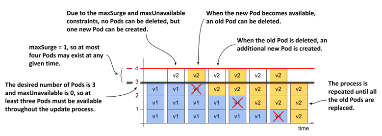

Ban đầu, bộ điều khiển Deployment không thể giảm quy mô của ReplicaSet cũ, vì việc xóa bớt bất kỳ Pod nào cũng sẽ làm số lượng Pod khả dụng hiện tại rơi xuống dưới mức cấu hình mong muốn (là ba Pod). Tuy nhiên, bộ điều khiển lại được phép tăng quy mô của ReplicaSet mới lên thêm một Pod, bởi tham số `maxSurge` cho phép Deployment tạo vượt mức một Pod so với số lượng bản sao mong muốn.

Lúc này, Deployment đang sở hữu đồng thời ba Pod cũ và một Pod mới. Ngay khi Pod mới này chuyển sang trạng thái khả dụng, lưu lượng truy cập sẽ tạm thời được san sẻ cho cả bốn Pod. Lúc này, bộ điều khiển Deployment đã có thể yên tâm giảm quy mô của ReplicaSet cũ đi một bản sao, vì số lượng Pod khả dụng còn lại vẫn bảo đảm là ba. Sau đó, bộ điều khiển lại tiếp tục tăng quy mô của ReplicaSet mới lên. Tiến trình này cứ thế lặp đi lặp lại cho đến khi ReplicaSet mới sở hữu đủ ba Pod và ReplicaSet cũ hoàn toàn sạch bóng Pod.

Trong suốt tiến trình cập nhật, số lượng bản sao khả dụng luôn được bảo đảm ở mức yêu cầu tối thiểu, và tổng số lượng Pod hoạt động đồng thời chưa bao giờ vượt quá giới hạn một Pod trội thêm so với số lượng cấu hình mong muốn.

##### Lưu ý

Bạn không được phép thiết lập đồng thời cả hai tham số `maxSurge` và `maxUnavailable` bằng không. Cấu hình này sẽ đẩy Deployment vào thế bế tắc: nó vừa không được phép tạo thêm Pod vượt mức mong muốn, lại vừa không được phép xóa bớt Pod cũ (vì việc xóa Pod cũ sẽ làm số lượng bản sao khả dụng bị hụt đi và rơi vào trạng thái không khả dụng).

#### maxSurge=1, maxUnavailable=1

Nếu thiết lập cả hai tham số `maxSurge` và `maxUnavailable` bằng `1`, tổng số lượng bản sao trong Deployment có thể tăng lên tối đa là bốn, và hệ thống luôn phải duy trì tối thiểu hai bản sao ở trạng thái khả dụng. Hình vẽ dưới đây mô tả tiến trình thay đổi này theo thời gian:

##### Hình 14.9 Tiến trình thay thế các Pod khi cả maxSurge và maxUnavailable đều bằng 1

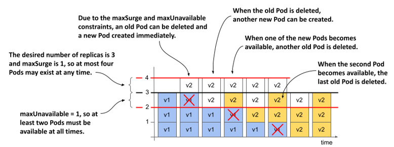

Bộ điều khiển Deployment sẽ ngay lập tức tăng quy mô của ReplicaSet mới lên thêm một bản sao, đồng thời giảm quy mô của ReplicaSet cũ đi một lượng tương tự. Ngay khi ReplicaSet cũ báo cáo rằng đã đánh dấu một trong các Pod cũ để chuẩn bị gỡ bỏ, bộ điều khiển Deployment sẽ lập tức tăng quy mô của ReplicaSet mới lên thêm một Pod nữa.

Lúc này, mỗi ReplicaSet đều đang được cấu hình chạy với hai bản sao. Hai Pod thuộc ReplicaSet cũ vẫn đang hoạt động bình thường và sẵn sàng phục vụ, trong khi hai Pod mới thuộc ReplicaSet mới đang trong quá trình khởi động. Ngay khi một trong hai Pod mới chuyển sang trạng thái khả dụng, thêm một Pod cũ nữa sẽ bị gỡ bỏ và một Pod mới khác lại được khởi tạo. Tiến trình này tiếp diễn tuần tự cho đến khi toàn bộ Pod cũ được thay thế hoàn toàn. Trong suốt quá trình đó, tổng số Pod không bao giờ vượt quá bốn, và luôn có nhất hai Pod sẵn sàng tiếp nhận lưu lượng truy cập tại bất kỳ thời điểm nào.

##### Lưu ý

Vì bộ điều khiển Deployment không trực tiếp đếm số lượng Pod mà chỉ tiếp nhận thông tin này từ báo cáo trạng thái của các ReplicaSet bên dưới, và vì ReplicaSet không tính các Pod đang trong trạng thái hủy bỏ (terminating) vào tổng số lượng bản sao hiện tại, nên tổng số Pod thực tế hoạt động trong hệ thống có thể tạm thời vượt quá bốn nếu bạn tính cả các Pod đang trong tiến trình bị xóa bỏ.

#### Sử dụng các giá trị lớn hơn cho maxSurge và maxUnavailable

Nếu thiết lập `maxSurge` với giá trị lớn hơn một, bộ điều khiển Deployment sẽ được phép khởi tạo đồng thời nhiều Pod mới hơn trong mỗi lượt. Tương tự, nếu `maxUnavailable` lớn hơn một, bộ điều khiển sẽ được phép gỡ bỏ cùng lúc nhiều Pod cũ hơn.

#### Sử dụng đơn vị phần trăm

Thay vì chỉ định `maxSurge` và `maxUnavailable` bằng các con số nguyên tuyệt đối, bạn có thể thiết lập chúng dưới dạng tỷ lệ phần trăm so với tổng số lượng bản sao mong muốn. Khi đó, bộ điều khiển sẽ tự động quy đổi ra số nguyên tuyệt đối bằng cách làm tròn lên đối với tham số `maxSurge`, và làm tròn xuống đối với tham số `maxUnavailable`.

Hãy xem xét trường hợp số lượng bản sao `replicas` được cấu hình là `10`, đồng thời thiết lập `maxSurge` và `maxUnavailable` đều ở mức `25%`. Khi quy đổi sang giá trị tuyệt đối, `maxSurge` sẽ tương đương với `3` (làm tròn lên từ 2,5), và `maxUnavailable` sẽ là `2` (làm tròn xuống từ 2,5). Như vậy, trong suốt quá trình cập nhật, hệ thống có thể duy trì tối đa lên tới 13 Pod, và bảo đảm luôn có ít nhất 8 Pod hoạt động ổn định để xử lý lưu lượng tải.

##### Lưu ý

Giá trị cấu hình mặc định cho cả `maxSurge` và `maxUnavailable` là 25%.

### 14.2.4 Tạm dừng tiến trình triển khai

Tiến trình cập nhật cuốn chiếu hoạt động hoàn toàn tự động. Ngay khi bạn cập nhật mẫu Pod trong đối tượng Deployment, quá trình triển khai (rollout) sẽ được kích hoạt và chỉ kết thúc khi toàn bộ các Pod cũ đã được thay thế hoàn toàn bằng phiên bản mới. Tuy nhiên, bạn có thể chủ động tạm dừng tiến trình cập nhật cuốn chiếu này tại bất kỳ thời điểm nào. Thao tác này cực kỳ hữu ích khi bạn muốn kiểm tra hành vi của hệ thống khi cả hai phiên bản ứng dụng chạy song song, hoặc muốn đánh giá xem Pod mới đầu tiên hoạt động có ổn định hay không trước khi quyết định thay thế hàng loạt các Pod còn lại.

#### Tạm dừng tiến trình triển khai

Để tạm dừng đợt cập nhật ngay giữa tiến trình cập nhật cuốn chiếu, hãy sử dụng lệnh sau:

```shell
$ kubectl rollout pause deployment kiada
deployment.apps/kiada paused
```

Lệnh này sẽ tự động thiết lập giá trị của trường `paused` trong phần `spec` của Deployment thành `true`. Bộ điều khiển Deployment sẽ liên tục kiểm tra trạng thái của trường này trước khi thực hiện bất kỳ hành động thay đổi nào lên các đối tượng ReplicaSet bên dưới.

Bây giờ, hãy thử nghiệm lại đợt cập nhật từ phiên bản 0.6 lên 0.7 và tiến hành tạm dừng Deployment ngay khi Pod đầu tiên vừa được thay thế xong. Hãy mở ứng dụng bằng trình duyệt web và quan sát hành vi của nó. Bạn có thể tham khảo thêm phần hộp thông tin bên lề dưới đây để biết cần chú ý những điểm gì.

##### Hãy thận trọng khi áp dụng cập nhật cuốn chiếu cho ứng dụng web

Nếu bạn tạm dừng tiến trình cập nhật khi Deployment đang chạy song song cả phiên bản cũ và mới của ứng dụng, đồng thời truy cập vào hệ thống từ trình duyệt web, bạn sẽ nhận thấy một vấn đề kinh điển thường gặp khi áp dụng chiến lược này cho các ứng dụng web.

Hãy thử làm mới (refresh) trang web trên trình duyệt vài lần và quan sát màu sắc cùng số phiên bản hiển thị trong bốn ô vuông ở góc dưới bên phải. Bạn sẽ thấy một hiện tượng lạ: một số tài nguyên được tải về với phiên bản 0.6, trong khi số khác lại hiển thị phiên bản 0.7. Nguyên nhân là do các yêu cầu (request) liên tiếp từ trình duyệt của bạn đang bị phân tán—một số được định tuyến đến Pod chạy phiên bản 0.6 và số khác lại gửi tới Pod phiên bản 0.7. Đối với ứng dụng mô phỏng Kiada, điều này không gây ra lỗi nghiêm trọng vì không có sự thay đổi lớn nào về CSS, JavaScript hay các file ảnh giữa hai phiên bản. Tuy nhiên, đối với các ứng dụng thực tế, sự bất đồng bộ này có thể khiến giao diện HTML bị hiển thị lỗi hoặc vỡ cấu trúc hoàn toàn.

Để phòng tránh rắc rối này, bạn có thể áp dụng cơ chế liên kết phiên làm việc (session affinity) hoặc thực hiện nâng cấp ứng dụng theo hai giai đoạn tuần tự. Ở giai đoạn đầu, bạn bổ sung các tính năng mới vào CSS và các tài nguyên tĩnh khác nhưng vẫn phải duy trì khả năng tương thích ngược. Sau khi phiên bản này được triển khai hoàn tất trên diện rộng, bạn mới tiến hành triển khai tiếp phiên bản cập nhật cấu trúc HTML. Ngoài ra, bạn cũng có thể cân nhắc sử dụng chiến lược triển khai Xanh-Lam (blue-green deployment), một phương pháp sẽ được trình bày chi tiết ở phần sau của chương này.

#### Tiếp tục tiến trình triển khai

Để tiếp tục tiến trình triển khai đang bị tạm dừng, hãy chạy lệnh sau:

```shell
$ kubectl rollout resume deployment kiada
deployment.apps/kiada resumed
```

#### Sử dụng tính năng tạm dừng để ngăn chặn việc triển khai tự động

Bạn cũng có thể tận dụng tính năng tạm dừng Deployment này để ngăn việc các thay đổi cấu hình kích hoạt ngay lập tức tiến trình cập nhật tự động. Nhờ đó, bạn có thể thực hiện liên tiếp nhiều thay đổi khác nhau trên Deployment và chỉ bắt đầu triển khai khi đã hoàn tất mọi điều chỉnh cần thiết. Ngay khi mọi thứ đã sẵn sàng để đi vào hoạt động, bạn chỉ cần khôi phục (resume) trạng thái hoạt động của Deployment để tiến trình triển khai chính thức bắt đầu.

### 14.2.5 Cập nhật lên một phiên bản lỗi

Khi triển khai một phiên bản ứng dụng mới, bạn có thể sử dụng lệnh `kubectl rollout pause` để thủ công kiểm tra xem các Pod chạy phiên bản mới có hoạt động ổn định hay không trước khi tiếp tục tiến trình triển khai. Tuy nhiên, bạn hoàn toàn có thể cấu hình để Kubernetes tự động thực hiện quy trình kiểm định này giúp bạn.

#### Tìm hiểu về tính khả dụng của Pod

Ở chương 11, bạn đã tìm hiểu các điều kiện để một Pod cùng các container bên trong nó được coi là sẵn sàng (ready). Tuy nhiên, khi kiểm tra danh sách Deployment bằng lệnh `kubectl get deployments`, bạn sẽ thấy cả thông tin về số lượng Pod sẵn sàng (ready) lẫn số lượng Pod khả dụng (available). Ví dụ, trong suốt quá trình cập nhật cuốn chiếu, bạn có thể nhận được kết quả hiển thị tương tự như dưới đây:

```shell
$ kubectl get deploy kiada
NAME    READY   UP-TO-DATE   AVAILABLE   AGE
kiada   3/3     1            2           50m    #A
```

Mặc dù cả ba Pod đều đã ở trạng thái sẵn sàng (ready), nhưng không phải tất cả chúng đều khả dụng (available). Để một Pod được coi là khả dụng, nó phải duy trì trạng thái sẵn sàng trong một khoảng thời gian nhất định. Khoảng thời gian này có thể cấu hình thông qua trường `minReadySeconds` mà tôi đã đề cập ngắn gọn khi giới thiệu về chiến lược `RollingUpdate`.

##### Lưu ý

Một Pod đã sẵn sàng nhưng chưa khả dụng vẫn sẽ được đưa vào các Service của bạn, và do đó vẫn nhận được các yêu cầu từ phía client.

#### Trì hoãn tính khả dụng của Pod bằng minReadySeconds

Khi một Pod mới được tạo ra trong quá trình cập nhật cuốn chiếu (rolling update), Deployment controller sẽ đợi cho đến khi Pod đó khả dụng mới tiếp tục tiến trình rollout. Theo mặc định, một Pod được coi là khả dụng ngay khi nó sẵn sàng (được xác định bởi đầu dò mức độ sẵn sàng - readiness probe của Pod). Nếu bạn chỉ định `minReadySeconds`, Pod sẽ không được coi là khả dụng cho đến khi trải qua một khoảng thời gian nhất định kể từ lúc nó sẵn sàng. Nếu các container trong Pod bị crash hoặc không vượt qua được bước kiểm tra readiness probe trong khoảng thời gian này, bộ đếm thời gian sẽ được thiết lập lại từ đầu.

Trong một của những phần trước, bạn đã đặt `minReadySeconds` thành `10` để làm chậm quá trình rollout nhằm giúp việc theo dõi dễ dàng hơn. Trên thực tế, bạn có thể đặt thuộc tính này ở giá trị cao hơn nhiều để tự động tạm dừng tiến trình rollout trong một khoảng thời gian dài hơn sau khi các Pod mới được tạo. Ví dụ, nếu bạn đặt `minReadySeconds` là `3600`, bạn sẽ đảm bảo rằng quá trình cập nhật sẽ không tiếp tục cho đến khi các Pod phiên bản mới đầu tiên chứng minh được chúng có thể hoạt động trơn tru suốt một giờ đồng hồ mà không gặp sự cố nào.

Dù hiển nhiên là bạn nên kiểm thử ứng dụng của mình trên cả môi trường test và staging trước khi đưa lên môi trường production, việc sử dụng `minReadySeconds` hoạt động tương tự như một chiếc túi khí giúp ngăn chặn thảm họa nếu một phiên bản lỗi vô tình lọt qua tất cả các bộ lọc kiểm thử. Điểm hạn chế là nó sẽ làm chậm toàn bộ quá trình rollout, chứ không riêng gì giai đoạn đầu tiên.

#### Triển khai một phiên bản ứng dụng bị lỗi

Để thấy được sự kết hợp giữa đầu dò readiness probe và `minReadySeconds` cứu bạn khỏi việc triển khai một phiên bản ứng dụng lỗi như thế nào, bạn sẽ triển khai phiên bản 0.8 của Kiada Service. Đây là một phiên bản đặc biệt, chuyên trả về phản hồi lỗi `500 Internal Server Error` sau một khoảng thời gian hoạt động. Khoảng thời gian này có thể cấu hình thông qua biến môi trường `FAIL_AFTER_SECONDS`.

Để triển khai phiên bản này, hãy áp dụng file manifest `deploy.kiada.0.8.minReadySeconds60.yaml`. Các phần quan trọng của file manifest được hiển thị trong danh sách dưới đây.

##### Danh sách 14.5 Manifest Deployment với đầu dò readiness probe và minReadySeconds

```yaml
apiVersion: apps/v1
kind: Deployment
...
spec:
  strategy:
    type: RollingUpdate
    rollingUpdate:
      maxSurge: 0
      maxUnavailable: 1
  minReadySeconds: 60    #A
  ...
  template:
    ...
    spec:
      containers:
      - name: kiada
        image: luksa/kiada:0.8    #B
        env:
        - name: FAIL_AFTER_SECONDS    #C
          value: "30"    #C
        ...
        readinessProbe:    #D
          initialDelaySeconds: 0    #D
          periodSeconds: 10    #D
          failureThreshold: 1    #D
          httpGet:    #D
            port: 8080    #D
            path: /healthz/ready    #D
            scheme: HTTP    #D
...
```

Như bạn thấy trong danh sách trên, `minReadySeconds` được đặt thành `60`, trong khi `FAIL_AFTER_SECONDS` được đặt thành `30`. Đầu dò readiness probe sẽ chạy định kỳ mỗi `10` giây. Pod đầu tiên được tạo ra trong quá trình cập nhật cuốn chiếu hoạt động trơn tru trong 30 giây đầu tiên. Nó được đánh dấu là sẵn sàng (ready) và nhờ đó nhận được các yêu cầu từ client. Nhưng sau 30 giây đó, các yêu cầu của client lẫn các yêu cầu kiểm tra từ đầu dò readiness probe đều thất bại. Pod bị đánh dấu là không sẵn sàng (not ready) và do đó không bao giờ được coi là khả dụng (available) vì thiết lập `minReadySeconds`. Điều này khiến quá trình rolling update bị dừng lại.

Ban đầu, một số phản hồi mà client nhận được sẽ do phiên bản mới xử lý. Sau đó, một số yêu cầu sẽ bị lỗi, nhưng ngay sau đó, mọi phản hồi sẽ lại được chuyển hướng về phiên bản cũ.

Việc thiết lập `minReadySeconds` thành `60` giúp giảm thiểu tác động tiêu cực từ phiên bản lỗi. Nếu bạn không thiết lập `minReadySeconds`, Pod mới sẽ được coi là khả dụng ngay lập tức và tiến trình rollout sẽ thay thế toàn bộ các Pod cũ bằng phiên bản mới. Tất cả các Pod mới này sẽ sớm gặp lỗi, dẫn đến tình trạng ngừng hoạt động hoàn toàn của Service. Nếu muốn tự mình kiểm chứng điều này, bạn có thể thử áp dụng file manifest `deploy.kiada.0.8.minReadySeconds0.yaml` sau. Nhưng trước tiên, hãy cùng xem điều gì xảy ra khi tiến trình rollout bị đình trệ trong một thời gian dài.

#### Kiểm tra xem tiến trình rollout có đang tiếp diễn hay không

Đối tượng Deployment cho biết tiến trình rollout có đang tiếp tục hay không thông qua điều kiện `Progressing`, bạn có thể tìm thấy điều kiện này trong danh sách `status.conditions` của đối tượng. Nếu không có tiến triển nào trong vòng 10 phút, trạng thái của điều kiện này sẽ chuyển thành `false` và lý do (reason) sẽ đổi thành `ProgressDeadlineExceeded`. Bạn có thể kiểm tra điều này bằng cách chạy lệnh `kubectl describe` như sau:

```
$ kubectl describe deploy kiada
...
Conditions:
  Type           Status  Reason
  ----           ------  ------
  Available      True    MinimumReplicasAvailable
  Progressing    False   ProgressDeadlineExceeded    #A
```

##### Lưu ý

Bạn có thể cấu hình thời hạn tiến triển khác bằng cách thiết lập trường `spec.progressDeadlineSeconds` trong đối tượng Deployment. Nếu bạn tăng `minReadySeconds` lên hơn `600` giây, bạn phải điều chỉnh trường `progressDeadlineSeconds` tương ứng.

Nếu bạn chạy lệnh `kubectl rollout status` sau khi kích hoạt cập nhật, nó sẽ in ra thông báo rằng thời hạn tiến triển đã bị vượt quá và kết thúc lệnh.

```
$ kubectl rollout status deploy kiada
Waiting for "kiada" rollout to finish: 1 out of 3 new replicas have been updated...
error: deployment "kiada" exceeded its progress deadline
```

Ngoài việc báo cáo rằng quá trình rollout đã bị đình trệ, Kubernetes không thực hiện thêm hành động nào khác. Tiến trình rollout không bao giờ dừng lại hoàn toàn. Nếu Pod ở trạng thái sẵn sàng trở lại và duy trì như vậy trong khoảng thời gian `minReadySeconds`, tiến trình rollout sẽ tiếp tục. Nếu Pod không bao giờ sẵn sàng trở lại, tiến trình rollout chỉ đơn giản là đứng yên tại chỗ. Bạn có thể hủy bỏ quá trình rollout như hướng dẫn ở phần tiếp theo.

### 14.2.6 Khôi phục phiên bản trước của Deployment (Rolling back)

Nếu bạn cập nhật một Deployment và quá trình cập nhật đó thất bại, bạn có thể sử dụng lệnh `kubectl apply` để áp dụng lại phiên bản trước đó của manifest Deployment, hoặc yêu cầu Kubernetes khôi phục lại (roll back) lần cập nhật gần nhất.

#### Khôi phục phiên bản trước của Deployment

Bạn có thể khôi phục Deployment về phiên bản trước bằng cách chạy lệnh `kubectl rollout undo` như sau:

```
$ kubectl rollout undo deployment kiada
deployment.apps/kiada rolled back
```

Chạy lệnh này mang lại hiệu quả tương tự như khi bạn áp dụng phiên bản trước đó của file manifest đối tượng. Quá trình hoàn tác (undo) tuân theo các bước giống hệt như một đợt cập nhật thông thường. Nó thực hiện điều đó bằng cách tôn trọng chiến lược cập nhật được chỉ định trong đối tượng Deployment. Do đó, nếu chiến lược `RollingUpdate` được sử dụng, các Pod sẽ được khôi phục dần dần.

##### MẸO

Lệnh `kubectl rollout undo` có thể được sử dụng trong khi tiến trình rollout đang diễn ra để hủy bỏ tiến trình đó, hoặc sau khi quá trình rollout đã hoàn tất để hoàn tác nó.

##### Lưu ý

Khi một Deployment đang tạm dừng bằng lệnh `kubectl pause`, lệnh `kubectl rollout undo` sẽ không có tác dụng gì cho đến khi bạn tiếp tục tiến trình Deployment bằng lệnh `kubectl rollout resume`.

#### Hiển thị lịch sử rollout của Deployment

Bạn không chỉ có thể dùng lệnh `kubectl rollout undo` để quay về phiên bản ngay trước đó, mà còn có thể quay về một trong các phiên bản cũ hơn. Tất nhiên, trước tiên bạn sẽ muốn xem qua các phiên bản đó trông như thế nào. Bạn có thể làm việc đó bằng lệnh `kubectl rollout history`. Đáng tiếc là tại thời điểm tôi viết cuốn sách này, lệnh này gần như vô dụng. Bạn sẽ hiểu ý tôi khi nhìn thấy kết quả đầu ra của nó:

```
$ kubectl rollout history deploy kiada
deployment.apps/kiada
REVISION  CHANGE-CAUSE
1         <none>
2         <none>
11        <none>
```

Thông tin duy nhất chúng ta có thể thu thập được từ lệnh này là Deployment đã trải qua một số phiên bản sửa đổi (revision). Cột `CHANGE-CAUSE` hoàn toàn trống trơn, vì vậy chúng ta không thể biết lý do của mỗi lần thay đổi là gì.

Các giá trị trong cột này sẽ được điền đầy đủ nếu bạn sử dụng tùy chọn `--record` khi chạy các lệnh `kubectl` làm thay đổi Deployment. Tuy nhiên, tùy chọn này hiện đã bị khai tử (deprecated) và sẽ bị loại bỏ trong tương lai. Hy vọng rằng sau đó một cơ chế khác sẽ được giới thiệu để cho phép lệnh `rollout history` hiển thị nhiều thông tin chi tiết hơn về mỗi lần thay đổi.

Hiện tại, bạn có thể kiểm tra từng phiên bản sửa đổi riêng lẻ bằng cách chạy lệnh `kubectl rollout history` kèm theo tùy chọn `--revision`. Ví dụ, để kiểm tra phiên bản sửa đổi thứ hai, hãy chạy lệnh sau:

```
$ kubectl rollout history deploy kiada --revision 2
deployment.apps/kiada with revision #2
Pod Template:
  Labels:       app=kiada
                pod-template-hash=7bffb9bf96
                rel=stable
  Containers:
   kiada:
    Image:      luksa/kiada:0.6
    ...
```

Bạn có thể thắc mắc lịch sử phiên bản sửa đổi được lưu trữ ở đâu. Bạn sẽ không tìm thấy nó trong đối tượng Deployment. Thay vào đó, lịch sử của một Deployment được thể hiện bởi các ReplicaSet liên kết với Deployment đó, như được minh họa trong hình dưới đây. Mỗi ReplicaSet đại diện cho một phiên bản sửa đổi. Đây chính là lý do tại sao Deployment controller không xóa đối tượng ReplicaSet cũ sau khi quá trình cập nhật hoàn tất.

##### Hình 14.10 Lịch sử phiên bản sửa đổi của một Deployment

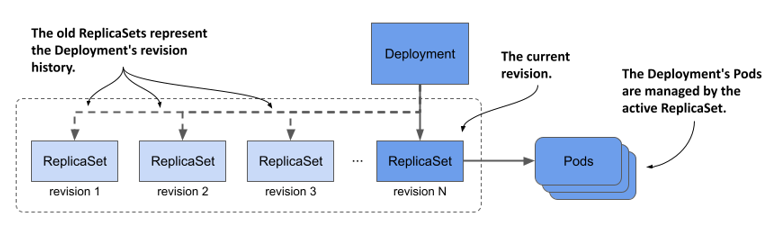

##### Lưu ý

Dung lượng của lịch sử phiên bản sửa đổi, và do đó là số lượng ReplicaSet mà Deployment controller giữ lại cho một Deployment cụ thể, được xác định bởi trường `revisionHistoryLimit` trong phần `spec` của Deployment. Giá trị mặc định là 10.

Như một bài tập thực hành, hãy thử tìm số phiên bản sửa đổi mà phiên bản 0.6 của Kiada Service được triển khai. Bạn sẽ cần số phiên bản sửa đổi này trong phần tiếp theo.

##### Mẹo

Thay vì sử dụng `kubectl rollout history` để xem lịch sử của một Deployment, việc liệt kê các ReplicaSet bằng tùy chọn `-o wide` là một lựa chọn tốt hơn, vì nó hiển thị các tag image được sử dụng trong Pod. Để tìm số phiên bản sửa đổi của từng ReplicaSet, hãy xem các annotation của ReplicaSet đó.

#### Khôi phục về một phiên bản sửa đổi Deployment cụ thể

Bạn đã sử dụng lệnh `kubectl rollout undo` để khôi phục từ phiên bản lỗi 0.8 về phiên bản 0.7. Nhưng phần nền màu vàng cho các mục "Tip of the day" và "Pop quiz" trên giao diện người dùng trông không đẹp mắt bằng phần nền màu trắng ở phiên bản 0.6, vì vậy hãy khôi phục về phiên bản này.

Bạn có thể khôi phục về một phiên bản sửa đổi cụ thể bằng cách chỉ định số phiên bản sửa đổi trong lệnh `kubectl rollout undo`. Ví dụ: nếu bạn muốn quay lại phiên bản sửa đổi đầu tiên, hãy chạy lệnh sau:

```
$ kubectl rollout undo deployment kiada --to-revision=1
```

Nếu đã tìm thấy số phiên bản sửa đổi chứa phiên bản 0.6 của Kiada Service, vui lòng sử dụng lệnh `kubectl rollout undo` để khôi phục về phiên bản đó.

#### Hiểu rõ sự biệt giữa khôi phục phiên bản trước và áp dụng file manifest phiên bản cũ

Bạn có thể nghĩ rằng việc sử dụng `kubectl rollout undo` để khôi phục về phiên bản trước của manifest Deployment cũng tương đương với việc áp dụng lại file manifest cũ, nhưng thực tế không phải như vậy. Lệnh `kubectl rollout undo` chỉ khôi phục lại cấu trúc Pod template và giữ nguyên bất kỳ thay đổi nào khác mà bạn đã thực hiện trên manifest Deployment. Điều này bao gồm cả những thay đổi đối với chiến lược cập nhật và số lượng bản sao (replica) mong muốn. Ngược lại, lệnh `kubectl apply` sẽ ghi đè lên những thay đổi này.

##### Khởi động lại các Pod bằng lệnh kubectl rollout restart

Bên cạnh các lệnh `kubectl rollout` đã được giải thích trong phần này và các phần trước, còn một lệnh nữa mà tôi nên đề cập.

Tại một thời điểm nào đó, bạn có thể muốn khởi động lại toàn bộ các Pod thuộc về một Deployment. Bạn có thể làm điều đó bằng lệnh `kubectl rollout restart`. Lệnh này sẽ xóa và thay thế các Pod bằng cách áp dụng chính chiến lược được sử dụng cho quá trình cập nhật.

Nếu Deployment được cấu hình với chiến lược `RollingUpdate`, các Pod sẽ được tạo lại dần dần để duy trì tính khả dụng của dịch vụ trong suốt quá trình. Nếu chiến lược `Recreate` được sử dụng, tất cả các Pod sẽ bị xóa và tạo lại cùng một lúc.

## 14.3 Triển khai các chiến lược deployment khác

Trong các phần trước, bạn đã tìm hiểu cách thức hoạt động của hai chiến lược `Recreate` và `RollingUpdate`. Mặc dù đây là những chiến lược duy nhất được hỗ trợ trực tiếp bởi Deployment controller, bạn vẫn có thể tự mình triển khai các chiến lược nổi tiếng khác, nhưng sẽ tốn nhiều công sức hơn một chút. Bạn có thể thực hiện việc này theo cách thủ công hoặc sử dụng một bộ điều khiển cấp cao hơn (higher-level controller) để tự động hóa quy trình. Tại thời điểm viết cuốn sách này, Kubernetes chưa cung cấp sẵn các bộ điều khiển như vậy, nhưng bạn có thể tìm thấy chúng trong các dự án như Flagger (<https://github.com/fluxcd/flagger>) và Argo Rollouts (<https://argoproj.github.io/argo-rollouts>).

Trong phần này, tôi sẽ cung cấp cho bạn một cái nhìn tổng quan về cách triển khai các chiến lược deployment phổ biến nhất. Bảng dưới đây sẽ giải thích các chiến lược này, và các phần tiếp theo sẽ hướng dẫn cách triển khai chúng trong Kubernetes.

##### Bảng 14.4 Các chiến lược deployment phổ biến

| Chiến lược | Mô tả |
| :--- | :--- |
| **Recreate** | Dừng tất cả các Pod đang chạy phiên bản trước, sau đó tạo mới toàn bộ các Pod chạy phiên bản mới. |
| **Rolling update** | Thay thế dần dần các Pod cũ bằng các Pod mới, theo kiểu tuần tự từng cái một hoặc nhiều cái cùng lúc. Chiến lược này còn được gọi là *Ramped* (Cập nhật dốc) hoặc *Incremental* (Cập nhật gia tăng). |
| **Canary** | Tạo một hoặc một số lượng rất nhỏ các Pod mới, điều hướng một phần nhỏ lưu lượng truy cập (traffic) đến các Pod này để đảm bảo chúng hoạt động như mong đợi. Sau đó tiến hành thay thế tất cả các Pod còn lại. |
| **A/B testing** | Tạo một số lượng nhỏ các Pod mới và điều hướng một nhóm nhỏ người dùng đến các Pod này dựa trên một số điều kiện cụ thể. Một người dùng cụ thể sẽ luôn được điều hướng đến cùng một phiên bản ứng dụng. Thông thường, bạn sử dụng chiến lược này để thu thập dữ liệu về mức độ hiệu quả của từng phiên bản trong việc đạt được các mục tiêu nhất định. |
| **Blue/Green** | Triển khai phiên bản mới của các Pod song song với phiên bản cũ. Đợi cho đến khi các Pod mới sẵn sàng, sau đó chuyển toàn bộ lưu lượng truy cập sang các Pod mới. Cuối cùng, tiến hành xóa các Pod cũ. |
| **Shadowing** | Triển khai phiên bản mới của các Pod bên cạnh phiên bản cũ. Chuyển tiếp mỗi yêu cầu đến cả hai phiên bản, nhưng chỉ trả về phản hồi của phiên bản cũ cho người dùng, đồng thời loại bỏ phản hồi của phiên bản mới. Bằng cách này, bạn có thể quan sát hành vi của phiên bản mới mà không ảnh hưởng đến người dùng. Chiến lược này còn được gọi là *Traffic mirroring* (Phản chiếu lưu lượng) hoặc *Dark launch* (Triển khai ngầm). |

Như bạn đã biết, các chiến lược `Recreate` và `RollingUpdate` được hỗ trợ trực tiếp bởi Kubernetes, nhưng bạn cũng có thể coi chiến lược Canary là được hỗ trợ một phần. Để tôi giải thích rõ hơn.

### 14.3.1 Chiến lược Canary deployment

Nếu bạn đặt tham số `minReadySeconds` ở một giá trị đủ lớn, quá trình cập nhật sẽ tương tự như một đợt triển khai Canary, ở chỗ tiến trình sẽ tạm dừng cho đến khi các Pod mới đầu tiên chứng minh được hoạt động ổn định của mình. Điểm khác biệt so với một chiến lược Canary thực sự là sự tạm dừng này áp dụng cho mọi bước của quá trình cập nhật, chứ không chỉ riêng cho (các) Pod đầu tiên.

Ngoài ra, bạn có thể sử dụng lệnh `kubectl rollout pause` ngay sau khi tạo (các) Pod đầu tiên và tiến hành kiểm tra thủ công các Pod canary đó. Khi đã chắc chắn rằng phiên bản mới hoạt động đúng như mong đợi, bạn có thể tiếp tục đợt cập nhật bằng lệnh `kubectl rollout resume`.

Một cách khác để đạt được mục tiêu tương tự là tạo một Deployment riêng biệt cho các Pod canary và đặt số lượng bản sao mong muốn ở mức thấp hơn nhiều so với Deployment của phiên bản ổn định (stable version). Bạn cấu hình Service để chuyển tiếp lưu lượng truy cập đến các Pod ở cả hai Deployment này. Vì Service phân phối lưu lượng truy cập đồng đều giữa các Pod, và vì Deployment canary có số lượng Pod ít hơn nhiều so với Deployment ổn định, nên chỉ một lượng nhỏ lưu lượng truy cập được gửi đến các Pod canary, trong khi phần lớn vẫn được chuyển đến các Pod ổn định. Phương pháp này được minh họa trong hình dưới đây.

##### Hình 14.11 Triển khai chiến lược Canary deployment bằng cách sử dụng hai Deployment

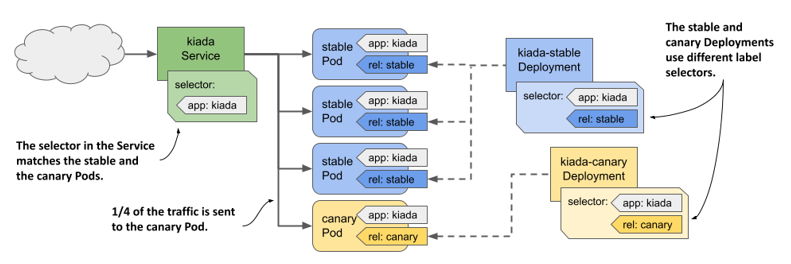

Khi bạn đã sẵn sàng cập nhật các Pod còn lại, bạn có thể tiến hành một đợt rolling update thông thường trên Deployment cũ và xóa Deployment canary đi.

### 14.3.2 Chiến lược A/B testing

Nếu muốn triển khai chiến lược A/B testing để chỉ phân phối phiên bản mới cho những người dùng cụ thể dựa trên một điều kiện nhất định—như vị trí địa lý, ngôn ngữ, user agent, HTTP cookie hoặc header—bạn sẽ tạo ra hai Deployment và hai Service. Bạn cấu hình đối tượng Ingress để điều tuyến lưu lượng truy cập đến Service này hoặc Service kia dựa trên điều kiện đã chọn, giống như minh họa trong hình dưới đây.

##### Hình 14.12 Triển khai chiến lược A/B testing bằng cách sử dụng hai Deployment, Service và một Ingress

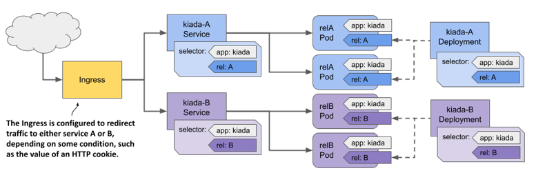

Tính đến thời điểm viết cuốn sách này, Kubernetes chưa cung cấp một phương thức gốc (native) nào để triển khai chiến lược này, nhưng một số giải pháp Ingress thì có hỗ trợ. Hãy tham khảo tài liệu hướng dẫn của giải pháp Ingress mà bạn chọn để biết thêm thông tin chi tiết.

### 14.3.3 Chiến lược Blue/Green

Trong chiến lược Blue/Green, một Deployment khác có tên là Green Deployment được tạo ra song song với Deployment ban đầu, gọi là Blue Deployment. Service được cấu hình để chỉ chuyển tiếp lưu lượng truy cập đến Blue Deployment cho đến khi bạn quyết định chuyển toàn bộ lưu lượng sang Green Deployment. Hai nhóm Pod này sử dụng các nhãn (label) khác nhau, và bộ chọn nhãn (label selector) trong Service sẽ khớp với một nhóm tại một thời điểm. Bạn chuyển đổi lưu lượng truy cập từ nhóm này sang nhóm kia bằng cách cập nhật bộ chọn nhãn trong cấu hình Service, như minh họa trong hình dưới đây.

##### Hình 14.13 Triển khai Blue/Green deployment bằng nhãn và bộ chọn (selector)

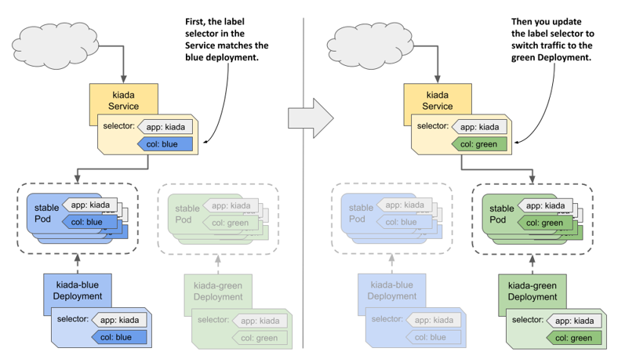

Như bạn đã biết, Kubernetes cung cấp đầy đủ mọi tính năng cần thiết để bạn tự triển khai chiến lược này mà không cần đến bất kỳ công cụ bổ sung nào khác.

### 14.3.4 Kỹ thuật shadowing lưu lượng (Traffic shadowing)

Đôi khi bạn không hoàn toàn chắc chắn liệu phiên bản mới của ứng dụng có hoạt động ổn định trên môi trường production thực tế hay không, hoặc liệu nó có chịu nổi tải lượng thực tế hay không. Trong trường hợp này, bạn có thể triển khai phiên bản mới chạy song song với phiên bản hiện tại bằng cách tạo thêm một đối tượng Deployment khác, đồng thời cấu hình các nhãn của Pod sao cho các Pod thuộc Deployment mới này không khớp với bộ chọn nhãn (label selector) trong Service.

Bạn cấu hình Ingress hoặc proxy đứng trước các Pod để gửi lưu lượng truy cập đến các Pod hiện tại, đồng thời nhân bản (mirror) lưu lượng đó sang cả các Pod mới. Proxy sẽ trả về phản hồi từ các Pod hiện tại cho client và loại bỏ phản hồi từ các Pod mới, như minh họa trong hình dưới đây.

##### Hình 14.14 Triển khai kỹ thuật shadowing lưu lượng (Traffic shadowing)

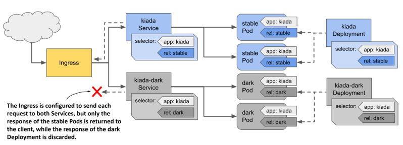

Tương tự như trường hợp của A/B testing, Kubernetes không hỗ trợ sẵn chức năng cần thiết để triển khai kỹ thuật shadowing lưu lượng, nhưng một số giải pháp Ingress thì có.

## 14.4 Tóm tắt chương

Trong chương này, bạn đã tạo một Deployment cho Kiada Service, bây giờ hãy thực hiện tương tự cho Quote Service và Quiz Service. Nếu cần hỗ trợ, bạn có thể tìm thấy các file `deploy.quote.yaml` và `deploy.quiz.yaml` trong kho lưu trữ mã nguồn của cuốn sách.

Dưới đây là tóm tắt những nội dung bạn đã học được trong chương này:

- Một Deployment là một lớp trừu tượng (abstraction layer) nằm trên các Replica Set. Ngoài tất cả các chức năng mà một Replica Set cung cấp, Deployment còn cho phép bạn cập nhật các Pod một cách khai báo (declaratively). Khi bạn cập nhật Pod template, các Pod cũ sẽ được thay thế bằng các Pod mới được tạo ra bằng template đã cập nhật.
- Trong quá trình cập nhật, Deployment controller sẽ thay thế các Pod dựa trên chiến lược được cấu hình trong Deployment. Ở chiến lược `Recreate`, tất cả các Pod sẽ được thay thế cùng một lúc, trong khi ở chiến lược `RollingUpdate`, quá trình thay thế sẽ diễn ra dần dần.
- Các Pod được tạo ra bởi một Replica Set sẽ thuộc quyền sở hữu của Replica Set đó. Replica Set này thường lại thuộc quyền sở hữu của một Deployment. Nếu bạn xóa đối tượng sở hữu (owner), bộ thu gom rác (garbage collector) sẽ tự động xóa các đối tượng phụ thuộc (dependents), nhưng bạn cũng có thể yêu cầu `kubectl` biến chúng thành các đối tượng mồ sôi (orphan) để giữ lại.
- Các chiến lược deployment khác không được hỗ trợ trực tiếp bởi Kubernetes, nhưng có thể được triển khai bằng cách cấu hình phù hợp các Deployment, Service và Ingress.

Bạn cũng đã biết rằng Deployment thường được sử dụng để chạy các ứng dụng phi trạng thái (stateless). Trong chương tiếp theo, bạn sẽ tìm hiểu về Stateful Set, một đối tượng được thiết kế riêng để chạy các ứng dụng có lưu trạng thái (stateful).

---

[← Chương 13](13-nhan-ban-pod-bang-replicaset.md) · [Mục lục](README.md) · [Chương 15 →](15-trien-khai-cac-workload-co-trang-thai-bang-statefulset.md)
