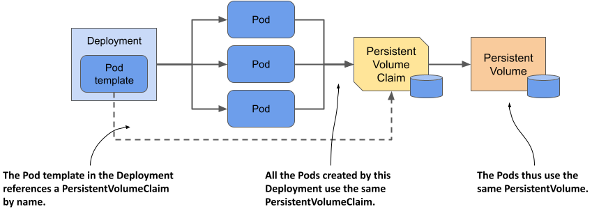
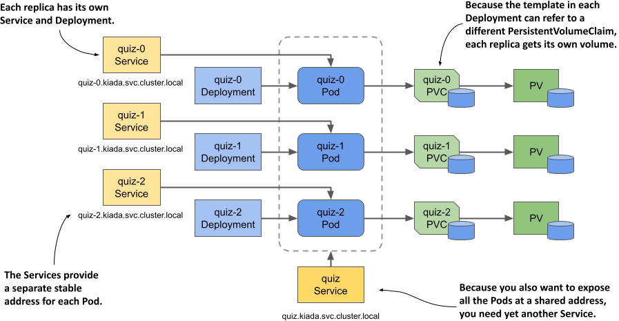
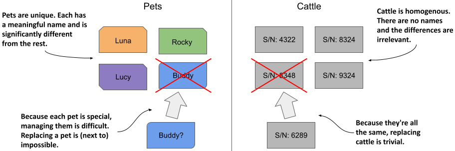
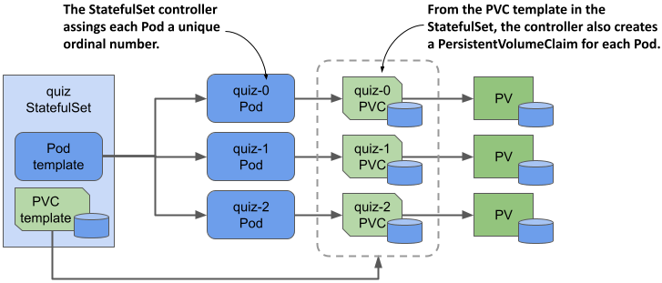
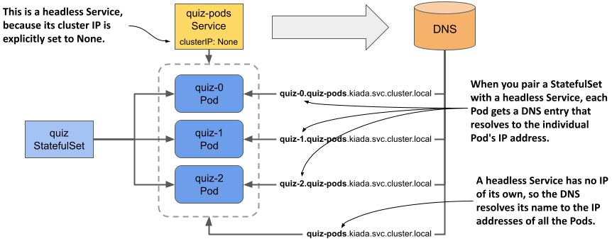
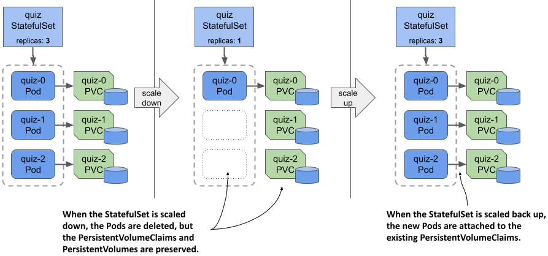
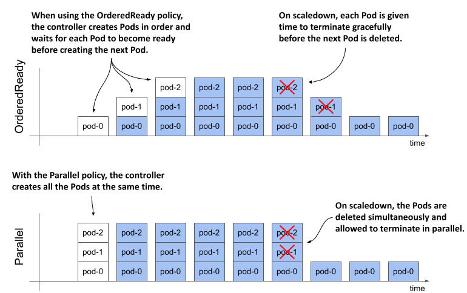
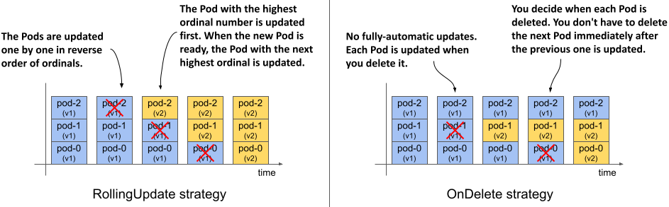
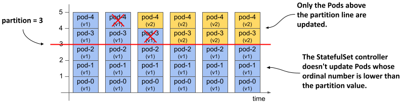
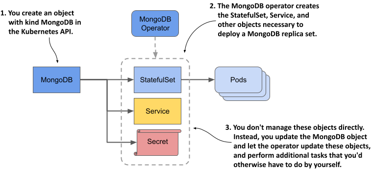

# 15 Triển khai các workload có trạng thái bằng StatefulSet

### Chương này bao gồm các nội dung

- Quản lý các workload có trạng thái (stateful workload) thông qua các đối tượng StatefulSet
- Expose (phơi bày) từng Pod riêng lẻ thông qua các headless Service (Service không đầu)
- Hiểu rõ sự khác biệt giữa Deployment và StatefulSet
- Tự động hóa việc quản lý các workload có trạng thái bằng Kubernetes Operator

Mỗi dịch vụ trong bộ ba dịch vụ của ứng dụng Kiada hiện đã được triển khai thông qua một đối tượng Deployment. Kiada Service và Quote Service đều có ba bản sao (replica), trong khi Quiz Service chỉ có một bản sao duy nhất do đặc thù dữ liệu của nó không cho phép mở rộng (scale) một cách dễ dàng. Trong chương này, bạn sẽ học cách triển khai và mở rộng quy mô một cách bài bản cho các workload có trạng thái như Quiz Service bằng cách sử dụng *StatefulSet*.

Trước khi bắt đầu, hãy tạo Namespace `kiada`, chuyển sang thư mục `Chapter15/` và áp dụng tất cả các manifest trong thư mục `SETUP/` bằng lệnh sau:

```
$ kubectl apply -n kiada -f SETUP -R
```

##### QUAN TRỌNG

Các ví dụ trong chương này giả định rằng các đối tượng được tạo trong Namespace `kiada`. Nếu bạn tạo chúng ở một Namespace khác, bạn buộc phải cập nhật lại tên miền DNS ở một vài vị trí tương ứng.

##### LƯU Ý

Bạn có thể tìm thấy các file mã nguồn của chương này tại địa chỉ <https://github.com/luksa/kubernetes-in-action-2nd-edition/tree/master/Chapter15>.

## 15.1 Giới thiệu về StatefulSet

Trước khi tìm hiểu về StatefulSet và sự khác biệt giữa chúng với Deployment, chúng ta cần nắm rõ các yêu cầu của một workload có trạng thái (stateful) khác biệt như thế nào so với các workload phi trạng thái (stateless) tương ứng.

### 15.1.1 Tìm hiểu các yêu cầu của workload có trạng thái

Một workload có trạng thái là một phần mềm cần phải lưu trữ và duy trì trạng thái (state/dữ liệu) để có thể hoạt động được. Trạng thái này phải được bảo toàn ngay cả khi workload bị khởi động lại hoặc chuyển sang vị trí khác. Điều này khiến cho việc vận hành các workload có trạng thái trở nên phức tạp hơn rất nhiều.

Các workload có trạng thái cũng khó mở rộng quy mô hơn rất nhiều, bởi bạn không thể đơn thuần thêm hoặc bớt các bản sao (replica) mà không màng tới trạng thái của chúng giống như với các ứng dụng phi trạng thái. Nếu các replica có thể chia sẻ chung trạng thái bằng cách đọc và ghi vào cùng các file dữ liệu, thì việc thêm các replica mới sẽ không gặp trở ngại gì. Tuy nhiên, để làm được điều này, công nghệ lưu trữ bên dưới phải hỗ trợ tính năng đó. Mặt khác, nếu mỗi replica lưu trữ trạng thái của nó trong các file dữ liệu riêng biệt, bạn sẽ cần phải cấp phát một volume độc lập cho từng replica. Với các tài nguyên Kubernetes mà bạn đã gặp từ đầu đến giờ, việc này nói thì dễ hơn làm. Hãy cùng phân tích hai lựa chọn này để hiểu rõ những vấn đề đi kèm với cả hai.

#### Chia sẻ trạng thái giữa nhiều bản sao Pod

Trong Kubernetes, bạn có thể sử dụng PersistentVolume với chế độ truy cập `ReadWriteMany` để chia sẻ dữ liệu giữa nhiều Pod. Tuy nhiên, ở hầu hết các môi trường điện toán đám mây, công nghệ lưu trữ nền tảng thường chỉ hỗ trợ chế độ truy cập `ReadWriteOnce` và `ReadOnlyMany` chứ không hỗ trợ `ReadWriteMany`, điều đó có nghĩa là bạn không thể mount một volume vào nhiều node khác nhau ở chế độ đọc/ghi. Do đó, các Pod nằm trên các node khác nhau không thể cùng đọc và ghi vào chung một PersistentVolume.

Hãy cùng minh họa vấn đề này bằng cách sử dụng Quiz Service. Liệu bạn có thể scale Deployment `quiz` lên thành ba bản sao không? Hãy xem điều gì sẽ xảy ra. Lệnh `kubectl scale` như sau:

```
$ kubectl scale deploy quiz --replicas 3
deployment.apps/quiz scaled
```

Bây giờ, hãy kiểm tra các Pod bằng lệnh sau:

```
$ kubectl get pods -l app=quiz
NAME                   READY   STATUS             RESTARTS      AGE
quiz-6f4968457-2c8ws   2/2     Running            0             10m    #A
quiz-6f4968457-cdw97   0/2     CrashLoopBackOff   1 (14s ago)   22s    #B
quiz-6f4968457-qdn29   0/2     Error              2 (16s ago)   22s    #B
```

Như bạn có thể thấy, chỉ có duy nhất Pod tồn tại từ trước khi thực hiện scale-up là đang chạy, trong khi hai Pod mới thì không. Tùy thuộc vào loại cluster bạn đang sử dụng, hai Pod này có thể hoàn toàn không khởi động được, hoặc khởi động nhưng lập tức dừng lại với một thông báo lỗi. Ví dụ, trong một cluster chạy trên Google Kubernetes Engine, các container trong Pod không thể khởi động vì PersistentVolume không thể kết nối (attach) vào các Pod mới do chế độ truy cập của nó là `ReadWriteOnce`, và một volume thì không thể kết nối đồng thời với nhiều node khác nhau. Trong các cluster được dựng bằng công cụ kind, các container có khởi động, nhưng container `mongo` lại gặp lỗi và dừng lại, bạn có thể kiểm tra lỗi này bằng lệnh sau:

```
$ kubectl logs quiz-6f4968457-cdw97 -c mongo #A
..."msg":"DBException in initAndListen, terminating","attr":{"error":"DBPathInUse: Unable to lock the lock file: /data/db/mongod.lock (Resource temporarily unavailable). Another mongod instance is already running on the /data/db directory"}}
```

Thông báo lỗi trên chỉ ra rằng bạn không thể sử dụng chung một thư mục dữ liệu cho nhiều thực thể (instance) MongoDB chạy đồng thời. Cả ba Pod `quiz` đều đang cố dùng chung một thư mục vì chúng cùng sử dụng chung một PersistentVolumeClaim, và do đó dẫn đến việc dùng chung một PersistentVolume duy nhất, như được minh họa trong hình tiếp theo.

##### Hình 15.1 Tất cả các Pod từ một Deployment đều dùng chung một PersistentVolumeClaim và PersistentVolume.



Vì cách tiếp cận trên không hiệu quả, phương án thay thế là sử dụng một PersistentVolume riêng biệt cho từng bản sao Pod. Hãy cùng xem giải pháp này có nghĩa là gì và liệu bạn có thể thực hiện nó chỉ với một đối tượng Deployment duy nhất hay không.

#### Sử dụng một PersistentVolume dành riêng cho từng bản sao

Như bạn đã biết ở phần trước, MongoDB theo mặc định chỉ hỗ trợ chạy một thực thể duy nhất. Nếu bạn muốn triển khai nhiều thực thể MongoDB dùng chung dữ liệu, bạn phải thiết lập một *replica set* của MongoDB để sao chép dữ liệu giữa các thực thể đó (lưu ý thuật ngữ "replica set" ở đây là khái niệm riêng của MongoDB, hoàn toàn không liên quan đến tài nguyên ReplicaSet trong Kubernetes). Mỗi thực thể cần một volume lưu trữ riêng biệt và một địa chỉ mạng ổn định để các replica khác và client có thể kết nối tới nó. Do đó, để triển khai một replica set MongoDB trên Kubernetes, bạn phải đảm bảo rằng:

- mỗi Pod sở hữu một PersistentVolume riêng biệt,
- mỗi Pod có thể được truy cập thông qua một địa chỉ duy nhất của riêng nó,
- khi một Pod bị xóa và thay thế, Pod mới sẽ được gán lại đúng địa chỉ mạng và PersistentVolume của Pod cũ.

Bạn không thể thực hiện điều này chỉ với một Deployment và một Service duy nhất, nhưng bạn có thể làm được bằng cách tạo ra một bộ gồm Deployment, Service và PersistentVolumeClaim riêng biệt cho từng bản sao, như được minh họa trong hình dưới đây.

##### Hình 15.2 Cấp cho mỗi bản sao một volume và địa chỉ mạng riêng biệt.



Mỗi Pod thuộc về một Deployment riêng biệt, nhờ đó Pod có thể tự do sử dụng PersistentVolumeClaim và PersistentVolume của riêng mình. Service đi kèm với từng bản sao sẽ cung cấp cho nó một địa chỉ mạng ổn định, luôn phân giải đúng về địa chỉ IP của Pod đó, ngay cả khi Pod bị xóa và tạo lại trên một node khác. Điều này là vô cùng cần thiết bởi vì đối với MongoDB—cũng như nhiều hệ thống phân tán khác—bạn buộc phải chỉ định địa chỉ chính xác của từng replica khi khởi tạo replica set. Ngoài các Service riêng biệt cho từng replica này, bạn còn cần thêm một Service chung khác để hỗ trợ client truy cập tất cả các Pod qua một địa chỉ duy nhất. Rõ ràng, việc thiết kế cả hệ thống như thế này trông vô cùng phức tạp và đáng ngại.

Mọi chuyện thậm chí còn tệ hơn nếu bạn có nhu cầu mở rộng quy mô. Khi cần tăng số lượng replica, bạn sẽ không thể sử dụng lệnh `kubectl scale` đơn giản nữa; thay vào đó, bạn phải tạo thêm thủ công các Deployment, Service và PersistentVolumeClaim mới, khiến mức độ phức tạp tăng lên gấp bội.

Mặc dù phương pháp này hoàn toàn khả thi, nhưng nó quá phức tạp và rất khó để vận hành ổn định trong thực tế. Rất may, Kubernetes cung cấp một giải pháp tối ưu hơn nhiều để giải quyết vấn đề này: chỉ cần dùng một Service duy nhất kết hợp với một đối tượng StatefulSet duy nhất.

##### Lưu ý

Hiện tại bạn không cần đến Deployment `quiz` và PersistentVolumeClaim `quiz-data` nữa, vì vậy vui lòng xóa chúng bằng lệnh sau: `kubectl delete deploy/quiz pvc/quiz-data`.

### 15.1.2 So sánh StatefulSet với Deployment

Một StatefulSet có cấu trúc tương tự như một Deployment, nhưng được thiết kế chuyên biệt cho các workload có trạng thái. Dù vậy, hành vi hoạt động của hai đối tượng này có những khác biệt rất lớn. Sự khác biệt này được giải thích rõ nét nhất qua phép ẩn dụ kinh điển *Thú cưng đối lập với Gia súc* (Pets vs. Cattle) mà có thể bạn đã từng nghe qua. Nếu chưa, hãy để tôi giải thích.

##### Lưu ý

Ban đầu, StatefulSet được gọi là PetSet. Tên gọi này bắt nguồn chính từ phép ẩn dụ Pets vs. Cattle kể trên.

#### Phép ẩn dụ Pets vs. Cattle (Thú cưng đối lập với Gia súc)

Trước đây, chúng ta thường đối xử với cơ sở hạ tầng phần cứng và các workload của mình giống như chăm sóc thú cưng (pets). Chúng ta đặt tên riêng cho từng máy chủ và chăm chút riêng lẻ cho từng thực thể chạy ứng dụng. Tuy nhiên, thực tế chứng minh rằng việc quản lý cả phần cứng lẫn phần mềm sẽ trở nên dễ dàng hơn nhiều nếu chúng ta đối xử với chúng như đàn gia súc (cattle)—tức là xem chúng như những thực thể hoàn toàn đồng nhất và không có sự khác biệt. Điều này giúp chúng ta dễ dàng thay thế bất kỳ đơn vị nào mà không cần lo lắng liệu thực thể thay thế có giống hệt thực thể cũ hay không, tương tự như cách một người nông dân quản lý đàn gia súc của mình.

##### Hình 15.3 Đối xử với các thực thể như thú cưng so với gia súc



Các ứng dụng phi trạng thái được triển khai thông qua Deployment giống như đàn gia súc. Khi một Pod bị thay thế, bạn có lẽ sẽ chẳng hề nhận ra sự khác biệt. Ngược lại, các ứng dụng có trạng thái lại giống như thú cưng. Nếu một chú thú cưng bị lạc mất, bạn không thể đơn giản là mua một chú thú cưng mới về để thay thế hoàn toàn. Ngay cả khi bạn đặt cho chú thú cưng mới cái tên cũ, nó vẫn sẽ không có hành vi giống hệt chú thú cưng ban đầu. Tuy nhiên, trong thế giới phần cứng và phần mềm, chúng ta hoàn toàn có thể làm được điều kỳ diệu này nếu chúng ta cấp cho thực thể thay thế chính xác danh tính mạng (network identity) và trạng thái dữ liệu (state) của thực thể đã mất. Và đó chính xác là những gì diễn ra khi bạn triển khai ứng dụng bằng một StatefulSet.

#### Triển khai Pod bằng một StatefulSet

Tương tự như Deployment, trong một StatefulSet, bạn cũng khai báo một Pod template, số lượng bản sao mong muốn và một bộ chọn nhãn (label selector). Tuy nhiên, bạn còn có thể khai báo thêm một template cho PersistentVolumeClaim. Mỗi lần StatefulSet controller tạo ra một bản sao mới, nó sẽ không chỉ tạo ra một đối tượng Pod mới mà còn tạo thêm một hoặc nhiều đối tượng PersistentVolumeClaim đi kèm.

Các Pod được tạo ra từ một StatefulSet không phải là những bản sao giống hệt nhau hoàn toàn như trong Deployment, bởi vì mỗi Pod sẽ liên kết tới một tập hợp PersistentVolumeClaim riêng biệt. Ngoài ra, tên của các Pod không hề ngẫu nhiên. Thay vào đó, mỗi Pod được gán một số thứ tự (ordinal number) duy nhất, và điều này cũng áp dụng tương tự cho mỗi PersistentVolumeClaim. Khi một Pod của StatefulSet bị xóa và tạo lại, nó sẽ được đặt đúng cái tên của Pod mà nó vừa thay thế. Đồng thời, một Pod mang số thứ tự cụ thể sẽ luôn được gắn liền với các PersistentVolumeClaim có cùng số thứ tự đó. Điều này đảm bảo trạng thái dữ liệu liên kết với một bản sao cụ thể sẽ luôn được bảo toàn nhất quán, bất kể Pod đó có bị tạo lại bao nhiêu lần đi chăng nữa.

##### Hình 15.4 Một StatefulSet, các Pod và các PersistentVolumeClaim của nó



Một khác biệt đáng chú ý khác giữa Deployment và StatefulSet là: theo mặc định, các Pod của một StatefulSet không được tạo ra đồng thời. Thay vào đó, chúng được tạo tuần tự từng cái một, tương tự như quá trình rolling update của một Deployment. Khi bạn khởi tạo một StatefulSet, ban đầu chỉ có Pod đầu tiên được tạo ra. Sau đó, StatefulSet controller sẽ đợi cho đến khi Pod này chuyển sang trạng thái sẵn sàng (ready) rồi mới tiến hành tạo Pod tiếp theo.

StatefulSet có thể được mở rộng hoặc thu hẹp quy mô giống hệt như Deployment. Khi bạn scale up StatefulSet, các Pod và PersistentVolumeClaim mới sẽ được tạo ra từ các template tương ứng của chúng. Khi bạn scale down StatefulSet, các Pod sẽ bị xóa đi, nhưng các PersistentVolumeClaim sẽ được giữ lại hoặc xóa đi tùy thuộc vào chính sách (policy) mà bạn cấu hình trong StatefulSet.

### 15.1.3 Khởi tạo một StatefulSet

Trong phần này, bạn sẽ thay thế Deployment `quiz` bằng một StatefulSet. Mỗi StatefulSet bắt buộc phải có một headless Service đi kèm để expose (phơi bày) riêng lẻ từng Pod, vì vậy việc đầu tiên bạn cần làm là khởi tạo Service này.

#### Khởi tạo Service điều phối (governing Service)

Headless Service liên kết với một StatefulSet sẽ cung cấp cho các Pod danh tính mạng ổn định của chúng. Như bạn có thể nhớ lại từ Chương 11, một headless Service không sở hữu địa chỉ IP nội bộ của cluster (cluster IP), nhưng bạn vẫn có thể sử dụng nó để kết nối tới các Pod khớp với bộ chọn nhãn (label selector) của nó. Thay vì chỉ có một bản ghi DNS loại `A` hoặc `AAAA` duy nhất trỏ tới IP của Service, bản ghi DNS của một headless Service sẽ trỏ trực tiếp tới địa chỉ IP của tất cả các Pod là thành viên của Service đó.

Như bạn thấy trong hình dưới đây, khi sử dụng một headless Service kết hợp với một StatefulSet, một bản ghi DNS bổ sung sẽ được tạo ra cho từng Pod, cho phép tra cứu địa chỉ IP của mỗi Pod thông qua chính tên của nó. Đây là cách các Pod có trạng thái duy trì được danh tính mạng ổn định của mình. Những bản ghi DNS đặc thù này sẽ không tồn tại nếu headless Service không được liên kết với một StatefulSet.

##### Hình 15.5 Một headless Service được sử dụng kết hợp với một StatefulSet



Bạn đã có sẵn một Service tên là `quiz` được tạo ở các chương trước. Bạn hoàn toàn có thể chuyển đổi nó thành một headless Service, nhưng thay vào đó, hãy tạo thêm một Service mới, bởi vì Service mới này sẽ expose tất cả các Pod `quiz`, bất kể chúng đã sẵn sàng (ready) hay chưa.

Headless Service này sẽ giúp bạn phân giải địa chỉ mạng cho từng Pod riêng lẻ, vì vậy chúng ta hãy đặt tên cho nó là `quiz-pods`. Hãy tạo Service này bằng lệnh `kubectl apply`. Bạn có thể tìm thấy manifest của Service trong file `svc.quiz-pods.yaml` với nội dung cụ thể trong danh sách dưới đây.

##### Danh sách 15.1 Headless Service cho StatefulSet quiz

```yaml
apiVersion: v1
kind: Service
metadata:
  name: quiz-pods    #A
spec:
  clusterIP: None    #B
  publishNotReadyAddresses: true    #C
  selector:    #D
    app: quiz    #D
  ports:    #E
  - name: mongodb    #E
    port: 27017    #E
```

Trong danh sách trên, trường `clusterIP` được đặt là `None`, giúp biến Service này thành một headless Service. Khi bạn thiết lập `publishNotReadyAddresses` thành `true`, các bản ghi DNS cho từng Pod sẽ được khởi tạo ngay lập tức khi Pod được tạo ra, chứ không cần đợi đến lúc Pod ở trạng thái sẵn sàng (ready). Nhờ đó, Service `quiz-pods` sẽ bao gồm tất cả các Pod `quiz` mà không cần bận tâm đến trạng thái sẵn sàng của chúng.

#### Khởi tạo StatefulSet

Sau khi đã tạo xong headless Service, bạn có thể tiến hành khởi tạo StatefulSet. Bạn có thể tìm thấy manifest của đối tượng này trong file `sts.quiz.yaml`. Những phần cốt lõi nhất của file manifest được hiển thị trong danh sách dưới đây.

##### Danh sách 15.2 Manifest đối tượng cho một StatefulSet

```yaml
apiVersion: apps/v1    #A
kind: StatefulSet    #A
metadata:
  name: quiz
spec:
  serviceName: quiz-pods    #B
  podManagementPolicy: Parallel    #C
  replicas: 3    #D
  selector:    #E
    matchLabels:    #E
      app: quiz    #E
  template:    #F
    metadata:
      labels:    #E
        app: quiz    #E
        ver: "0.1"    #E
    spec:
      volumes:    #G
      - name: db-data    #G
        persistentVolumeClaim:    #G
          claimName: db-data    #G
      containers:
      - name: quiz-api
        ...
      - name: mongo
        image: mongo:5
        command:    #H
        - mongod    #H
        - --bind_ip    #H
        - 0.0.0.0    #H
        - --replSet    #H
        - quiz    #H
        volumeMounts:    #I
        - name: db-data    #I
          mountPath: /data/db    #I
  volumeClaimTemplates:    #J
  - metadata:    #J
      name: db-data    #J
      labels:    #J
        app: quiz    #J
    spec:    #J
      resources:    #J
        requests:    #J
          storage: 1Gi    #J
      accessModes:    #J
      - ReadWriteOnce    #J
```

File manifest này định nghĩa một đối tượng có `kind` là `StatefulSet` thuộc API group `apps`, phiên bản `v1`. Tên của StatefulSet này là `quiz`. Trong phần `spec` của StatefulSet, bạn sẽ thấy một số trường quen thuộc đã biết từ Deployment và ReplicaSet như `replicas`, `selector` và `template` đã được giải thích ở chương trước; tuy nhiên, manifest này còn chứa các trường khác đặc thù của StatefulSet. Ví dụ, trong trường `serviceName`, bạn sẽ chỉ định tên của headless Service điều phối StatefulSet này.

Bằng việc thiết lập `podManagementPolicy` thành `Parallel`, bạn cho phép StatefulSet controller tạo ra toàn bộ các Pod cùng một lúc. Do một số ứng dụng phân tán không thể xử lý tốt việc nhiều thực thể cùng khởi chạy đồng thời, hành vi mặc định của controller là tạo tuần tự từng Pod một. Tuy nhiên, trong ví dụ này, tùy chọn `Parallel` sẽ giúp quá trình scale-up ban đầu diễn ra nhanh chóng và bớt rườm rà hơn.

Trong trường `volumeClaimTemplates`, bạn chỉ định các template cho PersistentVolumeClaim mà controller sẽ tạo ra cho từng replica. Khác với Pod template—nơi bạn thường bỏ qua trường `name`—bạn bắt buộc phải chỉ định tên cụ thể trong template của PersistentVolumeClaim. Tên này phải trùng khớp với tên được khai báo trong phần `volumes` của Pod template.

Hãy khởi tạo StatefulSet bằng cách áp dụng file manifest như sau:

```
$ kubectl apply -f sts.quiz.yaml
statefulset.apps/quiz created
```

### 15.1.4 Kiểm tra trạng thái của StatefulSet, Pod và PersistentVolumeClaim

Sau khi đã tạo xong StatefulSet, bạn có thể sử dụng lệnh `kubectl rollout status` để theo dõi trạng thái của nó như sau:

```
$ kubectl rollout status sts quiz
Waiting for 3 pods to be ready...
```

##### Lưu ý

Tên viết tắt của StatefulSet là `sts`.

Sau khi `kubectl` in ra thông báo này, tiến trình sẽ đứng yên mà không chạy tiếp. Hãy ngắt lệnh bằng cách nhấn tổ hợp phím Control-C và kiểm tra trạng thái của StatefulSet bằng lệnh `kubectl get` để tìm hiểu nguyên nhân.

```
$ kubectl get sts
NAME   READY   AGE
quiz   0/3     22s
```

##### Lưu ý

Tương tự như đối với Deployment và ReplicaSet, bạn có thể sử dụng tùy chọn `-o wide` để hiển thị tên các container và image được sử dụng trong StatefulSet.

Giá trị trong cột `READY` cho thấy hiện chưa có bản sao nào ở trạng thái sẵn sàng cả. Hãy liệt kê các Pod bằng lệnh `kubectl get pods` dưới đây:

```
$ kubectl get pods -l app=quiz
NAME     READY   STATUS    RESTARTS   AGE
quiz-0   1/2     Running   0          56s
quiz-1   1/2     Running   0          56s
quiz-2   1/2     Running   0          56s
```

##### Lưu ý

Bạn có chú ý đến tên của các Pod không? Chúng không hề chứa chuỗi mã băm của template (template hash) hay các ký tự ngẫu nhiên nào cả. Tên của mỗi Pod được cấu thành trực tiếp từ tên của StatefulSet kết hợp với một số thứ tự tăng dần, đúng như đã giải thích ở phần giới thiệu.

Bạn sẽ nhận thấy rằng chỉ có một trong hai container trong mỗi Pod ở trạng thái sẵn sàng. Nếu kiểm tra chi tiết một Pod bằng lệnh `kubectl describe`, bạn sẽ thấy container `mongo` đã sẵn sàng, nhưng container `quiz-api` thì chưa, nguyên nhân là do nó không vượt qua được bước kiểm tra độ sẵn sàng (readiness check). Điều này xảy ra bởi vì endpoint được gọi bởi đầu dò readiness probe (`/healthz/ready`) thực hiện kiểm tra xem tiến trình `quiz-api` có thể truy vấn tới máy chủ MongoDB hay không. Việc đầu dò readiness probe thất bại chứng minh rằng kết nối này hiện không khả dụng. Nếu kiểm tra log của container `quiz-api` bằng lệnh sau, bạn sẽ hiểu rõ nguyên nhân tại sao:

```shell
$ kubectl logs quiz-0 -c quiz-api
... INTERNAL ERROR: connected to mongo, but couldn't execute the ping command: server selection error: server selection timeout, current topology: { Type: Unknown, Servers: [{ Addr: 127.0.0.1:27017, Type: RSGhost, State: Connected, Average RTT: 898693 }, ] }
```

Như thông báo lỗi chỉ ra, kết nối đến MongoDB đã được thiết lập, nhưng máy chủ không cho phép thực thi lệnh ping. Nguyên nhân là do máy chủ được khởi động với tùy chọn `--replSet` để cấu hình sử dụng tính năng sao chép (replication), nhưng bộ bản sao (*replica set*) MongoDB vẫn chưa được khởi tạo. Để thực hiện việc này, hãy chạy lệnh sau:

```shell
$ kubectl exec -it quiz-0 -c mongo -- mongosh --quiet --eval 'rs.initiate({
  _id: "quiz",
  members: [
    {_id: 0, host: "quiz-0.quiz-pods.kiada.svc.cluster.local:27017"},
    {_id: 1, host: "quiz-1.quiz-pods.kiada.svc.cluster.local:27017"},
    {_id: 2, host: "quiz-2.quiz-pods.kiada.svc.cluster.local:27017"}]})'
```

##### Lưu ý

Thay vì phải gõ câu lệnh dài dòng này, bạn cũng có thể chạy kịch bản shell `initiate-mongo-replicaset.sh` trong thư mục mã nguồn của chương này.

Nếu shell MongoDB hiển thị thông báo lỗi sau, rất có thể bạn đã quên tạo Service `quiz-pods` từ trước:

MongoServerError: replSetInitiate quorum check failed because not all proposed set members responded affirmatively: ... caused by :: Could not find address for quiz-2.quiz-pods.kiada.svc.cluster.local:27017: SocketException: Host not found

Nếu quá trình khởi tạo bộ bản sao thành công, câu lệnh sẽ in ra thông báo sau:

{ ok: 1 }

Cả ba Pod `quiz` sẽ sớm chuyển sang trạng thái sẵn sàng ngay sau khi bộ bản sao được khởi tạo. Nếu chạy lại lệnh `kubectl rollout status`, bạn sẽ thấy kết quả đầu ra như sau:

```shell
$ kubectl rollout status sts quiz
partitioned roll out complete: 3 new pods have been updated...
```

#### Kiểm tra StatefulSet bằng kubectl describe

Như bạn đã biết, chúng ta có thể kiểm tra chi tiết một đối tượng bằng lệnh `kubectl describe`. Dưới đây là kết quả hiển thị cho StatefulSet `quiz`:

```shell
$ kubectl describe sts quiz
Name:               quiz
Namespace:          kiada
CreationTimestamp:  Sat, 12 Mar 2022 18:05:43 +0100
Selector:           app=quiz    #A
Labels:             app=quiz
Annotations:        <none>
Replicas:           3 desired | 3 total    #B
Update Strategy:    RollingUpdate
  Partition:        0
Pods Status:        3 Running / 0 Waiting / 0 Succeeded / 0 Failed    #C
Pod Template:    #D
  ...    #D
Volume Claims:    #E
  Name:          db-data    #E
  StorageClass:    #E
  Labels:        app=quiz    #E
  Annotations:   <none>    #E
  Capacity:      1Gi    #E
  Access Modes:  [ReadWriteOnce]    #E
Events:    #F
  Type    Reason            Age   From                    Message    #F
  ----    ------            ----  ----                    -------    #F
  Normal  SuccessfulCreate  10m   statefulset-controller  create Claim db-data-quiz-0    #F
                                                          Pod quiz-0 in StatefulSet    #F 
                                                          quiz success    #F
  Normal  SuccessfulCreate  10m   statefulset-controller  create Pod quiz-0 in    #F
                                                          StatefulSet quiz successful #F
  ...    #F
```

Có thể thấy, kết quả đầu ra rất giống với kết quả của ReplicaSet và Deployment. Điểm khác biệt dễ nhận thấy nhất là sự hiện diện của mẫu (*template*) PersistentVolumeClaim, vốn không có ở hai loại đối tượng kia. Các sự kiện (*events*) ở cuối kết quả hiển thị chính xác những gì bộ điều khiển (*controller*) StatefulSet đã thực hiện. Mỗi khi tạo một Pod hoặc một PersistentVolumeClaim, bộ điều khiển cũng đồng thời tạo ra một Event để ghi nhận hành động đó.

#### Kiểm tra các Pod

Hãy xem kỹ hơn tệp cấu hình (*manifest*) của Pod đầu tiên để so sánh với các Pod do ReplicaSet tạo ra. Hãy sử dụng lệnh `kubectl get` để in cấu hình Pod như sau:

```shell
$ kubectl get pod quiz-0 -o yaml
apiVersion: v1
kind: Pod
metadata:
  labels:
    app: quiz    #A
    controller-revision-hash: quiz-7576f64fbc    #A
    statefulset.kubernetes.io/pod-name: quiz-0    #A
    ver: "0.1"    #A
  name: quiz-0
  namespace: kiada
  ownerReferences:    #B
- apiVersion: apps/v1    #B
blockOwnerDeletion: true    #B
controller: true    #B
kind: StatefulSet    #B
name: quiz    #B
spec:
  containers:    #C
  ...    #C
  volumes:
- name: db-data
persistentVolumeClaim:    #D
  claimName: db-data-quiz-0    #D
status:
  ...
```

Nhãn (*label*) duy nhất bạn định nghĩa trong mẫu Pod của cấu hình StatefulSet là `app`, nhưng bộ điều khiển StatefulSet đã tự động bổ sung thêm hai nhãn khác cho Pod:

*   Nhãn `controller-revision-hash` có cùng mục đích với nhãn `pod-template-hash` trên các Pod của ReplicaSet. Nó giúp bộ điều khiển xác định xem một Pod cụ thể thuộc về phiên bản hiệu chỉnh (*revision*) nào của StatefulSet.
*   Nhãn `statefulset.kubernetes.io/pod-name` chỉ định tên Pod và cho phép bạn tạo một Service hướng đến một thực thể Pod cụ thể bằng cách sử dụng nhãn này trong bộ chọn nhãn (*label selector*) của Service.

Vì đối tượng Pod này do StatefulSet quản lý nên trường `ownerReferences` sẽ thể hiện rõ điều đó. Khác với Deployment (nơi các Pod thuộc quyền sở hữu của ReplicaSet, và ReplicaSet lại thuộc quyền sở hữu của Deployment), StatefulSet trực tiếp sở hữu các Pod. StatefulSet sẽ đảm nhận cả việc nhân bản lẫn cập nhật các Pod.

Các `containers` của Pod hoàn toàn khớp với các container được định nghĩa trong mẫu Pod của StatefulSet, nhưng các `volumes` thì không như vậy. Trong mẫu thiết kế, bạn đã chỉ định `claimName` là `db-data`, nhưng ở đây trong Pod thực tế, nó đã được đổi thành `db-data-quiz-0`. Nguyên nhân là do mỗi thực thể Pod sẽ nhận được một PersistentVolumeClaim riêng biệt. Tên của yêu cầu cấp phát này (*claim*) được cấu thành từ `claimName` kết hợp với tên của Pod.

#### Kiểm tra các PersistentVolumeClaim

Song song với các Pod, bộ điều khiển StatefulSet cũng tạo ra một PersistentVolumeClaim cho từng Pod. Hãy liệt kê chúng bằng lệnh sau:

```shell
$ kubectl get pvc -l app=quiz
NAME             STATUS   VOLUME           CAPACITY   ACCESS MODES   STORAGECLASS   AGE
db-data-quiz-0   Bound    pvc...1bf8ccaf   1Gi        RWO            standard       10m
db-data-quiz-1   Bound    pvc...c8f860c2   1Gi        RWO            standard       10m
db-data-quiz-2   Bound    pvc...2cc494d6   1Gi        RWO            standard       10m
```

Bạn có thể kiểm tra cấu hình của các PersistentVolumeClaim này để đảm bảo chúng khớp với mẫu đã chỉ định trong StatefulSet. Mỗi yêu cầu cấp phát (*claim*) được liên kết (*bound*) với một PersistentVolume được cấp phát động tương ứng. Các ổ đĩa này hiện chưa chứa bất kỳ dữ liệu nào, vì vậy dịch vụ Quiz hiện tại sẽ không trả về kết quả gì. Tiếp theo, chúng ta sẽ tiến hành nhập (*import*) dữ liệu.

### 15.1.5 Hiểu rõ vai trò của headless Service

Một yêu cầu quan trọng của các ứng dụng phân tán là khả năng tự phát hiện các nút trong mạng (*peer discovery*) — tức là khả năng để mỗi thành viên trong cụm tìm thấy các thành viên còn lại. Nếu một ứng dụng được triển khai qua StatefulSet cần tìm tất cả các Pod khác trong cùng StatefulSet, nó có thể làm điều đó bằng cách truy xuất danh sách Pod từ Kubernetes API. Tuy nhiên, vì chúng ta muốn ứng dụng độc lập với Kubernetes (*Kubernetes-agnostic*), tốt nhất ứng dụng nên sử dụng DNS thay vì giao tiếp trực tiếp với Kubernetes.

Ví dụ, một client kết nối đến một *replica set* MongoDB phải biết địa chỉ của tất cả các bản sao (*replica*), nhờ đó nó mới có thể tìm được bản sao chính (*primary replica*) khi cần ghi dữ liệu. Bạn phải chỉ định các địa chỉ này trong chuỗi kết nối (*connection string*) truyền vào client MongoDB. Với ba Pod `quiz` của bạn, chuỗi URI kết nối sau có thể được sử dụng:

```
mongodb://quiz-0.quiz-pods.kiada.svc.cluster.local:27017,quiz-1.quiz-pods.kiada.svc.
cluster.local:27017,quiz-2.quiz-pods.kiada.svc.cluster.local:27017
```

Nếu StatefulSet được cấu hình thêm các bản sao, bạn cũng sẽ phải thêm địa chỉ của chúng vào chuỗi kết nối. Thật may là có một cách tốt hơn.

#### Cung cấp DNS riêng cho từng Pod có trạng thái

Trong chương 11, bạn đã biết rằng một đối tượng Service không chỉ cung cấp một địa chỉ IP ổn định để truy cập vào một nhóm Pod, mà còn giúp hệ thống DNS của cụm phân giải tên Service ra địa chỉ IP này. Ngược lại, đối với một headless Service, tên Service sẽ được phân giải trực tiếp ra địa chỉ IP của các Pod thuộc Service đó. Tuy nhiên, khi một headless Service được liên kết với một StatefulSet, mỗi Pod còn được cấp riêng một bản ghi `A` hoặc `AAAA` trỏ thẳng tới IP của chính Pod đó. Ví dụ, do bạn đã kết hợp StatefulSet `quiz` với headless Service `quiz-pods`, IP của Pod `quiz-0` có thể được phân giải tại địa chỉ sau:

> *(Hình minh họa `SILA_IMG_176` không có trong tài liệu HTML gốc)*

Tất cả các bản sao khác do StatefulSet tạo ra cũng có thể được phân giải theo cách tương tự.

#### Lộ diện các Pod có trạng thái qua bản ghi SRV

Bên cạnh các bản ghi `A` và `AAAA`, mỗi Pod có trạng thái cũng được cấp các bản ghi `SRV`. Các bản ghi này có thể được client MongoDB sử dụng để tra cứu địa chỉ và cổng dịch vụ của từng Pod, giúp bạn không cần phải khai báo thủ công. Tuy nhiên, bạn phải đảm bảo bản ghi `SRV` có tên chính xác. MongoDB yêu cầu bản ghi `SRV` phải bắt đầu bằng `_mongodb`. Để đảm bảo điều đó, bạn cần đặt tên cổng (*port name*) trong định nghĩa Service là `mongodb` như đã làm ở Liệt kê 15.1. Điều này đảm bảo bản ghi `SRV` sẽ có dạng như sau:

> *(Hình minh họa `SILA_IMG_177` không có trong tài liệu HTML gốc)*

Việc sử dụng các bản ghi `SRV` giúp chuỗi kết nối MongoDB trở nên đơn giản hơn rất nhiều. Bất kể số lượng bản sao trong bộ là bao nhiêu, chuỗi kết nối luôn có dạng:

mongodb+srv://quiz-pods.kiada.svc.cluster.local

Thay vì chỉ định từng địa chỉ riêng lẻ, giao thức `mongodb+srv` sẽ yêu cầu client tìm kiếm các địa chỉ bằng cách thực hiện một lượt tra cứu bản ghi `SRV` cho tên miền `_mongodb._tcp.quiz-pods.kiada.svc.cluster.local`. Bạn sẽ sử dụng chuỗi kết nối này để nhập dữ liệu câu đố vào MongoDB theo hướng dẫn tiếp theo đây.

#### Nhập dữ liệu câu đố vào MongoDB

Trong các chương trước, chúng ta đã dùng một init container để nhập dữ liệu câu đố vào kho lưu trữ MongoDB. Phương pháp dùng init container giờ đây không còn phù hợp nữa vì dữ liệu hiện đã được sao chép tự động; nếu tiếp tục dùng cách này, dữ liệu sẽ bị nhập lặp lại nhiều lần. Thay vào đó, chúng ta hãy chuyển tác vụ nhập dữ liệu này sang một Pod chuyên dụng.

Bạn có thể tìm thấy cấu hình Pod trong tệp `pod.quiz-data-importer.yaml`. Tệp này cũng chứa một ConfigMap lưu trữ dữ liệu cần nhập. Liệt kê dưới đây hiển thị nội dung của tệp cấu hình này.

##### Liệt kê 15.3 Cấu hình của Pod quiz-data-importer

```yaml
apiVersion: v1
kind: Pod
metadata:
  name: quiz-data-importer
spec:
  restartPolicy: OnFailure    #A
  volumes:
  - name: quiz-questions
    configMap:
      name: quiz-questions
  containers:
  - name: mongoimport
    image: mongo:5
    command:
    - mongoimport
    - mongodb+srv://quiz-pods.kiada.svc.cluster.local/kiada?tls=false    #B
    - --collection
    - questions
    - --file
    - /questions.json
    - --drop
    volumeMounts:
    - name: quiz-questions
      mountPath: /questions.json
      subPath: questions.json
      readOnly: true
---
apiVersion: v1
kind: ConfigMap
metadata:
  name: quiz-questions
  labels:
    app: quiz
data:
  questions.json: ...
```

ConfigMap `quiz-questions` được gắn (*mount*) vào Pod `quiz-data-importer` thông qua một volume dạng `configMap`. Khi container của Pod khởi chạy, nó sẽ thực thi lệnh `mongoimport` để kết nối tới bản sao MongoDB chính (*primary replica*) và nhập dữ liệu từ tệp tin nằm trong volume. Sau đó, dữ liệu sẽ tự động được đồng bộ sang các bản sao phụ (*secondary replicas*).

Vì container `mongoimport` chỉ cần chạy một lần duy nhất, trường `restartPolicy` của Pod được thiết lập là `OnFailure`. Nếu quá trình nhập dữ liệu thất bại, container sẽ tự động khởi động lại cho đến khi thành công. Hãy triển khai Pod bằng lệnh `kubectl apply` và xác nhận rằng nó đã hoàn thành tốt đẹp. Bạn có thể kiểm tra trạng thái của Pod như sau:

```
$ kubectl get pod quiz-data-importer
NAME                 READY   STATUS      RESTARTS   AGE
quiz-data-importer   0/1     Completed   0          50s
```

Nếu cột `STATUS` hiển thị giá trị `Completed`, điều đó có nghĩa là container đã kết thúc hoạt động mà không gặp lỗi nào. Log của container sẽ hiển thị số lượng tài liệu (*documents*) đã được nhập thành công. Lúc này, bạn đã có thể truy cập bộ ứng dụng Kiada thông qua `curl` hoặc trình duyệt web để kiểm chứng dịch vụ Quiz trả về các câu hỏi vừa được nhập. Bạn có thể tùy ý xóa Pod `quiz-data-importer` và ConfigMap `quiz-questions` nếu muốn.

Bây giờ, hãy thử trả lời vài câu hỏi và dùng lệnh sau để kiểm tra xem câu trả lời của bạn đã được lưu trữ trong MongoDB hay chưa:

```
$ kubectl exec quiz-0 -c mongo -- mongosh kiada --quiet --eval 'db.responses.find()'
```

Khi chạy lệnh này, shell `mongosh` trong Pod `quiz-0` sẽ kết nối với cơ sở dữ liệu `kiada` và hiển thị tất cả các tài liệu được lưu trong bộ sưu tập (*collection*) `responses` dưới định dạng JSON. Mỗi tài liệu này đại diện cho một câu trả lời mà bạn đã gửi.

##### Lưu ý

Câu lệnh này giả định rằng `quiz-0` đang là bản sao MongoDB chính (*primary replica*), đây cũng là trạng thái mặc định trừ khi bạn thực hiện khác đi so với hướng dẫn tạo StatefulSet. Nếu lệnh thất bại, hãy thử chạy trên các Pod `quiz-1` và `quiz-2`. Bạn cũng có thể tìm bản sao chính bằng cách chạy lệnh MongoDB `rs.hello().primary` trong bất kỳ Pod `quiz` nào.

## 15.2 Tìm hiểu hành vi của StatefulSet

Ở phần trước, bạn đã tạo StatefulSet và chứng kiến cách bộ điều khiển khởi tạo các Pod. Bạn cũng đã sử dụng các bản ghi DNS của cụm được tạo cho headless Service để nhập dữ liệu vào bộ bản sao (*replica set*) MongoDB. Bây giờ, chúng ta sẽ thử thách StatefulSet để tìm hiểu sâu hơn về hành vi của nó. Trước hết, chúng ta sẽ xem cách nó xử lý khi các Pod bị mất và khi xảy ra sự cố lỗi node.

### 15.2.1 Cách StatefulSet thay thế các Pod bị mất

Không giống như các Pod do ReplicaSet tạo ra, các Pod thuộc một StatefulSet có quy tắc đặt tên khác biệt và mỗi Pod sở hữu một PersistentVolumeClaim riêng (hoặc một tập hợp các PersistentVolumeClaim nếu StatefulSet chứa nhiều mẫu khai báo ổ đĩa). Như đã đề cập ở phần giới thiệu, nếu một Pod trong StatefulSet bị xóa và được bộ điều khiển thay thế bằng một thực thể mới, bản sao mới này vẫn giữ nguyên danh tính cũ và tiếp tục liên kết với chính PersistentVolumeClaim đó. Hãy thử xóa Pod `quiz-1` bằng lệnh sau:

```
$ kubectl delete po quiz-1
pod "quiz-1" deleted
```

Pod được tạo ra thay thế sẽ có tên hoàn toàn trùng khớp, như bạn thấy ở đây:

```
$ kubectl get po -l app=quiz
NAME     READY   STATUS    RESTARTS   AGE
quiz-0   2/2     Running   0          94m
quiz-1   2/2     Running   0          5s    #A
quiz-2   2/2     Running   0          94m
```

Địa chỉ IP của Pod mới có thể đã thay đổi, nhưng điều đó không thành vấn đề vì các bản ghi DNS đã được cập nhật để trỏ về địa chỉ mới. Những client sử dụng hostname của Pod để giao tiếp sẽ không nhận thấy bất kỳ sự khác biệt nào.

Nhìn chung, Pod mới này có thể được điều phối (*scheduled*) đến bất kỳ node nào trong cụm nếu PersistentVolume gắn với PersistentVolumeClaim là một ổ đĩa mạng (*network-attached volume*) chứ không phải ổ đĩa cục bộ (*local volume*). Trong trường hợp ổ đĩa là cục bộ của node, Pod sẽ luôn được điều phối cố định vào chính node đó.

Tương tự như bộ điều khiển ReplicaSet, bộ điều khiển StatefulSet cũng đảm bảo duy trì đúng số lượng Pod mong muốn được cấu hình trong trường `replicas`. Tuy nhiên, có một sự khác biệt quan trọng trong các cam kết đảm bảo mà StatefulSet cung cấp so với ReplicaSet. Sự khác biệt này sẽ được giải thích ngay sau đây.

### 15.2.2 Cách StatefulSet xử lý khi xảy ra lỗi node

StatefulSet cung cấp các cam kết chặt chẽ hơn nhiều so với ReplicaSet về việc chạy đồng thời các Pod. Điều này ảnh hưởng trực tiếp đến cách bộ điều khiển StatefulSet xử lý lỗi node, vì vậy chúng ta cần làm rõ điểm này trước tiên.

#### Tìm hiểu về cơ chế "tối đa một bản sao" (at-most-one) của StatefulSet

StatefulSet đảm bảo nguyên tắc hoạt động "tối đa một bản sao" (*at-most-one semantics*) cho các Pod của mình. Do hai Pod trùng tên không thể tồn tại đồng thời trong cùng một namespace, cơ chế đặt tên theo số thứ tự (*ordinal-based*) của StatefulSet là đủ để ngăn chặn tình trạng hai Pod có cùng danh tính chạy song song tại một thời điểm.

Bạn còn nhớ điều gì xảy ra khi chúng ta chạy một nhóm Pod bằng ReplicaSet và một trong các node ngừng phản hồi về Kubernetes control plane không? Vài phút sau, bộ điều khiển ReplicaSet sẽ nhận định rằng node và các Pod đó đã biến mất, từ đó tạo ra các Pod thay thế trên các node còn lại, mặc dù các Pod trên node gặp sự cố thực chất có thể vẫn đang hoạt động. Nếu bộ điều khiển StatefulSet cũng tự động thay thế các Pod trong tình huống này, chúng ta sẽ có hai bản sao mang cùng một danh tính chạy đồng thời. Hãy cùng xem liệu kịch bản đó có xảy ra hay không.

#### Ngắt kết nối mạng của một node

Tương tự như ở chương 13, bạn sẽ giả lập sự cố hỏng giao tiếp mạng trên một trong các node. Bạn có thể thực hiện bài tập này nếu cụm của bạn có nhiều hơn một node. Hãy tìm tên của node đang chạy Pod `quiz-1`. Giả sử đó là node `kind-worker2`. Nếu đang sử dụng một cụm được khởi tạo bằng công cụ *kind*, hãy tắt giao tiếp mạng của node đó bằng lệnh sau:

```
$ docker exec kind-worker2 ip link set eth0 down    #A
```

Nếu sử dụng cụm GKE, hãy dùng lệnh sau để kết nối vào node:

```
$ gcloud compute ssh gke-kiada-default-pool-35644f7e-300l    #A
```

Chạy lệnh sau trên node để tắt giao diện mạng của nó:

```
$ sudo ifconfig eth0 down
```

##### Lưu ý

Việc tắt giao tiếp mạng sẽ làm treo phiên kết nối `ssh`. Bạn có thể kết thúc phiên bằng cách nhấn Enter, tiếp theo là tổ hợp phím “~.” (dấu ngã và dấu chấm, không bao gồm dấu ngoặc kép).

Do giao diện mạng của node đã bị ngắt, tiến trình Kubelet chạy trên node không thể liên lạc với Kubernetes API server để báo cáo rằng node và các Pod trên đó vẫn đang hoạt động ổn định. Kubernetes control plane sẽ nhanh chóng đánh dấu node này là `NotReady`, như hiển thị dưới đây:

```
$ kubectl get nodes
NAME                 STATUS     ROLES                  AGE   VERSION
kind-control-plane   Ready      control-plane,master   10h   v1.23.4
kind-worker          Ready      <none>                 10h   v1.23.4
kind-worker2         NotReady   <none>                 10h   v1.23.4
```

Sau vài phút, trạng thái của Pod `quiz-1` đang chạy trên node này sẽ chuyển sang `Terminating`, bạn có thể thấy trong danh sách Pod dưới đây:

```
$ kubectl get pods -l app=quiz
NAME     READY   STATUS        RESTARTS   AGE
quiz-0   2/2     Running       0          12m
quiz-1   2/2     Terminating   0          7m39s    #A
quiz-2   2/2     Running       0          12m
```

Khi kiểm tra kỹ Pod bằng lệnh `kubectl describe`, bạn sẽ thấy một sự kiện cảnh báo `Warning` với thông điệp “`Node is not ready”` như dưới đây:

```
$ kubectl describe po quiz-1
...
Events:
  Type     Reason                   Age   From                     Message
  ----     ------                   ----  ----                     -------
  Warning  NodeNotReady             11m   node-controller          Node is not ready    #A
```

#### Vì sao bộ điều khiển StatefulSet không tự động thay thế Pod

Đến đây, tôi muốn lưu ý rằng các container của Pod thực chất vẫn đang hoạt động bình thường. Node không hề bị sập, nó chỉ bị mất kết nối mạng mà thôi. Điều tương tự cũng xảy ra nếu tiến trình Kubelet chạy trên node bị lỗi nhưng các container vẫn tiếp tục chạy.

Đây là một chi tiết cực kỳ quan trọng, bởi nó giải thích vì sao bộ điều khiển StatefulSet không được phép tự ý xóa và khởi tạo lại Pod. Nếu bộ điều khiển làm vậy trong lúc Kubelet mất kết nối, Pod mới sẽ được điều phối sang một node khác và các container của nó sẽ khởi động. Khi đó, sẽ có hai thực thể của cùng một tiến trình công việc hoạt động song song với cùng một danh tính. Đó là lý do tại sao bộ điều khiển StatefulSet chọn giải pháp đứng yên.

#### Xóa Pod bằng phương pháp thủ công

Nếu muốn Pod được tái tạo ở một nơi khác, bạn bắt buộc phải can thiệp thủ công. Người quản trị cụm (*cluster operator*) phải xác nhận node thực sự đã hỏng và tiến hành xóa đối tượng Pod bằng tay. Tuy nhiên, đối tượng Pod này đã được đánh dấu để xóa từ trước, thể hiện qua trạng thái `Terminating`. Do đó, việc xóa Pod bằng câu lệnh `kubectl delete pod` thông thường sẽ không mang lại kết quả gì.

Kubernetes control plane phải đợi Kubelet báo cáo rằng các container của Pod đã thực sự dừng hẳn thì mới hoàn tất việc xóa đối tượng Pod. Thế nhưng, vì Kubelet chịu trách nhiệm quản lý Pod này đang mất liên lạc, việc báo cáo này sẽ không bao giờ diễn ra. Để cưỡng bức xóa Pod mà không cần đợi xác nhận, bạn phải chạy lệnh sau:

```
$ kubectl delete pod quiz-1 --force --grace-period 0
warning: Immediate deletion does not wait for confirmation that the running resource has been terminated. The resource may continue to run on the cluster indefinitely.
pod "quiz-0" force deleted
```

Hãy lưu ý lời cảnh báo rằng các container của Pod có thể vẫn tiếp tục chạy ẩn. Đó là lý do bạn bắt buộc phải kiểm tra kỹ lưỡng xem node đã thực sự hỏng hẳn chưa trước khi tiến hành xóa cưỡng bức Pod theo cách này.

#### Tái tạo Pod

Sau khi bạn xóa Pod, bộ điều khiển StatefulSet sẽ khởi tạo một Pod khác thay thế, nhưng Pod này có thể không khởi động được. Có hai kịch bản khả thi xảy ra tùy thuộc vào việc PersistentVolume của bản sao là ổ đĩa cục bộ (như trong cụm *kind*) hay ổ đĩa mạng (như trong GKE).

Nếu PersistentVolume là ổ đĩa cục bộ nằm trên node đã bị lỗi, Pod mới sẽ không thể được điều phối và trạng thái `STATUS` của nó sẽ mãi dừng ở mức `Pending`, như dưới đây:

```
$ kubectl get pod quiz-1 -o wide
NAME     READY   STATUS    RESTARTS   AGE     IP       NODE     NOMINATED NODE   
quiz-1   0/2     Pending   0          2m38s   <none>   <none>   <none>           #A
```

Các sự kiện của Pod sẽ chỉ rõ nguyên nhân vì sao nó không thể điều phối. Hãy sử dụng lệnh `kubectl describe` để hiển thị chúng như sau:

```
$ kubectl describe pod quiz-1
...
Events:
  Type     Reason            Age   From               Message
  ----     ------            ----  ----               -------
  Warning  FailedScheduling  21s   default-scheduler  0/3 nodes are available:    #A
1 node had taint {node-role.kubernetes.io/master: }, that the pod didn't tolerate,   #B
1 node had taint {node.kubernetes.io/unreachable: }, that the pod didn't tolerate, #C
1 node had volume node affinity conflict.    #D
```

Thông báo sự kiện có đề cập đến các vết dơ (*taints*), khái niệm mà bạn sẽ được tìm hiểu kỹ hơn ở chương 23. Ở đây, tôi chỉ giải thích ngắn gọn rằng Pod không thể điều phối vào bất kỳ node nào trong số ba node: một node là control plane, một node khác thì không thể truy cập (dĩ nhiên rồi, chính bạn vừa ngắt kết nối nó mà), nhưng phần quan trọng nhất trong cảnh báo là lỗi xung đột ràng buộc địa bàn ổ đĩa (*volume affinity conflict*). Pod `quiz-1` mới chỉ có thể được xếp lịch trên chính node đã chạy thực thể Pod cũ, bởi đó là nơi đặt ổ đĩa của nó. Và vì node này hiện tại không thể liên lạc được, Pod đành phải chịu số phận nằm chờ.

Nếu bạn thực hiện bài tập này trên GKE hoặc các cụm khác sử dụng ổ đĩa mạng, Pod mới sẽ được xếp lịch sang một node khác nhưng có thể không chạy được nếu hệ thống không thể gỡ ổ đĩa (*detach*) khỏi node lỗi để gắn (*attach*) vào node mới đó. Trong tình huống này, trạng thái `STATUS` của Pod sẽ hiển thị như sau:

```
$ kubectl get pod quiz-1 -o wide
NAME     READY   STATUS              RESTARTS   AGE   IP        NODE     
quiz-1   0/2     ContainerCreating   0          38s   1.2.3.4   gke-kiada-...   #A
```

Các sự kiện của Pod sẽ báo rằng không thể gỡ PersistentVolume. Hãy dùng lệnh `kubectl describe` sau để hiển thị chúng:

```
$ kubectl describe pod quiz-1
...
Events:
  Type     Reason              Age   From                     Message
  ----     ------              ----  ----                     -------
Warning FailedAttachVolume 77s attachdetach-controller Multi-Attach error for volume "pvc-8d9ec7e7-bc51-497c-8879-2ae7c3eb2fd2" Volume is already exclusively attached to one node and can't be attached to another
```

#### Xóa PersistentVolumeClaim để giúp Pod mới hoạt động

Chúng ta phải làm gì nếu Pod không thể kết nối tới ổ đĩa cũ? Nếu tiến trình công việc chạy trong Pod có khả năng tái dựng dữ liệu từ đầu (ví dụ: bằng cách sao chép dữ liệu từ các bản sao khác), bạn có thể xóa PersistentVolumeClaim để hệ thống tạo một yêu cầu mới và gắn nó với một PersistentVolume mới hoàn toàn. Tuy nhiên, do bộ điều khiển StatefulSet chỉ tạo PersistentVolumeClaim đồng thời khi tạo Pod, bạn bắt buộc phải xóa cả đối tượng Pod này đi. Bạn có thể xóa cả hai đối tượng này bằng câu lệnh sau:

```
$ kubectl delete pvc/db-data-quiz-1 pod/quiz-1
persistentvolumeclaim "db-data-quiz-1" deleted
pod "quiz-1" deleted
```

Một PersistentVolumeClaim mới và một Pod mới sẽ được khởi tạo. Mặc dù PersistentVolume gắn với yêu cầu này ban đầu sẽ trống rỗng, nhưng MongoDB sẽ tự động đồng bộ dữ liệu sang.

#### Khắc phục sự cố lỗi node

Tất nhiên, bạn hoàn toàn có thể tránh được tất cả những phiền toái trên nếu có thể sửa chữa node gặp sự cố. Nếu chạy ví dụ này trên GKE, hệ thống sẽ tự động xử lý bằng cách khởi động lại node vài phút sau khi nó ngoại tuyến. Để khôi phục node khi sử dụng công cụ *kind*, hãy chạy các lệnh sau:

```
$ docker exec kind-worker2 ip link set eth0 up
$ docker exec kind-worker2 ip route add default via 172.18.0.1    #A
```

Khi node hoạt động trở lại, quá trình xóa Pod cũ sẽ hoàn tất và Pod `quiz-1` mới sẽ được tạo ra. Trong một cụm *kind*, Pod mới này sẽ được xếp lịch vào đúng node cũ đó do sử dụng ổ đĩa cục bộ.

### 15.2.3 Thay đổi quy mô (Scaling) một StatefulSet

Tương tự như ReplicaSet và Deployment, bạn cũng có thể thay đổi quy mô của StatefulSet. Khi tăng quy mô (*scale up*) một StatefulSet, bộ điều khiển sẽ tạo cả Pod mới lẫn PersistentVolumeClaim mới. Nhưng điều gì sẽ xảy ra khi bạn giảm quy mô (*scale down*)? Liệu các PersistentVolumeClaim có bị xóa cùng với các Pod hay không?

#### Giảm quy mô (Scaling down)

Để thay đổi quy mô một StatefulSet, bạn có thể sử dụng lệnh `kubectl scale` hoặc thay đổi trực tiếp giá trị của trường `replicas` trong cấu hình của đối tượng StatefulSet. Theo cách thứ nhất, hãy giảm quy mô StatefulSet `quiz` xuống chỉ còn một bản sao duy nhất như sau:

```
$ kubectl scale sts quiz --replicas 1
statefulset.apps/quiz scaled
```

Đúng như dự đoán, hai Pod hiện đang trong quá trình giải phóng (termination):

```
$ kubectl get pods -l app=quiz
NAME     READY   STATUS        RESTARTS   AGE
quiz-0   2/2     Running       0          1h
quiz-1   2/2     Terminating   0          14m    #A
quiz-2   2/2     Terminating   0          1h    #A
```

Khác với ReplicaSet, khi bạn giảm quy mô một StatefulSet, Pod có số thứ tự (*ordinal number*) cao nhất sẽ bị xóa trước tiên. Do bạn đã giảm quy mô của StatefulSet `quiz` từ ba bản sao xuống một, hai Pod có số thứ tự lớn nhất là `quiz-2` và `quiz-1` đã bị gỡ bỏ. Cách thức thu hẹp quy mô này đảm bảo các số thứ tự của Pod luôn bắt đầu từ 0 và kết thúc ở một số nhỏ hơn tổng số lượng bản sao hiện tại.

Nhưng số phận của các PersistentVolumeClaim thì sao? Hãy liệt kê chúng bằng lệnh sau:

```
$ kubectl get pvc -l app=quiz
NAME STATUS VOLUME CAPACITY ACCESS MODES STORAGECLASS AGE
db-data-quiz-0   Bound    pvc...1bf8ccaf   1Gi        RWO            standard       1h
db-data-quiz-1   Bound    pvc...c8f860c2   1Gi        RWO            standard       1h
db-data-quiz-2   Bound    pvc...2cc494d6   1Gi        RWO            standard       1h
```

Không giống như các Pod, các PersistentVolumeClaim của chúng được giữ lại nguyên vẹn. Điều này là do việc xóa yêu cầu cấp phát ổ đĩa (claim) sẽ kéo theo việc PersistentVolume liên kết bị thu hồi hoặc xóa bỏ hoàn toàn, dẫn đến mất mát dữ liệu. Việc giữ lại các PersistentVolumeClaim là hành vi mặc định, nhưng bạn vẫn có thể cấu hình để StatefulSet tự động xóa chúng thông qua trường `persistentVolumeClaimRetentionPolicy` mà chúng ta sẽ tìm hiểu ở phần sau. Một lựa chọn khác là bạn tự tay xóa các yêu cầu này.

Một điểm đáng lưu ý là khi bạn thu nhỏ StatefulSet `quiz` xuống chỉ còn một bản sao, dịch vụ `quiz` sẽ không hoạt động nữa, nhưng điều này hoàn toàn không phải do lỗi của Kubernetes. Nguyên nhân là vì bạn đã cấu hình bộ bản sao (*replica set*) MongoDB có ba bản sao, đồng nghĩa với việc cần ít nhất hai bản sao hoạt động để đạt được số lượng tối thiểu (*quorum*). Một bản sao đơn lẻ không thể đạt quorum và bắt buộc phải từ chối cả thao tác đọc lẫn ghi. Điều này làm cho đầu dò readiness trong container `quiz-api` bị thất bại, dẫn đến việc Pod bị gỡ bỏ khỏi Service, và Service không còn Endpoint nào để định tuyến. Để kiểm chứng, hãy liệt kê các Endpoint bằng lệnh sau:

```
$ kubectl get endpoints -l app=quiz
NAME        ENDPOINTS          AGE
quiz                           1h    #A
quiz-pods   10.244.1.9:27017   1h    #B
```

Sau khi giảm quy mô của StatefulSet, bạn cần phải cấu hình lại bộ bản sao MongoDB để tương thích với số lượng bản sao mới, nhưng phần này nằm ngoài phạm vi của cuốn sách này. Thay vào đó, chúng ta hãy tăng quy mô của StatefulSet lên như cũ để khôi phục lại quorum.

#### Tăng quy mô (Scaling up)

Vì các PersistentVolumeClaim được bảo toàn khi giảm quy mô StatefulSet, chúng có thể dễ dàng được gắn trở lại khi bạn tăng quy mô lên, như mô tả trong hình dưới đây. Mỗi Pod sẽ được liên kết lại với đúng PersistentVolumeClaim cũ của nó dựa vào số thứ tự của Pod.

##### Hình 15.6 StatefulSet không xóa các PersistentVolumeClaim khi giảm quy mô; sau đó chúng sẽ gắn lại các ổ đĩa này khi tăng quy mô lên.



Hãy tăng quy mô StatefulSet `quiz` trở lại ba bản sao như sau:

```
$ kubectl scale sts quiz --replicas 3
statefulset.apps/quiz scaled
```

Bây giờ, hãy kiểm tra từng Pod để xem chúng có được liên kết với đúng PersistentVolumeClaim hay không. Quorum đã được khôi phục, tất cả các Pod đều đã sẵn sàng và dịch vụ hoạt động bình thường trở lại. Bạn có thể sử dụng trình duyệt web để xác nhận.

Bây giờ, hãy tăng quy mô StatefulSet lên thành năm bản sao. Bộ điều khiển sẽ tạo thêm hai Pod và hai PersistentVolumeClaim mới, nhưng các Pod này sẽ không chuyển sang trạng thái sẵn sàng. Hãy kiểm tra bằng lệnh sau:

```
$ kubectl get pods quiz-3 quiz-4
NAME     READY   STATUS    RESTARTS   AGE
quiz-3   1/2     Running   0          4m55s    #A
quiz-4   1/2     Running   0          4m55s    #A
```

Như bạn thấy, chỉ có một trong hai container đạt trạng thái sẵn sàng trên mỗi bản sao. Các bản sao này hoàn toàn bình thường, vấn đề duy nhất là chúng chưa được thêm vào bộ bản sao (*replica set*) MongoDB. Bạn có thể bổ sung chúng bằng cách cấu hình lại bộ bản sao, nhưng như đã đề cập, việc này nằm ngoài phạm vi của cuốn sách này.

Chắc hẳn bạn đã bắt đầu nhận ra rằng việc quản lý các ứng dụng có trạng thái (*stateful*) trong Kubernetes đòi hỏi nhiều nghiệp vụ phức tạp hơn là việc chỉ tạo và quản lý một đối tượng StatefulSet đơn thuần. Đó là lý do vì sao trong thực tế chúng ta thường sử dụng một Kubernetes Operator để thực hiện công việc này, điều này sẽ được giải thích ở phần cuối của chương.

Trước khi kết thúc phần thảo luận về thay đổi quy mô StatefulSet này, tôi muốn lưu ý thêm một điểm quan trọng. Các Pod `quiz` đang được phơi bày ra bên ngoài thông qua hai Service: Service `quiz` thông thường (chỉ hướng lưu lượng đến các Pod đã sẵn sàng) và headless Service `quiz-pods` (bao gồm tất cả các Pod, bất kể trạng thái sẵn sàng của chúng). Các Pod kiada kết nối trực tiếp đến Service `quiz`, nhờ vậy toàn bộ các yêu cầu gửi đến Service này đều thành công mỹ mãn do lưu lượng chỉ được chuyển tiếp đến ba Pod hoạt động khỏe mạnh.

Thay vì cấu hình thêm Service `quiz-pods`, bạn cũng có thể chuyển Service `quiz` thành dạng headless, nhưng khi đó bạn sẽ phải đắn đo xem liệu Service này có nên công khai địa chỉ của các Pod chưa sẵn sàng hay không. Đứng từ góc độ của các client, các Pod chưa sẵn sàng không nên xuất hiện trong Service. Còn đứng từ góc độ của MongoDB, tất cả các Pod bắt buộc phải có mặt để các bản sao có thể tự phát hiện lẫn nhau. Việc sử dụng song song hai Service giải quyết triệt để bài toán hóc búa này. Vì lý do đó, trong thực tế, một StatefulSet thường được liên kết đồng thời với cả một Service thông thường và một headless Service.

### 15.2.4 Thay đổi chính sách bảo toàn PersistentVolumeClaim

Ở phần trước, bạn đã biết rằng theo mặc định, StatefulSet sẽ bảo toàn các PersistentVolumeClaim khi giảm quy mô. Tuy nhiên, nếu tiến trình công việc do StatefulSet quản lý không có nhu cầu giữ lại dữ liệu, bạn có thể thiết lập để StatefulSet tự động xóa PersistentVolumeClaim bằng cách cấu hình trường `persistentVolumeClaimRetentionPolicy`. Tại trường này, bạn có thể chỉ định cụ thể chính sách lưu giữ được áp dụng khi giảm quy mô và khi StatefulSet bị xóa bỏ hoàn toàn.

Ví dụ, để cấu hình StatefulSet `quiz` tự động xóa các PersistentVolumeClaim khi thay đổi quy mô nhưng vẫn giữ lại khi StatefulSet bị xóa bỏ, bạn phải thiết lập chính sách như trong liệt kê dưới đây (trích từ một phần của tệp cấu hình `sts.quiz.pvcRetentionPolicy.yaml`).

##### Liệt kê 15.4 Cấu hình chính sách lưu giữ PersistentVolumeClaim trong StatefulSet

```yaml
apiVersion: apps/v1
kind: StatefulSet
metadata:
  name: quiz
spec:
  persistentVolumeClaimRetentionPolicy:
    whenScaled: Delete    #A
    whenDeleted: Retain    #B
  ...
```

Ý nghĩa của hai trường `whenScaled` và `whenDeleted` rất rõ ràng và dễ hiểu. Mỗi trường có thể nhận giá trị `Retain` (mặc định) hoặc `Delete`. Hãy áp dụng tệp cấu hình này bằng lệnh `kubectl apply` để thay đổi chính sách lưu giữ PersistentVolumeClaim trong StatefulSet `quiz` như sau:

```
$ kubectl apply -f sts.quiz.pvcRetentionPolicy.yaml
```

##### Lưu ý

Tại thời điểm viết cuốn sách này, đây vẫn là một tính năng đang ở giai đoạn thử nghiệm alpha. Để bộ điều khiển StatefulSet tuân thủ chính sách này, bạn phải kích hoạt cổng tính năng (*feature gate*) `StatefulSetAutoDeletePVC` khi tạo cụm. Để thực hiện điều này trong công cụ *kind*, hãy sử dụng các tệp `create-kind-cluster.sh` và `kind-multi-node.yaml` nằm trong thư mục `Chapter15/` của kho lưu trữ mã nguồn đi kèm sách.

#### Thay đổi quy mô StatefulSet

Chính sách `whenScaled` trong StatefulSet `quiz` hiện đã được chuyển sang `Delete`. Hãy giảm quy mô StatefulSet về lại ba bản sao để gỡ bỏ hai Pod không khỏe mạnh cùng các PersistentVolumeClaim tương ứng của chúng.

```
$ kubectl scale sts quiz --replicas 3
statefulset.apps/quiz scaled
```

Hãy liệt kê các PersistentVolumeClaim để xác nhận chỉ còn lại đúng ba yêu cầu cấp phát.

#### Xóa StatefulSet

Bây giờ, hãy cùng kiểm chứng xem chính sách `whenDeleted` có hoạt động đúng như thiết lập hay không. Mục tiêu của chúng ta là xóa sạch các Pod nhưng phải giữ lại các PersistentVolumeClaim. Do bạn đã thiết lập chính sách `whenDeleted` là `Retain`, bạn có thể tiến hành xóa StatefulSet một cách an toàn bằng lệnh sau:

```
$ kubectl delete sts quiz
statefulset.apps "quiz" deleted
```

Hãy liệt kê các PersistentVolumeClaim để đảm bảo cả ba yêu cầu vẫn tồn tại vẹn nguyên. Nhờ vậy, các tệp dữ liệu của MongoDB đã được bảo vệ thành công.

##### Lưu ý

Nếu bạn chỉ muốn xóa đối tượng StatefulSet nhưng vẫn muốn giữ lại cả các Pod lẫn các PersistentVolumeClaim, bạn có thể sử dụng tùy chọn `--cascade=orphan`. Khi đó, các PersistentVolumeClaim vẫn sẽ được bảo toàn nguyên vẹn ngay cả khi chính sách lưu giữ được thiết lập là `Delete`.

#### Đảm bảo dữ liệu không bao giờ bị mất

Để khép lại phần này, tôi muốn đưa ra một lời cảnh báo: bạn nên cân nhắc thật kỹ trước khi thiết lập bất kỳ chính sách lưu giữ nào là `Delete`. Hãy xem xét lại ví dụ vừa rồi. Bạn đặt `whenDeleted` là `Retain` để phòng trường hợp lỡ tay xóa mất StatefulSet thì dữ liệu vẫn còn, nhưng vì chính sách `whenScaled` đang để là `Delete`, dữ liệu vẫn sẽ bị bốc hơi hoàn toàn nếu StatefulSet bị thu hẹp quy mô về mức 0 trước khi bị xóa.

##### Mẹo

Bạn chỉ nên cấu hình `persistentVolumeClaimRetentionPolicy` thành `Delete` nếu dữ liệu lưu trên các PersistentVolume liên đới đã được sao lưu ở một nơi an toàn khác hoặc không có giá trị cần giữ lại. Bạn luôn có thể chủ động xóa các PersistentVolumeClaim này bằng tay bất cứ lúc nào. Một giải pháp khác để đảm bảo an toàn cho dữ liệu là cấu hình trường `reclaimPolicy` trong StorageClass được tham chiếu tại mẫu PersistentVolumeClaim thành `Retain`.

### 15.2.5 Sử dụng chính sách quản lý Pod OrderedReady

Cho đến lúc này, việc vận hành StatefulSet `quiz` diễn ra khá suôn sẻ. Tuy nhiên, bạn có thể nhớ lại rằng trong cấu hình StatefulSet trước đó, chúng ta đã thiết lập trường `podManagementPolicy` là `Parallel`. Cấu hình này chỉ thị cho bộ điều khiển khởi tạo đồng loạt tất cả các Pod cùng một lúc thay vì tạo tuần tự từng Pod một. Mặc dù MongoDB có thể dễ dàng khởi động tất cả các bản sao cùng lúc mà không gặp trở ngại gì, nhưng một số hệ thống có trạng thái khác lại không có được sự linh hoạt đó.

#### Giới thiệu hai chính sách quản lý Pod

Khi StatefulSet mới được ra mắt, chính sách quản lý Pod chưa thể tùy biến được và bộ điều khiển luôn triển khai các Pod theo trình tự tuần tự. Để duy trì tính tương thích ngược, phương thức hoạt động truyền thống này vẫn được giữ lại làm mặc định khi trường cấu hình này được bổ sung. Vì vậy, giá trị mặc định của trường `podManagementPolicy` là `OrderedReady`, nhưng bạn hoàn toàn có thể nới lỏng các ràng buộc về thứ tự của StatefulSet bằng cách chuyển chính sách sang `Parallel`. Hình dưới đây minh họa tiến trình khởi tạo và xóa bỏ các Pod theo thời gian đối với từng chính sách.

##### Hình 15.7 So sánh giữa chính sách quản lý Pod OrderedReady và Parallel



Bảng dưới đây giải thích chi tiết hơn về sự khác biệt giữa hai chính sách này.

##### Bảng 15.1 Các giá trị được hỗ trợ của podManagementPolicy

| Giá trị | Mô tả |
| :--- | :--- |
| **OrderedReady** | Các Pod được tạo tuần tự từng cái một theo thứ tự tăng dần. Sau khi tạo mỗi Pod, bộ điều khiển sẽ đợi cho đến khi Pod đó sẵn sàng rồi mới tiến hành tạo Pod tiếp theo. Quy trình tương tự cũng được áp dụng khi tăng quy mô hoặc khi thay thế các Pod bị xóa hoặc khi node của chúng gặp sự cố. Khi giảm quy mô, các Pod sẽ bị xóa theo thứ tự ngược lại (giảm dần). Bộ điều khiển sẽ đợi cho đến khi mỗi Pod bị gỡ bỏ hoàn tất quá trình tắt hoàn toàn rồi mới tiến hành xóa Pod tiếp theo. |
| **Parallel** | Tất cả các Pod được tạo và xóa đồng thời cùng một lúc. Bộ điều khiển không đợi các Pod đơn lẻ chuyển sang trạng thái sẵn sàng. |

Chính sách `OrderedReady` cực kỳ hữu ích khi quy trình công việc yêu cầu mỗi bản sao phải được khởi động hoàn chỉnh trước khi bản sao tiếp theo được tạo ra, và/hoặc phải tắt hẳn hoàn toàn trước khi yêu cầu bản sao tiếp theo dừng lại. Tuy nhiên, chính sách này cũng tồn tại những hạn chế nhất định. Hãy cùng xem điều gì xảy ra khi chúng ta áp dụng nó vào StatefulSet `quiz`.

#### Tìm hiểu các nhược điểm của chính sách quản lý Pod OrderedReady

Hãy tái tạo lại StatefulSet bằng cách áp dụng tệp cấu hình `sts.quiz.orderedReady.yaml` với trường `podManagementPolicy` được đặt thành `OrderedReady`, như được trình bày trong liệt kê dưới đây:

##### Liệt kê 15.5 Khai báo trường podManagementPolicy trong StatefulSet

```yaml
apiVersion: apps/v1
kind: StatefulSet
metadata:
  name: quiz
spec:
  podManagementPolicy: OrderedReady    #A
  minReadySeconds: 10    #B
  serviceName: quiz-pods
  replicas: 3
  ...
```

Bên cạnh việc thiết lập `podManagementPolicy`, trường `minReadySeconds` cũng được đặt giá trị là `10` để giúp bạn dễ dàng quan sát tác động của chính sách `OrderedReady` hơn. Trường này có vai trò tương tự như trong Deployment, nhưng không chỉ áp dụng cho quá trình cập nhật StatefulSet mà còn có hiệu lực mỗi khi StatefulSet thay đổi quy mô.

##### Lưu ý

Tại thời điểm viết cuốn sách này, trường `podManagementPolicy` là trường không thể sửa đổi (*immutable*). Nếu muốn thay đổi chính sách của một StatefulSet đang hoạt động, bạn buộc phải xóa và tạo lại nó, giống như thao tác chúng ta vừa thực hiện. Bạn có thể tận dụng tùy chọn `--cascade=orphan` để giữ lại các Pod không bị xóa trong quá trình thao tác này.

Hãy quan sát các Pod `quiz` với tùy chọn `--watch` để xem cách chúng được tạo ra. Hãy chạy lệnh `kubectl get` như sau:

```
$ kubectl get pods -l app=quiz --watch
NAME     READY   STATUS    RESTARTS   AGE
quiz-0   1/2     Running   0          22s
```

Như bạn đã biết từ các chương trước, tùy chọn `--watch` yêu cầu `kubectl` theo dõi các thay đổi của các đối tượng được chỉ định. Lệnh này trước tiên sẽ liệt kê các đối tượng hiện tại và sau đó đợi. Khi trạng thái của một đối tượng hiện có được cập nhật hoặc một đối tượng mới xuất hiện, lệnh sẽ in ra thông tin cập nhật của đối tượng đó.

##### Lưu ý

Khi bạn chạy `kubectl` với tùy chọn `--watch`, công cụ này sử dụng cùng một cơ chế API mà các bộ điều khiển (controller) sử dụng để chờ đợi các thay đổi trên các đối tượng mà chúng đang giám sát.

Bạn sẽ ngạc nhiên khi thấy rằng chỉ có một bản sao (replica) duy nhất được tạo ra khi bạn tái tạo StatefulSet với chính sách `OrderedReady`, mặc dù StatefulSet được cấu hình với ba bản sao. Pod tiếp theo, `quiz-1`, sẽ không xuất hiện cho dù bạn có đợi bao lâu đi chăng nữa. Nguyên nhân là do container `quiz-api` trong Pod `quiz-0` không bao giờ chuyển sang trạng thái sẵn sàng (ready), tương tự như trường hợp khi bạn thu hẹp StatefulSet xuống còn một bản sao duy nhất. Vì Pod đầu tiên không bao giờ sẵn sàng, controller sẽ không bao giờ tạo Pod tiếp theo. Hệ thống không thể làm thế do chính sách đã cấu hình.

Như trước đó, container `quiz-api` không sẵn sàng vì thực thể MongoDB chạy song song với nó không đạt đủ số lượng bản sao tối thiểu cần thiết để biểu quyết (quorum). Vì kiểm tra mức độ sẵn sàng (readiness probe) được định nghĩa trong container `quiz-api` phụ thuộc vào tính khả dụng của MongoDB (vốn cần ít nhất hai Pod để đạt quorum), và vì StatefulSet controller không khởi động Pod tiếp theo cho đến khi Pod đầu tiên sẵn sàng, StatefulSet giờ đây đã rơi vào trạng thái bế tắc (deadlock).

Có ý kiến cho rằng cấu hình readiness probe trong container `quiz-api` không nên phụ thuộc vào MongoDB. Điều này còn tùy quan điểm, nhưng có lẽ vấn đề nằm ở việc sử dụng chính sách `OrderedReady`. Dù sao thì chúng ta hãy cứ tiếp tục với chính sách này, vì bạn đã thấy chính sách `Parallel` hoạt động như thế nào. Thay vào đó, hãy cấu hình lại readiness probe để gọi đến URI gốc thay vì điểm cuối (endpoint) `/healthz/ready`. Bằng cách này, probe chỉ kiểm tra xem máy chủ HTTP có đang chạy trong container `quiz-api` hay không, mà không cần kết nối tới MongoDB.

#### Cập nhật một StatefulSet bị tắc nghẽn bằng chính sách OrderedReady

Sử dụng lệnh `kubectl edit sts quiz` để thay đổi đường dẫn trong định nghĩa readiness probe, hoặc sử dụng lệnh `kubectl apply` để áp dụng tệp manifest đã được cập nhật `sts.quiz.orderedReady.readinessProbe.yaml`. Đoạn mã dưới đây minh họa cách cấu hình readiness probe:

##### Listing 15.6 Thiết lập kiểm tra mức độ sẵn sàng (readiness probe) trong container quiz-api

```yaml
apiVersion: apps/v1
kind: StatefulSet
metadata:
  name: quiz
spec:
  ...
  template:
    ...
    spec:
      containers:
      - name: quiz-api
        ...
        readinessProbe:
          httpGet:
            port: 8080
            path: /    #A
            scheme: HTTP
      ...
```

Sau khi bạn cập nhật Pod template trong StatefulSet, bạn sẽ mong đợi Pod `quiz-0` bị xóa và được tạo lại với Pod template mới, đúng không? Hãy liệt kê các Pod như sau để kiểm tra xem điều này có xảy ra hay không.

```
$ kubectl get pods -l app=quiz
NAME     READY   STATUS    RESTARTS   AGE
quiz-0   1/2     Running   0          5m    #A
```

Như bạn có thể thấy từ thời gian tồn tại (age) của Pod, đó vẫn là Pod cũ. Tại sao Pod chưa được cập nhật? Khi bạn cập nhật Pod template trong một ReplicaSet hoặc Deployment, các Pod sẽ bị xóa và được tạo lại, vậy tại sao ở đây lại không?

Lý do cho việc này có lẽ là nhược điểm lớn nhất khi sử dụng StatefulSet với chính sách quản lý Pod mặc định `OrderedReady`. Khi bạn sử dụng chính sách này, StatefulSet sẽ không thực hiện bất kỳ hành động nào cho đến khi Pod ở trạng thái sẵn sàng. Nếu StatefulSet của bạn rơi vào trạng thái như ở đây, bạn sẽ phải xóa Pod không khỏe mạnh đó một cách thủ công.

Bây giờ hãy xóa Pod `quiz-0` và quan sát StatefulSet controller tạo lần lượt ba Pod như sau:

```
$ kubectl get pods -l app=quiz --watch
NAME     READY   STATUS              RESTARTS   AGE
quiz-0   0/2     Terminating         0          20m     #A
quiz-0   0/2     Pending             0          0s    #B
quiz-0   0/2     ContainerCreating   0          0s    #B
quiz-0   1/2     Running             0          3s    #B
quiz-0   2/2     Running             0          3s    #B
quiz-1   0/2     Pending             0          0s    #C
quiz-1   0/2     ContainerCreating   0          0s    #C
quiz-1   2/2     Running             0          3s    #C
quiz-2   0/2     Pending             0          0s    #D
quiz-2   0/2     ContainerCreating   0          1s    #D
quiz-2   2/2     Running             0          4s    #D
```

Như bạn thấy, các Pod được tạo theo thứ tự số thứ tự tăng dần, từng Pod một. Bạn có thể thấy Pod `quiz-1` không được tạo cho đến khi cả hai container trong Pod `quiz-0` đều sẵn sàng. Điều bạn không thể thấy trực tiếp là do cài đặt `minReadySeconds`, controller sẽ đợi thêm 10 giây nữa trước khi tạo Pod `quiz-1`. Tương tự, Pod `quiz-2` được tạo sau 10 giây kể từ khi các container trong Pod `quiz-1` sẵn sàng. Trong suốt toàn bộ quá trình, tại một thời điểm chỉ có tối đa một Pod được khởi động. Đối với một số tải công việc (workload), điều này là cần thiết để tránh tình trạng tranh chấp (race condition).

#### Thay đổi quy mô một StatefulSet bằng chính sách OrderedReady

Khi bạn thay đổi quy mô (scale) một StatefulSet được cấu hình với chính sách quản lý Pod `OrderedReady`, các Pod sẽ được tạo/xóa lần lượt từng Pod một. Hãy thu hẹp StatefulSet `quiz` xuống còn một bản sao duy nhất và quan sát quá trình gỡ bỏ các Pod. Đầu tiên, Pod có số thứ tự lớn nhất là `quiz-2` sẽ được đánh dấu để xóa, trong khi Pod `quiz-1` vẫn được giữ nguyên. Khi quá trình chấm dứt Pod `quiz-2` hoàn tất, Pod `quiz-1` mới bị xóa. Cấu hình `minReadySeconds` không được áp dụng trong quá trình thu hẹp quy mô (scale-down), vì vậy không có độ trễ bổ sung nào.

Tương tự như việc khởi động đồng thời, một số tải công việc có trạng thái (stateful workload) không hoạt động tốt nếu bạn gỡ bỏ nhiều bản sao cùng một lúc. Với chính sách `OrderedReady`, bạn cho phép mỗi bản sao hoàn tất quy trình tắt của nó trước khi quy trình tắt của bản sao tiếp theo được kích hoạt.

#### Thu hẹp quy mô bị nghẽn

Một đặc điểm khác của chính sách quản lý Pod `OrderedReady` là controller sẽ chặn thao tác thu hẹp quy mô nếu không phải tất cả các bản sao đều ở trạng thái sẵn sàng. Để tự mình kiểm chứng điều này, hãy tạo một StatefulSet mới bằng cách áp dụng tệp manifest `sts.demo-ordered.yaml`. StatefulSet này triển khai ba bản sao bằng chính sách `OrderedReady`. Sau khi các Pod được tạo, hãy làm cho việc kiểm tra mức độ sẵn sàng (readiness probe) trong Pod `demo-ordered-0` thất bại bằng cách chạy lệnh sau:

```
$ kubectl exec demo-ordered-0 -- rm /tmp/ready
```

Việc chạy lệnh này sẽ xóa tệp `/tmp/ready` mà readiness probe kiểm tra. Probe sẽ thành công nếu tệp này tồn tại. Sau khi bạn chạy lệnh này, Pod `demo-ordered-0` không còn ở trạng thái sẵn sàng nữa. Bây giờ hãy thu hẹp StatefulSet xuống còn hai bản sao như sau:

```
$ kubectl scale sts demo-ordered --replicas 2
statefulset.apps/demo-ordered scaled
```

Nếu bạn liệt kê các Pod bằng bộ lọc nhãn (label selector) `app=demo-ordered`, bạn sẽ thấy StatefulSet controller không thực hiện gì cả. Thật không may, controller không tạo ra bất kỳ Sự kiện (Event) nào hoặc cập nhật trạng thái của đối tượng StatefulSet để cho bạn biết lý do tại sao nó không thực hiện việc thu hẹp quy mô.

Controller sẽ hoàn tất thao tác thay đổi quy mô khi Pod ở trạng thái sẵn sàng. Bạn có thể làm cho readiness probe của Pod `demo-ordered-0` thành công bằng cách tạo lại tệp `/tmp/ready` như sau:

```
$ kubectl exec demo-ordered-0 -- touch /tmp/ready
```

Tôi khuyên bạn nên tìm hiểu sâu hơn về hành vi của StatefulSet này và so sánh nó với StatefulSet trong tệp manifest `sts.demo-parallel.yaml` vốn sử dụng chính sách quản lý Pod `Parallel`. Hãy sử dụng các lệnh `rm` and `touch` như đã trình bày để tác động đến kết quả của readiness probe ở các bản sao khác nhau và xem điều đó ảnh hưởng thế nào đến hai StatefulSet.

#### Loại bỏ Pod theo thứ tự tuần tự khi xóa StatefulSet

Chính sách quản lý Pod `OrderedReady` ảnh hưởng đến quá trình triển khai ban đầu của các Pod trong StatefulSet, quá trình thay đổi quy mô của chúng, và cách các Pod được thay thế khi một node bị lỗi. Tuy nhiên, chính sách này không áp dụng khi bạn xóa StatefulSet. Nếu bạn muốn chấm dứt các Pod theo thứ tự, trước tiên bạn nên thu hẹp StatefulSet xuống mức bằng không, đợi cho đến khi Pod cuối cùng kết thúc, và chỉ sau đó mới xóa StatefulSet.

## 15.3 Cập nhật một StatefulSet

Ngoài việc thay đổi quy mô một cách khai báo (declarative scaling), StatefulSet cũng cung cấp khả năng cập nhật khai báo (declarative update), tương tự như Deployment. Khi bạn cập nhật Pod template trong một StatefulSet, controller sẽ tái tạo các Pod với template đã được cập nhật.

Bạn có thể nhớ lại rằng Deployment controller có thể thực hiện cập nhật theo hai cách, tùy thuộc vào chiến lược (strategy) được chỉ định trong đối tượng Deployment. Bạn cũng có thể chỉ định chiến lược cập nhật trong trường `updateStrategy` tại phần `spec` của manifest StatefulSet, nhưng các chiến lược khả dụng sẽ khác so với chiến lược trong Deployment, như bạn có thể thấy trong bảng dưới đây.

##### Bảng 15.2 Các chiến lược cập nhật StatefulSet được hỗ trợ

| Giá trị | Mô tả |
| :--- | :--- |
| `RollingUpdate` | Trong chiến lược cập nhật này, các Pod được thay thế từng Pod một. Pod có số thứ tự lớn nhất sẽ bị xóa trước và được thay thế bằng một Pod được tạo từ template mới. Khi Pod mới này sẵn sàng, Pod có số thứ tự lớn tiếp theo sẽ được thay thế. Quá trình tiếp tục cho đến khi tất cả các Pod đều được thay thế. Đây là chiến lược mặc định. |
| `OnDelete` | StatefulSet controller sẽ đợi từng Pod được xóa thủ công. Khi bạn xóa một Pod, controller sẽ thay thế nó bằng một Pod được tạo từ template mới. Với chiến lược này, bạn có thể thay thế các Pod theo bất kỳ thứ tự nào và với bất kỳ tốc độ nào. |

Hình dưới đây minh họa cách các Pod được cập nhật theo thời gian đối với từng chiến lược cập nhật.

##### Hình 15.8 Cách các Pod được cập nhật theo thời gian với các chiến lược cập nhật khác nhau



Chiến lược `RollingUpdate`, vốn có thể tìm thấy ở cả Deployment và StatefulSet, có sự tương đồng giữa hai đối tượng này nhưng khác nhau về các tham số bạn có thể thiết lập. Chiến lược `OnDelete` cho phép bạn thay thế các Pod theo tốc độ riêng và theo bất kỳ thứ tự nào. Nó khác với chiến lược `Recreate` trong Deployment, vốn tự động xóa và thay thế tất cả các Pod cùng một lúc.

### 15.3.1 Sử dụng chiến lược RollingUpdate

Chiến lược RollingUpdate trong một StatefulSet hoạt động tương tự như chiến lược RollingUpdate trong Deployment, nhưng tại một thời điểm chỉ có một Pod duy nhất được thay thế. Bạn có thể nhớ rằng bạn có thể cấu hình Deployment để thay thế nhiều Pod cùng lúc bằng cách sử dụng các tham số `maxSurge` và `maxUnavailable`. Chiến lược cập nhật cuốn chiếu (rolling update) trong StatefulSet không có các tham số như vậy.

Bạn cũng có thể nhớ rằng bạn có thể làm chậm quá trình triển khai trong một Deployment bằng cách thiết lập trường `minReadySeconds`, giúp controller đợi một khoảng thời gian nhất định sau khi các Pod mới sẵn sàng trước khi thay thế các Pod khác. Bạn đã biết rằng StatefulSet cũng cung cấp trường này và nó ảnh hưởng đến việc thay đổi quy mô của StatefulSet bên cạnh việc cập nhật.

Hãy cập nhật container `quiz-api` trong StatefulSet `quiz` lên phiên bản `0.2`. Vì `RollingUpdate` là loại chiến lược cập nhật mặc định, bạn có thể bỏ qua trường `updateStrategy` trong manifest. Để kích hoạt quá trình cập nhật, hãy sử dụng `kubectl edit` để thay đổi giá trị của nhãn `ver` và tag của image trong container `quiz-api` thành `0.2`. Bạn cũng có thể áp dụng tệp manifest `sts.quiz.0.2.yaml` bằng lệnh `kubectl apply` thay thế.

Bạn có thể theo dõi quá trình triển khai bằng lệnh `kubectl rollout status` tương tự như trong chương trước. Lệnh đầy đủ và đầu ra của nó như sau:

```
$ kubectl rollout status sts quiz
Waiting for partitioned roll out to finish: 0 out of 3 new pods have been updated...
Waiting for 1 pods to be ready...
Waiting for partitioned roll out to finish: 1 out of 3 new pods have been updated...
Waiting for 1 pods to be ready...
...
```

Vì các Pod được thay thế từng Pod một và controller sẽ đợi cho đến khi mỗi bản sao sẵn sàng trước khi chuyển sang bản sao tiếp theo, nên Service `quiz` vẫn có thể truy cập được trong suốt quá trình này. Nếu bạn liệt kê các Pod khi chúng đang được cập nhật, bạn sẽ thấy rằng Pod có số thứ tự lớn nhất, `quiz-2`, được cập nhật đầu tiên, tiếp theo là `quiz-1`, như được hiển thị ở đây:

```
$ kubectl get pods -l app=quiz -L controller-revision-hash,ver
NAME     READY   STATUS        RESTARTS   AGE   CONTROLLER-REVISION-HASH   VER
quiz-0   2/2     Running       0          50m   quiz-6c48bdd8df            0.1    #A
quiz-1   2/2     Terminating   0          10m   quiz-6c48bdd8df            0.1    #B
quiz-2   2/2     Running       0          20s   quiz-6945968d9             0.2    #C
```

Quá trình cập nhật hoàn tất khi Pod có số thứ tự nhỏ nhất, `quiz-0`, được cập nhật. Tại thời điểm này, lệnh `kubectl rollout status` sẽ báo cáo trạng thái như sau:

```
$ kubectl rollout status sts quiz
partitioned roll out complete: 3 new pods have been updated...
```

#### Cập nhật khi có các Pod chưa sẵn sàng

Nếu StatefulSet được cấu hình với chiến lược `RollingUpdate` và bạn kích hoạt cập nhật khi không phải tất cả các Pod đều ở trạng thái sẵn sàng, quá trình triển khai sẽ bị giữ lại. Trạng thái `kubectl rollout status` sẽ chỉ ra rằng controller đang đợi một hoặc nhiều Pod ở trạng thái sẵn sàng.

Nếu một Pod mới không thể chuyển sang trạng thái sẵn sàng trong quá trình cập nhật, quá trình cập nhật cũng sẽ bị tạm dừng, giống như quá trình cập nhật của một Deployment. Quá trình triển khai sẽ tiếp tục khi Pod đó sẵn sàng trở lại. Vì vậy, nếu bạn triển khai một phiên bản bị lỗi khiến cho readiness probe của nó không bao giờ thành công, quá trình cập nhật sẽ bị chặn ngay sau khi Pod đầu tiên được thay thế. Nếu số lượng bản sao trong StatefulSet đủ lớn, dịch vụ được cung cấp bởi các Pod trong StatefulSet sẽ không bị ảnh hưởng.

#### Hiển thị lịch sử phiên bản (revision history)

Bạn có thể nhớ lại rằng Deployment giữ lại lịch sử của các phiên bản gần đây. Mỗi phiên bản được đại diện bởi ReplicaSet mà Deployment controller đã tạo ra khi phiên bản đó hoạt động. StatefulSet cũng lưu giữ lịch sử phiên bản. Bạn có thể sử dụng lệnh `kubectl rollout history` để hiển thị lịch sử này như sau.

```
$ kubectl rollout history sts quiz
statefulset.apps/quiz
REVISION  CHANGE-CAUSE
1         <none>
2         <none>
```

Bạn có thể tự hỏi lịch sử này được lưu trữ ở đâu, bởi vì không giống như Deployment, một StatefulSet quản lý các Pod trực tiếp. Và nếu bạn nhìn vào manifest đối tượng của StatefulSet `quiz`, bạn sẽ nhận thấy rằng nó chỉ chứa Pod template hiện tại và không có các phiên bản trước đó. Vậy lịch sử phiên bản của StatefulSet được lưu trữ ở đâu?

Lịch sử phiên bản của StatefulSet và DaemonSet (đối tượng mà bạn sẽ tìm hiểu trong chương tiếp theo) được lưu trữ trong các đối tượng ControllerRevision. Một ControllerRevision là một đối tượng chung đại diện cho một bản chụp (snapshot) bất biến về trạng thái của một đối tượng tại một thời điểm cụ thể. Bạn có thể liệt kê các đối tượng ControllerRevision như sau:

```
$ kubectl get controllerrevisions
NAME              CONTROLLER              REVISION   AGE
quiz-6945968d9    statefulset.apps/quiz   2          1m
quiz-6c48bdd8df   statefulset.apps/quiz   1          50m
```

Vì các đối tượng này được sử dụng nội bộ, bạn không cần phải biết thêm thông tin gì về chúng. Tuy nhiên, nếu bạn muốn tìm hiểu kỹ hơn, bạn có thể sử dụng lệnh `kubectl explain`.

#### Khôi phục về phiên bản trước đó (rolling back)

Nếu bạn đang cập nhật StatefulSet và quá trình triển khai bị treo, hoặc nếu quá trình triển khai thành công nhưng bạn muốn quay lại phiên bản trước đó, bạn có thể sử dụng lệnh `kubectl rollout undo` như đã mô tả trong chương trước. Bạn sẽ cập nhật lại StatefulSet `quiz` trong phần tiếp theo, vì vậy vui lòng đặt lại nó về phiên bản trước đó như sau:

```
$ kubectl rollout undo sts quiz
statefulset.apps/quiz rolled back
```

Bạn cũng có thể sử dụng tùy chọn `--to-revision` để quay lại một phiên bản cụ thể. Tương tự như với Deployment, các Pod được khôi phục bằng cách sử dụng chiến lược cập nhật được cấu hình trong StatefulSet. Nếu chiến lược là `RollingUpdate`, các Pod sẽ được hoàn tác từng Pod một.

### 15.3.2 RollingUpdate với phân vùng (partition)

StatefulSet không có trường `pause` (tạm dừng) giống như trường bạn có thể dùng để ngăn chặn quá trình triển khai Deployment bị kích hoạt, hoặc để tạm dừng nó giữa chừng. Nếu bạn cố gắng tạm dừng StatefulSet bằng lệnh `kubectl rollout pause`, bạn sẽ nhận được thông báo lỗi sau:

```
$ kubectl rollout pause sts quiz
error: statefulsets.apps "quiz" pausing is not supported
```

Trong một StatefulSet, bạn có thể đạt được kết quả tương tự và nhiều hơn thế nhờ vào tham số `partition` của chiến lược `RollingUpdate`. Giá trị của trường này chỉ định số thứ tự mà tại đó StatefulSet sẽ được phân vùng. Như được hiển thị trong hình dưới đây, các Pod có số thứ tự nhỏ hơn giá trị `partition` sẽ không được cập nhật.

##### Hình 15.9 Phân vùng một cập nhật cuốn chiếu (rolling update)



Nếu bạn thiết lập giá trị `partition` một cách phù hợp, bạn có thể triển khai kiểu Canary (Canary deployment), kiểm soát quá trình triển khai một cách thủ công, hoặc chuẩn bị sẵn sàng (stage) một bản cập nhật thay vì kích hoạt nó ngay lập tức.

#### Chuẩn bị sẵn một bản cập nhật (staging)

Để chuẩn bị sẵn một bản cập nhật StatefulSet mà không thực sự kích hoạt nó, hãy đặt giá trị phân vùng bằng hoặc lớn hơn số lượng bản sao, như trong tệp manifest `sts.quiz.0.2.partition.yaml` được hiển thị ở đoạn mã dưới đây.

##### Listing 15.7 Chuẩn bị sẵn một bản cập nhật StatefulSet với trường partition

```yaml
apiVersion: apps/v1
kind: StatefulSet
metadata:
  name: quiz
spec:
  updateStrategy:
    type: RollingUpdate
    rollingUpdate:
      partition: 3    #A
  replicas: 3    #A
  ...
```

Áp dụng tệp manifest này và xác nhận rằng quá trình triển khai không bắt đầu ngay cả khi Pod template đã được cập nhật. Nếu bạn thiết lập giá trị `partition` theo cách này, bạn có thể thực hiện một vài thay đổi đối với StatefulSet mà không kích hoạt quá trình triển khai. Bây giờ hãy xem cách bạn có thể kích hoạt cập nhật cho một Pod duy nhất.

#### Triển khai bản thử nghiệm canary

Để triển khai một bản thử nghiệm canary, hãy đặt giá trị `partition` bằng số lượng bản sao trừ đi một. Vì StatefulSet `quiz` có ba bản sao, bạn sẽ đặt `partition` thành `2`. Bạn có thể thực hiện việc này bằng lệnh `kubectl patch` như sau:

```
$ kubectl patch sts quiz -p '{"spec": {"updateStrategy": {"rollingUpdate": {"partition": 2 }}}}'
statefulset.apps/quiz patched
```

Nếu bây giờ bạn nhìn vào danh sách các Pod `quiz`, bạn sẽ thấy chỉ có Pod `quiz-2` được cập nhật lên phiên bản `0.2` vì chỉ có số thứ tự của nó là lớn hơn hoặc bằng giá trị `partition`.

```
$ kubectl get pods -l app=quiz -L controller-revision-hash,ver
NAME     READY   STATUS    RESTARTS   AGE   CONTROLLER-REVISION-HASH   VER
quiz-0   2/2     Running   0          8m    quiz-6c48bdd8df            0.1
quiz-1   2/2     Running   0          8m    quiz-6c48bdd8df            0.1
quiz-2   2/2     Running   0          20s   quiz-6945968d9             0.2    #A
```

Pod `quiz-2` chính là bản canary mà bạn sử dụng để kiểm tra xem phiên bản mới có hoạt động như mong đợi hay không trước khi triển khai các thay đổi cho các Pod còn lại.

Tại thời điểm này, tôi muốn bạn chú ý đến phần `status` của đối tượng StatefulSet. Nó chứa thông tin về tổng số bản sao, số bản sao đã sẵn sàng và khả dụng, số lượng bản sao hiện tại và bản sao đã được cập nhật, cùng các hash phiên bản của chúng. Để hiển thị trạng thái này, hãy chạy lệnh sau:

```yaml
$ kubectl get sts quiz -o yaml
...
status:
  availableReplicas: 3    #A
  collisionCount: 0
  currentReplicas: 2    #B
  currentRevision: quiz-6c48bdd8df    #B
  observedGeneration: 8
  readyReplicas: 3    #A
  replicas: 3    #A
  updateRevision: quiz-6945968d9    #C
  updatedReplicas: 1    #C
```

Như bạn có thể thấy từ `status`, StatefulSet hiện đã được chia thành hai phân vùng. Nếu một Pod bị xóa vào thời điểm này, StatefulSet controller sẽ tạo lại nó với đúng template. Ví dụ, nếu bạn xóa một trong các Pod có phiên bản 0.1, Pod thay thế sẽ được tạo bằng template trước đó và sẽ chạy lại với phiên bản 0.1. Nếu bạn xóa Pod đã được cập nhật, nó sẽ được tạo lại bằng template mới. Bạn cứ thoải mái tự mình thử nghiệm điều này. Bạn sẽ không làm hỏng bất cứ thứ gì đâu.

#### Hoàn tất một cập nhật phân vùng

Khi bạn tự tin rằng bản canary hoạt động ổn định, bạn có thể cho phép StatefulSet cập nhật các Pod còn lại bằng cách đặt giá trị `partition` về mức bằng không như sau:

```
$ kubectl patch sts quiz -p '{"spec": {"updateStrategy": {"rollingUpdate": {"partition": 0 }}}}'
statefulset.apps/quiz patched
```

Khi trường `partition` được đặt về mức bằng không, StatefulSet sẽ cập nhật tất cả các Pod. Đầu tiên, Pod `quiz-1` được cập nhật, tiếp theo là `quiz-0`. Nếu bạn có nhiều Pod hơn, bạn cũng có thể sử dụng trường `partition` để cập nhật StatefulSet theo từng giai đoạn. Trong mỗi giai đoạn, bạn quyết định muốn cập nhật bao nhiêu Pod và thiết lập giá trị `partition` tương ứng.

Tại thời điểm viết cuốn sách này, `partition` là tham số duy nhất của chiến lược RollingUpdate. Bạn đã thấy cách có thể sử dụng nó để kiểm soát quá trình triển khai. Nếu bạn muốn kiểm soát nhiều hơn nữa, bạn có thể sử dụng chiến lược `OnDelete` mà tôi sẽ thử nghiệm tiếp theo. Trước khi tiếp tục, vui lòng đặt lại StatefulSet về phiên bản trước đó như sau:

```
$ kubectl rollout undo sts quiz
statefulset.apps/quiz rolled back
```

### 15.3.3 Chiến lược OnDelete

Nếu bạn muốn có toàn quyền kiểm soát quá trình triển khai, bạn có thể sử dụng chiến lược cập nhật `OnDelete`. Để cấu hình StatefulSet với chiến lược này, hãy sử dụng `kubectl apply` để áp dụng tệp manifest `sts.quiz.0.2.onDelete.yaml`. Đoạn mã dưới đây minh họa cách thiết lập chiến lược cập nhật này.

##### Listing 15.8 Thiết lập chiến lược cập nhật OnDelete

```yaml
apiVersion: apps/v1
kind: StatefulSet
metadata:
  name: quiz
spec:
  updateStrategy:   #A
    type: OnDelete    #A
  ...
```

Manifest này cập nhật container `quiz-api` trong Pod template để sử dụng tag image `:0.2`. Tuy nhiên, vì nó thiết lập chiến lược cập nhật thành `OnDelete`, không có gì xảy ra khi bạn áp dụng manifest này.

Nếu bạn sử dụng chiến lược `OnDelete`, quá trình triển khai sẽ diễn ra theo dạng bán tự động. Bạn xóa từng Pod một cách thủ công, và StatefulSet controller sau đó sẽ tạo Pod thay thế bằng template mới. Với chiến lược này, bạn có thể quyết định Pod nào sẽ được cập nhật và cập nhật khi nào. Bạn không nhất thiết phải xóa Pod có số thứ tự lớn nhất trước. Hãy thử xóa Pod `quiz-0`. Khi các container của nó thoát, một Pod `quiz-0` mới với phiên bản `0.2` sẽ xuất hiện:

```
$ kubectl get pods -l app=quiz -L controller-revision-hash,ver
NAME     READY   STATUS    RESTARTS   AGE   CONTROLLER-REVISION-HASH   VER
quiz-0   2/2     Running   0          53s   quiz-6945968d9             0.2    #A
quiz-1   2/2     Running   0          11m   quiz-6c48bdd8df            0.1
quiz-2   2/2     Running   0          12m   quiz-6c48bdd8df            0.1
```

Để hoàn tất quá trình triển khai, bạn cần xóa các Pod còn lại. Bạn có thể làm điều này theo thứ tự mà tải công việc yêu cầu, hoặc theo bất kỳ thứ tự nào bạn muốn.

#### Khôi phục về phiên bản trước bằng chiến lược OnDelete

Vì chiến lược cập nhật cũng được áp dụng khi bạn sử dụng lệnh `kubectl rollout undo`, quá trình hoàn tác (rollback) cũng diễn ra theo dạng bán tự động. Bạn phải tự mình xóa từng Pod nếu muốn khôi phục nó về phiên bản trước đó.

#### Cập nhật khi có các Pod chưa sẵn sàng

Vì bạn tự mình kiểm soát quá trình triển khai và controller sẽ thay thế bất kỳ Pod nào bạn xóa, trạng thái sẵn sàng của Pod không còn là yếu tố cản trở nữa. Nếu bạn xóa một Pod chưa sẵn sàng, controller vẫn sẽ cập nhật nó.

Nếu bạn xóa một Pod và Pod mới tạo ra chưa sẵn sàng, nhưng bạn vẫn tiếp tục xóa Pod tiếp theo, controller cũng sẽ cập nhật luôn cả Pod thứ hai đó. Việc xem xét tính sẵn sàng của Pod hoàn toàn là trách nhiệm của bạn.

## 15.4 Quản lý ứng dụng có trạng thái bằng Kubernetes Operator

Trong chương này, bạn đã thấy rằng việc quản lý một ứng dụng có trạng thái có thể đòi hỏi nhiều công sức hơn những gì Kubernetes cung cấp thông qua đối tượng StatefulSet. Trong trường hợp của MongoDB, bạn cần phải cấu hình lại replica set của MongoDB mỗi khi thay đổi quy mô của StatefulSet. Nếu không, bộ replica set có thể mất quorum và ngừng hoạt động. Ngoài ra, nếu một node trong cụm bị lỗi, bạn cần có sự can thiệp thủ công để chuyển các Pod sang các node còn lại.

Quản lý các ứng dụng có trạng thái là việc khó khăn. StatefulSet đã thực hiện tốt việc tự động hóa một số tác vụ cơ bản, nhưng phần lớn công việc vẫn phải thực hiện thủ công. Nếu bạn muốn triển khai một ứng dụng có trạng thái tự động hóa hoàn toàn, bạn cần nhiều hơn những gì StatefulSet có thể cung cấp. Đây chính là lúc các *Kubernetes Operator* [^1] phát huy vai trò của mình. Tôi không ám chỉ những người vận hành các cụm Kubernetes, mà là phần mềm thực hiện việc đó thay cho họ.

Một *Kubernetes Operator* là một bộ điều khiển (controller) đặc thù cho từng ứng dụng cụ thể, giúp tự động hóa việc triển khai và quản lý một ứng dụng chạy trên Kubernetes. Một Operator thường được phát triển bởi chính tổ chức xây dựng nên ứng dụng đó, vì họ là người hiểu rõ nhất cách quản lý nó. Kubernetes không đi kèm sẵn các Operator. Thay vào đó, bạn phải cài đặt chúng một cách riêng biệt.

Mỗi Operator mở rộng Kubernetes API bằng tập hợp các kiểu đối tượng tùy chỉnh (custom object types) của riêng nó mà bạn sử dụng để triển khai và cấu hình ứng dụng. Bạn tạo một thực thể của kiểu đối tượng tùy chỉnh này bằng cách sử dụng Kubernetes API và để Operator tự động tạo các Deployment hoặc StatefulSet để tạo ra các Pod chạy ứng dụng, như được hiển thị trong hình dưới đây.

##### Hình 15.10 Quản lý một ứng dụng thông qua các tài nguyên tùy chỉnh (custom resource) và các Operator



Trong phần này, bạn sẽ tìm hiểu cách sử dụng MongoDB Community Operator để triển khai MongoDB. Vì tôi không biết Operator này sẽ thay đổi như thế nào sau khi cuốn sách này được xuất bản, tôi sẽ không đi vào quá chi tiết, nhưng tôi sẽ liệt kê tất cả các bước cần thiết để cài đặt Operator và triển khai MongoDB tại thời điểm tôi viết cuốn sách này, để bạn có thể hình dung được những gì cần thực hiện ngay cả khi không tự mình trải nghiệm.

Nếu bạn muốn tự mình thử nghiệm việc này, vui lòng làm theo tài liệu hướng dẫn trong kho lưu trữ GitHub của MongoDB Community Operator tại <https://github.com/mongodb/mongodb-kubernetes-operator>.

### 15.4.1 Triển khai MongoDB community operator

Bản thân một Operator cũng là một ứng dụng mà bạn thường triển khai trong cùng một cụm Kubernetes với ứng dụng mà Operator đó sẽ quản lý. Tại thời điểm viết cuốn sách này, tài liệu hướng dẫn của MongoDB Operator yêu cầu trước tiên bạn phải sao chép kho lưu trữ GitHub như sau:

```
$ git clone https://github.com/mongodb/mongodb-kubernetes-operator.git
```

Sau đó, bạn đi tới thư mục `mongodb-kubernetes-operator`, nơi bạn sẽ tìm thấy mã nguồn của Operator và một số manifest đối tượng Kubernetes. Bạn có thể bỏ qua phần mã nguồn. Bạn chỉ cần quan tâm đến các tệp manifest.

Bạn có thể quyết định xem mình muốn triển khai Operator và MongoDB trong cùng một namespace hay không, hoặc bạn muốn triển khai Operator sao cho mỗi người dùng trong cụm đều có thể tự triển khai (các) thực thể MongoDB của riêng họ. Để đơn giản, tôi sẽ sử dụng một namespace duy nhất.

#### Mở rộng API với loại đối tượng MongoDBCommunity

Đầu tiên, bạn tạo một đối tượng CustomResourceDefinition để mở rộng Kubernetes API của cụm bằng một kiểu đối tượng bổ sung. Để thực hiện việc này, bạn áp dụng manifest đối tượng như sau:

```
$ kubectl apply -f config/crd/bases/mongodbcommunity.mongodb.com_mongodbcommunity.yaml
customresourcedefinition/mongodbcommunity.mongodbcommunity.mongodb.com created
```

Bằng cách sử dụng API của cụm, giờ đây bạn đã có thể tạo các đối tượng thuộc loại `MongoDBCommunity`. Bạn sẽ tạo đối tượng này sau.

##### Lưu ý

Thật không may, loại đối tượng này được đặt tên là `MongoDBCommunity`, khiến người dùng khó hiểu rằng đối tượng này đại diện cho một triển khai MongoDB chứ không phải là một cộng đồng (community). Lý do nó được gọi là `MongoDBCommunity` là vì bạn đang sử dụng phiên bản cộng đồng (community version) của Operator. Nếu bạn sử dụng phiên bản Enterprise (Doanh nghiệp), việc đặt tên sẽ phù hợp hơn. Ở đó, loại đối tượng là `MongoDB`, chỉ ra rõ ràng rằng đối tượng đại diện cho một triển khai MongoDB.

#### Tạo các đối tượng hỗ trợ

Tiếp theo, bạn tạo nhiều đối tượng liên quan đến bảo mật khác bằng cách áp dụng các manifest của chúng. Tại đây, bạn cần chỉ định namespace nơi các đối tượng này được tạo ra. Hãy sử dụng namespace `mongodb`. Áp dụng các manifest như sau:

```
$ kubectl apply -k config/rbac/ -n mongodb
serviceaccount/mongodb-database created
serviceaccount/mongodb-kubernetes-operator created
role.rbac.authorization.k8s.io/mongodb-database created
role.rbac.authorization.k8s.io/mongodb-kubernetes-operator created
rolebinding.rbac.authorization.k8s.io/mongodb-database created
rolebinding.rbac.authorization.k8s.io/mongodb-kubernetes-operator created
```

##### Lưu ý

Bạn sẽ tìm hiểu thêm về các loại đối tượng này và CustomResourceDefinition trong các chương còn lại của cuốn sách.

#### Cài đặt operator

Bước cuối cùng là cài đặt Operator bằng cách tạo một Deployment như sau:

```
$ kubectl create -f config/manager/manager.yaml -n mongodb
deployment.apps/mongodb-kubernetes-operator created
```

Xác minh rằng Pod của Operator tồn tại và đang chạy bằng cách liệt kê các Pod trong namespace `mongodb`:

```
$ kubectl get pods -n mongodb
NAME                                           READY   STATUS    RESTARTS   AGE
mongodb-kubernetes-operator-648bf8cc59-wzvhx   1/1     Running   0          9s
```

Việc này không quá khó đúng không? Operator hiện đã hoạt động, nhưng bạn vẫn chưa triển khai MongoDB. Operator chỉ là công cụ bạn sử dụng để thực hiện việc đó.

### 15.4.2 Triển khai MongoDB thông qua operator

Để triển khai một replica set của MongoDB, bạn tạo một thực thể của kiểu đối tượng `MongoDBCommunity` thay vì tự tạo các StatefulSet và các đối tượng khác.

#### Tạo một thực thể của kiểu đối tượng MongoDBCommunity

Đầu tiên, hãy chỉnh sửa tệp `config/samples/mongodb.com_v1_mongodbcommunity_cr.yaml` để thay thế chuỗi `<your-password-here>` bằng mật khẩu bạn tự chọn.

Tệp này chứa các manifest cho một đối tượng `MongoDBCommunity` và một đối tượng `Secret`. Đoạn mã dưới đây trình bày manifest của đối tượng đầu tiên.

##### Listing 15.9 Manifest đối tượng tùy chỉnh MongoDBCommunity

```yaml
apiVersion: mongodbcommunity.mongodb.com/v1    #A
kind: MongoDBCommunity    #A
metadata:
  name: example-mongodb    #B
spec:
  members: 3    #C
  type: ReplicaSet    #C
  version: "4.2.6"    #D
  security:     #E
    authentication:     #E
      modes: ["SCRAM"]     #E
  users:     #E
    - name: my-user     #E
      db: admin     #E
      passwordSecretRef:      #E
        name: my-user-password     #E
      roles:     #E
        - name: clusterAdmin     #E
          db: admin     #E
        - name: userAdminAnyDatabase     #E
          db: admin     #E
      scramCredentialsSecretName: my-scram     #E
  additionalMongodConfig:     #E
    storage.wiredTiger.engineConfig.journalCompressor: zlib     #E
```

Như bạn thấy, đối tượng tùy chỉnh này có cấu trúc giống hệt các đối tượng cốt lõi của Kubernetes API. Các trường `apiVersion` và `kind` chỉ định kiểu đối tượng, trường `name` trong phần `metadata` chỉ định tên đối tượng, và phần `spec` chỉ định cấu hình cho triển khai MongoDB, bao gồm `type` và `version`, số lượng thành viên `members` mong muốn trong replica set, cùng cấu hình liên quan đến bảo mật.

##### Lưu ý

Nếu định nghĩa tài nguyên tùy chỉnh (custom resource definition) được xây dựng tốt, như trong trường hợp này, bạn có thể sử dụng lệnh `kubectl explain` để tìm hiểu thêm về các trường được hỗ trợ trong kiểu đối tượng này.

Để triển khai MongoDB, bạn áp dụng tệp manifest này bằng lệnh `kubectl apply` như sau:

```
$ kubectl apply -f config/samples/mongodb.com_v1_mongodbcommunity_cr.yaml
mongodbcommunity.mongodbcommunity.mongodb.com/example-mongodb created
secret/my-user-password created
```

#### Kiểm tra đối tượng MongoDBCommunity

Sau đó, bạn có thể xem đối tượng mình vừa tạo bằng lệnh `kubectl get` như sau:

```
$ kubectl get mongodbcommunity
NAME              PHASE     VERSION
example-mongodb   Running   4.2.6
```

Giống như các bộ điều khiển Kubernetes khác, đối tượng bạn tạo hiện đang được xử lý trong vòng lặp đối chiếu (reconciliation loop) chạy bên trong Operator. Dựa trên đối tượng `MongoDBCommunity`, Operator sẽ tạo ra một vài đối tượng: một StatefulSet, hai Service, và một vài Secret. Nếu bạn kiểm tra trường `ownerReferences` trong các đối tượng này, bạn sẽ thấy chúng đều thuộc quyền sở hữu của đối tượng `MongoDBCommunity` tên là `example-mongodb`. Nếu bạn thay đổi trực tiếp các đối tượng này (chẳng hạn như thay đổi quy mô của StatefulSet), Operator sẽ ngay lập tức hoàn tác các thay đổi của bạn để khôi phục về trạng thái mong muốn.

Sau khi Operator tạo ra các đối tượng cốt lõi của Kubernetes, các bộ điều khiển cốt lõi sẽ thực hiện phần việc của mình. Ví dụ, StatefulSet controller sẽ tạo ra các Pod. Hãy sử dụng lệnh `kubectl get` để liệt kê chúng như sau:

```
$ kubectl get pods -l app=example-mongodb-svc
NAME                READY   STATUS    RESTARTS   AGE
example-mongodb-0   2/2     Running   0          3m
example-mongodb-1   2/2     Running   0          2m
example-mongodb-2   2/2     Running   0          1m
```

MongoDB Operator không chỉ tạo ra StatefulSet mà còn đảm bảo rằng replica set của MongoDB được khởi tạo một cách tự động. Bạn có thể sử dụng hệ thống này ngay lập tức mà không cần bất kỳ cấu hình thủ công bổ sung nào.

#### Quản lý việc triển khai MongoDB

Bạn kiểm soát việc triển khai MongoDB thông qua đối tượng `MongoDBCommunity`. Operator sẽ cập nhật cấu hình mỗi khi bạn cập nhật đối tượng này. Ví dụ, nếu bạn muốn thay đổi kích thước của replica set MongoDB, bạn chỉ cần thay đổi giá trị của trường `members` trong đối tượng `example-mongodb`. Operator sau đó sẽ tự động thay đổi quy mô của StatefulSet bên dưới và cấu hình lại replica set của MongoDB. Điều này giúp cho việc thay đổi quy mô MongoDB trở nên cực kỳ đơn giản.

##### Lưu ý

Tại thời điểm viết cuốn sách này, bạn chưa thể sử dụng lệnh `kubectl scale` để thay đổi quy mô của đối tượng `MongoDBCommunity`, nhưng tôi tin chắc rằng các nhà phát triển MongoDB Operator sẽ sớm bổ sung tính năng này.

### 15.4.3 Dọn dẹp tài nguyên

Để gỡ cài đặt MongoDB, hãy xóa đối tượng `MongoDBCommunity` như sau:

```
$ kubectl delete mongodbcommunity example-mongodb
mongodbcommunity.mongodbcommunity.mongodb.com "example-mongodb" deleted
```

Đúng như bạn mong đợi, thao tác này sẽ mồ côi các StatefulSet, Service và các đối tượng khác bên dưới. Bộ thu gom rác (garbage collector) sau đó sẽ tự động xóa sạch chúng. Để gỡ bỏ Operator, bạn có thể xóa toàn bộ Namespace `mongodb` như sau:

```
$ kubectl delete ns mongodb
namespace "mongodb" deleted
```

Là bước cuối cùng, bạn cũng cần xóa CustomResourceDefinition để gỡ bỏ kiểu đối tượng tùy chỉnh này khỏi API như sau:

```
$ kubectl delete crd mongodbcommunity.mongodbcommunity.mongodb.com
customresourcedefinition "mongodbcommunity.mongodbcommunity.mongodb.com" deleted
```

## 15.5 Tóm tắt

Trong chương này, bạn đã học cách chạy các ứng dụng có trạng thái (stateful application) trong Kubernetes. Bạn đã biết rằng:

- Các tải công việc có trạng thái (stateful workload) khó quản lý hơn so với các tải công việc không trạng thái (stateless workload) tương ứng vì việc quản lý trạng thái vốn rất phức tạp. Tuy nhiên, với StatefulSet, việc quản lý các tải công việc có trạng thái trở nên dễ dàng hơn nhiều vì StatefulSet controller tự động hóa hầu hết các công việc.
- Với StatefulSet, bạn có thể quản lý một nhóm các Pod như những con thú cưng (pet), trong khi Deployment đối xử với các Pod như những đàn gia súc (cattle) [^2]. Các Pod trong một StatefulSet sử dụng các số thứ tự thay vì có các tên ngẫu nhiên.
- Một StatefulSet đảm bảo rằng mỗi bản sao sẽ có một định danh ổn định của riêng nó và (các) PersistentVolumeClaim của riêng nó. Các claim này luôn được liên kết chặt chẽ với cùng một Pod.
- Kết hợp với một StatefulSet, một headless Service đảm bảo rằng mỗi Pod nhận được một bản ghi DNS luôn phân giải chính xác về địa chỉ IP của Pod đó, ngay cả khi Pod được di chuyển sang một node khác và nhận được địa chỉ IP mới.
- Các Pod trong StatefulSet được tạo theo thứ tự số thứ tự tăng dần, và được xóa theo thứ tự ngược lại.
- Chính sách quản lý Pod được cấu hình trong StatefulSet xác định xem các Pod được tạo và xóa tuần tự hay đồng thời.
- Chính sách lưu giữ PersistentVolumeClaim xác định xem các claim sẽ bị xóa hay được giữ lại khi bạn thu hẹp quy mô hoặc xóa một StatefulSet.
- Khi bạn cập nhật Pod template trong một StatefulSet, controller sẽ cập nhật các Pod bên dưới. Quá trình này diễn ra trên cơ sở cuốn chiếu, từ số thứ tự cao nhất đến thấp nhất. Ngoài ra, bạn có thể sử dụng chiến lược cập nhật bán tự động, nơi bạn chủ động xóa một Pod và controller sau đó sẽ tự động thay thế nó.
- Vì StatefulSet không cung cấp mọi thứ cần thiết để quản lý hoàn toàn một tải công việc có trạng thái, các loại tải công việc này thường được quản lý thông qua các kiểu đối tượng API tùy chỉnh và các Kubernetes Operator. Bạn tạo một thực thể của đối tượng tùy chỉnh, và Operator sau đó sẽ tự động tạo StatefulSet cùng các đối tượng hỗ trợ kèm theo.

Trong chương này, bạn cũng đã tạo Pod `quiz-data-importer`, khác với tất cả các Pod khác mà bạn đã tạo cho đến nay ở chỗ nó chỉ thực hiện một nhiệm vụ duy nhất rồi tự động thoát. Trong chương tiếp theo, bạn sẽ học cách chạy các loại tải công việc này bằng cách sử dụng các kiểu đối tượng Job và CronJob. Bạn cũng sẽ học cách sử dụng một DaemonSet để chạy một hệ thống Pod trên mỗi node.

---

[^1]: *Chú thích của công cụ dịch: Operator là một phương pháp đóng gói, triển khai và quản lý một ứng dụng Kubernetes bằng cách kết hợp các tài nguyên tùy chỉnh (Custom Resources) và các bộ điều khiển tùy chỉnh (Custom Controllers).*

[^2]: *Chú thích của công cụ dịch: "Pets vs Cattle" (Thú cưng và Gia súc) là một mô hình nổi tiếng trong ngành quản trị hệ thống. "Pets" là những máy chủ/ứng dụng được chăm sóc tỉ mỉ, có tên gọi và định danh riêng, khi gặp sự cố sẽ được cứu chữa. "Cattle" là những máy chủ/ứng dụng chạy hàng loạt, không có định danh cá biệt, khi một thực thể lỗi sẽ lập tức bị hủy bỏ và thay thế bằng một thực thể mới tương đương mà không cần cứu chữa.*

---

[← Chương 14](14-quan-ly-pod-bang-deployment.md) · [Mục lục](README.md) · [Chương 16 →](16-trien-khai-cac-tac-nhan-node-va-daemon-bang-daemonset.md)
