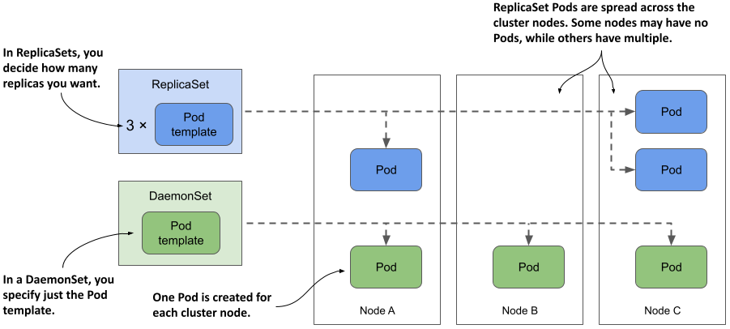
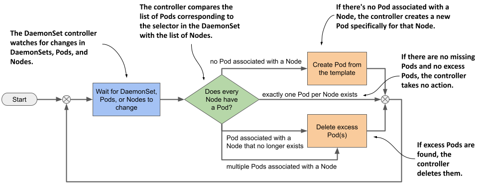
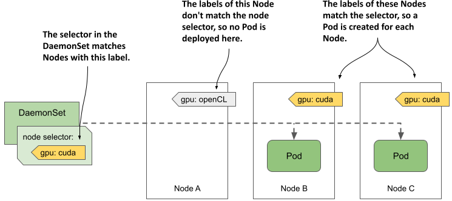
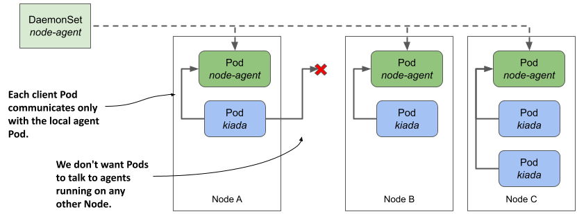
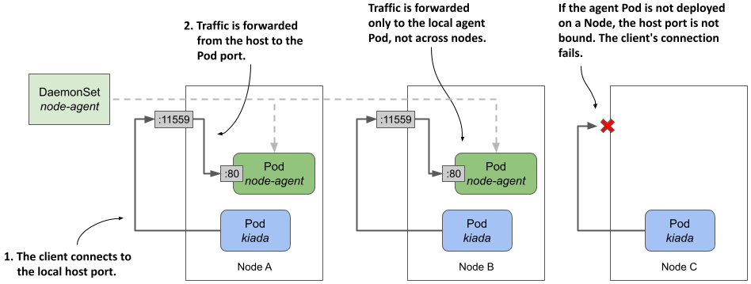
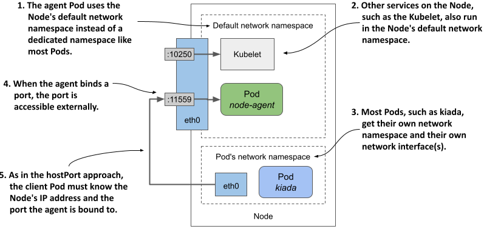
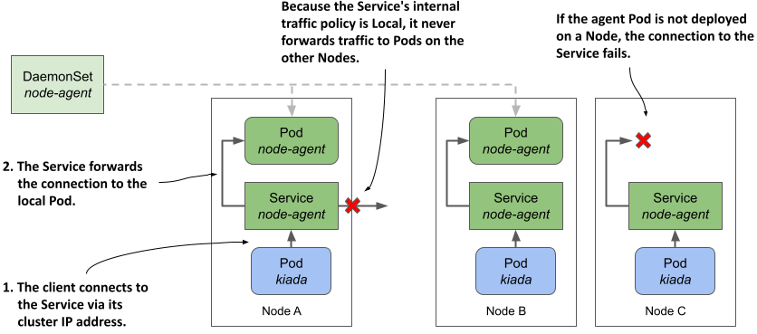

# 16 Triển khai các tác nhân node và daemon bằng DaemonSet

### Chương này bao gồm

- Chạy một tác nhân (agent) Pod trên mỗi node của cụm
- Chạy các agent Pod trên một tập hợp con các node
- Cho phép các Pod truy cập tài nguyên của node máy chủ (host node)
- Gán một lớp ưu tiên (priority class) cho một Pod
- Giao tiếp với agent Pod cục bộ

Trong các chương trước, bạn đã học cách sử dụng Deployment hoặc StatefulSet để phân phối nhiều bản sao của một tải công việc trên các node trong cụm của bạn. Nhưng chuyện gì sẽ xảy ra nếu bạn muốn chạy chính xác một bản sao trên mỗi node? Ví dụ, bạn có thể muốn mỗi node chạy một tác nhân (agent) hoặc daemon cung cấp dịch vụ hệ thống như thu thập dữ liệu giám sát (metrics) hoặc tổng hợp nhật ký (logs) cho riêng node đó. Để triển khai các loại tải công việc này trong Kubernetes, bạn sử dụng một DaemonSet.

Trước khi bắt đầu, hãy tạo Namespace `kiada`, chuyển sang thư mục `Chapter16/`, và áp dụng tất cả các manifest trong thư mục `SETUP/` bằng cách chạy các lệnh sau:

```
$ kubectl create ns kiada
$ kubectl config set-context --current --namespace kiada
$ kubectl apply -f SETUP -R
```

##### LƯU Ý

Bạn có thể tìm thấy các tệp mã nguồn cho chương này tại <https://github.com/luksa/kubernetes-in-action-2nd-edition/tree/master/Chapter16>.

## 16.1 Giới thiệu về DaemonSet

Một DaemonSet là một đối tượng API đảm bảo rằng có chính xác một bản sao của một Pod đang chạy trên mỗi node của cụm. Theo mặc định, các daemon Pod được triển khai trên mọi node, nhưng bạn có thể sử dụng một bộ chọn node (node selector) để giới hạn việc triển khai chỉ trên một số node nhất định.

### 16.1.1 Tìm hiểu đối tượng DaemonSet

Tương tự như Deployment, ReplicaSet và StatefulSet, một DaemonSet cũng chứa một template Pod và sử dụng template này để tạo ra nhiều bản sao (replica) Pod. Tuy nhiên, điểm khác biệt là với DaemonSet, bạn không cần chỉ định số lượng bản sao mong muốn như đối với các đối tượng khác. Thay vào đó, bộ điều khiển DaemonSet (DaemonSet controller) sẽ tạo ra số lượng Pod đúng bằng số lượng node hiện có trong cluster. Nó đảm bảo mỗi Pod được lập lịch (schedule) trên một Node khác nhau — trái ngược hoàn toàn với các Pod do ReplicaSet triển khai, nơi nhiều Pod có thể cùng được xếp vào một Node duy nhất, như minh họa trong hình dưới đây.

##### Hình 16.1 DaemonSet chạy một bản sao Pod trên mỗi node, trong khi ReplicaSet phân bổ chúng rải rác khắp cluster.



#### Những loại workload nào được triển khai qua DaemonSet và tại sao

DaemonSet thường được sử dụng để triển khai các Pod hạ tầng, vốn cung cấp một số loại dịch vụ ở cấp hệ thống cho từng node trong cluster. Các dịch vụ này bao gồm: thu thập log cho các tiến trình hệ thống của node cũng như các Pod chạy trên đó; các daemon giám sát các tiến trình này; các công cụ cung cấp tài nguyên mạng và lưu trữ cho cluster; quản lý việc cài đặt và cập nhật các gói phần mềm; và các dịch vụ cung cấp giao diện kết nối với các thiết bị phần cứng gắn vào node.

Thành phần Kube Proxy, chịu trách nhiệm định tuyến lưu lượng cho các đối tượng Service trong cluster, thường được triển khai dưới dạng một DaemonSet trong Namespace `kube-system`. Plugin Giao diện Mạng Container (CNI - Container Network Interface), vốn cung cấp nền tảng mạng để các Pod giao tiếp với nhau, cũng thường được triển khai thông qua DaemonSet.

Mặc dù bạn hoàn toàn có thể chạy phần mềm hệ thống trên các node bằng những phương thức truyền thống như tập lệnh khởi tạo (init script) hoặc systemd, nhưng việc sử dụng DaemonSet sẽ đảm bảo bạn quản lý tất cả các workload trong cluster theo một cách thống nhất duy nhất.

#### Tìm hiểu cơ chế hoạt động của bộ điều khiển DaemonSet

Tương tự như ReplicaSet và StatefulSet, một DaemonSet bao gồm một template Pod và một bộ chọn nhãn (label selector) để xác định những Pod nào thuộc quyền quản lý của nó. Trong mỗi chu kỳ của vòng lặp hòa hợp (reconciliation loop), bộ điều khiển DaemonSet sẽ tìm kiếm các Pod khớp với bộ chọn nhãn, kiểm tra xem mỗi node đã có chính xác một Pod phù hợp hay chưa, từ đó tiến hành tạo mới hoặc xóa bỏ các Pod để đảm bảo duy trì đúng trạng thái này. Cơ chế này được minh họa trong hình tiếp theo.

##### Hình 16.2 Vòng lặp hòa hợp của bộ điều khiển DaemonSet



Khi bạn thêm một Node vào cluster, bộ điều khiển DaemonSet sẽ tạo một Pod mới và liên kết nó với Node đó. Khi bạn gỡ bỏ một Node, DaemonSet sẽ xóa đối tượng Pod liên kết với Node ấy. Nếu một trong các Pod daemon này biến mất (chẳng hạn như do bị xóa thủ công), bộ điều khiển sẽ lập tức tái tạo lại nó. Ngược lại, nếu có một Pod dư thừa xuất hiện (ví dụ: bạn tự tay tạo một Pod khớp với bộ chọn nhãn của DaemonSet), bộ điều khiển cũng sẽ ngay lập tức xóa bỏ nó.

### 16.1.2  Triển khai Pod bằng DaemonSet

Manifest của một đối tượng DaemonSet trông rất giống với manifest của một ReplicaSet, Deployment hay StatefulSet. Chúng ta hãy cùng xem xét một ví dụ về DaemonSet có tên là `demo`, nằm trong tệp `ds.demo.yaml` thuộc kho lưu trữ mã nguồn của cuốn sách. Đoạn mã dưới đây hiển thị toàn bộ manifest này.

##### Đoạn mã 16.1 Ví dụ về manifest của DaemonSet

```yaml
apiVersion: apps/v1    #A
kind: DaemonSet    #A
metadata:
  name: demo    #B
spec:
  selector:    #C
    matchLabels:    #C
      app: demo    #C
  template:    #D
    metadata:    #D
      labels:    #D
        app: demo    #D
    spec:    #D
      containers:    #D
      - name: demo    #D
        image: busybox    #D
        command:    #D
        - sleep    #D
        - infinity    #D
```

Đối tượng loại `DaemonSet` thuộc nhóm/phiên bản API `apps/v1`. Trong phần `spec` của đối tượng, bạn chỉ định bộ chọn nhãn (`selector`) và một template Pod (`template`), tương tự như cách làm với một ReplicaSet. Phần `metadata` bên trong `template` bắt buộc phải chứa các nhãn (`labels`) khớp với bộ chọn (`selector`).

##### Lưu ý

Bộ chọn (selector) là bất biến (immutable), nhưng bạn có thể thay đổi các nhãn miễn là chúng vẫn khớp với bộ chọn đó. Nếu bắt buộc phải thay đổi bộ chọn, bạn phải xóa DaemonSet hiện tại và tạo lại. Bạn có thể sử dụng tùy chọn `--cascade=orphan` để giữ lại các Pod trong quá trình thay thế DaemonSet.

Như bạn có thể thấy trong đoạn mã, DaemonSet `demo` triển khai các Pod không làm gì ngoài việc thực thi lệnh `sleep`. Lý do là bởi mục tiêu của bài thực hành này chỉ nhằm quan sát hành vi của bản thân DaemonSet chứ không phải của các Pod bên trong nó. Ở phần sau của chương này, bạn sẽ tạo một DaemonSet với các Pod thực sự thực hiện một tác vụ cụ thể.

#### Kiểm tra nhanh một DaemonSet

Hãy tạo DaemonSet bằng cách áp dụng tệp manifest `ds.demo.yaml` bằng lệnh `kubectl apply`, sau đó liệt kê tất cả các DaemonSet trong Namespace hiện tại như sau:

```bash
$ kubectl get ds
NAME   DESIRED   CURRENT   READY   UP-TO-DATE   AVAILABLE   NODE SELECTOR   AGE
demo   2         2         2       2            2           <none>          7s
```

##### Lưu ý

Tên viết tắt của DaemonSet là `ds`.

Kết quả của lệnh cho thấy hai Pod đã được tạo bởi DaemonSet này. Trong trường hợp của bạn, con số này có thể khác đi vì nó phụ thuộc vào số lượng và loại Node trong cluster của bạn, tôi sẽ giải thích chi tiết hơn ở phần sau.

Tương tự như với ReplicaSet, Deployment và StatefulSet, bạn có thể chạy lệnh `kubectl get` với tùy chọn `-o wide` để hiển thị thêm tên và image của các container cũng như bộ chọn nhãn.

```bash
$ kubectl get ds -o wide
NAME   DESIRED   CURRENT   ...   CONTAINERS   IMAGES    SELECTOR
demo   2         2         ...   demo         busybox   app=demo
```

#### Kiểm tra chi tiết một DaemonSet

Tùy chọn `-o wide` là cách nhanh nhất để xem những gì đang chạy trong các Pod do mỗi DaemonSet tạo ra. Tuy nhiên, nếu muốn xem chi tiết hơn nữa về DaemonSet, bạn có thể sử dụng lệnh `kubectl describe` để nhận về kết quả sau:

```bash
$ kubectl describe ds demo
Name:           demo    #A
Selector:       app=demo    #B
Node-Selector:  <none>    #C
Labels:         <none>    #D
Annotations:    deprecated.daemonset.template.generation: 1    #E
Desired Number of Nodes Scheduled: 2    #F
Current Number of Nodes Scheduled: 2    #F
Number of Nodes Scheduled with Up-to-date Pods: 2    #F
Number of Nodes Scheduled with Available Pods: 2    #F
Number of Nodes Misscheduled: 0    #F
Pods Status:  2 Running / 0 Waiting / 0 Succeeded / 0 Failed    #F
Pod Template:    #G
  Labels:  app=demo    #G
  Containers:    #G
   demo:    #G
    Image:      busybox    #G
    Port:       <none>    #G
    Host Port:  <none>    #G
    Command:    #G
      sleep    #G
      infinity    #G
    Environment:  <none>    #G
    Mounts:       <none>    #G
  Volumes:        <none>    #G
Events:    #H
  Type    Reason            Age   From                  Message    #H
  ----    ------            ----  ----                  -------    #H
  Normal  SuccessfulCreate  40m   daemonset-controller  Created pod: demo-wqd22    #H
  Normal  SuccessfulCreate  40m   daemonset-controller  Created pod: demo-w8tgm    #H
```

Đầu ra của lệnh `kubectl describe` bao gồm thông tin về các nhãn (label) và chú thích (annotation) của đối tượng, bộ chọn nhãn được sử dụng để tìm các Pod thuộc DaemonSet này, số lượng và trạng thái của các Pod đó, template được sử dụng để tạo ra chúng, và các Sự kiện (Event) liên quan đến DaemonSet này.

#### Tìm hiểu trạng thái (status) của DaemonSet

Trong mỗi chu kỳ hòa hợp, bộ điều khiển DaemonSet sẽ báo cáo trạng thái của DaemonSet trong phần `status` của đối tượng. Chúng ta hãy cùng xem trạng thái của DaemonSet `demo`. Chạy lệnh sau để in manifest YAML của đối tượng này:

```bash
$ kubectl get ds demo -o yaml
...
status:
  currentNumberScheduled: 2
  desiredNumberScheduled: 2
  numberAvailable: 2
  numberMisscheduled: 0
  numberReady: 2
  observedGeneration: 1
  updatedNumberScheduled: 2
```

Như bạn có thể thấy, phần `status` của một DaemonSet bao gồm một số trường có giá trị kiểu số nguyên. Bảng dưới đây giải thích ý nghĩa của các con số trong những trường này.

##### Bảng 16.1 Các trường trạng thái của DaemonSet

| Trường | Mô tả |
| :--- | :--- |
| `currentNumberScheduled` | Số lượng Node đang chạy ít nhất một Pod liên kết với DaemonSet này. |
| `desiredNumberScheduled` | Số lượng Node đáng lẽ phải chạy Pod daemon, bất kể chúng có thực sự đang chạy nó hay không. |
| `numberAvailable` | Số lượng Node đang chạy ít nhất một Pod daemon ở trạng thái sẵn sàng (available). |
| `numberMisscheduled` | Số lượng Node đang chạy Pod daemon nhưng đáng lẽ không nên chạy. |
| `numberReady` | Số lượng Node có ít nhất một Pod daemon đang chạy và ở trạng thái sẵn sàng (ready). |
| `updatedNumberScheduled` | Số lượng Node có Pod daemon đã được cập nhật phiên bản mới nhất theo template Pod trong DaemonSet. |

Phần `status` cũng chứa trường `observedGeneration`, một trường không liên quan gì đến các Pod của DaemonSet. Bạn có thể tìm thấy trường này ở hầu hết các đối tượng khác có cả phần `spec` và `status`. Bạn sẽ tìm hiểu về trường này trong Chương 20, vì vậy hiện tại có thể tạm thời bỏ qua nó.

Bạn sẽ nhận thấy rằng tất cả các trường `status` được giải thích trong bảng trên đều biểu thị số lượng Node chứ không phải số lượng Pod. Mô tả của một số trường cũng ám chỉ rằng có thể có nhiều hơn một Pod daemon chạy trên một Node, mặc dù theo lý thuyết, một DaemonSet chỉ được phép chạy chính xác một Pod trên mỗi Node. Nguyên nhân là khi bạn cập nhật template Pod của DaemonSet, bộ điều khiển sẽ chạy một Pod mới song song với Pod cũ cho đến khi Pod mới ở trạng thái sẵn sàng. Khi quan sát trạng thái của một DaemonSet, điều bạn quan tâm không phải là tổng số lượng Pod trong cluster, mà là số lượng Node mà DaemonSet đó đang phục vụ.

#### Tìm hiểu lý do tại sao số lượng Pod daemon lại ít hơn số lượng Node

Ở phần trước, bạn đã thấy trạng thái của DaemonSet cho biết có hai Pod liên kết với DaemonSet `demo`. Đây là một điều bất ngờ vì cluster của tôi có ba Node chứ không phải chỉ hai.

Tôi có đề cập rằng bạn có thể sử dụng bộ chọn node (node selector) để giới hạn các Pod của một DaemonSet chỉ chạy trên một số Node nhất định. Tuy nhiên, DaemonSet `demo` lại không hề chỉ định bộ chọn node nào, do đó ta kỳ vọng sẽ có ba Pod được tạo ra trong một cluster có ba Node. Chuyện gì đang xảy ra ở đây vậy? Hãy cùng làm sáng tỏ bí ẩn này bằng cách liệt kê các Pod daemon có cùng bộ chọn nhãn được định nghĩa trong DaemonSet.

##### Lưu ý

Đừng nhầm lẫn giữa bộ chọn nhãn (label selector) và bộ chọn node (node selector); bộ chọn nhãn được dùng để liên kết các Pod với DaemonSet, trong khi bộ chọn node được dùng để liên kết các Pod với các Node.

Bộ chọn nhãn trong DaemonSet là `app=demo`. Hãy truyền nó vào lệnh `kubectl get` bằng tùy chọn `-l` (hoặc `--selector`). Ngoài ra, hãy sử dụng thêm tùy chọn `-o wide` để hiển thị Node tương ứng của từng Pod. Toàn bộ lệnh và kết quả đầu ra như sau:

```bash
$ kubectl get pods -l app=demo -o wide
NAME         READY   STATUS    RESTARTS   AGE   IP            NODE           ...
demo-w8tgm   1/1     Running   0          80s   10.244.2.42   kind-worker    ...
demo-wqd22   1/1     Running   0          80s   10.244.1.64   kind-worker2   ...
```

Bây giờ, hãy liệt kê các Node trong cluster và so sánh hai danh sách này với nhau:

```bash
$ kubectl get nodes
NAME                 STATUS   ROLES                  AGE   VERSION
kind-control-plane   Ready    control-plane,master   22h   v1.23.4
kind-worker          Ready    <none>                 22h   v1.23.4
kind-worker2         Ready    <none>                 22h   v1.23.4
```

Có vẻ như bộ điều khiển DaemonSet chỉ mới triển khai các Pod trên các worker Node, mà bỏ qua master Node — nơi đang chạy các thành phần control plane của cluster. Tại sao lại như vậy?

Thực tế, nếu đang sử dụng một cluster gồm nhiều node, rất có thể không có bất kỳ Pod nào bạn đã triển khai trong các chương trước được lập lịch chạy trên Node lưu trữ control plane, chẳng hạn như Node `kind-control-plane` trong một cluster được tạo bằng công cụ `kind`. Đúng như tên gọi của nó, Node này chỉ được thiết kế để chạy các thành phần Kubernetes chịu trách nhiệm điều khiển toàn bộ cluster. Ở Chương 2, bạn đã biết rằng các container giúp cô lập các workload, nhưng sự cô lập này không thể triệt để bằng việc sử dụng nhiều máy ảo hoặc máy vật lý độc lập. Một workload hoạt động bất thường chạy trên Node control plane có thể ảnh hưởng tiêu cực đến hoạt động của toàn bộ cluster. Vì lý do này, Kubernetes chỉ lập lịch các workload lên các Node control plane nếu bạn cho phép một cách rõ ràng. Quy tắc này cũng áp dụng cho các workload được triển khai thông qua DaemonSet.

#### Triển khai các Pod daemon trên các Node control plane

Cơ chế ngăn cản các Pod thông thường không được lập lịch lên các Node control plane được gọi là Taints và Tolerations. Bạn sẽ được tìm hiểu kỹ hơn về cơ chế này trong Chương 23. Ở đây, bạn sẽ chỉ tìm hiểu cách cấu hình để DaemonSet triển khai Pod lên tất cả các Node. Điều này có thể cần thiết nếu các Pod daemon cung cấp một dịch vụ tối quan trọng bắt buộc phải chạy trên mọi node trong cluster. Bản thân Kubernetes cũng có ít nhất một dịch vụ như vậy — chính là Kube Proxy. Trong hầu hết các cluster hiện nay, Kube Proxy được triển khai qua DaemonSet. Bạn có thể kiểm tra xem cluster của mình có áp dụng cách này không bằng cách liệt kê các DaemonSet trong namespace `kube-system` như sau:

```bash
$ kubectl get ds -n kube-system
NAME         DESIRED   CURRENT   READY   UP-TO-DATE   AVAILABLE   NODE SELECTOR      AGE
kindnet      3         3         3       3            3           <none>             23h
kube-proxy   3         3         3       3            3           kubernetes.io...   23h
```

Nếu bạn cũng sử dụng công cụ `kind` để chạy cluster giống như tôi, bạn sẽ thấy hai DaemonSet xuất hiện. Bên cạnh DaemonSet `kube-proxy`, bạn còn thấy một DaemonSet khác có tên là `kindnet`. DaemonSet này triển khai các Pod cung cấp kết nối mạng giữa tất cả các Pod trong cluster thông qua CNI (Giao diện Mạng Container), chủ đề mà bạn sẽ được tìm hiểu sâu hơn trong Chương 19.

Các con số trong kết quả đầu ra của lệnh trên cho thấy các Pod của những DaemonSet này đã được triển khai trên tất cả các node trong cluster. Manifest của chúng sẽ tiết lộ cách thực hiện điều này. Hãy hiển thị manifest của DaemonSet `kube-proxy` như dưới đây và chú ý đến các dòng được in đậm:

```bash
$ kubectl get ds kube-proxy -n kube-system -o yaml
apiVersion: apps/v1
kind: DaemonSet
...
spec:
  template:
    spec:
      ...
      tolerations:    #A
      - operator: Exists    #A
      volumes:
      ...
```

Những dòng được đánh dấu này không tự giải thích rõ ràng và rất khó để làm rõ chúng nếu không đi sâu vào chi tiết của cơ chế taint và toleration. Nói một cách ngắn gọn, một số Node có thể chỉ định các "taint" (vết hoen), và một Pod bắt buộc phải "tolerate" (dung thứ) được các taint của Node đó thì mới có thể được lập lịch chạy trên Node ấy. Hai dòng trong ví dụ trên cho phép Pod dung thứ cho mọi taint có thể xảy ra, vì vậy bạn có thể coi đây là giải pháp để triển khai các Pod daemon trên tuyệt đối tất cả các Node.

Như bạn thấy, các dòng này là một phần thuộc template Pod chứ không phải là thuộc tính trực tiếp của DaemonSet. Mặc dù vậy, chúng vẫn được bộ điều khiển DaemonSet xem xét, bởi việc tạo ra một Pod mà Node chắc chắn sẽ từ chối là hoàn toàn vô nghĩa.

#### Kiểm tra một Pod daemon

Bây giờ, hãy quay trở lại với DaemonSet `demo` để tìm hiểu kỹ hơn về các Pod mà nó tạo ra. Hãy chọn một trong các Pod này và hiển thị manifest của nó như sau:

```bash
$ kubectl get po demo-w8tgm -o yaml    #A
apiVersion: v1
kind: Pod
metadata:
  creationTimestamp: "2022-03-23T19:50:35Z"
  generateName: demo-
  labels:    #B
    app: demo    #B
    controller-revision-hash: 8669474b5b    #B
    pod-template-generation: "1"    #B
  name: demo-w8tgm
  namespace: bookinfo
  ownerReferences:    #C
  - apiVersion: apps/v1    #C
    blockOwnerDeletion: true    #C
    controller: true    #C
    kind: DaemonSet    #C
    name: demo    #C
    uid: 7e1da779-248b-4ff1-9bdb-5637dc6b5b86    #C
  resourceVersion: "67969"
  uid: 2d044e7f-a237-44ee-aa4d-1fe42c39da4e
spec:
  affinity:    #D
    nodeAffinity:    #D
      requiredDuringSchedulingIgnoredDuringExecution:    #D
        nodeSelectorTerms:    #D
        - matchFields:    #D
          - key: metadata.name    #D
            operator: In    #D
            values:    #D
            - kind-worker    #D
  containers:
  ...
```

Mỗi Pod trong một DaemonSet sẽ nhận các nhãn mà bạn định nghĩa trong template Pod, cộng thêm một số nhãn bổ sung do chính bộ điều khiển DaemonSet tự động thêm vào. Bạn có thể bỏ qua nhãn `pod-template-generation` vì nó đã lỗi thời. Nó đã được thay thế bằng nhãn `controller-revision-hash`. Có thể bạn còn nhớ đã thấy nhãn này trong các Pod của StatefulSet ở chương trước. Nó phục vụ cùng một mục đích — cho phép bộ điều khiển phân biệt giữa các Pod được tạo bằng template cũ và mới trong quá trình cập nhật.

Trường `ownerReferences` cho thấy các Pod daemon thuộc quyền sở hữu trực tiếp của đối tượng DaemonSet, tương tự như việc các Pod của StatefulSet thuộc về đối tượng StatefulSet. Không có đối tượng trung gian nào nằm giữa DaemonSet và các Pod, khác với trường hợp của Deployment và các Pod của chúng.

Mục cuối cùng trong manifest của một Pod daemon mà tôi muốn bạn chú ý là phần `spec.affinity`. Bạn sẽ tìm hiểu kỹ hơn về độ thân thiết của Pod (Pod affinity) trong Chương 23, nơi tôi giải thích chi tiết về việc lập lịch Pod, nhưng ở đây bạn có thể dễ dàng nhận ra trường `nodeAffinity` chỉ ra rằng Pod cụ thể này cần được lập lịch trên Node `kind-worker`. Phần này của manifest không có sẵn trong template Pod của DaemonSet, mà do chính bộ điều khiển DaemonSet tự động bổ sung vào từng Pod mà nó tạo ra. Thuộc tính `nodeAffinity` (độ thân thiết với node) của mỗi Pod được cấu hình khác nhau để đảm bảo rằng Pod đó chắc chắn được lập lịch lên một Node cụ thể.

Trong các phiên bản Kubernetes cũ hơn, bộ điều khiển DaemonSet thường chỉ định node đích trong trường `spec.nodeName` của Pod, đồng nghĩa với việc bộ điều khiển tự mình lập lịch cho Pod trực tiếp mà không cần thông qua bộ lập lịch (Kubernetes Scheduler). Hiện tại, bộ điều khiển DaemonSet cấu hình trường `nodeAffinity` và để trống trường `nodeName`. Điều này nhường quyền quyết định lập lịch lại cho Scheduler, cho phép nó xem xét cả yêu cầu tài nguyên của Pod cũng như các thuộc tính khác.

### 16.1.3  Triển khai trên một tập hợp con các Node bằng bộ chọn node

Mặc định, một DaemonSet sẽ triển khai các Pod lên tất cả các node trong cluster không có các taint mà Pod không thể dung thứ, nhưng đôi khi bạn chỉ muốn một workload cụ thể chạy trên một tập hợp con của các node đó. Ví dụ: nếu chỉ một vài node sở hữu phần cứng chuyên dụng, bạn sẽ muốn chạy phần mềm liên quan duy nhất trên các node đó chứ không phải trên toàn bộ hệ thống. Với DaemonSet, bạn có thể thực hiện điều này bằng cách chỉ định một bộ chọn node (node selector) trong template Pod.

Hãy lưu ý sự khác biệt giữa bộ chọn node (node selector) và bộ chọn pod (pod selector). Bộ điều khiển DaemonSet sử dụng bộ chọn node để lọc ra các Node đủ điều kiện, trong khi sử dụng bộ chọn pod để nhận diện những Pod nào thuộc về DaemonSet đó. Như minh họa trong hình dưới đây, DaemonSet chỉ tạo Pod cho một Node cụ thể nếu các nhãn (label) của Node đó khớp với bộ chọn node.

##### Hình 16.3 Bộ chọn node được sử dụng để triển khai các Pod DaemonSet trên một tập hợp con các node trong cluster.



Hình vẽ minh họa một DaemonSet chỉ triển khai các Pod trên các Node trang bị GPU hỗ trợ CUDA và được gán nhãn `gpu: cuda`. Bộ điều khiển DaemonSet chỉ triển khai các Pod trên Node B và Node C, đồng thời bỏ qua Node A vì nhãn của nó không khớp với bộ chọn node được chỉ định trong DaemonSet.

##### Lưu ý

CUDA (Compute Unified Device Architecture) là một nền tảng tính toán song song và giao diện lập trình ứng dụng (API) cho phép phần mềm sử dụng các bộ xử lý đồ họa (GPU) tương thích cho các mục đích xử lý tính toán chung.

#### Chỉ định bộ chọn node trong DaemonSet

Bạn có thể chỉ định bộ chọn node trong trường `spec.nodeSelector` bên trong template Pod. Đoạn mã dưới đây hiển thị chính DaemonSet `demo` mà bạn đã tạo trước đó, nhưng được cấu hình thêm trường `nodeSelector` để DaemonSet chỉ triển khai các Pod lên các Node có nhãn `gpu: cuda`. Bạn có thể tìm thấy manifest này trong tệp `ds.demo.nodeSelector.yaml`.

##### Đoạn mã 16.2 DaemonSet cấu hình bộ chọn node

```yaml
apiVersion: apps/v1
kind: DaemonSet
metadata:
  name: demo
  labels:
    app: demo
spec:
  selector:
    matchLabels:
      app: demo
  template:
    metadata:
      labels:
        app: demo
    spec:
      nodeSelector:    #A
        gpu: cuda    #A
      containers:
      - name: demo
        image: busybox
        command:
        - sleep
        - infinity
```

Sử dụng lệnh `kubectl apply` để cập nhật DaemonSet `demo` bằng tệp manifest này. Sau đó, dùng lệnh `kubectl get` để kiểm tra trạng thái của DaemonSet:

```bash
$ kubectl get ds
NAME   DESIRED   CURRENT   READY   UP-TO-DATE   AVAILABLE   NODE SELECTOR   AGE
demo   0         0         0       0            0           gpu=cuda        46m    #A
```

Như bạn có thể thấy, hiện tại không có bất kỳ Pod nào được triển khai bởi DaemonSet `demo` vì không có node nào khớp với bộ chọn node được chỉ định. Bạn có thể xác nhận điều này bằng cách liệt kê các Node sử dụng bộ chọn node như sau:

```bash
$ kubectl get nodes -l gpu=cuda
No resources found
```

#### Đưa Node vào và ra khỏi phạm vi của DaemonSet bằng cách thay đổi nhãn của chúng

Bây giờ, hãy tưởng tượng bạn vừa lắp đặt một GPU hỗ trợ CUDA cho Node `kind-worker2`. Bạn thêm nhãn cho Node đó như sau:

```bash
$ kubectl label node kind-worker2 gpu=cuda
node/kind-worker2 labeled
```

Bộ điều khiển DaemonSet không chỉ giám sát các đối tượng DaemonSet và Pod, mà còn theo dõi cả các đối tượng Node. Khi phát hiện thấy sự thay đổi nhãn của Node `kind-worker2`, nó sẽ chạy vòng lặp hòa hợp và tạo một Pod cho Node này, vì giờ đây Node này đã khớp với bộ chọn node. Hãy liệt kê các Pod để xác nhận:

```bash
$ kubectl get pods -l app=demo -o wide
NAME         READY   STATUS    RESTARTS   AGE   IP            NODE           ...
demo-jbhqg   1/1     Running   0          16s   10.244.1.65   kind-worker2   ...
```

Khi bạn gỡ bỏ nhãn khỏi Node, bộ điều khiển sẽ xóa Pod đó:

```bash
$ kubectl label node kind-worker2 gpu-    #A
node/kind-worker2 unlabeled
 
$ kubectl get pods -l app=demo
NAME         READY   STATUS        RESTARTS   AGE
demo-jbhqg   1/1     Terminating   0          71s    #B
```

#### Sử dụng các nhãn Node tiêu chuẩn trong DaemonSet

Kubernetes tự động thêm một số nhãn tiêu chuẩn vào mỗi Node. Hãy sử dụng lệnh `kubectl describe` để xem chúng. Ví dụ, các nhãn của node `kind-worker2` của tôi như sau:

```bash
$ kubectl describe node kind-worker2
Name:               kind-worker2
Roles:              <none>
Labels:             gpu=cuda
                    kubernetes.io/arch=amd64
                    kubernetes.io/hostname=kind-worker2
                    kubernetes.io/os=linux
```

Bạn có thể sử dụng các nhãn này trong DaemonSet để triển khai các Pod dựa trên thuộc tính của từng Node. Ví dụ: nếu cluster của bạn bao gồm các Node không đồng nhất (heterogeneous) sử dụng hệ điều hành hoặc kiến trúc khác nhau, bạn có thể cấu hình DaemonSet nhắm mục tiêu đến một hệ điều hành và/hoặc kiến trúc cụ thể bằng cách sử dụng các nhãn `kubernetes.io/arch` và `kubernetes.io/os` trong bộ chọn node của nó.

Giả sử cluster của bạn bao gồm cả các Node chạy kiến trúc AMD và ARM. Bạn có hai phiên bản image container cho tác nhân node (node agent). Một phiên bản được biên dịch cho CPU AMD và phiên bản còn lại được biên dịch cho CPU ARM. Bạn có thể tạo một DaemonSet để triển khai image dành cho AMD lên các node AMD, và một DaemonSet riêng biệt khác để triển khai image dành cho ARM lên các node còn lại. DaemonSet đầu tiên sẽ sử dụng bộ chọn node như sau:

```yaml
nodeSelector:
        kubernetes.io/arch: amd64
```

DaemonSet còn lại sẽ sử dụng bộ chọn node như sau:

```yaml
nodeSelector:
        kubernetes.io/arch: arm
```

Cách tiếp cận sử dụng nhiều DaemonSet này là cực kỳ lý tưởng nếu cấu hình của hai loại Pod không chỉ khác nhau ở image container, mà còn khác nhau ở lượng tài nguyên tính toán bạn muốn cấp cho mỗi container. Bạn có thể tìm hiểu thêm về vấn đề này trong Chương 22.

##### Lưu ý

Bạn không cần phải dùng nhiều DaemonSet nếu chỉ muốn mỗi node chạy đúng phiên bản image container tương thích với kiến trúc của node đó và không có sự khác biệt nào khác giữa các Pod. Trong trường hợp này, việc sử dụng một DaemonSet duy nhất kết hợp với các image container đa kiến trúc (multi-arch container image) là lựa chọn tối ưu hơn.

#### Cập nhật bộ chọn node

Khác với bộ chọn nhãn của Pod, bộ chọn node có thể thay đổi được (mutable). Bạn có thể thay đổi nó bất cứ khi nào muốn thay đổi tập hợp các Node mà DaemonSet cần nhắm tới. Một cách để thay đổi bộ chọn này là sử dụng lệnh `kubectl patch`. Ở Chương 14, bạn đã biết cách vá (patch) một đối tượng bằng cách chỉ định phần manifest mà bạn muốn cập nhật. Tuy nhiên, bạn cũng có thể cập nhật một đối tượng bằng cách chỉ định một danh sách các thao tác vá theo định dạng JSON patch. Bạn có thể tìm hiểu thêm về định dạng này tại trang <https://jsonpatch.com>. Dưới đây, tôi sẽ hướng dẫn bạn một ví dụ về cách sử dụng JSON patch để gỡ bỏ trường `nodeSelector` khỏi manifest của DaemonSet `demo`:

```bash
$ kubectl patch ds demo --type='json' -p='[{ "op": "remove", "path": "/spec/template/spec/nodeSelector"}]'
daemonset.apps/demo patched
```

Thay vì cung cấp một phần manifest được cập nhật của đối tượng, lệnh JSON patch này chỉ định trực tiếp rằng trường `spec.template.spec.nodeSelector` cần phải được loại bỏ.

### 16.1.4  Cập nhật DaemonSet

Tương tự như đối với Deployment và StatefulSet, khi bạn cập nhật template Pod trong một DaemonSet, bộ điều khiển sẽ tự động xóa các Pod hiện tại thuộc về DaemonSet đó và thay thế chúng bằng các Pod được tạo từ template mới.

Bạn có thể định cấu hình chiến lược cập nhật sẽ sử dụng trong trường `spec.updateStrategy` thuộc manifest của đối tượng DaemonSet, đồng thời trường `spec.minReadySeconds` cũng đóng vai trò nhất định, giống như đối với Deployment và StatefulSet. Tại thời điểm viết cuốn sách này, DaemonSet hỗ trợ các chiến lược được liệt kê trong bảng dưới đây.

##### Bảng 16.2 Các chiến lược cập nhật DaemonSet được hỗ trợ

| Trường | Mô tả |
| :--- | :--- |
| `RollingUpdate` | Trong chiến lược cập nhật này, các Pod sẽ được thay thế từng cái một (cuốn chiếu). Khi một Pod bị xóa và được tạo lại, bộ điều khiển sẽ đợi cho đến khi Pod mới ở trạng thái sẵn sàng (ready). Sau đó, nó sẽ đợi thêm một khoảng thời gian được chỉ định trong trường `spec.minReadySeconds` của DaemonSet trước khi tiếp tục cập nhật các Pod trên các Node khác. Đây là chiến lược mặc định. |
| `OnDelete` | Bộ điều khiển DaemonSet thực hiện cập nhật theo cách bán tự động. Nó sẽ đợi bạn xóa từng Pod một cách thủ công, sau đó mới thay thế nó bằng một Pod mới được tạo từ template đã cập nhật. Với chiến lược này, bạn có thể thay thế các Pod theo tiến độ mong muốn của riêng mình. |

Chiến lược `RollingUpdate` tương tự như chiến lược trong Deployment, còn chiến lược `OnDelete` thì giống hệt như trong StatefulSet. Giống như đối với Deployment, bạn có thể cấu hình chiến lược `RollingUpdate` với các tham số `maxSurge` và `maxUnavailable`, nhưng các giá trị mặc định của những tham số này trong DaemonSet thì lại khác biệt. Phần tiếp theo sẽ giải thích lý do tại sao.

#### Chiến lược RollingUpdate (Cập nhật cuốn chiếu)

Để cập nhật các Pod của DaemonSet `demo`, hãy sử dụng lệnh `kubectl apply` để áp dụng tệp manifest `ds.demo.v2.rollingUpdate.yaml`. Nội dung của tệp này được hiển thị trong đoạn mã dưới đây.

##### Đoạn mã 16.3 Chỉ định chiến lược RollingUpdate trong DaemonSet

```yaml
apiVersion: apps/v1
kind: DaemonSet
metadata:
  name: demo
spec:
  minReadySeconds: 30    #A
  updateStrategy:    #B
    type: RollingUpdate    #B
    rollingUpdate:    #B
      maxSurge: 0    #B
      maxUnavailable: 1    #B
  selector:
    matchLabels:
      app: demo
  template:
    metadata:
      labels:
        app: demo
        ver: v2    #C
    spec:
      ...
```

Trong đoạn mã trên, trường `type` của `updateStrategy` được đặt là `RollingUpdate`, với `maxSurge` bằng `0` và `maxUnavailable` bằng `1`.

##### Lưu ý

Đây là những giá trị mặc định, vì vậy bạn hoàn toàn có thể loại bỏ hoàn toàn trường `updateStrategy` thì quá trình cập nhật vẫn diễn ra theo cách tương tự.

Khi bạn áp dụng manifest này, các Pod sẽ được thay thế như sau:

```bash
$ kubectl get pods -l app=demo -L ver
NAME         READY   STATUS        RESTARTS   AGE   VER
demo-5nrz4   1/1     Terminating   0          10m         #A
demo-vx27t   1/1     Running       0          11m         #A
 
$ kubectl get pods -l app=demo -L ver
NAME         READY   STATUS        RESTARTS   AGE   VER
demo-k2d6k   1/1     Running       0          36s   v2    #B
demo-vx27t   1/1     Terminating   0          11m         #B
 
$ kubectl get pods -l app=demo -L ver
NAME         READY   STATUS    RESTARTS   AGE   VER
demo-k2d6k   1/1     Running   0          126s  v2        #C
demo-s7hsc   1/1     Running   0          62s   v2        #C
```

Vì `maxSurge` được đặt bằng 0, bộ điều khiển DaemonSet trước tiên sẽ dừng Pod daemon hiện tại trước khi tạo một Pod mới. Sự trùng hợp là, 0 cũng chính là giá trị mặc định của `maxSurge`, bởi đây là hành vi hợp lý nhất đối với các Pod daemon, xét đến việc các workload trong những Pod này thường là các tác nhân node (node agent) và tiến trình nền (daemon), vốn chỉ nên chạy duy nhất một instance tại một thời điểm trên mỗi node.

Nếu bạn đặt `maxSurge` lớn hơn 0, hai instance của Pod sẽ cùng chạy trên Node trong quá trình cập nhật trong khoảng thời gian được chỉ định bởi trường `minReadySeconds`. Hầu hết các daemon đều không hỗ trợ chế độ này vì chúng sử dụng cơ chế khóa (lock) để ngăn chặn việc nhiều instance chạy đồng thời. Nếu bạn cố gắng cập nhật một daemon như vậy theo cách này, Pod mới sẽ không bao giờ có thể chuyển sang trạng thái sẵn sàng (ready) vì không thể giành được khóa, dẫn đến việc quá trình cập nhật thất bại hoàn toàn.

Tham số `maxUnavailable` được đặt bằng 1, nghĩa là bộ điều khiển DaemonSet chỉ cập nhật trên từng Node một tại một thời điểm. Nó sẽ không bắt đầu cập nhật Pod trên Node tiếp theo cho đến khi Pod trên Node trước đó đã sẵn sàng và hoạt động ổn định. Bằng cách này, nếu phiên bản mới của workload chạy trong Pod mới không thể khởi động thành công, thì cũng chỉ có duy nhất một Node bị ảnh hưởng.

Nếu muốn các Pod được cập nhật với tốc độ nhanh hơn, bạn có thể tăng tham số `maxUnavailable`. Nếu bạn đặt giá trị này lớn hơn tổng số Node trong cluster, các Pod daemon sẽ được cập nhật đồng loạt trên tất cả các Node cùng một lúc, tương tự như chiến lược `Recreate` của Deployment.

##### Gợi ý

Để triển khai chiến lược cập nhật `Recreate` trong DaemonSet, hãy đặt tham số `maxSurge` bằng `0` và `maxUnavailable` bằng `10000` hoặc lớn hơn, để đảm bảo giá trị này luôn lớn hơn số lượng Node hiện có trong cluster của bạn.

Một lưu ý cực kỳ quan trọng đối với quá trình cập nhật cuốn chiếu của DaemonSet là: nếu bước kiểm tra mức độ sẵn sàng (readiness probe) của một Pod daemon hiện tại bị lỗi, bộ điều khiển DaemonSet sẽ lập tức xóa Pod đó và thay thế bằng một Pod sử dụng template đã được cập nhật. Trong tình huống này, các tham số `maxSurge` và `maxUnavailable` sẽ hoàn toàn bị bỏ qua.

Tương tự, nếu bạn chủ động xóa một Pod hiện có trong quá trình cập nhật cuốn chiếu, nó sẽ được thay thế bằng một Pod mới. Điều tương tự cũng xảy ra nếu bạn định cấu hình DaemonSet với chiến lược cập nhật `OnDelete`. Chúng ta hãy cùng xem xét nhanh chiến lược này.

#### Chiến lược cập nhật OnDelete

Một giải pháp thay thế cho chiến lược `RollingUpdate` là `OnDelete`. Như bạn đã biết ở chương trước về StatefulSet, đây là một chiến lược bán tự động cho phép bạn phối hợp với bộ điều khiển DaemonSet để chủ động thay thế các Pod theo quyết định của riêng mình, như được minh họa trong bài thực hành tiếp theo. Đoạn mã dưới đây hiển thị nội dung của tệp manifest `ds.demo.v3.onDelete.yaml`.

##### Đoạn mã 16.4 Thiết lập chiến lược cập nhật DaemonSet

```yaml
apiVersion: apps/v1
kind: DaemonSet
metadata:
  name: demo
spec:
  updateStrategy:    #A
    type: OnDelete    #A
  selector:
    matchLabels:
      app: demo
  template:
    metadata:
      labels:
        app: demo
        ver: v3    #B
    spec:
      ...
```

Chiến lược `OnDelete` không có bất kỳ tham số cấu hình nào, vì bộ điều khiển sẽ chỉ tiến hành cập nhật các Pod mà bạn tự tay xóa bỏ một cách thủ công. Hãy áp dụng tệp manifest này bằng lệnh `kubectl apply`, sau đó kiểm tra DaemonSet như dưới đây để thấy rằng bộ điều khiển DaemonSet không thực hiện bất kỳ hành động tự động nào:

```bash
$ kubectl get ds
NAME   DESIRED   CURRENT   READY   UP-TO-DATE   AVAILABLE   NODE SELECTOR   AGE
demo   2         2         2       0            2           <none>          80m
```

Kết quả của lệnh `kubectl get ds` cho thấy không có Pod nào trong DaemonSet này được cập nhật (up to date). Điều này hoàn toàn đúng như dự đoán vì bạn tuy đã cập nhật template Pod trong cấu hình DaemonSet, nhưng các Pod thực tế vẫn chưa được cập nhật, như bạn có thể thấy khi liệt kê danh sách Pod:

```bash
$ kubectl get pods -l app=demo -L ver
NAME         READY   STATUS    RESTARTS   AGE   VER
demo-k2d6k   1/1     Running   0          10m   v2        #A
demo-s7hsc   1/1     Running   0          10m   v2        #A
```

Để thực hiện việc cập nhật các Pod, bạn bắt buộc phải xóa chúng thủ công. Bạn có thể xóa bao nhiêu Pod tùy ý và theo bất kỳ thứ tự nào, nhưng tạm thời hãy chỉ xóa một Pod trước. Chọn một Pod và tiến hành xóa nó như sau:

```bash
$ kubectl delete po demo-k2d6k --wait=false    #A
pod "demo-k2d6k" deleted
```

Bạn có thể nhớ lại rằng, theo mặc định, lệnh `kubectl delete` sẽ giữ tiến trình cho đến khi quá trình xóa đối tượng hoàn tất. Nếu sử dụng tùy chọn `--wait=false`, lệnh sẽ chỉ đánh dấu đối tượng để chờ xóa rồi kết thúc ngay mà không cần đợi Pod thực sự biến mất hoàn toàn. Bằng cách này, bạn có thể theo dõi những gì diễn ra ở hậu trường bằng cách chạy lệnh liệt kê các Pod liên tục vài lần như sau:

```bash
$ kubectl get pods -l app=demo -L ver
NAME         READY   STATUS        RESTARTS   AGE   VER
demo-k2d6k   1/1     Terminating   0          10m   v2        #A
demo-s7hsc   1/1     Running       0          10m   v2        #A
 
$ kubectl get pods -l app=demo -L ver
NAME         READY   STATUS    RESTARTS   AGE   VER
demo-4gf5h   1/1     Running   0          15s   v3    #B
demo-s7hsc   1/1     Running   0          11m   v2    #B
```

Nếu bạn liệt kê các DaemonSet bằng lệnh `kubectl get` như dưới đây, bạn sẽ thấy rằng chỉ có một Pod đã được cập nhật thành công:

```bash
$ kubectl get ds
NAME   DESIRED   CURRENT   READY   UP-TO-DATE   AVAILABLE   NODE SELECTOR   AGE
demo   2         2         2       1            2           <none>          91m    #A
```

Hãy xóa (các) Pod còn lại để hoàn tất quá trình cập nhật.

#### Cân nhắc việc sử dụng chiến lược OnDelete cho các Pod daemon quan trọng

Với chiến lược này, tuy tốn nhiều công sức hơn, nhưng bạn có thể kiểm soát chặt chẽ hơn nhiều quá trình cập nhật các Pod có vai trò sống còn đối với cluster. Bằng cách này, bạn có thể hoàn toàn yên tâm rằng việc cập nhật sẽ không làm hỏng toàn bộ cluster của mình — một kịch bản rất dễ xảy ra đối với quá trình cập nhật hoàn toàn tự động nếu bước kiểm tra mức độ sẵn sàng (readiness probe) trong Pod daemon không thể phát hiện ra tất cả các sự cố tiềm ẩn.

Ví dụ, probe kiểm tra tính sẵn sàng được định nghĩa trong DaemonSet rất có thể sẽ không kiểm tra xem các Pod khác trên cùng một Node có còn hoạt động bình thường hay không. Nếu Pod daemon vừa cập nhật vượt qua bài kiểm tra sẵn sàng trong khoảng thời gian `minReadySeconds`, bộ điều khiển sẽ lập tức tiếp tục cập nhật trên Node tiếp theo, ngay cả khi quá trình cập nhật ở Node đầu tiên đã vô tình khiến tất cả các Pod khác trên Node đó bị sập. Chuỗi thất bại mang tính dây chuyền này có thể đánh sập hoàn toàn cả cluster của bạn. Ngược lại, nếu thực hiện cập nhật bằng chiến lược `OnDelete`, bạn có thể kiểm tra kỹ lưỡng hoạt động của các Pod khác sau khi cập nhật xong từng Pod daemon, trước khi quyết định xóa và cập nhật Pod tiếp theo.

### 16.1.5  Xóa DaemonSet

Để khép lại phần giới thiệu về DaemonSet này, hãy tiến hành xóa DaemonSet `demo` như sau:

```bash
$ kubectl delete ds demo
daemonset.apps "demo" deleted
```

Đúng như mong đợi, việc này cũng sẽ đồng thời xóa bỏ toàn bộ các Pod thuộc DaemonSet `demo`. Để xác nhận, hãy liệt kê các Pod như sau:

```bash
$ kubectl get pods -l app=demo
NAME         READY   STATUS        RESTARTS   AGE
demo-4gf5h   1/1     Terminating   0          2m22s
demo-s7hsc   1/1     Terminating   0          6m53s
```

Phần giải thích về bản thân cơ chế DaemonSet đến đây là kết thúc. Tuy nhiên, các Pod được triển khai qua DaemonSet có điểm khác biệt so với các Pod triển khai bằng Deployment hay StatefulSet ở chỗ chúng thường xuyên truy cập trực tiếp vào hệ thống tệp tin của node máy chủ, các giao diện mạng của node, hoặc các thiết bị phần cứng khác. Bạn sẽ được tìm hiểu chi tiết về vấn đề này trong phần tiếp theo.

## 16.2  Các tính năng đặc biệt trong các Pod chạy tác nhân node và daemon

Khác với các workload thông thường vốn được cô lập hoàn toàn khỏi node chạy chúng, các tác nhân node (node agent) và daemon hệ thống thường đòi hỏi quyền truy cập sâu hơn vào chính node máy chủ. Như bạn đã biết, các container chạy bên trong một Pod bình thường không thể truy cập các thiết bị và tệp tin của node, hoặc thực hiện một số lệnh gọi hệ thống (system call) đến nhân (kernel) của node, do chúng hoạt động trong các namespace Linux độc lập của riêng mình (xem Chương 2). Nếu muốn một daemon, tác nhân hoặc bất kỳ workload nào chạy trong Pod được miễn trừ khỏi hạn chế này, bạn phải chỉ định rõ điều đó trong manifest của Pod.

Để hiểu rõ cách thực hiện, hãy cùng quan sát các DaemonSet trong namespace `kube-system`. Nếu bạn chạy Kubernetes qua công cụ `kind`, cluster của bạn sẽ chứa hai DaemonSet như sau:

```bash
$ kubectl get ds -n kube-system
NAME         DESIRED   CURRENT   READY   UP-TO-DATE   AVAILABLE   NODE SELECTOR      AGE
kindnet      3         3         3       3            3           <none>             23h
kube-proxy   3         3         3       3            3           kubernetes.io...   23h
```

Nếu bạn không sử dụng `kind`, danh sách các DaemonSet trong `kube-system` có thể sẽ khác biệt đôi chút, nhưng hầu hết các cluster đều sẽ có sự hiện diện của DaemonSet `kube-proxy`, vì vậy tôi sẽ tập trung phân tích đối tượng này.

### 16.2.1  Cấp quyền truy cập vào nhân hệ điều hành cho container

Nhân (kernel) của hệ điều hành cung cấp các lệnh gọi hệ thống (system call) để các chương trình có thể sử dụng nhằm tương tác với hệ điều hành và phần cứng. Một số lệnh gọi hệ thống này hoàn toàn vô hại, nhưng số khác có thể ảnh hưởng tiêu cực đến hoạt động của node hoặc các container khác đang chạy trên đó. Vì lý do này, các container mặc định không được phép thực thi các lệnh gọi hệ thống nguy hiểm trừ khi được cấp quyền rõ ràng. Bạn có thể đạt được điều này theo hai cách: cấp cho container toàn quyền truy cập vào kernel hoặc cấp quyền cho một nhóm các lệnh gọi hệ thống cụ thể bằng cách định nghĩa các quyền hạn (capability) được cấp cho container.

#### Chạy một container đặc quyền (privileged container)

Nếu muốn cấp cho một tiến trình chạy trong container toàn quyền truy cập vào nhân hệ điều hành của máy chủ, bạn có thể thiết lập container đó ở chế độ đặc quyền (privileged). Bạn có thể xem cách thực hiện việc này bằng cách kiểm tra template Pod trong DaemonSet `kube-proxy` như sau:

```bash
$ kubectl -n kube-system get ds kube-proxy -o yaml
apiVersion: apps/v1
kind: DaemonSet
spec:
  template:
    spec:
      containers:
      - name: kube-proxy
        securityContext:    #A
          privileged: true    #A
    ...
```

DaemonSet `kube-proxy` chạy các Pod chỉ chứa một container duy nhất, cũng có tên là `kube-proxy`. Trong phần `securityContext` định nghĩa cho container này, cờ `privileged` được thiết lập là `true`. Cấu hình này cấp cho tiến trình chạy trong container `kube-proxy` quyền truy cập tối cao (root) vào nhân của máy chủ vật lý, cho phép nó sửa đổi các quy tắc lọc gói tin mạng của node. Như bạn sẽ được tìm hiểu trong Chương 19, các Kubernetes Service được hiện thực hóa theo cơ chế này.

#### Cấp quyền truy cập vào các capability cụ thể cho container

Một container đặc quyền sẽ bỏ qua mọi bước kiểm tra quyền của nhân hệ điều hành (kernel) và do đó có toàn quyền truy cập vào kernel. Ngược lại, một tác nhân node (node agent) hoặc daemon thường chỉ cần truy cập vào một tập hợp con các lời gọi hệ thống (system call) do kernel cung cấp. Xét từ góc độ bảo mật, việc chạy các khối công việc (workload) này dưới quyền đặc quyền (privileged) là điều không hề lý tưởng. Thay vào đó, bạn chỉ nên cấp cho workload quyền truy cập vào tập hợp các system call tối thiểu cần thiết để nó hoàn thành nhiệm vụ. Bạn có thể đạt được điều này bằng cách chỉ định các quyền hạn (capabilities) cần thiết trong định nghĩa container.

DaemonSet `kube-proxy` không sử dụng các quyền hạn (capabilities), nhưng các DaemonSet khác trong namespace `kube-system` thì có thể. Một ví dụ điển hình là DaemonSet `kindnet`, có nhiệm vụ thiết lập mạng cho Pod trong một cluster được khởi tạo bằng công cụ `kind`. Các quyền hạn được liệt kê trong bản mẫu Pod (Pod template) như sau:

```
$ kubectl -n kube-system get ds kindnet -o yaml
apiVersion: apps/v1
kind: DaemonSet
spec:
  template:
    spec:
      containers:
      - name: kindnet-cni
        securityContext:    #A
          capabilities:    #A
            add:    #A
            - NET_RAW    #A
            - NET_ADMIN    #A
          privileged: false    #B
```

Thay vì được cấp toàn quyền đặc quyền, các quyền hạn `NET_RAW` và `NET_ADMIN` sẽ được thêm vào container. Theo tài liệu hướng dẫn (`man pages`) về capabilities — bạn có thể xem bằng lệnh `man capabilities` trên hệ thống Linux — quyền hạn `NET_RAW` cho phép container sử dụng các loại socket đặc biệt và liên kết (bind) với bất kỳ địa chỉ nào, trong khi quyền hạn `NET_ADMIN` cho phép thực hiện nhiều hoạt động liên quan đến mạng vốn yêu cầu đặc quyền, chẳng hạn như cấu hình giao diện mạng, quản lý tường lửa, thay đổi bảng định tuyến, v.v. Đây chính là những gì bạn mong đợi ở một container chịu trách nhiệm thiết lập mạng cho tất cả các Pod khác trên một Node.

### 16.2.2  Truy cập hệ thống tệp của node

Một tác nhân node hoặc daemon có thể cần truy cập vào hệ thống tệp của node máy chủ (host node). Ví dụ, một tác nhân node được triển khai qua DaemonSet có thể được dùng để cài đặt các gói phần mềm trên tất cả các node trong cluster.

Trong Chương 7, bạn đã biết cách cấp quyền truy cập vào hệ thống tệp của node máy chủ cho container của Pod thông qua volume `hostPath`, vì vậy tôi sẽ không đi sâu vào chi tiết nữa. Tuy nhiên, việc quan sát cách loại volume này được sử dụng trong ngữ cảnh của một daemon Pod là điều rất thú vị.

Hãy xem lại DaemonSet `kube-proxy`. Trong bản mẫu Pod, bạn sẽ tìm thấy hai volume `hostPath` như dưới đây:

```
$ kubectl -n kube-system get ds kube-proxy -o yaml
apiVersion: apps/v1
kind: DaemonSet
spec:
  template:
    spec:
      volumes:
      - hostPath:    #A
          path: /run/xtables.lock    #A
          type: FileOrCreate    #A
        name: xtables-lock    #A
      - hostPath:    #B
          path: /lib/modules    #B
          type: ""    #B
        name: lib-modules    #B
```

Volume đầu tiên cho phép tiến trình chạy trong daemon Pod `kube-proxy` truy cập vào tệp `xtables.lock` của node. Tệp này được sử dụng bởi các công cụ như `iptables` hoặc `nftables` để tiến trình thực hiện thao tác lọc gói tin IP trên node. Volume `hostPath` còn lại cho phép tiến trình truy cập vào các mô-đun kernel (kernel module) được cài đặt trên node.

### 16.2.3  Sử dụng mạng và các không gian tên khác của node

Như bạn đã biết, mỗi Pod đều có giao diện mạng riêng. Tuy nhiên, bạn có thể muốn một số Pod — đặc biệt là những Pod được triển khai thông qua DaemonSet — sử dụng trực tiếp (các) giao diện mạng của node thay vì có giao diện mạng riêng. Các Pod được triển khai qua DaemonSet `kube-proxy` áp dụng phương pháp này. Bạn có thể kiểm tra điều này bằng cách xem bản mẫu Pod như sau:

```
$ kubectl -n kube-system get ds kube-proxy -o yaml
apiVersion: apps/v1
kind: DaemonSet
spec:
  template:
    spec:
      dnsPolicy: ClusterFirst
      hostNetwork: true    #A
```

Trong phần `spec` của Pod, trường `hostNetwork` được đặt thành `true`. Điều này khiến Pod sử dụng môi trường mạng của Node máy chủ (bao gồm thiết bị, ngăn xếp mạng và các cổng) thay vì sở hữu môi trường mạng riêng, tương tự như mọi tiến trình khác chạy trực tiếp trên node mà không nằm trong container. Nghĩa là Pod sẽ không có địa chỉ IP riêng mà dùng chung (các) địa chỉ IP của Node. Nếu bạn liệt kê các Pod trong Namespace `kube-system` bằng tùy chọn `-o wide` như dưới đây, bạn sẽ thấy IP của các Pod `kube-proxy` trùng khớp với IP của các Node máy chủ tương ứng.

```
$ kubectl -n kube-system get po -o wide
NAME               READY   STATUS    RESTARTS   AGE   IP           ...                
kube-proxy-gj9pd   1/1     Running   0          90m   172.18.0.4   ...    #A
kube-proxy-rhjqr   1/1     Running   0          90m   172.18.0.2   ...    #A
kube-proxy-vq5g8   1/1     Running   0          90m   172.18.0.3   ...    #A
```

Cấu hình các daemon Pod sử dụng mạng của node máy chủ sẽ rất hữu ích khi tiến trình chạy trong Pod cần được truy cập thông qua một cổng mạng tại địa chỉ IP của node.

##### Lưu ý

Một tùy chọn khác là Pod sử dụng mạng riêng của nó, nhưng chuyển tiếp một hoặc nhiều cổng của host đến container bằng cách sử dụng trường `hostPort` trong danh sách cổng của container. Bạn sẽ tìm hiểu cách thực hiện việc này ở phần sau.

Các container trong một Pod được cấu hình `hostNetwork: true` vẫn tiếp tục sử dụng các loại không gian tên (namespace) khác, do đó chúng vẫn bị cô lập với node ở các khía cạnh khác. Ví dụ, chúng sử dụng các namespace IPC và PID riêng, nên không thể nhìn thấy các tiến trình khác hoặc giao tiếp với chúng thông qua cơ chế giao tiếp giữa các tiến trình (IPC). Nếu muốn một daemon Pod sử dụng các namespace IPC và PID của node, bạn có thể cấu hình thông qua các thuộc tính `hostIPC` và `hostPID` trong phần `spec` của Pod.

### 16.2.4  Đánh dấu các daemon Pod là cực kỳ quan trọng

Một node có thể chạy một vài Pod hệ thống và rất nhiều Pod chạy khối công việc thông thường. Bạn chắc chắn không muốn Kubernetes đối xử bình đẳng với hai nhóm Pod này, vì các Pod hệ thống thường quan trọng hơn các Pod phi hệ thống. Ví dụ, nếu một Pod hệ thống không thể lên lịch (schedule) trên một Node do Node đó đã đầy, Kubernetes sẽ phải trục xuất (evict) một số Pod phi hệ thống để nhường chỗ cho Pod hệ thống.

#### Giới thiệu về Priority Class

Theo mặc định, các Pod được triển khai qua DaemonSet không hề quan trọng hơn các Pod được triển khai qua Deployment hay StatefulSet. Để đánh dấu các daemon Pod của bạn có mức độ ưu tiên cao hơn hoặc thấp hơn, bạn sử dụng các lớp độ ưu tiên của Pod (Pod priority class). Các lớp này được đại diện bởi đối tượng `PriorityClass`. Bạn có thể liệt kê chúng như sau:

```
$ kubectl get priorityclasses
NAME                      VALUE        GLOBAL-DEFAULT   AGE
system-cluster-critical   2000000000   false            9h
system-node-critical      2000001000   false            9h
```

Mỗi cluster thường đi kèm với hai lớp độ ưu tiên mặc định: `system-cluster-critical` và `system-node-critical`, nhưng bạn cũng có thể tự tạo các lớp của riêng mình. Đúng như tên gọi, các Pod thuộc lớp `system-cluster-critical` có vai trò sống còn đối với hoạt động của toàn bộ cluster. Trong khi đó, các Pod thuộc lớp `system-node-critical` lại có vai trò quyết định đối với hoạt động của từng node riêng lẻ, nghĩa là chúng không thể bị di dời sang node khác.

Bạn có thể tìm hiểu thêm về các lớp độ ưu tiên được định nghĩa trong cluster của mình bằng cách sử dụng lệnh `kubectl describe priorityclasses` như sau:

```
$ kubectl describe priorityclasses
Name:           system-cluster-critical
Value:          2000000000
GlobalDefault:  false
Description:    Used for system critical pods that must run in the cluster, but can be moved to another node if necessary.
Annotations:    <none>
Events:         <none>
 
Name:           system-node-critical
Value:          2000001000
GlobalDefault:  false
Description:    Used for system critical pods that must not be moved from their current node.
Annotations:    <none>
Events:         <none>
```

Như bạn có thể thấy, mỗi lớp độ ưu tiên có một giá trị số (`Value`). Giá trị càng cao thì độ ưu tiên càng lớn. Chính sách thu hồi (preemption policy) trong mỗi lớp sẽ quyết định xem các Pod có độ ưu tiên thấp hơn có bị trục xuất hay không khi một Pod thuộc lớp đó được lên lịch vào một Node đã quá tải.

Bạn chỉ định lớp độ ưu tiên cho một Pod bằng cách khai báo tên lớp trong trường `priorityClassName` thuộc phần `spec` của Pod. Ví dụ, DaemonSet `kube-proxy` đặt lớp độ ưu tiên cho các Pod của nó là `system-node-critical`. Bạn có thể kiểm tra cấu hình này như sau:

```
$ kubectl -n kube-system get ds kube-proxy -o yaml
apiVersion: apps/v1
kind: DaemonSet
spec:
  template:
    spec:
      priorityClassName: system-node-critical    #A
```

Lớp độ ưu tiên của các Pod `kube-proxy` đảm bảo rằng chúng luôn có mức ưu tiên cao hơn các Pod khác, bởi vì một node không thể hoạt động bình thường nếu thiếu Pod `kube-proxy` (các Pod trên Node sẽ không thể sử dụng Service của Kubernetes).

Khi tự tạo DaemonSet để chạy các tác nhân node quan trọng khác, hãy nhớ thiết lập trường `priorityClassName` sao cho phù hợp.

## 16.3  Giao tiếp với daemon Pod cục bộ

Một daemon Pod thường cung cấp dịch vụ cho các Pod khác chạy trên cùng một node. Các khối công việc chạy trong các Pod này phải kết nối với daemon đang chạy cục bộ (local daemon), chứ không phải daemon chạy trên một node khác. Trong Chương 11, bạn đã biết các Pod giao tiếp với nhau qua Service. Tuy nhiên, khi một Service nhận được lưu lượng truy cập từ một Pod client, nó sẽ chuyển tiếp lưu lượng đó đến một Pod ngẫu nhiên — Pod này có thể nằm trên cùng một Node với client hoặc không.

Làm thế nào để đảm bảo rằng một Pod luôn kết nối với daemon Pod chạy trên cùng một Node, như minh họa trong hình dưới đây? Trong phần này, bạn sẽ tìm hiểu một số phương pháp để giải quyết bài toán đó.

##### Hình 16.4 Làm thế nào để các Pod client chỉ giao tiếp với daemon Pod chạy cục bộ trên cùng một node?



Trong các ví dụ sau, bạn sẽ sử dụng một tác nhân node (node agent) minh họa được viết bằng Go, cho phép client truy xuất thông tin hệ thống như thời gian hoạt động (uptime) và mức sử dụng node trung bình qua giao thức HTTP. Điều này cho phép các Pod như Kiada lấy thông tin từ tác nhân này thay vì truy xuất trực tiếp từ node.

Mã nguồn của tác nhân node có thể được tìm thấy trong thư mục `Chapter16/node-agent-0.1/`. Bạn có thể tự build container image hoặc sử dụng image đã được build sẵn tại địa chỉ `luksa/node-agent:0.1`.

Trong thư mục `Chapter16/kiada-0.9`, bạn sẽ tìm thấy phiên bản `0.9` của ứng dụng Kiada. Phiên bản này sẽ kết nối với tác nhân node, lấy thông tin node và hiển thị cùng với thông tin Pod và node khác vốn đã được hiển thị ở các phiên bản trước.

### 16.3.1  Liên kết trực tiếp với một cổng của host (host port)

Một cách để đảm bảo client có thể kết nối với daemon Pod cục bộ trên một Node cụ thể là chuyển tiếp một cổng mạng trên node máy chủ (host node) đến một cổng trên daemon Pod, rồi cấu hình client kết nối vào đó. Để thực hiện việc này, bạn chỉ định số cổng mong muốn của node máy chủ trong danh sách cổng của manifest Pod bằng cách sử dụng trường `hostPort`, như trong đoạn mã dưới đây. Bạn có thể tìm thấy ví dụ này trong tệp `ds.node-agent.hostPort.yaml`.

##### Mã nguồn 16.5 Chuyển tiếp một cổng của host đến một container

```yaml
apiVersion: apps/v1
kind: DaemonSet
metadata:
  name: node-agent
  ...
spec:
  template:
    spec:
      containers:
      - name: node-agent
        image: luksa/node-agent:0.1
        args:    #B
        - --listen-address    #B
        - :80    #B
        ...
        ports:    #A
        - name: http
          containerPort: 80    #B
          hostPort: 11559    #C
```

Manifest này định nghĩa một DaemonSet triển khai các Pod tác nhân node lắng nghe trên cổng `80` của giao diện mạng của Pod. Tuy nhiên, trong danh sách `ports`, cổng `80` của container cũng có thể được truy cập thông qua cổng `11559` của Node máy chủ. Tiến trình trong container chỉ liên kết với cổng `80`, nhưng Kubernetes đảm bảo rằng lưu lượng truy cập mà Node máy chủ nhận được trên cổng `11559` sẽ được chuyển tiếp đến cổng `80` bên trong container `node-agent`, như mô tả trong hình dưới đây.

##### Hình 16.5 Public một daemon Pod thông qua một cổng của host (host port)



Như bạn có thể thấy trong hình, mỗi Node chỉ chuyển tiếp lưu lượng từ cổng của host đến Pod tác nhân chạy cục bộ. Cơ chế này khác với Service kiểu NodePort đã được giải thích ở Chương 11, nơi kết nối của client tới cổng node (node port) sẽ được chuyển tiếp đến một Pod ngẫu nhiên trong cluster, có thể là một Pod đang chạy trên Node khác. Điều này cũng có nghĩa là nếu không có Pod tác nhân nào được triển khai trên một Node, nỗ lực kết nối tới cổng của host trên Node đó sẽ thất bại.

#### Triển khai tác nhân và kiểm tra kết nối

Hãy triển khai DaemonSet `node-agent` bằng cách áp dụng manifest `ds.node-agent.hostPort.yaml`. Xác nhận rằng số lượng Pod khớp với số lượng Node trong cluster của bạn và tất cả các Pod đều đang chạy.

Kiểm tra xem Pod tác nhân node có phản hồi các yêu cầu hay không. Hãy chọn một trong các Node, tìm địa chỉ IP của nó và gửi một yêu cầu `GET /` đến cổng `11559`. Ví dụ: nếu bạn đang sử dụng `kind` để khởi tạo cluster, bạn có thể tìm IP của node `kind-worker` như sau:

```
$ kubectl get node kind-worker -o wide
NAME          STATUS   ROLES    AGE   VERSION   INTERNAL-IP   EXTERNAL-IP   ...
kind-worker   Ready    <none>   26m   v1.23.4   172.18.0.2    <none>        ...
```

Trong trường hợp của tôi, IP của Node là `172.18.0.2`. Để gửi yêu cầu `GET`, tôi chạy lệnh `curl` như sau:

```
$ curl 172.18.0.2:11559
kind-worker uptime: 5h58m10s, load average: 1.62, 1.83, 2.25, active/total threads: 2/3479
```

Nếu quyền truy cập vào Node bị chặn bởi tường lửa, bạn có thể cần kết nối vào Node qua SSH và truy cập cổng đó thông qua `localhost` như sau:

```
root@kind-worker:/# curl localhost:11559
kind-worker uptime: 5h59m20s, load average: 1.53, 1.77, 2.20, active/total threads: 2/3521
```

Phản hồi HTTP cho thấy Pod `node-agent` đang hoạt động bình thường. Giờ đây, bạn có thể triển khai ứng dụng Kiada và cho phép nó kết nối với tác nhân này. Nhưng làm thế nào để bạn chỉ cho Kiada biết nơi tìm Pod `node-agent` cục bộ?

#### Chỉ định ứng dụng Kiada kết nối đến tác nhân thông qua địa chỉ IP của Node

Kiada tìm kiếm URL của tác nhân node bằng biến môi trường `NODE_AGENT_URL`. Để ứng dụng kết nối được với tác nhân cục bộ, bạn phải truyền địa chỉ IP của node máy chủ và cổng `11559` vào biến này. Tất nhiên, IP này phụ thuộc vào việc Pod Kiada cụ thể được lên lịch chạy trên Node nào, vì vậy bạn không thể chỉ định một địa chỉ IP cố định trong manifest của Pod. Thay vào đó, bạn sử dụng Downward API để lấy IP của Node cục bộ, như đã tìm hiểu ở Chương 9. Đoạn mã dưới đây hiển thị phần cấu hình trong manifest `deploy.kiada.0.9.hostPort.yaml` nơi thiết lập biến môi trường `NODE_AGENT_URL`.

##### Mã nguồn 16.6 Sử dụng DownwardAPI để thiết lập biến NODE\_AGENT\_URL

```yaml
apiVersion: apps/v1
kind: Deployment
metadata:
  name: kiada
spec:
  template:
    spec:
      containers:
      - name: kiada
        image: luksa/kiada:0.9
        imagePullPolicy: Always
        env:
        ...
        - name: NODE_IP    #A
          valueFrom:    #A
            fieldRef:    #A
              fieldPath: status.hostIP    #A
        - name: NODE_AGENT_URL    #B
          value: http://$(NODE_IP):11559    #B
      ...
```

Như bạn thấy trong đoạn mã, biến môi trường `NODE_AGENT_URL` tham chiếu đến biến `NODE_IP`, vốn được khởi tạo thông qua Downward API. Cổng của host `11559` mà tác nhân liên kết được cấu hình cứng.

Hãy áp dụng manifest `deploy.kiada.0.9.hostPort.yaml` và gọi ứng dụng Kiada để kiểm tra xem nó có truy xuất và hiển thị thông tin node từ tác nhân node cục bộ hay không, như minh họa dưới đây:

```
$ curl http://kiada.example.com
...
Request processed by Kiada 0.9 running in pod "kiada-68fbb5fcb9-rp7hc" on node "kind-worker2".
...
Node info: kind-worker2 uptime: 6h17m48s, load average: 0.87, 1.29, 1.61,    #A
           active/total threads: 5/4283    #A
...
```

Phản hồi cho thấy yêu cầu đã được xử lý bởi một Pod Kiada chạy trên node `kind-worker2`. Dòng `Node info` chỉ ra rằng thông tin node được lấy từ tác nhân chạy trên chính node đó. Mỗi khi bạn tải lại trang trong trình duyệt hoặc chạy lệnh `curl`, tên node trong dòng `Node info` sẽ luôn trùng khớp với node trong dòng `Request processed by`. Điều này chứng minh rằng mỗi Pod Kiada đều lấy thông tin node từ tác nhân cục bộ của chính nó, chứ không bao giờ lấy từ một tác nhân trên node khác.

### 16.3.2  Sử dụng ngăn xếp mạng của node

Một phương pháp tương tự như phần trước là cho phép Pod tác nhân sử dụng trực tiếp môi trường mạng của Node thay vì sở hữu môi trường mạng riêng, như đã mô tả trong mục 16.2.3. Trong trường hợp này, tác nhân có thể được truy cập thông qua địa chỉ IP của node trên cổng mà nó liên kết. Khi tác nhân liên kết với cổng `11559`, các Pod client có thể kết nối với tác nhân thông qua cổng này trên giao diện mạng của node, như mô tả trong hình dưới đây.

##### Hình 16.6 Public một daemon Pod bằng cách sử dụng namespace mạng của node máy chủ



Đoạn mã dưới đây hiển thị manifest `ds.node-agent.hostNetwork.yaml`, trong đó Pod được cấu hình để sử dụng môi trường mạng của node máy chủ thay vì của riêng nó. Tác nhân được cấu hình để lắng nghe trên cổng `11559`.

##### Mã nguồn 16.7 Public một tác nhân node bằng cách cho phép Pod sử dụng mạng của node máy chủ

```yaml
apiVersion: apps/v1
kind: DaemonSet
metadata:
  name: node-agent
  ...
spec:
  template:
    spec:
      hostNetwork: true    #A
      ...
      containers:
      - name: node-agent
        image: luksa/node-agent:0.1
        imagePullPolicy: Always
        args:
        - --listen-address    #B
        - :11559    #B
        ...
        ports:    #C
        - name: http    #C
          containerPort: 11559    #C
        readinessProbe:
          failureThreshold: 1
          httpGet:
            port: 11559
            scheme: HTTP
```

Vì tác nhân node được cấu hình để liên kết với cổng `11559` thông qua đối số `--listen-address`, tác nhân này có thể truy cập được thông qua cổng này trên (các) giao diện mạng của node. Đứng từ góc độ của client, việc này hoàn toàn giống như sử dụng trường `hostPort` ở phần trước, nhưng đứng từ góc độ của tác nhân, cơ chế này lại khác biệt. Trước đây, tác nhân liên kết với cổng `80` và lưu lượng từ cổng `11559` của node được chuyển tiếp đến cổng `80` của container, còn bây giờ nó liên kết trực tiếp với cổng `11559`.

Sử dụng lệnh `kubectl apply` để cập nhật DaemonSet và quan sát kết quả. Vì không có gì thay đổi dưới góc nhìn của client, ứng dụng Kiada bạn đã triển khai ở phần trước vẫn có thể lấy được thông tin node từ tác nhân. Bạn có thể kiểm tra điều này bằng cách tải lại ứng dụng trên trình duyệt hoặc thực hiện một yêu cầu mới bằng lệnh `curl`.

### 16.3.3  Sử dụng một Service cục bộ

Hai phương pháp kết nối với daemon Pod cục bộ được mô tả ở các phần trước đều chưa thực sự tối ưu, bởi chúng yêu cầu daemon Pod phải truy cập được qua giao diện mạng của Node, đồng nghĩa với việc các Pod client phải tự tìm kiếm địa chỉ IP của Node. Những phương pháp này cũng không thể ngăn chặn các client bên ngoài truy cập vào tác nhân.

Nếu bạn không muốn daemon bị lộ ra ngoài thế giới, hoặc muốn các Pod client truy cập vào daemon theo cùng một cách như cách chúng truy cập vào các Pod khác trong cluster, bạn có thể public các daemon Pod thông qua một Service của Kubernetes. Tuy nhiên, như bạn đã biết, điều này dẫn đến việc các kết nối sẽ được chuyển tiếp đến một daemon Pod ngẫu nhiên, không nhất thiết phải chạy trên cùng một Node với client. May mắn thay, như bạn đã tìm hiểu ở Chương 11, bạn có thể cấu hình một Service để chỉ chuyển tiếp lưu lượng trong cùng một node bằng cách đặt trường `internalTrafficPolicy` thành `Local` trong manifest của Service.

Hình dưới đây mô tả cách sử dụng loại Service này để public các Pod `node-agent` sao cho client của chúng luôn kết nối với tác nhân chạy trên cùng một Node với client.

##### Hình 16.7 Public các daemon Pod qua một Service với chính sách lưu lượng nội bộ (internal traffic policy) được đặt thành Local



Như đã giải thích ở Chương 11, một Service có thuộc tính `internalTrafficPolicy` được đặt thành `Local` sẽ hoạt động giống như nhiều Service riêng biệt trên từng Node, mỗi Service chỉ được hỗ trợ bởi các Pod chạy trên chính Node đó. Ví dụ, khi các client trên Node A kết nối đến Service, kết nối sẽ chỉ được chuyển tiếp đến các Pod trên Node A. Các client trên Node B sẽ chỉ kết nối đến các Pod trên Node B. Trong trường hợp của Service `node-agent`, chỉ có duy nhất một Pod như vậy trên mỗi Node.

##### Lưu ý

Nếu DaemonSet triển khai các Pod tác nhân sử dụng một Node selector, một số Node có thể không có tác nhân nào chạy. Nếu một Service với thuộc tính `internalTrafficPolicy` được đặt thành `Local` được sử dụng để public tác nhân cục bộ, nỗ lực kết nối của client tới Service trên Node đó sẽ thất bại.

Để thử nghiệm phương pháp này, hãy cập nhật DaemonSet `node-agent` của bạn, tạo Service và cấu hình ứng dụng Kiada sử dụng Service đó theo hướng dẫn tiếp theo.

#### Cập nhật DaemonSet node-agent

Trong tệp `ds.node-agent.yaml`, bạn sẽ tìm thấy một manifest DaemonSet triển khai các Pod thông thường không sử dụng các trường `hostPort` hay `hostNetwork`. Tác nhân trong Pod chỉ đơn thuần liên kết với cổng `80` của địa chỉ IP của container.

Khi áp dụng manifest này vào cluster, ứng dụng Kiada sẽ không thể truy cập tác nhân node nữa vì tác nhân này không còn liên kết với cổng `11559` của node. Để khắc phục, bạn cần tạo một Service tên là `node-agent` và cấu hình lại ứng dụng Kiada để truy cập tác nhân thông qua Service này.

#### Tạo Service với chính sách lưu lượng nội bộ được đặt thành Local

Đoạn mã dưới đây hiển thị manifest Service, bạn có thể tìm thấy trong tệp `svc.node-agent.yaml`.

##### Mã nguồn 16.8 Public các daemon Pod qua một Service sử dụng chính sách lưu lượng nội bộ Local

```yaml
apiVersion: v1
kind: Service
metadata:
  name: node-agent
  labels:
    app: node-agent
spec:
  internalTrafficPolicy: Local    #A
  selector:    #B
    app: node-agent    #B
  ports:    #C
  - name: http    #C
    port: 80    #C
```

Selector trong manifest Service được cấu hình để khớp với các Pod có label `app: node-agent`. Label này tương ứng với label được gán cho các Pod tác nhân trong bản mẫu Pod của DaemonSet. Vì trường `internalTrafficPolicy` của Service được đặt thành `Local`, Service sẽ chỉ chuyển tiếp lưu lượng đến các Pod có label này trên cùng một Node. Các Pod trên những node khác sẽ bị bỏ qua ngay cả khi label của chúng khớp với selector.

#### Cấu hình Kiada kết nối đến Service node-agent

Sau khi tạo Service, bạn có thể cấu hình lại ứng dụng Kiada để sử dụng nó, như trong đoạn mã dưới đây. Manifest đầy đủ có thể được tìm thấy trong tệp `deploy.kiada.0.9.yaml`.

##### Mã nguồn 16.9 Cấu hình ứng dụng Kiada truy cập tác nhân node qua Service cục bộ

```yaml
apiVersion: apps/v1
kind: Deployment
metadata:
  name: kiada
spec:
  template:
    spec:
      containers:
      - name: kiada
        image: luksa/kiada:0.9
        env:
        ...
        - name: NODE_AGENT_URL    #A
          value: http://node-agent    #A
        ...
```

Biến môi trường `NODE_AGENT_URL` giờ đây được đặt thành `http://node-agent`. Đây chính là tên của Service đã được định nghĩa trong tệp manifest `svc.node-agent.local.yaml` trước đó.

Áp dụng Service và manifest Deployment đã cập nhật, sau đó xác nhận rằng mỗi Pod Kiada đều sử dụng tác nhân cục bộ để hiển thị thông tin node, hoàn toàn tương tự như các phương pháp trước.

#### Lựa chọn phương pháp phù hợp

Bạn có thể tự hỏi nên sử dụng phương pháp nào trong ba phương pháp trên. Phương pháp được mô tả trong phần này — sử dụng một Service cục bộ — là phương án sạch sẽ và ít xâm lấn nhất, bởi vì nó không ảnh hưởng đến mạng của node và không yêu cầu các quyền hạn đặc biệt. Bạn chỉ nên sử dụng phương pháp `hostPort` hoặc `hostNetwork` khi cần truy cập tác nhân từ bên ngoài cluster.

Nếu tác nhân public nhiều cổng, bạn có thể nghĩ rằng sử dụng `hostNetwork` sẽ dễ dàng hơn `hostPort` vì bạn không phải chuyển tiếp từng cổng một cách thủ công, nhưng điều này lại không hề tối ưu dưới góc độ bảo mật. Nếu Pod được cấu hình sử dụng mạng của host, kẻ tấn công có thể lợi dụng Pod đó để liên kết với bất kỳ cổng nào trên Node, từ đó có nguy cơ thực hiện các cuộc tấn công xen giữa (man-in-the-middle).

## 16.4  Tóm tắt

Trong chương này, bạn đã học cách chạy các daemon và tác nhân node. Bạn đã biết rằng:

- Một đối tượng DaemonSet đại diện cho một tập hợp các daemon Pod được phân phối trên các Node trong cluster sao cho có đúng một thực thể daemon Pod chạy trên mỗi node.
- DaemonSet được sử dụng để triển khai các daemon và tác nhân cung cấp dịch vụ ở cấp độ hệ thống như thu thập log, giám sát tiến trình, cấu hình node và các dịch vụ khác mà mỗi Node trong cluster yêu cầu.
- Khi bạn thêm một node selector vào DaemonSet, các daemon Pod sẽ chỉ được triển khai trên một tập hợp con của tất cả các Node trong cluster.
- DaemonSet không triển khai các Pod lên các Node control plane trừ khi bạn cấu hình Pod để chấp nhận (tolerate) các taint của những Node đó.
- Bộ điều khiển DaemonSet (DaemonSet controller) đảm bảo rằng một daemon Pod mới sẽ được tạo ra khi có một Node mới được thêm vào cluster, và sẽ bị xóa đi khi Node đó bị gỡ bỏ.
- Các daemon Pod được cập nhật theo chiến lược cập nhật được chỉ định trong DaemonSet. Chiến lược `RollingUpdate` cập nhật các Pod một cách tự động và cuốn chiếu, trong khi chiến lược `OnDelete` yêu cầu bạn phải xóa từng Pod thủ công để nó được cập nhật.
- Nếu các Pod được triển khai qua DaemonSet yêu cầu quyền truy cập mở rộng vào tài nguyên của Node, chẳng hạn như hệ thống tệp, môi trường mạng hoặc các lời gọi hệ thống đặc quyền, bạn sẽ cấu hình điều này trong bản mẫu Pod của DaemonSet.
- Các daemon Pod nhìn chung nên có độ ưu tiên cao hơn các Pod được triển khai qua Deployment. Điều này đạt được bằng cách thiết lập một PriorityClass cao hơn cho Pod.
- Các Pod client có thể giao tiếp với các daemon Pod cục bộ thông qua một Service có thuộc tính `internalTrafficPolicy` được đặt thành `Local`, hoặc thông qua địa chỉ IP của Node nếu daemon Pod được cấu hình sử dụng môi trường mạng của node (`hostNetwork`) hoặc một cổng của host được chuyển tiếp đến Pod (`hostPort`).

Trong chương tiếp theo, bạn sẽ học cách chạy các khối công việc dạng batch (batch workload) với các loại đối tượng Job và CronJob.

---

[← Chương 15](15-trien-khai-cac-workload-co-trang-thai-bang-statefulset.md) · [Mục lục](README.md) · [Chương 17 →](17-chay-cac-khoi-cong-viec-huu-han-bang-job-va-cronjob.md)
