# 17 Chạy các khối công việc hữu hạn bằng Job và CronJob

### Chương này bao gồm

- Chạy các tác vụ hữu hạn bằng Job
- Xử lý lỗi của Job
- Tham số hóa các Pod được tạo qua một Job
- Xử lý các phần tử trong một hàng đợi công việc (work queue)
- Cho phép giao tiếp giữa các Pod của một Job
- Sử dụng CronJob để chạy Job tại một thời điểm cụ thể hoặc theo chu kỳ định kỳ

Như bạn đã tìm hiểu ở các chương trước, một Pod được tạo qua Deployment, StatefulSet hoặc DaemonSet sẽ chạy liên tục không ngừng. Khi tiến trình chạy trong một trong các container của Pod kết thúc, Kubelet sẽ khởi động lại container đó. Pod không bao giờ tự dừng lại mà chỉ dừng khi bạn xóa đối tượng Pod đó. Mặc dù cơ chế này rất lý tưởng để chạy các máy chủ web, cơ sở dữ liệu, dịch vụ hệ thống và các khối công việc tương tự, nhưng nó lại không phù hợp với các khối công việc hữu hạn vốn chỉ cần thực hiện một tác vụ duy nhất rồi kết thúc.

Một khối công việc hữu hạn không chạy liên tục, mà cho phép một tác vụ chạy cho đến khi hoàn thành. Trong Kubernetes, bạn chạy loại khối công việc này bằng cách sử dụng tài nguyên *Job*. Tuy nhiên, một Job luôn chạy các Pod của nó ngay lập tức, vì vậy bạn không thể sử dụng nó để lên lịch chạy tác vụ trong tương lai. Để làm được điều đó, bạn cần bọc Job bên trong một đối tượng *CronJob*. Điều này cho phép bạn lên lịch chạy tác vụ vào một thời điểm cụ thể trong tương lai hoặc theo các khoảng thời gian định kỳ.

Trong chương này, bạn sẽ tìm hiểu mọi thứ về Job và CronJob. Trước khi bắt đầu, hãy tạo Namespace `kiada`, chuyển đến thư mục `Chapter17/` và áp dụng tất cả các manifest trong thư mục `SETUP/` bằng cách chạy các lệnh sau:

```
$ kubectl create ns kiada
$ kubectl config set-context --current --namespace kiada
$ kubectl apply -f SETUP -R
```

##### LƯU Ý

Bạn có thể tìm thấy các tệp mã nguồn cho chương này tại <https://github.com/luksa/kubernetes-in-action-2nd-edition/tree/master/Chapter17>.

Đừng quá lo lắng nếu bạn thấy một trong các container trong mỗi Pod quiz gặp lỗi và không thể chuyển sang trạng thái Ready. Điều này hoàn toàn bình thường vì cơ sở dữ liệu MongoDB chạy trong các Pod đó vẫn chưa được khởi tạo. Bạn sẽ tạo một tài nguyên Job để thực hiện chính xác công việc đó.

## 17.1  Chạy các tác vụ bằng tài nguyên Job

Trước khi tạo Pod đầu tiên thông qua tài nguyên Job, hãy cùng nghĩ về các Pod trong Namespace `kiada`. Tất cả chúng đều được thiết kế để chạy liên tục. Khi một container trong một trong các Pod này kết thúc, nó sẽ tự động được khởi động lại. Khi Pod bị xóa, nó sẽ được tạo lại bởi bộ điều khiển (controller) chịu trách nhiệm tạo ra Pod ban đầu. Ví dụ, nếu bạn xóa một trong các Pod `kiada`, bộ điều khiển Deployment sẽ nhanh chóng tạo lại nó vì trường `replicas` trong Deployment `kiada` chỉ định rằng luôn phải có ba Pod hoạt động.

Bây giờ, hãy xem xét một Pod có nhiệm vụ khởi tạo cơ sở dữ liệu MongoDB. Bạn không muốn nó chạy liên tục; bạn muốn nó thực hiện xong một tác vụ duy nhất rồi thoát. Mặc dù bạn muốn các container của Pod khởi động lại nếu chúng gặp lỗi, nhưng bạn không muốn chúng khởi động lại khi đã hoàn thành nhiệm vụ thành công. Bạn cũng không muốn một Pod mới được tạo ra sau khi bạn xóa Pod đã hoàn thành tác vụ của nó.

Bạn có thể nhớ lại rằng chúng ta đã tạo một Pod như vậy trong Chương 15, cụ thể là Pod `quiz-data-importer`. Nó được cấu hình với chính sách khởi động lại `OnFailure` để đảm bảo rằng container chỉ khởi động lại nếu nó gặp lỗi. Khi container kết thúc thành công, Pod sẽ hoàn thành nhiệm vụ và bạn có thể xóa nó. Vì bạn đã tạo trực tiếp Pod này chứ không phải thông qua Deployment, StatefulSet hay DaemonSet, nên nó không bị tạo lại. Vậy thì có vấn đề gì với phương pháp này và tại sao bạn lại nên tạo Pod thông qua một Job?

Để trả lời câu hỏi này, hãy nghĩ đến điều gì sẽ xảy ra nếu ai đó vô tình xóa Pod quá sớm hoặc nếu Node chạy Pod đó gặp sự cố. Trong những trường hợp này, Kubernetes sẽ không tự động tạo lại Pod. Bạn sẽ phải tự tay làm việc đó. Và bạn sẽ phải canh chừng Pod đó từ lúc tạo cho đến khi hoàn thành. Điều đó có thể chấp nhận được đối với một Pod hoàn thành tác vụ trong vài giây, nhưng bạn chắc chắn không muốn bị chôn chân hàng giờ liền để canh chừng một Pod. Vì vậy, tốt hơn hết là tạo một đối tượng Job và để Kubernetes lo phần còn lại.

### 17.1.1  Giới thiệu về tài nguyên Job

Tài nguyên Job tương tự như Deployment ở chỗ nó tạo ra một hoặc nhiều Pod, nhưng thay vì đảm bảo những Pod đó chạy vô thời hạn, nó chỉ đảm bảo một số lượng Pod nhất định hoàn thành nhiệm vụ thành công.

Như bạn có thể thấy trong hình dưới đây, một Job đơn giản nhất sẽ chạy một Pod duy nhất cho đến khi hoàn thành, trong khi các Job phức tạp hơn sẽ chạy nhiều Pod, theo thứ tự tuần tự hoặc đồng thời. Khi tất cả các container trong một Pod kết thúc thành công, Pod đó được coi là đã hoàn thành. Khi tất cả các Pod đã hoàn thành, bản thân Job cũng được coi là hoàn thành.

##### Hình 17.1 Ba ví dụ về Job khác nhau. Mỗi Job được hoàn thành khi các Pod của nó đã hoàn thành thành công.

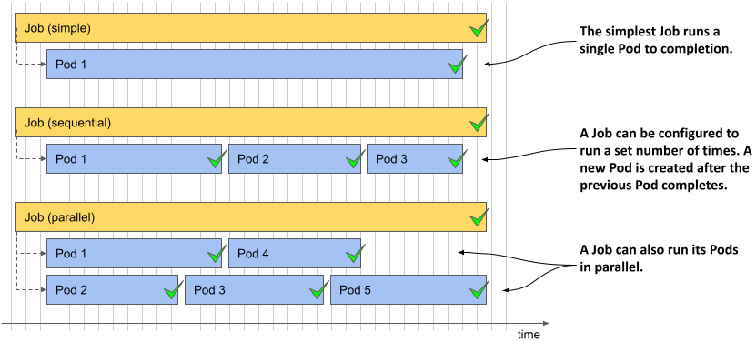

Đúng như bạn mong đợi, một tài nguyên Job định nghĩa một bản mẫu Pod (Pod template) và số lượng Pod phải hoàn thành thành công. Nó cũng định nghĩa số lượng Pod có thể chạy song song.

##### Lưu ý

Không giống như Deployment và các tài nguyên khác có chứa bản mẫu Pod, bạn không thể sửa đổi bản mẫu trong đối tượng Job sau khi đã tạo đối tượng đó.

Hãy cùng xem đối tượng Job đơn giản nhất trông như thế nào.

#### Định nghĩa một tài nguyên Job

Trong phần này, bạn sẽ lấy Pod `quiz-data-importer` từ Chương 15 và chuyển nó thành một Job. Pod này sẽ nhập dữ liệu vào cơ sở dữ liệu MongoDB của ứng dụng Quiz. Bạn có thể nhớ lại rằng trước khi chạy Pod này, bạn đã phải khởi tạo replica set của MongoDB bằng cách thực thi một lệnh trong một trong các Pod `quiz`. Bạn cũng có thể làm điều đó trong Job này bằng cách sử dụng một init container. Job và Pod do nó tạo ra được trực quan hóa trong hình dưới đây.

##### Hình 17.2 Tổng quan về Job quiz-init

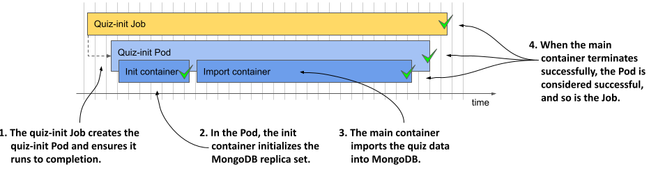

Đoạn mã dưới đây hiển thị manifest của Job, bạn có thể tìm thấy trong tệp `job.quiz-init.yaml`.

##### Lưu ý

Tệp manifest này cũng chứa một ConfigMap nơi lưu trữ các câu hỏi trắc nghiệm, nhưng ConfigMap này không được hiển thị trong đoạn mã.

##### Mã nguồn 17.1 Một manifest Job để chạy một tác vụ duy nhất

```yaml
apiVersion: batch/v1    #A
kind: Job    #A
metadata:
  name: quiz-init
  labels:
    app: quiz
    task: init
spec:
  template:    #B
    metadata:    #C
      labels:    #C
        app: quiz    #C
        task: init    #C
    spec:
      restartPolicy: OnFailure    #D
      initContainers:    #E
      - name: init    #E
        image: mongo:5    #E
        command:    #E
        - sh    #E
        - -c    #E
        - |    #E
          mongosh mongodb://quiz-0.quiz-pods.kiada.svc.cluster.local \\    #E 
    --quiet --file /dev/stdin <<EOF    #E
    #E
          # Mã nguồn MongoDB để khởi tạo replica set    #E
          # Tham khảo tệp job.quiz-init.yaml để xem mã nguồn thực tế    #E
    #E
          EOF    #E
      containers:    #F
      - name: import    #F
        image: mongo:5    #F
        command:    #F
        - mongoimport    #F
        - mongodb+srv://quiz-pods.kiada.svc.cluster.local/kiada?tls=false    #F
        - --collection    #F
        - questions    #F
        - --file    #F
        - /questions.json    #F
        - --drop    #F
        volumeMounts:    #F
        - name: quiz-data    #F
          mountPath: /questions.json    #F
          subPath: questions.json    #F
          readOnly: true    #F
      volumes:
      - name: quiz-data
        configMap:
          name: quiz-data
```

Manifest trong đoạn mã định nghĩa một đối tượng Job chạy một Pod duy nhất cho đến khi hoàn thành. Job thuộc nhóm API `batch` và bạn đang sử dụng phiên bản API `v1` để định nghĩa đối tượng này. Pod mà Job này tạo ra gồm hai container thực thi tuần tự, một là container khởi tạo (init container) và một là container thông thường. Init container đảm bảo replica set của MongoDB được khởi tạo, sau đó container chính sẽ nhập các câu hỏi trắc nghiệm từ ConfigMap `quiz-data` vốn được mount vào container thông qua một volume.

Chính sách khởi động lại (`restartPolicy`) của Pod được đặt thành `OnFailure`. Một Pod được định nghĩa bên trong một Job không thể sử dụng chính sách mặc định là `Always`, vì điều đó sẽ khiến Pod không bao giờ có thể chuyển sang trạng thái hoàn thành.

##### Lưu ý

Trong bản mẫu Pod (`template`) của một Job, bạn bắt buộc phải đặt chính sách khởi động lại một cách rõ ràng là `OnFailure` hoặc `Never`.

Bạn sẽ nhận thấy rằng khác với Deployment, manifest Job trong đoạn mã không định nghĩa trường `selector`. Mặc dù bạn có thể chỉ định nó, nhưng việc này là không bắt buộc vì Kubernetes sẽ tự động thiết lập. Bản mẫu Pod trong đoạn mã có chứa hai label, nhưng chúng chỉ được thêm vào để thuận tiện cho việc quản lý của bạn.

#### Chạy một Job

Bộ điều khiển Job (Job controller) sẽ tạo các Pod ngay sau khi bạn tạo đối tượng Job. Để chạy Job `quiz-init`, hãy áp dụng manifest `job.quiz-init.yaml` bằng lệnh `kubectl apply`.

#### Hiển thị trạng thái tóm tắt của Job

Để có cái nhìn tổng quan nhanh về trạng thái của Job, hãy liệt kê các Job trong Namespace hiện tại như sau:

```
$ kubectl get jobs
NAME        COMPLETIONS   DURATION   AGE
quiz-init   0/1           3s         3s
```

Cột `COMPLETIONS` cho biết Job đã chạy thành công bao nhiêu lần và được cấu hình để hoàn thành bao nhiêu lần. Cột `DURATION` hiển thị thời gian Job đã chạy. Vì tác vụ mà Job `quiz-init` thực hiện tương đối ngắn, trạng thái của nó sẽ thay đổi trong vòng vài giây. Hãy liệt kê lại các Job để xác nhận điều này:

```
$ kubectl get jobs
NAME        COMPLETIONS   DURATION   AGE
quiz-init   1/1           6s         42s
```

Kết quả cho thấy Job hiện đã hoàn thành và quá trình này mất 6 giây.

#### Hiển thị trạng thái chi tiết của Job

Để xem thêm chi tiết về Job, hãy sử dụng lệnh `kubectl describe` như sau:

```
$ kubectl describe job quiz-init
Name:             quiz-init
Namespace:        kiada
Selector:         controller-uid=98f0fe52-12ec-4c76-a185-4ccee9bae1ef    #A
Labels:           app=quiz
                  task=init
Annotations:      batch.kubernetes.io/job-tracking:
Parallelism:      1
Completions:      1
Completion Mode:  NonIndexed
Start Time:       Sun, 02 Oct 2022 12:17:59 +0200
Completed At:     Sun, 02 Oct 2022 12:18:05 +0200
Duration:         6s
Pods Statuses:    0 Active / 1 Succeeded / 0 Failed    #B
Pod Template:
  Labels:  app=quiz    #C
           controller-uid=98f0fe52-12ec-4c76-a185-4ccee9bae1ef    #C
           job-name=quiz-init    #C
           task=init    #C
  Init Containers:
   init: ...
  Containers:
   import: ...
  Volumes:
   quiz-data: ...
Events:
  Type    Reason            Age    From            Message
  ----    ------            ----   ----            -------
  Normal  SuccessfulCreate  7m33s  job-controller  Created pod: quiz-init-xpl8d    #D
  Normal  Completed         7m27s  job-controller  Job completed    #D
```

Ngoài các thông tin như tên Job (`Name`), không gian tên (`Namespace`), nhãn (`Labels`), chú thích (`Annotations`) và các thuộc tính khác, kết quả của lệnh `kubectl describe` cũng hiển thị bộ chọn (`selector`) được gán tự động. Label `controller-uid` được sử dụng trong bộ chọn cũng tự động được thêm vào bản mẫu Pod của Job. Label `job-name` cũng được thêm vào bản mẫu này. Như bạn sẽ thấy ở phần tiếp theo, bạn có thể dễ dàng sử dụng label này để liệt kê các Pod thuộc về một Job cụ thể.

Ở cuối kết quả của lệnh `kubectl describe`, bạn sẽ thấy các sự kiện (`Events`) liên quan đến đối tượng Job này. Chỉ có hai sự kiện được tạo ra cho Job này: tạo Pod và hoàn thành Job thành công.

#### Kiểm tra các Pod thuộc về một Job

Để liệt kê các Pod được tạo cho một Job cụ thể, bạn có thể sử dụng label `job-name` được tự động thêm vào các Pod đó. Để liệt kê các Pod của Job `quiz-init`, hãy chạy lệnh sau:

```
$ kubectl get pods -l job-name=quiz-init
NAME              READY   STATUS      RESTARTS   AGE
quiz-init-xpl8d   0/1     Completed   0          25m
```

Pod hiển thị trong kết quả đã hoàn thành nhiệm vụ của nó. Bộ điều khiển Job không xóa Pod này, vì vậy bạn có thể kiểm tra trạng thái và xem log của nó.

#### Kiểm tra log của một Pod thuộc Job

Cách nhanh nhất để xem log của một Job là truyền tên Job thay vị tên Pod vào lệnh `kubectl logs`. Để xem log của Job `quiz-init`, bạn có thể thực hiện lệnh như sau:

```
$ kubectl logs job/quiz-init --all-containers --prefix    #A
[pod/quiz-init-xpl8d/init] Replica set initialized successfully!    #B
[pod/quiz-init-xpl8d/import] 2022-10-02T10:51:01.967+0000  connected to: ...    #C
[pod/quiz-init-xpl8d/import] 2022-10-02T10:51:01.969+0000  dropping: kiada.questions    #C
[pod/quiz-init-xpl8d/import] 2022-10-02T10:51:03.811+0000  6 document(s) imported...    #C
```

Tùy chọn `--all-containers` yêu cầu `kubectl` in log của tất cả các container trong Pod, và tùy chọn `--prefix` đảm bảo rằng mỗi dòng log đều được tiền tố hóa bằng nguồn phát ra nó, tức là tên của pod và container tương ứng.

Kết quả đầu ra chứa nhật ký hoạt động (log) của cả hai container `init` và `import`. Những dòng nhật ký này cho thấy bộ bản sao (replica set) MongoDB đã được khởi tạo thành công và cơ sở dữ liệu câu hỏi đã được nạp đầy đủ dữ liệu.

#### Tạm dừng các Job đang hoạt động và tạo Job ở trạng thái tạm dừng

Khi bạn tạo Job `quiz-init`, bộ điều khiển Job (Job controller) sẽ tạo Pod ngay khi đối tượng Job được khởi tạo. Tuy nhiên, bạn cũng có thể tạo các Job ở trạng thái tạm dừng (suspended). Hãy cùng thử nghiệm tính năng này bằng cách tạo một Job khác. Như bạn có thể thấy trong đoạn mã dưới đây, bạn có thể tạm dừng Job bằng cách đặt trường `suspend` thành `true`. Bạn có thể tìm thấy tệp cấu hình (manifest) này trong tệp `job.demo-suspend.yaml`.

##### Đoạn mã 17.2 Tệp cấu hình của một Job bị tạm dừng

```yaml
apiVersion: batch/v1
kind: Job
metadata:
  name: demo-suspend
spec:
  suspend: true    #A
  template:
    spec:
      restartPolicy: OnFailure
      containers:
      - name: demo
        image: busybox
        command:
        - sleep
        - "60"
```

Áp dụng tệp cấu hình trong đoạn mã trên để tạo Job. Hãy liệt kê các Pod theo cách sau để xác nhận rằng chưa có Pod nào được tạo ra:

```
$ kubectl get po -l job-name=demo-suspend
No resources found in kiada namespace.
```

Bộ điều khiển Job sẽ tạo ra một Sự kiện (Event) cho biết Job đã bị tạm dừng. Bạn có thể xem sự kiện này bằng cách chạy lệnh `kubectl get events` hoặc kiểm tra thông tin chi tiết của Job bằng lệnh `kubectl describe`:

```
$ kubectl describe job demo-suspend
...
Events:
  Type    Reason     Age    From            Message
  ----    ------     ----   ----            -------
  Normal  Suspended  3m37s  job-controller  Job suspended
```

Khi đã sẵn sàng chạy Job, bạn có thể hủy tạm dừng bằng cách cập nhật (patch) đối tượng như sau:

```
$ kubectl patch job demo-suspend -p '{"spec":{"suspend": false}}'
job.batch/demo-suspend patched
```

Bộ điều khiển Job sẽ tạo Pod và sinh ra một Sự kiện cho biết Job đã hoạt động trở lại.

Bạn cũng có thể tạm dừng một Job đang chạy, bất kể ban đầu bạn có tạo nó ở trạng thái tạm dừng hay không. Để tạm dừng một Job, hãy đặt `suspend` thành `true` bằng lệnh `kubectl patch` sau:

```
$ kubectl patch job demo-suspend -p '{"spec":{"suspend": true}}'
job.batch/demo-suspend patched
```

Bộ điều khiển Job sẽ ngay lập tức xóa Pod liên kết với Job đó và tạo ra một Sự kiện cho biết Job đã bị tạm dừng. Các container của Pod sẽ được tắt một cách êm ái (graceful shutdown), tương tự như mỗi khi bạn xóa một Pod, bất kể nó được tạo ra bằng cách nào. Bạn có thể cho Job chạy lại bất cứ lúc nào bằng cách đặt lại trường `suspend` thành `false`.

#### Xóa các Job và Pod của chúng

Bạn có thể xóa Job bất kỳ lúc nào. Dù các Pod của Job đó đang chạy hay không, chúng đều sẽ bị xóa theo cách tương tự như khi bạn xóa một Deployment, StatefulSet hoặc DaemonSet.

Bạn không cần Job `quiz-init` nữa, vì vậy hãy xóa nó như sau:

```
$ kubectl delete job quiz-init
job.batch "quiz-init" deleted
```

Xác nhận rằng Pod cũng đã bị xóa bằng cách liệt kê các Pod như sau:

```
$ kubectl get po -l job-name=quiz-init
No resources found in kiada namespace.
```

Bạn có thể còn nhớ rằng các Pod bị xóa bởi bộ dọn rác (garbage collector) vì chúng trở thành "mồ côi" (orphaned) khi đối tượng sở hữu (owner) — trong trường hợp này là đối tượng Job mang tên `quiz-init` — bị xóa. Nếu bạn chỉ muốn xóa Job mà vẫn giữ lại các Pod, bạn có thể xóa Job với tùy chọn `--cascade=orphan`. Bạn có thể thử nghiệm phương pháp này với Job `demo-suspend` như sau:

```
$ kubectl delete job demo-suspend --cascade=orphan
 
job.batch "demo-suspend" deleted
```

Nếu bây giờ bạn liệt kê các Pod, bạn sẽ thấy Pod đó vẫn tồn tại. Vì hiện tại nó đã là một Pod độc lập, việc xóa nó khi không còn cần thiết nữa sẽ hoàn toàn do bạn quyết định.

#### Tự động xóa các Job

Theo mặc định, bạn phải xóa các đối tượng Job một cách thủ công. Tuy nhiên, bạn có thể đánh dấu để Job tự động xóa bằng cách thiết lập trường `ttlSecondsAfterFinished` trong phần `spec` của Job. Đúng như tên gọi, trường này xác định khoảng thời gian lưu trữ Job và các Pod của nó sau khi Job đã hoàn thành.

Để thấy rõ cơ chế hoạt động của thiết lập này, hãy thử tạo Job trong tệp cấu hình `job.demo-ttl.yaml`. Job này sẽ chạy một Pod duy nhất và hoàn thành thành công sau 20 giây. Vì `ttlSecondsAfterFinished` được đặt là `10`, Job và Pod của nó sẽ bị xóa sau đó mười giây.

##### Cảnh báo

Nếu bạn thiết lập trường `ttlSecondsAfterFinished` cho một Job, Job đó và các Pod của nó sẽ bị xóa bất kể Job hoàn thành thành công hay thất bại. Nếu việc xóa này xảy ra trước khi bạn kịp kiểm tra log của các Pod bị lỗi, bạn sẽ rất khó xác định được nguyên nhân khiến Job thất bại.

### 17.1.2 Chạy một tác vụ nhiều lần

Trong phần trước, bạn đã tìm hiểu cách thực thi một tác vụ duy nhất một lần. Tuy nhiên, bạn cũng có thể cấu hình Job để chạy cùng một tác vụ nhiều lần, theo cách song song hoặc tuần tự. Việc này đặc biệt hữu ích khi container thực hiện tác vụ chỉ có thể xử lý một mục dữ liệu tại một thời điểm, đòi hỏi bạn phải chạy container nhiều lần để xử lý toàn bộ đầu vào; hoặc đơn giản là bạn muốn phân bổ tiến trình xử lý trên nhiều nút (node) trong cụm để tăng tốc độ hiệu năng.

Bây giờ, bạn sẽ tạo một Job để chèn các phản hồi giả lập vào cơ sở dữ liệu Quiz nhằm mô phỏng số lượng lớn người dùng. Thay vị chỉ sử dụng một Pod duy nhất để chèn dữ liệu như ví dụ trước, bạn sẽ cấu hình Job tạo ra năm Pod như vậy. Tuy nhiên, thay vì chạy cả năm Pod cùng một lúc, bạn sẽ cấu hình để Job chạy tối đa hai Pod tại một thời điểm. Đoạn mã dưới đây mô tả tệp cấu hình của Job này. Bạn có thể tìm thấy nó trong tệp `job.generate-responses.yaml`.

##### Đoạn mã 17.3 Cấu hình Job chạy một tác vụ nhiều lần

```yaml
apiVersion: batch/v1    #A
kind: Job    #A
metadata:    #A
  name: generate-responses    #A
  labels:
    app: quiz
spec:
  completions: 5    #B
  parallelism: 2    #C
  template:
    metadata:
      labels:
        app: quiz
    spec:
      restartPolicy: OnFailure
      containers:
      - name: mongo
        image: mongo:5
        command:
        ...
```

Bên cạnh khuôn mẫu Pod (Pod template), tệp cấu hình Job trong đoạn mã trên còn định nghĩa hai thuộc tính mới là `completions` và `parallelism` mà chúng ta sẽ tìm hiểu ngay sau đây.

#### Tìm hiểu về completions và parallelism của Job

Trường `completions` xác định số lượng Pod cần phải hoàn thành thành công để Job được coi là hoàn tất. Trường `parallelism` chỉ ra số lượng tối đa các Pod có thể chạy song song cùng lúc. Không có giới hạn trên cho các giá trị này, nhưng cụm của bạn có thể chỉ chạy được một số lượng Pod song song nhất định tùy thuộc vào tài nguyên hệ thống.

Bạn có thể chọn không thiết lập trường nào, chỉ thiết lập một trong hai, hoặc thiết lập cả hai. Nếu bạn bỏ trống cả hai trường, cả hai giá trị sẽ mặc định bằng một. Nếu bạn chỉ thiết lập `completions`, các Pod sẽ chạy tuần tự nối tiếp nhau cho đến khi đạt đủ số lượng. Nếu bạn chỉ thiết lập `parallelism`, nhiều Pod sẽ chạy song song cùng lúc nhưng chỉ cần một Pod hoàn thành thành công là Job đã được coi là hoàn tất.

Nếu bạn thiết lập `parallelism` lớn hơn `completions`, bộ điều khiển Job sẽ chỉ tạo ra số lượng Pod đúng bằng giá trị đã chỉ định trong trường `completions`.

Nếu `parallelism` nhỏ hơn `completions`, bộ điều khiển Job sẽ chạy tối đa số lượng Pod bằng `parallelism` cùng một lúc, đồng thời tạo thêm các Pod mới khi các Pod ban đầu hoàn thành. Quá trình này lặp lại cho đến khi số lượng Pod hoàn thành thành công đạt mức `completions`. Sơ đồ dưới đây minh họa những gì xảy ra khi `completions` là 5 và `parallelism` là 2.

##### Sơ đồ 17.3 Chạy Job song song với completions=5 và parallelism=2

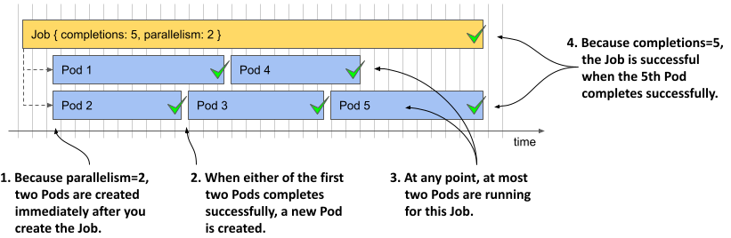

Như được mô tả trong sơ đồ, bộ điều khiển Job trước tiên sẽ tạo ra hai Pod và đợi cho đến khi một trong số chúng hoàn thành. Trong hình, Pod 2 là Pod hoàn thành đầu tiên. Bộ điều khiển ngay lập tức tạo Pod tiếp theo (Pod 3) để duy trì số lượng Pod đang chạy luôn là hai. Quá trình này được lặp lại liên tục cho đến khi có đủ năm Pod hoàn thành thành công.

Bảng dưới đây giải thích chi tiết hành vi của Job ứng với các tổ hợp cấu hình khác nhau của `completions` và `parallelism`.

##### Bảng 17.1 Các tổ hợp cấu hình của Completions và Parallelism

| Completions (Số lần hoàn thành) | Parallelism (Độ song song) | Job behavior (Hành vi của Job) |
| :--- | :--- | :--- |
| Không thiết lập | Không thiết lập | Một Pod duy nhất được tạo ra. Tương tự như khi đặt `completions` và `parallelism` bằng `1`. |
| 1 | 1 | Một Pod duy nhất được tạo ra. Nếu Pod hoàn thành thành công, Job sẽ hoàn tất. Nếu Pod bị xóa trước khi hoàn thành, nó sẽ được thay thế bằng một Pod mới. |
| 2 | 5 | Chỉ có hai Pod được tạo ra. Tương tự như khi parallelism bằng 2. |
| 5 | 2 | Ban đầu hai Pod được tạo ra. Khi một trong hai hoàn thành, Pod thứ ba sẽ được tạo. Lúc này lại có hai Pod đang chạy. Khi một trong hai hoàn thành, Pod thứ tư sẽ được tạo. Lại có hai Pod đang chạy. Khi một Pod nữa hoàn thành, Pod thứ năm và cũng là Pod cuối cùng được tạo. |
| 5 | 5 | Năm Pod chạy đồng thời cùng lúc. Nếu một Pod bị xóa trước khi hoàn thành, một Pod thay thế sẽ được tạo ra. Job hoàn tất khi cả năm Pod hoàn thành thành công. |
| 5 | Không thiết lập | Năm Pod được tạo tuần tự nối tiếp nhau. Pod mới chỉ được tạo khi Pod trước đó đã hoàn thành (hoặc thất bại). |
| Không thiết lập | 5 | Năm Pod được tạo đồng thời cùng lúc, nhưng chỉ cần một Pod hoàn thành thành công là Job đã hoàn tất. |

Trong Job `generate-responses` mà bạn sắp tạo, số lượng `completions` được thiết lập là `5` và `parallelism` được thiết lập là `2`, do đó tối đa hai Pod sẽ chạy song song cùng lúc. Job chỉ hoàn tất khi có đủ năm Pod hoàn thành thành công. Tổng số lượng Pod thực tế được tạo ra có thể cao hơn nếu một vài Pod gặp lỗi. Chúng ta sẽ tìm hiểu thêm về vấn đề này trong phần tiếp theo.

#### Chạy Job

Sử dụng lệnh `kubectl apply` để tạo Job bằng cách áp dụng tệp cấu hình `job.generate-responses.yaml`. Hãy liệt kê các Pod trong quá trình Job đang chạy như sau:

```
$ kubectl get po -l job-name=generate-responses
NAME                       READY   STATUS      RESTARTS      AGE
generate-responses-7kqw4   1/1     Running     2 (20s ago)   27s   #B
generate-responses-98mh8   0/1     Completed   0             27s   #A
generate-responses-tbgns   1/1     Running     0             3s   #B
```

Hãy liệt kê các Pod vài lần để quan sát số lượng Pod có trạng thái `STATUS` hiển thị là `Running` hoặc `Completed`. Như bạn thấy, tại bất kỳ thời điểm nào, tối đa chỉ có hai Pod chạy đồng thời. Sau một khoảng thời gian, Job sẽ hoàn thành. Bạn có thể kiểm tra trạng thái của Job bằng lệnh `kubectl get` như sau:

```
$ kubectl get job generate-responses
NAME                 COMPLETIONS   DURATION  AGE
generate-responses   5/5           110s      115s    #A
```

Cột `COMPLETIONS` cho thấy Job này đã hoàn thành thành công cả 5 lần như mong muốn, mất tổng cộng 110 giây. Nếu liệt kê lại các Pod, bạn sẽ thấy năm Pod đã hoàn thành như sau:

```
$ kubectl get po -l job-name=generate-responses
NAME                       READY   STATUS      RESTARTS   AGE
generate-responses-5xtlk   0/1     Completed   0          82s   #A
generate-responses-7kqw4   0/1     Completed   3          2m46s   #B
generate-responses-98mh8   0/1     Completed   0          2m46s   #A
generate-responses-tbgns   0/1     Completed   1          2m22s   #C
generate-responses-vbvq8   0/1     Completed   1          111s   #C
```

Đúng như trạng thái của Job hiển thị trước đó, bạn sẽ thấy năm Pod ở trạng thái `Completed`. Tuy nhiên, nếu nhìn kỹ vào cột `RESTARTS`, bạn sẽ nhận thấy một vài Pod trong số này đã phải khởi động lại. Nguyên nhân là do tôi đã lập trình sẵn tỷ lệ lỗi 25% (hard-code) vào đoạn mã chạy trong các Pod đó, nhằm minh họa thực tế những gì xảy ra khi gặp lỗi.

### 17.1.3 Tìm hiểu cơ chế xử lý lỗi của Job

Như đã giải thích trước đó, lý do chúng ta chạy các tác vụ thông qua Job thay vì chạy trực tiếp bằng Pod là vì Kubernetes đảm bảo tác vụ đó sẽ hoàn thành ngay cả khi các Pod riêng lẻ hoặc các Nút (Node) chứa chúng bị lỗi. Việc xử lý các lỗi này được thực hiện ở hai cấp độ khác nhau:

- Cấp độ Pod.
- Cấp độ Job.

Khi một container trong Pod bị lỗi, chính sách khởi động lại `restartPolicy` của Pod sẽ quyết định xem lỗi đó được xử lý ở cấp độ Pod bởi Kubelet hay ở cấp độ Job bởi bộ điều khiển Job. Như minh họa trong sơ đồ dưới đây, nếu `restartPolicy` là `OnFailure`, container bị lỗi sẽ được khởi động lại ngay trong chính Pod đó. Ngược lại, nếu chính sách là `Never`, toàn bộ Pod sẽ bị đánh dấu là thất bại và bộ điều khiển Job sẽ tạo ra một Pod hoàn toàn mới.

##### Sơ đồ 17.4 Cách xử lý lỗi tùy thuộc vào chính sách khởi động lại của Pod

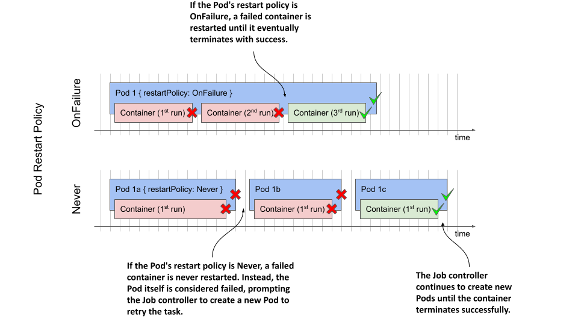

Hãy cùng phân tích sự khác biệt giữa hai kịch bản này.

#### Xử lý lỗi ở cấp độ Pod

Trong Job `generate-responses` mà bạn đã tạo ở phần trước, thuộc tính `restartPolicy` của Pod được cấu hình là `OnFailure`. Như đã đề cập, cứ mỗi lần container chạy thì sẽ có 25% khả năng xảy ra lỗi. Khi xảy ra lỗi, container sẽ kết thúc với một mã thoát khác không (non-zero exit code). Kubelet sẽ phát hiện ra lỗi này và tiến hành khởi động lại container.

Container mới sẽ chạy ngay trong chính Pod đó trên cùng một Nút (Node), nhờ vậy quá trình khôi phục diễn ra cực kỳ nhanh chóng. Container có thể tiếp tục bị lỗi và khởi động lại vài lần, nhưng cuối cùng nó sẽ kết thúc thành công và Pod sẽ được đánh dấu là hoàn thành.

##### Lưu ý

Như bạn đã tìm hiểu trong các chương trước, Kubelet không khởi động lại container ngay lập tức nếu nó bị sập (crash) liên tục nhiều lần, mà sẽ áp dụng một khoảng thời gian trì hoãn (delay) sau mỗi lần sập và nhân đôi khoảng thời gian đó sau mỗi lần khởi động lại kế tiếp.

#### Xử lý lỗi ở cấp độ Job

Khi khuôn mẫu Pod trong tệp cấu hình Job thiết lập `restartPolicy` của Pod là `Never`, Kubelet sẽ không khởi động lại các container của nó nữa. Thay vào đó, toàn bộ Pod sẽ bị đánh dấu là thất bại và bộ điều khiển Job buộc phải tạo ra một Pod mới. Pod mới này có thể sẽ được lập lịch để chạy trên một Nút (Node) khác.

##### Lưu ý

Nếu Pod được lập lịch để chạy trên một Nút khác, hệ thống có thể cần phải tải xuống (pull) các hình ảnh container (container images) trước khi container có thể bắt đầu chạy.

Nếu muốn quan sát cách bộ điều khiển Job xử lý các lỗi trong Job `generate-responses`, hãy xóa Job hiện tại và tạo lại nó từ tệp cấu hình `job.generate-responses.restartPolicyNever.yaml`. Trong tệp cấu hình này, thuộc tính `restartPolicy` của Pod được thiết lập là `Never`.

Job sẽ hoàn thành sau khoảng một đến hai phút. Nếu bạn liệt kê các Pod như dưới đây, bạn sẽ nhận thấy rằng hệ thống đã phải cần tới nhiều hơn năm Pod để hoàn thành công việc.

```
$ kubectl get po -l job-name=generate-responses
NAME                       READY   STATUS      RESTARTS   AGE
generate-responses-2dbrn   0/1     Error       0          2m43s    #A
generate-responses-4pckt   0/1     Error       0          2m39s    #A
generate-responses-8c8wz   0/1     Completed   0          2m43s    #B
generate-responses-bnm4t   0/1     Completed   0          3m10s    #B
generate-responses-kn55w   0/1     Completed   0          2m16s    #B
generate-responses-t2r67   0/1     Completed   0          3m10s    #B
generate-responses-xpbnr   0/1     Completed   0          2m34s    #B
```

Bạn sẽ thấy năm Pod ở trạng thái `Completed` và một vài Pod ở trạng thái `Error`. Số lượng các Pod này sẽ khớp chính xác với số lượng Pod thành công và thất bại khi bạn kiểm tra đối tượng Job bằng lệnh `kubectl describe job` dưới đây:

```
$ kubectl describe job generate-responses
...
Pods Statuses:    0 Active / 5 Succeeded / 2 Failed
...
```

##### Lưu ý

Số lượng Pod trong trường hợp của bạn có thể sẽ khác. Cũng có khả năng Job vẫn chưa hoàn thành. Điều này sẽ được giải thích chi tiết trong phần tiếp theo.

Để kết thúc phần này, hãy tiến hành xóa Job `generate-responses`.

#### Ngăn các Job thất bại vô hạn

Hai Job bạn vừa tạo ở các phần trước có thể đã không thể hoàn thành do gặp quá nhiều lỗi liên tiếp. Khi tình trạng đó xảy ra, bộ điều khiển Job sẽ từ bỏ. Hãy cùng minh họa điều này bằng cách tạo một Job luôn luôn thất bại. Bạn có thể tìm thấy tệp cấu hình này trong tệp `job.demo-always-fails.yaml` với nội dung chi tiết được hiển thị dưới đây.

##### Đoạn mã 17.4 Một Job luôn luôn thất bại

```yaml
apiVersion: batch/v1
kind: Job
metadata:
  name: demo-always-fails
spec:
  completions: 10
  parallelism: 3
  template:
    spec:
      restartPolicy: OnFailure
      containers:
      - name: demo
        image: busybox
        command:
        - 'false'    #A 
```

Khi bạn tạo Job từ tệp cấu hình này, bộ điều khiển Job sẽ tạo ra ba Pod. Container trong các Pod này kết thúc với mã thoát khác không, khiến cho Kubelet phải khởi động lại nó. Sau một số lần khởi động lại liên tục, bộ điều khiển Job sẽ nhận thấy các Pod này đang thất bại liên tiếp, do đó nó sẽ xóa chúng đi và đánh dấu Job là thất bại.

Rất tiếc, bạn sẽ không thể nhận biết được việc bộ điều khiển đã từ bỏ nếu chỉ kiểm tra trạng thái Job bằng lệnh `kubectl get job`. Khi chạy lệnh này, bạn chỉ thấy kết quả như sau:

```
$ kubectl get job
NAME                COMPLETIONS   DURATION   AGE
demo-always-fails   0/10          2m48s      2m48s
```

Kết quả đầu ra của lệnh chỉ cho thấy Job chưa hoàn thành được lần nào (0/10), chứ không hiển thị việc bộ điều khiển đang tiếp tục cố gắng chạy lại Job hay đã thực sự bỏ cuộc. Tuy nhiên, bạn hoàn toàn có thể kiểm tra điều này trong danh sách các sự kiện (event) đi kèm với Job. Để xem các sự kiện này, hãy chạy lệnh `kubectl describe` như sau:

```
$ kubectl describe job demo-always-fails
...
Events:
Type     Reason                Age    From            Message
----     ------                ----   ----            -------
Normal   SuccessfulCreate      5m6s   job-controller  Created pod: demo-always-fails-t9xkw
Normal   SuccessfulCreate      5m6s   job-controller  Created pod: demo-always-fails-6kcb2
Normal   SuccessfulCreate      5m6s   job-controller  Created pod: demo-always-fails-4nfmd
Normal   SuccessfulDelete      4m43s  job-controller  Deleted pod: demo-always-fails-4nfmd
Normal   SuccessfulDelete      4m43s  job-controller  Deleted pod: demo-always-fails-6kcb2
Normal   SuccessfulDelete      4m43s  job-controller  Deleted pod: demo-always-fails-t9xkw
Warning  BackoffLimitExceeded  4m43s  job-controller  Job has reached the specified backoff 
                                                      limit
```

Sự kiện cảnh báo (`Warning`) ở dưới cùng cho thấy giới hạn thử lại (backoff limit) của Job đã bị vượt quá, nghĩa là Job đã chính thức thất bại. Bạn có thể xác nhận điều này bằng cách kiểm tra trạng thái chi tiết của Job như sau:

```
$ kubectl get job demo-always-fails -o yaml
...
status:
  conditions:
  - lastProbeTime: "2022-10-02T15:42:39Z"
    lastTransitionTime: "2022-10-02T15:42:39Z"
    message: Job has reached the specified backoff limit   #A
    reason: BackoffLimitExceeded    #A
    status: "True"   #B
    type: Failed   #B
  failed: 3
  startTime: "2022-10-02T15:42:16Z"
  uncountedTerminatedPods: {}
```

Mặc dù rất khó nhận thấy trực tiếp từ kết quả trên, nhưng Job đã kết thúc sau 6 lần thử lại, đây chính là giới hạn thử lại mặc định. Bạn có thể cấu hình giới hạn này cho từng Job thông qua trường `spec.backoffLimit` trong tệp cấu hình của nó.

Một khi Job vượt quá giới hạn này, bộ điều khiển Job sẽ xóa toàn bộ các Pod đang chạy và ngừng tạo thêm Pod mới cho nó. Để khởi động lại một Job đã thất bại, bạn buộc phải xóa nó đi và tạo lại từ đầu.

#### Giới hạn thời gian hoàn thành cho phép của Job

Một nguyên nhân khác có thể khiến Job thất bại là do không hoàn thành đúng hạn. Theo mặc định, thời gian chạy Job không bị giới hạn, nhưng bạn có thể thiết lập thời gian chạy tối đa bằng trường `activeDeadlineSeconds` trong phần `spec` của Job, như được thể hiện trong đoạn mã dưới đây (xem tệp cấu hình `job.demo-deadline.yaml`):

##### Đoạn mã 17.5 Một Job đi kèm với giới hạn thời gian

```yaml
apiVersion: batch/v1
kind: Job
metadata:
  name: demo-deadline
spec:
  completions: 2    #A
  parallelism: 1    #B
  activeDeadlineSeconds: 90    #C
  template:
    spec:
      restartPolicy: OnFailure
      containers:
      - name: demo-suspend
        image: busybox
        command:
        - sleep   #D
        - "60"   #D
```

Từ trường `completions` trong đoạn mã, bạn có thể thấy Job yêu cầu hai lần hoàn thành để được coi là hoàn tất. Vì `parallelism` được thiết lập bằng `1`, hai Pod sẽ chạy tuần tự nối tiếp nhau. Với việc chạy tuần tự hai Pod và mỗi Pod cần tới 60 giây để hoàn thành, tổng thời gian thực thi của cả Job sẽ mất hơn 120 giây. Tuy nhiên, do trường `activeDeadlineSeconds` của Job này lại được đặt là `90` (giây), Job chắc chắn sẽ thất bại. Sơ đồ dưới đây minh họa chi tiết cho kịch bản này.

##### Sơ đồ 17.5 Thiết lập giới hạn thời gian chạy cho Job

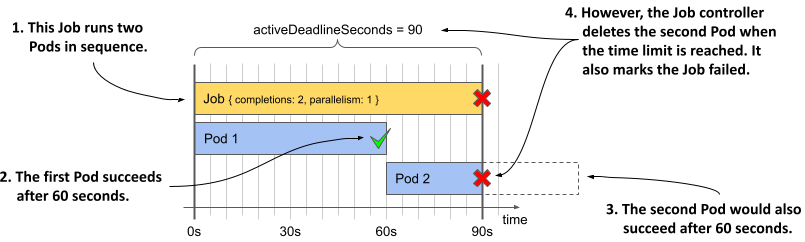

Để tự mình kiểm chứng, hãy tạo Job này bằng cách áp dụng tệp cấu hình và đợi cho đến khi nó thất bại. Khi điều đó xảy ra, bộ điều khiển Job sẽ tạo ra một Sự kiện như sau:

```
$ kubectl describe job demo-deadline
...
Events:
  Type     Reason            Age   From            Message
  ----     ------            ----  ----            -------
  Warning  DeadlineExceeded  1m    job-controller  Job was active longer than specified 
                                                   deadline
```

##### Lưu ý

Hãy nhớ rằng trường `activeDeadlineSeconds` trong Job được áp dụng cho toàn bộ Job nói chung, chứ không phải cho từng Pod riêng lẻ được tạo ra trong ngữ cảnh của Job đó.

### 17.1.4 Tham số hóa các Pod trong một Job

Cho đến nay, các tác vụ bạn thực thi trong mỗi Job đều giống hệt nhau. Ví dụ, toàn bộ các Pod trong Job `generate-responses` đều làm một việc duy nhất: chèn một loạt phản hồi vào cơ sở dữ liệu. Nhưng điều gì sẽ xảy ra nếu bạn muốn chạy một chuỗi các tác vụ liên quan với nhau nhưng không hoàn toàn đồng nhất? Có thể bạn muốn mỗi Pod chỉ xử lý một phần nhỏ (subset) của dữ liệu? Đó chính là lúc trường `completionMode` của Job phát huy tác dụng.

Tại thời điểm viết cuốn sách này, hai chế độ hoàn thành đang được hỗ trợ: `Indexed` (Có chỉ mục) và `NonIndexed` (Không có chỉ mục). Các Job mà bạn tạo ra từ đầu chương đến giờ đều thuộc chế độ `NonIndexed`, vì đây là chế độ mặc định. Tất cả các Pod được tạo ra bởi một Job như vậy đều giống hệt và không thể phân biệt được với nhau. Tuy nhiên, nếu bạn thiết lập `completionMode` của Job thành `Indexed`, mỗi Pod sẽ được gán một số chỉ mục (index) riêng để phân biệt. Điều này cho phép từng Pod đảm nhận và xử lý chỉ một phần riêng biệt trong toàn bộ tác vụ lớn. Hãy tham khảo bảng dưới đây để so sánh sự khác nhau giữa hai chế độ hoàn thành này.

##### Bảng 17.2 Các chế độ hoàn thành Job được hỗ trợ

| Giá trị | Mô tả |
| :--- | :--- |
| NonIndexed | Job được coi là hoàn thành khi số lượng Pod hoàn thành thành công được tạo bởi Job này bằng với giá trị của trường `spec.completions` trong tệp cấu hình Job. Mọi Pod đều có vai trò như nhau. Đây là chế độ mặc định. |
| Indexed | Mỗi Pod được gán một chỉ mục hoàn thành (bắt đầu từ `0`) để phân biệt các Pod với nhau. Job được coi là hoàn thành khi có đúng một Pod hoàn thành thành công cho mỗi chỉ mục. Nếu một Pod có chỉ mục cụ thể bị lỗi, bộ điều khiển Job sẽ tạo ra một Pod mới có cùng chỉ mục đó.<br><br>Chỉ mục hoàn thành được gán cho mỗi Pod được chỉ định trong phần chú thích (annotation) `batch.kubernetes.io/job-completion-index` của Pod và trong biến môi trường `JOB_COMPLETION_INDEX` bên trong các container của Pod đó. |

##### Lưu ý

Trong tương lai, Kubernetes may hỗ trợ thêm các chế độ xử lý Job khác, thông qua bộ điều khiển Job tích hợp sẵn hoặc thông qua các bộ điều khiển bổ sung từ bên ngoài.

Để hiểu rõ hơn về các chế độ hoàn thành này, bạn sẽ tạo một Job thực hiện việc đọc các phản hồi trong cơ sở dữ liệu Quiz, tính toán số lượng phản hồi hợp lệ và không hợp lệ cho từng ngày, sau đó lưu kết quả này ngược trở lại cơ sở dữ liệu. Bạn sẽ thực hiện việc này theo hai cách khác nhau, áp dụng cả hai chế độ hoàn thành để có thể nắm bắt rõ sự khác biệt.

#### Triển khai script tổng hợp dữ liệu

Như bạn có thể hình dung, cơ sở dữ liệu Quiz có thể phình to rất nhanh nếu có nhiều người dùng sử dụng ứng dụng cùng lúc. Do đó, bạn chắc chắn không muốn chỉ một Pod duy nhất phải gánh vác việc xử lý toàn bộ các phản hồi, mà thay vào đó bạn muốn mỗi Pod chỉ tập trung xử lý dữ liệu của một tháng cụ thể.

Tôi đã chuẩn bị sẵn một đoạn mã script thực hiện công việc này. Các Pod sẽ lấy mã script này từ một ConfigMap. Bạn có thể tìm thấy tệp cấu hình của nó trong tệp `cm.aggregate-responses.yaml`. Nội dung mã nguồn cụ thể không quá quan trọng, điều quan trọng ở đây là nó chấp nhận hai tham số đầu vào: *năm* (year) và *tháng* (month) cần xử lý. Đoạn mã sẽ đọc các tham số này thông qua các biến môi trường `YEAR` và `MONTH`, như bạn có thể thấy trong đoạn mã dưới đây.

##### Đoạn mã 17.6 ConfigMap chứa script MongoDB để xử lý các phản hồi Quiz

```yaml
apiVersion: v1
kind: ConfigMap    
metadata:
  name: aggregate-responses
  labels:
    app: aggregate-responses
data:
  script.js: |
    var year = parseInt(process.env["YEAR"]);    #A
    var month = parseInt(process.env["MONTH"]);    #A
    ...
```

Áp dụng tệp cấu hình ConfigMap này vào cụm của bạn bằng lệnh sau:

```
$ kubectl apply -f cm.aggregate-responses.yaml 
configmap/aggregate-responses created
```

Bây giờ, hãy tưởng tượng bạn muốn tính toán số liệu tổng hợp cho từng tháng của năm 2020. Vì script này chỉ xử lý dữ liệu của duy nhất một tháng tại một thời điểm, bạn sẽ cần tới 12 Pod để xử lý trọn vẹn cả năm. Vậy bạn nên tạo Job như thế nào để sinh ra các Pod này, khi mà bạn cần phải truyền một giá trị tháng khác nhau cho mỗi Pod?

#### Chế độ hoàn thành NonIndexed

Trước khi tính năng `completionMode` được hỗ trợ cho tài nguyên Job, toàn bộ các Job đều vận hành dưới chế độ gọi là `NonIndexed`. Vấn đề lớn nhất của chế độ này là tất cả các Pod được tạo ra đều hoàn toàn giống hệt nhau.

##### Sơ đồ 17.6 Các Job sử dụng chế độ hoàn thành NonIndexed sinh ra các Pod giống hệt nhau


Vì thế, nếu sử dụng chế độ hoàn thành này, bạn sẽ không thể truyền các giá trị `MONTH` khác nhau cho từng Pod riêng lẻ. Bạn buộc phải tạo một đối tượng Job riêng biệt cho mỗi tháng. Bằng cách này, mỗi Job có thể thiết lập biến môi trường MONTH trong khuôn mẫu Pod của nó thành một giá trị khác nhau, như được minh họa trong sơ đồ dưới đây.

##### Sơ đồ 17.7 Tạo các Job tương tự nhau từ một khuôn mẫu

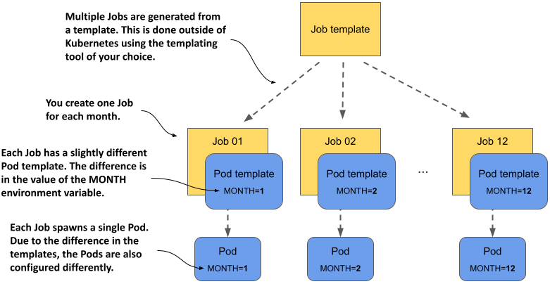

Để tạo ra các Job khác nhau này, bạn cần phải xây dựng các tệp cấu hình Job riêng biệt. Bạn có thể thực hiện việc này một cách thủ công hoặc sử dụng một hệ thống quản lý khuôn mẫu (templating system) bên ngoài. Bản thân Kubernetes không cung cấp bất kỳ tính năng tích hợp nào để tạo Job từ các khuôn mẫu.

Hãy quay trở lại ví dụ với Job `aggregate-responses`. Để xử lý trọn vẹn năm 2020, bạn cần tạo mười hai tệp cấu hình Job. Bạn có thể sử dụng một công cụ xử lý khuôn mẫu (template engine) chuyên nghiệp cho việc này, nhưng bạn cũng hoàn toàn có thể thực hiện thông qua một lệnh shell tương đối đơn giản.

Trước tiên, bạn phải tạo khuôn mẫu đó. Bạn có thể tìm thấy nó trong tệp `job.aggregate-responses-2020.tmpl.yaml`. Đoạn mã dưới đây thể hiện cấu trúc của tệp này.

##### Đoạn mã 17.7 Khuôn mẫu để tạo các cấu hình Job cho Job aggregate-responses

```yaml
apiVersion: batch/v1
kind: Job
metadata:
  name: aggregate-responses-2020-__MONTH__    #A
spec:
  completionMode: NonIndexed
  template:
    spec:
      restartPolicy: OnFailure
      containers:
      - name: updater
        image: mongo:5
        env:
        - name: YEAR
          value: "2020"
        - name: MONTH
          value: "__MONTH__"    #B
        ...
```

Nếu sử dụng Bash, bạn can tạo các tệp cấu hình từ khuôn mẫu này và áp dụng trực tiếp vào cụm bằng lệnh dưới đây:

```
$ for month in {1..12}; do \    #A
    sed -e "s/__MONTH__/$month/g" job.aggregate-responses-2020.tmpl.yaml \    #B
    | kubectl apply -f - ; \    #C
  done
job.batch/aggregate-responses-2020-1 created    #D
job.batch/aggregate-responses-2020-2 created    #D
...    #D
job.batch/aggregate-responses-2020-12 created    #D
```

Lệnh này sử dụng một vòng lặp `for` để kết xuất (render) khuôn mẫu mười hai lần. Việc kết xuất khuôn mẫu ở đây chỉ đơn thuần là thay thế chuỗi ký tự `__MONTH__` trong khuôn mẫu bằng số tháng thực tế. Tệp cấu hình kết quả sau đó sẽ được áp dụng trực tiếp vào cụm bằng lệnh `kubectl apply`.

##### Lưu ý

Nếu muốn chạy thử ví dụ này nhưng không sử dụng hệ điều hành Linux, bạn có thể dùng các tệp cấu hình đã được tôi tạo sẵn. Hãy chạy lệnh sau để áp dụng chúng vào cụm của bạn: `kubectl apply -f job.aggregate-responses-2020.generated.yaml`.

Mười hai Job bạn vừa khởi tạo hiện đang chạy trong cụm của bạn. Mỗi Job sẽ tạo ra một Pod duy nhất để xử lý một tháng cụ thể. Để kiểm tra số liệu thống kê được tạo ra, hãy sử dụng lệnh sau:

```
$ kubectl exec quiz-0 -c mongo -- mongosh kiada --quiet --eval 'db.statistics.find()'
[
  {    #A
    _id: ISODate("2020-02-28T00:00:00.000Z"),    #A
    totalCount: 120,    #A
    correctCount: 25,    #A
    incorrectCount: 95    #A
  },    #A
  ...
```

Nếu cả mười hai Job đều đã xử lý thành công các tháng tương ứng của chúng, bạn sẽ thấy xuất hiện rất nhiều bản ghi dữ liệu có cấu trúc tương tự như bản ghi hiển thị ở trên. Giờ đây bạn có thể xóa toàn bộ mười hai Job `aggregate-responses` này bằng cách chạy lệnh sau:

```
$ kubectl delete jobs -l app=aggregate-responses
```

Trong ví dụ này, tham số được truyền vào mỗi Job chỉ là một số nguyên đơn giản, tuy nhiên ưu thế thực sự của phương pháp này nằm ở chỗ bạn có thể truyền bất kỳ giá trị hoặc tập hợp giá trị nào vào từng Job và Pod của nó. Điểm bất lợi, tất nhiên, là bạn sẽ phải quản lý rất nhiều Job riêng lẻ, đồng nghĩa với việc tốn nhiều công sức vận hành hơn so với khi chỉ quản lý một đối tượng Job duy nhất. Hơn nữa, nếu bạn tạo các đối tượng Job đó cùng một lúc, chúng sẽ đồng loạt chạy cùng thời điểm. Đó là lý do tại sao việc sử dụng một Job duy nhất với chế độ hoàn thành `Indexed` là lựa chọn tối ưu hơn, như chúng ta sẽ tìm hiểu ngay sau đây.

#### Giới thiệu chế độ hoàn thành Indexed

Như đã đề cập trước đó, khi một Job được cấu hình ở chế độ hoàn thành `Indexed`, mỗi Pod sẽ được gán một chỉ mục hoàn thành (bắt đầu từ `0`) để phân biệt Pod đó với các Pod khác trong cùng Job, như minh họa ở sơ đồ dưới đây.

##### Sơ đồ 17.8 Các Pod được sinh ra bởi một Job hoạt động ở chế độ hoàn thành Indexed đều có số chỉ mục riêng

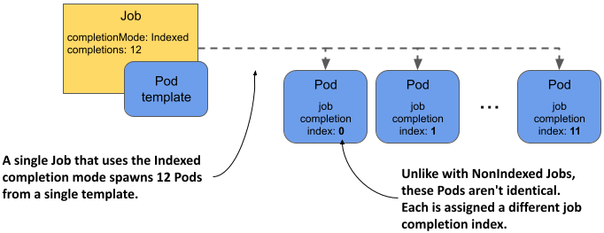

Số lượng Pod được xác định bởi trường `completions` trong phần `spec` của Job. Job được xem là hoàn thành khi có đúng một Pod hoàn thành thành công ứng với mỗi chỉ mục.

Đoạn mã dưới đây minh họa tệp cấu hình của một Job sử dụng chế độ hoàn thành `Indexed` để chạy mười hai Pod, mỗi Pod tương ứng với một tháng. Lưu ý rằng biến môi trường `MONTH` không được thiết lập trực tiếp ở đây. Lý do là vì đoạn mã script, như bạn sẽ thấy ở phần sau, sẽ sử dụng chính chỉ mục hoàn thành (completion index) để tự xác định tháng cần xử lý.

##### Đoạn mã 17.8 Cấu hình một Job sử dụng chế độ hoàn thành Indexed

```yaml
apiVersion: batch/v1
kind: Job
metadata:
  name: aggregate-responses-2021
  labels:
    app: aggregate-responses
    year: "2021"
spec:
  completionMode: Indexed    #A
  completions: 12    #B
  parallelism: 3    #C
  template:
    metadata:
      labels:
        app: aggregate-responses
        year: "2021"
    spec:
      restartPolicy: OnFailure
      containers:
      - name: updater
        image: mongo:5
        env:
        - name: YEAR    #D
          value: "2021"    #D
        command:
        - mongosh
        - mongodb+srv://quiz-pods.kiada.svc.cluster.local/kiada?tls=false
        - --quiet
        - --file
        - /script.js
        volumeMounts:
        - name: script
          subPath: script.js
          mountPath: /script.js
      volumes:
      - name: script
        configMap:    #E
          name: aggregate-responses-indexed    #E
```

Trong đoạn mã trên, trường `completionMode` được đặt là `Indexed` và số lượng `completions` là `12` như bạn mong đợi. Để chạy ba Pod song song cùng một lúc, `parallelism` được thiết lập bằng `3`.

#### Biến môi trường JOB\_COMPLETION\_INDEX

Khác với ví dụ `aggregate-responses-2020` khi bạn phải truyền cả hai biến môi trường `YEAR` và `MONTH`, ở đây bạn chỉ cần truyền duy nhất biến `YEAR`. Để xác định xem Pod cần xử lý tháng nào, đoạn mã script sẽ chủ động tra cứu thông tin từ biến môi trường `JOB_COMPLETION_INDEX`, như được mô tả trong đoạn mã dưới đây.

##### Đoạn mã 17.9 Sử dụng biến môi trường JOB\_COMPLETION\_INDEX trong mã nguồn của bạn

```yaml
apiVersion: v1
kind: ConfigMap
metadata:
  name: aggregate-responses-indexed
  labels:
    app: aggregate-responses-indexed
data:
  script.js: |
    var year = parseInt(process.env["YEAR"]);
    var month = parseInt(process.env["JOB_COMPLETION_INDEX"]) + 1;    #A
    ...
```

Biến môi trường này không được khai báo trong khuôn mẫu Pod mà sẽ do bộ điều khiển Job tự động bổ sung vào từng Pod. Tiến trình xử lý (workload) chạy trong Pod có thể sử dụng biến này để xác định phần dữ liệu cụ thể mà nó cần xử lý.

Trong ví dụ aggregate-responses, giá trị của biến này đại diện cho số tháng. Tuy nhiên, do biến môi trường này bắt đầu từ số 0 (zero-based), đoạn script phải cộng thêm `1` vào giá trị nhận được để ra đúng tháng thực tế.

#### Chú thích job-completion-index

Bên cạnh việc thiết lập biến môi trường, bộ điều khiển Job cũng gán chỉ mục hoàn thành của Job vào phần chú thích (annotation) `batch.kubernetes.io/job-completion-index` của Pod. Thay vì sử dụng biến môi trường `JOB_COMPLETION_INDEX`, bạn hoàn toàn có thể truyền chỉ mục này thông qua bất kỳ biến môi trường nào bằng cách sử dụng Downward API như đã giải thích ở Chương 9. Ví dụ, để truyền giá trị của chú thích này vào biến môi trường `MONTH`, cấu hình `env` trong khuôn mẫu Pod sẽ có dạng như sau:

```yaml
env:        
- name: MONTH    #A
  valueFrom:    #B
    fieldRef:    #B
      fieldPath: metadata.annotations['batch.kubernetes.io/job-completion-index']    #B
```

Bạn có thể nghĩ rằng với phương pháp này, bạn chỉ cần tái sử dụng chính đoạn script trong ví dụ `aggregate-responses-2020`, nhưng thực tế không đơn giản như vậy. Do chúng ta không thể thực hiện các phép toán số học khi sử dụng Downward API, bạn sẽ buộc phải điều chỉnh lại đoạn script để nó xử lý đúng biến môi trường `MONTH` khi giá trị này bắt đầu từ `0` thay vì `1`.

#### Chạy một Job Indexed

Để chạy phiên bản sử dụng chỉ mục này của Job `aggregate-responses`, hãy áp dụng tệp cấu hình `job.aggregate-responses-2021-indexed.yaml`. Sau đó, bạn có thể theo dõi các Pod được tạo ra bằng cách chạy lệnh sau:

```
$ kubectl get pods -l job-name=aggregate-responses-2021
NAME                               READY   STATUS    RESTARTS   AGE
aggregate-responses-2021-0-kptfr   1/1     Running   0          24s    #A
aggregate-responses-2021-1-r4vfq   1/1     Running   0          24s    #B
aggregate-responses-2021-2-snz4m   1/1     Running   0          24s    #C
```

Bạn có nhận thấy rằng tên của các Pod có chứa chỉ mục hoàn thành của Job hay không? Tên của Job là `aggregate-responses-2021`, nhưng tên của các Pod được định dạng theo cấu trúc `aggregate-responses-2021-<chỉ_mục>-<chuỗi_ngẫu_nhiên>`.

##### Lưu ý

Chỉ mục hoàn thành cũng xuất hiện trong tên máy chủ (hostname) của Pod. Tên máy chủ sẽ có định dạng `<tên_job>-<chỉ_mục>`. Điều này giúp việc giao tiếp giữa các Pod trong một Job indexed trở nên thuận tiện hơn rất nhiều, như bạn sẽ thấy ở phần sau của cuốn sách.

Bây giờ hãy kiểm tra trạng thái của Job bằng lệnh sau:

```
$ kubectl get jobs
NAME                       COMPLETIONS   DURATION   AGE
aggregate-responses-2021   7/12          2m17s      2m17s
```

Khác biệt hoàn toàn so với ví dụ trước khi bạn phải sử dụng nhiều Job ở chế độ hoàn thành `NonIndexed`, ở đây mọi công việc đều được gói gọn trong một đối tượng Job duy nhất, giúp việc quản lý trở nên dễ dàng hơn nhiều. Mặc dù hệ thống vẫn tạo ra mười hai Pod, bạn không cần phải bận tâm đến chúng trừ phi Job gặp lỗi. Khi nhận thấy Job đã báo hoàn thành, bạn có thể chắc chắn rằng tác vụ đã hoàn tất và tiến hành xóa Job để dọn dẹp tài nguyên.

#### Sử dụng chỉ mục hoàn thành Job trong các trường hợp phức tạp hơn

Trong ví dụ trước, đoạn mã trong workload đã sử dụng trực tiếp chỉ mục hoàn thành của Job làm dữ liệu đầu vào. Nhưng đối với những tác vụ mà dữ liệu đầu vào không phải là một con số đơn giản thì sao?

Ví dụ, hãy tưởng tượng một container image chấp nhận một tệp đầu vào và tiến hành xử lý tệp đó. Nó yêu cầu tệp phải nằm ở một đường dẫn cụ thể và có một tên tệp nhất định. Giả sử tệp đó có tên là `/var/input/file.bin`. Bạn muốn sử dụng image này để xử lý 1000 tệp khác nhau. Liệu bạn có thể thực hiện việc này với một Job indexed mà không cần phải can thiệp chỉnh sửa mã nguồn bên trong image?

Hoàn toàn có thể! Bằng cách bổ sung thêm một container khởi tạo (init container) và một phân vùng ổ đĩa (volume) vào khuôn mẫu Pod. Bạn tạo một Job với `completionMode` được đặt là `Indexed` và `completions` là `1000`. Trong khuôn mẫu Pod của Job, bạn khai báo hai container và một volume dùng chung giữa hai container này. Một container sẽ chạy image thực hiện việc xử lý tệp dữ liệu — chúng ta gọi đây là container chính. Container còn lại là một container khởi tạo (init container), có nhiệm vụ đọc chỉ mục hoàn thành từ biến môi trường và chuẩn bị sẵn tệp đầu vào trên volume dùng chung đó.

Nếu một nghìn tệp bạn cần xử lý nằm trên một ổ đĩa mạng (network volume), bạn cũng có thể mount ổ đĩa đó vào Pod và cấu hình để init container tạo ra một liên kết mềm (symbolic link) mang tên `file.bin` bên trong volume nội bộ dùng chung của Pod, trỏ tới một trong các tệp trên ổ đĩa mạng. Container khởi tạo này phải đảm bảo rằng mỗi chỉ mục hoàn thành sẽ tương ứng với một tệp duy nhất trên ổ đĩa mạng đó.

Khi volume nội bộ được mount vào container chính tại đường dẫn `/var/input`, container chính hoàn toàn có thể xử lý tệp dữ liệu đó mà không cần biết bất kỳ thông tin nào về chỉ mục hoàn thành hay thực tế là đang có một nghìn tệp khác cũng đang được xử lý song song. Sơ đồ dưới đây minh họa chi tiết về mô hình hoạt động này.

##### Sơ đồ 17.9 Container khởi tạo chuẩn bị tệp đầu vào cho container chính dựa trên chỉ mục hoàn thành của Job

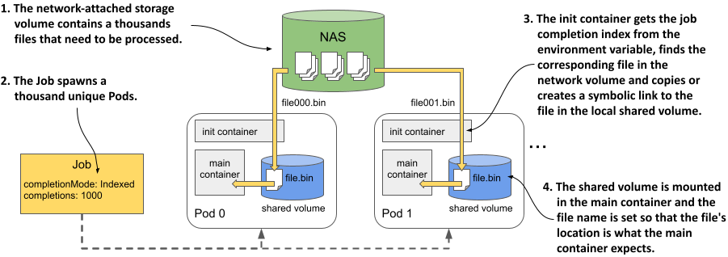

Như bạn thấy, mặc dù Job indexed chỉ cung cấp một số nguyên đơn giản cho mỗi Pod, chúng ta vẫn có cách tận dụng con số đó để chuẩn bị các dữ liệu đầu vào phức tạp hơn rất nhiều cho tiến trình xử lý. Tất cả những gì bạn cần chỉ là một container khởi tạo thực hiện nhiệm vụ chuyển đổi con số nguyên đó thành dữ liệu đầu vào tương ứng.

### 17.1.5 Chạy các Job kết hợp với hàng đợi công việc

Các Job trong phần trước được giao các công việc tĩnh cố định. Tuy nhiên, trong thực tế, công việc cần thực hiện thường được phân bổ một cách động thông qua một hàng đợi công việc (work queue). Thay vì khai báo trực tiếp dữ liệu đầu vào trong cấu hình của Job, Pod sẽ chủ động lấy dữ liệu đó từ hàng đợi. Trong phần này, bạn sẽ tìm hiểu hai phương pháp để xử lý hàng đợi công việc bằng tài nguyên Job.

Đoạn văn trên có thể khiến bạn lầm tưởng rằng bản thân Kubernetes đã tích hợp sẵn một cơ chế xử lý theo hàng đợi, nhưng thực tế không phải vậy. Khi đề cập đến các Job sử dụng hàng đợi, cả hệ thống hàng đợi lẫn thành phần rút các công việc (work items) từ hàng đợi đó đều phải do bạn tự thiết kế và triển khai bên trong các container của mình. Sau đó, bạn mới tạo một Job để chạy các container này trong một hoặc nhiều Pod. Để hiểu rõ cách thức vận hành, tiếp theo chúng ta sẽ triển khai một phiên bản khác của Job `aggregate-responses`. Phiên bản này sẽ sử dụng một hàng đợi làm nguồn cung cấp các công việc cần thực thi.

Có hai cách tiếp cận để xử lý hàng đợi công việc: xử lý song song dạng *thô* (coarse) hoặc dạng *tinh* (fine). Sơ đồ dưới đây minh họa sự khác biệt giữa hai phương pháp này.

##### Sơ đồ 17.10 Sự khác biệt giữa xử lý song song dạng thô (coarse) và dạng tinh (fine)

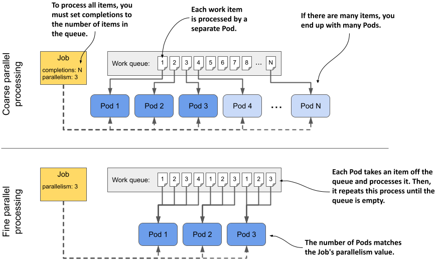

Trong xử lý song song dạng *thô*, mỗi Pod sẽ lấy ra duy nhất một công việc từ hàng đợi, xử lý xong rồi tự kết thúc. Do đó, bạn sẽ có tỉ lệ một Pod cho mỗi công việc. Ngược lại, trong xử lý song song dạng *tinh*, thông thường hệ thống chỉ tạo ra một số lượng nhỏ các Pod và mỗi Pod sẽ liên tục lấy và xử lý nhiều công việc khác nhau từ hàng đợi. Tất cả các Pod này sẽ chạy song song cho đến khi toàn bộ hàng đợi được xử lý xong. Ở cả hai phương pháp, bạn hoàn toàn có thể chạy song song bao nhiêu Pod tùy ý, miễn là cụm của bạn đáp ứng đủ tài nguyên phần cứng.

#### Khởi tạo hàng đợi công việc

Job bạn sắp khởi tạo trong bài thực hành này sẽ xử lý các phản hồi khảo sát (Quiz) từ năm 2022. Trước khi tạo Job này, bạn cần thiết lập hàng đợi công việc. Để đơn giản hóa, chúng ta sẽ triển khai hàng đợi ngay trên cơ sở dữ liệu MongoDB hiện có. Hãy chạy lệnh sau để tạo hàng đợi:

```
$ kubectl exec -it quiz-0 -c mongo -- mongosh kiada --eval '
  db.monthsToProcess.insertMany([
    {_id: "2022-01", year: 2022, month: 1},
    {_id: "2022-02", year: 2022, month: 2},
    {_id: "2022-03", year: 2022, month: 3},
    {_id: "2022-04", year: 2022, month: 4},
    {_id: "2022-05", year: 2022, month: 5},
    {_id: "2022-06", year: 2022, month: 6},
    {_id: "2022-07", year: 2022, month: 7},
    {_id: "2022-08", year: 2022, month: 8},
    {_id: "2022-09", year: 2022, month: 9},
    {_id: "2022-10", year: 2022, month: 10},
    {_id: "2022-11", year: 2022, month: 11},
    {_id: "2022-12", year: 2022, month: 12}])'
```

##### LƯU Ý

Lệnh này mặc định rằng `quiz-0` là bản sao chính (primary replica) của MongoDB. Nếu lệnh thất bại với thông báo lỗi "not primary", hãy thử chạy lệnh này trên cả ba Pod, hoặc bạn có thể truy vấn MongoDB để xác định xem Pod nào trong ba Pod là bản sao chính bằng lệnh sau: `kubectl exec quiz-0 -c mongo -– mongosh –-eval 'rs.hello().primary'`.

Lệnh trên sẽ chèn 12 phần tử công việc vào bộ sưu tập (collection) MongoDB có tên là `monthsToProcess`. Mỗi phần tử đại diện cho một tháng cụ thể cần được xử lý.

#### Xử lý hàng đợi bằng phương pháp song song dạng thô

Hãy bắt đầu với ví dụ về xử lý song song dạng thô (coarse parallel processing), trong đó mỗi Pod chỉ xử lý duy nhất một phần tử công việc. Bạn có thể tìm thấy manifest của Job trong file `job.aggregate-responses-queue-coarse.yaml`, chi tiết được thể hiện trong đoạn mã dưới đây.

##### Đoạn mã 17.10 Xử lý hàng đợi công việc bằng phương pháp song song dạng thô

```yaml
apiVersion: batch/v1
kind: Job
metadata:
  name: aggregate-responses-queue-coarse
spec:
  completions: 6    #A
  parallelism: 3    #B
  template:
    spec:
      restartPolicy: OnFailure
      containers:
      - name: processor
        image: mongo:5
        command:
        - mongosh    #C
        - mongodb+srv://quiz-pods.kiada.svc.cluster.local/kiada?tls=false    #C
        - --quiet    #C
        - --file    #C
        - /script.js    #C
        volumeMounts:    #D
        - name: script    #D
          subPath: script.js    #D
          mountPath: /script.js    #D
      volumes:    #D
      - name: script    #D
        configMap:    #D
          name: aggregate-responses-queue-coarse    #D
```

Job này sẽ tạo ra các Pod để chạy một script trong MongoDB, script này có nhiệm vụ lấy ra một phần tử duy nhất từ hàng đợi và xử lý. Lưu ý rằng giá trị `completions` được đặt là `6`, nghĩa là Job này chỉ xử lý 6 trong tổng số 12 phần tử bạn đã thêm vào hàng đợi. Lý do là tôi muốn bớt lại vài phần tử cho ví dụ về xử lý song song dạng tinh ở phần tiếp theo.

Thiết lập `parallelism` của Job này là `3`, đồng nghĩa với việc ba phần tử công việc sẽ được xử lý song song bởi ba Pod khác nhau.

Script mà mỗi Pod thực thi được định nghĩa trong ConfigMap `aggregate-responses-queue-coarse`. Manifest của ConfigMap này nằm chung file với manifest của Job. Cấu trúc khái quát của script được trình bày trong đoạn mã dưới đây.

##### Đoạn mã 17.11 Script MongoDB xử lý một phần tử công việc duy nhất

```javascript
print("Fetching one work item from queue...");
 
var workItem = db.monthsToProcess.findOneAndDelete({});    #A
if (workItem == null) {    #B
    print("No work item found. Processing is complete.");    #B
    quit(0);    #B
}    #B
 
print("Found work item:");    #C
print("  Year:  " + workItem.year);    #C
print("  Month: " + workItem.month);    #C
 
var year = parseInt(workItem.year);    #C
var month = parseInt(workItem.month) + 1;    #C
// code that processes the item    #C
 
print("Done.");    #D
quit(0);    #D
```

Script này lấy ra một phần tử từ hàng đợi công việc. Như bạn đã biết, mỗi phần tử đại diện cho một tháng duy nhất. Script thực hiện một truy vấn tổng hợp (aggregation query) trên các phản hồi khảo sát của tháng đó để tính toán số câu trả lời đúng, sai và tổng số câu trả lời, sau đó lưu kết quả ngược lại vào MongoDB.

Để chạy Job, hãy áp dụng file `job.aggregate-responses-queue-coarse.yaml` bằng lệnh `kubectl apply` và theo dõi trạng thái của Job bằng lệnh `kubectl get jobs`. Bạn cũng có thể kiểm tra các Pod để đảm bảo rằng có ba Pod đang chạy song song và tổng số Pod sau khi Job hoàn tất là sáu.

Nếu mọi việc suôn sẻ, hàng đợi công việc của bạn giờ đây chỉ còn lại 6 tháng chưa được Job xử lý. Bạn có thể xác nhận điều này bằng cách chạy lệnh sau:

```
$ kubectl exec quiz-0 -c mongo -- mongosh kiada --quiet --eval 'db.monthsToProcess.find()'
[
  { _id: '2022-07', year: 2022, month: 7 },
  { _id: '2022-08', year: 2022, month: 8 },
  { _id: '2022-09', year: 2022, month: 9 },
  { _id: '2022-10', year: 2022, month: 10 },
  { _id: '2022-11', year: 2022, month: 11 },
  { _id: '2022-12', year: 2022, month: 12 }
]
```

Bạn có thể kiểm tra nhật ký (log) của sáu Pod để xem chúng có xử lý chính xác các tháng đã bị xóa khỏi hàng đợi hay không. Chúng ta sẽ xử lý các phần tử còn lại bằng phương pháp song song dạng tinh. Trước khi tiếp tục, vui lòng xóa Job `aggregate-responses-queue-coarse` bằng lệnh `kubectl delete`. Thao tác này cũng sẽ gỡ bỏ sáu Pod nói trên.

#### Xử lý hàng đợi bằng phương pháp song song dạng tinh

Trong phương pháp xử lý song song dạng tinh (fine parallel processing), mỗi Pod sẽ đảm nhận nhiều phần tử công việc. Nó lấy một phần tử từ hàng đợi, xử lý xong rồi tiếp tục lấy phần tử tiếp theo, và lặp lại quy trình này cho đến khi hàng đợi hoàn toàn trống rỗng. Tương tự như trước, nhiều Pod có thể hoạt động song song cùng lúc.

Manifest của Job nằm trong file `job.aggregate-responses-queue-fine.yaml`. Cấu trúc Pod template về cơ bản giống hệt ví dụ trước, nhưng không chứa trường `completions`, như bạn có thể thấy trong đoạn mã dưới đây.

##### Đoạn mã 17.12 Xử lý hàng đợi công việc bằng phương pháp song song dạng tinh

```yaml
apiVersion: batch/v1
kind: Job
metadata:
  name: aggregate-responses-queue-fine
spec:
  parallelism: 3    #A
  template:
    ...
```

Một Job sử dụng phương pháp song song dạng tinh không cần thiết lập trường `completions`, bởi vì chỉ cần một Pod hoàn thành thành công là đã ngầm định toàn bộ các phần tử trong hàng đợi đã được xử lý xong. Điều này là do Pod sẽ tự kết thúc thành công sau khi xử lý xong phần tử công việc cuối cùng.

Bạn có thể thắc mắc điều gì sẽ xảy ra nếu một số Pod vẫn đang xử lý phần việc của mình khi một Pod khác báo cáo hoàn thành thành công. Thật may mắn, Job controller sẽ để các Pod còn lại hoàn tất công việc của chúng chứ không đột ngột hủy bỏ chúng.

Tương tự như trước, file manifest cũng đi kèm một ConfigMap chứa script MongoDB. Khác với script trước đó, script lần này sẽ xử lý tuần tự từng phần tử công việc cho đến khi hàng đợi trống rỗng, như mô tả trong đoạn mã dưới đây.

##### Đoạn mã 17.13 Script MongoDB xử lý toàn bộ hàng đợi

```javascript
print("Processing quiz responses - queue - all work items");
print("==================================================");
print();
print("Fetching work items from queue...");
print();
 
while (true) {    #A
    var workItem = db.monthsToProcess.findOneAndDelete({});    #B
    if (workItem == null) {    #C
        print("No work item found. Processing is complete.");    #C
        quit(0);    #C
    }    #C
    print("Found work item:");    #D
    print("  Year:  " + workItem.year);    #D
    print("  Month: " + workItem.month);    #D
    // process the item    #D
    ...    #D
 
    print("Done processing item.");    #E
    print("------------------");    #E
    print();    #E
}    #E
```

Để chạy Job này, hãy áp dụng file manifest `job.aggregate-responses-queue-fine.yaml`. Bạn sẽ thấy ba Pod được khởi tạo đi kèm. Khi chúng hoàn tất việc xử lý các phần tử trong hàng đợi, các container bên trong sẽ kết thúc và các Pod sẽ hiển thị trạng thái `Completed`:

```
$ kubectl get pods -l job-name=aggregate-responses-queue-fine
NAME                                   READY   STATUS      RESTARTS   AGE
aggregate-responses-queue-fine-9slkl   0/1     Completed   0          4m21s
aggregate-responses-queue-fine-hxqbw   0/1     Completed   0          4m21s
aggregate-responses-queue-fine-szqks   0/1     Completed   0          4m21s
```

Trạng thái của Job cũng cho biết cả ba Pod đều đã hoàn thành:

```
$ kubectl get jobs
NAME                             COMPLETIONS   DURATION   AGE
aggregate-responses-queue-fine   3/1 of 3      3m19s      5m34s
```

Việc cuối cùng bạn cần làm là kiểm tra xem hàng đợi công việc đã thực sự trống hay chưa. Bạn có thể thực hiện việc đó bằng lệnh sau:

```
$ kubectl exec quiz-1 -c mongo -- mongosh kiada --quiet --eval 'db.monthsToProcess.countDocuments()'
0    #A
```

Như bạn có thể thấy, số lượng phần tử trong hàng đợi đã về 0, nghĩa là Job đã hoàn tất.

#### Xử lý hàng đợi công việc liên tục

Để khép lại phần này về Job kết hợp hàng đợi công việc, hãy cùng xem điều gì xảy ra nếu bạn thêm các phần tử mới vào hàng đợi sau khi Job đã hoàn thành. Hãy thêm một phần tử công việc cho tháng 1 năm 2023 như sau:

```
$ kubectl exec -it quiz-0 -c mongo -- mongosh kiada --quiet --eval 'db.monthsToProcess.insertOne({_id: "2023-01", year: 2023, month: 1})'
{ acknowledged: true, insertedId: '2023-01' }
```

Theo bạn, liệu Job có tự động tạo thêm một Pod khác để xử lý phần tử công việc mới này không? Câu trả lời sẽ vô cùng hiển nhiên nếu bạn nhớ lại rằng Kubernetes hoàn toàn không biết gì về sự tồn tại của hàng đợi này, như tôi đã giải thích trước đó. Chỉ có các container chạy bên trong Pod mới biết đến sự hiện diện của hàng đợi. Vì vậy, lẽ tự nhiên là nếu bạn thêm một phần tử mới sau khi Job đã kết thúc, nó sẽ không được xử lý trừ khi bạn khởi tạo lại Job.

Hãy nhớ rằng Job được thiết kế để chạy các tác vụ cho đến khi hoàn thành, chứ không phải hoạt động liên tục không ngừng nghỉ. Để triển khai một Pod worker liên tục giám sát hàng đợi, bạn nên chạy Pod đó dưới dạng một Deployment. Tuy nhiên, nếu bạn muốn chạy Job theo các khoảng thời gian định kỳ thay vì chạy liên tục, bạn có thể sử dụng CronJob, như sẽ được giải thích trong phần thứ hai của chương này.

### 17.1.6 Giao tiếp giữa các Pod trong Job

Hầu hết các Pod chạy trong bối cảnh của một Job đều hoạt động độc lập và không hề hay biết về sự hiện diện của các Pod khác chạy chung ngữ cảnh. Tuy nhiên, some tác vụ đặc thù đòi hỏi các Pod này phải giao tiếp được với nhau.

Trong phần lớn các trường hợp, mỗi Pod cần liên lạc với một Pod cụ thể hoặc với toàn bộ các Pod đồng cấp (peer) khác, chứ không phải một Pod ngẫu nhiên nào đó trong nhóm. Thật may mắn, việc kích hoạt cơ chế giao tiếp này vô cùng đơn giản. Bạn chỉ cần thực hiện ba bước sau:

- Thiết lập `completionMode` của Job thành `Indexed`.
- Khởi tạo một Headless Service.
- Cấu hình Service này làm `subdomain` (tên miền con) trong Pod template.

Hãy để tôi giải thích chi tiết điều này qua một ví dụ cụ thể.

#### Khởi tạo manifest cho Headless Service

Trước tiên, hãy cùng xem cách cấu hình một Headless Service. Manifest của nó được trình bày trong đoạn mã dưới đây.

##### Đoạn mã 17.14 Headless Service hỗ trợ giao tiếp giữa các Pod trong Job

```yaml
apiVersion: v1
kind: Service
metadata:
  name: demo-service
spec:
  clusterIP: none    #A
  selector:
    job-name: comm-demo    #B
  ports:
  - name: http
    port: 80
```

Như bạn đã tìm hiểu ở Chương 11, bạn phải đặt thuộc tính `clusterIP` thành `none` để chuyển Service sang dạng headless. Bạn cũng cần đảm bảo trình chọn nhãn (label selector) khớp với các Pod do Job tạo ra. Cách đơn giản nhất là sử dụng nhãn `job-name` trong selector. Ở phần đầu chương này, bạn đã biết rằng nhãn này được tự động gán cho các Pod. Giá trị của nhãn chính là tên của đối tượng Job, vì thế bạn cần chắc chắn giá trị sử dụng trong selector trùng khớp với tên của Job.

#### Khởi tạo manifest cho Job

Bây giờ, hãy cùng xem cách cấu hình manifest cho Job qua đoạn mã dưới đây.

##### Đoạn mã 17.15 Manifest của Job kích hoạt tính năng giao tiếp giữa các Pod

```yaml
apiVersion: batch/v1
kind: Job
metadata:
  name: comm-demo    #A
spec:
  completionMode: Indexed    #B
  completions: 2    #C
  parallelism: 2    #C
  template:
    spec:
      subdomain: demo-service    #D
      restartPolicy: Never
      containers:
      - name: comm-demo
        image: busybox
        command:    #E
        - sleep    #E
        - "600"    #E
```

Như đã đề cập trước đó, chế độ hoàn thành (`completionMode`) phải được thiết lập là `Indexed`. Job này được cấu hình để chạy song song hai Pod giúp bạn dễ dàng thử nghiệm. Để các Pod có thể tìm thấy nhau thông qua hệ thống phân giải tên miền DNS, bạn cần đặt trường `subdomain` của chúng trùng với tên của Headless Service.

Bạn có thể tìm thấy cả hai manifest của Job và Service trong file `job.comm-demo.yaml`. Hãy tạo hai đối tượng này bằng cách áp dụng file, sau đó liệt kê các Pod bằng lệnh sau:

```
$ kubectl get pods -l job-name=comm-demo
NAME                READY   STATUS    RESTARTS   AGE
comm-demo-0-mrvlp   1/1     Running   0          34s
comm-demo-1-kvpb4   1/1     Running   0          34s
```

Hãy lưu ý tên của hai Pod này. Bạn sẽ cần dùng chúng để thực thi các lệnh bên trong container của chúng.

#### Kết nối tới các Pod từ một Pod khác

Hãy kiểm tra tên máy chủ (hostname) của Pod đầu tiên bằng lệnh sau (nhớ thay thế bằng tên thực tế của Pod trên hệ thống của bạn):

```
$ kubectl exec comm-demo-0-mrvlp -- hostname -f
comm-demo-0.demo-service.kiada.svc.cluster.local
```

Pod thứ hai có thể giao tiếp với Pod đầu tiên thông qua địa chỉ này. Để xác nhận, hãy thử gửi lệnh ping từ Pod thứ hai tới Pod đầu tiên bằng lệnh dưới đây (lần này, hãy truyền tên Pod thứ hai của bạn vào lệnh `kubectl exec`):

```
$ kubectl exec comm-demo-1-kvpb4 -- ping comm-demo-0.demo-service.kiada.svc.cluster.local
PING comm-demo-0.demo-service.kiada.svc.cluster.local (10.244.2.71): 56 data bytes
64 bytes from 10.244.2.71: seq=0 ttl=63 time=0.060 ms
64 bytes from 10.244.2.71: seq=1 ttl=63 time=0.062 ms
...
```

Như bạn thấy, Pod thứ hai hoàn toàn có thể liên lạc với Pod thứ nhất mà không cần biết chính xác tên ngẫu nhiên của nó. Một Pod hoạt động trong ngữ cảnh của một Job có thể tự xác định tên của các Pod đồng cấp theo mô hình dưới đây:

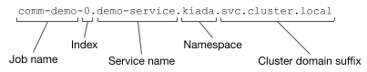

Tuy nhiên, bạn còn có thể rút gọn địa chỉ này hơn nữa. Như bạn đã biết, khi phân giải các bản ghi DNS cho các đối tượng nằm trong cùng một Namespace, chúng ta không nhất thiết phải sử dụng tên miền đầy đủ (FQDN). Bạn có thể bỏ qua phần định danh Namespace và hậu tố tên miền của cụm (cluster domain). Nhờ vậy, Pod thứ hai có thể kết nối tới Pod thứ nhất một cách đơn giản qua địa chỉ `comm-demo-0.demo-service`, như ví dụ sau:

```
$ kubectl exec comm-demo-1-kvpb4 -- ping comm-demo-0.demo-service
PING comm-demo-0.demo-service (10.244.2.71): 56 data bytes
64 bytes from 10.244.2.71: seq=0 ttl=63 time=0.040 ms
64 bytes from 10.244.2.71: seq=1 ttl=63 time=0.067 ms
...
```

Chỉ cần các Pod nắm được có bao nhiêu Pod thuộc về cùng một Job (nói cách khác là biết được giá trị của trường `completions`), chúng có thể dễ dàng tìm ra tất cả các Pod đồng cấp khác thông qua DNS mà không cần phải truy vấn API server của Kubernetes để hỏi tên hay địa chỉ IP.

Phần đầu tiên của chương này đến đây là kết thúc. Vui lòng xóa toàn bộ các Job còn lại trước khi tiếp tục.

## 17.2 Lập lịch cho Job bằng CronJob

Khi bạn khởi tạo một đối tượng Job, nó sẽ lập tức được thực thi. Mặc dù bạn có thể tạo Job ở trạng thái tạm dừng (suspended) rồi kích hoạt lại sau đó, nhưng bạn không thể cấu hình để nó tự động chạy vào một thời điểm cụ thể. Để làm được điều này, bạn cần bọc Job đó bên trong một đối tượng CronJob.

Trong đối tượng CronJob, bạn sẽ định nghĩa một Job template và một lịch trình (schedule). Dựa vào lịch trình này, CronJob controller sẽ tạo ra một đối tượng Job mới từ template đã khai báo. Bạn có thể thiết lập lịch trình để chạy tác vụ này nhiều lần trong ngày, vào một giờ cụ thể, hoặc vào những ngày nhất định trong tuần hoặc trong tháng. Controller sẽ liên tục tạo các Job theo đúng lịch trình cho đến khi bạn xóa đối tượng CronJob đó. Sơ đồ dưới đây minh họa cơ chế hoạt động của một CronJob.

##### Hình 17.11 Cơ chế hoạt động của một CronJob

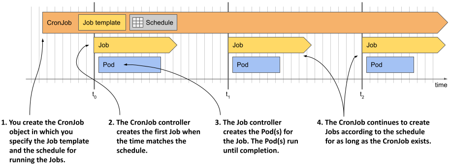

Như mô tả trong sơ đồ, mỗi khi CronJob controller tạo ra một Job, Job controller sau đó sẽ chịu trách nhiệm tạo ra các Pod tương ứng, tương tự như khi bạn khởi tạo đối tượng Job bằng tay. Hãy cùng xem quy trình này diễn ra trên thực tế.

### 17.2.1 Khởi tạo một CronJob

Đoạn mã dưới đây trình bày một manifest CronJob dùng để chạy một Job sau mỗi phút. Job này sẽ tổng hợp các phản hồi khảo sát nhận được trong ngày và cập nhật số liệu thống kê khảo sát hàng ngày. Bạn có thể tìm thấy manifest này trong file `cj.aggregate-responses-every-minute.yaml`.

##### Đoạn mã 17.16 Một CronJob thực thi Job sau mỗi phút

```yaml
apiVersion: batch/v1    #A
kind: CronJob    #A
metadata:
  name: aggregate-responses-every-minute
spec:
  schedule: "* * * * *"    #B
  jobTemplate:    #C
    metadata:    #C
      labels:    #C
        app: aggregate-responses-today    #C
    spec:    #C
      template:    #C
        metadata:    #C
          labels:    #C
            app: aggregate-responses-today    #C
        spec:    #C
          restartPolicy: OnFailure    #C
          containers:    #C
          - name: updater    #C
            image: mongo:5    #C
            command:    #C
            - mongosh    #C
            - mongodb+srv://quiz-pods.kiada.svc.cluster.local/kiada?tls=false    #C
            - --quiet    #C
            - --file    #C
            - /script.js    #C
            volumeMounts:    #C
            - name: script    #C
              subPath: script.js    #C
              mountPath: /script.js    #C
          volumes:    #C
          - name: script    #C
            configMap:    #C
              name: aggregate-responses-today    #C
```

Như bạn thấy trong đoạn mã, CronJob thực chất chỉ là một lớp bọc mỏng xung quanh đối tượng Job. Phần `spec` của CronJob chỉ gồm hai thành phần chính: `schedule` (lịch trình) và `jobTemplate` (mẫu thiết kế Job). Bạn đã biết cách viết manifest cho Job ở các phần trước, nên phần đó đã khá rõ ràng. Nếu bạn đã quen thuộc với định dạng crontab, bạn cũng sẽ hiểu ngay cách hoạt động của trường `schedule`. Nếu chưa biết, tôi sẽ giải thích chi tiết trong mục 17.2.2. Trước tiên, hãy tạo đối tượng CronJob từ manifest này và xem nó hoạt động ra sao.

#### Chạy một CronJob

Hãy áp dụng file manifest để tạo CronJob, sau đó sử dụng lệnh `kubectl get cj` để kiểm tra đối tượng vừa tạo:

```
$ kubectl get cj
NAME                               SCHEDULE    SUSPEND   ACTIVE   LAST SCHEDULE   AGE
aggregate-responses-every-minute   * * * * *   False     0        <none>          2s
```

##### Lưu ý

Tên viết tắt của CronJob là `cj`.

##### Lưu ý

Khi bạn liệt kê các CronJob kèm theo tùy chọn `-o wide`, lệnh này cũng sẽ hiển thị tên container và image được sử dụng trong Pod, giúp bạn dễ dàng nắm được chức năng của CronJob.

Kết quả trả về của lệnh hiển thị danh sách các CronJob trong Namespace hiện tại. Đối với mỗi CronJob, hệ thống sẽ cung cấp các thông tin bao gồm: tên, lịch trình, trạng thái tạm dừng (suspended), số lượng Job đang hoạt động (active), thời điểm gần nhất một Job được lập lịch (last schedule), và thời gian tồn tại (age) của đối tượng.

Như thông tin hiển thị ở các cột `ACTIVE` và `LAST SCHEDULE`, hiện chưa có Job nào được tạo cho CronJob này. Theo cấu hình, CronJob sẽ tạo một Job mới sau mỗi phút. Job đầu tiên sẽ được khởi tạo khi bước sang phút kế tiếp, và kết quả của lệnh `kubectl get cj` lúc đó sẽ như sau:

```
$ kubectl get cj
NAME                               SCHEDULE    SUSPEND   ACTIVE   LAST SCHEDULE   AGE
aggregate-responses-every-minute   * * * * *   False     1        2s              53s
```

Kết quả lệnh hiện hiển thị một Job đang hoạt động được tạo cách đây 2 giây. Khác với Job controller vốn tự động gán nhãn `job-name` vào các Pod để bạn dễ dàng liệt kê các Pod liên quan đến một Job, CronJob controller lại không tự động gán nhãn cho các Job do nó tạo ra. Vì vậy, nếu muốn liệt kê các Job được tạo bởi một CronJob cụ thể, bạn cần tự định nghĩa các nhãn của riêng mình trong Job template.

Trong manifest của CronJob `aggregate-responses-every-minute`, bạn đã thêm nhãn "`app: aggregate-responses-today`" vào cả Job template lẫn Pod template bên trong nó. Việc này cho phép bạn dễ dàng truy vấn danh sách các Job và Pod liên quan đến CronJob này. Hãy liệt kê các Job liên quan bằng lệnh sau:

```
$ kubectl get jobs -l app=aggregate-responses-today
NAME                                        COMPLETIONS   DURATION   AGE
aggregate-responses-every-minute-27755219   1/1           36s        37s
```

Cho đến thời điểm này, CronJob mới chỉ tạo ra một Job duy nhất. Như bạn thấy, tên của Job được sinh ra từ tên của CronJob. Chuỗi số ở cuối tên chính là thời điểm lập lịch của Job tính theo định dạng Unix Epoch Time đã được quy đổi sang phút.

Khi CronJob controller tạo ra đối tượng Job, Job controller sẽ tiếp tục tạo ra một hoặc nhiều Pod tùy thuộc vào cấu hình trong Job template. Để liệt kê các Pod này, bạn sử dụng cùng một trình chọn nhãn (label selector) như trên. Lệnh thực hiện như sau:

```
$ kubectl get pods -l app=aggregate-responses-today
NAME                                              READY   STATUS      RESTARTS   AGE
aggregate-responses-every-minute-27755219-4sl97   0/1     Completed   0          52s
```

Trạng thái hiển thị cho thấy Pod này đã hoàn thành thành công, tuy nhiên bạn cũng đã biết điều đó thông qua trạng thái của Job.

#### Kiểm tra chi tiết trạng thái của CronJob

Lệnh `kubectl get cronjobs` chỉ hiển thị số lượng Job đang hoạt động tại thời điểm hiện tại và thời gian lập lịch của Job gần nhất. Rất tiếc, nó không cho biết liệu Job gần nhất đó có chạy thành công hay không. Để có được thông tin này, bạn có thể kiểm tra trực tiếp danh sách Job hoặc xem trường `status` của CronJob dưới định dạng YAML như sau:

```
$ kubectl get cj aggregate-responses-every-minute -o yaml
...
status:
  active:    #A
  - apiVersion: batch/v1    #A
    kind: Job    #A
    name: aggregate-responses-every-minute-27755221    #A
    namespace: kiada    #A
    resourceVersion: "5299"    #A
    uid: 430a0064-098f-4b46-b1af-eaa690597353    #A
  lastScheduleTime: "2022-10-09T11:01:00Z"    #B
  lastSuccessfulTime: "2022-10-09T11:00:41Z"    #C
```

Như bạn thấy, phần `status` của đối tượng CronJob cung cấp một danh sách tham chiếu đến các Job đang chạy (trường `active`), thời điểm gần nhất Job được lập lịch (trường `lastScheduleTime`), và thời điểm gần nhất một Job hoàn thành thành công (trường `lastSuccessfulTime`). Dựa vào hai trường cuối cùng này, bạn hoàn toàn có thể suy ra liệu lượt chạy gần nhất có thành công hay không.

#### Kiểm tra các Event liên quan đến CronJob

Để xem toàn bộ thông tin chi tiết của một CronJob cùng tất cả các Sự kiện (Event) liên quan đến đối tượng này, hãy sử dụng lệnh `kubectl describe` như sau:

```
$ kubectl describe cj aggregate-responses-every-minute
Name:                          aggregate-responses-every-minute
Namespace:                     kiada
Labels:                        <none>
Annotations:                   <none>
Schedule:                      * * * * *
Concurrency Policy:            Allow
Suspend:                       False
Successful Job History Limit:  3
Failed Job History Limit:      1
Starting Deadline Seconds:     <unset>
Selector:                      <unset>
Parallelism:                   <unset>
Completions:                   <unset>
Pod Template:
  ...
Last Schedule Time:  Sun, 09 Oct 2022 11:01:00 +0200
Active Jobs:         aggregate-responses-every-minute-27755221
Events:
  Type    Reason            Age   From                Message
  ----    ------            ----  ----                -------
  Normal  SuccessfulCreate  98s   cronjob-controller  Created job aggregate-responses-
                                                      every-minute-27755219
  Normal  SawCompletedJob   41s   cronjob-controller  Saw completed job: aggregate-
                                                      responses-every-minute-27755219, 
                                                      status: Complete
...
```

Từ kết quả hiển thị của lệnh, chúng ta thấy CronJob controller sẽ tạo ra một Sự kiện `SuccessfulCreate` khi nó khởi tạo một Job, và một Sự kiện `SawCompletedJob` khi Job đó hoàn tất.

### 17.2.2 Cấu hình lịch trình (schedule)

Lịch trình (`schedule`) trong phần spec của CronJob được viết theo định dạng crontab. Nếu bạn chưa quen thuộc với cú pháp này, bạn có thể tìm kiếm các bài hướng dẫn chi tiết trên internet, tuy nhiên phần tiếp theo dưới đây sẽ tóm tắt sơ lược để giúp bạn nhanh chóng nắm bắt.

#### Tìm hiểu định dạng crontab

Một lịch trình định dạng crontab gồm năm trường thông tin và có cấu trúc như sau:

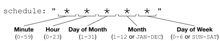

Tính từ trái qua phải, các trường lần lượt đại diện cho: phút, giờ, ngày trong tháng, tháng, và ngày trong tuần mà lịch trình sẽ được kích hoạt. Trong ví dụ này, dấu sao (`*`) xuất hiện ở tất cả các trường, nghĩa là mỗi trường đều khớp với mọi giá trị có thể.

Nếu đây là lần đầu tiên bạn tiếp cận với lịch trình cron, có thể bạn sẽ thấy khó hiểu tại sao cấu hình trong ví dụ này lại kích hoạt tác vụ sau mỗi phút. Đừng lo lắng, mọi thứ sẽ trở nên rõ ràng hơn khi bạn tìm hiểu các giá trị cụ thể có thể thay thế cho dấu sao và tham khảo các ví dụ thực tế dưới đây. Tại mỗi trường, thay vì dùng dấu sao, bạn có thể điền một giá trị cụ thể, một khoảng giá trị hoặc một nhóm các giá trị, chi tiết được giải thích trong bảng dưới đây.

##### Bảng 17.3 Các quy tắc ký tự trong trường schedule của CronJob

| Giá trị | Mô tả |
| :--- | :--- |
| **5** | Một giá trị đơn lẻ. Ví dụ: nếu điền số 5 ở trường Tháng (Month), lịch trình sẽ được kích hoạt khi tháng hiện tại là tháng Năm. |
| **MAY** | Trong các trường Tháng và Ngày trong tuần, bạn có thể sử dụng tên viết tắt bằng ba chữ cái tiếng Anh thay cho các chữ số. |
| **1-5** | Một khoảng giá trị (bao gồm cả hai điểm mốc giới hạn). Đối với trường Tháng, `1-5` tương đương với `JAN-MAY`, khi đó tác vụ sẽ được kích hoạt nếu tháng hiện tại nằm trong khoảng từ tháng Một đến hết tháng Năm. |
| **1,2,5-8** | Một danh sách gồm các số hoặc các khoảng giá trị. Ở trường Tháng, `1,2,5-8` đại diện cho các tháng Một, Hai, Năm, Sáu, Bảy và Tám. |
| **\*** | Khớp với toàn bộ các giá trị có thể có của trường đó. Ví dụ: dấu `*` ở trường Tháng tương đương với khoảng `1-12` hoặc `JAN-DEC` (tất cả các tháng). |
| **\*/3** | Lặp lại sau mỗi N đơn vị, bắt đầu từ giá trị đầu tiên của trường. Ví dụ: nếu điền `*/3` ở trường Tháng, lịch trình sẽ chỉ áp dụng cho mỗi tháng thứ ba (cách 3 tháng một lần). CronJob sử dụng cấu hình này sẽ chạy vào các tháng Một, Tư, Bảy và Mười. |
| **5/2** | Lặp lại sau mỗi N đơn vị, bắt đầu từ một mốc giá trị chỉ định. Ở trường Tháng, cấu hình `5/2` sẽ kích hoạt lịch trình hai tháng một lần, bắt đầu từ tháng Năm. Nói cách khác, tác vụ sẽ chạy vào các tháng Năm, Bảy, Chín và Mười Một. |
| **3-10/2** | Cú pháp `/N` cũng có thể áp dụng cho một khoảng giá trị. Ở trường Tháng, `3-10/2` quy định rằng trong khoảng từ tháng Ba đến tháng Mười, tác vụ sẽ chỉ chạy cách tháng một lần. Do đó, lịch trình sẽ bao gồm các tháng Ba, Năm, Bảy và Chín. |

Lẽ dĩ nhiên, các giá trị này có thể được áp dụng linh hoạt ở các trường thời gian khác nhau để cùng tạo nên một thời điểm kích hoạt chính xác cho lịch trình. Bảng dưới đây cung cấp một số ví dụ thực tế về các cấu hình lịch trình phổ biến.

##### Bảng 17.4 Các ví dụ cấu hình lịch trình Cron

| Lịch trình | Giải thích |
| :--- | :--- |
| **\* \* \* \* \*** | Mỗi phút (tại tất cả các phút của mọi giờ, mọi ngày, mọi tháng và mọi ngày trong tuần). |
| **15 \* \* \* \*** | Phút thứ 15 của mỗi giờ. |
| **0 0 \* 1-3 \*** | Nửa đêm (0 giờ 0 phút) mỗi ngày, nhưng chỉ áp dụng từ tháng Một đến tháng Ba. |
| **\*/5 18 \* \* \*** | Mỗi 5 phút trong khoảng từ 18:00 đến 18:59 hàng ngày. |
| **\* \* 7 5 \*** | Mỗi phút trong suốt ngày 7 tháng Năm. |
| **0,30 3 7 5 \*** | Vào lúc 3:00 và 3:30 sáng ngày 7 tháng Năm. |
| **0 0 \* \* 1-5** | Vào lúc 0:00 của tất cả các ngày trong tuần (từ thứ Hai đến thứ Sáu). |

##### Cảnh báo

Một CronJob sẽ kích hoạt một Job mới khi tất cả các trường trong cấu hình crontab khớp với ngày giờ hiện tại, ngoại trừ hai trường *Ngày trong tháng* (Day of month) và *Ngày trong tuần* (Day of week). CronJob sẽ tự động chạy nếu chỉ cần một trong hai trường này khớp. Bạn có thể lầm tưởng rằng lịch trình "\* \* 13 \* 5" chỉ kích hoạt vào Thứ Sáu ngày 13, nhưng thực tế nó sẽ chạy vào mọi ngày 13 của tháng *và đồng thời* chạy vào mọi ngày Thứ Sáu.

Rất may là với các lịch trình đơn giản, bạn không nhất thiết phải viết thủ công theo cú pháp phức tạp này. Thay vào đó, bạn có thể sử dụng các từ khóa đặc biệt sau:

- `@hourly`: chạy Job mỗi giờ một lần (vào đầu giờ),
- `@daily`: chạy mỗi ngày một lần vào lúc nửa đêm,
- `@weekly`: chạy mỗi tuần một lần vào lúc nửa đêm ngày Chủ nhật,
- `@monthly`: chạy vào lúc 0:00 ngày đầu tiên của mỗi tháng,
- `@yearly` hoặc `@annually`: chạy vào lúc 0:00 ngày 1 tháng Giêng hàng năm.

#### Thiết lập Múi giờ cho lịch trình

Cũng giống như phần lớn các bộ điều khiển khác trong Kubernetes, CronJob controller hoạt động bên trong thành phần Controller Manager thuộc Kubernetes Control Plane (mặt phẳng điều khiển). Theo mặc định, CronJob controller sẽ lập lịch chạy dựa trên múi giờ hệ thống của Controller Manager. Điều này có thể dẫn đến việc CronJob thực thi sai lệch so với khung giờ mong muốn của bạn, đặc biệt là khi Control Plane đang được đặt tại một hạ tầng vật lý ở một khu vực địa lý sử dụng múi giờ khác.

Thông thường, múi giờ sẽ không được chỉ định sẵn. Tuy nhiên, bạn hoàn toàn có thể cấu hình nó thông qua trường `timeZone` trong phần `spec` của manifest CronJob. Ví dụ, nếu bạn muốn CronJob thực thi các Job vào lúc 3 giờ sáng theo Múi giờ Trung Âu (múi giờ `CET`), manifest của CronJob sẽ được thiết lập như trong đoạn mã dưới đây:

##### Đoạn mã 17.17 Cấu hình múi giờ cho lịch trình CronJob

```yaml
apiVersion: batch/v1    #A
kind: CronJob    #A
metadata:
  name: runs-at-3am-cet
spec:
  schedule: "0 3 * * *"    #A
  timeZone: CET    #A
  jobTemplate:
    ...
```

### 17.2.3 Tạm dừng và kích hoạt lại một CronJob

Tương tự như đối với Job, bạn cũng có thể tạm dừng hoạt động của một CronJob. Tại thời điểm cuốn sách này được biên soạn, chưa có một lệnh `kubectl` chuyên dụng nào để tạm dừng CronJob, vì thế bạn phải thực hiện việc này gián tiếp thông qua lệnh `kubectl patch` như sau:

```
$ kubectl patch cj aggregate-responses-every-minute -p '{"spec":{"suspend": true}}'
cronjob.batch/aggregate-responses-every-minute patched
```

Khi một CronJob bị tạm dừng, controller sẽ không khởi chạy thêm bất kỳ Job mới nào nữa, nhưng vẫn cho phép tất cả các Job đang chạy được tiếp tục thực hiện cho đến khi hoàn thành, như kết quả hiển thị dưới đây:

```
$ kubectl get cj
NAME                               SCHEDULE    SUSPEND   ACTIVE   LAST SCHEDULE   AGE
aggregate-responses-every-minute   * * * * *   True      1        19s             10m
```

Kết quả cho thấy CronJob đã được chuyển sang trạng thái tạm dừng, nhưng vẫn còn một Job đang hoạt động. Sau khi Job đó hoàn tất, sẽ không có Job mới nào được sinh ra cho đến khi bạn kích hoạt lại CronJob. Hãy chạy lệnh sau để khôi phục hoạt động của CronJob:

```
$ kubectl patch cj aggregate-responses-every-minute -p '{"spec":{"suspend": false}}'
cronjob.batch/aggregate-responses-every-minute patched
```

Tương tự như Job, bạn hoàn toàn có thể khởi tạo các CronJob ở trạng thái tạm dừng ngay từ đầu và kích hoạt chúng sau đó.

### 17.2.4 Tự động dọn dẹp các Job đã hoàn thành

CronJob `aggregate-responses-every-minute` của bạn đã hoạt động được một vài phút, đồng nghĩa với việc đã có một số đối tượng Job được sinh ra trong khoảng thời gian đó. Đối với hệ thống của tôi, CronJob này đã chạy hơn mười phút, nghĩa là có hơn mười Job được tạo. Thế nhưng, khi tôi liệt kê danh sách Job, tôi chỉ thấy có bốn Job xuất hiện, giống như kết quả dưới đây:

```
$ kubectl get job -l app=aggregate-responses-today
NAME                                        COMPLETIONS   DURATION   AGE
aggregate-responses-every-minute-27755408   1/1           57s        3m5s    #A
aggregate-responses-every-minute-27755409   1/1           61s        2m5s    #A
aggregate-responses-every-minute-27755410   1/1           53s        65s    #A
aggregate-responses-every-minute-27755411   0/1           5s         5s    #B
```

Tại sao chúng ta không nhìn thấy đầy đủ các Job? Nguyên nhân là do CronJob controller tự động dọn dẹp các Job đã hoàn tất. Tuy nhiên, nó không xóa sạch toàn bộ. Trong cấu hình `spec` của CronJob, bạn có thể sử dụng hai trường `successfulJobsHistoryLimit` và `failedJobsHistoryLimit` để quy định số lượng Job thành công và thất bại được phép giữ lại trong lịch sử. Theo mặc định, hệ thống sẽ lưu lại 3 Job thành công và 1 Job thất bại. Các Pod tương ứng với các Job được giữ lại này cũng sẽ được bảo toàn, cho phép bạn dễ dàng truy cập và xem lại nhật ký hoạt động của chúng.

Để thực hành, bạn hãy thử thiết lập trường `successfulJobsHistoryLimit` của CronJob `aggregate-responses-every-minute` thành `1`. Bạn có thể làm việc này bằng cách trực tiếp chỉnh sửa đối tượng CronJob hiện tại thông qua lệnh `kubectl edit`. Sau khi hoàn tất cập nhật, hãy liệt kê lại danh sách Job để xác nhận rằng hệ thống đã dọn dẹp và chỉ giữ lại duy nhất một Job.

### 17.2.5 Thiết lập thời hạn khởi chạy

Thông thường, CronJob controller sẽ tạo ra các đối tượng Job gần như trùng khớp với thời điểm đã lập lịch. Nếu cụm Kubernetes hoạt động bình thường, độ trễ tối đa sẽ chỉ dao động trong khoảng vài giây. Tuy nhiên, nếu thành phần Control Plane của cụm bị quá tải hoặc cấu phần Controller Manager (nơi chạy CronJob controller) gặp sự cố ngoại tuyến, độ trễ này có thể kéo dài hơn.

Trong trường hợp tác vụ của bạn bắt buộc không được phép khởi chạy quá muộn so với lịch trình định sẵn, bạn có thể thiết lập một mốc giới hạn thời gian thông qua trường `startingDeadlineSeconds` như mô tả trong đoạn mã dưới đây.

##### Đoạn mã 17.18 Thiết lập thời hạn khởi chạy trong CronJob

```yaml
apiVersion: batch/v1
kind: CronJob
spec:
  schedule: "* * * * *"
  startingDeadlineSeconds: 30    #A
  ...
```

Nếu vì bất kỳ lý do gì mà CronJob controller không thể khởi tạo Job trong vòng 30 giây kể từ thời điểm lập lịch, nó sẽ hủy bỏ lượt chạy đó. Đồng thời, một sự kiện `MissSchedule` sẽ được tạo ra để thông báo cho bạn biết lý do tại sao Job không được khởi tạo.

#### Điều gì xảy ra khi CronJob controller ngoại tuyến trong thời gian dài

Nếu trường `startingDeadlineSeconds` không được cấu hình và CronJob controller bị mất kết nối trong một khoảng thời gian dài, một hành vi không mong muốn có thể xảy ra khi hệ thống hoạt động trở lại. Lúc này, bộ điều khiển sẽ lập tức khởi tạo hàng loạt tất cả các Job đáng lẽ ra phải được chạy trong suốt thời gian nó bị ngoại tuyến.

Tuy nhiên, việc bù đắp này chỉ diễn ra nếu số lượng Job bị lỡ dưới 100. Nếu bộ điều khiển phát hiện ra có hơn 100 lượt chạy bị bỏ lỡ, nó sẽ không khởi tạo bất kỳ Job nào nữa. Thay vào đó, nó sẽ tạo ra một sự kiện `TooManyMissedTimes`. Bằng việc thiết lập thời hạn khởi chạy (`startingDeadlineSeconds`), bạn sẽ tránh được nguy cơ gặp phải tình huống rắc rối này.

### 17.2.6 Kiểm soát xử lý đồng thời

CronJob `aggregate-responses-every-minute` tạo ra một Job mới sau mỗi phút. Vậy điều gì sẽ xảy ra nếu một lượt chạy Job kéo dài hơn một phút? Liệu CronJob controller có tiếp tục tạo thêm một Job mới bất chấp việc Job trước đó vẫn đang trong quá trình xử lý hay không?

Câu trả lời là Có! Nếu theo dõi liên tục trạng thái của CronJob, đôi khi bạn sẽ bắt gặp trạng thái như dưới đây:

```
$ kubectl get cj
NAME                               SCHEDULE    SUSPEND   ACTIVE   LAST SCHEDULE   AGE
aggregate-responses-every-minute   * * * * *   True      2        5s              20m
```

Cột `ACTIVE` cho thấy đang có hai Job hoạt động đồng thời cùng một lúc. Theo mặc định, CronJob controller luôn tạo ra Job mới mà không bận tâm đến việc có bao nhiêu Job cũ chưa hoàn thành. Tuy nhiên, bạn hoàn toàn có thể kiểm soát hành vi này bằng cách cấu hình trường `concurrencyPolicy` trong phần `spec` của CronJob. Sơ đồ dưới đây minh họa ba chính sách đồng thời được Kubernetes hỗ trợ.

##### Hình 17.12 So sánh hành vi của ba chính sách đồng thời trong CronJob

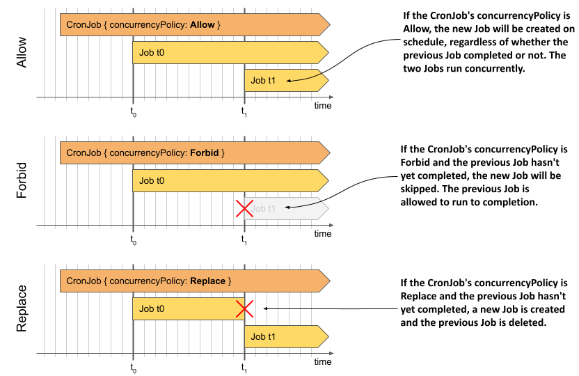

Để bạn tiện tra cứu, các chính sách đồng thời này cũng được giải thích chi tiết trong bảng dưới đây.

##### Bảng 17.5 Các chính sách xử lý đồng thời được hỗ trợ

| Giá trị | Mô tả |
| :--- | :--- |
| **Allow** | Cho phép nhiều Job chạy đồng thời cùng lúc. Đây là cấu hình mặc định. |
| **Forbid** | Nghiêm cấm chạy đồng thời. Nếu Job của lượt trước vẫn đang chạy tại thời điểm lập lịch lượt mới, CronJob controller sẽ ghi nhận sự kiện `JobAlreadyActive` và bỏ qua việc tạo Job mới cho lượt đó. |
| **Replace** | Hủy bỏ Job cũ đang chạy để thay thế bằng Job mới. CronJob controller sẽ hủy Job hiện tại bằng cách xóa đối tượng Job đó. Tiếp theo, Job controller sẽ gỡ bỏ các Pod tương ứng (các Pod này vẫn được phép đóng kết nối một cách an toàn - graceful termination). Trong khoảng thời gian ngắn chuyển giao này, cả hai Job có thể chạy song song nhưng một trong hai đang trong quá trình bị tắt bỏ. |

Nếu muốn trực tiếp quan sát ảnh hưởng của các chính sách đồng thời này lên quá trình thực thi của CronJob, bạn có thể thử triển khai các CronJob từ các file manifest dưới đây:

- `cj.concurrency-allow.yaml`,
- `cj.concurrency-forbid.yaml`,
- `cj.concurrency-replace.yaml`.

### 17.2.7 Xóa bỏ một CronJob và các Job liên quan

Để tạm dừng tạm thời hoạt động của một CronJob, bạn có thể thực hiện thao tác tạm ngưng như đã hướng dẫn ở phần trước. Trong trường hợp muốn hủy bỏ hoàn toàn một CronJob, hãy tiến hành xóa đối tượng CronJob bằng lệnh sau:

```
$ kubectl delete cj aggregate-responses-every-minute
cronjob.batch "aggregate-responses-every-minute" deleted
```

Khi bạn xóa CronJob, tất cả các Job do nó sinh ra cũng sẽ tự động bị gỡ bỏ theo. Kéo theo đó, các Pod tương ứng cũng bị xóa và các container bên trong sẽ thực hiện quy trình tắt an toàn.

#### Xóa CronJob nhưng giữ lại các Job và Pod của chúng

Nếu bạn chỉ muốn xóa bỏ cấu hình CronJob nhưng vẫn muốn giữ lại các đối tượng Job và Pod đang chạy bên dưới, hãy bổ sung tùy chọn `--cascade=orphan` khi thực hiện lệnh xóa như ví dụ sau:

```
$ kubectl delete cj aggregate-responses-every-minute --cascade=orphan
```

##### Lưu ý

Nếu bạn xóa một CronJob với tùy chọn `--cascade=orphan` khi một Job đang chạy, Job đó sẽ được bảo toàn và tiếp tục thực hiện cho đến khi hoàn tất tác vụ.

## 17.3 Tổng kết

Trong chương này, bạn đã tìm hiểu chi tiết về hai đối tượng Job và CronJob. Cụ thể, chúng ta đã nắm được các kiến thức trọng tâm sau:

- Đối tượng Job được sử dụng để chạy các khối lượng công việc thực thi một tác vụ cho đến khi hoàn thành, thay vì hoạt động vô thời hạn.
- Chạy một tác vụ bằng đối tượng Job giúp đảm bảo Pod thực thi tác vụ đó sẽ được lập lịch lại trên một node khác nếu xảy ra sự cố lỗi node.
- Một Job có thể được cấu hình để lặp lại một tác vụ nhiều lần bằng cách thiết lập trường `completions`. Bạn cũng có thể kiểm soát số lượng tác vụ được thực thi song song cùng lúc thông qua trường `parallelism`.
- Khi một container đang thực thi tác vụ gặp sự cố lỗi, lỗi này sẽ được xử lý ở cấp độ Pod bởi Kubelet hoặc ở cấp độ Job bởi Job controller.
- Theo mặc định, các Pod do một Job sinh ra hoàn toàn giống hệt nhau, trừ khi bạn thiết lập `completionMode` của Job là `Indexed`. Khi đó, mỗi Pod sẽ được gán một chỉ số hoàn thành (completion index) riêng biệt, cho phép mỗi Pod chủ động xử lý một phần dữ liệu phân đoạn cụ thể.
- Bạn có thể kết hợp hàng đợi công việc vào Job, nhưng bạn phải tự chuẩn bị hệ thống hàng đợi riêng và tự viết logic lấy phần tử công việc bên trong container.
- Các Pod chạy trong ngữ cảnh của một Job có thể giao tiếp với nhau, nhưng bạn cần định nghĩa thêm một Headless Service để chúng có thể tự tìm thấy nhau thông qua DNS.
- Nếu muốn chạy một Job vào một thời điểm định sẵn hoặc theo các khoảng thời gian định kỳ, bạn hãy bọc Job đó bên trong một đối tượng CronJob. Lịch trình của CronJob được định nghĩa dựa trên cú pháp crontab quen thuộc.

Nội dung này cũng đã khép lại phần thứ hai của cuốn sách. Giờ đây, bạn đã biết cách triển khai và quản lý mọi loại khối lượng công việc (workload) khác nhau trên Kubernetes. Trong phần tiếp theo, chúng ta sẽ đi sâu tìm hiểu về Kubernetes Control Plane và cơ chế vận hành bên trong của nó.

<script>

(function() {
  const PREFS_KEY = 'sila_offline_reader_prefs';
  const DEFAULT_PREFS = {
    fontSize: 18,
    theme: 'sepia',
    fontFamily: 'Inter',
    isToolbarExpanded: true
  };

  let prefs = { ...DEFAULT_PREFS };
  try {
    const stored = localStorage.getItem(PREFS_KEY);
    if (stored) {
      prefs = { ...DEFAULT_PREFS, ...JSON.parse(stored) };
    }
  } catch (e) {}

  const savePrefs = () => {
    try {
      localStorage.setItem(PREFS_KEY, JSON.stringify(prefs));
    } catch (e) {}
  };

  const applyPrefs = () => {
    document.body.style.fontSize = prefs.fontSize + 'px';
    
    let fontStr = '';
    if (prefs.fontFamily === 'Lora') {
      fontStr = "'Lora', Georgia, 'Times New Roman', serif";
    } else if (prefs.fontFamily === 'Lexend') {
      fontStr = "'Lexend', 'Segoe UI', Tahoma, Geneva, Verdana, sans-serif";
    } else {
      fontStr = "'Inter', system-ui, -apple-system, BlinkMacSystemFont, 'Segoe UI', Roboto, Helvetica, Arial, sans-serif";
    }
    document.body.style.fontFamily = fontStr;
    
    document.documentElement.setAttribute('data-theme', prefs.theme);
    
    const container = document.getElementById('readerToolbar');
    const togglePrev = document.getElementById('toggleIconPrev');
    const toggleNext = document.getElementById('toggleIconNext');
    if (container && togglePrev && toggleNext) {
      if (prefs.isToolbarExpanded) {
        container.classList.remove('collapsed');
        togglePrev.style.display = 'block';
        toggleNext.style.display = 'none';
      } else {
        container.classList.add('collapsed');
        togglePrev.style.display = 'none';
        toggleNext.style.display = 'block';
      }
    }

    // Update active states
    ['Inter', 'Lora', 'Lexend'].forEach(f => {
      const el = document.getElementById('btnFont' + f);
      if (el) {
        if (prefs.fontFamily === f) el.classList.add('active');
        else el.classList.remove('active');
      }
    });

    ['white', 'sepia', 'dark'].forEach(t => {
      const id = 'btnTheme' + t.charAt(0).toUpperCase() + t.slice(1);
      const el = document.getElementById(id);
      if (el) {
        if (prefs.theme === t) el.classList.add('active');
        else el.classList.remove('active');
      }
    });
  };

  // Init
  applyPrefs();

  // Listeners
  const toggleBtn = document.getElementById('toggleBtn');
  if (toggleBtn) {
    toggleBtn.addEventListener('click', () => {
      prefs.isToolbarExpanded = !prefs.isToolbarExpanded;
      savePrefs();
      applyPrefs();
    });
  }

  const btnFontPlus = document.getElementById('btnFontPlus');
  if (btnFontPlus) {
    btnFontPlus.addEventListener('click', () => {
      prefs.fontSize = Math.min(42, prefs.fontSize + 2);
      savePrefs();
      applyPrefs();
    });
  }

  const btnFontMinus = document.getElementById('btnFontMinus');
  if (btnFontMinus) {
    btnFontMinus.addEventListener('click', () => {
      prefs.fontSize = Math.max(14, prefs.fontSize - 2);
      savePrefs();
      applyPrefs();
    });
  }

  ['Inter', 'Lora', 'Lexend'].forEach(f => {
    const el = document.getElementById('btnFont' + f);
    if (el) {
      el.addEventListener('click', () => {
        prefs.fontFamily = f;
        savePrefs();
        applyPrefs();
      });
    }
  });

  ['white', 'sepia', 'dark'].forEach(t => {
    const id = 'btnTheme' + t.charAt(0).toUpperCase() + t.slice(1);
    const el = document.getElementById(id);
    if (el) {
      el.addEventListener('click', () => {
        prefs.theme = t;
        savePrefs();
        applyPrefs();
      });
    }
  });

  const btnReset = document.getElementById('btnReset');
  if (btnReset) {
    btnReset.addEventListener('click', () => {
      prefs = { ...DEFAULT_PREFS };
      savePrefs();
      applyPrefs();
    });
  }

  // TOC Logic
  const tocSidebar = document.getElementById('tocSidebar');
  const tocOverlay = document.getElementById('tocOverlay');
  const tocList = document.getElementById('tocList');
  
  const openTOC = () => {
    if (tocSidebar) tocSidebar.classList.add('expanded');
    if (tocOverlay) tocOverlay.classList.add('visible');
    document.body.style.overflow = 'hidden';
  };
  
  const closeTOC = () => {
    if (tocSidebar) tocSidebar.classList.remove('expanded');
    if (tocOverlay) tocOverlay.classList.remove('visible');
    document.body.style.overflow = '';
  };

  const tocToggleBtn = document.getElementById('tocToggleBtn');
  if (tocToggleBtn) {
    tocToggleBtn.addEventListener('click', openTOC);
  }
  
  const tocCloseBtn = document.getElementById('tocCloseBtn');
  if (tocCloseBtn) {
    tocCloseBtn.addEventListener('click', closeTOC);
  }
  
  if (tocOverlay) {
    tocOverlay.addEventListener('click', closeTOC);
  }

  const buildTOC = () => {
    if (!tocList) return;
    const headings = document.querySelectorAll('.content-wrapper h1, .content-wrapper h2, .content-wrapper h3');
    
    if (headings.length === 0) {
      const li = document.createElement('li');
      li.className = 'toc-item';
      li.innerHTML = '<span class="toc-link" style="opacity: 0.5;">Không có mục lục</span>';
      tocList.appendChild(li);
      return;
    }

    headings.forEach((heading, index) => {
      if (!heading.id) {
        heading.id = 'heading-' + index;
      }
      
      const li = document.createElement('li');
      li.className = 'toc-item toc-item-' + heading.tagName.toLowerCase();
      
      const a = document.createElement('a');
      a.href = '#' + heading.id;
      a.className = 'toc-link';
      a.textContent = heading.textContent;
      
      a.addEventListener('click', closeTOC);
      
      li.appendChild(a);
      tocList.appendChild(li);
    });
  };

  buildTOC();

  // Reading progress tracking
  const getDocumentId = () => {
    const projectIdMeta = document.querySelector('meta[name="x-sila-project-id"]');
    const chapterIdMeta = document.querySelector('meta[name="x-sila-chapter-id"]');
    
    const projectId = projectIdMeta ? projectIdMeta.getAttribute('content') : 'unknown_project';
    const chapterId = chapterIdMeta ? chapterIdMeta.getAttribute('content') : 'unknown_chapter';
    
    return projectId + '_' + chapterId;
  };

  const SCROLL_KEY = 'sila_scroll_' + getDocumentId();

  setTimeout(() => {
    try {
      const savedScroll = localStorage.getItem(SCROLL_KEY);
      if (savedScroll) {
        window.scrollTo({
          top: parseInt(savedScroll, 10),
          behavior: 'smooth'
        });
      }
    } catch (e) {}
  }, 500);

  let scrollTimeout;
  window.addEventListener('scroll', () => {
    if (scrollTimeout) clearTimeout(scrollTimeout);
    scrollTimeout = setTimeout(() => {
      try {
        localStorage.setItem(SCROLL_KEY, window.scrollY.toString());
      } catch (e) {}
    }, 1000);
  });
})();

</script>

</body>

</html>

---

[← Chương 16](16-trien-khai-cac-tac-nhan-node-va-daemon-bang-daemonset.md) · [Mục lục](README.md)
