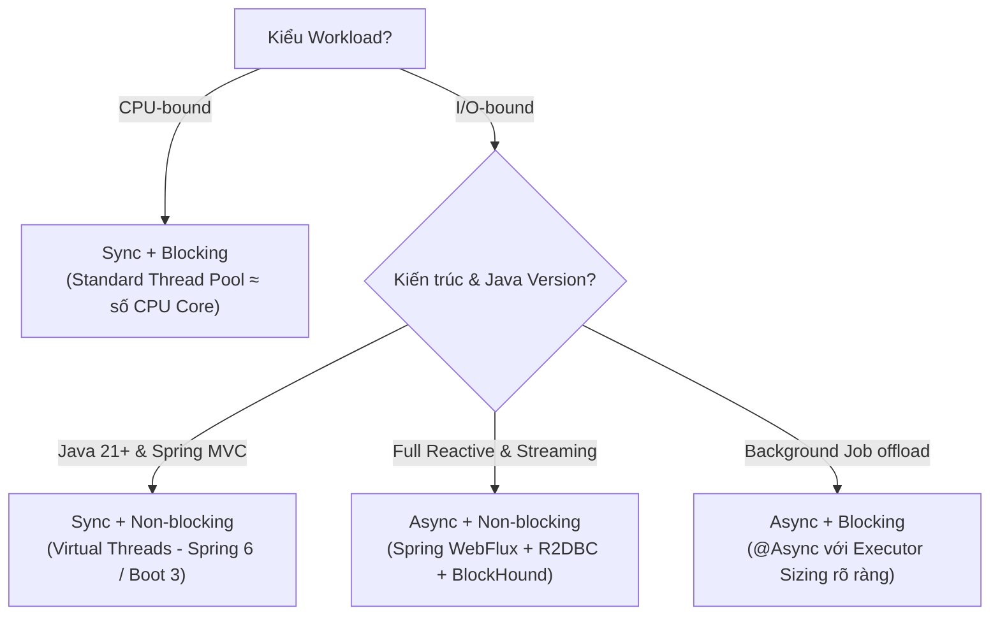
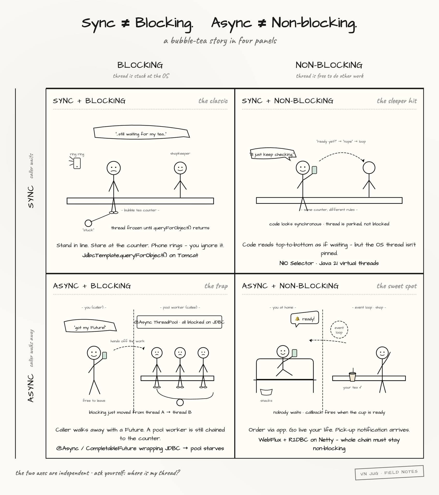

# 03 — Synchronous ≠ Blocking, Asynchronous ≠ Non-blocking

> **Chủ đề II — Concurrency Model**
> Tình huống mở đầu (có thật ở mọi team): một dev tự tin *"Em đánh `@Async` lên service này rồi, giờ nó non-blocking rồi anh."* — *"Bên trong method đó có gọi JDBC không?"* — *"Có, `JdbcTemplate.query()`."* — *"Vậy thread đang chạy method đó có bị block không?"* — **Im lặng.** Sự im lặng đó là lý do tài liệu này tồn tại: hai cặp khái niệm nằm trên **hai trục hoàn toàn độc lập**, và nhầm chúng với nhau là gốc rễ của những hệ thống "trông modern mà vẫn sập".

---

### ⚡ TL;DR & Quick Takeaways (30 giây)
* **2 Trục Độc Lập:** Sync/Async quy định *API Hợp đồng giao tiếp* (trả về kết quả ngay hay giao lời hứa Future). Blocking/Non-blocking quy định *Trạng thái OS Thread* (có bị gạt khỏi CPU suspend hay tự do đi làm việc khác).
* **Bẫy Nguy Hiểm Nhất (Async + Blocking):** Đánh dấu `@Async` bọc gọi JDBC (`JdbcTemplate`). Thread của Tomcat không bị block nhưng thread trong `@Async` Thread Pool bị block! Hệ thống chỉ chuyển nơi nghẽn chứ KHÔNG non-blocking.
* **Virtual Threads (Sync + Non-blocking):** Cho phép viết code Synchronous thuần túy, dễ đọc, dễ debug mà không làm giam hãm OS Thread (khi I/O, JVM unmount virtual thread khỏi carrier thread).
* **Bổ trợ Non-blocking toàn chuỗi:** Hệ thống chỉ thực sự Non-blocking khi TOÀN BỘ các mắt xích (Spring WebFlux -> Driver R2DBC -> Database) đều hỗ trợ Non-blocking.





---

## 1. Định nghĩa chặt chẽ hai trục

### Trục 1 — Sync/Async: hợp đồng giữa caller và callee

| | Câu hỏi | Bản chất |
|---|---|---|
| **Synchronous** | Caller gọi xong có **nhận kết quả rồi mới đi tiếp** không? | Kết quả trả về ngay trên đường return của lời gọi |
| **Asynchronous** | Caller nhận về một **"lời hứa"** (Future/callback/mã đơn hàng) rồi đi làm việc khác? | Kết quả được giao **sau**, qua một kênh khác (callback, polling Future, event) |

Đây là thuộc tính của **API / mô hình giao tiếp** — nhìn vào chữ ký hàm là biết: trả `T` là sync, trả `Future<T>` / `Mono<T>` / nhận callback là async.

### Trục 2 — Blocking/Non-blocking: trạng thái của thread ở tầng OS

| | Câu hỏi | Bản chất |
|---|---|---|
| **Blocking** | Trong lúc chờ, **thread có bị OS suspend** không? | Thread nằm trong syscall (vd. `read()` trên socket blocking), scheduler gạt nó khỏi CPU đến khi có dữ liệu |
| **Non-blocking** | Thread có **tự do làm việc khác** trong lúc dữ liệu chưa sẵn sàng? | Syscall trả về ngay (`EAGAIN`/0 bytes), hoặc thread được park ở tầng ứng dụng còn OS thread đi làm việc khác |

Đây là thuộc tính của **thread state** — nhìn vào chữ ký hàm **không** biết được; phải biết bên dưới nó gọi syscall kiểu gì.

### Ẩn dụ quầy trà sữa (định vị 2 trục)

- **Sync**: đứng đợi đến khi cầm được cốc trà rồi mới quay đi. **Async**: đặt qua app, cầm mã đơn, đi làm việc khác, shop báo thì quay lại lấy. → nói về *cách giao tiếp*.
- **Blocking**: bị "khoá chân" tại quầy — điện thoại reo cũng không nghe được. **Non-blocking**: vẫn ở đó nhưng lướt điện thoại, trả lời tin nhắn bình thường. → nói về *trạng thái của bạn (thread)*.

Hai trục độc lập ⇒ tồn tại đủ **4 tổ hợp**. Đi từng ô, mỗi ô kèm cơ chế bên dưới.

---

## 2. Ô 1: Sync + Blocking — *the classic*

```java
User user = jdbcTemplate.queryForObject("SELECT * FROM users WHERE id = ?", mapper, id);
```

**Cơ chế:** `queryForObject` → driver JDBC ghi query vào socket → gọi `read()` trên socket **blocking mode** → thread chui xuống native (`socketRead0`), kernel đưa thread vào hàng đợi chờ I/O, **gạt khỏi CPU** → có dữ liệu về, kernel đánh thức → thread trả kết quả lên. Suốt quá trình, thread không làm được gì khác — nhưng cũng **không tốn CPU** (đây là block, không phải busy-wait).

**Đặc tính:** đơn giản tuyệt đối — code tuần tự, stack trace nguyên vẹn, `ThreadLocal` hoạt động (security context, MDC logging, transaction context của Spring đều dựa trên nó), debug bằng breakpoint bình thường. Spring MVC trên Tomcat là mô hình này: 1 request = 1 thread từ đầu đến cuối.

**Cái giá:** trần concurrency = số thread ([tài liệu 01](01-connection-request-flow.md)), [07](07-threadpool-sizing.md))). Đụng trần thì throughput đứng yên dù CPU nhàn — và lựa chọn duy nhất còn lại là scale-out tốn tiền.

## 3. Ô 2: Sync + Non-blocking — *the sleeper hit*

API vẫn sync (gọi là trả về ngay) nhưng **không giam thread khi chưa có dữ liệu**. Hai hiện thân rất khác nhau về mức trừu tượng:

**(a) NIO thô — non-blocking "thật" ở syscall:**

```java
SocketChannel ch = SocketChannel.open();
ch.configureBlocking(false);
int n = ch.read(buf);        // chưa có data → trả 0 NGAY, thread không suspend
// tự loop thì thành busy-wait tốn CPU → thực tế phải dùng Selector:
Selector sel = Selector.open();
ch.register(sel, SelectionKey.OP_READ);
sel.select();                // 1 thread "trực" hàng nghìn channel qua epoll
```

Đây chính là nền móng của Poller trong Tomcat và event loop trong Netty ([tài liệu 01](01-connection-request-flow.md)) §3.2).

**(b) Virtual threads (Java 21) — non-blocking "ẩn" dưới API blocking:**

```java
// Code y hệt ô 1 — vẫn "đứng đợi" ở góc nhìn business logic:
User user = jdbcTemplate.queryForObject("SELECT ...", mapper, id);
// Nhưng nếu đang chạy trên virtual thread: JDK park virtual thread,
// UNMOUNT nó khỏi carrier → OS thread đi phục vụ virtual thread khác.
// Lập trình thì sync; OS thread thì KHÔNG bị block.
```

Đây là lý do Java 21 được coi là bước ngoặt cho ecosystem Spring: nó đưa cả codebase MVC hiện hữu từ ô 1 sang ô 2 **mà không đổi một dòng code nghiệp vụ** ([tài liệu 05](05-virtual-threads.md) mổ xẻ cơ chế mount/unmount/continuation).

## 4. Ô 3: Async + Blocking — *the trap* ⚠️

Cái bẫy phổ biến nhất, và chính là tình huống mở đầu.

```java
@Service
public class ReportService {
    @Async  // caller nhận Future ngay, không đợi — mô hình là ASYNC
    public CompletableFuture<Report> generate(Long id) {
        // NHƯNG: công việc chạy trên MỘT THREAD KHÁC của task pool,
        // và thread đó BLOCK y nguyên tại socketRead0 khi JDBC chạy.
        List<Row> rows = jdbcTemplate.query("SELECT ...", mapper, id);
        return CompletableFuture.completedFuture(build(rows));
    }
}
```

**Bản chất:** bạn không xoá blocking — bạn **di chuyển chỗ block từ thread A sang thread B**. Tổng số thread bị giam không giảm; thêm vào đó là chi phí bàn giao task + context switch. Về mặt trục toạ độ: caller được async, nhưng hệ thống vẫn blocking — *tệ nhất của cả hai thế giới* nếu không hiểu mình đang làm gì.

**Kịch bản "vỡ trận" kinh điển:** `@Async` mặc định (không cấu hình executor) của Spring Boot dùng pool `applicationTaskExecutor` core 8. Task block lâu → 8 thread cạn → mọi `@Async` sau đó **xếp hàng trong queue của pool** → tính năng "đã async hoá" đơ toàn tập, *không một exception nào được ném* — hệ thống treo trong im lặng. Chẩn đoán: thread dump thấy `task-1..8` đều kẹt ở JDBC, còn queue của executor phình.

```java
// Nếu buộc phải dùng ô này (chấp nhận block, chỉ cần offload) — PHẢI sizing pool tường minh:
@Bean(name = "reportExecutor")
Executor reportExecutor() {
    ThreadPoolTaskExecutor ex = new ThreadPoolTaskExecutor();
    ex.setCorePoolSize(20); ex.setMaxPoolSize(20);
    ex.setQueueCapacity(100);                       // KHÔNG để vô hạn — bài học tài liệu 06
    ex.setRejectedExecutionHandler(new ThreadPoolExecutor.CallerRunsPolicy());
    ex.setThreadNamePrefix("report-");
    return ex;
}
// và trỏ đích danh: @Async("reportExecutor")
```

Các biến thể cùng bẫy: `CompletableFuture.supplyAsync(() -> jdbcCall())` block chung `ForkJoinPool.commonPool` (pool dùng chung của cả JVM — parallel streams cũng đói theo!); RxJava `Schedulers.io()` cho task CPU-bound. Code nhìn "modern" nhưng hệ thống không nhanh hơn — đôi khi chậm hơn vì overhead.

## 5. Ô 4: Async + Non-blocking — *the sweet spot* (với cái giá của nó)

```java
public Mono<OrderView> getOrder(Long id) {
    return orderRepo.findById(id)                                   // R2DBC — socket non-blocking
        .flatMap(o -> customerClient.get()                          // WebClient — non-blocking
            .uri("/customers/{id}", o.customerId())
            .retrieve().bodyToMono(Customer.class)
            .map(c -> OrderView.of(o, c)));
}
```

**Cơ chế:** query đi ra qua socket non-blocking đăng ký với event loop (Netty) → **thread quay về phục vụ request khác ngay lập tức**. DB trả kết quả → event fire → phần tiếp theo của chuỗi (`flatMap`) chạy trên một worker **bất kỳ**. Không thread nào "đứng đợi" ở bất kỳ khâu nào. Đây là cách WebFlux phục vụ hàng chục nghìn connection với event loop vài thread — và Node.js single-thread phục vụ được nhiều request: **async + non-blocking từ trong DNA, không có cửa vô tình block**.

**Cái giá (phải trả đủ, không mặc cả):**

1. **Toàn stack phải non-blocking.** Một mắt xích blocking — driver JDBC, logging ghi file đồng bộ, một cú `RestTemplate` cũ, thậm chí `Thread.sleep` trong map() — chạy trên event loop vài thread là **cả server nghẹt**, không riêng request đó. *"Chuyển sang WebFlux mà còn dùng JPA thì thật lòng không hiểu bạn đang làm gì."*
2. **Debug đau não:** stack trace bị cắt vụn (mỗi đoạn chạy trên thread khác), phải dùng `Hooks.onOperatorDebug()` / checkpoint.
3. **`ThreadLocal` không còn đáng tin** — security context, MDC, `@Transactional` truyền thống đều dựa trên ThreadLocal; reactive phải dùng Reactor `Context` và transaction reactive riêng.

```java
// Lưới an toàn bắt buộc khi làm reactive: BlockHound — phát hiện blocking call lọt vào event loop
// testImplementation 'io.projectreactor.tools:blockhound:1.0.9.RELEASE'
static { BlockHound.install(); }   // blocking call trên event loop → BlockingOperationError ngay khi test
```

---

## 6. Ma trận tổng hợp và bốn câu hỏi tự sáng tỏ

| | **Blocking** (OS thread bị giam) | **Non-blocking** (OS thread tự do) |
|---|---|---|
| **Sync** (caller đợi kết quả) | `JdbcTemplate` trên Tomcat — *the classic* | NIO + Selector; **Virtual threads + Spring MVC** — *the sleeper hit* |
| **Async** (caller cầm lời hứa) | `@Async`/`supplyAsync` bọc JDBC — *the trap* ⚠️ | WebFlux + R2DBC trên Netty — *the sweet spot* |

Hiểu ma trận rồi, các câu hỏi khó tự trả lời:

1. *WebFlux nhét JdbcTemplate vì sao không hơn MVC?* — Vì bạn tự tay đẩy nó vào ô 3, combo tệ nhất.
2. *Vì sao virtual threads là "game changer" cho Spring MVC?* — Vì nó chuyển cả hệ từ ô 1 sang ô 2: giữ code sync dễ đọc mà không trả giá OS thread bị giam.
3. *Node.js một thread sao phục vụ nghìn request?* — Ô 4 bẩm sinh.
4. *`@Async` có làm service "non-blocking" không?* — Không. Nó chỉ đổi **ai** block.

---

## 7. Khung quyết định thực dụng

```
Workload là gì?
├─ CPU-bound (mã hoá, xử lý ảnh, scoring)
│    → Ô 1 + pool ≈ số core (tài liệu 07). Async/reactive KHÔNG giúp gì — nút thắt là CPU.
└─ I/O-bound (đa số service nghiệp vụ)
     ├─ Java 21+ khả dụng, team muốn giữ code đơn giản
     │    → Ô 2: Virtual threads + Spring MVC  ← khuyến nghị mặc định 2026
     ├─ Cần streaming/backpressure thực sự (SSE hàng chục nghìn conn, pipeline dữ liệu)
     │    → Ô 4: WebFlux — và cam kết non-blocking TOÀN chuỗi + BlockHound
     └─ Chỉ cần offload việc nền (gửi mail, export) khỏi request thread
          → Ô 3 CÓ Ý THỨC: @Async với executor sizing tường minh, queue hữu hạn
```

> **CAUTION:** Việc sử dụng các mô hình Async hay Non-blocking không phải là "viên đạn bạc" giúp tăng tốc độ xử lý logic. Ngược lại, nếu chọn sai mô hình cho loại workload (ví dụ: dùng reactive cho CPU-bound), hệ thống sẽ chạy chậm hơn đáng kể do overhead quản lý context/queue.

Điểm neo cuối cùng — phần lớn vấn đề scalability quy về đúng một câu hỏi: **Thread của bạn đang ở đâu, đang làm gì, và đang bị kẹt ở chỗ nào?**

Công nghệ vài năm một làn sóng (reactive → virtual threads → structured concurrency → ...), nhưng hai trục này và cách OS quản lý thread **không đổi**. Hiểu nguyên lý một lần, dùng cho nhiều thế hệ framework — còn học cú pháp thì mỗi bản Spring mới lại học lại từ đầu.

---

## 8. Tự kiểm chứng & Câu hỏi phỏng vấn (Self-Assessment)

1. **Câu hỏi:** Tại sao một Developer gắn annotation `@Async` lên một Spring Service method có sử dụng JDBC `JdbcTemplate` lại KHÔNG GIÚP ứng dụng trở thành Non-blocking?
   * *Gợi ý trả lời:* Annotation `@Async` chỉ giúp Caller nhận về `CompletableFuture` ngay (chuyển hợp đồng API thành Async). Việc thực thi bên trong vẫn giao cho 1 Worker Thread trong TaskExecutor, và Thread này vẫn bị OS block (`socketRead0`) khi gọi JDBC. Hệ thống chỉ di chuyển nơi block từ Tomcat Thread sang TaskExecutor Thread.
2. **Câu hỏi:** Khi nào ta nên lựa chọn mô hình Spring WebFlux (Async + Non-blocking) thay vì Spring MVC với Virtual Threads (Sync + Non-blocking)?
   * *Gợi ý trả lời:* WebFlux phù hợp khi cần tính năng Streaming (Server-Sent Events/WebSockets), xử lý phản hồi liên tục (Reactive Streams), hoặc cần tính năng Backpressure thực sự. Nếu ứng dụng chỉ là REST API chuẩn và I/O-bound thông thường, Spring MVC + Virtual Threads mang lại hiệu năng tương đương với code dễ đọc và dễ debug hơn rất nhiều.
3. **Câu hỏi:** Công cụ nào trong ecosystem Java Reactive giúp phát hiện việc vô tình gọi blocking I/O (như JDBC, `Thread.sleep`) trên Event Loop Threads?
   * *Gợi ý trả lời:* Công cụ `BlockHound` (do VMware/Project Reactor phát triển). Nó nạp Java Agent để kiểm tra stack trace và quăng `BlockingOperationError` ngay lập tức khi phát hiện blocking call trên Event Loop.

---

**Tài liệu liên quan:** [04 — Thread lifecycle & RUNNABLE](04-java-thread-lifecycle.md) · [05 — Virtual threads](05-virtual-threads.md) · [07 — Sizing pool theo workload](07-threadpool-sizing.md))
