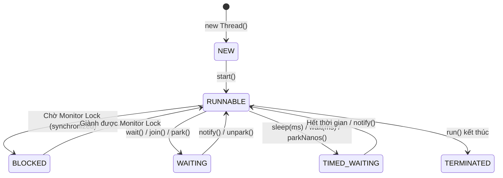
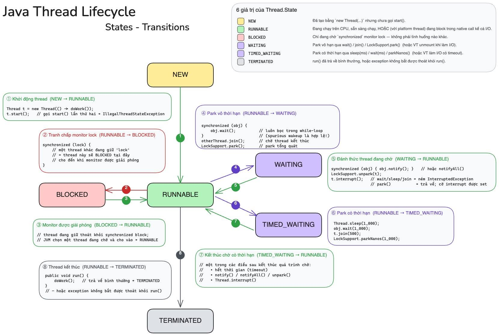
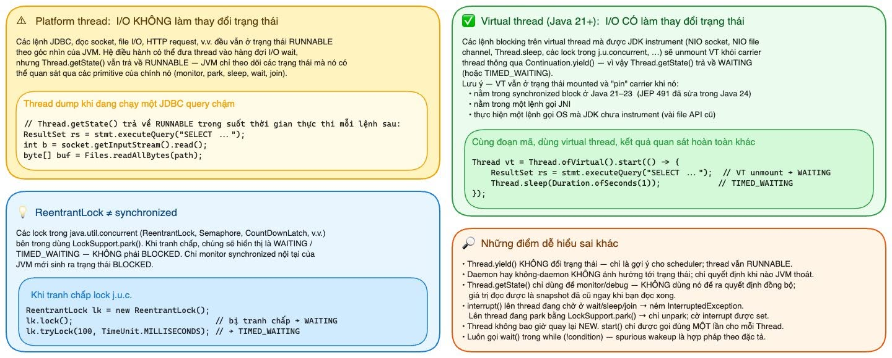

# 04 — Java Thread Lifecycle & bí ẩn RUNNABLE: vì sao thread đang chờ database vẫn không phải WAITING?

> **Chủ đề II — Concurrency Model**
> Câu hỏi thực chiến: *"Service treo cứng, dump thread ra: mấy chục thread đang gọi database, database chậm rì, thread rõ ràng ngồi chờ kết quả — sao chúng toàn báo RUNNABLE, không phải WAITING hay BLOCKED?"* Câu hỏi nghe nhỏ xíu nhưng đào xuống thì chạm đúng ranh giới giữa **JVM và OS kernel** — chỗ mà nhiều người dùng Java cả chục năm vẫn hiểu lờ mờ, và là chìa khoá để đọc đúng một thread dump lúc 2 giờ sáng.

---

### ⚡ TL;DR & Quick Takeaways (30 giây)
* **Bí ẩn RUNNABLE:** JVM chỉ coi một Thread là `BLOCKED`/`WAITING` khi nó chờ các cơ chế do JVM quản lý (`synchronized` monitor, `LockSupport.park()`). Khi Thread thực hiện Syscall I/O (gọi DB, socket read), OS Kernel đưa Linux Thread về trạng thái `S` (Sleeping), nhưng ở góc nhìn JVM nó vẫn báo `RUNNABLE`!
* **Duy nhất 1 trường hợp BLOCKED:** Thread chỉ ở trạng thái `BLOCKED` khi chờ giành Monitor Lock của khối `synchronized`. Khóa `ReentrantLock` của `java.util.concurrent` lại đưa thread về `WAITING` (`LockSupport.park()`).
* **Bẫy jstack với Virtual Threads:** `jstack` thông thường KHÔNG thấy Virtual Threads (chỉ thấy Carrier Threads). Để dump Virtual Threads cần dùng `jcmd <PID> Thread.dump_to_file`.





---

## 1. Sáu trạng thái của `Thread.State` — định nghĩa chặt

| Trạng thái | Điều kiện vào | Điều kiện ra | Cơ chế sở hữu |
|---|---|---|---|
| `NEW` | `new Thread(...)`, chưa `start()` | `start()` (gọi lần 2 → `IllegalThreadStateException`) | — |
| `RUNNABLE` | Đang chạy trên CPU, sẵn sàng chạy, **hoặc đang ở trong native call — kể cả blocking I/O** | chuyển sang 4 trạng thái còn lại | — |
| `BLOCKED` | **Duy nhất một tình huống:** chờ giành *monitor lock* để vào khối/method `synchronized` | thread giữ monitor thoát ra, JVM chọn mình | JVM monitor |
| `WAITING` | `Object.wait()` / `Thread.join()` / `LockSupport.park()` — park **vô thời hạn** | `notify()/notifyAll()` / thread join xong / `unpark()` / `interrupt()` | JVM parking |
| `TIMED_WAITING` | Như trên nhưng **có deadline**: `sleep(ms)`, `wait(ms)`, `join(ms)`, `parkNanos()` | hết giờ hoặc được đánh thức | JVM parking |
| `TERMINATED` | `run()` return, hoặc exception không bắt được thoát khỏi `run()` | không bao giờ (thread không tái sinh về NEW) | — |

**Quan sát mấu chốt (ít người để ý):** ba trạng thái `BLOCKED` / `WAITING` / `TIMED_WAITING` đều gắn với những cơ chế đồng bộ hoá **do chính JVM quản lý** — monitor, wait-set, parking. Điểm chung: **JVM biết rõ bạn đang chờ cái gì**, vì thứ bạn chờ nằm ngay trong thế giới của nó. Đây là tiền đề để hiểu vì sao I/O *không* nằm trong nhóm này.

```java
// Demo chạy được — quan sát các transition chính
public class ThreadStateDemo {
    public static void main(String[] a) throws Exception {
        Object lock = new Object();
        Thread t = new Thread(() -> {
            synchronized (lock) {
                try { lock.wait(); } catch (InterruptedException ignored) {}
            }
            synchronized (ThreadStateDemo.class) { /* tranh chấp ở bước 4 */ }
        });

        System.out.println(t.getState());              // NEW
        t.start(); Thread.sleep(50);
        System.out.println(t.getState());              // WAITING  (lock.wait())

        synchronized (ThreadStateDemo.class) {         // main giữ monitor này
            synchronized (lock) { lock.notify(); }     // đánh thức t
            Thread.sleep(50);
            System.out.println(t.getState());          // BLOCKED  (t chờ monitor main đang giữ)
        }
        t.join();
        System.out.println(t.getState());              // TERMINATED
    }
}
```

---

## 2. Giải phẫu câu hỏi trung tâm: JDBC call thì chuyện gì *thực sự* xảy ra?

Khi code gọi `stmt.executeQuery(...)`, JVM **không hề "ngủ" thread theo nghĩa của nó**. Trình tự thật:

```
[Java]    JdbcTemplate.query → PgStatement.executeInternal → ...
[Java]    → NioSocketImpl.read / socketRead0                ← ranh giới
[Native]  → JNI xuống native code của JDK
[Kernel]  → syscall read(fd, buf, len) trên socket blocking
[Kernel]  → chưa có dữ liệu → kernel chuyển OS thread sang trạng thái
            "interruptible sleep" (S), GẠT KHỎI CPU, xếp vào wait queue của socket
[Kernel]  → gói tin từ DB về, driver mạng ngắt → kernel đánh thức OS thread
[Java]    ← dữ liệu chảy ngược lên, executeQuery return
```

Thread **bị block thật** — nhưng block **ở tầng OS kernel, trong một syscall**, không phải ở monitor/parking của JVM. Và JVM **không có cách di động (portable)** nào để biết một thread đang nằm chờ bên trong syscall nào của kernel — chuyện đó ngoài tầm quan sát của nó.

Chính Javadoc của `Thread.State` nói thẳng hai ý:

1. Một thread RUNNABLE *"đang thực thi trong JVM nhưng có thể đang chờ tài nguyên khác từ hệ điều hành, ví dụ như CPU"*.
2. Các trạng thái này là **trạng thái của máy ảo, không phản ánh trạng thái thread ở tầng OS**.

> **Kết luận cần khắc:** `RUNNABLE` chưa bao giờ có nghĩa "đang dùng CPU". Nó chỉ có nghĩa: *"dưới góc nhìn của JVM, thread này không bị park bởi bất kỳ cơ chế nào **của tôi**."* Mọi thứ native — I/O socket, đọc file, JNI — bị gom chung vào một rọ RUNNABLE, như một hệ quả tự nhiên của ràng buộc lịch sử: JVM không nhìn xuyên qua kernel được. Không phải ai đó thiết kế ẩu.

### Đối chiếu hai bảng trạng thái (JVM vs Linux)

| Tình huống | `Thread.getState()` (JVM) | Trạng thái OS thread (Linux, cột S của `top -H`) |
|---|---|---|
| Đang tính toán | RUNNABLE | **R** (running) |
| Chờ socket DB (JDBC) | **RUNNABLE** ← điểm gây nhầm | **S** (interruptible sleep) |
| `Thread.sleep(1000)` | TIMED_WAITING | S |
| Chờ vào `synchronized` | BLOCKED | S |
| `lock.wait()` | WAITING | S |

Hàng thứ hai chính là toàn bộ câu chuyện: **JVM nói "đang chạy", OS nói "đang ngủ" — cả hai đều đúng theo hệ quy chiếu của mình.**

```bash
# Tự kiểm chứng: soi cùng một thread từ hai phía
top -H -p <PID>            # cột S: OS state của từng thread; %CPU ≈ 0 dù JVM báo RUNNABLE
jstack <PID> | grep -A3 "http-nio-8080-exec-12"   # JVM state: RUNNABLE, đỉnh stack: socketRead
```

### Ẩn dụ bảng chấm công

Nhân viên đã quẹt thẻ vào làm, ngồi ở bàn → bảng chấm công (JVM) luôn ghi **"có mặt — đang làm việc"**, bất kể anh ta đang gõ phím hùng hục hay ngồi đực mặt nhìn loading icon chờ một bên thứ ba gửi dữ liệu. Phòng nhân sự chỉ đánh dấu "vắng" trong các trường hợp **chính công ty kiểm soát**: vào phòng họp mà phòng khoá (BLOCKED chờ monitor), đứng chờ được gọi tên (WAITING qua wait/notify). Còn khi anh ta chờ một **vendor bên ngoài** — kernel đang đọc socket — bảng chấm công vẫn ghi "đang làm việc". Cái kẹt nằm ngoài tầm quản lý của JVM, nên nhãn vẫn là RUNNABLE.

---

## 3. Những điểm dễ hiểu sai xung quanh (từ cheatsheet)



1. **`ReentrantLock` ≠ `synchronized` về trạng thái.** Lock trong `java.util.concurrent` (ReentrantLock, Semaphore, CountDownLatch...) dựng trên `LockSupport.park()` → khi tranh chấp hiển thị **WAITING / TIMED_WAITING**, *không phải* BLOCKED. Chỉ monitor `synchronized` nội tại của JVM mới sinh BLOCKED. Hệ quả thực dụng: dump đầy WAITING tại `AbstractQueuedSynchronizer` = tranh chấp lock j.u.c. — đừng vì "không thấy BLOCKED" mà loại trừ deadlock/contention.
   ```java
   ReentrantLock lk = new ReentrantLock();
   lk.lock();                                   // bị tranh chấp → WAITING
   lk.tryLock(100, TimeUnit.MILLISECONDS);      // → TIMED_WAITING
   ```
2. **`Thread.yield()` không đổi trạng thái** — chỉ là gợi ý cho scheduler; thread vẫn RUNNABLE.
3. **`getState()` chỉ để monitor/debug** — giá trị là snapshot, cũ ngay khi bạn đọc xong; không bao giờ dùng nó làm quyết định đồng bộ hoá.
4. **`interrupt()`**: lên thread đang wait/sleep/join → ném `InterruptedException`; lên thread đang `park()` → chỉ unpark, cờ interrupt được set. Lên thread đang kẹt trong `socketRead0` truyền thống → *thường không có tác dụng tức thì* (I/O không interruptible) — lý do vì sao "cancel request" không giải cứu được thread kẹt DB; phải dùng timeout ở tầng driver/DB ([tài liệu 02](02-timeouts-and-exceptions.md)) §7).
5. **Luôn gọi `wait()` trong `while (!condition)`** — spurious wakeup là hợp pháp theo đặc tả.
6. **Daemon hay non-daemon không ảnh hưởng trạng thái** — chỉ quyết định JVM có chờ nó khi thoát hay không.

---

## 4. Hệ quả hệ thống: cái bẫy "RUNNABLE-mà-thực-ra-đang-ngồi-chờ"

Ráp vào mô hình thread-per-request: mỗi platform thread ánh xạ **1:1** một OS thread (~1MB stack). Thread chờ kernel đọc socket → OS thread **bị giam cứng**, không phục vụ ai, dù chẳng tốn một chu kỳ CPU. Service I/O-bound (mỗi request vài cú DB call) dành ~90% thời gian chờ I/O, nên:

> **Thread pool cạn sạch không phải vì CPU bận, mà vì tất cả thread đều đang RUNNABLE-mà-thực-ra-đang-ngồi-chờ.** Dashboard: CPU nhàn tênh 20%, nhưng request timeout hàng loạt, client liên tục connection reset.

Đây chính là cái bẫy khiến người ta hoảng loạn tăng `threads.max` lên 1000 trong cơn tuyệt vọng — trong khi gốc rễ là **mô hình** "một thread chờ I/O = một OS thread bị giam", và lời giải căn cơ là đổi mô hình (virtual threads — [tài liệu 05](05-virtual-threads.md)) hoặc tính đúng pool theo blocking coefficient ([tài liệu 07](07-threadpool-sizing.md))).

---

## 5. Virtual thread viết lại bảng trạng thái như thế nào

Với virtual thread (stable Java 21), các blocking call **được JDK instrument** (NIO socket, NIO file channel, `Thread.sleep`, các lock j.u.c...) không còn giam OS thread: JDK chặn tại điểm block, gấp stack thành **continuation** cất trên Heap, **unmount** virtual thread khỏi carrier (qua `Continuation.yield()`), trả OS thread về chạy việc khác. Nhờ đó:

> Trạng thái chờ I/O **cuối cùng được phản ánh đúng bản chất**: virtual thread bị park → `Thread.getState()` trả về **WAITING** (hoặc TIMED_WAITING nếu có timeout) — đúng như trực giác mong đợi từ đầu. Trong sơ đồ lifecycle, ghi chú nhỏ *"or VT I/O unmount"* ở ô WAITING chính là khoảnh khắc này.

```java
// Cùng một đoạn code — hai kết quả quan sát hoàn toàn khác
ResultSet rs = stmt.executeQuery("SELECT ...");
// chạy trên PLATFORM thread → getState() = RUNNABLE suốt thời gian chờ DB
// chạy trên VIRTUAL  thread → VT unmount → getState() = WAITING
```

Ngoại lệ (VT bị **pin** — vẫn giữ carrier, quay lại bệnh cũ): nằm trong khối `synchronized` ở Java 21–23 (đã sửa bởi **JEP 491, Java 24**), đang trong lời gọi **JNI**, hoặc vài file API cũ chưa được instrument. Chi tiết pinning và cách phát hiện ở [tài liệu 05](05-virtual-threads.md).

---

## 6. Thực chiến: đọc thread dump như một chuyên gia

### 6.1. Quy trình chuẩn với platform thread

```bash
# Lấy 3 bản dump cách nhau 5-10s (một bản là ảnh tĩnh — ba bản mới thấy "chuyển động")
for i in 1 2 3; do jstack <PID> > dump_$i.txt; sleep 7; done
```

**Nguyên tắc vàng: đừng đọc nhãn trạng thái — hãy đếm đỉnh stack.**

```bash
# Gom nhóm worker theo frame đặc trưng
grep -c "socketRead\|NioSocketImpl.park" dump_1.txt        # bao nhiêu thread kẹt I/O socket?
grep -B5 "socketRead" dump_1.txt | grep "http-nio" | head  # là những worker nào?
```

Bảng nhận dạng pattern:

| Đỉnh stack lặp lại hàng loạt | Chẩn đoán | Đi tiếp |
|---|---|---|
| `socketRead` / `NioSocketImpl.park` bên trong driver JDBC (`org.postgresql...`, `com.mysql...`) | Chờ **database** — DB chậm hoặc query nặng | [08](08-database-connection-pool-sizing.md)) |
| `HikariPool.getConnection` → `Concurrent...await` | **Pool connection cạn** — chờ mượn connection (khác hẳn dòng trên: chưa tới được DB!) | [08](08-database-connection-pool-sizing.md)) §6 |
| `socketRead` trong HTTP client (`HttpClientImpl`, okhttp...) | Chờ **downstream service** | [02](02-timeouts-and-exceptions.md)) §7 — timeout budget |
| Hàng loạt BLOCKED trỏ cùng một `- waiting to lock <0x...>` | **Monitor contention** — tìm thread đang `- locked <0x...>` cùng địa chỉ: nó là thủ phạm | tách lock / giảm critical section |
| WAITING tại `AbstractQueuedSynchronizer` | Tranh chấp lock **j.u.c.** (nhớ mục 3.1!) | như trên |
| 150/200 thread cùng một pattern bất kỳ | Điểm nghẽn **đơn** — chữa một chỗ là giải phóng cả pool | — |

So sánh 3 bản dump: thread nào **đứng nguyên một chỗ** qua cả 3 bản là thread kẹt thật; thread đổi stack liên tục là đang làm việc bình thường.

### 6.2. Cái bẫy `jstack` với virtual thread — bài học Netflix

> **Virtual thread KHÔNG xuất hiện trong dump của `jstack`.** Netflix có một bài "để đời": service treo cứng, `jstack` cho ra một JVM *nhàn tênh, sạch bong, chẳng có gì hoạt động* — trong khi thực tế **hàng nghìn virtual thread đang kẹt chờ một cái lock**. `jstack` và phần lớn tool cũ chỉ thấy native thread (tức carrier) — phần nổi của tảng băng.

```bash
# Lệnh đúng cho thế giới virtual thread:
jcmd <PID> Thread.dump_to_file -format=json /tmp/vt-dump.json    # (hoặc -format=plain)

# Lưu ý Java 21: bản dump jcmd thiên về stack trace; thông tin state/lock
# chưa đầy đủ như jstack với platform thread → đôi khi phải tự đọc stack
# để luận ra thread đang chờ ở đâu. Giới hạn đang được cải thiện dần theo phiên bản.

# Bổ trợ: JFR ghi sự kiện pinning
jcmd <PID> JFR.start settings=profile
# event jdk.VirtualThreadPinned → chỗ nào VT bị ghim vào carrier
```

### 6.3. Khi thread dump chưa đủ: phân biệt "chờ" và "chạy" bằng profiler

Thread dump trả lời "**đang đứng ở đâu**"; muốn biết "**thời gian trôi đi đâu**" dùng async-profiler ở hai chế độ đối chiếu nhau:

```bash
./asprof -d 30 -e cpu   -f cpu.html  <PID>   # ai đang ĐỐT CPU
./asprof -d 30 -e wall  -f wall.html <PID>   # thời gian THỰC trôi đi đâu (gồm cả chờ I/O)
# wall lớn ở JDBC mà cpu nhỏ → I/O-bound, đúng bệnh "RUNNABLE giả" — khớp toàn bộ câu chuyện trên
```

---

## 7. Tổng kết

1. `BLOCKED`/`WAITING`/`TIMED_WAITING` = chờ trong **thế giới JVM** (monitor, parking). Chờ trong **thế giới kernel** (syscall I/O) = vẫn `RUNNABLE` — vì JVM không nhìn xuyên qua kernel được.
2. `RUNNABLE` ≠ đang dùng CPU. Đối chiếu `top -H` (OS state **S**, %CPU ≈ 0) với `jstack` (RUNNABLE) là bài kiểm chứng một phút.
3. Đọc dump = **đếm pattern đỉnh stack qua nhiều bản dump**, không đọc nhãn; phân biệt "kẹt chờ DB" với "kẹt chờ *mượn connection*" — hai bệnh, hai thuốc.
4. Lock j.u.c. hiện WAITING chứ không BLOCKED — đừng để nhãn đánh lừa khi truy contention.
5. Virtual thread sửa đúng chỗ ngứa: chờ I/O → WAITING thật + OS thread được giải phóng; nhưng phải đổi tool quan sát (`jcmd Thread.dump_to_file`, JFR) — thói quen `jstack` cũ sẽ cho một bức tranh "sạch bong" giả tạo.

M��i lần một lớp trừu tượng bị "rò rỉ" (như cái nhãn RUNNABLE oái oăm này), nó nhắc chúng ta: phần thưởng dài hạn thuộc về những ai chịu đào xuống tầng dưới. Học cách đọc trạng thái thread thì nhanh — hiểu **vì sao** trạng thái được đặt tên như vậy mới là thứ theo bạn cả sự nghiệp.

## 8. Tự kiểm chứng & Câu hỏi phỏng vấn (Self-Assessment)

1. **Câu hỏi:** Tại sao một Thread trong Java đang thực hiện đọc dữ liệu từ Database (gọi `socketRead0`) lại hiển thị trạng thái `RUNNABLE` trong Thread Dump mặc dù phần trăm CPU sử dụng của nó bằng 0%?
   * *Gợi ý trả lời:* Vì JVM coi trạng thái `RUNNABLE` bao gồm cả việc đang chạy CPU hoặc đang chờ OS Kernel thực hiện I/O Syscall. JVM không quản lý thời gian chờ của Kernel Socket, nên không chuyển thread sang `WAITING`. Ở tầng Linux OS, thread thực sự ở trạng thái `S` (Interruptible Sleep).
2. **Câu hỏi:** Phân biệt sự khác nhau trong trạng thái Thread Dump khi hai Thread cùng tranh chấp một khối `synchronized` vs hai Thread cùng tranh chấp một `ReentrantLock`?
   * *Gợi ý trả lời:* Với `synchronized`, thread bị kẹt sẽ hiển thị `BLOCKED` (chờ Monitor Lock). Với `ReentrantLock` (thuộc `java.util.concurrent`), thread bị kẹt sẽ hiển thị `WAITING` hoặc `TIMED_WAITING` tại `LockSupport.park()`.
3. **Câu hỏi:** Khi ứng dụng Spring Boot chạy trên Virtual Threads bị treo, tại sao sử dụng lệnh `jstack <PID>` truyền thống lại thấy danh sách Thread sạch bóng và nhàn rỗi? Lệnh nào là chuẩn xác để dump Virtual Threads?
   * *Gợi ý trả lời:* Vì `jstack` chỉ dump các Platform (Carrier) Threads ở tầng OS. Các Virtual Threads nằm ở bộ nhớ Heap của JVM không hiện diện trong `jstack`. Cần sử dụng lệnh `jcmd <PID> Thread.dump_to_file -format=json /tmp/vt.json`.

---

**Tài liệu liên quan:** [03 — Ma trận sync/async](03-sync-async-blocking-nonblocking.md) · [05 — Virtual threads](05-virtual-threads.md) · [08 — Chẩn đoán pool cạn](08-database-connection-pool-sizing.md))

