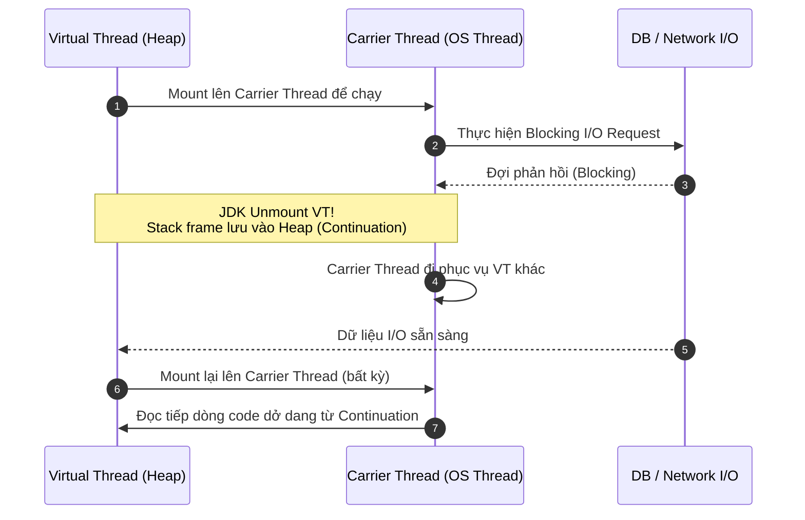

# 05 — Virtual Threads: sự đơn giản của blocking code, khả năng scale của non-blocking

> **Chủ đề II — Concurrency Model**
> *"The simplicity of blocking code with the scalability of non-blocking systems."* Suốt một thập kỷ, chúng ta ngầm chấp nhận một định luật: muốn scale thì phải chịu phức tạp (reactive), muốn đơn giản thì phải chịu trần thấp (thread-per-request). Virtual thread — stable ở **Java 21** (JEP 444), thực sự "trưởng thành" ở **Java 24** (JEP 491) — chứng minh cái đánh đổi đó không phải định luật, chỉ là giới hạn tạm thời của công cụ. Tài liệu này mổ xẻ **cơ chế** (mount/unmount/continuation), **scheduler**, **các bẫy** (pinning, ThreadLocal, CPU-bound), và cách vận hành/giám sát trong production.

---

### ⚡ TL;DR & Quick Takeaways (30 giây)
* **Cơ chế Mount / Unmount:** Khi Virtual Thread gặp blocking I/O (ví dụ: query DB), JDK gấp stack frame lưu thành `Continuation` trên Heap và **Unmount** nó khỏi Carrier Thread (OS Thread). Carrier Thread lập tức rảnh tay quay sang phục vụ Virtual Thread khác!
* **Scale, NOT Speed:** Virtual Threads **không làm 1 request chạy nhanh hơn** (không giảm latency). Nó làm cho 1 máy gánh được hàng chục nghìn request cùng lúc mà không sập (tăng Throughput).
* **Tránh Bẫy Pinning:** Ở Java 21-23, Virtual Thread bị "ghim" vào Carrier Thread nếu block trong khối `synchronized` hoặc gọi Native C/C++ method (JNI). Java 24 (JEP 491) giải quyết trọn vẹn việc `synchronized` pinning.
* **Cấm Pool Virtual Threads:** Virtual Thread siêu nhẹ (~vài trăm bytes), tạo xong vứt. Cấm bọc Virtual Thread vào `FixedThreadPool`! Nếu cần giới hạn concurrency gọi downstream, hãy dùng `Semaphore`.



---

## 1. Căn bệnh cần chữa — định lượng lại

Từ [tài liệu 04](04-java-thread-lifecycle.md): platform thread ánh xạ 1:1 OS thread; chờ I/O là **giam cứng** OS thread đó. Đặt con số vào để thấy độ lãng phí:

```
Service I/O-bound điển hình: mỗi request 55ms = 5ms CPU + 50ms chờ I/O (91% thời gian là CHỜ)
Pool 200 platform thread:
  - Bộ nhớ stack: 200 × ~1MB = ~200MB native memory (chưa tính gì khác)
  - Tại một khoảnh khắc: trung bình chỉ ~18 thread thực sự cần CPU (200 × 9%)
  - 182 thread còn lại: RUNNABLE-mà-ngồi-chờ, chiếm chỗ, không sinh công
→ CPU nhàn 20%, throughput vẫn kịch trần vì "hết chỗ ngồi", không phải hết sức tính toán.
   Tài nguyên đắt nhất thì rảnh — hệ thống vẫn nghẹt.
```

Trước Java 21, muốn vượt trần này, con đường "sang" nhất là reactive (ô 4 của [tài liệu 03](03-sync-async-blocking-nonblocking.md)) — hiệu năng khỏi bàn, nhưng trả giá bằng debug đau não, stack trace vụn, ThreadLocal/transaction phức tạp, và toàn stack phải non-blocking. Virtual thread tấn công thẳng vào cái đánh đổi này: **giấu sự phức tạp xuống tầng JDK**.

---

## 2. Gỡ rối thuật ngữ — điều kiện tiên quyết

Đọc tài liệu virtual thread lần đầu rất dễ bị mớ thuật ngữ làm rối: OS thread, platform thread, carrier thread, mount, unmount, park, continuation. Chưa nắm được các tên này thì giải thích cơ chế cũng bằng không. Đi từ dưới lên:

| Thuật ngữ | Định nghĩa chặt | Chi phí |
|---|---|---|
| **OS thread** | Thread thật, kernel quản lý & lên lịch | ~1MB stack native (off-heap), số lượng hữu hạn, tạo/huỷ đắt |
| **Platform thread** | `java.lang.Thread` truyền thống — lớp mỏng bọc **đúng một** OS thread (1:1, trọn đời) | = OS thread |
| **Carrier thread** | **Không phải loại thread mới** — là một platform thread đang đóng vai "người chở": virtual thread muốn chạy phải được đặt lên carrier để mượn OS thread bên dưới | = OS thread |
| **Virtual thread** | Luồng thực thi do **JDK** quản lý & lên lịch, không gắn cứng OS thread nào | ~vài trăm byte metadata + stack co giãn trên **Heap** |
| **Mount / Unmount** | Đặt VT lên carrier để chạy / tháo VT khỏi carrier trả lại | rẻ (thao tác trên Heap) |
| **Park** | VT tạm dừng chờ một sự kiện (DB trả dữ liệu, lock được nhả...) | — |
| **Continuation** | Toàn bộ trạng thái thực thi của VT tại thời điểm bị tháo: đang ở dòng nào, biến cục bộ, call stack — được "gấp" lại cất trên Heap | — |

**Insight rút gọn một nửa độ khó:** *OS thread, platform thread, carrier thread — trong ngữ cảnh này gần như là **một thực thể***, cùng một OS thread đắt đỏ gọi theo ba góc nhìn: OS gọi nó là OS thread; Java bọc lại gọi là platform thread; khi platform thread đó đang chở một virtual thread, ta gọi nó là carrier.

**Ẩn dụ continuation:** cái **bookmark** kẹp đúng trang sách đang đọc dở — gấp sách cất lên kệ (Heap), lúc nào rảnh mở ra đọc tiếp **đúng dòng đó**, không phải đọc lại từ đầu.

---

## 3. Cơ chế lõi: một vòng đời request, kể hai lần

### 3.1. Platform thread (mô hình cũ)

1. Tomcat lấy 1 thread từ pool → chạy controller.
2. Đến câu JDBC: thread chui xuống native, syscall đọc socket, nằm chờ kernel.
3. Suốt vài chục–vài trăm ms đó, **OS thread bị giam** — có 200 thread thì tối đa 200 request song song, mà phần lớn đang... ngồi không.

### 3.2. Virtual thread (mô hình mới) — từng bước một

```
[1] Request → giao cho VT-42 → scheduler MOUNT VT-42 lên Carrier-3 → code chạy
[2] Code chạm repository.findById() → xuống tới điểm blocking đã được JDK instrument
[3] JDK chặn NGAY TẠI ĐIỂM ĐÓ:
      a. Gấp toàn bộ trạng thái VT-42 (stack frames, biến cục bộ, vị trí lệnh)
         thành CONTINUATION, cất lên HEAP        ← stack không còn nằm trên stack OS!
      b. UNMOUNT VT-42 khỏi Carrier-3, đăng ký I/O event chờ socket
      c. Carrier-3 LẬP TỨC mount một VT khác đang sẵn sàng → OS thread không nghỉ giây nào
[4] DB trả kết quả → I/O event fire → VT-42 chuyển sang "sẵn sàng"
[5] Scheduler mount VT-42 lên MỘT CARRIER BẤT KỲ đang rảnh (không nhất thiết Carrier-3)
[6] "Mở bookmark": khôi phục continuation từ Heap → chạy tiếp ĐÚNG DÒNG đã dừng
```

Điểm quý giá nhất là bước **[3c]**: OS thread không hề ngồi chờ database — nó quay đi phục vụ tiếp. JDK chỉ cần số carrier **xấp xỉ số CPU core** mà nuôi được hàng nghìn/triệu VT; mỗi lát cắt thời gian, OS thread gần như luôn có việc. **CPU được khai thác sát công suất thật** — chấm dứt cảnh "tài nguyên đắt nhất thì rảnh mà hệ thống vẫn nghẹt".

### 3.3. Scheduler bên dưới

- Carrier pool là một **ForkJoinPool riêng** (không phải commonPool), parallelism mặc định = số core (`Runtime.availableProcessors()` — nghĩa là trong container, **CPU limit quyết định số carrier**, nối thẳng vào câu chuyện đếm core của [tài liệu 07](07-threadpool-sizing.md))).
- Tinh chỉnh được (hiếm khi cần): `-Djdk.virtualThreadScheduler.parallelism=N`, `-Djdk.virtualThreadScheduler.maxPoolSize=M`.
- Lên lịch là **cooperative**: VT nhả carrier tại các điểm block được instrument, không bị preempt theo time-slice — hệ quả: một VT chạy vòng lặp CPU thuần rất lâu sẽ **chiếm carrier lâu** (thêm một lý do virtual thread không dành cho CPU-bound).

### 3.4. Ẩn dụ nhà hàng

- **Platform thread:** quy định mỗi bàn phải có một nhân viên đứng kè kè từ lúc gọi món tới lúc ăn xong — khách chờ bếp thì nhân viên đứng đực chờ cùng. 200 bàn = thuê 200 nhân viên, phần lớn thời gian họ chỉ đứng nhìn khách... chờ.
- **Virtual thread:** mỗi bàn được phát một **thẻ rung**. Khách cần gì bấm thẻ, một nhân viên rảnh *bất kỳ* tới phục vụ rồi đi ngay. "Tình trạng dở dang" của bàn (gọi món gì, chờ tới đâu) nằm gọn trong thẻ rung (continuation), không nằm trong đầu một nhân viên cố định. **Vài nhân viên (carrier ≈ số core) kham cả trăm bàn** — cùng lượng "tay người", cách điều phối khác hẳn.

---

## 4. Sử dụng trong thực tế

### 4.1. Bật cho Spring Boot — và nó đổi những gì

```yaml
# Spring Boot 3.2+
spring:
  threads:
    virtual:
      enabled: true
# Đổi: Tomcat executor → VT-per-request; @Async & @Scheduled → chạy trên VT
# KHÔNG đổi: code nghiệp vụ, JDBC, JPA, RestClient — tất cả giữ nguyên
# Hệ quả kiến trúc: threads.max KHÔNG còn là trần concurrency nữa
#   → cái van thực tế dời sang connection pool & bulkhead (tài liệu 06, 08)
```

### 4.2. API thuần Java

```java
// Tạo trực tiếp
Thread vt = Thread.ofVirtual().name("vt-", 0).start(() -> {
    ResultSet rs = stmt.executeQuery("SELECT ...");   // VT unmount → getState() = WAITING
});

// Executor VT-per-task — thay fixed pool cho I/O-bound fan-out
try (var ex = Executors.newVirtualThreadPerTaskExecutor()) {
    List<Future<Price>> fs = skus.stream()
        .map(sku -> ex.submit(() -> pricingClient.fetch(sku)))   // 10.000 call song song? OK.
        .toList();
}   // try-with-resources: close() đợi tất cả task xong

// Structured Concurrency (preview) — fan-out có kỷ luật: fail nhanh, huỷ đồng loạt
try (var scope = new StructuredTaskScope.ShutdownOnFailure()) {
    var user  = scope.fork(() -> userService.find(id));
    var order = scope.fork(() -> orderService.find(id));
    scope.join().throwIfFailed();
    return new Profile(user.get(), order.get());
}
```

**Anti-pattern số 1: pool virtual thread.** Pool sinh ra để khấu hao chi phí tạo thread *đắt*; VT *rẻ*, dùng xong vứt. Bọc VT vào `newFixedThreadPool` là tự tay dựng lại cái trần vừa phá. Nếu cần **giới hạn concurrency** (bảo vệ downstream) — dùng `Semaphore`/Bulkhead, không dùng pool:

```java
Semaphore permits = new Semaphore(50);          // tối đa 50 VT cùng gọi downstream
Runnable guarded = () -> {
    permits.acquire();
    try { callDownstream(); } finally { permits.release(); }
};
```

---

## 5. Điểm nhấn quan trọng nhất: **scale, không phải speed**

> **Virtual thread không làm code chạy nhanh hơn.** Một request đơn lẻ qua VT không nhanh hơn qua platform thread một mili-giây nào — query vẫn mất đúng từng ấy thời gian, business logic vẫn từng ấy bước, thậm chí nhỉnh thêm chút overhead mount/unmount.

Cái được cải thiện là **throughput** (số request đồng thời một máy gánh được), không phải **latency** của từng request. Tài liệu chính thức của Java nói thẳng: VT sinh ra *for scale (higher throughput), not for speed (lower latency)*. Hệ quả thực dụng để đặt kỳ vọng đúng:

| Bệnh của service | VT có cứu không? |
|---|---|
| "Quá nhiều request cùng ngồi chờ I/O" — thread pool cạn, CPU nhàn | **Có** — đúng bài |
| "Mỗi request tự nó đã chậm" — query nặng, thuật toán tồi | **Không** — đi tối ưu query/code |
| CPU-bound (xử lý ảnh, mã hoá) | **Không** — nút thắt là số core; số carrier cũng chỉ ≈ số core |
| p99 do GC/contention | **Không** — profile trước |

---

## 6. Các bẫy production — checklist trước khi bật

### 6.1. Pinning (Java 21–23) — bẫy lớn nhất

VT bị **"ghim" (pinned)** vào carrier — không unmount được khi block, quay lại đúng bệnh cũ — trong các trường hợp: **block bên trong khối `synchronized`**, đang trong lời gọi **JNI/native**, một số file API cũ. Đây từng là lý do nhiều team bật VT lên "không thấy cải thiện gì" — vì code hoặc **thư viện** họ dùng đầy `synchronized` (driver JDBC cũ, connection pool cũ...).

```bash
# Phát hiện pinning
java -Djdk.tracePinnedThreads=full -jar app.jar     # in stack mỗi lần VT bị pin
# hoặc JFR: event jdk.VirtualThreadPinned (kèm ngưỡng thời gian)
```

```java
// Khắc phục khi tự viết: synchronized → ReentrantLock (park được, không pin)
private final ReentrantLock lock = new ReentrantLock();
void update() {
    lock.lock();
    try { sharedState.mutate(); } finally { lock.unlock(); }
}
```

**JEP 491 (Java 24)** — *Synchronize Virtual Threads without Pinning* — gỡ gần như toàn bộ: VT block trong `synchronized` cũng unmount bình thường. Vì thế mới nói: *VT sinh ra ở Java 21, nhưng Java 24 mới thực sự "lớn"* — nếu được chọn, hãy chạy 24/25.

### 6.2. ThreadLocal — đúng nhưng đổi hệ số kinh tế

`ThreadLocal` **hoạt động đúng** trên VT (điểm ăn tiền so với reactive). Nhưng: hàng triệu VT × mỗi VT một bản copy ThreadLocal (cache object to, buffer...) = phình Heap; và VT không được pool nên "warm cache trong ThreadLocal" mất tác dụng. Hướng mới: **ScopedValue** (JEP 481) — immutable, chia sẻ theo scope, rẻ cho hàng triệu VT.

### 6.3. Điểm nghẽn không biến mất — nó **dời chỗ**

Trần thread bốc hơi → hàng nghìn VT cùng chạy → tất cả đổ xuống... **Hikari pool 10 connection**. VT không nhân thêm connection, không làm DB nuốt query nhanh hơn. Trong thế giới VT, **connection pool là cái van back-pressure đáng giá nhất còn lại** — sizing nó nghiêm túc hơn bao giờ hết ([tài liệu 08](08-database-connection-pool-sizing.md))), và Spring Framework 7 thêm `@ConcurrencyLimit` để giới hạn concurrency kiểu khai báo, đặc biệt hợp mô hình này. Tương tự: đừng để hàng vạn VT đồng loạt đập vào downstream — bọc Semaphore/Bulkhead (mục 4.2).

### 6.4. Quan sát khác đi

`jstack` **không thấy** VT (bài học Netflix — [tài liệu 04](04-java-thread-lifecycle.md) §6.2): dump bằng `jcmd <PID> Thread.dump_to_file`; giám sát bằng JFR (`jdk.VirtualThreadStart/End/Pinned/SubmitFailed`). Metric "thread count" cũ trên dashboard chỉ đếm platform thread — đọc nó sẽ tưởng hệ thống "nhàn".

---

## 7. So sánh chiến lược vượt trần — bảng quyết định

| | Sync+Blocking (giữ nguyên) | Reactive (WebFlux+R2DBC) | **Virtual Threads + MVC** |
|---|---|---|---|
| Ô trong ma trận [03](03-sync-async-blocking-nonblocking.md) | 1 | 4 | **2** |
| Trần concurrency | `threads.max` | rất cao | rất cao |
| Code | tuần tự, dễ | `Mono/Flux`, khó đọc/debug | **tuần tự, dễ — giữ nguyên code cũ** |
| ThreadLocal / MDC / `@Transactional` | OK | phải làm lại (Reactor Context) | **OK** |
| Ràng buộc | — | **toàn stack** non-blocking + BlockHound | Java 21+, tốt nhất 24+; soi pinning |
| Hợp với | tải thấp, đơn giản | streaming, backpressure phức tạp, đội quen reactive | **đa số service nghiệp vụ I/O-bound** |

---

## 8. Tổng kết

1. Cơ chế = ba động tác: **park** tại điểm block đã instrument → gấp stack thành **continuation** trên Heap → **unmount** trả carrier; DB xong thì mount lại lên carrier *bất kỳ*, chạy tiếp đúng dòng cũ.
2. OS/platform/carrier thread — **một thực thể, ba tên gọi**. Số carrier ≈ số core container cấp → VT không thoát khỏi bài toán đếm core ([07](07-threadpool-sizing.md))).
3. VT = **throughput**, không phải latency. Chỉ toả sáng với I/O-bound; vô nghĩa với CPU-bound; không cứu query chậm.
4. Bốn checklist trước khi bật production: (a) Java 24+/soi pinning nếu 21; (b) không pool VT — dùng Semaphore để giới hạn; (c) sizing lại connection pool vì điểm nghẽn dời xuống đó; (d) đổi tool quan sát sang `jcmd`/JFR.
5. Giá trị đẹp nhất không phải "một triệu thread" — mà là **trả lại quyền viết code tuần tự, mộc mạc, dễ đọc mà vẫn scale**. Và thói quen đáng giữ: *dưới lớp trừu tượng này, thread của mình đang ở đâu, chờ cái gì, ai giữ chỗ giùm nó?* Trả lời được thì làn sóng công nghệ nào tới (structured concurrency đang tới rồi) cũng chỉ là gọi cơ chế cũ bằng một cái tên mới.

## 9. Tự kiểm chứng & Câu hỏi phỏng vấn (Self-Assessment)

1. **Câu hỏi:** Giải thích cơ chế Mount / Unmount của Virtual Threads khi ứng dụng thực hiện lời gọi Database I/O.
   * *Gợi ý trả lời:* Khi Virtual Thread thực hiện Blocking I/O, JVM tạm dừng (park) Virtual Thread, lưu stack frame hiện tại dưới dạng object `Continuation` trên bộ nhớ Heap, và Unmount nó khỏi Carrier Thread (Platform Thread). Carrier Thread lúc này tự do gánh Virtual Thread khác. Khi I/O hoàn tất, Virtual Thread được Mount lại lên một Carrier Thread rảnh bất kỳ để chạy tiếp.
2. **Câu hỏi:** Tại sao nói Virtual Threads tăng Throughput chứ không giảm Latency của một Request đơn lẻ?
   * *Gợi ý trả lời:* Vì Virtual Threads không làm CPU xử lý nhanh hơn hay làm Database query chạy lẹ hơn. Một request mất 200ms DB query thì trên Virtual Thread vẫn mất 200ms. Tuy nhiên, thay vì tốn 1 OS Thread đứng chờ 200ms đó, 1 OS Thread (Carrier) có thể chuyển đổi phục vụ hàng ngàn Virtual Threads khác, giúp hệ thống xử lý lượng lớn request đồng thời.
3. **Câu hỏi:** Hiện tượng Virtual Thread Pinning là gì? Java 24 (JEP 491) giải quyết vấn đề này ra sao?
   * *Gợi ý trả lời:* Pinning xảy ra khi Virtual Thread không thể Unmount khỏi Carrier Thread khi gặp blocking (thường do block trong khối `synchronized` hoặc Native Code JNI ở Java 21–23), khiến Carrier Thread bị giam cứng như Platform Thread truyền thống. JEP 491 trong Java 24 đã nâng cấp JVM để Virtual Thread block trong `synchronized` vẫn có thể Unmount bình thường.

---

**Tài liệu liên quan:** [03 — Ma trận sync/async](03-sync-async-blocking-nonblocking.md) · [04 — Thread lifecycle](04-java-thread-lifecycle.md) · [07 — Đếm core trong container](07-threadpool-sizing.md)) · [08 — Van back-pressure mới](08-database-connection-pool-sizing.md))

