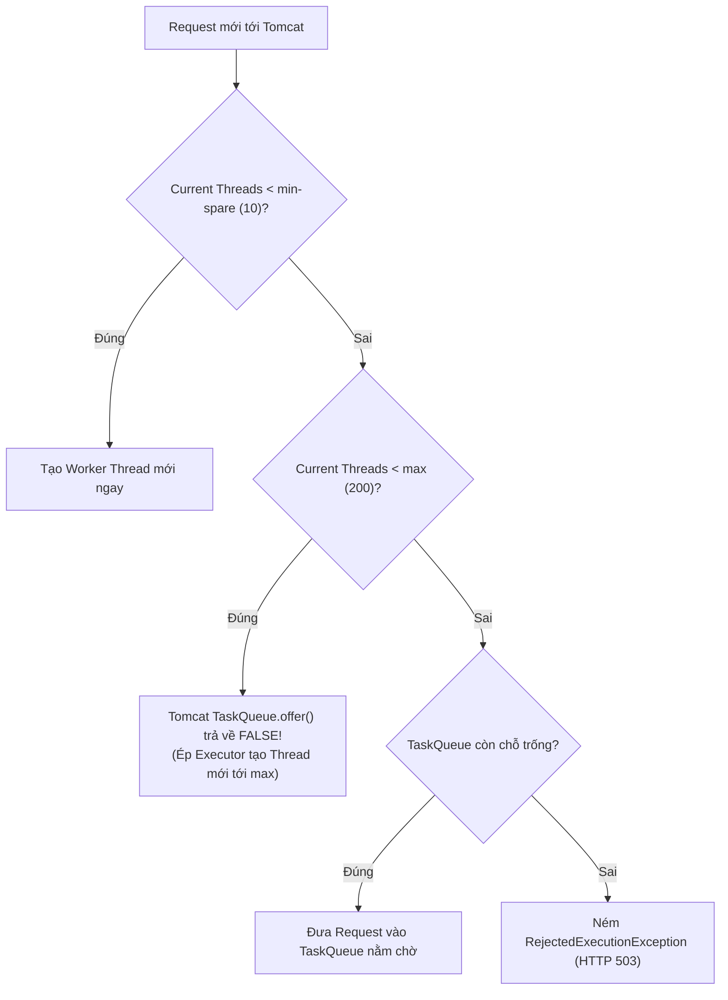
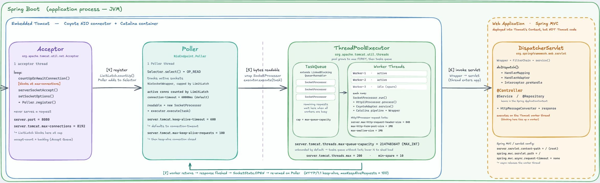

# 06 — Tomcat Thread Pool Internals: 8192 connections cùng gửi request thì chuyện gì xảy ra?

> **Chủ đề III — Capacity Planning & Pool Sizing**
> [Tài liệu 01](01-connection-request-flow.md)) dừng ở ranh giới "connection". Bây giờ đi nốt chặng còn lại: sau khi connection được chấp nhận, request được cấp thread ra sao? Tomcat đã **sửa lại logic chuẩn của `ThreadPoolExecutor`** như thế nào (mánh `offer()` "nói dối")? Và vì sao một hàng chờ mặc định **hai-tỉ-mốt phần tử** lại là dòng cấu hình nguy hiểm nhất trong `application.yml` của bạn?

---

### ⚡ TL;DR & Quick Takeaways (30 giây)
* **`ThreadPoolExecutor` Chuẩn:** Queue trước -> Thread sau. Nếu Queue chưa đầy thì KHÔNG tạo thêm thread vượt `corePoolSize`. (Tốt cho tác vụ Batch/Background).
* **Tomcat `TaskQueue.offer()` "Nói Dối":** Override để **Tạo Thread trước -> Queue sau**. Khi request đến vượt `min-spare` (10), Tomcat lừa Executor báo `offer() = false` để kích hoạt việc tạo thêm Worker Thread đến `max` (200).
* **Bẫy Queue Vô Hạn (`2,147,483,647`):** Hàng chờ mặc định quá lớn giấu đi tình trạng quá tải. Client chờ lâu bèn Cancel/Timeout, nhưng Tomcat vẫn âm thầm chạy request mộc rêu trong queue → Lãng phí CPU/Memory trầm trọng.
* **Bulkhead vs Rate Limiter:** Bulkhead chặn theo số lượng tác vụ *đang xử lý đồng thời (Concurrency)*. Rate Limiter (Bucket4j) chặn theo *số request trên đơn vị thời gian (Rate)*.





---

## 1. Nền: thread-per-request và vì sao phải có pool

M� hình truyền thống (chưa bật `spring.threads.virtual.enabled`, không reactive): **một request gắn chặt một thread** từ controller đến response — "người bồi bàn đi theo khách suốt bữa ăn".

1000 request có cần tạo 1000 thread mới? Không — vì thread đắt: mỗi platform thread ≈ 1MB stack **native memory** (off-heap), cộng chi phí cấp phát + lên lịch khi tạo/huỷ liên tục. Tạo-rồi-vứt mỗi request chẳng khác *"mỗi lần có khách lại tuyển nhân viên mới, phục vụ xong cho nghỉ việc"*. Thread pool giải ba việc: **tái sử dụng** (khấu hao chi phí), **giới hạn** (cái van chống hệ thống tự bơm thread đến sập), **hàng đợi** (chỗ chứa việc lúc cao điểm).

M��t service Spring Boot web có **ba pool sống song song, độc lập nhau**: Tomcat thread pool (request client), task pool cho `@Async`, scheduler pool cho `@Scheduled`. Nhầm pool khi chẩn đoán là đi lạc từ đầu — tài liệu này chỉ bàn nhân vật thứ nhất.

## 2. Tomcat Thread Pool = `ThreadPoolExecutor` + ba con số

```yaml
server:
  tomcat:
    threads:
      min-spare: 10                     # ≈ corePoolSize — số thread luôn giữ sẵn
      max: 200                          # ≈ maximumPoolSize — trần
      max-queue-capacity: 2147483647    # Integer.MAX_VALUE — dung lượng hàng chờ ở giữa
```

Ba con số **10 / 200 / hai-tỉ-mốt** là ba nhân vật của toàn bộ câu chuyện. Ghim con số cuối — lát nữa nó quay lại "cắn".

## 3. Mánh `TaskQueue.offer()` — chỗ phản trực giác nhất

### 3.1. Trước hết: `ThreadPoolExecutor` chuẩn hành xử thế nào

Logic mặc định của `java.util.concurrent.ThreadPoolExecutor` khi submit task:

```
1. poolSize < corePoolSize        → tạo thread mới chạy ngay
2. ngược lại                      → thử queue.offer(task) — VÀO QUEUE TRƯỚC
3. queue ĐẦY (offer trả false)    → tạo thread tới maximumPoolSize
4. đã max mà queue vẫn đầy        → RejectedExecutionHandler
```

Bước 2–3 là điểm chết với web server: `core=10, max=200, queue lớn` → mọi task sau thread thứ 10 đều **vào queue**, mà queue gần vô hạn thì **không bao giờ đầy** → bước 3 không bao giờ kích hoạt → pool **mãi mãi chạy 10 thread**, 190 thread "trên giấy" không bao giờ ra đời. Request chất đống trong queue trong khi server dùng 5% công suất pool — tài nguyên thừa thãi, khách chờ dài cổ. (Thiết kế này *hợp lý* cho batch/background — nơi người ta muốn dùng ít thread nhất có thể — nhưng *thảm hoạ* cho latency-sensitive.)

### 3.2. Tomcat đảo ngược thứ tự ưu tiên

Tomcat không xài queue thường. Nó dùng `org.apache.tomcat.util.threads.TaskQueue` (extends `LinkedBlockingQueue`) và **ghi đè `offer()`** — điểm mấu chốt: *executor chuẩn quyết định "tạo thread hay xếp hàng" hoàn toàn dựa vào giá trị trả về của `offer()`*, nên chỉ cần "nói dối" ở đây là bẻ được cả logic:

```java
// Rút gọn từ mã nguồn Tomcat — TaskQueue.offer()
@Override
public boolean offer(Runnable o) {
    if (parent == null) return super.offer(o);
    // (1) Pool đã chạm trần max → hết cách, nhận vào queue thật
    if (parent.getPoolSizeNoLock() == parent.getMaximumPoolSize()) return super.offer(o);
    // (2) Số task đang chờ xử lý <= số thread hiện có → có thread rảnh → vào queue cho nó nhặt
    if (parent.getSubmittedCount() <= parent.getPoolSizeNoLock()) return super.offer(o);
    // (3) MÁNH: chưa chạm trần → trả FALSE (giả vờ "queue đầy")
    //     → executor tưởng queue đầy → TẠO THREAD MỚI xử lý ngay thay vì xếp hàng
    if (parent.getPoolSizeNoLock() < parent.getMaximumPoolSize()) return false;
    return super.offer(o);
}
```

(`submittedCount` là counter Tomcat tự thêm — số task đã nộp nhưng chưa xong — vì executor chuẩn không phân biệt được "thread rảnh thật" với "thread sắp bận". Ngoài ra Tomcat còn override cả `execute()`: nếu vẫn bị reject, thử force vào queue một lần nữa trước khi bung lỗi.)

> **Tomcat: ưu tiên tạo thread tới max TRƯỚC → hết thread rồi mới xếp hàng.** Đảo ngược hoàn toàn executor chuẩn — và chính điều này khiến thread-per-request "hành xử đúng như ta mong đợi" thay vì mắc kẹt ở 10 thread.

## 4. Trả lời câu hỏi tựa đề: 8192 request ập vào cùng một khoảnh khắc

```
t=0     10 thread min-spare nhận 10 request đầu
t≈0+ε   cơ chế offer() trả false liên tục → executor đẻ 190 thread gần như tức thì
        → 200 thread chạy song song, 200 "ông khách" đầu có người phục vụ
còn lại 7992 request → TaskQueue, xếp hàng
```

Và đây là lúc con số **hai-tỉ-mốt** quay lại: queue nuốt 7992 request "ngon ơ", không tràn, không từ chối ai. Nghe có vẻ "an toàn" — **chính cảm giác an toàn đó mới là chỗ chết người.**

### 4.1. Vì sao "không ai bị reject" là triệu chứng xấu

> Một queue không giới hạn không khiến hệ thống khoẻ hơn; nó chỉ **biến một triệu chứng dễ thấy** (request bị từ chối ngay — đo được, alert được) **thành một triệu chứng khó thấy hơn nhiều** (request nằm im trong queue, latency âm thầm phình to).

Làm phép tính để thấy "âm thầm" nghĩa là gì. Bếp 200 đầu bếp, mỗi request 55ms → throughput ≈ 3636 req/s. Ông khách thứ 5000 đứng sau 4800 người:

```
thời gian chờ trong queue ≈ 4800 / 3636 ≈ 1.3s   (chưa tính 55ms xử lý)
ông khách thứ 7992: chờ ≈ 2.2s
nếu 8192 request ập vào MỖI GIÂY liên tục mà năng lực chỉ 3636/s
→ queue dài thêm ~4500 phần tử mỗi giây, KHÔNG BAO GIỜ co lại
→ latency tăng tuyến tính vô hạn: 5s, 30s, 5 phút...
→ client timeout ở giây thứ 5 (tài liệu 02), nhưng request VẪN NẰM TRONG QUEUE,
   đến lượt vẫn được "nấu" — cho một người đã bỏ đi. Công sức 100% vứt thùng rác,
   trong khi server "bận trung thực": log sạch, không exception, CPU thậm chí không cao.
```

Đây chính là chân dung đầy đủ của ca *"client gào, server im"* — hàng chờ vô tận **giấu nhẹm** sự quá tải.

### 4.2. Trong kiến trúc phân tán: từ chậm-một-chỗ thành sập-dây-chuyền

Không back-pressure, không fail-fast → service của bạn nhận **hết** mọi request, ôm trong queue, rồi timeout hàng loạt → service gọi đến bạn cũng cạn thread theo (vì đang ngồi chờ bạn) → lan tiếp lên trên. Một mắt xích chậm → **sự cố dây chuyền**. Cái van (mục 5) cắt được chuỗi lan này: server quá tải **fail nhanh**, client còn cơ hội retry/fail-over thay vì treo lơ lửng.

---

## 5. Đặt "cái van" — hai tầng, so sánh kỹ

### 5.1. Van tầng Tomcat: hữu hạn hoá queue

```yaml
server:
  tomcat:
    threads:
      max: 200
      max-queue-capacity: 100   # queue đầy → Tomcat log + ĐÓNG KẾT NỐI ngay
      # = 0: hễ 200 thread đều bận → connection mới bị đóng tức thì (không hàng chờ)
```

(Spring Boot giữ mặc định vô hạn **chỉ** để khớp hành vi Tomcat thuần — cho ai quen Tomcat khỏi bất ngờ khi chạy embedded — chứ không phải vì đó là lựa chọn tốt cho production.)

**Ưu:** không viết dòng code nào. **Nhược:** khi TaskQueue đầy và executor ném `RejectedExecutionException`, client nhận về **một cú đóng kết nối trần trụi** — không status code, không body. Với API mà caller cần phân biệt *"quá tải, lát thử lại"* với *"request của tôi sai"*, như vậy là quá thô: caller không biết nên retry hay bỏ.

### 5.2. Van tầng ứng dụng: chặn sớm hơn một bậc, từ chối "lịch sự"

Ý tưởng: giới hạn số request xử lý đồng thời ngay ở đầu filter chain; chạm ngưỡng thì chủ động trả **503 + `Retry-After`** — trước khi request kịp rơi xuống TaskQueue.

**Bản viết tay (để hiểu bản chất — cơ chế lõi chỉ là một Semaphore):**

```java
@Component
@Order(Ordered.HIGHEST_PRECEDENCE)
public class BackpressureFilter extends OncePerRequestFilter {

    private final Semaphore permits = new Semaphore(180);
    // 180 < threads.max=200: chừa 20 thread cho actuator/health — kẻo lúc quá tải
    // chính health-check cũng 503 → orchestrator restart pod đang gồng → tự bắn vào chân

    @Override
    protected void doFilterInternal(HttpServletRequest req, HttpServletResponse res,
                                    FilterChain chain) throws ServletException, IOException {
        if (!permits.tryAcquire()) {                    // KHÔNG chờ — fail fast
            res.setStatus(503);
            res.setHeader("Retry-After", "2");
            res.setContentType("application/json");
            res.getWriter().write("{\"error\":\"overloaded\",\"retryAfterSeconds\":2}");
            return;
        }
        try { chain.doFilter(req, res); }
        finally { permits.release(); }                  // BẮT BUỘC finally — kể cả khi controller ném exception
    }
}
```

**Bản production — Resilience4j Bulkhead.** Tự nuôi Semaphore dễ sai ở đống ca biên: chờ permit bao lâu, fairness, release chắc chắn, expose metric. `SemaphoreBulkhead` bên dưới cũng chính là bọc một Semaphore, nhưng gói sẵn tất cả + tích hợp Micrometer/Actuator:

```yaml
resilience4j:
  bulkhead:
    instances:
      httpApi:    { max-concurrent-calls: 180, max-wait-duration: 10ms }
      reportApi:  { max-concurrent-calls: 20,  max-wait-duration: 0 }
      # ↑ bulkhead RIÊNG cho endpoint nặng: 20 request export chậm không thể
      #   nuốt cả pool làm chết endpoint thanh toán — đúng nghĩa "vách ngăn" chống chìm tàu
```

```java
@Bulkhead(name = "reportApi")
@GetMapping("/reports/heavy") public Report heavy() { ... }

@RestControllerAdvice
class OverloadHandler {
    @ExceptionHandler(BulkheadFullException.class)
    ResponseEntity<ErrorBody> onFull() {
        return ResponseEntity.status(503).header("Retry-After", "2")
                             .body(new ErrorBody("overloaded"));
    }
}
```

### 5.3. So sánh & phối hợp

| | Van Tomcat (`max-queue-capacity`) | Van ứng dụng (Bulkhead/Filter) |
|---|---|---|
| Ai nói lời từ chối | Tomcat/executor | Code của bạn |
| Lời từ chối "đẹp" cỡ nào | Đóng kết nối trần trụi | 503 + Retry-After + body + log + metric |
| Độ mịn | Toàn server | Per-endpoint / per-client được |
| Chi phí | 1 dòng yml | Thêm dependency + config |

Không cách nào tuyệt đối hơn — tuỳ bạn cần "lời từ chối" trung thực và đẹp đến mức nào. Thực tế nên **phối cả hai**: Bulkhead làm van chính (từ chối lịch sự), `max-queue-capacity` hữu hạn (vd. 100) làm lưới an toàn cuối.

---

## 6. Gỡ nhầm lẫn kinh điển: Bulkhead (concurrency) ≠ Bucket4j (rate)

Nhiều người lôi Bucket4j vào giải bài toán này — nhìn xa na ná ("chặn bớt request") nhưng nằm trên **trục khác hẳn**:

| | **Bulkhead / Semaphore** | **Bucket4j** |
|---|---|---|
| Đại lượng kiểm soát | **Concurrency** — bao nhiêu việc *đang chạy song song* | **Rate** — bao nhiêu request *trên một đơn vị thời gian* |
| Thuật toán | Semaphore permits | Token bucket |
| Bài toán đúng | Bảo vệ thread pool / tài nguyên hữu hạn | Chống abuse API, quota per-key, phân hạng free/premium (đa instance cần Redis) |

**Vì sao chọn nhầm là chữa sai bệnh — ví dụ số:** một client gọi đều đặn **10 req/s** (rate rất hiền, mọi rate-limit đều cho qua), nhưng mỗi request giữ thread **5 giây** vì chờ database → theo Little's Law nó chiếm `10 × 5 = 50` thread **thường trực**. Bốn client như vậy = 200 thread = **cạn pool**, trong khi tổng rate chỉ 40 req/s "vô hại". Giới hạn theo rate không cứu được pool cạn vì *giữ thread lâu*; chỉ giới hạn theo **concurrency** mới cứu được.

> Quy tắc bỏ túi: bảo vệ thread pool, chặn theo số việc song song → **Bulkhead**. Đếm quota theo thời gian, chống lạm dụng → **Bucket4j**. Đừng dùng cái sau cho cái trước.

---

## 7. Quan sát & tinh chỉnh

```
tomcat_threads_busy_threads / tomcat_threads_current_threads   — độ bão hoà pool
tomcat_threads_config_max                                      — đối chiếu trần
resilience4j_bulkhead_available_concurrent_calls               — van còn bao nhiêu chỗ
http_server_requests_seconds{quantile="0.99"}                  — hậu quả cuối cùng
```

Ba mẫu hình đọc nhanh:

1. `busy` kịch trần + p99 phình + CPU thấp → thread kẹt I/O → dump và đếm đỉnh stack ([04](04-java-thread-lifecycle.md)) §6), thường dẫn tới DB/downstream ([08](08-database-connection-pool-sizing.md)).
2. `busy` kịch trần + CPU cao → thật sự thiếu công suất → xem lại pool size ([07](07-threadpool-sizing.md)) hoặc scale-out.
3. `busy` thấp mà latency vẫn cao → nghẽn **trước** pool (accept queue — [01](01-connection-request-flow.md))) hoặc **ngoài** service.

Đặt ngưỡng van bao nhiêu? Quá nhỏ → hơi tải đã từ chối oan; quá lớn → quay về bệnh giấu quá tải. Con số phụ thuộc CPU-bound/I/O-bound và thời gian request trôi đi đâu — đúng các câu hỏi định lượng của [tài liệu 07](07-threadpool-sizing.md). Không có số thần kỳ, chỉ có hiểu biết về chính hệ thống mình vận hành.

---

## 8. Tổng kết

1. Executor chuẩn: **queue trước, thread sau** (hợp batch). Tomcat override `offer()` "nói dối" để **thread trước, queue sau** (hợp web). Một method override bẻ cả triết lý pool — và cho thấy giá trị của việc đọc mã nguồn tầng dưới.
2. 8192 request ập vào: **200 được phục vụ, 7992 vào hàng chờ gần-vô-tận** — và chính sự "vô tận hào phóng" đó âm thầm giết latency: queue chỉ ổn khi *tạm thời* vượt tải; vượt tải *kéo dài* thì queue vô hạn = latency vô hạn + công sức nấu cho khách đã bỏ đi.
3. Mọi cái van chỉ là cách **trả lời tử tế khi đã quá tải** — không phải phép màu làm bếp nhanh hơn. Nhưng thiếu van thì một service chậm kéo sập cả chuỗi.
4. Bulkhead đo **concurrency**, Bucket4j đo **rate** — hai đại lượng vật lý khác nhau; ví dụ 10 req/s × 5s = 50 thread là bài kiểm tra hiểu bài.
5. Một dòng config chẳng ai đụng tới (`max-queue-capacity`) quyết định hệ thống *"treo trong êm đềm"* hay *"ngã một cách trung thực"* — và ngã trung thực, trong hệ phân tán, là một đức tính.

## 9. Tự kiểm chứng & Câu hỏi phỏng vấn (Self-Assessment)

1. **Câu hỏi:** Tại sao Tomcat lại override phương thức `TaskQueue.offer()` của `ThreadPoolExecutor` chuẩn trong JDK?
   * *Gợi ý trả lời:* `ThreadPoolExecutor` chuẩn đẩy task vào Queue trước rồi mới tạo thread tới `maximumPoolSize`. Với Web Server, điều này làm request mới phải xếp hàng rảnh rỗi trong khi Thread Pool chưa tăng lên max. Tomcat override `offer()` để ép Executor ưu tiên tạo Thread mới tới `maxThreads` trước, khi không thể tạo thêm thread nữa mới đưa vào Queue.
2. **Câu hỏi:** Tại sao giá trị dung lượng TaskQueue mặc định (`Integer.MAX_VALUE` ≈ 2.14 tỷ) lại bị coi là "dòng cấu hình nguy hiểm nhất"?
   * *Gợi ý trả lời:* Vì nó tạo ra hàng chờ vô hạn. Khi bị quá tải kéo dài, request bị ngâm trong queue vài chục giây. Khách hàng hoặc Load Balancer đã timeout/cancel từ lâu, nhưng Tomcat vẫn xử lý các request rác này khi đến lượt, gây lãng phí tài nguyên và Latency tăng phi mã.
3. **Câu hỏi:** Phân biệt bài toán sử dụng giữa Pattern Bulkhead (Resilience4j) và Rate Limiter (Bucket4j).
   * *Gợi ý trả lời:* Bulkhead kiểm soát **Concurrency** (số tác vụ đang xử lý song song tại một thời điểm, ví dụ tối đa 50 thread đồng thời). Rate Limiter kiểm soát **Rate** (số request nhận được trong một đơn vị thời gian, ví dụ 100 req/sec). Cả hai bảo vệ hệ thống ở hai góc độ khác nhau.

---

**Tài liệu liên quan:** [01 — Connection flow](01-connection-request-flow.md)) · [02 — Read timed out từ phía client](02-timeouts-and-exceptions.md)) · [07 — Sizing pool](07-threadpool-sizing.md)

