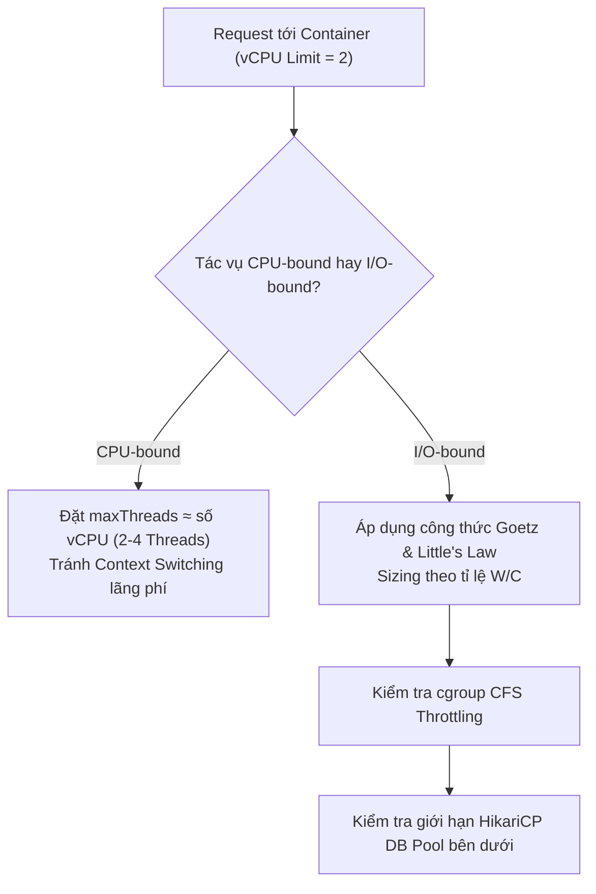

# 07 — Tomcat Thread Pool: pool size bao nhiêu là đủ?

> **Chủ đề III — Capacity Planning & Pool Sizing**
> Câu hỏi thật từ team: *"Sao không tăng quách `threads.max` lên 10000 luôn cho nó xử lý được nhiều, khỏi lo queue với van?"* — Tài liệu này trả lời tới nơi tới chốn: xây khung tính toán (Brian Goetz + Little's Law), rồi đưa nó vào thế giới thật — nơi service không chạy trên laptop mà nằm trong một container bị bóp còn 1–2 vCPU bởi cgroup, sau lưng là Hikari pool, trên đầu là cái van `concurrency` của nền tảng.

---

### ⚡ TL;DR & Quick Takeaways (30 giây)
* **Tăng Thread Quá Mức = Độc Dược:** 10,000 Threads tốn ~10GB Native Memory (Off-heap stack) gây OOM-Killed bí ẩn. Đồng thời gây đập vỡ CPU Cache liên tục do Context Switch quá nhiều.
* **Công thức Brian Goetz:** $\text{Pool Size} = \text{Cores} \times \text{Target CPU Utilization} \times (1 + \frac{W}{C})$. Với $W$ là thời gian chờ I/O, $C$ là thời gian tính CPU.
* **Định luật Little:** $\text{Capacity (Concurrency)} = \text{RPS} \times \text{Latency (s)}$. Giúp quy đổi từ RPS mong muốn ra số Thread cần thiết per instance.
* **Cạm bẫy Container (CFS Throttling):** Đặt `cpu_quota` trong Kubernetes làm container bị OS "bóp cổ" tạm dừng giữa chừng ngay cả khi CPU chưa báo 100%.




---

## 1. Phá trực giác "nhiều thread = xử lý được nhiều" — bằng số

Thread không miễn phí, và cái giá tính được:

**Bộ nhớ.** `threads.max=10000` → riêng stack ≈ 10000 × 1MB = **~10GB native memory (off-heap)**. Container limit 4GB: `RSS = heap + metaspace + thread stacks + direct buffers` → chạm trần → **OOM-kill** — và vì stack là off-heap, bạn sẽ không thấy gì bất thường trong heap dump; pod cứ thế "biến mất".

**CPU.** 10000 thread tranh 2 core: mỗi lần OS đổi thread trên core là một **context switch** (lưu/khôi phục thanh ghi, đổi bảng trang) — vài micro-giây mỗi lần, nhân với hàng chục nghìn lần/giây thành phần trăm CPU đáng kể; tệ hơn là **CPU cache bị đập vỡ liên tục** (thread mới lên core thấy cache đầy dữ liệu của thread cũ). GC phải quét stack của *mọi* thread khi safepoint → pause dài ra. Kết quả: **p99 dựng đứng thay vì giảm**.

```bash
# Tự chứng kiến context switch quá đà
pidstat -w -p <PID> 1        # cột cswch/s + nvcswch/s
vmstat 1                     # cột cs của cả hệ thống
# nvcswch/s (involuntary — bị GẠT khỏi CPU khi chưa xong lượt) cao bất thường
# = quá nhiều thread tranh quá ít core
```

> Thêm thread quá tay không làm hệ thống khoẻ hơn — nó làm hệ thống **ốm đi một cách âm thầm**.

---

## 2. Khung tính toán

Pool size là hàm của **hai biến**: (a) bản chất workload — CPU-bound hay I/O-bound, (b) tài nguyên mà runtime *thực sự nhìn thấy*. Bỏ qua một trong hai là đoán mò.

### 2.1. Công thức Brian Goetz (*Java Concurrency in Practice*)

```
số thread = số core khả dụng × (1 + W/C)
           W = thời gian chờ (wait), C = thời gian tính toán (compute)
           W/C = blocking coefficient
```

**Trực giác đằng sau công thức** (quan trọng hơn bản thân công thức): mục tiêu là **CPU luôn có việc**. Một thread chỉ dùng CPU trong `C/(W+C)` phần thời gian sống của nó. Muốn 1 core luôn bận, cần `(W+C)/C = 1 + W/C` thread thay phiên nhau — thread này chờ thì thread kia tính. Nhân với số core là xong.

- **CPU-bound** (mã hoá, nén ảnh, thuật toán nặng): W≈0 → **số thread ≈ số core**. 4 core thì một khoảnh khắc chỉ chạy song song đúng 4 phép tính; *"thêm thread như tuyển thêm tài xế cho một chiếc xe — chỉ chật xe chứ xe không đi nhanh hơn."*
- **I/O-bound** (đa số service nghiệp vụ: vài cú DB call + downstream mỗi request): W/C lớn → thêm thread mới có lý.

### 2.2. Thêm biến thực dụng: target CPU utilization

Không ai muốn CPU chạy 100% — phải chừa chỗ thở cho GC, task nền, traffic gợn sóng, và chừa "độ dốc" để autoscaler kịp phản ứng. Thường nhắm **0.8**:

```
số thread = số core × U_target × (1 + W/C)
```

**Ví dụ xuyên suốt của cả bộ tài liệu:** service I/O-bound, **2 core**, mỗi request **55ms = 5ms compute + 50ms wait**:

```
2 × (1 + 50/5)        = 22 thread
2 × 0.8 × (1 + 50/5)  ≈ 17–18 thread     → chọn threads.max = 18
```

**Mười tám.** Không phải 200 mặc định, càng không phải 10000. Nhưng 18 chỉ là **điểm xuất phát có cơ sở**, không phải con số chốt — vì "50ms chờ" là ước lượng: latency DB lúc cao điểm khác lúc rảnh, có request gọi 2 downstream, có request gọi 5. Đúng tinh thần *đo, đừng đoán*: đặt 18 → bắn tải thật → nhìn p95–p99 + CPU → tinh chỉnh (ra 25 hay 15 đều được — nhưng đi từ chỗ có lý do, không phải vặn đại).

### 2.3. Little's Law — từ pool size suy ra capacity

```
L = λ × W      (L: số request đang trong hệ; λ: RPS; W: latency)
```

Lật ngược với 18 worker, latency 0.055s:

```
λ_max = L / W = 18 / 0.055 ≈ 327 RPS / instance
```

Hai công thức bổ trợ nhau rất đẹp: Goetz cho **pool size**, Little cho **pool đó nuốt được bao nhiêu tải** → suy tiếp số instance cho RPS mục tiêu (1600 RPS ÷ 327 ≈ 5 instance — con số này được [tài liệu 08](08-database-connection-pool-sizing.md) dùng làm đầu vào cho cả chuỗi tính DB). Ngoài ra Little's Law còn là **công cụ kiểm tra chéo**: đo được λ và W thực tế → tính L → so với pool đã đặt; lệch xa nghĩa là giả định sai ở đâu đó.

```yaml
server:
  tomcat:
    threads: { max: 18, min-spare: 18 }   # pool "phẳng" — khỏi tốn độ trễ tạo thread lúc cao điểm
```

### 2.4. Quy trình đo W/C thay vì đoán

```
1) Micrometer: http_server_requests p50 → tổng thời gian request (W+C)
2) Thời gian I/O: hikaricp.connections.usage (thời gian giữ connection/lần)
   + timer quanh HTTP client call — cộng lại ≈ W
3) C ≈ tổng − W   (kiểm chứng chéo bằng async-profiler chế độ cpu vs wall — tài liệu 04 §6.3)
4) Áp công thức → load test (Gatling/k6, tải tăng dần TỚI QUÁ ngưỡng dự kiến)
   → điểm gãy: throughput đi ngang mà p99 bắt đầu dựng = năng lực thật của cấu hình
```

---

## 3. Đếm core trong thế giới container — biến số hay bị quên nhất

M��i công thức trên có biến "số core khả dụng" — và trong container, biến này oái oăm hơn ta tưởng.

### 3.1. CPU limit không "giấu core" — nó bóp thời gian

`resources.limits.cpu: "1"` trên K8s được Linux enforce bằng **CFS quota của cgroup**: process vẫn *nhìn thấy* đủ 64 core của node, nhưng tổng thời gian CPU được dùng bị giới hạn (vd. 100ms mỗi chu kỳ 100ms). Dùng quá → **throttled**: mọi thread bị đóng băng đến chu kỳ sau — hiện nguyên hình trên metric `container_cpu_cfs_throttled_periods_total`, và là thủ phạm của những cú "khựng" p99 tính bằng trăm ms.

### 3.2. JVM đời cũ "mù cgroup" — hậu quả dây chuyền

JVM trước **8u191** không biết cgroup → `availableProcessors()` đọc số core **vật lý của node**. Deploy lên node 64 core, limit 1 CPU → JVM đinh ninh có 64 core, và mọi thứ tự suy theo con số đó phình theo:

```
availableProcessors() = 64 (sai)
→ ForkJoinPool.commonPool: 63 worker (parallel streams, CompletableFuture mặc định)
→ GC threads: tính theo 64
→ framework/pool tự suy theo availableProcessors() cũng phình theo
… trong khi thực tế chỉ được dùng sức của MỘT core
→ triệu chứng: GC liên tục, p99 dựng đứng, CPU throttling đỏ lòm — mà config "có gì sai đâu"
```

Từ **Java 10** (backport 8u191), JVM **container-aware** mặc định: đọc cgroup limit, `availableProcessors()` trả về số làm tròn lên từ CPU limit.

```java
System.out.println(Runtime.getRuntime().availableProcessors());  // in ra từ TRONG container
```
```bash
java -Xlog:os+container=info -version     # xem JVM đọc cgroup (v1/v2) thế nào
# Ghi đè khi cần thí nghiệm: -XX:ActiveProcessorCount=2
```

> Khuyến nghị: chạy **Java 25** cho mới, không được thì **21 hoặc 17** cho lành — và đặt CPU limit **có chủ đích**, vì giờ đây limit đó không chỉ giới hạn CPU: nó **âm thầm quyết định kích thước hàng loạt pool bên trong JVM** (kể cả số carrier của virtual threads — [tài liệu 05](05-virtual-threads.md)) §3.3).

### 3.3. Cloud Run `concurrency` — bài học "hai cái van phải khớp nhau"

Docker, K8s Pod, ECS task, Cloud Run — về mặt đếm core là một mạch tư duy: cấp N vCPU, JVM thấy N, tính pool theo N. Riêng Cloud Run đưa thêm **một cái van ở tầng nền tảng**: `concurrency` (max concurrent requests per instance; mặc định 80, tối đa 1000) — đếm **request song song**, tức *người anh em cùng họ với `threads.max`*, không phải với `max-connections`.

**Chỗ chết người:** bạn có **HAI** van cùng kiểm soát số request song song trong một instance — lệch nhau thì cái nhỏ thành nút thắt, cái lớn thành vô dụng, thậm chí có hại:

```
Cấu hình lệch:  concurrency=80 (mặc định), threads.max=18
→ nền tảng thản nhiên tống 80 request vào một instance có 18 chỗ ngồi
→ 62 request dồn vào TaskQueue — cái bẫy "hàng chờ vô tận giấu quá tải"
  (tài liệu 06) TÁI SINH ngay trên Cloud Run, autoscaler không thấy gì để scale

Cấu hình khớp:  concurrency ≈ 18
→ instance ôm đủ 18 request → Cloud Run tự định tuyến request mới sang instance khác
  hoặc BUNG THÊM instance → concurrency biến thành một lớp BACK-PRESSURE MIỄN PHÍ
  ở tầng nền tảng — không request nào phải đợi ở TaskQueue
```

```bash
gcloud run deploy my-service --cpu=2 --concurrency=18 --image=...
```

Trên K8s, vai trò tương đương là **HPA**: không có van per-request, nên tín hiệu scale phải chọn đúng — CPU utilization chỉ hợp CPU-bound; service I/O-bound nghẽn thread mà CPU nhàn thì HPA theo CPU **không bao giờ scale** → dùng custom metric (`tomcat_threads_busy`, p99, RPS/instance từ mục 2.3).

### 3.4. Chuỗi sizing phải nhất quán — mắt xích hẹp nhất quyết định tất cả

```
concurrency (nền tảng)  →  threads.max (Tomcat)  →  hikari.maximum-pool-size (DB)
        18                        18                        ~17
```

Lỗi kinh điển: `threads.max=200` nhưng Hikari mặc định **10** → 190 thread đứng tranh nhau 10 connection — *"mời 200 đầu bếp vào cái bếp chỉ có 10 bếp lò."* **Throughput thật = mắt xích hẹp nhất**; nới mắt nào khác chỉ chuyển chỗ xếp hàng. Đây là lúc hiểu biết "vặt vãnh" về từng con số trả tiền: nhìn ra **cả sợi dây chuyền** thay vì vặn đại một mắt ([tài liệu 08](08-database-connection-pool-sizing.md) đi tiếp xuống DB).

---

## 4. Hai kiểu nghẽn — cùng triệu chứng, khác hẳn nguyên nhân

Phân biệt rạch ròi với cái bẫy ở [tài liệu 06](06-tomcat-threadpool-taskqueue.md), vì client nhìn vào **giống hệt nhau**:

| | Queue vô hạn (bài 06) | `threads.max` quá cao (bài này) |
|---|---|---|
| Request đang ở đâu | Trong TaskQueue — **chưa có thread**, chưa "vào bếp" | **Đã có thread**, đang chạy — đã "vào bếp" |
| Nghẽn tại | Hàng chờ trước khi được cấp thread | **CPU**: quá đông thread giành ít core, mỗi thread nhúc nhích rồi bị OS gạt ra chờ lượt |
| Ẩn dụ | Order chất núi ngoài bếp | Đầu bếp đông nghẹt, bếp lò chỉ 2 cái — ai cũng chen, chẳng ai nấu xong món ra hồn |
| Dấu vết đo được | `busy` kịch trần, CPU **thấp**, queue sâu | CPU **kịch trần/throttled**, context switch cao (`pidstat -w`) |
| Client thấy | `Read timed out` | `Read timed out` (y hệt!) |
| Thuốc | Đặt van (06) + tìm chỗ block | **Giảm** thread về công thức, tối ưu code, hoặc thêm core |

Không đo thì hai bệnh này không phân biệt được — và thuốc của bệnh này là độc dược của bệnh kia (bệnh phải *giảm* thread mà lại *tăng*).

---

## 5. Virtual threads thay đổi gì trong bài toán sizing?

Với I/O-bound: bật `spring.threads.virtual.enabled=true` → JDK tự unmount khi chờ I/O → cái trần "số thread = số chỗ ngồi" gần như biến mất — **khỏi căng não tính 18 hay 200 cho worker**. Nhưng ba điều không đổi:

1. Chỉ cứu I/O-bound; CPU-bound không nhanh thêm mili-giây nào.
2. **Số carrier vẫn ≈ số core container cấp** — vòng lại đúng câu chuyện đếm core ở mục 3.
3. Bài toán sizing **không biến mất, nó dời xuống connection pool** — nơi giới hạn concurrency thật sự bây giờ nằm ([tài liệu 08](08-database-connection-pool-sizing.md) §8).

---

## 6. Kết luận

> **Pool size đủ = pool vừa đủ để bão hoà lượng tài nguyên mà runtime thật sự nhìn thấy, ứng với bản chất workload — không hơn.**

Checklist sizing hoàn chỉnh:

1. Workload CPU-bound hay I/O-bound? **Đo** W/C (mục 2.4), đừng đoán.
2. Runtime đứng trong "cái hộp" nào? Hộp cho thấy bao nhiêu CPU thật (`availableProcessors()` từ trong container)? Java đủ mới để container-aware chưa?
3. Áp `core × U × (1 + W/C)` → điểm xuất phát; Little's Law → capacity/instance → số instance.
4. Tài nguyên **sau lưng** pool (Hikari...) có khớp không? Van **tầng trên** (Cloud Run concurrency / HPA metric) có khớp không?
5. Load test tới quá ngưỡng → tìm điểm gãy → chốt số bằng dữ liệu; alert trên `busy threads`, p99, throttling.

`threads.max` thoạt nhìn là một con số kỹ thuật vặt vãnh, nhưng nó là nơi **ba thế giới gặp nhau** — JVM, hệ điều hành (cgroup/CFS), và lớp orchestration bên trên. Học cách điền số vào `application.yml` thì nhanh; hiểu **vì sao con số đó phụ thuộc vào cái hộp bạn đang chạy bên trong** — đó mới là thứ theo bạn cả sự nghiệp.

## 7. Tự kiểm chứng & Bài toán thực hành (Self-Assessment)

1. **Bài toán 1:** Một ứng dụng REST API chạy trong Container cấp 4 vCPU. Mỗi request mất 100ms thời gian xử lý, trong đó có 10ms là xử lý tính toán CPU và 90ms là chờ phản hồi từ DB/Redis. Mục tiêu CPU Utilization mong muốn là 80%. Tính số `threads.max` tối ưu theo công thức Brian Goetz.
   * *Gợi ý đáp án:* Tỉ lệ $W/C = 90ms / 10ms = 9$. Áp dụng công thức: $\text{Threads} = 4 \times 0.8 \times (1 + 9) = 3.2 \times 10 = 32$ Threads.
2. **Bài toán 2:** Hệ thống của bạn cần gánh peak-traffic là 2000 RPS. Latency trung bình của mỗi request là 50ms (0.05s). Áp dụng Định luật Little, bạn cần tổng Concurrency capacity của toàn hệ thống là bao nhiêu? Nếu mỗi instance đặt `threads.max = 50`, bạn cần tối thiểu bao nhiêu instance?
   * *Gợi ý đáp án:* Tổng Concurrency capacity $L = 2000 \times 0.05 = 100$ concurrent requests. Số instance tối thiểu cần = $100 / 50 = 2$ instances.
3. **Câu hỏi:** Tại sao đặt `cpu_quota` (CPU limit) trong Kubernetes cho Java Container có thể gây ra hiện tượng CFS Throttling làm sụt giảm P99 Latency nghiêm trọng dù CPU Usage hiển thị chưa đến 50%?
   * *Gợi ý trả lời:* Vì Linux CFS Quotas phân bổ thời gian CPU theo các khung 100ms (periods). Nếu ứng dụng tiêu thụ hết sạch quota cho phép trong 20ms đầu tiên của chu kỳ, Linux Kernel sẽ đóng băng (throttle) toàn bộ container trong 80ms còn lại cho đến chu kỳ tiếp theo.

---

**Tài liệu liên quan:** [06 — TaskQueue & van](06-tomcat-threadpool-taskqueue.md) · [08 — Chuỗi tính xuống DB](08-database-connection-pool-sizing.md) · [05 — Virtual threads & carrier](05-virtual-threads.md))

